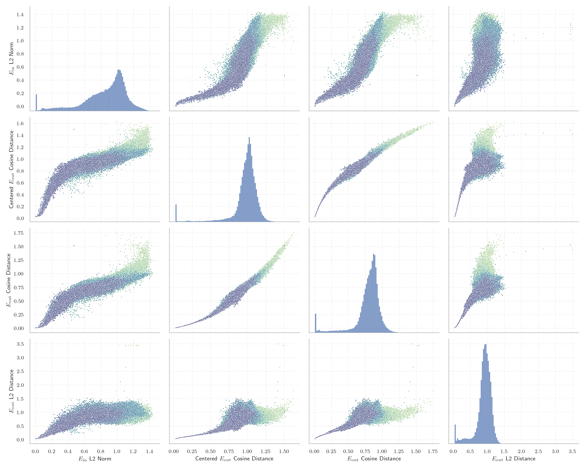
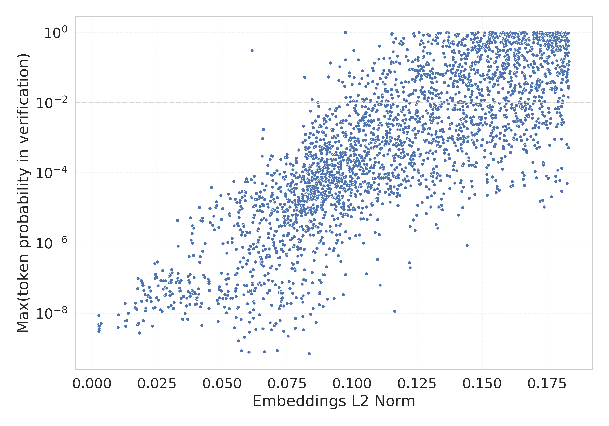

# Report for `Qwen/Qwen1.5-72B-Chat`

## Model info

* Tied embeddings: no
* LM head uses bias: no
* Indicator for under-trained tokens: E_{in} L2 Norm
  * Overall distribution 0.852 +/- 0.269
  * Token used for verification prompt building: `abcdefghijklmnopqrstuvwxyz`
  * Verification threshold: 0.184
  * Threshold for showing candidate under-trained tokens: 0.112
  * Median verified threshold (for bytes, unreachable and special tokens): 0.095
* Embeddings shape: (152064, 8192)
* Vocabulary size: 151646
  * Number of single byte tokens: 256, of which 14 below indicator threshold
  * Number of special tokens: 6, of which 3 below indicator threshold
  * Number of non-single-byte unreachable tokens: 1906, of which 1905 below indicator threshold
  * Number of non-single-byte UTF-fragment tokens: 1320, 90 below soft indicator threshold
  * Number of tested under-trained tokens: 2966, 2966 non-special, 2047 below p = 0.01 threshold, 1438 below soft indicator threshold

## Under-trained token indicators plot


## Verification plot


## Under-trained token verification results
1438 entries below threshold of 0.112

|   token_id | token                             |   indicator | max_prob                                                         | in_other_tokens                                                                                                                                            |
|------------|-----------------------------------|-------------|------------------------------------------------------------------|------------------------------------------------------------------------------------------------------------------------------------------------------------|
|      79269 | ````` ▁ForCanBeConverted `````    |  0.00264937 | <span style='border: 1px solid rgb(169, 68, 66);'>3.3e-09</span> | <span style='border: 1px solid rgb(169, 68, 66);'>````` ▁ForCanBeConvertedToF `````</span>, ````` ▁ForCanBeConvertedToForeach `````                        |
|     143335 | ````` ספטמ `````                  |  0.00267667 | <span style='border: 1px solid rgb(169, 68, 66);'>4.7e-09</span> | <span style='border: 1px solid rgb(169, 68, 66);'>````` ספטמבר `````</span>                                                                                |
|      79270 | ````` ▁ForCanBeConvertedToF ````` |  0.00267883 | <span style='border: 1px solid rgb(169, 68, 66);'>3.4e-09</span> | ````` ▁ForCanBeConvertedToForeach `````                                                                                                                    |
|      83971 | ````` $PostalCodesNL `````        |  0.00268226 | <span style='border: 1px solid rgb(169, 68, 66);'>8.8e-09</span> |                                                                                                                                                            |
|      83969 | ````` PostalCodesNL `````         |  0.00268243 | <span style='border: 1px solid rgb(169, 68, 66);'>3.1e-09</span> | <span style='border: 1px solid rgb(169, 68, 66);'>````` $PostalCodesNL `````</span>                                                                        |
|     136954 | ````` טלוו `````                  |  0.00268781 | <span style='border: 1px solid rgb(169, 68, 66);'>4.9e-09</span> | <span style='border: 1px solid rgb(169, 68, 66);'>````` טלוויז `````</span>, <span style='border: 1px solid rgb(251, 189, 8);'>````` טלוויזיה `````</span> |
|      97000 | ````` (stypy `````                |  0.00269005 | <span style='border: 1px solid rgb(169, 68, 66);'>4.3e-09</span> |                                                                                                                                                            |
|     142386 | ````` ▁zwłaszc `````              |  0.00270068 | <span style='border: 1px solid rgb(169, 68, 66);'>3.4e-09</span> | ````` ▁zwłaszcza `````                                                                                                                                     |
|      78783 | ````` \tTokenNameIdentifier ````` |  0.00270131 | <span style='border: 1px solid rgb(169, 68, 66);'>4.1e-09</span> |                                                                                                                                                            |
|      88372 | ````` useRalative `````           |  0.00270506 | <span style='border: 1px solid rgb(169, 68, 66);'>3.8e-09</span> | <span style='border: 1px solid rgb(169, 68, 66);'>````` useRalativeImagePath `````</span>                                                                  |
|     142142 | ````` אוניב `````                 |  0.00271634 | <span style='border: 1px solid rgb(169, 68, 66);'>3.2e-09</span> | <span style='border: 1px solid rgb(40, 167, 69);'>````` אוניברס `````</span>, ````` אוניברסיטת `````                                                       |
|     142494 | ````` ניוזל `````                 |  0.00292889 | <span style='border: 1px solid rgb(169, 68, 66);'>4.3e-09</span> | <span style='border: 1px solid rgb(255, 145, 0);'>````` ניוזלטר `````</span>                                                                               |
|     139487 | ````` אוטוב `````                 |  0.00352734 | <span style='border: 1px solid rgb(169, 68, 66);'>5.2e-09</span> | <span style='border: 1px solid rgb(255, 145, 0);'>````` אוטובוס `````</span>                                                                               |
|     143595 | ````` ▁najczęście `````           |  0.00999368 | <span style='border: 1px solid rgb(169, 68, 66);'>3.9e-09</span> | ````` ▁najczęściej `````                                                                                                                                   |
|      80159 | ````` artisanlib `````            |  0.0100819  | <span style='border: 1px solid rgb(169, 68, 66);'>9e-09</span>   |                                                                                                                                                            |
|     122556 | ````` 𬳽 `````                    |  0.0127126  | <span style='border: 1px solid rgb(169, 68, 66);'>1.9e-08</span> |                                                                                                                                                            |
|      71640 | ````` ▁typingsJapgolly `````      |  0.012913   | <span style='border: 1px solid rgb(169, 68, 66);'>6.1e-09</span> |                                                                                                                                                            |
|     123642 | ````` 𬶠 `````                    |  0.0129232  | <span style='border: 1px solid rgb(169, 68, 66);'>4.3e-09</span> |                                                                                                                                                            |
|      57408 | ````` :-------------</ `````      |  0.0133592  | <span style='border: 1px solid rgb(169, 68, 66);'>6.2e-09</span> |                                                                                                                                                            |
|     123550 | ````` 𬭬 `````                    |  0.0139388  | <span style='border: 1px solid rgb(169, 68, 66);'>1e-08</span>   |                                                                                                                                                            |
<details><summary>1418 additional entries below threshold</summary>

|   token_id | token                            |   indicator | max_prob                                                         | in_other_tokens                                                                                                                                                                                                                                                                                                                                                                                                                  |
|------------|----------------------------------|-------------|------------------------------------------------------------------|----------------------------------------------------------------------------------------------------------------------------------------------------------------------------------------------------------------------------------------------------------------------------------------------------------------------------------------------------------------------------------------------------------------------------------|
|     122648 | ````` 𬬿 `````                   |   0.0166315 | <span style='border: 1px solid rgb(169, 68, 66);'>1.5e-08</span> |                                                                                                                                                                                                                                                                                                                                                                                                                                  |
|     122986 | ````` 𬷕 `````                   |   0.0168055 | <span style='border: 1px solid rgb(169, 68, 66);'>1.9e-08</span> |                                                                                                                                                                                                                                                                                                                                                                                                                                  |
|     142385 | ````` ▁zwłas `````               |   0.0172007 | <span style='border: 1px solid rgb(169, 68, 66);'>1.3e-08</span> | <span style='border: 1px solid rgb(169, 68, 66);'>````` ▁zwłaszc `````</span>, ````` ▁zwłaszcza `````                                                                                                                                                                                                                                                                                                                            |
|     122379 | ````` 𬳵 `````                   |   0.0174196 | <span style='border: 1px solid rgb(169, 68, 66);'>4.7e-09</span> |                                                                                                                                                                                                                                                                                                                                                                                                                                  |
|     122252 | ````` 𬣡 `````                   |   0.017569  | <span style='border: 1px solid rgb(169, 68, 66);'>5e-08</span>   |                                                                                                                                                                                                                                                                                                                                                                                                                                  |
|     122362 | ````` 𬣳 `````                   |   0.0177241 | <span style='border: 1px solid rgb(169, 68, 66);'>9.7e-08</span> |                                                                                                                                                                                                                                                                                                                                                                                                                                  |
|      88371 | ````` useRal `````               |   0.0179332 | <span style='border: 1px solid rgb(169, 68, 66);'>5.2e-09</span> | <span style='border: 1px solid rgb(169, 68, 66);'>````` useRalative `````</span>, <span style='border: 1px solid rgb(169, 68, 66);'>````` useRalativeImagePath `````</span>                                                                                                                                                                                                                                                      |
|     122882 | ````` 𬇹 `````                   |   0.0182895 | <span style='border: 1px solid rgb(169, 68, 66);'>2.7e-09</span> |                                                                                                                                                                                                                                                                                                                                                                                                                                  |
|     122578 | ````` 𫭼 `````                   |   0.0189348 | <span style='border: 1px solid rgb(169, 68, 66);'>8.6e-08</span> |                                                                                                                                                                                                                                                                                                                                                                                                                                  |
|     143191 | ````` אוגוס `````                |   0.0190186 | <span style='border: 1px solid rgb(169, 68, 66);'>2.2e-08</span> | ````` אוגוסט `````                                                                                                                                                                                                                                                                                                                                                                                                               |
|     128200 | ````` przedsięb `````            |   0.0193339 | <span style='border: 1px solid rgb(169, 68, 66);'>7.1e-08</span> | <span style='border: 1px solid rgb(169, 68, 66);'>````` przedsiębior `````</span>, <span style='border: 1px solid rgb(255, 145, 0);'>````` przedsiębiorst `````</span>, <span style='border: 1px solid rgb(255, 145, 0);'>````` przedsiębiorstw `````</span>, <span style='border: 1px solid rgb(169, 68, 66);'>````` przedsiębiorc `````</span>                                                                                 |
|      69216 | ````` erusform `````             |   0.0196333 | <span style='border: 1px solid rgb(169, 68, 66);'>6.2e-08</span> | ````` numerusform `````                                                                                                                                                                                                                                                                                                                                                                                                          |
|     123000 | ````` 𬹼 `````                   |   0.0196708 | <span style='border: 1px solid rgb(169, 68, 66);'>6.1e-09</span> |                                                                                                                                                                                                                                                                                                                                                                                                                                  |
|     123330 | ````` 𬒗 `````                   |   0.0198941 | <span style='border: 1px solid rgb(169, 68, 66);'>4.5e-08</span> |                                                                                                                                                                                                                                                                                                                                                                                                                                  |
|     122889 | ````` 𬍡 `````                   |   0.0204059 | <span style='border: 1px solid rgb(169, 68, 66);'>3.5e-08</span> |                                                                                                                                                                                                                                                                                                                                                                                                                                  |
|     141591 | ````` تلفزي `````                |   0.0205105 | <span style='border: 1px solid rgb(169, 68, 66);'>1.2e-08</span> | ````` تلفزيون `````                                                                                                                                                                                                                                                                                                                                                                                                              |
|     123637 | ````` 𬸪 `````                   |   0.0206677 | <span style='border: 1px solid rgb(169, 68, 66);'>1.4e-08</span> |                                                                                                                                                                                                                                                                                                                                                                                                                                  |
|      69684 | ````` Japgolly `````             |   0.0210704 | <span style='border: 1px solid rgb(169, 68, 66);'>2.3e-08</span> | <span style='border: 1px solid rgb(169, 68, 66);'>````` ▁typingsJapgolly `````</span>                                                                                                                                                                                                                                                                                                                                            |
|     123594 | ````` 𫄷 `````                   |   0.021437  | <span style='border: 1px solid rgb(169, 68, 66);'>3.2e-08</span> |                                                                                                                                                                                                                                                                                                                                                                                                                                  |
|     122370 | ````` 𬯀 `````                   |   0.0217391 | <span style='border: 1px solid rgb(169, 68, 66);'>3e-08</span>   |                                                                                                                                                                                                                                                                                                                                                                                                                                  |
|      92805 | ````` ▁QtAws `````               |   0.0219889 | <span style='border: 1px solid rgb(169, 68, 66);'>5.5e-08</span> |                                                                                                                                                                                                                                                                                                                                                                                                                                  |
|     123552 | ````` 𬭯 `````                   |   0.022256  | <span style='border: 1px solid rgb(169, 68, 66);'>2.8e-08</span> |                                                                                                                                                                                                                                                                                                                                                                                                                                  |
|     122302 | ````` 𬨂 `````                   |   0.0224165 | <span style='border: 1px solid rgb(169, 68, 66);'>2.8e-08</span> |                                                                                                                                                                                                                                                                                                                                                                                                                                  |
|     123117 | ````` 𬴃 `````                   |   0.0226787 | <span style='border: 1px solid rgb(169, 68, 66);'>4.3e-08</span> |                                                                                                                                                                                                                                                                                                                                                                                                                                  |
|     140434 | ````` ▁niezbę `````              |   0.0228252 | <span style='border: 1px solid rgb(169, 68, 66);'>2.2e-08</span> | ````` ▁niezbędn `````                                                                                                                                                                                                                                                                                                                                                                                                            |
|     123677 | ````` 𥖨 `````                   |   0.0233281 | <span style='border: 1px solid rgb(169, 68, 66);'>4.3e-09</span> |                                                                                                                                                                                                                                                                                                                                                                                                                                  |
|     123080 | ````` 𬮱 `````                   |   0.0235571 | <span style='border: 1px solid rgb(169, 68, 66);'>1.4e-08</span> |                                                                                                                                                                                                                                                                                                                                                                                                                                  |
|     122368 | ````` 𬮿 `````                   |   0.0242161 | <span style='border: 1px solid rgb(169, 68, 66);'>2.6e-07</span> |                                                                                                                                                                                                                                                                                                                                                                                                                                  |
|     133741 | ````` ▁הישרא `````               |   0.0242208 | <span style='border: 1px solid rgb(169, 68, 66);'>1.5e-08</span> | ````` ▁הישראלי `````, <span style='border: 1px solid rgb(169, 68, 66);'>````` ▁הישראל `````</span>, ````` ▁הישראלית `````                                                                                                                                                                                                                                                                                                        |
|     127734 | ````` פייסב `````                |   0.0242683 | <span style='border: 1px solid rgb(169, 68, 66);'>1e-07</span>   | <span style='border: 1px solid rgb(40, 167, 69);'>````` פייסבוק `````</span>, ````` ▁בפייסבוק `````                                                                                                                                                                                                                                                                                                                              |
|     122649 | ````` 𬭁 `````                   |   0.0244292 | <span style='border: 1px solid rgb(169, 68, 66);'>1.3e-07</span> |                                                                                                                                                                                                                                                                                                                                                                                                                                  |
|     123499 | ````` 𬸣 `````                   |   0.0247944 | <span style='border: 1px solid rgb(169, 68, 66);'>1.1e-07</span> |                                                                                                                                                                                                                                                                                                                                                                                                                                  |
|     138175 | ````` Cumhurbaş `````            |   0.0248216 | <span style='border: 1px solid rgb(169, 68, 66);'>2.8e-08</span> | <span style='border: 1px solid rgb(40, 167, 69);'>````` Cumhurbaşkan `````</span>, ````` Cumhurbaşkanı `````                                                                                                                                                                                                                                                                                                                     |
|     122739 | ````` 𬘫 `````                   |   0.0250258 | <span style='border: 1px solid rgb(169, 68, 66);'>2.9e-07</span> |                                                                                                                                                                                                                                                                                                                                                                                                                                  |
|     151265 | ````` 𑂄 `````                    |   0.0253679 | <span style='border: 1px solid rgb(169, 68, 66);'>6.1e-08</span> |                                                                                                                                                                                                                                                                                                                                                                                                                                  |
|     119942 | ````` 𬉼 `````                   |   0.0255131 | <span style='border: 1px solid rgb(169, 68, 66);'>2.4e-08</span> |                                                                                                                                                                                                                                                                                                                                                                                                                                  |
|     141264 | ````` ▁pomięd `````              |   0.0263006 | <span style='border: 1px solid rgb(169, 68, 66);'>1.3e-08</span> | ````` ▁pomiędzy `````                                                                                                                                                                                                                                                                                                                                                                                                            |
|     123765 | ````` 𬺓 `````                   |   0.0264594 | <span style='border: 1px solid rgb(169, 68, 66);'>8.6e-08</span> |                                                                                                                                                                                                                                                                                                                                                                                                                                  |
|     138622 | ````` промышленн `````           |   0.0269611 | <span style='border: 1px solid rgb(169, 68, 66);'>1.1e-08</span> |                                                                                                                                                                                                                                                                                                                                                                                                                                  |
|     122381 | ````` 𬳶 `````                   |   0.0271802 | <span style='border: 1px solid rgb(169, 68, 66);'>1.6e-07</span> |                                                                                                                                                                                                                                                                                                                                                                                                                                  |
|     123017 | ````` 𫶇 `````                   |   0.0272874 | <span style='border: 1px solid rgb(169, 68, 66);'>4.9e-08</span> |                                                                                                                                                                                                                                                                                                                                                                                                                                  |
|     122574 | ````` 𬍤 `````                   |   0.0274827 | <span style='border: 1px solid rgb(169, 68, 66);'>8.4e-08</span> |                                                                                                                                                                                                                                                                                                                                                                                                                                  |
|     143694 | ````` ▁בנוג `````                |   0.0280404 | <span style='border: 1px solid rgb(169, 68, 66);'>3.2e-08</span> | ````` ▁בנוגע `````                                                                                                                                                                                                                                                                                                                                                                                                               |
|     122482 | ````` 𬬱 `````                   |   0.0281398 | <span style='border: 1px solid rgb(169, 68, 66);'>5.6e-08</span> |                                                                                                                                                                                                                                                                                                                                                                                                                                  |
|     122922 | ````` 𬘬 `````                   |   0.028354  | <span style='border: 1px solid rgb(169, 68, 66);'>8.4e-08</span> |                                                                                                                                                                                                                                                                                                                                                                                                                                  |
|     122268 | ````` 𨚕 `````                   |   0.0284155 | <span style='border: 1px solid rgb(169, 68, 66);'>3.4e-08</span> |                                                                                                                                                                                                                                                                                                                                                                                                                                  |
|     151291 | ````` 𝅎 `````                    |   0.0288306 | <span style='border: 1px solid rgb(169, 68, 66);'>5.2e-08</span> |                                                                                                                                                                                                                                                                                                                                                                                                                                  |
|     151267 | ````` 𑘁 `````                    |   0.0293393 | <span style='border: 1px solid rgb(169, 68, 66);'>1.5e-08</span> |                                                                                                                                                                                                                                                                                                                                                                                                                                  |
|     122644 | ````` 𬬸 `````                   |   0.0296964 | <span style='border: 1px solid rgb(169, 68, 66);'>7.4e-08</span> |                                                                                                                                                                                                                                                                                                                                                                                                                                  |
|     151286 | ````` 𝄕 `````                    |   0.0297612 | <span style='border: 1px solid rgb(169, 68, 66);'>1.1e-07</span> |                                                                                                                                                                                                                                                                                                                                                                                                                                  |
|     139941 | ````` ▁לחלוט `````               |   0.0299742 | <span style='border: 1px solid rgb(169, 68, 66);'>1.2e-07</span> | ````` ▁לחלוטין `````                                                                                                                                                                                                                                                                                                                                                                                                             |
|     122647 | ````` 𬬹 `````                   |   0.029985  | <span style='border: 1px solid rgb(169, 68, 66);'>4.3e-08</span> |                                                                                                                                                                                                                                                                                                                                                                                                                                  |
|     123282 | ````` 𫘪 `````                   |   0.0299899 | <span style='border: 1px solid rgb(169, 68, 66);'>3.3e-08</span> |                                                                                                                                                                                                                                                                                                                                                                                                                                  |
|     122726 | ````` 𨺙 `````                   |   0.0302244 | <span style='border: 1px solid rgb(169, 68, 66);'>1.4e-07</span> |                                                                                                                                                                                                                                                                                                                                                                                                                                  |
|      93973 | ````` -vesm `````                |   0.0303461 | <span style='border: 1px solid rgb(169, 68, 66);'>1.7e-08</span> |                                                                                                                                                                                                                                                                                                                                                                                                                                  |
|     151294 | ````` 𝆳 `````                    |   0.0303547 | <span style='border: 1px solid rgb(169, 68, 66);'>7.5e-08</span> |                                                                                                                                                                                                                                                                                                                                                                                                                                  |
|     122597 | ````` 𬂩 `````                   |   0.0305843 | <span style='border: 1px solid rgb(169, 68, 66);'>8.8e-08</span> |                                                                                                                                                                                                                                                                                                                                                                                                                                  |
|      30860 | ````` quotelev `````             |   0.030627  | <span style='border: 1px solid rgb(169, 68, 66);'>1.8e-07</span> |                                                                                                                                                                                                                                                                                                                                                                                                                                  |
|     151293 | ````` 𝆣 `````                    |   0.0307231 | <span style='border: 1px solid rgb(169, 68, 66);'>1.4e-07</span> |                                                                                                                                                                                                                                                                                                                                                                                                                                  |
|     122694 | ````` 𬊈 `````                   |   0.0310186 | <span style='border: 1px solid rgb(169, 68, 66);'>3.6e-08</span> |                                                                                                                                                                                                                                                                                                                                                                                                                                  |
|     122502 | ````` 𦙶 `````                   |   0.0313124 | <span style='border: 1px solid rgb(169, 68, 66);'>1.4e-08</span> |                                                                                                                                                                                                                                                                                                                                                                                                                                  |
|     122394 | ````` 𬍛 `````                   |   0.0315643 | <span style='border: 1px solid rgb(169, 68, 66);'>2e-08</span>   |                                                                                                                                                                                                                                                                                                                                                                                                                                  |
|     123748 | ````` 𨭉 `````                   |   0.0323078 | <span style='border: 1px solid rgb(169, 68, 66);'>7.6e-08</span> |                                                                                                                                                                                                                                                                                                                                                                                                                                  |
|     123283 | ````` 𫘬 `````                   |   0.0328719 | <span style='border: 1px solid rgb(169, 68, 66);'>4.4e-06</span> |                                                                                                                                                                                                                                                                                                                                                                                                                                  |
|     122190 | ````` 𫭢 `````                   |   0.0330063 | <span style='border: 1px solid rgb(169, 68, 66);'>1e-07</span>   |                                                                                                                                                                                                                                                                                                                                                                                                                                  |
|     123352 | ````` 𬭤 `````                   |   0.0330695 | <span style='border: 1px solid rgb(169, 68, 66);'>8.2e-07</span> |                                                                                                                                                                                                                                                                                                                                                                                                                                  |
|     149947 | ````` 🠳 `````                    |   0.0331356 | <span style='border: 1px solid rgb(169, 68, 66);'>1.3e-07</span> |                                                                                                                                                                                                                                                                                                                                                                                                                                  |
|     122271 | ````` 𫘜 `````                   |   0.0332148 | <span style='border: 1px solid rgb(169, 68, 66);'>8.3e-08</span> |                                                                                                                                                                                                                                                                                                                                                                                                                                  |
|     137026 | ````` กระทรว `````               |   0.0337218 | <span style='border: 1px solid rgb(169, 68, 66);'>7.4e-08</span> | ````` กระทรวง `````                                                                                                                                                                                                                                                                                                                                                                                                              |
|     151285 | ````` 𝄅 `````                    |   0.033722  | <span style='border: 1px solid rgb(169, 68, 66);'>5.2e-08</span> |                                                                                                                                                                                                                                                                                                                                                                                                                                  |
|     122290 | ````` 𦭜 `````                   |   0.0338066 | <span style='border: 1px solid rgb(169, 68, 66);'>4.3e-08</span> |                                                                                                                                                                                                                                                                                                                                                                                                                                  |
|     123165 | ````` 𬪩 `````                   |   0.0340256 | <span style='border: 1px solid rgb(169, 68, 66);'>4.4e-08</span> |                                                                                                                                                                                                                                                                                                                                                                                                                                  |
|     139034 | ````` nquête `````               |   0.0341945 | <span style='border: 1px solid rgb(169, 68, 66);'>2e-08</span>   |                                                                                                                                                                                                                                                                                                                                                                                                                                  |
|     123712 | ````` 𬙊 `````                   |   0.034308  | <span style='border: 1px solid rgb(169, 68, 66);'>2.7e-08</span> |                                                                                                                                                                                                                                                                                                                                                                                                                                  |
|     150196 | ````` 𓅺 `````                    |   0.034383  | <span style='border: 1px solid rgb(169, 68, 66);'>8.7e-08</span> |                                                                                                                                                                                                                                                                                                                                                                                                                                  |
|     122928 | ````` 𬘯 `````                   |   0.0348917 | <span style='border: 1px solid rgb(169, 68, 66);'>6.8e-09</span> |                                                                                                                                                                                                                                                                                                                                                                                                                                  |
|     151297 | ````` 𝇗 `````                    |   0.0351975 | <span style='border: 1px solid rgb(169, 68, 66);'>3e-08</span>   |                                                                                                                                                                                                                                                                                                                                                                                                                                  |
|     143515 | ````` קלאסי `````                |   0.0357814 | <span style='border: 1px solid rgb(169, 68, 66);'>9.7e-09</span> |                                                                                                                                                                                                                                                                                                                                                                                                                                  |
|     138112 | ````` ▁paździ `````              |   0.0363369 | <span style='border: 1px solid rgb(169, 68, 66);'>1.6e-08</span> | ````` ▁październ `````, ````` ▁października `````                                                                                                                                                                                                                                                                                                                                                                                |
|     151298 | ````` 𝇚 `````                    |   0.0364397 | <span style='border: 1px solid rgb(169, 68, 66);'>2.7e-08</span> |                                                                                                                                                                                                                                                                                                                                                                                                                                  |
|     151288 | ````` 𝄱 `````                    |   0.0367679 | <span style='border: 1px solid rgb(169, 68, 66);'>6.8e-09</span> |                                                                                                                                                                                                                                                                                                                                                                                                                                  |
|     122424 | ````` 𬜬 `````                   |   0.0369553 | <span style='border: 1px solid rgb(169, 68, 66);'>4.3e-08</span> |                                                                                                                                                                                                                                                                                                                                                                                                                                  |
|     123383 | ````` 𬸚 `````                   |   0.0369593 | <span style='border: 1px solid rgb(169, 68, 66);'>1.1e-07</span> |                                                                                                                                                                                                                                                                                                                                                                                                                                  |
|     122474 | ````` 𪨰 `````                   |   0.0372482 | <span style='border: 1px solid rgb(169, 68, 66);'>8.7e-08</span> |                                                                                                                                                                                                                                                                                                                                                                                                                                  |
|     123082 | ````` 𬊤 `````                   |   0.037303  | <span style='border: 1px solid rgb(169, 68, 66);'>7.3e-08</span> |                                                                                                                                                                                                                                                                                                                                                                                                                                  |
|      45972 | ````` webElementX `````          |   0.0373529 | <span style='border: 1px solid rgb(169, 68, 66);'>4.1e-07</span> | <span style='border: 1px solid rgb(169, 68, 66);'>````` webElementXpaths `````</span>                                                                                                                                                                                                                                                                                                                                            |
|     122735 | ````` 𬳿 `````                   |   0.0375808 | <span style='border: 1px solid rgb(169, 68, 66);'>7.7e-08</span> |                                                                                                                                                                                                                                                                                                                                                                                                                                  |
|     122385 | ````` 𫠊 `````                   |   0.0376239 | <span style='border: 1px solid rgb(169, 68, 66);'>3e-08</span>   |                                                                                                                                                                                                                                                                                                                                                                                                                                  |
|     122223 | ````` 𫵷 `````                   |   0.0376547 | <span style='border: 1px solid rgb(169, 68, 66);'>1.8e-08</span> |                                                                                                                                                                                                                                                                                                                                                                                                                                  |
|     151561 | ````` 𖥨 `````                    |   0.037679  | <span style='border: 1px solid rgb(169, 68, 66);'>1.3e-07</span> |                                                                                                                                                                                                                                                                                                                                                                                                                                  |
|      95556 | ````` methodPointerType `````    |   0.0377882 | <span style='border: 1px solid rgb(169, 68, 66);'>3.1e-08</span> |                                                                                                                                                                                                                                                                                                                                                                                                                                  |
|     123245 | ````` 𫔶 `````                   |   0.0378003 | <span style='border: 1px solid rgb(169, 68, 66);'>3.8e-08</span> |                                                                                                                                                                                                                                                                                                                                                                                                                                  |
|     123168 | ````` 𬒔 `````                   |   0.0378795 | <span style='border: 1px solid rgb(169, 68, 66);'>5.2e-06</span> |                                                                                                                                                                                                                                                                                                                                                                                                                                  |
|     127957 | ````` רכזי `````                 |   0.0381232 | <span style='border: 1px solid rgb(169, 68, 66);'>1.2e-06</span> | <span style='border: 1px solid rgb(251, 189, 8);'>````` ▁המרכזי `````</span>, ````` ▁מרכזי `````                                                                                                                                                                                                                                                                                                                                 |
|     151280 | ````` 𓃢 `````                    |   0.0384581 | <span style='border: 1px solid rgb(169, 68, 66);'>1.9e-06</span> |                                                                                                                                                                                                                                                                                                                                                                                                                                  |
|     117469 | ````` 完整热榜 `````             |   0.0385171 | <span style='border: 1px solid rgb(169, 68, 66);'>4.6e-08</span> |                                                                                                                                                                                                                                                                                                                                                                                                                                  |
|     134502 | ````` nızı `````                 |   0.0386219 | <span style='border: 1px solid rgb(169, 68, 66);'>3.1e-06</span> | ````` larınızı `````, ````` ınızı `````                                                                                                                                                                                                                                                                                                                                                                                          |
|     140082 | ````` dıkt `````                 |   0.0386245 | <span style='border: 1px solid rgb(169, 68, 66);'>9.8e-07</span> | <span style='border: 1px solid rgb(169, 68, 66);'>````` dıktan `````</span>                                                                                                                                                                                                                                                                                                                                                      |
|     122588 | ````` 𬜯 `````                   |   0.0387502 | <span style='border: 1px solid rgb(169, 68, 66);'>4.1e-08</span> |                                                                                                                                                                                                                                                                                                                                                                                                                                  |
|     151300 | ````` 𝇠 `````                    |   0.0387956 | <span style='border: 1px solid rgb(169, 68, 66);'>3.7e-08</span> |                                                                                                                                                                                                                                                                                                                                                                                                                                  |
|      71918 | ````` ▁StreamLazy `````          |   0.0390468 | <span style='border: 1px solid rgb(169, 68, 66);'>4.5e-07</span> |                                                                                                                                                                                                                                                                                                                                                                                                                                  |
|     128095 | ````` สะอา `````                 |   0.0390704 | <span style='border: 1px solid rgb(169, 68, 66);'>3.6e-08</span> | ````` สะอาด `````, ````` ทำความสะอาด `````                                                                                                                                                                                                                                                                                                                                                                                       |
|     122186 | ````` 𫭟 `````                   |   0.0392023 | <span style='border: 1px solid rgb(169, 68, 66);'>2.7e-06</span> |                                                                                                                                                                                                                                                                                                                                                                                                                                  |
|     143920 | ````` ▁зарегистрирова `````      |   0.0392637 | <span style='border: 1px solid rgb(169, 68, 66);'>1e-07</span>   |                                                                                                                                                                                                                                                                                                                                                                                                                                  |
|     149962 | ````` 𣷭 `````                   |   0.0394545 | <span style='border: 1px solid rgb(169, 68, 66);'>4e-08</span>   |                                                                                                                                                                                                                                                                                                                                                                                                                                  |
|     122361 | ````` 𫍣 `````                   |   0.0396632 | <span style='border: 1px solid rgb(169, 68, 66);'>3.6e-08</span> |                                                                                                                                                                                                                                                                                                                                                                                                                                  |
|     151289 | ````` 𝄴 `````                    |   0.0398394 | <span style='border: 1px solid rgb(169, 68, 66);'>1.8e-08</span> |                                                                                                                                                                                                                                                                                                                                                                                                                                  |
|     141781 | ````` ปกคร `````                 |   0.0402499 | <span style='border: 1px solid rgb(169, 68, 66);'>1.8e-08</span> | ````` ปกครอง `````                                                                                                                                                                                                                                                                                                                                                                                                               |
|     151284 | ````` 𝄃 `````                    |   0.0402524 | <span style='border: 1px solid rgb(169, 68, 66);'>2.5e-08</span> |                                                                                                                                                                                                                                                                                                                                                                                                                                  |
|     123533 | ````` 𫠜 `````                   |   0.0403449 | <span style='border: 1px solid rgb(169, 68, 66);'>2.7e-08</span> |                                                                                                                                                                                                                                                                                                                                                                                                                                  |
|     123207 | ````` 𬕂 `````                   |   0.0409609 | <span style='border: 1px solid rgb(169, 68, 66);'>5e-08</span>   |                                                                                                                                                                                                                                                                                                                                                                                                                                  |
|     122977 | ````` 𬃊 `````                   |   0.0410771 | <span style='border: 1px solid rgb(169, 68, 66);'>3.6e-08</span> |                                                                                                                                                                                                                                                                                                                                                                                                                                  |
|     122155 | ````` 𨙸 `````                   |   0.0412914 | <span style='border: 1px solid rgb(169, 68, 66);'>1e-05</span>   |                                                                                                                                                                                                                                                                                                                                                                                                                                  |
|     123306 | ````` 𪤗 `````                   |   0.0413928 | <span style='border: 1px solid rgb(169, 68, 66);'>2.8e-07</span> |                                                                                                                                                                                                                                                                                                                                                                                                                                  |
|     122927 | ````` 𫟅 `````                   |   0.0415866 | <span style='border: 1px solid rgb(169, 68, 66);'>4.1e-07</span> |                                                                                                                                                                                                                                                                                                                                                                                                                                  |
|      78640 | ````` ▁Hexatrigesimal `````      |   0.0417532 | <span style='border: 1px solid rgb(169, 68, 66);'>1.5e-08</span> |                                                                                                                                                                                                                                                                                                                                                                                                                                  |
|     123531 | ````` 𫟦 `````                   |   0.0418737 | <span style='border: 1px solid rgb(169, 68, 66);'>4.4e-06</span> |                                                                                                                                                                                                                                                                                                                                                                                                                                  |
|     140451 | ````` влекательн `````           |   0.0421219 | <span style='border: 1px solid rgb(169, 68, 66);'>1.9e-08</span> |                                                                                                                                                                                                                                                                                                                                                                                                                                  |
|     151296 | ````` 𝇊 `````                    |   0.0422148 | <span style='border: 1px solid rgb(169, 68, 66);'>4.5e-09</span> |                                                                                                                                                                                                                                                                                                                                                                                                                                  |
|     123323 | ````` 𬸘 `````                   |   0.0423587 | <span style='border: 1px solid rgb(169, 68, 66);'>5.2e-06</span> |                                                                                                                                                                                                                                                                                                                                                                                                                                  |
|     142968 | ````` ลงทะ `````                 |   0.0425244 | <span style='border: 1px solid rgb(169, 68, 66);'>5.9e-07</span> | ````` ลงทะเบ `````, ````` ลงทะเบียน `````                                                                                                                                                                                                                                                                                                                                                                                         |
|     137722 | ````` nızda `````                |   0.0425487 | <span style='border: 1px solid rgb(169, 68, 66);'>4.3e-06</span> |                                                                                                                                                                                                                                                                                                                                                                                                                                  |
|     151299 | ````` 𝇜 `````                    |   0.0429707 | <span style='border: 1px solid rgb(169, 68, 66);'>1.2e-07</span> |                                                                                                                                                                                                                                                                                                                                                                                                                                  |
|     143067 | ````` เผยแ `````                 |   0.0433892 | <span style='border: 1px solid rgb(169, 68, 66);'>1e-07</span>   | ````` เผยแพร `````, ````` เผยแพร่ `````                                                                                                                                                                                                                                                                                                                                                                                           |
|     150797 | ````` 㫴 `````                   |   0.0434796 | <span style='border: 1px solid rgb(169, 68, 66);'>9.8e-07</span> |                                                                                                                                                                                                                                                                                                                                                                                                                                  |
|      83476 | ````` ▁AppMethodBeat `````       |   0.0447125 | <span style='border: 1px solid rgb(169, 68, 66);'>9.2e-08</span> |                                                                                                                                                                                                                                                                                                                                                                                                                                  |
|     122260 | ````` 𫸩 `````                   |   0.04495   | <span style='border: 1px solid rgb(169, 68, 66);'>7.2e-08</span> |                                                                                                                                                                                                                                                                                                                                                                                                                                  |
|     122177 | ````` 𬣞 `````                   |   0.0449741 | <span style='border: 1px solid rgb(169, 68, 66);'>8.2e-08</span> |                                                                                                                                                                                                                                                                                                                                                                                                                                  |
|     122376 | ````` 𫰛 `````                   |   0.0449909 | <span style='border: 1px solid rgb(169, 68, 66);'>1.4e-08</span> |                                                                                                                                                                                                                                                                                                                                                                                                                                  |
|     123337 | ````` 𫚖 `````                   |   0.0450937 | <span style='border: 1px solid rgb(169, 68, 66);'>4.4e-08</span> |                                                                                                                                                                                                                                                                                                                                                                                                                                  |
|     122924 | ````` 𬴂 `````                   |   0.0453746 | <span style='border: 1px solid rgb(169, 68, 66);'>9.9e-06</span> |                                                                                                                                                                                                                                                                                                                                                                                                                                  |
|     122241 | ````` 𣲘 `````                   |   0.0454623 | <span style='border: 1px solid rgb(169, 68, 66);'>3.9e-06</span> |                                                                                                                                                                                                                                                                                                                                                                                                                                  |
|     142543 | ````` ייצג `````                 |   0.0459385 | <span style='border: 1px solid rgb(169, 68, 66);'>3.8e-05</span> |                                                                                                                                                                                                                                                                                                                                                                                                                                  |
|     122660 | ````` 𫢸 `````                   |   0.0463409 | <span style='border: 1px solid rgb(169, 68, 66);'>3.2e-06</span> |                                                                                                                                                                                                                                                                                                                                                                                                                                  |
|     122172 | ````` 𬇕 `````                   |   0.0468519 | <span style='border: 1px solid rgb(169, 68, 66);'>5.9e-06</span> |                                                                                                                                                                                                                                                                                                                                                                                                                                  |
|     149414 | ````` 툩 `````                   |   0.0470764 | <span style='border: 1px solid rgb(169, 68, 66);'>2.4e-06</span> |                                                                                                                                                                                                                                                                                                                                                                                                                                  |
|     143060 | ````` ▁иностранн `````           |   0.0476354 | <span style='border: 1px solid rgb(169, 68, 66);'>1e-05</span>   |                                                                                                                                                                                                                                                                                                                                                                                                                                  |
|     136955 | ````` טלוויז `````               |   0.0478172 | <span style='border: 1px solid rgb(169, 68, 66);'>1.5e-05</span> | <span style='border: 1px solid rgb(251, 189, 8);'>````` טלוויזיה `````</span>                                                                                                                                                                                                                                                                                                                                                    |
|     143482 | ````` ▁ładn `````                |   0.0479017 | <span style='border: 1px solid rgb(169, 68, 66);'>1.2e-05</span> |                                                                                                                                                                                                                                                                                                                                                                                                                                  |
|     136778 | ````` ▁Ağust `````               |   0.048153  | <span style='border: 1px solid rgb(169, 68, 66);'>2.3e-08</span> | ````` ▁Ağustos `````                                                                                                                                                                                                                                                                                                                                                                                                             |
|     123758 | ````` 𬙋 `````                   |   0.0484643 | <span style='border: 1px solid rgb(169, 68, 66);'>5.8e-09</span> |                                                                                                                                                                                                                                                                                                                                                                                                                                  |
|     150276 | ````` 뙝 `````                   |   0.0485912 | <span style='border: 1px solid rgb(169, 68, 66);'>1.9e-08</span> |                                                                                                                                                                                                                                                                                                                                                                                                                                  |
|     134213 | ````` ▁miệ `````                 |   0.0488056 | <span style='border: 1px solid rgb(169, 68, 66);'>2.7e-06</span> | ````` ▁miệng `````                                                                                                                                                                                                                                                                                                                                                                                                               |
|     150820 | ````` ꌼ `````                   |   0.0489842 | <span style='border: 1px solid rgb(169, 68, 66);'>4.7e-08</span> |                                                                                                                                                                                                                                                                                                                                                                                                                                  |
|     122758 | ````` 𫮃 `````                   |   0.0489866 | <span style='border: 1px solid rgb(169, 68, 66);'>5.7e-08</span> |                                                                                                                                                                                                                                                                                                                                                                                                                                  |
|     122822 | ````` 𫓯 `````                   |   0.0490218 | <span style='border: 1px solid rgb(169, 68, 66);'>2.7e-08</span> |                                                                                                                                                                                                                                                                                                                                                                                                                                  |
|     141908 | ````` אוקט `````                 |   0.0496037 | <span style='border: 1px solid rgb(169, 68, 66);'>2.3e-05</span> | <span style='border: 1px solid rgb(40, 167, 69);'>````` אוקטובר `````</span>                                                                                                                                                                                                                                                                                                                                                     |
|     151619 | ````` 𓏧 `````                    |   0.0497889 | <span style='border: 1px solid rgb(169, 68, 66);'>4.8e-06</span> |                                                                                                                                                                                                                                                                                                                                                                                                                                  |
|     151292 | ````` 𝅪 `````                    |   0.0498234 | <span style='border: 1px solid rgb(169, 68, 66);'>1.4e-07</span> |                                                                                                                                                                                                                                                                                                                                                                                                                                  |
|     149413 | ````` 칕 `````                   |   0.0498922 | <span style='border: 1px solid rgb(169, 68, 66);'>4.4e-08</span> |                                                                                                                                                                                                                                                                                                                                                                                                                                  |
|     122909 | ````` 𬯎 `````                   |   0.0501855 | <span style='border: 1px solid rgb(169, 68, 66);'>9.6e-06</span> |                                                                                                                                                                                                                                                                                                                                                                                                                                  |
|     132096 | ````` เทคโนโล `````              |   0.0503333 | <span style='border: 1px solid rgb(169, 68, 66);'>2.6e-08</span> | ````` เทคโนโลย `````, ````` เทคโนโลยี `````                                                                                                                                                                                                                                                                                                                                                                                       |
|     122811 | ````` 𬟽 `````                   |   0.0503651 | <span style='border: 1px solid rgb(169, 68, 66);'>9.5e-07</span> |                                                                                                                                                                                                                                                                                                                                                                                                                                  |
|     150937 | ````` 멭 `````                   |   0.0508543 | <span style='border: 1px solid rgb(169, 68, 66);'>1.5e-08</span> |                                                                                                                                                                                                                                                                                                                                                                                                                                  |
|     122949 | ````` 𪣻 `````                   |   0.0510234 | <span style='border: 1px solid rgb(169, 68, 66);'>3.4e-08</span> |                                                                                                                                                                                                                                                                                                                                                                                                                                  |
|     146884 | ````` ꡐ `````                    |   0.0514335 | <span style='border: 1px solid rgb(169, 68, 66);'>9.2e-08</span> |                                                                                                                                                                                                                                                                                                                                                                                                                                  |
|     150907 | ````` 땧 `````                   |   0.051557  | <span style='border: 1px solid rgb(169, 68, 66);'>2.6e-08</span> |                                                                                                                                                                                                                                                                                                                                                                                                                                  |
|     149800 | ````` 툶 `````                   |   0.0515622 | <span style='border: 1px solid rgb(169, 68, 66);'>1e-08</span>   |                                                                                                                                                                                                                                                                                                                                                                                                                                  |
|     138122 | ````` ▁hẳ `````                  |   0.051843  | <span style='border: 1px solid rgb(169, 68, 66);'>5.2e-07</span> | ````` ▁hẳn `````                                                                                                                                                                                                                                                                                                                                                                                                                 |
|     123201 | ````` 𬭛 `````                   |   0.0518556 | <span style='border: 1px solid rgb(169, 68, 66);'>6.9e-08</span> |                                                                                                                                                                                                                                                                                                                                                                                                                                  |
|     138463 | ````` ▁כאיל `````                |   0.0521778 | <span style='border: 1px solid rgb(169, 68, 66);'>3.3e-08</span> | ````` ▁כאילו `````                                                                                                                                                                                                                                                                                                                                                                                                               |
|     123624 | ````` 𬭼 `````                   |   0.0522293 | <span style='border: 1px solid rgb(169, 68, 66);'>1.3e-07</span> |                                                                                                                                                                                                                                                                                                                                                                                                                                  |
|     140045 | ````` ciśni `````                |   0.0522592 | <span style='border: 1px solid rgb(169, 68, 66);'>1.1e-06</span> |                                                                                                                                                                                                                                                                                                                                                                                                                                  |
|     123288 | ````` 𫞩 `````                   |   0.0523291 | <span style='border: 1px solid rgb(169, 68, 66);'>4.2e-08</span> |                                                                                                                                                                                                                                                                                                                                                                                                                                  |
|     143978 | ````` מתרחש `````                |   0.0524114 | <span style='border: 1px solid rgb(169, 68, 66);'>2.5e-05</span> |                                                                                                                                                                                                                                                                                                                                                                                                                                  |
|     148230 | ````` ꡔ `````                    |   0.0524888 | <span style='border: 1px solid rgb(169, 68, 66);'>9.8e-08</span> |                                                                                                                                                                                                                                                                                                                                                                                                                                  |
|     120101 | ````` 𠳐 `````                   |   0.0528053 | <span style='border: 1px solid rgb(169, 68, 66);'>1.4e-08</span> |                                                                                                                                                                                                                                                                                                                                                                                                                                  |
|     123667 | ````` 𬟁 `````                   |   0.0528559 | <span style='border: 1px solid rgb(169, 68, 66);'>6.9e-06</span> |                                                                                                                                                                                                                                                                                                                                                                                                                                  |
|     150853 | ````` 겚 `````                   |   0.0530082 | <span style='border: 1px solid rgb(169, 68, 66);'>6e-06</span>   |                                                                                                                                                                                                                                                                                                                                                                                                                                  |
|     123410 | ````` 𬤝 `````                   |   0.0531965 | <span style='border: 1px solid rgb(169, 68, 66);'>1.8e-05</span> |                                                                                                                                                                                                                                                                                                                                                                                                                                  |
|     142493 | ````` ניוז `````                 |   0.0533426 | <span style='border: 1px solid rgb(169, 68, 66);'>2.6e-08</span> | <span style='border: 1px solid rgb(169, 68, 66);'>````` ניוזל `````</span>, <span style='border: 1px solid rgb(255, 145, 0);'>````` ניוזלטר `````</span>                                                                                                                                                                                                                                                                         |
|     122179 | ````` 𬘓 `````                   |   0.0538889 | <span style='border: 1px solid rgb(169, 68, 66);'>1e-06</span>   |                                                                                                                                                                                                                                                                                                                                                                                                                                  |
|     142024 | ````` สงคร `````                 |   0.0539638 | <span style='border: 1px solid rgb(169, 68, 66);'>1.4e-06</span> | ````` สงคราม `````                                                                                                                                                                                                                                                                                                                                                                                                               |
|     138174 | ````` Cumhurba `````             |   0.0540246 | <span style='border: 1px solid rgb(169, 68, 66);'>2.7e-08</span> | <span style='border: 1px solid rgb(169, 68, 66);'>````` Cumhurbaş `````</span>, <span style='border: 1px solid rgb(40, 167, 69);'>````` Cumhurbaşkan `````</span>, ````` Cumhurbaşkanı `````                                                                                                                                                                                                                                     |
|     123741 | ````` 𨟠 `````                   |   0.0545441 | <span style='border: 1px solid rgb(169, 68, 66);'>5.7e-05</span> |                                                                                                                                                                                                                                                                                                                                                                                                                                  |
|     141493 | ````` พฤศ `````                  |   0.0546692 | <span style='border: 1px solid rgb(169, 68, 66);'>3.1e-06</span> | ````` พฤศจ `````, ````` พฤศจิก `````, ````` พฤศจิกายน `````                                                                                                                                                                                                                                                                                                                                                                        |
|     122605 | ````` 𫠆 `````                   |   0.0548273 | <span style='border: 1px solid rgb(169, 68, 66);'>3.9e-09</span> |                                                                                                                                                                                                                                                                                                                                                                                                                                  |
|     123179 | ````` 䣘 `````                   |   0.0551043 | <span style='border: 1px solid rgb(169, 68, 66);'>1.8e-05</span> |                                                                                                                                                                                                                                                                                                                                                                                                                                  |
|     148659 | ````` 퀫 `````                   |   0.0551671 | <span style='border: 1px solid rgb(169, 68, 66);'>4.3e-08</span> |                                                                                                                                                                                                                                                                                                                                                                                                                                  |
|     150298 | ````` 뜷 `````                   |   0.0552791 | <span style='border: 1px solid rgb(169, 68, 66);'>1.2e-07</span> |                                                                                                                                                                                                                                                                                                                                                                                                                                  |
|     143444 | ````` משכנת `````                |   0.0553542 | <span style='border: 1px solid rgb(169, 68, 66);'>5e-08</span>   | <span style='border: 1px solid rgb(169, 68, 66);'>````` משכנתא `````</span>                                                                                                                                                                                                                                                                                                                                                      |
|     147410 | ````` ꀰ `````                   |   0.0554002 | <span style='border: 1px solid rgb(169, 68, 66);'>6.6e-07</span> |                                                                                                                                                                                                                                                                                                                                                                                                                                  |
|     149743 | ````` 땸 `````                   |   0.0554551 | <span style='border: 1px solid rgb(169, 68, 66);'>3e-08</span>   |                                                                                                                                                                                                                                                                                                                                                                                                                                  |
|     150901 | ````` 둁 `````                   |   0.0554619 | <span style='border: 1px solid rgb(169, 68, 66);'>7.5e-09</span> |                                                                                                                                                                                                                                                                                                                                                                                                                                  |
|     122242 | ````` 𣲗 `````                   |   0.0557099 | <span style='border: 1px solid rgb(169, 68, 66);'>1.4e-07</span> |                                                                                                                                                                                                                                                                                                                                                                                                                                  |
|     122635 | ````` 𫑡 `````                   |   0.0557242 | <span style='border: 1px solid rgb(169, 68, 66);'>1.4e-05</span> |                                                                                                                                                                                                                                                                                                                                                                                                                                  |
|     122273 | ````` 𬘘 `````                   |   0.0559061 | <span style='border: 1px solid rgb(169, 68, 66);'>1.4e-08</span> |                                                                                                                                                                                                                                                                                                                                                                                                                                  |
|     150317 | ````` 퍠 `````                   |   0.0559625 | <span style='border: 1px solid rgb(169, 68, 66);'>3.6e-06</span> |                                                                                                                                                                                                                                                                                                                                                                                                                                  |
|     123761 | ````` 𤫉 `````                   |   0.0560348 | <span style='border: 1px solid rgb(169, 68, 66);'>6.5e-08</span> |                                                                                                                                                                                                                                                                                                                                                                                                                                  |
|     122925 | ````` 𫘦 `````                   |   0.05612   | <span style='border: 1px solid rgb(169, 68, 66);'>1.9e-07</span> |                                                                                                                                                                                                                                                                                                                                                                                                                                  |
|     150273 | ````` 낔 `````                   |   0.0562175 | <span style='border: 1px solid rgb(169, 68, 66);'>1.6e-09</span> |                                                                                                                                                                                                                                                                                                                                                                                                                                  |
|     134098 | ````` ▁wcześ `````               |   0.0562355 | <span style='border: 1px solid rgb(169, 68, 66);'>1.5e-08</span> | ````` ▁wcześniej `````                                                                                                                                                                                                                                                                                                                                                                                                           |
|     151490 | ````` 큻 `````                   |   0.0563892 | <span style='border: 1px solid rgb(169, 68, 66);'>3.1e-06</span> |                                                                                                                                                                                                                                                                                                                                                                                                                                  |
|     123132 | ````` 𤧛 `````                   |   0.0563962 | <span style='border: 1px solid rgb(169, 68, 66);'>7.6e-06</span> |                                                                                                                                                                                                                                                                                                                                                                                                                                  |
|     148328 | ````` ꡕ `````                    |   0.0565287 | <span style='border: 1px solid rgb(169, 68, 66);'>5.3e-06</span> |                                                                                                                                                                                                                                                                                                                                                                                                                                  |
|     151068 | ````` 킅 `````                   |   0.0567302 | <span style='border: 1px solid rgb(169, 68, 66);'>2.7e-05</span> |                                                                                                                                                                                                                                                                                                                                                                                                                                  |
|     143770 | ````` לכא `````                  |   0.0568132 | <span style='border: 1px solid rgb(169, 68, 66);'>8.8e-06</span> | <span style='border: 1px solid rgb(169, 68, 66);'>````` לכאורה `````</span>                                                                                                                                                                                                                                                                                                                                                      |
|     123725 | ````` 𬶭 `````                   |   0.0568322 | <span style='border: 1px solid rgb(169, 68, 66);'>1.4e-05</span> |                                                                                                                                                                                                                                                                                                                                                                                                                                  |
|     122615 | ````` 𨐈 `````                   |   0.0568915 | <span style='border: 1px solid rgb(169, 68, 66);'>1.7e-05</span> |                                                                                                                                                                                                                                                                                                                                                                                                                                  |
|     123073 | ````` 𫷷 `````                   |   0.056923  | <span style='border: 1px solid rgb(169, 68, 66);'>2.9e-07</span> |                                                                                                                                                                                                                                                                                                                                                                                                                                  |
|     123033 | ````` 𫓶 `````                   |   0.057099  | <span style='border: 1px solid rgb(169, 68, 66);'>2.4e-06</span> |                                                                                                                                                                                                                                                                                                                                                                                                                                  |
|     149117 | ````` 헠 `````                   |   0.0572015 | <span style='border: 1px solid rgb(169, 68, 66);'>1.1e-05</span> |                                                                                                                                                                                                                                                                                                                                                                                                                                  |
|     122557 | ````` 𬘩 `````                   |   0.0573139 | <span style='border: 1px solid rgb(169, 68, 66);'>6.8e-09</span> |                                                                                                                                                                                                                                                                                                                                                                                                                                  |
|     143888 | ````` 久しぶ `````               |   0.0573698 | <span style='border: 1px solid rgb(169, 68, 66);'>1.7e-06</span> | ````` 久しぶり `````                                                                                                                                                                                                                                                                                                                                                                                                             |
|     123092 | ````` 㴔 `````                   |   0.0575228 | <span style='border: 1px solid rgb(169, 68, 66);'>8.6e-10</span> |                                                                                                                                                                                                                                                                                                                                                                                                                                  |
|     149762 | ````` 쁄 `````                   |   0.057682  | <span style='border: 1px solid rgb(169, 68, 66);'>2.9e-05</span> |                                                                                                                                                                                                                                                                                                                                                                                                                                  |
|     122304 | ````` 𬀪 `````                   |   0.0576982 | <span style='border: 1px solid rgb(169, 68, 66);'>9.9e-06</span> |                                                                                                                                                                                                                                                                                                                                                                                                                                  |
|     150944 | ````` 뮘 `````                   |   0.0577137 | <span style='border: 1px solid rgb(169, 68, 66);'>2e-05</span>   |                                                                                                                                                                                                                                                                                                                                                                                                                                  |
|     150306 | ````` 숕 `````                   |   0.0578631 | <span style='border: 1px solid rgb(169, 68, 66);'>2.1e-07</span> |                                                                                                                                                                                                                                                                                                                                                                                                                                  |
|     122790 | ````` 鿎 `````                   |   0.0579172 | <span style='border: 1px solid rgb(169, 68, 66);'>7.6e-07</span> |                                                                                                                                                                                                                                                                                                                                                                                                                                  |
|      33856 | ````` ▁+#+#+#+ `````             |   0.0579348 | <span style='border: 1px solid rgb(169, 68, 66);'>2e-06</span>   | ````` ▁+#+#+#+#+#+ `````                                                                                                                                                                                                                                                                                                                                                                                                         |
|     122320 | ````` 𬬩 `````                   |   0.0580862 | <span style='border: 1px solid rgb(169, 68, 66);'>3.5e-06</span> |                                                                                                                                                                                                                                                                                                                                                                                                                                  |
|     138790 | ````` ▁vườ `````                 |   0.0581269 | <span style='border: 1px solid rgb(169, 68, 66);'>3.1e-06</span> | ````` ▁vườn `````                                                                                                                                                                                                                                                                                                                                                                                                                |
|     122903 | ````` 𬤊 `````                   |   0.0583284 | <span style='border: 1px solid rgb(169, 68, 66);'>3.8e-07</span> |                                                                                                                                                                                                                                                                                                                                                                                                                                  |
|     150799 | ````` 㺾 `````                   |   0.058389  | <span style='border: 1px solid rgb(169, 68, 66);'>3e-06</span>   |                                                                                                                                                                                                                                                                                                                                                                                                                                  |
|     150922 | ````` 롵 `````                   |   0.0584143 | <span style='border: 1px solid rgb(169, 68, 66);'>3.4e-08</span> |                                                                                                                                                                                                                                                                                                                                                                                                                                  |
|     150810 | ````` 䧞 `````                   |   0.0586026 | <span style='border: 1px solid rgb(169, 68, 66);'>2.1e-09</span> |                                                                                                                                                                                                                                                                                                                                                                                                                                  |
|     149796 | ````` 쿙 `````                   |   0.0586932 | <span style='border: 1px solid rgb(169, 68, 66);'>6.4e-08</span> |                                                                                                                                                                                                                                                                                                                                                                                                                                  |
|     123174 | ````` 𬨎 `````                   |   0.0588185 | <span style='border: 1px solid rgb(169, 68, 66);'>2.2e-05</span> |                                                                                                                                                                                                                                                                                                                                                                                                                                  |
|     143858 | ````` ▁минимальн `````           |   0.0588415 | <span style='border: 1px solid rgb(169, 68, 66);'>2.9e-05</span> |                                                                                                                                                                                                                                                                                                                                                                                                                                  |
|     143667 | ````` ▁międzynar `````           |   0.0589571 | <span style='border: 1px solid rgb(169, 68, 66);'>1.6e-05</span> | ````` ▁międzynarod `````, ````` ▁międzynarodow `````                                                                                                                                                                                                                                                                                                                                                                             |
|     122145 | ````` 𬣙 `````                   |   0.0589727 | <span style='border: 1px solid rgb(169, 68, 66);'>1.7e-06</span> |                                                                                                                                                                                                                                                                                                                                                                                                                                  |
|     150854 | ````` 곙 `````                   |   0.0589751 | <span style='border: 1px solid rgb(169, 68, 66);'>5.6e-05</span> |                                                                                                                                                                                                                                                                                                                                                                                                                                  |
|     122245 | ````` 𬇙 `````                   |   0.059202  | <span style='border: 1px solid rgb(169, 68, 66);'>2.8e-05</span> |                                                                                                                                                                                                                                                                                                                                                                                                                                  |
|     150838 | ````` ꪋ `````                    |   0.0593672 | <span style='border: 1px solid rgb(169, 68, 66);'>2e-06</span>   |                                                                                                                                                                                                                                                                                                                                                                                                                                  |
|     127592 | ````` קבוצ `````                 |   0.0594247 | <span style='border: 1px solid rgb(169, 68, 66);'>6.8e-05</span> | ````` קבוצה `````, ````` קבוצת `````, <span style='border: 1px solid rgb(40, 167, 69);'>````` קבוצות `````</span>                                                                                                                                                                                                                                                                                                                |
|     122711 | ````` 𬒈 `````                   |   0.0594625 | <span style='border: 1px solid rgb(169, 68, 66);'>6.1e-08</span> |                                                                                                                                                                                                                                                                                                                                                                                                                                  |
|     149991 | ````` 𖧷 `````                    |   0.0595196 | <span style='border: 1px solid rgb(169, 68, 66);'>2.5e-07</span> |                                                                                                                                                                                                                                                                                                                                                                                                                                  |
|     150900 | ````` 됸 `````                   |   0.0596262 | <span style='border: 1px solid rgb(169, 68, 66);'>2e-06</span>   |                                                                                                                                                                                                                                                                                                                                                                                                                                  |
|     149464 | ````` 퀠 `````                   |   0.0597938 | <span style='border: 1px solid rgb(169, 68, 66);'>1.9e-08</span> |                                                                                                                                                                                                                                                                                                                                                                                                                                  |
|     149463 | ````` 켚 `````                   |   0.0598332 | <span style='border: 1px solid rgb(169, 68, 66);'>5.6e-05</span> |                                                                                                                                                                                                                                                                                                                                                                                                                                  |
|     150316 | ````` 텉 `````                   |   0.0598402 | <span style='border: 1px solid rgb(169, 68, 66);'>3.2e-07</span> |                                                                                                                                                                                                                                                                                                                                                                                                                                  |
|     150895 | ````` 뎟 `````                   |   0.0601081 | <span style='border: 1px solid rgb(169, 68, 66);'>4.1e-08</span> |                                                                                                                                                                                                                                                                                                                                                                                                                                  |
|     122520 | ````` 㳚 `````                   |   0.0603116 | <span style='border: 1px solid rgb(169, 68, 66);'>7.9e-10</span> |                                                                                                                                                                                                                                                                                                                                                                                                                                  |
|     151048 | ````` 첧 `````                   |   0.060326  | <span style='border: 1px solid rgb(169, 68, 66);'>6.7e-07</span> |                                                                                                                                                                                                                                                                                                                                                                                                                                  |
|     151067 | ````` 큦 `````                   |   0.0606198 | <span style='border: 1px solid rgb(169, 68, 66);'>5.1e-07</span> |                                                                                                                                                                                                                                                                                                                                                                                                                                  |
|     148916 | ````` 겥 `````                   |   0.0606397 | <span style='border: 1px solid rgb(169, 68, 66);'>2e-06</span>   |                                                                                                                                                                                                                                                                                                                                                                                                                                  |
|     123061 | ````` 𬱟 `````                   |   0.060641  | <span style='border: 1px solid rgb(169, 68, 66);'>2.9e-09</span> |                                                                                                                                                                                                                                                                                                                                                                                                                                  |
|     137053 | ````` מפו `````                  |   0.0606623 | <span style='border: 1px solid rgb(169, 68, 66);'>5.7e-09</span> | <span style='border: 1px solid rgb(169, 68, 66);'>````` מפורט `````</span>                                                                                                                                                                                                                                                                                                                                                       |
|     149729 | ````` 굠 `````                   |   0.0607465 | <span style='border: 1px solid rgb(169, 68, 66);'>1.1e-08</span> |                                                                                                                                                                                                                                                                                                                                                                                                                                  |
|     132259 | ````` własn `````                |   0.0607721 | <span style='border: 1px solid rgb(169, 68, 66);'>4.6e-08</span> | ````` ▁własne `````                                                                                                                                                                                                                                                                                                                                                                                                              |
|     122363 | ````` 𬩽 `````                   |   0.0608608 | <span style='border: 1px solid rgb(169, 68, 66);'>4.3e-08</span> |                                                                                                                                                                                                                                                                                                                                                                                                                                  |
|     143962 | ````` ▁нагрузк `````             |   0.060974  | <span style='border: 1px solid rgb(169, 68, 66);'>8.1e-07</span> |                                                                                                                                                                                                                                                                                                                                                                                                                                  |
|     150871 | ````` 꺳 `````                   |   0.0610734 | <span style='border: 1px solid rgb(169, 68, 66);'>1.5e-07</span> |                                                                                                                                                                                                                                                                                                                                                                                                                                  |
|     122823 | ````` 𫟹 `````                   |   0.0612087 | <span style='border: 1px solid rgb(169, 68, 66);'>3.6e-08</span> |                                                                                                                                                                                                                                                                                                                                                                                                                                  |
|     151543 | ````` 겙 `````                   |   0.0612133 | <span style='border: 1px solid rgb(169, 68, 66);'>6.5e-05</span> |                                                                                                                                                                                                                                                                                                                                                                                                                                  |
|     132837 | ````` כרט `````                  |   0.0613423 | <span style='border: 1px solid rgb(169, 68, 66);'>2.1e-05</span> | <span style='border: 1px solid rgb(40, 167, 69);'>````` כרטיס `````</span>                                                                                                                                                                                                                                                                                                                                                       |
|     123319 | ````` 𣗋 `````                   |   0.0614673 | <span style='border: 1px solid rgb(169, 68, 66);'>1.9e-05</span> |                                                                                                                                                                                                                                                                                                                                                                                                                                  |
|     142709 | ````` אוטומטי `````              |   0.0615254 | <span style='border: 1px solid rgb(40, 167, 69);'>0.3</span>     |                                                                                                                                                                                                                                                                                                                                                                                                                                  |
|     133701 | ````` ▁הנתבע `````               |   0.0616083 | <span style='border: 1px solid rgb(169, 68, 66);'>7.2e-08</span> |                                                                                                                                                                                                                                                                                                                                                                                                                                  |
|     151547 | ````` 솊 `````                   |   0.0616239 | <span style='border: 1px solid rgb(169, 68, 66);'>1.1e-07</span> |                                                                                                                                                                                                                                                                                                                                                                                                                                  |
|     123503 | ````` 𫍽 `````                   |   0.061662  | <span style='border: 1px solid rgb(169, 68, 66);'>6.5e-08</span> |                                                                                                                                                                                                                                                                                                                                                                                                                                  |
|     149764 | ````` 삻 `````                   |   0.0617952 | <span style='border: 1px solid rgb(169, 68, 66);'>3.9e-06</span> |                                                                                                                                                                                                                                                                                                                                                                                                                                  |
|     150862 | ````` 긩 `````                   |   0.0619625 | <span style='border: 1px solid rgb(169, 68, 66);'>1.7e-07</span> |                                                                                                                                                                                                                                                                                                                                                                                                                                  |
|     127401 | ````` כלכ `````                  |   0.0620536 | <span style='border: 1px solid rgb(169, 68, 66);'>1.1e-05</span> | <span style='border: 1px solid rgb(40, 167, 69);'>````` כלכלי `````</span>, <span style='border: 1px solid rgb(40, 167, 69);'>````` כלכלה `````</span>                                                                                                                                                                                                                                                                           |
|     134237 | ````` ▁zarówn `````              |   0.0620644 | <span style='border: 1px solid rgb(169, 68, 66);'>7.2e-09</span> | ````` ▁zarówno `````                                                                                                                                                                                                                                                                                                                                                                                                             |
|     142222 | ````` ▁המשיב `````               |   0.0621309 | <span style='border: 1px solid rgb(169, 68, 66);'>9.4e-07</span> |                                                                                                                                                                                                                                                                                                                                                                                                                                  |
|     149976 | ````` 눞 `````                   |   0.0621323 | <span style='border: 1px solid rgb(169, 68, 66);'>2.1e-08</span> |                                                                                                                                                                                                                                                                                                                                                                                                                                  |
|     151069 | ````` 탶 `````                   |   0.062134  | <span style='border: 1px solid rgb(169, 68, 66);'>1.3e-08</span> |                                                                                                                                                                                                                                                                                                                                                                                                                                  |
|     150880 | ````` 넢 `````                   |   0.0621469 | <span style='border: 1px solid rgb(169, 68, 66);'>6.9e-07</span> |                                                                                                                                                                                                                                                                                                                                                                                                                                  |
|     122407 | ````` 鿍 `````                   |   0.0622518 | <span style='border: 1px solid rgb(169, 68, 66);'>5.3e-06</span> |                                                                                                                                                                                                                                                                                                                                                                                                                                  |
|     150975 | ````` 셢 `````                   |   0.0623311 | <span style='border: 1px solid rgb(169, 68, 66);'>2e-08</span>   |                                                                                                                                                                                                                                                                                                                                                                                                                                  |
|     150976 | ````` 솀 `````                   |   0.062343  | <span style='border: 1px solid rgb(169, 68, 66);'>4.4e-08</span> |                                                                                                                                                                                                                                                                                                                                                                                                                                  |
|     128157 | ````` בדיק `````                 |   0.0623609 | <span style='border: 1px solid rgb(169, 68, 66);'>8e-05</span>   | ````` בדיקה `````, ````` בדיקת `````, <span style='border: 1px solid rgb(40, 167, 69);'>````` בדיקות `````</span>                                                                                                                                                                                                                                                                                                                |
|     150840 | ````` ꪕ `````                    |   0.0624302 | <span style='border: 1px solid rgb(169, 68, 66);'>6.2e-06</span> |                                                                                                                                                                                                                                                                                                                                                                                                                                  |
|     151076 | ````` 퇼 `````                   |   0.0626346 | <span style='border: 1px solid rgb(169, 68, 66);'>5.2e-05</span> |                                                                                                                                                                                                                                                                                                                                                                                                                                  |
|     149804 | ````` 휏 `````                   |   0.0627928 | <span style='border: 1px solid rgb(169, 68, 66);'>1.8e-05</span> |                                                                                                                                                                                                                                                                                                                                                                                                                                  |
|     136084 | ````` บรรยาก `````               |   0.0628299 | <span style='border: 1px solid rgb(169, 68, 66);'>5.2e-08</span> | ````` บรรยากาศ `````                                                                                                                                                                                                                                                                                                                                                                                                             |
|     150297 | ````` 떘 `````                   |   0.0628565 | <span style='border: 1px solid rgb(169, 68, 66);'>2.9e-07</span> |                                                                                                                                                                                                                                                                                                                                                                                                                                  |
|     122951 | ````` 𡎚 `````                   |   0.0629561 | <span style='border: 1px solid rgb(169, 68, 66);'>1.2e-05</span> |                                                                                                                                                                                                                                                                                                                                                                                                                                  |
|     150905 | ````` 딮 `````                   |   0.0630335 | <span style='border: 1px solid rgb(169, 68, 66);'>3.4e-09</span> |                                                                                                                                                                                                                                                                                                                                                                                                                                  |
|     150014 | ````` 됍 `````                   |   0.0631768 | <span style='border: 1px solid rgb(169, 68, 66);'>7.8e-07</span> |                                                                                                                                                                                                                                                                                                                                                                                                                                  |
|     143980 | ````` ▁לצפ `````                 |   0.0632073 | <span style='border: 1px solid rgb(169, 68, 66);'>2.6e-05</span> | <span style='border: 1px solid rgb(169, 68, 66);'>````` ▁לצפיה `````</span>                                                                                                                                                                                                                                                                                                                                                      |
|     123532 | ````` 𬺈 `````                   |   0.0634401 | <span style='border: 1px solid rgb(169, 68, 66);'>1.7e-05</span> |                                                                                                                                                                                                                                                                                                                                                                                                                                  |
|     150992 | ````` 쑻 `````                   |   0.0636317 | <span style='border: 1px solid rgb(169, 68, 66);'>8.4e-06</span> |                                                                                                                                                                                                                                                                                                                                                                                                                                  |
|     151072 | ````` 텣 `````                   |   0.0637053 | <span style='border: 1px solid rgb(169, 68, 66);'>1e-06</span>   |                                                                                                                                                                                                                                                                                                                                                                                                                                  |
|     149745 | ````` 뙇 `````                   |   0.0637503 | <span style='border: 1px solid rgb(169, 68, 66);'>2.2e-06</span> |                                                                                                                                                                                                                                                                                                                                                                                                                                  |
|     150967 | ````` 뼐 `````                   |   0.0638211 | <span style='border: 1px solid rgb(169, 68, 66);'>1.1e-06</span> |                                                                                                                                                                                                                                                                                                                                                                                                                                  |
|     151000 | ````` 엃 `````                   |   0.0638845 | <span style='border: 1px solid rgb(169, 68, 66);'>5.5e-07</span> |                                                                                                                                                                                                                                                                                                                                                                                                                                  |
|     150860 | ````` 궕 `````                   |   0.0639199 | <span style='border: 1px solid rgb(169, 68, 66);'>1.8e-05</span> |                                                                                                                                                                                                                                                                                                                                                                                                                                  |
|     123506 | ````` 𬴊 `````                   |   0.0639476 | <span style='border: 1px solid rgb(169, 68, 66);'>2.5e-06</span> |                                                                                                                                                                                                                                                                                                                                                                                                                                  |
|     149774 | ````` 앺 `````                   |   0.0639669 | <span style='border: 1px solid rgb(169, 68, 66);'>1.2e-06</span> |                                                                                                                                                                                                                                                                                                                                                                                                                                  |
|     150321 | ````` 햠 `````                   |   0.0639806 | <span style='border: 1px solid rgb(169, 68, 66);'>6.8e-08</span> |                                                                                                                                                                                                                                                                                                                                                                                                                                  |
|     149395 | ````` 𓐍 `````                    |   0.0641233 | <span style='border: 1px solid rgb(169, 68, 66);'>5.5e-07</span> |                                                                                                                                                                                                                                                                                                                                                                                                                                  |
|     150301 | ````` 뢉 `````                   |   0.06415   | <span style='border: 1px solid rgb(169, 68, 66);'>7.2e-08</span> |                                                                                                                                                                                                                                                                                                                                                                                                                                  |
|     143366 | ````` ▁достижени `````           |   0.0643661 | <span style='border: 1px solid rgb(169, 68, 66);'>9.2e-09</span> |                                                                                                                                                                                                                                                                                                                                                                                                                                  |
|     151022 | ````` 졪 `````                   |   0.0644355 | <span style='border: 1px solid rgb(169, 68, 66);'>2.1e-05</span> |                                                                                                                                                                                                                                                                                                                                                                                                                                  |
|     150988 | ````` 쎘 `````                   |   0.0644642 | <span style='border: 1px solid rgb(169, 68, 66);'>2e-05</span>   |                                                                                                                                                                                                                                                                                                                                                                                                                                  |
|     149093 | ````` 뵜 `````                   |   0.0645317 | <span style='border: 1px solid rgb(169, 68, 66);'>1.5e-06</span> |                                                                                                                                                                                                                                                                                                                                                                                                                                  |
|     123706 | ````` 䎖 `````                   |   0.0645358 | <span style='border: 1px solid rgb(169, 68, 66);'>3.8e-06</span> |                                                                                                                                                                                                                                                                                                                                                                                                                                  |
|     140576 | ````` информационн `````         |   0.0645877 | <span style='border: 1px solid rgb(169, 68, 66);'>7.4e-08</span> |                                                                                                                                                                                                                                                                                                                                                                                                                                  |
|     150893 | ````` 댤 `````                   |   0.0646583 | <span style='border: 1px solid rgb(169, 68, 66);'>1.1e-05</span> |                                                                                                                                                                                                                                                                                                                                                                                                                                  |
|     123572 | ````` 𬸦 `````                   |   0.0646749 | <span style='border: 1px solid rgb(169, 68, 66);'>8.5e-06</span> |                                                                                                                                                                                                                                                                                                                                                                                                                                  |
|     151448 | ````` 쥉 `````                   |   0.0647802 | <span style='border: 1px solid rgb(169, 68, 66);'>2.9e-05</span> |                                                                                                                                                                                                                                                                                                                                                                                                                                  |
|     151019 | ````` 젴 `````                   |   0.0648261 | <span style='border: 1px solid rgb(169, 68, 66);'>4e-07</span>   |                                                                                                                                                                                                                                                                                                                                                                                                                                  |
|     150877 | ````` 냵 `````                   |   0.064976  | <span style='border: 1px solid rgb(169, 68, 66);'>2.9e-07</span> |                                                                                                                                                                                                                                                                                                                                                                                                                                  |
|     149733 | ````` 냏 `````                   |   0.0650298 | <span style='border: 1px solid rgb(169, 68, 66);'>6.4e-08</span> |                                                                                                                                                                                                                                                                                                                                                                                                                                  |
|     140101 | ````` בוחר `````                 |   0.0650664 | <span style='border: 1px solid rgb(169, 68, 66);'>4.6e-06</span> |                                                                                                                                                                                                                                                                                                                                                                                                                                  |
|     150274 | ````` 넠 `````                   |   0.0651746 | <span style='border: 1px solid rgb(169, 68, 66);'>2.5e-07</span> |                                                                                                                                                                                                                                                                                                                                                                                                                                  |
|     148662 | ````` 퓁 `````                   |   0.0651954 | <span style='border: 1px solid rgb(169, 68, 66);'>3.6e-07</span> |                                                                                                                                                                                                                                                                                                                                                                                                                                  |
|     139918 | ````` התנהג `````                |   0.0654003 | <span style='border: 1px solid rgb(169, 68, 66);'>0.0003</span>  | <span style='border: 1px solid rgb(255, 145, 0);'>````` התנהגות `````</span>                                                                                                                                                                                                                                                                                                                                                     |
|     122481 | ````` 𬬮 `````                   |   0.0654255 | <span style='border: 1px solid rgb(169, 68, 66);'>2.9e-07</span> |                                                                                                                                                                                                                                                                                                                                                                                                                                  |
|     122825 | ````` 𫟼 `````                   |   0.0654951 | <span style='border: 1px solid rgb(169, 68, 66);'>0.00095</span> |                                                                                                                                                                                                                                                                                                                                                                                                                                  |
|     142989 | ````` מגז `````                  |   0.065515  | <span style='border: 1px solid rgb(169, 68, 66);'>4.9e-05</span> | <span style='border: 1px solid rgb(169, 68, 66);'>````` מגזין `````</span>                                                                                                                                                                                                                                                                                                                                                       |
|     122431 | ````` 㭕 `````                   |   0.065568  | <span style='border: 1px solid rgb(169, 68, 66);'>2e-05</span>   |                                                                                                                                                                                                                                                                                                                                                                                                                                  |
|     150969 | ````` 쁭 `````                   |   0.0655878 | <span style='border: 1px solid rgb(169, 68, 66);'>1.3e-05</span> |                                                                                                                                                                                                                                                                                                                                                                                                                                  |
|     143293 | ````` פופולרי `````              |   0.0656231 | <span style='border: 1px solid rgb(169, 68, 66);'>0.00094</span> |                                                                                                                                                                                                                                                                                                                                                                                                                                  |
|     140953 | ````` עצמאי `````                |   0.0656702 | <span style='border: 1px solid rgb(169, 68, 66);'>7.8e-06</span> |                                                                                                                                                                                                                                                                                                                                                                                                                                  |
|     122898 | ````` 𬤇 `````                   |   0.065757  | <span style='border: 1px solid rgb(169, 68, 66);'>3.6e-09</span> |                                                                                                                                                                                                                                                                                                                                                                                                                                  |
|     149412 | ````` 귱 `````                   |   0.0658211 | <span style='border: 1px solid rgb(169, 68, 66);'>8.4e-07</span> |                                                                                                                                                                                                                                                                                                                                                                                                                                  |
|     151544 | ````` 겴 `````                   |   0.0658327 | <span style='border: 1px solid rgb(169, 68, 66);'>6.3e-07</span> |                                                                                                                                                                                                                                                                                                                                                                                                                                  |
|     123618 | ````` 𬭶 `````                   |   0.0658511 | <span style='border: 1px solid rgb(255, 145, 0);'>0.0017</span>  |                                                                                                                                                                                                                                                                                                                                                                                                                                  |
|     139899 | ````` נפגע `````                 |   0.0658758 | <span style='border: 1px solid rgb(169, 68, 66);'>2.6e-08</span> |                                                                                                                                                                                                                                                                                                                                                                                                                                  |
|     142595 | ````` ▁судебн `````              |   0.0659134 | <span style='border: 1px solid rgb(169, 68, 66);'>2.2e-07</span> |                                                                                                                                                                                                                                                                                                                                                                                                                                  |
|     138153 | ````` индивидуальн `````         |   0.0659288 | <span style='border: 1px solid rgb(169, 68, 66);'>1.2e-05</span> |                                                                                                                                                                                                                                                                                                                                                                                                                                  |
|     136454 | ````` ▁sürek `````               |   0.066189  | <span style='border: 1px solid rgb(169, 68, 66);'>7e-08</span>   | ````` ▁sürekli `````                                                                                                                                                                                                                                                                                                                                                                                                             |
|     151494 | ````` 핱 `````                   |   0.066224  | <span style='border: 1px solid rgb(169, 68, 66);'>4.9e-06</span> |                                                                                                                                                                                                                                                                                                                                                                                                                                  |
|     151082 | ````` 퍙 `````                   |   0.0662919 | <span style='border: 1px solid rgb(169, 68, 66);'>8e-10</span>   |                                                                                                                                                                                                                                                                                                                                                                                                                                  |
|     138866 | ````` פיצוי `````                |   0.0664101 | <span style='border: 1px solid rgb(169, 68, 66);'>3.2e-05</span> |                                                                                                                                                                                                                                                                                                                                                                                                                                  |
|     123183 | ````` 𫫇 `````                   |   0.0664293 | <span style='border: 1px solid rgb(169, 68, 66);'>1.7e-05</span> |                                                                                                                                                                                                                                                                                                                                                                                                                                  |
|     148650 | ````` 씯 `````                   |   0.0665455 | <span style='border: 1px solid rgb(169, 68, 66);'>1.2e-07</span> |                                                                                                                                                                                                                                                                                                                                                                                                                                  |
|     150983 | ````` 싨 `````                   |   0.0665784 | <span style='border: 1px solid rgb(169, 68, 66);'>6.7e-07</span> |                                                                                                                                                                                                                                                                                                                                                                                                                                  |
|     123545 | ````` 㠓 `````                   |   0.0669252 | <span style='border: 1px solid rgb(169, 68, 66);'>4.6e-06</span> |                                                                                                                                                                                                                                                                                                                                                                                                                                  |
|     135261 | ````` เศรษ `````                 |   0.0669306 | <span style='border: 1px solid rgb(169, 68, 66);'>4.3e-05</span> | ````` เศรษฐ `````, ````` เศรษฐกิจ `````                                                                                                                                                                                                                                                                                                                                                                                           |
|     132126 | ````` ▁כיצ `````                 |   0.0669323 | <span style='border: 1px solid rgb(169, 68, 66);'>3.9e-07</span> | ````` ▁כיצד `````                                                                                                                                                                                                                                                                                                                                                                                                                |
|     150803 | ````` 䋌 `````                   |   0.0673474 | <span style='border: 1px solid rgb(169, 68, 66);'>3.8e-08</span> |                                                                                                                                                                                                                                                                                                                                                                                                                                  |
|     122867 | ````` 𠅤 `````                   |   0.0674164 | <span style='border: 1px solid rgb(169, 68, 66);'>9.6e-05</span> |                                                                                                                                                                                                                                                                                                                                                                                                                                  |
|     123702 | ````` 𦒍 `````                   |   0.0675062 | <span style='border: 1px solid rgb(169, 68, 66);'>1.3e-05</span> |                                                                                                                                                                                                                                                                                                                                                                                                                                  |
|     151287 | ````` 𝄙 `````                    |   0.0675508 | <span style='border: 1px solid rgb(169, 68, 66);'>4.6e-07</span> |                                                                                                                                                                                                                                                                                                                                                                                                                                  |
|     149075 | ````` 겤 `````                   |   0.0676321 | <span style='border: 1px solid rgb(169, 68, 66);'>0.00017</span> |                                                                                                                                                                                                                                                                                                                                                                                                                                  |
|     148920 | ````` 딯 `````                   |   0.067688  | <span style='border: 1px solid rgb(169, 68, 66);'>1.1e-05</span> |                                                                                                                                                                                                                                                                                                                                                                                                                                  |
|     122558 | ````` 𫄧 `````                   |   0.0677709 | <span style='border: 1px solid rgb(169, 68, 66);'>1.4e-07</span> |                                                                                                                                                                                                                                                                                                                                                                                                                                  |
|     150822 | ````` ꍲ `````                   |   0.0678139 | <span style='border: 1px solid rgb(169, 68, 66);'>1.4e-06</span> |                                                                                                                                                                                                                                                                                                                                                                                                                                  |
|     150950 | ````` 뱔 `````                   |   0.0678718 | <span style='border: 1px solid rgb(169, 68, 66);'>1.9e-06</span> |                                                                                                                                                                                                                                                                                                                                                                                                                                  |
|     150309 | ````` 얊 `````                   |   0.0679396 | <span style='border: 1px solid rgb(169, 68, 66);'>8.9e-08</span> |                                                                                                                                                                                                                                                                                                                                                                                                                                  |
|     149112 | ````` 텦 `````                   |   0.0680992 | <span style='border: 1px solid rgb(169, 68, 66);'>6.8e-07</span> |                                                                                                                                                                                                                                                                                                                                                                                                                                  |
|     149720 | ````` ꇗ `````                   |   0.068145  | <span style='border: 1px solid rgb(169, 68, 66);'>4.5e-07</span> |                                                                                                                                                                                                                                                                                                                                                                                                                                  |
|     150319 | ````` 푱 `````                   |   0.0681518 | <span style='border: 1px solid rgb(169, 68, 66);'>4.1e-07</span> |                                                                                                                                                                                                                                                                                                                                                                                                                                  |
|     142947 | ````` הצלחת `````                |   0.0681913 | <span style='border: 1px solid rgb(169, 68, 66);'>4.4e-08</span> |                                                                                                                                                                                                                                                                                                                                                                                                                                  |
|     123302 | ````` 𡐓 `````                   |   0.0683564 | <span style='border: 1px solid rgb(169, 68, 66);'>3.7e-06</span> |                                                                                                                                                                                                                                                                                                                                                                                                                                  |
|     151093 | ````` 픠 `````                   |   0.0684723 | <span style='border: 1px solid rgb(169, 68, 66);'>0.00024</span> |                                                                                                                                                                                                                                                                                                                                                                                                                                  |
|     150908 | ````` 떔 `````                   |   0.0684982 | <span style='border: 1px solid rgb(169, 68, 66);'>5.3e-09</span> |                                                                                                                                                                                                                                                                                                                                                                                                                                  |
|     149802 | ````` 햤 `````                   |   0.068539  | <span style='border: 1px solid rgb(169, 68, 66);'>6.2e-06</span> |                                                                                                                                                                                                                                                                                                                                                                                                                                  |
|     140905 | ````` مفه `````                  |   0.0686334 | <span style='border: 1px solid rgb(169, 68, 66);'>2e-07</span>   | ````` مفهوم `````                                                                                                                                                                                                                                                                                                                                                                                                                |
|     122806 | ````` 𬱖 `````                   |   0.0686615 | <span style='border: 1px solid rgb(169, 68, 66);'>1.6e-05</span> |                                                                                                                                                                                                                                                                                                                                                                                                                                  |
|     137332 | ````` mızda `````                |   0.0688071 | <span style='border: 1px solid rgb(169, 68, 66);'>2.6e-06</span> |                                                                                                                                                                                                                                                                                                                                                                                                                                  |
|     122483 | ````` 𬬭 `````                   |   0.0688202 | <span style='border: 1px solid rgb(169, 68, 66);'>8.7e-05</span> |                                                                                                                                                                                                                                                                                                                                                                                                                                  |
|     148919 | ````` 뎈 `````                   |   0.0689373 | <span style='border: 1px solid rgb(169, 68, 66);'>3.4e-09</span> |                                                                                                                                                                                                                                                                                                                                                                                                                                  |
|     142767 | ````` מוזיא `````                |   0.0689782 | <span style='border: 1px solid rgb(169, 68, 66);'>0.0003</span>  | <span style='border: 1px solid rgb(40, 167, 69);'>````` מוזיאון `````</span>                                                                                                                                                                                                                                                                                                                                                     |
|     149747 | ````` 뜽 `````                   |   0.0690004 | <span style='border: 1px solid rgb(169, 68, 66);'>2.1e-05</span> |                                                                                                                                                                                                                                                                                                                                                                                                                                  |
|     135079 | ````` ご紹 `````                 |   0.0690812 | <span style='border: 1px solid rgb(169, 68, 66);'>1.7e-08</span> | ````` ご紹介 `````                                                                                                                                                                                                                                                                                                                                                                                                               |
|      98844 | ````` ▁davidjl `````             |   0.0690932 | <span style='border: 1px solid rgb(169, 68, 66);'>7.1e-06</span> |                                                                                                                                                                                                                                                                                                                                                                                                                                  |
|     151061 | ````` 켙 `````                   |   0.0691484 | <span style='border: 1px solid rgb(169, 68, 66);'>2.2e-07</span> |                                                                                                                                                                                                                                                                                                                                                                                                                                  |
|     151035 | ````` 쩰 `````                   |   0.0692662 | <span style='border: 1px solid rgb(169, 68, 66);'>8.7e-06</span> |                                                                                                                                                                                                                                                                                                                                                                                                                                  |
|     150320 | ````` 핕 `````                   |   0.0693186 | <span style='border: 1px solid rgb(169, 68, 66);'>2.6e-05</span> |                                                                                                                                                                                                                                                                                                                                                                                                                                  |
|     150897 | ````` 됄 `````                   |   0.0693207 | <span style='border: 1px solid rgb(169, 68, 66);'>3.9e-05</span> |                                                                                                                                                                                                                                                                                                                                                                                                                                  |
|     149793 | ````` 츕 `````                   |   0.0693324 | <span style='border: 1px solid rgb(169, 68, 66);'>8.3e-08</span> |                                                                                                                                                                                                                                                                                                                                                                                                                                  |
|     151433 | ````` 딉 `````                   |   0.0693477 | <span style='border: 1px solid rgb(169, 68, 66);'>2.4e-05</span> |                                                                                                                                                                                                                                                                                                                                                                                                                                  |
|     150315 | ````` 퀜 `````                   |   0.0693838 | <span style='border: 1px solid rgb(169, 68, 66);'>0.0003</span>  |                                                                                                                                                                                                                                                                                                                                                                                                                                  |
|     150846 | ````` ꪼ `````                    |   0.0694178 | <span style='border: 1px solid rgb(169, 68, 66);'>1.3e-06</span> |                                                                                                                                                                                                                                                                                                                                                                                                                                  |
|     149805 | ````` 흝 `````                   |   0.0694563 | <span style='border: 1px solid rgb(169, 68, 66);'>8.6e-05</span> |                                                                                                                                                                                                                                                                                                                                                                                                                                  |
|     147930 | ````` 🖏 `````                    |   0.0695087 | <span style='border: 1px solid rgb(169, 68, 66);'>6.1e-05</span> |                                                                                                                                                                                                                                                                                                                                                                                                                                  |
|     149979 | ````` 뤗 `````                   |   0.0695478 | <span style='border: 1px solid rgb(169, 68, 66);'>9.4e-06</span> |                                                                                                                                                                                                                                                                                                                                                                                                                                  |
|     142583 | ````` כיכ `````                  |   0.0699096 | <span style='border: 1px solid rgb(169, 68, 66);'>1.1e-06</span> | <span style='border: 1px solid rgb(251, 189, 8);'>````` כיכר `````</span>                                                                                                                                                                                                                                                                                                                                                        |
|     150919 | ````` 렡 `````                   |   0.069937  | <span style='border: 1px solid rgb(169, 68, 66);'>1.8e-05</span> |                                                                                                                                                                                                                                                                                                                                                                                                                                  |
|     150795 | ````` 㨳 `````                   |   0.0699404 | <span style='border: 1px solid rgb(169, 68, 66);'>8.7e-07</span> |                                                                                                                                                                                                                                                                                                                                                                                                                                  |
|     127636 | ````` פואי `````                 |   0.0699764 | <span style='border: 1px solid rgb(169, 68, 66);'>8.7e-06</span> | <span style='border: 1px solid rgb(40, 167, 69);'>````` ▁רפואי `````</span>, <span style='border: 1px solid rgb(169, 68, 66);'>````` ▁הרפואי `````</span>                                                                                                                                                                                                                                                                        |
|     123616 | ````` 𬭳 `````                   |   0.070026  | <span style='border: 1px solid rgb(169, 68, 66);'>1.7e-06</span> |                                                                                                                                                                                                                                                                                                                                                                                                                                  |
|     137568 | ````` ▁ücrets `````              |   0.0700819 | <span style='border: 1px solid rgb(169, 68, 66);'>4.5e-09</span> | ````` ▁ücretsiz `````                                                                                                                                                                                                                                                                                                                                                                                                            |
|     150930 | ````` 맆 `````                   |   0.0702064 | <span style='border: 1px solid rgb(169, 68, 66);'>9.7e-05</span> |                                                                                                                                                                                                                                                                                                                                                                                                                                  |
|     151046 | ````` 챃 `````                   |   0.0703175 | <span style='border: 1px solid rgb(169, 68, 66);'>1.5e-05</span> |                                                                                                                                                                                                                                                                                                                                                                                                                                  |
|     151482 | ````` 뤂 `````                   |   0.0704324 | <span style='border: 1px solid rgb(169, 68, 66);'>8.7e-06</span> |                                                                                                                                                                                                                                                                                                                                                                                                                                  |
|     150739 | ````` ⮳ `````                    |   0.0704934 | <span style='border: 1px solid rgb(169, 68, 66);'>7.2e-07</span> |                                                                                                                                                                                                                                                                                                                                                                                                                                  |
|     143445 | ````` משכנתא `````               |   0.0705026 | <span style='border: 1px solid rgb(169, 68, 66);'>2.2e-06</span> |                                                                                                                                                                                                                                                                                                                                                                                                                                  |
|     150845 | ````` ꪻ `````                    |   0.0705398 | <span style='border: 1px solid rgb(169, 68, 66);'>6.5e-08</span> |                                                                                                                                                                                                                                                                                                                                                                                                                                  |
|     142835 | ````` お勧 `````                 |   0.0706939 | <span style='border: 1px solid rgb(169, 68, 66);'>5.1e-09</span> | ````` お勧め `````                                                                                                                                                                                                                                                                                                                                                                                                               |
|     123193 | ````` 𫓹 `````                   |   0.0707784 | <span style='border: 1px solid rgb(169, 68, 66);'>1.8e-07</span> |                                                                                                                                                                                                                                                                                                                                                                                                                                  |
|     149766 | ````` 셒 `````                   |   0.0707858 | <span style='border: 1px solid rgb(169, 68, 66);'>5e-05</span>   |                                                                                                                                                                                                                                                                                                                                                                                                                                  |
|     150933 | ````` 맫 `````                   |   0.0708891 | <span style='border: 1px solid rgb(169, 68, 66);'>5.5e-07</span> |                                                                                                                                                                                                                                                                                                                                                                                                                                  |
|     142358 | ````` מפורט `````                |   0.0709048 | <span style='border: 1px solid rgb(169, 68, 66);'>2.2e-06</span> |                                                                                                                                                                                                                                                                                                                                                                                                                                  |
|     138626 | ````` ▁мобильн `````             |   0.0709854 | <span style='border: 1px solid rgb(169, 68, 66);'>5.8e-07</span> |                                                                                                                                                                                                                                                                                                                                                                                                                                  |
|     122941 | ````` 㙘 `````                   |   0.0711467 | <span style='border: 1px solid rgb(169, 68, 66);'>0.00011</span> |                                                                                                                                                                                                                                                                                                                                                                                                                                  |
|     139002 | ````` שנתי `````                 |   0.0711551 | <span style='border: 1px solid rgb(169, 68, 66);'>4.6e-06</span> | ````` שנתיים `````                                                                                                                                                                                                                                                                                                                                                                                                               |
|     149438 | ````` 씼 `````                   |   0.0711636 | <span style='border: 1px solid rgb(169, 68, 66);'>7.8e-06</span> |                                                                                                                                                                                                                                                                                                                                                                                                                                  |
|     150892 | ````` 댘 `````                   |   0.0712103 | <span style='border: 1px solid rgb(169, 68, 66);'>1e-05</span>   |                                                                                                                                                                                                                                                                                                                                                                                                                                  |
|     150796 | ````` 㫪 `````                   |   0.0712186 | <span style='border: 1px solid rgb(169, 68, 66);'>8.7e-10</span> |                                                                                                                                                                                                                                                                                                                                                                                                                                  |
|     149765 | ````` 섵 `````                   |   0.071273  | <span style='border: 1px solid rgb(169, 68, 66);'>2e-05</span>   |                                                                                                                                                                                                                                                                                                                                                                                                                                  |
|     147390 | ````` 윁 `````                   |   0.0716716 | <span style='border: 1px solid rgb(169, 68, 66);'>3.8e-07</span> |                                                                                                                                                                                                                                                                                                                                                                                                                                  |
|     130111 | ````` โรงแ `````                 |   0.0717513 | <span style='border: 1px solid rgb(169, 68, 66);'>3.6e-05</span> | ````` โรงแรม `````                                                                                                                                                                                                                                                                                                                                                                                                               |
|     150798 | ````` 㶳 `````                   |   0.0718776 | <span style='border: 1px solid rgb(169, 68, 66);'>3e-06</span>   |                                                                                                                                                                                                                                                                                                                                                                                                                                  |
|     123228 | ````` 𬶍 `````                   |   0.0718959 | <span style='border: 1px solid rgb(169, 68, 66);'>4e-08</span>   |                                                                                                                                                                                                                                                                                                                                                                                                                                  |
|     123456 | ````` 㠇 `````                   |   0.0719186 | <span style='border: 1px solid rgb(169, 68, 66);'>5.5e-08</span> |                                                                                                                                                                                                                                                                                                                                                                                                                                  |
|     123622 | ````` 𬭸 `````                   |   0.0719712 | <span style='border: 1px solid rgb(169, 68, 66);'>1.4e-08</span> |                                                                                                                                                                                                                                                                                                                                                                                                                                  |
|     138474 | ````` בסופ `````                 |   0.0720293 | <span style='border: 1px solid rgb(169, 68, 66);'>2.4e-07</span> | ````` בסופו `````                                                                                                                                                                                                                                                                                                                                                                                                                |
|     137557 | ````` международн `````          |   0.0721953 | <span style='border: 1px solid rgb(169, 68, 66);'>9.3e-05</span> |                                                                                                                                                                                                                                                                                                                                                                                                                                  |
|     151009 | ````` 윧 `````                   |   0.0722197 | <span style='border: 1px solid rgb(169, 68, 66);'>3.9e-07</span> |                                                                                                                                                                                                                                                                                                                                                                                                                                  |
|     151532 | ````` ᔊ `````                    |   0.0722585 | <span style='border: 1px solid rgb(169, 68, 66);'>6.1e-09</span> |                                                                                                                                                                                                                                                                                                                                                                                                                                  |
|     123333 | ````` 𥔲 `````                   |   0.0723007 | <span style='border: 1px solid rgb(169, 68, 66);'>1.1e-06</span> |                                                                                                                                                                                                                                                                                                                                                                                                                                  |
|     131720 | ````` sıyla `````                |   0.0723811 | <span style='border: 1px solid rgb(169, 68, 66);'>3.1e-06</span> |                                                                                                                                                                                                                                                                                                                                                                                                                                  |
|     122555 | ````` 𬘡 `````                   |   0.0724009 | <span style='border: 1px solid rgb(169, 68, 66);'>1.3e-05</span> |                                                                                                                                                                                                                                                                                                                                                                                                                                  |
|     149100 | ````` 얖 `````                   |   0.0724295 | <span style='border: 1px solid rgb(169, 68, 66);'>3.7e-05</span> |                                                                                                                                                                                                                                                                                                                                                                                                                                  |
|     122930 | ````` 𫘧 `````                   |   0.0724806 | <span style='border: 1px solid rgb(169, 68, 66);'>0.00024</span> |                                                                                                                                                                                                                                                                                                                                                                                                                                  |
|     122730 | ````` 㛚 `````                   |   0.0724972 | <span style='border: 1px solid rgb(169, 68, 66);'>1.6e-08</span> |                                                                                                                                                                                                                                                                                                                                                                                                                                  |
|     151053 | ````` 촢 `````                   |   0.0725144 | <span style='border: 1px solid rgb(169, 68, 66);'>3.9e-05</span> |                                                                                                                                                                                                                                                                                                                                                                                                                                  |
|     139885 | ````` ביניהם `````               |   0.0725671 | <span style='border: 1px solid rgb(169, 68, 66);'>3e-05</span>   |                                                                                                                                                                                                                                                                                                                                                                                                                                  |
|     151102 | ````` 햍 `````                   |   0.0726653 | <span style='border: 1px solid rgb(169, 68, 66);'>4.1e-08</span> |                                                                                                                                                                                                                                                                                                                                                                                                                                  |
|     151484 | ````` 뱋 `````                   |   0.0727096 | <span style='border: 1px solid rgb(169, 68, 66);'>3.8e-08</span> |                                                                                                                                                                                                                                                                                                                                                                                                                                  |
|     148001 | ````` 칊 `````                   |   0.0727293 | <span style='border: 1px solid rgb(169, 68, 66);'>6.8e-07</span> |                                                                                                                                                                                                                                                                                                                                                                                                                                  |
|     123028 | ````` 鿏 `````                   |   0.0727556 | <span style='border: 1px solid rgb(169, 68, 66);'>2.2e-08</span> |                                                                                                                                                                                                                                                                                                                                                                                                                                  |
|     150314 | ````` 췃 `````                   |   0.0729039 | <span style='border: 1px solid rgb(169, 68, 66);'>3.1e-06</span> |                                                                                                                                                                                                                                                                                                                                                                                                                                  |
|     141761 | ````` ▁반드 `````                |   0.0729198 | <span style='border: 1px solid rgb(169, 68, 66);'>2.6e-08</span> | ````` ▁반드시 `````                                                                                                                                                                                                                                                                                                                                                                                                              |
|     136139 | ````` ▁thắ `````                 |   0.0729808 | <span style='border: 1px solid rgb(169, 68, 66);'>2.4e-08</span> |                                                                                                                                                                                                                                                                                                                                                                                                                                  |
|     142211 | ````` ▁오히 `````                |   0.073049  | <span style='border: 1px solid rgb(169, 68, 66);'>9.7e-06</span> | ````` ▁오히려 `````                                                                                                                                                                                                                                                                                                                                                                                                              |
|     149699 | ````` ⸽ `````                    |   0.0730738 | <span style='border: 1px solid rgb(169, 68, 66);'>7.7e-08</span> |                                                                                                                                                                                                                                                                                                                                                                                                                                  |
|     150994 | ````` 쒯 `````                   |   0.0732094 | <span style='border: 1px solid rgb(169, 68, 66);'>1.1e-05</span> |                                                                                                                                                                                                                                                                                                                                                                                                                                  |
|     141253 | ````` ▁umoż `````                |   0.073211  | <span style='border: 1px solid rgb(169, 68, 66);'>1.2e-06</span> | ````` ▁umożli `````, ````` ▁umożliw `````, ````` ▁umożliwia `````                                                                                                                                                                                                                                                                                                                                                                |
|     150219 | ````` ㋯ `````                   |   0.0732212 | <span style='border: 1px solid rgb(169, 68, 66);'>2.8e-08</span> |                                                                                                                                                                                                                                                                                                                                                                                                                                  |
|     150322 | ````` 흕 `````                   |   0.0732648 | <span style='border: 1px solid rgb(169, 68, 66);'>3.8e-08</span> |                                                                                                                                                                                                                                                                                                                                                                                                                                  |
|     151037 | ````` 쩼 `````                   |   0.0734379 | <span style='border: 1px solid rgb(169, 68, 66);'>9.1e-07</span> |                                                                                                                                                                                                                                                                                                                                                                                                                                  |
|     150996 | ````` 앐 `````                   |   0.073515  | <span style='border: 1px solid rgb(169, 68, 66);'>7.3e-05</span> |                                                                                                                                                                                                                                                                                                                                                                                                                                  |
|     150549 | ````` ᘑ `````                    |   0.0735276 | <span style='border: 1px solid rgb(169, 68, 66);'>7.8e-06</span> |                                                                                                                                                                                                                                                                                                                                                                                                                                  |
|     137718 | ````` ▁wrześ `````               |   0.0735287 | <span style='border: 1px solid rgb(169, 68, 66);'>5.8e-07</span> | ````` ▁września `````                                                                                                                                                                                                                                                                                                                                                                                                            |
|     131174 | ````` mızı `````                 |   0.0736324 | <span style='border: 1px solid rgb(169, 68, 66);'>1.7e-06</span> |                                                                                                                                                                                                                                                                                                                                                                                                                                  |
|     151115 | ````` 흭 `````                   |   0.0736637 | <span style='border: 1px solid rgb(169, 68, 66);'>1.6e-06</span> |                                                                                                                                                                                                                                                                                                                                                                                                                                  |
|     122814 | ````` 䎃 `````                   |   0.0736973 | <span style='border: 1px solid rgb(169, 68, 66);'>3.1e-09</span> |                                                                                                                                                                                                                                                                                                                                                                                                                                  |
|     151024 | ````` 좐 `````                   |   0.0737602 | <span style='border: 1px solid rgb(169, 68, 66);'>5.3e-06</span> |                                                                                                                                                                                                                                                                                                                                                                                                                                  |
|     149724 | ````` ꧊ `````                    |   0.0737657 | <span style='border: 1px solid rgb(169, 68, 66);'>1.6e-08</span> |                                                                                                                                                                                                                                                                                                                                                                                                                                  |
|     149787 | ````` 좉 `````                   |   0.0738344 | <span style='border: 1px solid rgb(169, 68, 66);'>1.3e-05</span> |                                                                                                                                                                                                                                                                                                                                                                                                                                  |
|     137227 | ````` גרפי `````                 |   0.0738496 | <span style='border: 1px solid rgb(169, 68, 66);'>3.9e-06</span> |                                                                                                                                                                                                                                                                                                                                                                                                                                  |
|     150747 | ````` ⸾ `````                    |   0.073947  | <span style='border: 1px solid rgb(169, 68, 66);'>8.8e-07</span> |                                                                                                                                                                                                                                                                                                                                                                                                                                  |
|     151038 | ````` 쪗 `````                   |   0.0739535 | <span style='border: 1px solid rgb(169, 68, 66);'>5.9e-06</span> |                                                                                                                                                                                                                                                                                                                                                                                                                                  |
|     151092 | ````` 픙 `````                   |   0.0739743 | <span style='border: 1px solid rgb(169, 68, 66);'>0.0001</span>  |                                                                                                                                                                                                                                                                                                                                                                                                                                  |
|     141690 | ````` ▁понрави `````             |   0.0740725 | <span style='border: 1px solid rgb(169, 68, 66);'>1.3e-05</span> |                                                                                                                                                                                                                                                                                                                                                                                                                                  |
|     150955 | ````` 봽 `````                   |   0.0741309 | <span style='border: 1px solid rgb(169, 68, 66);'>3.2e-06</span> |                                                                                                                                                                                                                                                                                                                                                                                                                                  |
|     150858 | ````` 굛 `````                   |   0.0741417 | <span style='border: 1px solid rgb(169, 68, 66);'>6.8e-05</span> |                                                                                                                                                                                                                                                                                                                                                                                                                                  |
|     150916 | ````` 랕 `````                   |   0.0743189 | <span style='border: 1px solid rgb(169, 68, 66);'>7.9e-06</span> |                                                                                                                                                                                                                                                                                                                                                                                                                                  |
|     151083 | ````` 퍿 `````                   |   0.0743821 | <span style='border: 1px solid rgb(169, 68, 66);'>0.00028</span> |                                                                                                                                                                                                                                                                                                                                                                                                                                  |
|     149446 | ````` ﳈ `````                    |   0.0744112 | <span style='border: 1px solid rgb(169, 68, 66);'>2.5e-05</span> |                                                                                                                                                                                                                                                                                                                                                                                                                                  |
|     150308 | ````` 쓻 `````                   |   0.0744199 | <span style='border: 1px solid rgb(169, 68, 66);'>4.4e-06</span> |                                                                                                                                                                                                                                                                                                                                                                                                                                  |
|     128188 | ````` מסמ `````                  |   0.0744602 | <span style='border: 1px solid rgb(169, 68, 66);'>2.2e-05</span> | <span style='border: 1px solid rgb(169, 68, 66);'>````` מסמכי `````</span>, <span style='border: 1px solid rgb(40, 167, 69);'>````` מסמך `````</span>                                                                                                                                                                                                                                                                            |
|     151548 | ````` 켇 `````                   |   0.0745385 | <span style='border: 1px solid rgb(169, 68, 66);'>7.8e-05</span> |                                                                                                                                                                                                                                                                                                                                                                                                                                  |
|     151105 | ````` 햡 `````                   |   0.0746113 | <span style='border: 1px solid rgb(169, 68, 66);'>0.00018</span> |                                                                                                                                                                                                                                                                                                                                                                                                                                  |
|     149980 | ````` 섥 `````                   |   0.074712  | <span style='border: 1px solid rgb(169, 68, 66);'>3.7e-06</span> |                                                                                                                                                                                                                                                                                                                                                                                                                                  |
|     123275 | ````` 𫖳 `````                   |   0.0748216 | <span style='border: 1px solid rgb(169, 68, 66);'>4.9e-07</span> |                                                                                                                                                                                                                                                                                                                                                                                                                                  |
|     148353 | ````` 퉜 `````                   |   0.0749215 | <span style='border: 1px solid rgb(169, 68, 66);'>9.1e-06</span> |                                                                                                                                                                                                                                                                                                                                                                                                                                  |
|     150808 | ````` 䠼 `````                   |   0.0749381 | <span style='border: 1px solid rgb(169, 68, 66);'>4.3e-07</span> |                                                                                                                                                                                                                                                                                                                                                                                                                                  |
|     149466 | ````` 팖 `````                   |   0.0750038 | <span style='border: 1px solid rgb(169, 68, 66);'>0.00028</span> |                                                                                                                                                                                                                                                                                                                                                                                                                                  |
|     122203 | ````` 𫇭 `````                   |   0.0750169 | <span style='border: 1px solid rgb(169, 68, 66);'>1.9e-08</span> |                                                                                                                                                                                                                                                                                                                                                                                                                                  |
|     151558 | ````` 𐭊 `````                    |   0.0750355 | <span style='border: 1px solid rgb(169, 68, 66);'>0.00034</span> |                                                                                                                                                                                                                                                                                                                                                                                                                                  |
|     143849 | ````` ▁الديمقرا `````            |   0.0751185 | <span style='border: 1px solid rgb(169, 68, 66);'>1.6e-06</span> | ````` ▁الديمقراط `````, ````` ▁الديمقراطية `````                                                                                                                                                                                                                                                                                                                                                                                 |
|     151212 | ````` ﱈ `````                    |   0.0751499 | <span style='border: 1px solid rgb(169, 68, 66);'>4.3e-05</span> |                                                                                                                                                                                                                                                                                                                                                                                                                                  |
|     151016 | ````` 잪 `````                   |   0.0752312 | <span style='border: 1px solid rgb(169, 68, 66);'>1.8e-05</span> |                                                                                                                                                                                                                                                                                                                                                                                                                                  |
|     149228 | ````` 샆 `````                   |   0.0752324 | <span style='border: 1px solid rgb(169, 68, 66);'>8.7e-06</span> |                                                                                                                                                                                                                                                                                                                                                                                                                                  |
|     148463 | ````` 㹦 `````                   |   0.0752931 | <span style='border: 1px solid rgb(169, 68, 66);'>4.9e-06</span> |                                                                                                                                                                                                                                                                                                                                                                                                                                  |
|     143459 | ````` אווירה `````               |   0.0753373 | <span style='border: 1px solid rgb(169, 68, 66);'>4.8e-05</span> |                                                                                                                                                                                                                                                                                                                                                                                                                                  |
|     151070 | ````` 탹 `````                   |   0.075402  | <span style='border: 1px solid rgb(169, 68, 66);'>2.3e-09</span> |                                                                                                                                                                                                                                                                                                                                                                                                                                  |
|     151208 | ````` ﰼ `````                    |   0.0754328 | <span style='border: 1px solid rgb(169, 68, 66);'>3.8e-06</span> |                                                                                                                                                                                                                                                                                                                                                                                                                                  |
|     151432 | ````` 긑 `````                   |   0.0754881 | <span style='border: 1px solid rgb(169, 68, 66);'>1.7e-05</span> |                                                                                                                                                                                                                                                                                                                                                                                                                                  |
|     123653 | ````` 𬶨 `````                   |   0.0755027 | <span style='border: 1px solid rgb(169, 68, 66);'>5.8e-06</span> |                                                                                                                                                                                                                                                                                                                                                                                                                                  |
|     150951 | ````` 벘 `````                   |   0.0755532 | <span style='border: 1px solid rgb(169, 68, 66);'>1.9e-06</span> |                                                                                                                                                                                                                                                                                                                                                                                                                                  |
|     150890 | ````` 닜 `````                   |   0.0755742 | <span style='border: 1px solid rgb(169, 68, 66);'>1.5e-05</span> |                                                                                                                                                                                                                                                                                                                                                                                                                                  |
|     149981 | ````` 셑 `````                   |   0.0756818 | <span style='border: 1px solid rgb(169, 68, 66);'>3.3e-05</span> |                                                                                                                                                                                                                                                                                                                                                                                                                                  |
|     123267 | ````` 𫌀 `````                   |   0.0758133 | <span style='border: 1px solid rgb(169, 68, 66);'>8.1e-08</span> |                                                                                                                                                                                                                                                                                                                                                                                                                                  |
|     149458 | ````` 밞 `````                   |   0.0759876 | <span style='border: 1px solid rgb(169, 68, 66);'>1.6e-05</span> |                                                                                                                                                                                                                                                                                                                                                                                                                                  |
|     150891 | ````` 닪 `````                   |   0.0760511 | <span style='border: 1px solid rgb(169, 68, 66);'>6.4e-07</span> |                                                                                                                                                                                                                                                                                                                                                                                                                                  |
|     150538 | ````` ᕛ `````                    |   0.0760863 | <span style='border: 1px solid rgb(169, 68, 66);'>5.1e-08</span> |                                                                                                                                                                                                                                                                                                                                                                                                                                  |
|     151023 | ````` 졵 `````                   |   0.0761115 | <span style='border: 1px solid rgb(169, 68, 66);'>3.3e-06</span> |                                                                                                                                                                                                                                                                                                                                                                                                                                  |
|     151044 | ````` 찎 `````                   |   0.0761443 | <span style='border: 1px solid rgb(169, 68, 66);'>1.1e-05</span> |                                                                                                                                                                                                                                                                                                                                                                                                                                  |
|     151273 | ````` 𒄷 `````                    |   0.0761506 | <span style='border: 1px solid rgb(169, 68, 66);'>1.2e-06</span> |                                                                                                                                                                                                                                                                                                                                                                                                                                  |
|     148369 | ````` ﱇ `````                    |   0.0761793 | <span style='border: 1px solid rgb(169, 68, 66);'>0.00018</span> |                                                                                                                                                                                                                                                                                                                                                                                                                                  |
|     150221 | ````` 톢 `````                   |   0.0762171 | <span style='border: 1px solid rgb(169, 68, 66);'>4.2e-05</span> |                                                                                                                                                                                                                                                                                                                                                                                                                                  |
|     150986 | ````` 썜 `````                   |   0.0762527 | <span style='border: 1px solid rgb(169, 68, 66);'>3.1e-05</span> |                                                                                                                                                                                                                                                                                                                                                                                                                                  |
|     149846 | ````` ﯫ `````                    |   0.0763827 | <span style='border: 1px solid rgb(169, 68, 66);'>4.5e-06</span> |                                                                                                                                                                                                                                                                                                                                                                                                                                  |
|     140737 | ````` ▁воздействи `````          |   0.0764669 | <span style='border: 1px solid rgb(169, 68, 66);'>4.9e-05</span> |                                                                                                                                                                                                                                                                                                                                                                                                                                  |
|     149227 | ````` 밷 `````                   |   0.0764845 | <span style='border: 1px solid rgb(169, 68, 66);'>1.9e-08</span> |                                                                                                                                                                                                                                                                                                                                                                                                                                  |
|     150255 | ````` 쐉 `````                   |   0.0767526 | <span style='border: 1px solid rgb(169, 68, 66);'>9.2e-05</span> |                                                                                                                                                                                                                                                                                                                                                                                                                                  |
|     123419 | ````` 𬙂 `````                   |   0.0768514 | <span style='border: 1px solid rgb(169, 68, 66);'>1.9e-07</span> |                                                                                                                                                                                                                                                                                                                                                                                                                                  |
|     150857 | ````` 괙 `````                   |   0.0769225 | <span style='border: 1px solid rgb(169, 68, 66);'>2.7e-05</span> |                                                                                                                                                                                                                                                                                                                                                                                                                                  |
|     130007 | ````` ▁riê `````                 |   0.0769575 | <span style='border: 1px solid rgb(169, 68, 66);'>1.4e-06</span> | ````` ▁riêng `````                                                                                                                                                                                                                                                                                                                                                                                                               |
|     149847 | ````` ﯯ `````                    |   0.0769577 | <span style='border: 1px solid rgb(169, 68, 66);'>6e-05</span>   |                                                                                                                                                                                                                                                                                                                                                                                                                                  |
|     150963 | ````` 뺃 `````                   |   0.0769675 | <span style='border: 1px solid rgb(169, 68, 66);'>6.3e-06</span> |                                                                                                                                                                                                                                                                                                                                                                                                                                  |
|     151224 | ````` ﲬ `````                    |   0.0770732 | <span style='border: 1px solid rgb(169, 68, 66);'>1.4e-05</span> |                                                                                                                                                                                                                                                                                                                                                                                                                                  |
|     150974 | ````` 섺 `````                   |   0.0770889 | <span style='border: 1px solid rgb(169, 68, 66);'>3e-06</span>   |                                                                                                                                                                                                                                                                                                                                                                                                                                  |
|     148527 | ````` 됭 `````                   |   0.0771232 | <span style='border: 1px solid rgb(169, 68, 66);'>3.4e-05</span> |                                                                                                                                                                                                                                                                                                                                                                                                                                  |
|     150902 | ````` 둿 `````                   |   0.0771352 | <span style='border: 1px solid rgb(169, 68, 66);'>2.7e-07</span> |                                                                                                                                                                                                                                                                                                                                                                                                                                  |
|     141709 | ````` ▁khớ `````                 |   0.0771571 | <span style='border: 1px solid rgb(169, 68, 66);'>3.8e-08</span> | ````` ▁khớp `````                                                                                                                                                                                                                                                                                                                                                                                                                |
|     150254 | ````` 븡 `````                   |   0.0772017 | <span style='border: 1px solid rgb(169, 68, 66);'>0.00012</span> |                                                                                                                                                                                                                                                                                                                                                                                                                                  |
|     123030 | ````` 𬭊 `````                   |   0.0772184 | <span style='border: 1px solid rgb(169, 68, 66);'>5.8e-05</span> |                                                                                                                                                                                                                                                                                                                                                                                                                                  |
|     143969 | ````` תופעה `````                |   0.0772738 | <span style='border: 1px solid rgb(169, 68, 66);'>0.00016</span> |                                                                                                                                                                                                                                                                                                                                                                                                                                  |
|     150780 | ````` ㋴ `````                   |   0.0772772 | <span style='border: 1px solid rgb(169, 68, 66);'>7.2e-08</span> |                                                                                                                                                                                                                                                                                                                                                                                                                                  |
|     150935 | ````` 먮 `````                   |   0.0773252 | <span style='border: 1px solid rgb(169, 68, 66);'>2.5e-07</span> |                                                                                                                                                                                                                                                                                                                                                                                                                                  |
|     151052 | ````` 촋 `````                   |   0.0774141 | <span style='border: 1px solid rgb(169, 68, 66);'>3.6e-06</span> |                                                                                                                                                                                                                                                                                                                                                                                                                                  |
|     146855 | ````` ꡑ `````                    |   0.0774479 | <span style='border: 1px solid rgb(169, 68, 66);'>7.9e-07</span> |                                                                                                                                                                                                                                                                                                                                                                                                                                  |
|     132582 | ````` מגו `````                  |   0.0774947 | <span style='border: 1px solid rgb(169, 68, 66);'>2.9e-05</span> | <span style='border: 1px solid rgb(255, 145, 0);'>````` מגוון `````</span>                                                                                                                                                                                                                                                                                                                                                       |
|     149755 | ````` 믾 `````                   |   0.0775023 | <span style='border: 1px solid rgb(169, 68, 66);'>2.7e-06</span> |                                                                                                                                                                                                                                                                                                                                                                                                                                  |
|     151101 | ````` 햋 `````                   |   0.0775895 | <span style='border: 1px solid rgb(169, 68, 66);'>2.8e-05</span> |                                                                                                                                                                                                                                                                                                                                                                                                                                  |
|     150990 | ````` 쑉 `````                   |   0.0776253 | <span style='border: 1px solid rgb(169, 68, 66);'>8.2e-05</span> |                                                                                                                                                                                                                                                                                                                                                                                                                                  |
|     143195 | ````` עיתונ `````                |   0.0776465 | <span style='border: 1px solid rgb(169, 68, 66);'>8.5e-05</span> | <span style='border: 1px solid rgb(169, 68, 66);'>````` עיתונאי `````</span>                                                                                                                                                                                                                                                                                                                                                     |
|     151095 | ````` 핛 `````                   |   0.0776597 | <span style='border: 1px solid rgb(169, 68, 66);'>8.7e-07</span> |                                                                                                                                                                                                                                                                                                                                                                                                                                  |
|     147555 | ````` 섁 `````                   |   0.0776738 | <span style='border: 1px solid rgb(169, 68, 66);'>2.6e-05</span> |                                                                                                                                                                                                                                                                                                                                                                                                                                  |
|     123619 | ````` 𫔍 `````                   |   0.0776805 | <span style='border: 1px solid rgb(169, 68, 66);'>2.7e-06</span> |                                                                                                                                                                                                                                                                                                                                                                                                                                  |
|     149801 | ````` 햑 `````                   |   0.0777228 | <span style='border: 1px solid rgb(169, 68, 66);'>8.6e-06</span> |                                                                                                                                                                                                                                                                                                                                                                                                                                  |
|     151054 | ````` 쵥 `````                   |   0.0777821 | <span style='border: 1px solid rgb(169, 68, 66);'>3.7e-05</span> |                                                                                                                                                                                                                                                                                                                                                                                                                                  |
|     149754 | ````` 묭 `````                   |   0.0777841 | <span style='border: 1px solid rgb(169, 68, 66);'>1.5e-06</span> |                                                                                                                                                                                                                                                                                                                                                                                                                                  |
|     122288 | ````` 䢼 `````                   |   0.0778164 | <span style='border: 1px solid rgb(169, 68, 66);'>1.9e-07</span> |                                                                                                                                                                                                                                                                                                                                                                                                                                  |
|     150812 | ````` 䨺 `````                   |   0.077863  | <span style='border: 1px solid rgb(169, 68, 66);'>2.4e-05</span> |                                                                                                                                                                                                                                                                                                                                                                                                                                  |
|     150915 | ````` 뜅 `````                   |   0.0778996 | <span style='border: 1px solid rgb(169, 68, 66);'>1.6e-05</span> |                                                                                                                                                                                                                                                                                                                                                                                                                                  |
|      88373 | ````` useRalativeImagePath ````` |   0.0779487 | <span style='border: 1px solid rgb(169, 68, 66);'>1.6e-05</span> |                                                                                                                                                                                                                                                                                                                                                                                                                                  |
|     151104 | ````` 햘 `````                   |   0.078044  | <span style='border: 1px solid rgb(169, 68, 66);'>1.6e-07</span> |                                                                                                                                                                                                                                                                                                                                                                                                                                  |
|     150779 | ````` ㋥ `````                   |   0.0780685 | <span style='border: 1px solid rgb(169, 68, 66);'>3.8e-09</span> |                                                                                                                                                                                                                                                                                                                                                                                                                                  |
|     151230 | ````` ﴘ `````                    |   0.0781408 | <span style='border: 1px solid rgb(169, 68, 66);'>4.6e-05</span> |                                                                                                                                                                                                                                                                                                                                                                                                                                  |
|     143939 | ````` อำน `````                  |   0.0781759 | <span style='border: 1px solid rgb(169, 68, 66);'>3.9e-06</span> | ````` อำนวย `````, <span style='border: 1px solid rgb(169, 68, 66);'>````` อำนวยความ `````</span>, ````` อำนวยความสะดวก `````                                                                                                                                                                                                                                                                                                    |
|     151036 | ````` 쩻 `````                   |   0.0782363 | <span style='border: 1px solid rgb(169, 68, 66);'>1.3e-05</span> |                                                                                                                                                                                                                                                                                                                                                                                                                                  |
|     149781 | ````` 읅 `````                   |   0.0782427 | <span style='border: 1px solid rgb(169, 68, 66);'>7.1e-09</span> |                                                                                                                                                                                                                                                                                                                                                                                                                                  |
|     149734 | ````` 넑 `````                   |   0.0782591 | <span style='border: 1px solid rgb(169, 68, 66);'>3.8e-09</span> |                                                                                                                                                                                                                                                                                                                                                                                                                                  |
|     151172 | ````` ﭱ `````                    |   0.0783406 | <span style='border: 1px solid rgb(169, 68, 66);'>6.6e-06</span> |                                                                                                                                                                                                                                                                                                                                                                                                                                  |
|     149776 | ````` 엪 `````                   |   0.0783443 | <span style='border: 1px solid rgb(169, 68, 66);'>1.4e-05</span> |                                                                                                                                                                                                                                                                                                                                                                                                                                  |
|     151081 | ````` 퍈 `````                   |   0.0784358 | <span style='border: 1px solid rgb(169, 68, 66);'>0.00023</span> |                                                                                                                                                                                                                                                                                                                                                                                                                                  |
|     143957 | ````` przedsiębiorc `````        |   0.0784384 | <span style='border: 1px solid rgb(169, 68, 66);'>0.0001</span>  |                                                                                                                                                                                                                                                                                                                                                                                                                                  |
|     146965 | ````` ꡒ `````                    |   0.078449  | <span style='border: 1px solid rgb(169, 68, 66);'>7.2e-05</span> |                                                                                                                                                                                                                                                                                                                                                                                                                                  |
|     149849 | ````` ﯱ `````                    |   0.078474  | <span style='border: 1px solid rgb(169, 68, 66);'>4.8e-06</span> |                                                                                                                                                                                                                                                                                                                                                                                                                                  |
|     150811 | ````` 䨰 `````                   |   0.0785024 | <span style='border: 1px solid rgb(169, 68, 66);'>2.8e-08</span> |                                                                                                                                                                                                                                                                                                                                                                                                                                  |
|     123528 | ````` 𥕢 `````                   |   0.0785031 | <span style='border: 1px solid rgb(169, 68, 66);'>5.7e-06</span> |                                                                                                                                                                                                                                                                                                                                                                                                                                  |
|     151234 | ````` ﶰ `````                    |   0.0785069 | <span style='border: 1px solid rgb(169, 68, 66);'>3.7e-05</span> |                                                                                                                                                                                                                                                                                                                                                                                                                                  |
|     150997 | ````` 앖 `````                   |   0.0785623 | <span style='border: 1px solid rgb(169, 68, 66);'>4.8e-05</span> |                                                                                                                                                                                                                                                                                                                                                                                                                                  |
|     148682 | ````` ﳐ `````                    |   0.0785787 | <span style='border: 1px solid rgb(169, 68, 66);'>0.0002</span>  |                                                                                                                                                                                                                                                                                                                                                                                                                                  |
|     149434 | ````` 냨 `````                   |   0.0786075 | <span style='border: 1px solid rgb(169, 68, 66);'>1e-05</span>   |                                                                                                                                                                                                                                                                                                                                                                                                                                  |
|     151260 | ````` 𐭉 `````                    |   0.0786686 | <span style='border: 1px solid rgb(169, 68, 66);'>1.4e-05</span> |                                                                                                                                                                                                                                                                                                                                                                                                                                  |
|     151045 | ````` 찯 `````                   |   0.0786893 | <span style='border: 1px solid rgb(169, 68, 66);'>3.9e-06</span> |                                                                                                                                                                                                                                                                                                                                                                                                                                  |
|     151096 | ````` 핞 `````                   |   0.0787156 | <span style='border: 1px solid rgb(169, 68, 66);'>0.00026</span> |                                                                                                                                                                                                                                                                                                                                                                                                                                  |
|     151099 | ````` 핶 `````                   |   0.0787838 | <span style='border: 1px solid rgb(169, 68, 66);'>8.8e-06</span> |                                                                                                                                                                                                                                                                                                                                                                                                                                  |
|     151114 | ````` 흟 `````                   |   0.0788053 | <span style='border: 1px solid rgb(169, 68, 66);'>2.3e-06</span> |                                                                                                                                                                                                                                                                                                                                                                                                                                  |
|     151059 | ````` 캭 `````                   |   0.0788945 | <span style='border: 1px solid rgb(169, 68, 66);'>7.8e-07</span> |                                                                                                                                                                                                                                                                                                                                                                                                                                  |
|     150960 | ````` 븓 `````                   |   0.0789588 | <span style='border: 1px solid rgb(169, 68, 66);'>6.3e-06</span> |                                                                                                                                                                                                                                                                                                                                                                                                                                  |
|     149753 | ````` 몀 `````                   |   0.0789787 | <span style='border: 1px solid rgb(169, 68, 66);'>2.8e-07</span> |                                                                                                                                                                                                                                                                                                                                                                                                                                  |
|     151192 | ````` ﯭ `````                    |   0.0790606 | <span style='border: 1px solid rgb(169, 68, 66);'>7.3e-05</span> |                                                                                                                                                                                                                                                                                                                                                                                                                                  |
|     151109 | ````` 혖 `````                   |   0.0790645 | <span style='border: 1px solid rgb(169, 68, 66);'>1.2e-05</span> |                                                                                                                                                                                                                                                                                                                                                                                                                                  |
|     150920 | ````` 롞 `````                   |   0.0791274 | <span style='border: 1px solid rgb(169, 68, 66);'>6.6e-07</span> |                                                                                                                                                                                                                                                                                                                                                                                                                                  |
|     149964 | ````` 𦘒 `````                   |   0.0791356 | <span style='border: 1px solid rgb(169, 68, 66);'>4.3e-07</span> |                                                                                                                                                                                                                                                                                                                                                                                                                                  |
|     151214 | ````` ﱏ `````                    |   0.0792673 | <span style='border: 1px solid rgb(169, 68, 66);'>1.5e-05</span> |                                                                                                                                                                                                                                                                                                                                                                                                                                  |
|     122318 | ````` 㟃 `````                   |   0.079328  | <span style='border: 1px solid rgb(169, 68, 66);'>2e-05</span>   |                                                                                                                                                                                                                                                                                                                                                                                                                                  |
|     151088 | ````` 퓪 `````                   |   0.079362  | <span style='border: 1px solid rgb(169, 68, 66);'>1.5e-05</span> |                                                                                                                                                                                                                                                                                                                                                                                                                                  |
|     150982 | ````` 숵 `````                   |   0.0793699 | <span style='border: 1px solid rgb(169, 68, 66);'>0.00044</span> |                                                                                                                                                                                                                                                                                                                                                                                                                                  |
|     129237 | ````` ▁להי `````                 |   0.0794562 | <span style='border: 1px solid rgb(169, 68, 66);'>1.2e-05</span> | <span style='border: 1px solid rgb(169, 68, 66);'>````` ▁להיכ `````</span>, ````` ▁להיכנס `````                                                                                                                                                                                                                                                                                                                                  |
|     150017 | ````` 욝 `````                   |   0.0795107 | <span style='border: 1px solid rgb(169, 68, 66);'>1.8e-05</span> |                                                                                                                                                                                                                                                                                                                                                                                                                                  |
|     149735 | ````` 녤 `````                   |   0.0795252 | <span style='border: 1px solid rgb(169, 68, 66);'>1.3e-06</span> |                                                                                                                                                                                                                                                                                                                                                                                                                                  |
|     151211 | ````` ﱁ `````                    |   0.0795359 | <span style='border: 1px solid rgb(169, 68, 66);'>0.00045</span> |                                                                                                                                                                                                                                                                                                                                                                                                                                  |
|     151549 | ````` 틍 `````                   |   0.0797425 | <span style='border: 1px solid rgb(169, 68, 66);'>1.1e-06</span> |                                                                                                                                                                                                                                                                                                                                                                                                                                  |
|     148531 | ````` 큠 `````                   |   0.0797638 | <span style='border: 1px solid rgb(169, 68, 66);'>8.4e-05</span> |                                                                                                                                                                                                                                                                                                                                                                                                                                  |
|     147458 | ````` ﳏ `````                    |   0.0799601 | <span style='border: 1px solid rgb(169, 68, 66);'>8e-05</span>   |                                                                                                                                                                                                                                                                                                                                                                                                                                  |
|     149851 | ````` ﯳ `````                    |   0.0799624 | <span style='border: 1px solid rgb(169, 68, 66);'>8.1e-06</span> |                                                                                                                                                                                                                                                                                                                                                                                                                                  |
|     115992 | ````` 鸟成长记 `````             |   0.0801364 | <span style='border: 1px solid rgb(169, 68, 66);'>1.6e-05</span> |                                                                                                                                                                                                                                                                                                                                                                                                                                  |
|     149290 | ````` 띱 `````                   |   0.0801462 | <span style='border: 1px solid rgb(169, 68, 66);'>6.9e-07</span> |                                                                                                                                                                                                                                                                                                                                                                                                                                  |
|     150948 | ````` 밨 `````                   |   0.0801975 | <span style='border: 1px solid rgb(169, 68, 66);'>7e-07</span>   |                                                                                                                                                                                                                                                                                                                                                                                                                                  |
|     149455 | ````` 끍 `````                   |   0.0802223 | <span style='border: 1px solid rgb(169, 68, 66);'>5.5e-05</span> |                                                                                                                                                                                                                                                                                                                                                                                                                                  |
|     150885 | ````` 눚 `````                   |   0.080259  | <span style='border: 1px solid rgb(169, 68, 66);'>2.9e-06</span> |                                                                                                                                                                                                                                                                                                                                                                                                                                  |
|     143981 | ````` ▁לצפיה `````               |   0.0803344 | <span style='border: 1px solid rgb(169, 68, 66);'>1.2e-06</span> |                                                                                                                                                                                                                                                                                                                                                                                                                                  |
|     151010 | ````` 읐 `````                   |   0.0804333 | <span style='border: 1px solid rgb(169, 68, 66);'>5.6e-05</span> |                                                                                                                                                                                                                                                                                                                                                                                                                                  |
|     150842 | ````` ꪜ `````                    |   0.0804397 | <span style='border: 1px solid rgb(169, 68, 66);'>1.2e-05</span> |                                                                                                                                                                                                                                                                                                                                                                                                                                  |
|     149738 | ````` 뉅 `````                   |   0.0805031 | <span style='border: 1px solid rgb(169, 68, 66);'>7.2e-06</span> |                                                                                                                                                                                                                                                                                                                                                                                                                                  |
|     151066 | ````` 퀅 `````                   |   0.0805253 | <span style='border: 1px solid rgb(169, 68, 66);'>4.5e-07</span> |                                                                                                                                                                                                                                                                                                                                                                                                                                  |
|     151063 | ````` 쾀 `````                   |   0.0805478 | <span style='border: 1px solid rgb(169, 68, 66);'>6e-06</span>   |                                                                                                                                                                                                                                                                                                                                                                                                                                  |
|     147897 | ````` 덬 `````                   |   0.0806139 | <span style='border: 1px solid rgb(169, 68, 66);'>2.4e-05</span> |                                                                                                                                                                                                                                                                                                                                                                                                                                  |
|     123068 | ````` 㺄 `````                   |   0.0806197 | <span style='border: 1px solid rgb(169, 68, 66);'>3e-06</span>   |                                                                                                                                                                                                                                                                                                                                                                                                                                  |
|     122768 | ````` 䓫 `````                   |   0.0806217 | <span style='border: 1px solid rgb(169, 68, 66);'>9.7e-06</span> |                                                                                                                                                                                                                                                                                                                                                                                                                                  |
|     148089 | ````` 휄 `````                   |   0.0806631 | <span style='border: 1px solid rgb(169, 68, 66);'>2.7e-08</span> |                                                                                                                                                                                                                                                                                                                                                                                                                                  |
|     148886 | ````` ﱉ `````                    |   0.0807669 | <span style='border: 1px solid rgb(169, 68, 66);'>2.4e-05</span> |                                                                                                                                                                                                                                                                                                                                                                                                                                  |
|     151193 | ````` ﯮ `````                    |   0.0807712 | <span style='border: 1px solid rgb(169, 68, 66);'>7e-05</span>   |                                                                                                                                                                                                                                                                                                                                                                                                                                  |
|     150878 | ````` 넖 `````                   |   0.0808261 | <span style='border: 1px solid rgb(169, 68, 66);'>6.8e-08</span> |                                                                                                                                                                                                                                                                                                                                                                                                                                  |
|     149856 | ````` ﱅ `````                    |   0.0808522 | <span style='border: 1px solid rgb(169, 68, 66);'>0.00011</span> |                                                                                                                                                                                                                                                                                                                                                                                                                                  |
|     151002 | ````` 엜 `````                   |   0.0809617 | <span style='border: 1px solid rgb(169, 68, 66);'>8.5e-06</span> |                                                                                                                                                                                                                                                                                                                                                                                                                                  |
|     149726 | ````` 겈 `````                   |   0.0809986 | <span style='border: 1px solid rgb(169, 68, 66);'>1.6e-06</span> |                                                                                                                                                                                                                                                                                                                                                                                                                                  |
|     150910 | ````` 똭 `````                   |   0.0810217 | <span style='border: 1px solid rgb(169, 68, 66);'>1.9e-05</span> |                                                                                                                                                                                                                                                                                                                                                                                                                                  |
|     147903 | ````` 팼 `````                   |   0.0810744 | <span style='border: 1px solid rgb(169, 68, 66);'>2.1e-08</span> |                                                                                                                                                                                                                                                                                                                                                                                                                                  |
|     149785 | ````` 젛 `````                   |   0.0811304 | <span style='border: 1px solid rgb(169, 68, 66);'>8.2e-09</span> |                                                                                                                                                                                                                                                                                                                                                                                                                                  |
|     149454 | ````` 괼 `````                   |   0.0811352 | <span style='border: 1px solid rgb(169, 68, 66);'>2.2e-05</span> |                                                                                                                                                                                                                                                                                                                                                                                                                                  |
|     149843 | ````` ﯟ `````                    |   0.0811375 | <span style='border: 1px solid rgb(169, 68, 66);'>0.00073</span> |                                                                                                                                                                                                                                                                                                                                                                                                                                  |
|     149850 | ````` ﯲ `````                    |   0.0811396 | <span style='border: 1px solid rgb(169, 68, 66);'>3.4e-05</span> |                                                                                                                                                                                                                                                                                                                                                                                                                                  |
|     149111 | ````` 쾃 `````                   |   0.0811569 | <span style='border: 1px solid rgb(169, 68, 66);'>1.2e-05</span> |                                                                                                                                                                                                                                                                                                                                                                                                                                  |
|     122741 | ````` 䂮 `````                   |   0.0811624 | <span style='border: 1px solid rgb(169, 68, 66);'>3.2e-08</span> |                                                                                                                                                                                                                                                                                                                                                                                                                                  |
|     150987 | ````` 쎗 `````                   |   0.0811686 | <span style='border: 1px solid rgb(169, 68, 66);'>2.5e-06</span> |                                                                                                                                                                                                                                                                                                                                                                                                                                  |
|     151117 | ````` 힜 `````                   |   0.0811731 | <span style='border: 1px solid rgb(169, 68, 66);'>1.7e-06</span> |                                                                                                                                                                                                                                                                                                                                                                                                                                  |
|     150856 | ````` 괗 `````                   |   0.0812606 | <span style='border: 1px solid rgb(169, 68, 66);'>8.1e-05</span> |                                                                                                                                                                                                                                                                                                                                                                                                                                  |
|     148922 | ````` 옯 `````                   |   0.0812609 | <span style='border: 1px solid rgb(169, 68, 66);'>1.2e-05</span> |                                                                                                                                                                                                                                                                                                                                                                                                                                  |
|     151226 | ````` ﳇ `````                    |   0.0813174 | <span style='border: 1px solid rgb(169, 68, 66);'>7e-05</span>   |                                                                                                                                                                                                                                                                                                                                                                                                                                  |
|     149577 | ````` ᗭ `````                    |   0.0813212 | <span style='border: 1px solid rgb(169, 68, 66);'>3.1e-05</span> |                                                                                                                                                                                                                                                                                                                                                                                                                                  |
|     142708 | ````` אוטומ `````                |   0.0813607 | <span style='border: 1px solid rgb(255, 145, 0);'>0.0021</span>  | <span style='border: 1px solid rgb(40, 167, 69);'>````` אוטומטי `````</span>                                                                                                                                                                                                                                                                                                                                                     |
|     149836 | ````` ﮡ `````                    |   0.0813878 | <span style='border: 1px solid rgb(169, 68, 66);'>1.6e-05</span> |                                                                                                                                                                                                                                                                                                                                                                                                                                  |
|     149829 | ````` ﭵ `````                    |   0.0814301 | <span style='border: 1px solid rgb(169, 68, 66);'>0.00015</span> |                                                                                                                                                                                                                                                                                                                                                                                                                                  |
|     143867 | ````` ▁กรกฎ `````                |   0.0814393 | <span style='border: 1px solid rgb(169, 68, 66);'>6.6e-05</span> | ````` ▁กรกฎาคม `````                                                                                                                                                                                                                                                                                                                                                                                                             |
|     151018 | ````` 젡 `````                   |   0.0814422 | <span style='border: 1px solid rgb(169, 68, 66);'>3.4e-09</span> |                                                                                                                                                                                                                                                                                                                                                                                                                                  |
|     151430 | ````` 㳬 `````                   |   0.0814449 | <span style='border: 1px solid rgb(169, 68, 66);'>9.2e-08</span> |                                                                                                                                                                                                                                                                                                                                                                                                                                  |
|     149831 | ````` ﭸ `````                    |   0.0814574 | <span style='border: 1px solid rgb(169, 68, 66);'>0.00016</span> |                                                                                                                                                                                                                                                                                                                                                                                                                                  |
|     148870 | ````` ﮼ `````                    |   0.0815355 | <span style='border: 1px solid rgb(169, 68, 66);'>9.7e-06</span> |                                                                                                                                                                                                                                                                                                                                                                                                                                  |
|     142382 | ````` מסמכי `````                |   0.0815595 | <span style='border: 1px solid rgb(169, 68, 66);'>0.00017</span> |                                                                                                                                                                                                                                                                                                                                                                                                                                  |
|     150936 | ````` 멂 `````                   |   0.0815796 | <span style='border: 1px solid rgb(169, 68, 66);'>6.7e-07</span> |                                                                                                                                                                                                                                                                                                                                                                                                                                  |
|      70237 | ````` +lsi `````                 |   0.0816073 | <span style='border: 1px solid rgb(169, 68, 66);'>1.7e-07</span> |                                                                                                                                                                                                                                                                                                                                                                                                                                  |
|     137110 | ````` יוצרים `````               |   0.0817617 | <span style='border: 1px solid rgb(169, 68, 66);'>1.6e-05</span> |                                                                                                                                                                                                                                                                                                                                                                                                                                  |
|     151450 | ````` 핮 `````                   |   0.0817759 | <span style='border: 1px solid rgb(169, 68, 66);'>8.1e-06</span> |                                                                                                                                                                                                                                                                                                                                                                                                                                  |
|     141530 | ````` תזונה `````                |   0.081796  | <span style='border: 1px solid rgb(251, 189, 8);'>0.053</span>   |                                                                                                                                                                                                                                                                                                                                                                                                                                  |
|     149080 | ````` 꿸 `````                   |   0.0819261 | <span style='border: 1px solid rgb(169, 68, 66);'>5.3e-05</span> |                                                                                                                                                                                                                                                                                                                                                                                                                                  |
|     151179 | ````` ﮅ `````                    |   0.0819973 | <span style='border: 1px solid rgb(169, 68, 66);'>0.00085</span> |                                                                                                                                                                                                                                                                                                                                                                                                                                  |
|     148674 | ````` ﭫ `````                    |   0.0820742 | <span style='border: 1px solid rgb(255, 145, 0);'>0.0013</span>  |                                                                                                                                                                                                                                                                                                                                                                                                                                  |
|     149077 | ````` 깞 `````                   |   0.082082  | <span style='border: 1px solid rgb(169, 68, 66);'>0.00012</span> |                                                                                                                                                                                                                                                                                                                                                                                                                                  |
|     151227 | ````` ﳔ `````                    |   0.0820939 | <span style='border: 1px solid rgb(169, 68, 66);'>8.7e-08</span> |                                                                                                                                                                                                                                                                                                                                                                                                                                  |
|     149732 | ````` 꿱 `````                   |   0.0821463 | <span style='border: 1px solid rgb(169, 68, 66);'>2.4e-05</span> |                                                                                                                                                                                                                                                                                                                                                                                                                                  |
|     150256 | ````` 홛 `````                   |   0.0821993 | <span style='border: 1px solid rgb(169, 68, 66);'>6.5e-06</span> |                                                                                                                                                                                                                                                                                                                                                                                                                                  |
|     149321 | ````` 쫭 `````                   |   0.0822072 | <span style='border: 1px solid rgb(169, 68, 66);'>9.4e-06</span> |                                                                                                                                                                                                                                                                                                                                                                                                                                  |
|     149848 | ````` ﯰ `````                    |   0.0822214 | <span style='border: 1px solid rgb(169, 68, 66);'>0.00029</span> |                                                                                                                                                                                                                                                                                                                                                                                                                                  |
|     151012 | ````` 읷 `````                   |   0.082231  | <span style='border: 1px solid rgb(169, 68, 66);'>0.00048</span> |                                                                                                                                                                                                                                                                                                                                                                                                                                  |
|     151231 | ````` ﴰ `````                    |   0.0822344 | <span style='border: 1px solid rgb(169, 68, 66);'>0.00054</span> |                                                                                                                                                                                                                                                                                                                                                                                                                                  |
|     149246 | ````` 렧 `````                   |   0.0822907 | <span style='border: 1px solid rgb(169, 68, 66);'>2.1e-06</span> |                                                                                                                                                                                                                                                                                                                                                                                                                                  |
|     143727 | ````` מבוג `````                 |   0.0823071 | <span style='border: 1px solid rgb(169, 68, 66);'>2.5e-05</span> | <span style='border: 1px solid rgb(40, 167, 69);'>````` מבוגרים `````</span>                                                                                                                                                                                                                                                                                                                                                     |
|     147957 | ````` 켭 `````                   |   0.0823666 | <span style='border: 1px solid rgb(169, 68, 66);'>0.00034</span> |                                                                                                                                                                                                                                                                                                                                                                                                                                  |
|     149989 | ````` ﴫ `````                    |   0.0824246 | <span style='border: 1px solid rgb(169, 68, 66);'>3e-06</span>   |                                                                                                                                                                                                                                                                                                                                                                                                                                  |
|     138337 | ````` ▁כאמ `````                 |   0.0825229 | <span style='border: 1px solid rgb(169, 68, 66);'>1.5e-05</span> | <span style='border: 1px solid rgb(169, 68, 66);'>````` ▁כאמור `````</span>                                                                                                                                                                                                                                                                                                                                                      |
|     150279 | ````` 쟛 `````                   |   0.0825655 | <span style='border: 1px solid rgb(169, 68, 66);'>2.3e-05</span> |                                                                                                                                                                                                                                                                                                                                                                                                                                  |
|     147595 | ````` 휫 `````                   |   0.0826927 | <span style='border: 1px solid rgb(169, 68, 66);'>0.00011</span> |                                                                                                                                                                                                                                                                                                                                                                                                                                  |
|     148027 | ````` 쵝 `````                   |   0.0826949 | <span style='border: 1px solid rgb(169, 68, 66);'>0.00025</span> |                                                                                                                                                                                                                                                                                                                                                                                                                                  |
|     140751 | ````` ▁המבקש `````               |   0.0827125 | <span style='border: 1px solid rgb(169, 68, 66);'>2.7e-05</span> |                                                                                                                                                                                                                                                                                                                                                                                                                                  |
|     151204 | ````` ﰞ `````                    |   0.0827258 | <span style='border: 1px solid rgb(169, 68, 66);'>4e-05</span>   |                                                                                                                                                                                                                                                                                                                                                                                                                                  |
|     122899 | ````` 𫍯 `````                   |   0.0827555 | <span style='border: 1px solid rgb(169, 68, 66);'>2.4e-06</span> |                                                                                                                                                                                                                                                                                                                                                                                                                                  |
|     142427 | ````` ▁הציב `````                |   0.0827571 | <span style='border: 1px solid rgb(169, 68, 66);'>2.3e-06</span> | <span style='border: 1px solid rgb(255, 145, 0);'>````` ▁הציבורי `````</span>                                                                                                                                                                                                                                                                                                                                                    |
|      88375 | ````` elementGuidId `````        |   0.0828116 | <span style='border: 1px solid rgb(169, 68, 66);'>0.00034</span> |                                                                                                                                                                                                                                                                                                                                                                                                                                  |
|     149135 | ````` ﯢ `````                    |   0.0828361 | <span style='border: 1px solid rgb(169, 68, 66);'>5.3e-05</span> |                                                                                                                                                                                                                                                                                                                                                                                                                                  |
|     148420 | ````` 얔 `````                   |   0.0828768 | <span style='border: 1px solid rgb(169, 68, 66);'>3.4e-05</span> |                                                                                                                                                                                                                                                                                                                                                                                                                                  |
|     148087 | ````` 풂 `````                   |   0.0829082 | <span style='border: 1px solid rgb(169, 68, 66);'>0.0005</span>  |                                                                                                                                                                                                                                                                                                                                                                                                                                  |
|     149853 | ````` ﯵ `````                    |   0.0829335 | <span style='border: 1px solid rgb(169, 68, 66);'>3.3e-05</span> |                                                                                                                                                                                                                                                                                                                                                                                                                                  |
|     150882 | ````` 놐 `````                   |   0.0829603 | <span style='border: 1px solid rgb(169, 68, 66);'>1.7e-05</span> |                                                                                                                                                                                                                                                                                                                                                                                                                                  |
|     148929 | ````` 퓔 `````                   |   0.0829632 | <span style='border: 1px solid rgb(169, 68, 66);'>2e-05</span>   |                                                                                                                                                                                                                                                                                                                                                                                                                                  |
|     151071 | ````` 턔 `````                   |   0.0829701 | <span style='border: 1px solid rgb(169, 68, 66);'>2.8e-06</span> |                                                                                                                                                                                                                                                                                                                                                                                                                                  |
|     149779 | ````` 욛 `````                   |   0.0829888 | <span style='border: 1px solid rgb(169, 68, 66);'>9.8e-05</span> |                                                                                                                                                                                                                                                                                                                                                                                                                                  |
|     147589 | ````` 돝 `````                   |   0.0830016 | <span style='border: 1px solid rgb(169, 68, 66);'>6.8e-05</span> |                                                                                                                                                                                                                                                                                                                                                                                                                                  |
|     149798 | ````` 큉 `````                   |   0.0830345 | <span style='border: 1px solid rgb(169, 68, 66);'>2.5e-05</span> |                                                                                                                                                                                                                                                                                                                                                                                                                                  |
|     149435 | ````` 넼 `````                   |   0.0830514 | <span style='border: 1px solid rgb(169, 68, 66);'>2.5e-05</span> |                                                                                                                                                                                                                                                                                                                                                                                                                                  |
|     147956 | ````` 멉 `````                   |   0.0830771 | <span style='border: 1px solid rgb(169, 68, 66);'>2.3e-06</span> |                                                                                                                                                                                                                                                                                                                                                                                                                                  |
|     150096 | ````` ᘗ `````                    |   0.0831658 | <span style='border: 1px solid rgb(169, 68, 66);'>3.8e-08</span> |                                                                                                                                                                                                                                                                                                                                                                                                                                  |
|     150978 | ````` 솤 `````                   |   0.0831781 | <span style='border: 1px solid rgb(169, 68, 66);'>1e-05</span>   |                                                                                                                                                                                                                                                                                                                                                                                                                                  |
|     140028 | ````` כושר `````                 |   0.0832703 | <span style='border: 1px solid rgb(169, 68, 66);'>9e-05</span>   |                                                                                                                                                                                                                                                                                                                                                                                                                                  |
|     150927 | ````` 릏 `````                   |   0.0832817 | <span style='border: 1px solid rgb(169, 68, 66);'>7.2e-06</span> |                                                                                                                                                                                                                                                                                                                                                                                                                                  |
|     148631 | ````` 괞 `````                   |   0.0832849 | <span style='border: 1px solid rgb(169, 68, 66);'>5.1e-05</span> |                                                                                                                                                                                                                                                                                                                                                                                                                                  |
|     149731 | ````` 꾈 `````                   |   0.0833169 | <span style='border: 1px solid rgb(169, 68, 66);'>0.00012</span> |                                                                                                                                                                                                                                                                                                                                                                                                                                  |
|     148647 | ````` 썪 `````                   |   0.0833177 | <span style='border: 1px solid rgb(169, 68, 66);'>0.00012</span> |                                                                                                                                                                                                                                                                                                                                                                                                                                  |
|     134367 | ````` พยาย `````                 |   0.0833455 | <span style='border: 1px solid rgb(169, 68, 66);'>2.7e-05</span> | ````` พยายาม `````                                                                                                                                                                                                                                                                                                                                                                                                               |
|     151213 | ````` ﱋ `````                    |   0.0834017 | <span style='border: 1px solid rgb(169, 68, 66);'>4.4e-05</span> |                                                                                                                                                                                                                                                                                                                                                                                                                                  |
|     140956 | ````` ▁формирова `````           |   0.0834235 | <span style='border: 1px solid rgb(169, 68, 66);'>2.4e-05</span> |                                                                                                                                                                                                                                                                                                                                                                                                                                  |
|     150861 | ````` 궨 `````                   |   0.0834707 | <span style='border: 1px solid rgb(169, 68, 66);'>0.00014</span> |                                                                                                                                                                                                                                                                                                                                                                                                                                  |
|     150911 | ````` 뚀 `````                   |   0.083483  | <span style='border: 1px solid rgb(169, 68, 66);'>6.3e-05</span> |                                                                                                                                                                                                                                                                                                                                                                                                                                  |
|     151031 | ````` 짴 `````                   |   0.0834901 | <span style='border: 1px solid rgb(169, 68, 66);'>5.1e-05</span> |                                                                                                                                                                                                                                                                                                                                                                                                                                  |
|     123111 | ````` 㛹 `````                   |   0.0835029 | <span style='border: 1px solid rgb(169, 68, 66);'>2.6e-06</span> |                                                                                                                                                                                                                                                                                                                                                                                                                                  |
|     151006 | ````` 옏 `````                   |   0.0835063 | <span style='border: 1px solid rgb(169, 68, 66);'>7.5e-06</span> |                                                                                                                                                                                                                                                                                                                                                                                                                                  |
|     147703 | ````` 묀 `````                   |   0.0835082 | <span style='border: 1px solid rgb(255, 145, 0);'>0.001</span>   |                                                                                                                                                                                                                                                                                                                                                                                                                                  |
|     149138 | ````` ﯥ `````                    |   0.0835084 | <span style='border: 1px solid rgb(169, 68, 66);'>0.00039</span> |                                                                                                                                                                                                                                                                                                                                                                                                                                  |
|     149982 | ````` 얐 `````                   |   0.0835181 | <span style='border: 1px solid rgb(169, 68, 66);'>0.00031</span> |                                                                                                                                                                                                                                                                                                                                                                                                                                  |
|     150841 | ````` ꪗ `````                    |   0.0835208 | <span style='border: 1px solid rgb(169, 68, 66);'>7.1e-10</span> |                                                                                                                                                                                                                                                                                                                                                                                                                                  |
|     135625 | ````` תושבי `````                |   0.083533  | <span style='border: 1px solid rgb(169, 68, 66);'>5.3e-05</span> |                                                                                                                                                                                                                                                                                                                                                                                                                                  |
|     151171 | ````` ﭰ `````                    |   0.08355   | <span style='border: 1px solid rgb(169, 68, 66);'>0.00053</span> |                                                                                                                                                                                                                                                                                                                                                                                                                                  |
|     143196 | ````` עיתונאי `````              |   0.0836312 | <span style='border: 1px solid rgb(169, 68, 66);'>0.00012</span> |                                                                                                                                                                                                                                                                                                                                                                                                                                  |
|     149465 | ````` 튱 `````                   |   0.0836389 | <span style='border: 1px solid rgb(169, 68, 66);'>4.2e-05</span> |                                                                                                                                                                                                                                                                                                                                                                                                                                  |
|     149104 | ````` 쥑 `````                   |   0.0836392 | <span style='border: 1px solid rgb(169, 68, 66);'>1.8e-05</span> |                                                                                                                                                                                                                                                                                                                                                                                                                                  |
|     148337 | ````` 떈 `````                   |   0.0836684 | <span style='border: 1px solid rgb(169, 68, 66);'>1e-05</span>   |                                                                                                                                                                                                                                                                                                                                                                                                                                  |
|     146428 | ````` 띌 `````                   |   0.0837666 | <span style='border: 1px solid rgb(169, 68, 66);'>8.6e-06</span> |                                                                                                                                                                                                                                                                                                                                                                                                                                  |
|     151196 | ````` ﯻ `````                    |   0.0837968 | <span style='border: 1px solid rgb(169, 68, 66);'>2.7e-05</span> |                                                                                                                                                                                                                                                                                                                                                                                                                                  |
|     123037 | ````` 𬭎 `````                   |   0.0837973 | <span style='border: 1px solid rgb(169, 68, 66);'>4.3e-06</span> |                                                                                                                                                                                                                                                                                                                                                                                                                                  |
|     147342 | ````` 띕 `````                   |   0.083871  | <span style='border: 1px solid rgb(169, 68, 66);'>0.00017</span> |                                                                                                                                                                                                                                                                                                                                                                                                                                  |
|     151607 | ````` ﱊ `````                    |   0.0838734 | <span style='border: 1px solid rgb(169, 68, 66);'>1.7e-06</span> |                                                                                                                                                                                                                                                                                                                                                                                                                                  |
|     148660 | ````` 퀭 `````                   |   0.0838967 | <span style='border: 1px solid rgb(255, 145, 0);'>0.0013</span>  |                                                                                                                                                                                                                                                                                                                                                                                                                                  |
|     151210 | ````` ﱀ `````                    |   0.0839561 | <span style='border: 1px solid rgb(169, 68, 66);'>0.00039</span> |                                                                                                                                                                                                                                                                                                                                                                                                                                  |
|     150881 | ````` 녂 `````                   |   0.0839572 | <span style='border: 1px solid rgb(169, 68, 66);'>9.2e-06</span> |                                                                                                                                                                                                                                                                                                                                                                                                                                  |
|     150818 | ````` ꂫ `````                   |   0.0840238 | <span style='border: 1px solid rgb(169, 68, 66);'>8e-06</span>   |                                                                                                                                                                                                                                                                                                                                                                                                                                  |
|     148352 | ````` 툇 `````                   |   0.0840442 | <span style='border: 1px solid rgb(169, 68, 66);'>9.4e-09</span> |                                                                                                                                                                                                                                                                                                                                                                                                                                  |
|     150307 | ````` 쌨 `````                   |   0.0840514 | <span style='border: 1px solid rgb(169, 68, 66);'>2.3e-05</span> |                                                                                                                                                                                                                                                                                                                                                                                                                                  |
|     148778 | ````` ﯠ `````                    |   0.0840576 | <span style='border: 1px solid rgb(169, 68, 66);'>0.00015</span> |                                                                                                                                                                                                                                                                                                                                                                                                                                  |
|     149842 | ````` ﯝ `````                    |   0.0841087 | <span style='border: 1px solid rgb(255, 145, 0);'>0.0058</span>  |                                                                                                                                                                                                                                                                                                                                                                                                                                  |
|     149113 | ````` 툿 `````                   |   0.0841291 | <span style='border: 1px solid rgb(169, 68, 66);'>1.8e-05</span> |                                                                                                                                                                                                                                                                                                                                                                                                                                  |
|     148918 | ````` 끎 `````                   |   0.0841314 | <span style='border: 1px solid rgb(169, 68, 66);'>2.4e-05</span> |                                                                                                                                                                                                                                                                                                                                                                                                                                  |
|     150924 | ````` 룍 `````                   |   0.0841431 | <span style='border: 1px solid rgb(169, 68, 66);'>1e-05</span>   |                                                                                                                                                                                                                                                                                                                                                                                                                                  |
|     141054 | ````` ▁беременн `````            |   0.0841751 | <span style='border: 1px solid rgb(169, 68, 66);'>0.00069</span> |                                                                                                                                                                                                                                                                                                                                                                                                                                  |
|     149307 | ````` 묄 `````                   |   0.0841899 | <span style='border: 1px solid rgb(169, 68, 66);'>2.7e-05</span> |                                                                                                                                                                                                                                                                                                                                                                                                                                  |
|     151176 | ````` ﮀ `````                    |   0.084193  | <span style='border: 1px solid rgb(169, 68, 66);'>0.00031</span> |                                                                                                                                                                                                                                                                                                                                                                                                                                  |
|     123184 | ````` 㬊 `````                   |   0.0841946 | <span style='border: 1px solid rgb(169, 68, 66);'>7.2e-06</span> |                                                                                                                                                                                                                                                                                                                                                                                                                                  |
|     151486 | ````` 웢 `````                   |   0.0841962 | <span style='border: 1px solid rgb(169, 68, 66);'>4.2e-06</span> |                                                                                                                                                                                                                                                                                                                                                                                                                                  |
|     135240 | ````` ▁Nẵ `````                  |   0.0841962 | <span style='border: 1px solid rgb(169, 68, 66);'>7.8e-06</span> | ````` ▁Nẵng `````                                                                                                                                                                                                                                                                                                                                                                                                                |
|     150027 | ````` ﮆ `````                    |   0.0842384 | <span style='border: 1px solid rgb(169, 68, 66);'>3.4e-05</span> |                                                                                                                                                                                                                                                                                                                                                                                                                                  |
|     139689 | ````` ▁תוכנ `````                |   0.0843405 | <span style='border: 1px solid rgb(169, 68, 66);'>2.4e-05</span> |                                                                                                                                                                                                                                                                                                                                                                                                                                  |
|     147421 | ````` 몆 `````                   |   0.08435   | <span style='border: 1px solid rgb(169, 68, 66);'>1.1e-05</span> |                                                                                                                                                                                                                                                                                                                                                                                                                                  |
|     150906 | ````` 딲 `````                   |   0.0844248 | <span style='border: 1px solid rgb(169, 68, 66);'>2.4e-05</span> |                                                                                                                                                                                                                                                                                                                                                                                                                                  |
|     139441 | ````` キャッシ `````             |   0.0844989 | <span style='border: 1px solid rgb(169, 68, 66);'>1e-05</span>   | ````` キャッシング `````                                                                                                                                                                                                                                                                                                                                                                                                         |
|     133688 | ````` ביטח `````                 |   0.084504  | <span style='border: 1px solid rgb(169, 68, 66);'>0.00011</span> | <span style='border: 1px solid rgb(251, 189, 8);'>````` ביטחון `````</span>                                                                                                                                                                                                                                                                                                                                                      |
|     151173 | ````` ﭷ `````                    |   0.0845106 | <span style='border: 1px solid rgb(169, 68, 66);'>0.00029</span> |                                                                                                                                                                                                                                                                                                                                                                                                                                  |
|     149757 | ````` 봊 `````                   |   0.0845316 | <span style='border: 1px solid rgb(169, 68, 66);'>6e-05</span>   |                                                                                                                                                                                                                                                                                                                                                                                                                                  |
|     148917 | ````` 꿘 `````                   |   0.0845503 | <span style='border: 1px solid rgb(169, 68, 66);'>0.00017</span> |                                                                                                                                                                                                                                                                                                                                                                                                                                  |
|     151551 | ````` 퓮 `````                   |   0.0845593 | <span style='border: 1px solid rgb(169, 68, 66);'>1.7e-05</span> |                                                                                                                                                                                                                                                                                                                                                                                                                                  |
|     123065 | ````` 𫛭 `````                   |   0.0846146 | <span style='border: 1px solid rgb(251, 189, 8);'>0.013</span>   |                                                                                                                                                                                                                                                                                                                                                                                                                                  |
|     151029 | ````` 즑 `````                   |   0.0846175 | <span style='border: 1px solid rgb(169, 68, 66);'>7.4e-05</span> |                                                                                                                                                                                                                                                                                                                                                                                                                                  |
|     151033 | ````` 쨓 `````                   |   0.0846805 | <span style='border: 1px solid rgb(169, 68, 66);'>1.5e-07</span> |                                                                                                                                                                                                                                                                                                                                                                                                                                  |
|     151177 | ````` ﮃ `````                    |   0.0846814 | <span style='border: 1px solid rgb(169, 68, 66);'>0.0007</span>  |                                                                                                                                                                                                                                                                                                                                                                                                                                  |
|     121668 | ````` 𥻗 `````                   |   0.0846854 | <span style='border: 1px solid rgb(169, 68, 66);'>6.6e-06</span> |                                                                                                                                                                                                                                                                                                                                                                                                                                  |
|     151049 | ````` 첮 `````                   |   0.0847487 | <span style='border: 1px solid rgb(169, 68, 66);'>7.5e-08</span> |                                                                                                                                                                                                                                                                                                                                                                                                                                  |
|     150941 | ````` 묫 `````                   |   0.0847891 | <span style='border: 1px solid rgb(169, 68, 66);'>2.7e-05</span> |                                                                                                                                                                                                                                                                                                                                                                                                                                  |
|     132697 | ````` פוליטי `````               |   0.0847968 | <span style='border: 1px solid rgb(255, 145, 0);'>0.0026</span>  |                                                                                                                                                                                                                                                                                                                                                                                                                                  |
|     151007 | ````` 옾 `````                   |   0.0848149 | <span style='border: 1px solid rgb(169, 68, 66);'>9.7e-05</span> |                                                                                                                                                                                                                                                                                                                                                                                                                                  |
|     150312 | ````` 즁 `````                   |   0.0848158 | <span style='border: 1px solid rgb(169, 68, 66);'>2.5e-05</span> |                                                                                                                                                                                                                                                                                                                                                                                                                                  |
|     151228 | ````` ﳣ `````                    |   0.0848599 | <span style='border: 1px solid rgb(169, 68, 66);'>2.7e-06</span> |                                                                                                                                                                                                                                                                                                                                                                                                                                  |
|     150991 | ````` 쑝 `````                   |   0.0848896 | <span style='border: 1px solid rgb(169, 68, 66);'>4.1e-05</span> |                                                                                                                                                                                                                                                                                                                                                                                                                                  |
|     150220 | ````` ㌽ `````                   |   0.0849317 | <span style='border: 1px solid rgb(169, 68, 66);'>3.9e-05</span> |                                                                                                                                                                                                                                                                                                                                                                                                                                  |
|     143148 | ````` ▁พฤษภา `````               |   0.0849885 | <span style='border: 1px solid rgb(169, 68, 66);'>2.2e-05</span> | ````` ▁พฤษภาคม `````                                                                                                                                                                                                                                                                                                                                                                                                             |
|     150115 | ````` 𓇼 `````                    |   0.0849964 | <span style='border: 1px solid rgb(169, 68, 66);'>1.4e-08</span> |                                                                                                                                                                                                                                                                                                                                                                                                                                  |
|     149106 | ````` 쩃 `````                   |   0.0849972 | <span style='border: 1px solid rgb(169, 68, 66);'>1.2e-05</span> |                                                                                                                                                                                                                                                                                                                                                                                                                                  |
|     149078 | ````` 껨 `````                   |   0.0850726 | <span style='border: 1px solid rgb(169, 68, 66);'>1.9e-05</span> |                                                                                                                                                                                                                                                                                                                                                                                                                                  |
|     148332 | ````` 굄 `````                   |   0.0850767 | <span style='border: 1px solid rgb(169, 68, 66);'>9.8e-06</span> |                                                                                                                                                                                                                                                                                                                                                                                                                                  |
|     151090 | ````` 퓷 `````                   |   0.085102  | <span style='border: 1px solid rgb(169, 68, 66);'>1.8e-05</span> |                                                                                                                                                                                                                                                                                                                                                                                                                                  |
|     123227 | ````` 𬶋 `````                   |   0.0851117 | <span style='border: 1px solid rgb(255, 145, 0);'>0.002</span>   |                                                                                                                                                                                                                                                                                                                                                                                                                                  |
|     149308 | ````` ﰴ `````                    |   0.0851242 | <span style='border: 1px solid rgb(169, 68, 66);'>0.00019</span> |                                                                                                                                                                                                                                                                                                                                                                                                                                  |
|     138137 | ````` החלטת `````                |   0.0851278 | <span style='border: 1px solid rgb(169, 68, 66);'>1e-05</span>   |                                                                                                                                                                                                                                                                                                                                                                                                                                  |
|     150551 | ````` ᛙ `````                    |   0.085132  | <span style='border: 1px solid rgb(169, 68, 66);'>0.00025</span> |                                                                                                                                                                                                                                                                                                                                                                                                                                  |
|     117971 | ````` 力还是自 `````             |   0.0851633 | <span style='border: 1px solid rgb(169, 68, 66);'>1.7e-06</span> |                                                                                                                                                                                                                                                                                                                                                                                                                                  |
|     150296 | ````` 겇 `````                   |   0.0851779 | <span style='border: 1px solid rgb(255, 145, 0);'>0.0012</span>  |                                                                                                                                                                                                                                                                                                                                                                                                                                  |
|     131653 | ````` ▁birç `````                |   0.0851968 | <span style='border: 1px solid rgb(169, 68, 66);'>5.6e-07</span> | ````` ▁birçok `````                                                                                                                                                                                                                                                                                                                                                                                                              |
|     148850 | ````` 쉠 `````                   |   0.0852105 | <span style='border: 1px solid rgb(169, 68, 66);'>3.5e-06</span> |                                                                                                                                                                                                                                                                                                                                                                                                                                  |
|     151487 | ````` 윾 `````                   |   0.0852146 | <span style='border: 1px solid rgb(169, 68, 66);'>3.2e-06</span> |                                                                                                                                                                                                                                                                                                                                                                                                                                  |
|     149748 | ````` 랔 `````                   |   0.0852358 | <span style='border: 1px solid rgb(169, 68, 66);'>3.2e-05</span> |                                                                                                                                                                                                                                                                                                                                                                                                                                  |
|     148677 | ````` ﮢ `````                    |   0.0852398 | <span style='border: 1px solid rgb(169, 68, 66);'>0.00053</span> |                                                                                                                                                                                                                                                                                                                                                                                                                                  |
|     151057 | ````` 츙 `````                   |   0.085276  | <span style='border: 1px solid rgb(169, 68, 66);'>9.7e-06</span> |                                                                                                                                                                                                                                                                                                                                                                                                                                  |
|     150288 | ````` ﳥ `````                    |   0.0852919 | <span style='border: 1px solid rgb(169, 68, 66);'>3e-05</span>   |                                                                                                                                                                                                                                                                                                                                                                                                                                  |
|     149136 | ````` ﯣ `````                    |   0.0853179 | <span style='border: 1px solid rgb(169, 68, 66);'>6.8e-05</span> |                                                                                                                                                                                                                                                                                                                                                                                                                                  |
|     151174 | ````` ﭹ `````                    |   0.0853955 | <span style='border: 1px solid rgb(169, 68, 66);'>0.00053</span> |                                                                                                                                                                                                                                                                                                                                                                                                                                  |
|     150299 | ````` 랒 `````                   |   0.0854118 | <span style='border: 1px solid rgb(169, 68, 66);'>3.2e-07</span> |                                                                                                                                                                                                                                                                                                                                                                                                                                  |
|     150839 | ````` ꪑ `````                    |   0.0854638 | <span style='border: 1px solid rgb(169, 68, 66);'>4.6e-06</span> |                                                                                                                                                                                                                                                                                                                                                                                                                                  |
|     151194 | ````` ﯷ `````                    |   0.0854999 | <span style='border: 1px solid rgb(169, 68, 66);'>4.2e-05</span> |                                                                                                                                                                                                                                                                                                                                                                                                                                  |
|     149794 | ````` 칟 `````                   |   0.0855305 | <span style='border: 1px solid rgb(169, 68, 66);'>7.9e-06</span> |                                                                                                                                                                                                                                                                                                                                                                                                                                  |
|     151281 | ````` 𓃰 `````                    |   0.0855572 | <span style='border: 1px solid rgb(169, 68, 66);'>3.4e-05</span> |                                                                                                                                                                                                                                                                                                                                                                                                                                  |
|     151444 | ````` 읩 `````                   |   0.0855913 | <span style='border: 1px solid rgb(169, 68, 66);'>0.00031</span> |                                                                                                                                                                                                                                                                                                                                                                                                                                  |
|     151283 | ````` 𖠚 `````                    |   0.0856283 | <span style='border: 1px solid rgb(169, 68, 66);'>7.8e-06</span> |                                                                                                                                                                                                                                                                                                                                                                                                                                  |
|     149854 | ````` ﯶ `````                    |   0.0856289 | <span style='border: 1px solid rgb(169, 68, 66);'>2.9e-05</span> |                                                                                                                                                                                                                                                                                                                                                                                                                                  |
|     143564 | ````` תברר `````                 |   0.0857004 | <span style='border: 1px solid rgb(169, 68, 66);'>8.4e-05</span> |                                                                                                                                                                                                                                                                                                                                                                                                                                  |
|     136397 | ````` ▁חלו `````                 |   0.085728  | <span style='border: 1px solid rgb(169, 68, 66);'>2.4e-05</span> |                                                                                                                                                                                                                                                                                                                                                                                                                                  |
|     150965 | ````` 뺵 `````                   |   0.0857941 | <span style='border: 1px solid rgb(169, 68, 66);'>5.4e-07</span> |                                                                                                                                                                                                                                                                                                                                                                                                                                  |
|     150851 | ````` 걜 `````                   |   0.0857974 | <span style='border: 1px solid rgb(169, 68, 66);'>8.3e-06</span> |                                                                                                                                                                                                                                                                                                                                                                                                                                  |
|     148368 | ````` ﰒ `````                    |   0.0858338 | <span style='border: 1px solid rgb(169, 68, 66);'>2e-05</span>   |                                                                                                                                                                                                                                                                                                                                                                                                                                  |
|     148367 | ````` ﯞ `````                    |   0.0859466 | <span style='border: 1px solid rgb(255, 145, 0);'>0.003</span>   |                                                                                                                                                                                                                                                                                                                                                                                                                                  |
|     150873 | ````` 꿕 `````                   |   0.0859575 | <span style='border: 1px solid rgb(169, 68, 66);'>7.6e-06</span> |                                                                                                                                                                                                                                                                                                                                                                                                                                  |
|     141713 | ````` ▁школьн `````              |   0.0860072 | <span style='border: 1px solid rgb(169, 68, 66);'>6.7e-05</span> |                                                                                                                                                                                                                                                                                                                                                                                                                                  |
|     149457 | ````` 띳 `````                   |   0.0860463 | <span style='border: 1px solid rgb(169, 68, 66);'>4.2e-05</span> |                                                                                                                                                                                                                                                                                                                                                                                                                                  |
|     150118 | ````` 먜 `````                   |   0.0860553 | <span style='border: 1px solid rgb(169, 68, 66);'>0.00057</span> |                                                                                                                                                                                                                                                                                                                                                                                                                                  |
|     150867 | ````` 깓 `````                   |   0.08606   | <span style='border: 1px solid rgb(169, 68, 66);'>0.00033</span> |                                                                                                                                                                                                                                                                                                                                                                                                                                  |
|     151202 | ````` ﰙ `````                    |   0.0860648 | <span style='border: 1px solid rgb(169, 68, 66);'>0.0001</span>  |                                                                                                                                                                                                                                                                                                                                                                                                                                  |
|     149248 | ````` 쌜 `````                   |   0.0861267 | <span style='border: 1px solid rgb(169, 68, 66);'>3.1e-06</span> |                                                                                                                                                                                                                                                                                                                                                                                                                                  |
|     150286 | ````` ﲞ `````                    |   0.0861358 | <span style='border: 1px solid rgb(169, 68, 66);'>0.00031</span> |                                                                                                                                                                                                                                                                                                                                                                                                                                  |
|     131223 | ````` ประกา `````                |   0.0861778 | <span style='border: 1px solid rgb(169, 68, 66);'>5.5e-09</span> | ````` ประกาศ `````                                                                                                                                                                                                                                                                                                                                                                                                               |
|     137589 | ````` مستشف `````                |   0.0862235 | <span style='border: 1px solid rgb(169, 68, 66);'>1.8e-05</span> | ````` مستشفى `````                                                                                                                                                                                                                                                                                                                                                                                                               |
|     149988 | ````` ﳛ `````                    |   0.086268  | <span style='border: 1px solid rgb(169, 68, 66);'>0.00027</span> |                                                                                                                                                                                                                                                                                                                                                                                                                                  |
|     150187 | ````` ㋩ `````                   |   0.0862811 | <span style='border: 1px solid rgb(169, 68, 66);'>3.1e-05</span> |                                                                                                                                                                                                                                                                                                                                                                                                                                  |
|     150869 | ````` 깣 `````                   |   0.0863521 | <span style='border: 1px solid rgb(169, 68, 66);'>5.3e-05</span> |                                                                                                                                                                                                                                                                                                                                                                                                                                  |
|     143292 | ````` פופול `````                |   0.0863806 | <span style='border: 1px solid rgb(169, 68, 66);'>0.001</span>   | <span style='border: 1px solid rgb(169, 68, 66);'>````` פופולרי `````</span>                                                                                                                                                                                                                                                                                                                                                     |
|     151158 | ````` ﬤ `````                    |   0.0864062 | <span style='border: 1px solid rgb(169, 68, 66);'>0.00077</span> |                                                                                                                                                                                                                                                                                                                                                                                                                                  |
|     151191 | ````` ﯬ `````                    |   0.0864163 | <span style='border: 1px solid rgb(169, 68, 66);'>3.6e-05</span> |                                                                                                                                                                                                                                                                                                                                                                                                                                  |
|     127712 | ````` dıkl `````                 |   0.0864495 | <span style='border: 1px solid rgb(169, 68, 66);'>9e-06</span>   | <span style='border: 1px solid rgb(169, 68, 66);'>````` dıkları `````</span>, ````` dıklar `````, <span style='border: 1px solid rgb(169, 68, 66);'>````` dıklarını `````</span>                                                                                                                                                                                                                                                 |
|     150300 | ````` 롓 `````                   |   0.086451  | <span style='border: 1px solid rgb(169, 68, 66);'>4.7e-05</span> |                                                                                                                                                                                                                                                                                                                                                                                                                                  |
|     150313 | ````` 쵤 `````                   |   0.0864719 | <span style='border: 1px solid rgb(169, 68, 66);'>7.2e-07</span> |                                                                                                                                                                                                                                                                                                                                                                                                                                  |
|     138317 | ````` オスス `````               |   0.086506  | <span style='border: 1px solid rgb(169, 68, 66);'>2.1e-05</span> | ````` オススメ `````                                                                                                                                                                                                                                                                                                                                                                                                             |
|     151203 | ````` ﰜ `````                    |   0.0865423 | <span style='border: 1px solid rgb(169, 68, 66);'>1.9e-05</span> |                                                                                                                                                                                                                                                                                                                                                                                                                                  |
|     150868 | ````` 깢 `````                   |   0.0865832 | <span style='border: 1px solid rgb(255, 145, 0);'>0.0015</span>  |                                                                                                                                                                                                                                                                                                                                                                                                                                  |
|     150886 | ````` 뉍 `````                   |   0.0865901 | <span style='border: 1px solid rgb(169, 68, 66);'>7.5e-05</span> |                                                                                                                                                                                                                                                                                                                                                                                                                                  |
|     151100 | ````` 햊 `````                   |   0.0866269 | <span style='border: 1px solid rgb(169, 68, 66);'>0.00017</span> |                                                                                                                                                                                                                                                                                                                                                                                                                                  |
|     123640 | ````` 𬶟 `````                   |   0.0866351 | <span style='border: 1px solid rgb(169, 68, 66);'>0.00018</span> |                                                                                                                                                                                                                                                                                                                                                                                                                                  |
|     150863 | ````` 긿 `````                   |   0.0866605 | <span style='border: 1px solid rgb(169, 68, 66);'>1.1e-05</span> |                                                                                                                                                                                                                                                                                                                                                                                                                                  |
|     147699 | ````` 꾐 `````                   |   0.0867078 | <span style='border: 1px solid rgb(169, 68, 66);'>3.7e-05</span> |                                                                                                                                                                                                                                                                                                                                                                                                                                  |
|     151190 | ````` ﯪ `````                    |   0.0868111 | <span style='border: 1px solid rgb(169, 68, 66);'>3.7e-05</span> |                                                                                                                                                                                                                                                                                                                                                                                                                                  |
|     137912 | ````` קשים `````                 |   0.0868214 | <span style='border: 1px solid rgb(169, 68, 66);'>5.4e-05</span> |                                                                                                                                                                                                                                                                                                                                                                                                                                  |
|     151263 | ````` 𐰰 `````                    |   0.086852  | <span style='border: 1px solid rgb(169, 68, 66);'>2.9e-06</span> |                                                                                                                                                                                                                                                                                                                                                                                                                                  |
|     140182 | ````` התפתח `````                |   0.0868611 | <span style='border: 1px solid rgb(169, 68, 66);'>0.00012</span> | <span style='border: 1px solid rgb(255, 145, 0);'>````` התפתחות `````</span>                                                                                                                                                                                                                                                                                                                                                     |
|     139649 | ````` הוצאות `````               |   0.086895  | <span style='border: 1px solid rgb(251, 189, 8);'>0.01</span>    |                                                                                                                                                                                                                                                                                                                                                                                                                                  |
|     149783 | ````` 읭 `````                   |   0.0869141 | <span style='border: 1px solid rgb(169, 68, 66);'>0.00017</span> |                                                                                                                                                                                                                                                                                                                                                                                                                                  |
|     148633 | ````` 녓 `````                   |   0.0869188 | <span style='border: 1px solid rgb(169, 68, 66);'>0.00019</span> |                                                                                                                                                                                                                                                                                                                                                                                                                                  |
|     150888 | ````` 늚 `````                   |   0.0869223 | <span style='border: 1px solid rgb(169, 68, 66);'>2e-06</span>   |                                                                                                                                                                                                                                                                                                                                                                                                                                  |
|     122803 | ````` 㫰 `````                   |   0.0869692 | <span style='border: 1px solid rgb(169, 68, 66);'>2.9e-05</span> |                                                                                                                                                                                                                                                                                                                                                                                                                                  |
|     150574 | ````` ᨳ `````                    |   0.0870258 | <span style='border: 1px solid rgb(255, 145, 0);'>0.004</span>   |                                                                                                                                                                                                                                                                                                                                                                                                                                  |
|     141282 | ````` אחראי `````                |   0.0870727 | <span style='border: 1px solid rgb(255, 145, 0);'>0.0015</span>  |                                                                                                                                                                                                                                                                                                                                                                                                                                  |
|     149780 | ````` 욺 `````                   |   0.0871159 | <span style='border: 1px solid rgb(169, 68, 66);'>0.00011</span> |                                                                                                                                                                                                                                                                                                                                                                                                                                  |
|     150565 | ````` ᤓ `````                    |   0.0872185 | <span style='border: 1px solid rgb(255, 145, 0);'>0.0079</span>  |                                                                                                                                                                                                                                                                                                                                                                                                                                  |
|     151223 | ````` ﲠ `````                    |   0.0872571 | <span style='border: 1px solid rgb(169, 68, 66);'>6e-05</span>   |                                                                                                                                                                                                                                                                                                                                                                                                                                  |
|     148685 | ````` ﳜ `````                    |   0.087278  | <span style='border: 1px solid rgb(169, 68, 66);'>0.00015</span> |                                                                                                                                                                                                                                                                                                                                                                                                                                  |
|     150855 | ````` 곾 `````                   |   0.0873019 | <span style='border: 1px solid rgb(169, 68, 66);'>0.00025</span> |                                                                                                                                                                                                                                                                                                                                                                                                                                  |
|     148426 | ````` ﲝ `````                    |   0.0873434 | <span style='border: 1px solid rgb(255, 145, 0);'>0.0021</span>  |                                                                                                                                                                                                                                                                                                                                                                                                                                  |
|     149110 | ````` 촥 `````                   |   0.0873551 | <span style='border: 1px solid rgb(169, 68, 66);'>1.7e-08</span> |                                                                                                                                                                                                                                                                                                                                                                                                                                  |
|     150894 | ````` 댸 `````                   |   0.0873614 | <span style='border: 1px solid rgb(169, 68, 66);'>3.6e-08</span> |                                                                                                                                                                                                                                                                                                                                                                                                                                  |
|     150281 | ````` ퟬ `````                     |   0.0873818 | <span style='border: 1px solid rgb(169, 68, 66);'>2.4e-05</span> |                                                                                                                                                                                                                                                                                                                                                                                                                                  |
|     149830 | ````` ﭶ `````                    |   0.0874273 | <span style='border: 1px solid rgb(169, 68, 66);'>5.6e-05</span> |                                                                                                                                                                                                                                                                                                                                                                                                                                  |
|     150946 | ````` 믕 `````                   |   0.087428  | <span style='border: 1px solid rgb(169, 68, 66);'>8.9e-08</span> |                                                                                                                                                                                                                                                                                                                                                                                                                                  |
|     150909 | ````` 떪 `````                   |   0.0874834 | <span style='border: 1px solid rgb(169, 68, 66);'>1e-06</span>   |                                                                                                                                                                                                                                                                                                                                                                                                                                  |
|     148924 | ````` 잗 `````                   |   0.0875117 | <span style='border: 1px solid rgb(169, 68, 66);'>3.7e-06</span> |                                                                                                                                                                                                                                                                                                                                                                                                                                  |
|     148509 | ````` 띡 `````                   |   0.0875643 | <span style='border: 1px solid rgb(169, 68, 66);'>4e-08</span>   |                                                                                                                                                                                                                                                                                                                                                                                                                                  |
|     150287 | ````` ﳤ `````                    |   0.0875673 | <span style='border: 1px solid rgb(169, 68, 66);'>0.00055</span> |                                                                                                                                                                                                                                                                                                                                                                                                                                  |
|     149098 | ````` 쏸 `````                   |   0.0875828 | <span style='border: 1px solid rgb(169, 68, 66);'>2.5e-05</span> |                                                                                                                                                                                                                                                                                                                                                                                                                                  |
|     127527 | ````` รวจ `````                  |   0.0876214 | <span style='border: 1px solid rgb(169, 68, 66);'>1.1e-06</span> | ````` ตรวจสอบ `````, ````` ตำรวจ `````, ````` สำรวจ `````                                                                                                                                                                                                                                                                                                                                                                        |
|     151201 | ````` ﰘ `````                    |   0.0876267 | <span style='border: 1px solid rgb(169, 68, 66);'>5e-05</span>   |                                                                                                                                                                                                                                                                                                                                                                                                                                  |
|     150737 | ````` ⭞ `````                    |   0.0876291 | <span style='border: 1px solid rgb(255, 145, 0);'>0.0022</span>  |                                                                                                                                                                                                                                                                                                                                                                                                                                  |
|     150021 | ````` 흽 `````                   |   0.0876479 | <span style='border: 1px solid rgb(169, 68, 66);'>0.00022</span> |                                                                                                                                                                                                                                                                                                                                                                                                                                  |
|     149708 | ````` ㌓ `````                   |   0.0877319 | <span style='border: 1px solid rgb(169, 68, 66);'>2.4e-05</span> |                                                                                                                                                                                                                                                                                                                                                                                                                                  |
|     148777 | ````` ﮣ `````                    |   0.0877372 | <span style='border: 1px solid rgb(169, 68, 66);'>5.1e-05</span> |                                                                                                                                                                                                                                                                                                                                                                                                                                  |
|     149758 | ````` 뵉 `````                   |   0.0877487 | <span style='border: 1px solid rgb(169, 68, 66);'>0.00013</span> |                                                                                                                                                                                                                                                                                                                                                                                                                                  |
|     143950 | ````` مفاوض `````                |   0.0877689 | <span style='border: 1px solid rgb(169, 68, 66);'>0.00044</span> | <span style='border: 1px solid rgb(40, 167, 69);'>````` مفاوضات `````</span>                                                                                                                                                                                                                                                                                                                                                     |
|     151040 | ````` 쬘 `````                   |   0.0877848 | <span style='border: 1px solid rgb(169, 68, 66);'>2.2e-06</span> |                                                                                                                                                                                                                                                                                                                                                                                                                                  |
|     150212 | ````` ᬜ `````                    |   0.0877954 | <span style='border: 1px solid rgb(169, 68, 66);'>0.00088</span> |                                                                                                                                                                                                                                                                                                                                                                                                                                  |
|     149797 | ````` 큇 `````                   |   0.0878773 | <span style='border: 1px solid rgb(169, 68, 66);'>0.00011</span> |                                                                                                                                                                                                                                                                                                                                                                                                                                  |
|     151220 | ````` ﲎ `````                    |   0.0879461 | <span style='border: 1px solid rgb(169, 68, 66);'>7e-05</span>   |                                                                                                                                                                                                                                                                                                                                                                                                                                  |
|     146687 | ````` 튈 `````                   |   0.0879558 | <span style='border: 1px solid rgb(169, 68, 66);'>4.7e-05</span> |                                                                                                                                                                                                                                                                                                                                                                                                                                  |
|     149792 | ````` 촣 `````                   |   0.0879624 | <span style='border: 1px solid rgb(169, 68, 66);'>6.8e-05</span> |                                                                                                                                                                                                                                                                                                                                                                                                                                  |
|     149828 | ````` ﭴ `````                    |   0.0879886 | <span style='border: 1px solid rgb(169, 68, 66);'>0.00022</span> |                                                                                                                                                                                                                                                                                                                                                                                                                                  |
|     151225 | ````` ﲻ `````                    |   0.0879945 | <span style='border: 1px solid rgb(169, 68, 66);'>1.2e-06</span> |                                                                                                                                                                                                                                                                                                                                                                                                                                  |
|     150852 | ````` 겓 `````                   |   0.088028  | <span style='border: 1px solid rgb(169, 68, 66);'>2.5e-05</span> |                                                                                                                                                                                                                                                                                                                                                                                                                                  |
|     130505 | ````` ▁gử `````                  |   0.0880387 | <span style='border: 1px solid rgb(169, 68, 66);'>2.6e-05</span> | ````` ▁gửi `````                                                                                                                                                                                                                                                                                                                                                                                                                 |
|     123539 | ````` 㬚 `````                   |   0.0880444 | <span style='border: 1px solid rgb(255, 145, 0);'>0.0021</span>  |                                                                                                                                                                                                                                                                                                                                                                                                                                  |
|     148258 | ````` 곸 `````                   |   0.0880503 | <span style='border: 1px solid rgb(169, 68, 66);'>7.7e-08</span> |                                                                                                                                                                                                                                                                                                                                                                                                                                  |
|     151436 | ````` 믑 `````                   |   0.0880558 | <span style='border: 1px solid rgb(169, 68, 66);'>1e-05</span>   |                                                                                                                                                                                                                                                                                                                                                                                                                                  |
|     151435 | ````` 롑 `````                   |   0.0881431 | <span style='border: 1px solid rgb(169, 68, 66);'>0.00022</span> |                                                                                                                                                                                                                                                                                                                                                                                                                                  |
|     147905 | ````` ﮥ `````                    |   0.0881796 | <span style='border: 1px solid rgb(169, 68, 66);'>7.6e-05</span> |                                                                                                                                                                                                                                                                                                                                                                                                                                  |
|     149462 | ````` 섄 `````                   |   0.0882152 | <span style='border: 1px solid rgb(169, 68, 66);'>0.00036</span> |                                                                                                                                                                                                                                                                                                                                                                                                                                  |
|     123596 | ````` 𤩽 `````                   |   0.0882398 | <span style='border: 1px solid rgb(169, 68, 66);'>9.6e-05</span> |                                                                                                                                                                                                                                                                                                                                                                                                                                  |
|     148638 | ````` 롹 `````                   |   0.0882496 | <span style='border: 1px solid rgb(169, 68, 66);'>3.5e-06</span> |                                                                                                                                                                                                                                                                                                                                                                                                                                  |
|     149139 | ````` ﱂ `````                    |   0.0882508 | <span style='border: 1px solid rgb(169, 68, 66);'>0.00045</span> |                                                                                                                                                                                                                                                                                                                                                                                                                                  |
|     149460 | ````` 뵘 `````                   |   0.0882953 | <span style='border: 1px solid rgb(169, 68, 66);'>1.2e-05</span> |                                                                                                                                                                                                                                                                                                                                                                                                                                  |
|     147561 | ````` ﳎ `````                    |   0.0883275 | <span style='border: 1px solid rgb(169, 68, 66);'>1.5e-05</span> |                                                                                                                                                                                                                                                                                                                                                                                                                                  |
|     141917 | ````` ▁денежн `````              |   0.0883417 | <span style='border: 1px solid rgb(169, 68, 66);'>0.00053</span> |                                                                                                                                                                                                                                                                                                                                                                                                                                  |
|     141428 | ````` انخف `````                 |   0.0884338 | <span style='border: 1px solid rgb(169, 68, 66);'>0.0001</span>  | ````` انخفاض `````                                                                                                                                                                                                                                                                                                                                                                                                               |
|     149789 | ````` 쩠 `````                   |   0.0884349 | <span style='border: 1px solid rgb(169, 68, 66);'>2.2e-05</span> |                                                                                                                                                                                                                                                                                                                                                                                                                                  |
|     149713 | ````` 㬮 `````                   |   0.0884417 | <span style='border: 1px solid rgb(169, 68, 66);'>1.5e-06</span> |                                                                                                                                                                                                                                                                                                                                                                                                                                  |
|     151440 | ````` 쉡 `````                   |   0.0884641 | <span style='border: 1px solid rgb(169, 68, 66);'>0.0005</span>  |                                                                                                                                                                                                                                                                                                                                                                                                                                  |
|     148934 | ````` ﯖ `````                    |   0.0884766 | <span style='border: 1px solid rgb(169, 68, 66);'>0.00026</span> |                                                                                                                                                                                                                                                                                                                                                                                                                                  |
|     138915 | ````` ▁нельз `````               |   0.0885479 | <span style='border: 1px solid rgb(169, 68, 66);'>2.3e-05</span> | ````` ▁нельзя `````                                                                                                                                                                                                                                                                                                                                                                                                              |
|     146949 | ````` 죗 `````                   |   0.0885805 | <span style='border: 1px solid rgb(169, 68, 66);'>9.5e-05</span> |                                                                                                                                                                                                                                                                                                                                                                                                                                  |
|     151470 | ````` ᨸ `````                    |   0.0886032 | <span style='border: 1px solid rgb(255, 145, 0);'>0.0015</span>  |                                                                                                                                                                                                                                                                                                                                                                                                                                  |
|     150310 | ````` 왬 `````                   |   0.0886124 | <span style='border: 1px solid rgb(169, 68, 66);'>2.6e-05</span> |                                                                                                                                                                                                                                                                                                                                                                                                                                  |
|     149470 | ````` ﴍ `````                    |   0.0886246 | <span style='border: 1px solid rgb(169, 68, 66);'>3.5e-05</span> |                                                                                                                                                                                                                                                                                                                                                                                                                                  |
|     148882 | ````` 뻡 `````                   |   0.0886505 | <span style='border: 1px solid rgb(169, 68, 66);'>9e-06</span>   |                                                                                                                                                                                                                                                                                                                                                                                                                                  |
|     150544 | ````` ᗗ `````                    |   0.0886767 | <span style='border: 1px solid rgb(169, 68, 66);'>1.7e-05</span> |                                                                                                                                                                                                                                                                                                                                                                                                                                  |
|     147303 | ````` 쎅 `````                   |   0.0887365 | <span style='border: 1px solid rgb(169, 68, 66);'>0.00012</span> |                                                                                                                                                                                                                                                                                                                                                                                                                                  |
|     140861 | ````` ▁bąd `````                 |   0.0887445 | <span style='border: 1px solid rgb(169, 68, 66);'>1.4e-05</span> | ````` ▁bądź `````                                                                                                                                                                                                                                                                                                                                                                                                                |
|     151221 | ````` ﲒ `````                    |   0.0887733 | <span style='border: 1px solid rgb(169, 68, 66);'>2e-05</span>   |                                                                                                                                                                                                                                                                                                                                                                                                                                  |
|     151445 | ````` 읿 `````                   |   0.0887741 | <span style='border: 1px solid rgb(169, 68, 66);'>1.3e-05</span> |                                                                                                                                                                                                                                                                                                                                                                                                                                  |
|     151209 | ````` ﰿ `````                    |   0.0887841 | <span style='border: 1px solid rgb(169, 68, 66);'>5.9e-05</span> |                                                                                                                                                                                                                                                                                                                                                                                                                                  |
|     151062 | ````` 콬 `````                   |   0.0888686 | <span style='border: 1px solid rgb(169, 68, 66);'>1.6e-08</span> |                                                                                                                                                                                                                                                                                                                                                                                                                                  |
|     149231 | ````` 쫏 `````                   |   0.088894  | <span style='border: 1px solid rgb(169, 68, 66);'>5.2e-06</span> |                                                                                                                                                                                                                                                                                                                                                                                                                                  |
|     148334 | ````` 닯 `````                   |   0.0889018 | <span style='border: 1px solid rgb(169, 68, 66);'>1.4e-05</span> |                                                                                                                                                                                                                                                                                                                                                                                                                                  |
|     150884 | ````` 눋 `````                   |   0.0889082 | <span style='border: 1px solid rgb(169, 68, 66);'>7.3e-05</span> |                                                                                                                                                                                                                                                                                                                                                                                                                                  |
|     148627 | ````` 㧬 `````                   |   0.0889245 | <span style='border: 1px solid rgb(169, 68, 66);'>2.7e-05</span> |                                                                                                                                                                                                                                                                                                                                                                                                                                  |
|     150872 | ````` 꿏 `````                   |   0.0889325 | <span style='border: 1px solid rgb(169, 68, 66);'>1.3e-07</span> |                                                                                                                                                                                                                                                                                                                                                                                                                                  |
|     150879 | ````` 넗 `````                   |   0.0889921 | <span style='border: 1px solid rgb(169, 68, 66);'>9.7e-07</span> |                                                                                                                                                                                                                                                                                                                                                                                                                                  |
|     147945 | ````` 뺍 `````                   |   0.0890111 | <span style='border: 1px solid rgb(169, 68, 66);'>2.4e-05</span> |                                                                                                                                                                                                                                                                                                                                                                                                                                  |
|     148635 | ````` 덖 `````                   |   0.0890414 | <span style='border: 1px solid rgb(169, 68, 66);'>2.8e-05</span> |                                                                                                                                                                                                                                                                                                                                                                                                                                  |
|     146459 | ````` 띨 `````                   |   0.089076  | <span style='border: 1px solid rgb(169, 68, 66);'>0.00014</span> |                                                                                                                                                                                                                                                                                                                                                                                                                                  |
|     151422 | ````` ᡌ `````                    |   0.0890805 | <span style='border: 1px solid rgb(255, 145, 0);'>0.0014</span>  |                                                                                                                                                                                                                                                                                                                                                                                                                                  |
|     151219 | ````` ﲋ `````                    |   0.0891324 | <span style='border: 1px solid rgb(169, 68, 66);'>4.3e-05</span> |                                                                                                                                                                                                                                                                                                                                                                                                                                  |
|     151592 | ````` ᤊ `````                    |   0.0891366 | <span style='border: 1px solid rgb(255, 145, 0);'>0.0035</span>  |                                                                                                                                                                                                                                                                                                                                                                                                                                  |
|     150560 | ````` ᡍ `````                    |   0.0891455 | <span style='border: 1px solid rgb(169, 68, 66);'>0.00051</span> |                                                                                                                                                                                                                                                                                                                                                                                                                                  |
|     148863 | ````` ﮁ `````                    |   0.0891506 | <span style='border: 1px solid rgb(169, 68, 66);'>0.0009</span>  |                                                                                                                                                                                                                                                                                                                                                                                                                                  |
|     149727 | ````` 겍 `````                   |   0.0891514 | <span style='border: 1px solid rgb(169, 68, 66);'>1.7e-05</span> |                                                                                                                                                                                                                                                                                                                                                                                                                                  |
|     140208 | ````` מטופל `````                |   0.0891955 | <span style='border: 1px solid rgb(255, 145, 0);'>0.0026</span>  |                                                                                                                                                                                                                                                                                                                                                                                                                                  |
|     138245 | ````` ▁أغسط `````                |   0.0892024 | <span style='border: 1px solid rgb(255, 145, 0);'>0.003</span>   | ````` ▁أغسطس `````                                                                                                                                                                                                                                                                                                                                                                                                               |
|     125498 | ````` สำห `````                  |   0.0893207 | <span style='border: 1px solid rgb(169, 68, 66);'>1.2e-07</span> | ````` สำหรับ `````, ````` ▁สำหรับ `````, ````` สำหรับการ `````                                                                                                                                                                                                                                                                                                                                                                      |
|     140606 | ````` נוסע `````                 |   0.0893239 | <span style='border: 1px solid rgb(255, 145, 0);'>0.0035</span>  |                                                                                                                                                                                                                                                                                                                                                                                                                                  |
|     123348 | ````` 𨱏 `````                   |   0.0893407 | <span style='border: 1px solid rgb(169, 68, 66);'>6.2e-06</span> |                                                                                                                                                                                                                                                                                                                                                                                                                                  |
|     132518 | ````` ▁הסו `````                 |   0.0894283 | <span style='border: 1px solid rgb(169, 68, 66);'>0.0002</span>  |                                                                                                                                                                                                                                                                                                                                                                                                                                  |
|     149985 | ````` 펏 `````                   |   0.0895168 | <span style='border: 1px solid rgb(169, 68, 66);'>5.8e-05</span> |                                                                                                                                                                                                                                                                                                                                                                                                                                  |
|     142990 | ````` מגזין `````                |   0.0895252 | <span style='border: 1px solid rgb(169, 68, 66);'>0.00063</span> |                                                                                                                                                                                                                                                                                                                                                                                                                                  |
|     148667 | ````` 흗 `````                   |   0.0895554 | <span style='border: 1px solid rgb(169, 68, 66);'>2e-05</span>   |                                                                                                                                                                                                                                                                                                                                                                                                                                  |
|     150914 | ````` 뛩 `````                   |   0.0895737 | <span style='border: 1px solid rgb(169, 68, 66);'>7.6e-05</span> |                                                                                                                                                                                                                                                                                                                                                                                                                                  |
|     149857 | ````` ﱔ `````                    |   0.0895842 | <span style='border: 1px solid rgb(169, 68, 66);'>2.4e-05</span> |                                                                                                                                                                                                                                                                                                                                                                                                                                  |
|     147594 | ````` 텄 `````                   |   0.0895882 | <span style='border: 1px solid rgb(169, 68, 66);'>2.4e-05</span> |                                                                                                                                                                                                                                                                                                                                                                                                                                  |
|     148349 | ````` 쥡 `````                   |   0.0896611 | <span style='border: 1px solid rgb(169, 68, 66);'>0.00069</span> |                                                                                                                                                                                                                                                                                                                                                                                                                                  |
|     142314 | ````` פסט `````                  |   0.0896747 | <span style='border: 1px solid rgb(169, 68, 66);'>0.00017</span> | <span style='border: 1px solid rgb(40, 167, 69);'>````` פסטיבל `````</span>                                                                                                                                                                                                                                                                                                                                                      |
|     150971 | ````` 삮 `````                   |   0.0897103 | <span style='border: 1px solid rgb(169, 68, 66);'>1.7e-05</span> |                                                                                                                                                                                                                                                                                                                                                                                                                                  |
|     149784 | ````` 읶 `````                   |   0.0897681 | <span style='border: 1px solid rgb(255, 145, 0);'>0.0013</span>  |                                                                                                                                                                                                                                                                                                                                                                                                                                  |
|     151008 | ````` 옿 `````                   |   0.0897746 | <span style='border: 1px solid rgb(169, 68, 66);'>3e-05</span>   |                                                                                                                                                                                                                                                                                                                                                                                                                                  |
|     148925 | ````` 짘 `````                   |   0.0898232 | <span style='border: 1px solid rgb(169, 68, 66);'>9.1e-05</span> |                                                                                                                                                                                                                                                                                                                                                                                                                                  |
|     151034 | ````` 쨕 `````                   |   0.0898516 | <span style='border: 1px solid rgb(169, 68, 66);'>7.6e-06</span> |                                                                                                                                                                                                                                                                                                                                                                                                                                  |
|     145859 | ````` 띈 `````                   |   0.0899158 | <span style='border: 1px solid rgb(169, 68, 66);'>5.6e-05</span> |                                                                                                                                                                                                                                                                                                                                                                                                                                  |
|     151178 | ````` ﮄ `````                    |   0.0899632 | <span style='border: 1px solid rgb(255, 145, 0);'>0.0012</span>  |                                                                                                                                                                                                                                                                                                                                                                                                                                  |
|     151207 | ````` ﰰ `````                    |   0.0899736 | <span style='border: 1px solid rgb(169, 68, 66);'>0.00045</span> |                                                                                                                                                                                                                                                                                                                                                                                                                                  |
|     149576 | ````` ᗐ `````                    |   0.0899878 | <span style='border: 1px solid rgb(169, 68, 66);'>4.6e-07</span> |                                                                                                                                                                                                                                                                                                                                                                                                                                  |
|     148511 | ````` ﯡ `````                    |   0.0899905 | <span style='border: 1px solid rgb(169, 68, 66);'>7e-05</span>   |                                                                                                                                                                                                                                                                                                                                                                                                                                  |
|     151168 | ````` ﭧ `````                    |   0.09      | <span style='border: 1px solid rgb(255, 145, 0);'>0.0029</span>  |                                                                                                                                                                                                                                                                                                                                                                                                                                  |
|     151261 | ````` 𐭍 `````                    |   0.0900258 | <span style='border: 1px solid rgb(169, 68, 66);'>2.2e-06</span> |                                                                                                                                                                                                                                                                                                                                                                                                                                  |
|     151493 | ````` 퓭 `````                   |   0.0900265 | <span style='border: 1px solid rgb(169, 68, 66);'>2e-05</span>   |                                                                                                                                                                                                                                                                                                                                                                                                                                  |
|     151222 | ````` ﲜ `````                    |   0.0900357 | <span style='border: 1px solid rgb(169, 68, 66);'>0.00015</span> |                                                                                                                                                                                                                                                                                                                                                                                                                                  |
|     150210 | ````` ᨹ `````                    |   0.0900741 | <span style='border: 1px solid rgb(255, 145, 0);'>0.0019</span>  |                                                                                                                                                                                                                                                                                                                                                                                                                                  |
|     149778 | ````` 왤 `````                   |   0.0900878 | <span style='border: 1px solid rgb(169, 68, 66);'>0.00058</span> |                                                                                                                                                                                                                                                                                                                                                                                                                                  |
|     123198 | ````` 𬭚 `````                   |   0.0901139 | <span style='border: 1px solid rgb(255, 145, 0);'>0.0044</span>  |                                                                                                                                                                                                                                                                                                                                                                                                                                  |
|     148550 | ````` 껭 `````                   |   0.090152  | <span style='border: 1px solid rgb(169, 68, 66);'>0.00018</span> |                                                                                                                                                                                                                                                                                                                                                                                                                                  |
|     146433 | ````` 휨 `````                   |   0.0901717 | <span style='border: 1px solid rgb(169, 68, 66);'>2.1e-07</span> |                                                                                                                                                                                                                                                                                                                                                                                                                                  |
|     149225 | ````` 겯 `````                   |   0.0901984 | <span style='border: 1px solid rgb(169, 68, 66);'>2.1e-05</span> |                                                                                                                                                                                                                                                                                                                                                                                                                                  |
|     149773 | ````` 앚 `````                   |   0.0902239 | <span style='border: 1px solid rgb(169, 68, 66);'>0.0002</span>  |                                                                                                                                                                                                                                                                                                                                                                                                                                  |
|     140695 | ````` ▁sağlıkl `````             |   0.0902889 | <span style='border: 1px solid rgb(169, 68, 66);'>4.1e-05</span> | ````` ▁sağlıklı `````                                                                                                                                                                                                                                                                                                                                                                                                            |
|     149719 | ````` ꅉ `````                   |   0.0903528 | <span style='border: 1px solid rgb(169, 68, 66);'>0.00035</span> |                                                                                                                                                                                                                                                                                                                                                                                                                                  |
|     151195 | ````` ﯹ `````                    |   0.0903862 | <span style='border: 1px solid rgb(169, 68, 66);'>2e-05</span>   |                                                                                                                                                                                                                                                                                                                                                                                                                                  |
|     150952 | ````` 벛 `````                   |   0.0904304 | <span style='border: 1px solid rgb(169, 68, 66);'>0.00039</span> |                                                                                                                                                                                                                                                                                                                                                                                                                                  |
|     150834 | ````` ꦨ `````                    |   0.0904329 | <span style='border: 1px solid rgb(169, 68, 66);'>0.00024</span> |                                                                                                                                                                                                                                                                                                                                                                                                                                  |
|     139232 | ````` אנרג `````                 |   0.0904431 | <span style='border: 1px solid rgb(255, 145, 0);'>0.0042</span>  | <span style='border: 1px solid rgb(40, 167, 69);'>````` אנרגיה `````</span>                                                                                                                                                                                                                                                                                                                                                      |
|     147714 | ````` ﳑ `````                    |   0.0904648 | <span style='border: 1px solid rgb(169, 68, 66);'>0.00015</span> |                                                                                                                                                                                                                                                                                                                                                                                                                                  |
|     150966 | ````` 뻴 `````                   |   0.090511  | <span style='border: 1px solid rgb(169, 68, 66);'>0.00011</span> |                                                                                                                                                                                                                                                                                                                                                                                                                                  |
|     128153 | ````` ديمق `````                 |   0.0905352 | <span style='border: 1px solid rgb(169, 68, 66);'>0.00053</span> | ````` ديمقرا `````, ````` ديمقراطي `````, <span style='border: 1px solid rgb(169, 68, 66);'>````` ▁الديمقرا `````</span>, ````` ▁الديمقراط `````, ````` ▁الديمقراطية `````                                                                                                                                                                                                                                                       |
|     146638 | ````` 곪 `````                   |   0.0905958 | <span style='border: 1px solid rgb(169, 68, 66);'>2.6e-08</span> |                                                                                                                                                                                                                                                                                                                                                                                                                                  |
|     119923 | ````` 䏝 `````                   |   0.0906059 | <span style='border: 1px solid rgb(169, 68, 66);'>0.00017</span> |                                                                                                                                                                                                                                                                                                                                                                                                                                  |
|     149292 | ````` 툽 `````                   |   0.0906186 | <span style='border: 1px solid rgb(169, 68, 66);'>0.0001</span>  |                                                                                                                                                                                                                                                                                                                                                                                                                                  |
|     151004 | ````` 옂 `````                   |   0.0907244 | <span style='border: 1px solid rgb(169, 68, 66);'>3.6e-05</span> |                                                                                                                                                                                                                                                                                                                                                                                                                                  |
|     151199 | ````` ﰌ `````                    |   0.0907337 | <span style='border: 1px solid rgb(169, 68, 66);'>4.4e-05</span> |                                                                                                                                                                                                                                                                                                                                                                                                                                  |
|     149070 | ````` ㉲ `````                   |   0.0908557 | <span style='border: 1px solid rgb(169, 68, 66);'>0.00046</span> |                                                                                                                                                                                                                                                                                                                                                                                                                                  |
|     148326 | ````` ㉱ `````                   |   0.0908702 | <span style='border: 1px solid rgb(169, 68, 66);'>0.00013</span> |                                                                                                                                                                                                                                                                                                                                                                                                                                  |
|     150548 | ````` ᘄ `````                    |   0.0908707 | <span style='border: 1px solid rgb(169, 68, 66);'>0.00072</span> |                                                                                                                                                                                                                                                                                                                                                                                                                                  |
|     140706 | ````` אזרח `````                 |   0.0909347 | <span style='border: 1px solid rgb(169, 68, 66);'>2.2e-05</span> | <span style='border: 1px solid rgb(40, 167, 69);'>````` ▁אזרחי `````</span>                                                                                                                                                                                                                                                                                                                                                      |
|     141951 | ````` חורף `````                 |   0.0909366 | <span style='border: 1px solid rgb(251, 189, 8);'>0.054</span>   |                                                                                                                                                                                                                                                                                                                                                                                                                                  |
|     150962 | ````` 빪 `````                   |   0.0909964 | <span style='border: 1px solid rgb(169, 68, 66);'>0.0001</span>  |                                                                                                                                                                                                                                                                                                                                                                                                                                  |
|     150904 | ````` 듷 `````                   |   0.091004  | <span style='border: 1px solid rgb(169, 68, 66);'>6.2e-05</span> |                                                                                                                                                                                                                                                                                                                                                                                                                                  |
|     142457 | ````` ▁אימי `````                |   0.0911945 | <span style='border: 1px solid rgb(169, 68, 66);'>3.8e-05</span> | <span style='border: 1px solid rgb(251, 189, 8);'>````` ▁אימייל `````</span>                                                                                                                                                                                                                                                                                                                                                     |
|     150866 | ````` 깉 `````                   |   0.0912196 | <span style='border: 1px solid rgb(169, 68, 66);'>0.00067</span> |                                                                                                                                                                                                                                                                                                                                                                                                                                  |
|     148648 | ````` 쏩 `````                   |   0.0912712 | <span style='border: 1px solid rgb(169, 68, 66);'>0.0001</span>  |                                                                                                                                                                                                                                                                                                                                                                                                                                  |
|     148756 | ````` 땨 `````                   |   0.0913028 | <span style='border: 1px solid rgb(169, 68, 66);'>0.00075</span> |                                                                                                                                                                                                                                                                                                                                                                                                                                  |
|     147656 | ````` 긷 `````                   |   0.0913116 | <span style='border: 1px solid rgb(169, 68, 66);'>4.6e-05</span> |                                                                                                                                                                                                                                                                                                                                                                                                                                  |
|     143771 | ````` לכאורה `````               |   0.0913211 | <span style='border: 1px solid rgb(169, 68, 66);'>6.9e-07</span> |                                                                                                                                                                                                                                                                                                                                                                                                                                  |
|     149983 | ````` 웛 `````                   |   0.0913353 | <span style='border: 1px solid rgb(169, 68, 66);'>2.8e-05</span> |                                                                                                                                                                                                                                                                                                                                                                                                                                  |
|     148666 | ````` 휭 `````                   |   0.091371  | <span style='border: 1px solid rgb(169, 68, 66);'>8.9e-05</span> |                                                                                                                                                                                                                                                                                                                                                                                                                                  |
|     146245 | ````` 찿 `````                   |   0.0913736 | <span style='border: 1px solid rgb(169, 68, 66);'>8.1e-05</span> |                                                                                                                                                                                                                                                                                                                                                                                                                                  |
|     151198 | ````` ﰃ `````                    |   0.0914518 | <span style='border: 1px solid rgb(169, 68, 66);'>8e-05</span>   |                                                                                                                                                                                                                                                                                                                                                                                                                                  |
|     122646 | ````` 𬬻 `````                   |   0.0914615 | <span style='border: 1px solid rgb(255, 145, 0);'>0.0033</span>  |                                                                                                                                                                                                                                                                                                                                                                                                                                  |
|     150099 | ````` ᨲ `````                    |   0.0914881 | <span style='border: 1px solid rgb(255, 145, 0);'>0.0066</span>  |                                                                                                                                                                                                                                                                                                                                                                                                                                  |
|     150926 | ````` 릍 `````                   |   0.0914924 | <span style='border: 1px solid rgb(169, 68, 66);'>5.2e-05</span> |                                                                                                                                                                                                                                                                                                                                                                                                                                  |
|     150939 | ````` 묜 `````                   |   0.0915235 | <span style='border: 1px solid rgb(169, 68, 66);'>0.00039</span> |                                                                                                                                                                                                                                                                                                                                                                                                                                  |
|     127372 | ````` เฉพ `````                  |   0.0915521 | <span style='border: 1px solid rgb(169, 68, 66);'>3e-06</span>   | ````` เฉพาะ `````, ````` โดยเฉพาะ `````                                                                                                                                                                                                                                                                                                                                                                                          |
|     148679 | ````` ﰎ `````                    |   0.0915824 | <span style='border: 1px solid rgb(169, 68, 66);'>2.2e-06</span> |                                                                                                                                                                                                                                                                                                                                                                                                                                  |
|     151488 | ````` 쳅 `````                   |   0.0915851 | <span style='border: 1px solid rgb(169, 68, 66);'>9.4e-05</span> |                                                                                                                                                                                                                                                                                                                                                                                                                                  |
|      79512 | ````` MethodBeat `````           |   0.0916286 | <span style='border: 1px solid rgb(169, 68, 66);'>0.00052</span> | <span style='border: 1px solid rgb(169, 68, 66);'>````` ▁AppMethodBeat `````</span>                                                                                                                                                                                                                                                                                                                                              |
|     141303 | ````` הוצ `````                  |   0.0917427 | <span style='border: 1px solid rgb(169, 68, 66);'>3.4e-05</span> | <span style='border: 1px solid rgb(169, 68, 66);'>````` הוצאת `````</span>, <span style='border: 1px solid rgb(169, 68, 66);'>````` הוצאה `````</span>                                                                                                                                                                                                                                                                           |
|     140933 | ````` מומחי `````                |   0.0917728 | <span style='border: 1px solid rgb(169, 68, 66);'>0.00017</span> |                                                                                                                                                                                                                                                                                                                                                                                                                                  |
|      71916 | ````` ▁EnumerableStream `````    |   0.0917732 | <span style='border: 1px solid rgb(40, 167, 69);'>0.14</span>    |                                                                                                                                                                                                                                                                                                                                                                                                                                  |
|     148801 | ````` ﮤ `````                    |   0.0918373 | <span style='border: 1px solid rgb(169, 68, 66);'>0.00025</span> |                                                                                                                                                                                                                                                                                                                                                                                                                                  |
|      44046 | ````` %timeout `````             |   0.0920002 | <span style='border: 1px solid rgb(169, 68, 66);'>8.6e-05</span> |                                                                                                                                                                                                                                                                                                                                                                                                                                  |
|     151200 | ````` ﰐ `````                    |   0.0920149 | <span style='border: 1px solid rgb(169, 68, 66);'>1.2e-05</span> |                                                                                                                                                                                                                                                                                                                                                                                                                                  |
|     151275 | ````` 𒊑 `````                    |   0.0920649 | <span style='border: 1px solid rgb(169, 68, 66);'>5.4e-05</span> |                                                                                                                                                                                                                                                                                                                                                                                                                                  |
|      55125 | ````` .sulake `````              |   0.0921048 | <span style='border: 1px solid rgb(169, 68, 66);'>0.00011</span> |                                                                                                                                                                                                                                                                                                                                                                                                                                  |
|     149254 | ````` 훵 `````                   |   0.0922066 | <span style='border: 1px solid rgb(169, 68, 66);'>2.3e-05</span> |                                                                                                                                                                                                                                                                                                                                                                                                                                  |
|     151229 | ````` ﳫ `````                    |   0.0922263 | <span style='border: 1px solid rgb(169, 68, 66);'>0.00017</span> |                                                                                                                                                                                                                                                                                                                                                                                                                                  |
|     148083 | ````` 켁 `````                   |   0.0922455 | <span style='border: 1px solid rgb(255, 145, 0);'>0.0017</span>  |                                                                                                                                                                                                                                                                                                                                                                                                                                  |
|     151438 | ````` 뼝 `````                   |   0.092284  | <span style='border: 1px solid rgb(169, 68, 66);'>2.1e-06</span> |                                                                                                                                                                                                                                                                                                                                                                                                                                  |
|      45973 | ````` webElementXpaths `````     |   0.0923485 | <span style='border: 1px solid rgb(169, 68, 66);'>5.9e-05</span> |                                                                                                                                                                                                                                                                                                                                                                                                                                  |
|     135845 | ````` מצליח `````                |   0.0923769 | <span style='border: 1px solid rgb(169, 68, 66);'>0.00023</span> |                                                                                                                                                                                                                                                                                                                                                                                                                                  |
|     149761 | ````` 빋 `````                   |   0.0923843 | <span style='border: 1px solid rgb(169, 68, 66);'>0.00058</span> |                                                                                                                                                                                                                                                                                                                                                                                                                                  |
|      56261 | ````` _REALTYPE `````            |   0.0924081 | <span style='border: 1px solid rgb(255, 145, 0);'>0.0047</span>  |                                                                                                                                                                                                                                                                                                                                                                                                                                  |
|      42487 | ````` atrigesimal `````          |   0.0924464 | <span style='border: 1px solid rgb(255, 145, 0);'>0.001</span>   | <span style='border: 1px solid rgb(251, 189, 8);'>````` ▁hexatrigesimal `````</span>, <span style='border: 1px solid rgb(169, 68, 66);'>````` ▁Hexatrigesimal `````</span>                                                                                                                                                                                                                                                       |
|     150949 | ````` 밪 `````                   |   0.092558  | <span style='border: 1px solid rgb(169, 68, 66);'>0.00016</span> |                                                                                                                                                                                                                                                                                                                                                                                                                                  |
|     151166 | ````` ﭟ `````                    |   0.0925636 | <span style='border: 1px solid rgb(169, 68, 66);'>5.2e-05</span> |                                                                                                                                                                                                                                                                                                                                                                                                                                  |
|     142295 | ````` مستث `````                 |   0.0925807 | <span style='border: 1px solid rgb(169, 68, 66);'>6e-06</span>   | ````` مستثمر `````                                                                                                                                                                                                                                                                                                                                                                                                               |
|     148131 | ````` 깠 `````                   |   0.092582  | <span style='border: 1px solid rgb(255, 145, 0);'>0.0016</span>  |                                                                                                                                                                                                                                                                                                                                                                                                                                  |
|     148884 | ````` 큄 `````                   |   0.0926101 | <span style='border: 1px solid rgb(169, 68, 66);'>0.00034</span> |                                                                                                                                                                                                                                                                                                                                                                                                                                  |
|     150993 | ````` 쒔 `````                   |   0.0926462 | <span style='border: 1px solid rgb(169, 68, 66);'>2e-05</span>   |                                                                                                                                                                                                                                                                                                                                                                                                                                  |
|     150918 | ````` 럐 `````                   |   0.0926628 | <span style='border: 1px solid rgb(169, 68, 66);'>6.6e-05</span> |                                                                                                                                                                                                                                                                                                                                                                                                                                  |
|     151279 | ````` 𒌨 `````                    |   0.0927497 | <span style='border: 1px solid rgb(255, 145, 0);'>0.0017</span>  |                                                                                                                                                                                                                                                                                                                                                                                                                                  |
|     151639 | ````` ᕷ `````                    |   0.0927625 | <span style='border: 1px solid rgb(169, 68, 66);'>6.1e-07</span> |                                                                                                                                                                                                                                                                                                                                                                                                                                  |
|     149859 | ````` ﲁ `````                    |   0.0928092 | <span style='border: 1px solid rgb(169, 68, 66);'>7.5e-05</span> |                                                                                                                                                                                                                                                                                                                                                                                                                                  |
|     147766 | ````` ﳚ `````                    |   0.0929456 | <span style='border: 1px solid rgb(169, 68, 66);'>0.00025</span> |                                                                                                                                                                                                                                                                                                                                                                                                                                  |
|     140825 | ````` ▁להתמוד `````              |   0.0930039 | <span style='border: 1px solid rgb(169, 68, 66);'>6.2e-05</span> | ````` ▁להתמודד `````                                                                                                                                                                                                                                                                                                                                                                                                             |
|     147760 | ````` 튄 `````                   |   0.0930172 | <span style='border: 1px solid rgb(169, 68, 66);'>2e-05</span>   |                                                                                                                                                                                                                                                                                                                                                                                                                                  |
|     151085 | ````` 퐝 `````                   |   0.0930179 | <span style='border: 1px solid rgb(255, 145, 0);'>0.0011</span>  |                                                                                                                                                                                                                                                                                                                                                                                                                                  |
|     150026 | ````` ﭯ `````                    |   0.0930188 | <span style='border: 1px solid rgb(169, 68, 66);'>0.00034</span> |                                                                                                                                                                                                                                                                                                                                                                                                                                  |
|     140719 | ````` ▁февра `````               |   0.0930189 | <span style='border: 1px solid rgb(169, 68, 66);'>7e-07</span>   | ````` ▁февраля `````                                                                                                                                                                                                                                                                                                                                                                                                             |
|     148030 | ````` ﲟ `````                    |   0.0930644 | <span style='border: 1px solid rgb(169, 68, 66);'>4.6e-06</span> |                                                                                                                                                                                                                                                                                                                                                                                                                                  |
|     147220 | ````` 찟 `````                   |   0.0930744 | <span style='border: 1px solid rgb(169, 68, 66);'>0.00013</span> |                                                                                                                                                                                                                                                                                                                                                                                                                                  |
|     131519 | ````` ▁tầ `````                  |   0.0930781 | <span style='border: 1px solid rgb(169, 68, 66);'>2.7e-08</span> | ````` ▁tầng `````, ````` ▁tầm `````                                                                                                                                                                                                                                                                                                                                                                                              |
|     139907 | ````` ▁требова `````             |   0.0932853 | <span style='border: 1px solid rgb(169, 68, 66);'>8.5e-05</span> |                                                                                                                                                                                                                                                                                                                                                                                                                                  |
|     147895 | ````` 꿴 `````                   |   0.0933142 | <span style='border: 1px solid rgb(169, 68, 66);'>1.2e-05</span> |                                                                                                                                                                                                                                                                                                                                                                                                                                  |
|     148643 | ````` 뭥 `````                   |   0.0933169 | <span style='border: 1px solid rgb(169, 68, 66);'>0.00033</span> |                                                                                                                                                                                                                                                                                                                                                                                                                                  |
|     145024 | ````` 뭡 `````                   |   0.0934525 | <span style='border: 1px solid rgb(169, 68, 66);'>9.4e-06</span> |                                                                                                                                                                                                                                                                                                                                                                                                                                  |
|     142178 | ````` ▁הנאשם `````               |   0.0934646 | <span style='border: 1px solid rgb(169, 68, 66);'>0.00037</span> |                                                                                                                                                                                                                                                                                                                                                                                                                                  |
|     148138 | ````` ﲨ `````                    |   0.0935491 | <span style='border: 1px solid rgb(169, 68, 66);'>0.00016</span> |                                                                                                                                                                                                                                                                                                                                                                                                                                  |
|     148343 | ````` 뿟 `````                   |   0.0935507 | <span style='border: 1px solid rgb(169, 68, 66);'>7.6e-05</span> |                                                                                                                                                                                                                                                                                                                                                                                                                                  |
|     149353 | ````` 𡈽 `````                   |   0.0935823 | <span style='border: 1px solid rgb(169, 68, 66);'>0.00076</span> |                                                                                                                                                                                                                                                                                                                                                                                                                                  |
|     140106 | ````` מסעד `````                 |   0.0935986 | <span style='border: 1px solid rgb(169, 68, 66);'>0.00037</span> | <span style='border: 1px solid rgb(40, 167, 69);'>````` מסעדות `````</span>, <span style='border: 1px solid rgb(40, 167, 69);'>````` מסעדה `````</span>                                                                                                                                                                                                                                                                          |
|     142695 | ````` מחלות `````                |   0.0936119 | <span style='border: 1px solid rgb(255, 145, 0);'>0.0061</span>  |                                                                                                                                                                                                                                                                                                                                                                                                                                  |
|     151186 | ````` ﮰ `````                    |   0.0936384 | <span style='border: 1px solid rgb(169, 68, 66);'>1.9e-05</span> |                                                                                                                                                                                                                                                                                                                                                                                                                                  |
|     148681 | ````` ﲣ `````                    |   0.0936809 | <span style='border: 1px solid rgb(169, 68, 66);'>4.7e-05</span> |                                                                                                                                                                                                                                                                                                                                                                                                                                  |
|     149838 | ````` ﯔ `````                    |   0.0936982 | <span style='border: 1px solid rgb(169, 68, 66);'>0.00024</span> |                                                                                                                                                                                                                                                                                                                                                                                                                                  |
|     150898 | ````` 됏 `````                   |   0.0937258 | <span style='border: 1px solid rgb(169, 68, 66);'>2.5e-05</span> |                                                                                                                                                                                                                                                                                                                                                                                                                                  |
|     148082 | ````` 캑 `````                   |   0.0937309 | <span style='border: 1px solid rgb(255, 145, 0);'>0.004</span>   |                                                                                                                                                                                                                                                                                                                                                                                                                                  |
|     151110 | ````` 혭 `````                   |   0.0937602 | <span style='border: 1px solid rgb(169, 68, 66);'>9e-06</span>   |                                                                                                                                                                                                                                                                                                                                                                                                                                  |
|     149439 | ````` 앝 `````                   |   0.0937655 | <span style='border: 1px solid rgb(169, 68, 66);'>0.001</span>   |                                                                                                                                                                                                                                                                                                                                                                                                                                  |
|     150571 | ````` ᨪ `````                    |   0.0937846 | <span style='border: 1px solid rgb(169, 68, 66);'>3.8e-05</span> |                                                                                                                                                                                                                                                                                                                                                                                                                                  |
|     149786 | ````` 졈 `````                   |   0.0937996 | <span style='border: 1px solid rgb(169, 68, 66);'>3.2e-06</span> |                                                                                                                                                                                                                                                                                                                                                                                                                                  |
|     143085 | ````` ▁wyśw `````                |   0.0938361 | <span style='border: 1px solid rgb(169, 68, 66);'>1.1e-05</span> | ````` ▁wyświet `````, ````` ▁wyświetl `````                                                                                                                                                                                                                                                                                                                                                                                      |
|     149103 | ````` 좍 `````                   |   0.0938558 | <span style='border: 1px solid rgb(169, 68, 66);'>0.00039</span> |                                                                                                                                                                                                                                                                                                                                                                                                                                  |
|     149728 | ````` 곀 `````                   |   0.0939375 | <span style='border: 1px solid rgb(169, 68, 66);'>3.9e-05</span> |                                                                                                                                                                                                                                                                                                                                                                                                                                  |
|     151098 | ````` 핧 `````                   |   0.0939656 | <span style='border: 1px solid rgb(169, 68, 66);'>7.1e-05</span> |                                                                                                                                                                                                                                                                                                                                                                                                                                  |
|     123517 | ````` 𬞟 `````                   |   0.0939967 | <span style='border: 1px solid rgb(169, 68, 66);'>1e-06</span>   |                                                                                                                                                                                                                                                                                                                                                                                                                                  |
|     146643 | ````` 묽 `````                   |   0.094027  | <span style='border: 1px solid rgb(169, 68, 66);'>0.00033</span> |                                                                                                                                                                                                                                                                                                                                                                                                                                  |
|      56622 | ````` ▁;;= `````                 |   0.0940341 | <span style='border: 1px solid rgb(255, 145, 0);'>0.007</span>   |                                                                                                                                                                                                                                                                                                                                                                                                                                  |
|     151545 | ````` 곂 `````                   |   0.0940989 | <span style='border: 1px solid rgb(169, 68, 66);'>1.7e-06</span> |                                                                                                                                                                                                                                                                                                                                                                                                                                  |
|     151188 | ````` ﯜ `````                    |   0.0941276 | <span style='border: 1px solid rgb(255, 145, 0);'>0.0024</span>  |                                                                                                                                                                                                                                                                                                                                                                                                                                  |
|     140539 | ````` مواق `````                 |   0.0941385 | <span style='border: 1px solid rgb(169, 68, 66);'>1.9e-05</span> | ````` مواقف `````                                                                                                                                                                                                                                                                                                                                                                                                                |
|     143080 | ````` מתייחס `````               |   0.0942387 | <span style='border: 1px solid rgb(169, 68, 66);'>0.0001</span>  |                                                                                                                                                                                                                                                                                                                                                                                                                                  |
|     146787 | ````` ꡓ `````                    |   0.0942422 | <span style='border: 1px solid rgb(169, 68, 66);'>6.2e-05</span> |                                                                                                                                                                                                                                                                                                                                                                                                                                  |
|     148090 | ````` ﭪ `````                    |   0.0943367 | <span style='border: 1px solid rgb(169, 68, 66);'>0.00049</span> |                                                                                                                                                                                                                                                                                                                                                                                                                                  |
|     150833 | ````` ꦟ `````                    |   0.094343  | <span style='border: 1px solid rgb(169, 68, 66);'>4.3e-05</span> |                                                                                                                                                                                                                                                                                                                                                                                                                                  |
|     141809 | ````` униципальн `````           |   0.0944346 | <span style='border: 1px solid rgb(169, 68, 66);'>5e-06</span>   |                                                                                                                                                                                                                                                                                                                                                                                                                                  |
|     138269 | ````` ▁bậ `````                  |   0.0944363 | <span style='border: 1px solid rgb(169, 68, 66);'>1.2e-06</span> | ````` ▁bậc `````                                                                                                                                                                                                                                                                                                                                                                                                                 |
|     123746 | ````` 𬶮 `````                   |   0.09444   | <span style='border: 1px solid rgb(169, 68, 66);'>1.5e-05</span> |                                                                                                                                                                                                                                                                                                                                                                                                                                  |
|     150576 | ````` ᩃ `````                    |   0.0944687 | <span style='border: 1px solid rgb(255, 145, 0);'>0.0012</span>  |                                                                                                                                                                                                                                                                                                                                                                                                                                  |
|     150517 | ````` ᎒ `````                    |   0.0944949 | <span style='border: 1px solid rgb(255, 145, 0);'>0.0011</span>  |                                                                                                                                                                                                                                                                                                                                                                                                                                  |
|     149587 | ````` ᤖ `````                    |   0.0945452 | <span style='border: 1px solid rgb(169, 68, 66);'>2.2e-05</span> |                                                                                                                                                                                                                                                                                                                                                                                                                                  |
|     151489 | ````` 컁 `````                   |   0.0946909 | <span style='border: 1px solid rgb(169, 68, 66);'>4.4e-07</span> |                                                                                                                                                                                                                                                                                                                                                                                                                                  |
|     150224 | ````` 🂻 `````                    |   0.094742  | <span style='border: 1px solid rgb(169, 68, 66);'>5.4e-05</span> |                                                                                                                                                                                                                                                                                                                                                                                                                                  |
|     151091 | ````` 퓼 `````                   |   0.094787  | <span style='border: 1px solid rgb(169, 68, 66);'>0.0001</span>  |                                                                                                                                                                                                                                                                                                                                                                                                                                  |
|     148095 | ````` ﴀ `````                    |   0.0947944 | <span style='border: 1px solid rgb(169, 68, 66);'>0.00015</span> |                                                                                                                                                                                                                                                                                                                                                                                                                                  |
|     150999 | ````` 얾 `````                   |   0.0948287 | <span style='border: 1px solid rgb(169, 68, 66);'>2e-05</span>   |                                                                                                                                                                                                                                                                                                                                                                                                                                  |
|     151164 | ````` ﭝ `````                    |   0.0948388 | <span style='border: 1px solid rgb(169, 68, 66);'>0.00019</span> |                                                                                                                                                                                                                                                                                                                                                                                                                                  |
|     148637 | ````` 띰 `````                   |   0.0948392 | <span style='border: 1px solid rgb(169, 68, 66);'>5.6e-05</span> |                                                                                                                                                                                                                                                                                                                                                                                                                                  |
|     150995 | ````` 쓩 `````                   |   0.0948639 | <span style='border: 1px solid rgb(169, 68, 66);'>2.2e-05</span> |                                                                                                                                                                                                                                                                                                                                                                                                                                  |
|     150835 | ````` ꧈ `````                    |   0.0948966 | <span style='border: 1px solid rgb(169, 68, 66);'>0.0008</span>  |                                                                                                                                                                                                                                                                                                                                                                                                                                  |
|     150208 | ````` ᨄ `````                    |   0.0949399 | <span style='border: 1px solid rgb(251, 189, 8);'>0.043</span>   |                                                                                                                                                                                                                                                                                                                                                                                                                                  |
|     150940 | ````` 묠 `````                   |   0.0949489 | <span style='border: 1px solid rgb(169, 68, 66);'>7.5e-05</span> |                                                                                                                                                                                                                                                                                                                                                                                                                                  |
|     136441 | ````` להל `````                  |   0.0949522 | <span style='border: 1px solid rgb(169, 68, 66);'>6.5e-05</span> | <span style='border: 1px solid rgb(251, 189, 8);'>````` להלן `````</span>                                                                                                                                                                                                                                                                                                                                                        |
|     148348 | ````` 젔 `````                   |   0.0949616 | <span style='border: 1px solid rgb(169, 68, 66);'>1.3e-05</span> |                                                                                                                                                                                                                                                                                                                                                                                                                                  |
|     148676 | ````` ﮂ `````                    |   0.0950399 | <span style='border: 1px solid rgb(255, 145, 0);'>0.0077</span>  |                                                                                                                                                                                                                                                                                                                                                                                                                                  |
|     148500 | ````` 솰 `````                   |   0.09508   | <span style='border: 1px solid rgb(169, 68, 66);'>1.7e-05</span> |                                                                                                                                                                                                                                                                                                                                                                                                                                  |
|     150917 | ````` 랰 `````                   |   0.0951626 | <span style='border: 1px solid rgb(169, 68, 66);'>7.2e-05</span> |                                                                                                                                                                                                                                                                                                                                                                                                                                  |
|     142997 | ````` ▁מהמע `````                |   0.0951718 | <span style='border: 1px solid rgb(169, 68, 66);'>0.00013</span> | <span style='border: 1px solid rgb(169, 68, 66);'>````` ▁מהמערכת `````</span>                                                                                                                                                                                                                                                                                                                                                    |
|      32686 | ````` webElementProperties ````` |   0.0952375 | <span style='border: 1px solid rgb(169, 68, 66);'>0.00031</span> |                                                                                                                                                                                                                                                                                                                                                                                                                                  |
|     147906 | ````` ﲰ `````                    |   0.0952416 | <span style='border: 1px solid rgb(169, 68, 66);'>0.00027</span> |                                                                                                                                                                                                                                                                                                                                                                                                                                  |
|     150874 | ````` 꿧 `````                   |   0.095245  | <span style='border: 1px solid rgb(169, 68, 66);'>2.8e-05</span> |                                                                                                                                                                                                                                                                                                                                                                                                                                  |
|     141122 | ````` שוקולד `````               |   0.0952966 | <span style='border: 1px solid rgb(40, 167, 69);'>0.11</span>    |                                                                                                                                                                                                                                                                                                                                                                                                                                  |
|     149777 | ````` 옜 `````                   |   0.0953023 | <span style='border: 1px solid rgb(169, 68, 66);'>3.3e-06</span> |                                                                                                                                                                                                                                                                                                                                                                                                                                  |
|     149114 | ````` 퓽 `````                   |   0.0953048 | <span style='border: 1px solid rgb(169, 68, 66);'>1.8e-06</span> |                                                                                                                                                                                                                                                                                                                                                                                                                                  |
|     151011 | ````` 읖 `````                   |   0.0953245 | <span style='border: 1px solid rgb(169, 68, 66);'>0.00021</span> |                                                                                                                                                                                                                                                                                                                                                                                                                                  |
|     151528 | ````` ጔ `````                    |   0.0953454 | <span style='border: 1px solid rgb(169, 68, 66);'>0.0002</span>  |                                                                                                                                                                                                                                                                                                                                                                                                                                  |
|     149744 | ````` 똠 `````                   |   0.0954345 | <span style='border: 1px solid rgb(169, 68, 66);'>6e-05</span>   |                                                                                                                                                                                                                                                                                                                                                                                                                                  |
|     148339 | ````` 똔 `````                   |   0.0954423 | <span style='border: 1px solid rgb(169, 68, 66);'>0.00037</span> |                                                                                                                                                                                                                                                                                                                                                                                                                                  |
|     149137 | ````` ﯤ `````                    |   0.0955037 | <span style='border: 1px solid rgb(169, 68, 66);'>8.6e-05</span> |                                                                                                                                                                                                                                                                                                                                                                                                                                  |
|     150977 | ````` 솅 `````                   |   0.0955317 | <span style='border: 1px solid rgb(169, 68, 66);'>3.8e-05</span> |                                                                                                                                                                                                                                                                                                                                                                                                                                  |
|     148080 | ````` 줫 `````                   |   0.095601  | <span style='border: 1px solid rgb(169, 68, 66);'>0.00021</span> |                                                                                                                                                                                                                                                                                                                                                                                                                                  |
|     151021 | ````` 졀 `````                   |   0.0956062 | <span style='border: 1px solid rgb(169, 68, 66);'>0.0002</span>  |                                                                                                                                                                                                                                                                                                                                                                                                                                  |
|     149083 | ````` 닠 `````                   |   0.095607  | <span style='border: 1px solid rgb(169, 68, 66);'>7e-06</span>   |                                                                                                                                                                                                                                                                                                                                                                                                                                  |
|     151167 | ````` ﭤ `````                    |   0.0956227 | <span style='border: 1px solid rgb(255, 145, 0);'>0.0027</span>  |                                                                                                                                                                                                                                                                                                                                                                                                                                  |
|     145288 | ````` 큽 `````                   |   0.0956475 | <span style='border: 1px solid rgb(169, 68, 66);'>0.00018</span> |                                                                                                                                                                                                                                                                                                                                                                                                                                  |
|     149459 | ````` 밢 `````                   |   0.0956558 | <span style='border: 1px solid rgb(169, 68, 66);'>0.00031</span> |                                                                                                                                                                                                                                                                                                                                                                                                                                  |
|     151162 | ````` ﭕ `````                    |   0.0956696 | <span style='border: 1px solid rgb(169, 68, 66);'>3.5e-06</span> |                                                                                                                                                                                                                                                                                                                                                                                                                                  |
|     150968 | ````` 뾔 `````                   |   0.0956856 | <span style='border: 1px solid rgb(169, 68, 66);'>0.00014</span> |                                                                                                                                                                                                                                                                                                                                                                                                                                  |
|     147855 | ````` 곯 `````                   |   0.0957073 | <span style='border: 1px solid rgb(169, 68, 66);'>8.2e-05</span> |                                                                                                                                                                                                                                                                                                                                                                                                                                  |
|     136924 | ````` ▁바랍 `````                |   0.0957276 | <span style='border: 1px solid rgb(169, 68, 66);'>2.9e-07</span> | ````` ▁바랍니다 `````                                                                                                                                                                                                                                                                                                                                                                                                            |
|     142717 | ````` традиционн `````           |   0.0957329 | <span style='border: 1px solid rgb(169, 68, 66);'>0.00014</span> |                                                                                                                                                                                                                                                                                                                                                                                                                                  |
|     147423 | ````` 콱 `````                   |   0.095837  | <span style='border: 1px solid rgb(255, 145, 0);'>0.003</span>   |                                                                                                                                                                                                                                                                                                                                                                                                                                  |
|     149790 | ````` 쭌 `````                   |   0.0958422 | <span style='border: 1px solid rgb(169, 68, 66);'>0.0006</span>  |                                                                                                                                                                                                                                                                                                                                                                                                                                  |
|     150772 | ````` ㉥ `````                   |   0.0959118 | <span style='border: 1px solid rgb(255, 145, 0);'>0.0019</span>  |                                                                                                                                                                                                                                                                                                                                                                                                                                  |
|     139488 | ````` אוטובוס `````              |   0.0959369 | <span style='border: 1px solid rgb(255, 145, 0);'>0.0029</span>  |                                                                                                                                                                                                                                                                                                                                                                                                                                  |
|     142986 | ````` ▁האמר `````                |   0.0960371 | <span style='border: 1px solid rgb(169, 68, 66);'>4.2e-05</span> | ````` ▁האמריק `````, <span style='border: 1px solid rgb(169, 68, 66);'>````` ▁האמריקאי `````</span>                                                                                                                                                                                                                                                                                                                              |
|     149034 | ````` ⎒ `````                    |   0.0960496 | <span style='border: 1px solid rgb(169, 68, 66);'>1.1e-05</span> |                                                                                                                                                                                                                                                                                                                                                                                                                                  |
|     149771 | ````` 쐴 `````                   |   0.0960602 | <span style='border: 1px solid rgb(169, 68, 66);'>5.7e-05</span> |                                                                                                                                                                                                                                                                                                                                                                                                                                  |
|     150859 | ````` 궃 `````                   |   0.0960779 | <span style='border: 1px solid rgb(169, 68, 66);'>8.2e-05</span> |                                                                                                                                                                                                                                                                                                                                                                                                                                  |
|     149977 | ````` 땟 `````                   |   0.0961038 | <span style='border: 1px solid rgb(169, 68, 66);'>7.1e-05</span> |                                                                                                                                                                                                                                                                                                                                                                                                                                  |
|     132667 | ````` ▁đẩ `````                  |   0.0961799 | <span style='border: 1px solid rgb(169, 68, 66);'>1.1e-06</span> | ````` ▁đẩy `````                                                                                                                                                                                                                                                                                                                                                                                                                 |
|     150998 | ````` 얠 `````                   |   0.0961876 | <span style='border: 1px solid rgb(169, 68, 66);'>2e-05</span>   |                                                                                                                                                                                                                                                                                                                                                                                                                                  |
|     147550 | ````` 넒 `````                   |   0.0962484 | <span style='border: 1px solid rgb(169, 68, 66);'>2.2e-05</span> |                                                                                                                                                                                                                                                                                                                                                                                                                                  |
|     150573 | ````` ᨯ `````                    |   0.0962542 | <span style='border: 1px solid rgb(251, 189, 8);'>0.039</span>   |                                                                                                                                                                                                                                                                                                                                                                                                                                  |
|     150942 | ````` 묾 `````                   |   0.0962937 | <span style='border: 1px solid rgb(169, 68, 66);'>0.00028</span> |                                                                                                                                                                                                                                                                                                                                                                                                                                  |
|     148366 | ````` ﮉ `````                    |   0.0963948 | <span style='border: 1px solid rgb(169, 68, 66);'>0.00038</span> |                                                                                                                                                                                                                                                                                                                                                                                                                                  |
|     141488 | ````` ▁התביעה `````              |   0.0964106 | <span style='border: 1px solid rgb(255, 145, 0);'>0.0027</span>  |                                                                                                                                                                                                                                                                                                                                                                                                                                  |
|     149858 | ````` ﱴ `````                    |   0.0964485 | <span style='border: 1px solid rgb(169, 68, 66);'>5.8e-06</span> |                                                                                                                                                                                                                                                                                                                                                                                                                                  |
|     151446 | ````` 쟙 `````                   |   0.0964557 | <span style='border: 1px solid rgb(169, 68, 66);'>9.6e-05</span> |                                                                                                                                                                                                                                                                                                                                                                                                                                  |
|     123118 | ````` 𫘨 `````                   |   0.0964806 | <span style='border: 1px solid rgb(255, 145, 0);'>0.0014</span>  |                                                                                                                                                                                                                                                                                                                                                                                                                                  |
|     139614 | ````` нибуд `````                |   0.0966032 | <span style='border: 1px solid rgb(169, 68, 66);'>3.4e-08</span> | ````` нибудь `````                                                                                                                                                                                                                                                                                                                                                                                                               |
|     149741 | ````` 덞 `````                   |   0.0966682 | <span style='border: 1px solid rgb(169, 68, 66);'>0.00023</span> |                                                                                                                                                                                                                                                                                                                                                                                                                                  |
|     151217 | ````` ﲇ `````                    |   0.0966727 | <span style='border: 1px solid rgb(255, 145, 0);'>0.003</span>   |                                                                                                                                                                                                                                                                                                                                                                                                                                  |
|     147509 | ````` ﴩ `````                    |   0.096706  | <span style='border: 1px solid rgb(169, 68, 66);'>1.4e-05</span> |                                                                                                                                                                                                                                                                                                                                                                                                                                  |
|     148642 | ````` 먕 `````                   |   0.0967208 | <span style='border: 1px solid rgb(169, 68, 66);'>1.2e-05</span> |                                                                                                                                                                                                                                                                                                                                                                                                                                  |
|     149230 | ````` 쨉 `````                   |   0.0967674 | <span style='border: 1px solid rgb(169, 68, 66);'>6.5e-06</span> |                                                                                                                                                                                                                                                                                                                                                                                                                                  |
|     148754 | ````` 갊 `````                   |   0.0967737 | <span style='border: 1px solid rgb(169, 68, 66);'>1.1e-05</span> |                                                                                                                                                                                                                                                                                                                                                                                                                                  |
|     147306 | ````` ﲡ `````                    |   0.0968159 | <span style='border: 1px solid rgb(169, 68, 66);'>0.00034</span> |                                                                                                                                                                                                                                                                                                                                                                                                                                  |
|     149770 | ````` 슙 `````                   |   0.0968692 | <span style='border: 1px solid rgb(169, 68, 66);'>3.2e-05</span> |                                                                                                                                                                                                                                                                                                                                                                                                                                  |
|     149860 | ````` ﳕ `````                    |   0.0968734 | <span style='border: 1px solid rgb(169, 68, 66);'>3.6e-05</span> |                                                                                                                                                                                                                                                                                                                                                                                                                                  |
|     151017 | ````` 잳 `````                   |   0.0969106 | <span style='border: 1px solid rgb(169, 68, 66);'>9e-06</span>   |                                                                                                                                                                                                                                                                                                                                                                                                                                  |
|     128199 | ````` przedsi `````              |   0.0969747 | <span style='border: 1px solid rgb(169, 68, 66);'>7.3e-05</span> | <span style='border: 1px solid rgb(169, 68, 66);'>````` przedsięb `````</span>, <span style='border: 1px solid rgb(169, 68, 66);'>````` przedsiębior `````</span>, <span style='border: 1px solid rgb(255, 145, 0);'>````` przedsiębiorst `````</span>, <span style='border: 1px solid rgb(255, 145, 0);'>````` przedsiębiorstw `````</span>, <span style='border: 1px solid rgb(169, 68, 66);'>````` przedsiębiorc `````</span> |
|     148347 | ````` 젋 `````                   |   0.0970797 | <span style='border: 1px solid rgb(169, 68, 66);'>4.9e-05</span> |                                                                                                                                                                                                                                                                                                                                                                                                                                  |
|     148259 | ````` 귁 `````                   |   0.0971943 | <span style='border: 1px solid rgb(251, 189, 8);'>0.029</span>   |                                                                                                                                                                                                                                                                                                                                                                                                                                  |
|     140183 | ````` התפתחות `````              |   0.0972078 | <span style='border: 1px solid rgb(255, 145, 0);'>0.0011</span>  |                                                                                                                                                                                                                                                                                                                                                                                                                                  |
|     151170 | ````` ﭮ `````                    |   0.097319  | <span style='border: 1px solid rgb(169, 68, 66);'>0.00034</span> |                                                                                                                                                                                                                                                                                                                                                                                                                                  |
|     151116 | ````` 흴 `````                   |   0.0973382 | <span style='border: 1px solid rgb(169, 68, 66);'>3.1e-05</span> |                                                                                                                                                                                                                                                                                                                                                                                                                                  |
|     149840 | ````` ﯚ `````                    |   0.0974073 | <span style='border: 1px solid rgb(169, 68, 66);'>0.00038</span> |                                                                                                                                                                                                                                                                                                                                                                                                                                  |
|     142790 | ````` עמדה `````                 |   0.0974146 | <span style='border: 1px solid rgb(169, 68, 66);'>0.00033</span> |                                                                                                                                                                                                                                                                                                                                                                                                                                  |
|     151039 | ````` 쬔 `````                   |   0.0974564 | <span style='border: 1px solid rgb(169, 68, 66);'>5.6e-05</span> |                                                                                                                                                                                                                                                                                                                                                                                                                                  |
|     151205 | ````` ﰢ `````                    |   0.0974619 | <span style='border: 1px solid rgb(255, 145, 0);'>0.0011</span>  |                                                                                                                                                                                                                                                                                                                                                                                                                                  |
|     151485 | ````` 뱐 `````                   |   0.0975    | <span style='border: 1px solid rgb(255, 145, 0);'>0.0014</span>  |                                                                                                                                                                                                                                                                                                                                                                                                                                  |
|     147904 | ````` ﭓ `````                    |   0.0975147 | <span style='border: 1px solid rgb(169, 68, 66);'>2.1e-06</span> |                                                                                                                                                                                                                                                                                                                                                                                                                                  |
|     150166 | ````` 𓏸 `````                    |   0.097534  | <span style='border: 1px solid rgb(169, 68, 66);'>1.3e-07</span> |                                                                                                                                                                                                                                                                                                                                                                                                                                  |
|     143738 | ````` ▁มกร `````                 |   0.0975558 | <span style='border: 1px solid rgb(255, 145, 0);'>0.0013</span>  | ````` ▁มกราคม `````                                                                                                                                                                                                                                                                                                                                                                                                              |
|     123376 | ````` 𬶐 `````                   |   0.0975792 | <span style='border: 1px solid rgb(169, 68, 66);'>7.9e-05</span> |                                                                                                                                                                                                                                                                                                                                                                                                                                  |
|     150570 | ````` ᨨ `````                    |   0.097593  | <span style='border: 1px solid rgb(40, 167, 69);'>0.17</span>    |                                                                                                                                                                                                                                                                                                                                                                                                                                  |
|     146038 | ````` 흄 `````                   |   0.097635  | <span style='border: 1px solid rgb(255, 145, 0);'>0.0032</span>  |                                                                                                                                                                                                                                                                                                                                                                                                                                  |
|     151277 | ````` 𒋗 `````                    |   0.0976431 | <span style='border: 1px solid rgb(251, 189, 8);'>0.014</span>   |                                                                                                                                                                                                                                                                                                                                                                                                                                  |
|     151418 | ````` 🖶 `````                    |   0.0976708 | <span style='border: 1px solid rgb(255, 145, 0);'>0.0012</span>  |                                                                                                                                                                                                                                                                                                                                                                                                                                  |
|     139809 | ````` ▁chặ `````                 |   0.0977665 | <span style='border: 1px solid rgb(169, 68, 66);'>6.7e-06</span> | ````` ▁chặn `````                                                                                                                                                                                                                                                                                                                                                                                                                |
|     148532 | ````` 홱 `````                   |   0.0978679 | <span style='border: 1px solid rgb(169, 68, 66);'>0.00049</span> |                                                                                                                                                                                                                                                                                                                                                                                                                                  |
|     151215 | ````` ﱭ `````                    |   0.0981191 | <span style='border: 1px solid rgb(169, 68, 66);'>4.3e-05</span> |                                                                                                                                                                                                                                                                                                                                                                                                                                  |
|     147425 | ````` 휜 `````                   |   0.098219  | <span style='border: 1px solid rgb(169, 68, 66);'>4.6e-05</span> |                                                                                                                                                                                                                                                                                                                                                                                                                                  |
|     151216 | ````` ﲀ `````                    |   0.0982336 | <span style='border: 1px solid rgb(169, 68, 66);'>0.00022</span> |                                                                                                                                                                                                                                                                                                                                                                                                                                  |
|     127823 | ````` היסט `````                 |   0.0982445 | <span style='border: 1px solid rgb(255, 145, 0);'>0.0087</span>  | <span style='border: 1px solid rgb(255, 145, 0);'>````` היסטור `````</span>, ````` היסטוריה `````, <span style='border: 1px solid rgb(40, 167, 69);'>````` היסטורי `````</span>                                                                                                                                                                                                                                                  |
|     145398 | ````` 쁩 `````                   |   0.0982468 | <span style='border: 1px solid rgb(169, 68, 66);'>0.00016</span> |                                                                                                                                                                                                                                                                                                                                                                                                                                  |
|     149978 | ````` 룁 `````                   |   0.0983214 | <span style='border: 1px solid rgb(169, 68, 66);'>0.00019</span> |                                                                                                                                                                                                                                                                                                                                                                                                                                  |
|     146125 | ````` 쐈 `````                   |   0.0983358 | <span style='border: 1px solid rgb(169, 68, 66);'>6.2e-06</span> |                                                                                                                                                                                                                                                                                                                                                                                                                                  |
|     150961 | ````` 븜 `````                   |   0.0984272 | <span style='border: 1px solid rgb(169, 68, 66);'>3.3e-05</span> |                                                                                                                                                                                                                                                                                                                                                                                                                                  |
|      40359 | ````` rigesimal `````            |   0.0984679 | <span style='border: 1px solid rgb(169, 68, 66);'>8.9e-06</span> | <span style='border: 1px solid rgb(255, 145, 0);'>````` atrigesimal `````</span>, <span style='border: 1px solid rgb(251, 189, 8);'>````` ▁hexatrigesimal `````</span>, <span style='border: 1px solid rgb(169, 68, 66);'>````` ▁Hexatrigesimal `````</span>                                                                                                                                                                     |
|     145362 | ````` 짊 `````                   |   0.098519  | <span style='border: 1px solid rgb(169, 68, 66);'>1.7e-05</span> |                                                                                                                                                                                                                                                                                                                                                                                                                                  |
|     150903 | ````` 뒨 `````                   |   0.0985824 | <span style='border: 1px solid rgb(169, 68, 66);'>0.00027</span> |                                                                                                                                                                                                                                                                                                                                                                                                                                  |
|     149082 | ````` 뇐 `````                   |   0.0986945 | <span style='border: 1px solid rgb(169, 68, 66);'>1.1e-05</span> |                                                                                                                                                                                                                                                                                                                                                                                                                                  |
|     150947 | ````` 믜 `````                   |   0.0987172 | <span style='border: 1px solid rgb(169, 68, 66);'>0.00022</span> |                                                                                                                                                                                                                                                                                                                                                                                                                                  |
|     149116 | ````` 햏 `````                   |   0.0987869 | <span style='border: 1px solid rgb(169, 68, 66);'>0.00084</span> |                                                                                                                                                                                                                                                                                                                                                                                                                                  |
|     123377 | ````` 𬶏 `````                   |   0.0987951 | <span style='border: 1px solid rgb(169, 68, 66);'>0.00015</span> |                                                                                                                                                                                                                                                                                                                                                                                                                                  |
|     140638 | ````` נקוד `````                 |   0.0988164 | <span style='border: 1px solid rgb(255, 145, 0);'>0.0025</span>  | ````` נקודת `````, ````` נקודה `````                                                                                                                                                                                                                                                                                                                                                                                             |
|     150925 | ````` 뤳 `````                   |   0.0988825 | <span style='border: 1px solid rgb(169, 68, 66);'>0.00011</span> |                                                                                                                                                                                                                                                                                                                                                                                                                                  |
|     149827 | ````` ﭦ `````                    |   0.0988988 | <span style='border: 1px solid rgb(255, 145, 0);'>0.0042</span>  |                                                                                                                                                                                                                                                                                                                                                                                                                                  |
|     138620 | ````` промыш `````               |   0.0989068 | <span style='border: 1px solid rgb(169, 68, 66);'>3.5e-05</span> | ````` промышлен `````, <span style='border: 1px solid rgb(169, 68, 66);'>````` промышленн `````</span>                                                                                                                                                                                                                                                                                                                           |
|     139042 | ````` ▁dóla `````                |   0.0989384 | <span style='border: 1px solid rgb(169, 68, 66);'>8.9e-06</span> | ````` ▁dólares `````                                                                                                                                                                                                                                                                                                                                                                                                             |
|     140909 | ````` הדפסה `````                |   0.098987  | <span style='border: 1px solid rgb(251, 189, 8);'>0.07</span>    |                                                                                                                                                                                                                                                                                                                                                                                                                                  |
|     149071 | ````` ㉳ `````                   |   0.0989981 | <span style='border: 1px solid rgb(169, 68, 66);'>0.00022</span> |                                                                                                                                                                                                                                                                                                                                                                                                                                  |
|     138911 | ````` השקעה `````                |   0.0990127 | <span style='border: 1px solid rgb(251, 189, 8);'>0.057</span>   |                                                                                                                                                                                                                                                                                                                                                                                                                                  |
|     151617 | ````` ㈼ `````                   |   0.0990479 | <span style='border: 1px solid rgb(169, 68, 66);'>1.4e-06</span> |                                                                                                                                                                                                                                                                                                                                                                                                                                  |
|     151107 | ````` 헣 `````                   |   0.0991537 | <span style='border: 1px solid rgb(169, 68, 66);'>0.00013</span> |                                                                                                                                                                                                                                                                                                                                                                                                                                  |
|     148624 | ````` ⵈ `````                    |   0.099201  | <span style='border: 1px solid rgb(169, 68, 66);'>0.00011</span> |                                                                                                                                                                                                                                                                                                                                                                                                                                  |
|     150970 | ````` 삠 `````                   |   0.0992065 | <span style='border: 1px solid rgb(169, 68, 66);'>0.00031</span> |                                                                                                                                                                                                                                                                                                                                                                                                                                  |
|     151471 | ````` ᩋ `````                    |   0.0992217 | <span style='border: 1px solid rgb(251, 189, 8);'>0.014</span>   |                                                                                                                                                                                                                                                                                                                                                                                                                                  |
|      51262 | ````` SpecWarn `````             |   0.0992291 | <span style='border: 1px solid rgb(169, 68, 66);'>0.00045</span> |                                                                                                                                                                                                                                                                                                                                                                                                                                  |
|     148928 | ````` 큅 `````                   |   0.099235  | <span style='border: 1px solid rgb(169, 68, 66);'>0.00045</span> |                                                                                                                                                                                                                                                                                                                                                                                                                                  |
|     131324 | ````` תקש `````                  |   0.0992459 | <span style='border: 1px solid rgb(169, 68, 66);'>4.4e-05</span> | ````` תקשורת `````, ````` תקשר `````                                                                                                                                                                                                                                                                                                                                                                                             |
|     133949 | ````` ספי `````                  |   0.0992623 | <span style='border: 1px solid rgb(169, 68, 66);'>5.8e-05</span> | <span style='border: 1px solid rgb(255, 145, 0);'>````` כספי `````</span>, ````` ▁מספיק `````                                                                                                                                                                                                                                                                                                                                    |
|     150575 | ````` ᨵ `````                    |   0.0992752 | <span style='border: 1px solid rgb(251, 189, 8);'>0.011</span>   |                                                                                                                                                                                                                                                                                                                                                                                                                                  |
|     137306 | ````` התייחס `````               |   0.099297  | <span style='border: 1px solid rgb(169, 68, 66);'>0.00086</span> |                                                                                                                                                                                                                                                                                                                                                                                                                                  |
|     151180 | ````` ﮍ `````                    |   0.0993308 | <span style='border: 1px solid rgb(169, 68, 66);'>0.00057</span> |                                                                                                                                                                                                                                                                                                                                                                                                                                  |
|     143154 | ````` יישוב `````                |   0.099357  | <span style='border: 1px solid rgb(251, 189, 8);'>0.014</span>   |                                                                                                                                                                                                                                                                                                                                                                                                                                  |
|     148076 | ````` 됀 `````                   |   0.0993745 | <span style='border: 1px solid rgb(169, 68, 66);'>7.9e-05</span> |                                                                                                                                                                                                                                                                                                                                                                                                                                  |
|     147558 | ````` 쳉 `````                   |   0.0993825 | <span style='border: 1px solid rgb(255, 145, 0);'>0.001</span>   |                                                                                                                                                                                                                                                                                                                                                                                                                                  |
|     149086 | ````` 뗑 `````                   |   0.0994883 | <span style='border: 1px solid rgb(169, 68, 66);'>0.00064</span> |                                                                                                                                                                                                                                                                                                                                                                                                                                  |
|     150207 | ````` ᚙ `````                    |   0.0995054 | <span style='border: 1px solid rgb(255, 145, 0);'>0.0024</span>  |                                                                                                                                                                                                                                                                                                                                                                                                                                  |
|     123234 | ````` 𦝼 `````                   |   0.099545  | <span style='border: 1px solid rgb(169, 68, 66);'>2.3e-05</span> |                                                                                                                                                                                                                                                                                                                                                                                                                                  |
|     149142 | ````` ﴼ `````                    |   0.0995592 | <span style='border: 1px solid rgb(169, 68, 66);'>1.3e-05</span> |                                                                                                                                                                                                                                                                                                                                                                                                                                  |
|     137555 | ````` междуна `````              |   0.0995758 | <span style='border: 1px solid rgb(255, 145, 0);'>0.0013</span>  | ````` международ `````, <span style='border: 1px solid rgb(169, 68, 66);'>````` международн `````</span>                                                                                                                                                                                                                                                                                                                         |
|     147114 | ````` ﭔ `````                    |   0.0995826 | <span style='border: 1px solid rgb(169, 68, 66);'>0.00021</span> |                                                                                                                                                                                                                                                                                                                                                                                                                                  |
|     151557 | ````` ﭲ `````                    |   0.0996082 | <span style='border: 1px solid rgb(169, 68, 66);'>2.7e-05</span> |                                                                                                                                                                                                                                                                                                                                                                                                                                  |
|     146843 | ````` ﹿ `````                    |   0.0996464 | <span style='border: 1px solid rgb(169, 68, 66);'>5.7e-05</span> |                                                                                                                                                                                                                                                                                                                                                                                                                                  |
|     149372 | ````` 㟢 `````                   |   0.0996707 | <span style='border: 1px solid rgb(169, 68, 66);'>0.00031</span> |                                                                                                                                                                                                                                                                                                                                                                                                                                  |
|     143266 | ````` פתיח `````                 |   0.0997029 | <span style='border: 1px solid rgb(169, 68, 66);'>5.7e-06</span> | <span style='border: 1px solid rgb(40, 167, 69);'>````` פתיחת `````</span>                                                                                                                                                                                                                                                                                                                                                       |
|     148684 | ````` ﳘ `````                    |   0.0998181 | <span style='border: 1px solid rgb(169, 68, 66);'>0.00057</span> |                                                                                                                                                                                                                                                                                                                                                                                                                                  |
|     150870 | ````` 깸 `````                   |   0.0998824 | <span style='border: 1px solid rgb(169, 68, 66);'>4.6e-05</span> |                                                                                                                                                                                                                                                                                                                                                                                                                                  |
|     134807 | ````` תכו `````                  |   0.0999294 | <span style='border: 1px solid rgb(169, 68, 66);'>3.3e-05</span> |                                                                                                                                                                                                                                                                                                                                                                                                                                  |
|     148070 | ````` ㉰ `````                   |   0.0999591 | <span style='border: 1px solid rgb(251, 189, 8);'>0.033</span>   |                                                                                                                                                                                                                                                                                                                                                                                                                                  |
|     148330 | ````` 갹 `````                   |   0.0999894 | <span style='border: 1px solid rgb(169, 68, 66);'>0.00011</span> |                                                                                                                                                                                                                                                                                                                                                                                                                                  |
|     148806 | ````` ᕯ `````                    |   0.100016  | <span style='border: 1px solid rgb(169, 68, 66);'>6.9e-05</span> |                                                                                                                                                                                                                                                                                                                                                                                                                                  |
|     148417 | ````` 겝 `````                   |   0.100059  | <span style='border: 1px solid rgb(169, 68, 66);'>0.00053</span> |                                                                                                                                                                                                                                                                                                                                                                                                                                  |
|     151030 | ````` 짥 `````                   |   0.100262  | <span style='border: 1px solid rgb(169, 68, 66);'>0.00013</span> |                                                                                                                                                                                                                                                                                                                                                                                                                                  |
|     122923 | ````` 𬘭 `````                   |   0.10029   | <span style='border: 1px solid rgb(169, 68, 66);'>9e-06</span>   |                                                                                                                                                                                                                                                                                                                                                                                                                                  |
|     122428 | ````` 𦰡 `````                   |   0.100362  | <span style='border: 1px solid rgb(169, 68, 66);'>1e-05</span>   |                                                                                                                                                                                                                                                                                                                                                                                                                                  |
|     148418 | ````` 깹 `````                   |   0.100399  | <span style='border: 1px solid rgb(169, 68, 66);'>9.6e-05</span> |                                                                                                                                                                                                                                                                                                                                                                                                                                  |
|     143147 | ````` ▁พฤษ `````                 |   0.100472  | <span style='border: 1px solid rgb(169, 68, 66);'>1e-05</span>   | <span style='border: 1px solid rgb(169, 68, 66);'>````` ▁พฤษภา `````</span>, ````` ▁พฤษภาคม `````                                                                                                                                                                                                                                                                                                                                |
|     149839 | ````` ﯗ `````                    |   0.100525  | <span style='border: 1px solid rgb(255, 145, 0);'>0.001</span>   |                                                                                                                                                                                                                                                                                                                                                                                                                                  |
|     138957 | ````` קולנוע `````               |   0.100605  | <span style='border: 1px solid rgb(251, 189, 8);'>0.011</span>   |                                                                                                                                                                                                                                                                                                                                                                                                                                  |
|     143454 | ````` הבנה `````                 |   0.100676  | <span style='border: 1px solid rgb(40, 167, 69);'>0.31</span>    |                                                                                                                                                                                                                                                                                                                                                                                                                                  |
|     147860 | ````` 팃 `````                   |   0.100679  | <span style='border: 1px solid rgb(169, 68, 66);'>0.00041</span> |                                                                                                                                                                                                                                                                                                                                                                                                                                  |
|     148640 | ````` 룀 `````                   |   0.100699  | <span style='border: 1px solid rgb(169, 68, 66);'>0.00017</span> |                                                                                                                                                                                                                                                                                                                                                                                                                                  |
|     147764 | ````` ﱐ `````                    |   0.100719  | <span style='border: 1px solid rgb(169, 68, 66);'>5e-05</span>   |                                                                                                                                                                                                                                                                                                                                                                                                                                  |
|     147388 | ````` 뮐 `````                   |   0.100735  | <span style='border: 1px solid rgb(255, 145, 0);'>0.0018</span>  |                                                                                                                                                                                                                                                                                                                                                                                                                                  |
|     139108 | ````` ▁רשומ `````                |   0.100749  | <span style='border: 1px solid rgb(169, 68, 66);'>0.00032</span> |                                                                                                                                                                                                                                                                                                                                                                                                                                  |
|     128164 | ````` תחוש `````                 |   0.100761  | <span style='border: 1px solid rgb(169, 68, 66);'>0.00035</span> | <span style='border: 1px solid rgb(40, 167, 69);'>````` תחושה `````</span>, <span style='border: 1px solid rgb(255, 145, 0);'>````` תחושת `````</span>                                                                                                                                                                                                                                                                           |
|     150572 | ````` ᨬ `````                    |   0.100787  | <span style='border: 1px solid rgb(251, 189, 8);'>0.052</span>   |                                                                                                                                                                                                                                                                                                                                                                                                                                  |
|     149134 | ````` ﯙ `````                    |   0.100814  | <span style='border: 1px solid rgb(255, 145, 0);'>0.007</span>   |                                                                                                                                                                                                                                                                                                                                                                                                                                  |
|     146155 | ````` 뜹 `````                   |   0.100882  | <span style='border: 1px solid rgb(169, 68, 66);'>0.00015</span> |                                                                                                                                                                                                                                                                                                                                                                                                                                  |
|     149101 | ````` 쟨 `````                   |   0.100885  | <span style='border: 1px solid rgb(169, 68, 66);'>0.00023</span> |                                                                                                                                                                                                                                                                                                                                                                                                                                  |
|     150064 | ````` ᩈ `````                    |   0.100891  | <span style='border: 1px solid rgb(251, 189, 8);'>0.01</span>    |                                                                                                                                                                                                                                                                                                                                                                                                                                  |
|     146460 | ````` 륄 `````                   |   0.100904  | <span style='border: 1px solid rgb(169, 68, 66);'>0.00099</span> |                                                                                                                                                                                                                                                                                                                                                                                                                                  |
|     139738 | ````` คณะกรรม `````              |   0.10103   | <span style='border: 1px solid rgb(169, 68, 66);'>9e-06</span>   | ````` คณะกรรมการ `````                                                                                                                                                                                                                                                                                                                                                                                                           |
|     135795 | ````` יופ `````                  |   0.101042  | <span style='border: 1px solid rgb(169, 68, 66);'>0.00048</span> | <span style='border: 1px solid rgb(251, 189, 8);'>````` יופי `````</span>                                                                                                                                                                                                                                                                                                                                                        |
|     149841 | ````` ﯛ `````                    |   0.101064  | <span style='border: 1px solid rgb(169, 68, 66);'>0.00078</span> |                                                                                                                                                                                                                                                                                                                                                                                                                                  |
|     145715 | ````` 먁 `````                   |   0.101077  | <span style='border: 1px solid rgb(255, 145, 0);'>0.0061</span>  |                                                                                                                                                                                                                                                                                                                                                                                                                                  |
|     150277 | ````` 욯 `````                   |   0.10109   | <span style='border: 1px solid rgb(169, 68, 66);'>4.5e-05</span> |                                                                                                                                                                                                                                                                                                                                                                                                                                  |
|     151218 | ````` ﲈ `````                    |   0.101097  | <span style='border: 1px solid rgb(169, 68, 66);'>5.7e-05</span> |                                                                                                                                                                                                                                                                                                                                                                                                                                  |
|     147017 | ````` 옭 `````                   |   0.101137  | <span style='border: 1px solid rgb(169, 68, 66);'>2.4e-05</span> |                                                                                                                                                                                                                                                                                                                                                                                                                                  |
|     151169 | ````` ﭨ `````                    |   0.101145  | <span style='border: 1px solid rgb(169, 68, 66);'>0.0002</span>  |                                                                                                                                                                                                                                                                                                                                                                                                                                  |
|     147428 | ````` ﲢ `````                    |   0.101149  | <span style='border: 1px solid rgb(169, 68, 66);'>8.6e-05</span> |                                                                                                                                                                                                                                                                                                                                                                                                                                  |
|     151073 | ````` 톄 `````                   |   0.101267  | <span style='border: 1px solid rgb(255, 145, 0);'>0.006</span>   |                                                                                                                                                                                                                                                                                                                                                                                                                                  |
|     146288 | ````` 꽌 `````                   |   0.101286  | <span style='border: 1px solid rgb(169, 68, 66);'>0.00046</span> |                                                                                                                                                                                                                                                                                                                                                                                                                                  |
|     151161 | ````` ﭒ `````                    |   0.101329  | <span style='border: 1px solid rgb(169, 68, 66);'>0.00064</span> |                                                                                                                                                                                                                                                                                                                                                                                                                                  |
|     150016 | ````` 싀 `````                   |   0.101389  | <span style='border: 1px solid rgb(169, 68, 66);'>0.00033</span> |                                                                                                                                                                                                                                                                                                                                                                                                                                  |
|     150823 | ````` ꒵ `````                   |   0.101389  | <span style='border: 1px solid rgb(169, 68, 66);'>5.4e-05</span> |                                                                                                                                                                                                                                                                                                                                                                                                                                  |
|      80898 | ````` ablytyped `````            |   0.101395  | <span style='border: 1px solid rgb(169, 68, 66);'>1.6e-06</span> | ````` .scalablytyped `````                                                                                                                                                                                                                                                                                                                                                                                                       |
|     149002 | ````` ᩉ `````                    |   0.101451  | <span style='border: 1px solid rgb(255, 145, 0);'>0.0085</span>  |                                                                                                                                                                                                                                                                                                                                                                                                                                  |
|     142550 | ````` מעניק `````                |   0.101461  | <span style='border: 1px solid rgb(169, 68, 66);'>2.2e-05</span> |                                                                                                                                                                                                                                                                                                                                                                                                                                  |
|     146682 | ````` 땔 `````                   |   0.101478  | <span style='border: 1px solid rgb(169, 68, 66);'>3.9e-05</span> |                                                                                                                                                                                                                                                                                                                                                                                                                                  |
|     149249 | ````` 엶 `````                   |   0.101501  | <span style='border: 1px solid rgb(169, 68, 66);'>0.00017</span> |                                                                                                                                                                                                                                                                                                                                                                                                                                  |
|     150816 | ````` ䷸ `````                    |   0.101569  | <span style='border: 1px solid rgb(255, 145, 0);'>0.0052</span>  |                                                                                                                                                                                                                                                                                                                                                                                                                                  |
|     147968 | ````` ﰁ `````                    |   0.10158   | <span style='border: 1px solid rgb(169, 68, 66);'>0.00023</span> |                                                                                                                                                                                                                                                                                                                                                                                                                                  |
|     150875 | ````` 뀩 `````                   |   0.101617  | <span style='border: 1px solid rgb(255, 145, 0);'>0.0022</span>  |                                                                                                                                                                                                                                                                                                                                                                                                                                  |
|     149730 | ````` 꽐 `````                   |   0.101631  | <span style='border: 1px solid rgb(169, 68, 66);'>0.00046</span> |                                                                                                                                                                                                                                                                                                                                                                                                                                  |
|     149229 | ````` 웝 `````                   |   0.101825  | <span style='border: 1px solid rgb(169, 68, 66);'>9.2e-05</span> |                                                                                                                                                                                                                                                                                                                                                                                                                                  |
|     151094 | ````` 핚 `````                   |   0.101827  | <span style='border: 1px solid rgb(169, 68, 66);'>0.00084</span> |                                                                                                                                                                                                                                                                                                                                                                                                                                  |
|     148356 | ````` 흣 `````                   |   0.101885  | <span style='border: 1px solid rgb(251, 189, 8);'>0.011</span>   |                                                                                                                                                                                                                                                                                                                                                                                                                                  |
|     148663 | ````` 핬 `````                   |   0.101921  | <span style='border: 1px solid rgb(169, 68, 66);'>0.00024</span> |                                                                                                                                                                                                                                                                                                                                                                                                                                  |
|     146173 | ````` 땄 `````                   |   0.10193   | <span style='border: 1px solid rgb(169, 68, 66);'>0.00026</span> |                                                                                                                                                                                                                                                                                                                                                                                                                                  |
|     139723 | ````` rawidłow `````             |   0.102045  | <span style='border: 1px solid rgb(169, 68, 66);'>3.1e-05</span> |                                                                                                                                                                                                                                                                                                                                                                                                                                  |
|     150964 | ````` 뺘 `````                   |   0.102256  | <span style='border: 1px solid rgb(169, 68, 66);'>7e-05</span>   |                                                                                                                                                                                                                                                                                                                                                                                                                                  |
|     139570 | ````` powiedzie `````            |   0.102267  | <span style='border: 1px solid rgb(169, 68, 66);'>0.00094</span> | <span style='border: 1px solid rgb(40, 167, 69);'>````` powiedzieć `````</span>                                                                                                                                                                                                                                                                                                                                                  |
|     148926 | ````` 쬬 `````                   |   0.102298  | <span style='border: 1px solid rgb(169, 68, 66);'>0.00074</span> |                                                                                                                                                                                                                                                                                                                                                                                                                                  |
|     151165 | ````` ﭞ `````                    |   0.102338  | <span style='border: 1px solid rgb(255, 145, 0);'>0.0046</span>  |                                                                                                                                                                                                                                                                                                                                                                                                                                  |
|     150209 | ````` ᨩ `````                    |   0.102349  | <span style='border: 1px solid rgb(40, 167, 69);'>0.17</span>    |                                                                                                                                                                                                                                                                                                                                                                                                                                  |
|     134868 | ````` מבו `````                  |   0.10235   | <span style='border: 1px solid rgb(255, 145, 0);'>0.0018</span>  | ````` ▁מבוס `````, <span style='border: 1px solid rgb(40, 167, 69);'>````` ▁מבוסס `````</span>, <span style='border: 1px solid rgb(169, 68, 66);'>````` מבוג `````</span>, <span style='border: 1px solid rgb(40, 167, 69);'>````` מבוגרים `````</span>                                                                                                                                                                          |
|     123058 | ````` 䐃 `````                   |   0.102368  | <span style='border: 1px solid rgb(251, 189, 8);'>0.016</span>   |                                                                                                                                                                                                                                                                                                                                                                                                                                  |
|     146430 | ````` 엷 `````                   |   0.102376  | <span style='border: 1px solid rgb(169, 68, 66);'>0.00016</span> |                                                                                                                                                                                                                                                                                                                                                                                                                                  |
|     123009 | ````` 𧿹 `````                   |   0.102397  | <span style='border: 1px solid rgb(255, 145, 0);'>0.0028</span>  |                                                                                                                                                                                                                                                                                                                                                                                                                                  |
|     150850 | ````` 갘 `````                   |   0.102401  | <span style='border: 1px solid rgb(169, 68, 66);'>7.3e-05</span> |                                                                                                                                                                                                                                                                                                                                                                                                                                  |
|     149232 | ````` ﯕ `````                    |   0.102462  | <span style='border: 1px solid rgb(169, 68, 66);'>0.00075</span> |                                                                                                                                                                                                                                                                                                                                                                                                                                  |
|     143314 | ````` 続きを読 `````             |   0.102477  | <span style='border: 1px solid rgb(169, 68, 66);'>0.00022</span> | ````` 続きを読む `````                                                                                                                                                                                                                                                                                                                                                                                                           |
|     150943 | ````` 뭬 `````                   |   0.1025    | <span style='border: 1px solid rgb(255, 145, 0);'>0.0022</span>  |                                                                                                                                                                                                                                                                                                                                                                                                                                  |
|     149769 | ````` 슌 `````                   |   0.102568  | <span style='border: 1px solid rgb(169, 68, 66);'>0.0008</span>  |                                                                                                                                                                                                                                                                                                                                                                                                                                  |
|     147242 | ````` 똬 `````                   |   0.102573  | <span style='border: 1px solid rgb(169, 68, 66);'>1.1e-05</span> |                                                                                                                                                                                                                                                                                                                                                                                                                                  |
|     148664 | ````` 헸 `````                   |   0.1027    | <span style='border: 1px solid rgb(169, 68, 66);'>4e-05</span>   |                                                                                                                                                                                                                                                                                                                                                                                                                                  |
|     146746 | ````` ﭬ `````                    |   0.102716  | <span style='border: 1px solid rgb(255, 145, 0);'>0.0015</span>  |                                                                                                                                                                                                                                                                                                                                                                                                                                  |
|     149128 | ````` ﮇ `````                    |   0.102785  | <span style='border: 1px solid rgb(251, 189, 8);'>0.034</span>   |                                                                                                                                                                                                                                                                                                                                                                                                                                  |
|     150569 | ````` ᨧ `````                    |   0.10281   | <span style='border: 1px solid rgb(255, 145, 0);'>0.003</span>   |                                                                                                                                                                                                                                                                                                                                                                                                                                  |
|     149130 | ````` ﮝ `````                    |   0.102821  | <span style='border: 1px solid rgb(255, 145, 0);'>0.0017</span>  |                                                                                                                                                                                                                                                                                                                                                                                                                                  |
|     150272 | ````` 굅 `````                   |   0.102877  | <span style='border: 1px solid rgb(169, 68, 66);'>0.00032</span> |                                                                                                                                                                                                                                                                                                                                                                                                                                  |
|     123715 | ````` 㰀 `````                   |   0.102879  | <span style='border: 1px solid rgb(169, 68, 66);'>0.00019</span> |                                                                                                                                                                                                                                                                                                                                                                                                                                  |
|     151065 | ````` 쿽 `````                   |   0.102994  | <span style='border: 1px solid rgb(169, 68, 66);'>1.7e-06</span> |                                                                                                                                                                                                                                                                                                                                                                                                                                  |
|     149140 | ````` ﲆ `````                    |   0.103016  | <span style='border: 1px solid rgb(169, 68, 66);'>0.00013</span> |                                                                                                                                                                                                                                                                                                                                                                                                                                  |
|     122500 | ````` 䏡 `````                   |   0.103028  | <span style='border: 1px solid rgb(255, 145, 0);'>0.0031</span>  |                                                                                                                                                                                                                                                                                                                                                                                                                                  |
|     147857 | ````` 삘 `````                   |   0.103102  | <span style='border: 1px solid rgb(169, 68, 66);'>4.8e-05</span> |                                                                                                                                                                                                                                                                                                                                                                                                                                  |
|     127278 | ````` מדינ `````                 |   0.103114  | <span style='border: 1px solid rgb(169, 68, 66);'>0.00014</span> | ````` ▁המדינה `````, ````` מדיניות `````, ````` מדינה `````, ````` מדינות `````                                                                                                                                                                                                                                                                                                                                                  |
|     146579 | ````` 깼 `````                   |   0.10317   | <span style='border: 1px solid rgb(169, 68, 66);'>0.00015</span> |                                                                                                                                                                                                                                                                                                                                                                                                                                  |
|     146790 | ````` 뵌 `````                   |   0.103211  | <span style='border: 1px solid rgb(169, 68, 66);'>2.5e-05</span> |                                                                                                                                                                                                                                                                                                                                                                                                                                  |
|     148350 | ````` 쭝 `````                   |   0.103253  | <span style='border: 1px solid rgb(169, 68, 66);'>0.0006</span>  |                                                                                                                                                                                                                                                                                                                                                                                                                                  |
|     149772 | ````` 쓺 `````                   |   0.103322  | <span style='border: 1px solid rgb(169, 68, 66);'>0.00015</span> |                                                                                                                                                                                                                                                                                                                                                                                                                                  |
|     150774 | ````` ㉹ `````                   |   0.103376  | <span style='border: 1px solid rgb(169, 68, 66);'>4.9e-06</span> |                                                                                                                                                                                                                                                                                                                                                                                                                                  |
|     151112 | ````` 훍 `````                   |   0.103426  | <span style='border: 1px solid rgb(169, 68, 66);'>4e-05</span>   |                                                                                                                                                                                                                                                                                                                                                                                                                                  |
|     148828 | ````` 𓈒 `````                    |   0.103492  | <span style='border: 1px solid rgb(169, 68, 66);'>7.3e-06</span> |                                                                                                                                                                                                                                                                                                                                                                                                                                  |
|     148092 | ````` ﯦ `````                    |   0.103546  | <span style='border: 1px solid rgb(255, 145, 0);'>0.0031</span>  |                                                                                                                                                                                                                                                                                                                                                                                                                                  |
|     122131 | ````` 𠙶 `````                   |   0.103676  | <span style='border: 1px solid rgb(169, 68, 66);'>0.00026</span> |                                                                                                                                                                                                                                                                                                                                                                                                                                  |
|     147765 | ````` ﱯ `````                    |   0.103692  | <span style='border: 1px solid rgb(169, 68, 66);'>0.00029</span> |                                                                                                                                                                                                                                                                                                                                                                                                                                  |
|     148370 | ````` ￄ `````                    |   0.103708  | <span style='border: 1px solid rgb(251, 189, 8);'>0.048</span>   |                                                                                                                                                                                                                                                                                                                                                                                                                                  |
|     121774 | ````` 䦃 `````                   |   0.10381   | <span style='border: 1px solid rgb(255, 145, 0);'>0.0078</span>  |                                                                                                                                                                                                                                                                                                                                                                                                                                  |
|     150112 | ````` 옼 `````                   |   0.103819  | <span style='border: 1px solid rgb(169, 68, 66);'>0.00013</span> |                                                                                                                                                                                                                                                                                                                                                                                                                                  |
|     131178 | ````` กำหน `````                 |   0.103837  | <span style='border: 1px solid rgb(169, 68, 66);'>0.00022</span> | ````` กำหนด `````                                                                                                                                                                                                                                                                                                                                                                                                                |
|     139654 | ````` أحك `````                  |   0.103885  | <span style='border: 1px solid rgb(169, 68, 66);'>9.3e-05</span> | ````` أحكام `````                                                                                                                                                                                                                                                                                                                                                                                                                |
|     127807 | ````` מיתי `````                 |   0.104027  | <span style='border: 1px solid rgb(169, 68, 66);'>1e-05</span>   | ````` ▁אמיתי `````, ````` ▁האמיתי `````                                                                                                                                                                                                                                                                                                                                                                                          |
|     150577 | ````` ᬕ `````                    |   0.104029  | <span style='border: 1px solid rgb(251, 189, 8);'>0.013</span>   |                                                                                                                                                                                                                                                                                                                                                                                                                                  |
|     148883 | ````` 웽 `````                   |   0.104041  | <span style='border: 1px solid rgb(255, 145, 0);'>0.0037</span>  |                                                                                                                                                                                                                                                                                                                                                                                                                                  |
|     136956 | ````` טלוויזיה `````             |   0.104069  | <span style='border: 1px solid rgb(251, 189, 8);'>0.081</span>   |                                                                                                                                                                                                                                                                                                                                                                                                                                  |
|     148551 | ````` 먄 `````                   |   0.104079  | <span style='border: 1px solid rgb(169, 68, 66);'>1.6e-05</span> |                                                                                                                                                                                                                                                                                                                                                                                                                                  |
|     151185 | ````` ﮮ `````                    |   0.104155  | <span style='border: 1px solid rgb(169, 68, 66);'>0.00013</span> |                                                                                                                                                                                                                                                                                                                                                                                                                                  |
|     149129 | ````` ﮈ `````                    |   0.104273  | <span style='border: 1px solid rgb(255, 145, 0);'>0.0032</span>  |                                                                                                                                                                                                                                                                                                                                                                                                                                  |
|     140617 | ````` ▁właś `````                |   0.104325  | <span style='border: 1px solid rgb(169, 68, 66);'>0.00011</span> | ````` ▁właśc `````, ````` ▁właściciel `````                                                                                                                                                                                                                                                                                                                                                                                      |
|     150275 | ````` 뇗 `````                   |   0.104352  | <span style='border: 1px solid rgb(169, 68, 66);'>9.4e-05</span> |                                                                                                                                                                                                                                                                                                                                                                                                                                  |
|     151175 | ````` ﭻ `````                    |   0.104363  | <span style='border: 1px solid rgb(169, 68, 66);'>0.00084</span> |                                                                                                                                                                                                                                                                                                                                                                                                                                  |
|     150793 | ````` 㢨 `````                   |   0.104366  | <span style='border: 1px solid rgb(169, 68, 66);'>1e-06</span>   |                                                                                                                                                                                                                                                                                                                                                                                                                                  |
|     148231 | ````` 쳄 `````                   |   0.104392  | <span style='border: 1px solid rgb(255, 145, 0);'>0.0016</span>  |                                                                                                                                                                                                                                                                                                                                                                                                                                  |
|     146559 | ````` 뉩 `````                   |   0.104394  | <span style='border: 1px solid rgb(169, 68, 66);'>5.5e-05</span> |                                                                                                                                                                                                                                                                                                                                                                                                                                  |
|     148160 | ````` 쟎 `````                   |   0.1044    | <span style='border: 1px solid rgb(169, 68, 66);'>5e-06</span>   |                                                                                                                                                                                                                                                                                                                                                                                                                                  |
|     149090 | ````` 뱡 `````                   |   0.104405  | <span style='border: 1px solid rgb(255, 145, 0);'>0.0037</span>  |                                                                                                                                                                                                                                                                                                                                                                                                                                  |
|     137751 | ````` חוו `````                  |   0.10448   | <span style='border: 1px solid rgb(169, 68, 66);'>0.00022</span> | <span style='border: 1px solid rgb(251, 189, 8);'>````` חוויה `````</span>                                                                                                                                                                                                                                                                                                                                                       |
|     151610 | ````` ᥔ `````                    |   0.104494  | <span style='border: 1px solid rgb(251, 189, 8);'>0.011</span>   |                                                                                                                                                                                                                                                                                                                                                                                                                                  |
|     151611 | ````` ᥤ `````                    |   0.10451   | <span style='border: 1px solid rgb(255, 145, 0);'>0.0044</span>  |                                                                                                                                                                                                                                                                                                                                                                                                                                  |
|     149706 | ````` ㈐ `````                   |   0.104669  | <span style='border: 1px solid rgb(255, 145, 0);'>0.0022</span>  |                                                                                                                                                                                                                                                                                                                                                                                                                                  |
|     151047 | ````` 챵 `````                   |   0.104725  | <span style='border: 1px solid rgb(169, 68, 66);'>0.00018</span> |                                                                                                                                                                                                                                                                                                                                                                                                                                  |
|     148351 | ````` 켬 `````                   |   0.104778  | <span style='border: 1px solid rgb(251, 189, 8);'>0.012</span>   |                                                                                                                                                                                                                                                                                                                                                                                                                                  |
|     148755 | ````` 땁 `````                   |   0.104804  | <span style='border: 1px solid rgb(169, 68, 66);'>0.00042</span> |                                                                                                                                                                                                                                                                                                                                                                                                                                  |
|     151106 | ````` 햬 `````                   |   0.104889  | <span style='border: 1px solid rgb(169, 68, 66);'>0.00026</span> |                                                                                                                                                                                                                                                                                                                                                                                                                                  |
|     149092 | ````` 볽 `````                   |   0.104906  | <span style='border: 1px solid rgb(169, 68, 66);'>5.8e-05</span> |                                                                                                                                                                                                                                                                                                                                                                                                                                  |
|     149107 | ````` 쮜 `````                   |   0.104908  | <span style='border: 1px solid rgb(255, 145, 0);'>0.0025</span>  |                                                                                                                                                                                                                                                                                                                                                                                                                                  |
|     149118 | ````` 흫 `````                   |   0.104929  | <span style='border: 1px solid rgb(255, 145, 0);'>0.0046</span>  |                                                                                                                                                                                                                                                                                                                                                                                                                                  |
|     143354 | ````` ▁אברה `````                |   0.104963  | <span style='border: 1px solid rgb(169, 68, 66);'>0.00059</span> | ````` ▁אברהם `````                                                                                                                                                                                                                                                                                                                                                                                                               |
|     148263 | ````` 챨 `````                   |   0.105021  | <span style='border: 1px solid rgb(255, 145, 0);'>0.0048</span>  |                                                                                                                                                                                                                                                                                                                                                                                                                                  |
|     149141 | ````` ﲪ `````                    |   0.105037  | <span style='border: 1px solid rgb(169, 68, 66);'>0.00086</span> |                                                                                                                                                                                                                                                                                                                                                                                                                                  |
|     150815 | ````` ䷅ `````                    |   0.105104  | <span style='border: 1px solid rgb(255, 145, 0);'>0.005</span>   |                                                                                                                                                                                                                                                                                                                                                                                                                                  |
|     141826 | ````` מודע `````                 |   0.105108  | <span style='border: 1px solid rgb(255, 145, 0);'>0.0077</span>  |                                                                                                                                                                                                                                                                                                                                                                                                                                  |
|     147305 | ````` 찧 `````                   |   0.105123  | <span style='border: 1px solid rgb(255, 145, 0);'>0.0039</span>  |                                                                                                                                                                                                                                                                                                                                                                                                                                  |
|     139225 | ````` sistência `````            |   0.105166  | <span style='border: 1px solid rgb(169, 68, 66);'>3e-05</span>   |                                                                                                                                                                                                                                                                                                                                                                                                                                  |
|     141141 | ````` ייך `````                  |   0.10517   | <span style='border: 1px solid rgb(169, 68, 66);'>3.1e-05</span> |                                                                                                                                                                                                                                                                                                                                                                                                                                  |
|     151005 | ````` 옄 `````                   |   0.105196  | <span style='border: 1px solid rgb(255, 145, 0);'>0.0048</span>  |                                                                                                                                                                                                                                                                                                                                                                                                                                  |
|     143763 | ````` עצמאות `````               |   0.105311  | <span style='border: 1px solid rgb(251, 189, 8);'>0.029</span>   |                                                                                                                                                                                                                                                                                                                                                                                                                                  |
|     149865 | ````` ﹽ `````                    |   0.105313  | <span style='border: 1px solid rgb(255, 145, 0);'>0.0012</span>  |                                                                                                                                                                                                                                                                                                                                                                                                                                  |
|     147301 | ````` 붑 `````                   |   0.105344  | <span style='border: 1px solid rgb(169, 68, 66);'>0.00055</span> |                                                                                                                                                                                                                                                                                                                                                                                                                                  |
|     150928 | ````` 릳 `````                   |   0.105428  | <span style='border: 1px solid rgb(169, 68, 66);'>1.1e-05</span> |                                                                                                                                                                                                                                                                                                                                                                                                                                  |
|     147559 | ````` 켕 `````                   |   0.105435  | <span style='border: 1px solid rgb(255, 145, 0);'>0.0026</span>  |                                                                                                                                                                                                                                                                                                                                                                                                                                  |
|     149253 | ````` 횔 `````                   |   0.105452  | <span style='border: 1px solid rgb(169, 68, 66);'>0.00014</span> |                                                                                                                                                                                                                                                                                                                                                                                                                                  |
|     151596 | ````` ⛇ `````                    |   0.105457  | <span style='border: 1px solid rgb(255, 145, 0);'>0.0023</span>  |                                                                                                                                                                                                                                                                                                                                                                                                                                  |
|     147330 | ````` 뤽 `````                   |   0.105467  | <span style='border: 1px solid rgb(169, 68, 66);'>0.00031</span> |                                                                                                                                                                                                                                                                                                                                                                                                                                  |
|     142495 | ````` ניוזלטר `````              |   0.105482  | <span style='border: 1px solid rgb(255, 145, 0);'>0.0053</span>  |                                                                                                                                                                                                                                                                                                                                                                                                                                  |
|     122904 | ````` 𫍲 `````                   |   0.105549  | <span style='border: 1px solid rgb(169, 68, 66);'>0.00017</span> |                                                                                                                                                                                                                                                                                                                                                                                                                                  |
|      86923 | ````` /ayushman `````            |   0.105561  | <span style='border: 1px solid rgb(251, 189, 8);'>0.013</span>   |                                                                                                                                                                                                                                                                                                                                                                                                                                  |
|     146143 | ````` 갉 `````                   |   0.105574  | <span style='border: 1px solid rgb(169, 68, 66);'>1.3e-07</span> |                                                                                                                                                                                                                                                                                                                                                                                                                                  |
|     151103 | ````` 햔 `````                   |   0.105589  | <span style='border: 1px solid rgb(169, 68, 66);'>0.00013</span> |                                                                                                                                                                                                                                                                                                                                                                                                                                  |
|     148862 | ````` 껸 `````                   |   0.105633  | <span style='border: 1px solid rgb(169, 68, 66);'>0.00017</span> |                                                                                                                                                                                                                                                                                                                                                                                                                                  |
|     151449 | ````` 튭 `````                   |   0.105648  | <span style='border: 1px solid rgb(169, 68, 66);'>9.4e-05</span> |                                                                                                                                                                                                                                                                                                                                                                                                                                  |
|     132929 | ````` ▁במסגר `````               |   0.105753  | <span style='border: 1px solid rgb(169, 68, 66);'>4.8e-06</span> | ````` ▁במסגרת `````                                                                                                                                                                                                                                                                                                                                                                                                              |
|     147523 | ````` 켑 `````                   |   0.106002  | <span style='border: 1px solid rgb(251, 189, 8);'>0.06</span>    |                                                                                                                                                                                                                                                                                                                                                                                                                                  |
|     148526 | ````` 걘 `````                   |   0.106006  | <span style='border: 1px solid rgb(169, 68, 66);'>4.8e-05</span> |                                                                                                                                                                                                                                                                                                                                                                                                                                  |
|     149133 | ````` ﯘ `````                    |   0.106031  | <span style='border: 1px solid rgb(169, 68, 66);'>0.00037</span> |                                                                                                                                                                                                                                                                                                                                                                                                                                  |
|     151097 | ````` 핟 `````                   |   0.106131  | <span style='border: 1px solid rgb(169, 68, 66);'>3.4e-05</span> |                                                                                                                                                                                                                                                                                                                                                                                                                                  |
|     149844 | ````` ﯧ `````                    |   0.106132  | <span style='border: 1px solid rgb(251, 189, 8);'>0.035</span>   |                                                                                                                                                                                                                                                                                                                                                                                                                                  |
|     151591 | ````` ᛐ `````                    |   0.106146  | <span style='border: 1px solid rgb(169, 68, 66);'>3.7e-05</span> |                                                                                                                                                                                                                                                                                                                                                                                                                                  |
|     148683 | ````` ﳒ `````                    |   0.106216  | <span style='border: 1px solid rgb(255, 145, 0);'>0.003</span>   |                                                                                                                                                                                                                                                                                                                                                                                                                                  |
|     149079 | ````` 꼍 `````                   |   0.106293  | <span style='border: 1px solid rgb(169, 68, 66);'>4e-05</span>   |                                                                                                                                                                                                                                                                                                                                                                                                                                  |
|     149681 | ````` ⛾ `````                    |   0.106332  | <span style='border: 1px solid rgb(169, 68, 66);'>0.00035</span> |                                                                                                                                                                                                                                                                                                                                                                                                                                  |
|     151003 | ````` 엨 `````                   |   0.106341  | <span style='border: 1px solid rgb(169, 68, 66);'>2.8e-05</span> |                                                                                                                                                                                                                                                                                                                                                                                                                                  |
|     147422 | ````` 뵀 `````                   |   0.106359  | <span style='border: 1px solid rgb(169, 68, 66);'>0.00048</span> |                                                                                                                                                                                                                                                                                                                                                                                                                                  |
|     149592 | ````` ᯙ `````                    |   0.106396  | <span style='border: 1px solid rgb(255, 145, 0);'>0.0067</span>  |                                                                                                                                                                                                                                                                                                                                                                                                                                  |
|     148528 | ````` 뽄 `````                   |   0.106415  | <span style='border: 1px solid rgb(169, 68, 66);'>0.0004</span>  |                                                                                                                                                                                                                                                                                                                                                                                                                                  |
|     122860 | ````` 䏲 `````                   |   0.106426  | <span style='border: 1px solid rgb(169, 68, 66);'>5.1e-05</span> |                                                                                                                                                                                                                                                                                                                                                                                                                                  |
|     151481 | ````` 떰 `````                   |   0.106476  | <span style='border: 1px solid rgb(169, 68, 66);'>0.00011</span> |                                                                                                                                                                                                                                                                                                                                                                                                                                  |
|     148887 | ````` ﹻ `````                    |   0.106611  | <span style='border: 1px solid rgb(255, 145, 0);'>0.0022</span>  |                                                                                                                                                                                                                                                                                                                                                                                                                                  |
|     147453 | ````` 솎 `````                   |   0.106733  | <span style='border: 1px solid rgb(169, 68, 66);'>0.00068</span> |                                                                                                                                                                                                                                                                                                                                                                                                                                  |
|     143639 | ````` העברת `````                |   0.106771  | <span style='border: 1px solid rgb(255, 145, 0);'>0.0043</span>  |                                                                                                                                                                                                                                                                                                                                                                                                                                  |
|     147701 | ````` 땋 `````                   |   0.106803  | <span style='border: 1px solid rgb(169, 68, 66);'>0.00011</span> |                                                                                                                                                                                                                                                                                                                                                                                                                                  |
|     134119 | ````` חברתי `````                |   0.106918  | <span style='border: 1px solid rgb(251, 189, 8);'>0.011</span>   |                                                                                                                                                                                                                                                                                                                                                                                                                                  |
|     150409 | ````` ࠳ `````                    |   0.106956  | <span style='border: 1px solid rgb(169, 68, 66);'>0.00024</span> |                                                                                                                                                                                                                                                                                                                                                                                                                                  |
|     150108 | ````` ꒫ `````                   |   0.10702   | <span style='border: 1px solid rgb(169, 68, 66);'>3.9e-05</span> |                                                                                                                                                                                                                                                                                                                                                                                                                                  |
|     151086 | ````` 풜 `````                   |   0.107042  | <span style='border: 1px solid rgb(169, 68, 66);'>6.3e-06</span> |                                                                                                                                                                                                                                                                                                                                                                                                                                  |
|     146644 | ````` 뭍 `````                   |   0.107068  | <span style='border: 1px solid rgb(169, 68, 66);'>3.7e-05</span> |                                                                                                                                                                                                                                                                                                                                                                                                                                  |
|     148630 | ````` 곬 `````                   |   0.107168  | <span style='border: 1px solid rgb(169, 68, 66);'>0.00014</span> |                                                                                                                                                                                                                                                                                                                                                                                                                                  |
|     148153 | ````` ﭩ `````                    |   0.107199  | <span style='border: 1px solid rgb(251, 189, 8);'>0.012</span>   |                                                                                                                                                                                                                                                                                                                                                                                                                                  |
|     149087 | ````` 륀 `````                   |   0.10723   | <span style='border: 1px solid rgb(169, 68, 66);'>0.00071</span> |                                                                                                                                                                                                                                                                                                                                                                                                                                  |
|     147016 | ````` 썻 `````                   |   0.10725   | <span style='border: 1px solid rgb(169, 68, 66);'>3.8e-05</span> |                                                                                                                                                                                                                                                                                                                                                                                                                                  |
|     148632 | ````` 껜 `````                   |   0.10733   | <span style='border: 1px solid rgb(169, 68, 66);'>0.00051</span> |                                                                                                                                                                                                                                                                                                                                                                                                                                  |
|     139008 | ````` הקמת `````                 |   0.107363  | <span style='border: 1px solid rgb(169, 68, 66);'>4.5e-05</span> |                                                                                                                                                                                                                                                                                                                                                                                                                                  |
|     123551 | ````` 𨱑 `````                   |   0.10738   | <span style='border: 1px solid rgb(169, 68, 66);'>0.00016</span> |                                                                                                                                                                                                                                                                                                                                                                                                                                  |
|     136161 | ````` היסטור `````               |   0.107396  | <span style='border: 1px solid rgb(255, 145, 0);'>0.0031</span>  | ````` היסטוריה `````, <span style='border: 1px solid rgb(40, 167, 69);'>````` היסטורי `````</span>                                                                                                                                                                                                                                                                                                                               |
|     151447 | ````` 젰 `````                   |   0.107415  | <span style='border: 1px solid rgb(255, 145, 0);'>0.0014</span>  |                                                                                                                                                                                                                                                                                                                                                                                                                                  |
|     123368 | ````` 㙦 `````                   |   0.107453  | <span style='border: 1px solid rgb(169, 68, 66);'>0.00015</span> |                                                                                                                                                                                                                                                                                                                                                                                                                                  |
|     142119 | ````` โบรา `````                 |   0.107516  | <span style='border: 1px solid rgb(169, 68, 66);'>0.00092</span> | ````` โบราณ `````                                                                                                                                                                                                                                                                                                                                                                                                                |
|     147429 | ````` ﲤ `````                    |   0.107576  | <span style='border: 1px solid rgb(169, 68, 66);'>1.3e-05</span> |                                                                                                                                                                                                                                                                                                                                                                                                                                  |
|     151553 | ````` 퓻 `````                   |   0.107589  | <span style='border: 1px solid rgb(255, 145, 0);'>0.0028</span>  |                                                                                                                                                                                                                                                                                                                                                                                                                                  |
|     148073 | ````` 꺠 `````                   |   0.107609  | <span style='border: 1px solid rgb(255, 145, 0);'>0.0059</span>  |                                                                                                                                                                                                                                                                                                                                                                                                                                  |
|     148529 | ````` 씐 `````                   |   0.107764  | <span style='border: 1px solid rgb(255, 145, 0);'>0.0014</span>  |                                                                                                                                                                                                                                                                                                                                                                                                                                  |
|     151163 | ````` ﭛ `````                    |   0.107801  | <span style='border: 1px solid rgb(169, 68, 66);'>1.2e-05</span> |                                                                                                                                                                                                                                                                                                                                                                                                                                  |
|     146025 | ````` 옅 `````                   |   0.107904  | <span style='border: 1px solid rgb(251, 189, 8);'>0.096</span>   |                                                                                                                                                                                                                                                                                                                                                                                                                                  |
|     139106 | ````` социальн `````             |   0.10792   | <span style='border: 1px solid rgb(251, 189, 8);'>0.04</span>    |                                                                                                                                                                                                                                                                                                                                                                                                                                  |
|     147217 | ````` 빻 `````                   |   0.108001  | <span style='border: 1px solid rgb(255, 145, 0);'>0.0069</span>  |                                                                                                                                                                                                                                                                                                                                                                                                                                  |
|     151295 | ````` 𝆹 `````                    |   0.108079  | <span style='border: 1px solid rgb(169, 68, 66);'>0.00089</span> |                                                                                                                                                                                                                                                                                                                                                                                                                                  |
|     150773 | ````` ㉦ `````                   |   0.108121  | <span style='border: 1px solid rgb(169, 68, 66);'>7e-05</span>   |                                                                                                                                                                                                                                                                                                                                                                                                                                  |
|     148152 | ````` ㉣ `````                   |   0.108148  | <span style='border: 1px solid rgb(251, 189, 8);'>0.081</span>   |                                                                                                                                                                                                                                                                                                                                                                                                                                  |
|     150791 | ````` 㟁 `````                   |   0.108155  | <span style='border: 1px solid rgb(255, 145, 0);'>0.0012</span>  |                                                                                                                                                                                                                                                                                                                                                                                                                                  |
|     145853 | ````` 읊 `````                   |   0.108156  | <span style='border: 1px solid rgb(169, 68, 66);'>9.8e-05</span> |                                                                                                                                                                                                                                                                                                                                                                                                                                  |
|     147608 | ````` 뙤 `````                   |   0.108201  | <span style='border: 1px solid rgb(169, 68, 66);'>0.00014</span> |                                                                                                                                                                                                                                                                                                                                                                                                                                  |
|     137463 | ````` ▁Müdü `````                |   0.108217  | <span style='border: 1px solid rgb(169, 68, 66);'>0.00014</span> | ````` ▁Müdürl `````, ````` ▁Müdürlüğü `````, ````` ▁Müdürü `````                                                                                                                                                                                                                                                                                                                                                                 |
|     146316 | ````` ﭭ `````                    |   0.108258  | <span style='border: 1px solid rgb(255, 145, 0);'>0.0031</span>  |                                                                                                                                                                                                                                                                                                                                                                                                                                  |
|     147548 | ````` ㉮ `````                   |   0.108285  | <span style='border: 1px solid rgb(255, 145, 0);'>0.0018</span>  |                                                                                                                                                                                                                                                                                                                                                                                                                                  |
|     144874 | ````` 컸 `````                   |   0.108329  | <span style='border: 1px solid rgb(169, 68, 66);'>0.00051</span> |                                                                                                                                                                                                                                                                                                                                                                                                                                  |
|     145636 | ````` 뺐 `````                   |   0.108405  | <span style='border: 1px solid rgb(169, 68, 66);'>0.00017</span> |                                                                                                                                                                                                                                                                                                                                                                                                                                  |
|     143923 | ````` ▁זכא `````                 |   0.108457  | <span style='border: 1px solid rgb(169, 68, 66);'>5.4e-05</span> |                                                                                                                                                                                                                                                                                                                                                                                                                                  |
|     149775 | ````` 얜 `````                   |   0.108465  | <span style='border: 1px solid rgb(169, 68, 66);'>0.00016</span> |                                                                                                                                                                                                                                                                                                                                                                                                                                  |
|     150100 | ````` ᩁ `````                    |   0.108542  | <span style='border: 1px solid rgb(40, 167, 69);'>0.13</span>    |                                                                                                                                                                                                                                                                                                                                                                                                                                  |
|     148261 | ````` 듕 `````                   |   0.108554  | <span style='border: 1px solid rgb(169, 68, 66);'>3.3e-05</span> |                                                                                                                                                                                                                                                                                                                                                                                                                                  |
|     143116 | ````` גולשים `````               |   0.108568  | <span style='border: 1px solid rgb(251, 189, 8);'>0.018</span>   |                                                                                                                                                                                                                                                                                                                                                                                                                                  |
|     148645 | ````` 셤 `````                   |   0.108614  | <span style='border: 1px solid rgb(169, 68, 66);'>0.00055</span> |                                                                                                                                                                                                                                                                                                                                                                                                                                  |
|     150304 | ````` 벋 `````                   |   0.108708  | <span style='border: 1px solid rgb(255, 145, 0);'>0.0082</span>  |                                                                                                                                                                                                                                                                                                                                                                                                                                  |
|     150843 | ````` ꪮ `````                    |   0.108769  | <span style='border: 1px solid rgb(169, 68, 66);'>0.00026</span> |                                                                                                                                                                                                                                                                                                                                                                                                                                  |
|     151077 | ````` 퉤 `````                   |   0.108819  | <span style='border: 1px solid rgb(169, 68, 66);'>0.00074</span> |                                                                                                                                                                                                                                                                                                                                                                                                                                  |
|     151060 | ````` 컽 `````                   |   0.10885   | <span style='border: 1px solid rgb(169, 68, 66);'>7e-05</span>   |                                                                                                                                                                                                                                                                                                                                                                                                                                  |
|     141373 | ````` ▁giấ `````                 |   0.108886  | <span style='border: 1px solid rgb(169, 68, 66);'>2e-06</span>   | ````` ▁giấc `````                                                                                                                                                                                                                                                                                                                                                                                                                |
|     133443 | ````` ▁החו `````                 |   0.108921  | <span style='border: 1px solid rgb(169, 68, 66);'>0.0002</span>  | ````` ▁החוק `````, ````` ▁החולים `````                                                                                                                                                                                                                                                                                                                                                                                           |
|     122891 | ````` 㥄 `````                   |   0.109128  | <span style='border: 1px solid rgb(169, 68, 66);'>0.00081</span> |                                                                                                                                                                                                                                                                                                                                                                                                                                  |
|     133735 | ````` אוהב `````                 |   0.109207  | <span style='border: 1px solid rgb(251, 189, 8);'>0.026</span>   | <span style='border: 1px solid rgb(40, 167, 69);'>````` ▁אוהבת `````</span>, ````` ▁אוהבים `````                                                                                                                                                                                                                                                                                                                                 |
|     149834 | ````` ﮞ `````                    |   0.109236  | <span style='border: 1px solid rgb(255, 145, 0);'>0.0055</span>  |                                                                                                                                                                                                                                                                                                                                                                                                                                  |
|     141899 | ````` מסוגל `````                |   0.10925   | <span style='border: 1px solid rgb(169, 68, 66);'>0.00094</span> |                                                                                                                                                                                                                                                                                                                                                                                                                                  |
|     147331 | ````` 휑 `````                   |   0.109409  | <span style='border: 1px solid rgb(255, 145, 0);'>0.001</span>   |                                                                                                                                                                                                                                                                                                                                                                                                                                  |
|     115984 | ````` 魔龙令牌 `````             |   0.109442  | <span style='border: 1px solid rgb(169, 68, 66);'>0.00057</span> |                                                                                                                                                                                                                                                                                                                                                                                                                                  |
|     149788 | ````` 좔 `````                   |   0.109533  | <span style='border: 1px solid rgb(169, 68, 66);'>1.9e-05</span> |                                                                                                                                                                                                                                                                                                                                                                                                                                  |
|     143815 | ````` אפליק `````                |   0.109582  | <span style='border: 1px solid rgb(251, 189, 8);'>0.01</span>    | <span style='border: 1px solid rgb(40, 167, 69);'>````` אפליקציה `````</span>                                                                                                                                                                                                                                                                                                                                                    |
|     147557 | ````` 쟌 `````                   |   0.109611  | <span style='border: 1px solid rgb(255, 145, 0);'>0.0061</span>  |                                                                                                                                                                                                                                                                                                                                                                                                                                  |
|     151206 | ````` ﰮ `````                    |   0.109666  | <span style='border: 1px solid rgb(169, 68, 66);'>1.6e-05</span> |                                                                                                                                                                                                                                                                                                                                                                                                                                  |
|     150578 | ````` ᭣ `````                    |   0.10974   | <span style='border: 1px solid rgb(251, 189, 8);'>0.034</span>   |                                                                                                                                                                                                                                                                                                                                                                                                                                  |
|     151503 | ````` 𐰼 `````                    |   0.109746  | <span style='border: 1px solid rgb(169, 68, 66);'>3.4e-07</span> |                                                                                                                                                                                                                                                                                                                                                                                                                                  |
|     150767 | ````` ㈑ `````                   |   0.109769  | <span style='border: 1px solid rgb(169, 68, 66);'>3.5e-05</span> |                                                                                                                                                                                                                                                                                                                                                                                                                                  |
|     148649 | ````` 쒀 `````                   |   0.109775  | <span style='border: 1px solid rgb(169, 68, 66);'>0.00032</span> |                                                                                                                                                                                                                                                                                                                                                                                                                                  |
|     151079 | ````` 틂 `````                   |   0.109833  | <span style='border: 1px solid rgb(169, 68, 66);'>4.6e-06</span> |                                                                                                                                                                                                                                                                                                                                                                                                                                  |
|     146239 | ````` 껐 `````                   |   0.109835  | <span style='border: 1px solid rgb(255, 145, 0);'>0.001</span>   |                                                                                                                                                                                                                                                                                                                                                                                                                                  |
|     142998 | ````` ▁מהמערכת `````             |   0.109875  | <span style='border: 1px solid rgb(169, 68, 66);'>1.8e-05</span> |                                                                                                                                                                                                                                                                                                                                                                                                                                  |
|     137981 | ````` ▁девушк `````              |   0.10993   | <span style='border: 1px solid rgb(255, 145, 0);'>0.0018</span>  |                                                                                                                                                                                                                                                                                                                                                                                                                                  |
|     147015 | ````` 붇 `````                   |   0.109935  | <span style='border: 1px solid rgb(255, 145, 0);'>0.0011</span>  |                                                                                                                                                                                                                                                                                                                                                                                                                                  |
|     141498 | ````` ▁нескольки `````           |   0.110023  | <span style='border: 1px solid rgb(169, 68, 66);'>2.5e-05</span> | ````` ▁нескольких `````                                                                                                                                                                                                                                                                                                                                                                                                          |
|     146760 | ````` 볏 `````                   |   0.11011   | <span style='border: 1px solid rgb(251, 189, 8);'>0.014</span>   |                                                                                                                                                                                                                                                                                                                                                                                                                                  |
|     147416 | ````` 꽹 `````                   |   0.110118  | <span style='border: 1px solid rgb(255, 145, 0);'>0.0087</span>  |                                                                                                                                                                                                                                                                                                                                                                                                                                  |
|     148078 | ````` 샜 `````                   |   0.110144  | <span style='border: 1px solid rgb(255, 145, 0);'>0.0033</span>  |                                                                                                                                                                                                                                                                                                                                                                                                                                  |
|     142105 | ````` タイミ `````               |   0.1102    | <span style='border: 1px solid rgb(169, 68, 66);'>7.6e-05</span> | ````` タイミング `````                                                                                                                                                                                                                                                                                                                                                                                                           |
|     149763 | ````` 삣 `````                   |   0.110201  | <span style='border: 1px solid rgb(169, 68, 66);'>0.00088</span> |                                                                                                                                                                                                                                                                                                                                                                                                                                  |
|     138728 | ````` ▁посколь `````             |   0.11021   | <span style='border: 1px solid rgb(169, 68, 66);'>4.7e-05</span> | ````` ▁поскольку `````                                                                                                                                                                                                                                                                                                                                                                                                           |
|     151014 | ````` 잏 `````                   |   0.110293  | <span style='border: 1px solid rgb(255, 145, 0);'>0.0023</span>  |                                                                                                                                                                                                                                                                                                                                                                                                                                  |
|     137548 | ````` fício `````                |   0.110293  | <span style='border: 1px solid rgb(169, 68, 66);'>0.0002</span>  |                                                                                                                                                                                                                                                                                                                                                                                                                                  |
|     146919 | ````` ﹹ `````                    |   0.110317  | <span style='border: 1px solid rgb(255, 145, 0);'>0.0019</span>  |                                                                                                                                                                                                                                                                                                                                                                                                                                  |
|     123463 | ````` 𬭩 `````                   |   0.110323  | <span style='border: 1px solid rgb(255, 145, 0);'>0.0088</span>  |                                                                                                                                                                                                                                                                                                                                                                                                                                  |
|     140107 | ````` מסעדות `````               |   0.110326  | <span style='border: 1px solid rgb(40, 167, 69);'>0.17</span>    |                                                                                                                                                                                                                                                                                                                                                                                                                                  |
|     148341 | ````` 븅 `````                   |   0.110433  | <span style='border: 1px solid rgb(169, 68, 66);'>9.1e-05</span> |                                                                                                                                                                                                                                                                                                                                                                                                                                  |
|     151108 | ````` 헿 `````                   |   0.110452  | <span style='border: 1px solid rgb(169, 68, 66);'>0.00063</span> |                                                                                                                                                                                                                                                                                                                                                                                                                                  |
|     140281 | ````` とりあえ `````             |   0.110455  | <span style='border: 1px solid rgb(169, 68, 66);'>1.8e-06</span> | ````` とりあえず `````                                                                                                                                                                                                                                                                                                                                                                                                           |
|     151013 | ````` 잍 `````                   |   0.110524  | <span style='border: 1px solid rgb(169, 68, 66);'>0.00037</span> |                                                                                                                                                                                                                                                                                                                                                                                                                                  |
|     136449 | ````` אירופה `````               |   0.11057   | <span style='border: 1px solid rgb(40, 167, 69);'>0.41</span>    |                                                                                                                                                                                                                                                                                                                                                                                                                                  |
|     136726 | ````` חומרים `````               |   0.110663  | <span style='border: 1px solid rgb(169, 68, 66);'>0.00066</span> |                                                                                                                                                                                                                                                                                                                                                                                                                                  |
|     122639 | ````` 𪨶 `````                   |   0.110677  | <span style='border: 1px solid rgb(169, 68, 66);'>2.9e-05</span> |                                                                                                                                                                                                                                                                                                                                                                                                                                  |
|     117468 | ````` 完整热 `````               |   0.110744  | <span style='border: 1px solid rgb(169, 68, 66);'>6.4e-08</span> | <span style='border: 1px solid rgb(169, 68, 66);'>````` 完整热榜 `````</span>                                                                                                                                                                                                                                                                                                                                                    |
|     148651 | ````` 읔 `````                   |   0.110809  | <span style='border: 1px solid rgb(169, 68, 66);'>0.00049</span> |                                                                                                                                                                                                                                                                                                                                                                                                                                  |
|     143325 | ````` בלעדי `````                |   0.110821  | <span style='border: 1px solid rgb(169, 68, 66);'>6.8e-05</span> |                                                                                                                                                                                                                                                                                                                                                                                                                                  |
|      79308 | ````` =BitConverter `````        |   0.110824  | <span style='border: 1px solid rgb(251, 189, 8);'>0.049</span>   |                                                                                                                                                                                                                                                                                                                                                                                                                                  |
|     142773 | ````` מפקד `````                 |   0.110904  | <span style='border: 1px solid rgb(255, 145, 0);'>0.0026</span>  |                                                                                                                                                                                                                                                                                                                                                                                                                                  |
|     149855 | ````` ﰀ `````                    |   0.110908  | <span style='border: 1px solid rgb(169, 68, 66);'>0.00048</span> |                                                                                                                                                                                                                                                                                                                                                                                                                                  |
|     130807 | ````` ▁במהל `````                |   0.110952  | <span style='border: 1px solid rgb(169, 68, 66);'>0.00014</span> | ````` ▁במהלך `````                                                                                                                                                                                                                                                                                                                                                                                                               |
|     150782 | ````` ㎄ `````                   |   0.111138  | <span style='border: 1px solid rgb(255, 145, 0);'>0.0088</span>  |                                                                                                                                                                                                                                                                                                                                                                                                                                  |
|     122776 | ````` 䓨 `````                   |   0.111226  | <span style='border: 1px solid rgb(169, 68, 66);'>0.00051</span> |                                                                                                                                                                                                                                                                                                                                                                                                                                  |
|     143428 | ````` ▁เมษ `````                 |   0.111276  | <span style='border: 1px solid rgb(169, 68, 66);'>7.2e-05</span> | ````` ▁เมษายน `````                                                                                                                                                                                                                                                                                                                                                                                                              |
|     150566 | ````` ᥖ `````                    |   0.111466  | <span style='border: 1px solid rgb(251, 189, 8);'>0.011</span>   |                                                                                                                                                                                                                                                                                                                                                                                                                                  |
|     150185 | ````` ⚎ `````                    |   0.111506  | <span style='border: 1px solid rgb(255, 145, 0);'>0.0023</span>  |                                                                                                                                                                                                                                                                                                                                                                                                                                  |
|     147226 | ````` ﳝ `````                    |   0.111524  | <span style='border: 1px solid rgb(169, 68, 66);'>0.00017</span> |                                                                                                                                                                                                                                                                                                                                                                                                                                  |
|     149226 | ````` 껫 `````                   |   0.11153   | <span style='border: 1px solid rgb(169, 68, 66);'>0.00077</span> |                                                                                                                                                                                                                                                                                                                                                                                                                                  |
|     151534 | ````` ᨁ `````                    |   0.111571  | <span style='border: 1px solid rgb(251, 189, 8);'>0.017</span>   |                                                                                                                                                                                                                                                                                                                                                                                                                                  |
|     148658 | ````` 켯 `````                   |   0.111679  | <span style='border: 1px solid rgb(251, 189, 8);'>0.015</span>   |                                                                                                                                                                                                                                                                                                                                                                                                                                  |
|     141803 | ````` ▁désorm `````              |   0.111693  | <span style='border: 1px solid rgb(169, 68, 66);'>1.3e-05</span> | ````` ▁désormais `````                                                                                                                                                                                                                                                                                                                                                                                                           |
|     147758 | ````` 큭 `````                   |   0.111767  | <span style='border: 1px solid rgb(251, 189, 8);'>0.067</span>   |                                                                                                                                                                                                                                                                                                                                                                                                                                  |
|     148132 | ````` 꺅 `````                   |   0.111909  | <span style='border: 1px solid rgb(255, 145, 0);'>0.001</span>   |                                                                                                                                                                                                                                                                                                                                                                                                                                  |
</details>
<details><summary>1528 additional entries above threshold</summary>

|   token_id | token                          |   indicator | max_prob                                                         | in_other_tokens                                                                                                                                                                                                                                               |
|------------|--------------------------------|-------------|------------------------------------------------------------------|---------------------------------------------------------------------------------------------------------------------------------------------------------------------------------------------------------------------------------------------------------------|
|     138731 | ````` إبراه `````              |    0.111918 | <span style='border: 1px solid rgb(251, 189, 8);'>0.039</span>   | ````` إبراهيم `````                                                                                                                                                                                                                                           |
|     148822 | ````` ⍩ `````                  |    0.111956 | <span style='border: 1px solid rgb(169, 68, 66);'>0.00013</span> |                                                                                                                                                                                                                                                               |
|     148331 | ````` 겆 `````                 |    0.112161 | <span style='border: 1px solid rgb(169, 68, 66);'>7.1e-05</span> |                                                                                                                                                                                                                                                               |
|     133929 | ````` צהר `````                |    0.112188 | <span style='border: 1px solid rgb(169, 68, 66);'>0.00015</span> |                                                                                                                                                                                                                                                               |
|     131338 | ````` אינטר `````              |    0.112189 | <span style='border: 1px solid rgb(169, 68, 66);'>0.00031</span> | ````` ▁באינטרנט `````, ````` ▁האינטרנט `````                                                                                                                                                                                                                  |
|     140999 | ````` מופע `````               |    0.112225 | <span style='border: 1px solid rgb(251, 189, 8);'>0.083</span>   |                                                                                                                                                                                                                                                               |
|     141338 | ````` שחקן `````               |    0.112278 | <span style='border: 1px solid rgb(40, 167, 69);'>0.18</span>    |                                                                                                                                                                                                                                                               |
|     148432 | ````` 앜 `````                 |    0.1123   | <span style='border: 1px solid rgb(255, 145, 0);'>0.004</span>   |                                                                                                                                                                                                                                                               |
|     147710 | ````` 휀 `````                 |    0.112546 | <span style='border: 1px solid rgb(255, 145, 0);'>0.0041</span>  |                                                                                                                                                                                                                                                               |
|     149832 | ````` ﮌ `````                  |    0.112642 | <span style='border: 1px solid rgb(251, 189, 8);'>0.034</span>   |                                                                                                                                                                                                                                                               |
|     151032 | ````` 짾 `````                 |    0.112646 | <span style='border: 1px solid rgb(169, 68, 66);'>9.3e-05</span> |                                                                                                                                                                                                                                                               |
|     138150 | ````` индив `````              |    0.112657 | <span style='border: 1px solid rgb(169, 68, 66);'>0.00062</span> | <span style='border: 1px solid rgb(255, 145, 0);'>````` индивид `````</span>, ````` индивиду `````, <span style='border: 1px solid rgb(169, 68, 66);'>````` индивидуальн `````</span>                                                                         |
|     149085 | ````` 뗌 `````                 |    0.112775 | <span style='border: 1px solid rgb(169, 68, 66);'>2.8e-05</span> |                                                                                                                                                                                                                                                               |
|     146649 | ````` ﮋ `````                  |    0.112802 | <span style='border: 1px solid rgb(251, 189, 8);'>0.024</span>   |                                                                                                                                                                                                                                                               |
|     141063 | ````` חוזה `````               |    0.112832 | <span style='border: 1px solid rgb(255, 145, 0);'>0.0086</span>  |                                                                                                                                                                                                                                                               |
|     137670 | ````` ארגוני `````             |    0.112876 | <span style='border: 1px solid rgb(255, 145, 0);'>0.008</span>   |                                                                                                                                                                                                                                                               |
|     150755 | ````` ⿃ `````                 |    0.112877 | <span style='border: 1px solid rgb(169, 68, 66);'>0.00067</span> |                                                                                                                                                                                                                                                               |
|     150311 | ````` 읻 `````                 |    0.112902 | <span style='border: 1px solid rgb(169, 68, 66);'>0.00082</span> |                                                                                                                                                                                                                                                               |
|     148675 | ````` ﭺ `````                  |    0.112951 | <span style='border: 1px solid rgb(251, 189, 8);'>0.022</span>   |                                                                                                                                                                                                                                                               |
|     149102 | ````` 좃 `````                 |    0.113019 | <span style='border: 1px solid rgb(251, 189, 8);'>0.053</span>   |                                                                                                                                                                                                                                                               |
|     136591 | ````` ייעוץ `````              |    0.113136 | <span style='border: 1px solid rgb(255, 145, 0);'>0.0012</span>  |                                                                                                                                                                                                                                                               |
|     149099 | ````` 앍 `````                 |    0.113137 | <span style='border: 1px solid rgb(251, 189, 8);'>0.011</span>   |                                                                                                                                                                                                                                                               |
|     144982 | ````` 좇 `````                 |    0.113153 | <span style='border: 1px solid rgb(169, 68, 66);'>7.5e-05</span> |                                                                                                                                                                                                                                                               |
|     151417 | ````` 🖑 `````                  |    0.113173 | <span style='border: 1px solid rgb(169, 68, 66);'>0.00078</span> |                                                                                                                                                                                                                                                               |
|     148930 | ````` 훝 `````                 |    0.113228 | <span style='border: 1px solid rgb(169, 68, 66);'>9.2e-05</span> |                                                                                                                                                                                                                                                               |
|     149852 | ````` ﯴ `````                  |    0.11327  | <span style='border: 1px solid rgb(255, 145, 0);'>0.0015</span>  |                                                                                                                                                                                                                                                               |
|     138687 | ````` ألع `````                |    0.113344 | <span style='border: 1px solid rgb(255, 145, 0);'>0.0025</span>  | ````` ألعاب `````                                                                                                                                                                                                                                             |
|     147649 | ````` 혓 `````                 |    0.113414 | <span style='border: 1px solid rgb(255, 145, 0);'>0.0058</span>  |                                                                                                                                                                                                                                                               |
|     145594 | ````` ﰲ `````                  |    0.113446 | <span style='border: 1px solid rgb(169, 68, 66);'>4.9e-05</span> |                                                                                                                                                                                                                                                               |
|     148088 | ````` 풉 `````                 |    0.113467 | <span style='border: 1px solid rgb(255, 145, 0);'>0.001</span>   |                                                                                                                                                                                                                                                               |
|     149575 | ````` ᖱ `````                  |    0.113486 | <span style='border: 1px solid rgb(255, 145, 0);'>0.0024</span>  |                                                                                                                                                                                                                                                               |
|     149659 | ````` ⏶ `````                  |    0.1135   | <span style='border: 1px solid rgb(255, 145, 0);'>0.0014</span>  |                                                                                                                                                                                                                                                               |
|     147553 | ````` 빰 `````                 |    0.113556 | <span style='border: 1px solid rgb(251, 189, 8);'>0.021</span>   |                                                                                                                                                                                                                                                               |
|     148653 | ````` 젭 `````                 |    0.113619 | <span style='border: 1px solid rgb(255, 145, 0);'>0.0085</span>  |                                                                                                                                                                                                                                                               |
|     148625 | ````` ㉯ `````                 |    0.113621 | <span style='border: 1px solid rgb(251, 189, 8);'>0.065</span>   |                                                                                                                                                                                                                                                               |
|     148074 | ````` 낏 `````                 |    0.113696 | <span style='border: 1px solid rgb(169, 68, 66);'>7.3e-05</span> |                                                                                                                                                                                                                                                               |
|     139410 | ````` הזד `````                |    0.113748 | <span style='border: 1px solid rgb(169, 68, 66);'>0.00035</span> | <span style='border: 1px solid rgb(40, 167, 69);'>````` הזדמנות `````</span>                                                                                                                                                                                  |
|     147713 | ````` ﱄ `````                  |    0.113771 | <span style='border: 1px solid rgb(255, 145, 0);'>0.0021</span>  |                                                                                                                                                                                                                                                               |
|     148680 | ````` ﰠ `````                  |    0.113774 | <span style='border: 1px solid rgb(169, 68, 66);'>8.3e-05</span> |                                                                                                                                                                                                                                                               |
|     142810 | ````` ארוח `````               |    0.113795 | <span style='border: 1px solid rgb(251, 189, 8);'>0.011</span>   | <span style='border: 1px solid rgb(251, 189, 8);'>````` ארוחת `````</span>                                                                                                                                                                                    |
|     139611 | ````` שקע `````                |    0.113864 | <span style='border: 1px solid rgb(169, 68, 66);'>7.1e-05</span> |                                                                                                                                                                                                                                                               |
|     149655 | ````` ⏃ `````                  |    0.113877 | <span style='border: 1px solid rgb(255, 145, 0);'>0.0025</span>  |                                                                                                                                                                                                                                                               |
|     145994 | ````` 깰 `````                 |    0.113912 | <span style='border: 1px solid rgb(255, 145, 0);'>0.0053</span>  |                                                                                                                                                                                                                                                               |
|     138515 | ````` ممار `````               |    0.113951 | <span style='border: 1px solid rgb(169, 68, 66);'>3.5e-05</span> | ````` ممارسة `````                                                                                                                                                                                                                                            |
|     151502 | ````` 𐭓 `````                  |    0.114083 | <span style='border: 1px solid rgb(169, 68, 66);'>9.8e-05</span> |                                                                                                                                                                                                                                                               |
|     123749 | ````` 㸌 `````                 |    0.114096 | <span style='border: 1px solid rgb(169, 68, 66);'>0.00067</span> |                                                                                                                                                                                                                                                               |
|     135029 | ````` שפיע `````               |    0.114103 | <span style='border: 1px solid rgb(255, 145, 0);'>0.0034</span>  |                                                                                                                                                                                                                                                               |
|     148646 | ````` 쌕 `````                 |    0.114272 | <span style='border: 1px solid rgb(255, 145, 0);'>0.0014</span>  |                                                                                                                                                                                                                                                               |
|     134156 | ````` ▁بالإض `````             |    0.114285 | <span style='border: 1px solid rgb(169, 68, 66);'>2.4e-05</span> | ````` ▁بالإضافة `````                                                                                                                                                                                                                                         |
|     150912 | ````` 뚠 `````                 |    0.114298 | <span style='border: 1px solid rgb(251, 189, 8);'>0.083</span>   |                                                                                                                                                                                                                                                               |
|     146950 | ````` 쪘 `````                 |    0.114382 | <span style='border: 1px solid rgb(169, 68, 66);'>0.00043</span> |                                                                                                                                                                                                                                                               |
|     151439 | ````` 섐 `````                 |    0.114471 | <span style='border: 1px solid rgb(169, 68, 66);'>0.00045</span> |                                                                                                                                                                                                                                                               |
|     123205 | ````` 䅟 `````                 |    0.114499 | <span style='border: 1px solid rgb(40, 167, 69);'>0.19</span>    |                                                                                                                                                                                                                                                               |
|     148686 | ````` ﹼ `````                  |    0.114515 | <span style='border: 1px solid rgb(255, 145, 0);'>0.0036</span>  |                                                                                                                                                                                                                                                               |
|     139919 | ````` התנהגות `````            |    0.11453  | <span style='border: 1px solid rgb(255, 145, 0);'>0.0056</span>  |                                                                                                                                                                                                                                                               |
|     150849 | ````` 갃 `````                 |    0.114553 | <span style='border: 1px solid rgb(255, 145, 0);'>0.0017</span>  |                                                                                                                                                                                                                                                               |
|     147896 | ````` 눱 `````                 |    0.11459  | <span style='border: 1px solid rgb(169, 68, 66);'>1.5e-05</span> |                                                                                                                                                                                                                                                               |
|     148530 | ````` 츌 `````                 |    0.114622 | <span style='border: 1px solid rgb(255, 145, 0);'>0.001</span>   |                                                                                                                                                                                                                                                               |
|     137162 | ````` คะแน `````               |    0.114652 | <span style='border: 1px solid rgb(169, 68, 66);'>6.2e-05</span> | ````` คะแนน `````                                                                                                                                                                                                                                             |
|     149441 | ````` 윱 `````                 |    0.114733 | <span style='border: 1px solid rgb(255, 145, 0);'>0.0042</span>  |                                                                                                                                                                                                                                                               |
|     146926 | ````` 쑨 `````                 |    0.114738 | <span style='border: 1px solid rgb(169, 68, 66);'>4.2e-05</span> |                                                                                                                                                                                                                                                               |
|     142584 | ````` כיכר `````               |    0.114743 | <span style='border: 1px solid rgb(251, 189, 8);'>0.073</span>   |                                                                                                                                                                                                                                                               |
|     143642 | ````` ▁yayımla `````           |    0.11476  | <span style='border: 1px solid rgb(169, 68, 66);'>0.0008</span>  |                                                                                                                                                                                                                                                               |
|     151084 | ````` 펶 `````                 |    0.114784 | <span style='border: 1px solid rgb(169, 68, 66);'>3.6e-05</span> |                                                                                                                                                                                                                                                               |
|     147707 | ````` 쭘 `````                 |    0.114892 | <span style='border: 1px solid rgb(169, 68, 66);'>0.0009</span>  |                                                                                                                                                                                                                                                               |
|     150015 | ````` 뷁 `````                 |    0.115001 | <span style='border: 1px solid rgb(255, 145, 0);'>0.0072</span>  |                                                                                                                                                                                                                                                               |
|     147899 | ````` 됫 `````                 |    0.115006 | <span style='border: 1px solid rgb(255, 145, 0);'>0.0085</span>  |                                                                                                                                                                                                                                                               |
|     142322 | ````` ▁פוסטים `````            |    0.115059 | <span style='border: 1px solid rgb(40, 167, 69);'>0.13</span>    |                                                                                                                                                                                                                                                               |
|      58490 | ````` IntoConstraints `````    |    0.115068 | <span style='border: 1px solid rgb(169, 68, 66);'>2.9e-05</span> | ````` AutoresizingMaskIntoConstraints `````, ````` latesAutoresizingMaskIntoConstraints `````, ````` .translatesAutoresizingMaskIntoConstraints `````                                                                                                         |
|     133129 | ````` โปรแ `````               |    0.115084 | <span style='border: 1px solid rgb(169, 68, 66);'>0.00017</span> | ````` โปรแกรม `````                                                                                                                                                                                                                                           |
|     135175 | ````` תנועה `````              |    0.115138 | <span style='border: 1px solid rgb(40, 167, 69);'>0.15</span>    |                                                                                                                                                                                                                                                               |
|     149247 | ````` 쉥 `````                 |    0.115138 | <span style='border: 1px solid rgb(255, 145, 0);'>0.0054</span>  |                                                                                                                                                                                                                                                               |
|     151533 | ````` ᠄ `````                  |    0.115157 | <span style='border: 1px solid rgb(251, 189, 8);'>0.024</span>   |                                                                                                                                                                                                                                                               |
|     148354 | ````` 퍄 `````                 |    0.115199 | <span style='border: 1px solid rgb(251, 189, 8);'>0.017</span>   |                                                                                                                                                                                                                                                               |
|     148553 | ````` 줴 `````                 |    0.115211 | <span style='border: 1px solid rgb(255, 145, 0);'>0.0024</span>  |                                                                                                                                                                                                                                                               |
|     142315 | ````` פסטיבל `````             |    0.115227 | <span style='border: 1px solid rgb(40, 167, 69);'>0.89</span>    |                                                                                                                                                                                                                                                               |
|     149273 | ````` ᒼ `````                  |    0.115282 | <span style='border: 1px solid rgb(255, 145, 0);'>0.001</span>   |                                                                                                                                                                                                                                                               |
|     137583 | ````` géni `````               |    0.115416 | <span style='border: 1px solid rgb(169, 68, 66);'>9.9e-05</span> |                                                                                                                                                                                                                                                               |
|     139624 | ````` חשיבות `````             |    0.115418 | <span style='border: 1px solid rgb(251, 189, 8);'>0.014</span>   |                                                                                                                                                                                                                                                               |
|     139502 | ````` אלבום `````              |    0.115466 | <span style='border: 1px solid rgb(40, 167, 69);'>0.94</span>    |                                                                                                                                                                                                                                                               |
|     148072 | ````` 괸 `````                 |    0.115629 | <span style='border: 1px solid rgb(169, 68, 66);'>9.8e-05</span> |                                                                                                                                                                                                                                                               |
|     141502 | ````` מכירות `````             |    0.115744 | <span style='border: 1px solid rgb(40, 167, 69);'>0.28</span>    |                                                                                                                                                                                                                                                               |
|     147590 | ````` 땃 `````                 |    0.115763 | <span style='border: 1px solid rgb(255, 145, 0);'>0.0022</span>  |                                                                                                                                                                                                                                                               |
|     150989 | ````` 쎼 `````                 |    0.11578  | <span style='border: 1px solid rgb(255, 145, 0);'>0.0087</span>  |                                                                                                                                                                                                                                                               |
|     150177 | ````` ⚍ `````                  |    0.115853 | <span style='border: 1px solid rgb(255, 145, 0);'>0.0032</span>  |                                                                                                                                                                                                                                                               |
|     141414 | ````` ▁Müslü `````             |    0.115884 | <span style='border: 1px solid rgb(169, 68, 66);'>8e-05</span>   | ````` ▁Müslüman `````                                                                                                                                                                                                                                         |
|     151001 | ````` 엗 `````                 |    0.115934 | <span style='border: 1px solid rgb(169, 68, 66);'>0.00062</span> |                                                                                                                                                                                                                                                               |
|     148069 | ````` ㉢ `````                 |    0.115971 | <span style='border: 1px solid rgb(40, 167, 69);'>0.52</span>    |                                                                                                                                                                                                                                                               |
|     137953 | ````` שותף `````               |    0.115975 | <span style='border: 1px solid rgb(40, 167, 69);'>0.14</span>    |                                                                                                                                                                                                                                                               |
|     146805 | ````` 끕 `````                 |    0.11602  | <span style='border: 1px solid rgb(169, 68, 66);'>0.0003</span>  |                                                                                                                                                                                                                                                               |
|     143666 | ````` ▁międzyn `````           |    0.116034 | <span style='border: 1px solid rgb(169, 68, 66);'>2.6e-05</span> | <span style='border: 1px solid rgb(169, 68, 66);'>````` ▁międzynar `````</span>, ````` ▁międzynarod `````, ````` ▁międzynarodow `````                                                                                                                         |
|     151559 | ````` 𐱅 `````                  |    0.116133 | <span style='border: 1px solid rgb(169, 68, 66);'>4e-05</span>   |                                                                                                                                                                                                                                                               |
|     150154 | ````` Ⱄ `````                  |    0.116251 | <span style='border: 1px solid rgb(169, 68, 66);'>0.00022</span> |                                                                                                                                                                                                                                                               |
|     148094 | ````` ﲏ `````                  |    0.116328 | <span style='border: 1px solid rgb(169, 68, 66);'>0.00027</span> |                                                                                                                                                                                                                                                               |
|     150957 | ````` 뵨 `````                 |    0.116388 | <span style='border: 1px solid rgb(169, 68, 66);'>1.1e-08</span> |                                                                                                                                                                                                                                                               |
|     140965 | ````` משקיע `````              |    0.116448 | <span style='border: 1px solid rgb(251, 189, 8);'>0.076</span>   |                                                                                                                                                                                                                                                               |
|     148023 | ````` 겡 `````                 |    0.116464 | <span style='border: 1px solid rgb(169, 68, 66);'>0.00012</span> |                                                                                                                                                                                                                                                               |
|     148419 | ````` 멥 `````                 |    0.116575 | <span style='border: 1px solid rgb(251, 189, 8);'>0.032</span>   |                                                                                                                                                                                                                                                               |
|     149767 | ````` 쉈 `````                 |    0.116738 | <span style='border: 1px solid rgb(169, 68, 66);'>0.00092</span> |                                                                                                                                                                                                                                                               |
|     138151 | ````` индивид `````            |    0.116749 | <span style='border: 1px solid rgb(255, 145, 0);'>0.0037</span>  | ````` индивиду `````, <span style='border: 1px solid rgb(169, 68, 66);'>````` индивидуальн `````</span>                                                                                                                                                       |
|     122532 | ````` 㳘 `````                 |    0.116835 | <span style='border: 1px solid rgb(169, 68, 66);'>0.00034</span> |                                                                                                                                                                                                                                                               |
|     140270 | ````` המלצות `````             |    0.116871 | <span style='border: 1px solid rgb(40, 167, 69);'>0.69</span>    |                                                                                                                                                                                                                                                               |
|     130533 | ````` עניינ `````              |    0.116873 | <span style='border: 1px solid rgb(169, 68, 66);'>7.6e-05</span> |                                                                                                                                                                                                                                                               |
|     150736 | ````` ⬟ `````                  |    0.116904 | <span style='border: 1px solid rgb(40, 167, 69);'>0.15</span>    |                                                                                                                                                                                                                                                               |
|     140808 | ````` קובע `````               |    0.116963 | <span style='border: 1px solid rgb(251, 189, 8);'>0.047</span>   |                                                                                                                                                                                                                                                               |
|     150697 | ````` ◚ `````                  |    0.117056 | <span style='border: 1px solid rgb(169, 68, 66);'>0.00068</span> |                                                                                                                                                                                                                                                               |
|     149746 | ````` 뙈 `````                 |    0.117075 | <span style='border: 1px solid rgb(169, 68, 66);'>0.00058</span> |                                                                                                                                                                                                                                                               |
|     139718 | ````` תפתח `````               |    0.117182 | <span style='border: 1px solid rgb(251, 189, 8);'>0.023</span>   | <span style='border: 1px solid rgb(169, 68, 66);'>````` התפתח `````</span>, <span style='border: 1px solid rgb(255, 145, 0);'>````` התפתחות `````</span>                                                                                                      |
|     151064 | ````` 쿅 `````                 |    0.117215 | <span style='border: 1px solid rgb(169, 68, 66);'>2.2e-05</span> |                                                                                                                                                                                                                                                               |
|     147675 | ````` ࡒ `````                  |    0.117259 | <span style='border: 1px solid rgb(169, 68, 66);'>0.00014</span> |                                                                                                                                                                                                                                                               |
|     147167 | ````` 뭏 `````                 |    0.117352 | <span style='border: 1px solid rgb(255, 145, 0);'>0.0024</span>  |                                                                                                                                                                                                                                                               |
|     150784 | ````` ㎯ `````                 |    0.117363 | <span style='border: 1px solid rgb(255, 145, 0);'>0.0033</span>  |                                                                                                                                                                                                                                                               |
|     142558 | ````` התנגד `````              |    0.117383 | <span style='border: 1px solid rgb(251, 189, 8);'>0.02</span>    |                                                                                                                                                                                                                                                               |
|     150768 | ````` ㈭ `````                 |    0.117414 | <span style='border: 1px solid rgb(255, 145, 0);'>0.0079</span>  |                                                                                                                                                                                                                                                               |
|     149096 | ````` 쇽 `````                 |    0.117492 | <span style='border: 1px solid rgb(169, 68, 66);'>3.4e-05</span> |                                                                                                                                                                                                                                                               |
|     148257 | ````` ㉤ `````                 |    0.117501 | <span style='border: 1px solid rgb(169, 68, 66);'>8.1e-05</span> |                                                                                                                                                                                                                                                               |
|     139684 | ````` çãeste `````             |    0.117503 | <span style='border: 1px solid rgb(169, 68, 66);'>2.6e-05</span> |                                                                                                                                                                                                                                                               |
|     151262 | ````` 𐰇 `````                  |    0.117519 | <span style='border: 1px solid rgb(169, 68, 66);'>0.00096</span> |                                                                                                                                                                                                                                                               |
|     151181 | ````` ﮒ `````                  |    0.11756  | <span style='border: 1px solid rgb(169, 68, 66);'>0.0009</span>  |                                                                                                                                                                                                                                                               |
|     139360 | ````` שיפור `````              |    0.117568 | <span style='border: 1px solid rgb(40, 167, 69);'>0.21</span>    |                                                                                                                                                                                                                                                               |
|     149095 | ````` 셥 `````                 |    0.117599 | <span style='border: 1px solid rgb(255, 145, 0);'>0.0017</span>  |                                                                                                                                                                                                                                                               |
|     117938 | ````` 身创造的 `````           |    0.117658 | <span style='border: 1px solid rgb(169, 68, 66);'>1.2e-05</span> |                                                                                                                                                                                                                                                               |
|     150789 | ````` ㏱ `````                 |    0.117677 | <span style='border: 1px solid rgb(169, 68, 66);'>8.8e-05</span> |                                                                                                                                                                                                                                                               |
|     149689 | ````` ⧪ `````                  |    0.117684 | <span style='border: 1px solid rgb(255, 145, 0);'>0.0045</span>  |                                                                                                                                                                                                                                                               |
|     151243 | ````` ﹱ `````                  |    0.117733 | <span style='border: 1px solid rgb(169, 68, 66);'>0.00066</span> |                                                                                                                                                                                                                                                               |
|     150018 | ````` 쥰 `````                 |    0.117783 | <span style='border: 1px solid rgb(251, 189, 8);'>0.015</span>   |                                                                                                                                                                                                                                                               |
|     151020 | ````` 젹 `````                 |    0.117822 | <span style='border: 1px solid rgb(169, 68, 66);'>7.3e-05</span> |                                                                                                                                                                                                                                                               |
|     151271 | ````` 𒁺 `````                  |    0.117844 | <span style='border: 1px solid rgb(169, 68, 66);'>0.00064</span> |                                                                                                                                                                                                                                                               |
|     143949 | ````` مفا `````                |    0.117892 | <span style='border: 1px solid rgb(169, 68, 66);'>0.0003</span>  | <span style='border: 1px solid rgb(169, 68, 66);'>````` مفاوض `````</span>, <span style='border: 1px solid rgb(40, 167, 69);'>````` مفاوضات `````</span>                                                                                                      |
|     151189 | ````` ﯩ `````                  |    0.117967 | <span style='border: 1px solid rgb(255, 145, 0);'>0.0025</span>  |                                                                                                                                                                                                                                                               |
|     143058 | ````` ▁иност `````             |    0.117972 | <span style='border: 1px solid rgb(255, 145, 0);'>0.0011</span>  | ````` ▁иностран `````, <span style='border: 1px solid rgb(169, 68, 66);'>````` ▁иностранн `````</span>                                                                                                                                                        |
|     122569 | ````` 𪟝 `````                 |    0.117976 | <span style='border: 1px solid rgb(169, 68, 66);'>4.4e-05</span> |                                                                                                                                                                                                                                                               |
|     146888 | ````` 졋 `````                 |    0.118016 | <span style='border: 1px solid rgb(169, 68, 66);'>0.00047</span> |                                                                                                                                                                                                                                                               |
|     137500 | ````` תכנ `````                |    0.118131 | <span style='border: 1px solid rgb(255, 145, 0);'>0.0022</span>  | <span style='border: 1px solid rgb(251, 189, 8);'>````` תכנון `````</span>                                                                                                                                                                                    |
|     135805 | ````` ▁наибол `````            |    0.118302 | <span style='border: 1px solid rgb(169, 68, 66);'>2.3e-05</span> | ````` ▁наиболее `````                                                                                                                                                                                                                                         |
|     150552 | ````` ឍ `````                  |    0.118313 | <span style='border: 1px solid rgb(40, 167, 69);'>0.48</span>    |                                                                                                                                                                                                                                                               |
|     146499 | ````` 힉 `````                 |    0.118366 | <span style='border: 1px solid rgb(40, 167, 69);'>0.13</span>    |                                                                                                                                                                                                                                                               |
|     150973 | ````` 샙 `````                 |    0.118384 | <span style='border: 1px solid rgb(255, 145, 0);'>0.0017</span>  |                                                                                                                                                                                                                                                               |
|     149456 | ````` 뗴 `````                 |    0.118397 | <span style='border: 1px solid rgb(169, 68, 66);'>0.00018</span> |                                                                                                                                                                                                                                                               |
|     148086 | ````` 텡 `````                 |    0.118503 | <span style='border: 1px solid rgb(169, 68, 66);'>0.00083</span> |                                                                                                                                                                                                                                                               |
|     150787 | ````` ㏓ `````                 |    0.118721 | <span style='border: 1px solid rgb(255, 145, 0);'>0.0022</span>  |                                                                                                                                                                                                                                                               |
|     147861 | ````` 홰 `````                 |    0.118743 | <span style='border: 1px solid rgb(169, 68, 66);'>0.00028</span> |                                                                                                                                                                                                                                                               |
|     147413 | ````` 겻 `````                 |    0.11878  | <span style='border: 1px solid rgb(169, 68, 66);'>0.00037</span> |                                                                                                                                                                                                                                                               |
|     148079 | ````` 썅 `````                 |    0.118784 | <span style='border: 1px solid rgb(40, 167, 69);'>0.57</span>    |                                                                                                                                                                                                                                                               |
|     134221 | ````` התחיל `````              |    0.1188   | <span style='border: 1px solid rgb(169, 68, 66);'>0.0007</span>  |                                                                                                                                                                                                                                                               |
|     147110 | ````` 쑹 `````                 |    0.118883 | <span style='border: 1px solid rgb(255, 145, 0);'>0.006</span>   |                                                                                                                                                                                                                                                               |
|     142410 | ````` dıklarını `````          |    0.118887 | <span style='border: 1px solid rgb(169, 68, 66);'>4.7e-05</span> |                                                                                                                                                                                                                                                               |
|     151113 | ````` 훽 `````                 |    0.118943 | <span style='border: 1px solid rgb(251, 189, 8);'>0.037</span>   |                                                                                                                                                                                                                                                               |
|     146761 | ````` 봣 `````                 |    0.119084 | <span style='border: 1px solid rgb(169, 68, 66);'>0.0006</span>  |                                                                                                                                                                                                                                                               |
|     143673 | ````` برشلون `````             |    0.119125 | <span style='border: 1px solid rgb(40, 167, 69);'>0.45</span>    | ````` برشلونة `````                                                                                                                                                                                                                                           |
|     149250 | ````` 쨈 `````                 |    0.119148 | <span style='border: 1px solid rgb(255, 145, 0);'>0.0056</span>  |                                                                                                                                                                                                                                                               |
|     148554 | ````` 횐 `````                 |    0.119191 | <span style='border: 1px solid rgb(169, 68, 66);'>0.00012</span> |                                                                                                                                                                                                                                                               |
|     150956 | ````` 뵤 `````                 |    0.119294 | <span style='border: 1px solid rgb(169, 68, 66);'>0.00061</span> |                                                                                                                                                                                                                                                               |
|     132583 | ````` מגוון `````              |    0.119499 | <span style='border: 1px solid rgb(255, 145, 0);'>0.0031</span>  |                                                                                                                                                                                                                                                               |
|     128201 | ````` przedsiębior `````       |    0.119534 | <span style='border: 1px solid rgb(169, 68, 66);'>0.00047</span> | <span style='border: 1px solid rgb(255, 145, 0);'>````` przedsiębiorst `````</span>, <span style='border: 1px solid rgb(255, 145, 0);'>````` przedsiębiorstw `````</span>, <span style='border: 1px solid rgb(169, 68, 66);'>````` przedsiębiorc `````</span> |
|      89312 | ````` selectorMethod `````     |    0.11957  | <span style='border: 1px solid rgb(40, 167, 69);'>0.48</span>    |                                                                                                                                                                                                                                                               |
|     148212 | ````` 푀 `````                 |    0.119596 | <span style='border: 1px solid rgb(255, 145, 0);'>0.0017</span>  |                                                                                                                                                                                                                                                               |
|     150522 | ````` ᐂ `````                  |    0.119602 | <span style='border: 1px solid rgb(169, 68, 66);'>0.00028</span> |                                                                                                                                                                                                                                                               |
|     146945 | ````` 뼘 `````                 |    0.119612 | <span style='border: 1px solid rgb(169, 68, 66);'>0.00028</span> |                                                                                                                                                                                                                                                               |
|     149768 | ````` 쉔 `````                 |    0.119621 | <span style='border: 1px solid rgb(255, 145, 0);'>0.0062</span>  |                                                                                                                                                                                                                                                               |
|     123625 | ````` 𫔎 `````                 |    0.119646 | <span style='border: 1px solid rgb(255, 145, 0);'>0.0073</span>  |                                                                                                                                                                                                                                                               |
|     140440 | ````` צפוי `````               |    0.119716 | <span style='border: 1px solid rgb(251, 189, 8);'>0.028</span>   |                                                                                                                                                                                                                                                               |
|     150876 | ````` 끅 `````                 |    0.119718 | <span style='border: 1px solid rgb(169, 68, 66);'>6.2e-05</span> |                                                                                                                                                                                                                                                               |
|     151546 | ````` 롼 `````                 |    0.119755 | <span style='border: 1px solid rgb(169, 68, 66);'>0.00039</span> |                                                                                                                                                                                                                                                               |
|     145916 | ````` 횃 `````                 |    0.119756 | <span style='border: 1px solid rgb(169, 68, 66);'>0.0007</span>  |                                                                                                                                                                                                                                                               |
|     147290 | ````` ࡐ `````                  |    0.119781 | <span style='border: 1px solid rgb(169, 68, 66);'>0.00011</span> |                                                                                                                                                                                                                                                               |
|     148191 | ````` ㏜ `````                 |    0.119795 | <span style='border: 1px solid rgb(251, 189, 8);'>0.02</span>    |                                                                                                                                                                                                                                                               |
|     130161 | ````` ביטוח `````              |    0.119796 | <span style='border: 1px solid rgb(40, 167, 69);'>0.69</span>    |                                                                                                                                                                                                                                                               |
|     136859 | ````` ▁מישה `````              |    0.119929 | <span style='border: 1px solid rgb(255, 145, 0);'>0.0014</span>  | ````` ▁מישהו `````                                                                                                                                                                                                                                            |
|     141801 | ````` מקובל `````              |    0.119938 | <span style='border: 1px solid rgb(169, 68, 66);'>0.0003</span>  |                                                                                                                                                                                                                                                               |
|     151028 | ````` 죳 `````                 |    0.119955 | <span style='border: 1px solid rgb(169, 68, 66);'>0.00011</span> |                                                                                                                                                                                                                                                               |
|     148135 | ````` 퐈 `````                 |    0.119999 | <span style='border: 1px solid rgb(251, 189, 8);'>0.012</span>   |                                                                                                                                                                                                                                                               |
|     150461 | ````` ࿀ `````                  |    0.120116 | <span style='border: 1px solid rgb(255, 145, 0);'>0.0045</span>  |                                                                                                                                                                                                                                                               |
|     143621 | ````` מרבית `````              |    0.120131 | <span style='border: 1px solid rgb(169, 68, 66);'>0.00075</span> |                                                                                                                                                                                                                                                               |
|     143393 | ````` ▁בבק `````               |    0.120276 | <span style='border: 1px solid rgb(169, 68, 66);'>6.7e-05</span> | ````` ▁בבקשה `````                                                                                                                                                                                                                                            |
|     142626 | ````` przedsiębiorstw `````    |    0.120282 | <span style='border: 1px solid rgb(255, 145, 0);'>0.0027</span>  |                                                                                                                                                                                                                                                               |
|     141304 | ````` הוצאת `````              |    0.120323 | <span style='border: 1px solid rgb(169, 68, 66);'>0.00032</span> |                                                                                                                                                                                                                                                               |
|     123329 | ````` 䃎 `````                 |    0.1205   | <span style='border: 1px solid rgb(169, 68, 66);'>3.7e-05</span> |                                                                                                                                                                                                                                                               |
|     122332 | ````` 㑊 `````                 |    0.120504 | <span style='border: 1px solid rgb(251, 189, 8);'>0.039</span>   |                                                                                                                                                                                                                                                               |
|     149835 | ````` ﮟ `````                  |    0.120527 | <span style='border: 1px solid rgb(255, 145, 0);'>0.002</span>   |                                                                                                                                                                                                                                                               |
|     141089 | ````` ▁הנוכ `````              |    0.120641 | <span style='border: 1px solid rgb(169, 68, 66);'>0.00014</span> | ````` ▁הנוכחי `````                                                                                                                                                                                                                                           |
|     151256 | ````` 𐤂 `````                  |    0.120671 | <span style='border: 1px solid rgb(255, 145, 0);'>0.0077</span>  |                                                                                                                                                                                                                                                               |
|     142759 | ````` עונש `````               |    0.120691 | <span style='border: 1px solid rgb(255, 145, 0);'>0.0033</span>  |                                                                                                                                                                                                                                                               |
|     136460 | ````` תחרות `````              |    0.120745 | <span style='border: 1px solid rgb(40, 167, 69);'>0.2</span>     |                                                                                                                                                                                                                                                               |
|     139808 | ````` נפתח `````               |    0.120844 | <span style='border: 1px solid rgb(169, 68, 66);'>5.8e-05</span> |                                                                                                                                                                                                                                                               |
|     146598 | ````` 쥘 `````                 |    0.120943 | <span style='border: 1px solid rgb(251, 189, 8);'>0.011</span>   |                                                                                                                                                                                                                                                               |
|     143240 | ````` רעיונות `````            |    0.121153 | <span style='border: 1px solid rgb(169, 68, 66);'>0.00096</span> |                                                                                                                                                                                                                                                               |
|     147900 | ````` 딫 `````                 |    0.121164 | <span style='border: 1px solid rgb(169, 68, 66);'>8e-05</span>   |                                                                                                                                                                                                                                                               |
|     148329 | ````` ꪖ `````                  |    0.121165 | <span style='border: 1px solid rgb(169, 68, 66);'>0.00034</span> |                                                                                                                                                                                                                                                               |
|     148333 | ````` 뇬 `````                 |    0.121168 | <span style='border: 1px solid rgb(255, 145, 0);'>0.0013</span>  |                                                                                                                                                                                                                                                               |
|     142415 | ````` התאמה `````              |    0.121252 | <span style='border: 1px solid rgb(40, 167, 69);'>0.33</span>    |                                                                                                                                                                                                                                                               |
|     143902 | ````` תחושת `````              |    0.121293 | <span style='border: 1px solid rgb(255, 145, 0);'>0.0014</span>  |                                                                                                                                                                                                                                                               |
|     149461 | ````` 삔 `````                 |    0.121457 | <span style='border: 1px solid rgb(169, 68, 66);'>0.00033</span> |                                                                                                                                                                                                                                                               |
|     150253 | ````` ㈬ `````                 |    0.121525 | <span style='border: 1px solid rgb(40, 167, 69);'>0.16</span>    |                                                                                                                                                                                                                                                               |
|     149845 | ````` ﯨ `````                  |    0.121605 | <span style='border: 1px solid rgb(255, 145, 0);'>0.0019</span>  |                                                                                                                                                                                                                                                               |
|     117963 | ````` 是韩国娱 `````           |    0.121654 | <span style='border: 1px solid rgb(169, 68, 66);'>6e-05</span>   |                                                                                                                                                                                                                                                               |
|     146458 | ````` 넙 `````                 |    0.121734 | <span style='border: 1px solid rgb(255, 145, 0);'>0.0021</span>  |                                                                                                                                                                                                                                                               |
|     141356 | ````` естественн `````         |    0.121828 | <span style='border: 1px solid rgb(255, 145, 0);'>0.006</span>   |                                                                                                                                                                                                                                                               |
|     151625 | ````` Ⰽ `````                  |    0.121838 | <span style='border: 1px solid rgb(251, 189, 8);'>0.016</span>   |                                                                                                                                                                                                                                                               |
|     147692 | ````` ⮟ `````                  |    0.121839 | <span style='border: 1px solid rgb(251, 189, 8);'>0.039</span>   |                                                                                                                                                                                                                                                               |
|     137481 | ````` תשוב `````               |    0.12191  | <span style='border: 1px solid rgb(169, 68, 66);'>0.00092</span> | <span style='border: 1px solid rgb(40, 167, 69);'>````` תשובות `````</span>                                                                                                                                                                                   |
|     147856 | ````` 뽈 `````                 |    0.121977 | <span style='border: 1px solid rgb(255, 145, 0);'>0.0097</span>  |                                                                                                                                                                                                                                                               |
|     145415 | ````` 훑 `````                 |    0.122062 | <span style='border: 1px solid rgb(169, 68, 66);'>0.00018</span> |                                                                                                                                                                                                                                                               |
|     123054 | ````` 𫖯 `````                 |    0.122093 | <span style='border: 1px solid rgb(169, 68, 66);'>2.8e-07</span> |                                                                                                                                                                                                                                                               |
|     148026 | ````` 촤 `````                 |    0.122098 | <span style='border: 1px solid rgb(169, 68, 66);'>0.00062</span> |                                                                                                                                                                                                                                                               |
|     135796 | ````` יופי `````               |    0.122134 | <span style='border: 1px solid rgb(251, 189, 8);'>0.087</span>   |                                                                                                                                                                                                                                                               |
|     134961 | ````` מערכ `````               |    0.122184 | <span style='border: 1px solid rgb(255, 145, 0);'>0.0052</span>  | ````` מערכות `````, ````` ▁המערכת `````, <span style='border: 1px solid rgb(169, 68, 66);'>````` ▁מהמערכת `````</span>                                                                                                                                        |
|     147522 | ````` 쳔 `````                 |    0.122212 | <span style='border: 1px solid rgb(255, 145, 0);'>0.0033</span>  |                                                                                                                                                                                                                                                               |
|     146892 | ````` ﳍ `````                  |    0.122252 | <span style='border: 1px solid rgb(169, 68, 66);'>0.00085</span> |                                                                                                                                                                                                                                                               |
|     150478 | ````` ᆻ `````                   |    0.122279 | <span style='border: 1px solid rgb(169, 68, 66);'>2e-07</span>   |                                                                                                                                                                                                                                                               |
|     151605 | ````` ㉫ `````                 |    0.122308 | <span style='border: 1px solid rgb(169, 68, 66);'>3e-06</span>   |                                                                                                                                                                                                                                                               |
|     119965 | ````` 㤘 `````                 |    0.122358 | <span style='border: 1px solid rgb(251, 189, 8);'>0.017</span>   |                                                                                                                                                                                                                                                               |
|     148262 | ````` 쨔 `````                 |    0.12242  | <span style='border: 1px solid rgb(169, 68, 66);'>0.00025</span> |                                                                                                                                                                                                                                                               |
|     150167 | ````` ㌃ `````                 |    0.122606 | <span style='border: 1px solid rgb(169, 68, 66);'>0.00024</span> |                                                                                                                                                                                                                                                               |
|     149069 | ````` ㈏ `````                 |    0.122625 | <span style='border: 1px solid rgb(169, 68, 66);'>0.00017</span> |                                                                                                                                                                                                                                                               |
|     107753 | ````` 會員規 `````             |    0.122658 | <span style='border: 1px solid rgb(169, 68, 66);'>4.2e-05</span> | ````` 會員規範 `````                                                                                                                                                                                                                                          |
|     150741 | ````` ⯑ `````                  |    0.122776 | <span style='border: 1px solid rgb(169, 68, 66);'>0.00058</span> |                                                                                                                                                                                                                                                               |
|     150525 | ````` ᐞ `````                  |    0.122788 | <span style='border: 1px solid rgb(255, 145, 0);'>0.0038</span>  |                                                                                                                                                                                                                                                               |
|     138571 | ````` dığında `````            |    0.122835 | <span style='border: 1px solid rgb(169, 68, 66);'>0.00031</span> |                                                                                                                                                                                                                                                               |
|     150473 | ````` ᄢ `````                 |    0.122917 | <span style='border: 1px solid rgb(169, 68, 66);'>0.00019</span> |                                                                                                                                                                                                                                                               |
|     140897 | ````` ▁נגיש `````              |    0.12306  | <span style='border: 1px solid rgb(251, 189, 8);'>0.089</span>   | <span style='border: 1px solid rgb(251, 189, 8);'>````` ▁נגישות `````</span>                                                                                                                                                                                  |
|     123490 | ````` 㵐 `````                 |    0.12314  | <span style='border: 1px solid rgb(255, 145, 0);'>0.0038</span>  |                                                                                                                                                                                                                                                               |
|     145834 | ````` 놋 `````                 |    0.123252 | <span style='border: 1px solid rgb(251, 189, 8);'>0.09</span>    |                                                                                                                                                                                                                                                               |
|     138514 | ````` ▁приятн `````            |    0.123253 | <span style='border: 1px solid rgb(251, 189, 8);'>0.046</span>   |                                                                                                                                                                                                                                                               |
|     134299 | ````` أهد `````                |    0.123269 | <span style='border: 1px solid rgb(169, 68, 66);'>0.00016</span> | ````` أهداف `````                                                                                                                                                                                                                                             |
|     148345 | ````` 슉 `````                 |    0.123271 | <span style='border: 1px solid rgb(251, 189, 8);'>0.018</span>   |                                                                                                                                                                                                                                                               |
|     149277 | ````` ᨅ `````                  |    0.123299 | <span style='border: 1px solid rgb(40, 167, 69);'>0.15</span>    |                                                                                                                                                                                                                                                               |
|     150865 | ````` 깆 `````                 |    0.123327 | <span style='border: 1px solid rgb(169, 68, 66);'>0.00075</span> |                                                                                                                                                                                                                                                               |
|     147304 | ````` 젱 `````                 |    0.123328 | <span style='border: 1px solid rgb(169, 68, 66);'>7.3e-05</span> |                                                                                                                                                                                                                                                               |
|     147847 | ````` ࡑ `````                  |    0.12337  | <span style='border: 1px solid rgb(169, 68, 66);'>0.00026</span> |                                                                                                                                                                                                                                                               |
|     145014 | ````` 앎 `````                 |    0.123393 | <span style='border: 1px solid rgb(255, 145, 0);'>0.0017</span>  |                                                                                                                                                                                                                                                               |
|     141777 | ````` בוצע `````               |    0.123425 | <span style='border: 1px solid rgb(169, 68, 66);'>0.00025</span> |                                                                                                                                                                                                                                                               |
|     151627 | ````` Ⱀ `````                  |    0.123458 | <span style='border: 1px solid rgb(169, 68, 66);'>0.00036</span> |                                                                                                                                                                                                                                                               |
|     123421 | ````` 㻬 `````                 |    0.123475 | <span style='border: 1px solid rgb(169, 68, 66);'>4.5e-06</span> |                                                                                                                                                                                                                                                               |
|     133730 | ````` חשמל `````               |    0.123753 | <span style='border: 1px solid rgb(40, 167, 69);'>0.92</span>    |                                                                                                                                                                                                                                                               |
|     140207 | ````` מטופ `````               |    0.123804 | <span style='border: 1px solid rgb(169, 68, 66);'>0.00039</span> | <span style='border: 1px solid rgb(255, 145, 0);'>````` מטופל `````</span>                                                                                                                                                                                    |
|     122699 | ````` 涄 `````                 |    0.123854 | <span style='border: 1px solid rgb(169, 68, 66);'>0.00012</span> |                                                                                                                                                                                                                                                               |
|     147427 | ````` ﱵ `````                  |    0.123855 | <span style='border: 1px solid rgb(169, 68, 66);'>0.00018</span> |                                                                                                                                                                                                                                                               |
|     148804 | ````` ᨾ `````                  |    0.123872 | <span style='border: 1px solid rgb(251, 189, 8);'>0.022</span>   |                                                                                                                                                                                                                                                               |
|     143728 | ````` מבוגרים `````            |    0.123996 | <span style='border: 1px solid rgb(40, 167, 69);'>0.79</span>    |                                                                                                                                                                                                                                                               |
|     148673 | ````` ﭑ `````                  |    0.12404  | <span style='border: 1px solid rgb(255, 145, 0);'>0.0018</span>  |                                                                                                                                                                                                                                                               |
|     148081 | ````` 챦 `````                 |    0.124056 | <span style='border: 1px solid rgb(169, 68, 66);'>0.00031</span> |                                                                                                                                                                                                                                                               |
|     145672 | ````` 뭣 `````                 |    0.124096 | <span style='border: 1px solid rgb(251, 189, 8);'>0.041</span>   |                                                                                                                                                                                                                                                               |
|     146793 | ````` 헵 `````                 |    0.12415  | <span style='border: 1px solid rgb(251, 189, 8);'>0.083</span>   |                                                                                                                                                                                                                                                               |
|     146601 | ````` ﮊ `````                  |    0.124179 | <span style='border: 1px solid rgb(251, 189, 8);'>0.043</span>   |                                                                                                                                                                                                                                                               |
|     141601 | ````` ▁بطري `````              |    0.12423  | <span style='border: 1px solid rgb(169, 68, 66);'>2.3e-06</span> | ````` ▁بطريقة `````                                                                                                                                                                                                                                           |
|     148775 | ````` ꕥ `````                  |    0.124249 | <span style='border: 1px solid rgb(40, 167, 69);'>0.17</span>    |                                                                                                                                                                                                                                                               |
|     149867 | ````` ﾱ `````                  |    0.124347 | <span style='border: 1px solid rgb(255, 145, 0);'>0.0034</span>  |                                                                                                                                                                                                                                                               |
|     146551 | ````` ﹷ `````                  |    0.124369 | <span style='border: 1px solid rgb(255, 145, 0);'>0.0013</span>  |                                                                                                                                                                                                                                                               |
|     147456 | ````` 훠 `````                 |    0.124417 | <span style='border: 1px solid rgb(251, 189, 8);'>0.023</span>   |                                                                                                                                                                                                                                                               |
|     149705 | ````` ㈎ `````                 |    0.124445 | <span style='border: 1px solid rgb(169, 68, 66);'>0.00099</span> |                                                                                                                                                                                                                                                               |
|     150182 | ````` ᎑ `````                  |    0.12447  | <span style='border: 1px solid rgb(255, 145, 0);'>0.0047</span>  |                                                                                                                                                                                                                                                               |
|     140893 | ````` הצעת `````               |    0.124599 | <span style='border: 1px solid rgb(251, 189, 8);'>0.052</span>   |                                                                                                                                                                                                                                                               |
|     150123 | ````` ㈫ `````                 |    0.124652 | <span style='border: 1px solid rgb(255, 145, 0);'>0.0089</span>  |                                                                                                                                                                                                                                                               |
|     123446 | ````` 䗖 `````                 |    0.124766 | <span style='border: 1px solid rgb(255, 145, 0);'>0.0051</span>  |                                                                                                                                                                                                                                                               |
|     137207 | ````` שילוב `````              |    0.124808 | <span style='border: 1px solid rgb(169, 68, 66);'>6.2e-06</span> |                                                                                                                                                                                                                                                               |
|     140459 | ````` סבי `````                |    0.124838 | <span style='border: 1px solid rgb(255, 145, 0);'>0.006</span>   |                                                                                                                                                                                                                                                               |
|     141886 | ````` ▁נהנ `````               |    0.124986 | <span style='border: 1px solid rgb(255, 145, 0);'>0.0097</span>  |                                                                                                                                                                                                                                                               |
|     145067 | ````` 꿇 `````                 |    0.12505  | <span style='border: 1px solid rgb(255, 145, 0);'>0.0041</span>  |                                                                                                                                                                                                                                                               |
|     140699 | ````` prowadzić `````          |    0.125069 | <span style='border: 1px solid rgb(255, 145, 0);'>0.0028</span>  |                                                                                                                                                                                                                                                               |
|     150801 | ````` 䀀 `````                 |    0.12508  | <span style='border: 1px solid rgb(251, 189, 8);'>0.084</span>   |                                                                                                                                                                                                                                                               |
|     146461 | ````` 섦 `````                 |    0.125112 | <span style='border: 1px solid rgb(251, 189, 8);'>0.059</span>   |                                                                                                                                                                                                                                                               |
|     147218 | ````` 삥 `````                 |    0.125135 | <span style='border: 1px solid rgb(255, 145, 0);'>0.0056</span>  |                                                                                                                                                                                                                                                               |
|     150211 | ````` ᩓ `````                  |    0.125142 | <span style='border: 1px solid rgb(251, 189, 8);'>0.079</span>   |                                                                                                                                                                                                                                                               |
|     133017 | ````` تفاص `````               |    0.125198 | <span style='border: 1px solid rgb(169, 68, 66);'>1.2e-05</span> | ````` تفاصيل `````                                                                                                                                                                                                                                            |
|     151629 | ````` Ⱏ `````                  |    0.125277 | <span style='border: 1px solid rgb(251, 189, 8);'>0.011</span>   |                                                                                                                                                                                                                                                               |
|     146650 | ````` ﶈ `````                  |    0.125369 | <span style='border: 1px solid rgb(169, 68, 66);'>0.00012</span> |                                                                                                                                                                                                                                                               |
|     147188 | ````` 삑 `````                 |    0.125395 | <span style='border: 1px solid rgb(40, 167, 69);'>0.16</span>    |                                                                                                                                                                                                                                                               |
|     147657 | ````` 졔 `````                 |    0.125401 | <span style='border: 1px solid rgb(255, 145, 0);'>0.0014</span>  |                                                                                                                                                                                                                                                               |
|     142768 | ````` מוזיאון `````            |    0.125411 | <span style='border: 1px solid rgb(40, 167, 69);'>0.19</span>    |                                                                                                                                                                                                                                                               |
|     140794 | ````` ▁вполн `````             |    0.125444 | <span style='border: 1px solid rgb(169, 68, 66);'>0.00047</span> | ````` ▁вполне `````                                                                                                                                                                                                                                           |
|     146857 | ````` 뱌 `````                 |    0.125504 | <span style='border: 1px solid rgb(40, 167, 69);'>0.11</span>    |                                                                                                                                                                                                                                                               |
|     136517 | ````` インターネ `````         |    0.125521 | <span style='border: 1px solid rgb(255, 145, 0);'>0.0016</span>  | ````` インターネット `````                                                                                                                                                                                                                                    |
|     134802 | ````` ביקור `````              |    0.125532 | <span style='border: 1px solid rgb(251, 189, 8);'>0.015</span>   |                                                                                                                                                                                                                                                               |
|     149108 | ````` 쮸 `````                 |    0.125596 | <span style='border: 1px solid rgb(251, 189, 8);'>0.069</span>   |                                                                                                                                                                                                                                                               |
|     146293 | ````` 퍅 `````                 |    0.12562  | <span style='border: 1px solid rgb(169, 68, 66);'>0.00011</span> |                                                                                                                                                                                                                                                               |
|     139625 | ````` ▁העיק `````              |    0.125653 | <span style='border: 1px solid rgb(169, 68, 66);'>6.2e-05</span> | <span style='border: 1px solid rgb(255, 145, 0);'>````` ▁העיקרי `````</span>                                                                                                                                                                                  |
|     137752 | ````` חוויה `````              |    0.125659 | <span style='border: 1px solid rgb(251, 189, 8);'>0.01</span>    |                                                                                                                                                                                                                                                               |
|     130257 | ````` ▁לרא `````               |    0.125701 | <span style='border: 1px solid rgb(169, 68, 66);'>0.0001</span>  | ````` ▁לראות `````, ````` ▁לראש `````, ````` ▁לראשונה `````                                                                                                                                                                                                   |
|      23543 | ````` <lemma `````             |    0.125728 | <span style='border: 1px solid rgb(40, 167, 69);'>1</span>       |                                                                                                                                                                                                                                                               |
|     151483 | ````` 맠 `````                 |    0.125802 | <span style='border: 1px solid rgb(169, 68, 66);'>4.8e-05</span> |                                                                                                                                                                                                                                                               |
|     150729 | ````` ⥂ `````                  |    0.125826 | <span style='border: 1px solid rgb(255, 145, 0);'>0.0029</span>  |                                                                                                                                                                                                                                                               |
|     135695 | ````` מוצא `````               |    0.125953 | <span style='border: 1px solid rgb(169, 68, 66);'>4.8e-05</span> |                                                                                                                                                                                                                                                               |
|     150673 | ````` ⏌ `````                  |    0.125968 | <span style='border: 1px solid rgb(251, 189, 8);'>0.081</span>   |                                                                                                                                                                                                                                                               |
|     149749 | ````` 렜 `````                 |    0.126049 | <span style='border: 1px solid rgb(169, 68, 66);'>0.0003</span>  |                                                                                                                                                                                                                                                               |
|     149737 | ````` 눼 `````                 |    0.126091 | <span style='border: 1px solid rgb(255, 145, 0);'>0.0036</span>  |                                                                                                                                                                                                                                                               |
|     146275 | ````` 옻 `````                 |    0.12611  | <span style='border: 1px solid rgb(40, 167, 69);'>0.46</span>    |                                                                                                                                                                                                                                                               |
|     149760 | ````` 븀 `````                 |    0.12626  | <span style='border: 1px solid rgb(251, 189, 8);'>0.044</span>   |                                                                                                                                                                                                                                                               |
|     143548 | ````` ▁mükem `````             |    0.126371 | <span style='border: 1px solid rgb(169, 68, 66);'>0.00034</span> | ````` ▁mükemmel `````                                                                                                                                                                                                                                         |
|     137904 | ````` תוצאה `````              |    0.126388 | <span style='border: 1px solid rgb(40, 167, 69);'>0.11</span>    | ````` ▁כתוצאה `````                                                                                                                                                                                                                                           |
|     150056 | ````` ༕ `````                  |    0.126426 | <span style='border: 1px solid rgb(169, 68, 66);'>5.1e-05</span> |                                                                                                                                                                                                                                                               |
|     148678 | ````` ﮨ `````                  |    0.126469 | <span style='border: 1px solid rgb(251, 189, 8);'>0.022</span>   |                                                                                                                                                                                                                                                               |
|      57966 | ````` ▁hexatrigesimal `````    |    0.12651  | <span style='border: 1px solid rgb(251, 189, 8);'>0.021</span>   |                                                                                                                                                                                                                                                               |
|     134053 | ````` סחר `````                |    0.126578 | <span style='border: 1px solid rgb(251, 189, 8);'>0.048</span>   |                                                                                                                                                                                                                                                               |
|     141200 | ````` צרכים `````              |    0.126579 | <span style='border: 1px solid rgb(251, 189, 8);'>0.059</span>   |                                                                                                                                                                                                                                                               |
|     149381 | ````` ㎰ `````                 |    0.126595 | <span style='border: 1px solid rgb(251, 189, 8);'>0.092</span>   |                                                                                                                                                                                                                                                               |
|     148644 | ````` 섶 `````                 |    0.12676  | <span style='border: 1px solid rgb(169, 68, 66);'>8.1e-05</span> |                                                                                                                                                                                                                                                               |
|     135509 | ````` אנגל `````               |    0.126803 | <span style='border: 1px solid rgb(40, 167, 69);'>0.58</span>    | ````` אנגלית `````                                                                                                                                                                                                                                            |
|     146600 | ````` 홑 `````                 |    0.126913 | <span style='border: 1px solid rgb(169, 68, 66);'>1.4e-05</span> |                                                                                                                                                                                                                                                               |
|     141921 | ````` גידול `````              |    0.126977 | <span style='border: 1px solid rgb(251, 189, 8);'>0.018</span>   |                                                                                                                                                                                                                                                               |
|     150581 | ````` Რ `````                  |    0.126991 | <span style='border: 1px solid rgb(255, 145, 0);'>0.0015</span>  |                                                                                                                                                                                                                                                               |
|     149892 | ````` 𝖏 `````                  |    0.127002 | <span style='border: 1px solid rgb(251, 189, 8);'>0.027</span>   |                                                                                                                                                                                                                                                               |
|     132489 | ````` lüğü `````               |    0.127069 | <span style='border: 1px solid rgb(169, 68, 66);'>0.00018</span> | ````` ▁Müdürlüğü `````                                                                                                                                                                                                                                        |
|     146127 | ````` 쯧 `````                 |    0.127217 | <span style='border: 1px solid rgb(255, 145, 0);'>0.0041</span>  |                                                                                                                                                                                                                                                               |
|     134552 | ````` תואר `````               |    0.127221 | <span style='border: 1px solid rgb(255, 145, 0);'>0.0022</span>  |                                                                                                                                                                                                                                                               |
|     147325 | ````` ࡓ `````                  |    0.127231 | <span style='border: 1px solid rgb(169, 68, 66);'>8.4e-05</span> |                                                                                                                                                                                                                                                               |
|     131343 | ````` דעות `````               |    0.127316 | <span style='border: 1px solid rgb(40, 167, 69);'>0.19</span>    |                                                                                                                                                                                                                                                               |
|     140731 | ````` מועמד `````              |    0.127319 | <span style='border: 1px solid rgb(40, 167, 69);'>0.5</span>     |                                                                                                                                                                                                                                                               |
|     143816 | ````` אפליקציה `````           |    0.12735  | <span style='border: 1px solid rgb(40, 167, 69);'>0.3</span>     |                                                                                                                                                                                                                                                               |
|     149286 | ````` ㏌ `````                 |    0.127387 | <span style='border: 1px solid rgb(251, 189, 8);'>0.082</span>   |                                                                                                                                                                                                                                                               |
|     142187 | ````` סרטן `````               |    0.12746  | <span style='border: 1px solid rgb(40, 167, 69);'>0.84</span>    |                                                                                                                                                                                                                                                               |
|     149986 | ````` 훓 `````                 |    0.127519 | <span style='border: 1px solid rgb(169, 68, 66);'>0.00023</span> |                                                                                                                                                                                                                                                               |
|     140595 | ````` מומחה `````              |    0.127521 | <span style='border: 1px solid rgb(40, 167, 69);'>0.11</span>    |                                                                                                                                                                                                                                                               |
|     148130 | ````` 갰 `````                 |    0.12754  | <span style='border: 1px solid rgb(255, 145, 0);'>0.0019</span>  |                                                                                                                                                                                                                                                               |
|     140578 | ````` רכש `````                |    0.127568 | <span style='border: 1px solid rgb(255, 145, 0);'>0.0018</span>  |                                                                                                                                                                                                                                                               |
|     140480 | ````` פסיכולוג `````           |    0.127613 | <span style='border: 1px solid rgb(40, 167, 69);'>0.21</span>    |                                                                                                                                                                                                                                                               |
|     141529 | ````` תז `````                 |    0.12779  | <span style='border: 1px solid rgb(255, 145, 0);'>0.0018</span>  | <span style='border: 1px solid rgb(251, 189, 8);'>````` תזונה `````</span>                                                                                                                                                                                    |
|     147556 | ````` 쌘 `````                 |    0.127794 | <span style='border: 1px solid rgb(255, 145, 0);'>0.0025</span>  |                                                                                                                                                                                                                                                               |
|     146782 | ````` ࡕ `````                  |    0.127832 | <span style='border: 1px solid rgb(169, 68, 66);'>0.00084</span> |                                                                                                                                                                                                                                                               |
|     146599 | ````` 햅 `````                 |    0.127836 | <span style='border: 1px solid rgb(251, 189, 8);'>0.013</span>   |                                                                                                                                                                                                                                                               |
|     122198 | ````` 苉 `````                 |    0.127839 | <span style='border: 1px solid rgb(251, 189, 8);'>0.065</span>   |                                                                                                                                                                                                                                                               |
|     149795 | ````` 쾡 `````                 |    0.127882 | <span style='border: 1px solid rgb(251, 189, 8);'>0.02</span>    |                                                                                                                                                                                                                                                               |
|     143762 | ````` עצמ `````                |    0.127946 | <span style='border: 1px solid rgb(251, 189, 8);'>0.016</span>   | <span style='border: 1px solid rgb(251, 189, 8);'>````` עצמאות `````</span>                                                                                                                                                                                   |
|     147136 | ````` 콴 `````                 |    0.127976 | <span style='border: 1px solid rgb(40, 167, 69);'>0.38</span>    |                                                                                                                                                                                                                                                               |
|     147524 | ````` ﱰ `````                  |    0.128078 | <span style='border: 1px solid rgb(169, 68, 66);'>0.00078</span> |                                                                                                                                                                                                                                                               |
|     127070 | ````` צועי `````               |    0.128195 | <span style='border: 1px solid rgb(255, 145, 0);'>0.0025</span>  | ````` ▁מקצועי `````, <span style='border: 1px solid rgb(251, 189, 8);'>````` ▁המקצועי `````</span>                                                                                                                                                            |
|     122263 | ````` 䢺 `````                 |    0.128269 | <span style='border: 1px solid rgb(169, 68, 66);'>0.00083</span> |                                                                                                                                                                                                                                                               |
|     142737 | ````` תוכניות `````            |    0.12837  | <span style='border: 1px solid rgb(169, 68, 66);'>6.4e-05</span> |                                                                                                                                                                                                                                                               |
|     150537 | ````` ᕚ `````                  |    0.128476 | <span style='border: 1px solid rgb(169, 68, 66);'>6.9e-06</span> |                                                                                                                                                                                                                                                               |
|     138231 | ````` לצה `````                |    0.128559 | <span style='border: 1px solid rgb(169, 68, 66);'>4e-05</span>   |                                                                                                                                                                                                                                                               |
|     151631 | ````` Ⱑ `````                  |    0.128594 | <span style='border: 1px solid rgb(255, 145, 0);'>0.0058</span>  |                                                                                                                                                                                                                                                               |
|     138439 | ````` ▁איכותי `````            |    0.128655 | <span style='border: 1px solid rgb(40, 167, 69);'>0.12</span>    |                                                                                                                                                                                                                                                               |
|     123695 | ````` 䲢 `````                 |    0.128721 | <span style='border: 1px solid rgb(251, 189, 8);'>0.056</span>   |                                                                                                                                                                                                                                                               |
|     150781 | ````` ㋺ `````                 |    0.128744 | <span style='border: 1px solid rgb(169, 68, 66);'>0.00086</span> |                                                                                                                                                                                                                                                               |
|     148552 | ````` 쟀 `````                 |    0.128755 | <span style='border: 1px solid rgb(169, 68, 66);'>0.00037</span> |                                                                                                                                                                                                                                                               |
|     147417 | ````` 낟 `````                 |    0.128857 | <span style='border: 1px solid rgb(40, 167, 69);'>0.14</span>    |                                                                                                                                                                                                                                                               |
|     139342 | ````` מעצב `````               |    0.128906 | <span style='border: 1px solid rgb(40, 167, 69);'>0.26</span>    |                                                                                                                                                                                                                                                               |
|     137443 | ````` תיבת `````               |    0.128918 | <span style='border: 1px solid rgb(251, 189, 8);'>0.065</span>   |                                                                                                                                                                                                                                                               |
|     151637 | ````` ㇽ `````                 |    0.128943 | <span style='border: 1px solid rgb(169, 68, 66);'>2e-05</span>   |                                                                                                                                                                                                                                                               |
|     140241 | ````` ממוצע `````              |    0.129034 | <span style='border: 1px solid rgb(40, 167, 69);'>0.87</span>    |                                                                                                                                                                                                                                                               |
|     150769 | ````` ㈮ `````                 |    0.129034 | <span style='border: 1px solid rgb(251, 189, 8);'>0.012</span>   |                                                                                                                                                                                                                                                               |
|     149742 | ````` 됌 `````                 |    0.129048 | <span style='border: 1px solid rgb(169, 68, 66);'>0.00026</span> |                                                                                                                                                                                                                                                               |
|     149715 | ````` 䈀 `````                 |    0.129117 | <span style='border: 1px solid rgb(255, 145, 0);'>0.005</span>   |                                                                                                                                                                                                                                                               |
|     146581 | ````` 콸 `````                 |    0.129193 | <span style='border: 1px solid rgb(40, 167, 69);'>0.54</span>    |                                                                                                                                                                                                                                                               |
|     146034 | ````` 쫌 `````                 |    0.129378 | <span style='border: 1px solid rgb(255, 145, 0);'>0.0013</span>  |                                                                                                                                                                                                                                                               |
|     135253 | ````` właściw `````            |    0.129381 | <span style='border: 1px solid rgb(255, 145, 0);'>0.0018</span>  |                                                                                                                                                                                                                                                               |
|     145279 | ````` 싣 `````                 |    0.129403 | <span style='border: 1px solid rgb(251, 189, 8);'>0.014</span>   |                                                                                                                                                                                                                                                               |
|     123751 | ````` 瀱 `````                 |    0.12942  | <span style='border: 1px solid rgb(169, 68, 66);'>0.00039</span> |                                                                                                                                                                                                                                                               |
|     131136 | ````` חופש `````               |    0.129422 | <span style='border: 1px solid rgb(40, 167, 69);'>0.12</span>    | ````` ▁חופשי `````                                                                                                                                                                                                                                            |
|     149076 | ````` 귿 `````                 |    0.129432 | <span style='border: 1px solid rgb(255, 145, 0);'>0.0018</span>  |                                                                                                                                                                                                                                                               |
|     132282 | ````` それぞ `````             |    0.12952  | <span style='border: 1px solid rgb(169, 68, 66);'>3.3e-05</span> | ````` それぞれ `````                                                                                                                                                                                                                                          |
|     147019 | ````` 헀 `````                 |    0.129544 | <span style='border: 1px solid rgb(169, 68, 66);'>0.00073</span> |                                                                                                                                                                                                                                                               |
|     147650 | ````` ﹺ `````                  |    0.12958  | <span style='border: 1px solid rgb(251, 189, 8);'>0.021</span>   |                                                                                                                                                                                                                                                               |
|     126706 | ````` ขนา `````                |    0.129592 | <span style='border: 1px solid rgb(169, 68, 66);'>3.5e-05</span> | ````` ขนาด `````, ````` ขนาดใหญ่ `````                                                                                                                                                                                                                         |
|     146808 | ````` 칡 `````                 |    0.129789 | <span style='border: 1px solid rgb(40, 167, 69);'>0.81</span>    |                                                                                                                                                                                                                                                               |
|     135832 | ````` הגנה `````               |    0.129814 | <span style='border: 1px solid rgb(251, 189, 8);'>0.06</span>    |                                                                                                                                                                                                                                                               |
|     140908 | ````` הדפס `````               |    0.129888 | <span style='border: 1px solid rgb(255, 145, 0);'>0.0018</span>  | <span style='border: 1px solid rgb(251, 189, 8);'>````` הדפסה `````</span>                                                                                                                                                                                    |
|     142057 | ````` נסיבות `````             |    0.129903 | <span style='border: 1px solid rgb(255, 145, 0);'>0.0018</span>  |                                                                                                                                                                                                                                                               |
|     148096 | ````` ﻆ `````                  |    0.129958 | <span style='border: 1px solid rgb(40, 167, 69);'>0.26</span>    |                                                                                                                                                                                                                                                               |
|     150568 | ````` ᨦ `````                  |    0.129981 | <span style='border: 1px solid rgb(251, 189, 8);'>0.053</span>   |                                                                                                                                                                                                                                                               |
|     136801 | ````` לידה `````               |    0.129987 | <span style='border: 1px solid rgb(255, 145, 0);'>0.009</span>   |                                                                                                                                                                                                                                                               |
|     142772 | ````` מפק `````                |    0.129996 | <span style='border: 1px solid rgb(169, 68, 66);'>0.00043</span> | <span style='border: 1px solid rgb(255, 145, 0);'>````` מפקד `````</span>                                                                                                                                                                                     |
|     147562 | ````` ﹸ `````                  |    0.130047 | <span style='border: 1px solid rgb(255, 145, 0);'>0.004</span>   |                                                                                                                                                                                                                                                               |
|     137938 | ````` ▁исследова `````         |    0.130088 | <span style='border: 1px solid rgb(251, 189, 8);'>0.019</span>   | ````` ▁исследования `````                                                                                                                                                                                                                                     |
|     140151 | ````` ▁מגיב `````              |    0.130159 | <span style='border: 1px solid rgb(251, 189, 8);'>0.079</span>   |                                                                                                                                                                                                                                                               |
|     122576 | ````` 珕 `````                 |    0.130173 | <span style='border: 1px solid rgb(255, 145, 0);'>0.0032</span>  |                                                                                                                                                                                                                                                               |
|     147223 | ````` 횽 `````                 |    0.130251 | <span style='border: 1px solid rgb(169, 68, 66);'>1.1e-05</span> |                                                                                                                                                                                                                                                               |
|     150864 | ````` 깄 `````                 |    0.130291 | <span style='border: 1px solid rgb(255, 145, 0);'>0.0077</span>  |                                                                                                                                                                                                                                                               |
|     145726 | ````` 뵐 `````                 |    0.13037  | <span style='border: 1px solid rgb(169, 68, 66);'>9.4e-05</span> |                                                                                                                                                                                                                                                               |
|     151628 | ````` Ⱁ `````                  |    0.130455 | <span style='border: 1px solid rgb(169, 68, 66);'>2.2e-05</span> |                                                                                                                                                                                                                                                               |
|     149003 | ````` ᭺ `````                  |    0.130502 | <span style='border: 1px solid rgb(251, 189, 8);'>0.039</span>   |                                                                                                                                                                                                                                                               |
|     149791 | ````` 쯩 `````                 |    0.130523 | <span style='border: 1px solid rgb(169, 68, 66);'>8.3e-05</span> |                                                                                                                                                                                                                                                               |
|     132806 | ````` ספורט `````              |    0.130545 | <span style='border: 1px solid rgb(251, 189, 8);'>0.027</span>   |                                                                                                                                                                                                                                                               |
|     139255 | ````` โรงพยา `````             |    0.130552 | <span style='border: 1px solid rgb(255, 145, 0);'>0.0027</span>  | ````` โรงพยาบาล `````                                                                                                                                                                                                                                         |
|     145704 | ````` 튕 `````                 |    0.13057  | <span style='border: 1px solid rgb(255, 145, 0);'>0.0047</span>  |                                                                                                                                                                                                                                                               |
|     145591 | ````` 엊 `````                 |    0.13057  | <span style='border: 1px solid rgb(169, 68, 66);'>0.00071</span> |                                                                                                                                                                                                                                                               |
|     137501 | ````` תכנון `````              |    0.130667 | <span style='border: 1px solid rgb(251, 189, 8);'>0.084</span>   |                                                                                                                                                                                                                                                               |
|     147554 | ````` 뽁 `````                 |    0.130677 | <span style='border: 1px solid rgb(40, 167, 69);'>0.47</span>    |                                                                                                                                                                                                                                                               |
|     134852 | ````` כספי `````               |    0.130694 | <span style='border: 1px solid rgb(255, 145, 0);'>0.0012</span>  |                                                                                                                                                                                                                                                               |
|     141703 | ````` טענות `````              |    0.130737 | <span style='border: 1px solid rgb(251, 189, 8);'>0.013</span>   |                                                                                                                                                                                                                                                               |
|     149782 | ````` 읏 `````                 |    0.130797 | <span style='border: 1px solid rgb(255, 145, 0);'>0.003</span>   |                                                                                                                                                                                                                                                               |
|     143814 | ````` אפל `````                |    0.130822 | <span style='border: 1px solid rgb(251, 189, 8);'>0.05</span>    | <span style='border: 1px solid rgb(251, 189, 8);'>````` אפליק `````</span>, <span style='border: 1px solid rgb(40, 167, 69);'>````` אפליקציה `````</span>                                                                                                     |
|     151419 | ````` 🗁 `````                  |    0.130934 | <span style='border: 1px solid rgb(251, 189, 8);'>0.092</span>   |                                                                                                                                                                                                                                                               |
|     141842 | ````` معاي `````               |    0.130949 | <span style='border: 1px solid rgb(169, 68, 66);'>5.7e-05</span> | ````` معايير `````                                                                                                                                                                                                                                            |
|     150672 | ````` ⎾ `````                  |    0.130952 | <span style='border: 1px solid rgb(251, 189, 8);'>0.037</span>   |                                                                                                                                                                                                                                                               |
|     132533 | ````` społeczn `````           |    0.130961 | <span style='border: 1px solid rgb(169, 68, 66);'>0.00036</span> |                                                                                                                                                                                                                                                               |
|     140160 | ````` ▁Başb `````              |    0.130966 | <span style='border: 1px solid rgb(169, 68, 66);'>7.9e-05</span> | ````` ▁Başbakan `````                                                                                                                                                                                                                                         |
|     141953 | ````` ▁דיג `````               |    0.131036 | <span style='border: 1px solid rgb(255, 145, 0);'>0.0066</span>  | <span style='border: 1px solid rgb(251, 189, 8);'>````` ▁דיגיט `````</span>, <span style='border: 1px solid rgb(40, 167, 69);'>````` ▁דיגיטלי `````</span>                                                                                                    |
|     147942 | ````` ㈯ `````                 |    0.131044 | <span style='border: 1px solid rgb(255, 145, 0);'>0.005</span>   |                                                                                                                                                                                                                                                               |
|     150713 | ````` ⚟ `````                  |    0.131064 | <span style='border: 1px solid rgb(251, 189, 8);'>0.068</span>   |                                                                                                                                                                                                                                                               |
|     134421 | ````` ביקורת `````             |    0.131091 | <span style='border: 1px solid rgb(169, 68, 66);'>0.00086</span> |                                                                                                                                                                                                                                                               |
|     145775 | ````` 덫 `````                 |    0.131162 | <span style='border: 1px solid rgb(40, 167, 69);'>0.62</span>    |                                                                                                                                                                                                                                                               |
|     146799 | ````` ࡔ `````                  |    0.131181 | <span style='border: 1px solid rgb(169, 68, 66);'>0.00012</span> |                                                                                                                                                                                                                                                               |
|     143204 | ````` מיטב `````               |    0.131181 | <span style='border: 1px solid rgb(255, 145, 0);'>0.0033</span>  |                                                                                                                                                                                                                                                               |
|     142128 | ````` תרופ `````               |    0.131317 | <span style='border: 1px solid rgb(169, 68, 66);'>0.00091</span> | <span style='border: 1px solid rgb(40, 167, 69);'>````` תרופות `````</span>                                                                                                                                                                                   |
|     129500 | ````` おすす `````             |    0.131372 | <span style='border: 1px solid rgb(169, 68, 66);'>0.00013</span> | ````` おすすめ `````                                                                                                                                                                                                                                          |
|     122390 | ````` 㛃 `````                 |    0.131438 | <span style='border: 1px solid rgb(255, 145, 0);'>0.0038</span>  |                                                                                                                                                                                                                                                               |
|     150716 | ````` ✀ `````                  |    0.131464 | <span style='border: 1px solid rgb(40, 167, 69);'>0.16</span>    |                                                                                                                                                                                                                                                               |
|     136370 | ````` ▁שאנ `````               |    0.131486 | <span style='border: 1px solid rgb(169, 68, 66);'>0.0001</span>  | ````` ▁שאנחנו `````                                                                                                                                                                                                                                           |
|     150113 | ````` 퓐 `````                 |    0.131495 | <span style='border: 1px solid rgb(251, 189, 8);'>0.024</span>   |                                                                                                                                                                                                                                                               |
|     123542 | ````` 䗛 `````                 |    0.131546 | <span style='border: 1px solid rgb(255, 145, 0);'>0.0089</span>  |                                                                                                                                                                                                                                                               |
|     151056 | ````` 츈 `````                 |    0.131623 | <span style='border: 1px solid rgb(169, 68, 66);'>0.00024</span> |                                                                                                                                                                                                                                                               |
|     149712 | ````` ㎧ `````                 |    0.131747 | <span style='border: 1px solid rgb(255, 145, 0);'>0.0078</span>  |                                                                                                                                                                                                                                                               |
|     138682 | ````` תפר `````                |    0.131795 | <span style='border: 1px solid rgb(169, 68, 66);'>2.7e-05</span> | <span style='border: 1px solid rgb(40, 167, 69);'>````` תפריט `````</span>                                                                                                                                                                                    |
|     135317 | ````` فناد `````               |    0.131801 | <span style='border: 1px solid rgb(169, 68, 66);'>4.6e-05</span> | ````` فنادق `````                                                                                                                                                                                                                                             |
|     148346 | ````` 윰 `````                 |    0.131859 | <span style='border: 1px solid rgb(251, 189, 8);'>0.054</span>   |                                                                                                                                                                                                                                                               |
|     151369 | ````` 🄶 `````                  |    0.131926 | <span style='border: 1px solid rgb(251, 189, 8);'>0.052</span>   |                                                                                                                                                                                                                                                               |
|     138805 | ````` סגנון `````              |    0.132141 | <span style='border: 1px solid rgb(40, 167, 69);'>0.58</span>    |                                                                                                                                                                                                                                                               |
|     145508 | ````` 폄 `````                 |    0.132182 | <span style='border: 1px solid rgb(255, 145, 0);'>0.0038</span>  |                                                                                                                                                                                                                                                               |
|     142320 | ````` התחלה `````              |    0.13223  | <span style='border: 1px solid rgb(251, 189, 8);'>0.016</span>   |                                                                                                                                                                                                                                                               |
|     148927 | ````` 췬 `````                 |    0.132246 | <span style='border: 1px solid rgb(255, 145, 0);'>0.0013</span>  |                                                                                                                                                                                                                                                               |
|     147389 | ````` 웡 `````                 |    0.132255 | <span style='border: 1px solid rgb(169, 68, 66);'>0.00081</span> |                                                                                                                                                                                                                                                               |
|     151184 | ````` ﮦ `````                  |    0.132268 | <span style='border: 1px solid rgb(169, 68, 66);'>0.00041</span> |                                                                                                                                                                                                                                                               |
|     134492 | ````` ▁rağ `````               |    0.132273 | <span style='border: 1px solid rgb(169, 68, 66);'>3.4e-06</span> | ````` ▁rağmen `````                                                                                                                                                                                                                                           |
|     150670 | ````` ⎳ `````                  |    0.132286 | <span style='border: 1px solid rgb(255, 145, 0);'>0.0015</span>  |                                                                                                                                                                                                                                                               |
|     149245 | ````` 뀨 `````                 |    0.132288 | <span style='border: 1px solid rgb(251, 189, 8);'>0.069</span>   |                                                                                                                                                                                                                                                               |
|     151584 | ````` 🅅 `````                  |    0.132314 | <span style='border: 1px solid rgb(255, 145, 0);'>0.0078</span>  |                                                                                                                                                                                                                                                               |
|     150788 | ````` ㏖ `````                 |    0.13233  | <span style='border: 1px solid rgb(40, 167, 69);'>0.82</span>    |                                                                                                                                                                                                                                                               |
|     146968 | ````` 츤 `````                 |    0.13241  | <span style='border: 1px solid rgb(251, 189, 8);'>0.023</span>   |                                                                                                                                                                                                                                                               |
|     143082 | ````` סיכום `````              |    0.132486 | <span style='border: 1px solid rgb(40, 167, 69);'>0.75</span>    |                                                                                                                                                                                                                                                               |
|     136210 | ````` מפגש `````               |    0.1325   | <span style='border: 1px solid rgb(255, 145, 0);'>0.0037</span>  |                                                                                                                                                                                                                                                               |
|     147411 | ````` 갗 `````                 |    0.132502 | <span style='border: 1px solid rgb(169, 68, 66);'>0.00015</span> |                                                                                                                                                                                                                                                               |
|     150063 | ````` ᨕ `````                  |    0.132537 | <span style='border: 1px solid rgb(255, 145, 0);'>0.0067</span>  |                                                                                                                                                                                                                                                               |
|     142348 | ````` مراج `````               |    0.132596 | <span style='border: 1px solid rgb(169, 68, 66);'>7.2e-05</span> | ````` مراجعة `````                                                                                                                                                                                                                                            |
|     147759 | ````` 톳 `````                 |    0.132607 | <span style='border: 1px solid rgb(251, 189, 8);'>0.039</span>   |                                                                                                                                                                                                                                                               |
|     151182 | ````` ﮓ `````                  |    0.13261  | <span style='border: 1px solid rgb(255, 145, 0);'>0.0011</span>  |                                                                                                                                                                                                                                                               |
|     132885 | ````` ניסי `````               |    0.132802 | <span style='border: 1px solid rgb(169, 68, 66);'>9.6e-05</span> | ````` ניסיון `````                                                                                                                                                                                                                                            |
|     141614 | ````` пряжен `````             |    0.132851 | <span style='border: 1px solid rgb(169, 68, 66);'>0.0006</span>  |                                                                                                                                                                                                                                                               |
|     132845 | ````` שיווק `````              |    0.132862 | <span style='border: 1px solid rgb(40, 167, 69);'>0.71</span>    |                                                                                                                                                                                                                                                               |
|     144978 | ````` 휩 `````                 |    0.132867 | <span style='border: 1px solid rgb(251, 189, 8);'>0.015</span>   |                                                                                                                                                                                                                                                               |
|     141444 | ````` החזר `````               |    0.132917 | <span style='border: 1px solid rgb(40, 167, 69);'>0.48</span>    |                                                                                                                                                                                                                                                               |
|     132534 | ````` إعل `````                |    0.133009 | <span style='border: 1px solid rgb(255, 145, 0);'>0.0027</span>  | ````` إعلان `````, ````` ▁الإعلام `````, ````` إعلام `````                                                                                                                                                                                                    |
|     147854 | ````` ㉡ `````                 |    0.13304  | <span style='border: 1px solid rgb(251, 189, 8);'>0.067</span>   |                                                                                                                                                                                                                                                               |
|     149084 | ````` 덯 `````                 |    0.133044 | <span style='border: 1px solid rgb(169, 68, 66);'>2.7e-06</span> |                                                                                                                                                                                                                                                               |
|     150938 | ````` 몴 `````                 |    0.13313  | <span style='border: 1px solid rgb(169, 68, 66);'>8.2e-05</span> |                                                                                                                                                                                                                                                               |
|     150305 | ````` 삷 `````                 |    0.133139 | <span style='border: 1px solid rgb(255, 145, 0);'>0.0071</span>  |                                                                                                                                                                                                                                                               |
|     146409 | ````` 펨 `````                 |    0.13316  | <span style='border: 1px solid rgb(251, 189, 8);'>0.018</span>   |                                                                                                                                                                                                                                                               |
|     151015 | ````` 잨 `````                 |    0.133194 | <span style='border: 1px solid rgb(255, 145, 0);'>0.0065</span>  |                                                                                                                                                                                                                                                               |
|     149436 | ````` 눙 `````                 |    0.133262 | <span style='border: 1px solid rgb(255, 145, 0);'>0.001</span>   |                                                                                                                                                                                                                                                               |
|     131726 | ````` איכות `````              |    0.133274 | <span style='border: 1px solid rgb(40, 167, 69);'>0.95</span>    | ````` ▁איכות `````, <span style='border: 1px solid rgb(40, 167, 69);'>````` ▁איכותי `````</span>                                                                                                                                                              |
|     140143 | ````` ▁מאח `````               |    0.133344 | <span style='border: 1px solid rgb(169, 68, 66);'>0.00076</span> | ````` ▁מאחורי `````                                                                                                                                                                                                                                           |
|     150410 | ````` ࡢ `````                  |    0.133393 | <span style='border: 1px solid rgb(255, 145, 0);'>0.0038</span>  |                                                                                                                                                                                                                                                               |
|     150407 | ````` ࠍ `````                  |    0.133407 | <span style='border: 1px solid rgb(169, 68, 66);'>1.1e-05</span> |                                                                                                                                                                                                                                                               |
|     151269 | ````` 𒀸 `````                  |    0.133505 | <span style='border: 1px solid rgb(251, 189, 8);'>0.014</span>   |                                                                                                                                                                                                                                                               |
|      90745 | ````` ▁pornôs `````            |    0.133517 | <span style='border: 1px solid rgb(169, 68, 66);'>0.00057</span> |                                                                                                                                                                                                                                                               |
|     150832 | ````` ꦇ `````                  |    0.133774 | <span style='border: 1px solid rgb(169, 68, 66);'>8.2e-05</span> |                                                                                                                                                                                                                                                               |
|     148652 | ````` 읜 `````                 |    0.133886 | <span style='border: 1px solid rgb(169, 68, 66);'>0.00058</span> |                                                                                                                                                                                                                                                               |
|     147279 | ````` 솨 `````                 |    0.133958 | <span style='border: 1px solid rgb(255, 145, 0);'>0.0016</span>  |                                                                                                                                                                                                                                                               |
|     122810 | ````` 蚲 `````                 |    0.134011 | <span style='border: 1px solid rgb(169, 68, 66);'>6e-05</span>   |                                                                                                                                                                                                                                                               |
|     147451 | ````` ㎉ `````                 |    0.134029 | <span style='border: 1px solid rgb(40, 167, 69);'>0.96</span>    |                                                                                                                                                                                                                                                               |
|     133729 | ````` חשמ `````                |    0.13404  | <span style='border: 1px solid rgb(251, 189, 8);'>0.064</span>   | <span style='border: 1px solid rgb(40, 167, 69);'>````` חשמל `````</span>                                                                                                                                                                                     |
|     145758 | ````` 쫙 `````                 |    0.134099 | <span style='border: 1px solid rgb(255, 145, 0);'>0.0085</span>  |                                                                                                                                                                                                                                                               |
|     142461 | ````` אלימות `````             |    0.13421  | <span style='border: 1px solid rgb(255, 145, 0);'>0.0079</span>  |                                                                                                                                                                                                                                                               |
|     139095 | ````` ▁комф `````              |    0.13426  | <span style='border: 1px solid rgb(255, 145, 0);'>0.01</span>    | ````` ▁комфорт `````                                                                                                                                                                                                                                          |
|     150523 | ````` ᐖ `````                  |    0.13426  | <span style='border: 1px solid rgb(169, 68, 66);'>1.8e-05</span> |                                                                                                                                                                                                                                                               |
|     151571 | ````` 𝖖 `````                  |    0.134343 | <span style='border: 1px solid rgb(251, 189, 8);'>0.019</span>   |                                                                                                                                                                                                                                                               |
|     151624 | ````` Ⰲ `````                  |    0.134366 | <span style='border: 1px solid rgb(255, 145, 0);'>0.0011</span>  |                                                                                                                                                                                                                                                               |
|     148634 | ````` 닼 `````                 |    0.134434 | <span style='border: 1px solid rgb(169, 68, 66);'>1.2e-05</span> |                                                                                                                                                                                                                                                               |
|     151290 | ````` 𝄹 `````                  |    0.134436 | <span style='border: 1px solid rgb(169, 68, 66);'>1.8e-05</span> |                                                                                                                                                                                                                                                               |
|     151606 | ````` ꦔ `````                  |    0.134477 | <span style='border: 1px solid rgb(255, 145, 0);'>0.0029</span>  |                                                                                                                                                                                                                                                               |
|     139539 | ````` вшис `````               |    0.134502 | <span style='border: 1px solid rgb(169, 68, 66);'>9.1e-06</span> | ````` вшись `````                                                                                                                                                                                                                                             |
|     122878 | ````` 焆 `````                 |    0.134581 | <span style='border: 1px solid rgb(255, 145, 0);'>0.0092</span>  |                                                                                                                                                                                                                                                               |
|     123703 | ````` 旞 `````                 |    0.134696 | <span style='border: 1px solid rgb(251, 189, 8);'>0.065</span>   |                                                                                                                                                                                                                                                               |
|     136844 | ````` ▁совс `````              |    0.134708 | <span style='border: 1px solid rgb(169, 68, 66);'>9e-06</span>   | ````` ▁совсем `````                                                                                                                                                                                                                                           |
|     150142 | ````` ⾵ `````                 |    0.13471  | <span style='border: 1px solid rgb(255, 145, 0);'>0.0017</span>  |                                                                                                                                                                                                                                                               |
|     137506 | ````` אושר `````               |    0.134872 | <span style='border: 1px solid rgb(40, 167, 69);'>0.4</span>     |                                                                                                                                                                                                                                                               |
|     147858 | ````` 쉑 `````                 |    0.134893 | <span style='border: 1px solid rgb(251, 189, 8);'>0.059</span>   |                                                                                                                                                                                                                                                               |
|     138573 | ````` ▁הישראל `````            |    0.134966 | <span style='border: 1px solid rgb(169, 68, 66);'>0.0009</span>  | ````` ▁הישראלית `````                                                                                                                                                                                                                                         |
|     137129 | ````` hở `````                 |    0.135009 | <span style='border: 1px solid rgb(255, 145, 0);'>0.0015</span>  | ````` ▁thở `````                                                                                                                                                                                                                                              |
|     149826 | ````` ﭖ `````                  |    0.135076 | <span style='border: 1px solid rgb(251, 189, 8);'>0.06</span>    |                                                                                                                                                                                                                                                               |
|     149695 | ````` Ⲗ `````                  |    0.13515  | <span style='border: 1px solid rgb(169, 68, 66);'>0.00072</span> |                                                                                                                                                                                                                                                               |
|     141202 | ````` מדויק `````              |    0.135191 | <span style='border: 1px solid rgb(40, 167, 69);'>0.26</span>    |                                                                                                                                                                                                                                                               |
|     139088 | ````` ציוד `````               |    0.135208 | <span style='border: 1px solid rgb(40, 167, 69);'>0.53</span>    |                                                                                                                                                                                                                                                               |
|     133923 | ````` מסל `````                |    0.135297 | <span style='border: 1px solid rgb(169, 68, 66);'>2.5e-05</span> | <span style='border: 1px solid rgb(40, 167, 69);'>````` מסלול `````</span>                                                                                                                                                                                    |
|     150179 | ````` ㎘ `````                 |    0.135351 | <span style='border: 1px solid rgb(40, 167, 69);'>0.58</span>    |                                                                                                                                                                                                                                                               |
|     148641 | ````` 뤠 `````                 |    0.135372 | <span style='border: 1px solid rgb(251, 189, 8);'>0.01</span>    |                                                                                                                                                                                                                                                               |
|     145588 | ````` 넋 `````                 |    0.135475 | <span style='border: 1px solid rgb(169, 68, 66);'>0.00036</span> |                                                                                                                                                                                                                                                               |
|     145332 | ````` 뺀 `````                 |    0.135491 | <span style='border: 1px solid rgb(251, 189, 8);'>0.038</span>   |                                                                                                                                                                                                                                                               |
|     146498 | ````` 푯 `````                 |    0.135507 | <span style='border: 1px solid rgb(169, 68, 66);'>0.00045</span> |                                                                                                                                                                                                                                                               |
|     143031 | ````` ▁לפרטים `````            |    0.135689 | <span style='border: 1px solid rgb(40, 167, 69);'>0.2</span>     |                                                                                                                                                                                                                                                               |
|     147014 | ````` 뜁 `````                 |    0.135754 | <span style='border: 1px solid rgb(169, 68, 66);'>0.00023</span> |                                                                                                                                                                                                                                                               |
|     148621 | ````` ⥄ `````                  |    0.135877 | <span style='border: 1px solid rgb(40, 167, 69);'>0.12</span>    |                                                                                                                                                                                                                                                               |
|     148482 | ````` ᅬ `````                   |    0.136041 | <span style='border: 1px solid rgb(251, 189, 8);'>0.07</span>    |                                                                                                                                                                                                                                                               |
|     136209 | ````` מפג `````                |    0.136208 | <span style='border: 1px solid rgb(169, 68, 66);'>0.00045</span> | <span style='border: 1px solid rgb(255, 145, 0);'>````` מפגש `````</span>                                                                                                                                                                                     |
|     141483 | ````` ניווט `````              |    0.136376 | <span style='border: 1px solid rgb(40, 167, 69);'>0.98</span>    |                                                                                                                                                                                                                                                               |
|     143352 | ````` EĞİ `````                |    0.136379 | <span style='border: 1px solid rgb(251, 189, 8);'>0.019</span>   |                                                                                                                                                                                                                                                               |
|     141269 | ````` מחלה `````               |    0.136398 | <span style='border: 1px solid rgb(40, 167, 69);'>0.41</span>    |                                                                                                                                                                                                                                                               |
|     149588 | ````` ᥣ `````                  |    0.136501 | <span style='border: 1px solid rgb(251, 189, 8);'>0.012</span>   |                                                                                                                                                                                                                                                               |
|     148861 | ````` 䤀 `````                 |    0.136515 | <span style='border: 1px solid rgb(251, 189, 8);'>0.019</span>   |                                                                                                                                                                                                                                                               |
|     147705 | ````` 숩 `````                 |    0.136609 | <span style='border: 1px solid rgb(169, 68, 66);'>8.4e-05</span> |                                                                                                                                                                                                                                                               |
|     150711 | ````` ⚚ `````                  |    0.136683 | <span style='border: 1px solid rgb(251, 189, 8);'>0.082</span>   |                                                                                                                                                                                                                                                               |
|     120410 | ````` 䥽 `````                 |    0.136707 | <span style='border: 1px solid rgb(40, 167, 69);'>0.11</span>    |                                                                                                                                                                                                                                                               |
|     142375 | ````` إرس `````                |    0.136836 | <span style='border: 1px solid rgb(255, 145, 0);'>0.0066</span>  | ````` إرسال `````                                                                                                                                                                                                                                             |
|     123786 | ````` 𫚭 `````                 |    0.136839 | <span style='border: 1px solid rgb(169, 68, 66);'>0.00085</span> |                                                                                                                                                                                                                                                               |
|     147103 | ````` ⤇ `````                  |    0.136899 | <span style='border: 1px solid rgb(40, 167, 69);'>0.61</span>    |                                                                                                                                                                                                                                                               |
|     134244 | ````` أنو `````                |    0.136925 | <span style='border: 1px solid rgb(169, 68, 66);'>0.00098</span> | ````` أنواع `````                                                                                                                                                                                                                                             |
|     150109 | ````` ꦥ `````                  |    0.137056 | <span style='border: 1px solid rgb(255, 145, 0);'>0.0095</span>  |                                                                                                                                                                                                                                                               |
|     146010 | ````` 뼛 `````                 |    0.137073 | <span style='border: 1px solid rgb(251, 189, 8);'>0.031</span>   |                                                                                                                                                                                                                                                               |
|     123023 | ````` 𫖮 `````                 |    0.137143 | <span style='border: 1px solid rgb(255, 145, 0);'>0.0038</span>  |                                                                                                                                                                                                                                                               |
|     141336 | ````` ağını `````              |    0.137192 | <span style='border: 1px solid rgb(169, 68, 66);'>0.00033</span> |                                                                                                                                                                                                                                                               |
|     139571 | ````` powiedzieć `````         |    0.137225 | <span style='border: 1px solid rgb(40, 167, 69);'>0.97</span>    |                                                                                                                                                                                                                                                               |
|     149573 | ````` ᐡ `````                  |    0.137235 | <span style='border: 1px solid rgb(40, 167, 69);'>0.75</span>    |                                                                                                                                                                                                                                                               |
|     150899 | ````` 됴 `````                 |    0.137369 | <span style='border: 1px solid rgb(40, 167, 69);'>0.5</span>     |                                                                                                                                                                                                                                                               |
|     145143 | ````` 꿰 `````                 |    0.137453 | <span style='border: 1px solid rgb(40, 167, 69);'>0.39</span>    |                                                                                                                                                                                                                                                               |
|     151626 | ````` Ⰾ `````                  |    0.137464 | <span style='border: 1px solid rgb(169, 68, 66);'>0.00026</span> |                                                                                                                                                                                                                                                               |
|     146475 | ````` 넜 `````                 |    0.137562 | <span style='border: 1px solid rgb(169, 68, 66);'>3.6e-05</span> |                                                                                                                                                                                                                                                               |
|     123401 | ````` 㽏 `````                 |    0.137576 | <span style='border: 1px solid rgb(255, 145, 0);'>0.0018</span>  |                                                                                                                                                                                                                                                               |
|     142659 | ````` דגש `````                |    0.137583 | <span style='border: 1px solid rgb(40, 167, 69);'>0.11</span>    |                                                                                                                                                                                                                                                               |
|     150408 | ````` ࠓ `````                  |    0.137637 | <span style='border: 1px solid rgb(169, 68, 66);'>7.8e-05</span> |                                                                                                                                                                                                                                                               |
|     150785 | ````` ㏂ `````                 |    0.137714 | <span style='border: 1px solid rgb(255, 145, 0);'>0.0024</span>  |                                                                                                                                                                                                                                                               |
|     137642 | ````` ▁подробн `````           |    0.137782 | <span style='border: 1px solid rgb(255, 145, 0);'>0.001</span>   |                                                                                                                                                                                                                                                               |
|     141790 | ````` חשש `````                |    0.137882 | <span style='border: 1px solid rgb(251, 189, 8);'>0.014</span>   |                                                                                                                                                                                                                                                               |
|     140931 | ````` נשק `````                |    0.137948 | <span style='border: 1px solid rgb(251, 189, 8);'>0.049</span>   |                                                                                                                                                                                                                                                               |
|     143095 | ````` ▁המקצועי `````           |    0.138029 | <span style='border: 1px solid rgb(251, 189, 8);'>0.082</span>   |                                                                                                                                                                                                                                                               |
|     147521 | ````` 꽥 `````                 |    0.138083 | <span style='border: 1px solid rgb(40, 167, 69);'>0.5</span>     |                                                                                                                                                                                                                                                               |
|     145095 | ````` 잦 `````                 |    0.138129 | <span style='border: 1px solid rgb(251, 189, 8);'>0.079</span>   |                                                                                                                                                                                                                                                               |
|     149837 | ````` ﮪ `````                  |    0.138295 | <span style='border: 1px solid rgb(255, 145, 0);'>0.0026</span>  |                                                                                                                                                                                                                                                               |
|     148091 | ````` ﮬ `````                  |    0.138439 | <span style='border: 1px solid rgb(255, 145, 0);'>0.0011</span>  |                                                                                                                                                                                                                                                               |
|     147902 | ````` 샥 `````                 |    0.138486 | <span style='border: 1px solid rgb(40, 167, 69);'>0.29</span>    |                                                                                                                                                                                                                                                               |
|     147105 | ````` 꾜 `````                 |    0.138495 | <span style='border: 1px solid rgb(251, 189, 8);'>0.011</span>   |                                                                                                                                                                                                                                                               |
|     146500 | ````` 힛 `````                 |    0.1386   | <span style='border: 1px solid rgb(251, 189, 8);'>0.013</span>   |                                                                                                                                                                                                                                                               |
|     143511 | ````` ▁הרפואי `````            |    0.138606 | <span style='border: 1px solid rgb(169, 68, 66);'>0.00092</span> |                                                                                                                                                                                                                                                               |
|     143375 | ````` למידה `````              |    0.138611 | <span style='border: 1px solid rgb(40, 167, 69);'>0.5</span>     |                                                                                                                                                                                                                                                               |
|      78323 | ````` ▁thuisontvangst `````    |    0.138623 | <span style='border: 1px solid rgb(251, 189, 8);'>0.07</span>    |                                                                                                                                                                                                                                                               |
|     123681 | ````` 䗴 `````                 |    0.138704 | <span style='border: 1px solid rgb(251, 189, 8);'>0.092</span>   |                                                                                                                                                                                                                                                               |
|     148000 | ````` ㌻ `````                 |    0.13877  | <span style='border: 1px solid rgb(255, 145, 0);'>0.0062</span>  |                                                                                                                                                                                                                                                               |
|     139501 | ````` אלב `````                |    0.138774 | <span style='border: 1px solid rgb(40, 167, 69);'>0.54</span>    | <span style='border: 1px solid rgb(40, 167, 69);'>````` אלבום `````</span>                                                                                                                                                                                    |
|     146944 | ````` 뺌 `````                 |    0.13883  | <span style='border: 1px solid rgb(169, 68, 66);'>0.00016</span> |                                                                                                                                                                                                                                                               |
|     143732 | ````` הצעה `````               |    0.138855 | <span style='border: 1px solid rgb(40, 167, 69);'>0.2</span>     |                                                                                                                                                                                                                                                               |
|     143398 | ````` ▁הצטרפו `````            |    0.138866 | <span style='border: 1px solid rgb(251, 189, 8);'>0.036</span>   |                                                                                                                                                                                                                                                               |
|     146540 | ````` 톈 `````                 |    0.13887  | <span style='border: 1px solid rgb(40, 167, 69);'>0.17</span>    |                                                                                                                                                                                                                                                               |
|     137950 | ````` רפואה `````              |    0.138891 | <span style='border: 1px solid rgb(40, 167, 69);'>0.11</span>    |                                                                                                                                                                                                                                                               |
|     131332 | ````` ▁העבוד `````             |    0.138921 | <span style='border: 1px solid rgb(169, 68, 66);'>0.00012</span> | ````` ▁העבודה `````                                                                                                                                                                                                                                           |
|     138610 | ````` מאוחר `````              |    0.138964 | <span style='border: 1px solid rgb(40, 167, 69);'>0.12</span>    |                                                                                                                                                                                                                                                               |
|     147552 | ````` 롄 `````                 |    0.138967 | <span style='border: 1px solid rgb(251, 189, 8);'>0.029</span>   |                                                                                                                                                                                                                                                               |
|     146276 | ````` 튤 `````                 |    0.139112 | <span style='border: 1px solid rgb(40, 167, 69);'>0.47</span>    |                                                                                                                                                                                                                                                               |
|     128094 | ````` שולח `````               |    0.139138 | <span style='border: 1px solid rgb(40, 167, 69);'>0.3</span>     | ````` שולחן `````                                                                                                                                                                                                                                             |
|     148085 | ````` 킁 `````                 |    0.139231 | <span style='border: 1px solid rgb(251, 189, 8);'>0.042</span>   |                                                                                                                                                                                                                                                               |
|     147588 | ````` 곘 `````                 |    0.139272 | <span style='border: 1px solid rgb(169, 68, 66);'>0.00072</span> |                                                                                                                                                                                                                                                               |
|     150475 | ````` ᅭ `````                   |    0.139342 | <span style='border: 1px solid rgb(40, 167, 69);'>0.27</span>    |                                                                                                                                                                                                                                                               |
|     119661 | ````` 㧐 `````                 |    0.139396 | <span style='border: 1px solid rgb(255, 145, 0);'>0.0086</span>  |                                                                                                                                                                                                                                                               |
|     148093 | ````` ﱪ `````                  |    0.139399 | <span style='border: 1px solid rgb(169, 68, 66);'>0.0002</span>  |                                                                                                                                                                                                                                                               |
|     145980 | ````` 귐 `````                 |    0.13942  | <span style='border: 1px solid rgb(255, 145, 0);'>0.0062</span>  |                                                                                                                                                                                                                                                               |
|     147013 | ````` 뒈 `````                 |    0.139459 | <span style='border: 1px solid rgb(255, 145, 0);'>0.0086</span>  |                                                                                                                                                                                                                                                               |
|     142030 | ````` pięt `````               |    0.139478 | <span style='border: 1px solid rgb(169, 68, 66);'>5.2e-05</span> |                                                                                                                                                                                                                                                               |
|     146860 | ````` 잽 `````                 |    0.139479 | <span style='border: 1px solid rgb(255, 145, 0);'>0.0075</span>  |                                                                                                                                                                                                                                                               |
|     140090 | ````` מטפל `````               |    0.139606 | <span style='border: 1px solid rgb(255, 145, 0);'>0.0085</span>  |                                                                                                                                                                                                                                                               |
|     149709 | ````` ㌠ `````                 |    0.139635 | <span style='border: 1px solid rgb(251, 189, 8);'>0.059</span>   |                                                                                                                                                                                                                                                               |
|     142168 | ````` זיכרון `````             |    0.139719 | <span style='border: 1px solid rgb(40, 167, 69);'>0.87</span>    |                                                                                                                                                                                                                                                               |
|     139245 | ````` ▁הבלוג `````             |    0.13973  | <span style='border: 1px solid rgb(40, 167, 69);'>0.14</span>    |                                                                                                                                                                                                                                                               |
|     139446 | ````` בנייה `````              |    0.139869 | <span style='border: 1px solid rgb(251, 189, 8);'>0.071</span>   |                                                                                                                                                                                                                                                               |
|     142917 | ````` שלטון `````              |    0.13988  | <span style='border: 1px solid rgb(251, 189, 8);'>0.018</span>   |                                                                                                                                                                                                                                                               |
|     148881 | ````` 䔀 `````                 |    0.139888 | <span style='border: 1px solid rgb(169, 68, 66);'>0.00059</span> |                                                                                                                                                                                                                                                               |
|     133101 | ````` עריכ `````               |    0.140011 | <span style='border: 1px solid rgb(255, 145, 0);'>0.0016</span>  | <span style='border: 1px solid rgb(40, 167, 69);'>````` עריכת `````</span>, <span style='border: 1px solid rgb(40, 167, 69);'>````` ▁עריכה `````</span>                                                                                                       |
|     136502 | ````` גברים `````              |    0.140106 | <span style='border: 1px solid rgb(40, 167, 69);'>0.86</span>    |                                                                                                                                                                                                                                                               |
|     111339 | ````` 公网安 `````             |    0.140233 | <span style='border: 1px solid rgb(255, 145, 0);'>0.0022</span>  | ````` 公网安备 `````                                                                                                                                                                                                                                          |
|     145955 | ````` 앳 `````                 |    0.140247 | <span style='border: 1px solid rgb(40, 167, 69);'>0.76</span>    |                                                                                                                                                                                                                                                               |
|     138968 | ````` ▁móg `````               |    0.140269 | <span style='border: 1px solid rgb(169, 68, 66);'>0.00011</span> | ````` ▁mógł `````                                                                                                                                                                                                                                             |
|     151636 | ````` ㇺ `````                 |    0.140439 | <span style='border: 1px solid rgb(169, 68, 66);'>0.00096</span> |                                                                                                                                                                                                                                                               |
|     146495 | ````` 돛 `````                 |    0.140472 | <span style='border: 1px solid rgb(251, 189, 8);'>0.085</span>   |                                                                                                                                                                                                                                                               |
|     147706 | ````` 윕 `````                 |    0.140519 | <span style='border: 1px solid rgb(251, 189, 8);'>0.04</span>    |                                                                                                                                                                                                                                                               |
|     146007 | ````` 윷 `````                 |    0.140519 | <span style='border: 1px solid rgb(40, 167, 69);'>0.81</span>    |                                                                                                                                                                                                                                                               |
|     147219 | ````` 웻 `````                 |    0.140532 | <span style='border: 1px solid rgb(251, 189, 8);'>0.028</span>   |                                                                                                                                                                                                                                                               |
|     136265 | ````` ▁الاستث `````            |    0.140548 | <span style='border: 1px solid rgb(169, 68, 66);'>0.0009</span>  | ````` ▁الاستثمار `````                                                                                                                                                                                                                                        |
|     143706 | ````` עלייה `````              |    0.140609 | <span style='border: 1px solid rgb(40, 167, 69);'>0.43</span>    |                                                                                                                                                                                                                                                               |
|     122778 | ````` 䓛 `````                 |    0.140623 | <span style='border: 1px solid rgb(169, 68, 66);'>0.00044</span> |                                                                                                                                                                                                                                                               |
|     132532 | ````` społec `````             |    0.140669 | <span style='border: 1px solid rgb(255, 145, 0);'>0.0063</span>  | <span style='border: 1px solid rgb(169, 68, 66);'>````` społeczn `````</span>                                                                                                                                                                                 |
|     138819 | ````` תקציב `````              |    0.140763 | <span style='border: 1px solid rgb(40, 167, 69);'>0.48</span>    |                                                                                                                                                                                                                                                               |
|     122213 | ````` 𫐄 `````                 |    0.14084  | <span style='border: 1px solid rgb(255, 145, 0);'>0.0012</span>  |                                                                                                                                                                                                                                                               |
|     149289 | ````` 놧 `````                 |    0.140847 | <span style='border: 1px solid rgb(169, 68, 66);'>6.3e-06</span> |                                                                                                                                                                                                                                                               |
|     146213 | ````` 멎 `````                 |    0.140859 | <span style='border: 1px solid rgb(251, 189, 8);'>0.01</span>    |                                                                                                                                                                                                                                                               |
|     148626 | ````` ㎑ `````                 |    0.140877 | <span style='border: 1px solid rgb(40, 167, 69);'>0.89</span>    |                                                                                                                                                                                                                                                               |
|     143895 | ````` ▁рейт `````              |    0.140968 | <span style='border: 1px solid rgb(40, 167, 69);'>0.11</span>    | ````` ▁рейтинг `````                                                                                                                                                                                                                                          |
|     145433 | ````` 섣 `````                 |    0.141122 | <span style='border: 1px solid rgb(255, 145, 0);'>0.0017</span>  |                                                                                                                                                                                                                                                               |
|     149115 | ````` 핳 `````                 |    0.141123 | <span style='border: 1px solid rgb(40, 167, 69);'>0.52</span>    |                                                                                                                                                                                                                                                               |
|     125673 | ````` mız `````                |    0.14113  | <span style='border: 1px solid rgb(251, 189, 8);'>0.02</span>    | ````` larımız `````, <span style='border: 1px solid rgb(169, 68, 66);'>````` mızı `````</span>, <span style='border: 1px solid rgb(169, 68, 66);'>````` mızda `````</span>, ````` dığımız `````, ````` tığımız `````                                          |
|     140622 | ````` מעונ `````               |    0.141136 | <span style='border: 1px solid rgb(255, 145, 0);'>0.0024</span>  |                                                                                                                                                                                                                                                               |
|     149898 | ````` 𝘫 `````                  |    0.141183 | <span style='border: 1px solid rgb(40, 167, 69);'>0.28</span>    |                                                                                                                                                                                                                                                               |
|     138261 | ````` וידאו `````              |    0.141192 | <span style='border: 1px solid rgb(40, 167, 69);'>0.29</span>    |                                                                                                                                                                                                                                                               |
|     150754 | ````` ⾧ `````                 |    0.141225 | <span style='border: 1px solid rgb(251, 189, 8);'>0.066</span>   |                                                                                                                                                                                                                                                               |
|     146859 | ````` 윔 `````                 |    0.141304 | <span style='border: 1px solid rgb(251, 189, 8);'>0.057</span>   |                                                                                                                                                                                                                                                               |
|     146403 | ````` 꿩 `````                 |    0.141369 | <span style='border: 1px solid rgb(255, 145, 0);'>0.0065</span>  |                                                                                                                                                                                                                                                               |
|      24962 | ````` methodVisitor `````      |    0.141435 | <span style='border: 1px solid rgb(40, 167, 69);'>0.12</span>    |                                                                                                                                                                                                                                                               |
|     146322 | ````` 쫑 `````                 |    0.141479 | <span style='border: 1px solid rgb(251, 189, 8);'>0.045</span>   |                                                                                                                                                                                                                                                               |
|     147412 | ````` 겋 `````                 |    0.141583 | <span style='border: 1px solid rgb(255, 145, 0);'>0.0019</span>  |                                                                                                                                                                                                                                                               |
|     136459 | ````` תחר `````                |    0.141674 | <span style='border: 1px solid rgb(169, 68, 66);'>0.00096</span> | <span style='border: 1px solid rgb(40, 167, 69);'>````` תחרות `````</span>                                                                                                                                                                                    |
|     149578 | ````` ᘉ `````                  |    0.141679 | <span style='border: 1px solid rgb(169, 68, 66);'>5.3e-05</span> |                                                                                                                                                                                                                                                               |
|     146410 | ````` 홧 `````                 |    0.14168  | <span style='border: 1px solid rgb(251, 189, 8);'>0.011</span>   |                                                                                                                                                                                                                                                               |
|     148869 | ````` ㏘ `````                 |    0.141823 | <span style='border: 1px solid rgb(255, 145, 0);'>0.0033</span>  |                                                                                                                                                                                                                                                               |
|     149662 | ````` ⑂ `````                  |    0.141894 | <span style='border: 1px solid rgb(169, 68, 66);'>0.0005</span>  |                                                                                                                                                                                                                                                               |
|     149105 | ````` 짼 `````                 |    0.141915 | <span style='border: 1px solid rgb(169, 68, 66);'>6.2e-05</span> |                                                                                                                                                                                                                                                               |
|     143780 | ````` ▁мероп `````             |    0.141934 | <span style='border: 1px solid rgb(255, 145, 0);'>0.0015</span>  | ````` ▁меропри `````, ````` ▁мероприятия `````                                                                                                                                                                                                                |
|     137742 | ````` ספו `````                |    0.142003 | <span style='border: 1px solid rgb(169, 68, 66);'>0.00065</span> |                                                                                                                                                                                                                                                               |
|     146637 | ````` 갬 `````                 |    0.142022 | <span style='border: 1px solid rgb(40, 167, 69);'>0.17</span>    |                                                                                                                                                                                                                                                               |
|     145858 | ````` 낑 `````                 |    0.142022 | <span style='border: 1px solid rgb(255, 145, 0);'>0.0015</span>  |                                                                                                                                                                                                                                                               |
|     132688 | ````` פרויק `````              |    0.142024 | <span style='border: 1px solid rgb(251, 189, 8);'>0.078</span>   | ````` פרויקט `````                                                                                                                                                                                                                                            |
|     149550 | ````` ᅪ `````                   |    0.142043 | <span style='border: 1px solid rgb(40, 167, 69);'>0.23</span>    |                                                                                                                                                                                                                                                               |
|     146405 | ````` 쐐 `````                 |    0.142115 | <span style='border: 1px solid rgb(251, 189, 8);'>0.01</span>    |                                                                                                                                                                                                                                                               |
|     151539 | ````` ⚣ `````                  |    0.142128 | <span style='border: 1px solid rgb(251, 189, 8);'>0.056</span>   |                                                                                                                                                                                                                                                               |
|     146263 | ````` 씰 `````                 |    0.142129 | <span style='border: 1px solid rgb(40, 167, 69);'>0.45</span>    |                                                                                                                                                                                                                                                               |
|     150532 | ````` ᓫ `````                  |    0.142201 | <span style='border: 1px solid rgb(169, 68, 66);'>3e-05</span>   |                                                                                                                                                                                                                                                               |
|     149649 | ````` ⌵ `````                  |    0.142254 | <span style='border: 1px solid rgb(40, 167, 69);'>0.55</span>    |                                                                                                                                                                                                                                                               |
|     147757 | ````` 웩 `````                 |    0.142278 | <span style='border: 1px solid rgb(40, 167, 69);'>0.11</span>    |                                                                                                                                                                                                                                                               |
|     150189 | ````` Ꙫ `````                  |    0.142311 | <span style='border: 1px solid rgb(169, 68, 66);'>0.00042</span> |                                                                                                                                                                                                                                                               |
|     145842 | ````` 휙 `````                 |    0.142431 | <span style='border: 1px solid rgb(251, 189, 8);'>0.043</span>   |                                                                                                                                                                                                                                                               |
|     142297 | ````` נייר `````               |    0.142486 | <span style='border: 1px solid rgb(40, 167, 69);'>0.62</span>    |                                                                                                                                                                                                                                                               |
|     140873 | ````` ▁jednocze `````          |    0.1425   | <span style='border: 1px solid rgb(169, 68, 66);'>1e-05</span>   | ````` ▁jednocześnie `````                                                                                                                                                                                                                                     |
|     151372 | ````` 🅚 `````                  |    0.142513 | <span style='border: 1px solid rgb(255, 145, 0);'>0.0035</span>  |                                                                                                                                                                                                                                                               |
|     151587 | ````` ࠌ `````                  |    0.142547 | <span style='border: 1px solid rgb(169, 68, 66);'>0.00016</span> |                                                                                                                                                                                                                                                               |
|     142625 | ````` przedsiębiorst `````     |    0.14257  | <span style='border: 1px solid rgb(255, 145, 0);'>0.0026</span>  | <span style='border: 1px solid rgb(255, 145, 0);'>````` przedsiębiorstw `````</span>                                                                                                                                                                          |
|     122274 | ````` 𫘝 `````                 |    0.142586 | <span style='border: 1px solid rgb(255, 145, 0);'>0.0025</span>  |                                                                                                                                                                                                                                                               |
|     146741 | ````` 멓 `````                 |    0.142637 | <span style='border: 1px solid rgb(255, 145, 0);'>0.0077</span>  |                                                                                                                                                                                                                                                               |
|     147898 | ````` 뎐 `````                 |    0.14267  | <span style='border: 1px solid rgb(255, 145, 0);'>0.0062</span>  |                                                                                                                                                                                                                                                               |
|     144976 | ````` 뻗 `````                 |    0.142705 | <span style='border: 1px solid rgb(251, 189, 8);'>0.038</span>   |                                                                                                                                                                                                                                                               |
|     136974 | ````` ▁לקרא `````              |    0.142731 | <span style='border: 1px solid rgb(169, 68, 66);'>0.00018</span> | ````` ▁לקראת `````                                                                                                                                                                                                                                            |
|     143783 | ````` ▁uçu `````               |    0.14275  | <span style='border: 1px solid rgb(255, 145, 0);'>0.0011</span>  | ````` ▁uçuş `````                                                                                                                                                                                                                                             |
|     123338 | ````` 䴗 `````                 |    0.142805 | <span style='border: 1px solid rgb(169, 68, 66);'>0.00075</span> |                                                                                                                                                                                                                                                               |
|     150462 | ````` ࿙ `````                  |    0.142849 | <span style='border: 1px solid rgb(169, 68, 66);'>3.9e-05</span> |                                                                                                                                                                                                                                                               |
|     147222 | ````` 톺 `````                 |    0.142961 | <span style='border: 1px solid rgb(255, 145, 0);'>0.005</span>   |                                                                                                                                                                                                                                                               |
|     137221 | ````` הולך `````               |    0.143024 | <span style='border: 1px solid rgb(251, 189, 8);'>0.081</span>   |                                                                                                                                                                                                                                                               |
|     150805 | ````` 䐀 `````                 |    0.143029 | <span style='border: 1px solid rgb(251, 189, 8);'>0.058</span>   |                                                                                                                                                                                                                                                               |
|     148365 | ````` ﭽ `````                  |    0.143037 | <span style='border: 1px solid rgb(169, 68, 66);'>0.00091</span> |                                                                                                                                                                                                                                                               |
|     134870 | ````` תכנית `````              |    0.143047 | <span style='border: 1px solid rgb(255, 145, 0);'>0.0034</span>  |                                                                                                                                                                                                                                                               |
|     146791 | ````` 쑈 `````                 |    0.143048 | <span style='border: 1px solid rgb(40, 167, 69);'>0.25</span>    |                                                                                                                                                                                                                                                               |
|     150173 | ````` 䴥 `````                 |    0.143069 | <span style='border: 1px solid rgb(255, 145, 0);'>0.0021</span>  |                                                                                                                                                                                                                                                               |
|     147274 | ````` ⚌ `````                  |    0.1431   | <span style='border: 1px solid rgb(251, 189, 8);'>0.055</span>   |                                                                                                                                                                                                                                                               |
|     148183 | ````` ㌘ `````                 |    0.143125 | <span style='border: 1px solid rgb(40, 167, 69);'>0.68</span>    |                                                                                                                                                                                                                                                               |
|     149131 | ````` ﮩ `````                  |    0.143196 | <span style='border: 1px solid rgb(251, 189, 8);'>0.01</span>    |                                                                                                                                                                                                                                                               |
|     149833 | ````` ﮎ `````                  |    0.143253 | <span style='border: 1px solid rgb(40, 167, 69);'>0.42</span>    |                                                                                                                                                                                                                                                               |
|     146967 | ````` 샾 `````                 |    0.14338  | <span style='border: 1px solid rgb(40, 167, 69);'>0.18</span>    |                                                                                                                                                                                                                                                               |
|     133167 | ````` עצמה `````               |    0.143437 | <span style='border: 1px solid rgb(251, 189, 8);'>0.088</span>   |                                                                                                                                                                                                                                                               |
|     145221 | ````` 긁 `````                 |    0.143513 | <span style='border: 1px solid rgb(40, 167, 69);'>0.66</span>    |                                                                                                                                                                                                                                                               |
|     148022 | ````` ㎗ `````                 |    0.143538 | <span style='border: 1px solid rgb(40, 167, 69);'>0.43</span>    |                                                                                                                                                                                                                                                               |
|     142458 | ````` ▁אימייל `````            |    0.143543 | <span style='border: 1px solid rgb(251, 189, 8);'>0.015</span>   |                                                                                                                                                                                                                                                               |
|     150766 | ````` ㇻ `````                 |    0.143555 | <span style='border: 1px solid rgb(251, 189, 8);'>0.052</span>   |                                                                                                                                                                                                                                                               |
|     147591 | ````` 셌 `````                 |    0.143614 | <span style='border: 1px solid rgb(255, 145, 0);'>0.001</span>   |                                                                                                                                                                                                                                                               |
|     142722 | ````` מוסר `````               |    0.143698 | <span style='border: 1px solid rgb(40, 167, 69);'>0.13</span>    |                                                                                                                                                                                                                                                               |
|     147696 | ````` ꦪ `````                  |    0.143811 | <span style='border: 1px solid rgb(255, 145, 0);'>0.0029</span>  |                                                                                                                                                                                                                                                               |
|     145637 | ````` 잤 `````                 |    0.143858 | <span style='border: 1px solid rgb(40, 167, 69);'>0.22</span>    |                                                                                                                                                                                                                                                               |
|     150778 | ````` ㋑ `````                 |    0.143861 | <span style='border: 1px solid rgb(251, 189, 8);'>0.034</span>   |                                                                                                                                                                                                                                                               |
|     150674 | ````` ⏚ `````                  |    0.143873 | <span style='border: 1px solid rgb(255, 145, 0);'>0.0096</span>  |                                                                                                                                                                                                                                                               |
|     140420 | ````` ▁العسك `````             |    0.143908 | <span style='border: 1px solid rgb(255, 145, 0);'>0.0043</span>  | ````` ▁العسكري `````                                                                                                                                                                                                                                          |
|     147415 | ````` 꼇 `````                 |    0.143937 | <span style='border: 1px solid rgb(169, 68, 66);'>0.00035</span> |                                                                                                                                                                                                                                                               |
|     145777 | ````` 켤 `````                 |    0.143944 | <span style='border: 1px solid rgb(255, 145, 0);'>0.001</span>   |                                                                                                                                                                                                                                                               |
|     141930 | ````` טקס `````                |    0.14395  | <span style='border: 1px solid rgb(251, 189, 8);'>0.032</span>   |                                                                                                                                                                                                                                                               |
|     137527 | ````` פלסטיני `````            |    0.14401  | <span style='border: 1px solid rgb(40, 167, 69);'>0.18</span>    |                                                                                                                                                                                                                                                               |
|     145473 | ````` 숱 `````                 |    0.144063 | <span style='border: 1px solid rgb(255, 145, 0);'>0.004</span>   |                                                                                                                                                                                                                                                               |
|     142129 | ````` תרופות `````             |    0.144177 | <span style='border: 1px solid rgb(40, 167, 69);'>0.75</span>    |                                                                                                                                                                                                                                                               |
|     150771 | ````` ㈹ `````                 |    0.144216 | <span style='border: 1px solid rgb(169, 68, 66);'>8.5e-07</span> |                                                                                                                                                                                                                                                               |
|     142053 | ````` שאלת `````               |    0.144249 | <span style='border: 1px solid rgb(255, 145, 0);'>0.0018</span>  |                                                                                                                                                                                                                                                               |
|     139520 | ````` חיבור `````              |    0.144359 | <span style='border: 1px solid rgb(40, 167, 69);'>0.22</span>    |                                                                                                                                                                                                                                                               |
|     146292 | ````` 퀼 `````                 |    0.144383 | <span style='border: 1px solid rgb(40, 167, 69);'>0.82</span>    |                                                                                                                                                                                                                                                               |
|     123623 | ````` 𨱔 `````                 |    0.144414 | <span style='border: 1px solid rgb(255, 145, 0);'>0.0077</span>  |                                                                                                                                                                                                                                                               |
|     148757 | ````` 슁 `````                 |    0.144429 | <span style='border: 1px solid rgb(251, 189, 8);'>0.03</span>    |                                                                                                                                                                                                                                                               |
|     137305 | ````` התי `````                |    0.144487 | <span style='border: 1px solid rgb(169, 68, 66);'>0.00078</span> | <span style='border: 1px solid rgb(169, 68, 66);'>````` התייחס `````</span>                                                                                                                                                                                   |
|     150828 | ````` ꝥ `````                  |    0.144527 | <span style='border: 1px solid rgb(255, 145, 0);'>0.0011</span>  |                                                                                                                                                                                                                                                               |
|     148476 | ````` ⾞ `````                 |    0.144537 | <span style='border: 1px solid rgb(40, 167, 69);'>0.33</span>    |                                                                                                                                                                                                                                                               |
|     135426 | ````` נכס `````                |    0.144549 | <span style='border: 1px solid rgb(251, 189, 8);'>0.047</span>   |                                                                                                                                                                                                                                                               |
|     150125 | ````` ᅴ `````                   |    0.144617 | <span style='border: 1px solid rgb(40, 167, 69);'>0.26</span>    |                                                                                                                                                                                                                                                               |
|     141954 | ````` ▁דיגיט `````             |    0.144716 | <span style='border: 1px solid rgb(251, 189, 8);'>0.024</span>   | <span style='border: 1px solid rgb(40, 167, 69);'>````` ▁דיגיטלי `````</span>                                                                                                                                                                                 |
|     135530 | ````` תפו `````                |    0.144856 | <span style='border: 1px solid rgb(169, 68, 66);'>0.00022</span> |                                                                                                                                                                                                                                                               |
|     146779 | ````` ᆢ `````                   |    0.14489  | <span style='border: 1px solid rgb(169, 68, 66);'>0.00027</span> |                                                                                                                                                                                                                                                               |
|     137629 | ````` סטוד `````               |    0.144922 | <span style='border: 1px solid rgb(251, 189, 8);'>0.066</span>   | <span style='border: 1px solid rgb(251, 189, 8);'>````` סטודנט `````</span>                                                                                                                                                                                   |
|     146408 | ````` 틋 `````                 |    0.144983 | <span style='border: 1px solid rgb(169, 68, 66);'>0.00017</span> |                                                                                                                                                                                                                                                               |
|     142368 | ````` مصطف `````               |    0.144988 | <span style='border: 1px solid rgb(251, 189, 8);'>0.056</span>   | ````` مصطفى `````                                                                                                                                                                                                                                             |
|     150837 | ````` ꩟ `````                  |    0.145034 | <span style='border: 1px solid rgb(169, 68, 66);'>1.9e-05</span> |                                                                                                                                                                                                                                                               |
|     134394 | ````` חובה `````               |    0.145208 | <span style='border: 1px solid rgb(251, 189, 8);'>0.039</span>   |                                                                                                                                                                                                                                                               |
|     135174 | ````` תנוע `````               |    0.14535  | <span style='border: 1px solid rgb(40, 167, 69);'>0.1</span>     | <span style='border: 1px solid rgb(40, 167, 69);'>````` תנועה `````</span>                                                                                                                                                                                    |
|     142428 | ````` ▁הציבורי `````           |    0.145476 | <span style='border: 1px solid rgb(255, 145, 0);'>0.0037</span>  |                                                                                                                                                                                                                                                               |
|     150044 | ````` 뉼 `````                 |    0.14548  | <span style='border: 1px solid rgb(255, 145, 0);'>0.01</span>    |                                                                                                                                                                                                                                                               |
|     151468 | ````` ᠂ `````                  |    0.145499 | <span style='border: 1px solid rgb(251, 189, 8);'>0.031</span>   |                                                                                                                                                                                                                                                               |
|     146966 | ````` 뜀 `````                 |    0.145549 | <span style='border: 1px solid rgb(251, 189, 8);'>0.015</span>   |                                                                                                                                                                                                                                                               |
|     149866 | ````` ﻍ `````                  |    0.145626 | <span style='border: 1px solid rgb(251, 189, 8);'>0.042</span>   |                                                                                                                                                                                                                                                               |
|     144001 | ````` ▁şikay `````             |    0.145647 | <span style='border: 1px solid rgb(251, 189, 8);'>0.01</span>    | ````` ▁şikayet `````                                                                                                                                                                                                                                          |
|     148024 | ````` 먀 `````                 |    0.145733 | <span style='border: 1px solid rgb(40, 167, 69);'>0.63</span>    |                                                                                                                                                                                                                                                               |
|     130421 | ````` חיפ `````                |    0.145845 | <span style='border: 1px solid rgb(169, 68, 66);'>0.00017</span> | ````` חיפוש `````, ````` ▁חיפה `````                                                                                                                                                                                                                          |
|     143002 | ````` גרמניה `````             |    0.145854 | <span style='border: 1px solid rgb(40, 167, 69);'>0.94</span>    |                                                                                                                                                                                                                                                               |
|     135998 | ````` נצי `````                |    0.145873 | <span style='border: 1px solid rgb(255, 145, 0);'>0.0026</span>  | <span style='border: 1px solid rgb(40, 167, 69);'>````` נציג `````</span>                                                                                                                                                                                     |
|     145882 | ````` 빕 `````                 |    0.145911 | <span style='border: 1px solid rgb(251, 189, 8);'>0.086</span>   |                                                                                                                                                                                                                                                               |
|     149380 | ````` ㇼ `````                 |    0.145939 | <span style='border: 1px solid rgb(255, 145, 0);'>0.0031</span>  |                                                                                                                                                                                                                                                               |
|     151451 | ````` ﮏ `````                  |    0.145968 | <span style='border: 1px solid rgb(40, 167, 69);'>0.12</span>    |                                                                                                                                                                                                                                                               |
|     146645 | ````` 쇳 `````                 |    0.145991 | <span style='border: 1px solid rgb(251, 189, 8);'>0.012</span>   |                                                                                                                                                                                                                                                               |
|     147781 | ````` ㈔ `````                 |    0.145995 | <span style='border: 1px solid rgb(169, 68, 66);'>5.9e-05</span> |                                                                                                                                                                                                                                                               |
|     146462 | ````` 짰 `````                 |    0.146021 | <span style='border: 1px solid rgb(251, 189, 8);'>0.018</span>   |                                                                                                                                                                                                                                                               |
|     147982 | ````` ᴻ `````                  |    0.14606  | <span style='border: 1px solid rgb(40, 167, 69);'>0.36</span>    |                                                                                                                                                                                                                                                               |
|     141624 | ````` הפכו `````               |    0.146085 | <span style='border: 1px solid rgb(255, 145, 0);'>0.0014</span>  |                                                                                                                                                                                                                                                               |
|     136522 | ````` רוט `````                |    0.146086 | <span style='border: 1px solid rgb(40, 167, 69);'>0.3</span>     |                                                                                                                                                                                                                                                               |
|     148459 | ````` ㌦ `````                 |    0.146092 | <span style='border: 1px solid rgb(251, 189, 8);'>0.031</span>   |                                                                                                                                                                                                                                                               |
|     138127 | ````` הוראות `````             |    0.146113 | <span style='border: 1px solid rgb(40, 167, 69);'>0.91</span>    |                                                                                                                                                                                                                                                               |
|     143968 | ````` תופ `````                |    0.146125 | <span style='border: 1px solid rgb(169, 68, 66);'>4.1e-05</span> | <span style='border: 1px solid rgb(169, 68, 66);'>````` תופעה `````</span>                                                                                                                                                                                    |
|     147901 | ````` 뱁 `````                 |    0.146149 | <span style='border: 1px solid rgb(251, 189, 8);'>0.021</span>   |                                                                                                                                                                                                                                                               |
|     150470 | ````` Ⴢ `````                  |    0.14615  | <span style='border: 1px solid rgb(169, 68, 66);'>0.00084</span> |                                                                                                                                                                                                                                                               |
|     145374 | ````` 텃 `````                 |    0.146192 | <span style='border: 1px solid rgb(40, 167, 69);'>0.32</span>    |                                                                                                                                                                                                                                                               |
|     150563 | ````` ᡴ `````                  |    0.146316 | <span style='border: 1px solid rgb(40, 167, 69);'>0.14</span>    |                                                                                                                                                                                                                                                               |
|      95065 | ````` ▁HinderedRotor `````     |    0.146342 | <span style='border: 1px solid rgb(40, 167, 69);'>0.95</span>    |                                                                                                                                                                                                                                                               |
|     150561 | ````` ᡞ `````                  |    0.146433 | <span style='border: 1px solid rgb(40, 167, 69);'>0.37</span>    |                                                                                                                                                                                                                                                               |
|     142167 | ````` זיכ `````                |    0.146437 | <span style='border: 1px solid rgb(255, 145, 0);'>0.0012</span>  | <span style='border: 1px solid rgb(40, 167, 69);'>````` זיכרון `````</span>                                                                                                                                                                                   |
|     122456 | ````` 𪾢 `````                 |    0.146521 | <span style='border: 1px solid rgb(169, 68, 66);'>0.00077</span> |                                                                                                                                                                                                                                                               |
|     135995 | ````` שטר `````                |    0.146525 | <span style='border: 1px solid rgb(40, 167, 69);'>0.53</span>    |                                                                                                                                                                                                                                                               |
|     148583 | ````` ᑋ `````                  |    0.146555 | <span style='border: 1px solid rgb(255, 145, 0);'>0.0086</span>  |                                                                                                                                                                                                                                                               |
|     140535 | ````` أشي `````                |    0.146623 | <span style='border: 1px solid rgb(255, 145, 0);'>0.0039</span>  | ````` أشياء `````                                                                                                                                                                                                                                             |
|     151588 | ````` ᙳ `````                  |    0.146645 | <span style='border: 1px solid rgb(255, 145, 0);'>0.0024</span>  |                                                                                                                                                                                                                                                               |
|     142784 | ````` הוצאה `````              |    0.146683 | <span style='border: 1px solid rgb(169, 68, 66);'>0.00017</span> |                                                                                                                                                                                                                                                               |
|     122303 | ````` 𬀩 `````                 |    0.146724 | <span style='border: 1px solid rgb(169, 68, 66);'>0.00073</span> |                                                                                                                                                                                                                                                               |
|     151374 | ````` 🅦 `````                  |    0.146739 | <span style='border: 1px solid rgb(251, 189, 8);'>0.089</span>   |                                                                                                                                                                                                                                                               |
|     142811 | ````` ארוחת `````              |    0.146765 | <span style='border: 1px solid rgb(251, 189, 8);'>0.088</span>   |                                                                                                                                                                                                                                                               |
|     143941 | ````` อำนวยความ `````          |    0.146883 | <span style='border: 1px solid rgb(169, 68, 66);'>0.00065</span> | ````` อำนวยความสะดวก `````                                                                                                                                                                                                                                    |
|     140990 | ````` פתרונות `````            |    0.146989 | <span style='border: 1px solid rgb(40, 167, 69);'>0.39</span>    |                                                                                                                                                                                                                                                               |
|     146234 | ````` ﳋ `````                  |    0.147016 | <span style='border: 1px solid rgb(255, 145, 0);'>0.0012</span>  |                                                                                                                                                                                                                                                               |
|     147302 | ````` 쉿 `````                 |    0.147049 | <span style='border: 1px solid rgb(40, 167, 69);'>0.64</span>    |                                                                                                                                                                                                                                                               |
|     141216 | ````` קיבוץ `````              |    0.147115 | <span style='border: 1px solid rgb(40, 167, 69);'>0.37</span>    |                                                                                                                                                                                                                                                               |
|     139886 | ````` שואה `````               |    0.147143 | <span style='border: 1px solid rgb(40, 167, 69);'>0.83</span>    |                                                                                                                                                                                                                                                               |
|     123548 | ````` 𪩘 `````                 |    0.147173 | <span style='border: 1px solid rgb(169, 68, 66);'>2.4e-05</span> |                                                                                                                                                                                                                                                               |
|     142692 | ````` ממשלה `````              |    0.147261 | <span style='border: 1px solid rgb(40, 167, 69);'>0.41</span>    |                                                                                                                                                                                                                                                               |
|     149549 | ````` ᅨ `````                   |    0.147317 | <span style='border: 1px solid rgb(40, 167, 69);'>0.13</span>    |                                                                                                                                                                                                                                                               |
|     137519 | ````` ביץ `````                |    0.147373 | <span style='border: 1px solid rgb(169, 68, 66);'>0.00015</span> |                                                                                                                                                                                                                                                               |
|     147418 | ````` 녈 `````                 |    0.147382 | <span style='border: 1px solid rgb(255, 145, 0);'>0.0063</span>  |                                                                                                                                                                                                                                                               |
|     151197 | ````` ﯼ `````                  |    0.147413 | <span style='border: 1px solid rgb(251, 189, 8);'>0.069</span>   |                                                                                                                                                                                                                                                               |
|     150236 | ````` ᅯ `````                   |    0.147456 | <span style='border: 1px solid rgb(251, 189, 8);'>0.034</span>   |                                                                                                                                                                                                                                                               |
|     151570 | ````` 𝕱 `````                  |    0.147529 | <span style='border: 1px solid rgb(40, 167, 69);'>0.69</span>    |                                                                                                                                                                                                                                                               |
|     141547 | ````` תחושה `````              |    0.147566 | <span style='border: 1px solid rgb(40, 167, 69);'>0.15</span>    |                                                                                                                                                                                                                                                               |
|     146681 | ````` 꿎 `````                 |    0.147648 | <span style='border: 1px solid rgb(169, 68, 66);'>0.00053</span> |                                                                                                                                                                                                                                                               |
|     142531 | ````` צפייה `````              |    0.14769  | <span style='border: 1px solid rgb(251, 189, 8);'>0.073</span>   |                                                                                                                                                                                                                                                               |
|     150786 | ````` ㏈ `````                 |    0.147743 | <span style='border: 1px solid rgb(40, 167, 69);'>0.93</span>    |                                                                                                                                                                                                                                                               |
|     149696 | ````` Ⲫ `````                  |    0.147776 | <span style='border: 1px solid rgb(169, 68, 66);'>0.00019</span> |                                                                                                                                                                                                                                                               |
|     147708 | ````` 췰 `````                 |    0.147812 | <span style='border: 1px solid rgb(255, 145, 0);'>0.0024</span>  |                                                                                                                                                                                                                                                               |
|     130182 | ````` sının `````              |    0.14783  | <span style='border: 1px solid rgb(255, 145, 0);'>0.0092</span>  |                                                                                                                                                                                                                                                               |
|     140504 | ````` ▁לרכוש `````             |    0.14786  | <span style='border: 1px solid rgb(40, 167, 69);'>0.32</span>    |                                                                                                                                                                                                                                                               |
|     133582 | ````` ▁הפי `````               |    0.147928 | <span style='border: 1px solid rgb(255, 145, 0);'>0.0013</span>  |                                                                                                                                                                                                                                                               |
|     146195 | ````` 뻬 `````                 |    0.148027 | <span style='border: 1px solid rgb(251, 189, 8);'>0.014</span>   |                                                                                                                                                                                                                                                               |
|     151479 | ````` ⡢ `````                  |    0.148074 | <span style='border: 1px solid rgb(169, 68, 66);'>0.00083</span> |                                                                                                                                                                                                                                                               |
|     136298 | ````` ▁עריכה `````             |    0.148119 | <span style='border: 1px solid rgb(40, 167, 69);'>0.27</span>    |                                                                                                                                                                                                                                                               |
|      66605 | ````` _typeDefinition `````    |    0.148326 | <span style='border: 1px solid rgb(40, 167, 69);'>0.53</span>    | ````` _typeDefinitionSize `````                                                                                                                                                                                                                               |
|     147113 | ````` ﬠ `````                  |    0.148335 | <span style='border: 1px solid rgb(251, 189, 8);'>0.073</span>   |                                                                                                                                                                                                                                                               |
|     139453 | ````` ▁אהבתי `````             |    0.148343 | <span style='border: 1px solid rgb(251, 189, 8);'>0.025</span>   |                                                                                                                                                                                                                                                               |
|     140087 | ````` מועצה `````              |    0.148346 | <span style='border: 1px solid rgb(40, 167, 69);'>0.71</span>    |                                                                                                                                                                                                                                                               |
|      97971 | ````` -cmpr `````              |    0.148348 | <span style='border: 1px solid rgb(251, 189, 8);'>0.084</span>   |                                                                                                                                                                                                                                                               |
|     142530 | ````` צפי `````                |    0.148362 | <span style='border: 1px solid rgb(251, 189, 8);'>0.029</span>   | <span style='border: 1px solid rgb(251, 189, 8);'>````` צפייה `````</span>, <span style='border: 1px solid rgb(169, 68, 66);'>````` ▁לצפיה `````</span>                                                                                                       |
|     144139 | ````` 겪 `````                 |    0.148467 | <span style='border: 1px solid rgb(40, 167, 69);'>0.33</span>    |                                                                                                                                                                                                                                                               |
|     132057 | ````` רופא `````               |    0.14847  | <span style='border: 1px solid rgb(40, 167, 69);'>0.2</span>     |                                                                                                                                                                                                                                                               |
|     143510 | ````` פעילויות `````           |    0.148489 | <span style='border: 1px solid rgb(40, 167, 69);'>0.99</span>    |                                                                                                                                                                                                                                                               |
|     150790 | ````` 㐱 `````                 |    0.148527 | <span style='border: 1px solid rgb(40, 167, 69);'>0.54</span>    |                                                                                                                                                                                                                                                               |
|     143001 | ````` גרמנ `````               |    0.148557 | <span style='border: 1px solid rgb(40, 167, 69);'>0.14</span>    | <span style='border: 1px solid rgb(40, 167, 69);'>````` גרמניה `````</span>                                                                                                                                                                                   |
|     150060 | ````` ᐕ `````                  |    0.148581 | <span style='border: 1px solid rgb(255, 145, 0);'>0.0018</span>  |                                                                                                                                                                                                                                                               |
|     147782 | ````` 셍 `````                 |    0.14861  | <span style='border: 1px solid rgb(255, 145, 0);'>0.0015</span>  |                                                                                                                                                                                                                                                               |
|     150550 | ````` ᛂ `````                  |    0.148696 | <span style='border: 1px solid rgb(255, 145, 0);'>0.0017</span>  |                                                                                                                                                                                                                                                               |
|     137906 | ````` móvel `````              |    0.148702 | <span style='border: 1px solid rgb(255, 145, 0);'>0.0083</span>  |                                                                                                                                                                                                                                                               |
|     145832 | ````` 삯 `````                 |    0.148715 | <span style='border: 1px solid rgb(255, 145, 0);'>0.0023</span>  |                                                                                                                                                                                                                                                               |
|     146745 | ````` 핼 `````                 |    0.148761 | <span style='border: 1px solid rgb(40, 167, 69);'>0.42</span>    |                                                                                                                                                                                                                                                               |
|     149594 | ````` ᰍ `````                  |    0.148829 | <span style='border: 1px solid rgb(40, 167, 69);'>0.31</span>    |                                                                                                                                                                                                                                                               |
|     145434 | ````` 쭙 `````                 |    0.148918 | <span style='border: 1px solid rgb(255, 145, 0);'>0.0017</span>  |                                                                                                                                                                                                                                                               |
|     148336 | ````` 뒬 `````                 |    0.14894  | <span style='border: 1px solid rgb(251, 189, 8);'>0.019</span>   |                                                                                                                                                                                                                                                               |
|     132095 | ````` เทคโน `````              |    0.148979 | <span style='border: 1px solid rgb(251, 189, 8);'>0.023</span>   | <span style='border: 1px solid rgb(169, 68, 66);'>````` เทคโนโล `````</span>, ````` เทคโนโลย `````, ````` เทคโนโลยี `````                                                                                                                                      |
|     148628 | ````` Ꙭ `````                  |    0.149035 | <span style='border: 1px solid rgb(255, 145, 0);'>0.0038</span>  |                                                                                                                                                                                                                                                               |
|     127733 | ````` פייס `````               |    0.14909  | <span style='border: 1px solid rgb(255, 145, 0);'>0.0094</span>  | <span style='border: 1px solid rgb(169, 68, 66);'>````` פייסב `````</span>, <span style='border: 1px solid rgb(40, 167, 69);'>````` פייסבוק `````</span>, ````` ▁בפייסבוק `````                                                                               |
|     142821 | ````` ▁וכמובן `````            |    0.149223 | <span style='border: 1px solid rgb(251, 189, 8);'>0.017</span>   |                                                                                                                                                                                                                                                               |
|     147108 | ````` 셩 `````                 |    0.149241 | <span style='border: 1px solid rgb(40, 167, 69);'>0.2</span>     |                                                                                                                                                                                                                                                               |
|     132955 | ````` הצלחה `````              |    0.149259 | <span style='border: 1px solid rgb(40, 167, 69);'>0.56</span>    |                                                                                                                                                                                                                                                               |
|     145413 | ````` 뽐 `````                 |    0.149265 | <span style='border: 1px solid rgb(40, 167, 69);'>0.17</span>    |                                                                                                                                                                                                                                                               |
|     149862 | ````` ︕ `````                 |    0.14934  | <span style='border: 1px solid rgb(40, 167, 69);'>0.37</span>    |                                                                                                                                                                                                                                                               |
|     142619 | ````` ▁במקרים `````            |    0.149463 | <span style='border: 1px solid rgb(255, 145, 0);'>0.0027</span>  |                                                                                                                                                                                                                                                               |
|     122445 | ````` 砄 `````                 |    0.149484 | <span style='border: 1px solid rgb(255, 145, 0);'>0.0084</span>  |                                                                                                                                                                                                                                                               |
|     149710 | ````` ㎟ `````                 |    0.149495 | <span style='border: 1px solid rgb(251, 189, 8);'>0.039</span>   |                                                                                                                                                                                                                                                               |
|     136442 | ````` להלן `````               |    0.149513 | <span style='border: 1px solid rgb(251, 189, 8);'>0.06</span>    |                                                                                                                                                                                                                                                               |
|     149356 | ````` ㏃ `````                 |    0.149526 | <span style='border: 1px solid rgb(255, 145, 0);'>0.0034</span>  |                                                                                                                                                                                                                                                               |
|     146807 | ````` 졍 `````                 |    0.14962  | <span style='border: 1px solid rgb(251, 189, 8);'>0.012</span>   |                                                                                                                                                                                                                                                               |
|     142936 | ````` בדיקות `````             |    0.149663 | <span style='border: 1px solid rgb(40, 167, 69);'>0.68</span>    |                                                                                                                                                                                                                                                               |
|     148549 | ````` ⛟ `````                  |    0.149692 | <span style='border: 1px solid rgb(255, 145, 0);'>0.0038</span>  |                                                                                                                                                                                                                                                               |
|     140828 | ````` ▁слиш `````              |    0.149733 | <span style='border: 1px solid rgb(169, 68, 66);'>0.0006</span>  | ````` ▁слишком `````                                                                                                                                                                                                                                          |
|     150474 | ````` ᅦ `````                   |    0.149764 | <span style='border: 1px solid rgb(40, 167, 69);'>0.23</span>    |                                                                                                                                                                                                                                                               |
|     143877 | ````` aygı `````               |    0.149801 | <span style='border: 1px solid rgb(251, 189, 8);'>0.023</span>   |                                                                                                                                                                                                                                                               |
|     150985 | ````` 쌰 `````                 |    0.149873 | <span style='border: 1px solid rgb(251, 189, 8);'>0.023</span>   |                                                                                                                                                                                                                                                               |
|     145744 | ````` 닳 `````                 |    0.149974 | <span style='border: 1px solid rgb(40, 167, 69);'>0.38</span>    |                                                                                                                                                                                                                                                               |
|     149697 | ````` ⵀ `````                  |    0.150088 | <span style='border: 1px solid rgb(255, 145, 0);'>0.0065</span>  |                                                                                                                                                                                                                                                               |
|     147107 | ````` 볐 `````                 |    0.150139 | <span style='border: 1px solid rgb(255, 145, 0);'>0.0066</span>  |                                                                                                                                                                                                                                                               |
|     150251 | ````` Ⲅ `````                  |    0.150177 | <span style='border: 1px solid rgb(169, 68, 66);'>0.00089</span> |                                                                                                                                                                                                                                                               |
|     146789 | ````` 뗐 `````                 |    0.150209 | <span style='border: 1px solid rgb(251, 189, 8);'>0.016</span>   |                                                                                                                                                                                                                                                               |
|     134749 | ````` למו `````                |    0.150245 | <span style='border: 1px solid rgb(255, 145, 0);'>0.0023</span>  | ````` ▁ללמוד `````                                                                                                                                                                                                                                            |
|     147508 | ````` ﭙ `````                  |    0.150307 | <span style='border: 1px solid rgb(251, 189, 8);'>0.064</span>   |                                                                                                                                                                                                                                                               |
|     147215 | ````` 깟 `````                 |    0.150417 | <span style='border: 1px solid rgb(251, 189, 8);'>0.059</span>   |                                                                                                                                                                                                                                                               |
|      83893 | ````` rPid `````               |    0.150479 | <span style='border: 1px solid rgb(40, 167, 69);'>0.46</span>    |                                                                                                                                                                                                                                                               |
|     146327 | ````` 쾨 `````                 |    0.150677 | <span style='border: 1px solid rgb(40, 167, 69);'>0.36</span>    |                                                                                                                                                                                                                                                               |
|     138783 | ````` צעירים `````             |    0.150836 | <span style='border: 1px solid rgb(40, 167, 69);'>0.83</span>    |                                                                                                                                                                                                                                                               |
|     144785 | ````` 얽 `````                 |    0.150849 | <span style='border: 1px solid rgb(251, 189, 8);'>0.012</span>   |                                                                                                                                                                                                                                                               |
|     150252 | ````` ㇾ `````                 |    0.150945 | <span style='border: 1px solid rgb(251, 189, 8);'>0.047</span>   |                                                                                                                                                                                                                                                               |
|     133755 | ````` أجه `````                |    0.150956 | <span style='border: 1px solid rgb(169, 68, 66);'>0.00044</span> | ````` أجهزة `````                                                                                                                                                                                                                                             |
|     142361 | ````` ▁לעית `````              |    0.150991 | <span style='border: 1px solid rgb(169, 68, 66);'>0.00028</span> | ````` ▁לעיתים `````                                                                                                                                                                                                                                           |
|     149888 | ````` 𝕳 `````                  |    0.151013 | <span style='border: 1px solid rgb(40, 167, 69);'>0.97</span>    |                                                                                                                                                                                                                                                               |
|     136928 | ````` קיימת `````              |    0.15102  | <span style='border: 1px solid rgb(40, 167, 69);'>0.45</span>    |                                                                                                                                                                                                                                                               |
|     148751 | ````` ᥲ `````                  |    0.151151 | <span style='border: 1px solid rgb(40, 167, 69);'>0.34</span>    |                                                                                                                                                                                                                                                               |
|     150069 | ````` Ⲃ `````                  |    0.151202 | <span style='border: 1px solid rgb(255, 145, 0);'>0.0027</span>  |                                                                                                                                                                                                                                                               |
|     147894 | ````` ㎿ `````                 |    0.151226 | <span style='border: 1px solid rgb(40, 167, 69);'>0.45</span>    |                                                                                                                                                                                                                                                               |
|     123032 | ````` 𨱇 `````                 |    0.151242 | <span style='border: 1px solid rgb(255, 145, 0);'>0.0036</span>  |                                                                                                                                                                                                                                                               |
|     147702 | ````` 롸 `````                 |    0.151303 | <span style='border: 1px solid rgb(40, 167, 69);'>0.3</span>     |                                                                                                                                                                                                                                                               |
|     147459 | ````` ﻺ `````                  |    0.151381 | <span style='border: 1px solid rgb(255, 145, 0);'>0.0048</span>  |                                                                                                                                                                                                                                                               |
|     123789 | ````` 齇 `````                 |    0.151433 | <span style='border: 1px solid rgb(40, 167, 69);'>0.39</span>    |                                                                                                                                                                                                                                                               |
|     150188 | ````` ㌶ `````                 |    0.15148  | <span style='border: 1px solid rgb(40, 167, 69);'>0.46</span>    |                                                                                                                                                                                                                                                               |
|     149073 | ````` ㋛ `````                 |    0.151595 | <span style='border: 1px solid rgb(255, 145, 0);'>0.0025</span>  |                                                                                                                                                                                                                                                               |
|     151491 | ````` 탙 `````                 |    0.151807 | <span style='border: 1px solid rgb(169, 68, 66);'>9.1e-05</span> |                                                                                                                                                                                                                                                               |
|     137442 | ````` תיב `````                |    0.151819 | <span style='border: 1px solid rgb(169, 68, 66);'>0.00014</span> | <span style='border: 1px solid rgb(251, 189, 8);'>````` תיבת `````</span>, ````` כתיבה `````                                                                                                                                                                  |
|     151249 | ````` 𐌺 `````                  |    0.151891 | <span style='border: 1px solid rgb(169, 68, 66);'>0.00075</span> |                                                                                                                                                                                                                                                               |
|     140991 | ````` ▁ביח `````               |    0.151918 | <span style='border: 1px solid rgb(169, 68, 66);'>6.6e-05</span> | ````` ▁ביחד `````                                                                                                                                                                                                                                             |
|     140112 | ````` גנטי `````               |    0.151954 | <span style='border: 1px solid rgb(169, 68, 66);'>5.4e-05</span> |                                                                                                                                                                                                                                                               |
|     139944 | ````` アイテ `````             |    0.151966 | <span style='border: 1px solid rgb(251, 189, 8);'>0.062</span>   | ````` アイテム `````                                                                                                                                                                                                                                          |
|     149739 | ````` 늣 `````                 |    0.152    | <span style='border: 1px solid rgb(169, 68, 66);'>2.3e-05</span> |                                                                                                                                                                                                                                                               |
|     145854 | ````` 팻 `````                 |    0.152016 | <span style='border: 1px solid rgb(40, 167, 69);'>0.16</span>    |                                                                                                                                                                                                                                                               |
|     151589 | ````` ᚌ `````                  |    0.152079 | <span style='border: 1px solid rgb(40, 167, 69);'>0.55</span>    |                                                                                                                                                                                                                                                               |
|     150081 | ````` 𝕻 `````                  |    0.152141 | <span style='border: 1px solid rgb(251, 189, 8);'>0.026</span>   |                                                                                                                                                                                                                                                               |
|     123109 | ````` 媆 `````                 |    0.152163 | <span style='border: 1px solid rgb(251, 189, 8);'>0.024</span>   |                                                                                                                                                                                                                                                               |
|     147454 | ````` 쎌 `````                 |    0.152211 | <span style='border: 1px solid rgb(255, 145, 0);'>0.0078</span>  |                                                                                                                                                                                                                                                               |
|     150476 | ````` ᆮ `````                   |    0.152223 | <span style='border: 1px solid rgb(251, 189, 8);'>0.053</span>   |                                                                                                                                                                                                                                                               |
|     140924 | ````` キャンペ `````           |    0.152236 | <span style='border: 1px solid rgb(40, 167, 69);'>0.21</span>    | ````` キャンペーン `````                                                                                                                                                                                                                                      |
|     140486 | ````` שקיע `````               |    0.152296 | <span style='border: 1px solid rgb(251, 189, 8);'>0.022</span>   | <span style='border: 1px solid rgb(251, 189, 8);'>````` משקיע `````</span>                                                                                                                                                                                    |
|     150457 | ````` ༊ `````                  |    0.15232  | <span style='border: 1px solid rgb(251, 189, 8);'>0.08</span>    |                                                                                                                                                                                                                                                               |
|     142844 | ````` מוסיקה `````             |    0.152323 | <span style='border: 1px solid rgb(40, 167, 69);'>0.49</span>    |                                                                                                                                                                                                                                                               |
|     139705 | ````` ▁dünyan `````            |    0.15234  | <span style='border: 1px solid rgb(40, 167, 69);'>0.39</span>    | ````` ▁dünyanın `````                                                                                                                                                                                                                                         |
|     144809 | ````` 갇 `````                 |    0.152347 | <span style='border: 1px solid rgb(40, 167, 69);'>0.36</span>    |                                                                                                                                                                                                                                                               |
|     140898 | ````` ▁נגישות `````            |    0.152426 | <span style='border: 1px solid rgb(251, 189, 8);'>0.017</span>   |                                                                                                                                                                                                                                                               |
|     149551 | ````` ᆰ `````                   |    0.152466 | <span style='border: 1px solid rgb(40, 167, 69);'>0.15</span>    |                                                                                                                                                                                                                                                               |
|     142074 | ````` ▁יית `````               |    0.152473 | <span style='border: 1px solid rgb(169, 68, 66);'>0.00017</span> | ````` ▁ייתכן `````                                                                                                                                                                                                                                            |
|     149627 | ````` ῟ `````                  |    0.152548 | <span style='border: 1px solid rgb(40, 167, 69);'>0.11</span>    |                                                                                                                                                                                                                                                               |
|     122392 | ````` 珇 `````                 |    0.152571 | <span style='border: 1px solid rgb(251, 189, 8);'>0.053</span>   |                                                                                                                                                                                                                                                               |
|      68579 | ````` /settingsdialog `````    |    0.152664 | <span style='border: 1px solid rgb(40, 167, 69);'>0.79</span>    |                                                                                                                                                                                                                                                               |
|     149144 | ````` ﺊ `````                  |    0.152709 | <span style='border: 1px solid rgb(251, 189, 8);'>0.082</span>   |                                                                                                                                                                                                                                                               |
|     131415 | ````` חינוך `````              |    0.152774 | <span style='border: 1px solid rgb(40, 167, 69);'>0.74</span>    |                                                                                                                                                                                                                                                               |
|     146861 | ````` 쨍 `````                 |    0.1528   | <span style='border: 1px solid rgb(40, 167, 69);'>0.49</span>    |                                                                                                                                                                                                                                                               |
|     142143 | ````` אוניברס `````            |    0.152864 | <span style='border: 1px solid rgb(40, 167, 69);'>0.65</span>    | ````` אוניברסיטת `````                                                                                                                                                                                                                                        |
|     140883 | ````` געת `````                |    0.152873 | <span style='border: 1px solid rgb(251, 189, 8);'>0.021</span>   |                                                                                                                                                                                                                                                               |
|     137494 | ````` שיחה `````               |    0.152882 | <span style='border: 1px solid rgb(40, 167, 69);'>0.32</span>    |                                                                                                                                                                                                                                                               |
|     147291 | ````` ༜ `````                  |    0.15289  | <span style='border: 1px solid rgb(255, 145, 0);'>0.0073</span>  |                                                                                                                                                                                                                                                               |
|     145997 | ````` 쩝 `````                 |    0.152902 | <span style='border: 1px solid rgb(40, 167, 69);'>0.57</span>    |                                                                                                                                                                                                                                                               |
|     146811 | ````` ﮫ `````                  |    0.152933 | <span style='border: 1px solid rgb(255, 145, 0);'>0.0054</span>  |                                                                                                                                                                                                                                                               |
|     139874 | ````` מסורת `````              |    0.152978 | <span style='border: 1px solid rgb(40, 167, 69);'>0.98</span>    |                                                                                                                                                                                                                                                               |
|     142806 | ````` เทศกา `````              |    0.152987 | <span style='border: 1px solid rgb(251, 189, 8);'>0.039</span>   | ````` เทศกาล `````                                                                                                                                                                                                                                            |
|      44694 | ````` >tagger `````            |    0.153013 | <span style='border: 1px solid rgb(40, 167, 69);'>0.86</span>    |                                                                                                                                                                                                                                                               |
|     133577 | ````` ตำแ `````                |    0.153065 | <span style='border: 1px solid rgb(255, 145, 0);'>0.0022</span>  | ````` ตำแหน `````, ````` ตำแหน่ง `````                                                                                                                                                                                                                         |
|     135729 | ````` นโย `````                |    0.15316  | <span style='border: 1px solid rgb(255, 145, 0);'>0.0083</span>  | ````` นโยบาย `````                                                                                                                                                                                                                                            |
|     150028 | ````` 𐤕 `````                  |    0.153179 | <span style='border: 1px solid rgb(251, 189, 8);'>0.049</span>   |                                                                                                                                                                                                                                                               |
|     146055 | ````` 꼿 `````                 |    0.153295 | <span style='border: 1px solid rgb(255, 145, 0);'>0.0012</span>  |                                                                                                                                                                                                                                                               |
|     145662 | ````` 펍 `````                 |    0.153296 | <span style='border: 1px solid rgb(40, 167, 69);'>0.83</span>    |                                                                                                                                                                                                                                                               |
|     150680 | ````` ⒫ `````                  |    0.153306 | <span style='border: 1px solid rgb(169, 68, 66);'>0.00077</span> |                                                                                                                                                                                                                                                               |
|     146812 | ````` ﮯ `````                  |    0.153347 | <span style='border: 1px solid rgb(40, 167, 69);'>0.11</span>    |                                                                                                                                                                                                                                                               |
|     146320 | ````` 냔 `````                 |    0.153349 | <span style='border: 1px solid rgb(169, 68, 66);'>0.00036</span> |                                                                                                                                                                                                                                                               |
|     149910 | ````` 🄷 `````                  |    0.153362 | <span style='border: 1px solid rgb(40, 167, 69);'>0.18</span>    |                                                                                                                                                                                                                                                               |
|     142612 | ````` מסעדה `````              |    0.15352  | <span style='border: 1px solid rgb(40, 167, 69);'>0.92</span>    |                                                                                                                                                                                                                                                               |
|     129561 | ````` sına `````               |    0.153566 | <span style='border: 1px solid rgb(255, 145, 0);'>0.0075</span>  | ````` masına `````, ````` ▁sınav `````                                                                                                                                                                                                                        |
|     143239 | ````` רעי `````                |    0.153587 | <span style='border: 1px solid rgb(255, 145, 0);'>0.0041</span>  | <span style='border: 1px solid rgb(169, 68, 66);'>````` רעיונות `````</span>                                                                                                                                                                                  |
|     147300 | ````` 봬 `````                 |    0.153595 | <span style='border: 1px solid rgb(255, 145, 0);'>0.0014</span>  |                                                                                                                                                                                                                                                               |
|     150070 | ````` Ⲕ `````                  |    0.153616 | <span style='border: 1px solid rgb(255, 145, 0);'>0.0043</span>  |                                                                                                                                                                                                                                                               |
|     141691 | ````` ▁הולד `````              |    0.153623 | <span style='border: 1px solid rgb(255, 145, 0);'>0.0061</span>  | <span style='border: 1px solid rgb(40, 167, 69);'>````` ▁הולדת `````</span>                                                                                                                                                                                   |
|     146212 | ````` 떵 `````                 |    0.153786 | <span style='border: 1px solid rgb(255, 145, 0);'>0.0028</span>  |                                                                                                                                                                                                                                                               |
|     146183 | ````` 픕 `````                 |    0.153797 | <span style='border: 1px solid rgb(169, 68, 66);'>0.00083</span> |                                                                                                                                                                                                                                                               |
|     146496 | ````` 뿅 `````                 |    0.153807 | <span style='border: 1px solid rgb(40, 167, 69);'>0.82</span>    |                                                                                                                                                                                                                                                               |
|     138202 | ````` ▁שצר `````               |    0.153852 | <span style='border: 1px solid rgb(169, 68, 66);'>0.00085</span> | ````` ▁שצריך `````                                                                                                                                                                                                                                            |
|     142904 | ````` ▁umieję `````            |    0.153904 | <span style='border: 1px solid rgb(169, 68, 66);'>7.7e-05</span> | ````` ▁umiejętn `````, ````` ▁umiejętności `````                                                                                                                                                                                                              |
|     147106 | ````` 믐 `````                 |    0.15393  | <span style='border: 1px solid rgb(255, 145, 0);'>0.0036</span>  |                                                                                                                                                                                                                                                               |
|     123704 | ````` 翷 `````                 |    0.153932 | <span style='border: 1px solid rgb(40, 167, 69);'>0.52</span>    |                                                                                                                                                                                                                                                               |
|     141860 | ````` ▁путеш `````             |    0.153971 | <span style='border: 1px solid rgb(255, 145, 0);'>0.0046</span>  | ````` ▁путешеств `````                                                                                                                                                                                                                                        |
|     122872 | ````` 䴔 `````                 |    0.153993 | <span style='border: 1px solid rgb(255, 145, 0);'>0.0077</span>  |                                                                                                                                                                                                                                                               |
|     141692 | ````` ▁הולדת `````             |    0.154021 | <span style='border: 1px solid rgb(40, 167, 69);'>0.99</span>    |                                                                                                                                                                                                                                                               |
|     141909 | ````` אוקטובר `````            |    0.154068 | <span style='border: 1px solid rgb(40, 167, 69);'>0.29</span>    |                                                                                                                                                                                                                                                               |
|     123639 | ````` 䲠 `````                 |    0.154095 | <span style='border: 1px solid rgb(251, 189, 8);'>0.048</span>   |                                                                                                                                                                                                                                                               |
|     123627 | ````` 穙 `````                 |    0.154139 | <span style='border: 1px solid rgb(251, 189, 8);'>0.053</span>   |                                                                                                                                                                                                                                                               |
|     146813 | ````` ﱃ `````                  |    0.154177 | <span style='border: 1px solid rgb(255, 145, 0);'>0.0016</span>  |                                                                                                                                                                                                                                                               |
|     138657 | ````` בדק `````                |    0.154192 | <span style='border: 1px solid rgb(251, 189, 8);'>0.065</span>   |                                                                                                                                                                                                                                                               |
|     146115 | ````` 숄 `````                 |    0.15421  | <span style='border: 1px solid rgb(251, 189, 8);'>0.066</span>   |                                                                                                                                                                                                                                                               |
|     147420 | ````` 맟 `````                 |    0.154243 | <span style='border: 1px solid rgb(251, 189, 8);'>0.012</span>   |                                                                                                                                                                                                                                                               |
|     147104 | ````` 겊 `````                 |    0.154257 | <span style='border: 1px solid rgb(251, 189, 8);'>0.029</span>   |                                                                                                                                                                                                                                                               |
|     151255 | ````` 𐎹 `````                  |    0.154257 | <span style='border: 1px solid rgb(255, 145, 0);'>0.001</span>   |                                                                                                                                                                                                                                                               |
|     123170 | ````` 䃅 `````                 |    0.154354 | <span style='border: 1px solid rgb(169, 68, 66);'>0.00024</span> |                                                                                                                                                                                                                                                               |
|     140599 | ````` ▁безопасн `````          |    0.154361 | <span style='border: 1px solid rgb(255, 145, 0);'>0.0018</span>  |                                                                                                                                                                                                                                                               |
|      97697 | ````` APolynomial `````        |    0.154458 | <span style='border: 1px solid rgb(40, 167, 69);'>0.69</span>    |                                                                                                                                                                                                                                                               |
|     137428 | ````` מכבי `````               |    0.154469 | <span style='border: 1px solid rgb(40, 167, 69);'>0.77</span>    |                                                                                                                                                                                                                                                               |
|     135604 | ````` ▁מחפש `````              |    0.15452  | <span style='border: 1px solid rgb(255, 145, 0);'>0.0019</span>  |                                                                                                                                                                                                                                                               |
|     151371 | ````` 🅖 `````                  |    0.1546   | <span style='border: 1px solid rgb(169, 68, 66);'>0.00056</span> |                                                                                                                                                                                                                                                               |
|     149278 | ````` ᨔ `````                  |    0.154757 | <span style='border: 1px solid rgb(251, 189, 8);'>0.034</span>   |                                                                                                                                                                                                                                                               |
|     151335 | ````` 𝕺 `````                  |    0.154802 | <span style='border: 1px solid rgb(40, 167, 69);'>0.74</span>    |                                                                                                                                                                                                                                                               |
|     145687 | ````` 훤 `````                 |    0.154829 | <span style='border: 1px solid rgb(40, 167, 69);'>0.14</span>    |                                                                                                                                                                                                                                                               |
|     146054 | ````` 긱 `````                 |    0.154831 | <span style='border: 1px solid rgb(40, 167, 69);'>0.62</span>    |                                                                                                                                                                                                                                                               |
|     146431 | ````` 잴 `````                 |    0.154835 | <span style='border: 1px solid rgb(251, 189, 8);'>0.01</span>    |                                                                                                                                                                                                                                                               |
|     141519 | ````` אלוה `````               |    0.154912 | <span style='border: 1px solid rgb(251, 189, 8);'>0.059</span>   | ````` אלוהים `````                                                                                                                                                                                                                                            |
|     146538 | ````` 숀 `````                 |    0.154918 | <span style='border: 1px solid rgb(40, 167, 69);'>0.71</span>    |                                                                                                                                                                                                                                                               |
|     139499 | ````` נסיעה `````              |    0.154989 | <span style='border: 1px solid rgb(40, 167, 69);'>0.52</span>    |                                                                                                                                                                                                                                                               |
|     138582 | ````` קיימ `````               |    0.155032 | <span style='border: 1px solid rgb(169, 68, 66);'>0.00065</span> |                                                                                                                                                                                                                                                               |
|     146743 | ````` 쪄 `````                 |    0.155032 | <span style='border: 1px solid rgb(251, 189, 8);'>0.072</span>   |                                                                                                                                                                                                                                                               |
|     146684 | ````` 욧 `````                 |    0.155109 | <span style='border: 1px solid rgb(255, 145, 0);'>0.0038</span>  |                                                                                                                                                                                                                                                               |
|     142628 | ````` חלום `````               |    0.155113 | <span style='border: 1px solid rgb(40, 167, 69);'>0.94</span>    |                                                                                                                                                                                                                                                               |
|     149717 | ````` 䰀 `````                 |    0.155152 | <span style='border: 1px solid rgb(255, 145, 0);'>0.0044</span>  |                                                                                                                                                                                                                                                               |
|     147609 | ````` ﭼ `````                  |    0.155247 | <span style='border: 1px solid rgb(40, 167, 69);'>0.15</span>    |                                                                                                                                                                                                                                                               |
|      84651 | ````` ãeste `````              |    0.155294 | <span style='border: 1px solid rgb(169, 68, 66);'>6e-05</span>   | <span style='border: 1px solid rgb(169, 68, 66);'>````` çãeste `````</span>                                                                                                                                                                                   |
|     150535 | ````` ᕑ `````                  |    0.155341 | <span style='border: 1px solid rgb(169, 68, 66);'>2.8e-05</span> |                                                                                                                                                                                                                                                               |
|     145808 | ````` 홋 `````                 |    0.15539  | <span style='border: 1px solid rgb(40, 167, 69);'>0.26</span>    |                                                                                                                                                                                                                                                               |
|     122509 | ````` 饻 `````                 |    0.155509 | <span style='border: 1px solid rgb(40, 167, 69);'>0.38</span>    |                                                                                                                                                                                                                                                               |
|     137067 | ````` ▁đứ `````                |    0.155576 | <span style='border: 1px solid rgb(255, 145, 0);'>0.0011</span>  | ````` ▁đứa `````, ````` ▁đức `````                                                                                                                                                                                                                            |
|     135837 | ````` עצמו `````               |    0.155586 | <span style='border: 1px solid rgb(40, 167, 69);'>0.25</span>    |                                                                                                                                                                                                                                                               |
|     145291 | ````` 뺏 `````                 |    0.155637 | <span style='border: 1px solid rgb(40, 167, 69);'>0.19</span>    |                                                                                                                                                                                                                                                               |
|     147080 | ````` 굣 `````                 |    0.15569  | <span style='border: 1px solid rgb(251, 189, 8);'>0.086</span>   |                                                                                                                                                                                                                                                               |
|     149097 | ````` 쏨 `````                 |    0.155752 | <span style='border: 1px solid rgb(169, 68, 66);'>4.2e-05</span> |                                                                                                                                                                                                                                                               |
|     147698 | ````` 겄 `````                 |    0.155815 | <span style='border: 1px solid rgb(255, 145, 0);'>0.0019</span>  |                                                                                                                                                                                                                                                               |
|     145546 | ````` 뺨 `````                 |    0.155837 | <span style='border: 1px solid rgb(40, 167, 69);'>0.76</span>    |                                                                                                                                                                                                                                                               |
|     138259 | ````` מניות `````              |    0.15586  | <span style='border: 1px solid rgb(251, 189, 8);'>0.046</span>   |                                                                                                                                                                                                                                                               |
|     146683 | ````` 뼉 `````                 |    0.155956 | <span style='border: 1px solid rgb(40, 167, 69);'>0.1</span>     |                                                                                                                                                                                                                                                               |
|     149143 | ````` ﺉ `````                  |    0.155961 | <span style='border: 1px solid rgb(251, 189, 8);'>0.042</span>   |                                                                                                                                                                                                                                                               |
|     128892 | ````` sında `````              |    0.155992 | <span style='border: 1px solid rgb(169, 68, 66);'>3.5e-05</span> | ````` ▁arasında `````, ````` ▁açısından `````, ````` ▁sırasında `````, ````` ▁arasındaki `````, ````` ▁sonrasında `````, ...                                                                                                                                  |
|     149050 | ````` ☡ `````                  |    0.156001 | <span style='border: 1px solid rgb(40, 167, 69);'>0.72</span>    |                                                                                                                                                                                                                                                               |
|     147366 | ````` ᅩ `````                   |    0.156042 | <span style='border: 1px solid rgb(40, 167, 69);'>0.26</span>    |                                                                                                                                                                                                                                                               |
|     142346 | ````` أفل `````                |    0.156108 | <span style='border: 1px solid rgb(251, 189, 8);'>0.032</span>   | ````` أفلام `````                                                                                                                                                                                                                                             |
|     149678 | ````` ⚥ `````                  |    0.15611  | <span style='border: 1px solid rgb(40, 167, 69);'>0.28</span>    |                                                                                                                                                                                                                                                               |
|     150553 | ````` ᠆ `````                  |    0.156112 | <span style='border: 1px solid rgb(40, 167, 69);'>0.33</span>    |                                                                                                                                                                                                                                                               |
|     150239 | ````` ᴈ `````                  |    0.156178 | <span style='border: 1px solid rgb(251, 189, 8);'>0.051</span>   |                                                                                                                                                                                                                                                               |
|     146893 | ````` ﻎ `````                  |    0.156269 | <span style='border: 1px solid rgb(169, 68, 66);'>0.0002</span>  |                                                                                                                                                                                                                                                               |
|     137044 | ````` ▁לחצו `````              |    0.156304 | <span style='border: 1px solid rgb(251, 189, 8);'>0.019</span>   |                                                                                                                                                                                                                                                               |
|     150730 | ````` ⥹ `````                  |    0.156565 | <span style='border: 1px solid rgb(169, 68, 66);'>3.2e-05</span> |                                                                                                                                                                                                                                                               |
|     140206 | ````` גוש `````                |    0.156626 | <span style='border: 1px solid rgb(255, 145, 0);'>0.0096</span>  |                                                                                                                                                                                                                                                               |
|     151351 | ````` 𝙟 `````                  |    0.156631 | <span style='border: 1px solid rgb(40, 167, 69);'>0.21</span>    |                                                                                                                                                                                                                                                               |
|     135781 | ````` זמנים `````              |    0.156718 | <span style='border: 1px solid rgb(40, 167, 69);'>0.23</span>    |                                                                                                                                                                                                                                                               |
|     135044 | ````` ▁בקו `````               |    0.156778 | <span style='border: 1px solid rgb(255, 145, 0);'>0.0061</span>  |                                                                                                                                                                                                                                                               |
|     147469 | ````` ꦒ `````                  |    0.156828 | <span style='border: 1px solid rgb(251, 189, 8);'>0.055</span>   |                                                                                                                                                                                                                                                               |
|     146233 | ````` 빳 `````                 |    0.156851 | <span style='border: 1px solid rgb(169, 68, 66);'>0.00095</span> |                                                                                                                                                                                                                                                               |
|     140277 | ````` מדיה `````               |    0.156858 | <span style='border: 1px solid rgb(40, 167, 69);'>0.81</span>    |                                                                                                                                                                                                                                                               |
|     139482 | ````` ▁המקומי `````            |    0.156859 | <span style='border: 1px solid rgb(40, 167, 69);'>0.31</span>    |                                                                                                                                                                                                                                                               |
|     137299 | ````` שיטת `````               |    0.156863 | <span style='border: 1px solid rgb(251, 189, 8);'>0.071</span>   |                                                                                                                                                                                                                                                               |
|     122995 | ````` 𫐐 `````                 |    0.156915 | <span style='border: 1px solid rgb(255, 145, 0);'>0.0014</span>  |                                                                                                                                                                                                                                                               |
|     138746 | ````` национальн `````         |    0.157077 | <span style='border: 1px solid rgb(255, 145, 0);'>0.0013</span>  |                                                                                                                                                                                                                                                               |
|     135880 | ````` ▁מאו `````               |    0.15712  | <span style='border: 1px solid rgb(255, 145, 0);'>0.0014</span>  | ````` ▁מאות `````                                                                                                                                                                                                                                             |
|     137037 | ````` ▁קישורים `````           |    0.15717  | <span style='border: 1px solid rgb(40, 167, 69);'>0.91</span>    |                                                                                                                                                                                                                                                               |
|     147704 | ````` 쇤 `````                 |    0.157192 | <span style='border: 1px solid rgb(255, 145, 0);'>0.0068</span>  |                                                                                                                                                                                                                                                               |
|     146466 | ````` ﻇ `````                  |    0.157195 | <span style='border: 1px solid rgb(40, 167, 69);'>0.53</span>    |                                                                                                                                                                                                                                                               |
|     143358 | ````` أوضاع `````              |    0.157198 | <span style='border: 1px solid rgb(251, 189, 8);'>0.064</span>   |                                                                                                                                                                                                                                                               |
|     140083 | ````` dıktan `````             |    0.157289 | <span style='border: 1px solid rgb(169, 68, 66);'>0.00021</span> |                                                                                                                                                                                                                                                               |
|     133000 | ````` כלכלי `````              |    0.157376 | <span style='border: 1px solid rgb(40, 167, 69);'>0.96</span>    |                                                                                                                                                                                                                                                               |
|     141650 | ````` いらっ `````             |    0.157534 | <span style='border: 1px solid rgb(169, 68, 66);'>0.00026</span> | ````` いらっしゃ `````                                                                                                                                                                                                                                        |
|     139656 | ````` ▁oluşu `````             |    0.157836 | <span style='border: 1px solid rgb(169, 68, 66);'>0.00013</span> |                                                                                                                                                                                                                                                               |
|     146946 | ````` 솝 `````                 |    0.157925 | <span style='border: 1px solid rgb(251, 189, 8);'>0.054</span>   |                                                                                                                                                                                                                                                               |
|     145136 | ````` 꾀 `````                 |    0.157932 | <span style='border: 1px solid rgb(40, 167, 69);'>0.12</span>    |                                                                                                                                                                                                                                                               |
|     147803 | ````` ⾨ `````                 |    0.157962 | <span style='border: 1px solid rgb(251, 189, 8);'>0.025</span>   |                                                                                                                                                                                                                                                               |
|     139006 | ````` ▁במחיר `````             |    0.157972 | <span style='border: 1px solid rgb(40, 167, 69);'>0.51</span>    |                                                                                                                                                                                                                                                               |
|     127395 | ````` הצל `````                |    0.15799  | <span style='border: 1px solid rgb(40, 167, 69);'>0.11</span>    | <span style='border: 1px solid rgb(40, 167, 69);'>````` הצלחה `````</span>, ````` ▁הצליח `````, <span style='border: 1px solid rgb(169, 68, 66);'>````` הצלחת `````</span>                                                                                    |
|     143913 | ````` ▁גוגל `````              |    0.158074 | <span style='border: 1px solid rgb(40, 167, 69);'>0.99</span>    |                                                                                                                                                                                                                                                               |
|     145860 | ````` 죤 `````                 |    0.158081 | <span style='border: 1px solid rgb(255, 145, 0);'>0.0021</span>  |                                                                                                                                                                                                                                                               |
|     151501 | ````` 𐤔 `````                  |    0.158133 | <span style='border: 1px solid rgb(251, 189, 8);'>0.069</span>   |                                                                                                                                                                                                                                                               |
|     147046 | ````` 텼 `````                 |    0.15815  | <span style='border: 1px solid rgb(169, 68, 66);'>0.00057</span> |                                                                                                                                                                                                                                                               |
|     135346 | ````` ▁טיול `````              |    0.158179 | <span style='border: 1px solid rgb(40, 167, 69);'>0.67</span>    |                                                                                                                                                                                                                                                               |
|     123435 | ````` 鹝 `````                 |    0.158198 | <span style='border: 1px solid rgb(40, 167, 69);'>0.31</span>    |                                                                                                                                                                                                                                                               |
|     146885 | ````` 랖 `````                 |    0.158229 | <span style='border: 1px solid rgb(169, 68, 66);'>0.00049</span> |                                                                                                                                                                                                                                                               |
|     133689 | ````` ביטחון `````             |    0.158239 | <span style='border: 1px solid rgb(251, 189, 8);'>0.091</span>   |                                                                                                                                                                                                                                                               |
|     146596 | ````` 얍 `````                 |    0.158278 | <span style='border: 1px solid rgb(40, 167, 69);'>0.63</span>    |                                                                                                                                                                                                                                                               |
|     140651 | ````` היסטורי `````            |    0.158286 | <span style='border: 1px solid rgb(40, 167, 69);'>0.13</span>    |                                                                                                                                                                                                                                                               |
|     146742 | ````` 엾 `````                 |    0.158366 | <span style='border: 1px solid rgb(251, 189, 8);'>0.014</span>   |                                                                                                                                                                                                                                                               |
|     150748 | ````` ⺫ `````                 |    0.158461 | <span style='border: 1px solid rgb(251, 189, 8);'>0.049</span>   |                                                                                                                                                                                                                                                               |
|     149711 | ````` ㎤ `````                 |    0.15848  | <span style='border: 1px solid rgb(40, 167, 69);'>0.39</span>    |                                                                                                                                                                                                                                                               |
|     139859 | ````` ▁כניס `````              |    0.158491 | <span style='border: 1px solid rgb(255, 145, 0);'>0.0044</span>  | ````` ▁כניסה `````                                                                                                                                                                                                                                            |
|     143000 | ````` ירידה `````              |    0.158505 | <span style='border: 1px solid rgb(40, 167, 69);'>0.43</span>    |                                                                                                                                                                                                                                                               |
|     149701 | ````` 〷 `````                 |    0.158508 | <span style='border: 1px solid rgb(255, 145, 0);'>0.0012</span>  |                                                                                                                                                                                                                                                               |
|     147053 | ````` 뭅 `````                 |    0.158528 | <span style='border: 1px solid rgb(169, 68, 66);'>0.00086</span> |                                                                                                                                                                                                                                                               |
|     150477 | ````` ᆱ `````                   |    0.158598 | <span style='border: 1px solid rgb(255, 145, 0);'>0.0076</span>  |                                                                                                                                                                                                                                                               |
|     151338 | ````` 𝖝 `````                  |    0.158654 | <span style='border: 1px solid rgb(251, 189, 8);'>0.07</span>    |                                                                                                                                                                                                                                                               |
|     149074 | ````` ㎐ `````                 |    0.158725 | <span style='border: 1px solid rgb(40, 167, 69);'>0.93</span>    |                                                                                                                                                                                                                                                               |
|     140656 | ````` جماه `````               |    0.158732 | <span style='border: 1px solid rgb(255, 145, 0);'>0.0077</span>  | ````` جماهير `````                                                                                                                                                                                                                                            |
|     135474 | ````` החלטה `````              |    0.15875  | <span style='border: 1px solid rgb(40, 167, 69);'>0.21</span>    |                                                                                                                                                                                                                                                               |
|     143767 | ````` ▁טוען `````              |    0.158783 | <span style='border: 1px solid rgb(255, 145, 0);'>0.0039</span>  |                                                                                                                                                                                                                                                               |
|     147055 | ````` ㎾ `````                 |    0.158805 | <span style='border: 1px solid rgb(40, 167, 69);'>0.62</span>    |                                                                                                                                                                                                                                                               |
|     145226 | ````` 뮌 `````                 |    0.158864 | <span style='border: 1px solid rgb(40, 167, 69);'>0.53</span>    |                                                                                                                                                                                                                                                               |
|     151623 | ````` ⒡ `````                  |    0.158868 | <span style='border: 1px solid rgb(255, 145, 0);'>0.0016</span>  |                                                                                                                                                                                                                                                               |
|     142988 | ````` ▁האמריקאי `````          |    0.158882 | <span style='border: 1px solid rgb(169, 68, 66);'>0.00029</span> |                                                                                                                                                                                                                                                               |
|     122619 | ````` 𬌗 `````                 |    0.158919 | <span style='border: 1px solid rgb(251, 189, 8);'>0.091</span>   |                                                                                                                                                                                                                                                               |
|     150921 | ````` 롣 `````                 |    0.158966 | <span style='border: 1px solid rgb(255, 145, 0);'>0.0044</span>  |                                                                                                                                                                                                                                                               |
|     142818 | ````` ▁zobow `````             |    0.158993 | <span style='border: 1px solid rgb(251, 189, 8);'>0.012</span>   | ````` ▁zobowią `````, ````` ▁zobowiąz `````                                                                                                                                                                                                                   |
|     143791 | ````` ▁الكمبي `````            |    0.159    | <span style='border: 1px solid rgb(255, 145, 0);'>0.0022</span>  | ````` ▁الكمبيوتر `````                                                                                                                                                                                                                                        |
|     137400 | ````` ▁המחיר `````             |    0.159058 | <span style='border: 1px solid rgb(40, 167, 69);'>0.11</span>    |                                                                                                                                                                                                                                                               |
|     149373 | ````` ᅧ `````                   |    0.159068 | <span style='border: 1px solid rgb(40, 167, 69);'>0.85</span>    |                                                                                                                                                                                                                                                               |
|     134544 | ````` מוסד `````               |    0.15909  | <span style='border: 1px solid rgb(40, 167, 69);'>0.62</span>    |                                                                                                                                                                                                                                                               |
|     138450 | ````` עשיר `````               |    0.159094 | <span style='border: 1px solid rgb(40, 167, 69);'>0.22</span>    |                                                                                                                                                                                                                                                               |
|     143258 | ````` חשבתי `````              |    0.15921  | <span style='border: 1px solid rgb(40, 167, 69);'>0.16</span>    |                                                                                                                                                                                                                                                               |
|     145716 | ````` 뺄 `````                 |    0.159218 | <span style='border: 1px solid rgb(40, 167, 69);'>0.43</span>    |                                                                                                                                                                                                                                                               |
|     138431 | ````` אורח `````               |    0.159226 | <span style='border: 1px solid rgb(255, 145, 0);'>0.0092</span>  |                                                                                                                                                                                                                                                               |
|     147831 | ````` ᆷ `````                   |    0.159253 | <span style='border: 1px solid rgb(40, 167, 69);'>0.51</span>    |                                                                                                                                                                                                                                                               |
|     150110 | ````` ꦩ `````                  |    0.159283 | <span style='border: 1px solid rgb(251, 189, 8);'>0.014</span>   |                                                                                                                                                                                                                                                               |
|     149889 | ````` 𝕸 `````                  |    0.159295 | <span style='border: 1px solid rgb(251, 189, 8);'>0.099</span>   |                                                                                                                                                                                                                                                               |
|     138720 | ````` רוצים `````              |    0.15932  | <span style='border: 1px solid rgb(40, 167, 69);'>0.12</span>    |                                                                                                                                                                                                                                                               |
|     150831 | ````` ꦆ `````                  |    0.159366 | <span style='border: 1px solid rgb(169, 68, 66);'>0.00082</span> |                                                                                                                                                                                                                                                               |
|     123390 | ````` 鲝 `````                 |    0.1594   | <span style='border: 1px solid rgb(255, 145, 0);'>0.0039</span>  |                                                                                                                                                                                                                                                               |
|     150289 | ````` 𐌸 `````                  |    0.159428 | <span style='border: 1px solid rgb(40, 167, 69);'>0.26</span>    |                                                                                                                                                                                                                                                               |
|     146153 | ````` 넵 `````                 |    0.159432 | <span style='border: 1px solid rgb(40, 167, 69);'>0.16</span>    |                                                                                                                                                                                                                                                               |
|     141232 | ````` בטא `````                |    0.159465 | <span style='border: 1px solid rgb(255, 145, 0);'>0.0062</span>  |                                                                                                                                                                                                                                                               |
|     146145 | ````` 뺑 `````                 |    0.159522 | <span style='border: 1px solid rgb(40, 167, 69);'>0.11</span>    |                                                                                                                                                                                                                                                               |
|     142660 | ````` ▁굉 `````                |    0.15958  | <span style='border: 1px solid rgb(40, 167, 69);'>0.94</span>    | ````` ▁굉장 `````, ````` ▁굉장히 `````                                                                                                                                                                                                                        |
|     146685 | ````` 첵 `````                 |    0.159598 | <span style='border: 1px solid rgb(40, 167, 69);'>0.23</span>    |                                                                                                                                                                                                                                                               |
|     130670 | ````` bilità `````             |    0.159611 | <span style='border: 1px solid rgb(40, 167, 69);'>0.78</span>    | ````` ▁possibilità `````                                                                                                                                                                                                                                      |
|     132589 | ````` סעיף `````               |    0.159724 | <span style='border: 1px solid rgb(40, 167, 69);'>0.92</span>    |                                                                                                                                                                                                                                                               |
|     142686 | ````` ▁مواض `````              |    0.159743 | <span style='border: 1px solid rgb(255, 145, 0);'>0.0018</span>  | ````` ▁مواضيع `````                                                                                                                                                                                                                                           |
|     147648 | ````` 옙 `````                 |    0.159748 | <span style='border: 1px solid rgb(40, 167, 69);'>0.17</span>    |                                                                                                                                                                                                                                                               |
|     140061 | ````` בניין `````              |    0.159767 | <span style='border: 1px solid rgb(40, 167, 69);'>0.58</span>    |                                                                                                                                                                                                                                                               |
|     146973 | ````` 셴 `````                 |    0.159889 | <span style='border: 1px solid rgb(40, 167, 69);'>0.3</span>     |                                                                                                                                                                                                                                                               |
|     148655 | ````` 쨩 `````                 |    0.159967 | <span style='border: 1px solid rgb(40, 167, 69);'>0.13</span>    |                                                                                                                                                                                                                                                               |
|     143951 | ````` مفاوضات `````            |    0.160018 | <span style='border: 1px solid rgb(40, 167, 69);'>0.87</span>    |                                                                                                                                                                                                                                                               |
|     143197 | ````` ▁кнопк `````             |    0.160026 | <span style='border: 1px solid rgb(251, 189, 8);'>0.011</span>   |                                                                                                                                                                                                                                                               |
|     147187 | ````` 뢸 `````                 |    0.16004  | <span style='border: 1px solid rgb(251, 189, 8);'>0.02</span>    |                                                                                                                                                                                                                                                               |
|     147214 | ````` 긔 `````                 |    0.160052 | <span style='border: 1px solid rgb(40, 167, 69);'>0.12</span>    |                                                                                                                                                                                                                                                               |
|     134027 | ````` סביבה `````              |    0.160105 | <span style='border: 1px solid rgb(40, 167, 69);'>0.88</span>    |                                                                                                                                                                                                                                                               |
|     140957 | ````` ומב `````                |    0.160209 | <span style='border: 1px solid rgb(40, 167, 69);'>0.17</span>    |                                                                                                                                                                                                                                                               |
|     131952 | ````` ביצוע `````              |    0.160232 | <span style='border: 1px solid rgb(40, 167, 69);'>0.2</span>     |                                                                                                                                                                                                                                                               |
|     143351 | ````` EĞ `````                 |    0.160248 | <span style='border: 1px solid rgb(255, 145, 0);'>0.0025</span>  | <span style='border: 1px solid rgb(251, 189, 8);'>````` EĞİ `````</span>                                                                                                                                                                                      |
|     139928 | ````` חבל `````                |    0.160265 | <span style='border: 1px solid rgb(40, 167, 69);'>0.12</span>    |                                                                                                                                                                                                                                                               |
|     145694 | ````` 뒹 `````                 |    0.160272 | <span style='border: 1px solid rgb(251, 189, 8);'>0.039</span>   |                                                                                                                                                                                                                                                               |
|     146497 | ````` 씸 `````                 |    0.160332 | <span style='border: 1px solid rgb(255, 145, 0);'>0.0019</span>  |                                                                                                                                                                                                                                                               |
|     147186 | ````` 냘 `````                 |    0.16036  | <span style='border: 1px solid rgb(169, 68, 66);'>0.00064</span> |                                                                                                                                                                                                                                                               |
|     138387 | ````` קיימים `````             |    0.160364 | <span style='border: 1px solid rgb(40, 167, 69);'>0.75</span>    |                                                                                                                                                                                                                                                               |
|     142542 | ````` ייצ `````                |    0.160419 | <span style='border: 1px solid rgb(40, 167, 69);'>0.53</span>    | <span style='border: 1px solid rgb(169, 68, 66);'>````` ייצג `````</span>                                                                                                                                                                                     |
|     141222 | ````` תוספת `````              |    0.160534 | <span style='border: 1px solid rgb(251, 189, 8);'>0.068</span>   |                                                                                                                                                                                                                                                               |
|     138877 | ````` ▁אצלנו `````             |    0.160694 | <span style='border: 1px solid rgb(251, 189, 8);'>0.078</span>   |                                                                                                                                                                                                                                                               |
|     150058 | ````` ᆡ `````                   |    0.160776 | <span style='border: 1px solid rgb(251, 189, 8);'>0.029</span>   |                                                                                                                                                                                                                                                               |
|     142758 | ````` עונ `````                |    0.160892 | <span style='border: 1px solid rgb(169, 68, 66);'>0.00038</span> | <span style='border: 1px solid rgb(255, 145, 0);'>````` עונש `````</span>                                                                                                                                                                                     |
|     136790 | ````` קיץ `````                |    0.160898 | <span style='border: 1px solid rgb(40, 167, 69);'>0.98</span>    |                                                                                                                                                                                                                                                               |
|     149145 | ````` ﺥ `````                  |    0.160921 | <span style='border: 1px solid rgb(40, 167, 69);'>0.34</span>    |                                                                                                                                                                                                                                                               |
|     149088 | ````` 몃 `````                 |    0.16101  | <span style='border: 1px solid rgb(251, 189, 8);'>0.017</span>   |                                                                                                                                                                                                                                                               |
|     138297 | ````` ▁בעזר `````              |    0.161028 | <span style='border: 1px solid rgb(169, 68, 66);'>4.1e-05</span> | ````` ▁בעזרת `````                                                                                                                                                                                                                                            |
|     148987 | ````` ᆸ `````                   |    0.161048 | <span style='border: 1px solid rgb(251, 189, 8);'>0.033</span>   |                                                                                                                                                                                                                                                               |
|     146060 | ````` 펐 `````                 |    0.161084 | <span style='border: 1px solid rgb(251, 189, 8);'>0.053</span>   |                                                                                                                                                                                                                                                               |
|     143988 | ````` מסמך `````               |    0.161099 | <span style='border: 1px solid rgb(40, 167, 69);'>0.89</span>    |                                                                                                                                                                                                                                                               |
|      65135 | ````` CppTypeDefinition `````  |    0.16111  | <span style='border: 1px solid rgb(255, 145, 0);'>0.0017</span>  | ````` CppTypeDefinitionSizes `````                                                                                                                                                                                                                            |
|     127760 | ````` החלט `````               |    0.161187 | <span style='border: 1px solid rgb(251, 189, 8);'>0.042</span>   | <span style='border: 1px solid rgb(40, 167, 69);'>````` החלטה `````</span>, ````` ▁בהחלט `````, <span style='border: 1px solid rgb(169, 68, 66);'>````` החלטת `````</span>                                                                                    |
|     150813 | ````` 䴀 `````                 |    0.161294 | <span style='border: 1px solid rgb(255, 145, 0);'>0.007</span>   |                                                                                                                                                                                                                                                               |
|     149440 | ````` 욬 `````                 |    0.161339 | <span style='border: 1px solid rgb(169, 68, 66);'>0.00056</span> |                                                                                                                                                                                                                                                               |
|     141562 | ````` ▁ביקש `````              |    0.161352 | <span style='border: 1px solid rgb(255, 145, 0);'>0.0088</span>  |                                                                                                                                                                                                                                                               |
|     137482 | ````` תשובות `````             |    0.161375 | <span style='border: 1px solid rgb(40, 167, 69);'>0.47</span>    |                                                                                                                                                                                                                                                               |
|     142780 | ````` פגישה `````              |    0.161492 | <span style='border: 1px solid rgb(40, 167, 69);'>0.74</span>    |                                                                                                                                                                                                                                                               |
|     138845 | ````` טכנולוגיה `````          |    0.161521 | <span style='border: 1px solid rgb(40, 167, 69);'>0.95</span>    |                                                                                                                                                                                                                                                               |
|     133882 | ````` שיבה `````               |    0.161588 | <span style='border: 1px solid rgb(169, 68, 66);'>5.6e-05</span> |                                                                                                                                                                                                                                                               |
|     138109 | ````` חבורה `````              |    0.161709 | <span style='border: 1px solid rgb(251, 189, 8);'>0.022</span>   |                                                                                                                                                                                                                                                               |
|     140913 | ````` מטוס `````               |    0.161716 | <span style='border: 1px solid rgb(40, 167, 69);'>0.95</span>    |                                                                                                                                                                                                                                                               |
|     150804 | ````` 䌀 `````                 |    0.161733 | <span style='border: 1px solid rgb(251, 189, 8);'>0.018</span>   |                                                                                                                                                                                                                                                               |
|     117968 | ````` 年由盛 `````             |    0.161771 | <span style='border: 1px solid rgb(169, 68, 66);'>4.4e-05</span> |                                                                                                                                                                                                                                                               |
|     133924 | ````` מסלול `````              |    0.162012 | <span style='border: 1px solid rgb(40, 167, 69);'>0.5</span>     |                                                                                                                                                                                                                                                               |
|     146493 | ````` 뉠 `````                 |    0.162094 | <span style='border: 1px solid rgb(169, 68, 66);'>0.00091</span> |                                                                                                                                                                                                                                                               |
|     138835 | ````` ▁hatırla `````           |    0.16213  | <span style='border: 1px solid rgb(255, 145, 0);'>0.0029</span>  |                                                                                                                                                                                                                                                               |
|     150186 | ````` ㇱ `````                 |    0.162178 | <span style='border: 1px solid rgb(255, 145, 0);'>0.001</span>   |                                                                                                                                                                                                                                                               |
|     149317 | ````` ︓ `````                 |    0.162258 | <span style='border: 1px solid rgb(251, 189, 8);'>0.026</span>   |                                                                                                                                                                                                                                                               |
|     140903 | ````` מזג `````                |    0.162291 | <span style='border: 1px solid rgb(40, 167, 69);'>0.73</span>    |                                                                                                                                                                                                                                                               |
|     148789 | ````` Ⲡ `````                  |    0.162307 | <span style='border: 1px solid rgb(40, 167, 69);'>0.26</span>    |                                                                                                                                                                                                                                                               |
|     143269 | ````` pósito `````             |    0.162365 | <span style='border: 1px solid rgb(251, 189, 8);'>0.071</span>   |                                                                                                                                                                                                                                                               |
|     151235 | ````` ︖ `````                 |    0.16241  | <span style='border: 1px solid rgb(40, 167, 69);'>0.12</span>    |                                                                                                                                                                                                                                                               |
|     132696 | ````` פוליט `````              |    0.162412 | <span style='border: 1px solid rgb(40, 167, 69);'>0.91</span>    | <span style='border: 1px solid rgb(255, 145, 0);'>````` פוליטי `````</span>                                                                                                                                                                                   |
|     146744 | ````` 퓌 `````                 |    0.16242  | <span style='border: 1px solid rgb(251, 189, 8);'>0.065</span>   |                                                                                                                                                                                                                                                               |
|     133069 | ````` עונה `````               |    0.162424 | <span style='border: 1px solid rgb(40, 167, 69);'>0.21</span>    |                                                                                                                                                                                                                                                               |
|     149393 | ````` 䄀 `````                 |    0.162437 | <span style='border: 1px solid rgb(255, 145, 0);'>0.0069</span>  |                                                                                                                                                                                                                                                               |
|     138683 | ````` תפריט `````              |    0.162472 | <span style='border: 1px solid rgb(40, 167, 69);'>0.96</span>    |                                                                                                                                                                                                                                                               |
|     148579 | ````` ᄄ `````                 |    0.162496 | <span style='border: 1px solid rgb(40, 167, 69);'>0.24</span>    |                                                                                                                                                                                                                                                               |
|     122680 | ````` 𫗧 `````                 |    0.162504 | <span style='border: 1px solid rgb(251, 189, 8);'>0.022</span>   |                                                                                                                                                                                                                                                               |
|     140004 | ````` ▁השא `````               |    0.162533 | <span style='border: 1px solid rgb(251, 189, 8);'>0.026</span>   | ````` ▁השאלה `````                                                                                                                                                                                                                                            |
|     143151 | ````` כלול `````               |    0.162542 | <span style='border: 1px solid rgb(255, 145, 0);'>0.0062</span>  |                                                                                                                                                                                                                                                               |
|     143878 | ````` דבריו `````              |    0.162655 | <span style='border: 1px solid rgb(255, 145, 0);'>0.0012</span>  |                                                                                                                                                                                                                                                               |
|     150098 | ````` ᡡ `````                  |    0.162717 | <span style='border: 1px solid rgb(40, 167, 69);'>0.17</span>    |                                                                                                                                                                                                                                                               |
|     150724 | ````` ⟾ `````                  |    0.162786 | <span style='border: 1px solid rgb(251, 189, 8);'>0.031</span>   |                                                                                                                                                                                                                                                               |
|     146948 | ````` 잌 `````                 |    0.162803 | <span style='border: 1px solid rgb(251, 189, 8);'>0.1</span>     |                                                                                                                                                                                                                                                               |
|     138086 | ````` ▁הצדדים `````            |    0.162805 | <span style='border: 1px solid rgb(40, 167, 69);'>0.33</span>    |                                                                                                                                                                                                                                                               |
|     149001 | ````` ᥒ `````                  |    0.162815 | <span style='border: 1px solid rgb(40, 167, 69);'>0.1</span>     |                                                                                                                                                                                                                                                               |
|     149759 | ````` 뷜 `````                 |    0.162832 | <span style='border: 1px solid rgb(255, 145, 0);'>0.0029</span>  |                                                                                                                                                                                                                                                               |
|     137863 | ````` רפא `````                |    0.16285  | <span style='border: 1px solid rgb(40, 167, 69);'>0.9</span>     |                                                                                                                                                                                                                                                               |
|      50617 | ````` ▁prostituerte `````      |    0.162868 | <span style='border: 1px solid rgb(40, 167, 69);'>0.53</span>    |                                                                                                                                                                                                                                                               |
|     136717 | ````` קבוצות `````             |    0.162907 | <span style='border: 1px solid rgb(40, 167, 69);'>0.95</span>    |                                                                                                                                                                                                                                                               |
|     133710 | ````` קידום `````              |    0.162978 | <span style='border: 1px solid rgb(40, 167, 69);'>0.32</span>    |                                                                                                                                                                                                                                                               |
|     136179 | ````` אמי `````                |    0.163003 | <span style='border: 1px solid rgb(255, 145, 0);'>0.0049</span>  | ````` ▁האמיתי `````                                                                                                                                                                                                                                           |
|     139239 | ````` דיווח `````              |    0.163084 | <span style='border: 1px solid rgb(251, 189, 8);'>0.057</span>   |                                                                                                                                                                                                                                                               |
|     148077 | ````` 뺴 `````                 |    0.163085 | <span style='border: 1px solid rgb(255, 145, 0);'>0.0042</span>  |                                                                                                                                                                                                                                                               |
|     149520 | ````` ݘ `````                  |    0.163206 | <span style='border: 1px solid rgb(255, 145, 0);'>0.0083</span>  |                                                                                                                                                                                                                                                               |
|     151244 | ````` ﾰ `````                  |    0.16323  | <span style='border: 1px solid rgb(40, 167, 69);'>0.16</span>    |                                                                                                                                                                                                                                                               |
|     146597 | ````` 옇 `````                 |    0.163348 | <span style='border: 1px solid rgb(251, 189, 8);'>0.074</span>   |                                                                                                                                                                                                                                                               |
|     143336 | ````` ספטמבר `````             |    0.163377 | <span style='border: 1px solid rgb(169, 68, 66);'>0.0009</span>  |                                                                                                                                                                                                                                                               |
|     150169 | ````` 𖤐 `````                  |    0.163435 | <span style='border: 1px solid rgb(251, 189, 8);'>0.096</span>   |                                                                                                                                                                                                                                                               |
|     141170 | ````` ▁בזכ `````               |    0.163461 | <span style='border: 1px solid rgb(255, 145, 0);'>0.0022</span>  | ````` ▁בזכות `````                                                                                                                                                                                                                                            |
|     137493 | ````` מוזיקה `````             |    0.163472 | <span style='border: 1px solid rgb(40, 167, 69);'>0.25</span>    |                                                                                                                                                                                                                                                               |
|     133271 | ````` רשם `````                |    0.163531 | <span style='border: 1px solid rgb(255, 145, 0);'>0.0035</span>  |                                                                                                                                                                                                                                                               |
|     149686 | ````` ⤫ `````                  |    0.163583 | <span style='border: 1px solid rgb(40, 167, 69);'>0.14</span>    |                                                                                                                                                                                                                                                               |
|     122935 | ````` 琟 `````                 |    0.16367  | <span style='border: 1px solid rgb(40, 167, 69);'>0.57</span>    |                                                                                                                                                                                                                                                               |
|     138899 | ````` גיר `````                |    0.163733 | <span style='border: 1px solid rgb(255, 145, 0);'>0.003</span>   |                                                                                                                                                                                                                                                               |
|     143553 | ````` ▁המקורי `````            |    0.163751 | <span style='border: 1px solid rgb(40, 167, 69);'>0.76</span>    |                                                                                                                                                                                                                                                               |
|     130185 | ````` זכו `````                |    0.163768 | <span style='border: 1px solid rgb(40, 167, 69);'>0.21</span>    | ````` ▁הזכויות `````, ````` זכור `````, ````` ▁בזכות `````                                                                                                                                                                                                    |
|     151361 | ````` 𝚣 `````                  |    0.163799 | <span style='border: 1px solid rgb(40, 167, 69);'>0.17</span>    |                                                                                                                                                                                                                                                               |
|     135665 | ````` טק `````                 |    0.163802 | <span style='border: 1px solid rgb(40, 167, 69);'>0.31</span>    | ````` טקסט `````, <span style='border: 1px solid rgb(251, 189, 8);'>````` טקס `````</span>                                                                                                                                                                    |
|     146056 | ````` 넝 `````                 |    0.163897 | <span style='border: 1px solid rgb(40, 167, 69);'>0.77</span>    |                                                                                                                                                                                                                                                               |
|     142816 | ````` ▁рань `````              |    0.163956 | <span style='border: 1px solid rgb(40, 167, 69);'>0.18</span>    | ````` ▁раньше `````                                                                                                                                                                                                                                           |
|     141955 | ````` ▁דיגיטלי `````           |    0.163984 | <span style='border: 1px solid rgb(40, 167, 69);'>0.9</span>     |                                                                                                                                                                                                                                                               |
|     148184 | ````` ㍑ `````                 |    0.163999 | <span style='border: 1px solid rgb(40, 167, 69);'>0.49</span>    |                                                                                                                                                                                                                                                               |
|     122856 | ````` 䝙 `````                 |    0.164056 | <span style='border: 1px solid rgb(40, 167, 69);'>0.19</span>    |                                                                                                                                                                                                                                                               |
|     146244 | ````` 쭐 `````                 |    0.164072 | <span style='border: 1px solid rgb(255, 145, 0);'>0.0021</span>  |                                                                                                                                                                                                                                                               |
|     136650 | ````` הרשמה `````              |    0.164117 | <span style='border: 1px solid rgb(40, 167, 69);'>0.63</span>    |                                                                                                                                                                                                                                                               |
|     146255 | ````` 쟝 `````                 |    0.16417  | <span style='border: 1px solid rgb(40, 167, 69);'>0.62</span>    |                                                                                                                                                                                                                                                               |
|     140310 | ````` הפכה `````               |    0.164197 | <span style='border: 1px solid rgb(251, 189, 8);'>0.035</span>   |                                                                                                                                                                                                                                                               |
|     145590 | ````` 밉 `````                 |    0.164249 | <span style='border: 1px solid rgb(40, 167, 69);'>0.27</span>    |                                                                                                                                                                                                                                                               |
|     146792 | ````` 폿 `````                 |    0.164274 | <span style='border: 1px solid rgb(251, 189, 8);'>0.011</span>   |                                                                                                                                                                                                                                                               |
|     147563 | ````` ﹾ `````                  |    0.164306 | <span style='border: 1px solid rgb(40, 167, 69);'>0.64</span>    |                                                                                                                                                                                                                                                               |
|     143324 | ````` בלע `````                |    0.164311 | <span style='border: 1px solid rgb(251, 189, 8);'>0.02</span>    | <span style='border: 1px solid rgb(169, 68, 66);'>````` בלעדי `````</span>                                                                                                                                                                                    |
|     134125 | ````` ▁משמעותי `````           |    0.164404 | <span style='border: 1px solid rgb(40, 167, 69);'>0.35</span>    |                                                                                                                                                                                                                                                               |
|     143334 | ````` ספט `````                |    0.164446 | <span style='border: 1px solid rgb(255, 145, 0);'>0.0096</span>  | <span style='border: 1px solid rgb(169, 68, 66);'>````` ספטמ `````</span>, <span style='border: 1px solid rgb(169, 68, 66);'>````` ספטמבר `````</span>                                                                                                        |
|     132121 | ````` ▁הדו `````               |    0.164479 | <span style='border: 1px solid rgb(40, 167, 69);'>0.12</span>    |                                                                                                                                                                                                                                                               |
|     140858 | ````` ▁עורכי `````             |    0.164555 | <span style='border: 1px solid rgb(40, 167, 69);'>0.48</span>    |                                                                                                                                                                                                                                                               |
|     146128 | ````` 탯 `````                 |    0.164639 | <span style='border: 1px solid rgb(251, 189, 8);'>0.029</span>   |                                                                                                                                                                                                                                                               |
|     151087 | ````` 퓝 `````                 |    0.164688 | <span style='border: 1px solid rgb(255, 145, 0);'>0.0031</span>  |                                                                                                                                                                                                                                                               |
|     144903 | ````` 낡 `````                 |    0.164713 | <span style='border: 1px solid rgb(40, 167, 69);'>0.95</span>    |                                                                                                                                                                                                                                                               |
|     137377 | ````` נייד `````               |    0.164728 | <span style='border: 1px solid rgb(40, 167, 69);'>0.99</span>    |                                                                                                                                                                                                                                                               |
|     148355 | ````` 훾 `````                 |    0.164811 | <span style='border: 1px solid rgb(255, 145, 0);'>0.0078</span>  |                                                                                                                                                                                                                                                               |
|     146191 | ````` 뮈 `````                 |    0.164876 | <span style='border: 1px solid rgb(251, 189, 8);'>0.013</span>   |                                                                                                                                                                                                                                                               |
|     133630 | ````` טיבי `````               |    0.164897 | <span style='border: 1px solid rgb(255, 145, 0);'>0.0011</span>  |                                                                                                                                                                                                                                                               |
|     134821 | ````` חוסר `````               |    0.164915 | <span style='border: 1px solid rgb(255, 145, 0);'>0.0092</span>  |                                                                                                                                                                                                                                                               |
|     143561 | ````` إدارية `````             |    0.164918 | <span style='border: 1px solid rgb(40, 167, 69);'>0.96</span>    |                                                                                                                                                                                                                                                               |
|     135817 | ````` ▁использова `````        |    0.164931 | <span style='border: 1px solid rgb(255, 145, 0);'>0.0029</span>  | ````` ▁использование `````, ````` ▁использования `````                                                                                                                                                                                                        |
|     149604 | ````` ᶢ `````                  |    0.165044 | <span style='border: 1px solid rgb(40, 167, 69);'>0.94</span>    |                                                                                                                                                                                                                                                               |
|     150959 | ````` 뷘 `````                 |    0.165082 | <span style='border: 1px solid rgb(169, 68, 66);'>0.00084</span> |                                                                                                                                                                                                                                                               |
|      46717 | ````` :semicolon `````         |    0.165275 | <span style='border: 1px solid rgb(40, 167, 69);'>0.99</span>    |                                                                                                                                                                                                                                                               |
|     137212 | ````` הליכי `````              |    0.165338 | <span style='border: 1px solid rgb(255, 145, 0);'>0.007</span>   |                                                                                                                                                                                                                                                               |
|     150472 | ````` ᄊ `````                 |    0.165364 | <span style='border: 1px solid rgb(40, 167, 69);'>0.22</span>    |                                                                                                                                                                                                                                                               |
|     146214 | ````` 뮴 `````                 |    0.165366 | <span style='border: 1px solid rgb(40, 167, 69);'>0.49</span>    |                                                                                                                                                                                                                                                               |
|     146904 | ````` ㍉ `````                 |    0.165385 | <span style='border: 1px solid rgb(251, 189, 8);'>0.072</span>   |                                                                                                                                                                                                                                                               |
|     150806 | ````` 䠀 `````                 |    0.165393 | <span style='border: 1px solid rgb(251, 189, 8);'>0.019</span>   |                                                                                                                                                                                                                                                               |
|     131168 | ````` אולם `````               |    0.165415 | <span style='border: 1px solid rgb(255, 145, 0);'>0.0077</span>  |                                                                                                                                                                                                                                                               |
|     146858 | ````` 숑 `````                 |    0.165442 | <span style='border: 1px solid rgb(40, 167, 69);'>0.58</span>    |                                                                                                                                                                                                                                                               |
|     140520 | ````` ערכים `````              |    0.165452 | <span style='border: 1px solid rgb(40, 167, 69);'>0.97</span>    |                                                                                                                                                                                                                                                               |
|     123443 | ````` 暶 `````                 |    0.165528 | <span style='border: 1px solid rgb(255, 145, 0);'>0.0025</span>  |                                                                                                                                                                                                                                                               |
|     141973 | ````` מניע `````               |    0.165572 | <span style='border: 1px solid rgb(169, 68, 66);'>0.0001</span>  |                                                                                                                                                                                                                                                               |
|     150981 | ````` 쇱 `````                 |    0.165621 | <span style='border: 1px solid rgb(40, 167, 69);'>0.21</span>    |                                                                                                                                                                                                                                                               |
|     148133 | ````` 넹 `````                 |    0.165749 | <span style='border: 1px solid rgb(255, 145, 0);'>0.0025</span>  |                                                                                                                                                                                                                                                               |
|     135624 | ````` תוש `````                |    0.165766 | <span style='border: 1px solid rgb(251, 189, 8);'>0.021</span>   | <span style='border: 1px solid rgb(169, 68, 66);'>````` תושבי `````</span>                                                                                                                                                                                    |
|     143447 | ````` ▁proprié `````           |    0.165785 | <span style='border: 1px solid rgb(40, 167, 69);'>0.68</span>    | ````` ▁propriétaire `````                                                                                                                                                                                                                                     |
|     132706 | ````` أعض `````                |    0.165814 | <span style='border: 1px solid rgb(169, 68, 66);'>6.6e-05</span> | ````` أعضاء `````                                                                                                                                                                                                                                             |
|     138338 | ````` ▁כאמור `````             |    0.165975 | <span style='border: 1px solid rgb(169, 68, 66);'>0.00047</span> |                                                                                                                                                                                                                                                               |
|     133102 | ````` עריכת `````              |    0.166076 | <span style='border: 1px solid rgb(40, 167, 69);'>0.19</span>    |                                                                                                                                                                                                                                                               |
|     135813 | ````` ▁ניה `````               |    0.166089 | <span style='border: 1px solid rgb(169, 68, 66);'>8.5e-05</span> | ````` ▁ניהול `````                                                                                                                                                                                                                                            |
|     137891 | ````` דעה `````                |    0.166174 | <span style='border: 1px solid rgb(251, 189, 8);'>0.025</span>   | ````` ▁הודעה `````                                                                                                                                                                                                                                            |
|     151257 | ````` 𐤍 `````                  |    0.16619  | <span style='border: 1px solid rgb(251, 189, 8);'>0.034</span>   |                                                                                                                                                                                                                                                               |
|     133727 | ````` ניגוד `````              |    0.166192 | <span style='border: 1px solid rgb(40, 167, 69);'>0.1</span>     |                                                                                                                                                                                                                                                               |
|     149688 | ````` ⤽ `````                  |    0.166194 | <span style='border: 1px solid rgb(255, 145, 0);'>0.0013</span>  |                                                                                                                                                                                                                                                               |
|     150770 | ````` ㈳ `````                 |    0.166208 | <span style='border: 1px solid rgb(251, 189, 8);'>0.062</span>   |                                                                                                                                                                                                                                                               |
|     148817 | ````` 㐂 `````                 |    0.166272 | <span style='border: 1px solid rgb(40, 167, 69);'>0.72</span>    |                                                                                                                                                                                                                                                               |
|     136504 | ````` ביטוי `````              |    0.166284 | <span style='border: 1px solid rgb(40, 167, 69);'>0.99</span>    |                                                                                                                                                                                                                                                               |
|     146464 | ````` 퉈 `````                 |    0.166289 | <span style='border: 1px solid rgb(169, 68, 66);'>4.4e-05</span> |                                                                                                                                                                                                                                                               |
|     123371 | ````` 𫚕 `````                 |    0.166313 | <span style='border: 1px solid rgb(40, 167, 69);'>0.17</span>    |                                                                                                                                                                                                                                                               |
|     145057 | ````` 꺾 `````                 |    0.166329 | <span style='border: 1px solid rgb(40, 167, 69);'>0.19</span>    |                                                                                                                                                                                                                                                               |
|     146740 | ````` ㏊ `````                 |    0.166377 | <span style='border: 1px solid rgb(251, 189, 8);'>0.058</span>   |                                                                                                                                                                                                                                                               |
|     139233 | ````` אנרגיה `````             |    0.166408 | <span style='border: 1px solid rgb(40, 167, 69);'>0.79</span>    |                                                                                                                                                                                                                                                               |
|     149109 | ````` 쳑 `````                 |    0.166416 | <span style='border: 1px solid rgb(169, 68, 66);'>0.00065</span> |                                                                                                                                                                                                                                                               |
|     145914 | ````` 챤 `````                 |    0.166416 | <span style='border: 1px solid rgb(251, 189, 8);'>0.022</span>   |                                                                                                                                                                                                                                                               |
|     145963 | ````` ﳉ `````                  |    0.166452 | <span style='border: 1px solid rgb(251, 189, 8);'>0.01</span>    |                                                                                                                                                                                                                                                               |
|     149725 | ````` ꪀ `````                  |    0.16647  | <span style='border: 1px solid rgb(169, 68, 66);'>0.00059</span> |                                                                                                                                                                                                                                                               |
|     147986 | ````` ᅮ `````                   |    0.166479 | <span style='border: 1px solid rgb(40, 167, 69);'>0.57</span>    |                                                                                                                                                                                                                                                               |
|     149089 | ````` 몯 `````                 |    0.166495 | <span style='border: 1px solid rgb(255, 145, 0);'>0.0036</span>  |                                                                                                                                                                                                                                                               |
|     150660 | ````` ⊦ `````                  |    0.166512 | <span style='border: 1px solid rgb(40, 167, 69);'>0.51</span>    |                                                                                                                                                                                                                                                               |
|     135469 | ````` אהב `````                |    0.166529 | <span style='border: 1px solid rgb(251, 189, 8);'>0.048</span>   | <span style='border: 1px solid rgb(251, 189, 8);'>````` ▁אהבתי `````</span>                                                                                                                                                                                   |
|     142414 | ````` התא `````                |    0.166534 | <span style='border: 1px solid rgb(255, 145, 0);'>0.0059</span>  | <span style='border: 1px solid rgb(40, 167, 69);'>````` התאמה `````</span>                                                                                                                                                                                    |
|     149752 | ````` 맊 `````                 |    0.166617 | <span style='border: 1px solid rgb(255, 145, 0);'>0.0032</span>  |                                                                                                                                                                                                                                                               |
|     142145 | ````` ▁рассмат `````           |    0.166645 | <span style='border: 1px solid rgb(255, 145, 0);'>0.0081</span>  | ````` ▁рассматр `````, ````` ▁рассматрива `````                                                                                                                                                                                                               |
|     122918 | ````` 婫 `````                 |    0.166655 | <span style='border: 1px solid rgb(40, 167, 69);'>0.36</span>    |                                                                                                                                                                                                                                                               |
|     149887 | ````` 𝕭 `````                  |    0.166726 | <span style='border: 1px solid rgb(40, 167, 69);'>0.51</span>    |                                                                                                                                                                                                                                                               |
|     122936 | ````` 琔 `````                 |    0.166818 | <span style='border: 1px solid rgb(251, 189, 8);'>0.038</span>   |                                                                                                                                                                                                                                                               |
|     145407 | ````` 벧 `````                 |    0.16682  | <span style='border: 1px solid rgb(40, 167, 69);'>0.61</span>    |                                                                                                                                                                                                                                                               |
|     147081 | ````` 츨 `````                 |    0.166839 | <span style='border: 1px solid rgb(251, 189, 8);'>0.023</span>   |                                                                                                                                                                                                                                                               |
|     123660 | ````` 𫄸 `````                 |    0.166885 | <span style='border: 1px solid rgb(255, 145, 0);'>0.0069</span>  |                                                                                                                                                                                                                                                               |
|     150035 | ````` 𝙯 `````                  |    0.166976 | <span style='border: 1px solid rgb(255, 145, 0);'>0.0017</span>  |                                                                                                                                                                                                                                                               |
|     141857 | ````` ▁להיכ `````              |    0.166986 | <span style='border: 1px solid rgb(169, 68, 66);'>0.00044</span> | ````` ▁להיכנס `````                                                                                                                                                                                                                                           |
|     150097 | ````` ᠸ `````                  |    0.167007 | <span style='border: 1px solid rgb(40, 167, 69);'>0.47</span>    |                                                                                                                                                                                                                                                               |
|      50245 | ````` )paren `````             |    0.167047 | <span style='border: 1px solid rgb(40, 167, 69);'>0.61</span>    |                                                                                                                                                                                                                                                               |
|     123568 | ````` 𫗴 `````                 |    0.167128 | <span style='border: 1px solid rgb(255, 145, 0);'>0.0043</span>  |                                                                                                                                                                                                                                                               |
|     138844 | ````` טכנ `````                |    0.167176 | <span style='border: 1px solid rgb(40, 167, 69);'>0.15</span>    | <span style='border: 1px solid rgb(40, 167, 69);'>````` טכנולוגיה `````</span>                                                                                                                                                                                |
|     140064 | ````` סקס `````                |    0.167182 | <span style='border: 1px solid rgb(40, 167, 69);'>0.91</span>    |                                                                                                                                                                                                                                                               |
|     151058 | ````` 캤 `````                 |    0.167192 | <span style='border: 1px solid rgb(169, 68, 66);'>0.00038</span> |                                                                                                                                                                                                                                                               |
|     148376 | ````` 𝕛 `````                  |    0.167239 | <span style='border: 1px solid rgb(40, 167, 69);'>0.46</span>    |                                                                                                                                                                                                                                                               |
|     146943 | ````` 뮨 `````                 |    0.167241 | <span style='border: 1px solid rgb(169, 68, 66);'>0.00089</span> |                                                                                                                                                                                                                                                               |
|     149350 | ````` 〴 `````                 |    0.16744  | <span style='border: 1px solid rgb(251, 189, 8);'>0.035</span>   |                                                                                                                                                                                                                                                               |
|     131951 | ````` ביצ `````                |    0.167445 | <span style='border: 1px solid rgb(40, 167, 69);'>0.28</span>    | <span style='border: 1px solid rgb(40, 167, 69);'>````` ביצוע `````</span>                                                                                                                                                                                    |
|     150984 | ````` 싴 `````                 |    0.167496 | <span style='border: 1px solid rgb(255, 145, 0);'>0.0095</span>  |                                                                                                                                                                                                                                                               |
|     143150 | ````` ורחים `````              |    0.167815 | <span style='border: 1px solid rgb(255, 145, 0);'>0.004</span>   |                                                                                                                                                                                                                                                               |
|     134231 | ````` ▁компью `````            |    0.167821 | <span style='border: 1px solid rgb(251, 189, 8);'>0.013</span>   | ````` ▁компьютер `````                                                                                                                                                                                                                                        |
|     150896 | ````` 돨 `````                 |    0.167823 | <span style='border: 1px solid rgb(255, 145, 0);'>0.0045</span>  |                                                                                                                                                                                                                                                               |
|     151527 | ````` ጄ `````                  |    0.167834 | <span style='border: 1px solid rgb(40, 167, 69);'>0.12</span>    |                                                                                                                                                                                                                                                               |
|     123707 | ````` 瀔 `````                 |    0.16786  | <span style='border: 1px solid rgb(40, 167, 69);'>0.44</span>    |                                                                                                                                                                                                                                                               |
|     141668 | ````` שירה `````               |    0.167994 | <span style='border: 1px solid rgb(40, 167, 69);'>0.69</span>    |                                                                                                                                                                                                                                                               |
|     148451 | ````` ⻑ `````                 |    0.168056 | <span style='border: 1px solid rgb(255, 145, 0);'>0.0067</span>  |                                                                                                                                                                                                                                                               |
|     149161 | ````` 𝕷 `````                  |    0.168078 | <span style='border: 1px solid rgb(40, 167, 69);'>0.61</span>    |                                                                                                                                                                                                                                                               |
|     123085 | ````` 𣸣 `````                 |    0.168119 | <span style='border: 1px solid rgb(40, 167, 69);'>0.11</span>    |                                                                                                                                                                                                                                                               |
|     135457 | ````` מוקד `````               |    0.168307 | <span style='border: 1px solid rgb(251, 189, 8);'>0.019</span>   |                                                                                                                                                                                                                                                               |
|     151026 | ````` 죌 `````                 |    0.168441 | <span style='border: 1px solid rgb(255, 145, 0);'>0.0079</span>  |                                                                                                                                                                                                                                                               |
|     148773 | ````` Ⲙ `````                  |    0.168493 | <span style='border: 1px solid rgb(251, 189, 8);'>0.057</span>   |                                                                                                                                                                                                                                                               |
|     146291 | ````` 쿰 `````                 |    0.168624 | <span style='border: 1px solid rgb(40, 167, 69);'>0.3</span>     |                                                                                                                                                                                                                                                               |
|     140740 | ````` תקווה `````              |    0.168675 | <span style='border: 1px solid rgb(40, 167, 69);'>0.12</span>    |                                                                                                                                                                                                                                                               |
|     143401 | ````` ▁دمش `````               |    0.168741 | <span style='border: 1px solid rgb(40, 167, 69);'>0.12</span>    | ````` ▁دمشق `````                                                                                                                                                                                                                                             |
|     147414 | ````` 궜 `````                 |    0.16877  | <span style='border: 1px solid rgb(255, 145, 0);'>0.0011</span>  |                                                                                                                                                                                                                                                               |
|     150480 | ````` ᇂ `````                   |    0.168902 | <span style='border: 1px solid rgb(251, 189, 8);'>0.031</span>   |                                                                                                                                                                                                                                                               |
|     151258 | ````` 𐤏 `````                  |    0.168909 | <span style='border: 1px solid rgb(251, 189, 8);'>0.023</span>   |                                                                                                                                                                                                                                                               |
|     132552 | ````` קלי `````                |    0.168955 | <span style='border: 1px solid rgb(40, 167, 69);'>0.38</span>    | <span style='border: 1px solid rgb(40, 167, 69);'>````` ▁שקלים `````</span>                                                                                                                                                                                   |
|     141924 | ````` ▁אחרונות `````           |    0.169106 | <span style='border: 1px solid rgb(251, 189, 8);'>0.028</span>   |                                                                                                                                                                                                                                                               |
|     150765 | ````` ㆀ `````                 |    0.169158 | <span style='border: 1px solid rgb(255, 145, 0);'>0.0063</span>  |                                                                                                                                                                                                                                                               |
|     146243 | ````` 쩨 `````                 |    0.169196 | <span style='border: 1px solid rgb(251, 189, 8);'>0.036</span>   |                                                                                                                                                                                                                                                               |
|     151609 | ````` ᅣ `````                   |    0.169205 | <span style='border: 1px solid rgb(40, 167, 69);'>0.34</span>    |                                                                                                                                                                                                                                                               |
|     122369 | ````` 陎 `````                 |    0.169214 | <span style='border: 1px solid rgb(255, 145, 0);'>0.0035</span>  |                                                                                                                                                                                                                                                               |
|     146494 | ````` 뎠 `````                 |    0.169321 | <span style='border: 1px solid rgb(255, 145, 0);'>0.0047</span>  |                                                                                                                                                                                                                                                               |
|     151253 | ````` 𐍄 `````                  |    0.169347 | <span style='border: 1px solid rgb(255, 145, 0);'>0.0036</span>  |                                                                                                                                                                                                                                                               |
|     139863 | ````` ▁מהווה `````             |    0.169546 | <span style='border: 1px solid rgb(255, 145, 0);'>0.0019</span>  |                                                                                                                                                                                                                                                               |
|     123187 | ````` 蜐 `````                 |    0.169557 | <span style='border: 1px solid rgb(40, 167, 69);'>0.24</span>    |                                                                                                                                                                                                                                                               |
|     148342 | ````` 뻠 `````                 |    0.169573 | <span style='border: 1px solid rgb(169, 68, 66);'>0.0002</span>  |                                                                                                                                                                                                                                                               |
|     122383 | ````` 䌹 `````                 |    0.169658 | <span style='border: 1px solid rgb(255, 145, 0);'>0.0092</span>  |                                                                                                                                                                                                                                                               |
|     149657 | ````` ⏠ `````                  |    0.169668 | <span style='border: 1px solid rgb(251, 189, 8);'>0.079</span>   |                                                                                                                                                                                                                                                               |
|     122515 | ````` 㶲 `````                 |    0.169678 | <span style='border: 1px solid rgb(40, 167, 69);'>0.89</span>    |                                                                                                                                                                                                                                                               |
|     138088 | ````` נגר `````                |    0.169684 | <span style='border: 1px solid rgb(40, 167, 69);'>0.52</span>    |                                                                                                                                                                                                                                                               |
|     122437 | ````` 柖 `````                 |    0.16971  | <span style='border: 1px solid rgb(40, 167, 69);'>0.1</span>     |                                                                                                                                                                                                                                                               |
|     142400 | ````` ▁אזרחי `````             |    0.169794 | <span style='border: 1px solid rgb(40, 167, 69);'>0.23</span>    |                                                                                                                                                                                                                                                               |
|     151050 | ````` 첯 `````                 |    0.169823 | <span style='border: 1px solid rgb(169, 68, 66);'>0.00088</span> |                                                                                                                                                                                                                                                               |
|     137399 | ````` סקר `````                |    0.169824 | <span style='border: 1px solid rgb(40, 167, 69);'>0.51</span>    |                                                                                                                                                                                                                                                               |
|     151259 | ````` 𐤓 `````                  |    0.169835 | <span style='border: 1px solid rgb(40, 167, 69);'>0.15</span>    |                                                                                                                                                                                                                                                               |
|     145979 | ````` 괌 `````                 |    0.169836 | <span style='border: 1px solid rgb(40, 167, 69);'>0.99</span>    |                                                                                                                                                                                                                                                               |
|     140145 | ````` גג `````                 |    0.169912 | <span style='border: 1px solid rgb(40, 167, 69);'>0.65</span>    |                                                                                                                                                                                                                                                               |
|     149063 | ````` ⨭ `````                  |    0.170069 | <span style='border: 1px solid rgb(251, 189, 8);'>0.015</span>   |                                                                                                                                                                                                                                                               |
|     139380 | ````` רוז `````                |    0.170072 | <span style='border: 1px solid rgb(40, 167, 69);'>0.13</span>    |                                                                                                                                                                                                                                                               |
|     143801 | ````` ▁המיוחד `````            |    0.17009  | <span style='border: 1px solid rgb(251, 189, 8);'>0.011</span>   |                                                                                                                                                                                                                                                               |
|     141983 | ````` משלוח `````              |    0.170139 | <span style='border: 1px solid rgb(40, 167, 69);'>0.76</span>    |                                                                                                                                                                                                                                                               |
|     143918 | ````` ▁зарегист `````          |    0.17017  | <span style='border: 1px solid rgb(255, 145, 0);'>0.0019</span>  | ````` ▁зарегистри `````, <span style='border: 1px solid rgb(169, 68, 66);'>````` ▁зарегистрирова `````</span>                                                                                                                                                 |
|     122148 | ````` 圲 `````                 |    0.170209 | <span style='border: 1px solid rgb(251, 189, 8);'>0.071</span>   |                                                                                                                                                                                                                                                               |
|     145800 | ````` 쬐 `````                 |    0.170277 | <span style='border: 1px solid rgb(169, 68, 66);'>0.0006</span>  |                                                                                                                                                                                                                                                               |
|     146215 | ````` 앴 `````                 |    0.170424 | <span style='border: 1px solid rgb(169, 68, 66);'>0.00011</span> |                                                                                                                                                                                                                                                               |
|     146411 | ````` ﲑ `````                  |    0.170483 | <span style='border: 1px solid rgb(251, 189, 8);'>0.027</span>   |                                                                                                                                                                                                                                                               |
|     140269 | ````` המל `````                |    0.170487 | <span style='border: 1px solid rgb(255, 145, 0);'>0.0022</span>  | <span style='border: 1px solid rgb(40, 167, 69);'>````` המלצות `````</span>                                                                                                                                                                                   |
|     146180 | ````` 쌩 `````                 |    0.17051  | <span style='border: 1px solid rgb(251, 189, 8);'>0.015</span>   |                                                                                                                                                                                                                                                               |
|     149148 | ````` 𝑲 `````                  |    0.17052  | <span style='border: 1px solid rgb(40, 167, 69);'>0.74</span>    |                                                                                                                                                                                                                                                               |
|     146057 | ````` 쏴 `````                 |    0.170679 | <span style='border: 1px solid rgb(255, 145, 0);'>0.0013</span>  |                                                                                                                                                                                                                                                               |
|     150057 | ````` ဎ `````                  |    0.17068  | <span style='border: 1px solid rgb(251, 189, 8);'>0.026</span>   |                                                                                                                                                                                                                                                               |
|     137575 | ````` ▁טבעי `````              |    0.170719 | <span style='border: 1px solid rgb(40, 167, 69);'>0.86</span>    |                                                                                                                                                                                                                                                               |
|     150707 | ````` ⚃ `````                  |    0.170787 | <span style='border: 1px solid rgb(40, 167, 69);'>0.79</span>    |                                                                                                                                                                                                                                                               |
|     151429 | ````` ⛤ `````                  |    0.170842 | <span style='border: 1px solid rgb(40, 167, 69);'>0.67</span>    |                                                                                                                                                                                                                                                               |
|     123005 | ````` 晪 `````                 |    0.170848 | <span style='border: 1px solid rgb(169, 68, 66);'>7.2e-05</span> |                                                                                                                                                                                                                                                               |
|     145484 | ````` 갭 `````                 |    0.170864 | <span style='border: 1px solid rgb(40, 167, 69);'>0.99</span>    |                                                                                                                                                                                                                                                               |
|     149060 | ````` ⤢ `````                  |    0.170878 | <span style='border: 1px solid rgb(40, 167, 69);'>0.7</span>     |                                                                                                                                                                                                                                                               |
|     148753 | ````` ꙳ `````                  |    0.170887 | <span style='border: 1px solid rgb(251, 189, 8);'>0.032</span>   |                                                                                                                                                                                                                                                               |
|     148845 | ````` ⌑ `````                  |    0.17092  | <span style='border: 1px solid rgb(40, 167, 69);'>0.22</span>    |                                                                                                                                                                                                                                                               |
|     146647 | ````` 팹 `````                 |    0.171002 | <span style='border: 1px solid rgb(251, 189, 8);'>0.033</span>   |                                                                                                                                                                                                                                                               |
|     146345 | ````` ﲔ `````                  |    0.171028 | <span style='border: 1px solid rgb(169, 68, 66);'>0.00049</span> |                                                                                                                                                                                                                                                               |
|     143855 | ````` ▁vazge `````             |    0.171029 | <span style='border: 1px solid rgb(255, 145, 0);'>0.003</span>   | ````` ▁vazgeç `````                                                                                                                                                                                                                                           |
|     146640 | ````` 넴 `````                 |    0.171039 | <span style='border: 1px solid rgb(40, 167, 69);'>0.8</span>     |                                                                                                                                                                                                                                                               |
|     146373 | ````` 댜 `````                 |    0.171073 | <span style='border: 1px solid rgb(40, 167, 69);'>0.1</span>     |                                                                                                                                                                                                                                                               |
|     132838 | ````` כרטיס `````              |    0.171089 | <span style='border: 1px solid rgb(40, 167, 69);'>0.78</span>    |                                                                                                                                                                                                                                                               |
|     150712 | ````` ⚞ `````                  |    0.171138 | <span style='border: 1px solid rgb(251, 189, 8);'>0.04</span>    |                                                                                                                                                                                                                                                               |
|     150728 | ````` ⤺ `````                  |    0.171149 | <span style='border: 1px solid rgb(251, 189, 8);'>0.029</span>   |                                                                                                                                                                                                                                                               |
|     148464 | ````` ﹅ `````                 |    0.171187 | <span style='border: 1px solid rgb(40, 167, 69);'>0.22</span>    |                                                                                                                                                                                                                                                               |
|     136773 | ````` ▁대통 `````              |    0.171192 | <span style='border: 1px solid rgb(251, 189, 8);'>0.022</span>   | ````` ▁대통령 `````                                                                                                                                                                                                                                           |
|     149869 | ````` 𝐽 `````                  |    0.171334 | <span style='border: 1px solid rgb(40, 167, 69);'>0.99</span>    |                                                                                                                                                                                                                                                               |
|     146185 | ````` ㌢ `````                 |    0.171382 | <span style='border: 1px solid rgb(40, 167, 69);'>0.48</span>    |                                                                                                                                                                                                                                                               |
|     136781 | ````` ▁wś `````                |    0.171414 | <span style='border: 1px solid rgb(169, 68, 66);'>0.00074</span> | ````` ▁wśród `````                                                                                                                                                                                                                                            |
|     151183 | ````` ﮕ `````                  |    0.171488 | <span style='border: 1px solid rgb(255, 145, 0);'>0.0035</span>  |                                                                                                                                                                                                                                                               |
|     147607 | ````` ꦭ `````                  |    0.17155  | <span style='border: 1px solid rgb(251, 189, 8);'>0.046</span>   |                                                                                                                                                                                                                                                               |
|     137897 | ````` ▁הזוג `````              |    0.171558 | <span style='border: 1px solid rgb(251, 189, 8);'>0.088</span>   |                                                                                                                                                                                                                                                               |
|     138754 | ````` דאג `````                |    0.17156  | <span style='border: 1px solid rgb(251, 189, 8);'>0.095</span>   |                                                                                                                                                                                                                                                               |
|     127735 | ````` פייסבוק `````            |    0.1717   | <span style='border: 1px solid rgb(40, 167, 69);'>0.96</span>    | ````` ▁בפייסבוק `````                                                                                                                                                                                                                                         |
|     146190 | ````` 멱 `````                 |    0.171764 | <span style='border: 1px solid rgb(40, 167, 69);'>0.61</span>    |                                                                                                                                                                                                                                                               |
|      28038 | ````` ▁)\n\n\n\n\n\n\n\n ````` |    0.171782 | <span style='border: 1px solid rgb(251, 189, 8);'>0.028</span>   |                                                                                                                                                                                                                                                               |
|     148489 | ````` ༔ `````                  |    0.171818 | <span style='border: 1px solid rgb(255, 145, 0);'>0.002</span>   |                                                                                                                                                                                                                                                               |
|     151437 | ````` 뻅 `````                 |    0.171877 | <span style='border: 1px solid rgb(251, 189, 8);'>0.015</span>   |                                                                                                                                                                                                                                                               |
|     117769 | ````` 精彩播报 `````           |    0.171912 | <span style='border: 1px solid rgb(255, 145, 0);'>0.0027</span>  |                                                                                                                                                                                                                                                               |
|     122440 | ````` 䴓 `````                 |    0.171936 | <span style='border: 1px solid rgb(40, 167, 69);'>0.97</span>    |                                                                                                                                                                                                                                                               |
|     148800 | ````` ꦠ `````                  |    0.171953 | <span style='border: 1px solid rgb(251, 189, 8);'>0.011</span>   |                                                                                                                                                                                                                                                               |
|     151622 | ````` ⒟ `````                  |    0.172    | <span style='border: 1px solid rgb(169, 68, 66);'>0.00054</span> |                                                                                                                                                                                                                                                               |
|     149894 | ````` 𝘉 `````                  |    0.172011 | <span style='border: 1px solid rgb(40, 167, 69);'>0.62</span>    |                                                                                                                                                                                                                                                               |
|     137588 | ````` ▁פרטיות `````            |    0.172047 | <span style='border: 1px solid rgb(251, 189, 8);'>0.031</span>   |                                                                                                                                                                                                                                                               |
|     122785 | ````` 梌 `````                 |    0.172097 | <span style='border: 1px solid rgb(251, 189, 8);'>0.043</span>   |                                                                                                                                                                                                                                                               |
|     137035 | ````` ▁мощн `````              |    0.172148 | <span style='border: 1px solid rgb(255, 145, 0);'>0.0068</span>  |                                                                                                                                                                                                                                                               |
|     140474 | ````` エネル `````             |    0.172186 | <span style='border: 1px solid rgb(251, 189, 8);'>0.04</span>    | ````` エネルギ `````, ````` エネルギー `````                                                                                                                                                                                                                  |
|     150034 | ````` 𝘍 `````                  |    0.172187 | <span style='border: 1px solid rgb(40, 167, 69);'>0.72</span>    |                                                                                                                                                                                                                                                               |
|     146933 | ````` ݬ `````                  |    0.172227 | <span style='border: 1px solid rgb(255, 145, 0);'>0.0068</span>  |                                                                                                                                                                                                                                                               |
|     144631 | ````` 갚 `````                 |    0.172263 | <span style='border: 1px solid rgb(40, 167, 69);'>0.98</span>    |                                                                                                                                                                                                                                                               |
|      70266 | ````` drFc `````               |    0.172343 | <span style='border: 1px solid rgb(169, 68, 66);'>1.6e-05</span> | ````` \tNdrFc `````, ````` \tNdrFcShort `````                                                                                                                                                                                                                 |
|     143043 | ````` בהיר `````               |    0.172344 | <span style='border: 1px solid rgb(40, 167, 69);'>0.18</span>    |                                                                                                                                                                                                                                                               |
|     121405 | ````` 䁖 `````                 |    0.172407 | <span style='border: 1px solid rgb(40, 167, 69);'>0.26</span>    |                                                                                                                                                                                                                                                               |
|     136797 | ````` ▁הטיפול `````            |    0.172425 | <span style='border: 1px solid rgb(40, 167, 69);'>0.41</span>    |                                                                                                                                                                                                                                                               |
|      56161 | ````` ▁;;^ `````               |    0.172445 | <span style='border: 1px solid rgb(40, 167, 69);'>0.33</span>    |                                                                                                                                                                                                                                                               |
|     145693 | ````` 늪 `````                 |    0.172452 | <span style='border: 1px solid rgb(40, 167, 69);'>0.94</span>    |                                                                                                                                                                                                                                                               |
|     137389 | ````` לוט `````                |    0.172504 | <span style='border: 1px solid rgb(40, 167, 69);'>0.28</span>    | <span style='border: 1px solid rgb(169, 68, 66);'>````` ▁לחלוט `````</span>, ````` ▁לחלוטין `````                                                                                                                                                             |
|     132530 | ````` אנשי `````               |    0.172509 | <span style='border: 1px solid rgb(251, 189, 8);'>0.039</span>   |                                                                                                                                                                                                                                                               |
|     141903 | ````` מחזיק `````              |    0.17253  | <span style='border: 1px solid rgb(40, 167, 69);'>0.3</span>     |                                                                                                                                                                                                                                                               |
|     151312 | ````` 𝒿 `````                  |    0.172538 | <span style='border: 1px solid rgb(40, 167, 69);'>0.43</span>    |                                                                                                                                                                                                                                                               |
|     151368 | ````` 🄲 `````                  |    0.172572 | <span style='border: 1px solid rgb(40, 167, 69);'>0.12</span>    |                                                                                                                                                                                                                                                               |
|     150830 | ````` ꞊ `````                  |    0.172629 | <span style='border: 1px solid rgb(255, 145, 0);'>0.0095</span>  |                                                                                                                                                                                                                                                               |
|     150541 | ````` ᕮ `````                  |    0.172741 | <span style='border: 1px solid rgb(40, 167, 69);'>0.19</span>    |                                                                                                                                                                                                                                                               |
|     134153 | ````` ▁الإلك `````             |    0.1729   | <span style='border: 1px solid rgb(251, 189, 8);'>0.014</span>   | ````` ▁الإلكترو `````, ````` ▁الإلكتروني `````                                                                                                                                                                                                                |
|     122630 | ````` 晐 `````                 |    0.172937 | <span style='border: 1px solid rgb(40, 167, 69);'>0.78</span>    |                                                                                                                                                                                                                                                               |
|     150709 | ````` ⚅ `````                  |    0.172942 | <span style='border: 1px solid rgb(40, 167, 69);'>0.94</span>    |                                                                                                                                                                                                                                                               |
|     133819 | ````` שיתוף `````              |    0.17298  | <span style='border: 1px solid rgb(40, 167, 69);'>0.23</span>    |                                                                                                                                                                                                                                                               |
|     141198 | ````` פארק `````               |    0.173029 | <span style='border: 1px solid rgb(40, 167, 69);'>0.98</span>    |                                                                                                                                                                                                                                                               |
|     150887 | ````` 뉨 `````                 |    0.17305  | <span style='border: 1px solid rgb(251, 189, 8);'>0.023</span>   |                                                                                                                                                                                                                                                               |
|     146595 | ````` 놉 `````                 |    0.173062 | <span style='border: 1px solid rgb(251, 189, 8);'>0.039</span>   |                                                                                                                                                                                                                                                               |
|     145929 | ````` 젬 `````                 |    0.173074 | <span style='border: 1px solid rgb(40, 167, 69);'>0.66</span>    |                                                                                                                                                                                                                                                               |
|     131427 | ````` ▁הסי `````               |    0.173087 | <span style='border: 1px solid rgb(255, 145, 0);'>0.0078</span>  | ````` ▁הסיפור `````                                                                                                                                                                                                                                           |
|     144850 | ````` 흩 `````                 |    0.173136 | <span style='border: 1px solid rgb(40, 167, 69);'>0.85</span>    |                                                                                                                                                                                                                                                               |
|     135075 | ````` iếc `````                |    0.173139 | <span style='border: 1px solid rgb(255, 145, 0);'>0.0054</span>  |                                                                                                                                                                                                                                                               |
|     146502 | ````` ﭘ `````                  |    0.173156 | <span style='border: 1px solid rgb(40, 167, 69);'>0.24</span>    |                                                                                                                                                                                                                                                               |
|     144989 | ````` 굶 `````                 |    0.173204 | <span style='border: 1px solid rgb(40, 167, 69);'>0.91</span>    |                                                                                                                                                                                                                                                               |
|     150735 | ````` ⬊ `````                  |    0.173256 | <span style='border: 1px solid rgb(40, 167, 69);'>0.11</span>    |                                                                                                                                                                                                                                                               |
|     150844 | ````` ꪱ `````                  |    0.173265 | <span style='border: 1px solid rgb(169, 68, 66);'>1.7e-05</span> |                                                                                                                                                                                                                                                               |
|     139626 | ````` ▁העיקרי `````            |    0.173284 | <span style='border: 1px solid rgb(255, 145, 0);'>0.0025</span>  |                                                                                                                                                                                                                                                               |
|     133340 | ````` מזרח `````               |    0.17337  | <span style='border: 1px solid rgb(255, 145, 0);'>0.0047</span>  |                                                                                                                                                                                                                                                               |
|     147640 | ````` ᅥ `````                   |    0.173399 | <span style='border: 1px solid rgb(40, 167, 69);'>0.72</span>    |                                                                                                                                                                                                                                                               |
|     142636 | ````` meyeceği `````           |    0.17349  | <span style='border: 1px solid rgb(169, 68, 66);'>0.0002</span>  |                                                                                                                                                                                                                                                               |
|     148021 | ````` ㈰ `````                 |    0.173521 | <span style='border: 1px solid rgb(251, 189, 8);'>0.02</span>    |                                                                                                                                                                                                                                                               |
|     151541 | ````` ㈪ `````                 |    0.173627 | <span style='border: 1px solid rgb(255, 145, 0);'>0.0045</span>  |                                                                                                                                                                                                                                                               |
|     150826 | ````` ꙭ `````                  |    0.173653 | <span style='border: 1px solid rgb(169, 68, 66);'>0.00017</span> |                                                                                                                                                                                                                                                               |
|     130921 | ````` המשך `````               |    0.173685 | <span style='border: 1px solid rgb(40, 167, 69);'>0.59</span>    |                                                                                                                                                                                                                                                               |
|     123127 | ````` 瑖 `````                 |    0.173726 | <span style='border: 1px solid rgb(251, 189, 8);'>0.023</span>   |                                                                                                                                                                                                                                                               |
|     143101 | ````` ▁רשאי `````              |    0.173768 | <span style='border: 1px solid rgb(251, 189, 8);'>0.011</span>   |                                                                                                                                                                                                                                                               |
|     150706 | ````` ♱ `````                  |    0.173792 | <span style='border: 1px solid rgb(40, 167, 69);'>0.26</span>    |                                                                                                                                                                                                                                                               |
|     133690 | ````` ▁sẵ `````                |    0.173818 | <span style='border: 1px solid rgb(169, 68, 66);'>1.1e-05</span> | ````` ▁sẵn `````                                                                                                                                                                                                                                              |
|     142608 | ````` ▁הקשור `````             |    0.17399  | <span style='border: 1px solid rgb(255, 145, 0);'>0.0041</span>  |                                                                                                                                                                                                                                                               |
|     136592 | ````` מנכ `````                |    0.174007 | <span style='border: 1px solid rgb(255, 145, 0);'>0.0026</span>  |                                                                                                                                                                                                                                                               |
|     144471 | ````` 쏟 `````                 |    0.174013 | <span style='border: 1px solid rgb(40, 167, 69);'>0.15</span>    |                                                                                                                                                                                                                                                               |
|     143295 | ````` シンプ `````             |    0.174095 | <span style='border: 1px solid rgb(40, 167, 69);'>0.83</span>    | ````` シンプル `````                                                                                                                                                                                                                                          |
|     138815 | ````` ▁nghè `````              |    0.174139 | <span style='border: 1px solid rgb(251, 189, 8);'>0.011</span>   | ````` ▁nghèo `````                                                                                                                                                                                                                                            |
|     147695 | ````` ꦕ `````                  |    0.174162 | <span style='border: 1px solid rgb(251, 189, 8);'>0.062</span>   |                                                                                                                                                                                                                                                               |
|     123126 | ````` 䴖 `````                 |    0.174182 | <span style='border: 1px solid rgb(40, 167, 69);'>0.43</span>    |                                                                                                                                                                                                                                                               |
|     141573 | ````` ▁בחשבון `````            |    0.174249 | <span style='border: 1px solid rgb(251, 189, 8);'>0.066</span>   |                                                                                                                                                                                                                                                               |
|     146535 | ````` 괭 `````                 |    0.174369 | <span style='border: 1px solid rgb(40, 167, 69);'>0.46</span>    |                                                                                                                                                                                                                                                               |
|     145699 | ````` 펩 `````                 |    0.174516 | <span style='border: 1px solid rgb(40, 167, 69);'>0.93</span>    |                                                                                                                                                                                                                                                               |
|     137176 | ````` קצב `````                |    0.174539 | <span style='border: 1px solid rgb(40, 167, 69);'>0.86</span>    |                                                                                                                                                                                                                                                               |
|     151251 | ````` 𐍂 `````                  |    0.174567 | <span style='border: 1px solid rgb(251, 189, 8);'>0.055</span>   |                                                                                                                                                                                                                                                               |
|     150412 | ````` ৠ `````                  |    0.17468  | <span style='border: 1px solid rgb(255, 145, 0);'>0.0029</span>  |                                                                                                                                                                                                                                                               |
|     122592 | ````` 䓖 `````                 |    0.174715 | <span style='border: 1px solid rgb(255, 145, 0);'>0.003</span>   |                                                                                                                                                                                                                                                               |
|     137131 | ````` ▁לעומ `````              |    0.174738 | <span style='border: 1px solid rgb(169, 68, 66);'>8e-05</span>   | ````` ▁לעומת `````                                                                                                                                                                                                                                            |
|     148589 | ````` ᵨ `````                  |    0.174751 | <span style='border: 1px solid rgb(40, 167, 69);'>0.19</span>    |                                                                                                                                                                                                                                                               |
|     141187 | ````` מבקר `````               |    0.174759 | <span style='border: 1px solid rgb(40, 167, 69);'>0.15</span>    |                                                                                                                                                                                                                                                               |
|     146642 | ````` 띔 `````                 |    0.174773 | <span style='border: 1px solid rgb(255, 145, 0);'>0.0024</span>  |                                                                                                                                                                                                                                                               |
|     136039 | ````` סכום `````               |    0.174824 | <span style='border: 1px solid rgb(40, 167, 69);'>0.87</span>    |                                                                                                                                                                                                                                                               |
|     141768 | ````` ▁스스 `````              |    0.174894 | <span style='border: 1px solid rgb(251, 189, 8);'>0.036</span>   | ````` ▁스스로 `````                                                                                                                                                                                                                                           |
|     142549 | ````` קצה `````                |    0.174961 | <span style='border: 1px solid rgb(40, 167, 69);'>0.55</span>    |                                                                                                                                                                                                                                                               |
|     150626 | ````` ℁ `````                  |    0.175016 | <span style='border: 1px solid rgb(40, 167, 69);'>0.19</span>    |                                                                                                                                                                                                                                                               |
|     148613 | ````` ◭ `````                  |    0.175115 | <span style='border: 1px solid rgb(40, 167, 69);'>0.19</span>    |                                                                                                                                                                                                                                                               |
|     138016 | ````` מסך `````                |    0.175152 | <span style='border: 1px solid rgb(40, 167, 69);'>0.93</span>    |                                                                                                                                                                                                                                                               |
|     130986 | ````` כיו `````                |    0.175178 | <span style='border: 1px solid rgb(255, 145, 0);'>0.0019</span>  | ````` כיוון `````, ````` ▁כיום `````, ````` כיון `````                                                                                                                                                                                                        |
|     148618 | ````` ⛧ `````                  |    0.175202 | <span style='border: 1px solid rgb(40, 167, 69);'>0.84</span>    |                                                                                                                                                                                                                                                               |
|     150104 | ````` ⚁ `````                  |    0.175204 | <span style='border: 1px solid rgb(40, 167, 69);'>0.45</span>    |                                                                                                                                                                                                                                                               |
|     143267 | ````` פתיחת `````              |    0.175274 | <span style='border: 1px solid rgb(40, 167, 69);'>0.34</span>    |                                                                                                                                                                                                                                                               |
|     131879 | ````` פוסט `````               |    0.175287 | <span style='border: 1px solid rgb(40, 167, 69);'>0.61</span>    | <span style='border: 1px solid rgb(40, 167, 69);'>````` ▁פוסטים `````</span>                                                                                                                                                                                  |
|     122479 | ````` 𫓧 `````                 |    0.175291 | <span style='border: 1px solid rgb(251, 189, 8);'>0.091</span>   |                                                                                                                                                                                                                                                               |
|     134026 | ````` סביב `````               |    0.175304 | <span style='border: 1px solid rgb(40, 167, 69);'>0.13</span>    | <span style='border: 1px solid rgb(40, 167, 69);'>````` סביבה `````</span>, ````` ▁סביב `````                                                                                                                                                                 |
|     151477 | ````` ⚂ `````                  |    0.175362 | <span style='border: 1px solid rgb(40, 167, 69);'>0.2</span>     |                                                                                                                                                                                                                                                               |
|     150727 | ````` ⤄ `````                  |    0.17542  | <span style='border: 1px solid rgb(169, 68, 66);'>7.1e-05</span> |                                                                                                                                                                                                                                                               |
|     150291 | ````` 𝕮 `````                  |    0.175544 | <span style='border: 1px solid rgb(40, 167, 69);'>0.38</span>    |                                                                                                                                                                                                                                                               |
|     145592 | ````` 좆 `````                 |    0.175575 | <span style='border: 1px solid rgb(255, 145, 0);'>0.0069</span>  |                                                                                                                                                                                                                                                               |
|     145619 | ````` 뾰 `````                 |    0.175681 | <span style='border: 1px solid rgb(40, 167, 69);'>0.21</span>    |                                                                                                                                                                                                                                                               |
|     149244 | ````` ⵃ `````                  |    0.17572  | <span style='border: 1px solid rgb(251, 189, 8);'>0.083</span>   |                                                                                                                                                                                                                                                               |
|     147258 | ````` ⾒ `````                 |    0.17572  | <span style='border: 1px solid rgb(255, 145, 0);'>0.0053</span>  |                                                                                                                                                                                                                                                               |
|     150545 | ````` ᗢ `````                  |    0.17581  | <span style='border: 1px solid rgb(251, 189, 8);'>0.072</span>   |                                                                                                                                                                                                                                                               |
|     150240 | ````` ᶆ `````                  |    0.175812 | <span style='border: 1px solid rgb(40, 167, 69);'>0.52</span>    |                                                                                                                                                                                                                                                               |
|     147018 | ````` 짢 `````                 |    0.175915 | <span style='border: 1px solid rgb(169, 68, 66);'>0.00061</span> |                                                                                                                                                                                                                                                               |
|     131135 | ````` חופ `````                |    0.175915 | <span style='border: 1px solid rgb(251, 189, 8);'>0.037</span>   | <span style='border: 1px solid rgb(40, 167, 69);'>````` חופש `````</span>, ````` ▁חופ `````, ````` ▁חופשי `````                                                                                                                                               |
|     149673 | ````` ☫ `````                  |    0.176006 | <span style='border: 1px solid rgb(40, 167, 69);'>0.6</span>     |                                                                                                                                                                                                                                                               |
|     134900 | ````` כוכב `````               |    0.176064 | <span style='border: 1px solid rgb(40, 167, 69);'>0.8</span>     |                                                                                                                                                                                                                                                               |
|     150564 | ````` ᡵ `````                  |    0.176136 | <span style='border: 1px solid rgb(251, 189, 8);'>0.067</span>   |                                                                                                                                                                                                                                                               |
|     146504 | ````` ﻸ `````                  |    0.176186 | <span style='border: 1px solid rgb(255, 145, 0);'>0.0026</span>  |                                                                                                                                                                                                                                                               |
|     151322 | ````` 𝔎 `````                  |    0.176207 | <span style='border: 1px solid rgb(40, 167, 69);'>0.46</span>    |                                                                                                                                                                                                                                                               |
|     139411 | ````` הזדמנות `````            |    0.17623  | <span style='border: 1px solid rgb(40, 167, 69);'>0.78</span>    |                                                                                                                                                                                                                                                               |
|     145580 | ````` 핥 `````                 |    0.176235 | <span style='border: 1px solid rgb(251, 189, 8);'>0.025</span>   |                                                                                                                                                                                                                                                               |
|      78593 | ````` _:* `````                |    0.176256 | <span style='border: 1px solid rgb(40, 167, 69);'>0.96</span>    |                                                                                                                                                                                                                                                               |
|     138910 | ````` השק `````                |    0.176321 | <span style='border: 1px solid rgb(255, 145, 0);'>0.0035</span>  | <span style='border: 1px solid rgb(251, 189, 8);'>````` השקעה `````</span>                                                                                                                                                                                    |
|     145581 | ````` 헴 `````                 |    0.17635  | <span style='border: 1px solid rgb(251, 189, 8);'>0.024</span>   |                                                                                                                                                                                                                                                               |
|     130467 | ````` שטח `````                |    0.176379 | <span style='border: 1px solid rgb(40, 167, 69);'>0.5</span>     |                                                                                                                                                                                                                                                               |
|     137630 | ````` סטודנט `````             |    0.176499 | <span style='border: 1px solid rgb(251, 189, 8);'>0.038</span>   |                                                                                                                                                                                                                                                               |
|     150080 | ````` 𝕯 `````                  |    0.176507 | <span style='border: 1px solid rgb(40, 167, 69);'>0.69</span>    |                                                                                                                                                                                                                                                               |
|     135450 | ````` כאב `````                |    0.176548 | <span style='border: 1px solid rgb(40, 167, 69);'>0.63</span>    |                                                                                                                                                                                                                                                               |
|     146512 | ````` 넸 `````                 |    0.176701 | <span style='border: 1px solid rgb(169, 68, 66);'>2.1e-05</span> |                                                                                                                                                                                                                                                               |
|     141972 | ````` ▁מבוסס `````             |    0.176766 | <span style='border: 1px solid rgb(40, 167, 69);'>0.31</span>    |                                                                                                                                                                                                                                                               |
|     145382 | ````` 뵈 `````                 |    0.176791 | <span style='border: 1px solid rgb(251, 189, 8);'>0.023</span>   |                                                                                                                                                                                                                                                               |
|     148137 | ````` ﮑ `````                  |    0.176859 | <span style='border: 1px solid rgb(40, 167, 69);'>0.39</span>    |                                                                                                                                                                                                                                                               |
|     147955 | ````` Ⲧ `````                  |    0.17688  | <span style='border: 1px solid rgb(251, 189, 8);'>0.025</span>   |                                                                                                                                                                                                                                                               |
|     145735 | ````` 귓 `````                 |    0.176898 | <span style='border: 1px solid rgb(40, 167, 69);'>0.86</span>    |                                                                                                                                                                                                                                                               |
|     133748 | ````` ענק `````                |    0.176899 | <span style='border: 1px solid rgb(40, 167, 69);'>0.7</span>     |                                                                                                                                                                                                                                                               |
|     141505 | ````` ▁אוהבת `````             |    0.176916 | <span style='border: 1px solid rgb(40, 167, 69);'>0.5</span>     |                                                                                                                                                                                                                                                               |
|     135104 | ````` תחומי `````              |    0.177013 | <span style='border: 1px solid rgb(251, 189, 8);'>0.042</span>   |                                                                                                                                                                                                                                                               |
|     148450 | ````` ⡱ `````                  |    0.177043 | <span style='border: 1px solid rgb(40, 167, 69);'>0.14</span>    |                                                                                                                                                                                                                                                               |
|     150180 | ````` 𐌲 `````                  |    0.177128 | <span style='border: 1px solid rgb(40, 167, 69);'>0.26</span>    |                                                                                                                                                                                                                                                               |
|     139777 | ````` ▁לשלם `````              |    0.177267 | <span style='border: 1px solid rgb(40, 167, 69);'>0.91</span>    |                                                                                                                                                                                                                                                               |
|     146977 | ````` ☖ `````                  |    0.177283 | <span style='border: 1px solid rgb(40, 167, 69);'>0.95</span>    |                                                                                                                                                                                                                                                               |
|     133009 | ````` נזק `````                |    0.177309 | <span style='border: 1px solid rgb(40, 167, 69);'>0.32</span>    |                                                                                                                                                                                                                                                               |
|     142305 | ````` חקירה `````              |    0.177407 | <span style='border: 1px solid rgb(40, 167, 69);'>0.62</span>    |                                                                                                                                                                                                                                                               |
|     143129 | ````` ▁위원님 `````            |    0.177456 | <span style='border: 1px solid rgb(40, 167, 69);'>0.81</span>    |                                                                                                                                                                                                                                                               |
|     147402 | ````` ᆯ `````                   |    0.177484 | <span style='border: 1px solid rgb(40, 167, 69);'>0.35</span>    |                                                                                                                                                                                                                                                               |
|     139134 | ````` תיא `````                |    0.177535 | <span style='border: 1px solid rgb(40, 167, 69);'>0.28</span>    | ````` תיאור `````                                                                                                                                                                                                                                             |
|     146503 | ````` ﺦ `````                  |    0.17754  | <span style='border: 1px solid rgb(40, 167, 69);'>0.61</span>    |                                                                                                                                                                                                                                                               |
|     150708 | ````` ⚄ `````                  |    0.177547 | <span style='border: 1px solid rgb(40, 167, 69);'>0.68</span>    |                                                                                                                                                                                                                                                               |
|     143523 | ````` ▁חיובי `````             |    0.177688 | <span style='border: 1px solid rgb(40, 167, 69);'>0.7</span>     |                                                                                                                                                                                                                                                               |
|     133726 | ````` ניג `````                |    0.177811 | <span style='border: 1px solid rgb(40, 167, 69);'>0.23</span>    | <span style='border: 1px solid rgb(40, 167, 69);'>````` ניגוד `````</span>                                                                                                                                                                                    |
|     143306 | ````` ▁ogłoszeni `````         |    0.177862 | <span style='border: 1px solid rgb(169, 68, 66);'>0.00091</span> |                                                                                                                                                                                                                                                               |
|     150931 | ````` 맍 `````                 |    0.177905 | <span style='border: 1px solid rgb(251, 189, 8);'>0.037</span>   |                                                                                                                                                                                                                                                               |
|     139219 | ````` מאבק `````               |    0.177969 | <span style='border: 1px solid rgb(40, 167, 69);'>0.31</span>    |                                                                                                                                                                                                                                                               |
|     147694 | ````` ⵟ `````                  |    0.178069 | <span style='border: 1px solid rgb(251, 189, 8);'>0.019</span>   |                                                                                                                                                                                                                                                               |
|      14349 | ````` spNet `````              |    0.17811  | <span style='border: 1px solid rgb(251, 189, 8);'>0.023</span>   | ````` .AspNet `````, ````` .AspNetCore `````, ````` AspNet `````, ````` _AspNet `````                                                                                                                                                                         |
|     147424 | ````` 퇘 `````                 |    0.178117 | <span style='border: 1px solid rgb(251, 189, 8);'>0.028</span>   |                                                                                                                                                                                                                                                               |
|     146648 | ````` 힝 `````                 |    0.178144 | <span style='border: 1px solid rgb(40, 167, 69);'>0.66</span>    |                                                                                                                                                                                                                                                               |
|     151344 | ````` 𝘋 `````                  |    0.17818  | <span style='border: 1px solid rgb(40, 167, 69);'>0.76</span>    |                                                                                                                                                                                                                                                               |
|     145985 | ````` ﺾ `````                  |    0.178198 | <span style='border: 1px solid rgb(251, 189, 8);'>0.027</span>   |                                                                                                                                                                                                                                                               |
|      84962 | ````` GameObjectWithTag `````  |    0.178202 | <span style='border: 1px solid rgb(255, 145, 0);'>0.0068</span>  | ````` .FindGameObjectWithTag `````                                                                                                                                                                                                                            |
|     143172 | ````` ▁Почем `````             |    0.178206 | <span style='border: 1px solid rgb(40, 167, 69);'>0.6</span>     | ````` ▁Почему `````                                                                                                                                                                                                                                           |
|     140311 | ````` חלון `````               |    0.178207 | <span style='border: 1px solid rgb(40, 167, 69);'>0.92</span>    |                                                                                                                                                                                                                                                               |
|     122762 | ````` 㙍 `````                 |    0.178277 | <span style='border: 1px solid rgb(169, 68, 66);'>8e-05</span>   |                                                                                                                                                                                                                                                               |
|     140042 | ````` אתגר `````               |    0.178283 | <span style='border: 1px solid rgb(40, 167, 69);'>0.88</span>    |                                                                                                                                                                                                                                                               |
|     141598 | ````` ▁edeceği `````           |    0.178298 | <span style='border: 1px solid rgb(169, 68, 66);'>5.8e-05</span> |                                                                                                                                                                                                                                                               |
|     141120 | ````` مصل `````                |    0.178368 | <span style='border: 1px solid rgb(251, 189, 8);'>0.095</span>   | ````` مصلحة `````                                                                                                                                                                                                                                             |
|     147674 | ````` ߩ `````                  |    0.178393 | <span style='border: 1px solid rgb(40, 167, 69);'>0.43</span>    |                                                                                                                                                                                                                                                               |
|     149606 | ````` ᶱ `````                  |    0.178405 | <span style='border: 1px solid rgb(40, 167, 69);'>0.43</span>    |                                                                                                                                                                                                                                                               |
|     135489 | ````` ▁המוצר `````             |    0.178455 | <span style='border: 1px solid rgb(40, 167, 69);'>0.89</span>    |                                                                                                                                                                                                                                                               |
|     122706 | ````` 浲 `````                 |    0.178468 | <span style='border: 1px solid rgb(40, 167, 69);'>0.49</span>    |                                                                                                                                                                                                                                                               |
|     150433 | ````` ಊ `````                  |    0.178472 | <span style='border: 1px solid rgb(40, 167, 69);'>0.32</span>    |                                                                                                                                                                                                                                                               |
|     146096 | ````` 껌 `````                 |    0.178538 | <span style='border: 1px solid rgb(40, 167, 69);'>1</span>       |                                                                                                                                                                                                                                                               |
|     150624 | ````` ⁚ `````                  |    0.178629 | <span style='border: 1px solid rgb(40, 167, 69);'>0.94</span>    |                                                                                                                                                                                                                                                               |
|     145512 | ````` 걍 `````                 |    0.17867  | <span style='border: 1px solid rgb(251, 189, 8);'>0.026</span>   |                                                                                                                                                                                                                                                               |
|     142604 | ````` إبد `````                |    0.17868  | <span style='border: 1px solid rgb(255, 145, 0);'>0.002</span>   | ````` إبداع `````                                                                                                                                                                                                                                             |
|     151598 | ````` ❪ `````                  |    0.178735 | <span style='border: 1px solid rgb(40, 167, 69);'>0.16</span>    |                                                                                                                                                                                                                                                               |
|     142137 | ````` ▁ünl `````               |    0.178888 | <span style='border: 1px solid rgb(40, 167, 69);'>0.36</span>    | ````` ▁ünlü `````                                                                                                                                                                                                                                             |
|     145981 | ````` 뛴 `````                 |    0.178918 | <span style='border: 1px solid rgb(255, 145, 0);'>0.0052</span>  |                                                                                                                                                                                                                                                               |
|     146144 | ````` 꼰 `````                 |    0.178957 | <span style='border: 1px solid rgb(40, 167, 69);'>0.64</span>    |                                                                                                                                                                                                                                                               |
|     144416 | ````` 낳 `````                 |    0.179039 | <span style='border: 1px solid rgb(40, 167, 69);'>0.4</span>     |                                                                                                                                                                                                                                                               |
|     142412 | ````` أشك `````                |    0.179066 | <span style='border: 1px solid rgb(251, 189, 8);'>0.059</span>   | ````` أشكال `````                                                                                                                                                                                                                                             |
|     140479 | ````` פסיכ `````               |    0.17908  | <span style='border: 1px solid rgb(40, 167, 69);'>0.89</span>    | <span style='border: 1px solid rgb(40, 167, 69);'>````` פסיכולוג `````</span>                                                                                                                                                                                 |
|     137918 | ````` ▁המרכזי `````            |    0.179094 | <span style='border: 1px solid rgb(251, 189, 8);'>0.072</span>   |                                                                                                                                                                                                                                                               |
|     136399 | ````` וגש `````                |    0.179108 | <span style='border: 1px solid rgb(169, 68, 66);'>0.00012</span> |                                                                                                                                                                                                                                                               |
|     141641 | ````` סאות `````               |    0.179162 | <span style='border: 1px solid rgb(255, 145, 0);'>0.0025</span>  |                                                                                                                                                                                                                                                               |
|     141337 | ````` שחק `````                |    0.179172 | <span style='border: 1px solid rgb(40, 167, 69);'>0.12</span>    | <span style='border: 1px solid rgb(40, 167, 69);'>````` שחקן `````</span>                                                                                                                                                                                     |
|      90854 | ````` ▁GETGLOBAL `````         |    0.179175 | <span style='border: 1px solid rgb(40, 167, 69);'>0.99</span>    |                                                                                                                                                                                                                                                               |
|     136166 | ````` ▁türl `````              |    0.179198 | <span style='border: 1px solid rgb(251, 189, 8);'>0.011</span>   | ````` ▁türlü `````                                                                                                                                                                                                                                            |
|     131352 | ````` מקצוע `````              |    0.179291 | <span style='border: 1px solid rgb(40, 167, 69);'>0.67</span>    | <span style='border: 1px solid rgb(251, 189, 8);'>````` ▁המקצועי `````</span>                                                                                                                                                                                 |
|     139226 | ````` עזרה `````               |    0.179425 | <span style='border: 1px solid rgb(40, 167, 69);'>0.3</span>     |                                                                                                                                                                                                                                                               |
|     147893 | ````` Ⲓ `````                  |    0.179434 | <span style='border: 1px solid rgb(255, 145, 0);'>0.0075</span>  |                                                                                                                                                                                                                                                               |
|     145323 | ````` 맴 `````                 |    0.179443 | <span style='border: 1px solid rgb(40, 167, 69);'>0.77</span>    |                                                                                                                                                                                                                                                               |
|     142900 | ````` استف `````               |    0.179458 | <span style='border: 1px solid rgb(255, 145, 0);'>0.0067</span>  | ````` استفادة `````                                                                                                                                                                                                                                           |
|     122275 | ````` 纼 `````                 |    0.179467 | <span style='border: 1px solid rgb(40, 167, 69);'>0.33</span>    |                                                                                                                                                                                                                                                               |
|     139416 | ````` สโม `````                |    0.179631 | <span style='border: 1px solid rgb(251, 189, 8);'>0.066</span>   | ````` สโมสร `````                                                                                                                                                                                                                                             |
|     138165 | ````` עדיף `````               |    0.179633 | <span style='border: 1px solid rgb(40, 167, 69);'>0.34</span>    |                                                                                                                                                                                                                                                               |
|     145463 | ````` 엡 `````                 |    0.179656 | <span style='border: 1px solid rgb(40, 167, 69);'>0.85</span>    |                                                                                                                                                                                                                                                               |
|     128140 | ````` הצע `````                |    0.179712 | <span style='border: 1px solid rgb(251, 189, 8);'>0.014</span>   | <span style='border: 1px solid rgb(251, 189, 8);'>````` הצעת `````</span>, <span style='border: 1px solid rgb(40, 167, 69);'>````` הצעה `````</span>                                                                                                          |
|     139195 | ````` ▁שקלים `````             |    0.179813 | <span style='border: 1px solid rgb(40, 167, 69);'>0.95</span>    |                                                                                                                                                                                                                                                               |
|     141731 | ````` ▁זוכר `````              |    0.179819 | <span style='border: 1px solid rgb(251, 189, 8);'>0.069</span>   |                                                                                                                                                                                                                                                               |
|     122282 | ````` 坥 `````                 |    0.179888 | <span style='border: 1px solid rgb(255, 145, 0);'>0.0052</span>  |                                                                                                                                                                                                                                                               |
|     138176 | ````` Cumhurbaşkan `````       |    0.179906 | <span style='border: 1px solid rgb(40, 167, 69);'>0.1</span>     | ````` Cumhurbaşkanı `````                                                                                                                                                                                                                                     |
|     116355 | ````` 格會員 `````             |    0.179928 | <span style='border: 1px solid rgb(169, 68, 66);'>6.1e-05</span> |                                                                                                                                                                                                                                                               |
|     146427 | ````` 꽈 `````                 |    0.179959 | <span style='border: 1px solid rgb(40, 167, 69);'>0.56</span>    |                                                                                                                                                                                                                                                               |
|     141849 | ````` רוצה `````               |    0.179998 | <span style='border: 1px solid rgb(40, 167, 69);'>0.41</span>    |                                                                                                                                                                                                                                                               |
|     138576 | ````` נציג `````               |    0.180125 | <span style='border: 1px solid rgb(40, 167, 69);'>0.32</span>    |                                                                                                                                                                                                                                                               |
|     146536 | ````` 깻 `````                 |    0.18021  | <span style='border: 1px solid rgb(40, 167, 69);'>0.8</span>     |                                                                                                                                                                                                                                                               |
|     148865 | ````` 𓂃 `````                  |    0.180265 | <span style='border: 1px solid rgb(255, 145, 0);'>0.0042</span>  |                                                                                                                                                                                                                                                               |
|     122796 | ````` 䴕 `````                 |    0.18028  | <span style='border: 1px solid rgb(40, 167, 69);'>0.8</span>     |                                                                                                                                                                                                                                                               |
|     130992 | ````` בסיס `````               |    0.180297 | <span style='border: 1px solid rgb(40, 167, 69);'>0.8</span>     |                                                                                                                                                                                                                                                               |
|     134217 | ````` למות `````               |    0.180335 | <span style='border: 1px solid rgb(255, 145, 0);'>0.0044</span>  |                                                                                                                                                                                                                                                               |
|     140543 | ````` ▁מקומי `````             |    0.180415 | <span style='border: 1px solid rgb(40, 167, 69);'>0.88</span>    |                                                                                                                                                                                                                                                               |
|     146850 | ````` ᴩ `````                  |    0.18042  | <span style='border: 1px solid rgb(40, 167, 69);'>0.6</span>     |                                                                                                                                                                                                                                                               |
|     145649 | ````` 켠 `````                 |    0.180449 | <span style='border: 1px solid rgb(251, 189, 8);'>0.023</span>   |                                                                                                                                                                                                                                                               |
|     139450 | ````` מנהיג `````              |    0.180469 | <span style='border: 1px solid rgb(40, 167, 69);'>0.98</span>    |                                                                                                                                                                                                                                                               |
|     145939 | ````` 샅 `````                 |    0.180528 | <span style='border: 1px solid rgb(255, 145, 0);'>0.0077</span>  |                                                                                                                                                                                                                                                               |
|     145917 | ````` ﳊ `````                  |    0.180536 | <span style='border: 1px solid rgb(255, 145, 0);'>0.0026</span>  |                                                                                                                                                                                                                                                               |
|     132099 | ````` צרי `````                |    0.180583 | <span style='border: 1px solid rgb(169, 68, 66);'>0.00093</span> | ````` ▁צריכ `````, ````` ▁צריכים `````, ````` ▁צריכה `````, ````` ▁מוצרים `````, <span style='border: 1px solid rgb(169, 68, 66);'>````` יוצרים `````</span>, ...                                                                                             |
|     138549 | ````` とにか `````             |    0.180594 | <span style='border: 1px solid rgb(169, 68, 66);'>3e-05</span>   | ````` とにかく `````                                                                                                                                                                                                                                          |
|     142059 | ````` תצוג `````               |    0.180596 | <span style='border: 1px solid rgb(251, 189, 8);'>0.037</span>   |                                                                                                                                                                                                                                                               |
|     139652 | ````` רוץ `````                |    0.1806   | <span style='border: 1px solid rgb(251, 189, 8);'>0.086</span>   |                                                                                                                                                                                                                                                               |
|     122458 | ````` 盷 `````                 |    0.180615 | <span style='border: 1px solid rgb(40, 167, 69);'>0.91</span>    |                                                                                                                                                                                                                                                               |
|     150587 | ````` ᵴ `````                  |    0.180622 | <span style='border: 1px solid rgb(40, 167, 69);'>0.16</span>    |                                                                                                                                                                                                                                                               |
|     141847 | ````` ▁rahats `````            |    0.180625 | <span style='border: 1px solid rgb(169, 68, 66);'>0.00014</span> | ````` ▁rahatsız `````                                                                                                                                                                                                                                         |
|     131414 | ````` חינ `````                |    0.180633 | <span style='border: 1px solid rgb(255, 145, 0);'>0.0024</span>  | <span style='border: 1px solid rgb(40, 167, 69);'>````` חינוך `````</span>, ````` ▁מבחינת `````, ````` ▁חינם `````, ````` ▁בחינם `````                                                                                                                        |
|     132164 | ````` שיעור `````              |    0.180661 | <span style='border: 1px solid rgb(251, 189, 8);'>0.079</span>   |                                                                                                                                                                                                                                                               |
|     127164 | ````` ערכת `````               |    0.180746 | <span style='border: 1px solid rgb(251, 189, 8);'>0.011</span>   | ````` ▁מערכת `````, ````` ▁המערכת `````, <span style='border: 1px solid rgb(169, 68, 66);'>````` ▁מהמערכת `````</span>                                                                                                                                        |
|     142470 | ````` הזמנה `````              |    0.180773 | <span style='border: 1px solid rgb(40, 167, 69);'>0.76</span>    |                                                                                                                                                                                                                                                               |
|     148004 | ````` 쳣 `````                 |    0.180787 | <span style='border: 1px solid rgb(255, 145, 0);'>0.0098</span>  |                                                                                                                                                                                                                                                               |
|     132088 | ````` רצי `````                |    0.180796 | <span style='border: 1px solid rgb(255, 145, 0);'>0.0033</span>  |                                                                                                                                                                                                                                                               |
|     142433 | ````` ▁אחרונים `````           |    0.180866 | <span style='border: 1px solid rgb(40, 167, 69);'>0.39</span>    |                                                                                                                                                                                                                                                               |
|     139076 | ````` עסוק `````               |    0.180951 | <span style='border: 1px solid rgb(40, 167, 69);'>0.17</span>    |                                                                                                                                                                                                                                                               |
|     139179 | ````` מדד `````                |    0.180997 | <span style='border: 1px solid rgb(251, 189, 8);'>0.047</span>   |                                                                                                                                                                                                                                                               |
|     139443 | ````` ▁roś `````               |    0.18101  | <span style='border: 1px solid rgb(40, 167, 69);'>0.11</span>    | ````` ▁roślin `````                                                                                                                                                                                                                                           |
|     139978 | ````` ▁علين `````              |    0.181038 | <span style='border: 1px solid rgb(251, 189, 8);'>0.073</span>   | ````` ▁علينا `````                                                                                                                                                                                                                                            |
|     140902 | ````` כלכלה `````              |    0.181083 | <span style='border: 1px solid rgb(40, 167, 69);'>0.94</span>    |                                                                                                                                                                                                                                                               |
|     123687 | ````` 馧 `````                 |    0.181105 | <span style='border: 1px solid rgb(40, 167, 69);'>0.14</span>    |                                                                                                                                                                                                                                                               |
|     145532 | ````` 얕 `````                 |    0.181144 | <span style='border: 1px solid rgb(40, 167, 69);'>0.9</span>     |                                                                                                                                                                                                                                                               |
|     132899 | ````` יהוד `````               |    0.181153 | <span style='border: 1px solid rgb(40, 167, 69);'>0.15</span>    | ````` יהודים `````, ````` ▁יהודי `````, ````` ▁היהודי `````, ````` ▁יהודה `````                                                                                                                                                                               |
|     146372 | ````` 깽 `````                 |    0.181189 | <span style='border: 1px solid rgb(251, 189, 8);'>0.064</span>   |                                                                                                                                                                                                                                                               |
|     146552 | ````` ﺅ `````                  |    0.181267 | <span style='border: 1px solid rgb(251, 189, 8);'>0.016</span>   |                                                                                                                                                                                                                                                               |
|     145441 | ````` 떴 `````                 |    0.181316 | <span style='border: 1px solid rgb(40, 167, 69);'>0.39</span>    |                                                                                                                                                                                                                                                               |
|     149319 | ````` 𝘗 `````                  |    0.18135  | <span style='border: 1px solid rgb(40, 167, 69);'>0.94</span>    |                                                                                                                                                                                                                                                               |
|     143020 | ````` שמירה `````              |    0.181353 | <span style='border: 1px solid rgb(255, 145, 0);'>0.0028</span>  |                                                                                                                                                                                                                                                               |
|     148838 | ````` ᄐ `````                 |    0.181487 | <span style='border: 1px solid rgb(40, 167, 69);'>0.38</span>    |                                                                                                                                                                                                                                                               |
|     149166 | ````` 𝘠 `````                  |    0.181493 | <span style='border: 1px solid rgb(40, 167, 69);'>0.18</span>    |                                                                                                                                                                                                                                                               |
|     150083 | ````` 𝚆 `````                  |    0.181529 | <span style='border: 1px solid rgb(40, 167, 69);'>0.81</span>    |                                                                                                                                                                                                                                                               |
|     146886 | ````` 슝 `````                 |    0.1816   | <span style='border: 1px solid rgb(40, 167, 69);'>0.41</span>    |                                                                                                                                                                                                                                                               |
|     148836 | ````` ⻁ `````                 |    0.181651 | <span style='border: 1px solid rgb(40, 167, 69);'>0.58</span>    |                                                                                                                                                                                                                                                               |
|     145840 | ````` 겅 `````                 |    0.181668 | <span style='border: 1px solid rgb(251, 189, 8);'>0.077</span>   |                                                                                                                                                                                                                                                               |
|     148047 | ````` ߨ `````                  |    0.181716 | <span style='border: 1px solid rgb(40, 167, 69);'>0.11</span>    |                                                                                                                                                                                                                                                               |
|     135952 | ````` مصال `````               |    0.181725 | <span style='border: 1px solid rgb(40, 167, 69);'>0.36</span>    | ````` مصالح `````                                                                                                                                                                                                                                             |
|     149629 | ````` ⁘ `````                  |    0.181742 | <span style='border: 1px solid rgb(40, 167, 69);'>0.6</span>     |                                                                                                                                                                                                                                                               |
|     151319 | ````` 𝓦 `````                  |    0.181913 | <span style='border: 1px solid rgb(40, 167, 69);'>0.9</span>     |                                                                                                                                                                                                                                                               |
|     140472 | ````` חמש `````                |    0.181936 | <span style='border: 1px solid rgb(40, 167, 69);'>0.78</span>    |                                                                                                                                                                                                                                                               |
|     122809 | ````` 蛃 `````                 |    0.181976 | <span style='border: 1px solid rgb(40, 167, 69);'>0.94</span>    |                                                                                                                                                                                                                                                               |
|     123689 | ````` 簝 `````                 |    0.182038 | <span style='border: 1px solid rgb(40, 167, 69);'>0.84</span>    |                                                                                                                                                                                                                                                               |
|     149652 | ````` ⍲ `````                  |    0.182048 | <span style='border: 1px solid rgb(40, 167, 69);'>0.97</span>    |                                                                                                                                                                                                                                                               |
|     146012 | ````` ﺺ `````                  |    0.182056 | <span style='border: 1px solid rgb(40, 167, 69);'>0.21</span>    |                                                                                                                                                                                                                                                               |
|     151585 | ````` 🅓 `````                  |    0.182113 | <span style='border: 1px solid rgb(40, 167, 69);'>0.26</span>    |                                                                                                                                                                                                                                                               |
|     122469 | ````` 虸 `````                 |    0.182269 | <span style='border: 1px solid rgb(40, 167, 69);'>0.43</span>    |                                                                                                                                                                                                                                                               |
|     146815 | ````` ﺵ `````                  |    0.182327 | <span style='border: 1px solid rgb(40, 167, 69);'>0.48</span>    |                                                                                                                                                                                                                                                               |
|     151578 | ````` 𝙺 `````                  |    0.182439 | <span style='border: 1px solid rgb(40, 167, 69);'>0.34</span>    |                                                                                                                                                                                                                                                               |
|      24094 | ````` :UIControl `````         |    0.182452 | <span style='border: 1px solid rgb(251, 189, 8);'>0.054</span>   | ````` :UIControlState `````, ````` :UIControlStateNormal `````, ````` :UIControlEvent `````, ````` :UIControlEventTouchUpInside `````                                                                                                                         |
|     151463 | ````` ሾ `````                  |    0.182518 | <span style='border: 1px solid rgb(251, 189, 8);'>0.039</span>   |                                                                                                                                                                                                                                                               |
|     134567 | ````` ▁רפואי `````             |    0.182527 | <span style='border: 1px solid rgb(40, 167, 69);'>0.69</span>    |                                                                                                                                                                                                                                                               |
|     136649 | ````` הרש `````                |    0.182573 | <span style='border: 1px solid rgb(40, 167, 69);'>0.65</span>    | <span style='border: 1px solid rgb(40, 167, 69);'>````` הרשמה `````</span>                                                                                                                                                                                    |
|     146806 | ````` 늉 `````                 |    0.182605 | <span style='border: 1px solid rgb(169, 68, 66);'>0.00064</span> |                                                                                                                                                                                                                                                               |
|     141194 | ````` ▁נדרש `````              |    0.182634 | <span style='border: 1px solid rgb(251, 189, 8);'>0.065</span>   |                                                                                                                                                                                                                                                               |
|     135015 | ````` dıkları `````            |    0.182679 | <span style='border: 1px solid rgb(169, 68, 66);'>5e-05</span>   | <span style='border: 1px solid rgb(169, 68, 66);'>````` dıklarını `````</span>                                                                                                                                                                                |
|     136769 | ````` אופן `````               |    0.182685 | <span style='border: 1px solid rgb(251, 189, 8);'>0.073</span>   |                                                                                                                                                                                                                                                               |
|     146938 | ````` ₶ `````                  |    0.182714 | <span style='border: 1px solid rgb(40, 167, 69);'>0.93</span>    |                                                                                                                                                                                                                                                               |
|     147245 | ````` ᆫ `````                   |    0.182796 | <span style='border: 1px solid rgb(40, 167, 69);'>0.93</span>    |                                                                                                                                                                                                                                                               |
|     123169 | ````` 碈 `````                 |    0.182821 | <span style='border: 1px solid rgb(40, 167, 69);'>0.12</span>    |                                                                                                                                                                                                                                                               |
|     143329 | ````` ▁יורק `````              |    0.182822 | <span style='border: 1px solid rgb(40, 167, 69);'>0.95</span>    |                                                                                                                                                                                                                                                               |
|     146314 | ````` 렝 `````                 |    0.182859 | <span style='border: 1px solid rgb(40, 167, 69);'>0.23</span>    |                                                                                                                                                                                                                                                               |
|     145901 | ````` 쏭 `````                 |    0.18286  | <span style='border: 1px solid rgb(40, 167, 69);'>0.44</span>    |                                                                                                                                                                                                                                                               |
|     151250 | ````` 𐌽 `````                  |    0.182883 | <span style='border: 1px solid rgb(251, 189, 8);'>0.043</span>   |                                                                                                                                                                                                                                                               |
|     137290 | ````` אנג `````                |    0.182913 | <span style='border: 1px solid rgb(40, 167, 69);'>0.92</span>    |                                                                                                                                                                                                                                                               |
|     146541 | ````` ﮧ `````                  |    0.182935 | <span style='border: 1px solid rgb(40, 167, 69);'>0.38</span>    |                                                                                                                                                                                                                                                               |
|     134878 | ````` פורום `````              |    0.182955 | <span style='border: 1px solid rgb(40, 167, 69);'>0.22</span>    |                                                                                                                                                                                                                                                               |
|     145995 | ````` 벵 `````                 |    0.182979 | <span style='border: 1px solid rgb(40, 167, 69);'>0.54</span>    |                                                                                                                                                                                                                                                               |
|     151630 | ````` Ⱐ `````                  |    0.183007 | <span style='border: 1px solid rgb(251, 189, 8);'>0.014</span>   |                                                                                                                                                                                                                                                               |
|     151345 | ````` 𝘔 `````                  |    0.183102 | <span style='border: 1px solid rgb(40, 167, 69);'>0.41</span>    |                                                                                                                                                                                                                                                               |
|     146831 | ````` ㌧ `````                 |    0.183143 | <span style='border: 1px solid rgb(40, 167, 69);'>0.59</span>    |                                                                                                                                                                                                                                                               |
|     149331 | ````` ꦤ `````                  |    0.183162 | <span style='border: 1px solid rgb(251, 189, 8);'>0.089</span>   |                                                                                                                                                                                                                                                               |
|     147778 | ````` ᗨ `````                  |    0.183176 | <span style='border: 1px solid rgb(169, 68, 66);'>0.00052</span> |                                                                                                                                                                                                                                                               |
|     138523 | ````` iéndo `````              |    0.183181 | <span style='border: 1px solid rgb(251, 189, 8);'>0.03</span>    |                                                                                                                                                                                                                                                               |
|     138958 | ````` ▁בגין `````              |    0.183186 | <span style='border: 1px solid rgb(251, 189, 8);'>0.026</span>   |                                                                                                                                                                                                                                                               |
|     134140 | ````` תלמיד `````              |    0.183271 | <span style='border: 1px solid rgb(40, 167, 69);'>0.91</span>    |                                                                                                                                                                                                                                                               |
|     150677 | ````` ⏵ `````                  |    0.183279 | <span style='border: 1px solid rgb(40, 167, 69);'>0.96</span>    |                                                                                                                                                                                                                                                               |
|     139566 | ````` põe `````                |    0.183286 | <span style='border: 1px solid rgb(40, 167, 69);'>0.26</span>    |                                                                                                                                                                                                                                                               |
|     138492 | ````` חמישי `````              |    0.183333 | <span style='border: 1px solid rgb(40, 167, 69);'>0.12</span>    |                                                                                                                                                                                                                                                               |
|     140453 | ````` ▁השונים `````            |    0.18345  | <span style='border: 1px solid rgb(40, 167, 69);'>0.15</span>    |                                                                                                                                                                                                                                                               |
</details>

## Partial UTF-8 tokens
90 entries below threshold of 0.112

|   token_id | token                            |   indicator | in_other_tokens                                                                                                                                                                                                                                                                                                                                                                  |
|------------|----------------------------------|-------------|----------------------------------------------------------------------------------------------------------------------------------------------------------------------------------------------------------------------------------------------------------------------------------------------------------------------------------------------------------------------------------|
|     142834 | ````` お<0xE5><0x8B> `````       |  0.00266194 | <span style='border: 1px solid rgb(169, 68, 66);'>````` お勧 `````</span>, ````` お勧め `````                                                                                                                                                                                                                                                                                    |
|     123821 | ````` <0xEF><0xA6> `````         |  0.00266393 | ````` 聯 `````, ````` 靈 `````, ````` 年 `````, ````` 禮 `````, ````` 女 `````, ...                                                                                                                                                                                                                                                                                              |
|     142210 | ````` ▁오<0xED><0x9E> `````      |  0.00266913 | <span style='border: 1px solid rgb(169, 68, 66);'>````` ▁오히 `````</span>, ````` ▁오히려 `````                                                                                                                                                                                                                                                                                  |
|     119347 | ````` 珊<0xF3><0xA0> `````       |  0.00267079 | ````` 珊<0xF3><0xA0><0x84> `````, ````` 珊󠄁 `````                                                                                                                                                                                                                                                                                                                                 |
|     143455 | ````` ▁cu<0xCC> `````            |  0.00268666 | ````` ▁củ `````, ````` ▁của `````                                                                                                                                                                                                                                                                                                                                                |
|     127572 | ````` ו<0xD6> `````              |  0.00269357 | ````` וֹ `````, ````` וּ `````                                                                                                                                                                                                                                                                                                                                                     |
|     127369 | ````` ê<0xCC> `````              |  0.0026953  | ````` ế `````, ````` ệ `````, ````` ể `````                                                                                                                                                                                                                                                                                                                                      |
|     119348 | ````` 珊<0xF3><0xA0><0x84> ````` |  0.00270002 | ````` 珊󠄁 `````                                                                                                                                                                                                                                                                                                                                                                   |
|     139793 | ````` โต<0xE0><0xB9> `````       |  0.00270634 | ````` โต๊ `````, ````` โต๊ะ `````, ````` โต้ `````                                                                                                                                                                                                                                                                                                                                  |
|     119346 | ````` 珊<0xF3> `````             |  0.00271029 | ````` 珊<0xF3><0xA0> `````, ````` 珊<0xF3><0xA0><0x84> `````, ````` 珊󠄁 `````                                                                                                                                                                                                                                                                                                     |
|     138673 | ````` â<0xCC> `````              |  0.00271091 | ````` ậ `````                                                                                                                                                                                                                                                                                                                                                                    |
|     123806 | ````` <0xEF><0xBA> `````         |  0.00271559 | ````` ﺎ `````, ````` ﺍ `````, ````` ﺔ `````, ````` ﺘ `````, ````` ﺮ `````, ...                                                                                                                                                                                                                                                                                                   |
|     123848 | ````` <0xEF><0xA7> `````         |  0.00391624 | ````` 李 `````, ````` 理 `````, ````` 利 `````, ````` 六 `````, ````` 龍 `````, ...                                                                                                                                                                                                                                                                                              |
|     113943 | ````` 習<0xE6><0x85> `````       |  0.00632693 | ````` 習慣 `````                                                                                                                                                                                                                                                                                                                                                                 |
|     123876 | ````` <0xEF><0xA4> `````         |  0.00942381 | ````` 金 `````, ````` 樂 `````, ````` 老 `````, ````` 藍 `````, ````` 珞 `````, ...                                                                                                                                                                                                                                                                                              |
|      51088 | ````` <0x9D>始化 `````           |  0.0132101  | ````` ▁初始化 `````, ````` 初始化 `````                                                                                                                                                                                                                                                                                                                                          |
|     123807 | ````` <0xF0><0x9F><0x8D> `````   |  0.0147463  | ````` 🍀 `````, ````` 🍃 `````, ````` 🍁 `````, ````` 🍒 `````, ````` 🍓 `````, ...                                                                                                                                                                                                                                                                                              |
|     134380 | ````` 簡<0xE5><0x8D> `````       |  0.0167642  | ````` 簡単 `````, ````` 簡単に `````                                                                                                                                                                                                                                                                                                                                             |
|      99875 | ````` <0xF0><0xAC><0xB6> `````   |  0.0189597  | <span style='border: 1px solid rgb(255, 145, 0);'>````` 𬶋 `````</span>, <span style='border: 1px solid rgb(169, 68, 66);'>````` 𬶍 `````</span>, <span style='border: 1px solid rgb(169, 68, 66);'>````` 𬶐 `````</span>, <span style='border: 1px solid rgb(169, 68, 66);'>````` 𬶏 `````</span>, <span style='border: 1px solid rgb(169, 68, 66);'>````` 𬶟 `````</span>, ... |
|     117035 | ````` 耶<0xE7><0xA9> `````       |  0.0234522  | ````` 耶穌 `````                                                                                                                                                                                                                                                                                                                                                                 |
<details><summary>70 additional entries below threshold</summary>

|   token_id | token                          |   indicator | in_other_tokens                                                                                                                                                                                                                                                                                                                                                                  |
|------------|--------------------------------|-------------|----------------------------------------------------------------------------------------------------------------------------------------------------------------------------------------------------------------------------------------------------------------------------------------------------------------------------------------------------------------------------------|
|     123182 | ````` <0xF0><0xAB><0xAB> ````` |   0.0263712 | <span style='border: 1px solid rgb(169, 68, 66);'>````` 𫫇 `````</span>                                                                                                                                                                                                                                                                                                          |
|     123164 | ````` <0xF0><0xAC><0xAA> ````` |   0.0286349 | <span style='border: 1px solid rgb(169, 68, 66);'>````` 𬪩 `````</span>                                                                                                                                                                                                                                                                                                          |
|     103907 | ````` <0xF0><0xAC><0x8A> ````` |   0.0308325 | <span style='border: 1px solid rgb(169, 68, 66);'>````` 𬊈 `````</span>, <span style='border: 1px solid rgb(169, 68, 66);'>````` 𬊤 `````</span>                                                                                                                                                                                                                                 |
|      27487 | ````` <0x8E><0xB7>取 `````     |   0.0337031 | ````` ▁获取 `````, ````` 获取 `````                                                                                                                                                                                                                                                                                                                                              |
|     122618 | ````` <0xF0><0xAC><0x8C> ````` |   0.0340913 | <span style='border: 1px solid rgb(251, 189, 8);'>````` 𬌗 `````</span>                                                                                                                                                                                                                                                                                                          |
|     122985 | ````` <0xF0><0xAC><0xB7> ````` |   0.0344329 | <span style='border: 1px solid rgb(169, 68, 66);'>````` 𬷕 `````</span>                                                                                                                                                                                                                                                                                                          |
|     101863 | ````` <0xF0><0xAC><0x87> ````` |   0.0345041 | <span style='border: 1px solid rgb(169, 68, 66);'>````` 𬇕 `````</span>, <span style='border: 1px solid rgb(169, 68, 66);'>````` 𬇙 `````</span>, <span style='border: 1px solid rgb(169, 68, 66);'>````` 𬇹 `````</span>                                                                                                                                                        |
|     103917 | ````` <0xF0><0xAC><0x99> ````` |   0.0349874 | <span style='border: 1px solid rgb(169, 68, 66);'>````` 𬙂 `````</span>, <span style='border: 1px solid rgb(169, 68, 66);'>````` 𬙊 `````</span>, <span style='border: 1px solid rgb(169, 68, 66);'>````` 𬙋 `````</span>                                                                                                                                                        |
|     101025 | ````` <0xF0><0xAC><0xA3> ````` |   0.0352814 | <span style='border: 1px solid rgb(169, 68, 66);'>````` 𬣙 `````</span>, <span style='border: 1px solid rgb(169, 68, 66);'>````` 𬣞 `````</span>, <span style='border: 1px solid rgb(169, 68, 66);'>````` 𬣡 `````</span>, <span style='border: 1px solid rgb(169, 68, 66);'>````` 𬣳 `````</span>                                                                               |
|     122259 | ````` <0xF0><0xAB><0xB8> ````` |   0.0353559 | <span style='border: 1px solid rgb(169, 68, 66);'>````` 𫸩 `````</span>                                                                                                                                                                                                                                                                                                          |
|      99997 | ````` <0xF0><0xAC><0x98> ````` |   0.035468  | <span style='border: 1px solid rgb(169, 68, 66);'>````` 𬘓 `````</span>, <span style='border: 1px solid rgb(169, 68, 66);'>````` 𬘘 `````</span>, <span style='border: 1px solid rgb(169, 68, 66);'>````` 𬘡 `````</span>, <span style='border: 1px solid rgb(169, 68, 66);'>````` 𬘩 `````</span>, <span style='border: 1px solid rgb(169, 68, 66);'>````` 𬘫 `````</span>, ... |
|     122757 | ````` <0xF0><0xAB><0xAE> ````` |   0.0357464 | <span style='border: 1px solid rgb(169, 68, 66);'>````` 𫮃 `````</span>                                                                                                                                                                                                                                                                                                          |
|     123206 | ````` <0xF0><0xAC><0x95> ````` |   0.035878  | <span style='border: 1px solid rgb(169, 68, 66);'>````` 𬕂 `````</span>                                                                                                                                                                                                                                                                                                          |
|     101864 | ````` <0xF0><0xAB><0xAD> ````` |   0.0370707 | <span style='border: 1px solid rgb(169, 68, 66);'>````` 𫭟 `````</span>, <span style='border: 1px solid rgb(169, 68, 66);'>````` 𫭢 `````</span>, <span style='border: 1px solid rgb(169, 68, 66);'>````` 𫭼 `````</span>                                                                                                                                                        |
|     123870 | ````` <0xEF><0xA5> `````       |   0.0372286 | ````` 不 `````, ````` 樂 `````, ````` 兩 `````, ````` 論 `````, ````` 量 `````, ...                                                                                                                                                                                                                                                                                              |
|     123072 | ````` <0xF0><0xAB><0xB7> ````` |   0.0374119 | <span style='border: 1px solid rgb(169, 68, 66);'>````` 𫷷 `````</span>                                                                                                                                                                                                                                                                                                          |
|     122596 | ````` <0xF0><0xAC><0x82> ````` |   0.0374489 | <span style='border: 1px solid rgb(169, 68, 66);'>````` 𬂩 `````</span>                                                                                                                                                                                                                                                                                                          |
|     122999 | ````` <0xF0><0xAC><0xB9> ````` |   0.0381823 | <span style='border: 1px solid rgb(169, 68, 66);'>````` 𬹼 `````</span>                                                                                                                                                                                                                                                                                                          |
|      99598 | ````` <0xF0><0xAC><0xAD> ````` |   0.0386514 | <span style='border: 1px solid rgb(169, 68, 66);'>````` 𬭁 `````</span>, <span style='border: 1px solid rgb(169, 68, 66);'>````` 𬭊 `````</span>, <span style='border: 1px solid rgb(169, 68, 66);'>````` 𬭎 `````</span>, <span style='border: 1px solid rgb(255, 145, 0);'>````` 𬭚 `````</span>, <span style='border: 1px solid rgb(169, 68, 66);'>````` 𬭛 `````</span>, ... |
|     103900 | ````` <0xF0><0xAC><0xA8> ````` |   0.0389991 | <span style='border: 1px solid rgb(169, 68, 66);'>````` 𬨂 `````</span>, <span style='border: 1px solid rgb(169, 68, 66);'>````` 𬨎 `````</span>                                                                                                                                                                                                                                 |
|     101875 | ````` <0xF0><0xAC><0xB4> ````` |   0.0400491 | <span style='border: 1px solid rgb(169, 68, 66);'>````` 𬴂 `````</span>, <span style='border: 1px solid rgb(169, 68, 66);'>````` 𬴃 `````</span>, <span style='border: 1px solid rgb(169, 68, 66);'>````` 𬴊 `````</span>                                                                                                                                                        |
|     122222 | ````` <0xF0><0xAB><0xB5> ````` |   0.0401062 | <span style='border: 1px solid rgb(169, 68, 66);'>````` 𫵷 `````</span>                                                                                                                                                                                                                                                                                                          |
|     122976 | ````` <0xF0><0xAC><0x83> ````` |   0.0416583 | <span style='border: 1px solid rgb(169, 68, 66);'>````` 𬃊 `````</span>                                                                                                                                                                                                                                                                                                          |
|     101872 | ````` <0xF0><0xAC><0x92> ````` |   0.0417206 | <span style='border: 1px solid rgb(169, 68, 66);'>````` 𬒈 `````</span>, <span style='border: 1px solid rgb(169, 68, 66);'>````` 𬒔 `````</span>, <span style='border: 1px solid rgb(169, 68, 66);'>````` 𬒗 `````</span>                                                                                                                                                        |
|     123305 | ````` <0xF0><0xAA><0xA4> ````` |   0.0419865 | <span style='border: 1px solid rgb(169, 68, 66);'>````` 𪤗 `````</span>                                                                                                                                                                                                                                                                                                          |
|     101028 | ````` <0xF0><0xAC><0xB3> ````` |   0.0430878 | <span style='border: 1px solid rgb(169, 68, 66);'>````` 𬳵 `````</span>, <span style='border: 1px solid rgb(169, 68, 66);'>````` 𬳶 `````</span>, <span style='border: 1px solid rgb(169, 68, 66);'>````` 𬳽 `````</span>, <span style='border: 1px solid rgb(169, 68, 66);'>````` 𬳿 `````</span>                                                                               |
|     123916 | ````` <0xF0><0x9F><0x87> ````` |   0.0433399 | ````` 🇷 `````, ````` 🇹 `````, ````` 🇪 `````, ````` 🇧 `````, ````` 🇸 `````, ...                                                                                                                                                                                                                                                                                                   |
|     103903 | ````` <0xF0><0xAC><0xAF> ````` |   0.0448468 | <span style='border: 1px solid rgb(169, 68, 66);'>````` 𬯀 `````</span>, <span style='border: 1px solid rgb(169, 68, 66);'>````` 𬯎 `````</span>                                                                                                                                                                                                                                 |
|     101870 | ````` <0xF0><0xAC><0x8D> ````` |   0.0462358 | <span style='border: 1px solid rgb(169, 68, 66);'>````` 𬍛 `````</span>, <span style='border: 1px solid rgb(169, 68, 66);'>````` 𬍤 `````</span>, <span style='border: 1px solid rgb(169, 68, 66);'>````` 𬍡 `````</span>                                                                                                                                                        |
|     119941 | ````` <0xF0><0xAC><0x89> ````` |   0.048299  | <span style='border: 1px solid rgb(169, 68, 66);'>````` 𬉼 `````</span>                                                                                                                                                                                                                                                                                                          |
|     103904 | ````` <0xF0><0xAC><0x9C> ````` |   0.0488853 | <span style='border: 1px solid rgb(169, 68, 66);'>````` 𬜬 `````</span>, <span style='border: 1px solid rgb(169, 68, 66);'>````` 𬜯 `````</span>                                                                                                                                                                                                                                 |
|     122568 | ````` <0xF0><0xAA><0x9F> ````` |   0.0507447 | <span style='border: 1px solid rgb(169, 68, 66);'>````` 𪟝 `````</span>                                                                                                                                                                                                                                                                                                          |
|     122659 | ````` <0xF0><0xAB><0xA2> ````` |   0.0509998 | <span style='border: 1px solid rgb(169, 68, 66);'>````` 𫢸 `````</span>                                                                                                                                                                                                                                                                                                          |
|     122948 | ````` <0xF0><0xAA><0xA3> ````` |   0.0511105 | <span style='border: 1px solid rgb(169, 68, 66);'>````` 𪣻 `````</span>                                                                                                                                                                                                                                                                                                          |
|     123516 | ````` <0xF0><0xAC><0x9E> ````` |   0.0511377 | <span style='border: 1px solid rgb(169, 68, 66);'>````` 𬞟 `````</span>                                                                                                                                                                                                                                                                                                          |
|     135078 | ````` ご<0xE7><0xB4> `````     |   0.0514469 | <span style='border: 1px solid rgb(169, 68, 66);'>````` ご紹 `````</span>, ````` ご紹介 `````                                                                                                                                                                                                                                                                                    |
|     103909 | ````` <0xF0><0xAC><0x9F> ````` |   0.0529181 | <span style='border: 1px solid rgb(169, 68, 66);'>````` 𬟽 `````</span>, <span style='border: 1px solid rgb(169, 68, 66);'>````` 𬟁 `````</span>                                                                                                                                                                                                                                 |
|     123016 | ````` <0xF0><0xAB><0xB6> ````` |   0.0539494 | <span style='border: 1px solid rgb(169, 68, 66);'>````` 𫶇 `````</span>                                                                                                                                                                                                                                                                                                          |
|     101874 | ````` <0xF0><0xAC><0xA4> ````` |   0.0556858 | <span style='border: 1px solid rgb(169, 68, 66);'>````` 𬤇 `````</span>, <span style='border: 1px solid rgb(169, 68, 66);'>````` 𬤊 `````</span>, <span style='border: 1px solid rgb(169, 68, 66);'>````` 𬤝 `````</span>                                                                                                                                                        |
|     100128 | ````` <0xF0><0xAC><0xAC> ````` |   0.0559956 | <span style='border: 1px solid rgb(169, 68, 66);'>````` 𬬩 `````</span>, <span style='border: 1px solid rgb(169, 68, 66);'>````` 𬬮 `````</span>, <span style='border: 1px solid rgb(169, 68, 66);'>````` 𬬱 `````</span>, <span style='border: 1px solid rgb(169, 68, 66);'>````` 𬬭 `````</span>, <span style='border: 1px solid rgb(169, 68, 66);'>````` 𬬸 `````</span>, ... |
|     100621 | ````` <0xF0><0xAC><0xB8> ````` |   0.0560209 | <span style='border: 1px solid rgb(169, 68, 66);'>````` 𬸘 `````</span>, <span style='border: 1px solid rgb(169, 68, 66);'>````` 𬸚 `````</span>, <span style='border: 1px solid rgb(169, 68, 66);'>````` 𬸣 `````</span>, <span style='border: 1px solid rgb(169, 68, 66);'>````` 𬸦 `````</span>, <span style='border: 1px solid rgb(169, 68, 66);'>````` 𬸪 `````</span>      |
|     122634 | ````` <0xF0><0xAB><0x91> ````` |   0.0564607 | <span style='border: 1px solid rgb(169, 68, 66);'>````` 𫑡 `````</span>                                                                                                                                                                                                                                                                                                          |
|     123740 | ````` <0xF0><0xA8><0x9F> ````` |   0.0570759 | <span style='border: 1px solid rgb(169, 68, 66);'>````` 𨟠 `````</span>                                                                                                                                                                                                                                                                                                          |
|     122375 | ````` <0xF0><0xAB><0xB0> ````` |   0.05782   | <span style='border: 1px solid rgb(169, 68, 66);'>````` 𫰛 `````</span>                                                                                                                                                                                                                                                                                                          |
|     111747 | ````` 介<0xE7><0xB4> `````     |   0.0586364 | ````` 介紹 `````                                                                                                                                                                                                                                                                                                                                                                 |
|     123547 | ````` <0xF0><0xAA><0xA9> ````` |   0.0598926 | <span style='border: 1px solid rgb(169, 68, 66);'>````` 𪩘 `````</span>                                                                                                                                                                                                                                                                                                          |
|     103908 | ````` <0xF0><0xAC><0xB1> ````` |   0.0613839 | <span style='border: 1px solid rgb(169, 68, 66);'>````` 𬱖 `````</span>, <span style='border: 1px solid rgb(169, 68, 66);'>````` 𬱟 `````</span>                                                                                                                                                                                                                                 |
|     103901 | ````` <0xF0><0xAC><0x80> ````` |   0.0617189 | <span style='border: 1px solid rgb(169, 68, 66);'>````` 𬀩 `````</span>, <span style='border: 1px solid rgb(169, 68, 66);'>````` 𬀪 `````</span>                                                                                                                                                                                                                                 |
|     122455 | ````` <0xF0><0xAA><0xBE> ````` |   0.0646209 | <span style='border: 1px solid rgb(169, 68, 66);'>````` 𪾢 `````</span>                                                                                                                                                                                                                                                                                                          |
|     114397 | ````` 關<0xE9><0x8D> `````     |   0.0655694 | ````` 關鍵 `````                                                                                                                                                                                                                                                                                                                                                                 |
|     103902 | ````` <0xF0><0xAC><0xAE> ````` |   0.0664194 | <span style='border: 1px solid rgb(169, 68, 66);'>````` 𬮿 `````</span>, <span style='border: 1px solid rgb(169, 68, 66);'>````` 𬮱 `````</span>                                                                                                                                                                                                                                 |
|     101876 | ````` <0xF0><0xAB><0x96> ````` |   0.0756411 | <span style='border: 1px solid rgb(255, 145, 0);'>````` 𫖮 `````</span>, <span style='border: 1px solid rgb(169, 68, 66);'>````` 𫖯 `````</span>, <span style='border: 1px solid rgb(169, 68, 66);'>````` 𫖳 `````</span>                                                                                                                                                        |
|     103916 | ````` <0xF0><0xAC><0xBA> ````` |   0.0797996 | <span style='border: 1px solid rgb(169, 68, 66);'>````` 𬺈 `````</span>, <span style='border: 1px solid rgb(169, 68, 66);'>````` 𬺓 `````</span>                                                                                                                                                                                                                                 |
|     122154 | ````` <0xF0><0xA8><0x99> ````` |   0.0802318 | <span style='border: 1px solid rgb(169, 68, 66);'>````` 𨙸 `````</span>                                                                                                                                                                                                                                                                                                          |
|     122202 | ````` <0xF0><0xAB><0x87> ````` |   0.084022  | <span style='border: 1px solid rgb(169, 68, 66);'>````` 𫇭 `````</span>                                                                                                                                                                                                                                                                                                          |
|     123287 | ````` <0xF0><0xAB><0x9E> ````` |   0.0853418 | <span style='border: 1px solid rgb(169, 68, 66);'>````` 𫞩 `````</span>                                                                                                                                                                                                                                                                                                          |
|     123378 | ````` <0xF0><0xA9><0xBD> ````` |   0.0937599 | ````` 𩽾 `````                                                                                                                                                                                                                                                                                                                                                                   |
|     123008 | ````` <0xF0><0xA7><0xBF> ````` |   0.0950081 | <span style='border: 1px solid rgb(255, 145, 0);'>````` 𧿹 `````</span>                                                                                                                                                                                                                                                                                                          |
|     143887 | ````` 久し<0xE3><0x81> `````   |   0.0952636 | <span style='border: 1px solid rgb(169, 68, 66);'>````` 久しぶ `````</span>, ````` 久しぶり `````                                                                                                                                                                                                                                                                                |
|      35125 | ````` <0xB7><0xBB>加 `````     |   0.0967601 | ````` 添加 `````, ````` ▁添加 `````, ````` 添加剂 `````                                                                                                                                                                                                                                                                                                                          |
|      42236 | ````` י<0xD7> `````            |   0.0991879 | ````` ים `````, ````` יר `````, ````` ית `````, ````` יל `````, ````` ינ `````, ...                                                                                                                                                                                                                                                                                              |
|     137661 | ````` ש<0xD7> `````            |   0.102283  | ````` שׁ `````, ````` ▁הקשר `````, ````` ▁אפשרות `````, ````` בקשת `````, ````` שער `````, ...                                                                                                                                                                                                                                                                                    |
|     101880 | ````` <0xF0><0xAB><0x94> ````` |   0.105167  | <span style='border: 1px solid rgb(169, 68, 66);'>````` 𫔶 `````</span>, <span style='border: 1px solid rgb(169, 68, 66);'>````` 𫔍 `````</span>, <span style='border: 1px solid rgb(255, 145, 0);'>````` 𫔎 `````</span>                                                                                                                                                        |
|      15393 | ````` <0xEF><0xBD> `````       |   0.105699  | ````` ～ `````, ````` ･ `````, ````` ･･ `````, ````` ～\n\n `````, ````` ｜ `````, ...                                                                                                                                                                                                                                                                                           |
|     124250 | ````` <0xEF><0xA9> `````       |   0.108404  | ````` 者 `````, ````` 社 `````, ````` 祖 `````, ````` 視 `````, ````` 難 `````, ...                                                                                                                                                                                                                                                                                              |
|     149961 | ````` <0xF0><0xA3><0xB7> ````` |   0.108443  | <span style='border: 1px solid rgb(169, 68, 66);'>````` 𣷭 `````</span>                                                                                                                                                                                                                                                                                                          |
|     122725 | ````` <0xF0><0xA8><0xBA> ````` |   0.109548  | <span style='border: 1px solid rgb(169, 68, 66);'>````` 𨺙 `````</span>                                                                                                                                                                                                                                                                                                          |
|     123332 | ````` <0xF0><0xA5><0x94> ````` |   0.110056  | <span style='border: 1px solid rgb(169, 68, 66);'>````` 𥔲 `````</span>                                                                                                                                                                                                                                                                                                          |
|     123701 | ````` <0xF0><0xA6><0x92> ````` |   0.110112  | <span style='border: 1px solid rgb(169, 68, 66);'>````` 𦒍 `````</span>                                                                                                                                                                                                                                                                                                          |
|     122614 | ````` <0xF0><0xA8><0x90> ````` |   0.111658  | <span style='border: 1px solid rgb(169, 68, 66);'>````` 𨐈 `````</span>                                                                                                                                                                                                                                                                                                          |
</details>
<details><summary>1230 additional entries above threshold</summary>

|   token_id | token                            |   indicator | in_other_tokens                                                                                                                                                                                                                                                                                                                                                                  |
|------------|----------------------------------|-------------|----------------------------------------------------------------------------------------------------------------------------------------------------------------------------------------------------------------------------------------------------------------------------------------------------------------------------------------------------------------------------------|
|      37698 | ````` <0xE2><0x9C> `````         |    0.116136 | ````` ▁✓ `````, ````` ▁✔ `````, ````` ✔ `````, ````` ✓ `````, ````` ✨ `````, ...                                                                                                                                                                                                                                                                                                |
|     122289 | ````` <0xF0><0xA6><0xAD> `````   |    0.116137 | <span style='border: 1px solid rgb(169, 68, 66);'>````` 𦭜 `````</span>                                                                                                                                                                                                                                                                                                          |
|     123676 | ````` <0xF0><0xA5><0x96> `````   |    0.118165 | <span style='border: 1px solid rgb(169, 68, 66);'>````` 𥖨 `````</span>                                                                                                                                                                                                                                                                                                          |
|     101031 | ````` <0xF0><0xAB><0x9F> `````   |    0.118846 | <span style='border: 1px solid rgb(169, 68, 66);'>````` 𫟹 `````</span>, <span style='border: 1px solid rgb(169, 68, 66);'>````` 𫟼 `````</span>, <span style='border: 1px solid rgb(169, 68, 66);'>````` 𫟅 `````</span>, <span style='border: 1px solid rgb(169, 68, 66);'>````` 𫟦 `````</span>                                                                               |
|     151282 | ````` <0xF0><0x96><0xA0> `````   |    0.119533 | <span style='border: 1px solid rgb(169, 68, 66);'>````` 𖠚 `````</span>                                                                                                                                                                                                                                                                                                           |
|     122950 | ````` <0xF0><0xA1><0x8E> `````   |    0.120382 | <span style='border: 1px solid rgb(169, 68, 66);'>````` 𡎚 `````</span>                                                                                                                                                                                                                                                                                                          |
|     124693 | ````` ▁사<0xEB><0x9E> `````      |    0.122532 | ````` ▁사람 `````, ````` ▁사람들 `````, ````` ▁사랑 `````, ````` ▁사람이 `````, ````` ▁사람들이 `````, ...                                                                                                                                                                                                                                                                       |
|     122427 | ````` <0xF0><0xA6><0xB0> `````   |    0.12394  | <span style='border: 1px solid rgb(169, 68, 66);'>````` 𦰡 `````</span>                                                                                                                                                                                                                                                                                                          |
|     109241 | ````` 推<0xE8><0x96> `````       |    0.124048 | ````` 推薦 `````                                                                                                                                                                                                                                                                                                                                                                 |
|     101030 | ````` <0xF0><0xAB><0x84> `````   |    0.126008 | <span style='border: 1px solid rgb(169, 68, 66);'>````` 𫄧 `````</span>, ````` 𫄨 `````, <span style='border: 1px solid rgb(169, 68, 66);'>````` 𫄷 `````</span>, <span style='border: 1px solid rgb(255, 145, 0);'>````` 𫄸 `````</span>                                                                                                                                        |
|     149990 | ````` <0xF0><0x96><0xA7> `````   |    0.126837 | <span style='border: 1px solid rgb(169, 68, 66);'>````` 𖧷 `````</span>                                                                                                                                                                                                                                                                                                           |
|     151266 | ````` <0xF0><0x91><0x98> `````   |    0.128981 | <span style='border: 1px solid rgb(169, 68, 66);'>````` 𑘁 `````</span>                                                                                                                                                                                                                                                                                                           |
|     101868 | ````` <0xF0><0xAB><0xA0> `````   |    0.130661 | <span style='border: 1px solid rgb(169, 68, 66);'>````` 𫠊 `````</span>, <span style='border: 1px solid rgb(169, 68, 66);'>````` 𫠆 `````</span>, <span style='border: 1px solid rgb(169, 68, 66);'>````` 𫠜 `````</span>                                                                                                                                                        |
|     123527 | ````` <0xF0><0xA5><0x95> `````   |    0.131887 | <span style='border: 1px solid rgb(169, 68, 66);'>````` 𥕢 `````</span>                                                                                                                                                                                                                                                                                                          |
|     121667 | ````` <0xF0><0xA5><0xBB> `````   |    0.133849 | <span style='border: 1px solid rgb(169, 68, 66);'>````` 𥻗 `````</span>                                                                                                                                                                                                                                                                                                          |
|     149963 | ````` <0xF0><0xA6><0x98> `````   |    0.134155 | <span style='border: 1px solid rgb(169, 68, 66);'>````` 𦘒 `````</span>                                                                                                                                                                                                                                                                                                          |
|     123318 | ````` <0xF0><0xA3><0x97> `````   |    0.135189 | <span style='border: 1px solid rgb(169, 68, 66);'>````` 𣗋 `````</span>                                                                                                                                                                                                                                                                                                          |
|     123760 | ````` <0xF0><0xA4><0xAB> `````   |    0.136278 | <span style='border: 1px solid rgb(169, 68, 66);'>````` 𤫉 `````</span>                                                                                                                                                                                                                                                                                                          |
|     149352 | ````` <0xF0><0xA1><0x88> `````   |    0.136847 | <span style='border: 1px solid rgb(169, 68, 66);'>````` 𡈽 `````</span>                                                                                                                                                                                                                                                                                                          |
|     123131 | ````` <0xF0><0xA4><0xA7> `````   |    0.136931 | <span style='border: 1px solid rgb(169, 68, 66);'>````` 𤧛 `````</span>                                                                                                                                                                                                                                                                                                          |
|     125004 | ````` <0xF0><0x9D><0x87> `````   |    0.137736 | <span style='border: 1px solid rgb(169, 68, 66);'>````` 𝇊 `````</span>, <span style='border: 1px solid rgb(169, 68, 66);'>````` 𝇗 `````</span>, <span style='border: 1px solid rgb(169, 68, 66);'>````` 𝇚 `````</span>, <span style='border: 1px solid rgb(169, 68, 66);'>````` 𝇜 `````</span>, <span style='border: 1px solid rgb(169, 68, 66);'>````` 𝇠 `````</span>           |
|     123301 | ````` <0xF0><0xA1><0x90> `````   |    0.138554 | <span style='border: 1px solid rgb(169, 68, 66);'>````` 𡐓 `````</span>                                                                                                                                                                                                                                                                                                          |
|     150168 | ````` <0xF0><0x96><0xA4> `````   |    0.138632 | <span style='border: 1px solid rgb(251, 189, 8);'>````` 𖤐 `````</span>                                                                                                                                                                                                                                                                                                           |
|     139816 | ````` ご<0xE8><0xA6> `````       |    0.141892 | ````` ご覧 `````                                                                                                                                                                                                                                                                                                                                                                 |
|     101865 | ````` <0xF0><0xAB><0x90> `````   |    0.142525 | <span style='border: 1px solid rgb(255, 145, 0);'>````` 𫐄 `````</span>, <span style='border: 1px solid rgb(255, 145, 0);'>````` 𫐐 `````</span>, ````` 𫐓 `````                                                                                                                                                                                                                 |
|     103915 | ````` <0xF0><0xA9><0xBE> `````   |    0.144284 | ````` 𩾃 `````, ````` 𩾌 `````                                                                                                                                                                                                                                                                                                                                                   |
|     123084 | ````` <0xF0><0xA3><0xB8> `````   |    0.144932 | <span style='border: 1px solid rgb(40, 167, 69);'>````` 𣸣 `````</span>                                                                                                                                                                                                                                                                                                          |
|     112951 | ````` 基<0xE7><0xA4> `````       |    0.148799 | ````` 基礎 `````                                                                                                                                                                                                                                                                                                                                                                 |
|     103905 | ````` <0xF0><0xAA><0xA8> `````   |    0.149867 | <span style='border: 1px solid rgb(169, 68, 66);'>````` 𪨰 `````</span>, <span style='border: 1px solid rgb(169, 68, 66);'>````` 𪨶 `````</span>                                                                                                                                                                                                                                 |
|     151264 | ````` <0xF0><0x91><0x82> `````   |    0.15259  | <span style='border: 1px solid rgb(169, 68, 66);'>````` 𑂄 `````</span>                                                                                                                                                                                                                                                                                                           |
|     151560 | ````` <0xF0><0x96><0xA5> `````   |    0.152822 | <span style='border: 1px solid rgb(169, 68, 66);'>````` 𖥨 `````</span>                                                                                                                                                                                                                                                                                                           |
|     122267 | ````` <0xF0><0xA8><0x9A> `````   |    0.154185 | <span style='border: 1px solid rgb(169, 68, 66);'>````` 𨚕 `````</span>                                                                                                                                                                                                                                                                                                          |
|      79427 | ````` <0x8E><0x98>이지 `````     |    0.154205 | ````` ▁페이지 `````, ````` 페이지 `````, ````` ▁홈페이지 `````                                                                                                                                                                                                                                                                                                                   |
|      99157 | ````` <0xF0><0xAC> `````         |    0.155039 | ````` <0xF0><0xAC><0xAD> `````, ````` <0xF0><0xAC><0xB6> `````, ````` <0xF0><0xAC><0x98> `````, ````` <0xF0><0xAC><0xAC> `````, ````` <0xF0><0xAC><0xB8> `````, ...                                                                                                                                                                                                              |
|     123747 | ````` <0xF0><0xA8><0xAD> `````   |    0.159889 | <span style='border: 1px solid rgb(169, 68, 66);'>````` 𨭉 `````</span>                                                                                                                                                                                                                                                                                                          |
|     149394 | ````` <0xF0><0x93><0x90> `````   |    0.162145 | <span style='border: 1px solid rgb(169, 68, 66);'>````` 𓐍 `````</span>                                                                                                                                                                                                                                                                                                           |
|     101029 | ````` <0xF0><0xAB><0x93> `````   |    0.164485 | <span style='border: 1px solid rgb(251, 189, 8);'>````` 𫓧 `````</span>, <span style='border: 1px solid rgb(169, 68, 66);'>````` 𫓯 `````</span>, <span style='border: 1px solid rgb(169, 68, 66);'>````` 𫓶 `````</span>, <span style='border: 1px solid rgb(169, 68, 66);'>````` 𫓹 `````</span>                                                                               |
|     101027 | ````` <0xF0><0xAB><0x8D> `````   |    0.169264 | <span style='border: 1px solid rgb(169, 68, 66);'>````` 𫍣 `````</span>, <span style='border: 1px solid rgb(169, 68, 66);'>````` 𫍯 `````</span>, <span style='border: 1px solid rgb(169, 68, 66);'>````` 𫍲 `````</span>, <span style='border: 1px solid rgb(169, 68, 66);'>````` 𫍽 `````</span>                                                                               |
|     120100 | ````` <0xF0><0xA0><0xB3> `````   |    0.17014  | <span style='border: 1px solid rgb(169, 68, 66);'>````` 𠳐 `````</span>                                                                                                                                                                                                                                                                                                          |
|     148827 | ````` <0xF0><0x93><0x88> `````   |    0.173028 | <span style='border: 1px solid rgb(169, 68, 66);'>````` 𓈒 `````</span>                                                                                                                                                                                                                                                                                                           |
|     103897 | ````` <0xF0><0xA3><0xB2> `````   |    0.175993 | <span style='border: 1px solid rgb(169, 68, 66);'>````` 𣲘 `````</span>, <span style='border: 1px solid rgb(169, 68, 66);'>````` 𣲗 `````</span>                                                                                                                                                                                                                                 |
|      36669 | ````` ו<0xD7> `````              |    0.184246 | ````` ות `````, ````` ור `````, ````` ול `````, ````` וד `````, ````` וב `````, ...                                                                                                                                                                                                                                                                                              |
|     100127 | ````` <0xF0><0xAB><0x98> `````   |    0.185814 | <span style='border: 1px solid rgb(169, 68, 66);'>````` 𫘜 `````</span>, <span style='border: 1px solid rgb(255, 145, 0);'>````` 𫘝 `````</span>, <span style='border: 1px solid rgb(169, 68, 66);'>````` 𫘦 `````</span>, <span style='border: 1px solid rgb(169, 68, 66);'>````` 𫘧 `````</span>, <span style='border: 1px solid rgb(255, 145, 0);'>````` 𫘨 `````</span>, ... |
|     103906 | ````` <0xF0><0xAB><0x97> `````   |    0.185909 | <span style='border: 1px solid rgb(251, 189, 8);'>````` 𫗧 `````</span>, <span style='border: 1px solid rgb(255, 145, 0);'>````` 𫗴 `````</span>                                                                                                                                                                                                                                 |
|     126192 | ````` <0xF0><0x9D><0x86> `````   |    0.189785 | <span style='border: 1px solid rgb(169, 68, 66);'>````` 𝆣 `````</span>, <span style='border: 1px solid rgb(169, 68, 66);'>````` 𝆳 `````</span>, <span style='border: 1px solid rgb(169, 68, 66);'>````` 𝆹 `````</span>                                                                                                                                                           |
|     140356 | ````` 気<0xE8><0xBB> `````       |    0.190857 | ````` 気軽 `````, ````` 気軽に `````                                                                                                                                                                                                                                                                                                                                             |
|     150114 | ````` <0xF0><0x93><0x87> `````   |    0.198121 | <span style='border: 1px solid rgb(169, 68, 66);'>````` 𓇼 `````</span>                                                                                                                                                                                                                                                                                                           |
|     149175 | ````` <0xF0><0x9F><0x83> `````   |    0.198744 | ````` 🃏 `````                                                                                                                                                                                                                                                                                                                                                                   |
|     123836 | ````` <0xEF><0xAF> `````         |    0.199928 | ````` ﯾ `````, ````` ﯿ `````, ````` ﯽ `````, <span style='border: 1px solid rgb(255, 145, 0);'>````` ﯦ `````</span>, <span style='border: 1px solid rgb(255, 145, 0);'>````` ﯞ `````</span>, ...                                                                                                                                                                                 |
|     128234 | ````` <0xF0><0x93><0x8F> `````   |    0.200599 | <span style='border: 1px solid rgb(169, 68, 66);'>````` 𓏸 `````</span>, <span style='border: 1px solid rgb(169, 68, 66);'>````` 𓏧 `````</span>                                                                                                                                                                                                                                   |
|     115646 | ````` 情<0xE7><0xB7> `````       |    0.20076  | ````` 情緒 `````                                                                                                                                                                                                                                                                                                                                                                 |
|     123950 | ````` <0xEF><0xB3> `````         |    0.201862 | ````` ﳌ `````, <span style='border: 1px solid rgb(255, 145, 0);'>````` ﳊ `````</span>, <span style='border: 1px solid rgb(251, 189, 8);'>````` ﳉ `````</span>, <span style='border: 1px solid rgb(255, 145, 0);'>````` ﳋ `````</span>, <span style='border: 1px solid rgb(169, 68, 66);'>````` ﳍ `````</span>, ...                                                               |
|     105619 | ````` 選<0xE6><0x93> `````       |    0.205211 | ````` 選擇 `````                                                                                                                                                                                                                                                                                                                                                                 |
|     123810 | ````` <0xEF><0xBB> `````         |    0.2073   | ````` ﻷ `````, ````` ﻻ `````, ````` ▁اﻷ `````, ````` ﻟ `````, ````` ﻴ `````, ...                                                                                                                                                                                                                                                                                                 |
|     123932 | ````` <0xEF><0xB2> `````         |    0.207554 | <span style='border: 1px solid rgb(169, 68, 66);'>````` ﲔ `````</span>, <span style='border: 1px solid rgb(251, 189, 8);'>````` ﲑ `````</span>, <span style='border: 1px solid rgb(169, 68, 66);'>````` ﲡ `````</span>, <span style='border: 1px solid rgb(169, 68, 66);'>````` ﲢ `````</span>, <span style='border: 1px solid rgb(169, 68, 66);'>````` ﲤ `````</span>, ...      |
|     123658 | ````` <0xF0><0xA6><0x88> `````   |    0.208191 | ````` 𦈡 `````                                                                                                                                                                                                                                                                                                                                                                   |
|     124367 | ````` <0xEF><0xB4> `````         |    0.20839  | ````` ﴿ `````, ````` ﴾ `````, <span style='border: 1px solid rgb(169, 68, 66);'>````` ﴩ `````</span>, <span style='border: 1px solid rgb(169, 68, 66);'>````` ﴀ `````</span>, <span style='border: 1px solid rgb(169, 68, 66);'>````` ﴼ `````</span>, ...                                                                                                                        |
|     151276 | ````` <0xF0><0x92><0x8B> `````   |    0.211506 | <span style='border: 1px solid rgb(251, 189, 8);'>````` 𒋗 `````</span>                                                                                                                                                                                                                                                                                                           |
|     127124 | ````` に<0xE5><0xAF> `````       |    0.211593 | ````` に対 `````, ````` に対して `````, ````` に対する `````                                                                                                                                                                                                                                                                                                                     |
|      29955 | ````` <0xED><0x84> `````         |    0.212604 | ````` 터 `````, ````` <0x8D><0xB0>이터 `````, ````` ▁데이터 `````, ````` 턴 `````, ````` 부터 `````, ...                                                                                                                                                                                                                                                                         |
|     124287 | ````` <0xED><0x88> `````         |    0.212785 | ````` 투 `````, ````` 툴 `````, ````` 툼 `````, ````` 툰 `````, ````` 툭 `````, ...                                                                                                                                                                                                                                                                                              |
|     124470 | ````` <0xED><0x8D> `````         |    0.213801 | ````` 퍼 `````, ````` 퍽 `````, <span style='border: 1px solid rgb(169, 68, 66);'>````` 퍅 `````</span>, <span style='border: 1px solid rgb(251, 189, 8);'>````` 퍄 `````</span>, <span style='border: 1px solid rgb(169, 68, 66);'>````` 퍠 `````</span>, ...                                                                                                                   |
|     124001 | ````` <0xEF><0xB0> `````         |    0.214167 | <span style='border: 1px solid rgb(169, 68, 66);'>````` ﰲ `````</span>, <span style='border: 1px solid rgb(169, 68, 66);'>````` ﰁ `````</span>, <span style='border: 1px solid rgb(169, 68, 66);'>````` ﰒ `````</span>, <span style='border: 1px solid rgb(169, 68, 66);'>````` ﰎ `````</span>, <span style='border: 1px solid rgb(169, 68, 66);'>````` ﰠ `````</span>, ...      |
|     110713 | ````` 組<0xE7><0xB9> `````       |    0.216337 | ````` 組織 `````                                                                                                                                                                                                                                                                                                                                                                 |
|     114235 | ````` 建<0xE7><0xAF> `````       |    0.21683  | ````` 建築 `````                                                                                                                                                                                                                                                                                                                                                                 |
|      66118 | ````` <0xED><0x8C> `````         |    0.217031 | ````` ▁파일 `````, ````` 파 `````, ````` 판 `````, ````` 패 `````, ````` 팀 `````, ...                                                                                                                                                                                                                                                                                           |
|     150223 | ````` <0xF0><0x9F><0x82> `````   |    0.21707  | <span style='border: 1px solid rgb(169, 68, 66);'>````` 🂻 `````</span>                                                                                                                                                                                                                                                                                                           |
|      64893 | ````` <0xED><0x81> `````         |    0.217371 | ````` 크 `````, ````` ▁클래스 `````, ````` 큼 `````, ````` ▁큰 `````, ````` 클 `````, ...                                                                                                                                                                                                                                                                                        |
|      88541 | ````` <0xEC><0xB0> `````         |    0.21819  | ````` 차 `````, ````` ▁참 `````, ````` ▁차 `````, ````` 참 `````, ````` 창 `````, ...                                                                                                                                                                                                                                                                                            |
|     124163 | ````` <0xEC><0xA9> `````         |    0.218446 | ````` 쩌 `````, ````` 쩔 `````, ````` 쩍 `````, ````` 쩡 `````, ````` 쩐 `````, ...                                                                                                                                                                                                                                                                                              |
|     124019 | ````` <0xEC><0xBC> `````         |    0.219028 | ````` 케 `````, ````` 켜 `````, ````` 켓 `````, ````` 켰 `````, ````` 켈 `````, ...                                                                                                                                                                                                                                                                                              |
|     125421 | ````` <0xEB><0x99> `````         |    0.220152 | <span style='border: 1px solid rgb(169, 68, 66);'>````` 뙤 `````</span>, <span style='border: 1px solid rgb(169, 68, 66);'>````` 뙇 `````</span>, <span style='border: 1px solid rgb(169, 68, 66);'>````` 뙈 `````</span>, <span style='border: 1px solid rgb(169, 68, 66);'>````` 뙝 `````</span>                                                                               |
|     124020 | ````` <0xEA><0xBF> `````         |    0.220623 | ````` 꿈 `````, ````` 꿔 `````, ````` 꿀 `````, <span style='border: 1px solid rgb(255, 145, 0);'>````` 꿇 `````</span>, ````` 꿨 `````, ...                                                                                                                                                                                                                                     |
|     149718 | ````` <0xEA><0x85> `````         |    0.220941 | <span style='border: 1px solid rgb(169, 68, 66);'>````` ꅉ `````</span>                                                                                                                                                                                                                                                                                                          |
|     125418 | ````` <0xEC><0xAC> `````         |    0.223411 | <span style='border: 1px solid rgb(169, 68, 66);'>````` 쬐 `````</span>, <span style='border: 1px solid rgb(169, 68, 66);'>````` 쬬 `````</span>, <span style='border: 1px solid rgb(169, 68, 66);'>````` 쬔 `````</span>, <span style='border: 1px solid rgb(169, 68, 66);'>````` 쬘 `````</span>                                                                               |
|     124018 | ````` <0xED><0x85> `````         |    0.223505 | ````` 템 `````, ````` 텔 `````, ````` 테 `````, ````` 시스템 `````, ````` ▁호텔 `````, ...                                                                                                                                                                                                                                                                                       |
|     125416 | ````` <0xED><0x89> `````         |    0.223981 | ````` 퉁 `````, <span style='border: 1px solid rgb(169, 68, 66);'>````` 퉈 `````</span>, <span style='border: 1px solid rgb(169, 68, 66);'>````` 퉜 `````</span>, <span style='border: 1px solid rgb(169, 68, 66);'>````` 퉤 `````</span>                                                                                                                                        |
|     124100 | ````` <0xF0><0x9F><0x99> `````   |    0.224294 | ````` 🙏 `````, ````` 🙁 `````, ````` 🙌 `````, ````` 🙈 `````, ````` 🙂 `````, ...                                                                                                                                                                                                                                                                                              |
|     124364 | ````` <0xEB><0xA8> `````         |    0.225342 | ````` 머 `````, ````` 먹 `````, ````` ▁<0xEB><0xA8> `````, ````` ▁먼 `````, ````` ▁먼저 `````, ...                                                                                                                                                                                                                                                                               |
|     150151 | ````` <0xF0><0xA0><0xAE> `````   |    0.226394 | ````` 𠮷 `````                                                                                                                                                                                                                                                                                                                                                                   |
|     125417 | ````` <0xEC><0xB5> `````         |    0.226431 | ````` 최 `````, ````` ▁최근 `````, ````` ▁개최 `````, ````` 쵸 `````, <span style='border: 1px solid rgb(169, 68, 66);'>````` 쵝 `````</span>, ...                                                                                                                                                                                                                               |
|     142731 | ````` ケー<0xE3><0x82> `````     |    0.226675 | ````` ケーキ `````, ````` コミュニケーション `````                                                                                                                                                                                                                                                                                                                               |
|     123837 | ````` <0xEF><0xAE> `````         |    0.227483 | ````` ﮐ `````, ````` ﮭ `````, <span style='border: 1px solid rgb(40, 167, 69);'>````` ﮧ `````</span>, <span style='border: 1px solid rgb(251, 189, 8);'>````` ﮊ `````</span>, <span style='border: 1px solid rgb(251, 189, 8);'>````` ﮋ `````</span>, ...                                                                                                                        |
|     124581 | ````` <0xEA><0xBA> `````         |    0.227516 | ````` 꺼 `````, <span style='border: 1px solid rgb(40, 167, 69);'>````` 꺾 `````</span>, ````` 꺽 `````, ````` 꺄 `````, <span style='border: 1px solid rgb(255, 145, 0);'>````` 꺠 `````</span>, ...                                                                                                                                                                            |
|     124433 | ````` <0xED><0x94> `````         |    0.227805 | ````` 프 `````, ````` 피 `````, ````` 플 `````, ````` 프로그 `````, ````` 프로그램 `````, ...                                                                                                                                                                                                                                                                                    |
|     124302 | ````` <0xEC><0xA8> `````         |    0.227825 | ````` 쨌 `````, ````` 쨋 `````, <span style='border: 1px solid rgb(40, 167, 69);'>````` 쨍 `````</span>, ````` 쨰 `````, <span style='border: 1px solid rgb(169, 68, 66);'>````` 쨔 `````</span>, ...                                                                                                                                                                            |
|     124099 | ````` <0xEB><0x95> `````         |    0.228308 | ````` ▁때문 `````, ````` ▁때문에 `````, ````` 때 `````, ````` ▁때문이다 `````, ````` 땅 `````, ...                                                                                                                                                                                                                                                                               |
|     124368 | ````` <0xEC><0xA5> `````         |    0.230494 | ````` 쥐 `````, ````` 쥬 `````, ````` 쥔 `````, ````` 쥴 `````, <span style='border: 1px solid rgb(251, 189, 8);'>````` 쥘 `````</span>, ...                                                                                                                                                                                                                                     |
|      17730 | ````` <0xEA><0xB8> `````         |    0.231044 | ````` 기 `````, ````` ▁<0xEA><0xB8> `````, ````` ▁기 `````, ````` 하기 `````, ````` 글 `````, ...                                                                                                                                                                                                                                                                                |
|     124472 | ````` <0xEB><0xA4> `````         |    0.23206  | ````` 뤄 `````, ````` 뤘 `````, ````` 뤼 `````, <span style='border: 1px solid rgb(169, 68, 66);'>````` 뤽 `````</span>, <span style='border: 1px solid rgb(251, 189, 8);'>````` 뤠 `````</span>, ...                                                                                                                                                                            |
|       7311 | ````` <0xED><0x95> `````         |    0.233108 | ````` 하 `````, ````` ▁<0xED><0x95> `````, ````` 한 `````, ````` 해 `````, ````` 하는 `````, ...                                                                                                                                                                                                                                                                                 |
|      87959 | ````` <0xEA><0xB5> `````         |    0.233718 | ````` 구 `````, ````` ▁<0xEA><0xB5> `````, ````` 교 `````, ````` 국 `````, ````` ▁국 `````, ...                                                                                                                                                                                                                                                                                  |
|     124585 | ````` <0xEB><0xBD> `````         |    0.234558 | ````` 뽑 `````, ````` 뽀 `````, ````` 뽕 `````, <span style='border: 1px solid rgb(40, 167, 69);'>````` 뽐 `````</span>, <span style='border: 1px solid rgb(40, 167, 69);'>````` 뽁 `````</span>, ...                                                                                                                                                                            |
|     123951 | ````` <0xEF><0xB1> `````         |    0.23524  | ````` ﱠ `````, ````` ﱢ `````, <span style='border: 1px solid rgb(255, 145, 0);'>````` ﱃ `````</span>, ````` ﱡ `````, <span style='border: 1px solid rgb(169, 68, 66);'>````` ﱵ `````</span>, ...                                                                                                                                                                                 |
|     150195 | ````` <0xF0><0x93><0x85> `````   |    0.236221 | <span style='border: 1px solid rgb(169, 68, 66);'>````` 𓅺 `````</span>                                                                                                                                                                                                                                                                                                           |
|      63761 | ````` <0xEA><0xB1> `````         |    0.237385 | ````` 거 `````, ````` ▁<0xEA><0xB1> `````, ````` 건 `````, ````` ▁거 `````, ````` 거나 `````, ...                                                                                                                                                                                                                                                                                |
|     124583 | ````` <0xEB><0x80> `````         |    0.240685 | ````` 뀌 `````, ````` 뀐 `````, ````` 뀔 `````, ````` 뀝 `````, ````` 뀜 `````, ...                                                                                                                                                                                                                                                                                              |
|     124246 | ````` <0xEA><0xBD> `````         |    0.240911 | ````` 꽃 `````, ````` 꽤 `````, ````` 꽂 `````, ````` 꽉 `````, ````` 꽁 `````, ...                                                                                                                                                                                                                                                                                              |
|      27214 | ````` <0xEB><0xA9> `````         |    0.241363 | ````` 면 `````, ````` ▁<0xEB><0xA9> `````, ````` ▁메 `````, ````` 메 `````, ````` 으면 `````, ...                                                                                                                                                                                                                                                                                |
|     124587 | ````` <0xEC><0xAD> `````         |    0.241515 | ````` 쭉 `````, ````` 쭤 `````, ````` 쭈 `````, <span style='border: 1px solid rgb(255, 145, 0);'>````` 쭙 `````</span>, <span style='border: 1px solid rgb(255, 145, 0);'>````` 쭐 `````</span>, ...                                                                                                                                                                            |
|     123946 | ````` <0xED><0x9D> `````         |    0.241897 | ````` 희 `````, ````` ▁저희 `````, ````` 흥 `````, ````` ▁너희 `````, ````` 흔 `````, ...                                                                                                                                                                                                                                                                                        |
|     126191 | ````` <0xF0><0x90><0xB0> `````   |    0.241999 | <span style='border: 1px solid rgb(169, 68, 66);'>````` 𐰇 `````</span>, <span style='border: 1px solid rgb(169, 68, 66);'>````` 𐰰 `````</span>, <span style='border: 1px solid rgb(169, 68, 66);'>````` 𐰼 `````</span>                                                                                                                                                           |
|     124471 | ````` <0xEB><0x98> `````         |    0.242152 | ````` ▁<0xEB><0x98> `````, ````` ▁또 `````, ````` ▁또는 `````, ````` ▁또한 `````, ````` 똑 `````, ...                                                                                                                                                                                                                                                                            |
|     124136 | ````` <0xEC><0x89> `````         |    0.242194 | ````` 쉬 `````, ````` ▁<0xEC><0x89> `````, ````` ▁쉽 `````, ````` ▁쉽게 `````, ````` 쉽 `````, ...                                                                                                                                                                                                                                                                               |
|     124118 | ````` <0xEB><0xAC> `````         |    0.242202 | ````` 무 `````, ````` ▁무 `````, ````` 물 `````, ````` ▁때문 `````, ````` ▁문제 `````, ...                                                                                                                                                                                                                                                                                       |
|     124473 | ````` <0xEC><0x91> `````         |    0.242255 | ````` 쑥 `````, ````` 쑤 `````, <span style='border: 1px solid rgb(40, 167, 69);'>````` 쑈 `````</span>, <span style='border: 1px solid rgb(169, 68, 66);'>````` 쑨 `````</span>, <span style='border: 1px solid rgb(255, 145, 0);'>````` 쑹 `````</span>, ...                                                                                                                   |
|     124298 | ````` <0xEB><0xB4> `````         |    0.242417 | ````` 봉 `````, ````` 봐 `````, ````` 봤 `````, ````` 봅 `````, ````` 봄 `````, ...                                                                                                                                                                                                                                                                                              |
|     124334 | ````` <0xEA><0xB6> `````         |    0.244198 | ````` 권 `````, ````` 궁 `````, ````` ▁<0xEA><0xB6> `````, ````` ▁권 `````, ````` ▁권리 `````, ...                                                                                                                                                                                                                                                                               |
|     124096 | ````` <0xEC><0x94> `````         |    0.244266 | ````` 씀 `````, ````` ▁말씀 `````, ````` 씨 `````, ````` 씩 `````, ````` 씻 `````, ...                                                                                                                                                                                                                                                                                           |
|     124746 | ````` <0xEB><0xBC> `````         |    0.24434  | ````` 뼈 `````, <span style='border: 1px solid rgb(251, 189, 8);'>````` 뼛 `````</span>, <span style='border: 1px solid rgb(40, 167, 69);'>````` 뼉 `````</span>, <span style='border: 1px solid rgb(169, 68, 66);'>````` 뼘 `````</span>, <span style='border: 1px solid rgb(169, 68, 66);'>````` 뼐 `````</span>, ...                                                          |
|      27640 | ````` <0xEA><0xB2> `````         |    0.244716 | ````` ▁경 `````, ````` ▁경우 `````, ````` 게 `````, ````` 경 `````, ````` ▁것 `````, ...                                                                                                                                                                                                                                                                                         |
|     124370 | ````` <0xEB><0xB5> `````         |    0.245725 | ````` 뵙 `````, <span style='border: 1px solid rgb(251, 189, 8);'>````` 뵈 `````</span>, <span style='border: 1px solid rgb(169, 68, 66);'>````` 뵐 `````</span>, <span style='border: 1px solid rgb(169, 68, 66);'>````` 뵌 `````</span>, <span style='border: 1px solid rgb(169, 68, 66);'>````` 뵀 `````</span>, ...                                                          |
|      58169 | ````` <0xEC><0xA4> `````         |    0.248754 | ````` ▁중 `````, ````` 중 `````, ````` ▁중요 `````, ````` 준 `````, ````` 줄 `````, ...                                                                                                                                                                                                                                                                                          |
|     124199 | ````` <0xEB><0x8C> `````         |    0.24899  | ````` ▁대한 `````, ````` 대로 `````, ````` ▁대해서 `````, ````` ▁대해 `````, ````` 대출 `````, ...                                                                                                                                                                                                                                                                               |
|     125430 | ````` <0xF0><0x90><0xAD> `````   |    0.249252 | <span style='border: 1px solid rgb(169, 68, 66);'>````` 𐭉 `````</span>, <span style='border: 1px solid rgb(169, 68, 66);'>````` 𐭍 `````</span>, <span style='border: 1px solid rgb(169, 68, 66);'>````` 𐭓 `````</span>, <span style='border: 1px solid rgb(169, 68, 66);'>````` 𐭊 `````</span>                                                                                   |
|     124303 | ````` <0xEB><0xB1> `````         |    0.250131 | ````` 뱅 `````, ````` 뱀 `````, ````` 뱉 `````, ````` 뱃 `````, <span style='border: 1px solid rgb(40, 167, 69);'>````` 뱌 `````</span>, ...                                                                                                                                                                                                                                     |
|     148864 | ````` <0xF0><0x93><0x82> `````   |    0.250196 | <span style='border: 1px solid rgb(255, 145, 0);'>````` 𓂃 `````</span>                                                                                                                                                                                                                                                                                                           |
|     151272 | ````` <0xF0><0x92><0x84> `````   |    0.252414 | <span style='border: 1px solid rgb(169, 68, 66);'>````` 𒄷 `````</span>                                                                                                                                                                                                                                                                                                           |
|     151366 | ````` <0xF0><0x9F><0x80> `````   |    0.253551 | ````` 🀄 `````                                                                                                                                                                                                                                                                                                                                                                   |
|     124134 | ````` <0xEB><0x9D> `````         |    0.254288 | ````` 이라 `````, ````` ▁따라 `````, ````` 라도 `````, ````` 라고 `````, ````` 라는 `````, ...                                                                                                                                                                                                                                                                                   |
|     124578 | ````` <0xEA><0xBE> `````         |    0.25508  | ````` 꾸 `````, ````` 꾼 `````, <span style='border: 1px solid rgb(40, 167, 69);'>````` 꾀 `````</span>, ````` 꾹 `````, <span style='border: 1px solid rgb(251, 189, 8);'>````` 꾜 `````</span>, ...                                                                                                                                                                            |
|      66498 | ````` <0xEB><0x94> `````         |    0.255088 | ````` ▁<0xEB><0x94> `````, ````` 디 `````, ````` ▁따 `````, ````` ▁따라 `````, ````` ▁따라서 `````, ...                                                                                                                                                                                                                                                                          |
|     124244 | ````` <0xEC><0x8D> `````         |    0.255501 | ````` 써 `````, ````` 썼 `````, ````` 썩 `````, ````` 썬 `````, ````` 썰 `````, ...                                                                                                                                                                                                                                                                                              |
|     128241 | ````` <0xF0><0x93><0x83> `````   |    0.255818 | <span style='border: 1px solid rgb(169, 68, 66);'>````` 𓃢 `````</span>, <span style='border: 1px solid rgb(169, 68, 66);'>````` 𓃰 `````</span>                                                                                                                                                                                                                                   |
|      74165 | ````` <0xEB><0x85> `````         |    0.256652 | ````` 년 `````, ````` ▁<0xEB><0x85> `````, ````` ▁노 `````, ````` 노 `````, ````` 념 `````, ...                                                                                                                                                                                                                                                                                  |
|     124198 | ````` <0xED><0x80> `````         |    0.258662 | ````` 퀴 `````, ````` 퀘 `````, ````` 퀄 `````, ````` 퀀 `````, ````` 퀸 `````, ...                                                                                                                                                                                                                                                                                              |
|     124064 | ````` <0xEC><0xB1> `````         |    0.258705 | ````` 책 `````, ````` 채 `````, ````` 정책 `````, ````` ▁책 `````, ````` ▁책임 `````, ...                                                                                                                                                                                                                                                                                        |
|      32843 | ````` <0xEB><0x90> `````         |    0.259327 | ````` 된 `````, ````` 되 `````, ````` ▁<0xEB><0x90> `````, ````` ▁되 `````, ````` 되는 `````, ...                                                                                                                                                                                                                                                                                |
|     127708 | ````` 一<0xE7><0xB7> `````       |    0.259815 | ````` 一緒 `````, ````` 一緒に `````, ````` と一緒に `````                                                                                                                                                                                                                                                                                                                       |
|      83191 | ````` <0xEA><0xB9> `````         |    0.260614 | ````` 까 `````, ````` 니까 `````, ````` 까지 `````, ````` ▁<0xEA><0xB9> `````, ````` ▁김 `````, ...                                                                                                                                                                                                                                                                              |
|      96938 | ````` <0xEB><0xB8> `````         |    0.261588 | ````` 브 `````, ````` 블 `````, ````` 븐 `````, <span style='border: 1px solid rgb(169, 68, 66);'>````` 븅 `````</span>, <span style='border: 1px solid rgb(251, 189, 8);'>````` 븀 `````</span>, ...                                                                                                                                                                            |
|     124997 | ````` <0xEC><0x90> `````         |    0.26167  | <span style='border: 1px solid rgb(169, 68, 66);'>````` 쐈 `````</span>, <span style='border: 1px solid rgb(251, 189, 8);'>````` 쐐 `````</span>, ````` 쐬 `````, <span style='border: 1px solid rgb(169, 68, 66);'>````` 쐴 `````</span>, <span style='border: 1px solid rgb(169, 68, 66);'>````` 쐉 `````</span>                                                               |
|       5902 | ````` <0xEC><0x9D> `````         |    0.263548 | ````` 이 `````, ````` ▁<0xEC><0x9D> `````, ````` 을 `````, ````` 의 `````, ````` ▁이 `````, ...                                                                                                                                                                                                                                                                                  |
|     124063 | ````` <0xEA><0xBB> `````         |    0.264198 | ````` 께 `````, ````` ▁함께 `````, ````` 께서 `````, ````` 껴 `````, ````` 껏 `````, ...                                                                                                                                                                                                                                                                                         |
|     128225 | ````` <0xEA><0x87> `````         |    0.26561  | ````` ꇴ `````, <span style='border: 1px solid rgb(169, 68, 66);'>````` ꇗ `````</span>                                                                                                                                                                                                                                                                                          |
|     124160 | ````` <0xEC><0xB4> `````         |    0.268191 | ````` 총 `````, ````` 초 `````, ````` 촉 `````, ````` 촌 `````, ````` 촬 `````, ...                                                                                                                                                                                                                                                                                              |
|     136279 | ````` メー<0xE3><0x82> `````     |    0.269683 | ````` メーカ `````, ````` メーカー `````                                                                                                                                                                                                                                                                                                                                         |
|     126178 | ````` <0xED><0x90> `````         |    0.270427 | ````` 퐁 `````, <span style='border: 1px solid rgb(251, 189, 8);'>````` 퐈 `````</span>, <span style='border: 1px solid rgb(255, 145, 0);'>````` 퐝 `````</span>                                                                                                                                                                                                                 |
|     124300 | ````` <0xEB><0x89> `````         |    0.270433 | ````` 뉴 `````, ````` 뉴스 `````, ````` 뉘 `````, ````` 뉜 `````, <span style='border: 1px solid rgb(169, 68, 66);'>````` 뉠 `````</span>, ...                                                                                                                                                                                                                                   |
|     124135 | ````` <0xED><0x9C> `````         |    0.27408  | ````` 휴 `````, ````` 휘 `````, ````` 휼 `````, ````` 휠 `````, <span style='border: 1px solid rgb(251, 189, 8);'>````` 휩 `````</span>, ...                                                                                                                                                                                                                                     |
|     136940 | ````` スポー<0xE3><0x83> `````   |    0.274407 | ````` スポーツ `````                                                                                                                                                                                                                                                                                                                                                             |
|     123953 | ````` <0xEB><0xB9> `````         |    0.274902 | ````` 비스 `````, ````` ▁서비스 `````, ````` 빠 `````, ````` ▁준비 `````, ````` 비용 `````, ...                                                                                                                                                                                                                                                                                  |
|     124197 | ````` <0xEC><0x8C> `````         |    0.275854 | ````` 쌓 `````, ````` 쌍 `````, ````` 쌀 `````, ````` 쌤 `````, ````` 쌈 `````, ...                                                                                                                                                                                                                                                                                              |
|     101032 | ````` <0xF0><0xA8><0xB1> `````   |    0.276256 | <span style='border: 1px solid rgb(255, 145, 0);'>````` 𨱇 `````</span>, <span style='border: 1px solid rgb(169, 68, 66);'>````` 𨱏 `````</span>, <span style='border: 1px solid rgb(169, 68, 66);'>````` 𨱑 `````</span>, <span style='border: 1px solid rgb(255, 145, 0);'>````` 𨱔 `````</span>                                                                               |
|     123841 | ````` <0xEF><0xAD> `````         |    0.276417 | ````` וֹ `````, <span style='border: 1px solid rgb(255, 145, 0);'>````` ﭭ `````</span>, <span style='border: 1px solid rgb(40, 167, 69);'>````` ﭘ `````</span>, <span style='border: 1px solid rgb(255, 145, 0);'>````` ﭬ `````</span>, ````` פּ `````, ...                                                                                                                        |
|     128242 | ````` <0xF0><0x9D><0x85> `````   |    0.27674  | <span style='border: 1px solid rgb(169, 68, 66);'>````` 𝅎 `````</span>, <span style='border: 1px solid rgb(169, 68, 66);'>````` 𝅪 `````</span>                                                                                                                                                                                                                                   |
|     124235 | ````` <0xEC><0xA1> `````         |    0.279313 | ````` 졌 `````, ````` 족 `````, ````` 존 `````, ````` ▁존 `````, ````` ▁존재 `````, ...                                                                                                                                                                                                                                                                                          |
|     151274 | ````` <0xF0><0x92><0x8A> `````   |    0.280792 | <span style='border: 1px solid rgb(169, 68, 66);'>````` 𒊑 `````</span>                                                                                                                                                                                                                                                                                                           |
|     101033 | ````` <0xE4><0x97> `````         |    0.281849 | <span style='border: 1px solid rgb(255, 145, 0);'>````` 䗖 `````</span>, <span style='border: 1px solid rgb(255, 145, 0);'>````` 䗛 `````</span>, ````` 䗪 `````, <span style='border: 1px solid rgb(251, 189, 8);'>````` 䗴 `````</span>                                                                                                                                        |
|     122866 | ````` <0xF0><0xA0><0x85> `````   |    0.28342  | <span style='border: 1px solid rgb(169, 68, 66);'>````` 𠅤 `````</span>                                                                                                                                                                                                                                                                                                          |
|      58299 | ````` <0xEC><0x99> `````         |    0.283433 | ````` ▁<0xEC><0x99> `````, ````` 와 `````, ````` 왔 `````, ````` 외 `````, ````` 완 `````, ...                                                                                                                                                                                                                                                                                   |
|     124196 | ````` <0xEB><0xAD> `````         |    0.284352 | ````` 뭐 `````, ````` 뭔 `````, ````` 뭘 `````, ````` 뭉 `````, ````` 뭇 `````, ...                                                                                                                                                                                                                                                                                              |
|     123064 | ````` <0xF0><0xAB><0x9B> `````   |    0.284434 | <span style='border: 1px solid rgb(251, 189, 8);'>````` 𫛭 `````</span>                                                                                                                                                                                                                                                                                                          |
|     151278 | ````` <0xF0><0x92><0x8C> `````   |    0.285851 | <span style='border: 1px solid rgb(255, 145, 0);'>````` 𒌨 `````</span>                                                                                                                                                                                                                                                                                                           |
|     149721 | ````` <0xEA><0x88> `````         |    0.286376 | ````` ꈍ `````                                                                                                                                                                                                                                                                                                                                                                   |
|     148880 | ````` <0xE4><0x94> `````         |    0.287137 | <span style='border: 1px solid rgb(169, 68, 66);'>````` 䔀 `````</span>                                                                                                                                                                                                                                                                                                          |
|     126190 | ````` <0xF0><0x90><0x8D> `````   |    0.287679 | <span style='border: 1px solid rgb(251, 189, 8);'>````` 𐍂 `````</span>, ````` 𐍃 `````, <span style='border: 1px solid rgb(255, 145, 0);'>````` 𐍄 `````</span>                                                                                                                                                                                                                    |
|     148774 | ````` <0xEA><0x95> `````         |    0.288666 | <span style='border: 1px solid rgb(40, 167, 69);'>````` ꕥ `````</span>                                                                                                                                                                                                                                                                                                           |
|     123929 | ````` <0xEF><0xA8> `````         |    0.28961  | ````` 﨑 `````, ````` 宅 `````, ````` 切 `````, ````` 神 `````, ````` 益 `````, ...                                                                                                                                                                                                                                                                                              |
|     124098 | ````` <0xEB><0x81> `````         |    0.292731 | ````` 끝 `````, ````` 끼 `````, ````` 끌 `````, ````` 끔 `````, ````` 끄 `````, ...                                                                                                                                                                                                                                                                                              |
|     151270 | ````` <0xF0><0x92><0x81> `````   |    0.293429 | <span style='border: 1px solid rgb(169, 68, 66);'>````` 𒁺 `````</span>                                                                                                                                                                                                                                                                                                           |
|      89061 | ````` <0xEA><0xB7> `````         |    0.296033 | ````` ▁그러 `````, ````` 근 `````, ````` ▁그렇 `````, ````` ▁그것 `````, ````` ▁그리 `````, ...                                                                                                                                                                                                                                                                                  |
|     103910 | ````` <0xE4><0x8E> `````         |    0.297796 | <span style='border: 1px solid rgb(169, 68, 66);'>````` 䎃 `````</span>, <span style='border: 1px solid rgb(169, 68, 66);'>````` 䎖 `````</span>                                                                                                                                                                                                                                 |
|     149287 | ````` <0xEA><0x89> `````         |    0.300103 | ````` ꉂ `````                                                                                                                                                                                                                                                                                                                                                                   |
|     124299 | ````` <0xEB><0x91> `````         |    0.30056  | ````` 두 `````, ````` ▁두 `````, ````` ▁모두 `````, ````` 둘 `````, ````` 둔 `````, ...                                                                                                                                                                                                                                                                                          |
|     148860 | ````` <0xE4><0xA4> `````         |    0.300869 | <span style='border: 1px solid rgb(251, 189, 8);'>````` 䤀 `````</span>                                                                                                                                                                                                                                                                                                          |
|     150802 | ````` <0xE4><0x8B> `````         |    0.303947 | <span style='border: 1px solid rgb(169, 68, 66);'>````` 䋌 `````</span>                                                                                                                                                                                                                                                                                                          |
|       4973 | ````` <0xE1><0xBB> `````         |    0.304951 | ````` ệ `````, ````` ư<0xE1><0xBB> `````, ````` ố `````, ````` ể `````, ````` ị `````, ...                                                                                                                                                                                                                                                                                       |
|     149946 | ````` <0xF0><0x9F><0xA0> `````   |    0.304959 | <span style='border: 1px solid rgb(169, 68, 66);'>````` 🠳 `````</span>                                                                                                                                                                                                                                                                                                           |
|     151233 | ````` <0xEF><0xB6> `````         |    0.305072 | <span style='border: 1px solid rgb(169, 68, 66);'>````` ﶰ `````</span>                                                                                                                                                                                                                                                                                                           |
|     100129 | ````` <0xE4><0xB4> `````         |    0.309239 | <span style='border: 1px solid rgb(40, 167, 69);'>````` 䴓 `````</span>, <span style='border: 1px solid rgb(40, 167, 69);'>````` 䴕 `````</span>, <span style='border: 1px solid rgb(255, 145, 0);'>````` 䴔 `````</span>, <span style='border: 1px solid rgb(40, 167, 69);'>````` 䴖 `````</span>, <span style='border: 1px solid rgb(169, 68, 66);'>````` 䴗 `````</span>, ... |
|       1540 | ````` <0xEF><0xBC> `````         |    0.310065 | ````` ， `````, ````` ： `````, ````` ！ `````, ````` ） `````, ````` （ `````, ...                                                                                                                                                                                                                                                                                              |
|     124161 | ````` <0xEB><0x9C> `````         |    0.311387 | ````` 뜻 `````, ````` 뜨 `````, ````` 뜬 `````, ````` 뜯 `````, ````` 뜩 `````, ...                                                                                                                                                                                                                                                                                              |
|     149714 | ````` <0xE4><0x88> `````         |    0.312932 | <span style='border: 1px solid rgb(255, 145, 0);'>````` 䈀 `````</span>                                                                                                                                                                                                                                                                                                          |
|     120409 | ````` <0xE4><0xA5> `````         |    0.314797 | <span style='border: 1px solid rgb(40, 167, 69);'>````` 䥽 `````</span>                                                                                                                                                                                                                                                                                                          |
|     122855 | ````` <0xE4><0x9D> `````         |    0.315272 | <span style='border: 1px solid rgb(40, 167, 69);'>````` 䝙 `````</span>                                                                                                                                                                                                                                                                                                          |
|     122317 | ````` <0xE3><0x9F> `````         |    0.319184 | <span style='border: 1px solid rgb(169, 68, 66);'>````` 㟃 `````</span>, <span style='border: 1px solid rgb(169, 68, 66);'>````` 㟢 `````</span>, <span style='border: 1px solid rgb(255, 145, 0);'>````` 㟁 `````</span>                                                                                                                                                        |
|     124591 | ````` <0xEA><0x92> `````         |    0.319484 | ````` ꒳ `````, ````` ꒰ `````, ````` ꒱ `````, ````` ꒪ `````, ````` ꒦ `````, ...                                                                                                                                                                                                                                                                                              |
|     124582 | ````` <0xEC><0x81> `````         |    0.320028 | ````` 쁜 `````, ````` 쁘 `````, ````` 쁨 `````, ````` 쁠 `````, <span style='border: 1px solid rgb(169, 68, 66);'>````` 쁩 `````</span>, ...                                                                                                                                                                                                                                     |
|     123811 | ````` <0xF0><0x9F><0x91> `````   |    0.320127 | ````` 👍 `````, ````` 👉 `````, ````` 👏 `````, ````` 👌 `````, ````` 👇 `````, ...                                                                                                                                                                                                                                                                                              |
|     150819 | ````` <0xEA><0x8C> `````         |    0.321096 | <span style='border: 1px solid rgb(169, 68, 66);'>````` ꌼ `````</span>                                                                                                                                                                                                                                                                                                          |
|     124248 | ````` <0xE3><0x8C> `````         |    0.321212 | ````` ㌔ `````, <span style='border: 1px solid rgb(40, 167, 69);'>````` ㌢ `````</span>, <span style='border: 1px solid rgb(40, 167, 69);'>````` ㌧ `````</span>, <span style='border: 1px solid rgb(255, 145, 0);'>````` ㌻ `````</span>, <span style='border: 1px solid rgb(40, 167, 69);'>````` ㌘ `````</span>, ...                                                          |
|      92173 | ````` <0xF0><0x9F><0x92> `````   |    0.32203  | ````` 💕 `````, ````` 💦 `````, ````` 💪 `````, ````` 💙 `````, ````` 💖 `````, ...                                                                                                                                                                                                                                                                                              |
|     123714 | ````` <0xE3><0xB0> `````         |    0.325576 | <span style='border: 1px solid rgb(169, 68, 66);'>````` 㰀 `````</span>                                                                                                                                                                                                                                                                                                          |
|     124049 | ````` <0xEB><0x88> `````         |    0.326197 | ````` 누 `````, ````` 눈 `````, ````` ▁<0xEB><0x88> `````, ````` ▁누 `````, ````` ▁누구 `````, ...                                                                                                                                                                                                                                                                               |
|     149716 | ````` <0xE4><0xB0> `````         |    0.327663 | <span style='border: 1px solid rgb(255, 145, 0);'>````` 䰀 `````</span>                                                                                                                                                                                                                                                                                                          |
|     123808 | ````` <0xF0><0x9F><0x90> `````   |    0.327702 | ````` 🐶 `````, ````` 🐻 `````, ````` 🐾 `````, ````` 🐰 `````, ````` 🐕 `````, ...                                                                                                                                                                                                                                                                                              |
|     150792 | ````` <0xE3><0xA2> `````         |    0.328438 | <span style='border: 1px solid rgb(169, 68, 66);'>````` 㢨 `````</span>                                                                                                                                                                                                                                                                                                          |
|     150807 | ````` <0xE4><0xA0> `````         |    0.328743 | <span style='border: 1px solid rgb(169, 68, 66);'>````` 䠼 `````</span>                                                                                                                                                                                                                                                                                                          |
|     123057 | ````` <0xE4><0x90> `````         |    0.330602 | <span style='border: 1px solid rgb(251, 189, 8);'>````` 䐃 `````</span>, <span style='border: 1px solid rgb(251, 189, 8);'>````` 䐀 `````</span>                                                                                                                                                                                                                                 |
|     122890 | ````` <0xE3><0xA5> `````         |    0.331702 | <span style='border: 1px solid rgb(169, 68, 66);'>````` 㥄 `````</span>                                                                                                                                                                                                                                                                                                          |
|      84563 | ````` 無し<0xE3><0x81> `````     |    0.332131 | ````` 無しさん `````                                                                                                                                                                                                                                                                                                                                                             |
|     150479 | ````` <0xE1><0x87> `````         |    0.33241  | <span style='border: 1px solid rgb(251, 189, 8);'>````` ᇂ `````</span>                                                                                                                                                                                                                                                                                                            |
|     124749 | ````` <0xEA><0xA1> `````         |    0.333756 | <span style='border: 1px solid rgb(169, 68, 66);'>````` ꡓ `````</span>, <span style='border: 1px solid rgb(169, 68, 66);'>````` ꡑ `````</span>, <span style='border: 1px solid rgb(169, 68, 66);'>````` ꡐ `````</span>, <span style='border: 1px solid rgb(169, 68, 66);'>````` ꡒ `````</span>, <span style='border: 1px solid rgb(169, 68, 66);'>````` ꡔ `````</span>, ...      |
|      25772 | ````` ư<0xE1><0xBB> `````        |    0.334679 | ````` ượ `````, ````` ườ `````, ````` ược `````, ````` ▁được `````, ````` ường `````, ...                                                                                                                                                                                                                                                                                        |
|     124596 | ````` <0xF0><0x9D><0x84> `````   |    0.334709 | <span style='border: 1px solid rgb(169, 68, 66);'>````` 𝄃 `````</span>, <span style='border: 1px solid rgb(169, 68, 66);'>````` 𝄅 `````</span>, <span style='border: 1px solid rgb(169, 68, 66);'>````` 𝄕 `````</span>, <span style='border: 1px solid rgb(169, 68, 66);'>````` 𝄙 `````</span>, <span style='border: 1px solid rgb(169, 68, 66);'>````` 𝄱 `````</span>, ...      |
|     123400 | ````` <0xE3><0xBD> `````         |    0.33488  | <span style='border: 1px solid rgb(255, 145, 0);'>````` 㽏 `````</span>                                                                                                                                                                                                                                                                                                          |
|      75360 | ````` <0xF0><0x9F><0x98> `````   |    0.336556 | ````` ▁😉\n\n `````, ````` ▁😀 `````, ````` 😉 `````, ````` 😀 `````, ````` 😂 `````, ...                                                                                                                                                                                                                                                                                        |
|     151254 | ````` <0xF0><0x90><0x8E> `````   |    0.336588 | <span style='border: 1px solid rgb(255, 145, 0);'>````` 𐎹 `````</span>                                                                                                                                                                                                                                                                                                           |
|     122448 | ````` <0xE4><0xB6> `````         |    0.33682  | ````` 䶮 `````, ````` 䶵 `````                                                                                                                                                                                                                                                                                                                                                   |
|      99181 | ````` <0xF0><0xAB> `````         |    0.336901 | ````` <0xF0><0xAB><0x98> `````, ````` <0xF0><0xAB><0x8D> `````, ````` <0xF0><0xAB><0x93> `````, ````` <0xF0><0xAB><0x84> `````, ````` <0xF0><0xAB><0x9F> `````, ...                                                                                                                                                                                                              |
|     123067 | ````` <0xE3><0xBA> `````         |    0.337194 | <span style='border: 1px solid rgb(169, 68, 66);'>````` 㺄 `````</span>, <span style='border: 1px solid rgb(169, 68, 66);'>````` 㺾 `````</span>                                                                                                                                                                                                                                 |
|     101869 | ````` <0xE3><0x9B> `````         |    0.338617 | <span style='border: 1px solid rgb(255, 145, 0);'>````` 㛃 `````</span>, <span style='border: 1px solid rgb(169, 68, 66);'>````` 㛚 `````</span>, <span style='border: 1px solid rgb(169, 68, 66);'>````` 㛹 `````</span>                                                                                                                                                        |
|       2194 | ````` <0xE3><0x81> `````         |    0.340064 | ````` し `````, ````` は `````, ````` の `````, ````` で `````, ````` い `````, ...                                                                                                                                                                                                                                                                                              |
|     128236 | ````` <0xE2><0xAF> `````         |    0.340363 | ````` ⯈ `````, <span style='border: 1px solid rgb(169, 68, 66);'>````` ⯑ `````</span>                                                                                                                                                                                                                                                                                            |
|     124744 | ````` <0xED><0x91> `````         |    0.341432 | ````` 표 `````, ````` ▁표 `````, ````` ▁표현 `````, ````` ▁발표 `````, ````` 푸 `````, ...                                                                                                                                                                                                                                                                                       |
|     124051 | ````` <0xF0><0x9F><0x96> `````   |    0.341663 | ````` 🖤 `````, ````` 🖐 `````, ````` 🖒 `````, ````` 🖋 `````, ````` 🖍 `````, ...                                                                                                                                                                                                                                                                                                  |
|     103898 | ````` <0xE4><0xA2> `````         |    0.3418   | <span style='border: 1px solid rgb(169, 68, 66);'>````` 䢺 `````</span>, <span style='border: 1px solid rgb(169, 68, 66);'>````` 䢼 `````</span>                                                                                                                                                                                                                                 |
|     124251 | ````` <0xEA><0xAA> `````         |    0.343571 | <span style='border: 1px solid rgb(169, 68, 66);'>````` ꪖ `````</span>, <span style='border: 1px solid rgb(169, 68, 66);'>````` ꪀ `````</span>, <span style='border: 1px solid rgb(169, 68, 66);'>````` ꪋ `````</span>, <span style='border: 1px solid rgb(169, 68, 66);'>````` ꪑ `````</span>, <span style='border: 1px solid rgb(169, 68, 66);'>````` ꪕ `````</span>, ...      |
|      22009 | ````` <0xEA><0xB3> `````         |    0.344963 | ````` 고 `````, ````` ▁<0xEA><0xB3> `````, ````` 과 `````, ````` 공 `````, ````` ▁계 `````, ...                                                                                                                                                                                                                                                                                  |
|     123420 | ````` <0xE3><0xBB> `````         |    0.345087 | <span style='border: 1px solid rgb(169, 68, 66);'>````` 㻬 `````</span>                                                                                                                                                                                                                                                                                                          |
|     150809 | ````` <0xE4><0xA7> `````         |    0.346629 | <span style='border: 1px solid rgb(169, 68, 66);'>````` 䧞 `````</span>                                                                                                                                                                                                                                                                                                          |
|     124245 | ````` <0xEA><0xBC> `````         |    0.349094 | ````` 꼭 `````, ````` 꼬 `````, ````` 꼼 `````, ````` 꼈 `````, ````` 꼴 `````, ...                                                                                                                                                                                                                                                                                              |
|     101879 | ````` <0xE4><0xB2> `````         |    0.349694 | ````` 䲟 `````, <span style='border: 1px solid rgb(251, 189, 8);'>````` 䲠 `````</span>, <span style='border: 1px solid rgb(251, 189, 8);'>````` 䲢 `````</span>                                                                                                                                                                                                                 |
|      17641 | ````` <0xE2><0x98> `````         |    0.349734 | ````` ▁<0xE2><0x98> `````, ````` ★ `````, ````` ▁★ `````, ````` ☆ `````, ````` ★★ `````, ...                                                                                                                                                                                                                                                                                     |
|     122802 | ````` <0xE3><0xAB> `````         |    0.349927 | <span style='border: 1px solid rgb(169, 68, 66);'>````` 㫰 `````</span>, <span style='border: 1px solid rgb(169, 68, 66);'>````` 㫪 `````</span>, <span style='border: 1px solid rgb(169, 68, 66);'>````` 㫴 `````</span>                                                                                                                                                        |
|     123178 | ````` <0xE4><0xA3> `````         |    0.349934 | <span style='border: 1px solid rgb(169, 68, 66);'>````` 䣘 `````</span>                                                                                                                                                                                                                                                                                                          |
|     128239 | ````` <0xEA><0xAB> `````         |    0.350152 | ````` ꫀ `````, ````` ꫝ `````                                                                                                                                                                                                                                                                                                                                                     |
|     124052 | ````` <0xE1><0x85> `````         |    0.352827 | ````` ᅡ `````, ````` ᅵ `````, <span style='border: 1px solid rgb(40, 167, 69);'>````` ᅩ `````</span>, ````` ᅳ `````, <span style='border: 1px solid rgb(40, 167, 69);'>````` ᅥ `````</span>, ...                                                                                                                                                                                      |
|     101861 | ````` <0xE4><0x8F> `````         |    0.353213 | <span style='border: 1px solid rgb(169, 68, 66);'>````` 䏝 `````</span>, <span style='border: 1px solid rgb(255, 145, 0);'>````` 䏡 `````</span>, <span style='border: 1px solid rgb(169, 68, 66);'>````` 䏲 `````</span>                                                                                                                                                        |
|      15927 | ````` <0xEB><0xA5> `````         |    0.353981 | ````` 를 `````, ````` 른 `````, ````` 류 `````, ````` 르 `````, ````` 률 `````, ...                                                                                                                                                                                                                                                                                              |
|     101871 | ````` <0xE9><0xBF> `````         |    0.354404 | <span style='border: 1px solid rgb(169, 68, 66);'>````` 鿍 `````</span>, <span style='border: 1px solid rgb(169, 68, 66);'>````` 鿎 `````</span>, <span style='border: 1px solid rgb(169, 68, 66);'>````` 鿏 `````</span>                                                                                                                                                        |
|      90557 | ````` <0xA1><0xB4> `````         |    0.355629 | ````` 桴 `````, ````` 존 `````, ````` ▁존 `````, ````` ▁존재 `````, <span style='border: 1px solid rgb(40, 167, 69);'>````` ᡴ `````</span>                                                                                                                                                                                                                                       |
|     125427 | ````` <0xF0><0x96> `````         |    0.355781 | ````` <0xF0><0x96><0xA7> `````, <span style='border: 1px solid rgb(169, 68, 66);'>````` 𖧷 `````</span>, ````` <0xF0><0x96><0xA4> `````, <span style='border: 1px solid rgb(251, 189, 8);'>````` 𖤐 `````</span>, ````` <0xF0><0x96><0xA0> `````, ...                                                                                                                              |
|     127964 | ````` <0xB1><0x85> `````         |    0.357528 | ````` 정책 `````, ````` ▁책 `````, ````` ▁책임 `````, ````` 뱅 `````, <span style='border: 1px solid rgb(169, 68, 66);'>````` ﱅ `````</span>, ...                                                                                                                                                                                                                                |
|     123204 | ````` <0xE4><0x85> `````         |    0.359798 | <span style='border: 1px solid rgb(40, 167, 69);'>````` 䅟 `````</span>                                                                                                                                                                                                                                                                                                          |
|     150821 | ````` <0xEA><0x8D> `````         |    0.359809 | <span style='border: 1px solid rgb(169, 68, 66);'>````` ꍲ `````</span>                                                                                                                                                                                                                                                                                                          |
|     123408 | ````` <0xE3><0xAE> `````         |    0.360135 | ````` 㮾 `````                                                                                                                                                                                                                                                                                                                                                                   |
|     124068 | ````` <0xE1><0x84> `````         |    0.361388 | ````` ᄒ `````, ````` ᄀ `````, ````` ᄋ `````, ````` ᄉ `````, ````` ᄃ `````, ...                                                                                                                                                                                                                                                                                              |
|     123091 | ````` <0xE3><0xB4> `````         |    0.362346 | <span style='border: 1px solid rgb(169, 68, 66);'>````` 㴔 `````</span>                                                                                                                                                                                                                                                                                                          |
|      47972 | ````` <0xEC><0xB9> `````         |    0.36272  | ````` 치 `````, ````` ▁<0xEC><0xB9> `````, ````` ▁위치 `````, ````` 카 `````, ````` 침 `````, ...                                                                                                                                                                                                                                                                                |
|     150814 | ````` <0xE4><0xB7> `````         |    0.365333 | <span style='border: 1px solid rgb(255, 145, 0);'>````` ䷅ `````</span>, <span style='border: 1px solid rgb(255, 145, 0);'>````` ䷸ `````</span>                                                                                                                                                                                                                                   |
|     123911 | ````` <0xE3><0x8E> `````         |    0.366954 | ````` ㎡ `````, ````` ㎝ `````, ````` ㎞ `````, ````` ㎜ `````, ````` ㎏ `````, ...                                                                                                                                                                                                                                                                                              |
|     124755 | ````` <0xF0><0x90><0xA4> `````   |    0.367185 | <span style='border: 1px solid rgb(251, 189, 8);'>````` 𐤕 `````</span>, <span style='border: 1px solid rgb(255, 145, 0);'>````` 𐤂 `````</span>, <span style='border: 1px solid rgb(251, 189, 8);'>````` 𐤍 `````</span>, <span style='border: 1px solid rgb(251, 189, 8);'>````` 𐤏 `````</span>, <span style='border: 1px solid rgb(40, 167, 69);'>````` 𐤓 `````</span>, ...      |
|     101860 | ````` <0xE3><0xA7> `````         |    0.368639 | <span style='border: 1px solid rgb(255, 145, 0);'>````` 㧐 `````</span>, ````` 㧟 `````, ````` 㧑 `````, <span style='border: 1px solid rgb(169, 68, 66);'>````` 㧬 `````</span>                                                                                                                                                                                                 |
|     122740 | ````` <0xE4><0x82> `````         |    0.369058 | <span style='border: 1px solid rgb(169, 68, 66);'>````` 䂮 `````</span>                                                                                                                                                                                                                                                                                                          |
|     124137 | ````` <0xE1><0x86> `````         |    0.369435 | ````` ᆞ `````, <span style='border: 1px solid rgb(169, 68, 66);'>````` ᆢ `````</span>, ````` ᆼ `````, <span style='border: 1px solid rgb(40, 167, 69);'>````` ᆫ `````</span>, <span style='border: 1px solid rgb(40, 167, 69);'>````` ᆯ `````</span>, ...                                                                                                                             |
|     125415 | ````` <0xEF><0xB7> `````         |    0.369698 | ````` ﷺ `````, ````` ﷲ `````, ````` ﷻ `````, ````` ﷼ `````, ````` ﷽ `````                                                                                                                                                                                                                                                                                                        |
|     128224 | ````` <0xEA><0x80> `````         |    0.370637 | <span style='border: 1px solid rgb(169, 68, 66);'>````` ꀰ `````</span>, ````` ꀀ `````                                                                                                                                                                                                                                                                                          |
|     150800 | ````` <0xE4><0x80> `````         |    0.372099 | <span style='border: 1px solid rgb(251, 189, 8);'>````` 䀀 `````</span>                                                                                                                                                                                                                                                                                                          |
|     121404 | ````` <0xE4><0x81> `````         |    0.372274 | <span style='border: 1px solid rgb(40, 167, 69);'>````` 䁖 `````</span>                                                                                                                                                                                                                                                                                                          |
|     124159 | ````` <0xEA><0xB4> `````         |    0.372538 | ````` 관 `````, ````` 광 `````, ````` 관리 `````, ````` ▁관련 `````, ````` ▁관한 `````, ...                                                                                                                                                                                                                                                                                      |
|     124195 | ````` <0xEC><0xBD> `````         |    0.376555 | ````` 코 `````, ````` 콘 `````, ````` 콜 `````, ````` 콩 `````, ````` 콤 `````, ...                                                                                                                                                                                                                                                                                              |
|      68597 | ````` <0xEB><0x8D> `````         |    0.376605 | ````` 데 `````, ````` 던 `````, ````` 더 `````, ````` ▁<0xEB><0x8D> `````, ````` ▁더 `````, ...                                                                                                                                                                                                                                                                                  |
|     122843 | ````` <0xE3><0xBF> `````         |    0.376846 | ````` 㿠 `````                                                                                                                                                                                                                                                                                                                                                                   |
|     101873 | ````` <0xE3><0x99> `````         |    0.377294 | <span style='border: 1px solid rgb(169, 68, 66);'>````` 㙍 `````</span>, <span style='border: 1px solid rgb(169, 68, 66);'>````` 㙘 `````</span>, <span style='border: 1px solid rgb(169, 68, 66);'>````` 㙦 `````</span>                                                                                                                                                        |
|     151268 | ````` <0xF0><0x92><0x80> `````   |    0.380301 | <span style='border: 1px solid rgb(251, 189, 8);'>````` 𒀸 `````</span>                                                                                                                                                                                                                                                                                                           |
|     124754 | ````` <0xF0><0x9F><0x84> `````   |    0.380595 | <span style='border: 1px solid rgb(40, 167, 69);'>````` 🄷 `````</span>, ````` 🄽 `````, ````` 🄰 `````, ````` 🄸 `````, <span style='border: 1px solid rgb(40, 167, 69);'>````` 🄲 `````</span>, ...                                                                                                                                                                                 |
|     101866 | ````` <0xE3><0xB3> `````         |    0.3834   | ````` 㳇 `````, <span style='border: 1px solid rgb(169, 68, 66);'>````` 㳚 `````</span>, <span style='border: 1px solid rgb(169, 68, 66);'>````` 㳘 `````</span>, <span style='border: 1px solid rgb(169, 68, 66);'>````` 㳬 `````</span>                                                                                                                                        |
|     148462 | ````` <0xE3><0xB9> `````         |    0.383772 | <span style='border: 1px solid rgb(169, 68, 66);'>````` 㹦 `````</span>                                                                                                                                                                                                                                                                                                          |
|      79590 | ````` <0xEC><0x82> `````         |    0.386721 | ````` 산 `````, ````` ▁사<0xEB><0x9E> `````, ````` ▁사람 `````, ````` ▁<0xEC><0x82> `````, ````` ▁살 `````, ...                                                                                                                                                                                                                                                                  |
|     150824 | ````` <0xEA><0x93> `````         |    0.388232 | ````` ꓽ `````                                                                                                                                                                                                                                                                                                                                                                    |
|     124594 | ````` <0xF0><0x90><0x8C> `````   |    0.392563 | ````` 𐌿 `````, <span style='border: 1px solid rgb(40, 167, 69);'>````` 𐌲 `````</span>, <span style='border: 1px solid rgb(40, 167, 69);'>````` 𐌸 `````</span>, ````` 𐌰 `````, ````` 𐌹 `````, ...                                                                                                                                                                                 |
|     101881 | ````` <0xF0><0xAB><0x9A> `````   |    0.392806 | <span style='border: 1px solid rgb(169, 68, 66);'>````` 𫚖 `````</span>, <span style='border: 1px solid rgb(40, 167, 69);'>````` 𫚕 `````</span>, <span style='border: 1px solid rgb(169, 68, 66);'>````` 𫚭 `````</span>                                                                                                                                                        |
|     123954 | ````` <0xEF><0xAC> `````         |    0.395768 | ````` fi `````, ````` fl `````, ````` וּ `````, ````` ff `````, ````` ffi `````, ...                                                                                                                                                                                                                                                                                                   |
|     124374 | ````` <0xE2><0xB0> `````         |    0.396576 | <span style='border: 1px solid rgb(169, 68, 66);'>````` Ⱄ `````</span>, <span style='border: 1px solid rgb(255, 145, 0);'>````` Ⰲ `````</span>, <span style='border: 1px solid rgb(251, 189, 8);'>````` Ⰽ `````</span>, <span style='border: 1px solid rgb(169, 68, 66);'>````` Ⰾ `````</span>, <span style='border: 1px solid rgb(169, 68, 66);'>````` Ⱀ `````</span>, ...      |
|     121773 | ````` <0xE4><0xA6> `````         |    0.399255 | <span style='border: 1px solid rgb(255, 145, 0);'>````` 䦃 `````</span>                                                                                                                                                                                                                                                                                                          |
|     103894 | ````` <0xE3><0xB8> `````         |    0.399722 | ````` 㸆 `````, <span style='border: 1px solid rgb(169, 68, 66);'>````` 㸌 `````</span>                                                                                                                                                                                                                                                                                          |
|     100620 | ````` <0xE4><0x93> `````         |    0.400733 | <span style='border: 1px solid rgb(255, 145, 0);'>````` 䓖 `````</span>, <span style='border: 1px solid rgb(169, 68, 66);'>````` 䓫 `````</span>, ````` 䓬 `````, <span style='border: 1px solid rgb(169, 68, 66);'>````` 䓨 `````</span>, <span style='border: 1px solid rgb(169, 68, 66);'>````` 䓛 `````</span>                                                               |
|     125426 | ````` <0xE1><0x98> `````         |    0.403214 | <span style='border: 1px solid rgb(169, 68, 66);'>````` ᘉ `````</span>, <span style='border: 1px solid rgb(169, 68, 66);'>````` ᘗ `````</span>, <span style='border: 1px solid rgb(169, 68, 66);'>````` ᘄ `````</span>, <span style='border: 1px solid rgb(169, 68, 66);'>````` ᘑ `````</span>                                                                                   |
|     137345 | ````` ユー<0xE3><0x82> `````     |    0.403705 | ````` ユーザ `````, ````` ユーザー `````                                                                                                                                                                                                                                                                                                                                         |
|     126159 | ````` <0xE3><0x86> `````         |    0.403801 | ````` ㆍ `````, ````` ㆁ `````, <span style='border: 1px solid rgb(255, 145, 0);'>````` ㆀ `````</span>                                                                                                                                                                                                                                                                          |
|     123816 | ````` <0xF0><0x9F><0x8E> `````   |    0.403853 | ````` 🎉 `````, ````` 🎁 `````, ````` 🎵 `````, ````` 🎶 `````, ````` 🎀 `````, ...                                                                                                                                                                                                                                                                                              |
|      84567 | ````` <0x95>ん `````             |    0.404158 | ````` 無しさん `````, ````` さん `````, ````` さんの `````, ````` たくさん `````, ````` さんが `````, ...                                                                                                                                                                                                                                                                        |
|     103912 | ````` <0xE4><0x83> `````         |    0.404775 | <span style='border: 1px solid rgb(169, 68, 66);'>````` 䃅 `````</span>, <span style='border: 1px solid rgb(169, 68, 66);'>````` 䃎 `````</span>                                                                                                                                                                                                                                 |
|       2775 | ````` <0xE3><0x83> `````         |    0.405039 | ````` ・ `````, ````` ー `````, ````` ン `````, ````` ・・ `````, ````` ト `````, ...                                                                                                                                                                                                                                                                                            |
|     150794 | ````` <0xE3><0xA8> `````         |    0.405301 | <span style='border: 1px solid rgb(169, 68, 66);'>````` 㨳 `````</span>                                                                                                                                                                                                                                                                                                          |
|     150836 | ````` <0xEA><0xA9> `````         |    0.406336 | <span style='border: 1px solid rgb(169, 68, 66);'>````` ꩟ `````</span>                                                                                                                                                                                                                                                                                                           |
|     103913 | ````` <0xE3><0xA0> `````         |    0.407521 | <span style='border: 1px solid rgb(169, 68, 66);'>````` 㠇 `````</span>, <span style='border: 1px solid rgb(169, 68, 66);'>````` 㠓 `````</span>                                                                                                                                                                                                                                 |
|     103896 | ````` <0xE3><0x91> `````         |    0.41086  | ````` 㑇 `````, <span style='border: 1px solid rgb(251, 189, 8);'>````` 㑊 `````</span>                                                                                                                                                                                                                                                                                          |
|     149392 | ````` <0xE4><0x84> `````         |    0.411325 | <span style='border: 1px solid rgb(255, 145, 0);'>````` 䄀 `````</span>                                                                                                                                                                                                                                                                                                          |
|     123819 | ````` <0xF0><0x9D><0x91> `````   |    0.412972 | ````` 𝑒 `````, ````` 𝑖 `````, ````` 𝑜 `````, ````` 𝑎 `````, ````` 𝑛 `````, ...                                                                                                                                                                                                                                                                                                   |
|     128231 | ````` <0xE1><0x99> `````         |    0.414076 | ````` ᙭ `````, <span style='border: 1px solid rgb(255, 145, 0);'>````` ᙳ `````</span>                                                                                                                                                                                                                                                                                            |
|     128237 | ````` <0xE4><0xA8> `````         |    0.414943 | <span style='border: 1px solid rgb(169, 68, 66);'>````` 䨰 `````</span>, <span style='border: 1px solid rgb(169, 68, 66);'>````` 䨺 `````</span>                                                                                                                                                                                                                                 |
|     122514 | ````` <0xE3><0xB6> `````         |    0.415007 | <span style='border: 1px solid rgb(40, 167, 69);'>````` 㶲 `````</span>, <span style='border: 1px solid rgb(169, 68, 66);'>````` 㶳 `````</span>                                                                                                                                                                                                                                 |
|      21562 | ````` <0xEB><0xA0> `````         |    0.415355 | ````` 력 `````, ````` ▁입력 `````, ````` <0x9C>력 `````, ````` ▁출력 `````, ````` 렇 `````, ...                                                                                                                                                                                                                                                                                  |
|     124475 | ````` <0xE3><0x8B> `````         |    0.415585 | ````` ㋡ `````, <span style='border: 1px solid rgb(255, 145, 0);'>````` ㋛ `````</span>, <span style='border: 1px solid rgb(169, 68, 66);'>````` ㋩ `````</span>, <span style='border: 1px solid rgb(169, 68, 66);'>````` ㋯ `````</span>, <span style='border: 1px solid rgb(251, 189, 8);'>````` ㋑ `````</span>, ...                                                          |
|     119964 | ````` <0xE3><0xA4> `````         |    0.416464 | <span style='border: 1px solid rgb(251, 189, 8);'>````` 㤘 `````</span>                                                                                                                                                                                                                                                                                                          |
|     122174 | ````` <0xE4><0x9C> `````         |    0.419366 | ````` 䜣 `````                                                                                                                                                                                                                                                                                                                                                                   |
|     124474 | ````` <0xE2><0xB4> `````         |    0.41997  | ````` ⴰ `````, ````` ⴻ `````, ````` ⴱ `````, ````` ⴼ `````, ````` ⴷ `````, ...                                                                                                                                                                                                                                                                                                   |
|     128235 | ````` <0xE1><0xAC> `````         |    0.42365  | <span style='border: 1px solid rgb(169, 68, 66);'>````` ᬜ `````</span>, <span style='border: 1px solid rgb(251, 189, 8);'>````` ᬕ `````</span>                                                                                                                                                                                                                                   |
|     100337 | ````` <0xF0><0xA6> `````         |    0.424142 | ````` <0xF0><0xA6><0xAD> `````, <span style='border: 1px solid rgb(169, 68, 66);'>````` 𦭜 `````</span>, ````` <0xF0><0xA6><0xB0> `````, <span style='border: 1px solid rgb(169, 68, 66);'>````` 𦰡 `````</span>, <span style='border: 1px solid rgb(169, 68, 66);'>````` 𦙶 `````</span>, ...                                                                                   |
|     126184 | ````` <0xE0><0xBF> `````         |    0.426555 | ````` ࿐ `````, <span style='border: 1px solid rgb(255, 145, 0);'>````` ࿀ `````</span>, <span style='border: 1px solid rgb(169, 68, 66);'>````` ࿙ `````</span>                                                                                                                                                                                                                    |
|      40747 | ````` <0xEB><0xAA> `````         |    0.427013 | ````` ▁모 `````, ````` 명 `````, ````` 목 `````, ````` 못 `````, ````` ▁못 `````, ...                                                                                                                                                                                                                                                                                            |
|      18059 | ````` <0xEC><0x8A> `````         |    0.427456 | ````` 스 `````, ````` 습 `````, ````` 습니다 `````, ````` 스트 `````, ````` ▁<0xEC><0x8A> `````, ...                                                                                                                                                                                                                                                                             |
|     100130 | ````` <0xF0><0xAA> `````         |    0.428242 | ````` <0xF0><0xAA><0xA8> `````, ````` <0xF0><0xAA><0xBE> `````, <span style='border: 1px solid rgb(169, 68, 66);'>````` 𪾢 `````</span>, <span style='border: 1px solid rgb(169, 68, 66);'>````` 𪨰 `````</span>, ````` <0xF0><0xAA><0x9F> `````, ...                                                                                                                            |
|     125419 | ````` <0xF0><0x9D><0x9B> `````   |    0.429739 | ````` 𝛼 `````, ````` 𝛾 `````, ````` 𝛿 `````, ````` 𝛽 `````                                                                                                                                                                                                                                                                                                                       |
|     122382 | ````` <0xE4><0x8C> `````         |    0.431161 | <span style='border: 1px solid rgb(255, 145, 0);'>````` 䌹 `````</span>, <span style='border: 1px solid rgb(251, 189, 8);'>````` 䌀 `````</span>                                                                                                                                                                                                                                 |
|     128233 | ````` <0xE1><0xB2> `````         |    0.431269 | ````` ᲂ `````, <span style='border: 1px solid rgb(255, 145, 0);'>````` Რ `````</span>                                                                                                                                                                                                                                                                                            |
|     126187 | ````` <0xE1><0xA4> `````         |    0.431879 | <span style='border: 1px solid rgb(169, 68, 66);'>````` ᤖ `````</span>, <span style='border: 1px solid rgb(255, 145, 0);'>````` ᤓ `````</span>, <span style='border: 1px solid rgb(255, 145, 0);'>````` ᤊ `````</span>                                                                                                                                                           |
|      68405 | ````` <0xEF><0xBE> `````         |    0.432101 | ````` ﾞ `````, ````` ﾟ `````, ````` ﾝ `````, ````` ﾄ `````, ````` ﾌ `````, ...                                                                                                                                                                                                                                                                                                   |
|     123812 | ````` <0xF0><0x9D><0x90> `````   |    0.432294 | ````` 𝐞 `````, ````` 𝐢 `````, ````` 𝐫 `````, ````` 𝐧 `````, ````` 𝐚 `````, ...                                                                                                                                                                                                                                                                                                   |
|     103899 | ````` <0xE3><0xAD> `````         |    0.435487 | ````` 㭎 `````, <span style='border: 1px solid rgb(169, 68, 66);'>````` 㭕 `````</span>                                                                                                                                                                                                                                                                                          |
|     123814 | ````` <0xF0><0x9F><0x94> `````   |    0.436313 | ````` 🔥 `````, ````` 🔴 `````, ````` 🔹 `````, ````` 🔸 `````, ````` 🔁 `````, ...                                                                                                                                                                                                                                                                                              |
|     124168 | ````` <0xE1><0x95> `````         |    0.438096 | <span style='border: 1px solid rgb(169, 68, 66);'>````` ᕯ `````</span>, ````` ᕗ `````, ````` ᕕ `````, ````` ᕋ `````, <span style='border: 1px solid rgb(169, 68, 66);'>````` ᕑ `````</span>, ...                                                                                                                                                                                 |
|      99785 | ````` <0xF0><0xA8> `````         |    0.438772 | ````` <0xF0><0xA8><0xB1> `````, ````` <0xF0><0xA8><0x99> `````, <span style='border: 1px solid rgb(169, 68, 66);'>````` 𨙸 `````</span>, ````` <0xF0><0xA8><0x9A> `````, <span style='border: 1px solid rgb(169, 68, 66);'>````` 𨚕 `````</span>, ...                                                                                                                            |
|     149591 | ````` <0xE1><0xAF> `````         |    0.438911 | <span style='border: 1px solid rgb(255, 145, 0);'>````` ᯙ `````</span>                                                                                                                                                                                                                                                                                                           |
|     123614 | ````` <0xE3><0x98> `````         |    0.440173 | ````` 㘎 `````                                                                                                                                                                                                                                                                                                                                                                   |
|     126179 | ````` <0xE3><0x8D> `````         |    0.440259 | ````` ㍍ `````, <span style='border: 1px solid rgb(251, 189, 8);'>````` ㍉ `````</span>, <span style='border: 1px solid rgb(40, 167, 69);'>````` ㍑ `````</span>                                                                                                                                                                                                                 |
|     103914 | ````` <0xF0><0xA9> `````         |    0.442159 | ````` <0xF0><0xA9><0xBE> `````, ````` <0xF0><0xA9><0xBD> `````, ````` 𩽾 `````, ````` 𩾃 `````, ````` 𩾌 `````                                                                                                                                                                                                                                                                   |
|     101878 | ````` <0xE3><0xAC> `````         |    0.443315 | <span style='border: 1px solid rgb(169, 68, 66);'>````` 㬊 `````</span>, ````` 㬎 `````, <span style='border: 1px solid rgb(255, 145, 0);'>````` 㬚 `````</span>, <span style='border: 1px solid rgb(169, 68, 66);'>````` 㬮 `````</span>                                                                                                                                        |
|      65519 | ````` <0x82><0xAD>제 `````       |    0.443823 | ````` ▁삭제 `````                                                                                                                                                                                                                                                                                                                                                                |
|      40732 | ````` <0xE2><0x97> `````         |    0.446828 | ````` ● `````, ````` ▁● `````, ````` ▁<0xE2><0x97> `````, ````` ▁○ `````, ````` ◆ `````, ...                                                                                                                                                                                                                                                                                     |
|     123489 | ````` <0xE3><0xB5> `````         |    0.446911 | <span style='border: 1px solid rgb(255, 145, 0);'>````` 㵐 `````</span>                                                                                                                                                                                                                                                                                                          |
|     126177 | ````` <0xE2><0xAD> `````         |    0.447624 | ````` ⭐ `````, ````` ⭕ `````, ````` ⭑ `````, <span style='border: 1px solid rgb(255, 145, 0);'>````` ⭞ `````</span>                                                                                                                                                                                                                                                            |
|     123947 | ````` <0xE2><0x9B> `````         |    0.449567 | ````` ⛅ `````, ````` ⛔ `````, ````` ⛽ `````, ````` ⛵ `````, ````` ⛷ `````, ...                                                                                                                                                                                                                                                                                               |
|     124166 | ````` <0xF0><0x9F><0x86> `````   |    0.450308 | ````` 🆔 `````, ````` 🆗 `````, ````` 🆘 `````, ````` 🆚 `````, ````` 🆕 `````, ...                                                                                                                                                                                                                                                                                              |
|     125428 | ````` <0xE0><0xA0> `````         |    0.45123  | <span style='border: 1px solid rgb(169, 68, 66);'>````` ࠍ `````</span>, <span style='border: 1px solid rgb(169, 68, 66);'>````` ࠓ `````</span>, <span style='border: 1px solid rgb(169, 68, 66);'>````` ࠳ `````</span>, <span style='border: 1px solid rgb(169, 68, 66);'>````` ࠌ `````</span>                                                                                   |
|      72496 | ````` <0x92><0xE1><0x9E> `````   |    0.451687 | ````` ្<0xE1><0x9E> `````                                                                                                                                                                                                                                                                                                                                                         |
|     150579 | ````` <0xE1><0xB1> `````         |    0.452062 | ````` ᱚ `````                                                                                                                                                                                                                                                                                                                                                                    |
|     124753 | ````` <0xE1><0xA9> `````         |    0.453225 | <span style='border: 1px solid rgb(255, 145, 0);'>````` ᩉ `````</span>, <span style='border: 1px solid rgb(251, 189, 8);'>````` ᩈ `````</span>, <span style='border: 1px solid rgb(40, 167, 69);'>````` ᩁ `````</span>, <span style='border: 1px solid rgb(251, 189, 8);'>````` ᩓ `````</span>, <span style='border: 1px solid rgb(255, 145, 0);'>````` ᩃ `````</span>, ...      |
|     124005 | ````` <0xE1><0xA8> `````         |    0.453683 | ````` ᨠ `````, <span style='border: 1px solid rgb(251, 189, 8);'>````` ᨾ `````</span>, <span style='border: 1px solid rgb(40, 167, 69);'>````` ᨅ `````</span>, <span style='border: 1px solid rgb(251, 189, 8);'>````` ᨔ `````</span>, <span style='border: 1px solid rgb(255, 145, 0);'>````` ᨕ `````</span>, ...                                                               |
|     149593 | ````` <0xE1><0xB0> `````         |    0.454036 | <span style='border: 1px solid rgb(40, 167, 69);'>````` ᰍ `````</span>                                                                                                                                                                                                                                                                                                           |
|     123813 | ````` <0xF0><0x9F><0x8F> `````   |    0.454424 | ````` 🏻 `````, ````` 🏼 `````, ````` 🏆 `````, ````` 🏽 `````, ````` 🏠 `````, ...                                                                                                                                                                                                                                                                                                    |
|     124371 | ````` <0xE1><0xA1> `````         |    0.455078 | ````` ᡥ `````, ````` ᡝ `````, ````` ᡠ `````, <span style='border: 1px solid rgb(40, 167, 69);'>````` ᡡ `````</span>, <span style='border: 1px solid rgb(169, 68, 66);'>````` ᡍ `````</span>, ...                                                                                                                                                                                 |
|      14942 | ````` <0xEB><0xA1> `````         |    0.455435 | ````` 로 `````, ````` 으로 `````, ````` 록 `````, ````` ▁<0xEB><0xA1> `````, ````` ▁로 `````, ...                                                                                                                                                                                                                                                                                |
|      16825 | ````` <0xE2><0x99> `````         |    0.456433 | ````` ♀ `````, ````` ▁<0xE2><0x99> `````, ````` ♪ `````, ````` ♀♀ `````, ````` ♪\n\n `````, ...                                                                                                                                                                                                                                                                                  |
|     123957 | ````` <0xF0><0x9D><0x96> `````   |    0.458261 | ````` 𝖊 `````, ````` 𝖆 `````, ````` 𝖓 `````, ````` 𝖎 `````, ````` 𝖔 `````, ...                                                                                                                                                                                                                                                                                                   |
|     123986 | ````` <0xEB><0x96> `````         |    0.460607 | ````` ▁어<0xEB><0x96> `````, ````` ▁어떤 `````, ````` ▁어떻 `````, ````` ▁어떻게 `````, ````` 떠 `````, ...                                                                                                                                                                                                                                                                      |
|     123827 | ````` <0xF0><0x9D><0x95> `````   |    0.4611   | ````` 𝕒 `````, ````` 𝕖 `````, ````` 𝕣 `````, ````` 𝕠 `````, ````` 𝕟 `````, ...                                                                                                                                                                                                                                                                                                   |
|      73147 | ````` <0x9D>체 `````             |    0.461315 | ````` ▁객체 `````                                                                                                                                                                                                                                                                                                                                                                |
|     150817 | ````` <0xEA><0x82> `````         |    0.464001 | <span style='border: 1px solid rgb(169, 68, 66);'>````` ꂫ `````</span>                                                                                                                                                                                                                                                                                                          |
|     149589 | ````` <0xE1><0xAE> `````         |    0.464302 | ````` ᮠ `````                                                                                                                                                                                                                                                                                                                                                                    |
|      35055 | ````` <0xEC><0xB2> `````         |    0.465972 | ````` ▁<0xEC><0xB2> `````, ````` 체 `````, ````` ▁처 `````, ````` <0x9D>체 `````, ````` ▁객체 `````, ...                                                                                                                                                                                                                                                                         |
|     123917 | ````` <0xE2><0x8F> `````         |    0.466003 | ````` ⏰ `````, ````` ⏩ `````, ````` ⏱ `````, ````` ⏳ `````, ````` ⏲ `````, ...                                                                                                                                                                                                                                                                                                |
|     124751 | ````` <0xE1><0x92> `````         |    0.46739  | ````` ᒃ `````, ````` ᒪ `````, <span style='border: 1px solid rgb(255, 145, 0);'>````` ᒼ `````</span>, ````` ᒋ `````, ````` ᒍ `````, ...                                                                                                                                                                                                                                          |
|      14922 | ````` <0xEC><0x9A> `````         |    0.46787  | ````` 용 `````, ````` 요 `````, ````` 우 `````, ````` ▁사용 `````, ````` ▁경우 `````, ...                                                                                                                                                                                                                                                                                        |
|     103911 | ````` <0xF0><0xA1> `````         |    0.468479 | ````` <0xF0><0xA1><0x8E> `````, <span style='border: 1px solid rgb(169, 68, 66);'>````` 𡎚 `````</span>, ````` <0xF0><0xA1><0x90> `````, <span style='border: 1px solid rgb(169, 68, 66);'>````` 𡐓 `````</span>, ````` <0xF0><0xA1><0x88> `````, ...                                                                                                                            |
|     126181 | ````` <0xE2><0xAE> `````         |    0.472796 | <span style='border: 1px solid rgb(251, 189, 8);'>````` ⮟ `````</span>, ````` ⮞ `````, <span style='border: 1px solid rgb(169, 68, 66);'>````` ⮳ `````</span>                                                                                                                                                                                                                    |
|     123007 | ````` <0xF0><0xA7> `````         |    0.472805 | ````` <0xF0><0xA7><0xBF> `````, <span style='border: 1px solid rgb(255, 145, 0);'>````` 𧿹 `````</span>                                                                                                                                                                                                                                                                          |
|     125429 | ````` <0xE1><0x94> `````         |    0.473351 | ````` ᔕ `````, ````` ᔭ `````, ````` ᔅ `````, <span style='border: 1px solid rgb(169, 68, 66);'>````` ᔊ `````</span>                                                                                                                                                                                                                                                              |
|     124306 | ````` <0xE1><0xA5> `````         |    0.473671 | ````` ᥙ `````, ````` ᥱ `````, <span style='border: 1px solid rgb(40, 167, 69);'>````` ᥲ `````</span>, <span style='border: 1px solid rgb(40, 167, 69);'>````` ᥒ `````</span>, <span style='border: 1px solid rgb(251, 189, 8);'>````` ᥣ `````</span>, ...                                                                                                                        |
|     122219 | ````` <0xE3><0x95> `````         |    0.475763 | ````` 㕮 `````                                                                                                                                                                                                                                                                                                                                                                   |
|     125422 | ````` <0xEA><0xA7> `````         |    0.475844 | ````` ꧁ `````, ````` ꧂ `````, <span style='border: 1px solid rgb(169, 68, 66);'>````` ꧊ `````</span>, <span style='border: 1px solid rgb(169, 68, 66);'>````` ꧈ `````</span>                                                                                                                                                                                                     |
|     137973 | ````` に<0xE6><0x88> `````       |    0.475966 | ````` に戻 `````                                                                                                                                                                                                                                                                                                                                                                 |
|     128240 | ````` <0xF0><0x91> `````         |    0.476768 | ````` <0xF0><0x91><0x82> `````, <span style='border: 1px solid rgb(169, 68, 66);'>````` 𑂄 `````</span>, ````` <0xF0><0x91><0x98> `````, <span style='border: 1px solid rgb(169, 68, 66);'>````` 𑘁 `````</span>                                                                                                                                                                   |
|     124070 | ````` <0xE2><0xB5> `````         |    0.478473 | ````` ⵎ `````, ````` ⵜ `````, ````` ⵣ `````, ````` ⵍ `````, ````` ⵏ `````, ...                                                                                                                                                                                                                                                                                                   |
|     124373 | ````` <0xF0><0x93> `````         |    0.478579 | ````` <0xF0><0x93><0x8F> `````, ````` <0xF0><0x93><0x83> `````, ````` <0xF0><0x93><0x88> `````, <span style='border: 1px solid rgb(169, 68, 66);'>````` 𓈒 `````</span>, ````` <0xF0><0x93><0x82> `````, ...                                                                                                                                                                      |
|     128230 | ````` <0xE1><0xAD> `````         |    0.47934  | <span style='border: 1px solid rgb(251, 189, 8);'>````` ᭺ `````</span>, <span style='border: 1px solid rgb(251, 189, 8);'>````` ᭣ `````</span>                                                                                                                                                                                                                                   |
|      27398 | ````` <0xEC><0x96> `````         |    0.480358 | ````` 어 `````, ````` ▁<0xEC><0x96> `````, ````` ▁어 `````, ````` 양 `````, ````` ▁어<0xEB><0x96> `````, ...                                                                                                                                                                                                                                                                     |
|     101024 | ````` <0xF0><0xA5> `````         |    0.481994 | ````` <0xF0><0xA5><0xBB> `````, <span style='border: 1px solid rgb(169, 68, 66);'>````` 𥻗 `````</span>, ````` <0xF0><0xA5><0x94> `````, <span style='border: 1px solid rgb(169, 68, 66);'>````` 𥔲 `````</span>, ````` <0xF0><0xA5><0x95> `````, ...                                                                                                                            |
|     124592 | ````` <0xE0><0xA1> `````         |    0.48217  | <span style='border: 1px solid rgb(169, 68, 66);'>````` ࡕ `````</span>, <span style='border: 1px solid rgb(169, 68, 66);'>````` ࡔ `````</span>, <span style='border: 1px solid rgb(169, 68, 66);'>````` ࡐ `````</span>, <span style='border: 1px solid rgb(169, 68, 66);'>````` ࡓ `````</span>, <span style='border: 1px solid rgb(169, 68, 66);'>````` ࡒ `````</span>, ...      |
|     126182 | ````` <0xE2><0xA5> `````         |    0.482872 | <span style='border: 1px solid rgb(40, 167, 69);'>````` ⥄ `````</span>, <span style='border: 1px solid rgb(255, 145, 0);'>````` ⥂ `````</span>, <span style='border: 1px solid rgb(169, 68, 66);'>````` ⥹ `````</span>                                                                                                                                                           |
|     123844 | ````` <0xE1><0xBD> `````         |    0.487231 | ````` ὶ `````, ````` ί `````, ````` ὸ `````, ````` έ `````, ````` ὐ `````, ...                                                                                                                                                                                                                                                                                                   |
|     101877 | ````` <0xF0><0xA4> `````         |    0.487242 | ````` <0xF0><0xA4><0xA7> `````, <span style='border: 1px solid rgb(169, 68, 66);'>````` 𤧛 `````</span>, <span style='border: 1px solid rgb(169, 68, 66);'>````` 𤩽 `````</span>, ````` <0xF0><0xA4><0xAB> `````, <span style='border: 1px solid rgb(169, 68, 66);'>````` 𤫉 `````</span>                                                                                        |
|     125423 | ````` <0xE1><0x96> `````         |    0.48802  | ````` ᖇ `````, <span style='border: 1px solid rgb(255, 145, 0);'>````` ᖱ `````</span>, ````` ᖕ `````, ````` ᖓ `````                                                                                                                                                                                                                                                              |
|     124589 | ````` <0xE1><0x91> `````         |    0.489079 | ````` ᑕ `````, ````` ᑐ `````, <span style='border: 1px solid rgb(255, 145, 0);'>````` ᑋ `````</span>, ````` ᑎ `````, ````` ᑭ `````, ...                                                                                                                                                                                                                                          |
|     128228 | ````` <0xE3><0x90> `````         |    0.489377 | <span style='border: 1px solid rgb(40, 167, 69);'>````` 㐂 `````</span>, <span style='border: 1px solid rgb(40, 167, 69);'>````` 㐱 `````</span>                                                                                                                                                                                                                                 |
|     123965 | ````` <0xED><0x96> `````         |    0.491084 | ````` 행 `````, ````` 했 `````, ````` ▁행 `````, ````` 했다 `````, ````` 향 `````, ...                                                                                                                                                                                                                                                                                           |
|     101026 | ````` <0xF0><0xA3> `````         |    0.491613 | ````` <0xF0><0xA3><0xB2> `````, <span style='border: 1px solid rgb(169, 68, 66);'>````` 𣲘 `````</span>, <span style='border: 1px solid rgb(169, 68, 66);'>````` 𣲗 `````</span>, ````` <0xF0><0xA3><0xB8> `````, <span style='border: 1px solid rgb(40, 167, 69);'>````` 𣸣 `````</span>, ...                                                                                   |
|     149178 | ````` <0xF0><0x9F><0x89> `````   |    0.492124 | ````` 🉑 `````                                                                                                                                                                                                                                                                                                                                                                   |
|     124588 | ````` <0xEC><0x8E> `````         |    0.49214  | ````` 쎄 `````, ````` 쎈 `````, <span style='border: 1px solid rgb(169, 68, 66);'>````` 쎅 `````</span>, <span style='border: 1px solid rgb(255, 145, 0);'>````` 쎌 `````</span>, <span style='border: 1px solid rgb(169, 68, 66);'>````` 쎗 `````</span>, ...                                                                                                                   |
|     124307 | ````` <0xE1><0x97> `````         |    0.493438 | ````` ᗜ `````, ````` ᗩ `````, <span style='border: 1px solid rgb(169, 68, 66);'>````` ᗨ `````</span>, ````` ᗪ `````, <span style='border: 1px solid rgb(169, 68, 66);'>````` ᗐ `````</span>, ...                                                                                                                                                                                 |
|      20382 | ````` <0xE9><0x94> `````         |    0.494043 | ````` 错 `````, ````` 错误 `````, ````` 键 `````, ````` 销 `````, ````` ▁<0xE9><0x94> `````, ...                                                                                                                                                                                                                                                                                 |
|      13567 | ````` <0xEC><0x97> `````         |    0.495413 | ````` 에 `````, ````` ▁<0xEC><0x97> `````, ````` ▁없 `````, ````` 열 `````, ````` 에서 `````, ...                                                                                                                                                                                                                                                                                |
|     125001 | ````` <0xEA><0x99> `````         |    0.496138 | <span style='border: 1px solid rgb(255, 145, 0);'>````` Ꙭ `````</span>, <span style='border: 1px solid rgb(251, 189, 8);'>````` ꙳ `````</span>, <span style='border: 1px solid rgb(169, 68, 66);'>````` Ꙫ `````</span>, <span style='border: 1px solid rgb(169, 68, 66);'>````` ꙭ `````</span>, ````` ꙋ `````                                                                    |
|      69687 | ````` <0xE3><0x85> `````         |    0.497872 | ````` ㅎ `````, ````` ㅠ `````, ````` ㅋ `````, ````` ㅜ `````, ````` ㅇ `````, ...                                                                                                                                                                                                                                                                                              |
|     123817 | ````` <0xF0><0x9F><0x93> `````   |    0.498131 | ````` 📚 `````, ````` 📌 `````, ````` 📍 `````, ````` 📷 `````, ````` 📸 `````, ...                                                                                                                                                                                                                                                                                              |
|     124308 | ````` <0xE1><0x9B> `````         |    0.498727 | ````` ᛁ `````, ````` ᛚ `````, ````` ᛏ `````, ````` ᛟ `````, ````` ᛞ `````, ...                                                                                                                                                                                                                                                                                                   |
|     128229 | ````` <0xE2><0xBA> `````         |    0.499909 | ````` ⺠ `````, <span style='border: 1px solid rgb(251, 189, 8);'>````` ⺫ `````</span>, ````` ⺟ `````                                                                                                                                                                                                                                                                          |
|     124240 | ````` <0xEC><0xB8> `````         |    0.50381  | ````` 측 `````, ````` 층 `````, ````` 츠 `````, ````` 츄 `````, ````` 츰 `````, ...                                                                                                                                                                                                                                                                                              |
|      14368 | ````` <0xEA><0xB0> `````         |    0.505487 | ````` ▁<0xEA><0xB0> `````, ````` 가 `````, ````` ▁가 `````, ````` ▁값 `````, ````` 개 `````, ...                                                                                                                                                                                                                                                                                 |
|      38177 | ````` <0xEB><0xB0> `````         |    0.506256 | ````` ▁반 `````, ````` ▁배 `````, ````` ▁방 `````, ````` ▁바 `````, ````` ▁받 `````, ...                                                                                                                                                                                                                                                                                         |
|     123847 | ````` <0xE2><0x9A> `````         |    0.506836 | ````` ⚡ `````, ````` ⚠ `````, ````` ⚽ `````, ````` ⚫ `````, ````` ⚪ `````, ...                                                                                                                                                                                                                                                                                               |
|     124584 | ````` <0xEC><0xBE> `````         |    0.508956 | ````` 쾌 `````, ````` 쾅 `````, <span style='border: 1px solid rgb(40, 167, 69);'>````` 쾨 `````</span>, ````` 쾰 `````, <span style='border: 1px solid rgb(169, 68, 66);'>````` 쾃 `````</span>, ...                                                                                                                                                                            |
|     128226 | ````` <0xE2><0xA1> `````         |    0.508991 | <span style='border: 1px solid rgb(40, 167, 69);'>````` ⡱ `````</span>, <span style='border: 1px solid rgb(169, 68, 66);'>````` ⡢ `````</span>                                                                                                                                                                                                                                   |
|     124577 | ````` <0xEB><0x92> `````         |    0.511897 | ````` 뒤 `````, ````` 뒷 `````, ````` 뒀 `````, <span style='border: 1px solid rgb(251, 189, 8);'>````` 뒹 `````</span>, <span style='border: 1px solid rgb(255, 145, 0);'>````` 뒈 `````</span>, ...                                                                                                                                                                            |
|     123933 | ````` <0xF0><0x9D><0x9A> `````   |    0.514164 | ````` 𝚊 `````, ````` 𝚘 `````, ````` 𝚗 `````, ````` 𝚎 `````, ````` 𝚛 `````, ...                                                                                                                                                                                                                                                                                                   |
|     123851 | ````` <0xE1><0xB4> `````         |    0.515639 | ````` ᴛ `````, ````` ᴗ `````, ````` ᴏ `````, ````` ᴜ `````, ````` ᴇ `````, ...                                                                                                                                                                                                                                                                                                   |
|     123815 | ````` <0xF0><0x9F><0x8C> `````   |    0.51582  | ````` 🌸 `````, ````` 🌟 `````, ````` 🌹 `````, ````` 🌿 `````, ````` 🌷 `````, ...                                                                                                                                                                                                                                                                                              |
|      75132 | ````` <0xA0>택 `````             |    0.516715 | ````` ▁선택 `````                                                                                                                                                                                                                                                                                                                                                                |
|      30395 | ````` <0xEC><0x95> `````         |    0.518703 | ````` ▁아 `````, ````` ▁않 `````, ````` 아 `````, ````` 야 `````, ````` ▁안 `````, ...                                                                                                                                                                                                                                                                                           |
|       3023 | ````` <0xE0><0xB8> `````         |    0.518923 | ````` น `````, ````` า `````, ````` ร `````, ````` อ `````, ````` ั `````, ...                                                                                                                                                                                                                                                                                                    |
|      14467 | ````` <0xEC><0xA0> `````         |    0.519117 | ````` ▁<0xEC><0xA0> `````, ````` 정 `````, ````` ▁정 `````, ````` 제 `````, ````` ▁전 `````, ...                                                                                                                                                                                                                                                                                 |
|     125414 | ````` <0xEB><0xA2> `````         |    0.52025  | ````` 뢰 `````, <span style='border: 1px solid rgb(251, 189, 8);'>````` 뢸 `````</span>, ````` 뢴 `````, <span style='border: 1px solid rgb(169, 68, 66);'>````` 뢉 `````</span>                                                                                                                                                                                                 |
|     124595 | ````` <0xE3><0x87> `````         |    0.520707 | <span style='border: 1px solid rgb(255, 145, 0);'>````` ㇼ `````</span>, ````` ㇰ `````, <span style='border: 1px solid rgb(255, 145, 0);'>````` ㇱ `````</span>, <span style='border: 1px solid rgb(251, 189, 8);'>````` ㇾ `````</span>, <span style='border: 1px solid rgb(251, 189, 8);'>````` ㇻ `````</span>, ...                                                          |
|     124165 | ````` <0xE2><0xA4> `````         |    0.523048 | ````` ⤵ `````, ````` ⤴ `````, <span style='border: 1px solid rgb(40, 167, 69);'>````` ⤇ `````</span>, ````` ⤝ `````, <span style='border: 1px solid rgb(40, 167, 69);'>````` ⤢ `````</span>, ...                                                                                                                                                                                 |
|     123830 | ````` <0xF0><0x9F><0xA4> `````   |    0.523768 | ````` 🤣 `````, ````` 🤗 `````, ````` 🤔 `````, ````` 🤩 `````, ````` 🤦 `````, ...                                                                                                                                                                                                                                                                                              |
|     128223 | ````` <0xEB><0xBE> `````         |    0.5238   | <span style='border: 1px solid rgb(40, 167, 69);'>````` 뾰 `````</span>, <span style='border: 1px solid rgb(169, 68, 66);'>````` 뾔 `````</span>                                                                                                                                                                                                                                 |
|     126183 | ````` <0xEC><0xAE> `````         |    0.526071 | <span style='border: 1px solid rgb(255, 145, 0);'>````` 쮜 `````</span>, <span style='border: 1px solid rgb(251, 189, 8);'>````` 쮸 `````</span>, ````` 쮮 `````                                                                                                                                                                                                                 |
|      46218 | ````` <0x8D><0xB0>이 `````       |    0.526186 | ````` <0x8D><0xB0>이터 `````, ````` ▁데이터 `````, ````` 데이 `````                                                                                                                                                                                                                                                                                                              |
|     124024 | ````` <0xEA><0xA6> `````         |    0.526271 | <span style='border: 1px solid rgb(251, 189, 8);'>````` ꦒ `````</span>, <span style='border: 1px solid rgb(251, 189, 8);'>````` ꦭ `````</span>, <span style='border: 1px solid rgb(251, 189, 8);'>````` ꦕ `````</span>, <span style='border: 1px solid rgb(255, 145, 0);'>````` ꦪ `````</span>, ````` ꦮ `````, ...                                                               |
|      90734 | ````` <0xAC><0xB4> `````         |    0.526532 | ````` <0xF0><0xAC><0xB4> `````, ````` 嬴 `````, <span style='border: 1px solid rgb(169, 68, 66);'>````` 𬴂 `````</span>, <span style='border: 1px solid rgb(169, 68, 66);'>````` 𬴃 `````</span>, <span style='border: 1px solid rgb(169, 68, 66);'>````` 𬴊 `````</span>, ...                                                                                                   |
|     124102 | ````` <0xE1><0xB6> `````         |    0.526706 | ````` ᶜ `````, ````` ᶫ `````, ````` ᶠ `````, ````` ᶦ `````, ````` ᶅ `````, ...                                                                                                                                                                                                                                                                                                   |
|     125002 | ````` <0xE2><0xA7> `````         |    0.528814 | ````` ⧫ `````, <span style='border: 1px solid rgb(255, 145, 0);'>````` ⧪ `````</span>, ````` ⧉ `````, ````` ⧼ `````, ````` ⧽ `````                                                                                                                                                                                                                                               |
|      75142 | ````` <0xEB><0x84> `````         |    0.529308 | ````` 네 `````, ````` 너 `````, ````` ▁너 `````, ````` 넷 `````, ````` ▁너무 `````, ...                                                                                                                                                                                                                                                                                          |
|     124022 | ````` <0xE1><0x90> `````         |    0.530739 | ````` ᐅ `````, ````` ᐈ `````, ````` ᐉ `````, ````` ᐛ `````, ````` ᐁ `````, ...                                                                                                                                                                                                                                                                                                   |
|     123967 | ````` <0xEC><0x88> `````         |    0.531651 | ````` 술 `````, ````` ▁예수 `````, ````` 순 `````, ````` 기술 `````, ````` ▁수도 `````, ...                                                                                                                                                                                                                                                                                      |
|     143241 | ````` ▁<0xEB><0x8C> `````        |    0.531676 | ````` ▁댓 `````, ````` ▁댓글 `````                                                                                                                                                                                                                                                                                                                                               |
|     123889 | ````` <0xF0><0x9F><0x95> `````   |    0.533539 | ````` 🕔 `````, ````` 🕊 `````, ````` 🕺 `````, ````` 🕯 `````, ````` 🕵 `````, ...                                                                                                                                                                                                                                                                                                 |
|     125003 | ````` <0xF0><0x92> `````         |    0.533543 | ````` <0xF0><0x92><0x80> `````, <span style='border: 1px solid rgb(251, 189, 8);'>````` 𒀸 `````</span>, ````` <0xF0><0x92><0x81> `````, <span style='border: 1px solid rgb(169, 68, 66);'>````` 𒁺 `````</span>, ````` <0xF0><0x92><0x84> `````, ...                                                                                                                              |
|      95741 | ````` フ<0xE3><0x82> `````       |    0.535059 | ````` ファ `````, ````` フォ `````, ````` フェ `````, ````` フィ `````, ````` ファン `````, ...                                                                                                                                                                                                                                                                                  |
|      89363 | ````` <0x88>습니다 `````         |    0.535343 | ````` 었습니다 `````, ````` ▁있습니다 `````, ````` 했습니다 `````, ````` 되었습니다 `````                                                                                                                                                                                                                                                                                        |
|     128238 | ````` <0xEA><0x9D> `````         |    0.535837 | ````` ꝛ `````, <span style='border: 1px solid rgb(255, 145, 0);'>````` ꝥ `````</span>                                                                                                                                                                                                                                                                                            |
|     123996 | ````` <0xED><0x8E> `````         |    0.5369   | ````` 페이지 `````, ````` 편 `````, ````` 페 `````, ````` ▁홈페이지 `````, ````` 펴 `````, ...                                                                                                                                                                                                                                                                                   |
|     125420 | ````` <0xEC><0x92> `````         |    0.537015 | ````` 쒸 `````, <span style='border: 1px solid rgb(169, 68, 66);'>````` 쒀 `````</span>, <span style='border: 1px solid rgb(169, 68, 66);'>````` 쒔 `````</span>, <span style='border: 1px solid rgb(169, 68, 66);'>````` 쒯 `````</span>                                                                                                                                        |
|     123854 | ````` <0xF0><0x9D><0x97> `````   |    0.540237 | ````` 𝗲 `````, ````` 𝗢 `````, ````` 𝗘 `````, ````` 𝗔 `````, ````` 𝗡 `````, ...                                                                                                                                                                                                                                                                                                   |
|     125413 | ````` <0xED><0x87> `````         |    0.540629 | ````` 퇴 `````, <span style='border: 1px solid rgb(251, 189, 8);'>````` 퇘 `````</span>, ````` 퇀 `````, <span style='border: 1px solid rgb(169, 68, 66);'>````` 퇼 `````</span>                                                                                                                                                                                                 |
|     124366 | ````` <0xEB><0xAE> `````         |    0.541044 | ````` 뮤 `````, ````` 뮬 `````, <span style='border: 1px solid rgb(40, 167, 69);'>````` 뮌 `````</span>, <span style='border: 1px solid rgb(251, 189, 8);'>````` 뮈 `````</span>, <span style='border: 1px solid rgb(40, 167, 69);'>````` 뮴 `````</span>, ...                                                                                                                   |
|      94964 | ````` <0xEC><0xA6> `````         |    0.54152  | ````` 증 `````, ````` ▁<0xEC><0xA6> `````, ````` ▁즉 `````, ````` 즈 `````, ````` 즐 `````, ...                                                                                                                                                                                                                                                                                  |
|     124092 | ````` <0xEC><0xA2> `````         |    0.544793 | ````` ▁좋 `````, ````` 종 `````, ````` ▁좀 `````, ````` ▁좋은 `````, ````` ▁좋아 `````, ...                                                                                                                                                                                                                                                                                      |
|     124304 | ````` <0xEB><0x8E> `````         |    0.544847 | ````` 뎌 `````, ````` 뎀 `````, ````` 뎅 `````, ````` 뎃 `````, <span style='border: 1px solid rgb(255, 145, 0);'>````` 뎠 `````</span>, ...                                                                                                                                                                                                                                     |
|     124069 | ````` <0xE1><0xBE> `````         |    0.54753  | ````` ᾶ `````, ````` ᾽ `````, ````` ᾳ `````, ````` ᾰ `````, ````` ᾿ `````, ...                                                                                                                                                                                                                                                                                                   |
|     123989 | ````` <0xE2><0xB2> `````         |    0.548803 | ````` ⲟ `````, ````` Ⲛ `````, ````` ⲣ `````, ````` Ⲟ `````, <span style='border: 1px solid rgb(255, 145, 0);'>````` Ⲓ `````</span>, ...                                                                                                                                                                                                                                          |
|     128232 | ````` <0xE1><0x93> `````         |    0.549568 | ````` ᓕ `````, <span style='border: 1px solid rgb(169, 68, 66);'>````` ᓫ `````</span>                                                                                                                                                                                                                                                                                            |
|     124752 | ````` <0xF0><0x9D><0x9C> `````   |    0.550493 | ````` 𝜏 `````, ````` 𝜋 `````, ````` 𝜃 `````, ````` 𝜂 `````, ````` 𝜔 `````, ...                                                                                                                                                                                                                                                                                                   |
|     124200 | ````` <0xEB><0xBA> `````         |    0.551001 | <span style='border: 1px solid rgb(40, 167, 69);'>````` 뺏 `````</span>, <span style='border: 1px solid rgb(251, 189, 8);'>````` 뺀 `````</span>, <span style='border: 1px solid rgb(40, 167, 69);'>````` 뺨 `````</span>, <span style='border: 1px solid rgb(169, 68, 66);'>````` 뺐 `````</span>, <span style='border: 1px solid rgb(40, 167, 69);'>````` 뺄 `````</span>, ... |
|     124249 | ````` <0xE3><0x8F> `````         |    0.551002 | <span style='border: 1px solid rgb(251, 189, 8);'>````` ㏊ `````</span>, ````` ㏄ `````, <span style='border: 1px solid rgb(251, 189, 8);'>````` ㏜ `````</span>, <span style='border: 1px solid rgb(255, 145, 0);'>````` ㏘ `````</span>, <span style='border: 1px solid rgb(251, 189, 8);'>````` ㏌ `````</span>, ...                                                          |
|      37289 | ````` <0xEC><0x9B> `````         |    0.552082 | ````` 원 `````, ````` ▁<0xEC><0x9B> `````, ````` 위원 `````, ````` 월 `````, ````` ▁원 `````, ...                                                                                                                                                                                                                                                                                |
|     123969 | ````` <0xF0><0x9F><0x85> `````   |    0.552605 | ````` 🅿 `````, ````` 🅰 `````, ````` 🅘 `````, ````` 🅴 `````, ````` 🅝 `````, ...                                                                                                                                                                                                                                                                                                   |
|     123825 | ````` <0xF0><0x9D><0x98> `````   |    0.556281 | ````` 𝘦 `````, ````` 𝘰 `````, ````` 𝘯 `````, ````` 𝘀 `````, ````` 𝘪 `````, ...                                                                                                                                                                                                                                                                                                   |
|      50362 | ````` <0x8D><0xB0>이터 `````     |    0.557738 | ````` ▁데이터 `````                                                                                                                                                                                                                                                                                                                                                              |
|      46500 | ````` ▁t<0xE1><0xBB> `````       |    0.558218 | ````` ▁từ `````, ````` ▁tổ `````, ````` ▁tụ `````, ````` ▁tỉ `````, ````` ▁tự `````, ...                                                                                                                                                                                                                                                                                         |
|      91888 | ````` <0xE0><0xBC> `````         |    0.558455 | ````` ་ `````, ````` ༺ `````, ````` ༓ `````, ````` ༎ `````, <span style='border: 1px solid rgb(255, 145, 0);'>````` ༜ `````</span>, ...                                                                                                                                                                                                                                          |
|      38419 | ````` <0xEB><0x9E> `````         |    0.55893  | ````` 래 `````, ````` 래스 `````, ````` ▁클래스 `````, ````` ▁사<0xEB><0x9E> `````, ````` ▁사람 `````, ...                                                                                                                                                                                                                                                                       |
|      57133 | ````` <0x9C>력 `````             |    0.558977 | ````` ▁출력 `````                                                                                                                                                                                                                                                                                                                                                                |
|     124748 | ````` <0xEC><0xB7> `````         |    0.561207 | ````` ▁취 `````, ````` 취 `````, ````` 췌 `````, ````` 췄 `````, <span style='border: 1px solid rgb(255, 145, 0);'>````` 췰 `````</span>, ...                                                                                                                                                                                                                                    |
|      34577 | ````` <0xEC><0x86> `````         |    0.561777 | ````` 소 `````, ````` ▁<0xEC><0x86> `````, ````` ▁소 `````, ````` 속 `````, ````` 송 `````, ...                                                                                                                                                                                                                                                                                  |
|     128222 | ````` <0xE2><0xA6> `````         |    0.563698 | ````` ⦁ `````, ````` ⦿ `````                                                                                                                                                                                                                                                                                                                                                     |
|     124296 | ````` <0xEC><0x9F> `````         |    0.564466 | ````` 쟁 `````, ````` 쟈 `````, ````` 쟤 `````, <span style='border: 1px solid rgb(40, 167, 69);'>````` 쟝 `````</span>, <span style='border: 1px solid rgb(255, 145, 0);'>````` 쟌 `````</span>, ...                                                                                                                                                                            |
|     132202 | ````` 楽し<0xE3><0x81> `````     |    0.565153 | ````` 楽しみ `````, ````` 楽しい `````                                                                                                                                                                                                                                                                                                                                           |
|      46800 | ````` <0xEB><0x9F> `````         |    0.566153 | ````` 러 `````, ````` 런 `````, ````` ▁그러 `````, ````` 럼 `````, ````` ▁그런 `````, ...                                                                                                                                                                                                                                                                                        |
|     136946 | ````` スー<0xE3><0x83> `````     |    0.5676   | ````` スーパ `````, ````` スーパー `````                                                                                                                                                                                                                                                                                                                                         |
|     124023 | ````` <0xF0><0x9F><0x97> `````   |    0.569948 | ````` 🗓 `````, ````` 🗣 `````, ````` 🗻 `````, ````` 🗽 `````, ````` 🗨 `````, ...                                                                                                                                                                                                                                                                                                 |
|      39175 | ````` <0xEB><0x82> `````         |    0.570235 | ````` 나 `````, ````` ▁내 `````, ````` ▁나 `````, ````` 내 `````, ````` ▁하나 `````, ...                                                                                                                                                                                                                                                                                         |
|     124241 | ````` <0xEB><0x86> `````         |    0.570877 | ````` 놓 `````, ````` 농 `````, ````` 높 `````, ````` 놀 `````, ````` 놈 `````, ...                                                                                                                                                                                                                                                                                              |
|      52887 | ````` <0xEB><0xA3> `````         |    0.571686 | ````` 료 `````, ````` 루 `````, ````` ▁이루 `````, ````` ▁이루어 `````, ````` ▁무료 `````, ...                                                                                                                                                                                                                                                                                   |
|     124365 | ````` <0xEB><0xBF> `````         |    0.572394 | ````` 뿐 `````, ````` 뿐만 `````, ````` 뿌 `````, ````` 뿔 `````, ````` 뿜 `````, ...                                                                                                                                                                                                                                                                                            |
|     124586 | ````` <0xEB><0x9A> `````         |    0.572401 | ````` 뚜 `````, ````` 뚱 `````, ````` 뚫 `````, ````` 뚝 `````, ````` 뚤 `````, ...                                                                                                                                                                                                                                                                                              |
|      34629 | ````` <0xE2><0x9F> `````         |    0.574874 | ````` ⟩ `````, ````` ▁⟨ `````, ````` ⟶ `````, ````` ⟵ `````, ````` ⟨ `````, ...                                                                                                                                                                                                                                                                                                  |
|      60627 | ````` <0xED><0x83> `````         |    0.576974 | ````` ▁<0xED><0x83> `````, ````` <0xA0>택 `````, ````` ▁선택 `````, ````` 태 `````, ````` 타 `````, ...                                                                                                                                                                                                                                                                          |
|      20098 | ````` <0xEB><0xA6> `````         |    0.577726 | ````` 리 `````, ````` ▁리 `````, ````` 름 `````, ````` ▁처리 `````, ````` ▁리스트 `````, ...                                                                                                                                                                                                                                                                                     |
|      32208 | ````` <0xEB><0x8F> `````         |    0.578195 | ````` 도 `````, ````` 동 `````, ````` ▁<0xEB><0x8F> `````, ````` 도록 `````, ````` ▁동 `````, ...                                                                                                                                                                                                                                                                                |
|      63046 | ````` <0xB4><0x88> `````         |    0.580177 | ````` ▁초 `````, ````` ▁초기 `````, ````` 贈 `````, ````` 洈 `````, ````` 초 `````, ...                                                                                                                                                                                                                                                                                          |
|     128227 | ````` <0xF0><0x9F><0x9F> `````   |    0.580181 | ````` 🟢 `````, ````` 🟡 `````                                                                                                                                                                                                                                                                                                                                                   |
|     124222 | ````` <0xED><0x9E> `````         |    0.581148 | ````` 히 `````, ````` 힘 `````, ````` ▁특히 `````, ````` ▁오<0xED><0x9E> `````, <span style='border: 1px solid rgb(169, 68, 66);'>````` ▁오히 `````</span>, ...                                                                                                                                                                                                                  |
|      70179 | ````` <0xEC><0x85> `````         |    0.581265 | ````` 션 `````, ````` 셨 `````, ````` 셔 `````, ````` 하셨 `````, ````` 셀 `````, ...                                                                                                                                                                                                                                                                                            |
|     123968 | ````` <0xED><0x93> `````         |    0.581921 | ````` 퓨 `````, ````` ▁컴퓨 `````, ````` ▁컴퓨터 `````, ````` 퓰 `````, <span style='border: 1px solid rgb(251, 189, 8);'>````` 퓌 `````</span>, ...                                                                                                                                                                                                                             |
|      25703 | ````` <0xED><0x8A> `````         |    0.583714 | ````` 트 `````, ````` 스트 `````, ````` ▁리스트 `````, ````` 튼 `````, ````` 특 `````, ...                                                                                                                                                                                                                                                                                       |
|     124995 | ````` <0xEB><0x9B> `````         |    0.584451 | ````` 뛰 `````, ````` 뛸 `````, <span style='border: 1px solid rgb(255, 145, 0);'>````` 뛴 `````</span>, ````` 뛔 `````, <span style='border: 1px solid rgb(169, 68, 66);'>````` 뛩 `````</span>                                                                                                                                                                                 |
|     124580 | ````` <0xEC><0x87> `````         |    0.58498  | ````` 쇼 `````, ````` 쇄 `````, ````` 쇠 `````, <span style='border: 1px solid rgb(251, 189, 8);'>````` 쇳 `````</span>, <span style='border: 1px solid rgb(255, 145, 0);'>````` 쇤 `````</span>, ...                                                                                                                                                                            |
|     124301 | ````` <0xEB><0x87> `````         |    0.586912 | ````` 뇌 `````, ````` 뇨 `````, ````` 뇩 `````, ````` 뇽 `````, ````` 뇰 `````, ...                                                                                                                                                                                                                                                                                              |
|     124745 | ````` <0xEC><0xAF> `````         |    0.587053 | ````` 쯤 `````, ````` 쯔 `````, <span style='border: 1px solid rgb(255, 145, 0);'>````` 쯧 `````</span>, <span style='border: 1px solid rgb(169, 68, 66);'>````` 쯩 `````</span>, ````` 쯕 `````, ...                                                                                                                                                                            |
|      67895 | ````` <0x93><0x98> `````         |    0.587058 | ````` ▁ⓘ `````, ````` 擘 `````, ````` 瓘 `````, ````` 铘 `````, ````` ⓘ `````, ...                                                                                                                                                                                                                                                                                               |
|     124579 | ````` <0xEB><0xB7> `````         |    0.587451 | ````` 뷰 `````, ````` 뷔 `````, ````` 뷸 `````, ````` 뷴 `````, <span style='border: 1px solid rgb(255, 145, 0);'>````` 뷜 `````</span>, ...                                                                                                                                                                                                                                     |
|     124727 | ````` <0xEC><0xAA> `````         |    0.58767  | ````` 쪽 `````, ````` 쪼 `````, <span style='border: 1px solid rgb(251, 189, 8);'>````` 쪄 `````</span>, <span style='border: 1px solid rgb(169, 68, 66);'>````` 쪘 `````</span>, ````` 쪾 `````, ...                                                                                                                                                                            |
|     124164 | ````` <0xEB><0xBB> `````         |    0.588993 | ````` 뻐 `````, ````` 뻔 `````, <span style='border: 1px solid rgb(251, 189, 8);'>````` 뻗 `````</span>, ````` 뻤 `````, ````` 뻘 `````, ...                                                                                                                                                                                                                                     |
|      12491 | ````` <0xE7><0xBB> `````         |    0.589408 | ````` 结 `````, ````` 组 `````, ````` ▁<0xE7><0xBB> `````, ````` 经 `````, ````` 统 `````, ...                                                                                                                                                                                                                                                                                   |
|     123871 | ````` <0xF0><0x9D><0x93> `````   |    0.589946 | ````` 𝓇 `````, ````` 𝓪 `````, ````` 𝓉 `````, ````` 𝓲 `````, ````` 𝓃 `````, ...                                                                                                                                                                                                                                                                                                   |
|      70297 | ````` <0xB4><0x80> `````         |    0.590548 | ````` ▁관 `````, ````` 紀 `````, ````` 紀錄 `````, ````` 崀 `````, ````` 관 `````, ...                                                                                                                                                                                                                                                                                           |
|     124297 | ````` <0xED><0x9A> `````         |    0.591618 | ````` 획 `````, ````` ▁사회 `````, ````` 회사 `````, ````` 계획 `````, ````` 교회 `````, ...                                                                                                                                                                                                                                                                                     |
|     124193 | ````` <0xED><0x8B> `````         |    0.592246 | ````` 티 `````, ````` 틀 `````, ````` 틴 `````, ````` 틱 `````, ````` 틸 `````, ...                                                                                                                                                                                                                                                                                              |
|      45313 | ````` ▁<0xED><0x81> `````        |    0.592378 | ````` ▁클 `````, ````` ▁클래스 `````, ````` ▁큰 `````, ````` ▁크 `````, ````` ▁크게 `````                                                                                                                                                                                                                                                                                        |
|      16747 | ````` <0xEC><0xA7> `````         |    0.593336 | ````` 지 `````, ````` ▁<0xEC><0xA7> `````, ````` ▁지 `````, ````` <0x8E><0x98>이지 `````, ````` 째 `````, ...                                                                                                                                                                                                                                                                    |
|     123956 | ````` <0xF0><0x9F><0x9B> `````   |    0.59342  | ````` 🛑 `````, ````` 🛒 `````, ````` 🛍 `````, ````` 🛵 `````, ````` 🛣 `````, ...                                                                                                                                                                                                                                                                                                |
|     123934 | ````` <0xF0><0x90> `````         |    0.594584 | ````` <0xF0><0x90><0x8C> `````, ````` <0xF0><0x90><0xA4> `````, ````` <0xF0><0x90><0xAD> `````, ````` <0xF0><0x90><0x8D> `````, ````` <0xF0><0x90><0xB0> `````, ...                                                                                                                                                                                                              |
|     124305 | ````` <0xE2><0xAC> `````         |    0.595316 | ````` ⬇ `````, ````` ⬅ `````, ````` ⬆ `````, ````` ⬛ `````, ````` ⬜ `````, ...                                                                                                                                                                                                                                                                                                 |
|     123970 | ````` <0xE1><0xA0> `````         |    0.596257 | ````` ᠠ `````, ````` ᠢ `````, ````` ᠵ `````, ````` ᠩ `````, ````` ᠨ `````, ...                                                                                                                                                                                                                                                                                                   |
|     124349 | ````` <0xED><0x92> `````         |    0.596499 | ````` 품 `````, ````` ▁제품 `````, ````` 풍 `````, ````` 풀 `````, ````` ▁작품 `````, ...                                                                                                                                                                                                                                                                                        |
|      49173 | ````` <0xEB><0xAF> `````         |    0.596778 | ````` 미 `````, ````` ▁이미 `````, ````` 민 `````, ````` ▁<0xEB><0xAF> `````, ````` ▁미 `````, ...                                                                                                                                                                                                                                                                               |
|     123842 | ````` <0xF0><0x9D><0x99> `````   |    0.596993 | ````` 𝙚 `````, ````` 𝙖 `````, ````` 𝙣 `````, ````` 𝙤 `````, ````` 𝙊 `````, ...                                                                                                                                                                                                                                                                                                   |
|     124243 | ````` <0xEC><0xB3> `````         |    0.597616 | ````` 쳐 `````, ````` 쳤 `````, ````` 쳇 `````, <span style='border: 1px solid rgb(255, 145, 0);'>````` 쳔 `````</span>, <span style='border: 1px solid rgb(255, 145, 0);'>````` 쳉 `````</span>, ...                                                                                                                                                                            |
|     124149 | ````` <0xED><0x8F> `````         |    0.599216 | ````` 평 `````, ````` 포 `````, ````` ▁포함 `````, ````` 평가 `````, ````` 폭 `````, ...                                                                                                                                                                                                                                                                                         |
|     125424 | ````` <0xE2><0xA8> `````         |    0.599962 | <span style='border: 1px solid rgb(251, 189, 8);'>````` ⨭ `````</span>, ````` ⨯ `````, ````` ⨀ `````, ````` ⨍ `````                                                                                                                                                                                                                                                              |
|      34759 | ````` <0xED><0x98> `````         |    0.600191 | ````` 호 `````, ````` ▁<0xED><0x98> `````, ````` 번호 `````, ````` ▁호 `````, ````` ▁호출 `````, ...                                                                                                                                                                                                                                                                             |
|      79879 | ````` <0x84>재 `````             |    0.602075 | ````` ▁현재 `````                                                                                                                                                                                                                                                                                                                                                                |
|     123853 | ````` <0xE1><0xBC> `````         |    0.602987 | ````` ἐ `````, ````` ἀ `````, ````` ἰ `````, ````` ἔ `````, ````` Ἀ `````, ...                                                                                                                                                                                                                                                                                                   |
|      77047 | ````` <0xBD><0x94>드 `````       |    0.603146 | ````` ▁코드 `````                                                                                                                                                                                                                                                                                                                                                                |
|      69382 | ````` <0xEC><0x83> `````         |    0.60319  | ````` 생 `````, ````` 색 `````, ````` ▁생각 `````, ````` ▁이상 `````, ````` 새 `````, ...                                                                                                                                                                                                                                                                                        |
|     124247 | ````` <0xEC><0x8F> `````         |    0.60459  | <span style='border: 1px solid rgb(40, 167, 69);'>````` 쏟 `````</span>, ````` 쏘 `````, ````` 쏠 `````, ````` 쏙 `````, <span style='border: 1px solid rgb(40, 167, 69);'>````` 쏭 `````</span>, ...                                                                                                                                                                            |
|     124590 | ````` <0xEB><0x97> `````         |    0.604688 | ````` 뗄 `````, ````` 뗏 `````, ````` 뗀 `````, <span style='border: 1px solid rgb(251, 189, 8);'>````` 뗐 `````</span>, <span style='border: 1px solid rgb(169, 68, 66);'>````` 뗌 `````</span>, ...                                                                                                                                                                            |
|     124309 | ````` <0xE1><0x8D> `````         |    0.605746 | ````` ፡ `````, ````` ፣ `````, ````` ፐ `````, ````` ፈ `````, ````` ፊ `````, ...                                                                                                                                                                                                                                                                                                   |
|     124000 | ````` <0xED><0x9B> `````         |    0.607314 | ````` 후 `````, ````` ▁이후 `````, ````` 훈 `````, ````` 훌 `````, ````` 훼 `````, ...                                                                                                                                                                                                                                                                                           |
|     124570 | ````` <0xEC><0x93> `````         |    0.607778 | ````` 쓰 `````, ````` 쓸 `````, ````` 쓴 `````, ````` 쓱 `````, <span style='border: 1px solid rgb(169, 68, 66);'>````` 쓺 `````</span>, ...                                                                                                                                                                                                                                     |
|     124236 | ````` <0xEC><0xA3> `````         |    0.61053  | ````` 죠 `````, ````` 주의 `````, ````` 죄 `````, ````` 죽 `````, ````` 주는 `````, ...                                                                                                                                                                                                                                                                                          |
|      38911 | ````` <0xEB><0xA7> `````         |    0.611463 | ````` ▁만 `````, ````` 만 `````, ````` ▁마 `````, ````` 마 `````, ````` 지만 `````, ...                                                                                                                                                                                                                                                                                          |
|      54699 | ````` обра<0xD0> `````           |    0.611885 | ````` ображ `````, ````` ▁образ `````, ````` образ `````, ````` ▁образом `````, ````` ображен `````, ...                                                                                                                                                                                                                                                                         |
|      25928 | ````` <0xE2><0x86> `````         |    0.612175 | ````` ▁→\n\n `````, ````` ▁↑ `````, ````` ▁← `````, ````` → `````, ````` ← `````, ...                                                                                                                                                                                                                                                                                            |
|     124369 | ````` <0xEC><0xAB> `````         |    0.612555 | ````` 쫓 `````, ````` 쫄 `````, <span style='border: 1px solid rgb(255, 145, 0);'>````` 쫙 `````</span>, ````` 쫒 `````, <span style='border: 1px solid rgb(255, 145, 0);'>````` 쫌 `````</span>, ...                                                                                                                                                                            |
|      71481 | ````` <0xB5><0x9C> `````         |    0.61268  | ````` ▁최 `````, ````` 浜 `````, ````` 赜 `````, ````` 絜 `````, ````` 최 `````, ...                                                                                                                                                                                                                                                                                             |
|      35293 | ````` <0xE1><0x83> `````         |    0.613104 | ````` ღ `````, ````` ი `````, ````` ა `````, ````` რ `````, ````` ლ `````, ...                                                                                                                                                                                                                                                                                                   |
|      26336 | ````` <0xEC><0x9C> `````         |    0.613107 | ````` 으 `````, ````` ▁<0xEC><0x9C> `````, ````` 으로 `````, ````` ▁위 `````, ````` 위 `````, ...                                                                                                                                                                                                                                                                                |
|     126189 | ````` <0xED><0x9F> `````         |    0.613602 | <span style='border: 1px solid rgb(169, 68, 66);'>````` ퟬ `````</span>, ````` ퟮ `````, ````` ퟰ `````                                                                                                                                                                                                                                                                                |
|      33593 | ````` <0xED><0x99> `````         |    0.614153 | ````` ▁<0xED><0x99> `````, ````` 화 `````, ````` 환 `````, ````` ▁확인 `````, ````` ▁반환 `````, ...                                                                                                                                                                                                                                                                             |
|      27999 | ````` <0xEB><0xB3> `````         |    0.614704 | ````` ▁<0xEB><0xB3> `````, ````` 보 `````, ````` ▁변 `````, ````` ▁정보 `````, ````` ▁보 `````, ...                                                                                                                                                                                                                                                                              |
|      48458 | ````` <0xA9>니다 `````           |    0.615859 | ````` 합니다 `````, ````` ▁합니다 `````, ````` 됩니다 `````                                                                                                                                                                                                                                                                                                                      |
|     124996 | ````` <0xE2><0xB8> `````         |    0.615907 | ````` ⸝ `````, ````` ⸜ `````, ````` ⸮ `````, <span style='border: 1px solid rgb(169, 68, 66);'>````` ⸽ `````</span>, <span style='border: 1px solid rgb(169, 68, 66);'>````` ⸾ `````</span>                                                                                                                                                                                      |
|     126186 | ````` <0xE1><0x82> `````         |    0.616552 | ````` Ⴆ `````, ````` ႁ `````, ````` Ⴝ `````                                                                                                                                                                                                                                                                                                                                      |
|      33543 | ````` <0xAC><0xB8> `````         |    0.618086 | ````` 문 `````, ````` ▁문 `````, ````` ▁문자 `````, ````` <0xF0><0xAC><0xB8> `````, ````` 笸 `````, ...                                                                                                                                                                                                                                                                          |
|       3402 | ````` <0xE3><0x82> `````         |    0.618762 | ````` ▁<0xE3><0x82> `````, ````` ス `````, ````` イ `````, ````` ん `````, ````` ク `````, ...                                                                                                                                                                                                                                                                                   |
|     136516 | ````` インター<0xE3><0x83> ````` |    0.620483 | <span style='border: 1px solid rgb(255, 145, 0);'>````` インターネ `````</span>, ````` インターネット `````                                                                                                                                                                                                                                                                      |
|      32926 | ````` <0xB7><0xB8> `````         |    0.620796 | ````` 그 `````, ````` ▁그 `````, ````` 로그 `````, ````` 跸 `````, ````` ▁그러 `````, ...                                                                                                                                                                                                                                                                                        |
|     125425 | ````` <0xE2><0xB1> `````         |    0.621193 | ````` Ᵽ `````, ````` Ɱ `````, ````` Ⱡ `````, ````` ⱱ `````                                                                                                                                                                                                                                                                                                                       |
|     150270 | ````` <0xEA><0x9C> `````         |    0.62171  | ````` ꜥ `````                                                                                                                                                                                                                                                                                                                                                                    |
|      44706 | ````` <0xB5><0xAC> `````         |    0.626616 | ````` ▁구 `````, ````` 구 `````, ````` 嵬 `````, ````` 浬 `````, ````` ▁연구 `````, ...                                                                                                                                                                                                                                                                                          |
|      54470 | ````` <0x80>장 `````             |    0.626645 | ````` ▁저장 `````, ````` ▁가장 `````                                                                                                                                                                                                                                                                                                                                             |
|     124066 | ````` <0xEC><0xBA> `````         |    0.629329 | ````` 캐 `````, ````` 캠 `````, ````` 캘 `````, ````` 캔 `````, ````` 캡 `````, ...                                                                                                                                                                                                                                                                                              |
|     125639 | ````` ▁<0xEB><0x98> `````        |    0.62966  | ````` ▁또 `````, ````` ▁또는 `````, ````` ▁또한 `````                                                                                                                                                                                                                                                                                                                            |
|     150829 | ````` <0xEA><0x9E> `````         |    0.630038 | <span style='border: 1px solid rgb(255, 145, 0);'>````` ꞊ `````</span>                                                                                                                                                                                                                                                                                                           |
|     123867 | ````` <0xE1><0x88> `````         |    0.631048 | ````` ር `````, ````` ማ `````, ````` ራ `````, ````` ስ `````, ````` ል `````, ...                                                                                                                                                                                                                                                                                                   |
|     123955 | ````` <0xE1><0xBF> `````         |    0.63112  | ````` ῦ `````, ````` ῶ `````, ````` ῖ `````, ````` ῆ `````, ````` ῷ `````, ...                                                                                                                                                                                                                                                                                                   |
|     126185 | ````` <0xE2><0xBF> `````         |    0.63174  | ````` ⿊ `````, <span style='border: 1px solid rgb(169, 68, 66);'>````` ⿃ `````</span>, ````` ⿻ `````                                                                                                                                                                                                                                                                          |
|     123839 | ````` <0xE2><0x87> `````         |    0.632283 | ````` ⇒ `````, ````` ⇛ `````, ````` ⇐ `````, ````` ⇔ `````, ````` ⇨ `````, ...                                                                                                                                                                                                                                                                                                   |
|      21135 | ````` <0xEB><0x93> `````         |    0.634111 | ````` 드 `````, ````` ▁<0xEB><0x93> `````, ````` 들 `````, ````` ▁등 `````, ````` <0xBD><0x94>드 `````, ...                                                                                                                                                                                                                                                                      |
|     124593 | ````` <0xE0><0xAC> `````         |    0.638759 | ````` ଆ `````, ````` ଓ `````, ````` ଡ `````, ````` ଌ `````, ````` ଘ `````, ...                                                                                                                                                                                                                                                                                                   |
|      43752 | ````` <0xEB><0xB6> `````         |    0.638805 | ````` ▁<0xEB><0xB6> `````, ````` 부 `````, ````` 분 `````, ````` ▁부 `````, ````` ▁불 `````, ...                                                                                                                                                                                                                                                                                 |
|      56823 | ````` <0xA6><0xAC> `````         |    0.639599 | ````` ▁리 `````, ````` ▁처리 `````, ````` ▁리스트 `````, ````` 馬 `````, ````` ▁우리 `````, ...                                                                                                                                                                                                                                                                                  |
|     124003 | ````` <0xE1><0x89> `````         |    0.639924 | ````` ት `````, ````` ተ `````, ````` ብ `````, ````` ባ `````, ````` ታ `````, ...                                                                                                                                                                                                                                                                                                   |
|     124252 | ````` <0xE1><0x8E> `````         |    0.639928 | ````` Ꭵ `````, ````` Ꭲ `````, ````` Ꭿ `````, ````` Ꮆ `````, ````` Ꮋ `````, ...                                                                                                                                                                                                                                                                                                   |
|      92187 | ````` <0xAB>자 `````             |    0.640509 |                                                                                                                                                                                                                                                                                                                                                                                  |
|     124050 | ````` <0xEB><0x83> `````         |    0.640538 | ````` 냐 `````, ````` 냥 `````, ````` 느냐 `````, ````` ▁그냥 `````, ````` 냈 `````, ...                                                                                                                                                                                                                                                                                         |
|      15127 | ````` <0xEB><0x8A> `````         |    0.640792 | ````` 는 `````, ````` 하는 `````, ````` ▁있는 `````, ````` 능 `````, ````` ▁가능 `````, ...                                                                                                                                                                                                                                                                                      |
|      43559 | ````` <0xE9><0x93> `````         |    0.642236 | ````` 链 `````, ````` 链接 `````, ````` 银 `````, ````` 铁 `````, ````` 银行 `````, ...                                                                                                                                                                                                                                                                                          |
|     123893 | ````` <0xF0><0x9D><0x92> `````   |    0.645767 | ````` 𝒐 `````, ````` 𝒂 `````, ````` 𝒏 `````, ````` 𝒜 `````, ````` 𝒟 `````, ...                                                                                                                                                                                                                                                                                                   |
|     101862 | ````` <0xF0><0xA0> `````         |    0.645928 | ````` <0xF0><0xA0><0xB3> `````, <span style='border: 1px solid rgb(169, 68, 66);'>````` 𠳐 `````</span>, <span style='border: 1px solid rgb(169, 68, 66);'>````` 𠙶 `````</span>, ````` <0xF0><0xA0><0x85> `````, <span style='border: 1px solid rgb(169, 68, 66);'>````` 𠅤 `````</span>, ...                                                                                   |
|     124026 | ````` <0xF0><0x9D><0x94> `````   |    0.646056 | ````` 𝔼 `````, ````` 𝔨 `````, ````` 𝔅 `````, ````` 𝔖 `````, ````` 𝔞 `````, ...                                                                                                                                                                                                                                                                                                   |
|     124025 | ````` <0xE1><0x8B> `````         |    0.647821 | ````` ይ `````, ````` ያ `````, ````` ድ `````, ````` ዊ `````, ````` ዮ `````, ...                                                                                                                                                                                                                                                                                                   |
|     146047 | ````` <0xEB><0xAB> `````         |    0.647827 | ````` 뫼 `````                                                                                                                                                                                                                                                                                                                                                                   |
|     124004 | ````` <0xE1><0x8A> `````         |    0.649214 | ````` ን `````, ````` አ `````, ````` ኛ `````, ````` ክ `````, ````` ኤ `````, ...                                                                                                                                                                                                                                                                                                   |
|      78910 | ````` <0x91><0x90> `````         |    0.650899 | ````` 呐 `````, ````` 두 `````, ````` ▁두 `````, ````` ▁모두 `````, ````` ᑐ `````, ...                                                                                                                                                                                                                                                                                           |
|      19956 | ````` <0xE8><0x80> `````         |    0.654541 | ````` 者 `````, ````` 作者 `````, ````` 而 `````, ````` 考 `````, ````` 老 `````, ...                                                                                                                                                                                                                                                                                            |
|      99168 | ````` <0xE9><0xAA> `````         |    0.655518 | ````` 经验 `````, ````` 骨 `````, ````` 骗 `````, ````` 骑 `````, ````` 体验 `````, ...                                                                                                                                                                                                                                                                                          |
|     124167 | ````` <0xE1><0x8C> `````         |    0.656285 | ````` ግ `````, ````` ገ `````, ````` ጵ `````, ````` ጸ `````, ````` ጣ `````, ...                                                                                                                                                                                                                                                                                                   |
|     126537 | ````` ▁어<0xEB><0x96> `````      |    0.656471 | ````` ▁어떤 `````, ````` ▁어떻 `````, ````` ▁어떻게 `````                                                                                                                                                                                                                                                                                                                        |
|      27517 | ````` <0xEB><0xB2> `````         |    0.65792  | ````` 번 `````, ````` ▁<0xEB><0xB2> `````, ````` 번호 `````, ````` 버 `````, ````` ▁번 `````, ...                                                                                                                                                                                                                                                                                |
|     126188 | ````` <0xE2><0xA0> `````         |    0.657952 | ````` ⠩ `````, ````` ⠒ `````, ````` ⠇ `````                                                                                                                                                                                                                                                                                                                                      |
|     124747 | ````` <0xED><0x82> `````         |    0.658221 | ````` 키 `````, ````` 시키 `````, ````` 킬 `````, ````` 킨 `````, ````` 킹 `````, ...                                                                                                                                                                                                                                                                                            |
|     124999 | ````` <0xE1><0x9A> `````         |    0.65831  | ````` ᚖ `````, ````` ᚨ `````, ````` ᚱ `````, ````` ᚾ `````, <span style='border: 1px solid rgb(255, 145, 0);'>````` ᚙ `````</span>, ...                                                                                                                                                                                                                                          |
|     123846 | ````` <0xF0><0x9F><0x9A> `````   |    0.661205 | ````` 🚗 `````, ````` 🚩 `````, ````` 🚀 `````, ````` 🚨 `````, ````` 🚚 `````, ...                                                                                                                                                                                                                                                                                              |
|     145773 | ````` <0xE2><0xAB> `````         |    0.662916 | ````` ⫸ `````                                                                                                                                                                                                                                                                                                                                                                    |
|     124162 | ````` <0xEC><0xBF> `````         |    0.665417 | ````` 쿠 `````, ````` 쿨 `````, ````` 쿼 `````, ````` 쿄 `````, ````` 쿵 `````, ...                                                                                                                                                                                                                                                                                              |
|      97172 | ````` ▁<0xEA><0xB1> `````        |    0.665591 | ````` ▁거 `````, ````` ▁건 `````, ````` ▁걸 `````, ````` ▁거의 `````                                                                                                                                                                                                                                                                                                             |
|     124194 | ````` <0xEC><0xBB> `````         |    0.668399 | ````` 커 `````, ````` 컨 `````, ````` ▁컴 `````, ````` ▁컴퓨 `````, ````` ▁컴퓨터 `````, ...                                                                                                                                                                                                                                                                                     |
|     123875 | ````` <0xE2><0x93> `````         |    0.670512 | ````` ⓒ `````, ````` ⓔ `````, ````` ⓚ `````, ````` ⓘ `````, ````` ⓐ `````, ...                                                                                                                                                                                                                                                                                                   |
|     124154 | ````` <0xED><0x86> `````         |    0.672388 | ````` 통 `````, ````` ▁통 `````, ````` 토 `````, ````` ▁통해 `````, <span style='border: 1px solid rgb(251, 189, 8);'>````` ▁대통 `````</span>, ...                                                                                                                                                                                                                              |
|      99211 | ````` <0xE8><0x9C> `````         |    0.673584 | ````` 蜜 `````, ````` 蜂 `````, ````` 蜘 `````, ````` 蜕 `````, ````` 蜀 `````, ...                                                                                                                                                                                                                                                                                              |
|      13165 | ````` <0xEC><0x9E> `````         |    0.675025 | ````` ▁<0xEC><0x9E> `````, ````` 자 `````, ````` ▁있 `````, ````` ▁입 `````, ````` 장 `````, ...                                                                                                                                                                                                                                                                                 |
|     142451 | ````` ▁<0xEA><0xB6> `````        |    0.676763 | ````` ▁권 `````, ````` ▁권리 `````                                                                                                                                                                                                                                                                                                                                               |
|     141539 | ````` ▁<0xED><0x9A> `````        |    0.679074 | ````` ▁효 `````, ````` ▁효과 `````                                                                                                                                                                                                                                                                                                                                               |
|      53496 | ````` <0xEC><0xB6> `````         |    0.680237 | ````` ▁추 `````, ````` ▁출력 `````, ````` ▁추가 `````, ````` 출 `````, ````` ▁호출 `````, ...                                                                                                                                                                                                                                                                                    |
|      66261 | ````` <0x95>인 `````             |    0.680491 | ````` ▁확인 `````                                                                                                                                                                                                                                                                                                                                                                |
|      34992 | ````` <0xEC><0x98> `````         |    0.683165 | ````` ▁<0xEC><0x98> `````, ````` 오 `````, ````` ▁오 `````, ````` ▁예 `````, ````` 였 `````, ...                                                                                                                                                                                                                                                                                 |
|     124372 | ````` <0xE2><0x8D> `````         |    0.685759 | ````` ⍥ `````, <span style='border: 1px solid rgb(169, 68, 66);'>````` ⍩ `````</span>, ````` ⍋ `````, ````` ⍢ `````, ````` ⍣ `````, ...                                                                                                                                                                                                                                          |
|     123927 | ````` <0xED><0x97> `````         |    0.687014 | ````` 험 `````, ````` 허 `````, ````` 보험 `````, ````` 헌 `````, ````` ▁경험 `````, ...                                                                                                                                                                                                                                                                                         |
|      14559 | ````` <0xEC><0x84> `````         |    0.688588 | ````` 서 `````, ````` ▁<0xEC><0x84> `````, ````` 성 `````, ````` 세 `````, ````` 세요 `````, ...                                                                                                                                                                                                                                                                                 |
|     124750 | ````` <0xE1><0x8F> `````         |    0.689006 | ````` Ꮒ `````, ````` Ꮥ `````, ````` Ᏼ `````, ````` Ꮑ `````, ````` Ꮠ `````, ...                                                                                                                                                                                                                                                                                                   |
|      21849 | ````` <0xE2><0x95> `````         |    0.690931 | ````` ═ `````, ````` ══ `````, ````` ▁<0xE2><0x95> `````, ````` ║ `````, ````` ╝ `````, ...                                                                                                                                                                                                                                                                                      |
|      14936 | ````` <0xE2><0x84> `````         |    0.69285  | ````` ™ `````, ````` ▁<0xE2><0x84> `````, ````` €™ `````, ````` ▁ℕ `````, ````` ▁ℝ `````, ...                                                                                                                                                                                                                                                                                    |
|      17284 | ````` ▁<0xD7> `````              |    0.692853 | ````` ▁א `````, ````` ▁ה `````, ````` ▁ל `````, ````` ▁ש `````, ````` ▁ב `````, ...                                                                                                                                                                                                                                                                                              |
|     124054 | ````` <0xE3><0x89> `````         |    0.693054 | ````` ㉠ `````, <span style='border: 1px solid rgb(255, 145, 0);'>````` ㉮ `````</span>, <span style='border: 1px solid rgb(251, 189, 8);'>````` ㉡ `````</span>, <span style='border: 1px solid rgb(40, 167, 69);'>````` ㉢ `````</span>, <span style='border: 1px solid rgb(251, 189, 8);'>````` ㉰ `````</span>, ...                                                          |
|     124998 | ````` <0xE0><0xBB> `````         |    0.694588 | ````` ເ `````, ````` ແ `````, ````` ໂ `````, ````` ໃ `````, ````` ໄ `````                                                                                                                                                                                                                                                                                                        |
|       8843 | ````` <0xEB><0x8B> `````         |    0.696775 | ````` 다 `````, ````` <0x88>다 `````, ````` 니다 `````, ````` ▁<0xEB><0x8B> `````, ````` 습니다 `````, ...                                                                                                                                                                                                                                                                       |
|      47379 | ````` <0x9A><0x8C> `````         |    0.697302 | ````` 회 `````, ````` ▁조회 `````, ````` ▁회 `````, ````` 蚌 `````, ````` 蚌埠 `````, ...                                                                                                                                                                                                                                                                                        |
|      60985 | ````` ▁실<0xED> `````            |    0.699331 | ````` ▁실행 `````                                                                                                                                                                                                                                                                                                                                                                |
|     123840 | ````` <0xF0><0x9F><0xA5> `````   |    0.702865 | ````` 🥰 `````, ````` 🥇 `````, ````` 🥺 `````, ````` 🥳 `````, ````` 🥀 `````, ...                                                                                                                                                                                                                                                                                              |
|      39366 | ````` <0x8A><0xB6>态 `````       |    0.703246 | ````` 状态 `````, ````` 的状态 `````, ````` 状态下 `````                                                                                                                                                                                                                                                                                                                         |
|      69383 | ````` <0x8E><0x98>이 `````       |    0.703718 | ````` <0x8E><0x98>이지 `````, ````` ▁페이지 `````, ````` 페이지 `````, ````` ▁홈페이지 `````                                                                                                                                                                                                                                                                                     |
|      38522 | ````` <0xE9><0x95> `````         |    0.710056 | ````` 长 `````, ````` 长度 `````, ````` 镇 `````, ````` 增长 `````, ````` 成长 `````, ...                                                                                                                                                                                                                                                                                        |
|      48800 | ````` <0xA1><0xB0> `````         |    0.710335 | ````` ▁조 `````, ````` 조 `````, ````` ▁조회 `````, ````` 衰 `````, ````` 衰老 `````, ...                                                                                                                                                                                                                                                                                        |
|     123918 | ````` <0xF0><0x9F><0xA6> `````   |    0.711301 | ````` 🦋 `````, ````` 🦁 `````, ````` 🦄 `````, ````` 🦅 `````, ````` 🦷 `````, ...                                                                                                                                                                                                                                                                                              |
|      48749 | ````` <0xE0><0xB7> `````         |    0.713417 | ````` ස `````, ````` හ `````, ````` ෴ `````, ````` ව `````, ````` ෆ `````                                                                                                                                                                                                                                                                                                        |
|      89179 | ````` <0x86><0xB5> `````         |    0.715368 | ````` 况 `````, ````` 情况 `````, ````` 的情况 `````, ````` 何况 `````, ````` 状况 `````, ...                                                                                                                                                                                                                                                                                    |
|      65850 | ````` <0xE0><0xBA> `````         |    0.716127 | ````` າ `````, ````` ວ `````, ````` ຍ `````, ````` ລ `````, ````` ນ `````, ...                                                                                                                                                                                                                                                                                                   |
|      65699 | ````` ▁<0xEC><0xA2> `````        |    0.718883 | ````` ▁종 `````, ````` ▁좋 `````, ````` ▁좀 `````, ````` ▁좋은 `````, ````` ▁좋아 `````                                                                                                                                                                                                                                                                                          |
|      69033 | ````` ▁<0xE0><0xA8> `````        |    0.720104 |                                                                                                                                                                                                                                                                                                                                                                                  |
|     142274 | ````` パー<0xE3><0x83> `````     |    0.721124 | ````` パーテ `````, ````` パーティ `````, ````` パーティー `````                                                                                                                                                                                                                                                                                                                 |
|       9284 | ````` <0xF0><0x9F> `````         |    0.722163 | ````` ▁<0xF0><0x9F> `````, ````` ▁<0xF0><0x9F><0x98> `````, ````` ▁🙂 `````, ````` ▁🙂\n\n `````, ````` ▁😉 `````, ...                                                                                                                                                                                                                                                           |
|      99224 | ````` <0xE8><0x9B> `````         |    0.722211 | ````` 蛋 `````, ````` 蛋白 `````, ````` 蛛 `````, ````` 蛙 `````, ````` 蛇 `````, ...                                                                                                                                                                                                                                                                                            |
|      70585 | ````` ▁<0xEB><0xA1> `````        |    0.722468 | ````` ▁로 `````                                                                                                                                                                                                                                                                                                                                                                  |
|     136661 | ````` テー<0xE3><0x83> `````     |    0.724777 | ````` テーマ `````                                                                                                                                                                                                                                                                                                                                                               |
|     126193 | ````` <0xF0><0x9F><0x88> `````   |    0.724953 | ````` 🈯 `````, ````` 🈲 `````, ````` 🈹 `````                                                                                                                                                                                                                                                                                                                                   |
|      46282 | ````` <0xB9><0x84> `````         |    0.725045 | ````` ไ `````, ````` 비 `````, ````` ▁비 `````, ````` ไม `````, ````` 蹄 `````, ...                                                                                                                                                                                                                                                                                              |
|     124053 | ````` <0xE2><0xBC> `````         |    0.72673  | ````` ⼤ `````, ````` ⼈ `````, ````` ⼿ `````, ````` ⼀ `````, ````` ⼊ `````, ...                                                                                                                                                                                                                                                                                              |
|      99311 | ````` <0xE9><0xBC> `````         |    0.72686  | ````` 鼓 `````, ````` 鼠 `````, ````` 鼻 `````, ````` 鼓励 `````, ````` 鼎 `````, ...                                                                                                                                                                                                                                                                                            |
|      26254 | ````` <0x92><0x8C> `````         |    0.72733  | ````` 和 `````, ````` ▁和 `````, ````` 党和 `````, ````` 和谐 `````, ````` 共和 `````, ...                                                                                                                                                                                                                                                                                       |
|      27325 | ````` <0xE8><0xB5> `````         |    0.727533 | ````` 资 `````, ````` 起 `````, ````` 资源 `````, ````` 赛 `````, ````` 走 `````, ...                                                                                                                                                                                                                                                                                            |
|      54642 | ````` <0xE0><0xB6> `````         |    0.731868 | ````` ල `````, ````` න `````, ````` ම `````, ````` ය `````, ````` ක `````, ...                                                                                                                                                                                                                                                                                                   |
|      99166 | ````` <0xE9><0x85> `````         |    0.731906 | ````` 酒 `````, ````` 酸 `````, ````` 酿 `````, ````` 酒店 `````, ````` 酬 `````, ...                                                                                                                                                                                                                                                                                            |
|     142067 | ````` ▁<0xEC><0x89> `````        |    0.734752 | ````` ▁쉽 `````, ````` ▁쉽게 `````                                                                                                                                                                                                                                                                                                                                               |
|     124067 | ````` <0xE2><0x8B> `````         |    0.735269 | ````` ⋅ `````, ````` ⋆ `````, ````` ⋯ `````, ````` ⋰ `````, ````` ⋙ `````, ...                                                                                                                                                                                                                                                                                                   |
|      33556 | ````` <0xE0><0xB2> `````         |    0.735427 | ````` ▁<0xE0><0xB2> `````, ````` ನ `````, ````` ಠ `````, ````` ಥ `````, ````` ಕ `````, ...                                                                                                                                                                                                                                                                                       |
|     123892 | ````` <0xE2><0x8A> `````         |    0.735901 | ````` ⊂ `````, ````` ⊙ `````, ````` ⊃ `````, ````` ⊱ `````, ````` ⊕ `````, ...                                                                                                                                                                                                                                                                                                   |
|     101867 | ````` <0xA9><0xBD> `````         |    0.736157 | ````` 驽 `````, <span style='border: 1px solid rgb(169, 68, 66);'>````` 𬩽 `````</span>, ````` <0xF0><0xA9><0xBD> `````, ````` 𩽾 `````, <span style='border: 1px solid rgb(169, 68, 66);'>````` 𤩽 `````</span>, ...                                                                                                                                                            |
|      99163 | ````` <0xE5><0xA6> `````         |    0.736389 | ````` 妈 `````, ````` 妇 `````, ````` 如何 `````, ````` 妙 `````, ````` 妹 `````, ...                                                                                                                                                                                                                                                                                            |
|     123907 | ````` <0xE2><0x8C> `````         |    0.737365 | ````` ⌒ `````, ````` 〉 `````, ````` 〈 `````, ````` ⌘ `````, ````` ⌚ `````, ...                                                                                                                                                                                                                                                                                                |
|      27538 | ````` <0xE5><0x9D> `````         |    0.738303 | ````` 址 `````, ````` 地址 `````, ````` 坚 `````, ````` 均 `````, ````` 坐 `````, ...                                                                                                                                                                                                                                                                                            |
|      17049 | ````` <0xE6><0x80> `````         |    0.738553 | ````` 性 `````, ````` 态 `````, ````` <0x8A><0xB6>态 `````, ````` 状态 `````, ````` <0x9E>性 `````, ...                                                                                                                                                                                                                                                                          |
|     123931 | ````` <0xE2><0x8E> `````         |    0.74083  | ````` ⎯ `````, ````` ⎙ `````, ````` ⎥ `````, ````` ⎢ `````, ````` ⎠ `````, ...                                                                                                                                                                                                                                                                                                   |
|     123912 | ````` <0xE1><0xB5> `````         |    0.740858 | ````` ᵉ `````, ````` ᵒ `````, ````` ᵕ `````, ````` ᵃ `````, ````` ᵔ `````, ...                                                                                                                                                                                                                                                                                                   |
|     123882 | ````` <0xE1><0xB9> `````         |    0.741581 | ````` ṣ `````, ````` ṇ `````, ````` ṭ `````, ````` ṃ `````, ````` ṛ `````, ...                                                                                                                                                                                                                                                                                                   |
|      99177 | ````` <0xE7><0x8C> `````         |    0.74177  | ````` 献 `````, ````` 猫 `````, ````` 猛 `````, ````` 猪 `````, ````` 猜 `````, ...                                                                                                                                                                                                                                                                                              |
|      11621 | ````` <0xE2><0x94> `````         |    0.742525 | ````` ─ `````, ````` ── `````, ````` ▁<0xE2><0x94> `````, ````` ──── `````, ````` ▁│ `````, ...                                                                                                                                                                                                                                                                                  |
|       6518 | ````` <0xE1><0xBA> `````         |    0.742879 | ````` ạ `````, ````` ả `````, ````` ậ `````, ````` ế `````, ````` ấ `````, ...                                                                                                                                                                                                                                                                                                   |
|      97015 | ````` <0xE2><0x9E> `````         |    0.743762 | ````` ➡ `````, ````` ➤ `````, ````` ➖ `````, ````` ➜ `````, ````` ➢ `````, ...                                                                                                                                                                                                                                                                                                  |
|      10663 | ````` <0xE5><0xAD> `````         |    0.743795 | ````` 字 `````, ````` 存 `````, ````` 子 `````, ````` 字段 `````, ````` 保存 `````, ...                                                                                                                                                                                                                                                                                          |
|     103895 | ````` <0x99><0xB6> `````         |    0.744649 | ````` 陶瓷 `````, ````` 水晶 `````, ````` 液晶 `````, ````` 结晶 `````, ````` 晶体 `````, ...                                                                                                                                                                                                                                                                                    |
|      56252 | ````` <0xF0><0x9D> `````         |    0.745739 | ````` ▁<0xF0><0x9D> `````, ````` <0xF0><0x9D><0x90> `````, ````` <0xF0><0x9D><0x91> `````, ````` <0xF0><0x9D><0x98> `````, ````` <0xF0><0x9D><0x95> `````, ...                                                                                                                                                                                                                   |
|     126180 | ````` <0xE1><0x81> `````         |    0.747666 | ````` ၊ `````, ````` ၵ `````, ````` ၼ `````                                                                                                                                                                                                                                                                                                                                      |
|      62416 | ````` <0xE0><0xBD> `````         |    0.750429 | ````` ཕ `````, ````` ང `````, ````` ས `````, ````` ཆ `````, ````` གྷ `````, ...                                                                                                                                                                                                                                                                                                   |
|     133552 | ````` ▁<0xEB><0xAC> `````        |    0.750497 | ````` ▁물 `````, ````` ▁물론 `````, ````` ▁문제가 `````, ````` ▁문서 `````, ````` ▁무료 `````, ...                                                                                                                                                                                                                                                                               |
|      89083 | ````` <0xB6><0x9A> `````         |    0.751205 | ````` 続 `````, ````` 続き `````, ````` 続け `````, ````` 続ける `````, ````` 続けて `````, ...                                                                                                                                                                                                                                                                                  |
|      84705 | ````` ്<0xE0><0xB4> `````         |    0.751354 |                                                                                                                                                                                                                                                                                                                                                                                  |
|      89434 | ````` ▁<0xE0><0xB2> `````        |    0.751453 |                                                                                                                                                                                                                                                                                                                                                                                  |
|      30916 | ````` <0xE7><0x84> `````         |    0.751769 | ````` 無 `````, ````` 然 `````, ````` 無し<0xE3><0x81> `````, ````` 無しさん `````, ````` 無料 `````, ...                                                                                                                                                                                                                                                                        |
|      71443 | ````` <0x91><0x9C> `````         |    0.752863 | ````` 瑜 `````, ````` 瑜伽 `````, ````` 呜 `````, ````` 葜 `````, ````` 표 `````, ...                                                                                                                                                                                                                                                                                            |
|      98642 | ````` <0x8C><0xA8> `````         |    0.752951 | ````` 挨 `````, ````` 茨 `````, ````` 패 `````, ````` ⌨ `````, ````` 🌨 `````, ...                                                                                                                                                                                                                                                                                                |
|      72344 | ````` ▁<0xEB><0x90> `````        |    0.753268 | ````` ▁되 `````, ````` ▁될 `````, ````` ▁된 `````, ````` ▁된다 `````                                                                                                                                                                                                                                                                                                             |
|      94491 | ````` ▁<0xE0><0xAA> `````        |    0.753855 |                                                                                                                                                                                                                                                                                                                                                                                  |
|      19946 | ````` <0x88>다 `````             |    0.754405 | ````` 니다 `````, ````` 습니다 `````, ````` <0xA9>니다 `````, ````` 합니다 `````, ````` 입니다 `````, ...                                                                                                                                                                                                                                                                        |
|      31305 | ````` <0xE0><0xB0> `````         |    0.758972 | ````` ▁<0xE0><0xB0> `````, ````` త `````, ````` ల `````, ````` గ `````, ````` న `````, ...                                                                                                                                                                                                                                                                                       |
|      19113 | ````` <0xE8><0xA7> `````         |    0.759266 | ````` 解 `````, ````` ▁<0xE8><0xA7> `````, ````` 视 `````, ````` 角 `````, ````` 规 `````, ...                                                                                                                                                                                                                                                                                   |
|      99196 | ````` <0xE7><0xBF> `````         |    0.759404 | ````` 翻 `````, ````` 翼 `````, ````` 習 `````, ````` 翔 `````, ````` 翠 `````, ...                                                                                                                                                                                                                                                                                              |
|      55890 | ````` <0xE0><0xB3> `````         |    0.760583 |                                                                                                                                                                                                                                                                                                                                                                                  |
|      64520 | ````` <0x82><0xAD> `````         |    0.760699 | ````` <0x82><0xAD>제 `````, ````` ▁삭제 `````, ````` 炭 `````, ````` 煤炭 `````, ````` 活性炭 `````, ...                                                                                                                                                                                                                                                                         |
|     124201 | ````` <0xE3><0x8A> `````         |    0.766606 | ````` ㊗ `````, ````` ㊙ `````, ````` ㊟ `````, ````` ㊤ `````, ````` ㊧ `````, ...                                                                                                                                                                                                                                                                                              |
|     124071 | ````` <0xE2><0xBE> `````         |    0.767222 | ````` ⾃ `````, ````` ⾏ `````, <span style='border: 1px solid rgb(255, 145, 0);'>````` ⾒ `````</span>, ````` ⾦ `````, ````` ⾼ `````, ...                                                                                                                                                                                                                                     |
|      69792 | ````` <0xE8><0xA3> `````         |    0.767383 | ````` 装 `````, ````` 裁 `````, ````` 裡 `````, ````` 裂 `````, ````` 装备 `````, ...                                                                                                                                                                                                                                                                                            |
|      37440 | ````` <0x8A><0xB6> `````         |    0.767645 | ````` <0x8A><0xB6>态 `````, ````` 状态 `````, ````` 状 `````, ````` 症状 `````, ````` 状况 `````, ...                                                                                                                                                                                                                                                                            |
|     123908 | ````` <0xF0><0x9F><0xA7> `````   |    0.768453 | ````` 🧡 `````, ````` 🧚 `````, ````` 🧐 `````, ````` 🧀 `````, ````` 🧁 `````, ...                                                                                                                                                                                                                                                                                              |
|      34811 | ````` <0xB7><0xBB> `````         |    0.769439 | ````` <0xB7><0xBB>加 `````, ````` 添加 `````, ````` ▁添加 `````, ````` 添 `````, ````` 增添 `````, ...                                                                                                                                                                                                                                                                           |
|     125388 | ````` っ<0xE3><0x81> `````       |    0.769481 | ````` だった `````, ````` とって `````, ````` っぱ `````, ````` になった `````, ````` っていた `````, ...                                                                                                                                                                                                                                                                        |
|     142209 | ````` ▁오<0xED> `````            |    0.769482 | ````` ▁오<0xED><0x9E> `````, <span style='border: 1px solid rgb(169, 68, 66);'>````` ▁오히 `````</span>, ````` ▁오히려 `````                                                                                                                                                                                                                                                     |
|      20047 | ````` <0xE5><0x93> `````         |    0.769825 | ````` 品 `````, ````` 商品 `````, ````` 产品 `````, ````` ▁商品 `````, ````` 哈 `````, ...                                                                                                                                                                                                                                                                                       |
|      62740 | ````` ▁<0xEB><0xB6> `````        |    0.770023 | ````` ▁부 `````, ````` ▁불 `````, ````` ▁분 `````, ````` ▁부분 `````, ````` ▁북 `````, ...                                                                                                                                                                                                                                                                                       |
|      65877 | ````` <0xE0><0xA9> `````         |    0.770376 |                                                                                                                                                                                                                                                                                                                                                                                  |
|     123859 | ````` <0xE1><0xB8> `````         |    0.77394  | ````` ḥ `````, ````` Ḥ `````, ````` ḍ `````, ````` ḫ `````, ````` ḳ `````, ...                                                                                                                                                                                                                                                                                                   |
|      72573 | ````` ្<0xE1><0x9E> `````         |    0.774773 |                                                                                                                                                                                                                                                                                                                                                                                  |
|      97529 | ````` ា<0xE1><0x9E> `````         |    0.775225 |                                                                                                                                                                                                                                                                                                                                                                                  |
|      24831 | ````` <0xE1><0x80> `````         |    0.775339 | ````` မ `````, ````` န `````, ````` င `````, ````` က `````, ````` သ `````, ...                                                                                                                                                                                                                                                                                                   |
|      52798 | ````` <0xE0><0xB1> `````         |    0.776032 |                                                                                                                                                                                                                                                                                                                                                                                  |
|      93255 | ````` ▁<0xE0><0xB0> `````        |    0.776726 |                                                                                                                                                                                                                                                                                                                                                                                  |
|      23444 | ````` <0x97><0x8F> `````         |    0.776931 | ````` ● `````, ````` 藏 `````, ````` ▁● `````, ````` <0x90>藏 `````, ````` 族 `````, ...                                                                                                                                                                                                                                                                                         |
|      63219 | ````` <0xA0><0x80> `````         |    0.777013 | ````` ⠀ `````, ````` ⠀⠀ `````, ````` 砀 `````, ````` 栀 `````, ````` ▁저 `````, ...                                                                                                                                                                                                                                                                                              |
|      51275 | ````` <0x96><0x89> `````         |    0.778164 | ````` ▁실행 `````, ````` 喉 `````, ````` 閉 `````, ````` 喉咙 `````, ````` 咽喉 `````, ...                                                                                                                                                                                                                                                                                       |
|      21530 | ````` <0xEC><0x8B> `````         |    0.778644 | ````` ▁<0xEC><0x8B> `````, ````` 시 `````, ````` ▁시 `````, ````` ▁실<0xED> `````, ````` 식 `````, ...                                                                                                                                                                                                                                                                           |
|      39317 | ````` <0xE0><0xA8> `````         |    0.77871  | ````` ▁<0xE0><0xA8> `````, ````` ਜ `````, ````` ਬ `````, ````` ਪ `````, ````` ਆ `````, ...                                                                                                                                                                                                                                                                                       |
|     124459 | ````` ▁<0xEA><0xB5> `````        |    0.779237 | ````` ▁국 `````, ````` ▁교 `````, ````` ▁국가 `````, ````` ▁국민 `````, ````` ▁구성 `````, ...                                                                                                                                                                                                                                                                                   |
|      35146 | ````` <0xA3><0xBC> `````         |    0.779793 | ````` 주 `````, ````` ▁주 `````, ````` 주세요 `````, ````` 棼 `````, ````` 裼 `````, ...                                                                                                                                                                                                                                                                                         |
|     125000 | ````` <0xE2><0xBB> `````         |    0.781087 | <span style='border: 1px solid rgb(255, 145, 0);'>````` ⻑ `````</span>, ````` ⻝ `````, ````` ⻄ `````, <span style='border: 1px solid rgb(40, 167, 69);'>````` ⻁ `````</span>, ````` ⻘ `````                                                                                                                                                                                 |
|      68172 | ````` <0x90>藏 `````             |    0.78156  | ````` 隐藏 `````                                                                                                                                                                                                                                                                                                                                                                 |
|     142509 | ````` ▁<0xED><0x94> `````        |    0.782513 | ````` ▁피 `````, ````` ▁피해 `````                                                                                                                                                                                                                                                                                                                                               |
|      99228 | ````` <0xE8><0x93> `````         |    0.78278  | ````` 蓝 `````, ````` 蓄 `````, ````` 蓬 `````, ````` 蓉 `````, ````` 蓬勃 `````, ...                                                                                                                                                                                                                                                                                            |
|      43716 | ````` <0x9D>始 `````             |    0.783318 | ````` <0x9D>始化 `````, ````` ▁初始化 `````, ````` 初始化 `````, ````` 初始 `````                                                                                                                                                                                                                                                                                                |
|      24864 | ````` <0xE7><0xBC> `````         |    0.783345 | ````` 编 `````, ````` 编辑 `````, ````` 编号 `````, ````` ▁<0xE7><0xBC> `````, ````` 缺 `````, ...                                                                                                                                                                                                                                                                               |
|      99281 | ````` <0xE9><0xAD> `````         |    0.783584 | ````` 魔 `````, ````` 魂 `````, ````` 魅 `````, ````` 魅力 `````, ````` 灵魂 `````, ...                                                                                                                                                                                                                                                                                          |
|      74209 | ````` <0x9B><0x84> `````         |    0.783723 | ````` ▁후 `````, ````` 雄 `````, ````` 英雄 `````, ````` 高雄 `````, ````` 雄厚 `````, ...                                                                                                                                                                                                                                                                                       |
|      20879 | ````` <0xE1><0x9E> `````         |    0.784571 | ````` <0x92><0xE1><0x9E> `````, ````` ្<0xE1><0x9E> `````, ````` ា `````, ````` ា<0xE1><0x9E> `````, ````` ន `````, ...                                                                                                                                                                                                                                                             |
|      99158 | ````` <0xE7><0x83> `````         |    0.785393 | ````` 热 `````, ````` 烟 `````, ````` 烈 `````, ````` 烧 `````, ````` 烦 `````, ...                                                                                                                                                                                                                                                                                              |
|      99202 | ````` <0xE9><0xB8> `````         |    0.785982 | ````` 鸡 `````, ````` 鸟 `````, ````` 鸣 `````, ````` 鸿 `````, ````` 鸭 `````, ...                                                                                                                                                                                                                                                                                              |
|      26601 | ````` <0xE6><0xB5> `````         |    0.787451 | ````` 海 `````, ````` 测试 `````, ````` 流 `````, ````` ▁<0xE6><0xB5> `````, ````` 济 `````, ...                                                                                                                                                                                                                                                                                 |
|      40714 | ````` <0xE0><0xAA> `````         |    0.787653 | ````` ▁<0xE0><0xAA> `````, ````` ઉ `````, ````` ઈ `````, ````` ઇ `````, ````` ર `````, ...                                                                                                                                                                                                                                                                                       |
|      21704 | ````` <0xE2><0x88> `````         |    0.78923  | ````` ▁− `````, ````` − `````, ````` ▁∈ `````, ````` ▁∀ `````, ````` ▁∧ `````, ...                                                                                                                                                                                                                                                                                               |
|      90839 | ````` <0xE8><0x83> `````         |    0.789559 | ````` <0x9F>能 `````, ````` 功能 `````, ````` 背 `````, ````` 能力 `````, ````` 胜 `````, ...                                                                                                                                                                                                                                                                                    |
|     125713 | ````` ▁<0xEB><0xAF> `````        |    0.790188 | ````` ▁미 `````, ````` ▁미국 `````, ````` ▁미래 `````                                                                                                                                                                                                                                                                                                                            |
|      44258 | ````` <0xE1><0x9F> `````         |    0.791208 | ````` ្<0xE1><0x9E> `````, ````` ៛ `````, ````` ។ `````                                                                                                                                                                                                                                                                                                                           |
|      99442 | ````` <0xE8><0x97> `````         |    0.791984 | ````` 藝 `````, ````` 收藏 `````, ````` 西藏 `````, ````` 藤 `````, ````` 藥 `````, ...                                                                                                                                                                                                                                                                                          |
|      72219 | ````` <0xE0><0xAB> `````         |    0.792072 |                                                                                                                                                                                                                                                                                                                                                                                  |
|      99173 | ````` <0xE5><0xA8> `````         |    0.792193 | ````` 威 `````, ````` 娱 `````, ````` 娘 `````, ````` 娱乐 `````, ````` 娃 `````, ...                                                                                                                                                                                                                                                                                            |
|      62618 | ````` <0x98>이 `````             |    0.792202 | ````` <0x8E><0x98>이 `````, ````` <0x8E><0x98>이지 `````, ````` ▁페이지 `````, ````` 페이지 `````, ````` ▁홈페이지 `````                                                                                                                                                                                                                                                         |
|      50111 | ````` <0xE0><0xB5> `````         |    0.792532 | ````` ് `````, ````` ്<0xE0><0xB4> `````, ````` ൻ `````, ````` ർ `````, ````` ൾ `````, ...                                                                                                                                                                                                                                                                                         |
|      37472 | ````` <0xE9><0x92> `````         |    0.793773 | ````` 钟 `````, ````` 钮 `````, ````` 分钟 `````, ````` 按钮 `````, ````` 钱 `````, ...                                                                                                                                                                                                                                                                                          |
|      99240 | ````` <0xE7><0x9E> `````         |    0.79383  | ````` 瞬 `````, ````` 瞭 `````, ````` 瞻 `````, ````` 瞬间 `````, ````` 瞄 `````, ...                                                                                                                                                                                                                                                                                            |
|     138658 | ````` ▁<0xEB><0x88> `````        |    0.795286 | ````` ▁누 `````, ````` ▁누구 `````                                                                                                                                                                                                                                                                                                                                               |
|      68941 | ````` <0x90><0x9C>索 `````       |    0.79654  | ````` 搜索 `````, ````` 搜索引擎 `````                                                                                                                                                                                                                                                                                                                                           |
|      13949 | ````` <0xE6><0x9D> `````         |    0.798196 | ````` 来 `````, ````` 条 `````, ````` 权 `````, ````` ▁<0xE6><0x9D> `````, ````` 束 `````, ...                                                                                                                                                                                                                                                                                   |
|      14546 | ````` <0xE6><0xB3> `````         |    0.798223 | ````` 法 `````, ````` 注 `````, ````` 方法 `````, ````` ▁<0xE6><0xB3> `````, ````` 注意 `````, ...                                                                                                                                                                                                                                                                               |
|      80080 | ````` <0xE8><0x90> `````         |    0.798333 | ````` 营 `````, ````` 落 `````, ````` 经营 `````, ````` 落实 `````, ````` 营业 `````, ...                                                                                                                                                                                                                                                                                        |
|      99269 | ````` <0xE8><0x9A> `````         |    0.798662 | ````` 蚀 `````, ````` 蚂 `````, ````` 蚁 `````, ````` 蚌 `````, ````` 蚕 `````, ...                                                                                                                                                                                                                                                                                              |
|      99174 | ````` <0xE9><0xB9> `````         |    0.80049  | ````` 鹅 `````, ````` 鹏 `````, ````` 鹿 `````, ````` 鹰 `````, ````` 鹤 `````, ...                                                                                                                                                                                                                                                                                              |
|      99167 | ````` <0xE7><0x8B> `````         |    0.800973 | ````` 独 `````, ````` 狐 `````, ````` 狗 `````, ````` 狠 `````, ````` 狂 `````, ...                                                                                                                                                                                                                                                                                              |
|       2226 | ````` о<0xD0> `````              |    0.801246 | ````` ов `````, ````` ол `````, ````` од `````, ````` ом `````, ````` об `````, ...                                                                                                                                                                                                                                                                                              |
|      33739 | ````` <0xE0><0xB4> `````         |    0.802231 | ````` ്<0xE0><0xB4> `````, ````` മ `````, ````` യ `````, ````` ല `````, ````` ള `````, ...                                                                                                                                                                                                                                                                                        |
|      95211 | ````` <0xE6><0xB6> `````         |    0.80225  | ````` 润 `````, ````` 涨 `````, ````` 消费 `````, ````` 液 `````, ````` 涉 `````, ...                                                                                                                                                                                                                                                                                            |
|      44834 | ````` <0x8F>述 `````             |    0.802352 | ````` 描述 `````                                                                                                                                                                                                                                                                                                                                                                 |
|       6564 | ````` <0xE5><0x88> `````         |    0.803082 | ````` 分 `````, ````` ▁<0xE5><0x88> `````, ````` 到 `````, ````` 删除 `````, ````` 列 `````, ...                                                                                                                                                                                                                                                                                 |
|     129176 | ````` サー<0xE3><0x83> `````     |    0.804592 | ````` サービ `````, ````` サービス `````                                                                                                                                                                                                                                                                                                                                         |
|      99220 | ````` <0xE5><0xAA> `````         |    0.807283 | ````` 媒 `````, ````` 媒体 `````, ````` 媽 `````, ````` 传媒 `````, ````` 媳 `````, ...                                                                                                                                                                                                                                                                                          |
|      47378 | ````` <0x95><0x8C> `````         |    0.808923 | ````` ▁때 `````, ````` 界 `````, ````` 世界 `````, ````` 敌 `````, ````` 世界上 `````, ...                                                                                                                                                                                                                                                                                       |
|      99484 | ````` <0xE8><0x9F> `````         |    0.809735 | ````` 蟹 `````, ````` 螃蟹 `````, ````` 蟲 `````, ````` 蟒 `````, ````` 蟆 `````, ...                                                                                                                                                                                                                                                                                            |
|      79142 | ````` <0xE7><0x8F> `````         |    0.809898 | ````` 班 `````, ````` 現 `````, ````` 珠 `````, ````` 珍 `````, ````` 班子 `````, ...                                                                                                                                                                                                                                                                                            |
|      99201 | ````` <0xE8><0x8E> `````         |    0.810516 | ````` 获 `````, ````` 获得 `````, ````` 莫 `````, ````` 莱 `````, ````` 莞 `````, ...                                                                                                                                                                                                                                                                                            |
|      13869 | ````` <0xE7><0xA7> `````         |    0.811351 | ````` 称 `````, ````` 名称 `````, ````` 秒 `````, ````` 移 `````, ````` 科 `````, ...                                                                                                                                                                                                                                                                                            |
|      19261 | ````` <0xE9><0xA2> `````         |    0.811404 | ````` 题 `````, ````` 标题 `````, ````` 额 `````, ````` 频 `````, ````` 金额 `````, ...                                                                                                                                                                                                                                                                                          |
|     146632 | ````` <0xE2><0x90> `````         |    0.811777 | ````` ␣ `````                                                                                                                                                                                                                                                                                                                                                                    |
|      15675 | ````` <0xA0><0x81> `````         |    0.812886 | ````` 码 `````, ````` 密码 `````, ````` 代码 `````, ````` 验证码 `````, ````` 적 `````, ...                                                                                                                                                                                                                                                                                      |
|      99444 | ````` <0xE5><0xB5> `````         |    0.813277 | ````` 嵌 `````, ````` 嵩 `````, ````` 镶嵌 `````, ````` 嵘 `````, ````` 嵖 `````, ...                                                                                                                                                                                                                                                                                            |
|      62544 | ````` <0x94><0x84> `````         |    0.815293 | ````` ▁프 `````, ````` 甄 `````, ````` 锄 `````, ````` 프 `````, ````` 프로그 `````, ...                                                                                                                                                                                                                                                                                         |
|     127819 | ````` ▁<0xED><0x8A> `````        |    0.817447 | ````` ▁특 `````, ````` ▁특히 `````, ````` ▁특정 `````                                                                                                                                                                                                                                                                                                                            |
|      17467 | ````` <0xE7><0xAC> `````         |    0.819483 | ````` 第 `````, ````` 符 `````, ````` 字符 `````, ````` 笑 `````, ````` ▁<0xE7><0xAC> `````, ...                                                                                                                                                                                                                                                                                 |
|      34429 | ````` <0x93><0x8D> `````         |    0.82074  | ````` <0x93><0x8D>作 `````, ````` 操作 `````, ````` 响 `````, ````` 影响 `````, ````` 操 `````, ...                                                                                                                                                                                                                                                                              |
|      35496 | ````` <0xE8><0xB7> `````         |    0.820834 | ````` 路 `````, ````` 路径 `````, ````` 跟 `````, ````` 跑 `````, ````` 距 `````, ...                                                                                                                                                                                                                                                                                            |
|      99197 | ````` <0xE5><0xA9> `````         |    0.821645 | ````` 婚 `````, ````` 婆 `````, ````` 婴 `````, ````` 婴儿 `````, ````` 婪 `````, ...                                                                                                                                                                                                                                                                                            |
|       4175 | ````` е<0xD0> `````              |    0.821831 | ````` ен `````, ````` ени `````, ````` ем `````, ````` ел `````, ````` ед `````, ...                                                                                                                                                                                                                                                                                             |
|      99248 | ````` <0xE8><0x92> `````         |    0.821856 | ````` 蒙 `````, ````` 蒸 `````, ````` 蒋 `````, ````` 蒙古 `````, ````` 蒐 `````, ...                                                                                                                                                                                                                                                                                            |
|      99198 | ````` <0xE8><0x9E> `````         |    0.821886 | ````` 融 `````, ````` 金融 `````, ````` 融资 `````, ````` 融合 `````, ````` 螺 `````, ...                                                                                                                                                                                                                                                                                        |
|     132376 | ````` ▁<0xEC><0xA6> `````        |    0.822632 | ````` ▁즉 `````                                                                                                                                                                                                                                                                                                                                                                  |
|      99401 | ````` <0xE8><0xBA> `````         |    0.823059 | ````` 本身 `````, ````` 躺 `````, ````` 身体 `````, ````` 身份 `````, ````` 健身 `````, ...                                                                                                                                                                                                                                                                                      |
|     142258 | ````` コー<0xE3><0x83> `````     |    0.823135 | ````` コーヒ `````, ````` コーヒー `````                                                                                                                                                                                                                                                                                                                                         |
|      65291 | ````` <0xBD><0x94> `````         |    0.825452 | ````` <0xBD><0x94>드 `````, ````` ▁코드 `````, ````` 潔 `````, ````` 佔 `````, ````` 罔 `````, ...                                                                                                                                                                                                                                                                               |
|      10203 | ````` <0xE8><0xAE> `````         |    0.826366 | ````` 认 `````, ````` 设 `````, ````` ▁<0xE8><0xAE> `````, ````` <0x98>认 `````, ````` 计 `````, ...                                                                                                                                                                                                                                                                             |
|     124002 | ````` <0xE2><0xBD> `````         |    0.82773  | ````` ⽇ `````, ````` ⽉ `````, ````` ⽅ `````, ````` ⽴ `````, ````` ⽣ `````, ...                                                                                                                                                                                                                                                                                              |
|      99162 | ````` <0xE9><0xB2> `````         |    0.828486 | ````` 鲜 `````, ````` 鲁 `````, ````` 新鲜 `````, ````` 鲜明 `````, ````` 朝鲜 `````, ...                                                                                                                                                                                                                                                                                        |
|      99187 | ````` <0xE8><0x91> `````         |    0.829676 | ````` 著 `````, ````` 董 `````, ````` 葡 `````, ````` 董事 `````, ````` 葡萄 `````, ...                                                                                                                                                                                                                                                                                          |
|      68250 | ````` ا<0xD8> `````              |    0.830468 | ````` اب `````, ````` اس `````, ````` ▁است `````, ````` اء `````, ````` ائ `````, ...                                                                                                                                                                                                                                                                                            |
|      28107 | ````` <0xE7><0x8E> `````         |    0.8306   | ````` 现 `````, ````` 环 `````, ````` 率 `````, ````` 玩 `````, ````` 王 `````, ...                                                                                                                                                                                                                                                                                              |
|      13465 | ````` <0xE5><0x8C> `````         |    0.830875 | ````` 区 `````, ````` 化 `````, ````` 北 `````, ````` <0x9D>始化 `````, ````` 包 `````, ...                                                                                                                                                                                                                                                                                      |
|      36109 | ````` <0x83><0x81> `````         |    0.830948 | ````` 상 `````, ````` ▁상 `````, ````` チ `````, ````` 郁 `````, ````` 胁 `````, ...                                                                                                                                                                                                                                                                                             |
|      30838 | ````` <0xE9><0x83> `````         |    0.831187 | ````` 部 `````, ````` 都 `````, ````` 全部 `````, ````` 部分 `````, ````` 部门 `````, ...                                                                                                                                                                                                                                                                                        |
|      99265 | ````` <0xE7><0x93> `````         |    0.831862 | ````` 瓶 `````, ````` 瓜 `````, ````` 瓷 `````, ````` 瓦 `````, ````` 瓣 `````, ...                                                                                                                                                                                                                                                                                              |
|      79326 | ````` <0xA4>断 `````             |    0.83222  | ````` 判断 `````                                                                                                                                                                                                                                                                                                                                                                 |
|      49166 | ````` <0xE8><0xB6> `````         |    0.833018 | ````` 超 `````, ````` 越 `````, ````` 足 `````, ````` 趣 `````, ````` 越来 `````, ...                                                                                                                                                                                                                                                                                            |
|      50102 | ````` 选<0xE6><0x8B> `````       |    0.834222 | ````` 选择 `````, ````` 请选择 `````, ````` 的选择 `````, ````` 选择了 `````, ````` 选拔 `````, ...                                                                                                                                                                                                                                                                              |
|      58994 | ````` <0xE2><0x89> `````         |    0.834257 | ````` ▁≥ `````, ````` ▁≠ `````, ````` ≫ `````, ````` ≪ `````, ````` ≥ `````, ...                                                                                                                                                                                                                                                                                                 |
|      75598 | ````` <0xE8><0x8D> `````         |    0.83532  | ````` 药 `````, ````` 草 `````, ````` 荣 `````, ````` 荐 `````, ````` 荷 `````, ...                                                                                                                                                                                                                                                                                              |
|      39834 | ````` <0x8C><0x80> `````         |    0.837977 | ````` ▁대 `````, ````` 대 `````, ````` 匀 `````, ````` 均匀 `````, ````` 茀 `````, ...                                                                                                                                                                                                                                                                                           |
|      99175 | ````` <0xE7><0x82> `````         |    0.838373 | ````` 為 `````, ````` 重点 `````, ````` 一点 `````, ````` 炎 `````, ````` 炼 `````, ...                                                                                                                                                                                                                                                                                          |
|     126365 | ````` ▁<0xEB><0x8D> `````        |    0.839423 | ````` ▁더 `````, ````` ▁더욱 `````                                                                                                                                                                                                                                                                                                                                               |
|     134582 | ````` ▁<0xEC><0x83> `````        |    0.839448 | ````` ▁새 `````, ````` ▁새로 `````, ````` ▁새로운 `````, ````` ▁상태 `````, ````` ▁생산 `````, ...                                                                                                                                                                                                                                                                               |
|      99229 | ````` <0xE7><0x98> `````         |    0.839805 | ````` 瘦 `````, ````` 瘤 `````, ````` 肿瘤 `````, ````` 瘾 `````, ````` 瘫 `````, ...                                                                                                                                                                                                                                                                                            |
|      34622 | ````` <0xE5><0x9F> `````         |    0.839861 | ````` 城 `````, ````` 基 `````, ````` 域 `````, ````` 城市 `````, ````` 培 `````, ...                                                                                                                                                                                                                                                                                            |
|      49943 | ````` <0xE8><0x8B> `````         |    0.840259 | ````` 英 `````, ````` ▁<0xE8><0x8B> `````, ````` ▁若 `````, ````` ▁若要 `````, ````` 苦 `````, ...                                                                                                                                                                                                                                                                               |
|      99282 | ````` <0xE5><0xAB> `````         |    0.840603 | ````` 嫌 `````, ````` 嫌疑 `````, ````` 嫁 `````, ````` 嫉 `````, ````` 嫩 `````, ...                                                                                                                                                                                                                                                                                            |
|     127041 | ````` ▁<0xEB><0x85> `````        |    0.840912 | ````` ▁노 `````, ````` ▁노력 `````                                                                                                                                                                                                                                                                                                                                               |
|      99171 | ````` <0xE8><0x85> `````         |    0.841172 | ````` 腐 `````, ````` 腿 `````, ````` 腾 `````, ````` 腺 `````, ````` 腹 `````, ...                                                                                                                                                                                                                                                                                              |
|      53989 | ````` ▁<0xEC><0xA4> `````        |    0.841364 | ````` ▁중 `````, ````` ▁중요 `````, ````` ▁중요한 `````, ````` ▁준 `````, ````` ▁준비 `````, ...                                                                                                                                                                                                                                                                                 |
|      17783 | ````` <0xE4><0xB9> `````         |    0.841482 | ````` 之 `````, ````` 义 `````, ````` 也 `````, ````` 么 `````, ````` 书 `````, ...                                                                                                                                                                                                                                                                                              |
|      99381 | ````` <0xE9><0x9E> `````         |    0.841497 | ````` 鞋 `````, ````` 鞍 `````, ````` 鞋子 `````, ````` 鞭 `````, ````` 鞍山 `````, ...                                                                                                                                                                                                                                                                                          |
|      31482 | ````` <0xE7><0xA1> `````         |    0.842492 | ````` 确 `````, ````` 确定 `````, ````` 确认 `````, ````` 正确 `````, ````` 础 `````, ...                                                                                                                                                                                                                                                                                        |
|      90894 | ````` <0xE8><0x8C> `````         |    0.844191 | ````` 范 `````, ````` 茶 `````, ````` 茫 `````, ````` 范围 `````, ````` 示范 `````, ...                                                                                                                                                                                                                                                                                          |
|      34410 | ````` ▁<0xE2><0x9F> `````        |    0.844389 | ````` ▁⟨ `````                                                                                                                                                                                                                                                                                                                                                                   |
|      99254 | ````` <0xE7><0x92> `````         |    0.845067 | ````` 璃 `````, ````` 環 `````, ````` 璀 `````, ````` 璨 `````, ````` 玻璃 `````, ...                                                                                                                                                                                                                                                                                            |
|      99159 | ````` <0xE7><0x97> `````         |    0.845679 | ````` 病 `````, ````` 症 `````, ````` 痛 `````, ````` 疾病 `````, ````` 病毒 `````, ...                                                                                                                                                                                                                                                                                          |
|      91050 | ````` <0xB7>新 `````             |    0.845912 | ````` 刷新 `````                                                                                                                                                                                                                                                                                                                                                                 |
|      99648 | ````` <0xE8><0xA5> `````         |    0.846615 | ````` 东西 `````, ````` 西省 `````, ````` 西安 `````, ````` 西亚 `````, ````` 襄 `````, ...                                                                                                                                                                                                                                                                                      |
|      29389 | ````` <0x83><0x9D> `````         |    0.846792 | ````` ▁생 `````, ````` ▁생성 `````, ````` <0xA0>택 `````, ````` 생 `````, ````` ▁선택 `````, ...                                                                                                                                                                                                                                                                                 |
|      54492 | ````` <0x90><0x9C> `````         |    0.847623 | ````` <0x90><0x9C>索 `````, ````` 搜索 `````, ````` 搜 `````, ````` 搜狐 `````, ````` 返回搜狐 `````, ...                                                                                                                                                                                                                                                                        |
|      30828 | ````` <0x99><0xA8> `````         |    0.847723 | ````` 器 `````, ````` 设计器 `````, ````` 服务器 `````, ````` 晨 `````, ````` 机器 `````, ...                                                                                                                                                                                                                                                                                    |
|     100024 | ````` <0xE9><0xB1> `````         |    0.848263 | ````` 鱼 `````, ````` 钓鱼 `````, ````` 捕鱼 `````, ````` 鱼类 `````, ````` 鱿 `````, ...                                                                                                                                                                                                                                                                                        |
|      82912 | ````` <0xE9><0xBE> `````         |    0.848487 | ````` 龙 `````, ````` 龄 `````, ````` 年龄 `````, ````` 龙头 `````, ````` 黑龙 `````, ...                                                                                                                                                                                                                                                                                        |
|     143861 | ````` ▁<0xEB><0x8A> `````        |    0.848631 | ````` ▁느 `````, ````` ▁느낌 `````                                                                                                                                                                                                                                                                                                                                               |
|      23687 | ````` <0xE7><0xA8> `````         |    0.848792 | ````` 程 `````, ````` 程序 `````, ````` 稿 `````, ````` 税 `````, ````` 稍 `````, ...                                                                                                                                                                                                                                                                                            |
|      69192 | ````` ▁<0xEC><0x88> `````        |    0.850239 | ````` ▁수정 `````, ````` ▁수도 `````, ````` ▁수행 `````, ````` ▁수집 `````, ````` ▁순 `````, ...                                                                                                                                                                                                                                                                                 |
|      99239 | ````` <0xE6><0xA6> `````         |    0.851531 | ````` 概 `````, ````` 榜 `````, ````` 概念 `````, ````` 大概 `````, ````` 概率 `````, ...                                                                                                                                                                                                                                                                                        |
|      56842 | ````` <0xE8><0x82> `````         |    0.851648 | ````` 股 `````, ````` 育 `````, ````` 教育 `````, ````` 肉 `````, ````` 肥 `````, ...                                                                                                                                                                                                                                                                                            |
|      28757 | ````` <0xE7><0xAD> `````         |    0.851882 | ````` 等 `````, ````` 签 `````, ````` 策 `````, ````` 答 `````, ````` 筑 `````, ...                                                                                                                                                                                                                                                                                              |
|      11336 | ````` <0xE9><0x80> `````         |    0.852804 | ````` 选 `````, ````` 通 `````, ````` 送 `````, ````` 选<0xE6><0x8B> `````, ````` 选择 `````, ...                                                                                                                                                                                                                                                                                |
|      27767 | ````` ▁<0xEC><0x84> `````        |    0.852886 | ````` ▁설 `````, ````` ▁설정 `````, ````` ▁선택 `````, ````` ▁서 `````, ````` ▁세 `````, ...                                                                                                                                                                                                                                                                                     |
|      83164 | ````` <0xE8><0x99> `````         |    0.853118 | ````` 虑 `````, ````` 虚 `````, ````` 虎 `````, ````` 虽 `````, ````` 考虑 `````, ...                                                                                                                                                                                                                                                                                            |
|      99382 | ````` <0xE8><0xA4> `````         |    0.854377 | ````` 褐 `````, ````` 褐色 `````, ````` 褪 `````, ````` 褚 `````, ````` 複 `````, ...                                                                                                                                                                                                                                                                                            |
|      44851 | ````` <0xE8><0x8A> `````         |    0.854391 | ````` 节 `````, ````` 节点 `````, ````` 花 `````, ````` 节目 `````, ````` 节能 `````, ...                                                                                                                                                                                                                                                                                        |
|       9260 | ````` <0xE7><0x9A> `````         |    0.854954 | ````` 的 `````, ````` ▁的 `````, ````` 我的 `````, ````` ”的 `````, ````` 好的 `````, ...                                                                                                                                                                                                                                                                                        |
|      64805 | ````` ▁<0xEB><0x8F> `````        |    0.855064 | ````` ▁동 `````, ````` ▁도 `````, ````` ▁돌 `````, ````` ▁돌아 `````, ````` ▁동시 `````, ...                                                                                                                                                                                                                                                                                     |
|     137767 | ````` ▁<0xEB><0xA8> `````        |    0.856308 | ````` ▁먼 `````, ````` ▁먼저 `````                                                                                                                                                                                                                                                                                                                                               |
|      43547 | ````` <0xE6><0xB4> `````         |    0.856452 | ````` 活 `````, ````` 生活 `````, ````` 活动 `````, ````` 洗 `````, ````` 洁 `````, ...                                                                                                                                                                                                                                                                                          |
|      83050 | ````` <0xE5><0x94> `````         |    0.857107 | ````` 售 `````, ````` 唱 `````, ````` 唐 `````, ````` 销售 `````, ````` 唯 `````, ...                                                                                                                                                                                                                                                                                            |
|      19741 | ````` <0xE7><0x90> `````         |    0.857526 | ````` 理 `````, ````` 管理 `````, ````` 处理 `````, ````` 球 `````, ````` 管理员 `````, ...                                                                                                                                                                                                                                                                                      |
|      15224 | ````` <0xE7><0xBD> `````         |    0.857971 | ````` 置 `````, ````` 网 `````, ````` 设置 `````, ````` ▁设置 `````, ````` 网络 `````, ...                                                                                                                                                                                                                                                                                       |
|      99215 | ````` <0xE9><0xB3> `````         |    0.858472 | ````` 鳞 `````, ````` 鳥 `````, ````` 鳳 `````, ````` 鳌 `````, ````` 鳄 `````, ...                                                                                                                                                                                                                                                                                              |
|      47455 | ````` ▁<0xED><0x98> `````        |    0.858616 | ````` ▁호 `````, ````` ▁호출 `````, ````` ▁현재 `````, ````` ▁혹 `````, ````` ▁혹은 `````, ...                                                                                                                                                                                                                                                                                   |
|      23894 | ````` ▁<0xEA><0xB2> `````        |    0.860435 | ````` ▁경 `````, ````` ▁경우 `````, ````` ▁것 `````, ````` ▁결 `````, ````` ▁검 `````, ...                                                                                                                                                                                                                                                                                       |
|      60864 | ````` <0xE6><0xA5> `````         |    0.860436 | ````` 楼 `````, ````` 業 `````, ````` 楚 `````, ````` 清楚 `````, ````` 極 `````, ...                                                                                                                                                                                                                                                                                            |
|      99402 | ````` <0xE7><0xB0> `````         |    0.860611 | ````` 簡 `````, ````` 簧 `````, ````` 簡單 `````, ````` 簇 `````, ````` 簽 `````, ...                                                                                                                                                                                                                                                                                            |
|      47911 | ````` ▁<0xEC><0xA7> `````        |    0.860873 | ````` ▁지 `````, ````` ▁진 `````, ````` ▁지금 `````, ````` ▁집 `````, ````` ▁지역 `````, ...                                                                                                                                                                                                                                                                                     |
|      11484 | ````` <0xE4><0xBF> `````         |    0.861547 | ````` 信 `````, ````` 修 `````, ````` 修改 `````, ````` 信息 `````, ````` 保 `````, ...                                                                                                                                                                                                                                                                                          |
|      75107 | ````` <0xE7><0x88> `````         |    0.862742 | ````` 爱 `````, ````` 爆 `````, ````` 父 `````, ````` 爸 `````, ````` 爷 `````, ...                                                                                                                                                                                                                                                                                              |
|      91771 | ````` <0x85><0xA7> `````         |    0.863098 | ````` 照 `````, ````` 內 `````, ````` 慧 `````, ````` 按照 `````, ````` 智慧 `````, ...                                                                                                                                                                                                                                                                                          |
|     109992 | ````` <0xE9><0xAE> `````         |    0.864083 | ````` 鮮 `````                                                                                                                                                                                                                                                                                                                                                                   |
|      99266 | ````` <0xE7><0xA3> `````         |    0.864114 | ````` 磨 `````, ````` 磁 `````, ````` 磷 `````, ````` 磅 `````, ````` 磋 `````, ...                                                                                                                                                                                                                                                                                              |
|      86643 | ````` <0xE8><0xA2> `````         |    0.864419 | ````` 被 `````, ````` 袋 `````, ````` 袭 `````, ````` 袖 `````, ````` 被告 `````, ...                                                                                                                                                                                                                                                                                            |
|      65722 | ````` ▁<0xEC><0x9A> `````        |    0.864758 | ````` ▁요 `````, ````` ▁우 `````, ````` ▁우리 `````, ````` ▁우리가 `````, ````` ▁우리는 `````, ...                                                                                                                                                                                                                                                                               |
|      99189 | ````` <0xE5><0x9E> `````         |    0.865356 | ````` 垃 `````, ````` 垃圾 `````, ````` 转型 `````, ````` 典型 `````, ````` 垒 `````, ...                                                                                                                                                                                                                                                                                        |
|      99267 | ````` <0xE5><0x82> `````         |    0.865381 | ````` 储 `````, ````` 傳 `````, ````` 催 `````, ````` 備 `````, ````` 傅 `````, ...                                                                                                                                                                                                                                                                                              |
|      45881 | ````` <0x9D><0xBC> `````         |    0.865432 | ````` 라 `````, ````` ▁파일 `````, ````` ▁일 `````, ````` 坼 `````, ````` 杼 `````, ...                                                                                                                                                                                                                                                                                          |
|      18535 | ````` <0x99><0x82> `````         |    0.865795 | ````` ▁🙂 `````, ````` 時 `````, ````` ▁🙂\n\n `````, ````` 時間 `````, ````` 療 `````, ...                                                                                                                                                                                                                                                                                      |
|      32343 | ````` <0xE9><0x98> `````         |    0.867761 | ````` 阳 `````, ````` 队 `````, ````` 防 `````, ````` 阿 `````, ````` 阶 `````, ...                                                                                                                                                                                                                                                                                              |
|      99207 | ````` <0xE6><0xBD> `````         |    0.868562 | ````` 潜 `````, ````` 潮 `````, ````` 潜力 `````, ````` 潭 `````, ````` 潍 `````, ...                                                                                                                                                                                                                                                                                            |
|      17429 | ````` <0xE4><0xBC> `````         |    0.870942 | ````` 会 `````, ````` 传 `````, ````` 上传 `````, ````` 优 `````, ````` 企 `````, ...                                                                                                                                                                                                                                                                                            |
|      18585 | ````` ▁<0xEC><0xA0> `````        |    0.871494 | ````` ▁정 `````, ````` ▁전 `````, ````` ▁저장 `````, ````` ▁정보 `````, ````` ▁제 `````, ...                                                                                                                                                                                                                                                                                     |
|      11125 | ````` <0xE0><0xA6> `````         |    0.871514 | ````` ▁<0xE0><0xA6> `````, ````` া `````, ````` া<0xE0><0xA6> `````, ````` ্<0xE0><0xA6> `````, ````` ি `````, ...                                                                                                                                                                                                                                                                   |
|       7492 | ````` <0x82><0xAC> `````         |    0.871773 | ````` ▁€ `````, ````` € `````, ````` ▁사 `````, ````` ▁사용 `````, ````` €™ `````, ...                                                                                                                                                                                                                                                                                           |
|      26188 | ````` <0xE7><0x9C> `````         |    0.87249  | ````` 看 `````, ````` 省 `````, ````` 県 `````, ````` 真 `````, ````` 眼 `````, ...                                                                                                                                                                                                                                                                                              |
|      16633 | ````` <0xE7><0x89> `````         |    0.872522 | ````` 片 `````, ````` 版 `````, ````` 图片 `````, ````` 物 `````, ````` ▁<0xE7><0x89> `````, ...                                                                                                                                                                                                                                                                                 |
|      37913 | ````` <0xE8><0xB0> `````         |    0.872571 | ````` 调 `````, ````` 谈 `````, ````` 谢 `````, ````` 谁 `````, ````` 谷 `````, ...                                                                                                                                                                                                                                                                                              |
|      44832 | ````` <0xE9><0x82> `````         |    0.872867 | ````` 邮 `````, ````` 邮箱 `````, ````` 那 `````, ````` 邀 `````, ````` 還 `````, ...                                                                                                                                                                                                                                                                                            |
|      36978 | ````` ▁<0xEB><0xAA> `````        |    0.873323 | ````` ▁모 `````, ````` ▁못 `````, ````` ▁모든 `````, ````` ▁명 `````, ````` ▁모두 `````, ...                                                                                                                                                                                                                                                                                     |
|      99203 | ````` <0xE9><0xBA> `````         |    0.874553 | ````` 麻 `````, ````` 麼 `````, ````` 麦 `````, ````` 什麼 `````, ````` 麟 `````, ...                                                                                                                                                                                                                                                                                            |
|      32465 | ````` <0xE6><0x83> `````         |    0.8746   | ````` 情 `````, ````` 详情 `````, ````` 想 `````, ````` 情况 `````, ````` 惠 `````, ...                                                                                                                                                                                                                                                                                          |
|      24045 | ````` <0xA0>除 `````             |    0.874636 | ````` 删除 `````, ````` ▁删除 `````, ````` 删除成功 `````                                                                                                                                                                                                                                                                                                                        |
|      99256 | ````` <0xE6><0xBE> `````         |    0.876771 | ````` 澳 `````, ````` 澎 `````, ````` 澄 `````, ````` 港澳 `````, ````` 澡 `````, ...                                                                                                                                                                                                                                                                                            |
|      76497 | ````` ▁<0xEB><0x94> `````        |    0.877557 | ````` ▁따 `````, ````` ▁따라 `````, ````` ▁따라서 `````, ````` ▁따른 `````                                                                                                                                                                                                                                                                                                       |
|      36548 | ````` <0x93><0x8D>作 `````       |    0.877612 | ````` 操作 `````, ````` 的操作 `````, ````` 游戏操作 `````, ````` 操作系统 `````                                                                                                                                                                                                                                                                                                 |
|      61617 | ````` <0x93>名 `````             |    0.87794  | ````` 姓名 `````                                                                                                                                                                                                                                                                                                                                                                 |
|      99343 | ````` <0xE9><0x84> `````         |    0.878073 | ````` 鄉 `````, ````` 鄂 `````, ````` 鄙 `````, ````` 鄭 `````, ````` 鄰 `````, ...                                                                                                                                                                                                                                                                                              |
|      48591 | ````` <0xE5><0x81> `````         |    0.878118 | ````` 停 `````, ````` 做 `````, ````` 健 `````, ````` 假 `````, ````` 健康 `````, ...                                                                                                                                                                                                                                                                                            |
|      99342 | ````` <0xE6><0xA7> `````         |    0.880545 | ````` 構 `````, ````` 槽 `````, ````` 槛 `````, ````` 门槛 `````, ````` 吐槽 `````, ...                                                                                                                                                                                                                                                                                          |
|      10768 | ````` ра<0xD0> `````             |    0.881519 | ````` ▁ра<0xD0> `````, ````` рав `````, ````` ран `````, ````` рам `````, ````` ▁раз `````, ...                                                                                                                                                                                                                                                                                  |
|      99359 | ````` <0xE8><0x95> `````         |    0.882835 | ````` 蕴 `````, ````` 蕉 `````, ````` 底蕴 `````, ````` 蕾 `````, ````` 香蕉 `````, ...                                                                                                                                                                                                                                                                                          |
|      66635 | ````` <0x8B>试 `````             |    0.884162 | ````` 测试 `````                                                                                                                                                                                                                                                                                                                                                                 |
|     130507 | ````` ▁<0xEA><0xB9> `````        |    0.884744 | ````` ▁김 `````                                                                                                                                                                                                                                                                                                                                                                  |
|      46353 | ````` <0xE7><0xBE> `````         |    0.885239 | ````` 美 `````, ````` 群 `````, ````` 美国 `````, ````` 義 `````, ````` 群众 `````, ...                                                                                                                                                                                                                                                                                          |
|      99160 | ````` <0xE7><0xA0> `````         |    0.885356 | ````` 研 `````, ````` 研究 `````, ````` 破 `````, ````` 研发 `````, ````` 突破 `````, ...                                                                                                                                                                                                                                                                                        |
|      30274 | ````` <0xE6><0x84> `````         |    0.885616 | ````` 意 `````, ````` 注意 `````, ````` ▁注意 `````, ````` 感 `````, ````` 愿 `````, ...                                                                                                                                                                                                                                                                                         |
|      11620 | ````` <0xE6><0x98> `````         |    0.885622 | ````` 是 `````, ````` 明 `````, ````` ▁<0xE6><0x98> `````, ````` 显示 `````, ````` ▁是 `````, ...                                                                                                                                                                                                                                                                                |
|      99179 | ````` <0xE6><0xA2> `````         |    0.885819 | ````` 梦 `````, ````` 械 `````, ````` 梯 `````, ````` 梅 `````, ````` 机械 `````, ...                                                                                                                                                                                                                                                                                            |
|     100988 | ````` <0xE9><0x90> `````         |    0.885845 | ````` 鐘 `````, ````` 鐵 `````, ````` 分鐘 `````, ````` 鐾 `````                                                                                                                                                                                                                                                                                                                 |
|      80702 | ````` <0xE7><0xA2> `````         |    0.886035 | ````` 確 `````, ````` 碎 `````, ````` 碍 `````, ````` 碳 `````, ````` 碑 `````, ...                                                                                                                                                                                                                                                                                              |
|      99300 | ````` <0xE7><0x8A> `````         |    0.886261 | ````` 状 `````, ````` 犯 `````, ````` 犹 `````, ````` 犯罪 `````, ````` 症状 `````, ...                                                                                                                                                                                                                                                                                          |
|      79302 | ````` ▁<0xEC><0x96> `````        |    0.886319 | ````` ▁어 `````, ````` ▁어<0xEB><0x96> `````, ````` ▁어떤 `````, ````` ▁어떻 `````, ````` ▁어떻게 `````, ...                                                                                                                                                                                                                                                                     |
|      83849 | ````` <0xE7><0x9D> `````         |    0.886499 | ````` 着 `````, ````` 督 `````, ````` 睡 `````, ````` 随着 `````, ````` 监督 `````, ...                                                                                                                                                                                                                                                                                          |
|      89095 | ````` ▁<0xEC><0xBB> `````        |    0.886809 | ````` ▁컴 `````, ````` ▁컴퓨 `````, ````` ▁컴퓨터 `````                                                                                                                                                                                                                                                                                                                          |
|      99439 | ````` <0xE9><0xAC> `````         |    0.888444 | ````` 鬼 `````, ````` 魔鬼 `````, ````` 鬥 `````, ````` 鬆 `````, ````` 鬧 `````, ...                                                                                                                                                                                                                                                                                            |
|      99230 | ````` <0xE5><0xB4> `````         |    0.888644 | ````` 崇 `````, ````` 崛 `````, ````` 崩 `````, ````` 崖 `````, ````` 崔 `````, ...                                                                                                                                                                                                                                                                                              |
|      98734 | ````` <0xAD><0x90> `````         |    0.888894 | ````` 孩子 `````, ````` 电子 `````, ````` 子里 `````, ````` 班子 `````, ````` 電子 `````, ...                                                                                                                                                                                                                                                                                    |
|     103893 | ````` <0xE6><0xAB> `````         |    0.889086 | ````` 櫃 `````, ````` 櫆 `````                                                                                                                                                                                                                                                                                                                                                   |
|      24345 | ````` <0xE6><0xAC> `````         |    0.890588 | ````` 次 `````, ````` 款 `````, ````` 欢 `````, ````` 喜欢 `````, ````` 一次 `````, ...                                                                                                                                                                                                                                                                                          |
|      21012 | ````` <0xE9><0x9D> `````         |    0.890754 | ````` 面 `````, ````` 页面 `````, ````` 监听页面 `````, ````` 非 `````, ````` ▁页面 `````, ...                                                                                                                                                                                                                                                                                   |
|      99443 | ````` <0xE7><0x8D> `````         |    0.89078  | ````` 獨 `````, ````` 獲 `````, ````` 獎 `````, ````` 獲得 `````, ````` 獨立 `````, ...                                                                                                                                                                                                                                                                                          |
|      36677 | ````` <0xAA><0x8C> `````         |    0.890796 | ````` 验 `````, ````` 验证 `````, ````` 验证码 `````, ````` 经验 `````, ````` 体验 `````, ...                                                                                                                                                                                                                                                                                    |
|      24447 | ````` <0xA6><0x82> `````         |    0.891697 | ````` 如 `````, ````` 如果 `````, ````` ▁如 `````, ````` 例如 `````, ````` ▁如果 `````, ...                                                                                                                                                                                                                                                                                      |
|      99323 | ````` <0xE6><0xA9> `````         |    0.892236 | ````` 機 `````, ````` 橡 `````, ````` 橄 `````, ````` 橱 `````, ````` 橙 `````, ...                                                                                                                                                                                                                                                                                              |
|      99231 | ````` <0xE5><0x97> `````         |    0.89257  | ````` 嗽 `````, ````` 嗓 `````, ````` 嗎 `````, ````` 嗯 `````, ````` 咳嗽 `````, ...                                                                                                                                                                                                                                                                                            |
|      15213 | ````` <0xE8><0xBD> `````         |    0.892919 | ````` 载 `````, ````` 车 `````, ````` 转 `````, ````` 加载 `````, ````` 下载 `````, ...                                                                                                                                                                                                                                                                                          |
|      99184 | ````` <0xE5><0x84> `````         |    0.893068 | ````` 儿 `````, ````` 幼儿 `````, ````` 儿童 `````, ````` 儿子 `````, ````` 女儿 `````, ...                                                                                                                                                                                                                                                                                      |
|      19549 | ````` <0xE6><0x9E> `````         |    0.893106 | ````` 果 `````, ````` 结果 `````, ````` 如果 `````, ````` 构 `````, ````` ▁如果 `````, ...                                                                                                                                                                                                                                                                                       |
|      65553 | ````` ▁<0xEB><0x84> `````        |    0.89377  | ````` ▁너 `````, ````` ▁너무 `````, ````` ▁너희 `````, ````` ▁넘 `````, ````` ▁넘어 `````                                                                                                                                                                                                                                                                                        |
|      99255 | ````` <0xE8><0xB8> `````         |    0.894363 | ````` 踏 `````, ````` 踪 `````, ````` 踊 `````, ````` 踩 `````, ````` 踢 `````, ...                                                                                                                                                                                                                                                                                              |
|      51497 | ````` <0xE9><0x9C> `````         |    0.894834 | ````` 需 `````, ````` 需要 `````, ````` 露 `````, ````` 震 `````, ````` 霸 `````, ...                                                                                                                                                                                                                                                                                            |
|      72509 | ````` <0x85><0x8C> `````         |    0.894911 | ````` 煌 `````, ````` 慌 `````, ````` 辉煌 `````, ````` 敦煌 `````, ````` 恐慌 `````, ...                                                                                                                                                                                                                                                                                        |
|      99192 | ````` <0xE6><0x90> `````         |    0.895406 | ````` 搭 `````, ````` 搜 `````, ````` 搞 `````, ````` 搬 `````, ````` 携 `````, ...                                                                                                                                                                                                                                                                                              |
|      99156 | ````` <0xE7><0x96> `````         |    0.895481 | ````` 疑 `````, ````` 疗 `````, ````` 疫 `````, ````` 医疗 `````, ````` 疫情 `````, ...                                                                                                                                                                                                                                                                                          |
|      43410 | ````` <0xE8><0xB1> `````         |    0.896108 | ````` 象 `````, ````` 对象 `````, ````` 豆 `````, ````` 豪 `````, ````` 形象 `````, ...                                                                                                                                                                                                                                                                                          |
|      84200 | ````` <0xE6><0xB9> `````         |    0.896383 | ````` 湖 `````, ````` 湿 `````, ````` 湾 `````, ````` 湘 `````, ````` 湛 `````, ...                                                                                                                                                                                                                                                                                              |
|      99170 | ````` <0xE9><0xA5> `````         |    0.896853 | ````` 饰 `````, ````` 饮 `````, ````` 饭 `````, ````` 饱 `````, ````` 饼 `````, ...                                                                                                                                                                                                                                                                                              |
|      55838 | ````` ▁<0xEB><0x93> `````        |    0.897217 | ````` ▁등 `````, ````` ▁들 `````, ````` ▁들어 `````, ````` ▁등을 `````, ````` ▁등의 `````                                                                                                                                                                                                                                                                                        |
|      71933 | ````` <0xB7><0xA8> `````         |    0.897352 | ````` 巨 `````, ````` 跨 `````, ````` 巨大 `````, ````` 跨越 `````, ````` 跨境 `````, ...                                                                                                                                                                                                                                                                                        |
|     127165 | ````` ▁<0xEC><0x82> `````        |    0.89763  | ````` ▁살 `````, ````` ▁사실 `````, ````` ▁사회 `````, ````` ▁사람들 `````, ````` ▁사업 `````, ...                                                                                                                                                                                                                                                                               |
|       7908 | ````` <0xE6><0x95> `````         |    0.89792  | ````` 数 `````, ````` 数据 `````, ````` <0x82>数 `````, ````` <0xBD>数 `````, ````` 参数 `````, ...                                                                                                                                                                                                                                                                              |
|      23093 | ````` <0xE7><0xAE> `````         |    0.898225 | ````` 管 `````, ````` 管理 `````, ````` 算 `````, ````` 箱 `````, ````` 邮箱 `````, ...                                                                                                                                                                                                                                                                                          |
|      93437 | ````` <0x84>件 `````             |    0.898878 | ````` 附件 `````, ````` 组件 `````, ````` 构件 `````                                                                                                                                                                                                                                                                                                                             |
|      99597 | ````` <0xE8><0xBC> `````         |    0.899008 | ````` 較 `````, ````` 輕 `````, ````` 載 `````, ````` 比較 `````, ````` 輸 `````, ...                                                                                                                                                                                                                                                                                            |
|      12274 | ````` <0xE5><0x9C> `````         |    0.899182 | ````` 在 `````, ````` 地 `````, ````` 地址 `````, ````` 存在 `````, ````` ▁<0xE5><0x9C> `````, ...                                                                                                                                                                                                                                                                               |
|      10417 | ````` <0xE2><0x96> `````         |    0.899186 | ````` ▁<0xE2><0x96> `````, ````` █ `````, ````` ██ `````, ````` ▁█ `````, ````` ■ `````, ...                                                                                                                                                                                                                                                                                     |
|     134312 | ````` ▁<0xEA><0xB7> `````        |    0.899659 | ````` ▁규 `````, ````` ▁규정 `````, ````` ▁그러면 `````, ````` ▁그것은 `````, ````` ▁그냥 `````, ...                                                                                                                                                                                                                                                                             |
|      62099 | ````` ▁<0xEC><0xB0> `````        |    0.89971  | ````` ▁참 `````, ````` ▁차 `````, ````` ▁찾 `````, ````` ▁찾아 `````, ````` ▁참여 `````, ...                                                                                                                                                                                                                                                                                     |
|      14959 | ````` <0xE6><0xA0> `````         |    0.900489 | ````` 标 `````, ````` 格 `````, ````` ▁<0xE6><0xA0> `````, ````` 标题 `````, ````` 格式 `````, ...                                                                                                                                                                                                                                                                               |
|      84215 | ````` <0xE6><0xB7> `````         |    0.901651 | ````` 深 `````, ````` 淡 `````, ````` 混 `````, ````` 深入 `````, ````` 淀 `````, ...                                                                                                                                                                                                                                                                                            |
|      99214 | ````` <0xE7><0x91> `````         |    0.902444 | ````` 瑞 `````, ````` 瑰 `````, ````` 瑜 `````, ````` 瑕 `````, ````` 瑚 `````, ...                                                                                                                                                                                                                                                                                              |
|      30006 | ````` <0xE6><0xB2> `````         |    0.903147 | ````` 治 `````, ````` 没 `````, ````` 没有 `````, ````` 自治 `````, ````` 油 `````, ...                                                                                                                                                                                                                                                                                          |
|      75962 | ````` <0xE6><0xA3> `````         |    0.903697 | ````` 检 `````, ````` 棋 `````, ````` 检察 `````, ````` 森 `````, ````` 检查 `````, ...                                                                                                                                                                                                                                                                                          |
|      99649 | ````` <0xE8><0xA0> `````         |    0.903719 | ````` 蠢 `````, ````` 愚蠢 `````, ````` 蠕 `````, ````` 蠖 `````, ````` 蠓 `````, ...                                                                                                                                                                                                                                                                                            |
|      99374 | ````` <0xE9><0x9F> `````         |    0.903736 | ````` 韩 `````, ````` 韵 `````, ````` 韧 `````, ````` 音乐 `````, ````` 韩国 `````, ...                                                                                                                                                                                                                                                                                          |
|      85413 | ````` ▁<0xEC><0x9B> `````        |    0.903769 | ````` ▁원 `````                                                                                                                                                                                                                                                                                                                                                                  |
|      69441 | ````` ▁<0xED><0x8F> `````        |    0.904137 | ````` ▁포 `````, ````` ▁포함 `````                                                                                                                                                                                                                                                                                                                                               |
|      99714 | ````` <0xE8><0x98> `````         |    0.904338 | ````` 蘑 `````, ````` 蘭 `````, ````` 蘇 `````, ````` 蘑菇 `````, ````` 蘸 `````, ...                                                                                                                                                                                                                                                                                            |
|      48108 | ````` ▁<0xEB><0xA9> `````        |    0.904986 | ````` ▁메 `````                                                                                                                                                                                                                                                                                                                                                                  |
|      68298 | ````` ▁<0xEF><0x82> `````        |    0.905052 |                                                                                                                                                                                                                                                                                                                                                                                  |
|      45104 | ````` ▁<0xED><0x8C> `````        |    0.905409 | ````` ▁파 `````, ````` ▁파일 `````, ````` ▁판 `````, ````` ▁판단 `````                                                                                                                                                                                                                                                                                                           |
|      27209 | ````` <0xE5><0x95> `````         |    0.905663 | ````` 商 `````, ````` 商品 `````, ````` ▁<0xE5><0x95> `````, ````` ▁商 `````, ````` ▁商品 `````, ...                                                                                                                                                                                                                                                                             |
|      20026 | ````` <0xE0><0xAE> `````         |    0.906325 | ````` ்<0xE0><0xAE> `````, ````` ▁<0xE0><0xAE> `````, ````` ி `````, ````` ி<0xE0><0xAE> `````, ````` ஐ `````, ...                                                                                                                                                                                                                                                                  |
|      43459 | ````` <0xE6><0xA1> `````         |    0.906439 | ````` 案 `````, ````` 档 `````, ````` 桌 `````, ````` 方案 `````, ````` 桥 `````, ...                                                                                                                                                                                                                                                                                            |
|     101018 | ````` <0xE9><0x8F> `````         |    0.90693  | ````` 鏡 `````, ````` 鏈 `````, ````` 鏊 `````, ````` 鏖 `````                                                                                                                                                                                                                                                                                                                   |
|      33352 | ````` <0xE8><0x89> `````         |    0.906988 | ````` 色 `````, ````` 艺 `````, ````` 良 `````, ````` 特色 `````, ````` 艺术 `````, ...                                                                                                                                                                                                                                                                                          |
|      37064 | ````` ▁<0xEC><0x9C> `````        |    0.907989 | ````` ▁위 `````, ````` ▁위치 `````, ````` ▁유 `````, ````` ▁위해 `````, ````` ▁위한 `````, ...                                                                                                                                                                                                                                                                                   |
|      20885 | ````` <0xE6><0x81> `````         |    0.908348 | ````` 息 `````, ````` 信息 `````, ````` 消息 `````, ````` 恶 `````, ````` 恋 `````, ...                                                                                                                                                                                                                                                                                          |
|      65185 | ````` <0xE7><0x81> `````         |    0.908552 | ````` 火 `````, ````` 灵 `````, ````` 灾 `````, ````` 灯 `````, ````` 灭 `````, ...                                                                                                                                                                                                                                                                                              |
|      35720 | ````` <0xB1>от `````             |    0.908673 | ````` ▁работ `````, ````` работ `````, ````` ▁работы `````, ````` ▁работа `````, ````` бот `````, ...                                                                                                                                                                                                                                                                            |
|      13558 | ````` <0xE5><0xBC> `````         |    0.90915  | ````` 式 `````, ````` 开 `````, ````` ▁<0xE5><0xBC> `````, ````` 开始 `````, ````` 异 `````, ...                                                                                                                                                                                                                                                                                 |
|       7045 | ````` <0xE5><0xB9> `````         |    0.909284 | ````` 年 `````, ````` 平 `````, ````` 并 `````, ````` ▁<0xE5><0xB9> `````, ````` 广 `````, ...                                                                                                                                                                                                                                                                                   |
|      80178 | ````` ি<0xE0><0xA6> `````         |    0.909293 |                                                                                                                                                                                                                                                                                                                                                                                  |
|      18505 | ````` <0xE6><0x8E> `````         |    0.909364 | ````` 接 `````, ````` ▁<0xE6><0x8E> `````, ````` 排 `````, ````` 连接 `````, ````` 排序 `````, ...                                                                                                                                                                                                                                                                               |
|      99344 | ````` <0xE8><0x9D> `````         |    0.910057 | ````` 蝶 `````, ````` 蝴 `````, ````` 蝴蝶 `````, ````` 蝉 `````, ````` 蝎 `````, ...                                                                                                                                                                                                                                                                                            |
|      94825 | ````` ▁(<0xE2><0x88> `````       |    0.910839 |                                                                                                                                                                                                                                                                                                                                                                                  |
|      99169 | ````` <0xE6><0x82> `````         |    0.911625 | ````` 患 `````, ````` 悠 `````, ````` 悉 `````, ````` 悲 `````, ````` 悟 `````, ...                                                                                                                                                                                                                                                                                              |
|      15896 | ````` <0xE2><0x82> `````         |    0.912157 | ````` ₁ `````, ````` ₂ `````, ````` €™ `````, ````` €“ `````, ````` ₀ `````, ...                                                                                                                                                                                                                                                                                                 |
|      90639 | ````` <0xE7><0xAA> `````         |    0.912683 | ````` 突 `````, ````` 窗 `````, ````` 突破 `````, ````` 突出 `````, ````` 窄 `````, ...                                                                                                                                                                                                                                                                                          |
|      46871 | ````` <0xBE>示 `````             |    0.912707 | ````` 显示 `````, ````` 数据显示 `````, ````` 资料显示 `````, ````` 显示屏 `````, ````` 显示出 `````, ...                                                                                                                                                                                                                                                                        |
|      89297 | ````` <0xE7><0xB2> `````         |    0.913948 | ````` 精 `````, ````` 粉 `````, ````` 精神 `````, ````` 精彩 `````, ````` 粮 `````, ...                                                                                                                                                                                                                                                                                          |
|      13982 | ````` <0xE9><0x99> `````         |    0.914711 | ````` 除 `````, ````` <0xA0>除 `````, ````` 删除 `````, ````` 限 `````, ````` ▁删除 `````, ...                                                                                                                                                                                                                                                                                   |
|       3219 | ````` <0xBB><0xBF> `````         |    0.915111 | ````` \ufeff `````, ````` \ufeffusing `````, ````` \ufeffnamespace `````, ````` \ufeff// `````, ````` \ufeff# `````, ...                                                                                                                                                                                                                                                         |
|      99238 | ````` <0xE6><0xA4> `````         |    0.915157 | ````` 植 `````, ````` 椒 `````, ````` 椅 `````, ````` 椎 `````, ````` 植物 `````, ...                                                                                                                                                                                                                                                                                            |
|      99264 | ````` <0xE7><0xB3> `````         |    0.915168 | ````` 关系 `````, ````` 系列 `````, ````` 体系 `````, ````` 糖 `````, ````` 糕 `````, ...                                                                                                                                                                                                                                                                                        |
|      39098 | ````` <0xE7><0x95> `````         |    0.915908 | ````` 番 `````, ````` 界 `````, ````` 留 `````, ````` 略 `````, ````` 世界 `````, ...                                                                                                                                                                                                                                                                                            |
|      12787 | ````` <0xE8><0xA1> `````         |    0.916173 | ````` 表 `````, ````` 行 `````, ````` 列表 `````, ````` 表示 `````, ````` <0xA7>行 `````, ...                                                                                                                                                                                                                                                                                    |
|       7367 | ````` <0xE7><0x94> `````         |    0.916306 | ````` 用 `````, ````` 用户 `````, ````` 生 `````, ````` 使用 `````, ````` 电 `````, ...                                                                                                                                                                                                                                                                                          |
|      99715 | ````` <0xE5><0xB6> `````         |    0.916747 | ````` 嶂 `````, ````` 嶙 `````, ````` 嶝 `````, ````` 嶷 `````, ````` 嶅 `````, ...                                                                                                                                                                                                                                                                                              |
|      52806 | ````` ্<0xE0><0xA6> `````         |    0.916887 |                                                                                                                                                                                                                                                                                                                                                                                  |
|      99456 | ````` <0xE9><0xBD> `````         |    0.917614 | ````` 齐 `````, ````` 齿 `````, ````` 齐全 `````, ````` 牙齿 `````, ````` 整齐 `````, ...                                                                                                                                                                                                                                                                                        |
|      35635 | ````` <0xE8><0x81> `````         |    0.918438 | ````` 联 `````, ````` 联系 `````, ````` 职 `````, ````` 职业 `````, ````` 聚 `````, ...                                                                                                                                                                                                                                                                                          |
|      36330 | ````` ▁<0xEC><0xB6> `````        |    0.918544 | ````` ▁추 `````, ````` ▁출력 `````, ````` ▁추가 `````, ````` ▁추진 `````                                                                                                                                                                                                                                                                                                         |
|      99268 | ````` <0xE8><0xB9> `````         |    0.918646 | ````` 蹈 `````, ````` 舞蹈 `````, ````` 蹲 `````, ````` 蹄 `````, ````` 蹭 `````, ...                                                                                                                                                                                                                                                                                            |
|      20778 | ````` <0xE6><0x8F> `````         |    0.919026 | ````` 提 `````, ````` 提示 `````, ````` 描述 `````, ````` ▁<0xE6><0x8F> `````, ````` 提交 `````, ...                                                                                                                                                                                                                                                                             |
|      99874 | ````` <0xE5><0xAC> `````         |    0.919889 | ````` 嬰 `````, ````` 嬉 `````, ````` 嬴 `````, ````` 嬖 `````, ````` 嬗 `````, ...                                                                                                                                                                                                                                                                                              |
|      99161 | ````` <0xE8><0x84> `````         |    0.920128 | ````` 脸 `````, ````` 脱 `````, ````` 脑 `````, ````` 脚 `````, ````` 脉 `````, ...                                                                                                                                                                                                                                                                                              |
|      99301 | ````` <0xE7><0x87> `````         |    0.9204   | ````` 燃 `````, ````` 燥 `````, ````` 營 `````, ````` 燃料 `````, ````` 燕 `````, ...                                                                                                                                                                                                                                                                                            |
|      40771 | ````` ▁<0xEA><0xB8> `````        |    0.920821 | ````` ▁기 `````, ````` ▁글 `````, ````` ▁기본 `````, ````` ▁기타 `````, ````` ▁기억 `````                                                                                                                                                                                                                                                                                        |
|      24159 | ````` <0xE9><0x9B> `````         |    0.920954 | ````` 集 `````, ````` 雅 `````, ````` 雅黑 `````, ````` 软雅黑 `````, ````` 微软雅黑 `````, ...                                                                                                                                                                                                                                                                                  |
|      13512 | ````` <0xE5><0xB8> `````         |    0.921006 | ````` 市 `````, ````` 常 `````, ````` 布 `````, ````` 异常 `````, ````` 发布 `````, ...                                                                                                                                                                                                                                                                                          |
|      99303 | ````` <0xE8><0x94> `````         |    0.921076 | ````` 蔬 `````, ````` 蔽 `````, ````` 蔓 `````, ````` 蔚 `````, ````` 蔬菜 `````, ...                                                                                                                                                                                                                                                                                            |
|      99485 | ````` <0xE6><0xAA> `````         |    0.921245 | ````` 檢 `````, ````` 檔 `````, ````` 檬 `````, ````` 檀 `````, ````` 柠檬 `````, ...                                                                                                                                                                                                                                                                                            |
|      82798 | ````` <0xE7><0xAF> `````         |    0.921439 | ````` 篇 `````, ````` 篮 `````, ````` 一篇 `````, ````` 範 `````, ````` 这篇 `````, ...                                                                                                                                                                                                                                                                                          |
|       5564 | ````` <0xEF><0xBF> `````         |    0.92192  | ````` � `````, ````` �� `````, ````` ���� `````, ````` ▁� `````, ````` �s `````, ...                                                                                                                                                                                                                                                                                             |
|      31501 | ````` <0xE0><0xAF> `````         |    0.922333 | ````` ் `````, ````` ்<0xE0><0xAE> `````, ````` ு `````                                                                                                                                                                                                                                                                                                                             |
|       3648 | ````` а<0xD0> `````              |    0.922736 | ````` ан `````, ````` ра<0xD0> `````, ````` ани `````, ````` ак `````, ````` ал `````, ...                                                                                                                                                                                                                                                                                       |
|      20919 | ````` <0xE5><0xA7> `````         |    0.922808 | ````` 始 `````, ````` <0x9D>始 `````, ````` <0x9D>始化 `````, ````` 开始 `````, ````` 姓名 `````, ...                                                                                                                                                                                                                                                                            |
|      85794 | ````` <0xE8><0x8F> `````         |    0.922981 | ````` 菜 `````, ````` 菌 `````, ````` 菲 `````, ````` 菩 `````, ````` 菇 `````, ...                                                                                                                                                                                                                                                                                              |
|      20136 | ````` ▁<0xED><0x95> `````        |    0.923289 | ````` ▁함 `````, ````` ▁하 `````, ````` ▁함수 `````, ````` ▁해 `````, ````` ▁한 `````, ...                                                                                                                                                                                                                                                                                       |
|       8508 | ````` <0xE5><0xAE> `````         |    0.923345 | ````` 定 `````, ````` 容 `````, ````` 实 `````, ````` ▁<0xE5><0xAE> `````, ````` 内容 `````, ...                                                                                                                                                                                                                                                                                 |
|      99221 | ````` <0xE9><0x86> `````         |    0.923348 | ````` 醒 `````, ````` 醫 `````, ````` 醉 `````, ````` 醇 `````, ````` 醛 `````, ...                                                                                                                                                                                                                                                                                              |
|      15827 | ````` <0xE8><0xBE> `````         |    0.923636 | ````` 输 `````, ````` 输入 `````, ````` ▁<0xE8><0xBE> `````, ````` ▁输 `````, ````` 辑 `````, ...                                                                                                                                                                                                                                                                                |
|      15005 | ````` <0xE6><0x89> `````         |    0.923667 | ````` 所 `````, ````` 手 `````, ````` ▁<0xE6><0x89> `````, ````` 所有 `````, ````` 手机 `````, ...                                                                                                                                                                                                                                                                               |
|      29768 | ````` <0xE9><0xBB> `````         |    0.923756 | ````` 默认 `````, ````` 黑 `````, ````` ▁<0xE9><0xBB> `````, ````` 雅黑 `````, ````` 软雅黑 `````, ...                                                                                                                                                                                                                                                                           |
|      92120 | ````` <0x82><0xA4> `````         |    0.923955 | ````` 肤 `````, ````` 皮肤 `````, ````` 护肤 `````, ````` 肌肤 `````, ````` 护肤品 `````, ...                                                                                                                                                                                                                                                                                    |
|      35017 | ````` <0xE6><0xBA> `````         |    0.924093 | ````` 源 `````, ````` 资源 `````, ````` 来源 `````, ````` 能源 `````, ````` 溶 `````, ...                                                                                                                                                                                                                                                                                        |
|     124021 | ````` <0xE3><0x88> `````         |    0.924107 | ````` ㈜ `````, ````` ㈱ `````, <span style='border: 1px solid rgb(169, 68, 66);'>````` ㈔ `````</span>, <span style='border: 1px solid rgb(255, 145, 0);'>````` ㈯ `````</span>, <span style='border: 1px solid rgb(251, 189, 8);'>````` ㈰ `````</span>, ...                                                                                                                   |
|      29237 | ````` <0xEF><0xB8> `````         |    0.924444 | ````` ️ `````, ````` ︵ `````, ````` ︰ `````, ````` ︶ `````, ````` ︺ `````, ...                                                                                                                                                                                                                                                                                                |
|       5502 | ````` <0xE0><0xA4> `````         |    0.925453 | ````` ▁<0xE0><0xA4> `````, ````` ा `````, ````` ्<0xE0><0xA4> `````, ````` ा<0xE0><0xA4> `````, ````` ि `````, ...                                                                                                                                                                                                                                                                   |
|      27982 | ````` ▁<0xE0> `````              |    0.925724 | ````` ▁<0xE0><0xA6> `````, ````` ▁क `````, ````` ▁स `````, ````` ▁<0xE0><0xA8> `````, ````` ▁<0xE0><0xAE> `````, ...                                                                                                                                                                                                                                                             |
|      44014 | ````` <0xE6><0x99> `````         |    0.925829 | ````` 時間 `````, ````` 景 `````, ````` 晚 `````, ````` 智 `````, ````` 普 `````, ...                                                                                                                                                                                                                                                                                            |
|      43720 | ````` <0xA2>单 `````             |    0.926327 | ````` 订单 `````                                                                                                                                                                                                                                                                                                                                                                 |
|       8158 | ````` <0xE0><0xB9> `````         |    0.926911 | ````` ่ `````, ````` ้ `````, ````` เ `````, ````` ี่ `````, ````` ไ `````, ...                                                                                                                                                                                                                                                                                                      |
|      62005 | ````` <0xE8><0x88> `````         |    0.927112 | ````` 航 `````, ````` 般 `````, ````` 船 `````, ````` 舞 `````, ````` 一般 `````, ...                                                                                                                                                                                                                                                                                            |
|      58522 | ````` <0xA7>行 `````             |    0.927717 | ````` 执行 `````, ````` 严格执行 `````, ````` 被执行 `````, ````` 被执行人 `````, ````` 席执行 `````, ...                                                                                                                                                                                                                                                                        |
|      99247 | ````` <0xE5><0xB3> `````         |    0.927819 | ````` 峰 `````, ````` 峡 `````, ````` 高峰 `````, ````` 峻 `````, ````` 峰会 `````, ...                                                                                                                                                                                                                                                                                          |
|      37509 | ````` <0x98>认 `````             |    0.928046 | ````` 默认 `````, ````` ，默认 `````, ````` ▁默认 `````                                                                                                                                                                                                                                                                                                                          |
|      35049 | ````` <0xE6><0xAE> `````         |    0.928066 | ````` 段 `````, ````` 字段 `````, ````` 殖 `````, ````` 残 `````, ````` 阶段 `````, ...                                                                                                                                                                                                                                                                                          |
|      99183 | ````` <0xE7><0x9F> `````         |    0.928163 | ````` 石 `````, ````` 知道 `````, ````` 短 `````, ````` 矿 `````, ````` 知识 `````, ...                                                                                                                                                                                                                                                                                          |
|      27095 | ````` <0xE5><0xA5> `````         |    0.929489 | ````` 好 `````, ````` 女 `````, ````` 奇 `````, ````` 奖 `````, ````` 她 `````, ...                                                                                                                                                                                                                                                                                              |
|       7588 | ````` <0xE6><0x96> `````         |    0.931114 | ````` 新 `````, ````` 文 `````, ````` 方 `````, ````` 文件 `````, ````` ▁<0xE6><0x96> `````, ...                                                                                                                                                                                                                                                                                 |
|      29150 | ````` <0xE9><0x81> `````         |    0.931639 | ````` 道 `````, ````` 报道 `````, ````` 知道 `````, ````` 遇 `````, ````` 遗 `````, ...                                                                                                                                                                                                                                                                                          |
|      29675 | ````` <0xE6><0x8C> `````         |    0.931737 | ````` 按 `````, ````` 指 `````, ````` 持 `````, ````` 按钮 `````, ````` 挥 `````, ...                                                                                                                                                                                                                                                                                            |
|      99325 | ````` <0xE5><0x99> `````         |    0.932062 | ````` 噪 `````, ````` 机器 `````, ````` 器械 `````, ````` 噬 `````, ````` 机器人 `````, ...                                                                                                                                                                                                                                                                                      |
|      21280 | ````` <0xE6><0xB1> `````         |    0.932808 | ````` 求 `````, ````` 请求 `````, ````` 江 `````, ````` ▁请求 `````, ````` 汽 `````, ...                                                                                                                                                                                                                                                                                         |
|      12619 | ````` <0xE0><0xA5> `````         |    0.933632 | ````` ् `````, ````` ्<0xE0><0xA4> `````, ````` े `````, ````` ी `````, ````` ो `````, ...                                                                                                                                                                                                                                                                                            |
|     101759 | ````` <0xE9><0x8E> `````         |    0.933897 | ````` 鎮 `````, ````` 鎖 `````, ````` 鎏 `````                                                                                                                                                                                                                                                                                                                                   |
|      76080 | ````` <0xE9><0xA9> `````         |    0.934695 | ````` 马 `````, ````` 驾 `````, ````` 驶 `````, ````` 驻 `````, ````` 驾驶 `````, ...                                                                                                                                                                                                                                                                                            |
|      97946 | ````` <0xE6><0x91> `````         |    0.935284 | ````` 摄 `````, ````` 摇 `````, ````` 摩 `````, ````` 摆 `````, ````` 摸 `````, ...                                                                                                                                                                                                                                                                                              |
|      16235 | ````` ▁<0xEC><0x9E> `````        |    0.936062 | ````` ▁있 `````, ````` ▁입 `````, ````` ▁입력 `````, ````` ▁있는 `````, ````` ▁자 `````, ...                                                                                                                                                                                                                                                                                     |
|       4811 | ````` <0xE6><0x9C> `````         |    0.936532 | ````` 月 `````, ````` 有 `````, ````` 本 `````, ````` 期 `````, ````` 最 `````, ...                                                                                                                                                                                                                                                                                              |
|      49128 | ````` া<0xE0><0xA6> `````         |    0.936728 |                                                                                                                                                                                                                                                                                                                                                                                  |
|      63400 | ````` ்<0xE0><0xAE> `````         |    0.937033 |                                                                                                                                                                                                                                                                                                                                                                                  |
|      99289 | ````` <0xE8><0x86> `````         |    0.937053 | ````` 膜 `````, ````` 膀 `````, ````` 膏 `````, ````` 膝 `````, ````` 膨 `````, ...                                                                                                                                                                                                                                                                                              |
|       8032 | ````` <0xE5><0xA4> `````         |    0.937094 | ````` 失 `````, ````` 失败 `````, ````` 大 `````, ````` 天 `````, ````` ▁<0xE5><0xA4> `````, ...                                                                                                                                                                                                                                                                                 |
|      54128 | ````` <0xE7><0xA5> `````         |    0.937132 | ````` 票 `````, ````` 神 `````, ````` 精神 `````, ````` 祝 `````, ````` 祖 `````, ...                                                                                                                                                                                                                                                                                            |
|      77596 | ````` ▁<0xEC><0x86> `````        |    0.938136 | ````` ▁소 `````, ````` ▁소개 `````                                                                                                                                                                                                                                                                                                                                               |
|      30484 | ````` ्<0xE0><0xA4> `````         |    0.938691 | ````` ्र `````                                                                                                                                                                                                                                                                                                                                                                    |
|      26927 | ````` <0xE0><0xA7> `````         |    0.939204 | ````` ্ `````, ````` ্<0xE0><0xA6> `````, ````` ে `````, ````` ৡ `````, ````` য় `````, ...                                                                                                                                                                                                                                                                                          |
|      99380 | ````` <0xE9><0xA4> `````         |    0.93963  | ````` 餐 `````, ````` 早餐 `````, ````` 餐饮 `````, ````` 餐厅 `````, ````` 養 `````, ...                                                                                                                                                                                                                                                                                        |
|      99552 | ````` <0xE7><0x80> `````         |    0.939781 | ````` 瀏 `````, ````` 瀏覽 `````, ````` 瀑 `````, ````` 瀏覽器 `````, ````` 瀑布 `````, ...                                                                                                                                                                                                                                                                                      |
|      32985 | ````` ▁<0xEB><0xA7> `````        |    0.939952 | ````` ▁만 `````, ````` ▁마 `````, ````` ▁말 `````, ````` ▁많 `````, ````` ▁매 `````, ...                                                                                                                                                                                                                                                                                         |
|      76986 | ````` <0xEF><0x82> `````         |    0.940253 |                                                                                                                                                                                                                                                                                                                                                                                  |
|      25011 | ````` <0x94>回 `````             |    0.940487 | ````` 返回 `````, ````` ▁返回 `````, ````` 返回搜狐 `````                                                                                                                                                                                                                                                                                                                        |
|      99516 | ````` <0xE5><0x9A> `````         |    0.941368 | ````` 嚴 `````, ````` 嚴重 `````, ````` 嚷 `````, ````` 嚼 `````, ````` 嚎 `````, ...                                                                                                                                                                                                                                                                                            |
|      47665 | ````` ▁<0xEB><0xB2> `````        |    0.941402 | ````` ▁번 `````, ````` ▁버 `````, ````` ▁법 `````, ````` ▁법률 `````                                                                                                                                                                                                                                                                                                             |
|       6571 | ````` <0xE5><0x85> `````         |    0.941531 | ````` 入 `````, ````` 元 `````, ````` 关 `````, ````` 输入 `````, ````` 公 `````, ...                                                                                                                                                                                                                                                                                            |
|      19564 | ````` <0xE4><0xBE> `````         |    0.941699 | ````` 例 `````, ````` 例如 `````, ````` ▁示例 `````, ````` 供 `````, ````` 価 `````, ...                                                                                                                                                                                                                                                                                         |
|     123928 | ````` <0xE3><0x84> `````         |    0.941993 | ````` ㄱ `````, ````` ㄷ `````, ````` ㄴ `````, ````` ㄹ `````, ````` ㄲ `````, ...                                                                                                                                                                                                                                                                                              |
|      87299 | ````` <0xE6><0x9A> `````         |    0.942273 | ````` 暖 `````, ````` 暴 `````, ````` 暗 `````, ````` 暂 `````, ````` 暑 `````, ...                                                                                                                                                                                                                                                                                              |
|      29975 | ````` <0xE6><0xAF> `````         |    0.942397 | ````` 比 `````, ````` 每 `````, ````` 毒 `````, ````` 毛 `````, ````` 母 `````, ...                                                                                                                                                                                                                                                                                              |
|      30520 | ````` ▁<0xEB><0xB3> `````        |    0.943593 | ````` ▁변 `````, ````` ▁보 `````, ````` ▁변수 `````, ````` ▁변경 `````, ````` ▁본 `````, ...                                                                                                                                                                                                                                                                                     |
|      32254 | ````` <0xE7><0xA9> `````         |    0.943966 | ````` 空 `````, ````` 为空 `````, ````` 不能为空 `````, ````` 究 `````, ````` 研究 `````, ...                                                                                                                                                                                                                                                                                    |
|      99290 | ````` <0xE7><0x86> `````         |    0.944072 | ````` 熟 `````, ````` 熊 `````, ````` 成熟 `````, ````` 熟悉 `````, ````` 熙 `````, ...                                                                                                                                                                                                                                                                                          |
|      57160 | ````` <0xA0><0xED> `````         |    0.944326 | ````` <0xA0>택 `````, ````` ▁선택 `````                                                                                                                                                                                                                                                                                                                                          |
|      99423 | ````` <0xE6><0x86> `````         |    0.944382 | ````` 憾 `````, ````` 憧 `````, ````` 憬 `````, ````` 遗憾 `````, ````` 憋 `````, ...                                                                                                                                                                                                                                                                                            |
|       6606 | ````` <0xE8><0xAF> `````         |    0.944399 | ````` 请 `````, ````` 误 `````, ````` 错误 `````, ````` 证 `````, ````` 请求 `````, ...                                                                                                                                                                                                                                                                                          |
|      58899 | ````` <0xE5><0x83> `````         |    0.94441  | ````` 像 `````, ````` 像是 `````, ````` 價 `````, ````` 僅 `````, ````` 僵 `````, ...                                                                                                                                                                                                                                                                                            |
|      44401 | ````` <0xA8><0xA1> `````         |    0.945424 | ````` 模 `````, ````` 模式 `````, ````` 规模 `````, ````` 模样 `````, ````` 模型 `````, ...                                                                                                                                                                                                                                                                                      |
|      27260 | ````` <0x82>数 `````             |    0.945518 | ````` 参数 `````, ````` ▁参数 `````                                                                                                                                                                                                                                                                                                                                              |
|      29941 | ````` <0xBD>数 `````             |    0.945564 | ````` 函数 `````, ````` ▁生命周期函数 `````                                                                                                                                                                                                                                                                                                                                      |
|      20741 | ````` <0xE5><0x89> `````         |    0.94616  | ````` 前 `````, ````` 当前 `````, ````` 副 `````, ````` 剧 `````, ````` 目前 `````, ...                                                                                                                                                                                                                                                                                          |
|       7158 | ````` <0xE5><0x90> `````         |    0.946326 | ````` 名 `````, ````` 名称 `````, ````` 否 `````, ````` 后 `````, ````` ▁<0xE5><0x90> `````, ...                                                                                                                                                                                                                                                                                 |
|      24485 | ````` ▁<0xEC><0x97> `````        |    0.947173 | ````` ▁없 `````, ````` ▁연 `````, ````` ▁여 `````, ````` ▁에 `````, ````` ▁여러 `````, ...                                                                                                                                                                                                                                                                                       |
|      53556 | ````` <0xE7><0xA6> `````         |    0.947217 | ````` 离 `````, ````` 福 `````, ````` 禁 `````, ````` 距离 `````, ````` 幸福 `````, ...                                                                                                                                                                                                                                                                                          |
|      23781 | ````` <0x9E><0x8B> `````         |    0.947541 | ````` 型 `````, ````` 类型 `````, ````` 转型 `````, ````` 典型 `````, ````` 大型 `````, ...                                                                                                                                                                                                                                                                                      |
|      36695 | ````` <0xE9><0x9A> `````         |    0.94765  | ````` 隐藏 `````, ````` 难 `````, ````` 随 `````, ````` 隐 `````, ````` 隔 `````, ...                                                                                                                                                                                                                                                                                            |
|      99249 | ````` <0xE6><0x93> `````         |    0.947825 | ````` 操 `````, ````` 據 `````, ````` 擦 `````, ````` 擎 `````, ````` 擅 `````, ...                                                                                                                                                                                                                                                                                              |
|      17462 | ````` <0xE7><0xA4> `````         |    0.94831  | ````` 示 `````, ````` 提示 `````, ````` <0xBE>示 `````, ````` 表示 `````, ````` 显示 `````, ...                                                                                                                                                                                                                                                                                  |
|      81942 | ````` <0x88>权 `````             |    0.948951 | ````` 版权 `````, ````` 授权 `````, ````` 版权所有 `````, ````` 版权声明 `````, ````` 版权归 `````, ...                                                                                                                                                                                                                                                                          |
|      16778 | ````` ▁<0xEA><0xB0> `````        |    0.949076 | ````` ▁가 `````, ````` ▁값 `````, ````` ▁개 `````, ````` ▁객체 `````, ````` ▁같 `````, ...                                                                                                                                                                                                                                                                                       |
|      44680 | ````` <0xA4><0xED> `````         |    0.949096 | ````` 스트 `````, ````` ▁실<0xED> `````, ````` ▁리스트 `````, ````` ▁실행 `````, ````` 시스템 `````, ...                                                                                                                                                                                                                                                                         |
|      31338 | ````` <0x9B>建 `````             |    0.950687 | ````` ▁创建 `````, ````` 创建 `````, ````` 创建工作 `````                                                                                                                                                                                                                                                                                                                        |
|      37195 | ````` ▁<0xEB><0x82> `````        |    0.951137 | ````` ▁내 `````, ````` ▁나 `````, ````` ▁남 `````, ````` ▁내용 `````, ````` ▁내가 `````, ...                                                                                                                                                                                                                                                                                     |
|      34143 | ````` ▁<0xEB><0x8B> `````        |    0.951614 | ````` ▁다 `````, ````` ▁당 `````, ````` ▁다음 `````, ````` ▁다른 `````, ````` ▁단 `````, ...                                                                                                                                                                                                                                                                                     |
|      28927 | ````` ▁<0xEC><0x8B> `````        |    0.952312 | ````` ▁시 `````, ````` ▁실<0xED> `````, ````` ▁실행 `````, ````` ▁시작 `````, ````` ▁실 `````, ...                                                                                                                                                                                                                                                                               |
|      16751 | ````` ▁<0xEC><0x9D> `````        |    0.952394 | ````` ▁이 `````, ````` ▁인 `````, ````` ▁일 `````, ````` ▁이름 `````, ````` ▁이미 `````, ...                                                                                                                                                                                                                                                                                     |
|      15362 | ````` <0xE6><0xAD> `````         |    0.952562 | ````` 此 `````, ````` 正 `````, ````` 步 `````, ````` ▁<0xE6><0xAD> `````, ````` 止 `````, ...                                                                                                                                                                                                                                                                                   |
|      22247 | ````` <0xE7><0xBA> `````         |    0.952791 | ````` 线 `````, ````` 级 `````, ````` 约 `````, ````` 在线 `````, ````` 纪 `````, ...                                                                                                                                                                                                                                                                                            |
|      24212 | ````` ▁ра<0xD0> `````            |    0.952947 | ````` ▁раз `````, ````` ▁работ `````, ````` ▁работы `````, ````` ▁размер `````, ````` ▁рай `````, ...                                                                                                                                                                                                                                                                            |
|      99302 | ````` <0xE7><0x85> `````         |    0.954807 | ````` 照 `````, ````` 煤 `````, ````` 煌 `````, ````` 按照 `````, ````` 照片 `````, ...                                                                                                                                                                                                                                                                                          |
|      35178 | ````` ▁<0xE0><0xA6> `````        |    0.954963 |                                                                                                                                                                                                                                                                                                                                                                                  |
|      19088 | ````` <0xE7><0xB1> `````         |    0.955318 | ````` 类 `````, ````` 类型 `````, ````` ▁<0xE7><0xB1> `````, ````` ▁类 `````, ````` 分类 `````, ...                                                                                                                                                                                                                                                                              |
|      42144 | ````` <0xE5><0xA2> `````         |    0.955584 | ````` 增 `````, ````` 新增 `````, ````` 境 `````, ````` 环境 `````, ````` 墙 `````, ...                                                                                                                                                                                                                                                                                          |
|      44044 | ````` <0xE5><0xA0> `````         |    0.955983 | ````` 場 `````, ````` 報 `````, ````` 堂 `````, ````` 堆 `````, ````` 堡 `````, ...                                                                                                                                                                                                                                                                                              |
|      46832 | ````` ▁<0xED><0x99> `````        |    0.956243 | ````` ▁확인 `````, ````` ▁확 `````, ````` ▁활 `````, ````` ▁활용 `````, ````` ▁홈 `````, ...                                                                                                                                                                                                                                                                                     |
|      72497 | ````` <0xE6><0xBB> `````         |    0.956492 | ````` 满 `````, ````` 滑 `````, ````` 滚 `````, ````` 滨 `````, ````` 滋 `````, ...                                                                                                                                                                                                                                                                                              |
|      83643 | ````` <0xBA><0xAB> `````         |    0.9577   | ````` 分享 `````, ````` 身 `````, ````` 本身 `````, ````` 身体 `````, ````` 共享 `````, ...                                                                                                                                                                                                                                                                                      |
|      99012 | ````` ி<0xE0><0xAE> `````         |    0.958172 |                                                                                                                                                                                                                                                                                                                                                                                  |
|      24749 | ````` <0xE7><0xAB> `````         |    0.959012 | ````` 章 `````, ````` 站 `````, ````` 端 `````, ````` 立 `````, ````` 文章 `````, ...                                                                                                                                                                                                                                                                                            |
|      79207 | ````` ▁<0xEC><0x8A> `````        |    0.959493 | ````` ▁스 `````, <span style='border: 1px solid rgb(251, 189, 8);'>````` ▁스스 `````</span>, ````` ▁스스로 `````                                                                                                                                                                                                                                                                 |
|      16160 | ````` <0xE7><0x9B> `````         |    0.960205 | ````` 目 `````, ````` 监 `````, ````` 相 `````, ````` 监听 `````, ````` 监听页面 `````, ...                                                                                                                                                                                                                                                                                      |
|      26454 | ````` <0xE6><0x9B> `````         |    0.960342 | ````` 更 `````, ````` 更新 `````, ````` ▁<0xE6><0x9B> `````, ````` ▁更 `````, ````` ▁更新 `````, ...                                                                                                                                                                                                                                                                             |
|      14675 | ````` <0xE6><0x8D> `````         |    0.961351 | ````` 据 `````, ````` 数据 `````, ````` ▁数据 `````, ````` 换 `````, ````` 数据库 `````, ...                                                                                                                                                                                                                                                                                     |
|      58715 | ````` <0x9F><0xB3> `````         |    0.961526 | ````` 音 `````, ````` 石 `````, ````` 音乐 `````, ````` 柳 `````, ````` 声音 `````, ...                                                                                                                                                                                                                                                                                          |
|      48364 | ````` ▁<0xEC><0xB2> `````        |    0.961752 | ````` ▁처 `````, ````` ▁처리 `````, ````` ▁처음 `````                                                                                                                                                                                                                                                                                                                            |
|      45130 | ````` ▁<0xEA><0xB3> `````        |    0.962131 | ````` ▁계 `````, ````` ▁공 `````, ````` ▁고 `````, ````` ▁계속 `````, ````` ▁고객 `````, ...                                                                                                                                                                                                                                                                                     |
|      57599 | ````` <0xE5><0xB2> `````         |    0.962253 | ````` 岁 `````, ````` 岛 `````, ````` 岗 `````, ````` 岸 `````, ````` 岗位 `````, ...                                                                                                                                                                                                                                                                                            |
|      13846 | ````` <0xE9><0xA1> `````         |    0.962716 | ````` 页 `````, ````` 页面 `````, ````` 项 `````, ````` 监听页面 `````, ````` 项目 `````, ...                                                                                                                                                                                                                                                                                    |
|      38523 | ````` ▁<0xEC><0x98> `````        |    0.963121 | ````` ▁오 `````, ````` ▁예 `````, ````` ▁영 `````, ````` ▁예수 `````, ````` ▁오늘 `````, ...                                                                                                                                                                                                                                                                                     |
|      46018 | ````` ▁<0xE2><0x87> `````        |    0.963213 | ````` ▁⇒ `````                                                                                                                                                                                                                                                                                                                                                                   |
|      74361 | ````` ▁<0xED><0x83> `````        |    0.963235 |                                                                                                                                                                                                                                                                                                                                                                                  |
|      82501 | ````` <0xE5><0x96> `````         |    0.963299 | ````` 喜 `````, ````` 善 `````, ````` 喜欢 `````, ````` 喝 `````, ````` 完善 `````, ...                                                                                                                                                                                                                                                                                          |
|      99276 | ````` <0xE8><0x96> `````         |    0.965052 | ````` 薪 `````, ````` 薄 `````, ````` 薯 `````, ````` 薇 `````, ````` 薛 `````, ...                                                                                                                                                                                                                                                                                              |
|      25452 | ````` <0x8E><0xB7> `````         |    0.96566  | ````` <0x8E><0xB7>取 `````, ````` ▁获取 `````, ````` 获取 `````, ````` 获 `````, ````` 获得 `````, ...                                                                                                                                                                                                                                                                           |
|      74884 | ````` ▁<0xEC><0x99> `````        |    0.965832 |                                                                                                                                                                                                                                                                                                                                                                                  |
|      33986 | ````` <0xE6><0xB8> `````         |    0.966103 | ````` 清 `````, ````` 游 `````, ````` ▁<0xE6><0xB8> `````, ````` 游戏 `````, ````` 温 `````, ...                                                                                                                                                                                                                                                                                 |
|      99188 | ````` <0xE6><0x85> `````         |    0.966669 | ````` 慢 `````, ````` 慎 `````, ````` 慰 `````, ````` 態 `````, ````` 慧 `````, ...                                                                                                                                                                                                                                                                                              |
|     100120 | ````` <0xE8><0xAC> `````         |    0.966856 | ````` 謝 `````, ````` 謂 `````, ````` 講 `````, ````` 所謂 `````, ````` 感謝 `````, ...                                                                                                                                                                                                                                                                                          |
|      25209 | ````` <0xE8><0x87> `````         |    0.967254 | ````` 自 `````, ````` 至 `````, ````` ▁<0xE8><0x87> `````, ````` ▁自 `````, ````` 自治 `````, ...                                                                                                                                                                                                                                                                                |
|      99341 | ````` <0xE6><0x87> `````         |    0.968226 | ````` 懂 `````, ````` 應 `````, ````` 懈 `````, ````` 不懂 `````, ````` 懒 `````, ...                                                                                                                                                                                                                                                                                            |
|      99643 | ````` <0xE8><0xAB> `````         |    0.968511 | ````` 請 `````, ````` 論 `````, ````` 談 `````, ````` 申請 `````, ````` 諾 `````, ...                                                                                                                                                                                                                                                                                            |
|      99176 | ````` <0xE5><0x92> `````         |    0.969099 | ````` 咨 `````, ````` 咨询 `````, ````` 咖 `````, ````` 咱 `````, ````` 咸 `````, ...                                                                                                                                                                                                                                                                                            |
|      59139 | ````` <0x9E>性 `````             |    0.969268 | ````` 属性 `````, ````` 的真实性 `````, ````` 真实性 `````                                                                                                                                                                                                                                                                                                                       |
|     101851 | ````` <0xE9><0xA8> `````         |    0.969943 | ````` 騎 `````, ````` 騰 `````, ````` 騙 `````                                                                                                                                                                                                                                                                                                                                   |
|      44726 | ````` <0xE5><0xA3> `````         |    0.970418 | ````` 声 `````, ````` 声明 `````, ````` 士 `````, ````` 壁 `````, ````` 壮 `````, ...                                                                                                                                                                                                                                                                                            |
|      58098 | ````` <0xA5><0xBF> `````         |    0.970648 | ````` 西 `````, ````` 东西 `````, ````` 西省 `````, ````` 西安 `````, ````` 饿 `````, ...                                                                                                                                                                                                                                                                                        |
|      22042 | ````` ▁<0xEB><0xB0> `````        |    0.970918 | ````` ▁반 `````, ````` ▁배 `````, ````` ▁방 `````, ````` ▁바 `````, ````` ▁받 `````, ...                                                                                                                                                                                                                                                                                         |
|      13092 | ````` <0xE9><0x87> `````         |    0.972071 | ````` 重 `````, ````` 量 `````, ````` 金 `````, ````` 释 `````, ````` 里 `````, ...                                                                                                                                                                                                                                                                                              |
|      13519 | ````` <0xE5><0x86> `````         |    0.972219 | ````` 内 `````, ````` 円 `````, ````` 内容 `````, ````` 册 `````, ````` 写 `````, ...                                                                                                                                                                                                                                                                                            |
|      49420 | ````` <0xE8><0xA9> `````         |    0.972623 | ````` 話 `````, ````` 該 `````, ````` 試 `````, ````` 電話 `````, ````` 詹 `````, ...                                                                                                                                                                                                                                                                                            |
|      24735 | ````` <0xE5><0xBB> `````         |    0.97273  | ````` 建 `````, ````` <0x9B>建 `````, ````` ▁创建 `````, ````` 创建 `````, ````` 建设 `````, ...                                                                                                                                                                                                                                                                                 |
|       8803 | ````` ▁<0xD8> `````              |    0.972922 | ````` ▁ا `````, ````` ▁ال `````, ````` ▁ب `````, ````` ▁ت `````, ````` ▁ع `````, ...                                                                                                                                                                                                                                                                                             |
|      91048 | ````` <0xE8><0xAD> `````         |    0.972981 | ````` 警 `````, ````` 識 `````, ````` 證 `````, ````` 護 `````, ````` 議 `````, ...                                                                                                                                                                                                                                                                                              |
|       8519 | ````` <0xE4><0xBD> `````         |    0.973286 | ````` 作 `````, ````` 位 `````, ````` 体 `````, ````` 使 `````, ````` <0x93><0x8D>作 `````, ...                                                                                                                                                                                                                                                                                  |
|      70597 | ````` ▁<0xE0><0xAE> `````        |    0.973643 |                                                                                                                                                                                                                                                                                                                                                                                  |
|      57743 | ````` <0xE6><0x92> `````         |    0.974183 | ````` 播 `````, ````` 传播 `````, ````` 撞 `````, ````` 撤 `````, ````` 直播 `````, ...                                                                                                                                                                                                                                                                                          |
|      70731 | ````` <0xAC><0x81> `````         |    0.974484 | ````` fi `````                                                                                                                                                                                                                                                                                                                                                                    |
|      99777 | ````` <0xE7><0xB8> `````         |    0.974551 | ````` 總 `````, ````` 縣 `````, ````` 總是 `````, ````` 縮 `````, ````` 總統 `````, ...                                                                                                                                                                                                                                                                                          |
|       8620 | ````` ▁<0xEA> `````              |    0.974661 | ````` ▁<0xEA><0xB0> `````, ````` ▁<0xEA><0xB2> `````, ````` ▁가 `````, ````` ▁<0xEA><0xB8> `````, ````` ▁경 `````, ...                                                                                                                                                                                                                                                           |
|      60757 | ````` <0x82><0xA8> `````         |    0.974787 | ````` エ `````, ````` 您 `````, ````` 储 `````, ````` 您的 `````, ````` 为您 `````, ...                                                                                                                                                                                                                                                                                          |
|      16499 | ````` <0xE5><0x8E> `````         |    0.976337 | ````` 县 `````, ````` 原 `````, ````` 历 `````, ````` 去 `````, ````` 压 `````, ...                                                                                                                                                                                                                                                                                              |
|      96808 | ````` <0x9F>能 `````             |    0.976547 | ````` 功能 `````, ````` 也能 `````, ````` 的功能 `````, ````` 多功能 `````, ````` 等功能 `````, ...                                                                                                                                                                                                                                                                              |
|      25870 | ````` <0xE6><0x8B> `````         |    0.976927 | ````` 选<0xE6><0x8B> `````, ````` 选择 `````, ````` 拉 `````, ````` 请选择 `````, ````` 招 `````, ...                                                                                                                                                                                                                                                                            |
|      10996 | ````` <0xE5><0x8D> `````         |    0.977412 | ````` 单 `````, ````` 午 `````, ````` <0xA2>单 `````, ````` 订单 `````, ````` ▁下午 `````, ...                                                                                                                                                                                                                                                                                   |
|      13344 | ````` <0xE8><0xB4> `````         |    0.977452 | ````` 败 `````, ````` 失败 `````, ````` 责 `````, ````` 购 `````, ````` 账 `````, ...                                                                                                                                                                                                                                                                                            |
|      51414 | ````` ▁<0xE2><0x9D> `````        |    0.977614 | ````` ▁❤ `````                                                                                                                                                                                                                                                                                                                                                                   |
|      24071 | ````` <0xE8><0xA6> `````         |    0.977688 | ````` 要 `````, ````` 需要 `````, ````` 見 `````, ````` ▁若要 `````, ````` 重要 `````, ...                                                                                                                                                                                                                                                                                       |
|     101022 | ````` <0xE9><0x8B> `````         |    0.97827  | ````` 鋼 `````, ````` 鋪 `````, ````` 鋆 `````, ````` 鋈 `````                                                                                                                                                                                                                                                                                                                   |
|      41902 | ````` <0x8D><0xB0> `````         |    0.979578 | ````` <0x8D><0xB0>이 `````, ````` <0x8D><0xB0>이터 `````, ````` ▁데이터 `````, ````` 印 `````, ````` 印象 `````, ...                                                                                                                                                                                                                                                             |
|      13531 | ````` <0xE6><0x94> `````         |    0.979611 | ````` 改 `````, ````` 修改 `````, ````` 支 `````, ````` 收 `````, ````` 放 `````, ...                                                                                                                                                                                                                                                                                            |
|      52408 | ````` <0xE5><0x8B> `````         |    0.97983  | ````` 動 `````, ````` 務 `````, ````` 勇 `````, ````` 勤 `````, ````` 募 `````, ...                                                                                                                                                                                                                                                                                              |
|      77137 | ````` ▁<0xE2><0x81> `````        |    0.979896 |                                                                                                                                                                                                                                                                                                                                                                                  |
|      77156 | ````` <0xE6><0xBC> `````         |    0.980159 | ````` 演 `````, ````` 漫 `````, ````` 漏 `````, ````` 漂 `````, ````` 漂亮 `````, ...                                                                                                                                                                                                                                                                                            |
|      10081 | ````` <0xE8><0xBF> `````         |    0.980231 | ````` 返回 `````, ````` ▁<0xE8><0xBF> `````, ````` 过 `````, ````` 进 `````, ````` 述 `````, ...                                                                                                                                                                                                                                                                                 |
|      17156 | ````` <0xE5><0xB7> `````         |    0.981954 | ````` 已 `````, ````` 工 `````, ````` 州 `````, ````` 左 `````, ````` ▁<0xE5><0xB7> `````, ...                                                                                                                                                                                                                                                                                   |
|      71306 | ````` <0xE9><0xA3> `````         |    0.984492 | ````` 风 `````, ````` 食 `````, ````` 飞 `````, ````` 风险 `````, ````` 食品 `````, ...                                                                                                                                                                                                                                                                                          |
|      29220 | ````` <0xE6><0xB0> `````         |    0.984497 | ````` 水 `````, ````` 民 `````, ````` 気 `````, ````` 气 `````, ````` 人民 `````, ...                                                                                                                                                                                                                                                                                            |
|       6142 | ````` <0xE4><0xBB> `````         |    0.984751 | ````` 件 `````, ````` 以 `````, ````` 文件 `````, ````` 代 `````, ````` 今 `````, ...                                                                                                                                                                                                                                                                                            |
|      99291 | ````` <0xE9><0xAB> `````         |    0.985045 | ````` 體 `````, ````` 提高 `````, ````` 高速 `````, ````` 高的 `````, ````` 高等 `````, ...                                                                                                                                                                                                                                                                                      |
|     100563 | ````` <0xE9><0x89> `````         |    0.985361 | ````` 鉴 `````, ````` 鉴定 `````, ````` 借鉴 `````, ````` 鉴于 `````, ````` 鉴别 `````                                                                                                                                                                                                                                                                                           |
|      99206 | ````` <0xE5><0x98> `````         |    0.985489 | ````` 嘴 `````, ````` 嘉 `````, ````` 嘿 `````, ````` 嘻 `````, ````` 嘛 `````, ...                                                                                                                                                                                                                                                                                              |
|      99274 | ````` <0xE6><0xA8> `````         |    0.985689 | ````` 模式 `````, ````` 规模 `````, ````` 樣 `````, ````` 樂 `````, ````` 横 `````, ...                                                                                                                                                                                                                                                                                          |
|      27757 | ````` <0xB6><0x88> `````         |    0.985794 | ````` 消 `````, ````` 取消 `````, ````` 消息 `````, ````` 消费 `````, ````` 消费者 `````, ...                                                                                                                                                                                                                                                                                    |
|      82706 | ````` ▁<0xE2><0x9E> `````        |    0.985831 |                                                                                                                                                                                                                                                                                                                                                                                  |
|       5758 | ````` <0xE5><0x8F> `````         |    0.986885 | ````` 号 `````, ````` 取 `````, ````` ▁<0xE5><0x8F> `````, ````` <0x8E><0xB7>取 `````, ````` 发 `````, ...                                                                                                                                                                                                                                                                       |
|      78971 | ````` ▁<0xE5><0x95> `````        |    0.987421 | ````` ▁商 `````, ````` ▁商品 `````                                                                                                                                                                                                                                                                                                                                               |
|      44104 | ````` <0x85><0x8D> `````         |    0.989938 | ````` 配 `````, ````` 配置 `````, ````` 免 `````, ````` 避免 `````, ````` 配合 `````, ...                                                                                                                                                                                                                                                                                        |
|      58208 | ````` ▁<0xE2><0x95> `````        |    0.990117 |                                                                                                                                                                                                                                                                                                                                                                                  |
|      15798 | ````` <0xE5><0xB0> `````         |    0.991103 | ````` 小 `````, ````` 将 `````, ````` ▁<0xE5><0xB0> `````, ````` 就 `````, ````` 少 `````, ...                                                                                                                                                                                                                                                                                   |
|     100121 | ````` <0xE9><0x8A> `````         |    0.991539 | ````` 銷 `````, ````` 銀 `````, ````` 銀行 `````, ````` 行銷 `````, ````` 銷售 `````, ...                                                                                                                                                                                                                                                                                        |
|      23872 | ````` ▁<0xEC><0x95> `````        |    0.991713 | ````` ▁아 `````, ````` ▁않 `````, ````` ▁안 `````, ````` ▁알 `````, ````` ▁아니 `````, ...                                                                                                                                                                                                                                                                                       |
|       9035 | ````` ▁<0xE2><0x86> `````        |    0.992344 | ````` ▁→ `````, ````` ▁→\n\n `````, ````` ▁↑ `````, ````` ▁← `````, ````` ▁↔ `````, ...                                                                                                                                                                                                                                                                                          |
|      58557 | ````` <0xE5><0xA1> `````         |    0.992467 | ````` 填 `````, ````` 塑 `````, ````` 塔 `````, ````` 塞 `````, ````` 塌 `````, ...                                                                                                                                                                                                                                                                                              |
|      36097 | ````` <0xB3><0xBB> `````         |    0.992894 | ````` 系 `````, ````` 联系 `````, ````` 系统 `````, ````` 关系 `````, ````` 系列 `````, ...                                                                                                                                                                                                                                                                                      |
|      42476 | ````` \x80<0xC2> `````           |    0.993213 | ````` \x80\x99 `````                                                                                                                                                                                                                                                                                                                                                             |
|      11534 | ````` <0xE5><0xBA> `````         |    0.994315 | ````` 度 `````, ````` 序 `````, ````` 库 `````, ````` 应 `````, ````` 店 `````, ...                                                                                                                                                                                                                                                                                              |
|      95069 | ````` ▁<0xF0><0x9F><0x94> `````  |    0.994513 |                                                                                                                                                                                                                                                                                                                                                                                  |
|      22129 | ````` <0x9F><0xA5> `````         |    0.994661 | ````` 查 `````, ````` 查询 `````, ````` 知 `````, ````` ▁查 `````, ````` ▁查询 `````, ...                                                                                                                                                                                                                                                                                        |
|       5953 | ````` <0xE6><0x97> `````         |    0.994791 | ````` 日 `````, ````` 时 `````, ````` 时间 `````, ````` 无 `````, ````` 日期 `````, ...                                                                                                                                                                                                                                                                                          |
|      25145 | ````` <0xE5><0xBF> `````         |    0.995815 | ````` 必 `````, ````` 心 `````, ````` 志 `````, ````` ▁<0xE5><0xBF> `````, ````` 快 `````, ...                                                                                                                                                                                                                                                                                   |
|      25125 | ````` ▁<0xE2><0x98> `````        |    0.996259 | ````` ▁★ `````, ````` ▁☆ `````                                                                                                                                                                                                                                                                                                                                                   |
|      22762 | ````` <0xE5><0xB1> `````         |    0.996468 | ````` 山 `````, ````` 展 `````, ````` 属性 `````, ````` ▁<0xE5><0xB1> `````, ````` 局 `````, ...                                                                                                                                                                                                                                                                                 |
|      17158 | ````` <0xE5><0xBE> `````         |    0.996539 | ````` 微 `````, ````` 得 `````, ````` 径 `````, ````` 後 `````, ````` 待 `````, ...                                                                                                                                                                                                                                                                                              |
|     104905 | ````` <0xE9><0x91> `````         |    0.999787 | ````` 鑫 `````                                                                                                                                                                                                                                                                                                                                                                   |
|      52133 | ````` <0xE2><0x81> `````         |    1.00048  | ````` ▁<0xE2><0x81> `````, ````` ⁄ `````, ````` ⁉ `````, ````` ⁾ `````, ````` ⁃ `````, ...                                                                                                                                                                                                                                                                                       |
|      12585 | ````` <0xE5><0x87> `````         |    1.00221  | ````` 出 `````, ````` 函数 `````, ````` 击 `````, ````` ▁生命周期函数 `````, ````` ▁<0xE5><0x87> `````, ...                                                                                                                                                                                                                                                                      |
|      33173 | ````` <0xE9><0x96> `````         |    1.00324  | ````` 間 `````, ````` 時間 `````, ````` 開 `````, ````` 関 `````, ````` 門 `````, ...                                                                                                                                                                                                                                                                                            |
|     123930 | ````` <0xEF><0xB9> `````         |    1.00472  | ````` ﹁ `````, ````` ﹰ `````, ````` ﹏ `````, ````` ﹡ `````, ````` ﹶ `````, ...                                                                                                                                                                                                                                                                                                |
|      99275 | ````` <0xE6><0xBF> `````         |    1.00604  | ````` 激 `````, ````` 激烈 `````, ````` 濟 `````, ````` 濒 `````, ````` 刺激 `````, ...                                                                                                                                                                                                                                                                                          |
|      14273 | ````` <0xE5><0xBD> `````         |    1.00631  | ````` 录 `````, ````` 登录 `````, ````` 当 `````, ````` 影 `````, ````` ▁<0xE5><0xBD> `````, ...                                                                                                                                                                                                                                                                                 |
|       7536 | ````` <0xE6><0x88> `````         |    1.00641  | ````` 成 `````, ````` 户 `````, ````` 成功 `````, ````` 用户 `````, ````` 我 `````, ...                                                                                                                                                                                                                                                                                          |
|      99977 | ````` <0xE7><0xB7> `````         |    1.00895  | ````` 線 `````, ````` 練 `````, ````` 緊 `````, ````` 編 `````, ````` 緣 `````, ...                                                                                                                                                                                                                                                                                              |
|      44965 | ````` <0xE9><0xA6> `````         |    1.00925  | ````` 首 `````, ````` 首页 `````, ````` 香 `````, ````` 馆 `````, ````` 馈 `````, ...                                                                                                                                                                                                                                                                                            |
|       6684 | ````` <0xE4><0xBA> `````         |    1.00935  | ````` 人 `````, ````` 事 `````, ````` 了 `````, ````` 于 `````, ````` 交 `````, ...                                                                                                                                                                                                                                                                                              |
|     124101 | ````` <0xE2><0x92> `````         |    1.01015  | ````` Ⓒ `````, ````` Ⓖ `````, ````` Ⓐ `````, ````` Ⓘ `````, ````` Ⓓ `````, ...                                                                                                                                                                                                                                                                                                   |
|      90711 | ````` ▁<0xEC><0xB9> `````        |    1.0103   |                                                                                                                                                                                                                                                                                                                                                                                  |
|      79531 | ````` <0xE8><0xB2> `````         |    1.01087  | ````` 貌 `````, ````` 費 `````, ````` 貸 `````, ````` 責 `````, ````` 買 `````, ...                                                                                                                                                                                                                                                                                              |
|      68433 | ````` ▁<0xE7><0xB1> `````        |    1.01124  | ````` ▁类 `````                                                                                                                                                                                                                                                                                                                                                                  |
|      23272 | ````` <0x82><0xB9> `````         |    1.01173  | ````` 点 `````, ````` ース `````, ````` スト `````, ````` 点击 `````, ````` ▁ス `````, ...                                                                                                                                                                                                                                                                                       |
|      13058 | ````` <0xE9><0x97> `````         |    1.01184  | ````` 间 `````, ````` 时间 `````, ````` 问 `````, ````` 闭 `````, ````` 门 `````, ...                                                                                                                                                                                                                                                                                            |
|     119158 | ````` <0xE9><0xA7> `````         |    1.01273  | ````` 駐 `````                                                                                                                                                                                                                                                                                                                                                                   |
|      75375 | ````` <0xE6><0x9F> `````         |    1.01293  | ````` ▁查询 `````, ````` 某 `````, ````` 染 `````, ````` 查看 `````, ````` 柜 `````, ...                                                                                                                                                                                                                                                                                         |
|      99551 | ````` <0xE7><0xB9> `````         |    1.01295  | ````` 繁 `````, ````` 繼 `````, ````` 繁荣 `````, ````` 频繁 `````, ````` 繼續 `````, ...                                                                                                                                                                                                                                                                                        |
|      15902 | ````` <0x88><0x98> `````         |    1.01338  | ````` 수 `````, ````` ▁수 `````, ````` ▁함수 `````, ````` ▁변수 `````, ````` ▁수정 `````, ...                                                                                                                                                                                                                                                                                    |
|      57154 | ````` <0xE7><0xB5> `````         |    1.01373  | ````` 結 `````, ````` 統 `````, ````` 絕 `````, ````` 終 `````, ````` 絡 `````, ...                                                                                                                                                                                                                                                                                              |
|      31411 | ````` ा<0xE0><0xA4> `````         |    1.0146   |                                                                                                                                                                                                                                                                                                                                                                                  |
|      17401 | ````` <0xE5><0x91> `````         |    1.01523  | ````` 周 `````, ````` 员 `````, ````` 命 `````, ````` 告 `````, ````` 周期 `````, ...                                                                                                                                                                                                                                                                                            |
|      79888 | ````` <0xE9><0xA0> `````         |    1.01533  | ````` 領 `````, ````` 項 `````, ````` 須 `````, ````` 頁 `````, ````` 頻 `````, ...                                                                                                                                                                                                                                                                                              |
|     101838 | ````` <0xE9><0x8D> `````         |    1.01613  | ````` 關<0xE9><0x8D> `````, ````` 關鍵 `````, ````` 鍋 `````, ````` 鍪 `````                                                                                                                                                                                                                                                                                                     |
|      37148 | ````` ー<0xE3><0x82> `````       |    1.0164   | ````` ース `````, ````` ージ `````, ````` ーズ `````, ````` ーシ `````, ````` ーション `````, ...                                                                                                                                                                                                                                                                                |
|      28145 | ````` <0xE8><0xA8> `````         |    1.01654  | ````` 記 `````, ````` 記事 `````, ````` 言 `````, ````` 計 `````, ````` 設 `````, ...                                                                                                                                                                                                                                                                                            |
|      42311 | ````` ि<0xE0><0xA4> `````         |    1.01832  |                                                                                                                                                                                                                                                                                                                                                                                  |
|      99324 | ````` <0xE7><0xB6> `````         |    1.01896  | ````` 網 `````, ````` 經 `````, ````` 網站 `````, ````` 網路 `````, ````` 已經 `````, ...                                                                                                                                                                                                                                                                                        |
|      54784 | ````` े<0xE0><0xA4> `````         |    1.01956  |                                                                                                                                                                                                                                                                                                                                                                                  |
|     100459 | ````` <0xE8><0xBB> `````         |    1.01993  | ````` 車 `````, ````` 軟 `````, ````` 軍 `````, ````` 汽車 `````, ````` 軟體 `````, ...                                                                                                                                                                                                                                                                                          |
|      48533 | ````` <0xE2><0x9D> `````         |    1.02039  | ````` ▁<0xE2><0x9D> `````, ````` ▁❤ `````, ````` ❤ `````, ````` ❗ `````, ````` ❣ `````, ...                                                                                                                                                                                                                                                                                     |
|      90679 | ````` <0xE9><0x8C> `````         |    1.02315  | ````` 錄 `````, ````` 錯 `````, ````` 錢 `````, ````` 借錢 `````, ````` 紀錄 `````, ...                                                                                                                                                                                                                                                                                          |
|      15600 | ````` <0xE5><0xAF> `````         |    1.02376  | ````` 密 `````, ````` 对 `````, ````` 密码 `````, ````` ▁<0xE5><0xAF> `````, ````` 对象 `````, ...                                                                                                                                                                                                                                                                               |
|      26771 | ````` <0xE7><0xB4> `````         |    1.02527  | ````` 索 `````, ````` <0x90><0x9C>索 `````, ````` 素 `````, ````` 搜索 `````, ````` 紧 `````, ...                                                                                                                                                                                                                                                                                |
|      82712 | ````` <0xE8><0xB3> `````         |    1.0265   | ````` 資 `````, ````` 質 `````, ````` 購 `````, ````` 資料 `````, ````` 資訊 `````, ...                                                                                                                                                                                                                                                                                          |
|      23433 | ````` <0xE6><0x8A> `````         |    1.03141  | ````` 报 `````, ````` 投 `````, ````` 技 `````, ````` 报道 `````, ````` ▁<0xE6><0x8A> `````, ...                                                                                                                                                                                                                                                                                 |
|      20472 | ````` し<0xE3><0x81> `````       |    1.03168  | ````` して `````, ````` した `````, ````` しか `````, ````` します `````, ````` ました `````, ...                                                                                                                                                                                                                                                                                |
|      61804 | ````` ▁<0xF0><0x9F><0x91> `````  |    1.03346  |                                                                                                                                                                                                                                                                                                                                                                                  |
|      44818 | ````` <0xE8><0xAA> `````         |    1.0352   | ````` 読 `````, ````` 誉 `````, ````` 說 `````, ````` 認 `````, ````` 調 `````, ...                                                                                                                                                                                                                                                                                              |
|      63039 | ````` ▁<0xF0><0x9F><0x92> `````  |    1.03617  |                                                                                                                                                                                                                                                                                                                                                                                  |
|       8079 | ````` <0xE5><0x8A> `````         |    1.0368   | ````` 功 `````, ````` 成功 `````, ````` 加 `````, ````` 动 `````, ````` 务 `````, ...                                                                                                                                                                                                                                                                                            |
|      53025 | ````` ▁<0xE2><0x8A> `````        |    1.04099  |                                                                                                                                                                                                                                                                                                                                                                                  |
|       9843 | ````` ▁<0xC4> `````              |    1.04186  | ````` ▁đ `````, ````` ▁č `````, ````` ▁İ `````, ````` ▁Đ `````, ````` ▁được `````, ...                                                                                                                                                                                                                                                                                           |
|      25521 | ````` ▁<0xE2><0x9C> `````        |    1.04222  | ````` ▁✓ `````, ````` ▁✔ `````                                                                                                                                                                                                                                                                                                                                                   |
|      19457 | ````` <0xE5><0x80> `````         |    1.04346  | ````` 值 `````, ````` 倍 `````, ````` 候 `````, ````` 個 `````, ````` 借 `````, ...                                                                                                                                                                                                                                                                                              |
|       3490 | ````` <0xE4><0xB8> `````         |    1.04401  | ````` 一 `````, ````` 中 `````, ````` 不 `````, ````` 下 `````, ````` 上 `````, ...                                                                                                                                                                                                                                                                                              |
|      22597 | ````` <0x83><0xBD> `````         |    1.04491  | ````` 能 `````, ````` 不能 `````, ````` 不能为空 `````, ````` 都 `````, ````` 可能 `````, ...                                                                                                                                                                                                                                                                                    |
|      40419 | ````` <0xAB><0x98> `````         |    1.04523  | ````` 高 `````, ````` <0xF0><0xAB><0x98> `````, ````` 提高 `````, ````` 高速 `````, ````` 高的 `````, ...                                                                                                                                                                                                                                                                        |
|      22612 | ````` ▁<0xE2><0x94> `````        |    1.04757  | ````` ▁│ `````, ````` ▁├ `````, ````` ▁├── `````                                                                                                                                                                                                                                                                                                                                 |
|      76952 | ````` ▁<0xE7><0xA4> `````        |    1.05147  | ````` ▁示 `````, ````` ▁示例 `````                                                                                                                                                                                                                                                                                                                                               |
|       9722 | ````` <0xE5><0x9B> `````         |    1.05247  | ````` 回 `````, ````` <0x94>回 `````, ````` 图 `````, ````` 国 `````, ````` 返回 `````, ...                                                                                                                                                                                                                                                                                      |
|       1277 | ````` <0xE3><0x80> `````         |    1.05978  | ````` 。 `````, ````` 。\n\n `````, ````` 、 `````, ````` 。\n `````, ````` 」 `````, ...                                                                                                                                                                                                                                                                                        |
|      81250 | ````` ▁<0xF0><0x9D> `````        |    1.06153  |                                                                                                                                                                                                                                                                                                                                                                                  |
|      35358 | ````` ▁<0xE2><0x99> `````        |    1.06363  | ````` ▁♥ `````                                                                                                                                                                                                                                                                                                                                                                   |
|      25917 | ````` ▁<0xC5> `````              |    1.06374  | ````` ▁ś `````, ````` ▁ž `````, ````` ▁şi `````, ````` ▁š `````, ````` ▁ż `````, ...                                                                                                                                                                                                                                                                                             |
|      48840 | ````` ▁<0xE7><0xAC> `````        |    1.06468  | ````` ▁第 `````                                                                                                                                                                                                                                                                                                                                                                  |
|      22859 | ````` <0xE7><0x99> `````         |    1.06741  | ````` 登 `````, ````` 登录 `````, ````` ▁<0xE7><0x99> `````, ````` ▁登 `````, ````` 白 `````, ...                                                                                                                                                                                                                                                                                |
|       1278 | ````` ▁<0xD0> `````              |    1.06861  | ````` ▁п `````, ````` ▁в `````, ````` ▁н `````, ````` ▁и `````, ````` ▁к `````, ...                                                                                                                                                                                                                                                                                              |
|      55729 | ````` ▁<0xE2><0x97> `````        |    1.06934  | ````` ▁○ `````                                                                                                                                                                                                                                                                                                                                                                   |
|      55059 | ````` ▁<0xE6><0x8F> `````        |    1.07032  | ````` ▁提 `````                                                                                                                                                                                                                                                                                                                                                                  |
|       3315 | ````` ▁<0xEC> `````              |    1.07216  | ````` ▁<0xEC><0x9E> `````, ````` ▁<0xEC><0x9D> `````, ````` ▁<0xEC><0xA0> `````, ````` ▁이 `````, ````` ▁<0xEC><0x95> `````, ...                                                                                                                                                                                                                                                 |
|      65456 | ````` ▁<0xE6><0x9B> `````        |    1.07285  | ````` ▁更 `````, ````` ▁更新 `````                                                                                                                                                                                                                                                                                                                                               |
|      26525 | ````` ▁<0xF0><0x9F><0x98> `````  |    1.07377  | ````` ▁😉 `````, ````` ▁😉\n\n `````, ````` ▁😀 `````                                                                                                                                                                                                                                                                                                                            |
|      31286 | ````` ▁<0xE6><0x96> `````        |    1.07636  | ````` ▁文 `````, ````` ▁文件 `````, ````` ▁方 `````, ````` ▁新 `````, ````` ▁方法 `````                                                                                                                                                                                                                                                                                          |
|      21103 | ````` ▁<0xE2><0x89> `````        |    1.07679  | ````` ▁≤ `````, ````` ▁≥ `````, ````` ▁≠ `````                                                                                                                                                                                                                                                                                                                                   |
|      28653 | ````` ▁<0xE2><0x84> `````        |    1.07908  | ````` ▁ℕ `````, ````` ▁ℝ `````, ````` ▁№ `````                                                                                                                                                                                                                                                                                                                                   |
|      24041 | ````` ー<0xE3><0x83> `````       |    1.08248  | ````` ール `````, ````` ード `````, ````` ート `````, ````` ーム `````, ````` ーン `````, ...                                                                                                                                                                                                                                                                                    |
|      62823 | ````` ▁<0xEF><0xBC> `````        |    1.08496  |                                                                                                                                                                                                                                                                                                                                                                                  |
|      14520 | ````` ▁<0xE2><0x96> `````        |    1.0872   | ````` ▁█ `````, ````` ▁■ `````, ````` ▁██ `````, ````` ▁► `````, ````` ▁░ `````, ...                                                                                                                                                                                                                                                                                             |
|      10764 | ````` ▁<0xED> `````              |    1.08805  | ````` ▁<0xED><0x95> `````, ````` ▁<0xED><0x8C> `````, ````` ▁<0xED><0x81> `````, ````` ▁<0xED><0x99> `````, ````` ▁<0xED><0x98> `````, ...                                                                                                                                                                                                                                       |
|      11162 | ````` ▁<0xF0><0x9F> `````        |    1.08988  | ````` ▁<0xF0><0x9F><0x98> `````, ````` ▁🙂 `````, ````` ▁🙂\n\n `````, ````` ▁😉 `````, ````` ▁<0xF0><0x9F><0x91> `````, ...                                                                                                                                                                                                                                                     |
|      86089 | ````` ▁<0xE1> `````              |    1.0907   | ````` ▁ở `````, ````` ▁ảnh `````, ````` ▁ứng `````, ````` ▁ấy `````, ````` ▁ổ `````, ...                                                                                                                                                                                                                                                                                         |
|      14925 | ````` ▁<0xE0><0xA4> `````        |    1.09138  | ````` ▁क `````, ````` ▁स `````, ````` ▁प `````, ````` ▁ह `````, ````` ▁म `````                                                                                                                                                                                                                                                                                                   |
|      93178 | ````` ▁<0xE9><0x94> `````        |    1.09567  |                                                                                                                                                                                                                                                                                                                                                                                  |
|      32495 | ````` ▁<0xEF> `````              |    1.09685  | ````` ▁， `````, ````` ▁（ `````, ````` ▁���� `````, ````` ▁<0xEF><0xBC> `````, ````` ▁<0xEF><0x82> `````, ...                                                                                                                                                                                                                                                                   |
|      70467 | ````` <0xE2><0x85> `````         |    1.09903  | ````` ⅀ `````, ````` ⅅ `````                                                                                                                                                                                                                                                                                                                                                     |
|       2139 | ````` ▁<0xC2> `````              |    1.10204  | ````` ▁£ `````, ````` ▁© `````, ````` ▁» `````, ````` ▁· `````, ````` ▁« `````, ...                                                                                                                                                                                                                                                                                              |
|       5140 | ````` ▁<0xEB> `````              |    1.10501  | ````` ▁<0xEB><0xB0> `````, ````` ▁<0xEB><0xB3> `````, ````` ▁<0xEB><0xA7> `````, ````` ▁<0xEB><0x8B> `````, ````` ▁<0xEB><0xAA> `````, ...                                                                                                                                                                                                                                       |
|      68294 | ````` ▁<0xE7><0x99> `````        |    1.10512  | ````` ▁登 `````                                                                                                                                                                                                                                                                                                                                                                  |
|      58464 | ````` ▁<0xE8><0x87> `````        |    1.10726  | ````` ▁自 `````, ````` ▁自动生成 `````                                                                                                                                                                                                                                                                                                                                           |
|      42849 | ````` ▁<0xE8><0xBE> `````        |    1.10731  | ````` ▁输 `````, ````` ▁输入 `````, ````` ▁输出 `````                                                                                                                                                                                                                                                                                                                            |
|        636 | ````` ▁<0xE2><0x80> `````        |    1.10964  | ````` ▁“ `````, ````` ▁– `````, ````` ▁— `````, ````` ▁‘ `````, ````` ▁… `````, ...                                                                                                                                                                                                                                                                                              |
|      65197 | ````` ▁<0xE5><0xBD> `````        |    1.10996  | ````` ▁当 `````                                                                                                                                                                                                                                                                                                                                                                  |
|      17587 | ````` ▁<0xE3><0x82> `````        |    1.11002  | ````` ▁コ `````, ````` ▁ス `````, ````` ▁ア `````, ````` ▁を `````                                                                                                                                                                                                                                                                                                               |
|      84238 | ````` ▁<0xE7><0xBC> `````        |    1.11242  |                                                                                                                                                                                                                                                                                                                                                                                  |
|      17383 | ````` ▁<0xCF> `````              |    1.11417  | ````` ▁τ `````, ````` ▁σ `````, ````` ▁π `````, ````` ▁φ `````                                                                                                                                                                                                                                                                                                                   |
|      72036 | ````` ▁<0xE9><0xBB> `````        |    1.11428  | ````` ▁默认 `````                                                                                                                                                                                                                                                                                                                                                                |
|      93920 | ````` ▁<0xE6><0x9E> `````        |    1.12306  |                                                                                                                                                                                                                                                                                                                                                                                  |
|      20711 | ````` ▁<0xE3><0x83> `````        |    1.12462  | ````` ▁・ `````, ````` ▁トラ `````, ````` ▁トラック `````, ````` ▁トラックバック `````                                                                                                                                                                                                                                                                                           |
|      83226 | ````` ▁<0xE8><0x8B> `````        |    1.12464  | ````` ▁若 `````, ````` ▁若要 `````                                                                                                                                                                                                                                                                                                                                               |
|      59053 | ````` ▁<0xE6><0xB3> `````        |    1.12619  | ````` ▁注 `````, ````` ▁注意 `````                                                                                                                                                                                                                                                                                                                                               |
|      48754 | ````` ▁<0xE5><0xAF> `````        |    1.13058  | ````` ▁对 `````                                                                                                                                                                                                                                                                                                                                                                  |
|      88940 | ````` ▁<0xE5><0xBF> `````        |    1.13192  |                                                                                                                                                                                                                                                                                                                                                                                  |
|      54955 | ````` ▁<0xE8><0xA7> `````        |    1.13716  | ````` ▁解 `````                                                                                                                                                                                                                                                                                                                                                                  |
|       2858 | ````` ▁<0xE2> `````              |    1.14076  | ````` ▁‘ `````, ````` ▁… `````, ````` ▁• `````, ````` ▁<0xE2><0x86> `````, ````` ▁→ `````, ...                                                                                                                                                                                                                                                                                   |
|       1683 | ````` ▁<0xC3> `````              |    1.14375  | ````` ▁à `````, ````` ▁é `````, ````` ▁ü `````, ````` ▁è `````, ````` ▁ä `````, ...                                                                                                                                                                                                                                                                                              |
|      54599 | ````` ▁<0xE5><0x8A> `````        |    1.14493  | ````` ▁加 `````                                                                                                                                                                                                                                                                                                                                                                  |
|      53599 | ````` ▁<0xE5><0x9C> `````        |    1.14575  | ````` ▁在 `````                                                                                                                                                                                                                                                                                                                                                                  |
|       8839 | ````` ▁<0xD1> `````              |    1.14809  | ````` ▁т `````, ````` ▁у `````, ````` ▁ч `````, ````` ▁ф `````, ````` ▁р `````, ...                                                                                                                                                                                                                                                                                              |
|      98313 | ````` ▁<0xE6><0xB5> `````        |    1.15077  |                                                                                                                                                                                                                                                                                                                                                                                  |
|      97259 | ````` ▁<0xE6><0xB8> `````        |    1.15292  |                                                                                                                                                                                                                                                                                                                                                                                  |
|      80090 | ````` ▁<0xE6><0x94> `````        |    1.15562  |                                                                                                                                                                                                                                                                                                                                                                                  |
|      77407 | ````` ▁<0xE8><0xA1> `````        |    1.1557   |                                                                                                                                                                                                                                                                                                                                                                                  |
|      79621 | ````` ▁<0xE5><0xB1> `````        |    1.15729  |                                                                                                                                                                                                                                                                                                                                                                                  |
|      46602 | ````` ▁<0xE6><0x8E> `````        |    1.16026  | ````` ▁控 `````                                                                                                                                                                                                                                                                                                                                                                  |
|      95522 | ````` ▁<0xE5><0xBA> `````        |    1.16264  |                                                                                                                                                                                                                                                                                                                                                                                  |
|      65727 | ````` ▁<0xE5><0x87> `````        |    1.16377  |                                                                                                                                                                                                                                                                                                                                                                                  |
|      52506 | ````` ▁<0xE5><0xBC> `````        |    1.1644   | ````` ▁开 `````                                                                                                                                                                                                                                                                                                                                                                  |
|      60596 | ````` ▁<0xE6><0x9D> `````        |    1.16847  |                                                                                                                                                                                                                                                                                                                                                                                  |
|      11995 | ````` ▁<0xE2><0x88> `````        |    1.16847  | ````` ▁− `````, ````` ▁∈ `````, ````` ▁∀ `````, ````` ▁∧ `````                                                                                                                                                                                                                                                                                                                   |
|      75671 | ````` ▁<0xE7><0xA7> `````        |    1.16868  |                                                                                                                                                                                                                                                                                                                                                                                  |
|      64388 | ````` ▁<0xE7><0x89> `````        |    1.16917  |                                                                                                                                                                                                                                                                                                                                                                                  |
|      90476 | ````` ▁<0xE6><0x80> `````        |    1.17171  |                                                                                                                                                                                                                                                                                                                                                                                  |
|      51461 | ````` ▁<0xE6><0xA0> `````        |    1.18176  |                                                                                                                                                                                                                                                                                                                                                                                  |
|      94305 | ````` ▁<0xE5><0x8C> `````        |    1.18247  |                                                                                                                                                                                                                                                                                                                                                                                  |
|      83002 | ````` ▁<0xE5><0xB7> `````        |    1.18423  |                                                                                                                                                                                                                                                                                                                                                                                  |
|      43614 | ````` ▁<0xE6><0x95> `````        |    1.18491  | ````` ▁数 `````, ````` ▁数据 `````                                                                                                                                                                                                                                                                                                                                               |
|       7851 | ````` ▁<0xCE> `````              |    1.18538  | ````` ▁α `````, ````` ▁μ `````, ````` ▁β `````, ````` ▁λ `````, ````` ▁ε `````, ...                                                                                                                                                                                                                                                                                              |
|      84141 | ````` ▁<0xE5><0xBE> `````        |    1.18646  |                                                                                                                                                                                                                                                                                                                                                                                  |
|      38903 | ````` ▁<0xE6><0x98> `````        |    1.19097  | ````` ▁是 `````, ````` ▁是否 `````                                                                                                                                                                                                                                                                                                                                               |
|      68739 | ````` ▁<0xE5><0x86> `````        |    1.19383  |                                                                                                                                                                                                                                                                                                                                                                                  |
|      33424 | ````` ▁<0xE8><0xAE> `````        |    1.19652  | ````` ▁设 `````, ````` ▁设置 `````                                                                                                                                                                                                                                                                                                                                               |
|      71928 | ````` ▁<0xE6><0xAD> `````        |    1.19885  |                                                                                                                                                                                                                                                                                                                                                                                  |
|      53497 | ````` ▁<0xE5><0xAD> `````        |    1.20034  | ````` ▁字 `````                                                                                                                                                                                                                                                                                                                                                                  |
|      74866 | ````` ▁<0xE7><0x9B> `````        |    1.20038  |                                                                                                                                                                                                                                                                                                                                                                                  |
|      96155 | ````` ▁<0xE6><0x8A> `````        |    1.20477  |                                                                                                                                                                                                                                                                                                                                                                                  |
|      38433 | ````` ▁<0xE5><0x90> `````        |    1.21462  | ````` ▁名 `````                                                                                                                                                                                                                                                                                                                                                                  |
|      74577 | ````` ▁<0xE5><0xB9> `````        |    1.21747  |                                                                                                                                                                                                                                                                                                                                                                                  |
|      19468 | ````` ▁<0xE5><0x88> `````        |    1.21869  | ````` ▁创建 `````, ````` ▁分 `````, ````` ▁删除 `````, ````` ▁初始化 `````                                                                                                                                                                                                                                                                                                       |
|      66521 | ````` ▁<0xE5><0x8D> `````        |    1.2299   |                                                                                                                                                                                                                                                                                                                                                                                  |
|      44054 | ````` ▁<0xE7><0xBB> `````        |    1.22996  | ````` ▁结 `````                                                                                                                                                                                                                                                                                                                                                                  |
|      49602 | ````` ▁<0xE5><0x9B> `````        |    1.23169  | ````` ▁图 `````                                                                                                                                                                                                                                                                                                                                                                  |
|      46750 | ````` ▁<0xE6><0x89> `````        |    1.23692  |                                                                                                                                                                                                                                                                                                                                                                                  |
|      41479 | ````` ▁<0xE5><0xAE> `````        |    1.23941  | ````` ▁实 `````                                                                                                                                                                                                                                                                                                                                                                  |
|      58230 | ````` ▁<0xE5><0xB0> `````        |    1.23979  |                                                                                                                                                                                                                                                                                                                                                                                  |
|      32181 | ````` ▁<0xE8><0xBF> `````        |    1.26427  | ````` ▁返回 `````                                                                                                                                                                                                                                                                                                                                                                |
|        378 | ````` <0xE2><0x80> `````         |    1.26992  | ````` ’ `````, ````` ▁<0xE2><0x80> `````, ````` ’s `````, ````` ” `````, ````` ▁“ `````, ...                                                                                                                                                                                                                                                                                     |
|      26853 | ````` ▁<0xE5><0x8F> `````        |    1.28895  | ````` ▁发 `````, ````` ▁参数 `````                                                                                                                                                                                                                                                                                                                                               |
|      34369 | ````` ▁<0xE5><0x85> `````        |    1.29127  | ````` ▁关 `````                                                                                                                                                                                                                                                                                                                                                                  |
|      40666 | ````` ▁<0xE5><0xA4> `````        |    1.29985  |                                                                                                                                                                                                                                                                                                                                                                                  |
|      10236 | ````` ▁<0xE7> `````              |    1.31682  | ````` ▁的 `````, ````` ▁<0xE7><0xBB> `````, ````` ▁<0xE7><0xAC> `````, ````` ▁用户 `````, ````` ▁第 `````, ...                                                                                                                                                                                                                                                                   |
|       8908 | ````` ▁<0xE8> `````              |    1.33603  | ````` ▁<0xE8><0xBF> `````, ````` ▁<0xE8><0xAE> `````, ````` ▁获取 `````, ````` ▁<0xE8><0xBE> `````, ````` ▁输 `````, ...                                                                                                                                                                                                                                                         |
|       4891 | ````` ▁<0xE5> `````              |    1.33674  | ````` ▁<0xE5><0x88> `````, ````` ▁<0xE5><0x8F> `````, ````` ▁<0xE5><0x85> `````, ````` ▁<0xE5><0x90> `````, ````` ▁<0xE5><0xA4> `````, ...                                                                                                                                                                                                                                       |
|      48312 | ````` <0xE2><0x91> `````         |    1.33909  | ````` ⑅ `````, ````` ⑉ `````, <span style='border: 1px solid rgb(169, 68, 66);'>````` ⑂ `````</span>                                                                                                                                                                                                                                                                             |
|      18137 | ````` ▁<0xE9> `````              |    1.34422  | ````` ▁<0xE9><0xBB> `````, ````` ▁页面 `````, ````` ▁默认 `````, ````` ▁<0xE9><0x94> `````                                                                                                                                                                                                                                                                                       |
|      49434 | ````` ▁<0xE6><0x88> `````        |    1.35632  | ````` ▁成 `````, ````` ▁或 `````                                                                                                                                                                                                                                                                                                                                                 |
|       6567 | ````` ▁<0xE6> `````              |    1.37745  | ````` ▁<0xE6><0x96> `````, ````` ▁<0xE6><0x98> `````, ````` ▁<0xE6><0x95> `````, ````` ▁<0xE6><0x8E> `````, ````` ▁<0xE6><0x89> `````, ...                                                                                                                                                                                                                                       |
</details>

## Byte tokens
14 entries below threshold of 0.095

|   token_id | token              |   indicator |   ord | hex   | byte_type   |
|------------|--------------------|-------------|-------|-------|-------------|
|        183 | ````` <0xFB> ````` |  0.00264434 |   251 | 0xFB  | unused_utf8 |
|        187 | ````` <0xFF> ````` |  0.00265834 |   255 | 0xFF  | unused_utf8 |
|        185 | ````` <0xFD> ````` |  0.00266627 |   253 | 0xFD  | unused_utf8 |
|        179 | ````` <0xF7> ````` |  0.00267137 |   247 | 0xF7  | unused_utf8 |
|        178 | ````` <0xF6> ````` |  0.00267497 |   246 | 0xF6  | unused_utf8 |
|        182 | ````` <0xFA> ````` |  0.00267787 |   250 | 0xFA  | unused_utf8 |
|        180 | ````` <0xF8> ````` |  0.00268114 |   248 | 0xF8  | unused_utf8 |
|        124 | ````` <0xC0> ````` |  0.00268179 |   192 | 0xC0  | unused_utf8 |
|        184 | ````` <0xFC> ````` |  0.00269565 |   252 | 0xFC  | unused_utf8 |
|        125 | ````` <0xC1> ````` |  0.0026965  |   193 | 0xC1  | unused_utf8 |
|        181 | ````` <0xF9> ````` |  0.00270492 |   249 | 0xF9  | unused_utf8 |
|        186 | ````` <0xFE> ````` |  0.00270592 |   254 | 0xFE  | unused_utf8 |
|        177 | ````` <0xF5> ````` |  0.00271891 |   245 | 0xF5  | unused_utf8 |
|        128 | ````` <0xC4> ````` |  0.0461163  |   196 | 0xC4  | utf8        |
<details><summary>242 additional entries above threshold</summary>

|   token_id | token              |   indicator |   ord | hex   | byte_type   |
|------------|--------------------|-------------|-------|-------|-------------|
|        127 | ````` <0xC3> ````` |    0.148034 |   195 | 0xC3  | utf8        |
|        140 | ````` <0xD0> ````` |    0.298963 |   208 | 0xD0  | utf8        |
|        174 | ````` <0xF2> ````` |    0.426055 |   242 | 0xF2  | utf8        |
|        129 | ````` <0xC5> ````` |    0.463603 |   197 | 0xC5  | utf8        |
|        173 | ````` <0xF1> ````` |    0.518701 |   241 | 0xF1  | utf8        |
|        141 | ````` <0xD1> ````` |    0.604576 |   209 | 0xD1  | utf8        |
|        188 | ````` \x00 `````   |    0.626147 |       | 0x00  | ascii       |
|        169 | ````` <0xED> ````` |    0.645672 |   237 | 0xED  | utf8        |
|        210 | ````` \x16 `````   |    0.646491 |    22 | 0x16  | ascii       |
|        211 | ````` \x17 `````   |    0.653209 |    23 | 0x17  | ascii       |
|        167 | ````` <0xEB> ````` |    0.667747 |   235 | 0xEB  | utf8        |
|        199 | ````` \x0b `````   |    0.668523 |    11 | 0x0B  | ascii       |
|        202 | ````` \x0e `````   |    0.670241 |    14 | 0x0E  | ascii       |
|        212 | ````` \x18 `````   |    0.671029 |    24 | 0x18  | ascii       |
|        138 | ````` <0xCE> ````` |    0.673065 |   206 | 0xCE  | utf8        |
|        134 | ````` <0xCA> ````` |    0.673454 |   202 | 0xCA  | utf8        |
|        209 | ````` \x15 `````   |    0.675472 |    21 | 0x15  | ascii       |
|        217 | ````` \x1d `````   |    0.682664 |    29 | 0x1D  | ascii       |
|        218 | ````` \x1e `````   |    0.682819 |    30 | 0x1E  | ascii       |
|        213 | ````` \x19 `````   |    0.683372 |    25 | 0x19  | ascii       |
|        214 | ````` \x1a `````   |    0.683384 |    26 | 0x1A  | ascii       |
|        216 | ````` \x1c `````   |    0.685366 |    28 | 0x1C  | ascii       |
|        207 | ````` \x13 `````   |    0.685849 |    19 | 0x13  | ascii       |
|        175 | ````` <0xF3> ````` |    0.691856 |   243 | 0xF3  | utf8        |
|        172 | ````` <0xF0> ````` |    0.693213 |   240 | 0xF0  | utf8        |
|        203 | ````` \x0f `````   |    0.69595  |    15 | 0x0F  | ascii       |
|        194 | ````` \x06 `````   |    0.697296 |     6 | 0x06  | ascii       |
|        154 | ````` <0xDE> ````` |    0.697565 |   222 | 0xDE  | utf8        |
|        148 | ````` <0xD8> ````` |    0.698335 |   216 | 0xD8  | utf8        |
|        176 | ````` <0xF4> ````` |    0.698785 |   244 | 0xF4  | utf8        |
|        150 | ````` <0xDA> ````` |    0.699056 |   218 | 0xDA  | utf8        |
|        145 | ````` <0xD5> ````` |    0.699874 |   213 | 0xD5  | utf8        |
|        206 | ````` \x12 `````   |    0.70088  |    18 | 0x12  | ascii       |
|        219 | ````` \x1f `````   |    0.701855 |    31 | 0x1F  | ascii       |
|        162 | ````` <0xE6> ````` |    0.703127 |   230 | 0xE6  | utf8        |
|        153 | ````` <0xDD> ````` |    0.711869 |   221 | 0xDD  | utf8        |
|        208 | ````` \x14 `````   |    0.713173 |    20 | 0x14  | ascii       |
|        192 | ````` \x04 `````   |    0.719766 |     4 | 0x04  | ascii       |
|        205 | ````` \x11 `````   |    0.724894 |    17 | 0x11  | ascii       |
|        196 | ````` \x08 `````   |    0.728559 |     8 | 0x08  | ascii       |
|        204 | ````` \x10 `````   |    0.734805 |    16 | 0x10  | ascii       |
|        155 | ````` <0xDF> ````` |    0.734986 |   223 | 0xDF  | utf8        |
|        168 | ````` <0xEC> ````` |    0.740252 |   236 | 0xEC  | utf8        |
|        193 | ````` \x05 `````   |    0.741722 |     5 | 0x05  | ascii       |
|        135 | ````` <0xCB> ````` |    0.743562 |   203 | 0xCB  | utf8        |
|        152 | ````` <0xDC> ````` |    0.746327 |   220 | 0xDC  | utf8        |
|        143 | ````` <0xD3> ````` |    0.749533 |   211 | 0xD3  | utf8        |
|        190 | ````` \x02 `````   |    0.753499 |     2 | 0x02  | ascii       |
|        195 | ````` \x07 `````   |    0.760186 |     7 | 0x07  | ascii       |
|        139 | ````` <0xCF> ````` |    0.765539 |   207 | 0xCF  | utf8        |
|        215 | ````` \x1b `````   |    0.782255 |    27 | 0x1B  | ascii       |
|        191 | ````` \x03 `````   |    0.782731 |     3 | 0x03  | ascii       |
|        144 | ````` <0xD4> ````` |    0.792431 |   212 | 0xD4  | utf8        |
|        166 | ````` <0xEA> ````` |    0.796261 |   234 | 0xEA  | utf8        |
|        131 | ````` <0xC7> ````` |    0.798373 |   199 | 0xC7  | utf8        |
|        156 | ````` <0xE0> ````` |    0.802745 |   224 | 0xE0  | utf8        |
|        142 | ````` <0xD2> ````` |    0.805322 |   210 | 0xD2  | utf8        |
|        133 | ````` <0xC9> ````` |    0.811611 |   201 | 0xC9  | utf8        |
|        160 | ````` <0xE4> ````` |    0.816272 |   228 | 0xE4  | utf8        |
|        161 | ````` <0xE5> ````` |    0.824111 |   229 | 0xE5  | utf8        |
|        163 | ````` <0xE7> ````` |    0.834979 |   231 | 0xE7  | utf8        |
|        159 | ````` <0xE3> ````` |    0.841093 |   227 | 0xE3  | utf8        |
|        132 | ````` <0xC8> ````` |    0.851904 |   200 | 0xC8  | utf8        |
|        157 | ````` <0xE1> ````` |    0.853896 |   225 | 0xE1  | utf8        |
|         11 | ````` , `````      |    0.864435 |    44 | 0x2C  | ascii       |
|        189 | ````` \x01 `````   |    0.871921 |     1 | 0x01  | ascii       |
|        221 | ````` \x7f `````   |    0.876947 |   127 | 0x7F  | ascii       |
|        130 | ````` <0xC6> ````` |    0.89009  |   198 | 0xC6  | utf8        |
|        147 | ````` <0xD7> ````` |    0.908173 |   215 | 0xD7  | utf8        |
|        164 | ````` <0xE8> ````` |    0.923023 |   232 | 0xE8  | utf8        |
|        151 | ````` <0xDB> ````` |    0.930609 |   219 | 0xDB  | utf8        |
|        200 | ````` \x0c `````   |    0.939059 |    12 | 0x0C  | ascii       |
|        137 | ````` <0xCD> ````` |    0.945237 |   205 | 0xCD  | utf8        |
|        158 | ````` <0xE2> ````` |    0.966942 |   226 | 0xE2  | utf8        |
|        220 | ````` ▁ `````      |    0.989192 |    32 | 0x20  | ascii       |
|        136 | ````` <0xCC> ````` |    0.994655 |   204 | 0xCC  | utf8        |
|        146 | ````` <0xD6> ````` |    1.00357  |   214 | 0xD6  | utf8        |
|        201 | ````` \r `````     |    1.00883  |    13 | 0x0D  | ascii       |
|        149 | ````` <0xD9> ````` |    1.00907  |   217 | 0xD9  | utf8        |
|         16 | ````` 1 `````      |    1.02321  |    49 | 0x31  | ascii       |
|        171 | ````` <0xEF> ````` |    1.03049  |   239 | 0xEF  | utf8        |
|        165 | ````` <0xE9> ````` |    1.05385  |   233 | 0xE9  | utf8        |
|         13 | ````` . `````      |    1.059    |    46 | 0x2E  | ascii       |
|        170 | ````` <0xEE> ````` |    1.09844  |   238 | 0xEE  | utf8        |
|         17 | ````` 2 `````      |    1.10079  |    50 | 0x32  | ascii       |
|         15 | ````` 0 `````      |    1.10456  |    48 | 0x30  | ascii       |
|        198 | ````` \n `````     |    1.11705  |    10 | 0x0A  | ascii       |
|        126 | ````` <0xC2> ````` |    1.12709  |   194 | 0xC2  | utf8        |
|         24 | ````` 9 `````      |    1.13813  |    57 | 0x39  | ascii       |
|         25 | ````` : `````      |    1.14498  |    58 | 0x3A  | ascii       |
|         18 | ````` 3 `````      |    1.16889  |    51 | 0x33  | ascii       |
|         23 | ````` 8 `````      |    1.20157  |    56 | 0x38  | ascii       |
|         26 | ````` ; `````      |    1.20837  |    59 | 0x3B  | ascii       |
|        103 | ````` <0xAA> ````` |    1.2276   |   170 | 0xAA  | utf8        |
|         20 | ````` 5 `````      |    1.23004  |    53 | 0x35  | ascii       |
|         19 | ````` 4 `````      |    1.23928  |    52 | 0x34  | ascii       |
|        105 | ````` <0xAC> ````` |    1.23971  |   172 | 0xAC  | utf8        |
|        243 | ````` <0x95> ````` |    1.24078  |   149 | 0x95  | utf8        |
|          1 | ````` " `````      |    1.24363  |    34 | 0x22  | ascii       |
|         21 | ````` 6 `````      |    1.24732  |    54 | 0x36  | ascii       |
|        117 | ````` <0xB9> ````` |    1.24792  |   185 | 0xB9  | utf8        |
|        252 | ````` <0x9E> ````` |    1.24844  |   158 | 0x9E  | utf8        |
|        255 | ````` <0xAD> ````` |    1.24867  |   173 | 0xAD  | utf8        |
|        237 | ````` <0x8F> ````` |    1.25194  |   143 | 0x8F  | utf8        |
|        229 | ````` <0x87> ````` |    1.25214  |   135 | 0x87  | utf8        |
|        113 | ````` <0xB5> ````` |    1.25556  |   181 | 0xB5  | utf8        |
|        249 | ````` <0x9B> ````` |    1.25583  |   155 | 0x9B  | utf8        |
|        119 | ````` <0xBB> ````` |    1.2565   |   187 | 0xBB  | utf8        |
|        123 | ````` <0xBF> ````` |    1.25652  |   191 | 0xBF  | utf8        |
|        109 | ````` <0xB1> ````` |    1.25749  |   177 | 0xB1  | utf8        |
|        122 | ````` <0xBE> ````` |    1.26036  |   190 | 0xBE  | utf8        |
|        227 | ````` <0x85> ````` |    1.26047  |   133 | 0x85  | utf8        |
|        104 | ````` <0xAB> ````` |    1.2609   |   171 | 0xAB  | utf8        |
|        120 | ````` <0xBC> ````` |    1.26186  |   188 | 0xBC  | utf8        |
|         22 | ````` 7 `````      |    1.26267  |    55 | 0x37  | ascii       |
|        244 | ````` <0x96> ````` |    1.26547  |   150 | 0x96  | utf8        |
|        121 | ````` <0xBD> ````` |    1.26614  |   189 | 0xBD  | utf8        |
|        232 | ````` <0x8A> ````` |    1.26701  |   138 | 0x8A  | utf8        |
|        106 | ````` <0xAE> ````` |    1.26712  |   174 | 0xAE  | utf8        |
|         95 | ````` <0xA2> ````` |    1.2675   |   162 | 0xA2  | utf8        |
|        251 | ````` <0x9D> ````` |    1.26899  |   157 | 0x9D  | utf8        |
|        224 | ````` <0x82> ````` |    1.26915  |   130 | 0x82  | utf8        |
|        246 | ````` <0x98> ````` |    1.26935  |   152 | 0x98  | utf8        |
|        248 | ````` <0x9A> ````` |    1.26972  |   154 | 0x9A  | utf8        |
|        231 | ````` <0x89> ````` |    1.26974  |   137 | 0x89  | utf8        |
|        241 | ````` <0x93> ````` |    1.26984  |   147 | 0x93  | utf8        |
|         62 | ````` _ `````      |    1.27157  |    95 | 0x5F  | ascii       |
|        238 | ````` <0x90> ````` |    1.27432  |   144 | 0x90  | utf8        |
|        100 | ````` <0xA7> ````` |    1.2756   |   167 | 0xA7  | utf8        |
|        240 | ````` <0x92> ````` |    1.27586  |   146 | 0x92  | utf8        |
|        242 | ````` <0x94> ````` |    1.27724  |   148 | 0x94  | utf8        |
|          8 | ````` ) `````      |    1.27781  |    41 | 0x29  | ascii       |
|        115 | ````` <0xB7> ````` |    1.27791  |   183 | 0xB7  | utf8        |
|        118 | ````` <0xBA> ````` |    1.27835  |   186 | 0xBA  | utf8        |
|        250 | ````` <0x9C> ````` |    1.28088  |   156 | 0x9C  | utf8        |
|         63 | ````` ` `````      |    1.28159  |    96 | 0x60  | ascii       |
|        110 | ````` <0xB2> ````` |    1.28463  |   178 | 0xB2  | utf8        |
|         57 | ````` Z `````      |    1.28481  |    90 | 0x5A  | ascii       |
|        114 | ````` <0xB6> ````` |    1.28522  |   182 | 0xB6  | utf8        |
|        226 | ````` <0x84> ````` |    1.2859   |   132 | 0x84  | utf8        |
|        236 | ````` <0x8E> ````` |    1.28635  |   142 | 0x8E  | utf8        |
|        247 | ````` <0x99> ````` |    1.28738  |   153 | 0x99  | utf8        |
|        108 | ````` <0xB0> ````` |    1.28828  |   176 | 0xB0  | utf8        |
|        253 | ````` <0x9F> ````` |    1.28923  |   159 | 0x9F  | utf8        |
|        228 | ````` <0x86> ````` |    1.28975  |   134 | 0x86  | utf8        |
|        235 | ````` <0x8D> ````` |    1.29105  |   141 | 0x8D  | utf8        |
|         48 | ````` Q `````      |    1.29204  |    81 | 0x51  | ascii       |
|         97 | ````` <0xA4> ````` |    1.29535  |   164 | 0xA4  | utf8        |
|         30 | ````` ? `````      |    1.29548  |    63 | 0x3F  | ascii       |
|        112 | ````` <0xB4> ````` |    1.2958   |   180 | 0xB4  | utf8        |
|        233 | ````` <0x8B> ````` |    1.29738  |   139 | 0x8B  | utf8        |
|        223 | ````` <0x81> ````` |    1.29897  |   129 | 0x81  | utf8        |
|         12 | ````` - `````      |    1.30011  |    45 | 0x2D  | ascii       |
|        254 | ````` <0xA0> ````` |    1.30213  |   160 | 0xA0  | utf8        |
|        230 | ````` <0x88> ````` |    1.30283  |   136 | 0x88  | utf8        |
|         94 | ````` <0xA1> ````` |    1.30523  |   161 | 0xA1  | utf8        |
|         96 | ````` <0xA3> ````` |    1.30574  |   163 | 0xA3  | utf8        |
|         31 | ````` @ `````      |    1.30719  |    64 | 0x40  | ascii       |
|        225 | ````` <0x83> ````` |    1.30725  |   131 | 0x83  | utf8        |
|        107 | ````` <0xAF> ````` |    1.30817  |   175 | 0xAF  | utf8        |
|        197 | ````` \t `````     |    1.30854  |     9 | 0x09  | ascii       |
|        111 | ````` <0xB3> ````` |    1.30919  |   179 | 0xB3  | utf8        |
|         45 | ````` N `````      |    1.30943  |    78 | 0x4E  | ascii       |
|        102 | ````` <0xA9> ````` |    1.30966  |   169 | 0xA9  | utf8        |
|         91 | ````` \| `````     |    1.31016  |   124 | 0x7C  | ascii       |
|        116 | ````` <0xB8> ````` |    1.31049  |   184 | 0xB8  | utf8        |
|        101 | ````` <0xA8> ````` |    1.31087  |   168 | 0xA8  | utf8        |
|        234 | ````` <0x8C> ````` |    1.31111  |   140 | 0x8C  | utf8        |
|         38 | ````` G `````      |    1.31238  |    71 | 0x47  | ascii       |
|        245 | ````` <0x97> ````` |    1.31322  |   151 | 0x97  | utf8        |
|         41 | ````` J `````      |    1.31551  |    74 | 0x4A  | ascii       |
|         99 | ````` <0xA6> ````` |    1.31635  |   166 | 0xA6  | utf8        |
|         27 | ````` < `````      |    1.31915  |    60 | 0x3C  | ascii       |
|         69 | ````` f `````      |    1.31915  |   102 | 0x66  | ascii       |
|         61 | ````` ^ `````      |    1.32071  |    94 | 0x5E  | ascii       |
|         40 | ````` I `````      |    1.32376  |    73 | 0x49  | ascii       |
|         59 | ````` \ `````      |    1.32387  |    92 | 0x5C  | ascii       |
|         65 | ````` b `````      |    1.32408  |    98 | 0x62  | ascii       |
|         55 | ````` X `````      |    1.32523  |    88 | 0x58  | ascii       |
|         80 | ````` q `````      |    1.32566  |   113 | 0x71  | ascii       |
|         42 | ````` K `````      |    1.32622  |    75 | 0x4B  | ascii       |
|         33 | ````` B `````      |    1.32634  |    66 | 0x42  | ascii       |
|         98 | ````` <0xA5> ````` |    1.32742  |   165 | 0xA5  | utf8        |
|         87 | ````` x `````      |    1.32749  |   120 | 0x78  | ascii       |
|         49 | ````` R `````      |    1.32758  |    82 | 0x52  | ascii       |
|         44 | ````` M `````      |    1.32775  |    77 | 0x4D  | ascii       |
|        222 | ````` <0x80> ````` |    1.32798  |   128 | 0x80  | utf8        |
|         58 | ````` [ `````      |    1.3302   |    91 | 0x5B  | ascii       |
|         39 | ````` H `````      |    1.33189  |    72 | 0x48  | ascii       |
|          5 | ````` & `````      |    1.33399  |    38 | 0x26  | ascii       |
|        239 | ````` <0x91> ````` |    1.33441  |   145 | 0x91  | utf8        |
|          3 | ````` $ `````      |    1.33519  |    36 | 0x24  | ascii       |
|         35 | ````` D `````      |    1.33542  |    68 | 0x44  | ascii       |
|         93 | ````` ~ `````      |    1.33867  |   126 | 0x7E  | ascii       |
|         75 | ````` l `````      |    1.33936  |   108 | 0x6C  | ascii       |
|         36 | ````` E `````      |    1.33985  |    69 | 0x45  | ascii       |
|         46 | ````` O `````      |    1.34094  |    79 | 0x4F  | ascii       |
|         53 | ````` V `````      |    1.34094  |    86 | 0x56  | ascii       |
|         28 | ````` = `````      |    1.341    |    61 | 0x3D  | ascii       |
|         51 | ````` T `````      |    1.34324  |    84 | 0x54  | ascii       |
|         73 | ````` j `````      |    1.3433   |   106 | 0x6A  | ascii       |
|         84 | ````` u `````      |    1.34399  |   117 | 0x75  | ascii       |
|         34 | ````` C `````      |    1.34465  |    67 | 0x43  | ascii       |
|         37 | ````` F `````      |    1.345    |    70 | 0x46  | ascii       |
|         89 | ````` z `````      |    1.34567  |   122 | 0x7A  | ascii       |
|          2 | ````` # `````      |    1.34621  |    35 | 0x23  | ascii       |
|         83 | ````` t `````      |    1.34647  |   116 | 0x74  | ascii       |
|         79 | ````` p `````      |    1.3469   |   112 | 0x70  | ascii       |
|         66 | ````` c `````      |    1.34888  |    99 | 0x63  | ascii       |
|         71 | ````` h `````      |    1.34969  |   104 | 0x68  | ascii       |
|         86 | ````` w `````      |    1.35197  |   119 | 0x77  | ascii       |
|         47 | ````` P `````      |    1.352    |    80 | 0x50  | ascii       |
|         56 | ````` Y `````      |    1.35227  |    89 | 0x59  | ascii       |
|         54 | ````` W `````      |    1.35464  |    87 | 0x57  | ascii       |
|         77 | ````` n `````      |    1.35546  |   110 | 0x6E  | ascii       |
|         81 | ````` r `````      |    1.35584  |   114 | 0x72  | ascii       |
|         74 | ````` k `````      |    1.35654  |   107 | 0x6B  | ascii       |
|         76 | ````` m `````      |    1.35887  |   109 | 0x6D  | ascii       |
|         10 | ````` + `````      |    1.36208  |    43 | 0x2B  | ascii       |
|          6 | ````` ' `````      |    1.36284  |    39 | 0x27  | ascii       |
|         14 | ````` / `````      |    1.36289  |    47 | 0x2F  | ascii       |
|         85 | ````` v `````      |    1.36484  |   118 | 0x76  | ascii       |
|         78 | ````` o `````      |    1.36526  |   111 | 0x6F  | ascii       |
|         92 | ````` } `````      |    1.36556  |   125 | 0x7D  | ascii       |
|         43 | ````` L `````      |    1.36656  |    76 | 0x4C  | ascii       |
|         67 | ````` d `````      |    1.36689  |   100 | 0x64  | ascii       |
|         68 | ````` e `````      |    1.36918  |   101 | 0x65  | ascii       |
|          9 | ````` * `````      |    1.3704   |    42 | 0x2A  | ascii       |
|         50 | ````` S `````      |    1.3726   |    83 | 0x53  | ascii       |
|         60 | ````` ] `````      |    1.37324  |    93 | 0x5D  | ascii       |
|         64 | ````` a `````      |    1.37332  |    97 | 0x61  | ascii       |
|         52 | ````` U `````      |    1.37389  |    85 | 0x55  | ascii       |
|          0 | ````` ! `````      |    1.37494  |    33 | 0x21  | ascii       |
|         90 | ````` { `````      |    1.37522  |   123 | 0x7B  | ascii       |
|         70 | ````` g `````      |    1.3772   |   103 | 0x67  | ascii       |
|         72 | ````` i `````      |    1.37889  |   105 | 0x69  | ascii       |
|          7 | ````` ( `````      |    1.37924  |    40 | 0x28  | ascii       |
|         32 | ````` A `````      |    1.38354  |    65 | 0x41  | ascii       |
|         29 | ````` > `````      |    1.38676  |    62 | 0x3E  | ascii       |
|         88 | ````` y `````      |    1.38699  |   121 | 0x79  | ascii       |
|         82 | ````` s `````      |    1.39385  |   115 | 0x73  | ascii       |
|          4 | ````` % `````      |    1.42347  |    37 | 0x25  | ascii       |
</details>

## Special tokens
3 entries below threshold of 0.095

|   token_id | token             |   indicator | reencoded                                                 |
|------------|-------------------|-------------|-----------------------------------------------------------|
|     128244 | ````` <unk> ````` |  0.00266518 | 128243: ````` <unk `````, 29: ````` > `````               |
|     128247 | ````` </s> `````  |  0.00268091 | 522: ````` </ `````, 82: ````` s `````, 29: ````` > ````` |
|     128245 | ````` <s> `````   |  0.00272193 | 44047: ````` <s `````, 29: ````` > `````                  |
<details><summary>3 additional entries above threshold</summary>

|   token_id | token                       |   indicator | max_prob                                                       |
|------------|-----------------------------|-------------|----------------------------------------------------------------|
|     151644 | ````` <\|im_start\|> `````  |   0.0974217 | <span style='border: 1px solid rgb(40, 167, 69);'>0.99</span>  |
|     151645 | ````` <\|im_end\|> `````    |   0.131063  | <span style='border: 1px solid rgb(251, 189, 8);'>0.018</span> |
|     151643 | ````` <\|endoftext\|> ````` |   0.470013  |                                                                |
</details>

## Unreachable tokens
1905 entries below threshold of 0.095

|   token_id | token              |   indicator | reencoded                                                                                  |
|------------|--------------------|-------------|--------------------------------------------------------------------------------------------|
|     141622 | ````` เล่ม `````    |  0.00260861 | 123964: ````` เล `````, 124342: ````` ่ม `````                                              |
|     137166 | ````` วิเคราะ ````` |  0.00261288 | 37213: ````` ว `````, 30785: ````` ิ `````, 124648: ````` เคร `````, 124576: ````` าะ ````` |
|     128221 | ````` เปล่า `````   |  0.00261417 | 125209: ````` เปล `````, 64741: ````` ่า `````                                              |
|     141049 | ````` ธานี `````    |  0.00261545 | 127833: ````` ธาน `````, 28319: ````` ี `````                                               |
|     129603 | ````` ชุด `````     |  0.00262111 | 48120: ````` ช `````, 124151: ````` ุด `````                                                |
|     125987 | ````` ทิ `````      |  0.00262118 | 35884: ````` ท `````, 30785: ````` ิ `````                                                  |
|     128069 | ````` คาสิโน `````  |  0.0026255  | 124638: ````` คา `````, 35648: ````` ส `````, 30785: ````` ิ `````, 124948: ````` โน `````  |
|     137115 | ````` ล้าง `````    |  0.00262568 | 31782: ````` ล `````, 124150: ````` ้าง `````                                               |
|     134613 | ````` อดี `````     |  0.00262604 | 124441: ````` อด `````, 28319: ````` ี `````                                                |
|     133466 | ````` กล้อง `````   |  0.00262708 | 124045: ````` กล `````, 124010: ````` ้อง `````                                             |
|     141057 | ````` เทียบ `````   |  0.00262845 | 123984: ````` เท `````, 97930: ````` ีย `````, 36142: ````` บ `````                         |
|     140191 | ````` เบีย `````    |  0.00263009 | 124828: ````` เบ `````, 97930: ````` ีย `````                                               |
|     133111 | ````` เลี้ย `````    |  0.0026307  | 123964: ````` เล `````, 124032: ````` ี้ `````, 34509: ````` ย `````                         |
|     131123 | ````` หนังส `````   |  0.00263074 | 123936: ````` หน `````, 123874: ````` ัง `````, 35648: ````` ส `````                        |
|     127714 | ````` แข่ง `````    |  0.00263164 | 124988: ````` แข `````, 123864: ````` ่ง `````                                              |
|     149811 | ````` 累 `````     |  0.00263294 | 99847: ````` 累 `````                                                                      |
|     126233 | ````` ใหม่ `````    |  0.00263416 | 126232: ````` ใหม `````, 18625: ````` ่ `````                                               |
|     132201 | ````` وَ `````      |  0.00263523 | 12653: ````` و `````, 27910: ````` َ `````                                                  |
|     138395 | ````` หนี `````     |  0.00263553 | 123936: ````` หน `````, 28319: ````` ี `````                                                |
|     127655 | ````` รณ์ `````     |  0.00263578 | 128049: ````` รณ `````, 55770: ````` ์ `````                                                |
<details><summary>1885 additional entries below threshold</summary>

|   token_id | token                   |   indicator | reencoded                                                                                                                                                                                             |
|------------|-------------------------|-------------|-------------------------------------------------------------------------------------------------------------------------------------------------------------------------------------------------------|
|     124737 | ````` พัน `````          |  0.00263653 | 59884: ````` พ `````, 66256: ````` ัน `````                                                                                                                                                            |
|     139094 | ````` สรุป `````         |  0.00263696 | 124338: ````` สร `````, 47642: ````` ุ `````, 54684: ````` ป `````                                                                                                                                     |
|     141739 | ````` รุน `````          |  0.00263703 | 22287: ````` ร `````, 47642: ````` ุ `````, 20184: ````` น `````                                                                                                                                       |
|     139970 | ````` เกียร `````        |  0.00263746 | 123949: ````` เก `````, 97930: ````` ีย `````, 22287: ````` ร `````                                                                                                                                    |
|     137886 | ````` แชร์ `````         |  0.00263748 | 137885: ````` แช `````, 22287: ````` ร `````, 55770: ````` ์ `````                                                                                                                                     |
|     151500 | ````` 拓 `````          |  0.00263757 | 100786: ````` 拓 `````                                                                                                                                                                                |
|     139920 | ````` การผลิต `````      |  0.00263836 | 93874: ````` การ `````, 124396: ````` ผล `````, 124722: ````` ิต `````                                                                                                                                 |
|     132349 | ````` สัต `````          |  0.00263847 | 35648: ````` ส `````, 23271: ````` ั `````, 39855: ````` ต `````                                                                                                                                       |
|     139561 | ````` สถานี `````        |  0.00263914 | 125277: ````` สถาน `````, 28319: ````` ี `````                                                                                                                                                         |
|     146891 | ````` 兩 `````          |  0.00263916 | 101296: ````` 兩 `````                                                                                                                                                                                |
|     132107 | ````` ป้อง `````         |  0.00263925 | 54684: ````` ป `````, 124010: ````` ้อง `````                                                                                                                                                          |
|     137405 | ````` สมัครสมาชิก `````   |  0.00263926 | 124228: ````` สม `````, 23271: ````` ั `````, 123886: ````` คร `````, 127149: ````` สมาช `````, 124954: ````` ิก `````                                                                                  |
|     139294 | ````` ทั่วโลก `````       |  0.00263934 | 35884: ````` ท `````, 23271: ````` ั `````, 18625: ````` ่ `````, 37213: ````` ว `````, 126397: ````` โลก `````                                                                                         |
|     138179 | ````` ผู้เล่น `````        |  0.00263946 | 84794: ````` ผ `````, 123959: ````` ู้ `````, 123964: ````` เล `````, 123981: ````` ่น `````                                                                                                             |
|     133871 | ````` เจ้าของ `````      |  0.00263969 | 124277: ````` เจ `````, 57995: ````` ้า `````, 124375: ````` ของ `````                                                                                                                                 |
|     141817 | ````` กำกับ `````        |  0.00263984 | 124660: ````` กำ `````, 25200: ````` ก `````, 83546: ````` ับ `````                                                                                                                                    |
|     134930 | ````` เด็ด `````         |  0.00264018 | 124016: ````` เด `````, 128151: ````` ็ด `````                                                                                                                                                         |
|     131078 | ````` เข้าไป `````       |  0.00264043 | 124115: ````` เข `````, 57995: ````` ้า `````, 124106: ````` ไป `````                                                                                                                                  |
|     135820 | ````` ก็ต้อง `````        |  0.00264048 | 25200: ````` ก `````, 83282: ````` ็ `````, 39855: ````` ต `````, 124010: ````` ้อง `````                                                                                                               |
|     139967 | ````` คนอื่น `````        |  0.00264084 | 124256: ````` คน `````, 22929: ````` อ `````, 64684: ````` ื่ `````, 20184: ````` น `````                                                                                                               |
|     135465 | ````` ฉบับ `````         |  0.00264093 | 135464: ````` ฉบ `````, 83546: ````` ับ `````                                                                                                                                                          |
|     148425 | ````` 柳 `````          |  0.002641   | 102162: ````` 柳 `````                                                                                                                                                                                |
|     134479 | ````` ไม่ว่าจะ `````      |  0.00264109 | 86032: ````` ไม `````, 123925: ````` ่ว `````, 64741: ````` ่า `````, 123972: ````` จะ `````                                                                                                            |
|     130970 | ````` ติดต่อ `````        |  0.00264119 | 39855: ````` ต `````, 124039: ````` ิด `````, 39855: ````` ต `````, 126859: ````` ่อ `````                                                                                                              |
|     141717 | ````` หล่อ `````         |  0.0026412  | 123915: ````` หล `````, 126859: ````` ่อ `````                                                                                                                                                         |
|     141672 | ````` ทีมงาน `````       |  0.00264124 | 35884: ````` ท `````, 28319: ````` ี `````, 26283: ````` ม `````, 124208: ````` งาน `````                                                                                                              |
|     127014 | ````` هُ `````           |  0.0026415  | 16157: ````` ه `````, 64604: ````` ُ `````                                                                                                                                                             |
|     137651 | ````` ให้คุณ `````        |  0.00264173 | 124028: ````` ให `````, 19841: ````` ้ `````, 40327: ````` ค `````, 47642: ````` ุ `````, 86348: ````` ณ `````                                                                                          |
|     135515 | ````` คัน `````          |  0.00264176 | 40327: ````` ค `````, 66256: ````` ัน `````                                                                                                                                                            |
|     138170 | ````` เมื่อวันที่ `````      |  0.00264215 | 124183: ````` เม `````, 64684: ````` ื่ `````, 22929: ````` อ `````, 37213: ````` ว `````, 66256: ````` ัน `````, 35884: ````` ท `````, 47171: ````` ี่ `````                                              |
|     129978 | ````` เขียน `````        |  0.00264236 | 124115: ````` เข `````, 126766: ````` ียน `````                                                                                                                                                        |
|     151125 | ````` 勒 `````          |  0.00264281 | 104240: ````` 勒 `````                                                                                                                                                                                |
|     139991 | ````` ภายใต้ `````       |  0.00264289 | 126658: ````` ภาย `````, 127107: ````` ใต `````, 19841: ````` ้ `````                                                                                                                                  |
|     151157 | ````` 著 `````          |  0.00264348 | 99610: ````` 著 `````                                                                                                                                                                                 |
|     131787 | ````` บริเว `````        |  0.00264356 | 125331: ````` บร `````, 30785: ````` ิ `````, 124323: ````` เว `````                                                                                                                                   |
|     135302 | ````` แบ่ง `````         |  0.002644   | 124385: ````` แบ `````, 123864: ````` ่ง `````                                                                                                                                                         |
|     143518 | ````` เคล็ด `````        |  0.0026441  | 126158: ````` เคล `````, 128151: ````` ็ด `````                                                                                                                                                        |
|     124942 | ````` เร็ `````          |  0.00264426 | 123880: ````` เร `````, 83282: ````` ็ `````                                                                                                                                                           |
|     137381 | ````` ดัน `````          |  0.00264433 | 37033: ````` ด `````, 66256: ````` ัน `````                                                                                                                                                            |
|     129300 | ````` ▁ก็ `````          |  0.00264479 | 126675: ````` ▁ก `````, 83282: ````` ็ `````                                                                                                                                                           |
|     126969 | ````` ตัวเอง `````       |  0.00264499 | 39855: ````` ต `````, 124108: ````` ัว `````, 124862: ````` เอง `````                                                                                                                                  |
|     143675 | ````` กระตุ `````        |  0.00264514 | 124275: ````` กระ `````, 39855: ````` ต `````, 47642: ````` ุ `````                                                                                                                                    |
|     137791 | ````` ซุ `````           |  0.00264528 | 123885: ````` ซ `````, 47642: ````` ุ `````                                                                                                                                                            |
|     151498 | ````` 旅 `````          |  0.00264538 | 99407: ````` 旅 `````                                                                                                                                                                                 |
|     140954 | ````` ดังนี้ `````         |  0.00264547 | 37033: ````` ด `````, 123874: ````` ัง `````, 20184: ````` น `````, 124032: ````` ี้ `````                                                                                                               |
|     142447 | ````` ▁สิงหาคม `````     |  0.00264578 | 129328: ````` ▁ส `````, 124736: ````` ิง `````, 124321: ````` หา `````, 124293: ````` คม `````                                                                                                         |
|     129049 | ````` บริษั `````         |  0.00264617 | 125331: ````` บร `````, 30785: ````` ิ `````, 123924: ````` ษ `````, 23271: ````` ั `````                                                                                                               |
|     135059 | ````` การแข่งข `````     |  0.00264621 | 93874: ````` การ `````, 124988: ````` แข `````, 123864: ````` ่ง `````, 47839: ````` ข `````                                                                                                           |
|     134895 | ````` อีกครั้ง `````       |  0.00264627 | 22929: ````` อ `````, 28319: ````` ี `````, 25200: ````` ก `````, 123886: ````` คร `````, 23271: ````` ั `````, 19841: ````` ้ `````, 30434: ````` ง `````                                               |
|     131815 | ````` ปกติ `````         |  0.00264643 | 127193: ````` ปก `````, 39855: ````` ต `````, 30785: ````` ิ `````                                                                                                                                     |
|     131627 | ````` ตอนนี้ `````        |  0.00264685 | 125634: ````` ตอน `````, 20184: ````` น `````, 124032: ````` ี้ `````                                                                                                                                   |
|     138992 | ````` กรุณา `````        |  0.00264705 | 89732: ````` กร `````, 47642: ````` ุ `````, 126131: ````` ณา `````                                                                                                                                    |
|     126740 | ````` เปลี่ย `````        |  0.00264718 | 125209: ````` เปล `````, 47171: ````` ี่ `````, 34509: ````` ย `````                                                                                                                                    |
|     139481 | ````` ไม่ค่อย `````       |  0.00264719 | 86032: ````` ไม `````, 18625: ````` ่ `````, 40327: ````` ค `````, 125357: ````` ่อย `````                                                                                                              |
|     139749 | ````` ลุก `````          |  0.00264762 | 31782: ````` ล `````, 47642: ````` ุ `````, 25200: ````` ก `````                                                                                                                                       |
|     135773 | ````` การพัฒนา `````     |  0.00264771 | 93874: ````` การ `````, 59884: ````` พ `````, 23271: ````` ั `````, 124913: ````` ฒ `````, 124318: ````` นา `````                                                                                      |
|     137706 | ````` อุตสา `````        |  0.0026482  | 22929: ````` อ `````, 47642: ````` ุ `````, 39855: ````` ต `````, 124856: ````` สา `````                                                                                                               |
|     140029 | ````` เลยครับ `````      |  0.00264823 | 124776: ````` เลย `````, 123886: ````` คร `````, 83546: ````` ับ `````                                                                                                                                 |
|     136307 | ````` อาทิต `````        |  0.0026483  | 136306: ````` อาท `````, 124722: ````` ิต `````                                                                                                                                                        |
|     135097 | ````` ลู `````           |  0.00264834 | 31782: ````` ล `````, 41586: ````` ู `````                                                                                                                                                             |
|     138753 | ````` เช่า `````         |  0.00264839 | 124095: ````` เช `````, 64741: ````` ่า `````                                                                                                                                                          |
|     140928 | ````` บัง `````          |  0.0026486  | 36142: ````` บ `````, 123874: ````` ัง `````                                                                                                                                                           |
|     141322 | ````` น้ำตาล `````       |  0.00264899 | 20184: ````` น `````, 124611: ````` ้ำ `````, 126269: ````` ตา `````, 31782: ````` ล `````                                                                                                             |
|     139035 | ````` ร่วมกับ `````       |  0.00264907 | 22287: ````` ร `````, 123925: ````` ่ว `````, 26283: ````` ม `````, 25200: ````` ก `````, 83546: ````` ับ `````                                                                                         |
|     131360 | ````` ก็ได้ `````         |  0.00264931 | 25200: ````` ก `````, 83282: ````` ็ `````, 127196: ````` ได `````, 19841: ````` ้ `````                                                                                                                |
|     125622 | ````` ุ่ม `````           |  0.00264936 | 47642: ````` ุ `````, 18625: ````` ่ `````, 26283: ````` ม `````                                                                                                                                        |
|     140586 | ````` ลด์ `````          |  0.00264945 | 126412: ````` ลด `````, 55770: ````` ์ `````                                                                                                                                                           |
|     141548 | ````` ไม่ควร `````       |  0.00264959 | 86032: ````` ไม `````, 18625: ````` ่ `````, 126507: ````` ควร `````                                                                                                                                   |
|     127939 | ````` สต์ `````          |  0.00264989 | 35648: ````` ส `````, 39855: ````` ต `````, 55770: ````` ์ `````                                                                                                                                       |
|     126637 | ````` เกี่ยว `````        |  0.00265012 | 123949: ````` เก `````, 47171: ````` ี่ `````, 125293: ````` ยว `````                                                                                                                                   |
|     137816 | ````` ทัวร์ `````         |  0.00265044 | 35884: ````` ท `````, 124108: ````` ัว `````, 22287: ````` ร `````, 55770: ````` ์ `````                                                                                                                |
|     124832 | ````` ลัง `````          |  0.00265045 | 31782: ````` ล `````, 123874: ````` ัง `````                                                                                                                                                           |
|     136258 | ````` ทิ้ง `````          |  0.00265049 | 35884: ````` ท `````, 30785: ````` ิ `````, 19841: ````` ้ `````, 30434: ````` ง `````                                                                                                                  |
|     124083 | ````` ั้ง `````           |  0.00265049 | 23271: ````` ั `````, 19841: ````` ้ `````, 30434: ````` ง `````                                                                                                                                        |
|     149127 | ````` דּ `````           |  0.00265054 | 85784: ````` ד `````, 146: ````` <0xD6> `````, 120: ````` <0xBC> `````                                                                                                                                |
|     127974 | ````` ปลอดภัย `````      |  0.00265058 | 127973: ````` ปลอด `````, 123903: ````` ภ `````, 124362: ````` ัย `````                                                                                                                                |
|     132882 | ````` กีฬา `````         |  0.00265071 | 25200: ````` ก `````, 28319: ````` ี `````, 127380: ````` ฬ `````, 20774: ````` า `````                                                                                                                |
|     132504 | ````` งค์ `````          |  0.00265076 | 30434: ````` ง `````, 40327: ````` ค `````, 55770: ````` ์ `````                                                                                                                                       |
|     125279 | ````` บัน `````          |  0.00265083 | 36142: ````` บ `````, 66256: ````` ัน `````                                                                                                                                                            |
|     139447 | ````` ปรสิ `````         |  0.00265091 | 124463: ````` ปร `````, 35648: ````` ส `````, 30785: ````` ิ `````                                                                                                                                     |
|     151137 | ````` 輦 `````          |  0.00265094 | 99597: ````` <0xE8><0xBC> `````, 99: ````` <0xA6> `````                                                                                                                                               |
|     132296 | ````` นับ `````          |  0.00265094 | 20184: ````` น `````, 83546: ````` ับ `````                                                                                                                                                            |
|     130183 | ````` คืน `````          |  0.002651   | 40327: ````` ค `````, 125233: ````` ืน `````                                                                                                                                                           |
|     140495 | ````` ใช้บริการ `````     |  0.00265114 | 124207: ````` ใช `````, 19841: ````` ้ `````, 125331: ````` บร `````, 30785: ````` ิ `````, 93874: ````` การ `````                                                                                      |
|     125885 | ````` ชั่น `````          |  0.00265114 | 48120: ````` ช `````, 23271: ````` ั `````, 18625: ````` ่ `````, 20184: ````` น `````                                                                                                                  |
|     130880 | ````` เพิ่มเติม `````      |  0.0026513  | 124087: ````` เพ `````, 30785: ````` ิ `````, 18625: ````` ่ `````, 26283: ````` ม `````, 124354: ````` เต `````, 30785: ````` ิ `````, 26283: ````` ม `````                                             |
|     138632 | ````` كُمْ `````          |  0.00265147 | 31073: ````` ك `````, 64604: ````` ُ `````, 10176: ````` م `````, 59397: ````` ْ `````                                                                                                                  |
|     143646 | ````` กังวล `````        |  0.0026515  | 25200: ````` ก `````, 123874: ````` ัง `````, 128117: ````` วล `````                                                                                                                                   |
|     140864 | ````` เพียงแค่ `````      |  0.00265156 | 124087: ````` เพ `````, 124858: ````` ียง `````, 130666: ````` แค `````, 18625: ````` ่ `````                                                                                                           |
|     142282 | ````` ฟอร์ม `````        |  0.00265162 | 123975: ````` ฟ `````, 136270: ````` อร `````, 55770: ````` ์ `````, 26283: ````` ม `````                                                                                                              |
|     137473 | ````` อัล `````          |  0.00265176 | 22929: ````` อ `````, 23271: ````` ั `````, 31782: ````` ล `````                                                                                                                                       |
|     127249 | ````` ช่อง `````         |  0.00265183 | 48120: ````` ช `````, 124961: ````` ่อง `````                                                                                                                                                          |
|     137633 | ````` รู้ว่า `````         |  0.00265215 | 22287: ````` ร `````, 123959: ````` ู้ `````, 37213: ````` ว `````, 64741: ````` ่า `````                                                                                                                |
|     142237 | ````` กระทู้ `````        |  0.00265217 | 125402: ````` กระท `````, 123959: ````` ู้ `````                                                                                                                                                        |
|     124350 | ````` เรีย `````         |  0.00265225 | 123880: ````` เร `````, 97930: ````` ีย `````                                                                                                                                                          |
|     131852 | ````` รายละเอียด `````   |  0.00265232 | 124878: ````` ราย `````, 127197: ````` ละเอ `````, 97930: ````` ีย `````, 37033: ````` ด `````                                                                                                         |
|     139047 | ````` เรียบร `````       |  0.00265241 | 123880: ````` เร `````, 97930: ````` ีย `````, 125331: ````` บร `````                                                                                                                                  |
|     134835 | ````` วิจัย `````         |  0.00265242 | 37213: ````` ว `````, 30785: ````` ิ `````, 60416: ````` จ `````, 124362: ````` ัย `````                                                                                                                |
|     131257 | ````` รีวิว `````         |  0.00265244 | 22287: ````` ร `````, 28319: ````` ี `````, 37213: ````` ว `````, 30785: ````` ิ `````, 37213: ````` ว `````                                                                                            |
|     149354 | ````` 難 `````          |  0.00265249 | 102516: ````` 難 `````                                                                                                                                                                                |
|     138096 | ````` การสร้าง `````     |  0.00265249 | 93874: ````` การ `````, 124338: ````` สร `````, 124150: ````` ้าง `````                                                                                                                                |
|     131312 | ````` อุปกร `````        |  0.00265252 | 22929: ````` อ `````, 47642: ````` ุ `````, 54684: ````` ป `````, 89732: ````` กร `````                                                                                                                |
|     124294 | ````` วั `````           |  0.00265259 | 37213: ````` ว `````, 23271: ````` ั `````                                                                                                                                                             |
|     128063 | ````` วัฒ `````          |  0.0026528  | 37213: ````` ว `````, 23271: ````` ั `````, 124913: ````` ฒ `````                                                                                                                                      |
|     136808 | ````` ขั้นตอน `````       |  0.0026528  | 47839: ````` ข `````, 23271: ````` ั `````, 19841: ````` ้ `````, 20184: ````` น `````, 125634: ````` ตอน `````                                                                                         |
|     127240 | ````` ตัด `````          |  0.0026529  | 39855: ````` ต `````, 124090: ````` ัด `````                                                                                                                                                           |
|     143120 | ````` ก่อนหน้า `````      |  0.00265296 | 25200: ````` ก `````, 127510: ````` ่อน `````, 123936: ````` หน `````, 57995: ````` ้า `````                                                                                                            |
|     135217 | ````` ข้าม `````         |  0.00265296 | 47839: ````` ข `````, 57995: ````` ้า `````, 26283: ````` ม `````                                                                                                                                      |
|     133232 | ````` ได้รับการ `````     |  0.00265297 | 127196: ````` ได `````, 19841: ````` ้ `````, 22287: ````` ร `````, 83546: ````` ับ `````, 93874: ````` การ `````                                                                                       |
|     149821 | ````` 倫 `````          |  0.002653   | 113634: ````` 倫 `````                                                                                                                                                                                |
|     127143 | ````` ใช้ง `````         |  0.00265304 | 124207: ````` ใช `````, 123976: ````` ้ง `````                                                                                                                                                         |
|     143650 | ````` พฤติกรรม `````     |  0.0026532  | 128162: ````` พฤ `````, 39855: ````` ต `````, 30785: ````` ิ `````, 124701: ````` กรรม `````                                                                                                           |
|     136219 | ````` เรื่องราว `````     |  0.00265329 | 123880: ````` เร `````, 64684: ````` ื่ `````, 123824: ````` อง `````, 127440: ````` ราว `````                                                                                                          |
|     134286 | ````` สนุก `````         |  0.00265425 | 124450: ````` สน `````, 47642: ````` ุ `````, 25200: ````` ก `````                                                                                                                                     |
|     133845 | ````` คิ `````           |  0.0026544  | 40327: ````` ค `````, 30785: ````` ิ `````                                                                                                                                                             |
|     143998 | ````` อัตโนมั `````       |  0.00265444 | 22929: ````` อ `````, 23271: ````` ั `````, 39855: ````` ต `````, 124948: ````` โน `````, 26283: ````` ม `````, 23271: ````` ั `````                                                                    |
|     130175 | ````` ▁วัน `````         |  0.00265452 | 220: ````` ▁ `````, 37213: ````` ว `````, 66256: ````` ัน `````                                                                                                                                        |
|     124377 | ````` กับ `````          |  0.00265454 | 25200: ````` ก `````, 83546: ````` ับ `````                                                                                                                                                            |
|     127886 | ````` อังก `````         |  0.00265467 | 22929: ````` อ `````, 123874: ````` ัง `````, 25200: ````` ก `````                                                                                                                                     |
|     137828 | ````` ก็ยัง `````         |  0.0026547  | 25200: ````` ก `````, 83282: ````` ็ `````, 34509: ````` ย `````, 123874: ````` ัง `````                                                                                                                |
|     131109 | ````` ทุกคน `````        |  0.00265476 | 35884: ````` ท `````, 47642: ````` ุ `````, 25200: ````` ก `````, 124256: ````` คน `````                                                                                                               |
|     137181 | ````` สัมผัส `````        |  0.00265481 | 35648: ````` ส `````, 23271: ````` ั `````, 26283: ````` ม `````, 84794: ````` ผ `````, 127889: ````` ัส `````                                                                                          |
|     138909 | ````` ฝ้า `````          |  0.00265492 | 124356: ````` ฝ `````, 57995: ````` ้า `````                                                                                                                                                           |
|     136680 | ````` ก้าว `````         |  0.00265494 | 25200: ````` ก `````, 57995: ````` ้า `````, 37213: ````` ว `````                                                                                                                                      |
|     142165 | ````` ลุ้น `````          |  0.00265507 | 31782: ````` ล `````, 47642: ````` ุ `````, 19841: ````` ้ `````, 20184: ````` น `````                                                                                                                  |
|     139636 | ````` เติบโต `````       |  0.00265508 | 124354: ````` เต `````, 30785: ````` ิ `````, 36142: ````` บ `````, 125264: ````` โต `````                                                                                                             |
|     125739 | ````` อื่ `````           |  0.00265511 | 22929: ````` อ `````, 64684: ````` ื่ `````                                                                                                                                                             |
|     141553 | ````` บอร์ `````         |  0.00265515 | 36142: ````` บ `````, 136270: ````` อร `````, 55770: ````` ์ `````                                                                                                                                     |
|     129420 | ````` ผิ `````           |  0.00265517 | 84794: ````` ผ `````, 30785: ````` ิ `````                                                                                                                                                             |
|     141495 | ````` พฤศจิก `````       |  0.00265521 | 141494: ````` พฤศจ `````, 124954: ````` ิก `````                                                                                                                                                       |
|     142872 | ````` เรื่ `````          |  0.00265536 | 123880: ````` เร `````, 64684: ````` ื่ `````                                                                                                                                                           |
|     135633 | ````` عُ `````           |  0.00265536 | 23224: ````` ع `````, 64604: ````` ُ `````                                                                                                                                                             |
|     124139 | ````` นี้ `````           |  0.00265549 | 20184: ````` น `````, 124032: ````` ี้ `````                                                                                                                                                            |
|     150022 | ````` 呂 `````          |  0.00265551 | 17401: ````` <0xE5><0x91> `````, 224: ````` <0x82> `````                                                                                                                                              |
|     136767 | ````` พบว่า `````        |  0.00265551 | 125679: ````` พบ `````, 37213: ````` ว `````, 64741: ````` ่า `````                                                                                                                                    |
|     135694 | ````` องค์กร `````       |  0.00265559 | 123824: ````` อง `````, 40327: ````` ค `````, 55770: ````` ์ `````, 89732: ````` กร `````                                                                                                              |
|     130091 | ````` อิน `````          |  0.0026556  | 22929: ````` อ `````, 85045: ````` ิน `````                                                                                                                                                            |
|     139628 | ````` ยุโร `````         |  0.00265561 | 34509: ````` ย `````, 47642: ````` ุ `````, 125683: ````` โร `````                                                                                                                                     |
|     137165 | ````` วิเคร `````        |  0.00265562 | 37213: ````` ว `````, 30785: ````` ิ `````, 124648: ````` เคร `````                                                                                                                                    |
|     124497 | ````` ยัง `````          |  0.00265562 | 34509: ````` ย `````, 123874: ````` ัง `````                                                                                                                                                           |
|     126927 | ````` แม้ `````          |  0.00265572 | 124840: ````` แม `````, 19841: ````` ้ `````                                                                                                                                                           |
|     125576 | ````` แห่ง `````         |  0.00265575 | 124852: ````` แห `````, 123864: ````` ่ง `````                                                                                                                                                         |
|     148360 | ````` 獵 `````          |  0.00265585 | 99443: ````` <0xE7><0x8D> `````, 113: ````` <0xB5> `````                                                                                                                                              |
|     131202 | ````` เป็นการ `````      |  0.00265589 | 123900: ````` เป `````, 123909: ````` ็น `````, 93874: ````` การ `````                                                                                                                                 |
|     126476 | ````` ออนไลน์ `````      |  0.00265597 | 126475: ````` ออนไล `````, 20184: ````` น `````, 55770: ````` ์ `````                                                                                                                                  |
|     148668 | ````` 奈 `````          |  0.002656   | 102641: ````` 奈 `````                                                                                                                                                                                |
|     126361 | ````` กำลัง `````        |  0.00265615 | 124660: ````` กำ `````, 31782: ````` ล `````, 123874: ````` ัง `````                                                                                                                                   |
|     125736 | ````` ปัญหา `````        |  0.00265617 | 54684: ````` ป `````, 124558: ````` ัญ `````, 124321: ````` หา `````                                                                                                                                   |
|     139472 | ````` สื `````           |  0.00265619 | 35648: ````` ส `````, 41092: ````` ื `````                                                                                                                                                             |
|     140265 | ````` ▁ขณะที่ `````       |  0.00265622 | 220: ````` ▁ `````, 125399: ````` ขณะ `````, 35884: ````` ท `````, 47171: ````` ี่ `````                                                                                                                |
|     126388 | ````` สูง `````          |  0.00265639 | 35648: ````` ส `````, 41586: ````` ู `````, 30434: ````` ง `````                                                                                                                                       |
|     125026 | ````` หรือ `````         |  0.00265656 | 124618: ````` หร `````, 83581: ````` ือ `````                                                                                                                                                          |
|     136255 | ````` ไฟล์ `````         |  0.00265667 | 125216: ````` ไฟ `````, 31782: ````` ล `````, 55770: ````` ์ `````                                                                                                                                     |
|     141156 | ````` ผู้น `````          |  0.00265672 | 84794: ````` ผ `````, 123959: ````` ู้ `````, 20184: ````` น `````                                                                                                                                      |
|     139765 | ````` ช้า `````          |  0.00265677 | 48120: ````` ช `````, 57995: ````` ้า `````                                                                                                                                                            |
|     143211 | ````` ▁กุมภาพันธ `````    |  0.00265678 | 126675: ````` ▁ก `````, 125370: ````` ุม `````, 124389: ````` ภาพ `````, 66256: ````` ัน `````, 123887: ````` ธ `````                                                                                   |
|     143502 | ````` สถิ `````          |  0.00265681 | 124715: ````` สถ `````, 30785: ````` ิ `````                                                                                                                                                           |
|     125654 | ````` เดียว `````        |  0.00265685 | 124016: ````` เด `````, 125163: ````` ียว `````                                                                                                                                                        |
|     125892 | ````` เที่ `````          |  0.00265686 | 123984: ````` เท `````, 47171: ````` ี่ `````                                                                                                                                                           |
|     125458 | ````` ซึ่ง `````          |  0.00265695 | 123885: ````` ซ `````, 123883: ````` ึ `````, 18625: ````` ่ `````, 30434: ````` ง `````                                                                                                                |
|     136679 | ````` ก้า `````          |  0.00265711 | 25200: ````` ก `````, 57995: ````` ้า `````                                                                                                                                                            |
|     139310 | ````` ผู้ชาย `````        |  0.00265716 | 84794: ````` ผ `````, 123959: ````` ู้ `````, 126715: ````` ชาย `````                                                                                                                                   |
|     131369 | ````` نَ `````           |  0.00265724 | 11798: ````` ن `````, 27910: ````` َ `````                                                                                                                                                             |
|     136831 | ````` สติ `````          |  0.00265733 | 35648: ````` ส `````, 39855: ````` ต `````, 30785: ````` ิ `````                                                                                                                                       |
|     133377 | ````` เนีย `````         |  0.00265737 | 124191: ````` เน `````, 97930: ````` ีย `````                                                                                                                                                          |
|     142670 | ````` สุดยอด `````       |  0.00265739 | 35648: ````` ส `````, 124151: ````` ุด `````, 125833: ````` ยอด `````                                                                                                                                  |
|     124866 | ````` ิ่ม `````           |  0.00265739 | 30785: ````` ิ `````, 18625: ````` ่ `````, 26283: ````` ม `````                                                                                                                                        |
|     127144 | ````` ใช้งาน `````       |  0.00265743 | 124207: ````` ใช `````, 123976: ````` ้ง `````, 123895: ````` าน `````                                                                                                                                 |
|     141037 | ````` เก่ง `````         |  0.00265744 | 123949: ````` เก `````, 123864: ````` ่ง `````                                                                                                                                                         |
|     128181 | ````` ประวัติ `````       |  0.00265752 | 123899: ````` ประ `````, 37213: ````` ว `````, 23271: ````` ั `````, 39855: ````` ต `````, 30785: ````` ิ `````                                                                                         |
|     135553 | ````` พันธุ `````         |  0.00265754 | 59884: ````` พ `````, 66256: ````` ัน `````, 123887: ````` ธ `````, 47642: ````` ุ `````                                                                                                                |
|     142062 | ````` ▁อย่างไรก็ตาม ````` |  0.00265755 | 220: ````` ▁ `````, 123891: ````` อย `````, 123958: ````` ่าง `````, 124520: ````` ไร `````, 25200: ````` ก `````, 83282: ````` ็ `````, 125018: ````` ตาม `````                                        |
|     131085 | ````` จะได้ `````        |  0.00265762 | 123972: ````` จะ `````, 127196: ````` ได `````, 19841: ````` ้ `````                                                                                                                                   |
|     135319 | ````` ได้ว่า `````        |  0.00265779 | 127196: ````` ได `````, 124379: ````` ้ว `````, 64741: ````` ่า `````                                                                                                                                   |
|     142999 | ````` มีประสิทธิภาพ `````  |  0.00265781 | 26283: ````` ม `````, 28319: ````` ี `````, 133242: ````` ประส `````, 30785: ````` ิ `````, 126163: ````` ทธ `````, 30785: ````` ิ `````, 124389: ````` ภาพ `````                                        |
|     141945 | ````` ตั้งใจ `````        |  0.00265781 | 39855: ````` ต `````, 23271: ````` ั `````, 19841: ````` ้ `````, 30434: ````` ง `````, 124259: ````` ใจ `````                                                                                          |
|     141155 | ````` ผู `````           |  0.00265801 | 84794: ````` ผ `````, 41586: ````` ู `````                                                                                                                                                             |
|     126431 | ````` ชีวิ `````          |  0.00265802 | 48120: ````` ช `````, 28319: ````` ี `````, 37213: ````` ว `````, 30785: ````` ิ `````                                                                                                                  |
|     135263 | ````` เศรษฐกิจ `````     |  0.00265818 | 135262: ````` เศรษฐ `````, 25200: ````` ก `````, 30785: ````` ิ `````, 60416: ````` จ `````                                                                                                            |
|     151147 | ````` 率 `````          |  0.00265832 | 95355: ````` 率 `````                                                                                                                                                                                 |
|     147356 | ````` 益 `````          |  0.00265839 | 99419: ````` 益 `````                                                                                                                                                                                 |
|     142416 | ````` ทำให้เกิด `````     |  0.00265842 | 124170: ````` ทำ `````, 124028: ````` ให `````, 19841: ````` ้ `````, 123949: ````` เก `````, 124039: ````` ิด `````                                                                                    |
|     140723 | ````` คริ `````          |  0.00265865 | 123886: ````` คร `````, 30785: ````` ิ `````                                                                                                                                                           |
|     140985 | ````` แห่งนี้ `````        |  0.00265873 | 124852: ````` แห `````, 123864: ````` ่ง `````, 20184: ````` น `````, 124032: ````` ี้ `````                                                                                                             |
|     140570 | ````` จู `````           |  0.00265874 | 60416: ````` จ `````, 41586: ````` ู `````                                                                                                                                                             |
|     131955 | ````` ฟุต `````          |  0.00265874 | 123975: ````` ฟ `````, 47642: ````` ุ `````, 39855: ````` ต `````                                                                                                                                      |
|     130367 | ````` لِ `````           |  0.0026589  | 8532: ````` ل `````, 52704: ````` ِ `````                                                                                                                                                              |
|     131365 | ````` จะต้อง `````       |  0.00265896 | 123972: ````` จะ `````, 39855: ````` ต `````, 124010: ````` ้อง `````                                                                                                                                  |
|     136487 | ````` โทรศัพท์ `````      |  0.00265907 | 136484: ````` โทรศ `````, 23271: ````` ั `````, 59884: ````` พ `````, 35884: ````` ท `````, 55770: ````` ์ `````                                                                                        |
|     143997 | ````` อัตโน `````        |  0.00265924 | 22929: ````` อ `````, 23271: ````` ั `````, 39855: ````` ต `````, 124948: ````` โน `````                                                                                                               |
|     130742 | ````` ที่นี่ `````          |  0.00265925 | 35884: ````` ท `````, 47171: ````` ี่ `````, 20184: ````` น `````, 47171: ````` ี่ `````                                                                                                                  |
|     139556 | ````` สงสั `````         |  0.00265932 | 124976: ````` สง `````, 35648: ````` ส `````, 23271: ````` ั `````                                                                                                                                     |
|     126268 | ````` สี `````           |  0.00265935 | 35648: ````` ส `````, 28319: ````` ี `````                                                                                                                                                             |
|     138333 | ````` เส้นทาง `````      |  0.00265938 | 124043: ````` เส `````, 123879: ````` ้น `````, 124605: ````` ทาง `````                                                                                                                                |
|     124779 | ````` ึ่ง `````           |  0.00265942 | 123883: ````` ึ `````, 18625: ````` ่ `````, 30434: ````` ง `````                                                                                                                                       |
|     132641 | ````` เหนือ `````        |  0.00265942 | 132640: ````` เหน `````, 83581: ````` ือ `````                                                                                                                                                         |
|      77150 | ````` １０ `````        |  0.00265953 | 20109: ````` １ `````, 26022: ````` ０ `````                                                                                                                                                          |
|     136843 | ````` พิธี `````          |  0.00265955 | 59884: ````` พ `````, 30785: ````` ิ `````, 123887: ````` ธ `````, 28319: ````` ี `````                                                                                                                 |
|     131844 | ````` ได้อย่าง `````      |  0.00265959 | 127196: ````` ได `````, 125105: ````` ้อย `````, 123958: ````` ่าง `````                                                                                                                                |
|     139610 | ````` เชื่อว่า `````       |  0.00265972 | 124095: ````` เช `````, 64684: ````` ื่ `````, 22929: ````` อ `````, 37213: ````` ว `````, 64741: ````` ่า `````                                                                                         |
|     141099 | ````` ปืน `````          |  0.0026599  | 54684: ````` ป `````, 125233: ````` ืน `````                                                                                                                                                           |
|     127074 | ````` ภู `````           |  0.00266004 | 123903: ````` ภ `````, 41586: ````` ู `````                                                                                                                                                            |
|     140804 | ````` ซ้าย `````         |  0.00266008 | 123885: ````` ซ `````, 124574: ````` ้าย `````                                                                                                                                                         |
|     139331 | ````` ปรับปร `````       |  0.0026601  | 124463: ````` ปร `````, 83546: ````` ับ `````, 124463: ````` ปร `````                                                                                                                                  |
|     125393 | ````` สิทธิ `````         |  0.0026601  | 35648: ````` ส `````, 30785: ````` ิ `````, 126163: ````` ทธ `````, 30785: ````` ิ `````                                                                                                                |
|     129140 | ````` รุ่น `````          |  0.00266015 | 22287: ````` ร `````, 47642: ````` ุ `````, 18625: ````` ่ `````, 20184: ````` น `````                                                                                                                  |
|     141686 | ````` เรียบ `````        |  0.00266015 | 123880: ````` เร `````, 97930: ````` ีย `````, 36142: ````` บ `````                                                                                                                                    |
|     124084 | ````` รับ `````          |  0.00266016 | 22287: ````` ร `````, 83546: ````` ับ `````                                                                                                                                                            |
|     140633 | ````` ฤดูกาล `````       |  0.00266016 | 140630: ````` ฤด `````, 124402: ````` ูก `````, 20774: ````` า `````, 31782: ````` ล `````                                                                                                             |
|     138415 | ````` ราคาถูก `````      |  0.0026602  | 126272: ````` ราคา `````, 95475: ````` ถ `````, 124402: ````` ูก `````                                                                                                                                 |
|     151120 | ````` 爐 `````          |  0.00266021 | 119271: ````` 爐 `````                                                                                                                                                                                |
|     124440 | ````` ี่ย `````           |  0.00266024 | 47171: ````` ี่ `````, 34509: ````` ย `````                                                                                                                                                             |
|     135395 | ````` สู้ `````           |  0.00266027 | 35648: ````` ส `````, 123959: ````` ู้ `````                                                                                                                                                            |
|     133989 | ````` เชื้อ `````         |  0.00266027 | 124095: ````` เช `````, 41092: ````` ื `````, 19841: ````` ้ `````, 22929: ````` อ `````                                                                                                                |
|     125398 | ````` มั `````           |  0.00266029 | 26283: ````` ม `````, 23271: ````` ั `````                                                                                                                                                             |
|     135160 | ````` ยังไ `````         |  0.00266036 | 34509: ````` ย `````, 123874: ````` ัง `````, 49756: ````` ไ `````                                                                                                                                     |
|     136931 | ````` ▁โดยมี `````       |  0.0026604  | 126235: ````` ▁โดย `````, 26283: ````` ม `````, 28319: ````` ี `````                                                                                                                                   |
|     131401 | ````` เพื่อให้ `````       |  0.00266041 | 124087: ````` เพ `````, 64684: ````` ื่ `````, 22929: ````` อ `````, 124028: ````` ให `````, 19841: ````` ้ `````                                                                                        |
|     132731 | ````` โรงเรียน `````     |  0.00266042 | 124921: ````` โรง `````, 123880: ````` เร `````, 126766: ````` ียน `````                                                                                                                               |
|     143469 | ````` ทักษะ `````        |  0.00266043 | 35884: ````` ท `````, 126026: ````` ักษ `````, 72267: ````` ะ `````                                                                                                                                    |
|     128903 | ````` ▁เมื่อ `````        |  0.00266045 | 126419: ````` ▁เม `````, 64684: ````` ื่ `````, 22929: ````` อ `````                                                                                                                                    |
|     124031 | ````` มี `````           |  0.00266049 | 26283: ````` ม `````, 28319: ````` ี `````                                                                                                                                                             |
|     137881 | ````` ชัน `````          |  0.00266052 | 48120: ````` ช `````, 66256: ````` ัน `````                                                                                                                                                            |
|     131745 | ````` ▁ล้าน `````        |  0.00266061 | 220: ````` ▁ `````, 31782: ````` ล `````, 124211: ````` ้าน `````                                                                                                                                      |
|     127259 | ````` จ่าย `````         |  0.00266065 | 60416: ````` จ `````, 124357: ````` ่าย `````                                                                                                                                                          |
|     142874 | ````` เรื่อยๆ `````       |  0.00266078 | 123880: ````` เร `````, 64684: ````` ื่ `````, 123891: ````` อย `````, 124204: ````` ๆ `````                                                                                                            |
|     133164 | ````` ขึ้นมา `````        |  0.0026608  | 47839: ````` ข `````, 123883: ````` ึ `````, 19841: ````` ้ `````, 20184: ````` น `````, 124029: ````` มา `````                                                                                         |
|     150222 | ````` 錄 `````          |  0.00266084 | 101017: ````` 錄 `````                                                                                                                                                                                |
|     141702 | ````` เลยทีเดียว `````    |  0.00266092 | 124776: ````` เลย `````, 35884: ````` ท `````, 28319: ````` ี `````, 124016: ````` เด `````, 125163: ````` ียว `````                                                                                    |
|     135383 | ````` ดีกว่า `````        |  0.00266094 | 37033: ````` ด `````, 28319: ````` ี `````, 136223: ````` กว `````, 64741: ````` ่า `````                                                                                                               |
|     133399 | ````` แก้ไข `````        |  0.00266114 | 124920: ````` แก `````, 19841: ````` ้ `````, 125365: ````` ไข `````                                                                                                                                   |
|     131311 | ````` อุป `````          |  0.00266122 | 22929: ````` อ `````, 47642: ````` ุ `````, 54684: ````` ป `````                                                                                                                                       |
|     133680 | ````` ประชุม `````       |  0.0026613  | 123899: ````` ประ `````, 48120: ````` ช `````, 125370: ````` ุม `````                                                                                                                                  |
|     149256 | ````` 戀 `````          |  0.00266131 | 114905: ````` 戀 `````                                                                                                                                                                                |
|     124963 | ````` ทั `````           |  0.00266132 | 35884: ````` ท `````, 23271: ````` ั `````                                                                                                                                                             |
|     138195 | ````` ▁أيضًا `````       |  0.00266146 | 138194: ````` ▁أيض `````, 127837: ````` ًا `````                                                                                                                                                       |
|     139131 | ````` เตือน `````        |  0.00266151 | 124354: ````` เต `````, 124674: ````` ือน `````                                                                                                                                                        |
|     142501 | ````` พักผ่อน `````       |  0.00266152 | 59884: ````` พ `````, 123888: ````` ัก `````, 84794: ````` ผ `````, 127510: ````` ่อน `````                                                                                                             |
|     139085 | ````` อยู่แล้ว `````       |  0.00266169 | 123891: ````` อย `````, 124174: ````` ู่ `````, 124103: ````` แล `````, 124379: ````` ้ว `````                                                                                                           |
|     131190 | ````` จิต `````          |  0.00266174 | 60416: ````` จ `````, 124722: ````` ิต `````                                                                                                                                                           |
|     137167 | ````` วิเคราะห์ `````     |  0.00266179 | 37213: ````` ว `````, 30785: ````` ิ `````, 124648: ````` เคร `````, 124576: ````` าะ `````, 39172: ````` ห `````, 55770: ````` ์ `````                                                                 |
|     140835 | ````` อยากให้ `````      |  0.00266187 | 125630: ````` อยาก `````, 124028: ````` ให `````, 19841: ````` ้ `````                                                                                                                                 |
|     135708 | ````` ตัดสิน `````        |  0.00266189 | 39855: ````` ต `````, 124090: ````` ัด `````, 35648: ````` ส `````, 85045: ````` ิน `````                                                                                                               |
|     132136 | ````` ดังกล่าว `````      |  0.00266191 | 37033: ````` ด `````, 123874: ````` ัง `````, 124045: ````` กล `````, 124819: ````` ่าว `````                                                                                                           |
|     141904 | ````` โก้ `````          |  0.00266194 | 126777: ````` โก `````, 19841: ````` ้ `````                                                                                                                                                           |
|     139473 | ````` สืบ `````          |  0.00266196 | 35648: ````` ส `````, 41092: ````` ื `````, 36142: ````` บ `````                                                                                                                                       |
|     142500 | ````` พักผ `````         |  0.002662   | 59884: ````` พ `````, 123888: ````` ัก `````, 84794: ````` ผ `````                                                                                                                                     |
|     143370 | ````` สิ่งแวดล้อม `````    |  0.00266206 | 35648: ````` ส `````, 30785: ````` ิ `````, 18625: ````` ่ `````, 30434: ````` ง `````, 71309: ````` แ `````, 125210: ````` วด `````, 31782: ````` ล `````, 80614: ````` ้อม `````                       |
|     140073 | ````` ในพื้นที่ `````       |  0.00266211 | 124202: ````` ใน `````, 59884: ````` พ `````, 41092: ````` ื `````, 19841: ````` ้ `````, 20184: ````` น `````, 35884: ````` ท `````, 47171: ````` ี่ `````                                               |
|     124630 | ````` วัน `````          |  0.00266224 | 37213: ````` ว `````, 66256: ````` ัน `````                                                                                                                                                            |
|     142683 | ````` ผลไม้ `````        |  0.0026623  | 124396: ````` ผล `````, 86032: ````` ไม `````, 19841: ````` ้ `````                                                                                                                                    |
|     139176 | ````` มักจะ `````        |  0.00266233 | 26283: ````` ม `````, 123888: ````` ัก `````, 123972: ````` จะ `````                                                                                                                                   |
|     124530 | ````` ค่ `````           |  0.00266234 | 40327: ````` ค `````, 18625: ````` ่ `````                                                                                                                                                             |
|     127777 | ````` สัญ `````          |  0.00266239 | 35648: ````` ส `````, 124558: ````` ัญ `````                                                                                                                                                           |
|     131788 | ````` บริเวณ `````       |  0.00266242 | 125331: ````` บร `````, 30785: ````` ิ `````, 124323: ````` เว `````, 86348: ````` ณ `````                                                                                                             |
|     129910 | ````` เต็ม `````         |  0.00266258 | 124354: ````` เต `````, 83282: ````` ็ `````, 26283: ````` ม `````                                                                                                                                     |
|     142576 | ````` วงศ์ `````         |  0.00266271 | 142575: ````` วงศ `````, 55770: ````` ์ `````                                                                                                                                                          |
|     126169 | ````` ลุ `````           |  0.00266278 | 31782: ````` ล `````, 47642: ````` ุ `````                                                                                                                                                             |
|     128090 | ````` เมีย `````         |  0.00266278 | 124183: ````` เม `````, 97930: ````` ีย `````                                                                                                                                                          |
|     151129 | ````` 參 `````          |  0.00266279 | 101010: ````` 參 `````                                                                                                                                                                                |
|     147111 | ````` 樂 `````          |  0.00266285 | 100923: ````` 樂 `````                                                                                                                                                                                |
|     125062 | ````` ถูก `````          |  0.00266297 | 95475: ````` ถ `````, 124402: ````` ูก `````                                                                                                                                                           |
|     133525 | ````` ▁أيضاً `````       |  0.00266297 | 126899: ````` ▁أيضا `````, 124376: ````` ً `````                                                                                                                                                       |
|     139124 | ````` ศักดิ์ `````         |  0.00266298 | 123863: ````` ศ `````, 123888: ````` ัก `````, 37033: ````` ด `````, 30785: ````` ิ `````, 55770: ````` ์ `````                                                                                          |
|     138703 | ````` เหตุการณ์ `````     |  0.00266299 | 124272: ````` เห `````, 39855: ````` ต `````, 47642: ````` ุ `````, 93874: ````` การ `````, 86348: ````` ณ `````, 55770: ````` ์ `````                                                                  |
|     137285 | ````` เช็ `````          |  0.00266308 | 124095: ````` เช `````, 83282: ````` ็ `````                                                                                                                                                           |
|     140743 | ````` กลับไป `````       |  0.00266312 | 124045: ````` กล `````, 83546: ````` ับ `````, 124106: ````` ไป `````                                                                                                                                  |
|     126651 | ````` แค่ `````          |  0.00266316 | 130666: ````` แค `````, 18625: ````` ่ `````                                                                                                                                                           |
|     131770 | ````` بَ `````           |  0.00266319 | 21360: ````` ب `````, 27910: ````` َ `````                                                                                                                                                             |
|     132711 | ````` นิย `````          |  0.00266324 | 20184: ````` น `````, 30785: ````` ิ `````, 34509: ````` ย `````                                                                                                                                       |
|     124568 | ````` ธิ `````           |  0.00266328 | 123887: ````` ธ `````, 30785: ````` ิ `````                                                                                                                                                            |
|     131576 | ````` คนที่ `````         |  0.00266332 | 124256: ````` คน `````, 35884: ````` ท `````, 47171: ````` ี่ `````                                                                                                                                     |
|     124731 | ````` บุ `````           |  0.00266337 | 36142: ````` บ `````, 47642: ````` ุ `````                                                                                                                                                             |
|     147154 | ````` 神 `````          |  0.0026635  | 99315: ````` 神 `````                                                                                                                                                                                 |
|     151141 | ````` 羚 `````          |  0.00266359 | 119121: ````` 羚 `````                                                                                                                                                                                |
|     143168 | ````` เครื่องดื่ม `````     |  0.00266359 | 124648: ````` เคร `````, 64684: ````` ื่ `````, 123824: ````` อง `````, 37033: ````` ด `````, 64684: ````` ื่ `````, 26283: ````` ม `````                                                                 |
|     140679 | ````` คุณสมบัติ `````      |  0.00266363 | 40327: ````` ค `````, 47642: ````` ุ `````, 86348: ````` ณ `````, 124228: ````` สม `````, 36142: ````` บ `````, 23271: ````` ั `````, 39855: ````` ต `````, 30785: ````` ิ `````                         |
|     129575 | ````` ▁พร้อม `````       |  0.00266376 | 220: ````` ▁ `````, 124426: ````` พร `````, 80614: ````` ้อม `````                                                                                                                                     |
|     135125 | ````` การใช้งาน `````    |  0.00266381 | 93874: ````` การ `````, 124207: ````` ใช `````, 123976: ````` ้ง `````, 123895: ````` าน `````                                                                                                         |
|     137705 | ````` อุต `````          |  0.00266383 | 22929: ````` อ `````, 47642: ````` ุ `````, 39855: ````` ต `````                                                                                                                                       |
|     133395 | ````` ฝึก `````          |  0.00266386 | 124356: ````` ฝ `````, 124239: ````` ึก `````                                                                                                                                                          |
|     126275 | ````` เลือ `````         |  0.00266389 | 123964: ````` เล `````, 83581: ````` ือ `````                                                                                                                                                          |
|     139606 | ````` หน่วยงาน `````     |  0.0026639  | 123936: ````` หน `````, 126168: ````` ่วย `````, 124208: ````` งาน `````                                                                                                                               |
|     134795 | ````` رُ `````           |  0.00266397 | 11071: ````` ر `````, 64604: ````` ُ `````                                                                                                                                                             |
|     133177 | ````` مَا `````          |  0.00266397 | 10176: ````` م `````, 125352: ````` َا `````                                                                                                                                                           |
|     129441 | ````` ياً `````          |  0.00266397 | 124075: ````` يا `````, 124376: ````` ً `````                                                                                                                                                          |
|     133430 | ````` มือถือ `````        |  0.002664   | 26283: ````` ม `````, 83581: ````` ือ `````, 95475: ````` ถ `````, 83581: ````` ือ `````                                                                                                                |
|     138952 | ````` เกินไป `````       |  0.00266402 | 123949: ````` เก `````, 85045: ````` ิน `````, 124106: ````` ไป `````                                                                                                                                  |
|     136876 | ````` นิ้ว `````          |  0.00266405 | 20184: ````` น `````, 30785: ````` ิ `````, 19841: ````` ้ `````, 37213: ````` ว `````                                                                                                                  |
|     142449 | ````` หน้าจอ `````       |  0.00266421 | 123936: ````` หน `````, 57995: ````` ้า `````, 127182: ````` จอ `````                                                                                                                                  |
|     140075 | ````` เครือข `````       |  0.00266425 | 124648: ````` เคร `````, 83581: ````` ือ `````, 47839: ````` ข `````                                                                                                                                   |
|     131614 | ````` ผลิตภัณฑ `````      |  0.00266436 | 124396: ````` ผล `````, 124722: ````` ิต `````, 123903: ````` ภ `````, 23271: ````` ั `````, 86348: ````` ณ `````, 127159: ````` ฑ `````                                                                |
|     135768 | ````` ว่าเป็น `````       |  0.00266436 | 37213: ````` ว `````, 64741: ````` ่า `````, 123900: ````` เป `````, 123909: ````` ็น `````                                                                                                             |
|     142229 | ````` ด้านล `````        |  0.00266438 | 37033: ````` ด `````, 124211: ````` ้าน `````, 31782: ````` ล `````                                                                                                                                    |
|     138390 | ````` ฝั่ง `````          |  0.00266441 | 124356: ````` ฝ `````, 23271: ````` ั `````, 18625: ````` ่ `````, 30434: ````` ง `````                                                                                                                 |
|     139345 | ````` ภาษี `````         |  0.00266445 | 139344: ````` ภาษ `````, 28319: ````` ี `````                                                                                                                                                          |
|     139049 | ````` เพิ `````          |  0.00266451 | 124087: ````` เพ `````, 30785: ````` ิ `````                                                                                                                                                           |
|     133897 | ````` เช้า `````         |  0.00266458 | 124095: ````` เช `````, 57995: ````` ้า `````                                                                                                                                                          |
|     124652 | ````` ค้า `````          |  0.0026646  | 40327: ````` ค `````, 57995: ````` ้า `````                                                                                                                                                            |
|     128898 | ````` น้อย `````         |  0.00266466 | 20184: ````` น `````, 125105: ````` ้อย `````                                                                                                                                                          |
|     149469 | ````` 隸 `````          |  0.00266474 | 36695: ````` <0xE9><0x9A> `````, 116: ````` <0xB8> `````                                                                                                                                              |
|     143819 | ````` สมาร์ทโฟ `````     |  0.00266475 | 124228: ````` สม `````, 75741: ````` าร `````, 55770: ````` ์ `````, 35884: ````` ท `````, 127989: ````` โฟ `````                                                                                      |
|     126240 | ````` ▁ซึ่ง `````         |  0.00266478 | 220: ````` ▁ `````, 123885: ````` ซ `````, 123883: ````` ึ `````, 18625: ````` ่ `````, 30434: ````` ง `````                                                                                            |
|     149443 | ````` 惡 `````          |  0.00266483 | 108545: ````` 惡 `````                                                                                                                                                                                |
|     126876 | ````` เดินทาง `````      |  0.00266485 | 124016: ````` เด `````, 85045: ````` ิน `````, 124605: ````` ทาง `````                                                                                                                                 |
|     124627 | ````` อี `````           |  0.00266487 | 22929: ````` อ `````, 28319: ````` ี `````                                                                                                                                                             |
|     127089 | ````` لّ `````           |  0.00266488 | 8532: ````` ل `````, 73771: ````` ّ `````                                                                                                                                                              |
|     142719 | ````` มะเร็ง `````       |  0.00266491 | 127237: ````` มะ `````, 123880: ````` เร `````, 83282: ````` ็ `````, 30434: ````` ง `````                                                                                                             |
|     132966 | ````` ความเป็น `````     |  0.00266492 | 123971: ````` ความ `````, 123900: ````` เป `````, 123909: ````` ็น `````                                                                                                                               |
|     149346 | ````` 精 `````          |  0.00266509 | 99219: ````` 精 `````                                                                                                                                                                                 |
|     127577 | ````` ท้อง `````         |  0.0026651  | 35884: ````` ท `````, 124010: ````` ้อง `````                                                                                                                                                          |
|     136799 | ````` ง่ายๆ `````        |  0.00266523 | 30434: ````` ง `````, 124357: ````` ่าย `````, 124204: ````` ๆ `````                                                                                                                                   |
|     137743 | ````` ความรัก `````      |  0.00266524 | 123971: ````` ความ `````, 22287: ````` ร `````, 123888: ````` ัก `````                                                                                                                                 |
|     127644 | ````` ชีพ `````          |  0.00266536 | 48120: ````` ช `````, 28319: ````` ี `````, 59884: ````` พ `````                                                                                                                                       |
|     143065 | ````` อิส `````          |  0.00266545 | 22929: ````` อ `````, 30785: ````` ิ `````, 35648: ````` ส `````                                                                                                                                       |
|     138133 | ````` เชิ `````          |  0.00266548 | 124095: ````` เช `````, 30785: ````` ิ `````                                                                                                                                                           |
|     131235 | ````` แน่ `````          |  0.00266551 | 124690: ````` แน `````, 18625: ````` ่ `````                                                                                                                                                           |
|     133402 | ````` อยู่ที่ `````         |  0.00266553 | 123891: ````` อย `````, 124174: ````` ู่ `````, 35884: ````` ท `````, 47171: ````` ี่ `````                                                                                                               |
|     140198 | ````` รุ่ง `````          |  0.00266555 | 22287: ````` ร `````, 47642: ````` ุ `````, 18625: ````` ่ `````, 30434: ````` ง `````                                                                                                                  |
|     133422 | ````` ต่ำ `````          |  0.00266557 | 39855: ````` ต `````, 18625: ````` ่ `````, 75069: ````` ำ `````                                                                                                                                       |
|     124496 | ````` ทุ `````           |  0.00266572 | 35884: ````` ท `````, 47642: ````` ุ `````                                                                                                                                                             |
|     150163 | ````` 禍 `````          |  0.00266572 | 53556: ````` <0xE7><0xA6> `````, 235: ````` <0x8D> `````                                                                                                                                              |
|     133585 | ````` สนับ `````         |  0.00266576 | 124450: ````` สน `````, 83546: ````` ับ `````                                                                                                                                                          |
|     138193 | ````` ความปลอดภัย `````  |  0.0026658  | 123971: ````` ความ `````, 127973: ````` ปลอด `````, 123903: ````` ภ `````, 124362: ````` ัย `````                                                                                                      |
|     129629 | ````` ▁สำหรับ `````      |  0.0026658  | 220: ````` ▁ `````, 124271: ````` สำ `````, 124618: ````` หร `````, 83546: ````` ับ `````                                                                                                              |
|     143069 | ````` เผยแพร่ `````      |  0.00266582 | 143068: ````` เผยแพร `````, 18625: ````` ่ `````                                                                                                                                                       |
|     147489 | ````` 怜 `````          |  0.00266588 | 103156: ````` 怜 `````                                                                                                                                                                                |
|     125112 | ````` น่า `````          |  0.00266595 | 20184: ````` น `````, 64741: ````` ่า `````                                                                                                                                                            |
|     143795 | ````` เชี่ยว `````        |  0.00266597 | 124095: ````` เช `````, 47171: ````` ี่ `````, 125293: ````` ยว `````                                                                                                                                   |
|     141393 | ````` บันเท `````        |  0.00266605 | 36142: ````` บ `````, 66256: ````` ัน `````, 123984: ````` เท `````                                                                                                                                    |
|     127019 | ````` เนื้อ `````         |  0.00266608 | 124191: ````` เน `````, 41092: ````` ื `````, 19841: ````` ้ `````, 22929: ````` อ `````                                                                                                                |
|     138654 | ````` สถาบัน `````       |  0.00266609 | 138653: ````` สถา `````, 36142: ````` บ `````, 66256: ````` ัน `````                                                                                                                                   |
|     126769 | ````` พั `````           |  0.00266618 | 59884: ````` พ `````, 23271: ````` ั `````                                                                                                                                                             |
|     143176 | ````` เทียม `````        |  0.0026662  | 123984: ````` เท `````, 127010: ````` ียม `````                                                                                                                                                        |
|     131730 | ````` ที่เรา `````        |  0.00266628 | 35884: ````` ท `````, 47171: ````` ี่ `````, 124773: ````` เรา `````                                                                                                                                    |
|     125850 | ````` ท์ `````           |  0.00266632 | 35884: ````` ท `````, 55770: ````` ์ `````                                                                                                                                                             |
|     131882 | ````` การใช้ `````       |  0.00266635 | 93874: ````` การ `````, 124207: ````` ใช `````, 19841: ````` ้ `````                                                                                                                                   |
|     134447 | ````` เวอร์ `````        |  0.00266636 | 124323: ````` เว `````, 136270: ````` อร `````, 55770: ````` ์ `````                                                                                                                                   |
|     139069 | ````` นึง `````          |  0.00266641 | 20184: ````` น `````, 124481: ````` ึง `````                                                                                                                                                           |
|     142085 | ````` ▁قَ `````          |  0.00266645 | 77703: ````` ▁ق `````, 27910: ````` َ `````                                                                                                                                                            |
|     130557 | ````` จะเป็น `````       |  0.00266645 | 123972: ````` จะ `````, 123900: ````` เป `````, 123909: ````` ็น `````                                                                                                                                 |
|     124531 | ````` ช่ว `````          |  0.0026665  | 48120: ````` ช `````, 123925: ````` ่ว `````                                                                                                                                                           |
|     137754 | ````` คอมพิว `````       |  0.0026666  | 127780: ````` คอม `````, 59884: ````` พ `````, 30785: ````` ิ `````, 37213: ````` ว `````                                                                                                              |
|     125359 | ````` การณ์ `````        |  0.00266662 | 93874: ````` การ `````, 86348: ````` ณ `````, 55770: ````` ์ `````                                                                                                                                     |
|     125015 | ````` นั้น `````          |  0.00266673 | 20184: ````` น `````, 23271: ````` ั `````, 19841: ````` ้ `````, 20184: ````` น `````                                                                                                                  |
|     132008 | ````` ญี่ป `````          |  0.00266674 | 123910: ````` ญ `````, 47171: ````` ี่ `````, 54684: ````` ป `````                                                                                                                                      |
|     133848 | ````` เซีย `````         |  0.00266675 | 124670: ````` เซ `````, 97930: ````` ีย `````                                                                                                                                                          |
|     125611 | ````` พร้อม `````        |  0.00266681 | 124426: ````` พร `````, 80614: ````` ้อม `````                                                                                                                                                         |
|     139228 | ````` ร้านค้า `````       |  0.00266696 | 22287: ````` ร `````, 124211: ````` ้าน `````, 40327: ````` ค `````, 57995: ````` ้า `````                                                                                                              |
|     126812 | ````` ปรับ `````         |  0.00266709 | 124463: ````` ปร `````, 83546: ````` ับ `````                                                                                                                                                          |
|     128202 | ````` ประสิทธิ `````      |  0.00266709 | 133242: ````` ประส `````, 30785: ````` ิ `````, 126163: ````` ทธ `````, 30785: ````` ิ `````                                                                                                            |
|     136573 | ````` เชิง `````         |  0.00266714 | 124095: ````` เช `````, 124736: ````` ิง `````                                                                                                                                                         |
|     131041 | ````` ยังไม่ `````        |  0.00266721 | 34509: ````` ย `````, 123874: ````` ัง `````, 86032: ````` ไม `````, 18625: ````` ่ `````                                                                                                               |
|     135452 | ````` โปรโมชั่น `````     |  0.00266722 | 135451: ````` โปรโม `````, 48120: ````` ช `````, 23271: ````` ั `````, 18625: ````` ่ `````, 20184: ````` น `````                                                                                       |
|     137975 | ````` คว้า `````         |  0.00266729 | 123935: ````` คว `````, 57995: ````` ้า `````                                                                                                                                                          |
|     143066 | ````` อิสระ `````        |  0.00266733 | 22929: ````` อ `````, 30785: ````` ิ `````, 35648: ````` ส `````, 123834: ````` ระ `````                                                                                                               |
|     142114 | ````` เพื่อนๆ `````       |  0.00266734 | 124087: ````` เพ `````, 64684: ````` ื่ `````, 123923: ````` อน `````, 124204: ````` ๆ `````                                                                                                            |
|     133356 | ````` ค้นหา `````        |  0.00266735 | 40327: ````` ค `````, 123879: ````` ้น `````, 124321: ````` หา `````                                                                                                                                   |
|     130846 | ````` สถานที่ `````       |  0.00266736 | 125277: ````` สถาน `````, 35884: ````` ท `````, 47171: ````` ี่ `````                                                                                                                                   |
|     143903 | ````` น่ะ `````          |  0.00266736 | 20184: ````` น `````, 127729: ````` ่ะ `````                                                                                                                                                           |
|     125710 | ````` ธี `````           |  0.00266739 | 123887: ````` ธ `````, 28319: ````` ี `````                                                                                                                                                            |
|     137184 | ````` แห่งชาติ `````      |  0.00266745 | 124852: ````` แห `````, 123864: ````` ่ง `````, 124155: ````` ชา `````, 39855: ````` ต `````, 30785: ````` ิ `````                                                                                      |
|     135060 | ````` การแข่งขัน `````    |  0.00266745 | 93874: ````` การ `````, 124988: ````` แข `````, 123864: ````` ่ง `````, 47839: ````` ข `````, 66256: ````` ัน `````                                                                                     |
|     125047 | ````` ปี `````           |  0.00266748 | 54684: ````` ป `````, 28319: ````` ี `````                                                                                                                                                             |
|     128017 | ````` ดื่ม `````          |  0.00266757 | 37033: ````` ด `````, 64684: ````` ื่ `````, 26283: ````` ม `````                                                                                                                                       |
|     135438 | ````` ไปยัง `````        |  0.0026676  | 124106: ````` ไป `````, 34509: ````` ย `````, 123874: ````` ัง `````                                                                                                                                   |
|     134121 | ````` แบบนี้ `````        |  0.00266772 | 124772: ````` แบบ `````, 20184: ````` น `````, 124032: ````` ี้ `````                                                                                                                                   |
|     143716 | ````` สล็ `````          |  0.00266774 | 143715: ````` สล `````, 83282: ````` ็ `````                                                                                                                                                           |
|     125459 | ````` ครับ `````         |  0.00266786 | 123886: ````` คร `````, 83546: ````` ับ `````                                                                                                                                                          |
|     129184 | ````` กลุ่ม `````         |  0.00266795 | 124045: ````` กล `````, 47642: ````` ุ `````, 18625: ````` ่ `````, 26283: ````` ม `````                                                                                                                |
|     127155 | ````` ผ้า `````          |  0.00266799 | 84794: ````` ผ `````, 57995: ````` ้า `````                                                                                                                                                            |
|     143278 | ````` สีขาว `````        |  0.00266801 | 35648: ````` ส `````, 28319: ````` ี `````, 127539: ````` ขาว `````                                                                                                                                    |
|     143395 | ````` ย่าน `````         |  0.00266801 | 34509: ````` ย `````, 124817: ````` ่าน `````                                                                                                                                                          |
|     127271 | ````` ลีก `````          |  0.00266802 | 31782: ````` ล `````, 28319: ````` ี `````, 25200: ````` ก `````                                                                                                                                       |
|     150024 | ````` 暈 `````          |  0.00266807 | 87299: ````` <0xE6><0x9A> `````, 230: ````` <0x88> `````                                                                                                                                              |
|     143999 | ````` อัตโนมัติ `````      |  0.00266808 | 22929: ````` อ `````, 23271: ````` ั `````, 39855: ````` ต `````, 124948: ````` โน `````, 26283: ````` ม `````, 23271: ````` ั `````, 39855: ````` ต `````, 30785: ````` ิ `````                         |
|     130373 | ````` ต่อไป `````        |  0.00266809 | 39855: ````` ต `````, 126859: ````` ่อ `````, 124106: ````` ไป `````                                                                                                                                   |
|     125605 | ````` ที่สุด `````         |  0.0026681  | 35884: ````` ท `````, 47171: ````` ี่ `````, 35648: ````` ส `````, 124151: ````` ุด `````                                                                                                                |
|     141728 | ````` คาร์ `````         |  0.00266814 | 126128: ````` คาร `````, 55770: ````` ์ `````                                                                                                                                                          |
|     131858 | ````` นะครับ `````       |  0.00266826 | 125567: ````` นะ `````, 123886: ````` คร `````, 83546: ````` ับ `````                                                                                                                                  |
|     139407 | ````` อ้าง `````         |  0.00266827 | 22929: ````` อ `````, 124150: ````` ้าง `````                                                                                                                                                          |
|     148465 | ````` 社 `````          |  0.00266827 | 60237: ````` 社 `````                                                                                                                                                                                 |
|     134995 | ````` เสี่ยง `````        |  0.00266828 | 124043: ````` เส `````, 47171: ````` ี่ `````, 34509: ````` ย `````, 30434: ````` ง `````                                                                                                               |
|     125740 | ````` อื่น `````          |  0.00266829 | 22929: ````` อ `````, 64684: ````` ื่ `````, 20184: ````` น `````                                                                                                                                       |
|     125527 | ````` ใหญ่ `````         |  0.00266839 | 125526: ````` ใหญ `````, 18625: ````` ่ `````                                                                                                                                                          |
|     134220 | ````` ตัน `````          |  0.00266843 | 39855: ````` ต `````, 66256: ````` ัน `````                                                                                                                                                            |
|     136240 | ````` หัวใจ `````        |  0.00266844 | 39172: ````` ห `````, 124108: ````` ัว `````, 124259: ````` ใจ `````                                                                                                                                   |
|     124501 | ````` ขึ้น `````          |  0.00266848 | 47839: ````` ข `````, 123883: ````` ึ `````, 19841: ````` ้ `````, 20184: ````` น `````                                                                                                                 |
|     127965 | ````` สัมพันธ์ `````       |  0.00266848 | 35648: ````` ส `````, 23271: ````` ั `````, 26283: ````` ม `````, 59884: ````` พ `````, 66256: ````` ัน `````, 123887: ````` ธ `````, 55770: ````` ์ `````                                               |
|     127995 | ````` วัต `````          |  0.00266853 | 37213: ````` ว `````, 23271: ````` ั `````, 39855: ````` ต `````                                                                                                                                       |
|     129604 | ````` พู `````           |  0.00266858 | 59884: ````` พ `````, 41586: ````` ู `````                                                                                                                                                             |
|     134701 | ````` คุ้ม `````          |  0.00266859 | 40327: ````` ค `````, 47642: ````` ุ `````, 19841: ````` ้ `````, 26283: ````` ม `````                                                                                                                  |
|     126367 | ````` ค่ะ `````          |  0.00266861 | 40327: ````` ค `````, 127729: ````` ่ะ `````                                                                                                                                                           |
|     132379 | ````` หรือไม่ `````       |  0.00266864 | 124618: ````` หร `````, 83581: ````` ือ `````, 86032: ````` ไม `````, 18625: ````` ่ `````                                                                                                              |
|     142873 | ````` เรื่อย `````        |  0.00266871 | 123880: ````` เร `````, 64684: ````` ื่ `````, 123891: ````` อย `````                                                                                                                                   |
|     141101 | ````` วัสดุ `````         |  0.00266874 | 37213: ````` ว `````, 23271: ````` ั `````, 125136: ````` สด `````, 47642: ````` ุ `````                                                                                                                |
|     129497 | ````` วันนี้ `````         |  0.00266885 | 37213: ````` ว `````, 66256: ````` ัน `````, 20184: ````` น `````, 124032: ````` ี้ `````                                                                                                                |
|     142061 | ````` ▁อย่างไร `````     |  0.00266889 | 220: ````` ▁ `````, 123891: ````` อย `````, 123958: ````` ่าง `````, 124520: ````` ไร `````                                                                                                            |
|     127448 | ````` ลักษ `````         |  0.00266896 | 31782: ````` ล `````, 126026: ````` ักษ `````                                                                                                                                                          |
|     134478 | ````` ไม่ว่า `````        |  0.00266897 | 86032: ````` ไม `````, 123925: ````` ่ว `````, 64741: ````` ่า `````                                                                                                                                    |
|     138160 | ````` วิน `````          |  0.00266903 | 37213: ````` ว `````, 85045: ````` ิน `````                                                                                                                                                            |
|     139483 | ````` สั่งซื้อ `````        |  0.00266904 | 35648: ````` ส `````, 23271: ````` ั `````, 18625: ````` ่ `````, 30434: ````` ง `````, 123885: ````` ซ `````, 41092: ````` ื `````, 19841: ````` ้ `````, 22929: ````` อ `````                           |
|     140181 | ````` เสียชีวิต `````      |  0.00266905 | 124043: ````` เส `````, 97930: ````` ีย `````, 48120: ````` ช `````, 28319: ````` ี `````, 37213: ````` ว `````, 124722: ````` ิต `````                                                                  |
|     125918 | ````` ศึกษา `````        |  0.00266907 | 123863: ````` ศ `````, 124239: ````` ึก `````, 124455: ````` ษา `````                                                                                                                                  |
|     142064 | ````` ไล่ `````          |  0.00266908 | 125132: ````` ไล `````, 18625: ````` ่ `````                                                                                                                                                           |
|     124608 | ````` แต่ `````          |  0.0026691  | 126791: ````` แต `````, 18625: ````` ่ `````                                                                                                                                                           |
|     131516 | ````` ชัย `````          |  0.00266911 | 48120: ````` ช `````, 124362: ````` ัย `````                                                                                                                                                           |
|     146675 | ````` בּ `````           |  0.00266912 | 75525: ````` ב `````, 146: ````` <0xD6> `````, 120: ````` <0xBC> `````                                                                                                                                |
|     140632 | ````` ฤดูกา `````        |  0.00266914 | 140630: ````` ฤด `````, 124402: ````` ูก `````, 20774: ````` า `````                                                                                                                                   |
|     139933 | ````` หัน `````          |  0.00266916 | 39172: ````` ห `````, 66256: ````` ัน `````                                                                                                                                                            |
|     135313 | ````` ที่เกี่ยวข `````      |  0.00266918 | 35884: ````` ท `````, 47171: ````` ี่ `````, 123949: ````` เก `````, 47171: ````` ี่ `````, 125293: ````` ยว `````, 47839: ````` ข `````                                                                  |
|     119349 | ````` 珊󠄁 `````          |  0.00266928 | 101805: ````` 珊 `````, 175: ````` <0xF3> `````, 254: ````` <0xA0> `````, 226: ````` <0x84> `````, 223: ````` <0x81> `````                                                                            |
|     149293 | ````` 龜 `````          |  0.00266933 | 82912: ````` <0xE9><0xBE> `````, 250: ````` <0x9C> `````                                                                                                                                              |
|     124458 | ````` ตุ `````           |  0.00266935 | 39855: ````` ต `````, 47642: ````` ุ `````                                                                                                                                                             |
|     151618 | ````` 嘆 `````          |  0.00266937 | 99206: ````` <0xE5><0x98> `````, 228: ````` <0x86> `````                                                                                                                                              |
|     141510 | ````` เลยค่ะ `````       |  0.00266943 | 124776: ````` เลย `````, 40327: ````` ค `````, 127729: ````` ่ะ `````                                                                                                                                  |
|     133900 | ````` รัฐบาล `````       |  0.00266945 | 22287: ````` ร `````, 23271: ````` ั `````, 124289: ````` ฐ `````, 127543: ````` บาล `````                                                                                                             |
|     138380 | ````` เบื `````          |  0.00266945 | 124828: ````` เบ `````, 41092: ````` ื `````                                                                                                                                                           |
|     143094 | ````` ลุย `````          |  0.00266946 | 31782: ````` ล `````, 47642: ````` ุ `````, 34509: ````` ย `````                                                                                                                                       |
|     137198 | ````` เทคนิ `````        |  0.00266951 | 137197: ````` เทคน `````, 30785: ````` ิ `````                                                                                                                                                         |
|     125554 | ````` รู `````           |  0.00266964 | 22287: ````` ร `````, 41586: ````` ู `````                                                                                                                                                             |
|     136060 | ````` แลนด์ `````        |  0.00266969 | 124103: ````` แล `````, 20184: ````` น `````, 37033: ````` ด `````, 55770: ````` ์ `````                                                                                                               |
|     135733 | ````` เมนู `````         |  0.0026697  | 135732: ````` เมน `````, 41586: ````` ู `````                                                                                                                                                          |
|     147836 | ````` אַ `````           |  0.00266973 | 58510: ````` א `````, 146: ````` <0xD6> `````, 115: ````` <0xB7> `````                                                                                                                                |
|     124311 | ````` ดี `````           |  0.00266977 | 37033: ````` ด `````, 28319: ````` ี `````                                                                                                                                                             |
|     128736 | ````` ลิ `````           |  0.00266989 | 31782: ````` ล `````, 30785: ````` ิ `````                                                                                                                                                             |
|     127532 | ````` มุ `````           |  0.0026699  | 26283: ````` ม `````, 47642: ````` ุ `````                                                                                                                                                             |
|     136150 | ````` ความคิดเห็น `````   |  0.0026699  | 123971: ````` ความ `````, 40327: ````` ค `````, 124039: ````` ิด `````, 124272: ````` เห `````, 123909: ````` ็น `````                                                                                  |
|     139838 | ````` นักเตะ `````       |  0.0026699  | 20184: ````` น `````, 123888: ````` ัก `````, 124354: ````` เต `````, 72267: ````` ะ `````                                                                                                             |
|     137406 | ````` ▁ทั้ง `````         |  0.00266992 | 220: ````` ▁ `````, 35884: ````` ท `````, 23271: ````` ั `````, 19841: ````` ้ `````, 30434: ````` ง `````                                                                                              |
|     140715 | ````` เงื่อนไข `````      |  0.00266995 | 125465: ````` เง `````, 64684: ````` ื่ `````, 123923: ````` อน `````, 125365: ````` ไข `````                                                                                                           |
|     143045 | ````` ▁อีก `````         |  0.00266995 | 129544: ````` ▁อ `````, 28319: ````` ี `````, 25200: ````` ก `````                                                                                                                                     |
|     135400 | ````` ช่วยเหลือ `````     |  0.00266996 | 48120: ````` ช `````, 126168: ````` ่วย `````, 124735: ````` เหล `````, 83581: ````` ือ `````                                                                                                           |
|     134991 | ````` ว่าง `````         |  0.00266999 | 37213: ````` ว `````, 123958: ````` ่าง `````                                                                                                                                                          |
|     126630 | ````` จัง `````          |  0.00267002 | 60416: ````` จ `````, 123874: ````` ัง `````                                                                                                                                                           |
|     125063 | ````` จัด `````          |  0.00267002 | 60416: ````` จ `````, 124090: ````` ัด `````                                                                                                                                                           |
|     132941 | ````` ที่ได้ `````         |  0.00267005 | 35884: ````` ท `````, 47171: ````` ี่ `````, 127196: ````` ได `````, 19841: ````` ้ `````                                                                                                                |
|     138064 | ````` อาร์ `````         |  0.00267007 | 138774: ````` อาร `````, 55770: ````` ์ `````                                                                                                                                                          |
|     131289 | ````` ป่า `````          |  0.00267014 | 54684: ````` ป `````, 64741: ````` ่า `````                                                                                                                                                            |
|     140816 | ````` ที่น่าสนใจ `````     |  0.00267014 | 35884: ````` ท `````, 47171: ````` ี่ `````, 20184: ````` น `````, 64741: ````` ่า `````, 126757: ````` สนใจ `````                                                                                       |
|     133762 | ````` ชั่ว `````          |  0.00267016 | 48120: ````` ช `````, 23271: ````` ั `````, 18625: ````` ่ `````, 37213: ````` ว `````                                                                                                                  |
|     135289 | ````` ตัวอย่าง `````      |  0.00267017 | 39855: ````` ต `````, 124108: ````` ัว `````, 123891: ````` อย `````, 123958: ````` ่าง `````                                                                                                           |
|     148826 | ````` 視 `````          |  0.00267018 | 101517: ````` 視 `````                                                                                                                                                                                |
|     127135 | ````` รู้ส `````          |  0.00267018 | 22287: ````` ร `````, 123959: ````` ู้ `````, 35648: ````` ส `````                                                                                                                                      |
|     132395 | ````` ประตู `````        |  0.00267019 | 132394: ````` ประต `````, 41586: ````` ู `````                                                                                                                                                         |
|     125914 | ````` ผลิต `````         |  0.0026702  | 124396: ````` ผล `````, 124722: ````` ิต `````                                                                                                                                                         |
|     139114 | ````` ดึง `````          |  0.0026703  | 37033: ````` ด `````, 124481: ````` ึง `````                                                                                                                                                           |
|     138631 | ````` كُ `````           |  0.00267039 | 31073: ````` ك `````, 64604: ````` ُ `````                                                                                                                                                             |
|     143996 | ````` อัต `````          |  0.00267045 | 22929: ````` อ `````, 23271: ````` ั `````, 39855: ````` ต `````                                                                                                                                       |
|     141810 | ````` หลักสูตร `````      |  0.00267052 | 123915: ````` หล `````, 123888: ````` ัก `````, 35648: ````` ส `````, 41586: ````` ู `````, 124094: ````` ตร `````                                                                                      |
|     134614 | ````` อดีต `````         |  0.00267053 | 124441: ````` อด `````, 28319: ````` ี `````, 39855: ````` ต `````                                                                                                                                     |
|     134932 | ````` ấ `````           |  0.00267058 | 31835: ````` ấ `````                                                                                                                                                                                  |
|     130416 | ````` เว็บไซต์ `````      |  0.00267063 | 124323: ````` เว `````, 124901: ````` ็บ `````, 126881: ````` ไซ `````, 39855: ````` ต `````, 55770: ````` ์ `````                                                                                      |
|     136672 | ````` ที่สำคัญ `````       |  0.00267065 | 35884: ````` ท `````, 47171: ````` ี่ `````, 126680: ````` สำค `````, 124558: ````` ัญ `````                                                                                                             |
|     137262 | ````` بُ `````           |  0.00267068 | 21360: ````` ب `````, 64604: ````` ُ `````                                                                                                                                                             |
|     134743 | ````` دَ `````           |  0.0026707  | 13325: ````` د `````, 27910: ````` َ `````                                                                                                                                                             |
|     137249 | ````` ให้เป็น `````       |  0.00267073 | 124028: ````` ให `````, 19841: ````` ้ `````, 123900: ````` เป `````, 123909: ````` ็น `````                                                                                                            |
|     130551 | ````` กิจกรรม `````      |  0.00267074 | 25200: ````` ก `````, 30785: ````` ิ `````, 60416: ````` จ `````, 124701: ````` กรรม `````                                                                                                             |
|     136153 | ````` มาร์ `````         |  0.00267075 | 26283: ````` ม `````, 75741: ````` าร `````, 55770: ````` ์ `````                                                                                                                                      |
|     141889 | ````` เหลือง `````       |  0.00267079 | 124735: ````` เหล `````, 125509: ````` ือง `````                                                                                                                                                       |
|     131946 | ````` สัก `````          |  0.00267081 | 35648: ````` ส `````, 123888: ````` ัก `````                                                                                                                                                           |
|     128477 | ````` ▁ที่ `````          |  0.00267082 | 220: ````` ▁ `````, 35884: ````` ท `````, 47171: ````` ี่ `````                                                                                                                                         |
|     125442 | ````` ▁แต่ `````         |  0.00267082 | 220: ````` ▁ `````, 126791: ````` แต `````, 18625: ````` ่ `````                                                                                                                                       |
|     129775 | ````` ▁แล้ว `````        |  0.00267082 | 220: ````` ▁ `````, 124103: ````` แล `````, 124379: ````` ้ว `````                                                                                                                                     |
|     134370 | ````` สัปดา `````        |  0.00267096 | 35648: ````` ส `````, 23271: ````` ั `````, 54684: ````` ป `````, 125583: ````` ดา `````                                                                                                               |
|     138134 | ````` เชิญ `````         |  0.00267098 | 124095: ````` เช `````, 30785: ````` ิ `````, 123910: ````` ญ `````                                                                                                                                    |
|     148759 | ````` גּ `````           |  0.00267098 | 123799: ````` ג `````, 146: ````` <0xD6> `````, 120: ````` <0xBC> `````                                                                                                                               |
|     125893 | ````` เที่ยว `````        |  0.00267102 | 123984: ````` เท `````, 47171: ````` ี่ `````, 125293: ````` ยว `````                                                                                                                                   |
|     140456 | ````` มิถุนายน `````      |  0.00267105 | 26283: ````` ม `````, 30785: ````` ิ `````, 95475: ````` ถ `````, 47642: ````` ุ `````, 20184: ````` น `````, 125412: ````` ายน `````                                                                   |
|     132952 | ````` วิธีการ `````       |  0.00267107 | 37213: ````` ว `````, 30785: ````` ิ `````, 123887: ````` ธ `````, 28319: ````` ี `````, 93874: ````` การ `````                                                                                         |
|     135162 | ````` ยิง `````          |  0.00267108 | 34509: ````` ย `````, 124736: ````` ิง `````                                                                                                                                                           |
|     128025 | ````` เคลื่อน `````       |  0.00267109 | 126158: ````` เคล `````, 64684: ````` ื่ `````, 123923: ````` อน `````                                                                                                                                  |
|     141117 | ````` สังเกต `````       |  0.0026711  | 35648: ````` ส `````, 123874: ````` ัง `````, 123949: ````` เก `````, 39855: ````` ต `````                                                                                                             |
|     129214 | ````` ▁ไม่ `````         |  0.00267111 | 220: ````` ▁ `````, 86032: ````` ไม `````, 18625: ````` ่ `````                                                                                                                                        |
|     126324 | ````` ▁เป็น `````        |  0.00267111 | 126323: ````` ▁เป `````, 123909: ````` ็น `````                                                                                                                                                        |
|     132713 | ````` ประกัน `````       |  0.00267113 | 130294: ````` ประก `````, 66256: ````` ัน `````                                                                                                                                                        |
|     131126 | ````` สังคม `````        |  0.00267115 | 35648: ````` ส `````, 123874: ````` ัง `````, 124293: ````` คม `````                                                                                                                                   |
|     149365 | ````` 鶴 `````          |  0.00267117 | 165: ````` <0xE9> `````, 114: ````` <0xB6> `````, 112: ````` <0xB4> `````                                                                                                                             |
|     129050 | ````` บริษัท `````        |  0.00267118 | 125331: ````` บร `````, 30785: ````` ิ `````, 123924: ````` ษ `````, 23271: ````` ั `````, 35884: ````` ท `````                                                                                         |
|     128119 | ````` ขณะที่ `````        |  0.00267122 | 125399: ````` ขณะ `````, 35884: ````` ท `````, 47171: ````` ี่ `````                                                                                                                                    |
|     125566 | ````` ทีม `````          |  0.00267128 | 35884: ````` ท `````, 28319: ````` ี `````, 26283: ````` ม `````                                                                                                                                       |
|     139355 | ````` ต้าน `````         |  0.00267132 | 39855: ````` ต `````, 124211: ````` ้าน `````                                                                                                                                                          |
|     136926 | ````` กลัว `````         |  0.00267134 | 124045: ````` กล `````, 124108: ````` ัว `````                                                                                                                                                         |
|     127582 | ````` บริหาร `````       |  0.00267137 | 125331: ````` บร `````, 30785: ````` ิ `````, 124645: ````` หาร `````                                                                                                                                  |
|     151134 | ````` 憐 `````          |  0.00267138 | 99423: ````` <0xE6><0x86> `````, 238: ````` <0x90> `````                                                                                                                                              |
|     128107 | ````` กรุงเทพ `````      |  0.0026714  | 89732: ````` กร `````, 124743: ````` ุง `````, 126139: ````` เทพ `````                                                                                                                                 |
|     140405 | ````` การรักษา `````     |  0.0026714  | 93874: ````` การ `````, 22287: ````` ร `````, 123888: ````` ัก `````, 124455: ````` ษา `````                                                                                                           |
|     141583 | ````` เสื้อผ้า `````       |  0.00267145 | 124043: ````` เส `````, 41092: ````` ื `````, 19841: ````` ้ `````, 22929: ````` อ `````, 84794: ````` ผ `````, 57995: ````` ้า `````                                                                    |
|     140813 | ````` ประหยัด `````      |  0.00267148 | 140812: ````` ประหย `````, 124090: ````` ัด `````                                                                                                                                                      |
|     148005 | ````` יִ `````           |  0.00267155 | 32445: ````` י `````, 146: ````` <0xD6> `````, 112: ````` <0xB4> `````                                                                                                                                |
|     137888 | ````` มาแล้ว `````       |  0.0026716  | 124029: ````` มา `````, 124103: ````` แล `````, 124379: ````` ้ว `````                                                                                                                                 |
|     133219 | ````` บอกว่า `````       |  0.00267164 | 126622: ````` บอก `````, 37213: ````` ว `````, 64741: ````` ่า `````                                                                                                                                   |
|     139757 | ````` ▁جداً `````        |  0.00267176 | 127119: ````` ▁جدا `````, 124376: ````` ً `````                                                                                                                                                        |
|     134397 | ````` สูงสุด `````        |  0.00267183 | 35648: ````` ส `````, 41586: ````` ู `````, 30434: ````` ง `````, 35648: ````` ส `````, 124151: ````` ุด `````                                                                                          |
|     138758 | ````` ต้อน `````         |  0.00267187 | 39855: ````` ต `````, 125820: ````` ้อน `````                                                                                                                                                          |
|     140560 | ````` ยึ `````           |  0.00267195 | 34509: ````` ย `````, 123883: ````` ึ `````                                                                                                                                                            |
|     125363 | ````` ยุ `````           |  0.00267202 | 34509: ````` ย `````, 47642: ````` ุ `````                                                                                                                                                             |
|     135842 | ````` มนุษ `````         |  0.00267204 | 135840: ````` มน `````, 47642: ````` ุ `````, 123924: ````` ษ `````                                                                                                                                    |
|     125297 | ````` ล์ `````           |  0.00267204 | 31782: ````` ล `````, 55770: ````` ์ `````                                                                                                                                                             |
|     150170 | ````` 玲 `````          |  0.00267207 | 105313: ````` 玲 `````                                                                                                                                                                                |
|     142828 | ````` ออกกำลังกาย `````  |  0.00267208 | 124518: ````` ออก `````, 124660: ````` กำ `````, 31782: ````` ล `````, 123874: ````` ัง `````, 125945: ````` กาย `````                                                                                 |
|     151156 | ````` 諸 `````          |  0.0026721  | 112427: ````` 諸 `````                                                                                                                                                                                |
|     137491 | ````` ▁مِنْ `````         |  0.00267212 | 23364: ````` ▁م `````, 52704: ````` ِ `````, 11798: ````` ن `````, 59397: ````` ْ `````                                                                                                                 |
|     143307 | ````` สร้างสรร `````     |  0.00267213 | 124338: ````` สร `````, 124150: ````` ้าง `````, 127615: ````` สรร `````                                                                                                                               |
|     126250 | ````` ▁มี `````          |  0.00267213 | 143737: ````` ▁ม `````, 28319: ````` ี `````                                                                                                                                                           |
|     134477 | ````` ไม่ว `````         |  0.00267214 | 86032: ````` ไม `````, 123925: ````` ่ว `````                                                                                                                                                          |
|     140021 | ````` นักศึกษา `````      |  0.00267216 | 20184: ````` น `````, 123888: ````` ัก `````, 123863: ````` ศ `````, 124239: ````` ึก `````, 124455: ````` ษา `````                                                                                     |
|     136131 | ````` หุ `````           |  0.00267217 | 39172: ````` ห `````, 47642: ````` ุ `````                                                                                                                                                             |
|     126653 | ````` หนัง `````         |  0.0026722  | 123936: ````` หน `````, 123874: ````` ัง `````                                                                                                                                                         |
|     140105 | ````` ดีขึ้น `````         |  0.00267221 | 37033: ````` ด `````, 28319: ````` ี `````, 47839: ````` ข `````, 123883: ````` ึ `````, 19841: ````` ้ `````, 20184: ````` น `````                                                                      |
|     140714 | ````` เงื่อน `````        |  0.00267229 | 125465: ````` เง `````, 64684: ````` ื่ `````, 123923: ````` อน `````                                                                                                                                   |
|     149810 | ````` 磊 `````          |  0.00267229 | 105938: ````` 磊 `````                                                                                                                                                                                |
|     143210 | ````` ▁กุมภาพัน `````     |  0.00267232 | 126675: ````` ▁ก `````, 125370: ````` ุม `````, 124389: ````` ภาพ `````, 66256: ````` ัน `````                                                                                                          |
|     126248 | ````` เงิน `````         |  0.00267238 | 125465: ````` เง `````, 85045: ````` ิน `````                                                                                                                                                          |
|     141095 | ````` ปรึกษา `````       |  0.00267238 | 124463: ````` ปร `````, 124239: ````` ึก `````, 124455: ````` ษา `````                                                                                                                                 |
|     150174 | ````` 突 `````          |  0.00267247 | 99624: ````` 突 `````                                                                                                                                                                                 |
|     142864 | ````` แตกต่างกัน `````    |  0.0026726  | 126172: ````` แตก `````, 39855: ````` ต `````, 123958: ````` ่าง `````, 25200: ````` ก `````, 66256: ````` ัน `````                                                                                     |
|     126670 | ````` นี่ `````           |  0.00267267 | 20184: ````` น `````, 47171: ````` ี่ `````                                                                                                                                                             |
|     132950 | ````` รี่ `````           |  0.00267267 | 22287: ````` ร `````, 47171: ````` ี่ `````                                                                                                                                                             |
|     126022 | ````` วิทยา `````        |  0.00267271 | 37213: ````` ว `````, 30785: ````` ิ `````, 124488: ````` ทย `````, 20774: ````` า `````                                                                                                               |
|     142643 | ````` เยือน `````        |  0.00267272 | 124718: ````` เย `````, 124674: ````` ือน `````                                                                                                                                                        |
|     125491 | ````` คือ `````          |  0.00267273 | 40327: ````` ค `````, 83581: ````` ือ `````                                                                                                                                                            |
|     129186 | ````` อ่าน `````         |  0.0026728  | 22929: ````` อ `````, 124817: ````` ่าน `````                                                                                                                                                          |
|     124500 | ````` ขึ `````           |  0.00267286 | 47839: ````` ข `````, 123883: ````` ึ `````                                                                                                                                                            |
|     124361 | ````` ณ์ `````           |  0.00267287 | 86348: ````` ณ `````, 55770: ````` ์ `````                                                                                                                                                             |
|     141076 | ````` ขณะนี้ `````        |  0.00267292 | 125399: ````` ขณะ `````, 20184: ````` น `````, 124032: ````` ี้ `````                                                                                                                                   |
|     149813 | ````` 寧 `````          |  0.00267293 | 112085: ````` 寧 `````                                                                                                                                                                                |
|     133244 | ````` ประสบการณ์ `````   |  0.00267296 | 133243: ````` ประสบ `````, 93874: ````` การ `````, 86348: ````` ณ `````, 55770: ````` ์ `````                                                                                                          |
|     138054 | ````` เนื้อหา `````       |  0.00267296 | 124191: ````` เน `````, 41092: ````` ื `````, 19841: ````` ้ `````, 22929: ````` อ `````, 124321: ````` หา `````                                                                                        |
|     142957 | ````` อย่างต่อเนื่อง `````  |  0.00267298 | 123891: ````` อย `````, 123958: ````` ่าง `````, 39855: ````` ต `````, 126859: ````` ่อ `````, 124191: ````` เน `````, 64684: ````` ื่ `````, 123824: ````` อง `````                                      |
|     141902 | ````` แข็งแรง `````      |  0.00267309 | 124988: ````` แข `````, 83282: ````` ็ `````, 30434: ````` ง `````, 125719: ````` แรง `````                                                                                                            |
|     147815 | ````` 秊 `````          |  0.00267317 | 13869: ````` <0xE7><0xA7> `````, 232: ````` <0x8A> `````                                                                                                                                              |
|     134918 | ````` เน้น `````         |  0.00267318 | 124191: ````` เน `````, 123879: ````` ้น `````                                                                                                                                                         |
|     140671 | ````` มีปัญหา `````       |  0.00267324 | 26283: ````` ม `````, 28319: ````` ี `````, 54684: ````` ป `````, 124558: ````` ัญ `````, 124321: ````` หา `````                                                                                        |
|     127179 | ````` ล้าน `````         |  0.00267327 | 31782: ````` ล `````, 124211: ````` ้าน `````                                                                                                                                                          |
|     134438 | ````` ทันที `````         |  0.00267327 | 35884: ````` ท `````, 66256: ````` ัน `````, 35884: ````` ท `````, 28319: ````` ี `````                                                                                                                 |
|     133925 | ````` เลือด `````        |  0.0026733  | 123964: ````` เล `````, 83581: ````` ือ `````, 37033: ````` ด `````                                                                                                                                    |
|     127133 | ````` กุ `````           |  0.00267332 | 25200: ````` ก `````, 47642: ````` ุ `````                                                                                                                                                             |
|     139794 | ````` โต๊ `````          |  0.00267341 | 125264: ````` โต `````, 8158: ````` <0xE0><0xB9> `````, 232: ````` <0x8A> `````                                                                                                                       |
|     138764 | ````` าร์ด `````         |  0.00267345 | 75741: ````` าร `````, 55770: ````` ์ `````, 37033: ````` ด `````                                                                                                                                      |
|     139629 | ````` ยุโรป `````        |  0.0026735  | 34509: ````` ย `````, 47642: ````` ุ `````, 125683: ````` โร `````, 54684: ````` ป `````                                                                                                               |
|     137490 | ````` ▁مِن `````         |  0.00267351 | 23364: ````` ▁م `````, 52704: ````` ِ `````, 11798: ````` ن `````                                                                                                                                      |
|     141214 | ````` สี่ `````           |  0.00267351 | 35648: ````` ส `````, 47171: ````` ี่ `````                                                                                                                                                             |
|     141451 | ````` สัญญาณ `````       |  0.00267359 | 35648: ````` ส `````, 124558: ````` ัญ `````, 124952: ````` ญา `````, 86348: ````` ณ `````                                                                                                             |
|     132316 | ````` ศรี `````          |  0.0026736  | 123863: ````` ศ `````, 22287: ````` ร `````, 28319: ````` ี `````                                                                                                                                      |
|     137865 | ````` ยอมรับ `````       |  0.0026736  | 127953: ````` ยอม `````, 22287: ````` ร `````, 83546: ````` ับ `````                                                                                                                                   |
|     149257 | ````` 輪 `````          |  0.00267361 | 109769: ````` 輪 `````                                                                                                                                                                                |
|     139795 | ````` โต๊ะ `````         |  0.00267365 | 125264: ````` โต `````, 8158: ````` <0xE0><0xB9> `````, 232: ````` <0x8A> `````, 72267: ````` ะ `````                                                                                                 |
|     139892 | ````` เครดิต `````       |  0.00267371 | 139891: ````` เครด `````, 124722: ````` ิต `````                                                                                                                                                       |
|     134646 | ````` เหล่านี้ `````       |  0.00267371 | 124735: ````` เหล `````, 124817: ````` ่าน `````, 124032: ````` ี้ `````                                                                                                                                 |
|     125663 | ````` สิ่ง `````          |  0.00267381 | 35648: ````` ส `````, 30785: ````` ิ `````, 18625: ````` ่ `````, 30434: ````` ง `````                                                                                                                  |
|     125142 | ````` รุ `````           |  0.00267391 | 22287: ````` ร `````, 47642: ````` ุ `````                                                                                                                                                             |
|     137242 | ````` จ้าง `````         |  0.00267392 | 60416: ````` จ `````, 124150: ````` ้าง `````                                                                                                                                                          |
|     135529 | ````` วิ่ง `````          |  0.00267401 | 37213: ````` ว `````, 30785: ````` ิ `````, 18625: ````` ่ `````, 30434: ````` ง `````                                                                                                                  |
|     133147 | ````` มหาวิทยา `````     |  0.00267401 | 126832: ````` มหา `````, 37213: ````` ว `````, 30785: ````` ิ `````, 124488: ````` ทย `````, 20774: ````` า `````                                                                                      |
|     129658 | ````` ยู `````           |  0.00267408 | 34509: ````` ย `````, 41586: ````` ู `````                                                                                                                                                             |
|     124602 | ````` แล้ว `````         |  0.00267411 | 124103: ````` แล `````, 124379: ````` ้ว `````                                                                                                                                                         |
|     130285 | ````` สิ่งที่ `````         |  0.00267412 | 35648: ````` ส `````, 30785: ````` ิ `````, 18625: ````` ่ `````, 30434: ````` ง `````, 35884: ````` ท `````, 47171: ````` ี่ `````                                                                       |
|     133355 | ````` ค้น `````          |  0.00267423 | 40327: ````` ค `````, 123879: ````` ้น `````                                                                                                                                                           |
|     148364 | ````` הּ `````           |  0.00267423 | 45971: ````` ה `````, 146: ````` <0xD6> `````, 120: ````` <0xBC> `````                                                                                                                                |
|     129081 | ````` ซี `````           |  0.00267424 | 123885: ````` ซ `````, 28319: ````` ี `````                                                                                                                                                            |
|     124076 | ````` ก็ `````           |  0.00267431 | 25200: ````` ก `````, 83282: ````` ็ `````                                                                                                                                                             |
|     125507 | ````` เครื่อง `````       |  0.00267435 | 124648: ````` เคร `````, 64684: ````` ื่ `````, 123824: ````` อง `````                                                                                                                                  |
|     149123 | ````` 礪 `````          |  0.00267435 | 17462: ````` <0xE7><0xA4> `````, 103: ````` <0xAA> `````                                                                                                                                              |
|     125564 | ````` เด็ `````          |  0.00267436 | 124016: ````` เด `````, 83282: ````` ็ `````                                                                                                                                                           |
|     129351 | ````` จะมี `````         |  0.00267445 | 123972: ````` จะ `````, 26283: ````` ม `````, 28319: ````` ี `````                                                                                                                                     |
|     141190 | ````` ชู `````           |  0.00267446 | 48120: ````` ช `````, 41586: ````` ู `````                                                                                                                                                             |
|     148422 | ````` 羅 `````          |  0.00267447 | 106956: ````` 羅 `````                                                                                                                                                                                |
|     143236 | ````` ฝรั่ง `````         |  0.00267448 | 124356: ````` ฝ `````, 22287: ````` ร `````, 23271: ````` ั `````, 18625: ````` ่ `````, 30434: ````` ง `````                                                                                           |
|     134161 | ````` ด้วยการ `````      |  0.00267452 | 37033: ````` ด `````, 19841: ````` ้ `````, 124206: ````` วย `````, 93874: ````` การ `````                                                                                                             |
|     132350 | ````` สัตว์ `````         |  0.00267455 | 35648: ````` ส `````, 23271: ````` ั `````, 39855: ````` ต `````, 37213: ````` ว `````, 55770: ````` ์ `````                                                                                            |
|     134702 | ````` น่าจะ `````        |  0.00267456 | 20184: ````` น `````, 64741: ````` ่า `````, 123972: ````` จะ `````                                                                                                                                    |
|     124849 | ````` สร้าง `````        |  0.00267457 | 124338: ````` สร `````, 124150: ````` ้าง `````                                                                                                                                                        |
|     130932 | ````` ประโยชน์ `````     |  0.00267457 | 130931: ````` ประโยชน `````, 55770: ````` ์ `````                                                                                                                                                      |
|     124986 | ````` ด์ `````           |  0.00267463 | 37033: ````` ด `````, 55770: ````` ์ `````                                                                                                                                                             |
|     132715 | ````` พนัน `````         |  0.00267464 | 59884: ````` พ `````, 20184: ````` น `````, 66256: ````` ัน `````                                                                                                                                      |
|     140768 | ````` หัวข้อ `````        |  0.00267465 | 39172: ````` ห `````, 124108: ````` ัว `````, 47839: ````` ข `````, 51652: ````` ้อ `````                                                                                                               |
|     131240 | ````` มากขึ้น `````       |  0.00267466 | 124485: ````` มาก `````, 47839: ````` ข `````, 123883: ````` ึ `````, 19841: ````` ้ `````, 20184: ````` น `````                                                                                        |
|     151121 | ````` 蘆 `````          |  0.00267469 | 99714: ````` <0xE8><0x98> `````, 228: ````` <0x86> `````                                                                                                                                              |
|     131926 | ````` จริงๆ `````        |  0.00267472 | 132219: ````` จร `````, 124736: ````` ิง `````, 124204: ````` ๆ `````                                                                                                                                  |
|     124129 | ````` อร์ `````          |  0.00267473 | 136270: ````` อร `````, 55770: ````` ์ `````                                                                                                                                                           |
|     127204 | ````` ร่าง `````         |  0.00267477 | 22287: ````` ร `````, 123958: ````` ่าง `````                                                                                                                                                          |
|     128190 | ````` ศิ `````           |  0.00267477 | 123863: ````` ศ `````, 30785: ````` ิ `````                                                                                                                                                            |
|     147254 | ````` 蓮 `````          |  0.00267481 | 119147: ````` 蓮 `````                                                                                                                                                                                |
|     128592 | ````` ที่จะ `````         |  0.00267483 | 35884: ````` ท `````, 47171: ````` ี่ `````, 123972: ````` จะ `````                                                                                                                                     |
|     139569 | ````` ประสงค์ `````      |  0.00267483 | 139568: ````` ประสง `````, 40327: ````` ค `````, 55770: ````` ์ `````                                                                                                                                  |
|     127778 | ````` สัญญา `````        |  0.00267484 | 35648: ````` ส `````, 124558: ````` ัญ `````, 124952: ````` ญา `````                                                                                                                                   |
|     137662 | ````` שׁ `````           |  0.00267486 | 58411: ````` ש `````, 147: ````` <0xD7> `````, 223: ````` <0x81> `````                                                                                                                                |
|     141537 | ````` เลิ `````          |  0.00267491 | 123964: ````` เล `````, 30785: ````` ิ `````                                                                                                                                                           |
|     147507 | ````` 復 `````          |  0.00267505 | 107479: ````` 復 `````                                                                                                                                                                                |
|     131957 | ````` ฝ่าย `````         |  0.00267511 | 124356: ````` ฝ `````, 124357: ````` ่าย `````                                                                                                                                                         |
|     131313 | ````` อุปกรณ์ `````       |  0.00267512 | 22929: ````` อ `````, 47642: ````` ุ `````, 54684: ````` ป `````, 132462: ````` กรณ `````, 55770: ````` ์ `````                                                                                         |
|     136685 | ````` ทัพ `````          |  0.00267512 | 35884: ````` ท `````, 23271: ````` ั `````, 59884: ````` พ `````                                                                                                                                       |
|     140724 | ````` คริส `````         |  0.00267512 | 123886: ````` คร `````, 30785: ````` ิ `````, 35648: ````` ส `````                                                                                                                                     |
|     127720 | ````` สูตร `````         |  0.00267513 | 35648: ````` ส `````, 41586: ````` ู `````, 124094: ````` ตร `````                                                                                                                                     |
|     145344 | ````` 李 `````          |  0.00267519 | 100339: ````` 李 `````                                                                                                                                                                                |
|     130748 | ````` มากกว่า `````      |  0.00267521 | 124485: ````` มาก `````, 136223: ````` กว `````, 64741: ````` ่า `````                                                                                                                                 |
|     130944 | ````` تَ `````           |  0.00267522 | 14293: ````` ت `````, 27910: ````` َ `````                                                                                                                                                             |
|     126874 | ````` เพื่อน `````        |  0.00267526 | 124087: ````` เพ `````, 64684: ````` ื่ `````, 123923: ````` อน `````                                                                                                                                   |
|     141435 | ````` ค่าใช้จ่าย `````     |  0.0026753  | 40327: ````` ค `````, 64741: ````` ่า `````, 124207: ````` ใช `````, 19841: ````` ้ `````, 60416: ````` จ `````, 124357: ````` ่าย `````                                                                 |
|     142607 | ````` โต้ `````          |  0.00267533 | 125264: ````` โต `````, 19841: ````` ้ `````                                                                                                                                                           |
|     138662 | ````` รองรับ `````       |  0.00267533 | 125180: ````` รอง `````, 22287: ````` ร `````, 83546: ````` ับ `````                                                                                                                                   |
|     128246 | ````` </s `````         |  0.00267539 | 522: ````` </ `````, 82: ````` s `````                                                                                                                                                                |
|     135767 | ````` แบรนด์ `````       |  0.00267543 | 135766: ````` แบร `````, 20184: ````` น `````, 37033: ````` ด `````, 55770: ````` ์ `````                                                                                                              |
|     146501 | ````` 龍 `````          |  0.00267548 | 106430: ````` 龍 `````                                                                                                                                                                                |
|     141743 | ````` เจอร์ `````        |  0.0026755  | 131064: ````` เจอ `````, 22287: ````` ร `````, 55770: ````` ์ `````                                                                                                                                    |
|     125557 | ````` ต้น `````          |  0.00267555 | 39855: ````` ต `````, 123879: ````` ้น `````                                                                                                                                                           |
|     138890 | ````` อีเมล `````        |  0.00267558 | 22929: ````` อ `````, 28319: ````` ี `````, 124183: ````` เม `````, 31782: ````` ล `````                                                                                                               |
|     138543 | ````` เราก็ `````        |  0.00267559 | 138542: ````` เราก `````, 83282: ````` ็ `````                                                                                                                                                         |
|     137286 | ````` เช็ค `````         |  0.00267563 | 124095: ````` เช `````, 83282: ````` ็ `````, 40327: ````` ค `````                                                                                                                                     |
|     138905 | ````` เปิดเผย `````      |  0.00267569 | 123900: ````` เป `````, 124039: ````` ิด `````, 126103: ````` เผย `````                                                                                                                                |
|     126770 | ````` พัฒ `````          |  0.00267569 | 59884: ````` พ `````, 23271: ````` ั `````, 124913: ````` ฒ `````                                                                                                                                      |
|     137155 | ````` เรียกว่า `````      |  0.0026757  | 123880: ````` เร `````, 97930: ````` ีย `````, 136223: ````` กว `````, 64741: ````` ่า `````                                                                                                            |
|     125071 | ````` เห็น `````         |  0.00267572 | 124272: ````` เห `````, 123909: ````` ็น `````                                                                                                                                                         |
|     133112 | ````` เลี้ยง `````        |  0.00267578 | 123964: ````` เล `````, 124032: ````` ี้ `````, 34509: ````` ย `````, 30434: ````` ง `````                                                                                                              |
|     135841 | ````` มนุ `````          |  0.00267579 | 135840: ````` มน `````, 47642: ````` ุ `````                                                                                                                                                           |
|     138105 | ````` เป้าหมาย `````     |  0.00267581 | 123900: ````` เป `````, 57995: ````` ้า `````, 125183: ````` หมาย `````                                                                                                                                |
|     148825 | ````` 祖 `````          |  0.00267585 | 100753: ````` 祖 `````                                                                                                                                                                                |
|     126749 | ````` เต็ `````          |  0.00267591 | 124354: ````` เต `````, 83282: ````` ็ `````                                                                                                                                                           |
|     132383 | ````` เย็น `````         |  0.00267591 | 124718: ````` เย `````, 123909: ````` ็น `````                                                                                                                                                         |
|     127747 | ````` ตรี `````          |  0.00267599 | 124094: ````` ตร `````, 28319: ````` ี `````                                                                                                                                                           |
|     131510 | ````` สมัย `````         |  0.00267605 | 124228: ````` สม `````, 124362: ````` ัย `````                                                                                                                                                         |
|     142753 | ````` ฤดู `````          |  0.00267605 | 140630: ````` ฤด `````, 41586: ````` ู `````                                                                                                                                                           |
|     132507 | ````` ร้าย `````         |  0.00267607 | 22287: ````` ร `````, 124574: ````` ้าย `````                                                                                                                                                          |
|     139464 | ````` การเงิน `````      |  0.0026762  | 93874: ````` การ `````, 125465: ````` เง `````, 85045: ````` ิน `````                                                                                                                                  |
|     131430 | ````` การศึกษา `````     |  0.0026762  | 93874: ````` การ `````, 123863: ````` ศ `````, 124239: ````` ึก `````, 124455: ````` ษา `````                                                                                                          |
|     129444 | ````` อยู่ใน `````        |  0.0026762  | 123891: ````` อย `````, 124174: ````` ู่ `````, 124202: ````` ใน `````                                                                                                                                  |
|     134655 | ````` ช่วยให้ `````       |  0.00267622 | 48120: ````` ช `````, 126168: ````` ่วย `````, 124028: ````` ให `````, 19841: ````` ้ `````                                                                                                             |
|     135900 | ````` จักร `````         |  0.00267622 | 60416: ````` จ `````, 23271: ````` ั `````, 89732: ````` กร `````                                                                                                                                      |
|     134102 | ````` บัญ `````          |  0.00267628 | 36142: ````` บ `````, 124558: ````` ัญ `````                                                                                                                                                           |
|     138339 | ````` ช่าง `````         |  0.00267629 | 48120: ````` ช `````, 123958: ````` ่าง `````                                                                                                                                                          |
|     127966 | ````` ิ่น `````           |  0.00267632 | 30785: ````` ิ `````, 18625: ````` ่ `````, 20184: ````` น `````                                                                                                                                        |
|     136737 | ````` มั่นใจ `````        |  0.00267634 | 26283: ````` ม `````, 23271: ````` ั `````, 18625: ````` ่ `````, 20184: ````` น `````, 124259: ````` ใจ `````                                                                                          |
|     136988 | ````` กล่าวว่า `````      |  0.00267636 | 124045: ````` กล `````, 124819: ````` ่าว `````, 37213: ````` ว `````, 64741: ````` ่า `````                                                                                                            |
|     139804 | ````` ขวัญ `````         |  0.00267636 | 47839: ````` ข `````, 37213: ````` ว `````, 124558: ````` ัญ `````                                                                                                                                     |
|     131613 | ````` ผลิตภัณ `````       |  0.00267638 | 124396: ````` ผล `````, 124722: ````` ิต `````, 123903: ````` ภ `````, 23271: ````` ั `````, 86348: ````` ณ `````                                                                                       |
|     126315 | ````` ข่าว `````         |  0.00267641 | 47839: ````` ข `````, 124819: ````` ่าว `````                                                                                                                                                          |
|     139167 | ````` ที่สามารถ `````     |  0.00267645 | 35884: ````` ท `````, 47171: ````` ี่ `````, 124625: ````` สามารถ `````                                                                                                                                 |
|     127383 | ````` ทัน `````          |  0.00267647 | 35884: ````` ท `````, 66256: ````` ัน `````                                                                                                                                                            |
|     125034 | ````` ทุก `````          |  0.0026765  | 35884: ````` ท `````, 47642: ````` ุ `````, 25200: ````` ก `````                                                                                                                                       |
|     125753 | ````` กลับ `````         |  0.00267659 | 124045: ````` กล `````, 83546: ````` ับ `````                                                                                                                                                          |
|     129734 | ````` ธุรกิจ `````        |  0.00267662 | 123887: ````` ธ `````, 47642: ````` ุ `````, 132603: ````` รก `````, 30785: ````` ิ `````, 60416: ````` จ `````                                                                                         |
|     137382 | ````` ให้ได้ `````        |  0.00267662 | 124028: ````` ให `````, 19841: ````` ้ `````, 127196: ````` ได `````, 19841: ````` ้ `````                                                                                                              |
|     142916 | ````` ▁ตุลาคม `````      |  0.00267664 | 220: ````` ▁ `````, 39855: ````` ต `````, 47642: ````` ุ `````, 124391: ````` ลา `````, 124293: ````` คม `````                                                                                         |
|     132267 | ````` ความรู้ `````       |  0.00267669 | 123971: ````` ความ `````, 22287: ````` ร `````, 123959: ````` ู้ `````                                                                                                                                  |
|     130845 | ````` บิน `````          |  0.00267671 | 36142: ````` บ `````, 85045: ````` ิน `````                                                                                                                                                            |
|     148361 | ````` 隆 `````          |  0.00267677 | 100767: ````` 隆 `````                                                                                                                                                                                |
|     127361 | ````` ฟ้า `````          |  0.00267679 | 123975: ````` ฟ `````, 57995: ````` ้า `````                                                                                                                                                           |
|     132758 | ````` รู้จัก `````         |  0.00267679 | 22287: ````` ร `````, 123959: ````` ู้ `````, 60416: ````` จ `````, 123888: ````` ัก `````                                                                                                               |
|     127861 | ````` ขั `````           |  0.00267687 | 47839: ````` ข `````, 23271: ````` ั `````                                                                                                                                                             |
|     136571 | ````` เกาหลี `````       |  0.00267692 | 136570: ````` เกาหล `````, 28319: ````` ี `````                                                                                                                                                        |
|     124891 | ````` รั `````           |  0.00267697 | 22287: ````` ร `````, 23271: ````` ั `````                                                                                                                                                             |
|     137631 | ````` มีโอกาส `````      |  0.00267699 | 26283: ````` ม `````, 28319: ````` ี `````, 127319: ````` โอกาส `````                                                                                                                                  |
|     149468 | ````` 領 `````          |  0.002677   | 101683: ````` 領 `````                                                                                                                                                                                |
|     139607 | ````` ▁và `````         |  0.00267701 | 47742: ````` ▁và `````                                                                                                                                                                                |
|     140455 | ````` มิถุน `````         |  0.00267702 | 26283: ````` ม `````, 30785: ````` ิ `````, 95475: ````` ถ `````, 47642: ````` ุ `````, 20184: ````` น `````                                                                                            |
|     131388 | ````` วัย `````          |  0.00267707 | 37213: ````` ว `````, 124362: ````` ัย `````                                                                                                                                                           |
|     127092 | ````` สั่ง `````          |  0.00267712 | 35648: ````` ส `````, 23271: ````` ั `````, 18625: ````` ่ `````, 30434: ````` ง `````                                                                                                                  |
|     142944 | ````` รสชาติ `````       |  0.00267713 | 127456: ````` รส `````, 124155: ````` ชา `````, 39855: ````` ต `````, 30785: ````` ิ `````                                                                                                             |
|     130301 | ````` ▁จึง `````         |  0.00267718 | 220: ````` ▁ `````, 60416: ````` จ `````, 124481: ````` ึง `````                                                                                                                                       |
|     143441 | ````` บรรจุ `````        |  0.00267719 | 125968: ````` บรร `````, 60416: ````` จ `````, 47642: ````` ุ `````                                                                                                                                    |
|     134712 | ````` เบอร์ `````        |  0.0026772  | 124828: ````` เบ `````, 136270: ````` อร `````, 55770: ````` ์ `````                                                                                                                                   |
|     130905 | ````` เตรียม `````       |  0.00267722 | 130904: ````` เตร `````, 127010: ````` ียม `````                                                                                                                                                       |
|     124673 | ````` รี `````           |  0.00267723 | 22287: ````` ร `````, 28319: ````` ี `````                                                                                                                                                             |
|     125934 | ````` ทุน `````          |  0.00267727 | 35884: ````` ท `````, 47642: ````` ุ `````, 20184: ````` น `````                                                                                                                                       |
|     124512 | ````` ที `````           |  0.00267729 | 35884: ````` ท `````, 28319: ````` ี `````                                                                                                                                                             |
|     137180 | ````` สัมผ `````         |  0.00267736 | 35648: ````` ส `````, 23271: ````` ั `````, 26283: ````` ม `````, 84794: ````` ผ `````                                                                                                                 |
|     140561 | ````` ยึด `````          |  0.00267746 | 34509: ````` ย `````, 123883: ````` ึ `````, 37033: ````` ด `````                                                                                                                                      |
|     143404 | ````` มั้ย `````          |  0.00267754 | 26283: ````` ม `````, 23271: ````` ั `````, 19841: ````` ้ `````, 34509: ````` ย `````                                                                                                                  |
|     141100 | ````` วัสด `````         |  0.00267756 | 37213: ````` ว `````, 23271: ````` ั `````, 125136: ````` สด `````                                                                                                                                     |
|     131155 | ````` เรียก `````        |  0.00267757 | 123880: ````` เร `````, 97930: ````` ีย `````, 25200: ````` ก `````                                                                                                                                    |
|     131612 | ````` ผลิตภั `````        |  0.00267757 | 124396: ````` ผล `````, 124722: ````` ิต `````, 123903: ````` ภ `````, 23271: ````` ั `````                                                                                                             |
|     128059 | ````` ค่อย `````         |  0.0026776  | 40327: ````` ค `````, 125357: ````` ่อย `````                                                                                                                                                          |
|     137841 | ````` ถูกต้อง `````       |  0.00267764 | 95475: ````` ถ `````, 124402: ````` ูก `````, 39855: ````` ต `````, 124010: ````` ้อง `````                                                                                                             |
|     134092 | ````` อีกด้วย `````       |  0.00267767 | 22929: ````` อ `````, 28319: ````` ี `````, 132787: ````` กด `````, 19841: ````` ้ `````, 124206: ````` วย `````                                                                                        |
|     138524 | ````` ห้องพัก `````       |  0.00267778 | 39172: ````` ห `````, 124010: ````` ้อง `````, 59884: ````` พ `````, 123888: ````` ัก `````                                                                                                             |
|     142281 | ````` ฟอร์ `````         |  0.00267782 | 123975: ````` ฟ `````, 136270: ````` อร `````, 55770: ````` ์ `````                                                                                                                                    |
|     133587 | ````` สนับสนุน `````      |  0.00267784 | 124450: ````` สน `````, 83546: ````` ับ `````, 124450: ````` สน `````, 47642: ````` ุ `````, 20184: ````` น `````                                                                                       |
|     143316 | ````` กรั `````          |  0.00267785 | 89732: ````` กร `````, 23271: ````` ั `````                                                                                                                                                            |
|     131954 | ````` ฟุ `````           |  0.00267787 | 123975: ````` ฟ `````, 47642: ````` ุ `````                                                                                                                                                            |
|     135355 | ````` สิทธิ์ `````         |  0.00267793 | 35648: ````` ส `````, 30785: ````` ิ `````, 126163: ````` ทธ `````, 30785: ````` ิ `````, 55770: ````` ์ `````                                                                                           |
|     143828 | ````` แก้ปัญหา `````      |  0.00267796 | 124920: ````` แก `````, 19841: ````` ้ `````, 54684: ````` ป `````, 124558: ````` ัญ `````, 124321: ````` หา `````                                                                                      |
|     127928 | ````` มัก `````          |  0.00267798 | 26283: ````` ม `````, 123888: ````` ัก `````                                                                                                                                                           |
|     146174 | ````` 靈 `````          |  0.002678   | 106724: ````` 靈 `````                                                                                                                                                                                |
|     136010 | ````` บ่อย `````         |  0.002678   | 36142: ````` บ `````, 125357: ````` ่อย `````                                                                                                                                                          |
|     134755 | ````` ผู้หญิง `````        |  0.002678   | 84794: ````` ผ `````, 123959: ````` ู้ `````, 127407: ````` หญ `````, 124736: ````` ิง `````                                                                                                             |
|     138416 | ````` هُمْ `````          |  0.00267804 | 16157: ````` ه `````, 64604: ````` ُ `````, 10176: ````` م `````, 59397: ````` ْ `````                                                                                                                  |
|     127813 | ````` ลงทุน `````        |  0.00267806 | 124615: ````` ลง `````, 35884: ````` ท `````, 47642: ````` ุ `````, 20184: ````` น `````                                                                                                               |
|     136749 | ````` จนถึง `````        |  0.00267811 | 126357: ````` จน `````, 95475: ````` ถ `````, 124481: ````` ึง `````                                                                                                                                   |
|     127996 | ````` ถุ `````           |  0.00267812 | 95475: ````` ถ `````, 47642: ````` ุ `````                                                                                                                                                             |
|     130686 | ````` สุขภาพ `````       |  0.00267815 | 35648: ````` ส `````, 47642: ````` ุ `````, 47839: ````` ข `````, 124389: ````` ภาพ `````                                                                                                              |
|     125060 | ````` ส่ง `````          |  0.00267817 | 35648: ````` ส `````, 123864: ````` ่ง `````                                                                                                                                                           |
|     139154 | ````` กล่อง `````        |  0.00267823 | 124045: ````` กล `````, 124961: ````` ่อง `````                                                                                                                                                        |
|     135947 | ````` เหมือนกัน `````     |  0.00267823 | 125158: ````` เหม `````, 124674: ````` ือน `````, 25200: ````` ก `````, 66256: ````` ัน `````                                                                                                           |
|     143178 | ````` ข้อเสนอ `````      |  0.00267824 | 47839: ````` ข `````, 51652: ````` ้อ `````, 126142: ````` เสนอ `````                                                                                                                                  |
|     137770 | ````` ที่ถูก `````         |  0.00267826 | 35884: ````` ท `````, 47171: ````` ี่ `````, 95475: ````` ถ `````, 124402: ````` ูก `````                                                                                                                |
|     135280 | ````` แล้วก็ `````        |  0.00267827 | 124103: ````` แล `````, 124379: ````` ้ว `````, 25200: ````` ก `````, 83282: ````` ็ `````                                                                                                              |
|     130082 | ````` เล็ก `````         |  0.00267835 | 123964: ````` เล `````, 126797: ````` ็ก `````                                                                                                                                                         |
|     136485 | ````` โทรศั `````        |  0.00267836 | 136484: ````` โทรศ `````, 23271: ````` ั `````                                                                                                                                                         |
|     124033 | ````` ไม่ `````          |  0.00267839 | 86032: ````` ไม `````, 18625: ````` ่ `````                                                                                                                                                            |
|     130658 | ````` ก็จะ `````         |  0.00267849 | 25200: ````` ก `````, 83282: ````` ็ `````, 123972: ````` จะ `````                                                                                                                                     |
|     131421 | ````` บี `````           |  0.00267854 | 36142: ````` บ `````, 28319: ````` ี `````                                                                                                                                                             |
|     130628 | ````` แจ้ง `````         |  0.00267857 | 125827: ````` แจ `````, 123976: ````` ้ง `````                                                                                                                                                         |
|     132761 | ````` แท้ `````          |  0.00267867 | 124908: ````` แท `````, 19841: ````` ้ `````                                                                                                                                                           |
|     143317 | ````` กรัม `````         |  0.00267868 | 89732: ````` กร `````, 23271: ````` ั `````, 26283: ````` ม `````                                                                                                                                      |
|     141733 | ````` يَا `````          |  0.00267869 | 14558: ````` ي `````, 125352: ````` َا `````                                                                                                                                                           |
|     137721 | ````` เข้าร่วม `````      |  0.0026788  | 124115: ````` เข `````, 57995: ````` ้า `````, 22287: ````` ร `````, 123925: ````` ่ว `````, 26283: ````` ม `````                                                                                       |
|     135202 | ````` รัง `````          |  0.00267885 | 22287: ````` ร `````, 123874: ````` ัง `````                                                                                                                                                           |
|     133763 | ````` ชั่วโม `````        |  0.00267886 | 48120: ````` ช `````, 23271: ````` ั `````, 18625: ````` ่ `````, 37213: ````` ว `````, 125204: ````` โม `````                                                                                          |
|     137880 | ````` พลังงาน `````      |  0.00267888 | 129687: ````` พล `````, 123874: ````` ัง `````, 124208: ````` งาน `````                                                                                                                                |
|     125803 | ````` ง่าย `````         |  0.0026789  | 30434: ````` ง `````, 124357: ````` ่าย `````                                                                                                                                                          |
|     132276 | ````` พิมพ์ `````         |  0.00267908 | 59884: ````` พ `````, 30785: ````` ิ `````, 26283: ````` ม `````, 59884: ````` พ `````, 55770: ````` ์ `````                                                                                            |
|     138376 | ````` ไก่ `````          |  0.00267908 | 49756: ````` ไ `````, 25200: ````` ก `````, 18625: ````` ่ `````                                                                                                                                       |
|     134262 | ````` ร้อย `````         |  0.00267915 | 22287: ````` ร `````, 125105: ````` ้อย `````                                                                                                                                                          |
|     134071 | ````` וֹ `````           |  0.00267916 | 31693: ````` ו `````, 146: ````` <0xD6> `````, 117: ````` <0xB9> `````                                                                                                                                |
|     143134 | ````` ▁กัน `````         |  0.00267921 | 126675: ````` ▁ก `````, 66256: ````` ัน `````                                                                                                                                                          |
|     142437 | ````` ประวัติศาสตร์ `````  |  0.00267923 | 123899: ````` ประ `````, 37213: ````` ว `````, 23271: ````` ั `````, 39855: ````` ต `````, 30785: ````` ิ `````, 125336: ````` ศาส `````, 124094: ````` ตร `````, 55770: ````` ์ `````                   |
|     140461 | ````` ▁ได้แก่ `````       |  0.00267928 | 220: ````` ▁ `````, 127196: ````` ได `````, 19841: ````` ้ `````, 124920: ````` แก `````, 18625: ````` ่ `````                                                                                          |
|     143274 | ````` เท่าไหร่ `````      |  0.00267931 | 123984: ````` เท `````, 64741: ````` ่า `````, 49756: ````` ไ `````, 124618: ````` หร `````, 18625: ````` ่ `````                                                                                       |
|     137753 | ````` คอมพิ `````        |  0.00267932 | 127780: ````` คอม `````, 59884: ````` พ `````, 30785: ````` ิ `````                                                                                                                                    |
|     142445 | ````` ▁สิง `````         |  0.00267935 | 129328: ````` ▁ส `````, 124736: ````` ิง `````                                                                                                                                                         |
|     133268 | ````` พี `````           |  0.00267935 | 59884: ````` พ `````, 28319: ````` ี `````                                                                                                                                                             |
|     135879 | ````` ผู้ที่ `````          |  0.00267936 | 84794: ````` ผ `````, 123959: ````` ู้ `````, 35884: ````` ท `````, 47171: ````` ี่ `````                                                                                                                 |
|     149124 | ````` 尿 `````          |  0.00267944 | 102395: ````` 尿 `````                                                                                                                                                                                |
|     124831 | ````` ส่วน `````         |  0.00267944 | 35648: ````` ส `````, 124659: ````` ่วน `````                                                                                                                                                          |
|     138739 | ````` ครึ่ง `````         |  0.00267949 | 123886: ````` คร `````, 123883: ````` ึ `````, 18625: ````` ่ `````, 30434: ````` ง `````                                                                                                               |
|     127379 | ````` กี `````           |  0.00267949 | 25200: ````` ก `````, 28319: ````` ี `````                                                                                                                                                             |
|     131127 | ````` إِ `````           |  0.0026795  | 91962: ````` إ `````, 52704: ````` ِ `````                                                                                                                                                             |
|     128068 | ````` คาสิ `````         |  0.00267954 | 124638: ````` คา `````, 35648: ````` ส `````, 30785: ````` ิ `````                                                                                                                                     |
|     139448 | ````` ปรสิต `````        |  0.00267955 | 124463: ````` ปร `````, 35648: ````` ส `````, 124722: ````` ิต `````                                                                                                                                   |
|     127410 | ````` เส้น `````         |  0.0026796  | 124043: ````` เส `````, 123879: ````` ้น `````                                                                                                                                                         |
|     139004 | ````` ด้วยกัน `````       |  0.0026796  | 37033: ````` ด `````, 19841: ````` ้ `````, 124206: ````` วย `````, 25200: ````` ก `````, 66256: ````` ัน `````                                                                                         |
|     125073 | ````` นิ `````           |  0.00267967 | 20184: ````` น `````, 30785: ````` ิ `````                                                                                                                                                             |
|     138674 | ````` ậ `````           |  0.00267969 | 23458: ````` ậ `````                                                                                                                                                                                  |
|     141629 | ````` ới `````          |  0.00267971 | 51947: ````` ới `````                                                                                                                                                                                 |
|     127108 | ````` ใต้ `````          |  0.00267977 | 127107: ````` ใต `````, 19841: ````` ้ `````                                                                                                                                                           |
|     136960 | ````` ไร้ `````          |  0.00267981 | 124520: ````` ไร `````, 19841: ````` ้ `````                                                                                                                                                           |
|     126021 | ````` วิทย `````         |  0.00267981 | 37213: ````` ว `````, 30785: ````` ิ `````, 124488: ````` ทย `````                                                                                                                                     |
|     141496 | ````` พฤศจิกายน `````    |  0.00267986 | 141494: ````` พฤศจ `````, 124954: ````` ิก `````, 125412: ````` ายน `````                                                                                                                              |
|     134606 | ````` อาชีพ `````        |  0.00267991 | 124091: ````` อา `````, 48120: ````` ช `````, 28319: ````` ี `````, 59884: ````` พ `````                                                                                                               |
|     138234 | ````` สร้างความ `````    |  0.00267998 | 124338: ````` สร `````, 124150: ````` ้าง `````, 123971: ````` ความ `````                                                                                                                              |
|     150192 | ````` 福 `````          |  0.00268001 | 99477: ````` 福 `````                                                                                                                                                                                 |
|     149415 | ````` נּ `````           |  0.00268001 | 94426: ````` נ `````, 146: ````` <0xD6> `````, 120: ````` <0xBC> `````                                                                                                                                |
|     135808 | ````` แพ้ `````          |  0.00268002 | 125356: ````` แพ `````, 19841: ````` ้ `````                                                                                                                                                           |
|     135053 | ````` ที่ใช้ `````         |  0.00268006 | 35884: ````` ท `````, 47171: ````` ี่ `````, 124207: ````` ใช `````, 19841: ````` ้ `````                                                                                                                |
|     125294 | ````` พัก `````          |  0.00268011 | 59884: ````` พ `````, 123888: ````` ัก `````                                                                                                                                                           |
|     130634 | ````` จิ `````           |  0.00268011 | 60416: ````` จ `````, 30785: ````` ิ `````                                                                                                                                                             |
|     141599 | ````` รองเท้า `````      |  0.00268011 | 125180: ````` รอง `````, 123984: ````` เท `````, 57995: ````` ้า `````                                                                                                                                 |
|     124132 | ````` สิ `````           |  0.00268018 | 35648: ````` ส `````, 30785: ````` ิ `````                                                                                                                                                             |
|     133579 | ````` ตำแหน่ง `````      |  0.00268022 | 133578: ````` ตำแหน `````, 123864: ````` ่ง `````                                                                                                                                                      |
|     126668 | ````` ยิ่ง `````          |  0.00268022 | 34509: ````` ย `````, 30785: ````` ิ `````, 18625: ````` ่ `````, 30434: ````` ง `````                                                                                                                  |
|     136597 | ````` คัด `````          |  0.00268024 | 40327: ````` ค `````, 124090: ````` ัด `````                                                                                                                                                           |
|     125213 | ````` ปัญ `````          |  0.0026804  | 54684: ````` ป `````, 124558: ````` ัญ `````                                                                                                                                                           |
|     141433 | ````` ตัวแทน `````       |  0.00268041 | 39855: ````` ต `````, 124108: ````` ัว `````, 127066: ````` แทน `````                                                                                                                                  |
|     137626 | ````` หู `````           |  0.00268042 | 39172: ````` ห `````, 41586: ````` ู `````                                                                                                                                                             |
|     123948 | ````` ติ `````           |  0.00268044 | 39855: ````` ต `````, 30785: ````` ิ `````                                                                                                                                                             |
|     143519 | ````` เคล็ดลับ `````      |  0.00268047 | 126158: ````` เคล `````, 128151: ````` ็ด `````, 31782: ````` ล `````, 83546: ````` ับ `````                                                                                                            |
|     125079 | ````` เกิด `````         |  0.00268048 | 123949: ````` เก `````, 124039: ````` ิด `````                                                                                                                                                         |
|     124030 | ````` ว่า `````          |  0.0026805  | 37213: ````` ว `````, 64741: ````` ่า `````                                                                                                                                                            |
|     126432 | ````` ชีวิต `````         |  0.00268051 | 48120: ````` ช `````, 28319: ````` ี `````, 37213: ````` ว `````, 124722: ````` ิต `````                                                                                                                |
|     125655 | ````` มีความ `````       |  0.00268053 | 26283: ````` ม `````, 28319: ````` ี `````, 123971: ````` ความ `````                                                                                                                                   |
|     139357 | ````` ทิศ `````          |  0.00268058 | 35884: ````` ท `````, 30785: ````` ิ `````, 123863: ````` ศ `````                                                                                                                                      |
|     129979 | ````` น้อง `````         |  0.00268059 | 20184: ````` น `````, 124010: ````` ้อง `````                                                                                                                                                          |
|     126105 | ````` เกิน `````         |  0.00268061 | 123949: ````` เก `````, 85045: ````` ิน `````                                                                                                                                                          |
|     142102 | ````` วิดีโอ `````        |  0.00268061 | 37213: ````` ว `````, 124039: ````` ิด `````, 28319: ````` ี `````, 126400: ````` โอ `````                                                                                                              |
|     140403 | ````` มูลค่า `````        |  0.00268062 | 26283: ````` ม `````, 91200: ````` ูล `````, 40327: ````` ค `````, 64741: ````` ่า `````                                                                                                                |
|     131691 | ````` รูปแบบ `````       |  0.00268063 | 22287: ````` ร `````, 41586: ````` ู `````, 54684: ````` ป `````, 124772: ````` แบบ `````                                                                                                              |
|     136595 | ````` สำนัก `````        |  0.00268063 | 124271: ````` สำ `````, 20184: ````` น `````, 123888: ````` ัก `````                                                                                                                                   |
|     124502 | ````` ก่ `````           |  0.00268065 | 25200: ````` ก `````, 18625: ````` ่ `````                                                                                                                                                             |
|     132855 | ````` ท่า `````          |  0.00268066 | 35884: ````` ท `````, 64741: ````` ่า `````                                                                                                                                                            |
|     127198 | ````` ละเอีย `````       |  0.00268078 | 127197: ````` ละเอ `````, 97930: ````` ีย `````                                                                                                                                                        |
|     142448 | ````` แอร์ `````         |  0.00268079 | 128979: ````` แอ `````, 22287: ````` ร `````, 55770: ````` ์ `````                                                                                                                                     |
|     131872 | ````` ชนิด `````         |  0.00268081 | 124698: ````` ชน `````, 124039: ````` ิด `````                                                                                                                                                         |
|     124854 | ````` รัก `````          |  0.00268084 | 22287: ````` ร `````, 123888: ````` ัก `````                                                                                                                                                           |
|     135787 | ````` ชี้ `````           |  0.00268085 | 48120: ````` ช `````, 124032: ````` ี้ `````                                                                                                                                                            |
|     126816 | ````` สมั `````          |  0.00268089 | 124228: ````` สม `````, 23271: ````` ั `````                                                                                                                                                           |
|     140631 | ````` ฤดูก `````         |  0.00268089 | 140630: ````` ฤด `````, 124402: ````` ูก `````                                                                                                                                                         |
|     135938 | ````` แก้ว `````         |  0.00268099 | 124920: ````` แก `````, 124379: ````` ้ว `````                                                                                                                                                         |
|     140750 | ````` ได้ง่าย `````       |  0.00268111 | 127196: ````` ได `````, 123976: ````` ้ง `````, 124357: ````` ่าย `````                                                                                                                                 |
|     135245 | ````` ล่ะ `````          |  0.00268115 | 31782: ````` ล `````, 127729: ````` ่ะ `````                                                                                                                                                           |
|     125597 | ````` ร้าน `````         |  0.00268116 | 22287: ````` ร `````, 124211: ````` ้าน `````                                                                                                                                                          |
|     134554 | ````` แผ่น `````         |  0.00268124 | 125928: ````` แผ `````, 123981: ````` ่น `````                                                                                                                                                         |
|     132622 | ````` ซ์ `````           |  0.00268125 | 123885: ````` ซ `````, 55770: ````` ์ `````                                                                                                                                                            |
|     149358 | ````` 礼 `````          |  0.00268126 | 99748: ````` 礼 `````                                                                                                                                                                                 |
|     136481 | ````` هَا `````          |  0.00268128 | 16157: ````` ه `````, 125352: ````` َا `````                                                                                                                                                           |
|     125919 | ````` บั `````           |  0.00268129 | 36142: ````` บ `````, 23271: ````` ั `````                                                                                                                                                             |
|     127007 | ````` ปั `````           |  0.00268132 | 54684: ````` ป `````, 23271: ````` ั `````                                                                                                                                                             |
|     137414 | ````` สำหรับการ `````    |  0.00268133 | 124271: ````` สำ `````, 124618: ````` หร `````, 83546: ````` ับ `````, 93874: ````` การ `````                                                                                                          |
|     136694 | ````` กระเป๋ `````       |  0.00268137 | 136693: ````` กระเป `````, 127870: ````` ๋ `````                                                                                                                                                       |
|     142444 | ````` ▁สิ `````          |  0.00268139 | 129328: ````` ▁ส `````, 30785: ````` ิ `````                                                                                                                                                           |
|     132742 | ````` เจ้าหน้าที่ `````     |  0.00268139 | 124277: ````` เจ `````, 57995: ````` ้า `````, 123936: ````` หน `````, 57995: ````` ้า `````, 35884: ````` ท `````, 47171: ````` ี่ `````                                                                 |
|     143645 | ````` กัง `````          |  0.00268143 | 25200: ````` ก `````, 123874: ````` ัง `````                                                                                                                                                           |
|     140059 | ````` กรุงเทพฯ `````     |  0.00268147 | 89732: ````` กร `````, 124743: ````` ุง `````, 126139: ````` เทพ `````, 126434: ````` ฯ `````                                                                                                          |
|     151127 | ````` 菱 `````          |  0.00268149 | 103445: ````` 菱 `````                                                                                                                                                                                |
|     137870 | ````` นึก `````          |  0.00268151 | 20184: ````` น `````, 124239: ````` ึก `````                                                                                                                                                           |
|     140550 | ````` ย้อน `````         |  0.00268158 | 34509: ````` ย `````, 125820: ````` ้อน `````                                                                                                                                                          |
|     133794 | ````` ▁ดังนั้น `````       |  0.0026816  | 220: ````` ▁ `````, 37033: ````` ด `````, 123874: ````` ัง `````, 20184: ````` น `````, 23271: ````` ั `````, 19841: ````` ้ `````, 20184: ````` น `````                                                 |
|     133764 | ````` ชั่วโมง `````       |  0.00268168 | 48120: ````` ช `````, 23271: ````` ั `````, 18625: ````` ่ `````, 37213: ````` ว `````, 125204: ````` โม `````, 30434: ````` ง `````                                                                    |
|     140369 | ````` เครื่องมือ `````     |  0.00268181 | 124648: ````` เคร `````, 64684: ````` ื่ `````, 123824: ````` อง `````, 26283: ````` ม `````, 83581: ````` ือ `````                                                                                      |
|     127887 | ````` อังกฤษ `````       |  0.00268182 | 22929: ````` อ `````, 123874: ````` ัง `````, 25200: ````` ก `````, 126136: ````` ฤษ `````                                                                                                             |
|     127199 | ````` ละเอียด `````      |  0.00268183 | 127197: ````` ละเอ `````, 97930: ````` ีย `````, 37033: ````` ด `````                                                                                                                                  |
|     138923 | ````` เน็ต `````         |  0.00268183 | 124191: ````` เน `````, 83282: ````` ็ `````, 39855: ````` ต `````                                                                                                                                     |
|     137259 | ````` เกอร์ `````        |  0.00268187 | 123949: ````` เก `````, 136270: ````` อร `````, 55770: ````` ์ `````                                                                                                                                   |
|     139394 | ````` ทู `````           |  0.00268188 | 35884: ````` ท `````, 41586: ````` ู `````                                                                                                                                                             |
|     129927 | ````` ลูกค้า `````        |  0.00268191 | 31782: ````` ล `````, 124402: ````` ูก `````, 40327: ````` ค `````, 57995: ````` ้า `````                                                                                                               |
|     141977 | ````` ทัศ `````          |  0.00268192 | 35884: ````` ท `````, 23271: ````` ั `````, 123863: ````` ศ `````                                                                                                                                      |
|     140159 | ````` เหล็ก `````        |  0.00268193 | 124735: ````` เหล `````, 126797: ````` ็ก `````                                                                                                                                                        |
|     124939 | ````` อั `````           |  0.00268195 | 22929: ````` อ `````, 23271: ````` ั `````                                                                                                                                                             |
|     142615 | ````` ก่อสร้าง `````      |  0.00268196 | 25200: ````` ก `````, 126859: ````` ่อ `````, 124338: ````` สร `````, 124150: ````` ้าง `````                                                                                                           |
|     132811 | ````` ไฟฟ้า `````        |  0.00268198 | 125216: ````` ไฟ `````, 123975: ````` ฟ `````, 57995: ````` ้า `````                                                                                                                                   |
|     124658 | ````` ย์ `````           |  0.00268198 | 34509: ````` ย `````, 55770: ````` ์ `````                                                                                                                                                             |
|     143136 | ````` ▁กันยายน `````     |  0.00268199 | 126675: ````` ▁ก `````, 66256: ````` ัน `````, 34509: ````` ย `````, 125412: ````` ายน `````                                                                                                           |
|     151135 | ````` 璉 `````          |  0.00268201 | 99254: ````` <0xE7><0x92> `````, 231: ````` <0x89> `````                                                                                                                                              |
|     128712 | ````` ข้อมูล `````        |  0.00268206 | 47839: ````` ข `````, 80614: ````` ้อม `````, 91200: ````` ูล `````                                                                                                                                     |
|     125499 | ````` สำหรับ `````       |  0.00268206 | 124271: ````` สำ `````, 124618: ````` หร `````, 83546: ````` ับ `````                                                                                                                                  |
|     139876 | ````` ความรู้สึก `````     |  0.00268207 | 123971: ````` ความ `````, 22287: ````` ร `````, 123959: ````` ู้ `````, 35648: ````` ส `````, 124239: ````` ึก `````                                                                                     |
|     130531 | ````` مَ `````           |  0.00268208 | 10176: ````` م `````, 27910: ````` َ `````                                                                                                                                                             |
|     149121 | ````` 漏 `````          |  0.00268209 | 100515: ````` 漏 `````                                                                                                                                                                                |
|     143479 | ````` อธิ `````          |  0.00268212 | 22929: ````` อ `````, 123887: ````` ธ `````, 30785: ````` ิ `````                                                                                                                                      |
|     127291 | ````` ว์ `````           |  0.00268216 | 37213: ````` ว `````, 55770: ````` ์ `````                                                                                                                                                             |
|     131956 | ````` ฟุตบอล `````       |  0.00268218 | 123975: ````` ฟ `````, 47642: ````` ุ `````, 39855: ````` ต `````, 125735: ````` บอล `````                                                                                                             |
|     136811 | ````` อนุญา `````        |  0.0026822  | 123923: ````` อน `````, 47642: ````` ุ `````, 124952: ````` ญา `````                                                                                                                                   |
|     133214 | ````` ในปี `````         |  0.00268223 | 124202: ````` ใน `````, 54684: ````` ป `````, 28319: ````` ี `````                                                                                                                                     |
|     149806 | ````` 裸 `````          |  0.00268227 | 107714: ````` 裸 `````                                                                                                                                                                                |
|     130659 | ````` ▁ทำให้ `````       |  0.00268227 | 220: ````` ▁ `````, 124170: ````` ทำ `````, 124028: ````` ให `````, 19841: ````` ้ `````                                                                                                               |
|     129621 | ````` ของคุณ `````       |  0.00268229 | 124375: ````` ของ `````, 40327: ````` ค `````, 47642: ````` ุ `````, 86348: ````` ณ `````                                                                                                              |
|     143212 | ````` ▁กุมภาพันธ์ `````    |  0.00268237 | 126675: ````` ▁ก `````, 125370: ````` ุม `````, 124389: ````` ภาพ `````, 66256: ````` ัน `````, 123887: ````` ธ `````, 55770: ````` ์ `````                                                              |
|     136695 | ````` กระเป๋า `````      |  0.00268237 | 136693: ````` กระเป `````, 127870: ````` ๋ `````, 20774: ````` า `````                                                                                                                                 |
|     149259 | ````` אָ `````           |  0.00268244 | 58510: ````` א `````, 146: ````` <0xD6> `````, 116: ````` <0xB8> `````                                                                                                                                |
|     129605 | ````` พูด `````          |  0.00268245 | 59884: ````` พ `````, 41586: ````` ู `````, 37033: ````` ด `````                                                                                                                                       |
|     150191 | ````` 塚 `````          |  0.00268246 | 58557: ````` <0xE5><0xA1> `````, 248: ````` <0x9A> `````                                                                                                                                              |
|     151146 | ````` 淪 `````          |  0.00268248 | 84215: ````` <0xE6><0xB7> `````, 103: ````` <0xAA> `````                                                                                                                                              |
|     137315 | ````` ครั้งนี้ `````        |  0.00268249 | 123886: ````` คร `````, 23271: ````` ั `````, 19841: ````` ้ `````, 30434: ````` ง `````, 20184: ````` น `````, 124032: ````` ี้ `````                                                                    |
|     143232 | ````` ไร่ `````          |  0.0026825  | 124520: ````` ไร `````, 18625: ````` ่ `````                                                                                                                                                           |
|     130818 | ````` ปิด `````          |  0.00268253 | 54684: ````` ป `````, 124039: ````` ิด `````                                                                                                                                                           |
|     131058 | ````` เรือ `````         |  0.00268256 | 123880: ````` เร `````, 83581: ````` ือ `````                                                                                                                                                          |
|     132275 | ````` พิมพ `````         |  0.00268259 | 59884: ````` พ `````, 30785: ````` ิ `````, 26283: ````` ม `````, 59884: ````` พ `````                                                                                                                 |
|     133770 | ````` ▁يَ `````          |  0.0026826  | 73274: ````` ▁ي `````, 27910: ````` َ `````                                                                                                                                                            |
|     128948 | ````` เดือน `````        |  0.0026826  | 124016: ````` เด `````, 124674: ````` ือน `````                                                                                                                                                        |
|     143679 | ````` ประทับ `````       |  0.00268262 | 123899: ````` ประ `````, 35884: ````` ท `````, 83546: ````` ับ `````                                                                                                                                   |
|     136381 | ````` ครั้งที่ `````        |  0.00268264 | 123886: ````` คร `````, 23271: ````` ั `````, 19841: ````` ้ `````, 30434: ````` ง `````, 35884: ````` ท `````, 47171: ````` ี่ `````                                                                     |
|     139553 | ````` จำเป็นต้อง `````    |  0.00268264 | 124355: ````` จำ `````, 123900: ````` เป `````, 123909: ````` ็น `````, 39855: ````` ต `````, 124010: ````` ้อง `````                                                                                   |
|     123828 | ````` ที่ `````           |  0.00268267 | 35884: ````` ท `````, 47171: ````` ี่ `````                                                                                                                                                             |
|     137962 | ````` ตู้ `````           |  0.00268272 | 39855: ````` ต `````, 123959: ````` ู้ `````                                                                                                                                                            |
|     141579 | ````` มีความสุข `````     |  0.00268287 | 26283: ````` ม `````, 28319: ````` ี `````, 123971: ````` ความ `````, 35648: ````` ส `````, 47642: ````` ุ `````, 47839: ````` ข `````                                                                  |
|     141880 | ````` ถุง `````          |  0.00268288 | 95475: ````` ถ `````, 124743: ````` ุง `````                                                                                                                                                           |
|     126088 | ````` นด์ `````          |  0.0026829  | 20184: ````` น `````, 37033: ````` ด `````, 55770: ````` ์ `````                                                                                                                                       |
|     138199 | ````` ขึ้นไป `````        |  0.0026829  | 47839: ````` ข `````, 123883: ````` ึ `````, 19841: ````` ้ `````, 20184: ````` น `````, 124106: ````` ไป `````                                                                                         |
|     137794 | ````` การค้า `````       |  0.0026829  | 93874: ````` การ `````, 40327: ````` ค `````, 57995: ````` ้า `````                                                                                                                                    |
|     137755 | ````` คอมพิวเตอร์ `````   |  0.00268294 | 127780: ````` คอม `````, 59884: ````` พ `````, 30785: ````` ิ `````, 37213: ````` ว `````, 124354: ````` เต `````, 136270: ````` อร `````, 55770: ````` ์ `````                                         |
|     148932 | ````` 魯 `````          |  0.00268294 | 115571: ````` 魯 `````                                                                                                                                                                                |
|     136584 | ````` قُ `````           |  0.00268298 | 27490: ````` ق `````, 64604: ````` ُ `````                                                                                                                                                             |
|     141394 | ````` บันเทิง `````       |  0.00268299 | 36142: ````` บ `````, 66256: ````` ัน `````, 123984: ````` เท `````, 124736: ````` ิง `````                                                                                                             |
|     137708 | ````` อุตสาหกรรม `````   |  0.00268299 | 22929: ````` อ `````, 47642: ````` ุ `````, 39855: ````` ต `````, 124856: ````` สา `````, 39172: ````` ห `````, 124701: ````` กรรม `````                                                               |
|     125667 | ````` หลัก `````         |  0.00268303 | 123915: ````` หล `````, 123888: ````` ัก `````                                                                                                                                                         |
|     150193 | ````` 琢 `````          |  0.00268304 | 103730: ````` 琢 `````                                                                                                                                                                                |
|     132679 | ````` คลิ `````          |  0.00268313 | 124358: ````` คล `````, 30785: ````` ิ `````                                                                                                                                                           |
|     138922 | ````` เน็ `````          |  0.00268313 | 124191: ````` เน `````, 83282: ````` ็ `````                                                                                                                                                           |
|     133571 | ````` สำนักงาน `````     |  0.00268315 | 124271: ````` สำ `````, 20184: ````` น `````, 123888: ````` ัก `````, 124208: ````` งาน `````                                                                                                          |
|     126343 | ````` เมื่อ `````         |  0.00268316 | 124183: ````` เม `````, 64684: ````` ื่ `````, 22929: ````` อ `````                                                                                                                                     |
|     137472 | ````` ที่ดีที่สุด `````       |  0.00268316 | 35884: ````` ท `````, 47171: ````` ี่ `````, 37033: ````` ด `````, 28319: ````` ี `````, 35884: ````` ท `````, 47171: ````` ี่ `````, 35648: ````` ส `````, 124151: ````` ุด `````                          |
|     126940 | ````` يّ `````           |  0.00268318 | 14558: ````` ي `````, 73771: ````` ّ `````                                                                                                                                                             |
|     129453 | ````` ▁يُ `````          |  0.00268319 | 73274: ````` ▁ي `````, 64604: ````` ُ `````                                                                                                                                                            |
|     141341 | ````` เลีย `````         |  0.00268321 | 123964: ````` เล `````, 97930: ````` ีย `````                                                                                                                                                          |
|     143121 | ````` ก่อนหน้านี้ `````     |  0.00268322 | 25200: ````` ก `````, 127510: ````` ่อน `````, 123936: ````` หน `````, 124211: ````` ้าน `````, 124032: ````` ี้ `````                                                                                    |
|     141701 | ````` เลยที `````        |  0.00268323 | 124776: ````` เลย `````, 35884: ````` ท `````, 28319: ````` ี `````                                                                                                                                    |
|     126792 | ````` แต่ง `````         |  0.00268334 | 126791: ````` แต `````, 123864: ````` ่ง `````                                                                                                                                                         |
|     141986 | ````` พรี `````          |  0.00268335 | 124426: ````` พร `````, 28319: ````` ี `````                                                                                                                                                           |
|     133586 | ````` สนับสนุ `````       |  0.00268336 | 124450: ````` สน `````, 83546: ````` ับ `````, 124450: ````` สน `````, 47642: ````` ุ `````                                                                                                             |
|     149814 | ````` 濾 `````          |  0.00268343 | 99275: ````` <0xE6><0xBF> `````, 122: ````` <0xBE> `````                                                                                                                                              |
|     140688 | ````` แม้ว่า `````        |  0.00268345 | 124840: ````` แม `````, 124379: ````` ้ว `````, 64741: ````` ่า `````                                                                                                                                   |
|     143028 | ````` เชื่อม `````        |  0.00268347 | 124095: ````` เช `````, 64684: ````` ื่ `````, 124462: ````` อม `````                                                                                                                                   |
|     142814 | ````` อย่างรวดเร็ว `````  |  0.00268347 | 123891: ````` อย `````, 123958: ````` ่าง `````, 128206: ````` รวด `````, 123880: ````` เร `````, 83282: ````` ็ `````, 37213: ````` ว `````                                                            |
|     138242 | ````` สหรั `````         |  0.00268349 | 138241: ````` สหร `````, 23271: ````` ั `````                                                                                                                                                          |
|     125441 | ````` ดู `````           |  0.0026835  | 37033: ````` ด `````, 41586: ````` ู `````                                                                                                                                                             |
|     133137 | ````` สุดท้าย `````       |  0.00268353 | 35648: ````` ส `````, 124151: ````` ุด `````, 35884: ````` ท `````, 124574: ````` ้าย `````                                                                                                             |
|     135517 | ````` ةً `````           |  0.00268367 | 25871: ````` ة `````, 124376: ````` ً `````                                                                                                                                                            |
|     127427 | ````` ท้าย `````         |  0.0026837  | 35884: ````` ท `````, 124574: ````` ้าย `````                                                                                                                                                          |
|     136492 | ````` ติดตั้ง `````        |  0.00268375 | 39855: ````` ต `````, 124039: ````` ิด `````, 39855: ````` ต `````, 23271: ````` ั `````, 19841: ````` ้ `````, 30434: ````` ง `````                                                                     |
|     137025 | ````` ครั้งแรก `````      |  0.00268375 | 123886: ````` คร `````, 23271: ````` ั `````, 19841: ````` ้ `````, 30434: ````` ง `````, 126446: ````` แรก `````                                                                                       |
|     130764 | ````` ไม่ต้อง `````       |  0.00268376 | 86032: ````` ไม `````, 18625: ````` ่ `````, 39855: ````` ต `````, 124010: ````` ้อง `````                                                                                                              |
|     127665 | ````` เสื้อ `````         |  0.00268376 | 124043: ````` เส `````, 41092: ````` ื `````, 19841: ````` ้ `````, 22929: ````` อ `````                                                                                                                |
|     141116 | ````` สังเก `````        |  0.00268376 | 35648: ````` ส `````, 123874: ````` ัง `````, 123949: ````` เก `````                                                                                                                                   |
|     139316 | ````` ขอให้ `````        |  0.00268378 | 126331: ````` ขอ `````, 124028: ````` ให `````, 19841: ````` ้ `````                                                                                                                                   |
|     143048 | ````` ศิลปะ `````        |  0.00268379 | 123863: ````` ศ `````, 30785: ````` ิ `````, 31782: ````` ล `````, 54684: ````` ป `````, 72267: ````` ะ `````                                                                                          |
|     135485 | ````` هِ `````           |  0.00268381 | 16157: ````` ه `````, 52704: ````` ِ `````                                                                                                                                                             |
|     131557 | ````` เกิดขึ้น `````       |  0.00268382 | 123949: ````` เก `````, 124039: ````` ิด `````, 47839: ````` ข `````, 123883: ````` ึ `````, 19841: ````` ้ `````, 20184: ````` น `````                                                                  |
|     127283 | ````` หนัก `````         |  0.00268385 | 123936: ````` หน `````, 123888: ````` ัก `````                                                                                                                                                         |
|     137774 | ````` ใช้เวลา `````      |  0.0026839  | 124207: ````` ใช `````, 19841: ````` ้ `````, 125039: ````` เวลา `````                                                                                                                                 |
|     125552 | ````` มือ `````          |  0.00268396 | 26283: ````` ม `````, 83581: ````` ือ `````                                                                                                                                                            |
|     147048 | ````` פּ `````           |  0.00268403 | 123793: ````` פ `````, 146: ````` <0xD6> `````, 120: ````` <0xBC> `````                                                                                                                               |
|     132398 | ````` นี `````           |  0.00268404 | 20184: ````` น `````, 28319: ````` ี `````                                                                                                                                                             |
|     124178 | ````` ื่อ `````           |  0.00268408 | 64684: ````` ื่ `````, 22929: ````` อ `````                                                                                                                                                             |
|     135830 | ````` نَا `````          |  0.00268413 | 11798: ````` ن `````, 125352: ````` َا `````                                                                                                                                                           |
|     138294 | ````` ยินดี `````         |  0.00268415 | 34509: ````` ย `````, 85045: ````` ิน `````, 37033: ````` ด `````, 28319: ````` ี `````                                                                                                                 |
|     141186 | ````` เม็ด `````         |  0.0026842  | 124183: ````` เม `````, 128151: ````` ็ด `````                                                                                                                                                         |
|     150165 | ````` 節 `````          |  0.00268421 | 105548: ````` 節 `````                                                                                                                                                                                |
|     127340 | ````` นัน `````          |  0.0026843  | 20184: ````` น `````, 66256: ````` ัน `````                                                                                                                                                            |
|     133163 | ````` ครอบครัว `````     |  0.00268431 | 133162: ````` ครอบ `````, 123886: ````` คร `````, 124108: ````` ัว `````                                                                                                                               |
|     132722 | ````` กับการ `````       |  0.00268434 | 25200: ````` ก `````, 83546: ````` ับ `````, 93874: ````` การ `````                                                                                                                                    |
|     142100 | ````` วิด `````          |  0.00268439 | 37213: ````` ว `````, 124039: ````` ิด `````                                                                                                                                                           |
|     151160 | ````` לּ `````           |  0.00268442 | 49291: ````` ל `````, 146: ````` <0xD6> `````, 120: ````` <0xBC> `````                                                                                                                                |
|      80091 | ````` ２０ `````        |  0.00268443 | 24918: ````` ２ `````, 26022: ````` ０ `````                                                                                                                                                          |
|     138369 | ````` บำรุง `````        |  0.00268444 | 138368: ````` บำร `````, 124743: ````` ุง `````                                                                                                                                                        |
|     141994 | ````` สมเด็ `````        |  0.00268447 | 124228: ````` สม `````, 124016: ````` เด `````, 83282: ````` ็ `````                                                                                                                                   |
|     126561 | ````` เหมือน `````       |  0.00268448 | 125158: ````` เหม `````, 124674: ````` ือน `````                                                                                                                                                       |
|     125636 | ````` ได้รับ `````        |  0.00268448 | 127196: ````` ได `````, 19841: ````` ้ `````, 22287: ````` ร `````, 83546: ````` ับ `````                                                                                                               |
|     146465 | ````` 六 `````          |  0.00268449 | 99566: ````` 六 `````                                                                                                                                                                                 |
|     139855 | ````` ทีวี `````          |  0.0026845  | 35884: ````` ท `````, 28319: ````` ี `````, 37213: ````` ว `````, 28319: ````` ี `````                                                                                                                  |
|     138041 | ````` ซี่ `````           |  0.00268456 | 123885: ````` ซ `````, 47171: ````` ี่ `````                                                                                                                                                            |
|     141044 | ````` พระองค์ `````      |  0.00268457 | 125038: ````` พระ `````, 123824: ````` อง `````, 40327: ````` ค `````, 55770: ````` ์ `````                                                                                                            |
|     142813 | ````` เวิร์ `````         |  0.00268458 | 124323: ````` เว `````, 30785: ````` ิ `````, 22287: ````` ร `````, 55770: ````` ์ `````                                                                                                                |
|     133117 | ````` หนุ่ม `````         |  0.00268459 | 123936: ````` หน `````, 47642: ````` ุ `````, 18625: ````` ่ `````, 26283: ````` ม `````                                                                                                                |
|     139729 | ````` عِ `````           |  0.00268461 | 23224: ````` ع `````, 52704: ````` ِ `````                                                                                                                                                             |
|     124380 | ````` อย่าง `````        |  0.00268465 | 123891: ````` อย `````, 123958: ````` ่าง `````                                                                                                                                                        |
|     138427 | ````` นิว `````          |  0.00268468 | 20184: ````` น `````, 30785: ````` ิ `````, 37213: ````` ว `````                                                                                                                                       |
|     127346 | ````` หน้าที่ `````        |  0.00268469 | 123936: ````` หน `````, 57995: ````` ้า `````, 35884: ````` ท `````, 47171: ````` ี่ `````                                                                                                               |
|     132978 | ````` ก็มี `````          |  0.00268473 | 25200: ````` ก `````, 83282: ````` ็ `````, 26283: ````` ม `````, 28319: ````` ี `````                                                                                                                  |
|     129513 | ````` วัด `````          |  0.00268477 | 37213: ````` ว `````, 124090: ````` ัด `````                                                                                                                                                           |
|     129454 | ````` กิน `````          |  0.00268479 | 25200: ````` ก `````, 85045: ````` ิน `````                                                                                                                                                            |
|     127289 | ````` นต์ `````          |  0.0026848  | 20184: ````` น `````, 39855: ````` ต `````, 55770: ````` ์ `````                                                                                                                                       |
|     132627 | ````` ที่ไม่ `````         |  0.00268481 | 35884: ````` ท `````, 47171: ````` ี่ `````, 86032: ````` ไม `````, 18625: ````` ่ `````                                                                                                                 |
|     151126 | ````` 凌 `````          |  0.00268482 | 100812: ````` 凌 `````                                                                                                                                                                                |
|     148555 | ````` 盧 `````          |  0.00268483 | 119258: ````` 盧 `````                                                                                                                                                                                |
|     151148 | ````` 吏 `````          |  0.00268483 | 112395: ````` 吏 `````                                                                                                                                                                                |
|     135582 | ````` ชุมชน `````        |  0.00268484 | 48120: ````` ช `````, 125370: ````` ุม `````, 124698: ````` ชน `````                                                                                                                                   |
|     140492 | ````` นั่นเอง `````       |  0.00268484 | 20184: ````` น `````, 23271: ````` ั `````, 18625: ````` ่ `````, 20184: ````` น `````, 124862: ````` เอง `````                                                                                         |
|     129421 | ````` ผิว `````          |  0.00268485 | 84794: ````` ผ `````, 30785: ````` ิ `````, 37213: ````` ว `````                                                                                                                                       |
|     135441 | ````` บันทึก `````        |  0.00268487 | 36142: ````` บ `````, 66256: ````` ัน `````, 35884: ````` ท `````, 124239: ````` ึก `````                                                                                                               |
|     128620 | ````` ท่าน `````         |  0.00268491 | 35884: ````` ท `````, 124817: ````` ่าน `````                                                                                                                                                          |
|     138003 | ````` เจริ `````         |  0.00268492 | 124277: ````` เจ `````, 22287: ````` ร `````, 30785: ````` ิ `````                                                                                                                                     |
|     134263 | ````` ลึก `````          |  0.00268492 | 31782: ````` ล `````, 124239: ````` ึก `````                                                                                                                                                           |
|     143871 | ````` หลักฐาน `````      |  0.00268499 | 123915: ````` หล `````, 123888: ````` ัก `````, 124971: ````` ฐาน `````                                                                                                                                |
|     143238 | ````` ฝรั่งเศส `````      |  0.00268501 | 124356: ````` ฝ `````, 22287: ````` ร `````, 23271: ````` ั `````, 18625: ````` ่ `````, 30434: ````` ง `````, 125744: ````` เศ `````, 35648: ````` ส `````                                             |
|     134816 | ````` เล่า `````         |  0.00268501 | 123964: ````` เล `````, 64741: ````` ่า `````                                                                                                                                                          |
|     126817 | ````` สมัคร `````        |  0.00268502 | 124228: ````` สม `````, 23271: ````` ั `````, 123886: ````` คร `````                                                                                                                                   |
|     136754 | ````` จัน `````          |  0.00268504 | 60416: ````` จ `````, 66256: ````` ัน `````                                                                                                                                                            |
|     127509 | ````` ชุม `````          |  0.00268505 | 48120: ````` ช `````, 125370: ````` ุม `````                                                                                                                                                           |
|     143503 | ````` สถิติ `````         |  0.00268507 | 124715: ````` สถ `````, 124722: ````` ิต `````, 30785: ````` ิ `````                                                                                                                                    |
|     125878 | ````` ริม `````          |  0.00268507 | 22287: ````` ร `````, 30785: ````` ิ `````, 26283: ````` ม `````                                                                                                                                       |
|     131286 | ````` อย่า `````         |  0.00268508 | 123891: ````` อย `````, 64741: ````` ่า `````                                                                                                                                                          |
|     148933 | ````` 沈 `````          |  0.00268525 | 102143: ````` 沈 `````                                                                                                                                                                                |
|     151143 | ````` 僚 `````          |  0.00268527 | 113680: ````` 僚 `````                                                                                                                                                                                |
|     132977 | ````` และมี `````        |  0.00268529 | 124758: ````` และ `````, 26283: ````` ม `````, 28319: ````` ี `````                                                                                                                                    |
|     128078 | ````` เกีย `````         |  0.00268532 | 123949: ````` เก `````, 97930: ````` ีย `````                                                                                                                                                          |
|     136461 | ````` พร้อมกับ `````      |  0.00268532 | 124426: ````` พร `````, 80614: ````` ้อม `````, 25200: ````` ก `````, 83546: ````` ับ `````                                                                                                             |
|     129457 | ````` ▁คือ `````         |  0.00268534 | 220: ````` ▁ `````, 40327: ````` ค `````, 83581: ````` ือ `````                                                                                                                                        |
|     134984 | ````` ยังคง `````        |  0.00268536 | 34509: ````` ย `````, 123874: ````` ัง `````, 126611: ````` คง `````                                                                                                                                   |
|     143403 | ````` มั้ `````           |  0.00268537 | 26283: ````` ม `````, 23271: ````` ั `````, 19841: ````` ้ `````                                                                                                                                        |
|     131102 | ````` ร้อง `````         |  0.0026854  | 22287: ````` ร `````, 124010: ````` ้อง `````                                                                                                                                                          |
|     130024 | ````` เข้ามา `````       |  0.00268542 | 124115: ````` เข `````, 57995: ````` ้า `````, 124029: ````` มา `````                                                                                                                                  |
|     136834 | ````` เรื่องนี้ `````       |  0.00268545 | 123880: ````` เร `````, 64684: ````` ื่ `````, 123824: ````` อง `````, 20184: ````` น `````, 124032: ````` ี้ `````                                                                                       |
|     135312 | ````` ที่เกี่ยว `````       |  0.00268547 | 35884: ````` ท `````, 47171: ````` ี่ `````, 123949: ````` เก `````, 47171: ````` ี่ `````, 125293: ````` ยว `````                                                                                        |
|     130791 | ````` ที่เป็น `````        |  0.00268547 | 35884: ````` ท `````, 47171: ````` ี่ `````, 123900: ````` เป `````, 123909: ````` ็น `````                                                                                                              |
|     136715 | ````` กุล `````          |  0.00268554 | 25200: ````` ก `````, 47642: ````` ุ `````, 31782: ````` ล `````                                                                                                                                       |
|     133149 | ````` มหาวิทยาลัย `````   |  0.00268555 | 126832: ````` มหา `````, 37213: ````` ว `````, 30785: ````` ิ `````, 124488: ````` ทย `````, 20774: ````` า `````, 31782: ````` ล `````, 124362: ````` ัย `````                                         |
|     141623 | ````` พิษ `````          |  0.00268555 | 59884: ````` พ `````, 30785: ````` ิ `````, 123924: ````` ษ `````                                                                                                                                      |
|     142679 | ````` เข้ม `````         |  0.00268561 | 124115: ````` เข `````, 124740: ````` ้ม `````                                                                                                                                                         |
|     125514 | ````` สิน `````          |  0.00268562 | 35648: ````` ส `````, 85045: ````` ิน `````                                                                                                                                                            |
|     134861 | ````` แหล่ง `````        |  0.00268566 | 127683: ````` แหล `````, 123864: ````` ่ง `````                                                                                                                                                        |
|     130711 | ````` ศูนย์ `````         |  0.00268569 | 123863: ````` ศ `````, 41586: ````` ู `````, 20184: ````` น `````, 34509: ````` ย `````, 55770: ````` ์ `````                                                                                           |
|     133814 | ````` ควบคุ `````        |  0.00268575 | 133813: ````` ควบ `````, 40327: ````` ค `````, 47642: ````` ุ `````                                                                                                                                    |
|     136563 | ````` พิจ `````          |  0.00268576 | 59884: ````` พ `````, 30785: ````` ิ `````, 60416: ````` จ `````                                                                                                                                       |
|     129115 | ````` มีการ `````        |  0.00268586 | 26283: ````` ม `````, 28319: ````` ี `````, 93874: ````` การ `````                                                                                                                                     |
|     132434 | ````` ธรรมชาติ `````     |  0.00268587 | 125242: ````` ธรรม `````, 124155: ````` ชา `````, 39855: ````` ต `````, 30785: ````` ิ `````                                                                                                           |
|     128673 | ````` สินค้า `````        |  0.00268593 | 35648: ````` ส `````, 85045: ````` ิน `````, 40327: ````` ค `````, 57995: ````` ้า `````                                                                                                                |
|     126809 | ````` แก่ `````          |  0.00268599 | 124920: ````` แก `````, 18625: ````` ่ `````                                                                                                                                                           |
|     129277 | ````` คู่ `````           |  0.00268602 | 40327: ````` ค `````, 124174: ````` ู่ `````                                                                                                                                                            |
|     135366 | ````` เสร็ `````         |  0.00268607 | 135365: ````` เสร `````, 83282: ````` ็ `````                                                                                                                                                          |
|     132446 | ````` บุคคล `````        |  0.00268614 | 36142: ````` บ `````, 47642: ````` ุ `````, 40327: ````` ค `````, 124358: ````` คล `````                                                                                                               |
|     130065 | ````` อายุ `````         |  0.00268622 | 130064: ````` อาย `````, 47642: ````` ุ `````                                                                                                                                                          |
|     127862 | ````` ขั้น `````          |  0.00268623 | 47839: ````` ข `````, 23271: ````` ั `````, 19841: ````` ้ `````, 20184: ````` น `````                                                                                                                  |
|     127740 | ````` เยี่ย `````         |  0.00268625 | 124718: ````` เย `````, 47171: ````` ี่ `````, 34509: ````` ย `````                                                                                                                                     |
|     136132 | ````` หุ้น `````          |  0.00268625 | 39172: ````` ห `````, 47642: ````` ุ `````, 19841: ````` ้ `````, 20184: ````` น `````                                                                                                                  |
|     134781 | ````` คลิก `````         |  0.00268631 | 124358: ````` คล `````, 124954: ````` ิก `````                                                                                                                                                         |
|     141408 | ````` ปุ่ม `````          |  0.00268632 | 54684: ````` ป `````, 47642: ````` ุ `````, 18625: ````` ่ `````, 26283: ````` ม `````                                                                                                                  |
|     136308 | ````` อาทิตย์ `````       |  0.00268634 | 136306: ````` อาท `````, 124722: ````` ิต `````, 34509: ````` ย `````, 55770: ````` ์ `````                                                                                                             |
|     140837 | ````` ยุทธ `````         |  0.00268635 | 34509: ````` ย `````, 47642: ````` ุ `````, 126163: ````` ทธ `````                                                                                                                                     |
|     134103 | ````` บัญชี `````         |  0.00268636 | 36142: ````` บ `````, 124558: ````` ัญ `````, 48120: ````` ช `````, 28319: ````` ี `````                                                                                                                |
|     130218 | ````` كَ `````           |  0.00268637 | 31073: ````` ك `````, 27910: ````` َ `````                                                                                                                                                             |
|     134988 | ````` ส่วนใหญ่ `````      |  0.00268638 | 35648: ````` ส `````, 124659: ````` ่วน `````, 125526: ````` ใหญ `````, 18625: ````` ่ `````                                                                                                            |
|     130789 | ````` แต่ละ `````        |  0.00268638 | 126791: ````` แต `````, 18625: ````` ่ `````, 124836: ````` ละ `````                                                                                                                                   |
|     125517 | ````` เปิด `````         |  0.00268645 | 123900: ````` เป `````, 124039: ````` ิด `````                                                                                                                                                         |
|     128511 | ````` หนึ่ง `````         |  0.00268646 | 123936: ````` หน `````, 123883: ````` ึ `````, 18625: ````` ่ `````, 30434: ````` ง `````                                                                                                               |
|     130200 | ````` หลังจาก `````      |  0.0026866  | 123915: ````` หล `````, 123874: ````` ัง `````, 124205: ````` จาก `````                                                                                                                                |
|     126036 | ````` แก้ `````          |  0.00268663 | 124920: ````` แก `````, 19841: ````` ้ `````                                                                                                                                                           |
|     133080 | ````` رّ `````           |  0.00268664 | 11071: ````` ر `````, 73771: ````` ّ `````                                                                                                                                                             |
|     125306 | ````` ศึก `````          |  0.00268669 | 123863: ````` ศ `````, 124239: ````` ึก `````                                                                                                                                                          |
|     151118 | ````` 契 `````          |  0.00268669 | 100334: ````` 契 `````                                                                                                                                                                                |
|     135288 | ````` เปลี่ยนแปลง `````   |  0.00268671 | 125209: ````` เปล `````, 47171: ````` ี่ `````, 34509: ````` ย `````, 20184: ````` น `````, 126097: ````` แปล `````, 30434: ````` ง `````                                                               |
|     137210 | ````` ร้านอาหาร `````    |  0.00268673 | 22287: ````` ร `````, 124211: ````` ้าน `````, 126305: ````` อาหาร `````                                                                                                                               |
|     141501 | ````` มิตร `````         |  0.00268673 | 26283: ````` ม `````, 30785: ````` ิ `````, 124094: ````` ตร `````                                                                                                                                     |
|     138182 | ````` دِ `````           |  0.00268674 | 13325: ````` د `````, 52704: ````` ِ `````                                                                                                                                                             |
|     126974 | ````` จี `````           |  0.00268674 | 60416: ````` จ `````, 28319: ````` ี `````                                                                                                                                                             |
|     138104 | ````` เป้า `````         |  0.00268679 | 123900: ````` เป `````, 57995: ````` ้า `````                                                                                                                                                          |
|     127223 | ````` ท่องเที่ยว `````     |  0.00268681 | 35884: ````` ท `````, 124961: ````` ่อง `````, 123984: ````` เท `````, 47171: ````` ี่ `````, 125293: ````` ยว `````                                                                                     |
|     126301 | ````` ไว้ `````          |  0.00268682 | 125497: ````` ไว `````, 19841: ````` ้ `````                                                                                                                                                           |
|     137832 | ````` ตกแต่ง `````       |  0.00268683 | 124881: ````` ตก `````, 126791: ````` แต `````, 123864: ````` ่ง `````                                                                                                                                 |
|     132129 | ````` หวัง `````         |  0.00268689 | 124694: ````` หว `````, 123874: ````` ัง `````                                                                                                                                                         |
|     134894 | ````` نِ `````           |  0.00268694 | 11798: ````` ن `````, 52704: ````` ِ `````                                                                                                                                                             |
|     128833 | ````` แม่ `````          |  0.00268695 | 124840: ````` แม `````, 18625: ````` ่ `````                                                                                                                                                           |
|     143237 | ````` ฝรั่งเศ `````       |  0.00268695 | 124356: ````` ฝ `````, 22287: ````` ร `````, 23271: ````` ั `````, 18625: ````` ่ `````, 30434: ````` ง `````, 125744: ````` เศ `````                                                                   |
|     150162 | ````` 都 `````          |  0.00268696 | 71268: ````` 都 `````                                                                                                                                                                                 |
|     125680 | ````` หัว `````          |  0.002687   | 39172: ````` ห `````, 124108: ````` ัว `````                                                                                                                                                           |
|     134459 | ````` เกมส์ `````        |  0.00268704 | 126387: ````` เกม `````, 35648: ````` ส `````, 55770: ````` ์ `````                                                                                                                                    |
|     140964 | ````` เอ็ม `````         |  0.00268718 | 124513: ````` เอ `````, 83282: ````` ็ `````, 26283: ````` ม `````                                                                                                                                     |
|     134448 | ````` เซอร์ `````        |  0.00268719 | 124670: ````` เซ `````, 136270: ````` อร `````, 55770: ````` ์ `````                                                                                                                                   |
|     140477 | ````` ของตัวเอง `````    |  0.0026872  | 124375: ````` ของ `````, 39855: ````` ต `````, 124108: ````` ัว `````, 124862: ````` เอง `````                                                                                                         |
|     140900 | ````` ฆ่า `````          |  0.00268722 | 126137: ````` ฆ `````, 64741: ````` ่า `````                                                                                                                                                           |
|     137439 | ````` ห้า `````          |  0.00268724 | 39172: ````` ห `````, 57995: ````` ้า `````                                                                                                                                                            |
|     151556 | ````` 辰 `````          |  0.00268726 | 101427: ````` 辰 `````                                                                                                                                                                                |
|     136565 | ````` พิจารณา `````      |  0.00268728 | 59884: ````` พ `````, 30785: ````` ิ `````, 60416: ````` จ `````, 75741: ````` าร `````, 126131: ````` ณา `````                                                                                        |
|     140789 | ````` อันตร `````        |  0.0026873  | 22929: ````` อ `````, 66256: ````` ัน `````, 124094: ````` ตร `````                                                                                                                                    |
|     134402 | ````` าธิ `````          |  0.00268731 | 20774: ````` า `````, 123887: ````` ธ `````, 30785: ````` ิ `````                                                                                                                                      |
|     143308 | ````` สร้างสรรค์ `````    |  0.00268734 | 124338: ````` สร `````, 124150: ````` ้าง `````, 127615: ````` สรร `````, 40327: ````` ค `````, 55770: ````` ์ `````                                                                                    |
|     131994 | ````` สัน `````          |  0.00268741 | 35648: ````` ส `````, 66256: ````` ัน `````                                                                                                                                                            |
|     129909 | ````` لَ `````           |  0.00268747 | 8532: ````` ل `````, 27910: ````` َ `````                                                                                                                                                              |
|     138142 | ````` ฮิ `````           |  0.00268751 | 124451: ````` ฮ `````, 30785: ````` ิ `````                                                                                                                                                            |
|     126978 | ````` ลับ `````          |  0.00268756 | 31782: ````` ล `````, 83546: ````` ับ `````                                                                                                                                                            |
|     141887 | ````` ข่าวสาร `````      |  0.00268757 | 47839: ````` ข `````, 124819: ````` ่าว `````, 125137: ````` สาร `````                                                                                                                                 |
|     147763 | ````` 若 `````          |  0.0026876  | 100155: ````` 若 `````                                                                                                                                                                                |
|     128676 | ````` ไม่ได้ `````        |  0.00268762 | 86032: ````` ไม `````, 18625: ````` ่ `````, 127196: ````` ได `````, 19841: ````` ้ `````                                                                                                               |
|     133926 | ````` เริ่มต้น `````       |  0.00268763 | 123880: ````` เร `````, 30785: ````` ิ `````, 18625: ````` ่ `````, 26283: ````` ม `````, 39855: ````` ต `````, 123879: ````` ้น `````                                                                   |
|     147485 | ````` Å `````           |  0.00268766 | 144044: ````` Å `````                                                                                                                                                                                 |
|     135581 | ````` ปลูก `````         |  0.00268767 | 124295: ````` ปล `````, 124402: ````` ูก `````                                                                                                                                                         |
|     132007 | ````` ญี่ `````           |  0.00268774 | 123910: ````` ญ `````, 47171: ````` ี่ `````                                                                                                                                                            |
|     127741 | ````` เยี่ยม `````        |  0.00268777 | 124718: ````` เย `````, 47171: ````` ี่ `````, 34509: ````` ย `````, 26283: ````` ม `````                                                                                                               |
|     142827 | ````` ออกกำลัง `````     |  0.00268783 | 124518: ````` ออก `````, 124660: ````` กำ `````, 31782: ````` ล `````, 123874: ````` ัง `````                                                                                                          |
|     133440 | ````` ให้บริการ `````     |  0.0026879  | 124028: ````` ให `````, 19841: ````` ้ `````, 125331: ````` บร `````, 30785: ````` ิ `````, 93874: ````` การ `````                                                                                      |
|     142086 | ````` ▁قَال `````        |  0.00268797 | 77703: ````` ▁ق `````, 27910: ````` َ `````, 31382: ````` ال `````                                                                                                                                     |
|     128191 | ````` ศิล `````          |  0.00268797 | 123863: ````` ศ `````, 30785: ````` ิ `````, 31782: ````` ล `````                                                                                                                                      |
|     140963 | ````` เอ็ `````          |  0.00268798 | 124513: ````` เอ `````, 83282: ````` ็ `````                                                                                                                                                           |
|     140037 | ````` ส่วนลด `````       |  0.00268803 | 35648: ````` ส `````, 124659: ````` ่วน `````, 126412: ````` ลด `````                                                                                                                                  |
|     142101 | ````` วิดี `````          |  0.00268809 | 37213: ````` ว `````, 124039: ````` ิด `````, 28319: ````` ี `````                                                                                                                                      |
|     142697 | ````` ▁ธัน `````         |  0.00268809 | 142696: ````` ▁ธ `````, 66256: ````` ัน `````                                                                                                                                                          |
|     126741 | ````` เปลี่ยน `````       |  0.00268814 | 125209: ````` เปล `````, 47171: ````` ี่ `````, 34509: ````` ย `````, 20184: ````` น `````                                                                                                              |
|     127263 | ````` ขับ `````          |  0.00268816 | 47839: ````` ข `````, 83546: ````` ับ `````                                                                                                                                                            |
|     126526 | ````` ▁ได้ `````         |  0.00268816 | 220: ````` ▁ `````, 127196: ````` ได `````, 19841: ````` ้ `````                                                                                                                                       |
|     126496 | ````` วันที่ `````         |  0.00268818 | 37213: ````` ว `````, 66256: ````` ัน `````, 35884: ````` ท `````, 47171: ````` ี่ `````                                                                                                                 |
|     135835 | ````` ทรัพย์ `````        |  0.00268818 | 132776: ````` ทร `````, 23271: ````` ั `````, 59884: ````` พ `````, 34509: ````` ย `````, 55770: ````` ์ `````                                                                                          |
|     124707 | ````` ต์ `````           |  0.00268819 | 39855: ````` ต `````, 55770: ````` ์ `````                                                                                                                                                             |
|     135914 | ````` ดำเนินการ `````    |  0.00268822 | 127685: ````` ดำเน `````, 85045: ````` ิน `````, 93874: ````` การ `````                                                                                                                                |
|     127695 | ````` อนุ `````          |  0.00268825 | 123923: ````` อน `````, 47642: ````` ุ `````                                                                                                                                                           |
|     143208 | ````` ▁กุม `````         |  0.00268844 | 126675: ````` ▁ก `````, 125370: ````` ุม `````                                                                                                                                                         |
|     147021 | ````` טּ `````           |  0.00268846 | 123800: ````` ט `````, 146: ````` <0xD6> `````, 120: ````` <0xBC> `````                                                                                                                               |
|     135792 | ````` ต่างประเทศ `````   |  0.00268847 | 39855: ````` ต `````, 123958: ````` ่าง `````, 125561: ````` ประเทศ `````                                                                                                                              |
|     143457 | ````` ▁của `````        |  0.00268847 | 59735: ````` ▁của `````                                                                                                                                                                               |
|     135248 | ````` เป็นผู้ `````        |  0.00268849 | 123900: ````` เป `````, 123909: ````` ็น `````, 84794: ````` ผ `````, 123959: ````` ู้ `````                                                                                                             |
|     147862 | ````` 珞 `````          |  0.00268851 | 120290: ````` 珞 `````                                                                                                                                                                                |
|     151131 | ````` 殺 `````          |  0.00268852 | 108078: ````` 殺 `````                                                                                                                                                                                |
|     143135 | ````` ▁กันย `````        |  0.00268853 | 126675: ````` ▁ก `````, 66256: ````` ัน `````, 34509: ````` ย `````                                                                                                                                    |
|     130618 | ````` นั่ง `````          |  0.00268854 | 20184: ````` น `````, 23271: ````` ั `````, 18625: ````` ่ `````, 30434: ````` ง `````                                                                                                                  |
|     140376 | ````` เหรีย `````        |  0.00268857 | 140375: ````` เหร `````, 97930: ````` ีย `````                                                                                                                                                         |
|     126334 | ````` ผ่าน `````         |  0.00268863 | 84794: ````` ผ `````, 124817: ````` ่าน `````                                                                                                                                                          |
|     138776 | ````` อารมณ์ `````       |  0.00268864 | 138775: ````` อารม `````, 86348: ````` ณ `````, 55770: ````` ์ `````                                                                                                                                   |
|     137239 | ````` ด้วยความ `````     |  0.00268865 | 37033: ````` ด `````, 19841: ````` ้ `````, 124206: ````` วย `````, 123971: ````` ความ `````                                                                                                           |
|     130001 | ````` ถ่าย `````         |  0.00268866 | 95475: ````` ถ `````, 124357: ````` ่าย `````                                                                                                                                                          |
|     142018 | ````` ยิ้ม `````          |  0.00268866 | 34509: ````` ย `````, 30785: ````` ิ `````, 19841: ````` ้ `````, 26283: ````` ม `````                                                                                                                  |
|     141511 | ````` พบกับ `````        |  0.00268866 | 125679: ````` พบ `````, 25200: ````` ก `````, 83546: ````` ับ `````                                                                                                                                    |
|     133792 | ````` نُ `````           |  0.00268869 | 11798: ````` ن `````, 64604: ````` ُ `````                                                                                                                                                             |
|     135989 | ````` น้ำหนัก `````       |  0.0026887  | 20184: ````` น `````, 124611: ````` ้ำ `````, 123936: ````` หน `````, 123888: ````` ัก `````                                                                                                            |
|     127492 | ````` สนุ `````          |  0.00268871 | 124450: ````` สน `````, 47642: ````` ุ `````                                                                                                                                                           |
|     143368 | ````` สิ่งแวด `````       |  0.00268872 | 35648: ````` ส `````, 30785: ````` ิ `````, 18625: ````` ่ `````, 30434: ````` ง `````, 71309: ````` แ `````, 125210: ````` วด `````                                                                    |
|     125734 | ````` อุ `````           |  0.00268873 | 22929: ````` อ `````, 47642: ````` ุ `````                                                                                                                                                             |
|     138547 | ````` ▁เป็นต้น `````      |  0.00268878 | 126323: ````` ▁เป `````, 123909: ````` ็น `````, 39855: ````` ต `````, 123879: ````` ้น `````                                                                                                           |
|     124121 | ````` วิ `````           |  0.00268883 | 37213: ````` ว `````, 30785: ````` ิ `````                                                                                                                                                             |
|     142914 | ````` ▁ตุ `````          |  0.00268889 | 220: ````` ▁ `````, 39855: ````` ต `````, 47642: ````` ุ `````                                                                                                                                         |
|     124742 | ````` าร์ `````          |  0.0026889  | 75741: ````` าร `````, 55770: ````` ์ `````                                                                                                                                                            |
|     135058 | ````` การแข่ง `````      |  0.00268893 | 93874: ````` การ `````, 124988: ````` แข `````, 123864: ````` ่ง `````                                                                                                                                 |
|     138060 | ````` สมบูรณ์ `````       |  0.00268907 | 124228: ````` สม `````, 36142: ````` บ `````, 41586: ````` ู `````, 128049: ````` รณ `````, 55770: ````` ์ `````                                                                                        |
|     132010 | ````` ญี่ปุ่น `````         |  0.00268908 | 123910: ````` ญ `````, 47171: ````` ี่ `````, 54684: ````` ป `````, 47642: ````` ุ `````, 18625: ````` ่ `````, 20184: ````` น `````                                                                      |
|     128170 | ````` แตกต่าง `````      |  0.0026891  | 126172: ````` แตก `````, 39855: ````` ต `````, 123958: ````` ่าง `````                                                                                                                                 |
|     143818 | ````` สมาร์ท `````       |  0.00268919 | 124228: ````` สม `````, 75741: ````` าร `````, 55770: ````` ์ `````, 35884: ````` ท `````                                                                                                              |
|     125858 | ````` เติ `````          |  0.00268924 | 124354: ````` เต `````, 30785: ````` ิ `````                                                                                                                                                           |
|     127938 | ````` ชัด `````          |  0.00268924 | 48120: ````` ช `````, 124090: ````` ัด `````                                                                                                                                                           |
|     147821 | ````` 嶺 `````          |  0.00268925 | 99715: ````` <0xE5><0xB6> `````, 118: ````` <0xBA> `````                                                                                                                                              |
|     124027 | ````` เป็น `````         |  0.00268925 | 123900: ````` เป `````, 123909: ````` ็น `````                                                                                                                                                         |
|     132445 | ````` บุค `````          |  0.00268925 | 36142: ````` บ `````, 47642: ````` ุ `````, 40327: ````` ค `````                                                                                                                                       |
|     129584 | ````` จังหวัด `````       |  0.00268927 | 60416: ````` จ `````, 123874: ````` ัง `````, 124694: ````` หว `````, 124090: ````` ัด `````                                                                                                            |
|     131532 | ````` ฟิ `````           |  0.0026893  | 123975: ````` ฟ `````, 30785: ````` ิ `````                                                                                                                                                            |
|     140865 | ````` ซ่า `````          |  0.00268935 | 123885: ````` ซ `````, 64741: ````` ่า `````                                                                                                                                                           |
|     139103 | ````` เขียว `````        |  0.00268937 | 124115: ````` เข `````, 125163: ````` ียว `````                                                                                                                                                        |
|     124926 | ````` ื่อน `````          |  0.00268938 | 64684: ````` ื่ `````, 123923: ````` อน `````                                                                                                                                                           |
|     143234 | ````` บาดเจ็บ `````      |  0.00268939 | 143233: ````` บาด `````, 124277: ````` เจ `````, 124901: ````` ็บ `````                                                                                                                                |
|     127531 | ````` บู `````           |  0.00268942 | 36142: ````` บ `````, 41586: ````` ู `````                                                                                                                                                             |
|     132604 | ````` บัตร `````         |  0.00268942 | 36142: ````` บ `````, 23271: ````` ั `````, 124094: ````` ตร `````                                                                                                                                     |
|     137222 | ````` เช่นกัน `````       |  0.00268946 | 124095: ````` เช `````, 123981: ````` ่น `````, 25200: ````` ก `````, 66256: ````` ัน `````                                                                                                             |
|     125518 | ````` ค่า `````          |  0.00268951 | 40327: ````` ค `````, 64741: ````` ่า `````                                                                                                                                                            |
|     125396 | ````` พันธ `````         |  0.00268953 | 59884: ````` พ `````, 66256: ````` ัน `````, 123887: ````` ธ `````                                                                                                                                     |
|     124484 | ````` นั `````           |  0.00268954 | 20184: ````` น `````, 23271: ````` ั `````                                                                                                                                                             |
|     133432 | ````` ▁أنّ `````         |  0.0026896  | 125007: ````` ▁أن `````, 73771: ````` ّ `````                                                                                                                                                          |
|     129095 | ````` ▁وَ `````          |  0.0026896  | 37524: ````` ▁و `````, 27910: ````` َ `````                                                                                                                                                            |
|     125031 | ````` อีก `````          |  0.00268963 | 22929: ````` อ `````, 28319: ````` ี `````, 25200: ````` ก `````                                                                                                                                       |
|     133148 | ````` มหาวิทยาล `````    |  0.0026897  | 126832: ````` มหา `````, 37213: ````` ว `````, 30785: ````` ิ `````, 124488: ````` ทย `````, 20774: ````` า `````, 31782: ````` ล `````                                                                |
|     151159 | ````` שּׁ `````           |  0.00268972 | 58411: ````` ש `````, 146: ````` <0xD6> `````, 120: ````` <0xBC> `````, 147: ````` <0xD7> `````, 223: ````` <0x81> `````                                                                              |
|     126481 | ````` เพียง `````        |  0.00268974 | 124087: ````` เพ `````, 124858: ````` ียง `````                                                                                                                                                        |
|     128207 | ````` รวดเร็ว `````      |  0.00268981 | 128206: ````` รวด `````, 123880: ````` เร `````, 83282: ````` ็ `````, 37213: ````` ว `````                                                                                                            |
|     135834 | ````` ทรัพ `````         |  0.00268983 | 132776: ````` ทร `````, 23271: ````` ั `````, 59884: ````` พ `````                                                                                                                                     |
|     125972 | ````` ศาสตร์ `````       |  0.00268983 | 125336: ````` ศาส `````, 124094: ````` ตร `````, 55770: ````` ์ `````                                                                                                                                  |
|     127946 | ````` ยัน `````          |  0.00268985 | 34509: ````` ย `````, 66256: ````` ัน `````                                                                                                                                                            |
|     138538 | ````` دُ `````           |  0.00268989 | 13325: ````` د `````, 64604: ````` ُ `````                                                                                                                                                             |
|     143235 | ````` ฝรั `````          |  0.00268989 | 124356: ````` ฝ `````, 22287: ````` ร `````, 23271: ````` ั `````                                                                                                                                      |
|     134390 | ````` สิ้น `````          |  0.00269005 | 35648: ````` ส `````, 30785: ````` ิ `````, 19841: ````` ้ `````, 20184: ````` น `````                                                                                                                  |
|     137663 | ````` การเมือง `````     |  0.00269006 | 93874: ````` การ `````, 124183: ````` เม `````, 125509: ````` ือง `````                                                                                                                                |
|     138577 | ````` วัตถุ `````         |  0.00269009 | 37213: ````` ว `````, 23271: ````` ั `````, 39855: ````` ต `````, 95475: ````` ถ `````, 47642: ````` ุ `````                                                                                            |
|     141272 | ````` ดนตรี `````        |  0.00269015 | 141271: ````` ดน `````, 124094: ````` ตร `````, 28319: ````` ี `````                                                                                                                                   |
|     132134 | ````` กลับมา `````       |  0.00269016 | 124045: ````` กล `````, 83546: ````` ับ `````, 124029: ````` มา `````                                                                                                                                  |
|     128711 | ````` ข้อม `````         |  0.00269018 | 47839: ````` ข `````, 80614: ````` ้อม `````                                                                                                                                                           |
|     141389 | ````` บุก `````          |  0.00269019 | 36142: ````` บ `````, 47642: ````` ุ `````, 25200: ````` ก `````                                                                                                                                       |
|     135949 | ````` ▁فِي `````         |  0.0026903  | 45577: ````` ▁ف `````, 52704: ````` ِ `````, 14558: ````` ي `````                                                                                                                                      |
|     129779 | ````` ระหว่าง `````      |  0.00269033 | 129778: ````` ระหว `````, 123958: ````` ่าง `````                                                                                                                                                      |
|     136463 | ````` ถือว่า `````        |  0.00269033 | 95475: ````` ถ `````, 83581: ````` ือ `````, 37213: ````` ว `````, 64741: ````` ่า `````                                                                                                                |
|     136561 | ````` อาศัย `````        |  0.00269033 | 136560: ````` อาศ `````, 124362: ````` ัย `````                                                                                                                                                        |
|     125460 | ````` บ้าน `````         |  0.00269034 | 36142: ````` บ `````, 124211: ````` ้าน `````                                                                                                                                                          |
|     137635 | ````` ▁المُ `````        |  0.00269034 | 53479: ````` ▁الم `````, 64604: ````` ُ `````                                                                                                                                                          |
|     138488 | ````` สั้น `````          |  0.00269036 | 35648: ````` ส `````, 23271: ````` ั `````, 19841: ````` ้ `````, 20184: ````` น `````                                                                                                                  |
|     124316 | ````` คุณ `````          |  0.00269038 | 40327: ````` ค `````, 47642: ````` ุ `````, 86348: ````` ณ `````                                                                                                                                       |
|     125337 | ````` ตร์ `````          |  0.00269043 | 124094: ````` ตร `````, 55770: ````` ์ `````                                                                                                                                                           |
|     151496 | ````` 串 `````          |  0.00269044 | 51575: ````` 串 `````                                                                                                                                                                                 |
|     140665 | ````` อัพ `````          |  0.00269046 | 22929: ````` อ `````, 23271: ````` ั `````, 59884: ````` พ `````                                                                                                                                       |
|     138035 | ````` รีบ `````          |  0.0026905  | 22287: ````` ร `````, 28319: ````` ี `````, 36142: ````` บ `````                                                                                                                                       |
|     137407 | ````` ▁ทั้งนี้ `````        |  0.0026905  | 220: ````` ▁ `````, 35884: ````` ท `````, 23271: ````` ั `````, 19841: ````` ้ `````, 30434: ````` ง `````, 20184: ````` น `````, 124032: ````` ี้ `````                                                  |
|     141130 | ````` บาคาร่า `````      |  0.0026905  | 141129: ````` บาคาร `````, 64741: ````` ่า `````                                                                                                                                                       |
|     127678 | ````` จัย `````          |  0.00269051 | 60416: ````` จ `````, 124362: ````` ัย `````                                                                                                                                                           |
|     141740 | ````` รุนแรง `````       |  0.00269053 | 22287: ````` ร `````, 47642: ````` ุ `````, 20184: ````` น `````, 125719: ````` แรง `````                                                                                                              |
|     149817 | ````` 囹 `````          |  0.00269058 | 119889: ````` 囹 `````                                                                                                                                                                                |
|     125366 | ````` ถือ `````          |  0.00269058 | 95475: ````` ถ `````, 83581: ````` ือ `````                                                                                                                                                            |
|     125623 | ````` ถ้า `````          |  0.00269058 | 95475: ````` ถ `````, 57995: ````` ้า `````                                                                                                                                                            |
|     141978 | ````` ทัศน `````         |  0.00269062 | 35884: ````` ท `````, 23271: ````` ั `````, 123863: ````` ศ `````, 20184: ````` น `````                                                                                                                |
|     128180 | ````` ประวั `````        |  0.00269065 | 123899: ````` ประ `````, 37213: ````` ว `````, 23271: ````` ั `````                                                                                                                                    |
|     140501 | ````` แห้ง `````         |  0.00269069 | 124852: ````` แห `````, 123976: ````` ้ง `````                                                                                                                                                         |
|     134949 | ````` ที่มา `````         |  0.0026907  | 35884: ````` ท `````, 47171: ````` ี่ `````, 124029: ````` มา `````                                                                                                                                     |
|     128752 | ````` ชื่อ `````          |  0.00269071 | 48120: ````` ช `````, 64684: ````` ื่ `````, 22929: ````` อ `````                                                                                                                                       |
|     142513 | ````` ไม่เกิน `````       |  0.00269075 | 86032: ````` ไม `````, 18625: ````` ่ `````, 123949: ````` เก `````, 85045: ````` ิน `````                                                                                                              |
|     124859 | ````` ต่าง `````         |  0.00269076 | 39855: ````` ต `````, 123958: ````` ่าง `````                                                                                                                                                          |
|     130447 | ````` ฟัง `````          |  0.00269077 | 123975: ````` ฟ `````, 123874: ````` ัง `````                                                                                                                                                          |
|     124418 | ````` สุด `````          |  0.00269082 | 35648: ````` ส `````, 124151: ````` ุด `````                                                                                                                                                           |
|     131256 | ````` รีวิ `````          |  0.00269085 | 22287: ````` ร `````, 28319: ````` ี `````, 37213: ````` ว `````, 30785: ````` ิ `````                                                                                                                  |
|     139397 | ````` คล้าย `````        |  0.00269088 | 124358: ````` คล `````, 124574: ````` ้าย `````                                                                                                                                                        |
|     125860 | ````` จุ `````           |  0.00269092 | 60416: ````` จ `````, 47642: ````` ุ `````                                                                                                                                                             |
|     141234 | ````` قِ `````           |  0.00269104 | 27490: ````` ق `````, 52704: ````` ِ `````                                                                                                                                                             |
|     148424 | ````` 煉 `````          |  0.00269105 | 118523: ````` 煉 `````                                                                                                                                                                                |
|     140076 | ````` เครือข่าย `````     |  0.0026911  | 124648: ````` เคร `````, 83581: ````` ือ `````, 47839: ````` ข `````, 124357: ````` ่าย `````                                                                                                           |
|     139046 | ````` ล้อ `````          |  0.00269111 | 31782: ````` ล `````, 51652: ````` ้อ `````                                                                                                                                                            |
|     151145 | ````` 阮 `````          |  0.00269112 | 110291: ````` 阮 `````                                                                                                                                                                                |
|     134698 | ````` เข้าสู่ `````        |  0.00269114 | 124115: ````` เข `````, 57995: ````` ้า `````, 35648: ````` ส `````, 124174: ````` ู่ `````                                                                                                              |
|     127400 | ````` เหลือ `````        |  0.0026912  | 124735: ````` เหล `````, 83581: ````` ือ `````                                                                                                                                                         |
|     132098 | ````` เทคโนโลยี `````    |  0.00269124 | 132097: ````` เทคโนโลย `````, 28319: ````` ี `````                                                                                                                                                     |
|     134369 | ````` สัป `````          |  0.00269125 | 35648: ````` ส `````, 23271: ````` ั `````, 54684: ````` ป `````                                                                                                                                       |
|     148831 | ````` K `````           |  0.0026913  | 42: ````` K `````                                                                                                                                                                                     |
|     136472 | ````` ที่พัก `````         |  0.00269133 | 35884: ````` ท `````, 47171: ````` ี่ `````, 59884: ````` พ `````, 123888: ````` ัก `````                                                                                                                |
|     130080 | ````` ดิน `````          |  0.00269133 | 37033: ````` ด `````, 85045: ````` ิน `````                                                                                                                                                            |
|     141554 | ````` บอร์ด `````        |  0.00269136 | 36142: ````` บ `````, 136270: ````` อร `````, 55770: ````` ์ `````, 37033: ````` ด `````                                                                                                               |
|     134354 | ````` ▁นอกจากนี้ `````    |  0.00269137 | 134353: ````` ▁นอกจาก `````, 20184: ````` น `````, 124032: ````` ี้ `````                                                                                                                               |
|     143649 | ````` พฤติ `````         |  0.00269137 | 128162: ````` พฤ `````, 39855: ````` ต `````, 30785: ````` ิ `````                                                                                                                                     |
|     125853 | ````` กล่าว `````        |  0.00269139 | 124045: ````` กล `````, 124819: ````` ่าว `````                                                                                                                                                        |
|     140402 | ````` มูล `````          |  0.00269139 | 26283: ````` ม `````, 91200: ````` ูล `````                                                                                                                                                            |
|     130835 | ````` จำกัด `````        |  0.00269145 | 130834: ````` จำก `````, 124090: ````` ัด `````                                                                                                                                                        |
|     133722 | ````` เรียนรู้ `````       |  0.00269151 | 123880: ````` เร `````, 126766: ````` ียน `````, 22287: ````` ร `````, 123959: ````` ู้ `````                                                                                                            |
|     143772 | ````` ซ่ `````           |  0.00269154 | 123885: ````` ซ `````, 18625: ````` ่ `````                                                                                                                                                            |
|     143967 | ````` อุดม `````         |  0.00269155 | 22929: ````` อ `````, 124151: ````` ุด `````, 26283: ````` ม `````                                                                                                                                     |
|     140378 | ````` นักท่องเที่ยว `````   |  0.0026916  | 20184: ````` น `````, 123888: ````` ัก `````, 35884: ````` ท `````, 124961: ````` ่อง `````, 123984: ````` เท `````, 47171: ````` ี่ `````, 125293: ````` ยว `````                                        |
|     142271 | ````` ผี `````           |  0.0026916  | 84794: ````` ผ `````, 28319: ````` ี `````                                                                                                                                                             |
|     135843 | ````` มนุษย์ `````        |  0.00269162 | 135840: ````` มน `````, 47642: ````` ุ `````, 123924: ````` ษ `````, 34509: ````` ย `````, 55770: ````` ์ `````                                                                                         |
|     135161 | ````` ยังไง `````        |  0.00269162 | 34509: ````` ย `````, 123874: ````` ัง `````, 49756: ````` ไ `````, 30434: ````` ง `````                                                                                                               |
|     128072 | ````` หน่วย `````        |  0.00269165 | 123936: ````` หน `````, 126168: ````` ่วย `````                                                                                                                                                        |
|     126999 | ````` เติม `````         |  0.00269177 | 124354: ````` เต `````, 30785: ````` ิ `````, 26283: ````` ม `````                                                                                                                                     |
|     126140 | ````` สัม `````          |  0.00269184 | 35648: ````` ส `````, 23271: ````` ั `````, 26283: ````` ม `````                                                                                                                                       |
|     138389 | ````` ฝั `````           |  0.00269185 | 124356: ````` ฝ `````, 23271: ````` ั `````                                                                                                                                                            |
|     126681 | ````` สำคัญ `````        |  0.0026919  | 126680: ````` สำค `````, 124558: ````` ัญ `````                                                                                                                                                        |
|     132995 | ````` เป็นที่ `````        |  0.00269191 | 123900: ````` เป `````, 123909: ````` ็น `````, 35884: ````` ท `````, 47171: ````` ี่ `````                                                                                                              |
|     131436 | ````` ที่ผ่าน `````        |  0.00269192 | 35884: ````` ท `````, 47171: ````` ี่ `````, 84794: ````` ผ `````, 124817: ````` ่าน `````                                                                                                               |
|     125771 | ````` ช่วง `````         |  0.00269193 | 48120: ````` ช `````, 123925: ````` ่ว `````, 30434: ````` ง `````                                                                                                                                     |
|     126425 | ````` ห้อง `````         |  0.00269193 | 39172: ````` ห `````, 124010: ````` ้อง `````                                                                                                                                                          |
|     140709 | ````` เรือน `````        |  0.00269194 | 123880: ````` เร `````, 124674: ````` ือน `````                                                                                                                                                        |
|     135554 | ````` พันธุ์ `````         |  0.00269195 | 59884: ````` พ `````, 66256: ````` ัน `````, 123887: ````` ธ `````, 47642: ````` ุ `````, 55770: ````` ์ `````                                                                                           |
|     142230 | ````` ด้านล่าง `````      |  0.00269197 | 37033: ````` ด `````, 124211: ````` ้าน `````, 31782: ````` ล `````, 123958: ````` ่าง `````                                                                                                            |
|     133815 | ````` ควบคุม `````       |  0.00269199 | 133813: ````` ควบ `````, 40327: ````` ค `````, 125370: ````` ุม `````                                                                                                                                  |
|     127779 | ````` มั่น `````          |  0.00269201 | 26283: ````` ม `````, 23271: ````` ั `````, 18625: ````` ่ `````, 20184: ````` น `````                                                                                                                  |
|     132505 | ````` อันดับ `````        |  0.00269202 | 22929: ````` อ `````, 66256: ````` ัน `````, 37033: ````` ด `````, 83546: ````` ับ `````                                                                                                                |
|     139971 | ````` เกียรติ `````       |  0.00269206 | 123949: ````` เก `````, 97930: ````` ีย `````, 22287: ````` ร `````, 39855: ````` ต `````, 30785: ````` ิ `````                                                                                         |
|     127167 | ````` ข้า `````          |  0.00269208 | 47839: ````` ข `````, 57995: ````` ้า `````                                                                                                                                                            |
|     126156 | ````` กรุง `````         |  0.00269221 | 89732: ````` กร `````, 124743: ````` ุง `````                                                                                                                                                          |
|     143991 | ````` เคลื่อนไหว `````    |  0.00269225 | 126158: ````` เคล `````, 64684: ````` ื่ `````, 123923: ````` อน `````, 128037: ````` ไหว `````                                                                                                         |
|     126356 | ````` ส์ `````           |  0.00269229 | 35648: ````` ส `````, 55770: ````` ์ `````                                                                                                                                                             |
|     137681 | ````` ชัดเจ `````        |  0.00269231 | 48120: ````` ช `````, 124090: ````` ัด `````, 124277: ````` เจ `````                                                                                                                                   |
|     147711 | ````` 藍 `````          |  0.00269243 | 112262: ````` 藍 `````                                                                                                                                                                                |
|     143029 | ````` เชื่อมต่อ `````      |  0.00269247 | 124095: ````` เช `````, 64684: ````` ื่ `````, 124462: ````` อม `````, 39855: ````` ต `````, 126859: ````` ่อ `````                                                                                      |
|     126243 | ````` เพื่อ `````         |  0.00269248 | 124087: ````` เพ `````, 64684: ````` ื่ `````, 22929: ````` อ `````                                                                                                                                     |
|     139334 | ````` เหตุผล `````       |  0.0026925  | 124272: ````` เห `````, 39855: ````` ต `````, 47642: ````` ุ `````, 124396: ````` ผล `````                                                                                                             |
|     136755 | ````` จันท `````         |  0.00269252 | 60416: ````` จ `````, 66256: ````` ัน `````, 35884: ````` ท `````                                                                                                                                      |
|     132009 | ````` ญี่ปุ `````          |  0.00269252 | 123910: ````` ญ `````, 47171: ````` ี่ `````, 54684: ````` ป `````, 47642: ````` ุ `````                                                                                                                 |
|     125794 | ````` ลี `````           |  0.00269253 | 31782: ````` ล `````, 28319: ````` ี `````                                                                                                                                                             |
|     147387 | ````` གྷ `````           |  0.00269256 | 149323: ````` ག `````, 156: ````` <0xE0> `````, 122: ````` <0xBE> `````, 115: ````` <0xB7> `````                                                                                                      |
|     138595 | ````` เซ็น `````         |  0.0026926  | 124670: ````` เซ `````, 123909: ````` ็น `````                                                                                                                                                         |
|     132973 | ````` ก็คือ `````         |  0.00269261 | 25200: ````` ก `````, 83282: ````` ็ `````, 40327: ````` ค `````, 83581: ````` ือ `````                                                                                                                 |
|     142536 | ````` ▁มีนา `````        |  0.00269262 | 143737: ````` ▁ม `````, 28319: ````` ี `````, 124318: ````` นา `````                                                                                                                                   |
|     134696 | ````` ได้เลย `````       |  0.00269262 | 127196: ````` ได `````, 19841: ````` ้ `````, 124776: ````` เลย `````                                                                                                                                  |
|     128741 | ````` ไม่มี `````         |  0.00269263 | 86032: ````` ไม `````, 124342: ````` ่ม `````, 28319: ````` ี `````                                                                                                                                     |
|     125956 | ````` ภัย `````          |  0.00269265 | 123903: ````` ภ `````, 124362: ````` ัย `````                                                                                                                                                          |
|     143456 | ````` ▁củ `````         |  0.0026927  | 140845: ````` ▁củ `````                                                                                                                                                                               |
|     136750 | ````` ทำได้ `````        |  0.00269274 | 124170: ````` ทำ `````, 127196: ````` ได `````, 19841: ````` ้ `````                                                                                                                                   |
|     150285 | ````` 鈴 `````          |  0.00269274 | 165: ````` <0xE9> `````, 230: ````` <0x88> `````, 112: ````` <0xB4> `````                                                                                                                             |
|     133851 | ````` คิดว่า `````        |  0.00269275 | 40327: ````` ค `````, 124039: ````` ิด `````, 37213: ````` ว `````, 64741: ````` ่า `````                                                                                                               |
|     130799 | ````` ไม่ใช่ `````        |  0.00269277 | 86032: ````` ไม `````, 18625: ````` ่ `````, 124207: ````` ใช `````, 18625: ````` ่ `````                                                                                                               |
|     125147 | ````` ติด `````          |  0.00269278 | 39855: ````` ต `````, 124039: ````` ิด `````                                                                                                                                                           |
|     141988 | ````` พรีเมียร์ `````      |  0.00269281 | 124426: ````` พร `````, 28319: ````` ี `````, 124183: ````` เม `````, 97930: ````` ีย `````, 22287: ````` ร `````, 55770: ````` ์ `````                                                                  |
|     132515 | ````` ế `````           |  0.0026929  | 26068: ````` ế `````                                                                                                                                                                                  |
|     131615 | ````` ผลิตภัณฑ์ `````      |  0.00269294 | 124396: ````` ผล `````, 124722: ````` ิต `````, 123903: ````` ภ `````, 23271: ````` ั `````, 86348: ````` ณ `````, 127159: ````` ฑ `````, 55770: ````` ์ `````                                           |
|     129936 | ````` บ้าง `````         |  0.00269296 | 36142: ````` บ `````, 124150: ````` ้าง `````                                                                                                                                                          |
|     127408 | ````` หญิง `````         |  0.00269297 | 127407: ````` หญ `````, 124736: ````` ิง `````                                                                                                                                                         |
|     138058 | ````` เพิ่มขึ้น `````       |  0.00269297 | 124087: ````` เพ `````, 30785: ````` ิ `````, 18625: ````` ่ `````, 26283: ````` ม `````, 47839: ````` ข `````, 123883: ````` ึ `````, 19841: ````` ้ `````, 20184: ````` น `````                         |
|     138049 | ````` กลิ่น `````         |  0.002693   | 124045: ````` กล `````, 30785: ````` ิ `````, 18625: ````` ่ `````, 20184: ````` น `````                                                                                                                |
|     141056 | ````` เทีย `````         |  0.00269302 | 123984: ````` เท `````, 97930: ````` ีย `````                                                                                                                                                          |
|     138406 | ````` ที่ต้องการ `````     |  0.00269307 | 35884: ````` ท `````, 47171: ````` ี่ `````, 39855: ````` ต `````, 124010: ````` ้อง `````, 93874: ````` การ `````                                                                                       |
|     142446 | ````` ▁สิงหา `````       |  0.00269308 | 129328: ````` ▁ส `````, 124736: ````` ิง `````, 124321: ````` หา `````                                                                                                                                 |
|     127293 | ````` สื่อ `````          |  0.0026931  | 35648: ````` ส `````, 64684: ````` ื่ `````, 22929: ````` อ `````                                                                                                                                       |
|     137760 | ````` ยืนยัน `````        |  0.0026931  | 34509: ````` ย `````, 125233: ````` ืน `````, 34509: ````` ย `````, 66256: ````` ัน `````                                                                                                               |
|     130585 | ````` ให้กับ `````        |  0.00269312 | 124028: ````` ให `````, 19841: ````` ้ `````, 25200: ````` ก `````, 83546: ````` ับ `````                                                                                                               |
|     132560 | ````` วิชา `````         |  0.00269321 | 37213: ````` ว `````, 30785: ````` ิ `````, 124155: ````` ชา `````                                                                                                                                     |
|     136809 | ````` น่ารัก `````        |  0.00269325 | 20184: ````` น `````, 64741: ````` ่า `````, 22287: ````` ร `````, 123888: ````` ัก `````                                                                                                               |
|     134911 | ````` ดุ `````           |  0.0026933  | 37033: ````` ด `````, 47642: ````` ุ `````                                                                                                                                                             |
|     143932 | ````` หรือเปล่า `````     |  0.00269332 | 124618: ````` หร `````, 83581: ````` ือ `````, 125209: ````` เปล `````, 64741: ````` ่า `````                                                                                                           |
|     129683 | ````` ตั้งแต่ `````        |  0.00269332 | 39855: ````` ต `````, 23271: ````` ั `````, 19841: ````` ้ `````, 30434: ````` ง `````, 126791: ````` แต `````, 18625: ````` ่ `````                                                                     |
|     127686 | ````` ดำเนิน `````       |  0.00269335 | 127685: ````` ดำเน `````, 85045: ````` ิน `````                                                                                                                                                        |
|     143797 | ````` เชี่ยวชาญ `````     |  0.00269336 | 124095: ````` เช `````, 47171: ````` ี่ `````, 125293: ````` ยว `````, 124155: ````` ชา `````, 123910: ````` ญ `````                                                                                    |
|     151124 | ````` 陋 `````          |  0.00269337 | 119182: ````` 陋 `````                                                                                                                                                                                |
|     132328 | ````` دّ `````           |  0.0026934  | 13325: ````` د `````, 73771: ````` ّ `````                                                                                                                                                             |
|     134501 | ````` จำหน่าย `````      |  0.00269345 | 134500: ````` จำหน `````, 124357: ````` ่าย `````                                                                                                                                                      |
|     138490 | ````` ร่วมกัน `````       |  0.00269346 | 22287: ````` ร `````, 123925: ````` ่ว `````, 26283: ````` ม `````, 25200: ````` ก `````, 66256: ````` ัน `````                                                                                         |
|     136579 | ````` ของผู้ `````        |  0.00269347 | 124375: ````` ของ `````, 84794: ````` ผ `````, 123959: ````` ู้ `````                                                                                                                                   |
|     131422 | ````` ▁أَ `````          |  0.0026935  | 63415: ````` ▁أ `````, 27910: ````` َ `````                                                                                                                                                            |
|     127136 | ````` รู้สึก `````         |  0.00269353 | 22287: ````` ร `````, 123959: ````` ู้ `````, 35648: ````` ส `````, 124239: ````` ึก `````                                                                                                               |
|     130522 | ````` จับ `````          |  0.00269354 | 60416: ````` จ `````, 83546: ````` ับ `````                                                                                                                                                            |
|     124845 | ````` ตั้ง `````          |  0.00269356 | 39855: ````` ต `````, 23271: ````` ั `````, 19841: ````` ้ `````, 30434: ````` ง `````                                                                                                                  |
|     142335 | ````` ช่วงเวลา `````     |  0.00269356 | 48120: ````` ช `````, 123925: ````` ่ว `````, 30434: ````` ง `````, 125039: ````` เวลา `````                                                                                                           |
|     124540 | ````` บริ `````          |  0.00269356 | 125331: ````` บร `````, 30785: ````` ิ `````                                                                                                                                                           |
|     149809 | ````` 聾 `````          |  0.0026937  | 35635: ````` <0xE8><0x81> `````, 122: ````` <0xBE> `````                                                                                                                                              |
|     128204 | ````` ย่ `````           |  0.00269371 | 34509: ````` ย `````, 18625: ````` ่ `````                                                                                                                                                             |
|     143789 | ````` แย่ `````          |  0.00269372 | 71309: ````` แ `````, 34509: ````` ย `````, 18625: ````` ่ `````                                                                                                                                       |
|     129243 | ````` ฉัน `````          |  0.00269373 | 124430: ````` ฉ `````, 66256: ````` ัน `````                                                                                                                                                           |
|     125454 | ````` มัน `````          |  0.00269374 | 26283: ````` ม `````, 66256: ````` ัน `````                                                                                                                                                            |
|     135899 | ````` จั `````           |  0.00269379 | 60416: ````` จ `````, 23271: ````` ั `````                                                                                                                                                             |
|     137737 | ````` ที่มีความ `````      |  0.00269382 | 35884: ````` ท `````, 47171: ````` ี่ `````, 26283: ````` ม `````, 28319: ````` ี `````, 123971: ````` ความ `````                                                                                        |
|     135198 | ````` ที่อยู่ `````         |  0.00269385 | 35884: ````` ท `````, 47171: ````` ี่ `````, 123891: ````` อย `````, 124174: ````` ู่ `````                                                                                                               |
|     147560 | ````` כּ `````           |  0.00269393 | 123794: ````` כ `````, 146: ````` <0xD6> `````, 120: ````` <0xBC> `````                                                                                                                               |
|     143105 | ````` ปัจจัย `````        |  0.002694   | 54684: ````` ป `````, 23271: ````` ั `````, 60416: ````` จ `````, 60416: ````` จ `````, 124362: ````` ัย `````                                                                                          |
|     128217 | ````` ทับ `````          |  0.00269407 | 35884: ````` ท `````, 83546: ````` ับ `````                                                                                                                                                            |
|     136254 | ````` جَ `````           |  0.00269408 | 33090: ````` ج `````, 27910: ````` َ `````                                                                                                                                                             |
|     129774 | ````` พี่ `````           |  0.00269413 | 59884: ````` พ `````, 47171: ````` ี่ `````                                                                                                                                                             |
|     125226 | ````` พื้น `````          |  0.00269418 | 59884: ````` พ `````, 41092: ````` ื `````, 19841: ````` ้ `````, 20184: ````` น `````                                                                                                                  |
|     133153 | ````` บุรี `````          |  0.0026942  | 36142: ````` บ `````, 47642: ````` ุ `````, 22287: ````` ร `````, 28319: ````` ี `````                                                                                                                  |
|     150621 | ````` ΐ `````           |  0.0026942  | 147088: ````` ΐ `````                                                                                                                                                                                 |
|     151151 | ````` 麟 `````          |  0.00269424 | 103481: ````` 麟 `````                                                                                                                                                                                |
|     126078 | ````` ห์ `````           |  0.00269426 | 39172: ````` ห `````, 55770: ````` ์ `````                                                                                                                                                             |
|     129853 | ````` ฟรี `````          |  0.00269429 | 123975: ````` ฟ `````, 22287: ````` ร `````, 28319: ````` ี `````                                                                                                                                      |
|     143420 | ````` ห่าง `````         |  0.00269432 | 39172: ````` ห `````, 123958: ````` ่าง `````                                                                                                                                                          |
|     141877 | ````` เกิดจาก `````      |  0.00269436 | 123949: ````` เก `````, 124039: ````` ิด `````, 124205: ````` จาก `````                                                                                                                                |
|     151123 | ````` 鹿 `````          |  0.00269437 | 104818: ````` 鹿 `````                                                                                                                                                                                |
|     141829 | ````` สิว `````          |  0.00269438 | 35648: ````` ส `````, 30785: ````` ิ `````, 37213: ````` ว `````                                                                                                                                       |
|     125688 | ````` ี่ยว `````          |  0.00269438 | 47171: ````` ี่ `````, 125293: ````` ยว `````                                                                                                                                                           |
|     148830 | ````` 晴 `````          |  0.0026944  | 105212: ````` 晴 `````                                                                                                                                                                                |
|     134334 | ````` ไม่สามารถ `````    |  0.00269441 | 86032: ````` ไม `````, 18625: ````` ่ `````, 124625: ````` สามารถ `````                                                                                                                                |
|     139158 | ````` ค่อนข้าง `````      |  0.00269442 | 40327: ````` ค `````, 127510: ````` ่อน `````, 47839: ````` ข `````, 124150: ````` ้าง `````                                                                                                            |
|     143820 | ````` สมาร์ทโฟน `````    |  0.0026945  | 124228: ````` สม `````, 75741: ````` าร `````, 55770: ````` ์ `````, 35884: ````` ท `````, 127989: ````` โฟ `````, 20184: ````` น `````                                                                |
|     143909 | ````` หมวดหมู่ `````      |  0.0026945  | 143908: ````` หมวด `````, 123977: ````` หม `````, 124174: ````` ู่ `````                                                                                                                                |
|     149357 | ````` 說 `````          |  0.00269452 | 100379: ````` 說 `````                                                                                                                                                                                |
|     132463 | ````` กรณี `````         |  0.00269456 | 132462: ````` กรณ `````, 28319: ````` ี `````                                                                                                                                                          |
|     142800 | ````` ไขมัน `````        |  0.00269464 | 125365: ````` ไข `````, 26283: ````` ม `````, 66256: ````` ัน `````                                                                                                                                    |
|     129543 | ````` ▁ผู้ `````          |  0.00269465 | 220: ````` ▁ `````, 84794: ````` ผ `````, 123959: ````` ู้ `````                                                                                                                                        |
|     131124 | ````` หนังสือ `````       |  0.00269466 | 123936: ````` หน `````, 123874: ````` ัง `````, 35648: ````` ส `````, 83581: ````` ือ `````                                                                                                             |
|     142908 | ````` เนอร์ `````        |  0.00269468 | 124191: ````` เน `````, 136270: ````` อร `````, 55770: ````` ์ `````                                                                                                                                   |
|     131319 | ````` عَ `````           |  0.0026947  | 23224: ````` ع `````, 27910: ````` َ `````                                                                                                                                                             |
|     128064 | ````` วัฒน `````         |  0.00269473 | 37213: ````` ว `````, 23271: ````` ั `````, 124913: ````` ฒ `````, 20184: ````` น `````                                                                                                                |
|     138285 | ````` ดีๆ `````          |  0.00269474 | 37033: ````` ด `````, 28319: ````` ี `````, 124204: ````` ๆ `````                                                                                                                                      |
|     127008 | ````` ปัจ `````          |  0.00269478 | 54684: ````` ป `````, 23271: ````` ั `````, 60416: ````` จ `````                                                                                                                                       |
|     138503 | ````` ในเรื่อง `````      |  0.00269482 | 124202: ````` ใน `````, 123880: ````` เร `````, 64684: ````` ื่ `````, 123824: ````` อง `````                                                                                                           |
|     141882 | ````` ภาษาอังกฤษ `````   |  0.00269487 | 127382: ````` ภาษา `````, 22929: ````` อ `````, 123874: ````` ัง `````, 25200: ````` ก `````, 126136: ````` ฤษ `````                                                                                   |
|     139122 | ````` ศัก `````          |  0.00269494 | 123863: ````` ศ `````, 123888: ````` ัก `````                                                                                                                                                          |
|     139205 | ````` ระวัง `````        |  0.00269499 | 139204: ````` ระว `````, 123874: ````` ัง `````                                                                                                                                                        |
|     128081 | ````` ปริ `````          |  0.00269501 | 124463: ````` ปร `````, 30785: ````` ิ `````                                                                                                                                                           |
|     128404 | ````` ▁หรือ `````        |  0.00269502 | 220: ````` ▁ `````, 124618: ````` หร `````, 83581: ````` ือ `````                                                                                                                                      |
|     135619 | ````` เปอร์ `````        |  0.00269512 | 123900: ````` เป `````, 136270: ````` อร `````, 55770: ````` ์ `````                                                                                                                                   |
|     134896 | ````` ระบุ `````         |  0.0026952  | 128669: ````` ระบ `````, 47642: ````` ุ `````                                                                                                                                                          |
|     142859 | ````` เดี๋ยว `````        |  0.00269531 | 124016: ````` เด `````, 28319: ````` ี `````, 127870: ````` ๋ `````, 125293: ````` ยว `````                                                                                                             |
|     141995 | ````` สมเด็จ `````       |  0.00269532 | 124228: ````` สม `````, 124016: ````` เด `````, 83282: ````` ็ `````, 60416: ````` จ `````                                                                                                             |
|     149819 | ````` 療 `````          |  0.00269533 | 101836: ````` 療 `````                                                                                                                                                                                |
|     141538 | ````` เลิศ `````         |  0.00269535 | 123964: ````` เล `````, 30785: ````` ิ `````, 123863: ````` ศ `````                                                                                                                                    |
|     131987 | ````` ทั่วไป `````        |  0.00269538 | 35884: ````` ท `````, 23271: ````` ั `````, 18625: ````` ่ `````, 37213: ````` ว `````, 124106: ````` ไป `````                                                                                          |
|     134678 | ````` ก็ไม่ `````         |  0.00269538 | 25200: ````` ก `````, 83282: ````` ็ `````, 86032: ````` ไม `````, 18625: ````` ่ `````                                                                                                                 |
|     141151 | ````` ท้องถิ่น `````       |  0.00269555 | 35884: ````` ท `````, 124010: ````` ้อง `````, 95475: ````` ถ `````, 30785: ````` ิ `````, 18625: ````` ่ `````, 20184: ````` น `````                                                                    |
|     136486 | ````` โทรศัพ `````       |  0.00269558 | 136484: ````` โทรศ `````, 23271: ````` ั `````, 59884: ````` พ `````                                                                                                                                   |
|     142657 | ````` ธาตุ `````         |  0.00269558 | 142656: ````` ธา `````, 39855: ````` ต `````, 47642: ````` ุ `````                                                                                                                                     |
|     134676 | ````` ไปด้วย `````       |  0.00269566 | 124106: ````` ไป `````, 37033: ````` ด `````, 19841: ````` ้ `````, 124206: ````` วย `````                                                                                                             |
|     140681 | ````` พระพุทธ `````      |  0.00269568 | 125038: ````` พระ `````, 59884: ````` พ `````, 47642: ````` ุ `````, 126163: ````` ทธ `````                                                                                                            |
|     135546 | ````` กล้า `````         |  0.00269568 | 124045: ````` กล `````, 57995: ````` ้า `````                                                                                                                                                          |
|     141512 | ````` จ้า `````          |  0.00269572 | 60416: ````` จ `````, 57995: ````` ้า `````                                                                                                                                                            |
|     150194 | ````` 祉 `````          |  0.00269573 | 103888: ````` 祉 `````                                                                                                                                                                                |
|     139157 | ````` ค่อน `````         |  0.00269577 | 40327: ````` ค `````, 127510: ````` ่อน `````                                                                                                                                                          |
|     149467 | ````` 螺 `````          |  0.00269578 | 101697: ````` 螺 `````                                                                                                                                                                                |
|     137136 | ````` ครี `````          |  0.00269581 | 123886: ````` คร `````, 28319: ````` ี `````                                                                                                                                                           |
|     124860 | ````` ครั้ง `````         |  0.00269584 | 123886: ````` คร `````, 23271: ````` ั `````, 19841: ````` ้ `````, 30434: ````` ง `````                                                                                                                |
|     125095 | ````` สู `````           |  0.00269586 | 35648: ````` ส `````, 41586: ````` ู `````                                                                                                                                                             |
|     135472 | ````` ไม่เคย `````       |  0.00269593 | 86032: ````` ไม `````, 18625: ````` ่ `````, 126649: ````` เคย `````                                                                                                                                   |
|     136756 | ````` จันทร์ `````        |  0.00269594 | 60416: ````` จ `````, 66256: ````` ัน `````, 132776: ````` ทร `````, 55770: ````` ์ `````                                                                                                               |
|     149119 | ````` 邏 `````          |  0.00269598 | 44832: ````` <0xE9><0x82> `````, 237: ````` <0x8F> `````                                                                                                                                              |
|     124767 | ````` หน้า `````         |  0.00269604 | 123936: ````` หน `````, 57995: ````` ้า `````                                                                                                                                                          |
|     127222 | ````` ท่อง `````         |  0.00269606 | 35884: ````` ท `````, 124961: ````` ่อง `````                                                                                                                                                          |
|     140036 | ````` ก็สามารถ `````     |  0.00269607 | 25200: ````` ก `````, 83282: ````` ็ `````, 124625: ````` สามารถ `````                                                                                                                                 |
|     126308 | ````` ลูก `````          |  0.00269616 | 31782: ````` ล `````, 124402: ````` ูก `````                                                                                                                                                           |
|     143773 | ````` ซ่อม `````         |  0.00269618 | 123885: ````` ซ `````, 18625: ````` ่ `````, 124462: ````` อม `````                                                                                                                                    |
|     138200 | ````` كِ `````           |  0.00269619 | 31073: ````` ك `````, 52704: ````` ِ `````                                                                                                                                                             |
|     134371 | ````` สัปดาห์ `````       |  0.00269628 | 35648: ````` ส `````, 23271: ````` ั `````, 54684: ````` ป `````, 125583: ````` ดา `````, 39172: ````` ห `````, 55770: ````` ์ `````                                                                    |
|     125577 | ````` ดับ `````          |  0.00269635 | 37033: ````` ด `````, 83546: ````` ับ `````                                                                                                                                                            |
|     139761 | ````` ปริมาณ `````       |  0.00269635 | 124463: ````` ปร `````, 30785: ````` ิ `````, 126813: ````` มาณ `````                                                                                                                                  |
|     125950 | ````` ทั่ว `````          |  0.00269635 | 35884: ````` ท `````, 23271: ````` ั `````, 18625: ````` ่ `````, 37213: ````` ว `````                                                                                                                  |
|     128257 | ````` اً `````           |  0.00269639 | 5703: ````` ا `````, 124376: ````` ً `````                                                                                                                                                             |
|     143532 | ````` นวัตกรรม `````     |  0.00269642 | 20184: ````` น `````, 37213: ````` ว `````, 23271: ````` ั `````, 39855: ````` ต `````, 124701: ````` กรรม `````                                                                                       |
|     139170 | ````` รับประ `````       |  0.00269642 | 22287: ````` ร `````, 83546: ````` ับ `````, 123899: ````` ประ `````                                                                                                                                   |
|     141989 | ````` พรีเมียร์ลีก `````    |  0.00269646 | 124426: ````` พร `````, 28319: ````` ี `````, 124183: ````` เม `````, 97930: ````` ีย `````, 22287: ````` ร `````, 55770: ````` ์ `````, 31782: ````` ล `````, 28319: ````` ี `````, 25200: ````` ก ````` |
|     124769 | ````` ต่อ `````          |  0.00269657 | 39855: ````` ต `````, 126859: ````` ่อ `````                                                                                                                                                           |
|     138565 | ````` ความเห็น `````     |  0.00269661 | 123971: ````` ความ `````, 124272: ````` เห `````, 123909: ````` ็น `````                                                                                                                               |
|     128563 | ````` ที่มี `````          |  0.00269662 | 35884: ````` ท `````, 47171: ````` ี่ `````, 26283: ````` ม `````, 28319: ````` ี `````                                                                                                                  |
|     149348 | ````` 寧 `````          |  0.00269662 | 112085: ````` 寧 `````                                                                                                                                                                                |
|     125538 | ````` เจ้า `````         |  0.00269665 | 124277: ````` เจ `````, 57995: ````` ้า `````                                                                                                                                                          |
|     143179 | ````` ปัญญา `````        |  0.00269665 | 54684: ````` ป `````, 124558: ````` ัญ `````, 124952: ````` ญา `````                                                                                                                                   |
|     132907 | ````` رِ `````           |  0.00269666 | 11071: ````` ر `````, 52704: ````` ِ `````                                                                                                                                                             |
|     149824 | ````` 燐 `````          |  0.00269673 | 99301: ````` <0xE7><0x87> `````, 238: ````` <0x90> `````                                                                                                                                              |
|     126125 | ````` พุ `````           |  0.00269673 | 59884: ````` พ `````, 47642: ````` ุ `````                                                                                                                                                             |
|     143680 | ````` ประทับใจ `````     |  0.00269673 | 123899: ````` ประ `````, 35884: ````` ท `````, 83546: ````` ับ `````, 124259: ````` ใจ `````                                                                                                           |
|     126892 | ````` ล่า `````          |  0.00269687 | 31782: ````` ล `````, 64741: ````` ่า `````                                                                                                                                                            |
|     139665 | ````` สาเหตุ `````       |  0.00269689 | 124856: ````` สา `````, 124272: ````` เห `````, 39855: ````` ต `````, 47642: ````` ุ `````                                                                                                             |
|     132740 | ````` พนักงาน `````      |  0.00269692 | 59884: ````` พ `````, 20184: ````` น `````, 123888: ````` ัก `````, 124208: ````` งาน `````                                                                                                            |
|     131339 | ````` مِ `````           |  0.00269693 | 10176: ````` م `````, 52704: ````` ِ `````                                                                                                                                                             |
|     140967 | ````` ขัด `````          |  0.00269697 | 47839: ````` ข `````, 124090: ````` ัด `````                                                                                                                                                           |
|     128016 | ````` ดื่ `````           |  0.00269698 | 37033: ````` ด `````, 64684: ````` ื่ `````                                                                                                                                                             |
|     133229 | ````` หน่อย `````        |  0.00269706 | 123936: ````` หน `````, 125357: ````` ่อย `````                                                                                                                                                        |
|     134994 | ````` เสี่ย `````         |  0.00269708 | 124043: ````` เส `````, 47171: ````` ี่ `````, 34509: ````` ย `````                                                                                                                                     |
|     151554 | ````` 臘 `````          |  0.0026971  | 25209: ````` <0xE8><0x87> `````, 246: ````` <0x98> `````                                                                                                                                              |
|     131090 | ````` เนื่องจาก `````     |  0.00269712 | 124191: ````` เน `````, 64684: ````` ื่ `````, 123824: ````` อง `````, 124205: ````` จาก `````                                                                                                          |
|     139093 | ````` สรุ `````          |  0.0026972  | 124338: ````` สร `````, 47642: ````` ุ `````                                                                                                                                                           |
|     139279 | ````` เกือบ `````        |  0.00269721 | 123949: ````` เก `````, 83581: ````` ือ `````, 36142: ````` บ `````                                                                                                                                    |
|     127885 | ````` อัง `````          |  0.00269725 | 22929: ````` อ `````, 123874: ````` ัง `````                                                                                                                                                           |
|     127036 | ````` เสริม `````        |  0.00269725 | 135365: ````` เสร `````, 30785: ````` ิ `````, 26283: ````` ม `````                                                                                                                                    |
|     130784 | ````` จัดการ `````       |  0.0026973  | 60416: ````` จ `````, 124090: ````` ัด `````, 93874: ````` การ `````                                                                                                                                   |
|     148534 | ````` 猪 `````          |  0.00269733 | 100761: ````` 猪 `````                                                                                                                                                                                |
|     138222 | ````` ภาพยนตร์ `````     |  0.00269736 | 138221: ````` ภาพยน `````, 124094: ````` ตร `````, 55770: ````` ์ `````                                                                                                                                |
|     126314 | ````` หลัง `````         |  0.00269739 | 123915: ````` หล `````, 123874: ````` ัง `````                                                                                                                                                         |
|     133421 | ````` ซู `````           |  0.0026974  | 123885: ````` ซ `````, 41586: ````` ู `````                                                                                                                                                            |
|     128142 | ````` คับ `````          |  0.00269743 | 40327: ````` ค `````, 83546: ````` ับ `````                                                                                                                                                            |
|     143468 | ````` ทักษ `````         |  0.00269746 | 35884: ````` ท `````, 126026: ````` ักษ `````                                                                                                                                                          |
|     148357 | ````` 朗 `````          |  0.00269746 | 100106: ````` 朗 `````                                                                                                                                                                                |
|     136812 | ````` อนุญาต `````       |  0.00269754 | 123923: ````` อน `````, 47642: ````` ุ `````, 124952: ````` ญา `````, 39855: ````` ต `````                                                                                                             |
|     140929 | ````` บังคับ `````        |  0.00269757 | 36142: ````` บ `````, 123874: ````` ัง `````, 40327: ````` ค `````, 83546: ````` ับ `````                                                                                                               |
|     143718 | ````` สล็อต `````        |  0.00269772 | 143715: ````` สล `````, 83282: ````` ็ `````, 22929: ````` อ `````, 39855: ````` ต `````                                                                                                               |
|     138262 | ````` ชิง `````          |  0.00269773 | 48120: ````` ช `````, 124736: ````` ิง `````                                                                                                                                                           |
|     132191 | ````` ติดตาม `````       |  0.00269776 | 39855: ````` ต `````, 124039: ````` ิด `````, 125018: ````` ตาม `````                                                                                                                                  |
|     135314 | ````` ที่เกี่ยวข้อง `````    |  0.0026978  | 35884: ````` ท `````, 47171: ````` ี่ `````, 123949: ````` เก `````, 47171: ````` ี่ `````, 125293: ````` ยว `````, 47839: ````` ข `````, 124010: ````` ้อง `````                                          |
|     139454 | ````` เร่ง `````         |  0.00269782 | 123880: ````` เร `````, 123864: ````` ่ง `````                                                                                                                                                         |
|     129114 | ````` ต่างๆ `````        |  0.00269783 | 39855: ````` ต `````, 123958: ````` ่าง `````, 124204: ````` ๆ `````                                                                                                                                   |
|     126677 | ````` เว็บ `````         |  0.00269784 | 124323: ````` เว `````, 124901: ````` ็บ `````                                                                                                                                                         |
|     129190 | ````` ▁ถ้า `````         |  0.00269791 | 220: ````` ▁ `````, 95475: ````` ถ `````, 57995: ````` ้า `````                                                                                                                                        |
|     139332 | ````` ปรับปรุง `````      |  0.00269792 | 124463: ````` ปร `````, 83546: ````` ับ `````, 124463: ````` ปร `````, 124743: ````` ุง `````                                                                                                           |
|     124175 | ````` คุ `````           |  0.00269794 | 40327: ````` ค `````, 47642: ````` ุ `````                                                                                                                                                             |
|     138991 | ````` กรุ `````          |  0.00269799 | 89732: ````` กร `````, 47642: ````` ุ `````                                                                                                                                                            |
|     136343 | ````` يًا `````          |  0.002698   | 14558: ````` ي `````, 127837: ````` ًا `````                                                                                                                                                           |
|     142465 | ````` ประชาสัมพันธ์ `````  |  0.00269801 | 125942: ````` ประชา `````, 35648: ````` ส `````, 23271: ````` ั `````, 26283: ````` ม `````, 59884: ````` พ `````, 66256: ````` ัน `````, 123887: ````` ธ `````, 55770: ````` ์ `````                    |
|     125016 | ````` น้ำ `````          |  0.00269818 | 20184: ````` น `````, 124611: ````` ้ำ `````                                                                                                                                                           |
|     140259 | ````` ผู้ป่วย `````        |  0.00269821 | 84794: ````` ผ `````, 123959: ````` ู้ `````, 54684: ````` ป `````, 126168: ````` ่วย `````                                                                                                              |
|     128203 | ````` ประสิทธิภาพ `````   |  0.00269831 | 133242: ````` ประส `````, 30785: ````` ิ `````, 126163: ````` ทธ `````, 30785: ````` ิ `````, 124389: ````` ภาพ `````                                                                                   |
|     127653 | ````` เหล่า `````        |  0.00269834 | 124735: ````` เหล `````, 64741: ````` ่า `````                                                                                                                                                         |
|     141503 | ````` การบริหาร `````    |  0.00269837 | 93874: ````` การ `````, 125331: ````` บร `````, 30785: ````` ิ `````, 124645: ````` หาร `````                                                                                                          |
|     140678 | ````` คุณสม `````        |  0.00269838 | 40327: ````` ค `````, 47642: ````` ุ `````, 86348: ````` ณ `````, 124228: ````` สม `````                                                                                                               |
|     128908 | ````` เด็ก `````         |  0.00269839 | 124016: ````` เด `````, 126797: ````` ็ก `````                                                                                                                                                         |
|     133233 | ````` หยุด `````         |  0.00269839 | 126028: ````` หย `````, 124151: ````` ุด `````                                                                                                                                                         |
|     132757 | ````` รู้จ `````          |  0.00269841 | 22287: ````` ร `````, 123959: ````` ู้ `````, 60416: ````` จ `````                                                                                                                                      |
|     140332 | ````` ยอดเยี่ยม `````     |  0.00269844 | 125833: ````` ยอด `````, 124718: ````` เย `````, 47171: ````` ี่ `````, 34509: ````` ย `````, 26283: ````` ม `````                                                                                      |
|     139432 | ````` เห็นว่า `````       |  0.00269844 | 124272: ````` เห `````, 123909: ````` ็น `````, 37213: ````` ว `````, 64741: ````` ่า `````                                                                                                             |
|     126576 | ````` จึง `````          |  0.00269851 | 60416: ````` จ `````, 124481: ````` ึง `````                                                                                                                                                           |
|     132628 | ````` قَ `````           |  0.00269851 | 27490: ````` ق `````, 27910: ````` َ `````                                                                                                                                                             |
|     139895 | ````` เอาไว้ `````       |  0.00269854 | 126355: ````` เอา `````, 125497: ````` ไว `````, 19841: ````` ้ `````                                                                                                                                  |
|     147457 | ````` 離 `````          |  0.00269854 | 101606: ````` 離 `````                                                                                                                                                                                |
|     134945 | ````` เค้า `````         |  0.00269856 | 125588: ````` เค `````, 57995: ````` ้า `````                                                                                                                                                          |
|     136564 | ````` พิจาร `````        |  0.00269858 | 59884: ````` พ `````, 30785: ````` ิ `````, 60416: ````` จ `````, 75741: ````` าร `````                                                                                                                |
|     133589 | ````` การจัด `````       |  0.00269863 | 93874: ````` การ `````, 60416: ````` จ `````, 124090: ````` ัด `````                                                                                                                                   |
|     142680 | ````` ย่อม `````         |  0.00269869 | 34509: ````` ย `````, 18625: ````` ่ `````, 124462: ````` อม `````                                                                                                                                     |
|     139086 | ````` การเดินทาง `````   |  0.0026987  | 93874: ````` การ `````, 124016: ````` เด `````, 85045: ````` ิน `````, 124605: ````` ทาง `````                                                                                                         |
|     133512 | ````` แพทย์ `````        |  0.00269873 | 133511: ````` แพทย `````, 55770: ````` ์ `````                                                                                                                                                         |
|     151140 | ````` 瑩 `````          |  0.00269887 | 99214: ````` <0xE7><0x91> `````, 102: ````` <0xA9> `````                                                                                                                                              |
|     124254 | ````` กัน `````          |  0.00269889 | 25200: ````` ก `````, 66256: ````` ัน `````                                                                                                                                                            |
|     132566 | ````` รางวัล `````       |  0.00269891 | 132564: ````` ราง `````, 37213: ````` ว `````, 23271: ````` ั `````, 31782: ````` ล `````                                                                                                              |
|     126845 | ````` วี `````           |  0.00269897 | 37213: ````` ว `````, 28319: ````` ี `````                                                                                                                                                             |
|     135309 | ````` ข้อความ `````      |  0.00269899 | 47839: ````` ข `````, 51652: ````` ้อ `````, 123971: ````` ความ `````                                                                                                                                  |
|     126618 | ````` เริ่ม `````         |  0.00269901 | 123880: ````` เร `````, 30785: ````` ิ `````, 18625: ````` ่ `````, 26283: ````` ม `````                                                                                                                |
|     143107 | ````` เซลล์ `````        |  0.00269905 | 143106: ````` เซล `````, 31782: ````` ล `````, 55770: ````` ์ `````                                                                                                                                    |
|     126012 | ````` مْ `````           |  0.00269914 | 10176: ````` م `````, 59397: ````` ْ `````                                                                                                                                                             |
|     131661 | ````` ข้าว `````         |  0.00269921 | 47839: ````` ข `````, 57995: ````` ้า `````, 37213: ````` ว `````                                                                                                                                      |
|     125087 | ````` ช่วย `````         |  0.00269922 | 48120: ````` ช `````, 126168: ````` ่วย `````                                                                                                                                                          |
|     143966 | ````` อุด `````          |  0.00269926 | 22929: ````` อ `````, 124151: ````` ุด `````                                                                                                                                                           |
|     132172 | ````` บิ `````           |  0.0026993  | 36142: ````` บ `````, 30785: ````` ิ `````                                                                                                                                                             |
|     130159 | ````` فَ `````           |  0.00269943 | 20931: ````` ف `````, 27910: ````` َ `````                                                                                                                                                             |
|     130415 | ````` เว็บไซ `````       |  0.00269944 | 124323: ````` เว `````, 124901: ````` ็บ `````, 126881: ````` ไซ `````                                                                                                                                 |
|     126772 | ````` ชิ `````           |  0.00269949 | 48120: ````` ช `````, 30785: ````` ิ `````                                                                                                                                                             |
|     130900 | ````` ปัจจุบัน `````       |  0.00269959 | 54684: ````` ป `````, 23271: ````` ั `````, 60416: ````` จ `````, 60416: ````` จ `````, 47642: ````` ุ `````, 36142: ````` บ `````, 66256: ````` ัน `````                                                |
|     132712 | ````` นิยม `````         |  0.0026996  | 20184: ````` น `````, 30785: ````` ิ `````, 34509: ````` ย `````, 26283: ````` ม `````                                                                                                                 |
|     142699 | ````` ▁ธันวาคม `````     |  0.00269962 | 142696: ````` ▁ธ `````, 66256: ````` ัน `````, 125101: ````` วา `````, 124293: ````` คม `````                                                                                                          |
|     138404 | ````` ลักษณ์ `````        |  0.00269963 | 31782: ````` ล `````, 126026: ````` ักษ `````, 86348: ````` ณ `````, 55770: ````` ์ `````                                                                                                               |
|     140377 | ````` เหรียญ `````       |  0.00269964 | 140375: ````` เหร `````, 97930: ````` ีย `````, 123910: ````` ญ `````                                                                                                                                  |
|     123939 | ````` ร์ `````           |  0.00269966 | 22287: ````` ร `````, 55770: ````` ์ `````                                                                                                                                                             |
|     132108 | ````` ป้องกัน `````       |  0.00269967 | 54684: ````` ป `````, 124010: ````` ้อง `````, 25200: ````` ก `````, 66256: ````` ัน `````                                                                                                              |
|     125887 | ````` เนื่อง `````        |  0.00269972 | 124191: ````` เน `````, 64684: ````` ื่ `````, 123824: ````` อง `````                                                                                                                                   |
|     137813 | ````` ไข่ `````          |  0.00269972 | 125365: ````` ไข `````, 18625: ````` ่ `````                                                                                                                                                           |
|     137815 | ````` ทัว `````          |  0.00269972 | 35884: ````` ท `````, 124108: ````` ัว `````                                                                                                                                                           |
|     142537 | ````` ▁มีนาคม `````      |  0.00269975 | 143737: ````` ▁ม `````, 28319: ````` ี `````, 124318: ````` นา `````, 124293: ````` คม `````                                                                                                           |
|     149120 | ````` 落 `````          |  0.00269977 | 99297: ````` 落 `````                                                                                                                                                                                 |
|     134880 | ````` สำเร็จ `````       |  0.0026999  | 124271: ````` สำ `````, 123880: ````` เร `````, 83282: ````` ็ `````, 60416: ````` จ `````                                                                                                             |
|     132840 | ````` ệ `````           |  0.00269992 | 25232: ````` ệ `````                                                                                                                                                                                  |
|     125488 | ````` เล่น `````         |  0.00269997 | 123964: ````` เล `````, 123981: ````` ่น `````                                                                                                                                                         |
|     149815 | ````` 麗 `````          |  0.00270003 | 103506: ````` 麗 `````                                                                                                                                                                                |
|     143369 | ````` สิ่งแวดล `````      |  0.00270005 | 35648: ````` ส `````, 30785: ````` ิ `````, 18625: ````` ่ `````, 30434: ````` ง `````, 71309: ````` แ `````, 125210: ````` วด `````, 31782: ````` ล `````                                              |
|     142199 | ````` รับผิด `````        |  0.00270006 | 22287: ````` ร `````, 83546: ````` ับ `````, 84794: ````` ผ `````, 124039: ````` ิด `````                                                                                                               |
|     136678 | ````` มากที่สุด `````      |  0.00270006 | 124485: ````` มาก `````, 35884: ````` ท `````, 47171: ````` ี่ `````, 35648: ````` ส `````, 124151: ````` ุด `````                                                                                       |
|     126553 | ````` ต้องการ `````      |  0.00270011 | 39855: ````` ต `````, 124010: ````` ้อง `````, 93874: ````` การ `````                                                                                                                                  |
|     131843 | ````` ได้อย `````        |  0.00270014 | 127196: ````` ได `````, 125105: ````` ้อย `````                                                                                                                                                        |
|     137672 | ````` อาจารย์ `````      |  0.00270018 | 137671: ````` อาจาร `````, 34509: ````` ย `````, 55770: ````` ์ `````                                                                                                                                  |
|     130750 | ````` بِ `````           |  0.00270022 | 21360: ````` ب `````, 52704: ````` ِ `````                                                                                                                                                             |
|     138322 | ````` เชียงใหม่ `````     |  0.00270024 | 124095: ````` เช `````, 124858: ````` ียง `````, 126232: ````` ใหม `````, 18625: ````` ่ `````                                                                                                          |
|     126261 | ````` ก่อน `````         |  0.00270025 | 25200: ````` ก `````, 127510: ````` ่อน `````                                                                                                                                                          |
|     130560 | ````` ร้อน `````         |  0.00270034 | 22287: ````` ร `````, 125820: ````` ้อน `````                                                                                                                                                          |
|     136328 | ````` สไตล์ `````        |  0.00270037 | 136327: ````` สไต `````, 31782: ````` ล `````, 55770: ````` ์ `````                                                                                                                                    |
|     139037 | ````` ทีมชาติ `````       |  0.00270042 | 35884: ````` ท `````, 28319: ````` ี `````, 26283: ````` ม `````, 124155: ````` ชา `````, 39855: ````` ต `````, 30785: ````` ิ `````                                                                    |
|     124559 | ````` พิ `````           |  0.00270044 | 59884: ````` พ `````, 30785: ````` ิ `````                                                                                                                                                             |
|     151139 | ````` 裂 `````          |  0.00270049 | 100542: ````` 裂 `````                                                                                                                                                                                |
|     126834 | ````` ข้าง `````         |  0.0027005  | 47839: ````` ข `````, 124150: ````` ้าง `````                                                                                                                                                          |
|     140074 | ````` เครือ `````        |  0.00270051 | 124648: ````` เคร `````, 83581: ````` ือ `````                                                                                                                                                         |
|     150619 | ````` ι `````           |  0.00270059 | 29762: ````` ι `````                                                                                                                                                                                  |
|     138889 | ````` อีเม `````         |  0.00270063 | 22929: ````` อ `````, 28319: ````` ี `````, 124183: ````` เม `````                                                                                                                                     |
|     129508 | ````` เสียง `````        |  0.00270065 | 124043: ````` เส `````, 124858: ````` ียง `````                                                                                                                                                        |
|     138004 | ````` เจริญ `````        |  0.00270068 | 124277: ````` เจ `````, 22287: ````` ร `````, 30785: ````` ิ `````, 123910: ````` ญ `````                                                                                                              |
|     134879 | ````` สำเร็ `````        |  0.00270068 | 124271: ````` สำ `````, 123880: ````` เร `````, 83282: ````` ็ `````                                                                                                                                   |
|     142858 | ````` เดี๋ `````          |  0.00270071 | 124016: ````` เด `````, 28319: ````` ี `````, 127870: ````` ๋ `````                                                                                                                                     |
|     143676 | ````` กระตุ้น `````       |  0.00270072 | 124275: ````` กระ `````, 39855: ````` ต `````, 47642: ````` ุ `````, 19841: ````` ้ `````, 20184: ````` น `````                                                                                         |
|     133263 | ````` لَّ `````           |  0.00270084 | 8532: ````` ل `````, 27910: ````` َ `````, 73771: ````` ّ `````                                                                                                                                         |
|     130610 | ````` ดูแล `````         |  0.00270084 | 37033: ````` ด `````, 41586: ````` ู `````, 124103: ````` แล `````                                                                                                                                     |
|     142803 | ````` เตียง `````        |  0.00270085 | 124354: ````` เต `````, 124858: ````` ียง `````                                                                                                                                                        |
|     133990 | ````` ยุค `````          |  0.00270086 | 34509: ````` ย `````, 47642: ````` ุ `````, 40327: ````` ค `````                                                                                                                                       |
|     134366 | ````` ตี้ `````           |  0.00270096 | 39855: ````` ต `````, 124032: ````` ี้ `````                                                                                                                                                            |
|     133298 | ````` سَ `````           |  0.00270104 | 20064: ````` س `````, 27910: ````` َ `````                                                                                                                                                             |
|     141459 | ````` เดอร์ `````        |  0.00270108 | 124016: ````` เด `````, 136270: ````` อร `````, 55770: ````` ์ `````                                                                                                                                   |
|     150164 | ````` 免 `````          |  0.00270108 | 99506: ````` 免 `````                                                                                                                                                                                 |
|     133110 | ````` เลี้ `````          |  0.00270109 | 123964: ````` เล `````, 124032: ````` ี้ `````                                                                                                                                                          |
|     147020 | ````` 流 `````          |  0.00270119 | 88653: ````` 流 `````                                                                                                                                                                                 |
|     124783 | ````` เรื่อง `````        |  0.0027013  | 123880: ````` เร `````, 64684: ````` ื่ `````, 123824: ````` อง `````                                                                                                                                   |
|     135558 | ````` เป็นคน `````       |  0.00270132 | 123900: ````` เป `````, 123909: ````` ็น `````, 124256: ````` คน `````                                                                                                                                 |
|     124918 | ````` พื `````           |  0.00270132 | 59884: ````` พ `````, 41092: ````` ื `````                                                                                                                                                             |
|     125436 | ````` ถึง `````          |  0.00270133 | 95475: ````` ถ `````, 124481: ````` ึง `````                                                                                                                                                           |
|     137679 | ````` คุณสามารถ `````    |  0.00270136 | 40327: ````` ค `````, 47642: ````` ุ `````, 86348: ````` ณ `````, 124625: ````` สามารถ `````                                                                                                           |
|     131437 | ````` ที่ผ่านมา `````      |  0.00270137 | 35884: ````` ท `````, 47171: ````` ี่ `````, 84794: ````` ผ `````, 124817: ````` ่าน `````, 124029: ````` มา `````                                                                                       |
|     126982 | ````` อย่างไร `````      |  0.00270141 | 123891: ````` อย `````, 123958: ````` ่าง `````, 124520: ````` ไร `````                                                                                                                                |
|     124946 | ````` ชาติ `````         |  0.00270145 | 124155: ````` ชา `````, 39855: ````` ต `````, 30785: ````` ิ `````                                                                                                                                     |
|     151133 | ````` 曆 `````          |  0.00270148 | 26454: ````` <0xE6><0x9B> `````, 228: ````` <0x86> `````                                                                                                                                              |
|     142087 | ````` ▁قَالَ `````        |  0.00270152 | 77703: ````` ▁ق `````, 27910: ````` َ `````, 31382: ````` ال `````, 27910: ````` َ `````                                                                                                                |
|     125195 | ````` กิจ `````          |  0.00270154 | 25200: ````` ก `````, 30785: ````` ิ `````, 60416: ````` จ `````                                                                                                                                       |
|     137447 | ````` แชมป์ `````        |  0.00270156 | 137446: ````` แชมป `````, 55770: ````` ์ `````                                                                                                                                                         |
|     143546 | ````` ขนส่ง `````        |  0.00270157 | 126127: ````` ขน `````, 35648: ````` ส `````, 123864: ````` ่ง `````                                                                                                                                   |
|     142857 | ````` เดี `````          |  0.00270158 | 124016: ````` เด `````, 28319: ````` ี `````                                                                                                                                                           |
|     127103 | ````` บัติ `````          |  0.00270184 | 36142: ````` บ `````, 23271: ````` ั `````, 39855: ````` ต `````, 30785: ````` ิ `````                                                                                                                  |
|     135948 | ````` ▁فِ `````          |  0.00270184 | 45577: ````` ▁ف `````, 52704: ````` ِ `````                                                                                                                                                            |
|     140454 | ````` มิถุ `````          |  0.0027019  | 26283: ````` ม `````, 30785: ````` ิ `````, 95475: ````` ถ `````, 47642: ````` ุ `````                                                                                                                  |
|     128043 | ````` พุทธ `````         |  0.00270193 | 59884: ````` พ `````, 47642: ````` ุ `````, 126163: ````` ทธ `````                                                                                                                                     |
|     138838 | ````` ผัก `````          |  0.002702   | 84794: ````` ผ `````, 123888: ````` ัก `````                                                                                                                                                           |
|     149442 | ````` 壟 `````          |  0.002702   | 44726: ````` <0xE5><0xA3> `````, 253: ````` <0x9F> `````                                                                                                                                              |
|     131734 | ````` เข้าใจ `````       |  0.00270208 | 124115: ````` เข `````, 57995: ````` ้า `````, 124259: ````` ใจ `````                                                                                                                                  |
|     129342 | ````` ใส่ `````          |  0.00270216 | 126557: ````` ใส `````, 18625: ````` ่ `````                                                                                                                                                           |
|     131886 | ````` ร่างกาย `````      |  0.00270219 | 22287: ````` ร `````, 123958: ````` ่าง `````, 125945: ````` กาย `````                                                                                                                                 |
|     148458 | ````` 劣 `````          |  0.0027022  | 101744: ````` 劣 `````                                                                                                                                                                                |
|     130247 | ````` ▁เช่น `````        |  0.00270222 | 130246: ````` ▁เช `````, 123981: ````` ่น `````                                                                                                                                                        |
|     130760 | ````` คุณภาพ `````       |  0.00270233 | 40327: ````` ค `````, 47642: ````` ุ `````, 86348: ````` ณ `````, 124389: ````` ภาพ `````                                                                                                              |
|     139989 | ````` หนู `````          |  0.00270237 | 123936: ````` หน `````, 41586: ````` ู `````                                                                                                                                                           |
|     126521 | ````` อิ `````           |  0.00270247 | 22929: ````` อ `````, 30785: ````` ิ `````                                                                                                                                                             |
|     126396 | ````` รูป `````          |  0.00270254 | 22287: ````` ร `````, 41586: ````` ู `````, 54684: ````` ป `````                                                                                                                                       |
|     124238 | ````` สั `````           |  0.00270261 | 35648: ````` ส `````, 23271: ````` ั `````                                                                                                                                                             |
|     149258 | ````` 栗 `````          |  0.00270267 | 108493: ````` 栗 `````                                                                                                                                                                                |
|     127321 | ````` นั่น `````          |  0.00270275 | 20184: ````` น `````, 23271: ````` ั `````, 18625: ````` ่ `````, 20184: ````` น `````                                                                                                                  |
|     130899 | ````` ปัจจุ `````         |  0.00270299 | 54684: ````` ป `````, 23271: ````` ั `````, 60416: ````` จ `````, 60416: ````` จ `````, 47642: ````` ุ `````                                                                                            |
|     151638 | ````` 見 `````          |  0.00270301 | 90674: ````` 見 `````                                                                                                                                                                                 |
|     151154 | ````` 糖 `````          |  0.00270303 | 100443: ````` 糖 `````                                                                                                                                                                                |
|     146762 | ````` 樂 `````          |  0.0027031  | 100923: ````` 樂 `````                                                                                                                                                                                |
|     142200 | ````` รับผิดชอบ `````     |  0.00270314 | 22287: ````` ร `````, 83546: ````` ับ `````, 84794: ````` ผ `````, 124039: ````` ิด `````, 126619: ````` ชอบ `````                                                                                      |
|     143272 | ````` เท่าไ `````        |  0.00270317 | 123984: ````` เท `````, 64741: ````` ่า `````, 49756: ````` ไ `````                                                                                                                                    |
|     142718 | ````` มะเร็ `````        |  0.00270321 | 127237: ````` มะ `````, 123880: ````` เร `````, 83282: ````` ็ `````                                                                                                                                   |
|     138072 | ````` ▁จากนั้น `````      |  0.00270326 | 126648: ````` ▁จาก `````, 20184: ````` น `````, 23271: ````` ั `````, 19841: ````` ้ `````, 20184: ````` น `````                                                                                        |
|     126316 | ````` เมือง `````        |  0.0027033  | 124183: ````` เม `````, 125509: ````` ือง `````                                                                                                                                                        |
|     138381 | ````` เบื้อง `````        |  0.00270334 | 124828: ````` เบ `````, 41092: ````` ื `````, 19841: ````` ้ `````, 123824: ````` อง `````                                                                                                              |
|     136965 | ````` ไปแล้ว `````       |  0.00270335 | 124106: ````` ไป `````, 124103: ````` แล `````, 124379: ````` ้ว `````                                                                                                                                 |
|     129959 | ````` พิเศ `````         |  0.00270336 | 59884: ````` พ `````, 30785: ````` ิ `````, 125744: ````` เศ `````                                                                                                                                     |
|     127430 | ````` ครัว `````         |  0.00270345 | 123886: ````` คร `````, 124108: ````` ัว `````                                                                                                                                                         |
|     138656 | ````` เด่น `````         |  0.00270345 | 124016: ````` เด `````, 123981: ````` ่น `````                                                                                                                                                         |
|     137489 | ````` ▁مِ `````          |  0.0027035  | 23364: ````` ▁م `````, 52704: ````` ِ `````                                                                                                                                                            |
|     143273 | ````` เท่าไหร `````      |  0.00270351 | 123984: ````` เท `````, 64741: ````` ่า `````, 49756: ````` ไ `````, 124618: ````` หร `````                                                                                                            |
|     139922 | ````` สถานการณ์ `````    |  0.00270358 | 125277: ````` สถาน `````, 93874: ````` การ `````, 86348: ````` ณ `````, 55770: ````` ์ `````                                                                                                           |
|     126984 | ````` ใช่ `````          |  0.00270359 | 124207: ````` ใช `````, 18625: ````` ่ `````                                                                                                                                                           |
|     127822 | ````` ความคิด `````      |  0.0027036  | 123971: ````` ความ `````, 40327: ````` ค `````, 124039: ````` ิด `````                                                                                                                                 |
|     126697 | ````` เตอร์ `````        |  0.00270362 | 124354: ````` เต `````, 136270: ````` อร `````, 55770: ````` ์ `````                                                                                                                                   |
|     140790 | ````` อันตราย `````      |  0.00270366 | 22929: ````` อ `````, 66256: ````` ัน `````, 124094: ````` ตร `````, 123835: ````` าย `````                                                                                                            |
|     133790 | ````` ส่วนตัว `````       |  0.00270373 | 35648: ````` ส `````, 124659: ````` ่วน `````, 39855: ````` ต `````, 124108: ````` ัว `````                                                                                                             |
|     134152 | ````` บุญ `````          |  0.00270375 | 36142: ````` บ `````, 47642: ````` ุ `````, 123910: ````` ญ `````                                                                                                                                      |
|     138321 | ````` เชียง `````        |  0.00270377 | 124095: ````` เช `````, 124858: ````` ียง `````                                                                                                                                                        |
|     126953 | ````` ที่ดี `````          |  0.00270382 | 35884: ````` ท `````, 47171: ````` ี่ `````, 37033: ````` ด `````, 28319: ````` ี `````                                                                                                                  |
|     137707 | ````` อุตสาห `````       |  0.00270386 | 22929: ````` อ `````, 47642: ````` ุ `````, 39855: ````` ต `````, 124856: ````` สา `````, 39172: ````` ห `````                                                                                         |
|     141892 | ````` สื่อสาร `````       |  0.00270394 | 35648: ````` ส `````, 64684: ````` ื่ `````, 22929: ````` อ `````, 125137: ````` สาร `````                                                                                                              |
|     137272 | ````` ฝัน `````          |  0.00270407 | 124356: ````` ฝ `````, 66256: ````` ัน `````                                                                                                                                                           |
|     130460 | ````` ล่าสุด `````        |  0.0027041  | 31782: ````` ล `````, 64741: ````` ่า `````, 35648: ````` ส `````, 124151: ````` ุด `````                                                                                                               |
|     136793 | ````` เป็นเรื่อง `````     |  0.00270417 | 123900: ````` เป `````, 123909: ````` ็น `````, 123880: ````` เร `````, 64684: ````` ื่ `````, 123824: ````` อง `````                                                                                    |
|     148193 | ````` 省 `````          |  0.00270419 | 65770: ````` 省 `````                                                                                                                                                                                 |
|     146719 | ````` 宅 `````          |  0.00270427 | 101326: ````` 宅 `````                                                                                                                                                                                |
|     136393 | ````` ปิ `````           |  0.00270429 | 54684: ````` ป `````, 30785: ````` ิ `````                                                                                                                                                             |
|     143796 | ````` เชี่ยวชา `````      |  0.00270431 | 124095: ````` เช `````, 47171: ````` ี่ `````, 125293: ````` ยว `````, 124155: ````` ชา `````                                                                                                           |
|     149820 | ````` 遼 `````          |  0.00270431 | 29150: ````` <0xE9><0x81> `````, 120: ````` <0xBC> `````                                                                                                                                              |
|     124171 | ````` ต่ `````           |  0.00270439 | 39855: ````` ต `````, 18625: ````` ่ `````                                                                                                                                                             |
|     124055 | ````` ได้ `````          |  0.00270443 | 127196: ````` ได `````, 19841: ````` ้ `````                                                                                                                                                           |
|     124212 | ````` ื่อง `````          |  0.00270443 | 64684: ````` ื่ `````, 123824: ````` อง `````                                                                                                                                                           |
|     136074 | ````` เลิก `````         |  0.00270452 | 123964: ````` เล `````, 124954: ````` ิก `````                                                                                                                                                         |
|     124850 | ````` ชี `````           |  0.00270458 | 48120: ````` ช `````, 28319: ````` ี `````                                                                                                                                                             |
|     143480 | ````` อธิบาย `````       |  0.00270459 | 22929: ````` อ `````, 123887: ````` ธ `````, 30785: ````` ิ `````, 125941: ````` บาย `````                                                                                                             |
|     137137 | ````` ครีม `````         |  0.00270462 | 123886: ````` คร `````, 28319: ````` ี `````, 26283: ````` ม `````                                                                                                                                     |
|     131298 | ````` ยังมี `````         |  0.00270462 | 34509: ````` ย `````, 123874: ````` ัง `````, 26283: ````` ม `````, 28319: ````` ี `````                                                                                                                |
|     127469 | ````` نّ `````           |  0.00270473 | 11798: ````` ن `````, 73771: ````` ّ `````                                                                                                                                                             |
|     136379 | ````` หิน `````          |  0.00270477 | 39172: ````` ห `````, 85045: ````` ิน `````                                                                                                                                                            |
|     138293 | ````` ยิน `````          |  0.00270477 | 34509: ````` ย `````, 85045: ````` ิน `````                                                                                                                                                            |
|     138470 | ````` จะช่วย `````       |  0.00270477 | 123972: ````` จะ `````, 48120: ````` ช `````, 126168: ````` ่วย `````                                                                                                                                  |
|     132709 | ````` ว่าจะ `````        |  0.00270478 | 37213: ````` ว `````, 64741: ````` ่า `````, 123972: ````` จะ `````                                                                                                                                    |
|     139599 | ````` ▁แต่ก็ `````        |  0.00270479 | 220: ````` ▁ `````, 126791: ````` แต `````, 18625: ````` ่ `````, 25200: ````` ก `````, 83282: ````` ็ `````                                                                                            |
|     129323 | ````` ซิ `````           |  0.00270482 | 123885: ````` ซ `````, 30785: ````` ิ `````                                                                                                                                                            |
|     125392 | ````` สิท `````          |  0.00270484 | 35648: ````` ส `````, 30785: ````` ิ `````, 35884: ````` ท `````                                                                                                                                       |
|     128964 | ````` ระดับ `````        |  0.00270485 | 123834: ````` ระ `````, 37033: ````` ด `````, 83546: ````` ับ `````                                                                                                                                    |
|     126404 | ````` เสีย `````         |  0.0027049  | 124043: ````` เส `````, 97930: ````` ีย `````                                                                                                                                                          |
|     142333 | ````` กี้ `````           |  0.00270492 | 25200: ````` ก `````, 124032: ````` ี้ `````                                                                                                                                                            |
|     129583 | ````` จังหว `````        |  0.00270501 | 60416: ````` จ `````, 123874: ````` ัง `````, 124694: ````` หว `````                                                                                                                                   |
|     142534 | ````` ล้ำ `````          |  0.00270502 | 31782: ````` ล `````, 124611: ````` ้ำ `````                                                                                                                                                           |
|     138068 | ````` ể `````           |  0.00270503 | 33450: ````` ể `````                                                                                                                                                                                  |
|     140949 | ````` ตั้งอยู่ `````        |  0.00270506 | 39855: ````` ต `````, 23271: ````` ั `````, 19841: ````` ้ `````, 30434: ````` ง `````, 123891: ````` อย `````, 124174: ````` ู่ `````                                                                    |
|     141002 | ````` พื้นฐาน `````       |  0.00270506 | 59884: ````` พ `````, 41092: ````` ื `````, 19841: ````` ้ `````, 20184: ````` น `````, 124971: ````` ฐาน `````                                                                                         |
|     128192 | ````` ศิลป `````         |  0.00270509 | 123863: ````` ศ `````, 30785: ````` ิ `````, 31782: ````` ล `````, 54684: ````` ป `````                                                                                                                |
|     129960 | ````` พิเศษ `````        |  0.00270509 | 59884: ````` พ `````, 30785: ````` ิ `````, 125744: ````` เศ `````, 123924: ````` ษ `````                                                                                                              |
|     141286 | ````` ▁แต่ถ้า `````       |  0.00270526 | 220: ````` ▁ `````, 126791: ````` แต `````, 18625: ````` ่ `````, 95475: ````` ถ `````, 57995: ````` ้า `````                                                                                           |
|     135827 | ````` เปิดตัว `````       |  0.00270539 | 123900: ````` เป `````, 124039: ````` ิด `````, 39855: ````` ต `````, 124108: ````` ัว `````                                                                                                            |
|     138243 | ````` สหรัฐ `````        |  0.00270553 | 138241: ````` สหร `````, 23271: ````` ั `````, 124289: ````` ฐ `````                                                                                                                                   |
|     126909 | ````` รักษา `````        |  0.00270557 | 22287: ````` ร `````, 123888: ````` ัก `````, 124455: ````` ษา `````                                                                                                                                   |
|     138479 | ````` คุณจะ `````        |  0.00270562 | 40327: ````` ค `````, 47642: ````` ุ `````, 86348: ````` ณ `````, 123972: ````` จะ `````                                                                                                               |
|     127150 | ````` สมาชิก `````       |  0.00270563 | 127149: ````` สมาช `````, 124954: ````` ิก `````                                                                                                                                                       |
|     133902 | ````` กลายเป็น `````     |  0.00270567 | 133901: ````` กลาย `````, 123900: ````` เป `````, 123909: ````` ็น `````                                                                                                                               |
|     138529 | ````` มุ่ง `````          |  0.00270567 | 26283: ````` ม `````, 47642: ````` ุ `````, 18625: ````` ่ `````, 30434: ````` ง `````                                                                                                                  |
|     125292 | ````` เหตุ `````         |  0.00270569 | 124272: ````` เห `````, 39855: ````` ต `````, 47642: ````` ุ `````                                                                                                                                     |
|     141094 | ````` ปรึก `````         |  0.0027057  | 124463: ````` ปร `````, 124239: ````` ึก `````                                                                                                                                                         |
|     136714 | ````` เดิมพัน `````       |  0.00270581 | 124016: ````` เด `````, 30785: ````` ิ `````, 26283: ````` ม `````, 59884: ````` พ `````, 66256: ````` ัน `````                                                                                         |
|     135287 | ````` เปลี่ยนแปล `````    |  0.0027059  | 125209: ````` เปล `````, 47171: ````` ี่ `````, 34509: ````` ย `````, 20184: ````` น `````, 126097: ````` แปล `````                                                                                     |
|     130542 | ````` เท่านั้น `````       |  0.00270596 | 123984: ````` เท `````, 124817: ````` ่าน `````, 23271: ````` ั `````, 19841: ````` ้ `````, 20184: ````` น `````                                                                                        |
|     151555 | ````` 怒 `````          |  0.00270596 | 102210: ````` 怒 `````                                                                                                                                                                                |
|     146810 | ````` ײַ `````           |  0.0027061  | 147130: ````` ײ `````, 146: ````` <0xD6> `````, 115: ````` <0xB7> `````                                                                                                                               |
|     132605 | ````` เก่า `````         |  0.00270613 | 123949: ````` เก `````, 64741: ````` ่า `````                                                                                                                                                          |
|     142966 | ````` ขับรถ `````        |  0.00270614 | 47839: ````` ข `````, 83546: ````` ับ `````, 125051: ````` รถ `````                                                                                                                                    |
|     139305 | ````` ทั้งสอง `````       |  0.00270617 | 35884: ````` ท `````, 23271: ````` ั `````, 19841: ````` ้ `````, 30434: ````` ง `````, 126650: ````` สอง `````                                                                                         |
|     132581 | ````` เดียวกัน `````      |  0.00270618 | 124016: ````` เด `````, 97930: ````` ีย `````, 124936: ````` วก `````, 66256: ````` ัน `````                                                                                                            |
|     138215 | ````` ด่วน `````         |  0.00270618 | 37033: ````` ด `````, 124659: ````` ่วน `````                                                                                                                                                          |
|     124482 | ````` ใช้ `````          |  0.00270631 | 124207: ````` ใช `````, 19841: ````` ้ `````                                                                                                                                                           |
|     136380 | ````` ทุกวัน `````        |  0.00270644 | 35884: ````` ท `````, 47642: ````` ุ `````, 136223: ````` กว `````, 66256: ````` ัน `````                                                                                                               |
|     148423 | ````` 黎 `````          |  0.00270648 | 101521: ````` 黎 `````                                                                                                                                                                                |
|     147112 | ````` 連 `````          |  0.00270651 | 87946: ````` 連 `````                                                                                                                                                                                 |
|     140258 | ````` ผู้ป `````          |  0.00270652 | 84794: ````` ผ `````, 123959: ````` ู้ `````, 54684: ````` ป `````                                                                                                                                      |
|     143531 | ````` นวัต `````         |  0.00270653 | 20184: ````` น `````, 37213: ````` ว `````, 23271: ````` ั `````, 39855: ````` ต `````                                                                                                                 |
|     126296 | ````` ด้าน `````         |  0.00270654 | 37033: ````` ด `````, 124211: ````` ้าน `````                                                                                                                                                          |
|     124604 | ````` ด้วย `````         |  0.00270655 | 37033: ````` ด `````, 19841: ````` ้ `````, 124206: ````` วย `````                                                                                                                                     |
|     138741 | ````` ต้ม `````          |  0.00270657 | 39855: ````` ต `````, 124740: ````` ้ม `````                                                                                                                                                           |
|     143593 | ````` ล้ม `````          |  0.00270662 | 31782: ````` ล `````, 124740: ````` ้ม `````                                                                                                                                                           |
|     151128 | ````` 陵 `````          |  0.00270665 | 102221: ````` 陵 `````                                                                                                                                                                                |
|     129750 | ````` ทั้งหมด `````       |  0.00270668 | 35884: ````` ท `````, 23271: ````` ั `````, 19841: ````` ้ `````, 30434: ````` ง `````, 126686: ````` หมด `````                                                                                         |
|     129456 | ````` مُ `````           |  0.00270676 | 10176: ````` م `````, 64604: ````` ُ `````                                                                                                                                                             |
|     136628 | ````` ไม่รู้ `````         |  0.00270679 | 86032: ````` ไม `````, 18625: ````` ่ `````, 22287: ````` ร `````, 123959: ````` ู้ `````                                                                                                                |
|     124610 | ````` อยู่ `````          |  0.00270693 | 123891: ````` อย `````, 124174: ````` ู่ `````                                                                                                                                                          |
|     150088 | ````` 暴 `````          |  0.00270698 | 99956: ````` 暴 `````                                                                                                                                                                                 |
|     143893 | ````` ส้ม `````          |  0.00270701 | 35648: ````` ส `````, 124740: ````` ้ม `````                                                                                                                                                           |
|     129593 | ````` เกี่ยวกับ `````      |  0.00270707 | 123949: ````` เก `````, 47171: ````` ี่ `````, 34509: ````` ย `````, 124936: ````` วก `````, 83546: ````` ับ `````                                                                                       |
|     125104 | ````` ข้อ `````          |  0.00270712 | 47839: ````` ข `````, 51652: ````` ้อ `````                                                                                                                                                            |
|     138274 | ````` เอเชีย `````       |  0.00270725 | 138273: ````` เอเช `````, 97930: ````` ีย `````                                                                                                                                                        |
|     133546 | ````` ชิ้น `````          |  0.00270729 | 48120: ````` ช `````, 30785: ````` ิ `````, 19841: ````` ้ `````, 20184: ````` น `````                                                                                                                  |
|     137955 | ````` โชว์ `````         |  0.0027073  | 127826: ````` โช `````, 37213: ````` ว `````, 55770: ````` ์ `````                                                                                                                                     |
|     151130 | ````` 塞 `````          |  0.00270733 | 101202: ````` 塞 `````                                                                                                                                                                                |
|     151122 | ````` 祿 `````          |  0.00270734 | 54128: ````` <0xE7><0xA5> `````, 123: ````` <0xBF> `````                                                                                                                                              |
|     125690 | ````` เดิน `````         |  0.00270736 | 124016: ````` เด `````, 85045: ````` ิน `````                                                                                                                                                          |
|     139171 | ````` รับประทาน `````    |  0.00270741 | 22287: ````` ร `````, 83546: ````` ับ `````, 123899: ````` ประ `````, 126885: ````` ทาน `````                                                                                                          |
|     148510 | ````` 梨 `````          |  0.00270742 | 105914: ````` 梨 `````                                                                                                                                                                                |
|     125125 | ````` สุ `````           |  0.00270744 | 35648: ````` ส `````, 47642: ````` ุ `````                                                                                                                                                             |
|     135449 | ````` รายได้ `````       |  0.00270749 | 124878: ````` ราย `````, 127196: ````` ได `````, 19841: ````` ้ `````                                                                                                                                  |
|     149445 | ````` סּ `````           |  0.00270752 | 123796: ````` ס `````, 146: ````` <0xD6> `````, 120: ````` <0xBC> `````                                                                                                                               |
|     132078 | ````` حَ `````           |  0.00270766 | 29825: ````` ح `````, 27910: ````` َ `````                                                                                                                                                             |
|     124258 | ````` ผู้ `````           |  0.00270768 | 84794: ````` ผ `````, 123959: ````` ู้ `````                                                                                                                                                            |
|     140783 | ````` วิทยาศาสตร์ `````   |  0.0027077  | 37213: ````` ว `````, 30785: ````` ิ `````, 124488: ````` ทย `````, 20774: ````` า `````, 125336: ````` ศาส `````, 124094: ````` ตร `````, 55770: ````` ์ `````                                         |
|     138851 | ````` ฟัน `````          |  0.00270771 | 123975: ````` ฟ `````, 66256: ````` ัน `````                                                                                                                                                           |
|     131129 | ````` يّة `````          |  0.00270778 | 14558: ````` ي `````, 73771: ````` ّ `````, 25871: ````` ة `````                                                                                                                                       |
|     138934 | ````` ไปถึง `````        |  0.00270783 | 124106: ````` ไป `````, 95475: ````` ถ `````, 124481: ````` ึง `````                                                                                                                                   |
|     141157 | ````` ผู้นำ `````         |  0.00270794 | 84794: ````` ผ `````, 123959: ````` ู้ `````, 124822: ````` นำ `````                                                                                                                                    |
|     124884 | ````` ชั `````           |  0.00270799 | 48120: ````` ช `````, 23271: ````` ั `````                                                                                                                                                             |
|     124479 | ````` ตัว `````          |  0.00270803 | 39855: ````` ต `````, 124108: ````` ัว `````                                                                                                                                                           |
|     139433 | ````` บาร์ `````         |  0.00270804 | 36142: ````` บ `````, 75741: ````` าร `````, 55770: ````` ์ `````                                                                                                                                      |
|     134062 | ````` มุม `````          |  0.00270804 | 26283: ````` ม `````, 125370: ````` ุม `````                                                                                                                                                           |
|     151155 | ````` 祥 `````          |  0.00270812 | 102197: ````` 祥 `````                                                                                                                                                                                |
|     127945 | ````` ยืน `````          |  0.00270827 | 34509: ````` ย `````, 125233: ````` ืน `````                                                                                                                                                           |
|     125707 | ````` ยิ `````           |  0.00270829 | 34509: ````` ย `````, 30785: ````` ิ `````                                                                                                                                                             |
|     130320 | ````` พ่อ `````          |  0.00270831 | 59884: ````` พ `````, 126859: ````` ่อ `````                                                                                                                                                           |
|     139803 | ````` ขวั `````          |  0.00270838 | 47839: ````` ข `````, 37213: ````` ว `````, 23271: ````` ั `````                                                                                                                                       |
|     139521 | ````` วัฒนธรรม `````     |  0.00270843 | 37213: ````` ว `````, 23271: ````` ั `````, 124913: ````` ฒ `````, 20184: ````` น `````, 125242: ````` ธรรม `````                                                                                      |
|     132105 | ````` ครู `````          |  0.00270846 | 123886: ````` คร `````, 41586: ````` ู `````                                                                                                                                                           |
|     137358 | ````` ลิน `````          |  0.00270846 | 31782: ````` ล `````, 85045: ````` ิน `````                                                                                                                                                            |
|     125872 | ````` เชื่อ `````         |  0.00270848 | 124095: ````` เช `````, 64684: ````` ื่ `````, 22929: ````` อ `````                                                                                                                                     |
|     132881 | ````` กีฬ `````          |  0.00270849 | 25200: ````` ก `````, 28319: ````` ี `````, 127380: ````` ฬ `````                                                                                                                                      |
|     150284 | ````` 閭 `````          |  0.00270857 | 33173: ````` <0xE9><0x96> `````, 255: ````` <0xAD> `````                                                                                                                                              |
|     132735 | ````` ที่คุณ `````         |  0.00270871 | 35884: ````` ท `````, 47171: ````` ี่ `````, 40327: ````` ค `````, 47642: ````` ุ `````, 86348: ````` ณ `````                                                                                            |
|     136271 | ````` อร่อย `````        |  0.00270873 | 136270: ````` อร `````, 125357: ````` ่อย `````                                                                                                                                                        |
|     139910 | ````` ขนาดใหญ่ `````     |  0.00270874 | 126707: ````` ขนาด `````, 125526: ````` ใหญ `````, 18625: ````` ่ `````                                                                                                                                |
|     127345 | ````` นักงาน `````       |  0.00270896 | 20184: ````` น `````, 123888: ````` ัก `````, 124208: ````` งาน `````                                                                                                                                  |
|     141250 | ````` อย่างยิ่ง `````      |  0.00270904 | 123891: ````` อย `````, 123958: ````` ่าง `````, 34509: ````` ย `````, 30785: ````` ิ `````, 18625: ````` ่ `````, 30434: ````` ง `````                                                                  |
|     137199 | ````` เทคนิค `````       |  0.00270922 | 137197: ````` เทคน `````, 30785: ````` ิ `````, 40327: ````` ค `````                                                                                                                                   |
|     126848 | ````` เดิ `````          |  0.00270927 | 124016: ````` เด `````, 30785: ````` ิ `````                                                                                                                                                           |
|     124524 | ````` ื้อ `````           |  0.00270928 | 41092: ````` ื `````, 19841: ````` ้ `````, 22929: ````` อ `````                                                                                                                                        |
|     125141 | ````` ร่วม `````         |  0.00270928 | 22287: ````` ร `````, 123925: ````` ่ว `````, 26283: ````` ม `````                                                                                                                                     |
|     137045 | ````` וּ `````           |  0.00270928 | 31693: ````` ו `````, 146: ````` <0xD6> `````, 120: ````` <0xBC> `````                                                                                                                                |
|     128840 | ````` ▁เพื่อ `````        |  0.00270936 | 126306: ````` ▁เพ `````, 64684: ````` ื่ `````, 22929: ````` อ `````                                                                                                                                    |
|     127907 | ````` พลัง `````         |  0.00270942 | 129687: ````` พล `````, 123874: ````` ัง `````                                                                                                                                                         |
|     137685 | ````` โพสต์ `````        |  0.00270952 | 127309: ````` โพ `````, 35648: ````` ส `````, 39855: ````` ต `````, 55770: ````` ์ `````                                                                                                               |
|     140524 | ````` ป้าย `````         |  0.00270954 | 54684: ````` ป `````, 124574: ````` ้าย `````                                                                                                                                                          |
|     142970 | ````` ลงทะเบียน `````    |  0.00270966 | 142969: ````` ลงทะเบ `````, 126766: ````` ียน `````                                                                                                                                                    |
|     125084 | ````` ทำให้ `````        |  0.00270968 | 124170: ````` ทำ `````, 124028: ````` ให `````, 19841: ````` ้ `````                                                                                                                                   |
|     140303 | ````` ซ้ำ `````          |  0.00270982 | 123885: ````` ซ `````, 124611: ````` ้ำ `````                                                                                                                                                          |
|     125133 | ````` น์ `````           |  0.00270986 | 20184: ````` น `````, 55770: ````` ์ `````                                                                                                                                                             |
|     134048 | ````` รถยนต์ `````       |  0.00270987 | 134047: ````` รถย `````, 20184: ````` น `````, 39855: ````` ต `````, 55770: ````` ์ `````                                                                                                              |
|     135751 | ````` นักเรียน `````      |  0.00270992 | 20184: ````` น `````, 123888: ````` ัก `````, 123880: ````` เร `````, 126766: ````` ียน `````                                                                                                           |
|     135833 | ````` ทรั `````          |  0.00270993 | 132776: ````` ทร `````, 23271: ````` ั `````                                                                                                                                                           |
|     131212 | ````` แน่น `````         |  0.00270999 | 124690: ````` แน `````, 123981: ````` ่น `````                                                                                                                                                         |
|     125835 | ````` สุข `````          |  0.00271    | 35648: ````` ส `````, 47642: ````` ุ `````, 47839: ````` ข `````                                                                                                                                       |
|     131213 | ````` แน่นอน `````       |  0.00271004 | 124690: ````` แน `````, 123981: ````` ่น `````, 123923: ````` อน `````                                                                                                                                 |
|     132274 | ````` พิม `````          |  0.00271004 | 59884: ````` พ `````, 30785: ````` ิ `````, 26283: ````` ม `````                                                                                                                                       |
|     133685 | ````` อ่อน `````         |  0.00271007 | 22929: ````` อ `````, 127510: ````` ่อน `````                                                                                                                                                          |
|     136601 | ````` لُ `````           |  0.00271008 | 8532: ````` ل `````, 64604: ````` ُ `````                                                                                                                                                              |
|     128047 | ````` ก็ตาม `````        |  0.00271027 | 25200: ````` ก `````, 83282: ````` ็ `````, 125018: ````` ตาม `````                                                                                                                                    |
|     128806 | ````` ▁ปี `````          |  0.00271028 | 220: ````` ▁ `````, 54684: ````` ป `````, 28319: ````` ี `````                                                                                                                                         |
|     143817 | ````` สมาร์ `````        |  0.00271028 | 124228: ````` สม `````, 75741: ````` าร `````, 55770: ````` ์ `````                                                                                                                                    |
|     133793 | ````` ▁ดัง `````         |  0.00271031 | 220: ````` ▁ `````, 37033: ````` ด `````, 123874: ````` ัง `````                                                                                                                                       |
|     141065 | ````` จะได้รับ `````      |  0.00271038 | 123972: ````` จะ `````, 127196: ````` ได `````, 19841: ````` ้ `````, 22287: ````` ร `````, 83546: ````` ับ `````                                                                                       |
|     129733 | ````` ธุร `````          |  0.00271038 | 123887: ````` ธ `````, 47642: ````` ุ `````, 22287: ````` ร `````                                                                                                                                      |
|     127158 | ````` ภั `````           |  0.00271038 | 123903: ````` ภ `````, 23271: ````` ั `````                                                                                                                                                            |
|     136631 | ````` ส่งเสริม `````      |  0.00271057 | 35648: ````` ส `````, 123864: ````` ่ง `````, 135365: ````` เสร `````, 30785: ````` ิ `````, 26283: ````` ม `````                                                                                       |
|     126849 | ````` เดิม `````         |  0.00271058 | 124016: ````` เด `````, 30785: ````` ิ `````, 26283: ````` ม `````                                                                                                                                     |
|     124105 | ````` ให้ `````          |  0.00271059 | 124028: ````` ให `````, 19841: ````` ้ `````                                                                                                                                                           |
|     141625 | ````` ช่องทาง `````      |  0.00271059 | 48120: ````` ช `````, 124961: ````` ่อง `````, 124605: ````` ทาง `````                                                                                                                                 |
|     139992 | ````` พืช `````          |  0.00271082 | 59884: ````` พ `````, 41092: ````` ื `````, 48120: ````` ช `````                                                                                                                                       |
|     137521 | ````` ทุกอย่าง `````      |  0.00271083 | 35884: ````` ท `````, 47642: ````` ุ `````, 25200: ````` ก `````, 123891: ````` อย `````, 123958: ````` ่าง `````                                                                                       |
|     124383 | ````` ต้อง `````         |  0.00271104 | 39855: ````` ต `````, 124010: ````` ้อง `````                                                                                                                                                          |
|     148453 | ````` 廉 `````          |  0.00271106 | 99978: ````` 廉 `````                                                                                                                                                                                 |
|     132680 | ````` คลิป `````         |  0.00271123 | 124358: ````` คล `````, 30785: ````` ิ `````, 54684: ````` ป `````                                                                                                                                     |
|     143367 | ````` สิ่งแ `````         |  0.00271128 | 35648: ````` ส `````, 30785: ````` ิ `````, 18625: ````` ่ `````, 30434: ````` ง `````, 71309: ````` แ `````                                                                                            |
|     138759 | ````` ต้อนรับ `````       |  0.00271135 | 39855: ````` ต `````, 125820: ````` ้อน `````, 22287: ````` ร `````, 83546: ````` ับ `````                                                                                                              |
|     139117 | ````` ถือเป็น `````       |  0.00271143 | 95475: ````` ถ `````, 83581: ````` ือ `````, 123900: ````` เป `````, 123909: ````` ็น `````                                                                                                             |
|     131864 | ````` ในช่วง `````       |  0.00271162 | 124202: ````` ใน `````, 48120: ````` ช `````, 123925: ````` ่ว `````, 30434: ````` ง `````                                                                                                             |
|     131227 | ````` ภูมิ `````          |  0.00271168 | 123903: ````` ภ `````, 41586: ````` ู `````, 26283: ````` ม `````, 30785: ````` ิ `````                                                                                                                 |
|     129048 | ````` บริษ `````         |  0.00271184 | 125331: ````` บร `````, 30785: ````` ิ `````, 123924: ````` ษ `````                                                                                                                                    |
|     143061 | ````` ในขณะที่ `````      |  0.002712   | 124202: ````` ใน `````, 125399: ````` ขณะ `````, 35884: ````` ท `````, 47171: ````` ี่ `````                                                                                                            |
|     125219 | ````` ดัง `````          |  0.00271205 | 37033: ````` ด `````, 123874: ````` ัง `````                                                                                                                                                           |
|     151138 | ````` 鍊 `````          |  0.00271209 | 101838: ````` <0xE9><0x8D> `````, 232: ````` <0x8A> `````                                                                                                                                             |
|     143699 | ````` เอ็น `````         |  0.00271253 | 124513: ````` เอ `````, 123909: ````` ็น `````                                                                                                                                                         |
|     141340 | ````` ช้าง `````         |  0.0027126  | 48120: ````` ช `````, 124150: ````` ้าง `````                                                                                                                                                          |
|     142915 | ````` ▁ตุลา `````        |  0.00271292 | 220: ````` ▁ `````, 39855: ````` ต `````, 47642: ````` ุ `````, 124391: ````` ลา `````                                                                                                                 |
|     124573 | ````` ค์ `````           |  0.00271315 | 40327: ````` ค `````, 55770: ````` ์ `````                                                                                                                                                             |
|     134538 | ````` น้ำมัน `````        |  0.00271338 | 20184: ````` น `````, 124611: ````` ้ำ `````, 26283: ````` ม `````, 66256: ````` ัน `````                                                                                                               |
|     125627 | ````` เพิ่ม `````         |  0.00271338 | 124087: ````` เพ `````, 30785: ````` ิ `````, 18625: ````` ่ `````, 26283: ````` ม `````                                                                                                                |
|     127102 | ````` ปฏิ `````          |  0.00271349 | 127101: ````` ปฏ `````, 30785: ````` ิ `````                                                                                                                                                           |
|     135238 | ````` ย้าย `````         |  0.00271351 | 34509: ````` ย `````, 124574: ````` ้าย `````                                                                                                                                                          |
|     141150 | ````` ท้องถ `````        |  0.00271353 | 35884: ````` ท `````, 124010: ````` ้อง `````, 95475: ````` ถ `````                                                                                                                                    |
|     142698 | ````` ▁ธันวา `````       |  0.00271358 | 142696: ````` ▁ธ `````, 66256: ````` ัน `````, 125101: ````` วา `````                                                                                                                                  |
|     136890 | ````` รหัส `````         |  0.00271379 | 136889: ````` รห `````, 127889: ````` ัส `````                                                                                                                                                         |
|     128027 | ````` จำเป็น `````       |  0.00271382 | 124355: ````` จำ `````, 123900: ````` เป `````, 123909: ````` ็น `````                                                                                                                                 |
|     127933 | ````` แข็ง `````         |  0.00271385 | 124988: ````` แข `````, 83282: ````` ็ `````, 30434: ````` ง `````                                                                                                                                     |
|     140177 | ````` หมู `````          |  0.00271393 | 123977: ````` หม `````, 41586: ````` ู `````                                                                                                                                                           |
|     127679 | ````` ก่อ `````          |  0.00271406 | 25200: ````` ก `````, 126859: ````` ่อ `````                                                                                                                                                           |
|     130493 | ````` ซั `````           |  0.00271432 | 123885: ````` ซ `````, 23271: ````` ั `````                                                                                                                                                            |
|     124060 | ````` ริ `````           |  0.00271453 | 22287: ````` ร `````, 30785: ````` ิ `````                                                                                                                                                             |
|     139837 | ````` นักเต `````        |  0.00271453 | 20184: ````` น `````, 123888: ````` ัก `````, 124354: ````` เต `````                                                                                                                                   |
|     126364 | ````` จริง `````         |  0.00271464 | 132219: ````` จร `````, 124736: ````` ิง `````                                                                                                                                                         |
|     126152 | ````` พันธ์ `````         |  0.00271465 | 59884: ````` พ `````, 66256: ````` ัน `````, 123887: ````` ธ `````, 55770: ````` ์ `````                                                                                                                |
|     142933 | ````` ประเมิน `````      |  0.00271476 | 142932: ````` ประเม `````, 85045: ````` ิน `````                                                                                                                                                       |
|     149312 | ````` य़ `````           |  0.00271485 | 145420: ````` य `````, 5502: ````` <0xE0><0xA4> `````, 120: ````` <0xBC> `````                                                                                                                        |
|     134405 | ````` จะไม่ `````        |  0.00271496 | 123972: ````` จะ `````, 86032: ````` ไม `````, 18625: ````` ่ `````                                                                                                                                    |
|     137011 | ````` ก็เป็น `````        |  0.00271499 | 25200: ````` ก `````, 83282: ````` ็ `````, 123900: ````` เป `````, 123909: ````` ็น `````                                                                                                              |
|     149807 | ````` 洛 `````          |  0.00271501 | 100748: ````` 洛 `````                                                                                                                                                                                |
|     125891 | ````` สัง `````          |  0.00271507 | 35648: ````` ส `````, 123874: ````` ัง `````                                                                                                                                                           |
|     125869 | ````` เร็ว `````         |  0.00271522 | 123880: ````` เร `````, 83282: ````` ็ `````, 37213: ````` ว `````                                                                                                                                     |
|     138076 | ````` นิด `````          |  0.0027153  | 20184: ````` น `````, 124039: ````` ิด `````                                                                                                                                                           |
|     142812 | ````` เวิ `````          |  0.00271531 | 124323: ````` เว `````, 30785: ````` ิ `````                                                                                                                                                           |
|     139278 | ````` เกือ `````         |  0.00271535 | 123949: ````` เก `````, 83581: ````` ือ `````                                                                                                                                                          |
|     136425 | ````` อัตรา `````        |  0.0027154  | 22929: ````` อ `````, 23271: ````` ั `````, 127756: ````` ตรา `````                                                                                                                                    |
|     142955 | ````` หลุด `````         |  0.00271543 | 123915: ````` หล `````, 124151: ````` ุด `````                                                                                                                                                         |
|     138678 | ````` เซ็ `````          |  0.00271546 | 124670: ````` เซ `````, 83282: ````` ็ `````                                                                                                                                                           |
|     129983 | ````` ▁ส่วน `````        |  0.00271547 | 129328: ````` ▁ส `````, 124659: ````` ่วน `````                                                                                                                                                        |
|     129397 | ````` จุด `````          |  0.00271557 | 60416: ````` จ `````, 124151: ````` ุด `````                                                                                                                                                           |
|     135008 | ````` ลื `````           |  0.00271573 | 31782: ````` ล `````, 41092: ````` ื `````                                                                                                                                                             |
|     125687 | ````` อัน `````          |  0.00271578 | 22929: ````` อ `````, 66256: ````` ัน `````                                                                                                                                                            |
|     130710 | ````` ศูน `````          |  0.00271595 | 123863: ````` ศ `````, 41586: ````` ู `````, 20184: ````` น `````                                                                                                                                      |
|     124403 | ````` นัก `````          |  0.00271599 | 20184: ````` น `````, 123888: ````` ัก `````                                                                                                                                                           |
|     125082 | ````` มิ `````           |  0.00271601 | 26283: ````` ม `````, 30785: ````` ิ `````                                                                                                                                                             |
|     141112 | ````` ประเด็น `````      |  0.00271605 | 141111: ````` ประเด `````, 123909: ````` ็น `````                                                                                                                                                      |
|     139424 | ````` ร่า `````          |  0.00271609 | 22287: ````` ร `````, 64741: ````` ่า `````                                                                                                                                                            |
|     126671 | ````` วิธี `````          |  0.00271629 | 37213: ````` ว `````, 30785: ````` ิ `````, 123887: ````` ธ `````, 28319: ````` ี `````                                                                                                                 |
|     131379 | ````` ปฏิบัติ `````        |  0.0027163  | 127101: ````` ปฏ `````, 30785: ````` ิ `````, 36142: ````` บ `````, 23271: ````` ั `````, 39855: ````` ต `````, 30785: ````` ิ `````                                                                     |
|     124439 | ````` รู้ `````           |  0.00271635 | 22287: ````` ร `````, 123959: ````` ู้ `````                                                                                                                                                            |
|     124903 | ````` กิ `````           |  0.00271646 | 25200: ````` ก `````, 30785: ````` ิ `````                                                                                                                                                             |
|     138059 | ````` สมบู `````         |  0.00271659 | 124228: ````` สม `````, 36142: ````` บ `````, 41586: ````` ู `````                                                                                                                                     |
|     147049 | ````` פֿ `````           |  0.00271665 | 123793: ````` פ `````, 146: ````` <0xD6> `````, 123: ````` <0xBF> `````                                                                                                                               |
|     125752 | ````` ไม้ `````          |  0.00271668 | 86032: ````` ไม `````, 19841: ````` ้ `````                                                                                                                                                            |
|     151132 | ````` 勵 `````          |  0.00271683 | 52408: ````` <0xE5><0x8B> `````, 113: ````` <0xB5> `````                                                                                                                                              |
|     124620 | ````` เข้า `````         |  0.00271695 | 124115: ````` เข `````, 57995: ````` ้า `````                                                                                                                                                          |
|     123952 | ````` ด้ `````           |  0.00271697 | 37033: ````` ด `````, 19841: ````` ้ `````                                                                                                                                                             |
|     126902 | ````` สู่ `````           |  0.00271702 | 35648: ````` ส `````, 124174: ````` ู่ `````                                                                                                                                                            |
|     142381 | ````` หมู่บ้าน `````       |  0.00271705 | 123977: ````` หม `````, 124174: ````` ู่ `````, 36142: ````` บ `````, 124211: ````` ้าน `````                                                                                                            |
|     135009 | ````` ลืม `````          |  0.00271707 | 31782: ````` ล `````, 41092: ````` ื `````, 26283: ````` ม `````                                                                                                                                       |
|     136224 | ````` กว้าง `````        |  0.00271712 | 136223: ````` กว `````, 124150: ````` ้าง `````                                                                                                                                                        |
|     135709 | ````` ตัดสินใจ `````      |  0.00271723 | 39855: ````` ต `````, 124090: ````` ัด `````, 35648: ````` ส `````, 85045: ````` ิน `````, 124259: ````` ใจ `````                                                                                       |
|     141287 | ````` ดาวน์ `````        |  0.00271727 | 127075: ````` ดาว `````, 20184: ````` น `````, 55770: ````` ์ `````                                                                                                                                    |
|     149125 | ````` 劉 `````          |  0.00271727 | 111070: ````` 劉 `````                                                                                                                                                                                |
|     126044 | ````` องค์ `````         |  0.00271736 | 123824: ````` อง `````, 40327: ````` ค `````, 55770: ````` ์ `````                                                                                                                                     |
|     133401 | ````` نَّ `````           |  0.00271745 | 11798: ````` ن `````, 27910: ````` َ `````, 73771: ````` ّ `````                                                                                                                                        |
|     126351 | ````` ซื้อ `````          |  0.00271774 | 123885: ````` ซ `````, 41092: ````` ื `````, 19841: ````` ้ `````, 22929: ````` อ `````                                                                                                                 |
|     141321 | ````` น้ำตา `````        |  0.00271781 | 20184: ````` น `````, 124611: ````` ้ำ `````, 126269: ````` ตา `````                                                                                                                                   |
|     131082 | ````` رَ `````           |  0.00271787 | 11071: ````` ر `````, 27910: ````` َ `````                                                                                                                                                             |
|     148473 | ````` 靖 `````          |  0.00271789 | 105926: ````` 靖 `````                                                                                                                                                                                |
|     134357 | ````` ▁ซึ่งเป็น `````      |  0.00271795 | 220: ````` ▁ `````, 123885: ````` ซ `````, 123883: ````` ึ `````, 18625: ````` ่ `````, 30434: ````` ง `````, 123900: ````` เป `````, 123909: ````` ็น `````                                             |
|     138110 | ````` ผู้ใช้ `````         |  0.00271817 | 84794: ````` ผ `````, 123959: ````` ู้ `````, 124207: ````` ใช `````, 19841: ````` ้ `````                                                                                                               |
|     136401 | ````` ปู `````           |  0.00271821 | 54684: ````` ป `````, 41586: ````` ู `````                                                                                                                                                             |
|     141288 | ````` ดาวน์โหลด `````    |  0.00271825 | 127075: ````` ดาว `````, 20184: ````` น `````, 55770: ````` ์ `````, 128106: ````` โหลด `````                                                                                                          |
|     141550 | ````` การลงทุน `````     |  0.00271837 | 93874: ````` การ `````, 124615: ````` ลง `````, 35884: ````` ท `````, 47642: ````` ุ `````, 20184: ````` น `````                                                                                       |
|     126363 | ````` จริ `````          |  0.00271883 | 132219: ````` จร `````, 30785: ````` ิ `````                                                                                                                                                           |
|     131675 | ````` ตี `````           |  0.00271883 | 39855: ````` ต `````, 28319: ````` ี `````                                                                                                                                                             |
|     130709 | ````` ศู `````           |  0.00271886 | 123863: ````` ศ `````, 41586: ````` ู `````                                                                                                                                                            |
|     129524 | ````` ชั้น `````          |  0.00271894 | 48120: ````` ช `````, 23271: ````` ั `````, 19841: ````` ้ `````, 20184: ````` น `````                                                                                                                  |
|     125181 | ````` เรียน `````        |  0.00271916 | 123880: ````` เร `````, 126766: ````` ียน `````                                                                                                                                                        |
|     135753 | ````` การเล่น `````      |  0.00271947 | 93874: ````` การ `````, 123964: ````` เล `````, 123981: ````` ่น `````                                                                                                                                 |
|     129732 | ````` ธุ `````           |  0.00271951 | 123887: ````` ธ `````, 47642: ````` ุ `````                                                                                                                                                            |
|     139635 | ````` เติบ `````         |  0.00271956 | 124354: ````` เต `````, 30785: ````` ิ `````, 36142: ````` บ `````                                                                                                                                     |
|     139050 | ````` เพิ่ง `````         |  0.00271992 | 124087: ````` เพ `````, 30785: ````` ิ `````, 18625: ````` ่ `````, 30434: ````` ง `````                                                                                                                |
|     142867 | ````` ประจำปี `````      |  0.00272001 | 126954: ````` ประจำ `````, 54684: ````` ป `````, 28319: ````` ี `````                                                                                                                                  |
|     133230 | ````` ลักษณะ `````       |  0.00272004 | 31782: ````` ล `````, 126026: ````` ักษ `````, 124575: ````` ณะ `````                                                                                                                                  |
|     126795 | ````` พื้นที่ `````         |  0.00272007 | 59884: ````` พ `````, 41092: ````` ื `````, 19841: ````` ้ `````, 20184: ````` น `````, 35884: ````` ท `````, 47171: ````` ี่ `````                                                                       |
|     125816 | ````` เท่า `````         |  0.00272009 | 123984: ````` เท `````, 64741: ````` ่า `````                                                                                                                                                          |
|     139123 | ````` ศักดิ `````         |  0.00272011 | 123863: ````` ศ `````, 123888: ````` ัก `````, 37033: ````` ด `````, 30785: ````` ิ `````                                                                                                               |
|     143036 | ````` ▁مساءً `````       |  0.00272026 | 128010: ````` ▁مساء `````, 124376: ````` ً `````                                                                                                                                                       |
|     150023 | ````` 樂 `````          |  0.00272049 | 100923: ````` 樂 `````                                                                                                                                                                                |
|     127993 | ````` เจ็บ `````         |  0.00272053 | 124277: ````` เจ `````, 124901: ````` ็บ `````                                                                                                                                                         |
|     150025 | ````` 陸 `````          |  0.00272067 | 103586: ````` 陸 `````                                                                                                                                                                                |
|     125140 | ````` ร่ว `````          |  0.0027212  | 22287: ````` ร `````, 123925: ````` ่ว `````                                                                                                                                                           |
|     132470 | ````` ใกล้ `````         |  0.00272124 | 132469: ````` ใกล `````, 19841: ````` ้ `````                                                                                                                                                          |
|     126171 | ````` หมู่ `````          |  0.00272125 | 123977: ````` หม `````, 124174: ````` ู่ `````                                                                                                                                                          |
|     135440 | ````` บันท `````         |  0.00272137 | 36142: ````` บ `````, 66256: ````` ัน `````, 35884: ````` ท `````                                                                                                                                      |
|     137440 | ````` ห้าม `````         |  0.00272147 | 39172: ````` ห `````, 57995: ````` ้า `````, 26283: ````` ม `````                                                                                                                                      |
|     143209 | ````` ▁กุมภาพ `````      |  0.00272149 | 126675: ````` ▁ก `````, 125370: ````` ุม `````, 124389: ````` ภาพ `````                                                                                                                                |
|     142956 | ````` อย่างต่อ `````      |  0.00272155 | 123891: ````` อย `````, 123958: ````` ่าง `````, 39855: ````` ต `````, 126859: ````` ่อ `````                                                                                                           |
|     126775 | ````` รัฐ `````          |  0.00272179 | 22287: ````` ร `````, 23271: ````` ั `````, 124289: ````` ฐ `````                                                                                                                                      |
|     141434 | ````` ค่าใช้ `````        |  0.00272199 | 40327: ````` ค `````, 64741: ````` ่า `````, 124207: ````` ใช `````, 19841: ````` ้ `````                                                                                                               |
|     129795 | ````` เก็บ `````         |  0.00272227 | 123949: ````` เก `````, 124901: ````` ็บ `````                                                                                                                                                         |
|     130049 | ````` ▁الْ `````         |  0.0027223  | 17166: ````` ▁ال `````, 59397: ````` ْ `````                                                                                                                                                           |
|     125130 | ````` คิด `````          |  0.00272308 | 40327: ````` ค `````, 124039: ````` ิด `````                                                                                                                                                           |
|     128527 | ````` เลือก `````        |  0.00272308 | 123964: ````` เล `````, 83581: ````` ือ `````, 25200: ````` ก `````                                                                                                                                    |
|     141987 | ````` พรีเมีย `````       |  0.00272308 | 124426: ````` พร `````, 28319: ````` ี `````, 124183: ````` เม `````, 97930: ````` ีย `````                                                                                                             |
|     134344 | ````` คดี `````          |  0.00272313 | 40327: ````` ค `````, 37033: ````` ด `````, 28319: ````` ี `````                                                                                                                                       |
|     130167 | ````` ▁คุณ `````         |  0.00272356 | 220: ````` ▁ `````, 40327: ````` ค `````, 47642: ````` ุ `````, 86348: ````` ณ `````                                                                                                                   |
|     127003 | ````` เช่น `````         |  0.00272359 | 124095: ````` เช `````, 123981: ````` ่น `````                                                                                                                                                         |
|     139557 | ````` สงสัย `````        |  0.0027238  | 124976: ````` สง `````, 35648: ````` ส `````, 124362: ````` ัย `````                                                                                                                                   |
|     131290 | ````` อื่นๆ `````         |  0.00272382 | 22929: ````` อ `````, 64684: ````` ื่ `````, 20184: ````` น `````, 124204: ````` ๆ `````                                                                                                                |
|     127932 | ````` แข็ `````          |  0.00272397 | 124988: ````` แข `````, 83282: ````` ็ `````                                                                                                                                                           |
|     129438 | ````` تُ `````           |  0.00272404 | 14293: ````` ت `````, 64604: ````` ُ `````                                                                                                                                                             |
|     132221 | ````` นัด `````          |  0.00272425 | 20184: ````` น `````, 124090: ````` ัด `````                                                                                                                                                           |
|     143257 | ````` คาสิโนออนไลน์ ````` |  0.00272586 | 124638: ````` คา `````, 35648: ````` ส `````, 30785: ````` ิ `````, 124948: ````` โน `````, 126475: ````` ออนไล `````, 20184: ````` น `````, 55770: ````` ์ `````                                       |
|     137856 | ````` กรี `````          |  0.00272594 | 89732: ````` กร `````, 28319: ````` ี `````                                                                                                                                                            |
|     143046 | ````` ▁อีกทั้ง `````       |  0.00272728 | 129544: ````` ▁อ `````, 28319: ````` ี `````, 25200: ````` ก `````, 35884: ````` ท `````, 23271: ````` ั `````, 19841: ````` ้ `````, 30434: ````` ง `````                                               |
|     133953 | ````` คุย `````          |  0.00272734 | 40327: ````` ค `````, 47642: ````` ุ `````, 34509: ````` ย `````                                                                                                                                       |
|     124770 | ````` ทั้ง `````          |  0.00272871 | 35884: ````` ท `````, 23271: ````` ั `````, 19841: ````` ้ `````, 30434: ````` ง `````                                                                                                                  |
|     137682 | ````` ชัดเจน `````       |  0.00272881 | 48120: ````` ช `````, 124090: ````` ัด `````, 124277: ````` เจ `````, 20184: ````` น `````                                                                                                             |
|     140660 | ````` ชาวบ้าน `````      |  0.00272909 | 126660: ````` ชาว `````, 36142: ````` บ `````, 124211: ````` ้าน `````                                                                                                                                 |
|     127984 | ````` เท้า `````         |  0.0027291  | 123984: ````` เท `````, 57995: ````` ้า `````                                                                                                                                                          |
|     143717 | ````` สล็อ `````         |  0.00272986 | 143715: ````` สล `````, 83282: ````` ็ `````, 22929: ````` อ `````                                                                                                                                     |
|     139048 | ````` เรียบร้อย `````     |  0.00273023 | 123880: ````` เร `````, 97930: ````` ีย `````, 125331: ````` บร `````, 125105: ````` ้อย `````                                                                                                          |
|     141942 | ````` ดอกไม้ `````       |  0.00273049 | 127766: ````` ดอก `````, 86032: ````` ไม `````, 19841: ````` ้ `````                                                                                                                                   |
|     147426 | ````` 茶 `````          |  0.00273148 | 100019: ````` 茶 `````                                                                                                                                                                                |
|     134643 | ````` จะทำให้ `````      |  0.00273194 | 123972: ````` จะ `````, 124170: ````` ทำ `````, 124028: ````` ให `````, 19841: ````` ้ `````                                                                                                           |
|     126638 | ````` ดิ `````           |  0.00273251 | 37033: ````` ด `````, 30785: ````` ิ `````                                                                                                                                                             |
|     126694 | ````` ผิด `````          |  0.00273348 | 84794: ````` ผ `````, 124039: ````` ิด `````                                                                                                                                                           |
|     133654 | ````` ปล่อย `````        |  0.00273358 | 124295: ````` ปล `````, 125357: ````` ่อย `````                                                                                                                                                        |
|     135652 | ````` นท์ `````          |  0.00273484 | 20184: ````` น `````, 35884: ````` ท `````, 55770: ````` ์ `````                                                                                                                                       |
|     125613 | ````` บริการ `````       |  0.00273522 | 125331: ````` บร `````, 30785: ````` ิ `````, 93874: ````` การ `````                                                                                                                                   |
|     141017 | ````` จัดส่ง `````        |  0.00273747 | 60416: ````` จ `````, 124090: ````` ัด `````, 35648: ````` ส `````, 123864: ````` ่ง `````                                                                                                              |
|     135367 | ````` เสร็จ `````        |  0.00273813 | 135365: ````` เสร `````, 83282: ````` ็ `````, 60416: ````` จ `````                                                                                                                                    |
|     132565 | ````` รางวั `````        |  0.00273886 | 132564: ````` ราง `````, 37213: ````` ว `````, 23271: ````` ั `````                                                                                                                                    |
|     125053 | ````` กว่า `````         |  0.00273974 | 136223: ````` กว `````, 64741: ````` ่า `````                                                                                                                                                          |
|     130754 | ````` จีน `````          |  0.00274087 | 60416: ````` จ `````, 28319: ````` ี `````, 20184: ````` น `````                                                                                                                                       |
|     141445 | ````` แฟชั่น `````        |  0.00274275 | 125895: ````` แฟ `````, 48120: ````` ช `````, 23271: ````` ั `````, 18625: ````` ่ `````, 20184: ````` น `````                                                                                          |
|     126771 | ````` พัฒนา `````        |  0.00274275 | 59884: ````` พ `````, 23271: ````` ั `````, 124913: ````` ฒ `````, 124318: ````` นา `````                                                                                                              |
|     141628 | ````` ớ `````           |  0.00275223 | 43906: ````` ớ `````                                                                                                                                                                                  |
|     140815 | ````` ที่น่า `````         |  0.00275984 | 35884: ````` ท `````, 47171: ````` ี่ `````, 20184: ````` น `````, 64741: ````` ่า `````                                                                                                                 |
|     138979 | ````` รับรอง `````       |  0.00276812 | 22287: ````` ร `````, 83546: ````` ับ `````, 125180: ````` รอง `````                                                                                                                                   |
|     147047 | ````` 歷 `````          |  0.00341103 | 101794: ````` 歷 `````                                                                                                                                                                                |
|     151136 | ````` 練 `````          |  0.00430748 | 103646: ````` 練 `````                                                                                                                                                                                |
|     148931 | ````` 冷 `````          |  0.00795229 | 99476: ````` 冷 `````                                                                                                                                                                                 |
|     147835 | ````` 便 `````          |  0.00829633 | 99364: ````` 便 `````                                                                                                                                                                                 |
|     147056 | ````` 切 `````          |  0.00871519 | 99322: ````` 切 `````                                                                                                                                                                                 |
|     149823 | ````` 泥 `````          |  0.00886045 | 100846: ````` 泥 `````                                                                                                                                                                                |
|     147596 | ````` 律 `````          |  0.00903653 | 99499: ````` 律 `````                                                                                                                                                                                 |
|     148136 | ````` 臨 `````          |  0.00909902 | 108878: ````` 臨 `````                                                                                                                                                                                |
|     148358 | ````` 勞 `````          |  0.00918511 | 111776: ````` 勞 `````                                                                                                                                                                                |
|     149818 | ````` 零 `````          |  0.00925189 | 99822: ````` 零 `````                                                                                                                                                                                 |
|     149812 | ````` 讀 `````          |  0.00927555 | 101706: ````` 讀 `````                                                                                                                                                                                |
|     147628 | ````` 類 `````          |  0.00928059 | 102594: ````` 類 `````                                                                                                                                                                                |
|     151150 | ````` 裏 `````          |  0.009337   | 109097: ````` 裏 `````                                                                                                                                                                                |
|     148669 | ````` 浪 `````          |  0.00944524 | 99964: ````` 浪 `````                                                                                                                                                                                 |
|     148232 | ````` 降 `````          |  0.00960677 | 99457: ````` 降 `````                                                                                                                                                                                 |
|     148029 | ````` תּ `````           |  0.00966102 | 54514: ````` ת `````, 146: ````` <0xD6> `````, 120: ````` <0xBC> `````                                                                                                                                |
|     147820 | ````` 烈 `````          |  0.00979608 | 99865: ````` 烈 `````                                                                                                                                                                                 |
|     151152 | ````` 狀 `````          |  0.0100274  | 101788: ````` 狀 `````                                                                                                                                                                                |
|     148670 | ````` 刺 `````          |  0.0100471  | 100253: ````` 刺 `````                                                                                                                                                                                |
|     148028 | ````` 林 `````          |  0.010145   | 99463: ````` 林 `````                                                                                                                                                                                 |
|     151119 | ````` 來 `````          |  0.0102397  | 99498: ````` 來 `````                                                                                                                                                                                 |
|     148363 | ````` שׁ `````           |  0.0102587  | 58411: ````` ש `````, 147: ````` <0xD7> `````, 223: ````` <0x81> `````                                                                                                                                |
|     150354 | ````` ʹ `````           |  0.0102725  | 145217: ````` ʹ `````                                                                                                                                                                                 |
|     149816 | ````` 令 `````          |  0.0102831  | 99738: ````` 令 `````                                                                                                                                                                                 |
|     149444 | ````` יּ `````           |  0.0105066  | 32445: ````` י `````, 146: ````` <0xD6> `````, 120: ````` <0xBC> `````                                                                                                                                |
|     149294 | ````` 亂 `````          |  0.0105398  | 110534: ````` 亂 `````                                                                                                                                                                                |
|     149255 | ````` 露 `````          |  0.010563   | 99760: ````` 露 `````                                                                                                                                                                                 |
|     146107 | ````` 聯 `````          |  0.0105841  | 101603: ````` 聯 `````                                                                                                                                                                                |
|     146976 | ````` 立 `````          |  0.0109161  | 79095: ````` 立 `````                                                                                                                                                                                 |
|     149987 | ````` 梁 `````          |  0.0110716  | 101965: ````` 梁 `````                                                                                                                                                                                |
|     151149 | ````` 履 `````          |  0.0111571  | 100834: ````` 履 `````                                                                                                                                                                                |
|     146969 | ````` 論 `````          |  0.011664   | 100946: ````` 論 `````                                                                                                                                                                                |
|     145489 | ````` 金 `````          |  0.0121405  | 34230: ````` 金 `````                                                                                                                                                                                 |
|     147712 | ````` 留 `````          |  0.0123973  | 99337: ````` 留 `````                                                                                                                                                                                 |
|     148885 | ````` 良 `````          |  0.0125011  | 99584: ````` 良 `````                                                                                                                                                                                 |
|     151499 | ````` 里 `````          |  0.0129302  | 69249: ````` 里 `````                                                                                                                                                                                 |
|     146474 | ````` ώ `````           |  0.01305    | 145240: ````` ώ `````                                                                                                                                                                                 |
|     145522 | ````` וּ `````           |  0.0132186  | 31693: ````` ו `````, 146: ````` <0xD6> `````, 120: ````` <0xBC> `````                                                                                                                                |
|     151497 | ````` 句 `````          |  0.013468   | 99700: ````` 句 `````                                                                                                                                                                                 |
|     151153 | ````` 什 `````          |  0.0135036  | 99217: ````` 什 `````                                                                                                                                                                                 |
|     147784 | ````` 率 `````          |  0.0138376  | 95355: ````` 率 `````                                                                                                                                                                                 |
|     146267 | ````` וֹ `````           |  0.0141605  | 31693: ````` ו `````, 146: ````` <0xD6> `````, 117: ````` <0xB9> `````                                                                                                                                |
|     147762 | ````` 北 `````          |  0.014264   | 48309: ````` 北 `````                                                                                                                                                                                 |
|     147224 | ````` 老 `````          |  0.0142898  | 91777: ````` 老 `````                                                                                                                                                                                 |
|     147177 | ````` שׂ `````           |  0.0146475  | 58411: ````` ש `````, 147: ````` <0xD7> `````, 224: ````` <0x82> `````                                                                                                                                |
|     149822 | ````` 易 `````          |  0.0146776  | 86744: ````` 易 `````                                                                                                                                                                                 |
|     146897 | ````` 女 `````          |  0.0153364  | 57750: ````` 女 `````                                                                                                                                                                                 |
|     147243 | ````` 念 `````          |  0.0160812  | 99376: ````` 念 `````                                                                                                                                                                                 |
|     145641 | ````` ύ `````           |  0.0164565  | 145099: ````` ύ `````                                                                                                                                                                                 |
|     148533 | ````` 雷 `````          |  0.0173461  | 96465: ````` 雷 `````                                                                                                                                                                                 |
|     149122 | ````` 略 `````          |  0.0179411  | 99475: ````` 略 `````                                                                                                                                                                                 |
|     146207 | ````` ή `````           |  0.019668   | 72930: ````` ή `````                                                                                                                                                                                  |
|     148477 | ````` 度 `````          |  0.0199727  | 26381: ````` 度 `````                                                                                                                                                                                 |
|     145569 | ````` ; `````           |  0.0207612  | 26: ````` ; `````                                                                                                                                                                                     |
|     147801 | ````` 者 `````          |  0.0212547  | 28946: ````` 者 `````                                                                                                                                                                                 |
|     151144 | ````` 料 `````          |  0.0215604  | 41406: ````` 料 `````                                                                                                                                                                                 |
|     145363 | ````` έ `````           |  0.0241305  | 79431: ````` έ `````                                                                                                                                                                                  |
|     148758 | ````` 例 `````          |  0.0249152  | 26355: ````` 例 `````                                                                                                                                                                                 |
|     145553 | ````` ό `````           |  0.0249644  | 75195: ````` ό `````                                                                                                                                                                                  |
|     146809 | ````` 禮 `````          |  0.0254069  | 107323: ````` 禮 `````                                                                                                                                                                                |
|     146175 | ````` 利 `````          |  0.0259306  | 59532: ````` 利 `````                                                                                                                                                                                 |
|     149808 | ````` 郎 `````          |  0.0268265  | 104462: ````` 郎 `````                                                                                                                                                                                |
|     148421 | ````` 更 `````          |  0.0279148  | 33126: ````` 更 `````                                                                                                                                                                                 |
|     145341 | ````` ί `````           |  0.0281151  | 54141: ````` ί `````                                                                                                                                                                                  |
|     146444 | ````` 年 `````          |  0.0286131  | 7948: ````` 年 `````                                                                                                                                                                                  |
|     145575 | ````` ά `````           |  0.0293356  | 74134: ````` ά `````                                                                                                                                                                                  |
|     151142 | ````` 了 `````          |  0.029456   | 34187: ````` 了 `````                                                                                                                                                                                 |
|     148776 | ````` 路 `````          |  0.0400268  | 45995: ````` 路 `````                                                                                                                                                                                 |
|     148359 | ````` 列 `````          |  0.0403039  | 31118: ````` 列 `````                                                                                                                                                                                 |
|     147225 | ````` 量 `````          |  0.0405994  | 32757: ````` 量 `````                                                                                                                                                                                 |
|     147798 | ````` 力 `````          |  0.0414881  | 47534: ````` 力 `````                                                                                                                                                                                 |
|     145829 | ````` · `````           |  0.042151   | 13935: ````` · `````                                                                                                                                                                                  |
|     145565 | ````` 理 `````          |  0.057343   | 21887: ````` 理 `````                                                                                                                                                                                 |
|     148362 | ````` 行 `````          |  0.0602201  | 22243: ````` 行 `````                                                                                                                                                                                 |
|     145351 | ````` 不 `````          |  0.0618482  | 16530: ````` 不 `````                                                                                                                                                                                 |
|     145470 | ````` Ω `````           |  0.0651302  | 144572: ````` Ω `````                                                                                                                                                                                 |
|     145349 | ````` 〉 `````          |  0.0729127  | 144129: ````` 〉 `````                                                                                                                                                                                |
|     146051 | ````` 〈 `````          |  0.0775921  | 144138: ````` 〈 `````                                                                                                                                                                                |
</details>
<details><summary>1 additional entries above threshold</summary>

|   token_id | token         |   indicator | reencoded                                                                       |
|------------|---------------|-------------|---------------------------------------------------------------------------------|
|     149527 | ````` য় ````` |   0.0951225 | 146834: ````` য `````, 11125: ````` <0xE0><0xA6> `````, 120: ````` <0xBC> ````` |
</details>
