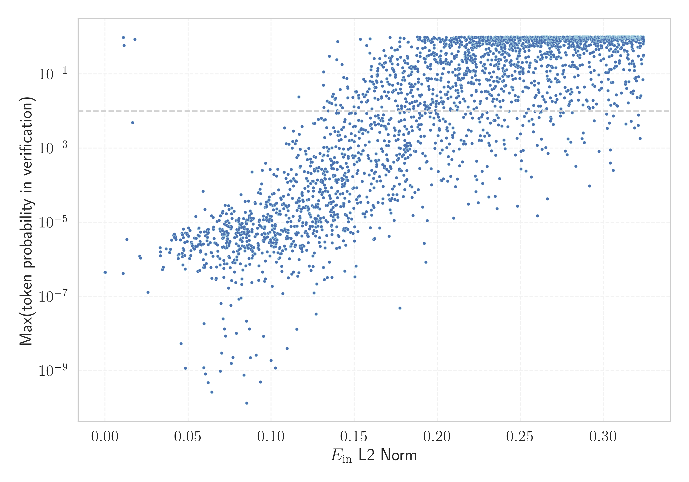

# Report for `Qwen/Qwen2.5-32B-Instruct`

## Model info

* Model Info: 
  * Tied embeddings: False
  * LM head uses bias: False
  * Embeddings shape: [152064, 5120]
* Tokenizer Info: 
  * Vocab Size: 151665
  * Tokenizer Class: Qwen2Tokenizer
  * Tokenizer Type: BPE
  * Bytes handling: Byte Input
  * Token for verification prompt building: abcdefghijklmnopqrstuvwxyz
  * Token id for verification prompt building: 67512
* Indicator summary: 
  * Indicator for under-trained tokens: E_{in} L2 Norm
  * Overall distribution: 1.206 +/- 0.337
* Detected Token Counts: 
  * Number of tested under-trained tokens: 2979, 2958 non-special, 1238 below p = 0.01 threshold, 914 below soft indicator threshold
  * Number of single byte tokens: 256, of which 14 below indicator threshold
  * Number of special tokens: 1906, of which 1906 below indicator threshold
  * Number of non-single-byte unreachable tokens: 1906, of which 1906 below indicator threshold
  * Number of non-single-byte UTF-fragment tokens:  1320, of which 91 below soft indicator threshold

## Under-trained token indicators plot


## Verification plot


## Under-trained token verification results
914 entries below threshold of 0.156

|   token_id | token                             |   indicator | max_prob                                                         | in_other_tokens                                                                                                                                                       |
|------------|-----------------------------------|-------------|------------------------------------------------------------------|-----------------------------------------------------------------------------------------------------------------------------------------------------------------------|
|      79269 | ````` ▁ForCanBeConverted `````    | 0           | <span style='border: 1px solid rgb(169, 68, 66);'>4.4e-07</span> | <span style='border: 1px solid rgb(169, 68, 66);'>````` ▁ForCanBeConvertedToF `````</span>, ````` ▁ForCanBeConvertedToForeach `````                                   |
|      79270 | ````` ▁ForCanBeConvertedToF ````` | 0           | <span style='border: 1px solid rgb(169, 68, 66);'>4.4e-07</span> | ````` ▁ForCanBeConvertedToForeach `````                                                                                                                               |
|      83969 | ````` PostalCodesNL `````         | 0           | <span style='border: 1px solid rgb(169, 68, 66);'>4.4e-07</span> | <span style='border: 1px solid rgb(169, 68, 66);'>````` $PostalCodesNL `````</span>                                                                                   |
|      83971 | ````` $PostalCodesNL `````        | 0           | <span style='border: 1px solid rgb(169, 68, 66);'>4.4e-07</span> |                                                                                                                                                                       |
|      97000 | ````` (stypy `````                | 2.18747e-06 | <span style='border: 1px solid rgb(169, 68, 66);'>4.4e-07</span> |                                                                                                                                                                       |
|     142386 | ````` ▁zwłaszc `````              | 8.05205e-05 | <span style='border: 1px solid rgb(169, 68, 66);'>4.5e-07</span> | ````` ▁zwłaszcza `````                                                                                                                                                |
|      78783 | ````` \tTokenNameIdentifier ````` | 0.000137953 | <span style='border: 1px solid rgb(169, 68, 66);'>4.5e-07</span> |                                                                                                                                                                       |
|      78323 | ````` ▁thuisontvangst `````       | 0.0109065   | <span style='border: 1px solid rgb(169, 68, 66);'>4.2e-07</span> |                                                                                                                                                                       |
|     136954 | ````` טלוו `````                  | 0.0130581   | <span style='border: 1px solid rgb(169, 68, 66);'>3.5e-06</span> | <span style='border: 1px solid rgb(169, 68, 66);'>````` טלוויז `````</span>, ````` טלוויזיה `````                                                                     |
|      88372 | ````` useRalative `````           | 0.0208972   | <span style='border: 1px solid rgb(169, 68, 66);'>1.2e-06</span> | ````` useRalativeImagePath `````                                                                                                                                      |
|     142494 | ````` ניוזל `````                 | 0.0213928   | <span style='border: 1px solid rgb(169, 68, 66);'>1.1e-06</span> | <span style='border: 1px solid rgb(169, 68, 66);'>````` ניוזלטר `````</span>                                                                                          |
|      88371 | ````` useRal `````                | 0.0258757   | <span style='border: 1px solid rgb(169, 68, 66);'>1.3e-07</span> | <span style='border: 1px solid rgb(169, 68, 66);'>````` useRalative `````</span>, ````` useRalativeImagePath `````                                                    |
|     127734 | ````` פייסב `````                 | 0.0331966   | <span style='border: 1px solid rgb(169, 68, 66);'>2e-06</span>   | <span style='border: 1px solid rgb(40, 167, 69);'>````` פייסבוק `````</span>, <span style='border: 1px solid rgb(40, 167, 69);'>````` ▁בפייסבוק `````</span>          |
|     151300 | ````` 𝇠 `````                     | 0.0332508   | <span style='border: 1px solid rgb(169, 68, 66);'>1.6e-06</span> |                                                                                                                                                                       |
|     138175 | ````` Cumhurbaş `````             | 0.0333172   | <span style='border: 1px solid rgb(169, 68, 66);'>1.2e-06</span> | <span style='border: 1px solid rgb(40, 167, 69);'>````` Cumhurbaşkan `````</span>, <span style='border: 1px solid rgb(40, 167, 69);'>````` Cumhurbaşkanı `````</span> |
|     149413 | ````` 칕 `````                    | 0.0345483   | <span style='border: 1px solid rgb(169, 68, 66);'>5.3e-07</span> |                                                                                                                                                                       |
|     122290 | ````` 𦭜 `````                    | 0.0350727   | <span style='border: 1px solid rgb(169, 68, 66);'>6.1e-07</span> |                                                                                                                                                                       |
|     122474 | ````` 𪨰 `````                    | 0.0367597   | <span style='border: 1px solid rgb(169, 68, 66);'>1.9e-06</span> |                                                                                                                                                                       |
|     122223 | ````` 𫵷 `````                    | 0.0388284   | <span style='border: 1px solid rgb(169, 68, 66);'>1.5e-06</span> |                                                                                                                                                                       |
|     122578 | ````` 𫭼 `````                    | 0.0393958   | <span style='border: 1px solid rgb(169, 68, 66);'>1.9e-06</span> |                                                                                                                                                                       |
<details><summary>894 additional entries below threshold</summary>

|   token_id | token                           |   indicator | max_prob                                                         | in_other_tokens                                                                                                                                                                                                                                                                                                                                                                                                                  |
|------------|---------------------------------|-------------|------------------------------------------------------------------|----------------------------------------------------------------------------------------------------------------------------------------------------------------------------------------------------------------------------------------------------------------------------------------------------------------------------------------------------------------------------------------------------------------------------------|
|     133741 | ````` ▁הישרא `````              |   0.0401152 | <span style='border: 1px solid rgb(169, 68, 66);'>3.3e-06</span> | ````` ▁הישראלי `````, <span style='border: 1px solid rgb(40, 167, 69);'>````` ▁הישראל `````</span>, ````` ▁הישראלית `````                                                                                                                                                                                                                                                                                                        |
|     117332 | ````` 法战组合 `````            |   0.0413328 | <span style='border: 1px solid rgb(169, 68, 66);'>4.4e-06</span> |                                                                                                                                                                                                                                                                                                                                                                                                                                  |
|     149414 | ````` 툩 `````                  |   0.0416866 | <span style='border: 1px solid rgb(169, 68, 66);'>4.8e-06</span> |                                                                                                                                                                                                                                                                                                                                                                                                                                  |
|     150820 | ````` ꌼ `````                  |   0.0417094 | <span style='border: 1px solid rgb(169, 68, 66);'>3.9e-06</span> |                                                                                                                                                                                                                                                                                                                                                                                                                                  |
|     151291 | ````` 𝅎 `````                   |   0.0423579 | <span style='border: 1px solid rgb(169, 68, 66);'>4.1e-06</span> |                                                                                                                                                                                                                                                                                                                                                                                                                                  |
|     151088 | ````` 퓪 `````                  |   0.042378  | <span style='border: 1px solid rgb(169, 68, 66);'>3.8e-06</span> |                                                                                                                                                                                                                                                                                                                                                                                                                                  |
|     151293 | ````` 𝆣 `````                   |   0.0426273 | <span style='border: 1px solid rgb(169, 68, 66);'>3.4e-06</span> |                                                                                                                                                                                                                                                                                                                                                                                                                                  |
|     128200 | ````` przedsięb `````           |   0.0438853 | <span style='border: 1px solid rgb(169, 68, 66);'>1.3e-06</span> | <span style='border: 1px solid rgb(169, 68, 66);'>````` przedsiębior `````</span>, <span style='border: 1px solid rgb(40, 167, 69);'>````` przedsiębiorst `````</span>, <span style='border: 1px solid rgb(169, 68, 66);'>````` przedsiębiorstw `````</span>, <span style='border: 1px solid rgb(255, 145, 0);'>````` przedsiębiorc `````</span>                                                                                 |
|     122385 | ````` 𫠊 `````                  |   0.0440618 | <span style='border: 1px solid rgb(169, 68, 66);'>1e-06</span>   |                                                                                                                                                                                                                                                                                                                                                                                                                                  |
|     150276 | ````` 뙝 `````                  |   0.0445247 | <span style='border: 1px solid rgb(169, 68, 66);'>1.4e-06</span> |                                                                                                                                                                                                                                                                                                                                                                                                                                  |
|     150877 | ````` 냵 `````                  |   0.0452518 | <span style='border: 1px solid rgb(169, 68, 66);'>3.3e-06</span> |                                                                                                                                                                                                                                                                                                                                                                                                                                  |
|     151297 | ````` 𝇗 `````                   |   0.0457687 | <span style='border: 1px solid rgb(169, 68, 66);'>5.3e-09</span> |                                                                                                                                                                                                                                                                                                                                                                                                                                  |
|     150803 | ````` 䋌 `````                  |   0.04629   | <span style='border: 1px solid rgb(169, 68, 66);'>5e-06</span>   |                                                                                                                                                                                                                                                                                                                                                                                                                                  |
|     151298 | ````` 𝇚 `````                   |   0.0464234 | <span style='border: 1px solid rgb(169, 68, 66);'>1.5e-06</span> |                                                                                                                                                                                                                                                                                                                                                                                                                                  |
|     123306 | ````` 𪤗 `````                  |   0.0464961 | <span style='border: 1px solid rgb(169, 68, 66);'>1.2e-06</span> |                                                                                                                                                                                                                                                                                                                                                                                                                                  |
|     150073 | ````` 퓲 `````                  |   0.0465838 | <span style='border: 1px solid rgb(169, 68, 66);'>4.7e-06</span> |                                                                                                                                                                                                                                                                                                                                                                                                                                  |
|     149738 | ````` 뉅 `````                  |   0.0467738 | <span style='border: 1px solid rgb(169, 68, 66);'>7.1e-07</span> |                                                                                                                                                                                                                                                                                                                                                                                                                                  |
|     138112 | ````` ▁paździ `````             |   0.0469365 | <span style='border: 1px solid rgb(169, 68, 66);'>1.9e-06</span> | ````` ▁październ `````, ````` ▁października `````                                                                                                                                                                                                                                                                                                                                                                                |
|     147930 | ````` 🖏 `````                   |   0.0471104 | <span style='border: 1px solid rgb(169, 68, 66);'>3.9e-06</span> |                                                                                                                                                                                                                                                                                                                                                                                                                                  |
|     150934 | ````` 맻 `````                  |   0.0471309 | <span style='border: 1px solid rgb(169, 68, 66);'>6.5e-06</span> |                                                                                                                                                                                                                                                                                                                                                                                                                                  |
|     149800 | ````` 툶 `````                  |   0.0473319 | <span style='border: 1px solid rgb(169, 68, 66);'>1.8e-06</span> |                                                                                                                                                                                                                                                                                                                                                                                                                                  |
|     150797 | ````` 㫴 `````                  |   0.0479436 | <span style='border: 1px solid rgb(169, 68, 66);'>2.9e-06</span> |                                                                                                                                                                                                                                                                                                                                                                                                                                  |
|     151561 | ````` 𖥨 `````                   |   0.0479515 | <span style='border: 1px solid rgb(169, 68, 66);'>1.3e-06</span> |                                                                                                                                                                                                                                                                                                                                                                                                                                  |
|     147410 | ````` ꀰ `````                  |   0.048152  | <span style='border: 1px solid rgb(169, 68, 66);'>5.4e-07</span> |                                                                                                                                                                                                                                                                                                                                                                                                                                  |
|     151294 | ````` 𝆳 `````                   |   0.0483478 | <span style='border: 1px solid rgb(169, 68, 66);'>1.2e-09</span> |                                                                                                                                                                                                                                                                                                                                                                                                                                  |
|     151234 | ````` ﶰ `````                   |   0.0485083 | <span style='border: 1px solid rgb(169, 68, 66);'>5.2e-06</span> |                                                                                                                                                                                                                                                                                                                                                                                                                                  |
|     122268 | ````` 𨚕 `````                  |   0.0493698 | <span style='border: 1px solid rgb(169, 68, 66);'>5e-06</span>   |                                                                                                                                                                                                                                                                                                                                                                                                                                  |
|     123677 | ````` 𥖨 `````                  |   0.0493999 | <span style='border: 1px solid rgb(169, 68, 66);'>3e-06</span>   |                                                                                                                                                                                                                                                                                                                                                                                                                                  |
|     147896 | ````` 눱 `````                  |   0.0495826 | <span style='border: 1px solid rgb(169, 68, 66);'>4.5e-06</span> |                                                                                                                                                                                                                                                                                                                                                                                                                                  |
|     150322 | ````` 흕 `````                  |   0.0501408 | <span style='border: 1px solid rgb(169, 68, 66);'>4.2e-06</span> |                                                                                                                                                                                                                                                                                                                                                                                                                                  |
|     151299 | ````` 𝇜 `````                   |   0.0502436 | <span style='border: 1px solid rgb(169, 68, 66);'>7e-06</span>   |                                                                                                                                                                                                                                                                                                                                                                                                                                  |
|     149762 | ````` 쁄 `````                  |   0.0503213 | <span style='border: 1px solid rgb(169, 68, 66);'>4.2e-06</span> |                                                                                                                                                                                                                                                                                                                                                                                                                                  |
|     150306 | ````` 숕 `````                  |   0.0508912 | <span style='border: 1px solid rgb(169, 68, 66);'>1.1e-06</span> |                                                                                                                                                                                                                                                                                                                                                                                                                                  |
|     122502 | ````` 𦙶 `````                  |   0.0511102 | <span style='border: 1px solid rgb(169, 68, 66);'>6e-06</span>   |                                                                                                                                                                                                                                                                                                                                                                                                                                  |
|     151069 | ````` 탶 `````                  |   0.0515716 | <span style='border: 1px solid rgb(169, 68, 66);'>1.3e-06</span> |                                                                                                                                                                                                                                                                                                                                                                                                                                  |
|     151089 | ````` 퓱 `````                  |   0.0517107 | <span style='border: 1px solid rgb(169, 68, 66);'>1.7e-06</span> |                                                                                                                                                                                                                                                                                                                                                                                                                                  |
|     142717 | ````` традиционн `````          |   0.0519521 | <span style='border: 1px solid rgb(169, 68, 66);'>2.9e-06</span> |                                                                                                                                                                                                                                                                                                                                                                                                                                  |
|     151048 | ````` 첧 `````                  |   0.0521717 | <span style='border: 1px solid rgb(169, 68, 66);'>2.6e-06</span> |                                                                                                                                                                                                                                                                                                                                                                                                                                  |
|     123748 | ````` 𨭉 `````                  |   0.052463  | <span style='border: 1px solid rgb(169, 68, 66);'>2.3e-06</span> |                                                                                                                                                                                                                                                                                                                                                                                                                                  |
|     149463 | ````` 켚 `````                  |   0.053388  | <span style='border: 1px solid rgb(169, 68, 66);'>2e-06</span>   |                                                                                                                                                                                                                                                                                                                                                                                                                                  |
|     123702 | ````` 𦒍 `````                  |   0.0537049 | <span style='border: 1px solid rgb(169, 68, 66);'>1.9e-06</span> |                                                                                                                                                                                                                                                                                                                                                                                                                                  |
|      57408 | ````` :-------------</ `````    |   0.053712  | <span style='border: 1px solid rgb(169, 68, 66);'>3.7e-06</span> |                                                                                                                                                                                                                                                                                                                                                                                                                                  |
|     151090 | ````` 퓷 `````                  |   0.0544885 | <span style='border: 1px solid rgb(169, 68, 66);'>3.7e-06</span> |                                                                                                                                                                                                                                                                                                                                                                                                                                  |
|     150958 | ````` 뷗 `````                  |   0.0545349 | <span style='border: 1px solid rgb(169, 68, 66);'>2.3e-06</span> |                                                                                                                                                                                                                                                                                                                                                                                                                                  |
|     151083 | ````` 퍿 `````                  |   0.0545622 | <span style='border: 1px solid rgb(169, 68, 66);'>2.2e-06</span> |                                                                                                                                                                                                                                                                                                                                                                                                                                  |
|     151286 | ````` 𝄕 `````                   |   0.054613  | <span style='border: 1px solid rgb(169, 68, 66);'>1.4e-05</span> |                                                                                                                                                                                                                                                                                                                                                                                                                                  |
|     151493 | ````` 퓭 `````                  |   0.0548011 | <span style='border: 1px solid rgb(169, 68, 66);'>3.7e-06</span> |                                                                                                                                                                                                                                                                                                                                                                                                                                  |
|     151552 | ````` 퓶 `````                  |   0.0556501 | <span style='border: 1px solid rgb(169, 68, 66);'>2.3e-06</span> |                                                                                                                                                                                                                                                                                                                                                                                                                                  |
|     151066 | ````` 퀅 `````                  |   0.0558723 | <span style='border: 1px solid rgb(169, 68, 66);'>4.8e-07</span> |                                                                                                                                                                                                                                                                                                                                                                                                                                  |
|     150914 | ````` 뛩 `````                  |   0.0559216 | <span style='border: 1px solid rgb(169, 68, 66);'>4.5e-06</span> |                                                                                                                                                                                                                                                                                                                                                                                                                                  |
|     150901 | ````` 둁 `````                  |   0.0560546 | <span style='border: 1px solid rgb(169, 68, 66);'>2.5e-06</span> |                                                                                                                                                                                                                                                                                                                                                                                                                                  |
|     150273 | ````` 낔 `````                  |   0.0564145 | <span style='border: 1px solid rgb(169, 68, 66);'>6.7e-06</span> |                                                                                                                                                                                                                                                                                                                                                                                                                                  |
|     151492 | ````` 퓖 `````                  |   0.0564562 | <span style='border: 1px solid rgb(169, 68, 66);'>7e-06</span>   |                                                                                                                                                                                                                                                                                                                                                                                                                                  |
|     122615 | ````` 𨐈 `````                  |   0.0566174 | <span style='border: 1px solid rgb(169, 68, 66);'>4.3e-06</span> |                                                                                                                                                                                                                                                                                                                                                                                                                                  |
|     123552 | ````` 𬭯 `````                  |   0.0569733 | <span style='border: 1px solid rgb(169, 68, 66);'>5e-07</span>   |                                                                                                                                                                                                                                                                                                                                                                                                                                  |
|     151490 | ````` 큻 `````                  |   0.0572501 | <span style='border: 1px solid rgb(169, 68, 66);'>3e-06</span>   |                                                                                                                                                                                                                                                                                                                                                                                                                                  |
|     151551 | ````` 퓮 `````                  |   0.0573777 | <span style='border: 1px solid rgb(169, 68, 66);'>2.7e-06</span> |                                                                                                                                                                                                                                                                                                                                                                                                                                  |
|     149983 | ````` 웛 `````                  |   0.0573993 | <span style='border: 1px solid rgb(169, 68, 66);'>1.6e-06</span> |                                                                                                                                                                                                                                                                                                                                                                                                                                  |
|     150983 | ````` 싨 `````                  |   0.0574721 | <span style='border: 1px solid rgb(169, 68, 66);'>1.7e-06</span> |                                                                                                                                                                                                                                                                                                                                                                                                                                  |
|     150904 | ````` 듷 `````                  |   0.0575288 | <span style='border: 1px solid rgb(169, 68, 66);'>5.5e-06</span> |                                                                                                                                                                                                                                                                                                                                                                                                                                  |
|     150907 | ````` 땧 `````                  |   0.0580686 | <span style='border: 1px solid rgb(169, 68, 66);'>2.4e-06</span> |                                                                                                                                                                                                                                                                                                                                                                                                                                  |
|     151296 | ````` 𝇊 `````                   |   0.0590659 | <span style='border: 1px solid rgb(169, 68, 66);'>6.8e-05</span> |                                                                                                                                                                                                                                                                                                                                                                                                                                  |
|     151102 | ````` 햍 `````                  |   0.0590728 | <span style='border: 1px solid rgb(169, 68, 66);'>2.6e-06</span> |                                                                                                                                                                                                                                                                                                                                                                                                                                  |
|     122790 | ````` 鿎 `````                  |   0.0591976 | <span style='border: 1px solid rgb(169, 68, 66);'>9.8e-07</span> |                                                                                                                                                                                                                                                                                                                                                                                                                                  |
|     149594 | ````` ᰍ `````                   |   0.0592311 | <span style='border: 1px solid rgb(169, 68, 66);'>6.1e-07</span> |                                                                                                                                                                                                                                                                                                                                                                                                                                  |
|     115984 | ````` 魔龙令牌 `````            |   0.0594595 | <span style='border: 1px solid rgb(169, 68, 66);'>1.2e-09</span> |                                                                                                                                                                                                                                                                                                                                                                                                                                  |
|     122726 | ````` 𨺙 `````                  |   0.0595432 | <span style='border: 1px solid rgb(169, 68, 66);'>1.8e-08</span> |                                                                                                                                                                                                                                                                                                                                                                                                                                  |
|     150860 | ````` 궕 `````                  |   0.0596428 | <span style='border: 1px solid rgb(169, 68, 66);'>6.9e-07</span> |                                                                                                                                                                                                                                                                                                                                                                                                                                  |
|     151050 | ````` 첯 `````                  |   0.0596966 | <span style='border: 1px solid rgb(169, 68, 66);'>5.5e-06</span> |                                                                                                                                                                                                                                                                                                                                                                                                                                  |
|     150275 | ````` 뇗 `````                  |   0.0599036 | <span style='border: 1px solid rgb(169, 68, 66);'>6.1e-07</span> |                                                                                                                                                                                                                                                                                                                                                                                                                                  |
|     151448 | ````` 쥉 `````                  |   0.0600566 | <span style='border: 1px solid rgb(169, 68, 66);'>2.2e-05</span> |                                                                                                                                                                                                                                                                                                                                                                                                                                  |
|     150886 | ````` 뉍 `````                  |   0.0604262 | <span style='border: 1px solid rgb(169, 68, 66);'>8.1e-10</span> |                                                                                                                                                                                                                                                                                                                                                                                                                                  |
|     143335 | ````` ספטמ `````                |   0.0604297 | <span style='border: 1px solid rgb(169, 68, 66);'>4.3e-06</span> | <span style='border: 1px solid rgb(40, 167, 69);'>````` ספטמבר `````</span>                                                                                                                                                                                                                                                                                                                                                      |
|     151495 | ````` 훜 `````                  |   0.0606612 | <span style='border: 1px solid rgb(169, 68, 66);'>1.4e-06</span> |                                                                                                                                                                                                                                                                                                                                                                                                                                  |
|     150799 | ````` 㺾 `````                  |   0.0609551 | <span style='border: 1px solid rgb(169, 68, 66);'>7.7e-07</span> |                                                                                                                                                                                                                                                                                                                                                                                                                                  |
|     150301 | ````` 뢉 `````                  |   0.061074  | <span style='border: 1px solid rgb(169, 68, 66);'>5.6e-06</span> |                                                                                                                                                                                                                                                                                                                                                                                                                                  |
|     151018 | ````` 젡 `````                  |   0.0613618 | <span style='border: 1px solid rgb(169, 68, 66);'>3.2e-06</span> |                                                                                                                                                                                                                                                                                                                                                                                                                                  |
|     148369 | ````` ﱇ `````                   |   0.0614694 | <span style='border: 1px solid rgb(169, 68, 66);'>4.9e-06</span> |                                                                                                                                                                                                                                                                                                                                                                                                                                  |
|     151038 | ````` 쪗 `````                  |   0.0615486 | <span style='border: 1px solid rgb(169, 68, 66);'>5.4e-06</span> |                                                                                                                                                                                                                                                                                                                                                                                                                                  |
|     150871 | ````` 꺳 `````                  |   0.0616127 | <span style='border: 1px solid rgb(169, 68, 66);'>6.3e-06</span> |                                                                                                                                                                                                                                                                                                                                                                                                                                  |
|     150221 | ````` 톢 `````                  |   0.0616287 | <span style='border: 1px solid rgb(169, 68, 66);'>3.9e-06</span> |                                                                                                                                                                                                                                                                                                                                                                                                                                  |
|     123637 | ````` 𬸪 `````                  |   0.0619983 | <span style='border: 1px solid rgb(169, 68, 66);'>4.7e-10</span> |                                                                                                                                                                                                                                                                                                                                                                                                                                  |
|     151437 | ````` 뻅 `````                  |   0.0620955 | <span style='border: 1px solid rgb(169, 68, 66);'>2.5e-06</span> |                                                                                                                                                                                                                                                                                                                                                                                                                                  |
|     115992 | ````` 鸟成长记 `````            |   0.0622424 | <span style='border: 1px solid rgb(169, 68, 66);'>6.4e-06</span> |                                                                                                                                                                                                                                                                                                                                                                                                                                  |
|     123741 | ````` 𨟠 `````                  |   0.0622472 | <span style='border: 1px solid rgb(169, 68, 66);'>5.3e-06</span> |                                                                                                                                                                                                                                                                                                                                                                                                                                  |
|     151064 | ````` 쿅 `````                  |   0.063222  | <span style='border: 1px solid rgb(169, 68, 66);'>2.8e-06</span> |                                                                                                                                                                                                                                                                                                                                                                                                                                  |
|     148659 | ````` 퀫 `````                  |   0.0637386 | <span style='border: 1px solid rgb(169, 68, 66);'>6.1e-07</span> |                                                                                                                                                                                                                                                                                                                                                                                                                                  |
|     150893 | ````` 댤 `````                  |   0.0637744 | <span style='border: 1px solid rgb(169, 68, 66);'>1.5e-06</span> |                                                                                                                                                                                                                                                                                                                                                                                                                                  |
|     122588 | ````` 𬜯 `````                  |   0.064077  | <span style='border: 1px solid rgb(169, 68, 66);'>1.5e-05</span> |                                                                                                                                                                                                                                                                                                                                                                                                                                  |
|     142385 | ````` ▁zwłas `````              |   0.064154  | <span style='border: 1px solid rgb(169, 68, 66);'>1.5e-06</span> | <span style='border: 1px solid rgb(169, 68, 66);'>````` ▁zwłaszc `````</span>, ````` ▁zwłaszcza `````                                                                                                                                                                                                                                                                                                                            |
|     139487 | ````` אוטוב `````               |   0.0643097 | <span style='border: 1px solid rgb(169, 68, 66);'>3.1e-07</span> | <span style='border: 1px solid rgb(40, 167, 69);'>````` אוטובוס `````</span>                                                                                                                                                                                                                                                                                                                                                     |
|     151037 | ````` 쩼 `````                  |   0.0643206 | <span style='border: 1px solid rgb(169, 68, 66);'>2.6e-10</span> |                                                                                                                                                                                                                                                                                                                                                                                                                                  |
|     150951 | ````` 벘 `````                  |   0.0648871 | <span style='border: 1px solid rgb(169, 68, 66);'>1.2e-06</span> |                                                                                                                                                                                                                                                                                                                                                                                                                                  |
|     151002 | ````` 엜 `````                  |   0.0651505 | <span style='border: 1px solid rgb(169, 68, 66);'>1.4e-05</span> |                                                                                                                                                                                                                                                                                                                                                                                                                                  |
|     123531 | ````` 𫟦 `````                  |   0.0652738 | <span style='border: 1px solid rgb(169, 68, 66);'>6.4e-06</span> |                                                                                                                                                                                                                                                                                                                                                                                                                                  |
|     151430 | ````` 㳬 `````                  |   0.0653845 | <span style='border: 1px solid rgb(169, 68, 66);'>7.4e-06</span> |                                                                                                                                                                                                                                                                                                                                                                                                                                  |
|     150931 | ````` 맍 `````                  |   0.0656674 | <span style='border: 1px solid rgb(169, 68, 66);'>3.6e-06</span> |                                                                                                                                                                                                                                                                                                                                                                                                                                  |
|     149743 | ````` 땸 `````                  |   0.0661051 | <span style='border: 1px solid rgb(169, 68, 66);'>2.8e-06</span> |                                                                                                                                                                                                                                                                                                                                                                                                                                  |
|     151032 | ````` 짾 `````                  |   0.0667385 | <span style='border: 1px solid rgb(169, 68, 66);'>2.9e-07</span> |                                                                                                                                                                                                                                                                                                                                                                                                                                  |
|     122155 | ````` 𨙸 `````                  |   0.0668895 | <span style='border: 1px solid rgb(169, 68, 66);'>2.7e-06</span> |                                                                                                                                                                                                                                                                                                                                                                                                                                  |
|     151052 | ````` 촋 `````                  |   0.0669217 | <span style='border: 1px solid rgb(169, 68, 66);'>3.1e-07</span> |                                                                                                                                                                                                                                                                                                                                                                                                                                  |
|     122927 | ````` 𫟅 `````                  |   0.067135  | <span style='border: 1px solid rgb(169, 68, 66);'>6.2e-07</span> |                                                                                                                                                                                                                                                                                                                                                                                                                                  |
|     150308 | ````` 쓻 `````                  |   0.0674886 | <span style='border: 1px solid rgb(169, 68, 66);'>1.1e-05</span> |                                                                                                                                                                                                                                                                                                                                                                                                                                  |
|     149979 | ````` 뤗 `````                  |   0.0676507 | <span style='border: 1px solid rgb(169, 68, 66);'>2.4e-06</span> |                                                                                                                                                                                                                                                                                                                                                                                                                                  |
|     122431 | ````` 㭕 `````                  |   0.0677958 | <span style='border: 1px solid rgb(169, 68, 66);'>1.7e-06</span> |                                                                                                                                                                                                                                                                                                                                                                                                                                  |
|     148463 | ````` 㹦 `````                  |   0.0678565 | <span style='border: 1px solid rgb(169, 68, 66);'>1.2e-06</span> |                                                                                                                                                                                                                                                                                                                                                                                                                                  |
|     149857 | ````` ﱔ `````                   |   0.0686613 | <span style='border: 1px solid rgb(169, 68, 66);'>1.1e-05</span> |                                                                                                                                                                                                                                                                                                                                                                                                                                  |
|     150317 | ````` 퍠 `````                  |   0.0690918 | <span style='border: 1px solid rgb(169, 68, 66);'>1e-06</span>   |                                                                                                                                                                                                                                                                                                                                                                                                                                  |
|     151000 | ````` 엃 `````                  |   0.0691404 | <span style='border: 1px solid rgb(169, 68, 66);'>6.6e-06</span> |                                                                                                                                                                                                                                                                                                                                                                                                                                  |
|     151484 | ````` 뱋 `````                  |   0.0692967 | <span style='border: 1px solid rgb(169, 68, 66);'>7.1e-07</span> |                                                                                                                                                                                                                                                                                                                                                                                                                                  |
|     151099 | ````` 핶 `````                  |   0.0693616 | <span style='border: 1px solid rgb(169, 68, 66);'>1.5e-05</span> |                                                                                                                                                                                                                                                                                                                                                                                                                                  |
|     151212 | ````` ﱈ `````                   |   0.0693842 | <span style='border: 1px solid rgb(169, 68, 66);'>9.7e-10</span> |                                                                                                                                                                                                                                                                                                                                                                                                                                  |
|     123330 | ````` 𬒗 `````                  |   0.0695361 | <span style='border: 1px solid rgb(169, 68, 66);'>5.8e-06</span> |                                                                                                                                                                                                                                                                                                                                                                                                                                  |
|     151442 | ````` 쏱 `````                  |   0.0697312 | <span style='border: 1px solid rgb(169, 68, 66);'>6.4e-08</span> |                                                                                                                                                                                                                                                                                                                                                                                                                                  |
|     150963 | ````` 뺃 `````                  |   0.0701933 | <span style='border: 1px solid rgb(169, 68, 66);'>3e-09</span>   |                                                                                                                                                                                                                                                                                                                                                                                                                                  |
|     122941 | ````` 㙘 `````                  |   0.070399  | <span style='border: 1px solid rgb(169, 68, 66);'>6.1e-06</span> |                                                                                                                                                                                                                                                                                                                                                                                                                                  |
|      50617 | ````` ▁prostituerte `````       |   0.0705406 | <span style='border: 1px solid rgb(169, 68, 66);'>4.7e-06</span> |                                                                                                                                                                                                                                                                                                                                                                                                                                  |
|     150288 | ````` ﳥ `````                   |   0.0705728 | <span style='border: 1px solid rgb(169, 68, 66);'>2.1e-06</span> |                                                                                                                                                                                                                                                                                                                                                                                                                                  |
|     122986 | ````` 𬷕 `````                  |   0.0706174 | <span style='border: 1px solid rgb(169, 68, 66);'>6.4e-06</span> |                                                                                                                                                                                                                                                                                                                                                                                                                                  |
|     149446 | ````` ﳈ `````                   |   0.0706325 | <span style='border: 1px solid rgb(169, 68, 66);'>1.8e-05</span> |                                                                                                                                                                                                                                                                                                                                                                                                                                  |
|     150739 | ````` ⮳ `````                   |   0.0707192 | <span style='border: 1px solid rgb(169, 68, 66);'>5.9e-06</span> |                                                                                                                                                                                                                                                                                                                                                                                                                                  |
|     116355 | ````` 格會員 `````              |   0.0707743 | <span style='border: 1px solid rgb(169, 68, 66);'>3.7e-06</span> |                                                                                                                                                                                                                                                                                                                                                                                                                                  |
|     149092 | ````` 볽 `````                  |   0.0708379 | <span style='border: 1px solid rgb(169, 68, 66);'>2e-05</span>   |                                                                                                                                                                                                                                                                                                                                                                                                                                  |
|     151053 | ````` 촢 `````                  |   0.0710202 | <span style='border: 1px solid rgb(169, 68, 66);'>2.5e-08</span> |                                                                                                                                                                                                                                                                                                                                                                                                                                  |
|     151036 | ````` 쩻 `````                  |   0.0712465 | <span style='border: 1px solid rgb(169, 68, 66);'>2.2e-06</span> |                                                                                                                                                                                                                                                                                                                                                                                                                                  |
|     150853 | ````` 겚 `````                  |   0.0712479 | <span style='border: 1px solid rgb(169, 68, 66);'>3.9e-06</span> |                                                                                                                                                                                                                                                                                                                                                                                                                                  |
|     123302 | ````` 𡐓 `````                  |   0.0713828 | <span style='border: 1px solid rgb(169, 68, 66);'>9.5e-07</span> |                                                                                                                                                                                                                                                                                                                                                                                                                                  |
|     123550 | ````` 𬭬 `````                  |   0.0714461 | <span style='border: 1px solid rgb(169, 68, 66);'>3.3e-07</span> |                                                                                                                                                                                                                                                                                                                                                                                                                                  |
|     150869 | ````` 깣 `````                  |   0.0714798 | <span style='border: 1px solid rgb(169, 68, 66);'>5.7e-07</span> |                                                                                                                                                                                                                                                                                                                                                                                                                                  |
|     122407 | ````` 鿍 `````                  |   0.0715872 | <span style='border: 1px solid rgb(169, 68, 66);'>4.5e-06</span> |                                                                                                                                                                                                                                                                                                                                                                                                                                  |
|     149731 | ````` 꾈 `````                  |   0.0717331 | <span style='border: 1px solid rgb(169, 68, 66);'>5.1e-06</span> |                                                                                                                                                                                                                                                                                                                                                                                                                                  |
|     151074 | ````` 톧 `````                  |   0.0717374 | <span style='border: 1px solid rgb(169, 68, 66);'>4.9e-06</span> |                                                                                                                                                                                                                                                                                                                                                                                                                                  |
|     150975 | ````` 셢 `````                  |   0.0718078 | <span style='border: 1px solid rgb(169, 68, 66);'>9e-06</span>   |                                                                                                                                                                                                                                                                                                                                                                                                                                  |
|     123168 | ````` 𬒔 `````                  |   0.0718746 | <span style='border: 1px solid rgb(169, 68, 66);'>7.6e-07</span> |                                                                                                                                                                                                                                                                                                                                                                                                                                  |
|     149792 | ````` 촣 `````                  |   0.071881  | <span style='border: 1px solid rgb(169, 68, 66);'>1.3e-08</span> |                                                                                                                                                                                                                                                                                                                                                                                                                                  |
|     149947 | ````` 🠳 `````                   |   0.072257  | <span style='border: 1px solid rgb(169, 68, 66);'>5.5e-06</span> |                                                                                                                                                                                                                                                                                                                                                                                                                                  |
|     149733 | ````` 냏 `````                  |   0.0722604 | <span style='border: 1px solid rgb(169, 68, 66);'>2.9e-05</span> |                                                                                                                                                                                                                                                                                                                                                                                                                                  |
|     118326 | ````` 凡本网注 `````            |   0.0725285 | <span style='border: 1px solid rgb(169, 68, 66);'>8.5e-09</span> |                                                                                                                                                                                                                                                                                                                                                                                                                                  |
|     149720 | ````` ꇗ `````                  |   0.0725802 | <span style='border: 1px solid rgb(169, 68, 66);'>2e-06</span>   |                                                                                                                                                                                                                                                                                                                                                                                                                                  |
|     151226 | ````` ﳇ `````                   |   0.0727355 | <span style='border: 1px solid rgb(169, 68, 66);'>1e-05</span>   |                                                                                                                                                                                                                                                                                                                                                                                                                                  |
|     151075 | ````` 톹 `````                  |   0.0729363 | <span style='border: 1px solid rgb(169, 68, 66);'>5.4e-06</span> |                                                                                                                                                                                                                                                                                                                                                                                                                                  |
|     151110 | ````` 혭 `````                  |   0.0729916 | <span style='border: 1px solid rgb(169, 68, 66);'>1.7e-05</span> |                                                                                                                                                                                                                                                                                                                                                                                                                                  |
|     150298 | ````` 뜷 `````                  |   0.0730847 | <span style='border: 1px solid rgb(169, 68, 66);'>8.4e-06</span> |                                                                                                                                                                                                                                                                                                                                                                                                                                  |
|     122867 | ````` 𠅤 `````                  |   0.0730948 | <span style='border: 1px solid rgb(169, 68, 66);'>5.7e-06</span> |                                                                                                                                                                                                                                                                                                                                                                                                                                  |
|     151016 | ````` 잪 `````                  |   0.073099  | <span style='border: 1px solid rgb(169, 68, 66);'>2.7e-06</span> |                                                                                                                                                                                                                                                                                                                                                                                                                                  |
|     149772 | ````` 쓺 `````                  |   0.0733175 | <span style='border: 1px solid rgb(169, 68, 66);'>3.2e-06</span> |                                                                                                                                                                                                                                                                                                                                                                                                                                  |
|     150297 | ````` 떘 `````                  |   0.0733297 | <span style='border: 1px solid rgb(169, 68, 66);'>2.1e-06</span> |                                                                                                                                                                                                                                                                                                                                                                                                                                  |
|     150922 | ````` 롵 `````                  |   0.0733572 | <span style='border: 1px solid rgb(169, 68, 66);'>4.2e-06</span> |                                                                                                                                                                                                                                                                                                                                                                                                                                  |
|     151028 | ````` 죳 `````                  |   0.0733815 | <span style='border: 1px solid rgb(169, 68, 66);'>7.6e-07</span> |                                                                                                                                                                                                                                                                                                                                                                                                                                  |
|     151229 | ````` ﳫ `````                   |   0.0733943 | <span style='border: 1px solid rgb(169, 68, 66);'>2.2e-06</span> |                                                                                                                                                                                                                                                                                                                                                                                                                                  |
|     150895 | ````` 뎟 `````                  |   0.0735349 | <span style='border: 1px solid rgb(169, 68, 66);'>5e-06</span>   |                                                                                                                                                                                                                                                                                                                                                                                                                                  |
|     150548 | ````` ᘄ `````                   |   0.0737839 | <span style='border: 1px solid rgb(169, 68, 66);'>1.1e-05</span> |                                                                                                                                                                                                                                                                                                                                                                                                                                  |
|     149980 | ````` 섥 `````                  |   0.0737925 | <span style='border: 1px solid rgb(169, 68, 66);'>3.6e-06</span> |                                                                                                                                                                                                                                                                                                                                                                                                                                  |
|     122648 | ````` 𬬿 `````                  |   0.0739982 | <span style='border: 1px solid rgb(169, 68, 66);'>4.6e-06</span> |                                                                                                                                                                                                                                                                                                                                                                                                                                  |
|     149796 | ````` 쿙 `````                  |   0.074118  | <span style='border: 1px solid rgb(169, 68, 66);'>5.1e-06</span> |                                                                                                                                                                                                                                                                                                                                                                                                                                  |
|     151267 | ````` 𑘁 `````                   |   0.0743344 | <span style='border: 1px solid rgb(169, 68, 66);'>1.7e-07</span> |                                                                                                                                                                                                                                                                                                                                                                                                                                  |
|     117963 | ````` 是韩国娱 `````            |   0.0743498 | <span style='border: 1px solid rgb(169, 68, 66);'>7.7e-06</span> |                                                                                                                                                                                                                                                                                                                                                                                                                                  |
|     122730 | ````` 㛚 `````                  |   0.0743978 | <span style='border: 1px solid rgb(169, 68, 66);'>2.8e-05</span> |                                                                                                                                                                                                                                                                                                                                                                                                                                  |
|     141264 | ````` ▁pomięd `````             |   0.0744779 | <span style='border: 1px solid rgb(169, 68, 66);'>2.3e-06</span> | ````` ▁pomiędzy `````                                                                                                                                                                                                                                                                                                                                                                                                            |
|     150954 | ````` 벴 `````                  |   0.0745407 | <span style='border: 1px solid rgb(169, 68, 66);'>1.2e-06</span> |                                                                                                                                                                                                                                                                                                                                                                                                                                  |
|     122647 | ````` 𬬹 `````                  |   0.0745976 | <span style='border: 1px solid rgb(169, 68, 66);'>2.7e-06</span> |                                                                                                                                                                                                                                                                                                                                                                                                                                  |
|     150846 | ````` ꪼ `````                   |   0.0746438 | <span style='border: 1px solid rgb(169, 68, 66);'>9.6e-06</span> |                                                                                                                                                                                                                                                                                                                                                                                                                                  |
|     122951 | ````` 𡎚 `````                  |   0.0746902 | <span style='border: 1px solid rgb(169, 68, 66);'>2.2e-05</span> |                                                                                                                                                                                                                                                                                                                                                                                                                                  |
|     151078 | ````` 튽 `````                  |   0.0748669 | <span style='border: 1px solid rgb(169, 68, 66);'>1.1e-06</span> |                                                                                                                                                                                                                                                                                                                                                                                                                                  |
|     151436 | ````` 믑 `````                  |   0.0751587 | <span style='border: 1px solid rgb(169, 68, 66);'>3e-06</span>   |                                                                                                                                                                                                                                                                                                                                                                                                                                  |
|     138174 | ````` Cumhurba `````            |   0.0752583 | <span style='border: 1px solid rgb(169, 68, 66);'>6e-07</span>   | <span style='border: 1px solid rgb(169, 68, 66);'>````` Cumhurbaş `````</span>, <span style='border: 1px solid rgb(40, 167, 69);'>````` Cumhurbaşkan `````</span>, <span style='border: 1px solid rgb(40, 167, 69);'>````` Cumhurbaşkanı `````</span>                                                                                                                                                                            |
|     120101 | ````` 𠳐 `````                  |   0.0757398 | <span style='border: 1px solid rgb(169, 68, 66);'>5.7e-08</span> |                                                                                                                                                                                                                                                                                                                                                                                                                                  |
|     150944 | ````` 뮘 `````                  |   0.0758011 | <span style='border: 1px solid rgb(169, 68, 66);'>6.7e-06</span> |                                                                                                                                                                                                                                                                                                                                                                                                                                  |
|      45972 | ````` webElementX `````         |   0.0758365 | <span style='border: 1px solid rgb(169, 68, 66);'>7.8e-06</span> | ````` webElementXpaths `````                                                                                                                                                                                                                                                                                                                                                                                                     |
|     149755 | ````` 믾 `````                  |   0.0760296 | <span style='border: 1px solid rgb(169, 68, 66);'>1.6e-09</span> |                                                                                                                                                                                                                                                                                                                                                                                                                                  |
|     151548 | ````` 켇 `````                  |   0.0761808 | <span style='border: 1px solid rgb(169, 68, 66);'>2.7e-07</span> |                                                                                                                                                                                                                                                                                                                                                                                                                                  |
|     151202 | ````` ﰙ `````                   |   0.0762134 | <span style='border: 1px solid rgb(169, 68, 66);'>1.7e-05</span> |                                                                                                                                                                                                                                                                                                                                                                                                                                  |
|     151607 | ````` ﱊ `````                   |   0.0762143 | <span style='border: 1px solid rgb(169, 68, 66);'>7.4e-06</span> |                                                                                                                                                                                                                                                                                                                                                                                                                                  |
|     149592 | ````` ᯙ `````                   |   0.0762313 | <span style='border: 1px solid rgb(169, 68, 66);'>2.4e-05</span> |                                                                                                                                                                                                                                                                                                                                                                                                                                  |
|     151114 | ````` 흟 `````                  |   0.0763757 | <span style='border: 1px solid rgb(169, 68, 66);'>1.3e-05</span> |                                                                                                                                                                                                                                                                                                                                                                                                                                  |
|     151091 | ````` 퓼 `````                  |   0.076789  | <span style='border: 1px solid rgb(169, 68, 66);'>8.3e-07</span> |                                                                                                                                                                                                                                                                                                                                                                                                                                  |
|     151285 | ````` 𝄅 `````                   |   0.0769647 | <span style='border: 1px solid rgb(169, 68, 66);'>2.3e-09</span> |                                                                                                                                                                                                                                                                                                                                                                                                                                  |
|     151422 | ````` ᡌ `````                   |   0.0771928 | <span style='border: 1px solid rgb(169, 68, 66);'>1.6e-06</span> |                                                                                                                                                                                                                                                                                                                                                                                                                                  |
|     151201 | ````` ﰘ `````                   |   0.0776852 | <span style='border: 1px solid rgb(169, 68, 66);'>2e-05</span>   |                                                                                                                                                                                                                                                                                                                                                                                                                                  |
|     123761 | ````` 𤫉 `````                  |   0.0779329 | <span style='border: 1px solid rgb(169, 68, 66);'>3.9e-06</span> |                                                                                                                                                                                                                                                                                                                                                                                                                                  |
|     151433 | ````` 딉 `````                  |   0.077963  | <span style='border: 1px solid rgb(169, 68, 66);'>4.6e-07</span> |                                                                                                                                                                                                                                                                                                                                                                                                                                  |
|     148230 | ````` ꡔ `````                   |   0.0779819 | <span style='border: 1px solid rgb(169, 68, 66);'>9.6e-07</span> |                                                                                                                                                                                                                                                                                                                                                                                                                                  |
|     150196 | ````` 𓅺 `````                   |   0.0782582 | <span style='border: 1px solid rgb(169, 68, 66);'>8.1e-07</span> |                                                                                                                                                                                                                                                                                                                                                                                                                                  |
|     151444 | ````` 읩 `````                  |   0.078669  | <span style='border: 1px solid rgb(169, 68, 66);'>2.4e-07</span> |                                                                                                                                                                                                                                                                                                                                                                                                                                  |
|     151070 | ````` 탹 `````                  |   0.0788198 | <span style='border: 1px solid rgb(169, 68, 66);'>5e-06</span>   |                                                                                                                                                                                                                                                                                                                                                                                                                                  |
|     149962 | ````` 𣷭 `````                  |   0.0789365 | <span style='border: 1px solid rgb(169, 68, 66);'>1.1e-05</span> |                                                                                                                                                                                                                                                                                                                                                                                                                                  |
|     151208 | ````` ﰼ `````                   |   0.0789636 | <span style='border: 1px solid rgb(169, 68, 66);'>2.6e-06</span> |                                                                                                                                                                                                                                                                                                                                                                                                                                  |
|     150994 | ````` 쒯 `````                  |   0.0790685 | <span style='border: 1px solid rgb(169, 68, 66);'>1e-08</span>   |                                                                                                                                                                                                                                                                                                                                                                                                                                  |
|     146559 | ````` 뉩 `````                  |   0.0792743 | <span style='border: 1px solid rgb(169, 68, 66);'>1.2e-06</span> |                                                                                                                                                                                                                                                                                                                                                                                                                                  |
|     150882 | ````` 놐 `````                  |   0.0792948 | <span style='border: 1px solid rgb(169, 68, 66);'>4.2e-06</span> |                                                                                                                                                                                                                                                                                                                                                                                                                                  |
|     151072 | ````` 텣 `````                  |   0.079299  | <span style='border: 1px solid rgb(169, 68, 66);'>9.7e-07</span> |                                                                                                                                                                                                                                                                                                                                                                                                                                  |
|     150565 | ````` ᤓ `````                   |   0.0793642 | <span style='border: 1px solid rgb(169, 68, 66);'>6.4e-06</span> |                                                                                                                                                                                                                                                                                                                                                                                                                                  |
|     150988 | ````` 쎘 `````                  |   0.0796748 | <span style='border: 1px solid rgb(169, 68, 66);'>1.1e-05</span> |                                                                                                                                                                                                                                                                                                                                                                                                                                  |
|     149771 | ````` 쐴 `````                  |   0.0797166 | <span style='border: 1px solid rgb(169, 68, 66);'>1.7e-06</span> |                                                                                                                                                                                                                                                                                                                                                                                                                                  |
|     151486 | ````` 웢 `````                  |   0.07977   | <span style='border: 1px solid rgb(169, 68, 66);'>5.3e-06</span> |                                                                                                                                                                                                                                                                                                                                                                                                                                  |
|     123179 | ````` 䣘 `````                  |   0.0798283 | <span style='border: 1px solid rgb(169, 68, 66);'>1.1e-05</span> |                                                                                                                                                                                                                                                                                                                                                                                                                                  |
|     115478 | ````` 战战组合 `````            |   0.0802778 | <span style='border: 1px solid rgb(169, 68, 66);'>1.1e-05</span> |                                                                                                                                                                                                                                                                                                                                                                                                                                  |
|     151265 | ````` 𑂄 `````                   |   0.0804331 | <span style='border: 1px solid rgb(169, 68, 66);'>6.4e-06</span> |                                                                                                                                                                                                                                                                                                                                                                                                                                  |
|     151087 | ````` 퓝 `````                  |   0.0804555 | <span style='border: 1px solid rgb(169, 68, 66);'>1.5e-06</span> |                                                                                                                                                                                                                                                                                                                                                                                                                                  |
|     151203 | ````` ﰜ `````                   |   0.0804718 | <span style='border: 1px solid rgb(169, 68, 66);'>1.4e-06</span> |                                                                                                                                                                                                                                                                                                                                                                                                                                  |
|     150993 | ````` 쒔 `````                  |   0.0804756 | <span style='border: 1px solid rgb(169, 68, 66);'>2.3e-06</span> |                                                                                                                                                                                                                                                                                                                                                                                                                                  |
|     139941 | ````` ▁לחלוט `````              |   0.0805267 | <span style='border: 1px solid rgb(169, 68, 66);'>1.3e-05</span> | ````` ▁לחלוטין `````                                                                                                                                                                                                                                                                                                                                                                                                             |
|     150885 | ````` 눚 `````                  |   0.0805677 | <span style='border: 1px solid rgb(169, 68, 66);'>1.8e-06</span> |                                                                                                                                                                                                                                                                                                                                                                                                                                  |
|     149098 | ````` 쏸 `````                  |   0.0805923 | <span style='border: 1px solid rgb(169, 68, 66);'>8.5e-08</span> |                                                                                                                                                                                                                                                                                                                                                                                                                                  |
|     150875 | ````` 뀩 `````                  |   0.0805949 | <span style='border: 1px solid rgb(169, 68, 66);'>1e-05</span>   |                                                                                                                                                                                                                                                                                                                                                                                                                                  |
|     150996 | ````` 앐 `````                  |   0.0808697 | <span style='border: 1px solid rgb(169, 68, 66);'>9e-06</span>   |                                                                                                                                                                                                                                                                                                                                                                                                                                  |
|     151289 | ````` 𝄴 `````                   |   0.0809663 | <span style='border: 1px solid rgb(169, 68, 66);'>5.1e-06</span> |                                                                                                                                                                                                                                                                                                                                                                                                                                  |
|     121668 | ````` 𥻗 `````                  |   0.0810264 | <span style='border: 1px solid rgb(169, 68, 66);'>7.4e-06</span> |                                                                                                                                                                                                                                                                                                                                                                                                                                  |
|     150919 | ````` 렡 `````                  |   0.0810835 | <span style='border: 1px solid rgb(169, 68, 66);'>7.3e-06</span> |                                                                                                                                                                                                                                                                                                                                                                                                                                  |
|     149964 | ````` 𦘒 `````                  |   0.0811289 | <span style='border: 1px solid rgb(169, 68, 66);'>8.9e-06</span> |                                                                                                                                                                                                                                                                                                                                                                                                                                  |
|     150878 | ````` 넖 `````                  |   0.0812451 | <span style='border: 1px solid rgb(169, 68, 66);'>3.3e-06</span> |                                                                                                                                                                                                                                                                                                                                                                                                                                  |
|     151082 | ````` 퍙 `````                  |   0.0813445 | <span style='border: 1px solid rgb(169, 68, 66);'>7.7e-07</span> |                                                                                                                                                                                                                                                                                                                                                                                                                                  |
|     151284 | ````` 𝄃 `````                   |   0.0814529 | <span style='border: 1px solid rgb(169, 68, 66);'>1.9e-06</span> |                                                                                                                                                                                                                                                                                                                                                                                                                                  |
|     134237 | ````` ▁zarówn `````             |   0.0815525 | <span style='border: 1px solid rgb(169, 68, 66);'>4.6e-06</span> | ````` ▁zarówno `````                                                                                                                                                                                                                                                                                                                                                                                                             |
|     151292 | ````` 𝅪 `````                   |   0.0817602 | <span style='border: 1px solid rgb(169, 68, 66);'>3.6e-06</span> |                                                                                                                                                                                                                                                                                                                                                                                                                                  |
|     149764 | ````` 삻 `````                  |   0.081787  | <span style='border: 1px solid rgb(169, 68, 66);'>5.6e-05</span> |                                                                                                                                                                                                                                                                                                                                                                                                                                  |
|     148922 | ````` 옯 `````                  |   0.0818074 | <span style='border: 1px solid rgb(169, 68, 66);'>9.1e-08</span> |                                                                                                                                                                                                                                                                                                                                                                                                                                  |
|     149729 | ````` 굠 `````                  |   0.0818475 | <span style='border: 1px solid rgb(169, 68, 66);'>7.8e-06</span> |                                                                                                                                                                                                                                                                                                                                                                                                                                  |
|     151204 | ````` ﰞ `````                   |   0.0822523 | <span style='border: 1px solid rgb(169, 68, 66);'>2.1e-07</span> |                                                                                                                                                                                                                                                                                                                                                                                                                                  |
|     143978 | ````` מתרחש `````               |   0.0822874 | <span style='border: 1px solid rgb(169, 68, 66);'>7.3e-06</span> |                                                                                                                                                                                                                                                                                                                                                                                                                                  |
|     151023 | ````` 졵 `````                  |   0.082309  | <span style='border: 1px solid rgb(169, 68, 66);'>3e-07</span>   |                                                                                                                                                                                                                                                                                                                                                                                                                                  |
|     150881 | ````` 녂 `````                  |   0.0824668 | <span style='border: 1px solid rgb(169, 68, 66);'>3e-06</span>   |                                                                                                                                                                                                                                                                                                                                                                                                                                  |
|     150856 | ````` 괗 `````                  |   0.0824755 | <span style='border: 1px solid rgb(169, 68, 66);'>5e-06</span>   |                                                                                                                                                                                                                                                                                                                                                                                                                                  |
|     117971 | ````` 力还是自 `````            |   0.0824961 | <span style='border: 1px solid rgb(169, 68, 66);'>2.3e-06</span> |                                                                                                                                                                                                                                                                                                                                                                                                                                  |
|     151109 | ````` 혖 `````                  |   0.0825387 | <span style='border: 1px solid rgb(169, 68, 66);'>9.3e-06</span> |                                                                                                                                                                                                                                                                                                                                                                                                                                  |
|     122768 | ````` 䓫 `````                  |   0.0825739 | <span style='border: 1px solid rgb(169, 68, 66);'>5.4e-06</span> |                                                                                                                                                                                                                                                                                                                                                                                                                                  |
|     150900 | ````` 됸 `````                  |   0.0829432 | <span style='border: 1px solid rgb(169, 68, 66);'>5.2e-07</span> |                                                                                                                                                                                                                                                                                                                                                                                                                                  |
|     119942 | ````` 𬉼 `````                  |   0.0829857 | <span style='border: 1px solid rgb(169, 68, 66);'>3.8e-06</span> |                                                                                                                                                                                                                                                                                                                                                                                                                                  |
|     151219 | ````` ﲋ `````                   |   0.0833301 | <span style='border: 1px solid rgb(169, 68, 66);'>1.3e-05</span> |                                                                                                                                                                                                                                                                                                                                                                                                                                  |
|     150863 | ````` 긿 `````                  |   0.0836147 | <span style='border: 1px solid rgb(169, 68, 66);'>7.5e-10</span> |                                                                                                                                                                                                                                                                                                                                                                                                                                  |
|     123765 | ````` 𬺓 `````                  |   0.0836768 | <span style='border: 1px solid rgb(169, 68, 66);'>5.3e-06</span> |                                                                                                                                                                                                                                                                                                                                                                                                                                  |
|     149856 | ````` ﱅ `````                   |   0.0837835 | <span style='border: 1px solid rgb(169, 68, 66);'>5.1e-06</span> |                                                                                                                                                                                                                                                                                                                                                                                                                                  |
|     121774 | ````` 䦃 `````                  |   0.0837854 | <span style='border: 1px solid rgb(169, 68, 66);'>6.7e-06</span> |                                                                                                                                                                                                                                                                                                                                                                                                                                  |
|     150549 | ````` ᘑ `````                   |   0.08381   | <span style='border: 1px solid rgb(169, 68, 66);'>7.5e-06</span> |                                                                                                                                                                                                                                                                                                                                                                                                                                  |
|     150570 | ````` ᨨ `````                   |   0.0838199 | <span style='border: 1px solid rgb(169, 68, 66);'>2.2e-06</span> |                                                                                                                                                                                                                                                                                                                                                                                                                                  |
|     151084 | ````` 펶 `````                  |   0.0841624 | <span style='border: 1px solid rgb(169, 68, 66);'>1.7e-06</span> |                                                                                                                                                                                                                                                                                                                                                                                                                                  |
|     151228 | ````` ﳣ `````                   |   0.084293  | <span style='border: 1px solid rgb(169, 68, 66);'>2e-06</span>   |                                                                                                                                                                                                                                                                                                                                                                                                                                  |
|     150962 | ````` 빪 `````                  |   0.0843493 | <span style='border: 1px solid rgb(169, 68, 66);'>3.7e-05</span> |                                                                                                                                                                                                                                                                                                                                                                                                                                  |
|     151033 | ````` 쨓 `````                  |   0.0844446 | <span style='border: 1px solid rgb(169, 68, 66);'>1.9e-05</span> |                                                                                                                                                                                                                                                                                                                                                                                                                                  |
|     151221 | ````` ﲒ `````                   |   0.0847169 | <span style='border: 1px solid rgb(169, 68, 66);'>6.7e-07</span> |                                                                                                                                                                                                                                                                                                                                                                                                                                  |
|     142142 | ````` אוניב `````               |   0.0849287 | <span style='border: 1px solid rgb(169, 68, 66);'>1e-05</span>   | ````` אוניברס `````, ````` אוניברסיטת `````                                                                                                                                                                                                                                                                                                                                                                                      |
|     150796 | ````` 㫪 `````                  |   0.0850853 | <span style='border: 1px solid rgb(169, 68, 66);'>4.7e-06</span> |                                                                                                                                                                                                                                                                                                                                                                                                                                  |
|     150303 | ````` 맋 `````                  |   0.0850943 | <span style='border: 1px solid rgb(169, 68, 66);'>3.8e-06</span> |                                                                                                                                                                                                                                                                                                                                                                                                                                  |
|     149117 | ````` 헠 `````                  |   0.0850964 | <span style='border: 1px solid rgb(169, 68, 66);'>2.2e-08</span> |                                                                                                                                                                                                                                                                                                                                                                                                                                  |
|     150857 | ````` 괙 `````                  |   0.0851305 | <span style='border: 1px solid rgb(169, 68, 66);'>9e-06</span>   |                                                                                                                                                                                                                                                                                                                                                                                                                                  |
|     123642 | ````` 𬶠 `````                  |   0.0852311 | <span style='border: 1px solid rgb(169, 68, 66);'>1.3e-10</span> |                                                                                                                                                                                                                                                                                                                                                                                                                                  |
|      86278 | ````` ▁sexkontakte `````        |   0.0853367 | <span style='border: 1px solid rgb(169, 68, 66);'>1.2e-05</span> |                                                                                                                                                                                                                                                                                                                                                                                                                                  |
|     150969 | ````` 쁭 `````                  |   0.0854267 | <span style='border: 1px solid rgb(169, 68, 66);'>3.1e-06</span> |                                                                                                                                                                                                                                                                                                                                                                                                                                  |
|     150960 | ````` 븓 `````                  |   0.0854747 | <span style='border: 1px solid rgb(169, 68, 66);'>5.8e-06</span> |                                                                                                                                                                                                                                                                                                                                                                                                                                  |
|     149798 | ````` 큉 `````                  |   0.0856446 | <span style='border: 1px solid rgb(169, 68, 66);'>6.4e-06</span> |                                                                                                                                                                                                                                                                                                                                                                                                                                  |
|     151015 | ````` 잨 `````                  |   0.0857252 | <span style='border: 1px solid rgb(169, 68, 66);'>2.4e-06</span> |                                                                                                                                                                                                                                                                                                                                                                                                                                  |
|     151446 | ````` 쟙 `````                  |   0.0859286 | <span style='border: 1px solid rgb(169, 68, 66);'>5.4e-06</span> |                                                                                                                                                                                                                                                                                                                                                                                                                                  |
|     151209 | ````` ﰿ `````                   |   0.0861129 | <span style='border: 1px solid rgb(169, 68, 66);'>1.2e-05</span> |                                                                                                                                                                                                                                                                                                                                                                                                                                  |
|     151006 | ````` 옏 `````                  |   0.0861439 | <span style='border: 1px solid rgb(169, 68, 66);'>2e-06</span>   |                                                                                                                                                                                                                                                                                                                                                                                                                                  |
|     150532 | ````` ᓫ `````                   |   0.0862565 | <span style='border: 1px solid rgb(169, 68, 66);'>2e-06</span>   |                                                                                                                                                                                                                                                                                                                                                                                                                                  |
|     148095 | ````` ﴀ `````                   |   0.0864009 | <span style='border: 1px solid rgb(169, 68, 66);'>3.7e-05</span> |                                                                                                                                                                                                                                                                                                                                                                                                                                  |
|     150017 | ````` 욝 `````                  |   0.0866223 | <span style='border: 1px solid rgb(169, 68, 66);'>4.3e-06</span> |                                                                                                                                                                                                                                                                                                                                                                                                                                  |
|     151543 | ````` 겙 `````                  |   0.0866607 | <span style='border: 1px solid rgb(169, 68, 66);'>2.5e-06</span> |                                                                                                                                                                                                                                                                                                                                                                                                                                  |
|     150933 | ````` 맫 `````                  |   0.08671   | <span style='border: 1px solid rgb(169, 68, 66);'>1e-06</span>   |                                                                                                                                                                                                                                                                                                                                                                                                                                  |
|     151213 | ````` ﱋ `````                   |   0.0868276 | <span style='border: 1px solid rgb(169, 68, 66);'>3.3e-06</span> |                                                                                                                                                                                                                                                                                                                                                                                                                                  |
|     150279 | ````` 쟛 `````                  |   0.08686   | <span style='border: 1px solid rgb(169, 68, 66);'>1.5e-05</span> |                                                                                                                                                                                                                                                                                                                                                                                                                                  |
|     123616 | ````` 𬭳 `````                  |   0.0868649 | <span style='border: 1px solid rgb(169, 68, 66);'>5.6e-06</span> |                                                                                                                                                                                                                                                                                                                                                                                                                                  |
|     151112 | ````` 훍 `````                  |   0.0869322 | <span style='border: 1px solid rgb(169, 68, 66);'>1.3e-08</span> |                                                                                                                                                                                                                                                                                                                                                                                                                                  |
|     150911 | ````` 뚀 `````                  |   0.0869568 | <span style='border: 1px solid rgb(169, 68, 66);'>1.3e-05</span> |                                                                                                                                                                                                                                                                                                                                                                                                                                  |
|     150309 | ````` 얊 `````                  |   0.087106  | <span style='border: 1px solid rgb(169, 68, 66);'>7.4e-07</span> |                                                                                                                                                                                                                                                                                                                                                                                                                                  |
|     150313 | ````` 쵤 `````                  |   0.0873527 | <span style='border: 1px solid rgb(169, 68, 66);'>2e-05</span>   |                                                                                                                                                                                                                                                                                                                                                                                                                                  |
|     151547 | ````` 솊 `````                  |   0.0875307 | <span style='border: 1px solid rgb(169, 68, 66);'>2.2e-09</span> |                                                                                                                                                                                                                                                                                                                                                                                                                                  |
|     150538 | ````` ᕛ `````                   |   0.0877912 | <span style='border: 1px solid rgb(169, 68, 66);'>2.3e-06</span> |                                                                                                                                                                                                                                                                                                                                                                                                                                  |
|     150822 | ````` ꍲ `````                  |   0.087806  | <span style='border: 1px solid rgb(169, 68, 66);'>1.3e-05</span> |                                                                                                                                                                                                                                                                                                                                                                                                                                  |
|     140451 | ````` влекательн `````          |   0.0878314 | <span style='border: 1px solid rgb(169, 68, 66);'>1.1e-05</span> |                                                                                                                                                                                                                                                                                                                                                                                                                                  |
|     149758 | ````` 뵉 `````                  |   0.0879099 | <span style='border: 1px solid rgb(169, 68, 66);'>1.8e-06</span> |                                                                                                                                                                                                                                                                                                                                                                                                                                  |
|     147699 | ````` 꾐 `````                  |   0.0880595 | <span style='border: 1px solid rgb(169, 68, 66);'>1.7e-05</span> |                                                                                                                                                                                                                                                                                                                                                                                                                                  |
|     151544 | ````` 겴 `````                  |   0.0881418 | <span style='border: 1px solid rgb(169, 68, 66);'>2.3e-06</span> |                                                                                                                                                                                                                                                                                                                                                                                                                                  |
|     151029 | ````` 즑 `````                  |   0.0883745 | <span style='border: 1px solid rgb(169, 68, 66);'>2.4e-07</span> |                                                                                                                                                                                                                                                                                                                                                                                                                                  |
|     150992 | ````` 쑻 `````                  |   0.0884351 | <span style='border: 1px solid rgb(169, 68, 66);'>0.00023</span> |                                                                                                                                                                                                                                                                                                                                                                                                                                  |
|     150937 | ````` 멭 `````                  |   0.0885014 | <span style='border: 1px solid rgb(169, 68, 66);'>1.1e-06</span> |                                                                                                                                                                                                                                                                                                                                                                                                                                  |
|     151288 | ````` 𝄱 `````                   |   0.0885068 | <span style='border: 1px solid rgb(169, 68, 66);'>5.5e-06</span> |                                                                                                                                                                                                                                                                                                                                                                                                                                  |
|     151592 | ````` ᤊ `````                   |   0.0885102 | <span style='border: 1px solid rgb(169, 68, 66);'>6.3e-06</span> |                                                                                                                                                                                                                                                                                                                                                                                                                                  |
|     123132 | ````` 𤧛 `````                  |   0.0886322 | <span style='border: 1px solid rgb(169, 68, 66);'>1.2e-05</span> |                                                                                                                                                                                                                                                                                                                                                                                                                                  |
|     151045 | ````` 찯 `````                  |   0.0887862 | <span style='border: 1px solid rgb(169, 68, 66);'>2e-06</span>   |                                                                                                                                                                                                                                                                                                                                                                                                                                  |
|     150888 | ````` 늚 `````                  |   0.0888666 | <span style='border: 1px solid rgb(169, 68, 66);'>1.6e-06</span> |                                                                                                                                                                                                                                                                                                                                                                                                                                  |
|     150978 | ````` 솤 `````                  |   0.0890407 | <span style='border: 1px solid rgb(169, 68, 66);'>1.3e-06</span> |                                                                                                                                                                                                                                                                                                                                                                                                                                  |
|     149438 | ````` 씼 `````                  |   0.0891722 | <span style='border: 1px solid rgb(169, 68, 66);'>9e-06</span>   |                                                                                                                                                                                                                                                                                                                                                                                                                                  |
|     150096 | ````` ᘗ `````                   |   0.0893112 | <span style='border: 1px solid rgb(169, 68, 66);'>1.3e-05</span> |                                                                                                                                                                                                                                                                                                                                                                                                                                  |
|     150851 | ````` 걜 `````                  |   0.0894017 | <span style='border: 1px solid rgb(169, 68, 66);'>2.1e-06</span> |                                                                                                                                                                                                                                                                                                                                                                                                                                  |
|     148886 | ````` ﱉ `````                   |   0.0900417 | <span style='border: 1px solid rgb(169, 68, 66);'>1.5e-06</span> |                                                                                                                                                                                                                                                                                                                                                                                                                                  |
|     122928 | ````` 𬘯 `````                  |   0.0902628 | <span style='border: 1px solid rgb(169, 68, 66);'>1.4e-06</span> |                                                                                                                                                                                                                                                                                                                                                                                                                                  |
|     148001 | ````` 칊 `````                  |   0.0902846 | <span style='border: 1px solid rgb(169, 68, 66);'>4.1e-06</span> |                                                                                                                                                                                                                                                                                                                                                                                                                                  |
|     150858 | ````` 굛 `````                  |   0.0903044 | <span style='border: 1px solid rgb(169, 68, 66);'>3.4e-05</span> |                                                                                                                                                                                                                                                                                                                                                                                                                                  |
|     150883 | ````` 뇜 `````                  |   0.0904201 | <span style='border: 1px solid rgb(169, 68, 66);'>3.2e-05</span> |                                                                                                                                                                                                                                                                                                                                                                                                                                  |
|     151017 | ````` 잳 `````                  |   0.0909439 | <span style='border: 1px solid rgb(169, 68, 66);'>2.6e-09</span> |                                                                                                                                                                                                                                                                                                                                                                                                                                  |
|     150915 | ````` 뜅 `````                  |   0.0911273 | <span style='border: 1px solid rgb(169, 68, 66);'>4.8e-06</span> |                                                                                                                                                                                                                                                                                                                                                                                                                                  |
|     149454 | ````` 괼 `````                  |   0.0917502 | <span style='border: 1px solid rgb(169, 68, 66);'>4.9e-06</span> |                                                                                                                                                                                                                                                                                                                                                                                                                                  |
|     150118 | ````` 먜 `````                  |   0.0918391 | <span style='border: 1px solid rgb(169, 68, 66);'>6.9e-06</span> |                                                                                                                                                                                                                                                                                                                                                                                                                                  |
|     151049 | ````` 첮 `````                  |   0.0920692 | <span style='border: 1px solid rgb(169, 68, 66);'>2e-06</span>   |                                                                                                                                                                                                                                                                                                                                                                                                                                  |
|     149781 | ````` 읅 `````                  |   0.0920947 | <span style='border: 1px solid rgb(169, 68, 66);'>2.7e-06</span> |                                                                                                                                                                                                                                                                                                                                                                                                                                  |
|     150891 | ````` 닪 `````                  |   0.092281  | <span style='border: 1px solid rgb(169, 68, 66);'>6.3e-05</span> |                                                                                                                                                                                                                                                                                                                                                                                                                                  |
|     150818 | ````` ꂫ `````                  |   0.0923396 | <span style='border: 1px solid rgb(169, 68, 66);'>2.4e-06</span> |                                                                                                                                                                                                                                                                                                                                                                                                                                  |
|     151041 | ````` 쮮 `````                  |   0.0924623 | <span style='border: 1px solid rgb(169, 68, 66);'>2.7e-07</span> |                                                                                                                                                                                                                                                                                                                                                                                                                                  |
|     150747 | ````` ⸾ `````                   |   0.092565  | <span style='border: 1px solid rgb(169, 68, 66);'>1.9e-06</span> |                                                                                                                                                                                                                                                                                                                                                                                                                                  |
|     122186 | ````` 𫭟 `````                  |   0.0925682 | <span style='border: 1px solid rgb(169, 68, 66);'>6.7e-07</span> |                                                                                                                                                                                                                                                                                                                                                                                                                                  |
|     150019 | ````` 캴 `````                  |   0.0927814 | <span style='border: 1px solid rgb(169, 68, 66);'>1.1e-05</span> |                                                                                                                                                                                                                                                                                                                                                                                                                                  |
|     150211 | ````` ᩓ `````                   |   0.0929807 | <span style='border: 1px solid rgb(169, 68, 66);'>1.2e-05</span> |                                                                                                                                                                                                                                                                                                                                                                                                                                  |
|     149112 | ````` 텦 `````                  |   0.0930301 | <span style='border: 1px solid rgb(169, 68, 66);'>8.4e-06</span> |                                                                                                                                                                                                                                                                                                                                                                                                                                  |
|     151550 | ````` 퓬 `````                  |   0.0932937 | <span style='border: 1px solid rgb(169, 68, 66);'>7.8e-05</span> |                                                                                                                                                                                                                                                                                                                                                                                                                                  |
|     147945 | ````` 뺍 `````                  |   0.0934772 | <span style='border: 1px solid rgb(169, 68, 66);'>7.9e-06</span> |                                                                                                                                                                                                                                                                                                                                                                                                                                  |
|     151432 | ````` 긑 `````                  |   0.0935515 | <span style='border: 1px solid rgb(169, 68, 66);'>4.9e-10</span> |                                                                                                                                                                                                                                                                                                                                                                                                                                  |
|     147903 | ````` 팼 `````                  |   0.0936318 | <span style='border: 1px solid rgb(169, 68, 66);'>6e-05</span>   |                                                                                                                                                                                                                                                                                                                                                                                                                                  |
|     151031 | ````` 짴 `````                  |   0.0937326 | <span style='border: 1px solid rgb(169, 68, 66);'>3.2e-05</span> |                                                                                                                                                                                                                                                                                                                                                                                                                                  |
|     150210 | ````` ᨹ `````                   |   0.0942132 | <span style='border: 1px solid rgb(169, 68, 66);'>0.00011</span> |                                                                                                                                                                                                                                                                                                                                                                                                                                  |
|     137568 | ````` ▁ücrets `````             |   0.094427  | <span style='border: 1px solid rgb(169, 68, 66);'>4.6e-06</span> | ````` ▁ücretsiz `````                                                                                                                                                                                                                                                                                                                                                                                                            |
|     151009 | ````` 윧 `````                  |   0.0945    | <span style='border: 1px solid rgb(169, 68, 66);'>7.3e-06</span> |                                                                                                                                                                                                                                                                                                                                                                                                                                  |
|     140576 | ````` информационн `````        |   0.094562  | <span style='border: 1px solid rgb(169, 68, 66);'>1.5e-06</span> |                                                                                                                                                                                                                                                                                                                                                                                                                                  |
|     150845 | ````` ꪻ `````                   |   0.0946856 | <span style='border: 1px solid rgb(169, 68, 66);'>0.00025</span> |                                                                                                                                                                                                                                                                                                                                                                                                                                  |
|     150737 | ````` ⭞ `````                   |   0.0948037 | <span style='border: 1px solid rgb(169, 68, 66);'>4.5e-07</span> |                                                                                                                                                                                                                                                                                                                                                                                                                                  |
|     149734 | ````` 넑 `````                  |   0.0950821 | <span style='border: 1px solid rgb(169, 68, 66);'>3.2e-06</span> |                                                                                                                                                                                                                                                                                                                                                                                                                                  |
|     150838 | ````` ꪋ `````                   |   0.0952745 | <span style='border: 1px solid rgb(169, 68, 66);'>1.5e-05</span> |                                                                                                                                                                                                                                                                                                                                                                                                                                  |
|     148930 | ````` 훝 `````                  |   0.0953775 | <span style='border: 1px solid rgb(169, 68, 66);'>1.2e-05</span> |                                                                                                                                                                                                                                                                                                                                                                                                                                  |
|     150544 | ````` ᗗ `````                   |   0.0954283 | <span style='border: 1px solid rgb(169, 68, 66);'>8.4e-09</span> |                                                                                                                                                                                                                                                                                                                                                                                                                                  |
|     148332 | ````` 굄 `````                  |   0.0954956 | <span style='border: 1px solid rgb(169, 68, 66);'>3e-06</span>   |                                                                                                                                                                                                                                                                                                                                                                                                                                  |
|      93973 | ````` -vesm `````               |   0.095559  | <span style='border: 1px solid rgb(169, 68, 66);'>7.5e-06</span> |                                                                                                                                                                                                                                                                                                                                                                                                                                  |
|     149765 | ````` 섵 `````                  |   0.0957746 | <span style='border: 1px solid rgb(169, 68, 66);'>4e-06</span>   |                                                                                                                                                                                                                                                                                                                                                                                                                                  |
|     140434 | ````` ▁niezbę `````             |   0.0957972 | <span style='border: 1px solid rgb(169, 68, 66);'>6.7e-06</span> | ````` ▁niezbędn `````                                                                                                                                                                                                                                                                                                                                                                                                            |
|     149455 | ````` 끍 `````                  |   0.0958815 | <span style='border: 1px solid rgb(169, 68, 66);'>5.1e-06</span> |                                                                                                                                                                                                                                                                                                                                                                                                                                  |
|     149859 | ````` ﲁ `````                   |   0.0960715 | <span style='border: 1px solid rgb(169, 68, 66);'>2.6e-07</span> |                                                                                                                                                                                                                                                                                                                                                                                                                                  |
|     151046 | ````` 챃 `````                  |   0.0961308 | <span style='border: 1px solid rgb(169, 68, 66);'>3.5e-06</span> |                                                                                                                                                                                                                                                                                                                                                                                                                                  |
|     151096 | ````` 핞 `````                  |   0.0962023 | <span style='border: 1px solid rgb(169, 68, 66);'>7.5e-06</span> |                                                                                                                                                                                                                                                                                                                                                                                                                                  |
|     150974 | ````` 섺 `````                  |   0.0963241 | <span style='border: 1px solid rgb(169, 68, 66);'>4.9e-06</span> |                                                                                                                                                                                                                                                                                                                                                                                                                                  |
|     123000 | ````` 𬹼 `````                  |   0.0963605 | <span style='border: 1px solid rgb(169, 68, 66);'>2.6e-05</span> |                                                                                                                                                                                                                                                                                                                                                                                                                                  |
|     143482 | ````` ▁ładn `````               |   0.0964243 | <span style='border: 1px solid rgb(169, 68, 66);'>9.1e-07</span> |                                                                                                                                                                                                                                                                                                                                                                                                                                  |
|     151068 | ````` 킅 `````                  |   0.0964346 | <span style='border: 1px solid rgb(169, 68, 66);'>2.9e-07</span> |                                                                                                                                                                                                                                                                                                                                                                                                                                  |
|     151231 | ````` ﴰ `````                   |   0.096675  | <span style='border: 1px solid rgb(169, 68, 66);'>0.00039</span> |                                                                                                                                                                                                                                                                                                                                                                                                                                  |
|     122318 | ````` 㟃 `````                  |   0.096836  | <span style='border: 1px solid rgb(169, 68, 66);'>1.2e-05</span> |                                                                                                                                                                                                                                                                                                                                                                                                                                  |
|     148631 | ````` 괞 `````                  |   0.0968792 | <span style='border: 1px solid rgb(169, 68, 66);'>2.6e-05</span> |                                                                                                                                                                                                                                                                                                                                                                                                                                  |
|     149246 | ````` 렧 `````                  |   0.0968873 | <span style='border: 1px solid rgb(169, 68, 66);'>3.1e-05</span> |                                                                                                                                                                                                                                                                                                                                                                                                                                  |
|     150808 | ````` 䠼 `````                  |   0.0970315 | <span style='border: 1px solid rgb(169, 68, 66);'>3.5e-05</span> |                                                                                                                                                                                                                                                                                                                                                                                                                                  |
|     122520 | ````` 㳚 `````                  |   0.097179  | <span style='border: 1px solid rgb(169, 68, 66);'>3.8e-06</span> |                                                                                                                                                                                                                                                                                                                                                                                                                                  |
|     151030 | ````` 짥 `````                  |   0.0971813 | <span style='border: 1px solid rgb(169, 68, 66);'>1.4e-05</span> |                                                                                                                                                                                                                                                                                                                                                                                                                                  |
|      96835 | ````` ▁sextreffen `````         |   0.0972077 | <span style='border: 1px solid rgb(169, 68, 66);'>3.8e-06</span> |                                                                                                                                                                                                                                                                                                                                                                                                                                  |
|     151205 | ````` ﰢ `````                   |   0.0973028 | <span style='border: 1px solid rgb(169, 68, 66);'>2.7e-05</span> |                                                                                                                                                                                                                                                                                                                                                                                                                                  |
|     122977 | ````` 𬃊 `````                  |   0.0975539 | <span style='border: 1px solid rgb(169, 68, 66);'>1.6e-06</span> |                                                                                                                                                                                                                                                                                                                                                                                                                                  |
|     148353 | ````` 퉜 `````                  |   0.097556  | <span style='border: 1px solid rgb(169, 68, 66);'>1.1e-05</span> |                                                                                                                                                                                                                                                                                                                                                                                                                                  |
|     149851 | ````` ﯳ `````                   |   0.097784  | <span style='border: 1px solid rgb(169, 68, 66);'>4e-06</span>   |                                                                                                                                                                                                                                                                                                                                                                                                                                  |
|     150906 | ````` 딲 `````                  |   0.0979402 | <span style='border: 1px solid rgb(169, 68, 66);'>1.6e-05</span> |                                                                                                                                                                                                                                                                                                                                                                                                                                  |
|     149321 | ````` 쫭 `````                  |   0.0982941 | <span style='border: 1px solid rgb(169, 68, 66);'>5e-06</span>   |                                                                                                                                                                                                                                                                                                                                                                                                                                  |
|     150255 | ````` 쐉 `````                  |   0.098398  | <span style='border: 1px solid rgb(169, 68, 66);'>3.7e-05</span> |                                                                                                                                                                                                                                                                                                                                                                                                                                  |
|     150795 | ````` 㨳 `````                  |   0.0986235 | <span style='border: 1px solid rgb(169, 68, 66);'>1e-05</span>   |                                                                                                                                                                                                                                                                                                                                                                                                                                  |
|     150982 | ````` 숵 `````                  |   0.0986823 | <span style='border: 1px solid rgb(169, 68, 66);'>4.1e-05</span> |                                                                                                                                                                                                                                                                                                                                                                                                                                  |
|     122252 | ````` 𬣡 `````                  |   0.0987478 | <span style='border: 1px solid rgb(169, 68, 66);'>4e-05</span>   |                                                                                                                                                                                                                                                                                                                                                                                                                                  |
|     150212 | ````` ᬜ `````                   |   0.0987742 | <span style='border: 1px solid rgb(169, 68, 66);'>4.8e-05</span> |                                                                                                                                                                                                                                                                                                                                                                                                                                  |
|     149991 | ````` 𖧷 `````                   |   0.0988014 | <span style='border: 1px solid rgb(169, 68, 66);'>2.8e-06</span> |                                                                                                                                                                                                                                                                                                                                                                                                                                  |
|     148648 | ````` 쏩 `````                  |   0.0990343 | <span style='border: 1px solid rgb(169, 68, 66);'>1.2e-05</span> |                                                                                                                                                                                                                                                                                                                                                                                                                                  |
|     150571 | ````` ᨪ `````                   |   0.0991929 | <span style='border: 1px solid rgb(169, 68, 66);'>5.5e-06</span> |                                                                                                                                                                                                                                                                                                                                                                                                                                  |
|     150793 | ````` 㢨 `````                  |   0.0992021 | <span style='border: 1px solid rgb(169, 68, 66);'>1.3e-05</span> |                                                                                                                                                                                                                                                                                                                                                                                                                                  |
|     150021 | ````` 흽 `````                  |   0.099271  | <span style='border: 1px solid rgb(169, 68, 66);'>1.5e-05</span> |                                                                                                                                                                                                                                                                                                                                                                                                                                  |
|     150283 | ````` ퟰ `````                    |   0.0993002 | <span style='border: 1px solid rgb(169, 68, 66);'>1.2e-06</span> |                                                                                                                                                                                                                                                                                                                                                                                                                                  |
|     150916 | ````` 랕 `````                  |   0.0993286 | <span style='border: 1px solid rgb(169, 68, 66);'>0.00027</span> |                                                                                                                                                                                                                                                                                                                                                                                                                                  |
|     150569 | ````` ᨧ `````                   |   0.0995371 | <span style='border: 1px solid rgb(169, 68, 66);'>3.1e-05</span> |                                                                                                                                                                                                                                                                                                                                                                                                                                  |
|     150287 | ````` ﳤ `````                   |   0.0996088 | <span style='border: 1px solid rgb(169, 68, 66);'>2.8e-06</span> |                                                                                                                                                                                                                                                                                                                                                                                                                                  |
|     151004 | ````` 옂 `````                  |   0.099632  | <span style='border: 1px solid rgb(169, 68, 66);'>3.4e-06</span> |                                                                                                                                                                                                                                                                                                                                                                                                                                  |
|     151532 | ````` ᔊ `````                   |   0.0998828 | <span style='border: 1px solid rgb(169, 68, 66);'>2.9e-06</span> |                                                                                                                                                                                                                                                                                                                                                                                                                                  |
|     150867 | ````` 깓 `````                  |   0.0999185 | <span style='border: 1px solid rgb(169, 68, 66);'>1.9e-09</span> |                                                                                                                                                                                                                                                                                                                                                                                                                                  |
|     123539 | ````` 㬚 `````                  |   0.100054  | <span style='border: 1px solid rgb(169, 68, 66);'>1.5e-05</span> |                                                                                                                                                                                                                                                                                                                                                                                                                                  |
|     150990 | ````` 쑉 `````                  |   0.100126  | <span style='border: 1px solid rgb(169, 68, 66);'>2.3e-06</span> |                                                                                                                                                                                                                                                                                                                                                                                                                                  |
|     151054 | ````` 쵥 `````                  |   0.10042   | <span style='border: 1px solid rgb(169, 68, 66);'>1.1e-05</span> |                                                                                                                                                                                                                                                                                                                                                                                                                                  |
|     151115 | ````` 흭 `````                  |   0.10059   | <span style='border: 1px solid rgb(169, 68, 66);'>6.3e-06</span> |                                                                                                                                                                                                                                                                                                                                                                                                                                  |
|     151101 | ````` 햋 `````                  |   0.100628  | <span style='border: 1px solid rgb(169, 68, 66);'>2.9e-05</span> |                                                                                                                                                                                                                                                                                                                                                                                                                                  |
|     149104 | ````` 쥑 `````                  |   0.100656  | <span style='border: 1px solid rgb(169, 68, 66);'>8.3e-06</span> |                                                                                                                                                                                                                                                                                                                                                                                                                                  |
|     150884 | ````` 눋 `````                  |   0.100696  | <span style='border: 1px solid rgb(169, 68, 66);'>5.8e-05</span> |                                                                                                                                                                                                                                                                                                                                                                                                                                  |
|     137722 | ````` nızda `````               |   0.100696  | <span style='border: 1px solid rgb(169, 68, 66);'>1.9e-07</span> |                                                                                                                                                                                                                                                                                                                                                                                                                                  |
|     148920 | ````` 딯 `````                  |   0.10101   | <span style='border: 1px solid rgb(169, 68, 66);'>2.8e-05</span> |                                                                                                                                                                                                                                                                                                                                                                                                                                  |
|     151434 | ````` 뗍 `````                  |   0.101062  | <span style='border: 1px solid rgb(169, 68, 66);'>3.8e-06</span> |                                                                                                                                                                                                                                                                                                                                                                                                                                  |
|     150462 | ````` ࿙ `````                   |   0.101314  | <span style='border: 1px solid rgb(169, 68, 66);'>2.8e-06</span> |                                                                                                                                                                                                                                                                                                                                                                                                                                  |
|     149308 | ````` ﰴ `````                   |   0.101337  | <span style='border: 1px solid rgb(169, 68, 66);'>2.2e-05</span> |                                                                                                                                                                                                                                                                                                                                                                                                                                  |
|     151223 | ````` ﲠ `````                   |   0.101563  | <span style='border: 1px solid rgb(169, 68, 66);'>2.2e-06</span> |                                                                                                                                                                                                                                                                                                                                                                                                                                  |
|     148806 | ````` ᕯ `````                   |   0.101606  | <span style='border: 1px solid rgb(169, 68, 66);'>0.00019</span> |                                                                                                                                                                                                                                                                                                                                                                                                                                  |
|     123618 | ````` 𬭶 `````                  |   0.101632  | <span style='border: 1px solid rgb(169, 68, 66);'>7.1e-06</span> |                                                                                                                                                                                                                                                                                                                                                                                                                                  |
|      70564 | ````` \tNdrFc `````             |   0.101642  | <span style='border: 1px solid rgb(169, 68, 66);'>1.6e-06</span> | <span style='border: 1px solid rgb(169, 68, 66);'>````` \tNdrFcShort `````</span>                                                                                                                                                                                                                                                                                                                                                |
|     150535 | ````` ᕑ `````                   |   0.101673  | <span style='border: 1px solid rgb(169, 68, 66);'>6e-05</span>   |                                                                                                                                                                                                                                                                                                                                                                                                                                  |
|     151008 | ````` 옿 `````                  |   0.101939  | <span style='border: 1px solid rgb(169, 68, 66);'>5.4e-06</span> |                                                                                                                                                                                                                                                                                                                                                                                                                                  |
|     123348 | ````` 𨱏 `````                  |   0.101996  | <span style='border: 1px solid rgb(169, 68, 66);'>6.8e-06</span> |                                                                                                                                                                                                                                                                                                                                                                                                                                  |
|     149577 | ````` ᗭ `````                   |   0.102017  | <span style='border: 1px solid rgb(169, 68, 66);'>2.9e-05</span> |                                                                                                                                                                                                                                                                                                                                                                                                                                  |
|     151470 | ````` ᨸ `````                   |   0.102028  | <span style='border: 1px solid rgb(169, 68, 66);'>3.4e-06</span> |                                                                                                                                                                                                                                                                                                                                                                                                                                  |
|     151191 | ````` ﯬ `````                   |   0.102186  | <span style='border: 1px solid rgb(169, 68, 66);'>3e-05</span>   |                                                                                                                                                                                                                                                                                                                                                                                                                                  |
|     146965 | ````` ꡒ `````                   |   0.10246   | <span style='border: 1px solid rgb(169, 68, 66);'>8.7e-06</span> |                                                                                                                                                                                                                                                                                                                                                                                                                                  |
|     150310 | ````` 왬 `````                  |   0.102472  | <span style='border: 1px solid rgb(169, 68, 66);'>4.4e-06</span> |                                                                                                                                                                                                                                                                                                                                                                                                                                  |
|     149780 | ````` 욺 `````                  |   0.102487  | <span style='border: 1px solid rgb(169, 68, 66);'>7.9e-06</span> |                                                                                                                                                                                                                                                                                                                                                                                                                                  |
|     148650 | ````` 씯 `````                  |   0.102583  | <span style='border: 1px solid rgb(169, 68, 66);'>1.2e-09</span> |                                                                                                                                                                                                                                                                                                                                                                                                                                  |
|     151619 | ````` 𓏧 `````                   |   0.102585  | <span style='border: 1px solid rgb(169, 68, 66);'>2.2e-06</span> |                                                                                                                                                                                                                                                                                                                                                                                                                                  |
|     149228 | ````` 샆 `````                  |   0.102896  | <span style='border: 1px solid rgb(169, 68, 66);'>2.6e-06</span> |                                                                                                                                                                                                                                                                                                                                                                                                                                  |
|     147895 | ````` 꿴 `````                  |   0.102934  | <span style='border: 1px solid rgb(169, 68, 66);'>3.6e-06</span> |                                                                                                                                                                                                                                                                                                                                                                                                                                  |
|     149853 | ````` ﯵ `````                   |   0.102939  | <span style='border: 1px solid rgb(169, 68, 66);'>3.2e-06</span> |                                                                                                                                                                                                                                                                                                                                                                                                                                  |
|     147342 | ````` 띕 `````                  |   0.103084  | <span style='border: 1px solid rgb(169, 68, 66);'>1.8e-05</span> |                                                                                                                                                                                                                                                                                                                                                                                                                                  |
|     149802 | ````` 햤 `````                  |   0.103136  | <span style='border: 1px solid rgb(169, 68, 66);'>8.4e-07</span> |                                                                                                                                                                                                                                                                                                                                                                                                                                  |
|     149466 | ````` 팖 `````                  |   0.103176  | <span style='border: 1px solid rgb(169, 68, 66);'>2.9e-06</span> |                                                                                                                                                                                                                                                                                                                                                                                                                                  |
|     149789 | ````` 쩠 `````                  |   0.103215  | <span style='border: 1px solid rgb(169, 68, 66);'>3.3e-05</span> |                                                                                                                                                                                                                                                                                                                                                                                                                                  |
|     149460 | ````` 뵘 `````                  |   0.103247  | <span style='border: 1px solid rgb(169, 68, 66);'>0.00018</span> |                                                                                                                                                                                                                                                                                                                                                                                                                                  |
|     147390 | ````` 윁 `````                  |   0.103447  | <span style='border: 1px solid rgb(169, 68, 66);'>2.3e-05</span> |                                                                                                                                                                                                                                                                                                                                                                                                                                  |
|     149976 | ````` 눞 `````                  |   0.103467  | <span style='border: 1px solid rgb(169, 68, 66);'>3.3e-06</span> |                                                                                                                                                                                                                                                                                                                                                                                                                                  |
|      98844 | ````` ▁davidjl `````            |   0.103831  | <span style='border: 1px solid rgb(169, 68, 66);'>5e-06</span>   |                                                                                                                                                                                                                                                                                                                                                                                                                                  |
|     150920 | ````` 롞 `````                  |   0.103917  | <span style='border: 1px solid rgb(169, 68, 66);'>0.00027</span> |                                                                                                                                                                                                                                                                                                                                                                                                                                  |
|     149412 | ````` 귱 `````                  |   0.104046  | <span style='border: 1px solid rgb(169, 68, 66);'>1.5e-06</span> |                                                                                                                                                                                                                                                                                                                                                                                                                                  |
|     151489 | ````` 컁 `````                  |   0.10444   | <span style='border: 1px solid rgb(169, 68, 66);'>4.8e-06</span> |                                                                                                                                                                                                                                                                                                                                                                                                                                  |
|     148916 | ````` 겥 `````                  |   0.104444  | <span style='border: 1px solid rgb(169, 68, 66);'>1.6e-05</span> |                                                                                                                                                                                                                                                                                                                                                                                                                                  |
|     150810 | ````` 䧞 `````                  |   0.104469  | <span style='border: 1px solid rgb(169, 68, 66);'>7.5e-05</span> |                                                                                                                                                                                                                                                                                                                                                                                                                                  |
|     143667 | ````` ▁międzynar `````          |   0.104585  | <span style='border: 1px solid rgb(169, 68, 66);'>1.7e-05</span> | ````` ▁międzynarod `````, ````` ▁międzynarodow `````                                                                                                                                                                                                                                                                                                                                                                             |
|     151081 | ````` 퍈 `````                  |   0.104689  | <span style='border: 1px solid rgb(169, 68, 66);'>1e-06</span>   |                                                                                                                                                                                                                                                                                                                                                                                                                                  |
|     150902 | ````` 둿 `````                  |   0.104869  | <span style='border: 1px solid rgb(169, 68, 66);'>2e-06</span>   |                                                                                                                                                                                                                                                                                                                                                                                                                                  |
|     149854 | ````` ﯶ `````                   |   0.105133  | <span style='border: 1px solid rgb(169, 68, 66);'>2e-05</span>   |                                                                                                                                                                                                                                                                                                                                                                                                                                  |
|     150987 | ````` 쎗 `````                  |   0.10519   | <span style='border: 1px solid rgb(169, 68, 66);'>1.1e-06</span> |                                                                                                                                                                                                                                                                                                                                                                                                                                  |
|     149726 | ````` 겈 `````                  |   0.105258  | <span style='border: 1px solid rgb(169, 68, 66);'>2.1e-06</span> |                                                                                                                                                                                                                                                                                                                                                                                                                                  |
|     151198 | ````` ﰃ `````                   |   0.105422  | <span style='border: 1px solid rgb(169, 68, 66);'>1.6e-05</span> |                                                                                                                                                                                                                                                                                                                                                                                                                                  |
|     149135 | ````` ﯢ `````                   |   0.105529  | <span style='border: 1px solid rgb(169, 68, 66);'>4.7e-06</span> |                                                                                                                                                                                                                                                                                                                                                                                                                                  |
|     150791 | ````` 㟁 `````                  |   0.10559   | <span style='border: 1px solid rgb(169, 68, 66);'>1.4e-06</span> |                                                                                                                                                                                                                                                                                                                                                                                                                                  |
|     151199 | ````` ﰌ `````                   |   0.105713  | <span style='border: 1px solid rgb(169, 68, 66);'>4.6e-05</span> |                                                                                                                                                                                                                                                                                                                                                                                                                                  |
|     138622 | ````` промышленн `````          |   0.105971  | <span style='border: 1px solid rgb(169, 68, 66);'>4.2e-05</span> |                                                                                                                                                                                                                                                                                                                                                                                                                                  |
|     127957 | ````` רכזי `````                |   0.106075  | <span style='border: 1px solid rgb(169, 68, 66);'>1.4e-06</span> | ````` ▁המרכזי `````, ````` ▁מרכזי `````                                                                                                                                                                                                                                                                                                                                                                                          |
|     123201 | ````` 𬭛 `````                  |   0.106168  | <span style='border: 1px solid rgb(169, 68, 66);'>6.1e-06</span> |                                                                                                                                                                                                                                                                                                                                                                                                                                  |
|     149986 | ````` 훓 `````                  |   0.106241  | <span style='border: 1px solid rgb(169, 68, 66);'>6.5e-07</span> |                                                                                                                                                                                                                                                                                                                                                                                                                                  |
|     151445 | ````` 읿 `````                  |   0.106445  | <span style='border: 1px solid rgb(169, 68, 66);'>4.8e-07</span> |                                                                                                                                                                                                                                                                                                                                                                                                                                  |
|     149785 | ````` 젛 `````                  |   0.106761  | <span style='border: 1px solid rgb(169, 68, 66);'>3e-05</span>   |                                                                                                                                                                                                                                                                                                                                                                                                                                  |
|     149984 | ````` 죕 `````                  |   0.106886  | <span style='border: 1px solid rgb(169, 68, 66);'>1.7e-06</span> |                                                                                                                                                                                                                                                                                                                                                                                                                                  |
|     151441 | ````` 싲 `````                  |   0.106969  | <span style='border: 1px solid rgb(169, 68, 66);'>1.2e-07</span> |                                                                                                                                                                                                                                                                                                                                                                                                                                  |
|     151280 | ````` 𓃢 `````                   |   0.107111  | <span style='border: 1px solid rgb(169, 68, 66);'>5.8e-06</span> |                                                                                                                                                                                                                                                                                                                                                                                                                                  |
|     118754 | ````` 主動註冊 `````            |   0.107452  | <span style='border: 1px solid rgb(169, 68, 66);'>5.1e-05</span> |                                                                                                                                                                                                                                                                                                                                                                                                                                  |
|     142493 | ````` ניוז `````                |   0.107484  | <span style='border: 1px solid rgb(169, 68, 66);'>2.3e-05</span> | <span style='border: 1px solid rgb(169, 68, 66);'>````` ניוזל `````</span>, <span style='border: 1px solid rgb(169, 68, 66);'>````` ניוזלטר `````</span>                                                                                                                                                                                                                                                                         |
|     132259 | ````` własn `````               |   0.107492  | <span style='border: 1px solid rgb(169, 68, 66);'>3.2e-05</span> | ````` ▁własne `````                                                                                                                                                                                                                                                                                                                                                                                                              |
|     150574 | ````` ᨳ `````                   |   0.107882  | <span style='border: 1px solid rgb(169, 68, 66);'>0.00022</span> |                                                                                                                                                                                                                                                                                                                                                                                                                                  |
|     149774 | ````` 앺 `````                  |   0.107956  | <span style='border: 1px solid rgb(169, 68, 66);'>2.3e-06</span> |                                                                                                                                                                                                                                                                                                                                                                                                                                  |
|     149708 | ````` ㌓ `````                  |   0.108164  | <span style='border: 1px solid rgb(255, 145, 0);'>0.0035</span>  |                                                                                                                                                                                                                                                                                                                                                                                                                                  |
|     150272 | ````` 굅 `````                  |   0.108259  | <span style='border: 1px solid rgb(169, 68, 66);'>6.6e-06</span> |                                                                                                                                                                                                                                                                                                                                                                                                                                  |
|     151065 | ````` 쿽 `````                  |   0.108458  | <span style='border: 1px solid rgb(169, 68, 66);'>6.2e-06</span> |                                                                                                                                                                                                                                                                                                                                                                                                                                  |
|     150910 | ````` 똭 `````                  |   0.108724  | <span style='border: 1px solid rgb(169, 68, 66);'>1.9e-06</span> |                                                                                                                                                                                                                                                                                                                                                                                                                                  |
|     151194 | ````` ﯷ `````                   |   0.108794  | <span style='border: 1px solid rgb(169, 68, 66);'>2.8e-05</span> |                                                                                                                                                                                                                                                                                                                                                                                                                                  |
|     150219 | ````` ㋯ `````                  |   0.108873  | <span style='border: 1px solid rgb(169, 68, 66);'>0.00015</span> |                                                                                                                                                                                                                                                                                                                                                                                                                                  |
|     123533 | ````` 𫠜 `````                  |   0.108945  | <span style='border: 1px solid rgb(169, 68, 66);'>1.6e-05</span> |                                                                                                                                                                                                                                                                                                                                                                                                                                  |
|     150936 | ````` 멂 `````                  |   0.109117  | <span style='border: 1px solid rgb(255, 145, 0);'>0.0013</span>  |                                                                                                                                                                                                                                                                                                                                                                                                                                  |
|     150299 | ````` 랒 `````                  |   0.109151  | <span style='border: 1px solid rgb(169, 68, 66);'>3.6e-06</span> |                                                                                                                                                                                                                                                                                                                                                                                                                                  |
|     149766 | ````` 셒 `````                  |   0.109197  | <span style='border: 1px solid rgb(169, 68, 66);'>3.9e-06</span> |                                                                                                                                                                                                                                                                                                                                                                                                                                  |
|     150892 | ````` 댘 `````                  |   0.109225  | <span style='border: 1px solid rgb(169, 68, 66);'>5.5e-06</span> |                                                                                                                                                                                                                                                                                                                                                                                                                                  |
|     150862 | ````` 긩 `````                  |   0.109605  | <span style='border: 1px solid rgb(169, 68, 66);'>2.6e-05</span> |                                                                                                                                                                                                                                                                                                                                                                                                                                  |
|     122190 | ````` 𫭢 `````                  |   0.109629  | <span style='border: 1px solid rgb(169, 68, 66);'>4.2e-06</span> |                                                                                                                                                                                                                                                                                                                                                                                                                                  |
|     151062 | ````` 콬 `````                  |   0.109646  | <span style='border: 1px solid rgb(169, 68, 66);'>3.9e-09</span> |                                                                                                                                                                                                                                                                                                                                                                                                                                  |
|     151196 | ````` ﯻ `````                   |   0.109775  | <span style='border: 1px solid rgb(169, 68, 66);'>1e-05</span>   |                                                                                                                                                                                                                                                                                                                                                                                                                                  |
|     149080 | ````` 꿸 `````                  |   0.109945  | <span style='border: 1px solid rgb(169, 68, 66);'>0.00012</span> |                                                                                                                                                                                                                                                                                                                                                                                                                                  |
|     150897 | ````` 됄 `````                  |   0.110174  | <span style='border: 1px solid rgb(169, 68, 66);'>2.1e-05</span> |                                                                                                                                                                                                                                                                                                                                                                                                                                  |
|     150319 | ````` 푱 `````                  |   0.110199  | <span style='border: 1px solid rgb(169, 68, 66);'>6.1e-06</span> |                                                                                                                                                                                                                                                                                                                                                                                                                                  |
|     122699 | ````` 涄 `````                  |   0.110212  | <span style='border: 1px solid rgb(169, 68, 66);'>0.0002</span>  |                                                                                                                                                                                                                                                                                                                                                                                                                                  |
|     151059 | ````` 캭 `````                  |   0.11022   | <span style='border: 1px solid rgb(169, 68, 66);'>5.2e-06</span> |                                                                                                                                                                                                                                                                                                                                                                                                                                  |
|     151060 | ````` 컽 `````                  |   0.110319  | <span style='border: 1px solid rgb(169, 68, 66);'>3.2e-07</span> |                                                                                                                                                                                                                                                                                                                                                                                                                                  |
|     150318 | ````` 폅 `````                  |   0.110344  | <span style='border: 1px solid rgb(169, 68, 66);'>5.5e-05</span> |                                                                                                                                                                                                                                                                                                                                                                                                                                  |
|     151440 | ````` 쉡 `````                  |   0.110417  | <span style='border: 1px solid rgb(169, 68, 66);'>3.7e-06</span> |                                                                                                                                                                                                                                                                                                                                                                                                                                  |
|     151192 | ````` ﯭ `````                   |   0.110651  | <span style='border: 1px solid rgb(169, 68, 66);'>2.8e-05</span> |                                                                                                                                                                                                                                                                                                                                                                                                                                  |
|     150966 | ````` 뻴 `````                  |   0.110685  | <span style='border: 1px solid rgb(255, 145, 0);'>0.0013</span>  |                                                                                                                                                                                                                                                                                                                                                                                                                                  |
|     151010 | ````` 읐 `````                  |   0.110696  | <span style='border: 1px solid rgb(169, 68, 66);'>1.3e-05</span> |                                                                                                                                                                                                                                                                                                                                                                                                                                  |
|     150909 | ````` 떪 `````                  |   0.11101   | <span style='border: 1px solid rgb(169, 68, 66);'>1e-06</span>   |                                                                                                                                                                                                                                                                                                                                                                                                                                  |
|     150113 | ````` 퓐 `````                  |   0.111252  | <span style='border: 1px solid rgb(169, 68, 66);'>7.7e-05</span> |                                                                                                                                                                                                                                                                                                                                                                                                                                  |
|     148418 | ````` 깹 `````                  |   0.111693  | <span style='border: 1px solid rgb(169, 68, 66);'>0.00013</span> |                                                                                                                                                                                                                                                                                                                                                                                                                                  |
|     150980 | ````` 솬 `````                  |   0.111769  | <span style='border: 1px solid rgb(169, 68, 66);'>2.2e-06</span> |                                                                                                                                                                                                                                                                                                                                                                                                                                  |
|     151024 | ````` 좐 `````                  |   0.111835  | <span style='border: 1px solid rgb(169, 68, 66);'>2.3e-06</span> |                                                                                                                                                                                                                                                                                                                                                                                                                                  |
|     150112 | ````` 옼 `````                  |   0.111837  | <span style='border: 1px solid rgb(169, 68, 66);'>1e-05</span>   |                                                                                                                                                                                                                                                                                                                                                                                                                                  |
|     150868 | ````` 깢 `````                  |   0.11192   | <span style='border: 1px solid rgb(169, 68, 66);'>3.7e-06</span> |                                                                                                                                                                                                                                                                                                                                                                                                                                  |
|     151039 | ````` 쬔 `````                  |   0.111941  | <span style='border: 1px solid rgb(169, 68, 66);'>7.7e-06</span> |                                                                                                                                                                                                                                                                                                                                                                                                                                  |
|     150282 | ````` ퟮ `````                    |   0.112002  | <span style='border: 1px solid rgb(169, 68, 66);'>0.00013</span> |                                                                                                                                                                                                                                                                                                                                                                                                                                  |
|     150941 | ````` 묫 `````                  |   0.112075  | <span style='border: 1px solid rgb(169, 68, 66);'>2.5e-06</span> |                                                                                                                                                                                                                                                                                                                                                                                                                                  |
|      88950 | ````` _ComCallableWrapper ````` |   0.112096  | <span style='border: 1px solid rgb(169, 68, 66);'>0.00027</span> |                                                                                                                                                                                                                                                                                                                                                                                                                                  |
|     150903 | ````` 뒨 `````                  |   0.11234   | <span style='border: 1px solid rgb(169, 68, 66);'>4e-07</span>   |                                                                                                                                                                                                                                                                                                                                                                                                                                  |
|     151553 | ````` 퓻 `````                  |   0.11249   | <span style='border: 1px solid rgb(169, 68, 66);'>2.6e-06</span> |                                                                                                                                                                                                                                                                                                                                                                                                                                  |
|     151034 | ````` 쨕 `````                  |   0.112614  | <span style='border: 1px solid rgb(255, 145, 0);'>0.001</span>   |                                                                                                                                                                                                                                                                                                                                                                                                                                  |
|     151617 | ````` ㈼ `````                  |   0.112779  | <span style='border: 1px solid rgb(169, 68, 66);'>4.4e-05</span> |                                                                                                                                                                                                                                                                                                                                                                                                                                  |
|     150256 | ````` 홛 `````                  |   0.112858  | <span style='border: 1px solid rgb(169, 68, 66);'>1.7e-06</span> |                                                                                                                                                                                                                                                                                                                                                                                                                                  |
|     150855 | ````` 곾 `````                  |   0.112977  | <span style='border: 1px solid rgb(255, 145, 0);'>0.0015</span>  |                                                                                                                                                                                                                                                                                                                                                                                                                                  |
|     151610 | ````` ᥔ `````                   |   0.113149  | <span style='border: 1px solid rgb(169, 68, 66);'>1.5e-05</span> |                                                                                                                                                                                                                                                                                                                                                                                                                                  |
|     146884 | ````` ꡐ `````                   |   0.113199  | <span style='border: 1px solid rgb(169, 68, 66);'>0.00015</span> |                                                                                                                                                                                                                                                                                                                                                                                                                                  |
|     123594 | ````` 𫄷 `````                  |   0.113314  | <span style='border: 1px solid rgb(169, 68, 66);'>9.5e-05</span> |                                                                                                                                                                                                                                                                                                                                                                                                                                  |
|     150274 | ````` 넠 `````                  |   0.11339   | <span style='border: 1px solid rgb(255, 145, 0);'>0.0029</span>  |                                                                                                                                                                                                                                                                                                                                                                                                                                  |
|     149776 | ````` 엪 `````                  |   0.113423  | <span style='border: 1px solid rgb(169, 68, 66);'>3.1e-06</span> |                                                                                                                                                                                                                                                                                                                                                                                                                                  |
|     149434 | ````` 냨 `````                  |   0.113489  | <span style='border: 1px solid rgb(169, 68, 66);'>4.6e-07</span> |                                                                                                                                                                                                                                                                                                                                                                                                                                  |
|     148654 | ````` 짦 `````                  |   0.11353   | <span style='border: 1px solid rgb(169, 68, 66);'>0.00015</span> |                                                                                                                                                                                                                                                                                                                                                                                                                                  |
|     149093 | ````` 뵜 `````                  |   0.113989  | <span style='border: 1px solid rgb(169, 68, 66);'>7.7e-06</span> |                                                                                                                                                                                                                                                                                                                                                                                                                                  |
|     139034 | ````` nquête `````              |   0.114311  | <span style='border: 1px solid rgb(169, 68, 66);'>2.2e-06</span> |                                                                                                                                                                                                                                                                                                                                                                                                                                  |
|     150798 | ````` 㶳 `````                  |   0.114439  | <span style='border: 1px solid rgb(255, 145, 0);'>0.0013</span>  |                                                                                                                                                                                                                                                                                                                                                                                                                                  |
|     148850 | ````` 쉠 `````                  |   0.114453  | <span style='border: 1px solid rgb(169, 68, 66);'>0.00013</span> |                                                                                                                                                                                                                                                                                                                                                                                                                                  |
|     150575 | ````` ᨵ `````                   |   0.11463   | <span style='border: 1px solid rgb(169, 68, 66);'>2.5e-06</span> |                                                                                                                                                                                                                                                                                                                                                                                                                                  |
|     149034 | ````` ⎒ `````                   |   0.114675  | <span style='border: 1px solid rgb(169, 68, 66);'>5e-06</span>   |                                                                                                                                                                                                                                                                                                                                                                                                                                  |
|     150967 | ````` 뼐 `````                  |   0.115015  | <span style='border: 1px solid rgb(169, 68, 66);'>3.4e-05</span> |                                                                                                                                                                                                                                                                                                                                                                                                                                  |
|      80785 | ````` ketøy `````               |   0.115158  | <span style='border: 1px solid rgb(169, 68, 66);'>0.0002</span>  |                                                                                                                                                                                                                                                                                                                                                                                                                                  |
|     149803 | ````` 헅 `````                  |   0.115185  | <span style='border: 1px solid rgb(255, 145, 0);'>0.0016</span>  |                                                                                                                                                                                                                                                                                                                                                                                                                                  |
|     151040 | ````` 쬘 `````                  |   0.115225  | <span style='border: 1px solid rgb(169, 68, 66);'>4.6e-06</span> |                                                                                                                                                                                                                                                                                                                                                                                                                                  |
|     151012 | ````` 읷 `````                  |   0.115291  | <span style='border: 1px solid rgb(169, 68, 66);'>0.00012</span> |                                                                                                                                                                                                                                                                                                                                                                                                                                  |
|     150296 | ````` 겇 `````                  |   0.115407  | <span style='border: 1px solid rgb(169, 68, 66);'>0.00056</span> |                                                                                                                                                                                                                                                                                                                                                                                                                                  |
|     149465 | ````` 튱 `````                  |   0.115452  | <span style='border: 1px solid rgb(169, 68, 66);'>1.3e-08</span> |                                                                                                                                                                                                                                                                                                                                                                                                                                  |
|     123456 | ````` 㠇 `````                  |   0.115529  | <span style='border: 1px solid rgb(169, 68, 66);'>5.4e-06</span> |                                                                                                                                                                                                                                                                                                                                                                                                                                  |
|     150890 | ````` 닜 `````                  |   0.115559  | <span style='border: 1px solid rgb(169, 68, 66);'>2.1e-05</span> |                                                                                                                                                                                                                                                                                                                                                                                                                                  |
|      74472 | ````` aincontri `````           |   0.115594  | <span style='border: 1px solid rgb(169, 68, 66);'>7.9e-06</span> |                                                                                                                                                                                                                                                                                                                                                                                                                                  |
|     150108 | ````` ꒫ `````                  |   0.115652  | <span style='border: 1px solid rgb(169, 68, 66);'>3.4e-05</span> |                                                                                                                                                                                                                                                                                                                                                                                                                                  |
|     151207 | ````` ﰰ `````                   |   0.116017  | <span style='border: 1px solid rgb(169, 68, 66);'>3.5e-07</span> |                                                                                                                                                                                                                                                                                                                                                                                                                                  |
|     151063 | ````` 쾀 `````                  |   0.116217  | <span style='border: 1px solid rgb(169, 68, 66);'>0.00065</span> |                                                                                                                                                                                                                                                                                                                                                                                                                                  |
|      75171 | ````` \tNdrFcShort `````        |   0.116256  | <span style='border: 1px solid rgb(169, 68, 66);'>3.9e-05</span> |                                                                                                                                                                                                                                                                                                                                                                                                                                  |
|     122597 | ````` 𬂩 `````                  |   0.11626   | <span style='border: 1px solid rgb(169, 68, 66);'>5.2e-06</span> |                                                                                                                                                                                                                                                                                                                                                                                                                                  |
|     150517 | ````` ᎒ `````                   |   0.116671  | <span style='border: 1px solid rgb(251, 189, 8);'>0.024</span>   |                                                                                                                                                                                                                                                                                                                                                                                                                                  |
|     123352 | ````` 𬭤 `````                  |   0.116688  | <span style='border: 1px solid rgb(169, 68, 66);'>4.3e-07</span> |                                                                                                                                                                                                                                                                                                                                                                                                                                  |
|     122131 | ````` 𠙶 `````                  |   0.11673   | <span style='border: 1px solid rgb(169, 68, 66);'>2.5e-05</span> |                                                                                                                                                                                                                                                                                                                                                                                                                                  |
|     151471 | ````` ᩋ `````                   |   0.116767  | <span style='border: 1px solid rgb(169, 68, 66);'>4.5e-05</span> |                                                                                                                                                                                                                                                                                                                                                                                                                                  |
|     151225 | ````` ﲻ `````                   |   0.116858  | <span style='border: 1px solid rgb(169, 68, 66);'>1.1e-05</span> |                                                                                                                                                                                                                                                                                                                                                                                                                                  |
|     143595 | ````` ▁najczęście `````         |   0.116864  | <span style='border: 1px solid rgb(169, 68, 66);'>9.8e-07</span> | ````` ▁najczęściej `````                                                                                                                                                                                                                                                                                                                                                                                                         |
|     149576 | ````` ᗐ `````                   |   0.116876  | <span style='border: 1px solid rgb(169, 68, 66);'>2.8e-05</span> |                                                                                                                                                                                                                                                                                                                                                                                                                                  |
|      61902 | ````` ▁sexdate `````            |   0.116923  | <span style='border: 1px solid rgb(255, 145, 0);'>0.0023</span>  |                                                                                                                                                                                                                                                                                                                                                                                                                                  |
|     149846 | ````` ﯫ `````                   |   0.116966  | <span style='border: 1px solid rgb(169, 68, 66);'>3.7e-05</span> |                                                                                                                                                                                                                                                                                                                                                                                                                                  |
|     151019 | ````` 젴 `````                  |   0.117265  | <span style='border: 1px solid rgb(169, 68, 66);'>1.5e-05</span> |                                                                                                                                                                                                                                                                                                                                                                                                                                  |
|     150984 | ````` 싴 `````                  |   0.117321  | <span style='border: 1px solid rgb(169, 68, 66);'>1.3e-05</span> |                                                                                                                                                                                                                                                                                                                                                                                                                                  |
|     150852 | ````` 겓 `````                  |   0.117331  | <span style='border: 1px solid rgb(169, 68, 66);'>0.00031</span> |                                                                                                                                                                                                                                                                                                                                                                                                                                  |
|     149787 | ````` 좉 `````                  |   0.117387  | <span style='border: 1px solid rgb(169, 68, 66);'>2.3e-06</span> |                                                                                                                                                                                                                                                                                                                                                                                                                                  |
|     150879 | ````` 넗 `````                  |   0.11747   | <span style='border: 1px solid rgb(169, 68, 66);'>2.1e-06</span> |                                                                                                                                                                                                                                                                                                                                                                                                                                  |
|     123319 | ````` 𣗋 `````                  |   0.117528  | <span style='border: 1px solid rgb(169, 68, 66);'>0.00093</span> |                                                                                                                                                                                                                                                                                                                                                                                                                                  |
|     149464 | ````` 퀠 `````                  |   0.117626  | <span style='border: 1px solid rgb(169, 68, 66);'>0.00033</span> |                                                                                                                                                                                                                                                                                                                                                                                                                                  |
|     122288 | ````` 䢼 `````                  |   0.117872  | <span style='border: 1px solid rgb(169, 68, 66);'>2e-05</span>   |                                                                                                                                                                                                                                                                                                                                                                                                                                  |
|     150970 | ````` 삠 `````                  |   0.118124  | <span style='border: 1px solid rgb(169, 68, 66);'>2.3e-05</span> |                                                                                                                                                                                                                                                                                                                                                                                                                                  |
|     116411 | ````` 格網站 `````              |   0.118149  | <span style='border: 1px solid rgb(169, 68, 66);'>1.9e-06</span> |                                                                                                                                                                                                                                                                                                                                                                                                                                  |
|     122361 | ````` 𫍣 `````                  |   0.118462  | <span style='border: 1px solid rgb(169, 68, 66);'>4.2e-06</span> |                                                                                                                                                                                                                                                                                                                                                                                                                                  |
|     122803 | ````` 㫰 `````                  |   0.118523  | <span style='border: 1px solid rgb(169, 68, 66);'>5.8e-05</span> |                                                                                                                                                                                                                                                                                                                                                                                                                                  |
|     151105 | ````` 햡 `````                  |   0.118601  | <span style='border: 1px solid rgb(169, 68, 66);'>6.3e-05</span> |                                                                                                                                                                                                                                                                                                                                                                                                                                  |
|     149430 | ````` ᲂ `````                   |   0.118602  | <span style='border: 1px solid rgb(255, 145, 0);'>0.0038</span>  |                                                                                                                                                                                                                                                                                                                                                                                                                                  |
|     151022 | ````` 졪 `````                  |   0.118606  | <span style='border: 1px solid rgb(169, 68, 66);'>2.2e-06</span> |                                                                                                                                                                                                                                                                                                                                                                                                                                  |
|     151044 | ````` 찎 `````                  |   0.118648  | <span style='border: 1px solid rgb(169, 68, 66);'>1.6e-06</span> |                                                                                                                                                                                                                                                                                                                                                                                                                                  |
|     123234 | ````` 𦝼 `````                  |   0.118679  | <span style='border: 1px solid rgb(169, 68, 66);'>8e-06</span>   |                                                                                                                                                                                                                                                                                                                                                                                                                                  |
|     150965 | ````` 뺵 `````                  |   0.118766  | <span style='border: 1px solid rgb(169, 68, 66);'>5.4e-05</span> |                                                                                                                                                                                                                                                                                                                                                                                                                                  |
|     151003 | ````` 엨 `````                  |   0.118879  | <span style='border: 1px solid rgb(169, 68, 66);'>2.4e-06</span> |                                                                                                                                                                                                                                                                                                                                                                                                                                  |
|     150187 | ````` ㋩ `````                  |   0.119081  | <span style='border: 1px solid rgb(169, 68, 66);'>9.8e-06</span> |                                                                                                                                                                                                                                                                                                                                                                                                                                  |
|     122814 | ````` 䎃 `````                  |   0.119081  | <span style='border: 1px solid rgb(169, 68, 66);'>4e-05</span>   |                                                                                                                                                                                                                                                                                                                                                                                                                                  |
|     151243 | ````` ﹱ `````                   |   0.119333  | <span style='border: 1px solid rgb(169, 68, 66);'>3.7e-05</span> |                                                                                                                                                                                                                                                                                                                                                                                                                                  |
|     150880 | ````` 넢 `````                  |   0.119358  | <span style='border: 1px solid rgb(169, 68, 66);'>2.5e-05</span> |                                                                                                                                                                                                                                                                                                                                                                                                                                  |
|     107753 | ````` 會員規 `````              |   0.119719  | <span style='border: 1px solid rgb(169, 68, 66);'>2.3e-06</span> | <span style='border: 1px solid rgb(169, 68, 66);'>````` 會員規範 `````</span>                                                                                                                                                                                                                                                                                                                                                    |
|     147555 | ````` 섁 `````                  |   0.119937  | <span style='border: 1px solid rgb(169, 68, 66);'>0.00023</span> |                                                                                                                                                                                                                                                                                                                                                                                                                                  |
|     141591 | ````` تلفزي `````               |   0.120314  | <span style='border: 1px solid rgb(169, 68, 66);'>8.2e-05</span> | ````` تلفزيون `````                                                                                                                                                                                                                                                                                                                                                                                                              |
|     149849 | ````` ﯱ `````                   |   0.120377  | <span style='border: 1px solid rgb(169, 68, 66);'>5.3e-06</span> |                                                                                                                                                                                                                                                                                                                                                                                                                                  |
|     149462 | ````` 섄 `````                  |   0.120475  | <span style='border: 1px solid rgb(169, 68, 66);'>2.5e-05</span> |                                                                                                                                                                                                                                                                                                                                                                                                                                  |
|     151214 | ````` ﱏ `````                   |   0.120591  | <span style='border: 1px solid rgb(169, 68, 66);'>0.00084</span> |                                                                                                                                                                                                                                                                                                                                                                                                                                  |
|     151611 | ````` ᥤ `````                   |   0.120757  | <span style='border: 1px solid rgb(169, 68, 66);'>5.8e-06</span> |                                                                                                                                                                                                                                                                                                                                                                                                                                  |
|     148925 | ````` 짘 `````                  |   0.120889  | <span style='border: 1px solid rgb(169, 68, 66);'>8.9e-06</span> |                                                                                                                                                                                                                                                                                                                                                                                                                                  |
|     122882 | ````` 𬇹 `````                  |   0.120924  | <span style='border: 1px solid rgb(169, 68, 66);'>0.00069</span> |                                                                                                                                                                                                                                                                                                                                                                                                                                  |
|     150998 | ````` 얠 `````                  |   0.121003  | <span style='border: 1px solid rgb(169, 68, 66);'>2.7e-05</span> |                                                                                                                                                                                                                                                                                                                                                                                                                                  |
|     111788 | ````` 狐月山 `````              |   0.12113   | <span style='border: 1px solid rgb(169, 68, 66);'>9.7e-06</span> |                                                                                                                                                                                                                                                                                                                                                                                                                                  |
|     147709 | ````` 췸 `````                  |   0.121282  | <span style='border: 1px solid rgb(169, 68, 66);'>0.00015</span> |                                                                                                                                                                                                                                                                                                                                                                                                                                  |
|     150027 | ````` ﮆ `````                   |   0.12133   | <span style='border: 1px solid rgb(169, 68, 66);'>1.8e-06</span> |                                                                                                                                                                                                                                                                                                                                                                                                                                  |
|     149728 | ````` 곀 `````                  |   0.121614  | <span style='border: 1px solid rgb(169, 68, 66);'>4.9e-06</span> |                                                                                                                                                                                                                                                                                                                                                                                                                                  |
|     149075 | ````` 겤 `````                  |   0.121713  | <span style='border: 1px solid rgb(169, 68, 66);'>4e-05</span>   |                                                                                                                                                                                                                                                                                                                                                                                                                                  |
|     149847 | ````` ﯯ `````                   |   0.121756  | <span style='border: 1px solid rgb(169, 68, 66);'>0.00049</span> |                                                                                                                                                                                                                                                                                                                                                                                                                                  |
|     151211 | ````` ﱁ `````                   |   0.121861  | <span style='border: 1px solid rgb(169, 68, 66);'>4.4e-06</span> |                                                                                                                                                                                                                                                                                                                                                                                                                                  |
|     149779 | ````` 욛 `````                  |   0.122009  | <span style='border: 1px solid rgb(169, 68, 66);'>2.6e-05</span> |                                                                                                                                                                                                                                                                                                                                                                                                                                  |
|     150302 | ````` 룃 `````                  |   0.122076  | <span style='border: 1px solid rgb(169, 68, 66);'>0.00013</span> |                                                                                                                                                                                                                                                                                                                                                                                                                                  |
|     151481 | ````` 떰 `````                  |   0.122169  | <span style='border: 1px solid rgb(169, 68, 66);'>2.1e-05</span> |                                                                                                                                                                                                                                                                                                                                                                                                                                  |
|     151260 | ````` 𐭉 `````                   |   0.122183  | <span style='border: 1px solid rgb(169, 68, 66);'>9.4e-05</span> |                                                                                                                                                                                                                                                                                                                                                                                                                                  |
|     103940 | ````` 天空部落 `````            |   0.12219   | <span style='border: 1px solid rgb(169, 68, 66);'>0.00022</span> |                                                                                                                                                                                                                                                                                                                                                                                                                                  |
|     122532 | ````` 㳘 `````                  |   0.122289  | <span style='border: 1px solid rgb(169, 68, 66);'>6.9e-05</span> |                                                                                                                                                                                                                                                                                                                                                                                                                                  |
|     149114 | ````` 퓽 `````                  |   0.122337  | <span style='border: 1px solid rgb(169, 68, 66);'>4.1e-06</span> |                                                                                                                                                                                                                                                                                                                                                                                                                                  |
|     151190 | ````` ﯪ `````                   |   0.122371  | <span style='border: 1px solid rgb(169, 68, 66);'>2.8e-06</span> |                                                                                                                                                                                                                                                                                                                                                                                                                                  |
|     143191 | ````` אוגוס `````               |   0.122554  | <span style='border: 1px solid rgb(169, 68, 66);'>2.3e-05</span> | <span style='border: 1px solid rgb(40, 167, 69);'>````` אוגוסט `````</span>                                                                                                                                                                                                                                                                                                                                                      |
|      98403 | ````` ▁frække `````             |   0.122599  | <span style='border: 1px solid rgb(169, 68, 66);'>0.001</span>   |                                                                                                                                                                                                                                                                                                                                                                                                                                  |
|     150938 | ````` 몴 `````                  |   0.122647  | <span style='border: 1px solid rgb(169, 68, 66);'>4.1e-05</span> |                                                                                                                                                                                                                                                                                                                                                                                                                                  |
|     122660 | ````` 𫢸 `````                  |   0.122874  | <span style='border: 1px solid rgb(169, 68, 66);'>6.6e-07</span> |                                                                                                                                                                                                                                                                                                                                                                                                                                  |
|     149830 | ````` ﭶ `````                   |   0.123006  | <span style='border: 1px solid rgb(169, 68, 66);'>1.7e-05</span> |                                                                                                                                                                                                                                                                                                                                                                                                                                  |
|     150854 | ````` 곙 `````                  |   0.12307   | <span style='border: 1px solid rgb(169, 68, 66);'>6.7e-06</span> |                                                                                                                                                                                                                                                                                                                                                                                                                                  |
|     151166 | ````` ﭟ `````                   |   0.123414  | <span style='border: 1px solid rgb(169, 68, 66);'>7.7e-06</span> |                                                                                                                                                                                                                                                                                                                                                                                                                                  |
|     118510 | ````` 奇纳河 `````              |   0.123459  | <span style='border: 1px solid rgb(169, 68, 66);'>1.6e-05</span> |                                                                                                                                                                                                                                                                                                                                                                                                                                  |
|     149831 | ````` ﭸ `````                   |   0.123536  | <span style='border: 1px solid rgb(169, 68, 66);'>0.00033</span> |                                                                                                                                                                                                                                                                                                                                                                                                                                  |
|     149752 | ````` 맊 `````                  |   0.123663  | <span style='border: 1px solid rgb(169, 68, 66);'>0.00011</span> |                                                                                                                                                                                                                                                                                                                                                                                                                                  |
|     149730 | ````` 꽐 `````                  |   0.123684  | <span style='border: 1px solid rgb(169, 68, 66);'>0.00051</span> |                                                                                                                                                                                                                                                                                                                                                                                                                                  |
|     117938 | ````` 身创造的 `````            |   0.123886  | <span style='border: 1px solid rgb(169, 68, 66);'>1.4e-05</span> |                                                                                                                                                                                                                                                                                                                                                                                                                                  |
|     150932 | ````` 맜 `````                  |   0.123936  | <span style='border: 1px solid rgb(169, 68, 66);'>5.1e-07</span> |                                                                                                                                                                                                                                                                                                                                                                                                                                  |
|     123528 | ````` 𥕢 `````                  |   0.124028  | <span style='border: 1px solid rgb(169, 68, 66);'>0.00021</span> |                                                                                                                                                                                                                                                                                                                                                                                                                                  |
|     150572 | ````` ᨬ `````                   |   0.124066  | <span style='border: 1px solid rgb(169, 68, 66);'>0.00041</span> |                                                                                                                                                                                                                                                                                                                                                                                                                                  |
|     151295 | ````` 𝆹 `````                   |   0.124637  | <span style='border: 1px solid rgb(169, 68, 66);'>2.8e-05</span> |                                                                                                                                                                                                                                                                                                                                                                                                                                  |
|     123028 | ````` 鿏 `````                  |   0.124656  | <span style='border: 1px solid rgb(169, 68, 66);'>0.00042</span> |                                                                                                                                                                                                                                                                                                                                                                                                                                  |
|     151483 | ````` 맠 `````                  |   0.124762  | <span style='border: 1px solid rgb(169, 68, 66);'>0.00013</span> |                                                                                                                                                                                                                                                                                                                                                                                                                                  |
|     123030 | ````` 𬭊 `````                  |   0.124791  | <span style='border: 1px solid rgb(169, 68, 66);'>7.8e-06</span> |                                                                                                                                                                                                                                                                                                                                                                                                                                  |
|     148025 | ````` 죔 `````                  |   0.124948  | <span style='border: 1px solid rgb(169, 68, 66);'>1e-05</span>   |                                                                                                                                                                                                                                                                                                                                                                                                                                  |
|     147017 | ````` 옭 `````                  |   0.125071  | <span style='border: 1px solid rgb(169, 68, 66);'>5e-05</span>   |                                                                                                                                                                                                                                                                                                                                                                                                                                  |
|     149829 | ````` ﭵ `````                   |   0.125072  | <span style='border: 1px solid rgb(169, 68, 66);'>1.2e-06</span> |                                                                                                                                                                                                                                                                                                                                                                                                                                  |
|     151172 | ````` ﭱ `````                   |   0.125181  | <span style='border: 1px solid rgb(169, 68, 66);'>0.00013</span> |                                                                                                                                                                                                                                                                                                                                                                                                                                  |
|     151071 | ````` 턔 `````                  |   0.125242  | <span style='border: 1px solid rgb(169, 68, 66);'>5e-06</span>   |                                                                                                                                                                                                                                                                                                                                                                                                                                  |
|     151111 | ````` 횰 `````                  |   0.12527   | <span style='border: 1px solid rgb(169, 68, 66);'>6.4e-07</span> |                                                                                                                                                                                                                                                                                                                                                                                                                                  |
|     150064 | ````` ᩈ `````                   |   0.125407  | <span style='border: 1px solid rgb(169, 68, 66);'>8.5e-05</span> |                                                                                                                                                                                                                                                                                                                                                                                                                                  |
|     139899 | ````` נפגע `````                |   0.125438  | <span style='border: 1px solid rgb(169, 68, 66);'>7e-05</span>   |                                                                                                                                                                                                                                                                                                                                                                                                                                  |
|     150826 | ````` ꙭ `````                   |   0.125478  | <span style='border: 1px solid rgb(255, 145, 0);'>0.0047</span>  |                                                                                                                                                                                                                                                                                                                                                                                                                                  |
|     123706 | ````` 䎖 `````                  |   0.125653  | <span style='border: 1px solid rgb(169, 68, 66);'>2.6e-05</span> |                                                                                                                                                                                                                                                                                                                                                                                                                                  |
|     123640 | ````` 𬶟 `````                  |   0.125783  | <span style='border: 1px solid rgb(169, 68, 66);'>0.00059</span> |                                                                                                                                                                                                                                                                                                                                                                                                                                  |
|     148342 | ````` 뻠 `````                  |   0.125845  | <span style='border: 1px solid rgb(169, 68, 66);'>6e-06</span>   |                                                                                                                                                                                                                                                                                                                                                                                                                                  |
|     151117 | ````` 힜 `````                  |   0.125848  | <span style='border: 1px solid rgb(169, 68, 66);'>1.2e-07</span> |                                                                                                                                                                                                                                                                                                                                                                                                                                  |
|     149077 | ````` 깞 `````                  |   0.125875  | <span style='border: 1px solid rgb(169, 68, 66);'>1.5e-06</span> |                                                                                                                                                                                                                                                                                                                                                                                                                                  |
|     151195 | ````` ﯹ `````                   |   0.125941  | <span style='border: 1px solid rgb(169, 68, 66);'>0.00026</span> |                                                                                                                                                                                                                                                                                                                                                                                                                                  |
|     123092 | ````` 㴔 `````                  |   0.126114  | <span style='border: 1px solid rgb(169, 68, 66);'>0.00024</span> |                                                                                                                                                                                                                                                                                                                                                                                                                                  |
|     146125 | ````` 쐈 `````                  |   0.126182  | <span style='border: 1px solid rgb(255, 145, 0);'>0.0047</span>  |                                                                                                                                                                                                                                                                                                                                                                                                                                  |
|     151100 | ````` 햊 `````                  |   0.126363  | <span style='border: 1px solid rgb(169, 68, 66);'>1.3e-05</span> |                                                                                                                                                                                                                                                                                                                                                                                                                                  |
|     150905 | ````` 딮 `````                  |   0.126597  | <span style='border: 1px solid rgb(169, 68, 66);'>2.6e-05</span> |                                                                                                                                                                                                                                                                                                                                                                                                                                  |
|     151482 | ````` 뤂 `````                  |   0.126718  | <span style='border: 1px solid rgb(169, 68, 66);'>4.3e-06</span> |                                                                                                                                                                                                                                                                                                                                                                                                                                  |
|     149842 | ````` ﯝ `````                   |   0.126813  | <span style='border: 1px solid rgb(169, 68, 66);'>2.6e-05</span> |                                                                                                                                                                                                                                                                                                                                                                                                                                  |
|     150573 | ````` ᨯ `````                   |   0.126825  | <span style='border: 1px solid rgb(169, 68, 66);'>0.00057</span> |                                                                                                                                                                                                                                                                                                                                                                                                                                  |
|     151491 | ````` 탙 `````                  |   0.126897  | <span style='border: 1px solid rgb(169, 68, 66);'>0.00011</span> |                                                                                                                                                                                                                                                                                                                                                                                                                                  |
|     150316 | ````` 텉 `````                  |   0.126926  | <span style='border: 1px solid rgb(169, 68, 66);'>9.5e-06</span> |                                                                                                                                                                                                                                                                                                                                                                                                                                  |
|     149249 | ````` 엶 `````                  |   0.126962  | <span style='border: 1px solid rgb(169, 68, 66);'>7.4e-06</span> |                                                                                                                                                                                                                                                                                                                                                                                                                                  |
|     151417 | ````` 🖑 `````                   |   0.126984  | <span style='border: 1px solid rgb(169, 68, 66);'>1e-05</span>   |                                                                                                                                                                                                                                                                                                                                                                                                                                  |
|     151639 | ````` ᕷ `````                   |   0.127069  | <span style='border: 1px solid rgb(169, 68, 66);'>1.1e-05</span> |                                                                                                                                                                                                                                                                                                                                                                                                                                  |
|     149982 | ````` 얐 `````                  |   0.127072  | <span style='border: 1px solid rgb(169, 68, 66);'>3.3e-08</span> |                                                                                                                                                                                                                                                                                                                                                                                                                                  |
|     149805 | ````` 흝 `````                  |   0.127197  | <span style='border: 1px solid rgb(169, 68, 66);'>3e-05</span>   |                                                                                                                                                                                                                                                                                                                                                                                                                                  |
|     148662 | ````` 퓁 `````                  |   0.127291  | <span style='border: 1px solid rgb(169, 68, 66);'>1.2e-05</span> |                                                                                                                                                                                                                                                                                                                                                                                                                                  |
|     151067 | ````` 큦 `````                  |   0.127475  | <span style='border: 1px solid rgb(169, 68, 66);'>5.7e-06</span> |                                                                                                                                                                                                                                                                                                                                                                                                                                  |
|     150576 | ````` ᩃ `````                   |   0.127482  | <span style='border: 1px solid rgb(169, 68, 66);'>0.00029</span> |                                                                                                                                                                                                                                                                                                                                                                                                                                  |
|     148627 | ````` 㧬 `````                  |   0.127508  | <span style='border: 1px solid rgb(169, 68, 66);'>2.2e-07</span> |                                                                                                                                                                                                                                                                                                                                                                                                                                  |
|     137718 | ````` ▁wrześ `````              |   0.127807  | <span style='border: 1px solid rgb(169, 68, 66);'>0.00014</span> | ````` ▁września `````                                                                                                                                                                                                                                                                                                                                                                                                            |
|     149699 | ````` ⸽ `````                   |   0.127879  | <span style='border: 1px solid rgb(169, 68, 66);'>2.6e-05</span> |                                                                                                                                                                                                                                                                                                                                                                                                                                  |
|     150560 | ````` ᡍ `````                   |   0.128134  | <span style='border: 1px solid rgb(169, 68, 66);'>3.1e-05</span> |                                                                                                                                                                                                                                                                                                                                                                                                                                  |
|     150872 | ````` 꿏 `````                  |   0.128161  | <span style='border: 1px solid rgb(169, 68, 66);'>7.9e-06</span> |                                                                                                                                                                                                                                                                                                                                                                                                                                  |
|     150995 | ````` 쓩 `````                  |   0.128182  | <span style='border: 1px solid rgb(169, 68, 66);'>0.00024</span> |                                                                                                                                                                                                                                                                                                                                                                                                                                  |
|     151283 | ````` 𖠚 `````                   |   0.128317  | <span style='border: 1px solid rgb(169, 68, 66);'>1.5e-05</span> |                                                                                                                                                                                                                                                                                                                                                                                                                                  |
|     149457 | ````` 띳 `````                  |   0.128453  | <span style='border: 1px solid rgb(255, 145, 0);'>0.006</span>   |                                                                                                                                                                                                                                                                                                                                                                                                                                  |
|     143962 | ````` ▁нагрузк `````            |   0.128526  | <span style='border: 1px solid rgb(169, 68, 66);'>3.8e-05</span> |                                                                                                                                                                                                                                                                                                                                                                                                                                  |
|     150999 | ````` 얾 `````                  |   0.12868   | <span style='border: 1px solid rgb(169, 68, 66);'>1.1e-05</span> |                                                                                                                                                                                                                                                                                                                                                                                                                                  |
|     149437 | ````` 룅 `````                  |   0.128716  | <span style='border: 1px solid rgb(169, 68, 66);'>0.0003</span>  |                                                                                                                                                                                                                                                                                                                                                                                                                                  |
|     151193 | ````` ﯮ `````                   |   0.128763  | <span style='border: 1px solid rgb(169, 68, 66);'>1.1e-05</span> |                                                                                                                                                                                                                                                                                                                                                                                                                                  |
|     149106 | ````` 쩃 `````                  |   0.128987  | <span style='border: 1px solid rgb(169, 68, 66);'>2.9e-06</span> |                                                                                                                                                                                                                                                                                                                                                                                                                                  |
|     149128 | ````` ﮇ `````                   |   0.128988  | <span style='border: 1px solid rgb(169, 68, 66);'>6.6e-05</span> |                                                                                                                                                                                                                                                                                                                                                                                                                                  |
|     117769 | ````` 精彩播报 `````            |   0.129165  | <span style='border: 1px solid rgb(169, 68, 66);'>3.9e-06</span> |                                                                                                                                                                                                                                                                                                                                                                                                                                  |
|     149227 | ````` 밷 `````                  |   0.129304  | <span style='border: 1px solid rgb(169, 68, 66);'>1.1e-05</span> |                                                                                                                                                                                                                                                                                                                                                                                                                                  |
|     151093 | ````` 픠 `````                  |   0.129325  | <span style='border: 1px solid rgb(169, 68, 66);'>2.3e-05</span> |                                                                                                                                                                                                                                                                                                                                                                                                                                  |
|     149113 | ````` 툿 `````                  |   0.129415  | <span style='border: 1px solid rgb(169, 68, 66);'>0.00073</span> |                                                                                                                                                                                                                                                                                                                                                                                                                                  |
|     147957 | ````` 켭 `````                  |   0.129577  | <span style='border: 1px solid rgb(169, 68, 66);'>2.2e-06</span> |                                                                                                                                                                                                                                                                                                                                                                                                                                  |
|     123624 | ````` 𬭼 `````                  |   0.129602  | <span style='border: 1px solid rgb(169, 68, 66);'>7.7e-05</span> |                                                                                                                                                                                                                                                                                                                                                                                                                                  |
|     149848 | ````` ﯰ `````                   |   0.129659  | <span style='border: 1px solid rgb(169, 68, 66);'>1.3e-05</span> |                                                                                                                                                                                                                                                                                                                                                                                                                                  |
|     148349 | ````` 쥡 `````                  |   0.12994   | <span style='border: 1px solid rgb(169, 68, 66);'>1e-05</span>   |                                                                                                                                                                                                                                                                                                                                                                                                                                  |
|     151179 | ````` ﮅ `````                   |   0.129985  | <span style='border: 1px solid rgb(169, 68, 66);'>0.00013</span> |                                                                                                                                                                                                                                                                                                                                                                                                                                  |
|     151027 | ````` 죙 `````                  |   0.130184  | <span style='border: 1px solid rgb(169, 68, 66);'>7.7e-06</span> |                                                                                                                                                                                                                                                                                                                                                                                                                                  |
|     149130 | ````` ﮝ `````                   |   0.130184  | <span style='border: 1px solid rgb(169, 68, 66);'>0.00014</span> |                                                                                                                                                                                                                                                                                                                                                                                                                                  |
|     143957 | ````` przedsiębiorc `````       |   0.130272  | <span style='border: 1px solid rgb(255, 145, 0);'>0.0064</span>  |                                                                                                                                                                                                                                                                                                                                                                                                                                  |
|     122574 | ````` 𬍤 `````                  |   0.130349  | <span style='border: 1px solid rgb(169, 68, 66);'>0.00027</span> |                                                                                                                                                                                                                                                                                                                                                                                                                                  |
|     149850 | ````` ﯲ `````                   |   0.130555  | <span style='border: 1px solid rgb(169, 68, 66);'>5.6e-05</span> |                                                                                                                                                                                                                                                                                                                                                                                                                                  |
|     123184 | ````` 㬊 `````                  |   0.130623  | <span style='border: 1px solid rgb(169, 68, 66);'>6.2e-06</span> |                                                                                                                                                                                                                                                                                                                                                                                                                                  |
|     107754 | ````` 會員規範 `````            |   0.130817  | <span style='border: 1px solid rgb(169, 68, 66);'>0.00047</span> |                                                                                                                                                                                                                                                                                                                                                                                                                                  |
|     149836 | ````` ﮡ `````                   |   0.130976  | <span style='border: 1px solid rgb(169, 68, 66);'>0.00012</span> |                                                                                                                                                                                                                                                                                                                                                                                                                                  |
|     151001 | ````` 엗 `````                  |   0.131021  | <span style='border: 1px solid rgb(169, 68, 66);'>6.5e-05</span> |                                                                                                                                                                                                                                                                                                                                                                                                                                  |
|      45854 | ````` ▁swingerclub `````        |   0.1311    | <span style='border: 1px solid rgb(169, 68, 66);'>0.00013</span> |                                                                                                                                                                                                                                                                                                                                                                                                                                  |
|     122260 | ````` 𫸩 `````                  |   0.131256  | <span style='border: 1px solid rgb(169, 68, 66);'>0.00062</span> |                                                                                                                                                                                                                                                                                                                                                                                                                                  |
|     148677 | ````` ﮢ `````                   |   0.131354  | <span style='border: 1px solid rgb(169, 68, 66);'>0.00021</span> |                                                                                                                                                                                                                                                                                                                                                                                                                                  |
|     137332 | ````` mızda `````               |   0.131448  | <span style='border: 1px solid rgb(169, 68, 66);'>6.1e-07</span> |                                                                                                                                                                                                                                                                                                                                                                                                                                  |
|     149713 | ````` 㬮 `````                  |   0.131455  | <span style='border: 1px solid rgb(251, 189, 8);'>0.05</span>    |                                                                                                                                                                                                                                                                                                                                                                                                                                  |
|     149777 | ````` 옜 `````                  |   0.131534  | <span style='border: 1px solid rgb(169, 68, 66);'>4.6e-05</span> |                                                                                                                                                                                                                                                                                                                                                                                                                                  |
|     150929 | ````` 맄 `````                  |   0.131568  | <span style='border: 1px solid rgb(169, 68, 66);'>1.3e-05</span> |                                                                                                                                                                                                                                                                                                                                                                                                                                  |
|     150812 | ````` 䨺 `````                  |   0.131591  | <span style='border: 1px solid rgb(40, 167, 69);'>0.11</span>    |                                                                                                                                                                                                                                                                                                                                                                                                                                  |
|     150779 | ````` ㋥ `````                  |   0.131666  | <span style='border: 1px solid rgb(255, 145, 0);'>0.001</span>   |                                                                                                                                                                                                                                                                                                                                                                                                                                  |
|     148131 | ````` 깠 `````                  |   0.131743  | <span style='border: 1px solid rgb(255, 145, 0);'>0.0057</span>  |                                                                                                                                                                                                                                                                                                                                                                                                                                  |
|     151043 | ````` 쯘 `````                  |   0.131754  | <span style='border: 1px solid rgb(169, 68, 66);'>0.00066</span> |                                                                                                                                                                                                                                                                                                                                                                                                                                  |
|     148531 | ````` 큠 `````                  |   0.131769  | <span style='border: 1px solid rgb(251, 189, 8);'>0.013</span>   |                                                                                                                                                                                                                                                                                                                                                                                                                                  |
|     147421 | ````` 몆 `````                  |   0.131982  | <span style='border: 1px solid rgb(169, 68, 66);'>2.9e-07</span> |                                                                                                                                                                                                                                                                                                                                                                                                                                  |
|     150741 | ````` ⯑ `````                   |   0.132077  | <span style='border: 1px solid rgb(169, 68, 66);'>0.00024</span> |                                                                                                                                                                                                                                                                                                                                                                                                                                  |
|     143444 | ````` משכנת `````               |   0.132108  | <span style='border: 1px solid rgb(255, 145, 0);'>0.0019</span>  | <span style='border: 1px solid rgb(255, 145, 0);'>````` משכנתא `````</span>                                                                                                                                                                                                                                                                                                                                                      |
|     151173 | ````` ﭷ `````                   |   0.132172  | <span style='border: 1px solid rgb(169, 68, 66);'>0.0001</span>  |                                                                                                                                                                                                                                                                                                                                                                                                                                  |
|     149002 | ````` ᩉ `````                   |   0.132246  | <span style='border: 1px solid rgb(169, 68, 66);'>0.00019</span> |                                                                                                                                                                                                                                                                                                                                                                                                                                  |
|     151164 | ````` ﭝ `````                   |   0.132251  | <span style='border: 1px solid rgb(169, 68, 66);'>0.00015</span> |                                                                                                                                                                                                                                                                                                                                                                                                                                  |
|     148647 | ````` 썪 `````                  |   0.132266  | <span style='border: 1px solid rgb(169, 68, 66);'>2.9e-06</span> |                                                                                                                                                                                                                                                                                                                                                                                                                                  |
|     141493 | ````` พฤศ `````                 |   0.132427  | <span style='border: 1px solid rgb(169, 68, 66);'>2e-06</span>   | ````` พฤศจ `````, ````` พฤศจิก `````, ````` พฤศจิกายน `````                                                                                                                                                                                                                                                                                                                                                                        |
|     150925 | ````` 뤳 `````                  |   0.132479  | <span style='border: 1px solid rgb(169, 68, 66);'>0.00027</span> |                                                                                                                                                                                                                                                                                                                                                                                                                                  |
|     149254 | ````` 훵 `````                  |   0.13258   | <span style='border: 1px solid rgb(255, 145, 0);'>0.0059</span>  |                                                                                                                                                                                                                                                                                                                                                                                                                                  |
|     150979 | ````` 솦 `````                  |   0.132597  | <span style='border: 1px solid rgb(169, 68, 66);'>7e-05</span>   |                                                                                                                                                                                                                                                                                                                                                                                                                                  |
|     148075 | ````` 낢 `````                  |   0.132611  | <span style='border: 1px solid rgb(169, 68, 66);'>0.00027</span> |                                                                                                                                                                                                                                                                                                                                                                                                                                  |
|     148420 | ````` 얔 `````                  |   0.132643  | <span style='border: 1px solid rgb(169, 68, 66);'>0.00015</span> |                                                                                                                                                                                                                                                                                                                                                                                                                                  |
|     149101 | ````` 쟨 `````                  |   0.132743  | <span style='border: 1px solid rgb(169, 68, 66);'>8.4e-05</span> |                                                                                                                                                                                                                                                                                                                                                                                                                                  |
|     146428 | ````` 띌 `````                  |   0.133058  | <span style='border: 1px solid rgb(169, 68, 66);'>1.1e-05</span> |                                                                                                                                                                                                                                                                                                                                                                                                                                  |
|     148679 | ````` ﰎ `````                   |   0.133071  | <span style='border: 1px solid rgb(169, 68, 66);'>2.9e-05</span> |                                                                                                                                                                                                                                                                                                                                                                                                                                  |
|     150280 | ````` 췐 `````                  |   0.133355  | <span style='border: 1px solid rgb(255, 145, 0);'>0.0036</span>  |                                                                                                                                                                                                                                                                                                                                                                                                                                  |
|     149110 | ````` 촥 `````                  |   0.133437  | <span style='border: 1px solid rgb(169, 68, 66);'>4.4e-06</span> |                                                                                                                                                                                                                                                                                                                                                                                                                                  |
|     123333 | ````` 𥔲 `````                  |   0.133559  | <span style='border: 1px solid rgb(255, 145, 0);'>0.0011</span>  |                                                                                                                                                                                                                                                                                                                                                                                                                                  |
|     122860 | ````` 䏲 `````                  |   0.133724  | <span style='border: 1px solid rgb(169, 68, 66);'>0.00023</span> |                                                                                                                                                                                                                                                                                                                                                                                                                                  |
|     150976 | ````` 솀 `````                  |   0.133734  | <span style='border: 1px solid rgb(251, 189, 8);'>0.019</span>   |                                                                                                                                                                                                                                                                                                                                                                                                                                  |
|     150014 | ````` 됍 `````                  |   0.13377   | <span style='border: 1px solid rgb(169, 68, 66);'>3.2e-07</span> |                                                                                                                                                                                                                                                                                                                                                                                                                                  |
|     148552 | ````` 쟀 `````                  |   0.133861  | <span style='border: 1px solid rgb(169, 68, 66);'>1e-05</span>   |                                                                                                                                                                                                                                                                                                                                                                                                                                  |
|     150780 | ````` ㋴ `````                  |   0.133907  | <span style='border: 1px solid rgb(169, 68, 66);'>2.9e-05</span> |                                                                                                                                                                                                                                                                                                                                                                                                                                  |
|     150099 | ````` ᨲ `````                   |   0.134029  | <span style='border: 1px solid rgb(169, 68, 66);'>0.00063</span> |                                                                                                                                                                                                                                                                                                                                                                                                                                  |
|     150957 | ````` 뵨 `````                  |   0.134102  | <span style='border: 1px solid rgb(169, 68, 66);'>6.7e-05</span> |                                                                                                                                                                                                                                                                                                                                                                                                                                  |
|      65653 | ````` ▁erotiske `````           |   0.134202  | <span style='border: 1px solid rgb(169, 68, 66);'>0.00083</span> |                                                                                                                                                                                                                                                                                                                                                                                                                                  |
|     122825 | ````` 𫟼 `````                  |   0.134436  | <span style='border: 1px solid rgb(251, 189, 8);'>0.01</span>    |                                                                                                                                                                                                                                                                                                                                                                                                                                  |
|     150305 | ````` 삷 `````                  |   0.134842  | <span style='border: 1px solid rgb(169, 68, 66);'>0.00094</span> |                                                                                                                                                                                                                                                                                                                                                                                                                                  |
|     151176 | ````` ﮀ `````                   |   0.134919  | <span style='border: 1px solid rgb(169, 68, 66);'>3.3e-05</span> |                                                                                                                                                                                                                                                                                                                                                                                                                                  |
|     151494 | ````` 핱 `````                  |   0.135107  | <span style='border: 1px solid rgb(40, 167, 69);'>0.3</span>     |                                                                                                                                                                                                                                                                                                                                                                                                                                  |
|     143920 | ````` ▁зарегистрирова `````     |   0.135111  | <span style='border: 1px solid rgb(169, 68, 66);'>8.4e-07</span> |                                                                                                                                                                                                                                                                                                                                                                                                                                  |
|     119965 | ````` 㤘 `````                  |   0.13517   | <span style='border: 1px solid rgb(169, 68, 66);'>0.00015</span> |                                                                                                                                                                                                                                                                                                                                                                                                                                  |
|     150281 | ````` ퟬ `````                    |   0.135174  | <span style='border: 1px solid rgb(251, 189, 8);'>0.017</span>   |                                                                                                                                                                                                                                                                                                                                                                                                                                  |
|     151076 | ````` 퇼 `````                  |   0.13519   | <span style='border: 1px solid rgb(169, 68, 66);'>5.3e-05</span> |                                                                                                                                                                                                                                                                                                                                                                                                                                  |
|     151177 | ````` ﮃ `````                   |   0.1356    | <span style='border: 1px solid rgb(255, 145, 0);'>0.0024</span>  |                                                                                                                                                                                                                                                                                                                                                                                                                                  |
|     151167 | ````` ﭤ `````                   |   0.13561   | <span style='border: 1px solid rgb(169, 68, 66);'>4.4e-05</span> |                                                                                                                                                                                                                                                                                                                                                                                                                                  |
|     122379 | ````` 𬳵 `````                  |   0.135685  | <span style='border: 1px solid rgb(169, 68, 66);'>0.00051</span> |                                                                                                                                                                                                                                                                                                                                                                                                                                  |
|     122302 | ````` 𬨂 `````                  |   0.135734  | <span style='border: 1px solid rgb(169, 68, 66);'>1.9e-05</span> |                                                                                                                                                                                                                                                                                                                                                                                                                                  |
|     150908 | ````` 떔 `````                  |   0.136034  | <span style='border: 1px solid rgb(169, 68, 66);'>1.5e-05</span> |                                                                                                                                                                                                                                                                                                                                                                                                                                  |
|     150823 | ````` ꒵ `````                  |   0.136061  | <span style='border: 1px solid rgb(169, 68, 66);'>3.2e-05</span> |                                                                                                                                                                                                                                                                                                                                                                                                                                  |
|     150577 | ````` ᬕ `````                   |   0.136144  | <span style='border: 1px solid rgb(169, 68, 66);'>0.00034</span> |                                                                                                                                                                                                                                                                                                                                                                                                                                  |
|     122822 | ````` 𫓯 `````                  |   0.13615   | <span style='border: 1px solid rgb(169, 68, 66);'>2.2e-05</span> |                                                                                                                                                                                                                                                                                                                                                                                                                                  |
|     149732 | ````` 꿱 `````                  |   0.13621   | <span style='border: 1px solid rgb(169, 68, 66);'>3.5e-05</span> |                                                                                                                                                                                                                                                                                                                                                                                                                                  |
|     149111 | ````` 쾃 `````                  |   0.136246  | <span style='border: 1px solid rgb(169, 68, 66);'>0.00046</span> |                                                                                                                                                                                                                                                                                                                                                                                                                                  |
|     151557 | ````` ﭲ `````                   |   0.136269  | <span style='border: 1px solid rgb(169, 68, 66);'>8.7e-05</span> |                                                                                                                                                                                                                                                                                                                                                                                                                                  |
|     147217 | ````` 빻 `````                  |   0.136352  | <span style='border: 1px solid rgb(169, 68, 66);'>7.9e-06</span> |                                                                                                                                                                                                                                                                                                                                                                                                                                  |
|     149751 | ````` 맀 `````                  |   0.136398  | <span style='border: 1px solid rgb(169, 68, 66);'>8.5e-06</span> |                                                                                                                                                                                                                                                                                                                                                                                                                                  |
|     150961 | ````` 븜 `````                  |   0.136469  | <span style='border: 1px solid rgb(251, 189, 8);'>0.016</span>   |                                                                                                                                                                                                                                                                                                                                                                                                                                  |
|     143849 | ````` ▁الديمقرا `````           |   0.136483  | <span style='border: 1px solid rgb(169, 68, 66);'>0.00029</span> | ````` ▁الديمقراط `````, ````` ▁الديمقراطية `````                                                                                                                                                                                                                                                                                                                                                                                 |
|     147956 | ````` 멉 `````                  |   0.136519  | <span style='border: 1px solid rgb(169, 68, 66);'>3.3e-07</span> |                                                                                                                                                                                                                                                                                                                                                                                                                                  |
|     151095 | ````` 핛 `````                  |   0.136547  | <span style='border: 1px solid rgb(255, 145, 0);'>0.001</span>   |                                                                                                                                                                                                                                                                                                                                                                                                                                  |
|     150578 | ````` ᭣ `````                   |   0.136572  | <span style='border: 1px solid rgb(169, 68, 66);'>4.7e-06</span> |                                                                                                                                                                                                                                                                                                                                                                                                                                  |
|     148919 | ````` 뎈 `````                  |   0.136742  | <span style='border: 1px solid rgb(169, 68, 66);'>6.1e-06</span> |                                                                                                                                                                                                                                                                                                                                                                                                                                  |
|     123017 | ````` 𫶇 `````                  |   0.136759  | <span style='border: 1px solid rgb(169, 68, 66);'>2.8e-06</span> |                                                                                                                                                                                                                                                                                                                                                                                                                                  |
|     148666 | ````` 휭 `````                  |   0.136876  | <span style='border: 1px solid rgb(251, 189, 8);'>0.025</span>   |                                                                                                                                                                                                                                                                                                                                                                                                                                  |
|     147897 | ````` 덬 `````                  |   0.137217  | <span style='border: 1px solid rgb(169, 68, 66);'>0.00039</span> |                                                                                                                                                                                                                                                                                                                                                                                                                                  |
|     150918 | ````` 럐 `````                  |   0.137263  | <span style='border: 1px solid rgb(169, 68, 66);'>2.5e-05</span> |                                                                                                                                                                                                                                                                                                                                                                                                                                  |
|     150927 | ````` 릏 `````                  |   0.137303  | <span style='border: 1px solid rgb(169, 68, 66);'>1.4e-05</span> |                                                                                                                                                                                                                                                                                                                                                                                                                                  |
|     147675 | ````` ࡒ `````                   |   0.137378  | <span style='border: 1px solid rgb(251, 189, 8);'>0.029</span>   |                                                                                                                                                                                                                                                                                                                                                                                                                                  |
|     151171 | ````` ﭰ `````                   |   0.137381  | <span style='border: 1px solid rgb(169, 68, 66);'>1.1e-05</span> |                                                                                                                                                                                                                                                                                                                                                                                                                                  |
|     150321 | ````` 햠 `````                  |   0.137458  | <span style='border: 1px solid rgb(169, 68, 66);'>0.00017</span> |                                                                                                                                                                                                                                                                                                                                                                                                                                  |
|     151092 | ````` 픙 `````                  |   0.137466  | <span style='border: 1px solid rgb(169, 68, 66);'>3.6e-05</span> |                                                                                                                                                                                                                                                                                                                                                                                                                                  |
|     148328 | ````` ꡕ `````                   |   0.13752   | <span style='border: 1px solid rgb(255, 145, 0);'>0.0036</span>  |                                                                                                                                                                                                                                                                                                                                                                                                                                  |
|     123619 | ````` 𫔍 `````                  |   0.137535  | <span style='border: 1px solid rgb(169, 68, 66);'>0.00028</span> |                                                                                                                                                                                                                                                                                                                                                                                                                                  |
|     148863 | ````` ﮁ `````                   |   0.137542  | <span style='border: 1px solid rgb(169, 68, 66);'>0.00019</span> |                                                                                                                                                                                                                                                                                                                                                                                                                                  |
|     151443 | ````` 엤 `````                  |   0.137591  | <span style='border: 1px solid rgb(169, 68, 66);'>1.9e-05</span> |                                                                                                                                                                                                                                                                                                                                                                                                                                  |
|     150953 | ````` 벱 `````                  |   0.138035  | <span style='border: 1px solid rgb(169, 68, 66);'>0.00041</span> |                                                                                                                                                                                                                                                                                                                                                                                                                                  |
|     150834 | ````` ꦨ `````                   |   0.138052  | <span style='border: 1px solid rgb(169, 68, 66);'>0.00056</span> |                                                                                                                                                                                                                                                                                                                                                                                                                                  |
|     143666 | ````` ▁międzyn `````            |   0.138109  | <span style='border: 1px solid rgb(169, 68, 66);'>1.6e-05</span> | <span style='border: 1px solid rgb(169, 68, 66);'>````` ▁międzynar `````</span>, ````` ▁międzynarod `````, ````` ▁międzynarodow `````                                                                                                                                                                                                                                                                                            |
|     134213 | ````` ▁miệ `````                |   0.138179  | <span style='border: 1px solid rgb(169, 68, 66);'>1.1e-05</span> | ````` ▁miệng `````                                                                                                                                                                                                                                                                                                                                                                                                               |
|     150950 | ````` 뱔 `````                  |   0.138315  | <span style='border: 1px solid rgb(169, 68, 66);'>0.00018</span> |                                                                                                                                                                                                                                                                                                                                                                                                                                  |
|     149307 | ````` 묄 `````                  |   0.138319  | <span style='border: 1px solid rgb(251, 189, 8);'>0.021</span>   |                                                                                                                                                                                                                                                                                                                                                                                                                                  |
|     149071 | ````` ㉳ `````                  |   0.138387  | <span style='border: 1px solid rgb(255, 145, 0);'>0.0028</span>  |                                                                                                                                                                                                                                                                                                                                                                                                                                  |
|     149100 | ````` 얖 `````                  |   0.138826  | <span style='border: 1px solid rgb(251, 189, 8);'>0.022</span>   |                                                                                                                                                                                                                                                                                                                                                                                                                                  |
|     151007 | ````` 옾 `````                  |   0.138842  | <span style='border: 1px solid rgb(169, 68, 66);'>2.8e-05</span> |                                                                                                                                                                                                                                                                                                                                                                                                                                  |
|     148336 | ````` 뒬 `````                  |   0.13888   | <span style='border: 1px solid rgb(251, 189, 8);'>0.015</span>   |                                                                                                                                                                                                                                                                                                                                                                                                                                  |
|     143459 | ````` אווירה `````              |   0.138894  | <span style='border: 1px solid rgb(169, 68, 66);'>0.00013</span> |                                                                                                                                                                                                                                                                                                                                                                                                                                  |
|     150955 | ````` 봽 `````                  |   0.138896  | <span style='border: 1px solid rgb(169, 68, 66);'>0.00014</span> |                                                                                                                                                                                                                                                                                                                                                                                                                                  |
|     149719 | ````` ꅉ `````                  |   0.138912  | <span style='border: 1px solid rgb(169, 68, 66);'>5.9e-05</span> |                                                                                                                                                                                                                                                                                                                                                                                                                                  |
|     146949 | ````` 죗 `````                  |   0.138914  | <span style='border: 1px solid rgb(255, 145, 0);'>0.0011</span>  |                                                                                                                                                                                                                                                                                                                                                                                                                                  |
|     150774 | ````` ㉹ `````                  |   0.139368  | <span style='border: 1px solid rgb(255, 145, 0);'>0.0088</span>  |                                                                                                                                                                                                                                                                                                                                                                                                                                  |
|     151174 | ````` ﭹ `````                   |   0.139413  | <span style='border: 1px solid rgb(169, 68, 66);'>2e-06</span>   |                                                                                                                                                                                                                                                                                                                                                                                                                                  |
|     151178 | ````` ﮄ `````                   |   0.139415  | <span style='border: 1px solid rgb(169, 68, 66);'>2.9e-05</span> |                                                                                                                                                                                                                                                                                                                                                                                                                                  |
|      84865 | ````` ▁datingsider `````        |   0.139488  | <span style='border: 1px solid rgb(40, 167, 69);'>0.24</span>    |                                                                                                                                                                                                                                                                                                                                                                                                                                  |
|     149137 | ````` ﯤ `````                   |   0.139528  | <span style='border: 1px solid rgb(169, 68, 66);'>7.6e-06</span> |                                                                                                                                                                                                                                                                                                                                                                                                                                  |
|     151224 | ````` ﲬ `````                   |   0.139646  | <span style='border: 1px solid rgb(169, 68, 66);'>0.00012</span> |                                                                                                                                                                                                                                                                                                                                                                                                                                  |
|     123288 | ````` 𫞩 `````                  |   0.139776  | <span style='border: 1px solid rgb(169, 68, 66);'>0.00042</span> |                                                                                                                                                                                                                                                                                                                                                                                                                                  |
|     150523 | ````` ᐖ `````                   |   0.13982   | <span style='border: 1px solid rgb(169, 68, 66);'>0.00027</span> |                                                                                                                                                                                                                                                                                                                                                                                                                                  |
|     122428 | ````` 𦰡 `````                  |   0.139889  | <span style='border: 1px solid rgb(251, 189, 8);'>0.01</span>    |                                                                                                                                                                                                                                                                                                                                                                                                                                  |
|     137555 | ````` междуна `````             |   0.139904  | <span style='border: 1px solid rgb(169, 68, 66);'>4.6e-05</span> | ````` международ `````, <span style='border: 1px solid rgb(251, 189, 8);'>````` международн `````</span>                                                                                                                                                                                                                                                                                                                         |
|     149229 | ````` 웝 `````                  |   0.139941  | <span style='border: 1px solid rgb(169, 68, 66);'>1.6e-05</span> |                                                                                                                                                                                                                                                                                                                                                                                                                                  |
|     149587 | ````` ᤖ `````                   |   0.140012  | <span style='border: 1px solid rgb(169, 68, 66);'>6.9e-05</span> |                                                                                                                                                                                                                                                                                                                                                                                                                                  |
|     142709 | ````` אוטומטי `````             |   0.140076  | <span style='border: 1px solid rgb(40, 167, 69);'>0.75</span>    |                                                                                                                                                                                                                                                                                                                                                                                                                                  |
|     151104 | ````` 햘 `````                  |   0.140136  | <span style='border: 1px solid rgb(255, 145, 0);'>0.0022</span>  |                                                                                                                                                                                                                                                                                                                                                                                                                                  |
|     150837 | ````` ꩟ `````                   |   0.140197  | <span style='border: 1px solid rgb(169, 68, 66);'>1.4e-05</span> |                                                                                                                                                                                                                                                                                                                                                                                                                                  |
|     149757 | ````` 봊 `````                  |   0.140252  | <span style='border: 1px solid rgb(169, 68, 66);'>4.4e-06</span> |                                                                                                                                                                                                                                                                                                                                                                                                                                  |
|     150561 | ````` ᡞ `````                   |   0.140311  | <span style='border: 1px solid rgb(255, 145, 0);'>0.0028</span>  |                                                                                                                                                                                                                                                                                                                                                                                                                                  |
|     150972 | ````` 샏 `````                  |   0.14045   | <span style='border: 1px solid rgb(169, 68, 66);'>0.00014</span> |                                                                                                                                                                                                                                                                                                                                                                                                                                  |
|     148663 | ````` 핬 `````                  |   0.140536  | <span style='border: 1px solid rgb(255, 145, 0);'>0.0089</span>  |                                                                                                                                                                                                                                                                                                                                                                                                                                  |
|     150870 | ````` 깸 `````                  |   0.140745  | <span style='border: 1px solid rgb(169, 68, 66);'>4.1e-06</span> |                                                                                                                                                                                                                                                                                                                                                                                                                                  |
|     148550 | ````` 껭 `````                  |   0.14088   | <span style='border: 1px solid rgb(255, 145, 0);'>0.0016</span>  |                                                                                                                                                                                                                                                                                                                                                                                                                                  |
|     142178 | ````` ▁הנאשם `````              |   0.141057  | <span style='border: 1px solid rgb(169, 68, 66);'>0.001</span>   |                                                                                                                                                                                                                                                                                                                                                                                                                                  |
|     150811 | ````` 䨰 `````                  |   0.141162  | <span style='border: 1px solid rgb(169, 68, 66);'>2.1e-06</span> |                                                                                                                                                                                                                                                                                                                                                                                                                                  |
|     148676 | ````` ﮂ `````                   |   0.141276  | <span style='border: 1px solid rgb(255, 145, 0);'>0.0023</span>  |                                                                                                                                                                                                                                                                                                                                                                                                                                  |
|     149459 | ````` 밢 `````                  |   0.141568  | <span style='border: 1px solid rgb(169, 68, 66);'>5.8e-05</span> |                                                                                                                                                                                                                                                                                                                                                                                                                                  |
|      55125 | ````` .sulake `````             |   0.141587  | <span style='border: 1px solid rgb(251, 189, 8);'>0.038</span>   |                                                                                                                                                                                                                                                                                                                                                                                                                                  |
|     149739 | ````` 늣 `````                  |   0.141749  | <span style='border: 1px solid rgb(169, 68, 66);'>0.00032</span> |                                                                                                                                                                                                                                                                                                                                                                                                                                  |
|     150945 | ````` 뮹 `````                  |   0.1418    | <span style='border: 1px solid rgb(169, 68, 66);'>2.7e-05</span> |                                                                                                                                                                                                                                                                                                                                                                                                                                  |
|     150782 | ````` ㎄ `````                  |   0.141807  | <span style='border: 1px solid rgb(251, 189, 8);'>0.014</span>   |                                                                                                                                                                                                                                                                                                                                                                                                                                  |
|     123746 | ````` 𬶮 `````                  |   0.142056  | <span style='border: 1px solid rgb(255, 145, 0);'>0.0017</span>  |                                                                                                                                                                                                                                                                                                                                                                                                                                  |
|     142543 | ````` ייצג `````                |   0.142446  | <span style='border: 1px solid rgb(255, 145, 0);'>0.0032</span>  |                                                                                                                                                                                                                                                                                                                                                                                                                                  |
|     150026 | ````` ﭯ `````                   |   0.142502  | <span style='border: 1px solid rgb(169, 68, 66);'>0.00015</span> |                                                                                                                                                                                                                                                                                                                                                                                                                                  |
|      90978 | ````` ▁jylland `````            |   0.142629  | <span style='border: 1px solid rgb(40, 167, 69);'>0.18</span>    |                                                                                                                                                                                                                                                                                                                                                                                                                                  |
|     150865 | ````` 깆 `````                  |   0.142708  | <span style='border: 1px solid rgb(169, 68, 66);'>0.0007</span>  |                                                                                                                                                                                                                                                                                                                                                                                                                                  |
|     149136 | ````` ﯣ `````                   |   0.14274   | <span style='border: 1px solid rgb(169, 68, 66);'>0.00013</span> |                                                                                                                                                                                                                                                                                                                                                                                                                                  |
|     123368 | ````` 㙦 `````                  |   0.142766  | <span style='border: 1px solid rgb(169, 68, 66);'>0.00029</span> |                                                                                                                                                                                                                                                                                                                                                                                                                                  |
|     134502 | ````` nızı `````                |   0.142869  | <span style='border: 1px solid rgb(169, 68, 66);'>9.2e-05</span> | ````` larınızı `````, ````` ınızı `````                                                                                                                                                                                                                                                                                                                                                                                          |
|     148511 | ````` ﯡ `````                   |   0.142896  | <span style='border: 1px solid rgb(251, 189, 8);'>0.012</span>   |                                                                                                                                                                                                                                                                                                                                                                                                                                  |
|     151230 | ````` ﴘ `````                   |   0.142948  | <span style='border: 1px solid rgb(169, 68, 66);'>0.00011</span> |                                                                                                                                                                                                                                                                                                                                                                                                                                  |
|     151098 | ````` 핧 `````                  |   0.14315   | <span style='border: 1px solid rgb(169, 68, 66);'>5.9e-05</span> |                                                                                                                                                                                                                                                                                                                                                                                                                                  |
|     151035 | ````` 쩰 `````                  |   0.143345  | <span style='border: 1px solid rgb(169, 68, 66);'>0.00014</span> |                                                                                                                                                                                                                                                                                                                                                                                                                                  |
|     123282 | ````` 𫘪 `````                  |   0.143355  | <span style='border: 1px solid rgb(169, 68, 66);'>6.2e-06</span> |                                                                                                                                                                                                                                                                                                                                                                                                                                  |
|     151106 | ````` 햬 `````                  |   0.143391  | <span style='border: 1px solid rgb(169, 68, 66);'>3.2e-05</span> |                                                                                                                                                                                                                                                                                                                                                                                                                                  |
|     123667 | ````` 𬟁 `````                  |   0.143531  | <span style='border: 1px solid rgb(169, 68, 66);'>0.00058</span> |                                                                                                                                                                                                                                                                                                                                                                                                                                  |
|     147589 | ````` 돝 `````                  |   0.143565  | <span style='border: 1px solid rgb(169, 68, 66);'>3e-05</span>   |                                                                                                                                                                                                                                                                                                                                                                                                                                  |
|     150020 | ````` 틉 `````                  |   0.143566  | <span style='border: 1px solid rgb(169, 68, 66);'>3.2e-06</span> |                                                                                                                                                                                                                                                                                                                                                                                                                                  |
|     149290 | ````` 띱 `````                  |   0.14357   | <span style='border: 1px solid rgb(169, 68, 66);'>0.00095</span> |                                                                                                                                                                                                                                                                                                                                                                                                                                  |
|     151605 | ````` ㉫ `````                  |   0.143674  | <span style='border: 1px solid rgb(251, 189, 8);'>0.081</span>   |                                                                                                                                                                                                                                                                                                                                                                                                                                  |
|     136955 | ````` טלוויז `````              |   0.143677  | <span style='border: 1px solid rgb(169, 68, 66);'>2.7e-05</span> | ````` טלוויזיה `````                                                                                                                                                                                                                                                                                                                                                                                                             |
|     150840 | ````` ꪕ `````                   |   0.143705  | <span style='border: 1px solid rgb(255, 145, 0);'>0.0037</span>  |                                                                                                                                                                                                                                                                                                                                                                                                                                  |
|     142626 | ````` przedsiębiorstw `````     |   0.143762  | <span style='border: 1px solid rgb(169, 68, 66);'>3.2e-05</span> |                                                                                                                                                                                                                                                                                                                                                                                                                                  |
|     150209 | ````` ᨩ `````                   |   0.143768  | <span style='border: 1px solid rgb(169, 68, 66);'>6.7e-06</span> |                                                                                                                                                                                                                                                                                                                                                                                                                                  |
|     148027 | ````` 쵝 `````                  |   0.143861  | <span style='border: 1px solid rgb(169, 68, 66);'>9.6e-05</span> |                                                                                                                                                                                                                                                                                                                                                                                                                                  |
|     151438 | ````` 뼝 `````                  |   0.143977  | <span style='border: 1px solid rgb(169, 68, 66);'>0.00019</span> |                                                                                                                                                                                                                                                                                                                                                                                                                                  |
|     122690 | ````` 烠 `````                  |   0.144155  | <span style='border: 1px solid rgb(255, 145, 0);'>0.0052</span>  |                                                                                                                                                                                                                                                                                                                                                                                                                                  |
|     149091 | ````` 볓 `````                  |   0.14431   | <span style='border: 1px solid rgb(169, 68, 66);'>0.00067</span> |                                                                                                                                                                                                                                                                                                                                                                                                                                  |
|     122556 | ````` 𬳽 `````                  |   0.144353  | <span style='border: 1px solid rgb(169, 68, 66);'>4.5e-05</span> |                                                                                                                                                                                                                                                                                                                                                                                                                                  |
|     150930 | ````` 맆 `````                  |   0.144367  | <span style='border: 1px solid rgb(169, 68, 66);'>0.00011</span> |                                                                                                                                                                                                                                                                                                                                                                                                                                  |
|     147595 | ````` 휫 `````                  |   0.14439   | <span style='border: 1px solid rgb(169, 68, 66);'>4.8e-07</span> |                                                                                                                                                                                                                                                                                                                                                                                                                                  |
|     147760 | ````` 튄 `````                  |   0.144466  | <span style='border: 1px solid rgb(169, 68, 66);'>5.8e-06</span> |                                                                                                                                                                                                                                                                                                                                                                                                                                  |
|     149778 | ````` 왤 `````                  |   0.144479  | <span style='border: 1px solid rgb(169, 68, 66);'>0.00021</span> |                                                                                                                                                                                                                                                                                                                                                                                                                                  |
|     150789 | ````` ㏱ `````                  |   0.144506  | <span style='border: 1px solid rgb(255, 145, 0);'>0.0059</span>  |                                                                                                                                                                                                                                                                                                                                                                                                                                  |
|     151162 | ````` ﭕ `````                   |   0.144555  | <span style='border: 1px solid rgb(255, 145, 0);'>0.002</span>   |                                                                                                                                                                                                                                                                                                                                                                                                                                  |
|     123337 | ````` 𫚖 `````                  |   0.144638  | <span style='border: 1px solid rgb(169, 68, 66);'>1.6e-05</span> |                                                                                                                                                                                                                                                                                                                                                                                                                                  |
|      76035 | ````` ▁datingside `````         |   0.144872  | <span style='border: 1px solid rgb(169, 68, 66);'>2.4e-06</span> | <span style='border: 1px solid rgb(40, 167, 69);'>````` ▁datingsider `````</span>                                                                                                                                                                                                                                                                                                                                                |
|     150278 | ````` 욷 `````                  |   0.14516   | <span style='border: 1px solid rgb(169, 68, 66);'>0.00039</span> |                                                                                                                                                                                                                                                                                                                                                                                                                                  |
|     149761 | ````` 빋 `````                  |   0.145227  | <span style='border: 1px solid rgb(169, 68, 66);'>6.9e-06</span> |                                                                                                                                                                                                                                                                                                                                                                                                                                  |
|     149735 | ````` 녤 `````                  |   0.145252  | <span style='border: 1px solid rgb(169, 68, 66);'>0.00016</span> |                                                                                                                                                                                                                                                                                                                                                                                                                                  |
|     123545 | ````` 㠓 `````                  |   0.145346  | <span style='border: 1px solid rgb(169, 68, 66);'>0.00013</span> |                                                                                                                                                                                                                                                                                                                                                                                                                                  |
|     151450 | ````` 핮 `````                  |   0.145481  | <span style='border: 1px solid rgb(169, 68, 66);'>1.5e-05</span> |                                                                                                                                                                                                                                                                                                                                                                                                                                  |
|     148500 | ````` 솰 `````                  |   0.145622  | <span style='border: 1px solid rgb(251, 189, 8);'>0.075</span>   |                                                                                                                                                                                                                                                                                                                                                                                                                                  |
|     149435 | ````` 넼 `````                  |   0.145631  | <span style='border: 1px solid rgb(169, 68, 66);'>0.00014</span> |                                                                                                                                                                                                                                                                                                                                                                                                                                  |
|     148529 | ````` 씐 `````                  |   0.145736  | <span style='border: 1px solid rgb(169, 68, 66);'>6.9e-05</span> |                                                                                                                                                                                                                                                                                                                                                                                                                                  |
|     149070 | ````` ㉲ `````                  |   0.145944  | <span style='border: 1px solid rgb(251, 189, 8);'>0.045</span>   |                                                                                                                                                                                                                                                                                                                                                                                                                                  |
|     145859 | ````` 띈 `````                  |   0.145946  | <span style='border: 1px solid rgb(169, 68, 66);'>0.00031</span> |                                                                                                                                                                                                                                                                                                                                                                                                                                  |
|     149748 | ````` 랔 `````                  |   0.146069  | <span style='border: 1px solid rgb(169, 68, 66);'>0.00014</span> |                                                                                                                                                                                                                                                                                                                                                                                                                                  |
|     151116 | ````` 흴 `````                  |   0.146084  | <span style='border: 1px solid rgb(169, 68, 66);'>6.5e-06</span> |                                                                                                                                                                                                                                                                                                                                                                                                                                  |
|     150473 | ````` ᄢ `````                  |   0.146092  | <span style='border: 1px solid rgb(251, 189, 8);'>0.042</span>   |                                                                                                                                                                                                                                                                                                                                                                                                                                  |
|     147703 | ````` 묀 `````                  |   0.146185  | <span style='border: 1px solid rgb(251, 189, 8);'>0.023</span>   |                                                                                                                                                                                                                                                                                                                                                                                                                                  |
|     150409 | ````` ࠳ `````                   |   0.146339  | <span style='border: 1px solid rgb(169, 68, 66);'>0.0006</span>  |                                                                                                                                                                                                                                                                                                                                                                                                                                  |
|     148660 | ````` 퀭 `````                  |   0.146358  | <span style='border: 1px solid rgb(169, 68, 66);'>1.3e-05</span> |                                                                                                                                                                                                                                                                                                                                                                                                                                  |
|     150949 | ````` 밪 `````                  |   0.146368  | <span style='border: 1px solid rgb(169, 68, 66);'>0.00054</span> |                                                                                                                                                                                                                                                                                                                                                                                                                                  |
|     148263 | ````` 챨 `````                  |   0.146395  | <span style='border: 1px solid rgb(169, 68, 66);'>0.00093</span> |                                                                                                                                                                                                                                                                                                                                                                                                                                  |
|     149289 | ````` 놧 `````                  |   0.146423  | <span style='border: 1px solid rgb(169, 68, 66);'>0.00023</span> |                                                                                                                                                                                                                                                                                                                                                                                                                                  |
|     148624 | ````` ⵈ `````                   |   0.146601  | <span style='border: 1px solid rgb(169, 68, 66);'>1e-05</span>   |                                                                                                                                                                                                                                                                                                                                                                                                                                  |
|     139918 | ````` התנהג `````               |   0.146691  | <span style='border: 1px solid rgb(169, 68, 66);'>0.00025</span> | <span style='border: 1px solid rgb(40, 167, 69);'>````` התנהגות `````</span>                                                                                                                                                                                                                                                                                                                                                     |
|     122694 | ````` 𬊈 `````                  |   0.146988  | <span style='border: 1px solid rgb(169, 68, 66);'>3.6e-05</span> |                                                                                                                                                                                                                                                                                                                                                                                                                                  |
|     148326 | ````` ㉱ `````                  |   0.147058  | <span style='border: 1px solid rgb(255, 145, 0);'>0.0086</span>  |                                                                                                                                                                                                                                                                                                                                                                                                                                  |
|     150948 | ````` 밨 `````                  |   0.147086  | <span style='border: 1px solid rgb(255, 145, 0);'>0.0016</span>  |                                                                                                                                                                                                                                                                                                                                                                                                                                  |
|     149072 | ````` ㊑ `````                  |   0.147308  | <span style='border: 1px solid rgb(255, 145, 0);'>0.0045</span>  |                                                                                                                                                                                                                                                                                                                                                                                                                                  |
|     147968 | ````` ﰁ `````                   |   0.147418  | <span style='border: 1px solid rgb(169, 68, 66);'>5.8e-05</span> |                                                                                                                                                                                                                                                                                                                                                                                                                                  |
|     150968 | ````` 뾔 `````                  |   0.147532  | <span style='border: 1px solid rgb(169, 68, 66);'>1.8e-05</span> |                                                                                                                                                                                                                                                                                                                                                                                                                                  |
|     128199 | ````` przedsi `````             |   0.147761  | <span style='border: 1px solid rgb(169, 68, 66);'>5.4e-06</span> | <span style='border: 1px solid rgb(169, 68, 66);'>````` przedsięb `````</span>, <span style='border: 1px solid rgb(169, 68, 66);'>````` przedsiębior `````</span>, <span style='border: 1px solid rgb(40, 167, 69);'>````` przedsiębiorst `````</span>, <span style='border: 1px solid rgb(169, 68, 66);'>````` przedsiębiorstw `````</span>, <span style='border: 1px solid rgb(255, 145, 0);'>````` przedsiębiorc `````</span> |
|     151026 | ````` 죌 `````                  |   0.147801  | <span style='border: 1px solid rgb(255, 145, 0);'>0.001</span>   |                                                                                                                                                                                                                                                                                                                                                                                                                                  |
|     146855 | ````` ꡑ `````                   |   0.148247  | <span style='border: 1px solid rgb(255, 145, 0);'>0.0089</span>  |                                                                                                                                                                                                                                                                                                                                                                                                                                  |
|     151042 | ````` 쯕 `````                  |   0.148264  | <span style='border: 1px solid rgb(255, 145, 0);'>0.0025</span>  |                                                                                                                                                                                                                                                                                                                                                                                                                                  |
|     151186 | ````` ﮰ `````                   |   0.148415  | <span style='border: 1px solid rgb(169, 68, 66);'>1.2e-05</span> |                                                                                                                                                                                                                                                                                                                                                                                                                                  |
|     151161 | ````` ﭒ `````                   |   0.148551  | <span style='border: 1px solid rgb(255, 145, 0);'>0.0017</span>  |                                                                                                                                                                                                                                                                                                                                                                                                                                  |
|     140182 | ````` התפתח `````               |   0.149055  | <span style='border: 1px solid rgb(169, 68, 66);'>0.00017</span> | <span style='border: 1px solid rgb(40, 167, 69);'>````` התפתחות `````</span>                                                                                                                                                                                                                                                                                                                                                     |
|     151210 | ````` ﱀ `````                   |   0.149076  | <span style='border: 1px solid rgb(169, 68, 66);'>0.00063</span> |                                                                                                                                                                                                                                                                                                                                                                                                                                  |
|     150056 | ````` ༕ `````                   |   0.149176  | <span style='border: 1px solid rgb(169, 68, 66);'>8.1e-05</span> |                                                                                                                                                                                                                                                                                                                                                                                                                                  |
|     147290 | ````` ࡐ `````                   |   0.149181  | <span style='border: 1px solid rgb(251, 189, 8);'>0.024</span>   |                                                                                                                                                                                                                                                                                                                                                                                                                                  |
|     149753 | ````` 몀 `````                  |   0.149349  | <span style='border: 1px solid rgb(169, 68, 66);'>5e-06</span>   |                                                                                                                                                                                                                                                                                                                                                                                                                                  |
|     149770 | ````` 슙 `````                  |   0.149392  | <span style='border: 1px solid rgb(169, 68, 66);'>0.00055</span> |                                                                                                                                                                                                                                                                                                                                                                                                                                  |
|     148509 | ````` 띡 `````                  |   0.149537  | <span style='border: 1px solid rgb(255, 145, 0);'>0.0038</span>  |                                                                                                                                                                                                                                                                                                                                                                                                                                  |
|     146173 | ````` 땄 `````                  |   0.149726  | <span style='border: 1px solid rgb(169, 68, 66);'>2.4e-05</span> |                                                                                                                                                                                                                                                                                                                                                                                                                                  |
|     148674 | ````` ﭫ `````                   |   0.149733  | <span style='border: 1px solid rgb(169, 68, 66);'>8.6e-05</span> |                                                                                                                                                                                                                                                                                                                                                                                                                                  |
|     148352 | ````` 툇 `````                  |   0.149869  | <span style='border: 1px solid rgb(251, 189, 8);'>0.013</span>   |                                                                                                                                                                                                                                                                                                                                                                                                                                  |
|     149828 | ````` ﭴ `````                   |   0.150009  | <span style='border: 1px solid rgb(255, 145, 0);'>0.0015</span>  |                                                                                                                                                                                                                                                                                                                                                                                                                                  |
|     150816 | ````` ䷸ `````                   |   0.150028  | <span style='border: 1px solid rgb(169, 68, 66);'>0.00036</span> |                                                                                                                                                                                                                                                                                                                                                                                                                                  |
|     151558 | ````` 𐭊 `````                   |   0.150095  | <span style='border: 1px solid rgb(169, 68, 66);'>3.1e-06</span> |                                                                                                                                                                                                                                                                                                                                                                                                                                  |
|     140082 | ````` dıkt `````                |   0.150264  | <span style='border: 1px solid rgb(169, 68, 66);'>7.6e-06</span> | ````` dıktan `````                                                                                                                                                                                                                                                                                                                                                                                                               |
|     151079 | ````` 틂 `````                  |   0.150399  | <span style='border: 1px solid rgb(169, 68, 66);'>3.4e-07</span> |                                                                                                                                                                                                                                                                                                                                                                                                                                  |
|     150320 | ````` 핕 `````                  |   0.150571  | <span style='border: 1px solid rgb(169, 68, 66);'>0.00062</span> |                                                                                                                                                                                                                                                                                                                                                                                                                                  |
|     123245 | ````` 𫔶 `````                  |   0.150608  | <span style='border: 1px solid rgb(255, 145, 0);'>0.0022</span>  |                                                                                                                                                                                                                                                                                                                                                                                                                                  |
|     149741 | ````` 덞 `````                  |   0.150725  | <span style='border: 1px solid rgb(255, 145, 0);'>0.0086</span>  |                                                                                                                                                                                                                                                                                                                                                                                                                                  |
|     149138 | ````` ﯥ `````                   |   0.150733  | <span style='border: 1px solid rgb(255, 145, 0);'>0.0039</span>  |                                                                                                                                                                                                                                                                                                                                                                                                                                  |
|     148778 | ````` ﯠ `````                   |   0.150824  | <span style='border: 1px solid rgb(251, 189, 8);'>0.034</span>   |                                                                                                                                                                                                                                                                                                                                                                                                                                  |
|     147904 | ````` ﭓ `````                   |   0.151107  | <span style='border: 1px solid rgb(251, 189, 8);'>0.033</span>   |                                                                                                                                                                                                                                                                                                                                                                                                                                  |
|     138463 | ````` ▁כאיל `````               |   0.151162  | <span style='border: 1px solid rgb(169, 68, 66);'>6.6e-07</span> | ````` ▁כאילו `````                                                                                                                                                                                                                                                                                                                                                                                                               |
|     149681 | ````` ⛾ `````                   |   0.151319  | <span style='border: 1px solid rgb(251, 189, 8);'>0.033</span>   |                                                                                                                                                                                                                                                                                                                                                                                                                                  |
|     143694 | ````` ▁בנוג `````               |   0.151453  | <span style='border: 1px solid rgb(169, 68, 66);'>4.1e-05</span> | ````` ▁בנוגע `````                                                                                                                                                                                                                                                                                                                                                                                                               |
|     147114 | ````` ﭔ `````                   |   0.15146   | <span style='border: 1px solid rgb(169, 68, 66);'>8.6e-05</span> |                                                                                                                                                                                                                                                                                                                                                                                                                                  |
|     148918 | ````` 끎 `````                  |   0.151617  | <span style='border: 1px solid rgb(169, 68, 66);'>0.00043</span> |                                                                                                                                                                                                                                                                                                                                                                                                                                  |
|     119923 | ````` 䏝 `````                  |   0.151727  | <span style='border: 1px solid rgb(169, 68, 66);'>0.00021</span> |                                                                                                                                                                                                                                                                                                                                                                                                                                  |
|     136778 | ````` ▁Ağust `````              |   0.151906  | <span style='border: 1px solid rgb(169, 68, 66);'>3.3e-05</span> | ````` ▁Ağustos `````                                                                                                                                                                                                                                                                                                                                                                                                             |
|     150566 | ````` ᥖ `````                   |   0.152185  | <span style='border: 1px solid rgb(169, 68, 66);'>5.6e-06</span> |                                                                                                                                                                                                                                                                                                                                                                                                                                  |
|     143969 | ````` תופעה `````               |   0.152193  | <span style='border: 1px solid rgb(169, 68, 66);'>0.00025</span> |                                                                                                                                                                                                                                                                                                                                                                                                                                  |
|     149230 | ````` 쨉 `````                  |   0.152284  | <span style='border: 1px solid rgb(169, 68, 66);'>4.8e-05</span> |                                                                                                                                                                                                                                                                                                                                                                                                                                  |
|     122741 | ````` 䂮 `````                  |   0.152511  | <span style='border: 1px solid rgb(255, 145, 0);'>0.0011</span>  |                                                                                                                                                                                                                                                                                                                                                                                                                                  |
|     149801 | ````` 햑 `````                  |   0.152554  | <span style='border: 1px solid rgb(169, 68, 66);'>0.00075</span> |                                                                                                                                                                                                                                                                                                                                                                                                                                  |
|     150410 | ````` ࡢ `````                   |   0.152616  | <span style='border: 1px solid rgb(251, 189, 8);'>0.012</span>   |                                                                                                                                                                                                                                                                                                                                                                                                                                  |
|     151107 | ````` 헣 `````                  |   0.152635  | <span style='border: 1px solid rgb(255, 145, 0);'>0.0057</span>  |                                                                                                                                                                                                                                                                                                                                                                                                                                  |
|     151596 | ````` ⛇ `````                   |   0.152671  | <span style='border: 1px solid rgb(251, 189, 8);'>0.024</span>   |                                                                                                                                                                                                                                                                                                                                                                                                                                  |
|     150959 | ````` 뷘 `````                  |   0.152696  | <span style='border: 1px solid rgb(251, 189, 8);'>0.026</span>   |                                                                                                                                                                                                                                                                                                                                                                                                                                  |
|     149740 | ````` 닺 `````                  |   0.152719  | <span style='border: 1px solid rgb(169, 68, 66);'>0.00052</span> |                                                                                                                                                                                                                                                                                                                                                                                                                                  |
|     132533 | ````` społeczn `````            |   0.152731  | <span style='border: 1px solid rgb(251, 189, 8);'>0.022</span>   |                                                                                                                                                                                                                                                                                                                                                                                                                                  |
|      38167 | ````` ▁eskorte `````            |   0.152877  | <span style='border: 1px solid rgb(255, 145, 0);'>0.0028</span>  |                                                                                                                                                                                                                                                                                                                                                                                                                                  |
|     128201 | ````` przedsiębior `````        |   0.15298   | <span style='border: 1px solid rgb(169, 68, 66);'>5.1e-05</span> | <span style='border: 1px solid rgb(40, 167, 69);'>````` przedsiębiorst `````</span>, <span style='border: 1px solid rgb(169, 68, 66);'>````` przedsiębiorstw `````</span>, <span style='border: 1px solid rgb(255, 145, 0);'>````` przedsiębiorc `````</span>                                                                                                                                                                    |
|     147422 | ````` 뵀 `````                  |   0.153061  | <span style='border: 1px solid rgb(255, 145, 0);'>0.0019</span>  |                                                                                                                                                                                                                                                                                                                                                                                                                                  |
|     151163 | ````` ﭛ `````                   |   0.15324   | <span style='border: 1px solid rgb(169, 68, 66);'>5.2e-05</span> |                                                                                                                                                                                                                                                                                                                                                                                                                                  |
|     146799 | ````` ࡔ `````                   |   0.153241  | <span style='border: 1px solid rgb(169, 68, 66);'>0.00047</span> |                                                                                                                                                                                                                                                                                                                                                                                                                                  |
|     140737 | ````` ▁воздействи `````         |   0.153528  | <span style='border: 1px solid rgb(255, 145, 0);'>0.0031</span>  |                                                                                                                                                                                                                                                                                                                                                                                                                                  |
|      95637 | ````` departureday `````        |   0.153752  | <span style='border: 1px solid rgb(40, 167, 69);'>0.86</span>    |                                                                                                                                                                                                                                                                                                                                                                                                                                  |
|     151290 | ````` 𝄹 `````                   |   0.153895  | <span style='border: 1px solid rgb(169, 68, 66);'>3.5e-05</span> |                                                                                                                                                                                                                                                                                                                                                                                                                                  |
|     147847 | ````` ࡑ `````                   |   0.153986  | <span style='border: 1px solid rgb(255, 145, 0);'>0.0032</span>  |                                                                                                                                                                                                                                                                                                                                                                                                                                  |
|     150896 | ````` 돨 `````                  |   0.154021  | <span style='border: 1px solid rgb(255, 145, 0);'>0.0031</span>  |                                                                                                                                                                                                                                                                                                                                                                                                                                  |
|     150100 | ````` ᩁ `````                   |   0.154176  | <span style='border: 1px solid rgb(169, 68, 66);'>0.00067</span> |                                                                                                                                                                                                                                                                                                                                                                                                                                  |
|     149759 | ````` 뷜 `````                  |   0.154179  | <span style='border: 1px solid rgb(169, 68, 66);'>0.0007</span>  |                                                                                                                                                                                                                                                                                                                                                                                                                                  |
|     143293 | ````` פופולרי `````             |   0.154318  | <span style='border: 1px solid rgb(255, 145, 0);'>0.0034</span>  |                                                                                                                                                                                                                                                                                                                                                                                                                                  |
|     151281 | ````` 𓃰 `````                   |   0.154416  | <span style='border: 1px solid rgb(251, 189, 8);'>0.018</span>   |                                                                                                                                                                                                                                                                                                                                                                                                                                  |
|     128095 | ````` สะอา `````                |   0.154594  | <span style='border: 1px solid rgb(255, 145, 0);'>0.0054</span>  | ````` สะอาด `````, ````` ทำความสะอาด `````                                                                                                                                                                                                                                                                                                                                                                                       |
|     151263 | ````` 𐰰 `````                   |   0.154803  | <span style='border: 1px solid rgb(169, 68, 66);'>0.00013</span> |                                                                                                                                                                                                                                                                                                                                                                                                                                  |
|     116942 | ````` 迷失传奇 `````            |   0.155146  | <span style='border: 1px solid rgb(255, 145, 0);'>0.0025</span>  |                                                                                                                                                                                                                                                                                                                                                                                                                                  |
|     149078 | ````` 껨 `````                  |   0.155179  | <span style='border: 1px solid rgb(169, 68, 66);'>0.00084</span> |                                                                                                                                                                                                                                                                                                                                                                                                                                  |
|     151055 | ````` 춣 `````                  |   0.155273  | <span style='border: 1px solid rgb(169, 68, 66);'>1.7e-05</span> |                                                                                                                                                                                                                                                                                                                                                                                                                                  |
|     146687 | ````` 튈 `````                  |   0.155314  | <span style='border: 1px solid rgb(251, 189, 8);'>0.029</span>   |                                                                                                                                                                                                                                                                                                                                                                                                                                  |
|     122241 | ````` 𣲘 `````                  |   0.155363  | <span style='border: 1px solid rgb(169, 68, 66);'>0.00086</span> |                                                                                                                                                                                                                                                                                                                                                                                                                                  |
|     150315 | ````` 퀜 `````                  |   0.155701  | <span style='border: 1px solid rgb(255, 145, 0);'>0.0032</span>  |                                                                                                                                                                                                                                                                                                                                                                                                                                  |
|     149784 | ````` 읶 `````                  |   0.155709  | <span style='border: 1px solid rgb(251, 189, 8);'>0.072</span>   |                                                                                                                                                                                                                                                                                                                                                                                                                                  |
|     150913 | ````` 뛔 `````                  |   0.156022  | <span style='border: 1px solid rgb(251, 189, 8);'>0.024</span>   |                                                                                                                                                                                                                                                                                                                                                                                                                                  |
</details>
<details><summary>2044 additional entries above threshold</summary>

|   token_id | token                          |   indicator | max_prob                                                         | in_other_tokens                                                                                                                                                                                                                                                                                                                      |
|------------|--------------------------------|-------------|------------------------------------------------------------------|--------------------------------------------------------------------------------------------------------------------------------------------------------------------------------------------------------------------------------------------------------------------------------------------------------------------------------------|
|     123127 | ````` 瑖 `````                 |    0.156033 | <span style='border: 1px solid rgb(169, 68, 66);'>0.00021</span> |                                                                                                                                                                                                                                                                                                                                      |
|     146408 | ````` 틋 `````                 |    0.156098 | <span style='border: 1px solid rgb(169, 68, 66);'>0.00021</span> |                                                                                                                                                                                                                                                                                                                                      |
|     150866 | ````` 깉 `````                 |    0.156258 | <span style='border: 1px solid rgb(169, 68, 66);'>1.7e-05</span> |                                                                                                                                                                                                                                                                                                                                      |
|     149793 | ````` 츕 `````                 |    0.156538 | <span style='border: 1px solid rgb(169, 68, 66);'>1.4e-05</span> |                                                                                                                                                                                                                                                                                                                                      |
|     133701 | ````` ▁הנתבע `````             |    0.156576 | <span style='border: 1px solid rgb(251, 189, 8);'>0.063</span>   |                                                                                                                                                                                                                                                                                                                                      |
|     123267 | ````` 𫌀 `````                 |    0.156581 | <span style='border: 1px solid rgb(255, 145, 0);'>0.0012</span>  |                                                                                                                                                                                                                                                                                                                                      |
|     143445 | ````` משכנתא `````             |    0.15679  | <span style='border: 1px solid rgb(255, 145, 0);'>0.003</span>   |                                                                                                                                                                                                                                                                                                                                      |
|     149089 | ````` 몯 `````                 |    0.157094 | <span style='border: 1px solid rgb(251, 189, 8);'>0.028</span>   |                                                                                                                                                                                                                                                                                                                                      |
|     149231 | ````` 쫏 `````                 |    0.15729  | <span style='border: 1px solid rgb(169, 68, 66);'>1.9e-05</span> |                                                                                                                                                                                                                                                                                                                                      |
|     123715 | ````` 㰀 `````                 |    0.157422 | <span style='border: 1px solid rgb(40, 167, 69);'>0.59</span>    |                                                                                                                                                                                                                                                                                                                                      |
|     150894 | ````` 댸 `````                 |    0.157493 | <span style='border: 1px solid rgb(251, 189, 8);'>0.018</span>   |                                                                                                                                                                                                                                                                                                                                      |
|     143642 | ````` ▁yayımla `````           |    0.157511 | <span style='border: 1px solid rgb(255, 145, 0);'>0.0087</span>  |                                                                                                                                                                                                                                                                                                                                      |
|     123005 | ````` 晪 `````                 |    0.157567 | <span style='border: 1px solid rgb(169, 68, 66);'>4.8e-05</span> |                                                                                                                                                                                                                                                                                                                                      |
|     150189 | ````` Ꙫ `````                  |    0.158019 | <span style='border: 1px solid rgb(251, 189, 8);'>0.033</span>   |                                                                                                                                                                                                                                                                                                                                      |
|     149737 | ````` 눼 `````                 |    0.158195 | <span style='border: 1px solid rgb(251, 189, 8);'>0.019</span>   |                                                                                                                                                                                                                                                                                                                                      |
|     148367 | ````` ﯞ `````                  |    0.158249 | <span style='border: 1px solid rgb(169, 68, 66);'>0.00064</span> |                                                                                                                                                                                                                                                                                                                                      |
|     123283 | ````` 𫘬 `````                 |    0.158324 | <span style='border: 1px solid rgb(169, 68, 66);'>3.4e-05</span> |                                                                                                                                                                                                                                                                                                                                      |
|     149978 | ````` 룁 `````                 |    0.158325 | <span style='border: 1px solid rgb(255, 145, 0);'>0.0027</span>  |                                                                                                                                                                                                                                                                                                                                      |
|     149470 | ````` ﴍ `````                  |    0.158754 | <span style='border: 1px solid rgb(169, 68, 66);'>0.00053</span> |                                                                                                                                                                                                                                                                                                                                      |
|     150314 | ````` 췃 `````                 |    0.158926 | <span style='border: 1px solid rgb(169, 68, 66);'>0.00019</span> |                                                                                                                                                                                                                                                                                                                                      |
|      33856 | ````` ▁+#+#+#+ `````           |    0.159002 | <span style='border: 1px solid rgb(255, 145, 0);'>0.0015</span>  | ````` ▁+#+#+#+#+#+ `````                                                                                                                                                                                                                                                                                                             |
|     148664 | ````` 헸 `````                 |    0.159058 | <span style='border: 1px solid rgb(251, 189, 8);'>0.04</span>    |                                                                                                                                                                                                                                                                                                                                      |
|     148532 | ````` 홱 `````                 |    0.159464 | <span style='border: 1px solid rgb(40, 167, 69);'>0.37</span>    |                                                                                                                                                                                                                                                                                                                                      |
|      80203 | ````` ▁hieronta `````          |    0.15949  | <span style='border: 1px solid rgb(40, 167, 69);'>0.89</span>    |                                                                                                                                                                                                                                                                                                                                      |
|     147291 | ````` ༜ `````                  |    0.159599 | <span style='border: 1px solid rgb(251, 189, 8);'>0.065</span>   |                                                                                                                                                                                                                                                                                                                                      |
|     150254 | ````` 븡 `````                 |    0.15961  | <span style='border: 1px solid rgb(169, 68, 66);'>7.2e-05</span> |                                                                                                                                                                                                                                                                                                                                      |
|     139885 | ````` ביניהם `````             |    0.159657 | <span style='border: 1px solid rgb(169, 68, 66);'>7.2e-06</span> |                                                                                                                                                                                                                                                                                                                                      |
|     150850 | ````` 갘 `````                 |    0.159703 | <span style='border: 1px solid rgb(255, 145, 0);'>0.0041</span>  |                                                                                                                                                                                                                                                                                                                                      |
|     140933 | ````` מומחי `````              |    0.159879 | <span style='border: 1px solid rgb(255, 145, 0);'>0.0065</span>  |                                                                                                                                                                                                                                                                                                                                      |
|     150551 | ````` ᛙ `````                  |    0.16008  | <span style='border: 1px solid rgb(169, 68, 66);'>0.00045</span> |                                                                                                                                                                                                                                                                                                                                      |
|     123009 | ````` 𧿹 `````                 |    0.160157 | <span style='border: 1px solid rgb(40, 167, 69);'>0.13</span>    |                                                                                                                                                                                                                                                                                                                                      |
|     122922 | ````` 𬘬 `````                 |    0.160189 | <span style='border: 1px solid rgb(169, 68, 66);'>0.00011</span> |                                                                                                                                                                                                                                                                                                                                      |
|     149082 | ````` 뇐 `````                 |    0.160194 | <span style='border: 1px solid rgb(169, 68, 66);'>2.1e-05</span> |                                                                                                                                                                                                                                                                                                                                      |
|     150781 | ````` ㋺ `````                 |    0.160257 | <span style='border: 1px solid rgb(255, 145, 0);'>0.0044</span>  |                                                                                                                                                                                                                                                                                                                                      |
|     148549 | ````` ⛟ `````                  |    0.16041  | <span style='border: 1px solid rgb(40, 167, 69);'>0.16</span>    |                                                                                                                                                                                                                                                                                                                                      |
|      42723 | ````` ▁prostituerade `````     |    0.160487 | <span style='border: 1px solid rgb(169, 68, 66);'>1.6e-05</span> |                                                                                                                                                                                                                                                                                                                                      |
|     143515 | ````` קלאסי `````              |    0.160505 | <span style='border: 1px solid rgb(251, 189, 8);'>0.086</span>   |                                                                                                                                                                                                                                                                                                                                      |
|     151165 | ````` ﭞ `````                  |    0.160515 | <span style='border: 1px solid rgb(169, 68, 66);'>0.00025</span> |                                                                                                                                                                                                                                                                                                                                      |
|     148665 | ````` 훕 `````                 |    0.160563 | <span style='border: 1px solid rgb(255, 145, 0);'>0.0034</span>  |                                                                                                                                                                                                                                                                                                                                      |
|     148191 | ````` ㏜ `````                 |    0.160679 | <span style='border: 1px solid rgb(251, 189, 8);'>0.011</span>   |                                                                                                                                                                                                                                                                                                                                      |
|     123725 | ````` 𬶭 `````                 |    0.160946 | <span style='border: 1px solid rgb(251, 189, 8);'>0.061</span>   |                                                                                                                                                                                                                                                                                                                                      |
|     151216 | ````` ﲀ `````                  |    0.161356 | <span style='border: 1px solid rgb(169, 68, 66);'>2.9e-05</span> |                                                                                                                                                                                                                                                                                                                                      |
|     150917 | ````` 랰 `````                 |    0.16167  | <span style='border: 1px solid rgb(169, 68, 66);'>0.00015</span> |                                                                                                                                                                                                                                                                                                                                      |
|     149372 | ````` 㟢 `````                 |    0.161707 | <span style='border: 1px solid rgb(251, 189, 8);'>0.054</span>   |                                                                                                                                                                                                                                                                                                                                      |
|     149747 | ````` 뜽 `````                 |    0.161721 | <span style='border: 1px solid rgb(169, 68, 66);'>3.4e-06</span> |                                                                                                                                                                                                                                                                                                                                      |
|     117975 | ````` 具有战士 `````           |    0.16183  | <span style='border: 1px solid rgb(169, 68, 66);'>2.5e-05</span> |                                                                                                                                                                                                                                                                                                                                      |
|     123329 | ````` 䃎 `````                 |    0.161958 | <span style='border: 1px solid rgb(169, 68, 66);'>8.5e-05</span> |                                                                                                                                                                                                                                                                                                                                      |
|     150755 | ````` ⿃ `````                 |    0.162    | <span style='border: 1px solid rgb(40, 167, 69);'>0.26</span>    |                                                                                                                                                                                                                                                                                                                                      |
|     148638 | ````` 롹 `````                 |    0.162162 | <span style='border: 1px solid rgb(169, 68, 66);'>0.00021</span> |                                                                                                                                                                                                                                                                                                                                      |
|     150977 | ````` 솅 `````                 |    0.162181 | <span style='border: 1px solid rgb(251, 189, 8);'>0.035</span>   |                                                                                                                                                                                                                                                                                                                                      |
|     145715 | ````` 먁 `````                 |    0.162186 | <span style='border: 1px solid rgb(255, 145, 0);'>0.005</span>   |                                                                                                                                                                                                                                                                                                                                      |
|     151533 | ````` ᠄ `````                  |    0.162319 | <span style='border: 1px solid rgb(169, 68, 66);'>3.6e-06</span> |                                                                                                                                                                                                                                                                                                                                      |
|     147420 | ````` 맟 `````                 |    0.162392 | <span style='border: 1px solid rgb(251, 189, 8);'>0.022</span>   |                                                                                                                                                                                                                                                                                                                                      |
|     150220 | ````` ㌽ `````                 |    0.162494 | <span style='border: 1px solid rgb(251, 189, 8);'>0.044</span>   |                                                                                                                                                                                                                                                                                                                                      |
|     122644 | ````` 𬬸 `````                 |    0.162673 | <span style='border: 1px solid rgb(169, 68, 66);'>0.00023</span> |                                                                                                                                                                                                                                                                                                                                      |
|     150844 | ````` ꪱ `````                  |    0.162703 | <span style='border: 1px solid rgb(255, 145, 0);'>0.0074</span>  |                                                                                                                                                                                                                                                                                                                                      |
|     137026 | ````` กระทรว `````             |    0.162706 | <span style='border: 1px solid rgb(255, 145, 0);'>0.0042</span>  | ````` กระทรวง `````                                                                                                                                                                                                                                                                                                                  |
|     150859 | ````` 궃 `````                 |    0.162846 | <span style='border: 1px solid rgb(169, 68, 66);'>0.00046</span> |                                                                                                                                                                                                                                                                                                                                      |
|     148635 | ````` 덖 `````                 |    0.163116 | <span style='border: 1px solid rgb(251, 189, 8);'>0.043</span>   |                                                                                                                                                                                                                                                                                                                                      |
|     149225 | ````` 겯 `````                 |    0.16313  | <span style='border: 1px solid rgb(169, 68, 66);'>0.00071</span> |                                                                                                                                                                                                                                                                                                                                      |
|     151545 | ````` 곂 `````                 |    0.163251 | <span style='border: 1px solid rgb(169, 68, 66);'>0.00035</span> |                                                                                                                                                                                                                                                                                                                                      |
|     148777 | ````` ﮣ `````                  |    0.16328  | <span style='border: 1px solid rgb(169, 68, 66);'>0.00044</span> |                                                                                                                                                                                                                                                                                                                                      |
|     146431 | ````` 잴 `````                 |    0.16334  | <span style='border: 1px solid rgb(251, 189, 8);'>0.065</span>   |                                                                                                                                                                                                                                                                                                                                      |
|     148755 | ````` 땁 `````                 |    0.163354 | <span style='border: 1px solid rgb(169, 68, 66);'>0.00032</span> |                                                                                                                                                                                                                                                                                                                                      |
|     151025 | ````` 좨 `````                 |    0.163613 | <span style='border: 1px solid rgb(169, 68, 66);'>0.00036</span> |                                                                                                                                                                                                                                                                                                                                      |
|     149441 | ````` 윱 `````                 |    0.163656 | <span style='border: 1px solid rgb(169, 68, 66);'>0.00013</span> |                                                                                                                                                                                                                                                                                                                                      |
|     147656 | ````` 긷 `````                 |    0.16371  | <span style='border: 1px solid rgb(251, 189, 8);'>0.06</span>    |                                                                                                                                                                                                                                                                                                                                      |
|     150940 | ````` 묠 `````                 |    0.163716 | <span style='border: 1px solid rgb(251, 189, 8);'>0.095</span>   |                                                                                                                                                                                                                                                                                                                                      |
|     146579 | ````` 깼 `````                 |    0.163783 | <span style='border: 1px solid rgb(251, 189, 8);'>0.089</span>   |                                                                                                                                                                                                                                                                                                                                      |
|     122936 | ````` 琔 `````                 |    0.164112 | <span style='border: 1px solid rgb(255, 145, 0);'>0.0016</span>  |                                                                                                                                                                                                                                                                                                                                      |
|     138153 | ````` индивидуальн `````       |    0.164123 | <span style='border: 1px solid rgb(40, 167, 69);'>0.12</span>    |                                                                                                                                                                                                                                                                                                                                      |
|     150986 | ````` 썜 `````                 |    0.164126 | <span style='border: 1px solid rgb(251, 189, 8);'>0.097</span>   |                                                                                                                                                                                                                                                                                                                                      |
|     149118 | ````` 흫 `````                 |    0.16424  | <span style='border: 1px solid rgb(40, 167, 69);'>0.14</span>    |                                                                                                                                                                                                                                                                                                                                      |
|     148347 | ````` 젋 `````                 |    0.164362 | <span style='border: 1px solid rgb(169, 68, 66);'>3.4e-05</span> |                                                                                                                                                                                                                                                                                                                                      |
|     149248 | ````` 쌜 `````                 |    0.164372 | <span style='border: 1px solid rgb(251, 189, 8);'>0.021</span>   |                                                                                                                                                                                                                                                                                                                                      |
|     149103 | ````` 좍 `````                 |    0.164423 | <span style='border: 1px solid rgb(255, 145, 0);'>0.0077</span>  |                                                                                                                                                                                                                                                                                                                                      |
|     150407 | ````` ࠍ `````                  |    0.164656 | <span style='border: 1px solid rgb(255, 145, 0);'>0.0045</span>  |                                                                                                                                                                                                                                                                                                                                      |
|     149094 | ````` 삳 `````                 |    0.164778 | <span style='border: 1px solid rgb(169, 68, 66);'>0.00048</span> |                                                                                                                                                                                                                                                                                                                                      |
|     151061 | ````` 켙 `````                 |    0.164846 | <span style='border: 1px solid rgb(255, 145, 0);'>0.0065</span>  |                                                                                                                                                                                                                                                                                                                                      |
|     150935 | ````` 먮 `````                 |    0.165219 | <span style='border: 1px solid rgb(169, 68, 66);'>0.00017</span> |                                                                                                                                                                                                                                                                                                                                      |
|     148343 | ````` 뿟 `````                 |    0.165294 | <span style='border: 1px solid rgb(40, 167, 69);'>0.19</span>    |                                                                                                                                                                                                                                                                                                                                      |
|     150832 | ````` ꦇ `````                  |    0.165358 | <span style='border: 1px solid rgb(169, 68, 66);'>7e-06</span>   |                                                                                                                                                                                                                                                                                                                                      |
|     135845 | ````` מצליח `````              |    0.165359 | <span style='border: 1px solid rgb(40, 167, 69);'>0.26</span>    |                                                                                                                                                                                                                                                                                                                                      |
|     122889 | ````` 𬍡 `````                 |    0.165413 | <span style='border: 1px solid rgb(255, 145, 0);'>0.0027</span>  |                                                                                                                                                                                                                                                                                                                                      |
|     148334 | ````` 닯 `````                 |    0.165913 | <span style='border: 1px solid rgb(169, 68, 66);'>0.00013</span> |                                                                                                                                                                                                                                                                                                                                      |
|     150815 | ````` ䷅ `````                  |    0.166031 | <span style='border: 1px solid rgb(255, 145, 0);'>0.0056</span>  |                                                                                                                                                                                                                                                                                                                                      |
|     151528 | ````` ጔ `````                  |    0.166225 | <span style='border: 1px solid rgb(255, 145, 0);'>0.0041</span>  |                                                                                                                                                                                                                                                                                                                                      |
|     148924 | ````` 잗 `````                 |    0.166293 | <span style='border: 1px solid rgb(251, 189, 8);'>0.062</span>   |                                                                                                                                                                                                                                                                                                                                      |
|     143060 | ````` ▁иностранн `````         |    0.166301 | <span style='border: 1px solid rgb(255, 145, 0);'>0.004</span>   |                                                                                                                                                                                                                                                                                                                                      |
|     147982 | ````` ᴻ `````                  |    0.16631  | <span style='border: 1px solid rgb(251, 189, 8);'>0.023</span>   |                                                                                                                                                                                                                                                                                                                                      |
|     123323 | ````` 𬸘 `````                 |    0.166401 | <span style='border: 1px solid rgb(169, 68, 66);'>0.00097</span> |                                                                                                                                                                                                                                                                                                                                      |
|     150849 | ````` 갃 `````                 |    0.166458 | <span style='border: 1px solid rgb(251, 189, 8);'>0.024</span>   |                                                                                                                                                                                                                                                                                                                                      |
|     150207 | ````` ᚙ `````                  |    0.166621 | <span style='border: 1px solid rgb(40, 167, 69);'>0.18</span>    |                                                                                                                                                                                                                                                                                                                                      |
|     148633 | ````` 녓 `````                 |    0.166654 | <span style='border: 1px solid rgb(251, 189, 8);'>0.013</span>   |                                                                                                                                                                                                                                                                                                                                      |
|     122320 | ````` 𬬩 `````                 |    0.166805 | <span style='border: 1px solid rgb(255, 145, 0);'>0.0064</span>  |                                                                                                                                                                                                                                                                                                                                      |
|     149252 | ````` 폽 `````                 |    0.166993 | <span style='border: 1px solid rgb(251, 189, 8);'>0.047</span>   |                                                                                                                                                                                                                                                                                                                                      |
|     150767 | ````` ㈑ `````                 |    0.167178 | <span style='border: 1px solid rgb(169, 68, 66);'>0.00036</span> |                                                                                                                                                                                                                                                                                                                                      |
|     149578 | ````` ᘉ `````                  |    0.167181 | <span style='border: 1px solid rgb(169, 68, 66);'>3.3e-05</span> |                                                                                                                                                                                                                                                                                                                                      |
|     140045 | ````` ciśni `````              |    0.167196 | <span style='border: 1px solid rgb(169, 68, 66);'>0.00082</span> |                                                                                                                                                                                                                                                                                                                                      |
|     150304 | ````` 벋 `````                 |    0.167297 | <span style='border: 1px solid rgb(255, 145, 0);'>0.0054</span>  |                                                                                                                                                                                                                                                                                                                                      |
|     143067 | ````` เผยแ `````               |    0.16733  | <span style='border: 1px solid rgb(169, 68, 66);'>4.3e-05</span> | ````` เผยแพร `````, ````` เผยแพร่ `````                                                                                                                                                                                                                                                                                               |
|     122271 | ````` 𫘜 `````                 |    0.167413 | <span style='border: 1px solid rgb(169, 68, 66);'>9.3e-05</span> |                                                                                                                                                                                                                                                                                                                                      |
|     149804 | ````` 휏 `````                 |    0.16752  | <span style='border: 1px solid rgb(40, 167, 69);'>0.15</span>    |                                                                                                                                                                                                                                                                                                                                      |
|     149107 | ````` 쮜 `````                 |    0.167577 | <span style='border: 1px solid rgb(255, 145, 0);'>0.0079</span>  |                                                                                                                                                                                                                                                                                                                                      |
|     150989 | ````` 쎼 `````                 |    0.16788  | <span style='border: 1px solid rgb(40, 167, 69);'>0.43</span>    |                                                                                                                                                                                                                                                                                                                                      |
|     151215 | ````` ﱭ `````                  |    0.167957 | <span style='border: 1px solid rgb(255, 145, 0);'>0.004</span>   |                                                                                                                                                                                                                                                                                                                                      |
|     151419 | ````` 🗁 `````                  |    0.168088 | <span style='border: 1px solid rgb(40, 167, 69);'>0.2</span>     |                                                                                                                                                                                                                                                                                                                                      |
|     151587 | ````` ࠌ `````                  |    0.168099 | <span style='border: 1px solid rgb(169, 68, 66);'>0.0003</span>  |                                                                                                                                                                                                                                                                                                                                      |
|     150942 | ````` 묾 `````                 |    0.168174 | <span style='border: 1px solid rgb(255, 145, 0);'>0.0016</span>  |                                                                                                                                                                                                                                                                                                                                      |
|     142222 | ````` ▁המשיב `````             |    0.168246 | <span style='border: 1px solid rgb(251, 189, 8);'>0.034</span>   |                                                                                                                                                                                                                                                                                                                                      |
|     147714 | ````` ﳑ `````                  |    0.168319 | <span style='border: 1px solid rgb(169, 68, 66);'>0.00033</span> |                                                                                                                                                                                                                                                                                                                                      |
|     151057 | ````` 츙 `````                 |    0.168615 | <span style='border: 1px solid rgb(255, 145, 0);'>0.0039</span>  |                                                                                                                                                                                                                                                                                                                                      |
|     150525 | ````` ᐞ `````                  |    0.16873  | <span style='border: 1px solid rgb(40, 167, 69);'>0.31</span>    |                                                                                                                                                                                                                                                                                                                                      |
|     122483 | ````` 𬬭 `````                 |    0.16883  | <span style='border: 1px solid rgb(40, 167, 69);'>0.2</span>     |                                                                                                                                                                                                                                                                                                                                      |
|     149827 | ````` ﭦ `````                  |    0.169025 | <span style='border: 1px solid rgb(169, 68, 66);'>0.00019</span> |                                                                                                                                                                                                                                                                                                                                      |
|     150461 | ````` ࿀ `````                  |    0.169144 | <span style='border: 1px solid rgb(255, 145, 0);'>0.0036</span>  |                                                                                                                                                                                                                                                                                                                                      |
|     148368 | ````` ﰒ `````                  |    0.169264 | <span style='border: 1px solid rgb(255, 145, 0);'>0.0033</span>  |                                                                                                                                                                                                                                                                                                                                      |
|     149086 | ````` 뗑 `````                 |    0.169354 | <span style='border: 1px solid rgb(251, 189, 8);'>0.025</span>   |                                                                                                                                                                                                                                                                                                                                      |
|     149736 | ````` 뇸 `````                 |    0.169453 | <span style='border: 1px solid rgb(40, 167, 69);'>0.13</span>    |                                                                                                                                                                                                                                                                                                                                      |
|     148754 | ````` 갊 `````                 |    0.169498 | <span style='border: 1px solid rgb(169, 68, 66);'>0.00066</span> |                                                                                                                                                                                                                                                                                                                                      |
|     140905 | ````` مفه `````                |    0.169504 | <span style='border: 1px solid rgb(255, 145, 0);'>0.0012</span>  | ````` مفهوم `````                                                                                                                                                                                                                                                                                                                    |
|     123704 | ````` 翷 `````                 |    0.169599 | <span style='border: 1px solid rgb(251, 189, 8);'>0.075</span>   |                                                                                                                                                                                                                                                                                                                                      |
|     148636 | ````` 떱 `````                 |    0.169609 | <span style='border: 1px solid rgb(169, 68, 66);'>0.00027</span> |                                                                                                                                                                                                                                                                                                                                      |
|     149794 | ````` 칟 `````                 |    0.169789 | <span style='border: 1px solid rgb(169, 68, 66);'>0.00051</span> |                                                                                                                                                                                                                                                                                                                                      |
|     147303 | ````` 쎅 `````                 |    0.170131 | <span style='border: 1px solid rgb(251, 189, 8);'>0.061</span>   |                                                                                                                                                                                                                                                                                                                                      |
|     141690 | ````` ▁понрави `````           |    0.170197 | <span style='border: 1px solid rgb(169, 68, 66);'>0.00047</span> |                                                                                                                                                                                                                                                                                                                                      |
|     122179 | ````` 𬘓 `````                 |    0.170484 | <span style='border: 1px solid rgb(255, 145, 0);'>0.0023</span>  |                                                                                                                                                                                                                                                                                                                                      |
|     150713 | ````` ⚟ `````                  |    0.170493 | <span style='border: 1px solid rgb(251, 189, 8);'>0.033</span>   |                                                                                                                                                                                                                                                                                                                                      |
|     122576 | ````` 珕 `````                 |    0.170547 | <span style='border: 1px solid rgb(255, 145, 0);'>0.0012</span>  |                                                                                                                                                                                                                                                                                                                                      |
|     122509 | ````` 饻 `````                 |    0.17056  | <span style='border: 1px solid rgb(255, 145, 0);'>0.0046</span>  |                                                                                                                                                                                                                                                                                                                                      |
|     139570 | ````` powiedzie `````          |    0.170739 | <span style='border: 1px solid rgb(169, 68, 66);'>5.5e-05</span> | <span style='border: 1px solid rgb(40, 167, 69);'>````` powiedzieć `````</span>                                                                                                                                                                                                                                                      |
|     150997 | ````` 앖 `````                 |    0.170886 | <span style='border: 1px solid rgb(251, 189, 8);'>0.054</span>   |                                                                                                                                                                                                                                                                                                                                      |
|     148090 | ````` ﭪ `````                  |    0.170887 | <span style='border: 1px solid rgb(169, 68, 66);'>0.00024</span> |                                                                                                                                                                                                                                                                                                                                      |
|     150943 | ````` 뭬 `````                 |    0.170921 | <span style='border: 1px solid rgb(251, 189, 8);'>0.022</span>   |                                                                                                                                                                                                                                                                                                                                      |
|      75271 | ````` LANGADM `````            |    0.170958 | <span style='border: 1px solid rgb(255, 145, 0);'>0.0015</span>  |                                                                                                                                                                                                                                                                                                                                      |
|     149109 | ````` 쳑 `````                 |    0.171034 | <span style='border: 1px solid rgb(169, 68, 66);'>4.2e-06</span> |                                                                                                                                                                                                                                                                                                                                      |
|     138122 | ````` ▁hẳ `````                |    0.171182 | <span style='border: 1px solid rgb(255, 145, 0);'>0.0058</span>  | ````` ▁hẳn `````                                                                                                                                                                                                                                                                                                                     |
|     149575 | ````` ᖱ `````                  |    0.171208 | <span style='border: 1px solid rgb(251, 189, 8);'>0.053</span>   |                                                                                                                                                                                                                                                                                                                                      |
|     150873 | ````` 꿕 `````                 |    0.171236 | <span style='border: 1px solid rgb(169, 68, 66);'>4.1e-05</span> |                                                                                                                                                                                                                                                                                                                                      |
|     121405 | ````` 䁖 `````                 |    0.171315 | <span style='border: 1px solid rgb(40, 167, 69);'>0.27</span>    |                                                                                                                                                                                                                                                                                                                                      |
|     122368 | ````` 𬮿 `````                 |    0.171534 | <span style='border: 1px solid rgb(169, 68, 66);'>2.2e-05</span> |                                                                                                                                                                                                                                                                                                                                      |
|     149985 | ````` 펏 `````                 |    0.171604 | <span style='border: 1px solid rgb(251, 189, 8);'>0.094</span>   |                                                                                                                                                                                                                                                                                                                                      |
|     141122 | ````` שוקולד `````             |    0.171613 | <span style='border: 1px solid rgb(40, 167, 69);'>0.97</span>    |                                                                                                                                                                                                                                                                                                                                      |
|     149129 | ````` ﮈ `````                  |    0.171662 | <span style='border: 1px solid rgb(169, 68, 66);'>0.00032</span> |                                                                                                                                                                                                                                                                                                                                      |
|     122891 | ````` 㥄 `````                 |    0.171696 | <span style='border: 1px solid rgb(40, 167, 69);'>0.22</span>    |                                                                                                                                                                                                                                                                                                                                      |
|     142495 | ````` ניוזלטר `````            |    0.17181  | <span style='border: 1px solid rgb(169, 68, 66);'>3.9e-05</span> |                                                                                                                                                                                                                                                                                                                                      |
|     151047 | ````` 챵 `````                 |    0.172039 | <span style='border: 1px solid rgb(40, 167, 69);'>0.26</span>    |                                                                                                                                                                                                                                                                                                                                      |
|     149754 | ````` 묭 `````                 |    0.172069 | <span style='border: 1px solid rgb(169, 68, 66);'>0.00028</span> |                                                                                                                                                                                                                                                                                                                                      |
|     149852 | ````` ﯴ `````                  |    0.172148 | <span style='border: 1px solid rgb(255, 145, 0);'>0.0064</span>  |                                                                                                                                                                                                                                                                                                                                      |
|     142989 | ````` מגז `````                |    0.172158 | <span style='border: 1px solid rgb(169, 68, 66);'>1.8e-05</span> | <span style='border: 1px solid rgb(40, 167, 69);'>````` מגזין `````</span>                                                                                                                                                                                                                                                           |
|     149353 | ````` 𡈽 `````                 |    0.172378 | <span style='border: 1px solid rgb(40, 167, 69);'>0.51</span>    |                                                                                                                                                                                                                                                                                                                                      |
|     134098 | ````` ▁wcześ `````             |    0.172712 | <span style='border: 1px solid rgb(169, 68, 66);'>4.4e-05</span> | ````` ▁wcześniej `````                                                                                                                                                                                                                                                                                                               |
|     123410 | ````` 𬤝 `````                 |    0.172844 | <span style='border: 1px solid rgb(40, 167, 69);'>0.3</span>     |                                                                                                                                                                                                                                                                                                                                      |
|     149763 | ````` 삣 `````                 |    0.172854 | <span style='border: 1px solid rgb(40, 167, 69);'>0.19</span>    |                                                                                                                                                                                                                                                                                                                                      |
|     150772 | ````` ㉥ `````                 |    0.172975 | <span style='border: 1px solid rgb(40, 167, 69);'>0.14</span>    |                                                                                                                                                                                                                                                                                                                                      |
|     138137 | ````` החלטת `````              |    0.173052 | <span style='border: 1px solid rgb(169, 68, 66);'>7.9e-05</span> |                                                                                                                                                                                                                                                                                                                                      |
|     149688 | ````` ⤽ `````                  |    0.173124 | <span style='border: 1px solid rgb(251, 189, 8);'>0.05</span>    |                                                                                                                                                                                                                                                                                                                                      |
|     123627 | ````` 穙 `````                 |    0.173164 | <span style='border: 1px solid rgb(251, 189, 8);'>0.032</span>   |                                                                                                                                                                                                                                                                                                                                      |
|     141781 | ````` ปกคร `````               |    0.173429 | <span style='border: 1px solid rgb(169, 68, 66);'>5.6e-05</span> | ````` ปกครอง `````                                                                                                                                                                                                                                                                                                                   |
|     148869 | ````` ㏘ `````                 |    0.173498 | <span style='border: 1px solid rgb(40, 167, 69);'>0.13</span>    |                                                                                                                                                                                                                                                                                                                                      |
|     150833 | ````` ꦟ `````                  |    0.17382  | <span style='border: 1px solid rgb(169, 68, 66);'>0.00042</span> |                                                                                                                                                                                                                                                                                                                                      |
|     137583 | ````` géni `````               |    0.173845 | <span style='border: 1px solid rgb(251, 189, 8);'>0.036</span>   |                                                                                                                                                                                                                                                                                                                                      |
|     148231 | ````` 쳄 `````                 |    0.173961 | <span style='border: 1px solid rgb(40, 167, 69);'>0.12</span>    |                                                                                                                                                                                                                                                                                                                                      |
|     148366 | ````` ﮉ `````                  |    0.174049 | <span style='border: 1px solid rgb(169, 68, 66);'>1.1e-05</span> |                                                                                                                                                                                                                                                                                                                                      |
|     149084 | ````` 덯 `````                 |    0.174058 | <span style='border: 1px solid rgb(169, 68, 66);'>9.4e-05</span> |                                                                                                                                                                                                                                                                                                                                      |
|     122481 | ````` 𬬮 `````                 |    0.174123 | <span style='border: 1px solid rgb(255, 145, 0);'>0.0035</span>  |                                                                                                                                                                                                                                                                                                                                      |
|     143366 | ````` ▁достижени `````         |    0.17416  | <span style='border: 1px solid rgb(255, 145, 0);'>0.0022</span>  |                                                                                                                                                                                                                                                                                                                                      |
|     150537 | ````` ᕚ `````                  |    0.17449  | <span style='border: 1px solid rgb(169, 68, 66);'>4.1e-05</span> |                                                                                                                                                                                                                                                                                                                                      |
|     150787 | ````` ㏓ `````                 |    0.174499 | <span style='border: 1px solid rgb(40, 167, 69);'>0.44</span>    |                                                                                                                                                                                                                                                                                                                                      |
|     148667 | ````` 흗 `````                 |    0.174557 | <span style='border: 1px solid rgb(255, 145, 0);'>0.0031</span>  |                                                                                                                                                                                                                                                                                                                                      |
|      67853 | ````` ▁nakne `````             |    0.174698 | <span style='border: 1px solid rgb(251, 189, 8);'>0.082</span>   |                                                                                                                                                                                                                                                                                                                                      |
|     148649 | ````` 쒀 `````                 |    0.174885 | <span style='border: 1px solid rgb(251, 189, 8);'>0.019</span>   |                                                                                                                                                                                                                                                                                                                                      |
|     148882 | ````` 뻡 `````                 |    0.174922 | <span style='border: 1px solid rgb(251, 189, 8);'>0.096</span>   |                                                                                                                                                                                                                                                                                                                                      |
|     122823 | ````` 𫟹 `````                 |    0.175068 | <span style='border: 1px solid rgb(251, 189, 8);'>0.037</span>   |                                                                                                                                                                                                                                                                                                                                      |
|     128157 | ````` בדיק `````               |    0.175145 | <span style='border: 1px solid rgb(255, 145, 0);'>0.0016</span>  | ````` בדיקה `````, ````` בדיקת `````, ````` בדיקות `````                                                                                                                                                                                                                                                                             |
|     148870 | ````` ﮼ `````                  |    0.175444 | <span style='border: 1px solid rgb(169, 68, 66);'>0.00016</span> |                                                                                                                                                                                                                                                                                                                                      |
|     149085 | ````` 뗌 `````                 |    0.175572 | <span style='border: 1px solid rgb(169, 68, 66);'>0.00064</span> |                                                                                                                                                                                                                                                                                                                                      |
|     122739 | ````` 𬘫 `````                 |    0.175691 | <span style='border: 1px solid rgb(169, 68, 66);'>5.6e-05</span> |                                                                                                                                                                                                                                                                                                                                      |
|     135625 | ````` תושבי `````              |    0.175953 | <span style='border: 1px solid rgb(40, 167, 69);'>0.25</span>    |                                                                                                                                                                                                                                                                                                                                      |
|     122148 | ````` 圲 `````                 |    0.175958 | <span style='border: 1px solid rgb(40, 167, 69);'>0.46</span>    |                                                                                                                                                                                                                                                                                                                                      |
|     123517 | ````` 𬞟 `````                 |    0.175977 | <span style='border: 1px solid rgb(169, 68, 66);'>0.00048</span> |                                                                                                                                                                                                                                                                                                                                      |
|     151261 | ````` 𐭍 `````                  |    0.176133 | <span style='border: 1px solid rgb(169, 68, 66);'>3.9e-05</span> |                                                                                                                                                                                                                                                                                                                                      |
|     149395 | ````` 𓐍 `````                  |    0.176143 | <span style='border: 1px solid rgb(251, 189, 8);'>0.014</span>   |                                                                                                                                                                                                                                                                                                                                      |
|     141908 | ````` אוקט `````               |    0.176243 | <span style='border: 1px solid rgb(251, 189, 8);'>0.056</span>   | <span style='border: 1px solid rgb(40, 167, 69);'>````` אוקטובר `````</span>                                                                                                                                                                                                                                                         |
|     122878 | ````` 焆 `````                 |    0.17629  | <span style='border: 1px solid rgb(40, 167, 69);'>0.18</span>    |                                                                                                                                                                                                                                                                                                                                      |
|     150776 | ````` ㊞ `````                 |    0.176367 | <span style='border: 1px solid rgb(255, 145, 0);'>0.0017</span>  |                                                                                                                                                                                                                                                                                                                                      |
|     149797 | ````` 큇 `````                 |    0.176545 | <span style='border: 1px solid rgb(251, 189, 8);'>0.03</span>    |                                                                                                                                                                                                                                                                                                                                      |
|     145024 | ````` 뭡 `````                 |    0.176614 | <span style='border: 1px solid rgb(251, 189, 8);'>0.011</span>   |                                                                                                                                                                                                                                                                                                                                      |
|     150408 | ````` ࠓ `````                  |    0.176656 | <span style='border: 1px solid rgb(169, 68, 66);'>0.00053</span> |                                                                                                                                                                                                                                                                                                                                      |
|     140101 | ````` בוחר `````               |    0.176876 | <span style='border: 1px solid rgb(255, 145, 0);'>0.0023</span>  |                                                                                                                                                                                                                                                                                                                                      |
|     142595 | ````` ▁судебн `````            |    0.176906 | <span style='border: 1px solid rgb(255, 145, 0);'>0.0052</span>  |                                                                                                                                                                                                                                                                                                                                      |
|     123551 | ````` 𨱑 `````                 |    0.176935 | <span style='border: 1px solid rgb(255, 145, 0);'>0.0027</span>  |                                                                                                                                                                                                                                                                                                                                      |
|     117288 | ````` 开荒时期 `````           |    0.177035 | <span style='border: 1px solid rgb(255, 145, 0);'>0.001</span>   |                                                                                                                                                                                                                                                                                                                                      |
|     150307 | ````` 쌨 `````                 |    0.17704  | <span style='border: 1px solid rgb(169, 68, 66);'>0.00025</span> |                                                                                                                                                                                                                                                                                                                                      |
|     150939 | ````` 묜 `````                 |    0.177178 | <span style='border: 1px solid rgb(255, 145, 0);'>0.0029</span>  |                                                                                                                                                                                                                                                                                                                                      |
|     147859 | ````` 쫘 `````                 |    0.177211 | <span style='border: 1px solid rgb(169, 68, 66);'>0.00011</span> |                                                                                                                                                                                                                                                                                                                                      |
|     132532 | ````` społec `````             |    0.177281 | <span style='border: 1px solid rgb(169, 68, 66);'>0.00027</span> | <span style='border: 1px solid rgb(251, 189, 8);'>````` społeczn `````</span>                                                                                                                                                                                                                                                        |
|     150946 | ````` 믕 `````                 |    0.17739  | <span style='border: 1px solid rgb(169, 68, 66);'>0.0007</span>  |                                                                                                                                                                                                                                                                                                                                      |
|     147423 | ````` 콱 `````                 |    0.17739  | <span style='border: 1px solid rgb(40, 167, 69);'>0.74</span>    |                                                                                                                                                                                                                                                                                                                                      |
|     149655 | ````` ⏃ `````                  |    0.177474 | <span style='border: 1px solid rgb(40, 167, 69);'>0.55</span>    |                                                                                                                                                                                                                                                                                                                                      |
|     149461 | ````` 삔 `````                 |    0.177485 | <span style='border: 1px solid rgb(169, 68, 66);'>4.8e-08</span> |                                                                                                                                                                                                                                                                                                                                      |
|     151014 | ````` 잏 `````                 |    0.177567 | <span style='border: 1px solid rgb(255, 145, 0);'>0.009</span>   |                                                                                                                                                                                                                                                                                                                                      |
|      30170 | ````` ▁massasje `````          |    0.177718 | <span style='border: 1px solid rgb(40, 167, 69);'>0.94</span>    |                                                                                                                                                                                                                                                                                                                                      |
|      94549 | ````` _UFunction `````         |    0.177802 | <span style='border: 1px solid rgb(251, 189, 8);'>0.039</span>   |                                                                                                                                                                                                                                                                                                                                      |
|     139723 | ````` rawidłow `````           |    0.177819 | <span style='border: 1px solid rgb(169, 68, 66);'>0.00098</span> |                                                                                                                                                                                                                                                                                                                                      |
|     142382 | ````` מסמכי `````              |    0.177965 | <span style='border: 1px solid rgb(40, 167, 69);'>0.28</span>    |                                                                                                                                                                                                                                                                                                                                      |
|     150876 | ````` 끅 `````                 |    0.178148 | <span style='border: 1px solid rgb(251, 189, 8);'>0.052</span>   |                                                                                                                                                                                                                                                                                                                                      |
|     151108 | ````` 헿 `````                 |    0.178196 | <span style='border: 1px solid rgb(255, 145, 0);'>0.0056</span>  |                                                                                                                                                                                                                                                                                                                                      |
|     149253 | ````` 횔 `````                 |    0.178296 | <span style='border: 1px solid rgb(251, 189, 8);'>0.031</span>   |                                                                                                                                                                                                                                                                                                                                      |
|     117968 | ````` 年由盛 `````             |    0.178378 | <span style='border: 1px solid rgb(169, 68, 66);'>0.00024</span> |                                                                                                                                                                                                                                                                                                                                      |
|     151217 | ````` ﲇ `````                  |    0.178393 | <span style='border: 1px solid rgb(251, 189, 8);'>0.014</span>   |                                                                                                                                                                                                                                                                                                                                      |
|     146950 | ````` 쪘 `````                 |    0.178466 | <span style='border: 1px solid rgb(251, 189, 8);'>0.012</span>   |                                                                                                                                                                                                                                                                                                                                      |
|     142904 | ````` ▁umieję `````            |    0.178969 | <span style='border: 1px solid rgb(169, 68, 66);'>0.0006</span>  | ````` ▁umiejętn `````, ````` ▁umiejętności `````                                                                                                                                                                                                                                                                                     |
|     151218 | ````` ﲈ `````                  |    0.179173 | <span style='border: 1px solid rgb(251, 189, 8);'>0.07</span>    |                                                                                                                                                                                                                                                                                                                                      |
|     151158 | ````` ﬤ `````                  |    0.179197 | <span style='border: 1px solid rgb(40, 167, 69);'>0.15</span>    |                                                                                                                                                                                                                                                                                                                                      |
|     146787 | ````` ꡓ `````                  |    0.179283 | <span style='border: 1px solid rgb(40, 167, 69);'>0.11</span>    |                                                                                                                                                                                                                                                                                                                                      |
|     123207 | ````` 𬕂 `````                 |    0.179646 | <span style='border: 1px solid rgb(169, 68, 66);'>5e-05</span>   |                                                                                                                                                                                                                                                                                                                                      |
|     150861 | ````` 궨 `````                 |    0.179673 | <span style='border: 1px solid rgb(251, 189, 8);'>0.081</span>   |                                                                                                                                                                                                                                                                                                                                      |
|     151487 | ````` 윾 `````                 |    0.179714 | <span style='border: 1px solid rgb(255, 145, 0);'>0.0023</span>  |                                                                                                                                                                                                                                                                                                                                      |
|     127636 | ````` פואי `````               |    0.179726 | <span style='border: 1px solid rgb(169, 68, 66);'>0.00067</span> | ````` ▁רפואי `````, <span style='border: 1px solid rgb(40, 167, 69);'>````` ▁הרפואי `````</span>                                                                                                                                                                                                                                     |
|     131174 | ````` mızı `````               |    0.17994  | <span style='border: 1px solid rgb(169, 68, 66);'>0.00019</span> |                                                                                                                                                                                                                                                                                                                                      |
|     142625 | ````` przedsiębiorst `````     |    0.180028 | <span style='border: 1px solid rgb(40, 167, 69);'>0.91</span>    | <span style='border: 1px solid rgb(169, 68, 66);'>````` przedsiębiorstw `````</span>                                                                                                                                                                                                                                                 |
|     148862 | ````` 껸 `````                 |    0.180041 | <span style='border: 1px solid rgb(169, 68, 66);'>0.00091</span> |                                                                                                                                                                                                                                                                                                                                      |
|     148070 | ````` ㉰ `````                 |    0.180116 | <span style='border: 1px solid rgb(251, 189, 8);'>0.07</span>    |                                                                                                                                                                                                                                                                                                                                      |
|     149981 | ````` 셑 `````                 |    0.180143 | <span style='border: 1px solid rgb(40, 167, 69);'>0.12</span>    |                                                                                                                                                                                                                                                                                                                                      |
|     141917 | ````` ▁денежн `````            |    0.180153 | <span style='border: 1px solid rgb(255, 145, 0);'>0.0092</span>  |                                                                                                                                                                                                                                                                                                                                      |
|      44046 | ````` %timeout `````           |    0.180205 | <span style='border: 1px solid rgb(40, 167, 69);'>0.23</span>    |                                                                                                                                                                                                                                                                                                                                      |
|      86923 | ````` /ayushman `````          |    0.180212 | <span style='border: 1px solid rgb(255, 145, 0);'>0.0093</span>  |                                                                                                                                                                                                                                                                                                                                      |
|     123068 | ````` 㺄 `````                 |    0.18027  | <span style='border: 1px solid rgb(169, 68, 66);'>0.00039</span> |                                                                                                                                                                                                                                                                                                                                      |
|     150784 | ````` ㎯ `````                 |    0.180289 | <span style='border: 1px solid rgb(255, 145, 0);'>0.0059</span>  |                                                                                                                                                                                                                                                                                                                                      |
|     149977 | ````` 땟 `````                 |    0.180362 | <span style='border: 1px solid rgb(255, 145, 0);'>0.0012</span>  |                                                                                                                                                                                                                                                                                                                                      |
|     148917 | ````` 꿘 `````                 |    0.180403 | <span style='border: 1px solid rgb(255, 145, 0);'>0.0039</span>  |                                                                                                                                                                                                                                                                                                                                      |
|     123751 | ````` 瀱 `````                 |    0.180416 | <span style='border: 1px solid rgb(169, 68, 66);'>7.6e-05</span> |                                                                                                                                                                                                                                                                                                                                      |
|     148625 | ````` ㉯ `````                 |    0.180433 | <span style='border: 1px solid rgb(251, 189, 8);'>0.068</span>   |                                                                                                                                                                                                                                                                                                                                      |
|     122424 | ````` 𬜬 `````                 |    0.18044  | <span style='border: 1px solid rgb(255, 145, 0);'>0.0016</span>  |                                                                                                                                                                                                                                                                                                                                      |
|     123421 | ````` 㻬 `````                 |    0.180524 | <span style='border: 1px solid rgb(251, 189, 8);'>0.013</span>   |                                                                                                                                                                                                                                                                                                                                      |
|     143888 | ````` 久しぶ `````             |    0.180671 | <span style='border: 1px solid rgb(169, 68, 66);'>0.00052</span> | ````` 久しぶり `````                                                                                                                                                                                                                                                                                                                 |
|     149059 | ````` ⤝ `````                  |    0.180756 | <span style='border: 1px solid rgb(40, 167, 69);'>0.2</span>     |                                                                                                                                                                                                                                                                                                                                      |
|     145713 | ````` 뇩 `````                 |    0.180788 | <span style='border: 1px solid rgb(169, 68, 66);'>0.00082</span> |                                                                                                                                                                                                                                                                                                                                      |
|     147708 | ````` 췰 `````                 |    0.180824 | <span style='border: 1px solid rgb(251, 189, 8);'>0.021</span>   |                                                                                                                                                                                                                                                                                                                                      |
|     115963 | ````` 天国继续 `````           |    0.180853 | <span style='border: 1px solid rgb(169, 68, 66);'>0.00013</span> |                                                                                                                                                                                                                                                                                                                                      |
|     151169 | ````` ﭨ `````                  |    0.181048 | <span style='border: 1px solid rgb(169, 68, 66);'>0.00079</span> |                                                                                                                                                                                                                                                                                                                                      |
|     123111 | ````` 㛹 `````                 |    0.181373 | <span style='border: 1px solid rgb(251, 189, 8);'>0.018</span>   |                                                                                                                                                                                                                                                                                                                                      |
|     148348 | ````` 젔 `````                 |    0.181406 | <span style='border: 1px solid rgb(169, 68, 66);'>0.001</span>   |                                                                                                                                                                                                                                                                                                                                      |
|     150971 | ````` 삮 `````                 |    0.181662 | <span style='border: 1px solid rgb(255, 145, 0);'>0.0033</span>  |                                                                                                                                                                                                                                                                                                                                      |
|     123117 | ````` 𬴃 `````                 |    0.181696 | <span style='border: 1px solid rgb(169, 68, 66);'>0.00014</span> |                                                                                                                                                                                                                                                                                                                                      |
|     146155 | ````` 뜹 `````                 |    0.181733 | <span style='border: 1px solid rgb(169, 68, 66);'>0.00025</span> |                                                                                                                                                                                                                                                                                                                                      |
|     122177 | ````` 𬣞 `````                 |    0.181816 | <span style='border: 1px solid rgb(255, 145, 0);'>0.0014</span>  |                                                                                                                                                                                                                                                                                                                                      |
|     147220 | ````` 찟 `````                 |    0.181858 | <span style='border: 1px solid rgb(169, 68, 66);'>0.0009</span>  |                                                                                                                                                                                                                                                                                                                                      |
|     137053 | ````` מפו `````                |    0.181981 | <span style='border: 1px solid rgb(251, 189, 8);'>0.028</span>   | <span style='border: 1px solid rgb(169, 68, 66);'>````` מפורט `````</span>                                                                                                                                                                                                                                                           |
|     127592 | ````` קבוצ `````               |    0.181989 | <span style='border: 1px solid rgb(40, 167, 69);'>0.3</span>     | ````` קבוצה `````, ````` קבוצת `````, ````` קבוצות `````                                                                                                                                                                                                                                                                             |
|     142835 | ````` お勧 `````               |    0.182037 | <span style='border: 1px solid rgb(255, 145, 0);'>0.0011</span>  | ````` お勧め `````                                                                                                                                                                                                                                                                                                                   |
|     146638 | ````` 곪 `````                 |    0.182167 | <span style='border: 1px solid rgb(169, 68, 66);'>0.00086</span> |                                                                                                                                                                                                                                                                                                                                      |
|     122421 | ````` 茽 `````                 |    0.182189 | <span style='border: 1px solid rgb(40, 167, 69);'>0.19</span>    |                                                                                                                                                                                                                                                                                                                                      |
|     149746 | ````` 뙈 `````                 |    0.182189 | <span style='border: 1px solid rgb(251, 189, 8);'>0.011</span>   |                                                                                                                                                                                                                                                                                                                                      |
|     149116 | ````` 햏 `````                 |    0.182213 | <span style='border: 1px solid rgb(40, 167, 69);'>0.27</span>    |                                                                                                                                                                                                                                                                                                                                      |
|     122517 | ````` 洘 `````                 |    0.182321 | <span style='border: 1px solid rgb(40, 167, 69);'>0.71</span>    |                                                                                                                                                                                                                                                                                                                                      |
|     150923 | ````` 룄 `````                 |    0.182378 | <span style='border: 1px solid rgb(169, 68, 66);'>0.00056</span> |                                                                                                                                                                                                                                                                                                                                      |
|     149356 | ````` ㏃ `````                 |    0.182446 | <span style='border: 1px solid rgb(40, 167, 69);'>0.73</span>    |                                                                                                                                                                                                                                                                                                                                      |
|     140106 | ````` מסעד `````               |    0.182697 | <span style='border: 1px solid rgb(255, 145, 0);'>0.0025</span>  | <span style='border: 1px solid rgb(40, 167, 69);'>````` מסעדות `````</span>, <span style='border: 1px solid rgb(40, 167, 69);'>````` מסעדה `````</span>                                                                                                                                                                              |
|      71004 | ````` ▁dejtings `````          |    0.182825 | <span style='border: 1px solid rgb(251, 189, 8);'>0.09</span>    | <span style='border: 1px solid rgb(255, 145, 0);'>````` ▁dejtingsaj `````</span>                                                                                                                                                                                                                                                     |
|     123758 | ````` 𬙋 `````                 |    0.18286  | <span style='border: 1px solid rgb(255, 145, 0);'>0.0026</span>  |                                                                                                                                                                                                                                                                                                                                      |
|     150552 | ````` ឍ `````                  |    0.182868 | <span style='border: 1px solid rgb(255, 145, 0);'>0.01</span>    |                                                                                                                                                                                                                                                                                                                                      |
|     150060 | ````` ᐕ `````                  |    0.183248 | <span style='border: 1px solid rgb(255, 145, 0);'>0.0014</span>  |                                                                                                                                                                                                                                                                                                                                      |
|     122332 | ````` 㑊 `````                 |    0.183288 | <span style='border: 1px solid rgb(251, 189, 8);'>0.011</span>   |                                                                                                                                                                                                                                                                                                                                      |
|     148926 | ````` 쬬 `````                 |    0.183305 | <span style='border: 1px solid rgb(251, 189, 8);'>0.055</span>   |                                                                                                                                                                                                                                                                                                                                      |
|     150952 | ````` 벛 `````                 |    0.183359 | <span style='border: 1px solid rgb(40, 167, 69);'>0.15</span>    |                                                                                                                                                                                                                                                                                                                                      |
|     141428 | ````` انخف `````               |    0.183484 | <span style='border: 1px solid rgb(169, 68, 66);'>0.00095</span> | ````` انخفاض `````                                                                                                                                                                                                                                                                                                                   |
|     122370 | ````` 𬯀 `````                 |    0.183534 | <span style='border: 1px solid rgb(251, 189, 8);'>0.016</span>   |                                                                                                                                                                                                                                                                                                                                      |
|     140861 | ````` ▁bąd `````               |    0.183795 | <span style='border: 1px solid rgb(169, 68, 66);'>9.8e-05</span> | ````` ▁bądź `````                                                                                                                                                                                                                                                                                                                    |
|     149724 | ````` ꧊ `````                  |    0.183848 | <span style='border: 1px solid rgb(169, 68, 66);'>0.00065</span> |                                                                                                                                                                                                                                                                                                                                      |
|     143815 | ````` אפליק `````              |    0.183863 | <span style='border: 1px solid rgb(251, 189, 8);'>0.045</span>   | <span style='border: 1px solid rgb(40, 167, 69);'>````` אפליקציה `````</span>                                                                                                                                                                                                                                                        |
|     123499 | ````` 𬸣 `````                 |    0.183919 | <span style='border: 1px solid rgb(251, 189, 8);'>0.031</span>   |                                                                                                                                                                                                                                                                                                                                      |
|     147594 | ````` 텄 `````                 |    0.184022 | <span style='border: 1px solid rgb(255, 145, 0);'>0.0012</span>  |                                                                                                                                                                                                                                                                                                                                      |
|     123695 | ````` 䲢 `````                 |    0.184171 | <span style='border: 1px solid rgb(251, 189, 8);'>0.098</span>   |                                                                                                                                                                                                                                                                                                                                      |
|     147559 | ````` 켕 `````                 |    0.184281 | <span style='border: 1px solid rgb(40, 167, 69);'>0.16</span>    |                                                                                                                                                                                                                                                                                                                                      |
|     149081 | ````` 냬 `````                 |    0.18439  | <span style='border: 1px solid rgb(251, 189, 8);'>0.052</span>   |                                                                                                                                                                                                                                                                                                                                      |
|     150697 | ````` ◚ `````                  |    0.184397 | <span style='border: 1px solid rgb(40, 167, 69);'>0.14</span>    |                                                                                                                                                                                                                                                                                                                                      |
|      65878 | ````` ▁thaimassage `````       |    0.184455 | <span style='border: 1px solid rgb(255, 145, 0);'>0.0069</span>  |                                                                                                                                                                                                                                                                                                                                      |
|     138626 | ````` ▁мобильн `````           |    0.184575 | <span style='border: 1px solid rgb(255, 145, 0);'>0.0038</span>  |                                                                                                                                                                                                                                                                                                                                      |
|     148923 | ````` 웸 `````                 |    0.184596 | <span style='border: 1px solid rgb(40, 167, 69);'>0.54</span>    |                                                                                                                                                                                                                                                                                                                                      |
|     148884 | ````` 큄 `````                 |    0.184609 | <span style='border: 1px solid rgb(251, 189, 8);'>0.037</span>   |                                                                                                                                                                                                                                                                                                                                      |
|     145398 | ````` 쁩 `````                 |    0.184647 | <span style='border: 1px solid rgb(40, 167, 69);'>0.11</span>    |                                                                                                                                                                                                                                                                                                                                      |
|     122904 | ````` 𫍲 `````                 |    0.184651 | <span style='border: 1px solid rgb(169, 68, 66);'>9.1e-05</span> |                                                                                                                                                                                                                                                                                                                                      |
|     150831 | ````` ꦆ `````                  |    0.184844 | <span style='border: 1px solid rgb(169, 68, 66);'>4.7e-05</span> |                                                                                                                                                                                                                                                                                                                                      |
|     150964 | ````` 뺘 `````                 |    0.184916 | <span style='border: 1px solid rgb(251, 189, 8);'>0.017</span>   |                                                                                                                                                                                                                                                                                                                                      |
|     151287 | ````` 𝄙 `````                  |    0.185048 | <span style='border: 1px solid rgb(255, 145, 0);'>0.003</span>   |                                                                                                                                                                                                                                                                                                                                      |
|     148756 | ````` 땨 `````                 |    0.185203 | <span style='border: 1px solid rgb(251, 189, 8);'>0.025</span>   |                                                                                                                                                                                                                                                                                                                                      |
|     146790 | ````` 뵌 `````                 |    0.185333 | <span style='border: 1px solid rgb(40, 167, 69);'>0.16</span>    |                                                                                                                                                                                                                                                                                                                                      |
|     131653 | ````` ▁birç `````              |    0.185436 | <span style='border: 1px solid rgb(169, 68, 66);'>1.5e-05</span> | ````` ▁birçok `````                                                                                                                                                                                                                                                                                                                  |
|     148822 | ````` ⍩ `````                  |    0.185488 | <span style='border: 1px solid rgb(251, 189, 8);'>0.046</span>   |                                                                                                                                                                                                                                                                                                                                      |
|     122500 | ````` 䏡 `````                 |    0.185639 | <span style='border: 1px solid rgb(251, 189, 8);'>0.012</span>   |                                                                                                                                                                                                                                                                                                                                      |
|     137912 | ````` קשים `````               |    0.18576  | <span style='border: 1px solid rgb(251, 189, 8);'>0.013</span>   |                                                                                                                                                                                                                                                                                                                                      |
|     143858 | ````` ▁минимальн `````         |    0.185849 | <span style='border: 1px solid rgb(255, 145, 0);'>0.007</span>   |                                                                                                                                                                                                                                                                                                                                      |
|     122949 | ````` 𪣻 `````                 |    0.186275 | <span style='border: 1px solid rgb(169, 68, 66);'>0.00084</span> |                                                                                                                                                                                                                                                                                                                                      |
|     146789 | ````` 뗐 `````                 |    0.186489 | <span style='border: 1px solid rgb(169, 68, 66);'>6.4e-05</span> |                                                                                                                                                                                                                                                                                                                                      |
|     150848 | ````` ꫝ `````                  |    0.1865   | <span style='border: 1px solid rgb(40, 167, 69);'>0.14</span>    |                                                                                                                                                                                                                                                                                                                                      |
|     122198 | ````` 苉 `````                 |    0.18653  | <span style='border: 1px solid rgb(251, 189, 8);'>0.018</span>   |                                                                                                                                                                                                                                                                                                                                      |
|     150841 | ````` ꪗ `````                  |    0.186657 | <span style='border: 1px solid rgb(251, 189, 8);'>0.054</span>   |                                                                                                                                                                                                                                                                                                                                      |
|     149855 | ````` ﰀ `````                  |    0.186822 | <span style='border: 1px solid rgb(40, 167, 69);'>0.16</span>    |                                                                                                                                                                                                                                                                                                                                      |
|     148656 | ````` 첬 `````                 |    0.18707  | <span style='border: 1px solid rgb(169, 68, 66);'>0.00082</span> |                                                                                                                                                                                                                                                                                                                                      |
|     132697 | ````` פוליטי `````             |    0.187465 | <span style='border: 1px solid rgb(255, 145, 0);'>0.0055</span>  |                                                                                                                                                                                                                                                                                                                                      |
|     146557 | ````` 🖒 `````                  |    0.187551 | <span style='border: 1px solid rgb(251, 189, 8);'>0.019</span>   |                                                                                                                                                                                                                                                                                                                                      |
|     149079 | ````` 꼍 `````                 |    0.187581 | <span style='border: 1px solid rgb(40, 167, 69);'>0.32</span>    |                                                                                                                                                                                                                                                                                                                                      |
|      91556 | ````` ▁lesbisk `````           |    0.187993 | <span style='border: 1px solid rgb(40, 167, 69);'>1</span>       |                                                                                                                                                                                                                                                                                                                                      |
|     149715 | ````` 䈀 `````                 |    0.188182 | <span style='border: 1px solid rgb(40, 167, 69);'>0.49</span>    |                                                                                                                                                                                                                                                                                                                                      |
|     140953 | ````` עצמאי `````              |    0.188222 | <span style='border: 1px solid rgb(40, 167, 69);'>0.14</span>    |                                                                                                                                                                                                                                                                                                                                      |
|     143485 | ````` wództw `````             |    0.188259 | <span style='border: 1px solid rgb(255, 145, 0);'>0.0037</span>  |                                                                                                                                                                                                                                                                                                                                      |
|     150730 | ````` ⥹ `````                  |    0.188325 | <span style='border: 1px solid rgb(40, 167, 69);'>0.12</span>    |                                                                                                                                                                                                                                                                                                                                      |
|     146643 | ````` 묽 `````                 |    0.188349 | <span style='border: 1px solid rgb(251, 189, 8);'>0.039</span>   |                                                                                                                                                                                                                                                                                                                                      |
|     149786 | ````` 졈 `````                 |    0.18843  | <span style='border: 1px solid rgb(251, 189, 8);'>0.014</span>   |                                                                                                                                                                                                                                                                                                                                      |
|     138911 | ````` השקעה `````              |    0.188435 | <span style='border: 1px solid rgb(255, 145, 0);'>0.0015</span>  |                                                                                                                                                                                                                                                                                                                                      |
|     122935 | ````` 琟 `````                 |    0.188508 | <span style='border: 1px solid rgb(40, 167, 69);'>0.22</span>    |                                                                                                                                                                                                                                                                                                                                      |
|     138245 | ````` ▁أغسط `````              |    0.188518 | <span style='border: 1px solid rgb(169, 68, 66);'>7.6e-05</span> | ````` ▁أغسطس `````                                                                                                                                                                                                                                                                                                                   |
|     147704 | ````` 쇤 `````                 |    0.188618 | <span style='border: 1px solid rgb(251, 189, 8);'>0.06</span>    |                                                                                                                                                                                                                                                                                                                                      |
|     151168 | ````` ﭧ `````                  |    0.188698 | <span style='border: 1px solid rgb(251, 189, 8);'>0.074</span>   |                                                                                                                                                                                                                                                                                                                                      |
|     147551 | ````` 떫 `````                 |    0.188737 | <span style='border: 1px solid rgb(40, 167, 69);'>0.85</span>    |                                                                                                                                                                                                                                                                                                                                      |
|     149989 | ````` ﴫ `````                  |    0.188914 | <span style='border: 1px solid rgb(255, 145, 0);'>0.0043</span>  |                                                                                                                                                                                                                                                                                                                                      |
|     150785 | ````` ㏂ `````                 |    0.189216 | <span style='border: 1px solid rgb(40, 167, 69);'>0.84</span>    |                                                                                                                                                                                                                                                                                                                                      |
|     149099 | ````` 앍 `````                 |    0.189225 | <span style='border: 1px solid rgb(255, 145, 0);'>0.0088</span>  |                                                                                                                                                                                                                                                                                                                                      |
|     145994 | ````` 깰 `````                 |    0.189282 | <span style='border: 1px solid rgb(255, 145, 0);'>0.0065</span>  |                                                                                                                                                                                                                                                                                                                                      |
|     148078 | ````` 샜 `````                 |    0.189325 | <span style='border: 1px solid rgb(251, 189, 8);'>0.027</span>   |                                                                                                                                                                                                                                                                                                                                      |
|     149707 | ````` ㊜ `````                 |    0.189406 | <span style='border: 1px solid rgb(169, 68, 66);'>0.00028</span> |                                                                                                                                                                                                                                                                                                                                      |
|     149706 | ````` ㈐ `````                 |    0.189412 | <span style='border: 1px solid rgb(255, 145, 0);'>0.0032</span>  |                                                                                                                                                                                                                                                                                                                                      |
|     123112 | ````` 媓 `````                 |    0.189476 | <span style='border: 1px solid rgb(40, 167, 69);'>0.89</span>    |                                                                                                                                                                                                                                                                                                                                      |
|     150788 | ````` ㏖ `````                 |    0.189546 | <span style='border: 1px solid rgb(40, 167, 69);'>0.97</span>    |                                                                                                                                                                                                                                                                                                                                      |
|     149134 | ````` ﯙ `````                  |    0.189629 | <span style='border: 1px solid rgb(251, 189, 8);'>0.016</span>   |                                                                                                                                                                                                                                                                                                                                      |
|     140909 | ````` הדפסה `````              |    0.18975  | <span style='border: 1px solid rgb(40, 167, 69);'>0.37</span>    |                                                                                                                                                                                                                                                                                                                                      |
|     150251 | ````` Ⲅ `````                  |    0.189753 | <span style='border: 1px solid rgb(40, 167, 69);'>0.3</span>     |                                                                                                                                                                                                                                                                                                                                      |
|     149775 | ````` 얜 `````                 |    0.189775 | <span style='border: 1px solid rgb(251, 189, 8);'>0.025</span>   |                                                                                                                                                                                                                                                                                                                                      |
|     149105 | ````` 짼 `````                 |    0.18989  | <span style='border: 1px solid rgb(255, 145, 0);'>0.0077</span>  |                                                                                                                                                                                                                                                                                                                                      |
|     149132 | ````` ﮱ `````                  |    0.189963 | <span style='border: 1px solid rgb(255, 145, 0);'>0.0014</span>  |                                                                                                                                                                                                                                                                                                                                      |
|     140695 | ````` ▁sağlıkl `````           |    0.190083 | <span style='border: 1px solid rgb(255, 145, 0);'>0.0021</span>  | ````` ▁sağlıklı `````                                                                                                                                                                                                                                                                                                                |
|      72528 | ````` ▁amatør `````            |    0.190336 | <span style='border: 1px solid rgb(255, 145, 0);'>0.0044</span>  |                                                                                                                                                                                                                                                                                                                                      |
|     151627 | ````` Ⱀ `````                  |    0.190557 | <span style='border: 1px solid rgb(251, 189, 8);'>0.027</span>   |                                                                                                                                                                                                                                                                                                                                      |
|     149247 | ````` 쉥 `````                 |    0.190631 | <span style='border: 1px solid rgb(251, 189, 8);'>0.054</span>   |                                                                                                                                                                                                                                                                                                                                      |
|     151485 | ````` 뱐 `````                 |    0.190842 | <span style='border: 1px solid rgb(255, 145, 0);'>0.0075</span>  |                                                                                                                                                                                                                                                                                                                                      |
|     150167 | ````` ㌃ `````                 |    0.190955 | <span style='border: 1px solid rgb(40, 167, 69);'>0.78</span>    |                                                                                                                                                                                                                                                                                                                                      |
|     133688 | ````` ביטח `````               |    0.191157 | <span style='border: 1px solid rgb(169, 68, 66);'>0.00072</span> | ````` ביטחון `````                                                                                                                                                                                                                                                                                                                   |
|     148775 | ````` ꕥ `````                  |    0.191174 | <span style='border: 1px solid rgb(40, 167, 69);'>0.49</span>    |                                                                                                                                                                                                                                                                                                                                      |
|     141253 | ````` ▁umoż `````              |    0.191209 | <span style='border: 1px solid rgb(169, 68, 66);'>2.6e-05</span> | ````` ▁umożli `````, ````` ▁umożliw `````, ````` ▁umożliwia `````                                                                                                                                                                                                                                                                    |
|     146245 | ````` 찿 `````                 |    0.191988 | <span style='border: 1px solid rgb(251, 189, 8);'>0.097</span>   |                                                                                                                                                                                                                                                                                                                                      |
|     151623 | ````` ⒡ `````                  |    0.192009 | <span style='border: 1px solid rgb(255, 145, 0);'>0.0021</span>  |                                                                                                                                                                                                                                                                                                                                      |
|     149791 | ````` 쯩 `````                 |    0.192072 | <span style='border: 1px solid rgb(40, 167, 69);'>0.27</span>    |                                                                                                                                                                                                                                                                                                                                      |
|     149083 | ````` 닠 `````                 |    0.192122 | <span style='border: 1px solid rgb(255, 145, 0);'>0.0021</span>  |                                                                                                                                                                                                                                                                                                                                      |
|     142998 | ````` ▁מהמערכת `````           |    0.192123 | <span style='border: 1px solid rgb(40, 167, 69);'>0.79</span>    |                                                                                                                                                                                                                                                                                                                                      |
|     138474 | ````` בסופ `````               |    0.192221 | <span style='border: 1px solid rgb(169, 68, 66);'>2.7e-06</span> | ````` בסופו `````                                                                                                                                                                                                                                                                                                                    |
|      46074 | ````` ▁bryster `````           |    0.19227  | <span style='border: 1px solid rgb(40, 167, 69);'>0.98</span>    |                                                                                                                                                                                                                                                                                                                                      |
|     150470 | ````` Ⴢ `````                  |    0.192321 | <span style='border: 1px solid rgb(251, 189, 8);'>0.015</span>   |                                                                                                                                                                                                                                                                                                                                      |
|     150016 | ````` 싀 `````                 |    0.192391 | <span style='border: 1px solid rgb(251, 189, 8);'>0.017</span>   |                                                                                                                                                                                                                                                                                                                                      |
|      69124 | ````` ▁århus `````             |    0.192414 | <span style='border: 1px solid rgb(40, 167, 69);'>0.84</span>    |                                                                                                                                                                                                                                                                                                                                      |
|     121798 | ````` 膙 `````                 |    0.192512 | <span style='border: 1px solid rgb(40, 167, 69);'>0.99</span>    |                                                                                                                                                                                                                                                                                                                                      |
|     122605 | ````` 𫠆 `````                 |    0.192567 | <span style='border: 1px solid rgb(40, 167, 69);'>0.72</span>    |                                                                                                                                                                                                                                                                                                                                      |
|      56261 | ````` _REALTYPE `````          |    0.192691 | <span style='border: 1px solid rgb(255, 145, 0);'>0.0087</span>  |                                                                                                                                                                                                                                                                                                                                      |
|     139002 | ````` שנתי `````               |    0.192713 | <span style='border: 1px solid rgb(40, 167, 69);'>0.51</span>    | <span style='border: 1px solid rgb(40, 167, 69);'>````` שנתיים `````</span>                                                                                                                                                                                                                                                          |
|     146782 | ````` ࡕ `````                  |    0.192717 | <span style='border: 1px solid rgb(40, 167, 69);'>0.21</span>    |                                                                                                                                                                                                                                                                                                                                      |
|     150568 | ````` ᨦ `````                  |    0.192743 | <span style='border: 1px solid rgb(169, 68, 66);'>0.00062</span> |                                                                                                                                                                                                                                                                                                                                      |
|     142990 | ````` מגזין `````              |    0.192755 | <span style='border: 1px solid rgb(40, 167, 69);'>0.25</span>    |                                                                                                                                                                                                                                                                                                                                      |
|     150499 | ````` ኍ `````                  |    0.192988 | <span style='border: 1px solid rgb(251, 189, 8);'>0.011</span>   |                                                                                                                                                                                                                                                                                                                                      |
|     151435 | ````` 롑 `````                 |    0.1931   | <span style='border: 1px solid rgb(169, 68, 66);'>8.4e-07</span> |                                                                                                                                                                                                                                                                                                                                      |
|     146682 | ````` 땔 `````                 |    0.193108 | <span style='border: 1px solid rgb(251, 189, 8);'>0.013</span>   |                                                                                                                                                                                                                                                                                                                                      |
|     148643 | ````` 뭥 `````                 |    0.193325 | <span style='border: 1px solid rgb(169, 68, 66);'>0.00042</span> |                                                                                                                                                                                                                                                                                                                                      |
|     149549 | ````` ᅨ `````                   |    0.193651 | <span style='border: 1px solid rgb(251, 189, 8);'>0.077</span>   |                                                                                                                                                                                                                                                                                                                                      |
|     150169 | ````` 𖤐 `````                  |    0.193821 | <span style='border: 1px solid rgb(40, 167, 69);'>0.31</span>    |                                                                                                                                                                                                                                                                                                                                      |
|     151097 | ````` 핟 `````                 |    0.193858 | <span style='border: 1px solid rgb(169, 68, 66);'>0.00044</span> |                                                                                                                                                                                                                                                                                                                                      |
|     151200 | ````` ﰐ `````                  |    0.194011 | <span style='border: 1px solid rgb(251, 189, 8);'>0.014</span>   |                                                                                                                                                                                                                                                                                                                                      |
|      81943 | ````` ▁bakeka `````            |    0.194026 | <span style='border: 1px solid rgb(251, 189, 8);'>0.013</span>   |                                                                                                                                                                                                                                                                                                                                      |
|      70237 | ````` +lsi `````               |    0.19404  | <span style='border: 1px solid rgb(40, 167, 69);'>0.97</span>    |                                                                                                                                                                                                                                                                                                                                      |
|     122810 | ````` 蚲 `````                 |    0.194045 | <span style='border: 1px solid rgb(169, 68, 66);'>1.1e-05</span> |                                                                                                                                                                                                                                                                                                                                      |
|     137752 | ````` חוויה `````              |    0.194049 | <span style='border: 1px solid rgb(40, 167, 69);'>0.16</span>    |                                                                                                                                                                                                                                                                                                                                      |
|     150947 | ````` 믜 `````                 |    0.194211 | <span style='border: 1px solid rgb(251, 189, 8);'>0.066</span>   |                                                                                                                                                                                                                                                                                                                                      |
|     138790 | ````` ▁vườ `````               |    0.194219 | <span style='border: 1px solid rgb(40, 167, 69);'>0.15</span>    | ````` ▁vườn `````                                                                                                                                                                                                                                                                                                                    |
|     148089 | ````` 휄 `````                 |    0.194346 | <span style='border: 1px solid rgb(40, 167, 69);'>0.81</span>    |                                                                                                                                                                                                                                                                                                                                      |
|     150154 | ````` Ⱄ `````                  |    0.194404 | <span style='border: 1px solid rgb(251, 189, 8);'>0.011</span>   |                                                                                                                                                                                                                                                                                                                                      |
|     151187 | ````` ﯓ `````                  |    0.194552 | <span style='border: 1px solid rgb(251, 189, 8);'>0.011</span>   |                                                                                                                                                                                                                                                                                                                                      |
|     147701 | ````` 땋 `````                 |    0.194728 | <span style='border: 1px solid rgb(40, 167, 69);'>0.85</span>    |                                                                                                                                                                                                                                                                                                                                      |
|     122445 | ````` 砄 `````                 |    0.194762 | <span style='border: 1px solid rgb(40, 167, 69);'>0.32</span>    |                                                                                                                                                                                                                                                                                                                                      |
|     150898 | ````` 됏 `````                 |    0.194787 | <span style='border: 1px solid rgb(251, 189, 8);'>0.046</span>   |                                                                                                                                                                                                                                                                                                                                      |
|     151262 | ````` 𐰇 `````                  |    0.194857 | <span style='border: 1px solid rgb(251, 189, 8);'>0.075</span>   |                                                                                                                                                                                                                                                                                                                                      |
|     148528 | ````` 뽄 `````                 |    0.195034 | <span style='border: 1px solid rgb(251, 189, 8);'>0.038</span>   |                                                                                                                                                                                                                                                                                                                                      |
|     148927 | ````` 췬 `````                 |    0.195159 | <span style='border: 1px solid rgb(40, 167, 69);'>0.43</span>    |                                                                                                                                                                                                                                                                                                                                      |
|     142767 | ````` מוזיא `````              |    0.195195 | <span style='border: 1px solid rgb(251, 189, 8);'>0.012</span>   | <span style='border: 1px solid rgb(40, 167, 69);'>````` מוזיאון `````</span>                                                                                                                                                                                                                                                         |
|     120410 | ````` 䥽 `````                 |    0.195461 | <span style='border: 1px solid rgb(40, 167, 69);'>0.78</span>    |                                                                                                                                                                                                                                                                                                                                      |
|     149292 | ````` 툽 `````                 |    0.195542 | <span style='border: 1px solid rgb(255, 145, 0);'>0.0092</span>  |                                                                                                                                                                                                                                                                                                                                      |
|     147778 | ````` ᗨ `````                  |    0.195683 | <span style='border: 1px solid rgb(255, 145, 0);'>0.0069</span>  |                                                                                                                                                                                                                                                                                                                                      |
|     150712 | ````` ⚞ `````                  |    0.195845 | <span style='border: 1px solid rgb(40, 167, 69);'>0.17</span>    |                                                                                                                                                                                                                                                                                                                                      |
|     149867 | ````` ﾱ `````                  |    0.195861 | <span style='border: 1px solid rgb(40, 167, 69);'>0.14</span>    |                                                                                                                                                                                                                                                                                                                                      |
|      44694 | ````` >tagger `````            |    0.195932 | <span style='border: 1px solid rgb(255, 145, 0);'>0.003</span>   |                                                                                                                                                                                                                                                                                                                                      |
|     123390 | ````` 鲝 `````                 |    0.195996 | <span style='border: 1px solid rgb(251, 189, 8);'>0.015</span>   |                                                                                                                                                                                                                                                                                                                                      |
|     148553 | ````` 줴 `````                 |    0.196041 | <span style='border: 1px solid rgb(40, 167, 69);'>0.18</span>    |                                                                                                                                                                                                                                                                                                                                      |
|     148153 | ````` ﭩ `````                  |    0.196173 | <span style='border: 1px solid rgb(255, 145, 0);'>0.0093</span>  |                                                                                                                                                                                                                                                                                                                                      |
|     136454 | ````` ▁sürek `````             |    0.196328 | <span style='border: 1px solid rgb(169, 68, 66);'>0.00028</span> | ````` ▁sürekli `````                                                                                                                                                                                                                                                                                                                 |
|     143816 | ````` אפליקציה `````           |    0.196417 | <span style='border: 1px solid rgb(40, 167, 69);'>0.34</span>    |                                                                                                                                                                                                                                                                                                                                      |
|     123622 | ````` 𬭸 `````                 |    0.196436 | <span style='border: 1px solid rgb(40, 167, 69);'>0.71</span>    |                                                                                                                                                                                                                                                                                                                                      |
|     140028 | ````` כושר `````               |    0.196463 | <span style='border: 1px solid rgb(251, 189, 8);'>0.074</span>   |                                                                                                                                                                                                                                                                                                                                      |
|     139539 | ````` вшис `````               |    0.196547 | <span style='border: 1px solid rgb(169, 68, 66);'>0.0001</span>  | ````` вшись `````                                                                                                                                                                                                                                                                                                                    |
|     144982 | ````` 좇 `````                 |    0.196853 | <span style='border: 1px solid rgb(251, 189, 8);'>0.021</span>   |                                                                                                                                                                                                                                                                                                                                      |
|     151546 | ````` 롼 `````                 |    0.196866 | <span style='border: 1px solid rgb(40, 167, 69);'>0.87</span>    |                                                                                                                                                                                                                                                                                                                                      |
|     150874 | ````` 꿧 `````                 |    0.197092 | <span style='border: 1px solid rgb(251, 189, 8);'>0.017</span>   |                                                                                                                                                                                                                                                                                                                                      |
|     149381 | ````` ㎰ `````                 |    0.197119 | <span style='border: 1px solid rgb(40, 167, 69);'>0.73</span>    |                                                                                                                                                                                                                                                                                                                                      |
|     149458 | ````` 밞 `````                 |    0.197302 | <span style='border: 1px solid rgb(251, 189, 8);'>0.029</span>   |                                                                                                                                                                                                                                                                                                                                      |
|     151180 | ````` ﮍ `````                  |    0.197396 | <span style='border: 1px solid rgb(251, 189, 8);'>0.018</span>   |                                                                                                                                                                                                                                                                                                                                      |
|     149988 | ````` ﳛ `````                  |    0.197429 | <span style='border: 1px solid rgb(251, 189, 8);'>0.017</span>   |                                                                                                                                                                                                                                                                                                                                      |
|     147222 | ````` 톺 `````                 |    0.197479 | <span style='border: 1px solid rgb(251, 189, 8);'>0.038</span>   |                                                                                                                                                                                                                                                                                                                                      |
|     151488 | ````` 쳅 `````                 |    0.197551 | <span style='border: 1px solid rgb(40, 167, 69);'>0.38</span>    |                                                                                                                                                                                                                                                                                                                                      |
|     148258 | ````` 곸 `````                 |    0.197913 | <span style='border: 1px solid rgb(255, 145, 0);'>0.0043</span>  |                                                                                                                                                                                                                                                                                                                                      |
|     140270 | ````` המלצות `````             |    0.197959 | <span style='border: 1px solid rgb(40, 167, 69);'>0.96</span>    |                                                                                                                                                                                                                                                                                                                                      |
|     150773 | ````` ㉦ `````                 |    0.198049 | <span style='border: 1px solid rgb(255, 145, 0);'>0.0065</span>  |                                                                                                                                                                                                                                                                                                                                      |
|     151622 | ````` ⒟ `````                  |    0.19808  | <span style='border: 1px solid rgb(40, 167, 69);'>0.31</span>    |                                                                                                                                                                                                                                                                                                                                      |
|     151085 | ````` 퐝 `````                 |    0.198118 | <span style='border: 1px solid rgb(40, 167, 69);'>0.5</span>     |                                                                                                                                                                                                                                                                                                                                      |
|     149888 | ````` 𝕳 `````                  |    0.198156 | <span style='border: 1px solid rgb(40, 167, 69);'>0.61</span>    |                                                                                                                                                                                                                                                                                                                                      |
|     149696 | ````` Ⲫ `````                  |    0.198399 | <span style='border: 1px solid rgb(40, 167, 69);'>0.37</span>    |                                                                                                                                                                                                                                                                                                                                      |
|     144978 | ````` 휩 `````                 |    0.198402 | <span style='border: 1px solid rgb(40, 167, 69);'>0.93</span>    |                                                                                                                                                                                                                                                                                                                                      |
|     150839 | ````` ꪑ `````                  |    0.198407 | <span style='border: 1px solid rgb(40, 167, 69);'>0.25</span>    |                                                                                                                                                                                                                                                                                                                                      |
|     148527 | ````` 됭 `````                 |    0.19852  | <span style='border: 1px solid rgb(169, 68, 66);'>0.00099</span> |                                                                                                                                                                                                                                                                                                                                      |
|     150771 | ````` ㈹ `````                 |    0.198792 | <span style='border: 1px solid rgb(255, 145, 0);'>0.0014</span>  |                                                                                                                                                                                                                                                                                                                                      |
|     149788 | ````` 좔 `````                 |    0.198827 | <span style='border: 1px solid rgb(251, 189, 8);'>0.073</span>   |                                                                                                                                                                                                                                                                                                                                      |
|     150928 | ````` 릳 `````                 |    0.19898  | <span style='border: 1px solid rgb(251, 189, 8);'>0.01</span>    |                                                                                                                                                                                                                                                                                                                                      |
|     150727 | ````` ⤄ `````                  |    0.199001 | <span style='border: 1px solid rgb(40, 167, 69);'>0.24</span>    |                                                                                                                                                                                                                                                                                                                                      |
|     123490 | ````` 㵐 `````                 |    0.199182 | <span style='border: 1px solid rgb(251, 189, 8);'>0.013</span>   |                                                                                                                                                                                                                                                                                                                                      |
|     142947 | ````` הצלחת `````              |    0.199294 | <span style='border: 1px solid rgb(251, 189, 8);'>0.016</span>   |                                                                                                                                                                                                                                                                                                                                      |
|      80605 | ````` ▁dejtingsaj `````        |    0.199359 | <span style='border: 1px solid rgb(255, 145, 0);'>0.0099</span>  |                                                                                                                                                                                                                                                                                                                                      |
|     140825 | ````` ▁להתמוד `````            |    0.199363 | <span style='border: 1px solid rgb(255, 145, 0);'>0.0087</span>  | ````` ▁להתמודד `````                                                                                                                                                                                                                                                                                                                 |
|     147550 | ````` 넒 `````                 |    0.199451 | <span style='border: 1px solid rgb(251, 189, 8);'>0.018</span>   |                                                                                                                                                                                                                                                                                                                                      |
|     139441 | ````` キャッシ `````           |    0.199524 | <span style='border: 1px solid rgb(40, 167, 69);'>0.21</span>    | ````` キャッシング `````                                                                                                                                                                                                                                                                                                             |
|     139654 | ````` أحك `````                |    0.199693 | <span style='border: 1px solid rgb(40, 167, 69);'>0.34</span>    | ````` أحكام `````                                                                                                                                                                                                                                                                                                                    |
|     148658 | ````` 켯 `````                 |    0.199785 | <span style='border: 1px solid rgb(251, 189, 8);'>0.026</span>   |                                                                                                                                                                                                                                                                                                                                      |
|     148482 | ````` ᅬ `````                   |    0.199984 | <span style='border: 1px solid rgb(251, 189, 8);'>0.071</span>   |                                                                                                                                                                                                                                                                                                                                      |
|     122369 | ````` 陎 `````                 |    0.200041 | <span style='border: 1px solid rgb(251, 189, 8);'>0.097</span>   |                                                                                                                                                                                                                                                                                                                                      |
|     151571 | ````` 𝖖 `````                  |    0.200268 | <span style='border: 1px solid rgb(40, 167, 69);'>0.87</span>    |                                                                                                                                                                                                                                                                                                                                      |
|     139232 | ````` אנרג `````               |    0.200373 | <span style='border: 1px solid rgb(255, 145, 0);'>0.0081</span>  | <span style='border: 1px solid rgb(40, 167, 69);'>````` אנרגיה `````</span>                                                                                                                                                                                                                                                          |
|     147449 | ````` ᨠ `````                  |    0.200425 | <span style='border: 1px solid rgb(255, 145, 0);'>0.0022</span>  |                                                                                                                                                                                                                                                                                                                                      |
|     143980 | ````` ▁לצפ `````               |    0.200577 | <span style='border: 1px solid rgb(169, 68, 66);'>0.00023</span> | <span style='border: 1px solid rgb(255, 145, 0);'>````` ▁לצפיה `````</span>                                                                                                                                                                                                                                                          |
|     146430 | ````` 엷 `````                 |    0.200698 | <span style='border: 1px solid rgb(40, 167, 69);'>0.2</span>     |                                                                                                                                                                                                                                                                                                                                      |
|     139042 | ````` ▁dóla `````              |    0.20074  | <span style='border: 1px solid rgb(255, 145, 0);'>0.0069</span>  | ````` ▁dólares `````                                                                                                                                                                                                                                                                                                                 |
|     148804 | ````` ᨾ `````                  |    0.200904 | <span style='border: 1px solid rgb(251, 189, 8);'>0.016</span>   |                                                                                                                                                                                                                                                                                                                                      |
|     146239 | ````` 껐 `````                 |    0.201072 | <span style='border: 1px solid rgb(40, 167, 69);'>0.93</span>    |                                                                                                                                                                                                                                                                                                                                      |
|     151429 | ````` ⛤ `````                  |    0.201172 | <span style='border: 1px solid rgb(40, 167, 69);'>0.93</span>    |                                                                                                                                                                                                                                                                                                                                      |
|     148337 | ````` 떈 `````                 |    0.201175 | <span style='border: 1px solid rgb(255, 145, 0);'>0.0034</span>  |                                                                                                                                                                                                                                                                                                                                      |
|     151447 | ````` 젰 `````                 |    0.201299 | <span style='border: 1px solid rgb(255, 145, 0);'>0.003</span>   |                                                                                                                                                                                                                                                                                                                                      |
|     109540 | ````` 早餐加盟 `````           |    0.201392 | <span style='border: 1px solid rgb(40, 167, 69);'>0.21</span>    |                                                                                                                                                                                                                                                                                                                                      |
|     151468 | ````` ᠂ `````                  |    0.201469 | <span style='border: 1px solid rgb(40, 167, 69);'>0.29</span>    |                                                                                                                                                                                                                                                                                                                                      |
|     146843 | ````` ﹿ `````                  |    0.201495 | <span style='border: 1px solid rgb(255, 145, 0);'>0.0055</span>  |                                                                                                                                                                                                                                                                                                                                      |
|     123383 | ````` 𬸚 `````                 |    0.20164  | <span style='border: 1px solid rgb(40, 167, 69);'>0.2</span>     |                                                                                                                                                                                                                                                                                                                                      |
|     122482 | ````` 𬬱 `````                 |    0.201668 | <span style='border: 1px solid rgb(40, 167, 69);'>0.26</span>    |                                                                                                                                                                                                                                                                                                                                      |
|     122649 | ````` 𬭁 `````                 |    0.201785 | <span style='border: 1px solid rgb(169, 68, 66);'>0.00073</span> |                                                                                                                                                                                                                                                                                                                                      |
|     148082 | ````` 캑 `````                 |    0.20182  | <span style='border: 1px solid rgb(40, 167, 69);'>0.31</span>    |                                                                                                                                                                                                                                                                                                                                      |
|     149773 | ````` 앚 `````                 |    0.201924 | <span style='border: 1px solid rgb(40, 167, 69);'>0.74</span>    |                                                                                                                                                                                                                                                                                                                                      |
|      70290 | ````` ▁PodsDummy `````         |    0.201926 | <span style='border: 1px solid rgb(251, 189, 8);'>0.033</span>   |                                                                                                                                                                                                                                                                                                                                      |
|     150828 | ````` ꝥ `````                  |    0.201981 | <span style='border: 1px solid rgb(40, 167, 69);'>0.25</span>    |                                                                                                                                                                                                                                                                                                                                      |
|     147052 | ````` ༓ `````                  |    0.202045 | <span style='border: 1px solid rgb(40, 167, 69);'>0.23</span>    |                                                                                                                                                                                                                                                                                                                                      |
|     150468 | ````` ႁ `````                  |    0.202142 | <span style='border: 1px solid rgb(251, 189, 8);'>0.068</span>   |                                                                                                                                                                                                                                                                                                                                      |
|     123058 | ````` 䐃 `````                 |    0.202211 | <span style='border: 1px solid rgb(251, 189, 8);'>0.023</span>   |                                                                                                                                                                                                                                                                                                                                      |
|     151539 | ````` ⚣ `````                  |    0.202272 | <span style='border: 1px solid rgb(40, 167, 69);'>0.42</span>    |                                                                                                                                                                                                                                                                                                                                      |
|     123639 | ````` 䲠 `````                 |    0.202313 | <span style='border: 1px solid rgb(40, 167, 69);'>0.81</span>    |                                                                                                                                                                                                                                                                                                                                      |
|     122282 | ````` 坥 `````                 |    0.202331 | <span style='border: 1px solid rgb(169, 68, 66);'>0.00014</span> |                                                                                                                                                                                                                                                                                                                                      |
|     147325 | ````` ࡓ `````                  |    0.202334 | <span style='border: 1px solid rgb(40, 167, 69);'>0.19</span>    |                                                                                                                                                                                                                                                                                                                                      |
|     150835 | ````` ꧈ `````                  |    0.202338 | <span style='border: 1px solid rgb(251, 189, 8);'>0.078</span>   |                                                                                                                                                                                                                                                                                                                                      |
|     143454 | ````` הבנה `````               |    0.202509 | <span style='border: 1px solid rgb(251, 189, 8);'>0.018</span>   |                                                                                                                                                                                                                                                                                                                                      |
|     149456 | ````` 뗴 `````                 |    0.202526 | <span style='border: 1px solid rgb(255, 145, 0);'>0.0016</span>  |                                                                                                                                                                                                                                                                                                                                      |
|     150581 | ````` Რ `````                  |    0.202666 | <span style='border: 1px solid rgb(169, 68, 66);'>0.00013</span> |                                                                                                                                                                                                                                                                                                                                      |
|     149750 | ````` 룐 `````                 |    0.20297  | <span style='border: 1px solid rgb(169, 68, 66);'>0.0009</span>  |                                                                                                                                                                                                                                                                                                                                      |
|     150475 | ````` ᅭ `````                   |    0.203165 | <span style='border: 1px solid rgb(40, 167, 69);'>0.1</span>     |                                                                                                                                                                                                                                                                                                                                      |
|     150768 | ````` ㈭ `````                 |    0.203289 | <span style='border: 1px solid rgb(40, 167, 69);'>0.85</span>    |                                                                                                                                                                                                                                                                                                                                      |
|     151094 | ````` 핚 `````                 |    0.203447 | <span style='border: 1px solid rgb(251, 189, 8);'>0.016</span>   |                                                                                                                                                                                                                                                                                                                                      |
|     122414 | ````` 垏 `````                 |    0.203556 | <span style='border: 1px solid rgb(255, 145, 0);'>0.0061</span>  |                                                                                                                                                                                                                                                                                                                                      |
|     150729 | ````` ⥂ `````                  |    0.203588 | <span style='border: 1px solid rgb(251, 189, 8);'>0.018</span>   |                                                                                                                                                                                                                                                                                                                                      |
|     148583 | ````` ᑋ `````                  |    0.203619 | <span style='border: 1px solid rgb(251, 189, 8);'>0.018</span>   |                                                                                                                                                                                                                                                                                                                                      |
|     148081 | ````` 챦 `````                 |    0.20362  | <span style='border: 1px solid rgb(169, 68, 66);'>0.00015</span> |                                                                                                                                                                                                                                                                                                                                      |
|     142818 | ````` ▁zobow `````             |    0.203677 | <span style='border: 1px solid rgb(40, 167, 69);'>0.2</span>     | ````` ▁zobowią `````, ````` ▁zobowiąz `````                                                                                                                                                                                                                                                                                          |
|     148883 | ````` 웽 `````                 |    0.203702 | <span style='border: 1px solid rgb(40, 167, 69);'>0.81</span>    |                                                                                                                                                                                                                                                                                                                                      |
|     122631 | ````` 畖 `````                 |    0.203801 | <span style='border: 1px solid rgb(40, 167, 69);'>0.14</span>    |                                                                                                                                                                                                                                                                                                                                      |
|     150524 | ````` ᐝ `````                  |    0.203994 | <span style='border: 1px solid rgb(251, 189, 8);'>0.012</span>   |                                                                                                                                                                                                                                                                                                                                      |
|     123376 | ````` 𬶐 `````                 |    0.204062 | <span style='border: 1px solid rgb(40, 167, 69);'>0.53</span>    |                                                                                                                                                                                                                                                                                                                                      |
|     150236 | ````` ᅯ `````                   |    0.204064 | <span style='border: 1px solid rgb(251, 189, 8);'>0.044</span>   |                                                                                                                                                                                                                                                                                                                                      |
|     146462 | ````` 짰 `````                 |    0.204256 | <span style='border: 1px solid rgb(40, 167, 69);'>0.66</span>    |                                                                                                                                                                                                                                                                                                                                      |
|     145853 | ````` 읊 `````                 |    0.204657 | <span style='border: 1px solid rgb(40, 167, 69);'>0.82</span>    |                                                                                                                                                                                                                                                                                                                                      |
|     149550 | ````` ᅪ `````                   |    0.20474  | <span style='border: 1px solid rgb(251, 189, 8);'>0.028</span>   |                                                                                                                                                                                                                                                                                                                                      |
|     148626 | ````` ㎑ `````                 |    0.204854 | <span style='border: 1px solid rgb(40, 167, 69);'>0.63</span>    |                                                                                                                                                                                                                                                                                                                                      |
|     149832 | ````` ﮌ `````                  |    0.204856 | <span style='border: 1px solid rgb(40, 167, 69);'>0.59</span>    |                                                                                                                                                                                                                                                                                                                                      |
|     149273 | ````` ᒼ `````                  |    0.204905 | <span style='border: 1px solid rgb(251, 189, 8);'>0.028</span>   |                                                                                                                                                                                                                                                                                                                                      |
|     148135 | ````` 퐈 `````                 |    0.204975 | <span style='border: 1px solid rgb(255, 145, 0);'>0.0053</span>  |                                                                                                                                                                                                                                                                                                                                      |
|     136591 | ````` ייעוץ `````              |    0.205084 | <span style='border: 1px solid rgb(40, 167, 69);'>0.22</span>    |                                                                                                                                                                                                                                                                                                                                      |
|     145288 | ````` 큽 `````                 |    0.2051   | <span style='border: 1px solid rgb(40, 167, 69);'>0.35</span>    |                                                                                                                                                                                                                                                                                                                                      |
|     147187 | ````` 뢸 `````                 |    0.205206 | <span style='border: 1px solid rgb(40, 167, 69);'>0.34</span>    |                                                                                                                                                                                                                                                                                                                                      |
|     143763 | ````` עצמאות `````             |    0.205328 | <span style='border: 1px solid rgb(40, 167, 69);'>0.24</span>    |                                                                                                                                                                                                                                                                                                                                      |
|     146788 | ````` 돤 `````                 |    0.205336 | <span style='border: 1px solid rgb(40, 167, 69);'>0.19</span>    |                                                                                                                                                                                                                                                                                                                                      |
|     151077 | ````` 퉤 `````                 |    0.20536  | <span style='border: 1px solid rgb(40, 167, 69);'>0.65</span>    |                                                                                                                                                                                                                                                                                                                                      |
|     145415 | ````` 훑 `````                 |    0.205377 | <span style='border: 1px solid rgb(40, 167, 69);'>0.83</span>    |                                                                                                                                                                                                                                                                                                                                      |
|     151244 | ````` ﾰ `````                  |    0.205399 | <span style='border: 1px solid rgb(40, 167, 69);'>0.97</span>    |                                                                                                                                                                                                                                                                                                                                      |
|     141530 | ````` תזונה `````              |    0.205495 | <span style='border: 1px solid rgb(40, 167, 69);'>0.36</span>    |                                                                                                                                                                                                                                                                                                                                      |
|     151631 | ````` Ⱑ `````                  |    0.205566 | <span style='border: 1px solid rgb(255, 145, 0);'>0.0019</span>  |                                                                                                                                                                                                                                                                                                                                      |
|     149799 | ````` 퇀 `````                 |    0.205692 | <span style='border: 1px solid rgb(251, 189, 8);'>0.028</span>   |                                                                                                                                                                                                                                                                                                                                      |
|     139108 | ````` ▁רשומ `````              |    0.205754 | <span style='border: 1px solid rgb(255, 145, 0);'>0.0032</span>  |                                                                                                                                                                                                                                                                                                                                      |
|     135240 | ````` ▁Nẵ `````                |    0.205799 | <span style='border: 1px solid rgb(255, 145, 0);'>0.001</span>   | ````` ▁Nẵng `````                                                                                                                                                                                                                                                                                                                    |
|     140873 | ````` ▁jednocze `````          |    0.205842 | <span style='border: 1px solid rgb(255, 145, 0);'>0.0036</span>  | ````` ▁jednocześnie `````                                                                                                                                                                                                                                                                                                            |
|     122861 | ````` 鱾 `````                 |    0.206277 | <span style='border: 1px solid rgb(169, 68, 66);'>0.00013</span> |                                                                                                                                                                                                                                                                                                                                      |
|     141842 | ````` معاي `````               |    0.206321 | <span style='border: 1px solid rgb(255, 145, 0);'>0.0029</span>  | ````` معايير `````                                                                                                                                                                                                                                                                                                                   |
|     141054 | ````` ▁беременн `````          |    0.206335 | <span style='border: 1px solid rgb(40, 167, 69);'>0.19</span>    |                                                                                                                                                                                                                                                                                                                                      |
|     149142 | ````` ﴼ `````                  |    0.20639  | <span style='border: 1px solid rgb(251, 189, 8);'>0.022</span>   |                                                                                                                                                                                                                                                                                                                                      |
|     128153 | ````` ديمق `````               |    0.206435 | <span style='border: 1px solid rgb(251, 189, 8);'>0.033</span>   | ````` ديمقرا `````, ````` ديمقراطي `````, <span style='border: 1px solid rgb(169, 68, 66);'>````` ▁الديمقرا `````</span>, ````` ▁الديمقراط `````, ````` ▁الديمقراطية `````                                                                                                                                                           |
|     147304 | ````` 젱 `````                 |    0.206512 | <span style='border: 1px solid rgb(251, 189, 8);'>0.046</span>   |                                                                                                                                                                                                                                                                                                                                      |
|     149097 | ````` 쏨 `````                 |    0.206515 | <span style='border: 1px solid rgb(40, 167, 69);'>0.2</span>     |                                                                                                                                                                                                                                                                                                                                      |
|     151534 | ````` ᨁ `````                  |    0.206651 | <span style='border: 1px solid rgb(169, 68, 66);'>0.00059</span> |                                                                                                                                                                                                                                                                                                                                      |
|     148341 | ````` 븅 `````                 |    0.206774 | <span style='border: 1px solid rgb(251, 189, 8);'>0.061</span>   |                                                                                                                                                                                                                                                                                                                                      |
|     137109 | ````` ▁pożyczk `````           |    0.206857 | <span style='border: 1px solid rgb(40, 167, 69);'>0.11</span>    |                                                                                                                                                                                                                                                                                                                                      |
|     150864 | ````` 깄 `````                 |    0.207017 | <span style='border: 1px solid rgb(169, 68, 66);'>0.00037</span> |                                                                                                                                                                                                                                                                                                                                      |
|     147015 | ````` 붇 `````                 |    0.207095 | <span style='border: 1px solid rgb(40, 167, 69);'>0.59</span>    |                                                                                                                                                                                                                                                                                                                                      |
|     149727 | ````` 겍 `````                 |    0.207281 | <span style='border: 1px solid rgb(255, 145, 0);'>0.0013</span>  |                                                                                                                                                                                                                                                                                                                                      |
|     130007 | ````` ▁riê `````               |    0.207435 | <span style='border: 1px solid rgb(40, 167, 69);'>0.18</span>    | ````` ▁riêng `````                                                                                                                                                                                                                                                                                                                   |
|     143727 | ````` מבוג `````               |    0.207489 | <span style='border: 1px solid rgb(255, 145, 0);'>0.0045</span>  | <span style='border: 1px solid rgb(169, 68, 66);'>````` מבוגרים `````</span>                                                                                                                                                                                                                                                         |
|     147548 | ````` ㉮ `````                 |    0.207549 | <span style='border: 1px solid rgb(40, 167, 69);'>0.62</span>    |                                                                                                                                                                                                                                                                                                                                      |
|      39957 | ````` ▁bakeca `````            |    0.207549 | <span style='border: 1px solid rgb(40, 167, 69);'>0.82</span>    |                                                                                                                                                                                                                                                                                                                                      |
|     148344 | ````` 삵 `````                 |    0.207737 | <span style='border: 1px solid rgb(40, 167, 69);'>0.52</span>    |                                                                                                                                                                                                                                                                                                                                      |
|     147223 | ````` 횽 `````                 |    0.207922 | <span style='border: 1px solid rgb(251, 189, 8);'>0.042</span>   |                                                                                                                                                                                                                                                                                                                                      |
|     149003 | ````` ᭺ `````                  |    0.207967 | <span style='border: 1px solid rgb(251, 189, 8);'>0.011</span>   |                                                                                                                                                                                                                                                                                                                                      |
|     122903 | ````` 𬤊 `````                 |    0.208017 | <span style='border: 1px solid rgb(251, 189, 8);'>0.012</span>   |                                                                                                                                                                                                                                                                                                                                      |
|     139410 | ````` הזד `````                |    0.208068 | <span style='border: 1px solid rgb(169, 68, 66);'>0.00018</span> | <span style='border: 1px solid rgb(40, 167, 69);'>````` הזדמנות `````</span>                                                                                                                                                                                                                                                         |
|     150063 | ````` ᨕ `````                  |    0.208277 | <span style='border: 1px solid rgb(251, 189, 8);'>0.024</span>   |                                                                                                                                                                                                                                                                                                                                      |
|     123109 | ````` 媆 `````                 |    0.208474 | <span style='border: 1px solid rgb(40, 167, 69);'>0.22</span>    |                                                                                                                                                                                                                                                                                                                                      |
|     122316 | ````` 峂 `````                 |    0.208505 | <span style='border: 1px solid rgb(40, 167, 69);'>0.72</span>    |                                                                                                                                                                                                                                                                                                                                      |
|     149892 | ````` 𝖏 `````                  |    0.208552 | <span style='border: 1px solid rgb(40, 167, 69);'>0.91</span>    |                                                                                                                                                                                                                                                                                                                                      |
|     148887 | ````` ﹻ `````                  |    0.208622 | <span style='border: 1px solid rgb(40, 167, 69);'>0.58</span>    |                                                                                                                                                                                                                                                                                                                                      |
|     149858 | ````` ﱴ `````                  |    0.208719 | <span style='border: 1px solid rgb(169, 68, 66);'>0.00049</span> |                                                                                                                                                                                                                                                                                                                                      |
|     146539 | ````` 쾰 `````                 |    0.208763 | <span style='border: 1px solid rgb(40, 167, 69);'>0.35</span>    |                                                                                                                                                                                                                                                                                                                                      |
|     149066 | ````` Ⲏ `````                  |    0.208916 | <span style='border: 1px solid rgb(40, 167, 69);'>0.84</span>    |                                                                                                                                                                                                                                                                                                                                      |
|     149837 | ````` ﮪ `````                  |    0.208992 | <span style='border: 1px solid rgb(251, 189, 8);'>0.011</span>   |                                                                                                                                                                                                                                                                                                                                      |
|     147765 | ````` ﱯ `````                  |    0.209141 | <span style='border: 1px solid rgb(251, 189, 8);'>0.01</span>    |                                                                                                                                                                                                                                                                                                                                      |
|     151591 | ````` ᛐ `````                  |    0.209257 | <span style='border: 1px solid rgb(255, 145, 0);'>0.0022</span>  |                                                                                                                                                                                                                                                                                                                                      |
|     123123 | ````` 瑓 `````                 |    0.209281 | <span style='border: 1px solid rgb(40, 167, 69);'>0.11</span>    |                                                                                                                                                                                                                                                                                                                                      |
|     150973 | ````` 샙 `````                 |    0.209295 | <span style='border: 1px solid rgb(255, 145, 0);'>0.002</span>   |                                                                                                                                                                                                                                                                                                                                      |
|     136139 | ````` ▁thắ `````               |    0.209328 | <span style='border: 1px solid rgb(251, 189, 8);'>0.045</span>   |                                                                                                                                                                                                                                                                                                                                      |
|     137728 | ````` légi `````               |    0.20948  | <span style='border: 1px solid rgb(40, 167, 69);'>0.93</span>    |                                                                                                                                                                                                                                                                                                                                      |
|     150166 | ````` 𓏸 `````                  |    0.209497 | <span style='border: 1px solid rgb(255, 145, 0);'>0.0035</span>  |                                                                                                                                                                                                                                                                                                                                      |
|     134221 | ````` התחיל `````              |    0.209687 | <span style='border: 1px solid rgb(40, 167, 69);'>0.82</span>    |                                                                                                                                                                                                                                                                                                                                      |
|     132126 | ````` ▁כיצ `````               |    0.209829 | <span style='border: 1px solid rgb(169, 68, 66);'>1.3e-05</span> | ````` ▁כיצד `````                                                                                                                                                                                                                                                                                                                    |
|     137589 | ````` مستشف `````              |    0.209864 | <span style='border: 1px solid rgb(40, 167, 69);'>0.94</span>    | ````` مستشفى `````                                                                                                                                                                                                                                                                                                                   |
|     149783 | ````` 읭 `````                 |    0.209944 | <span style='border: 1px solid rgb(169, 68, 66);'>0.00083</span> |                                                                                                                                                                                                                                                                                                                                      |
|     122392 | ````` 珇 `````                 |    0.210067 | <span style='border: 1px solid rgb(40, 167, 69);'>0.74</span>    |                                                                                                                                                                                                                                                                                                                                      |
|     149744 | ````` 똠 `````                 |    0.210219 | <span style='border: 1px solid rgb(40, 167, 69);'>0.89</span>    |                                                                                                                                                                                                                                                                                                                                      |
|     122458 | ````` 盷 `````                 |    0.210221 | <span style='border: 1px solid rgb(251, 189, 8);'>0.017</span>   |                                                                                                                                                                                                                                                                                                                                      |
|     132837 | ````` כרט `````                |    0.210228 | <span style='border: 1px solid rgb(255, 145, 0);'>0.0026</span>  | ````` כרטיס `````                                                                                                                                                                                                                                                                                                                    |
|     146344 | ````` 뗀 `````                 |    0.210233 | <span style='border: 1px solid rgb(40, 167, 69);'>0.89</span>    |                                                                                                                                                                                                                                                                                                                                      |
|     150070 | ````` Ⲕ `````                  |    0.210259 | <span style='border: 1px solid rgb(40, 167, 69);'>0.3</span>     |                                                                                                                                                                                                                                                                                                                                      |
|     150072 | ````` ㊚ `````                 |    0.210357 | <span style='border: 1px solid rgb(40, 167, 69);'>0.26</span>    |                                                                                                                                                                                                                                                                                                                                      |
|     150071 | ````` Ⲩ `````                  |    0.210801 | <span style='border: 1px solid rgb(40, 167, 69);'>0.13</span>    |                                                                                                                                                                                                                                                                                                                                      |
|     151351 | ````` 𝙟 `````                  |    0.211022 | <span style='border: 1px solid rgb(251, 189, 8);'>0.092</span>   |                                                                                                                                                                                                                                                                                                                                      |
|     150924 | ````` 룍 `````                 |    0.211027 | <span style='border: 1px solid rgb(169, 68, 66);'>9.1e-05</span> |                                                                                                                                                                                                                                                                                                                                      |
|     150115 | ````` 𓇼 `````                  |    0.211114 | <span style='border: 1px solid rgb(251, 189, 8);'>0.057</span>   |                                                                                                                                                                                                                                                                                                                                      |
|     150567 | ````` ᥰ `````                  |    0.211236 | <span style='border: 1px solid rgb(251, 189, 8);'>0.014</span>   |                                                                                                                                                                                                                                                                                                                                      |
|     123187 | ````` 蜐 `````                 |    0.21124  | <span style='border: 1px solid rgb(251, 189, 8);'>0.049</span>   |                                                                                                                                                                                                                                                                                                                                      |
|     110119 | ````` 早点加盟 `````           |    0.211259 | <span style='border: 1px solid rgb(251, 189, 8);'>0.036</span>   |                                                                                                                                                                                                                                                                                                                                      |
|     150069 | ````` Ⲃ `````                  |    0.211261 | <span style='border: 1px solid rgb(40, 167, 69);'>0.67</span>    |                                                                                                                                                                                                                                                                                                                                      |
|     150123 | ````` ㈫ `````                 |    0.211417 | <span style='border: 1px solid rgb(40, 167, 69);'>0.99</span>    |                                                                                                                                                                                                                                                                                                                                      |
|     148333 | ````` 뇬 `````                 |    0.211513 | <span style='border: 1px solid rgb(251, 189, 8);'>0.023</span>   |                                                                                                                                                                                                                                                                                                                                      |
|     150813 | ````` 䴀 `````                 |    0.21152  | <span style='border: 1px solid rgb(40, 167, 69);'>0.3</span>     |                                                                                                                                                                                                                                                                                                                                      |
|     148300 | ````` ᚖ `````                  |    0.211546 | <span style='border: 1px solid rgb(40, 167, 69);'>0.87</span>    |                                                                                                                                                                                                                                                                                                                                      |
|     134119 | ````` חברתי `````              |    0.211626 | <span style='border: 1px solid rgb(40, 167, 69);'>0.32</span>    |                                                                                                                                                                                                                                                                                                                                      |
|     123443 | ````` 暶 `````                 |    0.211774 | <span style='border: 1px solid rgb(40, 167, 69);'>0.81</span>    |                                                                                                                                                                                                                                                                                                                                      |
|     149843 | ````` ﯟ `````                  |    0.212005 | <span style='border: 1px solid rgb(251, 189, 8);'>0.011</span>   |                                                                                                                                                                                                                                                                                                                                      |
|     148257 | ````` ㉤ `````                 |    0.212064 | <span style='border: 1px solid rgb(169, 68, 66);'>0.00015</span> |                                                                                                                                                                                                                                                                                                                                      |
|     149161 | ````` 𝕷 `````                  |    0.212185 | <span style='border: 1px solid rgb(40, 167, 69);'>0.72</span>    |                                                                                                                                                                                                                                                                                                                                      |
|     122692 | ````` 烶 `````                 |    0.212228 | <span style='border: 1px solid rgb(251, 189, 8);'>0.091</span>   |                                                                                                                                                                                                                                                                                                                                      |
|     141713 | ````` ▁школьн `````            |    0.212251 | <span style='border: 1px solid rgb(251, 189, 8);'>0.036</span>   |                                                                                                                                                                                                                                                                                                                                      |
|     151011 | ````` 읖 `````                 |    0.212396 | <span style='border: 1px solid rgb(251, 189, 8);'>0.013</span>   |                                                                                                                                                                                                                                                                                                                                      |
|     148088 | ````` 풉 `````                 |    0.212451 | <span style='border: 1px solid rgb(251, 189, 8);'>0.07</span>    |                                                                                                                                                                                                                                                                                                                                      |
|     149695 | ````` Ⲗ `````                  |    0.212468 | <span style='border: 1px solid rgb(251, 189, 8);'>0.031</span>   |                                                                                                                                                                                                                                                                                                                                      |
|     147558 | ````` 쳉 `````                 |    0.212694 | <span style='border: 1px solid rgb(40, 167, 69);'>0.4</span>     |                                                                                                                                                                                                                                                                                                                                      |
|     150311 | ````` 읻 `````                 |    0.212788 | <span style='border: 1px solid rgb(40, 167, 69);'>0.14</span>    |                                                                                                                                                                                                                                                                                                                                      |
|     148673 | ````` ﭑ `````                  |    0.212824 | <span style='border: 1px solid rgb(251, 189, 8);'>0.078</span>   |                                                                                                                                                                                                                                                                                                                                      |
|     146290 | ````` 뗏 `````                 |    0.212861 | <span style='border: 1px solid rgb(40, 167, 69);'>0.13</span>    |                                                                                                                                                                                                                                                                                                                                      |
|     132096 | ````` เทคโนโล `````            |    0.212883 | <span style='border: 1px solid rgb(251, 189, 8);'>0.025</span>   | ````` เทคโนโลย `````, ````` เทคโนโลยี `````                                                                                                                                                                                                                                                                                           |
|     148682 | ````` ﳐ `````                  |    0.213013 | <span style='border: 1px solid rgb(40, 167, 69);'>0.18</span>    |                                                                                                                                                                                                                                                                                                                                      |
|     123432 | ````` 蔃 `````                 |    0.213048 | <span style='border: 1px solid rgb(40, 167, 69);'>0.97</span>    |                                                                                                                                                                                                                                                                                                                                      |
|     150550 | ````` ᛂ `````                  |    0.213165 | <span style='border: 1px solid rgb(169, 68, 66);'>0.00095</span> |                                                                                                                                                                                                                                                                                                                                      |
|     150786 | ````` ㏈ `````                 |    0.21318  | <span style='border: 1px solid rgb(40, 167, 69);'>0.53</span>    |                                                                                                                                                                                                                                                                                                                                      |
|     146433 | ````` 휨 `````                 |    0.213252 | <span style='border: 1px solid rgb(251, 189, 8);'>0.1</span>     |                                                                                                                                                                                                                                                                                                                                      |
|     146805 | ````` 끕 `````                 |    0.213432 | <span style='border: 1px solid rgb(169, 68, 66);'>0.00033</span> |                                                                                                                                                                                                                                                                                                                                      |
|     146919 | ````` ﹹ `````                  |    0.213581 | <span style='border: 1px solid rgb(40, 167, 69);'>0.14</span>    |                                                                                                                                                                                                                                                                                                                                      |
|      94981 | ````` ▁dejting `````           |    0.2136   | <span style='border: 1px solid rgb(40, 167, 69);'>0.8</span>     |                                                                                                                                                                                                                                                                                                                                      |
|     151503 | ````` 𐰼 `````                  |    0.213618 | <span style='border: 1px solid rgb(251, 189, 8);'>0.017</span>   |                                                                                                                                                                                                                                                                                                                                      |
|     140107 | ````` מסעדות `````             |    0.21377  | <span style='border: 1px solid rgb(40, 167, 69);'>0.63</span>    |                                                                                                                                                                                                                                                                                                                                      |
|     148076 | ````` 됀 `````                 |    0.213967 | <span style='border: 1px solid rgb(251, 189, 8);'>0.069</span>   |                                                                                                                                                                                                                                                                                                                                      |
|     150208 | ````` ᨄ `````                  |    0.214114 | <span style='border: 1px solid rgb(251, 189, 8);'>0.051</span>   |                                                                                                                                                                                                                                                                                                                                      |
|     142024 | ````` สงคร `````               |    0.214305 | <span style='border: 1px solid rgb(255, 145, 0);'>0.0017</span>  | ````` สงคราม `````                                                                                                                                                                                                                                                                                                                   |
|     148640 | ````` 룀 `````                 |    0.214416 | <span style='border: 1px solid rgb(251, 189, 8);'>0.048</span>   |                                                                                                                                                                                                                                                                                                                                      |
|     137227 | ````` גרפי `````               |    0.214477 | <span style='border: 1px solid rgb(40, 167, 69);'>0.99</span>    |                                                                                                                                                                                                                                                                                                                                      |
|     138514 | ````` ▁приятн `````            |    0.214485 | <span style='border: 1px solid rgb(251, 189, 8);'>0.042</span>   |                                                                                                                                                                                                                                                                                                                                      |
|     122402 | ````` 垙 `````                 |    0.214654 | <span style='border: 1px solid rgb(40, 167, 69);'>0.73</span>    |                                                                                                                                                                                                                                                                                                                                      |
|     149286 | ````` ㏌ `````                 |    0.214658 | <span style='border: 1px solid rgb(40, 167, 69);'>0.61</span>    |                                                                                                                                                                                                                                                                                                                                      |
|     148339 | ````` 똔 `````                 |    0.214875 | <span style='border: 1px solid rgb(40, 167, 69);'>0.24</span>    |                                                                                                                                                                                                                                                                                                                                      |
|     123625 | ````` 𫔎 `````                 |    0.214881 | <span style='border: 1px solid rgb(251, 189, 8);'>0.035</span>   |                                                                                                                                                                                                                                                                                                                                      |
|     141809 | ````` униципальн `````         |    0.215195 | <span style='border: 1px solid rgb(169, 68, 66);'>0.00042</span> |                                                                                                                                                                                                                                                                                                                                      |
|     149860 | ````` ﳕ `````                  |    0.215202 | <span style='border: 1px solid rgb(251, 189, 8);'>0.077</span>   |                                                                                                                                                                                                                                                                                                                                      |
|     148685 | ````` ﳜ `````                  |    0.215261 | <span style='border: 1px solid rgb(40, 167, 69);'>0.22</span>    |                                                                                                                                                                                                                                                                                                                                      |
|     137463 | ````` ▁Müdü `````              |    0.215647 | <span style='border: 1px solid rgb(255, 145, 0);'>0.0013</span>  | ````` ▁Müdürl `````, ````` ▁Müdürlüğü `````, ````` ▁Müdürü `````                                                                                                                                                                                                                                                                     |
|     143292 | ````` פופול `````              |    0.21577  | <span style='border: 1px solid rgb(251, 189, 8);'>0.021</span>   | <span style='border: 1px solid rgb(255, 145, 0);'>````` פופולרי `````</span>                                                                                                                                                                                                                                                         |
|     150469 | ````` Ⴝ `````                  |    0.215807 | <span style='border: 1px solid rgb(251, 189, 8);'>0.078</span>   |                                                                                                                                                                                                                                                                                                                                      |
|     148417 | ````` 겝 `````                 |    0.21586  | <span style='border: 1px solid rgb(255, 145, 0);'>0.0068</span>  |                                                                                                                                                                                                                                                                                                                                      |
|     143981 | ````` ▁לצפיה `````             |    0.216069 | <span style='border: 1px solid rgb(255, 145, 0);'>0.0015</span>  |                                                                                                                                                                                                                                                                                                                                      |
|     149095 | ````` 셥 `````                 |    0.216179 | <span style='border: 1px solid rgb(40, 167, 69);'>0.1</span>     |                                                                                                                                                                                                                                                                                                                                      |
|      70270 | ````` ▁pornofil `````          |    0.21636  | <span style='border: 1px solid rgb(251, 189, 8);'>0.095</span>   | <span style='border: 1px solid rgb(251, 189, 8);'>````` ▁pornofilm `````</span>                                                                                                                                                                                                                                                      |
|      94564 | ````` ETweet `````             |    0.216427 | <span style='border: 1px solid rgb(40, 167, 69);'>0.95</span>    |                                                                                                                                                                                                                                                                                                                                      |
|     123542 | ````` 䗛 `````                 |    0.216452 | <span style='border: 1px solid rgb(40, 167, 69);'>0.97</span>    |                                                                                                                                                                                                                                                                                                                                      |
|     122518 | ````` 洓 `````                 |    0.216455 | <span style='border: 1px solid rgb(40, 167, 69);'>0.55</span>    |                                                                                                                                                                                                                                                                                                                                      |
|     151418 | ````` 🖶 `````                  |    0.216606 | <span style='border: 1px solid rgb(40, 167, 69);'>0.34</span>    |                                                                                                                                                                                                                                                                                                                                      |
|     147857 | ````` 삘 `````                 |    0.216681 | <span style='border: 1px solid rgb(251, 189, 8);'>0.019</span>   |                                                                                                                                                                                                                                                                                                                                      |
|     147860 | ````` 팃 `````                 |    0.216732 | <span style='border: 1px solid rgb(40, 167, 69);'>0.28</span>    |                                                                                                                                                                                                                                                                                                                                      |
|     149760 | ````` 븀 `````                 |    0.216753 | <span style='border: 1px solid rgb(40, 167, 69);'>0.3</span>     |                                                                                                                                                                                                                                                                                                                                      |
|     148083 | ````` 켁 `````                 |    0.21684  | <span style='border: 1px solid rgb(40, 167, 69);'>0.38</span>    |                                                                                                                                                                                                                                                                                                                                      |
|     142550 | ````` מעניק `````              |    0.217008 | <span style='border: 1px solid rgb(255, 145, 0);'>0.0013</span>  |                                                                                                                                                                                                                                                                                                                                      |
|     148087 | ````` 풂 `````                 |    0.217047 | <span style='border: 1px solid rgb(40, 167, 69);'>0.3</span>     |                                                                                                                                                                                                                                                                                                                                      |
|     146644 | ````` 뭍 `````                 |    0.217088 | <span style='border: 1px solid rgb(255, 145, 0);'>0.0082</span>  |                                                                                                                                                                                                                                                                                                                                      |
|     148921 | ````` 벰 `````                 |    0.217107 | <span style='border: 1px solid rgb(40, 167, 69);'>0.25</span>    |                                                                                                                                                                                                                                                                                                                                      |
|     148259 | ````` 귁 `````                 |    0.217181 | <span style='border: 1px solid rgb(40, 167, 69);'>0.3</span>     |                                                                                                                                                                                                                                                                                                                                      |
|     147305 | ````` 찧 `````                 |    0.217227 | <span style='border: 1px solid rgb(40, 167, 69);'>0.52</span>    |                                                                                                                                                                                                                                                                                                                                      |
|     148000 | ````` ㌻ `````                 |    0.217269 | <span style='border: 1px solid rgb(40, 167, 69);'>0.8</span>     |                                                                                                                                                                                                                                                                                                                                      |
|     149069 | ````` ㈏ `````                 |    0.21746  | <span style='border: 1px solid rgb(251, 189, 8);'>0.096</span>   |                                                                                                                                                                                                                                                                                                                                      |
|     150626 | ````` ℁ `````                  |    0.217511 | <span style='border: 1px solid rgb(40, 167, 69);'>0.1</span>     |                                                                                                                                                                                                                                                                                                                                      |
|     123165 | ````` 𬪩 `````                 |    0.21756  | <span style='border: 1px solid rgb(40, 167, 69);'>0.12</span>    |                                                                                                                                                                                                                                                                                                                                      |
|     143950 | ````` مفاوض `````              |    0.217567 | <span style='border: 1px solid rgb(40, 167, 69);'>0.86</span>    | ````` مفاوضات `````                                                                                                                                                                                                                                                                                                                  |
|     145362 | ````` 짊 `````                 |    0.217637 | <span style='border: 1px solid rgb(255, 145, 0);'>0.0022</span>  |                                                                                                                                                                                                                                                                                                                                      |
|     148678 | ````` ﮨ `````                  |    0.217697 | <span style='border: 1px solid rgb(40, 167, 69);'>0.2</span>     |                                                                                                                                                                                                                                                                                                                                      |
|     148340 | ````` 랸 `````                 |    0.217749 | <span style='border: 1px solid rgb(40, 167, 69);'>0.22</span>    |                                                                                                                                                                                                                                                                                                                                      |
|     148621 | ````` ⥄ `````                  |    0.217754 | <span style='border: 1px solid rgb(40, 167, 69);'>0.63</span>    |                                                                                                                                                                                                                                                                                                                                      |
|     143116 | ````` גולשים `````             |    0.218168 | <span style='border: 1px solid rgb(40, 167, 69);'>0.12</span>    |                                                                                                                                                                                                                                                                                                                                      |
|     151073 | ````` 톄 `````                 |    0.218233 | <span style='border: 1px solid rgb(40, 167, 69);'>0.15</span>    |                                                                                                                                                                                                                                                                                                                                      |
|     149520 | ````` ݘ `````                  |    0.218235 | <span style='border: 1px solid rgb(40, 167, 69);'>0.28</span>    |                                                                                                                                                                                                                                                                                                                                      |
|     147590 | ````` 땃 `````                 |    0.218337 | <span style='border: 1px solid rgb(40, 167, 69);'>0.25</span>    |                                                                                                                                                                                                                                                                                                                                      |
|     134821 | ````` חוסר `````               |    0.218395 | <span style='border: 1px solid rgb(40, 167, 69);'>0.44</span>    |                                                                                                                                                                                                                                                                                                                                      |
|     148642 | ````` 먕 `````                 |    0.218417 | <span style='border: 1px solid rgb(40, 167, 69);'>0.32</span>    |                                                                                                                                                                                                                                                                                                                                      |
|     148637 | ````` 띰 `````                 |    0.218582 | <span style='border: 1px solid rgb(251, 189, 8);'>0.013</span>   |                                                                                                                                                                                                                                                                                                                                      |
|     122437 | ````` 柖 `````                 |    0.218699 | <span style='border: 1px solid rgb(255, 145, 0);'>0.0031</span>  |                                                                                                                                                                                                                                                                                                                                      |
|     150777 | ````` ㊨ `````                 |    0.218711 | <span style='border: 1px solid rgb(40, 167, 69);'>0.45</span>    |                                                                                                                                                                                                                                                                                                                                      |
|      67089 | ````` _UClass `````            |    0.218727 | <span style='border: 1px solid rgb(40, 167, 69);'>1</span>       |                                                                                                                                                                                                                                                                                                                                      |
|     151058 | ````` 캤 `````                 |    0.218758 | <span style='border: 1px solid rgb(169, 68, 66);'>3.1e-05</span> |                                                                                                                                                                                                                                                                                                                                      |
|     151220 | ````` ﲎ `````                  |    0.218796 | <span style='border: 1px solid rgb(251, 189, 8);'>0.059</span>   |                                                                                                                                                                                                                                                                                                                                      |
|     149898 | ````` 𝘫 `````                  |    0.218833 | <span style='border: 1px solid rgb(40, 167, 69);'>0.4</span>     |                                                                                                                                                                                                                                                                                                                                      |
|     150716 | ````` ✀ `````                  |    0.21904  | <span style='border: 1px solid rgb(40, 167, 69);'>0.99</span>    |                                                                                                                                                                                                                                                                                                                                      |
|     139008 | ````` הקמת `````               |    0.219101 | <span style='border: 1px solid rgb(40, 167, 69);'>0.12</span>    |                                                                                                                                                                                                                                                                                                                                      |
|     123254 | ````` 溹 `````                 |    0.219127 | <span style='border: 1px solid rgb(40, 167, 69);'>0.38</span>    |                                                                                                                                                                                                                                                                                                                                      |
|     123641 | ````` 鲾 `````                 |    0.219225 | <span style='border: 1px solid rgb(40, 167, 69);'>0.97</span>    |                                                                                                                                                                                                                                                                                                                                      |
|     149897 | ````` 𝘞 `````                  |    0.219407 | <span style='border: 1px solid rgb(40, 167, 69);'>0.71</span>    |                                                                                                                                                                                                                                                                                                                                      |
|     123654 | ````` 螱 `````                 |    0.219414 | <span style='border: 1px solid rgb(40, 167, 69);'>0.99</span>    |                                                                                                                                                                                                                                                                                                                                      |
|      86939 | ````` ♀♀♀♀ `````               |    0.219809 | <span style='border: 1px solid rgb(40, 167, 69);'>0.9</span>     |                                                                                                                                                                                                                                                                                                                                      |
|     151184 | ````` ﮦ `````                  |    0.21982  | <span style='border: 1px solid rgb(40, 167, 69);'>0.12</span>    |                                                                                                                                                                                                                                                                                                                                      |
|     151335 | ````` 𝕺 `````                  |    0.219892 | <span style='border: 1px solid rgb(40, 167, 69);'>0.95</span>    |                                                                                                                                                                                                                                                                                                                                      |
|     137670 | ````` ארגוני `````             |    0.219928 | <span style='border: 1px solid rgb(40, 167, 69);'>0.24</span>    |                                                                                                                                                                                                                                                                                                                                      |
|     122899 | ````` 𫍯 `````                 |    0.220109 | <span style='border: 1px solid rgb(40, 167, 69);'>0.3</span>     |                                                                                                                                                                                                                                                                                                                                      |
|     148092 | ````` ﯦ `````                  |    0.220132 | <span style='border: 1px solid rgb(255, 145, 0);'>0.0086</span>  |                                                                                                                                                                                                                                                                                                                                      |
|     143442 | ````` pożycz `````             |    0.220286 | <span style='border: 1px solid rgb(40, 167, 69);'>0.99</span>    |                                                                                                                                                                                                                                                                                                                                      |
|     135253 | ````` właściw `````            |    0.2204   | <span style='border: 1px solid rgb(40, 167, 69);'>0.82</span>    |                                                                                                                                                                                                                                                                                                                                      |
|     150991 | ````` 쑝 `````                 |    0.220459 | <span style='border: 1px solid rgb(255, 145, 0);'>0.0029</span>  |                                                                                                                                                                                                                                                                                                                                      |
|     149841 | ````` ﯛ `````                  |    0.220462 | <span style='border: 1px solid rgb(251, 189, 8);'>0.061</span>   |                                                                                                                                                                                                                                                                                                                                      |
|     122381 | ````` 𬳶 `````                 |    0.220549 | <span style='border: 1px solid rgb(251, 189, 8);'>0.056</span>   |                                                                                                                                                                                                                                                                                                                                      |
|     141414 | ````` ▁Müslü `````             |    0.220662 | <span style='border: 1px solid rgb(251, 189, 8);'>0.027</span>   | ````` ▁Müslüman `````                                                                                                                                                                                                                                                                                                                |
|     149573 | ````` ᐡ `````                  |    0.220712 | <span style='border: 1px solid rgb(40, 167, 69);'>0.5</span>     |                                                                                                                                                                                                                                                                                                                                      |
|     150179 | ````` ㎘ `````                 |    0.220715 | <span style='border: 1px solid rgb(40, 167, 69);'>0.89</span>    |                                                                                                                                                                                                                                                                                                                                      |
|     142295 | ````` مستث `````               |    0.220723 | <span style='border: 1px solid rgb(40, 167, 69);'>0.27</span>    | ````` مستثمر `````                                                                                                                                                                                                                                                                                                                   |
|     123501 | ````` 褯 `````                 |    0.220796 | <span style='border: 1px solid rgb(40, 167, 69);'>1</span>       |                                                                                                                                                                                                                                                                                                                                      |
|     151227 | ````` ﳔ `````                  |    0.220881 | <span style='border: 1px solid rgb(40, 167, 69);'>0.21</span>    |                                                                                                                                                                                                                                                                                                                                      |
|     122557 | ````` 𬘩 `````                 |    0.220955 | <span style='border: 1px solid rgb(255, 145, 0);'>0.0013</span>  |                                                                                                                                                                                                                                                                                                                                      |
|     148928 | ````` 큅 `````                 |    0.220975 | <span style='border: 1px solid rgb(251, 189, 8);'>0.079</span>   |                                                                                                                                                                                                                                                                                                                                      |
|     150081 | ````` 𝕻 `````                  |    0.221076 | <span style='border: 1px solid rgb(40, 167, 69);'>0.69</span>    |                                                                                                                                                                                                                                                                                                                                      |
|     150253 | ````` ㈬ `````                 |    0.221083 | <span style='border: 1px solid rgb(40, 167, 69);'>0.45</span>    |                                                                                                                                                                                                                                                                                                                                      |
|     143639 | ````` העברת `````              |    0.221214 | <span style='border: 1px solid rgb(40, 167, 69);'>0.72</span>    |                                                                                                                                                                                                                                                                                                                                      |
|     140208 | ````` מטופל `````              |    0.221283 | <span style='border: 1px solid rgb(255, 145, 0);'>0.0065</span>  |                                                                                                                                                                                                                                                                                                                                      |
|     147906 | ````` ﲰ `````                  |    0.2213   | <span style='border: 1px solid rgb(40, 167, 69);'>0.12</span>    |                                                                                                                                                                                                                                                                                                                                      |
|     127823 | ````` היסט `````               |    0.221316 | <span style='border: 1px solid rgb(40, 167, 69);'>0.6</span>     | <span style='border: 1px solid rgb(251, 189, 8);'>````` היסטור `````</span>, ````` היסטוריה `````, ````` היסטורי `````                                                                                                                                                                                                               |
|     150830 | ````` ꞊ `````                  |    0.22132  | <span style='border: 1px solid rgb(40, 167, 69);'>0.97</span>    |                                                                                                                                                                                                                                                                                                                                      |
|     123623 | ````` 𨱔 `````                 |    0.221454 | <span style='border: 1px solid rgb(40, 167, 69);'>0.77</span>    |                                                                                                                                                                                                                                                                                                                                      |
|     139360 | ````` שיפור `````              |    0.221455 | <span style='border: 1px solid rgb(40, 167, 69);'>0.2</span>     |                                                                                                                                                                                                                                                                                                                                      |
|     149139 | ````` ﱂ `````                  |    0.22156  | <span style='border: 1px solid rgb(40, 167, 69);'>0.33</span>    |                                                                                                                                                                                                                                                                                                                                      |
|     145636 | ````` 뺐 `````                 |    0.221572 | <span style='border: 1px solid rgb(40, 167, 69);'>0.24</span>    |                                                                                                                                                                                                                                                                                                                                      |
|      86451 | ````` CppGuid `````            |    0.221649 | <span style='border: 1px solid rgb(40, 167, 69);'>0.5</span>     |                                                                                                                                                                                                                                                                                                                                      |
|     144001 | ````` ▁şikay `````             |    0.221747 | <span style='border: 1px solid rgb(40, 167, 69);'>0.77</span>    | ````` ▁şikayet `````                                                                                                                                                                                                                                                                                                                 |
|     148686 | ````` ﹼ `````                  |    0.22178  | <span style='border: 1px solid rgb(40, 167, 69);'>0.34</span>    |                                                                                                                                                                                                                                                                                                                                      |
|     140719 | ````` ▁февра `````             |    0.221854 | <span style='border: 1px solid rgb(251, 189, 8);'>0.057</span>   | ````` ▁февраля `````                                                                                                                                                                                                                                                                                                                 |
|     145791 | ````` 쫒 `````                 |    0.221889 | <span style='border: 1px solid rgb(40, 167, 69);'>0.12</span>    |                                                                                                                                                                                                                                                                                                                                      |
|     150474 | ````` ᅦ `````                   |    0.221965 | <span style='border: 1px solid rgb(251, 189, 8);'>0.054</span>   |                                                                                                                                                                                                                                                                                                                                      |
|     151273 | ````` 𒄷 `````                  |    0.222037 | <span style='border: 1px solid rgb(251, 189, 8);'>0.011</span>   |                                                                                                                                                                                                                                                                                                                                      |
|     148494 | ````` ༚ `````                  |    0.222265 | <span style='border: 1px solid rgb(251, 189, 8);'>0.019</span>   |                                                                                                                                                                                                                                                                                                                                      |
|     146459 | ````` 띨 `````                 |    0.22253  | <span style='border: 1px solid rgb(40, 167, 69);'>0.55</span>    |                                                                                                                                                                                                                                                                                                                                      |
|     150674 | ````` ⏚ `````                  |    0.22258  | <span style='border: 1px solid rgb(40, 167, 69);'>0.98</span>    |                                                                                                                                                                                                                                                                                                                                      |
|     138439 | ````` ▁איכותי `````            |    0.22262  | <span style='border: 1px solid rgb(40, 167, 69);'>0.22</span>    |                                                                                                                                                                                                                                                                                                                                      |
|     149686 | ````` ⤫ `````                  |    0.222751 | <span style='border: 1px solid rgb(40, 167, 69);'>0.97</span>    |                                                                                                                                                                                                                                                                                                                                      |
|     151559 | ````` 𐱅 `````                  |    0.222816 | <span style='border: 1px solid rgb(40, 167, 69);'>0.55</span>    |                                                                                                                                                                                                                                                                                                                                      |
|     150766 | ````` ㇻ `````                 |    0.222836 | <span style='border: 1px solid rgb(40, 167, 69);'>0.25</span>    |                                                                                                                                                                                                                                                                                                                                      |
|     127070 | ````` צועי `````               |    0.222862 | <span style='border: 1px solid rgb(169, 68, 66);'>0.00018</span> | ````` ▁מקצועי `````, <span style='border: 1px solid rgb(40, 167, 69);'>````` ▁המקצועי `````</span>                                                                                                                                                                                                                                   |
|      89234 | ````` ▁pornofilm `````         |    0.222878 | <span style='border: 1px solid rgb(251, 189, 8);'>0.091</span>   |                                                                                                                                                                                                                                                                                                                                      |
|     139106 | ````` социальн `````           |    0.222905 | <span style='border: 1px solid rgb(40, 167, 69);'>0.3</span>     |                                                                                                                                                                                                                                                                                                                                      |
|     111518 | ````` 反腐倡 `````             |    0.22306  | <span style='border: 1px solid rgb(40, 167, 69);'>0.11</span>    | ````` 反腐倡廉 `````                                                                                                                                                                                                                                                                                                                 |
|     150182 | ````` ᎑ `````                  |    0.223079 | <span style='border: 1px solid rgb(40, 167, 69);'>0.12</span>    |                                                                                                                                                                                                                                                                                                                                      |
|     148072 | ````` 괸 `````                 |    0.223169 | <span style='border: 1px solid rgb(40, 167, 69);'>0.64</span>    |                                                                                                                                                                                                                                                                                                                                      |
|     147939 | ````` Ⲥ `````                  |    0.223238 | <span style='border: 1px solid rgb(40, 167, 69);'>0.18</span>    |                                                                                                                                                                                                                                                                                                                                      |
|     151502 | ````` 𐭓 `````                  |    0.22333  | <span style='border: 1px solid rgb(169, 68, 66);'>6.7e-05</span> |                                                                                                                                                                                                                                                                                                                                      |
|     150926 | ````` 릍 `````                 |    0.223396 | <span style='border: 1px solid rgb(251, 189, 8);'>0.037</span>   |                                                                                                                                                                                                                                                                                                                                      |
|     146213 | ````` 멎 `````                 |    0.223433 | <span style='border: 1px solid rgb(251, 189, 8);'>0.034</span>   |                                                                                                                                                                                                                                                                                                                                      |
|     142695 | ````` מחלות `````              |    0.223511 | <span style='border: 1px solid rgb(40, 167, 69);'>0.52</span>    |                                                                                                                                                                                                                                                                                                                                      |
|     140539 | ````` مواق `````               |    0.223553 | <span style='border: 1px solid rgb(40, 167, 69);'>0.15</span>    | ````` مواقف `````                                                                                                                                                                                                                                                                                                                    |
|     149834 | ````` ﮞ `````                  |    0.223561 | <span style='border: 1px solid rgb(251, 189, 8);'>0.069</span>   |                                                                                                                                                                                                                                                                                                                                      |
|     146025 | ````` 옅 `````                 |    0.223625 | <span style='border: 1px solid rgb(40, 167, 69);'>0.72</span>    |                                                                                                                                                                                                                                                                                                                                      |
|     123473 | ````` 𩾃 `````                 |    0.223677 | <span style='border: 1px solid rgb(40, 167, 69);'>0.67</span>    |                                                                                                                                                                                                                                                                                                                                      |
|     151232 | ````` ﴽ `````                  |    0.223736 | <span style='border: 1px solid rgb(251, 189, 8);'>0.012</span>   |                                                                                                                                                                                                                                                                                                                                      |
|     141200 | ````` צרכים `````              |    0.223772 | <span style='border: 1px solid rgb(169, 68, 66);'>0.00045</span> |                                                                                                                                                                                                                                                                                                                                      |
|     147301 | ````` 붑 `````                 |    0.22385  | <span style='border: 1px solid rgb(40, 167, 69);'>0.57</span>    |                                                                                                                                                                                                                                                                                                                                      |
|     151549 | ````` 틍 `````                 |    0.223872 | <span style='border: 1px solid rgb(169, 68, 66);'>0.00014</span> |                                                                                                                                                                                                                                                                                                                                      |
|     150378 | ````` ԇ `````                  |    0.224017 | <span style='border: 1px solid rgb(40, 167, 69);'>0.97</span>    |                                                                                                                                                                                                                                                                                                                                      |
|     141609 | ````` ▁chocia `````            |    0.224641 | <span style='border: 1px solid rgb(169, 68, 66);'>3.4e-05</span> | ````` ▁chociaż `````                                                                                                                                                                                                                                                                                                                 |
|     139225 | ````` sistência `````          |    0.224645 | <span style='border: 1px solid rgb(40, 167, 69);'>0.96</span>    |                                                                                                                                                                                                                                                                                                                                      |
|     116734 | ````` 传奇里面 `````           |    0.22502  | <span style='border: 1px solid rgb(40, 167, 69);'>0.96</span>    |                                                                                                                                                                                                                                                                                                                                      |
|     147282 | ````` ⋼ `````                  |    0.225092 | <span style='border: 1px solid rgb(255, 145, 0);'>0.0063</span>  |                                                                                                                                                                                                                                                                                                                                      |
|     147016 | ````` 썻 `````                 |    0.22517  | <span style='border: 1px solid rgb(40, 167, 69);'>0.72</span>    |                                                                                                                                                                                                                                                                                                                                      |
|     148934 | ````` ﯖ `````                  |    0.225238 | <span style='border: 1px solid rgb(251, 189, 8);'>0.068</span>   |                                                                                                                                                                                                                                                                                                                                      |
|      66605 | ````` _typeDefinition `````    |    0.225308 | <span style='border: 1px solid rgb(40, 167, 69);'>0.88</span>    | ````` _typeDefinitionSize `````                                                                                                                                                                                                                                                                                                      |
|     148929 | ````` 퓔 `````                 |    0.22534  | <span style='border: 1px solid rgb(40, 167, 69);'>0.57</span>    |                                                                                                                                                                                                                                                                                                                                      |
|     137035 | ````` ▁мощн `````              |    0.225372 | <span style='border: 1px solid rgb(40, 167, 69);'>0.68</span>    |                                                                                                                                                                                                                                                                                                                                      |
|     123082 | ````` 𬊤 `````                 |    0.225387 | <span style='border: 1px solid rgb(255, 145, 0);'>0.0016</span>  |                                                                                                                                                                                                                                                                                                                                      |
|     147415 | ````` 꼇 `````                 |    0.225486 | <span style='border: 1px solid rgb(255, 145, 0);'>0.0017</span>  |                                                                                                                                                                                                                                                                                                                                      |
|     151439 | ````` 섐 `````                 |    0.225553 | <span style='border: 1px solid rgb(251, 189, 8);'>0.054</span>   |                                                                                                                                                                                                                                                                                                                                      |
|     150790 | ````` 㐱 `````                 |    0.225557 | <span style='border: 1px solid rgb(40, 167, 69);'>0.88</span>    |                                                                                                                                                                                                                                                                                                                                      |
|     151275 | ````` 𒊑 `````                  |    0.225594 | <span style='border: 1px solid rgb(255, 145, 0);'>0.0051</span>  |                                                                                                                                                                                                                                                                                                                                      |
|     151480 | ````` ⤦ `````                  |    0.225668 | <span style='border: 1px solid rgb(40, 167, 69);'>0.82</span>    |                                                                                                                                                                                                                                                                                                                                      |
|     150477 | ````` ᆱ `````                   |    0.225753 | <span style='border: 1px solid rgb(251, 189, 8);'>0.016</span>   |                                                                                                                                                                                                                                                                                                                                      |
|     142030 | ````` pięt `````               |    0.225859 | <span style='border: 1px solid rgb(251, 189, 8);'>0.017</span>   |                                                                                                                                                                                                                                                                                                                                      |
|     143163 | ````` ▁łazienk `````           |    0.225906 | <span style='border: 1px solid rgb(255, 145, 0);'>0.0022</span>  |                                                                                                                                                                                                                                                                                                                                      |
|     138915 | ````` ▁нельз `````             |    0.226007 | <span style='border: 1px solid rgb(251, 189, 8);'>0.018</span>   | ````` ▁нельзя `````                                                                                                                                                                                                                                                                                                                  |
|     148030 | ````` ﲟ `````                  |    0.22618  | <span style='border: 1px solid rgb(40, 167, 69);'>0.21</span>    |                                                                                                                                                                                                                                                                                                                                      |
|     141951 | ````` חורף `````               |    0.226343 | <span style='border: 1px solid rgb(40, 167, 69);'>1</span>       |                                                                                                                                                                                                                                                                                                                                      |
|     151570 | ````` 𝕱 `````                  |    0.226461 | <span style='border: 1px solid rgb(40, 167, 69);'>0.91</span>    |                                                                                                                                                                                                                                                                                                                                      |
|     136924 | ````` ▁바랍 `````              |    0.226571 | <span style='border: 1px solid rgb(251, 189, 8);'>0.033</span>   | ````` ▁바랍니다 `````                                                                                                                                                                                                                                                                                                                |
|     148071 | ````` ꇴ `````                 |    0.226587 | <span style='border: 1px solid rgb(255, 145, 0);'>0.0016</span>  |                                                                                                                                                                                                                                                                                                                                      |
|     140956 | ````` ▁формирова `````         |    0.22666  | <span style='border: 1px solid rgb(40, 167, 69);'>0.29</span>    |                                                                                                                                                                                                                                                                                                                                      |
|     122376 | ````` 𫰛 `````                 |    0.22671  | <span style='border: 1px solid rgb(255, 145, 0);'>0.0069</span>  |                                                                                                                                                                                                                                                                                                                                      |
|     138866 | ````` פיצוי `````              |    0.226939 | <span style='border: 1px solid rgb(40, 167, 69);'>0.86</span>    |                                                                                                                                                                                                                                                                                                                                      |
|     148881 | ````` 䔀 `````                 |    0.227032 | <span style='border: 1px solid rgb(40, 167, 69);'>0.86</span>    |                                                                                                                                                                                                                                                                                                                                      |
|     146293 | ````` 퍅 `````                 |    0.227063 | <span style='border: 1px solid rgb(169, 68, 66);'>0.00024</span> |                                                                                                                                                                                                                                                                                                                                      |
|     145758 | ````` 쫙 `````                 |    0.22709  | <span style='border: 1px solid rgb(40, 167, 69);'>0.63</span>    |                                                                                                                                                                                                                                                                                                                                      |
|     140160 | ````` ▁Başb `````              |    0.22712  | <span style='border: 1px solid rgb(255, 145, 0);'>0.0081</span>  | ````` ▁Başbakan `````                                                                                                                                                                                                                                                                                                                |
|     151103 | ````` 햔 `````                 |    0.227303 | <span style='border: 1px solid rgb(40, 167, 69);'>0.12</span>    |                                                                                                                                                                                                                                                                                                                                      |
|     151170 | ````` ﭮ `````                  |    0.227369 | <span style='border: 1px solid rgb(169, 68, 66);'>0.00011</span> |                                                                                                                                                                                                                                                                                                                                      |
|     149689 | ````` ⧪ `````                  |    0.227374 | <span style='border: 1px solid rgb(40, 167, 69);'>0.79</span>    |                                                                                                                                                                                                                                                                                                                                      |
|     122575 | ````` 珢 `````                 |    0.227381 | <span style='border: 1px solid rgb(40, 167, 69);'>0.92</span>    |                                                                                                                                                                                                                                                                                                                                      |
|     150673 | ````` ⏌ `````                  |    0.227426 | <span style='border: 1px solid rgb(40, 167, 69);'>0.65</span>    |                                                                                                                                                                                                                                                                                                                                      |
|     147955 | ````` Ⲧ `````                  |    0.227524 | <span style='border: 1px solid rgb(40, 167, 69);'>0.17</span>    |                                                                                                                                                                                                                                                                                                                                      |
|     123789 | ````` 齇 `````                 |    0.227568 | <span style='border: 1px solid rgb(40, 167, 69);'>0.99</span>    |                                                                                                                                                                                                                                                                                                                                      |
|     148134 | ````` 믓 `````                 |    0.227643 | <span style='border: 1px solid rgb(255, 145, 0);'>0.0031</span>  |                                                                                                                                                                                                                                                                                                                                      |
|     147861 | ````` 홰 `````                 |    0.227732 | <span style='border: 1px solid rgb(40, 167, 69);'>0.3</span>     |                                                                                                                                                                                                                                                                                                                                      |
|     142322 | ````` ▁פוסטים `````            |    0.228318 | <span style='border: 1px solid rgb(40, 167, 69);'>0.91</span>    |                                                                                                                                                                                                                                                                                                                                      |
|     148579 | ````` ᄄ `````                 |    0.22841  | <span style='border: 1px solid rgb(40, 167, 69);'>0.18</span>    |                                                                                                                                                                                                                                                                                                                                      |
|     149865 | ````` ﹽ `````                  |    0.228547 | <span style='border: 1px solid rgb(40, 167, 69);'>0.11</span>    |                                                                                                                                                                                                                                                                                                                                      |
|     151449 | ````` 튭 `````                 |    0.228608 | <span style='border: 1px solid rgb(255, 145, 0);'>0.0021</span>  |                                                                                                                                                                                                                                                                                                                                      |
|     148773 | ````` Ⲙ `````                  |    0.22864  | <span style='border: 1px solid rgb(40, 167, 69);'>0.34</span>    |                                                                                                                                                                                                                                                                                                                                      |
|     149226 | ````` 껫 `````                 |    0.228767 | <span style='border: 1px solid rgb(251, 189, 8);'>0.034</span>   |                                                                                                                                                                                                                                                                                                                                      |
|     138620 | ````` промыш `````             |    0.229011 | <span style='border: 1px solid rgb(40, 167, 69);'>0.14</span>    | ````` промышлен `````, <span style='border: 1px solid rgb(169, 68, 66);'>````` промышленн `````</span>                                                                                                                                                                                                                               |
|     148330 | ````` 갹 `````                 |    0.229032 | <span style='border: 1px solid rgb(40, 167, 69);'>0.14</span>    |                                                                                                                                                                                                                                                                                                                                      |
|     149250 | ````` 쨈 `````                 |    0.229187 | <span style='border: 1px solid rgb(40, 167, 69);'>0.75</span>    |                                                                                                                                                                                                                                                                                                                                      |
|     140965 | ````` משקיע `````              |    0.229192 | <span style='border: 1px solid rgb(40, 167, 69);'>0.78</span>    |                                                                                                                                                                                                                                                                                                                                      |
|      53753 | ````` ETwitter `````           |    0.229296 | <span style='border: 1px solid rgb(40, 167, 69);'>0.96</span>    |                                                                                                                                                                                                                                                                                                                                      |
|     151540 | ````` Ⲣ `````                  |    0.229434 | <span style='border: 1px solid rgb(40, 167, 69);'>0.47</span>    |                                                                                                                                                                                                                                                                                                                                      |
|     150546 | ````` ᗯ `````                  |    0.229479 | <span style='border: 1px solid rgb(40, 167, 69);'>0.67</span>    |                                                                                                                                                                                                                                                                                                                                      |
|     146461 | ````` 섦 `````                 |    0.229598 | <span style='border: 1px solid rgb(251, 189, 8);'>0.034</span>   |                                                                                                                                                                                                                                                                                                                                      |
|     146551 | ````` ﹷ `````                  |    0.229695 | <span style='border: 1px solid rgb(251, 189, 8);'>0.072</span>   |                                                                                                                                                                                                                                                                                                                                      |
|     140699 | ````` prowadzić `````          |    0.229837 | <span style='border: 1px solid rgb(251, 189, 8);'>0.022</span>   |                                                                                                                                                                                                                                                                                                                                      |
|     131726 | ````` איכות `````              |    0.22985  | <span style='border: 1px solid rgb(40, 167, 69);'>0.95</span>    | ````` ▁איכות `````, <span style='border: 1px solid rgb(40, 167, 69);'>````` ▁איכותי `````</span>                                                                                                                                                                                                                                     |
|     148331 | ````` 겆 `````                 |    0.229891 | <span style='border: 1px solid rgb(255, 145, 0);'>0.0092</span>  |                                                                                                                                                                                                                                                                                                                                      |
|     151625 | ````` Ⰽ `````                  |    0.22994  | <span style='border: 1px solid rgb(40, 167, 69);'>0.65</span>    |                                                                                                                                                                                                                                                                                                                                      |
|     151279 | ````` 𒌨 `````                  |    0.230067 | <span style='border: 1px solid rgb(255, 145, 0);'>0.0026</span>  |                                                                                                                                                                                                                                                                                                                                      |
|     149627 | ````` ῟ `````                  |    0.230128 | <span style='border: 1px solid rgb(169, 68, 66);'>0.00032</span> |                                                                                                                                                                                                                                                                                                                                      |
|     150044 | ````` 뉼 `````                 |    0.230349 | <span style='border: 1px solid rgb(40, 167, 69);'>0.37</span>    |                                                                                                                                                                                                                                                                                                                                      |
|     148684 | ````` ﳘ `````                  |    0.230369 | <span style='border: 1px solid rgb(255, 145, 0);'>0.0064</span>  |                                                                                                                                                                                                                                                                                                                                      |
|     148628 | ````` Ꙭ `````                  |    0.230379 | <span style='border: 1px solid rgb(251, 189, 8);'>0.068</span>   |                                                                                                                                                                                                                                                                                                                                      |
|     111339 | ````` 公网安 `````             |    0.230482 | <span style='border: 1px solid rgb(40, 167, 69);'>0.24</span>    | ````` 公网安备 `````                                                                                                                                                                                                                                                                                                                 |
|     142187 | ````` סרטן `````               |    0.23049  | <span style='border: 1px solid rgb(40, 167, 69);'>0.99</span>    |                                                                                                                                                                                                                                                                                                                                      |
|     148132 | ````` 꺅 `````                 |    0.2305   | <span style='border: 1px solid rgb(40, 167, 69);'>0.92</span>    |                                                                                                                                                                                                                                                                                                                                      |
|     147453 | ````` 솎 `````                 |    0.230527 | <span style='border: 1px solid rgb(40, 167, 69);'>0.94</span>    |                                                                                                                                                                                                                                                                                                                                      |
|     146650 | ````` ﶈ `````                  |    0.230682 | <span style='border: 1px solid rgb(251, 189, 8);'>0.033</span>   |                                                                                                                                                                                                                                                                                                                                      |
|     150843 | ````` ꪮ `````                  |    0.23071  | <span style='border: 1px solid rgb(40, 167, 69);'>0.79</span>    |                                                                                                                                                                                                                                                                                                                                      |
|     122285 | ````` 坽 `````                 |    0.230762 | <span style='border: 1px solid rgb(40, 167, 69);'>0.89</span>    |                                                                                                                                                                                                                                                                                                                                      |
|     139003 | ````` שנתיים `````             |    0.230944 | <span style='border: 1px solid rgb(40, 167, 69);'>1</span>       |                                                                                                                                                                                                                                                                                                                                      |
|     132583 | ````` מגוון `````              |    0.230973 | <span style='border: 1px solid rgb(40, 167, 69);'>0.33</span>    |                                                                                                                                                                                                                                                                                                                                      |
|     142968 | ````` ลงทะ `````               |    0.230981 | <span style='border: 1px solid rgb(40, 167, 69);'>0.49</span>    | ````` ลงทะเบ `````, ````` ลงทะเบียน `````                                                                                                                                                                                                                                                                                             |
|     150277 | ````` 욯 `````                 |    0.231036 | <span style='border: 1px solid rgb(255, 145, 0);'>0.0014</span>  |                                                                                                                                                                                                                                                                                                                                      |
|     117937 | ````` 身创造 `````             |    0.231097 | <span style='border: 1px solid rgb(169, 68, 66);'>4.8e-05</span> | <span style='border: 1px solid rgb(169, 68, 66);'>````` 身创造的 `````</span>                                                                                                                                                                                                                                                        |
|     151629 | ````` Ⱏ `````                  |    0.231285 | <span style='border: 1px solid rgb(251, 189, 8);'>0.069</span>   |                                                                                                                                                                                                                                                                                                                                      |
|     148525 | ````` ꀀ `````                 |    0.231314 | <span style='border: 1px solid rgb(40, 167, 69);'>0.65</span>    |                                                                                                                                                                                                                                                                                                                                      |
|     149835 | ````` ﮟ `````                  |    0.231389 | <span style='border: 1px solid rgb(255, 145, 0);'>0.0022</span>  |                                                                                                                                                                                                                                                                                                                                      |
|      88817 | ````` ▁porrf `````             |    0.231488 | <span style='border: 1px solid rgb(40, 167, 69);'>0.11</span>    |                                                                                                                                                                                                                                                                                                                                      |
|     150224 | ````` 🂻 `````                  |    0.2315   | <span style='border: 1px solid rgb(255, 145, 0);'>0.0012</span>  |                                                                                                                                                                                                                                                                                                                                      |
|     148432 | ````` 앜 `````                 |    0.231509 | <span style='border: 1px solid rgb(40, 167, 69);'>0.7</span>     |                                                                                                                                                                                                                                                                                                                                      |
|     151634 | ````` ⒠ `````                  |    0.231524 | <span style='border: 1px solid rgb(40, 167, 69);'>0.83</span>    |                                                                                                                                                                                                                                                                                                                                      |
|     150173 | ````` 䴥 `````                 |    0.231624 | <span style='border: 1px solid rgb(251, 189, 8);'>0.029</span>   |                                                                                                                                                                                                                                                                                                                                      |
|     140706 | ````` אזרח `````               |    0.231844 | <span style='border: 1px solid rgb(40, 167, 69);'>0.98</span>    | ````` ▁אזרחי `````                                                                                                                                                                                                                                                                                                                   |
|     147893 | ````` Ⲓ `````                  |    0.231855 | <span style='border: 1px solid rgb(40, 167, 69);'>0.41</span>    |                                                                                                                                                                                                                                                                                                                                      |
|     131720 | ````` sıyla `````              |    0.23192  | <span style='border: 1px solid rgb(251, 189, 8);'>0.05</span>    |                                                                                                                                                                                                                                                                                                                                      |
|     148160 | ````` 쟎 `````                 |    0.231962 | <span style='border: 1px solid rgb(255, 145, 0);'>0.0047</span>  |                                                                                                                                                                                                                                                                                                                                      |
|     146793 | ````` 헵 `````                 |    0.232026 | <span style='border: 1px solid rgb(40, 167, 69);'>0.95</span>    |                                                                                                                                                                                                                                                                                                                                      |
|     142692 | ````` ממשלה `````              |    0.232056 | <span style='border: 1px solid rgb(40, 167, 69);'>0.9</span>     |                                                                                                                                                                                                                                                                                                                                      |
|     149677 | ````` ⚤ `````                  |    0.232078 | <span style='border: 1px solid rgb(40, 167, 69);'>0.98</span>    |                                                                                                                                                                                                                                                                                                                                      |
|     148091 | ````` ﮬ `````                  |    0.232161 | <span style='border: 1px solid rgb(40, 167, 69);'>0.18</span>    |                                                                                                                                                                                                                                                                                                                                      |
|     145637 | ````` 잤 `````                 |    0.232236 | <span style='border: 1px solid rgb(40, 167, 69);'>0.99</span>    |                                                                                                                                                                                                                                                                                                                                      |
|     123086 | ````` 溚 `````                 |    0.23238  | <span style='border: 1px solid rgb(40, 167, 69);'>0.9</span>     |                                                                                                                                                                                                                                                                                                                                      |
|     122706 | ````` 浲 `````                 |    0.232482 | <span style='border: 1px solid rgb(40, 167, 69);'>0.86</span>    |                                                                                                                                                                                                                                                                                                                                      |
|     150520 | ````` Ꮠ `````                  |    0.232672 | <span style='border: 1px solid rgb(251, 189, 8);'>0.084</span>   |                                                                                                                                                                                                                                                                                                                                      |
|     148022 | ````` ㎗ `````                 |    0.232673 | <span style='border: 1px solid rgb(251, 189, 8);'>0.026</span>   |                                                                                                                                                                                                                                                                                                                                      |
|     141899 | ````` מסוגל `````              |    0.232719 | <span style='border: 1px solid rgb(169, 68, 66);'>0.00084</span> |                                                                                                                                                                                                                                                                                                                                      |
|     151606 | ````` ꦔ `````                  |    0.232807 | <span style='border: 1px solid rgb(40, 167, 69);'>0.24</span>    |                                                                                                                                                                                                                                                                                                                                      |
|     143240 | ````` רעיונות `````            |    0.232876 | <span style='border: 1px solid rgb(40, 167, 69);'>0.8</span>     |                                                                                                                                                                                                                                                                                                                                      |
|     138687 | ````` ألع `````                |    0.232878 | <span style='border: 1px solid rgb(40, 167, 69);'>0.59</span>    | ````` ألعاب `````                                                                                                                                                                                                                                                                                                                    |
|     140617 | ````` ▁właś `````              |    0.232943 | <span style='border: 1px solid rgb(251, 189, 8);'>0.038</span>   | ````` ▁właśc `````, ````` ▁właściciel `````                                                                                                                                                                                                                                                                                          |
|     149768 | ````` 쉔 `````                 |    0.233184 | <span style='border: 1px solid rgb(40, 167, 69);'>0.81</span>    |                                                                                                                                                                                                                                                                                                                                      |
|     148634 | ````` 닼 `````                 |    0.233376 | <span style='border: 1px solid rgb(251, 189, 8);'>0.018</span>   |                                                                                                                                                                                                                                                                                                                                      |
|     148632 | ````` 껜 `````                 |    0.233465 | <span style='border: 1px solid rgb(40, 167, 69);'>0.83</span>    |                                                                                                                                                                                                                                                                                                                                      |
|     149790 | ````` 쭌 `````                 |    0.233702 | <span style='border: 1px solid rgb(40, 167, 69);'>0.65</span>    |                                                                                                                                                                                                                                                                                                                                      |
|     141886 | ````` ▁נהנ `````               |    0.233747 | <span style='border: 1px solid rgb(251, 189, 8);'>0.021</span>   |                                                                                                                                                                                                                                                                                                                                      |
|     149697 | ````` ⵀ `````                  |    0.233767 | <span style='border: 1px solid rgb(40, 167, 69);'>0.36</span>    |                                                                                                                                                                                                                                                                                                                                      |
|     147557 | ````` 쟌 `````                 |    0.233816 | <span style='border: 1px solid rgb(40, 167, 69);'>0.89</span>    |                                                                                                                                                                                                                                                                                                                                      |
|      92375 | ````` ▁titten `````            |    0.233892 | <span style='border: 1px solid rgb(40, 167, 69);'>0.94</span>    |                                                                                                                                                                                                                                                                                                                                      |
|     149244 | ````` ⵃ `````                  |    0.233898 | <span style='border: 1px solid rgb(251, 189, 8);'>0.063</span>   |                                                                                                                                                                                                                                                                                                                                      |
|     151181 | ````` ﮒ `````                  |    0.233914 | <span style='border: 1px solid rgb(40, 167, 69);'>0.11</span>    |                                                                                                                                                                                                                                                                                                                                      |
|     122363 | ````` 𬩽 `````                 |    0.234045 | <span style='border: 1px solid rgb(255, 145, 0);'>0.0055</span>  |                                                                                                                                                                                                                                                                                                                                      |
|     136726 | ````` חומרים `````             |    0.234102 | <span style='border: 1px solid rgb(40, 167, 69);'>0.94</span>    |                                                                                                                                                                                                                                                                                                                                      |
|     151588 | ````` ᙳ `````                  |    0.234185 | <span style='border: 1px solid rgb(251, 189, 8);'>0.041</span>   |                                                                                                                                                                                                                                                                                                                                      |
|     151372 | ````` 🅚 `````                  |    0.234341 | <span style='border: 1px solid rgb(40, 167, 69);'>0.17</span>    |                                                                                                                                                                                                                                                                                                                                      |
|     150956 | ````` 뵤 `````                 |    0.234394 | <span style='border: 1px solid rgb(40, 167, 69);'>0.63</span>    |                                                                                                                                                                                                                                                                                                                                      |
|     122760 | ````` 埪 `````                 |    0.234447 | <span style='border: 1px solid rgb(40, 167, 69);'>0.91</span>    |                                                                                                                                                                                                                                                                                                                                      |
|     147331 | ````` 휑 `````                 |    0.234507 | <span style='border: 1px solid rgb(40, 167, 69);'>0.79</span>    |                                                                                                                                                                                                                                                                                                                                      |
|     151584 | ````` 🅅 `````                  |    0.234713 | <span style='border: 1px solid rgb(251, 189, 8);'>0.014</span>   |                                                                                                                                                                                                                                                                                                                                      |
|     150805 | ````` 䐀 `````                 |    0.23484  | <span style='border: 1px solid rgb(40, 167, 69);'>0.94</span>    |                                                                                                                                                                                                                                                                                                                                      |
|     137306 | ````` התייחס `````             |    0.234847 | <span style='border: 1px solid rgb(255, 145, 0);'>0.0055</span>  |                                                                                                                                                                                                                                                                                                                                      |
|     141761 | ````` ▁반드 `````              |    0.234891 | <span style='border: 1px solid rgb(169, 68, 66);'>5e-05</span>   | ````` ▁반드시 `````                                                                                                                                                                                                                                                                                                                  |
|      71195 | ````` ▁sexle `````             |    0.235042 | <span style='border: 1px solid rgb(251, 189, 8);'>0.047</span>   |                                                                                                                                                                                                                                                                                                                                      |
|     149073 | ````` ㋛ `````                 |    0.235115 | <span style='border: 1px solid rgb(40, 167, 69);'>0.95</span>    |                                                                                                                                                                                                                                                                                                                                      |
|     151222 | ````` ﲜ `````                  |    0.235149 | <span style='border: 1px solid rgb(40, 167, 69);'>0.24</span>    |                                                                                                                                                                                                                                                                                                                                      |
|     150476 | ````` ᆮ `````                   |    0.23516  | <span style='border: 1px solid rgb(40, 167, 69);'>0.48</span>    |                                                                                                                                                                                                                                                                                                                                      |
|      23543 | ````` <lemma `````             |    0.23518  | <span style='border: 1px solid rgb(40, 167, 69);'>1</span>       |                                                                                                                                                                                                                                                                                                                                      |
|     122172 | ````` 𬇕 `````                 |    0.235184 | <span style='border: 1px solid rgb(169, 68, 66);'>0.00065</span> |                                                                                                                                                                                                                                                                                                                                      |
|     147424 | ````` 퇘 `````                 |    0.235253 | <span style='border: 1px solid rgb(40, 167, 69);'>0.64</span>    |                                                                                                                                                                                                                                                                                                                                      |
|     150765 | ````` ㆀ `````                 |    0.235291 | <span style='border: 1px solid rgb(40, 167, 69);'>0.89</span>    |                                                                                                                                                                                                                                                                                                                                      |
|     146038 | ````` 흄 `````                 |    0.235308 | <span style='border: 1px solid rgb(40, 167, 69);'>0.48</span>    |                                                                                                                                                                                                                                                                                                                                      |
|     149001 | ````` ᥒ `````                  |    0.235324 | <span style='border: 1px solid rgb(40, 167, 69);'>0.29</span>    |                                                                                                                                                                                                                                                                                                                                      |
|     143564 | ````` תברר `````               |    0.235494 | <span style='border: 1px solid rgb(255, 145, 0);'>0.0015</span>  |                                                                                                                                                                                                                                                                                                                                      |
|     139718 | ````` תפתח `````               |    0.235523 | <span style='border: 1px solid rgb(40, 167, 69);'>0.87</span>    | <span style='border: 1px solid rgb(169, 68, 66);'>````` התפתח `````</span>, <span style='border: 1px solid rgb(40, 167, 69);'>````` התפתחות `````</span>                                                                                                                                                                             |
|     148354 | ````` 퍄 `````                 |    0.235539 | <span style='border: 1px solid rgb(40, 167, 69);'>0.81</span>    |                                                                                                                                                                                                                                                                                                                                      |
|     122390 | ````` 㛃 `````                 |    0.235618 | <span style='border: 1px solid rgb(40, 167, 69);'>0.7</span>     |                                                                                                                                                                                                                                                                                                                                      |
|     138150 | ````` индив `````              |    0.235635 | <span style='border: 1px solid rgb(40, 167, 69);'>0.78</span>    | <span style='border: 1px solid rgb(40, 167, 69);'>````` индивид `````</span>, ````` индивиду `````, <span style='border: 1px solid rgb(40, 167, 69);'>````` индивидуальн `````</span>                                                                                                                                                |
|     147535 | ````` ߧ `````                  |    0.235638 | <span style='border: 1px solid rgb(40, 167, 69);'>0.43</span>    |                                                                                                                                                                                                                                                                                                                                      |
|     149673 | ````` ☫ `````                  |    0.235702 | <span style='border: 1px solid rgb(40, 167, 69);'>0.98</span>    |                                                                                                                                                                                                                                                                                                                                      |
|     147553 | ````` 빰 `````                 |    0.235742 | <span style='border: 1px solid rgb(40, 167, 69);'>0.18</span>    |                                                                                                                                                                                                                                                                                                                                      |
|     149838 | ````` ﯔ `````                  |    0.235875 | <span style='border: 1px solid rgb(255, 145, 0);'>0.0078</span>  |                                                                                                                                                                                                                                                                                                                                      |
|     148376 | ````` 𝕛 `````                  |    0.235876 | <span style='border: 1px solid rgb(40, 167, 69);'>0.62</span>    |                                                                                                                                                                                                                                                                                                                                      |
|     142986 | ````` ▁האמר `````              |    0.235921 | <span style='border: 1px solid rgb(251, 189, 8);'>0.064</span>   | ````` ▁האמריק `````, ````` ▁האמריקאי `````                                                                                                                                                                                                                                                                                           |
|     122213 | ````` 𫐄 `````                 |    0.23593  | <span style='border: 1px solid rgb(251, 189, 8);'>0.021</span>   |                                                                                                                                                                                                                                                                                                                                      |
|     147588 | ````` 곘 `````                 |    0.235977 | <span style='border: 1px solid rgb(251, 189, 8);'>0.083</span>   |                                                                                                                                                                                                                                                                                                                                      |
|     148526 | ````` 걘 `````                 |    0.235992 | <span style='border: 1px solid rgb(169, 68, 66);'>2.3e-05</span> |                                                                                                                                                                                                                                                                                                                                      |
|     123509 | ````` 璒 `````                 |    0.236089 | <span style='border: 1px solid rgb(40, 167, 69);'>0.89</span>    |                                                                                                                                                                                                                                                                                                                                      |
|     151541 | ````` ㈪ `````                 |    0.23631  | <span style='border: 1px solid rgb(40, 167, 69);'>0.63</span>    |                                                                                                                                                                                                                                                                                                                                      |
|     148350 | ````` 쭝 `````                 |    0.236335 | <span style='border: 1px solid rgb(40, 167, 69);'>0.76</span>    |                                                                                                                                                                                                                                                                                                                                      |
|     142348 | ````` مراج `````               |    0.236354 | <span style='border: 1px solid rgb(40, 167, 69);'>0.59</span>    | ````` مراجعة `````                                                                                                                                                                                                                                                                                                                   |
|     151479 | ````` ⡢ `````                  |    0.236448 | <span style='border: 1px solid rgb(40, 167, 69);'>0.68</span>    |                                                                                                                                                                                                                                                                                                                                      |
|     117468 | ````` 完整热 `````             |    0.236532 | <span style='border: 1px solid rgb(40, 167, 69);'>0.16</span>    | ````` 完整热榜 `````                                                                                                                                                                                                                                                                                                                 |
|     111787 | ````` 狐月 `````               |    0.236586 | <span style='border: 1px solid rgb(40, 167, 69);'>0.97</span>    | <span style='border: 1px solid rgb(169, 68, 66);'>````` 狐月山 `````</span>                                                                                                                                                                                                                                                          |
|     147242 | ````` 똬 `````                 |    0.236678 | <span style='border: 1px solid rgb(251, 189, 8);'>0.061</span>   |                                                                                                                                                                                                                                                                                                                                      |
|     149439 | ````` 앝 `````                 |    0.236712 | <span style='border: 1px solid rgb(40, 167, 69);'>0.83</span>    |                                                                                                                                                                                                                                                                                                                                      |
|     151626 | ````` Ⰾ `````                  |    0.236713 | <span style='border: 1px solid rgb(255, 145, 0);'>0.0066</span>  |                                                                                                                                                                                                                                                                                                                                      |
|     151086 | ````` 풜 `````                 |    0.236771 | <span style='border: 1px solid rgb(40, 167, 69);'>0.86</span>    |                                                                                                                                                                                                                                                                                                                                      |
|     123435 | ````` 鹝 `````                 |    0.236784 | <span style='border: 1px solid rgb(40, 167, 69);'>0.21</span>    |                                                                                                                                                                                                                                                                                                                                      |
|     149701 | ````` 〷 `````                 |    0.236834 | <span style='border: 1px solid rgb(40, 167, 69);'>0.71</span>    |                                                                                                                                                                                                                                                                                                                                      |
|     151371 | ````` 🅖 `````                  |    0.236879 | <span style='border: 1px solid rgb(40, 167, 69);'>0.14</span>    |                                                                                                                                                                                                                                                                                                                                      |
|     147593 | ````` 웟 `````                 |    0.236886 | <span style='border: 1px solid rgb(255, 145, 0);'>0.0042</span>  |                                                                                                                                                                                                                                                                                                                                      |
|     147608 | ````` 뙤 `````                 |    0.237001 | <span style='border: 1px solid rgb(251, 189, 8);'>0.027</span>   |                                                                                                                                                                                                                                                                                                                                      |
|     150587 | ````` ᵴ `````                  |    0.237055 | <span style='border: 1px solid rgb(40, 167, 69);'>0.25</span>    |                                                                                                                                                                                                                                                                                                                                      |
|     150190 | ````` 뎬 `````                 |    0.237062 | <span style='border: 1px solid rgb(40, 167, 69);'>0.19</span>    |                                                                                                                                                                                                                                                                                                                                      |
|     149590 | ````` ᮠ `````                  |    0.237098 | <span style='border: 1px solid rgb(40, 167, 69);'>0.71</span>    |                                                                                                                                                                                                                                                                                                                                      |
|     150018 | ````` 쥰 `````                 |    0.237158 | <span style='border: 1px solid rgb(40, 167, 69);'>0.92</span>    |                                                                                                                                                                                                                                                                                                                                      |
|      89832 | ````` ▁analsex `````           |    0.237261 | <span style='border: 1px solid rgb(40, 167, 69);'>0.83</span>    |                                                                                                                                                                                                                                                                                                                                      |
|     142844 | ````` מוסיקה `````             |    0.237291 | <span style='border: 1px solid rgb(40, 167, 69);'>0.78</span>    |                                                                                                                                                                                                                                                                                                                                      |
|     146316 | ````` ﭭ `````                  |    0.237302 | <span style='border: 1px solid rgb(40, 167, 69);'>0.39</span>    |                                                                                                                                                                                                                                                                                                                                      |
|     148861 | ````` 䤀 `````                 |    0.237483 | <span style='border: 1px solid rgb(40, 167, 69);'>0.79</span>    |                                                                                                                                                                                                                                                                                                                                      |
|     143728 | ````` מבוגרים `````            |    0.237605 | <span style='border: 1px solid rgb(169, 68, 66);'>0.00015</span> |                                                                                                                                                                                                                                                                                                                                      |
|     149251 | ````` 쪾 `````                 |    0.237657 | <span style='border: 1px solid rgb(251, 189, 8);'>0.018</span>   |                                                                                                                                                                                                                                                                                                                                      |
|     148074 | ````` 낏 `````                 |    0.237708 | <span style='border: 1px solid rgb(251, 189, 8);'>0.074</span>   |                                                                                                                                                                                                                                                                                                                                      |
|     138176 | ````` Cumhurbaşkan `````       |    0.237852 | <span style='border: 1px solid rgb(40, 167, 69);'>0.66</span>    | <span style='border: 1px solid rgb(40, 167, 69);'>````` Cumhurbaşkanı `````</span>                                                                                                                                                                                                                                                   |
|     149839 | ````` ﯗ `````                  |    0.238059 | <span style='border: 1px solid rgb(40, 167, 69);'>0.62</span>    |                                                                                                                                                                                                                                                                                                                                      |
|     123272 | ````` 禒 `````                 |    0.23806  | <span style='border: 1px solid rgb(40, 167, 69);'>0.71</span>    |                                                                                                                                                                                                                                                                                                                                      |
|     122735 | ````` 𬳿 `````                 |    0.238177 | <span style='border: 1px solid rgb(251, 189, 8);'>0.013</span>   |                                                                                                                                                                                                                                                                                                                                      |
|     146460 | ````` 륄 `````                 |    0.238249 | <span style='border: 1px solid rgb(40, 167, 69);'>0.24</span>    |                                                                                                                                                                                                                                                                                                                                      |
|     148836 | ````` ⻁ `````                 |    0.238251 | <span style='border: 1px solid rgb(40, 167, 69);'>1</span>       |                                                                                                                                                                                                                                                                                                                                      |
|     150286 | ````` ﲞ `````                  |    0.238307 | <span style='border: 1px solid rgb(40, 167, 69);'>0.81</span>    |                                                                                                                                                                                                                                                                                                                                      |
|     149143 | ````` ﺉ `````                  |    0.238509 | <span style='border: 1px solid rgb(40, 167, 69);'>0.48</span>    |                                                                                                                                                                                                                                                                                                                                      |
|     123401 | ````` 㽏 `````                 |    0.238561 | <span style='border: 1px solid rgb(40, 167, 69);'>0.54</span>    |                                                                                                                                                                                                                                                                                                                                      |
|     148355 | ````` 훾 `````                 |    0.238691 | <span style='border: 1px solid rgb(251, 189, 8);'>0.039</span>   |                                                                                                                                                                                                                                                                                                                                      |
|     149709 | ````` ㌠ `````                 |    0.23878  | <span style='border: 1px solid rgb(40, 167, 69);'>0.33</span>    |                                                                                                                                                                                                                                                                                                                                      |
|     147110 | ````` 쑹 `````                 |    0.238869 | <span style='border: 1px solid rgb(40, 167, 69);'>0.95</span>    |                                                                                                                                                                                                                                                                                                                                      |
|     146600 | ````` 홑 `````                 |    0.238894 | <span style='border: 1px solid rgb(40, 167, 69);'>0.9</span>     |                                                                                                                                                                                                                                                                                                                                      |
|     150724 | ````` ⟾ `````                  |    0.238896 | <span style='border: 1px solid rgb(40, 167, 69);'>0.98</span>    |                                                                                                                                                                                                                                                                                                                                      |
|     137981 | ````` ▁девушк `````            |    0.238904 | <span style='border: 1px solid rgb(40, 167, 69);'>0.49</span>    |                                                                                                                                                                                                                                                                                                                                      |
|     122811 | ````` 𬟽 `````                 |    0.238935 | <span style='border: 1px solid rgb(255, 145, 0);'>0.0039</span>  |                                                                                                                                                                                                                                                                                                                                      |
|     122135 | ````` 圢 `````                 |    0.239054 | <span style='border: 1px solid rgb(40, 167, 69);'>0.77</span>    |                                                                                                                                                                                                                                                                                                                                      |
|     151338 | ````` 𝖝 `````                  |    0.239281 | <span style='border: 1px solid rgb(40, 167, 69);'>0.63</span>    |                                                                                                                                                                                                                                                                                                                                      |
|     147592 | ````` 쒸 `````                 |    0.239334 | <span style='border: 1px solid rgb(40, 167, 69);'>0.34</span>    |                                                                                                                                                                                                                                                                                                                                      |
|     122263 | ````` 䢺 `````                 |    0.239375 | <span style='border: 1px solid rgb(251, 189, 8);'>0.064</span>   |                                                                                                                                                                                                                                                                                                                                      |
|     143080 | ````` מתייחס `````             |    0.239424 | <span style='border: 1px solid rgb(251, 189, 8);'>0.086</span>   |                                                                                                                                                                                                                                                                                                                                      |
|     151609 | ````` ᅣ `````                   |    0.239481 | <span style='border: 1px solid rgb(40, 167, 69);'>0.42</span>    |                                                                                                                                                                                                                                                                                                                                      |
|     131519 | ````` ▁tầ `````                |    0.239508 | <span style='border: 1px solid rgb(40, 167, 69);'>0.14</span>    | ````` ▁tầng `````, ````` ▁tầm `````                                                                                                                                                                                                                                                                                                  |
|     122851 | ````` 鸼 `````                 |    0.239551 | <span style='border: 1px solid rgb(40, 167, 69);'>0.82</span>    |                                                                                                                                                                                                                                                                                                                                      |
|     117709 | ````` 看查看 `````             |    0.239619 | <span style='border: 1px solid rgb(251, 189, 8);'>0.019</span>   |                                                                                                                                                                                                                                                                                                                                      |
|     151637 | ````` ㇽ `````                 |    0.239628 | <span style='border: 1px solid rgb(40, 167, 69);'>0.62</span>    |                                                                                                                                                                                                                                                                                                                                      |
|     149889 | ````` 𝕸 `````                  |    0.239721 | <span style='border: 1px solid rgb(40, 167, 69);'>0.78</span>    |                                                                                                                                                                                                                                                                                                                                      |
|     123476 | ````` 鲬 `````                 |    0.239729 | <span style='border: 1px solid rgb(40, 167, 69);'>0.8</span>     |                                                                                                                                                                                                                                                                                                                                      |
|     150801 | ````` 䀀 `````                 |    0.239839 | <span style='border: 1px solid rgb(40, 167, 69);'>0.94</span>    |                                                                                                                                                                                                                                                                                                                                      |
|     148183 | ````` ㌘ `````                 |    0.239893 | <span style='border: 1px solid rgb(40, 167, 69);'>0.63</span>    |                                                                                                                                                                                                                                                                                                                                      |
|     150921 | ````` 롣 `````                 |    0.239947 | <span style='border: 1px solid rgb(40, 167, 69);'>0.12</span>    |                                                                                                                                                                                                                                                                                                                                      |
|     150478 | ````` ᆻ `````                   |    0.239965 | <span style='border: 1px solid rgb(251, 189, 8);'>0.067</span>   |                                                                                                                                                                                                                                                                                                                                      |
|     151185 | ````` ﮮ `````                  |    0.240031 | <span style='border: 1px solid rgb(40, 167, 69);'>0.53</span>    |                                                                                                                                                                                                                                                                                                                                      |
|     137557 | ````` международн `````        |    0.240095 | <span style='border: 1px solid rgb(251, 189, 8);'>0.034</span>   |                                                                                                                                                                                                                                                                                                                                      |
|     148821 | ````` ㊧ `````                 |    0.240201 | <span style='border: 1px solid rgb(40, 167, 69);'>0.91</span>    |                                                                                                                                                                                                                                                                                                                                      |
|     151005 | ````` 옄 `````                 |    0.240211 | <span style='border: 1px solid rgb(255, 145, 0);'>0.0017</span>  |                                                                                                                                                                                                                                                                                                                                      |
|     122563 | ````` 珛 `````                 |    0.24022  | <span style='border: 1px solid rgb(40, 167, 69);'>0.83</span>    |                                                                                                                                                                                                                                                                                                                                      |
|     139440 | ````` kształc `````            |    0.240329 | <span style='border: 1px solid rgb(255, 145, 0);'>0.0013</span>  |                                                                                                                                                                                                                                                                                                                                      |
|     147766 | ````` ﳚ `````                  |    0.240342 | <span style='border: 1px solid rgb(251, 189, 8);'>0.099</span>   |                                                                                                                                                                                                                                                                                                                                      |
|     149232 | ````` ﯕ `````                  |    0.240446 | <span style='border: 1px solid rgb(40, 167, 69);'>0.17</span>    |                                                                                                                                                                                                                                                                                                                                      |
|     147764 | ````` ﱐ `````                  |    0.240493 | <span style='border: 1px solid rgb(255, 145, 0);'>0.0057</span>  |                                                                                                                                                                                                                                                                                                                                      |
|     147013 | ````` 뒈 `````                 |    0.240532 | <span style='border: 1px solid rgb(40, 167, 69);'>0.29</span>    |                                                                                                                                                                                                                                                                                                                                      |
|     148084 | ````` 쿳 `````                 |    0.240549 | <span style='border: 1px solid rgb(251, 189, 8);'>0.047</span>   |                                                                                                                                                                                                                                                                                                                                      |
|     147509 | ````` ﴩ `````                  |    0.240575 | <span style='border: 1px solid rgb(251, 189, 8);'>0.1</span>     |                                                                                                                                                                                                                                                                                                                                      |
|     146933 | ````` ݬ `````                  |    0.240588 | <span style='border: 1px solid rgb(40, 167, 69);'>0.58</span>    |                                                                                                                                                                                                                                                                                                                                      |
|     122417 | ````` 荁 `````                 |    0.240652 | <span style='border: 1px solid rgb(40, 167, 69);'>0.98</span>    |                                                                                                                                                                                                                                                                                                                                      |
|     122925 | ````` 𫘦 `````                 |    0.240672 | <span style='border: 1px solid rgb(40, 167, 69);'>0.12</span>    |                                                                                                                                                                                                                                                                                                                                      |
|     150804 | ````` 䌀 `````                 |    0.240689 | <span style='border: 1px solid rgb(40, 167, 69);'>0.56</span>    |                                                                                                                                                                                                                                                                                                                                      |
|     148419 | ````` 멥 `````                 |    0.240704 | <span style='border: 1px solid rgb(40, 167, 69);'>0.49</span>    |                                                                                                                                                                                                                                                                                                                                      |
|     123205 | ````` 䅟 `````                 |    0.240757 | <span style='border: 1px solid rgb(40, 167, 69);'>0.95</span>    |                                                                                                                                                                                                                                                                                                                                      |
|     146887 | ````` 웤 `````                 |    0.240799 | <span style='border: 1px solid rgb(169, 68, 66);'>0.00097</span> |                                                                                                                                                                                                                                                                                                                                      |
|     148645 | ````` 셤 `````                 |    0.24081  | <span style='border: 1px solid rgb(40, 167, 69);'>0.4</span>     |                                                                                                                                                                                                                                                                                                                                      |
|     147341 | ````` Ⲛ `````                  |    0.240819 | <span style='border: 1px solid rgb(40, 167, 69);'>0.39</span>    |                                                                                                                                                                                                                                                                                                                                      |
|     139919 | ````` התנהגות `````            |    0.240956 | <span style='border: 1px solid rgb(40, 167, 69);'>0.86</span>    |                                                                                                                                                                                                                                                                                                                                      |
|     149662 | ````` ⑂ `````                  |    0.241114 | <span style='border: 1px solid rgb(40, 167, 69);'>0.22</span>    |                                                                                                                                                                                                                                                                                                                                      |
|     145143 | ````` 꿰 `````                 |    0.241223 | <span style='border: 1px solid rgb(40, 167, 69);'>0.99</span>    |                                                                                                                                                                                                                                                                                                                                      |
|     147429 | ````` ﲤ `````                  |    0.241335 | <span style='border: 1px solid rgb(251, 189, 8);'>0.049</span>   |                                                                                                                                                                                                                                                                                                                                      |
|     151188 | ````` ﯜ `````                  |    0.241404 | <span style='border: 1px solid rgb(40, 167, 69);'>0.74</span>    |                                                                                                                                                                                                                                                                                                                                      |
|     150434 | ````` ಌ `````                  |    0.241641 | <span style='border: 1px solid rgb(40, 167, 69);'>0.23</span>    |                                                                                                                                                                                                                                                                                                                                      |
|     149678 | ````` ⚥ `````                  |    0.241649 | <span style='border: 1px solid rgb(40, 167, 69);'>0.97</span>    |                                                                                                                                                                                                                                                                                                                                      |
|     149588 | ````` ᥣ `````                  |    0.241808 | <span style='border: 1px solid rgb(40, 167, 69);'>0.13</span>    |                                                                                                                                                                                                                                                                                                                                      |
|     139649 | ````` הוצאות `````             |    0.241982 | <span style='border: 1px solid rgb(40, 167, 69);'>0.97</span>    |                                                                                                                                                                                                                                                                                                                                      |
|     151374 | ````` 🅦 `````                  |    0.24211  | <span style='border: 1px solid rgb(251, 189, 8);'>0.086</span>   |                                                                                                                                                                                                                                                                                                                                      |
|     147103 | ````` ⤇ `````                  |    0.242173 | <span style='border: 1px solid rgb(40, 167, 69);'>0.98</span>    |                                                                                                                                                                                                                                                                                                                                      |
|     150545 | ````` ᗢ `````                  |    0.242266 | <span style='border: 1px solid rgb(40, 167, 69);'>0.7</span>     |                                                                                                                                                                                                                                                                                                                                      |
|     123749 | ````` 㸌 `````                 |    0.242281 | <span style='border: 1px solid rgb(40, 167, 69);'>0.36</span>    |                                                                                                                                                                                                                                                                                                                                      |
|     149063 | ````` ⨭ `````                  |    0.242309 | <span style='border: 1px solid rgb(40, 167, 69);'>0.99</span>    |                                                                                                                                                                                                                                                                                                                                      |
|     151369 | ````` 🄶 `````                  |    0.242353 | <span style='border: 1px solid rgb(40, 167, 69);'>0.87</span>    |                                                                                                                                                                                                                                                                                                                                      |
|     123073 | ````` 𫷷 `````                 |    0.242502 | <span style='border: 1px solid rgb(255, 145, 0);'>0.0038</span>  |                                                                                                                                                                                                                                                                                                                                      |
|     149937 | ````` 🕟 `````                 |    0.242567 | <span style='border: 1px solid rgb(251, 189, 8);'>0.085</span>   |                                                                                                                                                                                                                                                                                                                                      |
|     149910 | ````` 🄷 `````                  |    0.242569 | <span style='border: 1px solid rgb(40, 167, 69);'>0.97</span>    |                                                                                                                                                                                                                                                                                                                                      |
|     140606 | ````` נוסע `````               |    0.242647 | <span style='border: 1px solid rgb(40, 167, 69);'>0.94</span>    |                                                                                                                                                                                                                                                                                                                                      |
|     149756 | ````` 볜 `````                 |    0.242672 | <span style='border: 1px solid rgb(40, 167, 69);'>0.33</span>    |                                                                                                                                                                                                                                                                                                                                      |
|     123687 | ````` 馧 `````                 |    0.242891 | <span style='border: 1px solid rgb(40, 167, 69);'>0.97</span>    |                                                                                                                                                                                                                                                                                                                                      |
|     149840 | ````` ﯚ `````                  |    0.2429   | <span style='border: 1px solid rgb(251, 189, 8);'>0.087</span>   |                                                                                                                                                                                                                                                                                                                                      |
|     122646 | ````` 𬬻 `````                 |    0.243068 | <span style='border: 1px solid rgb(40, 167, 69);'>0.99</span>    |                                                                                                                                                                                                                                                                                                                                      |
|     147323 | ````` ߔ `````                  |    0.243083 | <span style='border: 1px solid rgb(40, 167, 69);'>0.33</span>    |                                                                                                                                                                                                                                                                                                                                      |
|     143548 | ````` ▁mükem `````             |    0.243196 | <span style='border: 1px solid rgb(255, 145, 0);'>0.01</span>    | ````` ▁mükemmel `````                                                                                                                                                                                                                                                                                                                |
|     142708 | ````` אוטומ `````              |    0.243247 | <span style='border: 1px solid rgb(40, 167, 69);'>0.84</span>    | <span style='border: 1px solid rgb(40, 167, 69);'>````` אוטומטי `````</span>                                                                                                                                                                                                                                                         |
|     142558 | ````` התנגד `````              |    0.243397 | <span style='border: 1px solid rgb(40, 167, 69);'>0.32</span>    |                                                                                                                                                                                                                                                                                                                                      |
|     143195 | ````` עיתונ `````              |    0.2434   | <span style='border: 1px solid rgb(251, 189, 8);'>0.031</span>   | <span style='border: 1px solid rgb(255, 145, 0);'>````` עיתונאי `````</span>                                                                                                                                                                                                                                                         |
|     133735 | ````` אוהב `````               |    0.243419 | <span style='border: 1px solid rgb(40, 167, 69);'>0.97</span>    | ````` ▁אוהבת `````, <span style='border: 1px solid rgb(40, 167, 69);'>````` ▁אוהבים `````</span>                                                                                                                                                                                                                                     |
|      70349 | ````` ▁weiber `````            |    0.243591 | <span style='border: 1px solid rgb(40, 167, 69);'>0.93</span>    |                                                                                                                                                                                                                                                                                                                                      |
|     148653 | ````` 젭 `````                 |    0.243657 | <span style='border: 1px solid rgb(40, 167, 69);'>0.47</span>    |                                                                                                                                                                                                                                                                                                                                      |
|     148609 | ````` ⑉ `````                  |    0.243737 | <span style='border: 1px solid rgb(40, 167, 69);'>0.77</span>    |                                                                                                                                                                                                                                                                                                                                      |
|     149705 | ````` ㈎ `````                 |    0.243761 | <span style='border: 1px solid rgb(40, 167, 69);'>0.21</span>    |                                                                                                                                                                                                                                                                                                                                      |
|     140599 | ````` ▁безопасн `````          |    0.243858 | <span style='border: 1px solid rgb(40, 167, 69);'>0.54</span>    |                                                                                                                                                                                                                                                                                                                                      |
|     150522 | ````` ᐂ `````                  |    0.243932 | <span style='border: 1px solid rgb(40, 167, 69);'>0.59</span>    |                                                                                                                                                                                                                                                                                                                                      |
|     122226 | ````` 呇 `````                 |    0.24398  | <span style='border: 1px solid rgb(40, 167, 69);'>0.99</span>    |                                                                                                                                                                                                                                                                                                                                      |
|     123681 | ````` 䗴 `````                 |    0.244031 | <span style='border: 1px solid rgb(40, 167, 69);'>0.96</span>    |                                                                                                                                                                                                                                                                                                                                      |
|     122462 | ````` 昣 `````                 |    0.244067 | <span style='border: 1px solid rgb(40, 167, 69);'>0.83</span>    |                                                                                                                                                                                                                                                                                                                                      |
|     149288 | ````` ꉂ `````                 |    0.24429  | <span style='border: 1px solid rgb(40, 167, 69);'>0.17</span>    |                                                                                                                                                                                                                                                                                                                                      |
|     122470 | ````` 哃 `````                 |    0.244334 | <span style='border: 1px solid rgb(40, 167, 69);'>0.99</span>    |                                                                                                                                                                                                                                                                                                                                      |
|     149102 | ````` 좃 `````                 |    0.244343 | <span style='border: 1px solid rgb(40, 167, 69);'>0.51</span>    |                                                                                                                                                                                                                                                                                                                                      |
|     141826 | ````` מודע `````               |    0.244526 | <span style='border: 1px solid rgb(40, 167, 69);'>0.23</span>    |                                                                                                                                                                                                                                                                                                                                      |
|     151527 | ````` ጄ `````                  |    0.244577 | <span style='border: 1px solid rgb(40, 167, 69);'>0.18</span>    |                                                                                                                                                                                                                                                                                                                                      |
|      44080 | ````` ▁københavn `````         |    0.24459  | <span style='border: 1px solid rgb(40, 167, 69);'>1</span>       |                                                                                                                                                                                                                                                                                                                                      |
|     151600 | ````` ⟰ `````                  |    0.24467  | <span style='border: 1px solid rgb(40, 167, 69);'>0.99</span>    |                                                                                                                                                                                                                                                                                                                                      |
|     149393 | ````` 䄀 `````                 |    0.244747 | <span style='border: 1px solid rgb(40, 167, 69);'>0.65</span>    |                                                                                                                                                                                                                                                                                                                                      |
|     150680 | ````` ⒫ `````                  |    0.244752 | <span style='border: 1px solid rgb(251, 189, 8);'>0.018</span>   |                                                                                                                                                                                                                                                                                                                                      |
|     148641 | ````` 뤠 `````                 |    0.24483  | <span style='border: 1px solid rgb(40, 167, 69);'>0.5</span>     |                                                                                                                                                                                                                                                                                                                                      |
|     149551 | ````` ᆰ `````                   |    0.244904 | <span style='border: 1px solid rgb(251, 189, 8);'>0.045</span>   |                                                                                                                                                                                                                                                                                                                                      |
|     149277 | ````` ᨅ `````                  |    0.244987 | <span style='border: 1px solid rgb(251, 189, 8);'>0.091</span>   |                                                                                                                                                                                                                                                                                                                                      |
|     149166 | ````` 𝘠 `````                  |    0.24505  | <span style='border: 1px solid rgb(40, 167, 69);'>0.59</span>    |                                                                                                                                                                                                                                                                                                                                      |
|     149239 | ````` ᙭ `````                  |    0.245158 | <span style='border: 1px solid rgb(40, 167, 69);'>0.66</span>    |                                                                                                                                                                                                                                                                                                                                      |
|     150745 | ````` ⴹ `````                  |    0.245384 | <span style='border: 1px solid rgb(40, 167, 69);'>0.44</span>    |                                                                                                                                                                                                                                                                                                                                      |
|     137110 | ````` יוצרים `````             |    0.245485 | <span style='border: 1px solid rgb(251, 189, 8);'>0.043</span>   |                                                                                                                                                                                                                                                                                                                                      |
|     150806 | ````` 䠀 `````                 |    0.245495 | <span style='border: 1px solid rgb(40, 167, 69);'>0.99</span>    |                                                                                                                                                                                                                                                                                                                                      |
|     147695 | ````` ꦕ `````                  |    0.245522 | <span style='border: 1px solid rgb(251, 189, 8);'>0.037</span>   |                                                                                                                                                                                                                                                                                                                                      |
|     150748 | ````` ⺫ `````                 |    0.245546 | <span style='border: 1px solid rgb(40, 167, 69);'>0.57</span>    |                                                                                                                                                                                                                                                                                                                                      |
|     147694 | ````` ⵟ `````                  |    0.245561 | <span style='border: 1px solid rgb(251, 189, 8);'>0.072</span>   |                                                                                                                                                                                                                                                                                                                                      |
|     122809 | ````` 蛃 `````                 |    0.245635 | <span style='border: 1px solid rgb(40, 167, 69);'>0.76</span>    |                                                                                                                                                                                                                                                                                                                                      |
|     147388 | ````` 뮐 `````                 |    0.245803 | <span style='border: 1px solid rgb(40, 167, 69);'>0.91</span>    |                                                                                                                                                                                                                                                                                                                                      |
|     151235 | ````` ︖ `````                 |    0.245947 | <span style='border: 1px solid rgb(40, 167, 69);'>0.73</span>    |                                                                                                                                                                                                                                                                                                                                      |
|     151636 | ````` ㇺ `````                 |    0.246059 | <span style='border: 1px solid rgb(40, 167, 69);'>0.67</span>    |                                                                                                                                                                                                                                                                                                                                      |
|      43732 | ````` ▁nettsteder `````        |    0.24614  | <span style='border: 1px solid rgb(40, 167, 69);'>0.99</span>    |                                                                                                                                                                                                                                                                                                                                      |
|     148261 | ````` 듕 `````                 |    0.246349 | <span style='border: 1px solid rgb(40, 167, 69);'>0.18</span>    |                                                                                                                                                                                                                                                                                                                                      |
|     143314 | ````` 続きを読 `````           |    0.2465   | <span style='border: 1px solid rgb(40, 167, 69);'>0.99</span>    | ````` 続きを読む `````                                                                                                                                                                                                                                                                                                               |
|      30727 | ````` {EIF `````               |    0.246502 | <span style='border: 1px solid rgb(40, 167, 69);'>0.99</span>    |                                                                                                                                                                                                                                                                                                                                      |
|     149685 | ````` ⤑ `````                  |    0.246518 | <span style='border: 1px solid rgb(40, 167, 69);'>0.98</span>    |                                                                                                                                                                                                                                                                                                                                      |
|     130505 | ````` ▁gử `````                |    0.246578 | <span style='border: 1px solid rgb(40, 167, 69);'>0.63</span>    | ````` ▁gửi `````                                                                                                                                                                                                                                                                                                                     |
|     150480 | ````` ᇂ `````                   |    0.246699 | <span style='border: 1px solid rgb(40, 167, 69);'>0.84</span>    |                                                                                                                                                                                                                                                                                                                                      |
|     149515 | ````` ڔ `````                  |    0.246732 | <span style='border: 1px solid rgb(40, 167, 69);'>0.66</span>    |                                                                                                                                                                                                                                                                                                                                      |
|     140751 | ````` ▁המבקש `````             |    0.246762 | <span style='border: 1px solid rgb(40, 167, 69);'>0.68</span>    |                                                                                                                                                                                                                                                                                                                                      |
|     138805 | ````` סגנון `````              |    0.246787 | <span style='border: 1px solid rgb(40, 167, 69);'>0.12</span>    |                                                                                                                                                                                                                                                                                                                                      |
|     147219 | ````` 웻 `````                 |    0.246882 | <span style='border: 1px solid rgb(251, 189, 8);'>0.026</span>   |                                                                                                                                                                                                                                                                                                                                      |
|     123080 | ````` 𬮱 `````                 |    0.246887 | <span style='border: 1px solid rgb(40, 167, 69);'>0.52</span>    |                                                                                                                                                                                                                                                                                                                                      |
|     149090 | ````` 뱡 `````                 |    0.247032 | <span style='border: 1px solid rgb(40, 167, 69);'>0.5</span>     |                                                                                                                                                                                                                                                                                                                                      |
|     122242 | ````` 𣲗 `````                 |    0.247039 | <span style='border: 1px solid rgb(251, 189, 8);'>0.075</span>   |                                                                                                                                                                                                                                                                                                                                      |
|     137527 | ````` פלסטיני `````            |    0.247142 | <span style='border: 1px solid rgb(169, 68, 66);'>0.00065</span> |                                                                                                                                                                                                                                                                                                                                      |
|     150239 | ````` ᴈ `````                  |    0.247225 | <span style='border: 1px solid rgb(40, 167, 69);'>0.16</span>    |                                                                                                                                                                                                                                                                                                                                      |
|     150981 | ````` 쇱 `````                 |    0.247271 | <span style='border: 1px solid rgb(251, 189, 8);'>0.019</span>   |                                                                                                                                                                                                                                                                                                                                      |
|     148152 | ````` ㉣ `````                 |    0.247318 | <span style='border: 1px solid rgb(40, 167, 69);'>0.42</span>    |                                                                                                                                                                                                                                                                                                                                      |
|     114068 | ````` 搜狐首页 `````           |    0.247499 | <span style='border: 1px solid rgb(40, 167, 69);'>1</span>       |                                                                                                                                                                                                                                                                                                                                      |
|     123596 | ````` 𤩽 `````                 |    0.247881 | <span style='border: 1px solid rgb(40, 167, 69);'>0.18</span>    |                                                                                                                                                                                                                                                                                                                                      |
|     149767 | ````` 쉈 `````                 |    0.248    | <span style='border: 1px solid rgb(255, 145, 0);'>0.0018</span>  |                                                                                                                                                                                                                                                                                                                                      |
|     151051 | ````` 쳬 `````                 |    0.248026 | <span style='border: 1px solid rgb(255, 145, 0);'>0.0064</span>  |                                                                                                                                                                                                                                                                                                                                      |
|     145067 | ````` 꿇 `````                 |    0.248039 | <span style='border: 1px solid rgb(40, 167, 69);'>0.26</span>    |                                                                                                                                                                                                                                                                                                                                      |
|     137642 | ````` ▁подробн `````           |    0.248131 | <span style='border: 1px solid rgb(40, 167, 69);'>0.61</span>    |                                                                                                                                                                                                                                                                                                                                      |
|     149659 | ````` ⏶ `````                  |    0.248202 | <span style='border: 1px solid rgb(40, 167, 69);'>0.65</span>    |                                                                                                                                                                                                                                                                                                                                      |
|     150300 | ````` 롓 `````                 |    0.248387 | <span style='border: 1px solid rgb(169, 68, 66);'>2.7e-05</span> |                                                                                                                                                                                                                                                                                                                                      |
|     110324 | ````` 道士职业 `````           |    0.248449 | <span style='border: 1px solid rgb(40, 167, 69);'>1</span>       |                                                                                                                                                                                                                                                                                                                                      |
|     150142 | ````` ⾵ `````                 |    0.248455 | <span style='border: 1px solid rgb(40, 167, 69);'>1</span>       |                                                                                                                                                                                                                                                                                                                                      |
|     148828 | ````` 𓈒 `````                  |    0.248527 | <span style='border: 1px solid rgb(40, 167, 69);'>0.15</span>    |                                                                                                                                                                                                                                                                                                                                      |
|     139488 | ````` אוטובוס `````            |    0.248547 | <span style='border: 1px solid rgb(40, 167, 69);'>0.99</span>    |                                                                                                                                                                                                                                                                                                                                      |
|     127807 | ````` מיתי `````               |    0.248614 | <span style='border: 1px solid rgb(251, 189, 8);'>0.02</span>    | ````` ▁אמיתי `````, ````` ▁האמיתי `````                                                                                                                                                                                                                                                                                              |
|     148262 | ````` 쨔 `````                 |    0.248638 | <span style='border: 1px solid rgb(40, 167, 69);'>0.93</span>    |                                                                                                                                                                                                                                                                                                                                      |
|     146945 | ````` 뼘 `````                 |    0.248641 | <span style='border: 1px solid rgb(40, 167, 69);'>0.51</span>    |                                                                                                                                                                                                                                                                                                                                      |
|     147780 | ````` Ⲟ `````                  |    0.248689 | <span style='border: 1px solid rgb(40, 167, 69);'>0.17</span>    |                                                                                                                                                                                                                                                                                                                                      |
|     122394 | ````` 𬍛 `````                 |    0.248769 | <span style='border: 1px solid rgb(251, 189, 8);'>0.024</span>   |                                                                                                                                                                                                                                                                                                                                      |
|     151021 | ````` 졀 `````                 |    0.248785 | <span style='border: 1px solid rgb(40, 167, 69);'>0.3</span>     |                                                                                                                                                                                                                                                                                                                                      |
|     150541 | ````` ᕮ `````                  |    0.248786 | <span style='border: 1px solid rgb(40, 167, 69);'>0.21</span>    |                                                                                                                                                                                                                                                                                                                                      |
|     149657 | ````` ⏠ `````                  |    0.248796 | <span style='border: 1px solid rgb(40, 167, 69);'>0.31</span>    |                                                                                                                                                                                                                                                                                                                                      |
|     150670 | ````` ⎳ `````                  |    0.2489   | <span style='border: 1px solid rgb(40, 167, 69);'>0.94</span>    |                                                                                                                                                                                                                                                                                                                                      |
|     148661 | ````` 탸 `````                 |    0.248985 | <span style='border: 1px solid rgb(40, 167, 69);'>0.76</span>    |                                                                                                                                                                                                                                                                                                                                      |
|     123126 | ````` 䴖 `````                 |    0.249151 | <span style='border: 1px solid rgb(40, 167, 69);'>0.69</span>    |                                                                                                                                                                                                                                                                                                                                      |
|     149522 | ````` ߖ `````                  |    0.249172 | <span style='border: 1px solid rgb(40, 167, 69);'>0.78</span>    |                                                                                                                                                                                                                                                                                                                                      |
|     150770 | ````` ㈳ `````                 |    0.249298 | <span style='border: 1px solid rgb(40, 167, 69);'>0.37</span>    |                                                                                                                                                                                                                                                                                                                                      |
|     145495 | ````` 뗄 `````                 |    0.24939  | <span style='border: 1px solid rgb(40, 167, 69);'>0.31</span>    |                                                                                                                                                                                                                                                                                                                                      |
|     137953 | ````` שותף `````               |    0.249574 | <span style='border: 1px solid rgb(40, 167, 69);'>0.41</span>    |                                                                                                                                                                                                                                                                                                                                      |
|     148675 | ````` ﭺ `````                  |    0.249578 | <span style='border: 1px solid rgb(40, 167, 69);'>0.11</span>    |                                                                                                                                                                                                                                                                                                                                      |
|     147649 | ````` 혓 `````                 |    0.249617 | <span style='border: 1px solid rgb(40, 167, 69);'>0.91</span>    |                                                                                                                                                                                                                                                                                                                                      |
|     140207 | ````` מטופ `````               |    0.249674 | <span style='border: 1px solid rgb(251, 189, 8);'>0.076</span>   | <span style='border: 1px solid rgb(255, 145, 0);'>````` מטופל `````</span>                                                                                                                                                                                                                                                           |
|     150413 | ````` ৺ `````                  |    0.249726 | <span style='border: 1px solid rgb(40, 167, 69);'>0.1</span>     |                                                                                                                                                                                                                                                                                                                                      |
|     140183 | ````` התפתחות `````            |    0.249911 | <span style='border: 1px solid rgb(40, 167, 69);'>0.46</span>    |                                                                                                                                                                                                                                                                                                                                      |
|     122469 | ````` 虸 `````                 |    0.24999  | <span style='border: 1px solid rgb(40, 167, 69);'>0.96</span>    |                                                                                                                                                                                                                                                                                                                                      |
|     147425 | ````` 휜 `````                 |    0.250025 | <span style='border: 1px solid rgb(40, 167, 69);'>0.11</span>    |                                                                                                                                                                                                                                                                                                                                      |
|     143306 | ````` ▁ogłoszeni `````         |    0.250072 | <span style='border: 1px solid rgb(40, 167, 69);'>0.79</span>    |                                                                                                                                                                                                                                                                                                                                      |
|     136084 | ````` บรรยาก `````             |    0.250109 | <span style='border: 1px solid rgb(255, 145, 0);'>0.0024</span>  | ````` บรรยากาศ `````                                                                                                                                                                                                                                                                                                                 |
|     149712 | ````` ㎧ `````                 |    0.250127 | <span style='border: 1px solid rgb(40, 167, 69);'>0.81</span>    |                                                                                                                                                                                                                                                                                                                                      |
|     123503 | ````` 𫍽 `````                 |    0.250318 | <span style='border: 1px solid rgb(40, 167, 69);'>0.15</span>    |                                                                                                                                                                                                                                                                                                                                      |
|     142358 | ````` מפורט `````              |    0.250376 | <span style='border: 1px solid rgb(169, 68, 66);'>0.00027</span> |                                                                                                                                                                                                                                                                                                                                      |
|     135029 | ````` שפיע `````               |    0.250378 | <span style='border: 1px solid rgb(169, 68, 66);'>0.00082</span> |                                                                                                                                                                                                                                                                                                                                      |
|     146760 | ````` 볏 `````                 |    0.250519 | <span style='border: 1px solid rgb(40, 167, 69);'>0.89</span>    |                                                                                                                                                                                                                                                                                                                                      |
|     123535 | ````` 虤 `````                 |    0.250628 | <span style='border: 1px solid rgb(40, 167, 69);'>0.9</span>     |                                                                                                                                                                                                                                                                                                                                      |
|     147900 | ````` 딫 `````                 |    0.250639 | <span style='border: 1px solid rgb(169, 68, 66);'>0.00046</span> |                                                                                                                                                                                                                                                                                                                                      |
|     132845 | ````` שיווק `````              |    0.250824 | <span style='border: 1px solid rgb(40, 167, 69);'>0.98</span>    |                                                                                                                                                                                                                                                                                                                                      |
|     149141 | ````` ﲪ `````                  |    0.250923 | <span style='border: 1px solid rgb(40, 167, 69);'>0.59</span>    |                                                                                                                                                                                                                                                                                                                                      |
|     122778 | ````` 䓛 `````                 |    0.251239 | <span style='border: 1px solid rgb(40, 167, 69);'>0.2</span>     |                                                                                                                                                                                                                                                                                                                                      |
|     148639 | ````` 뢴 `````                 |    0.25142  | <span style='border: 1px solid rgb(40, 167, 69);'>0.91</span>    |                                                                                                                                                                                                                                                                                                                                      |
|     122309 | ````` 咉 `````                 |    0.25143  | <span style='border: 1px solid rgb(40, 167, 69);'>0.99</span>    |                                                                                                                                                                                                                                                                                                                                      |
|      55950 | ````` aimassage `````          |    0.251431 | <span style='border: 1px solid rgb(40, 167, 69);'>0.65</span>    | <span style='border: 1px solid rgb(255, 145, 0);'>````` ▁thaimassage `````</span>                                                                                                                                                                                                                                                    |
|     144874 | ````` 컸 `````                 |    0.251465 | <span style='border: 1px solid rgb(40, 167, 69);'>0.91</span>    |                                                                                                                                                                                                                                                                                                                                      |
|     150679 | ````` ⒝ `````                  |    0.251474 | <span style='border: 1px solid rgb(40, 167, 69);'>0.13</span>    |                                                                                                                                                                                                                                                                                                                                      |
|     151628 | ````` Ⱁ `````                  |    0.25155  | <span style='border: 1px solid rgb(251, 189, 8);'>0.033</span>   |                                                                                                                                                                                                                                                                                                                                      |
|     139907 | ````` ▁требова `````           |    0.251551 | <span style='border: 1px solid rgb(255, 145, 0);'>0.0041</span>  |                                                                                                                                                                                                                                                                                                                                      |
|     117965 | ````` 均使其 `````             |    0.251575 | <span style='border: 1px solid rgb(40, 167, 69);'>0.96</span>    |                                                                                                                                                                                                                                                                                                                                      |
|     148530 | ````` 츌 `````                 |    0.251624 | <span style='border: 1px solid rgb(40, 167, 69);'>0.66</span>    |                                                                                                                                                                                                                                                                                                                                      |
|     149602 | ````` ᶘ `````                  |    0.251634 | <span style='border: 1px solid rgb(40, 167, 69);'>0.67</span>    |                                                                                                                                                                                                                                                                                                                                      |
|     149825 | ````` ﭐ `````                  |    0.251683 | <span style='border: 1px solid rgb(40, 167, 69);'>0.11</span>    |                                                                                                                                                                                                                                                                                                                                      |
|     150109 | ````` ꦥ `````                  |    0.251686 | <span style='border: 1px solid rgb(40, 167, 69);'>0.14</span>    |                                                                                                                                                                                                                                                                                                                                      |
|     150580 | ````` ᱚ `````                  |    0.25172  | <span style='border: 1px solid rgb(40, 167, 69);'>0.1</span>     |                                                                                                                                                                                                                                                                                                                                      |
|     149745 | ````` 뙇 `````                 |    0.251772 | <span style='border: 1px solid rgb(169, 68, 66);'>0.00088</span> |                                                                                                                                                                                                                                                                                                                                      |
|     145726 | ````` 뵐 `````                 |    0.252047 | <span style='border: 1px solid rgb(251, 189, 8);'>0.065</span>   |                                                                                                                                                                                                                                                                                                                                      |
|     147458 | ````` ﳏ `````                  |    0.252097 | <span style='border: 1px solid rgb(40, 167, 69);'>0.5</span>     |                                                                                                                                                                                                                                                                                                                                      |
|     151337 | ````` 𝖛 `````                  |    0.252184 | <span style='border: 1px solid rgb(40, 167, 69);'>0.89</span>    |                                                                                                                                                                                                                                                                                                                                      |
|     138317 | ````` オスス `````             |    0.252299 | <span style='border: 1px solid rgb(40, 167, 69);'>0.85</span>    | ````` オススメ `````                                                                                                                                                                                                                                                                                                                 |
|      83893 | ````` rPid `````               |    0.252396 | <span style='border: 1px solid rgb(40, 167, 69);'>1</span>       |                                                                                                                                                                                                                                                                                                                                      |
|     151277 | ````` 𒋗 `````                  |    0.252477 | <span style='border: 1px solid rgb(255, 145, 0);'>0.0072</span>  |                                                                                                                                                                                                                                                                                                                                      |
|     142457 | ````` ▁אימי `````              |    0.252534 | <span style='border: 1px solid rgb(40, 167, 69);'>0.83</span>    | <span style='border: 1px solid rgb(40, 167, 69);'>````` ▁אימייל `````</span>                                                                                                                                                                                                                                                         |
|     147418 | ````` 녈 `````                 |    0.252695 | <span style='border: 1px solid rgb(40, 167, 69);'>0.56</span>    |                                                                                                                                                                                                                                                                                                                                      |
|     148799 | ````` ꒦ `````                 |    0.252816 | <span style='border: 1px solid rgb(40, 167, 69);'>0.4</span>     |                                                                                                                                                                                                                                                                                                                                      |
|     132518 | ````` ▁הסו `````               |    0.25286  | <span style='border: 1px solid rgb(251, 189, 8);'>0.044</span>   |                                                                                                                                                                                                                                                                                                                                      |
|     149844 | ````` ﯧ `````                  |    0.25308  | <span style='border: 1px solid rgb(40, 167, 69);'>0.27</span>    |                                                                                                                                                                                                                                                                                                                                      |
|     150377 | ````` Ԇ `````                  |    0.253324 | <span style='border: 1px solid rgb(40, 167, 69);'>0.28</span>    |                                                                                                                                                                                                                                                                                                                                      |
|     131136 | ````` חופש `````               |    0.253381 | <span style='border: 1px solid rgb(40, 167, 69);'>0.74</span>    | ````` ▁חופשי `````                                                                                                                                                                                                                                                                                                                   |
|     150034 | ````` 𝘍 `````                  |    0.253412 | <span style='border: 1px solid rgb(40, 167, 69);'>0.84</span>    |                                                                                                                                                                                                                                                                                                                                      |
|      90098 | ````` externalActionCode ````` |    0.253417 | <span style='border: 1px solid rgb(169, 68, 66);'>0.00024</span> |                                                                                                                                                                                                                                                                                                                                      |
|     141488 | ````` ▁התביעה `````            |    0.253439 | <span style='border: 1px solid rgb(40, 167, 69);'>0.96</span>    |                                                                                                                                                                                                                                                                                                                                      |
|     151312 | ````` 𝒿 `````                  |    0.253467 | <span style='border: 1px solid rgb(40, 167, 69);'>0.55</span>    |                                                                                                                                                                                                                                                                                                                                      |
|     136397 | ````` ▁חלו `````               |    0.253562 | <span style='border: 1px solid rgb(255, 145, 0);'>0.0089</span>  |                                                                                                                                                                                                                                                                                                                                      |
|     148094 | ````` ﲏ `````                  |    0.253726 | <span style='border: 1px solid rgb(251, 189, 8);'>0.044</span>   |                                                                                                                                                                                                                                                                                                                                      |
|     143148 | ````` ▁พฤษภา `````             |    0.253787 | <span style='border: 1px solid rgb(40, 167, 69);'>0.86</span>    | ````` ▁พฤษภาคม `````                                                                                                                                                                                                                                                                                                                 |
|     149074 | ````` ㎐ `````                 |    0.253828 | <span style='border: 1px solid rgb(40, 167, 69);'>1</span>       |                                                                                                                                                                                                                                                                                                                                      |
|     131338 | ````` אינטר `````              |    0.253863 | <span style='border: 1px solid rgb(40, 167, 69);'>0.97</span>    | ````` ▁באינטרנט `````, ````` ▁האינטרנט `````                                                                                                                                                                                                                                                                                         |
|     150412 | ````` ৠ `````                  |    0.253888 | <span style='border: 1px solid rgb(40, 167, 69);'>0.21</span>    |                                                                                                                                                                                                                                                                                                                                      |
|     146240 | ````` 닻 `````                 |    0.253906 | <span style='border: 1px solid rgb(40, 167, 69);'>0.99</span>    |                                                                                                                                                                                                                                                                                                                                      |
|     146968 | ````` 츤 `````                 |    0.25411  | <span style='border: 1px solid rgb(40, 167, 69);'>0.54</span>    |                                                                                                                                                                                                                                                                                                                                      |
|     149605 | ````` ᶤ `````                  |    0.254279 | <span style='border: 1px solid rgb(40, 167, 69);'>0.72</span>    |                                                                                                                                                                                                                                                                                                                                      |
|     134802 | ````` ביקור `````              |    0.254497 | <span style='border: 1px solid rgb(40, 167, 69);'>0.9</span>     |                                                                                                                                                                                                                                                                                                                                      |
|     145014 | ````` 앎 `````                 |    0.254504 | <span style='border: 1px solid rgb(40, 167, 69);'>0.98</span>    |                                                                                                                                                                                                                                                                                                                                      |
|     151080 | ````` 틑 `````                 |    0.254768 | <span style='border: 1px solid rgb(251, 189, 8);'>0.042</span>   |                                                                                                                                                                                                                                                                                                                                      |
|     141282 | ````` אחראי `````              |    0.254798 | <span style='border: 1px solid rgb(251, 189, 8);'>0.011</span>   |                                                                                                                                                                                                                                                                                                                                      |
|     148554 | ````` 횐 `````                 |    0.254868 | <span style='border: 1px solid rgb(40, 167, 69);'>0.81</span>    |                                                                                                                                                                                                                                                                                                                                      |
|     129237 | ````` ▁להי `````               |    0.254903 | <span style='border: 1px solid rgb(40, 167, 69);'>0.12</span>    | ````` ▁להיכ `````, ````` ▁להיכנס `````                                                                                                                                                                                                                                                                                               |
|     148129 | ````` Ⲉ `````                  |    0.254923 | <span style='border: 1px solid rgb(40, 167, 69);'>0.29</span>    |                                                                                                                                                                                                                                                                                                                                      |
|     122685 | ````` 竘 `````                 |    0.254929 | <span style='border: 1px solid rgb(40, 167, 69);'>0.58</span>    |                                                                                                                                                                                                                                                                                                                                      |
|     139245 | ````` ▁הבלוג `````             |    0.255011 | <span style='border: 1px solid rgb(40, 167, 69);'>0.98</span>    |                                                                                                                                                                                                                                                                                                                                      |
|     150728 | ````` ⤺ `````                  |    0.255058 | <span style='border: 1px solid rgb(40, 167, 69);'>0.73</span>    |                                                                                                                                                                                                                                                                                                                                      |
|     150015 | ````` 뷁 `````                 |    0.255093 | <span style='border: 1px solid rgb(40, 167, 69);'>0.79</span>    |                                                                                                                                                                                                                                                                                                                                      |
|     147167 | ````` 뭏 `````                 |    0.255223 | <span style='border: 1px solid rgb(40, 167, 69);'>0.43</span>    |                                                                                                                                                                                                                                                                                                                                      |
|     123645 | ````` 鳂 `````                 |    0.255239 | <span style='border: 1px solid rgb(255, 145, 0);'>0.0054</span>  |                                                                                                                                                                                                                                                                                                                                      |
|     149845 | ````` ﯨ `````                  |    0.255309 | <span style='border: 1px solid rgb(40, 167, 69);'>0.54</span>    |                                                                                                                                                                                                                                                                                                                                      |
|     123712 | ````` 𬙊 `````                 |    0.25539  | <span style='border: 1px solid rgb(40, 167, 69);'>0.55</span>    |                                                                                                                                                                                                                                                                                                                                      |
|      70266 | ````` drFc `````               |    0.25551  | <span style='border: 1px solid rgb(40, 167, 69);'>0.15</span>    | <span style='border: 1px solid rgb(169, 68, 66);'>````` \tNdrFc `````</span>, <span style='border: 1px solid rgb(169, 68, 66);'>````` \tNdrFcShort `````</span>                                                                                                                                                                      |
|     151515 | ````` ݥ `````                  |    0.255725 | <span style='border: 1px solid rgb(40, 167, 69);'>0.17</span>    |                                                                                                                                                                                                                                                                                                                                      |
|     146977 | ````` ☖ `````                  |    0.255762 | <span style='border: 1px solid rgb(40, 167, 69);'>1</span>       |                                                                                                                                                                                                                                                                                                                                      |
|     123671 | ````` 鹲 `````                 |    0.255769 | <span style='border: 1px solid rgb(40, 167, 69);'>1</span>       |                                                                                                                                                                                                                                                                                                                                      |
|      58490 | ````` IntoConstraints `````    |    0.255932 | <span style='border: 1px solid rgb(40, 167, 69);'>0.2</span>     | ````` AutoresizingMaskIntoConstraints `````, ````` latesAutoresizingMaskIntoConstraints `````, ````` .translatesAutoresizingMaskIntoConstraints `````                                                                                                                                                                                |
|     150252 | ````` ㇾ `````                 |    0.255965 | <span style='border: 1px solid rgb(40, 167, 69);'>0.61</span>    |                                                                                                                                                                                                                                                                                                                                      |
|      65652 | ````` ▁Erotische `````         |    0.256041 | <span style='border: 1px solid rgb(40, 167, 69);'>0.98</span>    |                                                                                                                                                                                                                                                                                                                                      |
|     150291 | ````` 𝕮 `````                  |    0.256157 | <span style='border: 1px solid rgb(40, 167, 69);'>0.97</span>    |                                                                                                                                                                                                                                                                                                                                      |
|     133730 | ````` חשמל `````               |    0.256472 | <span style='border: 1px solid rgb(40, 167, 69);'>0.99</span>    |                                                                                                                                                                                                                                                                                                                                      |
|     123183 | ````` 𫫇 `````                 |    0.2566   | <span style='border: 1px solid rgb(169, 68, 66);'>0.00017</span> |                                                                                                                                                                                                                                                                                                                                      |
|     147855 | ````` 곯 `````                 |    0.25672  | <span style='border: 1px solid rgb(251, 189, 8);'>0.058</span>   |                                                                                                                                                                                                                                                                                                                                      |
|     148757 | ````` 슁 `````                 |    0.256797 | <span style='border: 1px solid rgb(40, 167, 69);'>0.58</span>    |                                                                                                                                                                                                                                                                                                                                      |
|     150754 | ````` ⾧ `````                 |    0.256836 | <span style='border: 1px solid rgb(40, 167, 69);'>0.89</span>    |                                                                                                                                                                                                                                                                                                                                      |
|     146926 | ````` 쑨 `````                 |    0.256944 | <span style='border: 1px solid rgb(40, 167, 69);'>0.91</span>    |                                                                                                                                                                                                                                                                                                                                      |
|     128164 | ````` תחוש `````               |    0.257064 | <span style='border: 1px solid rgb(255, 145, 0);'>0.0061</span>  | <span style='border: 1px solid rgb(40, 167, 69);'>````` תחושה `````</span>, <span style='border: 1px solid rgb(255, 145, 0);'>````` תחושת `````</span>                                                                                                                                                                               |
|     149894 | ````` 𝘉 `````                  |    0.257129 | <span style='border: 1px solid rgb(40, 167, 69);'>0.84</span>    |                                                                                                                                                                                                                                                                                                                                      |
|     141373 | ````` ▁giấ `````               |    0.257184 | <span style='border: 1px solid rgb(40, 167, 69);'>0.82</span>    | ````` ▁giấc `````                                                                                                                                                                                                                                                                                                                    |
|     147901 | ````` 뱁 `````                 |    0.257242 | <span style='border: 1px solid rgb(40, 167, 69);'>0.8</span>     |                                                                                                                                                                                                                                                                                                                                      |
|     149971 | ````` ߢ `````                  |    0.257404 | <span style='border: 1px solid rgb(40, 167, 69);'>0.87</span>    |                                                                                                                                                                                                                                                                                                                                      |
|     147274 | ````` ⚌ `````                  |    0.257445 | <span style='border: 1px solid rgb(40, 167, 69);'>0.98</span>    |                                                                                                                                                                                                                                                                                                                                      |
|     138042 | ````` ▁בפייסבוק `````          |    0.257847 | <span style='border: 1px solid rgb(40, 167, 69);'>0.67</span>    |                                                                                                                                                                                                                                                                                                                                      |
|     148651 | ````` 읔 `````                 |    0.257913 | <span style='border: 1px solid rgb(255, 145, 0);'>0.0028</span>  |                                                                                                                                                                                                                                                                                                                                      |
|     137751 | ````` חוו `````                |    0.257921 | <span style='border: 1px solid rgb(255, 145, 0);'>0.0044</span>  | <span style='border: 1px solid rgb(40, 167, 69);'>````` חוויה `````</span>                                                                                                                                                                                                                                                           |
|     145916 | ````` 횃 `````                 |    0.257925 | <span style='border: 1px solid rgb(40, 167, 69);'>0.11</span>    |                                                                                                                                                                                                                                                                                                                                      |
|     141498 | ````` ▁нескольки `````         |    0.258006 | <span style='border: 1px solid rgb(251, 189, 8);'>0.014</span>   | ````` ▁нескольких `````                                                                                                                                                                                                                                                                                                              |
|     150433 | ````` ಊ `````                  |    0.258028 | <span style='border: 1px solid rgb(40, 167, 69);'>0.11</span>    |                                                                                                                                                                                                                                                                                                                                      |
|     151624 | ````` Ⰲ `````                  |    0.25803  | <span style='border: 1px solid rgb(40, 167, 69);'>0.83</span>    |                                                                                                                                                                                                                                                                                                                                      |
|     150912 | ````` 뚠 `````                 |    0.258099 | <span style='border: 1px solid rgb(40, 167, 69);'>0.88</span>    |                                                                                                                                                                                                                                                                                                                                      |
|     146892 | ````` ﳍ `````                  |    0.258456 | <span style='border: 1px solid rgb(40, 167, 69);'>0.56</span>    |                                                                                                                                                                                                                                                                                                                                      |
|     105305 | ````` 新开传奇 `````           |    0.258493 | <span style='border: 1px solid rgb(40, 167, 69);'>0.92</span>    |                                                                                                                                                                                                                                                                                                                                      |
|     122794 | ````` 硍 `````                 |    0.258542 | <span style='border: 1px solid rgb(251, 189, 8);'>0.064</span>   |                                                                                                                                                                                                                                                                                                                                      |
|     146761 | ````` 봣 `````                 |    0.258586 | <span style='border: 1px solid rgb(251, 189, 8);'>0.05</span>    |                                                                                                                                                                                                                                                                                                                                      |
|     139808 | ````` נפתח `````               |    0.258686 | <span style='border: 1px solid rgb(40, 167, 69);'>0.88</span>    |                                                                                                                                                                                                                                                                                                                                      |
|     115991 | ````` 鸟成长 `````             |    0.258742 | <span style='border: 1px solid rgb(40, 167, 69);'>0.85</span>    | <span style='border: 1px solid rgb(169, 68, 66);'>````` 鸟成长记 `````</span>                                                                                                                                                                                                                                                        |
|      56161 | ````` ▁;;^ `````               |    0.258788 | <span style='border: 1px solid rgb(40, 167, 69);'>0.99</span>    |                                                                                                                                                                                                                                                                                                                                      |
|     151412 | ````` 🕞 `````                 |    0.258789 | <span style='border: 1px solid rgb(40, 167, 69);'>0.79</span>    |                                                                                                                                                                                                                                                                                                                                      |
|     145775 | ````` 덫 `````                 |    0.258811 | <span style='border: 1px solid rgb(40, 167, 69);'>0.99</span>    |                                                                                                                                                                                                                                                                                                                                      |
|     123275 | ````` 𫖳 `````                 |    0.258827 | <span style='border: 1px solid rgb(255, 145, 0);'>0.0098</span>  |                                                                                                                                                                                                                                                                                                                                      |
|     149440 | ````` 욬 `````                 |    0.258863 | <span style='border: 1px solid rgb(251, 189, 8);'>0.024</span>   |                                                                                                                                                                                                                                                                                                                                      |
|     147306 | ````` ﲡ `````                  |    0.25901  | <span style='border: 1px solid rgb(40, 167, 69);'>0.23</span>    |                                                                                                                                                                                                                                                                                                                                      |
|     123307 | ````` 靽 `````                 |    0.259011 | <span style='border: 1px solid rgb(40, 167, 69);'>0.99</span>    |                                                                                                                                                                                                                                                                                                                                      |
|     150177 | ````` ⚍ `````                  |    0.259028 | <span style='border: 1px solid rgb(40, 167, 69);'>0.96</span>    |                                                                                                                                                                                                                                                                                                                                      |
|     149887 | ````` 𝕭 `````                  |    0.259075 | <span style='border: 1px solid rgb(40, 167, 69);'>0.88</span>    |                                                                                                                                                                                                                                                                                                                                      |
|     149087 | ````` 륀 `````                 |    0.259127 | <span style='border: 1px solid rgb(40, 167, 69);'>0.14</span>    |                                                                                                                                                                                                                                                                                                                                      |
|     122995 | ````` 𫐐 `````                 |    0.25917  | <span style='border: 1px solid rgb(40, 167, 69);'>0.95</span>    |                                                                                                                                                                                                                                                                                                                                      |
|     140893 | ````` הצעת `````               |    0.259351 | <span style='border: 1px solid rgb(40, 167, 69);'>0.22</span>    |                                                                                                                                                                                                                                                                                                                                      |
|     150769 | ````` ㈮ `````                 |    0.259433 | <span style='border: 1px solid rgb(40, 167, 69);'>1</span>       |                                                                                                                                                                                                                                                                                                                                      |
|     122188 | ````` 坉 `````                 |    0.259488 | <span style='border: 1px solid rgb(40, 167, 69);'>0.94</span>    |                                                                                                                                                                                                                                                                                                                                      |
|     143058 | ````` ▁иност `````             |    0.259554 | <span style='border: 1px solid rgb(251, 189, 8);'>0.027</span>   | ````` ▁иностран `````, <span style='border: 1px solid rgb(255, 145, 0);'>````` ▁иностранн `````</span>                                                                                                                                                                                                                               |
|     122440 | ````` 䴓 `````                 |    0.259717 | <span style='border: 1px solid rgb(40, 167, 69);'>0.98</span>    |                                                                                                                                                                                                                                                                                                                                      |
|     151512 | ````` Ԉ `````                  |    0.259815 | <span style='border: 1px solid rgb(40, 167, 69);'>0.66</span>    |                                                                                                                                                                                                                                                                                                                                      |
|     146645 | ````` 쇳 `````                 |    0.259836 | <span style='border: 1px solid rgb(40, 167, 69);'>0.77</span>    |                                                                                                                                                                                                                                                                                                                                      |
|     123118 | ````` 𫘨 `````                 |    0.25987  | <span style='border: 1px solid rgb(40, 167, 69);'>0.22</span>    |                                                                                                                                                                                                                                                                                                                                      |
|     123446 | ````` 䗖 `````                 |    0.259964 | <span style='border: 1px solid rgb(40, 167, 69);'>0.85</span>    |                                                                                                                                                                                                                                                                                                                                      |
|     143325 | ````` בלעדי `````              |    0.260277 | <span style='border: 1px solid rgb(255, 145, 0);'>0.0012</span>  |                                                                                                                                                                                                                                                                                                                                      |
|     147632 | ````` ⟱ `````                  |    0.260371 | <span style='border: 1px solid rgb(40, 167, 69);'>0.72</span>    |                                                                                                                                                                                                                                                                                                                                      |
|     151206 | ````` ﰮ `````                  |    0.260419 | <span style='border: 1px solid rgb(169, 68, 66);'>1.5e-05</span> |                                                                                                                                                                                                                                                                                                                                      |
|     138269 | ````` ▁bậ `````                |    0.260502 | <span style='border: 1px solid rgb(40, 167, 69);'>0.57</span>    | ````` ▁bậc `````                                                                                                                                                                                                                                                                                                                     |
|     147894 | ````` ㎿ `````                 |    0.26064  | <span style='border: 1px solid rgb(40, 167, 69);'>0.29</span>    |                                                                                                                                                                                                                                                                                                                                      |
|     122758 | ````` 𫮃 `````                 |    0.260702 | <span style='border: 1px solid rgb(40, 167, 69);'>0.99</span>    |                                                                                                                                                                                                                                                                                                                                      |
|     119661 | ````` 㧐 `````                 |    0.260761 | <span style='border: 1px solid rgb(251, 189, 8);'>0.037</span>   |                                                                                                                                                                                                                                                                                                                                      |
|     148652 | ````` 읜 `````                 |    0.261002 | <span style='border: 1px solid rgb(251, 189, 8);'>0.014</span>   |                                                                                                                                                                                                                                                                                                                                      |
|     149626 | ````` Ῐ `````                  |    0.261091 | <span style='border: 1px solid rgb(251, 189, 8);'>0.057</span>   |                                                                                                                                                                                                                                                                                                                                      |
|     149373 | ````` ᅧ `````                   |    0.2611   | <span style='border: 1px solid rgb(40, 167, 69);'>0.77</span>    |                                                                                                                                                                                                                                                                                                                                      |
|     150506 | ````` ጁ `````                  |    0.26117  | <span style='border: 1px solid rgb(251, 189, 8);'>0.031</span>   |                                                                                                                                                                                                                                                                                                                                      |
|     139689 | ````` ▁תוכנ `````              |    0.261322 | <span style='border: 1px solid rgb(255, 145, 0);'>0.0067</span>  |                                                                                                                                                                                                                                                                                                                                      |
|     140808 | ````` קובע `````               |    0.261565 | <span style='border: 1px solid rgb(40, 167, 69);'>0.68</span>    |                                                                                                                                                                                                                                                                                                                                      |
|     148184 | ````` ㍑ `````                 |    0.2617   | <span style='border: 1px solid rgb(40, 167, 69);'>0.97</span>    |                                                                                                                                                                                                                                                                                                                                      |
|     123166 | ````` 碃 `````                 |    0.261804 | <span style='border: 1px solid rgb(40, 167, 69);'>0.81</span>    |                                                                                                                                                                                                                                                                                                                                      |
|     149890 | ````` 𝕾 `````                  |    0.261851 | <span style='border: 1px solid rgb(40, 167, 69);'>0.93</span>    |                                                                                                                                                                                                                                                                                                                                      |
|     123134 | ````` 瑂 `````                 |    0.261944 | <span style='border: 1px solid rgb(40, 167, 69);'>0.98</span>    |                                                                                                                                                                                                                                                                                                                                      |
|     151572 | ````` 𝘏 `````                  |    0.261964 | <span style='border: 1px solid rgb(40, 167, 69);'>0.8</span>     |                                                                                                                                                                                                                                                                                                                                      |
|     130182 | ````` sının `````              |    0.261968 | <span style='border: 1px solid rgb(40, 167, 69);'>0.78</span>    |                                                                                                                                                                                                                                                                                                                                      |
|     151013 | ````` 잍 `````                 |    0.262019 | <span style='border: 1px solid rgb(255, 145, 0);'>0.0091</span>  |                                                                                                                                                                                                                                                                                                                                      |
|     132706 | ````` أعض `````                |    0.262026 | <span style='border: 1px solid rgb(40, 167, 69);'>0.4</span>     | ````` أعضاء `````                                                                                                                                                                                                                                                                                                                    |
|     143783 | ````` ▁uçu `````               |    0.262099 | <span style='border: 1px solid rgb(40, 167, 69);'>0.89</span>    | ````` ▁uçuş `````                                                                                                                                                                                                                                                                                                                    |
|     141624 | ````` הפכו `````               |    0.262141 | <span style='border: 1px solid rgb(40, 167, 69);'>0.25</span>    |                                                                                                                                                                                                                                                                                                                                      |
|     149380 | ````` ㇼ `````                 |    0.262146 | <span style='border: 1px solid rgb(40, 167, 69);'>0.55</span>    |                                                                                                                                                                                                                                                                                                                                      |
|     136449 | ````` אירופה `````             |    0.262172 | <span style='border: 1px solid rgb(40, 167, 69);'>0.95</span>    |                                                                                                                                                                                                                                                                                                                                      |
|     140595 | ````` מומחה `````              |    0.262194 | <span style='border: 1px solid rgb(251, 189, 8);'>0.014</span>   |                                                                                                                                                                                                                                                                                                                                      |
|     149749 | ````` 렜 `````                 |    0.262448 | <span style='border: 1px solid rgb(255, 145, 0);'>0.0094</span>  |                                                                                                                                                                                                                                                                                                                                      |
|     149826 | ````` ﭖ `````                  |    0.262449 | <span style='border: 1px solid rgb(40, 167, 69);'>0.58</span>    |                                                                                                                                                                                                                                                                                                                                      |
|     148023 | ````` 겡 `````                 |    0.262461 | <span style='border: 1px solid rgb(40, 167, 69);'>0.55</span>    |                                                                                                                                                                                                                                                                                                                                      |
|     150672 | ````` ⎾ `````                  |    0.262687 | <span style='border: 1px solid rgb(40, 167, 69);'>0.99</span>    |                                                                                                                                                                                                                                                                                                                                      |
|     143196 | ````` עיתונאי `````            |    0.262745 | <span style='border: 1px solid rgb(255, 145, 0);'>0.0018</span>  |                                                                                                                                                                                                                                                                                                                                      |
|     137443 | ````` תיבת `````               |    0.262782 | <span style='border: 1px solid rgb(40, 167, 69);'>0.81</span>    |                                                                                                                                                                                                                                                                                                                                      |
|     143354 | ````` ▁אברה `````              |    0.2628   | <span style='border: 1px solid rgb(40, 167, 69);'>0.33</span>    | ````` ▁אברהם `````                                                                                                                                                                                                                                                                                                                   |
|     136209 | ````` מפג `````                |    0.262859 | <span style='border: 1px solid rgb(40, 167, 69);'>0.16</span>    | <span style='border: 1px solid rgb(251, 189, 8);'>````` מפגש `````</span>                                                                                                                                                                                                                                                            |
|     130161 | ````` ביטוח `````              |    0.262975 | <span style='border: 1px solid rgb(40, 167, 69);'>0.97</span>    |                                                                                                                                                                                                                                                                                                                                      |
|     140440 | ````` צפוי `````               |    0.263048 | <span style='border: 1px solid rgb(40, 167, 69);'>0.71</span>    |                                                                                                                                                                                                                                                                                                                                      |
|     147650 | ````` ﹺ `````                  |    0.26305  | <span style='border: 1px solid rgb(40, 167, 69);'>0.97</span>    |                                                                                                                                                                                                                                                                                                                                      |
|     122635 | ````` 𫑡 `````                 |    0.26311  | <span style='border: 1px solid rgb(169, 68, 66);'>0.00094</span> |                                                                                                                                                                                                                                                                                                                                      |
|     143673 | ````` برشلون `````             |    0.263132 | <span style='border: 1px solid rgb(40, 167, 69);'>0.93</span>    | ````` برشلونة `````                                                                                                                                                                                                                                                                                                                  |
|     137847 | ````` ▁подготовк `````         |    0.26319  | <span style='border: 1px solid rgb(40, 167, 69);'>0.9</span>     |                                                                                                                                                                                                                                                                                                                                      |
|     142458 | ````` ▁אימייל `````            |    0.263202 | <span style='border: 1px solid rgb(40, 167, 69);'>0.26</span>    |                                                                                                                                                                                                                                                                                                                                      |
|      38988 | ````` ▁erotisk `````           |    0.263216 | <span style='border: 1px solid rgb(40, 167, 69);'>1</span>       | <span style='border: 1px solid rgb(169, 68, 66);'>````` ▁erotiske `````</span>                                                                                                                                                                                                                                                       |
|     148551 | ````` 먄 `````                 |    0.263267 | <span style='border: 1px solid rgb(40, 167, 69);'>0.28</span>    |                                                                                                                                                                                                                                                                                                                                      |
|     127712 | ````` dıkl `````               |    0.263322 | <span style='border: 1px solid rgb(251, 189, 8);'>0.01</span>    | ````` dıkları `````, ````` dıklar `````, <span style='border: 1px solid rgb(169, 68, 66);'>````` dıklarını `````</span>                                                                                                                                                                                                              |
|      51262 | ````` SpecWarn `````           |    0.26335  | <span style='border: 1px solid rgb(251, 189, 8);'>0.025</span>   |                                                                                                                                                                                                                                                                                                                                      |
|     150403 | ````` ޥ `````                  |    0.263804 | <span style='border: 1px solid rgb(40, 167, 69);'>0.9</span>     |                                                                                                                                                                                                                                                                                                                                      |
|     148476 | ````` ⾞ `````                 |    0.263931 | <span style='border: 1px solid rgb(40, 167, 69);'>1</span>       |                                                                                                                                                                                                                                                                                                                                      |
|     123227 | ````` 𬶋 `````                 |    0.263938 | <span style='border: 1px solid rgb(40, 167, 69);'>0.79</span>    |                                                                                                                                                                                                                                                                                                                                      |
|     148753 | ````` ꙳ `````                  |    0.264122 | <span style='border: 1px solid rgb(40, 167, 69);'>0.97</span>    |                                                                                                                                                                                                                                                                                                                                      |
|     141709 | ````` ▁khớ `````               |    0.264229 | <span style='border: 1px solid rgb(40, 167, 69);'>0.85</span>    | ````` ▁khớp `````                                                                                                                                                                                                                                                                                                                    |
|     138337 | ````` ▁כאמ `````               |    0.264248 | <span style='border: 1px solid rgb(251, 189, 8);'>0.02</span>    | ````` ▁כאמור `````                                                                                                                                                                                                                                                                                                                   |
|     148969 | ````` ܜ `````                  |    0.264354 | <span style='border: 1px solid rgb(40, 167, 69);'>0.74</span>    |                                                                                                                                                                                                                                                                                                                                      |
|     137994 | ````` räu `````                |    0.264445 | <span style='border: 1px solid rgb(40, 167, 69);'>0.99</span>    | ````` räume `````                                                                                                                                                                                                                                                                                                                    |
|     148077 | ````` 뺴 `````                 |    0.264586 | <span style='border: 1px solid rgb(40, 167, 69);'>0.35</span>    |                                                                                                                                                                                                                                                                                                                                      |
|     150186 | ````` ㇱ `````                 |    0.264857 | <span style='border: 1px solid rgb(40, 167, 69);'>0.81</span>    |                                                                                                                                                                                                                                                                                                                                      |
|     150188 | ````` ㌶ `````                 |    0.264863 | <span style='border: 1px solid rgb(40, 167, 69);'>0.98</span>    |                                                                                                                                                                                                                                                                                                                                      |
|     145508 | ````` 폄 `````                 |    0.264929 | <span style='border: 1px solid rgb(40, 167, 69);'>0.99</span>    |                                                                                                                                                                                                                                                                                                                                      |
|     145945 | ````` 룟 `````                 |    0.265045 | <span style='border: 1px solid rgb(251, 189, 8);'>0.018</span>   |                                                                                                                                                                                                                                                                                                                                      |
|     147534 | ````` ߓ `````                  |    0.265128 | <span style='border: 1px solid rgb(40, 167, 69);'>0.69</span>    |                                                                                                                                                                                                                                                                                                                                      |
|     150457 | ````` ༊ `````                  |    0.265223 | <span style='border: 1px solid rgb(40, 167, 69);'>0.35</span>    |                                                                                                                                                                                                                                                                                                                                      |
|     143902 | ````` תחושת `````              |    0.265355 | <span style='border: 1px solid rgb(255, 145, 0);'>0.001</span>   |                                                                                                                                                                                                                                                                                                                                      |
|     140480 | ````` פסיכולוג `````           |    0.265434 | <span style='border: 1px solid rgb(251, 189, 8);'>0.011</span>   |                                                                                                                                                                                                                                                                                                                                      |
|     150435 | ````` ಐ `````                  |    0.265438 | <span style='border: 1px solid rgb(40, 167, 69);'>0.99</span>    |                                                                                                                                                                                                                                                                                                                                      |
|     138515 | ````` ممار `````               |    0.265555 | <span style='border: 1px solid rgb(40, 167, 69);'>0.28</span>    | ````` ممارسة `````                                                                                                                                                                                                                                                                                                                   |
|     139571 | ````` powiedzieć `````         |    0.265731 | <span style='border: 1px solid rgb(40, 167, 69);'>1</span>       |                                                                                                                                                                                                                                                                                                                                      |
|     149649 | ````` ⌵ `````                  |    0.265787 | <span style='border: 1px solid rgb(40, 167, 69);'>0.98</span>    |                                                                                                                                                                                                                                                                                                                                      |
|     151414 | ````` 🕢 `````                 |    0.265833 | <span style='border: 1px solid rgb(40, 167, 69);'>0.66</span>    |                                                                                                                                                                                                                                                                                                                                      |
|     148630 | ````` 곬 `````                 |    0.26584  | <span style='border: 1px solid rgb(251, 189, 8);'>0.012</span>   |                                                                                                                                                                                                                                                                                                                                      |
|     151379 | ````` 🆆 `````                  |    0.265881 | <span style='border: 1px solid rgb(40, 167, 69);'>0.96</span>    |                                                                                                                                                                                                                                                                                                                                      |
|     134156 | ````` ▁بالإض `````             |    0.265929 | <span style='border: 1px solid rgb(40, 167, 69);'>0.12</span>    | ````` ▁بالإضافة `````                                                                                                                                                                                                                                                                                                                |
|     122273 | ````` 𬘘 `````                 |    0.265985 | <span style='border: 1px solid rgb(40, 167, 69);'>0.38</span>    |                                                                                                                                                                                                                                                                                                                                      |
|     144139 | ````` 겪 `````                 |    0.26605  | <span style='border: 1px solid rgb(40, 167, 69);'>1</span>       |                                                                                                                                                                                                                                                                                                                                      |
|     138571 | ````` dığında `````            |    0.266131 | <span style='border: 1px solid rgb(251, 189, 8);'>0.089</span>   |                                                                                                                                                                                                                                                                                                                                      |
|     138968 | ````` ▁móg `````               |    0.266189 | <span style='border: 1px solid rgb(40, 167, 69);'>0.16</span>    | ````` ▁mógł `````                                                                                                                                                                                                                                                                                                                    |
|     141847 | ````` ▁rahats `````            |    0.266238 | <span style='border: 1px solid rgb(251, 189, 8);'>0.031</span>   | ````` ▁rahatsız `````                                                                                                                                                                                                                                                                                                                |
|     147419 | ````` 닢 `````                 |    0.266238 | <span style='border: 1px solid rgb(40, 167, 69);'>0.89</span>    |                                                                                                                                                                                                                                                                                                                                      |
|     151472 | ````` ᶏ `````                  |    0.26631  | <span style='border: 1px solid rgb(40, 167, 69);'>0.36</span>    |                                                                                                                                                                                                                                                                                                                                      |
|     142783 | ````` чрежден `````            |    0.266353 | <span style='border: 1px solid rgb(169, 68, 66);'>4.3e-05</span> |                                                                                                                                                                                                                                                                                                                                      |
|      74887 | ````` ▁odense `````            |    0.266368 | <span style='border: 1px solid rgb(40, 167, 69);'>0.99</span>    |                                                                                                                                                                                                                                                                                                                                      |
|     147451 | ````` ㎉ `````                 |    0.266435 | <span style='border: 1px solid rgb(40, 167, 69);'>0.84</span>    |                                                                                                                                                                                                                                                                                                                                      |
|     142461 | ````` אלימות `````             |    0.266477 | <span style='border: 1px solid rgb(40, 167, 69);'>0.88</span>    |                                                                                                                                                                                                                                                                                                                                      |
|     139614 | ````` нибуд `````              |    0.26656  | <span style='border: 1px solid rgb(251, 189, 8);'>0.072</span>   | ````` нибудь `````                                                                                                                                                                                                                                                                                                                   |
|     149999 | ````` ӊ `````                  |    0.266562 | <span style='border: 1px solid rgb(40, 167, 69);'>0.64</span>    |                                                                                                                                                                                                                                                                                                                                      |
|     122307 | ````` 昒 `````                 |    0.266648 | <span style='border: 1px solid rgb(40, 167, 69);'>0.85</span>    |                                                                                                                                                                                                                                                                                                                                      |
|     123006 | ````` 晱 `````                 |    0.266651 | <span style='border: 1px solid rgb(40, 167, 69);'>0.95</span>    |                                                                                                                                                                                                                                                                                                                                      |
|     123703 | ````` 旞 `````                 |    0.266695 | <span style='border: 1px solid rgb(40, 167, 69);'>0.7</span>     |                                                                                                                                                                                                                                                                                                                                      |
|     150653 | ````` ≴ `````                  |    0.26672  | <span style='border: 1px solid rgb(40, 167, 69);'>0.97</span>    |                                                                                                                                                                                                                                                                                                                                      |
|     147109 | ````` 쐬 `````                 |    0.266751 | <span style='border: 1px solid rgb(40, 167, 69);'>0.94</span>    |                                                                                                                                                                                                                                                                                                                                      |
|     149140 | ````` ﲆ `````                  |    0.266769 | <span style='border: 1px solid rgb(40, 167, 69);'>0.61</span>    |                                                                                                                                                                                                                                                                                                                                      |
|     148080 | ````` 줫 `````                 |    0.266779 | <span style='border: 1px solid rgb(169, 68, 66);'>0.00072</span> |                                                                                                                                                                                                                                                                                                                                      |
|     122214 | ````` 坒 `````                 |    0.266819 | <span style='border: 1px solid rgb(40, 167, 69);'>0.98</span>    |                                                                                                                                                                                                                                                                                                                                      |
|     123122 | ````` 瑃 `````                 |    0.266824 | <span style='border: 1px solid rgb(40, 167, 69);'>0.94</span>    |                                                                                                                                                                                                                                                                                                                                      |
|     123032 | ````` 𨱇 `````                 |    0.266852 | <span style='border: 1px solid rgb(251, 189, 8);'>0.066</span>   |                                                                                                                                                                                                                                                                                                                                      |
|     133443 | ````` ▁החו `````               |    0.266874 | <span style='border: 1px solid rgb(40, 167, 69);'>0.17</span>    | ````` ▁החוק `````, ````` ▁החולים `````                                                                                                                                                                                                                                                                                               |
|     137501 | ````` תכנון `````              |    0.267089 | <span style='border: 1px solid rgb(40, 167, 69);'>0.77</span>    |                                                                                                                                                                                                                                                                                                                                      |
|     150715 | ````` ⚲ `````                  |    0.267156 | <span style='border: 1px solid rgb(40, 167, 69);'>0.97</span>    |                                                                                                                                                                                                                                                                                                                                      |
|     123251 | ````` 煓 `````                 |    0.267319 | <span style='border: 1px solid rgb(40, 167, 69);'>0.98</span>    |                                                                                                                                                                                                                                                                                                                                      |
|     149096 | ````` 쇽 `````                 |    0.26735  | <span style='border: 1px solid rgb(40, 167, 69);'>0.91</span>    |                                                                                                                                                                                                                                                                                                                                      |
|     140638 | ````` נקוד `````               |    0.267495 | <span style='border: 1px solid rgb(40, 167, 69);'>0.34</span>    | ````` נקודת `````, ````` נקודה `````                                                                                                                                                                                                                                                                                                 |
|     136210 | ````` מפגש `````               |    0.267531 | <span style='border: 1px solid rgb(251, 189, 8);'>0.071</span>   |                                                                                                                                                                                                                                                                                                                                      |
|     147591 | ````` 셌 `````                 |    0.267543 | <span style='border: 1px solid rgb(251, 189, 8);'>0.045</span>   |                                                                                                                                                                                                                                                                                                                                      |
|      85614 | ````` ▁noveller `````          |    0.267639 | <span style='border: 1px solid rgb(40, 167, 69);'>1</span>       |                                                                                                                                                                                                                                                                                                                                      |
|     150312 | ````` 즁 `````                 |    0.267695 | <span style='border: 1px solid rgb(40, 167, 69);'>0.39</span>    |                                                                                                                                                                                                                                                                                                                                      |
|     122348 | ````` 炌 `````                 |    0.267749 | <span style='border: 1px solid rgb(40, 167, 69);'>0.72</span>    |                                                                                                                                                                                                                                                                                                                                      |
|     122680 | ````` 𫗧 `````                 |    0.267751 | <span style='border: 1px solid rgb(40, 167, 69);'>0.49</span>    |                                                                                                                                                                                                                                                                                                                                      |
|     139809 | ````` ▁chặ `````               |    0.267767 | <span style='border: 1px solid rgb(40, 167, 69);'>0.78</span>    | ````` ▁chặn `````                                                                                                                                                                                                                                                                                                                    |
|     148223 | ````` ৡ `````                  |    0.267962 | <span style='border: 1px solid rgb(40, 167, 69);'>0.12</span>    |                                                                                                                                                                                                                                                                                                                                      |
|     151344 | ````` 𝘋 `````                  |    0.267965 | <span style='border: 1px solid rgb(40, 167, 69);'>0.83</span>    |                                                                                                                                                                                                                                                                                                                                      |
|     146196 | ````` 틔 `````                 |    0.268019 | <span style='border: 1px solid rgb(40, 167, 69);'>0.82</span>    |                                                                                                                                                                                                                                                                                                                                      |
|     123463 | ````` 𬭩 `````                 |    0.26816  | <span style='border: 1px solid rgb(251, 189, 8);'>0.023</span>   |                                                                                                                                                                                                                                                                                                                                      |
|     143771 | ````` לכאורה `````             |    0.2682   | <span style='border: 1px solid rgb(255, 145, 0);'>0.0054</span>  |                                                                                                                                                                                                                                                                                                                                      |
|     147019 | ````` 헀 `````                 |    0.268385 | <span style='border: 1px solid rgb(40, 167, 69);'>0.26</span>    |                                                                                                                                                                                                                                                                                                                                      |
|     143877 | ````` aygı `````               |    0.268403 | <span style='border: 1px solid rgb(255, 145, 0);'>0.0069</span>  |                                                                                                                                                                                                                                                                                                                                      |
|     142810 | ````` ארוח `````               |    0.268409 | <span style='border: 1px solid rgb(40, 167, 69);'>0.35</span>    | ````` ארוחת `````                                                                                                                                                                                                                                                                                                                    |
|     130670 | ````` bilità `````             |    0.268442 | <span style='border: 1px solid rgb(40, 167, 69);'>1</span>       | ````` ▁possibilità `````                                                                                                                                                                                                                                                                                                             |
|     148801 | ````` ﮤ `````                  |    0.268455 | <span style='border: 1px solid rgb(251, 189, 8);'>0.062</span>   |                                                                                                                                                                                                                                                                                                                                      |
|     148964 | ````` Ԭ `````                  |    0.268461 | <span style='border: 1px solid rgb(40, 167, 69);'>0.64</span>    |                                                                                                                                                                                                                                                                                                                                      |
|     140459 | ````` סבי `````                |    0.268488 | <span style='border: 1px solid rgb(40, 167, 69);'>0.29</span>    |                                                                                                                                                                                                                                                                                                                                      |
|     133929 | ````` צהר `````                |    0.268575 | <span style='border: 1px solid rgb(255, 145, 0);'>0.0062</span>  |                                                                                                                                                                                                                                                                                                                                      |
|     143513 | ````` פרופיל `````             |    0.268581 | <span style='border: 1px solid rgb(40, 167, 69);'>0.79</span>    |                                                                                                                                                                                                                                                                                                                                      |
|     148718 | ````` 🕣 `````                 |    0.268633 | <span style='border: 1px solid rgb(40, 167, 69);'>0.4</span>     |                                                                                                                                                                                                                                                                                                                                      |
|     122711 | ````` 𬒈 `````                 |    0.268717 | <span style='border: 1px solid rgb(40, 167, 69);'>0.16</span>    |                                                                                                                                                                                                                                                                                                                                      |
|     146820 | ````` ڛ `````                  |    0.268828 | <span style='border: 1px solid rgb(40, 167, 69);'>0.98</span>    |                                                                                                                                                                                                                                                                                                                                      |
|     150397 | ````` ܉ `````                  |    0.268938 | <span style='border: 1px solid rgb(40, 167, 69);'>0.85</span>    |                                                                                                                                                                                                                                                                                                                                      |
|     148338 | ````` 떽 `````                 |    0.269084 | <span style='border: 1px solid rgb(40, 167, 69);'>0.56</span>    |                                                                                                                                                                                                                                                                                                                                      |
|     149436 | ````` 눙 `````                 |    0.269111 | <span style='border: 1px solid rgb(40, 167, 69);'>0.6</span>     |                                                                                                                                                                                                                                                                                                                                      |
|     122276 | ````` 玤 `````                 |    0.269119 | <span style='border: 1px solid rgb(40, 167, 69);'>0.75</span>    |                                                                                                                                                                                                                                                                                                                                      |
|     118589 | ````` 請您提供 `````           |    0.269195 | <span style='border: 1px solid rgb(40, 167, 69);'>0.74</span>    |                                                                                                                                                                                                                                                                                                                                      |
|     123377 | ````` 𬶏 `````                 |    0.269209 | <span style='border: 1px solid rgb(40, 167, 69);'>0.62</span>    |                                                                                                                                                                                                                                                                                                                                      |
|     127760 | ````` החלט `````               |    0.26923  | <span style='border: 1px solid rgb(251, 189, 8);'>0.018</span>   | ````` החלטה `````, ````` ▁בהחלט `````, <span style='border: 1px solid rgb(169, 68, 66);'>````` החלטת `````</span>                                                                                                                                                                                                                    |
|     150125 | ````` ᅴ `````                   |    0.26928  | <span style='border: 1px solid rgb(40, 167, 69);'>0.68</span>    |                                                                                                                                                                                                                                                                                                                                      |
|     148046 | ````` ڒ `````                  |    0.26934  | <span style='border: 1px solid rgb(40, 167, 69);'>0.15</span>    |                                                                                                                                                                                                                                                                                                                                      |
|     146860 | ````` 잽 `````                 |    0.269546 | <span style='border: 1px solid rgb(40, 167, 69);'>0.71</span>    |                                                                                                                                                                                                                                                                                                                                      |
|     122796 | ````` 䴕 `````                 |    0.269669 | <span style='border: 1px solid rgb(40, 167, 69);'>0.95</span>    |                                                                                                                                                                                                                                                                                                                                      |
|     151320 | ````` 𝓫 `````                  |    0.269851 | <span style='border: 1px solid rgb(40, 167, 69);'>0.81</span>    |                                                                                                                                                                                                                                                                                                                                      |
|     147389 | ````` 웡 `````                 |    0.269916 | <span style='border: 1px solid rgb(40, 167, 69);'>0.92</span>    |                                                                                                                                                                                                                                                                                                                                      |
|     148351 | ````` 켬 `````                 |    0.269935 | <span style='border: 1px solid rgb(255, 145, 0);'>0.0043</span>  |                                                                                                                                                                                                                                                                                                                                      |
|     146730 | ````` ₷ `````                  |    0.269952 | <span style='border: 1px solid rgb(40, 167, 69);'>0.82</span>    |                                                                                                                                                                                                                                                                                                                                      |
|     149795 | ````` 쾡 `````                 |    0.270026 | <span style='border: 1px solid rgb(40, 167, 69);'>0.33</span>    |                                                                                                                                                                                                                                                                                                                                      |
|     138261 | ````` וידאו `````              |    0.270028 | <span style='border: 1px solid rgb(40, 167, 69);'>0.98</span>    |                                                                                                                                                                                                                                                                                                                                      |
|     137629 | ````` סטוד `````               |    0.270109 | <span style='border: 1px solid rgb(40, 167, 69);'>0.61</span>    | ````` סטודנט `````                                                                                                                                                                                                                                                                                                                   |
|     150711 | ````` ⚚ `````                  |    0.27021  | <span style='border: 1px solid rgb(40, 167, 69);'>0.96</span>    |                                                                                                                                                                                                                                                                                                                                      |
|     148356 | ````` 흣 `````                 |    0.270217 | <span style='border: 1px solid rgb(40, 167, 69);'>0.59</span>    |                                                                                                                                                                                                                                                                                                                                      |
|     149050 | ````` ☡ `````                  |    0.270295 | <span style='border: 1px solid rgb(40, 167, 69);'>0.99</span>    |                                                                                                                                                                                                                                                                                                                                      |
|     147561 | ````` ﳎ `````                  |    0.270324 | <span style='border: 1px solid rgb(40, 167, 69);'>0.3</span>     |                                                                                                                                                                                                                                                                                                                                      |
|     151113 | ````` 훽 `````                 |    0.270537 | <span style='border: 1px solid rgb(40, 167, 69);'>0.96</span>    |                                                                                                                                                                                                                                                                                                                                      |
|     133710 | ````` קידום `````              |    0.270579 | <span style='border: 1px solid rgb(40, 167, 69);'>0.8</span>     |                                                                                                                                                                                                                                                                                                                                      |
|      24771 | ````` yalty `````              |    0.270646 | <span style='border: 1px solid rgb(40, 167, 69);'>0.98</span>    | ````` ▁loyalty `````, ````` ▁royalty `````                                                                                                                                                                                                                                                                                           |
|     148568 | ````` ߐ `````                  |    0.270752 | <span style='border: 1px solid rgb(40, 167, 69);'>0.89</span>    |                                                                                                                                                                                                                                                                                                                                      |
|     149606 | ````` ᶱ `````                  |    0.270801 | <span style='border: 1px solid rgb(40, 167, 69);'>0.87</span>    |                                                                                                                                                                                                                                                                                                                                      |
|     137481 | ````` תשוב `````               |    0.271107 | <span style='border: 1px solid rgb(40, 167, 69);'>0.88</span>    | ````` תשובות `````                                                                                                                                                                                                                                                                                                                   |
|     136460 | ````` תחרות `````              |    0.271111 | <span style='border: 1px solid rgb(40, 167, 69);'>0.73</span>    |                                                                                                                                                                                                                                                                                                                                      |
|      83576 | ````` ▁wannonce `````          |    0.271132 | <span style='border: 1px solid rgb(251, 189, 8);'>0.075</span>   |                                                                                                                                                                                                                                                                                                                                      |
|     142790 | ````` עמדה `````               |    0.271293 | <span style='border: 1px solid rgb(40, 167, 69);'>0.98</span>    |                                                                                                                                                                                                                                                                                                                                      |
|     147828 | ````` ߘ `````                  |    0.271296 | <span style='border: 1px solid rgb(40, 167, 69);'>0.81</span>    |                                                                                                                                                                                                                                                                                                                                      |
|     150057 | ````` ဎ `````                  |    0.271314 | <span style='border: 1px solid rgb(251, 189, 8);'>0.017</span>   |                                                                                                                                                                                                                                                                                                                                      |
|     147054 | ````` ᐛ `````                  |    0.271322 | <span style='border: 1px solid rgb(40, 167, 69);'>0.56</span>    |                                                                                                                                                                                                                                                                                                                                      |
|     123033 | ````` 𫓶 `````                 |    0.271363 | <span style='border: 1px solid rgb(40, 167, 69);'>0.15</span>    |                                                                                                                                                                                                                                                                                                                                      |
|     135079 | ````` ご紹 `````               |    0.271401 | <span style='border: 1px solid rgb(251, 189, 8);'>0.026</span>   | ````` ご紹介 `````                                                                                                                                                                                                                                                                                                                   |
|     151585 | ````` 🅓 `````                  |    0.271475 | <span style='border: 1px solid rgb(40, 167, 69);'>0.89</span>    |                                                                                                                                                                                                                                                                                                                                      |
|     148138 | ````` ﲨ `````                  |    0.271633 | <span style='border: 1px solid rgb(40, 167, 69);'>0.9</span>     |                                                                                                                                                                                                                                                                                                                                      |
|     123457 | ````` 嶟 `````                 |    0.271723 | <span style='border: 1px solid rgb(40, 167, 69);'>0.9</span>     |                                                                                                                                                                                                                                                                                                                                      |
|     122675 | ````` 鱽 `````                 |    0.271758 | <span style='border: 1px solid rgb(40, 167, 69);'>0.96</span>    |                                                                                                                                                                                                                                                                                                                                      |
|     123342 | ````` 㬎 `````                 |    0.271823 | <span style='border: 1px solid rgb(40, 167, 69);'>0.26</span>    |                                                                                                                                                                                                                                                                                                                                      |
|     148888 | ````` 𝖋 `````                  |    0.271914 | <span style='border: 1px solid rgb(40, 167, 69);'>0.99</span>    |                                                                                                                                                                                                                                                                                                                                      |
|     147226 | ````` ﳝ `````                  |    0.271971 | <span style='border: 1px solid rgb(40, 167, 69);'>0.28</span>    |                                                                                                                                                                                                                                                                                                                                      |
|     150382 | ````` ؈ `````                  |    0.272035 | <span style='border: 1px solid rgb(40, 167, 69);'>0.51</span>    |                                                                                                                                                                                                                                                                                                                                      |
|     149717 | ````` 䰀 `````                 |    0.272066 | <span style='border: 1px solid rgb(40, 167, 69);'>0.77</span>    |                                                                                                                                                                                                                                                                                                                                      |
|     134852 | ````` כספי `````               |    0.272088 | <span style='border: 1px solid rgb(251, 189, 8);'>0.061</span>   |                                                                                                                                                                                                                                                                                                                                      |
|     114364 | ````` 九大精神 `````           |    0.272128 | <span style='border: 1px solid rgb(251, 189, 8);'>0.021</span>   |                                                                                                                                                                                                                                                                                                                                      |
|     150736 | ````` ⬟ `````                  |    0.272237 | <span style='border: 1px solid rgb(40, 167, 69);'>0.99</span>    |                                                                                                                                                                                                                                                                                                                                      |
|     147113 | ````` ﬠ `````                  |    0.272289 | <span style='border: 1px solid rgb(40, 167, 69);'>0.98</span>    |                                                                                                                                                                                                                                                                                                                                      |
|     151324 | ````` 𝔴 `````                  |    0.272292 | <span style='border: 1px solid rgb(40, 167, 69);'>0.95</span>    |                                                                                                                                                                                                                                                                                                                                      |
|     149619 | ````` Ἷ `````                  |    0.272424 | <span style='border: 1px solid rgb(251, 189, 8);'>0.097</span>   |                                                                                                                                                                                                                                                                                                                                      |
|     142997 | ````` ▁מהמע `````              |    0.272426 | <span style='border: 1px solid rgb(40, 167, 69);'>0.66</span>    | <span style='border: 1px solid rgb(40, 167, 69);'>````` ▁מהמערכת `````</span>                                                                                                                                                                                                                                                        |
|     150423 | ````` ઽ `````                  |    0.272526 | <span style='border: 1px solid rgb(40, 167, 69);'>0.55</span>    |                                                                                                                                                                                                                                                                                                                                      |
|     148289 | ````` ߗ `````                  |    0.272578 | <span style='border: 1px solid rgb(251, 189, 8);'>0.068</span>   |                                                                                                                                                                                                                                                                                                                                      |
|     150399 | ````` ݧ `````                  |    0.272925 | <span style='border: 1px solid rgb(40, 167, 69);'>0.45</span>    |                                                                                                                                                                                                                                                                                                                                      |
|     138573 | ````` ▁הישראל `````            |    0.273122 | <span style='border: 1px solid rgb(40, 167, 69);'>0.29</span>    | ````` ▁הישראלית `````                                                                                                                                                                                                                                                                                                                |
|     147935 | ````` ߌ `````                  |    0.273154 | <span style='border: 1px solid rgb(40, 167, 69);'>0.9</span>     |                                                                                                                                                                                                                                                                                                                                      |
|     151413 | ````` 🕠 `````                 |    0.273169 | <span style='border: 1px solid rgb(40, 167, 69);'>0.7</span>     |                                                                                                                                                                                                                                                                                                                                      |
|     150663 | ````` ⋲ `````                  |    0.273237 | <span style='border: 1px solid rgb(40, 167, 69);'>0.96</span>    |                                                                                                                                                                                                                                                                                                                                      |
|     147942 | ````` ㈯ `````                 |    0.273262 | <span style='border: 1px solid rgb(40, 167, 69);'>0.96</span>    |                                                                                                                                                                                                                                                                                                                                      |
|     151175 | ````` ﭻ `````                  |    0.27331  | <span style='border: 1px solid rgb(251, 189, 8);'>0.061</span>   |                                                                                                                                                                                                                                                                                                                                      |
|     147330 | ````` 뤽 `````                 |    0.273423 | <span style='border: 1px solid rgb(40, 167, 69);'>0.98</span>    |                                                                                                                                                                                                                                                                                                                                      |
|     123163 | ````` 歅 `````                 |    0.273521 | <span style='border: 1px solid rgb(40, 167, 69);'>0.91</span>    |                                                                                                                                                                                                                                                                                                                                      |
|     148657 | ````` 쳥 `````                 |    0.273556 | <span style='border: 1px solid rgb(40, 167, 69);'>0.38</span>    |                                                                                                                                                                                                                                                                                                                                      |
|     150240 | ````` ᶆ `````                  |    0.27358  | <span style='border: 1px solid rgb(40, 167, 69);'>0.75</span>    |                                                                                                                                                                                                                                                                                                                                      |
|     149133 | ````` ﯘ `````                  |    0.273769 | <span style='border: 1px solid rgb(40, 167, 69);'>0.97</span>    |                                                                                                                                                                                                                                                                                                                                      |
|     123169 | ````` 碈 `````                 |    0.274061 | <span style='border: 1px solid rgb(251, 189, 8);'>0.029</span>   |                                                                                                                                                                                                                                                                                                                                      |
|     147094 | ````` ߕ `````                  |    0.274086 | <span style='border: 1px solid rgb(40, 167, 69);'>0.54</span>    |                                                                                                                                                                                                                                                                                                                                      |
|     142638 | ````` ▁pieniąd `````           |    0.274101 | <span style='border: 1px solid rgb(40, 167, 69);'>0.77</span>    | ````` ▁pieniądze `````                                                                                                                                                                                                                                                                                                               |
|     142211 | ````` ▁오히 `````              |    0.27417  | <span style='border: 1px solid rgb(255, 145, 0);'>0.0074</span>  | ````` ▁오히려 `````                                                                                                                                                                                                                                                                                                                  |
|     142311 | ````` prowadził `````          |    0.274203 | <span style='border: 1px solid rgb(255, 145, 0);'>0.0093</span>  |                                                                                                                                                                                                                                                                                                                                      |
|     132531 | ````` społ `````               |    0.274449 | <span style='border: 1px solid rgb(40, 167, 69);'>0.97</span>    | <span style='border: 1px solid rgb(169, 68, 66);'>````` społec `````</span>, <span style='border: 1px solid rgb(251, 189, 8);'>````` społeczn `````</span>, ````` ▁zespoł `````                                                                                                                                                      |
|     131332 | ````` ▁העבוד `````             |    0.274455 | <span style='border: 1px solid rgb(40, 167, 69);'>0.27</span>    | ````` ▁העבודה `````                                                                                                                                                                                                                                                                                                                  |
|     149672 | ````` ☨ `````                  |    0.274471 | <span style='border: 1px solid rgb(40, 167, 69);'>0.99</span>    |                                                                                                                                                                                                                                                                                                                                      |
|     140281 | ````` とりあえ `````           |    0.274527 | <span style='border: 1px solid rgb(251, 189, 8);'>0.011</span>   | ````` とりあえず `````                                                                                                                                                                                                                                                                                                               |
|     149598 | ````` ᵎ `````                  |    0.275027 | <span style='border: 1px solid rgb(40, 167, 69);'>0.93</span>    |                                                                                                                                                                                                                                                                                                                                      |
|     141909 | ````` אוקטובר `````            |    0.275109 | <span style='border: 1px solid rgb(40, 167, 69);'>0.96</span>    |                                                                                                                                                                                                                                                                                                                                      |
|     142203 | ````` słuch `````              |    0.275186 | <span style='border: 1px solid rgb(40, 167, 69);'>0.97</span>    |                                                                                                                                                                                                                                                                                                                                      |
|     148872 | ````` ڝ `````                  |    0.275573 | <span style='border: 1px solid rgb(40, 167, 69);'>0.17</span>    |                                                                                                                                                                                                                                                                                                                                      |
|     122125 | ````` 齉 `````                 |    0.275623 | <span style='border: 1px solid rgb(40, 167, 69);'>1</span>       |                                                                                                                                                                                                                                                                                                                                      |
|     147696 | ````` ꦪ `````                  |    0.275635 | <span style='border: 1px solid rgb(40, 167, 69);'>0.1</span>     |                                                                                                                                                                                                                                                                                                                                      |
|     151373 | ````` 🅛 `````                  |    0.275713 | <span style='border: 1px solid rgb(40, 167, 69);'>0.9</span>     |                                                                                                                                                                                                                                                                                                                                      |
|     150703 | ````` ☧ `````                  |    0.275722 | <span style='border: 1px solid rgb(40, 167, 69);'>0.99</span>    |                                                                                                                                                                                                                                                                                                                                      |
|      83476 | ````` ▁AppMethodBeat `````     |    0.275836 | <span style='border: 1px solid rgb(255, 145, 0);'>0.0091</span>  |                                                                                                                                                                                                                                                                                                                                      |
|     148817 | ````` 㐂 `````                 |    0.275873 | <span style='border: 1px solid rgb(40, 167, 69);'>1</span>       |                                                                                                                                                                                                                                                                                                                                      |
|     150746 | ````` ⵕ `````                  |    0.27605  | <span style='border: 1px solid rgb(40, 167, 69);'>0.12</span>    |                                                                                                                                                                                                                                                                                                                                      |
|     133745 | ````` skór `````               |    0.276097 | <span style='border: 1px solid rgb(40, 167, 69);'>0.59</span>    | ````` ▁skóry `````                                                                                                                                                                                                                                                                                                                   |
|     148069 | ````` ㉢ `````                 |    0.276142 | <span style='border: 1px solid rgb(40, 167, 69);'>0.13</span>    |                                                                                                                                                                                                                                                                                                                                      |
|     146746 | ````` ﭬ `````                  |    0.276229 | <span style='border: 1px solid rgb(40, 167, 69);'>0.59</span>    |                                                                                                                                                                                                                                                                                                                                      |
|     148987 | ````` ᆸ `````                   |    0.276352 | <span style='border: 1px solid rgb(40, 167, 69);'>0.6</span>     |                                                                                                                                                                                                                                                                                                                                      |
|     151189 | ````` ﯩ `````                  |    0.276651 | <span style='border: 1px solid rgb(40, 167, 69);'>0.93</span>    |                                                                                                                                                                                                                                                                                                                                      |
|     127401 | ````` כלכ `````                |    0.276674 | <span style='border: 1px solid rgb(251, 189, 8);'>0.023</span>   | ````` כלכלי `````, ````` כלכלה `````                                                                                                                                                                                                                                                                                                 |
|     143923 | ````` ▁זכא `````               |    0.276739 | <span style='border: 1px solid rgb(251, 189, 8);'>0.083</span>   |                                                                                                                                                                                                                                                                                                                                      |
|     143949 | ````` مفا `````                |    0.276836 | <span style='border: 1px solid rgb(40, 167, 69);'>0.77</span>    | <span style='border: 1px solid rgb(40, 167, 69);'>````` مفاوض `````</span>, ````` مفاوضات `````                                                                                                                                                                                                                                      |
|     150588 | ````` ᶇ `````                  |    0.276837 | <span style='border: 1px solid rgb(40, 167, 69);'>0.82</span>    |                                                                                                                                                                                                                                                                                                                                      |
|     150778 | ````` ㋑ `````                 |    0.2769   | <span style='border: 1px solid rgb(251, 189, 8);'>0.044</span>   |                                                                                                                                                                                                                                                                                                                                      |
|     135796 | ````` יופי `````               |    0.27707  | <span style='border: 1px solid rgb(40, 167, 69);'>0.17</span>    |                                                                                                                                                                                                                                                                                                                                      |
|     146183 | ````` 픕 `````                 |    0.277083 | <span style='border: 1px solid rgb(169, 68, 66);'>0.00084</span> |                                                                                                                                                                                                                                                                                                                                      |
|     146581 | ````` 콸 `````                 |    0.27709  | <span style='border: 1px solid rgb(40, 167, 69);'>0.99</span>    |                                                                                                                                                                                                                                                                                                                                      |
|     149383 | ````` ܈ `````                  |    0.277131 | <span style='border: 1px solid rgb(40, 167, 69);'>0.79</span>    |                                                                                                                                                                                                                                                                                                                                      |
|     149108 | ````` 쮸 `````                 |    0.277253 | <span style='border: 1px solid rgb(40, 167, 69);'>0.75</span>    |                                                                                                                                                                                                                                                                                                                                      |
|     151336 | ````` 𝖐 `````                  |    0.277272 | <span style='border: 1px solid rgb(40, 167, 69);'>0.38</span>    |                                                                                                                                                                                                                                                                                                                                      |
|     145744 | ````` 닳 `````                 |    0.277654 | <span style='border: 1px solid rgb(40, 167, 69);'>0.33</span>    |                                                                                                                                                                                                                                                                                                                                      |
|     151322 | ````` 𝔎 `````                  |    0.277721 | <span style='border: 1px solid rgb(40, 167, 69);'>0.97</span>    |                                                                                                                                                                                                                                                                                                                                      |
|     141803 | ````` ▁désorm `````            |    0.277959 | <span style='border: 1px solid rgb(251, 189, 8);'>0.034</span>   | ````` ▁désormais `````                                                                                                                                                                                                                                                                                                               |
|     122857 | ````` 脶 `````                 |    0.278037 | <span style='border: 1px solid rgb(40, 167, 69);'>1</span>       |                                                                                                                                                                                                                                                                                                                                      |
|     138177 | ````` Cumhurbaşkanı `````      |    0.278222 | <span style='border: 1px solid rgb(40, 167, 69);'>0.99</span>    |                                                                                                                                                                                                                                                                                                                                      |
|     147713 | ````` ﱄ `````                  |    0.278251 | <span style='border: 1px solid rgb(169, 68, 66);'>0.00066</span> |                                                                                                                                                                                                                                                                                                                                      |
|     142415 | ````` התאמה `````              |    0.278294 | <span style='border: 1px solid rgb(40, 167, 69);'>0.82</span>    |                                                                                                                                                                                                                                                                                                                                      |
|     122232 | ````` 伭 `````                 |    0.278308 | <span style='border: 1px solid rgb(40, 167, 69);'>1</span>       |                                                                                                                                                                                                                                                                                                                                      |
|     143085 | ````` ▁wyśw `````              |    0.278718 | <span style='border: 1px solid rgb(255, 145, 0);'>0.0018</span>  | ````` ▁wyświet `````, ````` ▁wyświetl `````                                                                                                                                                                                                                                                                                          |
|     150899 | ````` 됴 `````                 |    0.278764 | <span style='border: 1px solid rgb(40, 167, 69);'>0.97</span>    |                                                                                                                                                                                                                                                                                                                                      |
|     140999 | ````` מופע `````               |    0.278812 | <span style='border: 1px solid rgb(251, 189, 8);'>0.036</span>   |                                                                                                                                                                                                                                                                                                                                      |
|     150614 | ````` ᾏ `````                  |    0.279103 | <span style='border: 1px solid rgb(40, 167, 69);'>0.51</span>    |                                                                                                                                                                                                                                                                                                                                      |
|     151353 | ````` 𝙭 `````                  |    0.279132 | <span style='border: 1px solid rgb(40, 167, 69);'>0.77</span>    |                                                                                                                                                                                                                                                                                                                                      |
|     149067 | ````` ⵛ `````                  |    0.279151 | <span style='border: 1px solid rgb(40, 167, 69);'>0.65</span>    |                                                                                                                                                                                                                                                                                                                                      |
|     143484 | ````` wództ `````              |    0.279233 | <span style='border: 1px solid rgb(251, 189, 8);'>0.014</span>   | <span style='border: 1px solid rgb(255, 145, 0);'>````` wództw `````</span>                                                                                                                                                                                                                                                          |
|     142612 | ````` מסעדה `````              |    0.279249 | <span style='border: 1px solid rgb(40, 167, 69);'>0.97</span>    |                                                                                                                                                                                                                                                                                                                                      |
|     138819 | ````` תקציב `````              |    0.279431 | <span style='border: 1px solid rgb(40, 167, 69);'>0.91</span>    |                                                                                                                                                                                                                                                                                                                                      |
|     151056 | ````` 츈 `````                 |    0.279472 | <span style='border: 1px solid rgb(251, 189, 8);'>0.015</span>   |                                                                                                                                                                                                                                                                                                                                      |
|     151421 | ````` ڎ `````                  |    0.279533 | <span style='border: 1px solid rgb(40, 167, 69);'>0.55</span>    |                                                                                                                                                                                                                                                                                                                                      |
|      56622 | ````` ▁;;= `````               |    0.279602 | <span style='border: 1px solid rgb(40, 167, 69);'>1</span>       |                                                                                                                                                                                                                                                                                                                                      |
|     150472 | ````` ᄊ `````                 |    0.279628 | <span style='border: 1px solid rgb(40, 167, 69);'>0.76</span>    |                                                                                                                                                                                                                                                                                                                                      |
|     148683 | ````` ﳒ `````                  |    0.279672 | <span style='border: 1px solid rgb(40, 167, 69);'>0.16</span>    |                                                                                                                                                                                                                                                                                                                                      |
|     128171 | ````` lararas `````            |    0.279927 | <span style='border: 1px solid rgb(251, 189, 8);'>0.018</span>   | ````` lararası `````, ````` ▁uluslararası `````, ````` Uluslararası `````                                                                                                                                                                                                                                                            |
|     146857 | ````` 뱌 `````                 |    0.279929 | <span style='border: 1px solid rgb(40, 167, 69);'>0.97</span>    |                                                                                                                                                                                                                                                                                                                                      |
|     128188 | ````` מסמ `````                |    0.28014  | <span style='border: 1px solid rgb(251, 189, 8);'>0.029</span>   | <span style='border: 1px solid rgb(40, 167, 69);'>````` מסמכי `````</span>, <span style='border: 1px solid rgb(40, 167, 69);'>````` מסמך `````</span>                                                                                                                                                                                |
|     149169 | ````` 𝙑 `````                  |    0.280342 | <span style='border: 1px solid rgb(40, 167, 69);'>0.96</span>    |                                                                                                                                                                                                                                                                                                                                      |
|     122917 | ````` 婌 `````                 |    0.280394 | <span style='border: 1px solid rgb(40, 167, 69);'>1</span>       |                                                                                                                                                                                                                                                                                                                                      |
|     123549 | ````` 嶦 `````                 |    0.280431 | <span style='border: 1px solid rgb(40, 167, 69);'>0.94</span>    |                                                                                                                                                                                                                                                                                                                                      |
|      97568 | ````` );\r\r\r\n `````         |    0.280468 | <span style='border: 1px solid rgb(255, 145, 0);'>0.0015</span>  |                                                                                                                                                                                                                                                                                                                                      |
|     143352 | ````` EĞİ `````                |    0.280472 | <span style='border: 1px solid rgb(40, 167, 69);'>0.95</span>    |                                                                                                                                                                                                                                                                                                                                      |
|     143545 | ````` ▁постоянн `````          |    0.280501 | <span style='border: 1px solid rgb(251, 189, 8);'>0.039</span>   |                                                                                                                                                                                                                                                                                                                                      |
|     146938 | ````` ₶ `````                  |    0.280528 | <span style='border: 1px solid rgb(40, 167, 69);'>0.86</span>    |                                                                                                                                                                                                                                                                                                                                      |
|     122872 | ````` 䴔 `````                 |    0.280667 | <span style='border: 1px solid rgb(40, 167, 69);'>0.88</span>    |                                                                                                                                                                                                                                                                                                                                      |
|     141202 | ````` מדויק `````              |    0.280746 | <span style='border: 1px solid rgb(40, 167, 69);'>0.57</span>    |                                                                                                                                                                                                                                                                                                                                      |
|      90196 | ````` CppI `````               |    0.280752 | <span style='border: 1px solid rgb(40, 167, 69);'>0.16</span>    |                                                                                                                                                                                                                                                                                                                                      |
|     136161 | ````` היסטור `````             |    0.280775 | <span style='border: 1px solid rgb(251, 189, 8);'>0.019</span>   | ````` היסטוריה `````, ````` היסטורי `````                                                                                                                                                                                                                                                                                            |
|     149115 | ````` 핳 `````                 |    0.28088  | <span style='border: 1px solid rgb(40, 167, 69);'>0.75</span>    |                                                                                                                                                                                                                                                                                                                                      |
|     148240 | ````` 🤽 `````                 |    0.280961 | <span style='border: 1px solid rgb(40, 167, 69);'>0.94</span>    |                                                                                                                                                                                                                                                                                                                                      |
|     137207 | ````` שילוב `````              |    0.280979 | <span style='border: 1px solid rgb(40, 167, 69);'>0.59</span>    |                                                                                                                                                                                                                                                                                                                                      |
|     150889 | ````` 늡 `````                 |    0.281165 | <span style='border: 1px solid rgb(251, 189, 8);'>0.033</span>   |                                                                                                                                                                                                                                                                                                                                      |
|     148405 | ````` 🥮 `````                 |    0.281186 | <span style='border: 1px solid rgb(40, 167, 69);'>0.98</span>    |                                                                                                                                                                                                                                                                                                                                      |
|     142314 | ````` פסט `````                |    0.281212 | <span style='border: 1px solid rgb(40, 167, 69);'>0.17</span>    | ````` פסטיבל `````                                                                                                                                                                                                                                                                                                                   |
|     123615 | ````` 㘎 `````                 |    0.281311 | <span style='border: 1px solid rgb(255, 145, 0);'>0.009</span>   |                                                                                                                                                                                                                                                                                                                                      |
|     149065 | ````` Ᵽ `````                  |    0.281502 | <span style='border: 1px solid rgb(40, 167, 69);'>0.91</span>    |                                                                                                                                                                                                                                                                                                                                      |
|     143336 | ````` ספטמבר `````             |    0.281528 | <span style='border: 1px solid rgb(40, 167, 69);'>0.9</span>     |                                                                                                                                                                                                                                                                                                                                      |
|     143762 | ````` עצמ `````                |    0.281532 | <span style='border: 1px solid rgb(40, 167, 69);'>0.21</span>    | <span style='border: 1px solid rgb(40, 167, 69);'>````` עצמאות `````</span>                                                                                                                                                                                                                                                          |
|     149545 | ````` Ⴆ `````                  |    0.281563 | <span style='border: 1px solid rgb(40, 167, 69);'>0.84</span>    |                                                                                                                                                                                                                                                                                                                                      |
|     148260 | ````` 듄 `````                 |    0.281595 | <span style='border: 1px solid rgb(40, 167, 69);'>0.7</span>     |                                                                                                                                                                                                                                                                                                                                      |
|     122920 | ````` 婘 `````                 |    0.281762 | <span style='border: 1px solid rgb(40, 167, 69);'>0.99</span>    |                                                                                                                                                                                                                                                                                                                                      |
|     139443 | ````` ▁roś `````               |    0.281763 | <span style='border: 1px solid rgb(40, 167, 69);'>1</span>       | ````` ▁roślin `````                                                                                                                                                                                                                                                                                                                  |
|     148733 | ````` 🥠 `````                 |    0.281878 | <span style='border: 1px solid rgb(40, 167, 69);'>0.86</span>    |                                                                                                                                                                                                                                                                                                                                      |
|     148370 | ````` ￄ `````                  |    0.28195  | <span style='border: 1px solid rgb(40, 167, 69);'>0.6</span>     |                                                                                                                                                                                                                                                                                                                                      |
|     148304 | ````` ᵭ `````                  |    0.281952 | <span style='border: 1px solid rgb(40, 167, 69);'>0.32</span>    |                                                                                                                                                                                                                                                                                                                                      |
|     148073 | ````` 꺠 `````                 |    0.282025 | <span style='border: 1px solid rgb(40, 167, 69);'>0.56</span>    |                                                                                                                                                                                                                                                                                                                                      |
|     151524 | ````` ቨ `````                  |    0.282162 | <span style='border: 1px solid rgb(40, 167, 69);'>0.16</span>    |                                                                                                                                                                                                                                                                                                                                      |
|     148426 | ````` ﲝ `````                  |    0.282462 | <span style='border: 1px solid rgb(40, 167, 69);'>0.17</span>    |                                                                                                                                                                                                                                                                                                                                      |
|     150243 | ````` Ῠ `````                  |    0.282472 | <span style='border: 1px solid rgb(40, 167, 69);'>0.91</span>    |                                                                                                                                                                                                                                                                                                                                      |
|     117945 | ````` 柴纳 `````               |    0.282473 | <span style='border: 1px solid rgb(40, 167, 69);'>0.96</span>    |                                                                                                                                                                                                                                                                                                                                      |
|     144871 | ````` 샀 `````                 |    0.282626 | <span style='border: 1px solid rgb(40, 167, 69);'>1</span>       |                                                                                                                                                                                                                                                                                                                                      |
|     138746 | ````` национальн `````         |    0.282762 | <span style='border: 1px solid rgb(251, 189, 8);'>0.083</span>   |                                                                                                                                                                                                                                                                                                                                      |
|     149154 | ````` 𝓯 `````                  |    0.282769 | <span style='border: 1px solid rgb(40, 167, 69);'>0.95</span>    |                                                                                                                                                                                                                                                                                                                                      |
|     149278 | ````` ᨔ `````                  |    0.28288  | <span style='border: 1px solid rgb(40, 167, 69);'>0.46</span>    |                                                                                                                                                                                                                                                                                                                                      |
|     150375 | ````` ӫ `````                  |    0.283085 | <span style='border: 1px solid rgb(40, 167, 69);'>0.84</span>    |                                                                                                                                                                                                                                                                                                                                      |
|     151345 | ````` 𝘔 `````                  |    0.283092 | <span style='border: 1px solid rgb(40, 167, 69);'>0.95</span>    |                                                                                                                                                                                                                                                                                                                                      |
|     142554 | ````` ▁педаг `````             |    0.283204 | <span style='border: 1px solid rgb(40, 167, 69);'>0.94</span>    | ````` ▁педагог `````                                                                                                                                                                                                                                                                                                                 |
|     150201 | ````` ߎ `````                  |    0.283227 | <span style='border: 1px solid rgb(40, 167, 69);'>0.94</span>    |                                                                                                                                                                                                                                                                                                                                      |
|     122451 | ````` 轷 `````                 |    0.283232 | <span style='border: 1px solid rgb(40, 167, 69);'>0.99</span>    |                                                                                                                                                                                                                                                                                                                                      |
|     148852 | ````` ߍ `````                  |    0.283281 | <span style='border: 1px solid rgb(40, 167, 69);'>0.84</span>    |                                                                                                                                                                                                                                                                                                                                      |
|     142410 | ````` dıklarını `````          |    0.283456 | <span style='border: 1px solid rgb(169, 68, 66);'>0.00033</span> |                                                                                                                                                                                                                                                                                                                                      |
|     151635 | ````` ⽺ `````                 |    0.283462 | <span style='border: 1px solid rgb(40, 167, 69);'>1</span>       |                                                                                                                                                                                                                                                                                                                                      |
|     138845 | ````` טכנולוגיה `````          |    0.283527 | <span style='border: 1px solid rgb(40, 167, 69);'>0.74</span>    |                                                                                                                                                                                                                                                                                                                                      |
|     146057 | ````` 쏴 `````                 |    0.283608 | <span style='border: 1px solid rgb(40, 167, 69);'>0.96</span>    |                                                                                                                                                                                                                                                                                                                                      |
|     146034 | ````` 쫌 `````                 |    0.283648 | <span style='border: 1px solid rgb(40, 167, 69);'>0.84</span>    |                                                                                                                                                                                                                                                                                                                                      |
|     150424 | ````` ଌ `````                  |    0.283661 | <span style='border: 1px solid rgb(40, 167, 69);'>0.38</span>    |                                                                                                                                                                                                                                                                                                                                      |
|     145279 | ````` 싣 `````                 |    0.283785 | <span style='border: 1px solid rgb(40, 167, 69);'>1</span>       |                                                                                                                                                                                                                                                                                                                                      |
|     150390 | ````` ڗ `````                  |    0.283804 | <span style='border: 1px solid rgb(40, 167, 69);'>0.15</span>    |                                                                                                                                                                                                                                                                                                                                      |
|     149159 | ````` 𝕧 `````                  |    0.283979 | <span style='border: 1px solid rgb(40, 167, 69);'>0.54</span>    |                                                                                                                                                                                                                                                                                                                                      |
|     131223 | ````` ประกา `````              |    0.283979 | <span style='border: 1px solid rgb(40, 167, 69);'>0.98</span>    | ````` ประกาศ `````                                                                                                                                                                                                                                                                                                                   |
|     148845 | ````` ⌑ `````                  |    0.284137 | <span style='border: 1px solid rgb(40, 167, 69);'>1</span>       |                                                                                                                                                                                                                                                                                                                                      |
|     137500 | ````` תכנ `````                |    0.284172 | <span style='border: 1px solid rgb(40, 167, 69);'>0.7</span>     | <span style='border: 1px solid rgb(40, 167, 69);'>````` תכנון `````</span>                                                                                                                                                                                                                                                           |
|     138835 | ````` ▁hatırla `````           |    0.284202 | <span style='border: 1px solid rgb(40, 167, 69);'>1</span>       |                                                                                                                                                                                                                                                                                                                                      |
|     151256 | ````` 𐤂 `````                  |    0.284279 | <span style='border: 1px solid rgb(40, 167, 69);'>0.55</span>    |                                                                                                                                                                                                                                                                                                                                      |
|     139705 | ````` ▁dünyan `````            |    0.284432 | <span style='border: 1px solid rgb(251, 189, 8);'>0.043</span>   | ````` ▁dünyanın `````                                                                                                                                                                                                                                                                                                                |
|     140897 | ````` ▁נגיש `````              |    0.28452  | <span style='border: 1px solid rgb(40, 167, 69);'>0.59</span>    | <span style='border: 1px solid rgb(40, 167, 69);'>````` ▁נגישות `````</span>                                                                                                                                                                                                                                                         |
|     151182 | ````` ﮓ `````                  |    0.284556 | <span style='border: 1px solid rgb(40, 167, 69);'>0.14</span>    |                                                                                                                                                                                                                                                                                                                                      |
|     150725 | ````` ⟿ `````                  |    0.284571 | <span style='border: 1px solid rgb(40, 167, 69);'>1</span>       |                                                                                                                                                                                                                                                                                                                                      |
|     135175 | ````` תנועה `````              |    0.284585 | <span style='border: 1px solid rgb(40, 167, 69);'>0.94</span>    |                                                                                                                                                                                                                                                                                                                                      |
|     150585 | ````` ᵌ `````                  |    0.284614 | <span style='border: 1px solid rgb(40, 167, 69);'>0.85</span>    |                                                                                                                                                                                                                                                                                                                                      |
|     150563 | ````` ᡴ `````                  |    0.284646 | <span style='border: 1px solid rgb(40, 167, 69);'>0.32</span>    |                                                                                                                                                                                                                                                                                                                                      |
|     146904 | ````` ㍉ `````                 |    0.284658 | <span style='border: 1px solid rgb(40, 167, 69);'>0.95</span>    |                                                                                                                                                                                                                                                                                                                                      |
|     149769 | ````` 슌 `````                 |    0.284688 | <span style='border: 1px solid rgb(40, 167, 69);'>0.93</span>    |                                                                                                                                                                                                                                                                                                                                      |
|     149409 | ````` ⇰ `````                  |    0.284724 | <span style='border: 1px solid rgb(40, 167, 69);'>0.98</span>    |                                                                                                                                                                                                                                                                                                                                      |
|     149427 | ````` Ꮋ `````                  |    0.284753 | <span style='border: 1px solid rgb(40, 167, 69);'>0.42</span>    |                                                                                                                                                                                                                                                                                                                                      |
|     123515 | ````` 黇 `````                 |    0.284821 | <span style='border: 1px solid rgb(40, 167, 69);'>0.99</span>    |                                                                                                                                                                                                                                                                                                                                      |
|     123175 | ````` 𫐓 `````                 |    0.284862 | <span style='border: 1px solid rgb(251, 189, 8);'>0.092</span>   |                                                                                                                                                                                                                                                                                                                                      |
|     134870 | ````` תכנית `````              |    0.284872 | <span style='border: 1px solid rgb(40, 167, 69);'>0.91</span>    |                                                                                                                                                                                                                                                                                                                                      |
|     123061 | ````` 𬱟 `````                 |    0.284932 | <span style='border: 1px solid rgb(251, 189, 8);'>0.02</span>    |                                                                                                                                                                                                                                                                                                                                      |
|     150683 | ````` ⓙ `````                  |    0.284935 | <span style='border: 1px solid rgb(40, 167, 69);'>0.79</span>    |                                                                                                                                                                                                                                                                                                                                      |
|     145832 | ````` 삯 `````                 |    0.285036 | <span style='border: 1px solid rgb(40, 167, 69);'>0.97</span>    |                                                                                                                                                                                                                                                                                                                                      |
|     122274 | ````` 𫘝 `````                 |    0.285211 | <span style='border: 1px solid rgb(40, 167, 69);'>0.82</span>    |                                                                                                                                                                                                                                                                                                                                      |
|     150116 | ````` 𝕿 `````                  |    0.285231 | <span style='border: 1px solid rgb(40, 167, 69);'>0.85</span>    |                                                                                                                                                                                                                                                                                                                                      |
|     122383 | ````` 䌹 `````                 |    0.285233 | <span style='border: 1px solid rgb(40, 167, 69);'>0.99</span>    |                                                                                                                                                                                                                                                                                                                                      |
|     123777 | ````` 礵 `````                 |    0.285276 | <span style='border: 1px solid rgb(40, 167, 69);'>0.95</span>    |                                                                                                                                                                                                                                                                                                                                      |
|     135261 | ````` เศรษ `````               |    0.285473 | <span style='border: 1px solid rgb(251, 189, 8);'>0.032</span>   | ````` เศรษฐ `````, ````` เศรษฐกิจ `````                                                                                                                                                                                                                                                                                               |
|     149911 | ````` 🅝 `````                  |    0.285531 | <span style='border: 1px solid rgb(40, 167, 69);'>0.52</span>    |                                                                                                                                                                                                                                                                                                                                      |
|     122231 | ````` 㑇 `````                 |    0.285579 | <span style='border: 1px solid rgb(40, 167, 69);'>1</span>       |                                                                                                                                                                                                                                                                                                                                      |
|     150842 | ````` ꪜ `````                  |    0.285714 | <span style='border: 1px solid rgb(40, 167, 69);'>0.32</span>    |                                                                                                                                                                                                                                                                                                                                      |
|     149927 | ````` 👡 `````                 |    0.285823 | <span style='border: 1px solid rgb(40, 167, 69);'>0.95</span>    |                                                                                                                                                                                                                                                                                                                                      |
|     148305 | ````` ᶫ `````                  |    0.285858 | <span style='border: 1px solid rgb(40, 167, 69);'>0.87</span>    |                                                                                                                                                                                                                                                                                                                                      |
|     150985 | ````` 쌰 `````                 |    0.285869 | <span style='border: 1px solid rgb(40, 167, 69);'>0.28</span>    |                                                                                                                                                                                                                                                                                                                                      |
|     149710 | ````` ㎟ `````                 |    0.285872 | <span style='border: 1px solid rgb(40, 167, 69);'>0.7</span>     |                                                                                                                                                                                                                                                                                                                                      |
|     147105 | ````` 꾜 `````                 |    0.285872 | <span style='border: 1px solid rgb(40, 167, 69);'>0.28</span>    |                                                                                                                                                                                                                                                                                                                                      |
|     147427 | ````` ﱵ `````                  |    0.285943 | <span style='border: 1px solid rgb(40, 167, 69);'>0.17</span>    |                                                                                                                                                                                                                                                                                                                                      |
|     150185 | ````` ⚎ `````                  |    0.285967 | <span style='border: 1px solid rgb(40, 167, 69);'>0.65</span>    |                                                                                                                                                                                                                                                                                                                                      |
|     145291 | ````` 뺏 `````                 |    0.286017 | <span style='border: 1px solid rgb(40, 167, 69);'>0.32</span>    |                                                                                                                                                                                                                                                                                                                                      |
|     148516 | ````` Ӟ `````                  |    0.286079 | <span style='border: 1px solid rgb(40, 167, 69);'>0.87</span>    |                                                                                                                                                                                                                                                                                                                                      |
|     123506 | ````` 𬴊 `````                 |    0.286131 | <span style='border: 1px solid rgb(40, 167, 69);'>0.64</span>    |                                                                                                                                                                                                                                                                                                                                      |
|     136092 | ````` głęb `````               |    0.286323 | <span style='border: 1px solid rgb(40, 167, 69);'>0.98</span>    |                                                                                                                                                                                                                                                                                                                                      |
|     122919 | ````` 婤 `````                 |    0.286361 | <span style='border: 1px solid rgb(40, 167, 69);'>0.67</span>    |                                                                                                                                                                                                                                                                                                                                      |
|     122751 | ````` 堐 `````                 |    0.286371 | <span style='border: 1px solid rgb(40, 167, 69);'>0.99</span>    |                                                                                                                                                                                                                                                                                                                                      |
|     141614 | ````` пряжен `````             |    0.286585 | <span style='border: 1px solid rgb(40, 167, 69);'>0.79</span>    |                                                                                                                                                                                                                                                                                                                                      |
|     147456 | ````` 훠 `````                 |    0.286745 | <span style='border: 1px solid rgb(40, 167, 69);'>0.89</span>    |                                                                                                                                                                                                                                                                                                                                      |
|     151391 | ````` 🏩 `````                 |    0.286745 | <span style='border: 1px solid rgb(40, 167, 69);'>0.9</span>     |                                                                                                                                                                                                                                                                                                                                      |
|     142584 | ````` כיכר `````               |    0.286747 | <span style='border: 1px solid rgb(40, 167, 69);'>0.97</span>    |                                                                                                                                                                                                                                                                                                                                      |
|     146341 | ````` ܔ `````                  |    0.286974 | <span style='border: 1px solid rgb(40, 167, 69);'>0.96</span>    |                                                                                                                                                                                                                                                                                                                                      |
|     142317 | ````` ▁מדהים `````             |    0.287059 | <span style='border: 1px solid rgb(40, 167, 69);'>0.48</span>    |                                                                                                                                                                                                                                                                                                                                      |
|     122373 | ````` 妭 `````                 |    0.287226 | <span style='border: 1px solid rgb(40, 167, 69);'>1</span>       |                                                                                                                                                                                                                                                                                                                                      |
|     143204 | ````` מיטב `````               |    0.287235 | <span style='border: 1px solid rgb(255, 145, 0);'>0.0018</span>  |                                                                                                                                                                                                                                                                                                                                      |
|     122558 | ````` 𫄧 `````                 |    0.287286 | <span style='border: 1px solid rgb(40, 167, 69);'>0.78</span>    |                                                                                                                                                                                                                                                                                                                                      |
|     150035 | ````` 𝙯 `````                  |    0.287287 | <span style='border: 1px solid rgb(40, 167, 69);'>0.18</span>    |                                                                                                                                                                                                                                                                                                                                      |
|     150090 | ````` 🄸 `````                  |    0.2873   | <span style='border: 1px solid rgb(40, 167, 69);'>0.89</span>    |                                                                                                                                                                                                                                                                                                                                      |
|     150036 | ````` 🄽 `````                  |    0.287402 | <span style='border: 1px solid rgb(40, 167, 69);'>0.47</span>    |                                                                                                                                                                                                                                                                                                                                      |
|     150714 | ````` ⚱ `````                  |    0.287411 | <span style='border: 1px solid rgb(40, 167, 69);'>0.88</span>    |                                                                                                                                                                                                                                                                                                                                      |
|     143867 | ````` ▁กรกฎ `````              |    0.287429 | <span style='border: 1px solid rgb(40, 167, 69);'>0.88</span>    | ````` ▁กรกฎาคม `````                                                                                                                                                                                                                                                                                                                 |
|     122374 | ````` 姈 `````                 |    0.287439 | <span style='border: 1px solid rgb(40, 167, 69);'>1</span>       |                                                                                                                                                                                                                                                                                                                                      |
|     151314 | ````` 𝓋 `````                  |    0.287499 | <span style='border: 1px solid rgb(40, 167, 69);'>0.97</span>    |                                                                                                                                                                                                                                                                                                                                      |
|     122505 | ````` 胣 `````                 |    0.287529 | <span style='border: 1px solid rgb(40, 167, 69);'>0.95</span>    |                                                                                                                                                                                                                                                                                                                                      |
|     151383 | ````` 🈹 `````                 |    0.287537 | <span style='border: 1px solid rgb(40, 167, 69);'>0.83</span>    |                                                                                                                                                                                                                                                                                                                                      |
|     146812 | ````` ﮯ `````                  |    0.287731 | <span style='border: 1px solid rgb(40, 167, 69);'>0.89</span>    |                                                                                                                                                                                                                                                                                                                                      |
|     147413 | ````` 겻 `````                 |    0.28775  | <span style='border: 1px solid rgb(251, 189, 8);'>0.015</span>   |                                                                                                                                                                                                                                                                                                                                      |
|     141601 | ````` ▁بطري `````              |    0.28785  | <span style='border: 1px solid rgb(255, 145, 0);'>0.0026</span>  | ````` ▁بطريقة `````                                                                                                                                                                                                                                                                                                                  |
|     151368 | ````` 🄲 `````                  |    0.287883 | <span style='border: 1px solid rgb(40, 167, 69);'>0.98</span>    |                                                                                                                                                                                                                                                                                                                                      |
|     122630 | ````` 晐 `````                 |    0.28793  | <span style='border: 1px solid rgb(40, 167, 69);'>0.98</span>    |                                                                                                                                                                                                                                                                                                                                      |
|     135346 | ````` ▁טיול `````              |    0.288165 | <span style='border: 1px solid rgb(40, 167, 69);'>1</span>       |                                                                                                                                                                                                                                                                                                                                      |
|     149943 | ````` 🛐 `````                 |    0.288354 | <span style='border: 1px solid rgb(40, 167, 69);'>0.98</span>    |                                                                                                                                                                                                                                                                                                                                      |
|     133017 | ````` تفاص `````               |    0.288361 | <span style='border: 1px solid rgb(40, 167, 69);'>0.36</span>    | ````` تفاصيل `````                                                                                                                                                                                                                                                                                                                   |
|     148788 | ````` Ⓕ `````                  |    0.288365 | <span style='border: 1px solid rgb(40, 167, 69);'>0.8</span>     |                                                                                                                                                                                                                                                                                                                                      |
|     139233 | ````` אנרגיה `````             |    0.288421 | <span style='border: 1px solid rgb(40, 167, 69);'>0.84</span>    |                                                                                                                                                                                                                                                                                                                                      |
|     132534 | ````` إعل `````                |    0.28843  | <span style='border: 1px solid rgb(40, 167, 69);'>0.53</span>    | ````` إعلان `````, ````` ▁الإعلام `````, ````` إعلام `````                                                                                                                                                                                                                                                                           |
|     135471 | ````` yız `````                |    0.288542 | <span style='border: 1px solid rgb(251, 189, 8);'>0.045</span>   |                                                                                                                                                                                                                                                                                                                                      |
|      79512 | ````` MethodBeat `````         |    0.288593 | <span style='border: 1px solid rgb(255, 145, 0);'>0.0014</span>  | <span style='border: 1px solid rgb(255, 145, 0);'>````` ▁AppMethodBeat `````</span>                                                                                                                                                                                                                                                  |
|     149177 | ````` 🅘 `````                  |    0.288665 | <span style='border: 1px solid rgb(40, 167, 69);'>0.61</span>    |                                                                                                                                                                                                                                                                                                                                      |
|     123707 | ````` 瀔 `````                 |    0.288696 | <span style='border: 1px solid rgb(40, 167, 69);'>0.99</span>    |                                                                                                                                                                                                                                                                                                                                      |
|     146533 | ````` ѽ `````                  |    0.288762 | <span style='border: 1px solid rgb(40, 167, 69);'>0.87</span>    |                                                                                                                                                                                                                                                                                                                                      |
|     150582 | ````` ᴓ `````                  |    0.288827 | <span style='border: 1px solid rgb(40, 167, 69);'>0.99</span>    |                                                                                                                                                                                                                                                                                                                                      |
|     139681 | ````` مسأل `````               |    0.288902 | <span style='border: 1px solid rgb(40, 167, 69);'>1</span>       | ````` مسألة `````                                                                                                                                                                                                                                                                                                                    |
|     146601 | ````` ﮊ `````                  |    0.288988 | <span style='border: 1px solid rgb(40, 167, 69);'>0.9</span>     |                                                                                                                                                                                                                                                                                                                                      |
|     146921 | ````` ჱ `````                  |    0.289046 | <span style='border: 1px solid rgb(40, 167, 69);'>0.65</span>    |                                                                                                                                                                                                                                                                                                                                      |
|     123338 | ````` 䴗 `````                 |    0.289083 | <span style='border: 1px solid rgb(40, 167, 69);'>0.49</span>    |                                                                                                                                                                                                                                                                                                                                      |
|     122020 | ````` 蹽 `````                 |    0.289286 | <span style='border: 1px solid rgb(40, 167, 69);'>1</span>       |                                                                                                                                                                                                                                                                                                                                      |
|     150136 | ````` 🧴 `````                 |    0.289442 | <span style='border: 1px solid rgb(40, 167, 69);'>0.99</span>    |                                                                                                                                                                                                                                                                                                                                      |
|     122939 | ````` 堼 `````                 |    0.289504 | <span style='border: 1px solid rgb(40, 167, 69);'>0.98</span>    |                                                                                                                                                                                                                                                                                                                                      |
|     148123 | ````` ڜ `````                  |    0.289644 | <span style='border: 1px solid rgb(40, 167, 69);'>0.83</span>    |                                                                                                                                                                                                                                                                                                                                      |
|     151508 | ````` 🅢 `````                  |    0.289695 | <span style='border: 1px solid rgb(40, 167, 69);'>0.78</span>    |                                                                                                                                                                                                                                                                                                                                      |
|     137950 | ````` רפואה `````              |    0.289743 | <span style='border: 1px solid rgb(40, 167, 69);'>0.75</span>    |                                                                                                                                                                                                                                                                                                                                      |
|     141141 | ````` ייך `````                |    0.289766 | <span style='border: 1px solid rgb(251, 189, 8);'>0.02</span>    |                                                                                                                                                                                                                                                                                                                                      |
|     140196 | ````` ▁Atatür `````            |    0.28983  | <span style='border: 1px solid rgb(40, 167, 69);'>0.57</span>    | ````` ▁Atatürk `````                                                                                                                                                                                                                                                                                                                 |
|     123101 | ````` 愃 `````                 |    0.289982 | <span style='border: 1px solid rgb(40, 167, 69);'>1</span>       |                                                                                                                                                                                                                                                                                                                                      |
|     138151 | ````` индивид `````            |    0.290042 | <span style='border: 1px solid rgb(40, 167, 69);'>0.99</span>    | ````` индивиду `````, <span style='border: 1px solid rgb(40, 167, 69);'>````` индивидуальн `````</span>                                                                                                                                                                                                                              |
|     143511 | ````` ▁הרפואי `````            |    0.290128 | <span style='border: 1px solid rgb(40, 167, 69);'>0.43</span>    |                                                                                                                                                                                                                                                                                                                                      |
|     125673 | ````` mız `````                |    0.290146 | <span style='border: 1px solid rgb(40, 167, 69);'>0.89</span>    | ````` larımız `````, <span style='border: 1px solid rgb(169, 68, 66);'>````` mızı `````</span>, <span style='border: 1px solid rgb(169, 68, 66);'>````` mızda `````</span>, ````` dığımız `````, ````` tığımız `````                                                                                                                 |
|     140698 | ````` ▁בארה `````              |    0.290295 | <span style='border: 1px solid rgb(251, 189, 8);'>0.019</span>   |                                                                                                                                                                                                                                                                                                                                      |
|     135832 | ````` הגנה `````               |    0.290366 | <span style='border: 1px solid rgb(40, 167, 69);'>1</span>       |                                                                                                                                                                                                                                                                                                                                      |
|     127735 | ````` פייסבוק `````            |    0.290381 | <span style='border: 1px solid rgb(40, 167, 69);'>0.94</span>    | <span style='border: 1px solid rgb(40, 167, 69);'>````` ▁בפייסבוק `````</span>                                                                                                                                                                                                                                                       |
|     141356 | ````` естественн `````         |    0.290413 | <span style='border: 1px solid rgb(40, 167, 69);'>0.95</span>    |                                                                                                                                                                                                                                                                                                                                      |
|     151334 | ````` 𝕴 `````                  |    0.290939 | <span style='border: 1px solid rgb(40, 167, 69);'>0.88</span>    |                                                                                                                                                                                                                                                                                                                                      |
|     122538 | ````` 扂 `````                 |    0.291001 | <span style='border: 1px solid rgb(40, 167, 69);'>1</span>       |                                                                                                                                                                                                                                                                                                                                      |
|     134616 | ````` ▁ihtiya `````            |    0.291027 | <span style='border: 1px solid rgb(251, 189, 8);'>0.013</span>   | ````` ▁ihtiyaç `````, ````` ▁ihtiyacı `````                                                                                                                                                                                                                                                                                          |
|     146499 | ````` 힉 `````                 |    0.291101 | <span style='border: 1px solid rgb(40, 167, 69);'>0.97</span>    |                                                                                                                                                                                                                                                                                                                                      |
|     149384 | ````` ߥ `````                  |    0.291221 | <span style='border: 1px solid rgb(40, 167, 69);'>0.97</span>    |                                                                                                                                                                                                                                                                                                                                      |
|     122281 | ````` 邿 `````                 |    0.291274 | <span style='border: 1px solid rgb(40, 167, 69);'>1</span>       |                                                                                                                                                                                                                                                                                                                                      |
|     145834 | ````` 놋 `````                 |    0.291338 | <span style='border: 1px solid rgb(40, 167, 69);'>0.92</span>    |                                                                                                                                                                                                                                                                                                                                      |
|     123649 | ````` 䗪 `````                 |    0.291363 | <span style='border: 1px solid rgb(40, 167, 69);'>0.6</span>     |                                                                                                                                                                                                                                                                                                                                      |
|     141955 | ````` ▁דיגיטלי `````           |    0.291494 | <span style='border: 1px solid rgb(40, 167, 69);'>0.21</span>    |                                                                                                                                                                                                                                                                                                                                      |
|     146599 | ````` 햅 `````                 |    0.291702 | <span style='border: 1px solid rgb(40, 167, 69);'>0.96</span>    |                                                                                                                                                                                                                                                                                                                                      |
|     138728 | ````` ▁посколь `````           |    0.291713 | <span style='border: 1px solid rgb(169, 68, 66);'>9.5e-05</span> | ````` ▁поскольку `````                                                                                                                                                                                                                                                                                                               |
|     127700 | ````` نامج `````               |    0.291799 | <span style='border: 1px solid rgb(251, 189, 8);'>0.012</span>   | ````` ▁برنامج `````, ````` ▁البرنامج `````, ````` برنامج `````                                                                                                                                                                                                                                                                       |
|     146888 | ````` 졋 `````                 |    0.291811 | <span style='border: 1px solid rgb(40, 167, 69);'>0.16</span>    |                                                                                                                                                                                                                                                                                                                                      |
|     119828 | ````` 茓 `````                 |    0.292002 | <span style='border: 1px solid rgb(40, 167, 69);'>1</span>       |                                                                                                                                                                                                                                                                                                                                      |
|     150825 | ````` ꓽ `````                  |    0.292044 | <span style='border: 1px solid rgb(40, 167, 69);'>0.36</span>    |                                                                                                                                                                                                                                                                                                                                      |
|     140898 | ````` ▁נגישות `````            |    0.292113 | <span style='border: 1px solid rgb(40, 167, 69);'>1</span>       |                                                                                                                                                                                                                                                                                                                                      |
|      24962 | ````` methodVisitor `````      |    0.292132 | <span style='border: 1px solid rgb(40, 167, 69);'>1</span>       |                                                                                                                                                                                                                                                                                                                                      |
|     150003 | ````` ፐ `````                  |    0.292329 | <span style='border: 1px solid rgb(40, 167, 69);'>0.62</span>    |                                                                                                                                                                                                                                                                                                                                      |
|     143855 | ````` ▁vazge `````             |    0.292364 | <span style='border: 1px solid rgb(40, 167, 69);'>0.92</span>    | ````` ▁vazgeç `````                                                                                                                                                                                                                                                                                                                  |
|     143095 | ````` ▁המקצועי `````           |    0.292381 | <span style='border: 1px solid rgb(40, 167, 69);'>0.11</span>    |                                                                                                                                                                                                                                                                                                                                      |
|     148699 | ````` 𝘸 `````                  |    0.292385 | <span style='border: 1px solid rgb(40, 167, 69);'>0.88</span>    |                                                                                                                                                                                                                                                                                                                                      |
|     148781 | ````` 𝖇 `````                  |    0.292467 | <span style='border: 1px solid rgb(40, 167, 69);'>0.98</span>    |                                                                                                                                                                                                                                                                                                                                      |
|     149317 | ````` ︓ `````                 |    0.29251  | <span style='border: 1px solid rgb(40, 167, 69);'>0.9</span>     |                                                                                                                                                                                                                                                                                                                                      |
|     133949 | ````` ספי `````                |    0.292564 | <span style='border: 1px solid rgb(40, 167, 69);'>0.86</span>    | <span style='border: 1px solid rgb(251, 189, 8);'>````` כספי `````</span>, ````` ▁מספיק `````                                                                                                                                                                                                                                        |
|     147053 | ````` 뭅 `````                 |    0.292603 | <span style='border: 1px solid rgb(251, 189, 8);'>0.072</span>   |                                                                                                                                                                                                                                                                                                                                      |
|     150710 | ````` ⚏ `````                  |    0.2929   | <span style='border: 1px solid rgb(40, 167, 69);'>0.87</span>    |                                                                                                                                                                                                                                                                                                                                      |
|     142375 | ````` إرس `````                |    0.293338 | <span style='border: 1px solid rgb(40, 167, 69);'>0.74</span>    | ````` إرسال `````                                                                                                                                                                                                                                                                                                                    |
|     148159 | ````` Ⲁ `````                  |    0.293369 | <span style='border: 1px solid rgb(40, 167, 69);'>0.95</span>    |                                                                                                                                                                                                                                                                                                                                      |
|     143334 | ````` ספט `````                |    0.293392 | <span style='border: 1px solid rgb(40, 167, 69);'>0.38</span>    | <span style='border: 1px solid rgb(169, 68, 66);'>````` ספטמ `````</span>, <span style='border: 1px solid rgb(40, 167, 69);'>````` ספטמבר `````</span>                                                                                                                                                                               |
|     140420 | ````` ▁العسك `````             |    0.293406 | <span style='border: 1px solid rgb(40, 167, 69);'>0.38</span>    | ````` ▁العسكري `````                                                                                                                                                                                                                                                                                                                 |
|     148459 | ````` ㌦ `````                 |    0.29347  | <span style='border: 1px solid rgb(40, 167, 69);'>0.88</span>    |                                                                                                                                                                                                                                                                                                                                      |
|     145719 | ````` 폈 `````                 |    0.293625 | <span style='border: 1px solid rgb(251, 189, 8);'>0.051</span>   |                                                                                                                                                                                                                                                                                                                                      |
|     142604 | ````` إبد `````                |    0.293731 | <span style='border: 1px solid rgb(40, 167, 69);'>0.89</span>    | ````` إبداع `````                                                                                                                                                                                                                                                                                                                    |
|     146493 | ````` 뉠 `````                 |    0.293844 | <span style='border: 1px solid rgb(251, 189, 8);'>0.02</span>    |                                                                                                                                                                                                                                                                                                                                      |
|     148914 | ````` ┶ `````                  |    0.293849 | <span style='border: 1px solid rgb(251, 189, 8);'>0.013</span>   |                                                                                                                                                                                                                                                                                                                                      |
|     148681 | ````` ﲣ `````                  |    0.293878 | <span style='border: 1px solid rgb(40, 167, 69);'>0.77</span>    |                                                                                                                                                                                                                                                                                                                                      |
|     141336 | ````` ağını `````              |    0.294162 | <span style='border: 1px solid rgb(40, 167, 69);'>0.39</span>    |                                                                                                                                                                                                                                                                                                                                      |
|      39170 | ````` wcsstore `````           |    0.29432  | <span style='border: 1px solid rgb(40, 167, 69);'>0.29</span>    |                                                                                                                                                                                                                                                                                                                                      |
|     139342 | ````` מעצב `````               |    0.294459 | <span style='border: 1px solid rgb(40, 167, 69);'>0.12</span>    |                                                                                                                                                                                                                                                                                                                                      |
|     139446 | ````` בנייה `````              |    0.294508 | <span style='border: 1px solid rgb(40, 167, 69);'>0.87</span>    |                                                                                                                                                                                                                                                                                                                                      |
|     139095 | ````` ▁комф `````              |    0.294547 | <span style='border: 1px solid rgb(255, 145, 0);'>0.0055</span>  | ````` ▁комфорт `````                                                                                                                                                                                                                                                                                                                 |
|     146649 | ````` ﮋ `````                  |    0.294719 | <span style='border: 1px solid rgb(40, 167, 69);'>0.65</span>    |                                                                                                                                                                                                                                                                                                                                      |
|     142583 | ````` כיכ `````                |    0.294807 | <span style='border: 1px solid rgb(251, 189, 8);'>0.046</span>   | <span style='border: 1px solid rgb(40, 167, 69);'>````` כיכר `````</span>                                                                                                                                                                                                                                                            |
|     147879 | ````` ๚ `````                  |    0.294848 | <span style='border: 1px solid rgb(40, 167, 69);'>0.7</span>     |                                                                                                                                                                                                                                                                                                                                      |
|      50737 | ````` ▁geschichten `````       |    0.29494  | <span style='border: 1px solid rgb(40, 167, 69);'>1</span>       |                                                                                                                                                                                                                                                                                                                                      |
|     149895 | ````` 𝘖 `````                  |    0.294956 | <span style='border: 1px solid rgb(40, 167, 69);'>0.91</span>    |                                                                                                                                                                                                                                                                                                                                      |
|      92500 | ````` ▁kInstruction `````      |    0.295068 | <span style='border: 1px solid rgb(40, 167, 69);'>0.99</span>    |                                                                                                                                                                                                                                                                                                                                      |
|     123310 | ````` 蔈 `````                 |    0.295307 | <span style='border: 1px solid rgb(40, 167, 69);'>0.99</span>    |                                                                                                                                                                                                                                                                                                                                      |
|     151394 | ````` 👝 `````                 |    0.295603 | <span style='border: 1px solid rgb(40, 167, 69);'>0.46</span>    |                                                                                                                                                                                                                                                                                                                                      |
|     140656 | ````` جماه `````               |    0.295621 | <span style='border: 1px solid rgb(40, 167, 69);'>0.75</span>    | ````` جماهير `````                                                                                                                                                                                                                                                                                                                   |
|     141304 | ````` הוצאת `````              |    0.295647 | <span style='border: 1px solid rgb(40, 167, 69);'>0.59</span>    |                                                                                                                                                                                                                                                                                                                                      |
|     147940 | ````` ⴼ `````                  |    0.295742 | <span style='border: 1px solid rgb(40, 167, 69);'>0.76</span>    |                                                                                                                                                                                                                                                                                                                                      |
|     148079 | ````` 썅 `````                 |    0.295888 | <span style='border: 1px solid rgb(40, 167, 69);'>0.82</span>    |                                                                                                                                                                                                                                                                                                                                      |
|     122762 | ````` 㙍 `````                 |    0.295949 | <span style='border: 1px solid rgb(251, 189, 8);'>0.015</span>   |                                                                                                                                                                                                                                                                                                                                      |
|     144809 | ````` 갇 `````                 |    0.296031 | <span style='border: 1px solid rgb(40, 167, 69);'>0.92</span>    |                                                                                                                                                                                                                                                                                                                                      |
|     143988 | ````` מסמך `````               |    0.296042 | <span style='border: 1px solid rgb(40, 167, 69);'>0.95</span>    |                                                                                                                                                                                                                                                                                                                                      |
|     149491 | ````` ˯ `````                  |    0.296064 | <span style='border: 1px solid rgb(40, 167, 69);'>0.97</span>    |                                                                                                                                                                                                                                                                                                                                      |
|     151411 | ````` 🕝 `````                 |    0.296087 | <span style='border: 1px solid rgb(40, 167, 69);'>0.88</span>    |                                                                                                                                                                                                                                                                                                                                      |
|     147757 | ````` 웩 `````                 |    0.296131 | <span style='border: 1px solid rgb(40, 167, 69);'>0.77</span>    |                                                                                                                                                                                                                                                                                                                                      |
|     122856 | ````` 䝙 `````                 |    0.296277 | <span style='border: 1px solid rgb(40, 167, 69);'>0.99</span>    |                                                                                                                                                                                                                                                                                                                                      |
|     147562 | ````` ﹸ `````                  |    0.296326 | <span style='border: 1px solid rgb(40, 167, 69);'>0.94</span>    |                                                                                                                                                                                                                                                                                                                                      |
|     148323 | ````` ♲ `````                  |    0.296464 | <span style='border: 1px solid rgb(40, 167, 69);'>0.99</span>    |                                                                                                                                                                                                                                                                                                                                      |
|     149060 | ````` ⤢ `````                  |    0.296481 | <span style='border: 1px solid rgb(40, 167, 69);'>0.94</span>    |                                                                                                                                                                                                                                                                                                                                      |
|     148086 | ````` 텡 `````                 |    0.29653  | <span style='border: 1px solid rgb(40, 167, 69);'>0.66</span>    |                                                                                                                                                                                                                                                                                                                                      |
|     150615 | ````` ᾑ `````                  |    0.296587 | <span style='border: 1px solid rgb(40, 167, 69);'>0.56</span>    |                                                                                                                                                                                                                                                                                                                                      |
|     132885 | ````` ניסי `````               |    0.296615 | <span style='border: 1px solid rgb(40, 167, 69);'>0.57</span>    | ````` ניסיון `````                                                                                                                                                                                                                                                                                                                   |
|     137221 | ````` הולך `````               |    0.296631 | <span style='border: 1px solid rgb(40, 167, 69);'>0.97</span>    |                                                                                                                                                                                                                                                                                                                                      |
|     149862 | ````` ︕ `````                 |    0.296642 | <span style='border: 1px solid rgb(40, 167, 69);'>0.91</span>    |                                                                                                                                                                                                                                                                                                                                      |
|     137548 | ````` fício `````              |    0.296755 | <span style='border: 1px solid rgb(40, 167, 69);'>0.78</span>    |                                                                                                                                                                                                                                                                                                                                      |
|     147702 | ````` 롸 `````                 |    0.297092 | <span style='border: 1px solid rgb(40, 167, 69);'>0.99</span>    |                                                                                                                                                                                                                                                                                                                                      |
|     147188 | ````` 삑 `````                 |    0.297096 | <span style='border: 1px solid rgb(40, 167, 69);'>0.98</span>    |                                                                                                                                                                                                                                                                                                                                      |
|     123066 | ````` 猯 `````                 |    0.297105 | <span style='border: 1px solid rgb(40, 167, 69);'>1</span>       |                                                                                                                                                                                                                                                                                                                                      |
|     143266 | ````` פתיח `````               |    0.297246 | <span style='border: 1px solid rgb(251, 189, 8);'>0.095</span>   | ````` פתיחת `````                                                                                                                                                                                                                                                                                                                    |
|     146185 | ````` ㌢ `````                 |    0.297288 | <span style='border: 1px solid rgb(40, 167, 69);'>0.46</span>    |                                                                                                                                                                                                                                                                                                                                      |
|     147014 | ````` 뜁 `````                 |    0.297412 | <span style='border: 1px solid rgb(169, 68, 66);'>0.00083</span> |                                                                                                                                                                                                                                                                                                                                      |
|     147522 | ````` 쳔 `````                 |    0.297488 | <span style='border: 1px solid rgb(40, 167, 69);'>0.95</span>    |                                                                                                                                                                                                                                                                                                                                      |
|     122456 | ````` 𪾢 `````                 |    0.297716 | <span style='border: 1px solid rgb(251, 189, 8);'>0.037</span>   |                                                                                                                                                                                                                                                                                                                                      |
|     151589 | ````` ᚌ `````                  |    0.297829 | <span style='border: 1px solid rgb(40, 167, 69);'>0.33</span>    |                                                                                                                                                                                                                                                                                                                                      |
|     149155 | ````` 𝔨 `````                  |    0.298093 | <span style='border: 1px solid rgb(40, 167, 69);'>0.76</span>    |                                                                                                                                                                                                                                                                                                                                      |
|     149319 | ````` 𝘗 `````                  |    0.298214 | <span style='border: 1px solid rgb(40, 167, 69);'>0.97</span>    |                                                                                                                                                                                                                                                                                                                                      |
|     119809 | ````` 㧟 `````                 |    0.298389 | <span style='border: 1px solid rgb(40, 167, 69);'>1</span>       |                                                                                                                                                                                                                                                                                                                                      |
|     147531 | ````` ӎ `````                  |    0.298426 | <span style='border: 1px solid rgb(40, 167, 69);'>0.91</span>    |                                                                                                                                                                                                                                                                                                                                      |
|     142320 | ````` התחלה `````              |    0.298474 | <span style='border: 1px solid rgb(40, 167, 69);'>0.23</span>    |                                                                                                                                                                                                                                                                                                                                      |
|     148466 | ````` ㉨ `````                 |    0.298582 | <span style='border: 1px solid rgb(40, 167, 69);'>0.59</span>    |                                                                                                                                                                                                                                                                                                                                      |
|     148986 | ````` ᅢ `````                   |    0.298634 | <span style='border: 1px solid rgb(40, 167, 69);'>0.74</span>    |                                                                                                                                                                                                                                                                                                                                      |
|     146288 | ````` 꽌 `````                 |    0.298674 | <span style='border: 1px solid rgb(40, 167, 69);'>0.6</span>     |                                                                                                                                                                                                                                                                                                                                      |
|     148335 | ````` 돠 `````                 |    0.298745 | <span style='border: 1px solid rgb(40, 167, 69);'>0.51</span>    |                                                                                                                                                                                                                                                                                                                                      |
|     148489 | ````` ༔ `````                  |    0.298747 | <span style='border: 1px solid rgb(40, 167, 69);'>0.57</span>    |                                                                                                                                                                                                                                                                                                                                      |
|     149407 | ````` Ṩ `````                  |    0.298889 | <span style='border: 1px solid rgb(40, 167, 69);'>0.97</span>    |                                                                                                                                                                                                                                                                                                                                      |
|     146475 | ````` 넜 `````                 |    0.29894  | <span style='border: 1px solid rgb(251, 189, 8);'>0.061</span>   |                                                                                                                                                                                                                                                                                                                                      |
|     122776 | ````` 䓨 `````                 |    0.299008 | <span style='border: 1px solid rgb(251, 189, 8);'>0.042</span>   |                                                                                                                                                                                                                                                                                                                                      |
|     147279 | ````` 솨 `````                 |    0.299036 | <span style='border: 1px solid rgb(40, 167, 69);'>0.99</span>    |                                                                                                                                                                                                                                                                                                                                      |
|     122909 | ````` 𬯎 `````                 |    0.299045 | <span style='border: 1px solid rgb(40, 167, 69);'>0.96</span>    |                                                                                                                                                                                                                                                                                                                                      |
|     133729 | ````` חשמ `````                |    0.299066 | <span style='border: 1px solid rgb(40, 167, 69);'>0.95</span>    | <span style='border: 1px solid rgb(40, 167, 69);'>````` חשמל `````</span>                                                                                                                                                                                                                                                            |
|     149315 | ````` 〶 `````                 |    0.299167 | <span style='border: 1px solid rgb(40, 167, 69);'>1</span>       |                                                                                                                                                                                                                                                                                                                                      |
|     137533 | ````` הרבה `````               |    0.299197 | <span style='border: 1px solid rgb(40, 167, 69);'>0.99</span>    |                                                                                                                                                                                                                                                                                                                                      |
|     149300 | ````` 🏣 `````                 |    0.2992   | <span style='border: 1px solid rgb(40, 167, 69);'>0.98</span>    |                                                                                                                                                                                                                                                                                                                                      |
|     142107 | ````` קטגור `````              |    0.299208 | <span style='border: 1px solid rgb(40, 167, 69);'>0.87</span>    | ````` קטגוריה `````                                                                                                                                                                                                                                                                                                                  |
|     148723 | ````` 🚊 `````                 |    0.299335 | <span style='border: 1px solid rgb(40, 167, 69);'>0.99</span>    |                                                                                                                                                                                                                                                                                                                                      |
|     150547 | ````` ᗷ `````                  |    0.2994   | <span style='border: 1px solid rgb(40, 167, 69);'>0.82</span>    |                                                                                                                                                                                                                                                                                                                                      |
|     123576 | ````` 熻 `````                 |    0.299659 | <span style='border: 1px solid rgb(40, 167, 69);'>0.86</span>    |                                                                                                                                                                                                                                                                                                                                      |
|     147837 | ````` 𝗝 `````                  |    0.299714 | <span style='border: 1px solid rgb(40, 167, 69);'>0.98</span>    |                                                                                                                                                                                                                                                                                                                                      |
|     151349 | ````` 𝙒 `````                  |    0.299772 | <span style='border: 1px solid rgb(40, 167, 69);'>0.93</span>    |                                                                                                                                                                                                                                                                                                                                      |
|      84962 | ````` GameObjectWithTag `````  |    0.299801 | <span style='border: 1px solid rgb(40, 167, 69);'>0.91</span>    | ````` .FindGameObjectWithTag `````                                                                                                                                                                                                                                                                                                   |
|     147198 | ````` ߊ `````                  |    0.299877 | <span style='border: 1px solid rgb(40, 167, 69);'>0.95</span>    |                                                                                                                                                                                                                                                                                                                                      |
|     139411 | ````` הזדמנות `````            |    0.300062 | <span style='border: 1px solid rgb(40, 167, 69);'>0.85</span>    |                                                                                                                                                                                                                                                                                                                                      |
|     149165 | ````` 𝘙 `````                  |    0.300142 | <span style='border: 1px solid rgb(40, 167, 69);'>0.93</span>    |                                                                                                                                                                                                                                                                                                                                      |
|     123358 | ````` 馝 `````                 |    0.30025  | <span style='border: 1px solid rgb(40, 167, 69);'>0.26</span>    |                                                                                                                                                                                                                                                                                                                                      |
|     137305 | ````` התי `````                |    0.300396 | <span style='border: 1px solid rgb(40, 167, 69);'>0.94</span>    | <span style='border: 1px solid rgb(255, 145, 0);'>````` התייחס `````</span>                                                                                                                                                                                                                                                          |
|     141269 | ````` מחלה `````               |    0.300406 | <span style='border: 1px solid rgb(40, 167, 69);'>0.96</span>    |                                                                                                                                                                                                                                                                                                                                      |
|     151339 | ````` 𝖞 `````                  |    0.30043  | <span style='border: 1px solid rgb(40, 167, 69);'>0.81</span>    |                                                                                                                                                                                                                                                                                                                                      |
|     132667 | ````` ▁đẩ `````                |    0.300515 | <span style='border: 1px solid rgb(40, 167, 69);'>0.71</span>    | ````` ▁đẩy `````                                                                                                                                                                                                                                                                                                                     |
|     151325 | ````` 𝔷 `````                  |    0.300634 | <span style='border: 1px solid rgb(40, 167, 69);'>0.69</span>    |                                                                                                                                                                                                                                                                                                                                      |
|     122743 | ````` 珸 `````                 |    0.300891 | <span style='border: 1px solid rgb(40, 167, 69);'>0.97</span>    |                                                                                                                                                                                                                                                                                                                                      |
|     147781 | ````` ㈔ `````                 |    0.300907 | <span style='border: 1px solid rgb(40, 167, 69);'>0.91</span>    |                                                                                                                                                                                                                                                                                                                                      |
|     148327 | ````` ㎚ `````                 |    0.300973 | <span style='border: 1px solid rgb(40, 167, 69);'>0.99</span>    |                                                                                                                                                                                                                                                                                                                                      |
|      71907 | ````` ▁tjejer `````            |    0.301016 | <span style='border: 1px solid rgb(40, 167, 69);'>0.96</span>    |                                                                                                                                                                                                                                                                                                                                      |
|     148655 | ````` 쨩 `````                 |    0.301097 | <span style='border: 1px solid rgb(40, 167, 69);'>0.9</span>     |                                                                                                                                                                                                                                                                                                                                      |
|     149160 | ````` 𝕫 `````                  |    0.301225 | <span style='border: 1px solid rgb(40, 167, 69);'>0.99</span>    |                                                                                                                                                                                                                                                                                                                                      |
|     146859 | ````` 윔 `````                 |    0.301247 | <span style='border: 1px solid rgb(40, 167, 69);'>0.87</span>    |                                                                                                                                                                                                                                                                                                                                      |
|     150097 | ````` ᠸ `````                  |    0.301476 | <span style='border: 1px solid rgb(40, 167, 69);'>0.11</span>    |                                                                                                                                                                                                                                                                                                                                      |
|     150124 | ````` Ⓚ `````                  |    0.301595 | <span style='border: 1px solid rgb(40, 167, 69);'>0.95</span>    |                                                                                                                                                                                                                                                                                                                                      |
|     127278 | ````` מדינ `````               |    0.30168  | <span style='border: 1px solid rgb(40, 167, 69);'>0.17</span>    | ````` ▁המדינה `````, ````` מדיניות `````, ````` מדינה `````, ````` מדינות `````                                                                                                                                                                                                                                                      |
|     146275 | ````` 옻 `````                 |    0.301709 | <span style='border: 1px solid rgb(40, 167, 69);'>1</span>       |                                                                                                                                                                                                                                                                                                                                      |
|     149344 | ````` ☗ `````                  |    0.301761 | <span style='border: 1px solid rgb(40, 167, 69);'>1</span>       |                                                                                                                                                                                                                                                                                                                                      |
|     151343 | ````` 𝘊 `````                  |    0.301914 | <span style='border: 1px solid rgb(40, 167, 69);'>0.99</span>    |                                                                                                                                                                                                                                                                                                                                      |
|     147756 | ````` 뿡 `````                 |    0.301918 | <span style='border: 1px solid rgb(40, 167, 69);'>0.89</span>    |                                                                                                                                                                                                                                                                                                                                      |
|     139978 | ````` ▁علين `````              |    0.301927 | <span style='border: 1px solid rgb(255, 145, 0);'>0.0082</span>  | ````` ▁علينا `````                                                                                                                                                                                                                                                                                                                   |
|     150450 | ````` ඊ `````                  |    0.30204  | <span style='border: 1px solid rgb(40, 167, 69);'>0.52</span>    |                                                                                                                                                                                                                                                                                                                                      |
|     151388 | ````` 🎿 `````                 |    0.302111 | <span style='border: 1px solid rgb(40, 167, 69);'>0.99</span>    |                                                                                                                                                                                                                                                                                                                                      |
|     148646 | ````` 쌕 `````                 |    0.302199 | <span style='border: 1px solid rgb(40, 167, 69);'>0.97</span>    |                                                                                                                                                                                                                                                                                                                                      |
|     146327 | ````` 쾨 `````                 |    0.302321 | <span style='border: 1px solid rgb(40, 167, 69);'>0.77</span>    |                                                                                                                                                                                                                                                                                                                                      |
|     139624 | ````` חשיבות `````             |    0.302324 | <span style='border: 1px solid rgb(40, 167, 69);'>0.79</span>    |                                                                                                                                                                                                                                                                                                                                      |
|     122555 | ````` 𬘡 `````                 |    0.30238  | <span style='border: 1px solid rgb(40, 167, 69);'>0.95</span>    |                                                                                                                                                                                                                                                                                                                                      |
|     130533 | ````` עניינ `````              |    0.302411 | <span style='border: 1px solid rgb(255, 145, 0);'>0.0034</span>  |                                                                                                                                                                                                                                                                                                                                      |
|     145897 | ````` ✃ `````                  |    0.302466 | <span style='border: 1px solid rgb(40, 167, 69);'>0.99</span>    |                                                                                                                                                                                                                                                                                                                                      |
|     123371 | ````` 𫚕 `````                 |    0.302485 | <span style='border: 1px solid rgb(40, 167, 69);'>1</span>       |                                                                                                                                                                                                                                                                                                                                      |
|     147406 | ````` ♰ `````                  |    0.302549 | <span style='border: 1px solid rgb(40, 167, 69);'>0.99</span>    |                                                                                                                                                                                                                                                                                                                                      |
|     151352 | ````` 𝙬 `````                  |    0.302667 | <span style='border: 1px solid rgb(40, 167, 69);'>0.94</span>    |                                                                                                                                                                                                                                                                                                                                      |
|     150369 | ````` ӂ `````                  |    0.302812 | <span style='border: 1px solid rgb(40, 167, 69);'>0.97</span>    |                                                                                                                                                                                                                                                                                                                                      |
|     143215 | ````` bezpieczeństw `````      |    0.302862 | <span style='border: 1px solid rgb(251, 189, 8);'>0.035</span>   |                                                                                                                                                                                                                                                                                                                                      |
|     149076 | ````` 귿 `````                 |    0.302998 | <span style='border: 1px solid rgb(40, 167, 69);'>0.11</span>    |                                                                                                                                                                                                                                                                                                                                      |
|     143770 | ````` לכא `````                |    0.303004 | <span style='border: 1px solid rgb(251, 189, 8);'>0.073</span>   | <span style='border: 1px solid rgb(255, 145, 0);'>````` לכאורה `````</span>                                                                                                                                                                                                                                                          |
|     122145 | ````` 𬣙 `````                 |    0.303117 | <span style='border: 1px solid rgb(40, 167, 69);'>0.61</span>    |                                                                                                                                                                                                                                                                                                                                      |
|     120053 | ````` 荮 `````                 |    0.303154 | <span style='border: 1px solid rgb(40, 167, 69);'>1</span>       |                                                                                                                                                                                                                                                                                                                                      |
|     148739 | ````` 🧥 `````                 |    0.303219 | <span style='border: 1px solid rgb(40, 167, 69);'>0.84</span>    |                                                                                                                                                                                                                                                                                                                                      |
|     123475 | ````` 鲪 `````                 |    0.30323  | <span style='border: 1px solid rgb(251, 189, 8);'>0.02</span>    |                                                                                                                                                                                                                                                                                                                                      |
|     150037 | ````` 🅂 `````                  |    0.303263 | <span style='border: 1px solid rgb(40, 167, 69);'>0.96</span>    |                                                                                                                                                                                                                                                                                                                                      |
|     149219 | ````` 🧤 `````                 |    0.303344 | <span style='border: 1px solid rgb(40, 167, 69);'>1</span>       |                                                                                                                                                                                                                                                                                                                                      |
|     137129 | ````` hở `````                 |    0.303449 | <span style='border: 1px solid rgb(40, 167, 69);'>0.64</span>    | ````` ▁thở `````                                                                                                                                                                                                                                                                                                                     |
|     149521 | ````` ߒ `````                  |    0.303493 | <span style='border: 1px solid rgb(40, 167, 69);'>0.81</span>    |                                                                                                                                                                                                                                                                                                                                      |
|     151020 | ````` 젹 `````                 |    0.303528 | <span style='border: 1px solid rgb(40, 167, 69);'>0.29</span>    |                                                                                                                                                                                                                                                                                                                                      |
|     143351 | ````` EĞ `````                 |    0.303553 | <span style='border: 1px solid rgb(40, 167, 69);'>0.94</span>    | <span style='border: 1px solid rgb(40, 167, 69);'>````` EĞİ `````</span>                                                                                                                                                                                                                                                             |
|     123726 | ````` 𩾌 `````                 |    0.30356  | <span style='border: 1px solid rgb(40, 167, 69);'>0.13</span>    |                                                                                                                                                                                                                                                                                                                                      |
|     142759 | ````` עונש `````               |    0.303593 | <span style='border: 1px solid rgb(255, 145, 0);'>0.0047</span>  |                                                                                                                                                                                                                                                                                                                                      |
|     141983 | ````` משלוח `````              |    0.303611 | <span style='border: 1px solid rgb(40, 167, 69);'>1</span>       |                                                                                                                                                                                                                                                                                                                                      |
|     151542 | ````` 䶵 `````                 |    0.303645 | <span style='border: 1px solid rgb(40, 167, 69);'>0.7</span>     |                                                                                                                                                                                                                                                                                                                                      |
|     143031 | ````` ▁לפרטים `````            |    0.303713 | <span style='border: 1px solid rgb(40, 167, 69);'>0.43</span>    |                                                                                                                                                                                                                                                                                                                                      |
|     122898 | ````` 𬤇 `````                 |    0.303756 | <span style='border: 1px solid rgb(40, 167, 69);'>0.13</span>    |                                                                                                                                                                                                                                                                                                                                      |
|     123226 | ````` 䲟 `````                 |    0.303774 | <span style='border: 1px solid rgb(40, 167, 69);'>1</span>       |                                                                                                                                                                                                                                                                                                                                      |
|     122885 | ````` 淴 `````                 |    0.30382  | <span style='border: 1px solid rgb(40, 167, 69);'>1</span>       |                                                                                                                                                                                                                                                                                                                                      |
|     149670 | ````` ◪ `````                  |    0.303838 | <span style='border: 1px solid rgb(40, 167, 69);'>0.99</span>    |                                                                                                                                                                                                                                                                                                                                      |
|     148004 | ````` 쳣 `````                 |    0.303962 | <span style='border: 1px solid rgb(40, 167, 69);'>0.62</span>    |                                                                                                                                                                                                                                                                                                                                      |
|     123689 | ````` 簝 `````                 |    0.304012 | <span style='border: 1px solid rgb(40, 167, 69);'>1</span>       |                                                                                                                                                                                                                                                                                                                                      |
|     149285 | ````` Ⓨ `````                  |    0.304093 | <span style='border: 1px solid rgb(40, 167, 69);'>0.92</span>    |                                                                                                                                                                                                                                                                                                                                      |
|     150091 | ````` Ԏ `````                  |    0.304116 | <span style='border: 1px solid rgb(40, 167, 69);'>0.9</span>     |                                                                                                                                                                                                                                                                                                                                      |
|     142057 | ````` נסיבות `````             |    0.30423  | <span style='border: 1px solid rgb(169, 68, 66);'>0.0009</span>  |                                                                                                                                                                                                                                                                                                                                      |
|     151271 | ````` 𒁺 `````                  |    0.304233 | <span style='border: 1px solid rgb(169, 68, 66);'>0.0004</span>  |                                                                                                                                                                                                                                                                                                                                      |
|      98580 | ````` ▁rumpe `````             |    0.304235 | <span style='border: 1px solid rgb(40, 167, 69);'>0.96</span>    |                                                                                                                                                                                                                                                                                                                                      |
|     137906 | ````` móvel `````              |    0.304259 | <span style='border: 1px solid rgb(40, 167, 69);'>1</span>       |                                                                                                                                                                                                                                                                                                                                      |
|     148751 | ````` ᥲ `````                  |    0.304412 | <span style='border: 1px solid rgb(40, 167, 69);'>0.48</span>    |                                                                                                                                                                                                                                                                                                                                      |
|     120906 | ````` 睄 `````                 |    0.304471 | <span style='border: 1px solid rgb(40, 167, 69);'>1</span>       |                                                                                                                                                                                                                                                                                                                                      |
|     150110 | ````` ꦩ `````                  |    0.304504 | <span style='border: 1px solid rgb(251, 189, 8);'>0.014</span>   |                                                                                                                                                                                                                                                                                                                                      |
|     150213 | ````` ᴙ `````                  |    0.304587 | <span style='border: 1px solid rgb(40, 167, 69);'>0.93</span>    |                                                                                                                                                                                                                                                                                                                                      |
|     150589 | ````` Ḉ `````                  |    0.304601 | <span style='border: 1px solid rgb(40, 167, 69);'>0.98</span>    |                                                                                                                                                                                                                                                                                                                                      |
|     142821 | ````` ▁וכמובן `````            |    0.304711 | <span style='border: 1px solid rgb(40, 167, 69);'>0.13</span>    |                                                                                                                                                                                                                                                                                                                                      |
|     151396 | ````` 💺 `````                 |    0.304745 | <span style='border: 1px solid rgb(40, 167, 69);'>0.92</span>    |                                                                                                                                                                                                                                                                                                                                      |
|     120235 | ````` 浕 `````                 |    0.304758 | <span style='border: 1px solid rgb(40, 167, 69);'>0.98</span>    |                                                                                                                                                                                                                                                                                                                                      |
|     122918 | ````` 婫 `````                 |    0.304764 | <span style='border: 1px solid rgb(40, 167, 69);'>0.94</span>    |                                                                                                                                                                                                                                                                                                                                      |
|     150098 | ````` ᡡ `````                  |    0.304924 | <span style='border: 1px solid rgb(251, 189, 8);'>0.059</span>   |                                                                                                                                                                                                                                                                                                                                      |
|     134027 | ````` סביבה `````              |    0.305027 | <span style='border: 1px solid rgb(40, 167, 69);'>0.97</span>    |                                                                                                                                                                                                                                                                                                                                      |
|     147986 | ````` ᅮ `````                   |    0.305085 | <span style='border: 1px solid rgb(40, 167, 69);'>0.74</span>    |                                                                                                                                                                                                                                                                                                                                      |
|     149245 | ````` 뀨 `````                 |    0.305153 | <span style='border: 1px solid rgb(40, 167, 69);'>0.85</span>    |                                                                                                                                                                                                                                                                                                                                      |
|     147858 | ````` 쉑 `````                 |    0.305197 | <span style='border: 1px solid rgb(40, 167, 69);'>0.83</span>    |                                                                                                                                                                                                                                                                                                                                      |
|     122639 | ````` 𪨶 `````                 |    0.305238 | <span style='border: 1px solid rgb(40, 167, 69);'>0.32</span>    |                                                                                                                                                                                                                                                                                                                                      |
|     147898 | ````` 뎐 `````                 |    0.305316 | <span style='border: 1px solid rgb(40, 167, 69);'>0.99</span>    |                                                                                                                                                                                                                                                                                                                                      |
|     122044 | ````` 㸆 `````                 |    0.305431 | <span style='border: 1px solid rgb(40, 167, 69);'>1</span>       |                                                                                                                                                                                                                                                                                                                                      |
|     148789 | ````` Ⲡ `````                  |    0.305452 | <span style='border: 1px solid rgb(40, 167, 69);'>0.63</span>    |                                                                                                                                                                                                                                                                                                                                      |
|     150040 | ````` 📴 `````                 |    0.305452 | <span style='border: 1px solid rgb(40, 167, 69);'>0.99</span>    |                                                                                                                                                                                                                                                                                                                                      |
|     151321 | ````` 𝓿 `````                  |    0.305502 | <span style='border: 1px solid rgb(40, 167, 69);'>0.78</span>    |                                                                                                                                                                                                                                                                                                                                      |
|     149992 | ````` 𝕁 `````                  |    0.305581 | <span style='border: 1px solid rgb(40, 167, 69);'>1</span>       |                                                                                                                                                                                                                                                                                                                                      |
|     140535 | ````` أشي `````                |    0.305612 | <span style='border: 1px solid rgb(40, 167, 69);'>1</span>       | ````` أشياء `````                                                                                                                                                                                                                                                                                                                    |
|     150080 | ````` 𝕯 `````                  |    0.305625 | <span style='border: 1px solid rgb(40, 167, 69);'>0.89</span>    |                                                                                                                                                                                                                                                                                                                                      |
|      65135 | ````` CppTypeDefinition `````  |    0.305708 | <span style='border: 1px solid rgb(251, 189, 8);'>0.06</span>    | ````` CppTypeDefinitionSizes `````                                                                                                                                                                                                                                                                                                   |
|     148963 | ````` Ԍ `````                  |    0.305793 | <span style='border: 1px solid rgb(40, 167, 69);'>0.98</span>    |                                                                                                                                                                                                                                                                                                                                      |
|     123646 | ````` 鳈 `````                 |    0.30597  | <span style='border: 1px solid rgb(255, 145, 0);'>0.0074</span>  |                                                                                                                                                                                                                                                                                                                                      |
|     148680 | ````` ﰠ `````                  |    0.306028 | <span style='border: 1px solid rgb(169, 68, 66);'>0.00025</span> |                                                                                                                                                                                                                                                                                                                                      |
|     122153 | ````` 朸 `````                 |    0.30605  | <span style='border: 1px solid rgb(40, 167, 69);'>1</span>       |                                                                                                                                                                                                                                                                                                                                      |
|     106840 | ````` 扫黑除 `````             |    0.306062 | <span style='border: 1px solid rgb(40, 167, 69);'>0.99</span>    | ````` 扫黑除恶 `````                                                                                                                                                                                                                                                                                                                 |
|     148475 | ````` ᄑ `````                 |    0.306147 | <span style='border: 1px solid rgb(40, 167, 69);'>0.95</span>    |                                                                                                                                                                                                                                                                                                                                      |
|     151386 | ````` 🍘 `````                 |    0.306162 | <span style='border: 1px solid rgb(40, 167, 69);'>1</span>       |                                                                                                                                                                                                                                                                                                                                      |
|     150617 | ````` ᾦ `````                  |    0.30618  | <span style='border: 1px solid rgb(40, 167, 69);'>0.4</span>     |                                                                                                                                                                                                                                                                                                                                      |
|     148837 | ````` ↸ `````                  |    0.30622  | <span style='border: 1px solid rgb(40, 167, 69);'>0.83</span>    |                                                                                                                                                                                                                                                                                                                                      |
|     122701 | ````` 涐 `````                 |    0.306248 | <span style='border: 1px solid rgb(40, 167, 69);'>1</span>       |                                                                                                                                                                                                                                                                                                                                      |
|     147428 | ````` ﲢ `````                  |    0.306477 | <span style='border: 1px solid rgb(40, 167, 69);'>0.97</span>    |                                                                                                                                                                                                                                                                                                                                      |
|     134807 | ````` תכו `````                |    0.306576 | <span style='border: 1px solid rgb(40, 167, 69);'>0.15</span>    |                                                                                                                                                                                                                                                                                                                                      |
|     146598 | ````` 쥘 `````                 |    0.306636 | <span style='border: 1px solid rgb(40, 167, 69);'>0.59</span>    |                                                                                                                                                                                                                                                                                                                                      |
|     133755 | ````` أجه `````                |    0.306687 | <span style='border: 1px solid rgb(251, 189, 8);'>0.016</span>   | ````` أجهزة `````                                                                                                                                                                                                                                                                                                                    |
|     143192 | ````` אוגוסט `````             |    0.306805 | <span style='border: 1px solid rgb(40, 167, 69);'>0.95</span>    |                                                                                                                                                                                                                                                                                                                                      |
|     122829 | ````` 铞 `````                 |    0.306864 | <span style='border: 1px solid rgb(40, 167, 69);'>1</span>       |                                                                                                                                                                                                                                                                                                                                      |
|     149131 | ````` ﮩ `````                  |    0.307172 | <span style='border: 1px solid rgb(40, 167, 69);'>0.86</span>    |                                                                                                                                                                                                                                                                                                                                      |
|     148623 | ````` ⴽ `````                  |    0.30728  | <span style='border: 1px solid rgb(40, 167, 69);'>0.21</span>    |                                                                                                                                                                                                                                                                                                                                      |
|     123419 | ````` 𬙂 `````                 |    0.307337 | <span style='border: 1px solid rgb(40, 167, 69);'>0.96</span>    |                                                                                                                                                                                                                                                                                                                                      |
|     147710 | ````` 휀 `````                 |    0.307366 | <span style='border: 1px solid rgb(40, 167, 69);'>0.46</span>    |                                                                                                                                                                                                                                                                                                                                      |
|     151249 | ````` 𐌺 `````                  |    0.307437 | <span style='border: 1px solid rgb(40, 167, 69);'>0.16</span>    |                                                                                                                                                                                                                                                                                                                                      |
|     147302 | ````` 쉿 `````                 |    0.307508 | <span style='border: 1px solid rgb(40, 167, 69);'>0.99</span>    |                                                                                                                                                                                                                                                                                                                                      |
|     147673 | ````` ܆ `````                  |    0.307608 | <span style='border: 1px solid rgb(40, 167, 69);'>0.92</span>    |                                                                                                                                                                                                                                                                                                                                      |
|     143734 | ````` ▁заявк `````             |    0.307675 | <span style='border: 1px solid rgb(40, 167, 69);'>0.39</span>    |                                                                                                                                                                                                                                                                                                                                      |
|     148566 | ````` ؏ `````                  |    0.307764 | <span style='border: 1px solid rgb(40, 167, 69);'>0.98</span>    |                                                                                                                                                                                                                                                                                                                                      |
|     142686 | ````` ▁مواض `````              |    0.307809 | <span style='border: 1px solid rgb(251, 189, 8);'>0.027</span>   | ````` ▁مواضيع `````                                                                                                                                                                                                                                                                                                                  |
|     149833 | ````` ﮎ `````                  |    0.307954 | <span style='border: 1px solid rgb(40, 167, 69);'>0.16</span>    |                                                                                                                                                                                                                                                                                                                                      |
|     148726 | ````` 🚾 `````                 |    0.308029 | <span style='border: 1px solid rgb(40, 167, 69);'>0.98</span>    |                                                                                                                                                                                                                                                                                                                                      |
|     147469 | ````` ꦒ `````                  |    0.308131 | <span style='border: 1px solid rgb(251, 189, 8);'>0.015</span>   |                                                                                                                                                                                                                                                                                                                                      |
|     149012 | ````` Ṧ `````                  |    0.308381 | <span style='border: 1px solid rgb(40, 167, 69);'>0.53</span>    |                                                                                                                                                                                                                                                                                                                                      |
|     141303 | ````` הוצ `````                |    0.308514 | <span style='border: 1px solid rgb(251, 189, 8);'>0.014</span>   | <span style='border: 1px solid rgb(40, 167, 69);'>````` הוצאת `````</span>, <span style='border: 1px solid rgb(40, 167, 69);'>````` הוצאה `````</span>                                                                                                                                                                               |
|     148480 | ````` ➴ `````                  |    0.308579 | <span style='border: 1px solid rgb(40, 167, 69);'>0.92</span>    |                                                                                                                                                                                                                                                                                                                                      |
|     136265 | ````` ▁الاستث `````            |    0.308643 | <span style='border: 1px solid rgb(40, 167, 69);'>0.79</span>    | ````` ▁الاستثمار `````                                                                                                                                                                                                                                                                                                               |
|     122535 | ````` 恔 `````                 |    0.308721 | <span style='border: 1px solid rgb(40, 167, 69);'>1</span>       |                                                                                                                                                                                                                                                                                                                                      |
|     151269 | ````` 𒀸 `````                  |    0.308763 | <span style='border: 1px solid rgb(40, 167, 69);'>0.4</span>     |                                                                                                                                                                                                                                                                                                                                      |
|     123228 | ````` 𬶍 `````                 |    0.308799 | <span style='border: 1px solid rgb(40, 167, 69);'>0.97</span>    |                                                                                                                                                                                                                                                                                                                                      |
|     137506 | ````` אושר `````               |    0.3088   | <span style='border: 1px solid rgb(40, 167, 69);'>1</span>       |                                                                                                                                                                                                                                                                                                                                      |
|     137588 | ````` ▁פרטיות `````            |    0.308906 | <span style='border: 1px solid rgb(40, 167, 69);'>0.65</span>    |                                                                                                                                                                                                                                                                                                                                      |
|     131415 | ````` חינוך `````              |    0.308914 | <span style='border: 1px solid rgb(40, 167, 69);'>0.96</span>    |                                                                                                                                                                                                                                                                                                                                      |
|     149968 | ````` ؠ `````                  |    0.308933 | <span style='border: 1px solid rgb(40, 167, 69);'>0.95</span>    |                                                                                                                                                                                                                                                                                                                                      |
|     146500 | ````` 힛 `````                 |    0.309097 | <span style='border: 1px solid rgb(40, 167, 69);'>0.99</span>    |                                                                                                                                                                                                                                                                                                                                      |
|     147416 | ````` 꽹 `````                 |    0.309314 | <span style='border: 1px solid rgb(40, 167, 69);'>0.6</span>     |                                                                                                                                                                                                                                                                                                                                      |
|     143510 | ````` פעילויות `````           |    0.309333 | <span style='border: 1px solid rgb(40, 167, 69);'>0.98</span>    |                                                                                                                                                                                                                                                                                                                                      |
|     148865 | ````` 𓂃 `````                  |    0.309578 | <span style='border: 1px solid rgb(40, 167, 69);'>0.2</span>     |                                                                                                                                                                                                                                                                                                                                      |
|     150241 | ````` Ḝ `````                  |    0.309665 | <span style='border: 1px solid rgb(40, 167, 69);'>0.89</span>    |                                                                                                                                                                                                                                                                                                                                      |
|     141547 | ````` תחושה `````              |    0.3097   | <span style='border: 1px solid rgb(40, 167, 69);'>0.23</span>    |                                                                                                                                                                                                                                                                                                                                      |
|     141777 | ````` בוצע `````               |    0.309843 | <span style='border: 1px solid rgb(40, 167, 69);'>0.85</span>    |                                                                                                                                                                                                                                                                                                                                      |
|     148897 | ````` 🏸 `````                 |    0.309853 | <span style='border: 1px solid rgb(40, 167, 69);'>1</span>       |                                                                                                                                                                                                                                                                                                                                      |
|     149711 | ````` ㎤ `````                 |    0.309954 | <span style='border: 1px solid rgb(40, 167, 69);'>0.98</span>    |                                                                                                                                                                                                                                                                                                                                      |
|      88343 | ````` ▁kutje `````             |    0.310077 | <span style='border: 1px solid rgb(40, 167, 69);'>0.9</span>     |                                                                                                                                                                                                                                                                                                                                      |
|     148618 | ````` ⛧ `````                  |    0.310152 | <span style='border: 1px solid rgb(40, 167, 69);'>0.98</span>    |                                                                                                                                                                                                                                                                                                                                      |
|     147705 | ````` 숩 `````                 |    0.310167 | <span style='border: 1px solid rgb(40, 167, 69);'>0.92</span>    |                                                                                                                                                                                                                                                                                                                                      |
|     141921 | ````` גידול `````              |    0.310168 | <span style='border: 1px solid rgb(40, 167, 69);'>0.99</span>    |                                                                                                                                                                                                                                                                                                                                      |
|     146831 | ````` ㌧ `````                 |    0.310192 | <span style='border: 1px solid rgb(40, 167, 69);'>0.98</span>    |                                                                                                                                                                                                                                                                                                                                      |
|     149503 | ````` ӝ `````                  |    0.310305 | <span style='border: 1px solid rgb(40, 167, 69);'>0.99</span>    |                                                                                                                                                                                                                                                                                                                                      |
|     145546 | ````` 뺨 `````                 |    0.310314 | <span style='border: 1px solid rgb(40, 167, 69);'>0.97</span>    |                                                                                                                                                                                                                                                                                                                                      |
|     135426 | ````` נכס `````                |    0.310343 | <span style='border: 1px solid rgb(40, 167, 69);'>0.98</span>    |                                                                                                                                                                                                                                                                                                                                      |
|     151245 | ````` ￂ `````                  |    0.310363 | <span style='border: 1px solid rgb(40, 167, 69);'>0.85</span>    |                                                                                                                                                                                                                                                                                                                                      |
|     150583 | ````` ᴶ `````                  |    0.310367 | <span style='border: 1px solid rgb(40, 167, 69);'>0.99</span>    |                                                                                                                                                                                                                                                                                                                                      |
|     141779 | ````` ▁twó `````               |    0.310416 | <span style='border: 1px solid rgb(40, 167, 69);'>0.32</span>    | ````` ▁twórc `````                                                                                                                                                                                                                                                                                                                   |
|     138173 | ````` Cumhur `````             |    0.310451 | <span style='border: 1px solid rgb(40, 167, 69);'>0.48</span>    | <span style='border: 1px solid rgb(169, 68, 66);'>````` Cumhurba `````</span>, <span style='border: 1px solid rgb(169, 68, 66);'>````` Cumhurbaş `````</span>, <span style='border: 1px solid rgb(40, 167, 69);'>````` Cumhurbaşkan `````</span>, <span style='border: 1px solid rgb(40, 167, 69);'>````` Cumhurbaşkanı `````</span> |
|     147902 | ````` 샥 `````                 |    0.310494 | <span style='border: 1px solid rgb(40, 167, 69);'>0.99</span>    |                                                                                                                                                                                                                                                                                                                                      |
|     123174 | ````` 𬨎 `````                 |    0.310766 | <span style='border: 1px solid rgb(40, 167, 69);'>1</span>       |                                                                                                                                                                                                                                                                                                                                      |
|     123429 | ````` 劐 `````                 |    0.310783 | <span style='border: 1px solid rgb(40, 167, 69);'>1</span>       |                                                                                                                                                                                                                                                                                                                                      |
|     146060 | ````` 펐 `````                 |    0.310834 | <span style='border: 1px solid rgb(251, 189, 8);'>0.031</span>   |                                                                                                                                                                                                                                                                                                                                      |
|     149291 | ````` 좡 `````                 |    0.310946 | <span style='border: 1px solid rgb(40, 167, 69);'>0.52</span>    |                                                                                                                                                                                                                                                                                                                                      |
|     143738 | ````` ▁มกร `````               |    0.310969 | <span style='border: 1px solid rgb(40, 167, 69);'>1</span>       | ````` ▁มกราคม `````                                                                                                                                                                                                                                                                                                                  |
|     130111 | ````` โรงแ `````               |    0.311057 | <span style='border: 1px solid rgb(40, 167, 69);'>0.93</span>    | ````` โรงแรม `````                                                                                                                                                                                                                                                                                                                   |
|     150373 | ````` Ӗ `````                  |    0.311076 | <span style='border: 1px solid rgb(40, 167, 69);'>0.79</span>    |                                                                                                                                                                                                                                                                                                                                      |
|     150121 | ````` ༀ `````                  |    0.311136 | <span style='border: 1px solid rgb(40, 167, 69);'>1</span>       |                                                                                                                                                                                                                                                                                                                                      |
|     139453 | ````` ▁אהבתי `````             |    0.311138 | <span style='border: 1px solid rgb(40, 167, 69);'>1</span>       |                                                                                                                                                                                                                                                                                                                                      |
|     148692 | ````` 𝖌 `````                  |    0.31121  | <span style='border: 1px solid rgb(40, 167, 69);'>0.91</span>    |                                                                                                                                                                                                                                                                                                                                      |
|     151381 | ````` 🈯 `````                 |    0.311281 | <span style='border: 1px solid rgb(40, 167, 69);'>0.77</span>    |                                                                                                                                                                                                                                                                                                                                      |
|     147455 | ````` 죵 `````                 |    0.31129  | <span style='border: 1px solid rgb(40, 167, 69);'>0.9</span>     |                                                                                                                                                                                                                                                                                                                                      |
|     146896 | ````` 🚼 `````                 |    0.311391 | <span style='border: 1px solid rgb(40, 167, 69);'>1</span>       |                                                                                                                                                                                                                                                                                                                                      |
|     145946 | ````` 쏜 `````                 |    0.311504 | <span style='border: 1px solid rgb(40, 167, 69);'>1</span>       |                                                                                                                                                                                                                                                                                                                                      |
|     145864 | ````` Ⓖ `````                  |    0.311772 | <span style='border: 1px solid rgb(40, 167, 69);'>0.87</span>    |                                                                                                                                                                                                                                                                                                                                      |
|     151431 | ````` ꙋ `````                  |    0.311891 | <span style='border: 1px solid rgb(40, 167, 69);'>1</span>       |                                                                                                                                                                                                                                                                                                                                      |
|     116436 | ````` 使用網路 `````           |    0.31201  | <span style='border: 1px solid rgb(40, 167, 69);'>1</span>       |                                                                                                                                                                                                                                                                                                                                      |
|     143147 | ````` ▁พฤษ `````               |    0.31202  | <span style='border: 1px solid rgb(40, 167, 69);'>0.69</span>    | <span style='border: 1px solid rgb(40, 167, 69);'>````` ▁พฤษภา `````</span>, ````` ▁พฤษภาคม `````                                                                                                                                                                                                                                    |
|     146406 | ````` 잰 `````                 |    0.312037 | <span style='border: 1px solid rgb(40, 167, 69);'>0.89</span>    |                                                                                                                                                                                                                                                                                                                                      |
|     145882 | ````` 빕 `````                 |    0.312041 | <span style='border: 1px solid rgb(40, 167, 69);'>0.94</span>    |                                                                                                                                                                                                                                                                                                                                      |
|     146323 | ````` 캥 `````                 |    0.31208  | <span style='border: 1px solid rgb(40, 167, 69);'>0.62</span>    |                                                                                                                                                                                                                                                                                                                                      |
|     147556 | ````` 쌘 `````                 |    0.31223  | <span style='border: 1px solid rgb(40, 167, 69);'>0.13</span>    |                                                                                                                                                                                                                                                                                                                                      |
|     134053 | ````` סחר `````                |    0.312281 | <span style='border: 1px solid rgb(40, 167, 69);'>0.97</span>    |                                                                                                                                                                                                                                                                                                                                      |
|     146458 | ````` 넙 `````                 |    0.312297 | <span style='border: 1px solid rgb(40, 167, 69);'>0.91</span>    |                                                                                                                                                                                                                                                                                                                                      |
|     143732 | ````` הצעה `````               |    0.312411 | <span style='border: 1px solid rgb(40, 167, 69);'>0.9</span>     |                                                                                                                                                                                                                                                                                                                                      |
|     114475 | ````` 格將 `````               |    0.312598 | <span style='border: 1px solid rgb(40, 167, 69);'>0.42</span>    |                                                                                                                                                                                                                                                                                                                                      |
|     147563 | ````` ﹾ `````                  |    0.312617 | <span style='border: 1px solid rgb(40, 167, 69);'>0.98</span>    |                                                                                                                                                                                                                                                                                                                                      |
|     150509 | ````` ጦ `````                  |    0.312623 | <span style='border: 1px solid rgb(40, 167, 69);'>0.44</span>    |                                                                                                                                                                                                                                                                                                                                      |
|      53209 | ````` ontvangst `````          |    0.31263  | <span style='border: 1px solid rgb(40, 167, 69);'>1</span>       | <span style='border: 1px solid rgb(169, 68, 66);'>````` ▁thuisontvangst `````</span>                                                                                                                                                                                                                                                 |
|     122733 | ````` 翂 `````                 |    0.312733 | <span style='border: 1px solid rgb(40, 167, 69);'>1</span>       |                                                                                                                                                                                                                                                                                                                                      |
|      98018 | ````` -Cds `````               |    0.312784 | <span style='border: 1px solid rgb(40, 167, 69);'>1</span>       |                                                                                                                                                                                                                                                                                                                                      |
|     123379 | ````` 𩽾 `````                 |    0.31287  | <span style='border: 1px solid rgb(40, 167, 69);'>0.96</span>    |                                                                                                                                                                                                                                                                                                                                      |
|     141063 | ````` חוזה `````               |    0.312926 | <span style='border: 1px solid rgb(40, 167, 69);'>0.99</span>    |                                                                                                                                                                                                                                                                                                                                      |
|     140241 | ````` ממוצע `````              |    0.312974 | <span style='border: 1px solid rgb(40, 167, 69);'>0.99</span>    |                                                                                                                                                                                                                                                                                                                                      |
|     139210 | ````` ▁ülkem `````             |    0.313043 | <span style='border: 1px solid rgb(40, 167, 69);'>0.88</span>    | ````` ▁ülkemiz `````                                                                                                                                                                                                                                                                                                                 |
|     123085 | ````` 𣸣 `````                 |    0.313189 | <span style='border: 1px solid rgb(40, 167, 69);'>0.67</span>    |                                                                                                                                                                                                                                                                                                                                      |
|     146498 | ````` 푯 `````                 |    0.313356 | <span style='border: 1px solid rgb(251, 189, 8);'>0.053</span>   |                                                                                                                                                                                                                                                                                                                                      |
|     123493 | ````` 瑬 `````                 |    0.313392 | <span style='border: 1px solid rgb(40, 167, 69);'>1</span>       |                                                                                                                                                                                                                                                                                                                                      |
|     138783 | ````` צעירים `````             |    0.313393 | <span style='border: 1px solid rgb(40, 167, 69);'>0.69</span>    |                                                                                                                                                                                                                                                                                                                                      |
|     136801 | ````` לידה `````               |    0.313432 | <span style='border: 1px solid rgb(251, 189, 8);'>0.062</span>   |                                                                                                                                                                                                                                                                                                                                      |
|     150662 | ````` ⋪ `````                  |    0.313437 | <span style='border: 1px solid rgb(40, 167, 69);'>0.88</span>    |                                                                                                                                                                                                                                                                                                                                      |
|     147357 | ````` ꒪ `````                 |    0.313553 | <span style='border: 1px solid rgb(40, 167, 69);'>0.86</span>    |                                                                                                                                                                                                                                                                                                                                      |
|     143621 | ````` מרבית `````              |    0.313626 | <span style='border: 1px solid rgb(255, 145, 0);'>0.0045</span>  |                                                                                                                                                                                                                                                                                                                                      |
|     149360 | ````` 🆖 `````                 |    0.313697 | <span style='border: 1px solid rgb(40, 167, 69);'>0.96</span>    |                                                                                                                                                                                                                                                                                                                                      |
|     140151 | ````` ▁מגיב `````              |    0.3137   | <span style='border: 1px solid rgb(40, 167, 69);'>0.69</span>    |                                                                                                                                                                                                                                                                                                                                      |
|     151377 | ````` 🅼 `````                  |    0.313773 | <span style='border: 1px solid rgb(40, 167, 69);'>0.99</span>    |                                                                                                                                                                                                                                                                                                                                      |
|     146276 | ````` 튤 `````                 |    0.313866 | <span style='border: 1px solid rgb(40, 167, 69);'>0.96</span>    |                                                                                                                                                                                                                                                                                                                                      |
|     122966 | ````` 鄑 `````                 |    0.31398  | <span style='border: 1px solid rgb(40, 167, 69);'>0.95</span>    |                                                                                                                                                                                                                                                                                                                                      |
|     138731 | ````` إبراه `````              |    0.313996 | <span style='border: 1px solid rgb(40, 167, 69);'>0.94</span>    | ````` إبراهيم `````                                                                                                                                                                                                                                                                                                                  |
|     136517 | ````` インターネ `````         |    0.314002 | <span style='border: 1px solid rgb(40, 167, 69);'>0.97</span>    | ````` インターネット `````                                                                                                                                                                                                                                                                                                           |
|     149603 | ````` ᶟ `````                  |    0.314057 | <span style='border: 1px solid rgb(251, 189, 8);'>0.041</span>   |                                                                                                                                                                                                                                                                                                                                      |
|     122468 | ````` 虷 `````                 |    0.314083 | <span style='border: 1px solid rgb(40, 167, 69);'>1</span>       |                                                                                                                                                                                                                                                                                                                                      |
|     147803 | ````` ⾨ `````                 |    0.314098 | <span style='border: 1px solid rgb(40, 167, 69);'>0.97</span>    |                                                                                                                                                                                                                                                                                                                                      |
|     139088 | ````` ציוד `````               |    0.31418  | <span style='border: 1px solid rgb(40, 167, 69);'>0.96</span>    |                                                                                                                                                                                                                                                                                                                                      |
|     143706 | ````` עלייה `````              |    0.314195 | <span style='border: 1px solid rgb(40, 167, 69);'>0.89</span>    |                                                                                                                                                                                                                                                                                                                                      |
|     146647 | ````` 팹 `````                 |    0.314288 | <span style='border: 1px solid rgb(40, 167, 69);'>0.41</span>    |                                                                                                                                                                                                                                                                                                                                      |
|     140090 | ````` מטפל `````               |    0.314352 | <span style='border: 1px solid rgb(40, 167, 69);'>0.89</span>    |                                                                                                                                                                                                                                                                                                                                      |
|     146405 | ````` 쐐 `````                 |    0.314384 | <span style='border: 1px solid rgb(40, 167, 69);'>0.27</span>    |                                                                                                                                                                                                                                                                                                                                      |
|     135317 | ````` فناد `````               |    0.31445  | <span style='border: 1px solid rgb(40, 167, 69);'>0.67</span>    | ````` فنادق `````                                                                                                                                                                                                                                                                                                                    |
|     138683 | ````` תפריט `````              |    0.31447  | <span style='border: 1px solid rgb(40, 167, 69);'>0.99</span>    |                                                                                                                                                                                                                                                                                                                                      |
|     148190 | ````` 🤱 `````                 |    0.314506 | <span style='border: 1px solid rgb(40, 167, 69);'>0.91</span>    |                                                                                                                                                                                                                                                                                                                                      |
|     131343 | ````` דעות `````               |    0.314663 | <span style='border: 1px solid rgb(40, 167, 69);'>0.98</span>    |                                                                                                                                                                                                                                                                                                                                      |
|     123572 | ````` 𬸦 `````                 |    0.314827 | <span style='border: 1px solid rgb(40, 167, 69);'>0.33</span>    |                                                                                                                                                                                                                                                                                                                                      |
|     149210 | ````` 🛶 `````                 |    0.314863 | <span style='border: 1px solid rgb(40, 167, 69);'>1</span>       |                                                                                                                                                                                                                                                                                                                                      |
|     149725 | ````` ꪀ `````                  |    0.314924 | <span style='border: 1px solid rgb(40, 167, 69);'>0.25</span>    |                                                                                                                                                                                                                                                                                                                                      |
|     135977 | ````` ▁ديسم `````              |    0.314984 | <span style='border: 1px solid rgb(251, 189, 8);'>0.017</span>   | ````` ▁ديسمبر `````                                                                                                                                                                                                                                                                                                                  |
|     142784 | ````` הוצאה `````              |    0.315004 | <span style='border: 1px solid rgb(40, 167, 69);'>0.97</span>    |                                                                                                                                                                                                                                                                                                                                      |
|     150698 | ````` ◬ `````                  |    0.315178 | <span style='border: 1px solid rgb(40, 167, 69);'>0.99</span>    |                                                                                                                                                                                                                                                                                                                                      |
|     142117 | ````` соединен `````           |    0.315199 | <span style='border: 1px solid rgb(40, 167, 69);'>1</span>       |                                                                                                                                                                                                                                                                                                                                      |
|     147276 | ````` ෴ `````                  |    0.315204 | <span style='border: 1px solid rgb(40, 167, 69);'>0.97</span>    |                                                                                                                                                                                                                                                                                                                                      |
|     123347 | ````` 圙 `````                 |    0.315236 | <span style='border: 1px solid rgb(40, 167, 69);'>0.96</span>    |                                                                                                                                                                                                                                                                                                                                      |
|     148644 | ````` 섶 `````                 |    0.315308 | <span style='border: 1px solid rgb(40, 167, 69);'>0.97</span>    |                                                                                                                                                                                                                                                                                                                                      |
|     143361 | ````` ▁אוהבים `````            |    0.315354 | <span style='border: 1px solid rgb(40, 167, 69);'>1</span>       |                                                                                                                                                                                                                                                                                                                                      |
|     122220 | ````` 㕮 `````                 |    0.315468 | <span style='border: 1px solid rgb(251, 189, 8);'>0.061</span>   |                                                                                                                                                                                                                                                                                                                                      |
|     142768 | ````` מוזיאון `````            |    0.315614 | <span style='border: 1px solid rgb(40, 167, 69);'>0.94</span>    |                                                                                                                                                                                                                                                                                                                                      |
|     148021 | ````` ㈰ `````                 |    0.315637 | <span style='border: 1px solid rgb(40, 167, 69);'>0.9</span>     |                                                                                                                                                                                                                                                                                                                                      |
|     150720 | ````` ⟡ `````                  |    0.315644 | <span style='border: 1px solid rgb(40, 167, 69);'>1</span>       |                                                                                                                                                                                                                                                                                                                                      |
|     122149 | ````` 圫 `````                 |    0.315782 | <span style='border: 1px solid rgb(40, 167, 69);'>0.19</span>    |                                                                                                                                                                                                                                                                                                                                      |
|     147607 | ````` ꦭ `````                  |    0.315845 | <span style='border: 1px solid rgb(40, 167, 69);'>0.13</span>    |                                                                                                                                                                                                                                                                                                                                      |
|     149471 | ````` 𝘷 `````                  |    0.315869 | <span style='border: 1px solid rgb(40, 167, 69);'>0.75</span>    |                                                                                                                                                                                                                                                                                                                                      |
|     128133 | ````` prowadzi `````           |    0.315938 | <span style='border: 1px solid rgb(40, 167, 69);'>0.99</span>    | <span style='border: 1px solid rgb(251, 189, 8);'>````` prowadzić `````</span>, <span style='border: 1px solid rgb(255, 145, 0);'>````` prowadził `````</span>                                                                                                                                                                       |
|     138957 | ````` קולנוע `````             |    0.316156 | <span style='border: 1px solid rgb(40, 167, 69);'>0.9</span>     |                                                                                                                                                                                                                                                                                                                                      |
|     133109 | ````` różni `````              |    0.316174 | <span style='border: 1px solid rgb(40, 167, 69);'>0.91</span>    | ````` ▁różnic `````                                                                                                                                                                                                                                                                                                                  |
|     150553 | ````` ᠆ `````                  |    0.316284 | <span style='border: 1px solid rgb(40, 167, 69);'>0.99</span>    |                                                                                                                                                                                                                                                                                                                                      |
|     142531 | ````` צפייה `````              |    0.31631  | <span style='border: 1px solid rgb(40, 167, 69);'>0.78</span>    |                                                                                                                                                                                                                                                                                                                                      |
|     150004 | ````` ᶰ `````                  |    0.316494 | <span style='border: 1px solid rgb(40, 167, 69);'>0.89</span>    |                                                                                                                                                                                                                                                                                                                                      |
|     150539 | ````` ᕤ `````                  |    0.316496 | <span style='border: 1px solid rgb(40, 167, 69);'>0.69</span>    |                                                                                                                                                                                                                                                                                                                                      |
|     134367 | ````` พยาย `````               |    0.316584 | <span style='border: 1px solid rgb(251, 189, 8);'>0.032</span>   | ````` พยายาม `````                                                                                                                                                                                                                                                                                                                   |
|     149303 | ````` ѷ `````                  |    0.316598 | <span style='border: 1px solid rgb(40, 167, 69);'>0.98</span>    |                                                                                                                                                                                                                                                                                                                                      |
|     150627 | ````` ℔ `````                  |    0.316638 | <span style='border: 1px solid rgb(40, 167, 69);'>1</span>       |                                                                                                                                                                                                                                                                                                                                      |
|     149637 | ````` ⇲ `````                  |    0.31668  | <span style='border: 1px solid rgb(40, 167, 69);'>0.99</span>    |                                                                                                                                                                                                                                                                                                                                      |
|     122265 | ````` 妧 `````                 |    0.316767 | <span style='border: 1px solid rgb(40, 167, 69);'>1</span>       |                                                                                                                                                                                                                                                                                                                                      |
|     131324 | ````` תקש `````                |    0.316801 | <span style='border: 1px solid rgb(255, 145, 0);'>0.0053</span>  | ````` תקשורת `````, ````` תקשר `````                                                                                                                                                                                                                                                                                                 |
|     134394 | ````` חובה `````               |    0.316866 | <span style='border: 1px solid rgb(40, 167, 69);'>0.97</span>    |                                                                                                                                                                                                                                                                                                                                      |
|     122924 | ````` 𬴂 `````                 |    0.316871 | <span style='border: 1px solid rgb(40, 167, 69);'>0.75</span>    |                                                                                                                                                                                                                                                                                                                                      |
|     122398 | ````` 玿 `````                 |    0.316947 | <span style='border: 1px solid rgb(40, 167, 69);'>0.95</span>    |                                                                                                                                                                                                                                                                                                                                      |
|     147524 | ````` ﱰ `````                  |    0.316963 | <span style='border: 1px solid rgb(40, 167, 69);'>0.88</span>    |                                                                                                                                                                                                                                                                                                                                      |
|     143269 | ````` pósito `````             |    0.31704  | <span style='border: 1px solid rgb(40, 167, 69);'>0.19</span>    |                                                                                                                                                                                                                                                                                                                                      |
|     123014 | ````` 崶 `````                 |    0.317083 | <span style='border: 1px solid rgb(40, 167, 69);'>0.99</span>    |                                                                                                                                                                                                                                                                                                                                      |
|     148587 | ````` ᴦ `````                  |    0.317103 | <span style='border: 1px solid rgb(40, 167, 69);'>0.93</span>    |                                                                                                                                                                                                                                                                                                                                      |
|     142168 | ````` זיכרון `````             |    0.317117 | <span style='border: 1px solid rgb(40, 167, 69);'>0.94</span>    |                                                                                                                                                                                                                                                                                                                                      |
|     141187 | ````` מבקר `````               |    0.317137 | <span style='border: 1px solid rgb(40, 167, 69);'>0.54</span>    |                                                                                                                                                                                                                                                                                                                                      |
|     122845 | ````` 鄅 `````                 |    0.317223 | <span style='border: 1px solid rgb(40, 167, 69);'>1</span>       |                                                                                                                                                                                                                                                                                                                                      |
|     143791 | ````` ▁الكمبي `````            |    0.317262 | <span style='border: 1px solid rgb(40, 167, 69);'>0.89</span>    | ````` ▁الكمبيوتر `````                                                                                                                                                                                                                                                                                                               |
|     148454 | ````` 👘 `````                 |    0.317362 | <span style='border: 1px solid rgb(40, 167, 69);'>1</span>       |                                                                                                                                                                                                                                                                                                                                      |
|     148589 | ````` ᵨ `````                  |    0.317364 | <span style='border: 1px solid rgb(40, 167, 69);'>0.99</span>    |                                                                                                                                                                                                                                                                                                                                      |
|     149330 | ````` ꦗ `````                  |    0.31739  | <span style='border: 1px solid rgb(40, 167, 69);'>0.62</span>    |                                                                                                                                                                                                                                                                                                                                      |
|     127252 | ````` ▁międ `````              |    0.317551 | <span style='border: 1px solid rgb(40, 167, 69);'>0.23</span>    | ````` ▁między `````, ````` ▁międz `````, <span style='border: 1px solid rgb(169, 68, 66);'>````` ▁międzyn `````</span>, <span style='border: 1px solid rgb(169, 68, 66);'>````` ▁międzynar `````</span>, ````` ▁międzynarod `````, ...                                                                                               |
|     135174 | ````` תנוע `````               |    0.317572 | <span style='border: 1px solid rgb(40, 167, 69);'>0.84</span>    | <span style='border: 1px solid rgb(40, 167, 69);'>````` תנועה `````</span>                                                                                                                                                                                                                                                           |
|     122326 | ````` 垈 `````                 |    0.317588 | <span style='border: 1px solid rgb(40, 167, 69);'>1</span>       |                                                                                                                                                                                                                                                                                                                                      |
|     141699 | ````` kręc `````               |    0.317595 | <span style='border: 1px solid rgb(40, 167, 69);'>0.46</span>    |                                                                                                                                                                                                                                                                                                                                      |
|     149301 | ````` 🏤 `````                 |    0.31765  | <span style='border: 1px solid rgb(40, 167, 69);'>0.86</span>    |                                                                                                                                                                                                                                                                                                                                      |
|     147046 | ````` 텼 `````                 |    0.31775  | <span style='border: 1px solid rgb(251, 189, 8);'>0.029</span>   |                                                                                                                                                                                                                                                                                                                                      |
|     122954 | ````` 萳 `````                 |    0.31776  | <span style='border: 1px solid rgb(40, 167, 69);'>0.98</span>    |                                                                                                                                                                                                                                                                                                                                      |
|     138231 | ````` לצה `````                |    0.31781  | <span style='border: 1px solid rgb(40, 167, 69);'>0.99</span>    |                                                                                                                                                                                                                                                                                                                                      |
|     146791 | ````` 쑈 `````                 |    0.318006 | <span style='border: 1px solid rgb(40, 167, 69);'>0.98</span>    |                                                                                                                                                                                                                                                                                                                                      |
|     130874 | ````` תמונות `````             |    0.318064 | <span style='border: 1px solid rgb(40, 167, 69);'>0.99</span>    |                                                                                                                                                                                                                                                                                                                                      |
|     140622 | ````` מעונ `````               |    0.318101 | <span style='border: 1px solid rgb(40, 167, 69);'>0.43</span>    |                                                                                                                                                                                                                                                                                                                                      |
|     122291 | ````` 茋 `````                 |    0.318223 | <span style='border: 1px solid rgb(40, 167, 69);'>0.99</span>    |                                                                                                                                                                                                                                                                                                                                      |
|     149088 | ````` 몃 `````                 |    0.31824  | <span style='border: 1px solid rgb(251, 189, 8);'>0.035</span>   |                                                                                                                                                                                                                                                                                                                                      |
|     123108 | ````` 婻 `````                 |    0.318246 | <span style='border: 1px solid rgb(40, 167, 69);'>1</span>       |                                                                                                                                                                                                                                                                                                                                      |
|     122203 | ````` 𫇭 `````                 |    0.318259 | <span style='border: 1px solid rgb(40, 167, 69);'>0.19</span>    |                                                                                                                                                                                                                                                                                                                                      |
|     147369 | ````` ᴖ `````                  |    0.318317 | <span style='border: 1px solid rgb(40, 167, 69);'>0.97</span>    |                                                                                                                                                                                                                                                                                                                                      |
|     148044 | ````` Ӡ `````                  |    0.3184   | <span style='border: 1px solid rgb(40, 167, 69);'>0.91</span>    |                                                                                                                                                                                                                                                                                                                                      |
|     118122 | ````` 瞭解並 `````             |    0.318412 | <span style='border: 1px solid rgb(40, 167, 69);'>0.95</span>    |                                                                                                                                                                                                                                                                                                                                      |
|     122633 | ````` 蚆 `````                 |    0.318472 | <span style='border: 1px solid rgb(40, 167, 69);'>0.94</span>    |                                                                                                                                                                                                                                                                                                                                      |
|     123308 | ````` 鞁 `````                 |    0.318499 | <span style='border: 1px solid rgb(40, 167, 69);'>1</span>       |                                                                                                                                                                                                                                                                                                                                      |
|     122663 | ````` 衃 `````                 |    0.318626 | <span style='border: 1px solid rgb(40, 167, 69);'>1</span>       |                                                                                                                                                                                                                                                                                                                                      |
|      62423 | ````` ▁pornost `````           |    0.318668 | <span style='border: 1px solid rgb(40, 167, 69);'>0.16</span>    |                                                                                                                                                                                                                                                                                                                                      |
|     150702 | ````` ☥ `````                  |    0.318697 | <span style='border: 1px solid rgb(40, 167, 69);'>1</span>       |                                                                                                                                                                                                                                                                                                                                      |
|     141502 | ````` מכירות `````             |    0.318705 | <span style='border: 1px solid rgb(40, 167, 69);'>0.96</span>    |                                                                                                                                                                                                                                                                                                                                      |
|     122746 | ````` 琈 `````                 |    0.31871  | <span style='border: 1px solid rgb(40, 167, 69);'>0.99</span>    |                                                                                                                                                                                                                                                                                                                                      |
|     146030 | ````` ѿ `````                  |    0.318711 | <span style='border: 1px solid rgb(40, 167, 69);'>1</span>       |                                                                                                                                                                                                                                                                                                                                      |
|     148622 | ````` ⴳ `````                  |    0.318719 | <span style='border: 1px solid rgb(40, 167, 69);'>0.12</span>    |                                                                                                                                                                                                                                                                                                                                      |
|     122245 | ````` 𬇙 `````                 |    0.318748 | <span style='border: 1px solid rgb(40, 167, 69);'>0.9</span>     |                                                                                                                                                                                                                                                                                                                                      |
|     151390 | ````` 🏒 `````                 |    0.318809 | <span style='border: 1px solid rgb(40, 167, 69);'>0.99</span>    |                                                                                                                                                                                                                                                                                                                                      |
|     149954 | ````` 🦒 `````                 |    0.318833 | <span style='border: 1px solid rgb(40, 167, 69);'>0.96</span>    |                                                                                                                                                                                                                                                                                                                                      |
|     150684 | ````` ⓩ `````                  |    0.318836 | <span style='border: 1px solid rgb(40, 167, 69);'>0.91</span>    |                                                                                                                                                                                                                                                                                                                                      |
|     148474 | ````` 💒 `````                 |    0.318848 | <span style='border: 1px solid rgb(40, 167, 69);'>0.98</span>    |                                                                                                                                                                                                                                                                                                                                      |
|     148096 | ````` ﻆ `````                  |    0.318851 | <span style='border: 1px solid rgb(40, 167, 69);'>0.79</span>    |                                                                                                                                                                                                                                                                                                                                      |
|     147899 | ````` 됫 `````                 |    0.318909 | <span style='border: 1px solid rgb(255, 145, 0);'>0.0035</span>  |                                                                                                                                                                                                                                                                                                                                      |
|     148346 | ````` 윰 `````                 |    0.318921 | <span style='border: 1px solid rgb(40, 167, 69);'>0.88</span>    |                                                                                                                                                                                                                                                                                                                                      |
|     145095 | ````` 잦 `````                 |    0.319015 | <span style='border: 1px solid rgb(251, 189, 8);'>0.076</span>   |                                                                                                                                                                                                                                                                                                                                      |
|     149350 | ````` 〴 `````                 |    0.319034 | <span style='border: 1px solid rgb(40, 167, 69);'>0.93</span>    |                                                                                                                                                                                                                                                                                                                                      |
|     151197 | ````` ﯼ `````                  |    0.319098 | <span style='border: 1px solid rgb(40, 167, 69);'>0.9</span>     |                                                                                                                                                                                                                                                                                                                                      |
|     147237 | ````` 💏 `````                 |    0.319123 | <span style='border: 1px solid rgb(40, 167, 69);'>0.99</span>    |                                                                                                                                                                                                                                                                                                                                      |
|     123345 | ````` 幖 `````                 |    0.319199 | <span style='border: 1px solid rgb(40, 167, 69);'>1</span>       |                                                                                                                                                                                                                                                                                                                                      |
|     122619 | ````` 𬌗 `````                 |    0.319275 | <span style='border: 1px solid rgb(40, 167, 69);'>0.98</span>    |                                                                                                                                                                                                                                                                                                                                      |
|     150261 | ````` ۼ `````                  |    0.319503 | <span style='border: 1px solid rgb(40, 167, 69);'>0.87</span>    |                                                                                                                                                                                                                                                                                                                                      |
|     148345 | ````` 슉 `````                 |    0.319538 | <span style='border: 1px solid rgb(40, 167, 69);'>0.94</span>    |                                                                                                                                                                                                                                                                                                                                      |
|     146214 | ````` 뮴 `````                 |    0.319542 | <span style='border: 1px solid rgb(251, 189, 8);'>0.081</span>   |                                                                                                                                                                                                                                                                                                                                      |
|      97854 | ````` ▁lesbische `````         |    0.319684 | <span style='border: 1px solid rgb(40, 167, 69);'>1</span>       |                                                                                                                                                                                                                                                                                                                                      |
|     147040 | ````` ⛸ `````                  |    0.319856 | <span style='border: 1px solid rgb(40, 167, 69);'>0.91</span>    |                                                                                                                                                                                                                                                                                                                                      |
|     122346 | ````` 饳 `````                 |    0.31987  | <span style='border: 1px solid rgb(40, 167, 69);'>0.98</span>    |                                                                                                                                                                                                                                                                                                                                      |
|     151573 | ````` 𝘐 `````                  |    0.319894 | <span style='border: 1px solid rgb(40, 167, 69);'>0.74</span>    |                                                                                                                                                                                                                                                                                                                                      |
|     149361 | ````` 🗾 `````                 |    0.319928 | <span style='border: 1px solid rgb(40, 167, 69);'>0.92</span>    |                                                                                                                                                                                                                                                                                                                                      |
|     148800 | ````` ꦠ `````                  |    0.319963 | <span style='border: 1px solid rgb(251, 189, 8);'>0.065</span>   |                                                                                                                                                                                                                                                                                                                                      |
|     141444 | ````` החזר `````               |    0.319996 | <span style='border: 1px solid rgb(40, 167, 69);'>0.91</span>    |                                                                                                                                                                                                                                                                                                                                      |
|     151311 | ````` 𝒷 `````                  |    0.320098 | <span style='border: 1px solid rgb(40, 167, 69);'>0.89</span>    |                                                                                                                                                                                                                                                                                                                                      |
|     133923 | ````` מסל `````                |    0.320266 | <span style='border: 1px solid rgb(40, 167, 69);'>0.88</span>    | ````` מסלול `````                                                                                                                                                                                                                                                                                                                    |
|     143939 | ````` อำน `````                |    0.320321 | <span style='border: 1px solid rgb(251, 189, 8);'>0.023</span>   | ````` อำนวย `````, ````` อำนวยความ `````, ````` อำนวยความสะดวก `````                                                                                                                                                                                                                                                                 |
|     149261 | ````` 𝕗 `````                  |    0.320395 | <span style='border: 1px solid rgb(40, 167, 69);'>0.96</span>    |                                                                                                                                                                                                                                                                                                                                      |
|     129500 | ````` おすす `````             |    0.320469 | <span style='border: 1px solid rgb(40, 167, 69);'>1</span>       | ````` おすすめ `````                                                                                                                                                                                                                                                                                                                 |
|     128243 | ````` <unk `````               |    0.320616 | <span style='border: 1px solid rgb(40, 167, 69);'>1</span>       | ````` <unk> `````                                                                                                                                                                                                                                                                                                                    |
|     140087 | ````` מועצה `````              |    0.320718 | <span style='border: 1px solid rgb(40, 167, 69);'>0.93</span>    |                                                                                                                                                                                                                                                                                                                                      |
|     147396 | ````` Ӭ `````                  |    0.320745 | <span style='border: 1px solid rgb(40, 167, 69);'>0.99</span>    |                                                                                                                                                                                                                                                                                                                                      |
|     150699 | ````` ◴ `````                  |    0.320755 | <span style='border: 1px solid rgb(40, 167, 69);'>0.84</span>    |                                                                                                                                                                                                                                                                                                                                      |
|     147943 | ````` 듸 `````                 |    0.320808 | <span style='border: 1px solid rgb(40, 167, 69);'>0.53</span>    |                                                                                                                                                                                                                                                                                                                                      |
|     135695 | ````` מוצא `````               |    0.320924 | <span style='border: 1px solid rgb(40, 167, 69);'>1</span>       |                                                                                                                                                                                                                                                                                                                                      |
|     143398 | ````` ▁הצטרפו `````            |    0.320968 | <span style='border: 1px solid rgb(40, 167, 69);'>0.97</span>    |                                                                                                                                                                                                                                                                                                                                      |
|     148026 | ````` 촤 `````                 |    0.321045 | <span style='border: 1px solid rgb(40, 167, 69);'>0.3</span>     |                                                                                                                                                                                                                                                                                                                                      |
|     146215 | ````` 앴 `````                 |    0.321096 | <span style='border: 1px solid rgb(255, 145, 0);'>0.0041</span>  |                                                                                                                                                                                                                                                                                                                                      |
|     149944 | ````` 🛤 `````                  |    0.321155 | <span style='border: 1px solid rgb(40, 167, 69);'>1</span>       |                                                                                                                                                                                                                                                                                                                                      |
|     145591 | ````` 엊 `````                 |    0.321221 | <span style='border: 1px solid rgb(255, 145, 0);'>0.0078</span>  |                                                                                                                                                                                                                                                                                                                                      |
|     143348 | ````` ▁инвестици `````         |    0.321282 | <span style='border: 1px solid rgb(251, 189, 8);'>0.085</span>   |                                                                                                                                                                                                                                                                                                                                      |
|     146743 | ````` 쪄 `````                 |    0.321363 | <span style='border: 1px solid rgb(40, 167, 69);'>0.97</span>    |                                                                                                                                                                                                                                                                                                                                      |
|     142129 | ````` תרופות `````             |    0.321461 | <span style='border: 1px solid rgb(40, 167, 69);'>0.95</span>    |                                                                                                                                                                                                                                                                                                                                      |
|     150370 | ````` Ӆ `````                  |    0.321608 | <span style='border: 1px solid rgb(40, 167, 69);'>0.96</span>    |                                                                                                                                                                                                                                                                                                                                      |
|     146410 | ````` 홧 `````                 |    0.321615 | <span style='border: 1px solid rgb(40, 167, 69);'>0.92</span>    |                                                                                                                                                                                                                                                                                                                                      |
|     140908 | ````` הדפס `````               |    0.321784 | <span style='border: 1px solid rgb(40, 167, 69);'>0.93</span>    | <span style='border: 1px solid rgb(40, 167, 69);'>````` הדפסה `````</span>                                                                                                                                                                                                                                                           |
|     135685 | ````` ▁któr `````              |    0.321815 | <span style='border: 1px solid rgb(40, 167, 69);'>0.69</span>    | ````` ▁którą `````                                                                                                                                                                                                                                                                                                                   |
|      67796 | ````` ;\r\r\r\n `````          |    0.321989 | <span style='border: 1px solid rgb(40, 167, 69);'>0.53</span>    | <span style='border: 1px solid rgb(255, 145, 0);'>````` );\r\r\r\n `````</span>                                                                                                                                                                                                                                                      |
|      98102 | ````` (statearr `````          |    0.321994 | <span style='border: 1px solid rgb(40, 167, 69);'>0.86</span>    |                                                                                                                                                                                                                                                                                                                                      |
|     137212 | ````` הליכי `````              |    0.322025 | <span style='border: 1px solid rgb(251, 189, 8);'>0.023</span>   |                                                                                                                                                                                                                                                                                                                                      |
|     147856 | ````` 뽈 `````                 |    0.322069 | <span style='border: 1px solid rgb(40, 167, 69);'>0.93</span>    |                                                                                                                                                                                                                                                                                                                                      |
|     122247 | ````` 㳇 `````                 |    0.322155 | <span style='border: 1px solid rgb(255, 145, 0);'>0.0018</span>  |                                                                                                                                                                                                                                                                                                                                      |
|     146740 | ````` ㏊ `````                 |    0.322272 | <span style='border: 1px solid rgb(40, 167, 69);'>0.57</span>    |                                                                                                                                                                                                                                                                                                                                      |
|     122632 | ````` 蚄 `````                 |    0.322276 | <span style='border: 1px solid rgb(40, 167, 69);'>0.99</span>    |                                                                                                                                                                                                                                                                                                                                      |
|     122745 | ````` 琄 `````                 |    0.322436 | <span style='border: 1px solid rgb(40, 167, 69);'>0.98</span>    |                                                                                                                                                                                                                                                                                                                                      |
|     122191 | ````` 坋 `````                 |    0.322637 | <span style='border: 1px solid rgb(40, 167, 69);'>0.99</span>    |                                                                                                                                                                                                                                                                                                                                      |
|     122275 | ````` 纼 `````                 |    0.322637 | <span style='border: 1px solid rgb(40, 167, 69);'>1</span>       |                                                                                                                                                                                                                                                                                                                                      |
|     123660 | ````` 𫄸 `````                 |    0.322642 | <span style='border: 1px solid rgb(40, 167, 69);'>1</span>       |                                                                                                                                                                                                                                                                                                                                      |
|     142128 | ````` תרופ `````               |    0.322655 | <span style='border: 1px solid rgb(251, 189, 8);'>0.026</span>   | <span style='border: 1px solid rgb(40, 167, 69);'>````` תרופות `````</span>                                                                                                                                                                                                                                                          |
|     123583 | ````` 澽 `````                 |    0.322688 | <span style='border: 1px solid rgb(40, 167, 69);'>0.99</span>    |                                                                                                                                                                                                                                                                                                                                      |
|     142659 | ````` דגש `````                |    0.32272  | <span style='border: 1px solid rgb(40, 167, 69);'>0.98</span>    |                                                                                                                                                                                                                                                                                                                                      |
|     150609 | ````` Ὃ `````                  |    0.322742 | <span style='border: 1px solid rgb(40, 167, 69);'>0.93</span>    |                                                                                                                                                                                                                                                                                                                                      |
|     146893 | ````` ﻎ `````                  |    0.322844 | <span style='border: 1px solid rgb(40, 167, 69);'>0.25</span>    |                                                                                                                                                                                                                                                                                                                                      |
|     142059 | ````` תצוג `````               |    0.322993 | <span style='border: 1px solid rgb(40, 167, 69);'>0.98</span>    |                                                                                                                                                                                                                                                                                                                                      |
|     148935 | ````` 𝓅 `````                  |    0.323    | <span style='border: 1px solid rgb(40, 167, 69);'>0.86</span>    |                                                                                                                                                                                                                                                                                                                                      |
|     133277 | ````` ▁vatanda `````           |    0.323096 | <span style='border: 1px solid rgb(40, 167, 69);'>0.99</span>    | ````` ▁vatandaş `````                                                                                                                                                                                                                                                                                                                |
|     146741 | ````` 멓 `````                 |    0.32311  | <span style='border: 1px solid rgb(40, 167, 69);'>0.19</span>    |                                                                                                                                                                                                                                                                                                                                      |
|     148761 | ````` 𝘌 `````                  |    0.323148 | <span style='border: 1px solid rgb(40, 167, 69);'>0.86</span>    |                                                                                                                                                                                                                                                                                                                                      |
|     150246 | ````` ∱ `````                  |    0.32319  | <span style='border: 1px solid rgb(40, 167, 69);'>0.97</span>    |                                                                                                                                                                                                                                                                                                                                      |
|     140858 | ````` ▁עורכי `````             |    0.323194 | <span style='border: 1px solid rgb(40, 167, 69);'>0.87</span>    |                                                                                                                                                                                                                                                                                                                                      |
|      39629 | ````` \tTokenName `````        |    0.323357 | <span style='border: 1px solid rgb(40, 167, 69);'>1</span>       | <span style='border: 1px solid rgb(169, 68, 66);'>````` \tTokenNameIdentifier `````</span>                                                                                                                                                                                                                                           |
|     133542 | ````` głow `````               |    0.323425 | <span style='border: 1px solid rgb(40, 167, 69);'>0.98</span>    |                                                                                                                                                                                                                                                                                                                                      |
|     147759 | ````` 톳 `````                 |    0.323513 | <span style='border: 1px solid rgb(40, 167, 69);'>0.9</span>     |                                                                                                                                                                                                                                                                                                                                      |
|     150008 | ````` Ⓗ `````                  |    0.323532 | <span style='border: 1px solid rgb(40, 167, 69);'>0.94</span>    |                                                                                                                                                                                                                                                                                                                                      |
|     147523 | ````` 켑 `````                 |    0.323717 | <span style='border: 1px solid rgb(40, 167, 69);'>0.69</span>    |                                                                                                                                                                                                                                                                                                                                      |
|     134236 | ````` ▁оказа `````             |    0.323797 | <span style='border: 1px solid rgb(251, 189, 8);'>0.07</span>    |                                                                                                                                                                                                                                                                                                                                      |
|     134421 | ````` ביקורת `````             |    0.32393  | <span style='border: 1px solid rgb(40, 167, 69);'>0.65</span>    |                                                                                                                                                                                                                                                                                                                                      |
|     147218 | ````` 삥 `````                 |    0.323944 | <span style='border: 1px solid rgb(40, 167, 69);'>0.98</span>    |                                                                                                                                                                                                                                                                                                                                      |
|     150735 | ````` ⬊ `````                  |    0.323998 | <span style='border: 1px solid rgb(40, 167, 69);'>1</span>       |                                                                                                                                                                                                                                                                                                                                      |
|     147234 | ````` 🏺 `````                 |    0.324048 | <span style='border: 1px solid rgb(40, 167, 69);'>1</span>       |                                                                                                                                                                                                                                                                                                                                      |
|     145433 | ````` 섣 `````                 |    0.324064 | <span style='border: 1px solid rgb(40, 167, 69);'>0.31</span>    |                                                                                                                                                                                                                                                                                                                                      |
|     150783 | ````` ㎕ `````                 |    0.324106 | <span style='border: 1px solid rgb(40, 167, 69);'>0.86</span>    |                                                                                                                                                                                                                                                                                                                                      |
|     150758 | ````` ゟ `````                 |    0.324213 | <span style='border: 1px solid rgb(40, 167, 69);'>0.32</span>    |                                                                                                                                                                                                                                                                                                                                      |
|     131952 | ````` ביצוע `````              |    0.324228 | <span style='border: 1px solid rgb(40, 167, 69);'>0.76</span>    |                                                                                                                                                                                                                                                                                                                                      |
</details>

## Tokens with partial UTF-8 sequences
91 entries below threshold of 0.156

|   token_id | token                            |   indicator | in_other_tokens                                                                                                                                                                                                                           |
|------------|----------------------------------|-------------|-------------------------------------------------------------------------------------------------------------------------------------------------------------------------------------------------------------------------------------------|
|     119346 | ````` 珊<0xF3> `````             |   0         | ````` 珊<0xF3><0xA0> `````, ````` 珊<0xF3><0xA0><0x84> `````, ````` 珊󠄁 `````                                                                                                                                                              |
|     119347 | ````` 珊<0xF3><0xA0> `````       |   0         | ````` 珊<0xF3><0xA0><0x84> `````, ````` 珊󠄁 `````                                                                                                                                                                                          |
|     119348 | ````` 珊<0xF3><0xA0><0x84> ````` |   0         | ````` 珊󠄁 `````                                                                                                                                                                                                                            |
|     123806 | ````` <0xEF><0xBA> `````         |   0         | ````` ﺎ `````, ````` ﺍ `````, ````` ﺔ `````, ````` ﺘ `````, ````` ﺮ `````, ...                                                                                                                                                            |
|     123821 | ````` <0xEF><0xA6> `````         |   0         | ````` 聯 `````, ````` 靈 `````, ````` 年 `````, ````` 禮 `````, ````` 女 `````, ...                                                                                                                                                       |
|     123848 | ````` <0xEF><0xA7> `````         |   0         | ````` 李 `````, ````` 理 `````, ````` 利 `````, ````` 六 `````, ````` 龍 `````, ...                                                                                                                                                       |
|     123870 | ````` <0xEF><0xA5> `````         |   0         | ````` 不 `````, ````` 樂 `````, ````` 兩 `````, ````` 論 `````, ````` 量 `````, ...                                                                                                                                                       |
|     123876 | ````` <0xEF><0xA4> `````         |   0         | ````` 金 `````, ````` 樂 `````, ````` 老 `````, ````` 藍 `````, ````` 珞 `````, ...                                                                                                                                                       |
|     127369 | ````` ê<0xCC> `````              |   0         | ````` ế `````, ````` ệ `````, ````` ể `````                                                                                                                                                                                               |
|     127572 | ````` ו<0xD6> `````              |   0         | ````` וֹ `````, ````` וּ `````                                                                                                                                                                                                              |
|     138673 | ````` â<0xCC> `````              |   0         | ````` ậ `````                                                                                                                                                                                                                             |
|     139793 | ````` โต<0xE0><0xB9> `````       |   0         | ````` โต๊ `````, ````` โต๊ะ `````, ````` โต้ `````                                                                                                                                                                                           |
|     143455 | ````` ▁cu<0xCC> `````            |   0         | ````` ▁củ `````, ````` ▁của `````                                                                                                                                                                                                         |
|      51088 | ````` <0x9D>始化 `````           |   0.0228006 | ````` ▁初始化 `````, ````` 初始化 `````                                                                                                                                                                                                   |
|     122757 | ````` <0xF0><0xAB><0xAE> `````   |   0.0246143 | <span style='border: 1px solid rgb(40, 167, 69);'>````` 𫮃 `````</span>                                                                                                                                                                   |
|     103909 | ````` <0xF0><0xAC><0x9F> `````   |   0.0248938 | <span style='border: 1px solid rgb(255, 145, 0);'>````` 𬟽 `````</span>, <span style='border: 1px solid rgb(169, 68, 66);'>````` 𬟁 `````</span>                                                                                          |
|     101864 | ````` <0xF0><0xAB><0xAD> `````   |   0.0264197 | <span style='border: 1px solid rgb(169, 68, 66);'>````` 𫭟 `````</span>, <span style='border: 1px solid rgb(169, 68, 66);'>````` 𫭢 `````</span>, <span style='border: 1px solid rgb(169, 68, 66);'>````` 𫭼 `````</span>                 |
|     101025 | ````` <0xF0><0xAC><0xA3> `````   |   0.0281594 | <span style='border: 1px solid rgb(40, 167, 69);'>````` 𬣙 `````</span>, <span style='border: 1px solid rgb(255, 145, 0);'>````` 𬣞 `````</span>, <span style='border: 1px solid rgb(169, 68, 66);'>````` 𬣡 `````</span>, ````` 𬣳 ````` |
|     103903 | ````` <0xF0><0xAC><0xAF> `````   |   0.030009  | <span style='border: 1px solid rgb(251, 189, 8);'>````` 𬯀 `````</span>, <span style='border: 1px solid rgb(40, 167, 69);'>````` 𬯎 `````</span>                                                                                          |
|     123807 | ````` <0xF0><0x9F><0x8D> `````   |   0.0307673 | ````` 🍀 `````, ````` 🍃 `````, ````` 🍁 `````, ````` 🍒 `````, ````` 🍓 `````, ...                                                                                                                                                       |
<details><summary>71 additional entries below threshold</summary>

|   token_id | token                          |   indicator | in_other_tokens                                                                                                                                                                                                                                                                                                                                                                  |
|------------|--------------------------------|-------------|----------------------------------------------------------------------------------------------------------------------------------------------------------------------------------------------------------------------------------------------------------------------------------------------------------------------------------------------------------------------------------|
|     142210 | ````` ▁오<0xED><0x9E> `````    |   0.0316769 | <span style='border: 1px solid rgb(255, 145, 0);'>````` ▁오히 `````</span>, ````` ▁오히려 `````                                                                                                                                                                                                                                                                                  |
|     123164 | ````` <0xF0><0xAC><0xAA> ````` |   0.0374774 | <span style='border: 1px solid rgb(40, 167, 69);'>````` 𬪩 `````</span>                                                                                                                                                                                                                                                                                                          |
|     103901 | ````` <0xF0><0xAC><0x80> ````` |   0.0428769 | ````` 𬀩 `````, ````` 𬀪 `````                                                                                                                                                                                                                                                                                                                                                   |
|     134380 | ````` 簡<0xE5><0x8D> `````     |   0.0453082 | ````` 簡単 `````, ````` 簡単に `````                                                                                                                                                                                                                                                                                                                                             |
|     100128 | ````` <0xF0><0xAC><0xAC> ````` |   0.0484043 | <span style='border: 1px solid rgb(255, 145, 0);'>````` 𬬩 `````</span>, <span style='border: 1px solid rgb(255, 145, 0);'>````` 𬬮 `````</span>, <span style='border: 1px solid rgb(40, 167, 69);'>````` 𬬱 `````</span>, <span style='border: 1px solid rgb(40, 167, 69);'>````` 𬬭 `````</span>, <span style='border: 1px solid rgb(169, 68, 66);'>````` 𬬸 `````</span>, ... |
|     122999 | ````` <0xF0><0xAC><0xB9> ````` |   0.0506868 | <span style='border: 1px solid rgb(169, 68, 66);'>````` 𬹼 `````</span>                                                                                                                                                                                                                                                                                                          |
|     122985 | ````` <0xF0><0xAC><0xB7> ````` |   0.0536956 | <span style='border: 1px solid rgb(169, 68, 66);'>````` 𬷕 `````</span>                                                                                                                                                                                                                                                                                                          |
|     123516 | ````` <0xF0><0xAC><0x9E> ````` |   0.0548759 | <span style='border: 1px solid rgb(169, 68, 66);'>````` 𬞟 `````</span>                                                                                                                                                                                                                                                                                                          |
|     142834 | ````` お<0xE5><0x8B> `````     |   0.0555202 | <span style='border: 1px solid rgb(255, 145, 0);'>````` お勧 `````</span>, ````` お勧め `````                                                                                                                                                                                                                                                                                    |
|     101875 | ````` <0xF0><0xAC><0xB4> ````` |   0.0560387 | <span style='border: 1px solid rgb(40, 167, 69);'>````` 𬴂 `````</span>, <span style='border: 1px solid rgb(169, 68, 66);'>````` 𬴃 `````</span>, <span style='border: 1px solid rgb(40, 167, 69);'>````` 𬴊 `````</span>                                                                                                                                                        |
|     123016 | ````` <0xF0><0xAB><0xB6> ````` |   0.0572041 | <span style='border: 1px solid rgb(169, 68, 66);'>````` 𫶇 `````</span>                                                                                                                                                                                                                                                                                                          |
|     122259 | ````` <0xF0><0xAB><0xB8> ````` |   0.0578988 | <span style='border: 1px solid rgb(169, 68, 66);'>````` 𫸩 `````</span>                                                                                                                                                                                                                                                                                                          |
|     101863 | ````` <0xF0><0xAC><0x87> ````` |   0.0585097 | <span style='border: 1px solid rgb(169, 68, 66);'>````` 𬇕 `````</span>, <span style='border: 1px solid rgb(40, 167, 69);'>````` 𬇙 `````</span>, <span style='border: 1px solid rgb(169, 68, 66);'>````` 𬇹 `````</span>                                                                                                                                                        |
|     123206 | ````` <0xF0><0xAC><0x95> ````` |   0.0591415 | <span style='border: 1px solid rgb(169, 68, 66);'>````` 𬕂 `````</span>                                                                                                                                                                                                                                                                                                          |
|     122659 | ````` <0xF0><0xAB><0xA2> ````` |   0.0592197 | <span style='border: 1px solid rgb(169, 68, 66);'>````` 𫢸 `````</span>                                                                                                                                                                                                                                                                                                          |
|      27487 | ````` <0x8E><0xB7>取 `````     |   0.059672  | ````` ▁获取 `````, ````` 获取 `````                                                                                                                                                                                                                                                                                                                                              |
|     122976 | ````` <0xF0><0xAC><0x83> ````` |   0.0598791 | <span style='border: 1px solid rgb(169, 68, 66);'>````` 𬃊 `````</span>                                                                                                                                                                                                                                                                                                          |
|     113943 | ````` 習<0xE6><0x85> `````     |   0.0620853 | ````` 習慣 `````                                                                                                                                                                                                                                                                                                                                                                 |
|     101874 | ````` <0xF0><0xAC><0xA4> ````` |   0.0624621 | <span style='border: 1px solid rgb(40, 167, 69);'>````` 𬤇 `````</span>, <span style='border: 1px solid rgb(251, 189, 8);'>````` 𬤊 `````</span>, <span style='border: 1px solid rgb(40, 167, 69);'>````` 𬤝 `````</span>                                                                                                                                                        |
|     119941 | ````` <0xF0><0xAC><0x89> ````` |   0.0628491 | <span style='border: 1px solid rgb(169, 68, 66);'>````` 𬉼 `````</span>                                                                                                                                                                                                                                                                                                          |
|     103904 | ````` <0xF0><0xAC><0x9C> ````` |   0.0632348 | <span style='border: 1px solid rgb(255, 145, 0);'>````` 𬜬 `````</span>, <span style='border: 1px solid rgb(169, 68, 66);'>````` 𬜯 `````</span>                                                                                                                                                                                                                                 |
|      99997 | ````` <0xF0><0xAC><0x98> ````` |   0.0636855 | <span style='border: 1px solid rgb(255, 145, 0);'>````` 𬘓 `````</span>, <span style='border: 1px solid rgb(40, 167, 69);'>````` 𬘘 `````</span>, <span style='border: 1px solid rgb(40, 167, 69);'>````` 𬘡 `````</span>, <span style='border: 1px solid rgb(255, 145, 0);'>````` 𬘩 `````</span>, <span style='border: 1px solid rgb(169, 68, 66);'>````` 𬘫 `````</span>, ... |
|     103907 | ````` <0xF0><0xAC><0x8A> ````` |   0.0639541 | <span style='border: 1px solid rgb(169, 68, 66);'>````` 𬊈 `````</span>, <span style='border: 1px solid rgb(255, 145, 0);'>````` 𬊤 `````</span>                                                                                                                                                                                                                                 |
|     103917 | ````` <0xF0><0xAC><0x99> ````` |   0.0639566 | <span style='border: 1px solid rgb(40, 167, 69);'>````` 𬙂 `````</span>, <span style='border: 1px solid rgb(40, 167, 69);'>````` 𬙊 `````</span>, <span style='border: 1px solid rgb(255, 145, 0);'>````` 𬙋 `````</span>                                                                                                                                                        |
|     101870 | ````` <0xF0><0xAC><0x8D> ````` |   0.0649179 | <span style='border: 1px solid rgb(251, 189, 8);'>````` 𬍛 `````</span>, <span style='border: 1px solid rgb(169, 68, 66);'>````` 𬍤 `````</span>, <span style='border: 1px solid rgb(255, 145, 0);'>````` 𬍡 `````</span>                                                                                                                                                        |
|     122222 | ````` <0xF0><0xAB><0xB5> ````` |   0.065097  | <span style='border: 1px solid rgb(169, 68, 66);'>````` 𫵷 `````</span>                                                                                                                                                                                                                                                                                                          |
|     123072 | ````` <0xF0><0xAB><0xB7> ````` |   0.0662511 | <span style='border: 1px solid rgb(255, 145, 0);'>````` 𫷷 `````</span>                                                                                                                                                                                                                                                                                                          |
|     122375 | ````` <0xF0><0xAB><0xB0> ````` |   0.0670496 | <span style='border: 1px solid rgb(255, 145, 0);'>````` 𫰛 `````</span>                                                                                                                                                                                                                                                                                                          |
|     117035 | ````` 耶<0xE7><0xA9> `````     |   0.0688935 | ````` 耶穌 `````                                                                                                                                                                                                                                                                                                                                                                 |
|     123182 | ````` <0xF0><0xAB><0xAB> ````` |   0.0689568 | <span style='border: 1px solid rgb(169, 68, 66);'>````` 𫫇 `````</span>                                                                                                                                                                                                                                                                                                          |
|     103908 | ````` <0xF0><0xAC><0xB1> ````` |   0.0717517 | ````` 𬱖 `````, <span style='border: 1px solid rgb(251, 189, 8);'>````` 𬱟 `````</span>                                                                                                                                                                                                                                                                                          |
|     123916 | ````` <0xF0><0x9F><0x87> ````` |   0.0743869 | ````` 🇷 `````, ````` 🇹 `````, ````` 🇪 `````, ````` 🇧 `````, ````` 🇸 `````, ...                                                                                                                                                                                                                                                                                                   |
|     101028 | ````` <0xF0><0xAC><0xB3> ````` |   0.07465   | <span style='border: 1px solid rgb(169, 68, 66);'>````` 𬳵 `````</span>, <span style='border: 1px solid rgb(251, 189, 8);'>````` 𬳶 `````</span>, <span style='border: 1px solid rgb(169, 68, 66);'>````` 𬳽 `````</span>, <span style='border: 1px solid rgb(251, 189, 8);'>````` 𬳿 `````</span>                                                                               |
|     122568 | ````` <0xF0><0xAA><0x9F> ````` |   0.0762808 | ````` 𪟝 `````                                                                                                                                                                                                                                                                                                                                                                   |
|      99875 | ````` <0xF0><0xAC><0xB6> ````` |   0.0789376 | <span style='border: 1px solid rgb(40, 167, 69);'>````` 𬶋 `````</span>, <span style='border: 1px solid rgb(40, 167, 69);'>````` 𬶍 `````</span>, <span style='border: 1px solid rgb(40, 167, 69);'>````` 𬶐 `````</span>, <span style='border: 1px solid rgb(40, 167, 69);'>````` 𬶏 `````</span>, <span style='border: 1px solid rgb(169, 68, 66);'>````` 𬶟 `````</span>, ... |
|     114397 | ````` 關<0xE9><0x8D> `````     |   0.0800197 | ````` 關鍵 `````                                                                                                                                                                                                                                                                                                                                                                 |
|     103902 | ````` <0xF0><0xAC><0xAE> ````` |   0.0804384 | <span style='border: 1px solid rgb(169, 68, 66);'>````` 𬮿 `````</span>, <span style='border: 1px solid rgb(40, 167, 69);'>````` 𬮱 `````</span>                                                                                                                                                                                                                                 |
|     123740 | ````` <0xF0><0xA8><0x9F> ````` |   0.0822055 | <span style='border: 1px solid rgb(169, 68, 66);'>````` 𨟠 `````</span>                                                                                                                                                                                                                                                                                                          |
|     122596 | ````` <0xF0><0xAC><0x82> ````` |   0.0832295 | <span style='border: 1px solid rgb(169, 68, 66);'>````` 𬂩 `````</span>                                                                                                                                                                                                                                                                                                          |
|     122618 | ````` <0xF0><0xAC><0x8C> ````` |   0.0833696 | <span style='border: 1px solid rgb(40, 167, 69);'>````` 𬌗 `````</span>                                                                                                                                                                                                                                                                                                          |
|     122289 | ````` <0xF0><0xA6><0xAD> ````` |   0.0836129 | <span style='border: 1px solid rgb(169, 68, 66);'>````` 𦭜 `````</span>                                                                                                                                                                                                                                                                                                          |
|     101872 | ````` <0xF0><0xAC><0x92> ````` |   0.0849159 | <span style='border: 1px solid rgb(40, 167, 69);'>````` 𬒈 `````</span>, <span style='border: 1px solid rgb(169, 68, 66);'>````` 𬒔 `````</span>, <span style='border: 1px solid rgb(169, 68, 66);'>````` 𬒗 `````</span>                                                                                                                                                        |
|     111747 | ````` 介<0xE7><0xB4> `````     |   0.091002  | ````` 介紹 `````                                                                                                                                                                                                                                                                                                                                                                 |
|     123305 | ````` <0xF0><0xAA><0xA4> ````` |   0.0920361 | <span style='border: 1px solid rgb(169, 68, 66);'>````` 𪤗 `````</span>                                                                                                                                                                                                                                                                                                          |
|     123378 | ````` <0xF0><0xA9><0xBD> ````` |   0.0977621 | <span style='border: 1px solid rgb(40, 167, 69);'>````` 𩽾 `````</span>                                                                                                                                                                                                                                                                                                          |
|     149961 | ````` <0xF0><0xA3><0xB7> ````` |   0.100601  | <span style='border: 1px solid rgb(169, 68, 66);'>````` 𣷭 `````</span>                                                                                                                                                                                                                                                                                                          |
|      35125 | ````` <0xB7><0xBB>加 `````     |   0.1048    | ````` 添加 `````, ````` ▁添加 `````, ````` 添加剂 `````                                                                                                                                                                                                                                                                                                                          |
|     123676 | ````` <0xF0><0xA5><0x96> ````` |   0.107577  | <span style='border: 1px solid rgb(169, 68, 66);'>````` 𥖨 `````</span>                                                                                                                                                                                                                                                                                                          |
|     103900 | ````` <0xF0><0xAC><0xA8> ````` |   0.108822  | <span style='border: 1px solid rgb(169, 68, 66);'>````` 𬨂 `````</span>, <span style='border: 1px solid rgb(40, 167, 69);'>````` 𬨎 `````</span>                                                                                                                                                                                                                                 |
|     103916 | ````` <0xF0><0xAC><0xBA> ````` |   0.111077  | ````` 𬺈 `````, <span style='border: 1px solid rgb(169, 68, 66);'>````` 𬺓 `````</span>                                                                                                                                                                                                                                                                                          |
|     122948 | ````` <0xF0><0xAA><0xA3> ````` |   0.114142  | <span style='border: 1px solid rgb(169, 68, 66);'>````` 𪣻 `````</span>                                                                                                                                                                                                                                                                                                          |
|     135078 | ````` ご<0xE7><0xB4> `````     |   0.115353  | <span style='border: 1px solid rgb(251, 189, 8);'>````` ご紹 `````</span>, ````` ご紹介 `````                                                                                                                                                                                                                                                                                    |
|     123527 | ````` <0xF0><0xA5><0x95> ````` |   0.117521  | <span style='border: 1px solid rgb(169, 68, 66);'>````` 𥕢 `````</span>                                                                                                                                                                                                                                                                                                          |
|     122614 | ````` <0xF0><0xA8><0x90> ````` |   0.117559  | <span style='border: 1px solid rgb(169, 68, 66);'>````` 𨐈 `````</span>                                                                                                                                                                                                                                                                                                          |
|     122725 | ````` <0xF0><0xA8><0xBA> ````` |   0.120506  | <span style='border: 1px solid rgb(169, 68, 66);'>````` 𨺙 `````</span>                                                                                                                                                                                                                                                                                                          |
|     122154 | ````` <0xF0><0xA8><0x99> ````` |   0.121935  | <span style='border: 1px solid rgb(169, 68, 66);'>````` 𨙸 `````</span>                                                                                                                                                                                                                                                                                                          |
|     123131 | ````` <0xF0><0xA4><0xA7> ````` |   0.12919   | <span style='border: 1px solid rgb(169, 68, 66);'>````` 𤧛 `````</span>                                                                                                                                                                                                                                                                                                          |
|     123008 | ````` <0xF0><0xA7><0xBF> ````` |   0.130927  | <span style='border: 1px solid rgb(40, 167, 69);'>````` 𧿹 `````</span>                                                                                                                                                                                                                                                                                                          |
|     123301 | ````` <0xF0><0xA1><0x90> ````` |   0.132661  | <span style='border: 1px solid rgb(169, 68, 66);'>````` 𡐓 `````</span>                                                                                                                                                                                                                                                                                                          |
|      99598 | ````` <0xF0><0xAC><0xAD> ````` |   0.133037  | <span style='border: 1px solid rgb(169, 68, 66);'>````` 𬭁 `````</span>, <span style='border: 1px solid rgb(169, 68, 66);'>````` 𬭊 `````</span>, ````` 𬭎 `````, ````` 𬭚 `````, <span style='border: 1px solid rgb(169, 68, 66);'>````` 𬭛 `````</span>, ...                                                                                                                   |
|     123084 | ````` <0xF0><0xA3><0xB8> ````` |   0.135853  | <span style='border: 1px solid rgb(40, 167, 69);'>````` 𣸣 `````</span>                                                                                                                                                                                                                                                                                                          |
|     123332 | ````` <0xF0><0xA5><0x94> ````` |   0.135869  | <span style='border: 1px solid rgb(255, 145, 0);'>````` 𥔲 `````</span>                                                                                                                                                                                                                                                                                                          |
|     122950 | ````` <0xF0><0xA1><0x8E> ````` |   0.138632  | <span style='border: 1px solid rgb(169, 68, 66);'>````` 𡎚 `````</span>                                                                                                                                                                                                                                                                                                          |
|     122634 | ````` <0xF0><0xAB><0x91> ````` |   0.139638  | <span style='border: 1px solid rgb(169, 68, 66);'>````` 𫑡 `````</span>                                                                                                                                                                                                                                                                                                          |
|     149963 | ````` <0xF0><0xA6><0x98> ````` |   0.1406    | <span style='border: 1px solid rgb(169, 68, 66);'>````` 𦘒 `````</span>                                                                                                                                                                                                                                                                                                          |
|     149990 | ````` <0xF0><0x96><0xA7> ````` |   0.141173  | <span style='border: 1px solid rgb(169, 68, 66);'>````` 𖧷 `````</span>                                                                                                                                                                                                                                                                                                           |
|     124250 | ````` <0xEF><0xA9> `````       |   0.141854  | ````` 者 `````, ````` 社 `````, ````` 祖 `````, ````` 視 `````, ````` 難 `````, ...                                                                                                                                                                                                                                                                                              |
|     122267 | ````` <0xF0><0xA8><0x9A> ````` |   0.146242  | <span style='border: 1px solid rgb(169, 68, 66);'>````` 𨚕 `````</span>                                                                                                                                                                                                                                                                                                          |
|     137661 | ````` ש<0xD7> `````            |   0.146642  | ````` שׁ `````, ````` ▁הקשר `````, ````` ▁אפשרות `````, ````` בקשת `````, ````` שער `````, ...                                                                                                                                                                                                                                                                                    |
|     123760 | ````` <0xF0><0xA4><0xAB> ````` |   0.147713  | <span style='border: 1px solid rgb(169, 68, 66);'>````` 𤫉 `````</span>                                                                                                                                                                                                                                                                                                          |
|     123701 | ````` <0xF0><0xA6><0x92> ````` |   0.148279  | <span style='border: 1px solid rgb(169, 68, 66);'>````` 𦒍 `````</span>                                                                                                                                                                                                                                                                                                          |
</details>
<details><summary>1229 additional entries above threshold</summary>

|   token_id | token                            |   indicator | in_other_tokens                                                                                                                                                                                                                                                                                                                                                                  |
|------------|----------------------------------|-------------|----------------------------------------------------------------------------------------------------------------------------------------------------------------------------------------------------------------------------------------------------------------------------------------------------------------------------------------------------------------------------------|
|     121667 | ````` <0xF0><0xA5><0xBB> `````   |    0.158311 | <span style='border: 1px solid rgb(169, 68, 66);'>````` 𥻗 `````</span>                                                                                                                                                                                                                                                                                                          |
|     109241 | ````` 推<0xE8><0x96> `````       |    0.159801 | ````` 推薦 `````                                                                                                                                                                                                                                                                                                                                                                 |
|     125004 | ````` <0xF0><0x9D><0x87> `````   |    0.16275  | <span style='border: 1px solid rgb(169, 68, 66);'>````` 𝇊 `````</span>, <span style='border: 1px solid rgb(169, 68, 66);'>````` 𝇗 `````</span>, <span style='border: 1px solid rgb(169, 68, 66);'>````` 𝇚 `````</span>, <span style='border: 1px solid rgb(169, 68, 66);'>````` 𝇜 `````</span>, <span style='border: 1px solid rgb(169, 68, 66);'>````` 𝇠 `````</span>           |
|     123547 | ````` <0xF0><0xAA><0xA9> `````   |    0.177894 | ````` 𪩘 `````                                                                                                                                                                                                                                                                                                                                                                   |
|     151266 | ````` <0xF0><0x91><0x98> `````   |    0.181731 | <span style='border: 1px solid rgb(169, 68, 66);'>````` 𑘁 `````</span>                                                                                                                                                                                                                                                                                                           |
|     123747 | ````` <0xF0><0xA8><0xAD> `````   |    0.182462 | <span style='border: 1px solid rgb(169, 68, 66);'>````` 𨭉 `````</span>                                                                                                                                                                                                                                                                                                          |
|     103897 | ````` <0xF0><0xA3><0xB2> `````   |    0.188262 | <span style='border: 1px solid rgb(169, 68, 66);'>````` 𣲘 `````</span>, <span style='border: 1px solid rgb(251, 189, 8);'>````` 𣲗 `````</span>                                                                                                                                                                                                                                 |
|     123287 | ````` <0xF0><0xAB><0x9E> `````   |    0.189716 | <span style='border: 1px solid rgb(169, 68, 66);'>````` 𫞩 `````</span>                                                                                                                                                                                                                                                                                                          |
|     100621 | ````` <0xF0><0xAC><0xB8> `````   |    0.191552 | <span style='border: 1px solid rgb(169, 68, 66);'>````` 𬸘 `````</span>, <span style='border: 1px solid rgb(40, 167, 69);'>````` 𬸚 `````</span>, <span style='border: 1px solid rgb(251, 189, 8);'>````` 𬸣 `````</span>, <span style='border: 1px solid rgb(40, 167, 69);'>````` 𬸦 `````</span>, <span style='border: 1px solid rgb(169, 68, 66);'>````` 𬸪 `````</span>      |
|     149352 | ````` <0xF0><0xA1><0x88> `````   |    0.192567 | <span style='border: 1px solid rgb(40, 167, 69);'>````` 𡈽 `````</span>                                                                                                                                                                                                                                                                                                          |
|     112951 | ````` 基<0xE7><0xA4> `````       |    0.194669 | ````` 基礎 `````                                                                                                                                                                                                                                                                                                                                                                 |
|      15393 | ````` <0xEF><0xBD> `````         |    0.201455 | ````` ～ `````, ````` ･ `````, ````` ･･ `````, ````` ～\n\n `````, ````` ｜ `````, ...                                                                                                                                                                                                                                                                                           |
|     151264 | ````` <0xF0><0x91><0x82> `````   |    0.201465 | <span style='border: 1px solid rgb(169, 68, 66);'>````` 𑂄 `````</span>                                                                                                                                                                                                                                                                                                           |
|      42236 | ````` י<0xD7> `````              |    0.201475 | ````` ים `````, ````` יר `````, ````` ית `````, ````` יל `````, ````` ינ `````, ...                                                                                                                                                                                                                                                                                              |
|      37698 | ````` <0xE2><0x9C> `````         |    0.201753 | ````` ▁✓ `````, ````` ▁✔ `````, ````` ✔ `````, ````` ✓ `````, ````` ✨ `````, ...                                                                                                                                                                                                                                                                                                |
|     123318 | ````` <0xF0><0xA3><0x97> `````   |    0.2096   | <span style='border: 1px solid rgb(169, 68, 66);'>````` 𣗋 `````</span>                                                                                                                                                                                                                                                                                                          |
|      99157 | ````` <0xF0><0xAC> `````         |    0.212424 | ````` <0xF0><0xAC><0xAD> `````, ````` <0xF0><0xAC><0xB6> `````, ````` <0xF0><0xAC><0x98> `````, ````` <0xF0><0xAC><0xAC> `````, ````` <0xF0><0xAC><0xB8> `````, ...                                                                                                                                                                                                              |
|     103915 | ````` <0xF0><0xA9><0xBE> `````   |    0.224167 | <span style='border: 1px solid rgb(40, 167, 69);'>````` 𩾃 `````</span>, <span style='border: 1px solid rgb(40, 167, 69);'>````` 𩾌 `````</span>                                                                                                                                                                                                                                 |
|     125418 | ````` <0xEC><0xAC> `````         |    0.226906 | ````` 쬐 `````, <span style='border: 1px solid rgb(251, 189, 8);'>````` 쬬 `````</span>, <span style='border: 1px solid rgb(169, 68, 66);'>````` 쬔 `````</span>, <span style='border: 1px solid rgb(169, 68, 66);'>````` 쬘 `````</span>                                                                                                                                        |
|     125413 | ````` <0xED><0x87> `````         |    0.23281  | ````` 퇴 `````, <span style='border: 1px solid rgb(40, 167, 69);'>````` 퇘 `````</span>, <span style='border: 1px solid rgb(251, 189, 8);'>````` 퇀 `````</span>, <span style='border: 1px solid rgb(169, 68, 66);'>````` 퇼 `````</span>                                                                                                                                        |
|     120100 | ````` <0xF0><0xA0><0xB3> `````   |    0.23723  | <span style='border: 1px solid rgb(169, 68, 66);'>````` 𠳐 `````</span>                                                                                                                                                                                                                                                                                                          |
|     101868 | ````` <0xF0><0xAB><0xA0> `````   |    0.24106  | <span style='border: 1px solid rgb(169, 68, 66);'>````` 𫠊 `````</span>, <span style='border: 1px solid rgb(40, 167, 69);'>````` 𫠆 `````</span>, <span style='border: 1px solid rgb(169, 68, 66);'>````` 𫠜 `````</span>                                                                                                                                                        |
|     122202 | ````` <0xF0><0xAB><0x87> `````   |    0.243666 | <span style='border: 1px solid rgb(40, 167, 69);'>````` 𫇭 `````</span>                                                                                                                                                                                                                                                                                                          |
|     123836 | ````` <0xEF><0xAF> `````         |    0.245369 | ````` ﯾ `````, ````` ﯿ `````, ````` ﯽ `````, <span style='border: 1px solid rgb(255, 145, 0);'>````` ﯦ `````</span>, <span style='border: 1px solid rgb(169, 68, 66);'>````` ﯞ `````</span>, ...                                                                                                                                                                                 |
|      29955 | ````` <0xED><0x84> `````         |    0.246986 | ````` 터 `````, ````` <0x8D><0xB0>이터 `````, ````` ▁데이터 `````, ````` 턴 `````, ````` 부터 `````, ...                                                                                                                                                                                                                                                                         |
|     143887 | ````` 久し<0xE3><0x81> `````     |    0.248072 | <span style='border: 1px solid rgb(169, 68, 66);'>````` 久しぶ `````</span>, ````` 久しぶり `````                                                                                                                                                                                                                                                                                |
|     124193 | ````` <0xED><0x8B> `````         |    0.248222 | ````` 티 `````, ````` 틀 `````, ````` 틴 `````, ````` 틱 `````, ````` 틸 `````, ...                                                                                                                                                                                                                                                                                              |
|     124470 | ````` <0xED><0x8D> `````         |    0.248545 | ````` 퍼 `````, ````` 퍽 `````, <span style='border: 1px solid rgb(169, 68, 66);'>````` 퍅 `````</span>, <span style='border: 1px solid rgb(40, 167, 69);'>````` 퍄 `````</span>, <span style='border: 1px solid rgb(169, 68, 66);'>````` 퍠 `````</span>, ...                                                                                                                   |
|      36669 | ````` ו<0xD7> `````              |    0.249206 | ````` ות `````, ````` ור `````, ````` ול `````, ````` וד `````, ````` וב `````, ...                                                                                                                                                                                                                                                                                              |
|     122427 | ````` <0xF0><0xA6><0xB0> `````   |    0.249527 | <span style='border: 1px solid rgb(251, 189, 8);'>````` 𦰡 `````</span>                                                                                                                                                                                                                                                                                                          |
|     126192 | ````` <0xF0><0x9D><0x86> `````   |    0.253606 | <span style='border: 1px solid rgb(169, 68, 66);'>````` 𝆣 `````</span>, <span style='border: 1px solid rgb(169, 68, 66);'>````` 𝆳 `````</span>, <span style='border: 1px solid rgb(169, 68, 66);'>````` 𝆹 `````</span>                                                                                                                                                           |
|     110713 | ````` 組<0xE7><0xB9> `````       |    0.262085 | ````` 組織 `````                                                                                                                                                                                                                                                                                                                                                                 |
|      66118 | ````` <0xED><0x8C> `````         |    0.263134 | ````` ▁파일 `````, ````` 파 `````, ````` 판 `````, ````` 패 `````, ````` 팀 `````, ...                                                                                                                                                                                                                                                                                           |
|      88541 | ````` <0xEC><0xB0> `````         |    0.263248 | ````` 차 `````, ````` ▁참 `````, ````` ▁차 `````, ````` 참 `````, ````` 창 `````, ...                                                                                                                                                                                                                                                                                            |
|     124745 | ````` <0xEC><0xAF> `````         |    0.265858 | ````` 쯤 `````, ````` 쯔 `````, ````` 쯧 `````, <span style='border: 1px solid rgb(40, 167, 69);'>````` 쯩 `````</span>, <span style='border: 1px solid rgb(255, 145, 0);'>````` 쯕 `````</span>, ...                                                                                                                                                                            |
|     124995 | ````` <0xEB><0x9B> `````         |    0.267497 | ````` 뛰 `````, ````` 뛸 `````, ````` 뛴 `````, <span style='border: 1px solid rgb(251, 189, 8);'>````` 뛔 `````</span>, <span style='border: 1px solid rgb(169, 68, 66);'>````` 뛩 `````</span>                                                                                                                                                                                 |
|     105619 | ````` 選<0xE6><0x93> `````       |    0.273862 | ````` 選擇 `````                                                                                                                                                                                                                                                                                                                                                                 |
|     126183 | ````` <0xEC><0xAE> `````         |    0.274123 | <span style='border: 1px solid rgb(255, 145, 0);'>````` 쮜 `````</span>, <span style='border: 1px solid rgb(40, 167, 69);'>````` 쮸 `````</span>, <span style='border: 1px solid rgb(169, 68, 66);'>````` 쮮 `````</span>                                                                                                                                                        |
|     124301 | ````` <0xEB><0x87> `````         |    0.274745 | ````` 뇌 `````, ````` 뇨 `````, <span style='border: 1px solid rgb(169, 68, 66);'>````` 뇩 `````</span>, ````` 뇽 `````, ````` 뇰 `````, ...                                                                                                                                                                                                                                     |
|     125414 | ````` <0xEB><0xA2> `````         |    0.280623 | ````` 뢰 `````, <span style='border: 1px solid rgb(40, 167, 69);'>````` 뢸 `````</span>, <span style='border: 1px solid rgb(40, 167, 69);'>````` 뢴 `````</span>, <span style='border: 1px solid rgb(169, 68, 66);'>````` 뢉 `````</span>                                                                                                                                        |
|     124287 | ````` <0xED><0x88> `````         |    0.280846 | ````` 투 `````, ````` 툴 `````, ````` 툼 `````, ````` 툰 `````, ````` 툭 `````, ...                                                                                                                                                                                                                                                                                              |
|     151233 | ````` <0xEF><0xB6> `````         |    0.281297 | <span style='border: 1px solid rgb(169, 68, 66);'>````` ﶰ `````</span>                                                                                                                                                                                                                                                                                                           |
|      64893 | ````` <0xED><0x81> `````         |    0.283035 | ````` 크 `````, ````` ▁클래스 `````, ````` 큼 `````, ````` ▁큰 `````, ````` 클 `````, ...                                                                                                                                                                                                                                                                                        |
|     114235 | ````` 建<0xE7><0xAF> `````       |    0.283136 | ````` 建築 `````                                                                                                                                                                                                                                                                                                                                                                 |
|     123965 | ````` <0xED><0x96> `````         |    0.284015 | ````` 행 `````, ````` 했 `````, ````` ▁행 `````, ````` 했다 `````, ````` 향 `````, ...                                                                                                                                                                                                                                                                                           |
|     125416 | ````` <0xED><0x89> `````         |    0.284257 | ````` 퉁 `````, ````` 퉈 `````, <span style='border: 1px solid rgb(169, 68, 66);'>````` 퉜 `````</span>, <span style='border: 1px solid rgb(40, 167, 69);'>````` 퉤 `````</span>                                                                                                                                                                                                 |
|     124585 | ````` <0xEB><0xBD> `````         |    0.28494  | ````` 뽑 `````, ````` 뽀 `````, ````` 뽕 `````, ````` 뽐 `````, ````` 뽁 `````, ...                                                                                                                                                                                                                                                                                              |
|     125417 | ````` <0xEC><0xB5> `````         |    0.285502 | ````` 최 `````, ````` ▁최근 `````, ````` ▁개최 `````, ````` 쵸 `````, <span style='border: 1px solid rgb(169, 68, 66);'>````` 쵝 `````</span>, ...                                                                                                                                                                                                                               |
|     124584 | ````` <0xEC><0xBE> `````         |    0.289937 | ````` 쾌 `````, ````` 쾅 `````, <span style='border: 1px solid rgb(40, 167, 69);'>````` 쾨 `````</span>, <span style='border: 1px solid rgb(40, 167, 69);'>````` 쾰 `````</span>, <span style='border: 1px solid rgb(169, 68, 66);'>````` 쾃 `````</span>, ...                                                                                                                   |
|     124163 | ````` <0xEC><0xA9> `````         |    0.291106 | ````` 쩌 `````, ````` 쩔 `````, ````` 쩍 `````, ````` 쩡 `````, ````` 쩐 `````, ...                                                                                                                                                                                                                                                                                              |
|     124581 | ````` <0xEA><0xBA> `````         |    0.291726 | ````` 꺼 `````, ````` 꺾 `````, ````` 꺽 `````, ````` 꺄 `````, <span style='border: 1px solid rgb(40, 167, 69);'>````` 꺠 `````</span>, ...                                                                                                                                                                                                                                     |
|     149718 | ````` <0xEA><0x85> `````         |    0.291782 | <span style='border: 1px solid rgb(169, 68, 66);'>````` ꅉ `````</span>                                                                                                                                                                                                                                                                                                          |
|     124727 | ````` <0xEC><0xAA> `````         |    0.294961 | ````` 쪽 `````, ````` 쪼 `````, <span style='border: 1px solid rgb(40, 167, 69);'>````` 쪄 `````</span>, <span style='border: 1px solid rgb(251, 189, 8);'>````` 쪘 `````</span>, <span style='border: 1px solid rgb(251, 189, 8);'>````` 쪾 `````</span>, ...                                                                                                                   |
|     101876 | ````` <0xF0><0xAB><0x96> `````   |    0.297758 | ````` 𫖮 `````, ````` 𫖯 `````, <span style='border: 1px solid rgb(255, 145, 0);'>````` 𫖳 `````</span>                                                                                                                                                                                                                                                                          |
|     115646 | ````` 情<0xE7><0xB7> `````       |    0.299321 | ````` 情緒 `````                                                                                                                                                                                                                                                                                                                                                                 |
|     151560 | ````` <0xF0><0x96><0xA5> `````   |    0.300427 | <span style='border: 1px solid rgb(169, 68, 66);'>````` 𖥨 `````</span>                                                                                                                                                                                                                                                                                                           |
|     124369 | ````` <0xEC><0xAB> `````         |    0.302945 | ````` 쫓 `````, ````` 쫄 `````, <span style='border: 1px solid rgb(40, 167, 69);'>````` 쫙 `````</span>, <span style='border: 1px solid rgb(40, 167, 69);'>````` 쫒 `````</span>, <span style='border: 1px solid rgb(40, 167, 69);'>````` 쫌 `````</span>, ...                                                                                                                   |
|     151282 | ````` <0xF0><0x96><0xA0> `````   |    0.303442 | <span style='border: 1px solid rgb(169, 68, 66);'>````` 𖠚 `````</span>                                                                                                                                                                                                                                                                                                           |
|     123968 | ````` <0xED><0x93> `````         |    0.305299 | ````` 퓨 `````, ````` ▁컴퓨 `````, ````` ▁컴퓨터 `````, ````` 퓰 `````, ````` 퓌 `````, ...                                                                                                                                                                                                                                                                                      |
|     149394 | ````` <0xF0><0x93><0x90> `````   |    0.305425 | <span style='border: 1px solid rgb(251, 189, 8);'>````` 𓐍 `````</span>                                                                                                                                                                                                                                                                                                           |
|     124590 | ````` <0xEB><0x97> `````         |    0.305571 | <span style='border: 1px solid rgb(40, 167, 69);'>````` 뗄 `````</span>, <span style='border: 1px solid rgb(40, 167, 69);'>````` 뗏 `````</span>, <span style='border: 1px solid rgb(40, 167, 69);'>````` 뗀 `````</span>, <span style='border: 1px solid rgb(169, 68, 66);'>````` 뗐 `````</span>, <span style='border: 1px solid rgb(169, 68, 66);'>````` 뗌 `````</span>, ... |
|     124579 | ````` <0xEB><0xB7> `````         |    0.306555 | ````` 뷰 `````, ````` 뷔 `````, ````` 뷸 `````, ````` 뷴 `````, <span style='border: 1px solid rgb(169, 68, 66);'>````` 뷜 `````</span>, ...                                                                                                                                                                                                                                     |
|     123837 | ````` <0xEF><0xAE> `````         |    0.309046 | ````` ﮐ `````, ````` ﮭ `````, ````` ﮧ `````, <span style='border: 1px solid rgb(40, 167, 69);'>````` ﮊ `````</span>, <span style='border: 1px solid rgb(40, 167, 69);'>````` ﮋ `````</span>, ...                                                                                                                                                                                 |
|      25703 | ````` <0xED><0x8A> `````         |    0.309255 | ````` 트 `````, ````` 스트 `````, ````` ▁리스트 `````, ````` 튼 `````, ````` 특 `````, ...                                                                                                                                                                                                                                                                                       |
|     122866 | ````` <0xF0><0xA0><0x85> `````   |    0.309268 | <span style='border: 1px solid rgb(169, 68, 66);'>````` 𠅤 `````</span>                                                                                                                                                                                                                                                                                                          |
|     103905 | ````` <0xF0><0xAA><0xA8> `````   |    0.310034 | <span style='border: 1px solid rgb(169, 68, 66);'>````` 𪨰 `````</span>, <span style='border: 1px solid rgb(40, 167, 69);'>````` 𪨶 `````</span>                                                                                                                                                                                                                                 |
|      49173 | ````` <0xEB><0xAF> `````         |    0.310862 | ````` 미 `````, ````` ▁이미 `````, ````` 민 `````, ````` ▁<0xEB><0xAF> `````, ````` ▁미 `````, ...                                                                                                                                                                                                                                                                               |
|     124364 | ````` <0xEB><0xA8> `````         |    0.311736 | ````` 머 `````, ````` 먹 `````, ````` ▁<0xEB><0xA8> `````, ````` ▁먼 `````, ````` ▁먼저 `````, ...                                                                                                                                                                                                                                                                               |
|     150168 | ````` <0xF0><0x96><0xA4> `````   |    0.312971 | <span style='border: 1px solid rgb(40, 167, 69);'>````` 𖤐 `````</span>                                                                                                                                                                                                                                                                                                           |
|     124473 | ````` <0xEC><0x91> `````         |    0.313932 | ````` 쑥 `````, ````` 쑤 `````, <span style='border: 1px solid rgb(40, 167, 69);'>````` 쑈 `````</span>, <span style='border: 1px solid rgb(40, 167, 69);'>````` 쑨 `````</span>, <span style='border: 1px solid rgb(40, 167, 69);'>````` 쑹 `````</span>, ...                                                                                                                   |
|      40747 | ````` <0xEB><0xAA> `````         |    0.314587 | ````` ▁모 `````, ````` 명 `````, ````` 목 `````, ````` 못 `````, ````` ▁못 `````, ...                                                                                                                                                                                                                                                                                            |
|     125421 | ````` <0xEB><0x99> `````         |    0.314658 | <span style='border: 1px solid rgb(251, 189, 8);'>````` 뙤 `````</span>, <span style='border: 1px solid rgb(169, 68, 66);'>````` 뙇 `````</span>, <span style='border: 1px solid rgb(251, 189, 8);'>````` 뙈 `````</span>, <span style='border: 1px solid rgb(169, 68, 66);'>````` 뙝 `````</span>                                                                               |
|     124302 | ````` <0xEC><0xA8> `````         |    0.314874 | ````` 쨌 `````, ````` 쨋 `````, ````` 쨍 `````, ````` 쨰 `````, <span style='border: 1px solid rgb(40, 167, 69);'>````` 쨔 `````</span>, ...                                                                                                                                                                                                                                     |
|      27398 | ````` <0xEC><0x96> `````         |    0.315384 | ````` 어 `````, ````` ▁<0xEC><0x96> `````, ````` ▁어 `````, ````` 양 `````, ````` ▁어<0xEB><0x96> `````, ...                                                                                                                                                                                                                                                                     |
|     124100 | ````` <0xF0><0x9F><0x99> `````   |    0.316308 | ````` 🙏 `````, ````` 🙁 `````, ````` 🙌 `````, ````` 🙈 `````, ````` 🙂 `````, ...                                                                                                                                                                                                                                                                                              |
|     148774 | ````` <0xEA><0x95> `````         |    0.31683  | <span style='border: 1px solid rgb(40, 167, 69);'>````` ꕥ `````</span>                                                                                                                                                                                                                                                                                                           |
|     123932 | ````` <0xEF><0xB2> `````         |    0.317243 | ````` ﲔ `````, ````` ﲑ `````, <span style='border: 1px solid rgb(40, 167, 69);'>````` ﲡ `````</span>, <span style='border: 1px solid rgb(40, 167, 69);'>````` ﲢ `````</span>, <span style='border: 1px solid rgb(251, 189, 8);'>````` ﲤ `````</span>, ...                                                                                                                        |
|     128239 | ````` <0xEA><0xAB> `````         |    0.319007 | ````` ꫀ `````, <span style='border: 1px solid rgb(40, 167, 69);'>````` ꫝ `````</span>                                                                                                                                                                                                                                                                                            |
|     101880 | ````` <0xF0><0xAB><0x94> `````   |    0.319321 | <span style='border: 1px solid rgb(255, 145, 0);'>````` 𫔶 `````</span>, <span style='border: 1px solid rgb(169, 68, 66);'>````` 𫔍 `````</span>, <span style='border: 1px solid rgb(251, 189, 8);'>````` 𫔎 `````</span>                                                                                                                                                        |
|     101031 | ````` <0xF0><0xAB><0x9F> `````   |    0.319563 | <span style='border: 1px solid rgb(251, 189, 8);'>````` 𫟹 `````</span>, <span style='border: 1px solid rgb(251, 189, 8);'>````` 𫟼 `````</span>, <span style='border: 1px solid rgb(169, 68, 66);'>````` 𫟅 `````</span>, <span style='border: 1px solid rgb(169, 68, 66);'>````` 𫟦 `````</span>                                                                               |
|     124197 | ````` <0xEC><0x8C> `````         |    0.321517 | ````` 쌓 `````, ````` 쌍 `````, ````` 쌀 `````, ````` 쌤 `````, ````` 쌈 `````, ...                                                                                                                                                                                                                                                                                              |
|     124020 | ````` <0xEA><0xBF> `````         |    0.326117 | ````` 꿈 `````, ````` 꿔 `````, ````` 꿀 `````, <span style='border: 1px solid rgb(40, 167, 69);'>````` 꿇 `````</span>, ````` 꿨 `````, ...                                                                                                                                                                                                                                     |
|     124099 | ````` <0xEB><0x95> `````         |    0.326263 | ````` ▁때문 `````, ````` ▁때문에 `````, ````` 때 `````, ````` ▁때문이다 `````, ````` 땅 `````, ...                                                                                                                                                                                                                                                                               |
|     148827 | ````` <0xF0><0x93><0x88> `````   |    0.327482 | <span style='border: 1px solid rgb(40, 167, 69);'>````` 𓈒 `````</span>                                                                                                                                                                                                                                                                                                           |
|     124587 | ````` <0xEC><0xAD> `````         |    0.330978 | ````` 쭉 `````, ````` 쭤 `````, ````` 쭈 `````, ````` 쭙 `````, ````` 쭐 `````, ...                                                                                                                                                                                                                                                                                              |
|     124997 | ````` <0xEC><0x90> `````         |    0.331014 | <span style='border: 1px solid rgb(255, 145, 0);'>````` 쐈 `````</span>, <span style='border: 1px solid rgb(40, 167, 69);'>````` 쐐 `````</span>, <span style='border: 1px solid rgb(40, 167, 69);'>````` 쐬 `````</span>, <span style='border: 1px solid rgb(169, 68, 66);'>````` 쐴 `````</span>, <span style='border: 1px solid rgb(169, 68, 66);'>````` 쐉 `````</span>      |
|     124092 | ````` <0xEC><0xA2> `````         |    0.331015 | ````` ▁좋 `````, ````` 종 `````, ````` ▁좀 `````, ````` ▁좋은 `````, ````` ▁좋아 `````, ...                                                                                                                                                                                                                                                                                      |
|     150114 | ````` <0xF0><0x93><0x87> `````   |    0.332819 | <span style='border: 1px solid rgb(251, 189, 8);'>````` 𓇼 `````</span>                                                                                                                                                                                                                                                                                                           |
|     124693 | ````` ▁사<0xEB><0x9E> `````      |    0.334225 | ````` ▁사람 `````, ````` ▁사람들 `````, ````` ▁사랑 `````, ````` ▁사람이 `````, ````` ▁사람들이 `````, ...                                                                                                                                                                                                                                                                       |
|     124471 | ````` <0xEB><0x98> `````         |    0.334595 | ````` ▁<0xEB><0x98> `````, ````` ▁또 `````, ````` ▁또는 `````, ````` ▁또한 `````, ````` 똑 `````, ...                                                                                                                                                                                                                                                                            |
|     122455 | ````` <0xF0><0xAA><0xBE> `````   |    0.335794 | <span style='border: 1px solid rgb(251, 189, 8);'>````` 𪾢 `````</span>                                                                                                                                                                                                                                                                                                          |
|     149721 | ````` <0xEA><0x88> `````         |    0.336462 | ````` ꈍ `````                                                                                                                                                                                                                                                                                                                                                                   |
|     124241 | ````` <0xEB><0x86> `````         |    0.336776 | ````` 놓 `````, ````` 농 `````, ````` 높 `````, ````` 놀 `````, ````` 놈 `````, ...                                                                                                                                                                                                                                                                                              |
|      63761 | ````` <0xEA><0xB1> `````         |    0.336888 | ````` 거 `````, ````` ▁<0xEA><0xB1> `````, ````` 건 `````, ````` ▁거 `````, ````` 거나 `````, ...                                                                                                                                                                                                                                                                                |
|     123658 | ````` <0xF0><0xA6><0x88> `````   |    0.337687 | ````` 𦈡 `````                                                                                                                                                                                                                                                                                                                                                                   |
|     124472 | ````` <0xEB><0xA4> `````         |    0.338959 | ````` 뤄 `````, ````` 뤘 `````, ````` 뤼 `````, <span style='border: 1px solid rgb(40, 167, 69);'>````` 뤽 `````</span>, <span style='border: 1px solid rgb(40, 167, 69);'>````` 뤠 `````</span>, ...                                                                                                                                                                            |
|     124199 | ````` <0xEB><0x8C> `````         |    0.339982 | ````` ▁대한 `````, ````` 대로 `````, ````` ▁대해서 `````, ````` ▁대해 `````, ````` 대출 `````, ...                                                                                                                                                                                                                                                                               |
|     124298 | ````` <0xEB><0xB4> `````         |    0.340229 | ````` 봉 `````, ````` 봐 `````, ````` 봤 `````, ````` 봅 `````, ````` 봄 `````, ...                                                                                                                                                                                                                                                                                              |
|     149287 | ````` <0xEA><0x89> `````         |    0.340735 | <span style='border: 1px solid rgb(40, 167, 69);'>````` ꉂ `````</span>                                                                                                                                                                                                                                                                                                          |
|      37289 | ````` <0xEC><0x9B> `````         |    0.340921 | ````` 원 `````, ````` ▁<0xEC><0x9B> `````, ````` 위원 `````, ````` 월 `````, ````` ▁원 `````, ...                                                                                                                                                                                                                                                                                |
|     124200 | ````` <0xEB><0xBA> `````         |    0.341962 | <span style='border: 1px solid rgb(40, 167, 69);'>````` 뺏 `````</span>, ````` 뺀 `````, <span style='border: 1px solid rgb(40, 167, 69);'>````` 뺨 `````</span>, <span style='border: 1px solid rgb(40, 167, 69);'>````` 뺐 `````</span>, ````` 뺄 `````, ...                                                                                                                   |
|     128225 | ````` <0xEA><0x87> `````         |    0.343464 | <span style='border: 1px solid rgb(255, 145, 0);'>````` ꇴ `````</span>, <span style='border: 1px solid rgb(169, 68, 66);'>````` ꇗ `````</span>                                                                                                                                                                                                                                 |
|     124588 | ````` <0xEC><0x8E> `````         |    0.34584  | ````` 쎄 `````, ````` 쎈 `````, <span style='border: 1px solid rgb(251, 189, 8);'>````` 쎅 `````</span>, ````` 쎌 `````, <span style='border: 1px solid rgb(169, 68, 66);'>````` 쎗 `````</span>, ...                                                                                                                                                                            |
|     146047 | ````` <0xEB><0xAB> `````         |    0.349133 | ````` 뫼 `````                                                                                                                                                                                                                                                                                                                                                                   |
|     124297 | ````` <0xED><0x9A> `````         |    0.350107 | ````` 획 `````, ````` ▁사회 `````, ````` 회사 `````, ````` 계획 `````, ````` 교회 `````, ...                                                                                                                                                                                                                                                                                     |
|      46800 | ````` <0xEB><0x9F> `````         |    0.351189 | ````` 러 `````, ````` 런 `````, ````` ▁그러 `````, ````` 럼 `````, ````` ▁그런 `````, ...                                                                                                                                                                                                                                                                                        |
|     123810 | ````` <0xEF><0xBB> `````         |    0.356051 | ````` ﻷ `````, ````` ﻻ `````, ````` ▁اﻷ `````, ````` ﻟ `````, ````` ﻴ `````, ...                                                                                                                                                                                                                                                                                                 |
|     139816 | ````` ご<0xE8><0xA6> `````       |    0.35722  | ````` ご覧 `````                                                                                                                                                                                                                                                                                                                                                                 |
|     124019 | ````` <0xEC><0xBC> `````         |    0.359264 | ````` 케 `````, ````` 켜 `````, ````` 켓 `````, ````` 켰 `````, ````` 켈 `````, ...                                                                                                                                                                                                                                                                                              |
|     124018 | ````` <0xED><0x85> `````         |    0.359523 | ````` 템 `````, ````` 텔 `````, ````` 테 `````, ````` 시스템 `````, ````` ▁호텔 `````, ...                                                                                                                                                                                                                                                                                       |
|     124748 | ````` <0xEC><0xB7> `````         |    0.360015 | ````` ▁취 `````, ````` 취 `````, ````` 췌 `````, ````` 췄 `````, <span style='border: 1px solid rgb(251, 189, 8);'>````` 췰 `````</span>, ...                                                                                                                                                                                                                                    |
|     124296 | ````` <0xEC><0x9F> `````         |    0.360428 | ````` 쟁 `````, ````` 쟈 `````, ````` 쟤 `````, ````` 쟝 `````, <span style='border: 1px solid rgb(40, 167, 69);'>````` 쟌 `````</span>, ...                                                                                                                                                                                                                                     |
|     128223 | ````` <0xEB><0xBE> `````         |    0.361999 | ````` 뾰 `````, <span style='border: 1px solid rgb(169, 68, 66);'>````` 뾔 `````</span>                                                                                                                                                                                                                                                                                          |
|      17641 | ````` <0xE2><0x98> `````         |    0.362183 | ````` ▁<0xE2><0x98> `````, ````` ★ `````, ````` ▁★ `````, ````` ☆ `````, ````` ★★ `````, ...                                                                                                                                                                                                                                                                                     |
|     124235 | ````` <0xEC><0xA1> `````         |    0.363733 | ````` 졌 `````, ````` 족 `````, ````` 존 `````, ````` ▁존 `````, ````` ▁존재 `````, ...                                                                                                                                                                                                                                                                                          |
|      79427 | ````` <0x8E><0x98>이지 `````     |    0.363932 | ````` ▁페이지 `````, ````` 페이지 `````, ````` ▁홈페이지 `````                                                                                                                                                                                                                                                                                                                   |
|     124196 | ````` <0xEB><0xAD> `````         |    0.366275 | ````` 뭐 `````, ````` 뭔 `````, ````` 뭘 `````, ````` 뭉 `````, ````` 뭇 `````, ...                                                                                                                                                                                                                                                                                              |
|     124368 | ````` <0xEC><0xA5> `````         |    0.367587 | ````` 쥐 `````, ````` 쥬 `````, ````` 쥔 `````, ````` 쥴 `````, <span style='border: 1px solid rgb(40, 167, 69);'>````` 쥘 `````</span>, ...                                                                                                                                                                                                                                     |
|      14922 | ````` <0xEC><0x9A> `````         |    0.37125  | ````` 용 `````, ````` 요 `````, ````` 우 `````, ````` ▁사용 `````, ````` ▁경우 `````, ...                                                                                                                                                                                                                                                                                        |
|     124118 | ````` <0xEB><0xAC> `````         |    0.371496 | ````` 무 `````, ````` ▁무 `````, ````` 물 `````, ````` ▁때문 `````, ````` ▁문제 `````, ...                                                                                                                                                                                                                                                                                       |
|      87959 | ````` <0xEA><0xB5> `````         |    0.372801 | ````` 구 `````, ````` ▁<0xEA><0xB5> `````, ````` 교 `````, ````` 국 `````, ````` ▁국 `````, ...                                                                                                                                                                                                                                                                                  |
|     124198 | ````` <0xED><0x80> `````         |    0.373369 | ````` 퀴 `````, ````` 퀘 `````, ````` 퀄 `````, ````` 퀀 `````, ````` 퀸 `````, ...                                                                                                                                                                                                                                                                                              |
|      79590 | ````` <0xEC><0x82> `````         |    0.376655 | ````` 산 `````, ````` ▁사<0xEB><0x9E> `````, ````` ▁사람 `````, ````` ▁<0xEC><0x82> `````, ````` ▁살 `````, ...                                                                                                                                                                                                                                                                  |
|     124000 | ````` <0xED><0x9B> `````         |    0.378968 | ````` 후 `````, ````` ▁이후 `````, ````` 훈 `````, ````` 훌 `````, ````` 훼 `````, ...                                                                                                                                                                                                                                                                                           |
|     124370 | ````` <0xEB><0xB5> `````         |    0.37969  | ````` 뵙 `````, ````` 뵈 `````, <span style='border: 1px solid rgb(251, 189, 8);'>````` 뵐 `````</span>, <span style='border: 1px solid rgb(40, 167, 69);'>````` 뵌 `````</span>, <span style='border: 1px solid rgb(255, 145, 0);'>````` 뵀 `````</span>, ...                                                                                                                   |
|     101033 | ````` <0xE4><0x97> `````         |    0.385274 | <span style='border: 1px solid rgb(40, 167, 69);'>````` 䗖 `````</span>, <span style='border: 1px solid rgb(40, 167, 69);'>````` 䗛 `````</span>, <span style='border: 1px solid rgb(40, 167, 69);'>````` 䗪 `````</span>, <span style='border: 1px solid rgb(40, 167, 69);'>````` 䗴 `````</span>                                                                               |
|     124134 | ````` <0xEB><0x9D> `````         |    0.3856   | ````` 이라 `````, ````` ▁따라 `````, ````` 라도 `````, ````` 라고 `````, ````` 라는 `````, ...                                                                                                                                                                                                                                                                                   |
|     124164 | ````` <0xEB><0xBB> `````         |    0.389369 | ````` 뻐 `````, ````` 뻔 `````, ````` 뻗 `````, ````` 뻤 `````, ````` 뻘 `````, ...                                                                                                                                                                                                                                                                                              |
|     123929 | ````` <0xEF><0xA8> `````         |    0.391328 | ````` 﨑 `````, ````` 宅 `````, ````` 切 `````, ````` 神 `````, ````` 益 `````, ...                                                                                                                                                                                                                                                                                              |
|     149175 | ````` <0xF0><0x9F><0x83> `````   |    0.391675 | ````` 🃏 `````                                                                                                                                                                                                                                                                                                                                                                   |
|     101029 | ````` <0xF0><0xAB><0x93> `````   |    0.391773 | ````` 𫓧 `````, <span style='border: 1px solid rgb(169, 68, 66);'>````` 𫓯 `````</span>, <span style='border: 1px solid rgb(40, 167, 69);'>````` 𫓶 `````</span>, ````` 𫓹 `````                                                                                                                                                                                                 |
|     122740 | ````` <0xE4><0x82> `````         |    0.392162 | <span style='border: 1px solid rgb(255, 145, 0);'>````` 䂮 `````</span>                                                                                                                                                                                                                                                                                                          |
|      20098 | ````` <0xEB><0xA6> `````         |    0.392361 | ````` 리 `````, ````` ▁리 `````, ````` 름 `````, ````` ▁처리 `````, ````` ▁리스트 `````, ...                                                                                                                                                                                                                                                                                     |
|     128241 | ````` <0xF0><0x93><0x83> `````   |    0.393402 | <span style='border: 1px solid rgb(169, 68, 66);'>````` 𓃢 `````</span>, <span style='border: 1px solid rgb(251, 189, 8);'>````` 𓃰 `````</span>                                                                                                                                                                                                                                   |
|     124367 | ````` <0xEF><0xB4> `````         |    0.39436  | ````` ﴿ `````, ````` ﴾ `````, <span style='border: 1px solid rgb(251, 189, 8);'>````` ﴩ `````</span>, <span style='border: 1px solid rgb(169, 68, 66);'>````` ﴀ `````</span>, <span style='border: 1px solid rgb(251, 189, 8);'>````` ﴼ `````</span>, ...                                                                                                                        |
|     103910 | ````` <0xE4><0x8E> `````         |    0.395057 | <span style='border: 1px solid rgb(169, 68, 66);'>````` 䎃 `````</span>, <span style='border: 1px solid rgb(169, 68, 66);'>````` 䎖 `````</span>                                                                                                                                                                                                                                 |
|     124366 | ````` <0xEB><0xAE> `````         |    0.395219 | ````` 뮤 `````, ````` 뮬 `````, ````` 뮌 `````, ````` 뮈 `````, <span style='border: 1px solid rgb(251, 189, 8);'>````` 뮴 `````</span>, ...                                                                                                                                                                                                                                     |
|     124243 | ````` <0xEC><0xB3> `````         |    0.395679 | ````` 쳐 `````, ````` 쳤 `````, ````` 쳇 `````, <span style='border: 1px solid rgb(40, 167, 69);'>````` 쳔 `````</span>, <span style='border: 1px solid rgb(40, 167, 69);'>````` 쳉 `````</span>, ...                                                                                                                                                                            |
|     124246 | ````` <0xEA><0xBD> `````         |    0.396049 | ````` 꽃 `````, ````` 꽤 `````, ````` 꽂 `````, ````` 꽉 `````, ````` 꽁 `````, ...                                                                                                                                                                                                                                                                                              |
|     126191 | ````` <0xF0><0x90><0xB0> `````   |    0.398319 | <span style='border: 1px solid rgb(251, 189, 8);'>````` 𐰇 `````</span>, <span style='border: 1px solid rgb(169, 68, 66);'>````` 𐰰 `````</span>, <span style='border: 1px solid rgb(251, 189, 8);'>````` 𐰼 `````</span>                                                                                                                                                           |
|     124586 | ````` <0xEB><0x9A> `````         |    0.399164 | ````` 뚜 `````, ````` 뚱 `````, ````` 뚫 `````, ````` 뚝 `````, ````` 뚤 `````, ...                                                                                                                                                                                                                                                                                              |
|     124063 | ````` <0xEA><0xBB> `````         |    0.399365 | ````` 께 `````, ````` ▁함께 `````, ````` 께서 `````, ````` 껴 `````, ````` 껏 `````, ...                                                                                                                                                                                                                                                                                         |
|     128224 | ````` <0xEA><0x80> `````         |    0.400114 | <span style='border: 1px solid rgb(169, 68, 66);'>````` ꀰ `````</span>, <span style='border: 1px solid rgb(40, 167, 69);'>````` ꀀ `````</span>                                                                                                                                                                                                                                 |
|     124001 | ````` <0xEF><0xB0> `````         |    0.401163 | ````` ﰲ `````, <span style='border: 1px solid rgb(169, 68, 66);'>````` ﰁ `````</span>, <span style='border: 1px solid rgb(255, 145, 0);'>````` ﰒ `````</span>, <span style='border: 1px solid rgb(169, 68, 66);'>````` ﰎ `````</span>, <span style='border: 1px solid rgb(169, 68, 66);'>````` ﰠ `````</span>, ...                                                               |
|     124244 | ````` <0xEC><0x8D> `````         |    0.401603 | ````` 써 `````, ````` 썼 `````, ````` 썩 `````, ````` 썬 `````, ````` 썰 `````, ...                                                                                                                                                                                                                                                                                              |
|     123996 | ````` <0xED><0x8E> `````         |    0.401904 | ````` 페이지 `````, ````` 편 `````, ````` 페 `````, ````` ▁홈페이지 `````, ````` 펴 `````, ...                                                                                                                                                                                                                                                                                   |
|     124749 | ````` <0xEA><0xA1> `````         |    0.403066 | <span style='border: 1px solid rgb(40, 167, 69);'>````` ꡓ `````</span>, <span style='border: 1px solid rgb(255, 145, 0);'>````` ꡑ `````</span>, <span style='border: 1px solid rgb(169, 68, 66);'>````` ꡐ `````</span>, <span style='border: 1px solid rgb(169, 68, 66);'>````` ꡒ `````</span>, <span style='border: 1px solid rgb(169, 68, 66);'>````` ꡔ `````</span>, ...      |
|       4973 | ````` <0xE1><0xBB> `````         |    0.403873 | ````` ệ `````, ````` ư<0xE1><0xBB> `````, ````` ố `````, ````` ể `````, ````` ị `````, ...                                                                                                                                                                                                                                                                                       |
|     124578 | ````` <0xEA><0xBE> `````         |    0.404778 | ````` 꾸 `````, ````` 꾼 `````, ````` 꾀 `````, ````` 꾹 `````, <span style='border: 1px solid rgb(40, 167, 69);'>````` 꾜 `````</span>, ...                                                                                                                                                                                                                                     |
|     151366 | ````` <0xF0><0x9F><0x80> `````   |    0.406302 | ````` 🀄 `````                                                                                                                                                                                                                                                                                                                                                                   |
|     123841 | ````` <0xEF><0xAD> `````         |    0.406613 | ````` וֹ `````, <span style='border: 1px solid rgb(40, 167, 69);'>````` ﭭ `````</span>, ````` ﭘ `````, <span style='border: 1px solid rgb(40, 167, 69);'>````` ﭬ `````</span>, ````` פּ `````, ...                                                                                                                                                                                 |
|     122890 | ````` <0xE3><0xA5> `````         |    0.408937 | <span style='border: 1px solid rgb(40, 167, 69);'>````` 㥄 `````</span>                                                                                                                                                                                                                                                                                                          |
|     123400 | ````` <0xE3><0xBD> `````         |    0.409264 | <span style='border: 1px solid rgb(40, 167, 69);'>````` 㽏 `````</span>                                                                                                                                                                                                                                                                                                          |
|     149178 | ````` <0xF0><0x9F><0x89> `````   |    0.409629 | ````` 🉑 `````                                                                                                                                                                                                                                                                                                                                                                   |
|     124136 | ````` <0xEC><0x89> `````         |    0.411071 | ````` 쉬 `````, ````` ▁<0xEC><0x89> `````, ````` ▁쉽 `````, ````` ▁쉽게 `````, ````` 쉽 `````, ...                                                                                                                                                                                                                                                                               |
|     150195 | ````` <0xF0><0x93><0x85> `````   |    0.411309 | <span style='border: 1px solid rgb(169, 68, 66);'>````` 𓅺 `````</span>                                                                                                                                                                                                                                                                                                           |
|     150836 | ````` <0xEA><0xA9> `````         |    0.411323 | <span style='border: 1px solid rgb(169, 68, 66);'>````` ꩟ `````</span>                                                                                                                                                                                                                                                                                                           |
|     124570 | ````` <0xEC><0x93> `````         |    0.411419 | ````` 쓰 `````, ````` 쓸 `````, ````` 쓴 `````, ````` 쓱 `````, <span style='border: 1px solid rgb(169, 68, 66);'>````` 쓺 `````</span>, ...                                                                                                                                                                                                                                     |
|      52887 | ````` <0xEB><0xA3> `````         |    0.412937 | ````` 료 `````, ````` 루 `````, ````` ▁이루 `````, ````` ▁이루어 `````, ````` ▁무료 `````, ...                                                                                                                                                                                                                                                                                   |
|      27214 | ````` <0xEB><0xA9> `````         |    0.413867 | ````` 면 `````, ````` ▁<0xEB><0xA9> `````, ````` ▁메 `````, ````` 메 `````, ````` 으면 `````, ...                                                                                                                                                                                                                                                                                |
|     126187 | ````` <0xE1><0xA4> `````         |    0.414147 | <span style='border: 1px solid rgb(169, 68, 66);'>````` ᤖ `````</span>, <span style='border: 1px solid rgb(169, 68, 66);'>````` ᤓ `````</span>, <span style='border: 1px solid rgb(169, 68, 66);'>````` ᤊ `````</span>                                                                                                                                                           |
|     150792 | ````` <0xE3><0xA2> `````         |    0.414222 | <span style='border: 1px solid rgb(169, 68, 66);'>````` 㢨 `````</span>                                                                                                                                                                                                                                                                                                          |
|     124304 | ````` <0xEB><0x8E> `````         |    0.415216 | ````` 뎌 `````, ````` 뎀 `````, ````` 뎅 `````, ````` 뎃 `````, ````` 뎠 `````, ...                                                                                                                                                                                                                                                                                              |
|     124746 | ````` <0xEB><0xBC> `````         |    0.416344 | ````` 뼈 `````, ````` 뼛 `````, ````` 뼉 `````, <span style='border: 1px solid rgb(40, 167, 69);'>````` 뼘 `````</span>, <span style='border: 1px solid rgb(169, 68, 66);'>````` 뼐 `````</span>, ...                                                                                                                                                                            |
|     100129 | ````` <0xE4><0xB4> `````         |    0.417171 | <span style='border: 1px solid rgb(40, 167, 69);'>````` 䴓 `````</span>, <span style='border: 1px solid rgb(40, 167, 69);'>````` 䴕 `````</span>, <span style='border: 1px solid rgb(40, 167, 69);'>````` 䴔 `````</span>, <span style='border: 1px solid rgb(40, 167, 69);'>````` 䴖 `````</span>, <span style='border: 1px solid rgb(40, 167, 69);'>````` 䴗 `````</span>, ... |
|     151276 | ````` <0xF0><0x92><0x8B> `````   |    0.417385 | <span style='border: 1px solid rgb(255, 145, 0);'>````` 𒋗 `````</span>                                                                                                                                                                                                                                                                                                           |
|     124591 | ````` <0xEA><0x92> `````         |    0.41902  | ````` ꒳ `````, ````` ꒰ `````, ````` ꒱ `````, <span style='border: 1px solid rgb(40, 167, 69);'>````` ꒪ `````</span>, <span style='border: 1px solid rgb(40, 167, 69);'>````` ꒦ `````</span>, ...                                                                                                                                                                            |
|     123714 | ````` <0xE3><0xB0> `````         |    0.419166 | <span style='border: 1px solid rgb(40, 167, 69);'>````` 㰀 `````</span>                                                                                                                                                                                                                                                                                                          |
|     148880 | ````` <0xE4><0x94> `````         |    0.419603 | <span style='border: 1px solid rgb(40, 167, 69);'>````` 䔀 `````</span>                                                                                                                                                                                                                                                                                                          |
|     123951 | ````` <0xEF><0xB1> `````         |    0.419735 | ````` ﱠ `````, ````` ﱢ `````, ````` ﱃ `````, ````` ﱡ `````, <span style='border: 1px solid rgb(40, 167, 69);'>````` ﱵ `````</span>, ...                                                                                                                                                                                                                                          |
|     100127 | ````` <0xF0><0xAB><0x98> `````   |    0.420264 | <span style='border: 1px solid rgb(169, 68, 66);'>````` 𫘜 `````</span>, <span style='border: 1px solid rgb(40, 167, 69);'>````` 𫘝 `````</span>, <span style='border: 1px solid rgb(40, 167, 69);'>````` 𫘦 `````</span>, ````` 𫘧 `````, <span style='border: 1px solid rgb(40, 167, 69);'>````` 𫘨 `````</span>, ...                                                          |
|     123811 | ````` <0xF0><0x9F><0x91> `````   |    0.420879 | ````` 👍 `````, ````` 👉 `````, ````` 👏 `````, ````` 👌 `````, ````` 👇 `````, ...                                                                                                                                                                                                                                                                                              |
|     101861 | ````` <0xE4><0x8F> `````         |    0.423781 | <span style='border: 1px solid rgb(169, 68, 66);'>````` 䏝 `````</span>, <span style='border: 1px solid rgb(251, 189, 8);'>````` 䏡 `````</span>, <span style='border: 1px solid rgb(169, 68, 66);'>````` 䏲 `````</span>                                                                                                                                                        |
|     120409 | ````` <0xE4><0xA5> `````         |    0.423796 | <span style='border: 1px solid rgb(40, 167, 69);'>````` 䥽 `````</span>                                                                                                                                                                                                                                                                                                          |
|     101869 | ````` <0xE3><0x9B> `````         |    0.424201 | <span style='border: 1px solid rgb(40, 167, 69);'>````` 㛃 `````</span>, <span style='border: 1px solid rgb(169, 68, 66);'>````` 㛚 `````</span>, <span style='border: 1px solid rgb(251, 189, 8);'>````` 㛹 `````</span>                                                                                                                                                        |
|     122855 | ````` <0xE4><0x9D> `````         |    0.424543 | <span style='border: 1px solid rgb(40, 167, 69);'>````` 䝙 `````</span>                                                                                                                                                                                                                                                                                                          |
|     128235 | ````` <0xE1><0xAC> `````         |    0.424769 | <span style='border: 1px solid rgb(169, 68, 66);'>````` ᬜ `````</span>, <span style='border: 1px solid rgb(169, 68, 66);'>````` ᬕ `````</span>                                                                                                                                                                                                                                   |
|     150809 | ````` <0xE4><0xA7> `````         |    0.424771 | <span style='border: 1px solid rgb(169, 68, 66);'>````` 䧞 `````</span>                                                                                                                                                                                                                                                                                                          |
|     150821 | ````` <0xEA><0x8D> `````         |    0.425599 | <span style='border: 1px solid rgb(169, 68, 66);'>````` ꍲ `````</span>                                                                                                                                                                                                                                                                                                          |
|     124334 | ````` <0xEA><0xB6> `````         |    0.426031 | ````` 권 `````, ````` 궁 `````, ````` ▁<0xEA><0xB6> `````, ````` ▁권 `````, ````` ▁권리 `````, ...                                                                                                                                                                                                                                                                               |
|      17730 | ````` <0xEA><0xB8> `````         |    0.426831 | ````` 기 `````, ````` ▁<0xEA><0xB8> `````, ````` ▁기 `````, ````` 하기 `````, ````` 글 `````, ...                                                                                                                                                                                                                                                                                |
|     125420 | ````` <0xEC><0x92> `````         |    0.427876 | <span style='border: 1px solid rgb(40, 167, 69);'>````` 쒸 `````</span>, <span style='border: 1px solid rgb(251, 189, 8);'>````` 쒀 `````</span>, <span style='border: 1px solid rgb(169, 68, 66);'>````` 쒔 `````</span>, <span style='border: 1px solid rgb(169, 68, 66);'>````` 쒯 `````</span>                                                                               |
|     127124 | ````` に<0xE5><0xAF> `````       |    0.428109 | ````` に対 `````, ````` に対して `````, ````` に対する `````                                                                                                                                                                                                                                                                                                                     |
|      34577 | ````` <0xEC><0x86> `````         |    0.428262 | ````` 소 `````, ````` ▁<0xEC><0x86> `````, ````` ▁소 `````, ````` 속 `````, ````` 송 `````, ...                                                                                                                                                                                                                                                                                  |
|     101032 | ````` <0xF0><0xA8><0xB1> `````   |    0.42873  | <span style='border: 1px solid rgb(251, 189, 8);'>````` 𨱇 `````</span>, <span style='border: 1px solid rgb(169, 68, 66);'>````` 𨱏 `````</span>, <span style='border: 1px solid rgb(255, 145, 0);'>````` 𨱑 `````</span>, <span style='border: 1px solid rgb(40, 167, 69);'>````` 𨱔 `````</span>                                                                               |
|     149714 | ````` <0xE4><0x88> `````         |    0.429515 | <span style='border: 1px solid rgb(40, 167, 69);'>````` 䈀 `````</span>                                                                                                                                                                                                                                                                                                          |
|     123057 | ````` <0xE4><0x90> `````         |    0.429537 | <span style='border: 1px solid rgb(251, 189, 8);'>````` 䐃 `````</span>, <span style='border: 1px solid rgb(40, 167, 69);'>````` 䐀 `````</span>                                                                                                                                                                                                                                 |
|       7311 | ````` <0xED><0x95> `````         |    0.430874 | ````` 하 `````, ````` ▁<0xED><0x95> `````, ````` 한 `````, ````` 해 `````, ````` 하는 `````, ...                                                                                                                                                                                                                                                                                 |
|     124365 | ````` <0xEB><0xBF> `````         |    0.431176 | ````` 뿐 `````, ````` 뿐만 `````, ````` 뿌 `````, ````` 뿔 `````, ````` 뿜 `````, ...                                                                                                                                                                                                                                                                                            |
|     101027 | ````` <0xF0><0xAB><0x8D> `````   |    0.432352 | <span style='border: 1px solid rgb(169, 68, 66);'>````` 𫍣 `````</span>, <span style='border: 1px solid rgb(40, 167, 69);'>````` 𫍯 `````</span>, <span style='border: 1px solid rgb(169, 68, 66);'>````` 𫍲 `````</span>, <span style='border: 1px solid rgb(40, 167, 69);'>````` 𫍽 `````</span>                                                                               |
|     124149 | ````` <0xED><0x8F> `````         |    0.432865 | ````` 평 `````, ````` 포 `````, ````` ▁포함 `````, ````` 평가 `````, ````` 폭 `````, ...                                                                                                                                                                                                                                                                                         |
|     122843 | ````` <0xE3><0xBF> `````         |    0.434002 | ````` 㿠 `````                                                                                                                                                                                                                                                                                                                                                                   |
|     124098 | ````` <0xEB><0x81> `````         |    0.434383 | ````` 끝 `````, ````` 끼 `````, ````` 끌 `````, ````` 끔 `````, ````` 끄 `````, ...                                                                                                                                                                                                                                                                                              |
|     124251 | ````` <0xEA><0xAA> `````         |    0.434949 | ````` ꪖ `````, <span style='border: 1px solid rgb(40, 167, 69);'>````` ꪀ `````</span>, <span style='border: 1px solid rgb(169, 68, 66);'>````` ꪋ `````</span>, <span style='border: 1px solid rgb(40, 167, 69);'>````` ꪑ `````</span>, <span style='border: 1px solid rgb(255, 145, 0);'>````` ꪕ `````</span>, ...                                                               |
|     123950 | ````` <0xEF><0xB3> `````         |    0.435223 | ````` ﳌ `````, ````` ﳊ `````, ````` ﳉ `````, ````` ﳋ `````, <span style='border: 1px solid rgb(40, 167, 69);'>````` ﳍ `````</span>, ...                                                                                                                                                                                                                                          |
|     128233 | ````` <0xE1><0xB2> `````         |    0.435273 | <span style='border: 1px solid rgb(255, 145, 0);'>````` ᲂ `````</span>, <span style='border: 1px solid rgb(169, 68, 66);'>````` Რ `````</span>                                                                                                                                                                                                                                   |
|     148860 | ````` <0xE4><0xA4> `````         |    0.435542 | <span style='border: 1px solid rgb(40, 167, 69);'>````` 䤀 `````</span>                                                                                                                                                                                                                                                                                                          |
|     148864 | ````` <0xF0><0x93><0x82> `````   |    0.436065 | <span style='border: 1px solid rgb(40, 167, 69);'>````` 𓂃 `````</span>                                                                                                                                                                                                                                                                                                           |
|     122448 | ````` <0xE4><0xB6> `````         |    0.437151 | ````` 䶮 `````, <span style='border: 1px solid rgb(40, 167, 69);'>````` 䶵 `````</span>                                                                                                                                                                                                                                                                                          |
|     124161 | ````` <0xEB><0x9C> `````         |    0.437188 | ````` 뜻 `````, ````` 뜨 `````, ````` 뜬 `````, ````` 뜯 `````, ````` 뜩 `````, ...                                                                                                                                                                                                                                                                                              |
|     123808 | ````` <0xF0><0x9F><0x90> `````   |    0.439375 | ````` 🐶 `````, ````` 🐻 `````, ````` 🐾 `````, ````` 🐰 `````, ````` 🐕 `````, ...                                                                                                                                                                                                                                                                                              |
|     124753 | ````` <0xE1><0xA9> `````         |    0.440106 | <span style='border: 1px solid rgb(169, 68, 66);'>````` ᩉ `````</span>, <span style='border: 1px solid rgb(169, 68, 66);'>````` ᩈ `````</span>, <span style='border: 1px solid rgb(169, 68, 66);'>````` ᩁ `````</span>, <span style='border: 1px solid rgb(169, 68, 66);'>````` ᩓ `````</span>, <span style='border: 1px solid rgb(169, 68, 66);'>````` ᩃ `````</span>, ...      |
|     150819 | ````` <0xEA><0x8C> `````         |    0.440763 | <span style='border: 1px solid rgb(169, 68, 66);'>````` ꌼ `````</span>                                                                                                                                                                                                                                                                                                          |
|     123946 | ````` <0xED><0x9D> `````         |    0.441227 | ````` 희 `````, ````` ▁저희 `````, ````` 흥 `````, ````` ▁너희 `````, ````` 흔 `````, ...                                                                                                                                                                                                                                                                                        |
|     124064 | ````` <0xEC><0xB1> `````         |    0.44135  | ````` 책 `````, ````` 채 `````, ````` 정책 `````, ````` ▁책 `````, ````` ▁책임 `````, ...                                                                                                                                                                                                                                                                                        |
|     150802 | ````` <0xE4><0x8B> `````         |    0.442132 | <span style='border: 1px solid rgb(169, 68, 66);'>````` 䋌 `````</span>                                                                                                                                                                                                                                                                                                          |
|      66498 | ````` <0xEB><0x94> `````         |    0.44244  | ````` ▁<0xEB><0x94> `````, ````` 디 `````, ````` ▁따 `````, ````` ▁따라 `````, ````` ▁따라서 `````, ...                                                                                                                                                                                                                                                                          |
|     126189 | ````` <0xED><0x9F> `````         |    0.442613 | <span style='border: 1px solid rgb(251, 189, 8);'>````` ퟬ `````</span>, <span style='border: 1px solid rgb(169, 68, 66);'>````` ퟮ `````</span>, <span style='border: 1px solid rgb(169, 68, 66);'>````` ퟰ `````</span>                                                                                                                                                              |
|     124236 | ````` <0xEC><0xA3> `````         |    0.444061 | ````` 죠 `````, ````` 주의 `````, ````` 죄 `````, ````` 죽 `````, ````` 주는 `````, ...                                                                                                                                                                                                                                                                                          |
|     124580 | ````` <0xEC><0x87> `````         |    0.447247 | ````` 쇼 `````, ````` 쇄 `````, ````` 쇠 `````, <span style='border: 1px solid rgb(40, 167, 69);'>````` 쇳 `````</span>, <span style='border: 1px solid rgb(251, 189, 8);'>````` 쇤 `````</span>, ...                                                                                                                                                                            |
|      58169 | ````` <0xEC><0xA4> `````         |    0.447294 | ````` ▁중 `````, ````` 중 `````, ````` ▁중요 `````, ````` 준 `````, ````` 줄 `````, ...                                                                                                                                                                                                                                                                                          |
|     124433 | ````` <0xED><0x94> `````         |    0.44783  | ````` 프 `````, ````` 피 `````, ````` 플 `````, ````` 프로그 `````, ````` 프로그램 `````, ...                                                                                                                                                                                                                                                                                    |
|      38419 | ````` <0xEB><0x9E> `````         |    0.448535 | ````` 래 `````, ````` 래스 `````, ````` ▁클래스 `````, ````` ▁사<0xEB><0x9E> `````, ````` ▁사람 `````, ...                                                                                                                                                                                                                                                                       |
|     124303 | ````` <0xEB><0xB1> `````         |    0.452061 | ````` 뱅 `````, ````` 뱀 `````, ````` 뱉 `````, ````` 뱃 `````, <span style='border: 1px solid rgb(40, 167, 69);'>````` 뱌 `````</span>, ...                                                                                                                                                                                                                                     |
|     123067 | ````` <0xE3><0xBA> `````         |    0.452254 | <span style='border: 1px solid rgb(169, 68, 66);'>````` 㺄 `````</span>, <span style='border: 1px solid rgb(169, 68, 66);'>````` 㺾 `````</span>                                                                                                                                                                                                                                 |
|     150807 | ````` <0xE4><0xA0> `````         |    0.453252 | <span style='border: 1px solid rgb(169, 68, 66);'>````` 䠼 `````</span>                                                                                                                                                                                                                                                                                                          |
|     123420 | ````` <0xE3><0xBB> `````         |    0.455059 | <span style='border: 1px solid rgb(251, 189, 8);'>````` 㻬 `````</span>                                                                                                                                                                                                                                                                                                          |
|     124582 | ````` <0xEC><0x81> `````         |    0.456483 | ````` 쁜 `````, ````` 쁘 `````, ````` 쁨 `````, ````` 쁠 `````, <span style='border: 1px solid rgb(40, 167, 69);'>````` 쁩 `````</span>, ...                                                                                                                                                                                                                                     |
|     124300 | ````` <0xEB><0x89> `````         |    0.457339 | ````` 뉴 `````, ````` 뉴스 `````, ````` 뉘 `````, ````` 뉜 `````, <span style='border: 1px solid rgb(251, 189, 8);'>````` 뉠 `````</span>, ...                                                                                                                                                                                                                                   |
|      75360 | ````` <0xF0><0x9F><0x98> `````   |    0.45746  | ````` ▁😉\n\n `````, ````` ▁😀 `````, ````` 😉 `````, ````` 😀 `````, ````` 😂 `````, ...                                                                                                                                                                                                                                                                                        |
|     103898 | ````` <0xE4><0xA2> `````         |    0.458618 | <span style='border: 1px solid rgb(251, 189, 8);'>````` 䢺 `````</span>, <span style='border: 1px solid rgb(169, 68, 66);'>````` 䢼 `````</span>                                                                                                                                                                                                                                 |
|     101860 | ````` <0xE3><0xA7> `````         |    0.461696 | <span style='border: 1px solid rgb(251, 189, 8);'>````` 㧐 `````</span>, <span style='border: 1px solid rgb(40, 167, 69);'>````` 㧟 `````</span>, ````` 㧑 `````, <span style='border: 1px solid rgb(169, 68, 66);'>````` 㧬 `````</span>                                                                                                                                        |
|     149593 | ````` <0xE1><0xB0> `````         |    0.461989 | <span style='border: 1px solid rgb(169, 68, 66);'>````` ᰍ `````</span>                                                                                                                                                                                                                                                                                                           |
|     128242 | ````` <0xF0><0x9D><0x85> `````   |    0.463732 | <span style='border: 1px solid rgb(169, 68, 66);'>````` 𝅎 `````</span>, <span style='border: 1px solid rgb(169, 68, 66);'>````` 𝅪 `````</span>                                                                                                                                                                                                                                   |
|     101866 | ````` <0xE3><0xB3> `````         |    0.467686 | <span style='border: 1px solid rgb(255, 145, 0);'>````` 㳇 `````</span>, <span style='border: 1px solid rgb(169, 68, 66);'>````` 㳚 `````</span>, <span style='border: 1px solid rgb(169, 68, 66);'>````` 㳘 `````</span>, <span style='border: 1px solid rgb(169, 68, 66);'>````` 㳬 `````</span>                                                                               |
|     122317 | ````` <0xE3><0x9F> `````         |    0.468705 | <span style='border: 1px solid rgb(169, 68, 66);'>````` 㟃 `````</span>, <span style='border: 1px solid rgb(251, 189, 8);'>````` 㟢 `````</span>, <span style='border: 1px solid rgb(169, 68, 66);'>````` 㟁 `````</span>                                                                                                                                                        |
|      60627 | ````` <0xED><0x83> `````         |    0.47115  | ````` ▁<0xED><0x83> `````, ````` <0xA0>택 `````, ````` ▁선택 `````, ````` 태 `````, ````` 타 `````, ...                                                                                                                                                                                                                                                                          |
|     150223 | ````` <0xF0><0x9F><0x82> `````   |    0.471622 | <span style='border: 1px solid rgb(255, 145, 0);'>````` 🂻 `````</span>                                                                                                                                                                                                                                                                                                           |
|     124052 | ````` <0xE1><0x85> `````         |    0.47197  | ````` ᅡ `````, ````` ᅵ `````, ````` ᅩ `````, ````` ᅳ `````, ````` ᅥ `````, ...                                                                                                                                                                                                                                                                                                        |
|      27640 | ````` <0xEA><0xB2> `````         |    0.472093 | ````` ▁경 `````, ````` ▁경우 `````, ````` 게 `````, ````` 경 `````, ````` ▁것 `````, ...                                                                                                                                                                                                                                                                                         |
|     151270 | ````` <0xF0><0x92><0x81> `````   |    0.472609 | <span style='border: 1px solid rgb(169, 68, 66);'>````` 𒁺 `````</span>                                                                                                                                                                                                                                                                                                           |
|      32208 | ````` <0xEB><0x8F> `````         |    0.473117 | ````` 도 `````, ````` 동 `````, ````` ▁<0xEB><0x8F> `````, ````` 도록 `````, ````` ▁동 `````, ...                                                                                                                                                                                                                                                                                |
|     150817 | ````` <0xEA><0x82> `````         |    0.47336  | <span style='border: 1px solid rgb(169, 68, 66);'>````` ꂫ `````</span>                                                                                                                                                                                                                                                                                                          |
|     150151 | ````` <0xF0><0xA0><0xAE> `````   |    0.474877 | ````` 𠮷 `````                                                                                                                                                                                                                                                                                                                                                                   |
|     125430 | ````` <0xF0><0x90><0xAD> `````   |    0.47521  | <span style='border: 1px solid rgb(169, 68, 66);'>````` 𐭉 `````</span>, <span style='border: 1px solid rgb(169, 68, 66);'>````` 𐭍 `````</span>, <span style='border: 1px solid rgb(169, 68, 66);'>````` 𐭓 `````</span>, <span style='border: 1px solid rgb(169, 68, 66);'>````` 𐭊 `````</span>                                                                                   |
|     151272 | ````` <0xF0><0x92><0x84> `````   |    0.475463 | <span style='border: 1px solid rgb(251, 189, 8);'>````` 𒄷 `````</span>                                                                                                                                                                                                                                                                                                           |
|     101873 | ````` <0xE3><0x99> `````         |    0.476792 | <span style='border: 1px solid rgb(251, 189, 8);'>````` 㙍 `````</span>, <span style='border: 1px solid rgb(169, 68, 66);'>````` 㙘 `````</span>, <span style='border: 1px solid rgb(169, 68, 66);'>````` 㙦 `````</span>                                                                                                                                                        |
|      92173 | ````` <0xF0><0x9F><0x92> `````   |    0.477206 | ````` 💕 `````, ````` 💦 `````, ````` 💪 `````, ````` 💙 `````, ````` 💖 `````, ...                                                                                                                                                                                                                                                                                              |
|     123178 | ````` <0xE4><0xA3> `````         |    0.478779 | <span style='border: 1px solid rgb(169, 68, 66);'>````` 䣘 `````</span>                                                                                                                                                                                                                                                                                                          |
|     123204 | ````` <0xE4><0x85> `````         |    0.483422 | <span style='border: 1px solid rgb(40, 167, 69);'>````` 䅟 `````</span>                                                                                                                                                                                                                                                                                                          |
|     123986 | ````` <0xEB><0x96> `````         |    0.485828 | ````` ▁어<0xEB><0x96> `````, ````` ▁어떤 `````, ````` ▁어떻 `````, ````` ▁어떻게 `````, ````` 떠 `````, ...                                                                                                                                                                                                                                                                      |
|     101865 | ````` <0xF0><0xAB><0x90> `````   |    0.486728 | <span style='border: 1px solid rgb(251, 189, 8);'>````` 𫐄 `````</span>, <span style='border: 1px solid rgb(40, 167, 69);'>````` 𫐐 `````</span>, <span style='border: 1px solid rgb(251, 189, 8);'>````` 𫐓 `````</span>                                                                                                                                                        |
|     125427 | ````` <0xF0><0x96> `````         |    0.487367 | ````` <0xF0><0x96><0xA7> `````, <span style='border: 1px solid rgb(169, 68, 66);'>````` 𖧷 `````</span>, ````` <0xF0><0x96><0xA4> `````, <span style='border: 1px solid rgb(40, 167, 69);'>````` 𖤐 `````</span>, ````` <0xF0><0x96><0xA0> `````, ...                                                                                                                              |
|     101879 | ````` <0xE4><0xB2> `````         |    0.487624 | <span style='border: 1px solid rgb(40, 167, 69);'>````` 䲟 `````</span>, <span style='border: 1px solid rgb(40, 167, 69);'>````` 䲠 `````</span>, <span style='border: 1px solid rgb(251, 189, 8);'>````` 䲢 `````</span>                                                                                                                                                        |
|      74165 | ````` <0xEB><0x85> `````         |    0.487685 | ````` 년 `````, ````` ▁<0xEB><0x85> `````, ````` ▁노 `````, ````` 노 `````, ````` 념 `````, ...                                                                                                                                                                                                                                                                                  |
|     124137 | ````` <0xE1><0x86> `````         |    0.487797 | ````` ᆞ `````, ````` ᆢ `````, ````` ᆼ `````, ````` ᆫ `````, ````` ᆯ `````, ...                                                                                                                                                                                                                                                                                                        |
|     124247 | ````` <0xEC><0x8F> `````         |    0.489437 | ````` 쏟 `````, ````` 쏘 `````, ````` 쏠 `````, ````` 쏙 `````, ````` 쏭 `````, ...                                                                                                                                                                                                                                                                                              |
|     101871 | ````` <0xE9><0xBF> `````         |    0.491057 | <span style='border: 1px solid rgb(169, 68, 66);'>````` 鿍 `````</span>, <span style='border: 1px solid rgb(169, 68, 66);'>````` 鿎 `````</span>, <span style='border: 1px solid rgb(169, 68, 66);'>````` 鿏 `````</span>                                                                                                                                                        |
|     140356 | ````` 気<0xE8><0xBB> `````       |    0.491242 | ````` 気軽 `````, ````` 気軽に `````                                                                                                                                                                                                                                                                                                                                             |
|      32843 | ````` <0xEB><0x90> `````         |    0.493224 | ````` 된 `````, ````` 되 `````, ````` ▁<0xEB><0x90> `````, ````` ▁되 `````, ````` 되는 `````, ...                                                                                                                                                                                                                                                                                |
|     128234 | ````` <0xF0><0x93><0x8F> `````   |    0.497618 | <span style='border: 1px solid rgb(255, 145, 0);'>````` 𓏸 `````</span>, <span style='border: 1px solid rgb(169, 68, 66);'>````` 𓏧 `````</span>                                                                                                                                                                                                                                   |
|     121773 | ````` <0xE4><0xA6> `````         |    0.498704 | <span style='border: 1px solid rgb(169, 68, 66);'>````` 䦃 `````</span>                                                                                                                                                                                                                                                                                                          |
|     151274 | ````` <0xF0><0x92><0x8A> `````   |    0.498727 | <span style='border: 1px solid rgb(255, 145, 0);'>````` 𒊑 `````</span>                                                                                                                                                                                                                                                                                                           |
|     149716 | ````` <0xE4><0xB0> `````         |    0.499638 | <span style='border: 1px solid rgb(40, 167, 69);'>````` 䰀 `````</span>                                                                                                                                                                                                                                                                                                          |
|     124248 | ````` <0xE3><0x8C> `````         |    0.500079 | ````` ㌔ `````, <span style='border: 1px solid rgb(40, 167, 69);'>````` ㌢ `````</span>, <span style='border: 1px solid rgb(40, 167, 69);'>````` ㌧ `````</span>, <span style='border: 1px solid rgb(40, 167, 69);'>````` ㌻ `````</span>, <span style='border: 1px solid rgb(40, 167, 69);'>````` ㌘ `````</span>, ...                                                          |
|     103912 | ````` <0xE4><0x83> `````         |    0.500562 | ````` 䃅 `````, <span style='border: 1px solid rgb(169, 68, 66);'>````` 䃎 `````</span>                                                                                                                                                                                                                                                                                          |
|     124096 | ````` <0xEC><0x94> `````         |    0.501826 | ````` 씀 `````, ````` ▁말씀 `````, ````` 씨 `````, ````` 씩 `````, ````` 씻 `````, ...                                                                                                                                                                                                                                                                                           |
|     124160 | ````` <0xEC><0xB4> `````         |    0.502896 | ````` 총 `````, ````` 초 `````, ````` 촉 `````, ````` 촌 `````, ````` 촬 `````, ...                                                                                                                                                                                                                                                                                              |
|       5902 | ````` <0xEC><0x9D> `````         |    0.503692 | ````` 이 `````, ````` ▁<0xEC><0x9D> `````, ````` 을 `````, ````` 의 `````, ````` ▁이 `````, ...                                                                                                                                                                                                                                                                                  |
|      96938 | ````` <0xEB><0xB8> `````         |    0.504416 | ````` 브 `````, ````` 블 `````, ````` 븐 `````, <span style='border: 1px solid rgb(251, 189, 8);'>````` 븅 `````</span>, <span style='border: 1px solid rgb(40, 167, 69);'>````` 븀 `````</span>, ...                                                                                                                                                                            |
|     103906 | ````` <0xF0><0xAB><0x97> `````   |    0.505703 | <span style='border: 1px solid rgb(40, 167, 69);'>````` 𫗧 `````</span>, ````` 𫗴 `````                                                                                                                                                                                                                                                                                          |
|     121404 | ````` <0xE4><0x81> `````         |    0.507375 | <span style='border: 1px solid rgb(40, 167, 69);'>````` 䁖 `````</span>                                                                                                                                                                                                                                                                                                          |
|     124577 | ````` <0xEB><0x92> `````         |    0.508553 | ````` 뒤 `````, ````` 뒷 `````, ````` 뒀 `````, ````` 뒹 `````, <span style='border: 1px solid rgb(40, 167, 69);'>````` 뒈 `````</span>, ...                                                                                                                                                                                                                                     |
|     123408 | ````` <0xE3><0xAE> `````         |    0.509272 | ````` 㮾 `````                                                                                                                                                                                                                                                                                                                                                                   |
|     126179 | ````` <0xE3><0x8D> `````         |    0.509428 | ````` ㍍ `````, <span style='border: 1px solid rgb(40, 167, 69);'>````` ㍉ `````</span>, <span style='border: 1px solid rgb(40, 167, 69);'>````` ㍑ `````</span>                                                                                                                                                                                                                 |
|     101030 | ````` <0xF0><0xAB><0x84> `````   |    0.511661 | <span style='border: 1px solid rgb(40, 167, 69);'>````` 𫄧 `````</span>, ````` 𫄨 `````, <span style='border: 1px solid rgb(169, 68, 66);'>````` 𫄷 `````</span>, <span style='border: 1px solid rgb(40, 167, 69);'>````` 𫄸 `````</span>                                                                                                                                        |
|      27999 | ````` <0xEB><0xB3> `````         |    0.513391 | ````` ▁<0xEB><0xB3> `````, ````` 보 `````, ````` ▁변 `````, ````` ▁정보 `````, ````` ▁보 `````, ...                                                                                                                                                                                                                                                                              |
|     124583 | ````` <0xEB><0x80> `````         |    0.514572 | ````` 뀌 `````, ````` 뀐 `````, ````` 뀔 `````, ````` 뀝 `````, ````` 뀜 `````, ...                                                                                                                                                                                                                                                                                              |
|     124475 | ````` <0xE3><0x8B> `````         |    0.514984 | ````` ㋡ `````, <span style='border: 1px solid rgb(40, 167, 69);'>````` ㋛ `````</span>, <span style='border: 1px solid rgb(169, 68, 66);'>````` ㋩ `````</span>, <span style='border: 1px solid rgb(169, 68, 66);'>````` ㋯ `````</span>, <span style='border: 1px solid rgb(251, 189, 8);'>````` ㋑ `````</span>, ...                                                          |
|     149946 | ````` <0xF0><0x9F><0xA0> `````   |    0.516676 | <span style='border: 1px solid rgb(169, 68, 66);'>````` 🠳 `````</span>                                                                                                                                                                                                                                                                                                           |
|     150824 | ````` <0xEA><0x93> `````         |    0.516698 | <span style='border: 1px solid rgb(40, 167, 69);'>````` ꓽ `````</span>                                                                                                                                                                                                                                                                                                           |
|     123813 | ````` <0xF0><0x9F><0x8F> `````   |    0.51778  | ````` 🏻 `````, ````` 🏼 `````, ````` 🏆 `````, ````` 🏽 `````, ````` 🏠 `````, ...                                                                                                                                                                                                                                                                                                    |
|     150800 | ````` <0xE4><0x80> `````         |    0.520254 | <span style='border: 1px solid rgb(40, 167, 69);'>````` 䀀 `````</span>                                                                                                                                                                                                                                                                                                          |
|      83191 | ````` <0xEA><0xB9> `````         |    0.520387 | ````` 까 `````, ````` 니까 `````, ````` 까지 `````, ````` ▁<0xEA><0xB9> `````, ````` ▁김 `````, ...                                                                                                                                                                                                                                                                              |
|     100620 | ````` <0xE4><0x93> `````         |    0.523283 | ````` 䓖 `````, <span style='border: 1px solid rgb(169, 68, 66);'>````` 䓫 `````</span>, ````` 䓬 `````, <span style='border: 1px solid rgb(251, 189, 8);'>````` 䓨 `````</span>, <span style='border: 1px solid rgb(40, 167, 69);'>````` 䓛 `````</span>                                                                                                                        |
|      58299 | ````` <0xEC><0x99> `````         |    0.524183 | ````` ▁<0xEC><0x99> `````, ````` 와 `````, ````` 왔 `````, ````` 외 `````, ````` 완 `````, ...                                                                                                                                                                                                                                                                                   |
|     122802 | ````` <0xE3><0xAB> `````         |    0.524518 | <span style='border: 1px solid rgb(169, 68, 66);'>````` 㫰 `````</span>, <span style='border: 1px solid rgb(169, 68, 66);'>````` 㫪 `````</span>, <span style='border: 1px solid rgb(169, 68, 66);'>````` 㫴 `````</span>                                                                                                                                                        |
|     127708 | ````` 一<0xE7><0xB7> `````       |    0.524789 | ````` 一緒 `````, ````` 一緒に `````, ````` と一緒に `````                                                                                                                                                                                                                                                                                                                       |
|     123816 | ````` <0xF0><0x9F><0x8E> `````   |    0.525516 | ````` 🎉 `````, ````` 🎁 `````, ````` 🎵 `````, ````` 🎶 `````, ````` 🎀 `````, ...                                                                                                                                                                                                                                                                                              |
|     103899 | ````` <0xE3><0xAD> `````         |    0.526694 | ````` 㭎 `````, <span style='border: 1px solid rgb(169, 68, 66);'>````` 㭕 `````</span>                                                                                                                                                                                                                                                                                          |
|      89061 | ````` <0xEA><0xB7> `````         |    0.532475 | ````` ▁그러 `````, ````` 근 `````, ````` ▁그렇 `````, ````` ▁그것 `````, ````` ▁그리 `````, ...                                                                                                                                                                                                                                                                                  |
|     123091 | ````` <0xE3><0xB4> `````         |    0.535411 | <span style='border: 1px solid rgb(169, 68, 66);'>````` 㴔 `````</span>                                                                                                                                                                                                                                                                                                          |
|     123953 | ````` <0xEB><0xB9> `````         |    0.535866 | ````` 비스 `````, ````` ▁서비스 `````, ````` 빠 `````, ````` ▁준비 `````, ````` 비용 `````, ...                                                                                                                                                                                                                                                                                  |
|      18059 | ````` <0xEC><0x8A> `````         |    0.53695  | ````` 스 `````, ````` 습 `````, ````` 습니다 `````, ````` 스트 `````, ````` ▁<0xEC><0x8A> `````, ...                                                                                                                                                                                                                                                                             |
|     124005 | ````` <0xE1><0xA8> `````         |    0.539675 | <span style='border: 1px solid rgb(255, 145, 0);'>````` ᨠ `````</span>, <span style='border: 1px solid rgb(251, 189, 8);'>````` ᨾ `````</span>, <span style='border: 1px solid rgb(251, 189, 8);'>````` ᨅ `````</span>, <span style='border: 1px solid rgb(40, 167, 69);'>````` ᨔ `````</span>, <span style='border: 1px solid rgb(251, 189, 8);'>````` ᨕ `````</span>, ...      |
|     148462 | ````` <0xE3><0xB9> `````         |    0.541184 | <span style='border: 1px solid rgb(169, 68, 66);'>````` 㹦 `````</span>                                                                                                                                                                                                                                                                                                          |
|     128236 | ````` <0xE2><0xAF> `````         |    0.541653 | ````` ⯈ `````, <span style='border: 1px solid rgb(169, 68, 66);'>````` ⯑ `````</span>                                                                                                                                                                                                                                                                                            |
|     124349 | ````` <0xED><0x92> `````         |    0.546569 | ````` 품 `````, ````` ▁제품 `````, ````` 풍 `````, ````` 풀 `````, ````` ▁작품 `````, ...                                                                                                                                                                                                                                                                                        |
|     101878 | ````` <0xE3><0xAC> `````         |    0.549614 | <span style='border: 1px solid rgb(169, 68, 66);'>````` 㬊 `````</span>, <span style='border: 1px solid rgb(40, 167, 69);'>````` 㬎 `````</span>, <span style='border: 1px solid rgb(169, 68, 66);'>````` 㬚 `````</span>, <span style='border: 1px solid rgb(251, 189, 8);'>````` 㬮 `````</span>                                                                               |
|     126190 | ````` <0xF0><0x90><0x8D> `````   |    0.549699 | ````` 𐍂 `````, ````` 𐍃 `````, ````` 𐍄 `````                                                                                                                                                                                                                                                                                                                                      |
|     150579 | ````` <0xE1><0xB1> `````         |    0.550028 | <span style='border: 1px solid rgb(40, 167, 69);'>````` ᱚ `````</span>                                                                                                                                                                                                                                                                                                           |
|     149589 | ````` <0xE1><0xAE> `````         |    0.551688 | <span style='border: 1px solid rgb(40, 167, 69);'>````` ᮠ `````</span>                                                                                                                                                                                                                                                                                                           |
|       1540 | ````` <0xEF><0xBC> `````         |    0.552393 | ````` ， `````, ````` ： `````, ````` ！ `````, ````` ） `````, ````` （ `````, ...                                                                                                                                                                                                                                                                                              |
|     124374 | ````` <0xE2><0xB0> `````         |    0.553771 | <span style='border: 1px solid rgb(251, 189, 8);'>````` Ⱄ `````</span>, <span style='border: 1px solid rgb(40, 167, 69);'>````` Ⰲ `````</span>, <span style='border: 1px solid rgb(40, 167, 69);'>````` Ⰽ `````</span>, <span style='border: 1px solid rgb(255, 145, 0);'>````` Ⰾ `````</span>, <span style='border: 1px solid rgb(251, 189, 8);'>````` Ⱀ `````</span>, ...      |
|     124299 | ````` <0xEB><0x91> `````         |    0.555975 | ````` 두 `````, ````` ▁두 `````, ````` ▁모두 `````, ````` 둘 `````, ````` 둔 `````, ...                                                                                                                                                                                                                                                                                          |
|     149392 | ````` <0xE4><0x84> `````         |    0.556781 | <span style='border: 1px solid rgb(40, 167, 69);'>````` 䄀 `````</span>                                                                                                                                                                                                                                                                                                          |
|     142731 | ````` ケー<0xE3><0x82> `````     |    0.558844 | ````` ケーキ `````, ````` コミュニケーション `````                                                                                                                                                                                                                                                                                                                               |
|     103896 | ````` <0xE3><0x91> `````         |    0.560047 | <span style='border: 1px solid rgb(40, 167, 69);'>````` 㑇 `````</span>, <span style='border: 1px solid rgb(251, 189, 8);'>````` 㑊 `````</span>                                                                                                                                                                                                                                 |
|     150479 | ````` <0xE1><0x87> `````         |    0.560606 | <span style='border: 1px solid rgb(40, 167, 69);'>````` ᇂ `````</span>                                                                                                                                                                                                                                                                                                            |
|     124068 | ````` <0xE1><0x84> `````         |    0.561441 | ````` ᄒ `````, ````` ᄀ `````, ````` ᄋ `````, ````` ᄉ `````, ````` ᄃ `````, ...                                                                                                                                                                                                                                                                                              |
|     103894 | ````` <0xE3><0xB8> `````         |    0.561587 | <span style='border: 1px solid rgb(40, 167, 69);'>````` 㸆 `````</span>, <span style='border: 1px solid rgb(40, 167, 69);'>````` 㸌 `````</span>                                                                                                                                                                                                                                 |
|     123007 | ````` <0xF0><0xA7> `````         |    0.562763 | ````` <0xF0><0xA7><0xBF> `````, <span style='border: 1px solid rgb(40, 167, 69);'>````` 𧿹 `````</span>                                                                                                                                                                                                                                                                          |
|     150794 | ````` <0xE3><0xA8> `````         |    0.563221 | <span style='border: 1px solid rgb(169, 68, 66);'>````` 㨳 `````</span>                                                                                                                                                                                                                                                                                                          |
|     124051 | ````` <0xF0><0x9F><0x96> `````   |    0.564247 | ````` 🖤 `````, ````` 🖐 `````, <span style='border: 1px solid rgb(251, 189, 8);'>````` 🖒 `````</span>, ````` 🖋 `````, ````` 🖍 `````, ...                                                                                                                                                                                                                                         |
|     125426 | ````` <0xE1><0x98> `````         |    0.564453 | <span style='border: 1px solid rgb(169, 68, 66);'>````` ᘉ `````</span>, <span style='border: 1px solid rgb(169, 68, 66);'>````` ᘗ `````</span>, <span style='border: 1px solid rgb(169, 68, 66);'>````` ᘄ `````</span>, <span style='border: 1px solid rgb(169, 68, 66);'>````` ᘑ `````</span>                                                                                   |
|     122219 | ````` <0xE3><0x95> `````         |    0.565682 | <span style='border: 1px solid rgb(251, 189, 8);'>````` 㕮 `````</span>                                                                                                                                                                                                                                                                                                          |
|     123954 | ````` <0xEF><0xAC> `````         |    0.565838 | ````` fi `````, ````` fl `````, ````` וּ `````, ````` ff `````, ````` ffi `````, ...                                                                                                                                                                                                                                                                                                   |
|     122174 | ````` <0xE4><0x9C> `````         |    0.566633 | ````` 䜣 `````                                                                                                                                                                                                                                                                                                                                                                   |
|     128231 | ````` <0xE1><0x99> `````         |    0.569232 | <span style='border: 1px solid rgb(40, 167, 69);'>````` ᙭ `````</span>, <span style='border: 1px solid rgb(251, 189, 8);'>````` ᙳ `````</span>                                                                                                                                                                                                                                   |
|     124306 | ````` <0xE1><0xA5> `````         |    0.577038 | ````` ᥙ `````, ````` ᥱ `````, <span style='border: 1px solid rgb(40, 167, 69);'>````` ᥲ `````</span>, <span style='border: 1px solid rgb(40, 167, 69);'>````` ᥒ `````</span>, <span style='border: 1px solid rgb(40, 167, 69);'>````` ᥣ `````</span>, ...                                                                                                                        |
|     151278 | ````` <0xF0><0x92><0x8C> `````   |    0.577526 | <span style='border: 1px solid rgb(255, 145, 0);'>````` 𒌨 `````</span>                                                                                                                                                                                                                                                                                                           |
|      99785 | ````` <0xF0><0xA8> `````         |    0.578674 | ````` <0xF0><0xA8><0xB1> `````, ````` <0xF0><0xA8><0x99> `````, <span style='border: 1px solid rgb(169, 68, 66);'>````` 𨙸 `````</span>, ````` <0xF0><0xA8><0x9A> `````, <span style='border: 1px solid rgb(169, 68, 66);'>````` 𨚕 `````</span>, ...                                                                                                                            |
|     122514 | ````` <0xE3><0xB6> `````         |    0.580179 | ````` 㶲 `````, <span style='border: 1px solid rgb(255, 145, 0);'>````` 㶳 `````</span>                                                                                                                                                                                                                                                                                          |
|     123614 | ````` <0xE3><0x98> `````         |    0.585276 | <span style='border: 1px solid rgb(255, 145, 0);'>````` 㘎 `````</span>                                                                                                                                                                                                                                                                                                          |
|     150814 | ````` <0xE4><0xB7> `````         |    0.585347 | <span style='border: 1px solid rgb(255, 145, 0);'>````` ䷅ `````</span>, <span style='border: 1px solid rgb(169, 68, 66);'>````` ䷸ `````</span>                                                                                                                                                                                                                                   |
|     101881 | ````` <0xF0><0xAB><0x9A> `````   |    0.586186 | <span style='border: 1px solid rgb(169, 68, 66);'>````` 𫚖 `````</span>, <span style='border: 1px solid rgb(40, 167, 69);'>````` 𫚕 `````</span>, ````` 𫚭 `````                                                                                                                                                                                                                 |
|     136279 | ````` メー<0xE3><0x82> `````     |    0.586466 | ````` メーカ `````, ````` メーカー `````                                                                                                                                                                                                                                                                                                                                         |
|     128237 | ````` <0xE4><0xA8> `````         |    0.586989 | <span style='border: 1px solid rgb(169, 68, 66);'>````` 䨰 `````</span>, <span style='border: 1px solid rgb(40, 167, 69);'>````` 䨺 `````</span>                                                                                                                                                                                                                                 |
|     103913 | ````` <0xE3><0xA0> `````         |    0.587304 | <span style='border: 1px solid rgb(169, 68, 66);'>````` 㠇 `````</span>, <span style='border: 1px solid rgb(169, 68, 66);'>````` 㠓 `````</span>                                                                                                                                                                                                                                 |
|      68405 | ````` <0xEF><0xBE> `````         |    0.591556 | ````` ﾞ `````, ````` ﾟ `````, ````` ﾝ `````, ````` ﾄ `````, ````` ﾌ `````, ...                                                                                                                                                                                                                                                                                                   |
|     125422 | ````` <0xEA><0xA7> `````         |    0.591736 | ````` ꧁ `````, ````` ꧂ `````, <span style='border: 1px solid rgb(169, 68, 66);'>````` ꧊ `````</span>, <span style='border: 1px solid rgb(251, 189, 8);'>````` ꧈ `````</span>                                                                                                                                                                                                     |
|     128230 | ````` <0xE1><0xAD> `````         |    0.592045 | <span style='border: 1px solid rgb(251, 189, 8);'>````` ᭺ `````</span>, <span style='border: 1px solid rgb(169, 68, 66);'>````` ᭣ `````</span>                                                                                                                                                                                                                                   |
|      20382 | ````` <0xE9><0x94> `````         |    0.592759 | ````` 错 `````, ````` 错误 `````, ````` 键 `````, ````` 销 `````, ````` ▁<0xE9><0x94> `````, ...                                                                                                                                                                                                                                                                                 |
|     124245 | ````` <0xEA><0xBC> `````         |    0.592958 | ````` 꼭 `````, ````` 꼬 `````, ````` 꼼 `````, ````` 꼈 `````, ````` 꼴 `````, ...                                                                                                                                                                                                                                                                                              |
|     123911 | ````` <0xE3><0x8E> `````         |    0.594439 | ````` ㎡ `````, ````` ㎝ `````, ````` ㎞ `````, ````` ㎜ `````, ````` ㎏ `````, ...                                                                                                                                                                                                                                                                                              |
|     123064 | ````` <0xF0><0xAB><0x9B> `````   |    0.597107 | ````` 𫛭 `````                                                                                                                                                                                                                                                                                                                                                                   |
|      16825 | ````` <0xE2><0x99> `````         |    0.597977 | ````` ♀ `````, ````` ▁<0xE2><0x99> `````, ````` ♪ `````, ````` ♀♀ `````, ````` ♪\n\n `````, ...                                                                                                                                                                                                                                                                                  |
|      90557 | ````` <0xA1><0xB4> `````         |    0.598149 | ````` 桴 `````, ````` 존 `````, ````` ▁존 `````, ````` ▁존재 `````, <span style='border: 1px solid rgb(40, 167, 69);'>````` ᡴ `````</span>                                                                                                                                                                                                                                       |
|     124166 | ````` <0xF0><0x9F><0x86> `````   |    0.600346 | ````` 🆔 `````, ````` 🆗 `````, ````` 🆘 `````, ````` 🆚 `````, ````` 🆕 `````, ...                                                                                                                                                                                                                                                                                              |
|      16747 | ````` <0xEC><0xA7> `````         |    0.601685 | ````` 지 `````, ````` ▁<0xEC><0xA7> `````, ````` ▁지 `````, ````` <0x8E><0x98>이지 `````, ````` 째 `````, ...                                                                                                                                                                                                                                                                    |
|     128240 | ````` <0xF0><0x91> `````         |    0.603303 | ````` <0xF0><0x91><0x82> `````, <span style='border: 1px solid rgb(169, 68, 66);'>````` 𑂄 `````</span>, ````` <0xF0><0x91><0x98> `````, <span style='border: 1px solid rgb(169, 68, 66);'>````` 𑘁 `````</span>                                                                                                                                                                   |
|     124135 | ````` <0xED><0x9C> `````         |    0.609239 | ````` 휴 `````, ````` 휘 `````, ````` 휼 `````, ````` 휠 `````, <span style='border: 1px solid rgb(40, 167, 69);'>````` 휩 `````</span>, ...                                                                                                                                                                                                                                     |
|     123489 | ````` <0xE3><0xB5> `````         |    0.609424 | <span style='border: 1px solid rgb(251, 189, 8);'>````` 㵐 `````</span>                                                                                                                                                                                                                                                                                                          |
|     136940 | ````` スポー<0xE3><0x83> `````   |    0.609863 | ````` スポーツ `````                                                                                                                                                                                                                                                                                                                                                             |
|     124371 | ````` <0xE1><0xA1> `````         |    0.612389 | ````` ᡥ `````, ````` ᡝ `````, ````` ᡠ `````, <span style='border: 1px solid rgb(251, 189, 8);'>````` ᡡ `````</span>, <span style='border: 1px solid rgb(169, 68, 66);'>````` ᡍ `````</span>, ...                                                                                                                                                                                 |
|       2775 | ````` <0xE3><0x83> `````         |    0.612947 | ````` ・ `````, ````` ー `````, ````` ン `````, ````` ・・ `````, ````` ト `````, ...                                                                                                                                                                                                                                                                                            |
|     100337 | ````` <0xF0><0xA6> `````         |    0.613759 | ````` <0xF0><0xA6><0xAD> `````, <span style='border: 1px solid rgb(169, 68, 66);'>````` 𦭜 `````</span>, ````` <0xF0><0xA6><0xB0> `````, <span style='border: 1px solid rgb(251, 189, 8);'>````` 𦰡 `````</span>, <span style='border: 1px solid rgb(169, 68, 66);'>````` 𦙶 `````</span>, ...                                                                                   |
|     125001 | ````` <0xEA><0x99> `````         |    0.615416 | <span style='border: 1px solid rgb(251, 189, 8);'>````` Ꙭ `````</span>, <span style='border: 1px solid rgb(40, 167, 69);'>````` ꙳ `````</span>, <span style='border: 1px solid rgb(251, 189, 8);'>````` Ꙫ `````</span>, <span style='border: 1px solid rgb(255, 145, 0);'>````` ꙭ `````</span>, <span style='border: 1px solid rgb(40, 167, 69);'>````` ꙋ `````</span>           |
|     122382 | ````` <0xE4><0x8C> `````         |    0.616405 | <span style='border: 1px solid rgb(40, 167, 69);'>````` 䌹 `````</span>, <span style='border: 1px solid rgb(40, 167, 69);'>````` 䌀 `````</span>                                                                                                                                                                                                                                 |
|     126184 | ````` <0xE0><0xBF> `````         |    0.618056 | ````` ࿐ `````, <span style='border: 1px solid rgb(255, 145, 0);'>````` ࿀ `````</span>, <span style='border: 1px solid rgb(169, 68, 66);'>````` ࿙ `````</span>                                                                                                                                                                                                                    |
|     124754 | ````` <0xF0><0x9F><0x84> `````   |    0.619282 | <span style='border: 1px solid rgb(40, 167, 69);'>````` 🄷 `````</span>, <span style='border: 1px solid rgb(40, 167, 69);'>````` 🄽 `````</span>, ````` 🄰 `````, <span style='border: 1px solid rgb(40, 167, 69);'>````` 🄸 `````</span>, <span style='border: 1px solid rgb(40, 167, 69);'>````` 🄲 `````</span>, ...                                                               |
|     149591 | ````` <0xE1><0xAF> `````         |    0.621413 | <span style='border: 1px solid rgb(169, 68, 66);'>````` ᯙ `````</span>                                                                                                                                                                                                                                                                                                           |
|     103914 | ````` <0xF0><0xA9> `````         |    0.621766 | ````` <0xF0><0xA9><0xBE> `````, ````` <0xF0><0xA9><0xBD> `````, <span style='border: 1px solid rgb(40, 167, 69);'>````` 𩽾 `````</span>, <span style='border: 1px solid rgb(40, 167, 69);'>````` 𩾃 `````</span>, <span style='border: 1px solid rgb(40, 167, 69);'>````` 𩾌 `````</span>                                                                                        |
|     124595 | ````` <0xE3><0x87> `````         |    0.622172 | <span style='border: 1px solid rgb(40, 167, 69);'>````` ㇼ `````</span>, ````` ㇰ `````, <span style='border: 1px solid rgb(40, 167, 69);'>````` ㇱ `````</span>, <span style='border: 1px solid rgb(40, 167, 69);'>````` ㇾ `````</span>, <span style='border: 1px solid rgb(40, 167, 69);'>````` ㇻ `````</span>, ...                                                          |
|     123947 | ````` <0xE2><0x9B> `````         |    0.622209 | ````` ⛅ `````, ````` ⛔ `````, ````` ⛽ `````, ````` ⛵ `````, ````` ⛷ `````, ...                                                                                                                                                                                                                                                                                               |
|     103911 | ````` <0xF0><0xA1> `````         |    0.622249 | ````` <0xF0><0xA1><0x8E> `````, <span style='border: 1px solid rgb(169, 68, 66);'>````` 𡎚 `````</span>, ````` <0xF0><0xA1><0x90> `````, <span style='border: 1px solid rgb(169, 68, 66);'>````` 𡐓 `````</span>, ````` <0xF0><0xA1><0x88> `````, ...                                                                                                                            |
|     123814 | ````` <0xF0><0x9F><0x94> `````   |    0.623588 | ````` 🔥 `````, ````` 🔴 `````, ````` 🔹 `````, ````` 🔸 `````, ````` 🔁 `````, ...                                                                                                                                                                                                                                                                                              |
|     123817 | ````` <0xF0><0x9F><0x93> `````   |    0.624897 | ````` 📚 `````, ````` 📌 `````, ````` 📍 `````, ````` 📷 `````, ````` 📸 `````, ...                                                                                                                                                                                                                                                                                              |
|      84567 | ````` <0x95>ん `````             |    0.626477 | ````` 無しさん `````, ````` さん `````, ````` さんの `````, ````` たくさん `````, ````` さんが `````, ...                                                                                                                                                                                                                                                                        |
|     124195 | ````` <0xEC><0xBD> `````         |    0.62696  | ````` 코 `````, ````` 콘 `````, ````` 콜 `````, ````` 콩 `````, ````` 콤 `````, ...                                                                                                                                                                                                                                                                                              |
|     124049 | ````` <0xEB><0x88> `````         |    0.628722 | ````` 누 `````, ````` 눈 `````, ````` ▁<0xEB><0x88> `````, ````` ▁누 `````, ````` ▁누구 `````, ...                                                                                                                                                                                                                                                                               |
|      22009 | ````` <0xEA><0xB3> `````         |    0.630737 | ````` 고 `````, ````` ▁<0xEA><0xB3> `````, ````` 과 `````, ````` 공 `````, ````` ▁계 `````, ...                                                                                                                                                                                                                                                                                  |
|     124596 | ````` <0xF0><0x9D><0x84> `````   |    0.635349 | <span style='border: 1px solid rgb(169, 68, 66);'>````` 𝄃 `````</span>, <span style='border: 1px solid rgb(169, 68, 66);'>````` 𝄅 `````</span>, <span style='border: 1px solid rgb(169, 68, 66);'>````` 𝄕 `````</span>, <span style='border: 1px solid rgb(255, 145, 0);'>````` 𝄙 `````</span>, <span style='border: 1px solid rgb(169, 68, 66);'>````` 𝄱 `````</span>, ...      |
|      84563 | ````` 無し<0xE3><0x81> `````     |    0.636775 | ````` 無しさん `````                                                                                                                                                                                                                                                                                                                                                             |
|       2194 | ````` <0xE3><0x81> `````         |    0.638519 | ````` し `````, ````` は `````, ````` の `````, ````` で `````, ````` い `````, ...                                                                                                                                                                                                                                                                                              |
|     124070 | ````` <0xE2><0xB5> `````         |    0.64023  | ````` ⵎ `````, ````` ⵜ `````, ````` ⵣ `````, ````` ⵍ `````, ````` ⵏ `````, ...                                                                                                                                                                                                                                                                                                   |
|     123812 | ````` <0xF0><0x9D><0x90> `````   |    0.645364 | ````` 𝐞 `````, ````` 𝐢 `````, ````` 𝐫 `````, ````` 𝐧 `````, ````` 𝐚 `````, ...                                                                                                                                                                                                                                                                                                   |
|     101026 | ````` <0xF0><0xA3> `````         |    0.647111 | ````` <0xF0><0xA3><0xB2> `````, <span style='border: 1px solid rgb(169, 68, 66);'>````` 𣲘 `````</span>, <span style='border: 1px solid rgb(251, 189, 8);'>````` 𣲗 `````</span>, ````` <0xF0><0xA3><0xB8> `````, <span style='border: 1px solid rgb(40, 167, 69);'>````` 𣸣 `````</span>, ...                                                                                   |
|     128228 | ````` <0xE3><0x90> `````         |    0.64722  | <span style='border: 1px solid rgb(40, 167, 69);'>````` 㐂 `````</span>, <span style='border: 1px solid rgb(40, 167, 69);'>````` 㐱 `````</span>                                                                                                                                                                                                                                 |
|     126159 | ````` <0xE3><0x86> `````         |    0.647986 | ````` ㆍ `````, ````` ㆁ `````, <span style='border: 1px solid rgb(40, 167, 69);'>````` ㆀ `````</span>                                                                                                                                                                                                                                                                          |
|     151268 | ````` <0xF0><0x92><0x80> `````   |    0.6498   | <span style='border: 1px solid rgb(40, 167, 69);'>````` 𒀸 `````</span>                                                                                                                                                                                                                                                                                                           |
|      47972 | ````` <0xEC><0xB9> `````         |    0.650463 | ````` 치 `````, ````` ▁<0xEC><0xB9> `````, ````` ▁위치 `````, ````` 카 `````, ````` 침 `````, ...                                                                                                                                                                                                                                                                                |
|     101024 | ````` <0xF0><0xA5> `````         |    0.651873 | ````` <0xF0><0xA5><0xBB> `````, <span style='border: 1px solid rgb(169, 68, 66);'>````` 𥻗 `````</span>, ````` <0xF0><0xA5><0x94> `````, <span style='border: 1px solid rgb(255, 145, 0);'>````` 𥔲 `````</span>, ````` <0xF0><0xA5><0x95> `````, ...                                                                                                                            |
|     151254 | ````` <0xF0><0x90><0x8E> `````   |    0.65217  | ````` 𐎹 `````                                                                                                                                                                                                                                                                                                                                                                    |
|     126182 | ````` <0xE2><0xA5> `````         |    0.652243 | <span style='border: 1px solid rgb(40, 167, 69);'>````` ⥄ `````</span>, <span style='border: 1px solid rgb(251, 189, 8);'>````` ⥂ `````</span>, <span style='border: 1px solid rgb(40, 167, 69);'>````` ⥹ `````</span>                                                                                                                                                           |
|     124474 | ````` <0xE2><0xB4> `````         |    0.656272 | ````` ⴰ `````, ````` ⴻ `````, ````` ⴱ `````, <span style='border: 1px solid rgb(40, 167, 69);'>````` ⴼ `````</span>, ````` ⴷ `````, ...                                                                                                                                                                                                                                          |
|     123889 | ````` <0xF0><0x9F><0x95> `````   |    0.658078 | ````` 🕔 `````, ````` 🕊 `````, ````` 🕺 `````, ````` 🕯 `````, ````` 🕵 `````, ...                                                                                                                                                                                                                                                                                                 |
|     124168 | ````` <0xE1><0x95> `````         |    0.658307 | <span style='border: 1px solid rgb(169, 68, 66);'>````` ᕯ `````</span>, ````` ᕗ `````, ````` ᕕ `````, ````` ᕋ `````, <span style='border: 1px solid rgb(169, 68, 66);'>````` ᕑ `````</span>, ...                                                                                                                                                                                 |
|     124592 | ````` <0xE0><0xA1> `````         |    0.659517 | <span style='border: 1px solid rgb(40, 167, 69);'>````` ࡕ `````</span>, <span style='border: 1px solid rgb(169, 68, 66);'>````` ࡔ `````</span>, <span style='border: 1px solid rgb(251, 189, 8);'>````` ࡐ `````</span>, <span style='border: 1px solid rgb(40, 167, 69);'>````` ࡓ `````</span>, <span style='border: 1px solid rgb(251, 189, 8);'>````` ࡒ `````</span>, ...      |
|     101877 | ````` <0xF0><0xA4> `````         |    0.660253 | ````` <0xF0><0xA4><0xA7> `````, <span style='border: 1px solid rgb(169, 68, 66);'>````` 𤧛 `````</span>, <span style='border: 1px solid rgb(40, 167, 69);'>````` 𤩽 `````</span>, ````` <0xF0><0xA4><0xAB> `````, <span style='border: 1px solid rgb(169, 68, 66);'>````` 𤫉 `````</span>                                                                                        |
|     126193 | ````` <0xF0><0x9F><0x88> `````   |    0.661794 | <span style='border: 1px solid rgb(40, 167, 69);'>````` 🈯 `````</span>, ````` 🈲 `````, <span style='border: 1px solid rgb(40, 167, 69);'>````` 🈹 `````</span>                                                                                                                                                                                                                 |
|      94964 | ````` <0xEC><0xA6> `````         |    0.666333 | ````` 증 `````, ````` ▁<0xEC><0xA6> `````, ````` ▁즉 `````, ````` 즈 `````, ````` 즐 `````, ...                                                                                                                                                                                                                                                                                  |
|      15927 | ````` <0xEB><0xA5> `````         |    0.671417 | ````` 를 `````, ````` 른 `````, ````` 류 `````, ````` 르 `````, ````` 률 `````, ...                                                                                                                                                                                                                                                                                              |
|     123815 | ````` <0xF0><0x9F><0x8C> `````   |    0.674698 | ````` 🌸 `````, ````` 🌟 `````, ````` 🌹 `````, ````` 🌿 `````, ````` 🌷 `````, ...                                                                                                                                                                                                                                                                                              |
|     128229 | ````` <0xE2><0xBA> `````         |    0.675631 | ````` ⺠ `````, <span style='border: 1px solid rgb(40, 167, 69);'>````` ⺫ `````</span>, ````` ⺟ `````                                                                                                                                                                                                                                                                          |
|     124755 | ````` <0xF0><0x90><0xA4> `````   |    0.677002 | ````` 𐤕 `````, <span style='border: 1px solid rgb(40, 167, 69);'>````` 𐤂 `````</span>, ````` 𐤍 `````, ````` 𐤏 `````, ````` 𐤓 `````, ...                                                                                                                                                                                                                                          |
|     123830 | ````` <0xF0><0x9F><0xA4> `````   |    0.678521 | ````` 🤣 `````, ````` 🤗 `````, ````` 🤔 `````, ````` 🤩 `````, ````` 🤦 `````, ...                                                                                                                                                                                                                                                                                              |
|      39175 | ````` <0xEB><0x82> `````         |    0.678611 | ````` 나 `````, ````` ▁내 `````, ````` ▁나 `````, ````` 내 `````, ````` ▁하나 `````, ...                                                                                                                                                                                                                                                                                         |
|     123827 | ````` <0xF0><0x9D><0x95> `````   |    0.680787 | ````` 𝕒 `````, ````` 𝕖 `````, ````` 𝕣 `````, ````` 𝕠 `````, ````` 𝕟 `````, ...                                                                                                                                                                                                                                                                                                   |
|     124024 | ````` <0xEA><0xA6> `````         |    0.682355 | <span style='border: 1px solid rgb(251, 189, 8);'>````` ꦒ `````</span>, <span style='border: 1px solid rgb(40, 167, 69);'>````` ꦭ `````</span>, <span style='border: 1px solid rgb(251, 189, 8);'>````` ꦕ `````</span>, <span style='border: 1px solid rgb(40, 167, 69);'>````` ꦪ `````</span>, ````` ꦮ `````, ...                                                               |
|     128238 | ````` <0xEA><0x9D> `````         |    0.689736 | ````` ꝛ `````, <span style='border: 1px solid rgb(40, 167, 69);'>````` ꝥ `````</span>                                                                                                                                                                                                                                                                                            |
|      72496 | ````` <0x92><0xE1><0x9E> `````   |    0.691687 | ````` ្<0xE1><0x9E> `````                                                                                                                                                                                                                                                                                                                                                         |
|     124307 | ````` <0xE1><0x97> `````         |    0.698312 | ````` ᗜ `````, ````` ᗩ `````, <span style='border: 1px solid rgb(255, 145, 0);'>````` ᗨ `````</span>, ````` ᗪ `````, <span style='border: 1px solid rgb(169, 68, 66);'>````` ᗐ `````</span>, ...                                                                                                                                                                                 |
|     127964 | ````` <0xB1><0x85> `````         |    0.698746 | ````` 정책 `````, ````` ▁책 `````, ````` ▁책임 `````, ````` 뱅 `````, <span style='border: 1px solid rgb(169, 68, 66);'>````` ﱅ `````</span>, ...                                                                                                                                                                                                                                |
|      25772 | ````` ư<0xE1><0xBB> `````        |    0.699321 | ````` ượ `````, ````` ườ `````, ````` ược `````, ````` ▁được `````, ````` ường `````, ...                                                                                                                                                                                                                                                                                        |
|     123844 | ````` <0xE1><0xBD> `````         |    0.699703 | ````` ὶ `````, ````` ί `````, ````` ὸ `````, ````` έ `````, ````` ὐ `````, ...                                                                                                                                                                                                                                                                                                   |
|      13567 | ````` <0xEC><0x97> `````         |    0.701446 | ````` 에 `````, ````` ▁<0xEC><0x97> `````, ````` ▁없 `````, ````` 열 `````, ````` 에서 `````, ...                                                                                                                                                                                                                                                                                |
|     124165 | ````` <0xE2><0xA4> `````         |    0.704613 | ````` ⤵ `````, ````` ⤴ `````, <span style='border: 1px solid rgb(40, 167, 69);'>````` ⤇ `````</span>, <span style='border: 1px solid rgb(40, 167, 69);'>````` ⤝ `````</span>, <span style='border: 1px solid rgb(40, 167, 69);'>````` ⤢ `````</span>, ...                                                                                                                        |
|     125423 | ````` <0xE1><0x96> `````         |    0.70511  | ````` ᖇ `````, <span style='border: 1px solid rgb(251, 189, 8);'>````` ᖱ `````</span>, ````` ᖕ `````, ````` ᖓ `````                                                                                                                                                                                                                                                              |
|     126178 | ````` <0xED><0x90> `````         |    0.712525 | ````` 퐁 `````, <span style='border: 1px solid rgb(255, 145, 0);'>````` 퐈 `````</span>, <span style='border: 1px solid rgb(40, 167, 69);'>````` 퐝 `````</span>                                                                                                                                                                                                                 |
|     119964 | ````` <0xE3><0xA4> `````         |    0.714582 | <span style='border: 1px solid rgb(169, 68, 66);'>````` 㤘 `````</span>                                                                                                                                                                                                                                                                                                          |
|     124594 | ````` <0xF0><0x90><0x8C> `````   |    0.716518 | ````` 𐌿 `````, ````` 𐌲 `````, ````` 𐌸 `````, ````` 𐌰 `````, ````` 𐌹 `````, ...                                                                                                                                                                                                                                                                                                   |
|     124159 | ````` <0xEA><0xB4> `````         |    0.721573 | ````` 관 `````, ````` 광 `````, ````` 관리 `````, ````` ▁관련 `````, ````` ▁관한 `````, ...                                                                                                                                                                                                                                                                                      |
|      69382 | ````` <0xEC><0x83> `````         |    0.723792 | ````` 생 `````, ````` 색 `````, ````` ▁생각 `````, ````` ▁이상 `````, ````` 새 `````, ...                                                                                                                                                                                                                                                                                        |
|      35293 | ````` <0xE1><0x83> `````         |    0.731323 | ````` ღ `````, ````` ი `````, ````` ა `````, ````` რ `````, ````` ლ `````, ...                                                                                                                                                                                                                                                                                                   |
|     123851 | ````` <0xE1><0xB4> `````         |    0.733295 | ````` ᴛ `````, ````` ᴗ `````, ````` ᴏ `````, ````` ᴜ `````, ````` ᴇ `````, ...                                                                                                                                                                                                                                                                                                   |
|     124751 | ````` <0xE1><0x92> `````         |    0.73486  | ````` ᒃ `````, ````` ᒪ `````, <span style='border: 1px solid rgb(251, 189, 8);'>````` ᒼ `````</span>, ````` ᒋ `````, ````` ᒍ `````, ...                                                                                                                                                                                                                                          |
|     125429 | ````` <0xE1><0x94> `````         |    0.735576 | ````` ᔕ `````, ````` ᔭ `````, ````` ᔅ `````, <span style='border: 1px solid rgb(169, 68, 66);'>````` ᔊ `````</span>                                                                                                                                                                                                                                                              |
|      32926 | ````` <0xB7><0xB8> `````         |    0.736373 | ````` 그 `````, ````` ▁그 `````, ````` 로그 `````, ````` 跸 `````, ````` ▁그러 `````, ...                                                                                                                                                                                                                                                                                        |
|     126181 | ````` <0xE2><0xAE> `````         |    0.739458 | ````` ⮟ `````, ````` ⮞ `````, <span style='border: 1px solid rgb(169, 68, 66);'>````` ⮳ `````</span>                                                                                                                                                                                                                                                                             |
|      12491 | ````` <0xE7><0xBB> `````         |    0.742231 | ````` 结 `````, ````` 组 `````, ````` ▁<0xE7><0xBB> `````, ````` 经 `````, ````` 统 `````, ...                                                                                                                                                                                                                                                                                   |
|     123825 | ````` <0xF0><0x9D><0x98> `````   |    0.747597 | ````` 𝘦 `````, ````` 𝘰 `````, ````` 𝘯 `````, ````` 𝘀 `````, ````` 𝘪 `````, ...                                                                                                                                                                                                                                                                                                   |
|     126177 | ````` <0xE2><0xAD> `````         |    0.750532 | ````` ⭐ `````, ````` ⭕ `````, ````` ⭑ `````, <span style='border: 1px solid rgb(169, 68, 66);'>````` ⭞ `````</span>                                                                                                                                                                                                                                                            |
|      35055 | ````` <0xEC><0xB2> `````         |    0.751948 | ````` ▁<0xEC><0xB2> `````, ````` 체 `````, ````` ▁처 `````, ````` <0x9D>체 `````, ````` ▁객체 `````, ...                                                                                                                                                                                                                                                                         |
|      15127 | ````` <0xEB><0x8A> `````         |    0.755593 | ````` 는 `````, ````` 하는 `````, ````` ▁있는 `````, ````` 능 `````, ````` ▁가능 `````, ...                                                                                                                                                                                                                                                                                      |
|     123970 | ````` <0xE1><0xA0> `````         |    0.755833 | ````` ᠠ `````, ````` ᠢ `````, ````` ᠵ `````, ````` ᠩ `````, ````` ᠨ `````, ...                                                                                                                                                                                                                                                                                                   |
|     124069 | ````` <0xE1><0xBE> `````         |    0.759278 | ````` ᾶ `````, ````` ᾽ `````, ````` ᾳ `````, ````` ᾰ `````, ````` ᾿ `````, ...                                                                                                                                                                                                                                                                                                   |
|     124589 | ````` <0xE1><0x91> `````         |    0.76385  | ````` ᑕ `````, ````` ᑐ `````, <span style='border: 1px solid rgb(251, 189, 8);'>````` ᑋ `````</span>, ````` ᑎ `````, ````` ᑭ `````, ...                                                                                                                                                                                                                                          |
|      99181 | ````` <0xF0><0xAB> `````         |    0.764655 | ````` <0xF0><0xAB><0x98> `````, ````` <0xF0><0xAB><0x8D> `````, ````` <0xF0><0xAB><0x93> `````, ````` <0xF0><0xAB><0x84> `````, ````` <0xF0><0xAB><0x9F> `````, ...                                                                                                                                                                                                              |
|      40732 | ````` <0xE2><0x97> `````         |    0.768495 | ````` ● `````, ````` ▁● `````, ````` ▁<0xE2><0x97> `````, ````` ▁○ `````, ````` ◆ `````, ...                                                                                                                                                                                                                                                                                     |
|     123969 | ````` <0xF0><0x9F><0x85> `````   |    0.769645 | ````` 🅿 `````, ````` 🅰 `````, <span style='border: 1px solid rgb(40, 167, 69);'>````` 🅘 `````</span>, ````` 🅴 `````, <span style='border: 1px solid rgb(40, 167, 69);'>````` 🅝 `````</span>, ...                                                                                                                                                                                 |
|      21562 | ````` <0xEB><0xA0> `````         |    0.776462 | ````` 력 `````, ````` ▁입력 `````, ````` <0x9C>력 `````, ````` ▁출력 `````, ````` 렇 `````, ...                                                                                                                                                                                                                                                                                  |
|      21135 | ````` <0xEB><0x93> `````         |    0.776511 | ````` 드 `````, ````` ▁<0xEB><0x93> `````, ````` 들 `````, ````` ▁등 `````, ````` <0xBD><0x94>드 `````, ...                                                                                                                                                                                                                                                                      |
|     124102 | ````` <0xE1><0xB6> `````         |    0.784326 | ````` ᶜ `````, <span style='border: 1px solid rgb(40, 167, 69);'>````` ᶫ `````</span>, ````` ᶠ `````, ````` ᶦ `````, ````` ᶅ `````, ...                                                                                                                                                                                                                                          |
|     123847 | ````` <0xE2><0x9A> `````         |    0.787963 | ````` ⚡ `````, ````` ⚠ `````, ````` ⚽ `````, ````` ⚫ `````, ````` ⚪ `````, ...                                                                                                                                                                                                                                                                                               |
|     125003 | ````` <0xF0><0x92> `````         |    0.790337 | ````` <0xF0><0x92><0x80> `````, <span style='border: 1px solid rgb(40, 167, 69);'>````` 𒀸 `````</span>, ````` <0xF0><0x92><0x81> `````, <span style='border: 1px solid rgb(169, 68, 66);'>````` 𒁺 `````</span>, ````` <0xF0><0x92><0x84> `````, ...                                                                                                                              |
|     137973 | ````` に<0xE6><0x88> `````       |    0.793128 | ````` に戻 `````                                                                                                                                                                                                                                                                                                                                                                 |
|     123956 | ````` <0xF0><0x9F><0x9B> `````   |    0.799164 | ````` 🛑 `````, ````` 🛒 `````, ````` 🛍 `````, ````` 🛵 `````, ````` 🛣 `````, ...                                                                                                                                                                                                                                                                                                |
|     123839 | ````` <0xE2><0x87> `````         |    0.800372 | ````` ⇒ `````, ````` ⇛ `````, ````` ⇐ `````, ````` ⇔ `````, ````` ⇨ `````, ...                                                                                                                                                                                                                                                                                                   |
|     124373 | ````` <0xF0><0x93> `````         |    0.801765 | ````` <0xF0><0x93><0x8F> `````, ````` <0xF0><0x93><0x83> `````, ````` <0xF0><0x93><0x88> `````, <span style='border: 1px solid rgb(40, 167, 69);'>````` 𓈒 `````</span>, ````` <0xF0><0x93><0x82> `````, ...                                                                                                                                                                      |
|      63046 | ````` <0xB4><0x88> `````         |    0.803261 | ````` ▁초 `````, ````` ▁초기 `````, ````` 贈 `````, ````` 洈 `````, ````` 초 `````, ...                                                                                                                                                                                                                                                                                          |
|     100130 | ````` <0xF0><0xAA> `````         |    0.80746  | ````` <0xF0><0xAA><0xA8> `````, ````` <0xF0><0xAA><0xBE> `````, <span style='border: 1px solid rgb(251, 189, 8);'>````` 𪾢 `````</span>, <span style='border: 1px solid rgb(169, 68, 66);'>````` 𪨰 `````</span>, ````` <0xF0><0xAA><0x9F> `````, ...                                                                                                                            |
|     124308 | ````` <0xE1><0x9B> `````         |    0.809251 | ````` ᛁ `````, ````` ᛚ `````, ````` ᛏ `````, ````` ᛟ `````, ````` ᛞ `````, ...                                                                                                                                                                                                                                                                                                   |
|     137345 | ````` ユー<0xE3><0x82> `````     |    0.816437 | ````` ユーザ `````, ````` ユーザー `````                                                                                                                                                                                                                                                                                                                                         |
|      91888 | ````` <0xE0><0xBC> `````         |    0.817896 | ````` ་ `````, ````` ༺ `````, <span style='border: 1px solid rgb(40, 167, 69);'>````` ༓ `````</span>, ````` ༎ `````, <span style='border: 1px solid rgb(251, 189, 8);'>````` ༜ `````</span>, ...                                                                                                                                                                                 |
|     126186 | ````` <0xE1><0x82> `````         |    0.819007 | <span style='border: 1px solid rgb(40, 167, 69);'>````` Ⴆ `````</span>, <span style='border: 1px solid rgb(251, 189, 8);'>````` ႁ `````</span>, <span style='border: 1px solid rgb(251, 189, 8);'>````` Ⴝ `````</span>                                                                                                                                                           |
|      33543 | ````` <0xAC><0xB8> `````         |    0.828522 | ````` 문 `````, ````` ▁문 `````, ````` ▁문자 `````, ````` <0xF0><0xAC><0xB8> `````, ````` 笸 `````, ...                                                                                                                                                                                                                                                                          |
|      44706 | ````` <0xB5><0xAC> `````         |    0.829307 | ````` ▁구 `````, ````` 구 `````, ````` 嵬 `````, ````` 浬 `````, ````` ▁연구 `````, ...                                                                                                                                                                                                                                                                                          |
|     124022 | ````` <0xE1><0x90> `````         |    0.833702 | ````` ᐅ `````, ````` ᐈ `````, ````` ᐉ `````, <span style='border: 1px solid rgb(40, 167, 69);'>````` ᐛ `````</span>, ````` ᐁ `````, ...                                                                                                                                                                                                                                          |
|     124249 | ````` <0xE3><0x8F> `````         |    0.836948 | <span style='border: 1px solid rgb(40, 167, 69);'>````` ㏊ `````</span>, ````` ㏄ `````, <span style='border: 1px solid rgb(251, 189, 8);'>````` ㏜ `````</span>, <span style='border: 1px solid rgb(40, 167, 69);'>````` ㏘ `````</span>, <span style='border: 1px solid rgb(40, 167, 69);'>````` ㏌ `````</span>, ...                                                          |
|      89363 | ````` <0x88>습니다 `````         |    0.839745 | ````` 었습니다 `````, ````` ▁있습니다 `````, ````` 했습니다 `````, ````` 되었습니다 `````                                                                                                                                                                                                                                                                                        |
|     123846 | ````` <0xF0><0x9F><0x9A> `````   |    0.840104 | ````` 🚗 `````, ````` 🚩 `````, ````` 🚀 `````, ````` 🚨 `````, ````` 🚚 `````, ...                                                                                                                                                                                                                                                                                              |
|      67895 | ````` <0x93><0x98> `````         |    0.840344 | ````` ▁ⓘ `````, ````` 擘 `````, ````` 瓘 `````, ````` 铘 `````, ````` ⓘ `````, ...                                                                                                                                                                                                                                                                                               |
|     124240 | ````` <0xEC><0xB8> `````         |    0.840612 | ````` 측 `````, ````` 층 `````, ````` 츠 `````, ````` 츄 `````, ````` 츰 `````, ...                                                                                                                                                                                                                                                                                              |
|     128232 | ````` <0xE1><0x93> `````         |    0.842244 | ````` ᓕ `````, <span style='border: 1px solid rgb(169, 68, 66);'>````` ᓫ `````</span>                                                                                                                                                                                                                                                                                            |
|     126185 | ````` <0xE2><0xBF> `````         |    0.84337  | ````` ⿊ `````, <span style='border: 1px solid rgb(40, 167, 69);'>````` ⿃ `````</span>, ````` ⿻ `````                                                                                                                                                                                                                                                                          |
|     101862 | ````` <0xF0><0xA0> `````         |    0.844576 | ````` <0xF0><0xA0><0xB3> `````, <span style='border: 1px solid rgb(169, 68, 66);'>````` 𠳐 `````</span>, <span style='border: 1px solid rgb(169, 68, 66);'>````` 𠙶 `````</span>, ````` <0xF0><0xA0><0x85> `````, <span style='border: 1px solid rgb(169, 68, 66);'>````` 𠅤 `````</span>, ...                                                                                   |
|      20047 | ````` <0xE5><0x93> `````         |    0.844982 | ````` 品 `````, ````` 商品 `````, ````` 产品 `````, ````` ▁商品 `````, ````` 哈 `````, ...                                                                                                                                                                                                                                                                                       |
|     128222 | ````` <0xE2><0xA6> `````         |    0.845479 | ````` ⦁ `````, ````` ⦿ `````                                                                                                                                                                                                                                                                                                                                                     |
|     124050 | ````` <0xEB><0x83> `````         |    0.846823 | ````` 냐 `````, ````` 냥 `````, ````` 느냐 `````, ````` ▁그냥 `````, ````` 냈 `````, ...                                                                                                                                                                                                                                                                                         |
|     123917 | ````` <0xE2><0x8F> `````         |    0.847646 | ````` ⏰ `````, ````` ⏩ `````, ````` ⏱ `````, ````` ⏳ `````, ````` ⏲ `````, ...                                                                                                                                                                                                                                                                                                |
|     125419 | ````` <0xF0><0x9D><0x9B> `````   |    0.848232 | ````` 𝛼 `````, ````` 𝛾 `````, ````` 𝛿 `````, ````` 𝛽 `````                                                                                                                                                                                                                                                                                                                       |
|     124252 | ````` <0xE1><0x8E> `````         |    0.848595 | ````` Ꭵ `````, ````` Ꭲ `````, ````` Ꭿ `````, ````` Ꮆ `````, <span style='border: 1px solid rgb(40, 167, 69);'>````` Ꮋ `````</span>, ...                                                                                                                                                                                                                                          |
|      38911 | ````` <0xEB><0xA7> `````         |    0.850655 | ````` ▁만 `````, ````` 만 `````, ````` ▁마 `````, ````` 마 `````, ````` 지만 `````, ...                                                                                                                                                                                                                                                                                          |
|      75142 | ````` <0xEB><0x84> `````         |    0.850732 | ````` 네 `````, ````` 너 `````, ````` ▁너 `````, ````` 넷 `````, ````` ▁너무 `````, ...                                                                                                                                                                                                                                                                                          |
|      14942 | ````` <0xEB><0xA1> `````         |    0.852588 | ````` 로 `````, ````` 으로 `````, ````` 록 `````, ````` ▁<0xEB><0xA1> `````, ````` ▁로 `````, ...                                                                                                                                                                                                                                                                                |
|     124201 | ````` <0xE3><0x8A> `````         |    0.857541 | ````` ㊗ `````, ````` ㊙ `````, ````` ㊟ `````, ````` ㊤ `````, <span style='border: 1px solid rgb(40, 167, 69);'>````` ㊧ `````</span>, ...                                                                                                                                                                                                                                     |
|     150829 | ````` <0xEA><0x9E> `````         |    0.860664 | <span style='border: 1px solid rgb(40, 167, 69);'>````` ꞊ `````</span>                                                                                                                                                                                                                                                                                                           |
|     123840 | ````` <0xF0><0x9F><0xA5> `````   |    0.863525 | ````` 🥰 `````, ````` 🥇 `````, ````` 🥺 `````, ````` 🥳 `````, ````` 🥀 `````, ...                                                                                                                                                                                                                                                                                              |
|     124066 | ````` <0xEC><0xBA> `````         |    0.863552 | ````` 캐 `````, ````` 캠 `````, ````` 캘 `````, ````` 캔 `````, ````` 캡 `````, ...                                                                                                                                                                                                                                                                                              |
|     123989 | ````` <0xE2><0xB2> `````         |    0.864252 | ````` ⲟ `````, <span style='border: 1px solid rgb(40, 167, 69);'>````` Ⲛ `````</span>, ````` ⲣ `````, <span style='border: 1px solid rgb(40, 167, 69);'>````` Ⲟ `````</span>, <span style='border: 1px solid rgb(40, 167, 69);'>````` Ⲓ `````</span>, ...                                                                                                                        |
|     124747 | ````` <0xED><0x82> `````         |    0.864903 | ````` 키 `````, ````` 시키 `````, ````` 킬 `````, ````` 킨 `````, ````` 킹 `````, ...                                                                                                                                                                                                                                                                                            |
|      56823 | ````` <0xA6><0xAC> `````         |    0.870147 | ````` ▁리 `````, ````` ▁처리 `````, ````` ▁리스트 `````, ````` 馬 `````, ````` ▁우리 `````, ...                                                                                                                                                                                                                                                                                  |
|      25928 | ````` <0xE2><0x86> `````         |    0.871749 | ````` ▁→\n\n `````, ````` ▁↑ `````, ````` ▁← `````, ````` → `````, ````` ← `````, ...                                                                                                                                                                                                                                                                                            |
|      70179 | ````` <0xEC><0x85> `````         |    0.872584 | ````` 션 `````, ````` 셨 `````, ````` 셔 `````, ````` 하셨 `````, ````` 셀 `````, ...                                                                                                                                                                                                                                                                                            |
|      19956 | ````` <0xE8><0x80> `````         |    0.873131 | ````` 者 `````, ````` 作者 `````, ````` 而 `````, ````` 考 `````, ````` 老 `````, ...                                                                                                                                                                                                                                                                                            |
|     124054 | ````` <0xE3><0x89> `````         |    0.873234 | ````` ㉠ `````, <span style='border: 1px solid rgb(40, 167, 69);'>````` ㉮ `````</span>, ````` ㉡ `````, <span style='border: 1px solid rgb(40, 167, 69);'>````` ㉢ `````</span>, <span style='border: 1px solid rgb(251, 189, 8);'>````` ㉰ `````</span>, ...                                                                                                                   |
|     124309 | ````` <0xE1><0x8D> `````         |    0.873484 | ````` ፡ `````, ````` ፣ `````, <span style='border: 1px solid rgb(40, 167, 69);'>````` ፐ `````</span>, ````` ፈ `````, ````` ፊ `````, ...                                                                                                                                                                                                                                          |
|     125428 | ````` <0xE0><0xA0> `````         |    0.87897  | <span style='border: 1px solid rgb(255, 145, 0);'>````` ࠍ `````</span>, <span style='border: 1px solid rgb(169, 68, 66);'>````` ࠓ `````</span>, <span style='border: 1px solid rgb(169, 68, 66);'>````` ࠳ `````</span>, <span style='border: 1px solid rgb(169, 68, 66);'>````` ࠌ `````</span>                                                                                   |
|     125002 | ````` <0xE2><0xA7> `````         |    0.879308 | ````` ⧫ `````, <span style='border: 1px solid rgb(40, 167, 69);'>````` ⧪ `````</span>, ````` ⧉ `````, ````` ⧼ `````, ````` ⧽ `````                                                                                                                                                                                                                                               |
|      70297 | ````` <0xB4><0x80> `````         |    0.879786 | ````` ▁관 `````, ````` 紀 `````, ````` 紀錄 `````, ````` 崀 `````, ````` 관 `````, ...                                                                                                                                                                                                                                                                                           |
|     123927 | ````` <0xED><0x97> `````         |    0.88004  | ````` 험 `````, ````` 허 `````, ````` 보험 `````, ````` 헌 `````, ````` ▁경험 `````, ...                                                                                                                                                                                                                                                                                         |
|     123875 | ````` <0xE2><0x93> `````         |    0.881014 | ````` ⓒ `````, ````` ⓔ `````, ````` ⓚ `````, ````` ⓘ `````, ````` ⓐ `````, ...                                                                                                                                                                                                                                                                                                   |
|     124744 | ````` <0xED><0x91> `````         |    0.884633 | ````` 표 `````, ````` ▁표 `````, ````` ▁표현 `````, ````` ▁발표 `````, ````` 푸 `````, ...                                                                                                                                                                                                                                                                                       |
|      90734 | ````` <0xAC><0xB4> `````         |    0.884682 | ````` <0xF0><0xAC><0xB4> `````, ````` 嬴 `````, <span style='border: 1px solid rgb(40, 167, 69);'>````` 𬴂 `````</span>, <span style='border: 1px solid rgb(169, 68, 66);'>````` 𬴃 `````</span>, <span style='border: 1px solid rgb(40, 167, 69);'>````` 𬴊 `````</span>, ...                                                                                                   |
|      27325 | ````` <0xE8><0xB5> `````         |    0.886506 | ````` 资 `````, ````` 起 `````, ````` 资源 `````, ````` 赛 `````, ````` 走 `````, ...                                                                                                                                                                                                                                                                                            |
|     124999 | ````` <0xE1><0x9A> `````         |    0.891239 | <span style='border: 1px solid rgb(40, 167, 69);'>````` ᚖ `````</span>, ````` ᚨ `````, ````` ᚱ `````, ````` ᚾ `````, <span style='border: 1px solid rgb(40, 167, 69);'>````` ᚙ `````</span>, ...                                                                                                                                                                                 |
|     124750 | ````` <0xE1><0x8F> `````         |    0.891404 | ````` Ꮒ `````, ````` Ꮥ `````, ````` Ᏼ `````, ````` Ꮑ `````, <span style='border: 1px solid rgb(251, 189, 8);'>````` Ꮠ `````</span>, ...                                                                                                                                                                                                                                          |
|     123819 | ````` <0xF0><0x9D><0x91> `````   |    0.89278  | ````` 𝑒 `````, ````` 𝑖 `````, ````` 𝑜 `````, ````` 𝑎 `````, ````` 𝑛 `````, ...                                                                                                                                                                                                                                                                                                   |
|      69687 | ````` <0xE3><0x85> `````         |    0.892986 | ````` ㅎ `````, ````` ㅠ `````, ````` ㅋ `````, ````` ㅜ `````, ````` ㅇ `````, ...                                                                                                                                                                                                                                                                                              |
|     124305 | ````` <0xE2><0xAC> `````         |    0.895866 | ````` ⬇ `````, ````` ⬅ `````, ````` ⬆ `````, ````` ⬛ `````, ````` ⬜ `````, ...                                                                                                                                                                                                                                                                                                 |
|     124162 | ````` <0xEC><0xBF> `````         |    0.896695 | ````` 쿠 `````, ````` 쿨 `````, ````` 쿼 `````, ````` 쿄 `````, ````` 쿵 `````, ...                                                                                                                                                                                                                                                                                              |
|     128227 | ````` <0xF0><0x9F><0x9F> `````   |    0.897316 | ````` 🟢 `````, ````` 🟡 `````                                                                                                                                                                                                                                                                                                                                                   |
|      38522 | ````` <0xE9><0x95> `````         |    0.900334 | ````` 长 `````, ````` 长度 `````, ````` 镇 `````, ````` 增长 `````, ````` 成长 `````, ...                                                                                                                                                                                                                                                                                        |
|      38177 | ````` <0xEB><0xB0> `````         |    0.90139  | ````` ▁반 `````, ````` ▁배 `````, ````` ▁방 `````, ````` ▁바 `````, ````` ▁받 `````, ...                                                                                                                                                                                                                                                                                         |
|     123957 | ````` <0xF0><0x9D><0x96> `````   |    0.903087 | ````` 𝖊 `````, ````` 𝖆 `````, ````` 𝖓 `````, ````` 𝖎 `````, ````` 𝖔 `````, ...                                                                                                                                                                                                                                                                                                   |
|     124004 | ````` <0xE1><0x8A> `````         |    0.906315 | ````` ን `````, ````` አ `````, ````` ኛ `````, ````` ክ `````, ````` ኤ `````, ...                                                                                                                                                                                                                                                                                                   |
|     124167 | ````` <0xE1><0x8C> `````         |    0.907536 | ````` ግ `````, ````` ገ `````, ````` ጵ `````, ````` ጸ `````, ````` ጣ `````, ...                                                                                                                                                                                                                                                                                                   |
|     123854 | ````` <0xF0><0x9D><0x97> `````   |    0.910293 | ````` 𝗲 `````, ````` 𝗢 `````, ````` 𝗘 `````, ````` 𝗔 `````, ````` 𝗡 `````, ...                                                                                                                                                                                                                                                                                                   |
|     132202 | ````` 楽し<0xE3><0x81> `````     |    0.910441 | ````` 楽しみ `````, ````` 楽しい `````                                                                                                                                                                                                                                                                                                                                           |
|      43752 | ````` <0xEB><0xB6> `````         |    0.910595 | ````` ▁<0xEB><0xB6> `````, ````` 부 `````, ````` 분 `````, ````` ▁부 `````, ````` ▁불 `````, ...                                                                                                                                                                                                                                                                                 |
|       3023 | ````` <0xE0><0xB8> `````         |    0.911013 | ````` น `````, ````` า `````, ````` ร `````, ````` อ `````, ````` ั `````, ...                                                                                                                                                                                                                                                                                                    |
|     123867 | ````` <0xE1><0x88> `````         |    0.913311 | ````` ር `````, ````` ማ `````, ````` ራ `````, ````` ስ `````, ````` ል `````, ...                                                                                                                                                                                                                                                                                                   |
|     124003 | ````` <0xE1><0x89> `````         |    0.914461 | ````` ት `````, ````` ተ `````, ````` ብ `````, ````` ባ `````, ````` ታ `````, ...                                                                                                                                                                                                                                                                                                   |
|     123871 | ````` <0xF0><0x9D><0x93> `````   |    0.91646  | ````` 𝓇 `````, ````` 𝓪 `````, ````` 𝓉 `````, ````` 𝓲 `````, ````` 𝓃 `````, ...                                                                                                                                                                                                                                                                                                   |
|      46282 | ````` <0xB9><0x84> `````         |    0.916634 | ````` ไ `````, ````` 비 `````, ````` ▁비 `````, ````` ไม `````, ````` 蹄 `````, ...                                                                                                                                                                                                                                                                                              |
|     123955 | ````` <0xE1><0xBF> `````         |    0.919015 | ````` ῦ `````, ````` ῶ `````, ````` ῖ `````, ````` ῆ `````, ````` ῷ `````, ...                                                                                                                                                                                                                                                                                                   |
|      48800 | ````` <0xA1><0xB0> `````         |    0.920998 | ````` ▁조 `````, ````` 조 `````, ````` ▁조회 `````, ````` 衰 `````, ````` 衰老 `````, ...                                                                                                                                                                                                                                                                                        |
|      95741 | ````` フ<0xE3><0x82> `````       |    0.925611 | ````` ファ `````, ````` フォ `````, ````` フェ `````, ````` フィ `````, ````` ファン `````, ...                                                                                                                                                                                                                                                                                  |
|      73147 | ````` <0x9D>체 `````             |    0.925618 | ````` ▁객체 `````                                                                                                                                                                                                                                                                                                                                                                |
|      27538 | ````` <0xE5><0x9D> `````         |    0.925912 | ````` 址 `````, ````` 地址 `````, ````` 坚 `````, ````` 均 `````, ````` 坐 `````, ...                                                                                                                                                                                                                                                                                            |
|      26254 | ````` <0x92><0x8C> `````         |    0.926285 | ````` 和 `````, ````` ▁和 `````, ````` 党和 `````, ````` 和谐 `````, ````` 共和 `````, ...                                                                                                                                                                                                                                                                                       |
|     124222 | ````` <0xED><0x9E> `````         |    0.926575 | ````` 히 `````, ````` 힘 `````, ````` ▁특히 `````, ````` ▁오<0xED><0x9E> `````, <span style='border: 1px solid rgb(255, 145, 0);'>````` ▁오히 `````</span>, ...                                                                                                                                                                                                                  |
|     123853 | ````` <0xE1><0xBC> `````         |    0.927432 | ````` ἐ `````, ````` ἀ `````, ````` ἰ `````, ````` ἔ `````, ````` Ἀ `````, ...                                                                                                                                                                                                                                                                                                   |
|     123918 | ````` <0xF0><0x9F><0xA6> `````   |    0.928483 | ````` 🦋 `````, ````` 🦁 `````, ````` 🦄 `````, ````` 🦅 `````, ````` 🦷 `````, ...                                                                                                                                                                                                                                                                                              |
|     125424 | ````` <0xE2><0xA8> `````         |    0.929457 | <span style='border: 1px solid rgb(40, 167, 69);'>````` ⨭ `````</span>, ````` ⨯ `````, ````` ⨀ `````, ````` ⨍ `````                                                                                                                                                                                                                                                              |
|     124025 | ````` <0xE1><0x8B> `````         |    0.930835 | ````` ይ `````, ````` ያ `````, ````` ድ `````, ````` ዊ `````, ````` ዮ `````, ...                                                                                                                                                                                                                                                                                                   |
|     124194 | ````` <0xEC><0xBB> `````         |    0.932195 | ````` 커 `````, ````` 컨 `````, ````` ▁컴 `````, ````` ▁컴퓨 `````, ````` ▁컴퓨터 `````, ...                                                                                                                                                                                                                                                                                     |
|      11621 | ````` <0xE2><0x94> `````         |    0.936835 | ````` ─ `````, ````` ── `````, ````` ▁<0xE2><0x94> `````, ````` ──── `````, ````` ▁│ `````, ...                                                                                                                                                                                                                                                                                  |
|      99211 | ````` <0xE8><0x9C> `````         |    0.943547 | ````` 蜜 `````, ````` 蜂 `````, ````` 蜘 `````, ````` 蜕 `````, ````` 蜀 `````, ...                                                                                                                                                                                                                                                                                              |
|      30395 | ````` <0xEC><0x95> `````         |    0.944174 | ````` ▁아 `````, ````` ▁않 `````, ````` 아 `````, ````` 야 `````, ````` ▁안 `````, ...                                                                                                                                                                                                                                                                                           |
|     123842 | ````` <0xF0><0x9D><0x99> `````   |    0.947343 | ````` 𝙚 `````, ````` 𝙖 `````, ````` 𝙣 `````, ````` 𝙤 `````, ````` 𝙊 `````, ...                                                                                                                                                                                                                                                                                                   |
|      99168 | ````` <0xE9><0xAA> `````         |    0.949306 | ````` 经验 `````, ````` 骨 `````, ````` 骗 `````, ````` 骑 `````, ````` 体验 `````, ...                                                                                                                                                                                                                                                                                          |
|      68597 | ````` <0xEB><0x8D> `````         |    0.949803 | ````` 데 `````, ````` 던 `````, ````` 더 `````, ````` ▁<0xEB><0x8D> `````, ````` ▁더 `````, ...                                                                                                                                                                                                                                                                                  |
|     124023 | ````` <0xF0><0x9F><0x97> `````   |    0.950761 | ````` 🗓 `````, ````` 🗣 `````, ````` 🗻 `````, ````` 🗽 `````, ````` 🗨 `````, ...                                                                                                                                                                                                                                                                                                 |
|      71481 | ````` <0xB5><0x9C> `````         |    0.951072 | ````` ▁최 `````, ````` 浜 `````, ````` 赜 `````, ````` 絜 `````, ````` 최 `````, ...                                                                                                                                                                                                                                                                                             |
|      34629 | ````` <0xE2><0x9F> `````         |    0.952057 | ````` ⟩ `````, ````` ▁⟨ `````, ````` ⟶ `````, ````` ⟵ `````, ````` ⟨ `````, ...                                                                                                                                                                                                                                                                                                  |
|      71443 | ````` <0x91><0x9C> `````         |    0.953974 | ````` 瑜 `````, ````` 瑜伽 `````, ````` 呜 `````, ````` 葜 `````, ````` 표 `````, ...                                                                                                                                                                                                                                                                                            |
|     150270 | ````` <0xEA><0x9C> `````         |    0.954631 | ````` ꜥ `````                                                                                                                                                                                                                                                                                                                                                                    |
|      99281 | ````` <0xE9><0xAD> `````         |    0.955999 | ````` 魔 `````, ````` 魂 `````, ````` 魅 `````, ````` 魅力 `````, ````` 灵魂 `````, ...                                                                                                                                                                                                                                                                                          |
|     123933 | ````` <0xF0><0x9D><0x9A> `````   |    0.956461 | ````` 𝚊 `````, ````` 𝚘 `````, ````` 𝚗 `````, ````` 𝚎 `````, ````` 𝚛 `````, ...                                                                                                                                                                                                                                                                                                   |
|     128226 | ````` <0xE2><0xA1> `````         |    0.956739 | ````` ⡱ `````, <span style='border: 1px solid rgb(40, 167, 69);'>````` ⡢ `````</span>                                                                                                                                                                                                                                                                                            |
|      63219 | ````` <0xA0><0x80> `````         |    0.958169 | ````` ⠀ `````, ````` ⠀⠀ `````, ````` 砀 `````, ````` 栀 `````, ````` ▁저 `````, ...                                                                                                                                                                                                                                                                                              |
|      65519 | ````` <0x82><0xAD>제 `````       |    0.958807 | ````` ▁삭제 `````                                                                                                                                                                                                                                                                                                                                                                |
|     123934 | ````` <0xF0><0x90> `````         |    0.961617 | ````` <0xF0><0x90><0x8C> `````, ````` <0xF0><0x90><0xA4> `````, ````` <0xF0><0x90><0xAD> `````, ````` <0xF0><0x90><0x8D> `````, ````` <0xF0><0x90><0xB0> `````, ...                                                                                                                                                                                                              |
|      46218 | ````` <0x8D><0xB0>이 `````       |    0.961937 | ````` <0x8D><0xB0>이터 `````, ````` ▁데이터 `````, ````` 데이 `````                                                                                                                                                                                                                                                                                                              |
|     125425 | ````` <0xE2><0xB1> `````         |    0.962423 | <span style='border: 1px solid rgb(40, 167, 69);'>````` Ᵽ `````</span>, ````` Ɱ `````, ````` Ⱡ `````, ````` ⱱ `````                                                                                                                                                                                                                                                              |
|      30916 | ````` <0xE7><0x84> `````         |    0.962723 | ````` 無 `````, ````` 然 `````, ````` 無し<0xE3><0x81> `````, ````` 無しさん `````, ````` 無料 `````, ...                                                                                                                                                                                                                                                                        |
|      43559 | ````` <0xE9><0x93> `````         |    0.964712 | ````` 链 `````, ````` 链接 `````, ````` 银 `````, ````` 铁 `````, ````` 银行 `````, ...                                                                                                                                                                                                                                                                                          |
|      78910 | ````` <0x91><0x90> `````         |    0.971492 | ````` 呐 `````, ````` 두 `````, ````` ▁두 `````, ````` ▁모두 `````, ````` ᑐ `````, ...                                                                                                                                                                                                                                                                                           |
|      14368 | ````` <0xEA><0xB0> `````         |    0.971604 | ````` ▁<0xEA><0xB0> `````, ````` 가 `````, ````` ▁가 `````, ````` ▁값 `````, ````` 개 `````, ...                                                                                                                                                                                                                                                                                 |
|      48458 | ````` <0xA9>니다 `````           |    0.971779 | ````` 합니다 `````, ````` ▁합니다 `````, ````` 됩니다 `````                                                                                                                                                                                                                                                                                                                      |
|      99201 | ````` <0xE8><0x8E> `````         |    0.972679 | ````` 获 `````, ````` 获得 `````, ````` 莫 `````, ````` 莱 `````, ````` 莞 `````, ...                                                                                                                                                                                                                                                                                            |
|     143241 | ````` ▁<0xEB><0x8C> `````        |    0.976318 | ````` ▁댓 `````, ````` ▁댓글 `````                                                                                                                                                                                                                                                                                                                                               |
|      99162 | ````` <0xE9><0xB2> `````         |    0.978124 | ````` 鲜 `````, ````` 鲁 `````, ````` 新鲜 `````, ````` 鲜明 `````, ````` 朝鲜 `````, ...                                                                                                                                                                                                                                                                                        |
|      37472 | ````` <0xE9><0x92> `````         |    0.97963  | ````` 钟 `````, ````` 钮 `````, ````` 分钟 `````, ````` 按钮 `````, ````` 钱 `````, ...                                                                                                                                                                                                                                                                                          |
|      99224 | ````` <0xE8><0x9B> `````         |    0.9807   | ````` 蛋 `````, ````` 蛋白 `````, ````` 蛛 `````, ````` 蛙 `````, ````` 蛇 `````, ...                                                                                                                                                                                                                                                                                            |
|      99311 | ````` <0xE9><0xBC> `````         |    0.983885 | ````` 鼓 `````, ````` 鼠 `````, ````` 鼻 `````, ````` 鼓励 `````, ````` 鼎 `````, ...                                                                                                                                                                                                                                                                                            |
|     125415 | ````` <0xEF><0xB7> `````         |    0.987045 | ````` ﷺ `````, ````` ﷲ `````, ````` ﷻ `````, ````` ﷼ `````, ````` ﷽ `````                                                                                                                                                                                                                                                                                                        |
|      10663 | ````` <0xE5><0xAD> `````         |    0.99403  | ````` 字 `````, ````` 存 `````, ````` 子 `````, ````` 字段 `````, ````` 保存 `````, ...                                                                                                                                                                                                                                                                                          |
|      57133 | ````` <0x9C>력 `````             |    0.995776 | ````` ▁출력 `````                                                                                                                                                                                                                                                                                                                                                                |
|      47379 | ````` <0x9A><0x8C> `````         |    0.998249 | ````` 회 `````, ````` ▁조회 `````, ````` ▁회 `````, ````` 蚌 `````, ````` 蚌埠 `````, ...                                                                                                                                                                                                                                                                                        |
|      99196 | ````` <0xE7><0xBF> `````         |    0.998763 | ````` 翻 `````, ````` 翼 `````, ````` 習 `````, ````` 翔 `````, ````` 翠 `````, ...                                                                                                                                                                                                                                                                                              |
|     136946 | ````` スー<0xE3><0x83> `````     |    0.999728 | ````` スーパ `````, ````` スーパー `````                                                                                                                                                                                                                                                                                                                                         |
|      75132 | ````` <0xA0>택 `````             |    1.00018  | ````` ▁선택 `````                                                                                                                                                                                                                                                                                                                                                                |
|      99158 | ````` <0xE7><0x83> `````         |    1.00034  | ````` 热 `````, ````` 烟 `````, ````` 烈 `````, ````` 烧 `````, ````` 烦 `````, ...                                                                                                                                                                                                                                                                                              |
|     145773 | ````` <0xE2><0xAB> `````         |    1.00198  | ````` ⫸ `````                                                                                                                                                                                                                                                                                                                                                                    |
|     123908 | ````` <0xF0><0x9F><0xA7> `````   |    1.00242  | ````` 🧡 `````, ````` 🧚 `````, ````` 🧐 `````, ````` 🧀 `````, ````` 🧁 `````, ...                                                                                                                                                                                                                                                                                              |
|     124996 | ````` <0xE2><0xB8> `````         |    1.00766  | ````` ⸝ `````, ````` ⸜ `````, ````` ⸮ `````, <span style='border: 1px solid rgb(169, 68, 66);'>````` ⸽ `````</span>, <span style='border: 1px solid rgb(169, 68, 66);'>````` ⸾ `````</span>                                                                                                                                                                                      |
|      54642 | ````` <0xE0><0xB6> `````         |    1.01127  | ````` ල `````, ````` න `````, ````` ම `````, ````` ය `````, ````` ක `````, ...                                                                                                                                                                                                                                                                                                   |
|      54699 | ````` обра<0xD0> `````           |    1.01278  | ````` ображ `````, ````` ▁образ `````, ````` образ `````, ````` ▁образом `````, ````` ображен `````, ...                                                                                                                                                                                                                                                                         |
|     124998 | ````` <0xE0><0xBB> `````         |    1.01495  | ````` ເ `````, ````` ແ `````, ````` ໂ `````, ````` ໃ `````, ````` ໄ `````                                                                                                                                                                                                                                                                                                        |
|      50102 | ````` 选<0xE6><0x8B> `````       |    1.01553  | ````` 选择 `````, ````` 请选择 `````, ````` 的选择 `````, ````` 选择了 `````, ````` 选拔 `````, ...                                                                                                                                                                                                                                                                              |
|      28107 | ````` <0xE7><0x8E> `````         |    1.01643  | ````` 现 `````, ````` 环 `````, ````` 率 `````, ````` 玩 `````, ````` 王 `````, ...                                                                                                                                                                                                                                                                                              |
|      21849 | ````` <0xE2><0x95> `````         |    1.01674  | ````` ═ `````, ````` ══ `````, ````` ▁<0xE2><0x95> `````, ````` ║ `````, ````` ╝ `````, ...                                                                                                                                                                                                                                                                                      |
|     124026 | ````` <0xF0><0x9D><0x94> `````   |    1.01877  | ````` 𝔼 `````, <span style='border: 1px solid rgb(40, 167, 69);'>````` 𝔨 `````</span>, ````` 𝔅 `````, ````` 𝔖 `````, ````` 𝔞 `````, ...                                                                                                                                                                                                                                          |
|      99175 | ````` <0xE7><0x82> `````         |    1.02192  | ````` 為 `````, ````` 重点 `````, ````` 一点 `````, ````` 炎 `````, ````` 炼 `````, ...                                                                                                                                                                                                                                                                                          |
|       3402 | ````` <0xE3><0x82> `````         |    1.02306  | ````` ▁<0xE3><0x82> `````, ````` ス `````, ````` イ `````, ````` ん `````, ````` ク `````, ...                                                                                                                                                                                                                                                                                   |
|     103895 | ````` <0x99><0xB6> `````         |    1.02659  | ````` 陶瓷 `````, ````` 水晶 `````, ````` 液晶 `````, ````` 结晶 `````, ````` 晶体 `````, ...                                                                                                                                                                                                                                                                                    |
|      53496 | ````` <0xEC><0xB6> `````         |    1.02807  | ````` ▁추 `````, ````` ▁출력 `````, ````` ▁추가 `````, ````` 출 `````, ````` ▁호출 `````, ...                                                                                                                                                                                                                                                                                    |
|      24864 | ````` <0xE7><0xBC> `````         |    1.02828  | ````` 编 `````, ````` 编辑 `````, ````` 编号 `````, ````` ▁<0xE7><0xBC> `````, ````` 缺 `````, ...                                                                                                                                                                                                                                                                               |
|      14467 | ````` <0xEC><0xA0> `````         |    1.02907  | ````` ▁<0xEC><0xA0> `````, ````` 정 `````, ````` ▁정 `````, ````` 제 `````, ````` ▁전 `````, ...                                                                                                                                                                                                                                                                                 |
|      99177 | ````` <0xE7><0x8C> `````         |    1.03126  | ````` 献 `````, ````` 猫 `````, ````` 猛 `````, ````` 猪 `````, ````` 猜 `````, ...                                                                                                                                                                                                                                                                                              |
|      46500 | ````` ▁t<0xE1><0xBB> `````       |    1.03434  | ````` ▁từ `````, ````` ▁tổ `````, ````` ▁tụ `````, ````` ▁tỉ `````, ````` ▁tự `````, ...                                                                                                                                                                                                                                                                                         |
|      65850 | ````` <0xE0><0xBA> `````         |    1.03624  | ````` າ `````, ````` ວ `````, ````` ຍ `````, ````` ລ `````, ````` ນ `````, ...                                                                                                                                                                                                                                                                                                   |
|      89434 | ````` ▁<0xE0><0xB2> `````        |    1.03736  |                                                                                                                                                                                                                                                                                                                                                                                  |
|      94491 | ````` ▁<0xE0><0xAA> `````        |    1.03752  |                                                                                                                                                                                                                                                                                                                                                                                  |
|      13165 | ````` <0xEC><0x9E> `````         |    1.03779  | ````` ▁<0xEC><0x9E> `````, ````` 자 `````, ````` ▁있 `````, ````` ▁입 `````, ````` 장 `````, ...                                                                                                                                                                                                                                                                                 |
|     124154 | ````` <0xED><0x86> `````         |    1.04045  | ````` 통 `````, ````` ▁통 `````, ````` 토 `````, ````` ▁통해 `````, ````` ▁대통 `````, ...                                                                                                                                                                                                                                                                                       |
|       8843 | ````` <0xEB><0x8B> `````         |    1.04078  | ````` 다 `````, ````` <0x88>다 `````, ````` 니다 `````, ````` ▁<0xEB><0x8B> `````, ````` 습니다 `````, ...                                                                                                                                                                                                                                                                       |
|      37440 | ````` <0x8A><0xB6> `````         |    1.04228  | ````` <0x8A><0xB6>态 `````, ````` 状态 `````, ````` 状 `````, ````` 症状 `````, ````` 状况 `````, ...                                                                                                                                                                                                                                                                            |
|     126537 | ````` ▁어<0xEB><0x96> `````      |    1.04334  | ````` ▁어떤 `````, ````` ▁어떻 `````, ````` ▁어떻게 `````                                                                                                                                                                                                                                                                                                                        |
|      89083 | ````` <0xB6><0x9A> `````         |    1.04403  | ````` 続 `````, ````` 続き `````, ````` 続け `````, ````` 続ける `````, ````` 続けて `````, ...                                                                                                                                                                                                                                                                                  |
|     124053 | ````` <0xE2><0xBC> `````         |    1.04542  | ````` ⼤ `````, ````` ⼈ `````, ````` ⼿ `````, ````` ⼀ `````, ````` ⼊ `````, ...                                                                                                                                                                                                                                                                                              |
|       9284 | ````` <0xF0><0x9F> `````         |    1.04596  | ````` ▁<0xF0><0x9F> `````, ````` ▁<0xF0><0x9F><0x98> `````, ````` ▁🙂 `````, ````` ▁🙂\n\n `````, ````` ▁😉 `````, ...                                                                                                                                                                                                                                                           |
|      34811 | ````` <0xB7><0xBB> `````         |    1.04694  | ````` <0xB7><0xBB>加 `````, ````` 添加 `````, ````` ▁添加 `````, ````` 添 `````, ````` 增添 `````, ...                                                                                                                                                                                                                                                                           |
|      99240 | ````` <0xE7><0x9E> `````         |    1.04856  | ````` 瞬 `````, ````` 瞭 `````, ````` 瞻 `````, ````` 瞬间 `````, ````` 瞄 `````, ...                                                                                                                                                                                                                                                                                            |
|     123967 | ````` <0xEC><0x88> `````         |    1.04864  | ````` 술 `````, ````` ▁예수 `````, ````` 순 `````, ````` 기술 `````, ````` ▁수도 `````, ...                                                                                                                                                                                                                                                                                      |
|      99228 | ````` <0xE8><0x93> `````         |    1.04881  | ````` 蓝 `````, ````` 蓄 `````, ````` 蓬 `````, ````` 蓉 `````, ````` 蓬勃 `````, ...                                                                                                                                                                                                                                                                                            |
|      19741 | ````` <0xE7><0x90> `````         |    1.04884  | ````` 理 `````, ````` 管理 `````, ````` 处理 `````, ````` 球 `````, ````` 管理员 `````, ...                                                                                                                                                                                                                                                                                      |
|      19113 | ````` <0xE8><0xA7> `````         |    1.05238  | ````` 解 `````, ````` ▁<0xE8><0xA7> `````, ````` 视 `````, ````` 角 `````, ````` 规 `````, ...                                                                                                                                                                                                                                                                                   |
|      27517 | ````` <0xEB><0xB2> `````         |    1.05354  | ````` 번 `````, ````` ▁<0xEB><0xB2> `````, ````` 번호 `````, ````` 버 `````, ````` ▁번 `````, ...                                                                                                                                                                                                                                                                                |
|      17049 | ````` <0xE6><0x80> `````         |    1.05561  | ````` 性 `````, ````` 态 `````, ````` <0x8A><0xB6>态 `````, ````` 状态 `````, ````` <0x9E>性 `````, ...                                                                                                                                                                                                                                                                          |
|     124593 | ````` <0xE0><0xAC> `````         |    1.05667  | ````` ଆ `````, ````` ଓ `````, ````` ଡ `````, <span style='border: 1px solid rgb(40, 167, 69);'>````` ଌ `````</span>, ````` ଘ `````, ...                                                                                                                                                                                                                                          |
|      33556 | ````` <0xE0><0xB2> `````         |    1.05724  | ````` ▁<0xE0><0xB2> `````, ````` ನ `````, ````` ಠ `````, ````` ಥ `````, ````` ಕ `````, ...                                                                                                                                                                                                                                                                                       |
|      79142 | ````` <0xE7><0x8F> `````         |    1.05792  | ````` 班 `````, ````` 現 `````, ````` 珠 `````, ````` 珍 `````, ````` 班子 `````, ...                                                                                                                                                                                                                                                                                            |
|      97015 | ````` <0xE2><0x9E> `````         |    1.05805  | ````` ➡ `````, ````` ➤ `````, ````` ➖ `````, ````` ➜ `````, ````` ➢ `````, ...                                                                                                                                                                                                                                                                                                  |
|      99187 | ````` <0xE8><0x91> `````         |    1.05896  | ````` 著 `````, ````` 董 `````, ````` 葡 `````, ````` 董事 `````, ````` 葡萄 `````, ...                                                                                                                                                                                                                                                                                          |
|      89179 | ````` <0x86><0xB5> `````         |    1.05918  | ````` 况 `````, ````` 情况 `````, ````` 的情况 `````, ````` 何况 `````, ````` 状况 `````, ...                                                                                                                                                                                                                                                                                    |
|      14546 | ````` <0xE6><0xB3> `````         |    1.05977  | ````` 法 `````, ````` 注 `````, ````` 方法 `````, ````` ▁<0xE6><0xB3> `````, ````` 注意 `````, ...                                                                                                                                                                                                                                                                               |
|       6606 | ````` <0xE8><0xAF> `````         |    1.06384  | ````` 请 `````, ````` 误 `````, ````` 错误 `````, ````` 证 `````, ````` 请求 `````, ...                                                                                                                                                                                                                                                                                          |
|      80080 | ````` <0xE8><0x90> `````         |    1.06533  | ````` 营 `````, ````` 落 `````, ````` 经营 `````, ````` 落实 `````, ````` 营业 `````, ...                                                                                                                                                                                                                                                                                        |
|     126180 | ````` <0xE1><0x81> `````         |    1.06703  | ````` ၊ `````, ````` ၵ `````, ````` ၼ `````                                                                                                                                                                                                                                                                                                                                      |
|      99269 | ````` <0xE8><0x9A> `````         |    1.0674   | ````` 蚀 `````, ````` 蚂 `````, ````` 蚁 `````, ````` 蚌 `````, ````` 蚕 `````, ...                                                                                                                                                                                                                                                                                              |
|       6564 | ````` <0xE5><0x88> `````         |    1.06751  | ````` 分 `````, ````` ▁<0xE5><0x88> `````, ````` 到 `````, ````` 删除 `````, ````` 列 `````, ...                                                                                                                                                                                                                                                                                 |
|      69792 | ````` <0xE8><0xA3> `````         |    1.06831  | ````` 装 `````, ````` 裁 `````, ````` 裡 `````, ````` 裂 `````, ````` 装备 `````, ...                                                                                                                                                                                                                                                                                            |
|      35496 | ````` <0xE8><0xB7> `````         |    1.06885  | ````` 路 `````, ````` 路径 `````, ````` 跟 `````, ````` 跑 `````, ````` 距 `````, ...                                                                                                                                                                                                                                                                                            |
|     125639 | ````` ▁<0xEB><0x98> `````        |    1.06938  | ````` ▁또 `````, ````` ▁또는 `````, ````` ▁또한 `````                                                                                                                                                                                                                                                                                                                            |
|      26336 | ````` <0xEC><0x9C> `````         |    1.06979  | ````` 으 `````, ````` ▁<0xEC><0x9C> `````, ````` 으로 `````, ````` ▁위 `````, ````` 위 `````, ...                                                                                                                                                                                                                                                                                |
|      32343 | ````` <0xE9><0x98> `````         |    1.07171  | ````` 阳 `````, ````` 队 `````, ````` 防 `````, ````` 阿 `````, ````` 阶 `````, ...                                                                                                                                                                                                                                                                                              |
|      64520 | ````` <0x82><0xAD> `````         |    1.07217  | ````` <0x82><0xAD>제 `````, ````` ▁삭제 `````, ````` 炭 `````, ````` 煤炭 `````, ````` 活性炭 `````, ...                                                                                                                                                                                                                                                                         |
|      90839 | ````` <0xE8><0x83> `````         |    1.07452  | ````` <0x9F>能 `````, ````` 功能 `````, ````` 背 `````, ````` 能力 `````, ````` 胜 `````, ...                                                                                                                                                                                                                                                                                    |
|      23444 | ````` <0x97><0x8F> `````         |    1.07901  | ````` ● `````, ````` 藏 `````, ````` ▁● `````, ````` <0x90>藏 `````, ````` 族 `````, ...                                                                                                                                                                                                                                                                                         |
|      55890 | ````` <0xE0><0xB3> `````         |    1.07916  |                                                                                                                                                                                                                                                                                                                                                                                  |
|      49166 | ````` <0xE8><0xB6> `````         |    1.07934  | ````` 超 `````, ````` 越 `````, ````` 足 `````, ````` 趣 `````, ````` 越来 `````, ...                                                                                                                                                                                                                                                                                            |
|      17467 | ````` <0xE7><0xAC> `````         |    1.07963  | ````` 第 `````, ````` 符 `````, ````` 字符 `````, ````` 笑 `````, ````` ▁<0xE7><0xAC> `````, ...                                                                                                                                                                                                                                                                                 |
|      17429 | ````` <0xE4><0xBC> `````         |    1.08072  | ````` 会 `````, ````` 传 `````, ````` 上传 `````, ````` 优 `````, ````` 企 `````, ...                                                                                                                                                                                                                                                                                            |
|      56842 | ````` <0xE8><0x82> `````         |    1.0808   | ````` 股 `````, ````` 育 `````, ````` 教育 `````, ````` 肉 `````, ````` 肥 `````, ...                                                                                                                                                                                                                                                                                            |
|      99442 | ````` <0xE8><0x97> `````         |    1.08225  | ````` 藝 `````, ````` 收藏 `````, ````` 西藏 `````, ````` 藤 `````, ````` 藥 `````, ...                                                                                                                                                                                                                                                                                          |
|      75107 | ````` <0xE7><0x88> `````         |    1.08367  | ````` 爱 `````, ````` 爆 `````, ````` 父 `````, ````` 爸 `````, ````` 爷 `````, ...                                                                                                                                                                                                                                                                                              |
|      99265 | ````` <0xE7><0x93> `````         |    1.0842   | ````` 瓶 `````, ````` 瓜 `````, ````` 瓷 `````, ````` 瓦 `````, ````` 瓣 `````, ...                                                                                                                                                                                                                                                                                              |
|      99166 | ````` <0xE9><0x85> `````         |    1.08437  | ````` 酒 `````, ````` 酸 `````, ````` 酿 `````, ````` 酒店 `````, ````` 酬 `````, ...                                                                                                                                                                                                                                                                                            |
|      82912 | ````` <0xE9><0xBE> `````         |    1.08541  | ````` 龙 `````, ````` 龄 `````, ````` 年龄 `````, ````` 龙头 `````, ````` 黑龙 `````, ...                                                                                                                                                                                                                                                                                        |
|     123882 | ````` <0xE1><0xB9> `````         |    1.08558  | ````` ṣ `````, ````` ṇ `````, ````` ṭ `````, ````` ṃ `````, ````` ṛ `````, ...                                                                                                                                                                                                                                                                                                   |
|      79879 | ````` <0x84>재 `````             |    1.08612  | ````` ▁현재 `````                                                                                                                                                                                                                                                                                                                                                                |
|      62416 | ````` <0xE0><0xBD> `````         |    1.08629  | ````` ཕ `````, ````` ང `````, ````` ས `````, ````` ཆ `````, ````` གྷ `````, ...                                                                                                                                                                                                                                                                                                   |
|      83050 | ````` <0xE5><0x94> `````         |    1.08671  | ````` 售 `````, ````` 唱 `````, ````` 唐 `````, ````` 销售 `````, ````` 唯 `````, ...                                                                                                                                                                                                                                                                                            |
|      19261 | ````` <0xE9><0xA2> `````         |    1.08756  | ````` 题 `````, ````` 标题 `````, ````` 额 `````, ````` 频 `````, ````` 金额 `````, ...                                                                                                                                                                                                                                                                                          |
|      13869 | ````` <0xE7><0xA7> `````         |    1.08757  | ````` 称 `````, ````` 名称 `````, ````` 秒 `````, ````` 移 `````, ````` 科 `````, ...                                                                                                                                                                                                                                                                                            |
|      47378 | ````` <0x95><0x8C> `````         |    1.08805  | ````` ▁때 `````, ````` 界 `````, ````` 世界 `````, ````` 敌 `````, ````` 世界上 `````, ...                                                                                                                                                                                                                                                                                       |
|      99231 | ````` <0xE5><0x97> `````         |    1.08953  | ````` 嗽 `````, ````` 嗓 `````, ````` 嗎 `````, ````` 嗯 `````, ````` 咳嗽 `````, ...                                                                                                                                                                                                                                                                                            |
|      99174 | ````` <0xE9><0xB9> `````         |    1.08972  | ````` 鹅 `````, ````` 鹏 `````, ````` 鹿 `````, ````` 鹰 `````, ````` 鹤 `````, ...                                                                                                                                                                                                                                                                                              |
|      84705 | ````` ്<0xE0><0xB4> `````         |    1.09011  |                                                                                                                                                                                                                                                                                                                                                                                  |
|      99484 | ````` <0xE8><0x9F> `````         |    1.09063  | ````` 蟹 `````, ````` 螃蟹 `````, ````` 蟲 `````, ````` 蟒 `````, ````` 蟆 `````, ...                                                                                                                                                                                                                                                                                            |
|      68172 | ````` <0x90>藏 `````             |    1.09262  | ````` 隐藏 `````                                                                                                                                                                                                                                                                                                                                                                 |
|     124071 | ````` <0xE2><0xBE> `````         |    1.09295  | ````` ⾃ `````, ````` ⾏ `````, ````` ⾒ `````, ````` ⾦ `````, ````` ⾼ `````, ...                                                                                                                                                                                                                                                                                              |
|     136516 | ````` インター<0xE3><0x83> ````` |    1.09336  | <span style='border: 1px solid rgb(40, 167, 69);'>````` インターネ `````</span>, ````` インターネット `````                                                                                                                                                                                                                                                                      |
|      72219 | ````` <0xE0><0xAB> `````         |    1.09773  |                                                                                                                                                                                                                                                                                                                                                                                  |
|      99189 | ````` <0xE5><0x9E> `````         |    1.09781  | ````` 垃 `````, ````` 垃圾 `````, ````` 转型 `````, ````` 典型 `````, ````` 垒 `````, ...                                                                                                                                                                                                                                                                                        |
|      99167 | ````` <0xE7><0x8B> `````         |    1.09875  | ````` 独 `````, ````` 狐 `````, ````` 狗 `````, ````` 狠 `````, ````` 狂 `````, ...                                                                                                                                                                                                                                                                                              |
|      26601 | ````` <0xE6><0xB5> `````         |    1.1002   | ````` 海 `````, ````` 测试 `````, ````` 流 `````, ````` ▁<0xE6><0xB5> `````, ````` 济 `````, ...                                                                                                                                                                                                                                                                                 |
|     101867 | ````` <0xA9><0xBD> `````         |    1.10344  | ````` 驽 `````, <span style='border: 1px solid rgb(255, 145, 0);'>````` 𬩽 `````</span>, ````` <0xF0><0xA9><0xBD> `````, <span style='border: 1px solid rgb(40, 167, 69);'>````` 𩽾 `````</span>, <span style='border: 1px solid rgb(40, 167, 69);'>````` 𤩽 `````</span>, ...                                                                                                   |
|      99229 | ````` <0xE7><0x98> `````         |    1.10378  | ````` 瘦 `````, ````` 瘤 `````, ````` 肿瘤 `````, ````` 瘾 `````, ````` 瘫 `````, ...                                                                                                                                                                                                                                                                                            |
|      54470 | ````` <0x80>장 `````             |    1.10454  | ````` ▁저장 `````, ````` ▁가장 `````                                                                                                                                                                                                                                                                                                                                             |
|      74209 | ````` <0x9B><0x84> `````         |    1.10715  | ````` ▁후 `````, ````` 雄 `````, ````` 英雄 `````, ````` 高雄 `````, ````` 雄厚 `````, ...                                                                                                                                                                                                                                                                                       |
|      54492 | ````` <0x90><0x9C> `````         |    1.10755  | ````` <0x90><0x9C>索 `````, ````` 搜索 `````, ````` 搜 `````, ````` 搜狐 `````, ````` 返回搜狐 `````, ...                                                                                                                                                                                                                                                                        |
|      43547 | ````` <0xE6><0xB4> `````         |    1.10783  | ````` 活 `````, ````` 生活 `````, ````` 活动 `````, ````` 洗 `````, ````` 洁 `````, ...                                                                                                                                                                                                                                                                                          |
|     100988 | ````` <0xE9><0x90> `````         |    1.10798  | ````` 鐘 `````, ````` 鐵 `````, ````` 分鐘 `````, ````` 鐾 `````                                                                                                                                                                                                                                                                                                                 |
|      37913 | ````` <0xE8><0xB0> `````         |    1.10806  | ````` 调 `````, ````` 谈 `````, ````` 谢 `````, ````` 谁 `````, ````` 谷 `````, ...                                                                                                                                                                                                                                                                                              |
|      99198 | ````` <0xE8><0x9E> `````         |    1.10835  | ````` 融 `````, ````` 金融 `````, ````` 融资 `````, ````` 融合 `````, ````` 螺 `````, ...                                                                                                                                                                                                                                                                                        |
|      90894 | ````` <0xE8><0x8C> `````         |    1.10882  | ````` 范 `````, ````` 茶 `````, ````` 茫 `````, ````` 范围 `````, ````` 示范 `````, ...                                                                                                                                                                                                                                                                                          |
|       9260 | ````` <0xE7><0x9A> `````         |    1.10926  | ````` 的 `````, ````` ▁的 `````, ````` 我的 `````, ````` ”的 `````, ````` 好的 `````, ...                                                                                                                                                                                                                                                                                        |
|      99248 | ````` <0xE8><0x92> `````         |    1.11077  | ````` 蒙 `````, ````` 蒸 `````, ````` 蒋 `````, ````` 蒙古 `````, ````` 蒐 `````, ...                                                                                                                                                                                                                                                                                            |
|      99163 | ````` <0xE5><0xA6> `````         |    1.1114   | ````` 妈 `````, ````` 妇 `````, ````` 如何 `````, ````` 妙 `````, ````` 妹 `````, ...                                                                                                                                                                                                                                                                                            |
|      99202 | ````` <0xE9><0xB8> `````         |    1.11198  | ````` 鸡 `````, ````` 鸟 `````, ````` 鸣 `````, ````` 鸿 `````, ````` 鸭 `````, ...                                                                                                                                                                                                                                                                                              |
|     125000 | ````` <0xE2><0xBB> `````         |    1.11284  | ````` ⻑ `````, ````` ⻝ `````, ````` ⻄ `````, <span style='border: 1px solid rgb(40, 167, 69);'>````` ⻁ `````</span>, ````` ⻘ `````                                                                                                                                                                                                                                          |
|      49943 | ````` <0xE8><0x8B> `````         |    1.11286  | ````` 英 `````, ````` ▁<0xE8><0x8B> `````, ````` ▁若 `````, ````` ▁若要 `````, ````` 苦 `````, ...                                                                                                                                                                                                                                                                               |
|      11336 | ````` <0xE9><0x80> `````         |    1.11478  | ````` 选 `````, ````` 通 `````, ````` 送 `````, ````` 选<0xE6><0x8B> `````, ````` 选择 `````, ...                                                                                                                                                                                                                                                                                |
|      98642 | ````` <0x8C><0xA8> `````         |    1.11559  | ````` 挨 `````, ````` 茨 `````, ````` 패 `````, ````` ⌨ `````, ````` 🌨 `````, ...                                                                                                                                                                                                                                                                                                |
|      34759 | ````` <0xED><0x98> `````         |    1.11565  | ````` 호 `````, ````` ▁<0xED><0x98> `````, ````` 번호 `````, ````` ▁호 `````, ````` ▁호출 `````, ...                                                                                                                                                                                                                                                                             |
|      97529 | ````` ា<0xE1><0x9E> `````         |    1.11608  |                                                                                                                                                                                                                                                                                                                                                                                  |
|      99254 | ````` <0xE7><0x92> `````         |    1.11695  | ````` 璃 `````, ````` 環 `````, ````` 璀 `````, ````` 璨 `````, ````` 玻璃 `````, ...                                                                                                                                                                                                                                                                                            |
|      72573 | ````` ្<0xE1><0x9E> `````         |    1.11747  |                                                                                                                                                                                                                                                                                                                                                                                  |
|      99343 | ````` <0xE9><0x84> `````         |    1.11872  | ````` 鄉 `````, ````` 鄂 `````, ````` 鄙 `````, ````` 鄭 `````, ````` 鄰 `````, ...                                                                                                                                                                                                                                                                                              |
|      31482 | ````` <0xE7><0xA1> `````         |    1.12052  | ````` 确 `````, ````` 确定 `````, ````` 确认 `````, ````` 正确 `````, ````` 础 `````, ...                                                                                                                                                                                                                                                                                        |
|     126188 | ````` <0xE2><0xA0> `````         |    1.12186  | ````` ⠩ `````, ````` ⠒ `````, ````` ⠇ `````                                                                                                                                                                                                                                                                                                                                      |
|      13949 | ````` <0xE6><0x9D> `````         |    1.12231  | ````` 来 `````, ````` 条 `````, ````` 权 `````, ````` ▁<0xE6><0x9D> `````, ````` 束 `````, ...                                                                                                                                                                                                                                                                                   |
|      51275 | ````` <0x96><0x89> `````         |    1.12242  | ````` ▁실행 `````, ````` 喉 `````, ````` 閉 `````, ````` 喉咙 `````, ````` 咽喉 `````, ...                                                                                                                                                                                                                                                                                       |
|      33593 | ````` <0xED><0x99> `````         |    1.12251  | ````` ▁<0xED><0x99> `````, ````` 화 `````, ````` 환 `````, ````` ▁확인 `````, ````` ▁반환 `````, ...                                                                                                                                                                                                                                                                             |
|      40714 | ````` <0xE0><0xAA> `````         |    1.1245   | ````` ▁<0xE0><0xAA> `````, ````` ઉ `````, ````` ઈ `````, ````` ઇ `````, ````` ર `````, ...                                                                                                                                                                                                                                                                                       |
|      39366 | ````` <0x8A><0xB6>态 `````       |    1.1246   | ````` 状态 `````, ````` 的状态 `````, ````` 状态下 `````                                                                                                                                                                                                                                                                                                                         |
|      99282 | ````` <0xE5><0xAB> `````         |    1.12499  | ````` 嫌 `````, ````` 嫌疑 `````, ````` 嫁 `````, ````` 嫉 `````, ````` 嫩 `````, ...                                                                                                                                                                                                                                                                                            |
|      21704 | ````` <0xE2><0x88> `````         |    1.12699  | ````` ▁− `````, ````` − `````, ````` ▁∈ `````, ````` ▁∀ `````, ````` ▁∧ `````, ...                                                                                                                                                                                                                                                                                               |
|      24045 | ````` <0xA0>除 `````             |    1.1275   | ````` 删除 `````, ````` ▁删除 `````, ````` 删除成功 `````                                                                                                                                                                                                                                                                                                                        |
|     123893 | ````` <0xF0><0x9D><0x92> `````   |    1.13009  | ````` 𝒐 `````, ````` 𝒂 `````, ````` 𝒏 `````, ````` 𝒜 `````, ````` 𝒟 `````, ...                                                                                                                                                                                                                                                                                                   |
|      20879 | ````` <0xE1><0x9E> `````         |    1.13034  | ````` <0x92><0xE1><0x9E> `````, ````` ្<0xE1><0x9E> `````, ````` ា `````, ````` ា<0xE1><0x9E> `````, ````` ន `````, ...                                                                                                                                                                                                                                                             |
|      50362 | ````` <0x8D><0xB0>이터 `````     |    1.13079  | ````` ▁데이터 `````                                                                                                                                                                                                                                                                                                                                                              |
|      99173 | ````` <0xE5><0xA8> `````         |    1.13174  | ````` 威 `````, ````` 娱 `````, ````` 娘 `````, ````` 娱乐 `````, ````` 娃 `````, ...                                                                                                                                                                                                                                                                                            |
|      99648 | ````` <0xE8><0xA5> `````         |    1.13339  | ````` 东西 `````, ````` 西省 `````, ````` 西安 `````, ````` 西亚 `````, ````` 襄 `````, ...                                                                                                                                                                                                                                                                                      |
|      30828 | ````` <0x99><0xA8> `````         |    1.13382  | ````` 器 `````, ````` 设计器 `````, ````` 服务器 `````, ````` 晨 `````, ````` 机器 `````, ...                                                                                                                                                                                                                                                                                    |
|     124372 | ````` <0xE2><0x8D> `````         |    1.13404  | ````` ⍥ `````, <span style='border: 1px solid rgb(251, 189, 8);'>````` ⍩ `````</span>, ````` ⍋ `````, ````` ⍢ `````, ````` ⍣ `````, ...                                                                                                                                                                                                                                          |
|      45313 | ````` ▁<0xED><0x81> `````        |    1.13436  | ````` ▁클 `````, ````` ▁클래스 `````, ````` ▁큰 `````, ````` ▁크 `````, ````` ▁크게 `````                                                                                                                                                                                                                                                                                        |
|      69033 | ````` ▁<0xE0><0xA8> `````        |    1.13608  |                                                                                                                                                                                                                                                                                                                                                                                  |
|      80702 | ````` <0xE7><0xA2> `````         |    1.13675  | ````` 確 `````, ````` 碎 `````, ````` 碍 `````, ````` 碳 `````, ````` 碑 `````, ...                                                                                                                                                                                                                                                                                              |
|      99197 | ````` <0xE5><0xA9> `````         |    1.13823  | ````` 婚 `````, ````` 婆 `````, ````` 婴 `````, ````` 婴儿 `````, ````` 婪 `````, ...                                                                                                                                                                                                                                                                                            |
|      99300 | ````` <0xE7><0x8A> `````         |    1.13823  | ````` 状 `````, ````` 犯 `````, ````` 犹 `````, ````` 犯罪 `````, ````` 症状 `````, ...                                                                                                                                                                                                                                                                                          |
|      99171 | ````` <0xE8><0x85> `````         |    1.13825  | ````` 腐 `````, ````` 腿 `````, ````` 腾 `````, ````` 腺 `````, ````` 腹 `````, ...                                                                                                                                                                                                                                                                                              |
|     100024 | ````` <0xE9><0xB1> `````         |    1.13891  | ````` 鱼 `````, ````` 钓鱼 `````, ````` 捕鱼 `````, ````` 鱼类 `````, ````` 鱿 `````, ...                                                                                                                                                                                                                                                                                        |
|      99401 | ````` <0xE8><0xBA> `````         |    1.1391   | ````` 本身 `````, ````` 躺 `````, ````` 身体 `````, ````` 身份 `````, ````` 健身 `````, ...                                                                                                                                                                                                                                                                                      |
|      19946 | ````` <0x88>다 `````             |    1.13926  | ````` 니다 `````, ````` 습니다 `````, ````` <0xA9>니다 `````, ````` 합니다 `````, ````` 입니다 `````, ...                                                                                                                                                                                                                                                                        |
|      95211 | ````` <0xE6><0xB6> `````         |    1.14014  | ````` 润 `````, ````` 涨 `````, ````` 消费 `````, ````` 液 `````, ````` 涉 `````, ...                                                                                                                                                                                                                                                                                            |
|     123907 | ````` <0xE2><0x8C> `````         |    1.14116  | ````` ⌒ `````, ````` 〉 `````, ````` 〈 `````, ````` ⌘ `````, ````` ⌚ `````, ...                                                                                                                                                                                                                                                                                                |
|     123912 | ````` <0xE1><0xB5> `````         |    1.14182  | ````` ᵉ `````, ````` ᵒ `````, ````` ᵕ `````, ````` ᵃ `````, ````` ᵔ `````, ...                                                                                                                                                                                                                                                                                                   |
|     101018 | ````` <0xE9><0x8F> `````         |    1.14252  | ````` 鏡 `````, ````` 鏈 `````, ````` 鏊 `````, ````` 鏖 `````                                                                                                                                                                                                                                                                                                                   |
|      97172 | ````` ▁<0xEA><0xB1> `````        |    1.143    | ````` ▁거 `````, ````` ▁건 `````, ````` ▁걸 `````, ````` ▁거의 `````                                                                                                                                                                                                                                                                                                             |
|      83164 | ````` <0xE8><0x99> `````         |    1.14578  | ````` 虑 `````, ````` 虚 `````, ````` 虎 `````, ````` 虽 `````, ````` 考虑 `````, ...                                                                                                                                                                                                                                                                                            |
|      10203 | ````` <0xE8><0xAE> `````         |    1.1473   | ````` 认 `````, ````` 设 `````, ````` ▁<0xE8><0xAE> `````, ````` <0x98>认 `````, ````` 计 `````, ...                                                                                                                                                                                                                                                                             |
|      35146 | ````` <0xA3><0xBC> `````         |    1.14829  | ````` 주 `````, ````` ▁주 `````, ````` 주세요 `````, ````` 棼 `````, ````` 裼 `````, ...                                                                                                                                                                                                                                                                                         |
|     142451 | ````` ▁<0xEA><0xB6> `````        |    1.14907  | ````` ▁권 `````, ````` ▁권리 `````                                                                                                                                                                                                                                                                                                                                               |
|      84215 | ````` <0xE6><0xB7> `````         |    1.15008  | ````` 深 `````, ````` 淡 `````, ````` 混 `````, ````` 深入 `````, ````` 淀 `````, ...                                                                                                                                                                                                                                                                                            |
|      99382 | ````` <0xE8><0xA4> `````         |    1.15073  | ````` 褐 `````, ````` 褐色 `````, ````` 褪 `````, ````` 褚 `````, ````` 複 `````, ...                                                                                                                                                                                                                                                                                            |
|      72344 | ````` ▁<0xEB><0x90> `````        |    1.15078  | ````` ▁되 `````, ````` ▁될 `````, ````` ▁된 `````, ````` ▁된다 `````                                                                                                                                                                                                                                                                                                             |
|      13465 | ````` <0xE5><0x8C> `````         |    1.15097  | ````` 区 `````, ````` 化 `````, ````` 北 `````, ````` <0x9D>始化 `````, ````` 包 `````, ...                                                                                                                                                                                                                                                                                      |
|      50111 | ````` <0xE0><0xB5> `````         |    1.15134  | ````` ് `````, ````` ്<0xE0><0xB4> `````, ````` ൻ `````, ````` ർ `````, ````` ൾ `````, ...                                                                                                                                                                                                                                                                                         |
|      14559 | ````` <0xEC><0x84> `````         |    1.15163  | ````` 서 `````, ````` ▁<0xEC><0x84> `````, ````` 성 `````, ````` 세 `````, ````` 세요 `````, ...                                                                                                                                                                                                                                                                                 |
|     109992 | ````` <0xE9><0xAE> `````         |    1.15406  | ````` 鮮 `````                                                                                                                                                                                                                                                                                                                                                                   |
|      44258 | ````` <0xE1><0x9F> `````         |    1.15518  | ````` ្<0xE1><0x9E> `````, ````` ៛ `````, ````` ។ `````                                                                                                                                                                                                                                                                                                                           |
|      99344 | ````` <0xE8><0x9D> `````         |    1.15551  | ````` 蝶 `````, ````` 蝴 `````, ````` 蝴蝶 `````, ````` 蝉 `````, ````` 蝎 `````, ...                                                                                                                                                                                                                                                                                            |
|      75598 | ````` <0xE8><0x8D> `````         |    1.15553  | ````` 药 `````, ````` 草 `````, ````` 荣 `````, ````` 荐 `````, ````` 荷 `````, ...                                                                                                                                                                                                                                                                                              |
|      66261 | ````` <0x95>인 `````             |    1.15558  | ````` ▁확인 `````                                                                                                                                                                                                                                                                                                                                                                |
|      28757 | ````` <0xE7><0xAD> `````         |    1.15634  | ````` 等 `````, ````` 签 `````, ````` 策 `````, ````` 答 `````, ````` 筑 `````, ...                                                                                                                                                                                                                                                                                              |
|      99255 | ````` <0xE8><0xB8> `````         |    1.15688  | ````` 踏 `````, ````` 踪 `````, ````` 踊 `````, ````` 踩 `````, ````` 踢 `````, ...                                                                                                                                                                                                                                                                                              |
|      26188 | ````` <0xE7><0x9C> `````         |    1.15738  | ````` 看 `````, ````` 省 `````, ````` 県 `````, ````` 真 `````, ````` 眼 `````, ...                                                                                                                                                                                                                                                                                              |
|      21012 | ````` <0xE9><0x9D> `````         |    1.15777  | ````` 面 `````, ````` 页面 `````, ````` 监听页面 `````, ````` 非 `````, ````` ▁页面 `````, ...                                                                                                                                                                                                                                                                                   |
|      15675 | ````` <0xA0><0x81> `````         |    1.15843  | ````` 码 `````, ````` 密码 `````, ````` 代码 `````, ````` 验证码 `````, ````` 적 `````, ...                                                                                                                                                                                                                                                                                      |
|      83849 | ````` <0xE7><0x9D> `````         |    1.15867  | ````` 着 `````, ````` 督 `````, ````` 睡 `````, ````` 随着 `````, ````` 监督 `````, ...                                                                                                                                                                                                                                                                                          |
|      34622 | ````` <0xE5><0x9F> `````         |    1.15916  | ````` 城 `````, ````` 基 `````, ````` 域 `````, ````` 城市 `````, ````` 培 `````, ...                                                                                                                                                                                                                                                                                            |
|      43716 | ````` <0x9D>始 `````             |    1.15919  | ````` <0x9D>始化 `````, ````` ▁初始化 `````, ````` 初始化 `````, ````` 初始 `````                                                                                                                                                                                                                                                                                                |
|     124002 | ````` <0xE2><0xBD> `````         |    1.1604   | ````` ⽇ `````, ````` ⽉ `````, ````` ⽅ `````, ````` ⽴ `````, ````` ⽣ `````, ...                                                                                                                                                                                                                                                                                              |
|      91771 | ````` <0x85><0xA7> `````         |    1.1615   | ````` 照 `````, ````` 內 `````, ````` 慧 `````, ````` 按照 `````, ````` 智慧 `````, ...                                                                                                                                                                                                                                                                                          |
|      99649 | ````` <0xE8><0xA0> `````         |    1.16233  | ````` 蠢 `````, ````` 愚蠢 `````, ````` 蠕 `````, ````` 蠖 `````, ````` 蠓 `````, ...                                                                                                                                                                                                                                                                                            |
|      99256 | ````` <0xE6><0xBE> `````         |    1.16245  | ````` 澳 `````, ````` 澎 `````, ````` 澄 `````, ````` 港澳 `````, ````` 澡 `````, ...                                                                                                                                                                                                                                                                                            |
|      99402 | ````` <0xE7><0xB0> `````         |    1.16345  | ````` 簡 `````, ````` 簧 `````, ````` 簡單 `````, ````` 簇 `````, ````` 簽 `````, ...                                                                                                                                                                                                                                                                                            |
|      44832 | ````` <0xE9><0x82> `````         |    1.16433  | ````` 邮 `````, ````` 邮箱 `````, ````` 那 `````, ````` 邀 `````, ````` 還 `````, ...                                                                                                                                                                                                                                                                                            |
|      46353 | ````` <0xE7><0xBE> `````         |    1.16463  | ````` 美 `````, ````` 群 `````, ````` 美国 `````, ````` 義 `````, ````` 群众 `````, ...                                                                                                                                                                                                                                                                                          |
|      99207 | ````` <0xE6><0xBD> `````         |    1.16487  | ````` 潜 `````, ````` 潮 `````, ````` 潜力 `````, ````` 潭 `````, ````` 潍 `````, ...                                                                                                                                                                                                                                                                                            |
|      44834 | ````` <0x8F>述 `````             |    1.16539  | ````` 描述 `````                                                                                                                                                                                                                                                                                                                                                                 |
|      33739 | ````` <0xE0><0xB4> `````         |    1.16559  | ````` ്<0xE0><0xB4> `````, ````` മ `````, ````` യ `````, ````` ല `````, ````` ള `````, ...                                                                                                                                                                                                                                                                                        |
|      69383 | ````` <0x8E><0x98>이 `````       |    1.16775  | ````` <0x8E><0x98>이지 `````, ````` ▁페이지 `````, ````` 페이지 `````, ````` ▁홈페이지 `````                                                                                                                                                                                                                                                                                     |
|      99220 | ````` <0xE5><0xAA> `````         |    1.16865  | ````` 媒 `````, ````` 媒体 `````, ````` 媽 `````, ````` 传媒 `````, ````` 媳 `````, ...                                                                                                                                                                                                                                                                                          |
|      20026 | ````` <0xE0><0xAE> `````         |    1.169    | ````` ்<0xE0><0xAE> `````, ````` ▁<0xE0><0xAE> `````, ````` ி `````, ````` ி<0xE0><0xAE> `````, ````` ஐ `````, ...                                                                                                                                                                                                                                                                  |
|      86643 | ````` <0xE8><0xA2> `````         |    1.17155  | ````` 被 `````, ````` 袋 `````, ````` 袭 `````, ````` 袖 `````, ````` 被告 `````, ...                                                                                                                                                                                                                                                                                            |
|      99268 | ````` <0xE8><0xB9> `````         |    1.17387  | ````` 蹈 `````, ````` 舞蹈 `````, ````` 蹲 `````, ````` 蹄 `````, ````` 蹭 `````, ...                                                                                                                                                                                                                                                                                            |
|     124067 | ````` <0xE2><0x8B> `````         |    1.17398  | ````` ⋅ `````, ````` ⋆ `````, ````` ⋯ `````, ````` ⋰ `````, ````` ⋙ `````, ...                                                                                                                                                                                                                                                                                                   |
|     123892 | ````` <0xE2><0x8A> `````         |    1.17487  | ````` ⊂ `````, ````` ⊙ `````, ````` ⊃ `````, ````` ⊱ `````, ````` ⊕ `````, ...                                                                                                                                                                                                                                                                                                   |
|      93255 | ````` ▁<0xE0><0xB0> `````        |    1.17555  |                                                                                                                                                                                                                                                                                                                                                                                  |
|      65185 | ````` <0xE7><0x81> `````         |    1.17597  | ````` 火 `````, ````` 灵 `````, ````` 灾 `````, ````` 灯 `````, ````` 灭 `````, ...                                                                                                                                                                                                                                                                                              |
|      70585 | ````` ▁<0xEB><0xA1> `````        |    1.17636  | ````` ▁로 `````                                                                                                                                                                                                                                                                                                                                                                  |
|     124021 | ````` <0xE3><0x88> `````         |    1.17664  | ````` ㈜ `````, ````` ㈱ `````, <span style='border: 1px solid rgb(40, 167, 69);'>````` ㈔ `````</span>, <span style='border: 1px solid rgb(40, 167, 69);'>````` ㈯ `````</span>, <span style='border: 1px solid rgb(40, 167, 69);'>````` ㈰ `````</span>, ...                                                                                                                   |
|      99485 | ````` <0xE6><0xAA> `````         |    1.17744  | ````` 檢 `````, ````` 檔 `````, ````` 檬 `````, ````` 檀 `````, ````` 柠檬 `````, ...                                                                                                                                                                                                                                                                                            |
|      18535 | ````` <0x99><0x82> `````         |    1.1779   | ````` ▁🙂 `````, ````` 時 `````, ````` ▁🙂\n\n `````, ````` 時間 `````, ````` 療 `````, ...                                                                                                                                                                                                                                                                                      |
|      77047 | ````` <0xBD><0x94>드 `````       |    1.17813  | ````` ▁코드 `````                                                                                                                                                                                                                                                                                                                                                                |
|      99516 | ````` <0xE5><0x9A> `````         |    1.17823  | ````` 嚴 `````, ````` 嚴重 `````, ````` 嚷 `````, ````` 嚼 `````, ````` 嚎 `````, ...                                                                                                                                                                                                                                                                                            |
|      99230 | ````` <0xE5><0xB4> `````         |    1.17884  | ````` 崇 `````, ````` 崛 `````, ````` 崩 `````, ````` 崖 `````, ````` 崔 `````, ...                                                                                                                                                                                                                                                                                              |
|     103893 | ````` <0xE6><0xAB> `````         |    1.18044  | ````` 櫃 `````, ````` 櫆 `````                                                                                                                                                                                                                                                                                                                                                   |
|     123859 | ````` <0xE1><0xB8> `````         |    1.18089  | ````` ḥ `````, ````` Ḥ `````, ````` ḍ `````, ````` ḫ `````, ````` ḳ `````, ...                                                                                                                                                                                                                                                                                                   |
|      99159 | ````` <0xE7><0x97> `````         |    1.18127  | ````` 病 `````, ````` 症 `````, ````` 痛 `````, ````` 疾病 `````, ````` 病毒 `````, ...                                                                                                                                                                                                                                                                                          |
|       5564 | ````` <0xEF><0xBF> `````         |    1.18267  | ````` � `````, ````` �� `````, ````` ���� `````, ````` ▁� `````, ````` �s `````, ...                                                                                                                                                                                                                                                                                             |
|     142274 | ````` パー<0xE3><0x83> `````     |    1.18272  | ````` パーテ `````, ````` パーティ `````, ````` パーティー `````                                                                                                                                                                                                                                                                                                                 |
|     142067 | ````` ▁<0xEC><0x89> `````        |    1.18292  | ````` ▁쉽 `````, ````` ▁쉽게 `````                                                                                                                                                                                                                                                                                                                                               |
|      99266 | ````` <0xE7><0xA3> `````         |    1.1838   | ````` 磨 `````, ````` 磁 `````, ````` 磷 `````, ````` 磅 `````, ````` 磋 `````, ...                                                                                                                                                                                                                                                                                              |
|      48749 | ````` <0xE0><0xB7> `````         |    1.18455  | ````` ස `````, ````` හ `````, <span style='border: 1px solid rgb(40, 167, 69);'>````` ෴ `````</span>, ````` ව `````, ````` ෆ `````                                                                                                                                                                                                                                               |
|      99289 | ````` <0xE8><0x86> `````         |    1.1849   | ````` 膜 `````, ````` 膀 `````, ````` 膏 `````, ````` 膝 `````, ````` 膨 `````, ...                                                                                                                                                                                                                                                                                              |
|      39834 | ````` <0x8C><0x80> `````         |    1.18547  | ````` ▁대 `````, ````` 대 `````, ````` 匀 `````, ````` 均匀 `````, ````` 茀 `````, ...                                                                                                                                                                                                                                                                                           |
|      16633 | ````` <0xE7><0x89> `````         |    1.18583  | ````` 片 `````, ````` 版 `````, ````` 图片 `````, ````` 物 `````, ````` ▁<0xE7><0x89> `````, ...                                                                                                                                                                                                                                                                                 |
|       3219 | ````` <0xBB><0xBF> `````         |    1.18621  | ````` \ufeff `````, ````` \ufeffusing `````, ````` \ufeffnamespace `````, ````` \ufeff// `````, ````` \ufeff# `````, ...                                                                                                                                                                                                                                                         |
|      24345 | ````` <0xE6><0xAC> `````         |    1.18636  | ````` 次 `````, ````` 款 `````, ````` 欢 `````, ````` 喜欢 `````, ````` 一次 `````, ...                                                                                                                                                                                                                                                                                          |
|      60985 | ````` ▁실<0xED> `````            |    1.1864   | ````` ▁실행 `````                                                                                                                                                                                                                                                                                                                                                                |
|      11620 | ````` <0xE6><0x98> `````         |    1.18729  | ````` 是 `````, ````` 明 `````, ````` ▁<0xE6><0x98> `````, ````` 显示 `````, ````` ▁是 `````, ...                                                                                                                                                                                                                                                                                |
|      68250 | ````` ا<0xD8> `````              |    1.1874   | ````` اب `````, ````` اس `````, ````` ▁است `````, ````` اء `````, ````` ائ `````, ...                                                                                                                                                                                                                                                                                            |
|      34429 | ````` <0x93><0x8D> `````         |    1.18843  | ````` <0x93><0x8D>作 `````, ````` 操作 `````, ````` 响 `````, ````` 影响 `````, ````` 操 `````, ...                                                                                                                                                                                                                                                                              |
|       6518 | ````` <0xE1><0xBA> `````         |    1.18863  | ````` ạ `````, ````` ả `````, ````` ậ `````, ````` ế `````, ````` ấ `````, ...                                                                                                                                                                                                                                                                                                   |
|      30838 | ````` <0xE9><0x83> `````         |    1.19096  | ````` 部 `````, ````` 都 `````, ````` 全部 `````, ````` 部分 `````, ````` 部门 `````, ...                                                                                                                                                                                                                                                                                        |
|     141539 | ````` ▁<0xED><0x9A> `````        |    1.19153  | ````` ▁효 `````, ````` ▁효과 `````                                                                                                                                                                                                                                                                                                                                               |
|      99381 | ````` <0xE9><0x9E> `````         |    1.19156  | ````` 鞋 `````, ````` 鞍 `````, ````` 鞋子 `````, ````` 鞭 `````, ````` 鞍山 `````, ...                                                                                                                                                                                                                                                                                          |
|      34992 | ````` <0xEC><0x98> `````         |    1.19179  | ````` ▁<0xEC><0x98> `````, ````` 오 `````, ````` ▁오 `````, ````` ▁예 `````, ````` 였 `````, ...                                                                                                                                                                                                                                                                                 |
|       7158 | ````` <0xE5><0x90> `````         |    1.19596  | ````` 名 `````, ````` 名称 `````, ````` 否 `````, ````` 后 `````, ````` ▁<0xE5><0x90> `````, ...                                                                                                                                                                                                                                                                                 |
|       4175 | ````` е<0xD0> `````              |    1.19605  | ````` ен `````, ````` ени `````, ````` ем `````, ````` ел `````, ````` ед `````, ...                                                                                                                                                                                                                                                                                             |
|      60864 | ````` <0xE6><0xA5> `````         |    1.19619  | ````` 楼 `````, ````` 業 `````, ````` 楚 `````, ````` 清楚 `````, ````` 極 `````, ...                                                                                                                                                                                                                                                                                            |
|      62618 | ````` <0x98>이 `````             |    1.19772  | ````` <0x8E><0x98>이 `````, ````` <0x8E><0x98>이지 `````, ````` ▁페이지 `````, ````` 페이지 `````, ````` ▁홈페이지 `````                                                                                                                                                                                                                                                         |
|     136661 | ````` テー<0xE3><0x83> `````     |    1.19802  | ````` テーマ `````                                                                                                                                                                                                                                                                                                                                                               |
|     125388 | ````` っ<0xE3><0x81> `````       |    1.1982   | ````` だった `````, ````` とって `````, ````` っぱ `````, ````` になった `````, ````` っていた `````, ...                                                                                                                                                                                                                                                                        |
|      99342 | ````` <0xE6><0xA7> `````         |    1.19912  | ````` 構 `````, ````` 槽 `````, ````` 槛 `````, ````` 门槛 `````, ````` 吐槽 `````, ...                                                                                                                                                                                                                                                                                          |
|      99170 | ````` <0xE9><0xA5> `````         |    1.19921  | ````` 饰 `````, ````` 饮 `````, ````` 饭 `````, ````` 饱 `````, ````` 饼 `````, ...                                                                                                                                                                                                                                                                                              |
|      93437 | ````` <0x84>件 `````             |    1.20001  | ````` 附件 `````, ````` 组件 `````, ````` 构件 `````                                                                                                                                                                                                                                                                                                                             |
|      99359 | ````` <0xE8><0x95> `````         |    1.20011  | ````` 蕴 `````, ````` 蕉 `````, ````` 底蕴 `````, ````` 蕾 `````, ````` 香蕉 `````, ...                                                                                                                                                                                                                                                                                          |
|      99192 | ````` <0xE6><0x90> `````         |    1.2011   | ````` 搭 `````, ````` 搜 `````, ````` 搞 `````, ````` 搬 `````, ````` 携 `````, ...                                                                                                                                                                                                                                                                                              |
|      33352 | ````` <0xE8><0x89> `````         |    1.20111  | ````` 色 `````, ````` 艺 `````, ````` 良 `````, ````` 特色 `````, ````` 艺术 `````, ...                                                                                                                                                                                                                                                                                          |
|      99874 | ````` <0xE5><0xAC> `````         |    1.20227  | ````` 嬰 `````, ````` 嬉 `````, ````` 嬴 `````, ````` 嬖 `````, ````` 嬗 `````, ...                                                                                                                                                                                                                                                                                              |
|      27209 | ````` <0xE5><0x95> `````         |    1.20232  | ````` 商 `````, ````` 商品 `````, ````` ▁<0xE5><0x95> `````, ````` ▁商 `````, ````` ▁商品 `````, ...                                                                                                                                                                                                                                                                             |
|      83643 | ````` <0xBA><0xAB> `````         |    1.20479  | ````` 分享 `````, ````` 身 `````, ````` 本身 `````, ````` 身体 `````, ````` 共享 `````, ...                                                                                                                                                                                                                                                                                      |
|      99443 | ````` <0xE7><0x8D> `````         |    1.20578  | ````` 獨 `````, ````` 獲 `````, ````` 獎 `````, ````` 獲得 `````, ````` 獨立 `````, ...                                                                                                                                                                                                                                                                                          |
|      54128 | ````` <0xE7><0xA5> `````         |    1.20583  | ````` 票 `````, ````` 神 `````, ````` 精神 `````, ````` 祝 `````, ````` 祖 `````, ...                                                                                                                                                                                                                                                                                            |
|      99439 | ````` <0xE9><0xAC> `````         |    1.20675  | ````` 鬼 `````, ````` 魔鬼 `````, ````` 鬥 `````, ````` 鬆 `````, ````` 鬧 `````, ...                                                                                                                                                                                                                                                                                            |
|      65877 | ````` <0xE0><0xA9> `````         |    1.20704  |                                                                                                                                                                                                                                                                                                                                                                                  |
|      99214 | ````` <0xE7><0x91> `````         |    1.20763  | ````` 瑞 `````, ````` 瑰 `````, ````` 瑜 `````, ````` 瑕 `````, ````` 瑚 `````, ...                                                                                                                                                                                                                                                                                              |
|      14936 | ````` <0xE2><0x84> `````         |    1.20766  | ````` ™ `````, ````` ▁<0xE2><0x84> `````, ````` €™ `````, ````` ▁ℕ `````, ````` ▁ℝ `````, ...                                                                                                                                                                                                                                                                                    |
|      99169 | ````` <0xE6><0x82> `````         |    1.20784  | ````` 患 `````, ````` 悠 `````, ````` 悉 `````, ````` 悲 `````, ````` 悟 `````, ...                                                                                                                                                                                                                                                                                              |
|      84200 | ````` <0xE6><0xB9> `````         |    1.20911  | ````` 湖 `````, ````` 湿 `````, ````` 湾 `````, ````` 湘 `````, ````` 湛 `````, ...                                                                                                                                                                                                                                                                                              |
|      71933 | ````` <0xB7><0xA8> `````         |    1.20921  | ````` 巨 `````, ````` 跨 `````, ````` 巨大 `````, ````` 跨越 `````, ````` 跨境 `````, ...                                                                                                                                                                                                                                                                                        |
|      68941 | ````` <0x90><0x9C>索 `````       |    1.20934  | ````` 搜索 `````, ````` 搜索引擎 `````                                                                                                                                                                                                                                                                                                                                           |
|      99714 | ````` <0xE8><0x98> `````         |    1.20972  | ````` 蘑 `````, ````` 蘭 `````, ````` 蘇 `````, ````` 蘑菇 `````, ````` 蘸 `````, ...                                                                                                                                                                                                                                                                                            |
|      52798 | ````` <0xE0><0xB1> `````         |    1.20989  |                                                                                                                                                                                                                                                                                                                                                                                  |
|      99239 | ````` <0xE6><0xA6> `````         |    1.20999  | ````` 概 `````, ````` 榜 `````, ````` 概念 `````, ````` 大概 `````, ````` 概率 `````, ...                                                                                                                                                                                                                                                                                        |
|      99380 | ````` <0xE9><0xA4> `````         |    1.21035  | ````` 餐 `````, ````` 早餐 `````, ````` 餐饮 `````, ````` 餐厅 `````, ````` 養 `````, ...                                                                                                                                                                                                                                                                                        |
|      99444 | ````` <0xE5><0xB5> `````         |    1.21046  | ````` 嵌 `````, ````` 嵩 `````, ````` 镶嵌 `````, ````` 嵘 `````, ````` 嵖 `````, ...                                                                                                                                                                                                                                                                                            |
|      91050 | ````` <0xB7>新 `````             |    1.21055  | ````` 刷新 `````                                                                                                                                                                                                                                                                                                                                                                 |
|      99301 | ````` <0xE7><0x87> `````         |    1.21124  | ````` 燃 `````, ````` 燥 `````, ````` 營 `````, ````` 燃料 `````, ````` 燕 `````, ...                                                                                                                                                                                                                                                                                            |
|      15224 | ````` <0xE7><0xBD> `````         |    1.21271  | ````` 置 `````, ````` 网 `````, ````` 设置 `````, ````` ▁设置 `````, ````` 网络 `````, ...                                                                                                                                                                                                                                                                                       |
|      23687 | ````` <0xE7><0xA8> `````         |    1.21348  | ````` 程 `````, ````` 程序 `````, ````` 稿 `````, ````` 税 `````, ````` 稍 `````, ...                                                                                                                                                                                                                                                                                            |
|      35049 | ````` <0xE6><0xAE> `````         |    1.2135   | ````` 段 `````, ````` 字段 `````, ````` 殖 `````, ````` 残 `````, ````` 阶段 `````, ...                                                                                                                                                                                                                                                                                          |
|       7492 | ````` <0x82><0xAC> `````         |    1.21379  | ````` ▁€ `````, ````` € `````, ````` ▁사 `````, ````` ▁사용 `````, ````` €™ `````, ...                                                                                                                                                                                                                                                                                           |
|     133552 | ````` ▁<0xEB><0xAC> `````        |    1.21617  | ````` ▁물 `````, ````` ▁물론 `````, ````` ▁문제가 `````, ````` ▁문서 `````, ````` ▁무료 `````, ...                                                                                                                                                                                                                                                                               |
|      11484 | ````` <0xE4><0xBF> `````         |    1.2163   | ````` 信 `````, ````` 修 `````, ````` 修改 `````, ````` 信息 `````, ````` 保 `````, ...                                                                                                                                                                                                                                                                                          |
|      21530 | ````` <0xEC><0x8B> `````         |    1.21643  | ````` ▁<0xEC><0x8B> `````, ````` 시 `````, ````` ▁시 `````, ````` ▁실<0xED> `````, ````` 식 `````, ...                                                                                                                                                                                                                                                                           |
|      92187 | ````` <0xAB>자 `````             |    1.21664  |                                                                                                                                                                                                                                                                                                                                                                                  |
|      42144 | ````` <0xE5><0xA2> `````         |    1.21855  | ````` 增 `````, ````` 新增 `````, ````` 境 `````, ````` 环境 `````, ````` 墙 `````, ...                                                                                                                                                                                                                                                                                          |
|      32465 | ````` <0xE6><0x83> `````         |    1.21873  | ````` 情 `````, ````` 详情 `````, ````` 想 `````, ````` 情况 `````, ````` 惠 `````, ...                                                                                                                                                                                                                                                                                          |
|      44851 | ````` <0xE8><0x8A> `````         |    1.22021  | ````` 节 `````, ````` 节点 `````, ````` 花 `````, ````` 节目 `````, ````` 节能 `````, ...                                                                                                                                                                                                                                                                                        |
|      15213 | ````` <0xE8><0xBD> `````         |    1.22026  | ````` 载 `````, ````` 车 `````, ````` 转 `````, ````` 加载 `````, ````` 下载 `````, ...                                                                                                                                                                                                                                                                                          |
|     124752 | ````` <0xF0><0x9D><0x9C> `````   |    1.22118  | ````` 𝜏 `````, ````` 𝜋 `````, ````` 𝜃 `````, ````` 𝜂 `````, ````` 𝜔 `````, ...                                                                                                                                                                                                                                                                                                   |
|       8508 | ````` <0xE5><0xAE> `````         |    1.22147  | ````` 定 `````, ````` 容 `````, ````` 实 `````, ````` ▁<0xE5><0xAE> `````, ````` 内容 `````, ...                                                                                                                                                                                                                                                                                 |
|       8032 | ````` <0xE5><0xA4> `````         |    1.22189  | ````` 失 `````, ````` 失败 `````, ````` 大 `````, ````` 天 `````, ````` ▁<0xE5><0xA4> `````, ...                                                                                                                                                                                                                                                                                 |
|     101759 | ````` <0xE9><0x8E> `````         |    1.22221  | ````` 鎮 `````, ````` 鎖 `````, ````` 鎏 `````                                                                                                                                                                                                                                                                                                                                   |
|       7908 | ````` <0xE6><0x95> `````         |    1.22258  | ````` 数 `````, ````` 数据 `````, ````` <0x82>数 `````, ````` <0xBD>数 `````, ````` 参数 `````, ...                                                                                                                                                                                                                                                                              |
|      99156 | ````` <0xE7><0x96> `````         |    1.22284  | ````` 疑 `````, ````` 疗 `````, ````` 疫 `````, ````` 医疗 `````, ````` 疫情 `````, ...                                                                                                                                                                                                                                                                                          |
|      99325 | ````` <0xE5><0x99> `````         |    1.22347  | ````` 噪 `````, ````` 机器 `````, ````` 器械 `````, ````` 噬 `````, ````` 机器人 `````, ...                                                                                                                                                                                                                                                                                      |
|      76080 | ````` <0xE9><0xA9> `````         |    1.22391  | ````` 马 `````, ````` 驾 `````, ````` 驶 `````, ````` 驻 `````, ````` 驾驶 `````, ...                                                                                                                                                                                                                                                                                            |
|     146632 | ````` <0xE2><0x90> `````         |    1.22403  | ````` ␣ `````                                                                                                                                                                                                                                                                                                                                                                    |
|       7367 | ````` <0xE7><0x94> `````         |    1.22478  | ````` 用 `````, ````` 用户 `````, ````` 生 `````, ````` 使用 `````, ````` 电 `````, ...                                                                                                                                                                                                                                                                                          |
|      99183 | ````` <0xE7><0x9F> `````         |    1.2263   | ````` 石 `````, ````` 知道 `````, ````` 短 `````, ````` 矿 `````, ````` 知识 `````, ...                                                                                                                                                                                                                                                                                          |
|      48533 | ````` <0xE2><0x9D> `````         |    1.22654  | ````` ▁<0xE2><0x9D> `````, ````` ▁❤ `````, ````` ❤ `````, ````` ❗ `````, ````` ❣ `````, ...                                                                                                                                                                                                                                                                                     |
|      30274 | ````` <0xE6><0x84> `````         |    1.22712  | ````` 意 `````, ````` 注意 `````, ````` ▁注意 `````, ````` 感 `````, ````` 愿 `````, ...                                                                                                                                                                                                                                                                                         |
|      16160 | ````` <0xE7><0x9B> `````         |    1.22753  | ````` 目 `````, ````` 监 `````, ````` 相 `````, ````` 监听 `````, ````` 监听页面 `````, ...                                                                                                                                                                                                                                                                                      |
|      29389 | ````` <0x83><0x9D> `````         |    1.22759  | ````` ▁생 `````, ````` ▁생성 `````, ````` <0xA0>택 `````, ````` 생 `````, ````` ▁선택 `````, ...                                                                                                                                                                                                                                                                                 |
|     123928 | ````` <0xE3><0x84> `````         |    1.22796  | ````` ㄱ `````, ````` ㄷ `````, ````` ㄴ `````, ````` ㄹ `````, ````` ㄲ `````, ...                                                                                                                                                                                                                                                                                              |
|      17462 | ````` <0xE7><0xA4> `````         |    1.22833  | ````` 示 `````, ````` 提示 `````, ````` <0xBE>示 `````, ````` 表示 `````, ````` 显示 `````, ...                                                                                                                                                                                                                                                                                  |
|      98734 | ````` <0xAD><0x90> `````         |    1.22869  | ````` 孩子 `````, ````` 电子 `````, ````` 子里 `````, ````` 班子 `````, ````` 電子 `````, ...                                                                                                                                                                                                                                                                                    |
|      58994 | ````` <0xE2><0x89> `````         |    1.22889  | ````` ▁≥ `````, ````` ▁≠ `````, ````` ≫ `````, ````` ≪ `````, ````` ≥ `````, ...                                                                                                                                                                                                                                                                                                 |
|      62544 | ````` <0x94><0x84> `````         |    1.22892  | ````` ▁프 `````, ````` 甄 `````, ````` 锄 `````, ````` 프 `````, ````` 프로그 `````, ...                                                                                                                                                                                                                                                                                         |
|      99264 | ````` <0xE7><0xB3> `````         |    1.22918  | ````` 关系 `````, ````` 系列 `````, ````` 体系 `````, ````` 糖 `````, ````` 糕 `````, ...                                                                                                                                                                                                                                                                                        |
|      10417 | ````` <0xE2><0x96> `````         |    1.2319   | ````` ▁<0xE2><0x96> `````, ````` █ `````, ````` ██ `````, ````` ▁█ `````, ````` ■ `````, ...                                                                                                                                                                                                                                                                                     |
|      99203 | ````` <0xE9><0xBA> `````         |    1.23194  | ````` 麻 `````, ````` 麼 `````, ````` 麦 `````, ````` 什麼 `````, ````` 麟 `````, ...                                                                                                                                                                                                                                                                                            |
|      10768 | ````` ра<0xD0> `````             |    1.23224  | ````` ▁ра<0xD0> `````, ````` рав `````, ````` ран `````, ````` рам `````, ````` ▁раз `````, ...                                                                                                                                                                                                                                                                                  |
|       2226 | ````` о<0xD0> `````              |    1.23322  | ````` ов `````, ````` ол `````, ````` од `````, ````` ом `````, ````` об `````, ...                                                                                                                                                                                                                                                                                              |
|      63400 | ````` ்<0xE0><0xAE> `````         |    1.23461  |                                                                                                                                                                                                                                                                                                                                                                                  |
|      99247 | ````` <0xE5><0xB3> `````         |    1.23568  | ````` 峰 `````, ````` 峡 `````, ````` 高峰 `````, ````` 峻 `````, ````` 峰会 `````, ...                                                                                                                                                                                                                                                                                          |
|     123931 | ````` <0xE2><0x8E> `````         |    1.23706  | ````` ⎯ `````, ````` ⎙ `````, ````` ⎥ `````, ````` ⎢ `````, ````` ⎠ `````, ...                                                                                                                                                                                                                                                                                                   |
|      99597 | ````` <0xE8><0xBC> `````         |    1.23746  | ````` 較 `````, ````` 輕 `````, ````` 載 `````, ````` 比較 `````, ````` 輸 `````, ...                                                                                                                                                                                                                                                                                            |
|      37509 | ````` <0x98>认 `````             |    1.23757  | ````` 默认 `````, ````` ，默认 `````, ````` ▁默认 `````                                                                                                                                                                                                                                                                                                                          |
|      36548 | ````` <0x93><0x8D>作 `````       |    1.23794  | ````` 操作 `````, ````` 的操作 `````, ````` 游戏操作 `````, ````` 操作系统 `````                                                                                                                                                                                                                                                                                                 |
|     142209 | ````` ▁오<0xED> `````            |    1.23903  | ````` ▁오<0xED><0x9E> `````, <span style='border: 1px solid rgb(255, 145, 0);'>````` ▁오히 `````</span>, ````` ▁오히려 `````                                                                                                                                                                                                                                                     |
|      39317 | ````` <0xE0><0xA8> `````         |    1.23916  | ````` ▁<0xE0><0xA8> `````, ````` ਜ `````, ````` ਬ `````, ````` ਪ `````, ````` ਆ `````, ...                                                                                                                                                                                                                                                                                       |
|      99374 | ````` <0xE9><0x9F> `````         |    1.23956  | ````` 韩 `````, ````` 韵 `````, ````` 韧 `````, ````` 音乐 `````, ````` 韩国 `````, ...                                                                                                                                                                                                                                                                                          |
|      85794 | ````` <0xE8><0x8F> `````         |    1.23991  | ````` 菜 `````, ````` 菌 `````, ````` 菲 `````, ````` 菩 `````, ````` 菇 `````, ...                                                                                                                                                                                                                                                                                              |
|      36109 | ````` <0x83><0x81> `````         |    1.24089  | ````` 상 `````, ````` ▁상 `````, ````` チ `````, ````` 郁 `````, ````` 胁 `````, ...                                                                                                                                                                                                                                                                                             |
|      23781 | ````` <0x9E><0x8B> `````         |    1.24341  | ````` 型 `````, ````` 类型 `````, ````` 转型 `````, ````` 典型 `````, ````` 大型 `````, ...                                                                                                                                                                                                                                                                                      |
|      99160 | ````` <0xE7><0xA0> `````         |    1.24463  | ````` 研 `````, ````` 研究 `````, ````` 破 `````, ````` 研发 `````, ````` 突破 `````, ...                                                                                                                                                                                                                                                                                        |
|      19549 | ````` <0xE6><0x9E> `````         |    1.24496  | ````` 果 `````, ````` 结果 `````, ````` 如果 `````, ````` 构 `````, ````` ▁如果 `````, ...                                                                                                                                                                                                                                                                                       |
|      65699 | ````` ▁<0xEC><0xA2> `````        |    1.24678  | ````` ▁종 `````, ````` ▁좋 `````, ````` ▁좀 `````, ````` ▁좋은 `````, ````` ▁좋아 `````                                                                                                                                                                                                                                                                                          |
|      17284 | ````` ▁<0xD7> `````              |    1.24699  | ````` ▁א `````, ````` ▁ה `````, ````` ▁ל `````, ````` ▁ש `````, ````` ▁ב `````, ...                                                                                                                                                                                                                                                                                              |
|      22247 | ````` <0xE7><0xBA> `````         |    1.24749  | ````` 线 `````, ````` 级 `````, ````` 约 `````, ````` 在线 `````, ````` 纪 `````, ...                                                                                                                                                                                                                                                                                            |
|      23093 | ````` <0xE7><0xAE> `````         |    1.2476   | ````` 管 `````, ````` 管理 `````, ````` 算 `````, ````` 箱 `````, ````` 邮箱 `````, ...                                                                                                                                                                                                                                                                                          |
|      99176 | ````` <0xE5><0x92> `````         |    1.24976  | ````` 咨 `````, ````` 咨询 `````, ````` 咖 `````, ````` 咱 `````, ````` 咸 `````, ...                                                                                                                                                                                                                                                                                            |
|      99249 | ````` <0xE6><0x93> `````         |    1.25041  | ````` 操 `````, ````` 據 `````, ````` 擦 `````, ````` 擎 `````, ````` 擅 `````, ...                                                                                                                                                                                                                                                                                              |
|      35720 | ````` <0xB1>от `````             |    1.25045  | ````` ▁работ `````, ````` работ `````, ````` ▁работы `````, ````` ▁работа `````, ````` бот `````, ...                                                                                                                                                                                                                                                                            |
|      31305 | ````` <0xE0><0xB0> `````         |    1.25164  | ````` ▁<0xE0><0xB0> `````, ````` త `````, ````` ల `````, ````` గ `````, ````` న `````, ...                                                                                                                                                                                                                                                                                       |
|      72497 | ````` <0xE6><0xBB> `````         |    1.25262  | ````` 满 `````, ````` 滑 `````, ````` 滚 `````, ````` 滨 `````, ````` 滋 `````, ...                                                                                                                                                                                                                                                                                              |
|      99179 | ````` <0xE6><0xA2> `````         |    1.25266  | ````` 梦 `````, ````` 械 `````, ````` 梯 `````, ````` 梅 `````, ````` 机械 `````, ...                                                                                                                                                                                                                                                                                            |
|      56252 | ````` <0xF0><0x9D> `````         |    1.25299  | ````` ▁<0xF0><0x9D> `````, ````` <0xF0><0x9D><0x90> `````, ````` <0xF0><0x9D><0x91> `````, ````` <0xF0><0x9D><0x98> `````, ````` <0xF0><0x9D><0x95> `````, ...                                                                                                                                                                                                                   |
|      99012 | ````` ி<0xE0><0xAE> `````         |    1.25332  |                                                                                                                                                                                                                                                                                                                                                                                  |
|      99215 | ````` <0xE9><0xB3> `````         |    1.25372  | ````` 鳞 `````, ````` 鳥 `````, ````` 鳳 `````, ````` 鳌 `````, ````` 鳄 `````, ...                                                                                                                                                                                                                                                                                              |
|      13344 | ````` <0xE8><0xB4> `````         |    1.25518  | ````` 败 `````, ````` 失败 `````, ````` 责 `````, ````` 购 `````, ````` 账 `````, ...                                                                                                                                                                                                                                                                                            |
|      53556 | ````` <0xE7><0xA6> `````         |    1.25732  | ````` 离 `````, ````` 福 `````, ````` 禁 `````, ````` 距离 `````, ````` 幸福 `````, ...                                                                                                                                                                                                                                                                                          |
|      43459 | ````` <0xE6><0xA1> `````         |    1.25764  | ````` 案 `````, ````` 档 `````, ````` 桌 `````, ````` 方案 `````, ````` 桥 `````, ...                                                                                                                                                                                                                                                                                            |
|      89297 | ````` <0xE7><0xB2> `````         |    1.25824  | ````` 精 `````, ````` 粉 `````, ````` 精神 `````, ````` 精彩 `````, ````` 粮 `````, ...                                                                                                                                                                                                                                                                                          |
|      43720 | ````` <0xA2>单 `````             |    1.25885  | ````` 订单 `````                                                                                                                                                                                                                                                                                                                                                                 |
|       7045 | ````` <0xE5><0xB9> `````         |    1.25928  | ````` 年 `````, ````` 平 `````, ````` 并 `````, ````` ▁<0xE5><0xB9> `````, ````` 广 `````, ...                                                                                                                                                                                                                                                                                   |
|      62740 | ````` ▁<0xEB><0xB6> `````        |    1.25971  | ````` ▁부 `````, ````` ▁불 `````, ````` ▁분 `````, ````` ▁부분 `````, ````` ▁북 `````, ...                                                                                                                                                                                                                                                                                       |
|      13531 | ````` <0xE6><0x94> `````         |    1.26064  | ````` 改 `````, ````` 修改 `````, ````` 支 `````, ````` 收 `````, ````` 放 `````, ...                                                                                                                                                                                                                                                                                            |
|      75962 | ````` <0xE6><0xA3> `````         |    1.26113  | ````` 检 `````, ````` 棋 `````, ````` 检察 `````, ````` 森 `````, ````` 检查 `````, ...                                                                                                                                                                                                                                                                                          |
|     142509 | ````` ▁<0xED><0x94> `````        |    1.26126  | ````` ▁피 `````, ````` ▁피해 `````                                                                                                                                                                                                                                                                                                                                               |
|      24447 | ````` <0xA6><0x82> `````         |    1.26316  | ````` 如 `````, ````` 如果 `````, ````` ▁如 `````, ````` 例如 `````, ````` ▁如果 `````, ...                                                                                                                                                                                                                                                                                      |
|      31501 | ````` <0xE0><0xAF> `````         |    1.26354  | ````` ் `````, ````` ்<0xE0><0xAE> `````, ````` ு `````                                                                                                                                                                                                                                                                                                                             |
|      70597 | ````` ▁<0xE0><0xAE> `````        |    1.26394  |                                                                                                                                                                                                                                                                                                                                                                                  |
|      25011 | ````` <0x94>回 `````             |    1.26437  | ````` 返回 `````, ````` ▁返回 `````, ````` 返回搜狐 `````                                                                                                                                                                                                                                                                                                                        |
|      20919 | ````` <0xE5><0xA7> `````         |    1.26474  | ````` 始 `````, ````` <0x9D>始 `````, ````` <0x9D>始化 `````, ````` 开始 `````, ````` 姓名 `````, ...                                                                                                                                                                                                                                                                            |
|      99302 | ````` <0xE7><0x85> `````         |    1.26573  | ````` 照 `````, ````` 煤 `````, ````` 煌 `````, ````` 按照 `````, ````` 照片 `````, ...                                                                                                                                                                                                                                                                                          |
|      10081 | ````` <0xE8><0xBF> `````         |    1.26682  | ````` 返回 `````, ````` ▁<0xE8><0xBF> `````, ````` 过 `````, ````` 进 `````, ````` 述 `````, ...                                                                                                                                                                                                                                                                                 |
|      61617 | ````` <0x93>名 `````             |    1.2673   | ````` 姓名 `````                                                                                                                                                                                                                                                                                                                                                                 |
|      99206 | ````` <0xE5><0x98> `````         |    1.26766  | ````` 嘴 `````, ````` 嘉 `````, ````` 嘿 `````, ````` 嘻 `````, ````` 嘛 `````, ...                                                                                                                                                                                                                                                                                              |
|      12787 | ````` <0xE8><0xA1> `````         |    1.26775  | ````` 表 `````, ````` 行 `````, ````` 列表 `````, ````` 表示 `````, ````` <0xA7>行 `````, ...                                                                                                                                                                                                                                                                                    |
|      99188 | ````` <0xE6><0x85> `````         |    1.26868  | ````` 慢 `````, ````` 慎 `````, ````` 慰 `````, ````` 態 `````, ````` 慧 `````, ...                                                                                                                                                                                                                                                                                              |
|      44014 | ````` <0xE6><0x99> `````         |    1.2688   | ````` 時間 `````, ````` 景 `````, ````` 晚 `````, ````` 智 `````, ````` 普 `````, ...                                                                                                                                                                                                                                                                                            |
|      51497 | ````` <0xE9><0x9C> `````         |    1.26989  | ````` 需 `````, ````` 需要 `````, ````` 露 `````, ````` 震 `````, ````` 霸 `````, ...                                                                                                                                                                                                                                                                                            |
|      17783 | ````` <0xE4><0xB9> `````         |    1.27033  | ````` 之 `````, ````` 义 `````, ````` 也 `````, ````` 么 `````, ````` 书 `````, ...                                                                                                                                                                                                                                                                                              |
|      59139 | ````` <0x9E>性 `````             |    1.27054  | ````` 属性 `````, ````` 的真实性 `````, ````` 真实性 `````                                                                                                                                                                                                                                                                                                                       |
|       4811 | ````` <0xE6><0x9C> `````         |    1.27115  | ````` 月 `````, ````` 有 `````, ````` 本 `````, ````` 期 `````, ````` 最 `````, ...                                                                                                                                                                                                                                                                                              |
|      99290 | ````` <0xE7><0x86> `````         |    1.27125  | ````` 熟 `````, ````` 熊 `````, ````` 成熟 `````, ````` 熟悉 `````, ````` 熙 `````, ...                                                                                                                                                                                                                                                                                          |
|      19564 | ````` <0xE4><0xBE> `````         |    1.27157  | ````` 例 `````, ````` 例如 `````, ````` ▁示例 `````, ````` 供 `````, ````` 価 `````, ...                                                                                                                                                                                                                                                                                         |
|      99221 | ````` <0xE9><0x86> `````         |    1.27286  | ````` 醒 `````, ````` 醫 `````, ````` 醉 `````, ````` 醇 `````, ````` 醛 `````, ...                                                                                                                                                                                                                                                                                              |
|      81942 | ````` <0x88>权 `````             |    1.27539  | ````` 版权 `````, ````` 授权 `````, ````` 版权所有 `````, ````` 版权声明 `````, ````` 版权归 `````, ...                                                                                                                                                                                                                                                                          |
|      19088 | ````` <0xE7><0xB1> `````         |    1.2754   | ````` 类 `````, ````` 类型 `````, ````` ▁<0xE7><0xB1> `````, ````` ▁类 `````, ````` 分类 `````, ...                                                                                                                                                                                                                                                                              |
|      99715 | ````` <0xE5><0xB6> `````         |    1.27549  | ````` 嶂 `````, ````` 嶙 `````, ````` 嶝 `````, ````` 嶷 `````, ````` 嶅 `````, ...                                                                                                                                                                                                                                                                                              |
|      97946 | ````` <0xE6><0x91> `````         |    1.2814   | ````` 摄 `````, ````` 摇 `````, ````` 摩 `````, ````` 摆 `````, ````` 摸 `````, ...                                                                                                                                                                                                                                                                                              |
|      21280 | ````` <0xE6><0xB1> `````         |    1.28181  | ````` 求 `````, ````` 请求 `````, ````` 江 `````, ````` ▁请求 `````, ````` 汽 `````, ...                                                                                                                                                                                                                                                                                         |
|      13519 | ````` <0xE5><0x86> `````         |    1.28242  | ````` 内 `````, ````` 円 `````, ````` 内容 `````, ````` 册 `````, ````` 写 `````, ...                                                                                                                                                                                                                                                                                            |
|      39098 | ````` <0xE7><0x95> `````         |    1.28329  | ````` 番 `````, ````` 界 `````, ````` 留 `````, ````` 略 `````, ````` 世界 `````, ...                                                                                                                                                                                                                                                                                            |
|      87299 | ````` <0xE6><0x9A> `````         |    1.28443  | ````` 暖 `````, ````` 暴 `````, ````` 暗 `````, ````` 暂 `````, ````` 暑 `````, ...                                                                                                                                                                                                                                                                                              |
|      66635 | ````` <0x8B>试 `````             |    1.28527  | ````` 测试 `````                                                                                                                                                                                                                                                                                                                                                                 |
|      99323 | ````` <0xE6><0xA9> `````         |    1.28635  | ````` 機 `````, ````` 橡 `````, ````` 橄 `````, ````` 橱 `````, ````` 橙 `````, ...                                                                                                                                                                                                                                                                                              |
|      90639 | ````` <0xE7><0xAA> `````         |    1.28756  | ````` 突 `````, ````` 窗 `````, ````` 突破 `````, ````` 突出 `````, ````` 窄 `````, ...                                                                                                                                                                                                                                                                                          |
|      16499 | ````` <0xE5><0x8E> `````         |    1.28863  | ````` 县 `````, ````` 原 `````, ````` 历 `````, ````` 去 `````, ````` 压 `````, ...                                                                                                                                                                                                                                                                                              |
|      25209 | ````` <0xE8><0x87> `````         |    1.28919  | ````` 自 `````, ````` 至 `````, ````` ▁<0xE8><0x87> `````, ````` ▁自 `````, ````` 自治 `````, ...                                                                                                                                                                                                                                                                                |
|      99267 | ````` <0xE5><0x82> `````         |    1.29091  | ````` 储 `````, ````` 傳 `````, ````` 催 `````, ````` 備 `````, ````` 傅 `````, ...                                                                                                                                                                                                                                                                                              |
|      92120 | ````` <0x82><0xA4> `````         |    1.29247  | ````` 肤 `````, ````` 皮肤 `````, ````` 护肤 `````, ````` 肌肤 `````, ````` 护肤品 `````, ...                                                                                                                                                                                                                                                                                    |
|      36677 | ````` <0xAA><0x8C> `````         |    1.29304  | ````` 验 `````, ````` 验证 `````, ````` 验证码 `````, ````` 经验 `````, ````` 体验 `````, ...                                                                                                                                                                                                                                                                                    |
|      14675 | ````` <0xE6><0x8D> `````         |    1.29317  | ````` 据 `````, ````` 数据 `````, ````` ▁数据 `````, ````` 换 `````, ````` 数据库 `````, ...                                                                                                                                                                                                                                                                                     |
|      99456 | ````` <0xE9><0xBD> `````         |    1.29353  | ````` 齐 `````, ````` 齿 `````, ````` 齐全 `````, ````` 牙齿 `````, ````` 整齐 `````, ...                                                                                                                                                                                                                                                                                        |
|      71306 | ````` <0xE9><0xA3> `````         |    1.29364  | ````` 风 `````, ````` 食 `````, ````` 飞 `````, ````` 风险 `````, ````` 食品 `````, ...                                                                                                                                                                                                                                                                                          |
|      77156 | ````` <0xE6><0xBC> `````         |    1.29386  | ````` 演 `````, ````` 漫 `````, ````` 漏 `````, ````` 漂 `````, ````` 漂亮 `````, ...                                                                                                                                                                                                                                                                                            |
|      65291 | ````` <0xBD><0x94> `````         |    1.29523  | ````` <0xBD><0x94>드 `````, ````` ▁코드 `````, ````` 潔 `````, ````` 佔 `````, ````` 罔 `````, ...                                                                                                                                                                                                                                                                               |
|     100120 | ````` <0xE8><0xAC> `````         |    1.29591  | ````` 謝 `````, ````` 謂 `````, ````` 講 `````, ````` 所謂 `````, ````` 感謝 `````, ...                                                                                                                                                                                                                                                                                          |
|      43410 | ````` <0xE8><0xB1> `````         |    1.29608  | ````` 象 `````, ````` 对象 `````, ````` 豆 `````, ````` 豪 `````, ````` 形象 `````, ...                                                                                                                                                                                                                                                                                          |
|     138658 | ````` ▁<0xEB><0x88> `````        |    1.29672  | ````` ▁누 `````, ````` ▁누구 `````                                                                                                                                                                                                                                                                                                                                               |
|      35635 | ````` <0xE8><0x81> `````         |    1.29677  | ````` 联 `````, ````` 联系 `````, ````` 职 `````, ````` 职业 `````, ````` 聚 `````, ...                                                                                                                                                                                                                                                                                          |
|      99184 | ````` <0xE5><0x84> `````         |    1.29692  | ````` 儿 `````, ````` 幼儿 `````, ````` 儿童 `````, ````` 儿子 `````, ````` 女儿 `````, ...                                                                                                                                                                                                                                                                                      |
|      41902 | ````` <0x8D><0xB0> `````         |    1.29841  | ````` <0x8D><0xB0>이 `````, ````` <0x8D><0xB0>이터 `````, ````` ▁데이터 `````, ````` 印 `````, ````` 印象 `````, ...                                                                                                                                                                                                                                                             |
|      25452 | ````` <0x8E><0xB7> `````         |    1.2987   | ````` <0x8E><0xB7>取 `````, ````` ▁获取 `````, ````` 获取 `````, ````` 获 `````, ````` 获得 `````, ...                                                                                                                                                                                                                                                                           |
|      72509 | ````` <0x85><0x8C> `````         |    1.29873  | ````` 煌 `````, ````` 慌 `````, ````` 辉煌 `````, ````` 敦煌 `````, ````` 恐慌 `````, ...                                                                                                                                                                                                                                                                                        |
|       8519 | ````` <0xE4><0xBD> `````         |    1.29884  | ````` 作 `````, ````` 位 `````, ````` 体 `````, ````` 使 `````, ````` <0x93><0x8D>作 `````, ...                                                                                                                                                                                                                                                                                  |
|     104905 | ````` <0xE9><0x91> `````         |    1.29895  | ````` 鑫 `````                                                                                                                                                                                                                                                                                                                                                                   |
|      78971 | ````` ▁<0xE5><0x95> `````        |    1.29931  | ````` ▁商 `````, ````` ▁商品 `````                                                                                                                                                                                                                                                                                                                                               |
|      45881 | ````` <0x9D><0xBC> `````         |    1.3002   | ````` 라 `````, ````` ▁파일 `````, ````` ▁일 `````, ````` 坼 `````, ````` 杼 `````, ...                                                                                                                                                                                                                                                                                          |
|      26454 | ````` <0xE6><0x9B> `````         |    1.30042  | ````` 更 `````, ````` 更新 `````, ````` ▁<0xE6><0x9B> `````, ````` ▁更 `````, ````` ▁更新 `````, ...                                                                                                                                                                                                                                                                             |
|     125713 | ````` ▁<0xEB><0xAF> `````        |    1.30152  | ````` ▁미 `````, ````` ▁미국 `````, ````` ▁미래 `````                                                                                                                                                                                                                                                                                                                            |
|      42476 | ````` \x80<0xC2> `````           |    1.30156  | ````` \x80\x99 `````                                                                                                                                                                                                                                                                                                                                                             |
|      99552 | ````` <0xE7><0x80> `````         |    1.30252  | ````` 瀏 `````, ````` 瀏覽 `````, ````` 瀑 `````, ````` 瀏覽器 `````, ````` 瀑布 `````, ...                                                                                                                                                                                                                                                                                      |
|     129176 | ````` サー<0xE3><0x83> `````     |    1.30314  | ````` サービ `````, ````` サービス `````                                                                                                                                                                                                                                                                                                                                         |
|      52408 | ````` <0xE5><0x8B> `````         |    1.30347  | ````` 動 `````, ````` 務 `````, ````` 勇 `````, ````` 勤 `````, ````` 募 `````, ...                                                                                                                                                                                                                                                                                              |
|      46871 | ````` <0xBE>示 `````             |    1.3036   | ````` 显示 `````, ````` 数据显示 `````, ````` 资料显示 `````, ````` 显示屏 `````, ````` 显示出 `````, ...                                                                                                                                                                                                                                                                        |
|      29237 | ````` <0xEF><0xB8> `````         |    1.30414  | ````` ️ `````, ````` ︵ `````, ````` ︰ `````, ````` ︶ `````, ````` ︺ `````, ...                                                                                                                                                                                                                                                                                                |
|     101838 | ````` <0xE9><0x8D> `````         |    1.30468  | ````` 關<0xE9><0x8D> `````, ````` 關鍵 `````, ````` 鍋 `````, ````` 鍪 `````                                                                                                                                                                                                                                                                                                     |
|      99303 | ````` <0xE8><0x94> `````         |    1.3047   | ````` 蔬 `````, ````` 蔽 `````, ````` 蔓 `````, ````` 蔚 `````, ````` 蔬菜 `````, ...                                                                                                                                                                                                                                                                                            |
|      99643 | ````` <0xE8><0xAB> `````         |    1.30545  | ````` 請 `````, ````` 論 `````, ````` 談 `````, ````` 申請 `````, ````` 諾 `````, ...                                                                                                                                                                                                                                                                                            |
|      27757 | ````` <0xB6><0x88> `````         |    1.30566  | ````` 消 `````, ````` 取消 `````, ````` 消息 `````, ````` 消费 `````, ````` 消费者 `````, ...                                                                                                                                                                                                                                                                                    |
|     101022 | ````` <0xE9><0x8B> `````         |    1.3071   | ````` 鋼 `````, ````` 鋪 `````, ````` 鋆 `````, ````` 鋈 `````                                                                                                                                                                                                                                                                                                                   |
|      44044 | ````` <0xE5><0xA0> `````         |    1.3073   | ````` 場 `````, ````` 報 `````, ````` 堂 `````, ````` 堆 `````, ````` 堡 `````, ...                                                                                                                                                                                                                                                                                              |
|      24749 | ````` <0xE7><0xAB> `````         |    1.30741  | ````` 章 `````, ````` 站 `````, ````` 端 `````, ````` 立 `````, ````` 文章 `````, ...                                                                                                                                                                                                                                                                                            |
|       5502 | ````` <0xE0><0xA4> `````         |    1.30744  | ````` ▁<0xE0><0xA4> `````, ````` ा `````, ````` ्<0xE0><0xA4> `````, ````` ा<0xE0><0xA4> `````, ````` ि `````, ...                                                                                                                                                                                                                                                                   |
|      32254 | ````` <0xE7><0xA9> `````         |    1.30758  | ````` 空 `````, ````` 为空 `````, ````` 不能为空 `````, ````` 究 `````, ````` 研究 `````, ...                                                                                                                                                                                                                                                                                    |
|      99423 | ````` <0xE6><0x86> `````         |    1.30791  | ````` 憾 `````, ````` 憧 `````, ````` 憬 `````, ````` 遗憾 `````, ````` 憋 `````, ...                                                                                                                                                                                                                                                                                            |
|      15005 | ````` <0xE6><0x89> `````         |    1.30904  | ````` 所 `````, ````` 手 `````, ````` ▁<0xE6><0x89> `````, ````` 所有 `````, ````` 手机 `````, ...                                                                                                                                                                                                                                                                               |
|      29150 | ````` <0xE9><0x81> `````         |    1.30975  | ````` 道 `````, ````` 报道 `````, ````` 知道 `````, ````` 遇 `````, ````` 遗 `````, ...                                                                                                                                                                                                                                                                                          |
|      27260 | ````` <0x82>数 `````             |    1.30986  | ````` 参数 `````, ````` ▁参数 `````                                                                                                                                                                                                                                                                                                                                              |
|     142258 | ````` コー<0xE3><0x83> `````     |    1.31011  | ````` コーヒ `````, ````` コーヒー `````                                                                                                                                                                                                                                                                                                                                         |
|      24831 | ````` <0xE1><0x80> `````         |    1.31047  | ````` မ `````, ````` န `````, ````` င `````, ````` က `````, ````` သ `````, ...                                                                                                                                                                                                                                                                                                   |
|      27095 | ````` <0xE5><0xA5> `````         |    1.31125  | ````` 好 `````, ````` 女 `````, ````` 奇 `````, ````` 奖 `````, ````` 她 `````, ...                                                                                                                                                                                                                                                                                              |
|      29220 | ````` <0xE6><0xB0> `````         |    1.31281  | ````` 水 `````, ````` 民 `````, ````` 気 `````, ````` 气 `````, ````` 人民 `````, ...                                                                                                                                                                                                                                                                                            |
|     124459 | ````` ▁<0xEA><0xB5> `````        |    1.31356  | ````` ▁국 `````, ````` ▁교 `````, ````` ▁국가 `````, ````` ▁국민 `````, ````` ▁구성 `````, ...                                                                                                                                                                                                                                                                                   |
|     124101 | ````` <0xE2><0x92> `````         |    1.31474  | ````` Ⓒ `````, <span style='border: 1px solid rgb(40, 167, 69);'>````` Ⓖ `````</span>, ````` Ⓐ `````, ````` Ⓘ `````, ````` Ⓓ `````, ...                                                                                                                                                                                                                                          |
|      58098 | ````` <0xA5><0xBF> `````         |    1.31512  | ````` 西 `````, ````` 东西 `````, ````` 西省 `````, ````` 西安 `````, ````` 饿 `````, ...                                                                                                                                                                                                                                                                                        |
|      51414 | ````` ▁<0xE2><0x9D> `````        |    1.31644  | ````` ▁❤ `````                                                                                                                                                                                                                                                                                                                                                                   |
|      99161 | ````` <0xE8><0x84> `````         |    1.31661  | ````` 脸 `````, ````` 脱 `````, ````` 脑 `````, ````` 脚 `````, ````` 脉 `````, ...                                                                                                                                                                                                                                                                                              |
|      62005 | ````` <0xE8><0x88> `````         |    1.31689  | ````` 航 `````, ````` 般 `````, ````` 船 `````, ````` 舞 `````, ````` 一般 `````, ...                                                                                                                                                                                                                                                                                            |
|      14959 | ````` <0xE6><0xA0> `````         |    1.31771  | ````` 标 `````, ````` 格 `````, ````` ▁<0xE6><0xA0> `````, ````` 标题 `````, ````` 格式 `````, ...                                                                                                                                                                                                                                                                               |
|     132376 | ````` ▁<0xEC><0xA6> `````        |    1.3201   | ````` ▁즉 `````                                                                                                                                                                                                                                                                                                                                                                  |
|      58522 | ````` <0xA7>行 `````             |    1.32042  | ````` 执行 `````, ````` 严格执行 `````, ````` 被执行 `````, ````` 被执行人 `````, ````` 席执行 `````, ...                                                                                                                                                                                                                                                                        |
|     126365 | ````` ▁<0xEB><0x8D> `````        |    1.32183  | ````` ▁더 `````, ````` ▁더욱 `````                                                                                                                                                                                                                                                                                                                                               |
|     100121 | ````` <0xE9><0x8A> `````         |    1.32222  | ````` 銷 `````, ````` 銀 `````, ````` 銀行 `````, ````` 行銷 `````, ````` 銷售 `````, ...                                                                                                                                                                                                                                                                                        |
|      13558 | ````` <0xE5><0xBC> `````         |    1.32234  | ````` 式 `````, ````` 开 `````, ````` ▁<0xE5><0xBC> `````, ````` 开始 `````, ````` 异 `````, ...                                                                                                                                                                                                                                                                                 |
|      91048 | ````` <0xE8><0xAD> `````         |    1.32263  | ````` 警 `````, ````` 識 `````, ````` 證 `````, ````` 護 `````, ````` 議 `````, ...                                                                                                                                                                                                                                                                                              |
|      24735 | ````` <0xE5><0xBB> `````         |    1.32299  | ````` 建 `````, ````` <0x9B>建 `````, ````` ▁创建 `````, ````` 创建 `````, ````` 建设 `````, ...                                                                                                                                                                                                                                                                                 |
|     127819 | ````` ▁<0xED><0x8A> `````        |    1.32315  | ````` ▁특 `````, ````` ▁특히 `````, ````` ▁특정 `````                                                                                                                                                                                                                                                                                                                            |
|       5953 | ````` <0xE6><0x97> `````         |    1.32326  | ````` 日 `````, ````` 时 `````, ````` 时间 `````, ````` 无 `````, ````` 日期 `````, ...                                                                                                                                                                                                                                                                                          |
|      36695 | ````` <0xE9><0x9A> `````         |    1.32439  | ````` 隐藏 `````, ````` 难 `````, ````` 随 `````, ````` 隐 `````, ````` 隔 `````, ...                                                                                                                                                                                                                                                                                            |
|      22762 | ````` <0xE5><0xB1> `````         |    1.32474  | ````` 山 `````, ````` 展 `````, ````` 属性 `````, ````` ▁<0xE5><0xB1> `````, ````` 局 `````, ...                                                                                                                                                                                                                                                                                 |
|      82798 | ````` <0xE7><0xAF> `````         |    1.32527  | ````` 篇 `````, ````` 篮 `````, ````` 一篇 `````, ````` 範 `````, ````` 这篇 `````, ...                                                                                                                                                                                                                                                                                          |
|      29675 | ````` <0xE6><0x8C> `````         |    1.32708  | ````` 按 `````, ````` 指 `````, ````` 持 `````, ````` 按钮 `````, ````` 挥 `````, ...                                                                                                                                                                                                                                                                                            |
|       7588 | ````` <0xE6><0x96> `````         |    1.32709  | ````` 新 `````, ````` 文 `````, ````` 方 `````, ````` 文件 `````, ````` ▁<0xE6><0x96> `````, ...                                                                                                                                                                                                                                                                                 |
|     143861 | ````` ▁<0xEB><0x8A> `````        |    1.32747  | ````` ▁느 `````, ````` ▁느낌 `````                                                                                                                                                                                                                                                                                                                                               |
|      13982 | ````` <0xE9><0x99> `````         |    1.32838  | ````` 除 `````, ````` <0xA0>除 `````, ````` 删除 `````, ````` 限 `````, ````` ▁删除 `````, ...                                                                                                                                                                                                                                                                                   |
|      60757 | ````` <0x82><0xA8> `````         |    1.32909  | ````` エ `````, ````` 您 `````, ````` 储 `````, ````` 您的 `````, ````` 为您 `````, ...                                                                                                                                                                                                                                                                                          |
|     137767 | ````` ▁<0xEB><0xA8> `````        |    1.32997  | ````` ▁먼 `````, ````` ▁먼저 `````                                                                                                                                                                                                                                                                                                                                               |
|      12274 | ````` <0xE5><0x9C> `````         |    1.33004  | ````` 在 `````, ````` 地 `````, ````` 地址 `````, ````` 存在 `````, ````` ▁<0xE5><0x9C> `````, ...                                                                                                                                                                                                                                                                               |
|      20885 | ````` <0xE6><0x81> `````         |    1.3305   | ````` 息 `````, ````` 信息 `````, ````` 消息 `````, ````` 恶 `````, ````` 恋 `````, ...                                                                                                                                                                                                                                                                                          |
|      22129 | ````` <0x9F><0xA5> `````         |    1.33182  | ````` 查 `````, ````` 查询 `````, ````` 知 `````, ````` ▁查 `````, ````` ▁查询 `````, ...                                                                                                                                                                                                                                                                                        |
|      20778 | ````` <0xE6><0x8F> `````         |    1.33234  | ````` 提 `````, ````` 提示 `````, ````` 描述 `````, ````` ▁<0xE6><0x8F> `````, ````` 提交 `````, ...                                                                                                                                                                                                                                                                             |
|      53989 | ````` ▁<0xEC><0xA4> `````        |    1.33289  | ````` ▁중 `````, ````` ▁중요 `````, ````` ▁중요한 `````, ````` ▁준 `````, ````` ▁준비 `````, ...                                                                                                                                                                                                                                                                                 |
|       6571 | ````` <0xE5><0x85> `````         |    1.33421  | ````` 入 `````, ````` 元 `````, ````` 关 `````, ````` 输入 `````, ````` 公 `````, ...                                                                                                                                                                                                                                                                                            |
|     127041 | ````` ▁<0xEB><0x85> `````        |    1.33429  | ````` ▁노 `````, ````` ▁노력 `````                                                                                                                                                                                                                                                                                                                                               |
|      30006 | ````` <0xE6><0xB2> `````         |    1.33454  | ````` 治 `````, ````` 没 `````, ````` 没有 `````, ````` 自治 `````, ````` 油 `````, ...                                                                                                                                                                                                                                                                                          |
|      23894 | ````` ▁<0xEA><0xB2> `````        |    1.3347   | ````` ▁경 `````, ````` ▁경우 `````, ````` ▁것 `````, ````` ▁결 `````, ````` ▁검 `````, ...                                                                                                                                                                                                                                                                                       |
|      58715 | ````` <0x9F><0xB3> `````         |    1.33604  | ````` 音 `````, ````` 石 `````, ````` 音乐 `````, ````` 柳 `````, ````` 声音 `````, ...                                                                                                                                                                                                                                                                                          |
|      27767 | ````` ▁<0xEC><0x84> `````        |    1.33608  | ````` ▁설 `````, ````` ▁설정 `````, ````` ▁선택 `````, ````` ▁서 `````, ````` ▁세 `````, ...                                                                                                                                                                                                                                                                                     |
|      65722 | ````` ▁<0xEC><0x9A> `````        |    1.33744  | ````` ▁요 `````, ````` ▁우 `````, ````` ▁우리 `````, ````` ▁우리가 `````, ````` ▁우리는 `````, ...                                                                                                                                                                                                                                                                               |
|     134582 | ````` ▁<0xEC><0x83> `````        |    1.33784  | ````` ▁새 `````, ````` ▁새로 `````, ````` ▁새로운 `````, ````` ▁상태 `````, ````` ▁생산 `````, ...                                                                                                                                                                                                                                                                               |
|      47455 | ````` ▁<0xED><0x98> `````        |    1.33832  | ````` ▁호 `````, ````` ▁호출 `````, ````` ▁현재 `````, ````` ▁혹 `````, ````` ▁혹은 `````, ...                                                                                                                                                                                                                                                                                   |
|      36097 | ````` <0xB3><0xBB> `````         |    1.33842  | ````` 系 `````, ````` 联系 `````, ````` 系统 `````, ````` 关系 `````, ````` 系列 `````, ...                                                                                                                                                                                                                                                                                      |
|      18505 | ````` <0xE6><0x8E> `````         |    1.33886  | ````` 接 `````, ````` ▁<0xE6><0x8E> `````, ````` 排 `````, ````` 连接 `````, ````` 排序 `````, ...                                                                                                                                                                                                                                                                               |
|      34410 | ````` ▁<0xE2><0x9F> `````        |    1.33977  | ````` ▁⟨ `````                                                                                                                                                                                                                                                                                                                                                                   |
|      99291 | ````` <0xE9><0xAB> `````         |    1.34374  | ````` 體 `````, ````` 提高 `````, ````` 高速 `````, ````` 高的 `````, ````` 高等 `````, ...                                                                                                                                                                                                                                                                                      |
|      99275 | ````` <0xE6><0xBF> `````         |    1.34429  | ````` 激 `````, ````` 激烈 `````, ````` 濟 `````, ````` 濒 `````, ````` 刺激 `````, ...                                                                                                                                                                                                                                                                                          |
|      47911 | ````` ▁<0xEC><0xA7> `````        |    1.34431  | ````` ▁지 `````, ````` ▁진 `````, ````` ▁지금 `````, ````` ▁집 `````, ````` ▁지역 `````, ...                                                                                                                                                                                                                                                                                     |
|      95069 | ````` ▁<0xF0><0x9F><0x94> `````  |    1.3445   |                                                                                                                                                                                                                                                                                                                                                                                  |
|      20741 | ````` <0xE5><0x89> `````         |    1.34465  | ````` 前 `````, ````` 当前 `````, ````` 副 `````, ````` 剧 `````, ````` 目前 `````, ...                                                                                                                                                                                                                                                                                          |
|      26525 | ````` ▁<0xF0><0x9F><0x98> `````  |    1.3449   | ````` ▁😉 `````, ````` ▁😉\n\n `````, ````` ▁😀 `````                                                                                                                                                                                                                                                                                                                            |
|      49420 | ````` <0xE8><0xA9> `````         |    1.34677  | ````` 話 `````, ````` 該 `````, ````` 試 `````, ````` 電話 `````, ````` 詹 `````, ...                                                                                                                                                                                                                                                                                            |
|      63039 | ````` ▁<0xF0><0x9F><0x92> `````  |    1.34735  |                                                                                                                                                                                                                                                                                                                                                                                  |
|      68433 | ````` ▁<0xE7><0xB1> `````        |    1.34811  | ````` ▁类 `````                                                                                                                                                                                                                                                                                                                                                                  |
|      15827 | ````` <0xE8><0xBE> `````         |    1.34816  | ````` 输 `````, ````` 输入 `````, ````` ▁<0xE8><0xBE> `````, ````` ▁输 `````, ````` 辑 `````, ...                                                                                                                                                                                                                                                                                |
|      29768 | ````` <0xE9><0xBB> `````         |    1.34885  | ````` 默认 `````, ````` 黑 `````, ````` ▁<0xE9><0xBB> `````, ````` 雅黑 `````, ````` 软雅黑 `````, ...                                                                                                                                                                                                                                                                           |
|      17401 | ````` <0xE5><0x91> `````         |    1.34921  | ````` 周 `````, ````` 员 `````, ````` 命 `````, ````` 告 `````, ````` 周期 `````, ...                                                                                                                                                                                                                                                                                            |
|      24159 | ````` <0xE9><0x9B> `````         |    1.35003  | ````` 集 `````, ````` 雅 `````, ````` 雅黑 `````, ````` 软雅黑 `````, ````` 微软雅黑 `````, ...                                                                                                                                                                                                                                                                                  |
|      79326 | ````` <0xA4>断 `````             |    1.35072  | ````` 判断 `````                                                                                                                                                                                                                                                                                                                                                                 |
|      31338 | ````` <0x9B>建 `````             |    1.35101  | ````` ▁创建 `````, ````` 创建 `````, ````` 创建工作 `````                                                                                                                                                                                                                                                                                                                        |
|      13092 | ````` <0xE9><0x87> `````         |    1.35104  | ````` 重 `````, ````` 量 `````, ````` 金 `````, ````` 释 `````, ````` 里 `````, ...                                                                                                                                                                                                                                                                                              |
|     130507 | ````` ▁<0xEA><0xB9> `````        |    1.35173  | ````` ▁김 `````                                                                                                                                                                                                                                                                                                                                                                  |
|      15896 | ````` <0xE2><0x82> `````         |    1.35194  | ````` ₁ `````, ````` ₂ `````, ````` €™ `````, ````` €“ `````, ````` ₀ `````, ...                                                                                                                                                                                                                                                                                                 |
|      13512 | ````` <0xE5><0xB8> `````         |    1.35237  | ````` 市 `````, ````` 常 `````, ````` 布 `````, ````` 异常 `````, ````` 发布 `````, ...                                                                                                                                                                                                                                                                                          |
|      24212 | ````` ▁ра<0xD0> `````            |    1.35309  | ````` ▁раз `````, ````` ▁работ `````, ````` ▁работы `````, ````` ▁размер `````, ````` ▁рай `````, ...                                                                                                                                                                                                                                                                            |
|      99341 | ````` <0xE6><0x87> `````         |    1.35315  | ````` 懂 `````, ````` 應 `````, ````` 懈 `````, ````` 不懂 `````, ````` 懒 `````, ...                                                                                                                                                                                                                                                                                            |
|      64805 | ````` ▁<0xEB><0x8F> `````        |    1.35381  | ````` ▁동 `````, ````` ▁도 `````, ````` ▁돌 `````, ````` ▁돌아 `````, ````` ▁동시 `````, ...                                                                                                                                                                                                                                                                                     |
|      35017 | ````` <0xE6><0xBA> `````         |    1.35437  | ````` 源 `````, ````` 资源 `````, ````` 来源 `````, ````` 能源 `````, ````` 溶 `````, ...                                                                                                                                                                                                                                                                                        |
|      76952 | ````` ▁<0xE7><0xA4> `````        |    1.35447  | ````` ▁示 `````, ````` ▁示例 `````                                                                                                                                                                                                                                                                                                                                               |
|      14273 | ````` <0xE5><0xBD> `````         |    1.35549  | ````` 录 `````, ````` 登录 `````, ````` 当 `````, ````` 影 `````, ````` ▁<0xE5><0xBD> `````, ...                                                                                                                                                                                                                                                                                 |
|      44104 | ````` <0x85><0x8D> `````         |    1.35702  | ````` 配 `````, ````` 配置 `````, ````` 免 `````, ````` 避免 `````, ````` 配合 `````, ...                                                                                                                                                                                                                                                                                        |
|      36978 | ````` ▁<0xEB><0xAA> `````        |    1.35729  | ````` ▁모 `````, ````` ▁못 `````, ````` ▁모든 `````, ````` ▁명 `````, ````` ▁모두 `````, ...                                                                                                                                                                                                                                                                                     |
|      55838 | ````` ▁<0xEB><0x93> `````        |    1.35889  | ````` ▁등 `````, ````` ▁들 `````, ````` ▁들어 `````, ````` ▁등을 `````, ````` ▁등의 `````                                                                                                                                                                                                                                                                                        |
|      25125 | ````` ▁<0xE2><0x98> `````        |    1.35931  | ````` ▁★ `````, ````` ▁☆ `````                                                                                                                                                                                                                                                                                                                                                   |
|      15902 | ````` <0x88><0x98> `````         |    1.35982  | ````` 수 `````, ````` ▁수 `````, ````` ▁함수 `````, ````` ▁변수 `````, ````` ▁수정 `````, ...                                                                                                                                                                                                                                                                                    |
|      13058 | ````` <0xE9><0x97> `````         |    1.36092  | ````` 间 `````, ````` 时间 `````, ````` 问 `````, ````` 闭 `````, ````` 门 `````, ...                                                                                                                                                                                                                                                                                            |
|      89095 | ````` ▁<0xEC><0xBB> `````        |    1.36204  | ````` ▁컴 `````, ````` ▁컴퓨 `````, ````` ▁컴퓨터 `````                                                                                                                                                                                                                                                                                                                          |
|       3648 | ````` а<0xD0> `````              |    1.36232  | ````` ан `````, ````` ра<0xD0> `````, ````` ани `````, ````` ак `````, ````` ал `````, ...                                                                                                                                                                                                                                                                                       |
|      44726 | ````` <0xE5><0xA3> `````         |    1.36249  | ````` 声 `````, ````` 声明 `````, ````` 士 `````, ````` 壁 `````, ````` 壮 `````, ...                                                                                                                                                                                                                                                                                            |
|       6684 | ````` <0xE4><0xBA> `````         |    1.36259  | ````` 人 `````, ````` 事 `````, ````` 了 `````, ````` 于 `````, ````` 交 `````, ...                                                                                                                                                                                                                                                                                              |
|      29975 | ````` <0xE6><0xAF> `````         |    1.36264  | ````` 比 `````, ````` 每 `````, ````` 毒 `````, ````` 毛 `````, ````` 母 `````, ...                                                                                                                                                                                                                                                                                              |
|      57599 | ````` <0xE5><0xB2> `````         |    1.3638   | ````` 岁 `````, ````` 岛 `````, ````` 岗 `````, ````` 岸 `````, ````` 岗位 `````, ...                                                                                                                                                                                                                                                                                            |
|      33173 | ````` <0xE9><0x96> `````         |    1.36461  | ````` 間 `````, ````` 時間 `````, ````` 開 `````, ````` 関 `````, ````` 門 `````, ...                                                                                                                                                                                                                                                                                            |
|      99276 | ````` <0xE8><0x96> `````         |    1.36487  | ````` 薪 `````, ````` 薄 `````, ````` 薯 `````, ````` 薇 `````, ````` 薛 `````, ...                                                                                                                                                                                                                                                                                              |
|      69192 | ````` ▁<0xEC><0x88> `````        |    1.36592  | ````` ▁수정 `````, ````` ▁수도 `````, ````` ▁수행 `````, ````` ▁수집 `````, ````` ▁순 `````, ...                                                                                                                                                                                                                                                                                 |
|      48591 | ````` <0xE5><0x81> `````         |    1.36624  | ````` 停 `````, ````` 做 `````, ````` 健 `````, ````` 假 `````, ````` 健康 `````, ...                                                                                                                                                                                                                                                                                            |
|      58208 | ````` ▁<0xE2><0x95> `````        |    1.3663   |                                                                                                                                                                                                                                                                                                                                                                                  |
|     134312 | ````` ▁<0xEA><0xB7> `````        |    1.36839  | ````` ▁규 `````, ````` ▁규정 `````, ````` ▁그러면 `````, ````` ▁그것은 `````, ````` ▁그냥 `````, ...                                                                                                                                                                                                                                                                             |
|      96808 | ````` <0x9F>能 `````             |    1.36864  | ````` 功能 `````, ````` 也能 `````, ````` 的功能 `````, ````` 多功能 `````, ````` 等功能 `````, ...                                                                                                                                                                                                                                                                              |
|      23433 | ````` <0xE6><0x8A> `````         |    1.36914  | ````` 报 `````, ````` 投 `````, ````` 技 `````, ````` 报道 `````, ````` ▁<0xE6><0x8A> `````, ...                                                                                                                                                                                                                                                                                 |
|      48108 | ````` ▁<0xEB><0xA9> `````        |    1.37311  | ````` ▁메 `````                                                                                                                                                                                                                                                                                                                                                                  |
|       1277 | ````` <0xE3><0x80> `````         |    1.37333  | ````` 。 `````, ````` 。\n\n `````, ````` 、 `````, ````` 。\n `````, ````` 」 `````, ...                                                                                                                                                                                                                                                                                        |
|      22597 | ````` <0x83><0xBD> `````         |    1.37358  | ````` 能 `````, ````` 不能 `````, ````` 不能为空 `````, ````` 都 `````, ````` 可能 `````, ...                                                                                                                                                                                                                                                                                    |
|      57743 | ````` <0xE6><0x92> `````         |    1.37367  | ````` 播 `````, ````` 传播 `````, ````` 撞 `````, ````` 撤 `````, ````` 直播 `````, ...                                                                                                                                                                                                                                                                                          |
|      76497 | ````` ▁<0xEB><0x94> `````        |    1.37403  | ````` ▁따 `````, ````` ▁따라 `````, ````` ▁따라서 `````, ````` ▁따른 `````                                                                                                                                                                                                                                                                                                       |
|     123930 | ````` <0xEF><0xB9> `````         |    1.37412  | ````` ﹁ `````, ````` ﹰ `````, ````` ﹏ `````, ````` ﹡ `````, ````` ﹶ `````, ...                                                                                                                                                                                                                                                                                                |
|      44401 | ````` <0xA8><0xA1> `````         |    1.37441  | ````` 模 `````, ````` 模式 `````, ````` 规模 `````, ````` 模样 `````, ````` 模型 `````, ...                                                                                                                                                                                                                                                                                      |
|       1278 | ````` ▁<0xD0> `````              |    1.37551  | ````` ▁п `````, ````` ▁в `````, ````` ▁н `````, ````` ▁и `````, ````` ▁к `````, ...                                                                                                                                                                                                                                                                                              |
|     100563 | ````` <0xE9><0x89> `````         |    1.3757   | ````` 鉴 `````, ````` 鉴定 `````, ````` 借鉴 `````, ````` 鉴于 `````, ````` 鉴别 `````                                                                                                                                                                                                                                                                                           |
|      99551 | ````` <0xE7><0xB9> `````         |    1.37723  | ````` 繁 `````, ````` 繼 `````, ````` 繁荣 `````, ````` 频繁 `````, ````` 繼續 `````, ...                                                                                                                                                                                                                                                                                        |
|      99274 | ````` <0xE6><0xA8> `````         |    1.37775  | ````` 模式 `````, ````` 规模 `````, ````` 樣 `````, ````` 樂 `````, ````` 横 `````, ...                                                                                                                                                                                                                                                                                          |
|      62099 | ````` ▁<0xEC><0xB0> `````        |    1.3788   | ````` ▁참 `````, ````` ▁차 `````, ````` ▁찾 `````, ````` ▁찾아 `````, ````` ▁참여 `````, ...                                                                                                                                                                                                                                                                                     |
|      99777 | ````` <0xE7><0xB8> `````         |    1.38097  | ````` 總 `````, ````` 縣 `````, ````` 總是 `````, ````` 縮 `````, ````` 總統 `````, ...                                                                                                                                                                                                                                                                                          |
|      13846 | ````` <0xE9><0xA1> `````         |    1.3819   | ````` 页 `````, ````` 页面 `````, ````` 项 `````, ````` 监听页面 `````, ````` 项目 `````, ...                                                                                                                                                                                                                                                                                    |
|      25870 | ````` <0xE6><0x8B> `````         |    1.38206  | ````` 选<0xE6><0x8B> `````, ````` 选择 `````, ````` 拉 `````, ````` 请选择 `````, ````` 招 `````, ...                                                                                                                                                                                                                                                                            |
|      29941 | ````` <0xBD>数 `````             |    1.38278  | ````` 函数 `````, ````` ▁生命周期函数 `````                                                                                                                                                                                                                                                                                                                                      |
|      10996 | ````` <0xE5><0x8D> `````         |    1.38338  | ````` 单 `````, ````` 午 `````, ````` <0xA2>单 `````, ````` 订单 `````, ````` ▁下午 `````, ...                                                                                                                                                                                                                                                                                   |
|      18585 | ````` ▁<0xEC><0xA0> `````        |    1.38532  | ````` ▁정 `````, ````` ▁전 `````, ````` ▁저장 `````, ````` ▁정보 `````, ````` ▁제 `````, ...                                                                                                                                                                                                                                                                                     |
|      45104 | ````` ▁<0xED><0x8C> `````        |    1.38597  | ````` ▁파 `````, ````` ▁파일 `````, ````` ▁판 `````, ````` ▁판단 `````                                                                                                                                                                                                                                                                                                           |
|      65553 | ````` ▁<0xEB><0x84> `````        |    1.39083  | ````` ▁너 `````, ````` ▁너무 `````, ````` ▁너희 `````, ````` ▁넘 `````, ````` ▁넘어 `````                                                                                                                                                                                                                                                                                        |
|      48840 | ````` ▁<0xE7><0xAC> `````        |    1.39219  | ````` ▁第 `````                                                                                                                                                                                                                                                                                                                                                                  |
|      15798 | ````` <0xE5><0xB0> `````         |    1.39228  | ````` 小 `````, ````` 将 `````, ````` ▁<0xE5><0xB0> `````, ````` 就 `````, ````` 少 `````, ...                                                                                                                                                                                                                                                                                   |
|      37064 | ````` ▁<0xEC><0x9C> `````        |    1.39286  | ````` ▁위 `````, ````` ▁위치 `````, ````` ▁유 `````, ````` ▁위해 `````, ````` ▁위한 `````, ...                                                                                                                                                                                                                                                                                   |
|      58899 | ````` <0xE5><0x83> `````         |    1.39321  | ````` 像 `````, ````` 像是 `````, ````` 價 `````, ````` 僅 `````, ````` 僵 `````, ...                                                                                                                                                                                                                                                                                            |
|       9035 | ````` ▁<0xE2><0x86> `````        |    1.39699  | ````` ▁→ `````, ````` ▁→\n\n `````, ````` ▁↑ `````, ````` ▁← `````, ````` ▁↔ `````, ...                                                                                                                                                                                                                                                                                          |
|      85413 | ````` ▁<0xEC><0x9B> `````        |    1.39743  | ````` ▁원 `````                                                                                                                                                                                                                                                                                                                                                                  |
|      11125 | ````` <0xE0><0xA6> `````         |    1.39759  | ````` ▁<0xE0><0xA6> `````, ````` া `````, ````` া<0xE0><0xA6> `````, ````` ্<0xE0><0xA6> `````, ````` ি `````, ...                                                                                                                                                                                                                                                                   |
|      36330 | ````` ▁<0xEC><0xB6> `````        |    1.39791  | ````` ▁추 `````, ````` ▁출력 `````, ````` ▁추가 `````, ````` ▁추진 `````                                                                                                                                                                                                                                                                                                         |
|      54784 | ````` े<0xE0><0xA4> `````         |    1.39859  |                                                                                                                                                                                                                                                                                                                                                                                  |
|      26771 | ````` <0xE7><0xB4> `````         |    1.39975  | ````` 索 `````, ````` <0x90><0x9C>索 `````, ````` 素 `````, ````` 搜索 `````, ````` 紧 `````, ...                                                                                                                                                                                                                                                                                |
|      44965 | ````` <0xE9><0xA6> `````         |    1.40061  | ````` 首 `````, ````` 首页 `````, ````` 香 `````, ````` 馆 `````, ````` 馈 `````, ...                                                                                                                                                                                                                                                                                            |
|      17156 | ````` <0xE5><0xB7> `````         |    1.40062  | ````` 已 `````, ````` 工 `````, ````` 州 `````, ````` 左 `````, ````` ▁<0xE5><0xB7> `````, ...                                                                                                                                                                                                                                                                                   |
|      46018 | ````` ▁<0xE2><0x87> `````        |    1.40377  | ````` ▁⇒ `````                                                                                                                                                                                                                                                                                                                                                                   |
|      58557 | ````` <0xE5><0xA1> `````         |    1.40537  | ````` 填 `````, ````` 塑 `````, ````` 塔 `````, ````` 塞 `````, ````` 塌 `````, ...                                                                                                                                                                                                                                                                                              |
|      79302 | ````` ▁<0xEC><0x96> `````        |    1.40698  | ````` ▁어 `````, ````` ▁어<0xEB><0x96> `````, ````` ▁어떤 `````, ````` ▁어떻 `````, ````` ▁어떻게 `````, ...                                                                                                                                                                                                                                                                     |
|      99324 | ````` <0xE7><0xB6> `````         |    1.40707  | ````` 網 `````, ````` 經 `````, ````` 網站 `````, ````` 網路 `````, ````` 已經 `````, ...                                                                                                                                                                                                                                                                                        |
|      75375 | ````` <0xE6><0x9F> `````         |    1.40818  | ````` ▁查询 `````, ````` 某 `````, ````` 染 `````, ````` 查看 `````, ````` 柜 `````, ...                                                                                                                                                                                                                                                                                         |
|      15362 | ````` <0xE6><0xAD> `````         |    1.40857  | ````` 此 `````, ````` 正 `````, ````` 步 `````, ````` ▁<0xE6><0xAD> `````, ````` 止 `````, ...                                                                                                                                                                                                                                                                                   |
|       8803 | ````` ▁<0xD8> `````              |    1.40874  | ````` ▁ا `````, ````` ▁ال `````, ````` ▁ب `````, ````` ▁ت `````, ````` ▁ع `````, ...                                                                                                                                                                                                                                                                                             |
|      82712 | ````` <0xE8><0xB3> `````         |    1.4095   | ````` 資 `````, ````` 質 `````, ````` 購 `````, ````` 資料 `````, ````` 資訊 `````, ...                                                                                                                                                                                                                                                                                          |
|      35358 | ````` ▁<0xE2><0x99> `````        |    1.40985  | ````` ▁♥ `````                                                                                                                                                                                                                                                                                                                                                                   |
|      27982 | ````` ▁<0xE0> `````              |    1.41029  | ````` ▁<0xE0><0xA6> `````, ````` ▁क `````, ````` ▁स `````, ````` ▁<0xE0><0xA8> `````, ````` ▁<0xE0><0xAE> `````, ...                                                                                                                                                                                                                                                             |
|       8158 | ````` <0xE0><0xB9> `````         |    1.41034  | ````` ่ `````, ````` ้ `````, ````` เ `````, ````` ี่ `````, ````` ไ `````, ...                                                                                                                                                                                                                                                                                                      |
|      79531 | ````` <0xE8><0xB2> `````         |    1.41208  | ````` 貌 `````, ````` 費 `````, ````` 貸 `````, ````` 責 `````, ````` 買 `````, ...                                                                                                                                                                                                                                                                                              |
|       5758 | ````` <0xE5><0x8F> `````         |    1.41299  | ````` 号 `````, ````` 取 `````, ````` ▁<0xE5><0x8F> `````, ````` <0x8E><0xB7>取 `````, ````` 发 `````, ...                                                                                                                                                                                                                                                                       |
|      17158 | ````` <0xE5><0xBE> `````         |    1.41312  | ````` 微 `````, ````` 得 `````, ````` 径 `````, ````` 後 `````, ````` 待 `````, ...                                                                                                                                                                                                                                                                                              |
|      82501 | ````` <0xE5><0x96> `````         |    1.41443  | ````` 喜 `````, ````` 善 `````, ````` 喜欢 `````, ````` 喝 `````, ````` 完善 `````, ...                                                                                                                                                                                                                                                                                          |
|      94825 | ````` ▁(<0xE2><0x88> `````       |    1.41482  |                                                                                                                                                                                                                                                                                                                                                                                  |
|     127165 | ````` ▁<0xEC><0x82> `````        |    1.41768  | ````` ▁살 `````, ````` ▁사실 `````, ````` ▁사회 `````, ````` ▁사람들 `````, ````` ▁사업 `````, ...                                                                                                                                                                                                                                                                               |
|      47665 | ````` ▁<0xEB><0xB2> `````        |    1.41784  | ````` ▁번 `````, ````` ▁버 `````, ````` ▁법 `````, ````` ▁법률 `````                                                                                                                                                                                                                                                                                                             |
|      23272 | ````` <0x82><0xB9> `````         |    1.41786  | ````` 点 `````, ````` ース `````, ````` スト `````, ````` 点击 `````, ````` ▁ス `````, ...                                                                                                                                                                                                                                                                                       |
|      33986 | ````` <0xE6><0xB8> `````         |    1.41845  | ````` 清 `````, ````` 游 `````, ````` ▁<0xE6><0xB8> `````, ````` 游戏 `````, ````` 温 `````, ...                                                                                                                                                                                                                                                                                 |
|      82706 | ````` ▁<0xE2><0x9E> `````        |    1.41847  |                                                                                                                                                                                                                                                                                                                                                                                  |
|      32985 | ````` ▁<0xEB><0xA7> `````        |    1.42     | ````` ▁만 `````, ````` ▁마 `````, ````` ▁말 `````, ````` ▁많 `````, ````` ▁매 `````, ...                                                                                                                                                                                                                                                                                         |
|      30520 | ````` ▁<0xEB><0xB3> `````        |    1.4232   | ````` ▁변 `````, ````` ▁보 `````, ````` ▁변수 `````, ````` ▁변경 `````, ````` ▁본 `````, ...                                                                                                                                                                                                                                                                                     |
|      55059 | ````` ▁<0xE6><0x8F> `````        |    1.42449  | ````` ▁提 `````                                                                                                                                                                                                                                                                                                                                                                  |
|      69441 | ````` ▁<0xED><0x8F> `````        |    1.42499  | ````` ▁포 `````, ````` ▁포함 `````                                                                                                                                                                                                                                                                                                                                               |
|      12585 | ````` <0xE5><0x87> `````         |    1.42576  | ````` 出 `````, ````` 函数 `````, ````` 击 `````, ````` ▁生命周期函数 `````, ````` ▁<0xE5><0x87> `````, ...                                                                                                                                                                                                                                                                      |
|      79207 | ````` ▁<0xEC><0x8A> `````        |    1.42909  | ````` ▁스 `````, ````` ▁스스 `````, ````` ▁스스로 `````                                                                                                                                                                                                                                                                                                                          |
|      77596 | ````` ▁<0xEC><0x86> `````        |    1.42928  | ````` ▁소 `````, ````` ▁소개 `````                                                                                                                                                                                                                                                                                                                                               |
|      25521 | ````` ▁<0xE2><0x9C> `````        |    1.42986  | ````` ▁✓ `````, ````` ▁✔ `````                                                                                                                                                                                                                                                                                                                                                   |
|      40771 | ````` ▁<0xEA><0xB8> `````        |    1.43065  | ````` ▁기 `````, ````` ▁글 `````, ````` ▁기본 `````, ````` ▁기타 `````, ````` ▁기억 `````                                                                                                                                                                                                                                                                                        |
|      20136 | ````` ▁<0xED><0x95> `````        |    1.43421  | ````` ▁함 `````, ````` ▁하 `````, ````` ▁함수 `````, ````` ▁해 `````, ````` ▁한 `````, ...                                                                                                                                                                                                                                                                                       |
|      58464 | ````` ▁<0xE8><0x87> `````        |    1.43426  | ````` ▁自 `````, ````` ▁自动生成 `````                                                                                                                                                                                                                                                                                                                                           |
|      57160 | ````` <0xA0><0xED> `````         |    1.43569  | ````` <0xA0>택 `````, ````` ▁선택 `````                                                                                                                                                                                                                                                                                                                                          |
|      12619 | ````` <0xE0><0xA5> `````         |    1.43637  | ````` ् `````, ````` ्<0xE0><0xA4> `````, ````` े `````, ````` ी `````, ````` ो `````, ...                                                                                                                                                                                                                                                                                            |
|      90679 | ````` <0xE9><0x8C> `````         |    1.43817  | ````` 錄 `````, ````` 錯 `````, ````` 錢 `````, ````` 借錢 `````, ````` 紀錄 `````, ...                                                                                                                                                                                                                                                                                          |
|       6142 | ````` <0xE4><0xBB> `````         |    1.43841  | ````` 件 `````, ````` 以 `````, ````` 文件 `````, ````` 代 `````, ````` 今 `````, ...                                                                                                                                                                                                                                                                                            |
|      16778 | ````` ▁<0xEA><0xB0> `````        |    1.4385   | ````` ▁가 `````, ````` ▁값 `````, ````` ▁개 `````, ````` ▁객체 `````, ````` ▁같 `````, ...                                                                                                                                                                                                                                                                                       |
|      65456 | ````` ▁<0xE6><0x9B> `````        |    1.43898  | ````` ▁更 `````, ````` ▁更新 `````                                                                                                                                                                                                                                                                                                                                               |
|      24485 | ````` ▁<0xEC><0x97> `````        |    1.43993  | ````` ▁없 `````, ````` ▁연 `````, ````` ▁여 `````, ````` ▁에 `````, ````` ▁여러 `````, ...                                                                                                                                                                                                                                                                                       |
|      22612 | ````` ▁<0xE2><0x94> `````        |    1.44037  | ````` ▁│ `````, ````` ▁├ `````, ````` ▁├── `````                                                                                                                                                                                                                                                                                                                                 |
|      34143 | ````` ▁<0xEB><0x8B> `````        |    1.44113  | ````` ▁다 `````, ````` ▁당 `````, ````` ▁다음 `````, ````` ▁다른 `````, ````` ▁단 `````, ...                                                                                                                                                                                                                                                                                     |
|      61804 | ````` ▁<0xF0><0x9F><0x91> `````  |    1.44115  |                                                                                                                                                                                                                                                                                                                                                                                  |
|      28927 | ````` ▁<0xEC><0x8B> `````        |    1.44185  | ````` ▁시 `````, ````` ▁실<0xED> `````, ````` ▁실행 `````, ````` ▁시작 `````, ````` ▁실 `````, ...                                                                                                                                                                                                                                                                               |
|      80178 | ````` ি<0xE0><0xA6> `````         |    1.44236  |                                                                                                                                                                                                                                                                                                                                                                                  |
|      44680 | ````` <0xA4><0xED> `````         |    1.44302  | ````` 스트 `````, ````` ▁실<0xED> `````, ````` ▁리스트 `````, ````` ▁실행 `````, ````` 시스템 `````, ...                                                                                                                                                                                                                                                                         |
|      16751 | ````` ▁<0xEC><0x9D> `````        |    1.44346  | ````` ▁이 `````, ````` ▁인 `````, ````` ▁일 `````, ````` ▁이름 `````, ````` ▁이미 `````, ...                                                                                                                                                                                                                                                                                     |
|      46832 | ````` ▁<0xED><0x99> `````        |    1.44366  | ````` ▁확인 `````, ````` ▁확 `````, ````` ▁활 `````, ````` ▁활용 `````, ````` ▁홈 `````, ...                                                                                                                                                                                                                                                                                     |
|      16235 | ````` ▁<0xEC><0x9E> `````        |    1.44404  | ````` ▁있 `````, ````` ▁입 `````, ````` ▁입력 `````, ````` ▁있는 `````, ````` ▁자 `````, ...                                                                                                                                                                                                                                                                                     |
|      99977 | ````` <0xE7><0xB7> `````         |    1.44581  | ````` 線 `````, ````` 練 `````, ````` 緊 `````, ````` 編 `````, ````` 緣 `````, ...                                                                                                                                                                                                                                                                                              |
|     119158 | ````` <0xE9><0xA7> `````         |    1.44697  | ````` 駐 `````                                                                                                                                                                                                                                                                                                                                                                   |
|      25145 | ````` <0xE5><0xBF> `````         |    1.44776  | ````` 必 `````, ````` 心 `````, ````` 志 `````, ````` ▁<0xE5><0xBF> `````, ````` 快 `````, ...                                                                                                                                                                                                                                                                                   |
|      48364 | ````` ▁<0xEC><0xB2> `````        |    1.4479   | ````` ▁처 `````, ````` ▁처리 `````, ````` ▁처음 `````                                                                                                                                                                                                                                                                                                                            |
|      42311 | ````` ि<0xE0><0xA4> `````         |    1.44838  |                                                                                                                                                                                                                                                                                                                                                                                  |
|      99238 | ````` <0xE6><0xA4> `````         |    1.44894  | ````` 植 `````, ````` 椒 `````, ````` 椅 `````, ````` 椎 `````, ````` 植物 `````, ...                                                                                                                                                                                                                                                                                            |
|      24071 | ````` <0xE8><0xA6> `````         |    1.44904  | ````` 要 `````, ````` 需要 `````, ````` 見 `````, ````` ▁若要 `````, ````` 重要 `````, ...                                                                                                                                                                                                                                                                                       |
|      40419 | ````` <0xAB><0x98> `````         |    1.44908  | ````` 高 `````, ````` <0xF0><0xAB><0x98> `````, ````` 提高 `````, ````` 高速 `````, ````` 高的 `````, ...                                                                                                                                                                                                                                                                        |
|      79888 | ````` <0xE9><0xA0> `````         |    1.44941  | ````` 領 `````, ````` 項 `````, ````` 須 `````, ````` 頁 `````, ````` 頻 `````, ...                                                                                                                                                                                                                                                                                              |
|      68294 | ````` ▁<0xE7><0x99> `````        |    1.45025  | ````` ▁登 `````                                                                                                                                                                                                                                                                                                                                                                  |
|      28145 | ````` <0xE8><0xA8> `````         |    1.45107  | ````` 記 `````, ````` 記事 `````, ````` 言 `````, ````` 計 `````, ````` 設 `````, ...                                                                                                                                                                                                                                                                                            |
|     101851 | ````` <0xE9><0xA8> `````         |    1.45191  | ````` 騎 `````, ````` 騰 `````, ````` 騙 `````                                                                                                                                                                                                                                                                                                                                   |
|      11534 | ````` <0xE5><0xBA> `````         |    1.4526   | ````` 度 `````, ````` 序 `````, ````` 库 `````, ````` 应 `````, ````` 店 `````, ...                                                                                                                                                                                                                                                                                              |
|       8079 | ````` <0xE5><0x8A> `````         |    1.4527   | ````` 功 `````, ````` 成功 `````, ````` 加 `````, ````` 动 `````, ````` 务 `````, ...                                                                                                                                                                                                                                                                                            |
|      45130 | ````` ▁<0xEA><0xB3> `````        |    1.45282  | ````` ▁계 `````, ````` ▁공 `````, ````` ▁고 `````, ````` ▁계속 `````, ````` ▁고객 `````, ...                                                                                                                                                                                                                                                                                     |
|      37195 | ````` ▁<0xEB><0x82> `````        |    1.45375  | ````` ▁내 `````, ````` ▁나 `````, ````` ▁남 `````, ````` ▁내용 `````, ````` ▁내가 `````, ...                                                                                                                                                                                                                                                                                     |
|      72036 | ````` ▁<0xE9><0xBB> `````        |    1.45607  | ````` ▁默认 `````                                                                                                                                                                                                                                                                                                                                                                |
|      38523 | ````` ▁<0xEC><0x98> `````        |    1.45665  | ````` ▁오 `````, ````` ▁예 `````, ````` ▁영 `````, ````` ▁예수 `````, ````` ▁오늘 `````, ...                                                                                                                                                                                                                                                                                     |
|      44818 | ````` <0xE8><0xAA> `````         |    1.4575   | ````` 読 `````, ````` 誉 `````, ````` 說 `````, ````` 認 `````, ````` 調 `````, ...                                                                                                                                                                                                                                                                                              |
|      26927 | ````` <0xE0><0xA7> `````         |    1.45777  | ````` ্ `````, ````` ্<0xE0><0xA6> `````, ````` ে `````, <span style='border: 1px solid rgb(40, 167, 69);'>````` ৡ `````</span>, ````` য় `````, ...                                                                                                                                                                                                                                 |
|      74361 | ````` ▁<0xED><0x83> `````        |    1.45994  |                                                                                                                                                                                                                                                                                                                                                                                  |
|      77137 | ````` ▁<0xE2><0x81> `````        |    1.4613   |                                                                                                                                                                                                                                                                                                                                                                                  |
|      31286 | ````` ▁<0xE6><0x96> `````        |    1.46167  | ````` ▁文 `````, ````` ▁文件 `````, ````` ▁方 `````, ````` ▁新 `````, ````` ▁方法 `````                                                                                                                                                                                                                                                                                          |
|       3490 | ````` <0xE4><0xB8> `````         |    1.46198  | ````` 一 `````, ````` 中 `````, ````` 不 `````, ````` 下 `````, ````` 上 `````, ...                                                                                                                                                                                                                                                                                              |
|      74884 | ````` ▁<0xEC><0x99> `````        |    1.46212  |                                                                                                                                                                                                                                                                                                                                                                                  |
|      55729 | ````` ▁<0xE2><0x97> `````        |    1.46385  | ````` ▁○ `````                                                                                                                                                                                                                                                                                                                                                                   |
|       8620 | ````` ▁<0xEA> `````              |    1.46517  | ````` ▁<0xEA><0xB0> `````, ````` ▁<0xEA><0xB2> `````, ````` ▁가 `````, ````` ▁<0xEA><0xB8> `````, ````` ▁경 `````, ...                                                                                                                                                                                                                                                           |
|      76986 | ````` <0xEF><0x82> `````         |    1.46664  |                                                                                                                                                                                                                                                                                                                                                                                  |
|      22042 | ````` ▁<0xEB><0xB0> `````        |    1.46674  | ````` ▁반 `````, ````` ▁배 `````, ````` ▁방 `````, ````` ▁바 `````, ````` ▁받 `````, ...                                                                                                                                                                                                                                                                                         |
|      19457 | ````` <0xE5><0x80> `````         |    1.47121  | ````` 值 `````, ````` 倍 `````, ````` 候 `````, ````` 個 `````, ````` 借 `````, ...                                                                                                                                                                                                                                                                                              |
|       8839 | ````` ▁<0xD1> `````              |    1.47155  | ````` ▁т `````, ````` ▁у `````, ````` ▁ч `````, ````` ▁ф `````, ````` ▁р `````, ...                                                                                                                                                                                                                                                                                              |
|      90711 | ````` ▁<0xEC><0xB9> `````        |    1.47503  |                                                                                                                                                                                                                                                                                                                                                                                  |
|      83226 | ````` ▁<0xE8><0x8B> `````        |    1.47707  | ````` ▁若 `````, ````` ▁若要 `````                                                                                                                                                                                                                                                                                                                                               |
|      23872 | ````` ▁<0xEC><0x95> `````        |    1.47942  | ````` ▁아 `````, ````` ▁않 `````, ````` ▁안 `````, ````` ▁알 `````, ````` ▁아니 `````, ...                                                                                                                                                                                                                                                                                       |
|      68298 | ````` ▁<0xEF><0x82> `````        |    1.4811   |                                                                                                                                                                                                                                                                                                                                                                                  |
|     100459 | ````` <0xE8><0xBB> `````         |    1.48192  | ````` 車 `````, ````` 軟 `````, ````` 軍 `````, ````` 汽車 `````, ````` 軟體 `````, ...                                                                                                                                                                                                                                                                                          |
|      42849 | ````` ▁<0xE8><0xBE> `````        |    1.48385  | ````` ▁输 `````, ````` ▁输入 `````, ````` ▁输出 `````                                                                                                                                                                                                                                                                                                                            |
|      20472 | ````` し<0xE3><0x81> `````       |    1.48586  | ````` して `````, ````` した `````, ````` しか `````, ````` します `````, ````` ました `````, ...                                                                                                                                                                                                                                                                                |
|      52806 | ````` ্<0xE0><0xA6> `````         |    1.48633  |                                                                                                                                                                                                                                                                                                                                                                                  |
|      53599 | ````` ▁<0xE5><0x9C> `````        |    1.48903  | ````` ▁在 `````                                                                                                                                                                                                                                                                                                                                                                  |
|      65197 | ````` ▁<0xE5><0xBD> `````        |    1.48944  | ````` ▁当 `````                                                                                                                                                                                                                                                                                                                                                                  |
|      30484 | ````` ्<0xE0><0xA4> `````         |    1.49132  | ````` ्र `````                                                                                                                                                                                                                                                                                                                                                                    |
|      93178 | ````` ▁<0xE9><0x94> `````        |    1.49341  |                                                                                                                                                                                                                                                                                                                                                                                  |
|      59053 | ````` ▁<0xE6><0xB3> `````        |    1.49605  | ````` ▁注 `````, ````` ▁注意 `````                                                                                                                                                                                                                                                                                                                                               |
|       7536 | ````` <0xE6><0x88> `````         |    1.49709  | ````` 成 `````, ````` 户 `````, ````` 成功 `````, ````` 用户 `````, ````` 我 `````, ...                                                                                                                                                                                                                                                                                          |
|      15600 | ````` <0xE5><0xAF> `````         |    1.49716  | ````` 密 `````, ````` 对 `````, ````` 密码 `````, ````` ▁<0xE5><0xAF> `````, ````` 对象 `````, ...                                                                                                                                                                                                                                                                               |
|      49128 | ````` া<0xE0><0xA6> `````         |    1.49721  |                                                                                                                                                                                                                                                                                                                                                                                  |
|      54955 | ````` ▁<0xE8><0xA7> `````        |    1.49863  | ````` ▁解 `````                                                                                                                                                                                                                                                                                                                                                                  |
|      97259 | ````` ▁<0xE6><0xB8> `````        |    1.49995  |                                                                                                                                                                                                                                                                                                                                                                                  |
|      88940 | ````` ▁<0xE5><0xBF> `````        |    1.50006  |                                                                                                                                                                                                                                                                                                                                                                                  |
|      84238 | ````` ▁<0xE7><0xBC> `````        |    1.50086  |                                                                                                                                                                                                                                                                                                                                                                                  |
|      31411 | ````` ा<0xE0><0xA4> `````         |    1.50089  |                                                                                                                                                                                                                                                                                                                                                                                  |
|       9722 | ````` <0xE5><0x9B> `````         |    1.50101  | ````` 回 `````, ````` <0x94>回 `````, ````` 图 `````, ````` 国 `````, ````` 返回 `````, ...                                                                                                                                                                                                                                                                                      |
|      57154 | ````` <0xE7><0xB5> `````         |    1.50316  | ````` 結 `````, ````` 統 `````, ````` 絕 `````, ````` 終 `````, ````` 絡 `````, ...                                                                                                                                                                                                                                                                                              |
|      93920 | ````` ▁<0xE6><0x9E> `````        |    1.50654  |                                                                                                                                                                                                                                                                                                                                                                                  |
|      54599 | ````` ▁<0xE5><0x8A> `````        |    1.5106   | ````` ▁加 `````                                                                                                                                                                                                                                                                                                                                                                  |
|      14925 | ````` ▁<0xE0><0xA4> `````        |    1.51116  | ````` ▁क `````, ````` ▁स `````, ````` ▁प `````, ````` ▁ह `````, ````` ▁म `````                                                                                                                                                                                                                                                                                                   |
|      25917 | ````` ▁<0xC5> `````              |    1.51188  | ````` ▁ś `````, ````` ▁ž `````, ````` ▁şi `````, ````` ▁š `````, ````` ▁ż `````, ...                                                                                                                                                                                                                                                                                             |
|       9843 | ````` ▁<0xC4> `````              |    1.51337  | ````` ▁đ `````, ````` ▁č `````, ````` ▁İ `````, ````` ▁Đ `````, ````` ▁được `````, ...                                                                                                                                                                                                                                                                                           |
|      70731 | ````` <0xAC><0x81> `````         |    1.51464  | ````` fi `````                                                                                                                                                                                                                                                                                                                                                                    |
|      48754 | ````` ▁<0xE5><0xAF> `````        |    1.51558  | ````` ▁对 `````                                                                                                                                                                                                                                                                                                                                                                  |
|      79621 | ````` ▁<0xE5><0xB1> `````        |    1.51629  |                                                                                                                                                                                                                                                                                                                                                                                  |
|      90476 | ````` ▁<0xE6><0x80> `````        |    1.52131  |                                                                                                                                                                                                                                                                                                                                                                                  |
|      28653 | ````` ▁<0xE2><0x84> `````        |    1.52453  | ````` ▁ℕ `````, ````` ▁ℝ `````, ````` ▁№ `````                                                                                                                                                                                                                                                                                                                                   |
|      52133 | ````` <0xE2><0x81> `````         |    1.52786  | ````` ▁<0xE2><0x81> `````, ````` ⁄ `````, ````` ⁉ `````, ````` ⁾ `````, ````` ⁃ `````, ...                                                                                                                                                                                                                                                                                       |
|      14520 | ````` ▁<0xE2><0x96> `````        |    1.52915  | ````` ▁█ `````, ````` ▁■ `````, ````` ▁██ `````, ````` ▁► `````, ````` ▁░ `````, ...                                                                                                                                                                                                                                                                                             |
|      35178 | ````` ▁<0xE0><0xA6> `````        |    1.52969  |                                                                                                                                                                                                                                                                                                                                                                                  |
|      80090 | ````` ▁<0xE6><0x94> `````        |    1.53122  |                                                                                                                                                                                                                                                                                                                                                                                  |
|      98313 | ````` ▁<0xE6><0xB5> `````        |    1.53322  |                                                                                                                                                                                                                                                                                                                                                                                  |
|      37148 | ````` ー<0xE3><0x82> `````       |    1.53407  | ````` ース `````, ````` ージ `````, ````` ーズ `````, ````` ーシ `````, ````` ーション `````, ...                                                                                                                                                                                                                                                                                |
|      11162 | ````` ▁<0xF0><0x9F> `````        |    1.53412  | ````` ▁<0xF0><0x9F><0x98> `````, ````` ▁🙂 `````, ````` ▁🙂\n\n `````, ````` ▁😉 `````, ````` ▁<0xF0><0x9F><0x91> `````, ...                                                                                                                                                                                                                                                     |
|      75671 | ````` ▁<0xE7><0xA7> `````        |    1.53468  |                                                                                                                                                                                                                                                                                                                                                                                  |
|      38903 | ````` ▁<0xE6><0x98> `````        |    1.53473  | ````` ▁是 `````, ````` ▁是否 `````                                                                                                                                                                                                                                                                                                                                               |
|      22859 | ````` <0xE7><0x99> `````         |    1.53581  | ````` 登 `````, ````` 登录 `````, ````` ▁<0xE7><0x99> `````, ````` ▁登 `````, ````` 白 `````, ...                                                                                                                                                                                                                                                                                |
|      64388 | ````` ▁<0xE7><0x89> `````        |    1.53659  |                                                                                                                                                                                                                                                                                                                                                                                  |
|      94305 | ````` ▁<0xE5><0x8C> `````        |    1.53668  |                                                                                                                                                                                                                                                                                                                                                                                  |
|      46602 | ````` ▁<0xE6><0x8E> `````        |    1.53953  | ````` ▁控 `````                                                                                                                                                                                                                                                                                                                                                                  |
|      21103 | ````` ▁<0xE2><0x89> `````        |    1.53987  | ````` ▁≤ `````, ````` ▁≥ `````, ````` ▁≠ `````                                                                                                                                                                                                                                                                                                                                   |
|      95522 | ````` ▁<0xE5><0xBA> `````        |    1.54023  |                                                                                                                                                                                                                                                                                                                                                                                  |
|      17587 | ````` ▁<0xE3><0x82> `````        |    1.54241  | ````` ▁コ `````, ````` ▁ス `````, ````` ▁ア `````, ````` ▁を `````                                                                                                                                                                                                                                                                                                               |
|      83002 | ````` ▁<0xE5><0xB7> `````        |    1.54332  |                                                                                                                                                                                                                                                                                                                                                                                  |
|      53025 | ````` ▁<0xE2><0x8A> `````        |    1.54901  |                                                                                                                                                                                                                                                                                                                                                                                  |
|      84141 | ````` ▁<0xE5><0xBE> `````        |    1.5494   |                                                                                                                                                                                                                                                                                                                                                                                  |
|      70467 | ````` <0xE2><0x85> `````         |    1.54953  | ````` ⅀ `````, ````` ⅅ `````                                                                                                                                                                                                                                                                                                                                                     |
|      86089 | ````` ▁<0xE1> `````              |    1.54994  | ````` ▁ở `````, ````` ▁ảnh `````, ````` ▁ứng `````, ````` ▁ấy `````, ````` ▁ổ `````, ...                                                                                                                                                                                                                                                                                         |
|      49434 | ````` ▁<0xE6><0x88> `````        |    1.55241  | ````` ▁成 `````, ````` ▁或 `````                                                                                                                                                                                                                                                                                                                                                 |
|      43614 | ````` ▁<0xE6><0x95> `````        |    1.55259  | ````` ▁数 `````, ````` ▁数据 `````                                                                                                                                                                                                                                                                                                                                               |
|      62823 | ````` ▁<0xEF><0xBC> `````        |    1.55466  |                                                                                                                                                                                                                                                                                                                                                                                  |
|      96155 | ````` ▁<0xE6><0x8A> `````        |    1.55547  |                                                                                                                                                                                                                                                                                                                                                                                  |
|      65727 | ````` ▁<0xE5><0x87> `````        |    1.55619  |                                                                                                                                                                                                                                                                                                                                                                                  |
|      20711 | ````` ▁<0xE3><0x83> `````        |    1.55845  | ````` ▁・ `````, ````` ▁トラ `````, ````` ▁トラック `````, ````` ▁トラックバック `````                                                                                                                                                                                                                                                                                           |
|      52506 | ````` ▁<0xE5><0xBC> `````        |    1.55856  | ````` ▁开 `````                                                                                                                                                                                                                                                                                                                                                                  |
|      71928 | ````` ▁<0xE6><0xAD> `````        |    1.56027  |                                                                                                                                                                                                                                                                                                                                                                                  |
|      53497 | ````` ▁<0xE5><0xAD> `````        |    1.56263  | ````` ▁字 `````                                                                                                                                                                                                                                                                                                                                                                  |
|      68739 | ````` ▁<0xE5><0x86> `````        |    1.5636   |                                                                                                                                                                                                                                                                                                                                                                                  |
|       2139 | ````` ▁<0xC2> `````              |    1.56472  | ````` ▁£ `````, ````` ▁© `````, ````` ▁» `````, ````` ▁· `````, ````` ▁« `````, ...                                                                                                                                                                                                                                                                                              |
|       3315 | ````` ▁<0xEC> `````              |    1.5649   | ````` ▁<0xEC><0x9E> `````, ````` ▁<0xEC><0x9D> `````, ````` ▁<0xEC><0xA0> `````, ````` ▁이 `````, ````` ▁<0xEC><0x95> `````, ...                                                                                                                                                                                                                                                 |
|      77407 | ````` ▁<0xE8><0xA1> `````        |    1.56556  |                                                                                                                                                                                                                                                                                                                                                                                  |
|      51461 | ````` ▁<0xE6><0xA0> `````        |    1.571    |                                                                                                                                                                                                                                                                                                                                                                                  |
|      74866 | ````` ▁<0xE7><0x9B> `````        |    1.57301  |                                                                                                                                                                                                                                                                                                                                                                                  |
|      81250 | ````` ▁<0xF0><0x9D> `````        |    1.57856  |                                                                                                                                                                                                                                                                                                                                                                                  |
|      60596 | ````` ▁<0xE6><0x9D> `````        |    1.57905  |                                                                                                                                                                                                                                                                                                                                                                                  |
|      33424 | ````` ▁<0xE8><0xAE> `````        |    1.58525  | ````` ▁设 `````, ````` ▁设置 `````                                                                                                                                                                                                                                                                                                                                               |
|      19468 | ````` ▁<0xE5><0x88> `````        |    1.58571  | ````` ▁创建 `````, ````` ▁分 `````, ````` ▁删除 `````, ````` ▁初始化 `````                                                                                                                                                                                                                                                                                                       |
|      49602 | ````` ▁<0xE5><0x9B> `````        |    1.58725  | ````` ▁图 `````                                                                                                                                                                                                                                                                                                                                                                  |
|      44054 | ````` ▁<0xE7><0xBB> `````        |    1.58867  | ````` ▁结 `````                                                                                                                                                                                                                                                                                                                                                                  |
|      10764 | ````` ▁<0xED> `````              |    1.59095  | ````` ▁<0xED><0x95> `````, ````` ▁<0xED><0x8C> `````, ````` ▁<0xED><0x81> `````, ````` ▁<0xED><0x99> `````, ````` ▁<0xED><0x98> `````, ...                                                                                                                                                                                                                                       |
|      66521 | ````` ▁<0xE5><0x8D> `````        |    1.59157  |                                                                                                                                                                                                                                                                                                                                                                                  |
|      46750 | ````` ▁<0xE6><0x89> `````        |    1.59409  |                                                                                                                                                                                                                                                                                                                                                                                  |
|      38433 | ````` ▁<0xE5><0x90> `````        |    1.59659  | ````` ▁名 `````                                                                                                                                                                                                                                                                                                                                                                  |
|       1683 | ````` ▁<0xC3> `````              |    1.59733  | ````` ▁à `````, ````` ▁é `````, ````` ▁ü `````, ````` ▁è `````, ````` ▁ä `````, ...                                                                                                                                                                                                                                                                                              |
|       5140 | ````` ▁<0xEB> `````              |    1.60028  | ````` ▁<0xEB><0xB0> `````, ````` ▁<0xEB><0xB3> `````, ````` ▁<0xEB><0xA7> `````, ````` ▁<0xEB><0x8B> `````, ````` ▁<0xEB><0xAA> `````, ...                                                                                                                                                                                                                                       |
|      58230 | ````` ▁<0xE5><0xB0> `````        |    1.60306  |                                                                                                                                                                                                                                                                                                                                                                                  |
|      41479 | ````` ▁<0xE5><0xAE> `````        |    1.60717  | ````` ▁实 `````                                                                                                                                                                                                                                                                                                                                                                  |
|        636 | ````` ▁<0xE2><0x80> `````        |    1.6072   | ````` ▁“ `````, ````` ▁– `````, ````` ▁— `````, ````` ▁‘ `````, ````` ▁… `````, ...                                                                                                                                                                                                                                                                                              |
|      24041 | ````` ー<0xE3><0x83> `````       |    1.61372  | ````` ール `````, ````` ード `````, ````` ート `````, ````` ーム `````, ````` ーン `````, ...                                                                                                                                                                                                                                                                                    |
|      40666 | ````` ▁<0xE5><0xA4> `````        |    1.61543  |                                                                                                                                                                                                                                                                                                                                                                                  |
|      74577 | ````` ▁<0xE5><0xB9> `````        |    1.61821  |                                                                                                                                                                                                                                                                                                                                                                                  |
|      32181 | ````` ▁<0xE8><0xBF> `````        |    1.61851  | ````` ▁返回 `````                                                                                                                                                                                                                                                                                                                                                                |
|       2858 | ````` ▁<0xE2> `````              |    1.61966  | ````` ▁‘ `````, ````` ▁… `````, ````` ▁• `````, ````` ▁<0xE2><0x86> `````, ````` ▁→ `````, ...                                                                                                                                                                                                                                                                                   |
|      34369 | ````` ▁<0xE5><0x85> `````        |    1.62189  | ````` ▁关 `````                                                                                                                                                                                                                                                                                                                                                                  |
|      26853 | ````` ▁<0xE5><0x8F> `````        |    1.62931  | ````` ▁发 `````, ````` ▁参数 `````                                                                                                                                                                                                                                                                                                                                               |
|      17383 | ````` ▁<0xCF> `````              |    1.63105  | ````` ▁τ `````, ````` ▁σ `````, ````` ▁π `````, ````` ▁φ `````                                                                                                                                                                                                                                                                                                                   |
|      48312 | ````` <0xE2><0x91> `````         |    1.64737  | ````` ⑅ `````, <span style='border: 1px solid rgb(40, 167, 69);'>````` ⑉ `````</span>, <span style='border: 1px solid rgb(40, 167, 69);'>````` ⑂ `````</span>                                                                                                                                                                                                                    |
|      32495 | ````` ▁<0xEF> `````              |    1.65216  | ````` ▁， `````, ````` ▁（ `````, ````` ▁���� `````, ````` ▁<0xEF><0xBC> `````, ````` ▁<0xEF><0x82> `````, ...                                                                                                                                                                                                                                                                   |
|       7851 | ````` ▁<0xCE> `````              |    1.65636  | ````` ▁α `````, ````` ▁μ `````, ````` ▁β `````, ````` ▁λ `````, ````` ▁ε `````, ...                                                                                                                                                                                                                                                                                              |
|      18137 | ````` ▁<0xE9> `````              |    1.68025  | ````` ▁<0xE9><0xBB> `````, ````` ▁页面 `````, ````` ▁默认 `````, ````` ▁<0xE9><0x94> `````                                                                                                                                                                                                                                                                                       |
|       4891 | ````` ▁<0xE5> `````              |    1.68173  | ````` ▁<0xE5><0x88> `````, ````` ▁<0xE5><0x8F> `````, ````` ▁<0xE5><0x85> `````, ````` ▁<0xE5><0x90> `````, ````` ▁<0xE5><0xA4> `````, ...                                                                                                                                                                                                                                       |
|       8908 | ````` ▁<0xE8> `````              |    1.68574  | ````` ▁<0xE8><0xBF> `````, ````` ▁<0xE8><0xAE> `````, ````` ▁获取 `````, ````` ▁<0xE8><0xBE> `````, ````` ▁输 `````, ...                                                                                                                                                                                                                                                         |
|      11995 | ````` ▁<0xE2><0x88> `````        |    1.68642  | ````` ▁− `````, ````` ▁∈ `````, ````` ▁∀ `````, ````` ▁∧ `````                                                                                                                                                                                                                                                                                                                   |
|      10236 | ````` ▁<0xE7> `````              |    1.69072  | ````` ▁的 `````, ````` ▁<0xE7><0xBB> `````, ````` ▁<0xE7><0xAC> `````, ````` ▁用户 `````, ````` ▁第 `````, ...                                                                                                                                                                                                                                                                   |
|       6567 | ````` ▁<0xE6> `````              |    1.7064   | ````` ▁<0xE6><0x96> `````, ````` ▁<0xE6><0x98> `````, ````` ▁<0xE6><0x95> `````, ````` ▁<0xE6><0x8E> `````, ````` ▁<0xE6><0x89> `````, ...                                                                                                                                                                                                                                       |
|        378 | ````` <0xE2><0x80> `````         |    1.70816  | ````` ’ `````, ````` ▁<0xE2><0x80> `````, ````` ’s `````, ````` ” `````, ````` ▁“ `````, ...                                                                                                                                                                                                                                                                                     |
</details>

## Byte tokens
14 entries below threshold of 0.127

|   token_id | token              |   indicator |   ord | hex   | byte_type   |
|------------|--------------------|-------------|-------|-------|-------------|
|        124 | ````` <0xC0> ````` |   0         |   192 | 0xC0  | unused_utf8 |
|        125 | ````` <0xC1> ````` |   0         |   193 | 0xC1  | unused_utf8 |
|        177 | ````` <0xF5> ````` |   0         |   245 | 0xF5  | unused_utf8 |
|        178 | ````` <0xF6> ````` |   0         |   246 | 0xF6  | unused_utf8 |
|        179 | ````` <0xF7> ````` |   0         |   247 | 0xF7  | unused_utf8 |
|        180 | ````` <0xF8> ````` |   0         |   248 | 0xF8  | unused_utf8 |
|        181 | ````` <0xF9> ````` |   0         |   249 | 0xF9  | unused_utf8 |
|        182 | ````` <0xFA> ````` |   0         |   250 | 0xFA  | unused_utf8 |
|        183 | ````` <0xFB> ````` |   0         |   251 | 0xFB  | unused_utf8 |
|        184 | ````` <0xFC> ````` |   0         |   252 | 0xFC  | unused_utf8 |
|        185 | ````` <0xFD> ````` |   0         |   253 | 0xFD  | unused_utf8 |
|        186 | ````` <0xFE> ````` |   0         |   254 | 0xFE  | unused_utf8 |
|        187 | ````` <0xFF> ````` |   0         |   255 | 0xFF  | unused_utf8 |
|        128 | ````` <0xC4> ````` |   0.0743185 |   196 | 0xC4  | utf8        |
<details><summary>242 additional entries above threshold</summary>

|   token_id | token              |   indicator |   ord | hex   | byte_type   |
|------------|--------------------|-------------|-------|-------|-------------|
|        127 | ````` <0xC3> ````` |    0.197134 |   195 | 0xC3  | utf8        |
|        140 | ````` <0xD0> ````` |    0.315427 |   208 | 0xD0  | utf8        |
|        173 | ````` <0xF1> ````` |    0.530327 |   241 | 0xF1  | utf8        |
|        174 | ````` <0xF2> ````` |    0.581744 |   242 | 0xF2  | utf8        |
|        129 | ````` <0xC5> ````` |    0.649991 |   197 | 0xC5  | utf8        |
|        141 | ````` <0xD1> ````` |    0.70727  |   209 | 0xD1  | utf8        |
|        138 | ````` <0xCE> ````` |    0.795524 |   206 | 0xCE  | utf8        |
|        150 | ````` <0xDA> ````` |    0.810228 |   218 | 0xDA  | utf8        |
|        148 | ````` <0xD8> ````` |    0.867423 |   216 | 0xD8  | utf8        |
|        145 | ````` <0xD5> ````` |    0.879607 |   213 | 0xD5  | utf8        |
|        134 | ````` <0xCA> ````` |    0.898033 |   202 | 0xCA  | utf8        |
|        155 | ````` <0xDF> ````` |    0.908535 |   223 | 0xDF  | utf8        |
|        143 | ````` <0xD3> ````` |    0.949366 |   211 | 0xD3  | utf8        |
|        172 | ````` <0xF0> ````` |    0.950405 |   240 | 0xF0  | utf8        |
|        154 | ````` <0xDE> ````` |    0.963775 |   222 | 0xDE  | utf8        |
|        199 | ````` \x0b `````   |    0.969266 |    11 | 0x0B  | ascii       |
|        162 | ````` <0xE6> ````` |    0.980625 |   230 | 0xE6  | utf8        |
|        144 | ````` <0xD4> ````` |    0.997058 |   212 | 0xD4  | utf8        |
|        135 | ````` <0xCB> ````` |    0.998598 |   203 | 0xCB  | utf8        |
|        169 | ````` <0xED> ````` |    1.01601  |   237 | 0xED  | utf8        |
|        157 | ````` <0xE1> ````` |    1.01615  |   225 | 0xE1  | utf8        |
|        152 | ````` <0xDC> ````` |    1.01719  |   220 | 0xDC  | utf8        |
|        142 | ````` <0xD2> ````` |    1.03069  |   210 | 0xD2  | utf8        |
|        153 | ````` <0xDD> ````` |    1.05987  |   221 | 0xDD  | utf8        |
|        131 | ````` <0xC7> ````` |    1.08423  |   199 | 0xC7  | utf8        |
|        159 | ````` <0xE3> ````` |    1.08506  |   227 | 0xE3  | utf8        |
|        211 | ````` \x17 `````   |    1.08731  |    23 | 0x17  | ascii       |
|        139 | ````` <0xCF> ````` |    1.09086  |   207 | 0xCF  | utf8        |
|        163 | ````` <0xE7> ````` |    1.09192  |   231 | 0xE7  | utf8        |
|        210 | ````` \x16 `````   |    1.10482  |    22 | 0x16  | ascii       |
|        176 | ````` <0xF4> ````` |    1.11374  |   244 | 0xF4  | utf8        |
|        217 | ````` \x1d `````   |    1.13063  |    29 | 0x1D  | ascii       |
|        161 | ````` <0xE5> ````` |    1.13658  |   229 | 0xE5  | utf8        |
|        160 | ````` <0xE4> ````` |    1.13822  |   228 | 0xE4  | utf8        |
|        175 | ````` <0xF3> ````` |    1.1383   |   243 | 0xF3  | utf8        |
|        213 | ````` \x19 `````   |    1.13938  |    25 | 0x19  | ascii       |
|        166 | ````` <0xEA> ````` |    1.14228  |   234 | 0xEA  | utf8        |
|        214 | ````` \x1a `````   |    1.14827  |    26 | 0x1A  | ascii       |
|        167 | ````` <0xEB> ````` |    1.15121  |   235 | 0xEB  | utf8        |
|        212 | ````` \x18 `````   |    1.15919  |    24 | 0x18  | ascii       |
|        133 | ````` <0xC9> ````` |    1.16039  |   201 | 0xC9  | utf8        |
|        168 | ````` <0xEC> ````` |    1.1605   |   236 | 0xEC  | utf8        |
|        208 | ````` \x14 `````   |    1.17769  |    20 | 0x14  | ascii       |
|        209 | ````` \x15 `````   |    1.17861  |    21 | 0x15  | ascii       |
|        202 | ````` \x0e `````   |    1.19375  |    14 | 0x0E  | ascii       |
|        216 | ````` \x1c `````   |    1.202    |    28 | 0x1C  | ascii       |
|        156 | ````` <0xE0> ````` |    1.20206  |   224 | 0xE0  | utf8        |
|        205 | ````` \x11 `````   |    1.2027   |    17 | 0x11  | ascii       |
|        206 | ````` \x12 `````   |    1.20943  |    18 | 0x12  | ascii       |
|        130 | ````` <0xC6> ````` |    1.21014  |   198 | 0xC6  | utf8        |
|        188 | ````` \x00 `````   |    1.21326  |       | 0x00  | ascii       |
|        221 | ````` \x7f `````   |    1.21706  |   127 | 0x7F  | ascii       |
|        203 | ````` \x0f `````   |    1.22332  |    15 | 0x0F  | ascii       |
|        207 | ````` \x13 `````   |    1.22699  |    19 | 0x13  | ascii       |
|        204 | ````` \x10 `````   |    1.23602  |    16 | 0x10  | ascii       |
|        218 | ````` \x1e `````   |    1.24342  |    30 | 0x1E  | ascii       |
|        132 | ````` <0xC8> ````` |    1.24433  |   200 | 0xC8  | utf8        |
|        219 | ````` \x1f `````   |    1.24756  |    31 | 0x1F  | ascii       |
|        194 | ````` \x06 `````   |    1.26357  |     6 | 0x06  | ascii       |
|        164 | ````` <0xE8> ````` |    1.27228  |   232 | 0xE8  | utf8        |
|        215 | ````` \x1b `````   |    1.27653  |    27 | 0x1B  | ascii       |
|        193 | ````` \x05 `````   |    1.29196  |     5 | 0x05  | ascii       |
|        195 | ````` \x07 `````   |    1.29423  |     7 | 0x07  | ascii       |
|        147 | ````` <0xD7> ````` |    1.30191  |   215 | 0xD7  | utf8        |
|        192 | ````` \x04 `````   |    1.32729  |     4 | 0x04  | ascii       |
|        201 | ````` \r `````     |    1.33473  |    13 | 0x0D  | ascii       |
|        137 | ````` <0xCD> ````` |    1.34365  |   205 | 0xCD  | utf8        |
|        196 | ````` \x08 `````   |    1.34545  |     8 | 0x08  | ascii       |
|        189 | ````` \x01 `````   |    1.36378  |     1 | 0x01  | ascii       |
|        158 | ````` <0xE2> ````` |    1.36735  |   226 | 0xE2  | utf8        |
|        220 | ````` ▁ `````      |    1.37938  |    32 | 0x20  | ascii       |
|        151 | ````` <0xDB> ````` |    1.38203  |   219 | 0xDB  | utf8        |
|        191 | ````` \x03 `````   |    1.39553  |     3 | 0x03  | ascii       |
|        190 | ````` \x02 `````   |    1.39641  |     2 | 0x02  | ascii       |
|         13 | ````` . `````      |    1.40228  |    46 | 0x2E  | ascii       |
|         15 | ````` 0 `````      |    1.41106  |    48 | 0x30  | ascii       |
|         17 | ````` 2 `````      |    1.41111  |    50 | 0x32  | ascii       |
|        149 | ````` <0xD9> ````` |    1.4384   |   217 | 0xD9  | utf8        |
|         11 | ````` , `````      |    1.46022  |    44 | 0x2C  | ascii       |
|        165 | ````` <0xE9> ````` |    1.47952  |   233 | 0xE9  | utf8        |
|        200 | ````` \x0c `````   |    1.48039  |    12 | 0x0C  | ascii       |
|         16 | ````` 1 `````      |    1.4861   |    49 | 0x31  | ascii       |
|        126 | ````` <0xC2> ````` |    1.49329  |   194 | 0xC2  | utf8        |
|        146 | ````` <0xD6> ````` |    1.54034  |   214 | 0xD6  | utf8        |
|        136 | ````` <0xCC> ````` |    1.54345  |   204 | 0xCC  | utf8        |
|         18 | ````` 3 `````      |    1.55063  |    51 | 0x33  | ascii       |
|         24 | ````` 9 `````      |    1.55484  |    57 | 0x39  | ascii       |
|        198 | ````` \n `````     |    1.55589  |    10 | 0x0A  | ascii       |
|         21 | ````` 6 `````      |    1.56156  |    54 | 0x36  | ascii       |
|         20 | ````` 5 `````      |    1.57701  |    53 | 0x35  | ascii       |
|         19 | ````` 4 `````      |    1.57802  |    52 | 0x34  | ascii       |
|         22 | ````` 7 `````      |    1.58681  |    55 | 0x37  | ascii       |
|        119 | ````` <0xBB> ````` |    1.61991  |   187 | 0xBB  | utf8        |
|         23 | ````` 8 `````      |    1.621    |    56 | 0x38  | ascii       |
|        100 | ````` <0xA7> ````` |    1.62353  |   167 | 0xA7  | utf8        |
|        103 | ````` <0xAA> ````` |    1.62539  |   170 | 0xAA  | utf8        |
|        123 | ````` <0xBF> ````` |    1.62577  |   191 | 0xBF  | utf8        |
|        244 | ````` <0x96> ````` |    1.62644  |   150 | 0x96  | utf8        |
|        111 | ````` <0xB3> ````` |    1.62872  |   179 | 0xB3  | utf8        |
|        122 | ````` <0xBE> ````` |    1.62948  |   190 | 0xBE  | utf8        |
|        106 | ````` <0xAE> ````` |    1.631    |   174 | 0xAE  | utf8        |
|        109 | ````` <0xB1> ````` |    1.63244  |   177 | 0xB1  | utf8        |
|        249 | ````` <0x9B> ````` |    1.63295  |   155 | 0x9B  | utf8        |
|        232 | ````` <0x8A> ````` |    1.63396  |   138 | 0x8A  | utf8        |
|        251 | ````` <0x9D> ````` |    1.63397  |   157 | 0x9D  | utf8        |
|        240 | ````` <0x92> ````` |    1.63418  |   146 | 0x92  | utf8        |
|        104 | ````` <0xAB> ````` |    1.63458  |   171 | 0xAB  | utf8        |
|        171 | ````` <0xEF> ````` |    1.6359   |   239 | 0xEF  | utf8        |
|        113 | ````` <0xB5> ````` |    1.63631  |   181 | 0xB5  | utf8        |
|        247 | ````` <0x99> ````` |    1.63686  |   153 | 0x99  | utf8        |
|         12 | ````` - `````      |    1.63837  |    45 | 0x2D  | ascii       |
|        241 | ````` <0x93> ````` |    1.6387   |   147 | 0x93  | utf8        |
|        117 | ````` <0xB9> ````` |    1.63998  |   185 | 0xB9  | utf8        |
|        246 | ````` <0x98> ````` |    1.641    |   152 | 0x98  | utf8        |
|        245 | ````` <0x97> ````` |    1.64193  |   151 | 0x97  | utf8        |
|        255 | ````` <0xAD> ````` |    1.64208  |   173 | 0xAD  | utf8        |
|        253 | ````` <0x9F> ````` |    1.6425   |   159 | 0x9F  | utf8        |
|        242 | ````` <0x94> ````` |    1.64291  |   148 | 0x94  | utf8        |
|        234 | ````` <0x8C> ````` |    1.64297  |   140 | 0x8C  | utf8        |
|         97 | ````` <0xA4> ````` |    1.6433   |   164 | 0xA4  | utf8        |
|        248 | ````` <0x9A> ````` |    1.64355  |   154 | 0x9A  | utf8        |
|        110 | ````` <0xB2> ````` |    1.64384  |   178 | 0xB2  | utf8        |
|        227 | ````` <0x85> ````` |    1.64387  |   133 | 0x85  | utf8        |
|        118 | ````` <0xBA> ````` |    1.64393  |   186 | 0xBA  | utf8        |
|        114 | ````` <0xB6> ````` |    1.64528  |   182 | 0xB6  | utf8        |
|         98 | ````` <0xA5> ````` |    1.64534  |   165 | 0xA5  | utf8        |
|        235 | ````` <0x8D> ````` |    1.64588  |   141 | 0x8D  | utf8        |
|        121 | ````` <0xBD> ````` |    1.64602  |   189 | 0xBD  | utf8        |
|        229 | ````` <0x87> ````` |    1.64608  |   135 | 0x87  | utf8        |
|        115 | ````` <0xB7> ````` |    1.64645  |   183 | 0xB7  | utf8        |
|        238 | ````` <0x90> ````` |    1.64653  |   144 | 0x90  | utf8        |
|        252 | ````` <0x9E> ````` |    1.64734  |   158 | 0x9E  | utf8        |
|        250 | ````` <0x9C> ````` |    1.64755  |   156 | 0x9C  | utf8        |
|        102 | ````` <0xA9> ````` |    1.64807  |   169 | 0xA9  | utf8        |
|        226 | ````` <0x84> ````` |    1.64822  |   132 | 0x84  | utf8        |
|        237 | ````` <0x8F> ````` |    1.64874  |   143 | 0x8F  | utf8        |
|        243 | ````` <0x95> ````` |    1.64968  |   149 | 0x95  | utf8        |
|         95 | ````` <0xA2> ````` |    1.64988  |   162 | 0xA2  | utf8        |
|        228 | ````` <0x86> ````` |    1.65072  |   134 | 0x86  | utf8        |
|        236 | ````` <0x8E> ````` |    1.6532   |   142 | 0x8E  | utf8        |
|         99 | ````` <0xA6> ````` |    1.6532   |   166 | 0xA6  | utf8        |
|        105 | ````` <0xAC> ````` |    1.65343  |   172 | 0xAC  | utf8        |
|         96 | ````` <0xA3> ````` |    1.65482  |   163 | 0xA3  | utf8        |
|          7 | ````` ( `````      |    1.65671  |    40 | 0x28  | ascii       |
|        230 | ````` <0x88> ````` |    1.65898  |   136 | 0x88  | utf8        |
|        254 | ````` <0xA0> ````` |    1.65983  |   160 | 0xA0  | utf8        |
|        112 | ````` <0xB4> ````` |    1.66211  |   180 | 0xB4  | utf8        |
|        225 | ````` <0x83> ````` |    1.66323  |   131 | 0x83  | utf8        |
|         94 | ````` <0xA1> ````` |    1.66355  |   161 | 0xA1  | utf8        |
|        107 | ````` <0xAF> ````` |    1.66446  |   175 | 0xAF  | utf8        |
|        120 | ````` <0xBC> ````` |    1.6648   |   188 | 0xBC  | utf8        |
|          8 | ````` ) `````      |    1.66529  |    41 | 0x29  | ascii       |
|        239 | ````` <0x91> ````` |    1.66641  |   145 | 0x91  | utf8        |
|        223 | ````` <0x81> ````` |    1.66695  |   129 | 0x81  | utf8        |
|        101 | ````` <0xA8> ````` |    1.66698  |   168 | 0xA8  | utf8        |
|        116 | ````` <0xB8> ````` |    1.66718  |   184 | 0xB8  | utf8        |
|        233 | ````` <0x8B> ````` |    1.66833  |   139 | 0x8B  | utf8        |
|        231 | ````` <0x89> ````` |    1.67264  |   137 | 0x89  | utf8        |
|         90 | ````` { `````      |    1.6813   |   123 | 0x7B  | ascii       |
|        108 | ````` <0xB0> ````` |    1.6845   |   176 | 0xB0  | utf8        |
|         59 | ````` \ `````      |    1.68529  |    92 | 0x5C  | ascii       |
|        197 | ````` \t `````     |    1.68659  |     9 | 0x09  | ascii       |
|        170 | ````` <0xEE> ````` |    1.6888   |   238 | 0xEE  | utf8        |
|        222 | ````` <0x80> ````` |    1.68974  |   128 | 0x80  | utf8        |
|          5 | ````` & `````      |    1.69127  |    38 | 0x26  | ascii       |
|         93 | ````` ~ `````      |    1.69183  |   126 | 0x7E  | ascii       |
|        224 | ````` <0x82> ````` |    1.6921   |   130 | 0x82  | utf8        |
|         63 | ````` ` `````      |    1.70924  |    96 | 0x60  | ascii       |
|         58 | ````` [ `````      |    1.72587  |    91 | 0x5B  | ascii       |
|         62 | ````` _ `````      |    1.72989  |    95 | 0x5F  | ascii       |
|         25 | ````` : `````      |    1.73065  |    58 | 0x3A  | ascii       |
|         92 | ````` } `````      |    1.73176  |   125 | 0x7D  | ascii       |
|         77 | ````` n `````      |    1.7379   |   110 | 0x6E  | ascii       |
|         48 | ````` Q `````      |    1.73871  |    81 | 0x51  | ascii       |
|         28 | ````` = `````      |    1.74072  |    61 | 0x3D  | ascii       |
|         27 | ````` < `````      |    1.74393  |    60 | 0x3C  | ascii       |
|         57 | ````` Z `````      |    1.74622  |    90 | 0x5A  | ascii       |
|         31 | ````` @ `````      |    1.74901  |    64 | 0x40  | ascii       |
|          9 | ````` * `````      |    1.74989  |    42 | 0x2A  | ascii       |
|         26 | ````` ; `````      |    1.75243  |    59 | 0x3B  | ascii       |
|         10 | ````` + `````      |    1.75271  |    43 | 0x2B  | ascii       |
|         61 | ````` ^ `````      |    1.75585  |    94 | 0x5E  | ascii       |
|         73 | ````` j `````      |    1.75619  |   106 | 0x6A  | ascii       |
|         56 | ````` Y `````      |    1.757    |    89 | 0x59  | ascii       |
|          4 | ````` % `````      |    1.7578   |    37 | 0x25  | ascii       |
|         80 | ````` q `````      |    1.75786  |   113 | 0x71  | ascii       |
|         52 | ````` U `````      |    1.76035  |    85 | 0x55  | ascii       |
|          3 | ````` $ `````      |    1.76044  |    36 | 0x24  | ascii       |
|         86 | ````` w `````      |    1.76235  |   119 | 0x77  | ascii       |
|         41 | ````` J `````      |    1.7631   |    74 | 0x4A  | ascii       |
|          0 | ````` ! `````      |    1.76332  |    33 | 0x21  | ascii       |
|         30 | ````` ? `````      |    1.76629  |    63 | 0x3F  | ascii       |
|         91 | ````` \| `````     |    1.76831  |   124 | 0x7C  | ascii       |
|         54 | ````` W `````      |    1.76898  |    87 | 0x57  | ascii       |
|         85 | ````` v `````      |    1.77009  |   118 | 0x76  | ascii       |
|         60 | ````` ] `````      |    1.77263  |    93 | 0x5D  | ascii       |
|         68 | ````` e `````      |    1.77294  |   101 | 0x65  | ascii       |
|          1 | ````` " `````      |    1.77317  |    34 | 0x22  | ascii       |
|         70 | ````` g `````      |    1.77493  |   103 | 0x67  | ascii       |
|         81 | ````` r `````      |    1.77602  |   114 | 0x72  | ascii       |
|          6 | ````` ' `````      |    1.77878  |    39 | 0x27  | ascii       |
|         36 | ````` E `````      |    1.78148  |    69 | 0x45  | ascii       |
|         83 | ````` t `````      |    1.78183  |   116 | 0x74  | ascii       |
|         55 | ````` X `````      |    1.78255  |    88 | 0x58  | ascii       |
|         29 | ````` > `````      |    1.78307  |    62 | 0x3E  | ascii       |
|         40 | ````` I `````      |    1.78353  |    73 | 0x49  | ascii       |
|         46 | ````` O `````      |    1.78355  |    79 | 0x4F  | ascii       |
|         71 | ````` h `````      |    1.78409  |   104 | 0x68  | ascii       |
|         75 | ````` l `````      |    1.78457  |   108 | 0x6C  | ascii       |
|         65 | ````` b `````      |    1.78518  |    98 | 0x62  | ascii       |
|         79 | ````` p `````      |    1.78935  |   112 | 0x70  | ascii       |
|         67 | ````` d `````      |    1.79227  |   100 | 0x64  | ascii       |
|         76 | ````` m `````      |    1.79242  |   109 | 0x6D  | ascii       |
|         43 | ````` L `````      |    1.79401  |    76 | 0x4C  | ascii       |
|         42 | ````` K `````      |    1.79526  |    75 | 0x4B  | ascii       |
|         45 | ````` N `````      |    1.79638  |    78 | 0x4E  | ascii       |
|         49 | ````` R `````      |    1.79715  |    82 | 0x52  | ascii       |
|         72 | ````` i `````      |    1.79773  |   105 | 0x69  | ascii       |
|         53 | ````` V `````      |    1.79808  |    86 | 0x56  | ascii       |
|         38 | ````` G `````      |    1.79853  |    71 | 0x47  | ascii       |
|         69 | ````` f `````      |    1.7988   |   102 | 0x66  | ascii       |
|         89 | ````` z `````      |    1.80038  |   122 | 0x7A  | ascii       |
|         74 | ````` k `````      |    1.80231  |   107 | 0x6B  | ascii       |
|         37 | ````` F `````      |    1.80388  |    70 | 0x46  | ascii       |
|         34 | ````` C `````      |    1.8046   |    67 | 0x43  | ascii       |
|         66 | ````` c `````      |    1.80519  |    99 | 0x63  | ascii       |
|         84 | ````` u `````      |    1.80526  |   117 | 0x75  | ascii       |
|         33 | ````` B `````      |    1.80928  |    66 | 0x42  | ascii       |
|         39 | ````` H `````      |    1.8103   |    72 | 0x48  | ascii       |
|         51 | ````` T `````      |    1.81212  |    84 | 0x54  | ascii       |
|         35 | ````` D `````      |    1.81436  |    68 | 0x44  | ascii       |
|         44 | ````` M `````      |    1.81507  |    77 | 0x4D  | ascii       |
|         47 | ````` P `````      |    1.81657  |    80 | 0x50  | ascii       |
|         87 | ````` x `````      |    1.81684  |   120 | 0x78  | ascii       |
|         32 | ````` A `````      |    1.81983  |    65 | 0x41  | ascii       |
|         14 | ````` / `````      |    1.82071  |    47 | 0x2F  | ascii       |
|         78 | ````` o `````      |    1.82633  |   111 | 0x6F  | ascii       |
|         88 | ````` y `````      |    1.82802  |   121 | 0x79  | ascii       |
|         50 | ````` S `````      |    1.84472  |    83 | 0x53  | ascii       |
|         64 | ````` a `````      |    1.84495  |    97 | 0x61  | ascii       |
|         82 | ````` s `````      |    1.85024  |   115 | 0x73  | ascii       |
|          2 | ````` # `````      |    1.89819  |    35 | 0x23  | ascii       |
</details>

## Special tokens
24 entries below threshold of 0.127

|   token_id | token                              |   indicator | reencoded                                                 | max_prob                                                         |
|------------|------------------------------------|-------------|-----------------------------------------------------------|------------------------------------------------------------------|
|     128244 | ````` <unk> `````                  |           0 | 128243: ````` <unk `````, 29: ````` > `````               |                                                                  |
|     128245 | ````` <s> `````                    |           0 | 44047: ````` <s `````, 29: ````` > `````                  |                                                                  |
|     128247 | ````` </s> `````                   |           0 | 522: ````` </ `````, 82: ````` s `````, 29: ````` > ````` |                                                                  |
|     151646 | ````` <\|object_ref_start\|> ````` |           0 |                                                           | <span style='border: 1px solid rgb(169, 68, 66);'>4.4e-07</span> |
|     151647 | ````` <\|object_ref_end\|> `````   |           0 |                                                           | <span style='border: 1px solid rgb(169, 68, 66);'>4.4e-07</span> |
|     151648 | ````` <\|box_start\|> `````        |           0 |                                                           | <span style='border: 1px solid rgb(169, 68, 66);'>4.4e-07</span> |
|     151649 | ````` <\|box_end\|> `````          |           0 |                                                           | <span style='border: 1px solid rgb(169, 68, 66);'>4.4e-07</span> |
|     151650 | ````` <\|quad_start\|> `````       |           0 |                                                           | <span style='border: 1px solid rgb(169, 68, 66);'>4.4e-07</span> |
|     151651 | ````` <\|quad_end\|> `````         |           0 |                                                           | <span style='border: 1px solid rgb(169, 68, 66);'>4.4e-07</span> |
|     151652 | ````` <\|vision_start\|> `````     |           0 |                                                           | <span style='border: 1px solid rgb(169, 68, 66);'>4.4e-07</span> |
|     151653 | ````` <\|vision_end\|> `````       |           0 |                                                           | <span style='border: 1px solid rgb(169, 68, 66);'>4.4e-07</span> |
|     151654 | ````` <\|vision_pad\|> `````       |           0 |                                                           | <span style='border: 1px solid rgb(169, 68, 66);'>4.4e-07</span> |
|     151655 | ````` <\|image_pad\|> `````        |           0 |                                                           | <span style='border: 1px solid rgb(169, 68, 66);'>4.4e-07</span> |
|     151656 | ````` <\|video_pad\|> `````        |           0 |                                                           | <span style='border: 1px solid rgb(169, 68, 66);'>4.4e-07</span> |
|     151659 | ````` <\|fim_prefix\|> `````       |           0 |                                                           | <span style='border: 1px solid rgb(169, 68, 66);'>4.4e-07</span> |
|     151660 | ````` <\|fim_middle\|> `````       |           0 |                                                           | <span style='border: 1px solid rgb(169, 68, 66);'>4.4e-07</span> |
|     151661 | ````` <\|fim_suffix\|> `````       |           0 |                                                           | <span style='border: 1px solid rgb(169, 68, 66);'>4.4e-07</span> |
|     151662 | ````` <\|fim_pad\|> `````          |           0 |                                                           | <span style='border: 1px solid rgb(169, 68, 66);'>4.4e-07</span> |
|     151663 | ````` <\|repo_name\|> `````        |           0 |                                                           | <span style='border: 1px solid rgb(169, 68, 66);'>4.4e-07</span> |
|     151664 | ````` <\|file_sep\|> `````         |           0 |                                                           | <span style='border: 1px solid rgb(169, 68, 66);'>4.4e-07</span> |
<details><summary>4 additional entries below threshold</summary>

|   token_id | token                      |   indicator | max_prob                                                        |
|------------|----------------------------|-------------|-----------------------------------------------------------------|
|     151644 | ````` <\|im_start\|> ````` |   0.0110614 | <span style='border: 1px solid rgb(40, 167, 69);'>0.96</span>   |
|     151645 | ````` <\|im_end\|> `````   |   0.0114226 | <span style='border: 1px solid rgb(40, 167, 69);'>0.59</span>   |
|     151658 | ````` </tool_call> `````   |   0.0165378 | <span style='border: 1px solid rgb(255, 145, 0);'>0.0049</span> |
|     151657 | ````` <tool_call> `````    |   0.0179566 | <span style='border: 1px solid rgb(40, 167, 69);'>0.86</span>   |
</details>
<details><summary>1 additional entries above threshold</summary>

|   token_id | token                       |   indicator |
|------------|-----------------------------|-------------|
|     151643 | ````` <\|endoftext\|> ````` |     1.47797 |
</details>

## Unreachable tokens
1906 entries below threshold of 0.127

|   token_id | token            |   indicator | reencoded                                                                                                                  |
|------------|------------------|-------------|----------------------------------------------------------------------------------------------------------------------------|
|      77150 | ````` １０ ````` |           0 | 20109: ````` １ `````, 26022: ````` ０ `````                                                                               |
|      80091 | ````` ２０ ````` |           0 | 24918: ````` ２ `````, 26022: ````` ０ `````                                                                               |
|     119349 | ````` 珊󠄁 `````   |           0 | 101805: ````` 珊 `````, 175: ````` <0xF3> `````, 254: ````` <0xA0> `````, 226: ````` <0x84> `````, 223: ````` <0x81> ````` |
|     123828 | ````` ที่ `````    |           0 | 35884: ````` ท `````, 47171: ````` ี่ `````                                                                                  |
|     123939 | ````` ร์ `````    |           0 | 22287: ````` ร `````, 55770: ````` ์ `````                                                                                  |
|     123948 | ````` ติ `````    |           0 | 39855: ````` ต `````, 30785: ````` ิ `````                                                                                  |
|     123952 | ````` ด้ `````    |           0 | 37033: ````` ด `````, 19841: ````` ้ `````                                                                                  |
|     124027 | ````` เป็น `````  |           0 | 123900: ````` เป `````, 123909: ````` ็น `````                                                                              |
|     124030 | ````` ว่า `````   |           0 | 37213: ````` ว `````, 64741: ````` ่า `````                                                                                 |
|     124031 | ````` มี `````    |           0 | 26283: ````` ม `````, 28319: ````` ี `````                                                                                  |
|     124033 | ````` ไม่ `````   |           0 | 86032: ````` ไม `````, 18625: ````` ่ `````                                                                                 |
|     124055 | ````` ได้ `````   |           0 | 127196: ````` ได `````, 19841: ````` ้ `````                                                                                |
|     124060 | ````` ริ `````    |           0 | 22287: ````` ร `````, 30785: ````` ิ `````                                                                                  |
|     124076 | ````` ก็ `````    |           0 | 25200: ````` ก `````, 83282: ````` ็ `````                                                                                  |
|     124083 | ````` ั้ง `````    |           0 | 23271: ````` ั `````, 19841: ````` ้ `````, 30434: ````` ง `````                                                             |
|     124084 | ````` รับ `````   |           0 | 22287: ````` ร `````, 83546: ````` ับ `````                                                                                 |
|     124105 | ````` ให้ `````   |           0 | 124028: ````` ให `````, 19841: ````` ้ `````                                                                                |
|     124121 | ````` วิ `````    |           0 | 37213: ````` ว `````, 30785: ````` ิ `````                                                                                  |
|     124129 | ````` อร์ `````   |           0 | 136270: ````` อร `````, 55770: ````` ์ `````                                                                                |
|     124132 | ````` สิ `````    |           0 | 35648: ````` ส `````, 30785: ````` ิ `````                                                                                  |
<details><summary>1886 additional entries below threshold</summary>

|   token_id | token                   |   indicator | reencoded                                                                                                                                                                                             |
|------------|-------------------------|-------------|-------------------------------------------------------------------------------------------------------------------------------------------------------------------------------------------------------|
|     124139 | ````` นี้ `````           |           0 | 20184: ````` น `````, 124032: ````` ี้ `````                                                                                                                                                            |
|     124171 | ````` ต่ `````           |           0 | 39855: ````` ต `````, 18625: ````` ่ `````                                                                                                                                                             |
|     124175 | ````` คุ `````           |           0 | 40327: ````` ค `````, 47642: ````` ุ `````                                                                                                                                                             |
|     124178 | ````` ื่อ `````           |           0 | 64684: ````` ื่ `````, 22929: ````` อ `````                                                                                                                                                             |
|     124212 | ````` ื่อง `````          |           0 | 64684: ````` ื่ `````, 123824: ````` อง `````                                                                                                                                                           |
|     124238 | ````` สั `````           |           0 | 35648: ````` ส `````, 23271: ````` ั `````                                                                                                                                                             |
|     124254 | ````` กัน `````          |           0 | 25200: ````` ก `````, 66256: ````` ัน `````                                                                                                                                                            |
|     124258 | ````` ผู้ `````           |           0 | 84794: ````` ผ `````, 123959: ````` ู้ `````                                                                                                                                                            |
|     124294 | ````` วั `````           |           0 | 37213: ````` ว `````, 23271: ````` ั `````                                                                                                                                                             |
|     124311 | ````` ดี `````           |           0 | 37033: ````` ด `````, 28319: ````` ี `````                                                                                                                                                             |
|     124316 | ````` คุณ `````          |           0 | 40327: ````` ค `````, 47642: ````` ุ `````, 86348: ````` ณ `````                                                                                                                                       |
|     124350 | ````` เรีย `````         |           0 | 123880: ````` เร `````, 97930: ````` ีย `````                                                                                                                                                          |
|     124361 | ````` ณ์ `````           |           0 | 86348: ````` ณ `````, 55770: ````` ์ `````                                                                                                                                                             |
|     124377 | ````` กับ `````          |           0 | 25200: ````` ก `````, 83546: ````` ับ `````                                                                                                                                                            |
|     124380 | ````` อย่าง `````        |           0 | 123891: ````` อย `````, 123958: ````` ่าง `````                                                                                                                                                        |
|     124383 | ````` ต้อง `````         |           0 | 39855: ````` ต `````, 124010: ````` ้อง `````                                                                                                                                                          |
|     124403 | ````` นัก `````          |           0 | 20184: ````` น `````, 123888: ````` ัก `````                                                                                                                                                           |
|     124418 | ````` สุด `````          |           0 | 35648: ````` ส `````, 124151: ````` ุด `````                                                                                                                                                           |
|     124439 | ````` รู้ `````           |           0 | 22287: ````` ร `````, 123959: ````` ู้ `````                                                                                                                                                            |
|     124440 | ````` ี่ย `````           |           0 | 47171: ````` ี่ `````, 34509: ````` ย `````                                                                                                                                                             |
|     124458 | ````` ตุ `````           |           0 | 39855: ````` ต `````, 47642: ````` ุ `````                                                                                                                                                             |
|     124479 | ````` ตัว `````          |           0 | 39855: ````` ต `````, 124108: ````` ัว `````                                                                                                                                                           |
|     124482 | ````` ใช้ `````          |           0 | 124207: ````` ใช `````, 19841: ````` ้ `````                                                                                                                                                           |
|     124484 | ````` นั `````           |           0 | 20184: ````` น `````, 23271: ````` ั `````                                                                                                                                                             |
|     124496 | ````` ทุ `````           |           0 | 35884: ````` ท `````, 47642: ````` ุ `````                                                                                                                                                             |
|     124497 | ````` ยัง `````          |           0 | 34509: ````` ย `````, 123874: ````` ัง `````                                                                                                                                                           |
|     124500 | ````` ขึ `````           |           0 | 47839: ````` ข `````, 123883: ````` ึ `````                                                                                                                                                            |
|     124501 | ````` ขึ้น `````          |           0 | 47839: ````` ข `````, 123883: ````` ึ `````, 19841: ````` ้ `````, 20184: ````` น `````                                                                                                                 |
|     124502 | ````` ก่ `````           |           0 | 25200: ````` ก `````, 18625: ````` ่ `````                                                                                                                                                             |
|     124512 | ````` ที `````           |           0 | 35884: ````` ท `````, 28319: ````` ี `````                                                                                                                                                             |
|     124524 | ````` ื้อ `````           |           0 | 41092: ````` ื `````, 19841: ````` ้ `````, 22929: ````` อ `````                                                                                                                                        |
|     124530 | ````` ค่ `````           |           0 | 40327: ````` ค `````, 18625: ````` ่ `````                                                                                                                                                             |
|     124531 | ````` ช่ว `````          |           0 | 48120: ````` ช `````, 123925: ````` ่ว `````                                                                                                                                                           |
|     124540 | ````` บริ `````          |           0 | 125331: ````` บร `````, 30785: ````` ิ `````                                                                                                                                                           |
|     124559 | ````` พิ `````           |           0 | 59884: ````` พ `````, 30785: ````` ิ `````                                                                                                                                                             |
|     124568 | ````` ธิ `````           |           0 | 123887: ````` ธ `````, 30785: ````` ิ `````                                                                                                                                                            |
|     124573 | ````` ค์ `````           |           0 | 40327: ````` ค `````, 55770: ````` ์ `````                                                                                                                                                             |
|     124602 | ````` แล้ว `````         |           0 | 124103: ````` แล `````, 124379: ````` ้ว `````                                                                                                                                                         |
|     124604 | ````` ด้วย `````         |           0 | 37033: ````` ด `````, 19841: ````` ้ `````, 124206: ````` วย `````                                                                                                                                     |
|     124608 | ````` แต่ `````          |           0 | 126791: ````` แต `````, 18625: ````` ่ `````                                                                                                                                                           |
|     124610 | ````` อยู่ `````          |           0 | 123891: ````` อย `````, 124174: ````` ู่ `````                                                                                                                                                          |
|     124620 | ````` เข้า `````         |           0 | 124115: ````` เข `````, 57995: ````` ้า `````                                                                                                                                                          |
|     124627 | ````` อี `````           |           0 | 22929: ````` อ `````, 28319: ````` ี `````                                                                                                                                                             |
|     124630 | ````` วัน `````          |           0 | 37213: ````` ว `````, 66256: ````` ัน `````                                                                                                                                                            |
|     124652 | ````` ค้า `````          |           0 | 40327: ````` ค `````, 57995: ````` ้า `````                                                                                                                                                            |
|     124658 | ````` ย์ `````           |           0 | 34509: ````` ย `````, 55770: ````` ์ `````                                                                                                                                                             |
|     124673 | ````` รี `````           |           0 | 22287: ````` ร `````, 28319: ````` ี `````                                                                                                                                                             |
|     124707 | ````` ต์ `````           |           0 | 39855: ````` ต `````, 55770: ````` ์ `````                                                                                                                                                             |
|     124731 | ````` บุ `````           |           0 | 36142: ````` บ `````, 47642: ````` ุ `````                                                                                                                                                             |
|     124737 | ````` พัน `````          |           0 | 59884: ````` พ `````, 66256: ````` ัน `````                                                                                                                                                            |
|     124742 | ````` าร์ `````          |           0 | 75741: ````` าร `````, 55770: ````` ์ `````                                                                                                                                                            |
|     124767 | ````` หน้า `````         |           0 | 123936: ````` หน `````, 57995: ````` ้า `````                                                                                                                                                          |
|     124769 | ````` ต่อ `````          |           0 | 39855: ````` ต `````, 126859: ````` ่อ `````                                                                                                                                                           |
|     124770 | ````` ทั้ง `````          |           0 | 35884: ````` ท `````, 23271: ````` ั `````, 19841: ````` ้ `````, 30434: ````` ง `````                                                                                                                  |
|     124779 | ````` ึ่ง `````           |           0 | 123883: ````` ึ `````, 18625: ````` ่ `````, 30434: ````` ง `````                                                                                                                                       |
|     124783 | ````` เรื่อง `````        |           0 | 123880: ````` เร `````, 64684: ````` ื่ `````, 123824: ````` อง `````                                                                                                                                   |
|     124831 | ````` ส่วน `````         |           0 | 35648: ````` ส `````, 124659: ````` ่วน `````                                                                                                                                                          |
|     124832 | ````` ลัง `````          |           0 | 31782: ````` ล `````, 123874: ````` ัง `````                                                                                                                                                           |
|     124845 | ````` ตั้ง `````          |           0 | 39855: ````` ต `````, 23271: ````` ั `````, 19841: ````` ้ `````, 30434: ````` ง `````                                                                                                                  |
|     124849 | ````` สร้าง `````        |           0 | 124338: ````` สร `````, 124150: ````` ้าง `````                                                                                                                                                        |
|     124850 | ````` ชี `````           |           0 | 48120: ````` ช `````, 28319: ````` ี `````                                                                                                                                                             |
|     124854 | ````` รัก `````          |           0 | 22287: ````` ร `````, 123888: ````` ัก `````                                                                                                                                                           |
|     124859 | ````` ต่าง `````         |           0 | 39855: ````` ต `````, 123958: ````` ่าง `````                                                                                                                                                          |
|     124860 | ````` ครั้ง `````         |           0 | 123886: ````` คร `````, 23271: ````` ั `````, 19841: ````` ้ `````, 30434: ````` ง `````                                                                                                                |
|     124866 | ````` ิ่ม `````           |           0 | 30785: ````` ิ `````, 18625: ````` ่ `````, 26283: ````` ม `````                                                                                                                                        |
|     124884 | ````` ชั `````           |           0 | 48120: ````` ช `````, 23271: ````` ั `````                                                                                                                                                             |
|     124891 | ````` รั `````           |           0 | 22287: ````` ร `````, 23271: ````` ั `````                                                                                                                                                             |
|     124903 | ````` กิ `````           |           0 | 25200: ````` ก `````, 30785: ````` ิ `````                                                                                                                                                             |
|     124918 | ````` พื `````           |           0 | 59884: ````` พ `````, 41092: ````` ื `````                                                                                                                                                             |
|     124926 | ````` ื่อน `````          |           0 | 64684: ````` ื่ `````, 123923: ````` อน `````                                                                                                                                                           |
|     124939 | ````` อั `````           |           0 | 22929: ````` อ `````, 23271: ````` ั `````                                                                                                                                                             |
|     124942 | ````` เร็ `````          |           0 | 123880: ````` เร `````, 83282: ````` ็ `````                                                                                                                                                           |
|     124946 | ````` ชาติ `````         |           0 | 124155: ````` ชา `````, 39855: ````` ต `````, 30785: ````` ิ `````                                                                                                                                     |
|     124963 | ````` ทั `````           |           0 | 35884: ````` ท `````, 23271: ````` ั `````                                                                                                                                                             |
|     124986 | ````` ด์ `````           |           0 | 37033: ````` ด `````, 55770: ````` ์ `````                                                                                                                                                             |
|     125015 | ````` นั้น `````          |           0 | 20184: ````` น `````, 23271: ````` ั `````, 19841: ````` ้ `````, 20184: ````` น `````                                                                                                                  |
|     125016 | ````` น้ำ `````          |           0 | 20184: ````` น `````, 124611: ````` ้ำ `````                                                                                                                                                           |
|     125026 | ````` หรือ `````         |           0 | 124618: ````` หร `````, 83581: ````` ือ `````                                                                                                                                                          |
|     125031 | ````` อีก `````          |           0 | 22929: ````` อ `````, 28319: ````` ี `````, 25200: ````` ก `````                                                                                                                                       |
|     125034 | ````` ทุก `````          |           0 | 35884: ````` ท `````, 47642: ````` ุ `````, 25200: ````` ก `````                                                                                                                                       |
|     125047 | ````` ปี `````           |           0 | 54684: ````` ป `````, 28319: ````` ี `````                                                                                                                                                             |
|     125053 | ````` กว่า `````         |           0 | 136223: ````` กว `````, 64741: ````` ่า `````                                                                                                                                                          |
|     125060 | ````` ส่ง `````          |           0 | 35648: ````` ส `````, 123864: ````` ่ง `````                                                                                                                                                           |
|     125062 | ````` ถูก `````          |           0 | 95475: ````` ถ `````, 124402: ````` ูก `````                                                                                                                                                           |
|     125063 | ````` จัด `````          |           0 | 60416: ````` จ `````, 124090: ````` ัด `````                                                                                                                                                           |
|     125071 | ````` เห็น `````         |           0 | 124272: ````` เห `````, 123909: ````` ็น `````                                                                                                                                                         |
|     125073 | ````` นิ `````           |           0 | 20184: ````` น `````, 30785: ````` ิ `````                                                                                                                                                             |
|     125079 | ````` เกิด `````         |           0 | 123949: ````` เก `````, 124039: ````` ิด `````                                                                                                                                                         |
|     125082 | ````` มิ `````           |           0 | 26283: ````` ม `````, 30785: ````` ิ `````                                                                                                                                                             |
|     125084 | ````` ทำให้ `````        |           0 | 124170: ````` ทำ `````, 124028: ````` ให `````, 19841: ````` ้ `````                                                                                                                                   |
|     125087 | ````` ช่วย `````         |           0 | 48120: ````` ช `````, 126168: ````` ่วย `````                                                                                                                                                          |
|     125095 | ````` สู `````           |           0 | 35648: ````` ส `````, 41586: ````` ู `````                                                                                                                                                             |
|     125104 | ````` ข้อ `````          |           0 | 47839: ````` ข `````, 51652: ````` ้อ `````                                                                                                                                                            |
|     125112 | ````` น่า `````          |           0 | 20184: ````` น `````, 64741: ````` ่า `````                                                                                                                                                            |
|     125125 | ````` สุ `````           |           0 | 35648: ````` ส `````, 47642: ````` ุ `````                                                                                                                                                             |
|     125130 | ````` คิด `````          |           0 | 40327: ````` ค `````, 124039: ````` ิด `````                                                                                                                                                           |
|     125133 | ````` น์ `````           |           0 | 20184: ````` น `````, 55770: ````` ์ `````                                                                                                                                                             |
|     125140 | ````` ร่ว `````          |           0 | 22287: ````` ร `````, 123925: ````` ่ว `````                                                                                                                                                           |
|     125141 | ````` ร่วม `````         |           0 | 22287: ````` ร `````, 123925: ````` ่ว `````, 26283: ````` ม `````                                                                                                                                     |
|     125142 | ````` รุ `````           |           0 | 22287: ````` ร `````, 47642: ````` ุ `````                                                                                                                                                             |
|     125147 | ````` ติด `````          |           0 | 39855: ````` ต `````, 124039: ````` ิด `````                                                                                                                                                           |
|     125181 | ````` เรียน `````        |           0 | 123880: ````` เร `````, 126766: ````` ียน `````                                                                                                                                                        |
|     125195 | ````` กิจ `````          |           0 | 25200: ````` ก `````, 30785: ````` ิ `````, 60416: ````` จ `````                                                                                                                                       |
|     125213 | ````` ปัญ `````          |           0 | 54684: ````` ป `````, 124558: ````` ัญ `````                                                                                                                                                           |
|     125219 | ````` ดัง `````          |           0 | 37033: ````` ด `````, 123874: ````` ัง `````                                                                                                                                                           |
|     125226 | ````` พื้น `````          |           0 | 59884: ````` พ `````, 41092: ````` ื `````, 19841: ````` ้ `````, 20184: ````` น `````                                                                                                                  |
|     125279 | ````` บัน `````          |           0 | 36142: ````` บ `````, 66256: ````` ัน `````                                                                                                                                                            |
|     125292 | ````` เหตุ `````         |           0 | 124272: ````` เห `````, 39855: ````` ต `````, 47642: ````` ุ `````                                                                                                                                     |
|     125294 | ````` พัก `````          |           0 | 59884: ````` พ `````, 123888: ````` ัก `````                                                                                                                                                           |
|     125297 | ````` ล์ `````           |           0 | 31782: ````` ล `````, 55770: ````` ์ `````                                                                                                                                                             |
|     125306 | ````` ศึก `````          |           0 | 123863: ````` ศ `````, 124239: ````` ึก `````                                                                                                                                                          |
|     125337 | ````` ตร์ `````          |           0 | 124094: ````` ตร `````, 55770: ````` ์ `````                                                                                                                                                           |
|     125359 | ````` การณ์ `````        |           0 | 93874: ````` การ `````, 86348: ````` ณ `````, 55770: ````` ์ `````                                                                                                                                     |
|     125363 | ````` ยุ `````           |           0 | 34509: ````` ย `````, 47642: ````` ุ `````                                                                                                                                                             |
|     125366 | ````` ถือ `````          |           0 | 95475: ````` ถ `````, 83581: ````` ือ `````                                                                                                                                                            |
|     125392 | ````` สิท `````          |           0 | 35648: ````` ส `````, 30785: ````` ิ `````, 35884: ````` ท `````                                                                                                                                       |
|     125393 | ````` สิทธิ `````         |           0 | 35648: ````` ส `````, 30785: ````` ิ `````, 126163: ````` ทธ `````, 30785: ````` ิ `````                                                                                                                |
|     125396 | ````` พันธ `````         |           0 | 59884: ````` พ `````, 66256: ````` ัน `````, 123887: ````` ธ `````                                                                                                                                     |
|     125398 | ````` มั `````           |           0 | 26283: ````` ม `````, 23271: ````` ั `````                                                                                                                                                             |
|     125436 | ````` ถึง `````          |           0 | 95475: ````` ถ `````, 124481: ````` ึง `````                                                                                                                                                           |
|     125441 | ````` ดู `````           |           0 | 37033: ````` ด `````, 41586: ````` ู `````                                                                                                                                                             |
|     125442 | ````` ▁แต่ `````         |           0 | 220: ````` ▁ `````, 126791: ````` แต `````, 18625: ````` ่ `````                                                                                                                                       |
|     125454 | ````` มัน `````          |           0 | 26283: ````` ม `````, 66256: ````` ัน `````                                                                                                                                                            |
|     125458 | ````` ซึ่ง `````          |           0 | 123885: ````` ซ `````, 123883: ````` ึ `````, 18625: ````` ่ `````, 30434: ````` ง `````                                                                                                                |
|     125459 | ````` ครับ `````         |           0 | 123886: ````` คร `````, 83546: ````` ับ `````                                                                                                                                                          |
|     125460 | ````` บ้าน `````         |           0 | 36142: ````` บ `````, 124211: ````` ้าน `````                                                                                                                                                          |
|     125488 | ````` เล่น `````         |           0 | 123964: ````` เล `````, 123981: ````` ่น `````                                                                                                                                                         |
|     125491 | ````` คือ `````          |           0 | 40327: ````` ค `````, 83581: ````` ือ `````                                                                                                                                                            |
|     125499 | ````` สำหรับ `````       |           0 | 124271: ````` สำ `````, 124618: ````` หร `````, 83546: ````` ับ `````                                                                                                                                  |
|     125507 | ````` เครื่อง `````       |           0 | 124648: ````` เคร `````, 64684: ````` ื่ `````, 123824: ````` อง `````                                                                                                                                  |
|     125514 | ````` สิน `````          |           0 | 35648: ````` ส `````, 85045: ````` ิน `````                                                                                                                                                            |
|     125517 | ````` เปิด `````         |           0 | 123900: ````` เป `````, 124039: ````` ิด `````                                                                                                                                                         |
|     125518 | ````` ค่า `````          |           0 | 40327: ````` ค `````, 64741: ````` ่า `````                                                                                                                                                            |
|     125527 | ````` ใหญ่ `````         |           0 | 125526: ````` ใหญ `````, 18625: ````` ่ `````                                                                                                                                                          |
|     125538 | ````` เจ้า `````         |           0 | 124277: ````` เจ `````, 57995: ````` ้า `````                                                                                                                                                          |
|     125552 | ````` มือ `````          |           0 | 26283: ````` ม `````, 83581: ````` ือ `````                                                                                                                                                            |
|     125554 | ````` รู `````           |           0 | 22287: ````` ร `````, 41586: ````` ู `````                                                                                                                                                             |
|     125557 | ````` ต้น `````          |           0 | 39855: ````` ต `````, 123879: ````` ้น `````                                                                                                                                                           |
|     125564 | ````` เด็ `````          |           0 | 124016: ````` เด `````, 83282: ````` ็ `````                                                                                                                                                           |
|     125566 | ````` ทีม `````          |           0 | 35884: ````` ท `````, 28319: ````` ี `````, 26283: ````` ม `````                                                                                                                                       |
|     125576 | ````` แห่ง `````         |           0 | 124852: ````` แห `````, 123864: ````` ่ง `````                                                                                                                                                         |
|     125577 | ````` ดับ `````          |           0 | 37033: ````` ด `````, 83546: ````` ับ `````                                                                                                                                                            |
|     125597 | ````` ร้าน `````         |           0 | 22287: ````` ร `````, 124211: ````` ้าน `````                                                                                                                                                          |
|     125605 | ````` ที่สุด `````         |           0 | 35884: ````` ท `````, 47171: ````` ี่ `````, 35648: ````` ส `````, 124151: ````` ุด `````                                                                                                                |
|     125611 | ````` พร้อม `````        |           0 | 124426: ````` พร `````, 80614: ````` ้อม `````                                                                                                                                                         |
|     125613 | ````` บริการ `````       |           0 | 125331: ````` บร `````, 30785: ````` ิ `````, 93874: ````` การ `````                                                                                                                                   |
|     125622 | ````` ุ่ม `````           |           0 | 47642: ````` ุ `````, 18625: ````` ่ `````, 26283: ````` ม `````                                                                                                                                        |
|     125623 | ````` ถ้า `````          |           0 | 95475: ````` ถ `````, 57995: ````` ้า `````                                                                                                                                                            |
|     125627 | ````` เพิ่ม `````         |           0 | 124087: ````` เพ `````, 30785: ````` ิ `````, 18625: ````` ่ `````, 26283: ````` ม `````                                                                                                                |
|     125636 | ````` ได้รับ `````        |           0 | 127196: ````` ได `````, 19841: ````` ้ `````, 22287: ````` ร `````, 83546: ````` ับ `````                                                                                                               |
|     125654 | ````` เดียว `````        |           0 | 124016: ````` เด `````, 125163: ````` ียว `````                                                                                                                                                        |
|     125655 | ````` มีความ `````       |           0 | 26283: ````` ม `````, 28319: ````` ี `````, 123971: ````` ความ `````                                                                                                                                   |
|     125663 | ````` สิ่ง `````          |           0 | 35648: ````` ส `````, 30785: ````` ิ `````, 18625: ````` ่ `````, 30434: ````` ง `````                                                                                                                  |
|     125667 | ````` หลัก `````         |           0 | 123915: ````` หล `````, 123888: ````` ัก `````                                                                                                                                                         |
|     125680 | ````` หัว `````          |           0 | 39172: ````` ห `````, 124108: ````` ัว `````                                                                                                                                                           |
|     125687 | ````` อัน `````          |           0 | 22929: ````` อ `````, 66256: ````` ัน `````                                                                                                                                                            |
|     125688 | ````` ี่ยว `````          |           0 | 47171: ````` ี่ `````, 125293: ````` ยว `````                                                                                                                                                           |
|     125690 | ````` เดิน `````         |           0 | 124016: ````` เด `````, 85045: ````` ิน `````                                                                                                                                                          |
|     125707 | ````` ยิ `````           |           0 | 34509: ````` ย `````, 30785: ````` ิ `````                                                                                                                                                             |
|     125710 | ````` ธี `````           |           0 | 123887: ````` ธ `````, 28319: ````` ี `````                                                                                                                                                            |
|     125734 | ````` อุ `````           |           0 | 22929: ````` อ `````, 47642: ````` ุ `````                                                                                                                                                             |
|     125736 | ````` ปัญหา `````        |           0 | 54684: ````` ป `````, 124558: ````` ัญ `````, 124321: ````` หา `````                                                                                                                                   |
|     125739 | ````` อื่ `````           |           0 | 22929: ````` อ `````, 64684: ````` ื่ `````                                                                                                                                                             |
|     125740 | ````` อื่น `````          |           0 | 22929: ````` อ `````, 64684: ````` ื่ `````, 20184: ````` น `````                                                                                                                                       |
|     125752 | ````` ไม้ `````          |           0 | 86032: ````` ไม `````, 19841: ````` ้ `````                                                                                                                                                            |
|     125753 | ````` กลับ `````         |           0 | 124045: ````` กล `````, 83546: ````` ับ `````                                                                                                                                                          |
|     125771 | ````` ช่วง `````         |           0 | 48120: ````` ช `````, 123925: ````` ่ว `````, 30434: ````` ง `````                                                                                                                                     |
|     125794 | ````` ลี `````           |           0 | 31782: ````` ล `````, 28319: ````` ี `````                                                                                                                                                             |
|     125803 | ````` ง่าย `````         |           0 | 30434: ````` ง `````, 124357: ````` ่าย `````                                                                                                                                                          |
|     125816 | ````` เท่า `````         |           0 | 123984: ````` เท `````, 64741: ````` ่า `````                                                                                                                                                          |
|     125835 | ````` สุข `````          |           0 | 35648: ````` ส `````, 47642: ````` ุ `````, 47839: ````` ข `````                                                                                                                                       |
|     125850 | ````` ท์ `````           |           0 | 35884: ````` ท `````, 55770: ````` ์ `````                                                                                                                                                             |
|     125853 | ````` กล่าว `````        |           0 | 124045: ````` กล `````, 124819: ````` ่าว `````                                                                                                                                                        |
|     125858 | ````` เติ `````          |           0 | 124354: ````` เต `````, 30785: ````` ิ `````                                                                                                                                                           |
|     125860 | ````` จุ `````           |           0 | 60416: ````` จ `````, 47642: ````` ุ `````                                                                                                                                                             |
|     125869 | ````` เร็ว `````         |           0 | 123880: ````` เร `````, 83282: ````` ็ `````, 37213: ````` ว `````                                                                                                                                     |
|     125872 | ````` เชื่อ `````         |           0 | 124095: ````` เช `````, 64684: ````` ื่ `````, 22929: ````` อ `````                                                                                                                                     |
|     125878 | ````` ริม `````          |           0 | 22287: ````` ร `````, 30785: ````` ิ `````, 26283: ````` ม `````                                                                                                                                       |
|     125885 | ````` ชั่น `````          |           0 | 48120: ````` ช `````, 23271: ````` ั `````, 18625: ````` ่ `````, 20184: ````` น `````                                                                                                                  |
|     125887 | ````` เนื่อง `````        |           0 | 124191: ````` เน `````, 64684: ````` ื่ `````, 123824: ````` อง `````                                                                                                                                   |
|     125891 | ````` สัง `````          |           0 | 35648: ````` ส `````, 123874: ````` ัง `````                                                                                                                                                           |
|     125892 | ````` เที่ `````          |           0 | 123984: ````` เท `````, 47171: ````` ี่ `````                                                                                                                                                           |
|     125893 | ````` เที่ยว `````        |           0 | 123984: ````` เท `````, 47171: ````` ี่ `````, 125293: ````` ยว `````                                                                                                                                   |
|     125914 | ````` ผลิต `````         |           0 | 124396: ````` ผล `````, 124722: ````` ิต `````                                                                                                                                                         |
|     125918 | ````` ศึกษา `````        |           0 | 123863: ````` ศ `````, 124239: ````` ึก `````, 124455: ````` ษา `````                                                                                                                                  |
|     125919 | ````` บั `````           |           0 | 36142: ````` บ `````, 23271: ````` ั `````                                                                                                                                                             |
|     125934 | ````` ทุน `````          |           0 | 35884: ````` ท `````, 47642: ````` ุ `````, 20184: ````` น `````                                                                                                                                       |
|     125950 | ````` ทั่ว `````          |           0 | 35884: ````` ท `````, 23271: ````` ั `````, 18625: ````` ่ `````, 37213: ````` ว `````                                                                                                                  |
|     125956 | ````` ภัย `````          |           0 | 123903: ````` ภ `````, 124362: ````` ัย `````                                                                                                                                                          |
|     125972 | ````` ศาสตร์ `````       |           0 | 125336: ````` ศาส `````, 124094: ````` ตร `````, 55770: ````` ์ `````                                                                                                                                  |
|     125987 | ````` ทิ `````           |           0 | 35884: ````` ท `````, 30785: ````` ิ `````                                                                                                                                                             |
|     126012 | ````` مْ `````           |           0 | 10176: ````` م `````, 59397: ````` ْ `````                                                                                                                                                             |
|     126021 | ````` วิทย `````         |           0 | 37213: ````` ว `````, 30785: ````` ิ `````, 124488: ````` ทย `````                                                                                                                                     |
|     126022 | ````` วิทยา `````        |           0 | 37213: ````` ว `````, 30785: ````` ิ `````, 124488: ````` ทย `````, 20774: ````` า `````                                                                                                               |
|     126036 | ````` แก้ `````          |           0 | 124920: ````` แก `````, 19841: ````` ้ `````                                                                                                                                                           |
|     126044 | ````` องค์ `````         |           0 | 123824: ````` อง `````, 40327: ````` ค `````, 55770: ````` ์ `````                                                                                                                                     |
|     126078 | ````` ห์ `````           |           0 | 39172: ````` ห `````, 55770: ````` ์ `````                                                                                                                                                             |
|     126088 | ````` นด์ `````          |           0 | 20184: ````` น `````, 37033: ````` ด `````, 55770: ````` ์ `````                                                                                                                                       |
|     126105 | ````` เกิน `````         |           0 | 123949: ````` เก `````, 85045: ````` ิน `````                                                                                                                                                          |
|     126125 | ````` พุ `````           |           0 | 59884: ````` พ `````, 47642: ````` ุ `````                                                                                                                                                             |
|     126140 | ````` สัม `````          |           0 | 35648: ````` ส `````, 23271: ````` ั `````, 26283: ````` ม `````                                                                                                                                       |
|     126152 | ````` พันธ์ `````         |           0 | 59884: ````` พ `````, 66256: ````` ัน `````, 123887: ````` ธ `````, 55770: ````` ์ `````                                                                                                                |
|     126156 | ````` กรุง `````         |           0 | 89732: ````` กร `````, 124743: ````` ุง `````                                                                                                                                                          |
|     126169 | ````` ลุ `````           |           0 | 31782: ````` ล `````, 47642: ````` ุ `````                                                                                                                                                             |
|     126171 | ````` หมู่ `````          |           0 | 123977: ````` หม `````, 124174: ````` ู่ `````                                                                                                                                                          |
|     126233 | ````` ใหม่ `````         |           0 | 126232: ````` ใหม `````, 18625: ````` ่ `````                                                                                                                                                          |
|     126240 | ````` ▁ซึ่ง `````         |           0 | 220: ````` ▁ `````, 123885: ````` ซ `````, 123883: ````` ึ `````, 18625: ````` ่ `````, 30434: ````` ง `````                                                                                            |
|     126243 | ````` เพื่อ `````         |           0 | 124087: ````` เพ `````, 64684: ````` ื่ `````, 22929: ````` อ `````                                                                                                                                     |
|     126248 | ````` เงิน `````         |           0 | 125465: ````` เง `````, 85045: ````` ิน `````                                                                                                                                                          |
|     126250 | ````` ▁มี `````          |           0 | 143737: ````` ▁ม `````, 28319: ````` ี `````                                                                                                                                                           |
|     126261 | ````` ก่อน `````         |           0 | 25200: ````` ก `````, 127510: ````` ่อน `````                                                                                                                                                          |
|     126268 | ````` สี `````           |           0 | 35648: ````` ส `````, 28319: ````` ี `````                                                                                                                                                             |
|     126275 | ````` เลือ `````         |           0 | 123964: ````` เล `````, 83581: ````` ือ `````                                                                                                                                                          |
|     126296 | ````` ด้าน `````         |           0 | 37033: ````` ด `````, 124211: ````` ้าน `````                                                                                                                                                          |
|     126301 | ````` ไว้ `````          |           0 | 125497: ````` ไว `````, 19841: ````` ้ `````                                                                                                                                                           |
|     126308 | ````` ลูก `````          |           0 | 31782: ````` ล `````, 124402: ````` ูก `````                                                                                                                                                           |
|     126314 | ````` หลัง `````         |           0 | 123915: ````` หล `````, 123874: ````` ัง `````                                                                                                                                                         |
|     126315 | ````` ข่าว `````         |           0 | 47839: ````` ข `````, 124819: ````` ่าว `````                                                                                                                                                          |
|     126316 | ````` เมือง `````        |           0 | 124183: ````` เม `````, 125509: ````` ือง `````                                                                                                                                                        |
|     126324 | ````` ▁เป็น `````        |           0 | 126323: ````` ▁เป `````, 123909: ````` ็น `````                                                                                                                                                        |
|     126334 | ````` ผ่าน `````         |           0 | 84794: ````` ผ `````, 124817: ````` ่าน `````                                                                                                                                                          |
|     126343 | ````` เมื่อ `````         |           0 | 124183: ````` เม `````, 64684: ````` ื่ `````, 22929: ````` อ `````                                                                                                                                     |
|     126351 | ````` ซื้อ `````          |           0 | 123885: ````` ซ `````, 41092: ````` ื `````, 19841: ````` ้ `````, 22929: ````` อ `````                                                                                                                 |
|     126356 | ````` ส์ `````           |           0 | 35648: ````` ส `````, 55770: ````` ์ `````                                                                                                                                                             |
|     126361 | ````` กำลัง `````        |           0 | 124660: ````` กำ `````, 31782: ````` ล `````, 123874: ````` ัง `````                                                                                                                                   |
|     126363 | ````` จริ `````          |           0 | 132219: ````` จร `````, 30785: ````` ิ `````                                                                                                                                                           |
|     126364 | ````` จริง `````         |           0 | 132219: ````` จร `````, 124736: ````` ิง `````                                                                                                                                                         |
|     126367 | ````` ค่ะ `````          |           0 | 40327: ````` ค `````, 127729: ````` ่ะ `````                                                                                                                                                           |
|     126388 | ````` สูง `````          |           0 | 35648: ````` ส `````, 41586: ````` ู `````, 30434: ````` ง `````                                                                                                                                       |
|     126396 | ````` รูป `````          |           0 | 22287: ````` ร `````, 41586: ````` ู `````, 54684: ````` ป `````                                                                                                                                       |
|     126404 | ````` เสีย `````         |           0 | 124043: ````` เส `````, 97930: ````` ีย `````                                                                                                                                                          |
|     126425 | ````` ห้อง `````         |           0 | 39172: ````` ห `````, 124010: ````` ้อง `````                                                                                                                                                          |
|     126431 | ````` ชีวิ `````          |           0 | 48120: ````` ช `````, 28319: ````` ี `````, 37213: ````` ว `````, 30785: ````` ิ `````                                                                                                                  |
|     126432 | ````` ชีวิต `````         |           0 | 48120: ````` ช `````, 28319: ````` ี `````, 37213: ````` ว `````, 124722: ````` ิต `````                                                                                                                |
|     126476 | ````` ออนไลน์ `````      |           0 | 126475: ````` ออนไล `````, 20184: ````` น `````, 55770: ````` ์ `````                                                                                                                                  |
|     126481 | ````` เพียง `````        |           0 | 124087: ````` เพ `````, 124858: ````` ียง `````                                                                                                                                                        |
|     126496 | ````` วันที่ `````         |           0 | 37213: ````` ว `````, 66256: ````` ัน `````, 35884: ````` ท `````, 47171: ````` ี่ `````                                                                                                                 |
|     126521 | ````` อิ `````           |           0 | 22929: ````` อ `````, 30785: ````` ิ `````                                                                                                                                                             |
|     126526 | ````` ▁ได้ `````         |           0 | 220: ````` ▁ `````, 127196: ````` ได `````, 19841: ````` ้ `````                                                                                                                                       |
|     126553 | ````` ต้องการ `````      |           0 | 39855: ````` ต `````, 124010: ````` ้อง `````, 93874: ````` การ `````                                                                                                                                  |
|     126561 | ````` เหมือน `````       |           0 | 125158: ````` เหม `````, 124674: ````` ือน `````                                                                                                                                                       |
|     126576 | ````` จึง `````          |           0 | 60416: ````` จ `````, 124481: ````` ึง `````                                                                                                                                                           |
|     126618 | ````` เริ่ม `````         |           0 | 123880: ````` เร `````, 30785: ````` ิ `````, 18625: ````` ่ `````, 26283: ````` ม `````                                                                                                                |
|     126630 | ````` จัง `````          |           0 | 60416: ````` จ `````, 123874: ````` ัง `````                                                                                                                                                           |
|     126637 | ````` เกี่ยว `````        |           0 | 123949: ````` เก `````, 47171: ````` ี่ `````, 125293: ````` ยว `````                                                                                                                                   |
|     126638 | ````` ดิ `````           |           0 | 37033: ````` ด `````, 30785: ````` ิ `````                                                                                                                                                             |
|     126651 | ````` แค่ `````          |           0 | 130666: ````` แค `````, 18625: ````` ่ `````                                                                                                                                                           |
|     126653 | ````` หนัง `````         |           0 | 123936: ````` หน `````, 123874: ````` ัง `````                                                                                                                                                         |
|     126668 | ````` ยิ่ง `````          |           0 | 34509: ````` ย `````, 30785: ````` ิ `````, 18625: ````` ่ `````, 30434: ````` ง `````                                                                                                                  |
|     126670 | ````` นี่ `````           |           0 | 20184: ````` น `````, 47171: ````` ี่ `````                                                                                                                                                             |
|     126671 | ````` วิธี `````          |           0 | 37213: ````` ว `````, 30785: ````` ิ `````, 123887: ````` ธ `````, 28319: ````` ี `````                                                                                                                 |
|     126677 | ````` เว็บ `````         |           0 | 124323: ````` เว `````, 124901: ````` ็บ `````                                                                                                                                                         |
|     126681 | ````` สำคัญ `````        |           0 | 126680: ````` สำค `````, 124558: ````` ัญ `````                                                                                                                                                        |
|     126694 | ````` ผิด `````          |           0 | 84794: ````` ผ `````, 124039: ````` ิด `````                                                                                                                                                           |
|     126697 | ````` เตอร์ `````        |           0 | 124354: ````` เต `````, 136270: ````` อร `````, 55770: ````` ์ `````                                                                                                                                   |
|     126740 | ````` เปลี่ย `````        |           0 | 125209: ````` เปล `````, 47171: ````` ี่ `````, 34509: ````` ย `````                                                                                                                                    |
|     126741 | ````` เปลี่ยน `````       |           0 | 125209: ````` เปล `````, 47171: ````` ี่ `````, 34509: ````` ย `````, 20184: ````` น `````                                                                                                              |
|     126749 | ````` เต็ `````          |           0 | 124354: ````` เต `````, 83282: ````` ็ `````                                                                                                                                                           |
|     126769 | ````` พั `````           |           0 | 59884: ````` พ `````, 23271: ````` ั `````                                                                                                                                                             |
|     126770 | ````` พัฒ `````          |           0 | 59884: ````` พ `````, 23271: ````` ั `````, 124913: ````` ฒ `````                                                                                                                                      |
|     126771 | ````` พัฒนา `````        |           0 | 59884: ````` พ `````, 23271: ````` ั `````, 124913: ````` ฒ `````, 124318: ````` นา `````                                                                                                              |
|     126772 | ````` ชิ `````           |           0 | 48120: ````` ช `````, 30785: ````` ิ `````                                                                                                                                                             |
|     126775 | ````` รัฐ `````          |           0 | 22287: ````` ร `````, 23271: ````` ั `````, 124289: ````` ฐ `````                                                                                                                                      |
|     126792 | ````` แต่ง `````         |           0 | 126791: ````` แต `````, 123864: ````` ่ง `````                                                                                                                                                         |
|     126795 | ````` พื้นที่ `````         |           0 | 59884: ````` พ `````, 41092: ````` ื `````, 19841: ````` ้ `````, 20184: ````` น `````, 35884: ````` ท `````, 47171: ````` ี่ `````                                                                       |
|     126809 | ````` แก่ `````          |           0 | 124920: ````` แก `````, 18625: ````` ่ `````                                                                                                                                                           |
|     126812 | ````` ปรับ `````         |           0 | 124463: ````` ปร `````, 83546: ````` ับ `````                                                                                                                                                          |
|     126816 | ````` สมั `````          |           0 | 124228: ````` สม `````, 23271: ````` ั `````                                                                                                                                                           |
|     126817 | ````` สมัคร `````        |           0 | 124228: ````` สม `````, 23271: ````` ั `````, 123886: ````` คร `````                                                                                                                                   |
|     126834 | ````` ข้าง `````         |           0 | 47839: ````` ข `````, 124150: ````` ้าง `````                                                                                                                                                          |
|     126845 | ````` วี `````           |           0 | 37213: ````` ว `````, 28319: ````` ี `````                                                                                                                                                             |
|     126848 | ````` เดิ `````          |           0 | 124016: ````` เด `````, 30785: ````` ิ `````                                                                                                                                                           |
|     126849 | ````` เดิม `````         |           0 | 124016: ````` เด `````, 30785: ````` ิ `````, 26283: ````` ม `````                                                                                                                                     |
|     126874 | ````` เพื่อน `````        |           0 | 124087: ````` เพ `````, 64684: ````` ื่ `````, 123923: ````` อน `````                                                                                                                                   |
|     126876 | ````` เดินทาง `````      |           0 | 124016: ````` เด `````, 85045: ````` ิน `````, 124605: ````` ทาง `````                                                                                                                                 |
|     126892 | ````` ล่า `````          |           0 | 31782: ````` ล `````, 64741: ````` ่า `````                                                                                                                                                            |
|     126902 | ````` สู่ `````           |           0 | 35648: ````` ส `````, 124174: ````` ู่ `````                                                                                                                                                            |
|     126909 | ````` รักษา `````        |           0 | 22287: ````` ร `````, 123888: ````` ัก `````, 124455: ````` ษา `````                                                                                                                                   |
|     126927 | ````` แม้ `````          |           0 | 124840: ````` แม `````, 19841: ````` ้ `````                                                                                                                                                           |
|     126940 | ````` يّ `````           |           0 | 14558: ````` ي `````, 73771: ````` ّ `````                                                                                                                                                             |
|     126953 | ````` ที่ดี `````          |           0 | 35884: ````` ท `````, 47171: ````` ี่ `````, 37033: ````` ด `````, 28319: ````` ี `````                                                                                                                  |
|     126969 | ````` ตัวเอง `````       |           0 | 39855: ````` ต `````, 124108: ````` ัว `````, 124862: ````` เอง `````                                                                                                                                  |
|     126974 | ````` จี `````           |           0 | 60416: ````` จ `````, 28319: ````` ี `````                                                                                                                                                             |
|     126978 | ````` ลับ `````          |           0 | 31782: ````` ล `````, 83546: ````` ับ `````                                                                                                                                                            |
|     126982 | ````` อย่างไร `````      |           0 | 123891: ````` อย `````, 123958: ````` ่าง `````, 124520: ````` ไร `````                                                                                                                                |
|     126984 | ````` ใช่ `````          |           0 | 124207: ````` ใช `````, 18625: ````` ่ `````                                                                                                                                                           |
|     126999 | ````` เติม `````         |           0 | 124354: ````` เต `````, 30785: ````` ิ `````, 26283: ````` ม `````                                                                                                                                     |
|     127003 | ````` เช่น `````         |           0 | 124095: ````` เช `````, 123981: ````` ่น `````                                                                                                                                                         |
|     127007 | ````` ปั `````           |           0 | 54684: ````` ป `````, 23271: ````` ั `````                                                                                                                                                             |
|     127008 | ````` ปัจ `````          |           0 | 54684: ````` ป `````, 23271: ````` ั `````, 60416: ````` จ `````                                                                                                                                       |
|     127014 | ````` هُ `````           |           0 | 16157: ````` ه `````, 64604: ````` ُ `````                                                                                                                                                             |
|     127019 | ````` เนื้อ `````         |           0 | 124191: ````` เน `````, 41092: ````` ื `````, 19841: ````` ้ `````, 22929: ````` อ `````                                                                                                                |
|     127036 | ````` เสริม `````        |           0 | 135365: ````` เสร `````, 30785: ````` ิ `````, 26283: ````` ม `````                                                                                                                                    |
|     127074 | ````` ภู `````           |           0 | 123903: ````` ภ `````, 41586: ````` ู `````                                                                                                                                                            |
|     127089 | ````` لّ `````           |           0 | 8532: ````` ل `````, 73771: ````` ّ `````                                                                                                                                                              |
|     127092 | ````` สั่ง `````          |           0 | 35648: ````` ส `````, 23271: ````` ั `````, 18625: ````` ่ `````, 30434: ````` ง `````                                                                                                                  |
|     127102 | ````` ปฏิ `````          |           0 | 127101: ````` ปฏ `````, 30785: ````` ิ `````                                                                                                                                                           |
|     127103 | ````` บัติ `````          |           0 | 36142: ````` บ `````, 23271: ````` ั `````, 39855: ````` ต `````, 30785: ````` ิ `````                                                                                                                  |
|     127108 | ````` ใต้ `````          |           0 | 127107: ````` ใต `````, 19841: ````` ้ `````                                                                                                                                                           |
|     127133 | ````` กุ `````           |           0 | 25200: ````` ก `````, 47642: ````` ุ `````                                                                                                                                                             |
|     127135 | ````` รู้ส `````          |           0 | 22287: ````` ร `````, 123959: ````` ู้ `````, 35648: ````` ส `````                                                                                                                                      |
|     127136 | ````` รู้สึก `````         |           0 | 22287: ````` ร `````, 123959: ````` ู้ `````, 35648: ````` ส `````, 124239: ````` ึก `````                                                                                                               |
|     127143 | ````` ใช้ง `````         |           0 | 124207: ````` ใช `````, 123976: ````` ้ง `````                                                                                                                                                         |
|     127144 | ````` ใช้งาน `````       |           0 | 124207: ````` ใช `````, 123976: ````` ้ง `````, 123895: ````` าน `````                                                                                                                                 |
|     127150 | ````` สมาชิก `````       |           0 | 127149: ````` สมาช `````, 124954: ````` ิก `````                                                                                                                                                       |
|     127155 | ````` ผ้า `````          |           0 | 84794: ````` ผ `````, 57995: ````` ้า `````                                                                                                                                                            |
|     127158 | ````` ภั `````           |           0 | 123903: ````` ภ `````, 23271: ````` ั `````                                                                                                                                                            |
|     127167 | ````` ข้า `````          |           0 | 47839: ````` ข `````, 57995: ````` ้า `````                                                                                                                                                            |
|     127179 | ````` ล้าน `````         |           0 | 31782: ````` ล `````, 124211: ````` ้าน `````                                                                                                                                                          |
|     127198 | ````` ละเอีย `````       |           0 | 127197: ````` ละเอ `````, 97930: ````` ีย `````                                                                                                                                                        |
|     127199 | ````` ละเอียด `````      |           0 | 127197: ````` ละเอ `````, 97930: ````` ีย `````, 37033: ````` ด `````                                                                                                                                  |
|     127204 | ````` ร่าง `````         |           0 | 22287: ````` ร `````, 123958: ````` ่าง `````                                                                                                                                                          |
|     127222 | ````` ท่อง `````         |           0 | 35884: ````` ท `````, 124961: ````` ่อง `````                                                                                                                                                          |
|     127223 | ````` ท่องเที่ยว `````     |           0 | 35884: ````` ท `````, 124961: ````` ่อง `````, 123984: ````` เท `````, 47171: ````` ี่ `````, 125293: ````` ยว `````                                                                                     |
|     127240 | ````` ตัด `````          |           0 | 39855: ````` ต `````, 124090: ````` ัด `````                                                                                                                                                           |
|     127249 | ````` ช่อง `````         |           0 | 48120: ````` ช `````, 124961: ````` ่อง `````                                                                                                                                                          |
|     127259 | ````` จ่าย `````         |           0 | 60416: ````` จ `````, 124357: ````` ่าย `````                                                                                                                                                          |
|     127263 | ````` ขับ `````          |           0 | 47839: ````` ข `````, 83546: ````` ับ `````                                                                                                                                                            |
|     127271 | ````` ลีก `````          |           0 | 31782: ````` ล `````, 28319: ````` ี `````, 25200: ````` ก `````                                                                                                                                       |
|     127283 | ````` หนัก `````         |           0 | 123936: ````` หน `````, 123888: ````` ัก `````                                                                                                                                                         |
|     127289 | ````` นต์ `````          |           0 | 20184: ````` น `````, 39855: ````` ต `````, 55770: ````` ์ `````                                                                                                                                       |
|     127291 | ````` ว์ `````           |           0 | 37213: ````` ว `````, 55770: ````` ์ `````                                                                                                                                                             |
|     127293 | ````` สื่อ `````          |           0 | 35648: ````` ส `````, 64684: ````` ื่ `````, 22929: ````` อ `````                                                                                                                                       |
|     127321 | ````` นั่น `````          |           0 | 20184: ````` น `````, 23271: ````` ั `````, 18625: ````` ่ `````, 20184: ````` น `````                                                                                                                  |
|     127340 | ````` นัน `````          |           0 | 20184: ````` น `````, 66256: ````` ัน `````                                                                                                                                                            |
|     127345 | ````` นักงาน `````       |           0 | 20184: ````` น `````, 123888: ````` ัก `````, 124208: ````` งาน `````                                                                                                                                  |
|     127346 | ````` หน้าที่ `````        |           0 | 123936: ````` หน `````, 57995: ````` ้า `````, 35884: ````` ท `````, 47171: ````` ี่ `````                                                                                                               |
|     127361 | ````` ฟ้า `````          |           0 | 123975: ````` ฟ `````, 57995: ````` ้า `````                                                                                                                                                           |
|     127379 | ````` กี `````           |           0 | 25200: ````` ก `````, 28319: ````` ี `````                                                                                                                                                             |
|     127383 | ````` ทัน `````          |           0 | 35884: ````` ท `````, 66256: ````` ัน `````                                                                                                                                                            |
|     127400 | ````` เหลือ `````        |           0 | 124735: ````` เหล `````, 83581: ````` ือ `````                                                                                                                                                         |
|     127408 | ````` หญิง `````         |           0 | 127407: ````` หญ `````, 124736: ````` ิง `````                                                                                                                                                         |
|     127410 | ````` เส้น `````         |           0 | 124043: ````` เส `````, 123879: ````` ้น `````                                                                                                                                                         |
|     127427 | ````` ท้าย `````         |           0 | 35884: ````` ท `````, 124574: ````` ้าย `````                                                                                                                                                          |
|     127430 | ````` ครัว `````         |           0 | 123886: ````` คร `````, 124108: ````` ัว `````                                                                                                                                                         |
|     127448 | ````` ลักษ `````         |           0 | 31782: ````` ล `````, 126026: ````` ักษ `````                                                                                                                                                          |
|     127469 | ````` نّ `````           |           0 | 11798: ````` ن `````, 73771: ````` ّ `````                                                                                                                                                             |
|     127492 | ````` สนุ `````          |           0 | 124450: ````` สน `````, 47642: ````` ุ `````                                                                                                                                                           |
|     127509 | ````` ชุม `````          |           0 | 48120: ````` ช `````, 125370: ````` ุม `````                                                                                                                                                           |
|     127531 | ````` บู `````           |           0 | 36142: ````` บ `````, 41586: ````` ู `````                                                                                                                                                             |
|     127532 | ````` มุ `````           |           0 | 26283: ````` ม `````, 47642: ````` ุ `````                                                                                                                                                             |
|     127577 | ````` ท้อง `````         |           0 | 35884: ````` ท `````, 124010: ````` ้อง `````                                                                                                                                                          |
|     127582 | ````` บริหาร `````       |           0 | 125331: ````` บร `````, 30785: ````` ิ `````, 124645: ````` หาร `````                                                                                                                                  |
|     127644 | ````` ชีพ `````          |           0 | 48120: ````` ช `````, 28319: ````` ี `````, 59884: ````` พ `````                                                                                                                                       |
|     127653 | ````` เหล่า `````        |           0 | 124735: ````` เหล `````, 64741: ````` ่า `````                                                                                                                                                         |
|     127655 | ````` รณ์ `````          |           0 | 128049: ````` รณ `````, 55770: ````` ์ `````                                                                                                                                                           |
|     127665 | ````` เสื้อ `````         |           0 | 124043: ````` เส `````, 41092: ````` ื `````, 19841: ````` ้ `````, 22929: ````` อ `````                                                                                                                |
|     127678 | ````` จัย `````          |           0 | 60416: ````` จ `````, 124362: ````` ัย `````                                                                                                                                                           |
|     127679 | ````` ก่อ `````          |           0 | 25200: ````` ก `````, 126859: ````` ่อ `````                                                                                                                                                           |
|     127686 | ````` ดำเนิน `````       |           0 | 127685: ````` ดำเน `````, 85045: ````` ิน `````                                                                                                                                                        |
|     127695 | ````` อนุ `````          |           0 | 123923: ````` อน `````, 47642: ````` ุ `````                                                                                                                                                           |
|     127714 | ````` แข่ง `````         |           0 | 124988: ````` แข `````, 123864: ````` ่ง `````                                                                                                                                                         |
|     127720 | ````` สูตร `````         |           0 | 35648: ````` ส `````, 41586: ````` ู `````, 124094: ````` ตร `````                                                                                                                                     |
|     127740 | ````` เยี่ย `````         |           0 | 124718: ````` เย `````, 47171: ````` ี่ `````, 34509: ````` ย `````                                                                                                                                     |
|     127741 | ````` เยี่ยม `````        |           0 | 124718: ````` เย `````, 47171: ````` ี่ `````, 34509: ````` ย `````, 26283: ````` ม `````                                                                                                               |
|     127747 | ````` ตรี `````          |           0 | 124094: ````` ตร `````, 28319: ````` ี `````                                                                                                                                                           |
|     127777 | ````` สัญ `````          |           0 | 35648: ````` ส `````, 124558: ````` ัญ `````                                                                                                                                                           |
|     127778 | ````` สัญญา `````        |           0 | 35648: ````` ส `````, 124558: ````` ัญ `````, 124952: ````` ญา `````                                                                                                                                   |
|     127779 | ````` มั่น `````          |           0 | 26283: ````` ม `````, 23271: ````` ั `````, 18625: ````` ่ `````, 20184: ````` น `````                                                                                                                  |
|     127813 | ````` ลงทุน `````        |           0 | 124615: ````` ลง `````, 35884: ````` ท `````, 47642: ````` ุ `````, 20184: ````` น `````                                                                                                               |
|     127822 | ````` ความคิด `````      |           0 | 123971: ````` ความ `````, 40327: ````` ค `````, 124039: ````` ิด `````                                                                                                                                 |
|     127861 | ````` ขั `````           |           0 | 47839: ````` ข `````, 23271: ````` ั `````                                                                                                                                                             |
|     127862 | ````` ขั้น `````          |           0 | 47839: ````` ข `````, 23271: ````` ั `````, 19841: ````` ้ `````, 20184: ````` น `````                                                                                                                  |
|     127885 | ````` อัง `````          |           0 | 22929: ````` อ `````, 123874: ````` ัง `````                                                                                                                                                           |
|     127886 | ````` อังก `````         |           0 | 22929: ````` อ `````, 123874: ````` ัง `````, 25200: ````` ก `````                                                                                                                                     |
|     127887 | ````` อังกฤษ `````       |           0 | 22929: ````` อ `````, 123874: ````` ัง `````, 25200: ````` ก `````, 126136: ````` ฤษ `````                                                                                                             |
|     127907 | ````` พลัง `````         |           0 | 129687: ````` พล `````, 123874: ````` ัง `````                                                                                                                                                         |
|     127928 | ````` มัก `````          |           0 | 26283: ````` ม `````, 123888: ````` ัก `````                                                                                                                                                           |
|     127932 | ````` แข็ `````          |           0 | 124988: ````` แข `````, 83282: ````` ็ `````                                                                                                                                                           |
|     127933 | ````` แข็ง `````         |           0 | 124988: ````` แข `````, 83282: ````` ็ `````, 30434: ````` ง `````                                                                                                                                     |
|     127938 | ````` ชัด `````          |           0 | 48120: ````` ช `````, 124090: ````` ัด `````                                                                                                                                                           |
|     127939 | ````` สต์ `````          |           0 | 35648: ````` ส `````, 39855: ````` ต `````, 55770: ````` ์ `````                                                                                                                                       |
|     127945 | ````` ยืน `````          |           0 | 34509: ````` ย `````, 125233: ````` ืน `````                                                                                                                                                           |
|     127946 | ````` ยัน `````          |           0 | 34509: ````` ย `````, 66256: ````` ัน `````                                                                                                                                                            |
|     127965 | ````` สัมพันธ์ `````       |           0 | 35648: ````` ส `````, 23271: ````` ั `````, 26283: ````` ม `````, 59884: ````` พ `````, 66256: ````` ัน `````, 123887: ````` ธ `````, 55770: ````` ์ `````                                               |
|     127966 | ````` ิ่น `````           |           0 | 30785: ````` ิ `````, 18625: ````` ่ `````, 20184: ````` น `````                                                                                                                                        |
|     127974 | ````` ปลอดภัย `````      |           0 | 127973: ````` ปลอด `````, 123903: ````` ภ `````, 124362: ````` ัย `````                                                                                                                                |
|     127984 | ````` เท้า `````         |           0 | 123984: ````` เท `````, 57995: ````` ้า `````                                                                                                                                                          |
|     127993 | ````` เจ็บ `````         |           0 | 124277: ````` เจ `````, 124901: ````` ็บ `````                                                                                                                                                         |
|     127995 | ````` วัต `````          |           0 | 37213: ````` ว `````, 23271: ````` ั `````, 39855: ````` ต `````                                                                                                                                       |
|     127996 | ````` ถุ `````           |           0 | 95475: ````` ถ `````, 47642: ````` ุ `````                                                                                                                                                             |
|     128016 | ````` ดื่ `````           |           0 | 37033: ````` ด `````, 64684: ````` ื่ `````                                                                                                                                                             |
|     128017 | ````` ดื่ม `````          |           0 | 37033: ````` ด `````, 64684: ````` ื่ `````, 26283: ````` ม `````                                                                                                                                       |
|     128025 | ````` เคลื่อน `````       |           0 | 126158: ````` เคล `````, 64684: ````` ื่ `````, 123923: ````` อน `````                                                                                                                                  |
|     128027 | ````` จำเป็น `````       |           0 | 124355: ````` จำ `````, 123900: ````` เป `````, 123909: ````` ็น `````                                                                                                                                 |
|     128043 | ````` พุทธ `````         |           0 | 59884: ````` พ `````, 47642: ````` ุ `````, 126163: ````` ทธ `````                                                                                                                                     |
|     128047 | ````` ก็ตาม `````        |           0 | 25200: ````` ก `````, 83282: ````` ็ `````, 125018: ````` ตาม `````                                                                                                                                    |
|     128059 | ````` ค่อย `````         |           0 | 40327: ````` ค `````, 125357: ````` ่อย `````                                                                                                                                                          |
|     128063 | ````` วัฒ `````          |           0 | 37213: ````` ว `````, 23271: ````` ั `````, 124913: ````` ฒ `````                                                                                                                                      |
|     128064 | ````` วัฒน `````         |           0 | 37213: ````` ว `````, 23271: ````` ั `````, 124913: ````` ฒ `````, 20184: ````` น `````                                                                                                                |
|     128068 | ````` คาสิ `````         |           0 | 124638: ````` คา `````, 35648: ````` ส `````, 30785: ````` ิ `````                                                                                                                                     |
|     128069 | ````` คาสิโน `````       |           0 | 124638: ````` คา `````, 35648: ````` ส `````, 30785: ````` ิ `````, 124948: ````` โน `````                                                                                                             |
|     128072 | ````` หน่วย `````        |           0 | 123936: ````` หน `````, 126168: ````` ่วย `````                                                                                                                                                        |
|     128078 | ````` เกีย `````         |           0 | 123949: ````` เก `````, 97930: ````` ีย `````                                                                                                                                                          |
|     128081 | ````` ปริ `````          |           0 | 124463: ````` ปร `````, 30785: ````` ิ `````                                                                                                                                                           |
|     128090 | ````` เมีย `````         |           0 | 124183: ````` เม `````, 97930: ````` ีย `````                                                                                                                                                          |
|     128107 | ````` กรุงเทพ `````      |           0 | 89732: ````` กร `````, 124743: ````` ุง `````, 126139: ````` เทพ `````                                                                                                                                 |
|     128119 | ````` ขณะที่ `````        |           0 | 125399: ````` ขณะ `````, 35884: ````` ท `````, 47171: ````` ี่ `````                                                                                                                                    |
|     128142 | ````` คับ `````          |           0 | 40327: ````` ค `````, 83546: ````` ับ `````                                                                                                                                                            |
|     128170 | ````` แตกต่าง `````      |           0 | 126172: ````` แตก `````, 39855: ````` ต `````, 123958: ````` ่าง `````                                                                                                                                 |
|     128180 | ````` ประวั `````        |           0 | 123899: ````` ประ `````, 37213: ````` ว `````, 23271: ````` ั `````                                                                                                                                    |
|     128181 | ````` ประวัติ `````       |           0 | 123899: ````` ประ `````, 37213: ````` ว `````, 23271: ````` ั `````, 39855: ````` ต `````, 30785: ````` ิ `````                                                                                         |
|     128190 | ````` ศิ `````           |           0 | 123863: ````` ศ `````, 30785: ````` ิ `````                                                                                                                                                            |
|     128191 | ````` ศิล `````          |           0 | 123863: ````` ศ `````, 30785: ````` ิ `````, 31782: ````` ล `````                                                                                                                                      |
|     128192 | ````` ศิลป `````         |           0 | 123863: ````` ศ `````, 30785: ````` ิ `````, 31782: ````` ล `````, 54684: ````` ป `````                                                                                                                |
|     128202 | ````` ประสิทธิ `````      |           0 | 133242: ````` ประส `````, 30785: ````` ิ `````, 126163: ````` ทธ `````, 30785: ````` ิ `````                                                                                                            |
|     128203 | ````` ประสิทธิภาพ `````   |           0 | 133242: ````` ประส `````, 30785: ````` ิ `````, 126163: ````` ทธ `````, 30785: ````` ิ `````, 124389: ````` ภาพ `````                                                                                   |
|     128204 | ````` ย่ `````           |           0 | 34509: ````` ย `````, 18625: ````` ่ `````                                                                                                                                                             |
|     128207 | ````` รวดเร็ว `````      |           0 | 128206: ````` รวด `````, 123880: ````` เร `````, 83282: ````` ็ `````, 37213: ````` ว `````                                                                                                            |
|     128217 | ````` ทับ `````          |           0 | 35884: ````` ท `````, 83546: ````` ับ `````                                                                                                                                                            |
|     128221 | ````` เปล่า `````        |           0 | 125209: ````` เปล `````, 64741: ````` ่า `````                                                                                                                                                         |
|     128246 | ````` </s `````         |           0 | 522: ````` </ `````, 82: ````` s `````                                                                                                                                                                |
|     128257 | ````` اً `````           |           0 | 5703: ````` ا `````, 124376: ````` ً `````                                                                                                                                                             |
|     128404 | ````` ▁หรือ `````        |           0 | 220: ````` ▁ `````, 124618: ````` หร `````, 83581: ````` ือ `````                                                                                                                                      |
|     128477 | ````` ▁ที่ `````          |           0 | 220: ````` ▁ `````, 35884: ````` ท `````, 47171: ````` ี่ `````                                                                                                                                         |
|     128511 | ````` หนึ่ง `````         |           0 | 123936: ````` หน `````, 123883: ````` ึ `````, 18625: ````` ่ `````, 30434: ````` ง `````                                                                                                               |
|     128527 | ````` เลือก `````        |           0 | 123964: ````` เล `````, 83581: ````` ือ `````, 25200: ````` ก `````                                                                                                                                    |
|     128563 | ````` ที่มี `````          |           0 | 35884: ````` ท `````, 47171: ````` ี่ `````, 26283: ````` ม `````, 28319: ````` ี `````                                                                                                                  |
|     128592 | ````` ที่จะ `````         |           0 | 35884: ````` ท `````, 47171: ````` ี่ `````, 123972: ````` จะ `````                                                                                                                                     |
|     128620 | ````` ท่าน `````         |           0 | 35884: ````` ท `````, 124817: ````` ่าน `````                                                                                                                                                          |
|     128673 | ````` สินค้า `````        |           0 | 35648: ````` ส `````, 85045: ````` ิน `````, 40327: ````` ค `````, 57995: ````` ้า `````                                                                                                                |
|     128676 | ````` ไม่ได้ `````        |           0 | 86032: ````` ไม `````, 18625: ````` ่ `````, 127196: ````` ได `````, 19841: ````` ้ `````                                                                                                               |
|     128711 | ````` ข้อม `````         |           0 | 47839: ````` ข `````, 80614: ````` ้อม `````                                                                                                                                                           |
|     128712 | ````` ข้อมูล `````        |           0 | 47839: ````` ข `````, 80614: ````` ้อม `````, 91200: ````` ูล `````                                                                                                                                     |
|     128736 | ````` ลิ `````           |           0 | 31782: ````` ล `````, 30785: ````` ิ `````                                                                                                                                                             |
|     128741 | ````` ไม่มี `````         |           0 | 86032: ````` ไม `````, 124342: ````` ่ม `````, 28319: ````` ี `````                                                                                                                                     |
|     128752 | ````` ชื่อ `````          |           0 | 48120: ````` ช `````, 64684: ````` ื่ `````, 22929: ````` อ `````                                                                                                                                       |
|     128806 | ````` ▁ปี `````          |           0 | 220: ````` ▁ `````, 54684: ````` ป `````, 28319: ````` ี `````                                                                                                                                         |
|     128833 | ````` แม่ `````          |           0 | 124840: ````` แม `````, 18625: ````` ่ `````                                                                                                                                                           |
|     128840 | ````` ▁เพื่อ `````        |           0 | 126306: ````` ▁เพ `````, 64684: ````` ื่ `````, 22929: ````` อ `````                                                                                                                                    |
|     128898 | ````` น้อย `````         |           0 | 20184: ````` น `````, 125105: ````` ้อย `````                                                                                                                                                          |
|     128903 | ````` ▁เมื่อ `````        |           0 | 126419: ````` ▁เม `````, 64684: ````` ื่ `````, 22929: ````` อ `````                                                                                                                                    |
|     128908 | ````` เด็ก `````         |           0 | 124016: ````` เด `````, 126797: ````` ็ก `````                                                                                                                                                         |
|     128948 | ````` เดือน `````        |           0 | 124016: ````` เด `````, 124674: ````` ือน `````                                                                                                                                                        |
|     128964 | ````` ระดับ `````        |           0 | 123834: ````` ระ `````, 37033: ````` ด `````, 83546: ````` ับ `````                                                                                                                                    |
|     129048 | ````` บริษ `````         |           0 | 125331: ````` บร `````, 30785: ````` ิ `````, 123924: ````` ษ `````                                                                                                                                    |
|     129049 | ````` บริษั `````         |           0 | 125331: ````` บร `````, 30785: ````` ิ `````, 123924: ````` ษ `````, 23271: ````` ั `````                                                                                                               |
|     129050 | ````` บริษัท `````        |           0 | 125331: ````` บร `````, 30785: ````` ิ `````, 123924: ````` ษ `````, 23271: ````` ั `````, 35884: ````` ท `````                                                                                         |
|     129081 | ````` ซี `````           |           0 | 123885: ````` ซ `````, 28319: ````` ี `````                                                                                                                                                            |
|     129095 | ````` ▁وَ `````          |           0 | 37524: ````` ▁و `````, 27910: ````` َ `````                                                                                                                                                            |
|     129114 | ````` ต่างๆ `````        |           0 | 39855: ````` ต `````, 123958: ````` ่าง `````, 124204: ````` ๆ `````                                                                                                                                   |
|     129115 | ````` มีการ `````        |           0 | 26283: ````` ม `````, 28319: ````` ี `````, 93874: ````` การ `````                                                                                                                                     |
|     129140 | ````` รุ่น `````          |           0 | 22287: ````` ร `````, 47642: ````` ุ `````, 18625: ````` ่ `````, 20184: ````` น `````                                                                                                                  |
|     129184 | ````` กลุ่ม `````         |           0 | 124045: ````` กล `````, 47642: ````` ุ `````, 18625: ````` ่ `````, 26283: ````` ม `````                                                                                                                |
|     129186 | ````` อ่าน `````         |           0 | 22929: ````` อ `````, 124817: ````` ่าน `````                                                                                                                                                          |
|     129190 | ````` ▁ถ้า `````         |           0 | 220: ````` ▁ `````, 95475: ````` ถ `````, 57995: ````` ้า `````                                                                                                                                        |
|     129214 | ````` ▁ไม่ `````         |           0 | 220: ````` ▁ `````, 86032: ````` ไม `````, 18625: ````` ่ `````                                                                                                                                        |
|     129243 | ````` ฉัน `````          |           0 | 124430: ````` ฉ `````, 66256: ````` ัน `````                                                                                                                                                           |
|     129277 | ````` คู่ `````           |           0 | 40327: ````` ค `````, 124174: ````` ู่ `````                                                                                                                                                            |
|     129300 | ````` ▁ก็ `````          |           0 | 126675: ````` ▁ก `````, 83282: ````` ็ `````                                                                                                                                                           |
|     129323 | ````` ซิ `````           |           0 | 123885: ````` ซ `````, 30785: ````` ิ `````                                                                                                                                                            |
|     129342 | ````` ใส่ `````          |           0 | 126557: ````` ใส `````, 18625: ````` ่ `````                                                                                                                                                           |
|     129351 | ````` จะมี `````         |           0 | 123972: ````` จะ `````, 26283: ````` ม `````, 28319: ````` ี `````                                                                                                                                     |
|     129397 | ````` จุด `````          |           0 | 60416: ````` จ `````, 124151: ````` ุด `````                                                                                                                                                           |
|     129420 | ````` ผิ `````           |           0 | 84794: ````` ผ `````, 30785: ````` ิ `````                                                                                                                                                             |
|     129421 | ````` ผิว `````          |           0 | 84794: ````` ผ `````, 30785: ````` ิ `````, 37213: ````` ว `````                                                                                                                                       |
|     129438 | ````` تُ `````           |           0 | 14293: ````` ت `````, 64604: ````` ُ `````                                                                                                                                                             |
|     129441 | ````` ياً `````          |           0 | 124075: ````` يا `````, 124376: ````` ً `````                                                                                                                                                          |
|     129444 | ````` อยู่ใน `````        |           0 | 123891: ````` อย `````, 124174: ````` ู่ `````, 124202: ````` ใน `````                                                                                                                                  |
|     129453 | ````` ▁يُ `````          |           0 | 73274: ````` ▁ي `````, 64604: ````` ُ `````                                                                                                                                                            |
|     129454 | ````` กิน `````          |           0 | 25200: ````` ก `````, 85045: ````` ิน `````                                                                                                                                                            |
|     129456 | ````` مُ `````           |           0 | 10176: ````` م `````, 64604: ````` ُ `````                                                                                                                                                             |
|     129457 | ````` ▁คือ `````         |           0 | 220: ````` ▁ `````, 40327: ````` ค `````, 83581: ````` ือ `````                                                                                                                                        |
|     129497 | ````` วันนี้ `````         |           0 | 37213: ````` ว `````, 66256: ````` ัน `````, 20184: ````` น `````, 124032: ````` ี้ `````                                                                                                                |
|     129508 | ````` เสียง `````        |           0 | 124043: ````` เส `````, 124858: ````` ียง `````                                                                                                                                                        |
|     129513 | ````` วัด `````          |           0 | 37213: ````` ว `````, 124090: ````` ัด `````                                                                                                                                                           |
|     129524 | ````` ชั้น `````          |           0 | 48120: ````` ช `````, 23271: ````` ั `````, 19841: ````` ้ `````, 20184: ````` น `````                                                                                                                  |
|     129543 | ````` ▁ผู้ `````          |           0 | 220: ````` ▁ `````, 84794: ````` ผ `````, 123959: ````` ู้ `````                                                                                                                                        |
|     129575 | ````` ▁พร้อม `````       |           0 | 220: ````` ▁ `````, 124426: ````` พร `````, 80614: ````` ้อม `````                                                                                                                                     |
|     129583 | ````` จังหว `````        |           0 | 60416: ````` จ `````, 123874: ````` ัง `````, 124694: ````` หว `````                                                                                                                                   |
|     129584 | ````` จังหวัด `````       |           0 | 60416: ````` จ `````, 123874: ````` ัง `````, 124694: ````` หว `````, 124090: ````` ัด `````                                                                                                            |
|     129593 | ````` เกี่ยวกับ `````      |           0 | 123949: ````` เก `````, 47171: ````` ี่ `````, 34509: ````` ย `````, 124936: ````` วก `````, 83546: ````` ับ `````                                                                                       |
|     129603 | ````` ชุด `````          |           0 | 48120: ````` ช `````, 124151: ````` ุด `````                                                                                                                                                           |
|     129604 | ````` พู `````           |           0 | 59884: ````` พ `````, 41586: ````` ู `````                                                                                                                                                             |
|     129605 | ````` พูด `````          |           0 | 59884: ````` พ `````, 41586: ````` ู `````, 37033: ````` ด `````                                                                                                                                       |
|     129621 | ````` ของคุณ `````       |           0 | 124375: ````` ของ `````, 40327: ````` ค `````, 47642: ````` ุ `````, 86348: ````` ณ `````                                                                                                              |
|     129629 | ````` ▁สำหรับ `````      |           0 | 220: ````` ▁ `````, 124271: ````` สำ `````, 124618: ````` หร `````, 83546: ````` ับ `````                                                                                                              |
|     129658 | ````` ยู `````           |           0 | 34509: ````` ย `````, 41586: ````` ู `````                                                                                                                                                             |
|     129683 | ````` ตั้งแต่ `````        |           0 | 39855: ````` ต `````, 23271: ````` ั `````, 19841: ````` ้ `````, 30434: ````` ง `````, 126791: ````` แต `````, 18625: ````` ่ `````                                                                     |
|     129732 | ````` ธุ `````           |           0 | 123887: ````` ธ `````, 47642: ````` ุ `````                                                                                                                                                            |
|     129733 | ````` ธุร `````          |           0 | 123887: ````` ธ `````, 47642: ````` ุ `````, 22287: ````` ร `````                                                                                                                                      |
|     129734 | ````` ธุรกิจ `````        |           0 | 123887: ````` ธ `````, 47642: ````` ุ `````, 132603: ````` รก `````, 30785: ````` ิ `````, 60416: ````` จ `````                                                                                         |
|     129750 | ````` ทั้งหมด `````       |           0 | 35884: ````` ท `````, 23271: ````` ั `````, 19841: ````` ้ `````, 30434: ````` ง `````, 126686: ````` หมด `````                                                                                         |
|     129774 | ````` พี่ `````           |           0 | 59884: ````` พ `````, 47171: ````` ี่ `````                                                                                                                                                             |
|     129775 | ````` ▁แล้ว `````        |           0 | 220: ````` ▁ `````, 124103: ````` แล `````, 124379: ````` ้ว `````                                                                                                                                     |
|     129779 | ````` ระหว่าง `````      |           0 | 129778: ````` ระหว `````, 123958: ````` ่าง `````                                                                                                                                                      |
|     129795 | ````` เก็บ `````         |           0 | 123949: ````` เก `````, 124901: ````` ็บ `````                                                                                                                                                         |
|     129853 | ````` ฟรี `````          |           0 | 123975: ````` ฟ `````, 22287: ````` ร `````, 28319: ````` ี `````                                                                                                                                      |
|     129909 | ````` لَ `````           |           0 | 8532: ````` ل `````, 27910: ````` َ `````                                                                                                                                                              |
|     129910 | ````` เต็ม `````         |           0 | 124354: ````` เต `````, 83282: ````` ็ `````, 26283: ````` ม `````                                                                                                                                     |
|     129927 | ````` ลูกค้า `````        |           0 | 31782: ````` ล `````, 124402: ````` ูก `````, 40327: ````` ค `````, 57995: ````` ้า `````                                                                                                               |
|     129936 | ````` บ้าง `````         |           0 | 36142: ````` บ `````, 124150: ````` ้าง `````                                                                                                                                                          |
|     129959 | ````` พิเศ `````         |           0 | 59884: ````` พ `````, 30785: ````` ิ `````, 125744: ````` เศ `````                                                                                                                                     |
|     129960 | ````` พิเศษ `````        |           0 | 59884: ````` พ `````, 30785: ````` ิ `````, 125744: ````` เศ `````, 123924: ````` ษ `````                                                                                                              |
|     129978 | ````` เขียน `````        |           0 | 124115: ````` เข `````, 126766: ````` ียน `````                                                                                                                                                        |
|     129979 | ````` น้อง `````         |           0 | 20184: ````` น `````, 124010: ````` ้อง `````                                                                                                                                                          |
|     129983 | ````` ▁ส่วน `````        |           0 | 129328: ````` ▁ส `````, 124659: ````` ่วน `````                                                                                                                                                        |
|     130001 | ````` ถ่าย `````         |           0 | 95475: ````` ถ `````, 124357: ````` ่าย `````                                                                                                                                                          |
|     130024 | ````` เข้ามา `````       |           0 | 124115: ````` เข `````, 57995: ````` ้า `````, 124029: ````` มา `````                                                                                                                                  |
|     130049 | ````` ▁الْ `````         |           0 | 17166: ````` ▁ال `````, 59397: ````` ْ `````                                                                                                                                                           |
|     130065 | ````` อายุ `````         |           0 | 130064: ````` อาย `````, 47642: ````` ุ `````                                                                                                                                                          |
|     130080 | ````` ดิน `````          |           0 | 37033: ````` ด `````, 85045: ````` ิน `````                                                                                                                                                            |
|     130082 | ````` เล็ก `````         |           0 | 123964: ````` เล `````, 126797: ````` ็ก `````                                                                                                                                                         |
|     130091 | ````` อิน `````          |           0 | 22929: ````` อ `````, 85045: ````` ิน `````                                                                                                                                                            |
|     130159 | ````` فَ `````           |           0 | 20931: ````` ف `````, 27910: ````` َ `````                                                                                                                                                             |
|     130167 | ````` ▁คุณ `````         |           0 | 220: ````` ▁ `````, 40327: ````` ค `````, 47642: ````` ุ `````, 86348: ````` ณ `````                                                                                                                   |
|     130175 | ````` ▁วัน `````         |           0 | 220: ````` ▁ `````, 37213: ````` ว `````, 66256: ````` ัน `````                                                                                                                                        |
|     130183 | ````` คืน `````          |           0 | 40327: ````` ค `````, 125233: ````` ืน `````                                                                                                                                                           |
|     130200 | ````` หลังจาก `````      |           0 | 123915: ````` หล `````, 123874: ````` ัง `````, 124205: ````` จาก `````                                                                                                                                |
|     130218 | ````` كَ `````           |           0 | 31073: ````` ك `````, 27910: ````` َ `````                                                                                                                                                             |
|     130247 | ````` ▁เช่น `````        |           0 | 130246: ````` ▁เช `````, 123981: ````` ่น `````                                                                                                                                                        |
|     130285 | ````` สิ่งที่ `````         |           0 | 35648: ````` ส `````, 30785: ````` ิ `````, 18625: ````` ่ `````, 30434: ````` ง `````, 35884: ````` ท `````, 47171: ````` ี่ `````                                                                       |
|     130301 | ````` ▁จึง `````         |           0 | 220: ````` ▁ `````, 60416: ````` จ `````, 124481: ````` ึง `````                                                                                                                                       |
|     130320 | ````` พ่อ `````          |           0 | 59884: ````` พ `````, 126859: ````` ่อ `````                                                                                                                                                           |
|     130367 | ````` لِ `````           |           0 | 8532: ````` ل `````, 52704: ````` ِ `````                                                                                                                                                              |
|     130373 | ````` ต่อไป `````        |           0 | 39855: ````` ต `````, 126859: ````` ่อ `````, 124106: ````` ไป `````                                                                                                                                   |
|     130415 | ````` เว็บไซ `````       |           0 | 124323: ````` เว `````, 124901: ````` ็บ `````, 126881: ````` ไซ `````                                                                                                                                 |
|     130416 | ````` เว็บไซต์ `````      |           0 | 124323: ````` เว `````, 124901: ````` ็บ `````, 126881: ````` ไซ `````, 39855: ````` ต `````, 55770: ````` ์ `````                                                                                      |
|     130447 | ````` ฟัง `````          |           0 | 123975: ````` ฟ `````, 123874: ````` ัง `````                                                                                                                                                          |
|     130460 | ````` ล่าสุด `````        |           0 | 31782: ````` ล `````, 64741: ````` ่า `````, 35648: ````` ส `````, 124151: ````` ุด `````                                                                                                               |
|     130493 | ````` ซั `````           |           0 | 123885: ````` ซ `````, 23271: ````` ั `````                                                                                                                                                            |
|     130522 | ````` จับ `````          |           0 | 60416: ````` จ `````, 83546: ````` ับ `````                                                                                                                                                            |
|     130531 | ````` مَ `````           |           0 | 10176: ````` م `````, 27910: ````` َ `````                                                                                                                                                             |
|     130542 | ````` เท่านั้น `````       |           0 | 123984: ````` เท `````, 124817: ````` ่าน `````, 23271: ````` ั `````, 19841: ````` ้ `````, 20184: ````` น `````                                                                                        |
|     130551 | ````` กิจกรรม `````      |           0 | 25200: ````` ก `````, 30785: ````` ิ `````, 60416: ````` จ `````, 124701: ````` กรรม `````                                                                                                             |
|     130557 | ````` จะเป็น `````       |           0 | 123972: ````` จะ `````, 123900: ````` เป `````, 123909: ````` ็น `````                                                                                                                                 |
|     130560 | ````` ร้อน `````         |           0 | 22287: ````` ร `````, 125820: ````` ้อน `````                                                                                                                                                          |
|     130585 | ````` ให้กับ `````        |           0 | 124028: ````` ให `````, 19841: ````` ้ `````, 25200: ````` ก `````, 83546: ````` ับ `````                                                                                                               |
|     130610 | ````` ดูแล `````         |           0 | 37033: ````` ด `````, 41586: ````` ู `````, 124103: ````` แล `````                                                                                                                                     |
|     130618 | ````` นั่ง `````          |           0 | 20184: ````` น `````, 23271: ````` ั `````, 18625: ````` ่ `````, 30434: ````` ง `````                                                                                                                  |
|     130628 | ````` แจ้ง `````         |           0 | 125827: ````` แจ `````, 123976: ````` ้ง `````                                                                                                                                                         |
|     130634 | ````` จิ `````           |           0 | 60416: ````` จ `````, 30785: ````` ิ `````                                                                                                                                                             |
|     130658 | ````` ก็จะ `````         |           0 | 25200: ````` ก `````, 83282: ````` ็ `````, 123972: ````` จะ `````                                                                                                                                     |
|     130659 | ````` ▁ทำให้ `````       |           0 | 220: ````` ▁ `````, 124170: ````` ทำ `````, 124028: ````` ให `````, 19841: ````` ้ `````                                                                                                               |
|     130686 | ````` สุขภาพ `````       |           0 | 35648: ````` ส `````, 47642: ````` ุ `````, 47839: ````` ข `````, 124389: ````` ภาพ `````                                                                                                              |
|     130709 | ````` ศู `````           |           0 | 123863: ````` ศ `````, 41586: ````` ู `````                                                                                                                                                            |
|     130710 | ````` ศูน `````          |           0 | 123863: ````` ศ `````, 41586: ````` ู `````, 20184: ````` น `````                                                                                                                                      |
|     130711 | ````` ศูนย์ `````         |           0 | 123863: ````` ศ `````, 41586: ````` ู `````, 20184: ````` น `````, 34509: ````` ย `````, 55770: ````` ์ `````                                                                                           |
|     130742 | ````` ที่นี่ `````          |           0 | 35884: ````` ท `````, 47171: ````` ี่ `````, 20184: ````` น `````, 47171: ````` ี่ `````                                                                                                                  |
|     130748 | ````` มากกว่า `````      |           0 | 124485: ````` มาก `````, 136223: ````` กว `````, 64741: ````` ่า `````                                                                                                                                 |
|     130750 | ````` بِ `````           |           0 | 21360: ````` ب `````, 52704: ````` ِ `````                                                                                                                                                             |
|     130754 | ````` จีน `````          |           0 | 60416: ````` จ `````, 28319: ````` ี `````, 20184: ````` น `````                                                                                                                                       |
|     130760 | ````` คุณภาพ `````       |           0 | 40327: ````` ค `````, 47642: ````` ุ `````, 86348: ````` ณ `````, 124389: ````` ภาพ `````                                                                                                              |
|     130764 | ````` ไม่ต้อง `````       |           0 | 86032: ````` ไม `````, 18625: ````` ่ `````, 39855: ````` ต `````, 124010: ````` ้อง `````                                                                                                              |
|     130784 | ````` จัดการ `````       |           0 | 60416: ````` จ `````, 124090: ````` ัด `````, 93874: ````` การ `````                                                                                                                                   |
|     130789 | ````` แต่ละ `````        |           0 | 126791: ````` แต `````, 18625: ````` ่ `````, 124836: ````` ละ `````                                                                                                                                   |
|     130791 | ````` ที่เป็น `````        |           0 | 35884: ````` ท `````, 47171: ````` ี่ `````, 123900: ````` เป `````, 123909: ````` ็น `````                                                                                                              |
|     130799 | ````` ไม่ใช่ `````        |           0 | 86032: ````` ไม `````, 18625: ````` ่ `````, 124207: ````` ใช `````, 18625: ````` ่ `````                                                                                                               |
|     130818 | ````` ปิด `````          |           0 | 54684: ````` ป `````, 124039: ````` ิด `````                                                                                                                                                           |
|     130835 | ````` จำกัด `````        |           0 | 130834: ````` จำก `````, 124090: ````` ัด `````                                                                                                                                                        |
|     130845 | ````` บิน `````          |           0 | 36142: ````` บ `````, 85045: ````` ิน `````                                                                                                                                                            |
|     130846 | ````` สถานที่ `````       |           0 | 125277: ````` สถาน `````, 35884: ````` ท `````, 47171: ````` ี่ `````                                                                                                                                   |
|     130880 | ````` เพิ่มเติม `````      |           0 | 124087: ````` เพ `````, 30785: ````` ิ `````, 18625: ````` ่ `````, 26283: ````` ม `````, 124354: ````` เต `````, 30785: ````` ิ `````, 26283: ````` ม `````                                             |
|     130899 | ````` ปัจจุ `````         |           0 | 54684: ````` ป `````, 23271: ````` ั `````, 60416: ````` จ `````, 60416: ````` จ `````, 47642: ````` ุ `````                                                                                            |
|     130900 | ````` ปัจจุบัน `````       |           0 | 54684: ````` ป `````, 23271: ````` ั `````, 60416: ````` จ `````, 60416: ````` จ `````, 47642: ````` ุ `````, 36142: ````` บ `````, 66256: ````` ัน `````                                                |
|     130905 | ````` เตรียม `````       |           0 | 130904: ````` เตร `````, 127010: ````` ียม `````                                                                                                                                                       |
|     130932 | ````` ประโยชน์ `````     |           0 | 130931: ````` ประโยชน `````, 55770: ````` ์ `````                                                                                                                                                      |
|     130944 | ````` تَ `````           |           0 | 14293: ````` ت `````, 27910: ````` َ `````                                                                                                                                                             |
|     130970 | ````` ติดต่อ `````        |           0 | 39855: ````` ต `````, 124039: ````` ิด `````, 39855: ````` ต `````, 126859: ````` ่อ `````                                                                                                              |
|     131041 | ````` ยังไม่ `````        |           0 | 34509: ````` ย `````, 123874: ````` ัง `````, 86032: ````` ไม `````, 18625: ````` ่ `````                                                                                                               |
|     131058 | ````` เรือ `````         |           0 | 123880: ````` เร `````, 83581: ````` ือ `````                                                                                                                                                          |
|     131078 | ````` เข้าไป `````       |           0 | 124115: ````` เข `````, 57995: ````` ้า `````, 124106: ````` ไป `````                                                                                                                                  |
|     131082 | ````` رَ `````           |           0 | 11071: ````` ر `````, 27910: ````` َ `````                                                                                                                                                             |
|     131085 | ````` จะได้ `````        |           0 | 123972: ````` จะ `````, 127196: ````` ได `````, 19841: ````` ้ `````                                                                                                                                   |
|     131090 | ````` เนื่องจาก `````     |           0 | 124191: ````` เน `````, 64684: ````` ื่ `````, 123824: ````` อง `````, 124205: ````` จาก `````                                                                                                          |
|     131102 | ````` ร้อง `````         |           0 | 22287: ````` ร `````, 124010: ````` ้อง `````                                                                                                                                                          |
|     131109 | ````` ทุกคน `````        |           0 | 35884: ````` ท `````, 47642: ````` ุ `````, 25200: ````` ก `````, 124256: ````` คน `````                                                                                                               |
|     131123 | ````` หนังส `````        |           0 | 123936: ````` หน `````, 123874: ````` ัง `````, 35648: ````` ส `````                                                                                                                                   |
|     131124 | ````` หนังสือ `````       |           0 | 123936: ````` หน `````, 123874: ````` ัง `````, 35648: ````` ส `````, 83581: ````` ือ `````                                                                                                             |
|     131126 | ````` สังคม `````        |           0 | 35648: ````` ส `````, 123874: ````` ัง `````, 124293: ````` คม `````                                                                                                                                   |
|     131127 | ````` إِ `````           |           0 | 91962: ````` إ `````, 52704: ````` ِ `````                                                                                                                                                             |
|     131129 | ````` يّة `````          |           0 | 14558: ````` ي `````, 73771: ````` ّ `````, 25871: ````` ة `````                                                                                                                                       |
|     131155 | ````` เรียก `````        |           0 | 123880: ````` เร `````, 97930: ````` ีย `````, 25200: ````` ก `````                                                                                                                                    |
|     131190 | ````` จิต `````          |           0 | 60416: ````` จ `````, 124722: ````` ิต `````                                                                                                                                                           |
|     131202 | ````` เป็นการ `````      |           0 | 123900: ````` เป `````, 123909: ````` ็น `````, 93874: ````` การ `````                                                                                                                                 |
|     131212 | ````` แน่น `````         |           0 | 124690: ````` แน `````, 123981: ````` ่น `````                                                                                                                                                         |
|     131213 | ````` แน่นอน `````       |           0 | 124690: ````` แน `````, 123981: ````` ่น `````, 123923: ````` อน `````                                                                                                                                 |
|     131227 | ````` ภูมิ `````          |           0 | 123903: ````` ภ `````, 41586: ````` ู `````, 26283: ````` ม `````, 30785: ````` ิ `````                                                                                                                 |
|     131235 | ````` แน่ `````          |           0 | 124690: ````` แน `````, 18625: ````` ่ `````                                                                                                                                                           |
|     131240 | ````` มากขึ้น `````       |           0 | 124485: ````` มาก `````, 47839: ````` ข `````, 123883: ````` ึ `````, 19841: ````` ้ `````, 20184: ````` น `````                                                                                        |
|     131256 | ````` รีวิ `````          |           0 | 22287: ````` ร `````, 28319: ````` ี `````, 37213: ````` ว `````, 30785: ````` ิ `````                                                                                                                  |
|     131257 | ````` รีวิว `````         |           0 | 22287: ````` ร `````, 28319: ````` ี `````, 37213: ````` ว `````, 30785: ````` ิ `````, 37213: ````` ว `````                                                                                            |
|     131286 | ````` อย่า `````         |           0 | 123891: ````` อย `````, 64741: ````` ่า `````                                                                                                                                                          |
|     131289 | ````` ป่า `````          |           0 | 54684: ````` ป `````, 64741: ````` ่า `````                                                                                                                                                            |
|     131290 | ````` อื่นๆ `````         |           0 | 22929: ````` อ `````, 64684: ````` ื่ `````, 20184: ````` น `````, 124204: ````` ๆ `````                                                                                                                |
|     131298 | ````` ยังมี `````         |           0 | 34509: ````` ย `````, 123874: ````` ัง `````, 26283: ````` ม `````, 28319: ````` ี `````                                                                                                                |
|     131311 | ````` อุป `````          |           0 | 22929: ````` อ `````, 47642: ````` ุ `````, 54684: ````` ป `````                                                                                                                                       |
|     131312 | ````` อุปกร `````        |           0 | 22929: ````` อ `````, 47642: ````` ุ `````, 54684: ````` ป `````, 89732: ````` กร `````                                                                                                                |
|     131313 | ````` อุปกรณ์ `````       |           0 | 22929: ````` อ `````, 47642: ````` ุ `````, 54684: ````` ป `````, 132462: ````` กรณ `````, 55770: ````` ์ `````                                                                                         |
|     131319 | ````` عَ `````           |           0 | 23224: ````` ع `````, 27910: ````` َ `````                                                                                                                                                             |
|     131339 | ````` مِ `````           |           0 | 10176: ````` م `````, 52704: ````` ِ `````                                                                                                                                                             |
|     131360 | ````` ก็ได้ `````         |           0 | 25200: ````` ก `````, 83282: ````` ็ `````, 127196: ````` ได `````, 19841: ````` ้ `````                                                                                                                |
|     131365 | ````` จะต้อง `````       |           0 | 123972: ````` จะ `````, 39855: ````` ต `````, 124010: ````` ้อง `````                                                                                                                                  |
|     131369 | ````` نَ `````           |           0 | 11798: ````` ن `````, 27910: ````` َ `````                                                                                                                                                             |
|     131379 | ````` ปฏิบัติ `````        |           0 | 127101: ````` ปฏ `````, 30785: ````` ิ `````, 36142: ````` บ `````, 23271: ````` ั `````, 39855: ````` ต `````, 30785: ````` ิ `````                                                                     |
|     131388 | ````` วัย `````          |           0 | 37213: ````` ว `````, 124362: ````` ัย `````                                                                                                                                                           |
|     131401 | ````` เพื่อให้ `````       |           0 | 124087: ````` เพ `````, 64684: ````` ื่ `````, 22929: ````` อ `````, 124028: ````` ให `````, 19841: ````` ้ `````                                                                                        |
|     131421 | ````` บี `````           |           0 | 36142: ````` บ `````, 28319: ````` ี `````                                                                                                                                                             |
|     131422 | ````` ▁أَ `````          |           0 | 63415: ````` ▁أ `````, 27910: ````` َ `````                                                                                                                                                            |
|     131430 | ````` การศึกษา `````     |           0 | 93874: ````` การ `````, 123863: ````` ศ `````, 124239: ````` ึก `````, 124455: ````` ษา `````                                                                                                          |
|     131436 | ````` ที่ผ่าน `````        |           0 | 35884: ````` ท `````, 47171: ````` ี่ `````, 84794: ````` ผ `````, 124817: ````` ่าน `````                                                                                                               |
|     131437 | ````` ที่ผ่านมา `````      |           0 | 35884: ````` ท `````, 47171: ````` ี่ `````, 84794: ````` ผ `````, 124817: ````` ่าน `````, 124029: ````` มา `````                                                                                       |
|     131510 | ````` สมัย `````         |           0 | 124228: ````` สม `````, 124362: ````` ัย `````                                                                                                                                                         |
|     131516 | ````` ชัย `````          |           0 | 48120: ````` ช `````, 124362: ````` ัย `````                                                                                                                                                           |
|     131532 | ````` ฟิ `````           |           0 | 123975: ````` ฟ `````, 30785: ````` ิ `````                                                                                                                                                            |
|     131557 | ````` เกิดขึ้น `````       |           0 | 123949: ````` เก `````, 124039: ````` ิด `````, 47839: ````` ข `````, 123883: ````` ึ `````, 19841: ````` ้ `````, 20184: ````` น `````                                                                  |
|     131576 | ````` คนที่ `````         |           0 | 124256: ````` คน `````, 35884: ````` ท `````, 47171: ````` ี่ `````                                                                                                                                     |
|     131612 | ````` ผลิตภั `````        |           0 | 124396: ````` ผล `````, 124722: ````` ิต `````, 123903: ````` ภ `````, 23271: ````` ั `````                                                                                                             |
|     131613 | ````` ผลิตภัณ `````       |           0 | 124396: ````` ผล `````, 124722: ````` ิต `````, 123903: ````` ภ `````, 23271: ````` ั `````, 86348: ````` ณ `````                                                                                       |
|     131614 | ````` ผลิตภัณฑ `````      |           0 | 124396: ````` ผล `````, 124722: ````` ิต `````, 123903: ````` ภ `````, 23271: ````` ั `````, 86348: ````` ณ `````, 127159: ````` ฑ `````                                                                |
|     131615 | ````` ผลิตภัณฑ์ `````      |           0 | 124396: ````` ผล `````, 124722: ````` ิต `````, 123903: ````` ภ `````, 23271: ````` ั `````, 86348: ````` ณ `````, 127159: ````` ฑ `````, 55770: ````` ์ `````                                           |
|     131627 | ````` ตอนนี้ `````        |           0 | 125634: ````` ตอน `````, 20184: ````` น `````, 124032: ````` ี้ `````                                                                                                                                   |
|     131661 | ````` ข้าว `````         |           0 | 47839: ````` ข `````, 57995: ````` ้า `````, 37213: ````` ว `````                                                                                                                                      |
|     131675 | ````` ตี `````           |           0 | 39855: ````` ต `````, 28319: ````` ี `````                                                                                                                                                             |
|     131691 | ````` รูปแบบ `````       |           0 | 22287: ````` ร `````, 41586: ````` ู `````, 54684: ````` ป `````, 124772: ````` แบบ `````                                                                                                              |
|     131730 | ````` ที่เรา `````        |           0 | 35884: ````` ท `````, 47171: ````` ี่ `````, 124773: ````` เรา `````                                                                                                                                    |
|     131734 | ````` เข้าใจ `````       |           0 | 124115: ````` เข `````, 57995: ````` ้า `````, 124259: ````` ใจ `````                                                                                                                                  |
|     131745 | ````` ▁ล้าน `````        |           0 | 220: ````` ▁ `````, 31782: ````` ล `````, 124211: ````` ้าน `````                                                                                                                                      |
|     131770 | ````` بَ `````           |           0 | 21360: ````` ب `````, 27910: ````` َ `````                                                                                                                                                             |
|     131787 | ````` บริเว `````        |           0 | 125331: ````` บร `````, 30785: ````` ิ `````, 124323: ````` เว `````                                                                                                                                   |
|     131788 | ````` บริเวณ `````       |           0 | 125331: ````` บร `````, 30785: ````` ิ `````, 124323: ````` เว `````, 86348: ````` ณ `````                                                                                                             |
|     131815 | ````` ปกติ `````         |           0 | 127193: ````` ปก `````, 39855: ````` ต `````, 30785: ````` ิ `````                                                                                                                                     |
|     131843 | ````` ได้อย `````        |           0 | 127196: ````` ได `````, 125105: ````` ้อย `````                                                                                                                                                        |
|     131844 | ````` ได้อย่าง `````      |           0 | 127196: ````` ได `````, 125105: ````` ้อย `````, 123958: ````` ่าง `````                                                                                                                                |
|     131852 | ````` รายละเอียด `````   |           0 | 124878: ````` ราย `````, 127197: ````` ละเอ `````, 97930: ````` ีย `````, 37033: ````` ด `````                                                                                                         |
|     131858 | ````` นะครับ `````       |           0 | 125567: ````` นะ `````, 123886: ````` คร `````, 83546: ````` ับ `````                                                                                                                                  |
|     131864 | ````` ในช่วง `````       |           0 | 124202: ````` ใน `````, 48120: ````` ช `````, 123925: ````` ่ว `````, 30434: ````` ง `````                                                                                                             |
|     131872 | ````` ชนิด `````         |           0 | 124698: ````` ชน `````, 124039: ````` ิด `````                                                                                                                                                         |
|     131882 | ````` การใช้ `````       |           0 | 93874: ````` การ `````, 124207: ````` ใช `````, 19841: ````` ้ `````                                                                                                                                   |
|     131886 | ````` ร่างกาย `````      |           0 | 22287: ````` ร `````, 123958: ````` ่าง `````, 125945: ````` กาย `````                                                                                                                                 |
|     131926 | ````` จริงๆ `````        |           0 | 132219: ````` จร `````, 124736: ````` ิง `````, 124204: ````` ๆ `````                                                                                                                                  |
|     131946 | ````` สัก `````          |           0 | 35648: ````` ส `````, 123888: ````` ัก `````                                                                                                                                                           |
|     131954 | ````` ฟุ `````           |           0 | 123975: ````` ฟ `````, 47642: ````` ุ `````                                                                                                                                                            |
|     131955 | ````` ฟุต `````          |           0 | 123975: ````` ฟ `````, 47642: ````` ุ `````, 39855: ````` ต `````                                                                                                                                      |
|     131956 | ````` ฟุตบอล `````       |           0 | 123975: ````` ฟ `````, 47642: ````` ุ `````, 39855: ````` ต `````, 125735: ````` บอล `````                                                                                                             |
|     131957 | ````` ฝ่าย `````         |           0 | 124356: ````` ฝ `````, 124357: ````` ่าย `````                                                                                                                                                         |
|     131987 | ````` ทั่วไป `````        |           0 | 35884: ````` ท `````, 23271: ````` ั `````, 18625: ````` ่ `````, 37213: ````` ว `````, 124106: ````` ไป `````                                                                                          |
|     131994 | ````` สัน `````          |           0 | 35648: ````` ส `````, 66256: ````` ัน `````                                                                                                                                                            |
|     132007 | ````` ญี่ `````           |           0 | 123910: ````` ญ `````, 47171: ````` ี่ `````                                                                                                                                                            |
|     132008 | ````` ญี่ป `````          |           0 | 123910: ````` ญ `````, 47171: ````` ี่ `````, 54684: ````` ป `````                                                                                                                                      |
|     132009 | ````` ญี่ปุ `````          |           0 | 123910: ````` ญ `````, 47171: ````` ี่ `````, 54684: ````` ป `````, 47642: ````` ุ `````                                                                                                                 |
|     132010 | ````` ญี่ปุ่น `````         |           0 | 123910: ````` ญ `````, 47171: ````` ี่ `````, 54684: ````` ป `````, 47642: ````` ุ `````, 18625: ````` ่ `````, 20184: ````` น `````                                                                      |
|     132078 | ````` حَ `````           |           0 | 29825: ````` ح `````, 27910: ````` َ `````                                                                                                                                                             |
|     132098 | ````` เทคโนโลยี `````    |           0 | 132097: ````` เทคโนโลย `````, 28319: ````` ี `````                                                                                                                                                     |
|     132105 | ````` ครู `````          |           0 | 123886: ````` คร `````, 41586: ````` ู `````                                                                                                                                                           |
|     132107 | ````` ป้อง `````         |           0 | 54684: ````` ป `````, 124010: ````` ้อง `````                                                                                                                                                          |
|     132108 | ````` ป้องกัน `````       |           0 | 54684: ````` ป `````, 124010: ````` ้อง `````, 25200: ````` ก `````, 66256: ````` ัน `````                                                                                                              |
|     132129 | ````` หวัง `````         |           0 | 124694: ````` หว `````, 123874: ````` ัง `````                                                                                                                                                         |
|     132134 | ````` กลับมา `````       |           0 | 124045: ````` กล `````, 83546: ````` ับ `````, 124029: ````` มา `````                                                                                                                                  |
|     132136 | ````` ดังกล่าว `````      |           0 | 37033: ````` ด `````, 123874: ````` ัง `````, 124045: ````` กล `````, 124819: ````` ่าว `````                                                                                                           |
|     132172 | ````` บิ `````           |           0 | 36142: ````` บ `````, 30785: ````` ิ `````                                                                                                                                                             |
|     132191 | ````` ติดตาม `````       |           0 | 39855: ````` ต `````, 124039: ````` ิด `````, 125018: ````` ตาม `````                                                                                                                                  |
|     132201 | ````` وَ `````           |           0 | 12653: ````` و `````, 27910: ````` َ `````                                                                                                                                                             |
|     132221 | ````` นัด `````          |           0 | 20184: ````` น `````, 124090: ````` ัด `````                                                                                                                                                           |
|     132267 | ````` ความรู้ `````       |           0 | 123971: ````` ความ `````, 22287: ````` ร `````, 123959: ````` ู้ `````                                                                                                                                  |
|     132274 | ````` พิม `````          |           0 | 59884: ````` พ `````, 30785: ````` ิ `````, 26283: ````` ม `````                                                                                                                                       |
|     132275 | ````` พิมพ `````         |           0 | 59884: ````` พ `````, 30785: ````` ิ `````, 26283: ````` ม `````, 59884: ````` พ `````                                                                                                                 |
|     132276 | ````` พิมพ์ `````         |           0 | 59884: ````` พ `````, 30785: ````` ิ `````, 26283: ````` ม `````, 59884: ````` พ `````, 55770: ````` ์ `````                                                                                            |
|     132296 | ````` นับ `````          |           0 | 20184: ````` น `````, 83546: ````` ับ `````                                                                                                                                                            |
|     132316 | ````` ศรี `````          |           0 | 123863: ````` ศ `````, 22287: ````` ร `````, 28319: ````` ี `````                                                                                                                                      |
|     132328 | ````` دّ `````           |           0 | 13325: ````` د `````, 73771: ````` ّ `````                                                                                                                                                             |
|     132349 | ````` สัต `````          |           0 | 35648: ````` ส `````, 23271: ````` ั `````, 39855: ````` ต `````                                                                                                                                       |
|     132350 | ````` สัตว์ `````         |           0 | 35648: ````` ส `````, 23271: ````` ั `````, 39855: ````` ต `````, 37213: ````` ว `````, 55770: ````` ์ `````                                                                                            |
|     132379 | ````` หรือไม่ `````       |           0 | 124618: ````` หร `````, 83581: ````` ือ `````, 86032: ````` ไม `````, 18625: ````` ่ `````                                                                                                              |
|     132383 | ````` เย็น `````         |           0 | 124718: ````` เย `````, 123909: ````` ็น `````                                                                                                                                                         |
|     132395 | ````` ประตู `````        |           0 | 132394: ````` ประต `````, 41586: ````` ู `````                                                                                                                                                         |
|     132398 | ````` นี `````           |           0 | 20184: ````` น `````, 28319: ````` ี `````                                                                                                                                                             |
|     132434 | ````` ธรรมชาติ `````     |           0 | 125242: ````` ธรรม `````, 124155: ````` ชา `````, 39855: ````` ต `````, 30785: ````` ิ `````                                                                                                           |
|     132445 | ````` บุค `````          |           0 | 36142: ````` บ `````, 47642: ````` ุ `````, 40327: ````` ค `````                                                                                                                                       |
|     132446 | ````` บุคคล `````        |           0 | 36142: ````` บ `````, 47642: ````` ุ `````, 40327: ````` ค `````, 124358: ````` คล `````                                                                                                               |
|     132463 | ````` กรณี `````         |           0 | 132462: ````` กรณ `````, 28319: ````` ี `````                                                                                                                                                          |
|     132470 | ````` ใกล้ `````         |           0 | 132469: ````` ใกล `````, 19841: ````` ้ `````                                                                                                                                                          |
|     132504 | ````` งค์ `````          |           0 | 30434: ````` ง `````, 40327: ````` ค `````, 55770: ````` ์ `````                                                                                                                                       |
|     132505 | ````` อันดับ `````        |           0 | 22929: ````` อ `````, 66256: ````` ัน `````, 37033: ````` ด `````, 83546: ````` ับ `````                                                                                                                |
|     132507 | ````` ร้าย `````         |           0 | 22287: ````` ร `````, 124574: ````` ้าย `````                                                                                                                                                          |
|     132515 | ````` ế `````           |           0 | 26068: ````` ế `````                                                                                                                                                                                  |
|     132560 | ````` วิชา `````         |           0 | 37213: ````` ว `````, 30785: ````` ิ `````, 124155: ````` ชา `````                                                                                                                                     |
|     132565 | ````` รางวั `````        |           0 | 132564: ````` ราง `````, 37213: ````` ว `````, 23271: ````` ั `````                                                                                                                                    |
|     132566 | ````` รางวัล `````       |           0 | 132564: ````` ราง `````, 37213: ````` ว `````, 23271: ````` ั `````, 31782: ````` ล `````                                                                                                              |
|     132581 | ````` เดียวกัน `````      |           0 | 124016: ````` เด `````, 97930: ````` ีย `````, 124936: ````` วก `````, 66256: ````` ัน `````                                                                                                            |
|     132604 | ````` บัตร `````         |           0 | 36142: ````` บ `````, 23271: ````` ั `````, 124094: ````` ตร `````                                                                                                                                     |
|     132605 | ````` เก่า `````         |           0 | 123949: ````` เก `````, 64741: ````` ่า `````                                                                                                                                                          |
|     132622 | ````` ซ์ `````           |           0 | 123885: ````` ซ `````, 55770: ````` ์ `````                                                                                                                                                            |
|     132627 | ````` ที่ไม่ `````         |           0 | 35884: ````` ท `````, 47171: ````` ี่ `````, 86032: ````` ไม `````, 18625: ````` ่ `````                                                                                                                 |
|     132628 | ````` قَ `````           |           0 | 27490: ````` ق `````, 27910: ````` َ `````                                                                                                                                                             |
|     132641 | ````` เหนือ `````        |           0 | 132640: ````` เหน `````, 83581: ````` ือ `````                                                                                                                                                         |
|     132679 | ````` คลิ `````          |           0 | 124358: ````` คล `````, 30785: ````` ิ `````                                                                                                                                                           |
|     132680 | ````` คลิป `````         |           0 | 124358: ````` คล `````, 30785: ````` ิ `````, 54684: ````` ป `````                                                                                                                                     |
|     132709 | ````` ว่าจะ `````        |           0 | 37213: ````` ว `````, 64741: ````` ่า `````, 123972: ````` จะ `````                                                                                                                                    |
|     132711 | ````` นิย `````          |           0 | 20184: ````` น `````, 30785: ````` ิ `````, 34509: ````` ย `````                                                                                                                                       |
|     132712 | ````` นิยม `````         |           0 | 20184: ````` น `````, 30785: ````` ิ `````, 34509: ````` ย `````, 26283: ````` ม `````                                                                                                                 |
|     132713 | ````` ประกัน `````       |           0 | 130294: ````` ประก `````, 66256: ````` ัน `````                                                                                                                                                        |
|     132715 | ````` พนัน `````         |           0 | 59884: ````` พ `````, 20184: ````` น `````, 66256: ````` ัน `````                                                                                                                                      |
|     132722 | ````` กับการ `````       |           0 | 25200: ````` ก `````, 83546: ````` ับ `````, 93874: ````` การ `````                                                                                                                                    |
|     132731 | ````` โรงเรียน `````     |           0 | 124921: ````` โรง `````, 123880: ````` เร `````, 126766: ````` ียน `````                                                                                                                               |
|     132735 | ````` ที่คุณ `````         |           0 | 35884: ````` ท `````, 47171: ````` ี่ `````, 40327: ````` ค `````, 47642: ````` ุ `````, 86348: ````` ณ `````                                                                                            |
|     132740 | ````` พนักงาน `````      |           0 | 59884: ````` พ `````, 20184: ````` น `````, 123888: ````` ัก `````, 124208: ````` งาน `````                                                                                                            |
|     132742 | ````` เจ้าหน้าที่ `````     |           0 | 124277: ````` เจ `````, 57995: ````` ้า `````, 123936: ````` หน `````, 57995: ````` ้า `````, 35884: ````` ท `````, 47171: ````` ี่ `````                                                                 |
|     132757 | ````` รู้จ `````          |           0 | 22287: ````` ร `````, 123959: ````` ู้ `````, 60416: ````` จ `````                                                                                                                                      |
|     132758 | ````` รู้จัก `````         |           0 | 22287: ````` ร `````, 123959: ````` ู้ `````, 60416: ````` จ `````, 123888: ````` ัก `````                                                                                                               |
|     132761 | ````` แท้ `````          |           0 | 124908: ````` แท `````, 19841: ````` ้ `````                                                                                                                                                           |
|     132811 | ````` ไฟฟ้า `````        |           0 | 125216: ````` ไฟ `````, 123975: ````` ฟ `````, 57995: ````` ้า `````                                                                                                                                   |
|     132840 | ````` ệ `````           |           0 | 25232: ````` ệ `````                                                                                                                                                                                  |
|     132855 | ````` ท่า `````          |           0 | 35884: ````` ท `````, 64741: ````` ่า `````                                                                                                                                                            |
|     132881 | ````` กีฬ `````          |           0 | 25200: ````` ก `````, 28319: ````` ี `````, 127380: ````` ฬ `````                                                                                                                                      |
|     132882 | ````` กีฬา `````         |           0 | 25200: ````` ก `````, 28319: ````` ี `````, 127380: ````` ฬ `````, 20774: ````` า `````                                                                                                                |
|     132907 | ````` رِ `````           |           0 | 11071: ````` ر `````, 52704: ````` ِ `````                                                                                                                                                             |
|     132941 | ````` ที่ได้ `````         |           0 | 35884: ````` ท `````, 47171: ````` ี่ `````, 127196: ````` ได `````, 19841: ````` ้ `````                                                                                                                |
|     132950 | ````` รี่ `````           |           0 | 22287: ````` ร `````, 47171: ````` ี่ `````                                                                                                                                                             |
|     132952 | ````` วิธีการ `````       |           0 | 37213: ````` ว `````, 30785: ````` ิ `````, 123887: ````` ธ `````, 28319: ````` ี `````, 93874: ````` การ `````                                                                                         |
|     132966 | ````` ความเป็น `````     |           0 | 123971: ````` ความ `````, 123900: ````` เป `````, 123909: ````` ็น `````                                                                                                                               |
|     132973 | ````` ก็คือ `````         |           0 | 25200: ````` ก `````, 83282: ````` ็ `````, 40327: ````` ค `````, 83581: ````` ือ `````                                                                                                                 |
|     132977 | ````` และมี `````        |           0 | 124758: ````` และ `````, 26283: ````` ม `````, 28319: ````` ี `````                                                                                                                                    |
|     132978 | ````` ก็มี `````          |           0 | 25200: ````` ก `````, 83282: ````` ็ `````, 26283: ````` ม `````, 28319: ````` ี `````                                                                                                                  |
|     132995 | ````` เป็นที่ `````        |           0 | 123900: ````` เป `````, 123909: ````` ็น `````, 35884: ````` ท `````, 47171: ````` ี่ `````                                                                                                              |
|     133080 | ````` رّ `````           |           0 | 11071: ````` ر `````, 73771: ````` ّ `````                                                                                                                                                             |
|     133110 | ````` เลี้ `````          |           0 | 123964: ````` เล `````, 124032: ````` ี้ `````                                                                                                                                                          |
|     133111 | ````` เลี้ย `````         |           0 | 123964: ````` เล `````, 124032: ````` ี้ `````, 34509: ````` ย `````                                                                                                                                    |
|     133112 | ````` เลี้ยง `````        |           0 | 123964: ````` เล `````, 124032: ````` ี้ `````, 34509: ````` ย `````, 30434: ````` ง `````                                                                                                              |
|     133117 | ````` หนุ่ม `````         |           0 | 123936: ````` หน `````, 47642: ````` ุ `````, 18625: ````` ่ `````, 26283: ````` ม `````                                                                                                                |
|     133137 | ````` สุดท้าย `````       |           0 | 35648: ````` ส `````, 124151: ````` ุด `````, 35884: ````` ท `````, 124574: ````` ้าย `````                                                                                                             |
|     133147 | ````` มหาวิทยา `````     |           0 | 126832: ````` มหา `````, 37213: ````` ว `````, 30785: ````` ิ `````, 124488: ````` ทย `````, 20774: ````` า `````                                                                                      |
|     133148 | ````` มหาวิทยาล `````    |           0 | 126832: ````` มหา `````, 37213: ````` ว `````, 30785: ````` ิ `````, 124488: ````` ทย `````, 20774: ````` า `````, 31782: ````` ล `````                                                                |
|     133149 | ````` มหาวิทยาลัย `````   |           0 | 126832: ````` มหา `````, 37213: ````` ว `````, 30785: ````` ิ `````, 124488: ````` ทย `````, 20774: ````` า `````, 31782: ````` ล `````, 124362: ````` ัย `````                                         |
|     133153 | ````` บุรี `````          |           0 | 36142: ````` บ `````, 47642: ````` ุ `````, 22287: ````` ร `````, 28319: ````` ี `````                                                                                                                  |
|     133163 | ````` ครอบครัว `````     |           0 | 133162: ````` ครอบ `````, 123886: ````` คร `````, 124108: ````` ัว `````                                                                                                                               |
|     133164 | ````` ขึ้นมา `````        |           0 | 47839: ````` ข `````, 123883: ````` ึ `````, 19841: ````` ้ `````, 20184: ````` น `````, 124029: ````` มา `````                                                                                         |
|     133177 | ````` مَا `````          |           0 | 10176: ````` م `````, 125352: ````` َا `````                                                                                                                                                           |
|     133214 | ````` ในปี `````         |           0 | 124202: ````` ใน `````, 54684: ````` ป `````, 28319: ````` ี `````                                                                                                                                     |
|     133219 | ````` บอกว่า `````       |           0 | 126622: ````` บอก `````, 37213: ````` ว `````, 64741: ````` ่า `````                                                                                                                                   |
|     133229 | ````` หน่อย `````        |           0 | 123936: ````` หน `````, 125357: ````` ่อย `````                                                                                                                                                        |
|     133230 | ````` ลักษณะ `````       |           0 | 31782: ````` ล `````, 126026: ````` ักษ `````, 124575: ````` ณะ `````                                                                                                                                  |
|     133232 | ````` ได้รับการ `````     |           0 | 127196: ````` ได `````, 19841: ````` ้ `````, 22287: ````` ร `````, 83546: ````` ับ `````, 93874: ````` การ `````                                                                                       |
|     133233 | ````` หยุด `````         |           0 | 126028: ````` หย `````, 124151: ````` ุด `````                                                                                                                                                         |
|     133244 | ````` ประสบการณ์ `````   |           0 | 133243: ````` ประสบ `````, 93874: ````` การ `````, 86348: ````` ณ `````, 55770: ````` ์ `````                                                                                                          |
|     133263 | ````` لَّ `````           |           0 | 8532: ````` ل `````, 27910: ````` َ `````, 73771: ````` ّ `````                                                                                                                                         |
|     133268 | ````` พี `````           |           0 | 59884: ````` พ `````, 28319: ````` ี `````                                                                                                                                                             |
|     133298 | ````` سَ `````           |           0 | 20064: ````` س `````, 27910: ````` َ `````                                                                                                                                                             |
|     133355 | ````` ค้น `````          |           0 | 40327: ````` ค `````, 123879: ````` ้น `````                                                                                                                                                           |
|     133356 | ````` ค้นหา `````        |           0 | 40327: ````` ค `````, 123879: ````` ้น `````, 124321: ````` หา `````                                                                                                                                   |
|     133377 | ````` เนีย `````         |           0 | 124191: ````` เน `````, 97930: ````` ีย `````                                                                                                                                                          |
|     133395 | ````` ฝึก `````          |           0 | 124356: ````` ฝ `````, 124239: ````` ึก `````                                                                                                                                                          |
|     133399 | ````` แก้ไข `````        |           0 | 124920: ````` แก `````, 19841: ````` ้ `````, 125365: ````` ไข `````                                                                                                                                   |
|     133401 | ````` نَّ `````           |           0 | 11798: ````` ن `````, 27910: ````` َ `````, 73771: ````` ّ `````                                                                                                                                        |
|     133402 | ````` อยู่ที่ `````         |           0 | 123891: ````` อย `````, 124174: ````` ู่ `````, 35884: ````` ท `````, 47171: ````` ี่ `````                                                                                                               |
|     133421 | ````` ซู `````           |           0 | 123885: ````` ซ `````, 41586: ````` ู `````                                                                                                                                                            |
|     133422 | ````` ต่ำ `````          |           0 | 39855: ````` ต `````, 18625: ````` ่ `````, 75069: ````` ำ `````                                                                                                                                       |
|     133430 | ````` มือถือ `````        |           0 | 26283: ````` ม `````, 83581: ````` ือ `````, 95475: ````` ถ `````, 83581: ````` ือ `````                                                                                                                |
|     133432 | ````` ▁أنّ `````         |           0 | 125007: ````` ▁أن `````, 73771: ````` ّ `````                                                                                                                                                          |
|     133440 | ````` ให้บริการ `````     |           0 | 124028: ````` ให `````, 19841: ````` ้ `````, 125331: ````` บร `````, 30785: ````` ิ `````, 93874: ````` การ `````                                                                                      |
|     133466 | ````` กล้อง `````        |           0 | 124045: ````` กล `````, 124010: ````` ้อง `````                                                                                                                                                        |
|     133512 | ````` แพทย์ `````        |           0 | 133511: ````` แพทย `````, 55770: ````` ์ `````                                                                                                                                                         |
|     133525 | ````` ▁أيضاً `````       |           0 | 126899: ````` ▁أيضا `````, 124376: ````` ً `````                                                                                                                                                       |
|     133546 | ````` ชิ้น `````          |           0 | 48120: ````` ช `````, 30785: ````` ิ `````, 19841: ````` ้ `````, 20184: ````` น `````                                                                                                                  |
|     133571 | ````` สำนักงาน `````     |           0 | 124271: ````` สำ `````, 20184: ````` น `````, 123888: ````` ัก `````, 124208: ````` งาน `````                                                                                                          |
|     133579 | ````` ตำแหน่ง `````      |           0 | 133578: ````` ตำแหน `````, 123864: ````` ่ง `````                                                                                                                                                      |
|     133585 | ````` สนับ `````         |           0 | 124450: ````` สน `````, 83546: ````` ับ `````                                                                                                                                                          |
|     133586 | ````` สนับสนุ `````       |           0 | 124450: ````` สน `````, 83546: ````` ับ `````, 124450: ````` สน `````, 47642: ````` ุ `````                                                                                                             |
|     133587 | ````` สนับสนุน `````      |           0 | 124450: ````` สน `````, 83546: ````` ับ `````, 124450: ````` สน `````, 47642: ````` ุ `````, 20184: ````` น `````                                                                                       |
|     133589 | ````` การจัด `````       |           0 | 93874: ````` การ `````, 60416: ````` จ `````, 124090: ````` ัด `````                                                                                                                                   |
|     133654 | ````` ปล่อย `````        |           0 | 124295: ````` ปล `````, 125357: ````` ่อย `````                                                                                                                                                        |
|     133680 | ````` ประชุม `````       |           0 | 123899: ````` ประ `````, 48120: ````` ช `````, 125370: ````` ุม `````                                                                                                                                  |
|     133685 | ````` อ่อน `````         |           0 | 22929: ````` อ `````, 127510: ````` ่อน `````                                                                                                                                                          |
|     133722 | ````` เรียนรู้ `````       |           0 | 123880: ````` เร `````, 126766: ````` ียน `````, 22287: ````` ร `````, 123959: ````` ู้ `````                                                                                                            |
|     133762 | ````` ชั่ว `````          |           0 | 48120: ````` ช `````, 23271: ````` ั `````, 18625: ````` ่ `````, 37213: ````` ว `````                                                                                                                  |
|     133763 | ````` ชั่วโม `````        |           0 | 48120: ````` ช `````, 23271: ````` ั `````, 18625: ````` ่ `````, 37213: ````` ว `````, 125204: ````` โม `````                                                                                          |
|     133764 | ````` ชั่วโมง `````       |           0 | 48120: ````` ช `````, 23271: ````` ั `````, 18625: ````` ่ `````, 37213: ````` ว `````, 125204: ````` โม `````, 30434: ````` ง `````                                                                    |
|     133770 | ````` ▁يَ `````          |           0 | 73274: ````` ▁ي `````, 27910: ````` َ `````                                                                                                                                                            |
|     133790 | ````` ส่วนตัว `````       |           0 | 35648: ````` ส `````, 124659: ````` ่วน `````, 39855: ````` ต `````, 124108: ````` ัว `````                                                                                                             |
|     133792 | ````` نُ `````           |           0 | 11798: ````` ن `````, 64604: ````` ُ `````                                                                                                                                                             |
|     133793 | ````` ▁ดัง `````         |           0 | 220: ````` ▁ `````, 37033: ````` ด `````, 123874: ````` ัง `````                                                                                                                                       |
|     133794 | ````` ▁ดังนั้น `````       |           0 | 220: ````` ▁ `````, 37033: ````` ด `````, 123874: ````` ัง `````, 20184: ````` น `````, 23271: ````` ั `````, 19841: ````` ้ `````, 20184: ````` น `````                                                 |
|     133814 | ````` ควบคุ `````        |           0 | 133813: ````` ควบ `````, 40327: ````` ค `````, 47642: ````` ุ `````                                                                                                                                    |
|     133815 | ````` ควบคุม `````       |           0 | 133813: ````` ควบ `````, 40327: ````` ค `````, 125370: ````` ุม `````                                                                                                                                  |
|     133845 | ````` คิ `````           |           0 | 40327: ````` ค `````, 30785: ````` ิ `````                                                                                                                                                             |
|     133848 | ````` เซีย `````         |           0 | 124670: ````` เซ `````, 97930: ````` ีย `````                                                                                                                                                          |
|     133851 | ````` คิดว่า `````        |           0 | 40327: ````` ค `````, 124039: ````` ิด `````, 37213: ````` ว `````, 64741: ````` ่า `````                                                                                                               |
|     133871 | ````` เจ้าของ `````      |           0 | 124277: ````` เจ `````, 57995: ````` ้า `````, 124375: ````` ของ `````                                                                                                                                 |
|     133897 | ````` เช้า `````         |           0 | 124095: ````` เช `````, 57995: ````` ้า `````                                                                                                                                                          |
|     133900 | ````` รัฐบาล `````       |           0 | 22287: ````` ร `````, 23271: ````` ั `````, 124289: ````` ฐ `````, 127543: ````` บาล `````                                                                                                             |
|     133902 | ````` กลายเป็น `````     |           0 | 133901: ````` กลาย `````, 123900: ````` เป `````, 123909: ````` ็น `````                                                                                                                               |
|     133925 | ````` เลือด `````        |           0 | 123964: ````` เล `````, 83581: ````` ือ `````, 37033: ````` ด `````                                                                                                                                    |
|     133926 | ````` เริ่มต้น `````       |           0 | 123880: ````` เร `````, 30785: ````` ิ `````, 18625: ````` ่ `````, 26283: ````` ม `````, 39855: ````` ต `````, 123879: ````` ้น `````                                                                   |
|     133953 | ````` คุย `````          |           0 | 40327: ````` ค `````, 47642: ````` ุ `````, 34509: ````` ย `````                                                                                                                                       |
|     133989 | ````` เชื้อ `````         |           0 | 124095: ````` เช `````, 41092: ````` ื `````, 19841: ````` ้ `````, 22929: ````` อ `````                                                                                                                |
|     133990 | ````` ยุค `````          |           0 | 34509: ````` ย `````, 47642: ````` ุ `````, 40327: ````` ค `````                                                                                                                                       |
|     134048 | ````` รถยนต์ `````       |           0 | 134047: ````` รถย `````, 20184: ````` น `````, 39855: ````` ต `````, 55770: ````` ์ `````                                                                                                              |
|     134062 | ````` มุม `````          |           0 | 26283: ````` ม `````, 125370: ````` ุม `````                                                                                                                                                           |
|     134071 | ````` וֹ `````           |           0 | 31693: ````` ו `````, 146: ````` <0xD6> `````, 117: ````` <0xB9> `````                                                                                                                                |
|     134092 | ````` อีกด้วย `````       |           0 | 22929: ````` อ `````, 28319: ````` ี `````, 132787: ````` กด `````, 19841: ````` ้ `````, 124206: ````` วย `````                                                                                        |
|     134102 | ````` บัญ `````          |           0 | 36142: ````` บ `````, 124558: ````` ัญ `````                                                                                                                                                           |
|     134103 | ````` บัญชี `````         |           0 | 36142: ````` บ `````, 124558: ````` ัญ `````, 48120: ````` ช `````, 28319: ````` ี `````                                                                                                                |
|     134121 | ````` แบบนี้ `````        |           0 | 124772: ````` แบบ `````, 20184: ````` น `````, 124032: ````` ี้ `````                                                                                                                                   |
|     134152 | ````` บุญ `````          |           0 | 36142: ````` บ `````, 47642: ````` ุ `````, 123910: ````` ญ `````                                                                                                                                      |
|     134161 | ````` ด้วยการ `````      |           0 | 37033: ````` ด `````, 19841: ````` ้ `````, 124206: ````` วย `````, 93874: ````` การ `````                                                                                                             |
|     134220 | ````` ตัน `````          |           0 | 39855: ````` ต `````, 66256: ````` ัน `````                                                                                                                                                            |
|     134262 | ````` ร้อย `````         |           0 | 22287: ````` ร `````, 125105: ````` ้อย `````                                                                                                                                                          |
|     134263 | ````` ลึก `````          |           0 | 31782: ````` ล `````, 124239: ````` ึก `````                                                                                                                                                           |
|     134286 | ````` สนุก `````         |           0 | 124450: ````` สน `````, 47642: ````` ุ `````, 25200: ````` ก `````                                                                                                                                     |
|     134334 | ````` ไม่สามารถ `````    |           0 | 86032: ````` ไม `````, 18625: ````` ่ `````, 124625: ````` สามารถ `````                                                                                                                                |
|     134344 | ````` คดี `````          |           0 | 40327: ````` ค `````, 37033: ````` ด `````, 28319: ````` ี `````                                                                                                                                       |
|     134354 | ````` ▁นอกจากนี้ `````    |           0 | 134353: ````` ▁นอกจาก `````, 20184: ````` น `````, 124032: ````` ี้ `````                                                                                                                               |
|     134357 | ````` ▁ซึ่งเป็น `````      |           0 | 220: ````` ▁ `````, 123885: ````` ซ `````, 123883: ````` ึ `````, 18625: ````` ่ `````, 30434: ````` ง `````, 123900: ````` เป `````, 123909: ````` ็น `````                                             |
|     134366 | ````` ตี้ `````           |           0 | 39855: ````` ต `````, 124032: ````` ี้ `````                                                                                                                                                            |
|     134369 | ````` สัป `````          |           0 | 35648: ````` ส `````, 23271: ````` ั `````, 54684: ````` ป `````                                                                                                                                       |
|     134370 | ````` สัปดา `````        |           0 | 35648: ````` ส `````, 23271: ````` ั `````, 54684: ````` ป `````, 125583: ````` ดา `````                                                                                                               |
|     134371 | ````` สัปดาห์ `````       |           0 | 35648: ````` ส `````, 23271: ````` ั `````, 54684: ````` ป `````, 125583: ````` ดา `````, 39172: ````` ห `````, 55770: ````` ์ `````                                                                    |
|     134390 | ````` สิ้น `````          |           0 | 35648: ````` ส `````, 30785: ````` ิ `````, 19841: ````` ้ `````, 20184: ````` น `````                                                                                                                  |
|     134397 | ````` สูงสุด `````        |           0 | 35648: ````` ส `````, 41586: ````` ู `````, 30434: ````` ง `````, 35648: ````` ส `````, 124151: ````` ุด `````                                                                                          |
|     134402 | ````` าธิ `````          |           0 | 20774: ````` า `````, 123887: ````` ธ `````, 30785: ````` ิ `````                                                                                                                                      |
|     134405 | ````` จะไม่ `````        |           0 | 123972: ````` จะ `````, 86032: ````` ไม `````, 18625: ````` ่ `````                                                                                                                                    |
|     134438 | ````` ทันที `````         |           0 | 35884: ````` ท `````, 66256: ````` ัน `````, 35884: ````` ท `````, 28319: ````` ี `````                                                                                                                 |
|     134447 | ````` เวอร์ `````        |           0 | 124323: ````` เว `````, 136270: ````` อร `````, 55770: ````` ์ `````                                                                                                                                   |
|     134448 | ````` เซอร์ `````        |           0 | 124670: ````` เซ `````, 136270: ````` อร `````, 55770: ````` ์ `````                                                                                                                                   |
|     134459 | ````` เกมส์ `````        |           0 | 126387: ````` เกม `````, 35648: ````` ส `````, 55770: ````` ์ `````                                                                                                                                    |
|     134477 | ````` ไม่ว `````         |           0 | 86032: ````` ไม `````, 123925: ````` ่ว `````                                                                                                                                                          |
|     134478 | ````` ไม่ว่า `````        |           0 | 86032: ````` ไม `````, 123925: ````` ่ว `````, 64741: ````` ่า `````                                                                                                                                    |
|     134479 | ````` ไม่ว่าจะ `````      |           0 | 86032: ````` ไม `````, 123925: ````` ่ว `````, 64741: ````` ่า `````, 123972: ````` จะ `````                                                                                                            |
|     134501 | ````` จำหน่าย `````      |           0 | 134500: ````` จำหน `````, 124357: ````` ่าย `````                                                                                                                                                      |
|     134538 | ````` น้ำมัน `````        |           0 | 20184: ````` น `````, 124611: ````` ้ำ `````, 26283: ````` ม `````, 66256: ````` ัน `````                                                                                                               |
|     134554 | ````` แผ่น `````         |           0 | 125928: ````` แผ `````, 123981: ````` ่น `````                                                                                                                                                         |
|     134606 | ````` อาชีพ `````        |           0 | 124091: ````` อา `````, 48120: ````` ช `````, 28319: ````` ี `````, 59884: ````` พ `````                                                                                                               |
|     134613 | ````` อดี `````          |           0 | 124441: ````` อด `````, 28319: ````` ี `````                                                                                                                                                           |
|     134614 | ````` อดีต `````         |           0 | 124441: ````` อด `````, 28319: ````` ี `````, 39855: ````` ต `````                                                                                                                                     |
|     134643 | ````` จะทำให้ `````      |           0 | 123972: ````` จะ `````, 124170: ````` ทำ `````, 124028: ````` ให `````, 19841: ````` ้ `````                                                                                                           |
|     134646 | ````` เหล่านี้ `````       |           0 | 124735: ````` เหล `````, 124817: ````` ่าน `````, 124032: ````` ี้ `````                                                                                                                                 |
|     134655 | ````` ช่วยให้ `````       |           0 | 48120: ````` ช `````, 126168: ````` ่วย `````, 124028: ````` ให `````, 19841: ````` ้ `````                                                                                                             |
|     134676 | ````` ไปด้วย `````       |           0 | 124106: ````` ไป `````, 37033: ````` ด `````, 19841: ````` ้ `````, 124206: ````` วย `````                                                                                                             |
|     134678 | ````` ก็ไม่ `````         |           0 | 25200: ````` ก `````, 83282: ````` ็ `````, 86032: ````` ไม `````, 18625: ````` ่ `````                                                                                                                 |
|     134696 | ````` ได้เลย `````       |           0 | 127196: ````` ได `````, 19841: ````` ้ `````, 124776: ````` เลย `````                                                                                                                                  |
|     134698 | ````` เข้าสู่ `````        |           0 | 124115: ````` เข `````, 57995: ````` ้า `````, 35648: ````` ส `````, 124174: ````` ู่ `````                                                                                                              |
|     134701 | ````` คุ้ม `````          |           0 | 40327: ````` ค `````, 47642: ````` ุ `````, 19841: ````` ้ `````, 26283: ````` ม `````                                                                                                                  |
|     134702 | ````` น่าจะ `````        |           0 | 20184: ````` น `````, 64741: ````` ่า `````, 123972: ````` จะ `````                                                                                                                                    |
|     134712 | ````` เบอร์ `````        |           0 | 124828: ````` เบ `````, 136270: ````` อร `````, 55770: ````` ์ `````                                                                                                                                   |
|     134743 | ````` دَ `````           |           0 | 13325: ````` د `````, 27910: ````` َ `````                                                                                                                                                             |
|     134755 | ````` ผู้หญิง `````        |           0 | 84794: ````` ผ `````, 123959: ````` ู้ `````, 127407: ````` หญ `````, 124736: ````` ิง `````                                                                                                             |
|     134781 | ````` คลิก `````         |           0 | 124358: ````` คล `````, 124954: ````` ิก `````                                                                                                                                                         |
|     134795 | ````` رُ `````           |           0 | 11071: ````` ر `````, 64604: ````` ُ `````                                                                                                                                                             |
|     134816 | ````` เล่า `````         |           0 | 123964: ````` เล `````, 64741: ````` ่า `````                                                                                                                                                          |
|     134835 | ````` วิจัย `````         |           0 | 37213: ````` ว `````, 30785: ````` ิ `````, 60416: ````` จ `````, 124362: ````` ัย `````                                                                                                                |
|     134861 | ````` แหล่ง `````        |           0 | 127683: ````` แหล `````, 123864: ````` ่ง `````                                                                                                                                                        |
|     134879 | ````` สำเร็ `````        |           0 | 124271: ````` สำ `````, 123880: ````` เร `````, 83282: ````` ็ `````                                                                                                                                   |
|     134880 | ````` สำเร็จ `````       |           0 | 124271: ````` สำ `````, 123880: ````` เร `````, 83282: ````` ็ `````, 60416: ````` จ `````                                                                                                             |
|     134894 | ````` نِ `````           |           0 | 11798: ````` ن `````, 52704: ````` ِ `````                                                                                                                                                             |
|     134895 | ````` อีกครั้ง `````       |           0 | 22929: ````` อ `````, 28319: ````` ี `````, 25200: ````` ก `````, 123886: ````` คร `````, 23271: ````` ั `````, 19841: ````` ้ `````, 30434: ````` ง `````                                               |
|     134896 | ````` ระบุ `````         |           0 | 128669: ````` ระบ `````, 47642: ````` ุ `````                                                                                                                                                          |
|     134911 | ````` ดุ `````           |           0 | 37033: ````` ด `````, 47642: ````` ุ `````                                                                                                                                                             |
|     134918 | ````` เน้น `````         |           0 | 124191: ````` เน `````, 123879: ````` ้น `````                                                                                                                                                         |
|     134930 | ````` เด็ด `````         |           0 | 124016: ````` เด `````, 128151: ````` ็ด `````                                                                                                                                                         |
|     134932 | ````` ấ `````           |           0 | 31835: ````` ấ `````                                                                                                                                                                                  |
|     134945 | ````` เค้า `````         |           0 | 125588: ````` เค `````, 57995: ````` ้า `````                                                                                                                                                          |
|     134949 | ````` ที่มา `````         |           0 | 35884: ````` ท `````, 47171: ````` ี่ `````, 124029: ````` มา `````                                                                                                                                     |
|     134984 | ````` ยังคง `````        |           0 | 34509: ````` ย `````, 123874: ````` ัง `````, 126611: ````` คง `````                                                                                                                                   |
|     134988 | ````` ส่วนใหญ่ `````      |           0 | 35648: ````` ส `````, 124659: ````` ่วน `````, 125526: ````` ใหญ `````, 18625: ````` ่ `````                                                                                                            |
|     134991 | ````` ว่าง `````         |           0 | 37213: ````` ว `````, 123958: ````` ่าง `````                                                                                                                                                          |
|     134994 | ````` เสี่ย `````         |           0 | 124043: ````` เส `````, 47171: ````` ี่ `````, 34509: ````` ย `````                                                                                                                                     |
|     134995 | ````` เสี่ยง `````        |           0 | 124043: ````` เส `````, 47171: ````` ี่ `````, 34509: ````` ย `````, 30434: ````` ง `````                                                                                                               |
|     135008 | ````` ลื `````           |           0 | 31782: ````` ล `````, 41092: ````` ื `````                                                                                                                                                             |
|     135009 | ````` ลืม `````          |           0 | 31782: ````` ล `````, 41092: ````` ื `````, 26283: ````` ม `````                                                                                                                                       |
|     135053 | ````` ที่ใช้ `````         |           0 | 35884: ````` ท `````, 47171: ````` ี่ `````, 124207: ````` ใช `````, 19841: ````` ้ `````                                                                                                                |
|     135058 | ````` การแข่ง `````      |           0 | 93874: ````` การ `````, 124988: ````` แข `````, 123864: ````` ่ง `````                                                                                                                                 |
|     135059 | ````` การแข่งข `````     |           0 | 93874: ````` การ `````, 124988: ````` แข `````, 123864: ````` ่ง `````, 47839: ````` ข `````                                                                                                           |
|     135060 | ````` การแข่งขัน `````    |           0 | 93874: ````` การ `````, 124988: ````` แข `````, 123864: ````` ่ง `````, 47839: ````` ข `````, 66256: ````` ัน `````                                                                                     |
|     135097 | ````` ลู `````           |           0 | 31782: ````` ล `````, 41586: ````` ู `````                                                                                                                                                             |
|     135125 | ````` การใช้งาน `````    |           0 | 93874: ````` การ `````, 124207: ````` ใช `````, 123976: ````` ้ง `````, 123895: ````` าน `````                                                                                                         |
|     135160 | ````` ยังไ `````         |           0 | 34509: ````` ย `````, 123874: ````` ัง `````, 49756: ````` ไ `````                                                                                                                                     |
|     135161 | ````` ยังไง `````        |           0 | 34509: ````` ย `````, 123874: ````` ัง `````, 49756: ````` ไ `````, 30434: ````` ง `````                                                                                                               |
|     135162 | ````` ยิง `````          |           0 | 34509: ````` ย `````, 124736: ````` ิง `````                                                                                                                                                           |
|     135198 | ````` ที่อยู่ `````         |           0 | 35884: ````` ท `````, 47171: ````` ี่ `````, 123891: ````` อย `````, 124174: ````` ู่ `````                                                                                                               |
|     135202 | ````` รัง `````          |           0 | 22287: ````` ร `````, 123874: ````` ัง `````                                                                                                                                                           |
|     135217 | ````` ข้าม `````         |           0 | 47839: ````` ข `````, 57995: ````` ้า `````, 26283: ````` ม `````                                                                                                                                      |
|     135238 | ````` ย้าย `````         |           0 | 34509: ````` ย `````, 124574: ````` ้าย `````                                                                                                                                                          |
|     135245 | ````` ล่ะ `````          |           0 | 31782: ````` ล `````, 127729: ````` ่ะ `````                                                                                                                                                           |
|     135248 | ````` เป็นผู้ `````        |           0 | 123900: ````` เป `````, 123909: ````` ็น `````, 84794: ````` ผ `````, 123959: ````` ู้ `````                                                                                                             |
|     135263 | ````` เศรษฐกิจ `````     |           0 | 135262: ````` เศรษฐ `````, 25200: ````` ก `````, 30785: ````` ิ `````, 60416: ````` จ `````                                                                                                            |
|     135280 | ````` แล้วก็ `````        |           0 | 124103: ````` แล `````, 124379: ````` ้ว `````, 25200: ````` ก `````, 83282: ````` ็ `````                                                                                                              |
|     135287 | ````` เปลี่ยนแปล `````    |           0 | 125209: ````` เปล `````, 47171: ````` ี่ `````, 34509: ````` ย `````, 20184: ````` น `````, 126097: ````` แปล `````                                                                                     |
|     135288 | ````` เปลี่ยนแปลง `````   |           0 | 125209: ````` เปล `````, 47171: ````` ี่ `````, 34509: ````` ย `````, 20184: ````` น `````, 126097: ````` แปล `````, 30434: ````` ง `````                                                               |
|     135289 | ````` ตัวอย่าง `````      |           0 | 39855: ````` ต `````, 124108: ````` ัว `````, 123891: ````` อย `````, 123958: ````` ่าง `````                                                                                                           |
|     135302 | ````` แบ่ง `````         |           0 | 124385: ````` แบ `````, 123864: ````` ่ง `````                                                                                                                                                         |
|     135309 | ````` ข้อความ `````      |           0 | 47839: ````` ข `````, 51652: ````` ้อ `````, 123971: ````` ความ `````                                                                                                                                  |
|     135312 | ````` ที่เกี่ยว `````       |           0 | 35884: ````` ท `````, 47171: ````` ี่ `````, 123949: ````` เก `````, 47171: ````` ี่ `````, 125293: ````` ยว `````                                                                                        |
|     135313 | ````` ที่เกี่ยวข `````      |           0 | 35884: ````` ท `````, 47171: ````` ี่ `````, 123949: ````` เก `````, 47171: ````` ี่ `````, 125293: ````` ยว `````, 47839: ````` ข `````                                                                  |
|     135314 | ````` ที่เกี่ยวข้อง `````    |           0 | 35884: ````` ท `````, 47171: ````` ี่ `````, 123949: ````` เก `````, 47171: ````` ี่ `````, 125293: ````` ยว `````, 47839: ````` ข `````, 124010: ````` ้อง `````                                          |
|     135319 | ````` ได้ว่า `````        |           0 | 127196: ````` ได `````, 124379: ````` ้ว `````, 64741: ````` ่า `````                                                                                                                                   |
|     135355 | ````` สิทธิ์ `````         |           0 | 35648: ````` ส `````, 30785: ````` ิ `````, 126163: ````` ทธ `````, 30785: ````` ิ `````, 55770: ````` ์ `````                                                                                           |
|     135366 | ````` เสร็ `````         |           0 | 135365: ````` เสร `````, 83282: ````` ็ `````                                                                                                                                                          |
|     135367 | ````` เสร็จ `````        |           0 | 135365: ````` เสร `````, 83282: ````` ็ `````, 60416: ````` จ `````                                                                                                                                    |
|     135383 | ````` ดีกว่า `````        |           0 | 37033: ````` ด `````, 28319: ````` ี `````, 136223: ````` กว `````, 64741: ````` ่า `````                                                                                                               |
|     135395 | ````` สู้ `````           |           0 | 35648: ````` ส `````, 123959: ````` ู้ `````                                                                                                                                                            |
|     135400 | ````` ช่วยเหลือ `````     |           0 | 48120: ````` ช `````, 126168: ````` ่วย `````, 124735: ````` เหล `````, 83581: ````` ือ `````                                                                                                           |
|     135438 | ````` ไปยัง `````        |           0 | 124106: ````` ไป `````, 34509: ````` ย `````, 123874: ````` ัง `````                                                                                                                                   |
|     135440 | ````` บันท `````         |           0 | 36142: ````` บ `````, 66256: ````` ัน `````, 35884: ````` ท `````                                                                                                                                      |
|     135441 | ````` บันทึก `````        |           0 | 36142: ````` บ `````, 66256: ````` ัน `````, 35884: ````` ท `````, 124239: ````` ึก `````                                                                                                               |
|     135449 | ````` รายได้ `````       |           0 | 124878: ````` ราย `````, 127196: ````` ได `````, 19841: ````` ้ `````                                                                                                                                  |
|     135452 | ````` โปรโมชั่น `````     |           0 | 135451: ````` โปรโม `````, 48120: ````` ช `````, 23271: ````` ั `````, 18625: ````` ่ `````, 20184: ````` น `````                                                                                       |
|     135465 | ````` ฉบับ `````         |           0 | 135464: ````` ฉบ `````, 83546: ````` ับ `````                                                                                                                                                          |
|     135472 | ````` ไม่เคย `````       |           0 | 86032: ````` ไม `````, 18625: ````` ่ `````, 126649: ````` เคย `````                                                                                                                                   |
|     135485 | ````` هِ `````           |           0 | 16157: ````` ه `````, 52704: ````` ِ `````                                                                                                                                                             |
|     135515 | ````` คัน `````          |           0 | 40327: ````` ค `````, 66256: ````` ัน `````                                                                                                                                                            |
|     135517 | ````` ةً `````           |           0 | 25871: ````` ة `````, 124376: ````` ً `````                                                                                                                                                            |
|     135529 | ````` วิ่ง `````          |           0 | 37213: ````` ว `````, 30785: ````` ิ `````, 18625: ````` ่ `````, 30434: ````` ง `````                                                                                                                  |
|     135546 | ````` กล้า `````         |           0 | 124045: ````` กล `````, 57995: ````` ้า `````                                                                                                                                                          |
|     135553 | ````` พันธุ `````         |           0 | 59884: ````` พ `````, 66256: ````` ัน `````, 123887: ````` ธ `````, 47642: ````` ุ `````                                                                                                                |
|     135554 | ````` พันธุ์ `````         |           0 | 59884: ````` พ `````, 66256: ````` ัน `````, 123887: ````` ธ `````, 47642: ````` ุ `````, 55770: ````` ์ `````                                                                                           |
|     135558 | ````` เป็นคน `````       |           0 | 123900: ````` เป `````, 123909: ````` ็น `````, 124256: ````` คน `````                                                                                                                                 |
|     135581 | ````` ปลูก `````         |           0 | 124295: ````` ปล `````, 124402: ````` ูก `````                                                                                                                                                         |
|     135582 | ````` ชุมชน `````        |           0 | 48120: ````` ช `````, 125370: ````` ุม `````, 124698: ````` ชน `````                                                                                                                                   |
|     135619 | ````` เปอร์ `````        |           0 | 123900: ````` เป `````, 136270: ````` อร `````, 55770: ````` ์ `````                                                                                                                                   |
|     135633 | ````` عُ `````           |           0 | 23224: ````` ع `````, 64604: ````` ُ `````                                                                                                                                                             |
|     135652 | ````` นท์ `````          |           0 | 20184: ````` น `````, 35884: ````` ท `````, 55770: ````` ์ `````                                                                                                                                       |
|     135694 | ````` องค์กร `````       |           0 | 123824: ````` อง `````, 40327: ````` ค `````, 55770: ````` ์ `````, 89732: ````` กร `````                                                                                                              |
|     135708 | ````` ตัดสิน `````        |           0 | 39855: ````` ต `````, 124090: ````` ัด `````, 35648: ````` ส `````, 85045: ````` ิน `````                                                                                                               |
|     135709 | ````` ตัดสินใจ `````      |           0 | 39855: ````` ต `````, 124090: ````` ัด `````, 35648: ````` ส `````, 85045: ````` ิน `````, 124259: ````` ใจ `````                                                                                       |
|     135733 | ````` เมนู `````         |           0 | 135732: ````` เมน `````, 41586: ````` ู `````                                                                                                                                                          |
|     135751 | ````` นักเรียน `````      |           0 | 20184: ````` น `````, 123888: ````` ัก `````, 123880: ````` เร `````, 126766: ````` ียน `````                                                                                                           |
|     135753 | ````` การเล่น `````      |           0 | 93874: ````` การ `````, 123964: ````` เล `````, 123981: ````` ่น `````                                                                                                                                 |
|     135767 | ````` แบรนด์ `````       |           0 | 135766: ````` แบร `````, 20184: ````` น `````, 37033: ````` ด `````, 55770: ````` ์ `````                                                                                                              |
|     135768 | ````` ว่าเป็น `````       |           0 | 37213: ````` ว `````, 64741: ````` ่า `````, 123900: ````` เป `````, 123909: ````` ็น `````                                                                                                             |
|     135773 | ````` การพัฒนา `````     |           0 | 93874: ````` การ `````, 59884: ````` พ `````, 23271: ````` ั `````, 124913: ````` ฒ `````, 124318: ````` นา `````                                                                                      |
|     135787 | ````` ชี้ `````           |           0 | 48120: ````` ช `````, 124032: ````` ี้ `````                                                                                                                                                            |
|     135792 | ````` ต่างประเทศ `````   |           0 | 39855: ````` ต `````, 123958: ````` ่าง `````, 125561: ````` ประเทศ `````                                                                                                                              |
|     135808 | ````` แพ้ `````          |           0 | 125356: ````` แพ `````, 19841: ````` ้ `````                                                                                                                                                           |
|     135820 | ````` ก็ต้อง `````        |           0 | 25200: ````` ก `````, 83282: ````` ็ `````, 39855: ````` ต `````, 124010: ````` ้อง `````                                                                                                               |
|     135827 | ````` เปิดตัว `````       |           0 | 123900: ````` เป `````, 124039: ````` ิด `````, 39855: ````` ต `````, 124108: ````` ัว `````                                                                                                            |
|     135830 | ````` نَا `````          |           0 | 11798: ````` ن `````, 125352: ````` َا `````                                                                                                                                                           |
|     135833 | ````` ทรั `````          |           0 | 132776: ````` ทร `````, 23271: ````` ั `````                                                                                                                                                           |
|     135834 | ````` ทรัพ `````         |           0 | 132776: ````` ทร `````, 23271: ````` ั `````, 59884: ````` พ `````                                                                                                                                     |
|     135835 | ````` ทรัพย์ `````        |           0 | 132776: ````` ทร `````, 23271: ````` ั `````, 59884: ````` พ `````, 34509: ````` ย `````, 55770: ````` ์ `````                                                                                          |
|     135841 | ````` มนุ `````          |           0 | 135840: ````` มน `````, 47642: ````` ุ `````                                                                                                                                                           |
|     135842 | ````` มนุษ `````         |           0 | 135840: ````` มน `````, 47642: ````` ุ `````, 123924: ````` ษ `````                                                                                                                                    |
|     135843 | ````` มนุษย์ `````        |           0 | 135840: ````` มน `````, 47642: ````` ุ `````, 123924: ````` ษ `````, 34509: ````` ย `````, 55770: ````` ์ `````                                                                                         |
|     135879 | ````` ผู้ที่ `````          |           0 | 84794: ````` ผ `````, 123959: ````` ู้ `````, 35884: ````` ท `````, 47171: ````` ี่ `````                                                                                                                 |
|     135899 | ````` จั `````           |           0 | 60416: ````` จ `````, 23271: ````` ั `````                                                                                                                                                             |
|     135900 | ````` จักร `````         |           0 | 60416: ````` จ `````, 23271: ````` ั `````, 89732: ````` กร `````                                                                                                                                      |
|     135914 | ````` ดำเนินการ `````    |           0 | 127685: ````` ดำเน `````, 85045: ````` ิน `````, 93874: ````` การ `````                                                                                                                                |
|     135938 | ````` แก้ว `````         |           0 | 124920: ````` แก `````, 124379: ````` ้ว `````                                                                                                                                                         |
|     135947 | ````` เหมือนกัน `````     |           0 | 125158: ````` เหม `````, 124674: ````` ือน `````, 25200: ````` ก `````, 66256: ````` ัน `````                                                                                                           |
|     135948 | ````` ▁فِ `````          |           0 | 45577: ````` ▁ف `````, 52704: ````` ِ `````                                                                                                                                                            |
|     135949 | ````` ▁فِي `````         |           0 | 45577: ````` ▁ف `````, 52704: ````` ِ `````, 14558: ````` ي `````                                                                                                                                      |
|     135989 | ````` น้ำหนัก `````       |           0 | 20184: ````` น `````, 124611: ````` ้ำ `````, 123936: ````` หน `````, 123888: ````` ัก `````                                                                                                            |
|     136010 | ````` บ่อย `````         |           0 | 36142: ````` บ `````, 125357: ````` ่อย `````                                                                                                                                                          |
|     136060 | ````` แลนด์ `````        |           0 | 124103: ````` แล `````, 20184: ````` น `````, 37033: ````` ด `````, 55770: ````` ์ `````                                                                                                               |
|     136074 | ````` เลิก `````         |           0 | 123964: ````` เล `````, 124954: ````` ิก `````                                                                                                                                                         |
|     136131 | ````` หุ `````           |           0 | 39172: ````` ห `````, 47642: ````` ุ `````                                                                                                                                                             |
|     136132 | ````` หุ้น `````          |           0 | 39172: ````` ห `````, 47642: ````` ุ `````, 19841: ````` ้ `````, 20184: ````` น `````                                                                                                                  |
|     136150 | ````` ความคิดเห็น `````   |           0 | 123971: ````` ความ `````, 40327: ````` ค `````, 124039: ````` ิด `````, 124272: ````` เห `````, 123909: ````` ็น `````                                                                                  |
|     136153 | ````` มาร์ `````         |           0 | 26283: ````` ม `````, 75741: ````` าร `````, 55770: ````` ์ `````                                                                                                                                      |
|     136219 | ````` เรื่องราว `````     |           0 | 123880: ````` เร `````, 64684: ````` ื่ `````, 123824: ````` อง `````, 127440: ````` ราว `````                                                                                                          |
|     136224 | ````` กว้าง `````        |           0 | 136223: ````` กว `````, 124150: ````` ้าง `````                                                                                                                                                        |
|     136240 | ````` หัวใจ `````        |           0 | 39172: ````` ห `````, 124108: ````` ัว `````, 124259: ````` ใจ `````                                                                                                                                   |
|     136254 | ````` جَ `````           |           0 | 33090: ````` ج `````, 27910: ````` َ `````                                                                                                                                                             |
|     136255 | ````` ไฟล์ `````         |           0 | 125216: ````` ไฟ `````, 31782: ````` ล `````, 55770: ````` ์ `````                                                                                                                                     |
|     136258 | ````` ทิ้ง `````          |           0 | 35884: ````` ท `````, 30785: ````` ิ `````, 19841: ````` ้ `````, 30434: ````` ง `````                                                                                                                  |
|     136271 | ````` อร่อย `````        |           0 | 136270: ````` อร `````, 125357: ````` ่อย `````                                                                                                                                                        |
|     136307 | ````` อาทิต `````        |           0 | 136306: ````` อาท `````, 124722: ````` ิต `````                                                                                                                                                        |
|     136308 | ````` อาทิตย์ `````       |           0 | 136306: ````` อาท `````, 124722: ````` ิต `````, 34509: ````` ย `````, 55770: ````` ์ `````                                                                                                             |
|     136328 | ````` สไตล์ `````        |           0 | 136327: ````` สไต `````, 31782: ````` ล `````, 55770: ````` ์ `````                                                                                                                                    |
|     136343 | ````` يًا `````          |           0 | 14558: ````` ي `````, 127837: ````` ًا `````                                                                                                                                                           |
|     136379 | ````` หิน `````          |           0 | 39172: ````` ห `````, 85045: ````` ิน `````                                                                                                                                                            |
|     136380 | ````` ทุกวัน `````        |           0 | 35884: ````` ท `````, 47642: ````` ุ `````, 136223: ````` กว `````, 66256: ````` ัน `````                                                                                                               |
|     136381 | ````` ครั้งที่ `````        |           0 | 123886: ````` คร `````, 23271: ````` ั `````, 19841: ````` ้ `````, 30434: ````` ง `````, 35884: ````` ท `````, 47171: ````` ี่ `````                                                                     |
|     136393 | ````` ปิ `````           |           0 | 54684: ````` ป `````, 30785: ````` ิ `````                                                                                                                                                             |
|     136401 | ````` ปู `````           |           0 | 54684: ````` ป `````, 41586: ````` ู `````                                                                                                                                                             |
|     136425 | ````` อัตรา `````        |           0 | 22929: ````` อ `````, 23271: ````` ั `````, 127756: ````` ตรา `````                                                                                                                                    |
|     136461 | ````` พร้อมกับ `````      |           0 | 124426: ````` พร `````, 80614: ````` ้อม `````, 25200: ````` ก `````, 83546: ````` ับ `````                                                                                                             |
|     136463 | ````` ถือว่า `````        |           0 | 95475: ````` ถ `````, 83581: ````` ือ `````, 37213: ````` ว `````, 64741: ````` ่า `````                                                                                                                |
|     136472 | ````` ที่พัก `````         |           0 | 35884: ````` ท `````, 47171: ````` ี่ `````, 59884: ````` พ `````, 123888: ````` ัก `````                                                                                                                |
|     136481 | ````` هَا `````          |           0 | 16157: ````` ه `````, 125352: ````` َا `````                                                                                                                                                           |
|     136485 | ````` โทรศั `````        |           0 | 136484: ````` โทรศ `````, 23271: ````` ั `````                                                                                                                                                         |
|     136486 | ````` โทรศัพ `````       |           0 | 136484: ````` โทรศ `````, 23271: ````` ั `````, 59884: ````` พ `````                                                                                                                                   |
|     136487 | ````` โทรศัพท์ `````      |           0 | 136484: ````` โทรศ `````, 23271: ````` ั `````, 59884: ````` พ `````, 35884: ````` ท `````, 55770: ````` ์ `````                                                                                        |
|     136492 | ````` ติดตั้ง `````        |           0 | 39855: ````` ต `````, 124039: ````` ิด `````, 39855: ````` ต `````, 23271: ````` ั `````, 19841: ````` ้ `````, 30434: ````` ง `````                                                                     |
|     136561 | ````` อาศัย `````        |           0 | 136560: ````` อาศ `````, 124362: ````` ัย `````                                                                                                                                                        |
|     136563 | ````` พิจ `````          |           0 | 59884: ````` พ `````, 30785: ````` ิ `````, 60416: ````` จ `````                                                                                                                                       |
|     136564 | ````` พิจาร `````        |           0 | 59884: ````` พ `````, 30785: ````` ิ `````, 60416: ````` จ `````, 75741: ````` าร `````                                                                                                                |
|     136565 | ````` พิจารณา `````      |           0 | 59884: ````` พ `````, 30785: ````` ิ `````, 60416: ````` จ `````, 75741: ````` าร `````, 126131: ````` ณา `````                                                                                        |
|     136571 | ````` เกาหลี `````       |           0 | 136570: ````` เกาหล `````, 28319: ````` ี `````                                                                                                                                                        |
|     136573 | ````` เชิง `````         |           0 | 124095: ````` เช `````, 124736: ````` ิง `````                                                                                                                                                         |
|     136579 | ````` ของผู้ `````        |           0 | 124375: ````` ของ `````, 84794: ````` ผ `````, 123959: ````` ู้ `````                                                                                                                                   |
|     136584 | ````` قُ `````           |           0 | 27490: ````` ق `````, 64604: ````` ُ `````                                                                                                                                                             |
|     136595 | ````` สำนัก `````        |           0 | 124271: ````` สำ `````, 20184: ````` น `````, 123888: ````` ัก `````                                                                                                                                   |
|     136597 | ````` คัด `````          |           0 | 40327: ````` ค `````, 124090: ````` ัด `````                                                                                                                                                           |
|     136601 | ````` لُ `````           |           0 | 8532: ````` ل `````, 64604: ````` ُ `````                                                                                                                                                              |
|     136628 | ````` ไม่รู้ `````         |           0 | 86032: ````` ไม `````, 18625: ````` ่ `````, 22287: ````` ร `````, 123959: ````` ู้ `````                                                                                                                |
|     136631 | ````` ส่งเสริม `````      |           0 | 35648: ````` ส `````, 123864: ````` ่ง `````, 135365: ````` เสร `````, 30785: ````` ิ `````, 26283: ````` ม `````                                                                                       |
|     136672 | ````` ที่สำคัญ `````       |           0 | 35884: ````` ท `````, 47171: ````` ี่ `````, 126680: ````` สำค `````, 124558: ````` ัญ `````                                                                                                             |
|     136678 | ````` มากที่สุด `````      |           0 | 124485: ````` มาก `````, 35884: ````` ท `````, 47171: ````` ี่ `````, 35648: ````` ส `````, 124151: ````` ุด `````                                                                                       |
|     136679 | ````` ก้า `````          |           0 | 25200: ````` ก `````, 57995: ````` ้า `````                                                                                                                                                            |
|     136680 | ````` ก้าว `````         |           0 | 25200: ````` ก `````, 57995: ````` ้า `````, 37213: ````` ว `````                                                                                                                                      |
|     136685 | ````` ทัพ `````          |           0 | 35884: ````` ท `````, 23271: ````` ั `````, 59884: ````` พ `````                                                                                                                                       |
|     136694 | ````` กระเป๋ `````       |           0 | 136693: ````` กระเป `````, 127870: ````` ๋ `````                                                                                                                                                       |
|     136695 | ````` กระเป๋า `````      |           0 | 136693: ````` กระเป `````, 127870: ````` ๋ `````, 20774: ````` า `````                                                                                                                                 |
|     136714 | ````` เดิมพัน `````       |           0 | 124016: ````` เด `````, 30785: ````` ิ `````, 26283: ````` ม `````, 59884: ````` พ `````, 66256: ````` ัน `````                                                                                         |
|     136715 | ````` กุล `````          |           0 | 25200: ````` ก `````, 47642: ````` ุ `````, 31782: ````` ล `````                                                                                                                                       |
|     136737 | ````` มั่นใจ `````        |           0 | 26283: ````` ม `````, 23271: ````` ั `````, 18625: ````` ่ `````, 20184: ````` น `````, 124259: ````` ใจ `````                                                                                          |
|     136749 | ````` จนถึง `````        |           0 | 126357: ````` จน `````, 95475: ````` ถ `````, 124481: ````` ึง `````                                                                                                                                   |
|     136750 | ````` ทำได้ `````        |           0 | 124170: ````` ทำ `````, 127196: ````` ได `````, 19841: ````` ้ `````                                                                                                                                   |
|     136754 | ````` จัน `````          |           0 | 60416: ````` จ `````, 66256: ````` ัน `````                                                                                                                                                            |
|     136755 | ````` จันท `````         |           0 | 60416: ````` จ `````, 66256: ````` ัน `````, 35884: ````` ท `````                                                                                                                                      |
|     136756 | ````` จันทร์ `````        |           0 | 60416: ````` จ `````, 66256: ````` ัน `````, 132776: ````` ทร `````, 55770: ````` ์ `````                                                                                                               |
|     136767 | ````` พบว่า `````        |           0 | 125679: ````` พบ `````, 37213: ````` ว `````, 64741: ````` ่า `````                                                                                                                                    |
|     136793 | ````` เป็นเรื่อง `````     |           0 | 123900: ````` เป `````, 123909: ````` ็น `````, 123880: ````` เร `````, 64684: ````` ื่ `````, 123824: ````` อง `````                                                                                    |
|     136799 | ````` ง่ายๆ `````        |           0 | 30434: ````` ง `````, 124357: ````` ่าย `````, 124204: ````` ๆ `````                                                                                                                                   |
|     136808 | ````` ขั้นตอน `````       |           0 | 47839: ````` ข `````, 23271: ````` ั `````, 19841: ````` ้ `````, 20184: ````` น `````, 125634: ````` ตอน `````                                                                                         |
|     136809 | ````` น่ารัก `````        |           0 | 20184: ````` น `````, 64741: ````` ่า `````, 22287: ````` ร `````, 123888: ````` ัก `````                                                                                                               |
|     136811 | ````` อนุญา `````        |           0 | 123923: ````` อน `````, 47642: ````` ุ `````, 124952: ````` ญา `````                                                                                                                                   |
|     136812 | ````` อนุญาต `````       |           0 | 123923: ````` อน `````, 47642: ````` ุ `````, 124952: ````` ญา `````, 39855: ````` ต `````                                                                                                             |
|     136831 | ````` สติ `````          |           0 | 35648: ````` ส `````, 39855: ````` ต `````, 30785: ````` ิ `````                                                                                                                                       |
|     136834 | ````` เรื่องนี้ `````       |           0 | 123880: ````` เร `````, 64684: ````` ื่ `````, 123824: ````` อง `````, 20184: ````` น `````, 124032: ````` ี้ `````                                                                                       |
|     136843 | ````` พิธี `````          |           0 | 59884: ````` พ `````, 30785: ````` ิ `````, 123887: ````` ธ `````, 28319: ````` ี `````                                                                                                                 |
|     136876 | ````` นิ้ว `````          |           0 | 20184: ````` น `````, 30785: ````` ิ `````, 19841: ````` ้ `````, 37213: ````` ว `````                                                                                                                  |
|     136890 | ````` รหัส `````         |           0 | 136889: ````` รห `````, 127889: ````` ัส `````                                                                                                                                                         |
|     136926 | ````` กลัว `````         |           0 | 124045: ````` กล `````, 124108: ````` ัว `````                                                                                                                                                         |
|     136931 | ````` ▁โดยมี `````       |           0 | 126235: ````` ▁โดย `````, 26283: ````` ม `````, 28319: ````` ี `````                                                                                                                                   |
|     136960 | ````` ไร้ `````          |           0 | 124520: ````` ไร `````, 19841: ````` ้ `````                                                                                                                                                           |
|     136965 | ````` ไปแล้ว `````       |           0 | 124106: ````` ไป `````, 124103: ````` แล `````, 124379: ````` ้ว `````                                                                                                                                 |
|     136988 | ````` กล่าวว่า `````      |           0 | 124045: ````` กล `````, 124819: ````` ่าว `````, 37213: ````` ว `````, 64741: ````` ่า `````                                                                                                            |
|     137011 | ````` ก็เป็น `````        |           0 | 25200: ````` ก `````, 83282: ````` ็ `````, 123900: ````` เป `````, 123909: ````` ็น `````                                                                                                              |
|     137025 | ````` ครั้งแรก `````      |           0 | 123886: ````` คร `````, 23271: ````` ั `````, 19841: ````` ้ `````, 30434: ````` ง `````, 126446: ````` แรก `````                                                                                       |
|     137045 | ````` וּ `````           |           0 | 31693: ````` ו `````, 146: ````` <0xD6> `````, 120: ````` <0xBC> `````                                                                                                                                |
|     137115 | ````` ล้าง `````         |           0 | 31782: ````` ล `````, 124150: ````` ้าง `````                                                                                                                                                          |
|     137136 | ````` ครี `````          |           0 | 123886: ````` คร `````, 28319: ````` ี `````                                                                                                                                                           |
|     137137 | ````` ครีม `````         |           0 | 123886: ````` คร `````, 28319: ````` ี `````, 26283: ````` ม `````                                                                                                                                     |
|     137155 | ````` เรียกว่า `````      |           0 | 123880: ````` เร `````, 97930: ````` ีย `````, 136223: ````` กว `````, 64741: ````` ่า `````                                                                                                            |
|     137165 | ````` วิเคร `````        |           0 | 37213: ````` ว `````, 30785: ````` ิ `````, 124648: ````` เคร `````                                                                                                                                    |
|     137166 | ````` วิเคราะ `````      |           0 | 37213: ````` ว `````, 30785: ````` ิ `````, 124648: ````` เคร `````, 124576: ````` าะ `````                                                                                                            |
|     137167 | ````` วิเคราะห์ `````     |           0 | 37213: ````` ว `````, 30785: ````` ิ `````, 124648: ````` เคร `````, 124576: ````` าะ `````, 39172: ````` ห `````, 55770: ````` ์ `````                                                                 |
|     137180 | ````` สัมผ `````         |           0 | 35648: ````` ส `````, 23271: ````` ั `````, 26283: ````` ม `````, 84794: ````` ผ `````                                                                                                                 |
|     137181 | ````` สัมผัส `````        |           0 | 35648: ````` ส `````, 23271: ````` ั `````, 26283: ````` ม `````, 84794: ````` ผ `````, 127889: ````` ัส `````                                                                                          |
|     137184 | ````` แห่งชาติ `````      |           0 | 124852: ````` แห `````, 123864: ````` ่ง `````, 124155: ````` ชา `````, 39855: ````` ต `````, 30785: ````` ิ `````                                                                                      |
|     137198 | ````` เทคนิ `````        |           0 | 137197: ````` เทคน `````, 30785: ````` ิ `````                                                                                                                                                         |
|     137199 | ````` เทคนิค `````       |           0 | 137197: ````` เทคน `````, 30785: ````` ิ `````, 40327: ````` ค `````                                                                                                                                   |
|     137210 | ````` ร้านอาหาร `````    |           0 | 22287: ````` ร `````, 124211: ````` ้าน `````, 126305: ````` อาหาร `````                                                                                                                               |
|     137222 | ````` เช่นกัน `````       |           0 | 124095: ````` เช `````, 123981: ````` ่น `````, 25200: ````` ก `````, 66256: ````` ัน `````                                                                                                             |
|     137239 | ````` ด้วยความ `````     |           0 | 37033: ````` ด `````, 19841: ````` ้ `````, 124206: ````` วย `````, 123971: ````` ความ `````                                                                                                           |
|     137242 | ````` จ้าง `````         |           0 | 60416: ````` จ `````, 124150: ````` ้าง `````                                                                                                                                                          |
|     137249 | ````` ให้เป็น `````       |           0 | 124028: ````` ให `````, 19841: ````` ้ `````, 123900: ````` เป `````, 123909: ````` ็น `````                                                                                                            |
|     137259 | ````` เกอร์ `````        |           0 | 123949: ````` เก `````, 136270: ````` อร `````, 55770: ````` ์ `````                                                                                                                                   |
|     137262 | ````` بُ `````           |           0 | 21360: ````` ب `````, 64604: ````` ُ `````                                                                                                                                                             |
|     137272 | ````` ฝัน `````          |           0 | 124356: ````` ฝ `````, 66256: ````` ัน `````                                                                                                                                                           |
|     137285 | ````` เช็ `````          |           0 | 124095: ````` เช `````, 83282: ````` ็ `````                                                                                                                                                           |
|     137286 | ````` เช็ค `````         |           0 | 124095: ````` เช `````, 83282: ````` ็ `````, 40327: ````` ค `````                                                                                                                                     |
|     137315 | ````` ครั้งนี้ `````        |           0 | 123886: ````` คร `````, 23271: ````` ั `````, 19841: ````` ้ `````, 30434: ````` ง `````, 20184: ````` น `````, 124032: ````` ี้ `````                                                                    |
|     137358 | ````` ลิน `````          |           0 | 31782: ````` ล `````, 85045: ````` ิน `````                                                                                                                                                            |
|     137381 | ````` ดัน `````          |           0 | 37033: ````` ด `````, 66256: ````` ัน `````                                                                                                                                                            |
|     137382 | ````` ให้ได้ `````        |           0 | 124028: ````` ให `````, 19841: ````` ้ `````, 127196: ````` ได `````, 19841: ````` ้ `````                                                                                                              |
|     137405 | ````` สมัครสมาชิก `````   |           0 | 124228: ````` สม `````, 23271: ````` ั `````, 123886: ````` คร `````, 127149: ````` สมาช `````, 124954: ````` ิก `````                                                                                  |
|     137406 | ````` ▁ทั้ง `````         |           0 | 220: ````` ▁ `````, 35884: ````` ท `````, 23271: ````` ั `````, 19841: ````` ้ `````, 30434: ````` ง `````                                                                                              |
|     137407 | ````` ▁ทั้งนี้ `````        |           0 | 220: ````` ▁ `````, 35884: ````` ท `````, 23271: ````` ั `````, 19841: ````` ้ `````, 30434: ````` ง `````, 20184: ````` น `````, 124032: ````` ี้ `````                                                  |
|     137414 | ````` สำหรับการ `````    |           0 | 124271: ````` สำ `````, 124618: ````` หร `````, 83546: ````` ับ `````, 93874: ````` การ `````                                                                                                          |
|     137439 | ````` ห้า `````          |           0 | 39172: ````` ห `````, 57995: ````` ้า `````                                                                                                                                                            |
|     137440 | ````` ห้าม `````         |           0 | 39172: ````` ห `````, 57995: ````` ้า `````, 26283: ````` ม `````                                                                                                                                      |
|     137447 | ````` แชมป์ `````        |           0 | 137446: ````` แชมป `````, 55770: ````` ์ `````                                                                                                                                                         |
|     137472 | ````` ที่ดีที่สุด `````       |           0 | 35884: ````` ท `````, 47171: ````` ี่ `````, 37033: ````` ด `````, 28319: ````` ี `````, 35884: ````` ท `````, 47171: ````` ี่ `````, 35648: ````` ส `````, 124151: ````` ุด `````                          |
|     137473 | ````` อัล `````          |           0 | 22929: ````` อ `````, 23271: ````` ั `````, 31782: ````` ล `````                                                                                                                                       |
|     137489 | ````` ▁مِ `````          |           0 | 23364: ````` ▁م `````, 52704: ````` ِ `````                                                                                                                                                            |
|     137490 | ````` ▁مِن `````         |           0 | 23364: ````` ▁م `````, 52704: ````` ِ `````, 11798: ````` ن `````                                                                                                                                      |
|     137491 | ````` ▁مِنْ `````         |           0 | 23364: ````` ▁م `````, 52704: ````` ِ `````, 11798: ````` ن `````, 59397: ````` ْ `````                                                                                                                 |
|     137521 | ````` ทุกอย่าง `````      |           0 | 35884: ````` ท `````, 47642: ````` ุ `````, 25200: ````` ก `````, 123891: ````` อย `````, 123958: ````` ่าง `````                                                                                       |
|     137626 | ````` หู `````           |           0 | 39172: ````` ห `````, 41586: ````` ู `````                                                                                                                                                             |
|     137631 | ````` มีโอกาส `````      |           0 | 26283: ````` ม `````, 28319: ````` ี `````, 127319: ````` โอกาส `````                                                                                                                                  |
|     137633 | ````` รู้ว่า `````         |           0 | 22287: ````` ร `````, 123959: ````` ู้ `````, 37213: ````` ว `````, 64741: ````` ่า `````                                                                                                                |
|     137635 | ````` ▁المُ `````        |           0 | 53479: ````` ▁الم `````, 64604: ````` ُ `````                                                                                                                                                          |
|     137651 | ````` ให้คุณ `````        |           0 | 124028: ````` ให `````, 19841: ````` ้ `````, 40327: ````` ค `````, 47642: ````` ุ `````, 86348: ````` ณ `````                                                                                          |
|     137662 | ````` שׁ `````           |           0 | 58411: ````` ש `````, 147: ````` <0xD7> `````, 223: ````` <0x81> `````                                                                                                                                |
|     137663 | ````` การเมือง `````     |           0 | 93874: ````` การ `````, 124183: ````` เม `````, 125509: ````` ือง `````                                                                                                                                |
|     137672 | ````` อาจารย์ `````      |           0 | 137671: ````` อาจาร `````, 34509: ````` ย `````, 55770: ````` ์ `````                                                                                                                                  |
|     137679 | ````` คุณสามารถ `````    |           0 | 40327: ````` ค `````, 47642: ````` ุ `````, 86348: ````` ณ `````, 124625: ````` สามารถ `````                                                                                                           |
|     137681 | ````` ชัดเจ `````        |           0 | 48120: ````` ช `````, 124090: ````` ัด `````, 124277: ````` เจ `````                                                                                                                                   |
|     137682 | ````` ชัดเจน `````       |           0 | 48120: ````` ช `````, 124090: ````` ัด `````, 124277: ````` เจ `````, 20184: ````` น `````                                                                                                             |
|     137685 | ````` โพสต์ `````        |           0 | 127309: ````` โพ `````, 35648: ````` ส `````, 39855: ````` ต `````, 55770: ````` ์ `````                                                                                                               |
|     137705 | ````` อุต `````          |           0 | 22929: ````` อ `````, 47642: ````` ุ `````, 39855: ````` ต `````                                                                                                                                       |
|     137706 | ````` อุตสา `````        |           0 | 22929: ````` อ `````, 47642: ````` ุ `````, 39855: ````` ต `````, 124856: ````` สา `````                                                                                                               |
|     137707 | ````` อุตสาห `````       |           0 | 22929: ````` อ `````, 47642: ````` ุ `````, 39855: ````` ต `````, 124856: ````` สา `````, 39172: ````` ห `````                                                                                         |
|     137708 | ````` อุตสาหกรรม `````   |           0 | 22929: ````` อ `````, 47642: ````` ุ `````, 39855: ````` ต `````, 124856: ````` สา `````, 39172: ````` ห `````, 124701: ````` กรรม `````                                                               |
|     137721 | ````` เข้าร่วม `````      |           0 | 124115: ````` เข `````, 57995: ````` ้า `````, 22287: ````` ร `````, 123925: ````` ่ว `````, 26283: ````` ม `````                                                                                       |
|     137737 | ````` ที่มีความ `````      |           0 | 35884: ````` ท `````, 47171: ````` ี่ `````, 26283: ````` ม `````, 28319: ````` ี `````, 123971: ````` ความ `````                                                                                        |
|     137743 | ````` ความรัก `````      |           0 | 123971: ````` ความ `````, 22287: ````` ร `````, 123888: ````` ัก `````                                                                                                                                 |
|     137753 | ````` คอมพิ `````        |           0 | 127780: ````` คอม `````, 59884: ````` พ `````, 30785: ````` ิ `````                                                                                                                                    |
|     137754 | ````` คอมพิว `````       |           0 | 127780: ````` คอม `````, 59884: ````` พ `````, 30785: ````` ิ `````, 37213: ````` ว `````                                                                                                              |
|     137755 | ````` คอมพิวเตอร์ `````   |           0 | 127780: ````` คอม `````, 59884: ````` พ `````, 30785: ````` ิ `````, 37213: ````` ว `````, 124354: ````` เต `````, 136270: ````` อร `````, 55770: ````` ์ `````                                         |
|     137760 | ````` ยืนยัน `````        |           0 | 34509: ````` ย `````, 125233: ````` ืน `````, 34509: ````` ย `````, 66256: ````` ัน `````                                                                                                               |
|     137770 | ````` ที่ถูก `````         |           0 | 35884: ````` ท `````, 47171: ````` ี่ `````, 95475: ````` ถ `````, 124402: ````` ูก `````                                                                                                                |
|     137774 | ````` ใช้เวลา `````      |           0 | 124207: ````` ใช `````, 19841: ````` ้ `````, 125039: ````` เวลา `````                                                                                                                                 |
|     137791 | ````` ซุ `````           |           0 | 123885: ````` ซ `````, 47642: ````` ุ `````                                                                                                                                                            |
|     137794 | ````` การค้า `````       |           0 | 93874: ````` การ `````, 40327: ````` ค `````, 57995: ````` ้า `````                                                                                                                                    |
|     137813 | ````` ไข่ `````          |           0 | 125365: ````` ไข `````, 18625: ````` ่ `````                                                                                                                                                           |
|     137815 | ````` ทัว `````          |           0 | 35884: ````` ท `````, 124108: ````` ัว `````                                                                                                                                                           |
|     137816 | ````` ทัวร์ `````         |           0 | 35884: ````` ท `````, 124108: ````` ัว `````, 22287: ````` ร `````, 55770: ````` ์ `````                                                                                                                |
|     137828 | ````` ก็ยัง `````         |           0 | 25200: ````` ก `````, 83282: ````` ็ `````, 34509: ````` ย `````, 123874: ````` ัง `````                                                                                                                |
|     137832 | ````` ตกแต่ง `````       |           0 | 124881: ````` ตก `````, 126791: ````` แต `````, 123864: ````` ่ง `````                                                                                                                                 |
|     137841 | ````` ถูกต้อง `````       |           0 | 95475: ````` ถ `````, 124402: ````` ูก `````, 39855: ````` ต `````, 124010: ````` ้อง `````                                                                                                             |
|     137856 | ````` กรี `````          |           0 | 89732: ````` กร `````, 28319: ````` ี `````                                                                                                                                                            |
|     137865 | ````` ยอมรับ `````       |           0 | 127953: ````` ยอม `````, 22287: ````` ร `````, 83546: ````` ับ `````                                                                                                                                   |
|     137870 | ````` นึก `````          |           0 | 20184: ````` น `````, 124239: ````` ึก `````                                                                                                                                                           |
|     137880 | ````` พลังงาน `````      |           0 | 129687: ````` พล `````, 123874: ````` ัง `````, 124208: ````` งาน `````                                                                                                                                |
|     137881 | ````` ชัน `````          |           0 | 48120: ````` ช `````, 66256: ````` ัน `````                                                                                                                                                            |
|     137886 | ````` แชร์ `````         |           0 | 137885: ````` แช `````, 22287: ````` ร `````, 55770: ````` ์ `````                                                                                                                                     |
|     137888 | ````` มาแล้ว `````       |           0 | 124029: ````` มา `````, 124103: ````` แล `````, 124379: ````` ้ว `````                                                                                                                                 |
|     137955 | ````` โชว์ `````         |           0 | 127826: ````` โช `````, 37213: ````` ว `````, 55770: ````` ์ `````                                                                                                                                     |
|     137962 | ````` ตู้ `````           |           0 | 39855: ````` ต `````, 123959: ````` ู้ `````                                                                                                                                                            |
|     137975 | ````` คว้า `````         |           0 | 123935: ````` คว `````, 57995: ````` ้า `````                                                                                                                                                          |
|     138003 | ````` เจริ `````         |           0 | 124277: ````` เจ `````, 22287: ````` ร `````, 30785: ````` ิ `````                                                                                                                                     |
|     138004 | ````` เจริญ `````        |           0 | 124277: ````` เจ `````, 22287: ````` ร `````, 30785: ````` ิ `````, 123910: ````` ญ `````                                                                                                              |
|     138035 | ````` รีบ `````          |           0 | 22287: ````` ร `````, 28319: ````` ี `````, 36142: ````` บ `````                                                                                                                                       |
|     138041 | ````` ซี่ `````           |           0 | 123885: ````` ซ `````, 47171: ````` ี่ `````                                                                                                                                                            |
|     138049 | ````` กลิ่น `````         |           0 | 124045: ````` กล `````, 30785: ````` ิ `````, 18625: ````` ่ `````, 20184: ````` น `````                                                                                                                |
|     138054 | ````` เนื้อหา `````       |           0 | 124191: ````` เน `````, 41092: ````` ื `````, 19841: ````` ้ `````, 22929: ````` อ `````, 124321: ````` หา `````                                                                                        |
|     138058 | ````` เพิ่มขึ้น `````       |           0 | 124087: ````` เพ `````, 30785: ````` ิ `````, 18625: ````` ่ `````, 26283: ````` ม `````, 47839: ````` ข `````, 123883: ````` ึ `````, 19841: ````` ้ `````, 20184: ````` น `````                         |
|     138059 | ````` สมบู `````         |           0 | 124228: ````` สม `````, 36142: ````` บ `````, 41586: ````` ู `````                                                                                                                                     |
|     138060 | ````` สมบูรณ์ `````       |           0 | 124228: ````` สม `````, 36142: ````` บ `````, 41586: ````` ู `````, 128049: ````` รณ `````, 55770: ````` ์ `````                                                                                        |
|     138064 | ````` อาร์ `````         |           0 | 138774: ````` อาร `````, 55770: ````` ์ `````                                                                                                                                                          |
|     138068 | ````` ể `````           |           0 | 33450: ````` ể `````                                                                                                                                                                                  |
|     138072 | ````` ▁จากนั้น `````      |           0 | 126648: ````` ▁จาก `````, 20184: ````` น `````, 23271: ````` ั `````, 19841: ````` ้ `````, 20184: ````` น `````                                                                                        |
|     138076 | ````` นิด `````          |           0 | 20184: ````` น `````, 124039: ````` ิด `````                                                                                                                                                           |
|     138096 | ````` การสร้าง `````     |           0 | 93874: ````` การ `````, 124338: ````` สร `````, 124150: ````` ้าง `````                                                                                                                                |
|     138104 | ````` เป้า `````         |           0 | 123900: ````` เป `````, 57995: ````` ้า `````                                                                                                                                                          |
|     138105 | ````` เป้าหมาย `````     |           0 | 123900: ````` เป `````, 57995: ````` ้า `````, 125183: ````` หมาย `````                                                                                                                                |
|     138110 | ````` ผู้ใช้ `````         |           0 | 84794: ````` ผ `````, 123959: ````` ู้ `````, 124207: ````` ใช `````, 19841: ````` ้ `````                                                                                                               |
|     138133 | ````` เชิ `````          |           0 | 124095: ````` เช `````, 30785: ````` ิ `````                                                                                                                                                           |
|     138134 | ````` เชิญ `````         |           0 | 124095: ````` เช `````, 30785: ````` ิ `````, 123910: ````` ญ `````                                                                                                                                    |
|     138142 | ````` ฮิ `````           |           0 | 124451: ````` ฮ `````, 30785: ````` ิ `````                                                                                                                                                            |
|     138160 | ````` วิน `````          |           0 | 37213: ````` ว `````, 85045: ````` ิน `````                                                                                                                                                            |
|     138170 | ````` เมื่อวันที่ `````      |           0 | 124183: ````` เม `````, 64684: ````` ื่ `````, 22929: ````` อ `````, 37213: ````` ว `````, 66256: ````` ัน `````, 35884: ````` ท `````, 47171: ````` ี่ `````                                              |
|     138179 | ````` ผู้เล่น `````        |           0 | 84794: ````` ผ `````, 123959: ````` ู้ `````, 123964: ````` เล `````, 123981: ````` ่น `````                                                                                                             |
|     138182 | ````` دِ `````           |           0 | 13325: ````` د `````, 52704: ````` ِ `````                                                                                                                                                             |
|     138193 | ````` ความปลอดภัย `````  |           0 | 123971: ````` ความ `````, 127973: ````` ปลอด `````, 123903: ````` ภ `````, 124362: ````` ัย `````                                                                                                      |
|     138195 | ````` ▁أيضًا `````       |           0 | 138194: ````` ▁أيض `````, 127837: ````` ًا `````                                                                                                                                                       |
|     138199 | ````` ขึ้นไป `````        |           0 | 47839: ````` ข `````, 123883: ````` ึ `````, 19841: ````` ้ `````, 20184: ````` น `````, 124106: ````` ไป `````                                                                                         |
|     138200 | ````` كِ `````           |           0 | 31073: ````` ك `````, 52704: ````` ِ `````                                                                                                                                                             |
|     138215 | ````` ด่วน `````         |           0 | 37033: ````` ด `````, 124659: ````` ่วน `````                                                                                                                                                          |
|     138222 | ````` ภาพยนตร์ `````     |           0 | 138221: ````` ภาพยน `````, 124094: ````` ตร `````, 55770: ````` ์ `````                                                                                                                                |
|     138234 | ````` สร้างความ `````    |           0 | 124338: ````` สร `````, 124150: ````` ้าง `````, 123971: ````` ความ `````                                                                                                                              |
|     138242 | ````` สหรั `````         |           0 | 138241: ````` สหร `````, 23271: ````` ั `````                                                                                                                                                          |
|     138243 | ````` สหรัฐ `````        |           0 | 138241: ````` สหร `````, 23271: ````` ั `````, 124289: ````` ฐ `````                                                                                                                                   |
|     138262 | ````` ชิง `````          |           0 | 48120: ````` ช `````, 124736: ````` ิง `````                                                                                                                                                           |
|     138274 | ````` เอเชีย `````       |           0 | 138273: ````` เอเช `````, 97930: ````` ีย `````                                                                                                                                                        |
|     138285 | ````` ดีๆ `````          |           0 | 37033: ````` ด `````, 28319: ````` ี `````, 124204: ````` ๆ `````                                                                                                                                      |
|     138293 | ````` ยิน `````          |           0 | 34509: ````` ย `````, 85045: ````` ิน `````                                                                                                                                                            |
|     138294 | ````` ยินดี `````         |           0 | 34509: ````` ย `````, 85045: ````` ิน `````, 37033: ````` ด `````, 28319: ````` ี `````                                                                                                                 |
|     138321 | ````` เชียง `````        |           0 | 124095: ````` เช `````, 124858: ````` ียง `````                                                                                                                                                        |
|     138322 | ````` เชียงใหม่ `````     |           0 | 124095: ````` เช `````, 124858: ````` ียง `````, 126232: ````` ใหม `````, 18625: ````` ่ `````                                                                                                          |
|     138333 | ````` เส้นทาง `````      |           0 | 124043: ````` เส `````, 123879: ````` ้น `````, 124605: ````` ทาง `````                                                                                                                                |
|     138339 | ````` ช่าง `````         |           0 | 48120: ````` ช `````, 123958: ````` ่าง `````                                                                                                                                                          |
|     138369 | ````` บำรุง `````        |           0 | 138368: ````` บำร `````, 124743: ````` ุง `````                                                                                                                                                        |
|     138376 | ````` ไก่ `````          |           0 | 49756: ````` ไ `````, 25200: ````` ก `````, 18625: ````` ่ `````                                                                                                                                       |
|     138380 | ````` เบื `````          |           0 | 124828: ````` เบ `````, 41092: ````` ื `````                                                                                                                                                           |
|     138381 | ````` เบื้อง `````        |           0 | 124828: ````` เบ `````, 41092: ````` ื `````, 19841: ````` ้ `````, 123824: ````` อง `````                                                                                                              |
|     138389 | ````` ฝั `````           |           0 | 124356: ````` ฝ `````, 23271: ````` ั `````                                                                                                                                                            |
|     138390 | ````` ฝั่ง `````          |           0 | 124356: ````` ฝ `````, 23271: ````` ั `````, 18625: ````` ่ `````, 30434: ````` ง `````                                                                                                                 |
|     138395 | ````` หนี `````          |           0 | 123936: ````` หน `````, 28319: ````` ี `````                                                                                                                                                           |
|     138404 | ````` ลักษณ์ `````        |           0 | 31782: ````` ล `````, 126026: ````` ักษ `````, 86348: ````` ณ `````, 55770: ````` ์ `````                                                                                                               |
|     138406 | ````` ที่ต้องการ `````     |           0 | 35884: ````` ท `````, 47171: ````` ี่ `````, 39855: ````` ต `````, 124010: ````` ้อง `````, 93874: ````` การ `````                                                                                       |
|     138415 | ````` ราคาถูก `````      |           0 | 126272: ````` ราคา `````, 95475: ````` ถ `````, 124402: ````` ูก `````                                                                                                                                 |
|     138416 | ````` هُمْ `````          |           0 | 16157: ````` ه `````, 64604: ````` ُ `````, 10176: ````` م `````, 59397: ````` ْ `````                                                                                                                  |
|     138427 | ````` นิว `````          |           0 | 20184: ````` น `````, 30785: ````` ิ `````, 37213: ````` ว `````                                                                                                                                       |
|     138470 | ````` จะช่วย `````       |           0 | 123972: ````` จะ `````, 48120: ````` ช `````, 126168: ````` ่วย `````                                                                                                                                  |
|     138479 | ````` คุณจะ `````        |           0 | 40327: ````` ค `````, 47642: ````` ุ `````, 86348: ````` ณ `````, 123972: ````` จะ `````                                                                                                               |
|     138488 | ````` สั้น `````          |           0 | 35648: ````` ส `````, 23271: ````` ั `````, 19841: ````` ้ `````, 20184: ````` น `````                                                                                                                  |
|     138490 | ````` ร่วมกัน `````       |           0 | 22287: ````` ร `````, 123925: ````` ่ว `````, 26283: ````` ม `````, 25200: ````` ก `````, 66256: ````` ัน `````                                                                                         |
|     138503 | ````` ในเรื่อง `````      |           0 | 124202: ````` ใน `````, 123880: ````` เร `````, 64684: ````` ื่ `````, 123824: ````` อง `````                                                                                                           |
|     138524 | ````` ห้องพัก `````       |           0 | 39172: ````` ห `````, 124010: ````` ้อง `````, 59884: ````` พ `````, 123888: ````` ัก `````                                                                                                             |
|     138529 | ````` มุ่ง `````          |           0 | 26283: ````` ม `````, 47642: ````` ุ `````, 18625: ````` ่ `````, 30434: ````` ง `````                                                                                                                  |
|     138538 | ````` دُ `````           |           0 | 13325: ````` د `````, 64604: ````` ُ `````                                                                                                                                                             |
|     138543 | ````` เราก็ `````        |           0 | 138542: ````` เราก `````, 83282: ````` ็ `````                                                                                                                                                         |
|     138547 | ````` ▁เป็นต้น `````      |           0 | 126323: ````` ▁เป `````, 123909: ````` ็น `````, 39855: ````` ต `````, 123879: ````` ้น `````                                                                                                           |
|     138565 | ````` ความเห็น `````     |           0 | 123971: ````` ความ `````, 124272: ````` เห `````, 123909: ````` ็น `````                                                                                                                               |
|     138577 | ````` วัตถุ `````         |           0 | 37213: ````` ว `````, 23271: ````` ั `````, 39855: ````` ต `````, 95475: ````` ถ `````, 47642: ````` ุ `````                                                                                            |
|     138595 | ````` เซ็น `````         |           0 | 124670: ````` เซ `````, 123909: ````` ็น `````                                                                                                                                                         |
|     138631 | ````` كُ `````           |           0 | 31073: ````` ك `````, 64604: ````` ُ `````                                                                                                                                                             |
|     138632 | ````` كُمْ `````          |           0 | 31073: ````` ك `````, 64604: ````` ُ `````, 10176: ````` م `````, 59397: ````` ْ `````                                                                                                                  |
|     138654 | ````` สถาบัน `````       |           0 | 138653: ````` สถา `````, 36142: ````` บ `````, 66256: ````` ัน `````                                                                                                                                   |
|     138656 | ````` เด่น `````         |           0 | 124016: ````` เด `````, 123981: ````` ่น `````                                                                                                                                                         |
|     138662 | ````` รองรับ `````       |           0 | 125180: ````` รอง `````, 22287: ````` ร `````, 83546: ````` ับ `````                                                                                                                                   |
|     138674 | ````` ậ `````           |           0 | 23458: ````` ậ `````                                                                                                                                                                                  |
|     138678 | ````` เซ็ `````          |           0 | 124670: ````` เซ `````, 83282: ````` ็ `````                                                                                                                                                           |
|     138703 | ````` เหตุการณ์ `````     |           0 | 124272: ````` เห `````, 39855: ````` ต `````, 47642: ````` ุ `````, 93874: ````` การ `````, 86348: ````` ณ `````, 55770: ````` ์ `````                                                                  |
|     138739 | ````` ครึ่ง `````         |           0 | 123886: ````` คร `````, 123883: ````` ึ `````, 18625: ````` ่ `````, 30434: ````` ง `````                                                                                                               |
|     138741 | ````` ต้ม `````          |           0 | 39855: ````` ต `````, 124740: ````` ้ม `````                                                                                                                                                           |
|     138753 | ````` เช่า `````         |           0 | 124095: ````` เช `````, 64741: ````` ่า `````                                                                                                                                                          |
|     138758 | ````` ต้อน `````         |           0 | 39855: ````` ต `````, 125820: ````` ้อน `````                                                                                                                                                          |
|     138759 | ````` ต้อนรับ `````       |           0 | 39855: ````` ต `````, 125820: ````` ้อน `````, 22287: ````` ร `````, 83546: ````` ับ `````                                                                                                              |
|     138764 | ````` าร์ด `````         |           0 | 75741: ````` าร `````, 55770: ````` ์ `````, 37033: ````` ด `````                                                                                                                                      |
|     138776 | ````` อารมณ์ `````       |           0 | 138775: ````` อารม `````, 86348: ````` ณ `````, 55770: ````` ์ `````                                                                                                                                   |
|     138838 | ````` ผัก `````          |           0 | 84794: ````` ผ `````, 123888: ````` ัก `````                                                                                                                                                           |
|     138851 | ````` ฟัน `````          |           0 | 123975: ````` ฟ `````, 66256: ````` ัน `````                                                                                                                                                           |
|     138889 | ````` อีเม `````         |           0 | 22929: ````` อ `````, 28319: ````` ี `````, 124183: ````` เม `````                                                                                                                                     |
|     138890 | ````` อีเมล `````        |           0 | 22929: ````` อ `````, 28319: ````` ี `````, 124183: ````` เม `````, 31782: ````` ล `````                                                                                                               |
|     138905 | ````` เปิดเผย `````      |           0 | 123900: ````` เป `````, 124039: ````` ิด `````, 126103: ````` เผย `````                                                                                                                                |
|     138909 | ````` ฝ้า `````          |           0 | 124356: ````` ฝ `````, 57995: ````` ้า `````                                                                                                                                                           |
|     138922 | ````` เน็ `````          |           0 | 124191: ````` เน `````, 83282: ````` ็ `````                                                                                                                                                           |
|     138923 | ````` เน็ต `````         |           0 | 124191: ````` เน `````, 83282: ````` ็ `````, 39855: ````` ต `````                                                                                                                                     |
|     138934 | ````` ไปถึง `````        |           0 | 124106: ````` ไป `````, 95475: ````` ถ `````, 124481: ````` ึง `````                                                                                                                                   |
|     138952 | ````` เกินไป `````       |           0 | 123949: ````` เก `````, 85045: ````` ิน `````, 124106: ````` ไป `````                                                                                                                                  |
|     138979 | ````` รับรอง `````       |           0 | 22287: ````` ร `````, 83546: ````` ับ `````, 125180: ````` รอง `````                                                                                                                                   |
|     138991 | ````` กรุ `````          |           0 | 89732: ````` กร `````, 47642: ````` ุ `````                                                                                                                                                            |
|     138992 | ````` กรุณา `````        |           0 | 89732: ````` กร `````, 47642: ````` ุ `````, 126131: ````` ณา `````                                                                                                                                    |
|     139004 | ````` ด้วยกัน `````       |           0 | 37033: ````` ด `````, 19841: ````` ้ `````, 124206: ````` วย `````, 25200: ````` ก `````, 66256: ````` ัน `````                                                                                         |
|     139035 | ````` ร่วมกับ `````       |           0 | 22287: ````` ร `````, 123925: ````` ่ว `````, 26283: ````` ม `````, 25200: ````` ก `````, 83546: ````` ับ `````                                                                                         |
|     139037 | ````` ทีมชาติ `````       |           0 | 35884: ````` ท `````, 28319: ````` ี `````, 26283: ````` ม `````, 124155: ````` ชา `````, 39855: ````` ต `````, 30785: ````` ิ `````                                                                    |
|     139046 | ````` ล้อ `````          |           0 | 31782: ````` ล `````, 51652: ````` ้อ `````                                                                                                                                                            |
|     139047 | ````` เรียบร `````       |           0 | 123880: ````` เร `````, 97930: ````` ีย `````, 125331: ````` บร `````                                                                                                                                  |
|     139048 | ````` เรียบร้อย `````     |           0 | 123880: ````` เร `````, 97930: ````` ีย `````, 125331: ````` บร `````, 125105: ````` ้อย `````                                                                                                          |
|     139049 | ````` เพิ `````          |           0 | 124087: ````` เพ `````, 30785: ````` ิ `````                                                                                                                                                           |
|     139050 | ````` เพิ่ง `````         |           0 | 124087: ````` เพ `````, 30785: ````` ิ `````, 18625: ````` ่ `````, 30434: ````` ง `````                                                                                                                |
|     139069 | ````` นึง `````          |           0 | 20184: ````` น `````, 124481: ````` ึง `````                                                                                                                                                           |
|     139085 | ````` อยู่แล้ว `````       |           0 | 123891: ````` อย `````, 124174: ````` ู่ `````, 124103: ````` แล `````, 124379: ````` ้ว `````                                                                                                           |
|     139086 | ````` การเดินทาง `````   |           0 | 93874: ````` การ `````, 124016: ````` เด `````, 85045: ````` ิน `````, 124605: ````` ทาง `````                                                                                                         |
|     139093 | ````` สรุ `````          |           0 | 124338: ````` สร `````, 47642: ````` ุ `````                                                                                                                                                           |
|     139094 | ````` สรุป `````         |           0 | 124338: ````` สร `````, 47642: ````` ุ `````, 54684: ````` ป `````                                                                                                                                     |
|     139103 | ````` เขียว `````        |           0 | 124115: ````` เข `````, 125163: ````` ียว `````                                                                                                                                                        |
|     139114 | ````` ดึง `````          |           0 | 37033: ````` ด `````, 124481: ````` ึง `````                                                                                                                                                           |
|     139117 | ````` ถือเป็น `````       |           0 | 95475: ````` ถ `````, 83581: ````` ือ `````, 123900: ````` เป `````, 123909: ````` ็น `````                                                                                                             |
|     139122 | ````` ศัก `````          |           0 | 123863: ````` ศ `````, 123888: ````` ัก `````                                                                                                                                                          |
|     139123 | ````` ศักดิ `````         |           0 | 123863: ````` ศ `````, 123888: ````` ัก `````, 37033: ````` ด `````, 30785: ````` ิ `````                                                                                                               |
|     139124 | ````` ศักดิ์ `````         |           0 | 123863: ````` ศ `````, 123888: ````` ัก `````, 37033: ````` ด `````, 30785: ````` ิ `````, 55770: ````` ์ `````                                                                                          |
|     139131 | ````` เตือน `````        |           0 | 124354: ````` เต `````, 124674: ````` ือน `````                                                                                                                                                        |
|     139154 | ````` กล่อง `````        |           0 | 124045: ````` กล `````, 124961: ````` ่อง `````                                                                                                                                                        |
|     139157 | ````` ค่อน `````         |           0 | 40327: ````` ค `````, 127510: ````` ่อน `````                                                                                                                                                          |
|     139158 | ````` ค่อนข้าง `````      |           0 | 40327: ````` ค `````, 127510: ````` ่อน `````, 47839: ````` ข `````, 124150: ````` ้าง `````                                                                                                            |
|     139167 | ````` ที่สามารถ `````     |           0 | 35884: ````` ท `````, 47171: ````` ี่ `````, 124625: ````` สามารถ `````                                                                                                                                 |
|     139170 | ````` รับประ `````       |           0 | 22287: ````` ร `````, 83546: ````` ับ `````, 123899: ````` ประ `````                                                                                                                                   |
|     139171 | ````` รับประทาน `````    |           0 | 22287: ````` ร `````, 83546: ````` ับ `````, 123899: ````` ประ `````, 126885: ````` ทาน `````                                                                                                          |
|     139176 | ````` มักจะ `````        |           0 | 26283: ````` ม `````, 123888: ````` ัก `````, 123972: ````` จะ `````                                                                                                                                   |
|     139205 | ````` ระวัง `````        |           0 | 139204: ````` ระว `````, 123874: ````` ัง `````                                                                                                                                                        |
|     139228 | ````` ร้านค้า `````       |           0 | 22287: ````` ร `````, 124211: ````` ้าน `````, 40327: ````` ค `````, 57995: ````` ้า `````                                                                                                              |
|     139278 | ````` เกือ `````         |           0 | 123949: ````` เก `````, 83581: ````` ือ `````                                                                                                                                                          |
|     139279 | ````` เกือบ `````        |           0 | 123949: ````` เก `````, 83581: ````` ือ `````, 36142: ````` บ `````                                                                                                                                    |
|     139294 | ````` ทั่วโลก `````       |           0 | 35884: ````` ท `````, 23271: ````` ั `````, 18625: ````` ่ `````, 37213: ````` ว `````, 126397: ````` โลก `````                                                                                         |
|     139305 | ````` ทั้งสอง `````       |           0 | 35884: ````` ท `````, 23271: ````` ั `````, 19841: ````` ้ `````, 30434: ````` ง `````, 126650: ````` สอง `````                                                                                         |
|     139310 | ````` ผู้ชาย `````        |           0 | 84794: ````` ผ `````, 123959: ````` ู้ `````, 126715: ````` ชาย `````                                                                                                                                   |
|     139316 | ````` ขอให้ `````        |           0 | 126331: ````` ขอ `````, 124028: ````` ให `````, 19841: ````` ้ `````                                                                                                                                   |
|     139331 | ````` ปรับปร `````       |           0 | 124463: ````` ปร `````, 83546: ````` ับ `````, 124463: ````` ปร `````                                                                                                                                  |
|     139332 | ````` ปรับปรุง `````      |           0 | 124463: ````` ปร `````, 83546: ````` ับ `````, 124463: ````` ปร `````, 124743: ````` ุง `````                                                                                                           |
|     139334 | ````` เหตุผล `````       |           0 | 124272: ````` เห `````, 39855: ````` ต `````, 47642: ````` ุ `````, 124396: ````` ผล `````                                                                                                             |
|     139345 | ````` ภาษี `````         |           0 | 139344: ````` ภาษ `````, 28319: ````` ี `````                                                                                                                                                          |
|     139355 | ````` ต้าน `````         |           0 | 39855: ````` ต `````, 124211: ````` ้าน `````                                                                                                                                                          |
|     139357 | ````` ทิศ `````          |           0 | 35884: ````` ท `````, 30785: ````` ิ `````, 123863: ````` ศ `````                                                                                                                                      |
|     139394 | ````` ทู `````           |           0 | 35884: ````` ท `````, 41586: ````` ู `````                                                                                                                                                             |
|     139397 | ````` คล้าย `````        |           0 | 124358: ````` คล `````, 124574: ````` ้าย `````                                                                                                                                                        |
|     139407 | ````` อ้าง `````         |           0 | 22929: ````` อ `````, 124150: ````` ้าง `````                                                                                                                                                          |
|     139424 | ````` ร่า `````          |           0 | 22287: ````` ร `````, 64741: ````` ่า `````                                                                                                                                                            |
|     139432 | ````` เห็นว่า `````       |           0 | 124272: ````` เห `````, 123909: ````` ็น `````, 37213: ````` ว `````, 64741: ````` ่า `````                                                                                                             |
|     139433 | ````` บาร์ `````         |           0 | 36142: ````` บ `````, 75741: ````` าร `````, 55770: ````` ์ `````                                                                                                                                      |
|     139447 | ````` ปรสิ `````         |           0 | 124463: ````` ปร `````, 35648: ````` ส `````, 30785: ````` ิ `````                                                                                                                                     |
|     139448 | ````` ปรสิต `````        |           0 | 124463: ````` ปร `````, 35648: ````` ส `````, 124722: ````` ิต `````                                                                                                                                   |
|     139454 | ````` เร่ง `````         |           0 | 123880: ````` เร `````, 123864: ````` ่ง `````                                                                                                                                                         |
|     139464 | ````` การเงิน `````      |           0 | 93874: ````` การ `````, 125465: ````` เง `````, 85045: ````` ิน `````                                                                                                                                  |
|     139472 | ````` สื `````           |           0 | 35648: ````` ส `````, 41092: ````` ื `````                                                                                                                                                             |
|     139473 | ````` สืบ `````          |           0 | 35648: ````` ส `````, 41092: ````` ื `````, 36142: ````` บ `````                                                                                                                                       |
|     139481 | ````` ไม่ค่อย `````       |           0 | 86032: ````` ไม `````, 18625: ````` ่ `````, 40327: ````` ค `````, 125357: ````` ่อย `````                                                                                                              |
|     139483 | ````` สั่งซื้อ `````        |           0 | 35648: ````` ส `````, 23271: ````` ั `````, 18625: ````` ่ `````, 30434: ````` ง `````, 123885: ````` ซ `````, 41092: ````` ื `````, 19841: ````` ้ `````, 22929: ````` อ `````                           |
|     139521 | ````` วัฒนธรรม `````     |           0 | 37213: ````` ว `````, 23271: ````` ั `````, 124913: ````` ฒ `````, 20184: ````` น `````, 125242: ````` ธรรม `````                                                                                      |
|     139553 | ````` จำเป็นต้อง `````    |           0 | 124355: ````` จำ `````, 123900: ````` เป `````, 123909: ````` ็น `````, 39855: ````` ต `````, 124010: ````` ้อง `````                                                                                   |
|     139556 | ````` สงสั `````         |           0 | 124976: ````` สง `````, 35648: ````` ส `````, 23271: ````` ั `````                                                                                                                                     |
|     139557 | ````` สงสัย `````        |           0 | 124976: ````` สง `````, 35648: ````` ส `````, 124362: ````` ัย `````                                                                                                                                   |
|     139561 | ````` สถานี `````        |           0 | 125277: ````` สถาน `````, 28319: ````` ี `````                                                                                                                                                         |
|     139569 | ````` ประสงค์ `````      |           0 | 139568: ````` ประสง `````, 40327: ````` ค `````, 55770: ````` ์ `````                                                                                                                                  |
|     139599 | ````` ▁แต่ก็ `````        |           0 | 220: ````` ▁ `````, 126791: ````` แต `````, 18625: ````` ่ `````, 25200: ````` ก `````, 83282: ````` ็ `````                                                                                            |
|     139606 | ````` หน่วยงาน `````     |           0 | 123936: ````` หน `````, 126168: ````` ่วย `````, 124208: ````` งาน `````                                                                                                                               |
|     139607 | ````` ▁và `````         |           0 | 47742: ````` ▁và `````                                                                                                                                                                                |
|     139610 | ````` เชื่อว่า `````       |           0 | 124095: ````` เช `````, 64684: ````` ื่ `````, 22929: ````` อ `````, 37213: ````` ว `````, 64741: ````` ่า `````                                                                                         |
|     139628 | ````` ยุโร `````         |           0 | 34509: ````` ย `````, 47642: ````` ุ `````, 125683: ````` โร `````                                                                                                                                     |
|     139629 | ````` ยุโรป `````        |           0 | 34509: ````` ย `````, 47642: ````` ุ `````, 125683: ````` โร `````, 54684: ````` ป `````                                                                                                               |
|     139635 | ````` เติบ `````         |           0 | 124354: ````` เต `````, 30785: ````` ิ `````, 36142: ````` บ `````                                                                                                                                     |
|     139636 | ````` เติบโต `````       |           0 | 124354: ````` เต `````, 30785: ````` ิ `````, 36142: ````` บ `````, 125264: ````` โต `````                                                                                                             |
|     139665 | ````` สาเหตุ `````       |           0 | 124856: ````` สา `````, 124272: ````` เห `````, 39855: ````` ต `````, 47642: ````` ุ `````                                                                                                             |
|     139729 | ````` عِ `````           |           0 | 23224: ````` ع `````, 52704: ````` ِ `````                                                                                                                                                             |
|     139749 | ````` ลุก `````          |           0 | 31782: ````` ล `````, 47642: ````` ุ `````, 25200: ````` ก `````                                                                                                                                       |
|     139757 | ````` ▁جداً `````        |           0 | 127119: ````` ▁جدا `````, 124376: ````` ً `````                                                                                                                                                        |
|     139761 | ````` ปริมาณ `````       |           0 | 124463: ````` ปร `````, 30785: ````` ิ `````, 126813: ````` มาณ `````                                                                                                                                  |
|     139765 | ````` ช้า `````          |           0 | 48120: ````` ช `````, 57995: ````` ้า `````                                                                                                                                                            |
|     139794 | ````` โต๊ `````          |           0 | 125264: ````` โต `````, 8158: ````` <0xE0><0xB9> `````, 232: ````` <0x8A> `````                                                                                                                       |
|     139795 | ````` โต๊ะ `````         |           0 | 125264: ````` โต `````, 8158: ````` <0xE0><0xB9> `````, 232: ````` <0x8A> `````, 72267: ````` ะ `````                                                                                                 |
|     139803 | ````` ขวั `````          |           0 | 47839: ````` ข `````, 37213: ````` ว `````, 23271: ````` ั `````                                                                                                                                       |
|     139804 | ````` ขวัญ `````         |           0 | 47839: ````` ข `````, 37213: ````` ว `````, 124558: ````` ัญ `````                                                                                                                                     |
|     139837 | ````` นักเต `````        |           0 | 20184: ````` น `````, 123888: ````` ัก `````, 124354: ````` เต `````                                                                                                                                   |
|     139838 | ````` นักเตะ `````       |           0 | 20184: ````` น `````, 123888: ````` ัก `````, 124354: ````` เต `````, 72267: ````` ะ `````                                                                                                             |
|     139855 | ````` ทีวี `````          |           0 | 35884: ````` ท `````, 28319: ````` ี `````, 37213: ````` ว `````, 28319: ````` ี `````                                                                                                                  |
|     139876 | ````` ความรู้สึก `````     |           0 | 123971: ````` ความ `````, 22287: ````` ร `````, 123959: ````` ู้ `````, 35648: ````` ส `````, 124239: ````` ึก `````                                                                                     |
|     139892 | ````` เครดิต `````       |           0 | 139891: ````` เครด `````, 124722: ````` ิต `````                                                                                                                                                       |
|     139895 | ````` เอาไว้ `````       |           0 | 126355: ````` เอา `````, 125497: ````` ไว `````, 19841: ````` ้ `````                                                                                                                                  |
|     139910 | ````` ขนาดใหญ่ `````     |           0 | 126707: ````` ขนาด `````, 125526: ````` ใหญ `````, 18625: ````` ่ `````                                                                                                                                |
|     139920 | ````` การผลิต `````      |           0 | 93874: ````` การ `````, 124396: ````` ผล `````, 124722: ````` ิต `````                                                                                                                                 |
|     139922 | ````` สถานการณ์ `````    |           0 | 125277: ````` สถาน `````, 93874: ````` การ `````, 86348: ````` ณ `````, 55770: ````` ์ `````                                                                                                           |
|     139933 | ````` หัน `````          |           0 | 39172: ````` ห `````, 66256: ````` ัน `````                                                                                                                                                            |
|     139967 | ````` คนอื่น `````        |           0 | 124256: ````` คน `````, 22929: ````` อ `````, 64684: ````` ื่ `````, 20184: ````` น `````                                                                                                               |
|     139970 | ````` เกียร `````        |           0 | 123949: ````` เก `````, 97930: ````` ีย `````, 22287: ````` ร `````                                                                                                                                    |
|     139971 | ````` เกียรติ `````       |           0 | 123949: ````` เก `````, 97930: ````` ีย `````, 22287: ````` ร `````, 39855: ````` ต `````, 30785: ````` ิ `````                                                                                         |
|     139989 | ````` หนู `````          |           0 | 123936: ````` หน `````, 41586: ````` ู `````                                                                                                                                                           |
|     139991 | ````` ภายใต้ `````       |           0 | 126658: ````` ภาย `````, 127107: ````` ใต `````, 19841: ````` ้ `````                                                                                                                                  |
|     139992 | ````` พืช `````          |           0 | 59884: ````` พ `````, 41092: ````` ื `````, 48120: ````` ช `````                                                                                                                                       |
|     140021 | ````` นักศึกษา `````      |           0 | 20184: ````` น `````, 123888: ````` ัก `````, 123863: ````` ศ `````, 124239: ````` ึก `````, 124455: ````` ษา `````                                                                                     |
|     140029 | ````` เลยครับ `````      |           0 | 124776: ````` เลย `````, 123886: ````` คร `````, 83546: ````` ับ `````                                                                                                                                 |
|     140036 | ````` ก็สามารถ `````     |           0 | 25200: ````` ก `````, 83282: ````` ็ `````, 124625: ````` สามารถ `````                                                                                                                                 |
|     140037 | ````` ส่วนลด `````       |           0 | 35648: ````` ส `````, 124659: ````` ่วน `````, 126412: ````` ลด `````                                                                                                                                  |
|     140059 | ````` กรุงเทพฯ `````     |           0 | 89732: ````` กร `````, 124743: ````` ุง `````, 126139: ````` เทพ `````, 126434: ````` ฯ `````                                                                                                          |
|     140073 | ````` ในพื้นที่ `````       |           0 | 124202: ````` ใน `````, 59884: ````` พ `````, 41092: ````` ื `````, 19841: ````` ้ `````, 20184: ````` น `````, 35884: ````` ท `````, 47171: ````` ี่ `````                                               |
|     140074 | ````` เครือ `````        |           0 | 124648: ````` เคร `````, 83581: ````` ือ `````                                                                                                                                                         |
|     140075 | ````` เครือข `````       |           0 | 124648: ````` เคร `````, 83581: ````` ือ `````, 47839: ````` ข `````                                                                                                                                   |
|     140076 | ````` เครือข่าย `````     |           0 | 124648: ````` เคร `````, 83581: ````` ือ `````, 47839: ````` ข `````, 124357: ````` ่าย `````                                                                                                           |
|     140105 | ````` ดีขึ้น `````         |           0 | 37033: ````` ด `````, 28319: ````` ี `````, 47839: ````` ข `````, 123883: ````` ึ `````, 19841: ````` ้ `````, 20184: ````` น `````                                                                      |
|     140159 | ````` เหล็ก `````        |           0 | 124735: ````` เหล `````, 126797: ````` ็ก `````                                                                                                                                                        |
|     140177 | ````` หมู `````          |           0 | 123977: ````` หม `````, 41586: ````` ู `````                                                                                                                                                           |
|     140181 | ````` เสียชีวิต `````      |           0 | 124043: ````` เส `````, 97930: ````` ีย `````, 48120: ````` ช `````, 28319: ````` ี `````, 37213: ````` ว `````, 124722: ````` ิต `````                                                                  |
|     140191 | ````` เบีย `````         |           0 | 124828: ````` เบ `````, 97930: ````` ีย `````                                                                                                                                                          |
|     140198 | ````` รุ่ง `````          |           0 | 22287: ````` ร `````, 47642: ````` ุ `````, 18625: ````` ่ `````, 30434: ````` ง `````                                                                                                                  |
|     140258 | ````` ผู้ป `````          |           0 | 84794: ````` ผ `````, 123959: ````` ู้ `````, 54684: ````` ป `````                                                                                                                                      |
|     140259 | ````` ผู้ป่วย `````        |           0 | 84794: ````` ผ `````, 123959: ````` ู้ `````, 54684: ````` ป `````, 126168: ````` ่วย `````                                                                                                              |
|     140265 | ````` ▁ขณะที่ `````       |           0 | 220: ````` ▁ `````, 125399: ````` ขณะ `````, 35884: ````` ท `````, 47171: ````` ี่ `````                                                                                                                |
|     140303 | ````` ซ้ำ `````          |           0 | 123885: ````` ซ `````, 124611: ````` ้ำ `````                                                                                                                                                          |
|     140332 | ````` ยอดเยี่ยม `````     |           0 | 125833: ````` ยอด `````, 124718: ````` เย `````, 47171: ````` ี่ `````, 34509: ````` ย `````, 26283: ````` ม `````                                                                                      |
|     140369 | ````` เครื่องมือ `````     |           0 | 124648: ````` เคร `````, 64684: ````` ื่ `````, 123824: ````` อง `````, 26283: ````` ม `````, 83581: ````` ือ `````                                                                                      |
|     140376 | ````` เหรีย `````        |           0 | 140375: ````` เหร `````, 97930: ````` ีย `````                                                                                                                                                         |
|     140377 | ````` เหรียญ `````       |           0 | 140375: ````` เหร `````, 97930: ````` ีย `````, 123910: ````` ญ `````                                                                                                                                  |
|     140378 | ````` นักท่องเที่ยว `````   |           0 | 20184: ````` น `````, 123888: ````` ัก `````, 35884: ````` ท `````, 124961: ````` ่อง `````, 123984: ````` เท `````, 47171: ````` ี่ `````, 125293: ````` ยว `````                                        |
|     140402 | ````` มูล `````          |           0 | 26283: ````` ม `````, 91200: ````` ูล `````                                                                                                                                                            |
|     140403 | ````` มูลค่า `````        |           0 | 26283: ````` ม `````, 91200: ````` ูล `````, 40327: ````` ค `````, 64741: ````` ่า `````                                                                                                                |
|     140405 | ````` การรักษา `````     |           0 | 93874: ````` การ `````, 22287: ````` ร `````, 123888: ````` ัก `````, 124455: ````` ษา `````                                                                                                           |
|     140454 | ````` มิถุ `````          |           0 | 26283: ````` ม `````, 30785: ````` ิ `````, 95475: ````` ถ `````, 47642: ````` ุ `````                                                                                                                  |
|     140455 | ````` มิถุน `````         |           0 | 26283: ````` ม `````, 30785: ````` ิ `````, 95475: ````` ถ `````, 47642: ````` ุ `````, 20184: ````` น `````                                                                                            |
|     140456 | ````` มิถุนายน `````      |           0 | 26283: ````` ม `````, 30785: ````` ิ `````, 95475: ````` ถ `````, 47642: ````` ุ `````, 20184: ````` น `````, 125412: ````` ายน `````                                                                   |
|     140461 | ````` ▁ได้แก่ `````       |           0 | 220: ````` ▁ `````, 127196: ````` ได `````, 19841: ````` ้ `````, 124920: ````` แก `````, 18625: ````` ่ `````                                                                                          |
|     140477 | ````` ของตัวเอง `````    |           0 | 124375: ````` ของ `````, 39855: ````` ต `````, 124108: ````` ัว `````, 124862: ````` เอง `````                                                                                                         |
|     140492 | ````` นั่นเอง `````       |           0 | 20184: ````` น `````, 23271: ````` ั `````, 18625: ````` ่ `````, 20184: ````` น `````, 124862: ````` เอง `````                                                                                         |
|     140495 | ````` ใช้บริการ `````     |           0 | 124207: ````` ใช `````, 19841: ````` ้ `````, 125331: ````` บร `````, 30785: ````` ิ `````, 93874: ````` การ `````                                                                                      |
|     140501 | ````` แห้ง `````         |           0 | 124852: ````` แห `````, 123976: ````` ้ง `````                                                                                                                                                         |
|     140524 | ````` ป้าย `````         |           0 | 54684: ````` ป `````, 124574: ````` ้าย `````                                                                                                                                                          |
|     140550 | ````` ย้อน `````         |           0 | 34509: ````` ย `````, 125820: ````` ้อน `````                                                                                                                                                          |
|     140560 | ````` ยึ `````           |           0 | 34509: ````` ย `````, 123883: ````` ึ `````                                                                                                                                                            |
|     140561 | ````` ยึด `````          |           0 | 34509: ````` ย `````, 123883: ````` ึ `````, 37033: ````` ด `````                                                                                                                                      |
|     140570 | ````` จู `````           |           0 | 60416: ````` จ `````, 41586: ````` ู `````                                                                                                                                                             |
|     140586 | ````` ลด์ `````          |           0 | 126412: ````` ลด `````, 55770: ````` ์ `````                                                                                                                                                           |
|     140631 | ````` ฤดูก `````         |           0 | 140630: ````` ฤด `````, 124402: ````` ูก `````                                                                                                                                                         |
|     140632 | ````` ฤดูกา `````        |           0 | 140630: ````` ฤด `````, 124402: ````` ูก `````, 20774: ````` า `````                                                                                                                                   |
|     140633 | ````` ฤดูกาล `````       |           0 | 140630: ````` ฤด `````, 124402: ````` ูก `````, 20774: ````` า `````, 31782: ````` ล `````                                                                                                             |
|     140660 | ````` ชาวบ้าน `````      |           0 | 126660: ````` ชาว `````, 36142: ````` บ `````, 124211: ````` ้าน `````                                                                                                                                 |
|     140665 | ````` อัพ `````          |           0 | 22929: ````` อ `````, 23271: ````` ั `````, 59884: ````` พ `````                                                                                                                                       |
|     140671 | ````` มีปัญหา `````       |           0 | 26283: ````` ม `````, 28319: ````` ี `````, 54684: ````` ป `````, 124558: ````` ัญ `````, 124321: ````` หา `````                                                                                        |
|     140678 | ````` คุณสม `````        |           0 | 40327: ````` ค `````, 47642: ````` ุ `````, 86348: ````` ณ `````, 124228: ````` สม `````                                                                                                               |
|     140679 | ````` คุณสมบัติ `````      |           0 | 40327: ````` ค `````, 47642: ````` ุ `````, 86348: ````` ณ `````, 124228: ````` สม `````, 36142: ````` บ `````, 23271: ````` ั `````, 39855: ````` ต `````, 30785: ````` ิ `````                         |
|     140681 | ````` พระพุทธ `````      |           0 | 125038: ````` พระ `````, 59884: ````` พ `````, 47642: ````` ุ `````, 126163: ````` ทธ `````                                                                                                            |
|     140688 | ````` แม้ว่า `````        |           0 | 124840: ````` แม `````, 124379: ````` ้ว `````, 64741: ````` ่า `````                                                                                                                                   |
|     140709 | ````` เรือน `````        |           0 | 123880: ````` เร `````, 124674: ````` ือน `````                                                                                                                                                        |
|     140714 | ````` เงื่อน `````        |           0 | 125465: ````` เง `````, 64684: ````` ื่ `````, 123923: ````` อน `````                                                                                                                                   |
|     140715 | ````` เงื่อนไข `````      |           0 | 125465: ````` เง `````, 64684: ````` ื่ `````, 123923: ````` อน `````, 125365: ````` ไข `````                                                                                                           |
|     140723 | ````` คริ `````          |           0 | 123886: ````` คร `````, 30785: ````` ิ `````                                                                                                                                                           |
|     140724 | ````` คริส `````         |           0 | 123886: ````` คร `````, 30785: ````` ิ `````, 35648: ````` ส `````                                                                                                                                     |
|     140743 | ````` กลับไป `````       |           0 | 124045: ````` กล `````, 83546: ````` ับ `````, 124106: ````` ไป `````                                                                                                                                  |
|     140750 | ````` ได้ง่าย `````       |           0 | 127196: ````` ได `````, 123976: ````` ้ง `````, 124357: ````` ่าย `````                                                                                                                                 |
|     140768 | ````` หัวข้อ `````        |           0 | 39172: ````` ห `````, 124108: ````` ัว `````, 47839: ````` ข `````, 51652: ````` ้อ `````                                                                                                               |
|     140783 | ````` วิทยาศาสตร์ `````   |           0 | 37213: ````` ว `````, 30785: ````` ิ `````, 124488: ````` ทย `````, 20774: ````` า `````, 125336: ````` ศาส `````, 124094: ````` ตร `````, 55770: ````` ์ `````                                         |
|     140789 | ````` อันตร `````        |           0 | 22929: ````` อ `````, 66256: ````` ัน `````, 124094: ````` ตร `````                                                                                                                                    |
|     140790 | ````` อันตราย `````      |           0 | 22929: ````` อ `````, 66256: ````` ัน `````, 124094: ````` ตร `````, 123835: ````` าย `````                                                                                                            |
|     140804 | ````` ซ้าย `````         |           0 | 123885: ````` ซ `````, 124574: ````` ้าย `````                                                                                                                                                         |
|     140813 | ````` ประหยัด `````      |           0 | 140812: ````` ประหย `````, 124090: ````` ัด `````                                                                                                                                                      |
|     140815 | ````` ที่น่า `````         |           0 | 35884: ````` ท `````, 47171: ````` ี่ `````, 20184: ````` น `````, 64741: ````` ่า `````                                                                                                                 |
|     140816 | ````` ที่น่าสนใจ `````     |           0 | 35884: ````` ท `````, 47171: ````` ี่ `````, 20184: ````` น `````, 64741: ````` ่า `````, 126757: ````` สนใจ `````                                                                                       |
|     140835 | ````` อยากให้ `````      |           0 | 125630: ````` อยาก `````, 124028: ````` ให `````, 19841: ````` ้ `````                                                                                                                                 |
|     140837 | ````` ยุทธ `````         |           0 | 34509: ````` ย `````, 47642: ````` ุ `````, 126163: ````` ทธ `````                                                                                                                                     |
|     140864 | ````` เพียงแค่ `````      |           0 | 124087: ````` เพ `````, 124858: ````` ียง `````, 130666: ````` แค `````, 18625: ````` ่ `````                                                                                                           |
|     140865 | ````` ซ่า `````          |           0 | 123885: ````` ซ `````, 64741: ````` ่า `````                                                                                                                                                           |
|     140900 | ````` ฆ่า `````          |           0 | 126137: ````` ฆ `````, 64741: ````` ่า `````                                                                                                                                                           |
|     140928 | ````` บัง `````          |           0 | 36142: ````` บ `````, 123874: ````` ัง `````                                                                                                                                                           |
|     140929 | ````` บังคับ `````        |           0 | 36142: ````` บ `````, 123874: ````` ัง `````, 40327: ````` ค `````, 83546: ````` ับ `````                                                                                                               |
|     140949 | ````` ตั้งอยู่ `````        |           0 | 39855: ````` ต `````, 23271: ````` ั `````, 19841: ````` ้ `````, 30434: ````` ง `````, 123891: ````` อย `````, 124174: ````` ู่ `````                                                                    |
|     140954 | ````` ดังนี้ `````         |           0 | 37033: ````` ด `````, 123874: ````` ัง `````, 20184: ````` น `````, 124032: ````` ี้ `````                                                                                                               |
|     140963 | ````` เอ็ `````          |           0 | 124513: ````` เอ `````, 83282: ````` ็ `````                                                                                                                                                           |
|     140964 | ````` เอ็ม `````         |           0 | 124513: ````` เอ `````, 83282: ````` ็ `````, 26283: ````` ม `````                                                                                                                                     |
|     140967 | ````` ขัด `````          |           0 | 47839: ````` ข `````, 124090: ````` ัด `````                                                                                                                                                           |
|     140985 | ````` แห่งนี้ `````        |           0 | 124852: ````` แห `````, 123864: ````` ่ง `````, 20184: ````` น `````, 124032: ````` ี้ `````                                                                                                             |
|     141002 | ````` พื้นฐาน `````       |           0 | 59884: ````` พ `````, 41092: ````` ื `````, 19841: ````` ้ `````, 20184: ````` น `````, 124971: ````` ฐาน `````                                                                                         |
|     141017 | ````` จัดส่ง `````        |           0 | 60416: ````` จ `````, 124090: ````` ัด `````, 35648: ````` ส `````, 123864: ````` ่ง `````                                                                                                              |
|     141037 | ````` เก่ง `````         |           0 | 123949: ````` เก `````, 123864: ````` ่ง `````                                                                                                                                                         |
|     141044 | ````` พระองค์ `````      |           0 | 125038: ````` พระ `````, 123824: ````` อง `````, 40327: ````` ค `````, 55770: ````` ์ `````                                                                                                            |
|     141049 | ````` ธานี `````         |           0 | 127833: ````` ธาน `````, 28319: ````` ี `````                                                                                                                                                          |
|     141056 | ````` เทีย `````         |           0 | 123984: ````` เท `````, 97930: ````` ีย `````                                                                                                                                                          |
|     141057 | ````` เทียบ `````        |           0 | 123984: ````` เท `````, 97930: ````` ีย `````, 36142: ````` บ `````                                                                                                                                    |
|     141065 | ````` จะได้รับ `````      |           0 | 123972: ````` จะ `````, 127196: ````` ได `````, 19841: ````` ้ `````, 22287: ````` ร `````, 83546: ````` ับ `````                                                                                       |
|     141076 | ````` ขณะนี้ `````        |           0 | 125399: ````` ขณะ `````, 20184: ````` น `````, 124032: ````` ี้ `````                                                                                                                                   |
|     141094 | ````` ปรึก `````         |           0 | 124463: ````` ปร `````, 124239: ````` ึก `````                                                                                                                                                         |
|     141095 | ````` ปรึกษา `````       |           0 | 124463: ````` ปร `````, 124239: ````` ึก `````, 124455: ````` ษา `````                                                                                                                                 |
|     141099 | ````` ปืน `````          |           0 | 54684: ````` ป `````, 125233: ````` ืน `````                                                                                                                                                           |
|     141100 | ````` วัสด `````         |           0 | 37213: ````` ว `````, 23271: ````` ั `````, 125136: ````` สด `````                                                                                                                                     |
|     141101 | ````` วัสดุ `````         |           0 | 37213: ````` ว `````, 23271: ````` ั `````, 125136: ````` สด `````, 47642: ````` ุ `````                                                                                                                |
|     141112 | ````` ประเด็น `````      |           0 | 141111: ````` ประเด `````, 123909: ````` ็น `````                                                                                                                                                      |
|     141116 | ````` สังเก `````        |           0 | 35648: ````` ส `````, 123874: ````` ัง `````, 123949: ````` เก `````                                                                                                                                   |
|     141117 | ````` สังเกต `````       |           0 | 35648: ````` ส `````, 123874: ````` ัง `````, 123949: ````` เก `````, 39855: ````` ต `````                                                                                                             |
|     141130 | ````` บาคาร่า `````      |           0 | 141129: ````` บาคาร `````, 64741: ````` ่า `````                                                                                                                                                       |
|     141150 | ````` ท้องถ `````        |           0 | 35884: ````` ท `````, 124010: ````` ้อง `````, 95475: ````` ถ `````                                                                                                                                    |
|     141151 | ````` ท้องถิ่น `````       |           0 | 35884: ````` ท `````, 124010: ````` ้อง `````, 95475: ````` ถ `````, 30785: ````` ิ `````, 18625: ````` ่ `````, 20184: ````` น `````                                                                    |
|     141155 | ````` ผู `````           |           0 | 84794: ````` ผ `````, 41586: ````` ู `````                                                                                                                                                             |
|     141156 | ````` ผู้น `````          |           0 | 84794: ````` ผ `````, 123959: ````` ู้ `````, 20184: ````` น `````                                                                                                                                      |
|     141157 | ````` ผู้นำ `````         |           0 | 84794: ````` ผ `````, 123959: ````` ู้ `````, 124822: ````` นำ `````                                                                                                                                    |
|     141186 | ````` เม็ด `````         |           0 | 124183: ````` เม `````, 128151: ````` ็ด `````                                                                                                                                                         |
|     141190 | ````` ชู `````           |           0 | 48120: ````` ช `````, 41586: ````` ู `````                                                                                                                                                             |
|     141214 | ````` สี่ `````           |           0 | 35648: ````` ส `````, 47171: ````` ี่ `````                                                                                                                                                             |
|     141234 | ````` قِ `````           |           0 | 27490: ````` ق `````, 52704: ````` ِ `````                                                                                                                                                             |
|     141250 | ````` อย่างยิ่ง `````      |           0 | 123891: ````` อย `````, 123958: ````` ่าง `````, 34509: ````` ย `````, 30785: ````` ิ `````, 18625: ````` ่ `````, 30434: ````` ง `````                                                                  |
|     141272 | ````` ดนตรี `````        |           0 | 141271: ````` ดน `````, 124094: ````` ตร `````, 28319: ````` ี `````                                                                                                                                   |
|     141286 | ````` ▁แต่ถ้า `````       |           0 | 220: ````` ▁ `````, 126791: ````` แต `````, 18625: ````` ่ `````, 95475: ````` ถ `````, 57995: ````` ้า `````                                                                                           |
|     141287 | ````` ดาวน์ `````        |           0 | 127075: ````` ดาว `````, 20184: ````` น `````, 55770: ````` ์ `````                                                                                                                                    |
|     141288 | ````` ดาวน์โหลด `````    |           0 | 127075: ````` ดาว `````, 20184: ````` น `````, 55770: ````` ์ `````, 128106: ````` โหลด `````                                                                                                          |
|     141321 | ````` น้ำตา `````        |           0 | 20184: ````` น `````, 124611: ````` ้ำ `````, 126269: ````` ตา `````                                                                                                                                   |
|     141322 | ````` น้ำตาล `````       |           0 | 20184: ````` น `````, 124611: ````` ้ำ `````, 126269: ````` ตา `````, 31782: ````` ล `````                                                                                                             |
|     141340 | ````` ช้าง `````         |           0 | 48120: ````` ช `````, 124150: ````` ้าง `````                                                                                                                                                          |
|     141341 | ````` เลีย `````         |           0 | 123964: ````` เล `````, 97930: ````` ีย `````                                                                                                                                                          |
|     141389 | ````` บุก `````          |           0 | 36142: ````` บ `````, 47642: ````` ุ `````, 25200: ````` ก `````                                                                                                                                       |
|     141393 | ````` บันเท `````        |           0 | 36142: ````` บ `````, 66256: ````` ัน `````, 123984: ````` เท `````                                                                                                                                    |
|     141394 | ````` บันเทิง `````       |           0 | 36142: ````` บ `````, 66256: ````` ัน `````, 123984: ````` เท `````, 124736: ````` ิง `````                                                                                                             |
|     141408 | ````` ปุ่ม `````          |           0 | 54684: ````` ป `````, 47642: ````` ุ `````, 18625: ````` ่ `````, 26283: ````` ม `````                                                                                                                  |
|     141433 | ````` ตัวแทน `````       |           0 | 39855: ````` ต `````, 124108: ````` ัว `````, 127066: ````` แทน `````                                                                                                                                  |
|     141434 | ````` ค่าใช้ `````        |           0 | 40327: ````` ค `````, 64741: ````` ่า `````, 124207: ````` ใช `````, 19841: ````` ้ `````                                                                                                               |
|     141435 | ````` ค่าใช้จ่าย `````     |           0 | 40327: ````` ค `````, 64741: ````` ่า `````, 124207: ````` ใช `````, 19841: ````` ้ `````, 60416: ````` จ `````, 124357: ````` ่าย `````                                                                 |
|     141445 | ````` แฟชั่น `````        |           0 | 125895: ````` แฟ `````, 48120: ````` ช `````, 23271: ````` ั `````, 18625: ````` ่ `````, 20184: ````` น `````                                                                                          |
|     141451 | ````` สัญญาณ `````       |           0 | 35648: ````` ส `````, 124558: ````` ัญ `````, 124952: ````` ญา `````, 86348: ````` ณ `````                                                                                                             |
|     141459 | ````` เดอร์ `````        |           0 | 124016: ````` เด `````, 136270: ````` อร `````, 55770: ````` ์ `````                                                                                                                                   |
|     141495 | ````` พฤศจิก `````       |           0 | 141494: ````` พฤศจ `````, 124954: ````` ิก `````                                                                                                                                                       |
|     141496 | ````` พฤศจิกายน `````    |           0 | 141494: ````` พฤศจ `````, 124954: ````` ิก `````, 125412: ````` ายน `````                                                                                                                              |
|     141501 | ````` มิตร `````         |           0 | 26283: ````` ม `````, 30785: ````` ิ `````, 124094: ````` ตร `````                                                                                                                                     |
|     141503 | ````` การบริหาร `````    |           0 | 93874: ````` การ `````, 125331: ````` บร `````, 30785: ````` ิ `````, 124645: ````` หาร `````                                                                                                          |
|     141510 | ````` เลยค่ะ `````       |           0 | 124776: ````` เลย `````, 40327: ````` ค `````, 127729: ````` ่ะ `````                                                                                                                                  |
|     141511 | ````` พบกับ `````        |           0 | 125679: ````` พบ `````, 25200: ````` ก `````, 83546: ````` ับ `````                                                                                                                                    |
|     141512 | ````` จ้า `````          |           0 | 60416: ````` จ `````, 57995: ````` ้า `````                                                                                                                                                            |
|     141537 | ````` เลิ `````          |           0 | 123964: ````` เล `````, 30785: ````` ิ `````                                                                                                                                                           |
|     141538 | ````` เลิศ `````         |           0 | 123964: ````` เล `````, 30785: ````` ิ `````, 123863: ````` ศ `````                                                                                                                                    |
|     141548 | ````` ไม่ควร `````       |           0 | 86032: ````` ไม `````, 18625: ````` ่ `````, 126507: ````` ควร `````                                                                                                                                   |
|     141550 | ````` การลงทุน `````     |           0 | 93874: ````` การ `````, 124615: ````` ลง `````, 35884: ````` ท `````, 47642: ````` ุ `````, 20184: ````` น `````                                                                                       |
|     141553 | ````` บอร์ `````         |           0 | 36142: ````` บ `````, 136270: ````` อร `````, 55770: ````` ์ `````                                                                                                                                     |
|     141554 | ````` บอร์ด `````        |           0 | 36142: ````` บ `````, 136270: ````` อร `````, 55770: ````` ์ `````, 37033: ````` ด `````                                                                                                               |
|     141579 | ````` มีความสุข `````     |           0 | 26283: ````` ม `````, 28319: ````` ี `````, 123971: ````` ความ `````, 35648: ````` ส `````, 47642: ````` ุ `````, 47839: ````` ข `````                                                                  |
|     141583 | ````` เสื้อผ้า `````       |           0 | 124043: ````` เส `````, 41092: ````` ื `````, 19841: ````` ้ `````, 22929: ````` อ `````, 84794: ````` ผ `````, 57995: ````` ้า `````                                                                    |
|     141599 | ````` รองเท้า `````      |           0 | 125180: ````` รอง `````, 123984: ````` เท `````, 57995: ````` ้า `````                                                                                                                                 |
|     141622 | ````` เล่ม `````         |           0 | 123964: ````` เล `````, 124342: ````` ่ม `````                                                                                                                                                         |
|     141623 | ````` พิษ `````          |           0 | 59884: ````` พ `````, 30785: ````` ิ `````, 123924: ````` ษ `````                                                                                                                                      |
|     141625 | ````` ช่องทาง `````      |           0 | 48120: ````` ช `````, 124961: ````` ่อง `````, 124605: ````` ทาง `````                                                                                                                                 |
|     141628 | ````` ớ `````           |           0 | 43906: ````` ớ `````                                                                                                                                                                                  |
|     141629 | ````` ới `````          |           0 | 51947: ````` ới `````                                                                                                                                                                                 |
|     141672 | ````` ทีมงาน `````       |           0 | 35884: ````` ท `````, 28319: ````` ี `````, 26283: ````` ม `````, 124208: ````` งาน `````                                                                                                              |
|     141686 | ````` เรียบ `````        |           0 | 123880: ````` เร `````, 97930: ````` ีย `````, 36142: ````` บ `````                                                                                                                                    |
|     141701 | ````` เลยที `````        |           0 | 124776: ````` เลย `````, 35884: ````` ท `````, 28319: ````` ี `````                                                                                                                                    |
|     141702 | ````` เลยทีเดียว `````    |           0 | 124776: ````` เลย `````, 35884: ````` ท `````, 28319: ````` ี `````, 124016: ````` เด `````, 125163: ````` ียว `````                                                                                    |
|     141717 | ````` หล่อ `````         |           0 | 123915: ````` หล `````, 126859: ````` ่อ `````                                                                                                                                                         |
|     141728 | ````` คาร์ `````         |           0 | 126128: ````` คาร `````, 55770: ````` ์ `````                                                                                                                                                          |
|     141733 | ````` يَا `````          |           0 | 14558: ````` ي `````, 125352: ````` َا `````                                                                                                                                                           |
|     141739 | ````` รุน `````          |           0 | 22287: ````` ร `````, 47642: ````` ุ `````, 20184: ````` น `````                                                                                                                                       |
|     141740 | ````` รุนแรง `````       |           0 | 22287: ````` ร `````, 47642: ````` ุ `````, 20184: ````` น `````, 125719: ````` แรง `````                                                                                                              |
|     141743 | ````` เจอร์ `````        |           0 | 131064: ````` เจอ `````, 22287: ````` ร `````, 55770: ````` ์ `````                                                                                                                                    |
|     141810 | ````` หลักสูตร `````      |           0 | 123915: ````` หล `````, 123888: ````` ัก `````, 35648: ````` ส `````, 41586: ````` ู `````, 124094: ````` ตร `````                                                                                      |
|     141817 | ````` กำกับ `````        |           0 | 124660: ````` กำ `````, 25200: ````` ก `````, 83546: ````` ับ `````                                                                                                                                    |
|     141829 | ````` สิว `````          |           0 | 35648: ````` ส `````, 30785: ````` ิ `````, 37213: ````` ว `````                                                                                                                                       |
|     141877 | ````` เกิดจาก `````      |           0 | 123949: ````` เก `````, 124039: ````` ิด `````, 124205: ````` จาก `````                                                                                                                                |
|     141880 | ````` ถุง `````          |           0 | 95475: ````` ถ `````, 124743: ````` ุง `````                                                                                                                                                           |
|     141882 | ````` ภาษาอังกฤษ `````   |           0 | 127382: ````` ภาษา `````, 22929: ````` อ `````, 123874: ````` ัง `````, 25200: ````` ก `````, 126136: ````` ฤษ `````                                                                                   |
|     141887 | ````` ข่าวสาร `````      |           0 | 47839: ````` ข `````, 124819: ````` ่าว `````, 125137: ````` สาร `````                                                                                                                                 |
|     141889 | ````` เหลือง `````       |           0 | 124735: ````` เหล `````, 125509: ````` ือง `````                                                                                                                                                       |
|     141892 | ````` สื่อสาร `````       |           0 | 35648: ````` ส `````, 64684: ````` ื่ `````, 22929: ````` อ `````, 125137: ````` สาร `````                                                                                                              |
|     141902 | ````` แข็งแรง `````      |           0 | 124988: ````` แข `````, 83282: ````` ็ `````, 30434: ````` ง `````, 125719: ````` แรง `````                                                                                                            |
|     141904 | ````` โก้ `````          |           0 | 126777: ````` โก `````, 19841: ````` ้ `````                                                                                                                                                           |
|     141942 | ````` ดอกไม้ `````       |           0 | 127766: ````` ดอก `````, 86032: ````` ไม `````, 19841: ````` ้ `````                                                                                                                                   |
|     141945 | ````` ตั้งใจ `````        |           0 | 39855: ````` ต `````, 23271: ````` ั `````, 19841: ````` ้ `````, 30434: ````` ง `````, 124259: ````` ใจ `````                                                                                          |
|     141977 | ````` ทัศ `````          |           0 | 35884: ````` ท `````, 23271: ````` ั `````, 123863: ````` ศ `````                                                                                                                                      |
|     141978 | ````` ทัศน `````         |           0 | 35884: ````` ท `````, 23271: ````` ั `````, 123863: ````` ศ `````, 20184: ````` น `````                                                                                                                |
|     141986 | ````` พรี `````          |           0 | 124426: ````` พร `````, 28319: ````` ี `````                                                                                                                                                           |
|     141987 | ````` พรีเมีย `````       |           0 | 124426: ````` พร `````, 28319: ````` ี `````, 124183: ````` เม `````, 97930: ````` ีย `````                                                                                                             |
|     141988 | ````` พรีเมียร์ `````      |           0 | 124426: ````` พร `````, 28319: ````` ี `````, 124183: ````` เม `````, 97930: ````` ีย `````, 22287: ````` ร `````, 55770: ````` ์ `````                                                                  |
|     141989 | ````` พรีเมียร์ลีก `````    |           0 | 124426: ````` พร `````, 28319: ````` ี `````, 124183: ````` เม `````, 97930: ````` ีย `````, 22287: ````` ร `````, 55770: ````` ์ `````, 31782: ````` ล `````, 28319: ````` ี `````, 25200: ````` ก ````` |
|     141994 | ````` สมเด็ `````        |           0 | 124228: ````` สม `````, 124016: ````` เด `````, 83282: ````` ็ `````                                                                                                                                   |
|     141995 | ````` สมเด็จ `````       |           0 | 124228: ````` สม `````, 124016: ````` เด `````, 83282: ````` ็ `````, 60416: ````` จ `````                                                                                                             |
|     142018 | ````` ยิ้ม `````          |           0 | 34509: ````` ย `````, 30785: ````` ิ `````, 19841: ````` ้ `````, 26283: ````` ม `````                                                                                                                  |
|     142061 | ````` ▁อย่างไร `````     |           0 | 220: ````` ▁ `````, 123891: ````` อย `````, 123958: ````` ่าง `````, 124520: ````` ไร `````                                                                                                            |
|     142062 | ````` ▁อย่างไรก็ตาม ````` |           0 | 220: ````` ▁ `````, 123891: ````` อย `````, 123958: ````` ่าง `````, 124520: ````` ไร `````, 25200: ````` ก `````, 83282: ````` ็ `````, 125018: ````` ตาม `````                                        |
|     142064 | ````` ไล่ `````          |           0 | 125132: ````` ไล `````, 18625: ````` ่ `````                                                                                                                                                           |
|     142085 | ````` ▁قَ `````          |           0 | 77703: ````` ▁ق `````, 27910: ````` َ `````                                                                                                                                                            |
|     142086 | ````` ▁قَال `````        |           0 | 77703: ````` ▁ق `````, 27910: ````` َ `````, 31382: ````` ال `````                                                                                                                                     |
|     142087 | ````` ▁قَالَ `````        |           0 | 77703: ````` ▁ق `````, 27910: ````` َ `````, 31382: ````` ال `````, 27910: ````` َ `````                                                                                                                |
|     142100 | ````` วิด `````          |           0 | 37213: ````` ว `````, 124039: ````` ิด `````                                                                                                                                                           |
|     142101 | ````` วิดี `````          |           0 | 37213: ````` ว `````, 124039: ````` ิด `````, 28319: ````` ี `````                                                                                                                                      |
|     142102 | ````` วิดีโอ `````        |           0 | 37213: ````` ว `````, 124039: ````` ิด `````, 28319: ````` ี `````, 126400: ````` โอ `````                                                                                                              |
|     142114 | ````` เพื่อนๆ `````       |           0 | 124087: ````` เพ `````, 64684: ````` ื่ `````, 123923: ````` อน `````, 124204: ````` ๆ `````                                                                                                            |
|     142165 | ````` ลุ้น `````          |           0 | 31782: ````` ล `````, 47642: ````` ุ `````, 19841: ````` ้ `````, 20184: ````` น `````                                                                                                                  |
|     142199 | ````` รับผิด `````        |           0 | 22287: ````` ร `````, 83546: ````` ับ `````, 84794: ````` ผ `````, 124039: ````` ิด `````                                                                                                               |
|     142200 | ````` รับผิดชอบ `````     |           0 | 22287: ````` ร `````, 83546: ````` ับ `````, 84794: ````` ผ `````, 124039: ````` ิด `````, 126619: ````` ชอบ `````                                                                                      |
|     142229 | ````` ด้านล `````        |           0 | 37033: ````` ด `````, 124211: ````` ้าน `````, 31782: ````` ล `````                                                                                                                                    |
|     142230 | ````` ด้านล่าง `````      |           0 | 37033: ````` ด `````, 124211: ````` ้าน `````, 31782: ````` ล `````, 123958: ````` ่าง `````                                                                                                            |
|     142237 | ````` กระทู้ `````        |           0 | 125402: ````` กระท `````, 123959: ````` ู้ `````                                                                                                                                                        |
|     142271 | ````` ผี `````           |           0 | 84794: ````` ผ `````, 28319: ````` ี `````                                                                                                                                                             |
|     142281 | ````` ฟอร์ `````         |           0 | 123975: ````` ฟ `````, 136270: ````` อร `````, 55770: ````` ์ `````                                                                                                                                    |
|     142282 | ````` ฟอร์ม `````        |           0 | 123975: ````` ฟ `````, 136270: ````` อร `````, 55770: ````` ์ `````, 26283: ````` ม `````                                                                                                              |
|     142333 | ````` กี้ `````           |           0 | 25200: ````` ก `````, 124032: ````` ี้ `````                                                                                                                                                            |
|     142335 | ````` ช่วงเวลา `````     |           0 | 48120: ````` ช `````, 123925: ````` ่ว `````, 30434: ````` ง `````, 125039: ````` เวลา `````                                                                                                           |
|     142381 | ````` หมู่บ้าน `````       |           0 | 123977: ````` หม `````, 124174: ````` ู่ `````, 36142: ````` บ `````, 124211: ````` ้าน `````                                                                                                            |
|     142416 | ````` ทำให้เกิด `````     |           0 | 124170: ````` ทำ `````, 124028: ````` ให `````, 19841: ````` ้ `````, 123949: ````` เก `````, 124039: ````` ิด `````                                                                                    |
|     142437 | ````` ประวัติศาสตร์ `````  |           0 | 123899: ````` ประ `````, 37213: ````` ว `````, 23271: ````` ั `````, 39855: ````` ต `````, 30785: ````` ิ `````, 125336: ````` ศาส `````, 124094: ````` ตร `````, 55770: ````` ์ `````                   |
|     142444 | ````` ▁สิ `````          |           0 | 129328: ````` ▁ส `````, 30785: ````` ิ `````                                                                                                                                                           |
|     142445 | ````` ▁สิง `````         |           0 | 129328: ````` ▁ส `````, 124736: ````` ิง `````                                                                                                                                                         |
|     142446 | ````` ▁สิงหา `````       |           0 | 129328: ````` ▁ส `````, 124736: ````` ิง `````, 124321: ````` หา `````                                                                                                                                 |
|     142447 | ````` ▁สิงหาคม `````     |           0 | 129328: ````` ▁ส `````, 124736: ````` ิง `````, 124321: ````` หา `````, 124293: ````` คม `````                                                                                                         |
|     142448 | ````` แอร์ `````         |           0 | 128979: ````` แอ `````, 22287: ````` ร `````, 55770: ````` ์ `````                                                                                                                                     |
|     142449 | ````` หน้าจอ `````       |           0 | 123936: ````` หน `````, 57995: ````` ้า `````, 127182: ````` จอ `````                                                                                                                                  |
|     142465 | ````` ประชาสัมพันธ์ `````  |           0 | 125942: ````` ประชา `````, 35648: ````` ส `````, 23271: ````` ั `````, 26283: ````` ม `````, 59884: ````` พ `````, 66256: ````` ัน `````, 123887: ````` ธ `````, 55770: ````` ์ `````                    |
|     142500 | ````` พักผ `````         |           0 | 59884: ````` พ `````, 123888: ````` ัก `````, 84794: ````` ผ `````                                                                                                                                     |
|     142501 | ````` พักผ่อน `````       |           0 | 59884: ````` พ `````, 123888: ````` ัก `````, 84794: ````` ผ `````, 127510: ````` ่อน `````                                                                                                             |
|     142513 | ````` ไม่เกิน `````       |           0 | 86032: ````` ไม `````, 18625: ````` ่ `````, 123949: ````` เก `````, 85045: ````` ิน `````                                                                                                              |
|     142534 | ````` ล้ำ `````          |           0 | 31782: ````` ล `````, 124611: ````` ้ำ `````                                                                                                                                                           |
|     142536 | ````` ▁มีนา `````        |           0 | 143737: ````` ▁ม `````, 28319: ````` ี `````, 124318: ````` นา `````                                                                                                                                   |
|     142537 | ````` ▁มีนาคม `````      |           0 | 143737: ````` ▁ม `````, 28319: ````` ี `````, 124318: ````` นา `````, 124293: ````` คม `````                                                                                                           |
|     142576 | ````` วงศ์ `````         |           0 | 142575: ````` วงศ `````, 55770: ````` ์ `````                                                                                                                                                          |
|     142607 | ````` โต้ `````          |           0 | 125264: ````` โต `````, 19841: ````` ้ `````                                                                                                                                                           |
|     142615 | ````` ก่อสร้าง `````      |           0 | 25200: ````` ก `````, 126859: ````` ่อ `````, 124338: ````` สร `````, 124150: ````` ้าง `````                                                                                                           |
|     142643 | ````` เยือน `````        |           0 | 124718: ````` เย `````, 124674: ````` ือน `````                                                                                                                                                        |
|     142657 | ````` ธาตุ `````         |           0 | 142656: ````` ธา `````, 39855: ````` ต `````, 47642: ````` ุ `````                                                                                                                                     |
|     142670 | ````` สุดยอด `````       |           0 | 35648: ````` ส `````, 124151: ````` ุด `````, 125833: ````` ยอด `````                                                                                                                                  |
|     142679 | ````` เข้ม `````         |           0 | 124115: ````` เข `````, 124740: ````` ้ม `````                                                                                                                                                         |
|     142680 | ````` ย่อม `````         |           0 | 34509: ````` ย `````, 18625: ````` ่ `````, 124462: ````` อม `````                                                                                                                                     |
|     142683 | ````` ผลไม้ `````        |           0 | 124396: ````` ผล `````, 86032: ````` ไม `````, 19841: ````` ้ `````                                                                                                                                    |
|     142697 | ````` ▁ธัน `````         |           0 | 142696: ````` ▁ธ `````, 66256: ````` ัน `````                                                                                                                                                          |
|     142698 | ````` ▁ธันวา `````       |           0 | 142696: ````` ▁ธ `````, 66256: ````` ัน `````, 125101: ````` วา `````                                                                                                                                  |
|     142699 | ````` ▁ธันวาคม `````     |           0 | 142696: ````` ▁ธ `````, 66256: ````` ัน `````, 125101: ````` วา `````, 124293: ````` คม `````                                                                                                          |
|     142718 | ````` มะเร็ `````        |           0 | 127237: ````` มะ `````, 123880: ````` เร `````, 83282: ````` ็ `````                                                                                                                                   |
|     142719 | ````` มะเร็ง `````       |           0 | 127237: ````` มะ `````, 123880: ````` เร `````, 83282: ````` ็ `````, 30434: ````` ง `````                                                                                                             |
|     142753 | ````` ฤดู `````          |           0 | 140630: ````` ฤด `````, 41586: ````` ู `````                                                                                                                                                           |
|     142800 | ````` ไขมัน `````        |           0 | 125365: ````` ไข `````, 26283: ````` ม `````, 66256: ````` ัน `````                                                                                                                                    |
|     142803 | ````` เตียง `````        |           0 | 124354: ````` เต `````, 124858: ````` ียง `````                                                                                                                                                        |
|     142812 | ````` เวิ `````          |           0 | 124323: ````` เว `````, 30785: ````` ิ `````                                                                                                                                                           |
|     142813 | ````` เวิร์ `````         |           0 | 124323: ````` เว `````, 30785: ````` ิ `````, 22287: ````` ร `````, 55770: ````` ์ `````                                                                                                                |
|     142814 | ````` อย่างรวดเร็ว `````  |           0 | 123891: ````` อย `````, 123958: ````` ่าง `````, 128206: ````` รวด `````, 123880: ````` เร `````, 83282: ````` ็ `````, 37213: ````` ว `````                                                            |
|     142827 | ````` ออกกำลัง `````     |           0 | 124518: ````` ออก `````, 124660: ````` กำ `````, 31782: ````` ล `````, 123874: ````` ัง `````                                                                                                          |
|     142828 | ````` ออกกำลังกาย `````  |           0 | 124518: ````` ออก `````, 124660: ````` กำ `````, 31782: ````` ล `````, 123874: ````` ัง `````, 125945: ````` กาย `````                                                                                 |
|     142857 | ````` เดี `````          |           0 | 124016: ````` เด `````, 28319: ````` ี `````                                                                                                                                                           |
|     142858 | ````` เดี๋ `````          |           0 | 124016: ````` เด `````, 28319: ````` ี `````, 127870: ````` ๋ `````                                                                                                                                     |
|     142859 | ````` เดี๋ยว `````        |           0 | 124016: ````` เด `````, 28319: ````` ี `````, 127870: ````` ๋ `````, 125293: ````` ยว `````                                                                                                             |
|     142864 | ````` แตกต่างกัน `````    |           0 | 126172: ````` แตก `````, 39855: ````` ต `````, 123958: ````` ่าง `````, 25200: ````` ก `````, 66256: ````` ัน `````                                                                                     |
|     142867 | ````` ประจำปี `````      |           0 | 126954: ````` ประจำ `````, 54684: ````` ป `````, 28319: ````` ี `````                                                                                                                                  |
|     142872 | ````` เรื่ `````          |           0 | 123880: ````` เร `````, 64684: ````` ื่ `````                                                                                                                                                           |
|     142873 | ````` เรื่อย `````        |           0 | 123880: ````` เร `````, 64684: ````` ื่ `````, 123891: ````` อย `````                                                                                                                                   |
|     142874 | ````` เรื่อยๆ `````       |           0 | 123880: ````` เร `````, 64684: ````` ื่ `````, 123891: ````` อย `````, 124204: ````` ๆ `````                                                                                                            |
|     142908 | ````` เนอร์ `````        |           0 | 124191: ````` เน `````, 136270: ````` อร `````, 55770: ````` ์ `````                                                                                                                                   |
|     142914 | ````` ▁ตุ `````          |           0 | 220: ````` ▁ `````, 39855: ````` ต `````, 47642: ````` ุ `````                                                                                                                                         |
|     142915 | ````` ▁ตุลา `````        |           0 | 220: ````` ▁ `````, 39855: ````` ต `````, 47642: ````` ุ `````, 124391: ````` ลา `````                                                                                                                 |
|     142916 | ````` ▁ตุลาคม `````      |           0 | 220: ````` ▁ `````, 39855: ````` ต `````, 47642: ````` ุ `````, 124391: ````` ลา `````, 124293: ````` คม `````                                                                                         |
|     142933 | ````` ประเมิน `````      |           0 | 142932: ````` ประเม `````, 85045: ````` ิน `````                                                                                                                                                       |
|     142944 | ````` รสชาติ `````       |           0 | 127456: ````` รส `````, 124155: ````` ชา `````, 39855: ````` ต `````, 30785: ````` ิ `````                                                                                                             |
|     142955 | ````` หลุด `````         |           0 | 123915: ````` หล `````, 124151: ````` ุด `````                                                                                                                                                         |
|     142956 | ````` อย่างต่อ `````      |           0 | 123891: ````` อย `````, 123958: ````` ่าง `````, 39855: ````` ต `````, 126859: ````` ่อ `````                                                                                                           |
|     142957 | ````` อย่างต่อเนื่อง `````  |           0 | 123891: ````` อย `````, 123958: ````` ่าง `````, 39855: ````` ต `````, 126859: ````` ่อ `````, 124191: ````` เน `````, 64684: ````` ื่ `````, 123824: ````` อง `````                                      |
|     142966 | ````` ขับรถ `````        |           0 | 47839: ````` ข `````, 83546: ````` ับ `````, 125051: ````` รถ `````                                                                                                                                    |
|     142970 | ````` ลงทะเบียน `````    |           0 | 142969: ````` ลงทะเบ `````, 126766: ````` ียน `````                                                                                                                                                    |
|     142999 | ````` มีประสิทธิภาพ `````  |           0 | 26283: ````` ม `````, 28319: ````` ี `````, 133242: ````` ประส `````, 30785: ````` ิ `````, 126163: ````` ทธ `````, 30785: ````` ิ `````, 124389: ````` ภาพ `````                                        |
|     143028 | ````` เชื่อม `````        |           0 | 124095: ````` เช `````, 64684: ````` ื่ `````, 124462: ````` อม `````                                                                                                                                   |
|     143029 | ````` เชื่อมต่อ `````      |           0 | 124095: ````` เช `````, 64684: ````` ื่ `````, 124462: ````` อม `````, 39855: ````` ต `````, 126859: ````` ่อ `````                                                                                      |
|     143036 | ````` ▁مساءً `````       |           0 | 128010: ````` ▁مساء `````, 124376: ````` ً `````                                                                                                                                                       |
|     143045 | ````` ▁อีก `````         |           0 | 129544: ````` ▁อ `````, 28319: ````` ี `````, 25200: ````` ก `````                                                                                                                                     |
|     143046 | ````` ▁อีกทั้ง `````       |           0 | 129544: ````` ▁อ `````, 28319: ````` ี `````, 25200: ````` ก `````, 35884: ````` ท `````, 23271: ````` ั `````, 19841: ````` ้ `````, 30434: ````` ง `````                                               |
|     143048 | ````` ศิลปะ `````        |           0 | 123863: ````` ศ `````, 30785: ````` ิ `````, 31782: ````` ล `````, 54684: ````` ป `````, 72267: ````` ะ `````                                                                                          |
|     143061 | ````` ในขณะที่ `````      |           0 | 124202: ````` ใน `````, 125399: ````` ขณะ `````, 35884: ````` ท `````, 47171: ````` ี่ `````                                                                                                            |
|     143065 | ````` อิส `````          |           0 | 22929: ````` อ `````, 30785: ````` ิ `````, 35648: ````` ส `````                                                                                                                                       |
|     143066 | ````` อิสระ `````        |           0 | 22929: ````` อ `````, 30785: ````` ิ `````, 35648: ````` ส `````, 123834: ````` ระ `````                                                                                                               |
|     143069 | ````` เผยแพร่ `````      |           0 | 143068: ````` เผยแพร `````, 18625: ````` ่ `````                                                                                                                                                       |
|     143094 | ````` ลุย `````          |           0 | 31782: ````` ล `````, 47642: ````` ุ `````, 34509: ````` ย `````                                                                                                                                       |
|     143105 | ````` ปัจจัย `````        |           0 | 54684: ````` ป `````, 23271: ````` ั `````, 60416: ````` จ `````, 60416: ````` จ `````, 124362: ````` ัย `````                                                                                          |
|     143107 | ````` เซลล์ `````        |           0 | 143106: ````` เซล `````, 31782: ````` ล `````, 55770: ````` ์ `````                                                                                                                                    |
|     143120 | ````` ก่อนหน้า `````      |           0 | 25200: ````` ก `````, 127510: ````` ่อน `````, 123936: ````` หน `````, 57995: ````` ้า `````                                                                                                            |
|     143121 | ````` ก่อนหน้านี้ `````     |           0 | 25200: ````` ก `````, 127510: ````` ่อน `````, 123936: ````` หน `````, 124211: ````` ้าน `````, 124032: ````` ี้ `````                                                                                    |
|     143134 | ````` ▁กัน `````         |           0 | 126675: ````` ▁ก `````, 66256: ````` ัน `````                                                                                                                                                          |
|     143135 | ````` ▁กันย `````        |           0 | 126675: ````` ▁ก `````, 66256: ````` ัน `````, 34509: ````` ย `````                                                                                                                                    |
|     143136 | ````` ▁กันยายน `````     |           0 | 126675: ````` ▁ก `````, 66256: ````` ัน `````, 34509: ````` ย `````, 125412: ````` ายน `````                                                                                                           |
|     143168 | ````` เครื่องดื่ม `````     |           0 | 124648: ````` เคร `````, 64684: ````` ื่ `````, 123824: ````` อง `````, 37033: ````` ด `````, 64684: ````` ื่ `````, 26283: ````` ม `````                                                                 |
|     143176 | ````` เทียม `````        |           0 | 123984: ````` เท `````, 127010: ````` ียม `````                                                                                                                                                        |
|     143178 | ````` ข้อเสนอ `````      |           0 | 47839: ````` ข `````, 51652: ````` ้อ `````, 126142: ````` เสนอ `````                                                                                                                                  |
|     143179 | ````` ปัญญา `````        |           0 | 54684: ````` ป `````, 124558: ````` ัญ `````, 124952: ````` ญา `````                                                                                                                                   |
|     143208 | ````` ▁กุม `````         |           0 | 126675: ````` ▁ก `````, 125370: ````` ุม `````                                                                                                                                                         |
|     143209 | ````` ▁กุมภาพ `````      |           0 | 126675: ````` ▁ก `````, 125370: ````` ุม `````, 124389: ````` ภาพ `````                                                                                                                                |
|     143210 | ````` ▁กุมภาพัน `````     |           0 | 126675: ````` ▁ก `````, 125370: ````` ุม `````, 124389: ````` ภาพ `````, 66256: ````` ัน `````                                                                                                          |
|     143211 | ````` ▁กุมภาพันธ `````    |           0 | 126675: ````` ▁ก `````, 125370: ````` ุม `````, 124389: ````` ภาพ `````, 66256: ````` ัน `````, 123887: ````` ธ `````                                                                                   |
|     143212 | ````` ▁กุมภาพันธ์ `````    |           0 | 126675: ````` ▁ก `````, 125370: ````` ุม `````, 124389: ````` ภาพ `````, 66256: ````` ัน `````, 123887: ````` ธ `````, 55770: ````` ์ `````                                                              |
|     143232 | ````` ไร่ `````          |           0 | 124520: ````` ไร `````, 18625: ````` ่ `````                                                                                                                                                           |
|     143234 | ````` บาดเจ็บ `````      |           0 | 143233: ````` บาด `````, 124277: ````` เจ `````, 124901: ````` ็บ `````                                                                                                                                |
|     143235 | ````` ฝรั `````          |           0 | 124356: ````` ฝ `````, 22287: ````` ร `````, 23271: ````` ั `````                                                                                                                                      |
|     143236 | ````` ฝรั่ง `````         |           0 | 124356: ````` ฝ `````, 22287: ````` ร `````, 23271: ````` ั `````, 18625: ````` ่ `````, 30434: ````` ง `````                                                                                           |
|     143237 | ````` ฝรั่งเศ `````       |           0 | 124356: ````` ฝ `````, 22287: ````` ร `````, 23271: ````` ั `````, 18625: ````` ่ `````, 30434: ````` ง `````, 125744: ````` เศ `````                                                                   |
|     143238 | ````` ฝรั่งเศส `````      |           0 | 124356: ````` ฝ `````, 22287: ````` ร `````, 23271: ````` ั `````, 18625: ````` ่ `````, 30434: ````` ง `````, 125744: ````` เศ `````, 35648: ````` ส `````                                             |
|     143257 | ````` คาสิโนออนไลน์ ````` |           0 | 124638: ````` คา `````, 35648: ````` ส `````, 30785: ````` ิ `````, 124948: ````` โน `````, 126475: ````` ออนไล `````, 20184: ````` น `````, 55770: ````` ์ `````                                       |
|     143272 | ````` เท่าไ `````        |           0 | 123984: ````` เท `````, 64741: ````` ่า `````, 49756: ````` ไ `````                                                                                                                                    |
|     143273 | ````` เท่าไหร `````      |           0 | 123984: ````` เท `````, 64741: ````` ่า `````, 49756: ````` ไ `````, 124618: ````` หร `````                                                                                                            |
|     143274 | ````` เท่าไหร่ `````      |           0 | 123984: ````` เท `````, 64741: ````` ่า `````, 49756: ````` ไ `````, 124618: ````` หร `````, 18625: ````` ่ `````                                                                                       |
|     143278 | ````` สีขาว `````        |           0 | 35648: ````` ส `````, 28319: ````` ี `````, 127539: ````` ขาว `````                                                                                                                                    |
|     143307 | ````` สร้างสรร `````     |           0 | 124338: ````` สร `````, 124150: ````` ้าง `````, 127615: ````` สรร `````                                                                                                                               |
|     143308 | ````` สร้างสรรค์ `````    |           0 | 124338: ````` สร `````, 124150: ````` ้าง `````, 127615: ````` สรร `````, 40327: ````` ค `````, 55770: ````` ์ `````                                                                                    |
|     143316 | ````` กรั `````          |           0 | 89732: ````` กร `````, 23271: ````` ั `````                                                                                                                                                            |
|     143317 | ````` กรัม `````         |           0 | 89732: ````` กร `````, 23271: ````` ั `````, 26283: ````` ม `````                                                                                                                                      |
|     143367 | ````` สิ่งแ `````         |           0 | 35648: ````` ส `````, 30785: ````` ิ `````, 18625: ````` ่ `````, 30434: ````` ง `````, 71309: ````` แ `````                                                                                            |
|     143368 | ````` สิ่งแวด `````       |           0 | 35648: ````` ส `````, 30785: ````` ิ `````, 18625: ````` ่ `````, 30434: ````` ง `````, 71309: ````` แ `````, 125210: ````` วด `````                                                                    |
|     143369 | ````` สิ่งแวดล `````      |           0 | 35648: ````` ส `````, 30785: ````` ิ `````, 18625: ````` ่ `````, 30434: ````` ง `````, 71309: ````` แ `````, 125210: ````` วด `````, 31782: ````` ล `````                                              |
|     143370 | ````` สิ่งแวดล้อม `````    |           0 | 35648: ````` ส `````, 30785: ````` ิ `````, 18625: ````` ่ `````, 30434: ````` ง `````, 71309: ````` แ `````, 125210: ````` วด `````, 31782: ````` ล `````, 80614: ````` ้อม `````                       |
|     143395 | ````` ย่าน `````         |           0 | 34509: ````` ย `````, 124817: ````` ่าน `````                                                                                                                                                          |
|     143403 | ````` มั้ `````           |           0 | 26283: ````` ม `````, 23271: ````` ั `````, 19841: ````` ้ `````                                                                                                                                        |
|     143404 | ````` มั้ย `````          |           0 | 26283: ````` ม `````, 23271: ````` ั `````, 19841: ````` ้ `````, 34509: ````` ย `````                                                                                                                  |
|     143420 | ````` ห่าง `````         |           0 | 39172: ````` ห `````, 123958: ````` ่าง `````                                                                                                                                                          |
|     143441 | ````` บรรจุ `````        |           0 | 125968: ````` บรร `````, 60416: ````` จ `````, 47642: ````` ุ `````                                                                                                                                    |
|     143456 | ````` ▁củ `````         |           0 | 140845: ````` ▁củ `````                                                                                                                                                                               |
|     143457 | ````` ▁của `````        |           0 | 59735: ````` ▁của `````                                                                                                                                                                               |
|     143468 | ````` ทักษ `````         |           0 | 35884: ````` ท `````, 126026: ````` ักษ `````                                                                                                                                                          |
|     143469 | ````` ทักษะ `````        |           0 | 35884: ````` ท `````, 126026: ````` ักษ `````, 72267: ````` ะ `````                                                                                                                                    |
|     143479 | ````` อธิ `````          |           0 | 22929: ````` อ `````, 123887: ````` ธ `````, 30785: ````` ิ `````                                                                                                                                      |
|     143480 | ````` อธิบาย `````       |           0 | 22929: ````` อ `````, 123887: ````` ธ `````, 30785: ````` ิ `````, 125941: ````` บาย `````                                                                                                             |
|     143502 | ````` สถิ `````          |           0 | 124715: ````` สถ `````, 30785: ````` ิ `````                                                                                                                                                           |
|     143503 | ````` สถิติ `````         |           0 | 124715: ````` สถ `````, 124722: ````` ิต `````, 30785: ````` ิ `````                                                                                                                                    |
|     143518 | ````` เคล็ด `````        |           0 | 126158: ````` เคล `````, 128151: ````` ็ด `````                                                                                                                                                        |
|     143519 | ````` เคล็ดลับ `````      |           0 | 126158: ````` เคล `````, 128151: ````` ็ด `````, 31782: ````` ล `````, 83546: ````` ับ `````                                                                                                            |
|     143531 | ````` นวัต `````         |           0 | 20184: ````` น `````, 37213: ````` ว `````, 23271: ````` ั `````, 39855: ````` ต `````                                                                                                                 |
|     143532 | ````` นวัตกรรม `````     |           0 | 20184: ````` น `````, 37213: ````` ว `````, 23271: ````` ั `````, 39855: ````` ต `````, 124701: ````` กรรม `````                                                                                       |
|     143546 | ````` ขนส่ง `````        |           0 | 126127: ````` ขน `````, 35648: ````` ส `````, 123864: ````` ่ง `````                                                                                                                                   |
|     143593 | ````` ล้ม `````          |           0 | 31782: ````` ล `````, 124740: ````` ้ม `````                                                                                                                                                           |
|     143645 | ````` กัง `````          |           0 | 25200: ````` ก `````, 123874: ````` ัง `````                                                                                                                                                           |
|     143646 | ````` กังวล `````        |           0 | 25200: ````` ก `````, 123874: ````` ัง `````, 128117: ````` วล `````                                                                                                                                   |
|     143649 | ````` พฤติ `````         |           0 | 128162: ````` พฤ `````, 39855: ````` ต `````, 30785: ````` ิ `````                                                                                                                                     |
|     143650 | ````` พฤติกรรม `````     |           0 | 128162: ````` พฤ `````, 39855: ````` ต `````, 30785: ````` ิ `````, 124701: ````` กรรม `````                                                                                                           |
|     143675 | ````` กระตุ `````        |           0 | 124275: ````` กระ `````, 39855: ````` ต `````, 47642: ````` ุ `````                                                                                                                                    |
|     143676 | ````` กระตุ้น `````       |           0 | 124275: ````` กระ `````, 39855: ````` ต `````, 47642: ````` ุ `````, 19841: ````` ้ `````, 20184: ````` น `````                                                                                         |
|     143679 | ````` ประทับ `````       |           0 | 123899: ````` ประ `````, 35884: ````` ท `````, 83546: ````` ับ `````                                                                                                                                   |
|     143680 | ````` ประทับใจ `````     |           0 | 123899: ````` ประ `````, 35884: ````` ท `````, 83546: ````` ับ `````, 124259: ````` ใจ `````                                                                                                           |
|     143699 | ````` เอ็น `````         |           0 | 124513: ````` เอ `````, 123909: ````` ็น `````                                                                                                                                                         |
|     143716 | ````` สล็ `````          |           0 | 143715: ````` สล `````, 83282: ````` ็ `````                                                                                                                                                           |
|     143717 | ````` สล็อ `````         |           0 | 143715: ````` สล `````, 83282: ````` ็ `````, 22929: ````` อ `````                                                                                                                                     |
|     143718 | ````` สล็อต `````        |           0 | 143715: ````` สล `````, 83282: ````` ็ `````, 22929: ````` อ `````, 39855: ````` ต `````                                                                                                               |
|     143772 | ````` ซ่ `````           |           0 | 123885: ````` ซ `````, 18625: ````` ่ `````                                                                                                                                                            |
|     143773 | ````` ซ่อม `````         |           0 | 123885: ````` ซ `````, 18625: ````` ่ `````, 124462: ````` อม `````                                                                                                                                    |
|     143789 | ````` แย่ `````          |           0 | 71309: ````` แ `````, 34509: ````` ย `````, 18625: ````` ่ `````                                                                                                                                       |
|     143795 | ````` เชี่ยว `````        |           0 | 124095: ````` เช `````, 47171: ````` ี่ `````, 125293: ````` ยว `````                                                                                                                                   |
|     143796 | ````` เชี่ยวชา `````      |           0 | 124095: ````` เช `````, 47171: ````` ี่ `````, 125293: ````` ยว `````, 124155: ````` ชา `````                                                                                                           |
|     143797 | ````` เชี่ยวชาญ `````     |           0 | 124095: ````` เช `````, 47171: ````` ี่ `````, 125293: ````` ยว `````, 124155: ````` ชา `````, 123910: ````` ญ `````                                                                                    |
|     143817 | ````` สมาร์ `````        |           0 | 124228: ````` สม `````, 75741: ````` าร `````, 55770: ````` ์ `````                                                                                                                                    |
|     143818 | ````` สมาร์ท `````       |           0 | 124228: ````` สม `````, 75741: ````` าร `````, 55770: ````` ์ `````, 35884: ````` ท `````                                                                                                              |
|     143819 | ````` สมาร์ทโฟ `````     |           0 | 124228: ````` สม `````, 75741: ````` าร `````, 55770: ````` ์ `````, 35884: ````` ท `````, 127989: ````` โฟ `````                                                                                      |
|     143820 | ````` สมาร์ทโฟน `````    |           0 | 124228: ````` สม `````, 75741: ````` าร `````, 55770: ````` ์ `````, 35884: ````` ท `````, 127989: ````` โฟ `````, 20184: ````` น `````                                                                |
|     143828 | ````` แก้ปัญหา `````      |           0 | 124920: ````` แก `````, 19841: ````` ้ `````, 54684: ````` ป `````, 124558: ````` ัญ `````, 124321: ````` หา `````                                                                                      |
|     143871 | ````` หลักฐาน `````      |           0 | 123915: ````` หล `````, 123888: ````` ัก `````, 124971: ````` ฐาน `````                                                                                                                                |
|     143893 | ````` ส้ม `````          |           0 | 35648: ````` ส `````, 124740: ````` ้ม `````                                                                                                                                                           |
|     143903 | ````` น่ะ `````          |           0 | 20184: ````` น `````, 127729: ````` ่ะ `````                                                                                                                                                           |
|     143909 | ````` หมวดหมู่ `````      |           0 | 143908: ````` หมวด `````, 123977: ````` หม `````, 124174: ````` ู่ `````                                                                                                                                |
|     143932 | ````` หรือเปล่า `````     |           0 | 124618: ````` หร `````, 83581: ````` ือ `````, 125209: ````` เปล `````, 64741: ````` ่า `````                                                                                                           |
|     143966 | ````` อุด `````          |           0 | 22929: ````` อ `````, 124151: ````` ุด `````                                                                                                                                                           |
|     143967 | ````` อุดม `````         |           0 | 22929: ````` อ `````, 124151: ````` ุด `````, 26283: ````` ม `````                                                                                                                                     |
|     143991 | ````` เคลื่อนไหว `````    |           0 | 126158: ````` เคล `````, 64684: ````` ื่ `````, 123923: ````` อน `````, 128037: ````` ไหว `````                                                                                                         |
|     143996 | ````` อัต `````          |           0 | 22929: ````` อ `````, 23271: ````` ั `````, 39855: ````` ต `````                                                                                                                                       |
|     143997 | ````` อัตโน `````        |           0 | 22929: ````` อ `````, 23271: ````` ั `````, 39855: ````` ต `````, 124948: ````` โน `````                                                                                                               |
|     143998 | ````` อัตโนมั `````       |           0 | 22929: ````` อ `````, 23271: ````` ั `````, 39855: ````` ต `````, 124948: ````` โน `````, 26283: ````` ม `````, 23271: ````` ั `````                                                                    |
|     143999 | ````` อัตโนมัติ `````      |           0 | 22929: ````` อ `````, 23271: ````` ั `````, 39855: ````` ต `````, 124948: ````` โน `````, 26283: ````` ม `````, 23271: ````` ั `````, 39855: ````` ต `````, 30785: ````` ิ `````                         |
|     145341 | ````` ί `````           |           0 | 54141: ````` ί `````                                                                                                                                                                                  |
|     145344 | ````` 李 `````          |           0 | 100339: ````` 李 `````                                                                                                                                                                                |
|     145349 | ````` 〉 `````          |           0 | 144129: ````` 〉 `````                                                                                                                                                                                |
|     145351 | ````` 不 `````          |           0 | 16530: ````` 不 `````                                                                                                                                                                                 |
|     145363 | ````` έ `````           |           0 | 79431: ````` έ `````                                                                                                                                                                                  |
|     145470 | ````` Ω `````           |           0 | 144572: ````` Ω `````                                                                                                                                                                                 |
|     145489 | ````` 金 `````          |           0 | 34230: ````` 金 `````                                                                                                                                                                                 |
|     145522 | ````` וּ `````           |           0 | 31693: ````` ו `````, 146: ````` <0xD6> `````, 120: ````` <0xBC> `````                                                                                                                                |
|     145553 | ````` ό `````           |           0 | 75195: ````` ό `````                                                                                                                                                                                  |
|     145565 | ````` 理 `````          |           0 | 21887: ````` 理 `````                                                                                                                                                                                 |
|     145569 | ````` ; `````           |           0 | 26: ````` ; `````                                                                                                                                                                                     |
|     145575 | ````` ά `````           |           0 | 74134: ````` ά `````                                                                                                                                                                                  |
|     145641 | ````` ύ `````           |           0 | 145099: ````` ύ `````                                                                                                                                                                                 |
|     145829 | ````` · `````           |           0 | 13935: ````` · `````                                                                                                                                                                                  |
|     146051 | ````` 〈 `````          |           0 | 144138: ````` 〈 `````                                                                                                                                                                                |
|     146107 | ````` 聯 `````          |           0 | 101603: ````` 聯 `````                                                                                                                                                                                |
|     146174 | ````` 靈 `````          |           0 | 106724: ````` 靈 `````                                                                                                                                                                                |
|     146175 | ````` 利 `````          |           0 | 59532: ````` 利 `````                                                                                                                                                                                 |
|     146207 | ````` ή `````           |           0 | 72930: ````` ή `````                                                                                                                                                                                  |
|     146267 | ````` וֹ `````           |           0 | 31693: ````` ו `````, 146: ````` <0xD6> `````, 117: ````` <0xB9> `````                                                                                                                                |
|     146444 | ````` 年 `````          |           0 | 7948: ````` 年 `````                                                                                                                                                                                  |
|     146465 | ````` 六 `````          |           0 | 99566: ````` 六 `````                                                                                                                                                                                 |
|     146474 | ````` ώ `````           |           0 | 145240: ````` ώ `````                                                                                                                                                                                 |
|     146501 | ````` 龍 `````          |           0 | 106430: ````` 龍 `````                                                                                                                                                                                |
|     146675 | ````` בּ `````           |           0 | 75525: ````` ב `````, 146: ````` <0xD6> `````, 120: ````` <0xBC> `````                                                                                                                                |
|     146719 | ````` 宅 `````          |           0 | 101326: ````` 宅 `````                                                                                                                                                                                |
|     146762 | ````` 樂 `````          |           0 | 100923: ````` 樂 `````                                                                                                                                                                                |
|     146809 | ````` 禮 `````          |           0 | 107323: ````` 禮 `````                                                                                                                                                                                |
|     146810 | ````` ײַ `````           |           0 | 147130: ````` ײ `````, 146: ````` <0xD6> `````, 115: ````` <0xB7> `````                                                                                                                               |
|     146891 | ````` 兩 `````          |           0 | 101296: ````` 兩 `````                                                                                                                                                                                |
|     146897 | ````` 女 `````          |           0 | 57750: ````` 女 `````                                                                                                                                                                                 |
|     146969 | ````` 論 `````          |           0 | 100946: ````` 論 `````                                                                                                                                                                                |
|     146976 | ````` 立 `````          |           0 | 79095: ````` 立 `````                                                                                                                                                                                 |
|     147020 | ````` 流 `````          |           0 | 88653: ````` 流 `````                                                                                                                                                                                 |
|     147021 | ````` טּ `````           |           0 | 123800: ````` ט `````, 146: ````` <0xD6> `````, 120: ````` <0xBC> `````                                                                                                                               |
|     147047 | ````` 歷 `````          |           0 | 101794: ````` 歷 `````                                                                                                                                                                                |
|     147048 | ````` פּ `````           |           0 | 123793: ````` פ `````, 146: ````` <0xD6> `````, 120: ````` <0xBC> `````                                                                                                                               |
|     147049 | ````` פֿ `````           |           0 | 123793: ````` פ `````, 146: ````` <0xD6> `````, 123: ````` <0xBF> `````                                                                                                                               |
|     147056 | ````` 切 `````          |           0 | 99322: ````` 切 `````                                                                                                                                                                                 |
|     147111 | ````` 樂 `````          |           0 | 100923: ````` 樂 `````                                                                                                                                                                                |
|     147112 | ````` 連 `````          |           0 | 87946: ````` 連 `````                                                                                                                                                                                 |
|     147154 | ````` 神 `````          |           0 | 99315: ````` 神 `````                                                                                                                                                                                 |
|     147177 | ````` שׂ `````           |           0 | 58411: ````` ש `````, 147: ````` <0xD7> `````, 224: ````` <0x82> `````                                                                                                                                |
|     147224 | ````` 老 `````          |           0 | 91777: ````` 老 `````                                                                                                                                                                                 |
|     147225 | ````` 量 `````          |           0 | 32757: ````` 量 `````                                                                                                                                                                                 |
|     147243 | ````` 念 `````          |           0 | 99376: ````` 念 `````                                                                                                                                                                                 |
|     147254 | ````` 蓮 `````          |           0 | 119147: ````` 蓮 `````                                                                                                                                                                                |
|     147356 | ````` 益 `````          |           0 | 99419: ````` 益 `````                                                                                                                                                                                 |
|     147387 | ````` གྷ `````           |           0 | 149323: ````` ག `````, 156: ````` <0xE0> `````, 122: ````` <0xBE> `````, 115: ````` <0xB7> `````                                                                                                      |
|     147426 | ````` 茶 `````          |           0 | 100019: ````` 茶 `````                                                                                                                                                                                |
|     147457 | ````` 離 `````          |           0 | 101606: ````` 離 `````                                                                                                                                                                                |
|     147485 | ````` Å `````           |           0 | 144044: ````` Å `````                                                                                                                                                                                 |
|     147489 | ````` 怜 `````          |           0 | 103156: ````` 怜 `````                                                                                                                                                                                |
|     147507 | ````` 復 `````          |           0 | 107479: ````` 復 `````                                                                                                                                                                                |
|     147560 | ````` כּ `````           |           0 | 123794: ````` כ `````, 146: ````` <0xD6> `````, 120: ````` <0xBC> `````                                                                                                                               |
|     147596 | ````` 律 `````          |           0 | 99499: ````` 律 `````                                                                                                                                                                                 |
|     147628 | ````` 類 `````          |           0 | 102594: ````` 類 `````                                                                                                                                                                                |
|     147711 | ````` 藍 `````          |           0 | 112262: ````` 藍 `````                                                                                                                                                                                |
|     147712 | ````` 留 `````          |           0 | 99337: ````` 留 `````                                                                                                                                                                                 |
|     147762 | ````` 北 `````          |           0 | 48309: ````` 北 `````                                                                                                                                                                                 |
|     147763 | ````` 若 `````          |           0 | 100155: ````` 若 `````                                                                                                                                                                                |
|     147784 | ````` 率 `````          |           0 | 95355: ````` 率 `````                                                                                                                                                                                 |
|     147798 | ````` 力 `````          |           0 | 47534: ````` 力 `````                                                                                                                                                                                 |
|     147801 | ````` 者 `````          |           0 | 28946: ````` 者 `````                                                                                                                                                                                 |
|     147815 | ````` 秊 `````          |           0 | 13869: ````` <0xE7><0xA7> `````, 232: ````` <0x8A> `````                                                                                                                                              |
|     147820 | ````` 烈 `````          |           0 | 99865: ````` 烈 `````                                                                                                                                                                                 |
|     147821 | ````` 嶺 `````          |           0 | 99715: ````` <0xE5><0xB6> `````, 118: ````` <0xBA> `````                                                                                                                                              |
|     147835 | ````` 便 `````          |           0 | 99364: ````` 便 `````                                                                                                                                                                                 |
|     147836 | ````` אַ `````           |           0 | 58510: ````` א `````, 146: ````` <0xD6> `````, 115: ````` <0xB7> `````                                                                                                                                |
|     147862 | ````` 珞 `````          |           0 | 120290: ````` 珞 `````                                                                                                                                                                                |
|     148005 | ````` יִ `````           |           0 | 32445: ````` י `````, 146: ````` <0xD6> `````, 112: ````` <0xB4> `````                                                                                                                                |
|     148028 | ````` 林 `````          |           0 | 99463: ````` 林 `````                                                                                                                                                                                 |
|     148029 | ````` תּ `````           |           0 | 54514: ````` ת `````, 146: ````` <0xD6> `````, 120: ````` <0xBC> `````                                                                                                                                |
|     148136 | ````` 臨 `````          |           0 | 108878: ````` 臨 `````                                                                                                                                                                                |
|     148193 | ````` 省 `````          |           0 | 65770: ````` 省 `````                                                                                                                                                                                 |
|     148232 | ````` 降 `````          |           0 | 99457: ````` 降 `````                                                                                                                                                                                 |
|     148357 | ````` 朗 `````          |           0 | 100106: ````` 朗 `````                                                                                                                                                                                |
|     148358 | ````` 勞 `````          |           0 | 111776: ````` 勞 `````                                                                                                                                                                                |
|     148359 | ````` 列 `````          |           0 | 31118: ````` 列 `````                                                                                                                                                                                 |
|     148360 | ````` 獵 `````          |           0 | 99443: ````` <0xE7><0x8D> `````, 113: ````` <0xB5> `````                                                                                                                                              |
|     148361 | ````` 隆 `````          |           0 | 100767: ````` 隆 `````                                                                                                                                                                                |
|     148362 | ````` 行 `````          |           0 | 22243: ````` 行 `````                                                                                                                                                                                 |
|     148363 | ````` שׁ `````           |           0 | 58411: ````` ש `````, 147: ````` <0xD7> `````, 223: ````` <0x81> `````                                                                                                                                |
|     148364 | ````` הּ `````           |           0 | 45971: ````` ה `````, 146: ````` <0xD6> `````, 120: ````` <0xBC> `````                                                                                                                                |
|     148421 | ````` 更 `````          |           0 | 33126: ````` 更 `````                                                                                                                                                                                 |
|     148422 | ````` 羅 `````          |           0 | 106956: ````` 羅 `````                                                                                                                                                                                |
|     148423 | ````` 黎 `````          |           0 | 101521: ````` 黎 `````                                                                                                                                                                                |
|     148424 | ````` 煉 `````          |           0 | 118523: ````` 煉 `````                                                                                                                                                                                |
|     148425 | ````` 柳 `````          |           0 | 102162: ````` 柳 `````                                                                                                                                                                                |
|     148453 | ````` 廉 `````          |           0 | 99978: ````` 廉 `````                                                                                                                                                                                 |
|     148458 | ````` 劣 `````          |           0 | 101744: ````` 劣 `````                                                                                                                                                                                |
|     148465 | ````` 社 `````          |           0 | 60237: ````` 社 `````                                                                                                                                                                                 |
|     148473 | ````` 靖 `````          |           0 | 105926: ````` 靖 `````                                                                                                                                                                                |
|     148477 | ````` 度 `````          |           0 | 26381: ````` 度 `````                                                                                                                                                                                 |
|     148510 | ````` 梨 `````          |           0 | 105914: ````` 梨 `````                                                                                                                                                                                |
|     148533 | ````` 雷 `````          |           0 | 96465: ````` 雷 `````                                                                                                                                                                                 |
|     148534 | ````` 猪 `````          |           0 | 100761: ````` 猪 `````                                                                                                                                                                                |
|     148555 | ````` 盧 `````          |           0 | 119258: ````` 盧 `````                                                                                                                                                                                |
|     148668 | ````` 奈 `````          |           0 | 102641: ````` 奈 `````                                                                                                                                                                                |
|     148669 | ````` 浪 `````          |           0 | 99964: ````` 浪 `````                                                                                                                                                                                 |
|     148670 | ````` 刺 `````          |           0 | 100253: ````` 刺 `````                                                                                                                                                                                |
|     148758 | ````` 例 `````          |           0 | 26355: ````` 例 `````                                                                                                                                                                                 |
|     148759 | ````` גּ `````           |           0 | 123799: ````` ג `````, 146: ````` <0xD6> `````, 120: ````` <0xBC> `````                                                                                                                               |
|     148776 | ````` 路 `````          |           0 | 45995: ````` 路 `````                                                                                                                                                                                 |
|     148825 | ````` 祖 `````          |           0 | 100753: ````` 祖 `````                                                                                                                                                                                |
|     148826 | ````` 視 `````          |           0 | 101517: ````` 視 `````                                                                                                                                                                                |
|     148830 | ````` 晴 `````          |           0 | 105212: ````` 晴 `````                                                                                                                                                                                |
|     148831 | ````` K `````           |           0 | 42: ````` K `````                                                                                                                                                                                     |
|     148885 | ````` 良 `````          |           0 | 99584: ````` 良 `````                                                                                                                                                                                 |
|     148931 | ````` 冷 `````          |           0 | 99476: ````` 冷 `````                                                                                                                                                                                 |
|     148932 | ````` 魯 `````          |           0 | 115571: ````` 魯 `````                                                                                                                                                                                |
|     148933 | ````` 沈 `````          |           0 | 102143: ````` 沈 `````                                                                                                                                                                                |
|     149119 | ````` 邏 `````          |           0 | 44832: ````` <0xE9><0x82> `````, 237: ````` <0x8F> `````                                                                                                                                              |
|     149120 | ````` 落 `````          |           0 | 99297: ````` 落 `````                                                                                                                                                                                 |
|     149121 | ````` 漏 `````          |           0 | 100515: ````` 漏 `````                                                                                                                                                                                |
|     149122 | ````` 略 `````          |           0 | 99475: ````` 略 `````                                                                                                                                                                                 |
|     149123 | ````` 礪 `````          |           0 | 17462: ````` <0xE7><0xA4> `````, 103: ````` <0xAA> `````                                                                                                                                              |
|     149124 | ````` 尿 `````          |           0 | 102395: ````` 尿 `````                                                                                                                                                                                |
|     149125 | ````` 劉 `````          |           0 | 111070: ````` 劉 `````                                                                                                                                                                                |
|     149127 | ````` דּ `````           |           0 | 85784: ````` ד `````, 146: ````` <0xD6> `````, 120: ````` <0xBC> `````                                                                                                                                |
|     149255 | ````` 露 `````          |           0 | 99760: ````` 露 `````                                                                                                                                                                                 |
|     149256 | ````` 戀 `````          |           0 | 114905: ````` 戀 `````                                                                                                                                                                                |
|     149257 | ````` 輪 `````          |           0 | 109769: ````` 輪 `````                                                                                                                                                                                |
|     149258 | ````` 栗 `````          |           0 | 108493: ````` 栗 `````                                                                                                                                                                                |
|     149259 | ````` אָ `````           |           0 | 58510: ````` א `````, 146: ````` <0xD6> `````, 116: ````` <0xB8> `````                                                                                                                                |
|     149293 | ````` 龜 `````          |           0 | 82912: ````` <0xE9><0xBE> `````, 250: ````` <0x9C> `````                                                                                                                                              |
|     149294 | ````` 亂 `````          |           0 | 110534: ````` 亂 `````                                                                                                                                                                                |
|     149312 | ````` य़ `````           |           0 | 145420: ````` य `````, 5502: ````` <0xE0><0xA4> `````, 120: ````` <0xBC> `````                                                                                                                        |
|     149346 | ````` 精 `````          |           0 | 99219: ````` 精 `````                                                                                                                                                                                 |
|     149348 | ````` 寧 `````          |           0 | 112085: ````` 寧 `````                                                                                                                                                                                |
|     149354 | ````` 難 `````          |           0 | 102516: ````` 難 `````                                                                                                                                                                                |
|     149357 | ````` 說 `````          |           0 | 100379: ````` 說 `````                                                                                                                                                                                |
|     149358 | ````` 礼 `````          |           0 | 99748: ````` 礼 `````                                                                                                                                                                                 |
|     149365 | ````` 鶴 `````          |           0 | 165: ````` <0xE9> `````, 114: ````` <0xB6> `````, 112: ````` <0xB4> `````                                                                                                                             |
|     149415 | ````` נּ `````           |           0 | 94426: ````` נ `````, 146: ````` <0xD6> `````, 120: ````` <0xBC> `````                                                                                                                                |
|     149442 | ````` 壟 `````          |           0 | 44726: ````` <0xE5><0xA3> `````, 253: ````` <0x9F> `````                                                                                                                                              |
|     149443 | ````` 惡 `````          |           0 | 108545: ````` 惡 `````                                                                                                                                                                                |
|     149444 | ````` יּ `````           |           0 | 32445: ````` י `````, 146: ````` <0xD6> `````, 120: ````` <0xBC> `````                                                                                                                                |
|     149445 | ````` סּ `````           |           0 | 123796: ````` ס `````, 146: ````` <0xD6> `````, 120: ````` <0xBC> `````                                                                                                                               |
|     149467 | ````` 螺 `````          |           0 | 101697: ````` 螺 `````                                                                                                                                                                                |
|     149468 | ````` 領 `````          |           0 | 101683: ````` 領 `````                                                                                                                                                                                |
|     149469 | ````` 隸 `````          |           0 | 36695: ````` <0xE9><0x9A> `````, 116: ````` <0xB8> `````                                                                                                                                              |
|     149527 | ````` য় `````           |           0 | 146834: ````` য `````, 11125: ````` <0xE0><0xA6> `````, 120: ````` <0xBC> `````                                                                                                                       |
|     149806 | ````` 裸 `````          |           0 | 107714: ````` 裸 `````                                                                                                                                                                                |
|     149807 | ````` 洛 `````          |           0 | 100748: ````` 洛 `````                                                                                                                                                                                |
|     149808 | ````` 郎 `````          |           0 | 104462: ````` 郎 `````                                                                                                                                                                                |
|     149809 | ````` 聾 `````          |           0 | 35635: ````` <0xE8><0x81> `````, 122: ````` <0xBE> `````                                                                                                                                              |
|     149810 | ````` 磊 `````          |           0 | 105938: ````` 磊 `````                                                                                                                                                                                |
|     149811 | ````` 累 `````          |           0 | 99847: ````` 累 `````                                                                                                                                                                                 |
|     149812 | ````` 讀 `````          |           0 | 101706: ````` 讀 `````                                                                                                                                                                                |
|     149813 | ````` 寧 `````          |           0 | 112085: ````` 寧 `````                                                                                                                                                                                |
|     149814 | ````` 濾 `````          |           0 | 99275: ````` <0xE6><0xBF> `````, 122: ````` <0xBE> `````                                                                                                                                              |
|     149815 | ````` 麗 `````          |           0 | 103506: ````` 麗 `````                                                                                                                                                                                |
|     149816 | ````` 令 `````          |           0 | 99738: ````` 令 `````                                                                                                                                                                                 |
|     149817 | ````` 囹 `````          |           0 | 119889: ````` 囹 `````                                                                                                                                                                                |
|     149818 | ````` 零 `````          |           0 | 99822: ````` 零 `````                                                                                                                                                                                 |
|     149819 | ````` 療 `````          |           0 | 101836: ````` 療 `````                                                                                                                                                                                |
|     149820 | ````` 遼 `````          |           0 | 29150: ````` <0xE9><0x81> `````, 120: ````` <0xBC> `````                                                                                                                                              |
|     149821 | ````` 倫 `````          |           0 | 113634: ````` 倫 `````                                                                                                                                                                                |
|     149822 | ````` 易 `````          |           0 | 86744: ````` 易 `````                                                                                                                                                                                 |
|     149823 | ````` 泥 `````          |           0 | 100846: ````` 泥 `````                                                                                                                                                                                |
|     149824 | ````` 燐 `````          |           0 | 99301: ````` <0xE7><0x87> `````, 238: ````` <0x90> `````                                                                                                                                              |
|     149987 | ````` 梁 `````          |           0 | 101965: ````` 梁 `````                                                                                                                                                                                |
|     150022 | ````` 呂 `````          |           0 | 17401: ````` <0xE5><0x91> `````, 224: ````` <0x82> `````                                                                                                                                              |
|     150023 | ````` 樂 `````          |           0 | 100923: ````` 樂 `````                                                                                                                                                                                |
|     150024 | ````` 暈 `````          |           0 | 87299: ````` <0xE6><0x9A> `````, 230: ````` <0x88> `````                                                                                                                                              |
|     150025 | ````` 陸 `````          |           0 | 103586: ````` 陸 `````                                                                                                                                                                                |
|     150088 | ````` 暴 `````          |           0 | 99956: ````` 暴 `````                                                                                                                                                                                 |
|     150162 | ````` 都 `````          |           0 | 71268: ````` 都 `````                                                                                                                                                                                 |
|     150163 | ````` 禍 `````          |           0 | 53556: ````` <0xE7><0xA6> `````, 235: ````` <0x8D> `````                                                                                                                                              |
|     150164 | ````` 免 `````          |           0 | 99506: ````` 免 `````                                                                                                                                                                                 |
|     150165 | ````` 節 `````          |           0 | 105548: ````` 節 `````                                                                                                                                                                                |
|     150170 | ````` 玲 `````          |           0 | 105313: ````` 玲 `````                                                                                                                                                                                |
|     150174 | ````` 突 `````          |           0 | 99624: ````` 突 `````                                                                                                                                                                                 |
|     150191 | ````` 塚 `````          |           0 | 58557: ````` <0xE5><0xA1> `````, 248: ````` <0x9A> `````                                                                                                                                              |
|     150192 | ````` 福 `````          |           0 | 99477: ````` 福 `````                                                                                                                                                                                 |
|     150193 | ````` 琢 `````          |           0 | 103730: ````` 琢 `````                                                                                                                                                                                |
|     150194 | ````` 祉 `````          |           0 | 103888: ````` 祉 `````                                                                                                                                                                                |
|     150222 | ````` 錄 `````          |           0 | 101017: ````` 錄 `````                                                                                                                                                                                |
|     150284 | ````` 閭 `````          |           0 | 33173: ````` <0xE9><0x96> `````, 255: ````` <0xAD> `````                                                                                                                                              |
|     150285 | ````` 鈴 `````          |           0 | 165: ````` <0xE9> `````, 230: ````` <0x88> `````, 112: ````` <0xB4> `````                                                                                                                             |
|     150354 | ````` ʹ `````           |           0 | 145217: ````` ʹ `````                                                                                                                                                                                 |
|     150619 | ````` ι `````           |           0 | 29762: ````` ι `````                                                                                                                                                                                  |
|     150621 | ````` ΐ `````           |           0 | 147088: ````` ΐ `````                                                                                                                                                                                 |
|     151118 | ````` 契 `````          |           0 | 100334: ````` 契 `````                                                                                                                                                                                |
|     151119 | ````` 來 `````          |           0 | 99498: ````` 來 `````                                                                                                                                                                                 |
|     151120 | ````` 爐 `````          |           0 | 119271: ````` 爐 `````                                                                                                                                                                                |
|     151121 | ````` 蘆 `````          |           0 | 99714: ````` <0xE8><0x98> `````, 228: ````` <0x86> `````                                                                                                                                              |
|     151122 | ````` 祿 `````          |           0 | 54128: ````` <0xE7><0xA5> `````, 123: ````` <0xBF> `````                                                                                                                                              |
|     151123 | ````` 鹿 `````          |           0 | 104818: ````` 鹿 `````                                                                                                                                                                                |
|     151124 | ````` 陋 `````          |           0 | 119182: ````` 陋 `````                                                                                                                                                                                |
|     151125 | ````` 勒 `````          |           0 | 104240: ````` 勒 `````                                                                                                                                                                                |
|     151126 | ````` 凌 `````          |           0 | 100812: ````` 凌 `````                                                                                                                                                                                |
|     151127 | ````` 菱 `````          |           0 | 103445: ````` 菱 `````                                                                                                                                                                                |
|     151128 | ````` 陵 `````          |           0 | 102221: ````` 陵 `````                                                                                                                                                                                |
|     151129 | ````` 參 `````          |           0 | 101010: ````` 參 `````                                                                                                                                                                                |
|     151130 | ````` 塞 `````          |           0 | 101202: ````` 塞 `````                                                                                                                                                                                |
|     151131 | ````` 殺 `````          |           0 | 108078: ````` 殺 `````                                                                                                                                                                                |
|     151132 | ````` 勵 `````          |           0 | 52408: ````` <0xE5><0x8B> `````, 113: ````` <0xB5> `````                                                                                                                                              |
|     151133 | ````` 曆 `````          |           0 | 26454: ````` <0xE6><0x9B> `````, 228: ````` <0x86> `````                                                                                                                                              |
|     151134 | ````` 憐 `````          |           0 | 99423: ````` <0xE6><0x86> `````, 238: ````` <0x90> `````                                                                                                                                              |
|     151135 | ````` 璉 `````          |           0 | 99254: ````` <0xE7><0x92> `````, 231: ````` <0x89> `````                                                                                                                                              |
|     151136 | ````` 練 `````          |           0 | 103646: ````` 練 `````                                                                                                                                                                                |
|     151137 | ````` 輦 `````          |           0 | 99597: ````` <0xE8><0xBC> `````, 99: ````` <0xA6> `````                                                                                                                                               |
|     151138 | ````` 鍊 `````          |           0 | 101838: ````` <0xE9><0x8D> `````, 232: ````` <0x8A> `````                                                                                                                                             |
|     151139 | ````` 裂 `````          |           0 | 100542: ````` 裂 `````                                                                                                                                                                                |
|     151140 | ````` 瑩 `````          |           0 | 99214: ````` <0xE7><0x91> `````, 102: ````` <0xA9> `````                                                                                                                                              |
|     151141 | ````` 羚 `````          |           0 | 119121: ````` 羚 `````                                                                                                                                                                                |
|     151142 | ````` 了 `````          |           0 | 34187: ````` 了 `````                                                                                                                                                                                 |
|     151143 | ````` 僚 `````          |           0 | 113680: ````` 僚 `````                                                                                                                                                                                |
|     151144 | ````` 料 `````          |           0 | 41406: ````` 料 `````                                                                                                                                                                                 |
|     151145 | ````` 阮 `````          |           0 | 110291: ````` 阮 `````                                                                                                                                                                                |
|     151146 | ````` 淪 `````          |           0 | 84215: ````` <0xE6><0xB7> `````, 103: ````` <0xAA> `````                                                                                                                                              |
|     151147 | ````` 率 `````          |           0 | 95355: ````` 率 `````                                                                                                                                                                                 |
|     151148 | ````` 吏 `````          |           0 | 112395: ````` 吏 `````                                                                                                                                                                                |
|     151149 | ````` 履 `````          |           0 | 100834: ````` 履 `````                                                                                                                                                                                |
|     151150 | ````` 裏 `````          |           0 | 109097: ````` 裏 `````                                                                                                                                                                                |
|     151151 | ````` 麟 `````          |           0 | 103481: ````` 麟 `````                                                                                                                                                                                |
|     151152 | ````` 狀 `````          |           0 | 101788: ````` 狀 `````                                                                                                                                                                                |
|     151153 | ````` 什 `````          |           0 | 99217: ````` 什 `````                                                                                                                                                                                 |
|     151154 | ````` 糖 `````          |           0 | 100443: ````` 糖 `````                                                                                                                                                                                |
|     151155 | ````` 祥 `````          |           0 | 102197: ````` 祥 `````                                                                                                                                                                                |
|     151156 | ````` 諸 `````          |           0 | 112427: ````` 諸 `````                                                                                                                                                                                |
|     151157 | ````` 著 `````          |           0 | 99610: ````` 著 `````                                                                                                                                                                                 |
|     151159 | ````` שּׁ `````           |           0 | 58411: ````` ש `````, 146: ````` <0xD6> `````, 120: ````` <0xBC> `````, 147: ````` <0xD7> `````, 223: ````` <0x81> `````                                                                              |
|     151160 | ````` לּ `````           |           0 | 49291: ````` ל `````, 146: ````` <0xD6> `````, 120: ````` <0xBC> `````                                                                                                                                |
|     151496 | ````` 串 `````          |           0 | 51575: ````` 串 `````                                                                                                                                                                                 |
|     151497 | ````` 句 `````          |           0 | 99700: ````` 句 `````                                                                                                                                                                                 |
|     151498 | ````` 旅 `````          |           0 | 99407: ````` 旅 `````                                                                                                                                                                                 |
|     151499 | ````` 里 `````          |           0 | 69249: ````` 里 `````                                                                                                                                                                                 |
|     151500 | ````` 拓 `````          |           0 | 100786: ````` 拓 `````                                                                                                                                                                                |
|     151554 | ````` 臘 `````          |           0 | 25209: ````` <0xE8><0x87> `````, 246: ````` <0x98> `````                                                                                                                                              |
|     151555 | ````` 怒 `````          |           0 | 102210: ````` 怒 `````                                                                                                                                                                                |
|     151556 | ````` 辰 `````          |           0 | 101427: ````` 辰 `````                                                                                                                                                                                |
|     151618 | ````` 嘆 `````          |           0 | 99206: ````` <0xE5><0x98> `````, 228: ````` <0x86> `````                                                                                                                                              |
|     151638 | ````` 見 `````          |           0 | 90674: ````` 見 `````                                                                                                                                                                                 |
</details>

