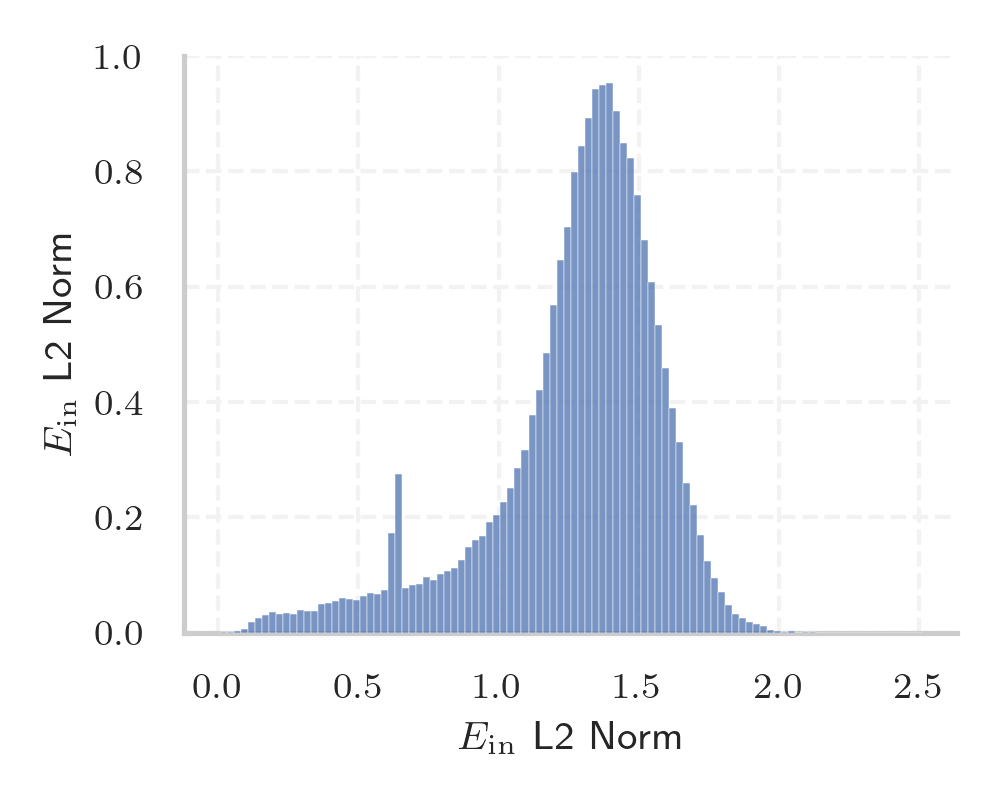
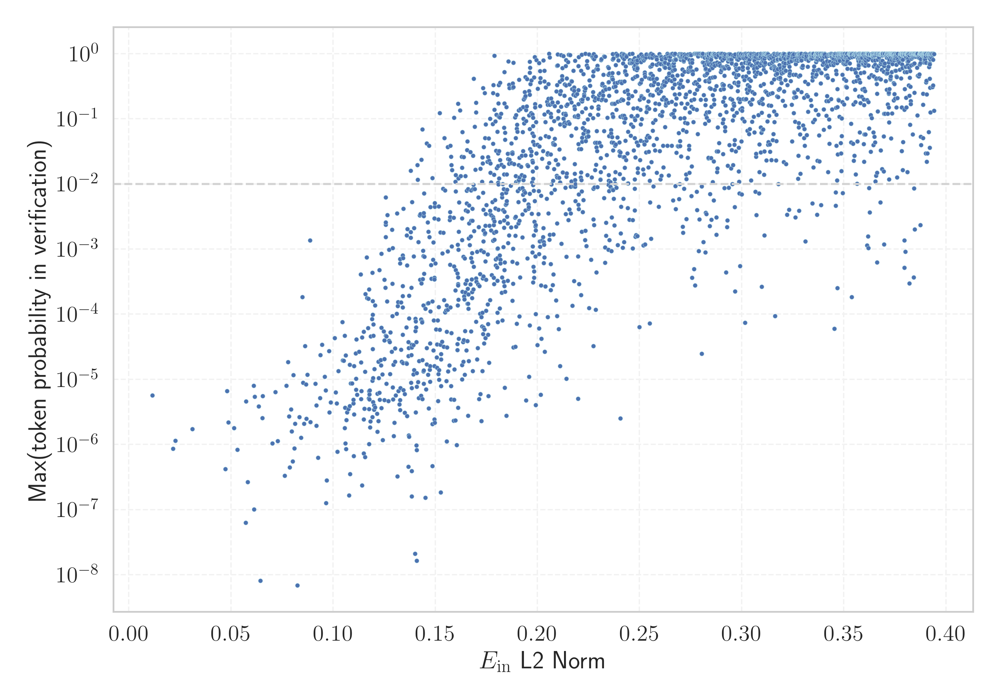

# Report for `Qwen/Qwen3-32B`

## Model info

* Model Info: 
  * Tied embeddings: False
  * LM head uses bias: False
  * Embeddings shape: [151936, 5120]
* Tokenizer Info: 
  * Vocab Size: 151669
  * Tokenizer Class: Qwen2Tokenizer
  * Tokenizer Type: BPE
  * Bytes handling: Byte Input
  * Token for verification prompt building: abcdefghijklmnopqrstuvwxyz
  * Token id for verification prompt building: 67512
* Indicator summary: 
  * Indicator for under-trained tokens: E_{in} L2 Norm
  * Overall distribution: 1.275 +/- 0.312
* Detected Token Counts: 
  * Number of tested under-trained tokens: 2966, 2966 non-special, 806 below p = 0.01 threshold, 530 below soft indicator threshold
  * Number of single byte tokens: 256, of which 1 below indicator threshold
  * Number of special tokens: 1906, of which 0 below indicator threshold
  * Number of non-single-byte unreachable tokens: 1906, of which 0 below indicator threshold
  * Number of non-single-byte UTF-fragment tokens:  1320, of which 47 below soft indicator threshold

## Under-trained token indicators plot


## Verification plot


## Under-trained token verification results
530 entries below threshold of 0.176

|   token_id | token                             |   indicator | max_prob                                                         | in_other_tokens                                                                                                                                            |
|------------|-----------------------------------|-------------|------------------------------------------------------------------|------------------------------------------------------------------------------------------------------------------------------------------------------------|
|      83971 | ````` $PostalCodesNL `````        |   0.0115779 | <span style='border: 1px solid rgb(169, 68, 66);'>5.7e-06</span> |                                                                                                                                                            |
|      79270 | ````` ▁ForCanBeConvertedToF ````` |   0.0216596 | <span style='border: 1px solid rgb(169, 68, 66);'>8.6e-07</span> | ````` ▁ForCanBeConvertedToForeach `````                                                                                                                    |
|      83969 | ````` PostalCodesNL `````         |   0.0228125 | <span style='border: 1px solid rgb(169, 68, 66);'>1.1e-06</span> | <span style='border: 1px solid rgb(169, 68, 66);'>````` $PostalCodesNL `````</span>                                                                        |
|      79269 | ````` ▁ForCanBeConverted `````    |   0.0310377 | <span style='border: 1px solid rgb(169, 68, 66);'>1.7e-06</span> | <span style='border: 1px solid rgb(169, 68, 66);'>````` ▁ForCanBeConvertedToF `````</span>, ````` ▁ForCanBeConvertedToForeach `````                        |
|     143335 | ````` ספטמ `````                  |   0.0472733 | <span style='border: 1px solid rgb(169, 68, 66);'>4.2e-07</span> | <span style='border: 1px solid rgb(40, 167, 69);'>````` ספטמבר `````</span>                                                                                |
|     151294 | ````` 𝆳 `````                     |   0.0480728 | <span style='border: 1px solid rgb(169, 68, 66);'>6.6e-06</span> |                                                                                                                                                            |
|      88372 | ````` useRalative `````           |   0.0486729 | <span style='border: 1px solid rgb(169, 68, 66);'>2.2e-06</span> | ````` useRalativeImagePath `````                                                                                                                           |
|     127734 | ````` פייסב `````                 |   0.0515105 | <span style='border: 1px solid rgb(169, 68, 66);'>1.8e-06</span> | ````` פייסבוק `````, ````` ▁בפייסבוק `````                                                                                                                 |
|     123306 | ````` 𪤗 `````                    |   0.053049  | <span style='border: 1px solid rgb(169, 68, 66);'>8.3e-07</span> |                                                                                                                                                            |
|     142386 | ````` ▁zwłaszc `````              |   0.0571471 | <span style='border: 1px solid rgb(169, 68, 66);'>6.3e-08</span> | ````` ▁zwłaszcza `````                                                                                                                                     |
|     122290 | ````` 𦭜 `````                    |   0.0573583 | <span style='border: 1px solid rgb(169, 68, 66);'>4.6e-06</span> |                                                                                                                                                            |
|     151300 | ````` 𝇠 `````                     |   0.0581709 | <span style='border: 1px solid rgb(169, 68, 66);'>2.7e-07</span> |                                                                                                                                                            |
|     150306 | ````` 숕 `````                    |   0.0611239 | <span style='border: 1px solid rgb(169, 68, 66);'>8e-06</span>   |                                                                                                                                                            |
|     151297 | ````` 𝇗 `````                     |   0.0613652 | <span style='border: 1px solid rgb(169, 68, 66);'>1e-07</span>   |                                                                                                                                                            |
|     151298 | ````` 𝇚 `````                     |   0.0615431 | <span style='border: 1px solid rgb(169, 68, 66);'>5.4e-06</span> |                                                                                                                                                            |
|      57408 | ````` :-------------</ `````      |   0.0635235 | <span style='border: 1px solid rgb(169, 68, 66);'>3.8e-06</span> |                                                                                                                                                            |
|     136954 | ````` טלוו `````                  |   0.0643499 | <span style='border: 1px solid rgb(169, 68, 66);'>8.1e-09</span> | <span style='border: 1px solid rgb(255, 145, 0);'>````` טלוויז `````</span>, <span style='border: 1px solid rgb(40, 167, 69);'>````` טלוויזיה `````</span> |
|      88371 | ````` useRal `````                |   0.0653125 | <span style='border: 1px solid rgb(169, 68, 66);'>2.5e-06</span> | <span style='border: 1px solid rgb(169, 68, 66);'>````` useRalative `````</span>, ````` useRalativeImagePath `````                                         |
|     151299 | ````` 𝇜 `````                     |   0.0655865 | <span style='border: 1px solid rgb(169, 68, 66);'>5.6e-06</span> |                                                                                                                                                            |
|     150273 | ````` 낔 `````                    |   0.0701941 | <span style='border: 1px solid rgb(169, 68, 66);'>1e-06</span>   |                                                                                                                                                            |
<details><summary>510 additional entries below threshold</summary>

|   token_id | token                       |   indicator | max_prob                                                         | in_other_tokens                                                                                                                                                                                                                                                                                                                                  |
|------------|-----------------------------|-------------|------------------------------------------------------------------|--------------------------------------------------------------------------------------------------------------------------------------------------------------------------------------------------------------------------------------------------------------------------------------------------------------------------------------------------|
|     123168 | ````` 𬒔 `````              |   0.0717624 | <span style='border: 1px solid rgb(169, 68, 66);'>6.4e-06</span> |                                                                                                                                                                                                                                                                                                                                                  |
|     128200 | ````` przedsięb `````       |   0.0729128 | <span style='border: 1px solid rgb(169, 68, 66);'>1.1e-06</span> | <span style='border: 1px solid rgb(40, 167, 69);'>````` przedsiębior `````</span>, <span style='border: 1px solid rgb(40, 167, 69);'>````` przedsiębiorst `````</span>, <span style='border: 1px solid rgb(40, 167, 69);'>````` przedsiębiorstw `````</span>, <span style='border: 1px solid rgb(169, 68, 66);'>````` przedsiębiorc `````</span> |
|     142494 | ````` ניוזל `````           |   0.0763524 | <span style='border: 1px solid rgb(169, 68, 66);'>3.3e-07</span> | <span style='border: 1px solid rgb(40, 167, 69);'>````` ניוזלטר `````</span>                                                                                                                                                                                                                                                                     |
|     123531 | ````` 𫟦 `````              |   0.0770349 | <span style='border: 1px solid rgb(169, 68, 66);'>8e-06</span>   |                                                                                                                                                                                                                                                                                                                                                  |
|     151561 | ````` 𖥨 `````               |   0.0779974 | <span style='border: 1px solid rgb(169, 68, 66);'>1.8e-05</span> |                                                                                                                                                                                                                                                                                                                                                  |
|     151296 | ````` 𝇊 `````               |   0.0784991 | <span style='border: 1px solid rgb(169, 68, 66);'>2.7e-06</span> |                                                                                                                                                                                                                                                                                                                                                  |
|     122578 | ````` 𫭼 `````              |   0.0786997 | <span style='border: 1px solid rgb(169, 68, 66);'>4.4e-07</span> |                                                                                                                                                                                                                                                                                                                                                  |
|     151293 | ````` 𝆣 `````               |   0.0794126 | <span style='border: 1px solid rgb(169, 68, 66);'>3.5e-06</span> |                                                                                                                                                                                                                                                                                                                                                  |
|     138112 | ````` ▁paździ `````         |   0.079659  | <span style='border: 1px solid rgb(169, 68, 66);'>1.6e-06</span> | ````` ▁październ `````, ````` ▁października `````                                                                                                                                                                                                                                                                                                |
|     150297 | ````` 떘 `````              |   0.0802235 | <span style='border: 1px solid rgb(169, 68, 66);'>5.5e-07</span> |                                                                                                                                                                                                                                                                                                                                                  |
|     123748 | ````` 𨭉 `````              |   0.0805819 | <span style='border: 1px solid rgb(169, 68, 66);'>1.2e-05</span> |                                                                                                                                                                                                                                                                                                                                                  |
|     123330 | ````` 𬒗 `````              |   0.0809773 | <span style='border: 1px solid rgb(169, 68, 66);'>8.7e-07</span> |                                                                                                                                                                                                                                                                                                                                                  |
|     151291 | ````` 𝅎 `````               |   0.081419  | <span style='border: 1px solid rgb(169, 68, 66);'>2.1e-06</span> |                                                                                                                                                                                                                                                                                                                                                  |
|     117332 | ````` 法战组合 `````        |   0.0825507 | <span style='border: 1px solid rgb(169, 68, 66);'>6.9e-09</span> |                                                                                                                                                                                                                                                                                                                                                  |
|     123677 | ````` 𥖨 `````              |   0.0835023 | <span style='border: 1px solid rgb(169, 68, 66);'>2.6e-06</span> |                                                                                                                                                                                                                                                                                                                                                  |
|     150983 | ````` 싨 `````              |   0.0843686 | <span style='border: 1px solid rgb(169, 68, 66);'>1.3e-06</span> |                                                                                                                                                                                                                                                                                                                                                  |
|     149947 | ````` 🠳 `````               |   0.0849112 | <span style='border: 1px solid rgb(169, 68, 66);'>0.00018</span> |                                                                                                                                                                                                                                                                                                                                                  |
|     122474 | ````` 𪨰 `````              |   0.0852554 | <span style='border: 1px solid rgb(169, 68, 66);'>8.9e-06</span> |                                                                                                                                                                                                                                                                                                                                                  |
|     149414 | ````` 툩 `````              |   0.0857034 | <span style='border: 1px solid rgb(169, 68, 66);'>2.1e-06</span> |                                                                                                                                                                                                                                                                                                                                                  |
|     151265 | ````` 𑂄 `````               |   0.0861925 | <span style='border: 1px solid rgb(169, 68, 66);'>3.2e-05</span> |                                                                                                                                                                                                                                                                                                                                                  |
|     151083 | ````` 퍿 `````              |   0.0867917 | <span style='border: 1px solid rgb(169, 68, 66);'>8.3e-06</span> |                                                                                                                                                                                                                                                                                                                                                  |
|     122502 | ````` 𦙶 `````              |   0.0869531 | <span style='border: 1px solid rgb(169, 68, 66);'>2.5e-06</span> |                                                                                                                                                                                                                                                                                                                                                  |
|     115984 | ````` 魔龙令牌 `````        |   0.0874123 | <span style='border: 1px solid rgb(169, 68, 66);'>1.2e-05</span> |                                                                                                                                                                                                                                                                                                                                                  |
|     151619 | ````` 𓏧 `````               |   0.088708  | <span style='border: 1px solid rgb(255, 145, 0);'>0.0014</span>  |                                                                                                                                                                                                                                                                                                                                                  |
|     117963 | ````` 是韩国娱 `````        |   0.088855  | <span style='border: 1px solid rgb(169, 68, 66);'>2.2e-06</span> |                                                                                                                                                                                                                                                                                                                                                  |
|     122385 | ````` 𫠊 `````              |   0.0913465 | <span style='border: 1px solid rgb(169, 68, 66);'>8.6e-06</span> |                                                                                                                                                                                                                                                                                                                                                  |
|     151490 | ````` 큻 `````              |   0.0917667 | <span style='border: 1px solid rgb(169, 68, 66);'>1.9e-06</span> |                                                                                                                                                                                                                                                                                                                                                  |
|     151267 | ````` 𑘁 `````               |   0.0918787 | <span style='border: 1px solid rgb(169, 68, 66);'>4e-06</span>   |                                                                                                                                                                                                                                                                                                                                                  |
|     151285 | ````` 𝄅 `````               |   0.0925452 | <span style='border: 1px solid rgb(169, 68, 66);'>6.2e-07</span> |                                                                                                                                                                                                                                                                                                                                                  |
|     151234 | ````` ﶰ `````               |   0.0936266 | <span style='border: 1px solid rgb(169, 68, 66);'>5.2e-06</span> |                                                                                                                                                                                                                                                                                                                                                  |
|     149800 | ````` 툶 `````              |   0.093813  | <span style='border: 1px solid rgb(169, 68, 66);'>2.4e-05</span> |                                                                                                                                                                                                                                                                                                                                                  |
|     150276 | ````` 뙝 `````              |   0.0946346 | <span style='border: 1px solid rgb(169, 68, 66);'>3.4e-05</span> |                                                                                                                                                                                                                                                                                                                                                  |
|     151090 | ````` 퓷 `````              |   0.0958129 | <span style='border: 1px solid rgb(169, 68, 66);'>1.1e-05</span> |                                                                                                                                                                                                                                                                                                                                                  |
|     151286 | ````` 𝄕 `````               |   0.0964378 | <span style='border: 1px solid rgb(169, 68, 66);'>6.8e-06</span> |                                                                                                                                                                                                                                                                                                                                                  |
|     150308 | ````` 쓻 `````              |   0.0965597 | <span style='border: 1px solid rgb(169, 68, 66);'>1.3e-07</span> |                                                                                                                                                                                                                                                                                                                                                  |
|     122223 | ````` 𫵷 `````              |   0.09687   | <span style='border: 1px solid rgb(169, 68, 66);'>2.8e-07</span> |                                                                                                                                                                                                                                                                                                                                                  |
|     149983 | ````` 웛 `````              |   0.0979942 | <span style='border: 1px solid rgb(169, 68, 66);'>2.7e-05</span> |                                                                                                                                                                                                                                                                                                                                                  |
|      78323 | ````` ▁thuisontvangst ````` |   0.0981622 | <span style='border: 1px solid rgb(169, 68, 66);'>3.1e-06</span> |                                                                                                                                                                                                                                                                                                                                                  |
|     151036 | ````` 쩻 `````              |   0.0988422 | <span style='border: 1px solid rgb(169, 68, 66);'>4.4e-06</span> |                                                                                                                                                                                                                                                                                                                                                  |
|     150221 | ````` 톢 `````              |   0.100771  | <span style='border: 1px solid rgb(169, 68, 66);'>4.3e-05</span> |                                                                                                                                                                                                                                                                                                                                                  |
|     150196 | ````` 𓅺 `````               |   0.101239  | <span style='border: 1px solid rgb(169, 68, 66);'>6.3e-06</span> |                                                                                                                                                                                                                                                                                                                                                  |
|     150914 | ````` 뛩 `````              |   0.101829  | <span style='border: 1px solid rgb(169, 68, 66);'>4.3e-06</span> |                                                                                                                                                                                                                                                                                                                                                  |
|     149762 | ````` 쁄 `````              |   0.10202   | <span style='border: 1px solid rgb(169, 68, 66);'>7.7e-07</span> |                                                                                                                                                                                                                                                                                                                                                  |
|     123637 | ````` 𬸪 `````              |   0.102524  | <span style='border: 1px solid rgb(169, 68, 66);'>1.3e-05</span> |                                                                                                                                                                                                                                                                                                                                                  |
|     150747 | ````` ⸾ `````               |   0.104489  | <span style='border: 1px solid rgb(169, 68, 66);'>7.6e-05</span> |                                                                                                                                                                                                                                                                                                                                                  |
|     147410 | ````` ꀰ `````              |   0.104726  | <span style='border: 1px solid rgb(169, 68, 66);'>2e-05</span>   |                                                                                                                                                                                                                                                                                                                                                  |
|     151066 | ````` 퀅 `````              |   0.105244  | <span style='border: 1px solid rgb(169, 68, 66);'>1.9e-05</span> |                                                                                                                                                                                                                                                                                                                                                  |
|     151052 | ````` 촋 `````              |   0.105618  | <span style='border: 1px solid rgb(169, 68, 66);'>1.8e-06</span> |                                                                                                                                                                                                                                                                                                                                                  |
|     147930 | ````` 🖏 `````               |   0.105661  | <span style='border: 1px solid rgb(169, 68, 66);'>4.7e-05</span> |                                                                                                                                                                                                                                                                                                                                                  |
|     151037 | ````` 쩼 `````              |   0.105913  | <span style='border: 1px solid rgb(169, 68, 66);'>3.7e-06</span> |                                                                                                                                                                                                                                                                                                                                                  |
|     151023 | ````` 졵 `````              |   0.105999  | <span style='border: 1px solid rgb(169, 68, 66);'>1e-06</span>   |                                                                                                                                                                                                                                                                                                                                                  |
|     149980 | ````` 섥 `````              |   0.106185  | <span style='border: 1px solid rgb(169, 68, 66);'>2.3e-05</span> |                                                                                                                                                                                                                                                                                                                                                  |
|     150877 | ````` 냵 `````              |   0.106306  | <span style='border: 1px solid rgb(169, 68, 66);'>8.5e-07</span> |                                                                                                                                                                                                                                                                                                                                                  |
|     149463 | ````` 켚 `````              |   0.106539  | <span style='border: 1px solid rgb(169, 68, 66);'>2.4e-06</span> |                                                                                                                                                                                                                                                                                                                                                  |
|     123702 | ````` 𦒍 `````              |   0.106874  | <span style='border: 1px solid rgb(169, 68, 66);'>3.1e-06</span> |                                                                                                                                                                                                                                                                                                                                                  |
|     149117 | ````` 헠 `````              |   0.107394  | <span style='border: 1px solid rgb(169, 68, 66);'>3.5e-06</span> |                                                                                                                                                                                                                                                                                                                                                  |
|     148659 | ````` 퀫 `````              |   0.107792  | <span style='border: 1px solid rgb(169, 68, 66);'>1.7e-07</span> |                                                                                                                                                                                                                                                                                                                                                  |
|     150978 | ````` 솤 `````              |   0.108049  | <span style='border: 1px solid rgb(169, 68, 66);'>1.7e-05</span> |                                                                                                                                                                                                                                                                                                                                                  |
|     150275 | ````` 뇗 `````              |   0.108087  | <span style='border: 1px solid rgb(169, 68, 66);'>3.9e-06</span> |                                                                                                                                                                                                                                                                                                                                                  |
|     139487 | ````` אוטוב `````           |   0.108247  | <span style='border: 1px solid rgb(169, 68, 66);'>3.5e-07</span> | ````` אוטובוס `````                                                                                                                                                                                                                                                                                                                              |
|     123132 | ````` 𤧛 `````              |   0.1086    | <span style='border: 1px solid rgb(169, 68, 66);'>8.6e-06</span> |                                                                                                                                                                                                                                                                                                                                                  |
|     150963 | ````` 뺃 `````              |   0.109208  | <span style='border: 1px solid rgb(169, 68, 66);'>8.7e-06</span> |                                                                                                                                                                                                                                                                                                                                                  |
|     123302 | ````` 𡐓 `````              |   0.109886  | <span style='border: 1px solid rgb(169, 68, 66);'>4.3e-06</span> |                                                                                                                                                                                                                                                                                                                                                  |
|     150301 | ````` 뢉 `````              |   0.10993   | <span style='border: 1px solid rgb(169, 68, 66);'>4.9e-06</span> |                                                                                                                                                                                                                                                                                                                                                  |
|     150901 | ````` 둁 `````              |   0.11      | <span style='border: 1px solid rgb(169, 68, 66);'>6.6e-07</span> |                                                                                                                                                                                                                                                                                                                                                  |
|     118754 | ````` 主動註冊 `````        |   0.110209  | <span style='border: 1px solid rgb(169, 68, 66);'>1.6e-05</span> |                                                                                                                                                                                                                                                                                                                                                  |
|     151109 | ````` 혖 `````              |   0.110278  | <span style='border: 1px solid rgb(169, 68, 66);'>2.9e-06</span> |                                                                                                                                                                                                                                                                                                                                                  |
|     150969 | ````` 쁭 `````              |   0.111012  | <span style='border: 1px solid rgb(169, 68, 66);'>2.5e-05</span> |                                                                                                                                                                                                                                                                                                                                                  |
|     150994 | ````` 쒯 `````              |   0.111159  | <span style='border: 1px solid rgb(169, 68, 66);'>7e-06</span>   |                                                                                                                                                                                                                                                                                                                                                  |
|     151102 | ````` 햍 `````              |   0.111296  | <span style='border: 1px solid rgb(169, 68, 66);'>1e-05</span>   |                                                                                                                                                                                                                                                                                                                                                  |
|     149092 | ````` 볽 `````              |   0.111445  | <span style='border: 1px solid rgb(169, 68, 66);'>4.1e-05</span> |                                                                                                                                                                                                                                                                                                                                                  |
|     150878 | ````` 넖 `````              |   0.111666  | <span style='border: 1px solid rgb(169, 68, 66);'>5.8e-06</span> |                                                                                                                                                                                                                                                                                                                                                  |
|     150992 | ````` 쑻 `````              |   0.112743  | <span style='border: 1px solid rgb(169, 68, 66);'>2.7e-05</span> |                                                                                                                                                                                                                                                                                                                                                  |
|     151203 | ````` ﰜ `````               |   0.113523  | <span style='border: 1px solid rgb(169, 68, 66);'>0.00041</span> |                                                                                                                                                                                                                                                                                                                                                  |
|     150886 | ````` 뉍 `````              |   0.113633  | <span style='border: 1px solid rgb(169, 68, 66);'>5e-06</span>   |                                                                                                                                                                                                                                                                                                                                                  |
|     150309 | ````` 얊 `````              |   0.113686  | <span style='border: 1px solid rgb(169, 68, 66);'>1.8e-05</span> |                                                                                                                                                                                                                                                                                                                                                  |
|     149466 | ````` 팖 `````              |   0.113814  | <span style='border: 1px solid rgb(169, 68, 66);'>6.6e-06</span> |                                                                                                                                                                                                                                                                                                                                                  |
|     150885 | ````` 눚 `````              |   0.114124  | <span style='border: 1px solid rgb(169, 68, 66);'>2.3e-07</span> |                                                                                                                                                                                                                                                                                                                                                  |
|     151289 | ````` 𝄴 `````               |   0.114188  | <span style='border: 1px solid rgb(169, 68, 66);'>4.4e-05</span> |                                                                                                                                                                                                                                                                                                                                                  |
|     115478 | ````` 战战组合 `````        |   0.114944  | <span style='border: 1px solid rgb(169, 68, 66);'>7.3e-07</span> |                                                                                                                                                                                                                                                                                                                                                  |
|     150933 | ````` 맫 `````              |   0.114951  | <span style='border: 1px solid rgb(169, 68, 66);'>5.4e-05</span> |                                                                                                                                                                                                                                                                                                                                                  |
|     142142 | ````` אוניב `````           |   0.115006  | <span style='border: 1px solid rgb(169, 68, 66);'>2.4e-06</span> | ````` אוניברס `````, ````` אוניברסיטת `````                                                                                                                                                                                                                                                                                                      |
|     150881 | ````` 녂 `````              |   0.115328  | <span style='border: 1px solid rgb(169, 68, 66);'>3.5e-06</span> |                                                                                                                                                                                                                                                                                                                                                  |
|     151448 | ````` 쥉 `````              |   0.115606  | <span style='border: 1px solid rgb(169, 68, 66);'>6.4e-07</span> |                                                                                                                                                                                                                                                                                                                                                  |
|     151219 | ````` ﲋ `````               |   0.115619  | <span style='border: 1px solid rgb(169, 68, 66);'>1.3e-05</span> |                                                                                                                                                                                                                                                                                                                                                  |
|     150538 | ````` ᕛ `````               |   0.115821  | <span style='border: 1px solid rgb(169, 68, 66);'>0.0002</span>  |                                                                                                                                                                                                                                                                                                                                                  |
|     151288 | ````` 𝄱 `````               |   0.116452  | <span style='border: 1px solid rgb(169, 68, 66);'>0.00074</span> |                                                                                                                                                                                                                                                                                                                                                  |
|     150915 | ````` 뜅 `````              |   0.116635  | <span style='border: 1px solid rgb(169, 68, 66);'>0.00018</span> |                                                                                                                                                                                                                                                                                                                                                  |
|     150975 | ````` 셢 `````              |   0.117033  | <span style='border: 1px solid rgb(169, 68, 66);'>6.1e-05</span> |                                                                                                                                                                                                                                                                                                                                                  |
|     149805 | ````` 흝 `````              |   0.117265  | <span style='border: 1px solid rgb(169, 68, 66);'>0.00017</span> |                                                                                                                                                                                                                                                                                                                                                  |
|     151437 | ````` 뻅 `````              |   0.117463  | <span style='border: 1px solid rgb(169, 68, 66);'>5.1e-06</span> |                                                                                                                                                                                                                                                                                                                                                  |
|     150907 | ````` 땧 `````              |   0.11759   | <span style='border: 1px solid rgb(169, 68, 66);'>1e-06</span>   |                                                                                                                                                                                                                                                                                                                                                  |
|     122407 | ````` 鿍 `````              |   0.11761   | <span style='border: 1px solid rgb(169, 68, 66);'>6.6e-06</span> |                                                                                                                                                                                                                                                                                                                                                  |
|     150892 | ````` 댘 `````              |   0.117635  | <span style='border: 1px solid rgb(169, 68, 66);'>0.00024</span> |                                                                                                                                                                                                                                                                                                                                                  |
|     150799 | ````` 㺾 `````              |   0.117638  | <span style='border: 1px solid rgb(169, 68, 66);'>3.5e-06</span> |                                                                                                                                                                                                                                                                                                                                                  |
|     151486 | ````` 웢 `````              |   0.117744  | <span style='border: 1px solid rgb(169, 68, 66);'>5.9e-06</span> |                                                                                                                                                                                                                                                                                                                                                  |
|     123552 | ````` 𬭯 `````              |   0.117757  | <span style='border: 1px solid rgb(169, 68, 66);'>4.9e-06</span> |                                                                                                                                                                                                                                                                                                                                                  |
|     149413 | ````` 칕 `````              |   0.117946  | <span style='border: 1px solid rgb(169, 68, 66);'>6.8e-06</span> |                                                                                                                                                                                                                                                                                                                                                  |
|     151038 | ````` 쪗 `````              |   0.118145  | <span style='border: 1px solid rgb(169, 68, 66);'>1.8e-06</span> |                                                                                                                                                                                                                                                                                                                                                  |
|     151212 | ````` ﱈ `````               |   0.118159  | <span style='border: 1px solid rgb(169, 68, 66);'>2.3e-06</span> |                                                                                                                                                                                                                                                                                                                                                  |
|     151422 | ````` ᡌ `````               |   0.11838   | <span style='border: 1px solid rgb(169, 68, 66);'>4.6e-05</span> |                                                                                                                                                                                                                                                                                                                                                  |
|     150869 | ````` 깣 `````              |   0.119007  | <span style='border: 1px solid rgb(169, 68, 66);'>8.4e-05</span> |                                                                                                                                                                                                                                                                                                                                                  |
|      45972 | ````` webElementX `````     |   0.11925   | <span style='border: 1px solid rgb(169, 68, 66);'>0.00043</span> | ````` webElementXpaths `````                                                                                                                                                                                                                                                                                                                     |
|     149962 | ````` 𣷭 `````              |   0.119253  | <span style='border: 1px solid rgb(169, 68, 66);'>2.6e-06</span> |                                                                                                                                                                                                                                                                                                                                                  |
|     116355 | ````` 格會員 `````          |   0.119255  | <span style='border: 1px solid rgb(169, 68, 66);'>9.5e-06</span> |                                                                                                                                                                                                                                                                                                                                                  |
|     120101 | ````` 𠳐 `````              |   0.119325  | <span style='border: 1px solid rgb(169, 68, 66);'>0.00016</span> |                                                                                                                                                                                                                                                                                                                                                  |
|     151050 | ````` 첯 `````              |   0.119359  | <span style='border: 1px solid rgb(169, 68, 66);'>2.9e-05</span> |                                                                                                                                                                                                                                                                                                                                                  |
|     151551 | ````` 퓮 `````              |   0.119373  | <span style='border: 1px solid rgb(169, 68, 66);'>9.9e-05</span> |                                                                                                                                                                                                                                                                                                                                                  |
|     151292 | ````` 𝅪 `````               |   0.119466  | <span style='border: 1px solid rgb(169, 68, 66);'>1e-05</span>   |                                                                                                                                                                                                                                                                                                                                                  |
|     122268 | ````` 𨚕 `````              |   0.119563  | <span style='border: 1px solid rgb(169, 68, 66);'>4.5e-06</span> |                                                                                                                                                                                                                                                                                                                                                  |
|     151088 | ````` 퓪 `````              |   0.119705  | <span style='border: 1px solid rgb(169, 68, 66);'>7e-05</span>   |                                                                                                                                                                                                                                                                                                                                                  |
|     151208 | ````` ﰼ `````               |   0.11974   | <span style='border: 1px solid rgb(169, 68, 66);'>4.7e-05</span> |                                                                                                                                                                                                                                                                                                                                                  |
|     143849 | ````` ▁الديمقرا `````       |   0.120048  | <span style='border: 1px solid rgb(169, 68, 66);'>3.4e-06</span> | ````` ▁الديمقراط `````, ````` ▁الديمقراطية `````                                                                                                                                                                                                                                                                                                 |
|     149112 | ````` 텦 `````              |   0.120059  | <span style='border: 1px solid rgb(169, 68, 66);'>4e-06</span>   |                                                                                                                                                                                                                                                                                                                                                  |
|     151018 | ````` 젡 `````              |   0.120246  | <span style='border: 1px solid rgb(169, 68, 66);'>1.4e-05</span> |                                                                                                                                                                                                                                                                                                                                                  |
|     151548 | ````` 켇 `````              |   0.120561  | <span style='border: 1px solid rgb(169, 68, 66);'>3.7e-06</span> |                                                                                                                                                                                                                                                                                                                                                  |
|     150988 | ````` 쎘 `````              |   0.120562  | <span style='border: 1px solid rgb(169, 68, 66);'>0.00014</span> |                                                                                                                                                                                                                                                                                                                                                  |
|     149979 | ````` 뤗 `````              |   0.121565  | <span style='border: 1px solid rgb(169, 68, 66);'>3e-06</span>   |                                                                                                                                                                                                                                                                                                                                                  |
|     150944 | ````` 뮘 `````              |   0.121604  | <span style='border: 1px solid rgb(169, 68, 66);'>1.6e-06</span> |                                                                                                                                                                                                                                                                                                                                                  |
|     150871 | ````` 꺳 `````              |   0.121609  | <span style='border: 1px solid rgb(169, 68, 66);'>6e-06</span>   |                                                                                                                                                                                                                                                                                                                                                  |
|     133741 | ````` ▁הישרא `````          |   0.122193  | <span style='border: 1px solid rgb(169, 68, 66);'>2.3e-06</span> | ````` ▁הישראלי `````, <span style='border: 1px solid rgb(40, 167, 69);'>````` ▁הישראל `````</span>, ````` ▁הישראלית `````                                                                                                                                                                                                                        |
|     151204 | ````` ﰞ `````               |   0.122197  | <span style='border: 1px solid rgb(169, 68, 66);'>1.9e-05</span> |                                                                                                                                                                                                                                                                                                                                                  |
|     150017 | ````` 욝 `````              |   0.122304  | <span style='border: 1px solid rgb(169, 68, 66);'>1.1e-05</span> |                                                                                                                                                                                                                                                                                                                                                  |
|     123642 | ````` 𬶠 `````              |   0.122602  | <span style='border: 1px solid rgb(169, 68, 66);'>0.00048</span> |                                                                                                                                                                                                                                                                                                                                                  |
|      86278 | ````` ▁sexkontakte `````    |   0.122651  | <span style='border: 1px solid rgb(169, 68, 66);'>6.3e-06</span> |                                                                                                                                                                                                                                                                                                                                                  |
|     138175 | ````` Cumhurbaş `````       |   0.122875  | <span style='border: 1px solid rgb(169, 68, 66);'>4.9e-06</span> | ````` Cumhurbaşkan `````, ````` Cumhurbaşkanı `````                                                                                                                                                                                                                                                                                              |
|     150298 | ````` 뜷 `````              |   0.123271  | <span style='border: 1px solid rgb(169, 68, 66);'>2e-05</span>   |                                                                                                                                                                                                                                                                                                                                                  |
|     151053 | ````` 촢 `````              |   0.123515  | <span style='border: 1px solid rgb(169, 68, 66);'>1.6e-05</span> |                                                                                                                                                                                                                                                                                                                                                  |
|     151048 | ````` 첧 `````              |   0.12361   | <span style='border: 1px solid rgb(169, 68, 66);'>3.6e-06</span> |                                                                                                                                                                                                                                                                                                                                                  |
|     151260 | ````` 𐭉 `````               |   0.123629  | <span style='border: 1px solid rgb(169, 68, 66);'>6.2e-05</span> |                                                                                                                                                                                                                                                                                                                                                  |
|     150544 | ````` ᗗ `````               |   0.123632  | <span style='border: 1px solid rgb(169, 68, 66);'>0.00085</span> |                                                                                                                                                                                                                                                                                                                                                  |
|     151000 | ````` 엃 `````              |   0.124055  | <span style='border: 1px solid rgb(169, 68, 66);'>1.2e-05</span> |                                                                                                                                                                                                                                                                                                                                                  |
|     151016 | ````` 잪 `````              |   0.124256  | <span style='border: 1px solid rgb(169, 68, 66);'>1.2e-06</span> |                                                                                                                                                                                                                                                                                                                                                  |
|     151015 | ````` 잨 `````              |   0.124715  | <span style='border: 1px solid rgb(169, 68, 66);'>5.4e-05</span> |                                                                                                                                                                                                                                                                                                                                                  |
|     147342 | ````` 띕 `````              |   0.125044  | <span style='border: 1px solid rgb(169, 68, 66);'>0.00034</span> |                                                                                                                                                                                                                                                                                                                                                  |
|     122726 | ````` 𨺙 `````              |   0.1251    | <span style='border: 1px solid rgb(169, 68, 66);'>2.1e-05</span> |                                                                                                                                                                                                                                                                                                                                                  |
|     150993 | ````` 쒔 `````              |   0.125125  | <span style='border: 1px solid rgb(169, 68, 66);'>4e-05</span>   |                                                                                                                                                                                                                                                                                                                                                  |
|     151547 | ````` 솊 `````              |   0.12516   | <span style='border: 1px solid rgb(169, 68, 66);'>4.8e-06</span> |                                                                                                                                                                                                                                                                                                                                                  |
|     149758 | ````` 뵉 `````              |   0.125652  | <span style='border: 1px solid rgb(169, 68, 66);'>0.00025</span> |                                                                                                                                                                                                                                                                                                                                                  |
|     150853 | ````` 겚 `````              |   0.12568   | <span style='border: 1px solid rgb(169, 68, 66);'>4.7e-05</span> |                                                                                                                                                                                                                                                                                                                                                  |
|     151009 | ````` 윧 `````              |   0.125699  | <span style='border: 1px solid rgb(255, 145, 0);'>0.0024</span>  |                                                                                                                                                                                                                                                                                                                                                  |
|     150549 | ````` ᘑ `````               |   0.1257    | <span style='border: 1px solid rgb(255, 145, 0);'>0.0026</span>  |                                                                                                                                                                                                                                                                                                                                                  |
|     150808 | ````` 䠼 `````              |   0.125702  | <span style='border: 1px solid rgb(255, 145, 0);'>0.0062</span>  |                                                                                                                                                                                                                                                                                                                                                  |
|     151002 | ````` 엜 `````              |   0.125785  | <span style='border: 1px solid rgb(255, 145, 0);'>0.0015</span>  |                                                                                                                                                                                                                                                                                                                                                  |
|     151229 | ````` ﳫ `````               |   0.126116  | <span style='border: 1px solid rgb(169, 68, 66);'>8.5e-06</span> |                                                                                                                                                                                                                                                                                                                                                  |
|     150795 | ````` 㨳 `````              |   0.126137  | <span style='border: 1px solid rgb(169, 68, 66);'>4.6e-05</span> |                                                                                                                                                                                                                                                                                                                                                  |
|     122927 | ````` 𫟅 `````              |   0.126332  | <span style='border: 1px solid rgb(169, 68, 66);'>0.00016</span> |                                                                                                                                                                                                                                                                                                                                                  |
|     149098 | ````` 쏸 `````              |   0.126498  | <span style='border: 1px solid rgb(255, 145, 0);'>0.0033</span>  |                                                                                                                                                                                                                                                                                                                                                  |
|      83576 | ````` ▁wannonce `````       |   0.126981  | <span style='border: 1px solid rgb(169, 68, 66);'>4.7e-06</span> |                                                                                                                                                                                                                                                                                                                                                  |
|     149802 | ````` 햤 `````              |   0.12738   | <span style='border: 1px solid rgb(169, 68, 66);'>0.00098</span> |                                                                                                                                                                                                                                                                                                                                                  |
|     149446 | ````` ﳈ `````               |   0.127412  | <span style='border: 1px solid rgb(169, 68, 66);'>3.9e-05</span> |                                                                                                                                                                                                                                                                                                                                                  |
|     149792 | ````` 촣 `````              |   0.12765   | <span style='border: 1px solid rgb(169, 68, 66);'>3.8e-05</span> |                                                                                                                                                                                                                                                                                                                                                  |
|     149796 | ````` 쿙 `````              |   0.127861  | <span style='border: 1px solid rgb(169, 68, 66);'>1.2e-05</span> |                                                                                                                                                                                                                                                                                                                                                  |
|     151070 | ````` 탹 `````              |   0.127966  | <span style='border: 1px solid rgb(169, 68, 66);'>5.3e-05</span> |                                                                                                                                                                                                                                                                                                                                                  |
|     123741 | ````` 𨟠 `````              |   0.128618  | <span style='border: 1px solid rgb(169, 68, 66);'>2.6e-05</span> |                                                                                                                                                                                                                                                                                                                                                  |
|     150846 | ````` ꪼ `````               |   0.128893  | <span style='border: 1px solid rgb(255, 145, 0);'>0.002</span>   |                                                                                                                                                                                                                                                                                                                                                  |
|     150893 | ````` 댤 `````              |   0.129049  | <span style='border: 1px solid rgb(169, 68, 66);'>9.4e-05</span> |                                                                                                                                                                                                                                                                                                                                                  |
|     149731 | ````` 꾈 `````              |   0.129089  | <span style='border: 1px solid rgb(169, 68, 66);'>0.00029</span> |                                                                                                                                                                                                                                                                                                                                                  |
|     151030 | ````` 짥 `````              |   0.129092  | <span style='border: 1px solid rgb(255, 145, 0);'>0.001</span>   |                                                                                                                                                                                                                                                                                                                                                  |
|     151069 | ````` 탶 `````              |   0.129157  | <span style='border: 1px solid rgb(169, 68, 66);'>7.5e-06</span> |                                                                                                                                                                                                                                                                                                                                                  |
|     122615 | ````` 𨐈 `````              |   0.129294  | <span style='border: 1px solid rgb(169, 68, 66);'>4.9e-06</span> |                                                                                                                                                                                                                                                                                                                                                  |
|     148353 | ````` 퉜 `````              |   0.129458  | <span style='border: 1px solid rgb(169, 68, 66);'>1.7e-05</span> |                                                                                                                                                                                                                                                                                                                                                  |
|     150909 | ````` 떪 `````              |   0.129617  | <span style='border: 1px solid rgb(169, 68, 66);'>1.4e-06</span> |                                                                                                                                                                                                                                                                                                                                                  |
|     151064 | ````` 쿅 `````              |   0.130032  | <span style='border: 1px solid rgb(169, 68, 66);'>2.2e-06</span> |                                                                                                                                                                                                                                                                                                                                                  |
|     150858 | ````` 굛 `````              |   0.13027   | <span style='border: 1px solid rgb(169, 68, 66);'>3e-05</span>   |                                                                                                                                                                                                                                                                                                                                                  |
|     151280 | ````` 𓃢 `````               |   0.130359  | <span style='border: 1px solid rgb(169, 68, 66);'>1.9e-05</span> |                                                                                                                                                                                                                                                                                                                                                  |
|     151091 | ````` 퓼 `````              |   0.130583  | <span style='border: 1px solid rgb(169, 68, 66);'>5.7e-06</span> |                                                                                                                                                                                                                                                                                                                                                  |
|     151067 | ````` 큦 `````              |   0.131187  | <span style='border: 1px solid rgb(169, 68, 66);'>0.0001</span>  |                                                                                                                                                                                                                                                                                                                                                  |
|     149789 | ````` 쩠 `````              |   0.131345  | <span style='border: 1px solid rgb(255, 145, 0);'>0.0035</span>  |                                                                                                                                                                                                                                                                                                                                                  |
|     143978 | ````` מתרחש `````           |   0.131496  | <span style='border: 1px solid rgb(169, 68, 66);'>3.2e-07</span> |                                                                                                                                                                                                                                                                                                                                                  |
|     150880 | ````` 넢 `````              |   0.131615  | <span style='border: 1px solid rgb(169, 68, 66);'>0.00013</span> |                                                                                                                                                                                                                                                                                                                                                  |
|     151493 | ````` 퓭 `````              |   0.131856  | <span style='border: 1px solid rgb(169, 68, 66);'>0.00015</span> |                                                                                                                                                                                                                                                                                                                                                  |
|     149142 | ````` ﴼ `````               |   0.131895  | <span style='border: 1px solid rgb(169, 68, 66);'>6.6e-06</span> |                                                                                                                                                                                                                                                                                                                                                  |
|     147699 | ````` 꾐 `````              |   0.132361  | <span style='border: 1px solid rgb(169, 68, 66);'>4.1e-06</span> |                                                                                                                                                                                                                                                                                                                                                  |
|     142385 | ````` ▁zwłas `````          |   0.132701  | <span style='border: 1px solid rgb(169, 68, 66);'>4.8e-06</span> | <span style='border: 1px solid rgb(169, 68, 66);'>````` ▁zwłaszc `````</span>, ````` ▁zwłaszcza `````                                                                                                                                                                                                                                            |
|     151436 | ````` 믑 `````              |   0.132752  | <span style='border: 1px solid rgb(169, 68, 66);'>0.00061</span> |                                                                                                                                                                                                                                                                                                                                                  |
|     150797 | ````` 㫴 `````              |   0.132779  | <span style='border: 1px solid rgb(169, 68, 66);'>0.0007</span>  |                                                                                                                                                                                                                                                                                                                                                  |
|     137568 | ````` ▁ücrets `````         |   0.132803  | <span style='border: 1px solid rgb(169, 68, 66);'>3.4e-06</span> | ````` ▁ücretsiz `````                                                                                                                                                                                                                                                                                                                            |
|     147903 | ````` 팼 `````              |   0.132985  | <span style='border: 1px solid rgb(169, 68, 66);'>7.3e-06</span> |                                                                                                                                                                                                                                                                                                                                                  |
|     149771 | ````` 쐴 `````              |   0.133183  | <span style='border: 1px solid rgb(169, 68, 66);'>0.00015</span> |                                                                                                                                                                                                                                                                                                                                                  |
|     150803 | ````` 䋌 `````              |   0.133277  | <span style='border: 1px solid rgb(169, 68, 66);'>2.8e-05</span> |                                                                                                                                                                                                                                                                                                                                                  |
|     151084 | ````` 펶 `````              |   0.133621  | <span style='border: 1px solid rgb(169, 68, 66);'>1.9e-05</span> |                                                                                                                                                                                                                                                                                                                                                  |
|     149729 | ````` 굠 `````              |   0.133993  | <span style='border: 1px solid rgb(169, 68, 66);'>0.00027</span> |                                                                                                                                                                                                                                                                                                                                                  |
|     151444 | ````` 읩 `````              |   0.134056  | <span style='border: 1px solid rgb(169, 68, 66);'>0.0008</span>  |                                                                                                                                                                                                                                                                                                                                                  |
|     122951 | ````` 𡎚 `````              |   0.134112  | <span style='border: 1px solid rgb(169, 68, 66);'>0.00019</span> |                                                                                                                                                                                                                                                                                                                                                  |
|     149321 | ````` 쫭 `````              |   0.134112  | <span style='border: 1px solid rgb(169, 68, 66);'>0.00013</span> |                                                                                                                                                                                                                                                                                                                                                  |
|     148463 | ````` 㹦 `````              |   0.134138  | <span style='border: 1px solid rgb(169, 68, 66);'>4.8e-05</span> |                                                                                                                                                                                                                                                                                                                                                  |
|     151068 | ````` 킅 `````              |   0.134151  | <span style='border: 1px solid rgb(169, 68, 66);'>1.8e-05</span> |                                                                                                                                                                                                                                                                                                                                                  |
|     151558 | ````` 𐭊 `````               |   0.1343    | <span style='border: 1px solid rgb(169, 68, 66);'>0.00073</span> |                                                                                                                                                                                                                                                                                                                                                  |
|     150279 | ````` 쟛 `````              |   0.13438   | <span style='border: 1px solid rgb(169, 68, 66);'>6.9e-06</span> |                                                                                                                                                                                                                                                                                                                                                  |
|     151215 | ````` ﱭ `````               |   0.134381  | <span style='border: 1px solid rgb(255, 145, 0);'>0.0042</span>  |                                                                                                                                                                                                                                                                                                                                                  |
|     115992 | ````` 鸟成长记 `````        |   0.134983  | <span style='border: 1px solid rgb(169, 68, 66);'>5.9e-06</span> |                                                                                                                                                                                                                                                                                                                                                  |
|     149462 | ````` 섄 `````              |   0.135033  | <span style='border: 1px solid rgb(169, 68, 66);'>3.1e-06</span> |                                                                                                                                                                                                                                                                                                                                                  |
|     147945 | ````` 뺍 `````              |   0.135898  | <span style='border: 1px solid rgb(169, 68, 66);'>6.3e-05</span> |                                                                                                                                                                                                                                                                                                                                                  |
|     151433 | ````` 딉 `````              |   0.135902  | <span style='border: 1px solid rgb(169, 68, 66);'>1.8e-05</span> |                                                                                                                                                                                                                                                                                                                                                  |
|     149764 | ````` 삻 `````              |   0.136016  | <span style='border: 1px solid rgb(169, 68, 66);'>1.7e-05</span> |                                                                                                                                                                                                                                                                                                                                                  |
|     122588 | ````` 𬜯 `````              |   0.13604   | <span style='border: 1px solid rgb(255, 145, 0);'>0.0016</span>  |                                                                                                                                                                                                                                                                                                                                                  |
|     151114 | ````` 흟 `````              |   0.13616   | <span style='border: 1px solid rgb(169, 68, 66);'>0.00056</span> |                                                                                                                                                                                                                                                                                                                                                  |
|     117971 | ````` 力还是自 `````        |   0.136231  | <span style='border: 1px solid rgb(169, 68, 66);'>2.7e-06</span> |                                                                                                                                                                                                                                                                                                                                                  |
|     150857 | ````` 괙 `````              |   0.136353  | <span style='border: 1px solid rgb(255, 145, 0);'>0.002</span>   |                                                                                                                                                                                                                                                                                                                                                  |
|     149594 | ````` ᰍ `````               |   0.136792  | <span style='border: 1px solid rgb(169, 68, 66);'>4.5e-07</span> |                                                                                                                                                                                                                                                                                                                                                  |
|      45854 | ````` ▁swingerclub `````    |   0.136827  | <span style='border: 1px solid rgb(169, 68, 66);'>3.7e-05</span> |                                                                                                                                                                                                                                                                                                                                                  |
|     150860 | ````` 궕 `````              |   0.136891  | <span style='border: 1px solid rgb(169, 68, 66);'>2.3e-05</span> |                                                                                                                                                                                                                                                                                                                                                  |
|     151022 | ````` 졪 `````              |   0.136927  | <span style='border: 1px solid rgb(169, 68, 66);'>1.4e-06</span> |                                                                                                                                                                                                                                                                                                                                                  |
|     151031 | ````` 짴 `````              |   0.13696   | <span style='border: 1px solid rgb(169, 68, 66);'>3e-05</span>   |                                                                                                                                                                                                                                                                                                                                                  |
|     122768 | ````` 䓫 `````              |   0.137153  | <span style='border: 1px solid rgb(169, 68, 66);'>0.00019</span> |                                                                                                                                                                                                                                                                                                                                                  |
|     149734 | ````` 넑 `````              |   0.13722   | <span style='border: 1px solid rgb(169, 68, 66);'>8.7e-05</span> |                                                                                                                                                                                                                                                                                                                                                  |
|     151006 | ````` 옏 `````              |   0.137228  | <span style='border: 1px solid rgb(169, 68, 66);'>1.3e-06</span> |                                                                                                                                                                                                                                                                                                                                                  |
|     147390 | ````` 윁 `````              |   0.137984  | <span style='border: 1px solid rgb(251, 189, 8);'>0.016</span>   |                                                                                                                                                                                                                                                                                                                                                  |
|     151029 | ````` 즑 `````              |   0.138035  | <span style='border: 1px solid rgb(255, 145, 0);'>0.0015</span>  |                                                                                                                                                                                                                                                                                                                                                  |
|     150283 | ````` ퟰ `````                |   0.138047  | <span style='border: 1px solid rgb(255, 145, 0);'>0.0018</span>  |                                                                                                                                                                                                                                                                                                                                                  |
|      96835 | ````` ▁sextreffen `````     |   0.138113  | <span style='border: 1px solid rgb(169, 68, 66);'>8.8e-06</span> |                                                                                                                                                                                                                                                                                                                                                  |
|     150904 | ````` 듷 `````              |   0.138262  | <span style='border: 1px solid rgb(169, 68, 66);'>2.4e-05</span> |                                                                                                                                                                                                                                                                                                                                                  |
|     150916 | ````` 랕 `````              |   0.138384  | <span style='border: 1px solid rgb(169, 68, 66);'>0.00025</span> |                                                                                                                                                                                                                                                                                                                                                  |
|     149460 | ````` 뵘 `````              |   0.138429  | <span style='border: 1px solid rgb(169, 68, 66);'>3.9e-07</span> |                                                                                                                                                                                                                                                                                                                                                  |
|     150548 | ````` ᘄ `````               |   0.138511  | <span style='border: 1px solid rgb(169, 68, 66);'>3.4e-05</span> |                                                                                                                                                                                                                                                                                                                                                  |
|     122431 | ````` 㭕 `````              |   0.138523  | <span style='border: 1px solid rgb(169, 68, 66);'>1.6e-07</span> |                                                                                                                                                                                                                                                                                                                                                  |
|     151110 | ````` 혭 `````              |   0.138527  | <span style='border: 1px solid rgb(169, 68, 66);'>7.3e-06</span> |                                                                                                                                                                                                                                                                                                                                                  |
|     149455 | ````` 끍 `````              |   0.138551  | <span style='border: 1px solid rgb(169, 68, 66);'>3.1e-05</span> |                                                                                                                                                                                                                                                                                                                                                  |
|     150219 | ````` ㋯ `````              |   0.138685  | <span style='border: 1px solid rgb(255, 145, 0);'>0.0052</span>  |                                                                                                                                                                                                                                                                                                                                                  |
|     149856 | ````` ﱅ `````               |   0.13922   | <span style='border: 1px solid rgb(169, 68, 66);'>1.2e-05</span> |                                                                                                                                                                                                                                                                                                                                                  |
|     139034 | ````` nquête `````          |   0.139354  | <span style='border: 1px solid rgb(169, 68, 66);'>3.4e-05</span> |                                                                                                                                                                                                                                                                                                                                                  |
|     111788 | ````` 狐月山 `````          |   0.139526  | <span style='border: 1px solid rgb(169, 68, 66);'>0.00077</span> |                                                                                                                                                                                                                                                                                                                                                  |
|     150951 | ````` 벘 `````              |   0.139609  | <span style='border: 1px solid rgb(255, 145, 0);'>0.0021</span>  |                                                                                                                                                                                                                                                                                                                                                  |
|      81943 | ````` ▁bakeka `````         |   0.139684  | <span style='border: 1px solid rgb(169, 68, 66);'>1.4e-05</span> |                                                                                                                                                                                                                                                                                                                                                  |
|     150882 | ````` 놐 `````              |   0.14011   | <span style='border: 1px solid rgb(169, 68, 66);'>2.1e-08</span> |                                                                                                                                                                                                                                                                                                                                                  |
|     122867 | ````` 𠅤 `````              |   0.140319  | <span style='border: 1px solid rgb(169, 68, 66);'>8.5e-05</span> |                                                                                                                                                                                                                                                                                                                                                  |
|     151024 | ````` 좐 `````              |   0.140343  | <span style='border: 1px solid rgb(169, 68, 66);'>5.5e-05</span> |                                                                                                                                                                                                                                                                                                                                                  |
|     150322 | ````` 흕 `````              |   0.14043   | <span style='border: 1px solid rgb(169, 68, 66);'>3.1e-06</span> |                                                                                                                                                                                                                                                                                                                                                  |
|     148369 | ````` ﱇ `````               |   0.140498  | <span style='border: 1px solid rgb(169, 68, 66);'>7.8e-05</span> |                                                                                                                                                                                                                                                                                                                                                  |
|     151446 | ````` 쟙 `````              |   0.140544  | <span style='border: 1px solid rgb(169, 68, 66);'>6.3e-05</span> |                                                                                                                                                                                                                                                                                                                                                  |
|     151543 | ````` 겙 `````              |   0.140803  | <span style='border: 1px solid rgb(169, 68, 66);'>3.8e-05</span> |                                                                                                                                                                                                                                                                                                                                                  |
|     150820 | ````` ꌼ `````              |   0.14083   | <span style='border: 1px solid rgb(169, 68, 66);'>9.7e-07</span> |                                                                                                                                                                                                                                                                                                                                                  |
|     142493 | ````` ניוז `````            |   0.14088   | <span style='border: 1px solid rgb(169, 68, 66);'>1.7e-08</span> | <span style='border: 1px solid rgb(169, 68, 66);'>````` ניוזל `````</span>, <span style='border: 1px solid rgb(40, 167, 69);'>````` ניוזלטר `````</span>                                                                                                                                                                                         |
|     123179 | ````` 䣘 `````              |   0.1409    | <span style='border: 1px solid rgb(169, 68, 66);'>1.3e-05</span> |                                                                                                                                                                                                                                                                                                                                                  |
|     150990 | ````` 쑉 `````              |   0.140924  | <span style='border: 1px solid rgb(169, 68, 66);'>8.3e-07</span> |                                                                                                                                                                                                                                                                                                                                                  |
|     150931 | ````` 맍 `````              |   0.140991  | <span style='border: 1px solid rgb(169, 68, 66);'>7.7e-06</span> |                                                                                                                                                                                                                                                                                                                                                  |
|     149964 | ````` 𦘒 `````              |   0.141245  | <span style='border: 1px solid rgb(251, 189, 8);'>0.02</span>    |                                                                                                                                                                                                                                                                                                                                                  |
|     149587 | ````` ᤖ `````               |   0.141441  | <span style='border: 1px solid rgb(251, 189, 8);'>0.012</span>   |                                                                                                                                                                                                                                                                                                                                                  |
|     150300 | ````` 롓 `````              |   0.141619  | <span style='border: 1px solid rgb(169, 68, 66);'>9e-06</span>   |                                                                                                                                                                                                                                                                                                                                                  |
|     151435 | ````` 롑 `````              |   0.141661  | <span style='border: 1px solid rgb(255, 145, 0);'>0.0013</span>  |                                                                                                                                                                                                                                                                                                                                                  |
|     151202 | ````` ﰙ `````               |   0.141958  | <span style='border: 1px solid rgb(169, 68, 66);'>5.2e-06</span> |                                                                                                                                                                                                                                                                                                                                                  |
|     151607 | ````` ﱊ `````               |   0.142004  | <span style='border: 1px solid rgb(169, 68, 66);'>1.9e-05</span> |                                                                                                                                                                                                                                                                                                                                                  |
|     150897 | ````` 됄 `````              |   0.142406  | <span style='border: 1px solid rgb(255, 145, 0);'>0.0033</span>  |                                                                                                                                                                                                                                                                                                                                                  |
|     151221 | ````` ﲒ `````               |   0.142606  | <span style='border: 1px solid rgb(169, 68, 66);'>0.00034</span> |                                                                                                                                                                                                                                                                                                                                                  |
|     150822 | ````` ꍲ `````              |   0.142789  | <span style='border: 1px solid rgb(255, 145, 0);'>0.0034</span>  |                                                                                                                                                                                                                                                                                                                                                  |
|      61902 | ````` ▁sexdate `````        |   0.143025  | <span style='border: 1px solid rgb(169, 68, 66);'>8.3e-05</span> |                                                                                                                                                                                                                                                                                                                                                  |
|     148886 | ````` ﱉ `````               |   0.143059  | <span style='border: 1px solid rgb(169, 68, 66);'>5.6e-06</span> |                                                                                                                                                                                                                                                                                                                                                  |
|     150884 | ````` 눋 `````              |   0.143228  | <span style='border: 1px solid rgb(251, 189, 8);'>0.024</span>   |                                                                                                                                                                                                                                                                                                                                                  |
|     151261 | ````` 𐭍 `````               |   0.143269  | <span style='border: 1px solid rgb(169, 68, 66);'>0.0003</span>  |                                                                                                                                                                                                                                                                                                                                                  |
|     150255 | ````` 쐉 `````              |   0.1435    | <span style='border: 1px solid rgb(169, 68, 66);'>7.8e-05</span> |                                                                                                                                                                                                                                                                                                                                                  |
|     149743 | ````` 땸 `````              |   0.143588  | <span style='border: 1px solid rgb(169, 68, 66);'>7.5e-05</span> |                                                                                                                                                                                                                                                                                                                                                  |
|     148230 | ````` ꡔ `````               |   0.143622  | <span style='border: 1px solid rgb(251, 189, 8);'>0.069</span>   |                                                                                                                                                                                                                                                                                                                                                  |
|     139941 | ````` ▁לחלוט `````          |   0.143641  | <span style='border: 1px solid rgb(169, 68, 66);'>5e-06</span>   | ````` ▁לחלוטין `````                                                                                                                                                                                                                                                                                                                             |
|     151101 | ````` 햋 `````              |   0.143741  | <span style='border: 1px solid rgb(169, 68, 66);'>2e-05</span>   |                                                                                                                                                                                                                                                                                                                                                  |
|     151010 | ````` 읐 `````              |   0.143852  | <span style='border: 1px solid rgb(169, 68, 66);'>0.00035</span> |                                                                                                                                                                                                                                                                                                                                                  |
|     122155 | ````` 𨙸 `````              |   0.144041  | <span style='border: 1px solid rgb(169, 68, 66);'>0.00095</span> |                                                                                                                                                                                                                                                                                                                                                  |
|     149077 | ````` 깞 `````              |   0.144136  | <span style='border: 1px solid rgb(169, 68, 66);'>0.00014</span> |                                                                                                                                                                                                                                                                                                                                                  |
|     140451 | ````` влекательн `````      |   0.144153  | <span style='border: 1px solid rgb(169, 68, 66);'>1.3e-05</span> |                                                                                                                                                                                                                                                                                                                                                  |
|     149982 | ````` 얐 `````              |   0.144187  | <span style='border: 1px solid rgb(169, 68, 66);'>0.00078</span> |                                                                                                                                                                                                                                                                                                                                                  |
|     122318 | ````` 㟃 `````              |   0.144364  | <span style='border: 1px solid rgb(255, 145, 0);'>0.0032</span>  |                                                                                                                                                                                                                                                                                                                                                  |
|     151033 | ````` 쨓 `````              |   0.144371  | <span style='border: 1px solid rgb(169, 68, 66);'>8.5e-06</span> |                                                                                                                                                                                                                                                                                                                                                  |
|     150902 | ````` 둿 `````              |   0.144398  | <span style='border: 1px solid rgb(169, 68, 66);'>1.4e-05</span> |                                                                                                                                                                                                                                                                                                                                                  |
|     146965 | ````` ꡒ `````               |   0.144413  | <span style='border: 1px solid rgb(255, 145, 0);'>0.0036</span>  |                                                                                                                                                                                                                                                                                                                                                  |
|     151440 | ````` 쉡 `````              |   0.144474  | <span style='border: 1px solid rgb(169, 68, 66);'>0.00042</span> |                                                                                                                                                                                                                                                                                                                                                  |
|     151059 | ````` 캭 `````              |   0.14456   | <span style='border: 1px solid rgb(255, 145, 0);'>0.0071</span>  |                                                                                                                                                                                                                                                                                                                                                  |
|     150779 | ````` ㋥ `````              |   0.144667  | <span style='border: 1px solid rgb(169, 68, 66);'>0.00076</span> |                                                                                                                                                                                                                                                                                                                                                  |
|     150906 | ````` 딲 `````              |   0.145177  | <span style='border: 1px solid rgb(169, 68, 66);'>1.5e-07</span> |                                                                                                                                                                                                                                                                                                                                                  |
|     150571 | ````` ᨪ `````               |   0.145218  | <span style='border: 1px solid rgb(169, 68, 66);'>0.00012</span> |                                                                                                                                                                                                                                                                                                                                                  |
|     122648 | ````` 𬬿 `````              |   0.145415  | <span style='border: 1px solid rgb(169, 68, 66);'>7e-06</span>   |                                                                                                                                                                                                                                                                                                                                                  |
|     150310 | ````` 왬 `````              |   0.145751  | <span style='border: 1px solid rgb(169, 68, 66);'>1.7e-05</span> |                                                                                                                                                                                                                                                                                                                                                  |
|     149114 | ````` 퓽 `````              |   0.145768  | <span style='border: 1px solid rgb(169, 68, 66);'>3e-05</span>   |                                                                                                                                                                                                                                                                                                                                                  |
|     150838 | ````` ꪋ `````               |   0.145879  | <span style='border: 1px solid rgb(251, 189, 8);'>0.042</span>   |                                                                                                                                                                                                                                                                                                                                                  |
|     151283 | ````` 𖠚 `````               |   0.146319  | <span style='border: 1px solid rgb(255, 145, 0);'>0.0026</span>  |                                                                                                                                                                                                                                                                                                                                                  |
|     151019 | ````` 젴 `````              |   0.146372  | <span style='border: 1px solid rgb(169, 68, 66);'>0.00015</span> |                                                                                                                                                                                                                                                                                                                                                  |
|     150891 | ````` 닪 `````              |   0.146496  | <span style='border: 1px solid rgb(169, 68, 66);'>1.2e-05</span> |                                                                                                                                                                                                                                                                                                                                                  |
|     150863 | ````` 긿 `````              |   0.146575  | <span style='border: 1px solid rgb(255, 145, 0);'>0.0018</span>  |                                                                                                                                                                                                                                                                                                                                                  |
|     137026 | ````` กระทรว `````          |   0.146586  | <span style='border: 1px solid rgb(169, 68, 66);'>0.00015</span> | ````` กระทรวง `````                                                                                                                                                                                                                                                                                                                              |
|     149779 | ````` 욛 `````              |   0.146745  | <span style='border: 1px solid rgb(169, 68, 66);'>3.6e-06</span> |                                                                                                                                                                                                                                                                                                                                                  |
|     150855 | ````` 곾 `````              |   0.146979  | <span style='border: 1px solid rgb(251, 189, 8);'>0.039</span>   |                                                                                                                                                                                                                                                                                                                                                  |
|     150873 | ````` 꿕 `````              |   0.147174  | <span style='border: 1px solid rgb(255, 145, 0);'>0.0015</span>  |                                                                                                                                                                                                                                                                                                                                                  |
|     150937 | ````` 멭 `````              |   0.14732   | <span style='border: 1px solid rgb(169, 68, 66);'>1.4e-05</span> |                                                                                                                                                                                                                                                                                                                                                  |
|     150854 | ````` 곙 `````              |   0.147384  | <span style='border: 1px solid rgb(169, 68, 66);'>9.2e-06</span> |                                                                                                                                                                                                                                                                                                                                                  |
|     151060 | ````` 컽 `````              |   0.147392  | <span style='border: 1px solid rgb(169, 68, 66);'>1.6e-05</span> |                                                                                                                                                                                                                                                                                                                                                  |
|     151072 | ````` 텣 `````              |   0.147407  | <span style='border: 1px solid rgb(169, 68, 66);'>3.6e-05</span> |                                                                                                                                                                                                                                                                                                                                                  |
|     138622 | ````` промышленн `````      |   0.14755   | <span style='border: 1px solid rgb(169, 68, 66);'>0.00011</span> |                                                                                                                                                                                                                                                                                                                                                  |
|     150970 | ````` 삠 `````              |   0.147571  | <span style='border: 1px solid rgb(255, 145, 0);'>0.0044</span>  |                                                                                                                                                                                                                                                                                                                                                  |
|     151045 | ````` 찯 `````              |   0.147897  | <span style='border: 1px solid rgb(169, 68, 66);'>0.00057</span> |                                                                                                                                                                                                                                                                                                                                                  |
|     150875 | ````` 뀩 `````              |   0.148154  | <span style='border: 1px solid rgb(169, 68, 66);'>0.00035</span> |                                                                                                                                                                                                                                                                                                                                                  |
|     149246 | ````` 렧 `````              |   0.148513  | <span style='border: 1px solid rgb(169, 68, 66);'>2.1e-06</span> |                                                                                                                                                                                                                                                                                                                                                  |
|     150890 | ````` 닜 `````              |   0.148543  | <span style='border: 1px solid rgb(251, 189, 8);'>0.012</span>   |                                                                                                                                                                                                                                                                                                                                                  |
|     143888 | ````` 久しぶ `````          |   0.14861   | <span style='border: 1px solid rgb(169, 68, 66);'>4.6e-07</span> | ````` 久しぶり `````                                                                                                                                                                                                                                                                                                                             |
|     151231 | ````` ﴰ `````               |   0.148631  | <span style='border: 1px solid rgb(169, 68, 66);'>0.00016</span> |                                                                                                                                                                                                                                                                                                                                                  |
|     149991 | ````` 𖧷 `````               |   0.148922  | <span style='border: 1px solid rgb(169, 68, 66);'>0.00068</span> |                                                                                                                                                                                                                                                                                                                                                  |
|     150313 | ````` 쵤 `````              |   0.149031  | <span style='border: 1px solid rgb(255, 145, 0);'>0.0013</span>  |                                                                                                                                                                                                                                                                                                                                                  |
|     151226 | ````` ﳇ `````               |   0.149145  | <span style='border: 1px solid rgb(169, 68, 66);'>2.8e-05</span> |                                                                                                                                                                                                                                                                                                                                                  |
|     150210 | ````` ᨹ `````               |   0.149163  | <span style='border: 1px solid rgb(169, 68, 66);'>8.1e-05</span> |                                                                                                                                                                                                                                                                                                                                                  |
|     150922 | ````` 롵 `````              |   0.149502  | <span style='border: 1px solid rgb(169, 68, 66);'>2.4e-06</span> |                                                                                                                                                                                                                                                                                                                                                  |
|     151483 | ````` 맠 `````              |   0.149508  | <span style='border: 1px solid rgb(255, 145, 0);'>0.0029</span>  |                                                                                                                                                                                                                                                                                                                                                  |
|     147555 | ````` 섁 `````              |   0.149541  | <span style='border: 1px solid rgb(169, 68, 66);'>0.00036</span> |                                                                                                                                                                                                                                                                                                                                                  |
|     150974 | ````` 섺 `````              |   0.1496    | <span style='border: 1px solid rgb(169, 68, 66);'>1.6e-05</span> |                                                                                                                                                                                                                                                                                                                                                  |
|     149780 | ````` 욺 `````              |   0.149625  | <span style='border: 1px solid rgb(169, 68, 66);'>0.00034</span> |                                                                                                                                                                                                                                                                                                                                                  |
|     123765 | ````` 𬺓 `````              |   0.149657  | <span style='border: 1px solid rgb(169, 68, 66);'>2.1e-06</span> |                                                                                                                                                                                                                                                                                                                                                  |
|     123528 | ````` 𥕢 `````              |   0.149661  | <span style='border: 1px solid rgb(255, 145, 0);'>0.0045</span>  |                                                                                                                                                                                                                                                                                                                                                  |
|     148685 | ````` ﳜ `````               |   0.149728  | <span style='border: 1px solid rgb(255, 145, 0);'>0.0051</span>  |                                                                                                                                                                                                                                                                                                                                                  |
|     150920 | ````` 롞 `````              |   0.150112  | <span style='border: 1px solid rgb(169, 68, 66);'>0.00061</span> |                                                                                                                                                                                                                                                                                                                                                  |
|     149755 | ````` 믾 `````              |   0.150464  | <span style='border: 1px solid rgb(169, 68, 66);'>5.8e-05</span> |                                                                                                                                                                                                                                                                                                                                                  |
|     151544 | ````` 겴 `````              |   0.150785  | <span style='border: 1px solid rgb(169, 68, 66);'>2.2e-05</span> |                                                                                                                                                                                                                                                                                                                                                  |
|     149412 | ````` 귱 `````              |   0.15088   | <span style='border: 1px solid rgb(169, 68, 66);'>3.4e-05</span> |                                                                                                                                                                                                                                                                                                                                                  |
|     151117 | ````` 힜 `````              |   0.150887  | <span style='border: 1px solid rgb(169, 68, 66);'>1.5e-05</span> |                                                                                                                                                                                                                                                                                                                                                  |
|     151008 | ````` 옿 `````              |   0.151148  | <span style='border: 1px solid rgb(169, 68, 66);'>8e-05</span>   |                                                                                                                                                                                                                                                                                                                                                  |
|     150299 | ````` 랒 `````              |   0.151379  | <span style='border: 1px solid rgb(169, 68, 66);'>4.7e-06</span> |                                                                                                                                                                                                                                                                                                                                                  |
|     148001 | ````` 칊 `````              |   0.151453  | <span style='border: 1px solid rgb(169, 68, 66);'>1.2e-05</span> |                                                                                                                                                                                                                                                                                                                                                  |
|     151222 | ````` ﲜ `````               |   0.151454  | <span style='border: 1px solid rgb(255, 145, 0);'>0.0029</span>  |                                                                                                                                                                                                                                                                                                                                                  |
|     148420 | ````` 얔 `````              |   0.151653  | <span style='border: 1px solid rgb(255, 145, 0);'>0.0045</span>  |                                                                                                                                                                                                                                                                                                                                                  |
|      93973 | ````` -vesm `````           |   0.151707  | <span style='border: 1px solid rgb(169, 68, 66);'>0.00013</span> |                                                                                                                                                                                                                                                                                                                                                  |
|     151213 | ````` ﱋ `````               |   0.151866  | <span style='border: 1px solid rgb(169, 68, 66);'>1.4e-05</span> |                                                                                                                                                                                                                                                                                                                                                  |
|     151075 | ````` 톹 `````              |   0.151927  | <span style='border: 1px solid rgb(169, 68, 66);'>9.9e-06</span> |                                                                                                                                                                                                                                                                                                                                                  |
|     141591 | ````` تلفزي `````           |   0.152167  | <span style='border: 1px solid rgb(169, 68, 66);'>5.8e-05</span> | ````` تلفزيون `````                                                                                                                                                                                                                                                                                                                              |
|     150810 | ````` 䧞 `````              |   0.152217  | <span style='border: 1px solid rgb(40, 167, 69);'>0.12</span>    |                                                                                                                                                                                                                                                                                                                                                  |
|     151209 | ````` ﰿ `````               |   0.152495  | <span style='border: 1px solid rgb(169, 68, 66);'>3.4e-05</span> |                                                                                                                                                                                                                                                                                                                                                  |
|     150818 | ````` ꂫ `````              |   0.152586  | <span style='border: 1px solid rgb(255, 145, 0);'>0.0018</span>  |                                                                                                                                                                                                                                                                                                                                                  |
|     150856 | ````` 괗 `````              |   0.152731  | <span style='border: 1px solid rgb(169, 68, 66);'>1.8e-07</span> |                                                                                                                                                                                                                                                                                                                                                  |
|     149726 | ````` 겈 `````              |   0.152753  | <span style='border: 1px solid rgb(169, 68, 66);'>7.9e-06</span> |                                                                                                                                                                                                                                                                                                                                                  |
|     123550 | ````` 𬭬 `````              |   0.152754  | <span style='border: 1px solid rgb(169, 68, 66);'>2e-05</span>   |                                                                                                                                                                                                                                                                                                                                                  |
|     150900 | ````` 됸 `````              |   0.152795  | <span style='border: 1px solid rgb(169, 68, 66);'>2.4e-05</span> |                                                                                                                                                                                                                                                                                                                                                  |
|     151099 | ````` 핶 `````              |   0.153331  | <span style='border: 1px solid rgb(169, 68, 66);'>3.8e-05</span> |                                                                                                                                                                                                                                                                                                                                                  |
|     149798 | ````` 큉 `````              |   0.15343   | <span style='border: 1px solid rgb(169, 68, 66);'>0.00085</span> |                                                                                                                                                                                                                                                                                                                                                  |
|     149249 | ````` 엶 `````              |   0.153792  | <span style='border: 1px solid rgb(255, 145, 0);'>0.0085</span>  |                                                                                                                                                                                                                                                                                                                                                  |
|     150021 | ````` 흽 `````              |   0.153994  | <span style='border: 1px solid rgb(255, 145, 0);'>0.0018</span>  |                                                                                                                                                                                                                                                                                                                                                  |
|     151076 | ````` 퇼 `````              |   0.154072  | <span style='border: 1px solid rgb(169, 68, 66);'>3.2e-05</span> |                                                                                                                                                                                                                                                                                                                                                  |
|     122986 | ````` 𬷕 `````              |   0.154314  | <span style='border: 1px solid rgb(169, 68, 66);'>0.00016</span> |                                                                                                                                                                                                                                                                                                                                                  |
|     150780 | ````` ㋴ `````              |   0.154487  | <span style='border: 1px solid rgb(251, 189, 8);'>0.051</span>   |                                                                                                                                                                                                                                                                                                                                                  |
|      70564 | ````` \tNdrFc `````         |   0.154806  | <span style='border: 1px solid rgb(169, 68, 66);'>0.00011</span> | <span style='border: 1px solid rgb(169, 68, 66);'>````` \tNdrFcShort `````</span>                                                                                                                                                                                                                                                                |
|     150936 | ````` 멂 `````              |   0.154824  | <span style='border: 1px solid rgb(255, 145, 0);'>0.0079</span>  |                                                                                                                                                                                                                                                                                                                                                  |
|     151044 | ````` 찎 `````              |   0.155237  | <span style='border: 1px solid rgb(169, 68, 66);'>0.00011</span> |                                                                                                                                                                                                                                                                                                                                                  |
|     151032 | ````` 짾 `````              |   0.155483  | <span style='border: 1px solid rgb(169, 68, 66);'>9.4e-06</span> |                                                                                                                                                                                                                                                                                                                                                  |
|     149434 | ````` 냨 `````              |   0.155596  | <span style='border: 1px solid rgb(169, 68, 66);'>1.1e-06</span> |                                                                                                                                                                                                                                                                                                                                                  |
|     150960 | ````` 븓 `````              |   0.155608  | <span style='border: 1px solid rgb(169, 68, 66);'>0.00014</span> |                                                                                                                                                                                                                                                                                                                                                  |
|     149781 | ````` 읅 `````              |   0.155672  | <span style='border: 1px solid rgb(169, 68, 66);'>5.4e-05</span> |                                                                                                                                                                                                                                                                                                                                                  |
|     149101 | ````` 쟨 `````              |   0.155776  | <span style='border: 1px solid rgb(169, 68, 66);'>3.1e-05</span> |                                                                                                                                                                                                                                                                                                                                                  |
|     147421 | ````` 몆 `````              |   0.156055  | <span style='border: 1px solid rgb(169, 68, 66);'>0.00092</span> |                                                                                                                                                                                                                                                                                                                                                  |
|     151482 | ````` 뤂 `````              |   0.156084  | <span style='border: 1px solid rgb(169, 68, 66);'>0.00012</span> |                                                                                                                                                                                                                                                                                                                                                  |
|     150211 | ````` ᩓ `````               |   0.156111  | <span style='border: 1px solid rgb(251, 189, 8);'>0.037</span>   |                                                                                                                                                                                                                                                                                                                                                  |
|     151054 | ````` 쵥 `````              |   0.156222  | <span style='border: 1px solid rgb(169, 68, 66);'>1.3e-05</span> |                                                                                                                                                                                                                                                                                                                                                  |
|     150868 | ````` 깢 `````              |   0.15691   | <span style='border: 1px solid rgb(169, 68, 66);'>1.6e-05</span> |                                                                                                                                                                                                                                                                                                                                                  |
|     150118 | ````` 먜 `````              |   0.157094  | <span style='border: 1px solid rgb(255, 145, 0);'>0.0028</span>  |                                                                                                                                                                                                                                                                                                                                                  |
|     148850 | ````` 쉠 `````              |   0.157225  | <span style='border: 1px solid rgb(255, 145, 0);'>0.0037</span>  |                                                                                                                                                                                                                                                                                                                                                  |
|     148631 | ````` 괞 `````              |   0.157244  | <span style='border: 1px solid rgb(255, 145, 0);'>0.0031</span>  |                                                                                                                                                                                                                                                                                                                                                  |
|     151082 | ````` 퍙 `````              |   0.157246  | <span style='border: 1px solid rgb(169, 68, 66);'>0.00058</span> |                                                                                                                                                                                                                                                                                                                                                  |
|     149464 | ````` 퀠 `````              |   0.157421  | <span style='border: 1px solid rgb(251, 189, 8);'>0.039</span>   |                                                                                                                                                                                                                                                                                                                                                  |
|     149080 | ````` 꿸 `````              |   0.157453  | <span style='border: 1px solid rgb(169, 68, 66);'>0.00013</span> |                                                                                                                                                                                                                                                                                                                                                  |
|     151081 | ````` 퍈 `````              |   0.157715  | <span style='border: 1px solid rgb(251, 189, 8);'>0.026</span>   |                                                                                                                                                                                                                                                                                                                                                  |
|     149438 | ````` 씼 `````              |   0.157737  | <span style='border: 1px solid rgb(169, 68, 66);'>7.9e-06</span> |                                                                                                                                                                                                                                                                                                                                                  |
|     151004 | ````` 옂 `````              |   0.157809  | <span style='border: 1px solid rgb(169, 68, 66);'>4.9e-06</span> |                                                                                                                                                                                                                                                                                                                                                  |
|     151040 | ````` 쬘 `````              |   0.15792   | <span style='border: 1px solid rgb(169, 68, 66);'>5.1e-05</span> |                                                                                                                                                                                                                                                                                                                                                  |
|     148095 | ````` ﴀ `````               |   0.15793   | <span style='border: 1px solid rgb(251, 189, 8);'>0.019</span>   |                                                                                                                                                                                                                                                                                                                                                  |
|     150113 | ````` 퓐 `````              |   0.158088  | <span style='border: 1px solid rgb(255, 145, 0);'>0.0011</span>  |                                                                                                                                                                                                                                                                                                                                                  |
|     121668 | ````` 𥻗 `````              |   0.158297  | <span style='border: 1px solid rgb(251, 189, 8);'>0.016</span>   |                                                                                                                                                                                                                                                                                                                                                  |
|     150895 | ````` 뎟 `````              |   0.158971  | <span style='border: 1px solid rgb(169, 68, 66);'>2.3e-06</span> |                                                                                                                                                                                                                                                                                                                                                  |
|     150840 | ````` ꪕ `````               |   0.159115  | <span style='border: 1px solid rgb(255, 145, 0);'>0.003</span>   |                                                                                                                                                                                                                                                                                                                                                  |
|     150967 | ````` 뼐 `````              |   0.15914   | <span style='border: 1px solid rgb(169, 68, 66);'>4.9e-06</span> |                                                                                                                                                                                                                                                                                                                                                  |
|      98844 | ````` ▁davidjl `````        |   0.159242  | <span style='border: 1px solid rgb(169, 68, 66);'>0.00054</span> |                                                                                                                                                                                                                                                                                                                                                  |
|     148916 | ````` 겥 `````              |   0.159265  | <span style='border: 1px solid rgb(40, 167, 69);'>0.1</span>     |                                                                                                                                                                                                                                                                                                                                                  |
|     122790 | ````` 鿎 `````              |   0.159364  | <span style='border: 1px solid rgb(169, 68, 66);'>1.4e-05</span> |                                                                                                                                                                                                                                                                                                                                                  |
|     151243 | ````` ﹱ `````               |   0.159843  | <span style='border: 1px solid rgb(169, 68, 66);'>0.00023</span> |                                                                                                                                                                                                                                                                                                                                                  |
|     148627 | ````` 㧬 `````              |   0.159846  | <span style='border: 1px solid rgb(251, 189, 8);'>0.011</span>   |                                                                                                                                                                                                                                                                                                                                                  |
|     151017 | ````` 잳 `````              |   0.159928  | <span style='border: 1px solid rgb(169, 68, 66);'>2.4e-06</span> |                                                                                                                                                                                                                                                                                                                                                  |
|     150739 | ````` ⮳ `````               |   0.160017  | <span style='border: 1px solid rgb(251, 189, 8);'>0.014</span>   |                                                                                                                                                                                                                                                                                                                                                  |
|     149231 | ````` 쫏 `````              |   0.160049  | <span style='border: 1px solid rgb(255, 145, 0);'>0.0077</span>  |                                                                                                                                                                                                                                                                                                                                                  |
|     149757 | ````` 봊 `````              |   0.160066  | <span style='border: 1px solid rgb(169, 68, 66);'>0.00048</span> |                                                                                                                                                                                                                                                                                                                                                  |
|     107754 | ````` 會員規範 `````        |   0.160516  | <span style='border: 1px solid rgb(169, 68, 66);'>9.8e-07</span> |                                                                                                                                                                                                                                                                                                                                                  |
|     149853 | ````` ﯵ `````               |   0.160823  | <span style='border: 1px solid rgb(169, 68, 66);'>0.00042</span> |                                                                                                                                                                                                                                                                                                                                                  |
|     151553 | ````` 퓻 `````              |   0.160895  | <span style='border: 1px solid rgb(169, 68, 66);'>2.8e-05</span> |                                                                                                                                                                                                                                                                                                                                                  |
|     150999 | ````` 얾 `````              |   0.160905  | <span style='border: 1px solid rgb(169, 68, 66);'>3.5e-05</span> |                                                                                                                                                                                                                                                                                                                                                  |
|     150796 | ````` 㫪 `````              |   0.160926  | <span style='border: 1px solid rgb(255, 145, 0);'>0.0012</span>  |                                                                                                                                                                                                                                                                                                                                                  |
|     151194 | ````` ﯷ `````               |   0.160963  | <span style='border: 1px solid rgb(169, 68, 66);'>0.00014</span> |                                                                                                                                                                                                                                                                                                                                                  |
|     150737 | ````` ⭞ `````               |   0.161086  | <span style='border: 1px solid rgb(40, 167, 69);'>0.17</span>    |                                                                                                                                                                                                                                                                                                                                                  |
|     149738 | ````` 뉅 `````              |   0.161094  | <span style='border: 1px solid rgb(169, 68, 66);'>3.7e-06</span> |                                                                                                                                                                                                                                                                                                                                                  |
|     151223 | ````` ﲠ `````               |   0.161129  | <span style='border: 1px solid rgb(169, 68, 66);'>0.00037</span> |                                                                                                                                                                                                                                                                                                                                                  |
|     151049 | ````` 첮 `````              |   0.161179  | <span style='border: 1px solid rgb(169, 68, 66);'>0.00029</span> |                                                                                                                                                                                                                                                                                                                                                  |
|     149859 | ````` ﲁ `````               |   0.161211  | <span style='border: 1px solid rgb(169, 68, 66);'>0.00028</span> |                                                                                                                                                                                                                                                                                                                                                  |
|     149772 | ````` 쓺 `````              |   0.161302  | <span style='border: 1px solid rgb(251, 189, 8);'>0.012</span>   |                                                                                                                                                                                                                                                                                                                                                  |
|     147957 | ````` 켭 `````              |   0.161304  | <span style='border: 1px solid rgb(169, 68, 66);'>0.00017</span> |                                                                                                                                                                                                                                                                                                                                                  |
|     150811 | ````` 䨰 `````              |   0.161353  | <span style='border: 1px solid rgb(169, 68, 66);'>0.00098</span> |                                                                                                                                                                                                                                                                                                                                                  |
|     149976 | ````` 눞 `````              |   0.161499  | <span style='border: 1px solid rgb(169, 68, 66);'>4.2e-05</span> |                                                                                                                                                                                                                                                                                                                                                  |
|     149774 | ````` 앺 `````              |   0.161509  | <span style='border: 1px solid rgb(255, 145, 0);'>0.0018</span>  |                                                                                                                                                                                                                                                                                                                                                  |
|     151034 | ````` 쨕 `````              |   0.161641  | <span style='border: 1px solid rgb(255, 145, 0);'>0.0052</span>  |                                                                                                                                                                                                                                                                                                                                                  |
|     151058 | ````` 캤 `````              |   0.162208  | <span style='border: 1px solid rgb(40, 167, 69);'>0.13</span>    |                                                                                                                                                                                                                                                                                                                                                  |
|     146125 | ````` 쐈 `````              |   0.162444  | <span style='border: 1px solid rgb(251, 189, 8);'>0.013</span>   |                                                                                                                                                                                                                                                                                                                                                  |
|     151284 | ````` 𝄃 `````               |   0.163015  | <span style='border: 1px solid rgb(251, 189, 8);'>0.026</span>   |                                                                                                                                                                                                                                                                                                                                                  |
|     151046 | ````` 챃 `````              |   0.163068  | <span style='border: 1px solid rgb(169, 68, 66);'>1.7e-05</span> |                                                                                                                                                                                                                                                                                                                                                  |
|     148650 | ````` 씯 `````              |   0.163093  | <span style='border: 1px solid rgb(169, 68, 66);'>1e-05</span>   |                                                                                                                                                                                                                                                                                                                                                  |
|     150565 | ````` ᤓ `````               |   0.16311   | <span style='border: 1px solid rgb(255, 145, 0);'>0.0014</span>  |                                                                                                                                                                                                                                                                                                                                                  |
|     150968 | ````` 뾔 `````              |   0.163166  | <span style='border: 1px solid rgb(255, 145, 0);'>0.0029</span>  |                                                                                                                                                                                                                                                                                                                                                  |
|     122647 | ````` 𬬹 `````              |   0.163183  | <span style='border: 1px solid rgb(251, 189, 8);'>0.018</span>   |                                                                                                                                                                                                                                                                                                                                                  |
|     151491 | ````` 탙 `````              |   0.163222  | <span style='border: 1px solid rgb(169, 68, 66);'>0.00022</span> |                                                                                                                                                                                                                                                                                                                                                  |
|     150903 | ````` 뒨 `````              |   0.163314  | <span style='border: 1px solid rgb(251, 189, 8);'>0.063</span>   |                                                                                                                                                                                                                                                                                                                                                  |
|     149748 | ````` 랔 `````              |   0.163528  | <span style='border: 1px solid rgb(169, 68, 66);'>3.8e-05</span> |                                                                                                                                                                                                                                                                                                                                                  |
|     149846 | ````` ﯫ `````               |   0.163709  | <span style='border: 1px solid rgb(169, 68, 66);'>0.00076</span> |                                                                                                                                                                                                                                                                                                                                                  |
|     149785 | ````` 젛 `````              |   0.163823  | <span style='border: 1px solid rgb(169, 68, 66);'>1.9e-05</span> |                                                                                                                                                                                                                                                                                                                                                  |
|     150288 | ````` ﳥ `````               |   0.163915  | <span style='border: 1px solid rgb(169, 68, 66);'>4e-05</span>   |                                                                                                                                                                                                                                                                                                                                                  |
|     122941 | ````` 㙘 `````              |   0.163929  | <span style='border: 1px solid rgb(251, 189, 8);'>0.026</span>   |                                                                                                                                                                                                                                                                                                                                                  |
|     151100 | ````` 햊 `````              |   0.16405   | <span style='border: 1px solid rgb(169, 68, 66);'>0.00019</span> |                                                                                                                                                                                                                                                                                                                                                  |
|     150941 | ````` 묫 `````              |   0.164313  | <span style='border: 1px solid rgb(169, 68, 66);'>0.00017</span> |                                                                                                                                                                                                                                                                                                                                                  |
|     123761 | ````` 𤫉 `````              |   0.164465  | <span style='border: 1px solid rgb(169, 68, 66);'>0.00072</span> |                                                                                                                                                                                                                                                                                                                                                  |
|     151224 | ````` ﲬ `````               |   0.164488  | <span style='border: 1px solid rgb(169, 68, 66);'>1.2e-05</span> |                                                                                                                                                                                                                                                                                                                                                  |
|     150287 | ````` ﳤ `````               |   0.16457   | <span style='border: 1px solid rgb(169, 68, 66);'>5.5e-05</span> |                                                                                                                                                                                                                                                                                                                                                  |
|     150995 | ````` 쓩 `````              |   0.164695  | <span style='border: 1px solid rgb(251, 189, 8);'>0.013</span>   |                                                                                                                                                                                                                                                                                                                                                  |
|     141493 | ````` พฤศ `````             |   0.164729  | <span style='border: 1px solid rgb(169, 68, 66);'>0.00022</span> | ````` พฤศจ `````, ````` พฤศจิก `````, ````` พฤศจิกายน `````                                                                                                                                                                                                                                                                                        |
|     151007 | ````` 옾 `````              |   0.164747  | <span style='border: 1px solid rgb(169, 68, 66);'>0.00029</span> |                                                                                                                                                                                                                                                                                                                                                  |
|     151078 | ````` 튽 `````              |   0.164847  | <span style='border: 1px solid rgb(255, 145, 0);'>0.0039</span>  |                                                                                                                                                                                                                                                                                                                                                  |
|     150908 | ````` 떔 `````              |   0.165249  | <span style='border: 1px solid rgb(169, 68, 66);'>2.8e-05</span> |                                                                                                                                                                                                                                                                                                                                                  |
|     151192 | ````` ﯭ `````               |   0.165384  | <span style='border: 1px solid rgb(169, 68, 66);'>0.00033</span> |                                                                                                                                                                                                                                                                                                                                                  |
|     122730 | ````` 㛚 `````              |   0.165401  | <span style='border: 1px solid rgb(255, 145, 0);'>0.0079</span>  |                                                                                                                                                                                                                                                                                                                                                  |
|     151087 | ````` 퓝 `````              |   0.165451  | <span style='border: 1px solid rgb(255, 145, 0);'>0.005</span>   |                                                                                                                                                                                                                                                                                                                                                  |
|     149765 | ````` 섵 `````              |   0.16559   | <span style='border: 1px solid rgb(251, 189, 8);'>0.033</span>   |                                                                                                                                                                                                                                                                                                                                                  |
|     150573 | ````` ᨯ `````               |   0.165702  | <span style='border: 1px solid rgb(251, 189, 8);'>0.045</span>   |                                                                                                                                                                                                                                                                                                                                                  |
|     149735 | ````` 녤 `````              |   0.165749  | <span style='border: 1px solid rgb(169, 68, 66);'>3.9e-05</span> |                                                                                                                                                                                                                                                                                                                                                  |
|     146559 | ````` 뉩 `````              |   0.165782  | <span style='border: 1px solid rgb(169, 68, 66);'>0.00015</span> |                                                                                                                                                                                                                                                                                                                                                  |
|     150851 | ````` 걜 `````              |   0.165876  | <span style='border: 1px solid rgb(169, 68, 66);'>0.00024</span> |                                                                                                                                                                                                                                                                                                                                                  |
|     150852 | ````` 겓 `````              |   0.165949  | <span style='border: 1px solid rgb(255, 145, 0);'>0.0038</span>  |                                                                                                                                                                                                                                                                                                                                                  |
|     149228 | ````` 샆 `````              |   0.166048  | <span style='border: 1px solid rgb(169, 68, 66);'>0.00014</span> |                                                                                                                                                                                                                                                                                                                                                  |
|     127957 | ````` רכזי `````            |   0.1661    | <span style='border: 1px solid rgb(169, 68, 66);'>2.7e-06</span> | ````` ▁המרכזי `````, ````` ▁מרכזי `````                                                                                                                                                                                                                                                                                                          |
|     119942 | ````` 𬉼 `````              |   0.166123  | <span style='border: 1px solid rgb(255, 145, 0);'>0.0083</span>  |                                                                                                                                                                                                                                                                                                                                                  |
|     149776 | ````` 엪 `````              |   0.166171  | <span style='border: 1px solid rgb(169, 68, 66);'>0.0002</span>  |                                                                                                                                                                                                                                                                                                                                                  |
|     150286 | ````` ﲞ `````               |   0.166296  | <span style='border: 1px solid rgb(169, 68, 66);'>0.00012</span> |                                                                                                                                                                                                                                                                                                                                                  |
|     149454 | ````` 괼 `````              |   0.166352  | <span style='border: 1px solid rgb(169, 68, 66);'>1.9e-05</span> |                                                                                                                                                                                                                                                                                                                                                  |
|     151445 | ````` 읿 `````              |   0.166451  | <span style='border: 1px solid rgb(255, 145, 0);'>0.0015</span>  |                                                                                                                                                                                                                                                                                                                                                  |
|     150569 | ````` ᨧ `````               |   0.166513  | <span style='border: 1px solid rgb(255, 145, 0);'>0.0025</span>  |                                                                                                                                                                                                                                                                                                                                                  |
|     150187 | ````` ㋩ `````              |   0.166535  | <span style='border: 1px solid rgb(255, 145, 0);'>0.0047</span>  |                                                                                                                                                                                                                                                                                                                                                  |
|     150570 | ````` ᨨ `````               |   0.166801  | <span style='border: 1px solid rgb(255, 145, 0);'>0.0012</span>  |                                                                                                                                                                                                                                                                                                                                                  |
|     150793 | ````` 㢨 `````              |   0.167124  | <span style='border: 1px solid rgb(169, 68, 66);'>0.00029</span> |                                                                                                                                                                                                                                                                                                                                                  |
|     150320 | ````` 핕 `````              |   0.167171  | <span style='border: 1px solid rgb(251, 189, 8);'>0.031</span>   |                                                                                                                                                                                                                                                                                                                                                  |
|     149227 | ````` 밷 `````              |   0.167366  | <span style='border: 1px solid rgb(255, 145, 0);'>0.0016</span>  |                                                                                                                                                                                                                                                                                                                                                  |
|     151617 | ````` ㈼ `````              |   0.167451  | <span style='border: 1px solid rgb(255, 145, 0);'>0.0027</span>  |                                                                                                                                                                                                                                                                                                                                                  |
|     148930 | ````` 훝 `````              |   0.167513  | <span style='border: 1px solid rgb(169, 68, 66);'>0.00073</span> |                                                                                                                                                                                                                                                                                                                                                  |
|     151096 | ````` 핞 `````              |   0.167549  | <span style='border: 1px solid rgb(255, 145, 0);'>0.008</span>   |                                                                                                                                                                                                                                                                                                                                                  |
|     149857 | ````` ﱔ `````               |   0.167553  | <span style='border: 1px solid rgb(169, 68, 66);'>5.5e-05</span> |                                                                                                                                                                                                                                                                                                                                                  |
|     147895 | ````` 꿴 `````              |   0.167915  | <span style='border: 1px solid rgb(169, 68, 66);'>0.00034</span> |                                                                                                                                                                                                                                                                                                                                                  |
|     150925 | ````` 뤳 `````              |   0.167943  | <span style='border: 1px solid rgb(169, 68, 66);'>0.00087</span> |                                                                                                                                                                                                                                                                                                                                                  |
|     150919 | ````` 렡 `````              |   0.16802   | <span style='border: 1px solid rgb(169, 68, 66);'>0.00018</span> |                                                                                                                                                                                                                                                                                                                                                  |
|     151211 | ````` ﱁ `````               |   0.16804   | <span style='border: 1px solid rgb(169, 68, 66);'>0.00063</span> |                                                                                                                                                                                                                                                                                                                                                  |
|     151484 | ````` 뱋 `````              |   0.168056  | <span style='border: 1px solid rgb(169, 68, 66);'>0.00022</span> |                                                                                                                                                                                                                                                                                                                                                  |
|     151093 | ````` 픠 `````              |   0.168186  | <span style='border: 1px solid rgb(255, 145, 0);'>0.0042</span>  |                                                                                                                                                                                                                                                                                                                                                  |
|     142717 | ````` традиционн `````      |   0.168213  | <span style='border: 1px solid rgb(255, 145, 0);'>0.0027</span>  |                                                                                                                                                                                                                                                                                                                                                  |
|     150872 | ````` 꿏 `````              |   0.168369  | <span style='border: 1px solid rgb(169, 68, 66);'>1.3e-05</span> |                                                                                                                                                                                                                                                                                                                                                  |
|     151273 | ````` 𒄷 `````               |   0.168438  | <span style='border: 1px solid rgb(255, 145, 0);'>0.0083</span>  |                                                                                                                                                                                                                                                                                                                                                  |
|     149577 | ````` ᗭ `````               |   0.168519  | <span style='border: 1px solid rgb(251, 189, 8);'>0.027</span>   |                                                                                                                                                                                                                                                                                                                                                  |
|     149766 | ````` 셒 `````              |   0.168624  | <span style='border: 1px solid rgb(169, 68, 66);'>0.00024</span> |                                                                                                                                                                                                                                                                                                                                                  |
|     150862 | ````` 긩 `````              |   0.168741  | <span style='border: 1px solid rgb(255, 145, 0);'>0.0097</span>  |                                                                                                                                                                                                                                                                                                                                                  |
|     148919 | ````` 뎈 `````              |   0.168827  | <span style='border: 1px solid rgb(169, 68, 66);'>0.00053</span> |                                                                                                                                                                                                                                                                                                                                                  |
|     149034 | ````` ⎒ `````               |   0.168876  | <span style='border: 1px solid rgb(40, 167, 69);'>0.41</span>    |                                                                                                                                                                                                                                                                                                                                                  |
|     150911 | ````` 뚀 `````              |   0.168983  | <span style='border: 1px solid rgb(255, 145, 0);'>0.0019</span>  |                                                                                                                                                                                                                                                                                                                                                  |
|     151592 | ````` ᤊ `````               |   0.169287  | <span style='border: 1px solid rgb(255, 145, 0);'>0.0083</span>  |                                                                                                                                                                                                                                                                                                                                                  |
|     150996 | ````` 앐 `````              |   0.169293  | <span style='border: 1px solid rgb(251, 189, 8);'>0.076</span>   |                                                                                                                                                                                                                                                                                                                                                  |
|     150982 | ````` 숵 `````              |   0.169598  | <span style='border: 1px solid rgb(251, 189, 8);'>0.016</span>   |                                                                                                                                                                                                                                                                                                                                                  |
|     107753 | ````` 會員規 `````          |   0.16992   | <span style='border: 1px solid rgb(169, 68, 66);'>0.00035</span> | <span style='border: 1px solid rgb(169, 68, 66);'>````` 會員規範 `````</span>                                                                                                                                                                                                                                                                    |
|     149254 | ````` 훵 `````              |   0.169999  | <span style='border: 1px solid rgb(40, 167, 69);'>0.13</span>    |                                                                                                                                                                                                                                                                                                                                                  |
|     151195 | ````` ﯹ `````               |   0.170006  | <span style='border: 1px solid rgb(40, 167, 69);'>0.18</span>    |                                                                                                                                                                                                                                                                                                                                                  |
|     150927 | ````` 릏 `````              |   0.170021  | <span style='border: 1px solid rgb(169, 68, 66);'>7.6e-05</span> |                                                                                                                                                                                                                                                                                                                                                  |
|     150014 | ````` 됍 `````              |   0.170072  | <span style='border: 1px solid rgb(169, 68, 66);'>0.00032</span> |                                                                                                                                                                                                                                                                                                                                                  |
|     151003 | ````` 엨 `````              |   0.170443  | <span style='border: 1px solid rgb(169, 68, 66);'>0.00091</span> |                                                                                                                                                                                                                                                                                                                                                  |
|     151417 | ````` 🖑 `````               |   0.170464  | <span style='border: 1px solid rgb(169, 68, 66);'>2e-05</span>   |                                                                                                                                                                                                                                                                                                                                                  |
|     151115 | ````` 흭 `````              |   0.170762  | <span style='border: 1px solid rgb(169, 68, 66);'>3e-05</span>   |                                                                                                                                                                                                                                                                                                                                                  |
|     151489 | ````` 컁 `````              |   0.170869  | <span style='border: 1px solid rgb(169, 68, 66);'>0.00029</span> |                                                                                                                                                                                                                                                                                                                                                  |
|     146843 | ````` ﹿ `````               |   0.171136  | <span style='border: 1px solid rgb(255, 145, 0);'>0.0062</span>  |                                                                                                                                                                                                                                                                                                                                                  |
|     149831 | ````` ﭸ `````               |   0.171286  | <span style='border: 1px solid rgb(255, 145, 0);'>0.0022</span>  |                                                                                                                                                                                                                                                                                                                                                  |
|     151210 | ````` ﱀ `````               |   0.171358  | <span style='border: 1px solid rgb(169, 68, 66);'>5e-06</span>   |                                                                                                                                                                                                                                                                                                                                                  |
|     151191 | ````` ﯬ `````               |   0.171552  | <span style='border: 1px solid rgb(169, 68, 66);'>0.00027</span> |                                                                                                                                                                                                                                                                                                                                                  |
|     148662 | ````` 퓁 `````              |   0.171912  | <span style='border: 1px solid rgb(169, 68, 66);'>0.0001</span>  |                                                                                                                                                                                                                                                                                                                                                  |
|     146428 | ````` 띌 `````              |   0.171969  | <span style='border: 1px solid rgb(169, 68, 66);'>0.00041</span> |                                                                                                                                                                                                                                                                                                                                                  |
|     151532 | ````` ᔊ `````               |   0.172055  | <span style='border: 1px solid rgb(169, 68, 66);'>5.9e-06</span> |                                                                                                                                                                                                                                                                                                                                                  |
|     149865 | ````` ﹽ `````               |   0.172102  | <span style='border: 1px solid rgb(251, 189, 8);'>0.017</span>   |                                                                                                                                                                                                                                                                                                                                                  |
|     149732 | ````` 꿱 `````              |   0.172442  | <span style='border: 1px solid rgb(169, 68, 66);'>0.00096</span> |                                                                                                                                                                                                                                                                                                                                                  |
|     151116 | ````` 흴 `````              |   0.172604  | <span style='border: 1px solid rgb(169, 68, 66);'>9e-05</span>   |                                                                                                                                                                                                                                                                                                                                                  |
|     149106 | ````` 쩃 `````              |   0.172637  | <span style='border: 1px solid rgb(169, 68, 66);'>2.3e-06</span> |                                                                                                                                                                                                                                                                                                                                                  |
|     151287 | ````` 𝄙 `````               |   0.172878  | <span style='border: 1px solid rgb(251, 189, 8);'>0.011</span>   |                                                                                                                                                                                                                                                                                                                                                  |
|     151027 | ````` 죙 `````              |   0.172909  | <span style='border: 1px solid rgb(169, 68, 66);'>6.5e-05</span> |                                                                                                                                                                                                                                                                                                                                                  |
|     150108 | ````` ꒫ `````              |   0.173062  | <span style='border: 1px solid rgb(169, 68, 66);'>0.0001</span>  |                                                                                                                                                                                                                                                                                                                                                  |
|     150112 | ````` 옼 `````              |   0.173137  | <span style='border: 1px solid rgb(169, 68, 66);'>1.3e-05</span> |                                                                                                                                                                                                                                                                                                                                                  |
|     148635 | ````` 덖 `````              |   0.173149  | <span style='border: 1px solid rgb(251, 189, 8);'>0.026</span>   |                                                                                                                                                                                                                                                                                                                                                  |
|     149308 | ````` ﰴ `````               |   0.173219  | <span style='border: 1px solid rgb(169, 68, 66);'>0.00035</span> |                                                                                                                                                                                                                                                                                                                                                  |
|     148343 | ````` 뿟 `````              |   0.173243  | <span style='border: 1px solid rgb(251, 189, 8);'>0.021</span>   |                                                                                                                                                                                                                                                                                                                                                  |
|     139918 | ````` התנהג `````           |   0.173357  | <span style='border: 1px solid rgb(169, 68, 66);'>4.9e-05</span> | <span style='border: 1px solid rgb(40, 167, 69);'>````` התנהגות `````</span>                                                                                                                                                                                                                                                                     |
|     149592 | ````` ᯙ `````               |   0.17343   | <span style='border: 1px solid rgb(40, 167, 69);'>0.3</span>     |                                                                                                                                                                                                                                                                                                                                                  |
|     147594 | ````` 텄 `````              |   0.173471  | <span style='border: 1px solid rgb(255, 145, 0);'>0.0074</span>  |                                                                                                                                                                                                                                                                                                                                                  |
|     149848 | ````` ﯰ `````               |   0.173504  | <span style='border: 1px solid rgb(169, 68, 66);'>6.3e-05</span> |                                                                                                                                                                                                                                                                                                                                                  |
|     149854 | ````` ﯶ `````               |   0.173552  | <span style='border: 1px solid rgb(255, 145, 0);'>0.0013</span>  |                                                                                                                                                                                                                                                                                                                                                  |
|     150305 | ````` 삷 `````              |   0.17356   | <span style='border: 1px solid rgb(255, 145, 0);'>0.004</span>   |                                                                                                                                                                                                                                                                                                                                                  |
|     143957 | ````` przedsiębiorc `````   |   0.173596  | <span style='border: 1px solid rgb(169, 68, 66);'>0.00038</span> |                                                                                                                                                                                                                                                                                                                                                  |
|     151487 | ````` 윾 `````              |   0.1736    | <span style='border: 1px solid rgb(255, 145, 0);'>0.0019</span>  |                                                                                                                                                                                                                                                                                                                                                  |
|     151196 | ````` ﯻ `````               |   0.173702  | <span style='border: 1px solid rgb(169, 68, 66);'>0.0009</span>  |                                                                                                                                                                                                                                                                                                                                                  |
|     149708 | ````` ㌓ `````              |   0.173794  | <span style='border: 1px solid rgb(251, 189, 8);'>0.037</span>   |                                                                                                                                                                                                                                                                                                                                                  |
|     148418 | ````` 깹 `````              |   0.173859  | <span style='border: 1px solid rgb(169, 68, 66);'>3.6e-05</span> |                                                                                                                                                                                                                                                                                                                                                  |
|     151263 | ````` 𐰰 `````               |   0.174026  | <span style='border: 1px solid rgb(169, 68, 66);'>5.9e-05</span> |                                                                                                                                                                                                                                                                                                                                                  |
|     149576 | ````` ᗐ `````               |   0.17424   | <span style='border: 1px solid rgb(40, 167, 69);'>0.25</span>    |                                                                                                                                                                                                                                                                                                                                                  |
|     148552 | ````` 쟀 `````              |   0.174264  | <span style='border: 1px solid rgb(255, 145, 0);'>0.0017</span>  |                                                                                                                                                                                                                                                                                                                                                  |
|     150888 | ````` 늚 `````              |   0.17438   | <span style='border: 1px solid rgb(255, 145, 0);'>0.0018</span>  |                                                                                                                                                                                                                                                                                                                                                  |
|     123333 | ````` 𥔲 `````              |   0.174404  | <span style='border: 1px solid rgb(251, 189, 8);'>0.051</span>   |                                                                                                                                                                                                                                                                                                                                                  |
|     150317 | ````` 퍠 `````              |   0.174603  | <span style='border: 1px solid rgb(169, 68, 66);'>4.3e-05</span> |                                                                                                                                                                                                                                                                                                                                                  |
|     150905 | ````` 딮 `````              |   0.174603  | <span style='border: 1px solid rgb(169, 68, 66);'>0.00065</span> |                                                                                                                                                                                                                                                                                                                                                  |
|     151071 | ````` 턔 `````              |   0.174616  | <span style='border: 1px solid rgb(255, 145, 0);'>0.0023</span>  |                                                                                                                                                                                                                                                                                                                                                  |
|     150535 | ````` ᕑ `````               |   0.174688  | <span style='border: 1px solid rgb(251, 189, 8);'>0.082</span>   |                                                                                                                                                                                                                                                                                                                                                  |
|     150962 | ````` 빪 `````              |   0.174729  | <span style='border: 1px solid rgb(255, 145, 0);'>0.0034</span>  |                                                                                                                                                                                                                                                                                                                                                  |
|      50617 | ````` ▁prostituerte `````   |   0.174868  | <span style='border: 1px solid rgb(169, 68, 66);'>0.00011</span> |                                                                                                                                                                                                                                                                                                                                                  |
|     149720 | ````` ꇗ `````              |   0.174923  | <span style='border: 1px solid rgb(169, 68, 66);'>0.00034</span> |                                                                                                                                                                                                                                                                                                                                                  |
|     147589 | ````` 돝 `````              |   0.174965  | <span style='border: 1px solid rgb(255, 145, 0);'>0.0048</span>  |                                                                                                                                                                                                                                                                                                                                                  |
|     148925 | ````` 짘 `````              |   0.175483  | <span style='border: 1px solid rgb(251, 189, 8);'>0.022</span>   |                                                                                                                                                                                                                                                                                                                                                  |
|     148347 | ````` 젋 `````              |   0.1757    | <span style='border: 1px solid rgb(169, 68, 66);'>0.00083</span> |                                                                                                                                                                                                                                                                                                                                                  |
</details>
<details><summary>2436 additional entries above threshold</summary>

|   token_id | token                          |   indicator | max_prob                                                         | in_other_tokens                                                                                                                                                                                                                                                                                                                                                                                                                  |
|------------|--------------------------------|-------------|------------------------------------------------------------------|----------------------------------------------------------------------------------------------------------------------------------------------------------------------------------------------------------------------------------------------------------------------------------------------------------------------------------------------------------------------------------------------------------------------------------|
|     150316 | ````` 텉 `````                 |    0.175701 | <span style='border: 1px solid rgb(169, 68, 66);'>0.00014</span> |                                                                                                                                                                                                                                                                                                                                                                                                                                  |
|     122186 | ````` 𫭟 `````                 |    0.175777 | <span style='border: 1px solid rgb(169, 68, 66);'>7.1e-05</span> |                                                                                                                                                                                                                                                                                                                                                                                                                                  |
|     138626 | ````` ▁мобильн `````           |    0.175901 | <span style='border: 1px solid rgb(251, 189, 8);'>0.026</span>   |                                                                                                                                                                                                                                                                                                                                                                                                                                  |
|     151039 | ````` 쬔 `````                 |    0.175913 | <span style='border: 1px solid rgb(169, 68, 66);'>4.9e-05</span> |                                                                                                                                                                                                                                                                                                                                                                                                                                  |
|     150910 | ````` 똭 `````                 |    0.175942 | <span style='border: 1px solid rgb(169, 68, 66);'>5.6e-06</span> |                                                                                                                                                                                                                                                                                                                                                                                                                                  |
|     151111 | ````` 횰 `````                 |    0.176137 | <span style='border: 1px solid rgb(251, 189, 8);'>0.05</span>    |                                                                                                                                                                                                                                                                                                                                                                                                                                  |
|     151228 | ````` ﳣ `````                  |    0.176365 | <span style='border: 1px solid rgb(169, 68, 66);'>1.8e-05</span> |                                                                                                                                                                                                                                                                                                                                                                                                                                  |
|     150883 | ````` 뇜 `````                 |    0.176395 | <span style='border: 1px solid rgb(251, 189, 8);'>0.023</span>   |                                                                                                                                                                                                                                                                                                                                                                                                                                  |
|     150966 | ````` 뻴 `````                 |    0.176544 | <span style='border: 1px solid rgb(255, 145, 0);'>0.0023</span>  |                                                                                                                                                                                                                                                                                                                                                                                                                                  |
|     151442 | ````` 쏱 `````                 |    0.17681  | <span style='border: 1px solid rgb(169, 68, 66);'>0.00016</span> |                                                                                                                                                                                                                                                                                                                                                                                                                                  |
|     151065 | ````` 쿽 `````                 |    0.176815 | <span style='border: 1px solid rgb(255, 145, 0);'>0.0039</span>  |                                                                                                                                                                                                                                                                                                                                                                                                                                  |
|     148550 | ````` 껭 `````                 |    0.176845 | <span style='border: 1px solid rgb(40, 167, 69);'>0.1</span>     |                                                                                                                                                                                                                                                                                                                                                                                                                                  |
|     151470 | ````` ᨸ `````                  |    0.176924 | <span style='border: 1px solid rgb(251, 189, 8);'>0.015</span>   |                                                                                                                                                                                                                                                                                                                                                                                                                                  |
|     121774 | ````` 䦃 `````                 |    0.176937 | <span style='border: 1px solid rgb(251, 189, 8);'>0.021</span>   |                                                                                                                                                                                                                                                                                                                                                                                                                                  |
|     151193 | ````` ﯮ `````                  |    0.17698  | <span style='border: 1px solid rgb(255, 145, 0);'>0.0034</span>  |                                                                                                                                                                                                                                                                                                                                                                                                                                  |
|     151001 | ````` 엗 `````                 |    0.177302 | <span style='border: 1px solid rgb(251, 189, 8);'>0.011</span>   |                                                                                                                                                                                                                                                                                                                                                                                                                                  |
|     150789 | ````` ㏱ `````                 |    0.17735  | <span style='border: 1px solid rgb(255, 145, 0);'>0.0019</span>  |                                                                                                                                                                                                                                                                                                                                                                                                                                  |
|     147956 | ````` 멉 `````                 |    0.177473 | <span style='border: 1px solid rgb(255, 145, 0);'>0.0033</span>  |                                                                                                                                                                                                                                                                                                                                                                                                                                  |
|     149733 | ````` 냏 `````                 |    0.177562 | <span style='border: 1px solid rgb(169, 68, 66);'>0.0004</span>  |                                                                                                                                                                                                                                                                                                                                                                                                                                  |
|     148131 | ````` 깠 `````                 |    0.177919 | <span style='border: 1px solid rgb(255, 145, 0);'>0.0052</span>  |                                                                                                                                                                                                                                                                                                                                                                                                                                  |
|     151432 | ````` 긑 `````                 |    0.178138 | <span style='border: 1px solid rgb(251, 189, 8);'>0.083</span>   |                                                                                                                                                                                                                                                                                                                                                                                                                                  |
|     151610 | ````` ᥔ `````                  |    0.178227 | <span style='border: 1px solid rgb(40, 167, 69);'>0.25</span>    |                                                                                                                                                                                                                                                                                                                                                                                                                                  |
|     151295 | ````` 𝆹 `````                  |    0.178268 | <span style='border: 1px solid rgb(251, 189, 8);'>0.041</span>   |                                                                                                                                                                                                                                                                                                                                                                                                                                  |
|     136955 | ````` טלוויז `````             |    0.17827  | <span style='border: 1px solid rgb(255, 145, 0);'>0.0013</span>  | <span style='border: 1px solid rgb(40, 167, 69);'>````` טלוויזיה `````</span>                                                                                                                                                                                                                                                                                                                                                    |
|     151179 | ````` ﮅ `````                  |    0.17834  | <span style='border: 1px solid rgb(255, 145, 0);'>0.0031</span>  |                                                                                                                                                                                                                                                                                                                                                                                                                                  |
|     148663 | ````` 핬 `````                 |    0.178384 | <span style='border: 1px solid rgb(40, 167, 69);'>0.33</span>    |                                                                                                                                                                                                                                                                                                                                                                                                                                  |
|     151230 | ````` ﴘ `````                  |    0.17852  | <span style='border: 1px solid rgb(255, 145, 0);'>0.0029</span>  |                                                                                                                                                                                                                                                                                                                                                                                                                                  |
|     149851 | ````` ﯳ `````                  |    0.178553 | <span style='border: 1px solid rgb(169, 68, 66);'>0.00036</span> |                                                                                                                                                                                                                                                                                                                                                                                                                                  |
|     150296 | ````` 겇 `````                 |    0.178556 | <span style='border: 1px solid rgb(255, 145, 0);'>0.0023</span>  |                                                                                                                                                                                                                                                                                                                                                                                                                                  |
|     151171 | ````` ﭰ `````                  |    0.178774 | <span style='border: 1px solid rgb(169, 68, 66);'>0.00029</span> |                                                                                                                                                                                                                                                                                                                                                                                                                                  |
|     148920 | ````` 딯 `````                 |    0.178796 | <span style='border: 1px solid rgb(255, 145, 0);'>0.0018</span>  |                                                                                                                                                                                                                                                                                                                                                                                                                                  |
|     150965 | ````` 뺵 `````                 |    0.178861 | <span style='border: 1px solid rgb(251, 189, 8);'>0.014</span>   |                                                                                                                                                                                                                                                                                                                                                                                                                                  |
|     149830 | ````` ﭶ `````                  |    0.178873 | <span style='border: 1px solid rgb(255, 145, 0);'>0.0014</span>  |                                                                                                                                                                                                                                                                                                                                                                                                                                  |
|      95637 | ````` departureday `````       |    0.178923 | <span style='border: 1px solid rgb(40, 167, 69);'>0.93</span>    |                                                                                                                                                                                                                                                                                                                                                                                                                                  |
|     147017 | ````` 옭 `````                 |    0.179011 | <span style='border: 1px solid rgb(40, 167, 69);'>0.14</span>    |                                                                                                                                                                                                                                                                                                                                                                                                                                  |
|      65878 | ````` ▁thaimassage `````       |    0.179016 | <span style='border: 1px solid rgb(255, 145, 0);'>0.0027</span>  |                                                                                                                                                                                                                                                                                                                                                                                                                                  |
|     151430 | ````` 㳬 `````                 |    0.179304 | <span style='border: 1px solid rgb(255, 145, 0);'>0.0057</span>  |                                                                                                                                                                                                                                                                                                                                                                                                                                  |
|     148666 | ````` 휭 `````                 |    0.179378 | <span style='border: 1px solid rgb(251, 189, 8);'>0.091</span>   |                                                                                                                                                                                                                                                                                                                                                                                                                                  |
|     149778 | ````` 왤 `````                 |    0.179437 | <span style='border: 1px solid rgb(255, 145, 0);'>0.0042</span>  |                                                                                                                                                                                                                                                                                                                                                                                                                                  |
|     148648 | ````` 쏩 `````                 |    0.179531 | <span style='border: 1px solid rgb(169, 68, 66);'>0.00056</span> |                                                                                                                                                                                                                                                                                                                                                                                                                                  |
|     148532 | ````` 홱 `````                 |    0.179635 | <span style='border: 1px solid rgb(169, 68, 66);'>0.0007</span>  |                                                                                                                                                                                                                                                                                                                                                                                                                                  |
|     150574 | ````` ᨳ `````                  |    0.179812 | <span style='border: 1px solid rgb(251, 189, 8);'>0.032</span>   |                                                                                                                                                                                                                                                                                                                                                                                                                                  |
|     150272 | ````` 굅 `````                 |    0.179818 | <span style='border: 1px solid rgb(255, 145, 0);'>0.0019</span>  |                                                                                                                                                                                                                                                                                                                                                                                                                                  |
|     123348 | ````` 𨱏 `````                 |    0.18     | <span style='border: 1px solid rgb(40, 167, 69);'>0.12</span>    |                                                                                                                                                                                                                                                                                                                                                                                                                                  |
|     149128 | ````` ﮇ `````                  |    0.180101 | <span style='border: 1px solid rgb(251, 189, 8);'>0.018</span>   |                                                                                                                                                                                                                                                                                                                                                                                                                                  |
|     149104 | ````` 쥑 `````                 |    0.180264 | <span style='border: 1px solid rgb(169, 68, 66);'>0.00052</span> |                                                                                                                                                                                                                                                                                                                                                                                                                                  |
|     140905 | ````` مفه `````                |    0.180341 | <span style='border: 1px solid rgb(169, 68, 66);'>0.00011</span> | ````` مفهوم `````                                                                                                                                                                                                                                                                                                                                                                                                                |
|     151177 | ````` ﮃ `````                  |    0.180368 | <span style='border: 1px solid rgb(40, 167, 69);'>0.23</span>    |                                                                                                                                                                                                                                                                                                                                                                                                                                  |
|     150961 | ````` 븜 `````                 |    0.180431 | <span style='border: 1px solid rgb(251, 189, 8);'>0.063</span>   |                                                                                                                                                                                                                                                                                                                                                                                                                                  |
|     151557 | ````` ﭲ `````                  |    0.180463 | <span style='border: 1px solid rgb(169, 68, 66);'>0.00073</span> |                                                                                                                                                                                                                                                                                                                                                                                                                                  |
|     150027 | ````` ﮆ `````                  |    0.180469 | <span style='border: 1px solid rgb(255, 145, 0);'>0.001</span>   |                                                                                                                                                                                                                                                                                                                                                                                                                                  |
|      75171 | ````` \tNdrFcShort `````       |    0.180475 | <span style='border: 1px solid rgb(169, 68, 66);'>0.00033</span> |                                                                                                                                                                                                                                                                                                                                                                                                                                  |
|     149847 | ````` ﯯ `````                  |    0.180552 | <span style='border: 1px solid rgb(255, 145, 0);'>0.001</span>   |                                                                                                                                                                                                                                                                                                                                                                                                                                  |
|     149113 | ````` 툿 `````                 |    0.180609 | <span style='border: 1px solid rgb(169, 68, 66);'>7.6e-05</span> |                                                                                                                                                                                                                                                                                                                                                                                                                                  |
|     151164 | ````` ﭝ `````                  |    0.180704 | <span style='border: 1px solid rgb(251, 189, 8);'>0.01</span>    |                                                                                                                                                                                                                                                                                                                                                                                                                                  |
|     151104 | ````` 햘 `````                 |    0.180757 | <span style='border: 1px solid rgb(251, 189, 8);'>0.019</span>   |                                                                                                                                                                                                                                                                                                                                                                                                                                  |
|     143060 | ````` ▁иностранн `````         |    0.180786 | <span style='border: 1px solid rgb(251, 189, 8);'>0.029</span>   |                                                                                                                                                                                                                                                                                                                                                                                                                                  |
|     149135 | ````` ﯢ `````                  |    0.180865 | <span style='border: 1px solid rgb(255, 145, 0);'>0.004</span>   |                                                                                                                                                                                                                                                                                                                                                                                                                                  |
|     150826 | ````` ꙭ `````                  |    0.180877 | <span style='border: 1px solid rgb(40, 167, 69);'>0.17</span>    |                                                                                                                                                                                                                                                                                                                                                                                                                                  |
|     151199 | ````` ﰌ `````                  |    0.180939 | <span style='border: 1px solid rgb(255, 145, 0);'>0.0098</span>  |                                                                                                                                                                                                                                                                                                                                                                                                                                  |
|     148332 | ````` 굄 `````                 |    0.180994 | <span style='border: 1px solid rgb(40, 167, 69);'>0.11</span>    |                                                                                                                                                                                                                                                                                                                                                                                                                                  |
|     147303 | ````` 쎅 `````                 |    0.181022 | <span style='border: 1px solid rgb(40, 167, 69);'>0.33</span>    |                                                                                                                                                                                                                                                                                                                                                                                                                                  |
|     149836 | ````` ﮡ `````                  |    0.181167 | <span style='border: 1px solid rgb(251, 189, 8);'>0.012</span>   |                                                                                                                                                                                                                                                                                                                                                                                                                                  |
|     132697 | ````` פוליטי `````             |    0.18121  | <span style='border: 1px solid rgb(251, 189, 8);'>0.032</span>   |                                                                                                                                                                                                                                                                                                                                                                                                                                  |
|     149435 | ````` 넼 `````                 |    0.181554 | <span style='border: 1px solid rgb(169, 68, 66);'>0.00012</span> |                                                                                                                                                                                                                                                                                                                                                                                                                                  |
|     141428 | ````` انخف `````               |    0.181606 | <span style='border: 1px solid rgb(169, 68, 66);'>0.0008</span>  | ````` انخفاض `````                                                                                                                                                                                                                                                                                                                                                                                                               |
|     149430 | ````` ᲂ `````                  |    0.181619 | <span style='border: 1px solid rgb(40, 167, 69);'>0.11</span>    |                                                                                                                                                                                                                                                                                                                                                                                                                                  |
|     149770 | ````` 슙 `````                 |    0.181672 | <span style='border: 1px solid rgb(251, 189, 8);'>0.023</span>   |                                                                                                                                                                                                                                                                                                                                                                                                                                  |
|     150209 | ````` ᨩ `````                  |    0.181737 | <span style='border: 1px solid rgb(255, 145, 0);'>0.0026</span>  |                                                                                                                                                                                                                                                                                                                                                                                                                                  |
|     147703 | ````` 묀 `````                 |    0.181753 | <span style='border: 1px solid rgb(40, 167, 69);'>0.36</span>    |                                                                                                                                                                                                                                                                                                                                                                                                                                  |
|     151172 | ````` ﭱ `````                  |    0.181838 | <span style='border: 1px solid rgb(169, 68, 66);'>0.00069</span> |                                                                                                                                                                                                                                                                                                                                                                                                                                  |
|     149465 | ````` 튱 `````                 |    0.181842 | <span style='border: 1px solid rgb(169, 68, 66);'>0.00061</span> |                                                                                                                                                                                                                                                                                                                                                                                                                                  |
|     123545 | ````` 㠓 `````                 |    0.182233 | <span style='border: 1px solid rgb(40, 167, 69);'>0.12</span>    |                                                                                                                                                                                                                                                                                                                                                                                                                                  |
|     149707 | ````` ㊜ `````                 |    0.18242  | <span style='border: 1px solid rgb(251, 189, 8);'>0.02</span>    |                                                                                                                                                                                                                                                                                                                                                                                                                                  |
|     151207 | ````` ﰰ `````                  |    0.182593 | <span style='border: 1px solid rgb(169, 68, 66);'>0.00021</span> |                                                                                                                                                                                                                                                                                                                                                                                                                                  |
|     151186 | ````` ﮰ `````                  |    0.182627 | <span style='border: 1px solid rgb(169, 68, 66);'>0.00037</span> |                                                                                                                                                                                                                                                                                                                                                                                                                                  |
|     150462 | ````` ࿙ `````                  |    0.182631 | <span style='border: 1px solid rgb(255, 145, 0);'>0.0062</span>  |                                                                                                                                                                                                                                                                                                                                                                                                                                  |
|     148531 | ````` 큠 `````                 |    0.18273  | <span style='border: 1px solid rgb(255, 145, 0);'>0.007</span>   |                                                                                                                                                                                                                                                                                                                                                                                                                                  |
|     140434 | ````` ▁niezbę `````            |    0.18278  | <span style='border: 1px solid rgb(169, 68, 66);'>8e-05</span>   | ````` ▁niezbędn `````                                                                                                                                                                                                                                                                                                                                                                                                            |
|     151471 | ````` ᩋ `````                  |    0.183006 | <span style='border: 1px solid rgb(255, 145, 0);'>0.0099</span>  |                                                                                                                                                                                                                                                                                                                                                                                                                                  |
|     149130 | ````` ﮝ `````                  |    0.183193 | <span style='border: 1px solid rgb(255, 145, 0);'>0.004</span>   |                                                                                                                                                                                                                                                                                                                                                                                                                                  |
|     122977 | ````` 𬃊 `````                 |    0.183348 | <span style='border: 1px solid rgb(255, 145, 0);'>0.0011</span>  |                                                                                                                                                                                                                                                                                                                                                                                                                                  |
|     151277 | ````` 𒋗 `````                  |    0.183467 | <span style='border: 1px solid rgb(255, 145, 0);'>0.0084</span>  |                                                                                                                                                                                                                                                                                                                                                                                                                                  |
|     143482 | ````` ▁ładn `````              |    0.183469 | <span style='border: 1px solid rgb(169, 68, 66);'>0.00032</span> |                                                                                                                                                                                                                                                                                                                                                                                                                                  |
|     148336 | ````` 뒬 `````                 |    0.183499 | <span style='border: 1px solid rgb(251, 189, 8);'>0.018</span>   |                                                                                                                                                                                                                                                                                                                                                                                                                                  |
|     151232 | ````` ﴽ `````                  |    0.183632 | <span style='border: 1px solid rgb(255, 145, 0);'>0.0028</span>  |                                                                                                                                                                                                                                                                                                                                                                                                                                  |
|     149842 | ````` ﯝ `````                  |    0.183643 | <span style='border: 1px solid rgb(251, 189, 8);'>0.014</span>   |                                                                                                                                                                                                                                                                                                                                                                                                                                  |
|     149801 | ````` 햑 `````                 |    0.183655 | <span style='border: 1px solid rgb(255, 145, 0);'>0.0021</span>  |                                                                                                                                                                                                                                                                                                                                                                                                                                  |
|     143293 | ````` פופולרי `````            |    0.183669 | <span style='border: 1px solid rgb(251, 189, 8);'>0.073</span>   |                                                                                                                                                                                                                                                                                                                                                                                                                                  |
|     147217 | ````` 빻 `````                 |    0.183813 | <span style='border: 1px solid rgb(169, 68, 66);'>0.00048</span> |                                                                                                                                                                                                                                                                                                                                                                                                                                  |
|     151438 | ````` 뼝 `````                 |    0.183828 | <span style='border: 1px solid rgb(40, 167, 69);'>0.17</span>    |                                                                                                                                                                                                                                                                                                                                                                                                                                  |
|     151061 | ````` 켙 `````                 |    0.183869 | <span style='border: 1px solid rgb(169, 68, 66);'>0.00027</span> |                                                                                                                                                                                                                                                                                                                                                                                                                                  |
|     150977 | ````` 솅 `````                 |    0.183908 | <span style='border: 1px solid rgb(40, 167, 69);'>0.52</span>    |                                                                                                                                                                                                                                                                                                                                                                                                                                  |
|     150976 | ````` 솀 `````                 |    0.183914 | <span style='border: 1px solid rgb(255, 145, 0);'>0.0038</span>  |                                                                                                                                                                                                                                                                                                                                                                                                                                  |
|     148349 | ````` 쥡 `````                 |    0.183958 | <span style='border: 1px solid rgb(169, 68, 66);'>7.4e-06</span> |                                                                                                                                                                                                                                                                                                                                                                                                                                  |
|     150256 | ````` 홛 `````                 |    0.184001 | <span style='border: 1px solid rgb(169, 68, 66);'>0.00062</span> |                                                                                                                                                                                                                                                                                                                                                                                                                                  |
|     139899 | ````` נפגע `````               |    0.184092 | <span style='border: 1px solid rgb(251, 189, 8);'>0.061</span>   |                                                                                                                                                                                                                                                                                                                                                                                                                                  |
|     148664 | ````` 헸 `````                 |    0.184132 | <span style='border: 1px solid rgb(251, 189, 8);'>0.048</span>   |                                                                                                                                                                                                                                                                                                                                                                                                                                  |
|     148922 | ````` 옯 `````                 |    0.184244 | <span style='border: 1px solid rgb(169, 68, 66);'>0.00022</span> |                                                                                                                                                                                                                                                                                                                                                                                                                                  |
|     150834 | ````` ꦨ `````                  |    0.184442 | <span style='border: 1px solid rgb(255, 145, 0);'>0.0048</span>  |                                                                                                                                                                                                                                                                                                                                                                                                                                  |
|     149072 | ````` ㊑ `````                 |    0.184616 | <span style='border: 1px solid rgb(255, 145, 0);'>0.0073</span>  |                                                                                                                                                                                                                                                                                                                                                                                                                                  |
|     148328 | ````` ꡕ `````                  |    0.184791 | <span style='border: 1px solid rgb(255, 145, 0);'>0.005</span>   |                                                                                                                                                                                                                                                                                                                                                                                                                                  |
|     123456 | ````` 㠇 `````                 |    0.184832 | <span style='border: 1px solid rgb(40, 167, 69);'>0.15</span>    |                                                                                                                                                                                                                                                                                                                                                                                                                                  |
|     151012 | ````` 읷 `````                 |    0.184853 | <span style='border: 1px solid rgb(169, 68, 66);'>2.7e-06</span> |                                                                                                                                                                                                                                                                                                                                                                                                                                  |
|     151028 | ````` 죳 `````                 |    0.185037 | <span style='border: 1px solid rgb(251, 189, 8);'>0.014</span>   |                                                                                                                                                                                                                                                                                                                                                                                                                                  |
|     149728 | ````` 곀 `````                 |    0.185047 | <span style='border: 1px solid rgb(255, 145, 0);'>0.0054</span>  |                                                                                                                                                                                                                                                                                                                                                                                                                                  |
|     122882 | ````` 𬇹 `````                 |    0.18516  | <span style='border: 1px solid rgb(255, 145, 0);'>0.0031</span>  |                                                                                                                                                                                                                                                                                                                                                                                                                                  |
|     150889 | ````` 늡 `````                 |    0.185196 | <span style='border: 1px solid rgb(255, 145, 0);'>0.0082</span>  |                                                                                                                                                                                                                                                                                                                                                                                                                                  |
|     149849 | ````` ﯱ `````                  |    0.185483 | <span style='border: 1px solid rgb(169, 68, 66);'>0.00033</span> |                                                                                                                                                                                                                                                                                                                                                                                                                                  |
|     151227 | ````` ﳔ `````                  |    0.185519 | <span style='border: 1px solid rgb(251, 189, 8);'>0.029</span>   |                                                                                                                                                                                                                                                                                                                                                                                                                                  |
|     149803 | ````` 헅 `````                 |    0.185528 | <span style='border: 1px solid rgb(255, 145, 0);'>0.0025</span>  |                                                                                                                                                                                                                                                                                                                                                                                                                                  |
|     149230 | ````` 쨉 `````                 |    0.185601 | <span style='border: 1px solid rgb(251, 189, 8);'>0.024</span>   |                                                                                                                                                                                                                                                                                                                                                                                                                                  |
|     122302 | ````` 𬨂 `````                 |    0.185705 | <span style='border: 1px solid rgb(255, 145, 0);'>0.0012</span>  |                                                                                                                                                                                                                                                                                                                                                                                                                                  |
|     142595 | ````` ▁судебн `````            |    0.185724 | <span style='border: 1px solid rgb(40, 167, 69);'>0.76</span>    |                                                                                                                                                                                                                                                                                                                                                                                                                                  |
|     148676 | ````` ﮂ `````                  |    0.186048 | <span style='border: 1px solid rgb(251, 189, 8);'>0.02</span>    |                                                                                                                                                                                                                                                                                                                                                                                                                                  |
|     149395 | ````` 𓐍 `````                  |    0.186072 | <span style='border: 1px solid rgb(40, 167, 69);'>0.33</span>    |                                                                                                                                                                                                                                                                                                                                                                                                                                  |
|     151596 | ````` ⛇ `````                  |    0.186179 | <span style='border: 1px solid rgb(255, 145, 0);'>0.0016</span>  |                                                                                                                                                                                                                                                                                                                                                                                                                                  |
|     146919 | ````` ﹹ `````                  |    0.186244 | <span style='border: 1px solid rgb(251, 189, 8);'>0.023</span>   |                                                                                                                                                                                                                                                                                                                                                                                                                                  |
|     150774 | ````` ㉹ `````                 |    0.186285 | <span style='border: 1px solid rgb(40, 167, 69);'>0.3</span>     |                                                                                                                                                                                                                                                                                                                                                                                                                                  |
|     149730 | ````` 꽐 `````                 |    0.187013 | <span style='border: 1px solid rgb(255, 145, 0);'>0.0093</span>  |                                                                                                                                                                                                                                                                                                                                                                                                                                  |
|     122860 | ````` 䏲 `````                 |    0.187038 | <span style='border: 1px solid rgb(255, 145, 0);'>0.0022</span>  |                                                                                                                                                                                                                                                                                                                                                                                                                                  |
|     150918 | ````` 럐 `````                 |    0.187215 | <span style='border: 1px solid rgb(251, 189, 8);'>0.042</span>   |                                                                                                                                                                                                                                                                                                                                                                                                                                  |
|     150798 | ````` 㶳 `````                 |    0.18725  | <span style='border: 1px solid rgb(251, 189, 8);'>0.021</span>   |                                                                                                                                                                                                                                                                                                                                                                                                                                  |
|     151481 | ````` 떰 `````                 |    0.187328 | <span style='border: 1px solid rgb(251, 189, 8);'>0.03</span>    |                                                                                                                                                                                                                                                                                                                                                                                                                                  |
|     151174 | ````` ﭹ `````                  |    0.187687 | <span style='border: 1px solid rgb(169, 68, 66);'>0.00016</span> |                                                                                                                                                                                                                                                                                                                                                                                                                                  |
|     122928 | ````` 𬘯 `````                 |    0.187725 | <span style='border: 1px solid rgb(169, 68, 66);'>0.00064</span> |                                                                                                                                                                                                                                                                                                                                                                                                                                  |
|     151106 | ````` 햬 `````                 |    0.187801 | <span style='border: 1px solid rgb(251, 189, 8);'>0.03</span>    |                                                                                                                                                                                                                                                                                                                                                                                                                                  |
|     150986 | ````` 썜 `````                 |    0.187824 | <span style='border: 1px solid rgb(251, 189, 8);'>0.029</span>   |                                                                                                                                                                                                                                                                                                                                                                                                                                  |
|     149713 | ````` 㬮 `````                 |    0.187888 | <span style='border: 1px solid rgb(40, 167, 69);'>0.35</span>    |                                                                                                                                                                                                                                                                                                                                                                                                                                  |
|     148929 | ````` 퓔 `````                 |    0.187913 | <span style='border: 1px solid rgb(40, 167, 69);'>0.3</span>     |                                                                                                                                                                                                                                                                                                                                                                                                                                  |
|     148863 | ````` ﮁ `````                  |    0.188023 | <span style='border: 1px solid rgb(255, 145, 0);'>0.001</span>   |                                                                                                                                                                                                                                                                                                                                                                                                                                  |
|     149093 | ````` 뵜 `````                 |    0.188079 | <span style='border: 1px solid rgb(169, 68, 66);'>0.00029</span> |                                                                                                                                                                                                                                                                                                                                                                                                                                  |
|     150987 | ````` 쎗 `````                 |    0.18824  | <span style='border: 1px solid rgb(40, 167, 69);'>0.31</span>    |                                                                                                                                                                                                                                                                                                                                                                                                                                  |
|     151494 | ````` 핱 `````                 |    0.188274 | <span style='border: 1px solid rgb(40, 167, 69);'>0.72</span>    |                                                                                                                                                                                                                                                                                                                                                                                                                                  |
|     149850 | ````` ﯲ `````                  |    0.188289 | <span style='border: 1px solid rgb(169, 68, 66);'>3.1e-05</span> |                                                                                                                                                                                                                                                                                                                                                                                                                                  |
|     151035 | ````` 쩰 `````                 |    0.188583 | <span style='border: 1px solid rgb(251, 189, 8);'>0.02</span>    |                                                                                                                                                                                                                                                                                                                                                                                                                                  |
|     145859 | ````` 띈 `````                 |    0.188988 | <span style='border: 1px solid rgb(255, 145, 0);'>0.003</span>   |                                                                                                                                                                                                                                                                                                                                                                                                                                  |
|     149307 | ````` 묄 `````                 |    0.18899  | <span style='border: 1px solid rgb(40, 167, 69);'>0.11</span>    |                                                                                                                                                                                                                                                                                                                                                                                                                                  |
|     149777 | ````` 옜 `````                 |    0.189241 | <span style='border: 1px solid rgb(255, 145, 0);'>0.0016</span>  |                                                                                                                                                                                                                                                                                                                                                                                                                                  |
|     150950 | ````` 뱔 `````                 |    0.189252 | <span style='border: 1px solid rgb(169, 68, 66);'>3.2e-05</span> |                                                                                                                                                                                                                                                                                                                                                                                                                                  |
|     146949 | ````` 죗 `````                 |    0.189314 | <span style='border: 1px solid rgb(251, 189, 8);'>0.05</span>    |                                                                                                                                                                                                                                                                                                                                                                                                                                  |
|     150319 | ````` 푱 `````                 |    0.189372 | <span style='border: 1px solid rgb(251, 189, 8);'>0.013</span>   |                                                                                                                                                                                                                                                                                                                                                                                                                                  |
|     123000 | ````` 𬹼 `````                 |    0.189387 | <span style='border: 1px solid rgb(255, 145, 0);'>0.0031</span>  |                                                                                                                                                                                                                                                                                                                                                                                                                                  |
|     151198 | ````` ﰃ `````                  |    0.189518 | <span style='border: 1px solid rgb(255, 145, 0);'>0.0022</span>  |                                                                                                                                                                                                                                                                                                                                                                                                                                  |
|     150208 | ````` ᨄ `````                  |    0.189523 | <span style='border: 1px solid rgb(40, 167, 69);'>0.11</span>    |                                                                                                                                                                                                                                                                                                                                                                                                                                  |
|     150523 | ````` ᐖ `````                  |    0.189555 | <span style='border: 1px solid rgb(251, 189, 8);'>0.011</span>   |                                                                                                                                                                                                                                                                                                                                                                                                                                  |
|     151092 | ````` 픙 `````                 |    0.189819 | <span style='border: 1px solid rgb(169, 68, 66);'>7.2e-05</span> |                                                                                                                                                                                                                                                                                                                                                                                                                                  |
|     149229 | ````` 웝 `````                 |    0.189832 | <span style='border: 1px solid rgb(251, 189, 8);'>0.07</span>    |                                                                                                                                                                                                                                                                                                                                                                                                                                  |
|     149110 | ````` 촥 `````                 |    0.190071 | <span style='border: 1px solid rgb(169, 68, 66);'>0.0006</span>  |                                                                                                                                                                                                                                                                                                                                                                                                                                  |
|     150984 | ````` 싴 `````                 |    0.190089 | <span style='border: 1px solid rgb(251, 189, 8);'>0.081</span>   |                                                                                                                                                                                                                                                                                                                                                                                                                                  |
|     145024 | ````` 뭡 `````                 |    0.190184 | <span style='border: 1px solid rgb(251, 189, 8);'>0.011</span>   |                                                                                                                                                                                                                                                                                                                                                                                                                                  |
|     149353 | ````` 𡈽 `````                 |    0.190231 | <span style='border: 1px solid rgb(251, 189, 8);'>0.064</span>   |                                                                                                                                                                                                                                                                                                                                                                                                                                  |
|     146884 | ````` ꡐ `````                  |    0.190322 | <span style='border: 1px solid rgb(255, 145, 0);'>0.0077</span>  |                                                                                                                                                                                                                                                                                                                                                                                                                                  |
|     150026 | ````` ﭯ `````                  |    0.190637 | <span style='border: 1px solid rgb(255, 145, 0);'>0.0025</span>  |                                                                                                                                                                                                                                                                                                                                                                                                                                  |
|     151162 | ````` ﭕ `````                  |    0.190768 | <span style='border: 1px solid rgb(255, 145, 0);'>0.0053</span>  |                                                                                                                                                                                                                                                                                                                                                                                                                                  |
|     148367 | ````` ﯞ `````                  |    0.190836 | <span style='border: 1px solid rgb(251, 189, 8);'>0.011</span>   |                                                                                                                                                                                                                                                                                                                                                                                                                                  |
|      74472 | ````` aincontri `````          |    0.190862 | <span style='border: 1px solid rgb(251, 189, 8);'>0.019</span>   |                                                                                                                                                                                                                                                                                                                                                                                                                                  |
|     148624 | ````` ⵈ `````                  |    0.190899 | <span style='border: 1px solid rgb(40, 167, 69);'>0.13</span>    |                                                                                                                                                                                                                                                                                                                                                                                                                                  |
|     123368 | ````` 㙦 `````                 |    0.190909 | <span style='border: 1px solid rgb(251, 189, 8);'>0.012</span>   |                                                                                                                                                                                                                                                                                                                                                                                                                                  |
|     151639 | ````` ᕷ `````                  |    0.191092 | <span style='border: 1px solid rgb(40, 167, 69);'>0.4</span>     |                                                                                                                                                                                                                                                                                                                                                                                                                                  |
|     149100 | ````` 얖 `````                 |    0.191114 | <span style='border: 1px solid rgb(251, 189, 8);'>0.025</span>   |                                                                                                                                                                                                                                                                                                                                                                                                                                  |
|     148660 | ````` 퀭 `````                 |    0.191158 | <span style='border: 1px solid rgb(169, 68, 66);'>9.3e-05</span> |                                                                                                                                                                                                                                                                                                                                                                                                                                  |
|     150551 | ````` ᛙ `````                  |    0.191193 | <span style='border: 1px solid rgb(251, 189, 8);'>0.013</span>   |                                                                                                                                                                                                                                                                                                                                                                                                                                  |
|     148643 | ````` 뭥 `````                 |    0.191205 | <span style='border: 1px solid rgb(255, 145, 0);'>0.0027</span>  |                                                                                                                                                                                                                                                                                                                                                                                                                                  |
|     151281 | ````` 𓃰 `````                  |    0.191283 | <span style='border: 1px solid rgb(255, 145, 0);'>0.0084</span>  |                                                                                                                                                                                                                                                                                                                                                                                                                                  |
|     132259 | ````` własn `````              |    0.191559 | <span style='border: 1px solid rgb(169, 68, 66);'>0.00037</span> | ````` ▁własne `````                                                                                                                                                                                                                                                                                                                                                                                                              |
|     148638 | ````` 롹 `````                 |    0.19167  | <span style='border: 1px solid rgb(40, 167, 69);'>0.14</span>    |                                                                                                                                                                                                                                                                                                                                                                                                                                  |
|     146173 | ````` 땄 `````                 |    0.192011 | <span style='border: 1px solid rgb(251, 189, 8);'>0.018</span>   |                                                                                                                                                                                                                                                                                                                                                                                                                                  |
|     148918 | ````` 끎 `````                 |    0.192286 | <span style='border: 1px solid rgb(251, 189, 8);'>0.027</span>   |                                                                                                                                                                                                                                                                                                                                                                                                                                  |
|     151178 | ````` ﮄ `````                  |    0.192399 | <span style='border: 1px solid rgb(251, 189, 8);'>0.014</span>   |                                                                                                                                                                                                                                                                                                                                                                                                                                  |
|     150917 | ````` 랰 `````                 |    0.192608 | <span style='border: 1px solid rgb(255, 145, 0);'>0.0034</span>  |                                                                                                                                                                                                                                                                                                                                                                                                                                  |
|     149111 | ````` 쾃 `````                 |    0.192654 | <span style='border: 1px solid rgb(255, 145, 0);'>0.0015</span>  |                                                                                                                                                                                                                                                                                                                                                                                                                                  |
|     149978 | ````` 룁 `````                 |    0.192717 | <span style='border: 1px solid rgb(255, 145, 0);'>0.0086</span>  |                                                                                                                                                                                                                                                                                                                                                                                                                                  |
|     148509 | ````` 띡 `````                 |    0.192736 | <span style='border: 1px solid rgb(251, 189, 8);'>0.063</span>   |                                                                                                                                                                                                                                                                                                                                                                                                                                  |
|     148755 | ````` 땁 `````                 |    0.192975 | <span style='border: 1px solid rgb(255, 145, 0);'>0.0068</span>  |                                                                                                                                                                                                                                                                                                                                                                                                                                  |
|     150251 | ````` Ⲅ `````                  |    0.192977 | <span style='border: 1px solid rgb(40, 167, 69);'>0.15</span>    |                                                                                                                                                                                                                                                                                                                                                                                                                                  |
|     150020 | ````` 틉 `````                 |    0.193026 | <span style='border: 1px solid rgb(251, 189, 8);'>0.032</span>   |                                                                                                                                                                                                                                                                                                                                                                                                                                  |
|     151190 | ````` ﯪ `````                  |    0.193107 | <span style='border: 1px solid rgb(251, 189, 8);'>0.011</span>   |                                                                                                                                                                                                                                                                                                                                                                                                                                  |
|     122520 | ````` 㳚 `````                 |    0.193197 | <span style='border: 1px solid rgb(40, 167, 69);'>0.1</span>     |                                                                                                                                                                                                                                                                                                                                                                                                                                  |
|     151279 | ````` 𒌨 `````                  |    0.193302 | <span style='border: 1px solid rgb(40, 167, 69);'>0.2</span>     |                                                                                                                                                                                                                                                                                                                                                                                                                                  |
|     150940 | ````` 묠 `````                 |    0.193396 | <span style='border: 1px solid rgb(251, 189, 8);'>0.085</span>   |                                                                                                                                                                                                                                                                                                                                                                                                                                  |
|     147114 | ````` ﭔ `````                  |    0.193419 | <span style='border: 1px solid rgb(255, 145, 0);'>0.0078</span>  |                                                                                                                                                                                                                                                                                                                                                                                                                                  |
|     149787 | ````` 좉 `````                 |    0.193592 | <span style='border: 1px solid rgb(251, 189, 8);'>0.013</span>   |                                                                                                                                                                                                                                                                                                                                                                                                                                  |
|     150867 | ````` 깓 `````                 |    0.193685 | <span style='border: 1px solid rgb(255, 145, 0);'>0.0057</span>  |                                                                                                                                                                                                                                                                                                                                                                                                                                  |
|     149248 | ````` 쌜 `````                 |    0.193716 | <span style='border: 1px solid rgb(40, 167, 69);'>0.26</span>    |                                                                                                                                                                                                                                                                                                                                                                                                                                  |
|     147290 | ````` ࡐ `````                  |    0.193829 | <span style='border: 1px solid rgb(40, 167, 69);'>0.21</span>    |                                                                                                                                                                                                                                                                                                                                                                                                                                  |
|     151587 | ````` ࠌ `````                  |    0.193885 | <span style='border: 1px solid rgb(255, 145, 0);'>0.0073</span>  |                                                                                                                                                                                                                                                                                                                                                                                                                                  |
|     148682 | ````` ﳐ `````                  |    0.194058 | <span style='border: 1px solid rgb(251, 189, 8);'>0.028</span>   |                                                                                                                                                                                                                                                                                                                                                                                                                                  |
|     149828 | ````` ﭴ `````                  |    0.194135 | <span style='border: 1px solid rgb(255, 145, 0);'>0.0039</span>  |                                                                                                                                                                                                                                                                                                                                                                                                                                  |
|     147675 | ````` ࡒ `````                  |    0.19414  | <span style='border: 1px solid rgb(40, 167, 69);'>0.44</span>    |                                                                                                                                                                                                                                                                                                                                                                                                                                  |
|     150926 | ````` 릍 `````                 |    0.194141 | <span style='border: 1px solid rgb(40, 167, 69);'>0.22</span>    |                                                                                                                                                                                                                                                                                                                                                                                                                                  |
|     149082 | ````` 뇐 `````                 |    0.194411 | <span style='border: 1px solid rgb(251, 189, 8);'>0.092</span>   |                                                                                                                                                                                                                                                                                                                                                                                                                                  |
|     150274 | ````` 넠 `````                 |    0.194472 | <span style='border: 1px solid rgb(40, 167, 69);'>0.14</span>    |                                                                                                                                                                                                                                                                                                                                                                                                                                  |
|     149075 | ````` 겤 `````                 |    0.194518 | <span style='border: 1px solid rgb(169, 68, 66);'>4.8e-06</span> |                                                                                                                                                                                                                                                                                                                                                                                                                                  |
|     149441 | ````` 윱 `````                 |    0.194695 | <span style='border: 1px solid rgb(40, 167, 69);'>0.15</span>    |                                                                                                                                                                                                                                                                                                                                                                                                                                  |
|     151545 | ````` 곂 `````                 |    0.194992 | <span style='border: 1px solid rgb(40, 167, 69);'>0.41</span>    |                                                                                                                                                                                                                                                                                                                                                                                                                                  |
|     151105 | ````` 햡 `````                 |    0.195058 | <span style='border: 1px solid rgb(169, 68, 66);'>0.00072</span> |                                                                                                                                                                                                                                                                                                                                                                                                                                  |
|     146855 | ````` ꡑ `````                  |    0.195168 | <span style='border: 1px solid rgb(251, 189, 8);'>0.019</span>   |                                                                                                                                                                                                                                                                                                                                                                                                                                  |
|     148500 | ````` 솰 `````                 |    0.19539  | <span style='border: 1px solid rgb(251, 189, 8);'>0.019</span>   |                                                                                                                                                                                                                                                                                                                                                                                                                                  |
|     150303 | ````` 맋 `````                 |    0.195516 | <span style='border: 1px solid rgb(255, 145, 0);'>0.0049</span>  |                                                                                                                                                                                                                                                                                                                                                                                                                                  |
|     143191 | ````` אוגוס `````              |    0.195648 | <span style='border: 1px solid rgb(255, 145, 0);'>0.0042</span>  | <span style='border: 1px solid rgb(40, 167, 69);'>````` אוגוסט `````</span>                                                                                                                                                                                                                                                                                                                                                      |
|     122271 | ````` 𫘜 `````                 |    0.195691 | <span style='border: 1px solid rgb(255, 145, 0);'>0.0044</span>  |                                                                                                                                                                                                                                                                                                                                                                                                                                  |
|     151450 | ````` 핮 `````                 |    0.19589  | <span style='border: 1px solid rgb(169, 68, 66);'>1.1e-05</span> |                                                                                                                                                                                                                                                                                                                                                                                                                                  |
|     151098 | ````` 핧 `````                 |    0.195928 | <span style='border: 1px solid rgb(40, 167, 69);'>0.27</span>    |                                                                                                                                                                                                                                                                                                                                                                                                                                  |
|     150409 | ````` ࠳ `````                  |    0.195947 | <span style='border: 1px solid rgb(40, 167, 69);'>0.11</span>    |                                                                                                                                                                                                                                                                                                                                                                                                                                  |
|     142709 | ````` אוטומטי `````            |    0.19619  | <span style='border: 1px solid rgb(40, 167, 69);'>0.51</span>    |                                                                                                                                                                                                                                                                                                                                                                                                                                  |
|     150850 | ````` 갘 `````                 |    0.196228 | <span style='border: 1px solid rgb(251, 189, 8);'>0.07</span>    |                                                                                                                                                                                                                                                                                                                                                                                                                                  |
|     117938 | ````` 身创造的 `````           |    0.196262 | <span style='border: 1px solid rgb(255, 145, 0);'>0.0071</span>  |                                                                                                                                                                                                                                                                                                                                                                                                                                  |
|     141781 | ````` ปกคร `````               |    0.196279 | <span style='border: 1px solid rgb(169, 68, 66);'>6.7e-05</span> | ````` ปกครอง `````                                                                                                                                                                                                                                                                                                                                                                                                               |
|     148806 | ````` ᕯ `````                  |    0.196318 | <span style='border: 1px solid rgb(40, 167, 69);'>0.23</span>    |                                                                                                                                                                                                                                                                                                                                                                                                                                  |
|     143459 | ````` אווירה `````             |    0.196322 | <span style='border: 1px solid rgb(40, 167, 69);'>0.75</span>    |                                                                                                                                                                                                                                                                                                                                                                                                                                  |
|     149699 | ````` ⸽ `````                  |    0.196358 | <span style='border: 1px solid rgb(40, 167, 69);'>0.61</span>    |                                                                                                                                                                                                                                                                                                                                                                                                                                  |
|     148882 | ````` 뻡 `````                 |    0.196479 | <span style='border: 1px solid rgb(251, 189, 8);'>0.034</span>   |                                                                                                                                                                                                                                                                                                                                                                                                                                  |
|     123706 | ````` 䎖 `````                 |    0.196628 | <span style='border: 1px solid rgb(40, 167, 69);'>0.34</span>    |                                                                                                                                                                                                                                                                                                                                                                                                                                  |
|     150942 | ````` 묾 `````                 |    0.196835 | <span style='border: 1px solid rgb(251, 189, 8);'>0.027</span>   |                                                                                                                                                                                                                                                                                                                                                                                                                                  |
|     151026 | ````` 죌 `````                 |    0.196955 | <span style='border: 1px solid rgb(40, 167, 69);'>0.12</span>    |                                                                                                                                                                                                                                                                                                                                                                                                                                  |
|     132533 | ````` społeczn `````           |    0.196986 | <span style='border: 1px solid rgb(40, 167, 69);'>0.39</span>    |                                                                                                                                                                                                                                                                                                                                                                                                                                  |
|     117975 | ````` 具有战士 `````           |    0.197041 | <span style='border: 1px solid rgb(251, 189, 8);'>0.032</span>   |                                                                                                                                                                                                                                                                                                                                                                                                                                  |
|     149225 | ````` 겯 `````                 |    0.197188 | <span style='border: 1px solid rgb(255, 145, 0);'>0.0035</span>  |                                                                                                                                                                                                                                                                                                                                                                                                                                  |
|     122574 | ````` 𬍤 `````                 |    0.197362 | <span style='border: 1px solid rgb(251, 189, 8);'>0.011</span>   |                                                                                                                                                                                                                                                                                                                                                                                                                                  |
|     150576 | ````` ᩃ `````                  |    0.197476 | <span style='border: 1px solid rgb(251, 189, 8);'>0.023</span>   |                                                                                                                                                                                                                                                                                                                                                                                                                                  |
|     150833 | ````` ꦟ `````                  |    0.197511 | <span style='border: 1px solid rgb(169, 68, 66);'>0.00089</span> |                                                                                                                                                                                                                                                                                                                                                                                                                                  |
|     150943 | ````` 뭬 `````                 |    0.197581 | <span style='border: 1px solid rgb(40, 167, 69);'>0.12</span>    |                                                                                                                                                                                                                                                                                                                                                                                                                                  |
|     141054 | ````` ▁беременн `````          |    0.197615 | <span style='border: 1px solid rgb(251, 189, 8);'>0.06</span>    |                                                                                                                                                                                                                                                                                                                                                                                                                                  |
|     151176 | ````` ﮀ `````                  |    0.197649 | <span style='border: 1px solid rgb(255, 145, 0);'>0.0011</span>  |                                                                                                                                                                                                                                                                                                                                                                                                                                  |
|     151079 | ````` 틂 `````                 |    0.197684 | <span style='border: 1px solid rgb(251, 189, 8);'>0.021</span>   |                                                                                                                                                                                                                                                                                                                                                                                                                                  |
|     122532 | ````` 㳘 `````                 |    0.197761 | <span style='border: 1px solid rgb(251, 189, 8);'>0.016</span>   |                                                                                                                                                                                                                                                                                                                                                                                                                                  |
|     122803 | ````` 㫰 `````                 |    0.19781  | <span style='border: 1px solid rgb(251, 189, 8);'>0.045</span>   |                                                                                                                                                                                                                                                                                                                                                                                                                                  |
|     149741 | ````` 덞 `````                 |    0.19782  | <span style='border: 1px solid rgb(251, 189, 8);'>0.012</span>   |                                                                                                                                                                                                                                                                                                                                                                                                                                  |
|     151167 | ````` ﭤ `````                  |    0.197824 | <span style='border: 1px solid rgb(251, 189, 8);'>0.077</span>   |                                                                                                                                                                                                                                                                                                                                                                                                                                  |
|     142835 | ````` お勧 `````               |    0.197839 | <span style='border: 1px solid rgb(40, 167, 69);'>0.1</span>     | ````` お勧め `````                                                                                                                                                                                                                                                                                                                                                                                                               |
|     148529 | ````` 씐 `````                 |    0.197841 | <span style='border: 1px solid rgb(255, 145, 0);'>0.0096</span>  |                                                                                                                                                                                                                                                                                                                                                                                                                                  |
|     150929 | ````` 맄 `````                 |    0.197922 | <span style='border: 1px solid rgb(169, 68, 66);'>0.00031</span> |                                                                                                                                                                                                                                                                                                                                                                                                                                  |
|     151492 | ````` 퓖 `````                 |    0.198032 | <span style='border: 1px solid rgb(169, 68, 66);'>0.00054</span> |                                                                                                                                                                                                                                                                                                                                                                                                                                  |
|     149852 | ````` ﯴ `````                  |    0.19812  | <span style='border: 1px solid rgb(255, 145, 0);'>0.0078</span>  |                                                                                                                                                                                                                                                                                                                                                                                                                                  |
|     150949 | ````` 밪 `````                 |    0.198176 | <span style='border: 1px solid rgb(251, 189, 8);'>0.054</span>   |                                                                                                                                                                                                                                                                                                                                                                                                                                  |
|     148511 | ````` ﯡ `````                  |    0.19828  | <span style='border: 1px solid rgb(255, 145, 0);'>0.0016</span>  |                                                                                                                                                                                                                                                                                                                                                                                                                                  |
|     149794 | ````` 칟 `````                 |    0.19832  | <span style='border: 1px solid rgb(169, 68, 66);'>0.00036</span> |                                                                                                                                                                                                                                                                                                                                                                                                                                  |
|     150741 | ````` ⯑ `````                  |    0.198367 | <span style='border: 1px solid rgb(40, 167, 69);'>0.43</span>    |                                                                                                                                                                                                                                                                                                                                                                                                                                  |
|     143067 | ````` เผยแ `````               |    0.198371 | <span style='border: 1px solid rgb(169, 68, 66);'>0.00046</span> | ````` เผยแพร `````, ````` เผยแพร่ `````                                                                                                                                                                                                                                                                                                                                                                                           |
|     149289 | ````` 놧 `````                 |    0.198471 | <span style='border: 1px solid rgb(255, 145, 0);'>0.0026</span>  |                                                                                                                                                                                                                                                                                                                                                                                                                                  |
|     150791 | ````` 㟁 `````                 |    0.198576 | <span style='border: 1px solid rgb(251, 189, 8);'>0.04</span>    |                                                                                                                                                                                                                                                                                                                                                                                                                                  |
|     148677 | ````` ﮢ `````                  |    0.198686 | <span style='border: 1px solid rgb(255, 145, 0);'>0.0054</span>  |                                                                                                                                                                                                                                                                                                                                                                                                                                  |
|     150952 | ````` 벛 `````                 |    0.198745 | <span style='border: 1px solid rgb(40, 167, 69);'>0.89</span>    |                                                                                                                                                                                                                                                                                                                                                                                                                                  |
|     149078 | ````` 껨 `````                 |    0.198821 | <span style='border: 1px solid rgb(40, 167, 69);'>0.17</span>    |                                                                                                                                                                                                                                                                                                                                                                                                                                  |
|     149457 | ````` 띳 `````                 |    0.198922 | <span style='border: 1px solid rgb(40, 167, 69);'>0.15</span>    |                                                                                                                                                                                                                                                                                                                                                                                                                                  |
|     143920 | ````` ▁зарегистрирова `````    |    0.198959 | <span style='border: 1px solid rgb(255, 145, 0);'>0.0022</span>  |                                                                                                                                                                                                                                                                                                                                                                                                                                  |
|     122252 | ````` 𬣡 `````                 |    0.199018 | <span style='border: 1px solid rgb(169, 68, 66);'>0.00077</span> |                                                                                                                                                                                                                                                                                                                                                                                                                                  |
|      64792 | ````` ▁vivastreet `````        |    0.199157 | <span style='border: 1px solid rgb(255, 145, 0);'>0.0023</span>  |                                                                                                                                                                                                                                                                                                                                                                                                                                  |
|     140182 | ````` התפתח `````              |    0.199176 | <span style='border: 1px solid rgb(169, 68, 66);'>0.0001</span>  | <span style='border: 1px solid rgb(40, 167, 69);'>````` התפתחות `````</span>                                                                                                                                                                                                                                                                                                                                                     |
|     150957 | ````` 뵨 `````                 |    0.199253 | <span style='border: 1px solid rgb(169, 68, 66);'>4e-06</span>   |                                                                                                                                                                                                                                                                                                                                                                                                                                  |
|     150314 | ````` 췃 `````                 |    0.199255 | <span style='border: 1px solid rgb(255, 145, 0);'>0.0019</span>  |                                                                                                                                                                                                                                                                                                                                                                                                                                  |
|     149681 | ````` ⛾ `````                  |    0.199265 | <span style='border: 1px solid rgb(251, 189, 8);'>0.09</span>    |                                                                                                                                                                                                                                                                                                                                                                                                                                  |
|     123319 | ````` 𣗋 `````                 |    0.199459 | <span style='border: 1px solid rgb(251, 189, 8);'>0.029</span>   |                                                                                                                                                                                                                                                                                                                                                                                                                                  |
|     150894 | ````` 댸 `````                 |    0.199475 | <span style='border: 1px solid rgb(251, 189, 8);'>0.018</span>   |                                                                                                                                                                                                                                                                                                                                                                                                                                  |
|     110119 | ````` 早点加盟 `````           |    0.199486 | <span style='border: 1px solid rgb(40, 167, 69);'>0.8</span>     |                                                                                                                                                                                                                                                                                                                                                                                                                                  |
|     141842 | ````` معاي `````               |    0.199945 | <span style='border: 1px solid rgb(169, 68, 66);'>3.4e-05</span> | ````` معايير `````                                                                                                                                                                                                                                                                                                                                                                                                               |
|     149138 | ````` ﯥ `````                  |    0.200002 | <span style='border: 1px solid rgb(251, 189, 8);'>0.04</span>    |                                                                                                                                                                                                                                                                                                                                                                                                                                  |
|     150577 | ````` ᬕ `````                  |    0.200086 | <span style='border: 1px solid rgb(40, 167, 69);'>0.29</span>    |                                                                                                                                                                                                                                                                                                                                                                                                                                  |
|     122428 | ````` 𦰡 `````                 |    0.200523 | <span style='border: 1px solid rgb(255, 145, 0);'>0.0034</span>  |                                                                                                                                                                                                                                                                                                                                                                                                                                  |
|     147760 | ````` 튄 `````                 |    0.20064  | <span style='border: 1px solid rgb(255, 145, 0);'>0.0078</span>  |                                                                                                                                                                                                                                                                                                                                                                                                                                  |
|     118326 | ````` 凡本网注 `````           |    0.200775 | <span style='border: 1px solid rgb(169, 68, 66);'>6.1e-05</span> |                                                                                                                                                                                                                                                                                                                                                                                                                                  |
|     149290 | ````` 띱 `````                 |    0.200869 | <span style='border: 1px solid rgb(169, 68, 66);'>0.00084</span> |                                                                                                                                                                                                                                                                                                                                                                                                                                  |
|     150755 | ````` ⿃ `````                 |    0.200877 | <span style='border: 1px solid rgb(40, 167, 69);'>0.72</span>    |                                                                                                                                                                                                                                                                                                                                                                                                                                  |
|      86923 | ````` /ayushman `````          |    0.200997 | <span style='border: 1px solid rgb(251, 189, 8);'>0.038</span>   |                                                                                                                                                                                                                                                                                                                                                                                                                                  |
|     149829 | ````` ﭵ `````                  |    0.201162 | <span style='border: 1px solid rgb(255, 145, 0);'>0.0013</span>  |                                                                                                                                                                                                                                                                                                                                                                                                                                  |
|     146579 | ````` 깼 `````                 |    0.201235 | <span style='border: 1px solid rgb(40, 167, 69);'>0.54</span>    |                                                                                                                                                                                                                                                                                                                                                                                                                                  |
|     145715 | ````` 먁 `````                 |    0.201263 | <span style='border: 1px solid rgb(40, 167, 69);'>0.36</span>    |                                                                                                                                                                                                                                                                                                                                                                                                                                  |
|     148352 | ````` 툇 `````                 |    0.201288 | <span style='border: 1px solid rgb(40, 167, 69);'>0.16</span>    |                                                                                                                                                                                                                                                                                                                                                                                                                                  |
|     148075 | ````` 낢 `````                 |    0.20132  | <span style='border: 1px solid rgb(255, 145, 0);'>0.0011</span>  |                                                                                                                                                                                                                                                                                                                                                                                                                                  |
|     149470 | ````` ﴍ `````                  |    0.201488 | <span style='border: 1px solid rgb(40, 167, 69);'>0.42</span>    |                                                                                                                                                                                                                                                                                                                                                                                                                                  |
|     150998 | ````` 얠 `````                 |    0.201511 | <span style='border: 1px solid rgb(251, 189, 8);'>0.05</span>    |                                                                                                                                                                                                                                                                                                                                                                                                                                  |
|     150837 | ````` ꩟ `````                  |    0.20167  | <span style='border: 1px solid rgb(169, 68, 66);'>5.8e-06</span> |                                                                                                                                                                                                                                                                                                                                                                                                                                  |
|     148917 | ````` 꿘 `````                 |    0.201763 | <span style='border: 1px solid rgb(255, 145, 0);'>0.0066</span>  |                                                                                                                                                                                                                                                                                                                                                                                                                                  |
|     148654 | ````` 짦 `````                 |    0.201766 | <span style='border: 1px solid rgb(169, 68, 66);'>0.00028</span> |                                                                                                                                                                                                                                                                                                                                                                                                                                  |
|     151042 | ````` 쯕 `````                 |    0.201972 | <span style='border: 1px solid rgb(169, 68, 66);'>4.2e-05</span> |                                                                                                                                                                                                                                                                                                                                                                                                                                  |
|     151063 | ````` 쾀 `````                 |    0.202295 | <span style='border: 1px solid rgb(251, 189, 8);'>0.024</span>   |                                                                                                                                                                                                                                                                                                                                                                                                                                  |
|     151166 | ````` ﭟ `````                  |    0.202297 | <span style='border: 1px solid rgb(255, 145, 0);'>0.0014</span>  |                                                                                                                                                                                                                                                                                                                                                                                                                                  |
|     151163 | ````` ﭛ `````                  |    0.202779 | <span style='border: 1px solid rgb(255, 145, 0);'>0.0015</span>  |                                                                                                                                                                                                                                                                                                                                                                                                                                  |
|     149763 | ````` 삣 `````                 |    0.202793 | <span style='border: 1px solid rgb(251, 189, 8);'>0.032</span>   |                                                                                                                                                                                                                                                                                                                                                                                                                                  |
|     150832 | ````` ꦇ `````                  |    0.202968 | <span style='border: 1px solid rgb(255, 145, 0);'>0.0021</span>  |                                                                                                                                                                                                                                                                                                                                                                                                                                  |
|     123092 | ````` 㴔 `````                 |    0.202969 | <span style='border: 1px solid rgb(40, 167, 69);'>0.79</span>    |                                                                                                                                                                                                                                                                                                                                                                                                                                  |
|     149103 | ````` 좍 `````                 |    0.203049 | <span style='border: 1px solid rgb(255, 145, 0);'>0.0013</span>  |                                                                                                                                                                                                                                                                                                                                                                                                                                  |
|     122660 | ````` 𫢸 `````                 |    0.20313  | <span style='border: 1px solid rgb(169, 68, 66);'>0.00061</span> |                                                                                                                                                                                                                                                                                                                                                                                                                                  |
|     150865 | ````` 깆 `````                 |    0.203238 | <span style='border: 1px solid rgb(255, 145, 0);'>0.0012</span>  |                                                                                                                                                                                                                                                                                                                                                                                                                                  |
|     150948 | ````` 밨 `````                 |    0.203367 | <span style='border: 1px solid rgb(40, 167, 69);'>0.12</span>    |                                                                                                                                                                                                                                                                                                                                                                                                                                  |
|     151047 | ````` 챵 `````                 |    0.203382 | <span style='border: 1px solid rgb(40, 167, 69);'>0.37</span>    |                                                                                                                                                                                                                                                                                                                                                                                                                                  |
|     149739 | ````` 늣 `````                 |    0.203439 | <span style='border: 1px solid rgb(40, 167, 69);'>0.54</span>    |                                                                                                                                                                                                                                                                                                                                                                                                                                  |
|     123283 | ````` 𫘬 `````                 |    0.203473 | <span style='border: 1px solid rgb(169, 68, 66);'>0.00074</span> |                                                                                                                                                                                                                                                                                                                                                                                                                                  |
|     149986 | ````` 훓 `````                 |    0.203552 | <span style='border: 1px solid rgb(169, 68, 66);'>2.7e-05</span> |                                                                                                                                                                                                                                                                                                                                                                                                                                  |
|     136778 | ````` ▁Ağust `````             |    0.20384  | <span style='border: 1px solid rgb(169, 68, 66);'>0.00027</span> | ````` ▁Ağustos `````                                                                                                                                                                                                                                                                                                                                                                                                             |
|     150517 | ````` ᎒ `````                  |    0.203875 | <span style='border: 1px solid rgb(251, 189, 8);'>0.089</span>   |                                                                                                                                                                                                                                                                                                                                                                                                                                  |
|     149070 | ````` ㉲ `````                 |    0.204107 | <span style='border: 1px solid rgb(40, 167, 69);'>0.3</span>     |                                                                                                                                                                                                                                                                                                                                                                                                                                  |
|     148078 | ````` 샜 `````                 |    0.204155 | <span style='border: 1px solid rgb(251, 189, 8);'>0.055</span>   |                                                                                                                                                                                                                                                                                                                                                                                                                                  |
|     148777 | ````` ﮣ `````                  |    0.204638 | <span style='border: 1px solid rgb(255, 145, 0);'>0.0059</span>  |                                                                                                                                                                                                                                                                                                                                                                                                                                  |
|     138137 | ````` החלטת `````              |    0.204752 | <span style='border: 1px solid rgb(40, 167, 69);'>0.18</span>    |                                                                                                                                                                                                                                                                                                                                                                                                                                  |
|     151173 | ````` ﭷ `````                  |    0.204861 | <span style='border: 1px solid rgb(251, 189, 8);'>0.018</span>   |                                                                                                                                                                                                                                                                                                                                                                                                                                  |
|     151611 | ````` ᥤ `````                  |    0.204967 | <span style='border: 1px solid rgb(251, 189, 8);'>0.028</span>   |                                                                                                                                                                                                                                                                                                                                                                                                                                  |
|     151290 | ````` 𝄹 `````                  |    0.205006 | <span style='border: 1px solid rgb(169, 68, 66);'>9.1e-05</span> |                                                                                                                                                                                                                                                                                                                                                                                                                                  |
|     123533 | ````` 𫠜 `````                 |    0.205015 | <span style='border: 1px solid rgb(251, 189, 8);'>0.03</span>    |                                                                                                                                                                                                                                                                                                                                                                                                                                  |
|     148674 | ````` ﭫ `````                  |    0.205088 | <span style='border: 1px solid rgb(40, 167, 69);'>0.17</span>    |                                                                                                                                                                                                                                                                                                                                                                                                                                  |
|     123017 | ````` 𫶇 `````                 |    0.205221 | <span style='border: 1px solid rgb(40, 167, 69);'>0.13</span>    |                                                                                                                                                                                                                                                                                                                                                                                                                                  |
|     123201 | ````` 𬭛 `````                 |    0.205307 | <span style='border: 1px solid rgb(255, 145, 0);'>0.0035</span>  |                                                                                                                                                                                                                                                                                                                                                                                                                                  |
|      65653 | ````` ▁erotiske `````          |    0.205376 | <span style='border: 1px solid rgb(40, 167, 69);'>0.2</span>     |                                                                                                                                                                                                                                                                                                                                                                                                                                  |
|     150845 | ````` ꪻ `````                  |    0.205426 | <span style='border: 1px solid rgb(40, 167, 69);'>0.34</span>    |                                                                                                                                                                                                                                                                                                                                                                                                                                  |
|     134213 | ````` ▁miệ `````               |    0.205531 | <span style='border: 1px solid rgb(251, 189, 8);'>0.052</span>   | ````` ▁miệng `````                                                                                                                                                                                                                                                                                                                                                                                                               |
|     151217 | ````` ﲇ `````                  |    0.205627 | <span style='border: 1px solid rgb(251, 189, 8);'>0.021</span>   |                                                                                                                                                                                                                                                                                                                                                                                                                                  |
|     137583 | ````` géni `````               |    0.205667 | <span style='border: 1px solid rgb(40, 167, 69);'>1</span>       |                                                                                                                                                                                                                                                                                                                                                                                                                                  |
|     151495 | ````` 훜 `````                 |    0.205891 | <span style='border: 1px solid rgb(255, 145, 0);'>0.0014</span>  |                                                                                                                                                                                                                                                                                                                                                                                                                                  |
|     150212 | ````` ᬜ `````                  |    0.205957 | <span style='border: 1px solid rgb(40, 167, 69);'>0.88</span>    |                                                                                                                                                                                                                                                                                                                                                                                                                                  |
|     150782 | ````` ㎄ `````                 |    0.206024 | <span style='border: 1px solid rgb(40, 167, 69);'>0.16</span>    |                                                                                                                                                                                                                                                                                                                                                                                                                                  |
|     116411 | ````` 格網站 `````             |    0.206026 | <span style='border: 1px solid rgb(255, 145, 0);'>0.0017</span>  |                                                                                                                                                                                                                                                                                                                                                                                                                                  |
|     150560 | ````` ᡍ `````                  |    0.206454 | <span style='border: 1px solid rgb(251, 189, 8);'>0.028</span>   |                                                                                                                                                                                                                                                                                                                                                                                                                                  |
|     149793 | ````` 츕 `````                 |    0.206462 | <span style='border: 1px solid rgb(169, 68, 66);'>0.00059</span> |                                                                                                                                                                                                                                                                                                                                                                                                                                  |
|     150207 | ````` ᚙ `````                  |    0.206584 | <span style='border: 1px solid rgb(40, 167, 69);'>0.12</span>    |                                                                                                                                                                                                                                                                                                                                                                                                                                  |
|     148526 | ````` 걘 `````                 |    0.206592 | <span style='border: 1px solid rgb(169, 68, 66);'>0.00023</span> |                                                                                                                                                                                                                                                                                                                                                                                                                                  |
|     147714 | ````` ﳑ `````                  |    0.206664 | <span style='border: 1px solid rgb(40, 167, 69);'>0.2</span>     |                                                                                                                                                                                                                                                                                                                                                                                                                                  |
|     149759 | ````` 뷜 `````                 |    0.206671 | <span style='border: 1px solid rgb(40, 167, 69);'>0.11</span>    |                                                                                                                                                                                                                                                                                                                                                                                                                                  |
|     147422 | ````` 뵀 `````                 |    0.206805 | <span style='border: 1px solid rgb(251, 189, 8);'>0.07</span>    |                                                                                                                                                                                                                                                                                                                                                                                                                                  |
|     151205 | ````` ﰢ `````                  |    0.206908 | <span style='border: 1px solid rgb(255, 145, 0);'>0.0073</span>  |                                                                                                                                                                                                                                                                                                                                                                                                                                  |
|     147222 | ````` 톺 `````                 |    0.206928 | <span style='border: 1px solid rgb(255, 145, 0);'>0.0098</span>  |                                                                                                                                                                                                                                                                                                                                                                                                                                  |
|     145994 | ````` 깰 `````                 |    0.207136 | <span style='border: 1px solid rgb(40, 167, 69);'>0.17</span>    |                                                                                                                                                                                                                                                                                                                                                                                                                                  |
|     149860 | ````` ﳕ `````                  |    0.207344 | <span style='border: 1px solid rgb(40, 167, 69);'>0.18</span>    |                                                                                                                                                                                                                                                                                                                                                                                                                                  |
|     149752 | ````` 맊 `````                 |    0.207425 | <span style='border: 1px solid rgb(169, 68, 66);'>0.00028</span> |                                                                                                                                                                                                                                                                                                                                                                                                                                  |
|     149137 | ````` ﯤ `````                  |    0.207677 | <span style='border: 1px solid rgb(251, 189, 8);'>0.011</span>   |                                                                                                                                                                                                                                                                                                                                                                                                                                  |
|     137981 | ````` ▁девушк `````            |    0.207684 | <span style='border: 1px solid rgb(251, 189, 8);'>0.043</span>   |                                                                                                                                                                                                                                                                                                                                                                                                                                  |
|     150972 | ````` 샏 `````                 |    0.207753 | <span style='border: 1px solid rgb(251, 189, 8);'>0.04</span>    |                                                                                                                                                                                                                                                                                                                                                                                                                                  |
|     147709 | ````` 췸 `````                 |    0.207785 | <span style='border: 1px solid rgb(169, 68, 66);'>0.00041</span> |                                                                                                                                                                                                                                                                                                                                                                                                                                  |
|     143485 | ````` wództw `````             |    0.207893 | <span style='border: 1px solid rgb(255, 145, 0);'>0.0017</span>  |                                                                                                                                                                                                                                                                                                                                                                                                                                  |
|     149737 | ````` 눼 `````                 |    0.208177 | <span style='border: 1px solid rgb(251, 189, 8);'>0.093</span>   |                                                                                                                                                                                                                                                                                                                                                                                                                                  |
|     146408 | ````` 틋 `````                 |    0.208212 | <span style='border: 1px solid rgb(251, 189, 8);'>0.017</span>   |                                                                                                                                                                                                                                                                                                                                                                                                                                  |
|     147982 | ````` ᴻ `````                  |    0.208469 | <span style='border: 1px solid rgb(40, 167, 69);'>0.16</span>    |                                                                                                                                                                                                                                                                                                                                                                                                                                  |
|     150578 | ````` ᭣ `````                  |    0.208479 | <span style='border: 1px solid rgb(251, 189, 8);'>0.04</span>    |                                                                                                                                                                                                                                                                                                                                                                                                                                  |
|     151503 | ````` 𐰼 `````                  |    0.208493 | <span style='border: 1px solid rgb(251, 189, 8);'>0.049</span>   |                                                                                                                                                                                                                                                                                                                                                                                                                                  |
|     123329 | ````` 䃎 `````                 |    0.208505 | <span style='border: 1px solid rgb(255, 145, 0);'>0.0081</span>  |                                                                                                                                                                                                                                                                                                                                                                                                                                  |
|     150930 | ````` 맆 `````                 |    0.209043 | <span style='border: 1px solid rgb(251, 189, 8);'>0.023</span>   |                                                                                                                                                                                                                                                                                                                                                                                                                                  |
|     150955 | ````` 봽 `````                 |    0.209095 | <span style='border: 1px solid rgb(169, 68, 66);'>0.00016</span> |                                                                                                                                                                                                                                                                                                                                                                                                                                  |
|     148417 | ````` 겝 `````                 |    0.209339 | <span style='border: 1px solid rgb(40, 167, 69);'>0.26</span>    |                                                                                                                                                                                                                                                                                                                                                                                                                                  |
|     146790 | ````` 뵌 `````                 |    0.209484 | <span style='border: 1px solid rgb(251, 189, 8);'>0.013</span>   |                                                                                                                                                                                                                                                                                                                                                                                                                                  |
|     137053 | ````` מפו `````                |    0.209545 | <span style='border: 1px solid rgb(251, 189, 8);'>0.013</span>   | <span style='border: 1px solid rgb(40, 167, 69);'>````` מפורט `````</span>                                                                                                                                                                                                                                                                                                                                                       |
|     150828 | ````` ꝥ `````                  |    0.209584 | <span style='border: 1px solid rgb(40, 167, 69);'>0.33</span>    |                                                                                                                                                                                                                                                                                                                                                                                                                                  |
|     150070 | ````` Ⲕ `````                  |    0.209665 | <span style='border: 1px solid rgb(40, 167, 69);'>0.65</span>    |                                                                                                                                                                                                                                                                                                                                                                                                                                  |
|     148027 | ````` 쵝 `````                 |    0.209688 | <span style='border: 1px solid rgb(169, 68, 66);'>9.3e-05</span> |                                                                                                                                                                                                                                                                                                                                                                                                                                  |
|     150971 | ````` 삮 `````                 |    0.209693 | <span style='border: 1px solid rgb(255, 145, 0);'>0.0025</span>  |                                                                                                                                                                                                                                                                                                                                                                                                                                  |
|      88817 | ````` ▁porrf `````             |    0.209878 | <span style='border: 1px solid rgb(40, 167, 69);'>0.1</span>     |                                                                                                                                                                                                                                                                                                                                                                                                                                  |
|     140576 | ````` информационн `````       |    0.209937 | <span style='border: 1px solid rgb(40, 167, 69);'>0.97</span>    |                                                                                                                                                                                                                                                                                                                                                                                                                                  |
|     148263 | ````` 챨 `````                 |    0.209973 | <span style='border: 1px solid rgb(40, 167, 69);'>0.66</span>    |                                                                                                                                                                                                                                                                                                                                                                                                                                  |
|     148426 | ````` ﲝ `````                  |    0.210011 | <span style='border: 1px solid rgb(251, 189, 8);'>0.02</span>    |                                                                                                                                                                                                                                                                                                                                                                                                                                  |
|     146789 | ````` 뗐 `````                 |    0.210028 | <span style='border: 1px solid rgb(40, 167, 69);'>0.18</span>    |                                                                                                                                                                                                                                                                                                                                                                                                                                  |
|     150938 | ````` 몴 `````                 |    0.210071 | <span style='border: 1px solid rgb(251, 189, 8);'>0.02</span>    |                                                                                                                                                                                                                                                                                                                                                                                                                                  |
|     150876 | ````` 끅 `````                 |    0.210078 | <span style='border: 1px solid rgb(40, 167, 69);'>0.1</span>     |                                                                                                                                                                                                                                                                                                                                                                                                                                  |
|     148862 | ````` 껸 `````                 |    0.210274 | <span style='border: 1px solid rgb(40, 167, 69);'>0.13</span>    |                                                                                                                                                                                                                                                                                                                                                                                                                                  |
|     142989 | ````` מגז `````                |    0.210446 | <span style='border: 1px solid rgb(169, 68, 66);'>5.9e-05</span> | <span style='border: 1px solid rgb(40, 167, 69);'>````` מגזין `````</span>                                                                                                                                                                                                                                                                                                                                                       |
|      42723 | ````` ▁prostituerade `````     |    0.210619 | <span style='border: 1px solid rgb(251, 189, 8);'>0.012</span>   |                                                                                                                                                                                                                                                                                                                                                                                                                                  |
|     149109 | ````` 쳑 `````                 |    0.210732 | <span style='border: 1px solid rgb(251, 189, 8);'>0.034</span>   |                                                                                                                                                                                                                                                                                                                                                                                                                                  |
|     150099 | ````` ᨲ `````                  |    0.210872 | <span style='border: 1px solid rgb(40, 167, 69);'>0.37</span>    |                                                                                                                                                                                                                                                                                                                                                                                                                                  |
|     147701 | ````` 땋 `````                 |    0.211021 | <span style='border: 1px solid rgb(251, 189, 8);'>0.082</span>   |                                                                                                                                                                                                                                                                                                                                                                                                                                  |
|     122131 | ````` 𠙶 `````                 |    0.211066 | <span style='border: 1px solid rgb(251, 189, 8);'>0.011</span>   |                                                                                                                                                                                                                                                                                                                                                                                                                                  |
|     123207 | ````` 𬕂 `````                 |    0.211093 | <span style='border: 1px solid rgb(169, 68, 66);'>1.6e-05</span> |                                                                                                                                                                                                                                                                                                                                                                                                                                  |
|     146687 | ````` 튈 `````                 |    0.211115 | <span style='border: 1px solid rgb(40, 167, 69);'>0.24</span>    |                                                                                                                                                                                                                                                                                                                                                                                                                                  |
|     148191 | ````` ㏜ `````                 |    0.211479 | <span style='border: 1px solid rgb(40, 167, 69);'>0.27</span>    |                                                                                                                                                                                                                                                                                                                                                                                                                                  |
|     149841 | ````` ﯛ `````                  |    0.211528 | <span style='border: 1px solid rgb(40, 167, 69);'>0.15</span>    |                                                                                                                                                                                                                                                                                                                                                                                                                                  |
|      90978 | ````` ▁jylland `````           |    0.211615 | <span style='border: 1px solid rgb(40, 167, 69);'>0.95</span>    |                                                                                                                                                                                                                                                                                                                                                                                                                                  |
|     148667 | ````` 흗 `````                 |    0.211714 | <span style='border: 1px solid rgb(255, 145, 0);'>0.0012</span>  |                                                                                                                                                                                                                                                                                                                                                                                                                                  |
|     149724 | ````` ꧊ `````                  |    0.212045 | <span style='border: 1px solid rgb(40, 167, 69);'>0.45</span>    |                                                                                                                                                                                                                                                                                                                                                                                                                                  |
|     142626 | ````` przedsiębiorstw `````    |    0.212147 | <span style='border: 1px solid rgb(40, 167, 69);'>0.4</span>     |                                                                                                                                                                                                                                                                                                                                                                                                                                  |
|     150849 | ````` 갃 `````                 |    0.212263 | <span style='border: 1px solid rgb(40, 167, 69);'>0.6</span>     |                                                                                                                                                                                                                                                                                                                                                                                                                                  |
|     151528 | ````` ጔ `````                  |    0.212325 | <span style='border: 1px solid rgb(251, 189, 8);'>0.015</span>   |                                                                                                                                                                                                                                                                                                                                                                                                                                  |
|     122379 | ````` 𬳵 `````                 |    0.212332 | <span style='border: 1px solid rgb(255, 145, 0);'>0.0052</span>  |                                                                                                                                                                                                                                                                                                                                                                                                                                  |
|     149988 | ````` ﳛ `````                  |    0.212661 | <span style='border: 1px solid rgb(40, 167, 69);'>0.1</span>     |                                                                                                                                                                                                                                                                                                                                                                                                                                  |
|     140101 | ````` בוחר `````               |    0.212713 | <span style='border: 1px solid rgb(40, 167, 69);'>0.92</span>    |                                                                                                                                                                                                                                                                                                                                                                                                                                  |
|     151275 | ````` 𒊑 `````                  |    0.212739 | <span style='border: 1px solid rgb(40, 167, 69);'>0.12</span>    |                                                                                                                                                                                                                                                                                                                                                                                                                                  |
|     147897 | ````` 덬 `````                 |    0.212895 | <span style='border: 1px solid rgb(251, 189, 8);'>0.084</span>   |                                                                                                                                                                                                                                                                                                                                                                                                                                  |
|     150307 | ````` 쌨 `````                 |    0.213002 | <span style='border: 1px solid rgb(251, 189, 8);'>0.025</span>   |                                                                                                                                                                                                                                                                                                                                                                                                                                  |
|     151605 | ````` ㉫ `````                 |    0.213172 | <span style='border: 1px solid rgb(40, 167, 69);'>0.22</span>    |                                                                                                                                                                                                                                                                                                                                                                                                                                  |
|     150816 | ````` ䷸ `````                  |    0.21324  | <span style='border: 1px solid rgb(251, 189, 8);'>0.078</span>   |                                                                                                                                                                                                                                                                                                                                                                                                                                  |
|     122699 | ````` 涄 `````                 |    0.213322 | <span style='border: 1px solid rgb(40, 167, 69);'>0.34</span>    |                                                                                                                                                                                                                                                                                                                                                                                                                                  |
|     150315 | ````` 퀜 `````                 |    0.213454 | <span style='border: 1px solid rgb(251, 189, 8);'>0.088</span>   |                                                                                                                                                                                                                                                                                                                                                                                                                                  |
|     150879 | ````` 넗 `````                 |    0.213671 | <span style='border: 1px solid rgb(255, 145, 0);'>0.0087</span>  |                                                                                                                                                                                                                                                                                                                                                                                                                                  |
|     151559 | ````` 𐱅 `````                  |    0.213682 | <span style='border: 1px solid rgb(40, 167, 69);'>0.12</span>    |                                                                                                                                                                                                                                                                                                                                                                                                                                  |
|     150100 | ````` ᩁ `````                  |    0.213817 | <span style='border: 1px solid rgb(40, 167, 69);'>0.11</span>    |                                                                                                                                                                                                                                                                                                                                                                                                                                  |
|     149079 | ````` 꼍 `````                 |    0.213834 | <span style='border: 1px solid rgb(40, 167, 69);'>0.64</span>    |                                                                                                                                                                                                                                                                                                                                                                                                                                  |
|     143950 | ````` مفاوض `````              |    0.213913 | <span style='border: 1px solid rgb(255, 145, 0);'>0.0034</span>  | <span style='border: 1px solid rgb(40, 167, 69);'>````` مفاوضات `````</span>                                                                                                                                                                                                                                                                                                                                                     |
|     146638 | ````` 곪 `````                 |    0.213983 | <span style='border: 1px solid rgb(40, 167, 69);'>0.32</span>    |                                                                                                                                                                                                                                                                                                                                                                                                                                  |
|     147595 | ````` 휫 `````                 |    0.214034 | <span style='border: 1px solid rgb(40, 167, 69);'>0.79</span>    |                                                                                                                                                                                                                                                                                                                                                                                                                                  |
|     143969 | ````` תופעה `````              |    0.214168 | <span style='border: 1px solid rgb(251, 189, 8);'>0.013</span>   |                                                                                                                                                                                                                                                                                                                                                                                                                                  |
|     149086 | ````` 뗑 `````                 |    0.214205 | <span style='border: 1px solid rgb(40, 167, 69);'>0.16</span>    |                                                                                                                                                                                                                                                                                                                                                                                                                                  |
|     151201 | ````` ﰘ `````                  |    0.214205 | <span style='border: 1px solid rgb(169, 68, 66);'>1e-05</span>   |                                                                                                                                                                                                                                                                                                                                                                                                                                  |
|     148334 | ````` 닯 `````                 |    0.214205 | <span style='border: 1px solid rgb(169, 68, 66);'>0.00076</span> |                                                                                                                                                                                                                                                                                                                                                                                                                                  |
|     150784 | ````` ㎯ `````                 |    0.214368 | <span style='border: 1px solid rgb(251, 189, 8);'>0.015</span>   |                                                                                                                                                                                                                                                                                                                                                                                                                                  |
|     151627 | ````` Ⱀ `````                  |    0.214389 | <span style='border: 1px solid rgb(251, 189, 8);'>0.085</span>   |                                                                                                                                                                                                                                                                                                                                                                                                                                  |
|     148887 | ````` ﹻ `````                  |    0.2144   | <span style='border: 1px solid rgb(40, 167, 69);'>0.42</span>    |                                                                                                                                                                                                                                                                                                                                                                                                                                  |
|     123068 | ````` 㺄 `````                 |    0.214649 | <span style='border: 1px solid rgb(40, 167, 69);'>0.17</span>    |                                                                                                                                                                                                                                                                                                                                                                                                                                  |
|     123539 | ````` 㬚 `````                 |    0.214994 | <span style='border: 1px solid rgb(40, 167, 69);'>0.74</span>    |                                                                                                                                                                                                                                                                                                                                                                                                                                  |
|     149139 | ````` ﱂ `````                  |    0.215117 | <span style='border: 1px solid rgb(255, 145, 0);'>0.0028</span>  |                                                                                                                                                                                                                                                                                                                                                                                                                                  |
|      76035 | ````` ▁datingside `````        |    0.215203 | <span style='border: 1px solid rgb(251, 189, 8);'>0.089</span>   | <span style='border: 1px solid rgb(40, 167, 69);'>````` ▁datingsider `````</span>                                                                                                                                                                                                                                                                                                                                                |
|      44046 | ````` %timeout `````           |    0.215297 | <span style='border: 1px solid rgb(40, 167, 69);'>0.97</span>    |                                                                                                                                                                                                                                                                                                                                                                                                                                  |
|     150566 | ````` ᥖ `````                  |    0.215581 | <span style='border: 1px solid rgb(40, 167, 69);'>0.34</span>    |                                                                                                                                                                                                                                                                                                                                                                                                                                  |
|     150870 | ````` 깸 `````                 |    0.215695 | <span style='border: 1px solid rgb(251, 189, 8);'>0.084</span>   |                                                                                                                                                                                                                                                                                                                                                                                                                                  |
|     141690 | ````` ▁понрави `````           |    0.215704 | <span style='border: 1px solid rgb(255, 145, 0);'>0.0041</span>  |                                                                                                                                                                                                                                                                                                                                                                                                                                  |
|     149985 | ````` 펏 `````                 |    0.216042 | <span style='border: 1px solid rgb(40, 167, 69);'>0.2</span>     |                                                                                                                                                                                                                                                                                                                                                                                                                                  |
|      89832 | ````` ▁analsex `````           |    0.216063 | <span style='border: 1px solid rgb(40, 167, 69);'>0.95</span>    |                                                                                                                                                                                                                                                                                                                                                                                                                                  |
|     149753 | ````` 몀 `````                 |    0.216289 | <span style='border: 1px solid rgb(255, 145, 0);'>0.0035</span>  |                                                                                                                                                                                                                                                                                                                                                                                                                                  |
|     122424 | ````` 𬜬 `````                 |    0.216378 | <span style='border: 1px solid rgb(255, 145, 0);'>0.009</span>   |                                                                                                                                                                                                                                                                                                                                                                                                                                  |
|     123234 | ````` 𦝼 `````                 |    0.216559 | <span style='border: 1px solid rgb(251, 189, 8);'>0.011</span>   |                                                                                                                                                                                                                                                                                                                                                                                                                                  |
|     150928 | ````` 릳 `````                 |    0.216667 | <span style='border: 1px solid rgb(40, 167, 69);'>0.18</span>    |                                                                                                                                                                                                                                                                                                                                                                                                                                  |
|      44694 | ````` >tagger `````            |    0.216694 | <span style='border: 1px solid rgb(40, 167, 69);'>0.38</span>    |                                                                                                                                                                                                                                                                                                                                                                                                                                  |
|     146431 | ````` 잴 `````                 |    0.216713 | <span style='border: 1px solid rgb(251, 189, 8);'>0.055</span>   |                                                                                                                                                                                                                                                                                                                                                                                                                                  |
|     150096 | ````` ᘗ `````                  |    0.216836 | <span style='border: 1px solid rgb(40, 167, 69);'>0.38</span>    |                                                                                                                                                                                                                                                                                                                                                                                                                                  |
|     150461 | ````` ࿀ `````                  |    0.217008 | <span style='border: 1px solid rgb(40, 167, 69);'>0.28</span>    |                                                                                                                                                                                                                                                                                                                                                                                                                                  |
|     147968 | ````` ﰁ `````                  |    0.217209 | <span style='border: 1px solid rgb(169, 68, 66);'>0.00013</span> |                                                                                                                                                                                                                                                                                                                                                                                                                                  |
|     148326 | ````` ㉱ `````                 |    0.217631 | <span style='border: 1px solid rgb(40, 167, 69);'>0.54</span>    |                                                                                                                                                                                                                                                                                                                                                                                                                                  |
|     139885 | ````` ביניהם `````             |    0.217675 | <span style='border: 1px solid rgb(40, 167, 69);'>0.24</span>    |                                                                                                                                                                                                                                                                                                                                                                                                                                  |
|     146787 | ````` ꡓ `````                  |    0.217763 | <span style='border: 1px solid rgb(255, 145, 0);'>0.0092</span>  |                                                                                                                                                                                                                                                                                                                                                                                                                                  |
|     148092 | ````` ﯦ `````                  |    0.217902 | <span style='border: 1px solid rgb(40, 167, 69);'>0.3</span>     |                                                                                                                                                                                                                                                                                                                                                                                                                                  |
|     149549 | ````` ᅨ `````                   |    0.217913 | <span style='border: 1px solid rgb(40, 167, 69);'>0.27</span>    |                                                                                                                                                                                                                                                                                                                                                                                                                                  |
|     146950 | ````` 쪘 `````                 |    0.217985 | <span style='border: 1px solid rgb(169, 68, 66);'>0.00032</span> |                                                                                                                                                                                                                                                                                                                                                                                                                                  |
|     143444 | ````` משכנת `````              |    0.218053 | <span style='border: 1px solid rgb(40, 167, 69);'>0.15</span>    | <span style='border: 1px solid rgb(40, 167, 69);'>````` משכנתא `````</span>                                                                                                                                                                                                                                                                                                                                                      |
|     150166 | ````` 𓏸 `````                  |    0.218245 | <span style='border: 1px solid rgb(40, 167, 69);'>0.14</span>    |                                                                                                                                                                                                                                                                                                                                                                                                                                  |
|     142295 | ````` مستث `````               |    0.218252 | <span style='border: 1px solid rgb(251, 189, 8);'>0.014</span>   | <span style='border: 1px solid rgb(40, 167, 69);'>````` مستثمر `````</span>                                                                                                                                                                                                                                                                                                                                                      |
|     123616 | ````` 𬭳 `````                 |    0.21833  | <span style='border: 1px solid rgb(40, 167, 69);'>0.11</span>    |                                                                                                                                                                                                                                                                                                                                                                                                                                  |
|     123640 | ````` 𬶟 `````                 |    0.218348 | <span style='border: 1px solid rgb(251, 189, 8);'>0.02</span>    |                                                                                                                                                                                                                                                                                                                                                                                                                                  |
|     151014 | ````` 잏 `````                 |    0.218385 | <span style='border: 1px solid rgb(251, 189, 8);'>0.012</span>   |                                                                                                                                                                                                                                                                                                                                                                                                                                  |
|     141908 | ````` אוקט `````               |    0.218477 | <span style='border: 1px solid rgb(40, 167, 69);'>0.78</span>    | <span style='border: 1px solid rgb(40, 167, 69);'>````` אוקטובר `````</span>                                                                                                                                                                                                                                                                                                                                                     |
|     147859 | ````` 쫘 `````                 |    0.218502 | <span style='border: 1px solid rgb(255, 145, 0);'>0.0091</span>  |                                                                                                                                                                                                                                                                                                                                                                                                                                  |
|     147904 | ````` ﭓ `````                  |    0.218525 | <span style='border: 1px solid rgb(255, 145, 0);'>0.0054</span>  |                                                                                                                                                                                                                                                                                                                                                                                                                                  |
|     151534 | ````` ᨁ `````                  |    0.218547 | <span style='border: 1px solid rgb(255, 145, 0);'>0.01</span>    |                                                                                                                                                                                                                                                                                                                                                                                                                                  |
|     146551 | ````` ﹷ `````                  |    0.218623 | <span style='border: 1px solid rgb(40, 167, 69);'>0.23</span>    |                                                                                                                                                                                                                                                                                                                                                                                                                                  |
|     150056 | ````` ༕ `````                  |    0.219005 | <span style='border: 1px solid rgb(251, 189, 8);'>0.071</span>   |                                                                                                                                                                                                                                                                                                                                                                                                                                  |
|     149081 | ````` 냬 `````                 |    0.21902  | <span style='border: 1px solid rgb(40, 167, 69);'>0.11</span>    |                                                                                                                                                                                                                                                                                                                                                                                                                                  |
|     150220 | ````` ㌽ `````                 |    0.219399 | <span style='border: 1px solid rgb(40, 167, 69);'>0.24</span>    |                                                                                                                                                                                                                                                                                                                                                                                                                                  |
|     150953 | ````` 벱 `````                 |    0.21991  | <span style='border: 1px solid rgb(40, 167, 69);'>0.11</span>    |                                                                                                                                                                                                                                                                                                                                                                                                                                  |
|     122288 | ````` 䢼 `````                 |    0.219939 | <span style='border: 1px solid rgb(40, 167, 69);'>0.11</span>    |                                                                                                                                                                                                                                                                                                                                                                                                                                  |
|     140082 | ````` dıkt `````               |    0.219946 | <span style='border: 1px solid rgb(169, 68, 66);'>5e-06</span>   | ````` dıktan `````                                                                                                                                                                                                                                                                                                                                                                                                               |
|     148754 | ````` 갊 `````                 |    0.219977 | <span style='border: 1px solid rgb(169, 68, 66);'>0.00077</span> |                                                                                                                                                                                                                                                                                                                                                                                                                                  |
|     150989 | ````` 쎼 `````                 |    0.219996 | <span style='border: 1px solid rgb(40, 167, 69);'>0.17</span>    |                                                                                                                                                                                                                                                                                                                                                                                                                                  |
|     151107 | ````` 헣 `````                 |    0.220062 | <span style='border: 1px solid rgb(40, 167, 69);'>0.28</span>    |                                                                                                                                                                                                                                                                                                                                                                                                                                  |
|     150787 | ````` ㏓ `````                 |    0.220093 | <span style='border: 1px solid rgb(40, 167, 69);'>0.64</span>    |                                                                                                                                                                                                                                                                                                                                                                                                                                  |
|     123725 | ````` 𬶭 `````                 |    0.220095 | <span style='border: 1px solid rgb(255, 145, 0);'>0.0048</span>  |                                                                                                                                                                                                                                                                                                                                                                                                                                  |
|     148342 | ````` 뻠 `````                 |    0.220121 | <span style='border: 1px solid rgb(251, 189, 8);'>0.041</span>   |                                                                                                                                                                                                                                                                                                                                                                                                                                  |
|     150321 | ````` 햠 `````                 |    0.220178 | <span style='border: 1px solid rgb(255, 145, 0);'>0.0069</span>  |                                                                                                                                                                                                                                                                                                                                                                                                                                  |
|     144874 | ````` 컸 `````                 |    0.220258 | <span style='border: 1px solid rgb(40, 167, 69);'>0.88</span>    |                                                                                                                                                                                                                                                                                                                                                                                                                                  |
|     122597 | ````` 𬂩 `````                 |    0.22028  | <span style='border: 1px solid rgb(255, 145, 0);'>0.0041</span>  |                                                                                                                                                                                                                                                                                                                                                                                                                                  |
|     151441 | ````` 싲 `````                 |    0.220317 | <span style='border: 1px solid rgb(251, 189, 8);'>0.034</span>   |                                                                                                                                                                                                                                                                                                                                                                                                                                  |
|     143595 | ````` ▁najczęście `````        |    0.220348 | <span style='border: 1px solid rgb(169, 68, 66);'>0.00029</span> | ````` ▁najczęściej `````                                                                                                                                                                                                                                                                                                                                                                                                         |
|     122190 | ````` 𫭢 `````                 |    0.221188 | <span style='border: 1px solid rgb(251, 189, 8);'>0.013</span>   |                                                                                                                                                                                                                                                                                                                                                                                                                                  |
|     123282 | ````` 𫘪 `````                 |    0.221306 | <span style='border: 1px solid rgb(251, 189, 8);'>0.015</span>   |                                                                                                                                                                                                                                                                                                                                                                                                                                  |
|     134237 | ````` ▁zarówn `````            |    0.221332 | <span style='border: 1px solid rgb(169, 68, 66);'>0.0002</span>  | ````` ▁zarówno `````                                                                                                                                                                                                                                                                                                                                                                                                             |
|     149134 | ````` ﯙ `````                  |    0.221365 | <span style='border: 1px solid rgb(40, 167, 69);'>0.19</span>    |                                                                                                                                                                                                                                                                                                                                                                                                                                  |
|     148089 | ````` 휄 `````                 |    0.221418 | <span style='border: 1px solid rgb(40, 167, 69);'>0.55</span>    |                                                                                                                                                                                                                                                                                                                                                                                                                                  |
|     148870 | ````` ﮼ `````                  |    0.221443 | <span style='border: 1px solid rgb(251, 189, 8);'>0.034</span>   |                                                                                                                                                                                                                                                                                                                                                                                                                                  |
|     151550 | ````` 퓬 `````                 |    0.221475 | <span style='border: 1px solid rgb(251, 189, 8);'>0.012</span>   |                                                                                                                                                                                                                                                                                                                                                                                                                                  |
|     147708 | ````` 췰 `````                 |    0.221624 | <span style='border: 1px solid rgb(255, 145, 0);'>0.0018</span>  |                                                                                                                                                                                                                                                                                                                                                                                                                                  |
|     128201 | ````` przedsiębior `````       |    0.22173  | <span style='border: 1px solid rgb(40, 167, 69);'>0.97</span>    | <span style='border: 1px solid rgb(40, 167, 69);'>````` przedsiębiorst `````</span>, <span style='border: 1px solid rgb(40, 167, 69);'>````` przedsiębiorstw `````</span>, <span style='border: 1px solid rgb(169, 68, 66);'>````` przedsiębiorc `````</span>                                                                                                                                                                    |
|     150859 | ````` 궃 `````                 |    0.221744 | <span style='border: 1px solid rgb(255, 145, 0);'>0.0077</span>  |                                                                                                                                                                                                                                                                                                                                                                                                                                  |
|     149129 | ````` ﮈ `````                  |    0.221808 | <span style='border: 1px solid rgb(40, 167, 69);'>0.18</span>    |                                                                                                                                                                                                                                                                                                                                                                                                                                  |
|     148927 | ````` 췬 `````                 |    0.221816 | <span style='border: 1px solid rgb(251, 189, 8);'>0.045</span>   |                                                                                                                                                                                                                                                                                                                                                                                                                                  |
|     133688 | ````` ביטח `````               |    0.221895 | <span style='border: 1px solid rgb(40, 167, 69);'>0.13</span>    | ````` ביטחון `````                                                                                                                                                                                                                                                                                                                                                                                                               |
|     147423 | ````` 콱 `````                 |    0.221927 | <span style='border: 1px solid rgb(251, 189, 8);'>0.051</span>   |                                                                                                                                                                                                                                                                                                                                                                                                                                  |
|     149754 | ````` 묭 `````                 |    0.221943 | <span style='border: 1px solid rgb(40, 167, 69);'>0.2</span>     |                                                                                                                                                                                                                                                                                                                                                                                                                                  |
|     148633 | ````` 녓 `````                 |    0.222143 | <span style='border: 1px solid rgb(251, 189, 8);'>0.072</span>   |                                                                                                                                                                                                                                                                                                                                                                                                                                  |
|     148637 | ````` 띰 `````                 |    0.222194 | <span style='border: 1px solid rgb(255, 145, 0);'>0.0037</span>  |                                                                                                                                                                                                                                                                                                                                                                                                                                  |
|     150064 | ````` ᩈ `````                  |    0.222447 | <span style='border: 1px solid rgb(40, 167, 69);'>0.48</span>    |                                                                                                                                                                                                                                                                                                                                                                                                                                  |
|     143667 | ````` ▁międzynar `````         |    0.222496 | <span style='border: 1px solid rgb(255, 145, 0);'>0.0056</span>  | ````` ▁międzynarod `````, ````` ▁międzynarodow `````                                                                                                                                                                                                                                                                                                                                                                             |
|     149381 | ````` ㎰ `````                 |    0.222539 | <span style='border: 1px solid rgb(251, 189, 8);'>0.059</span>   |                                                                                                                                                                                                                                                                                                                                                                                                                                  |
|     148348 | ````` 젔 `````                 |    0.222813 | <span style='border: 1px solid rgb(40, 167, 69);'>0.24</span>    |                                                                                                                                                                                                                                                                                                                                                                                                                                  |
|     149002 | ````` ᩉ `````                  |    0.222814 | <span style='border: 1px solid rgb(251, 189, 8);'>0.086</span>   |                                                                                                                                                                                                                                                                                                                                                                                                                                  |
|     147906 | ````` ﲰ `````                  |    0.222818 | <span style='border: 1px solid rgb(40, 167, 69);'>0.22</span>    |                                                                                                                                                                                                                                                                                                                                                                                                                                  |
|     146245 | ````` 찿 `````                 |    0.222923 | <span style='border: 1px solid rgb(40, 167, 69);'>0.3</span>     |                                                                                                                                                                                                                                                                                                                                                                                                                                  |
|     123627 | ````` 穙 `````                 |    0.223121 | <span style='border: 1px solid rgb(40, 167, 69);'>0.27</span>    |                                                                                                                                                                                                                                                                                                                                                                                                                                  |
|     149132 | ````` ﮱ `````                  |    0.223343 | <span style='border: 1px solid rgb(255, 145, 0);'>0.0014</span>  |                                                                                                                                                                                                                                                                                                                                                                                                                                  |
|     150280 | ````` 췐 `````                 |    0.223392 | <span style='border: 1px solid rgb(251, 189, 8);'>0.066</span>   |                                                                                                                                                                                                                                                                                                                                                                                                                                  |
|     128095 | ````` สะอา `````               |    0.223456 | <span style='border: 1px solid rgb(255, 145, 0);'>0.0019</span>  | ````` สะอาด `````, ````` ทำความสะอาด `````                                                                                                                                                                                                                                                                                                                                                                                       |
|     149784 | ````` 읶 `````                 |    0.223554 | <span style='border: 1px solid rgb(40, 167, 69);'>0.29</span>    |                                                                                                                                                                                                                                                                                                                                                                                                                                  |
|     143642 | ````` ▁yayımla `````           |    0.223567 | <span style='border: 1px solid rgb(40, 167, 69);'>0.99</span>    |                                                                                                                                                                                                                                                                                                                                                                                                                                  |
|     143666 | ````` ▁międzyn `````           |    0.223584 | <span style='border: 1px solid rgb(251, 189, 8);'>0.045</span>   | <span style='border: 1px solid rgb(255, 145, 0);'>````` ▁międzynar `````</span>, ````` ▁międzynarod `````, ````` ▁międzynarodow `````                                                                                                                                                                                                                                                                                            |
|     149761 | ````` 빋 `````                 |    0.223615 | <span style='border: 1px solid rgb(40, 167, 69);'>0.14</span>    |                                                                                                                                                                                                                                                                                                                                                                                                                                  |
|     151055 | ````` 춣 `````                 |    0.223981 | <span style='border: 1px solid rgb(255, 145, 0);'>0.0011</span>  |                                                                                                                                                                                                                                                                                                                                                                                                                                  |
|     148366 | ````` ﮉ `````                  |    0.224159 | <span style='border: 1px solid rgb(251, 189, 8);'>0.053</span>   |                                                                                                                                                                                                                                                                                                                                                                                                                                  |
|      84865 | ````` ▁datingsider `````       |    0.224222 | <span style='border: 1px solid rgb(40, 167, 69);'>0.66</span>    |                                                                                                                                                                                                                                                                                                                                                                                                                                  |
|     142990 | ````` מגזין `````              |    0.224278 | <span style='border: 1px solid rgb(40, 167, 69);'>0.77</span>    |                                                                                                                                                                                                                                                                                                                                                                                                                                  |
|     151214 | ````` ﱏ `````                  |    0.224405 | <span style='border: 1px solid rgb(251, 189, 8);'>0.014</span>   |                                                                                                                                                                                                                                                                                                                                                                                                                                  |
|     146143 | ````` 갉 `````                 |    0.224581 | <span style='border: 1px solid rgb(251, 189, 8);'>0.098</span>   |                                                                                                                                                                                                                                                                                                                                                                                                                                  |
|     150939 | ````` 묜 `````                 |    0.224633 | <span style='border: 1px solid rgb(251, 189, 8);'>0.062</span>   |                                                                                                                                                                                                                                                                                                                                                                                                                                  |
|     147656 | ````` 긷 `````                 |    0.224667 | <span style='border: 1px solid rgb(40, 167, 69);'>0.2</span>     |                                                                                                                                                                                                                                                                                                                                                                                                                                  |
|     150069 | ````` Ⲃ `````                  |    0.224703 | <span style='border: 1px solid rgb(40, 167, 69);'>0.61</span>    |                                                                                                                                                                                                                                                                                                                                                                                                                                  |
|     151443 | ````` 엤 `````                 |    0.224732 | <span style='border: 1px solid rgb(251, 189, 8);'>0.064</span>   |                                                                                                                                                                                                                                                                                                                                                                                                                                  |
|     140045 | ````` ciśni `````              |    0.224985 | <span style='border: 1px solid rgb(251, 189, 8);'>0.054</span>   |                                                                                                                                                                                                                                                                                                                                                                                                                                  |
|     149372 | ````` 㟢 `````                 |    0.225239 | <span style='border: 1px solid rgb(169, 68, 66);'>0.00012</span> |                                                                                                                                                                                                                                                                                                                                                                                                                                  |
|     139106 | ````` социальн `````           |    0.22528  | <span style='border: 1px solid rgb(40, 167, 69);'>0.97</span>    |                                                                                                                                                                                                                                                                                                                                                                                                                                  |
|     151057 | ````` 츙 `````                 |    0.225492 | <span style='border: 1px solid rgb(40, 167, 69);'>0.39</span>    |                                                                                                                                                                                                                                                                                                                                                                                                                                  |
|     147550 | ````` 넒 `````                 |    0.225789 | <span style='border: 1px solid rgb(40, 167, 69);'>0.11</span>    |                                                                                                                                                                                                                                                                                                                                                                                                                                  |
|     148649 | ````` 쒀 `````                 |    0.225843 | <span style='border: 1px solid rgb(40, 167, 69);'>0.32</span>    |                                                                                                                                                                                                                                                                                                                                                                                                                                  |
|      80785 | ````` ketøy `````              |    0.226204 | <span style='border: 1px solid rgb(169, 68, 66);'>0.00069</span> |                                                                                                                                                                                                                                                                                                                                                                                                                                  |
|     149791 | ````` 쯩 `````                 |    0.226544 | <span style='border: 1px solid rgb(40, 167, 69);'>0.15</span>    |                                                                                                                                                                                                                                                                                                                                                                                                                                  |
|     141809 | ````` униципальн `````         |    0.226565 | <span style='border: 1px solid rgb(251, 189, 8);'>0.013</span>   |                                                                                                                                                                                                                                                                                                                                                                                                                                  |
|     151256 | ````` 𐤂 `````                  |    0.226815 | <span style='border: 1px solid rgb(40, 167, 69);'>0.91</span>    |                                                                                                                                                                                                                                                                                                                                                                                                                                  |
|     149071 | ````` ㉳ `````                 |    0.227181 | <span style='border: 1px solid rgb(40, 167, 69);'>0.1</span>     |                                                                                                                                                                                                                                                                                                                                                                                                                                  |
|     150532 | ````` ᓫ `````                  |    0.227233 | <span style='border: 1px solid rgb(40, 167, 69);'>0.45</span>    |                                                                                                                                                                                                                                                                                                                                                                                                                                  |
|     150154 | ````` Ⱄ `````                  |    0.227248 | <span style='border: 1px solid rgb(40, 167, 69);'>0.85</span>    |                                                                                                                                                                                                                                                                                                                                                                                                                                  |
|     150815 | ````` ䷅ `````                  |    0.227269 | <span style='border: 1px solid rgb(40, 167, 69);'>0.91</span>    |                                                                                                                                                                                                                                                                                                                                                                                                                                  |
|     132096 | ````` เทคโนโล `````            |    0.227288 | <span style='border: 1px solid rgb(40, 167, 69);'>0.26</span>    | ````` เทคโนโลย `````, ````` เทคโนโลยี `````                                                                                                                                                                                                                                                                                                                                                                                       |
|     149107 | ````` 쮜 `````                 |    0.227311 | <span style='border: 1px solid rgb(40, 167, 69);'>0.22</span>    |                                                                                                                                                                                                                                                                                                                                                                                                                                  |
|     151218 | ````` ﲈ `````                  |    0.227349 | <span style='border: 1px solid rgb(40, 167, 69);'>0.54</span>    |                                                                                                                                                                                                                                                                                                                                                                                                                                  |
|     123746 | ````` 𬶮 `````                 |    0.227363 | <span style='border: 1px solid rgb(255, 145, 0);'>0.0085</span>  |                                                                                                                                                                                                                                                                                                                                                                                                                                  |
|     149136 | ````` ﯣ `````                  |    0.227377 | <span style='border: 1px solid rgb(255, 145, 0);'>0.0029</span>  |                                                                                                                                                                                                                                                                                                                                                                                                                                  |
|     137722 | ````` nızda `````              |    0.227384 | <span style='border: 1px solid rgb(169, 68, 66);'>3.2e-05</span> |                                                                                                                                                                                                                                                                                                                                                                                                                                  |
|      94564 | ````` ETweet `````             |    0.227638 | <span style='border: 1px solid rgb(40, 167, 69);'>0.99</span>    |                                                                                                                                                                                                                                                                                                                                                                                                                                  |
|     151216 | ````` ﲀ `````                  |    0.22776  | <span style='border: 1px solid rgb(255, 145, 0);'>0.0023</span>  |                                                                                                                                                                                                                                                                                                                                                                                                                                  |
|     151546 | ````` 롼 `````                 |    0.227815 | <span style='border: 1px solid rgb(40, 167, 69);'>0.83</span>    |                                                                                                                                                                                                                                                                                                                                                                                                                                  |
|     151077 | ````` 퉤 `````                 |    0.227833 | <span style='border: 1px solid rgb(255, 145, 0);'>0.0088</span>  |                                                                                                                                                                                                                                                                                                                                                                                                                                  |
|     150898 | ````` 됏 `````                 |    0.228064 | <span style='border: 1px solid rgb(40, 167, 69);'>0.19</span>    |                                                                                                                                                                                                                                                                                                                                                                                                                                  |
|     149786 | ````` 졈 `````                 |    0.228153 | <span style='border: 1px solid rgb(251, 189, 8);'>0.016</span>   |                                                                                                                                                                                                                                                                                                                                                                                                                                  |
|     151584 | ````` 🅅 `````                  |    0.22818  | <span style='border: 1px solid rgb(251, 189, 8);'>0.043</span>   |                                                                                                                                                                                                                                                                                                                                                                                                                                  |
|     150997 | ````` 앖 `````                 |    0.228421 | <span style='border: 1px solid rgb(40, 167, 69);'>0.21</span>    |                                                                                                                                                                                                                                                                                                                                                                                                                                  |
|     115963 | ````` 天国继续 `````           |    0.228492 | <span style='border: 1px solid rgb(169, 68, 66);'>0.00012</span> |                                                                                                                                                                                                                                                                                                                                                                                                                                  |
|     149695 | ````` Ⲗ `````                  |    0.228521 | <span style='border: 1px solid rgb(40, 167, 69);'>0.91</span>    |                                                                                                                                                                                                                                                                                                                                                                                                                                  |
|     149627 | ````` ῟ `````                  |    0.228757 | <span style='border: 1px solid rgb(251, 189, 8);'>0.02</span>    |                                                                                                                                                                                                                                                                                                                                                                                                                                  |
|     148801 | ````` ﮤ `````                  |    0.228868 | <span style='border: 1px solid rgb(251, 189, 8);'>0.036</span>   |                                                                                                                                                                                                                                                                                                                                                                                                                                  |
|     142024 | ````` สงคร `````               |    0.228905 | <span style='border: 1px solid rgb(169, 68, 66);'>0.00044</span> | ````` สงคราม `````                                                                                                                                                                                                                                                                                                                                                                                                               |
|     150525 | ````` ᐞ `````                  |    0.228924 | <span style='border: 1px solid rgb(40, 167, 69);'>0.58</span>    |                                                                                                                                                                                                                                                                                                                                                                                                                                  |
|     151161 | ````` ﭒ `````                  |    0.228984 | <span style='border: 1px solid rgb(251, 189, 8);'>0.043</span>   |                                                                                                                                                                                                                                                                                                                                                                                                                                  |
|     148025 | ````` 죔 `````                 |    0.22904  | <span style='border: 1px solid rgb(251, 189, 8);'>0.065</span>   |                                                                                                                                                                                                                                                                                                                                                                                                                                  |
|     148368 | ````` ﰒ `````                  |    0.229163 | <span style='border: 1px solid rgb(251, 189, 8);'>0.032</span>   |                                                                                                                                                                                                                                                                                                                                                                                                                                  |
|     122368 | ````` 𬮿 `````                 |    0.229307 | <span style='border: 1px solid rgb(255, 145, 0);'>0.0089</span>  |                                                                                                                                                                                                                                                                                                                                                                                                                                  |
|     146459 | ````` 띨 `````                 |    0.229308 | <span style='border: 1px solid rgb(40, 167, 69);'>0.65</span>    |                                                                                                                                                                                                                                                                                                                                                                                                                                  |
|     142767 | ````` מוזיא `````              |    0.22947  | <span style='border: 1px solid rgb(40, 167, 69);'>0.58</span>    | <span style='border: 1px solid rgb(40, 167, 69);'>````` מוזיאון `````</span>                                                                                                                                                                                                                                                                                                                                                     |
|     151419 | ````` 🗁 `````                  |    0.229556 | <span style='border: 1px solid rgb(40, 167, 69);'>0.58</span>    |                                                                                                                                                                                                                                                                                                                                                                                                                                  |
|     149116 | ````` 햏 `````                 |    0.229626 | <span style='border: 1px solid rgb(40, 167, 69);'>0.12</span>    |                                                                                                                                                                                                                                                                                                                                                                                                                                  |
|     140106 | ````` מסעד `````               |    0.229807 | <span style='border: 1px solid rgb(40, 167, 69);'>0.15</span>    | <span style='border: 1px solid rgb(40, 167, 69);'>````` מסעדות `````</span>, ````` מסעדה `````                                                                                                                                                                                                                                                                                                                                   |
|      71004 | ````` ▁dejtings `````          |    0.229865 | <span style='border: 1px solid rgb(40, 167, 69);'>0.14</span>    | <span style='border: 1px solid rgb(40, 167, 69);'>````` ▁dejtingsaj `````</span>                                                                                                                                                                                                                                                                                                                                                 |
|     148549 | ````` ⛟ `````                  |    0.229923 | <span style='border: 1px solid rgb(40, 167, 69);'>0.2</span>     |                                                                                                                                                                                                                                                                                                                                                                                                                                  |
|     150537 | ````` ᕚ `````                  |    0.230231 | <span style='border: 1px solid rgb(40, 167, 69);'>0.23</span>    |                                                                                                                                                                                                                                                                                                                                                                                                                                  |
|     142382 | ````` מסמכי `````              |    0.230375 | <span style='border: 1px solid rgb(251, 189, 8);'>0.043</span>   |                                                                                                                                                                                                                                                                                                                                                                                                                                  |
|     150730 | ````` ⥹ `````                  |    0.230771 | <span style='border: 1px solid rgb(40, 167, 69);'>0.25</span>    |                                                                                                                                                                                                                                                                                                                                                                                                                                  |
|     148934 | ````` ﯖ `````                  |    0.230823 | <span style='border: 1px solid rgb(251, 189, 8);'>0.012</span>   |                                                                                                                                                                                                                                                                                                                                                                                                                                  |
|     147220 | ````` 찟 `````                 |    0.230884 | <span style='border: 1px solid rgb(251, 189, 8);'>0.012</span>   |                                                                                                                                                                                                                                                                                                                                                                                                                                  |
|     149984 | ````` 죕 `````                 |    0.230983 | <span style='border: 1px solid rgb(251, 189, 8);'>0.015</span>   |                                                                                                                                                                                                                                                                                                                                                                                                                                  |
|     147187 | ````` 뢸 `````                 |    0.231033 | <span style='border: 1px solid rgb(251, 189, 8);'>0.025</span>   |                                                                                                                                                                                                                                                                                                                                                                                                                                  |
|     122361 | ````` 𫍣 `````                 |    0.231109 | <span style='border: 1px solid rgb(251, 189, 8);'>0.038</span>   |                                                                                                                                                                                                                                                                                                                                                                                                                                  |
|     148884 | ````` 큄 `````                 |    0.231195 | <span style='border: 1px solid rgb(40, 167, 69);'>0.8</span>     |                                                                                                                                                                                                                                                                                                                                                                                                                                  |
|     151262 | ````` 𐰇 `````                  |    0.231261 | <span style='border: 1px solid rgb(40, 167, 69);'>0.19</span>    |                                                                                                                                                                                                                                                                                                                                                                                                                                  |
|      98403 | ````` ▁frække `````            |    0.231359 | <span style='border: 1px solid rgb(40, 167, 69);'>0.83</span>    |                                                                                                                                                                                                                                                                                                                                                                                                                                  |
|     147291 | ````` ༜ `````                  |    0.23173  | <span style='border: 1px solid rgb(40, 167, 69);'>0.33</span>    |                                                                                                                                                                                                                                                                                                                                                                                                                                  |
|     150304 | ````` 벋 `````                 |    0.231803 | <span style='border: 1px solid rgb(40, 167, 69);'>0.35</span>    |                                                                                                                                                                                                                                                                                                                                                                                                                                  |
|     148681 | ````` ﲣ `````                  |    0.231959 | <span style='border: 1px solid rgb(40, 167, 69);'>0.2</span>     |                                                                                                                                                                                                                                                                                                                                                                                                                                  |
|     151571 | ````` 𝖖 `````                  |    0.232072 | <span style='border: 1px solid rgb(40, 167, 69);'>0.23</span>    |                                                                                                                                                                                                                                                                                                                                                                                                                                  |
|     148923 | ````` 웸 `````                 |    0.232186 | <span style='border: 1px solid rgb(40, 167, 69);'>0.27</span>    |                                                                                                                                                                                                                                                                                                                                                                                                                                  |
|     147420 | ````` 맟 `````                 |    0.232291 | <span style='border: 1px solid rgb(40, 167, 69);'>0.47</span>    |                                                                                                                                                                                                                                                                                                                                                                                                                                  |
|     132532 | ````` społec `````             |    0.232572 | <span style='border: 1px solid rgb(40, 167, 69);'>0.91</span>    | <span style='border: 1px solid rgb(40, 167, 69);'>````` społeczn `````</span>                                                                                                                                                                                                                                                                                                                                                    |
|     140953 | ````` עצמאי `````              |    0.232576 | <span style='border: 1px solid rgb(251, 189, 8);'>0.065</span>   |                                                                                                                                                                                                                                                                                                                                                                                                                                  |
|     149746 | ````` 뙈 `````                 |    0.232607 | <span style='border: 1px solid rgb(255, 145, 0);'>0.0061</span>  |                                                                                                                                                                                                                                                                                                                                                                                                                                  |
|     150561 | ````` ᡞ `````                  |    0.232759 | <span style='border: 1px solid rgb(251, 189, 8);'>0.018</span>   |                                                                                                                                                                                                                                                                                                                                                                                                                                  |
|     148138 | ````` ﲨ `````                  |    0.23288  | <span style='border: 1px solid rgb(40, 167, 69);'>0.89</span>    |                                                                                                                                                                                                                                                                                                                                                                                                                                  |
|     133701 | ````` ▁הנתבע `````             |    0.232895 | <span style='border: 1px solid rgb(40, 167, 69);'>0.31</span>    |                                                                                                                                                                                                                                                                                                                                                                                                                                  |
|     143292 | ````` פופול `````              |    0.233093 | <span style='border: 1px solid rgb(255, 145, 0);'>0.0011</span>  | <span style='border: 1px solid rgb(251, 189, 8);'>````` פופולרי `````</span>                                                                                                                                                                                                                                                                                                                                                     |
|     134502 | ````` nızı `````               |    0.233122 | <span style='border: 1px solid rgb(169, 68, 66);'>0.00061</span> | ````` larınızı `````, ````` ınızı `````                                                                                                                                                                                                                                                                                                                                                                                          |
|     150959 | ````` 뷘 `````                 |    0.233258 | <span style='border: 1px solid rgb(40, 167, 69);'>0.29</span>    |                                                                                                                                                                                                                                                                                                                                                                                                                                  |
|     150835 | ````` ꧈ `````                  |    0.23338  | <span style='border: 1px solid rgb(40, 167, 69);'>0.28</span>    |                                                                                                                                                                                                                                                                                                                                                                                                                                  |
|     149736 | ````` 뇸 `````                 |    0.233418 | <span style='border: 1px solid rgb(40, 167, 69);'>0.19</span>    |                                                                                                                                                                                                                                                                                                                                                                                                                                  |
|     149858 | ````` ﱴ `````                  |    0.233551 | <span style='border: 1px solid rgb(255, 145, 0);'>0.0016</span>  |                                                                                                                                                                                                                                                                                                                                                                                                                                  |
|     146805 | ````` 끕 `````                 |    0.233625 | <span style='border: 1px solid rgb(255, 145, 0);'>0.0025</span>  |                                                                                                                                                                                                                                                                                                                                                                                                                                  |
|     150767 | ````` ㈑ `````                 |    0.234011 | <span style='border: 1px solid rgb(251, 189, 8);'>0.028</span>   |                                                                                                                                                                                                                                                                                                                                                                                                                                  |
|     149843 | ````` ﯟ `````                  |    0.234251 | <span style='border: 1px solid rgb(40, 167, 69);'>0.1</span>     |                                                                                                                                                                                                                                                                                                                                                                                                                                  |
|     149083 | ````` 닠 `````                 |    0.234665 | <span style='border: 1px solid rgb(40, 167, 69);'>0.62</span>    |                                                                                                                                                                                                                                                                                                                                                                                                                                  |
|     146643 | ````` 묽 `````                 |    0.23472  | <span style='border: 1px solid rgb(40, 167, 69);'>0.47</span>    |                                                                                                                                                                                                                                                                                                                                                                                                                                  |
|     150568 | ````` ᨦ `````                  |    0.234734 | <span style='border: 1px solid rgb(255, 145, 0);'>0.0097</span>  |                                                                                                                                                                                                                                                                                                                                                                                                                                  |
|     151502 | ````` 𐭓 `````                  |    0.234764 | <span style='border: 1px solid rgb(169, 68, 66);'>0.00098</span> |                                                                                                                                                                                                                                                                                                                                                                                                                                  |
|     146682 | ````` 땔 `````                 |    0.234828 | <span style='border: 1px solid rgb(40, 167, 69);'>0.36</span>    |                                                                                                                                                                                                                                                                                                                                                                                                                                  |
|     149989 | ````` ﴫ `````                  |    0.234843 | <span style='border: 1px solid rgb(251, 189, 8);'>0.011</span>   |                                                                                                                                                                                                                                                                                                                                                                                                                                  |
|     147955 | ````` Ⲧ `````                  |    0.234919 | <span style='border: 1px solid rgb(40, 167, 69);'>0.6</span>     |                                                                                                                                                                                                                                                                                                                                                                                                                                  |
|     149981 | ````` 셑 `````                 |    0.234936 | <span style='border: 1px solid rgb(251, 189, 8);'>0.014</span>   |                                                                                                                                                                                                                                                                                                                                                                                                                                  |
|     149105 | ````` 짼 `````                 |    0.234975 | <span style='border: 1px solid rgb(40, 167, 69);'>0.37</span>    |                                                                                                                                                                                                                                                                                                                                                                                                                                  |
|     151225 | ````` ﲻ `````                  |    0.235076 | <span style='border: 1px solid rgb(255, 145, 0);'>0.0078</span>  |                                                                                                                                                                                                                                                                                                                                                                                                                                  |
|     148658 | ````` 켯 `````                 |    0.235098 | <span style='border: 1px solid rgb(40, 167, 69);'>0.29</span>    |                                                                                                                                                                                                                                                                                                                                                                                                                                  |
|     148684 | ````` ﳘ `````                  |    0.23512  | <span style='border: 1px solid rgb(251, 189, 8);'>0.054</span>   |                                                                                                                                                                                                                                                                                                                                                                                                                                  |
|     147306 | ````` ﲡ `````                  |    0.235145 | <span style='border: 1px solid rgb(40, 167, 69);'>0.23</span>    |                                                                                                                                                                                                                                                                                                                                                                                                                                  |
|     123030 | ````` 𬭊 `````                 |    0.235171 | <span style='border: 1px solid rgb(40, 167, 69);'>0.5</span>     |                                                                                                                                                                                                                                                                                                                                                                                                                                  |
|     123267 | ````` 𫌀 `````                 |    0.235197 | <span style='border: 1px solid rgb(255, 145, 0);'>0.0014</span>  |                                                                                                                                                                                                                                                                                                                                                                                                                                  |
|     147305 | ````` 찧 `````                 |    0.23569  | <span style='border: 1px solid rgb(255, 145, 0);'>0.0091</span>  |                                                                                                                                                                                                                                                                                                                                                                                                                                  |
|     140933 | ````` מומחי `````              |    0.235711 | <span style='border: 1px solid rgb(251, 189, 8);'>0.011</span>   |                                                                                                                                                                                                                                                                                                                                                                                                                                  |
|     150236 | ````` ᅯ `````                   |    0.236102 | <span style='border: 1px solid rgb(251, 189, 8);'>0.067</span>   |                                                                                                                                                                                                                                                                                                                                                                                                                                  |
|     150189 | ````` Ꙫ `````                  |    0.236116 | <span style='border: 1px solid rgb(251, 189, 8);'>0.06</span>    |                                                                                                                                                                                                                                                                                                                                                                                                                                  |
|     148337 | ````` 떈 `````                 |    0.236285 | <span style='border: 1px solid rgb(169, 68, 66);'>0.00093</span> |                                                                                                                                                                                                                                                                                                                                                                                                                                  |
|     146430 | ````` 엷 `````                 |    0.236402 | <span style='border: 1px solid rgb(251, 189, 8);'>0.044</span>   |                                                                                                                                                                                                                                                                                                                                                                                                                                  |
|     149085 | ````` 뗌 `````                 |    0.23641  | <span style='border: 1px solid rgb(255, 145, 0);'>0.0031</span>  |                                                                                                                                                                                                                                                                                                                                                                                                                                  |
|     148773 | ````` Ⲙ `````                  |    0.236513 | <span style='border: 1px solid rgb(40, 167, 69);'>0.43</span>    |                                                                                                                                                                                                                                                                                                                                                                                                                                  |
|     119923 | ````` 䏝 `````                 |    0.236548 | <span style='border: 1px solid rgb(40, 167, 69);'>0.41</span>    |                                                                                                                                                                                                                                                                                                                                                                                                                                  |
|     123184 | ````` 㬊 `````                 |    0.236555 | <span style='border: 1px solid rgb(40, 167, 69);'>0.17</span>    |                                                                                                                                                                                                                                                                                                                                                                                                                                  |
|     123352 | ````` 𬭤 `````                 |    0.236579 | <span style='border: 1px solid rgb(251, 189, 8);'>0.052</span>   |                                                                                                                                                                                                                                                                                                                                                                                                                                  |
|     149247 | ````` 쉥 `````                 |    0.236657 | <span style='border: 1px solid rgb(40, 167, 69);'>0.5</span>     |                                                                                                                                                                                                                                                                                                                                                                                                                                  |
|     149750 | ````` 룐 `````                 |    0.236707 | <span style='border: 1px solid rgb(40, 167, 69);'>0.12</span>    |                                                                                                                                                                                                                                                                                                                                                                                                                                  |
|     149827 | ````` ﭦ `````                  |    0.236723 | <span style='border: 1px solid rgb(255, 145, 0);'>0.0082</span>  |                                                                                                                                                                                                                                                                                                                                                                                                                                  |
|     150973 | ````` 샙 `````                 |    0.236833 | <span style='border: 1px solid rgb(40, 167, 69);'>0.4</span>     |                                                                                                                                                                                                                                                                                                                                                                                                                                  |
|     149839 | ````` ﯗ `````                  |    0.236842 | <span style='border: 1px solid rgb(40, 167, 69);'>0.82</span>    |                                                                                                                                                                                                                                                                                                                                                                                                                                  |
|      67853 | ````` ▁nakne `````             |    0.236917 | <span style='border: 1px solid rgb(40, 167, 69);'>0.99</span>    |                                                                                                                                                                                                                                                                                                                                                                                                                                  |
|     149292 | ````` 툽 `````                 |    0.236962 | <span style='border: 1px solid rgb(40, 167, 69);'>0.11</span>    |                                                                                                                                                                                                                                                                                                                                                                                                                                  |
|     150980 | ````` 솬 `````                 |    0.237026 | <span style='border: 1px solid rgb(251, 189, 8);'>0.033</span>   |                                                                                                                                                                                                                                                                                                                                                                                                                                  |
|     128199 | ````` przedsi `````            |    0.237056 | <span style='border: 1px solid rgb(40, 167, 69);'>0.11</span>    | <span style='border: 1px solid rgb(169, 68, 66);'>````` przedsięb `````</span>, <span style='border: 1px solid rgb(40, 167, 69);'>````` przedsiębior `````</span>, <span style='border: 1px solid rgb(40, 167, 69);'>````` przedsiębiorst `````</span>, <span style='border: 1px solid rgb(40, 167, 69);'>````` przedsiębiorstw `````</span>, <span style='border: 1px solid rgb(169, 68, 66);'>````` przedsiębiorc `````</span> |
|     150874 | ````` 꿧 `````                 |    0.23709  | <span style='border: 1px solid rgb(255, 145, 0);'>0.008</span>   |                                                                                                                                                                                                                                                                                                                                                                                                                                  |
|     151168 | ````` ﭧ `````                  |    0.237162 | <span style='border: 1px solid rgb(251, 189, 8);'>0.043</span>   |                                                                                                                                                                                                                                                                                                                                                                                                                                  |
|     150063 | ````` ᨕ `````                  |    0.237196 | <span style='border: 1px solid rgb(40, 167, 69);'>0.84</span>    |                                                                                                                                                                                                                                                                                                                                                                                                                                  |
|     122500 | ````` 䏡 `````                 |    0.237236 | <span style='border: 1px solid rgb(40, 167, 69);'>0.17</span>    |                                                                                                                                                                                                                                                                                                                                                                                                                                  |
|     150864 | ````` 깄 `````                 |    0.237348 | <span style='border: 1px solid rgb(40, 167, 69);'>0.31</span>    |                                                                                                                                                                                                                                                                                                                                                                                                                                  |
|     139008 | ````` הקמת `````               |    0.237425 | <span style='border: 1px solid rgb(255, 145, 0);'>0.0059</span>  |                                                                                                                                                                                                                                                                                                                                                                                                                                  |
|     145713 | ````` 뇩 `````                 |    0.237753 | <span style='border: 1px solid rgb(255, 145, 0);'>0.0023</span>  |                                                                                                                                                                                                                                                                                                                                                                                                                                  |
|     144982 | ````` 좇 `````                 |    0.237802 | <span style='border: 1px solid rgb(251, 189, 8);'>0.012</span>   |                                                                                                                                                                                                                                                                                                                                                                                                                                  |
|     143763 | ````` עצמאות `````             |    0.237826 | <span style='border: 1px solid rgb(40, 167, 69);'>0.35</span>    |                                                                                                                                                                                                                                                                                                                                                                                                                                  |
|     128157 | ````` בדיק `````               |    0.237889 | <span style='border: 1px solid rgb(40, 167, 69);'>0.17</span>    | ````` בדיקה `````, ````` בדיקת `````, ````` בדיקות `````                                                                                                                                                                                                                                                                                                                                                                         |
|     143815 | ````` אפליק `````              |    0.237954 | <span style='border: 1px solid rgb(251, 189, 8);'>0.039</span>   | <span style='border: 1px solid rgb(40, 167, 69);'>````` אפליקציה `````</span>                                                                                                                                                                                                                                                                                                                                                    |
|     150831 | ````` ꦆ `````                  |    0.238084 | <span style='border: 1px solid rgb(251, 189, 8);'>0.01</span>    |                                                                                                                                                                                                                                                                                                                                                                                                                                  |
|     147458 | ````` ﳏ `````                  |    0.238127 | <span style='border: 1px solid rgb(40, 167, 69);'>0.31</span>    |                                                                                                                                                                                                                                                                                                                                                                                                                                  |
|     151112 | ````` 훍 `````                 |    0.23821  | <span style='border: 1px solid rgb(251, 189, 8);'>0.015</span>   |                                                                                                                                                                                                                                                                                                                                                                                                                                  |
|     135079 | ````` ご紹 `````               |    0.238359 | <span style='border: 1px solid rgb(251, 189, 8);'>0.041</span>   | ````` ご紹介 `````                                                                                                                                                                                                                                                                                                                                                                                                               |
|     137589 | ````` مستشف `````              |    0.238383 | <span style='border: 1px solid rgb(40, 167, 69);'>0.67</span>    | ````` مستشفى `````                                                                                                                                                                                                                                                                                                                                                                                                               |
|      23543 | ````` <lemma `````             |    0.238543 | <span style='border: 1px solid rgb(40, 167, 69);'>1</span>       |                                                                                                                                                                                                                                                                                                                                                                                                                                  |
|     148132 | ````` 꺅 `````                 |    0.23859  | <span style='border: 1px solid rgb(40, 167, 69);'>0.26</span>    |                                                                                                                                                                                                                                                                                                                                                                                                                                  |
|     148679 | ````` ﰎ `````                  |    0.238591 | <span style='border: 1px solid rgb(255, 145, 0);'>0.0087</span>  |                                                                                                                                                                                                                                                                                                                                                                                                                                  |
|     148628 | ````` Ꙭ `````                  |    0.238617 | <span style='border: 1px solid rgb(40, 167, 69);'>0.14</span>    |                                                                                                                                                                                                                                                                                                                                                                                                                                  |
|     151439 | ````` 섐 `````                 |    0.238996 | <span style='border: 1px solid rgb(40, 167, 69);'>0.92</span>    |                                                                                                                                                                                                                                                                                                                                                                                                                                  |
|     122690 | ````` 烠 `````                 |    0.239096 | <span style='border: 1px solid rgb(40, 167, 69);'>0.95</span>    |                                                                                                                                                                                                                                                                                                                                                                                                                                  |
|     149747 | ````` 뜽 `````                 |    0.239097 | <span style='border: 1px solid rgb(251, 189, 8);'>0.052</span>   |                                                                                                                                                                                                                                                                                                                                                                                                                                  |
|     150924 | ````` 룍 `````                 |    0.239181 | <span style='border: 1px solid rgb(40, 167, 69);'>0.36</span>    |                                                                                                                                                                                                                                                                                                                                                                                                                                  |
|     151372 | ````` 🅚 `````                  |    0.239272 | <span style='border: 1px solid rgb(40, 167, 69);'>0.18</span>    |                                                                                                                                                                                                                                                                                                                                                                                                                                  |
|     150781 | ````` ㋺ `````                 |    0.23931  | <span style='border: 1px solid rgb(255, 145, 0);'>0.0012</span>  |                                                                                                                                                                                                                                                                                                                                                                                                                                  |
|     117288 | ````` 开荒时期 `````           |    0.239589 | <span style='border: 1px solid rgb(40, 167, 69);'>0.5</span>     |                                                                                                                                                                                                                                                                                                                                                                                                                                  |
|     138153 | ````` индивидуальн `````       |    0.239691 | <span style='border: 1px solid rgb(40, 167, 69);'>0.79</span>    |                                                                                                                                                                                                                                                                                                                                                                                                                                  |
|     132837 | ````` כרט `````                |    0.240068 | <span style='border: 1px solid rgb(251, 189, 8);'>0.031</span>   | ````` כרטיס `````                                                                                                                                                                                                                                                                                                                                                                                                                |
|     148030 | ````` ﲟ `````                  |    0.24015  | <span style='border: 1px solid rgb(251, 189, 8);'>0.044</span>   |                                                                                                                                                                                                                                                                                                                                                                                                                                  |
|     138174 | ````` Cumhurba `````           |    0.240232 | <span style='border: 1px solid rgb(251, 189, 8);'>0.014</span>   | <span style='border: 1px solid rgb(169, 68, 66);'>````` Cumhurbaş `````</span>, ````` Cumhurbaşkan `````, ````` Cumhurbaşkanı `````                                                                                                                                                                                                                                                                                              |
|     151041 | ````` 쮮 `````                 |    0.240374 | <span style='border: 1px solid rgb(251, 189, 8);'>0.027</span>   |                                                                                                                                                                                                                                                                                                                                                                                                                                  |
|     137555 | ````` междуна `````            |    0.240381 | <span style='border: 1px solid rgb(40, 167, 69);'>0.37</span>    | ````` международ `````, <span style='border: 1px solid rgb(40, 167, 69);'>````` международн `````</span>                                                                                                                                                                                                                                                                                                                         |
|     150788 | ````` ㏖ `````                 |    0.240592 | <span style='border: 1px solid rgb(40, 167, 69);'>0.11</span>    |                                                                                                                                                                                                                                                                                                                                                                                                                                  |
|     150475 | ````` ᅭ `````                   |    0.24063  | <span style='border: 1px solid rgb(251, 189, 8);'>0.03</span>    |                                                                                                                                                                                                                                                                                                                                                                                                                                  |
|     147242 | ````` 똬 `````                 |    0.240664 | <span style='border: 1px solid rgb(40, 167, 69);'>0.19</span>    |                                                                                                                                                                                                                                                                                                                                                                                                                                  |
|     138463 | ````` ▁כאיל `````              |    0.240682 | <span style='border: 1px solid rgb(169, 68, 66);'>2.5e-06</span> | ````` ▁כאילו `````                                                                                                                                                                                                                                                                                                                                                                                                               |
|     147608 | ````` 뙤 `````                 |    0.240819 | <span style='border: 1px solid rgb(255, 145, 0);'>0.0017</span>  |                                                                                                                                                                                                                                                                                                                                                                                                                                  |
|     151271 | ````` 𒁺 `````                  |    0.240927 | <span style='border: 1px solid rgb(255, 145, 0);'>0.0044</span>  |                                                                                                                                                                                                                                                                                                                                                                                                                                  |
|     148527 | ````` 됭 `````                 |    0.24122  | <span style='border: 1px solid rgb(40, 167, 69);'>0.2</span>     |                                                                                                                                                                                                                                                                                                                                                                                                                                  |
|     139441 | ````` キャッシ `````           |    0.241252 | <span style='border: 1px solid rgb(40, 167, 69);'>1</span>       | ````` キャッシング `````                                                                                                                                                                                                                                                                                                                                                                                                         |
|     148231 | ````` 쳄 `````                 |    0.241263 | <span style='border: 1px solid rgb(40, 167, 69);'>0.92</span>    |                                                                                                                                                                                                                                                                                                                                                                                                                                  |
|     150812 | ````` 䨺 `````                 |    0.241285 | <span style='border: 1px solid rgb(40, 167, 69);'>0.37</span>    |                                                                                                                                                                                                                                                                                                                                                                                                                                  |
|     151165 | ````` ﭞ `````                  |    0.241314 | <span style='border: 1px solid rgb(40, 167, 69);'>0.35</span>    |                                                                                                                                                                                                                                                                                                                                                                                                                                  |
|     149783 | ````` 읭 `````                 |    0.241625 | <span style='border: 1px solid rgb(40, 167, 69);'>0.11</span>    |                                                                                                                                                                                                                                                                                                                                                                                                                                  |
|     151449 | ````` 튭 `````                 |    0.241757 | <span style='border: 1px solid rgb(255, 145, 0);'>0.0011</span>  |                                                                                                                                                                                                                                                                                                                                                                                                                                  |
|     122263 | ````` 䢺 `````                 |    0.241772 | <span style='border: 1px solid rgb(40, 167, 69);'>0.87</span>    |                                                                                                                                                                                                                                                                                                                                                                                                                                  |
|     131174 | ````` mızı `````               |    0.241976 | <span style='border: 1px solid rgb(40, 167, 69);'>0.19</span>    |                                                                                                                                                                                                                                                                                                                                                                                                                                  |
|     151108 | ````` 헿 `````                 |    0.242007 | <span style='border: 1px solid rgb(40, 167, 69);'>0.71</span>    |                                                                                                                                                                                                                                                                                                                                                                                                                                  |
|     118510 | ````` 奇纳河 `````             |    0.242106 | <span style='border: 1px solid rgb(251, 189, 8);'>0.012</span>   |                                                                                                                                                                                                                                                                                                                                                                                                                                  |
|     148528 | ````` 뽄 `````                 |    0.242129 | <span style='border: 1px solid rgb(251, 189, 8);'>0.026</span>   |                                                                                                                                                                                                                                                                                                                                                                                                                                  |
|     145362 | ````` 짊 `````                 |    0.242137 | <span style='border: 1px solid rgb(255, 145, 0);'>0.0059</span>  |                                                                                                                                                                                                                                                                                                                                                                                                                                  |
|      91556 | ````` ▁lesbisk `````           |    0.242166 | <span style='border: 1px solid rgb(40, 167, 69);'>0.99</span>    |                                                                                                                                                                                                                                                                                                                                                                                                                                  |
|     139654 | ````` أحك `````                |    0.242304 | <span style='border: 1px solid rgb(40, 167, 69);'>0.1</span>     | ````` أحكام `````                                                                                                                                                                                                                                                                                                                                                                                                                |
|     151434 | ````` 뗍 `````                 |    0.242343 | <span style='border: 1px solid rgb(40, 167, 69);'>0.11</span>    |                                                                                                                                                                                                                                                                                                                                                                                                                                  |
|     149799 | ````` 퇀 `````                 |    0.242347 | <span style='border: 1px solid rgb(255, 145, 0);'>0.0013</span>  |                                                                                                                                                                                                                                                                                                                                                                                                                                  |
|     149897 | ````` 𝘞 `````                  |    0.242361 | <span style='border: 1px solid rgb(40, 167, 69);'>0.83</span>    |                                                                                                                                                                                                                                                                                                                                                                                                                                  |
|     143366 | ````` ▁достижени `````         |    0.242476 | <span style='border: 1px solid rgb(40, 167, 69);'>0.96</span>    |                                                                                                                                                                                                                                                                                                                                                                                                                                  |
|     148924 | ````` 잗 `````                 |    0.242516 | <span style='border: 1px solid rgb(251, 189, 8);'>0.088</span>   |                                                                                                                                                                                                                                                                                                                                                                                                                                  |
|     138122 | ````` ▁hẳ `````                |    0.242572 | <span style='border: 1px solid rgb(251, 189, 8);'>0.026</span>   | ````` ▁hẳn `````                                                                                                                                                                                                                                                                                                                                                                                                                 |
|     123028 | ````` 鿏 `````                 |    0.242574 | <span style='border: 1px solid rgb(40, 167, 69);'>0.38</span>    |                                                                                                                                                                                                                                                                                                                                                                                                                                  |
|     151374 | ````` 🅦 `````                  |    0.242797 | <span style='border: 1px solid rgb(40, 167, 69);'>0.26</span>    |                                                                                                                                                                                                                                                                                                                                                                                                                                  |
|     149099 | ````` 앍 `````                 |    0.242821 | <span style='border: 1px solid rgb(251, 189, 8);'>0.018</span>   |                                                                                                                                                                                                                                                                                                                                                                                                                                  |
|      89234 | ````` ▁pornofilm `````         |    0.242859 | <span style='border: 1px solid rgb(40, 167, 69);'>0.51</span>    |                                                                                                                                                                                                                                                                                                                                                                                                                                  |
|     147591 | ````` 셌 `````                 |    0.242977 | <span style='border: 1px solid rgb(40, 167, 69);'>0.54</span>    |                                                                                                                                                                                                                                                                                                                                                                                                                                  |
|     147301 | ````` 붑 `````                 |    0.24305  | <span style='border: 1px solid rgb(40, 167, 69);'>0.1</span>     |                                                                                                                                                                                                                                                                                                                                                                                                                                  |
|     148640 | ````` 룀 `````                 |    0.243114 | <span style='border: 1px solid rgb(251, 189, 8);'>0.046</span>   |                                                                                                                                                                                                                                                                                                                                                                                                                                  |
|     149459 | ````` 밢 `````                 |    0.243242 | <span style='border: 1px solid rgb(40, 167, 69);'>0.64</span>    |                                                                                                                                                                                                                                                                                                                                                                                                                                  |
|     148642 | ````` 먕 `````                 |    0.243323 | <span style='border: 1px solid rgb(40, 167, 69);'>0.93</span>    |                                                                                                                                                                                                                                                                                                                                                                                                                                  |
|     150499 | ````` ኍ `````                  |    0.243444 | <span style='border: 1px solid rgb(251, 189, 8);'>0.023</span>   |                                                                                                                                                                                                                                                                                                                                                                                                                                  |
|     116734 | ````` 传奇里面 `````           |    0.243493 | <span style='border: 1px solid rgb(40, 167, 69);'>0.9</span>     |                                                                                                                                                                                                                                                                                                                                                                                                                                  |
|     150071 | ````` Ⲩ `````                  |    0.243607 | <span style='border: 1px solid rgb(40, 167, 69);'>0.47</span>    |                                                                                                                                                                                                                                                                                                                                                                                                                                  |
|     147778 | ````` ᗨ `````                  |    0.243985 | <span style='border: 1px solid rgb(40, 167, 69);'>0.27</span>    |                                                                                                                                                                                                                                                                                                                                                                                                                                  |
|     145398 | ````` 쁩 `````                 |    0.24406  | <span style='border: 1px solid rgb(251, 189, 8);'>0.029</span>   |                                                                                                                                                                                                                                                                                                                                                                                                                                  |
|     142968 | ````` ลงทะ `````               |    0.244172 | <span style='border: 1px solid rgb(251, 189, 8);'>0.01</span>    | ````` ลงทะเบ `````, ````` ลงทะเบียน `````                                                                                                                                                                                                                                                                                                                                                                                         |
|     151591 | ````` ᛐ `````                  |    0.244172 | <span style='border: 1px solid rgb(255, 145, 0);'>0.0043</span>  |                                                                                                                                                                                                                                                                                                                                                                                                                                  |
|     122922 | ````` 𬘬 `````                 |    0.244307 | <span style='border: 1px solid rgb(251, 189, 8);'>0.01</span>    |                                                                                                                                                                                                                                                                                                                                                                                                                                  |
|      38167 | ````` ▁eskorte `````           |    0.24434  | <span style='border: 1px solid rgb(251, 189, 8);'>0.063</span>   |                                                                                                                                                                                                                                                                                                                                                                                                                                  |
|     150015 | ````` 뷁 `````                 |    0.244426 | <span style='border: 1px solid rgb(40, 167, 69);'>0.17</span>    |                                                                                                                                                                                                                                                                                                                                                                                                                                  |
|     146155 | ````` 뜹 `````                 |    0.244617 | <span style='border: 1px solid rgb(40, 167, 69);'>0.24</span>    |                                                                                                                                                                                                                                                                                                                                                                                                                                  |
|     135625 | ````` תושבי `````              |    0.244714 | <span style='border: 1px solid rgb(40, 167, 69);'>0.21</span>    |                                                                                                                                                                                                                                                                                                                                                                                                                                  |
|     150019 | ````` 캴 `````                 |    0.244986 | <span style='border: 1px solid rgb(255, 145, 0);'>0.0028</span>  |                                                                                                                                                                                                                                                                                                                                                                                                                                  |
|     151625 | ````` Ⰽ `````                  |    0.245141 | <span style='border: 1px solid rgb(40, 167, 69);'>0.99</span>    |                                                                                                                                                                                                                                                                                                                                                                                                                                  |
|     151269 | ````` 𒀸 `````                  |    0.245153 | <span style='border: 1px solid rgb(40, 167, 69);'>0.8</span>     |                                                                                                                                                                                                                                                                                                                                                                                                                                  |
|     146462 | ````` 짰 `````                 |    0.24517  | <span style='border: 1px solid rgb(40, 167, 69);'>0.71</span>    |                                                                                                                                                                                                                                                                                                                                                                                                                                  |
|     148926 | ````` 쬬 `````                 |    0.245704 | <span style='border: 1px solid rgb(251, 189, 8);'>0.055</span>   |                                                                                                                                                                                                                                                                                                                                                                                                                                  |
|     145636 | ````` 뺐 `````                 |    0.245845 | <span style='border: 1px solid rgb(40, 167, 69);'>0.75</span>    |                                                                                                                                                                                                                                                                                                                                                                                                                                  |
|     150254 | ````` 븡 `````                 |    0.245875 | <span style='border: 1px solid rgb(251, 189, 8);'>0.082</span>   |                                                                                                                                                                                                                                                                                                                                                                                                                                  |
|     122825 | ````` 𫟼 `````                 |    0.245912 | <span style='border: 1px solid rgb(40, 167, 69);'>0.73</span>    |                                                                                                                                                                                                                                                                                                                                                                                                                                  |
|     147558 | ````` 쳉 `````                 |    0.246057 | <span style='border: 1px solid rgb(40, 167, 69);'>0.72</span>    |                                                                                                                                                                                                                                                                                                                                                                                                                                  |
|     137752 | ````` חוויה `````              |    0.246057 | <span style='border: 1px solid rgb(40, 167, 69);'>0.11</span>    |                                                                                                                                                                                                                                                                                                                                                                                                                                  |
|     150841 | ````` ꪗ `````                  |    0.246272 | <span style='border: 1px solid rgb(40, 167, 69);'>0.22</span>    |                                                                                                                                                                                                                                                                                                                                                                                                                                  |
|     138620 | ````` промыш `````             |    0.246455 | <span style='border: 1px solid rgb(40, 167, 69);'>1</span>       | ````` промышлен `````, <span style='border: 1px solid rgb(169, 68, 66);'>````` промышленн `````</span>                                                                                                                                                                                                                                                                                                                           |
|     122822 | ````` 𫓯 `````                 |    0.246608 | <span style='border: 1px solid rgb(255, 145, 0);'>0.001</span>   |                                                                                                                                                                                                                                                                                                                                                                                                                                  |
|     149775 | ````` 얜 `````                 |    0.246661 | <span style='border: 1px solid rgb(40, 167, 69);'>0.73</span>    |                                                                                                                                                                                                                                                                                                                                                                                                                                  |
|     146461 | ````` 섦 `````                 |    0.24668  | <span style='border: 1px solid rgb(255, 145, 0);'>0.0028</span>  |                                                                                                                                                                                                                                                                                                                                                                                                                                  |
|     143515 | ````` קלאסי `````              |    0.246746 | <span style='border: 1px solid rgb(40, 167, 69);'>0.41</span>    |                                                                                                                                                                                                                                                                                                                                                                                                                                  |
|     137718 | ````` ▁wrześ `````             |    0.246751 | <span style='border: 1px solid rgb(251, 189, 8);'>0.076</span>   | ````` ▁września `````                                                                                                                                                                                                                                                                                                                                                                                                            |
|      39957 | ````` ▁bakeca `````            |    0.246911 | <span style='border: 1px solid rgb(40, 167, 69);'>0.8</span>     |                                                                                                                                                                                                                                                                                                                                                                                                                                  |
|     134156 | ````` ▁بالإض `````             |    0.246956 | <span style='border: 1px solid rgb(40, 167, 69);'>0.14</span>    | ````` ▁بالإضافة `````                                                                                                                                                                                                                                                                                                                                                                                                            |
|     150958 | ````` 뷗 `````                 |    0.247223 | <span style='border: 1px solid rgb(251, 189, 8);'>0.033</span>   |                                                                                                                                                                                                                                                                                                                                                                                                                                  |
|     147223 | ````` 횽 `````                 |    0.247369 | <span style='border: 1px solid rgb(40, 167, 69);'>0.62</span>    |                                                                                                                                                                                                                                                                                                                                                                                                                                  |
|     149273 | ````` ᒼ `````                  |    0.247564 | <span style='border: 1px solid rgb(40, 167, 69);'>0.85</span>    |                                                                                                                                                                                                                                                                                                                                                                                                                                  |
|     150773 | ````` ㉦ `````                 |    0.247587 | <span style='border: 1px solid rgb(40, 167, 69);'>0.1</span>     |                                                                                                                                                                                                                                                                                                                                                                                                                                  |
|     150946 | ````` 믕 `````                 |    0.247614 | <span style='border: 1px solid rgb(251, 189, 8);'>0.051</span>   |                                                                                                                                                                                                                                                                                                                                                                                                                                  |
|     149003 | ````` ᭺ `````                  |    0.247635 | <span style='border: 1px solid rgb(40, 167, 69);'>0.58</span>    |                                                                                                                                                                                                                                                                                                                                                                                                                                  |
|     127592 | ````` קבוצ `````               |    0.247663 | <span style='border: 1px solid rgb(255, 145, 0);'>0.0084</span>  | ````` קבוצה `````, ````` קבוצת `````, ````` קבוצות `````                                                                                                                                                                                                                                                                                                                                                                         |
|     117769 | ````` 精彩播报 `````           |    0.247682 | <span style='border: 1px solid rgb(255, 145, 0);'>0.0039</span>  |                                                                                                                                                                                                                                                                                                                                                                                                                                  |
|     148160 | ````` 쟎 `````                 |    0.247708 | <span style='border: 1px solid rgb(251, 189, 8);'>0.012</span>   |                                                                                                                                                                                                                                                                                                                                                                                                                                  |
|     139570 | ````` powiedzie `````          |    0.247757 | <span style='border: 1px solid rgb(40, 167, 69);'>0.43</span>    | <span style='border: 1px solid rgb(40, 167, 69);'>````` powiedzieć `````</span>                                                                                                                                                                                                                                                                                                                                                  |
|     148341 | ````` 븅 `````                 |    0.247837 | <span style='border: 1px solid rgb(251, 189, 8);'>0.096</span>   |                                                                                                                                                                                                                                                                                                                                                                                                                                  |
|     151351 | ````` 𝙟 `````                  |    0.247874 | <span style='border: 1px solid rgb(40, 167, 69);'>0.66</span>    |                                                                                                                                                                                                                                                                                                                                                                                                                                  |
|     149832 | ````` ﮌ `````                  |    0.247922 | <span style='border: 1px solid rgb(251, 189, 8);'>0.026</span>   |                                                                                                                                                                                                                                                                                                                                                                                                                                  |
|     149252 | ````` 폽 `````                 |    0.247969 | <span style='border: 1px solid rgb(40, 167, 69);'>0.26</span>    |                                                                                                                                                                                                                                                                                                                                                                                                                                  |
|     150572 | ````` ᨬ `````                  |    0.248024 | <span style='border: 1px solid rgb(255, 145, 0);'>0.0015</span>  |                                                                                                                                                                                                                                                                                                                                                                                                                                  |
|     149790 | ````` 쭌 `````                 |    0.248247 | <span style='border: 1px solid rgb(40, 167, 69);'>0.79</span>    |                                                                                                                                                                                                                                                                                                                                                                                                                                  |
|     149719 | ````` ꅉ `````                 |    0.248284 | <span style='border: 1px solid rgb(255, 145, 0);'>0.0016</span>  |                                                                                                                                                                                                                                                                                                                                                                                                                                  |
|     150776 | ````` ㊞ `````                 |    0.248291 | <span style='border: 1px solid rgb(40, 167, 69);'>0.78</span>    |                                                                                                                                                                                                                                                                                                                                                                                                                                  |
|     149977 | ````` 땟 `````                 |    0.24861  | <span style='border: 1px solid rgb(251, 189, 8);'>0.044</span>   |                                                                                                                                                                                                                                                                                                                                                                                                                                  |
|     135845 | ````` מצליח `````              |    0.248692 | <span style='border: 1px solid rgb(40, 167, 69);'>0.56</span>    |                                                                                                                                                                                                                                                                                                                                                                                                                                  |
|     151158 | ````` ﬤ `````                  |    0.248718 | <span style='border: 1px solid rgb(40, 167, 69);'>0.45</span>    |                                                                                                                                                                                                                                                                                                                                                                                                                                  |
|     123009 | ````` 𧿹 `````                 |    0.248753 | <span style='border: 1px solid rgb(40, 167, 69);'>0.73</span>    |                                                                                                                                                                                                                                                                                                                                                                                                                                  |
|      94549 | ````` _UFunction `````         |    0.248864 | <span style='border: 1px solid rgb(40, 167, 69);'>0.61</span>    |                                                                                                                                                                                                                                                                                                                                                                                                                                  |
|      70270 | ````` ▁pornofil `````          |    0.248881 | <span style='border: 1px solid rgb(40, 167, 69);'>0.15</span>    | <span style='border: 1px solid rgb(40, 167, 69);'>````` ▁pornofilm `````</span>                                                                                                                                                                                                                                                                                                                                                  |
|     150081 | ````` 𝕻 `````                  |    0.248886 | <span style='border: 1px solid rgb(40, 167, 69);'>0.11</span>    |                                                                                                                                                                                                                                                                                                                                                                                                                                  |
|     150407 | ````` ࠍ `````                  |    0.248941 | <span style='border: 1px solid rgb(40, 167, 69);'>0.79</span>    |                                                                                                                                                                                                                                                                                                                                                                                                                                  |
|     148482 | ````` ᅬ `````                   |    0.248955 | <span style='border: 1px solid rgb(40, 167, 69);'>0.59</span>    |                                                                                                                                                                                                                                                                                                                                                                                                                                  |
|     149084 | ````` 덯 `````                 |    0.249026 | <span style='border: 1px solid rgb(255, 145, 0);'>0.0016</span>  |                                                                                                                                                                                                                                                                                                                                                                                                                                  |
|     150626 | ````` ℁ `````                  |    0.249101 | <span style='border: 1px solid rgb(251, 189, 8);'>0.015</span>   |                                                                                                                                                                                                                                                                                                                                                                                                                                  |
|     150866 | ````` 깉 `````                 |    0.249184 | <span style='border: 1px solid rgb(251, 189, 8);'>0.017</span>   |                                                                                                                                                                                                                                                                                                                                                                                                                                  |
|     150935 | ````` 먮 `````                 |    0.249203 | <span style='border: 1px solid rgb(251, 189, 8);'>0.039</span>   |                                                                                                                                                                                                                                                                                                                                                                                                                                  |
|     149232 | ````` ﯕ `````                  |    0.249549 | <span style='border: 1px solid rgb(40, 167, 69);'>0.91</span>    |                                                                                                                                                                                                                                                                                                                                                                                                                                  |
|     127636 | ````` פואי `````               |    0.249853 | <span style='border: 1px solid rgb(169, 68, 66);'>6.3e-05</span> | ````` ▁רפואי `````, ````` ▁הרפואי `````                                                                                                                                                                                                                                                                                                                                                                                          |
|     148340 | ````` 랸 `````                 |    0.250068 | <span style='border: 1px solid rgb(40, 167, 69);'>0.35</span>    |                                                                                                                                                                                                                                                                                                                                                                                                                                  |
|      70290 | ````` ▁PodsDummy `````         |    0.250118 | <span style='border: 1px solid rgb(40, 167, 69);'>0.2</span>     |                                                                                                                                                                                                                                                                                                                                                                                                                                  |
|      58490 | ````` IntoConstraints `````    |    0.250289 | <span style='border: 1px solid rgb(251, 189, 8);'>0.023</span>   | ````` AutoresizingMaskIntoConstraints `````, ````` latesAutoresizingMaskIntoConstraints `````, ````` .translatesAutoresizingMaskIntoConstraints `````                                                                                                                                                                                                                                                                            |
|     150772 | ````` ㉥ `````                 |    0.250462 | <span style='border: 1px solid rgb(40, 167, 69);'>0.14</span>    |                                                                                                                                                                                                                                                                                                                                                                                                                                  |
|     149838 | ````` ﯔ `````                  |    0.250566 | <span style='border: 1px solid rgb(251, 189, 8);'>0.082</span>   |                                                                                                                                                                                                                                                                                                                                                                                                                                  |
|     150896 | ````` 돨 `````                 |    0.250575 | <span style='border: 1px solid rgb(40, 167, 69);'>0.36</span>    |                                                                                                                                                                                                                                                                                                                                                                                                                                  |
|     148076 | ````` 됀 `````                 |    0.250594 | <span style='border: 1px solid rgb(251, 189, 8);'>0.046</span>   |                                                                                                                                                                                                                                                                                                                                                                                                                                  |
|     151488 | ````` 쳅 `````                 |    0.250613 | <span style='border: 1px solid rgb(40, 167, 69);'>0.83</span>    |                                                                                                                                                                                                                                                                                                                                                                                                                                  |
|     149253 | ````` 횔 `````                 |    0.250683 | <span style='border: 1px solid rgb(40, 167, 69);'>0.74</span>    |                                                                                                                                                                                                                                                                                                                                                                                                                                  |
|     137557 | ````` международн `````        |    0.250772 | <span style='border: 1px solid rgb(40, 167, 69);'>0.97</span>    |                                                                                                                                                                                                                                                                                                                                                                                                                                  |
|     122556 | ````` 𬳽 `````                 |    0.250864 | <span style='border: 1px solid rgb(40, 167, 69);'>0.22</span>    |                                                                                                                                                                                                                                                                                                                                                                                                                                  |
|     147559 | ````` 켕 `````                 |    0.250952 | <span style='border: 1px solid rgb(40, 167, 69);'>0.21</span>    |                                                                                                                                                                                                                                                                                                                                                                                                                                  |
|     150478 | ````` ᆻ `````                   |    0.251073 | <span style='border: 1px solid rgb(251, 189, 8);'>0.1</span>     |                                                                                                                                                                                                                                                                                                                                                                                                                                  |
|     122814 | ````` 䎃 `````                 |    0.251082 | <span style='border: 1px solid rgb(40, 167, 69);'>0.4</span>     |                                                                                                                                                                                                                                                                                                                                                                                                                                  |
|     147780 | ````` Ⲟ `````                  |    0.251407 | <span style='border: 1px solid rgb(40, 167, 69);'>0.84</span>    |                                                                                                                                                                                                                                                                                                                                                                                                                                  |
|     147765 | ````` ﱯ `````                  |    0.251686 | <span style='border: 1px solid rgb(251, 189, 8);'>0.017</span>   |                                                                                                                                                                                                                                                                                                                                                                                                                                  |
|     148822 | ````` ⍩ `````                  |    0.251716 | <span style='border: 1px solid rgb(40, 167, 69);'>0.81</span>    |                                                                                                                                                                                                                                                                                                                                                                                                                                  |
|     148665 | ````` 훕 `````                 |    0.251748 | <span style='border: 1px solid rgb(40, 167, 69);'>0.91</span>    |                                                                                                                                                                                                                                                                                                                                                                                                                                  |
|     122260 | ````` 𫸩 `````                 |    0.251905 | <span style='border: 1px solid rgb(255, 145, 0);'>0.0011</span>  |                                                                                                                                                                                                                                                                                                                                                                                                                                  |
|     142947 | ````` הצלחת `````              |    0.252009 | <span style='border: 1px solid rgb(251, 189, 8);'>0.014</span>   |                                                                                                                                                                                                                                                                                                                                                                                                                                  |
|     123551 | ````` 𨱑 `````                 |    0.252082 | <span style='border: 1px solid rgb(40, 167, 69);'>0.2</span>     |                                                                                                                                                                                                                                                                                                                                                                                                                                  |
|     147704 | ````` 쇤 `````                 |    0.252112 | <span style='border: 1px solid rgb(40, 167, 69);'>0.79</span>    |                                                                                                                                                                                                                                                                                                                                                                                                                                  |
|     151062 | ````` 콬 `````                 |    0.252281 | <span style='border: 1px solid rgb(251, 189, 8);'>0.044</span>   |                                                                                                                                                                                                                                                                                                                                                                                                                                  |
|     151418 | ````` 🖶 `````                  |    0.252439 | <span style='border: 1px solid rgb(251, 189, 8);'>0.04</span>    |                                                                                                                                                                                                                                                                                                                                                                                                                                  |
|     149356 | ````` ㏃ `````                 |    0.252461 | <span style='border: 1px solid rgb(40, 167, 69);'>0.52</span>    |                                                                                                                                                                                                                                                                                                                                                                                                                                  |
|     149550 | ````` ᅪ `````                   |    0.252512 | <span style='border: 1px solid rgb(40, 167, 69);'>0.48</span>    |                                                                                                                                                                                                                                                                                                                                                                                                                                  |
|     149059 | ````` ⤝ `````                  |    0.252538 | <span style='border: 1px solid rgb(40, 167, 69);'>0.83</span>    |                                                                                                                                                                                                                                                                                                                                                                                                                                  |
|     149892 | ````` 𝖏 `````                  |    0.252576 | <span style='border: 1px solid rgb(40, 167, 69);'>0.88</span>    |                                                                                                                                                                                                                                                                                                                                                                                                                                  |
|     146799 | ````` ࡔ `````                  |    0.252646 | <span style='border: 1px solid rgb(40, 167, 69);'>0.44</span>    |                                                                                                                                                                                                                                                                                                                                                                                                                                  |
|     149118 | ````` 흫 `````                 |    0.252773 | <span style='border: 1px solid rgb(255, 145, 0);'>0.0012</span>  |                                                                                                                                                                                                                                                                                                                                                                                                                                  |
|     143694 | ````` ▁בנוג `````              |    0.25315  | <span style='border: 1px solid rgb(251, 189, 8);'>0.03</span>    | ````` ▁בנוגע `````                                                                                                                                                                                                                                                                                                                                                                                                               |
|     146239 | ````` 껐 `````                 |    0.253198 | <span style='border: 1px solid rgb(40, 167, 69);'>0.88</span>    |                                                                                                                                                                                                                                                                                                                                                                                                                                  |
|     143673 | ````` برشلون `````             |    0.253349 | <span style='border: 1px solid rgb(40, 167, 69);'>0.97</span>    | ````` برشلونة `````                                                                                                                                                                                                                                                                                                                                                                                                              |
|     150473 | ````` ᄢ `````                 |    0.2534   | <span style='border: 1px solid rgb(40, 167, 69);'>0.13</span>    |                                                                                                                                                                                                                                                                                                                                                                                                                                  |
|     149141 | ````` ﲪ `````                  |    0.253429 | <span style='border: 1px solid rgb(251, 189, 8);'>0.046</span>   |                                                                                                                                                                                                                                                                                                                                                                                                                                  |
|     145758 | ````` 쫙 `````                 |    0.253441 | <span style='border: 1px solid rgb(251, 189, 8);'>0.051</span>   |                                                                                                                                                                                                                                                                                                                                                                                                                                  |
|     145791 | ````` 쫒 `````                 |    0.253736 | <span style='border: 1px solid rgb(40, 167, 69);'>0.15</span>    |                                                                                                                                                                                                                                                                                                                                                                                                                                  |
|     148553 | ````` 줴 `````                 |    0.253815 | <span style='border: 1px solid rgb(40, 167, 69);'>0.14</span>    |                                                                                                                                                                                                                                                                                                                                                                                                                                  |
|     149226 | ````` 껫 `````                 |    0.253904 | <span style='border: 1px solid rgb(40, 167, 69);'>0.15</span>    |                                                                                                                                                                                                                                                                                                                                                                                                                                  |
|      33856 | ````` ▁+#+#+#+ `````           |    0.253964 | <span style='border: 1px solid rgb(251, 189, 8);'>0.055</span>   | ````` ▁+#+#+#+#+#+ `````                                                                                                                                                                                                                                                                                                                                                                                                         |
|     148070 | ````` ㉰ `````                 |    0.254045 | <span style='border: 1px solid rgb(40, 167, 69);'>0.27</span>    |                                                                                                                                                                                                                                                                                                                                                                                                                                  |
|     151533 | ````` ᠄ `````                  |    0.254367 | <span style='border: 1px solid rgb(251, 189, 8);'>0.018</span>   |                                                                                                                                                                                                                                                                                                                                                                                                                                  |
|     148756 | ````` 땨 `````                 |    0.254385 | <span style='border: 1px solid rgb(40, 167, 69);'>0.19</span>    |                                                                                                                                                                                                                                                                                                                                                                                                                                  |
|     146293 | ````` 퍅 `````                 |    0.254481 | <span style='border: 1px solid rgb(251, 189, 8);'>0.031</span>   |                                                                                                                                                                                                                                                                                                                                                                                                                                  |
|     148134 | ````` 믓 `````                 |    0.254655 | <span style='border: 1px solid rgb(40, 167, 69);'>0.14</span>    |                                                                                                                                                                                                                                                                                                                                                                                                                                  |
|     151085 | ````` 퐝 `````                 |    0.254689 | <span style='border: 1px solid rgb(40, 167, 69);'>0.42</span>    |                                                                                                                                                                                                                                                                                                                                                                                                                                  |
|     141122 | ````` שוקולד `````             |    0.254729 | <span style='border: 1px solid rgb(40, 167, 69);'>0.95</span>    |                                                                                                                                                                                                                                                                                                                                                                                                                                  |
|     151629 | ````` Ⱏ `````                  |    0.254897 | <span style='border: 1px solid rgb(251, 189, 8);'>0.052</span>   |                                                                                                                                                                                                                                                                                                                                                                                                                                  |
|     135029 | ````` שפיע `````               |    0.254921 | <span style='border: 1px solid rgb(169, 68, 66);'>7.3e-05</span> |                                                                                                                                                                                                                                                                                                                                                                                                                                  |
|     147509 | ````` ﴩ `````                  |    0.254921 | <span style='border: 1px solid rgb(251, 189, 8);'>0.011</span>   |                                                                                                                                                                                                                                                                                                                                                                                                                                  |
|     150016 | ````` 싀 `````                 |    0.254933 | <span style='border: 1px solid rgb(40, 167, 69);'>0.88</span>    |                                                                                                                                                                                                                                                                                                                                                                                                                                  |
|     145288 | ````` 큽 `````                 |    0.255081 | <span style='border: 1px solid rgb(40, 167, 69);'>0.23</span>    |                                                                                                                                                                                                                                                                                                                                                                                                                                  |
|     151089 | ````` 퓱 `````                 |    0.255232 | <span style='border: 1px solid rgb(255, 145, 0);'>0.0052</span>  |                                                                                                                                                                                                                                                                                                                                                                                                                                  |
|     135240 | ````` ▁Nẵ `````                |    0.255316 | <span style='border: 1px solid rgb(40, 167, 69);'>0.63</span>    | ````` ▁Nẵng `````                                                                                                                                                                                                                                                                                                                                                                                                                |
|     150844 | ````` ꪱ `````                  |    0.255332 | <span style='border: 1px solid rgb(40, 167, 69);'>0.24</span>    |                                                                                                                                                                                                                                                                                                                                                                                                                                  |
|     146557 | ````` 🖒 `````                  |    0.255363 | <span style='border: 1px solid rgb(40, 167, 69);'>0.41</span>    |                                                                                                                                                                                                                                                                                                                                                                                                                                  |
|     147939 | ````` Ⲥ `````                  |    0.255372 | <span style='border: 1px solid rgb(40, 167, 69);'>0.49</span>    |                                                                                                                                                                                                                                                                                                                                                                                                                                  |
|      30170 | ````` ▁massasje `````          |    0.255494 | <span style='border: 1px solid rgb(40, 167, 69);'>1</span>       |                                                                                                                                                                                                                                                                                                                                                                                                                                  |
|     138317 | ````` オスス `````             |    0.255559 | <span style='border: 1px solid rgb(40, 167, 69);'>0.96</span>    | ````` オススメ `````                                                                                                                                                                                                                                                                                                                                                                                                             |
|      80203 | ````` ▁hieronta `````          |    0.255563 | <span style='border: 1px solid rgb(40, 167, 69);'>0.99</span>    |                                                                                                                                                                                                                                                                                                                                                                                                                                  |
|     149889 | ````` 𝕸 `````                  |    0.255569 | <span style='border: 1px solid rgb(40, 167, 69);'>0.49</span>    |                                                                                                                                                                                                                                                                                                                                                                                                                                  |
|     123337 | ````` 𫚖 `````                 |    0.25559  | <span style='border: 1px solid rgb(40, 167, 69);'>0.33</span>    |                                                                                                                                                                                                                                                                                                                                                                                                                                  |
|      75271 | ````` LANGADM `````            |    0.255698 | <span style='border: 1px solid rgb(255, 145, 0);'>0.0014</span>  |                                                                                                                                                                                                                                                                                                                                                                                                                                  |
|     121405 | ````` 䁖 `````                 |    0.255785 | <span style='border: 1px solid rgb(40, 167, 69);'>0.64</span>    |                                                                                                                                                                                                                                                                                                                                                                                                                                  |
|     123594 | ````` 𫄷 `````                 |    0.255855 | <span style='border: 1px solid rgb(251, 189, 8);'>0.022</span>   |                                                                                                                                                                                                                                                                                                                                                                                                                                  |
|     150311 | ````` 읻 `````                 |    0.256208 | <span style='border: 1px solid rgb(40, 167, 69);'>0.86</span>    |                                                                                                                                                                                                                                                                                                                                                                                                                                  |
|     148675 | ````` ﭺ `````                  |    0.256243 | <span style='border: 1px solid rgb(40, 167, 69);'>0.68</span>    |                                                                                                                                                                                                                                                                                                                                                                                                                                  |
|     143195 | ````` עיתונ `````              |    0.256396 | <span style='border: 1px solid rgb(251, 189, 8);'>0.065</span>   | <span style='border: 1px solid rgb(40, 167, 69);'>````` עיתונאי `````</span>                                                                                                                                                                                                                                                                                                                                                     |
|     140909 | ````` הדפסה `````              |    0.256422 | <span style='border: 1px solid rgb(40, 167, 69);'>0.46</span>    |                                                                                                                                                                                                                                                                                                                                                                                                                                  |
|     135930 | ````` تكنولوج `````            |    0.256494 | <span style='border: 1px solid rgb(40, 167, 69);'>0.23</span>    | ````` تكنولوجيا `````                                                                                                                                                                                                                                                                                                                                                                                                            |
|     139002 | ````` שנתי `````               |    0.256529 | <span style='border: 1px solid rgb(40, 167, 69);'>0.96</span>    | <span style='border: 1px solid rgb(40, 167, 69);'>````` שנתיים `````</span>                                                                                                                                                                                                                                                                                                                                                      |
|     122936 | ````` 琔 `````                 |    0.25657  | <span style='border: 1px solid rgb(40, 167, 69);'>0.41</span>    |                                                                                                                                                                                                                                                                                                                                                                                                                                  |
|     151338 | ````` 𝖝 `````                  |    0.256642 | <span style='border: 1px solid rgb(40, 167, 69);'>0.33</span>    |                                                                                                                                                                                                                                                                                                                                                                                                                                  |
|     150839 | ````` ꪑ `````                  |    0.256654 | <span style='border: 1px solid rgb(251, 189, 8);'>0.087</span>   |                                                                                                                                                                                                                                                                                                                                                                                                                                  |
|     123410 | ````` 𬤝 `````                 |    0.256736 | <span style='border: 1px solid rgb(255, 145, 0);'>0.0092</span>  |                                                                                                                                                                                                                                                                                                                                                                                                                                  |
|     122762 | ````` 㙍 `````                 |    0.256923 | <span style='border: 1px solid rgb(251, 189, 8);'>0.039</span>   |                                                                                                                                                                                                                                                                                                                                                                                                                                  |
|     149727 | ````` 겍 `````                 |    0.257251 | <span style='border: 1px solid rgb(40, 167, 69);'>0.37</span>    |                                                                                                                                                                                                                                                                                                                                                                                                                                  |
|     147341 | ````` Ⲛ `````                  |    0.25755  | <span style='border: 1px solid rgb(40, 167, 69);'>0.89</span>    |                                                                                                                                                                                                                                                                                                                                                                                                                                  |
|     149788 | ````` 좔 `````                 |    0.257597 | <span style='border: 1px solid rgb(40, 167, 69);'>0.14</span>    |                                                                                                                                                                                                                                                                                                                                                                                                                                  |
|     148804 | ````` ᨾ `````                  |    0.257666 | <span style='border: 1px solid rgb(251, 189, 8);'>0.033</span>   |                                                                                                                                                                                                                                                                                                                                                                                                                                  |
|     123517 | ````` 𬞟 `````                 |    0.257704 | <span style='border: 1px solid rgb(251, 189, 8);'>0.095</span>   |                                                                                                                                                                                                                                                                                                                                                                                                                                  |
|     148082 | ````` 캑 `````                 |    0.25773  | <span style='border: 1px solid rgb(40, 167, 69);'>0.17</span>    |                                                                                                                                                                                                                                                                                                                                                                                                                                  |
|      90745 | ````` ▁pornôs `````            |    0.258289 | <span style='border: 1px solid rgb(40, 167, 69);'>0.88</span>    |                                                                                                                                                                                                                                                                                                                                                                                                                                  |
|     151097 | ````` 핟 `````                 |    0.258374 | <span style='border: 1px solid rgb(40, 167, 69);'>0.27</span>    |                                                                                                                                                                                                                                                                                                                                                                                                                                  |
|     145637 | ````` 잤 `````                 |    0.25841  | <span style='border: 1px solid rgb(40, 167, 69);'>0.68</span>    |                                                                                                                                                                                                                                                                                                                                                                                                                                  |
|     151073 | ````` 톄 `````                 |    0.258413 | <span style='border: 1px solid rgb(40, 167, 69);'>0.41</span>    |                                                                                                                                                                                                                                                                                                                                                                                                                                  |
|     148432 | ````` 앜 `````                 |    0.258442 | <span style='border: 1px solid rgb(40, 167, 69);'>0.82</span>    |                                                                                                                                                                                                                                                                                                                                                                                                                                  |
|     149795 | ````` 쾡 `````                 |    0.258456 | <span style='border: 1px solid rgb(251, 189, 8);'>0.05</span>    |                                                                                                                                                                                                                                                                                                                                                                                                                                  |
|     148647 | ````` 썪 `````                 |    0.258477 | <span style='border: 1px solid rgb(251, 189, 8);'>0.015</span>   |                                                                                                                                                                                                                                                                                                                                                                                                                                  |
|     142030 | ````` pięt `````               |    0.258918 | <span style='border: 1px solid rgb(40, 167, 69);'>0.28</span>    |                                                                                                                                                                                                                                                                                                                                                                                                                                  |
|     149797 | ````` 큇 `````                 |    0.25906  | <span style='border: 1px solid rgb(40, 167, 69);'>0.34</span>    |                                                                                                                                                                                                                                                                                                                                                                                                                                  |
|     142543 | ````` ייצג `````               |    0.259352 | <span style='border: 1px solid rgb(255, 145, 0);'>0.0045</span>  |                                                                                                                                                                                                                                                                                                                                                                                                                                  |
|     150474 | ````` ᅦ `````                   |    0.259434 | <span style='border: 1px solid rgb(40, 167, 69);'>0.71</span>    |                                                                                                                                                                                                                                                                                                                                                                                                                                  |
|     147429 | ````` ﲤ `````                  |    0.259459 | <span style='border: 1px solid rgb(40, 167, 69);'>0.25</span>    |                                                                                                                                                                                                                                                                                                                                                                                                                                  |
|     147561 | ````` ﳎ `````                  |    0.259486 | <span style='border: 1px solid rgb(40, 167, 69);'>0.17</span>    |                                                                                                                                                                                                                                                                                                                                                                                                                                  |
|     134119 | ````` חברתי `````              |    0.259666 | <span style='border: 1px solid rgb(40, 167, 69);'>0.57</span>    |                                                                                                                                                                                                                                                                                                                                                                                                                                  |
|      71195 | ````` ▁sexle `````             |    0.259731 | <span style='border: 1px solid rgb(40, 167, 69);'>0.98</span>    |                                                                                                                                                                                                                                                                                                                                                                                                                                  |
|     151631 | ````` Ⱑ `````                  |    0.259962 | <span style='border: 1px solid rgb(251, 189, 8);'>0.032</span>   |                                                                                                                                                                                                                                                                                                                                                                                                                                  |
|     147304 | ````` 젱 `````                 |    0.260047 | <span style='border: 1px solid rgb(40, 167, 69);'>0.11</span>    |                                                                                                                                                                                                                                                                                                                                                                                                                                  |
|     127401 | ````` כלכ `````                |    0.260171 | <span style='border: 1px solid rgb(251, 189, 8);'>0.012</span>   | <span style='border: 1px solid rgb(40, 167, 69);'>````` כלכלי `````</span>, ````` כלכלה `````                                                                                                                                                                                                                                                                                                                                    |
|     123715 | ````` 㰀 `````                 |    0.260338 | <span style='border: 1px solid rgb(40, 167, 69);'>0.26</span>    |                                                                                                                                                                                                                                                                                                                                                                                                                                  |
|      80605 | ````` ▁dejtingsaj `````        |    0.260355 | <span style='border: 1px solid rgb(40, 167, 69);'>0.69</span>    |                                                                                                                                                                                                                                                                                                                                                                                                                                  |
|     123618 | ````` 𬭶 `````                 |    0.260373 | <span style='border: 1px solid rgb(40, 167, 69);'>0.91</span>    |                                                                                                                                                                                                                                                                                                                                                                                                                                  |
|     123667 | ````` 𬟁 `````                 |    0.260704 | <span style='border: 1px solid rgb(251, 189, 8);'>0.013</span>   |                                                                                                                                                                                                                                                                                                                                                                                                                                  |
|     141530 | ````` תזונה `````              |    0.260772 | <span style='border: 1px solid rgb(40, 167, 69);'>0.88</span>    |                                                                                                                                                                                                                                                                                                                                                                                                                                  |
|     150785 | ````` ㏂ `````                 |    0.260853 | <span style='border: 1px solid rgb(40, 167, 69);'>0.82</span>    |                                                                                                                                                                                                                                                                                                                                                                                                                                  |
|     148333 | ````` 뇬 `````                 |    0.260894 | <span style='border: 1px solid rgb(40, 167, 69);'>0.11</span>    |                                                                                                                                                                                                                                                                                                                                                                                                                                  |
|     147694 | ````` ⵟ `````                  |    0.260946 | <span style='border: 1px solid rgb(40, 167, 69);'>0.2</span>     |                                                                                                                                                                                                                                                                                                                                                                                                                                  |
|     123499 | ````` 𬸣 `````                 |    0.260964 | <span style='border: 1px solid rgb(40, 167, 69);'>0.31</span>    |                                                                                                                                                                                                                                                                                                                                                                                                                                  |
|     148261 | ````` 듕 `````                 |    0.261227 | <span style='border: 1px solid rgb(40, 167, 69);'>0.13</span>    |                                                                                                                                                                                                                                                                                                                                                                                                                                  |
|     123751 | ````` 瀱 `````                 |    0.261468 | <span style='border: 1px solid rgb(40, 167, 69);'>0.32</span>    |                                                                                                                                                                                                                                                                                                                                                                                                                                  |
|      92375 | ````` ▁titten `````            |    0.261512 | <span style='border: 1px solid rgb(251, 189, 8);'>0.039</span>   |                                                                                                                                                                                                                                                                                                                                                                                                                                  |
|     137670 | ````` ארגוני `````             |    0.261551 | <span style='border: 1px solid rgb(40, 167, 69);'>0.34</span>    |                                                                                                                                                                                                                                                                                                                                                                                                                                  |
|     151043 | ````` 쯘 `````                 |    0.261735 | <span style='border: 1px solid rgb(251, 189, 8);'>0.018</span>   |                                                                                                                                                                                                                                                                                                                                                                                                                                  |
|     148083 | ````` 켁 `````                 |    0.261793 | <span style='border: 1px solid rgb(40, 167, 69);'>0.21</span>    |                                                                                                                                                                                                                                                                                                                                                                                                                                  |
|     148351 | ````` 켬 `````                 |    0.261819 | <span style='border: 1px solid rgb(40, 167, 69);'>0.68</span>    |                                                                                                                                                                                                                                                                                                                                                                                                                                  |
|     148883 | ````` 웽 `````                 |    0.261969 | <span style='border: 1px solid rgb(40, 167, 69);'>0.86</span>    |                                                                                                                                                                                                                                                                                                                                                                                                                                  |
|     150947 | ````` 믜 `````                 |    0.261994 | <span style='border: 1px solid rgb(40, 167, 69);'>0.37</span>    |                                                                                                                                                                                                                                                                                                                                                                                                                                  |
|     149286 | ````` ㏌ `````                 |    0.262112 | <span style='border: 1px solid rgb(40, 167, 69);'>0.62</span>    |                                                                                                                                                                                                                                                                                                                                                                                                                                  |
|     138866 | ````` פיצוי `````              |    0.262112 | <span style='border: 1px solid rgb(40, 167, 69);'>0.73</span>    |                                                                                                                                                                                                                                                                                                                                                                                                                                  |
|     123288 | ````` 𫞩 `````                 |    0.262211 | <span style='border: 1px solid rgb(40, 167, 69);'>0.33</span>    |                                                                                                                                                                                                                                                                                                                                                                                                                                  |
|     150072 | ````` ㊚ `````                 |    0.262474 | <span style='border: 1px solid rgb(40, 167, 69);'>0.61</span>    |                                                                                                                                                                                                                                                                                                                                                                                                                                  |
|     149461 | ````` 삔 `````                 |    0.262496 | <span style='border: 1px solid rgb(40, 167, 69);'>0.73</span>    |                                                                                                                                                                                                                                                                                                                                                                                                                                  |
|     140695 | ````` ▁sağlıkl `````           |    0.262539 | <span style='border: 1px solid rgb(251, 189, 8);'>0.075</span>   | ````` ▁sağlıklı `````                                                                                                                                                                                                                                                                                                                                                                                                            |
|     142695 | ````` מחלות `````              |    0.262589 | <span style='border: 1px solid rgb(40, 167, 69);'>0.9</span>     |                                                                                                                                                                                                                                                                                                                                                                                                                                  |
|     145067 | ````` 꿇 `````                 |    0.262785 | <span style='border: 1px solid rgb(40, 167, 69);'>0.16</span>    |                                                                                                                                                                                                                                                                                                                                                                                                                                  |
|     149706 | ````` ㈐ `````                 |    0.262806 | <span style='border: 1px solid rgb(40, 167, 69);'>0.19</span>    |                                                                                                                                                                                                                                                                                                                                                                                                                                  |
|     149277 | ````` ᨅ `````                  |    0.262819 | <span style='border: 1px solid rgb(40, 167, 69);'>0.84</span>    |                                                                                                                                                                                                                                                                                                                                                                                                                                  |
|     149087 | ````` 륀 `````                 |    0.263011 | <span style='border: 1px solid rgb(40, 167, 69);'>0.17</span>    |                                                                                                                                                                                                                                                                                                                                                                                                                                  |
|     149575 | ````` ᖱ `````                  |    0.263012 | <span style='border: 1px solid rgb(40, 167, 69);'>0.2</span>     |                                                                                                                                                                                                                                                                                                                                                                                                                                  |
|     151468 | ````` ᠂ `````                  |    0.263022 | <span style='border: 1px solid rgb(40, 167, 69);'>0.37</span>    |                                                                                                                                                                                                                                                                                                                                                                                                                                  |
|     122741 | ````` 䂮 `````                 |    0.263303 | <span style='border: 1px solid rgb(40, 167, 69);'>0.42</span>    |                                                                                                                                                                                                                                                                                                                                                                                                                                  |
|     150281 | ````` ퟬ `````                   |    0.263643 | <span style='border: 1px solid rgb(251, 189, 8);'>0.039</span>   |                                                                                                                                                                                                                                                                                                                                                                                                                                  |
|     139225 | ````` sistência `````          |    0.26365  | <span style='border: 1px solid rgb(40, 167, 69);'>1</span>       |                                                                                                                                                                                                                                                                                                                                                                                                                                  |
|     146793 | ````` 헵 `````                 |    0.263934 | <span style='border: 1px solid rgb(40, 167, 69);'>0.95</span>    |                                                                                                                                                                                                                                                                                                                                                                                                                                  |
|     146316 | ````` ﭭ `````                  |    0.264077 | <span style='border: 1px solid rgb(40, 167, 69);'>0.7</span>     |                                                                                                                                                                                                                                                                                                                                                                                                                                  |
|     150238 | ````` ᖕ `````                  |    0.264195 | <span style='border: 1px solid rgb(40, 167, 69);'>0.18</span>    |                                                                                                                                                                                                                                                                                                                                                                                                                                  |
|     149688 | ````` ⤽ `````                  |    0.264284 | <span style='border: 1px solid rgb(40, 167, 69);'>0.89</span>    |                                                                                                                                                                                                                                                                                                                                                                                                                                  |
|     140539 | ````` مواق `````               |    0.264363 | <span style='border: 1px solid rgb(251, 189, 8);'>0.014</span>   | ````` مواقف `````                                                                                                                                                                                                                                                                                                                                                                                                                |
|     149840 | ````` ﯚ `````                  |    0.264409 | <span style='border: 1px solid rgb(40, 167, 69);'>0.47</span>    |                                                                                                                                                                                                                                                                                                                                                                                                                                  |
|     145853 | ````` 읊 `````                 |    0.264444 | <span style='border: 1px solid rgb(40, 167, 69);'>0.5</span>     |                                                                                                                                                                                                                                                                                                                                                                                                                                  |
|     149837 | ````` ﮪ `````                  |    0.264521 | <span style='border: 1px solid rgb(40, 167, 69);'>0.39</span>    |                                                                                                                                                                                                                                                                                                                                                                                                                                  |
|     148625 | ````` ㉯ `````                 |    0.264695 | <span style='border: 1px solid rgb(40, 167, 69);'>0.6</span>     |                                                                                                                                                                                                                                                                                                                                                                                                                                  |
|     147425 | ````` 휜 `````                 |    0.264714 | <span style='border: 1px solid rgb(40, 167, 69);'>0.82</span>    |                                                                                                                                                                                                                                                                                                                                                                                                                                  |
|     151187 | ````` ﯓ `````                  |    0.264741 | <span style='border: 1px solid rgb(40, 167, 69);'>0.8</span>     |                                                                                                                                                                                                                                                                                                                                                                                                                                  |
|     147016 | ````` 썻 `````                 |    0.264999 | <span style='border: 1px solid rgb(40, 167, 69);'>0.9</span>     |                                                                                                                                                                                                                                                                                                                                                                                                                                  |
|     147857 | ````` 삘 `````                 |    0.265636 | <span style='border: 1px solid rgb(40, 167, 69);'>0.12</span>    |                                                                                                                                                                                                                                                                                                                                                                                                                                  |
|     148022 | ````` ㎗ `````                 |    0.265668 | <span style='border: 1px solid rgb(40, 167, 69);'>0.99</span>    |                                                                                                                                                                                                                                                                                                                                                                                                                                  |
|     148683 | ````` ﳒ `````                  |    0.265722 | <span style='border: 1px solid rgb(251, 189, 8);'>0.039</span>   |                                                                                                                                                                                                                                                                                                                                                                                                                                  |
|     148081 | ````` 챦 `````                 |    0.265816 | <span style='border: 1px solid rgb(40, 167, 69);'>0.18</span>    |                                                                                                                                                                                                                                                                                                                                                                                                                                  |
|     148074 | ````` 낏 `````                 |    0.265822 | <span style='border: 1px solid rgb(40, 167, 69);'>0.38</span>    |                                                                                                                                                                                                                                                                                                                                                                                                                                  |
|     150729 | ````` ⥂ `````                  |    0.265828 | <span style='border: 1px solid rgb(40, 167, 69);'>0.66</span>    |                                                                                                                                                                                                                                                                                                                                                                                                                                  |
|     148869 | ````` ㏘ `````                 |    0.266019 | <span style='border: 1px solid rgb(40, 167, 69);'>0.45</span>    |                                                                                                                                                                                                                                                                                                                                                                                                                                  |
|     148153 | ````` ﭩ `````                  |    0.266038 | <span style='border: 1px solid rgb(40, 167, 69);'>0.54</span>    |                                                                                                                                                                                                                                                                                                                                                                                                                                  |
|     149250 | ````` 쨈 `````                 |    0.266065 | <span style='border: 1px solid rgb(40, 167, 69);'>0.99</span>    |                                                                                                                                                                                                                                                                                                                                                                                                                                  |
|     123490 | ````` 㵐 `````                 |    0.266194 | <span style='border: 1px solid rgb(40, 167, 69);'>0.3</span>     |                                                                                                                                                                                                                                                                                                                                                                                                                                  |
|     148350 | ````` 쭝 `````                 |    0.26628  | <span style='border: 1px solid rgb(40, 167, 69);'>0.68</span>    |                                                                                                                                                                                                                                                                                                                                                                                                                                  |
|     122390 | ````` 㛃 `````                 |    0.266301 | <span style='border: 1px solid rgb(40, 167, 69);'>0.12</span>    |                                                                                                                                                                                                                                                                                                                                                                                                                                  |
|     151170 | ````` ﭮ `````                  |    0.266388 | <span style='border: 1px solid rgb(255, 145, 0);'>0.0056</span>  |                                                                                                                                                                                                                                                                                                                                                                                                                                  |
|     149773 | ````` 앚 `````                 |    0.266391 | <span style='border: 1px solid rgb(40, 167, 69);'>0.65</span>    |                                                                                                                                                                                                                                                                                                                                                                                                                                  |
|     140656 | ````` جماه `````               |    0.266466 | <span style='border: 1px solid rgb(40, 167, 69);'>0.55</span>    | ````` جماهير `````                                                                                                                                                                                                                                                                                                                                                                                                               |
|     151257 | ````` 𐤍 `````                  |    0.266677 | <span style='border: 1px solid rgb(40, 167, 69);'>0.64</span>    |                                                                                                                                                                                                                                                                                                                                                                                                                                  |
|     147553 | ````` 빰 `````                 |    0.266738 | <span style='border: 1px solid rgb(40, 167, 69);'>0.72</span>    |                                                                                                                                                                                                                                                                                                                                                                                                                                  |
|     149066 | ````` Ⲏ `````                  |    0.266787 | <span style='border: 1px solid rgb(40, 167, 69);'>0.78</span>    |                                                                                                                                                                                                                                                                                                                                                                                                                                  |
|     123245 | ````` 𫔶 `````                 |    0.266886 | <span style='border: 1px solid rgb(40, 167, 69);'>0.11</span>    |                                                                                                                                                                                                                                                                                                                                                                                                                                  |
|     140107 | ````` מסעדות `````             |    0.266961 | <span style='border: 1px solid rgb(40, 167, 69);'>0.97</span>    |                                                                                                                                                                                                                                                                                                                                                                                                                                  |
|     149888 | ````` 𝕳 `````                  |    0.267025 | <span style='border: 1px solid rgb(40, 167, 69);'>0.8</span>     |                                                                                                                                                                                                                                                                                                                                                                                                                                  |
|     142783 | ````` чрежден `````            |    0.267049 | <span style='border: 1px solid rgb(40, 167, 69);'>0.13</span>    |                                                                                                                                                                                                                                                                                                                                                                                                                                  |
|     146782 | ````` ࡕ `````                  |    0.267111 | <span style='border: 1px solid rgb(40, 167, 69);'>0.4</span>     |                                                                                                                                                                                                                                                                                                                                                                                                                                  |
|     140160 | ````` ▁Başb `````              |    0.267193 | <span style='border: 1px solid rgb(40, 167, 69);'>0.24</span>    | ````` ▁Başbakan `````                                                                                                                                                                                                                                                                                                                                                                                                            |
|     146644 | ````` 뭍 `````                 |    0.267195 | <span style='border: 1px solid rgb(40, 167, 69);'>0.57</span>    |                                                                                                                                                                                                                                                                                                                                                                                                                                  |
|     151011 | ````` 읖 `````                 |    0.267302 | <span style='border: 1px solid rgb(40, 167, 69);'>0.34</span>    |                                                                                                                                                                                                                                                                                                                                                                                                                                  |
|     123704 | ````` 翷 `````                 |    0.267444 | <span style='border: 1px solid rgb(40, 167, 69);'>0.99</span>    |                                                                                                                                                                                                                                                                                                                                                                                                                                  |
|     109540 | ````` 早餐加盟 `````           |    0.267527 | <span style='border: 1px solid rgb(40, 167, 69);'>0.82</span>    |                                                                                                                                                                                                                                                                                                                                                                                                                                  |
|     150167 | ````` ㌃ `````                 |    0.267544 | <span style='border: 1px solid rgb(40, 167, 69);'>0.83</span>    |                                                                                                                                                                                                                                                                                                                                                                                                                                  |
|     150680 | ````` ⒫ `````                  |    0.267574 | <span style='border: 1px solid rgb(255, 145, 0);'>0.0093</span>  |                                                                                                                                                                                                                                                                                                                                                                                                                                  |
|     149094 | ````` 삳 `````                 |    0.267667 | <span style='border: 1px solid rgb(40, 167, 69);'>0.81</span>    |                                                                                                                                                                                                                                                                                                                                                                                                                                  |
|     123323 | ````` 𬸘 `````                 |    0.26776  | <span style='border: 1px solid rgb(40, 167, 69);'>0.17</span>    |                                                                                                                                                                                                                                                                                                                                                                                                                                  |
|     149095 | ````` 셥 `````                 |    0.267774 | <span style='border: 1px solid rgb(255, 145, 0);'>0.0041</span>  |                                                                                                                                                                                                                                                                                                                                                                                                                                  |
|     147415 | ````` 꼇 `````                 |    0.267965 | <span style='border: 1px solid rgb(40, 167, 69);'>0.21</span>    |                                                                                                                                                                                                                                                                                                                                                                                                                                  |
|     150123 | ````` ㈫ `````                 |    0.268087 | <span style='border: 1px solid rgb(251, 189, 8);'>0.03</span>    |                                                                                                                                                                                                                                                                                                                                                                                                                                  |
|     149845 | ````` ﯨ `````                  |    0.268458 | <span style='border: 1px solid rgb(40, 167, 69);'>0.46</span>    |                                                                                                                                                                                                                                                                                                                                                                                                                                  |
|     136084 | ````` บรรยาก `````             |    0.268738 | <span style='border: 1px solid rgb(251, 189, 8);'>0.038</span>   | ````` บรรยากาศ `````                                                                                                                                                                                                                                                                                                                                                                                                             |
|     150964 | ````` 뺘 `````                 |    0.268958 | <span style='border: 1px solid rgb(251, 189, 8);'>0.038</span>   |                                                                                                                                                                                                                                                                                                                                                                                                                                  |
|     142495 | ````` ניוזלטר `````            |    0.269124 | <span style='border: 1px solid rgb(40, 167, 69);'>0.35</span>    |                                                                                                                                                                                                                                                                                                                                                                                                                                  |
|     148626 | ````` ㎑ `````                 |    0.269154 | <span style='border: 1px solid rgb(40, 167, 69);'>0.95</span>    |                                                                                                                                                                                                                                                                                                                                                                                                                                  |
|     151220 | ````` ﲎ `````                  |    0.269204 | <span style='border: 1px solid rgb(251, 189, 8);'>0.06</span>    |                                                                                                                                                                                                                                                                                                                                                                                                                                  |
|     149767 | ````` 쉈 `````                 |    0.269415 | <span style='border: 1px solid rgb(255, 145, 0);'>0.0059</span>  |                                                                                                                                                                                                                                                                                                                                                                                                                                  |
|     151188 | ````` ﯜ `````                  |    0.269451 | <span style='border: 1px solid rgb(40, 167, 69);'>0.91</span>    |                                                                                                                                                                                                                                                                                                                                                                                                                                  |
|     150861 | ````` 궨 `````                 |    0.269487 | <span style='border: 1px solid rgb(40, 167, 69);'>0.3</span>     |                                                                                                                                                                                                                                                                                                                                                                                                                                  |
|     122332 | ````` 㑊 `````                 |    0.26951  | <span style='border: 1px solid rgb(40, 167, 69);'>0.24</span>    |                                                                                                                                                                                                                                                                                                                                                                                                                                  |
|      97730 | ````` ▁fetisch `````           |    0.269542 | <span style='border: 1px solid rgb(40, 167, 69);'>0.98</span>    |                                                                                                                                                                                                                                                                                                                                                                                                                                  |
|     141917 | ````` ▁денежн `````            |    0.269559 | <span style='border: 1px solid rgb(40, 167, 69);'>0.94</span>    |                                                                                                                                                                                                                                                                                                                                                                                                                                  |
|     138474 | ````` בסופ `````               |    0.269701 | <span style='border: 1px solid rgb(255, 145, 0);'>0.01</span>    | ````` בסופו `````                                                                                                                                                                                                                                                                                                                                                                                                                |
|     149749 | ````` 렜 `````                 |    0.269765 | <span style='border: 1px solid rgb(251, 189, 8);'>0.045</span>   |                                                                                                                                                                                                                                                                                                                                                                                                                                  |
|     151180 | ````` ﮍ `````                  |    0.269816 | <span style='border: 1px solid rgb(251, 189, 8);'>0.038</span>   |                                                                                                                                                                                                                                                                                                                                                                                                                                  |
|     149744 | ````` 똠 `````                 |    0.269901 | <span style='border: 1px solid rgb(40, 167, 69);'>0.34</span>    |                                                                                                                                                                                                                                                                                                                                                                                                                                  |
|     151552 | ````` 퓶 `````                 |    0.269985 | <span style='border: 1px solid rgb(40, 167, 69);'>0.1</span>     |                                                                                                                                                                                                                                                                                                                                                                                                                                  |
|     143445 | ````` משכנתא `````             |    0.270125 | <span style='border: 1px solid rgb(40, 167, 69);'>0.81</span>    |                                                                                                                                                                                                                                                                                                                                                                                                                                  |
|     150034 | ````` 𝘍 `````                  |    0.270222 | <span style='border: 1px solid rgb(40, 167, 69);'>0.98</span>    |                                                                                                                                                                                                                                                                                                                                                                                                                                  |
|     147855 | ````` 곯 `````                 |    0.270229 | <span style='border: 1px solid rgb(40, 167, 69);'>0.87</span>    |                                                                                                                                                                                                                                                                                                                                                                                                                                  |
|     140737 | ````` ▁воздействи `````        |    0.270233 | <span style='border: 1px solid rgb(40, 167, 69);'>0.88</span>    |                                                                                                                                                                                                                                                                                                                                                                                                                                  |
|      55950 | ````` aimassage `````          |    0.270301 | <span style='border: 1px solid rgb(40, 167, 69);'>0.39</span>    | <span style='border: 1px solid rgb(255, 145, 0);'>````` ▁thaimassage `````</span>                                                                                                                                                                                                                                                                                                                                                |
|     142222 | ````` ▁המשיב `````             |    0.270321 | <span style='border: 1px solid rgb(251, 189, 8);'>0.026</span>   |                                                                                                                                                                                                                                                                                                                                                                                                                                  |
|      46074 | ````` ▁bryster `````           |    0.270378 | <span style='border: 1px solid rgb(40, 167, 69);'>0.99</span>    |                                                                                                                                                                                                                                                                                                                                                                                                                                  |
|     151588 | ````` ᙳ `````                  |    0.270445 | <span style='border: 1px solid rgb(40, 167, 69);'>0.17</span>    |                                                                                                                                                                                                                                                                                                                                                                                                                                  |
|     136449 | ````` אירופה `````             |    0.270599 | <span style='border: 1px solid rgb(40, 167, 69);'>0.96</span>    |                                                                                                                                                                                                                                                                                                                                                                                                                                  |
|     150520 | ````` Ꮠ `````                  |    0.270644 | <span style='border: 1px solid rgb(40, 167, 69);'>0.9</span>     |                                                                                                                                                                                                                                                                                                                                                                                                                                  |
|      98580 | ````` ▁rumpe `````             |    0.270778 | <span style='border: 1px solid rgb(40, 167, 69);'>0.97</span>    |                                                                                                                                                                                                                                                                                                                                                                                                                                  |
|     142178 | ````` ▁הנאשם `````             |    0.270935 | <span style='border: 1px solid rgb(40, 167, 69);'>0.48</span>    |                                                                                                                                                                                                                                                                                                                                                                                                                                  |
|     150179 | ````` ㎘ `````                 |    0.27097  | <span style='border: 1px solid rgb(40, 167, 69);'>0.93</span>    |                                                                                                                                                                                                                                                                                                                                                                                                                                  |
|     150470 | ````` Ⴢ `````                  |    0.270992 | <span style='border: 1px solid rgb(40, 167, 69);'>0.57</span>    |                                                                                                                                                                                                                                                                                                                                                                                                                                  |
|     147282 | ````` ⋼ `````                  |    0.271066 | <span style='border: 1px solid rgb(40, 167, 69);'>0.31</span>    |                                                                                                                                                                                                                                                                                                                                                                                                                                  |
|     122394 | ````` 𬍛 `````                 |    0.271132 | <span style='border: 1px solid rgb(255, 145, 0);'>0.0022</span>  |                                                                                                                                                                                                                                                                                                                                                                                                                                  |
|     150567 | ````` ᥰ `````                  |    0.27135  | <span style='border: 1px solid rgb(251, 189, 8);'>0.067</span>   |                                                                                                                                                                                                                                                                                                                                                                                                                                  |
|     146493 | ````` 뉠 `````                 |    0.271364 | <span style='border: 1px solid rgb(255, 145, 0);'>0.0018</span>  |                                                                                                                                                                                                                                                                                                                                                                                                                                  |
|     117468 | ````` 完整热 `````             |    0.271486 | <span style='border: 1px solid rgb(40, 167, 69);'>0.86</span>    | ````` 完整热榜 `````                                                                                                                                                                                                                                                                                                                                                                                                             |
|     148129 | ````` Ⲉ `````                  |    0.271571 | <span style='border: 1px solid rgb(40, 167, 69);'>0.76</span>    |                                                                                                                                                                                                                                                                                                                                                                                                                                  |
|     150768 | ````` ㈭ `````                 |    0.271644 | <span style='border: 1px solid rgb(40, 167, 69);'>0.79</span>    |                                                                                                                                                                                                                                                                                                                                                                                                                                  |
|     151200 | ````` ﰐ `````                  |    0.271874 | <span style='border: 1px solid rgb(255, 145, 0);'>0.0085</span>  |                                                                                                                                                                                                                                                                                                                                                                                                                                  |
|     149161 | ````` 𝕷 `````                  |    0.271939 | <span style='border: 1px solid rgb(40, 167, 69);'>0.97</span>    |                                                                                                                                                                                                                                                                                                                                                                                                                                  |
|     103940 | ````` 天空部落 `````           |    0.271976 | <span style='border: 1px solid rgb(40, 167, 69);'>0.53</span>    |                                                                                                                                                                                                                                                                                                                                                                                                                                  |
|     121798 | ````` 膙 `````                 |    0.272015 | <span style='border: 1px solid rgb(40, 167, 69);'>0.1</span>     |                                                                                                                                                                                                                                                                                                                                                                                                                                  |
|     149166 | ````` 𝘠 `````                  |    0.27207  | <span style='border: 1px solid rgb(40, 167, 69);'>0.88</span>    |                                                                                                                                                                                                                                                                                                                                                                                                                                  |
|     146025 | ````` 옅 `````                 |    0.272156 | <span style='border: 1px solid rgb(40, 167, 69);'>0.91</span>    |                                                                                                                                                                                                                                                                                                                                                                                                                                  |
|     148094 | ````` ﲏ `````                  |    0.272247 | <span style='border: 1px solid rgb(251, 189, 8);'>0.087</span>   |                                                                                                                                                                                                                                                                                                                                                                                                                                  |
|     150727 | ````` ⤄ `````                  |    0.272333 | <span style='border: 1px solid rgb(40, 167, 69);'>0.15</span>    |                                                                                                                                                                                                                                                                                                                                                                                                                                  |
|     150060 | ````` ᐕ `````                  |    0.272369 | <span style='border: 1px solid rgb(40, 167, 69);'>0.21</span>    |                                                                                                                                                                                                                                                                                                                                                                                                                                  |
|     149578 | ````` ᘉ `````                  |    0.272698 | <span style='border: 1px solid rgb(40, 167, 69);'>0.24</span>    |                                                                                                                                                                                                                                                                                                                                                                                                                                  |
|     150697 | ````` ◚ `````                  |    0.272706 | <span style='border: 1px solid rgb(40, 167, 69);'>0.95</span>    |                                                                                                                                                                                                                                                                                                                                                                                                                                  |
|     127807 | ````` מיתי `````               |    0.27276  | <span style='border: 1px solid rgb(251, 189, 8);'>0.014</span>   | ````` ▁אמיתי `````, ````` ▁האמיתי `````                                                                                                                                                                                                                                                                                                                                                                                          |
|     147861 | ````` 홰 `````                 |    0.272876 | <span style='border: 1px solid rgb(40, 167, 69);'>0.86</span>    |                                                                                                                                                                                                                                                                                                                                                                                                                                  |
|     123117 | ````` 𬴃 `````                 |    0.272885 | <span style='border: 1px solid rgb(255, 145, 0);'>0.0029</span>  |                                                                                                                                                                                                                                                                                                                                                                                                                                  |
|     142375 | ````` إرس `````                |    0.272937 | <span style='border: 1px solid rgb(251, 189, 8);'>0.012</span>   | ````` إرسال `````                                                                                                                                                                                                                                                                                                                                                                                                                |
|     139108 | ````` ▁רשומ `````              |    0.272972 | <span style='border: 1px solid rgb(251, 189, 8);'>0.064</span>   |                                                                                                                                                                                                                                                                                                                                                                                                                                  |
|     151255 | ````` 𐎹 `````                  |    0.273432 | <span style='border: 1px solid rgb(40, 167, 69);'>0.17</span>    |                                                                                                                                                                                                                                                                                                                                                                                                                                  |
|     140028 | ````` כושר `````               |    0.273437 | <span style='border: 1px solid rgb(251, 189, 8);'>0.085</span>   |                                                                                                                                                                                                                                                                                                                                                                                                                                  |
|     149102 | ````` 좃 `````                 |    0.273534 | <span style='border: 1px solid rgb(40, 167, 69);'>0.38</span>    |                                                                                                                                                                                                                                                                                                                                                                                                                                  |
|     148000 | ````` ㌻ `````                 |    0.273585 | <span style='border: 1px solid rgb(251, 189, 8);'>0.025</span>   |                                                                                                                                                                                                                                                                                                                                                                                                                                  |
|     146746 | ````` ﭬ `````                  |    0.273756 | <span style='border: 1px solid rgb(40, 167, 69);'>0.53</span>    |                                                                                                                                                                                                                                                                                                                                                                                                                                  |
|     147893 | ````` Ⲓ `````                  |    0.273786 | <span style='border: 1px solid rgb(40, 167, 69);'>0.95</span>    |                                                                                                                                                                                                                                                                                                                                                                                                                                  |
|     149373 | ````` ᅧ `````                   |    0.273794 | <span style='border: 1px solid rgb(40, 167, 69);'>0.98</span>    |                                                                                                                                                                                                                                                                                                                                                                                                                                  |
|     148072 | ````` 괸 `````                 |    0.27387  | <span style='border: 1px solid rgb(40, 167, 69);'>0.57</span>    |                                                                                                                                                                                                                                                                                                                                                                                                                                  |
|     122198 | ````` 苉 `````                 |    0.274031 | <span style='border: 1px solid rgb(40, 167, 69);'>0.6</span>     |                                                                                                                                                                                                                                                                                                                                                                                                                                  |
|     142457 | ````` ▁אימי `````              |    0.274187 | <span style='border: 1px solid rgb(251, 189, 8);'>0.039</span>   | <span style='border: 1px solid rgb(40, 167, 69);'>````` ▁אימייל `````</span>                                                                                                                                                                                                                                                                                                                                                     |
|     137332 | ````` mızda `````              |    0.274218 | <span style='border: 1px solid rgb(251, 189, 8);'>0.034</span>   |                                                                                                                                                                                                                                                                                                                                                                                                                                  |
|     151485 | ````` 뱐 `````                 |    0.274372 | <span style='border: 1px solid rgb(251, 189, 8);'>0.015</span>   |                                                                                                                                                                                                                                                                                                                                                                                                                                  |
|     149067 | ````` ⵛ `````                  |    0.274448 | <span style='border: 1px solid rgb(40, 167, 69);'>0.8</span>     |                                                                                                                                                                                                                                                                                                                                                                                                                                  |
|     147847 | ````` ࡑ `````                  |    0.274503 | <span style='border: 1px solid rgb(40, 167, 69);'>0.26</span>    |                                                                                                                                                                                                                                                                                                                                                                                                                                  |
|     151344 | ````` 𝘋 `````                  |    0.274517 | <span style='border: 1px solid rgb(40, 167, 69);'>0.95</span>    |                                                                                                                                                                                                                                                                                                                                                                                                                                  |
|     139410 | ````` הזד `````                |    0.274622 | <span style='border: 1px solid rgb(40, 167, 69);'>0.13</span>    | <span style='border: 1px solid rgb(40, 167, 69);'>````` הזדמנות `````</span>                                                                                                                                                                                                                                                                                                                                                     |
|     148135 | ````` 퐈 `````                 |    0.27466  | <span style='border: 1px solid rgb(40, 167, 69);'>0.59</span>    |                                                                                                                                                                                                                                                                                                                                                                                                                                  |
|     123639 | ````` 䲠 `````                 |    0.274736 | <span style='border: 1px solid rgb(40, 167, 69);'>0.98</span>    |                                                                                                                                                                                                                                                                                                                                                                                                                                  |
|     150713 | ````` ⚟ `````                  |    0.274887 | <span style='border: 1px solid rgb(40, 167, 69);'>0.72</span>    |                                                                                                                                                                                                                                                                                                                                                                                                                                  |
|     142986 | ````` ▁האמר `````              |    0.274936 | <span style='border: 1px solid rgb(40, 167, 69);'>0.62</span>    | ````` ▁האמריק `````, ````` ▁האמריקאי `````                                                                                                                                                                                                                                                                                                                                                                                       |
|     147523 | ````` 켑 `````                 |    0.275242 | <span style='border: 1px solid rgb(40, 167, 69);'>0.95</span>    |                                                                                                                                                                                                                                                                                                                                                                                                                                  |
|     151371 | ````` 🅖 `````                  |    0.275414 | <span style='border: 1px solid rgb(40, 167, 69);'>0.54</span>    |                                                                                                                                                                                                                                                                                                                                                                                                                                  |
|     151095 | ````` 핛 `````                 |    0.275418 | <span style='border: 1px solid rgb(255, 145, 0);'>0.0065</span>  |                                                                                                                                                                                                                                                                                                                                                                                                                                  |
|     122694 | ````` 𬊈 `````                 |    0.275464 | <span style='border: 1px solid rgb(40, 167, 69);'>0.15</span>    |                                                                                                                                                                                                                                                                                                                                                                                                                                  |
|     151337 | ````` 𝖛 `````                  |    0.275468 | <span style='border: 1px solid rgb(40, 167, 69);'>0.19</span>    |                                                                                                                                                                                                                                                                                                                                                                                                                                  |
|     131720 | ````` sıyla `````              |    0.275529 | <span style='border: 1px solid rgb(251, 189, 8);'>0.019</span>   |                                                                                                                                                                                                                                                                                                                                                                                                                                  |
|     140420 | ````` ▁العسك `````             |    0.275655 | <span style='border: 1px solid rgb(40, 167, 69);'>0.8</span>     | ````` ▁العسكري `````                                                                                                                                                                                                                                                                                                                                                                                                             |
|     139539 | ````` вшис `````               |    0.275671 | <span style='border: 1px solid rgb(169, 68, 66);'>0.00036</span> | ````` вшись `````                                                                                                                                                                                                                                                                                                                                                                                                                |
|     150777 | ````` ㊨ `````                 |    0.27569  | <span style='border: 1px solid rgb(40, 167, 69);'>0.73</span>    |                                                                                                                                                                                                                                                                                                                                                                                                                                  |
|     146344 | ````` 뗀 `````                 |    0.27597  | <span style='border: 1px solid rgb(40, 167, 69);'>0.53</span>    |                                                                                                                                                                                                                                                                                                                                                                                                                                  |
|     139042 | ````` ▁dóla `````              |    0.276009 | <span style='border: 1px solid rgb(40, 167, 69);'>0.49</span>    | ````` ▁dólares `````                                                                                                                                                                                                                                                                                                                                                                                                             |
|     150277 | ````` 욯 `````                 |    0.276397 | <span style='border: 1px solid rgb(40, 167, 69);'>0.14</span>    |                                                                                                                                                                                                                                                                                                                                                                                                                                  |
|     151549 | ````` 틍 `````                 |    0.276444 | <span style='border: 1px solid rgb(251, 189, 8);'>0.089</span>   |                                                                                                                                                                                                                                                                                                                                                                                                                                  |
|     132583 | ````` מגוון `````              |    0.276629 | <span style='border: 1px solid rgb(40, 167, 69);'>0.35</span>    |                                                                                                                                                                                                                                                                                                                                                                                                                                  |
|     139614 | ````` нибуд `````              |    0.27675  | <span style='border: 1px solid rgb(169, 68, 66);'>0.00049</span> | ````` нибудь `````                                                                                                                                                                                                                                                                                                                                                                                                               |
|     148828 | ````` 𓈒 `````                  |    0.276768 | <span style='border: 1px solid rgb(40, 167, 69);'>0.2</span>     |                                                                                                                                                                                                                                                                                                                                                                                                                                  |
|      98226 | ````` ▁Prostitutas `````       |    0.276828 | <span style='border: 1px solid rgb(40, 167, 69);'>1</span>       |                                                                                                                                                                                                                                                                                                                                                                                                                                  |
|      65652 | ````` ▁Erotische `````         |    0.276915 | <span style='border: 1px solid rgb(40, 167, 69);'>1</span>       |                                                                                                                                                                                                                                                                                                                                                                                                                                  |
|     147449 | ````` ᨠ `````                  |    0.277073 | <span style='border: 1px solid rgb(40, 167, 69);'>0.24</span>    |                                                                                                                                                                                                                                                                                                                                                                                                                                  |
|     150954 | ````` 벴 `````                 |    0.277125 | <span style='border: 1px solid rgb(169, 68, 66);'>0.00028</span> |                                                                                                                                                                                                                                                                                                                                                                                                                                  |
|     150318 | ````` 폅 `````                 |    0.277323 | <span style='border: 1px solid rgb(40, 167, 69);'>0.37</span>    |                                                                                                                                                                                                                                                                                                                                                                                                                                  |
|     143858 | ````` ▁минимальн `````         |    0.277341 | <span style='border: 1px solid rgb(40, 167, 69);'>1</span>       |                                                                                                                                                                                                                                                                                                                                                                                                                                  |
|     138746 | ````` национальн `````         |    0.27764  | <span style='border: 1px solid rgb(40, 167, 69);'>1</span>       |                                                                                                                                                                                                                                                                                                                                                                                                                                  |
|     150278 | ````` 욷 `````                 |    0.277914 | <span style='border: 1px solid rgb(40, 167, 69);'>0.57</span>    |                                                                                                                                                                                                                                                                                                                                                                                                                                  |
|     148651 | ````` 읔 `````                 |    0.277922 | <span style='border: 1px solid rgb(40, 167, 69);'>0.14</span>    |                                                                                                                                                                                                                                                                                                                                                                                                                                  |
|     137728 | ````` légi `````               |    0.277945 | <span style='border: 1px solid rgb(40, 167, 69);'>1</span>       |                                                                                                                                                                                                                                                                                                                                                                                                                                  |
|     123058 | ````` 䐃 `````                 |    0.278026 | <span style='border: 1px solid rgb(255, 145, 0);'>0.0075</span>  |                                                                                                                                                                                                                                                                                                                                                                                                                                  |
|     149756 | ````` 볜 `````                 |    0.278101 | <span style='border: 1px solid rgb(40, 167, 69);'>0.28</span>    |                                                                                                                                                                                                                                                                                                                                                                                                                                  |
|     143816 | ````` אפליקציה `````           |    0.278124 | <span style='border: 1px solid rgb(40, 167, 69);'>0.34</span>    |                                                                                                                                                                                                                                                                                                                                                                                                                                  |
|     148331 | ````` 겆 `````                 |    0.278214 | <span style='border: 1px solid rgb(255, 145, 0);'>0.004</span>   |                                                                                                                                                                                                                                                                                                                                                                                                                                  |
|     143148 | ````` ▁พฤษภา `````             |    0.278454 | <span style='border: 1px solid rgb(40, 167, 69);'>1</span>       | ````` ▁พฤษภาคม `````                                                                                                                                                                                                                                                                                                                                                                                                             |
|     147766 | ````` ﳚ `````                  |    0.278521 | <span style='border: 1px solid rgb(251, 189, 8);'>0.058</span>   |                                                                                                                                                                                                                                                                                                                                                                                                                                  |
|     149910 | ````` 🄷 `````                  |    0.278576 | <span style='border: 1px solid rgb(40, 167, 69);'>0.9</span>     |                                                                                                                                                                                                                                                                                                                                                                                                                                  |
|     145719 | ````` 폈 `````                 |    0.278994 | <span style='border: 1px solid rgb(169, 68, 66);'>0.00093</span> |                                                                                                                                                                                                                                                                                                                                                                                                                                  |
|     150786 | ````` ㏈ `````                 |    0.279023 | <span style='border: 1px solid rgb(40, 167, 69);'>1</span>       |                                                                                                                                                                                                                                                                                                                                                                                                                                  |
|     148330 | ````` 갹 `````                 |    0.279102 | <span style='border: 1px solid rgb(40, 167, 69);'>0.31</span>    |                                                                                                                                                                                                                                                                                                                                                                                                                                  |
|     149697 | ````` ⵀ `````                  |    0.279159 | <span style='border: 1px solid rgb(40, 167, 69);'>0.4</span>     |                                                                                                                                                                                                                                                                                                                                                                                                                                  |
|     149745 | ````` 뙇 `````                 |    0.279292 | <span style='border: 1px solid rgb(255, 145, 0);'>0.0028</span>  |                                                                                                                                                                                                                                                                                                                                                                                                                                  |
|      52827 | ````` ▁erotique `````          |    0.279579 | <span style='border: 1px solid rgb(40, 167, 69);'>1</span>       |                                                                                                                                                                                                                                                                                                                                                                                                                                  |
|     151637 | ````` ㇽ `````                 |    0.279917 | <span style='border: 1px solid rgb(40, 167, 69);'>0.2</span>     |                                                                                                                                                                                                                                                                                                                                                                                                                                  |
|     149768 | ````` 쉔 `````                 |    0.280195 | <span style='border: 1px solid rgb(40, 167, 69);'>0.97</span>    |                                                                                                                                                                                                                                                                                                                                                                                                                                  |
|     147900 | ````` 딫 `````                 |    0.280391 | <span style='border: 1px solid rgb(169, 68, 66);'>2.5e-05</span> |                                                                                                                                                                                                                                                                                                                                                                                                                                  |
|     128153 | ````` ديمق `````               |    0.280432 | <span style='border: 1px solid rgb(255, 145, 0);'>0.0092</span>  | ````` ديمقرا `````, ````` ديمقراطي `````, <span style='border: 1px solid rgb(169, 68, 66);'>````` ▁الديمقرا `````</span>, ````` ▁الديمقراط `````, ````` ▁الديمقراطية `````                                                                                                                                                                                                                                                       |
|     151244 | ````` ﾰ `````                  |    0.280536 | <span style='border: 1px solid rgb(40, 167, 69);'>0.91</span>    |                                                                                                                                                                                                                                                                                                                                                                                                                                  |
|     151609 | ````` ᅣ `````                   |    0.280556 | <span style='border: 1px solid rgb(40, 167, 69);'>0.95</span>    |                                                                                                                                                                                                                                                                                                                                                                                                                                  |
|     145014 | ````` 앎 `````                 |    0.280621 | <span style='border: 1px solid rgb(40, 167, 69);'>0.99</span>    |                                                                                                                                                                                                                                                                                                                                                                                                                                  |
|     147650 | ````` ﹺ `````                  |    0.28087  | <span style='border: 1px solid rgb(40, 167, 69);'>1</span>       |                                                                                                                                                                                                                                                                                                                                                                                                                                  |
|     147388 | ````` 뮐 `````                 |    0.281014 | <span style='border: 1px solid rgb(40, 167, 69);'>0.74</span>    |                                                                                                                                                                                                                                                                                                                                                                                                                                  |
|     122739 | ````` 𬘫 `````                 |    0.281333 | <span style='border: 1px solid rgb(255, 145, 0);'>0.0013</span>  |                                                                                                                                                                                                                                                                                                                                                                                                                                  |
|     149458 | ````` 밞 `````                 |    0.281404 | <span style='border: 1px solid rgb(40, 167, 69);'>0.23</span>    |                                                                                                                                                                                                                                                                                                                                                                                                                                  |
|     134221 | ````` התחיל `````              |    0.281437 | <span style='border: 1px solid rgb(40, 167, 69);'>0.73</span>    |                                                                                                                                                                                                                                                                                                                                                                                                                                  |
|     145916 | ````` 횃 `````                 |    0.281844 | <span style='border: 1px solid rgb(40, 167, 69);'>0.65</span>    |                                                                                                                                                                                                                                                                                                                                                                                                                                  |
|     123127 | ````` 瑖 `````                 |    0.281876 | <span style='border: 1px solid rgb(40, 167, 69);'>0.87</span>    |                                                                                                                                                                                                                                                                                                                                                                                                                                  |
|     122445 | ````` 砄 `````                 |    0.281892 | <span style='border: 1px solid rgb(40, 167, 69);'>0.46</span>    |                                                                                                                                                                                                                                                                                                                                                                                                                                  |
|     146213 | ````` 멎 `````                 |    0.282041 | <span style='border: 1px solid rgb(251, 189, 8);'>0.084</span>   |                                                                                                                                                                                                                                                                                                                                                                                                                                  |
|     148259 | ````` 귁 `````                 |    0.282244 | <span style='border: 1px solid rgb(40, 167, 69);'>0.16</span>    |                                                                                                                                                                                                                                                                                                                                                                                                                                  |
|     143058 | ````` ▁иност `````             |    0.282266 | <span style='border: 1px solid rgb(40, 167, 69);'>0.38</span>    | ````` ▁иностран `````, <span style='border: 1px solid rgb(251, 189, 8);'>````` ▁иностранн `````</span>                                                                                                                                                                                                                                                                                                                           |
|     150823 | ````` ꒵ `````                 |    0.28231  | <span style='border: 1px solid rgb(169, 68, 66);'>0.00089</span> |                                                                                                                                                                                                                                                                                                                                                                                                                                  |
|     122421 | ````` 茽 `````                 |    0.282312 | <span style='border: 1px solid rgb(40, 167, 69);'>0.57</span>    |                                                                                                                                                                                                                                                                                                                                                                                                                                  |
|     146892 | ````` ﳍ `````                  |    0.282323 | <span style='border: 1px solid rgb(40, 167, 69);'>0.58</span>    |                                                                                                                                                                                                                                                                                                                                                                                                                                  |
|      55125 | ````` .sulake `````            |    0.282392 | <span style='border: 1px solid rgb(255, 145, 0);'>0.0036</span>  |                                                                                                                                                                                                                                                                                                                                                                                                                                  |
|     138790 | ````` ▁vườ `````               |    0.282437 | <span style='border: 1px solid rgb(40, 167, 69);'>0.2</span>     | ````` ▁vườn `````                                                                                                                                                                                                                                                                                                                                                                                                                |
|     147226 | ````` ﳝ `````                  |    0.28246  | <span style='border: 1px solid rgb(40, 167, 69);'>0.59</span>    |                                                                                                                                                                                                                                                                                                                                                                                                                                  |
|     142583 | ````` כיכ `````                |    0.282463 | <span style='border: 1px solid rgb(40, 167, 69);'>0.12</span>    | <span style='border: 1px solid rgb(40, 167, 69);'>````` כיכר `````</span>                                                                                                                                                                                                                                                                                                                                                        |
|     142844 | ````` מוסיקה `````             |    0.282632 | <span style='border: 1px solid rgb(40, 167, 69);'>0.48</span>    |                                                                                                                                                                                                                                                                                                                                                                                                                                  |
|     139095 | ````` ▁комф `````              |    0.282761 | <span style='border: 1px solid rgb(40, 167, 69);'>0.7</span>     | ````` ▁комфорт `````                                                                                                                                                                                                                                                                                                                                                                                                             |
|     136924 | ````` ▁바랍 `````              |    0.282782 | <span style='border: 1px solid rgb(255, 145, 0);'>0.0035</span>  | ````` ▁바랍니다 `````                                                                                                                                                                                                                                                                                                                                                                                                            |
|     151539 | ````` ⚣ `````                  |    0.282798 | <span style='border: 1px solid rgb(40, 167, 69);'>0.98</span>    |                                                                                                                                                                                                                                                                                                                                                                                                                                  |
|     150302 | ````` 룃 `````                 |    0.282823 | <span style='border: 1px solid rgb(40, 167, 69);'>0.13</span>    |                                                                                                                                                                                                                                                                                                                                                                                                                                  |
|     142692 | ````` ממשלה `````              |    0.28288  | <span style='border: 1px solid rgb(40, 167, 69);'>0.1</span>     |                                                                                                                                                                                                                                                                                                                                                                                                                                  |
|     149154 | ````` 𝓯 `````                  |    0.282901 | <span style='border: 1px solid rgb(40, 167, 69);'>0.95</span>    |                                                                                                                                                                                                                                                                                                                                                                                                                                  |
|     123109 | ````` 媆 `````                 |    0.282943 | <span style='border: 1px solid rgb(40, 167, 69);'>0.95</span>    |                                                                                                                                                                                                                                                                                                                                                                                                                                  |
|     133735 | ````` אוהב `````               |    0.282947 | <span style='border: 1px solid rgb(40, 167, 69);'>0.88</span>    | <span style='border: 1px solid rgb(40, 167, 69);'>````` ▁אוהבת `````</span>, ````` ▁אוהבים `````                                                                                                                                                                                                                                                                                                                                 |
|     147649 | ````` 혓 `````                 |    0.283039 | <span style='border: 1px solid rgb(40, 167, 69);'>0.91</span>    |                                                                                                                                                                                                                                                                                                                                                                                                                                  |
|     150673 | ````` ⏌ `````                  |    0.283092 | <span style='border: 1px solid rgb(40, 167, 69);'>0.5</span>     |                                                                                                                                                                                                                                                                                                                                                                                                                                  |
|     151103 | ````` 햔 `````                 |    0.283176 | <span style='border: 1px solid rgb(40, 167, 69);'>0.76</span>    |                                                                                                                                                                                                                                                                                                                                                                                                                                  |
|     125498 | ````` สำห `````                |    0.283378 | <span style='border: 1px solid rgb(40, 167, 69);'>0.85</span>    | ````` สำหรับ `````, ````` ▁สำหรับ `````, ````` สำหรับการ `````                                                                                                                                                                                                                                                                                                                                                                      |
|     150712 | ````` ⚞ `````                  |    0.283477 | <span style='border: 1px solid rgb(40, 167, 69);'>0.71</span>    |                                                                                                                                                                                                                                                                                                                                                                                                                                  |
|     151025 | ````` 좨 `````                 |    0.283537 | <span style='border: 1px solid rgb(40, 167, 69);'>0.94</span>    |                                                                                                                                                                                                                                                                                                                                                                                                                                  |
|     149619 | ````` Ἷ `````                  |    0.28362  | <span style='border: 1px solid rgb(40, 167, 69);'>0.96</span>    |                                                                                                                                                                                                                                                                                                                                                                                                                                  |
|     151480 | ````` ⤦ `````                  |    0.283648 | <span style='border: 1px solid rgb(40, 167, 69);'>0.99</span>    |                                                                                                                                                                                                                                                                                                                                                                                                                                  |
|     123376 | ````` 𬶐 `````                 |    0.283666 | <span style='border: 1px solid rgb(40, 167, 69);'>0.39</span>    |                                                                                                                                                                                                                                                                                                                                                                                                                                  |
|     122576 | ````` 珕 `````                 |    0.283701 | <span style='border: 1px solid rgb(40, 167, 69);'>0.95</span>    |                                                                                                                                                                                                                                                                                                                                                                                                                                  |
|     123421 | ````` 㻬 `````                 |    0.283734 | <span style='border: 1px solid rgb(251, 189, 8);'>0.025</span>   |                                                                                                                                                                                                                                                                                                                                                                                                                                  |
|     122392 | ````` 珇 `````                 |    0.283766 | <span style='border: 1px solid rgb(40, 167, 69);'>0.98</span>    |                                                                                                                                                                                                                                                                                                                                                                                                                                  |
|     117937 | ````` 身创造 `````             |    0.283773 | <span style='border: 1px solid rgb(251, 189, 8);'>0.025</span>   | <span style='border: 1px solid rgb(255, 145, 0);'>````` 身创造的 `````</span>                                                                                                                                                                                                                                                                                                                                                    |
|     151369 | ````` 🄶 `````                  |    0.283826 | <span style='border: 1px solid rgb(40, 167, 69);'>0.69</span>    |                                                                                                                                                                                                                                                                                                                                                                                                                                  |
|      70349 | ````` ▁weiber `````            |    0.283887 | <span style='border: 1px solid rgb(40, 167, 69);'>0.93</span>    |                                                                                                                                                                                                                                                                                                                                                                                                                                  |
|     147046 | ````` 텼 `````                 |    0.283938 | <span style='border: 1px solid rgb(251, 189, 8);'>0.094</span>   |                                                                                                                                                                                                                                                                                                                                                                                                                                  |
|     150575 | ````` ᨵ `````                  |    0.284014 | <span style='border: 1px solid rgb(40, 167, 69);'>0.37</span>    |                                                                                                                                                                                                                                                                                                                                                                                                                                  |
|     118589 | ````` 請您提供 `````           |    0.284017 | <span style='border: 1px solid rgb(40, 167, 69);'>0.13</span>    |                                                                                                                                                                                                                                                                                                                                                                                                                                  |
|     149898 | ````` 𝘫 `````                  |    0.284202 | <span style='border: 1px solid rgb(40, 167, 69);'>0.56</span>    |                                                                                                                                                                                                                                                                                                                                                                                                                                  |
|     149440 | ````` 욬 `````                 |    0.284209 | <span style='border: 1px solid rgb(40, 167, 69);'>0.41</span>    |                                                                                                                                                                                                                                                                                                                                                                                                                                  |
|     150550 | ````` ᛂ `````                  |    0.28429  | <span style='border: 1px solid rgb(40, 167, 69);'>0.3</span>     |                                                                                                                                                                                                                                                                                                                                                                                                                                  |
|     149696 | ````` Ⲫ `````                  |    0.284392 | <span style='border: 1px solid rgb(40, 167, 69);'>0.83</span>    |                                                                                                                                                                                                                                                                                                                                                                                                                                  |
|     140861 | ````` ▁bąd `````               |    0.284429 | <span style='border: 1px solid rgb(255, 145, 0);'>0.0023</span>  | ````` ▁bądź `````                                                                                                                                                                                                                                                                                                                                                                                                                |
|     146460 | ````` 륄 `````                 |    0.28445  | <span style='border: 1px solid rgb(255, 145, 0);'>0.007</span>   |                                                                                                                                                                                                                                                                                                                                                                                                                                  |
|     148090 | ````` ﭪ `````                  |    0.284454 | <span style='border: 1px solid rgb(40, 167, 69);'>0.42</span>    |                                                                                                                                                                                                                                                                                                                                                                                                                                  |
|      53753 | ````` ETwitter `````           |    0.284533 | <span style='border: 1px solid rgb(40, 167, 69);'>0.98</span>    |                                                                                                                                                                                                                                                                                                                                                                                                                                  |
|     149867 | ````` ﾱ `````                  |    0.284653 | <span style='border: 1px solid rgb(40, 167, 69);'>1</span>       |                                                                                                                                                                                                                                                                                                                                                                                                                                  |
|     149760 | ````` 븀 `````                 |    0.284893 | <span style='border: 1px solid rgb(40, 167, 69);'>0.29</span>    |                                                                                                                                                                                                                                                                                                                                                                                                                                  |
|     141264 | ````` ▁pomięd `````            |    0.28499  | <span style='border: 1px solid rgb(251, 189, 8);'>0.025</span>   | ````` ▁pomiędzy `````                                                                                                                                                                                                                                                                                                                                                                                                            |
|     138514 | ````` ▁приятн `````            |    0.285047 | <span style='border: 1px solid rgb(40, 167, 69);'>0.7</span>     |                                                                                                                                                                                                                                                                                                                                                                                                                                  |
|     123749 | ````` 㸌 `````                 |    0.28507  | <span style='border: 1px solid rgb(40, 167, 69);'>0.83</span>    |                                                                                                                                                                                                                                                                                                                                                                                                                                  |
|     147110 | ````` 쑹 `````                 |    0.28508  | <span style='border: 1px solid rgb(40, 167, 69);'>0.8</span>     |                                                                                                                                                                                                                                                                                                                                                                                                                                  |
|     140825 | ````` ▁להתמוד `````            |    0.285113 | <span style='border: 1px solid rgb(255, 145, 0);'>0.0028</span>  | ````` ▁להתמודד `````                                                                                                                                                                                                                                                                                                                                                                                                             |
|     151589 | ````` ᚌ `````                  |    0.285217 | <span style='border: 1px solid rgb(40, 167, 69);'>0.15</span>    |                                                                                                                                                                                                                                                                                                                                                                                                                                  |
|     133929 | ````` צהר `````                |    0.285223 | <span style='border: 1px solid rgb(40, 167, 69);'>0.63</span>    |                                                                                                                                                                                                                                                                                                                                                                                                                                  |
|     120410 | ````` 䥽 `````                 |    0.285624 | <span style='border: 1px solid rgb(40, 167, 69);'>0.99</span>    |                                                                                                                                                                                                                                                                                                                                                                                                                                  |
|     147899 | ````` 됫 `````                 |    0.285709 | <span style='border: 1px solid rgb(40, 167, 69);'>0.6</span>     |                                                                                                                                                                                                                                                                                                                                                                                                                                  |
|     145415 | ````` 훑 `````                 |    0.285763 | <span style='border: 1px solid rgb(40, 167, 69);'>0.23</span>    |                                                                                                                                                                                                                                                                                                                                                                                                                                  |
|     151540 | ````` Ⲣ `````                  |    0.285783 | <span style='border: 1px solid rgb(40, 167, 69);'>0.69</span>    |                                                                                                                                                                                                                                                                                                                                                                                                                                  |
|     141356 | ````` естественн `````         |    0.285801 | <span style='border: 1px solid rgb(40, 167, 69);'>0.43</span>    |                                                                                                                                                                                                                                                                                                                                                                                                                                  |
|     146945 | ````` 뼘 `````                 |    0.285828 | <span style='border: 1px solid rgb(251, 189, 8);'>0.011</span>   |                                                                                                                                                                                                                                                                                                                                                                                                                                  |
|     150766 | ````` ㇻ `````                 |    0.285857 | <span style='border: 1px solid rgb(40, 167, 69);'>0.94</span>    |                                                                                                                                                                                                                                                                                                                                                                                                                                  |
|     148817 | ````` 㐂 `````                 |    0.286069 | <span style='border: 1px solid rgb(40, 167, 69);'>0.98</span>    |                                                                                                                                                                                                                                                                                                                                                                                                                                  |
|     148836 | ````` ⻁ `````                 |    0.286132 | <span style='border: 1px solid rgb(40, 167, 69);'>1</span>       |                                                                                                                                                                                                                                                                                                                                                                                                                                  |
|     111787 | ````` 狐月 `````               |    0.286299 | <span style='border: 1px solid rgb(40, 167, 69);'>0.97</span>    | <span style='border: 1px solid rgb(169, 68, 66);'>````` 狐月山 `````</span>                                                                                                                                                                                                                                                                                                                                                      |
|     148339 | ````` 똔 `````                 |    0.286375 | <span style='border: 1px solid rgb(255, 145, 0);'>0.0056</span>  |                                                                                                                                                                                                                                                                                                                                                                                                                                  |
|     151447 | ````` 젰 `````                 |    0.286378 | <span style='border: 1px solid rgb(251, 189, 8);'>0.022</span>   |                                                                                                                                                                                                                                                                                                                                                                                                                                  |
|     150044 | ````` 뉼 `````                 |    0.286428 | <span style='border: 1px solid rgb(40, 167, 69);'>0.2</span>     |                                                                                                                                                                                                                                                                                                                                                                                                                                  |
|     147015 | ````` 붇 `````                 |    0.28644  | <span style='border: 1px solid rgb(40, 167, 69);'>0.17</span>    |                                                                                                                                                                                                                                                                                                                                                                                                                                  |
|     151345 | ````` 𝘔 `````                  |    0.286532 | <span style='border: 1px solid rgb(40, 167, 69);'>0.97</span>    |                                                                                                                                                                                                                                                                                                                                                                                                                                  |
|     148554 | ````` 횐 `````                 |    0.286588 | <span style='border: 1px solid rgb(40, 167, 69);'>0.71</span>    |                                                                                                                                                                                                                                                                                                                                                                                                                                  |
|     149244 | ````` ⵃ `````                  |    0.286815 | <span style='border: 1px solid rgb(40, 167, 69);'>0.28</span>    |                                                                                                                                                                                                                                                                                                                                                                                                                                  |
|     148084 | ````` 쿳 `````                 |    0.286829 | <span style='border: 1px solid rgb(40, 167, 69);'>0.65</span>    |                                                                                                                                                                                                                                                                                                                                                                                                                                  |
|     148356 | ````` 흣 `````                 |    0.286842 | <span style='border: 1px solid rgb(40, 167, 69);'>0.44</span>    |                                                                                                                                                                                                                                                                                                                                                                                                                                  |
|     148376 | ````` 𝕛 `````                  |    0.286843 | <span style='border: 1px solid rgb(40, 167, 69);'>0.99</span>    |                                                                                                                                                                                                                                                                                                                                                                                                                                  |
|      69124 | ````` ▁århus `````             |    0.286856 | <span style='border: 1px solid rgb(40, 167, 69);'>0.98</span>    |                                                                                                                                                                                                                                                                                                                                                                                                                                  |
|     148645 | ````` 셤 `````                 |    0.287073 | <span style='border: 1px solid rgb(40, 167, 69);'>0.94</span>    |                                                                                                                                                                                                                                                                                                                                                                                                                                  |
|     134802 | ````` ביקור `````              |    0.287518 | <span style='border: 1px solid rgb(40, 167, 69);'>0.88</span>    |                                                                                                                                                                                                                                                                                                                                                                                                                                  |
|     149887 | ````` 𝕭 `````                  |    0.287538 | <span style='border: 1px solid rgb(40, 167, 69);'>0.88</span>    |                                                                                                                                                                                                                                                                                                                                                                                                                                  |
|     146761 | ````` 봣 `````                 |    0.287545 | <span style='border: 1px solid rgb(255, 145, 0);'>0.0017</span>  |                                                                                                                                                                                                                                                                                                                                                                                                                                  |
|     138915 | ````` ▁нельз `````             |    0.287583 | <span style='border: 1px solid rgb(40, 167, 69);'>0.32</span>    | ````` ▁нельзя `````                                                                                                                                                                                                                                                                                                                                                                                                              |
|     142550 | ````` מעניק `````              |    0.287667 | <span style='border: 1px solid rgb(255, 145, 0);'>0.003</span>   |                                                                                                                                                                                                                                                                                                                                                                                                                                  |
|     147221 | ````` 탰 `````                 |    0.287823 | <span style='border: 1px solid rgb(251, 189, 8);'>0.031</span>   |                                                                                                                                                                                                                                                                                                                                                                                                                                  |
|     131653 | ````` ▁birç `````              |    0.287871 | <span style='border: 1px solid rgb(251, 189, 8);'>0.015</span>   | ````` ▁birçok `````                                                                                                                                                                                                                                                                                                                                                                                                              |
|     140208 | ````` מטופל `````              |    0.287899 | <span style='border: 1px solid rgb(40, 167, 69);'>0.97</span>    |                                                                                                                                                                                                                                                                                                                                                                                                                                  |
|     148183 | ````` ㌘ `````                 |    0.287991 | <span style='border: 1px solid rgb(40, 167, 69);'>0.74</span>    |                                                                                                                                                                                                                                                                                                                                                                                                                                  |
|     148080 | ````` 줫 `````                 |    0.288072 | <span style='border: 1px solid rgb(251, 189, 8);'>0.017</span>   |                                                                                                                                                                                                                                                                                                                                                                                                                                  |
|     140706 | ````` אזרח `````               |    0.288252 | <span style='border: 1px solid rgb(40, 167, 69);'>0.68</span>    | ````` ▁אזרחי `````                                                                                                                                                                                                                                                                                                                                                                                                               |
|     144139 | ````` 겪 `````                 |    0.288295 | <span style='border: 1px solid rgb(251, 189, 8);'>0.074</span>   |                                                                                                                                                                                                                                                                                                                                                                                                                                  |
|     143770 | ````` לכא `````                |    0.288385 | <span style='border: 1px solid rgb(251, 189, 8);'>0.032</span>   | <span style='border: 1px solid rgb(251, 189, 8);'>````` לכאורה `````</span>                                                                                                                                                                                                                                                                                                                                                      |
|     147942 | ````` ㈯ `````                 |    0.28856  | <span style='border: 1px solid rgb(40, 167, 69);'>0.99</span>    |                                                                                                                                                                                                                                                                                                                                                                                                                                  |
|     137548 | ````` fício `````              |    0.288634 | <span style='border: 1px solid rgb(40, 167, 69);'>0.94</span>    |                                                                                                                                                                                                                                                                                                                                                                                                                                  |
|     151623 | ````` ⒡ `````                  |    0.288988 | <span style='border: 1px solid rgb(251, 189, 8);'>0.042</span>   |                                                                                                                                                                                                                                                                                                                                                                                                                                  |
|     148344 | ````` 삵 `````                 |    0.289137 | <span style='border: 1px solid rgb(40, 167, 69);'>0.71</span>    |                                                                                                                                                                                                                                                                                                                                                                                                                                  |
|     149096 | ````` 쇽 `````                 |    0.289398 | <span style='border: 1px solid rgb(40, 167, 69);'>0.12</span>    |                                                                                                                                                                                                                                                                                                                                                                                                                                  |
|     148419 | ````` 멥 `````                 |    0.289496 | <span style='border: 1px solid rgb(40, 167, 69);'>0.65</span>    |                                                                                                                                                                                                                                                                                                                                                                                                                                  |
|     148653 | ````` 젭 `````                 |    0.28957  | <span style='border: 1px solid rgb(40, 167, 69);'>0.99</span>    |                                                                                                                                                                                                                                                                                                                                                                                                                                  |
|     147428 | ````` ﲢ `````                  |    0.289776 | <span style='border: 1px solid rgb(40, 167, 69);'>0.52</span>    |                                                                                                                                                                                                                                                                                                                                                                                                                                  |
|     122517 | ````` 洘 `````                 |    0.289804 | <span style='border: 1px solid rgb(40, 167, 69);'>0.28</span>    |                                                                                                                                                                                                                                                                                                                                                                                                                                  |
|     150912 | ````` 뚠 `````                 |    0.289821 | <span style='border: 1px solid rgb(40, 167, 69);'>0.86</span>    |                                                                                                                                                                                                                                                                                                                                                                                                                                  |
|     151600 | ````` ⟰ `````                  |    0.289904 | <span style='border: 1px solid rgb(40, 167, 69);'>1</span>       |                                                                                                                                                                                                                                                                                                                                                                                                                                  |
|     149239 | ````` ᙭ `````                  |    0.290104 | <span style='border: 1px solid rgb(40, 167, 69);'>0.56</span>    |                                                                                                                                                                                                                                                                                                                                                                                                                                  |
|     150142 | ````` ⾵ `````                 |    0.29039  | <span style='border: 1px solid rgb(40, 167, 69);'>1</span>       |                                                                                                                                                                                                                                                                                                                                                                                                                                  |
|     148673 | ````` ﭑ `````                  |    0.290482 | <span style='border: 1px solid rgb(40, 167, 69);'>0.63</span>    |                                                                                                                                                                                                                                                                                                                                                                                                                                  |
|     151021 | ````` 졀 `````                 |    0.290572 | <span style='border: 1px solid rgb(40, 167, 69);'>0.34</span>    |                                                                                                                                                                                                                                                                                                                                                                                                                                  |
|     142625 | ````` przedsiębiorst `````     |    0.290638 | <span style='border: 1px solid rgb(40, 167, 69);'>0.78</span>    | <span style='border: 1px solid rgb(40, 167, 69);'>````` przedsiębiorstw `````</span>                                                                                                                                                                                                                                                                                                                                             |
|     151636 | ````` ㇺ `````                 |    0.290767 | <span style='border: 1px solid rgb(251, 189, 8);'>0.086</span>   |                                                                                                                                                                                                                                                                                                                                                                                                                                  |
|     148579 | ````` ᄄ `````                 |    0.290778 | <span style='border: 1px solid rgb(40, 167, 69);'>0.33</span>    |                                                                                                                                                                                                                                                                                                                                                                                                                                  |
|     150524 | ````` ᐝ `````                  |    0.290822 | <span style='border: 1px solid rgb(251, 189, 8);'>0.029</span>   |                                                                                                                                                                                                                                                                                                                                                                                                                                  |
|     147593 | ````` 웟 `````                 |    0.290869 | <span style='border: 1px solid rgb(40, 167, 69);'>0.18</span>    |                                                                                                                                                                                                                                                                                                                                                                                                                                  |
|     147695 | ````` ꦕ `````                  |    0.291024 | <span style='border: 1px solid rgb(40, 167, 69);'>0.6</span>     |                                                                                                                                                                                                                                                                                                                                                                                                                                  |
|     143980 | ````` ▁לצפ `````               |    0.291125 | <span style='border: 1px solid rgb(251, 189, 8);'>0.098</span>   | <span style='border: 1px solid rgb(40, 167, 69);'>````` ▁לצפיה `````</span>                                                                                                                                                                                                                                                                                                                                                      |
|     149551 | ````` ᆰ `````                   |    0.291211 | <span style='border: 1px solid rgb(40, 167, 69);'>0.62</span>    |                                                                                                                                                                                                                                                                                                                                                                                                                                  |
|     146290 | ````` 뗏 `````                 |    0.291234 | <span style='border: 1px solid rgb(40, 167, 69);'>0.96</span>    |                                                                                                                                                                                                                                                                                                                                                                                                                                  |
|     149380 | ````` ㇼ `````                 |    0.291248 | <span style='border: 1px solid rgb(40, 167, 69);'>0.29</span>    |                                                                                                                                                                                                                                                                                                                                                                                                                                  |
|     150581 | ````` Რ `````                  |    0.291283 | <span style='border: 1px solid rgb(40, 167, 69);'>0.33</span>    |                                                                                                                                                                                                                                                                                                                                                                                                                                  |
|     146038 | ````` 흄 `````                 |    0.291291 | <span style='border: 1px solid rgb(40, 167, 69);'>0.89</span>    |                                                                                                                                                                                                                                                                                                                                                                                                                                  |
|     151189 | ````` ﯩ `````                  |    0.29131  | <span style='border: 1px solid rgb(40, 167, 69);'>0.93</span>    |                                                                                                                                                                                                                                                                                                                                                                                                                                  |
|     148205 | ````` ☋ `````                  |    0.291378 | <span style='border: 1px solid rgb(40, 167, 69);'>0.84</span>    |                                                                                                                                                                                                                                                                                                                                                                                                                                  |
|     141498 | ````` ▁нескольки `````         |    0.291524 | <span style='border: 1px solid rgb(40, 167, 69);'>0.99</span>    | ````` ▁нескольких `````                                                                                                                                                                                                                                                                                                                                                                                                          |
|     150073 | ````` 퓲 `````                 |    0.291549 | <span style='border: 1px solid rgb(40, 167, 69);'>0.21</span>    |                                                                                                                                                                                                                                                                                                                                                                                                                                  |
|     147019 | ````` 헀 `````                 |    0.291586 | <span style='border: 1px solid rgb(40, 167, 69);'>0.46</span>    |                                                                                                                                                                                                                                                                                                                                                                                                                                  |
|     123624 | ````` 𬭼 `````                 |    0.291602 | <span style='border: 1px solid rgb(255, 145, 0);'>0.0087</span>  |                                                                                                                                                                                                                                                                                                                                                                                                                                  |
|     151572 | ````` 𝘏 `````                  |    0.291639 | <span style='border: 1px solid rgb(40, 167, 69);'>0.59</span>    |                                                                                                                                                                                                                                                                                                                                                                                                                                  |
|     145726 | ````` 뵐 `````                 |    0.291846 | <span style='border: 1px solid rgb(251, 189, 8);'>0.065</span>   |                                                                                                                                                                                                                                                                                                                                                                                                                                  |
|     146060 | ````` 펐 `````                 |    0.291852 | <span style='border: 1px solid rgb(251, 189, 8);'>0.074</span>   |                                                                                                                                                                                                                                                                                                                                                                                                                                  |
|     146760 | ````` 볏 `````                 |    0.291905 | <span style='border: 1px solid rgb(40, 167, 69);'>0.92</span>    |                                                                                                                                                                                                                                                                                                                                                                                                                                  |
|     122889 | ````` 𬍡 `````                 |    0.291979 | <span style='border: 1px solid rgb(40, 167, 69);'>0.16</span>    |                                                                                                                                                                                                                                                                                                                                                                                                                                  |
|     150716 | ````` ✀ `````                  |    0.292218 | <span style='border: 1px solid rgb(40, 167, 69);'>0.96</span>    |                                                                                                                                                                                                                                                                                                                                                                                                                                  |
|     127712 | ````` dıkl `````               |    0.29229  | <span style='border: 1px solid rgb(169, 68, 66);'>0.00044</span> | ````` dıkları `````, ````` dıklar `````, <span style='border: 1px solid rgb(255, 145, 0);'>````` dıklarını `````</span>                                                                                                                                                                                                                                                                                                          |
|     149855 | ````` ﰀ `````                  |    0.292538 | <span style='border: 1px solid rgb(40, 167, 69);'>0.13</span>    |                                                                                                                                                                                                                                                                                                                                                                                                                                  |
|     133017 | ````` تفاص `````               |    0.292666 | <span style='border: 1px solid rgb(40, 167, 69);'>0.64</span>    | ````` تفاصيل `````                                                                                                                                                                                                                                                                                                                                                                                                               |
|     148634 | ````` 닼 `````                 |    0.292899 | <span style='border: 1px solid rgb(255, 145, 0);'>0.0022</span>  |                                                                                                                                                                                                                                                                                                                                                                                                                                  |
|     143564 | ````` תברר `````               |    0.293077 | <span style='border: 1px solid rgb(255, 145, 0);'>0.0028</span>  |                                                                                                                                                                                                                                                                                                                                                                                                                                  |
|     117968 | ````` 年由盛 `````             |    0.293171 | <span style='border: 1px solid rgb(251, 189, 8);'>0.019</span>   |                                                                                                                                                                                                                                                                                                                                                                                                                                  |
|     145508 | ````` 폄 `````                 |    0.293227 | <span style='border: 1px solid rgb(40, 167, 69);'>0.91</span>    |                                                                                                                                                                                                                                                                                                                                                                                                                                  |
|     123111 | ````` 㛹 `````                 |    0.29323  | <span style='border: 1px solid rgb(40, 167, 69);'>0.63</span>    |                                                                                                                                                                                                                                                                                                                                                                                                                                  |
|      94981 | ````` ▁dejting `````           |    0.293361 | <span style='border: 1px solid rgb(40, 167, 69);'>0.97</span>    |                                                                                                                                                                                                                                                                                                                                                                                                                                  |
|     132534 | ````` إعل `````                |    0.293366 | <span style='border: 1px solid rgb(40, 167, 69);'>0.76</span>    | ````` إعلان `````, ````` ▁الإعلام `````, ````` إعلام `````                                                                                                                                                                                                                                                                                                                                                                       |
|     149590 | ````` ᮠ `````                  |    0.293512 | <span style='border: 1px solid rgb(40, 167, 69);'>0.88</span>    |                                                                                                                                                                                                                                                                                                                                                                                                                                  |
|     150770 | ````` ㈳ `````                 |    0.293582 | <span style='border: 1px solid rgb(40, 167, 69);'>0.94</span>    |                                                                                                                                                                                                                                                                                                                                                                                                                                  |
|     150035 | ````` 𝙯 `````                  |    0.293623 | <span style='border: 1px solid rgb(40, 167, 69);'>0.81</span>    |                                                                                                                                                                                                                                                                                                                                                                                                                                  |
|     151530 | ````` ᒌ `````                  |    0.293657 | <span style='border: 1px solid rgb(40, 167, 69);'>0.6</span>     |                                                                                                                                                                                                                                                                                                                                                                                                                                  |
|     146183 | ````` 픕 `````                 |    0.293735 | <span style='border: 1px solid rgb(255, 145, 0);'>0.0088</span>  |                                                                                                                                                                                                                                                                                                                                                                                                                                  |
|     146968 | ````` 츤 `````                 |    0.293883 | <span style='border: 1px solid rgb(40, 167, 69);'>0.96</span>    |                                                                                                                                                                                                                                                                                                                                                                                                                                  |
|     147764 | ````` ﱐ `````                  |    0.29396  | <span style='border: 1px solid rgb(251, 189, 8);'>0.04</span>    |                                                                                                                                                                                                                                                                                                                                                                                                                                  |
|     150059 | ````` ᐋ `````                  |    0.293974 | <span style='border: 1px solid rgb(40, 167, 69);'>0.99</span>    |                                                                                                                                                                                                                                                                                                                                                                                                                                  |
|     150979 | ````` 솦 `````                 |    0.294025 | <span style='border: 1px solid rgb(40, 167, 69);'>0.32</span>    |                                                                                                                                                                                                                                                                                                                                                                                                                                  |
|     151249 | ````` 𐌺 `````                  |    0.294137 | <span style='border: 1px solid rgb(40, 167, 69);'>0.82</span>    |                                                                                                                                                                                                                                                                                                                                                                                                                                  |
|     148354 | ````` 퍄 `````                 |    0.294314 | <span style='border: 1px solid rgb(40, 167, 69);'>0.81</span>    |                                                                                                                                                                                                                                                                                                                                                                                                                                  |
|     122891 | ````` 㥄 `````                 |    0.294407 | <span style='border: 1px solid rgb(40, 167, 69);'>0.97</span>    |                                                                                                                                                                                                                                                                                                                                                                                                                                  |
|     151606 | ````` ꦔ `````                  |    0.294484 | <span style='border: 1px solid rgb(40, 167, 69);'>0.2</span>     |                                                                                                                                                                                                                                                                                                                                                                                                                                  |
|     143196 | ````` עיתונאי `````            |    0.294793 | <span style='border: 1px solid rgb(40, 167, 69);'>0.31</span>    |                                                                                                                                                                                                                                                                                                                                                                                                                                  |
|     151628 | ````` Ⱁ `````                  |    0.294845 | <span style='border: 1px solid rgb(251, 189, 8);'>0.017</span>   |                                                                                                                                                                                                                                                                                                                                                                                                                                  |
|     138731 | ````` إبراه `````              |    0.294988 | <span style='border: 1px solid rgb(40, 167, 69);'>0.77</span>    | ````` إبراهيم `````                                                                                                                                                                                                                                                                                                                                                                                                              |
|     147274 | ````` ⚌ `````                  |    0.295012 | <span style='border: 1px solid rgb(40, 167, 69);'>0.82</span>    |                                                                                                                                                                                                                                                                                                                                                                                                                                  |
|     150956 | ````` 뵤 `````                 |    0.29518  | <span style='border: 1px solid rgb(40, 167, 69);'>0.71</span>    |                                                                                                                                                                                                                                                                                                                                                                                                                                  |
|     148778 | ````` ﯠ `````                  |    0.295191 | <span style='border: 1px solid rgb(251, 189, 8);'>0.033</span>   |                                                                                                                                                                                                                                                                                                                                                                                                                                  |
|     122320 | ````` 𬬩 `````                 |    0.295255 | <span style='border: 1px solid rgb(40, 167, 69);'>0.2</span>     |                                                                                                                                                                                                                                                                                                                                                                                                                                  |
|     138337 | ````` ▁כאמ `````               |    0.295501 | <span style='border: 1px solid rgb(255, 145, 0);'>0.0099</span>  | ````` ▁כאמור `````                                                                                                                                                                                                                                                                                                                                                                                                               |
|     122483 | ````` 𬬭 `````                 |    0.295524 | <span style='border: 1px solid rgb(40, 167, 69);'>0.14</span>    |                                                                                                                                                                                                                                                                                                                                                                                                                                  |
|     149456 | ````` 뗴 `````                 |    0.295558 | <span style='border: 1px solid rgb(251, 189, 8);'>0.094</span>   |                                                                                                                                                                                                                                                                                                                                                                                                                                  |
|     148686 | ````` ﹼ `````                  |    0.295616 | <span style='border: 1px solid rgb(40, 167, 69);'>0.92</span>    |                                                                                                                                                                                                                                                                                                                                                                                                                                  |
|     148678 | ````` ﮨ `````                  |    0.295753 | <span style='border: 1px solid rgb(40, 167, 69);'>0.94</span>    |                                                                                                                                                                                                                                                                                                                                                                                                                                  |
|     122179 | ````` 𬘓 `````                 |    0.295859 | <span style='border: 1px solid rgb(251, 189, 8);'>0.019</span>   |                                                                                                                                                                                                                                                                                                                                                                                                                                  |
|     148652 | ````` 읜 `````                 |    0.295879 | <span style='border: 1px solid rgb(40, 167, 69);'>0.17</span>    |                                                                                                                                                                                                                                                                                                                                                                                                                                  |
|     140281 | ````` とりあえ `````           |    0.296137 | <span style='border: 1px solid rgb(40, 167, 69);'>0.17</span>    | ````` とりあえず `````                                                                                                                                                                                                                                                                                                                                                                                                           |
|     123687 | ````` 馧 `````                 |    0.296172 | <span style='border: 1px solid rgb(40, 167, 69);'>0.5</span>     |                                                                                                                                                                                                                                                                                                                                                                                                                                  |
|     136209 | ````` מפג `````                |    0.296197 | <span style='border: 1px solid rgb(40, 167, 69);'>0.11</span>    | ````` מפגש `````                                                                                                                                                                                                                                                                                                                                                                                                                 |
|     123695 | ````` 䲢 `````                 |    0.296275 | <span style='border: 1px solid rgb(40, 167, 69);'>0.16</span>    |                                                                                                                                                                                                                                                                                                                                                                                                                                  |
|     137912 | ````` קשים `````               |    0.296358 | <span style='border: 1px solid rgb(251, 189, 8);'>0.04</span>    |                                                                                                                                                                                                                                                                                                                                                                                                                                  |
|     149844 | ````` ﯧ `````                  |    0.296385 | <span style='border: 1px solid rgb(40, 167, 69);'>0.36</span>    |                                                                                                                                                                                                                                                                                                                                                                                                                                  |
|     137994 | ````` räu `````                |    0.296482 | <span style='border: 1px solid rgb(40, 167, 69);'>0.91</span>    | ````` räume `````                                                                                                                                                                                                                                                                                                                                                                                                                |
|     141899 | ````` מסוגל `````              |    0.296581 | <span style='border: 1px solid rgb(255, 145, 0);'>0.0044</span>  |                                                                                                                                                                                                                                                                                                                                                                                                                                  |
|     146650 | ````` ﶈ `````                  |    0.296681 | <span style='border: 1px solid rgb(251, 189, 8);'>0.047</span>   |                                                                                                                                                                                                                                                                                                                                                                                                                                  |
|     139360 | ````` שיפור `````              |    0.296718 | <span style='border: 1px solid rgb(40, 167, 69);'>0.97</span>    |                                                                                                                                                                                                                                                                                                                                                                                                                                  |
|     146475 | ````` 넜 `````                 |    0.296747 | <span style='border: 1px solid rgb(169, 68, 66);'>0.00023</span> |                                                                                                                                                                                                                                                                                                                                                                                                                                  |
|     149143 | ````` ﺉ `````                  |    0.296773 | <span style='border: 1px solid rgb(40, 167, 69);'>0.67</span>    |                                                                                                                                                                                                                                                                                                                                                                                                                                  |
|     123501 | ````` 褯 `````                 |    0.296885 | <span style='border: 1px solid rgb(40, 167, 69);'>0.65</span>    |                                                                                                                                                                                                                                                                                                                                                                                                                                  |
|     143454 | ````` הבנה `````               |    0.297076 | <span style='border: 1px solid rgb(251, 189, 8);'>0.032</span>   |                                                                                                                                                                                                                                                                                                                                                                                                                                  |
|     150541 | ````` ᕮ `````                  |    0.297255 | <span style='border: 1px solid rgb(40, 167, 69);'>0.44</span>    |                                                                                                                                                                                                                                                                                                                                                                                                                                  |
|     135317 | ````` فناد `````               |    0.297287 | <span style='border: 1px solid rgb(40, 167, 69);'>0.59</span>    | ````` فنادق `````                                                                                                                                                                                                                                                                                                                                                                                                                |
|     147013 | ````` 뒈 `````                 |    0.297315 | <span style='border: 1px solid rgb(40, 167, 69);'>0.68</span>    |                                                                                                                                                                                                                                                                                                                                                                                                                                  |
|     147330 | ````` 뤽 `````                 |    0.297393 | <span style='border: 1px solid rgb(40, 167, 69);'>0.47</span>    |                                                                                                                                                                                                                                                                                                                                                                                                                                  |
|     147453 | ````` 솎 `````                 |    0.297497 | <span style='border: 1px solid rgb(40, 167, 69);'>0.35</span>    |                                                                                                                                                                                                                                                                                                                                                                                                                                  |
|     147590 | ````` 땃 `````                 |    0.297638 | <span style='border: 1px solid rgb(40, 167, 69);'>0.56</span>    |                                                                                                                                                                                                                                                                                                                                                                                                                                  |
|     149278 | ````` ᨔ `````                  |    0.297655 | <span style='border: 1px solid rgb(40, 167, 69);'>0.12</span>    |                                                                                                                                                                                                                                                                                                                                                                                                                                  |
|     149662 | ````` ⑂ `````                  |    0.297743 | <span style='border: 1px solid rgb(40, 167, 69);'>0.82</span>    |                                                                                                                                                                                                                                                                                                                                                                                                                                  |
|     122644 | ````` 𬬸 `````                 |    0.298053 | <span style='border: 1px solid rgb(40, 167, 69);'>0.27</span>    |                                                                                                                                                                                                                                                                                                                                                                                                                                  |
|     148300 | ````` ᚖ `````                  |    0.298194 | <span style='border: 1px solid rgb(40, 167, 69);'>0.35</span>    |                                                                                                                                                                                                                                                                                                                                                                                                                                  |
|     147592 | ````` 쒸 `````                 |    0.298206 | <span style='border: 1px solid rgb(40, 167, 69);'>0.81</span>    |                                                                                                                                                                                                                                                                                                                                                                                                                                  |
|     148630 | ````` 곬 `````                 |    0.298251 | <span style='border: 1px solid rgb(40, 167, 69);'>0.32</span>    |                                                                                                                                                                                                                                                                                                                                                                                                                                  |
|     146433 | ````` 휨 `````                 |    0.298324 | <span style='border: 1px solid rgb(40, 167, 69);'>0.47</span>    |                                                                                                                                                                                                                                                                                                                                                                                                                                  |
|     149437 | ````` 룅 `````                 |    0.298375 | <span style='border: 1px solid rgb(40, 167, 69);'>0.2</span>     |                                                                                                                                                                                                                                                                                                                                                                                                                                  |
|     146275 | ````` 옻 `````                 |    0.2984   | <span style='border: 1px solid rgb(40, 167, 69);'>1</span>       |                                                                                                                                                                                                                                                                                                                                                                                                                                  |
|     135261 | ````` เศรษ `````               |    0.298411 | <span style='border: 1px solid rgb(40, 167, 69);'>0.96</span>    | ````` เศรษฐ `````, ````` เศรษฐกิจ `````                                                                                                                                                                                                                                                                                                                                                                                           |
|     148757 | ````` 슁 `````                 |    0.298423 | <span style='border: 1px solid rgb(40, 167, 69);'>0.36</span>    |                                                                                                                                                                                                                                                                                                                                                                                                                                  |
|     136591 | ````` ייעוץ `````              |    0.298516 | <span style='border: 1px solid rgb(251, 189, 8);'>0.036</span>   |                                                                                                                                                                                                                                                                                                                                                                                                                                  |
|     148257 | ````` ㉤ `````                 |    0.298562 | <span style='border: 1px solid rgb(251, 189, 8);'>0.016</span>   |                                                                                                                                                                                                                                                                                                                                                                                                                                  |
|     140480 | ````` פסיכולוג `````           |    0.298617 | <span style='border: 1px solid rgb(40, 167, 69);'>0.89</span>    |                                                                                                                                                                                                                                                                                                                                                                                                                                  |
|     150253 | ````` ㈬ `````                 |    0.298646 | <span style='border: 1px solid rgb(40, 167, 69);'>0.93</span>    |                                                                                                                                                                                                                                                                                                                                                                                                                                  |
|     143080 | ````` מתייחס `````             |    0.298661 | <span style='border: 1px solid rgb(251, 189, 8);'>0.011</span>   |                                                                                                                                                                                                                                                                                                                                                                                                                                  |
|     151175 | ````` ﭻ `````                  |    0.298781 | <span style='border: 1px solid rgb(40, 167, 69);'>0.59</span>    |                                                                                                                                                                                                                                                                                                                                                                                                                                  |
|     150746 | ````` ⵕ `````                  |    0.298947 | <span style='border: 1px solid rgb(255, 145, 0);'>0.0071</span>  |                                                                                                                                                                                                                                                                                                                                                                                                                                  |
|     147696 | ````` ꦪ `````                  |    0.299006 | <span style='border: 1px solid rgb(40, 167, 69);'>0.18</span>    |                                                                                                                                                                                                                                                                                                                                                                                                                                  |
|     151206 | ````` ﰮ `````                  |    0.299135 | <span style='border: 1px solid rgb(169, 68, 66);'>0.00055</span> |                                                                                                                                                                                                                                                                                                                                                                                                                                  |
|     123619 | ````` 𫔍 `````                 |    0.299286 | <span style='border: 1px solid rgb(40, 167, 69);'>0.2</span>     |                                                                                                                                                                                                                                                                                                                                                                                                                                  |
|     150813 | ````` 䴀 `````                 |    0.299288 | <span style='border: 1px solid rgb(40, 167, 69);'>0.85</span>    |                                                                                                                                                                                                                                                                                                                                                                                                                                  |
|     149686 | ````` ⤫ `````                  |    0.299309 | <span style='border: 1px solid rgb(40, 167, 69);'>0.99</span>    |                                                                                                                                                                                                                                                                                                                                                                                                                                  |
|     123193 | ````` 𫓹 `````                 |    0.299321 | <span style='border: 1px solid rgb(40, 167, 69);'>0.14</span>    |                                                                                                                                                                                                                                                                                                                                                                                                                                  |
|     134244 | ````` أنو `````                |    0.299454 | <span style='border: 1px solid rgb(40, 167, 69);'>0.95</span>    | ````` أنواع `````                                                                                                                                                                                                                                                                                                                                                                                                                |
|     149659 | ````` ⏶ `````                  |    0.299581 | <span style='border: 1px solid rgb(40, 167, 69);'>0.99</span>    |                                                                                                                                                                                                                                                                                                                                                                                                                                  |
|     147054 | ````` ᐛ `````                  |    0.299898 | <span style='border: 1px solid rgb(251, 189, 8);'>0.045</span>   |                                                                                                                                                                                                                                                                                                                                                                                                                                  |
|     148091 | ````` ﮬ `````                  |    0.30004  | <span style='border: 1px solid rgb(40, 167, 69);'>0.7</span>     |                                                                                                                                                                                                                                                                                                                                                                                                                                  |
|     151626 | ````` Ⰾ `````                  |    0.300077 | <span style='border: 1px solid rgb(255, 145, 0);'>0.0069</span>  |                                                                                                                                                                                                                                                                                                                                                                                                                                  |
|     150472 | ````` ᄊ `````                 |    0.300092 | <span style='border: 1px solid rgb(40, 167, 69);'>0.93</span>    |                                                                                                                                                                                                                                                                                                                                                                                                                                  |
|     148632 | ````` 껜 `````                 |    0.30012  | <span style='border: 1px solid rgb(40, 167, 69);'>0.15</span>    |                                                                                                                                                                                                                                                                                                                                                                                                                                  |
|     149588 | ````` ᥣ `````                  |    0.300213 | <span style='border: 1px solid rgb(40, 167, 69);'>0.13</span>    |                                                                                                                                                                                                                                                                                                                                                                                                                                  |
|     119661 | ````` 㧐 `````                 |    0.300404 | <span style='border: 1px solid rgb(40, 167, 69);'>0.1</span>     |                                                                                                                                                                                                                                                                                                                                                                                                                                  |
|     148781 | ````` 𝖇 `````                  |    0.30046  | <span style='border: 1px solid rgb(40, 167, 69);'>0.93</span>    |                                                                                                                                                                                                                                                                                                                                                                                                                                  |
|     151634 | ````` ⒠ `````                  |    0.300524 | <span style='border: 1px solid rgb(40, 167, 69);'>0.56</span>    |                                                                                                                                                                                                                                                                                                                                                                                                                                  |
|     146645 | ````` 쇳 `````                 |    0.300537 | <span style='border: 1px solid rgb(40, 167, 69);'>0.97</span>    |                                                                                                                                                                                                                                                                                                                                                                                                                                  |
|     147418 | ````` 녈 `````                 |    0.300546 | <span style='border: 1px solid rgb(40, 167, 69);'>0.62</span>    |                                                                                                                                                                                                                                                                                                                                                                                                                                  |
|     151312 | ````` 𝒿 `````                  |    0.300626 | <span style='border: 1px solid rgb(40, 167, 69);'>0.88</span>    |                                                                                                                                                                                                                                                                                                                                                                                                                                  |
|     149097 | ````` 쏨 `````                 |    0.30067  | <span style='border: 1px solid rgb(40, 167, 69);'>0.44</span>    |                                                                                                                                                                                                                                                                                                                                                                                                                                  |
|     150806 | ````` 䠀 `````                 |    0.30075  | <span style='border: 1px solid rgb(40, 167, 69);'>0.86</span>    |                                                                                                                                                                                                                                                                                                                                                                                                                                  |
|     149090 | ````` 뱡 `````                 |    0.30078  | <span style='border: 1px solid rgb(40, 167, 69);'>0.2</span>     |                                                                                                                                                                                                                                                                                                                                                                                                                                  |
|     137953 | ````` שותף `````               |    0.301242 | <span style='border: 1px solid rgb(40, 167, 69);'>0.84</span>    |                                                                                                                                                                                                                                                                                                                                                                                                                                  |
|     150932 | ````` 맜 `````                 |    0.301283 | <span style='border: 1px solid rgb(40, 167, 69);'>0.39</span>    |                                                                                                                                                                                                                                                                                                                                                                                                                                  |
|     147894 | ````` ㎿ `````                 |    0.301303 | <span style='border: 1px solid rgb(40, 167, 69);'>0.97</span>    |                                                                                                                                                                                                                                                                                                                                                                                                                                  |
|     148258 | ````` 곸 `````                 |    0.301336 | <span style='border: 1px solid rgb(251, 189, 8);'>0.092</span>   |                                                                                                                                                                                                                                                                                                                                                                                                                                  |
|      81712 | ````` ▁beurette `````          |    0.301481 | <span style='border: 1px solid rgb(40, 167, 69);'>1</span>       |                                                                                                                                                                                                                                                                                                                                                                                                                                  |
|      90098 | ````` externalActionCode ````` |    0.301639 | <span style='border: 1px solid rgb(169, 68, 66);'>7.4e-05</span> |                                                                                                                                                                                                                                                                                                                                                                                                                                  |
|     147022 | ````` ﱡ `````                  |    0.301693 | <span style='border: 1px solid rgb(40, 167, 69);'>0.72</span>    |                                                                                                                                                                                                                                                                                                                                                                                                                                  |
|     150252 | ````` ㇾ `````                 |    0.301707 | <span style='border: 1px solid rgb(40, 167, 69);'>0.2</span>     |                                                                                                                                                                                                                                                                                                                                                                                                                                  |
|     151541 | ````` ㈪ `````                 |    0.301714 | <span style='border: 1px solid rgb(40, 167, 69);'>0.73</span>    |                                                                                                                                                                                                                                                                                                                                                                                                                                  |
|      56161 | ````` ▁;;^ `````               |    0.301921 | <span style='border: 1px solid rgb(40, 167, 69);'>1</span>       |                                                                                                                                                                                                                                                                                                                                                                                                                                  |
|     151339 | ````` 𝖞 `````                  |    0.30196  | <span style='border: 1px solid rgb(40, 167, 69);'>0.86</span>    |                                                                                                                                                                                                                                                                                                                                                                                                                                  |
|     123205 | ````` 䅟 `````                 |    0.302045 | <span style='border: 1px solid rgb(40, 167, 69);'>0.99</span>    |                                                                                                                                                                                                                                                                                                                                                                                                                                  |
|     140751 | ````` ▁המבקש `````             |    0.302077 | <span style='border: 1px solid rgb(40, 167, 69);'>0.2</span>     |                                                                                                                                                                                                                                                                                                                                                                                                                                  |
|     151622 | ````` ⒟ `````                  |    0.302178 | <span style='border: 1px solid rgb(40, 167, 69);'>0.45</span>    |                                                                                                                                                                                                                                                                                                                                                                                                                                  |
|     133755 | ````` أجه `````                |    0.302338 | <span style='border: 1px solid rgb(40, 167, 69);'>0.96</span>    | ````` أجهزة `````                                                                                                                                                                                                                                                                                                                                                                                                                |
|     148644 | ````` 섶 `````                 |    0.302405 | <span style='border: 1px solid rgb(40, 167, 69);'>0.28</span>    |                                                                                                                                                                                                                                                                                                                                                                                                                                  |
|     151336 | ````` 𝖐 `````                  |    0.302496 | <span style='border: 1px solid rgb(40, 167, 69);'>0.89</span>    |                                                                                                                                                                                                                                                                                                                                                                                                                                  |
|     145775 | ````` 덫 `````                 |    0.30256  | <span style='border: 1px solid rgb(40, 167, 69);'>0.99</span>    |                                                                                                                                                                                                                                                                                                                                                                                                                                  |
|     123390 | ````` 鲝 `````                 |    0.302784 | <span style='border: 1px solid rgb(40, 167, 69);'>0.25</span>    |                                                                                                                                                                                                                                                                                                                                                                                                                                  |
|     146034 | ````` 쫌 `````                 |    0.302784 | <span style='border: 1px solid rgb(40, 167, 69);'>0.71</span>    |                                                                                                                                                                                                                                                                                                                                                                                                                                  |
|     122778 | ````` 䓛 `````                 |    0.302851 | <span style='border: 1px solid rgb(251, 189, 8);'>0.066</span>   |                                                                                                                                                                                                                                                                                                                                                                                                                                  |
|     144871 | ````` 샀 `````                 |    0.302941 | <span style='border: 1px solid rgb(40, 167, 69);'>0.71</span>    |                                                                                                                                                                                                                                                                                                                                                                                                                                  |
|     141488 | ````` ▁התביעה `````            |    0.30298  | <span style='border: 1px solid rgb(40, 167, 69);'>0.6</span>     |                                                                                                                                                                                                                                                                                                                                                                                                                                  |
|     150477 | ````` ᆱ `````                   |    0.303034 | <span style='border: 1px solid rgb(40, 167, 69);'>0.33</span>    |                                                                                                                                                                                                                                                                                                                                                                                                                                  |
|     122631 | ````` 畖 `````                 |    0.30308  | <span style='border: 1px solid rgb(40, 167, 69);'>0.77</span>    |                                                                                                                                                                                                                                                                                                                                                                                                                                  |
|     148494 | ````` ༚ `````                  |    0.303098 | <span style='border: 1px solid rgb(40, 167, 69);'>0.74</span>    |                                                                                                                                                                                                                                                                                                                                                                                                                                  |
|     150614 | ````` ᾏ `````                  |    0.303333 | <span style='border: 1px solid rgb(40, 167, 69);'>0.75</span>    |                                                                                                                                                                                                                                                                                                                                                                                                                                  |
|     149159 | ````` 𝕧 `````                  |    0.30337  | <span style='border: 1px solid rgb(40, 167, 69);'>1</span>       |                                                                                                                                                                                                                                                                                                                                                                                                                                  |
|     151169 | ````` ﭨ `````                  |    0.303403 | <span style='border: 1px solid rgb(40, 167, 69);'>0.52</span>    |                                                                                                                                                                                                                                                                                                                                                                                                                                  |
|     150653 | ````` ≴ `````                  |    0.303581 | <span style='border: 1px solid rgb(40, 167, 69);'>0.96</span>    |                                                                                                                                                                                                                                                                                                                                                                                                                                  |
|     148159 | ````` Ⲁ `````                  |    0.303599 | <span style='border: 1px solid rgb(40, 167, 69);'>0.94</span>    |                                                                                                                                                                                                                                                                                                                                                                                                                                  |
|     136245 | ````` медицинск `````          |    0.303651 | <span style='border: 1px solid rgb(251, 189, 8);'>0.058</span>   |                                                                                                                                                                                                                                                                                                                                                                                                                                  |
|     133443 | ````` ▁החו `````               |    0.303664 | <span style='border: 1px solid rgb(40, 167, 69);'>0.41</span>    | ````` ▁החוק `````, ````` ▁החולים `````                                                                                                                                                                                                                                                                                                                                                                                           |
|     150745 | ````` ⴹ `````                  |    0.303714 | <span style='border: 1px solid rgb(40, 167, 69);'>0.27</span>    |                                                                                                                                                                                                                                                                                                                                                                                                                                  |
|     147632 | ````` ⟱ `````                  |    0.303714 | <span style='border: 1px solid rgb(40, 167, 69);'>0.96</span>    |                                                                                                                                                                                                                                                                                                                                                                                                                                  |
|     122810 | ````` 蚲 `````                 |    0.303744 | <span style='border: 1px solid rgb(40, 167, 69);'>0.81</span>    |                                                                                                                                                                                                                                                                                                                                                                                                                                  |
|     151373 | ````` 🅛 `````                  |    0.303763 | <span style='border: 1px solid rgb(40, 167, 69);'>0.31</span>    |                                                                                                                                                                                                                                                                                                                                                                                                                                  |
|     150771 | ````` ㈹ `````                 |    0.303806 | <span style='border: 1px solid rgb(40, 167, 69);'>0.7</span>     |                                                                                                                                                                                                                                                                                                                                                                                                                                  |
|     150923 | ````` 룄 `````                 |    0.303904 | <span style='border: 1px solid rgb(40, 167, 69);'>0.18</span>    |                                                                                                                                                                                                                                                                                                                                                                                                                                  |
|     143354 | ````` ▁אברה `````              |    0.303952 | <span style='border: 1px solid rgb(40, 167, 69);'>0.97</span>    | ````` ▁אברהם `````                                                                                                                                                                                                                                                                                                                                                                                                               |
|     146494 | ````` 뎠 `````                 |    0.30399  | <span style='border: 1px solid rgb(251, 189, 8);'>0.07</span>    |                                                                                                                                                                                                                                                                                                                                                                                                                                  |
|     147451 | ````` ㎉ `````                 |    0.304094 | <span style='border: 1px solid rgb(40, 167, 69);'>0.95</span>    |                                                                                                                                                                                                                                                                                                                                                                                                                                  |
|     122954 | ````` 萳 `````                 |    0.304454 | <span style='border: 1px solid rgb(40, 167, 69);'>1</span>       |                                                                                                                                                                                                                                                                                                                                                                                                                                  |
|     150378 | ````` ԇ `````                  |    0.304463 | <span style='border: 1px solid rgb(40, 167, 69);'>0.39</span>    |                                                                                                                                                                                                                                                                                                                                                                                                                                  |
|     127070 | ````` צועי `````               |    0.304621 | <span style='border: 1px solid rgb(251, 189, 8);'>0.011</span>   | ````` ▁מקצועי `````, <span style='border: 1px solid rgb(251, 189, 8);'>````` ▁המקצועי `````</span>                                                                                                                                                                                                                                                                                                                               |
|     149602 | ````` ᶘ `````                  |    0.304667 | <span style='border: 1px solid rgb(40, 167, 69);'>0.17</span>    |                                                                                                                                                                                                                                                                                                                                                                                                                                  |
|     150018 | ````` 쥰 `````                 |    0.304779 | <span style='border: 1px solid rgb(40, 167, 69);'>0.9</span>     |                                                                                                                                                                                                                                                                                                                                                                                                                                  |
|     122878 | ````` 焆 `````                 |    0.304842 | <span style='border: 1px solid rgb(40, 167, 69);'>0.66</span>    |                                                                                                                                                                                                                                                                                                                                                                                                                                  |
|     151624 | ````` Ⰲ `````                  |    0.304941 | <span style='border: 1px solid rgb(40, 167, 69);'>0.99</span>    |                                                                                                                                                                                                                                                                                                                                                                                                                                  |
|     148583 | ````` ᑋ `````                  |    0.305134 | <span style='border: 1px solid rgb(251, 189, 8);'>0.091</span>   |                                                                                                                                                                                                                                                                                                                                                                                                                                  |
|     150097 | ````` ᠸ `````                  |    0.305221 | <span style='border: 1px solid rgb(40, 167, 69);'>0.26</span>    |                                                                                                                                                                                                                                                                                                                                                                                                                                  |
|     139809 | ````` ▁chặ `````               |    0.305324 | <span style='border: 1px solid rgb(40, 167, 69);'>0.2</span>     | ````` ▁chặn `````                                                                                                                                                                                                                                                                                                                                                                                                                |
|     123123 | ````` 瑓 `````                 |    0.305571 | <span style='border: 1px solid rgb(40, 167, 69);'>0.87</span>    |                                                                                                                                                                                                                                                                                                                                                                                                                                  |
|     150291 | ````` 𝕮 `````                  |    0.305739 | <span style='border: 1px solid rgb(40, 167, 69);'>0.91</span>    |                                                                                                                                                                                                                                                                                                                                                                                                                                  |
|     148888 | ````` 𝖋 `````                  |    0.305775 | <span style='border: 1px solid rgb(40, 167, 69);'>0.92</span>    |                                                                                                                                                                                                                                                                                                                                                                                                                                  |
|      51262 | ````` SpecWarn `````           |    0.305923 | <span style='border: 1px solid rgb(40, 167, 69);'>0.11</span>    |                                                                                                                                                                                                                                                                                                                                                                                                                                  |
|     143962 | ````` ▁нагрузк `````           |    0.305968 | <span style='border: 1px solid rgb(40, 167, 69);'>1</span>       |                                                                                                                                                                                                                                                                                                                                                                                                                                  |
|     140270 | ````` המלצות `````             |    0.306009 | <span style='border: 1px solid rgb(40, 167, 69);'>0.59</span>    |                                                                                                                                                                                                                                                                                                                                                                                                                                  |
|     147901 | ````` 뱁 `````                 |    0.306077 | <span style='border: 1px solid rgb(40, 167, 69);'>0.87</span>    |                                                                                                                                                                                                                                                                                                                                                                                                                                  |
|     122509 | ````` 饻 `````                 |    0.30608  | <span style='border: 1px solid rgb(40, 167, 69);'>0.63</span>    |                                                                                                                                                                                                                                                                                                                                                                                                                                  |
|     122706 | ````` 浲 `````                 |    0.306085 | <span style='border: 1px solid rgb(40, 167, 69);'>0.59</span>    |                                                                                                                                                                                                                                                                                                                                                                                                                                  |
|     147548 | ````` ㉮ `````                 |    0.306192 | <span style='border: 1px solid rgb(40, 167, 69);'>0.89</span>    |                                                                                                                                                                                                                                                                                                                                                                                                                                  |
|     150224 | ````` 🂻 `````                  |    0.306233 | <span style='border: 1px solid rgb(251, 189, 8);'>0.062</span>   |                                                                                                                                                                                                                                                                                                                                                                                                                                  |
|     149573 | ````` ᐡ `````                  |    0.306278 | <span style='border: 1px solid rgb(40, 167, 69);'>0.78</span>    |                                                                                                                                                                                                                                                                                                                                                                                                                                  |
|     148821 | ````` ㊧ `````                 |    0.306295 | <span style='border: 1px solid rgb(40, 167, 69);'>0.95</span>    |                                                                                                                                                                                                                                                                                                                                                                                                                                  |
|     151259 | ````` 𐤓 `````                  |    0.306305 | <span style='border: 1px solid rgb(40, 167, 69);'>0.24</span>    |                                                                                                                                                                                                                                                                                                                                                                                                                                  |
|     140719 | ````` ▁февра `````             |    0.306388 | <span style='border: 1px solid rgb(40, 167, 69);'>0.52</span>    | ````` ▁февраля `````                                                                                                                                                                                                                                                                                                                                                                                                             |
|     148088 | ````` 풉 `````                 |    0.306509 | <span style='border: 1px solid rgb(40, 167, 69);'>0.45</span>    |                                                                                                                                                                                                                                                                                                                                                                                                                                  |
|     150805 | ````` 䐀 `````                 |    0.306624 | <span style='border: 1px solid rgb(40, 167, 69);'>0.98</span>    |                                                                                                                                                                                                                                                                                                                                                                                                                                  |
|     132126 | ````` ▁כיצ `````               |    0.306792 | <span style='border: 1px solid rgb(255, 145, 0);'>0.0076</span>  | ````` ▁כיצד `````                                                                                                                                                                                                                                                                                                                                                                                                                |
|     142790 | ````` עמדה `````               |    0.306833 | <span style='border: 1px solid rgb(40, 167, 69);'>0.95</span>    |                                                                                                                                                                                                                                                                                                                                                                                                                                  |
|     142818 | ````` ▁zobow `````             |    0.306926 | <span style='border: 1px solid rgb(40, 167, 69);'>0.88</span>    | ````` ▁zobowią `````, ````` ▁zobowiąz `````                                                                                                                                                                                                                                                                                                                                                                                      |
|     147588 | ````` 곘 `````                 |    0.307099 | <span style='border: 1px solid rgb(251, 189, 8);'>0.026</span>   |                                                                                                                                                                                                                                                                                                                                                                                                                                  |
|     122735 | ````` 𬳿 `````                 |    0.307107 | <span style='border: 1px solid rgb(251, 189, 8);'>0.029</span>   |                                                                                                                                                                                                                                                                                                                                                                                                                                  |
|     138687 | ````` ألع `````                |    0.307109 | <span style='border: 1px solid rgb(40, 167, 69);'>0.71</span>    | ````` ألعاب `````                                                                                                                                                                                                                                                                                                                                                                                                                |
|     137463 | ````` ▁Müdü `````              |    0.307184 | <span style='border: 1px solid rgb(255, 145, 0);'>0.0033</span>  | ````` ▁Müdürl `````, ````` ▁Müdürlüğü `````, ````` ▁Müdürü `````                                                                                                                                                                                                                                                                                                                                                                 |
|     122458 | ````` 盷 `````                 |    0.307243 | <span style='border: 1px solid rgb(40, 167, 69);'>0.49</span>    |                                                                                                                                                                                                                                                                                                                                                                                                                                  |
|     149701 | ````` 〷 `````                 |    0.30741  | <span style='border: 1px solid rgb(40, 167, 69);'>0.97</span>    |                                                                                                                                                                                                                                                                                                                                                                                                                                  |
|     150090 | ````` 🄸 `````                  |    0.307603 | <span style='border: 1px solid rgb(40, 167, 69);'>0.61</span>    |                                                                                                                                                                                                                                                                                                                                                                                                                                  |
|     139978 | ````` ▁علين `````              |    0.307784 | <span style='border: 1px solid rgb(40, 167, 69);'>0.71</span>    | ````` ▁علينا `````                                                                                                                                                                                                                                                                                                                                                                                                               |
|     145603 | ````` ᐈ `````                  |    0.30794  | <span style='border: 1px solid rgb(40, 167, 69);'>0.52</span>    |                                                                                                                                                                                                                                                                                                                                                                                                                                  |
|     130505 | ````` ▁gử `````                |    0.308007 | <span style='border: 1px solid rgb(40, 167, 69);'>0.85</span>    | ````` ▁gửi `````                                                                                                                                                                                                                                                                                                                                                                                                                 |
|     148260 | ````` 듄 `````                 |    0.308098 | <span style='border: 1px solid rgb(40, 167, 69);'>0.99</span>    |                                                                                                                                                                                                                                                                                                                                                                                                                                  |
|     142604 | ````` إبد `````                |    0.30826  | <span style='border: 1px solid rgb(40, 167, 69);'>0.11</span>    | ````` إبداع `````                                                                                                                                                                                                                                                                                                                                                                                                                |
|     149825 | ````` ﭐ `````                  |    0.308525 | <span style='border: 1px solid rgb(40, 167, 69);'>0.18</span>    |                                                                                                                                                                                                                                                                                                                                                                                                                                  |
|     123542 | ````` 䗛 `````                 |    0.308589 | <span style='border: 1px solid rgb(255, 145, 0);'>0.0071</span>  |                                                                                                                                                                                                                                                                                                                                                                                                                                  |
|     141826 | ````` מודע `````               |    0.308619 | <span style='border: 1px solid rgb(251, 189, 8);'>0.041</span>   |                                                                                                                                                                                                                                                                                                                                                                                                                                  |
|     151051 | ````` 쳬 `````                 |    0.308675 | <span style='border: 1px solid rgb(40, 167, 69);'>0.86</span>    |                                                                                                                                                                                                                                                                                                                                                                                                                                  |
|     123183 | ````` 𫫇 `````                 |    0.308694 | <span style='border: 1px solid rgb(251, 189, 8);'>0.015</span>   |                                                                                                                                                                                                                                                                                                                                                                                                                                  |
|     149626 | ````` Ῐ `````                  |    0.308803 | <span style='border: 1px solid rgb(40, 167, 69);'>0.65</span>    |                                                                                                                                                                                                                                                                                                                                                                                                                                  |
|     150028 | ````` 𐤕 `````                  |    0.308895 | <span style='border: 1px solid rgb(40, 167, 69);'>0.18</span>    |                                                                                                                                                                                                                                                                                                                                                                                                                                  |
|     150116 | ````` 𝕿 `````                  |    0.309007 | <span style='border: 1px solid rgb(40, 167, 69);'>0.9</span>     |                                                                                                                                                                                                                                                                                                                                                                                                                                  |
|     142187 | ````` סרטן `````               |    0.309028 | <span style='border: 1px solid rgb(40, 167, 69);'>0.97</span>    |                                                                                                                                                                                                                                                                                                                                                                                                                                  |
|     149834 | ````` ﮞ `````                  |    0.309096 | <span style='border: 1px solid rgb(40, 167, 69);'>0.49</span>    |                                                                                                                                                                                                                                                                                                                                                                                                                                  |
|     143163 | ````` ▁łazienk `````           |    0.309253 | <span style='border: 1px solid rgb(40, 167, 69);'>1</span>       |                                                                                                                                                                                                                                                                                                                                                                                                                                  |
|     151429 | ````` ⛤ `````                  |    0.309256 | <span style='border: 1px solid rgb(40, 167, 69);'>0.93</span>    |                                                                                                                                                                                                                                                                                                                                                                                                                                  |
|     150945 | ````` 뮹 `````                 |    0.309329 | <span style='border: 1px solid rgb(251, 189, 8);'>0.031</span>   |                                                                                                                                                                                                                                                                                                                                                                                                                                  |
|     150563 | ````` ᡴ `````                  |    0.309372 | <span style='border: 1px solid rgb(40, 167, 69);'>0.32</span>    |                                                                                                                                                                                                                                                                                                                                                                                                                                  |
|     148861 | ````` 䤀 `````                 |    0.309386 | <span style='border: 1px solid rgb(40, 167, 69);'>0.88</span>    |                                                                                                                                                                                                                                                                                                                                                                                                                                  |
|     143484 | ````` wództ `````              |    0.30941  | <span style='border: 1px solid rgb(251, 189, 8);'>0.074</span>   | <span style='border: 1px solid rgb(255, 145, 0);'>````` wództw `````</span>                                                                                                                                                                                                                                                                                                                                                      |
|     147940 | ````` ⴼ `````                  |    0.309524 | <span style='border: 1px solid rgb(40, 167, 69);'>0.71</span>    |                                                                                                                                                                                                                                                                                                                                                                                                                                  |
|     149115 | ````` 핳 `````                 |    0.30958  | <span style='border: 1px solid rgb(251, 189, 8);'>0.061</span>   |                                                                                                                                                                                                                                                                                                                                                                                                                                  |
|     151411 | ````` 🕝 `````                 |    0.309676 | <span style='border: 1px solid rgb(40, 167, 69);'>0.19</span>    |                                                                                                                                                                                                                                                                                                                                                                                                                                  |
|     143951 | ````` مفاوضات `````            |    0.30984  | <span style='border: 1px solid rgb(40, 167, 69);'>0.12</span>    |                                                                                                                                                                                                                                                                                                                                                                                                                                  |
|     141253 | ````` ▁umoż `````              |    0.309859 | <span style='border: 1px solid rgb(169, 68, 66);'>0.00026</span> | ````` ▁umożli `````, ````` ▁umożliw `````, ````` ▁umożliwia `````                                                                                                                                                                                                                                                                                                                                                                |
|     123473 | ````` 𩾃 `````                 |    0.31004  | <span style='border: 1px solid rgb(40, 167, 69);'>0.99</span>    |                                                                                                                                                                                                                                                                                                                                                                                                                                  |
|     122861 | ````` 鱾 `````                 |    0.310068 | <span style='border: 1px solid rgb(251, 189, 8);'>0.067</span>   |                                                                                                                                                                                                                                                                                                                                                                                                                                  |
|     148699 | ````` 𝘸 `````                  |    0.310106 | <span style='border: 1px solid rgb(40, 167, 69);'>0.86</span>    |                                                                                                                                                                                                                                                                                                                                                                                                                                  |
|     145980 | ````` 귐 `````                 |    0.310209 | <span style='border: 1px solid rgb(40, 167, 69);'>0.2</span>     |                                                                                                                                                                                                                                                                                                                                                                                                                                  |
|     139003 | ````` שנתיים `````             |    0.310223 | <span style='border: 1px solid rgb(40, 167, 69);'>0.76</span>    |                                                                                                                                                                                                                                                                                                                                                                                                                                  |
|     149937 | ````` 🕟 `````                 |    0.310254 | <span style='border: 1px solid rgb(40, 167, 69);'>0.17</span>    |                                                                                                                                                                                                                                                                                                                                                                                                                                  |
|     136726 | ````` חומרים `````             |    0.310446 | <span style='border: 1px solid rgb(40, 167, 69);'>0.79</span>    |                                                                                                                                                                                                                                                                                                                                                                                                                                  |
|     136397 | ````` ▁חלו `````               |    0.31049  | <span style='border: 1px solid rgb(251, 189, 8);'>0.069</span>   |                                                                                                                                                                                                                                                                                                                                                                                                                                  |
|     150036 | ````` 🄽 `````                  |    0.310589 | <span style='border: 1px solid rgb(40, 167, 69);'>0.95</span>    |                                                                                                                                                                                                                                                                                                                                                                                                                                  |
|      24771 | ````` yalty `````              |    0.31063  | <span style='border: 1px solid rgb(40, 167, 69);'>1</span>       | ````` ▁loyalty `````, ````` ▁royalty `````                                                                                                                                                                                                                                                                                                                                                                                       |
|     150843 | ````` ꪮ `````                  |    0.310716 | <span style='border: 1px solid rgb(40, 167, 69);'>0.57</span>    |                                                                                                                                                                                                                                                                                                                                                                                                                                  |
|     146788 | ````` 돤 `````                 |    0.310743 | <span style='border: 1px solid rgb(40, 167, 69);'>0.34</span>    |                                                                                                                                                                                                                                                                                                                                                                                                                                  |
|     122935 | ````` 琟 `````                 |    0.310823 | <span style='border: 1px solid rgb(40, 167, 69);'>0.75</span>    |                                                                                                                                                                                                                                                                                                                                                                                                                                  |
|     150125 | ````` ᅴ `````                   |    0.310833 | <span style='border: 1px solid rgb(40, 167, 69);'>0.65</span>    |                                                                                                                                                                                                                                                                                                                                                                                                                                  |
|     150703 | ````` ☧ `````                  |    0.310881 | <span style='border: 1px solid rgb(40, 167, 69);'>1</span>       |                                                                                                                                                                                                                                                                                                                                                                                                                                  |
|      88343 | ````` ▁kutje `````             |    0.310902 | <span style='border: 1px solid rgb(251, 189, 8);'>0.014</span>   |                                                                                                                                                                                                                                                                                                                                                                                                                                  |
|     148789 | ````` Ⲡ `````                  |    0.310933 | <span style='border: 1px solid rgb(40, 167, 69);'>0.91</span>    |                                                                                                                                                                                                                                                                                                                                                                                                                                  |
|     148077 | ````` 뺴 `````                 |    0.311051 | <span style='border: 1px solid rgb(40, 167, 69);'>0.83</span>    |                                                                                                                                                                                                                                                                                                                                                                                                                                  |
|     146600 | ````` 홑 `````                 |    0.311067 | <span style='border: 1px solid rgb(40, 167, 69);'>0.99</span>    |                                                                                                                                                                                                                                                                                                                                                                                                                                  |
|     141886 | ````` ▁נהנ `````               |    0.311097 | <span style='border: 1px solid rgb(251, 189, 8);'>0.032</span>   |                                                                                                                                                                                                                                                                                                                                                                                                                                  |
|     123118 | ````` 𫘨 `````                 |    0.311164 | <span style='border: 1px solid rgb(255, 145, 0);'>0.0016</span>  |                                                                                                                                                                                                                                                                                                                                                                                                                                  |
|     151181 | ````` ﮒ `````                  |    0.311427 | <span style='border: 1px solid rgb(40, 167, 69);'>0.92</span>    |                                                                                                                                                                                                                                                                                                                                                                                                                                  |
|     146926 | ````` 쑨 `````                 |    0.311431 | <span style='border: 1px solid rgb(40, 167, 69);'>0.99</span>    |                                                                                                                                                                                                                                                                                                                                                                                                                                  |
|     150552 | ````` ឍ `````                  |    0.311432 | <span style='border: 1px solid rgb(40, 167, 69);'>0.69</span>    |                                                                                                                                                                                                                                                                                                                                                                                                                                  |
|     150476 | ````` ᆮ `````                   |    0.311514 | <span style='border: 1px solid rgb(40, 167, 69);'>0.73</span>    |                                                                                                                                                                                                                                                                                                                                                                                                                                  |
|      66605 | ````` _typeDefinition `````    |    0.311631 | <span style='border: 1px solid rgb(40, 167, 69);'>1</span>       | ````` _typeDefinitionSize `````                                                                                                                                                                                                                                                                                                                                                                                                  |
|     147331 | ````` 휑 `````                 |    0.311688 | <span style='border: 1px solid rgb(40, 167, 69);'>0.26</span>    |                                                                                                                                                                                                                                                                                                                                                                                                                                  |
|     142211 | ````` ▁오히 `````              |    0.311799 | <span style='border: 1px solid rgb(40, 167, 69);'>0.52</span>    | ````` ▁오히려 `````                                                                                                                                                                                                                                                                                                                                                                                                              |
|     147302 | ````` 쉿 `````                 |    0.311967 | <span style='border: 1px solid rgb(40, 167, 69);'>0.97</span>    |                                                                                                                                                                                                                                                                                                                                                                                                                                  |
|     151320 | ````` 𝓫 `````                  |    0.312012 | <span style='border: 1px solid rgb(40, 167, 69);'>0.98</span>    |                                                                                                                                                                                                                                                                                                                                                                                                                                  |
|      97568 | ````` );\r\r\r\n `````         |    0.312033 | <span style='border: 1px solid rgb(251, 189, 8);'>0.023</span>   |                                                                                                                                                                                                                                                                                                                                                                                                                                  |
|     148073 | ````` 꺠 `````                 |    0.312074 | <span style='border: 1px solid rgb(40, 167, 69);'>0.26</span>    |                                                                                                                                                                                                                                                                                                                                                                                                                                  |
|     149866 | ````` ﻍ `````                  |    0.312134 | <span style='border: 1px solid rgb(40, 167, 69);'>0.98</span>    |                                                                                                                                                                                                                                                                                                                                                                                                                                  |
|     141414 | ````` ▁Müslü `````             |    0.312243 | <span style='border: 1px solid rgb(40, 167, 69);'>0.98</span>    | ````` ▁Müslüman `````                                                                                                                                                                                                                                                                                                                                                                                                            |
|     146888 | ````` 졋 `````                 |    0.31257  | <span style='border: 1px solid rgb(251, 189, 8);'>0.092</span>   |                                                                                                                                                                                                                                                                                                                                                                                                                                  |
|     149165 | ````` 𝘙 `````                  |    0.312655 | <span style='border: 1px solid rgb(40, 167, 69);'>0.99</span>    |                                                                                                                                                                                                                                                                                                                                                                                                                                  |
|      67089 | ````` _UClass `````            |    0.312678 | <span style='border: 1px solid rgb(40, 167, 69);'>1</span>       |                                                                                                                                                                                                                                                                                                                                                                                                                                  |
|      38988 | ````` ▁erotisk `````           |    0.312894 | <span style='border: 1px solid rgb(40, 167, 69);'>0.98</span>    | <span style='border: 1px solid rgb(40, 167, 69);'>````` ▁erotiske `````</span>                                                                                                                                                                                                                                                                                                                                                   |
|      72528 | ````` ▁amatør `````            |    0.3129   | <span style='border: 1px solid rgb(251, 189, 8);'>0.04</span>    |                                                                                                                                                                                                                                                                                                                                                                                                                                  |
|     150115 | ````` 𓇼 `````                  |    0.312917 | <span style='border: 1px solid rgb(40, 167, 69);'>0.23</span>    |                                                                                                                                                                                                                                                                                                                                                                                                                                  |
|     143762 | ````` עצמ `````                |    0.313144 | <span style='border: 1px solid rgb(251, 189, 8);'>0.044</span>   | <span style='border: 1px solid rgb(40, 167, 69);'>````` עצמאות `````</span>                                                                                                                                                                                                                                                                                                                                                      |
|     141761 | ````` ▁반드 `````              |    0.313187 | <span style='border: 1px solid rgb(40, 167, 69);'>0.16</span>    | ````` ▁반드시 `````                                                                                                                                                                                                                                                                                                                                                                                                              |
|     149545 | ````` Ⴆ `````                  |    0.313211 | <span style='border: 1px solid rgb(40, 167, 69);'>0.91</span>    |                                                                                                                                                                                                                                                                                                                                                                                                                                  |
|     150186 | ````` ㇱ `````                 |    0.313284 | <span style='border: 1px solid rgb(40, 167, 69);'>0.88</span>    |                                                                                                                                                                                                                                                                                                                                                                                                                                  |
|     146967 | ````` 샾 `````                 |    0.313489 | <span style='border: 1px solid rgb(40, 167, 69);'>0.11</span>    |                                                                                                                                                                                                                                                                                                                                                                                                                                  |
|     150534 | ````` ᕋ `````                  |    0.313584 | <span style='border: 1px solid rgb(40, 167, 69);'>0.69</span>    |                                                                                                                                                                                                                                                                                                                                                                                                                                  |
|     122482 | ````` 𬬱 `````                 |    0.313647 | <span style='border: 1px solid rgb(40, 167, 69);'>0.84</span>    |                                                                                                                                                                                                                                                                                                                                                                                                                                  |
|     147167 | ````` 뭏 `````                 |    0.313697 | <span style='border: 1px solid rgb(251, 189, 8);'>0.04</span>    |                                                                                                                                                                                                                                                                                                                                                                                                                                  |
|     151184 | ````` ﮦ `````                  |    0.313817 | <span style='border: 1px solid rgb(40, 167, 69);'>0.9</span>     |                                                                                                                                                                                                                                                                                                                                                                                                                                  |
|     150173 | ````` 䴥 `````                 |    0.31389  | <span style='border: 1px solid rgb(251, 189, 8);'>0.031</span>   |                                                                                                                                                                                                                                                                                                                                                                                                                                  |
|     150408 | ````` ࠓ `````                  |    0.313981 | <span style='border: 1px solid rgb(40, 167, 69);'>0.24</span>    |                                                                                                                                                                                                                                                                                                                                                                                                                                  |
|     148262 | ````` 쨔 `````                 |    0.31442  | <span style='border: 1px solid rgb(40, 167, 69);'>0.86</span>    |                                                                                                                                                                                                                                                                                                                                                                                                                                  |
|     122241 | ````` 𣲘 `````                 |    0.314422 | <span style='border: 1px solid rgb(40, 167, 69);'>0.16</span>    |                                                                                                                                                                                                                                                                                                                                                                                                                                  |
|     122370 | ````` 𬯀 `````                 |    0.314499 | <span style='border: 1px solid rgb(251, 189, 8);'>0.023</span>   |                                                                                                                                                                                                                                                                                                                                                                                                                                  |
|     150190 | ````` 뎬 `````                 |    0.314558 | <span style='border: 1px solid rgb(40, 167, 69);'>0.6</span>     |                                                                                                                                                                                                                                                                                                                                                                                                                                  |
|     150188 | ````` ㌶ `````                 |    0.314614 | <span style='border: 1px solid rgb(40, 167, 69);'>0.71</span>    |                                                                                                                                                                                                                                                                                                                                                                                                                                  |
|     148656 | ````` 첬 `````                 |    0.314685 | <span style='border: 1px solid rgb(40, 167, 69);'>0.36</span>    |                                                                                                                                                                                                                                                                                                                                                                                                                                  |
|     142759 | ````` עונש `````               |    0.314866 | <span style='border: 1px solid rgb(40, 167, 69);'>0.94</span>    |                                                                                                                                                                                                                                                                                                                                                                                                                                  |
|     140595 | ````` מומחה `````              |    0.315075 | <span style='border: 1px solid rgb(40, 167, 69);'>0.25</span>    |                                                                                                                                                                                                                                                                                                                                                                                                                                  |
|     149826 | ````` ﭖ `````                  |    0.315136 | <span style='border: 1px solid rgb(40, 167, 69);'>0.75</span>    |                                                                                                                                                                                                                                                                                                                                                                                                                                  |
|     148551 | ````` 먄 `````                 |    0.31515  | <span style='border: 1px solid rgb(251, 189, 8);'>0.047</span>   |                                                                                                                                                                                                                                                                                                                                                                                                                                  |
|     150109 | ````` ꦥ `````                  |    0.315392 | <span style='border: 1px solid rgb(40, 167, 69);'>0.62</span>    |                                                                                                                                                                                                                                                                                                                                                                                                                                  |
|     143325 | ````` בלעדי `````              |    0.315468 | <span style='border: 1px solid rgb(251, 189, 8);'>0.059</span>   |                                                                                                                                                                                                                                                                                                                                                                                                                                  |
|     145143 | ````` 꿰 `````                 |    0.31557  | <span style='border: 1px solid rgb(40, 167, 69);'>0.9</span>     |                                                                                                                                                                                                                                                                                                                                                                                                                                  |
|     149894 | ````` 𝘉 `````                  |    0.315623 | <span style='border: 1px solid rgb(40, 167, 69);'>0.98</span>    |                                                                                                                                                                                                                                                                                                                                                                                                                                  |
|     147693 | ````` ⴻ `````                  |    0.315781 | <span style='border: 1px solid rgb(40, 167, 69);'>0.64</span>    |                                                                                                                                                                                                                                                                                                                                                                                                                                  |
|     122044 | ````` 㸆 `````                 |    0.315881 | <span style='border: 1px solid rgb(40, 167, 69);'>0.4</span>     |                                                                                                                                                                                                                                                                                                                                                                                                                                  |
|     138573 | ````` ▁הישראל `````            |    0.315914 | <span style='border: 1px solid rgb(40, 167, 69);'>0.13</span>    | ````` ▁הישראלית `````                                                                                                                                                                                                                                                                                                                                                                                                            |
|     148476 | ````` ⾞ `````                 |    0.315935 | <span style='border: 1px solid rgb(40, 167, 69);'>0.99</span>    |                                                                                                                                                                                                                                                                                                                                                                                                                                  |
|     147860 | ````` 팃 `````                 |    0.315967 | <span style='border: 1px solid rgb(251, 189, 8);'>0.089</span>   |                                                                                                                                                                                                                                                                                                                                                                                                                                  |
|     140183 | ````` התפתחות `````            |    0.316119 | <span style='border: 1px solid rgb(40, 167, 69);'>0.62</span>    |                                                                                                                                                                                                                                                                                                                                                                                                                                  |
|     148641 | ````` 뤠 `````                 |    0.316134 | <span style='border: 1px solid rgb(40, 167, 69);'>0.59</span>    |                                                                                                                                                                                                                                                                                                                                                                                                                                  |
|     148079 | ````` 썅 `````                 |    0.316152 | <span style='border: 1px solid rgb(40, 167, 69);'>0.79</span>    |                                                                                                                                                                                                                                                                                                                                                                                                                                  |
|     140535 | ````` أشي `````                |    0.31619  | <span style='border: 1px solid rgb(40, 167, 69);'>0.96</span>    | ````` أشياء `````                                                                                                                                                                                                                                                                                                                                                                                                                |
|     150057 | ````` ဎ `````                  |    0.31623  | <span style='border: 1px solid rgb(40, 167, 69);'>0.56</span>    |                                                                                                                                                                                                                                                                                                                                                                                                                                  |
|     141803 | ````` ▁désorm `````            |    0.316402 | <span style='border: 1px solid rgb(169, 68, 66);'>9.4e-05</span> | ````` ▁désormais `````                                                                                                                                                                                                                                                                                                                                                                                                           |
|     140599 | ````` ▁безопасн `````          |    0.316701 | <span style='border: 1px solid rgb(40, 167, 69);'>0.48</span>    |                                                                                                                                                                                                                                                                                                                                                                                                                                  |
|     139718 | ````` תפתח `````               |    0.316824 | <span style='border: 1px solid rgb(251, 189, 8);'>0.023</span>   | <span style='border: 1px solid rgb(169, 68, 66);'>````` התפתח `````</span>, <span style='border: 1px solid rgb(40, 167, 69);'>````` התפתחות `````</span>                                                                                                                                                                                                                                                                         |
|     123169 | ````` 碈 `````                 |    0.316951 | <span style='border: 1px solid rgb(40, 167, 69);'>0.95</span>    |                                                                                                                                                                                                                                                                                                                                                                                                                                  |
|     148718 | ````` 🕣 `````                 |    0.317007 | <span style='border: 1px solid rgb(40, 167, 69);'>0.12</span>    |                                                                                                                                                                                                                                                                                                                                                                                                                                  |
|     149709 | ````` ㌠ `````                 |    0.317072 | <span style='border: 1px solid rgb(251, 189, 8);'>0.046</span>   |                                                                                                                                                                                                                                                                                                                                                                                                                                  |
|     150412 | ````` ৠ `````                  |    0.317175 | <span style='border: 1px solid rgb(40, 167, 69);'>0.54</span>    |                                                                                                                                                                                                                                                                                                                                                                                                                                  |
|     149804 | ````` 휏 `````                 |    0.317341 | <span style='border: 1px solid rgb(40, 167, 69);'>0.49</span>    |                                                                                                                                                                                                                                                                                                                                                                                                                                  |
|     134821 | ````` חוסר `````               |    0.317353 | <span style='border: 1px solid rgb(40, 167, 69);'>0.22</span>    |                                                                                                                                                                                                                                                                                                                                                                                                                                  |
|     151334 | ````` 𝕴 `````                  |    0.317384 | <span style='border: 1px solid rgb(40, 167, 69);'>0.78</span>    |                                                                                                                                                                                                                                                                                                                                                                                                                                  |
|     143867 | ````` ▁กรกฎ `````              |    0.317494 | <span style='border: 1px solid rgb(40, 167, 69);'>1</span>       | ````` ▁กรกฎาคม `````                                                                                                                                                                                                                                                                                                                                                                                                             |
|     140459 | ````` סבי `````                |    0.317504 | <span style='border: 1px solid rgb(40, 167, 69);'>0.8</span>     |                                                                                                                                                                                                                                                                                                                                                                                                                                  |
|     151379 | ````` 🆆 `````                  |    0.317657 | <span style='border: 1px solid rgb(40, 167, 69);'>0.58</span>    |                                                                                                                                                                                                                                                                                                                                                                                                                                  |
|     119965 | ````` 㤘 `````                 |    0.317703 | <span style='border: 1px solid rgb(40, 167, 69);'>0.82</span>    |                                                                                                                                                                                                                                                                                                                                                                                                                                  |
|     151368 | ````` 🄲 `````                  |    0.317734 | <span style='border: 1px solid rgb(40, 167, 69);'>0.98</span>    |                                                                                                                                                                                                                                                                                                                                                                                                                                  |
|     150169 | ````` 𖤐 `````                  |    0.317768 | <span style='border: 1px solid rgb(40, 167, 69);'>0.21</span>    |                                                                                                                                                                                                                                                                                                                                                                                                                                  |
|     149069 | ````` ㈏ `````                 |    0.317927 | <span style='border: 1px solid rgb(40, 167, 69);'>0.42</span>    |                                                                                                                                                                                                                                                                                                                                                                                                                                  |
|     146127 | ````` 쯧 `````                 |    0.317983 | <span style='border: 1px solid rgb(255, 145, 0);'>0.01</span>    |                                                                                                                                                                                                                                                                                                                                                                                                                                  |
|     136139 | ````` ▁thắ `````               |    0.318159 | <span style='border: 1px solid rgb(40, 167, 69);'>0.28</span>    |                                                                                                                                                                                                                                                                                                                                                                                                                                  |
|     147456 | ````` 훠 `````                 |    0.318471 | <span style='border: 1px solid rgb(40, 167, 69);'>0.97</span>    |                                                                                                                                                                                                                                                                                                                                                                                                                                  |
|     151013 | ````` 잍 `````                 |    0.318476 | <span style='border: 1px solid rgb(40, 167, 69);'>0.67</span>    |                                                                                                                                                                                                                                                                                                                                                                                                                                  |
|     150842 | ````` ꪜ `````                  |    0.318604 | <span style='border: 1px solid rgb(40, 167, 69);'>0.29</span>    |                                                                                                                                                                                                                                                                                                                                                                                                                                  |
|     148023 | ````` 겡 `````                 |    0.318765 | <span style='border: 1px solid rgb(40, 167, 69);'>0.41</span>    |                                                                                                                                                                                                                                                                                                                                                                                                                                  |
|     149169 | ````` 𝙑 `````                  |    0.318804 | <span style='border: 1px solid rgb(40, 167, 69);'>0.83</span>    |                                                                                                                                                                                                                                                                                                                                                                                                                                  |
|     144978 | ````` 휩 `````                 |    0.318827 | <span style='border: 1px solid rgb(40, 167, 69);'>0.43</span>    |                                                                                                                                                                                                                                                                                                                                                                                                                                  |
|     122575 | ````` 珢 `````                 |    0.318931 | <span style='border: 1px solid rgb(40, 167, 69);'>0.98</span>    |                                                                                                                                                                                                                                                                                                                                                                                                                                  |
|     148459 | ````` ㌦ `````                 |    0.318977 | <span style='border: 1px solid rgb(40, 167, 69);'>0.6</span>     |                                                                                                                                                                                                                                                                                                                                                                                                                                  |
|     148753 | ````` ꙳ `````                  |    0.319146 | <span style='border: 1px solid rgb(40, 167, 69);'>0.83</span>    |                                                                                                                                                                                                                                                                                                                                                                                                                                  |
|     149835 | ````` ﮟ `````                  |    0.319283 | <span style='border: 1px solid rgb(40, 167, 69);'>0.53</span>    |                                                                                                                                                                                                                                                                                                                                                                                                                                  |
|     150587 | ````` ᵴ `````                  |    0.319481 | <span style='border: 1px solid rgb(40, 167, 69);'>0.93</span>    |                                                                                                                                                                                                                                                                                                                                                                                                                                  |
|     147556 | ````` 쌘 `````                 |    0.319491 | <span style='border: 1px solid rgb(40, 167, 69);'>0.35</span>    |                                                                                                                                                                                                                                                                                                                                                                                                                                  |
|     142998 | ````` ▁מהמערכת `````           |    0.319529 | <span style='border: 1px solid rgb(40, 167, 69);'>0.5</span>     |                                                                                                                                                                                                                                                                                                                                                                                                                                  |
|     147837 | ````` 𝗝 `````                  |    0.319725 | <span style='border: 1px solid rgb(40, 167, 69);'>0.96</span>    |                                                                                                                                                                                                                                                                                                                                                                                                                                  |
|     150312 | ````` 즁 `````                 |    0.320138 | <span style='border: 1px solid rgb(40, 167, 69);'>0.19</span>    |                                                                                                                                                                                                                                                                                                                                                                                                                                  |
|     151501 | ````` 𐤔 `````                  |    0.320139 | <span style='border: 1px solid rgb(40, 167, 69);'>0.94</span>    |                                                                                                                                                                                                                                                                                                                                                                                                                                  |
|     143358 | ````` أوضاع `````              |    0.320179 | <span style='border: 1px solid rgb(40, 167, 69);'>0.96</span>    |                                                                                                                                                                                                                                                                                                                                                                                                                                  |
|     137527 | ````` פלסטיני `````            |    0.320251 | <span style='border: 1px solid rgb(40, 167, 69);'>0.96</span>    |                                                                                                                                                                                                                                                                                                                                                                                                                                  |
|     148987 | ````` ᆸ `````                   |    0.320256 | <span style='border: 1px solid rgb(40, 167, 69);'>0.86</span>    |                                                                                                                                                                                                                                                                                                                                                                                                                                  |
|     151325 | ````` 𝔷 `````                  |    0.320348 | <span style='border: 1px solid rgb(40, 167, 69);'>1</span>       |                                                                                                                                                                                                                                                                                                                                                                                                                                  |
|     149890 | ````` 𝕾 `````                  |    0.320354 | <span style='border: 1px solid rgb(40, 167, 69);'>0.72</span>    |                                                                                                                                                                                                                                                                                                                                                                                                                                  |
|     143902 | ````` תחושת `````              |    0.32038  | <span style='border: 1px solid rgb(40, 167, 69);'>0.59</span>    |                                                                                                                                                                                                                                                                                                                                                                                                                                  |
|     147557 | ````` 쟌 `````                 |    0.320394 | <span style='border: 1px solid rgb(40, 167, 69);'>0.96</span>    |                                                                                                                                                                                                                                                                                                                                                                                                                                  |
|     149091 | ````` 볓 `````                 |    0.320399 | <span style='border: 1px solid rgb(40, 167, 69);'>0.51</span>    |                                                                                                                                                                                                                                                                                                                                                                                                                                  |
|     149012 | ````` Ṧ `````                  |    0.320553 | <span style='border: 1px solid rgb(40, 167, 69);'>0.89</span>    |                                                                                                                                                                                                                                                                                                                                                                                                                                  |
|     151531 | ````` ᔅ `````                  |    0.320582 | <span style='border: 1px solid rgb(40, 167, 69);'>0.59</span>    |                                                                                                                                                                                                                                                                                                                                                                                                                                  |
|     149089 | ````` 몯 `````                 |    0.320596 | <span style='border: 1px solid rgb(251, 189, 8);'>0.022</span>   |                                                                                                                                                                                                                                                                                                                                                                                                                                  |
|     143639 | ````` העברת `````              |    0.32068  | <span style='border: 1px solid rgb(40, 167, 69);'>0.64</span>    |                                                                                                                                                                                                                                                                                                                                                                                                                                  |
|     147417 | ````` 낟 `````                 |    0.320766 | <span style='border: 1px solid rgb(40, 167, 69);'>0.26</span>    |                                                                                                                                                                                                                                                                                                                                                                                                                                  |
|     147279 | ````` 솨 `````                 |    0.320843 | <span style='border: 1px solid rgb(40, 167, 69);'>0.99</span>    |                                                                                                                                                                                                                                                                                                                                                                                                                                  |
|     142348 | ````` مراج `````               |    0.321206 | <span style='border: 1px solid rgb(40, 167, 69);'>0.71</span>    | ````` مراجعة `````                                                                                                                                                                                                                                                                                                                                                                                                               |
|     141063 | ````` חוזה `````               |    0.321206 | <span style='border: 1px solid rgb(40, 167, 69);'>0.84</span>    |                                                                                                                                                                                                                                                                                                                                                                                                                                  |
|     140897 | ````` ▁נגיש `````              |    0.321212 | <span style='border: 1px solid rgb(40, 167, 69);'>0.16</span>    | ````` ▁נגישות `````                                                                                                                                                                                                                                                                                                                                                                                                              |
|     147107 | ````` 볐 `````                 |    0.321304 | <span style='border: 1px solid rgb(40, 167, 69);'>0.54</span>    |                                                                                                                                                                                                                                                                                                                                                                                                                                  |
|     122304 | ````` 𬀪 `````                 |    0.321337 | <span style='border: 1px solid rgb(40, 167, 69);'>0.39</span>    |                                                                                                                                                                                                                                                                                                                                                                                                                                  |
|     149782 | ````` 읏 `````                 |    0.321645 | <span style='border: 1px solid rgb(40, 167, 69);'>0.55</span>    |                                                                                                                                                                                                                                                                                                                                                                                                                                  |
|     130007 | ````` ▁riê `````               |    0.321742 | <span style='border: 1px solid rgb(251, 189, 8);'>0.02</span>    | ````` ▁riêng `````                                                                                                                                                                                                                                                                                                                                                                                                               |
|     151258 | ````` 𐤏 `````                  |    0.322086 | <span style='border: 1px solid rgb(40, 167, 69);'>0.93</span>    |                                                                                                                                                                                                                                                                                                                                                                                                                                  |
|     147018 | ````` 짢 `````                 |    0.322226 | <span style='border: 1px solid rgb(255, 145, 0);'>0.0034</span>  |                                                                                                                                                                                                                                                                                                                                                                                                                                  |
|     148370 | ````` ￄ `````                  |    0.32241  | <span style='border: 1px solid rgb(40, 167, 69);'>0.95</span>    |                                                                                                                                                                                                                                                                                                                                                                                                                                  |
|     127278 | ````` מדינ `````               |    0.322439 | <span style='border: 1px solid rgb(40, 167, 69);'>0.33</span>    | ````` ▁המדינה `````, ````` מדיניות `````, ````` מדינה `````, ````` מדינות `````                                                                                                                                                                                                                                                                                                                                                  |
|     122760 | ````` 埪 `````                 |    0.322499 | <span style='border: 1px solid rgb(40, 167, 69);'>0.85</span>    |                                                                                                                                                                                                                                                                                                                                                                                                                                  |
|     151349 | ````` 𝙒 `````                  |    0.322796 | <span style='border: 1px solid rgb(40, 167, 69);'>0.86</span>    |                                                                                                                                                                                                                                                                                                                                                                                                                                  |
|     131223 | ````` ประกา `````              |    0.322843 | <span style='border: 1px solid rgb(40, 167, 69);'>0.97</span>    | ````` ประกาศ `````                                                                                                                                                                                                                                                                                                                                                                                                               |
|     150848 | ````` ꫝ `````                  |    0.322923 | <span style='border: 1px solid rgb(40, 167, 69);'>0.7</span>     |                                                                                                                                                                                                                                                                                                                                                                                                                                  |
|     146808 | ````` 칡 `````                 |    0.322953 | <span style='border: 1px solid rgb(40, 167, 69);'>0.99</span>    |                                                                                                                                                                                                                                                                                                                                                                                                                                  |
|     137642 | ````` ▁подробн `````           |    0.322969 | <span style='border: 1px solid rgb(40, 167, 69);'>0.75</span>    |                                                                                                                                                                                                                                                                                                                                                                                                                                  |
|      74887 | ````` ▁odense `````            |    0.323106 | <span style='border: 1px solid rgb(40, 167, 69);'>1</span>       |                                                                                                                                                                                                                                                                                                                                                                                                                                  |
|     122285 | ````` 坽 `````                 |    0.323137 | <span style='border: 1px solid rgb(40, 167, 69);'>1</span>       |                                                                                                                                                                                                                                                                                                                                                                                                                                  |
|     132706 | ````` أعض `````                |    0.323162 | <span style='border: 1px solid rgb(255, 145, 0);'>0.004</span>   | ````` أعضاء `````                                                                                                                                                                                                                                                                                                                                                                                                                |
|     123435 | ````` 鹝 `````                 |    0.323255 | <span style='border: 1px solid rgb(40, 167, 69);'>0.74</span>    |                                                                                                                                                                                                                                                                                                                                                                                                                                  |
|     146539 | ````` 쾰 `````                 |    0.323275 | <span style='border: 1px solid rgb(40, 167, 69);'>0.92</span>    |                                                                                                                                                                                                                                                                                                                                                                                                                                  |
|     149160 | ````` 𝕫 `````                  |    0.323322 | <span style='border: 1px solid rgb(40, 167, 69);'>0.99</span>    |                                                                                                                                                                                                                                                                                                                                                                                                                                  |
|     142314 | ````` פסט `````                |    0.3234   | <span style='border: 1px solid rgb(40, 167, 69);'>0.46</span>    | <span style='border: 1px solid rgb(40, 167, 69);'>````` פסטיבל `````</span>                                                                                                                                                                                                                                                                                                                                                      |
|     122316 | ````` 峂 `````                 |    0.323422 | <span style='border: 1px solid rgb(40, 167, 69);'>0.63</span>    |                                                                                                                                                                                                                                                                                                                                                                                                                                  |
|     146215 | ````` 앴 `````                 |    0.32353  | <span style='border: 1px solid rgb(40, 167, 69);'>0.54</span>    |                                                                                                                                                                                                                                                                                                                                                                                                                                  |
|     148914 | ````` ┶ `````                  |    0.323556 | <span style='border: 1px solid rgb(40, 167, 69);'>0.49</span>    |                                                                                                                                                                                                                                                                                                                                                                                                                                  |
|     122605 | ````` 𫠆 `````                 |    0.32407  | <span style='border: 1px solid rgb(40, 167, 69);'>0.38</span>    |                                                                                                                                                                                                                                                                                                                                                                                                                                  |
|     150239 | ````` ᴈ `````                  |    0.324348 | <span style='border: 1px solid rgb(40, 167, 69);'>0.84</span>    |                                                                                                                                                                                                                                                                                                                                                                                                                                  |
|     138515 | ````` ممار `````               |    0.324372 | <span style='border: 1px solid rgb(40, 167, 69);'>0.8</span>     | ````` ممارسة `````                                                                                                                                                                                                                                                                                                                                                                                                               |
|     151235 | ````` ︖ `````                 |    0.324384 | <span style='border: 1px solid rgb(40, 167, 69);'>0.77</span>    |                                                                                                                                                                                                                                                                                                                                                                                                                                  |
|     123758 | ````` 𬙋 `````                 |    0.32457  | <span style='border: 1px solid rgb(40, 167, 69);'>0.16</span>    |                                                                                                                                                                                                                                                                                                                                                                                                                                  |
|     123615 | ````` 㘎 `````                 |    0.324624 | <span style='border: 1px solid rgb(251, 189, 8);'>0.045</span>   |                                                                                                                                                                                                                                                                                                                                                                                                                                  |
|     149133 | ````` ﯘ `````                  |    0.324658 | <span style='border: 1px solid rgb(40, 167, 69);'>0.96</span>    |                                                                                                                                                                                                                                                                                                                                                                                                                                  |
|     147103 | ````` ⤇ `````                  |    0.324689 | <span style='border: 1px solid rgb(40, 167, 69);'>1</span>       |                                                                                                                                                                                                                                                                                                                                                                                                                                  |
|     150480 | ````` ᇂ `````                   |    0.324909 | <span style='border: 1px solid rgb(40, 167, 69);'>0.86</span>    |                                                                                                                                                                                                                                                                                                                                                                                                                                  |
|     138911 | ````` השקעה `````              |    0.325013 | <span style='border: 1px solid rgb(40, 167, 69);'>0.95</span>    |                                                                                                                                                                                                                                                                                                                                                                                                                                  |
|     142810 | ````` ארוח `````               |    0.325281 | <span style='border: 1px solid rgb(40, 167, 69);'>0.47</span>    | <span style='border: 1px solid rgb(40, 167, 69);'>````` ארוחת `````</span>                                                                                                                                                                                                                                                                                                                                                       |
|      44080 | ````` ▁københavn `````         |    0.325433 | <span style='border: 1px solid rgb(40, 167, 69);'>1</span>       |                                                                                                                                                                                                                                                                                                                                                                                                                                  |
|     142686 | ````` ▁مواض `````              |    0.325526 | <span style='border: 1px solid rgb(40, 167, 69);'>0.12</span>    | ````` ▁مواضيع `````                                                                                                                                                                                                                                                                                                                                                                                                              |
|     151353 | ````` 𝙭 `````                  |    0.325547 | <span style='border: 1px solid rgb(40, 167, 69);'>0.97</span>    |                                                                                                                                                                                                                                                                                                                                                                                                                                  |
|     146944 | ````` 뺌 `````                 |    0.325621 | <span style='border: 1px solid rgb(40, 167, 69);'>0.85</span>    |                                                                                                                                                                                                                                                                                                                                                                                                                                  |
|     147551 | ````` 떫 `````                 |    0.32569  | <span style='border: 1px solid rgb(40, 167, 69);'>0.21</span>    |                                                                                                                                                                                                                                                                                                                                                                                                                                  |
|     122172 | ````` 𬇕 `````                 |    0.325728 | <span style='border: 1px solid rgb(40, 167, 69);'>0.26</span>    |                                                                                                                                                                                                                                                                                                                                                                                                                                  |
|     149712 | ````` ㎧ `````                 |    0.325793 | <span style='border: 1px solid rgb(40, 167, 69);'>0.25</span>    |                                                                                                                                                                                                                                                                                                                                                                                                                                  |
|     149895 | ````` 𝘖 `````                  |    0.326053 | <span style='border: 1px solid rgb(40, 167, 69);'>0.79</span>    |                                                                                                                                                                                                                                                                                                                                                                                                                                  |
|     128164 | ````` תחוש `````               |    0.326091 | <span style='border: 1px solid rgb(251, 189, 8);'>0.091</span>   | <span style='border: 1px solid rgb(40, 167, 69);'>````` תחושה `````</span>, <span style='border: 1px solid rgb(40, 167, 69);'>````` תחושת `````</span>                                                                                                                                                                                                                                                                           |
|     148655 | ````` 쨩 `````                 |    0.326189 | <span style='border: 1px solid rgb(40, 167, 69);'>0.21</span>    |                                                                                                                                                                                                                                                                                                                                                                                                                                  |
|     129237 | ````` ▁להי `````               |    0.326221 | <span style='border: 1px solid rgb(255, 145, 0);'>0.0031</span>  | ````` ▁להיכ `````, ````` ▁להיכנס `````                                                                                                                                                                                                                                                                                                                                                                                           |
|     149073 | ````` ㋛ `````                 |    0.326435 | <span style='border: 1px solid rgb(40, 167, 69);'>0.69</span>    |                                                                                                                                                                                                                                                                                                                                                                                                                                  |
|     143939 | ````` อำน `````                |    0.326505 | <span style='border: 1px solid rgb(40, 167, 69);'>0.48</span>    | ````` อำนวย `````, ````` อำนวยความ `````, ````` อำนวยความสะดวก `````                                                                                                                                                                                                                                                                                                                                                             |
|     147469 | ````` ꦒ `````                  |    0.326545 | <span style='border: 1px solid rgb(40, 167, 69);'>0.79</span>    |                                                                                                                                                                                                                                                                                                                                                                                                                                  |
|     147413 | ````` 겻 `````                 |    0.326609 | <span style='border: 1px solid rgb(40, 167, 69);'>0.22</span>    |                                                                                                                                                                                                                                                                                                                                                                                                                                  |
|     145588 | ````` 넋 `````                 |    0.326796 | <span style='border: 1px solid rgb(40, 167, 69);'>0.8</span>     |                                                                                                                                                                                                                                                                                                                                                                                                                                  |
|     122148 | ````` 圲 `````                 |    0.326944 | <span style='border: 1px solid rgb(40, 167, 69);'>0.99</span>    |                                                                                                                                                                                                                                                                                                                                                                                                                                  |
|     149715 | ````` 䈀 `````                 |    0.327353 | <span style='border: 1px solid rgb(40, 167, 69);'>0.93</span>    |                                                                                                                                                                                                                                                                                                                                                                                                                                  |
|     123187 | ````` 蜐 `````                 |    0.327358 | <span style='border: 1px solid rgb(40, 167, 69);'>0.88</span>    |                                                                                                                                                                                                                                                                                                                                                                                                                                  |
|     123126 | ````` 䴖 `````                 |    0.327375 | <span style='border: 1px solid rgb(40, 167, 69);'>0.28</span>    |                                                                                                                                                                                                                                                                                                                                                                                                                                  |
|     123622 | ````` 𬭸 `````                 |    0.327568 | <span style='border: 1px solid rgb(40, 167, 69);'>0.78</span>    |                                                                                                                                                                                                                                                                                                                                                                                                                                  |
|     117294 | ````` 新人玩家 `````           |    0.327641 | <span style='border: 1px solid rgb(40, 167, 69);'>0.99</span>    |                                                                                                                                                                                                                                                                                                                                                                                                                                  |
|     141200 | ````` צרכים `````              |    0.327642 | <span style='border: 1px solid rgb(251, 189, 8);'>0.012</span>   |                                                                                                                                                                                                                                                                                                                                                                                                                                  |
|     150617 | ````` ᾦ `````                  |    0.327691 | <span style='border: 1px solid rgb(40, 167, 69);'>0.92</span>    |                                                                                                                                                                                                                                                                                                                                                                                                                                  |
|     149833 | ````` ﮎ `````                  |    0.327717 | <span style='border: 1px solid rgb(40, 167, 69);'>0.82</span>    |                                                                                                                                                                                                                                                                                                                                                                                                                                  |
|     147113 | ````` ﬠ `````                  |    0.32779  | <span style='border: 1px solid rgb(40, 167, 69);'>1</span>       |                                                                                                                                                                                                                                                                                                                                                                                                                                  |
|     132885 | ````` ניסי `````               |    0.327793 | <span style='border: 1px solid rgb(251, 189, 8);'>0.027</span>   | ````` ניסיון `````                                                                                                                                                                                                                                                                                                                                                                                                               |
|     147053 | ````` 뭅 `````                 |    0.327868 | <span style='border: 1px solid rgb(251, 189, 8);'>0.086</span>   |                                                                                                                                                                                                                                                                                                                                                                                                                                  |
|     150985 | ````` 쌰 `````                 |    0.32788  | <span style='border: 1px solid rgb(251, 189, 8);'>0.073</span>   |                                                                                                                                                                                                                                                                                                                                                                                                                                  |
|     149140 | ````` ﲆ `````                  |    0.327889 | <span style='border: 1px solid rgb(40, 167, 69);'>0.45</span>    |                                                                                                                                                                                                                                                                                                                                                                                                                                  |
|     139919 | ````` התנהגות `````            |    0.327903 | <span style='border: 1px solid rgb(40, 167, 69);'>0.96</span>    |                                                                                                                                                                                                                                                                                                                                                                                                                                  |
|     141909 | ````` אוקטובר `````            |    0.328019 | <span style='border: 1px solid rgb(40, 167, 69);'>0.99</span>    |                                                                                                                                                                                                                                                                                                                                                                                                                                  |
|     148881 | ````` 䔀 `````                 |    0.328059 | <span style='border: 1px solid rgb(40, 167, 69);'>0.9</span>     |                                                                                                                                                                                                                                                                                                                                                                                                                                  |
|     141609 | ````` ▁chocia `````            |    0.328138 | <span style='border: 1px solid rgb(255, 145, 0);'>0.0039</span>  | ````` ▁chociaż `````                                                                                                                                                                                                                                                                                                                                                                                                             |
|     149862 | ````` ︕ `````                 |    0.328254 | <span style='border: 1px solid rgb(40, 167, 69);'>0.94</span>    |                                                                                                                                                                                                                                                                                                                                                                                                                                  |
|     148692 | ````` 𝖌 `````                  |    0.328283 | <span style='border: 1px solid rgb(40, 167, 69);'>0.98</span>    |                                                                                                                                                                                                                                                                                                                                                                                                                                  |
|     137629 | ````` סטוד `````               |    0.328432 | <span style='border: 1px solid rgb(40, 167, 69);'>0.99</span>    | ````` סטודנט `````                                                                                                                                                                                                                                                                                                                                                                                                               |
|     149751 | ````` 맀 `````                 |    0.328504 | <span style='border: 1px solid rgb(251, 189, 8);'>0.057</span>   |                                                                                                                                                                                                                                                                                                                                                                                                                                  |
|     149108 | ````` 쮸 `````                 |    0.32854  | <span style='border: 1px solid rgb(40, 167, 69);'>0.81</span>    |                                                                                                                                                                                                                                                                                                                                                                                                                                  |
|     147758 | ````` 큭 `````                 |    0.328603 | <span style='border: 1px solid rgb(40, 167, 69);'>0.46</span>    |                                                                                                                                                                                                                                                                                                                                                                                                                                  |
|     147713 | ````` ﱄ `````                  |    0.328713 | <span style='border: 1px solid rgb(251, 189, 8);'>0.014</span>   |                                                                                                                                                                                                                                                                                                                                                                                                                                  |
|     123254 | ````` 溹 `````                 |    0.328804 | <span style='border: 1px solid rgb(40, 167, 69);'>0.89</span>    |                                                                                                                                                                                                                                                                                                                                                                                                                                  |
|     150609 | ````` Ὃ `````                  |    0.32897  | <span style='border: 1px solid rgb(40, 167, 69);'>1</span>       |                                                                                                                                                                                                                                                                                                                                                                                                                                  |
|     148622 | ````` ⴳ `````                  |    0.329007 | <span style='border: 1px solid rgb(40, 167, 69);'>0.95</span>    |                                                                                                                                                                                                                                                                                                                                                                                                                                  |
|     146857 | ````` 뱌 `````                 |    0.329011 | <span style='border: 1px solid rgb(40, 167, 69);'>0.8</span>     |                                                                                                                                                                                                                                                                                                                                                                                                                                  |
|     149177 | ````` 🅘 `````                  |    0.329117 | <span style='border: 1px solid rgb(40, 167, 69);'>0.84</span>    |                                                                                                                                                                                                                                                                                                                                                                                                                                  |
|     132518 | ````` ▁הסו `````               |    0.329235 | <span style='border: 1px solid rgb(40, 167, 69);'>0.26</span>    |                                                                                                                                                                                                                                                                                                                                                                                                                                  |
|     137110 | ````` יוצרים `````             |    0.329239 | <span style='border: 1px solid rgb(40, 167, 69);'>0.79</span>    |                                                                                                                                                                                                                                                                                                                                                                                                                                  |
|     148525 | ````` ꀀ `````                 |    0.329258 | <span style='border: 1px solid rgb(40, 167, 69);'>1</span>       |                                                                                                                                                                                                                                                                                                                                                                                                                                  |
|     148838 | ````` ᄐ `````                 |    0.32948  | <span style='border: 1px solid rgb(40, 167, 69);'>0.61</span>    |                                                                                                                                                                                                                                                                                                                                                                                                                                  |
|     147424 | ````` 퇘 `````                 |    0.329679 | <span style='border: 1px solid rgb(40, 167, 69);'>0.61</span>    |                                                                                                                                                                                                                                                                                                                                                                                                                                  |
|     136956 | ````` טלוויזיה `````           |    0.329854 | <span style='border: 1px solid rgb(40, 167, 69);'>0.65</span>    |                                                                                                                                                                                                                                                                                                                                                                                                                                  |
|     136265 | ````` ▁الاستث `````            |    0.330051 | <span style='border: 1px solid rgb(251, 189, 8);'>0.079</span>   | ````` ▁الاستثمار `````                                                                                                                                                                                                                                                                                                                                                                                                           |
|     123401 | ````` 㽏 `````                 |    0.330068 | <span style='border: 1px solid rgb(40, 167, 69);'>0.9</span>     |                                                                                                                                                                                                                                                                                                                                                                                                                                  |
|     133949 | ````` ספי `````                |    0.330351 | <span style='border: 1px solid rgb(40, 167, 69);'>0.91</span>    | <span style='border: 1px solid rgb(40, 167, 69);'>````` כספי `````</span>, ````` ▁מספיק `````                                                                                                                                                                                                                                                                                                                                    |
|     122904 | ````` 𫍲 `````                 |    0.330463 | <span style='border: 1px solid rgb(251, 189, 8);'>0.05</span>    |                                                                                                                                                                                                                                                                                                                                                                                                                                  |
|     148739 | ````` 🧥 `````                 |    0.330533 | <span style='border: 1px solid rgb(40, 167, 69);'>0.99</span>    |                                                                                                                                                                                                                                                                                                                                                                                                                                  |
|     143399 | ````` ▁أنح `````               |    0.330615 | <span style='border: 1px solid rgb(40, 167, 69);'>0.21</span>    | ````` ▁أنحاء `````                                                                                                                                                                                                                                                                                                                                                                                                               |
|     147412 | ````` 겋 `````                 |    0.330669 | <span style='border: 1px solid rgb(251, 189, 8);'>0.069</span>   |                                                                                                                                                                                                                                                                                                                                                                                                                                  |
|     149891 | ````` 𝖉 `````                  |    0.330736 | <span style='border: 1px solid rgb(40, 167, 69);'>0.97</span>    |                                                                                                                                                                                                                                                                                                                                                                                                                                  |
|     149330 | ````` ꦗ `````                  |    0.330898 | <span style='border: 1px solid rgb(251, 189, 8);'>0.039</span>   |                                                                                                                                                                                                                                                                                                                                                                                                                                  |
|     145291 | ````` 뺏 `````                 |    0.331046 | <span style='border: 1px solid rgb(40, 167, 69);'>0.37</span>    |                                                                                                                                                                                                                                                                                                                                                                                                                                  |
|     142410 | ````` dıklarını `````          |    0.331133 | <span style='border: 1px solid rgb(255, 145, 0);'>0.0013</span>  |                                                                                                                                                                                                                                                                                                                                                                                                                                  |
|     140224 | ````` ▁الأجنب `````            |    0.331251 | <span style='border: 1px solid rgb(40, 167, 69);'>1</span>       | ````` ▁الأجنبية `````                                                                                                                                                                                                                                                                                                                                                                                                            |
|     138805 | ````` סגנון `````              |    0.331295 | <span style='border: 1px solid rgb(40, 167, 69);'>0.82</span>    |                                                                                                                                                                                                                                                                                                                                                                                                                                  |
|     144785 | ````` 얽 `````                 |    0.331417 | <span style='border: 1px solid rgb(40, 167, 69);'>0.94</span>    |                                                                                                                                                                                                                                                                                                                                                                                                                                  |
|     150543 | ````` ᖓ `````                  |    0.331572 | <span style='border: 1px solid rgb(40, 167, 69);'>0.86</span>    |                                                                                                                                                                                                                                                                                                                                                                                                                                  |
|     140606 | ````` נוסע `````               |    0.331708 | <span style='border: 1px solid rgb(40, 167, 69);'>0.97</span>    |                                                                                                                                                                                                                                                                                                                                                                                                                                  |
|     149605 | ````` ᶤ `````                  |    0.33172  | <span style='border: 1px solid rgb(40, 167, 69);'>0.92</span>    |                                                                                                                                                                                                                                                                                                                                                                                                                                  |
|     145744 | ````` 닳 `````                 |    0.331791 | <span style='border: 1px solid rgb(40, 167, 69);'>0.23</span>    |                                                                                                                                                                                                                                                                                                                                                                                                                                  |
|     150469 | ````` Ⴝ `````                  |    0.331861 | <span style='border: 1px solid rgb(251, 189, 8);'>0.056</span>   |                                                                                                                                                                                                                                                                                                                                                                                                                                  |
|     146933 | ````` ݬ `````                  |    0.332298 | <span style='border: 1px solid rgb(40, 167, 69);'>0.22</span>    |                                                                                                                                                                                                                                                                                                                                                                                                                                  |
|     146741 | ````` 멓 `````                 |    0.332309 | <span style='border: 1px solid rgb(40, 167, 69);'>0.63</span>    |                                                                                                                                                                                                                                                                                                                                                                                                                                  |
|     139232 | ````` אנרג `````               |    0.332337 | <span style='border: 1px solid rgb(251, 189, 8);'>0.026</span>   | ````` אנרגיה `````                                                                                                                                                                                                                                                                                                                                                                                                               |
|     151094 | ````` 핚 `````                 |    0.332528 | <span style='border: 1px solid rgb(40, 167, 69);'>0.13</span>    |                                                                                                                                                                                                                                                                                                                                                                                                                                  |
|     148152 | ````` ㉣ `````                 |    0.332538 | <span style='border: 1px solid rgb(40, 167, 69);'>0.34</span>    |                                                                                                                                                                                                                                                                                                                                                                                                                                  |
|     151573 | ````` 𝘐 `````                  |    0.332597 | <span style='border: 1px solid rgb(40, 167, 69);'>0.78</span>    |                                                                                                                                                                                                                                                                                                                                                                                                                                  |
|     151343 | ````` 𝘊 `````                  |    0.33278  | <span style='border: 1px solid rgb(40, 167, 69);'>0.94</span>    |                                                                                                                                                                                                                                                                                                                                                                                                                                  |
|     123134 | ````` 瑂 `````                 |    0.333517 | <span style='border: 1px solid rgb(40, 167, 69);'>0.86</span>    |                                                                                                                                                                                                                                                                                                                                                                                                                                  |
|     149769 | ````` 슌 `````                 |    0.33353  | <span style='border: 1px solid rgb(40, 167, 69);'>0.98</span>    |                                                                                                                                                                                                                                                                                                                                                                                                                                  |
|      88509 | ````` ▁echang `````            |    0.333556 | <span style='border: 1px solid rgb(40, 167, 69);'>1</span>       |                                                                                                                                                                                                                                                                                                                                                                                                                                  |
|     150564 | ````` ᡵ `````                  |    0.333619 | <span style='border: 1px solid rgb(40, 167, 69);'>0.84</span>    |                                                                                                                                                                                                                                                                                                                                                                                                                                  |
|     150672 | ````` ⎾ `````                  |    0.33368  | <span style='border: 1px solid rgb(40, 167, 69);'>0.92</span>    |                                                                                                                                                                                                                                                                                                                                                                                                                                  |
|     148026 | ````` 촤 `````                 |    0.333733 | <span style='border: 1px solid rgb(40, 167, 69);'>0.88</span>    |                                                                                                                                                                                                                                                                                                                                                                                                                                  |
|     141141 | ````` ייך `````                |    0.333784 | <span style='border: 1px solid rgb(40, 167, 69);'>0.19</span>    |                                                                                                                                                                                                                                                                                                                                                                                                                                  |
|      62423 | ````` ▁pornost `````           |    0.333794 | <span style='border: 1px solid rgb(40, 167, 69);'>0.84</span>    |                                                                                                                                                                                                                                                                                                                                                                                                                                  |
|     150243 | ````` Ῠ `````                  |    0.333868 | <span style='border: 1px solid rgb(40, 167, 69);'>0.96</span>    |                                                                                                                                                                                                                                                                                                                                                                                                                                  |
|     149076 | ````` 귿 `````                 |    0.333982 | <span style='border: 1px solid rgb(40, 167, 69);'>0.87</span>    |                                                                                                                                                                                                                                                                                                                                                                                                                                  |
|     151245 | ````` ￂ `````                  |    0.333996 | <span style='border: 1px solid rgb(40, 167, 69);'>0.99</span>    |                                                                                                                                                                                                                                                                                                                                                                                                                                  |
|     123789 | ````` 齇 `````                 |    0.334016 | <span style='border: 1px solid rgb(40, 167, 69);'>0.83</span>    |                                                                                                                                                                                                                                                                                                                                                                                                                                  |
|     123623 | ````` 𨱔 `````                 |    0.334126 | <span style='border: 1px solid rgb(40, 167, 69);'>0.16</span>    |                                                                                                                                                                                                                                                                                                                                                                                                                                  |
|     151391 | ````` 🏩 `````                 |    0.334152 | <span style='border: 1px solid rgb(40, 167, 69);'>0.94</span>    |                                                                                                                                                                                                                                                                                                                                                                                                                                  |
|     135952 | ````` مصال `````               |    0.334382 | <span style='border: 1px solid rgb(40, 167, 69);'>0.99</span>    | <span style='border: 1px solid rgb(40, 167, 69);'>````` مصالح `````</span>                                                                                                                                                                                                                                                                                                                                                       |
|     148530 | ````` 츌 `````                 |    0.334399 | <span style='border: 1px solid rgb(40, 167, 69);'>0.84</span>    |                                                                                                                                                                                                                                                                                                                                                                                                                                  |
|     151414 | ````` 🕢 `````                 |    0.334595 | <span style='border: 1px solid rgb(40, 167, 69);'>0.39</span>    |                                                                                                                                                                                                                                                                                                                                                                                                                                  |
|      85614 | ````` ▁noveller `````          |    0.334625 | <span style='border: 1px solid rgb(40, 167, 69);'>1</span>       |                                                                                                                                                                                                                                                                                                                                                                                                                                  |
|     122949 | ````` 𪣻 `````                 |    0.334646 | <span style='border: 1px solid rgb(255, 145, 0);'>0.005</span>   |                                                                                                                                                                                                                                                                                                                                                                                                                                  |
|     150546 | ````` ᗯ `````                  |    0.334706 | <span style='border: 1px solid rgb(40, 167, 69);'>0.49</span>    |                                                                                                                                                                                                                                                                                                                                                                                                                                  |
|     149288 | ````` ꉂ `````                 |    0.334763 | <span style='border: 1px solid rgb(40, 167, 69);'>0.44</span>    |                                                                                                                                                                                                                                                                                                                                                                                                                                  |
|     123005 | ````` 晪 `````                 |    0.334943 | <span style='border: 1px solid rgb(251, 189, 8);'>0.089</span>   |                                                                                                                                                                                                                                                                                                                                                                                                                                  |
|     150724 | ````` ⟾ `````                  |    0.334978 | <span style='border: 1px solid rgb(40, 167, 69);'>1</span>       |                                                                                                                                                                                                                                                                                                                                                                                                                                  |
|     151321 | ````` 𝓿 `````                  |    0.334986 | <span style='border: 1px solid rgb(40, 167, 69);'>0.9</span>     |                                                                                                                                                                                                                                                                                                                                                                                                                                  |
|     143923 | ````` ▁זכא `````               |    0.335069 | <span style='border: 1px solid rgb(251, 189, 8);'>0.018</span>   |                                                                                                                                                                                                                                                                                                                                                                                                                                  |
|     123371 | ````` 𫚕 `````                 |    0.335147 | <span style='border: 1px solid rgb(40, 167, 69);'>0.93</span>    |                                                                                                                                                                                                                                                                                                                                                                                                                                  |
|     122282 | ````` 坥 `````                 |    0.335155 | <span style='border: 1px solid rgb(40, 167, 69);'>1</span>       |                                                                                                                                                                                                                                                                                                                                                                                                                                  |
|     151086 | ````` 풜 `````                 |    0.33525  | <span style='border: 1px solid rgb(40, 167, 69);'>0.56</span>    |                                                                                                                                                                                                                                                                                                                                                                                                                                  |
|     134699 | ````` محك `````                |    0.335485 | <span style='border: 1px solid rgb(40, 167, 69);'>0.63</span>    | ````` محكمة `````                                                                                                                                                                                                                                                                                                                                                                                                                |
|     150615 | ````` ᾑ `````                  |    0.335804 | <span style='border: 1px solid rgb(251, 189, 8);'>0.096</span>   |                                                                                                                                                                                                                                                                                                                                                                                                                                  |
|     146240 | ````` 닻 `````                 |    0.335854 | <span style='border: 1px solid rgb(40, 167, 69);'>0.94</span>    |                                                                                                                                                                                                                                                                                                                                                                                                                                  |
|     148240 | ````` 🤽 `````                 |    0.335898 | <span style='border: 1px solid rgb(40, 167, 69);'>0.94</span>    |                                                                                                                                                                                                                                                                                                                                                                                                                                  |
|     117709 | ````` 看查看 `````             |    0.336149 | <span style='border: 1px solid rgb(40, 167, 69);'>0.95</span>    |                                                                                                                                                                                                                                                                                                                                                                                                                                  |
|     140893 | ````` הצעת `````               |    0.336169 | <span style='border: 1px solid rgb(40, 167, 69);'>0.45</span>    |                                                                                                                                                                                                                                                                                                                                                                                                                                  |
|      60045 | ````` ▁councill `````          |    0.336192 | <span style='border: 1px solid rgb(40, 167, 69);'>0.97</span>    | ````` ▁councillor `````, ````` ▁councillors `````                                                                                                                                                                                                                                                                                                                                                                                |
|     146860 | ````` 잽 `````                 |    0.336222 | <span style='border: 1px solid rgb(40, 167, 69);'>0.14</span>    |                                                                                                                                                                                                                                                                                                                                                                                                                                  |
|     146977 | ````` ☖ `````                  |    0.336251 | <span style='border: 1px solid rgb(40, 167, 69);'>0.99</span>    |                                                                                                                                                                                                                                                                                                                                                                                                                                  |
|     143306 | ````` ▁ogłoszeni `````         |    0.336341 | <span style='border: 1px solid rgb(40, 167, 69);'>0.74</span>    |                                                                                                                                                                                                                                                                                                                                                                                                                                  |
|     147186 | ````` 냘 `````                 |    0.336391 | <span style='border: 1px solid rgb(40, 167, 69);'>0.48</span>    |                                                                                                                                                                                                                                                                                                                                                                                                                                  |
|     149520 | ````` ݘ `````                  |    0.336416 | <span style='border: 1px solid rgb(40, 167, 69);'>0.24</span>    |                                                                                                                                                                                                                                                                                                                                                                                                                                  |
|     151635 | ````` ⽺ `````                 |    0.336454 | <span style='border: 1px solid rgb(40, 167, 69);'>1</span>       |                                                                                                                                                                                                                                                                                                                                                                                                                                  |
|     148335 | ````` 돠 `````                 |    0.336515 | <span style='border: 1px solid rgb(40, 167, 69);'>0.81</span>    |                                                                                                                                                                                                                                                                                                                                                                                                                                  |
|     149672 | ````` ☨ `````                  |    0.336521 | <span style='border: 1px solid rgb(40, 167, 69);'>0.98</span>    |                                                                                                                                                                                                                                                                                                                                                                                                                                  |
|     150830 | ````` ꞊ `````                  |    0.336549 | <span style='border: 1px solid rgb(40, 167, 69);'>1</span>       |                                                                                                                                                                                                                                                                                                                                                                                                                                  |
|     147522 | ````` 쳔 `````                 |    0.336556 | <span style='border: 1px solid rgb(40, 167, 69);'>0.81</span>    |                                                                                                                                                                                                                                                                                                                                                                                                                                  |
|     150683 | ````` ⓙ `````                  |    0.336569 | <span style='border: 1px solid rgb(40, 167, 69);'>0.82</span>    |                                                                                                                                                                                                                                                                                                                                                                                                                                  |
|     149063 | ````` ⨭ `````                  |    0.336655 | <span style='border: 1px solid rgb(40, 167, 69);'>0.96</span>    |                                                                                                                                                                                                                                                                                                                                                                                                                                  |
|     127823 | ````` היסט `````               |    0.336661 | <span style='border: 1px solid rgb(40, 167, 69);'>0.47</span>    | <span style='border: 1px solid rgb(40, 167, 69);'>````` היסטור `````</span>, ````` היסטוריה `````, ````` היסטורי `````                                                                                                                                                                                                                                                                                                           |
|     148623 | ````` ⴽ `````                  |    0.336827 | <span style='border: 1px solid rgb(40, 167, 69);'>0.55</span>    |                                                                                                                                                                                                                                                                                                                                                                                                                                  |
|     147427 | ````` ﱵ `````                  |    0.336935 | <span style='border: 1px solid rgb(255, 145, 0);'>0.0034</span>  |                                                                                                                                                                                                                                                                                                                                                                                                                                  |
|     147389 | ````` 웡 `````                 |    0.336961 | <span style='border: 1px solid rgb(40, 167, 69);'>0.96</span>    |                                                                                                                                                                                                                                                                                                                                                                                                                                  |
|     146057 | ````` 쏴 `````                 |    0.33699  | <span style='border: 1px solid rgb(40, 167, 69);'>0.87</span>    |                                                                                                                                                                                                                                                                                                                                                                                                                                  |
|     140537 | ````` ▁للغا `````              |    0.337059 | <span style='border: 1px solid rgb(251, 189, 8);'>0.023</span>   | ````` ▁للغاية `````                                                                                                                                                                                                                                                                                                                                                                                                              |
|     149050 | ````` ☡ `````                  |    0.337086 | <span style='border: 1px solid rgb(40, 167, 69);'>0.99</span>    |                                                                                                                                                                                                                                                                                                                                                                                                                                  |
|     143269 | ````` pósito `````             |    0.337185 | <span style='border: 1px solid rgb(40, 167, 69);'>0.99</span>    |                                                                                                                                                                                                                                                                                                                                                                                                                                  |
|     138150 | ````` индив `````              |    0.337192 | <span style='border: 1px solid rgb(40, 167, 69);'>1</span>       | <span style='border: 1px solid rgb(40, 167, 69);'>````` индивид `````</span>, ````` индивиду `````, <span style='border: 1px solid rgb(40, 167, 69);'>````` индивидуальн `````</span>                                                                                                                                                                                                                                            |
|     123112 | ````` 媓 `````                 |    0.337234 | <span style='border: 1px solid rgb(40, 167, 69);'>0.85</span>    |                                                                                                                                                                                                                                                                                                                                                                                                                                  |
|     146599 | ````` 햅 `````                 |    0.337281 | <span style='border: 1px solid rgb(40, 167, 69);'>0.81</span>    |                                                                                                                                                                                                                                                                                                                                                                                                                                  |
|     137950 | ````` רפואה `````              |    0.337394 | <span style='border: 1px solid rgb(40, 167, 69);'>0.89</span>    |                                                                                                                                                                                                                                                                                                                                                                                                                                  |
|     147941 | ````` ⵢ `````                  |    0.337537 | <span style='border: 1px solid rgb(40, 167, 69);'>0.98</span>    |                                                                                                                                                                                                                                                                                                                                                                                                                                  |
|     110324 | ````` 道士职业 `````           |    0.337611 | <span style='border: 1px solid rgb(40, 167, 69);'>1</span>       |                                                                                                                                                                                                                                                                                                                                                                                                                                  |
|     137500 | ````` תכנ `````                |    0.33763  | <span style='border: 1px solid rgb(40, 167, 69);'>0.12</span>    | ````` תכנון `````                                                                                                                                                                                                                                                                                                                                                                                                                |
|     148646 | ````` 쌕 `````                 |    0.337665 | <span style='border: 1px solid rgb(40, 167, 69);'>0.57</span>    |                                                                                                                                                                                                                                                                                                                                                                                                                                  |
|     151074 | ````` 톧 `````                 |    0.337922 | <span style='border: 1px solid rgb(251, 189, 8);'>0.056</span>   |                                                                                                                                                                                                                                                                                                                                                                                                                                  |
|     123082 | ````` 𬊤 `````                 |    0.337997 | <span style='border: 1px solid rgb(251, 189, 8);'>0.022</span>   |                                                                                                                                                                                                                                                                                                                                                                                                                                  |
|     150545 | ````` ᗢ `````                  |    0.338032 | <span style='border: 1px solid rgb(40, 167, 69);'>0.89</span>    |                                                                                                                                                                                                                                                                                                                                                                                                                                  |
|     143949 | ````` مفا `````                |    0.338142 | <span style='border: 1px solid rgb(40, 167, 69);'>1</span>       | <span style='border: 1px solid rgb(255, 145, 0);'>````` مفاوض `````</span>, <span style='border: 1px solid rgb(40, 167, 69);'>````` مفاوضات `````</span>                                                                                                                                                                                                                                                                         |
|     151251 | ````` 𐍂 `````                  |    0.33831  | <span style='border: 1px solid rgb(40, 167, 69);'>0.82</span>    |                                                                                                                                                                                                                                                                                                                                                                                                                                  |
|     150790 | ````` 㐱 `````                 |    0.338323 | <span style='border: 1px solid rgb(40, 167, 69);'>1</span>       |                                                                                                                                                                                                                                                                                                                                                                                                                                  |
|     123086 | ````` 溚 `````                 |    0.338484 | <span style='border: 1px solid rgb(40, 167, 69);'>0.93</span>    |                                                                                                                                                                                                                                                                                                                                                                                                                                  |
|     151590 | ````` ᛅ `````                  |    0.338505 | <span style='border: 1px solid rgb(40, 167, 69);'>1</span>       |                                                                                                                                                                                                                                                                                                                                                                                                                                  |
|     147052 | ````` ༓ `````                  |    0.338648 | <span style='border: 1px solid rgb(40, 167, 69);'>0.52</span>    |                                                                                                                                                                                                                                                                                                                                                                                                                                  |
|     147757 | ````` 웩 `````                 |    0.338726 | <span style='border: 1px solid rgb(40, 167, 69);'>0.93</span>    |                                                                                                                                                                                                                                                                                                                                                                                                                                  |
|     149439 | ````` 앝 `````                 |    0.338772 | <span style='border: 1px solid rgb(40, 167, 69);'>0.35</span>    |                                                                                                                                                                                                                                                                                                                                                                                                                                  |
|     139689 | ````` ▁תוכנ `````              |    0.338878 | <span style='border: 1px solid rgb(255, 145, 0);'>0.0047</span>  |                                                                                                                                                                                                                                                                                                                                                                                                                                  |
|     151527 | ````` ጄ `````                  |    0.33895  | <span style='border: 1px solid rgb(40, 167, 69);'>0.92</span>    |                                                                                                                                                                                                                                                                                                                                                                                                                                  |
|     142722 | ````` מוסר `````               |    0.339064 | <span style='border: 1px solid rgb(40, 167, 69);'>1</span>       |                                                                                                                                                                                                                                                                                                                                                                                                                                  |
|     147459 | ````` ﻺ `````                  |    0.339093 | <span style='border: 1px solid rgb(40, 167, 69);'>0.5</span>     |                                                                                                                                                                                                                                                                                                                                                                                                                                  |
|     149717 | ````` 䰀 `````                 |    0.339296 | <span style='border: 1px solid rgb(40, 167, 69);'>0.9</span>     |                                                                                                                                                                                                                                                                                                                                                                                                                                  |
|     144471 | ````` 쏟 `````                 |    0.339395 | <span style='border: 1px solid rgb(40, 167, 69);'>0.79</span>    |                                                                                                                                                                                                                                                                                                                                                                                                                                  |
|     122505 | ````` 胣 `````                 |    0.339481 | <span style='border: 1px solid rgb(40, 167, 69);'>0.99</span>    |                                                                                                                                                                                                                                                                                                                                                                                                                                  |
|     139681 | ````` مسأل `````               |    0.339485 | <span style='border: 1px solid rgb(40, 167, 69);'>0.99</span>    | ````` مسألة `````                                                                                                                                                                                                                                                                                                                                                                                                                |
|     149636 | ````` ⇟ `````                  |    0.339661 | <span style='border: 1px solid rgb(40, 167, 69);'>0.99</span>    |                                                                                                                                                                                                                                                                                                                                                                                                                                  |
|     137443 | ````` תיבת `````               |    0.339682 | <span style='border: 1px solid rgb(40, 167, 69);'>0.68</span>    |                                                                                                                                                                                                                                                                                                                                                                                                                                  |
|     151426 | ````` Ὕ `````                  |    0.339717 | <span style='border: 1px solid rgb(40, 167, 69);'>1</span>       |                                                                                                                                                                                                                                                                                                                                                                                                                                  |
|     131343 | ````` דעות `````               |    0.339719 | <span style='border: 1px solid rgb(40, 167, 69);'>0.96</span>    |                                                                                                                                                                                                                                                                                                                                                                                                                                  |
|     151388 | ````` 🎿 `````                 |    0.339801 | <span style='border: 1px solid rgb(40, 167, 69);'>0.98</span>    |                                                                                                                                                                                                                                                                                                                                                                                                                                  |
|     122711 | ````` 𬒈 `````                 |    0.339853 | <span style='border: 1px solid rgb(40, 167, 69);'>0.93</span>    |                                                                                                                                                                                                                                                                                                                                                                                                                                  |
|     134852 | ````` כספי `````               |    0.340063 | <span style='border: 1px solid rgb(40, 167, 69);'>0.96</span>    |                                                                                                                                                                                                                                                                                                                                                                                                                                  |
|     141913 | ````` ▁الجزائ `````            |    0.340132 | <span style='border: 1px solid rgb(40, 167, 69);'>0.99</span>    | ````` ▁الجزائري `````                                                                                                                                                                                                                                                                                                                                                                                                            |
|     148928 | ````` 큅 `````                 |    0.34017  | <span style='border: 1px solid rgb(251, 189, 8);'>0.068</span>   |                                                                                                                                                                                                                                                                                                                                                                                                                                  |
|     151056 | ````` 츈 `````                 |    0.340179 | <span style='border: 1px solid rgb(40, 167, 69);'>0.14</span>    |                                                                                                                                                                                                                                                                                                                                                                                                                                  |
|     149896 | ````` 𝘛 `````                  |    0.340185 | <span style='border: 1px solid rgb(40, 167, 69);'>0.92</span>    |                                                                                                                                                                                                                                                                                                                                                                                                                                  |
|     150801 | ````` 䀀 `````                 |    0.34021  | <span style='border: 1px solid rgb(40, 167, 69);'>0.73</span>    |                                                                                                                                                                                                                                                                                                                                                                                                                                  |
|     146033 | ````` 귈 `````                 |    0.340407 | <span style='border: 1px solid rgb(40, 167, 69);'>0.9</span>     |                                                                                                                                                                                                                                                                                                                                                                                                                                  |
|     137035 | ````` ▁мощн `````              |    0.340712 | <span style='border: 1px solid rgb(40, 167, 69);'>1</span>       |                                                                                                                                                                                                                                                                                                                                                                                                                                  |
|     150754 | ````` ⾧ `````                 |    0.340739 | <span style='border: 1px solid rgb(40, 167, 69);'>0.97</span>    |                                                                                                                                                                                                                                                                                                                                                                                                                                  |
|     148865 | ````` 𓂃 `````                  |    0.340977 | <span style='border: 1px solid rgb(40, 167, 69);'>0.59</span>    |                                                                                                                                                                                                                                                                                                                                                                                                                                  |
|     122309 | ````` 咉 `````                 |    0.341302 | <span style='border: 1px solid rgb(40, 167, 69);'>0.46</span>    |                                                                                                                                                                                                                                                                                                                                                                                                                                  |
|     143561 | ````` إدارية `````             |    0.341401 | <span style='border: 1px solid rgb(40, 167, 69);'>0.67</span>    |                                                                                                                                                                                                                                                                                                                                                                                                                                  |
|     143981 | ````` ▁לצפיה `````             |    0.341424 | <span style='border: 1px solid rgb(40, 167, 69);'>0.9</span>     |                                                                                                                                                                                                                                                                                                                                                                                                                                  |
|     136161 | ````` היסטור `````             |    0.341481 | <span style='border: 1px solid rgb(40, 167, 69);'>0.19</span>    | ````` היסטוריה `````, ````` היסטורי `````                                                                                                                                                                                                                                                                                                                                                                                        |
|     151253 | ````` 𐍄 `````                  |    0.341554 | <span style='border: 1px solid rgb(40, 167, 69);'>0.11</span>    |                                                                                                                                                                                                                                                                                                                                                                                                                                  |
|     122925 | ````` 𫘦 `````                 |    0.341752 | <span style='border: 1px solid rgb(40, 167, 69);'>0.22</span>    |                                                                                                                                                                                                                                                                                                                                                                                                                                  |
|     151383 | ````` 🈹 `````                 |    0.341755 | <span style='border: 1px solid rgb(40, 167, 69);'>0.77</span>    |                                                                                                                                                                                                                                                                                                                                                                                                                                  |
|     151394 | ````` 👝 `````                 |    0.341862 | <span style='border: 1px solid rgb(40, 167, 69);'>0.46</span>    |                                                                                                                                                                                                                                                                                                                                                                                                                                  |
|     149689 | ````` ⧪ `````                  |    0.34204  | <span style='border: 1px solid rgb(40, 167, 69);'>0.64</span>    |                                                                                                                                                                                                                                                                                                                                                                                                                                  |
|     150377 | ````` Ԇ `````                  |    0.342065 | <span style='border: 1px solid rgb(40, 167, 69);'>0.43</span>    |                                                                                                                                                                                                                                                                                                                                                                                                                                  |
|     122635 | ````` 𫑡 `````                 |    0.342349 | <span style='border: 1px solid rgb(251, 189, 8);'>0.015</span>   |                                                                                                                                                                                                                                                                                                                                                                                                                                  |
|     123777 | ````` 礵 `````                 |    0.34241  | <span style='border: 1px solid rgb(40, 167, 69);'>0.19</span>    |                                                                                                                                                                                                                                                                                                                                                                                                                                  |
|     146581 | ````` 콸 `````                 |    0.342559 | <span style='border: 1px solid rgb(40, 167, 69);'>0.93</span>    |                                                                                                                                                                                                                                                                                                                                                                                                                                  |
|     148086 | ````` 텡 `````                 |    0.34269  | <span style='border: 1px solid rgb(40, 167, 69);'>0.97</span>    |                                                                                                                                                                                                                                                                                                                                                                                                                                  |
|     145832 | ````` 삯 `````                 |    0.34286  | <span style='border: 1px solid rgb(251, 189, 8);'>0.098</span>   |                                                                                                                                                                                                                                                                                                                                                                                                                                  |
|     141601 | ````` ▁بطري `````              |    0.342909 | <span style='border: 1px solid rgb(251, 189, 8);'>0.041</span>   | ````` ▁بطريقة `````                                                                                                                                                                                                                                                                                                                                                                                                              |
|     147300 | ````` 봬 `````                 |    0.342916 | <span style='border: 1px solid rgb(251, 189, 8);'>0.074</span>   |                                                                                                                                                                                                                                                                                                                                                                                                                                  |
|     123432 | ````` 蔃 `````                 |    0.343116 | <span style='border: 1px solid rgb(40, 167, 69);'>0.98</span>    |                                                                                                                                                                                                                                                                                                                                                                                                                                  |
|     148723 | ````` 🚊 `````                 |    0.343133 | <span style='border: 1px solid rgb(40, 167, 69);'>0.75</span>    |                                                                                                                                                                                                                                                                                                                                                                                                                                  |
|     143442 | ````` pożycz `````             |    0.343191 | <span style='border: 1px solid rgb(40, 167, 69);'>0.95</span>    |                                                                                                                                                                                                                                                                                                                                                                                                                                  |
|     148761 | ````` 𝘌 `````                  |    0.343526 | <span style='border: 1px solid rgb(40, 167, 69);'>0.94</span>    |                                                                                                                                                                                                                                                                                                                                                                                                                                  |
|     143192 | ````` אוגוסט `````             |    0.343575 | <span style='border: 1px solid rgb(40, 167, 69);'>1</span>       |                                                                                                                                                                                                                                                                                                                                                                                                                                  |
|     139611 | ````` שקע `````                |    0.343667 | <span style='border: 1px solid rgb(40, 167, 69);'>0.68</span>    |                                                                                                                                                                                                                                                                                                                                                                                                                                  |
|     150899 | ````` 됴 `````                 |    0.343686 | <span style='border: 1px solid rgb(40, 167, 69);'>0.2</span>     |                                                                                                                                                                                                                                                                                                                                                                                                                                  |
|     148986 | ````` ᅢ `````                   |    0.343852 | <span style='border: 1px solid rgb(40, 167, 69);'>0.95</span>    |                                                                                                                                                                                                                                                                                                                                                                                                                                  |
|     149219 | ````` 🧤 `````                 |    0.34394  | <span style='border: 1px solid rgb(40, 167, 69);'>1</span>       |                                                                                                                                                                                                                                                                                                                                                                                                                                  |
|     141624 | ````` הפכו `````               |    0.344116 | <span style='border: 1px solid rgb(40, 167, 69);'>0.89</span>    |                                                                                                                                                                                                                                                                                                                                                                                                                                  |
|     147041 | ````` ⵍ `````                  |    0.344246 | <span style='border: 1px solid rgb(40, 167, 69);'>0.14</span>    |                                                                                                                                                                                                                                                                                                                                                                                                                                  |
|     149319 | ````` 𝘗 `````                  |    0.344387 | <span style='border: 1px solid rgb(40, 167, 69);'>0.98</span>    |                                                                                                                                                                                                                                                                                                                                                                                                                                  |
|     147781 | ````` ㈔ `````                 |    0.344417 | <span style='border: 1px solid rgb(40, 167, 69);'>0.71</span>    |                                                                                                                                                                                                                                                                                                                                                                                                                                  |
|     141303 | ````` הוצ `````                |    0.34453  | <span style='border: 1px solid rgb(40, 167, 69);'>0.39</span>    | ````` הוצאת `````, <span style='border: 1px solid rgb(40, 167, 69);'>````` הוצאה `````</span>                                                                                                                                                                                                                                                                                                                                    |
|     143513 | ````` פרופיל `````             |    0.34464  | <span style='border: 1px solid rgb(40, 167, 69);'>0.84</span>    |                                                                                                                                                                                                                                                                                                                                                                                                                                  |
|     147898 | ````` 뎐 `````                 |    0.344667 | <span style='border: 1px solid rgb(40, 167, 69);'>0.73</span>    |                                                                                                                                                                                                                                                                                                                                                                                                                                  |
|     147562 | ````` ﹸ `````                  |    0.344864 | <span style='border: 1px solid rgb(40, 167, 69);'>0.96</span>    |                                                                                                                                                                                                                                                                                                                                                                                                                                  |
|     145889 | ````` 쟤 `````                 |    0.344965 | <span style='border: 1px solid rgb(40, 167, 69);'>0.67</span>    |                                                                                                                                                                                                                                                                                                                                                                                                                                  |
|     150714 | ````` ⚱ `````                  |    0.345134 | <span style='border: 1px solid rgb(40, 167, 69);'>0.96</span>    |                                                                                                                                                                                                                                                                                                                                                                                                                                  |
|     146598 | ````` 쥘 `````                 |    0.345136 | <span style='border: 1px solid rgb(40, 167, 69);'>0.84</span>    |                                                                                                                                                                                                                                                                                                                                                                                                                                  |
|     151020 | ````` 젹 `````                 |    0.345266 | <span style='border: 1px solid rgb(40, 167, 69);'>0.97</span>    |                                                                                                                                                                                                                                                                                                                                                                                                                                  |
|     148733 | ````` 🥠 `````                 |    0.345413 | <span style='border: 1px solid rgb(40, 167, 69);'>0.94</span>    |                                                                                                                                                                                                                                                                                                                                                                                                                                  |
|     122649 | ````` 𬭁 `````                 |    0.345434 | <span style='border: 1px solid rgb(169, 68, 66);'>6e-05</span>   |                                                                                                                                                                                                                                                                                                                                                                                                                                  |
|     148475 | ````` ᄑ `````                 |    0.345607 | <span style='border: 1px solid rgb(40, 167, 69);'>0.95</span>    |                                                                                                                                                                                                                                                                                                                                                                                                                                  |
|      91974 | ````` ▁milfs `````             |    0.345692 | <span style='border: 1px solid rgb(40, 167, 69);'>1</span>       |                                                                                                                                                                                                                                                                                                                                                                                                                                  |
|     123377 | ````` 𬶏 `````                 |    0.34571  | <span style='border: 1px solid rgb(40, 167, 69);'>0.71</span>    |                                                                                                                                                                                                                                                                                                                                                                                                                                  |
|     143240 | ````` רעיונות `````            |    0.346025 | <span style='border: 1px solid rgb(255, 145, 0);'>0.0074</span>  |                                                                                                                                                                                                                                                                                                                                                                                                                                  |
|     150765 | ````` ㆀ `````                 |    0.346089 | <span style='border: 1px solid rgb(255, 145, 0);'>0.0046</span>  |                                                                                                                                                                                                                                                                                                                                                                                                                                  |
|     142461 | ````` אלימות `````             |    0.346142 | <span style='border: 1px solid rgb(40, 167, 69);'>0.8</span>     |                                                                                                                                                                                                                                                                                                                                                                                                                                  |
|     123641 | ````` 鲾 `````                 |    0.346155 | <span style='border: 1px solid rgb(40, 167, 69);'>0.98</span>    |                                                                                                                                                                                                                                                                                                                                                                                                                                  |
|     145546 | ````` 뺨 `````                 |    0.346177 | <span style='border: 1px solid rgb(40, 167, 69);'>0.15</span>    |                                                                                                                                                                                                                                                                                                                                                                                                                                  |
|     122903 | ````` 𬤊 `````                 |    0.346222 | <span style='border: 1px solid rgb(40, 167, 69);'>0.54</span>    |                                                                                                                                                                                                                                                                                                                                                                                                                                  |
|     147607 | ````` ꦭ `````                  |    0.346358 | <span style='border: 1px solid rgb(251, 189, 8);'>0.039</span>   |                                                                                                                                                                                                                                                                                                                                                                                                                                  |
|     150289 | ````` 𐌸 `````                  |    0.346362 | <span style='border: 1px solid rgb(40, 167, 69);'>0.49</span>    |                                                                                                                                                                                                                                                                                                                                                                                                                                  |
|     149360 | ````` 🆖 `````                 |    0.346688 | <span style='border: 1px solid rgb(40, 167, 69);'>0.91</span>    |                                                                                                                                                                                                                                                                                                                                                                                                                                  |
|     142412 | ````` أشك `````                |    0.346702 | <span style='border: 1px solid rgb(40, 167, 69);'>0.71</span>    | ````` أشكال `````                                                                                                                                                                                                                                                                                                                                                                                                                |
|     150182 | ````` ᎑ `````                  |    0.346745 | <span style='border: 1px solid rgb(251, 189, 8);'>0.011</span>   |                                                                                                                                                                                                                                                                                                                                                                                                                                  |
|     148775 | ````` ꕥ `````                  |    0.346807 | <span style='border: 1px solid rgb(40, 167, 69);'>0.93</span>    |                                                                                                                                                                                                                                                                                                                                                                                                                                  |
|     140793 | ````` padł `````               |    0.346852 | <span style='border: 1px solid rgb(40, 167, 69);'>0.28</span>    |                                                                                                                                                                                                                                                                                                                                                                                                                                  |
|     140622 | ````` מעונ `````               |    0.346871 | <span style='border: 1px solid rgb(40, 167, 69);'>0.15</span>    |                                                                                                                                                                                                                                                                                                                                                                                                                                  |
|     122376 | ````` 𫰛 `````                 |    0.346881 | <span style='border: 1px solid rgb(169, 68, 66);'>0.00025</span> |                                                                                                                                                                                                                                                                                                                                                                                                                                  |
|     149515 | ````` ڔ `````                  |    0.346893 | <span style='border: 1px solid rgb(40, 167, 69);'>0.79</span>    |                                                                                                                                                                                                                                                                                                                                                                                                                                  |
|     151311 | ````` 𝒷 `````                  |    0.346955 | <span style='border: 1px solid rgb(40, 167, 69);'>0.91</span>    |                                                                                                                                                                                                                                                                                                                                                                                                                                  |
|     114972 | ````` 席执行 `````             |    0.347036 | <span style='border: 1px solid rgb(40, 167, 69);'>1</span>       | ````` 席执行官 `````                                                                                                                                                                                                                                                                                                                                                                                                             |
|     122247 | ````` 㳇 `````                 |    0.347095 | <span style='border: 1px solid rgb(251, 189, 8);'>0.028</span>   |                                                                                                                                                                                                                                                                                                                                                                                                                                  |
|     150583 | ````` ᴶ `````                  |    0.347169 | <span style='border: 1px solid rgb(40, 167, 69);'>0.99</span>    |                                                                                                                                                                                                                                                                                                                                                                                                                                  |
|      70237 | ````` +lsi `````               |    0.347252 | <span style='border: 1px solid rgb(40, 167, 69);'>0.99</span>    |                                                                                                                                                                                                                                                                                                                                                                                                                                  |
|     146642 | ````` 띔 `````                 |    0.347306 | <span style='border: 1px solid rgb(40, 167, 69);'>0.2</span>     |                                                                                                                                                                                                                                                                                                                                                                                                                                  |
|     149673 | ````` ☫ `````                  |    0.347327 | <span style='border: 1px solid rgb(40, 167, 69);'>0.85</span>    |                                                                                                                                                                                                                                                                                                                                                                                                                                  |
|     150110 | ````` ꦩ `````                  |    0.347549 | <span style='border: 1px solid rgb(40, 167, 69);'>0.19</span>    |                                                                                                                                                                                                                                                                                                                                                                                                                                  |
|     137863 | ````` רפא `````                |    0.347611 | <span style='border: 1px solid rgb(40, 167, 69);'>1</span>       |                                                                                                                                                                                                                                                                                                                                                                                                                                  |
|     148067 | ````` ⵖ `````                  |    0.347682 | <span style='border: 1px solid rgb(40, 167, 69);'>0.83</span>    |                                                                                                                                                                                                                                                                                                                                                                                                                                  |
|     148837 | ````` ↸ `````                  |    0.347741 | <span style='border: 1px solid rgb(40, 167, 69);'>0.8</span>     |                                                                                                                                                                                                                                                                                                                                                                                                                                  |
|     131463 | ````` نتائ `````               |    0.347769 | <span style='border: 1px solid rgb(40, 167, 69);'>0.11</span>    | ````` نتائج `````                                                                                                                                                                                                                                                                                                                                                                                                                |
|     143895 | ````` ▁рейт `````              |    0.347914 | <span style='border: 1px solid rgb(40, 167, 69);'>1</span>       | ````` ▁рейтинг `````                                                                                                                                                                                                                                                                                                                                                                                                             |
|     143215 | ````` bezpieczeństw `````      |    0.347995 | <span style='border: 1px solid rgb(40, 167, 69);'>0.78</span>    |                                                                                                                                                                                                                                                                                                                                                                                                                                  |
|     149301 | ````` 🏤 `````                 |    0.348119 | <span style='border: 1px solid rgb(40, 167, 69);'>0.95</span>    |                                                                                                                                                                                                                                                                                                                                                                                                                                  |
|     145279 | ````` 싣 `````                 |    0.348143 | <span style='border: 1px solid rgb(40, 167, 69);'>0.9</span>     |                                                                                                                                                                                                                                                                                                                                                                                                                                  |
|     117897 | ````` 在玩家中 `````           |    0.348171 | <span style='border: 1px solid rgb(40, 167, 69);'>0.94</span>    |                                                                                                                                                                                                                                                                                                                                                                                                                                  |
|      95065 | ````` ▁HinderedRotor `````     |    0.348177 | <span style='border: 1px solid rgb(40, 167, 69);'>1</span>       |                                                                                                                                                                                                                                                                                                                                                                                                                                  |
|     138439 | ````` ▁איכותי `````            |    0.348432 | <span style='border: 1px solid rgb(251, 189, 8);'>0.043</span>   |                                                                                                                                                                                                                                                                                                                                                                                                                                  |
|     150006 | ````` Ὡ `````                  |    0.348463 | <span style='border: 1px solid rgb(40, 167, 69);'>1</span>       |                                                                                                                                                                                                                                                                                                                                                                                                                                  |
|     143780 | ````` ▁мероп `````             |    0.348669 | <span style='border: 1px solid rgb(40, 167, 69);'>0.99</span>    | ````` ▁меропри `````, ````` ▁мероприятия `````                                                                                                                                                                                                                                                                                                                                                                                   |
|     147014 | ````` 뜁 `````                 |    0.348693 | <span style='border: 1px solid rgb(251, 189, 8);'>0.029</span>   |                                                                                                                                                                                                                                                                                                                                                                                                                                  |
|     150934 | ````` 맻 `````                 |    0.348757 | <span style='border: 1px solid rgb(251, 189, 8);'>0.016</span>   |                                                                                                                                                                                                                                                                                                                                                                                                                                  |
|     151472 | ````` ᶏ `````                  |    0.348949 | <span style='border: 1px solid rgb(40, 167, 69);'>0.96</span>    |                                                                                                                                                                                                                                                                                                                                                                                                                                  |
|      30727 | ````` {EIF `````               |    0.348955 | <span style='border: 1px solid rgb(40, 167, 69);'>0.93</span>    |                                                                                                                                                                                                                                                                                                                                                                                                                                  |
|     148438 | ````` ᡥ `````                  |    0.348962 | <span style='border: 1px solid rgb(40, 167, 69);'>0.1</span>     |                                                                                                                                                                                                                                                                                                                                                                                                                                  |
|     147640 | ````` ᅥ `````                   |    0.34897  | <span style='border: 1px solid rgb(40, 167, 69);'>0.87</span>    |                                                                                                                                                                                                                                                                                                                                                                                                                                  |
|     148464 | ````` ﹅ `````                 |    0.348978 | <span style='border: 1px solid rgb(40, 167, 69);'>1</span>       |                                                                                                                                                                                                                                                                                                                                                                                                                                  |
|     123712 | ````` 𬙊 `````                 |    0.34905  | <span style='border: 1px solid rgb(251, 189, 8);'>0.055</span>   |                                                                                                                                                                                                                                                                                                                                                                                                                                  |
|      98018 | ````` -Cds `````               |    0.349184 | <span style='border: 1px solid rgb(40, 167, 69);'>1</span>       |                                                                                                                                                                                                                                                                                                                                                                                                                                  |
|     150769 | ````` ㈮ `````                 |    0.349267 | <span style='border: 1px solid rgb(40, 167, 69);'>0.99</span>    |                                                                                                                                                                                                                                                                                                                                                                                                                                  |
|     142358 | ````` מפורט `````              |    0.349284 | <span style='border: 1px solid rgb(40, 167, 69);'>0.18</span>    |                                                                                                                                                                                                                                                                                                                                                                                                                                  |
|     123654 | ````` 螱 `````                 |    0.349357 | <span style='border: 1px solid rgb(40, 167, 69);'>0.88</span>    |                                                                                                                                                                                                                                                                                                                                                                                                                                  |
|      97854 | ````` ▁lesbische `````         |    0.349375 | <span style='border: 1px solid rgb(40, 167, 69);'>0.48</span>    |                                                                                                                                                                                                                                                                                                                                                                                                                                  |
|     149678 | ````` ⚥ `````                  |    0.349492 | <span style='border: 1px solid rgb(40, 167, 69);'>0.94</span>    |                                                                                                                                                                                                                                                                                                                                                                                                                                  |
|     142427 | ````` ▁הציב `````              |    0.349508 | <span style='border: 1px solid rgb(255, 145, 0);'>0.0072</span>  | <span style='border: 1px solid rgb(251, 189, 8);'>````` ▁הציבורי `````</span>                                                                                                                                                                                                                                                                                                                                                    |
|     123535 | ````` 虤 `````                 |    0.349597 | <span style='border: 1px solid rgb(40, 167, 69);'>0.76</span>    |                                                                                                                                                                                                                                                                                                                                                                                                                                  |
|     150037 | ````` 🅂 `````                  |    0.349649 | <span style='border: 1px solid rgb(40, 167, 69);'>0.98</span>    |                                                                                                                                                                                                                                                                                                                                                                                                                                  |
|     150080 | ````` 𝕯 `````                  |    0.34979  | <span style='border: 1px solid rgb(40, 167, 69);'>0.93</span>    |                                                                                                                                                                                                                                                                                                                                                                                                                                  |
|     149657 | ````` ⏠ `````                  |    0.349806 | <span style='border: 1px solid rgb(40, 167, 69);'>0.71</span>    |                                                                                                                                                                                                                                                                                                                                                                                                                                  |
|     148345 | ````` 슉 `````                 |    0.350017 | <span style='border: 1px solid rgb(40, 167, 69);'>0.81</span>    |                                                                                                                                                                                                                                                                                                                                                                                                                                  |
|      83893 | ````` rPid `````               |    0.350118 | <span style='border: 1px solid rgb(40, 167, 69);'>1</span>       |                                                                                                                                                                                                                                                                                                                                                                                                                                  |
|     122794 | ````` 硍 `````                 |    0.350184 | <span style='border: 1px solid rgb(40, 167, 69);'>0.41</span>    |                                                                                                                                                                                                                                                                                                                                                                                                                                  |
|     147698 | ````` 겄 `````                 |    0.350192 | <span style='border: 1px solid rgb(40, 167, 69);'>0.17</span>    |                                                                                                                                                                                                                                                                                                                                                                                                                                  |
|     141519 | ````` אלוה `````               |    0.35029  | <span style='border: 1px solid rgb(40, 167, 69);'>0.97</span>    | ````` אלוהים `````                                                                                                                                                                                                                                                                                                                                                                                                               |
|     142203 | ````` słuch `````              |    0.35034  | <span style='border: 1px solid rgb(40, 167, 69);'>0.96</span>    |                                                                                                                                                                                                                                                                                                                                                                                                                                  |
|      56261 | ````` _REALTYPE `````          |    0.350342 | <span style='border: 1px solid rgb(40, 167, 69);'>0.69</span>    |                                                                                                                                                                                                                                                                                                                                                                                                                                  |
|     146779 | ````` ᆢ `````                   |    0.350523 | <span style='border: 1px solid rgb(40, 167, 69);'>1</span>       |                                                                                                                                                                                                                                                                                                                                                                                                                                  |
|     150434 | ````` ಌ `````                  |    0.350536 | <span style='border: 1px solid rgb(40, 167, 69);'>0.87</span>    |                                                                                                                                                                                                                                                                                                                                                                                                                                  |
|     150522 | ````` ᐂ `````                  |    0.350935 | <span style='border: 1px solid rgb(40, 167, 69);'>0.96</span>    |                                                                                                                                                                                                                                                                                                                                                                                                                                  |
|     148661 | ````` 탸 `````                 |    0.350949 | <span style='border: 1px solid rgb(40, 167, 69);'>0.87</span>    |                                                                                                                                                                                                                                                                                                                                                                                                                                  |
|     148639 | ````` 뢴 `````                 |    0.351019 | <span style='border: 1px solid rgb(40, 167, 69);'>0.69</span>    |                                                                                                                                                                                                                                                                                                                                                                                                                                  |
|     139649 | ````` הוצאות `````             |    0.351021 | <span style='border: 1px solid rgb(40, 167, 69);'>0.91</span>    |                                                                                                                                                                                                                                                                                                                                                                                                                                  |
|     150887 | ````` 뉨 `````                 |    0.351171 | <span style='border: 1px solid rgb(40, 167, 69);'>0.38</span>    |                                                                                                                                                                                                                                                                                                                                                                                                                                  |
|     147986 | ````` ᅮ `````                   |    0.351172 | <span style='border: 1px solid rgb(40, 167, 69);'>0.94</span>    |                                                                                                                                                                                                                                                                                                                                                                                                                                  |
|     151412 | ````` 🕞 `````                 |    0.351186 | <span style='border: 1px solid rgb(40, 167, 69);'>0.31</span>    |                                                                                                                                                                                                                                                                                                                                                                                                                                  |
|     145946 | ````` 쏜 `````                 |    0.351277 | <span style='border: 1px solid rgb(40, 167, 69);'>1</span>       |                                                                                                                                                                                                                                                                                                                                                                                                                                  |
|     143147 | ````` ▁พฤษ `````               |    0.351428 | <span style='border: 1px solid rgb(40, 167, 69);'>0.74</span>    | <span style='border: 1px solid rgb(40, 167, 69);'>````` ▁พฤษภา `````</span>, ````` ▁พฤษภาคม `````                                                                                                                                                                                                                                                                                                                                |
|     127700 | ````` نامج `````               |    0.351509 | <span style='border: 1px solid rgb(40, 167, 69);'>0.3</span>     | ````` ▁برنامج `````, ````` ▁البرنامج `````, ````` برنامج `````                                                                                                                                                                                                                                                                                                                                                                   |
|      84962 | ````` GameObjectWithTag `````  |    0.351568 | <span style='border: 1px solid rgb(40, 167, 69);'>1</span>       | ````` .FindGameObjectWithTag `````                                                                                                                                                                                                                                                                                                                                                                                               |
|     148130 | ````` 갰 `````                 |    0.351591 | <span style='border: 1px solid rgb(40, 167, 69);'>0.21</span>    |                                                                                                                                                                                                                                                                                                                                                                                                                                  |
|     147219 | ````` 웻 `````                 |    0.351693 | <span style='border: 1px solid rgb(40, 167, 69);'>0.8</span>     |                                                                                                                                                                                                                                                                                                                                                                                                                                  |
|     141779 | ````` ▁twó `````               |    0.351718 | <span style='border: 1px solid rgb(40, 167, 69);'>0.79</span>    | ````` ▁twórc `````                                                                                                                                                                                                                                                                                                                                                                                                               |
|     147905 | ````` ﮥ `````                  |    0.35172  | <span style='border: 1px solid rgb(40, 167, 69);'>0.58</span>    |                                                                                                                                                                                                                                                                                                                                                                                                                                  |
|     151377 | ````` 🅼 `````                  |    0.351838 | <span style='border: 1px solid rgb(40, 167, 69);'>0.76</span>    |                                                                                                                                                                                                                                                                                                                                                                                                                                  |
|     151565 | ````` 𝓹 `````                  |    0.352022 | <span style='border: 1px solid rgb(40, 167, 69);'>0.93</span>    |                                                                                                                                                                                                                                                                                                                                                                                                                                  |
|     117965 | ````` 均使其 `````             |    0.352592 | <span style='border: 1px solid rgb(40, 167, 69);'>1</span>       |                                                                                                                                                                                                                                                                                                                                                                                                                                  |
|     116942 | ````` 迷失传奇 `````           |    0.352699 | <span style='border: 1px solid rgb(40, 167, 69);'>1</span>       |                                                                                                                                                                                                                                                                                                                                                                                                                                  |
|     123446 | ````` 䗖 `````                 |    0.352829 | <span style='border: 1px solid rgb(40, 167, 69);'>0.7</span>     |                                                                                                                                                                                                                                                                                                                                                                                                                                  |
|     132057 | ````` רופא `````               |    0.352854 | <span style='border: 1px solid rgb(40, 167, 69);'>0.98</span>    |                                                                                                                                                                                                                                                                                                                                                                                                                                  |
|     135832 | ````` הגנה `````               |    0.352864 | <span style='border: 1px solid rgb(40, 167, 69);'>0.87</span>    |                                                                                                                                                                                                                                                                                                                                                                                                                                  |
|     150699 | ````` ◴ `````                  |    0.352911 | <span style='border: 1px solid rgb(40, 167, 69);'>0.99</span>    |                                                                                                                                                                                                                                                                                                                                                                                                                                  |
|     150457 | ````` ༊ `````                  |    0.353055 | <span style='border: 1px solid rgb(40, 167, 69);'>0.96</span>    |                                                                                                                                                                                                                                                                                                                                                                                                                                  |
|     150700 | ````` ☈ `````                  |    0.353077 | <span style='border: 1px solid rgb(40, 167, 69);'>0.99</span>    |                                                                                                                                                                                                                                                                                                                                                                                                                                  |
|      53209 | ````` ontvangst `````          |    0.35308  | <span style='border: 1px solid rgb(40, 167, 69);'>1</span>       | <span style='border: 1px solid rgb(169, 68, 66);'>````` ▁thuisontvangst `````</span>                                                                                                                                                                                                                                                                                                                                             |
|     150240 | ````` ᶆ `````                  |    0.353296 | <span style='border: 1px solid rgb(40, 167, 69);'>0.98</span>    |                                                                                                                                                                                                                                                                                                                                                                                                                                  |
|     150003 | ````` ፐ `````                  |    0.353355 | <span style='border: 1px solid rgb(40, 167, 69);'>0.97</span>    |                                                                                                                                                                                                                                                                                                                                                                                                                                  |
|     150981 | ````` 쇱 `````                 |    0.353501 | <span style='border: 1px solid rgb(251, 189, 8);'>0.044</span>   |                                                                                                                                                                                                                                                                                                                                                                                                                                  |
|     145590 | ````` 밉 `````                 |    0.353518 | <span style='border: 1px solid rgb(40, 167, 69);'>0.97</span>    |                                                                                                                                                                                                                                                                                                                                                                                                                                  |
|     149350 | ````` 〴 `````                 |    0.353627 | <span style='border: 1px solid rgb(251, 189, 8);'>0.084</span>   |                                                                                                                                                                                                                                                                                                                                                                                                                                  |
|     143738 | ````` ▁มกร `````               |    0.353649 | <span style='border: 1px solid rgb(40, 167, 69);'>1</span>       | ````` ▁มกราคม `````                                                                                                                                                                                                                                                                                                                                                                                                              |
|     149407 | ````` Ṩ `````                  |    0.353655 | <span style='border: 1px solid rgb(40, 167, 69);'>0.97</span>    |                                                                                                                                                                                                                                                                                                                                                                                                                                  |
|     149604 | ````` ᶢ `````                  |    0.353685 | <span style='border: 1px solid rgb(40, 167, 69);'>0.58</span>    |                                                                                                                                                                                                                                                                                                                                                                                                                                  |
|     133745 | ````` skór `````               |    0.353799 | <span style='border: 1px solid rgb(40, 167, 69);'>1</span>       | ````` ▁skóry `````                                                                                                                                                                                                                                                                                                                                                                                                               |
|     151574 | ````` 𝘚 `````                  |    0.353874 | <span style='border: 1px solid rgb(40, 167, 69);'>0.95</span>    |                                                                                                                                                                                                                                                                                                                                                                                                                                  |
|     148680 | ````` ﰠ `````                  |    0.353897 | <span style='border: 1px solid rgb(169, 68, 66);'>0.00018</span> |                                                                                                                                                                                                                                                                                                                                                                                                                                  |
|     146859 | ````` 윔 `````                 |    0.353897 | <span style='border: 1px solid rgb(40, 167, 69);'>0.92</span>    |                                                                                                                                                                                                                                                                                                                                                                                                                                  |
|     150682 | ````` Ⓤ `````                  |    0.353928 | <span style='border: 1px solid rgb(40, 167, 69);'>0.98</span>    |                                                                                                                                                                                                                                                                                                                                                                                                                                  |
|     145800 | ````` 쬐 `````                 |    0.354075 | <span style='border: 1px solid rgb(40, 167, 69);'>0.89</span>    |                                                                                                                                                                                                                                                                                                                                                                                                                                  |
|     143095 | ````` ▁המקצועי `````           |    0.354461 | <span style='border: 1px solid rgb(251, 189, 8);'>0.042</span>   |                                                                                                                                                                                                                                                                                                                                                                                                                                  |
|     146495 | ````` 돛 `````                 |    0.354498 | <span style='border: 1px solid rgb(40, 167, 69);'>1</span>       |                                                                                                                                                                                                                                                                                                                                                                                                                                  |
|     149251 | ````` 쪾 `````                 |    0.35471  | <span style='border: 1px solid rgb(40, 167, 69);'>0.17</span>    |                                                                                                                                                                                                                                                                                                                                                                                                                                  |
|     151570 | ````` 𝕱 `````                  |    0.354786 | <span style='border: 1px solid rgb(40, 167, 69);'>0.92</span>    |                                                                                                                                                                                                                                                                                                                                                                                                                                  |
|     147944 | ````` 럇 `````                 |    0.354833 | <span style='border: 1px solid rgb(251, 189, 8);'>0.023</span>   |                                                                                                                                                                                                                                                                                                                                                                                                                                  |
|     148609 | ````` ⑉ `````                  |    0.354915 | <span style='border: 1px solid rgb(40, 167, 69);'>0.37</span>    |                                                                                                                                                                                                                                                                                                                                                                                                                                  |
|     146320 | ````` 냔 `````                 |    0.354972 | <span style='border: 1px solid rgb(40, 167, 69);'>0.97</span>    |                                                                                                                                                                                                                                                                                                                                                                                                                                  |
|     134487 | ````` تشغ `````                |    0.354978 | <span style='border: 1px solid rgb(40, 167, 69);'>0.91</span>    | ````` تشغيل `````                                                                                                                                                                                                                                                                                                                                                                                                                |
|     127569 | ````` انتخ `````               |    0.355245 | <span style='border: 1px solid rgb(251, 189, 8);'>0.027</span>   | ````` انتخاب `````, ````` ▁الانتخاب `````, ````` ▁الانتخابات `````                                                                                                                                                                                                                                                                                                                                                               |
|     146896 | ````` 🚼 `````                 |    0.355245 | <span style='border: 1px solid rgb(40, 167, 69);'>0.98</span>    |                                                                                                                                                                                                                                                                                                                                                                                                                                  |
|     123227 | ````` 𬶋 `````                 |    0.355257 | <span style='border: 1px solid rgb(40, 167, 69);'>0.98</span>    |                                                                                                                                                                                                                                                                                                                                                                                                                                  |
|     148621 | ````` ⥄ `````                  |    0.355344 | <span style='border: 1px solid rgb(40, 167, 69);'>0.57</span>    |                                                                                                                                                                                                                                                                                                                                                                                                                                  |
|     133710 | ````` קידום `````              |    0.355413 | <span style='border: 1px solid rgb(40, 167, 69);'>0.97</span>    |                                                                                                                                                                                                                                                                                                                                                                                                                                  |
|     150804 | ````` 䌀 `````                 |    0.355428 | <span style='border: 1px solid rgb(40, 167, 69);'>0.97</span>    |                                                                                                                                                                                                                                                                                                                                                                                                                                  |
|     146214 | ````` 뮴 `````                 |    0.355463 | <span style='border: 1px solid rgb(40, 167, 69);'>0.28</span>    |                                                                                                                                                                                                                                                                                                                                                                                                                                  |
|     146458 | ````` 넙 `````                 |    0.355655 | <span style='border: 1px solid rgb(40, 167, 69);'>1</span>       |                                                                                                                                                                                                                                                                                                                                                                                                                                  |
|     136092 | ````` głęb `````               |    0.355672 | <span style='border: 1px solid rgb(40, 167, 69);'>1</span>       |                                                                                                                                                                                                                                                                                                                                                                                                                                  |
|     141040 | ````` أنظ `````                |    0.355692 | <span style='border: 1px solid rgb(40, 167, 69);'>0.18</span>    | ````` أنظمة `````                                                                                                                                                                                                                                                                                                                                                                                                                |
|     137306 | ````` התייחס `````             |    0.355784 | <span style='border: 1px solid rgb(251, 189, 8);'>0.014</span>   |                                                                                                                                                                                                                                                                                                                                                                                                                                  |
|     146241 | ````` 맸 `````                 |    0.355785 | <span style='border: 1px solid rgb(40, 167, 69);'>0.51</span>    |                                                                                                                                                                                                                                                                                                                                                                                                                                  |
|     151473 | ````` ᾔ `````                  |    0.35592  | <span style='border: 1px solid rgb(40, 167, 69);'>0.96</span>    |                                                                                                                                                                                                                                                                                                                                                                                                                                  |
|     145496 | ````` 맏 `````                 |    0.355926 | <span style='border: 1px solid rgb(40, 167, 69);'>0.99</span>    |                                                                                                                                                                                                                                                                                                                                                                                                                                  |
|     146740 | ````` ㏊ `````                 |    0.355933 | <span style='border: 1px solid rgb(40, 167, 69);'>0.98</span>    |                                                                                                                                                                                                                                                                                                                                                                                                                                  |
|     123625 | ````` 𫔎 `````                 |    0.355991 | <span style='border: 1px solid rgb(40, 167, 69);'>0.38</span>    |                                                                                                                                                                                                                                                                                                                                                                                                                                  |
|     140931 | ````` נשק `````                |    0.356265 | <span style='border: 1px solid rgb(40, 167, 69);'>0.97</span>    |                                                                                                                                                                                                                                                                                                                                                                                                                                  |
|     148447 | ````` 𝖈 `````                  |    0.356485 | <span style='border: 1px solid rgb(40, 167, 69);'>0.96</span>    |                                                                                                                                                                                                                                                                                                                                                                                                                                  |
|     140064 | ````` סקס `````                |    0.356498 | <span style='border: 1px solid rgb(40, 167, 69);'>0.91</span>    |                                                                                                                                                                                                                                                                                                                                                                                                                                  |
|     127968 | ````` więt `````               |    0.356528 | <span style='border: 1px solid rgb(251, 189, 8);'>0.01</span>    | ````` ▁święt `````, ````` ▁Święt `````                                                                                                                                                                                                                                                                                                                                                                                           |
|     143085 | ````` ▁wyśw `````              |    0.356658 | <span style='border: 1px solid rgb(40, 167, 69);'>0.45</span>    | ````` ▁wyświet `````, ````` ▁wyświetl `````                                                                                                                                                                                                                                                                                                                                                                                      |
|     134367 | ````` พยาย `````               |    0.356687 | <span style='border: 1px solid rgb(251, 189, 8);'>0.045</span>   | ````` พยายาม `````                                                                                                                                                                                                                                                                                                                                                                                                               |
|     149315 | ````` 〶 `````                 |    0.356762 | <span style='border: 1px solid rgb(40, 167, 69);'>0.86</span>    |                                                                                                                                                                                                                                                                                                                                                                                                                                  |
|     150711 | ````` ⚚ `````                  |    0.356913 | <span style='border: 1px solid rgb(40, 167, 69);'>0.81</span>    |                                                                                                                                                                                                                                                                                                                                                                                                                                  |
|     149436 | ````` 눙 `````                 |    0.357004 | <span style='border: 1px solid rgb(40, 167, 69);'>0.84</span>    |                                                                                                                                                                                                                                                                                                                                                                                                                                  |
|     139571 | ````` powiedzieć `````         |    0.357064 | <span style='border: 1px solid rgb(40, 167, 69);'>1</span>       |                                                                                                                                                                                                                                                                                                                                                                                                                                  |
|     140207 | ````` מטופ `````               |    0.35709  | <span style='border: 1px solid rgb(40, 167, 69);'>0.6</span>     | <span style='border: 1px solid rgb(40, 167, 69);'>````` מטופל `````</span>                                                                                                                                                                                                                                                                                                                                                       |
|     138819 | ````` תקציב `````              |    0.357091 | <span style='border: 1px solid rgb(40, 167, 69);'>0.99</span>    |                                                                                                                                                                                                                                                                                                                                                                                                                                  |
|     142311 | ````` prowadził `````          |    0.357214 | <span style='border: 1px solid rgb(40, 167, 69);'>0.77</span>    |                                                                                                                                                                                                                                                                                                                                                                                                                                  |
|     135795 | ````` יופ `````                |    0.357243 | <span style='border: 1px solid rgb(40, 167, 69);'>0.69</span>    | <span style='border: 1px solid rgb(251, 189, 8);'>````` יופי `````</span>                                                                                                                                                                                                                                                                                                                                                        |
|     151409 | ````` 🕚 `````                 |    0.3573   | <span style='border: 1px solid rgb(40, 167, 69);'>0.9</span>     |                                                                                                                                                                                                                                                                                                                                                                                                                                  |
|     149911 | ````` 🅝 `````                  |    0.357346 | <span style='border: 1px solid rgb(40, 167, 69);'>0.66</span>    |                                                                                                                                                                                                                                                                                                                                                                                                                                  |
|     149245 | ````` 뀨 `````                 |    0.357395 | <span style='border: 1px solid rgb(40, 167, 69);'>0.22</span>    |                                                                                                                                                                                                                                                                                                                                                                                                                                  |
|     146791 | ````` 쑈 `````                 |    0.3574   | <span style='border: 1px solid rgb(40, 167, 69);'>0.4</span>     |                                                                                                                                                                                                                                                                                                                                                                                                                                  |
|     151335 | ````` 𝕺 `````                  |    0.3575   | <span style='border: 1px solid rgb(40, 167, 69);'>0.95</span>    |                                                                                                                                                                                                                                                                                                                                                                                                                                  |
|     122135 | ````` 圢 `````                 |    0.357528 | <span style='border: 1px solid rgb(40, 167, 69);'>0.89</span>    |                                                                                                                                                                                                                                                                                                                                                                                                                                  |
|     122307 | ````` 昒 `````                 |    0.357531 | <span style='border: 1px solid rgb(40, 167, 69);'>0.99</span>    |                                                                                                                                                                                                                                                                                                                                                                                                                                  |
|     140087 | ````` מועצה `````              |    0.357716 | <span style='border: 1px solid rgb(40, 167, 69);'>0.81</span>    |                                                                                                                                                                                                                                                                                                                                                                                                                                  |
|     145672 | ````` 뭣 `````                 |    0.357737 | <span style='border: 1px solid rgb(40, 167, 69);'>0.84</span>    |                                                                                                                                                                                                                                                                                                                                                                                                                                  |
|     123158 | ````` 楒 `````                 |    0.35786  | <span style='border: 1px solid rgb(40, 167, 69);'>0.96</span>    |                                                                                                                                                                                                                                                                                                                                                                                                                                  |
|     143878 | ````` דבריו `````              |    0.357863 | <span style='border: 1px solid rgb(251, 189, 8);'>0.062</span>   |                                                                                                                                                                                                                                                                                                                                                                                                                                  |
|     149316 | ````` ꦫ `````                  |    0.357915 | <span style='border: 1px solid rgb(40, 167, 69);'>0.36</span>    |                                                                                                                                                                                                                                                                                                                                                                                                                                  |
|     149927 | ````` 👡 `````                 |    0.357929 | <span style='border: 1px solid rgb(40, 167, 69);'>0.96</span>    |                                                                                                                                                                                                                                                                                                                                                                                                                                  |
|     147406 | ````` ♰ `````                  |    0.357938 | <span style='border: 1px solid rgb(40, 167, 69);'>0.99</span>    |                                                                                                                                                                                                                                                                                                                                                                                                                                  |
|     123509 | ````` 璒 `````                 |    0.357968 | <span style='border: 1px solid rgb(40, 167, 69);'>0.92</span>    |                                                                                                                                                                                                                                                                                                                                                                                                                                  |
|     148093 | ````` ﱪ `````                  |    0.358026 | <span style='border: 1px solid rgb(40, 167, 69);'>0.93</span>    |                                                                                                                                                                                                                                                                                                                                                                                                                                  |
|     137305 | ````` התי `````                |    0.358073 | <span style='border: 1px solid rgb(40, 167, 69);'>0.98</span>    | <span style='border: 1px solid rgb(251, 189, 8);'>````` התייחס `````</span>                                                                                                                                                                                                                                                                                                                                                      |
|     142784 | ````` הוצאה `````              |    0.358107 | <span style='border: 1px solid rgb(40, 167, 69);'>0.96</span>    |                                                                                                                                                                                                                                                                                                                                                                                                                                  |
|     127372 | ````` เฉพ `````                |    0.358111 | <span style='border: 1px solid rgb(40, 167, 69);'>0.17</span>    | ````` เฉพาะ `````, ````` โดยเฉพาะ `````                                                                                                                                                                                                                                                                                                                                                                                          |
|     123383 | ````` 𬸚 `````                 |    0.358123 | <span style='border: 1px solid rgb(40, 167, 69);'>0.8</span>     |                                                                                                                                                                                                                                                                                                                                                                                                                                  |
|     117170 | ````` 用微信扫 `````           |    0.358173 | <span style='border: 1px solid rgb(40, 167, 69);'>0.98</span>    |                                                                                                                                                                                                                                                                                                                                                                                                                                  |
|     146055 | ````` 꼿 `````                 |    0.358301 | <span style='border: 1px solid rgb(40, 167, 69);'>0.51</span>    |                                                                                                                                                                                                                                                                                                                                                                                                                                  |
|     147524 | ````` ﱰ `````                  |    0.358305 | <span style='border: 1px solid rgb(40, 167, 69);'>0.76</span>    |                                                                                                                                                                                                                                                                                                                                                                                                                                  |
|     122692 | ````` 烶 `````                 |    0.358455 | <span style='border: 1px solid rgb(40, 167, 69);'>0.86</span>    |                                                                                                                                                                                                                                                                                                                                                                                                                                  |
|     149710 | ````` ㎟ `````                 |    0.358459 | <span style='border: 1px solid rgb(40, 167, 69);'>0.92</span>    |                                                                                                                                                                                                                                                                                                                                                                                                                                  |
|     151508 | ````` 🅢 `````                  |    0.358496 | <span style='border: 1px solid rgb(40, 167, 69);'>0.96</span>    |                                                                                                                                                                                                                                                                                                                                                                                                                                  |
|     150180 | ````` 𐌲 `````                  |    0.358599 | <span style='border: 1px solid rgb(40, 167, 69);'>0.99</span>    |                                                                                                                                                                                                                                                                                                                                                                                                                                  |
|     149361 | ````` 🗾 `````                 |    0.358815 | <span style='border: 1px solid rgb(40, 167, 69);'>0.22</span>    |                                                                                                                                                                                                                                                                                                                                                                                                                                  |
|     146500 | ````` 힛 `````                 |    0.358872 | <span style='border: 1px solid rgb(40, 167, 69);'>0.98</span>    |                                                                                                                                                                                                                                                                                                                                                                                                                                  |
|     147856 | ````` 뽈 `````                 |    0.358943 | <span style='border: 1px solid rgb(40, 167, 69);'>0.87</span>    |                                                                                                                                                                                                                                                                                                                                                                                                                                  |
|     150991 | ````` 쑝 `````                 |    0.35913  | <span style='border: 1px solid rgb(40, 167, 69);'>0.28</span>    |                                                                                                                                                                                                                                                                                                                                                                                                                                  |
|     148722 | ````` 🚆 `````                 |    0.359145 | <span style='border: 1px solid rgb(40, 167, 69);'>1</span>       |                                                                                                                                                                                                                                                                                                                                                                                                                                  |
|     142768 | ````` מוזיאון `````            |    0.359213 | <span style='border: 1px solid rgb(40, 167, 69);'>0.69</span>    |                                                                                                                                                                                                                                                                                                                                                                                                                                  |
|     149943 | ````` 🛐 `````                 |    0.359227 | <span style='border: 1px solid rgb(40, 167, 69);'>0.73</span>    |                                                                                                                                                                                                                                                                                                                                                                                                                                  |
|     123165 | ````` 𬪩 `````                 |    0.359266 | <span style='border: 1px solid rgb(40, 167, 69);'>0.7</span>     |                                                                                                                                                                                                                                                                                                                                                                                                                                  |
|     149393 | ````` 䄀 `````                 |    0.359317 | <span style='border: 1px solid rgb(40, 167, 69);'>0.97</span>    |                                                                                                                                                                                                                                                                                                                                                                                                                                  |
|     145834 | ````` 놋 `````                 |    0.359323 | <span style='border: 1px solid rgb(40, 167, 69);'>0.99</span>    |                                                                                                                                                                                                                                                                                                                                                                                                                                  |
|     146212 | ````` 떵 `````                 |    0.359371 | <span style='border: 1px solid rgb(40, 167, 69);'>0.7</span>     |                                                                                                                                                                                                                                                                                                                                                                                                                                  |
|     142628 | ````` חלום `````               |    0.359488 | <span style='border: 1px solid rgb(40, 167, 69);'>1</span>       |                                                                                                                                                                                                                                                                                                                                                                                                                                  |
|     130161 | ````` ביטוח `````              |    0.35953  | <span style='border: 1px solid rgb(40, 167, 69);'>0.99</span>    |                                                                                                                                                                                                                                                                                                                                                                                                                                  |
|     146743 | ````` 쪄 `````                 |    0.359698 | <span style='border: 1px solid rgb(40, 167, 69);'>0.2</span>     |                                                                                                                                                                                                                                                                                                                                                                                                                                  |
|     147411 | ````` 갗 `````                 |    0.35981  | <span style='border: 1px solid rgb(251, 189, 8);'>0.041</span>   |                                                                                                                                                                                                                                                                                                                                                                                                                                  |
|     122811 | ````` 𬟽 `````                 |    0.359893 | <span style='border: 1px solid rgb(251, 189, 8);'>0.022</span>   |                                                                                                                                                                                                                                                                                                                                                                                                                                  |
|     138610 | ````` מאוחר `````              |    0.359929 | <span style='border: 1px solid rgb(40, 167, 69);'>0.92</span>    |                                                                                                                                                                                                                                                                                                                                                                                                                                  |
|     149300 | ````` 🏣 `````                 |    0.359932 | <span style='border: 1px solid rgb(40, 167, 69);'>0.51</span>    |                                                                                                                                                                                                                                                                                                                                                                                                                                  |
|     123409 | ````` 㮾 `````                 |    0.359964 | <span style='border: 1px solid rgb(40, 167, 69);'>0.16</span>    |                                                                                                                                                                                                                                                                                                                                                                                                                                  |
|     147858 | ````` 쉑 `````                 |    0.35997  | <span style='border: 1px solid rgb(40, 167, 69);'>0.76</span>    |                                                                                                                                                                                                                                                                                                                                                                                                                                  |
|     150098 | ````` ᡡ `````                  |    0.359975 | <span style='border: 1px solid rgb(40, 167, 69);'>0.29</span>    |                                                                                                                                                                                                                                                                                                                                                                                                                                  |
|     151396 | ````` 💺 `````                 |    0.360043 | <span style='border: 1px solid rgb(40, 167, 69);'>0.95</span>    |                                                                                                                                                                                                                                                                                                                                                                                                                                  |
|     146464 | ````` 퉈 `````                 |    0.360063 | <span style='border: 1px solid rgb(251, 189, 8);'>0.058</span>   |                                                                                                                                                                                                                                                                                                                                                                                                                                  |
|     150124 | ````` Ⓚ `````                  |    0.360261 | <span style='border: 1px solid rgb(40, 167, 69);'>0.79</span>    |                                                                                                                                                                                                                                                                                                                                                                                                                                  |
|     151005 | ````` 옄 `````                 |    0.360331 | <span style='border: 1px solid rgb(40, 167, 69);'>0.65</span>    |                                                                                                                                                                                                                                                                                                                                                                                                                                  |
|     148085 | ````` 킁 `````                 |    0.360438 | <span style='border: 1px solid rgb(40, 167, 69);'>0.73</span>    |                                                                                                                                                                                                                                                                                                                                                                                                                                  |
|     145407 | ````` 벧 `````                 |    0.360447 | <span style='border: 1px solid rgb(40, 167, 69);'>0.99</span>    |                                                                                                                                                                                                                                                                                                                                                                                                                                  |
|     147105 | ````` 꾜 `````                 |    0.360451 | <span style='border: 1px solid rgb(40, 167, 69);'>0.27</span>    |                                                                                                                                                                                                                                                                                                                                                                                                                                  |
|     135796 | ````` יופי `````               |    0.360637 | <span style='border: 1px solid rgb(251, 189, 8);'>0.058</span>   |                                                                                                                                                                                                                                                                                                                                                                                                                                  |
|     130111 | ````` โรงแ `````               |    0.360645 | <span style='border: 1px solid rgb(40, 167, 69);'>0.89</span>    | ````` โรงแรม `````                                                                                                                                                                                                                                                                                                                                                                                                               |
|     151314 | ````` 𝓋 `````                  |    0.360727 | <span style='border: 1px solid rgb(40, 167, 69);'>0.99</span>    |                                                                                                                                                                                                                                                                                                                                                                                                                                  |
|     123033 | ````` 𫓶 `````                 |    0.360798 | <span style='border: 1px solid rgb(40, 167, 69);'>0.71</span>    |                                                                                                                                                                                                                                                                                                                                                                                                                                  |
|     148726 | ````` 🚾 `````                 |    0.360811 | <span style='border: 1px solid rgb(40, 167, 69);'>0.78</span>    |                                                                                                                                                                                                                                                                                                                                                                                                                                  |
|     144850 | ````` 흩 `````                 |    0.360818 | <span style='border: 1px solid rgb(40, 167, 69);'>0.85</span>    |                                                                                                                                                                                                                                                                                                                                                                                                                                  |
|     148346 | ````` 윰 `````                 |    0.361006 | <span style='border: 1px solid rgb(40, 167, 69);'>0.94</span>    |                                                                                                                                                                                                                                                                                                                                                                                                                                  |
|      86939 | ````` ♀♀♀♀ `````               |    0.361157 | <span style='border: 1px solid rgb(40, 167, 69);'>1</span>       |                                                                                                                                                                                                                                                                                                                                                                                                                                  |
|     136454 | ````` ▁sürek `````             |    0.361348 | <span style='border: 1px solid rgb(40, 167, 69);'>1</span>       | ````` ▁sürekli `````                                                                                                                                                                                                                                                                                                                                                                                                             |
|     142361 | ````` ▁לעית `````              |    0.361448 | <span style='border: 1px solid rgb(255, 145, 0);'>0.0011</span>  | ````` ▁לעיתים `````                                                                                                                                                                                                                                                                                                                                                                                                              |
|     148921 | ````` 벰 `````                 |    0.361466 | <span style='border: 1px solid rgb(40, 167, 69);'>0.19</span>    |                                                                                                                                                                                                                                                                                                                                                                                                                                  |
|     142584 | ````` כיכר `````               |    0.36149  | <span style='border: 1px solid rgb(40, 167, 69);'>0.93</span>    |                                                                                                                                                                                                                                                                                                                                                                                                                                  |
|     149610 | ````` Ḻ `````                  |    0.361494 | <span style='border: 1px solid rgb(40, 167, 69);'>1</span>       |                                                                                                                                                                                                                                                                                                                                                                                                                                  |
|     150246 | ````` ∱ `````                  |    0.361719 | <span style='border: 1px solid rgb(40, 167, 69);'>1</span>       |                                                                                                                                                                                                                                                                                                                                                                                                                                  |
|      76861 | ````` _Pods `````              |    0.361767 | <span style='border: 1px solid rgb(40, 167, 69);'>1</span>       |                                                                                                                                                                                                                                                                                                                                                                                                                                  |
|     147455 | ````` 죵 `````                 |    0.361836 | <span style='border: 1px solid rgb(40, 167, 69);'>0.81</span>    |                                                                                                                                                                                                                                                                                                                                                                                                                                  |
|     145591 | ````` 엊 `````                 |    0.361898 | <span style='border: 1px solid rgb(255, 145, 0);'>0.0016</span>  |                                                                                                                                                                                                                                                                                                                                                                                                                                  |
|     149922 | ````` 🍢 `````                 |    0.361941 | <span style='border: 1px solid rgb(40, 167, 69);'>0.96</span>    |                                                                                                                                                                                                                                                                                                                                                                                                                                  |
|     150553 | ````` ᠆ `````                  |    0.361978 | <span style='border: 1px solid rgb(40, 167, 69);'>0.9</span>     |                                                                                                                                                                                                                                                                                                                                                                                                                                  |
|     122213 | ````` 𫐄 `````                 |    0.362021 | <span style='border: 1px solid rgb(40, 167, 69);'>0.18</span>    |                                                                                                                                                                                                                                                                                                                                                                                                                                  |
|     135492 | ````` مناط `````               |    0.362027 | <span style='border: 1px solid rgb(40, 167, 69);'>0.66</span>    | ````` مناطق `````, ````` ▁المناطق `````                                                                                                                                                                                                                                                                                                                                                                                          |
|     136517 | ````` インターネ `````         |    0.362036 | <span style='border: 1px solid rgb(40, 167, 69);'>1</span>       | ````` インターネット `````                                                                                                                                                                                                                                                                                                                                                                                                       |
|     123032 | ````` 𨱇 `````                 |    0.362095 | <span style='border: 1px solid rgb(255, 145, 0);'>0.001</span>   |                                                                                                                                                                                                                                                                                                                                                                                                                                  |
|     150610 | ````` ὒ `````                  |    0.362101 | <span style='border: 1px solid rgb(40, 167, 69);'>0.98</span>    |                                                                                                                                                                                                                                                                                                                                                                                                                                  |
|     150185 | ````` ⚎ `````                  |    0.362234 | <span style='border: 1px solid rgb(40, 167, 69);'>0.97</span>    |                                                                                                                                                                                                                                                                                                                                                                                                                                  |
|      72430 | ````` (egt `````               |    0.362265 | <span style='border: 1px solid rgb(40, 167, 69);'>0.98</span>    |                                                                                                                                                                                                                                                                                                                                                                                                                                  |
|     146681 | ````` 꿎 `````                 |    0.362296 | <span style='border: 1px solid rgb(255, 145, 0);'>0.0086</span>  |                                                                                                                                                                                                                                                                                                                                                                                                                                  |
|     140090 | ````` מטפל `````               |    0.362325 | <span style='border: 1px solid rgb(40, 167, 69);'>0.43</span>    |                                                                                                                                                                                                                                                                                                                                                                                                                                  |
|     142428 | ````` ▁הציבורי `````           |    0.362368 | <span style='border: 1px solid rgb(251, 189, 8);'>0.072</span>   |                                                                                                                                                                                                                                                                                                                                                                                                                                  |
|     148636 | ````` 떱 `````                 |    0.36262  | <span style='border: 1px solid rgb(255, 145, 0);'>0.0037</span>  |                                                                                                                                                                                                                                                                                                                                                                                                                                  |
|     150177 | ````` ⚍ `````                  |    0.362778 | <span style='border: 1px solid rgb(40, 167, 69);'>0.97</span>    |                                                                                                                                                                                                                                                                                                                                                                                                                                  |
|     148066 | ````` ⴷ `````                  |    0.362839 | <span style='border: 1px solid rgb(40, 167, 69);'>0.87</span>    |                                                                                                                                                                                                                                                                                                                                                                                                                                  |
|     145890 | ````` ﱢ `````                  |    0.363028 | <span style='border: 1px solid rgb(40, 167, 69);'>0.96</span>    |                                                                                                                                                                                                                                                                                                                                                                                                                                  |
|     139411 | ````` הזדמנות `````            |    0.363107 | <span style='border: 1px solid rgb(40, 167, 69);'>0.95</span>    |                                                                                                                                                                                                                                                                                                                                                                                                                                  |
|     123681 | ````` 䗴 `````                 |    0.363112 | <span style='border: 1px solid rgb(40, 167, 69);'>0.11</span>    |                                                                                                                                                                                                                                                                                                                                                                                                                                  |
|     147416 | ````` 꽹 `````                 |    0.363123 | <span style='border: 1px solid rgb(251, 189, 8);'>0.031</span>   |                                                                                                                                                                                                                                                                                                                                                                                                                                  |
|     148355 | ````` 훾 `````                 |    0.36318  | <span style='border: 1px solid rgb(40, 167, 69);'>0.97</span>    |                                                                                                                                                                                                                                                                                                                                                                                                                                  |
|     151524 | ````` ቨ `````                  |    0.363224 | <span style='border: 1px solid rgb(40, 167, 69);'>0.98</span>    |                                                                                                                                                                                                                                                                                                                                                                                                                                  |
|     149406 | ````` ᓕ `````                  |    0.363538 | <span style='border: 1px solid rgb(40, 167, 69);'>0.47</span>    |                                                                                                                                                                                                                                                                                                                                                                                                                                  |
|     150282 | ````` ퟮ `````                   |    0.363625 | <span style='border: 1px solid rgb(40, 167, 69);'>0.1</span>     |                                                                                                                                                                                                                                                                                                                                                                                                                                  |
|      43732 | ````` ▁nettsteder `````        |    0.363845 | <span style='border: 1px solid rgb(40, 167, 69);'>1</span>       |                                                                                                                                                                                                                                                                                                                                                                                                                                  |
|     137742 | ````` ספו `````                |    0.363911 | <span style='border: 1px solid rgb(40, 167, 69);'>0.93</span>    |                                                                                                                                                                                                                                                                                                                                                                                                                                  |
|     150618 | ````` ᾧ `````                  |    0.363917 | <span style='border: 1px solid rgb(40, 167, 69);'>0.94</span>    |                                                                                                                                                                                                                                                                                                                                                                                                                                  |
|     148454 | ````` 👘 `````                 |    0.363937 | <span style='border: 1px solid rgb(40, 167, 69);'>0.93</span>    |                                                                                                                                                                                                                                                                                                                                                                                                                                  |
|     122440 | ````` 䴓 `````                 |    0.363962 | <span style='border: 1px solid rgb(40, 167, 69);'>0.98</span>    |                                                                                                                                                                                                                                                                                                                                                                                                                                  |
|     142811 | ````` ארוחת `````              |    0.364156 | <span style='border: 1px solid rgb(40, 167, 69);'>0.79</span>    |                                                                                                                                                                                                                                                                                                                                                                                                                                  |
|     150662 | ````` ⋪ `````                  |    0.364198 | <span style='border: 1px solid rgb(40, 167, 69);'>0.99</span>    |                                                                                                                                                                                                                                                                                                                                                                                                                                  |
|     150111 | ````` ꦲ `````                  |    0.3642   | <span style='border: 1px solid rgb(40, 167, 69);'>0.93</span>    |                                                                                                                                                                                                                                                                                                                                                                                                                                  |
|     142773 | ````` מפקד `````               |    0.364252 | <span style='border: 1px solid rgb(40, 167, 69);'>0.89</span>    |                                                                                                                                                                                                                                                                                                                                                                                                                                  |
|     150157 | ````` ㇰ `````                 |    0.364254 | <span style='border: 1px solid rgb(40, 167, 69);'>0.92</span>    |                                                                                                                                                                                                                                                                                                                                                                                                                                  |
|     150692 | ````` ╏ `````                  |    0.364281 | <span style='border: 1px solid rgb(40, 167, 69);'>0.98</span>    |                                                                                                                                                                                                                                                                                                                                                                                                                                  |
|     143334 | ````` ספט `````                |    0.36432  | <span style='border: 1px solid rgb(40, 167, 69);'>0.99</span>    | <span style='border: 1px solid rgb(169, 68, 66);'>````` ספטמ `````</span>, <span style='border: 1px solid rgb(40, 167, 69);'>````` ספטמבר `````</span>                                                                                                                                                                                                                                                                           |
|     141825 | ````` ▁нарко `````             |    0.364379 | <span style='border: 1px solid rgb(40, 167, 69);'>1</span>       |                                                                                                                                                                                                                                                                                                                                                                                                                                  |
|     144809 | ````` 갇 `````                 |    0.364411 | <span style='border: 1px solid rgb(40, 167, 69);'>0.95</span>    |                                                                                                                                                                                                                                                                                                                                                                                                                                  |
|     127760 | ````` החלט `````               |    0.364547 | <span style='border: 1px solid rgb(251, 189, 8);'>0.062</span>   | ````` החלטה `````, ````` ▁בהחלט `````, <span style='border: 1px solid rgb(40, 167, 69);'>````` החלטת `````</span>                                                                                                                                                                                                                                                                                                                |
|     145473 | ````` 숱 `````                 |    0.364564 | <span style='border: 1px solid rgb(251, 189, 8);'>0.04</span>    |                                                                                                                                                                                                                                                                                                                                                                                                                                  |
|     119809 | ````` 㧟 `````                 |    0.364627 | <span style='border: 1px solid rgb(40, 167, 69);'>0.99</span>    |                                                                                                                                                                                                                                                                                                                                                                                                                                  |
|     145914 | ````` 챤 `````                 |    0.364628 | <span style='border: 1px solid rgb(40, 167, 69);'>0.64</span>    |                                                                                                                                                                                                                                                                                                                                                                                                                                  |
|     148469 | ````` 🚉 `````                 |    0.364641 | <span style='border: 1px solid rgb(40, 167, 69);'>0.98</span>    |                                                                                                                                                                                                                                                                                                                                                                                                                                  |
|     149992 | ````` 𝕁 `````                  |    0.364661 | <span style='border: 1px solid rgb(40, 167, 69);'>0.98</span>    |                                                                                                                                                                                                                                                                                                                                                                                                                                  |
|     143266 | ````` פתיח `````               |    0.364692 | <span style='border: 1px solid rgb(40, 167, 69);'>0.45</span>    | ````` פתיחת `````                                                                                                                                                                                                                                                                                                                                                                                                                |
|     148657 | ````` 쳥 `````                 |    0.364901 | <span style='border: 1px solid rgb(40, 167, 69);'>0.95</span>    |                                                                                                                                                                                                                                                                                                                                                                                                                                  |
|     123649 | ````` 䗪 `````                 |    0.364968 | <span style='border: 1px solid rgb(251, 189, 8);'>0.053</span>   |                                                                                                                                                                                                                                                                                                                                                                                                                                  |
|     117945 | ````` 柴纳 `````               |    0.365005 | <span style='border: 1px solid rgb(40, 167, 69);'>0.93</span>    |                                                                                                                                                                                                                                                                                                                                                                                                                                  |
|     149649 | ````` ⌵ `````                  |    0.365058 | <span style='border: 1px solid rgb(40, 167, 69);'>0.99</span>    |                                                                                                                                                                                                                                                                                                                                                                                                                                  |
|     137207 | ````` שילוב `````              |    0.365271 | <span style='border: 1px solid rgb(251, 189, 8);'>0.044</span>   |                                                                                                                                                                                                                                                                                                                                                                                                                                  |
|     147706 | ````` 윕 `````                 |    0.365313 | <span style='border: 1px solid rgb(40, 167, 69);'>0.68</span>    |                                                                                                                                                                                                                                                                                                                                                                                                                                  |
|     122276 | ````` 玤 `````                 |    0.365355 | <span style='border: 1px solid rgb(40, 167, 69);'>0.79</span>    |                                                                                                                                                                                                                                                                                                                                                                                                                                  |
|     141713 | ````` ▁школьн `````            |    0.365372 | <span style='border: 1px solid rgb(40, 167, 69);'>0.94</span>    |                                                                                                                                                                                                                                                                                                                                                                                                                                  |
|     140873 | ````` ▁jednocze `````          |    0.365431 | <span style='border: 1px solid rgb(251, 189, 8);'>0.011</span>   | ````` ▁jednocześnie `````                                                                                                                                                                                                                                                                                                                                                                                                        |
|     150616 | ````` ᾗ `````                  |    0.365454 | <span style='border: 1px solid rgb(40, 167, 69);'>0.98</span>    |                                                                                                                                                                                                                                                                                                                                                                                                                                  |
|     151392 | ````` 🏯 `````                 |    0.365691 | <span style='border: 1px solid rgb(40, 167, 69);'>1</span>       |                                                                                                                                                                                                                                                                                                                                                                                                                                  |
|     139723 | ````` rawidłow `````           |    0.365719 | <span style='border: 1px solid rgb(251, 189, 8);'>0.013</span>   |                                                                                                                                                                                                                                                                                                                                                                                                                                  |
|     122417 | ````` 荁 `````                 |    0.365738 | <span style='border: 1px solid rgb(40, 167, 69);'>0.41</span>    |                                                                                                                                                                                                                                                                                                                                                                                                                                  |
|     150241 | ````` Ḝ `````                  |    0.365834 | <span style='border: 1px solid rgb(40, 167, 69);'>0.99</span>    |                                                                                                                                                                                                                                                                                                                                                                                                                                  |
|     148190 | ````` 🤱 `````                 |    0.365877 | <span style='border: 1px solid rgb(40, 167, 69);'>0.95</span>    |                                                                                                                                                                                                                                                                                                                                                                                                                                  |
|     144976 | ````` 뻗 `````                 |    0.366016 | <span style='border: 1px solid rgb(40, 167, 69);'>0.42</span>    |                                                                                                                                                                                                                                                                                                                                                                                                                                  |
|     148237 | ````` 🏉 `````                 |    0.366043 | <span style='border: 1px solid rgb(40, 167, 69);'>1</span>       |                                                                                                                                                                                                                                                                                                                                                                                                                                  |
|     138968 | ````` ▁móg `````               |    0.366049 | <span style='border: 1px solid rgb(40, 167, 69);'>0.34</span>    | ````` ▁mógł `````                                                                                                                                                                                                                                                                                                                                                                                                                |
|     122639 | ````` 𪨶 `````                 |    0.366099 | <span style='border: 1px solid rgb(40, 167, 69);'>0.55</span>    |                                                                                                                                                                                                                                                                                                                                                                                                                                  |
|     150748 | ````` ⺫ `````                 |    0.366171 | <span style='border: 1px solid rgb(40, 167, 69);'>0.61</span>    |                                                                                                                                                                                                                                                                                                                                                                                                                                  |
|     146683 | ````` 뼉 `````                 |    0.366238 | <span style='border: 1px solid rgb(169, 68, 66);'>0.00062</span> |                                                                                                                                                                                                                                                                                                                                                                                                                                  |
|     134807 | ````` תכו `````                |    0.366268 | <span style='border: 1px solid rgb(40, 167, 69);'>0.24</span>    |                                                                                                                                                                                                                                                                                                                                                                                                                                  |
|     138728 | ````` ▁посколь `````           |    0.366301 | <span style='border: 1px solid rgb(251, 189, 8);'>0.015</span>   | ````` ▁поскольку `````                                                                                                                                                                                                                                                                                                                                                                                                           |
|     123443 | ````` 暶 `````                 |    0.366312 | <span style='border: 1px solid rgb(40, 167, 69);'>0.6</span>     |                                                                                                                                                                                                                                                                                                                                                                                                                                  |
|     122851 | ````` 鸼 `````                 |    0.366627 | <span style='border: 1px solid rgb(40, 167, 69);'>0.8</span>     |                                                                                                                                                                                                                                                                                                                                                                                                                                  |
|     149027 | ````` ≏ `````                  |    0.366674 | <span style='border: 1px solid rgb(40, 167, 69);'>1</span>       |                                                                                                                                                                                                                                                                                                                                                                                                                                  |
|     145433 | ````` 섣 `````                 |    0.366677 | <span style='border: 1px solid rgb(40, 167, 69);'>0.13</span>    |                                                                                                                                                                                                                                                                                                                                                                                                                                  |
|     148405 | ````` 🥮 `````                 |    0.366693 | <span style='border: 1px solid rgb(40, 167, 69);'>0.97</span>    |                                                                                                                                                                                                                                                                                                                                                                                                                                  |
|     150728 | ````` ⤺ `````                  |    0.366727 | <span style='border: 1px solid rgb(40, 167, 69);'>0.95</span>    |                                                                                                                                                                                                                                                                                                                                                                                                                                  |
|     134153 | ````` ▁الإلك `````             |    0.366844 | <span style='border: 1px solid rgb(40, 167, 69);'>0.99</span>    | ````` ▁الإلكترو `````, ````` ▁الإلكتروني `````                                                                                                                                                                                                                                                                                                                                                                                   |
|     138282 | ````` مراك `````               |    0.3669   | <span style='border: 1px solid rgb(40, 167, 69);'>0.91</span>    | ````` مراكز `````                                                                                                                                                                                                                                                                                                                                                                                                                |
|      81322 | ````` ▁salopes `````           |    0.366974 | <span style='border: 1px solid rgb(40, 167, 69);'>0.98</span>    |                                                                                                                                                                                                                                                                                                                                                                                                                                  |
|     142296 | ````` مستثمر `````             |    0.366997 | <span style='border: 1px solid rgb(40, 167, 69);'>0.64</span>    |                                                                                                                                                                                                                                                                                                                                                                                                                                  |
|     140638 | ````` נקוד `````               |    0.367249 | <span style='border: 1px solid rgb(40, 167, 69);'>0.88</span>    | ````` נקודת `````, ````` נקודה `````                                                                                                                                                                                                                                                                                                                                                                                             |
|     146234 | ````` ﳋ `````                  |    0.367272 | <span style='border: 1px solid rgb(40, 167, 69);'>0.42</span>    |                                                                                                                                                                                                                                                                                                                                                                                                                                  |
|     134938 | ````` mieści `````             |    0.367305 | <span style='border: 1px solid rgb(40, 167, 69);'>1</span>       |                                                                                                                                                                                                                                                                                                                                                                                                                                  |
|     142904 | ````` ▁umieję `````            |    0.367368 | <span style='border: 1px solid rgb(40, 167, 69);'>0.98</span>    | ````` ▁umiejętn `````, ````` ▁umiejętności `````                                                                                                                                                                                                                                                                                                                                                                                 |
|     147188 | ````` 삑 `````                 |    0.367764 | <span style='border: 1px solid rgb(40, 167, 69);'>0.96</span>    |                                                                                                                                                                                                                                                                                                                                                                                                                                  |
|     131726 | ````` איכות `````              |    0.36784  | <span style='border: 1px solid rgb(40, 167, 69);'>0.69</span>    | ````` ▁איכות `````, <span style='border: 1px solid rgb(251, 189, 8);'>````` ▁איכותי `````</span>                                                                                                                                                                                                                                                                                                                                 |
|     122823 | ````` 𫟹 `````                 |    0.367925 | <span style='border: 1px solid rgb(255, 145, 0);'>0.0052</span>  |                                                                                                                                                                                                                                                                                                                                                                                                                                  |
|     137109 | ````` ▁pożyczk `````           |    0.367987 | <span style='border: 1px solid rgb(40, 167, 69);'>0.97</span>    |                                                                                                                                                                                                                                                                                                                                                                                                                                  |
|     147325 | ````` ࡓ `````                  |    0.367995 | <span style='border: 1px solid rgb(40, 167, 69);'>0.78</span>    |                                                                                                                                                                                                                                                                                                                                                                                                                                  |
|     142128 | ````` תרופ `````               |    0.368029 | <span style='border: 1px solid rgb(40, 167, 69);'>0.69</span>    | <span style='border: 1px solid rgb(40, 167, 69);'>````` תרופות `````</span>                                                                                                                                                                                                                                                                                                                                                      |
|     149145 | ````` ﺥ `````                  |    0.368134 | <span style='border: 1px solid rgb(40, 167, 69);'>0.97</span>    |                                                                                                                                                                                                                                                                                                                                                                                                                                  |
|     145704 | ````` 튕 `````                 |    0.368135 | <span style='border: 1px solid rgb(40, 167, 69);'>0.4</span>     |                                                                                                                                                                                                                                                                                                                                                                                                                                  |
|     148046 | ````` ڒ `````                  |    0.368155 | <span style='border: 1px solid rgb(251, 189, 8);'>0.033</span>   |                                                                                                                                                                                                                                                                                                                                                                                                                                  |
|     145842 | ````` 휙 `````                 |    0.368287 | <span style='border: 1px solid rgb(40, 167, 69);'>0.74</span>    |                                                                                                                                                                                                                                                                                                                                                                                                                                  |
|     142346 | ````` أفل `````                |    0.368328 | <span style='border: 1px solid rgb(40, 167, 69);'>1</span>       | ````` أفلام `````                                                                                                                                                                                                                                                                                                                                                                                                                |
|     150663 | ````` ⋲ `````                  |    0.368368 | <span style='border: 1px solid rgb(40, 167, 69);'>0.97</span>    |                                                                                                                                                                                                                                                                                                                                                                                                                                  |
|     151515 | ````` ݥ `````                  |    0.36855  | <span style='border: 1px solid rgb(40, 167, 69);'>0.57</span>    |                                                                                                                                                                                                                                                                                                                                                                                                                                  |
|     128133 | ````` prowadzi `````           |    0.368554 | <span style='border: 1px solid rgb(40, 167, 69);'>1</span>       | <span style='border: 1px solid rgb(40, 167, 69);'>````` prowadzić `````</span>, <span style='border: 1px solid rgb(40, 167, 69);'>````` prowadził `````</span>                                                                                                                                                                                                                                                                   |
|     146893 | ````` ﻎ `````                  |    0.368686 | <span style='border: 1px solid rgb(40, 167, 69);'>0.98</span>    |                                                                                                                                                                                                                                                                                                                                                                                                                                  |
|      85597 | ````` ▁Bbw `````               |    0.368702 | <span style='border: 1px solid rgb(40, 167, 69);'>1</span>       |                                                                                                                                                                                                                                                                                                                                                                                                                                  |
|     149285 | ````` Ⓨ `````                  |    0.368709 | <span style='border: 1px solid rgb(40, 167, 69);'>0.95</span>    |                                                                                                                                                                                                                                                                                                                                                                                                                                  |
|     138245 | ````` ▁أغسط `````              |    0.368738 | <span style='border: 1px solid rgb(251, 189, 8);'>0.017</span>   | ````` ▁أغسطس `````                                                                                                                                                                                                                                                                                                                                                                                                               |
|     140999 | ````` מופע `````               |    0.368817 | <span style='border: 1px solid rgb(40, 167, 69);'>0.78</span>    |                                                                                                                                                                                                                                                                                                                                                                                                                                  |
|     150531 | ````` ᒡ `````                  |    0.368848 | <span style='border: 1px solid rgb(40, 167, 69);'>0.78</span>    |                                                                                                                                                                                                                                                                                                                                                                                                                                  |
|     146904 | ````` ㍉ `````                 |    0.36887  | <span style='border: 1px solid rgb(40, 167, 69);'>0.99</span>    |                                                                                                                                                                                                                                                                                                                                                                                                                                  |
|     146410 | ````` 홧 `````                 |    0.368871 | <span style='border: 1px solid rgb(40, 167, 69);'>0.94</span>    |                                                                                                                                                                                                                                                                                                                                                                                                                                  |
|     143734 | ````` ▁заявк `````             |    0.368878 | <span style='border: 1px solid rgb(40, 167, 69);'>1</span>       |                                                                                                                                                                                                                                                                                                                                                                                                                                  |
|     123703 | ````` 旞 `````                 |    0.36902  | <span style='border: 1px solid rgb(40, 167, 69);'>0.97</span>    |                                                                                                                                                                                                                                                                                                                                                                                                                                  |
|     134299 | ````` أهد `````                |    0.36909  | <span style='border: 1px solid rgb(40, 167, 69);'>1</span>       | ````` أهداف `````                                                                                                                                                                                                                                                                                                                                                                                                                |
|      56622 | ````` ▁;;= `````               |    0.369104 | <span style='border: 1px solid rgb(40, 167, 69);'>1</span>       |                                                                                                                                                                                                                                                                                                                                                                                                                                  |
|     142059 | ````` תצוג `````               |    0.369481 | <span style='border: 1px solid rgb(40, 167, 69);'>0.53</span>    |                                                                                                                                                                                                                                                                                                                                                                                                                                  |
|     134098 | ````` ▁wcześ `````             |    0.369489 | <span style='border: 1px solid rgb(251, 189, 8);'>0.016</span>   | ````` ▁wcześniej `````                                                                                                                                                                                                                                                                                                                                                                                                           |
|     147697 | ````` ꦮ `````                  |    0.369611 | <span style='border: 1px solid rgb(251, 189, 8);'>0.054</span>   |                                                                                                                                                                                                                                                                                                                                                                                                                                  |
|     151080 | ````` 틑 `````                 |    0.369644 | <span style='border: 1px solid rgb(255, 145, 0);'>0.0012</span>  |                                                                                                                                                                                                                                                                                                                                                                                                                                  |
|     149144 | ````` ﺊ `````                  |    0.369664 | <span style='border: 1px solid rgb(40, 167, 69);'>1</span>       |                                                                                                                                                                                                                                                                                                                                                                                                                                  |
|     150528 | ````` ᑖ `````                  |    0.369698 | <span style='border: 1px solid rgb(40, 167, 69);'>0.64</span>    |                                                                                                                                                                                                                                                                                                                                                                                                                                  |
|     134053 | ````` סחר `````                |    0.369758 | <span style='border: 1px solid rgb(40, 167, 69);'>0.12</span>    |                                                                                                                                                                                                                                                                                                                                                                                                                                  |
|     122809 | ````` 蛃 `````                 |    0.370031 | <span style='border: 1px solid rgb(40, 167, 69);'>1</span>       |                                                                                                                                                                                                                                                                                                                                                                                                                                  |
|     146405 | ````` 쐐 `````                 |    0.370078 | <span style='border: 1px solid rgb(40, 167, 69);'>0.71</span>    |                                                                                                                                                                                                                                                                                                                                                                                                                                  |
|     147797 | ````` 🚿 `````                 |    0.370111 | <span style='border: 1px solid rgb(40, 167, 69);'>1</span>       |                                                                                                                                                                                                                                                                                                                                                                                                                                  |
|     146010 | ````` 뼛 `````                 |    0.370219 | <span style='border: 1px solid rgb(40, 167, 69);'>0.12</span>    |                                                                                                                                                                                                                                                                                                                                                                                                                                  |
|     150825 | ````` ꓽ `````                  |    0.370532 | <span style='border: 1px solid rgb(40, 167, 69);'>0.38</span>    |                                                                                                                                                                                                                                                                                                                                                                                                                                  |
|     148536 | ````` 𝖒 `````                  |    0.370764 | <span style='border: 1px solid rgb(40, 167, 69);'>0.94</span>    |                                                                                                                                                                                                                                                                                                                                                                                                                                  |
|     149944 | ````` 🛤 `````                  |    0.37089  | <span style='border: 1px solid rgb(40, 167, 69);'>0.49</span>    |                                                                                                                                                                                                                                                                                                                                                                                                                                  |
|     143336 | ````` ספטמבר `````             |    0.370901 | <span style='border: 1px solid rgb(40, 167, 69);'>0.99</span>    |                                                                                                                                                                                                                                                                                                                                                                                                                                  |
|     148024 | ````` 먀 `````                 |    0.370922 | <span style='border: 1px solid rgb(40, 167, 69);'>0.5</span>     |                                                                                                                                                                                                                                                                                                                                                                                                                                  |
|     148123 | ````` ڜ `````                  |    0.37096  | <span style='border: 1px solid rgb(40, 167, 69);'>0.28</span>    |                                                                                                                                                                                                                                                                                                                                                                                                                                  |
|     129500 | ````` おすす `````             |    0.370985 | <span style='border: 1px solid rgb(40, 167, 69);'>1</span>       | ````` おすすめ `````                                                                                                                                                                                                                                                                                                                                                                                                             |
|     122469 | ````` 虸 `````                 |    0.371013 | <span style='border: 1px solid rgb(40, 167, 69);'>0.87</span>    |                                                                                                                                                                                                                                                                                                                                                                                                                                  |
|     146185 | ````` ㌢ `````                 |    0.371092 | <span style='border: 1px solid rgb(40, 167, 69);'>0.95</span>    |                                                                                                                                                                                                                                                                                                                                                                                                                                  |
|     148816 | ````` 🧢 `````                 |    0.371225 | <span style='border: 1px solid rgb(40, 167, 69);'>1</span>       |                                                                                                                                                                                                                                                                                                                                                                                                                                  |
|     138957 | ````` קולנוע `````             |    0.371265 | <span style='border: 1px solid rgb(40, 167, 69);'>0.97</span>    |                                                                                                                                                                                                                                                                                                                                                                                                                                  |
|      39924 | ````` ▁prostituer `````        |    0.371268 | <span style='border: 1px solid rgb(40, 167, 69);'>0.5</span>     | <span style='border: 1px solid rgb(251, 189, 8);'>````` ▁prostituerade `````</span>, <span style='border: 1px solid rgb(169, 68, 66);'>````` ▁prostituerte `````</span>                                                                                                                                                                                                                                                          |
|     122918 | ````` 婫 `````                 |    0.371302 | <span style='border: 1px solid rgb(40, 167, 69);'>0.99</span>    |                                                                                                                                                                                                                                                                                                                                                                                                                                  |
|     145580 | ````` 핥 `````                 |    0.371386 | <span style='border: 1px solid rgb(40, 167, 69);'>0.57</span>    |                                                                                                                                                                                                                                                                                                                                                                                                                                  |
|     150390 | ````` ڗ `````                  |    0.371444 | <span style='border: 1px solid rgb(40, 167, 69);'>0.9</span>     |                                                                                                                                                                                                                                                                                                                                                                                                                                  |
|     142558 | ````` התנגד `````              |    0.371463 | <span style='border: 1px solid rgb(40, 167, 69);'>0.12</span>    |                                                                                                                                                                                                                                                                                                                                                                                                                                  |
|     148800 | ````` ꦠ `````                  |    0.371482 | <span style='border: 1px solid rgb(40, 167, 69);'>0.17</span>    |                                                                                                                                                                                                                                                                                                                                                                                                                                  |
|     146730 | ````` ₷ `````                  |    0.371754 | <span style='border: 1px solid rgb(40, 167, 69);'>0.63</span>    |                                                                                                                                                                                                                                                                                                                                                                                                                                  |
|     140699 | ````` prowadzić `````          |    0.371804 | <span style='border: 1px solid rgb(40, 167, 69);'>0.98</span>    |                                                                                                                                                                                                                                                                                                                                                                                                                                  |
|     143855 | ````` ▁vazge `````             |    0.371847 | <span style='border: 1px solid rgb(40, 167, 69);'>0.85</span>    | ````` ▁vazgeç `````                                                                                                                                                                                                                                                                                                                                                                                                              |
|     136144 | ````` كورون `````              |    0.371901 | <span style='border: 1px solid rgb(40, 167, 69);'>0.97</span>    | ````` كورونا `````                                                                                                                                                                                                                                                                                                                                                                                                               |
|     149431 | ````` Ὠ `````                  |    0.371906 | <span style='border: 1px solid rgb(40, 167, 69);'>0.99</span>    |                                                                                                                                                                                                                                                                                                                                                                                                                                  |
|     143548 | ````` ▁mükem `````             |    0.371929 | <span style='border: 1px solid rgb(40, 167, 69);'>0.24</span>    | ````` ▁mükemmel `````                                                                                                                                                                                                                                                                                                                                                                                                            |
|     151475 | ````` Ὶ `````                  |    0.371949 | <span style='border: 1px solid rgb(40, 167, 69);'>0.73</span>    |                                                                                                                                                                                                                                                                                                                                                                                                                                  |
|     132845 | ````` שיווק `````              |    0.371954 | <span style='border: 1px solid rgb(40, 167, 69);'>0.95</span>    |                                                                                                                                                                                                                                                                                                                                                                                                                                  |
|      39170 | ````` wcsstore `````           |    0.371992 | <span style='border: 1px solid rgb(40, 167, 69);'>0.15</span>    |                                                                                                                                                                                                                                                                                                                                                                                                                                  |
|     146233 | ````` 빳 `````                 |    0.372    | <span style='border: 1px solid rgb(40, 167, 69);'>0.25</span>    |                                                                                                                                                                                                                                                                                                                                                                                                                                  |
|     115529 | ````` 游戏副本 `````           |    0.37208  | <span style='border: 1px solid rgb(40, 167, 69);'>1</span>       |                                                                                                                                                                                                                                                                                                                                                                                                                                  |
|     122675 | ````` 鱽 `````                 |    0.372105 | <span style='border: 1px solid rgb(251, 189, 8);'>0.088</span>   |                                                                                                                                                                                                                                                                                                                                                                                                                                  |
|     143771 | ````` לכאורה `````             |    0.372115 | <span style='border: 1px solid rgb(251, 189, 8);'>0.012</span>   |                                                                                                                                                                                                                                                                                                                                                                                                                                  |
|     141699 | ````` kręc `````               |    0.372268 | <span style='border: 1px solid rgb(40, 167, 69);'>0.28</span>    |                                                                                                                                                                                                                                                                                                                                                                                                                                  |
|     151479 | ````` ⡢ `````                  |    0.372304 | <span style='border: 1px solid rgb(40, 167, 69);'>0.94</span>    |                                                                                                                                                                                                                                                                                                                                                                                                                                  |
|     123338 | ````` 䴗 `````                 |    0.372376 | <span style='border: 1px solid rgb(40, 167, 69);'>0.97</span>    |                                                                                                                                                                                                                                                                                                                                                                                                                                  |
|     122917 | ````` 婌 `````                 |    0.372392 | <span style='border: 1px solid rgb(40, 167, 69);'>0.8</span>     |                                                                                                                                                                                                                                                                                                                                                                                                                                  |
|     147012 | ````` ⵣ `````                  |    0.372555 | <span style='border: 1px solid rgb(40, 167, 69);'>1</span>       |                                                                                                                                                                                                                                                                                                                                                                                                                                  |
|     146744 | ````` 퓌 `````                 |    0.372581 | <span style='border: 1px solid rgb(40, 167, 69);'>0.98</span>    |                                                                                                                                                                                                                                                                                                                                                                                                                                  |
|     146499 | ````` 힉 `````                 |    0.372735 | <span style='border: 1px solid rgb(40, 167, 69);'>0.98</span>    |                                                                                                                                                                                                                                                                                                                                                                                                                                  |
|     146831 | ````` ㌧ `````                 |    0.372743 | <span style='border: 1px solid rgb(40, 167, 69);'>0.4</span>     |                                                                                                                                                                                                                                                                                                                                                                                                                                  |
|     149606 | ````` ᶱ `````                  |    0.372826 | <span style='border: 1px solid rgb(40, 167, 69);'>0.42</span>    |                                                                                                                                                                                                                                                                                                                                                                                                                                  |
|     151585 | ````` 🅓 `````                  |    0.372992 | <span style='border: 1px solid rgb(40, 167, 69);'>0.89</span>    |                                                                                                                                                                                                                                                                                                                                                                                                                                  |
|     135174 | ````` תנוע `````               |    0.373016 | <span style='border: 1px solid rgb(40, 167, 69);'>0.45</span>    | ````` תנועה `````                                                                                                                                                                                                                                                                                                                                                                                                                |
|     143727 | ````` מבוג `````               |    0.373093 | <span style='border: 1px solid rgb(251, 189, 8);'>0.05</span>    | ````` מבוגרים `````                                                                                                                                                                                                                                                                                                                                                                                                              |
|     135509 | ````` אנגל `````               |    0.373173 | <span style='border: 1px solid rgb(40, 167, 69);'>1</span>       | ````` אנגלית `````                                                                                                                                                                                                                                                                                                                                                                                                               |
|     148327 | ````` ㎚ `````                 |    0.373239 | <span style='border: 1px solid rgb(40, 167, 69);'>0.94</span>    |                                                                                                                                                                                                                                                                                                                                                                                                                                  |
|     148096 | ````` ﻆ `````                  |    0.373352 | <span style='border: 1px solid rgb(40, 167, 69);'>0.99</span>    |                                                                                                                                                                                                                                                                                                                                                                                                                                  |
|      67796 | ````` ;\r\r\r\n `````          |    0.373364 | <span style='border: 1px solid rgb(40, 167, 69);'>0.99</span>    | <span style='border: 1px solid rgb(251, 189, 8);'>````` );\r\r\r\n `````</span>                                                                                                                                                                                                                                                                                                                                                  |
|     149875 | ````` 𝓭 `````                  |    0.373427 | <span style='border: 1px solid rgb(40, 167, 69);'>0.98</span>    |                                                                                                                                                                                                                                                                                                                                                                                                                                  |
|     150674 | ````` ⏚ `````                  |    0.373427 | <span style='border: 1px solid rgb(40, 167, 69);'>0.8</span>     |                                                                                                                                                                                                                                                                                                                                                                                                                                  |
|     122685 | ````` 竘 `````                 |    0.373432 | <span style='border: 1px solid rgb(40, 167, 69);'>0.52</span>    |                                                                                                                                                                                                                                                                                                                                                                                                                                  |
|     150725 | ````` ⟿ `````                  |    0.373502 | <span style='border: 1px solid rgb(40, 167, 69);'>0.98</span>    |                                                                                                                                                                                                                                                                                                                                                                                                                                  |
|     147950 | ````` 🤾 `````                 |    0.373595 | <span style='border: 1px solid rgb(40, 167, 69);'>0.99</span>    |                                                                                                                                                                                                                                                                                                                                                                                                                                  |
|     148809 | ````` ┹ `````                  |    0.373656 | <span style='border: 1px solid rgb(40, 167, 69);'>0.12</span>    |                                                                                                                                                                                                                                                                                                                                                                                                                                  |
|     142708 | ````` אוטומ `````              |    0.37371  | <span style='border: 1px solid rgb(40, 167, 69);'>0.69</span>    | <span style='border: 1px solid rgb(40, 167, 69);'>````` אוטומטי `````</span>                                                                                                                                                                                                                                                                                                                                                     |
|     146276 | ````` 튤 `````                 |    0.373782 | <span style='border: 1px solid rgb(40, 167, 69);'>0.99</span>    |                                                                                                                                                                                                                                                                                                                                                                                                                                  |
|     149427 | ````` Ꮋ `````                  |    0.373997 | <span style='border: 1px solid rgb(40, 167, 69);'>0.99</span>    |                                                                                                                                                                                                                                                                                                                                                                                                                                  |
|     123358 | ````` 馝 `````                 |    0.374019 | <span style='border: 1px solid rgb(40, 167, 69);'>0.97</span>    |                                                                                                                                                                                                                                                                                                                                                                                                                                  |
|     149074 | ````` ㎐ `````                 |    0.374059 | <span style='border: 1px solid rgb(40, 167, 69);'>0.85</span>    |                                                                                                                                                                                                                                                                                                                                                                                                                                  |
|     147879 | ````` ๚ `````                  |    0.374089 | <span style='border: 1px solid rgb(40, 167, 69);'>0.97</span>    |                                                                                                                                                                                                                                                                                                                                                                                                                                  |
|     118640 | ````` 電話及 `````             |    0.374299 | <span style='border: 1px solid rgb(40, 167, 69);'>0.98</span>    |                                                                                                                                                                                                                                                                                                                                                                                                                                  |
|     138229 | ````` نموذ `````               |    0.374384 | <span style='border: 1px solid rgb(40, 167, 69);'>0.19</span>    | ````` نموذج `````                                                                                                                                                                                                                                                                                                                                                                                                                |
|     143877 | ````` aygı `````               |    0.374416 | <span style='border: 1px solid rgb(40, 167, 69);'>1</span>       |                                                                                                                                                                                                                                                                                                                                                                                                                                  |
|     149740 | ````` 닺 `````                 |    0.37444  | <span style='border: 1px solid rgb(40, 167, 69);'>0.35</span>    |                                                                                                                                                                                                                                                                                                                                                                                                                                  |
|     147705 | ````` 숩 `````                 |    0.374572 | <span style='border: 1px solid rgb(40, 167, 69);'>0.85</span>    |                                                                                                                                                                                                                                                                                                                                                                                                                                  |
|     133000 | ````` כלכלי `````              |    0.374581 | <span style='border: 1px solid rgb(40, 167, 69);'>0.79</span>    |                                                                                                                                                                                                                                                                                                                                                                                                                                  |
|     147759 | ````` 톳 `````                 |    0.374787 | <span style='border: 1px solid rgb(40, 167, 69);'>0.34</span>    |                                                                                                                                                                                                                                                                                                                                                                                                                                  |
|      50737 | ````` ▁geschichten `````       |    0.374794 | <span style='border: 1px solid rgb(40, 167, 69);'>1</span>       |                                                                                                                                                                                                                                                                                                                                                                                                                                  |
|     123645 | ````` 鳂 `````                 |    0.374794 | <span style='border: 1px solid rgb(40, 167, 69);'>0.24</span>    |                                                                                                                                                                                                                                                                                                                                                                                                                                  |
|     146820 | ````` ڛ `````                  |    0.374841 | <span style='border: 1px solid rgb(40, 167, 69);'>0.84</span>    |                                                                                                                                                                                                                                                                                                                                                                                                                                  |
|     147490 | ````` 🏬 `````                 |    0.374944 | <span style='border: 1px solid rgb(40, 167, 69);'>0.93</span>    |                                                                                                                                                                                                                                                                                                                                                                                                                                  |
|     134749 | ````` למו `````                |    0.374949 | <span style='border: 1px solid rgb(40, 167, 69);'>0.89</span>    | ````` ▁ללמוד `````                                                                                                                                                                                                                                                                                                                                                                                                               |
|     148788 | ````` Ⓕ `````                  |    0.374966 | <span style='border: 1px solid rgb(40, 167, 69);'>0.93</span>    |                                                                                                                                                                                                                                                                                                                                                                                                                                  |
|     141547 | ````` תחושה `````              |    0.375012 | <span style='border: 1px solid rgb(40, 167, 69);'>0.2</span>     |                                                                                                                                                                                                                                                                                                                                                                                                                                  |
|     146814 | ````` ﷻ `````                  |    0.375054 | <span style='border: 1px solid rgb(40, 167, 69);'>0.55</span>    |                                                                                                                                                                                                                                                                                                                                                                                                                                  |
|     123707 | ````` 瀔 `````                 |    0.375205 | <span style='border: 1px solid rgb(40, 167, 69);'>0.94</span>    |                                                                                                                                                                                                                                                                                                                                                                                                                                  |
|     148935 | ````` 𝓅 `````                  |    0.375215 | <span style='border: 1px solid rgb(40, 167, 69);'>0.95</span>    |                                                                                                                                                                                                                                                                                                                                                                                                                                  |
|     149628 | ````` Ὸ `````                  |    0.375222 | <span style='border: 1px solid rgb(40, 167, 69);'>0.99</span>    |                                                                                                                                                                                                                                                                                                                                                                                                                                  |
|     151512 | ````` Ԉ `````                  |    0.375245 | <span style='border: 1px solid rgb(40, 167, 69);'>0.85</span>    |                                                                                                                                                                                                                                                                                                                                                                                                                                  |
|     122899 | ````` 𫍯 `````                 |    0.375288 | <span style='border: 1px solid rgb(40, 167, 69);'>0.95</span>    |                                                                                                                                                                                                                                                                                                                                                                                                                                  |
|     148799 | ````` ꒦ `````                 |    0.375364 | <span style='border: 1px solid rgb(40, 167, 69);'>0.55</span>    |                                                                                                                                                                                                                                                                                                                                                                                                                                  |
|     150129 | ````` ᥴ `````                  |    0.375407 | <span style='border: 1px solid rgb(40, 167, 69);'>0.92</span>    |                                                                                                                                                                                                                                                                                                                                                                                                                                  |
|     148727 | ````` 🛁 `````                 |    0.375429 | <span style='border: 1px solid rgb(40, 167, 69);'>0.99</span>    |                                                                                                                                                                                                                                                                                                                                                                                                                                  |
|     135426 | ````` נכס `````                |    0.375579 | <span style='border: 1px solid rgb(40, 167, 69);'>0.98</span>    |                                                                                                                                                                                                                                                                                                                                                                                                                                  |
|     140908 | ````` הדפס `````               |    0.375741 | <span style='border: 1px solid rgb(40, 167, 69);'>0.68</span>    | <span style='border: 1px solid rgb(40, 167, 69);'>````` הדפסה `````</span>                                                                                                                                                                                                                                                                                                                                                       |
|     150382 | ````` ؈ `````                  |    0.375771 | <span style='border: 1px solid rgb(40, 167, 69);'>0.45</span>    |                                                                                                                                                                                                                                                                                                                                                                                                                                  |
|     147366 | ````` ᅩ `````                   |    0.375779 | <span style='border: 1px solid rgb(40, 167, 69);'>0.95</span>    |                                                                                                                                                                                                                                                                                                                                                                                                                                  |
|     147218 | ````` 삥 `````                 |    0.375812 | <span style='border: 1px solid rgb(40, 167, 69);'>0.15</span>    |                                                                                                                                                                                                                                                                                                                                                                                                                                  |
|     122437 | ````` 柖 `````                 |    0.375911 | <span style='border: 1px solid rgb(40, 167, 69);'>0.44</span>    |                                                                                                                                                                                                                                                                                                                                                                                                                                  |
|     134301 | ````` שאיר `````               |    0.376002 | <span style='border: 1px solid rgb(251, 189, 8);'>0.013</span>   |                                                                                                                                                                                                                                                                                                                                                                                                                                  |
|     122381 | ````` 𬳶 `````                 |    0.376096 | <span style='border: 1px solid rgb(40, 167, 69);'>0.87</span>    |                                                                                                                                                                                                                                                                                                                                                                                                                                  |
|     122020 | ````` 蹽 `````                 |    0.376204 | <span style='border: 1px solid rgb(40, 167, 69);'>0.99</span>    |                                                                                                                                                                                                                                                                                                                                                                                                                                  |
|     133878 | ````` أسب `````                |    0.37622  | <span style='border: 1px solid rgb(40, 167, 69);'>0.99</span>    | ````` أسباب `````, ````` ▁الأسبوع `````, ````` ▁أسبوع `````                                                                                                                                                                                                                                                                                                                                                                      |
|     150679 | ````` ⒝ `````                  |    0.37631  | <span style='border: 1px solid rgb(40, 167, 69);'>0.21</span>    |                                                                                                                                                                                                                                                                                                                                                                                                                                  |
|     142917 | ````` שלטון `````              |    0.376368 | <span style='border: 1px solid rgb(40, 167, 69);'>0.82</span>    |                                                                                                                                                                                                                                                                                                                                                                                                                                  |
|     149666 | ````` ⓤ `````                  |    0.37637  | <span style='border: 1px solid rgb(40, 167, 69);'>0.97</span>    |                                                                                                                                                                                                                                                                                                                                                                                                                                  |
|     146323 | ````` 캥 `````                 |    0.37639  | <span style='border: 1px solid rgb(40, 167, 69);'>1</span>       |                                                                                                                                                                                                                                                                                                                                                                                                                                  |
|     141790 | ````` חשש `````                |    0.376643 | <span style='border: 1px solid rgb(40, 167, 69);'>0.76</span>    |                                                                                                                                                                                                                                                                                                                                                                                                                                  |
|     140440 | ````` צפוי `````               |    0.377225 | <span style='border: 1px solid rgb(40, 167, 69);'>0.72</span>    |                                                                                                                                                                                                                                                                                                                                                                                                                                  |
|     142737 | ````` תוכניות `````            |    0.377354 | <span style='border: 1px solid rgb(40, 167, 69);'>0.57</span>    |                                                                                                                                                                                                                                                                                                                                                                                                                                  |
|     135457 | ````` מוקד `````               |    0.377544 | <span style='border: 1px solid rgb(40, 167, 69);'>0.97</span>    |                                                                                                                                                                                                                                                                                                                                                                                                                                  |
|     143814 | ````` אפל `````                |    0.377551 | <span style='border: 1px solid rgb(40, 167, 69);'>0.9</span>     | <span style='border: 1px solid rgb(251, 189, 8);'>````` אפליק `````</span>, <span style='border: 1px solid rgb(40, 167, 69);'>````` אפליקציה `````</span>                                                                                                                                                                                                                                                                        |
|     147040 | ````` ⛸ `````                  |    0.377605 | <span style='border: 1px solid rgb(40, 167, 69);'>0.98</span>    |                                                                                                                                                                                                                                                                                                                                                                                                                                  |
|     146496 | ````` 뿅 `````                 |    0.377685 | <span style='border: 1px solid rgb(40, 167, 69);'>0.99</span>    |                                                                                                                                                                                                                                                                                                                                                                                                                                  |
|     135253 | ````` właściw `````            |    0.377741 | <span style='border: 1px solid rgb(40, 167, 69);'>0.9</span>     |                                                                                                                                                                                                                                                                                                                                                                                                                                  |
|     135781 | ````` זמנים `````              |    0.377856 | <span style='border: 1px solid rgb(40, 167, 69);'>0.98</span>    |                                                                                                                                                                                                                                                                                                                                                                                                                                  |
|     148321 | ````` ☩ `````                  |    0.377995 | <span style='border: 1px solid rgb(40, 167, 69);'>1</span>       |                                                                                                                                                                                                                                                                                                                                                                                                                                  |
|     149725 | ````` ꪀ `````                  |    0.378083 | <span style='border: 1px solid rgb(40, 167, 69);'>0.42</span>    |                                                                                                                                                                                                                                                                                                                                                                                                                                  |
|     145858 | ````` 낑 `````                 |    0.378237 | <span style='border: 1px solid rgb(40, 167, 69);'>0.85</span>    |                                                                                                                                                                                                                                                                                                                                                                                                                                  |
|     151375 | ````` 🅶 `````                  |    0.378322 | <span style='border: 1px solid rgb(40, 167, 69);'>0.15</span>    |                                                                                                                                                                                                                                                                                                                                                                                                                                  |
|     143204 | ````` מיטב `````               |    0.378334 | <span style='border: 1px solid rgb(251, 189, 8);'>0.032</span>   |                                                                                                                                                                                                                                                                                                                                                                                                                                  |
|     122789 | ````` 硔 `````                 |    0.378347 | <span style='border: 1px solid rgb(40, 167, 69);'>1</span>       |                                                                                                                                                                                                                                                                                                                                                                                                                                  |
|     149065 | ````` Ᵽ `````                  |    0.378384 | <span style='border: 1px solid rgb(40, 167, 69);'>0.98</span>    |                                                                                                                                                                                                                                                                                                                                                                                                                                  |
|     150530 | ````` ᒍ `````                  |    0.378431 | <span style='border: 1px solid rgb(40, 167, 69);'>0.97</span>    |                                                                                                                                                                                                                                                                                                                                                                                                                                  |
|     151386 | ````` 🍘 `````                 |    0.37844  | <span style='border: 1px solid rgb(40, 167, 69);'>0.98</span>    |                                                                                                                                                                                                                                                                                                                                                                                                                                  |
|     148897 | ````` 🏸 `````                 |    0.378487 | <span style='border: 1px solid rgb(40, 167, 69);'>0.99</span>    |                                                                                                                                                                                                                                                                                                                                                                                                                                  |
|     146327 | ````` 쾨 `````                 |    0.378496 | <span style='border: 1px solid rgb(40, 167, 69);'>0.81</span>    |                                                                                                                                                                                                                                                                                                                                                                                                                                  |
|     141505 | ````` ▁אוהבת `````             |    0.378509 | <span style='border: 1px solid rgb(40, 167, 69);'>0.98</span>    |                                                                                                                                                                                                                                                                                                                                                                                                                                  |
|     133729 | ````` חשמ `````                |    0.378597 | <span style='border: 1px solid rgb(40, 167, 69);'>0.69</span>    | <span style='border: 1px solid rgb(40, 167, 69);'>````` חשמל `````</span>                                                                                                                                                                                                                                                                                                                                                        |
|     149471 | ````` 𝘷 `````                  |    0.378611 | <span style='border: 1px solid rgb(40, 167, 69);'>0.97</span>    |                                                                                                                                                                                                                                                                                                                                                                                                                                  |
|     122481 | ````` 𬬮 `````                 |    0.378659 | <span style='border: 1px solid rgb(40, 167, 69);'>0.6</span>     |                                                                                                                                                                                                                                                                                                                                                                                                                                  |
|     145981 | ````` 뛴 `````                 |    0.378728 | <span style='border: 1px solid rgb(40, 167, 69);'>0.98</span>    |                                                                                                                                                                                                                                                                                                                                                                                                                                  |
|     150004 | ````` ᶰ `````                  |    0.37877  | <span style='border: 1px solid rgb(40, 167, 69);'>0.8</span>     |                                                                                                                                                                                                                                                                                                                                                                                                                                  |
|     132582 | ````` מגו `````                |    0.37881  | <span style='border: 1px solid rgb(251, 189, 8);'>0.016</span>   | <span style='border: 1px solid rgb(40, 167, 69);'>````` מגוון `````</span>                                                                                                                                                                                                                                                                                                                                                       |
|     143197 | ````` ▁кнопк `````             |    0.37883  | <span style='border: 1px solid rgb(40, 167, 69);'>0.97</span>    |                                                                                                                                                                                                                                                                                                                                                                                                                                  |
|     149940 | ````` 🚄 `````                 |    0.378899 | <span style='border: 1px solid rgb(40, 167, 69);'>1</span>       |                                                                                                                                                                                                                                                                                                                                                                                                                                  |
|     143621 | ````` מרבית `````              |    0.378988 | <span style='border: 1px solid rgb(251, 189, 8);'>0.044</span>   |                                                                                                                                                                                                                                                                                                                                                                                                                                  |
|     141120 | ````` مصل `````                |    0.379089 | <span style='border: 1px solid rgb(40, 167, 69);'>0.98</span>    | ````` مصلحة `````                                                                                                                                                                                                                                                                                                                                                                                                                |
|     151425 | ````` Ἦ `````                  |    0.379284 | <span style='border: 1px solid rgb(40, 167, 69);'>1</span>       |                                                                                                                                                                                                                                                                                                                                                                                                                                  |
|     145864 | ````` Ⓖ `````                  |    0.379432 | <span style='border: 1px solid rgb(40, 167, 69);'>0.98</span>    |                                                                                                                                                                                                                                                                                                                                                                                                                                  |
|     137588 | ````` ▁פרטיות `````            |    0.379634 | <span style='border: 1px solid rgb(40, 167, 69);'>0.14</span>    |                                                                                                                                                                                                                                                                                                                                                                                                                                  |
|     130533 | ````` עניינ `````              |    0.37969  | <span style='border: 1px solid rgb(169, 68, 66);'>0.00052</span> |                                                                                                                                                                                                                                                                                                                                                                                                                                  |
|     148401 | ````` 🚵 `````                 |    0.379691 | <span style='border: 1px solid rgb(40, 167, 69);'>1</span>       |                                                                                                                                                                                                                                                                                                                                                                                                                                  |
|     147414 | ````` 궜 `````                 |    0.379693 | <span style='border: 1px solid rgb(255, 145, 0);'>0.0014</span>  |                                                                                                                                                                                                                                                                                                                                                                                                                                  |
|     148304 | ````` ᵭ `````                  |    0.379769 | <span style='border: 1px solid rgb(40, 167, 69);'>0.52</span>    |                                                                                                                                                                                                                                                                                                                                                                                                                                  |
|     150257 | ````` 𝕪 `````                  |    0.379817 | <span style='border: 1px solid rgb(40, 167, 69);'>1</span>       |                                                                                                                                                                                                                                                                                                                                                                                                                                  |
|      70266 | ````` drFc `````               |    0.379819 | <span style='border: 1px solid rgb(40, 167, 69);'>0.96</span>    | <span style='border: 1px solid rgb(169, 68, 66);'>````` \tNdrFc `````</span>, <span style='border: 1px solid rgb(169, 68, 66);'>````` \tNdrFcShort `````</span>                                                                                                                                                                                                                                                                  |
|      60231 | ````` ▁limburg `````           |    0.379858 | <span style='border: 1px solid rgb(40, 167, 69);'>1</span>       |                                                                                                                                                                                                                                                                                                                                                                                                                                  |
|     146541 | ````` ﮧ `````                  |    0.379865 | <span style='border: 1px solid rgb(40, 167, 69);'>0.29</span>    |                                                                                                                                                                                                                                                                                                                                                                                                                                  |
|     148403 | ````` 🥋 `````                 |    0.379966 | <span style='border: 1px solid rgb(40, 167, 69);'>1</span>       |                                                                                                                                                                                                                                                                                                                                                                                                                                  |
|     139342 | ````` מעצב `````               |    0.380054 | <span style='border: 1px solid rgb(40, 167, 69);'>0.95</span>    |                                                                                                                                                                                                                                                                                                                                                                                                                                  |
|     149601 | ````` ᶅ `````                  |    0.380147 | <span style='border: 1px solid rgb(40, 167, 69);'>0.62</span>    |                                                                                                                                                                                                                                                                                                                                                                                                                                  |
|     132929 | ````` ▁במסגר `````             |    0.380186 | <span style='border: 1px solid rgb(169, 68, 66);'>0.00091</span> | ````` ▁במסגרת `````                                                                                                                                                                                                                                                                                                                                                                                                              |
|     148785 | ````` 𝙠 `````                  |    0.380396 | <span style='border: 1px solid rgb(40, 167, 69);'>0.63</span>    |                                                                                                                                                                                                                                                                                                                                                                                                                                  |
|     139907 | ````` ▁требова `````           |    0.380442 | <span style='border: 1px solid rgb(40, 167, 69);'>0.89</span>    |                                                                                                                                                                                                                                                                                                                                                                                                                                  |
|     151250 | ````` 𐌽 `````                  |    0.380523 | <span style='border: 1px solid rgb(40, 167, 69);'>0.99</span>    |                                                                                                                                                                                                                                                                                                                                                                                                                                  |
|     149893 | ````` 𝘇 `````                  |    0.380551 | <span style='border: 1px solid rgb(40, 167, 69);'>0.99</span>    |                                                                                                                                                                                                                                                                                                                                                                                                                                  |
|     147756 | ````` 뿡 `````                 |    0.380555 | <span style='border: 1px solid rgb(40, 167, 69);'>0.21</span>    |                                                                                                                                                                                                                                                                                                                                                                                                                                  |
|     145982 | ````` 챘 `````                 |    0.380563 | <span style='border: 1px solid rgb(40, 167, 69);'>0.15</span>    |                                                                                                                                                                                                                                                                                                                                                                                                                                  |
|     141336 | ````` ağını `````              |    0.380694 | <span style='border: 1px solid rgb(40, 167, 69);'>0.98</span>    |                                                                                                                                                                                                                                                                                                                                                                                                                                  |
|     149088 | ````` 몃 `````                 |    0.380805 | <span style='border: 1px solid rgb(40, 167, 69);'>0.52</span>    |                                                                                                                                                                                                                                                                                                                                                                                                                                  |
|     149306 | ````` Ἠ `````                  |    0.380813 | <span style='border: 1px solid rgb(40, 167, 69);'>1</span>       |                                                                                                                                                                                                                                                                                                                                                                                                                                  |
|     151319 | ````` 𝓦 `````                  |    0.380895 | <span style='border: 1px solid rgb(40, 167, 69);'>0.97</span>    |                                                                                                                                                                                                                                                                                                                                                                                                                                  |
|     113730 | ````` 民检察院 `````           |    0.381057 | <span style='border: 1px solid rgb(40, 167, 69);'>1</span>       |                                                                                                                                                                                                                                                                                                                                                                                                                                  |
|     123583 | ````` 澽 `````                 |    0.38109  | <span style='border: 1px solid rgb(40, 167, 69);'>0.99</span>    |                                                                                                                                                                                                                                                                                                                                                                                                                                  |
|     150040 | ````` 📴 `````                 |    0.38111  | <span style='border: 1px solid rgb(40, 167, 69);'>0.97</span>    |                                                                                                                                                                                                                                                                                                                                                                                                                                  |
|     122402 | ````` 垙 `````                 |    0.381171 | <span style='border: 1px solid rgb(40, 167, 69);'>0.97</span>    |                                                                                                                                                                                                                                                                                                                                                                                                                                  |
|     143314 | ````` 続きを読 `````           |    0.381186 | <span style='border: 1px solid rgb(40, 167, 69);'>0.81</span>    | ````` 続きを読む `````                                                                                                                                                                                                                                                                                                                                                                                                           |
|     146948 | ````` 잌 `````                 |    0.381193 | <span style='border: 1px solid rgb(251, 189, 8);'>0.015</span>   |                                                                                                                                                                                                                                                                                                                                                                                                                                  |
|     142129 | ````` תרופות `````             |    0.381204 | <span style='border: 1px solid rgb(40, 167, 69);'>0.75</span>    |                                                                                                                                                                                                                                                                                                                                                                                                                                  |
|     147109 | ````` 쐬 `````                 |    0.381249 | <span style='border: 1px solid rgb(40, 167, 69);'>0.75</span>    |                                                                                                                                                                                                                                                                                                                                                                                                                                  |
|     147657 | ````` 졔 `````                 |    0.38126  | <span style='border: 1px solid rgb(40, 167, 69);'>0.67</span>    |                                                                                                                                                                                                                                                                                                                                                                                                                                  |
|     151421 | ````` ڎ `````                  |    0.38131  | <span style='border: 1px solid rgb(40, 167, 69);'>0.91</span>    |                                                                                                                                                                                                                                                                                                                                                                                                                                  |
|     148239 | ````` 🚅 `````                 |    0.381351 | <span style='border: 1px solid rgb(40, 167, 69);'>0.99</span>    |                                                                                                                                                                                                                                                                                                                                                                                                                                  |
|     141860 | ````` ▁путеш `````             |    0.381357 | <span style='border: 1px solid rgb(40, 167, 69);'>1</span>       | ````` ▁путешеств `````                                                                                                                                                                                                                                                                                                                                                                                                           |
|     150038 | ````` 🅔 `````                  |    0.38137  | <span style='border: 1px solid rgb(40, 167, 69);'>0.99</span>    |                                                                                                                                                                                                                                                                                                                                                                                                                                  |
|     122743 | ````` 珸 `````                 |    0.381382 | <span style='border: 1px solid rgb(40, 167, 69);'>0.99</span>    |                                                                                                                                                                                                                                                                                                                                                                                                                                  |
|     131952 | ````` ביצוע `````              |    0.381415 | <span style='border: 1px solid rgb(40, 167, 69);'>0.85</span>    |                                                                                                                                                                                                                                                                                                                                                                                                                                  |
|     151315 | ````` 𝓎 `````                  |    0.381524 | <span style='border: 1px solid rgb(40, 167, 69);'>0.99</span>    |                                                                                                                                                                                                                                                                                                                                                                                                                                  |
|     146684 | ````` 욧 `````                 |    0.381678 | <span style='border: 1px solid rgb(40, 167, 69);'>0.77</span>    |                                                                                                                                                                                                                                                                                                                                                                                                                                  |
|     137481 | ````` תשוב `````               |    0.381734 | <span style='border: 1px solid rgb(40, 167, 69);'>0.32</span>    | ````` תשובות `````                                                                                                                                                                                                                                                                                                                                                                                                               |
|     137162 | ````` คะแน `````               |    0.381979 | <span style='border: 1px solid rgb(40, 167, 69);'>0.62</span>    | ````` คะแนน `````                                                                                                                                                                                                                                                                                                                                                                                                                |
|     143744 | ````` инфекци `````            |    0.382012 | <span style='border: 1px solid rgb(40, 167, 69);'>1</span>       |                                                                                                                                                                                                                                                                                                                                                                                                                                  |
|     146537 | ````` 딨 `````                 |    0.382036 | <span style='border: 1px solid rgb(169, 68, 66);'>0.0003</span>  |                                                                                                                                                                                                                                                                                                                                                                                                                                  |
|     136441 | ````` להל `````                |    0.382051 | <span style='border: 1px solid rgb(40, 167, 69);'>0.23</span>    | ````` להלן `````                                                                                                                                                                                                                                                                                                                                                                                                                 |
|     131338 | ````` אינטר `````              |    0.3821   | <span style='border: 1px solid rgb(40, 167, 69);'>0.94</span>    | ````` ▁באינטרנט `````, ````` ▁האינטרנט `````                                                                                                                                                                                                                                                                                                                                                                                     |
|     148223 | ````` ৡ `````                  |    0.382113 | <span style='border: 1px solid rgb(40, 167, 69);'>0.92</span>    |                                                                                                                                                                                                                                                                                                                                                                                                                                  |
|     147215 | ````` 깟 `````                 |    0.382159 | <span style='border: 1px solid rgb(40, 167, 69);'>0.94</span>    |                                                                                                                                                                                                                                                                                                                                                                                                                                  |
|     150921 | ````` 롣 `````                 |    0.382298 | <span style='border: 1px solid rgb(40, 167, 69);'>0.43</span>    |                                                                                                                                                                                                                                                                                                                                                                                                                                  |
|     143239 | ````` רעי `````                |    0.382421 | <span style='border: 1px solid rgb(251, 189, 8);'>0.081</span>   | <span style='border: 1px solid rgb(255, 145, 0);'>````` רעיונות `````</span>                                                                                                                                                                                                                                                                                                                                                     |
|     123646 | ````` 鳈 `````                 |    0.38244  | <span style='border: 1px solid rgb(40, 167, 69);'>0.54</span>    |                                                                                                                                                                                                                                                                                                                                                                                                                                  |
|      71579 | ````` ▁follando `````          |    0.382637 | <span style='border: 1px solid rgb(40, 167, 69);'>1</span>       |                                                                                                                                                                                                                                                                                                                                                                                                                                  |
|     149291 | ````` 좡 `````                 |    0.382653 | <span style='border: 1px solid rgb(40, 167, 69);'>0.31</span>    |                                                                                                                                                                                                                                                                                                                                                                                                                                  |
|     140147 | ````` ملاب `````               |    0.382761 | <span style='border: 1px solid rgb(40, 167, 69);'>0.19</span>    | ````` ملابس `````                                                                                                                                                                                                                                                                                                                                                                                                                |
|     147535 | ````` ߧ `````                  |    0.382839 | <span style='border: 1px solid rgb(40, 167, 69);'>0.17</span>    |                                                                                                                                                                                                                                                                                                                                                                                                                                  |
|     137506 | ````` אושר `````               |    0.382895 | <span style='border: 1px solid rgb(40, 167, 69);'>0.66</span>    |                                                                                                                                                                                                                                                                                                                                                                                                                                  |
|     150041 | ````` 🧖 `````                 |    0.382897 | <span style='border: 1px solid rgb(40, 167, 69);'>0.98</span>    |                                                                                                                                                                                                                                                                                                                                                                                                                                  |
|     138151 | ````` индивид `````            |    0.382932 | <span style='border: 1px solid rgb(40, 167, 69);'>1</span>       | ````` индивиду `````, <span style='border: 1px solid rgb(40, 167, 69);'>````` индивидуальн `````</span>                                                                                                                                                                                                                                                                                                                          |
|     143791 | ````` ▁الكمبي `````            |    0.382948 | <span style='border: 1px solid rgb(40, 167, 69);'>0.98</span>    | ````` ▁الكمبيوتر `````                                                                                                                                                                                                                                                                                                                                                                                                           |
|     145332 | ````` 뺀 `````                 |    0.383044 | <span style='border: 1px solid rgb(40, 167, 69);'>0.83</span>    |                                                                                                                                                                                                                                                                                                                                                                                                                                  |
|     151505 | ````` 𝓰 `````                  |    0.383178 | <span style='border: 1px solid rgb(40, 167, 69);'>0.99</span>    |                                                                                                                                                                                                                                                                                                                                                                                                                                  |
|     150627 | ````` ℔ `````                  |    0.383269 | <span style='border: 1px solid rgb(40, 167, 69);'>1</span>       |                                                                                                                                                                                                                                                                                                                                                                                                                                  |
|     122619 | ````` 𬌗 `````                 |    0.383275 | <span style='border: 1px solid rgb(40, 167, 69);'>0.99</span>    |                                                                                                                                                                                                                                                                                                                                                                                                                                  |
|     150608 | ````` Ἥ `````                  |    0.383423 | <span style='border: 1px solid rgb(40, 167, 69);'>0.91</span>    |                                                                                                                                                                                                                                                                                                                                                                                                                                  |
|     141502 | ````` מכירות `````             |    0.383584 | <span style='border: 1px solid rgb(40, 167, 69);'>0.86</span>    |                                                                                                                                                                                                                                                                                                                                                                                                                                  |
|     122939 | ````` 堼 `````                 |    0.383638 | <span style='border: 1px solid rgb(40, 167, 69);'>0.92</span>    |                                                                                                                                                                                                                                                                                                                                                                                                                                  |
|     135977 | ````` ▁ديسم `````              |    0.383692 | <span style='border: 1px solid rgb(40, 167, 69);'>0.99</span>    | ````` ▁ديسمبر `````                                                                                                                                                                                                                                                                                                                                                                                                              |
|      24094 | ````` :UIControl `````         |    0.383698 | <span style='border: 1px solid rgb(40, 167, 69);'>1</span>       | ````` :UIControlState `````, ````` :UIControlStateNormal `````, ````` :UIControlEvent `````, ````` :UIControlEventTouchUpInside `````                                                                                                                                                                                                                                                                                            |
|     145945 | ````` 룟 `````                 |    0.383755 | <span style='border: 1px solid rgb(251, 189, 8);'>0.057</span>   |                                                                                                                                                                                                                                                                                                                                                                                                                                  |
|     146861 | ````` 쨍 `````                 |    0.383912 | <span style='border: 1px solid rgb(40, 167, 69);'>0.97</span>    |                                                                                                                                                                                                                                                                                                                                                                                                                                  |
|     150084 | ````` 🄰 `````                  |    0.383936 | <span style='border: 1px solid rgb(40, 167, 69);'>0.96</span>    |                                                                                                                                                                                                                                                                                                                                                                                                                                  |
|     145831 | ````` ⓚ `````                  |    0.383977 | <span style='border: 1px solid rgb(40, 167, 69);'>0.69</span>    |                                                                                                                                                                                                                                                                                                                                                                                                                                  |
|     148035 | ````` 💷 `````                 |    0.384051 | <span style='border: 1px solid rgb(40, 167, 69);'>1</span>       |                                                                                                                                                                                                                                                                                                                                                                                                                                  |
|     147702 | ````` 롸 `````                 |    0.384068 | <span style='border: 1px solid rgb(40, 167, 69);'>0.99</span>    |                                                                                                                                                                                                                                                                                                                                                                                                                                  |
|     142119 | ````` โบรา `````               |    0.384072 | <span style='border: 1px solid rgb(40, 167, 69);'>1</span>       | ````` โบราณ `````                                                                                                                                                                                                                                                                                                                                                                                                                |
|     135953 | ````` مصالح `````              |    0.384078 | <span style='border: 1px solid rgb(40, 167, 69);'>0.89</span>    |                                                                                                                                                                                                                                                                                                                                                                                                                                  |
|     146742 | ````` 엾 `````                 |    0.384204 | <span style='border: 1px solid rgb(169, 68, 66);'>0.00037</span> |                                                                                                                                                                                                                                                                                                                                                                                                                                  |
|     144416 | ````` 낳 `````                 |    0.384286 | <span style='border: 1px solid rgb(40, 167, 69);'>0.94</span>    |                                                                                                                                                                                                                                                                                                                                                                                                                                  |
|     148177 | ````` ᄆ `````                 |    0.384307 | <span style='border: 1px solid rgb(40, 167, 69);'>1</span>       |                                                                                                                                                                                                                                                                                                                                                                                                                                  |
|     147104 | ````` 겊 `````                 |    0.38446  | <span style='border: 1px solid rgb(255, 145, 0);'>0.0085</span>  |                                                                                                                                                                                                                                                                                                                                                                                                                                  |
|     118122 | ````` 瞭解並 `````             |    0.384477 | <span style='border: 1px solid rgb(40, 167, 69);'>0.98</span>    |                                                                                                                                                                                                                                                                                                                                                                                                                                  |
|     151352 | ````` 𝙬 `````                  |    0.384488 | <span style='border: 1px solid rgb(40, 167, 69);'>0.71</span>    |                                                                                                                                                                                                                                                                                                                                                                                                                                  |
|     122751 | ````` 堐 `````                 |    0.384589 | <span style='border: 1px solid rgb(40, 167, 69);'>1</span>       |                                                                                                                                                                                                                                                                                                                                                                                                                                  |
|     139255 | ````` โรงพยา `````             |    0.384615 | <span style='border: 1px solid rgb(40, 167, 69);'>0.25</span>    | ````` โรงพยาบาล `````                                                                                                                                                                                                                                                                                                                                                                                                            |
|     149675 | ````` ☳ `````                  |    0.38462  | <span style='border: 1px solid rgb(40, 167, 69);'>1</span>       |                                                                                                                                                                                                                                                                                                                                                                                                                                  |
|     147707 | ````` 쭘 `````                 |    0.384682 | <span style='border: 1px solid rgb(255, 145, 0);'>0.002</span>   |                                                                                                                                                                                                                                                                                                                                                                                                                                  |
|     147534 | ````` ߓ `````                  |    0.384685 | <span style='border: 1px solid rgb(40, 167, 69);'>0.9</span>     |                                                                                                                                                                                                                                                                                                                                                                                                                                  |
|      31283 | ````` ▁neuken `````            |    0.384793 | <span style='border: 1px solid rgb(40, 167, 69);'>1</span>       |                                                                                                                                                                                                                                                                                                                                                                                                                                  |
|     123272 | ````` 禒 `````                 |    0.384941 | <span style='border: 1px solid rgb(40, 167, 69);'>0.96</span>    |                                                                                                                                                                                                                                                                                                                                                                                                                                  |
|     136460 | ````` תחרות `````              |    0.385024 | <span style='border: 1px solid rgb(40, 167, 69);'>0.96</span>    |                                                                                                                                                                                                                                                                                                                                                                                                                                  |
|     149152 | ````` 𝓂 `````                  |    0.385137 | <span style='border: 1px solid rgb(40, 167, 69);'>1</span>       |                                                                                                                                                                                                                                                                                                                                                                                                                                  |
|     141983 | ````` משלוח `````              |    0.385184 | <span style='border: 1px solid rgb(40, 167, 69);'>0.92</span>    |                                                                                                                                                                                                                                                                                                                                                                                                                                  |
|     150547 | ````` ᗷ `````                  |    0.385215 | <span style='border: 1px solid rgb(40, 167, 69);'>0.98</span>    |                                                                                                                                                                                                                                                                                                                                                                                                                                  |
|     138261 | ````` וידאו `````              |    0.385271 | <span style='border: 1px solid rgb(40, 167, 69);'>0.98</span>    |                                                                                                                                                                                                                                                                                                                                                                                                                                  |
|     141777 | ````` בוצע `````               |    0.385336 | <span style='border: 1px solid rgb(40, 167, 69);'>0.96</span>    |                                                                                                                                                                                                                                                                                                                                                                                                                                  |
|     123700 | ````` 癗 `````                 |    0.385379 | <span style='border: 1px solid rgb(40, 167, 69);'>0.9</span>     |                                                                                                                                                                                                                                                                                                                                                                                                                                  |
|     151614 | ````` ⇞ `````                  |    0.385417 | <span style='border: 1px solid rgb(40, 167, 69);'>1</span>       |                                                                                                                                                                                                                                                                                                                                                                                                                                  |
|     123515 | ````` 黇 `````                 |    0.385452 | <span style='border: 1px solid rgb(40, 167, 69);'>1</span>       |                                                                                                                                                                                                                                                                                                                                                                                                                                  |
|     122920 | ````` 婘 `````                 |    0.385469 | <span style='border: 1px solid rgb(40, 167, 69);'>0.95</span>    |                                                                                                                                                                                                                                                                                                                                                                                                                                  |
|     149655 | ````` ⏃ `````                  |    0.385523 | <span style='border: 1px solid rgb(40, 167, 69);'>0.97</span>    |                                                                                                                                                                                                                                                                                                                                                                                                                                  |
|     146195 | ````` 뻬 `````                 |    0.385681 | <span style='border: 1px solid rgb(40, 167, 69);'>0.98</span>    |                                                                                                                                                                                                                                                                                                                                                                                                                                  |
|     149685 | ````` ⤑ `````                  |    0.385743 | <span style='border: 1px solid rgb(40, 167, 69);'>1</span>       |                                                                                                                                                                                                                                                                                                                                                                                                                                  |
|     132688 | ````` פרויק `````              |    0.385803 | <span style='border: 1px solid rgb(40, 167, 69);'>0.61</span>    | ````` פרויקט `````                                                                                                                                                                                                                                                                                                                                                                                                               |
|     151387 | ````` 🎑 `````                 |    0.385821 | <span style='border: 1px solid rgb(40, 167, 69);'>0.98</span>    |                                                                                                                                                                                                                                                                                                                                                                                                                                  |
|     133542 | ````` głow `````               |    0.385905 | <span style='border: 1px solid rgb(40, 167, 69);'>1</span>       |                                                                                                                                                                                                                                                                                                                                                                                                                                  |
|     146953 | ````` ﺂ `````                  |    0.385921 | <span style='border: 1px solid rgb(40, 167, 69);'>1</span>       |                                                                                                                                                                                                                                                                                                                                                                                                                                  |
|     151182 | ````` ﮓ `````                  |    0.385981 | <span style='border: 1px solid rgb(40, 167, 69);'>0.11</span>    |                                                                                                                                                                                                                                                                                                                                                                                                                                  |
|     150533 | ````` ᔕ `````                  |    0.386033 | <span style='border: 1px solid rgb(40, 167, 69);'>0.99</span>    |                                                                                                                                                                                                                                                                                                                                                                                                                                  |
|     142997 | ````` ▁מהמע `````              |    0.386132 | <span style='border: 1px solid rgb(40, 167, 69);'>0.46</span>    | <span style='border: 1px solid rgb(40, 167, 69);'>````` ▁מהמערכת `````</span>                                                                                                                                                                                                                                                                                                                                                    |
|     138683 | ````` תפריט `````              |    0.386542 | <span style='border: 1px solid rgb(40, 167, 69);'>0.88</span>    |                                                                                                                                                                                                                                                                                                                                                                                                                                  |
|     147554 | ````` 뽁 `````                 |    0.386616 | <span style='border: 1px solid rgb(40, 167, 69);'>0.45</span>    |                                                                                                                                                                                                                                                                                                                                                                                                                                  |
|     145882 | ````` 빕 `````                 |    0.386806 | <span style='border: 1px solid rgb(40, 167, 69);'>0.94</span>    |                                                                                                                                                                                                                                                                                                                                                                                                                                  |
|     148812 | ````` ꦏ `````                  |    0.386943 | <span style='border: 1px solid rgb(40, 167, 69);'>0.48</span>    |                                                                                                                                                                                                                                                                                                                                                                                                                                  |
|     134421 | ````` ביקורת `````             |    0.386944 | <span style='border: 1px solid rgb(40, 167, 69);'>0.85</span>    |                                                                                                                                                                                                                                                                                                                                                                                                                                  |
|     146921 | ````` ჱ `````                  |    0.386963 | <span style='border: 1px solid rgb(40, 167, 69);'>0.98</span>    |                                                                                                                                                                                                                                                                                                                                                                                                                                  |
|     143832 | ````` europäische `````        |    0.387158 | <span style='border: 1px solid rgb(40, 167, 69);'>1</span>       |                                                                                                                                                                                                                                                                                                                                                                                                                                  |
|     132696 | ````` פוליט `````              |    0.387172 | <span style='border: 1px solid rgb(40, 167, 69);'>0.68</span>    | <span style='border: 1px solid rgb(251, 189, 8);'>````` פוליטי `````</span>                                                                                                                                                                                                                                                                                                                                                      |
|     150136 | ````` 🧴 `````                 |    0.387323 | <span style='border: 1px solid rgb(40, 167, 69);'>1</span>       |                                                                                                                                                                                                                                                                                                                                                                                                                                  |
|     145434 | ````` 쭙 `````                 |    0.387461 | <span style='border: 1px solid rgb(255, 145, 0);'>0.0023</span>  |                                                                                                                                                                                                                                                                                                                                                                                                                                  |
|     139738 | ````` คณะกรรม `````            |    0.387462 | <span style='border: 1px solid rgb(40, 167, 69);'>0.94</span>    | ````` คณะกรรมการ `````                                                                                                                                                                                                                                                                                                                                                                                                           |
|     139443 | ````` ▁roś `````               |    0.387526 | <span style='border: 1px solid rgb(40, 167, 69);'>0.72</span>    | ````` ▁roślin `````                                                                                                                                                                                                                                                                                                                                                                                                              |
|      92500 | ````` ▁kInstruction `````      |    0.387544 | <span style='border: 1px solid rgb(40, 167, 69);'>1</span>       |                                                                                                                                                                                                                                                                                                                                                                                                                                  |
|     103754 | ````` 战组合 `````             |    0.387626 | <span style='border: 1px solid rgb(40, 167, 69);'>0.83</span>    | <span style='border: 1px solid rgb(169, 68, 66);'>````` 战战组合 `````</span>, <span style='border: 1px solid rgb(169, 68, 66);'>````` 法战组合 `````</span>                                                                                                                                                                                                                                                                     |
|     148110 | ````` 👞 `````                 |    0.387638 | <span style='border: 1px solid rgb(40, 167, 69);'>0.99</span>    |                                                                                                                                                                                                                                                                                                                                                                                                                                  |
|     151332 | ````` 𝕐 `````                  |    0.38766  | <span style='border: 1px solid rgb(40, 167, 69);'>1</span>       |                                                                                                                                                                                                                                                                                                                                                                                                                                  |
|     122872 | ````` 䴔 `````                 |    0.387685 | <span style='border: 1px solid rgb(251, 189, 8);'>0.053</span>   |                                                                                                                                                                                                                                                                                                                                                                                                                                  |
|     149209 | ````` 🛬 `````                 |    0.387711 | <span style='border: 1px solid rgb(40, 167, 69);'>0.99</span>    |                                                                                                                                                                                                                                                                                                                                                                                                                                  |
|     145095 | ````` 잦 `````                 |    0.38775  | <span style='border: 1px solid rgb(251, 189, 8);'>0.039</span>   |                                                                                                                                                                                                                                                                                                                                                                                                                                  |
|      97697 | ````` APolynomial `````        |    0.387784 | <span style='border: 1px solid rgb(40, 167, 69);'>1</span>       |                                                                                                                                                                                                                                                                                                                                                                                                                                  |
|     119828 | ````` 茓 `````                 |    0.38782  | <span style='border: 1px solid rgb(40, 167, 69);'>0.99</span>    |                                                                                                                                                                                                                                                                                                                                                                                                                                  |
|     145651 | ````` 맬 `````                 |    0.387827 | <span style='border: 1px solid rgb(40, 167, 69);'>1</span>       |                                                                                                                                                                                                                                                                                                                                                                                                                                  |
|     147775 | ````` 🤰 `````                 |    0.3879   | <span style='border: 1px solid rgb(40, 167, 69);'>1</span>       |                                                                                                                                                                                                                                                                                                                                                                                                                                  |
|     150751 | ````` ⽟ `````                 |    0.388138 | <span style='border: 1px solid rgb(40, 167, 69);'>1</span>       |                                                                                                                                                                                                                                                                                                                                                                                                                                  |
|     134616 | ````` ▁ihtiya `````            |    0.388173 | <span style='border: 1px solid rgb(40, 167, 69);'>0.97</span>    | ````` ▁ihtiyaç `````, ````` ▁ihtiyacı `````                                                                                                                                                                                                                                                                                                                                                                                      |
|     122462 | ````` 昣 `````                 |    0.38838  | <span style='border: 1px solid rgb(40, 167, 69);'>0.96</span>    |                                                                                                                                                                                                                                                                                                                                                                                                                                  |
|     149680 | ````` ⛴ `````                  |    0.388431 | <span style='border: 1px solid rgb(40, 167, 69);'>0.95</span>    |                                                                                                                                                                                                                                                                                                                                                                                                                                  |
|     135220 | ````` إص `````                 |    0.388578 | <span style='border: 1px solid rgb(40, 167, 69);'>0.97</span>    | ````` إصابة `````, ````` إصلاح `````, ````` إصد `````, ````` إصدار `````                                                                                                                                                                                                                                                                                                                                                         |
|     123476 | ````` 鲬 `````                 |    0.38861  | <span style='border: 1px solid rgb(40, 167, 69);'>0.99</span>    |                                                                                                                                                                                                                                                                                                                                                                                                                                  |
|     151413 | ````` 🕠 `````                 |    0.38872  | <span style='border: 1px solid rgb(40, 167, 69);'>0.16</span>    |                                                                                                                                                                                                                                                                                                                                                                                                                                  |
|     134961 | ````` מערכ `````               |    0.388759 | <span style='border: 1px solid rgb(40, 167, 69);'>0.24</span>    | ````` מערכות `````, ````` ▁המערכת `````, <span style='border: 1px solid rgb(40, 167, 69);'>````` ▁מהמערכת `````</span>                                                                                                                                                                                                                                                                                                           |
|     123379 | ````` 𩽾 `````                 |    0.388775 | <span style='border: 1px solid rgb(40, 167, 69);'>0.94</span>    |                                                                                                                                                                                                                                                                                                                                                                                                                                  |
|     122226 | ````` 呇 `````                 |    0.38882  | <span style='border: 1px solid rgb(251, 189, 8);'>0.05</span>    |                                                                                                                                                                                                                                                                                                                                                                                                                                  |
|     150589 | ````` Ḉ `````                  |    0.388844 | <span style='border: 1px solid rgb(40, 167, 69);'>0.93</span>    |                                                                                                                                                                                                                                                                                                                                                                                                                                  |
|     133730 | ````` חשמל `````               |    0.388922 | <span style='border: 1px solid rgb(40, 167, 69);'>0.99</span>    |                                                                                                                                                                                                                                                                                                                                                                                                                                  |
|     125673 | ````` mız `````                |    0.388932 | <span style='border: 1px solid rgb(40, 167, 69);'>0.93</span>    | ````` larımız `````, <span style='border: 1px solid rgb(40, 167, 69);'>````` mızı `````</span>, <span style='border: 1px solid rgb(251, 189, 8);'>````` mızda `````</span>, ````` dığımız `````, ````` tığımız `````                                                                                                                                                                                                             |
|     149344 | ````` ☗ `````                  |    0.389048 | <span style='border: 1px solid rgb(40, 167, 69);'>1</span>       |                                                                                                                                                                                                                                                                                                                                                                                                                                  |
|     147573 | ````` 🚍 `````                 |    0.389105 | <span style='border: 1px solid rgb(40, 167, 69);'>0.92</span>    |                                                                                                                                                                                                                                                                                                                                                                                                                                  |
|     149051 | ````` ☦ `````                  |    0.389125 | <span style='border: 1px solid rgb(40, 167, 69);'>0.98</span>    |                                                                                                                                                                                                                                                                                                                                                                                                                                  |
|     148378 | ````` 𝖑 `````                  |    0.389212 | <span style='border: 1px solid rgb(40, 167, 69);'>0.85</span>    |                                                                                                                                                                                                                                                                                                                                                                                                                                  |
|     122758 | ````` 𫮃 `````                 |    0.389239 | <span style='border: 1px solid rgb(40, 167, 69);'>0.81</span>    |                                                                                                                                                                                                                                                                                                                                                                                                                                  |
|     123122 | ````` 瑃 `````                 |    0.389261 | <span style='border: 1px solid rgb(40, 167, 69);'>0.73</span>    |                                                                                                                                                                                                                                                                                                                                                                                                                                  |
|     147055 | ````` ㎾ `````                 |    0.389345 | <span style='border: 1px solid rgb(40, 167, 69);'>1</span>       |                                                                                                                                                                                                                                                                                                                                                                                                                                  |
|      92246 | ````` ▁strapon `````           |    0.389491 | <span style='border: 1px solid rgb(40, 167, 69);'>1</span>       |                                                                                                                                                                                                                                                                                                                                                                                                                                  |
|     151376 | ````` 🅻 `````                  |    0.389492 | <span style='border: 1px solid rgb(40, 167, 69);'>0.82</span>    |                                                                                                                                                                                                                                                                                                                                                                                                                                  |
|     122274 | ````` 𫘝 `````                 |    0.38955  | <span style='border: 1px solid rgb(40, 167, 69);'>0.89</span>    |                                                                                                                                                                                                                                                                                                                                                                                                                                  |
|     145619 | ````` 뾰 `````                 |    0.389661 | <span style='border: 1px solid rgb(40, 167, 69);'>0.76</span>    |                                                                                                                                                                                                                                                                                                                                                                                                                                  |
|     139458 | ````` политическ `````         |    0.389682 | <span style='border: 1px solid rgb(40, 167, 69);'>0.98</span>    |                                                                                                                                                                                                                                                                                                                                                                                                                                  |
|     142878 | ````` تأسي `````               |    0.389721 | <span style='border: 1px solid rgb(40, 167, 69);'>0.91</span>    | ````` تأسيس `````                                                                                                                                                                                                                                                                                                                                                                                                                |
|     122468 | ````` 虷 `````                 |    0.389741 | <span style='border: 1px solid rgb(40, 167, 69);'>0.81</span>    |                                                                                                                                                                                                                                                                                                                                                                                                                                  |
|      94998 | ````` ▁luder `````             |    0.389841 | <span style='border: 1px solid rgb(40, 167, 69);'>1</span>       |                                                                                                                                                                                                                                                                                                                                                                                                                                  |
|     116429 | ````` 保驾护 `````             |    0.389922 | <span style='border: 1px solid rgb(40, 167, 69);'>0.96</span>    | ````` 保驾护航 `````                                                                                                                                                                                                                                                                                                                                                                                                             |
|     148474 | ````` 💒 `````                 |    0.389994 | <span style='border: 1px solid rgb(40, 167, 69);'>0.94</span>    |                                                                                                                                                                                                                                                                                                                                                                                                                                  |
|     150562 | ````` ᡤ `````                  |    0.390008 | <span style='border: 1px solid rgb(40, 167, 69);'>0.95</span>    |                                                                                                                                                                                                                                                                                                                                                                                                                                  |
|     143020 | ````` שמירה `````              |    0.390082 | <span style='border: 1px solid rgb(40, 167, 69);'>0.97</span>    |                                                                                                                                                                                                                                                                                                                                                                                                                                  |
|     151569 | ````` 𝕡 `````                  |    0.390123 | <span style='border: 1px solid rgb(40, 167, 69);'>0.99</span>    |                                                                                                                                                                                                                                                                                                                                                                                                                                  |
|     141243 | ````` أغلب `````               |    0.39014  | <span style='border: 1px solid rgb(40, 167, 69);'>0.91</span>    |                                                                                                                                                                                                                                                                                                                                                                                                                                  |
|     139245 | ````` ▁הבלוג `````             |    0.390187 | <span style='border: 1px solid rgb(251, 189, 8);'>0.029</span>   |                                                                                                                                                                                                                                                                                                                                                                                                                                  |
|     148069 | ````` ㉢ `````                 |    0.3902   | <span style='border: 1px solid rgb(40, 167, 69);'>0.36</span>    |                                                                                                                                                                                                                                                                                                                                                                                                                                  |
|     133577 | ````` ตำแ `````                |    0.390258 | <span style='border: 1px solid rgb(40, 167, 69);'>1</span>       | ````` ตำแหน `````, ````` ตำแหน่ง `````                                                                                                                                                                                                                                                                                                                                                                                            |
|     151506 | ````` 𝙜 `````                  |    0.390347 | <span style='border: 1px solid rgb(40, 167, 69);'>0.73</span>    |                                                                                                                                                                                                                                                                                                                                                                                                                                  |
|     147237 | ````` 💏 `````                 |    0.390436 | <span style='border: 1px solid rgb(40, 167, 69);'>0.38</span>    |                                                                                                                                                                                                                                                                                                                                                                                                                                  |
|     146597 | ````` 옇 `````                 |    0.390529 | <span style='border: 1px solid rgb(251, 189, 8);'>0.022</span>   |                                                                                                                                                                                                                                                                                                                                                                                                                                  |
|     142458 | ````` ▁אימייל `````            |    0.390558 | <span style='border: 1px solid rgb(40, 167, 69);'>0.24</span>    |                                                                                                                                                                                                                                                                                                                                                                                                                                  |
|     140196 | ````` ▁Atatür `````            |    0.390838 | <span style='border: 1px solid rgb(40, 167, 69);'>0.96</span>    | ````` ▁Atatürk `````                                                                                                                                                                                                                                                                                                                                                                                                             |
|     145086 | ````` 얹 `````                 |    0.390892 | <span style='border: 1px solid rgb(251, 189, 8);'>0.03</span>    |                                                                                                                                                                                                                                                                                                                                                                                                                                  |
|     145693 | ````` 늪 `````                 |    0.390998 | <span style='border: 1px solid rgb(40, 167, 69);'>0.99</span>    |                                                                                                                                                                                                                                                                                                                                                                                                                                  |
|     149645 | ````` ⋌ `````                  |    0.391014 | <span style='border: 1px solid rgb(40, 167, 69);'>1</span>       |                                                                                                                                                                                                                                                                                                                                                                                                                                  |
|     146403 | ````` 꿩 `````                 |    0.391038 | <span style='border: 1px solid rgb(40, 167, 69);'>0.99</span>    |                                                                                                                                                                                                                                                                                                                                                                                                                                  |
|     134544 | ````` מוסד `````               |    0.391056 | <span style='border: 1px solid rgb(40, 167, 69);'>0.97</span>    |                                                                                                                                                                                                                                                                                                                                                                                                                                  |
|     146887 | ````` 웤 `````                 |    0.391207 | <span style='border: 1px solid rgb(40, 167, 69);'>0.92</span>    |                                                                                                                                                                                                                                                                                                                                                                                                                                  |
|     148760 | ````` 𝖍 `````                  |    0.391272 | <span style='border: 1px solid rgb(40, 167, 69);'>0.99</span>    |                                                                                                                                                                                                                                                                                                                                                                                                                                  |
|     123073 | ````` 𫷷 `````                 |    0.391524 | <span style='border: 1px solid rgb(251, 189, 8);'>0.063</span>   |                                                                                                                                                                                                                                                                                                                                                                                                                                  |
|     141198 | ````` פארק `````               |    0.391653 | <span style='border: 1px solid rgb(40, 167, 69);'>0.99</span>    |                                                                                                                                                                                                                                                                                                                                                                                                                                  |
|     142315 | ````` פסטיבל `````             |    0.391674 | <span style='border: 1px solid rgb(40, 167, 69);'>0.97</span>    |                                                                                                                                                                                                                                                                                                                                                                                                                                  |
|     141973 | ````` מניע `````               |    0.391694 | <span style='border: 1px solid rgb(40, 167, 69);'>0.62</span>    |                                                                                                                                                                                                                                                                                                                                                                                                                                  |
|     148087 | ````` 풂 `````                 |    0.39178  | <span style='border: 1px solid rgb(40, 167, 69);'>0.71</span>    |                                                                                                                                                                                                                                                                                                                                                                                                                                  |
|     143324 | ````` בלע `````                |    0.391938 | <span style='border: 1px solid rgb(40, 167, 69);'>0.86</span>    | <span style='border: 1px solid rgb(251, 189, 8);'>````` בלעדי `````</span>                                                                                                                                                                                                                                                                                                                                                       |
|     149331 | ````` ꦤ `````                  |    0.391983 | <span style='border: 1px solid rgb(40, 167, 69);'>0.69</span>    |                                                                                                                                                                                                                                                                                                                                                                                                                                  |
|     146973 | ````` 셴 `````                 |    0.392011 | <span style='border: 1px solid rgb(40, 167, 69);'>0.94</span>    |                                                                                                                                                                                                                                                                                                                                                                                                                                  |
|     139625 | ````` ▁העיק `````              |    0.392017 | <span style='border: 1px solid rgb(251, 189, 8);'>0.036</span>   | ````` ▁העיקרי `````                                                                                                                                                                                                                                                                                                                                                                                                              |
|     111518 | ````` 反腐倡 `````             |    0.392075 | <span style='border: 1px solid rgb(40, 167, 69);'>0.71</span>    | ````` 反腐倡廉 `````                                                                                                                                                                                                                                                                                                                                                                                                             |
|     140858 | ````` ▁עורכי `````             |    0.392088 | <span style='border: 1px solid rgb(40, 167, 69);'>0.41</span>    |                                                                                                                                                                                                                                                                                                                                                                                                                                  |
|     138845 | ````` טכנולוגיה `````          |    0.392099 | <span style='border: 1px solid rgb(40, 167, 69);'>0.97</span>    |                                                                                                                                                                                                                                                                                                                                                                                                                                  |
|     139502 | ````` אלבום `````              |    0.392103 | <span style='border: 1px solid rgb(40, 167, 69);'>0.97</span>    |                                                                                                                                                                                                                                                                                                                                                                                                                                  |
|     149995 | ````` 📠 `````                 |    0.392107 | <span style='border: 1px solid rgb(40, 167, 69);'>0.69</span>    |                                                                                                                                                                                                                                                                                                                                                                                                                                  |
|     139088 | ````` ציוד `````               |    0.392237 | <span style='border: 1px solid rgb(40, 167, 69);'>0.3</span>     |                                                                                                                                                                                                                                                                                                                                                                                                                                  |
|     149210 | ````` 🛶 `````                 |    0.392248 | <span style='border: 1px solid rgb(40, 167, 69);'>0.97</span>    |                                                                                                                                                                                                                                                                                                                                                                                                                                  |
|     122125 | ````` 齉 `````                 |    0.392251 | <span style='border: 1px solid rgb(40, 167, 69);'>0.9</span>     |                                                                                                                                                                                                                                                                                                                                                                                                                                  |
|     122667 | ````` 舥 `````                 |    0.392252 | <span style='border: 1px solid rgb(40, 167, 69);'>0.83</span>    |                                                                                                                                                                                                                                                                                                                                                                                                                                  |
|     147323 | ````` ߔ `````                  |    0.392405 | <span style='border: 1px solid rgb(40, 167, 69);'>0.98</span>    |                                                                                                                                                                                                                                                                                                                                                                                                                                  |
|     148157 | ````` ᄇ `````                 |    0.392431 | <span style='border: 1px solid rgb(40, 167, 69);'>0.98</span>    |                                                                                                                                                                                                                                                                                                                                                                                                                                  |
|     138582 | ````` קיימ `````               |    0.392456 | <span style='border: 1px solid rgb(40, 167, 69);'>0.13</span>    |                                                                                                                                                                                                                                                                                                                                                                                                                                  |
|     146438 | ````` 훙 `````                 |    0.392512 | <span style='border: 1px solid rgb(40, 167, 69);'>0.88</span>    |                                                                                                                                                                                                                                                                                                                                                                                                                                  |
|      60519 | ````` ▁lesbienne `````         |    0.392574 | <span style='border: 1px solid rgb(40, 167, 69);'>1</span>       |                                                                                                                                                                                                                                                                                                                                                                                                                                  |
|     137100 | ````` שומר `````               |    0.393031 | <span style='border: 1px solid rgb(40, 167, 69);'>0.96</span>    |                                                                                                                                                                                                                                                                                                                                                                                                                                  |
|     146745 | ````` 핼 `````                 |    0.393033 | <span style='border: 1px solid rgb(40, 167, 69);'>1</span>       |                                                                                                                                                                                                                                                                                                                                                                                                                                  |
|     145736 | ````` 쌌 `````                 |    0.393055 | <span style='border: 1px solid rgb(40, 167, 69);'>0.86</span>    |                                                                                                                                                                                                                                                                                                                                                                                                                                  |
|      47357 | ````` ▁pornô `````             |    0.393071 | <span style='border: 1px solid rgb(40, 167, 69);'>1</span>       | <span style='border: 1px solid rgb(40, 167, 69);'>````` ▁pornôs `````</span>                                                                                                                                                                                                                                                                                                                                                     |
|     146432 | ````` 헹 `````                 |    0.393157 | <span style='border: 1px solid rgb(40, 167, 69);'>0.99</span>    |                                                                                                                                                                                                                                                                                                                                                                                                                                  |
|     131415 | ````` חינוך `````              |    0.393172 | <span style='border: 1px solid rgb(40, 167, 69);'>0.98</span>    |                                                                                                                                                                                                                                                                                                                                                                                                                                  |
|     148845 | ````` ⌑ `````                  |    0.393218 | <span style='border: 1px solid rgb(40, 167, 69);'>0.99</span>    |                                                                                                                                                                                                                                                                                                                                                                                                                                  |
|     148752 | ````` ⓟ `````                  |    0.39322  | <span style='border: 1px solid rgb(40, 167, 69);'>0.96</span>    |                                                                                                                                                                                                                                                                                                                                                                                                                                  |
|     150670 | ````` ⎳ `````                  |    0.393264 | <span style='border: 1px solid rgb(40, 167, 69);'>0.99</span>    |                                                                                                                                                                                                                                                                                                                                                                                                                                  |
|     150450 | ````` ඊ `````                  |    0.393299 | <span style='border: 1px solid rgb(40, 167, 69);'>0.31</span>    |                                                                                                                                                                                                                                                                                                                                                                                                                                  |
|     122630 | ````` 晐 `````                 |    0.393625 | <span style='border: 1px solid rgb(40, 167, 69);'>0.81</span>    |                                                                                                                                                                                                                                                                                                                                                                                                                                  |
|     149935 | ````` 🕕 `````                 |    0.393735 | <span style='border: 1px solid rgb(40, 167, 69);'>0.33</span>    |                                                                                                                                                                                                                                                                                                                                                                                                                                  |
|     138883 | ````` реги `````               |    0.39383  | <span style='border: 1px solid rgb(40, 167, 69);'>1</span>       | ````` регион `````, ````` ▁региона `````, ````` ▁зарегист `````, ````` ▁зарегистри `````, <span style='border: 1px solid rgb(255, 145, 0);'>````` ▁зарегистрирова `````</span>                                                                                                                                                                                                                                                   |
|     123308 | ````` 鞁 `````                 |    0.393847 | <span style='border: 1px solid rgb(40, 167, 69);'>1</span>       |                                                                                                                                                                                                                                                                                                                                                                                                                                  |
|     138523 | ````` iéndo `````              |    0.393872 | <span style='border: 1px solid rgb(40, 167, 69);'>1</span>       |                                                                                                                                                                                                                                                                                                                                                                                                                                  |
|     141650 | ````` いらっ `````             |    0.394117 | <span style='border: 1px solid rgb(40, 167, 69);'>0.99</span>    | ````` いらっしゃ `````                                                                                                                                                                                                                                                                                                                                                                                                           |
|     149677 | ````` ⚤ `````                  |    0.394138 | <span style='border: 1px solid rgb(40, 167, 69);'>0.98</span>    |                                                                                                                                                                                                                                                                                                                                                                                                                                  |
|     150690 | ````` ╉ `````                  |    0.39415  | <span style='border: 1px solid rgb(40, 167, 69);'>0.13</span>    |                                                                                                                                                                                                                                                                                                                                                                                                                                  |
</details>

## Tokens with partial UTF-8 sequences
47 entries below threshold of 0.176

|   token_id | token                          |   indicator | in_other_tokens                                                                                                                                                                                                                                                                                                         |
|------------|--------------------------------|-------------|-------------------------------------------------------------------------------------------------------------------------------------------------------------------------------------------------------------------------------------------------------------------------------------------------------------------------|
|     127572 | ````` ו<0xD6> `````            |  0.00463765 | ````` וֹ `````, ````` וּ `````                                                                                                                                                                                                                                                                                            |
|     142834 | ````` お<0xE5><0x8B> `````     |  0.0563621  | <span style='border: 1px solid rgb(40, 167, 69);'>````` お勧 `````</span>, ````` お勧め `````                                                                                                                                                                                                                           |
|      51088 | ````` <0x9D>始化 `````         |  0.0787083  | ````` ▁初始化 `````, ````` 初始化 `````                                                                                                                                                                                                                                                                                 |
|      27487 | ````` <0x8E><0xB7>取 `````     |  0.0816887  | ````` ▁获取 `````, ````` 获取 `````                                                                                                                                                                                                                                                                                     |
|     123807 | ````` <0xF0><0x9F><0x8D> ````` |  0.0882285  | ````` 🍀 `````, ````` 🍃 `````, ````` 🍁 `````, ````` 🍒 `````, ````` 🍓 `````, ...                                                                                                                                                                                                                                     |
|     134380 | ````` 簡<0xE5><0x8D> `````     |  0.090193   | ````` 簡単 `````, ````` 簡単に `````                                                                                                                                                                                                                                                                                    |
|     135078 | ````` ご<0xE7><0xB4> `````     |  0.0917332  | <span style='border: 1px solid rgb(251, 189, 8);'>````` ご紹 `````</span>, ````` ご紹介 `````                                                                                                                                                                                                                           |
|     142210 | ````` ▁오<0xED><0x9E> `````    |  0.0931442  | <span style='border: 1px solid rgb(40, 167, 69);'>````` ▁오히 `````</span>, ````` ▁오히려 `````                                                                                                                                                                                                                         |
|     123206 | ````` <0xF0><0xAC><0x95> ````` |  0.102963   | <span style='border: 1px solid rgb(169, 68, 66);'>````` 𬕂 `````</span>                                                                                                                                                                                                                                                 |
|     103903 | ````` <0xF0><0xAC><0xAF> ````` |  0.106453   | <span style='border: 1px solid rgb(251, 189, 8);'>````` 𬯀 `````</span>, ````` 𬯎 `````                                                                                                                                                                                                                                 |
|     122985 | ````` <0xF0><0xAC><0xB7> ````` |  0.107885   | <span style='border: 1px solid rgb(169, 68, 66);'>````` 𬷕 `````</span>                                                                                                                                                                                                                                                 |
|      99875 | ````` <0xF0><0xAC><0xB6> ````` |  0.110268   | <span style='border: 1px solid rgb(40, 167, 69);'>````` 𬶋 `````</span>, ````` 𬶍 `````, <span style='border: 1px solid rgb(40, 167, 69);'>````` 𬶐 `````</span>, <span style='border: 1px solid rgb(40, 167, 69);'>````` 𬶏 `````</span>, <span style='border: 1px solid rgb(251, 189, 8);'>````` 𬶟 `````</span>, ... |
|     122259 | ````` <0xF0><0xAB><0xB8> ````` |  0.113586   | <span style='border: 1px solid rgb(255, 145, 0);'>````` 𫸩 `````</span>                                                                                                                                                                                                                                                 |
|     123182 | ````` <0xF0><0xAB><0xAB> ````` |  0.113791   | <span style='border: 1px solid rgb(251, 189, 8);'>````` 𫫇 `````</span>                                                                                                                                                                                                                                                 |
|     101870 | ````` <0xF0><0xAC><0x8D> ````` |  0.119768   | <span style='border: 1px solid rgb(255, 145, 0);'>````` 𬍛 `````</span>, <span style='border: 1px solid rgb(251, 189, 8);'>````` 𬍤 `````</span>, <span style='border: 1px solid rgb(40, 167, 69);'>````` 𬍡 `````</span>                                                                                               |
|     119941 | ````` <0xF0><0xAC><0x89> ````` |  0.120997   | <span style='border: 1px solid rgb(255, 145, 0);'>````` 𬉼 `````</span>                                                                                                                                                                                                                                                 |
|     103907 | ````` <0xF0><0xAC><0x8A> ````` |  0.122901   | <span style='border: 1px solid rgb(40, 167, 69);'>````` 𬊈 `````</span>, <span style='border: 1px solid rgb(251, 189, 8);'>````` 𬊤 `````</span>                                                                                                                                                                        |
|     122999 | ````` <0xF0><0xAC><0xB9> ````` |  0.123864   | <span style='border: 1px solid rgb(255, 145, 0);'>````` 𬹼 `````</span>                                                                                                                                                                                                                                                 |
|     122618 | ````` <0xF0><0xAC><0x8C> ````` |  0.124417   | <span style='border: 1px solid rgb(40, 167, 69);'>````` 𬌗 `````</span>                                                                                                                                                                                                                                                 |
|     123164 | ````` <0xF0><0xAC><0xAA> ````` |  0.125642   | <span style='border: 1px solid rgb(40, 167, 69);'>````` 𬪩 `````</span>                                                                                                                                                                                                                                                 |
<details><summary>27 additional entries below threshold</summary>

|   token_id | token                          |   indicator | in_other_tokens                                                                                                                                                                                                                                                                                                                                                                  |
|------------|--------------------------------|-------------|----------------------------------------------------------------------------------------------------------------------------------------------------------------------------------------------------------------------------------------------------------------------------------------------------------------------------------------------------------------------------------|
|     103917 | ````` <0xF0><0xAC><0x99> ````` |    0.125866 | ````` 𬙂 `````, <span style='border: 1px solid rgb(251, 189, 8);'>````` 𬙊 `````</span>, <span style='border: 1px solid rgb(40, 167, 69);'>````` 𬙋 `````</span>                                                                                                                                                                                                                 |
|     101028 | ````` <0xF0><0xAC><0xB3> ````` |    0.126109 | <span style='border: 1px solid rgb(255, 145, 0);'>````` 𬳵 `````</span>, <span style='border: 1px solid rgb(40, 167, 69);'>````` 𬳶 `````</span>, <span style='border: 1px solid rgb(40, 167, 69);'>````` 𬳽 `````</span>, <span style='border: 1px solid rgb(251, 189, 8);'>````` 𬳿 `````</span>                                                                               |
|     113943 | ````` 習<0xE6><0x85> `````     |    0.12763  | ````` 習慣 `````                                                                                                                                                                                                                                                                                                                                                                 |
|     101875 | ````` <0xF0><0xAC><0xB4> ````` |    0.127801 | ````` 𬴂 `````, <span style='border: 1px solid rgb(255, 145, 0);'>````` 𬴃 `````</span>, ````` 𬴊 `````                                                                                                                                                                                                                                                                          |
|     103904 | ````` <0xF0><0xAC><0x9C> ````` |    0.128338 | <span style='border: 1px solid rgb(255, 145, 0);'>````` 𬜬 `````</span>, <span style='border: 1px solid rgb(255, 145, 0);'>````` 𬜯 `````</span>                                                                                                                                                                                                                                 |
|     103909 | ````` <0xF0><0xAC><0x9F> ````` |    0.129559 | <span style='border: 1px solid rgb(251, 189, 8);'>````` 𬟽 `````</span>, <span style='border: 1px solid rgb(251, 189, 8);'>````` 𬟁 `````</span>                                                                                                                                                                                                                                 |
|     101025 | ````` <0xF0><0xAC><0xA3> ````` |    0.130511 | ````` 𬣙 `````, ````` 𬣞 `````, <span style='border: 1px solid rgb(169, 68, 66);'>````` 𬣡 `````</span>, ````` 𬣳 `````                                                                                                                                                                                                                                                          |
|     123016 | ````` <0xF0><0xAB><0xB6> ````` |    0.133184 | <span style='border: 1px solid rgb(40, 167, 69);'>````` 𫶇 `````</span>                                                                                                                                                                                                                                                                                                          |
|     101864 | ````` <0xF0><0xAB><0xAD> ````` |    0.133462 | <span style='border: 1px solid rgb(169, 68, 66);'>````` 𫭟 `````</span>, <span style='border: 1px solid rgb(251, 189, 8);'>````` 𫭢 `````</span>, <span style='border: 1px solid rgb(169, 68, 66);'>````` 𫭼 `````</span>                                                                                                                                                        |
|     122596 | ````` <0xF0><0xAC><0x82> ````` |    0.134256 | <span style='border: 1px solid rgb(255, 145, 0);'>````` 𬂩 `````</span>                                                                                                                                                                                                                                                                                                          |
|     117035 | ````` 耶<0xE7><0xA9> `````     |    0.134674 | ````` 耶穌 `````                                                                                                                                                                                                                                                                                                                                                                 |
|     122757 | ````` <0xF0><0xAB><0xAE> ````` |    0.135506 | <span style='border: 1px solid rgb(40, 167, 69);'>````` 𫮃 `````</span>                                                                                                                                                                                                                                                                                                          |
|     123072 | ````` <0xF0><0xAB><0xB7> ````` |    0.135687 | <span style='border: 1px solid rgb(251, 189, 8);'>````` 𫷷 `````</span>                                                                                                                                                                                                                                                                                                          |
|     100128 | ````` <0xF0><0xAC><0xAC> ````` |    0.136071 | <span style='border: 1px solid rgb(40, 167, 69);'>````` 𬬩 `````</span>, <span style='border: 1px solid rgb(40, 167, 69);'>````` 𬬮 `````</span>, <span style='border: 1px solid rgb(40, 167, 69);'>````` 𬬱 `````</span>, <span style='border: 1px solid rgb(40, 167, 69);'>````` 𬬭 `````</span>, <span style='border: 1px solid rgb(40, 167, 69);'>````` 𬬸 `````</span>, ... |
|     103902 | ````` <0xF0><0xAC><0xAE> ````` |    0.138286 | <span style='border: 1px solid rgb(255, 145, 0);'>````` 𬮿 `````</span>, ````` 𬮱 `````                                                                                                                                                                                                                                                                                          |
|      35125 | ````` <0xB7><0xBB>加 `````     |    0.140048 | ````` 添加 `````, ````` ▁添加 `````, ````` 添加剂 `````                                                                                                                                                                                                                                                                                                                          |
|      99997 | ````` <0xF0><0xAC><0x98> ````` |    0.142402 | <span style='border: 1px solid rgb(251, 189, 8);'>````` 𬘓 `````</span>, ````` 𬘘 `````, ````` 𬘡 `````, ````` 𬘩 `````, <span style='border: 1px solid rgb(255, 145, 0);'>````` 𬘫 `````</span>, ...                                                                                                                                                                            |
|     123516 | ````` <0xF0><0xAC><0x9E> ````` |    0.143458 | <span style='border: 1px solid rgb(251, 189, 8);'>````` 𬞟 `````</span>                                                                                                                                                                                                                                                                                                          |
|     101863 | ````` <0xF0><0xAC><0x87> ````` |    0.144633 | <span style='border: 1px solid rgb(40, 167, 69);'>````` 𬇕 `````</span>, ````` 𬇙 `````, <span style='border: 1px solid rgb(255, 145, 0);'>````` 𬇹 `````</span>                                                                                                                                                                                                                 |
|     122222 | ````` <0xF0><0xAB><0xB5> ````` |    0.14805  | <span style='border: 1px solid rgb(169, 68, 66);'>````` 𫵷 `````</span>                                                                                                                                                                                                                                                                                                          |
|     101874 | ````` <0xF0><0xAC><0xA4> ````` |    0.150525 | ````` 𬤇 `````, <span style='border: 1px solid rgb(40, 167, 69);'>````` 𬤊 `````</span>, <span style='border: 1px solid rgb(255, 145, 0);'>````` 𬤝 `````</span>                                                                                                                                                                                                                 |
|     122659 | ````` <0xF0><0xAB><0xA2> ````` |    0.151895 | <span style='border: 1px solid rgb(169, 68, 66);'>````` 𫢸 `````</span>                                                                                                                                                                                                                                                                                                          |
|     103900 | ````` <0xF0><0xAC><0xA8> ````` |    0.158348 | <span style='border: 1px solid rgb(255, 145, 0);'>````` 𬨂 `````</span>, ````` 𬨎 `````                                                                                                                                                                                                                                                                                          |
|     111747 | ````` 介<0xE7><0xB4> `````     |    0.160426 | ````` 介紹 `````                                                                                                                                                                                                                                                                                                                                                                 |
|     122976 | ````` <0xF0><0xAC><0x83> ````` |    0.165276 | <span style='border: 1px solid rgb(255, 145, 0);'>````` 𬃊 `````</span>                                                                                                                                                                                                                                                                                                          |
|     103916 | ````` <0xF0><0xAC><0xBA> ````` |    0.167091 | ````` 𬺈 `````, <span style='border: 1px solid rgb(169, 68, 66);'>````` 𬺓 `````</span>                                                                                                                                                                                                                                                                                          |
|     114397 | ````` 關<0xE9><0x8D> `````     |    0.168069 | ````` 關鍵 `````                                                                                                                                                                                                                                                                                                                                                                 |
</details>
<details><summary>1273 additional entries above threshold</summary>

|   token_id | token                            |   indicator | in_other_tokens                                                                                                                                                                                                                                                                                                                                                                  |
|------------|----------------------------------|-------------|----------------------------------------------------------------------------------------------------------------------------------------------------------------------------------------------------------------------------------------------------------------------------------------------------------------------------------------------------------------------------------|
|     123305 | ````` <0xF0><0xAA><0xA4> `````   |    0.178892 | <span style='border: 1px solid rgb(169, 68, 66);'>````` 𪤗 `````</span>                                                                                                                                                                                                                                                                                                          |
|     122568 | ````` <0xF0><0xAA><0x9F> `````   |    0.183173 | ````` 𪟝 `````                                                                                                                                                                                                                                                                                                                                                                   |
|     149990 | ````` <0xF0><0x96><0xA7> `````   |    0.185612 | <span style='border: 1px solid rgb(169, 68, 66);'>````` 𖧷 `````</span>                                                                                                                                                                                                                                                                                                           |
|     101872 | ````` <0xF0><0xAC><0x92> `````   |    0.186435 | <span style='border: 1px solid rgb(40, 167, 69);'>````` 𬒈 `````</span>, <span style='border: 1px solid rgb(169, 68, 66);'>````` 𬒔 `````</span>, <span style='border: 1px solid rgb(169, 68, 66);'>````` 𬒗 `````</span>                                                                                                                                                        |
|     103901 | ````` <0xF0><0xAC><0x80> `````   |    0.187301 | ````` 𬀩 `````, <span style='border: 1px solid rgb(40, 167, 69);'>````` 𬀪 `````</span>                                                                                                                                                                                                                                                                                          |
|     122725 | ````` <0xF0><0xA8><0xBA> `````   |    0.189314 | <span style='border: 1px solid rgb(169, 68, 66);'>````` 𨺙 `````</span>                                                                                                                                                                                                                                                                                                          |
|     122289 | ````` <0xF0><0xA6><0xAD> `````   |    0.191501 | <span style='border: 1px solid rgb(169, 68, 66);'>````` 𦭜 `````</span>                                                                                                                                                                                                                                                                                                          |
|     123740 | ````` <0xF0><0xA8><0x9F> `````   |    0.191615 | <span style='border: 1px solid rgb(169, 68, 66);'>````` 𨟠 `````</span>                                                                                                                                                                                                                                                                                                          |
|     123131 | ````` <0xF0><0xA4><0xA7> `````   |    0.194454 | <span style='border: 1px solid rgb(169, 68, 66);'>````` 𤧛 `````</span>                                                                                                                                                                                                                                                                                                          |
|     123378 | ````` <0xF0><0xA9><0xBD> `````   |    0.194973 | <span style='border: 1px solid rgb(40, 167, 69);'>````` 𩽾 `````</span>                                                                                                                                                                                                                                                                                                          |
|     123008 | ````` <0xF0><0xA7><0xBF> `````   |    0.195574 | <span style='border: 1px solid rgb(40, 167, 69);'>````` 𧿹 `````</span>                                                                                                                                                                                                                                                                                                          |
|     122948 | ````` <0xF0><0xAA><0xA3> `````   |    0.1969   | <span style='border: 1px solid rgb(255, 145, 0);'>````` 𪣻 `````</span>                                                                                                                                                                                                                                                                                                          |
|     123527 | ````` <0xF0><0xA5><0x95> `````   |    0.199872 | <span style='border: 1px solid rgb(255, 145, 0);'>````` 𥕢 `````</span>                                                                                                                                                                                                                                                                                                          |
|     123332 | ````` <0xF0><0xA5><0x94> `````   |    0.200926 | <span style='border: 1px solid rgb(251, 189, 8);'>````` 𥔲 `````</span>                                                                                                                                                                                                                                                                                                          |
|     123676 | ````` <0xF0><0xA5><0x96> `````   |    0.201795 | <span style='border: 1px solid rgb(169, 68, 66);'>````` 𥖨 `````</span>                                                                                                                                                                                                                                                                                                          |
|     137661 | ````` ש<0xD7> `````              |    0.203421 | ````` שׁ `````, ````` ▁הקשר `````, ````` ▁אפשרות `````, ````` בקשת `````, ````` שער `````, ...                                                                                                                                                                                                                                                                                    |
|     149961 | ````` <0xF0><0xA3><0xB7> `````   |    0.204982 | <span style='border: 1px solid rgb(169, 68, 66);'>````` 𣷭 `````</span>                                                                                                                                                                                                                                                                                                          |
|     123916 | ````` <0xF0><0x9F><0x87> `````   |    0.207537 | ````` 🇷 `````, ````` 🇹 `````, ````` 🇪 `````, ````` 🇧 `````, ````` 🇸 `````, ...                                                                                                                                                                                                                                                                                                   |
|     103908 | ````` <0xF0><0xAC><0xB1> `````   |    0.208433 | ````` 𬱖 `````, ````` 𬱟 `````                                                                                                                                                                                                                                                                                                                                                   |
|     124250 | ````` <0xEF><0xA9> `````         |    0.21105  | ````` 者 `````, ````` 社 `````, ````` 祖 `````, ````` 視 `````, ````` 難 `````, ...                                                                                                                                                                                                                                                                                              |
|     122950 | ````` <0xF0><0xA1><0x8E> `````   |    0.211943 | <span style='border: 1px solid rgb(169, 68, 66);'>````` 𡎚 `````</span>                                                                                                                                                                                                                                                                                                          |
|      99598 | ````` <0xF0><0xAC><0xAD> `````   |    0.21621  | <span style='border: 1px solid rgb(169, 68, 66);'>````` 𬭁 `````</span>, <span style='border: 1px solid rgb(40, 167, 69);'>````` 𬭊 `````</span>, ````` 𬭎 `````, ````` 𬭚 `````, <span style='border: 1px solid rgb(255, 145, 0);'>````` 𬭛 `````</span>, ...                                                                                                                   |
|     121667 | ````` <0xF0><0xA5><0xBB> `````   |    0.22048  | <span style='border: 1px solid rgb(251, 189, 8);'>````` 𥻗 `````</span>                                                                                                                                                                                                                                                                                                          |
|     122375 | ````` <0xF0><0xAB><0xB0> `````   |    0.220995 | <span style='border: 1px solid rgb(169, 68, 66);'>````` 𫰛 `````</span>                                                                                                                                                                                                                                                                                                          |
|      42236 | ````` י<0xD7> `````              |    0.229695 | ````` ים `````, ````` יר `````, ````` ית `````, ````` יל `````, ````` ינ `````, ...                                                                                                                                                                                                                                                                                              |
|     123760 | ````` <0xF0><0xA4><0xAB> `````   |    0.230384 | <span style='border: 1px solid rgb(169, 68, 66);'>````` 𤫉 `````</span>                                                                                                                                                                                                                                                                                                          |
|     123084 | ````` <0xF0><0xA3><0xB8> `````   |    0.230672 | ````` 𣸣 `````                                                                                                                                                                                                                                                                                                                                                                   |
|     122154 | ````` <0xF0><0xA8><0x99> `````   |    0.230898 | <span style='border: 1px solid rgb(169, 68, 66);'>````` 𨙸 `````</span>                                                                                                                                                                                                                                                                                                          |
|     125004 | ````` <0xF0><0x9D><0x87> `````   |    0.24891  | <span style='border: 1px solid rgb(169, 68, 66);'>````` 𝇊 `````</span>, <span style='border: 1px solid rgb(169, 68, 66);'>````` 𝇗 `````</span>, <span style='border: 1px solid rgb(169, 68, 66);'>````` 𝇚 `````</span>, <span style='border: 1px solid rgb(169, 68, 66);'>````` 𝇜 `````</span>, <span style='border: 1px solid rgb(169, 68, 66);'>````` 𝇠 `````</span>           |
|     123701 | ````` <0xF0><0xA6><0x92> `````   |    0.249856 | <span style='border: 1px solid rgb(169, 68, 66);'>````` 𦒍 `````</span>                                                                                                                                                                                                                                                                                                          |
|     151266 | ````` <0xF0><0x91><0x98> `````   |    0.25418  | <span style='border: 1px solid rgb(169, 68, 66);'>````` 𑘁 `````</span>                                                                                                                                                                                                                                                                                                           |
|     100621 | ````` <0xF0><0xAC><0xB8> `````   |    0.258665 | <span style='border: 1px solid rgb(40, 167, 69);'>````` 𬸘 `````</span>, <span style='border: 1px solid rgb(40, 167, 69);'>````` 𬸚 `````</span>, <span style='border: 1px solid rgb(40, 167, 69);'>````` 𬸣 `````</span>, ````` 𬸦 `````, <span style='border: 1px solid rgb(169, 68, 66);'>````` 𬸪 `````</span>                                                               |
|     109241 | ````` 推<0xE8><0x96> `````       |    0.27116  | ````` 推薦 `````                                                                                                                                                                                                                                                                                                                                                                 |
|     123547 | ````` <0xF0><0xAA><0xA9> `````   |    0.272847 | ````` 𪩘 `````                                                                                                                                                                                                                                                                                                                                                                   |
|     122267 | ````` <0xF0><0xA8><0x9A> `````   |    0.274248 | <span style='border: 1px solid rgb(169, 68, 66);'>````` 𨚕 `````</span>                                                                                                                                                                                                                                                                                                          |
|     120100 | ````` <0xF0><0xA0><0xB3> `````   |    0.277068 | <span style='border: 1px solid rgb(169, 68, 66);'>````` 𠳐 `````</span>                                                                                                                                                                                                                                                                                                          |
|     122634 | ````` <0xF0><0xAB><0x91> `````   |    0.280779 | <span style='border: 1px solid rgb(251, 189, 8);'>````` 𫑡 `````</span>                                                                                                                                                                                                                                                                                                          |
|      37698 | ````` <0xE2><0x9C> `````         |    0.285226 | ````` ▁✓ `````, ````` ▁✔ `````, ````` ✔ `````, ````` ✓ `````, ````` ✨ `````, ...                                                                                                                                                                                                                                                                                                |
|     103915 | ````` <0xF0><0xA9><0xBE> `````   |    0.293459 | <span style='border: 1px solid rgb(40, 167, 69);'>````` 𩾃 `````</span>, ````` 𩾌 `````                                                                                                                                                                                                                                                                                          |
|     151264 | ````` <0xF0><0x91><0x82> `````   |    0.295696 | <span style='border: 1px solid rgb(169, 68, 66);'>````` 𑂄 `````</span>                                                                                                                                                                                                                                                                                                           |
|     149352 | ````` <0xF0><0xA1><0x88> `````   |    0.297622 | <span style='border: 1px solid rgb(251, 189, 8);'>````` 𡈽 `````</span>                                                                                                                                                                                                                                                                                                          |
|     103897 | ````` <0xF0><0xA3><0xB2> `````   |    0.298041 | <span style='border: 1px solid rgb(40, 167, 69);'>````` 𣲘 `````</span>, ````` 𣲗 `````                                                                                                                                                                                                                                                                                          |
|     112951 | ````` 基<0xE7><0xA4> `````       |    0.302347 | ````` 基礎 `````                                                                                                                                                                                                                                                                                                                                                                 |
|     123287 | ````` <0xF0><0xAB><0x9E> `````   |    0.306795 | <span style='border: 1px solid rgb(40, 167, 69);'>````` 𫞩 `````</span>                                                                                                                                                                                                                                                                                                          |
|     149963 | ````` <0xF0><0xA6><0x98> `````   |    0.31306  | <span style='border: 1px solid rgb(251, 189, 8);'>````` 𦘒 `````</span>                                                                                                                                                                                                                                                                                                          |
|     123747 | ````` <0xF0><0xA8><0xAD> `````   |    0.325175 | <span style='border: 1px solid rgb(169, 68, 66);'>````` 𨭉 `````</span>                                                                                                                                                                                                                                                                                                          |
|     123810 | ````` <0xEF><0xBB> `````         |    0.329188 | ````` ﻷ `````, ````` ﻻ `````, ````` ▁اﻷ `````, ````` ﻟ `````, ````` ﻴ `````, ...                                                                                                                                                                                                                                                                                                 |
|      36669 | ````` ו<0xD7> `````              |    0.329975 | ````` ות `````, ````` ור `````, ````` ול `````, ````` וד `````, ````` וב `````, ...                                                                                                                                                                                                                                                                                              |
|     123301 | ````` <0xF0><0xA1><0x90> `````   |    0.331595 | <span style='border: 1px solid rgb(169, 68, 66);'>````` 𡐓 `````</span>                                                                                                                                                                                                                                                                                                          |
|      15393 | ````` <0xEF><0xBD> `````         |    0.331875 | ````` ～ `````, ````` ･ `````, ````` ･･ `````, ````` ～\n\n `````, ````` ｜ `````, ...                                                                                                                                                                                                                                                                                           |
|     124693 | ````` ▁사<0xEB><0x9E> `````      |    0.333092 | ````` ▁사람 `````, ````` ▁사람들 `````, ````` ▁사랑 `````, ````` ▁사람이 `````, ````` ▁사람들이 `````, ...                                                                                                                                                                                                                                                                       |
|      29955 | ````` <0xED><0x84> `````         |    0.335533 | ````` 터 `````, ````` <0x8D><0xB0>이터 `````, ````` ▁데이터 `````, ````` 턴 `````, ````` 부터 `````, ...                                                                                                                                                                                                                                                                         |
|     139816 | ````` ご<0xE8><0xA6> `````       |    0.338639 | ````` ご覧 `````                                                                                                                                                                                                                                                                                                                                                                 |
|     149394 | ````` <0xF0><0x93><0x90> `````   |    0.344663 | <span style='border: 1px solid rgb(40, 167, 69);'>````` 𓐍 `````</span>                                                                                                                                                                                                                                                                                                           |
|     123836 | ````` <0xEF><0xAF> `````         |    0.34724  | ````` ﯾ `````, ````` ﯿ `````, ````` ﯽ `````, <span style='border: 1px solid rgb(40, 167, 69);'>````` ﯦ `````</span>, <span style='border: 1px solid rgb(251, 189, 8);'>````` ﯞ `````</span>, ...                                                                                                                                                                                 |
|     123318 | ````` <0xF0><0xA3><0x97> `````   |    0.354888 | <span style='border: 1px solid rgb(251, 189, 8);'>````` 𣗋 `````</span>                                                                                                                                                                                                                                                                                                          |
|      66118 | ````` <0xED><0x8C> `````         |    0.355735 | ````` ▁파일 `````, ````` 파 `````, ````` 판 `````, ````` 패 `````, ````` 팀 `````, ...                                                                                                                                                                                                                                                                                           |
|     125418 | ````` <0xEC><0xAC> `````         |    0.357729 | <span style='border: 1px solid rgb(40, 167, 69);'>````` 쬐 `````</span>, <span style='border: 1px solid rgb(251, 189, 8);'>````` 쬬 `````</span>, <span style='border: 1px solid rgb(169, 68, 66);'>````` 쬔 `````</span>, <span style='border: 1px solid rgb(169, 68, 66);'>````` 쬘 `````</span>                                                                               |
|     126192 | ````` <0xF0><0x9D><0x86> `````   |    0.358478 | <span style='border: 1px solid rgb(169, 68, 66);'>````` 𝆣 `````</span>, <span style='border: 1px solid rgb(169, 68, 66);'>````` 𝆳 `````</span>, <span style='border: 1px solid rgb(251, 189, 8);'>````` 𝆹 `````</span>                                                                                                                                                           |
|     101868 | ````` <0xF0><0xAB><0xA0> `````   |    0.360775 | <span style='border: 1px solid rgb(169, 68, 66);'>````` 𫠊 `````</span>, <span style='border: 1px solid rgb(40, 167, 69);'>````` 𫠆 `````</span>, <span style='border: 1px solid rgb(251, 189, 8);'>````` 𫠜 `````</span>                                                                                                                                                        |
|      64893 | ````` <0xED><0x81> `````         |    0.362764 | ````` 크 `````, ````` ▁클래스 `````, ````` 큼 `````, ````` ▁큰 `````, ````` 클 `````, ...                                                                                                                                                                                                                                                                                        |
|      88541 | ````` <0xEC><0xB0> `````         |    0.363652 | ````` 차 `````, ````` ▁참 `````, ````` ▁차 `````, ````` 참 `````, ````` 창 `````, ...                                                                                                                                                                                                                                                                                            |
|     124470 | ````` <0xED><0x8D> `````         |    0.363826 | ````` 퍼 `````, ````` 퍽 `````, <span style='border: 1px solid rgb(251, 189, 8);'>````` 퍅 `````</span>, <span style='border: 1px solid rgb(40, 167, 69);'>````` 퍄 `````</span>, <span style='border: 1px solid rgb(169, 68, 66);'>````` 퍠 `````</span>, ...                                                                                                                   |
|     122202 | ````` <0xF0><0xAB><0x87> `````   |    0.364697 | ````` 𫇭 `````                                                                                                                                                                                                                                                                                                                                                                   |
|     148827 | ````` <0xF0><0x93><0x88> `````   |    0.36562  | <span style='border: 1px solid rgb(40, 167, 69);'>````` 𓈒 `````</span>                                                                                                                                                                                                                                                                                                           |
|     122614 | ````` <0xF0><0xA8><0x90> `````   |    0.367522 | <span style='border: 1px solid rgb(169, 68, 66);'>````` 𨐈 `````</span>                                                                                                                                                                                                                                                                                                          |
|     125416 | ````` <0xED><0x89> `````         |    0.368831 | ````` 퉁 `````, <span style='border: 1px solid rgb(251, 189, 8);'>````` 퉈 `````</span>, <span style='border: 1px solid rgb(169, 68, 66);'>````` 퉜 `````</span>, <span style='border: 1px solid rgb(255, 145, 0);'>````` 퉤 `````</span>                                                                                                                                        |
|     151282 | ````` <0xF0><0x96><0xA0> `````   |    0.374526 | <span style='border: 1px solid rgb(255, 145, 0);'>````` 𖠚 `````</span>                                                                                                                                                                                                                                                                                                           |
|     123932 | ````` <0xEF><0xB2> `````         |    0.382973 | ````` ﲔ `````, ````` ﲑ `````, <span style='border: 1px solid rgb(40, 167, 69);'>````` ﲡ `````</span>, <span style='border: 1px solid rgb(40, 167, 69);'>````` ﲢ `````</span>, <span style='border: 1px solid rgb(40, 167, 69);'>````` ﲤ `````</span>, ...                                                                                                                        |
|     115646 | ````` 情<0xE7><0xB7> `````       |    0.384202 | ````` 情緒 `````                                                                                                                                                                                                                                                                                                                                                                 |
|     143887 | ````` 久し<0xE3><0x81> `````     |    0.384691 | <span style='border: 1px solid rgb(169, 68, 66);'>````` 久しぶ `````</span>, ````` 久しぶり `````                                                                                                                                                                                                                                                                                |
|     124302 | ````` <0xEC><0xA8> `````         |    0.3857   | ````` 쨌 `````, ````` 쨋 `````, <span style='border: 1px solid rgb(40, 167, 69);'>````` 쨍 `````</span>, ````` 쨰 `````, <span style='border: 1px solid rgb(40, 167, 69);'>````` 쨔 `````</span>, ...                                                                                                                                                                            |
|     124100 | ````` <0xF0><0x9F><0x99> `````   |    0.386132 | ````` 🙏 `````, ````` 🙁 `````, ````` 🙌 `````, ````` 🙈 `````, ````` 🙂 `````, ...                                                                                                                                                                                                                                                                                              |
|     124287 | ````` <0xED><0x88> `````         |    0.38628  | ````` 투 `````, ````` 툴 `````, ````` 툼 `````, ````` 툰 `````, ````` 툭 `````, ...                                                                                                                                                                                                                                                                                              |
|     151560 | ````` <0xF0><0x96><0xA5> `````   |    0.392965 | <span style='border: 1px solid rgb(169, 68, 66);'>````` 𖥨 `````</span>                                                                                                                                                                                                                                                                                                           |
|      27398 | ````` <0xEC><0x96> `````         |    0.394303 | ````` 어 `````, ````` ▁<0xEC><0x96> `````, ````` ▁어 `````, ````` 양 `````, ````` ▁어<0xEB><0x96> `````, ...                                                                                                                                                                                                                                                                     |
|     124163 | ````` <0xEC><0xA9> `````         |    0.39636  | ````` 쩌 `````, ````` 쩔 `````, ````` 쩍 `````, ````` 쩡 `````, ````` 쩐 `````, ...                                                                                                                                                                                                                                                                                              |
|     151276 | ````` <0xF0><0x92><0x8B> `````   |    0.396553 | <span style='border: 1px solid rgb(255, 145, 0);'>````` 𒋗 `````</span>                                                                                                                                                                                                                                                                                                           |
|     150114 | ````` <0xF0><0x93><0x87> `````   |    0.396567 | <span style='border: 1px solid rgb(40, 167, 69);'>````` 𓇼 `````</span>                                                                                                                                                                                                                                                                                                           |
|     150168 | ````` <0xF0><0x96><0xA4> `````   |    0.396817 | <span style='border: 1px solid rgb(40, 167, 69);'>````` 𖤐 `````</span>                                                                                                                                                                                                                                                                                                           |
|     105619 | ````` 選<0xE6><0x93> `````       |    0.402009 | ````` 選擇 `````                                                                                                                                                                                                                                                                                                                                                                 |
|      79427 | ````` <0x8E><0x98>이지 `````     |    0.402441 | ````` ▁페이지 `````, ````` 페이지 `````, ````` ▁홈페이지 `````                                                                                                                                                                                                                                                                                                                   |
|     103905 | ````` <0xF0><0xAA><0xA8> `````   |    0.403392 | <span style='border: 1px solid rgb(169, 68, 66);'>````` 𪨰 `````</span>, <span style='border: 1px solid rgb(40, 167, 69);'>````` 𪨶 `````</span>                                                                                                                                                                                                                                 |
|     125414 | ````` <0xEB><0xA2> `````         |    0.404972 | ````` 뢰 `````, <span style='border: 1px solid rgb(251, 189, 8);'>````` 뢸 `````</span>, <span style='border: 1px solid rgb(40, 167, 69);'>````` 뢴 `````</span>, <span style='border: 1px solid rgb(169, 68, 66);'>````` 뢉 `````</span>                                                                                                                                        |
|     122866 | ````` <0xF0><0xA0><0x85> `````   |    0.406751 | <span style='border: 1px solid rgb(169, 68, 66);'>````` 𠅤 `````</span>                                                                                                                                                                                                                                                                                                          |
|     151233 | ````` <0xEF><0xB6> `````         |    0.408013 | <span style='border: 1px solid rgb(169, 68, 66);'>````` ﶰ `````</span>                                                                                                                                                                                                                                                                                                           |
|     114235 | ````` 建<0xE7><0xAF> `````       |    0.408219 | ````` 建築 `````                                                                                                                                                                                                                                                                                                                                                                 |
|      17641 | ````` <0xE2><0x98> `````         |    0.412855 | ````` ▁<0xE2><0x98> `````, ````` ★ `````, ````` ▁★ `````, ````` ☆ `````, ````` ★★ `````, ...                                                                                                                                                                                                                                                                                     |
|     124581 | ````` <0xEA><0xBA> `````         |    0.41421  | ````` 꺼 `````, ````` 꺾 `````, ````` 꺽 `````, ````` 꺄 `````, <span style='border: 1px solid rgb(40, 167, 69);'>````` 꺠 `````</span>, ...                                                                                                                                                                                                                                     |
|      40747 | ````` <0xEB><0xAA> `````         |    0.41466  | ````` ▁모 `````, ````` 명 `````, ````` 목 `````, ````` 못 `````, ````` ▁못 `````, ...                                                                                                                                                                                                                                                                                            |
|     124019 | ````` <0xEC><0xBC> `````         |    0.416247 | ````` 케 `````, ````` 켜 `````, ````` 켓 `````, ````` 켰 `````, ````` 켈 `````, ...                                                                                                                                                                                                                                                                                              |
|     124099 | ````` <0xEB><0x95> `````         |    0.421648 | ````` ▁때문 `````, ````` ▁때문에 `````, ````` 때 `````, ````` ▁때문이다 `````, ````` 땅 `````, ...                                                                                                                                                                                                                                                                               |
|     110713 | ````` 組<0xE7><0xB9> `````       |    0.42305  | ````` 組織 `````                                                                                                                                                                                                                                                                                                                                                                 |
|      99157 | ````` <0xF0><0xAC> `````         |    0.42532  | ````` <0xF0><0xAC><0xAD> `````, ````` <0xF0><0xAC><0xB6> `````, ````` <0xF0><0xAC><0x98> `````, ````` <0xF0><0xAC><0xAC> `````, ````` <0xF0><0xAC><0xB8> `````, ...                                                                                                                                                                                                              |
|     124197 | ````` <0xEC><0x8C> `````         |    0.425773 | ````` 쌓 `````, ````` 쌍 `````, ````` 쌀 `````, ````` 쌤 `````, ````` 쌈 `````, ...                                                                                                                                                                                                                                                                                              |
|     124472 | ````` <0xEB><0xA4> `````         |    0.426851 | ````` 뤄 `````, ````` 뤘 `````, ````` 뤼 `````, <span style='border: 1px solid rgb(40, 167, 69);'>````` 뤽 `````</span>, <span style='border: 1px solid rgb(40, 167, 69);'>````` 뤠 `````</span>, ...                                                                                                                                                                            |
|     124585 | ````` <0xEB><0xBD> `````         |    0.428146 | ````` 뽑 `````, ````` 뽀 `````, ````` 뽕 `````, ````` 뽐 `````, <span style='border: 1px solid rgb(40, 167, 69);'>````` 뽁 `````</span>, ...                                                                                                                                                                                                                                     |
|     124471 | ````` <0xEB><0x98> `````         |    0.428176 | ````` ▁<0xEB><0x98> `````, ````` ▁또 `````, ````` ▁또는 `````, ````` ▁또한 `````, ````` 똑 `````, ...                                                                                                                                                                                                                                                                            |
|     124199 | ````` <0xEB><0x8C> `````         |    0.429111 | ````` ▁대한 `````, ````` 대로 `````, ````` ▁대해서 `````, ````` ▁대해 `````, ````` 대출 `````, ...                                                                                                                                                                                                                                                                               |
|     123965 | ````` <0xED><0x96> `````         |    0.430653 | ````` 행 `````, ````` 했 `````, ````` ▁행 `````, ````` 했다 `````, ````` 향 `````, ...                                                                                                                                                                                                                                                                                           |
|     124587 | ````` <0xEC><0xAD> `````         |    0.431794 | ````` 쭉 `````, ````` 쭤 `````, ````` 쭈 `````, <span style='border: 1px solid rgb(255, 145, 0);'>````` 쭙 `````</span>, ````` 쭐 `````, ...                                                                                                                                                                                                                                     |
|     123837 | ````` <0xEF><0xAE> `````         |    0.432195 | ````` ﮐ `````, ````` ﮭ `````, <span style='border: 1px solid rgb(40, 167, 69);'>````` ﮧ `````</span>, ````` ﮊ `````, ````` ﮋ `````, ...                                                                                                                                                                                                                                          |
|     125421 | ````` <0xEB><0x99> `````         |    0.436635 | <span style='border: 1px solid rgb(255, 145, 0);'>````` 뙤 `````</span>, <span style='border: 1px solid rgb(255, 145, 0);'>````` 뙇 `````</span>, <span style='border: 1px solid rgb(255, 145, 0);'>````` 뙈 `````</span>, <span style='border: 1px solid rgb(169, 68, 66);'>````` 뙝 `````</span>                                                                               |
|     124364 | ````` <0xEB><0xA8> `````         |    0.437101 | ````` 머 `````, ````` 먹 `````, ````` ▁<0xEB><0xA8> `````, ````` ▁먼 `````, ````` ▁먼저 `````, ...                                                                                                                                                                                                                                                                               |
|     126191 | ````` <0xF0><0x90><0xB0> `````   |    0.43737  | <span style='border: 1px solid rgb(40, 167, 69);'>````` 𐰇 `````</span>, <span style='border: 1px solid rgb(169, 68, 66);'>````` 𐰰 `````</span>, <span style='border: 1px solid rgb(251, 189, 8);'>````` 𐰼 `````</span>                                                                                                                                                           |
|     151272 | ````` <0xF0><0x92><0x84> `````   |    0.438413 | <span style='border: 1px solid rgb(255, 145, 0);'>````` 𒄷 `````</span>                                                                                                                                                                                                                                                                                                           |
|     127124 | ````` に<0xE5><0xAF> `````       |    0.4433   | ````` に対 `````, ````` に対して `````, ````` に対する `````                                                                                                                                                                                                                                                                                                                     |
|     124298 | ````` <0xEB><0xB4> `````         |    0.448818 | ````` 봉 `````, ````` 봐 `````, ````` 봤 `````, ````` 봅 `````, ````` 봄 `````, ...                                                                                                                                                                                                                                                                                              |
|     124018 | ````` <0xED><0x85> `````         |    0.44929  | ````` 템 `````, ````` 텔 `````, ````` 테 `````, ````` 시스템 `````, ````` ▁호텔 `````, ...                                                                                                                                                                                                                                                                                       |
|     124473 | ````` <0xEC><0x91> `````         |    0.45004  | ````` 쑥 `````, ````` 쑤 `````, <span style='border: 1px solid rgb(40, 167, 69);'>````` 쑈 `````</span>, <span style='border: 1px solid rgb(40, 167, 69);'>````` 쑨 `````</span>, <span style='border: 1px solid rgb(40, 167, 69);'>````` 쑹 `````</span>, ...                                                                                                                   |
|     148774 | ````` <0xEA><0x95> `````         |    0.454863 | <span style='border: 1px solid rgb(40, 167, 69);'>````` ꕥ `````</span>                                                                                                                                                                                                                                                                                                           |
|     128241 | ````` <0xF0><0x93><0x83> `````   |    0.456428 | <span style='border: 1px solid rgb(169, 68, 66);'>````` 𓃢 `````</span>, <span style='border: 1px solid rgb(255, 145, 0);'>````` 𓃰 `````</span>                                                                                                                                                                                                                                   |
|     101880 | ````` <0xF0><0xAB><0x94> `````   |    0.457985 | <span style='border: 1px solid rgb(40, 167, 69);'>````` 𫔶 `````</span>, <span style='border: 1px solid rgb(40, 167, 69);'>````` 𫔍 `````</span>, <span style='border: 1px solid rgb(40, 167, 69);'>````` 𫔎 `````</span>                                                                                                                                                        |
|     149718 | ````` <0xEA><0x85> `````         |    0.458713 | <span style='border: 1px solid rgb(255, 145, 0);'>````` ꅉ `````</span>                                                                                                                                                                                                                                                                                                          |
|     123811 | ````` <0xF0><0x9F><0x91> `````   |    0.46369  | ````` 👍 `````, ````` 👉 `````, ````` 👏 `````, ````` 👌 `````, ````` 👇 `````, ...                                                                                                                                                                                                                                                                                              |
|     122427 | ````` <0xF0><0xA6><0xB0> `````   |    0.464992 | <span style='border: 1px solid rgb(255, 145, 0);'>````` 𦰡 `````</span>                                                                                                                                                                                                                                                                                                          |
|     151274 | ````` <0xF0><0x92><0x8A> `````   |    0.466901 | <span style='border: 1px solid rgb(40, 167, 69);'>````` 𒊑 `````</span>                                                                                                                                                                                                                                                                                                           |
|     124368 | ````` <0xEC><0xA5> `````         |    0.467089 | ````` 쥐 `````, ````` 쥬 `````, ````` 쥔 `````, ````` 쥴 `````, <span style='border: 1px solid rgb(40, 167, 69);'>````` 쥘 `````</span>, ...                                                                                                                                                                                                                                     |
|     124136 | ````` <0xEC><0x89> `````         |    0.471533 | ````` 쉬 `````, ````` ▁<0xEC><0x89> `````, ````` ▁쉽 `````, ````` ▁쉽게 `````, ````` 쉽 `````, ...                                                                                                                                                                                                                                                                               |
|     124196 | ````` <0xEB><0xAD> `````         |    0.471598 | ````` 뭐 `````, ````` 뭔 `````, ````` 뭘 `````, ````` 뭉 `````, ````` 뭇 `````, ...                                                                                                                                                                                                                                                                                              |
|     101876 | ````` <0xF0><0xAB><0x96> `````   |    0.472068 | ````` 𫖮 `````, ````` 𫖯 `````, ````` 𫖳 `````                                                                                                                                                                                                                                                                                                                                   |
|      66498 | ````` <0xEB><0x94> `````         |    0.477869 | ````` ▁<0xEB><0x94> `````, ````` 디 `````, ````` ▁따 `````, ````` ▁따라 `````, ````` ▁따라서 `````, ...                                                                                                                                                                                                                                                                          |
|      87959 | ````` <0xEA><0xB5> `````         |    0.479482 | ````` 구 `````, ````` ▁<0xEA><0xB5> `````, ````` 교 `````, ````` 국 `````, ````` ▁국 `````, ...                                                                                                                                                                                                                                                                                  |
|     124001 | ````` <0xEF><0xB0> `````         |    0.481397 | ````` ﰲ `````, <span style='border: 1px solid rgb(169, 68, 66);'>````` ﰁ `````</span>, <span style='border: 1px solid rgb(251, 189, 8);'>````` ﰒ `````</span>, <span style='border: 1px solid rgb(255, 145, 0);'>````` ﰎ `````</span>, <span style='border: 1px solid rgb(169, 68, 66);'>````` ﰠ `````</span>, ...                                                               |
|     123950 | ````` <0xEF><0xB3> `````         |    0.481536 | ````` ﳌ `````, ````` ﳊ `````, ````` ﳉ `````, <span style='border: 1px solid rgb(40, 167, 69);'>````` ﳋ `````</span>, <span style='border: 1px solid rgb(40, 167, 69);'>````` ﳍ `````</span>, ...                                                                                                                                                                                 |
|     124118 | ````` <0xEB><0xAC> `````         |    0.482889 | ````` 무 `````, ````` ▁무 `````, ````` 물 `````, ````` ▁때문 `````, ````` ▁문제 `````, ...                                                                                                                                                                                                                                                                                       |
|     125413 | ````` <0xED><0x87> `````         |    0.483441 | ````` 퇴 `````, <span style='border: 1px solid rgb(40, 167, 69);'>````` 퇘 `````</span>, <span style='border: 1px solid rgb(255, 145, 0);'>````` 퇀 `````</span>, <span style='border: 1px solid rgb(169, 68, 66);'>````` 퇼 `````</span>                                                                                                                                        |
|      27214 | ````` <0xEB><0xA9> `````         |    0.483845 | ````` 면 `````, ````` ▁<0xEB><0xA9> `````, ````` ▁메 `````, ````` 메 `````, ````` 으면 `````, ...                                                                                                                                                                                                                                                                                |
|       4973 | ````` <0xE1><0xBB> `````         |    0.487202 | ````` ệ `````, ````` ư<0xE1><0xBB> `````, ````` ố `````, ````` ể `````, ````` ị `````, ...                                                                                                                                                                                                                                                                                       |
|     149721 | ````` <0xEA><0x88> `````         |    0.491    | ````` ꈍ `````                                                                                                                                                                                                                                                                                                                                                                   |
|     150195 | ````` <0xF0><0x93><0x85> `````   |    0.491885 | <span style='border: 1px solid rgb(169, 68, 66);'>````` 𓅺 `````</span>                                                                                                                                                                                                                                                                                                           |
|     128239 | ````` <0xEA><0xAB> `````         |    0.491895 | ````` ꫀ `````, <span style='border: 1px solid rgb(40, 167, 69);'>````` ꫝ `````</span>                                                                                                                                                                                                                                                                                            |
|     125430 | ````` <0xF0><0x90><0xAD> `````   |    0.492372 | <span style='border: 1px solid rgb(169, 68, 66);'>````` 𐭉 `````</span>, <span style='border: 1px solid rgb(169, 68, 66);'>````` 𐭍 `````</span>, <span style='border: 1px solid rgb(169, 68, 66);'>````` 𐭓 `````</span>, <span style='border: 1px solid rgb(169, 68, 66);'>````` 𐭊 `````</span>                                                                                   |
|      79590 | ````` <0xEC><0x82> `````         |    0.49322  | ````` 산 `````, ````` ▁사<0xEB><0x9E> `````, ````` ▁사람 `````, ````` ▁<0xEC><0x82> `````, ````` ▁살 `````, ...                                                                                                                                                                                                                                                                  |
|     151270 | ````` <0xF0><0x92><0x81> `````   |    0.493401 | <span style='border: 1px solid rgb(255, 145, 0);'>````` 𒁺 `````</span>                                                                                                                                                                                                                                                                                                           |
|     124997 | ````` <0xEC><0x90> `````         |    0.495023 | <span style='border: 1px solid rgb(251, 189, 8);'>````` 쐈 `````</span>, <span style='border: 1px solid rgb(40, 167, 69);'>````` 쐐 `````</span>, <span style='border: 1px solid rgb(40, 167, 69);'>````` 쐬 `````</span>, <span style='border: 1px solid rgb(169, 68, 66);'>````` 쐴 `````</span>, <span style='border: 1px solid rgb(169, 68, 66);'>````` 쐉 `````</span>      |
|     124367 | ````` <0xEF><0xB4> `````         |    0.498514 | ````` ﴿ `````, ````` ﴾ `````, <span style='border: 1px solid rgb(251, 189, 8);'>````` ﴩ `````</span>, <span style='border: 1px solid rgb(251, 189, 8);'>````` ﴀ `````</span>, <span style='border: 1px solid rgb(169, 68, 66);'>````` ﴼ `````</span>, ...                                                                                                                        |
|      75360 | ````` <0xF0><0x9F><0x98> `````   |    0.50082  | ````` ▁😉\n\n `````, ````` ▁😀 `````, ````` 😉 `````, ````` 😀 `````, ````` 😂 `````, ...                                                                                                                                                                                                                                                                                        |
|     149178 | ````` <0xF0><0x9F><0x89> `````   |    0.50124  | ````` 🉑 `````                                                                                                                                                                                                                                                                                                                                                                   |
|      58169 | ````` <0xEC><0xA4> `````         |    0.502085 | ````` ▁중 `````, ````` 중 `````, ````` ▁중요 `````, ````` 준 `````, ````` 줄 `````, ...                                                                                                                                                                                                                                                                                          |
|     125417 | ````` <0xEC><0xB5> `````         |    0.502326 | ````` 최 `````, ````` ▁최근 `````, ````` ▁개최 `````, ````` 쵸 `````, <span style='border: 1px solid rgb(169, 68, 66);'>````` 쵝 `````</span>, ...                                                                                                                                                                                                                               |
|     124098 | ````` <0xEB><0x81> `````         |    0.502494 | ````` 끝 `````, ````` 끼 `````, ````` 끌 `````, ````` 끔 `````, ````` 끄 `````, ...                                                                                                                                                                                                                                                                                              |
|     124063 | ````` <0xEA><0xBB> `````         |    0.503374 | ````` 께 `````, ````` ▁함께 `````, ````` 께서 `````, ````` 껴 `````, ````` 껏 `````, ...                                                                                                                                                                                                                                                                                         |
|      63761 | ````` <0xEA><0xB1> `````         |    0.505185 | ````` 거 `````, ````` ▁<0xEA><0xB1> `````, ````` 건 `````, ````` ▁거 `````, ````` 거나 `````, ...                                                                                                                                                                                                                                                                                |
|     148864 | ````` <0xF0><0x93><0x82> `````   |    0.505407 | <span style='border: 1px solid rgb(40, 167, 69);'>````` 𓂃 `````</span>                                                                                                                                                                                                                                                                                                           |
|     123841 | ````` <0xEF><0xAD> `````         |    0.506547 | ````` וֹ `````, <span style='border: 1px solid rgb(40, 167, 69);'>````` ﭭ `````</span>, ````` ﭘ `````, <span style='border: 1px solid rgb(40, 167, 69);'>````` ﭬ `````</span>, ````` פּ `````, ...                                                                                                                                                                                 |
|     140356 | ````` 気<0xE8><0xBB> `````       |    0.507682 | ````` 気軽 `````, ````` 気軽に `````                                                                                                                                                                                                                                                                                                                                             |
|     122455 | ````` <0xF0><0xAA><0xBE> `````   |    0.508338 | ````` 𪾢 `````                                                                                                                                                                                                                                                                                                                                                                   |
|     123658 | ````` <0xF0><0xA6><0x88> `````   |    0.510352 | ````` 𦈡 `````                                                                                                                                                                                                                                                                                                                                                                   |
|      92173 | ````` <0xF0><0x9F><0x92> `````   |    0.510806 | ````` 💕 `````, ````` 💦 `````, ````` 💪 `````, ````` 💙 `````, ````` 💖 `````, ...                                                                                                                                                                                                                                                                                              |
|     124584 | ````` <0xEC><0xBE> `````         |    0.510879 | ````` 쾌 `````, ````` 쾅 `````, <span style='border: 1px solid rgb(40, 167, 69);'>````` 쾨 `````</span>, <span style='border: 1px solid rgb(40, 167, 69);'>````` 쾰 `````</span>, <span style='border: 1px solid rgb(255, 145, 0);'>````` 쾃 `````</span>, ...                                                                                                                   |
|     123929 | ````` <0xEF><0xA8> `````         |    0.51141  | ````` 﨑 `````, ````` 宅 `````, ````` 切 `````, ````` 神 `````, ````` 益 `````, ...                                                                                                                                                                                                                                                                                              |
|     124244 | ````` <0xEC><0x8D> `````         |    0.512745 | ````` 써 `````, ````` 썼 `````, ````` 썩 `````, ````` 썬 `````, ````` 썰 `````, ...                                                                                                                                                                                                                                                                                              |
|     124160 | ````` <0xEC><0xB4> `````         |    0.513676 | ````` 총 `````, ````` 초 `````, ````` 촉 `````, ````` 촌 `````, ````` 촬 `````, ...                                                                                                                                                                                                                                                                                              |
|     149287 | ````` <0xEA><0x89> `````         |    0.513711 | <span style='border: 1px solid rgb(40, 167, 69);'>````` ꉂ `````</span>                                                                                                                                                                                                                                                                                                          |
|     124020 | ````` <0xEA><0xBF> `````         |    0.514027 | ````` 꿈 `````, ````` 꿔 `````, ````` 꿀 `````, <span style='border: 1px solid rgb(40, 167, 69);'>````` 꿇 `````</span>, ````` 꿨 `````, ...                                                                                                                                                                                                                                     |
|     126183 | ````` <0xEC><0xAE> `````         |    0.514746 | <span style='border: 1px solid rgb(40, 167, 69);'>````` 쮜 `````</span>, <span style='border: 1px solid rgb(40, 167, 69);'>````` 쮸 `````</span>, <span style='border: 1px solid rgb(251, 189, 8);'>````` 쮮 `````</span>                                                                                                                                                        |
|     101031 | ````` <0xF0><0xAB><0x9F> `````   |    0.515149 | <span style='border: 1px solid rgb(255, 145, 0);'>````` 𫟹 `````</span>, <span style='border: 1px solid rgb(40, 167, 69);'>````` 𫟼 `````</span>, <span style='border: 1px solid rgb(169, 68, 66);'>````` 𫟅 `````</span>, <span style='border: 1px solid rgb(169, 68, 66);'>````` 𫟦 `````</span>                                                                               |
|     101029 | ````` <0xF0><0xAB><0x93> `````   |    0.516687 | ````` 𫓧 `````, <span style='border: 1px solid rgb(255, 145, 0);'>````` 𫓯 `````</span>, <span style='border: 1px solid rgb(40, 167, 69);'>````` 𫓶 `````</span>, <span style='border: 1px solid rgb(40, 167, 69);'>````` 𫓹 `````</span>                                                                                                                                        |
|       7311 | ````` <0xED><0x95> `````         |    0.517612 | ````` 하 `````, ````` ▁<0xED><0x95> `````, ````` 한 `````, ````` 해 `````, ````` 하는 `````, ...                                                                                                                                                                                                                                                                                 |
|     151278 | ````` <0xF0><0x92><0x8C> `````   |    0.518846 | <span style='border: 1px solid rgb(40, 167, 69);'>````` 𒌨 `````</span>                                                                                                                                                                                                                                                                                                           |
|     123808 | ````` <0xF0><0x9F><0x90> `````   |    0.519021 | ````` 🐶 `````, ````` 🐻 `````, ````` 🐾 `````, ````` 🐰 `````, ````` 🐕 `````, ...                                                                                                                                                                                                                                                                                              |
|     124582 | ````` <0xEC><0x81> `````         |    0.521688 | ````` 쁜 `````, ````` 쁘 `````, ````` 쁨 `````, ````` 쁠 `````, <span style='border: 1px solid rgb(251, 189, 8);'>````` 쁩 `````</span>, ...                                                                                                                                                                                                                                     |
|     124134 | ````` <0xEB><0x9D> `````         |    0.521747 | ````` 이라 `````, ````` ▁따라 `````, ````` 라도 `````, ````` 라고 `````, ````` 라는 `````, ...                                                                                                                                                                                                                                                                                   |
|     103910 | ````` <0xE4><0x8E> `````         |    0.522851 | <span style='border: 1px solid rgb(40, 167, 69);'>````` 䎃 `````</span>, <span style='border: 1px solid rgb(40, 167, 69);'>````` 䎖 `````</span>                                                                                                                                                                                                                                 |
|     124193 | ````` <0xED><0x8B> `````         |    0.523249 | ````` 티 `````, ````` 틀 `````, ````` 틴 `````, ````` 틱 `````, ````` 틸 `````, ...                                                                                                                                                                                                                                                                                              |
|     123946 | ````` <0xED><0x9D> `````         |    0.524741 | ````` 희 `````, ````` ▁저희 `````, ````` 흥 `````, ````` ▁너희 `````, ````` 흔 `````, ...                                                                                                                                                                                                                                                                                        |
|     124995 | ````` <0xEB><0x9B> `````         |    0.52516  | ````` 뛰 `````, ````` 뛸 `````, <span style='border: 1px solid rgb(40, 167, 69);'>````` 뛴 `````</span>, ````` 뛔 `````, <span style='border: 1px solid rgb(169, 68, 66);'>````` 뛩 `````</span>                                                                                                                                                                                 |
|     123951 | ````` <0xEF><0xB1> `````         |    0.525587 | ````` ﱠ `````, <span style='border: 1px solid rgb(40, 167, 69);'>````` ﱢ `````</span>, ````` ﱃ `````, <span style='border: 1px solid rgb(40, 167, 69);'>````` ﱡ `````</span>, <span style='border: 1px solid rgb(255, 145, 0);'>````` ﱵ `````</span>, ...                                                                                                                        |
|      14922 | ````` <0xEC><0x9A> `````         |    0.528817 | ````` 용 `````, ````` 요 `````, ````` 우 `````, ````` ▁사용 `````, ````` ▁경우 `````, ...                                                                                                                                                                                                                                                                                        |
|      37289 | ````` <0xEC><0x9B> `````         |    0.531006 | ````` 원 `````, ````` ▁<0xEC><0x9B> `````, ````` 위원 `````, ````` 월 `````, ````` ▁원 `````, ...                                                                                                                                                                                                                                                                                |
|      32843 | ````` <0xEB><0x90> `````         |    0.532915 | ````` 된 `````, ````` 되 `````, ````` ▁<0xEB><0x90> `````, ````` ▁되 `````, ````` 되는 `````, ...                                                                                                                                                                                                                                                                                |
|     124198 | ````` <0xED><0x80> `````         |    0.534978 | ````` 퀴 `````, ````` 퀘 `````, ````` 퀄 `````, ````` 퀀 `````, ````` 퀸 `````, ...                                                                                                                                                                                                                                                                                              |
|     126187 | ````` <0xE1><0xA4> `````         |    0.536017 | <span style='border: 1px solid rgb(251, 189, 8);'>````` ᤖ `````</span>, <span style='border: 1px solid rgb(255, 145, 0);'>````` ᤓ `````</span>, <span style='border: 1px solid rgb(255, 145, 0);'>````` ᤊ `````</span>                                                                                                                                                           |
|     124064 | ````` <0xEC><0xB1> `````         |    0.536717 | ````` 책 `````, ````` 채 `````, ````` 정책 `````, ````` ▁책 `````, ````` ▁책임 `````, ...                                                                                                                                                                                                                                                                                        |
|     124235 | ````` <0xEC><0xA1> `````         |    0.537738 | ````` 졌 `````, ````` 족 `````, ````` 존 `````, ````` ▁존 `````, ````` ▁존재 `````, ...                                                                                                                                                                                                                                                                                          |
|     124588 | ````` <0xEC><0x8E> `````         |    0.541562 | ````` 쎄 `````, ````` 쎈 `````, <span style='border: 1px solid rgb(40, 167, 69);'>````` 쎅 `````</span>, ````` 쎌 `````, <span style='border: 1px solid rgb(40, 167, 69);'>````` 쎗 `````</span>, ...                                                                                                                                                                            |
|      17730 | ````` <0xEA><0xB8> `````         |    0.542112 | ````` 기 `````, ````` ▁<0xEA><0xB8> `````, ````` ▁기 `````, ````` 하기 `````, ````` 글 `````, ...                                                                                                                                                                                                                                                                                |
|     124299 | ````` <0xEB><0x91> `````         |    0.542288 | ````` 두 `````, ````` ▁두 `````, ````` ▁모두 `````, ````` 둘 `````, ````` 둔 `````, ...                                                                                                                                                                                                                                                                                          |
|     124092 | ````` <0xEC><0xA2> `````         |    0.543221 | ````` ▁좋 `````, ````` 종 `````, ````` ▁좀 `````, ````` ▁좋은 `````, ````` ▁좋아 `````, ...                                                                                                                                                                                                                                                                                      |
|     128225 | ````` <0xEA><0x87> `````         |    0.54384  | ````` ꇴ `````, <span style='border: 1px solid rgb(169, 68, 66);'>````` ꇗ `````</span>                                                                                                                                                                                                                                                                                          |
|     124746 | ````` <0xEB><0xBC> `````         |    0.544652 | ````` 뼈 `````, <span style='border: 1px solid rgb(40, 167, 69);'>````` 뼛 `````</span>, <span style='border: 1px solid rgb(169, 68, 66);'>````` 뼉 `````</span>, <span style='border: 1px solid rgb(251, 189, 8);'>````` 뼘 `````</span>, <span style='border: 1px solid rgb(169, 68, 66);'>````` 뼐 `````</span>, ...                                                          |
|     124161 | ````` <0xEB><0x9C> `````         |    0.544681 | ````` 뜻 `````, ````` 뜨 `````, ````` 뜬 `````, ````` 뜯 `````, ````` 뜩 `````, ...                                                                                                                                                                                                                                                                                              |
|     124296 | ````` <0xEC><0x9F> `````         |    0.545103 | ````` 쟁 `````, ````` 쟈 `````, <span style='border: 1px solid rgb(40, 167, 69);'>````` 쟤 `````</span>, ````` 쟝 `````, <span style='border: 1px solid rgb(40, 167, 69);'>````` 쟌 `````</span>, ...                                                                                                                                                                            |
|     148860 | ````` <0xE4><0xA4> `````         |    0.546304 | <span style='border: 1px solid rgb(40, 167, 69);'>````` 䤀 `````</span>                                                                                                                                                                                                                                                                                                          |
|     124300 | ````` <0xEB><0x89> `````         |    0.548    | ````` 뉴 `````, ````` 뉴스 `````, ````` 뉘 `````, ````` 뉜 `````, <span style='border: 1px solid rgb(255, 145, 0);'>````` 뉠 `````</span>, ...                                                                                                                                                                                                                                   |
|     124578 | ````` <0xEA><0xBE> `````         |    0.548051 | ````` 꾸 `````, ````` 꾼 `````, ````` 꾀 `````, ````` 꾹 `````, <span style='border: 1px solid rgb(40, 167, 69);'>````` 꾜 `````</span>, ...                                                                                                                                                                                                                                     |
|     123996 | ````` <0xED><0x8E> `````         |    0.548862 | ````` 페이지 `````, ````` 편 `````, ````` 페 `````, ````` ▁홈페이지 `````, ````` 펴 `````, ...                                                                                                                                                                                                                                                                                   |
|     148880 | ````` <0xE4><0x94> `````         |    0.549699 | <span style='border: 1px solid rgb(40, 167, 69);'>````` 䔀 `````</span>                                                                                                                                                                                                                                                                                                          |
|     149946 | ````` <0xF0><0x9F><0xA0> `````   |    0.551079 | <span style='border: 1px solid rgb(169, 68, 66);'>````` 🠳 `````</span>                                                                                                                                                                                                                                                                                                           |
|     124749 | ````` <0xEA><0xA1> `````         |    0.551518 | <span style='border: 1px solid rgb(255, 145, 0);'>````` ꡓ `````</span>, <span style='border: 1px solid rgb(251, 189, 8);'>````` ꡑ `````</span>, <span style='border: 1px solid rgb(255, 145, 0);'>````` ꡐ `````</span>, <span style='border: 1px solid rgb(255, 145, 0);'>````` ꡒ `````</span>, <span style='border: 1px solid rgb(251, 189, 8);'>````` ꡔ `````</span>, ...      |
|     124727 | ````` <0xEC><0xAA> `````         |    0.551922 | ````` 쪽 `````, ````` 쪼 `````, <span style='border: 1px solid rgb(40, 167, 69);'>````` 쪄 `````</span>, <span style='border: 1px solid rgb(169, 68, 66);'>````` 쪘 `````</span>, <span style='border: 1px solid rgb(40, 167, 69);'>````` 쪾 `````</span>, ...                                                                                                                   |
|     124301 | ````` <0xEB><0x87> `````         |    0.552117 | ````` 뇌 `````, ````` 뇨 `````, <span style='border: 1px solid rgb(255, 145, 0);'>````` 뇩 `````</span>, ````` 뇽 `````, ````` 뇰 `````, ...                                                                                                                                                                                                                                     |
|     124433 | ````` <0xED><0x94> `````         |    0.555356 | ````` 프 `````, ````` 피 `````, ````` 플 `````, ````` 프로그 `````, ````` 프로그램 `````, ...                                                                                                                                                                                                                                                                                    |
|     122740 | ````` <0xE4><0x82> `````         |    0.555535 | <span style='border: 1px solid rgb(40, 167, 69);'>````` 䂮 `````</span>                                                                                                                                                                                                                                                                                                          |
|     124370 | ````` <0xEB><0xB5> `````         |    0.555803 | ````` 뵙 `````, ````` 뵈 `````, <span style='border: 1px solid rgb(251, 189, 8);'>````` 뵐 `````</span>, <span style='border: 1px solid rgb(251, 189, 8);'>````` 뵌 `````</span>, <span style='border: 1px solid rgb(251, 189, 8);'>````` 뵀 `````</span>, ...                                                                                                                   |
|     124241 | ````` <0xEB><0x86> `````         |    0.556323 | ````` 놓 `````, ````` 농 `````, ````` 높 `````, ````` 놀 `````, ````` 놈 `````, ...                                                                                                                                                                                                                                                                                              |
|     149175 | ````` <0xF0><0x9F><0x83> `````   |    0.556897 | ````` 🃏 `````                                                                                                                                                                                                                                                                                                                                                                   |
|     100127 | ````` <0xF0><0xAB><0x98> `````   |    0.556909 | <span style='border: 1px solid rgb(255, 145, 0);'>````` 𫘜 `````</span>, <span style='border: 1px solid rgb(40, 167, 69);'>````` 𫘝 `````</span>, <span style='border: 1px solid rgb(40, 167, 69);'>````` 𫘦 `````</span>, ````` 𫘧 `````, <span style='border: 1px solid rgb(255, 145, 0);'>````` 𫘨 `````</span>, ...                                                          |
|     128224 | ````` <0xEA><0x80> `````         |    0.557131 | <span style='border: 1px solid rgb(169, 68, 66);'>````` ꀰ `````</span>, <span style='border: 1px solid rgb(40, 167, 69);'>````` ꀀ `````</span>                                                                                                                                                                                                                                 |
|     101033 | ````` <0xE4><0x97> `````         |    0.557521 | <span style='border: 1px solid rgb(40, 167, 69);'>````` 䗖 `````</span>, <span style='border: 1px solid rgb(255, 145, 0);'>````` 䗛 `````</span>, <span style='border: 1px solid rgb(251, 189, 8);'>````` 䗪 `````</span>, <span style='border: 1px solid rgb(40, 167, 69);'>````` 䗴 `````</span>                                                                               |
|     151366 | ````` <0xF0><0x9F><0x80> `````   |    0.56224  | ````` 🀄 `````                                                                                                                                                                                                                                                                                                                                                                   |
|     124297 | ````` <0xED><0x9A> `````         |    0.562643 | ````` 획 `````, ````` ▁사회 `````, ````` 회사 `````, ````` 계획 `````, ````` 교회 `````, ...                                                                                                                                                                                                                                                                                     |
|     124303 | ````` <0xEB><0xB1> `````         |    0.563029 | ````` 뱅 `````, ````` 뱀 `````, ````` 뱉 `````, ````` 뱃 `````, <span style='border: 1px solid rgb(40, 167, 69);'>````` 뱌 `````</span>, ...                                                                                                                                                                                                                                     |
|     123968 | ````` <0xED><0x93> `````         |    0.564536 | ````` 퓨 `````, ````` ▁컴퓨 `````, ````` ▁컴퓨터 `````, ````` 퓰 `````, <span style='border: 1px solid rgb(40, 167, 69);'>````` 퓌 `````</span>, ...                                                                                                                                                                                                                             |
|      27640 | ````` <0xEA><0xB2> `````         |    0.564552 | ````` ▁경 `````, ````` ▁경우 `````, ````` 게 `````, ````` 경 `````, ````` ▁것 `````, ...                                                                                                                                                                                                                                                                                         |
|     124304 | ````` <0xEB><0x8E> `````         |    0.565107 | ````` 뎌 `````, ````` 뎀 `````, ````` 뎅 `````, ````` 뎃 `````, <span style='border: 1px solid rgb(251, 189, 8);'>````` 뎠 `````</span>, ...                                                                                                                                                                                                                                     |
|     122890 | ````` <0xE3><0xA5> `````         |    0.566851 | <span style='border: 1px solid rgb(40, 167, 69);'>````` 㥄 `````</span>                                                                                                                                                                                                                                                                                                          |
|     124591 | ````` <0xEA><0x92> `````         |    0.566938 | ````` ꒳ `````, ````` ꒰ `````, ````` ꒱ `````, ````` ꒪ `````, <span style='border: 1px solid rgb(40, 167, 69);'>````` ꒦ `````</span>, ...                                                                                                                                                                                                                                     |
|     123057 | ````` <0xE4><0x90> `````         |    0.567035 | <span style='border: 1px solid rgb(255, 145, 0);'>````` 䐃 `````</span>, <span style='border: 1px solid rgb(40, 167, 69);'>````` 䐀 `````</span>                                                                                                                                                                                                                                 |
|     128242 | ````` <0xF0><0x9D><0x85> `````   |    0.567488 | <span style='border: 1px solid rgb(169, 68, 66);'>````` 𝅎 `````</span>, <span style='border: 1px solid rgb(169, 68, 66);'>````` 𝅪 `````</span>                                                                                                                                                                                                                                   |
|     136940 | ````` スポー<0xE3><0x83> `````   |    0.567838 | ````` スポーツ `````                                                                                                                                                                                                                                                                                                                                                             |
|     126190 | ````` <0xF0><0x90><0x8D> `````   |    0.568263 | <span style='border: 1px solid rgb(40, 167, 69);'>````` 𐍂 `````</span>, ````` 𐍃 `````, <span style='border: 1px solid rgb(40, 167, 69);'>````` 𐍄 `````</span>                                                                                                                                                                                                                    |
|     150821 | ````` <0xEA><0x8D> `````         |    0.569072 | <span style='border: 1px solid rgb(255, 145, 0);'>````` ꍲ `````</span>                                                                                                                                                                                                                                                                                                          |
|     127708 | ````` 一<0xE7><0xB7> `````       |    0.569126 | ````` 一緒 `````, ````` 一緒に `````, ````` と一緒に `````                                                                                                                                                                                                                                                                                                                       |
|     149714 | ````` <0xE4><0x88> `````         |    0.569584 | <span style='border: 1px solid rgb(40, 167, 69);'>````` 䈀 `````</span>                                                                                                                                                                                                                                                                                                          |
|     150802 | ````` <0xE4><0x8B> `````         |    0.570446 | <span style='border: 1px solid rgb(169, 68, 66);'>````` 䋌 `````</span>                                                                                                                                                                                                                                                                                                          |
|     124246 | ````` <0xEA><0xBD> `````         |    0.570916 | ````` 꽃 `````, ````` 꽤 `````, ````` 꽂 `````, ````` 꽉 `````, ````` 꽁 `````, ...                                                                                                                                                                                                                                                                                              |
|      49173 | ````` <0xEB><0xAF> `````         |    0.571809 | ````` 미 `````, ````` ▁이미 `````, ````` 민 `````, ````` ▁<0xEB><0xAF> `````, ````` ▁미 `````, ...                                                                                                                                                                                                                                                                               |
|      20098 | ````` <0xEB><0xA6> `````         |    0.571823 | ````` 리 `````, ````` ▁리 `````, ````` 름 `````, ````` ▁처리 `````, ````` ▁리스트 `````, ...                                                                                                                                                                                                                                                                                     |
|     124745 | ````` <0xEC><0xAF> `````         |    0.572838 | ````` 쯤 `````, ````` 쯔 `````, <span style='border: 1px solid rgb(255, 145, 0);'>````` 쯧 `````</span>, <span style='border: 1px solid rgb(40, 167, 69);'>````` 쯩 `````</span>, <span style='border: 1px solid rgb(169, 68, 66);'>````` 쯕 `````</span>, ...                                                                                                                   |
|     150151 | ````` <0xF0><0xA0><0xAE> `````   |    0.574096 | ````` 𠮷 `````                                                                                                                                                                                                                                                                                                                                                                   |
|      74165 | ````` <0xEB><0x85> `````         |    0.574739 | ````` 년 `````, ````` ▁<0xEB><0x85> `````, ````` ▁노 `````, ````` 노 `````, ````` 념 `````, ...                                                                                                                                                                                                                                                                                  |
|     124200 | ````` <0xEB><0xBA> `````         |    0.575975 | <span style='border: 1px solid rgb(40, 167, 69);'>````` 뺏 `````</span>, <span style='border: 1px solid rgb(40, 167, 69);'>````` 뺀 `````</span>, <span style='border: 1px solid rgb(40, 167, 69);'>````` 뺨 `````</span>, <span style='border: 1px solid rgb(40, 167, 69);'>````` 뺐 `````</span>, ````` 뺄 `````, ...                                                          |
|     150819 | ````` <0xEA><0x8C> `````         |    0.576882 | <span style='border: 1px solid rgb(169, 68, 66);'>````` ꌼ `````</span>                                                                                                                                                                                                                                                                                                          |
|     123714 | ````` <0xE3><0xB0> `````         |    0.57703  | <span style='border: 1px solid rgb(40, 167, 69);'>````` 㰀 `````</span>                                                                                                                                                                                                                                                                                                          |
|     124583 | ````` <0xEB><0x80> `````         |    0.578818 | ````` 뀌 `````, ````` 뀐 `````, ````` 뀔 `````, ````` 뀝 `````, ````` 뀜 `````, ...                                                                                                                                                                                                                                                                                              |
|     128235 | ````` <0xE1><0xAC> `````         |    0.579044 | <span style='border: 1px solid rgb(40, 167, 69);'>````` ᬜ `````</span>, <span style='border: 1px solid rgb(40, 167, 69);'>````` ᬕ `````</span>                                                                                                                                                                                                                                   |
|     123813 | ````` <0xF0><0x9F><0x8F> `````   |    0.580699 | ````` 🏻 `````, ````` 🏼 `````, ````` 🏆 `````, ````` 🏽 `````, ````` 🏠 `````, ...                                                                                                                                                                                                                                                                                                    |
|     123816 | ````` <0xF0><0x9F><0x8E> `````   |    0.581737 | ````` 🎉 `````, ````` 🎁 `````, ````` 🎵 `````, ````` 🎶 `````, ````` 🎀 `````, ...                                                                                                                                                                                                                                                                                              |
|       5902 | ````` <0xEC><0x9D> `````         |    0.581746 | ````` 이 `````, ````` ▁<0xEC><0x9D> `````, ````` 을 `````, ````` 의 `````, ````` ▁이 `````, ...                                                                                                                                                                                                                                                                                  |
|     142731 | ````` ケー<0xE3><0x82> `````     |    0.582897 | ````` ケーキ `````, ````` コミュニケーション `````                                                                                                                                                                                                                                                                                                                               |
|     124366 | ````` <0xEB><0xAE> `````         |    0.58382  | ````` 뮤 `````, ````` 뮬 `````, ````` 뮌 `````, ````` 뮈 `````, <span style='border: 1px solid rgb(40, 167, 69);'>````` 뮴 `````</span>, ...                                                                                                                                                                                                                                     |
|     124334 | ````` <0xEA><0xB6> `````         |    0.586207 | ````` 권 `````, ````` 궁 `````, ````` ▁<0xEA><0xB6> `````, ````` ▁권 `````, ````` ▁권리 `````, ...                                                                                                                                                                                                                                                                               |
|     124590 | ````` <0xEB><0x97> `````         |    0.589202 | ````` 뗄 `````, <span style='border: 1px solid rgb(40, 167, 69);'>````` 뗏 `````</span>, <span style='border: 1px solid rgb(40, 167, 69);'>````` 뗀 `````</span>, <span style='border: 1px solid rgb(40, 167, 69);'>````` 뗐 `````</span>, <span style='border: 1px solid rgb(255, 145, 0);'>````` 뗌 `````</span>, ...                                                          |
|      46800 | ````` <0xEB><0x9F> `````         |    0.590138 | ````` 러 `````, ````` 런 `````, ````` ▁그러 `````, ````` 럼 `````, ````` ▁그런 `````, ...                                                                                                                                                                                                                                                                                        |
|     150792 | ````` <0xE3><0xA2> `````         |    0.590733 | <span style='border: 1px solid rgb(169, 68, 66);'>````` 㢨 `````</span>                                                                                                                                                                                                                                                                                                          |
|     124251 | ````` <0xEA><0xAA> `````         |    0.591411 | ````` ꪖ `````, <span style='border: 1px solid rgb(40, 167, 69);'>````` ꪀ `````</span>, <span style='border: 1px solid rgb(251, 189, 8);'>````` ꪋ `````</span>, <span style='border: 1px solid rgb(251, 189, 8);'>````` ꪑ `````</span>, <span style='border: 1px solid rgb(255, 145, 0);'>````` ꪕ `````</span>, ...                                                               |
|     146047 | ````` <0xEB><0xAB> `````         |    0.592419 | ````` 뫼 `````                                                                                                                                                                                                                                                                                                                                                                   |
|     122843 | ````` <0xE3><0xBF> `````         |    0.592613 | ````` 㿠 `````                                                                                                                                                                                                                                                                                                                                                                   |
|     150807 | ````` <0xE4><0xA0> `````         |    0.592695 | <span style='border: 1px solid rgb(255, 145, 0);'>````` 䠼 `````</span>                                                                                                                                                                                                                                                                                                          |
|     122317 | ````` <0xE3><0x9F> `````         |    0.592897 | <span style='border: 1px solid rgb(255, 145, 0);'>````` 㟃 `````</span>, <span style='border: 1px solid rgb(169, 68, 66);'>````` 㟢 `````</span>, <span style='border: 1px solid rgb(251, 189, 8);'>````` 㟁 `````</span>                                                                                                                                                        |
|     128223 | ````` <0xEB><0xBE> `````         |    0.593525 | <span style='border: 1px solid rgb(40, 167, 69);'>````` 뾰 `````</span>, <span style='border: 1px solid rgb(255, 145, 0);'>````` 뾔 `````</span>                                                                                                                                                                                                                                 |
|     149593 | ````` <0xE1><0xB0> `````         |    0.59355  | <span style='border: 1px solid rgb(169, 68, 66);'>````` ᰍ `````</span>                                                                                                                                                                                                                                                                                                           |
|     100129 | ````` <0xE4><0xB4> `````         |    0.593984 | <span style='border: 1px solid rgb(40, 167, 69);'>````` 䴓 `````</span>, ````` 䴕 `````, <span style='border: 1px solid rgb(251, 189, 8);'>````` 䴔 `````</span>, <span style='border: 1px solid rgb(40, 167, 69);'>````` 䴖 `````</span>, <span style='border: 1px solid rgb(40, 167, 69);'>````` 䴗 `````</span>, ...                                                          |
|     151254 | ````` <0xF0><0x90><0x8E> `````   |    0.594115 | <span style='border: 1px solid rgb(40, 167, 69);'>````` 𐎹 `````</span>                                                                                                                                                                                                                                                                                                           |
|     120409 | ````` <0xE4><0xA5> `````         |    0.594161 | <span style='border: 1px solid rgb(40, 167, 69);'>````` 䥽 `````</span>                                                                                                                                                                                                                                                                                                          |
|     150809 | ````` <0xE4><0xA7> `````         |    0.594416 | <span style='border: 1px solid rgb(40, 167, 69);'>````` 䧞 `````</span>                                                                                                                                                                                                                                                                                                          |
|     101027 | ````` <0xF0><0xAB><0x8D> `````   |    0.595366 | <span style='border: 1px solid rgb(251, 189, 8);'>````` 𫍣 `````</span>, <span style='border: 1px solid rgb(40, 167, 69);'>````` 𫍯 `````</span>, <span style='border: 1px solid rgb(251, 189, 8);'>````` 𫍲 `````</span>, ````` 𫍽 `````                                                                                                                                        |
|     101861 | ````` <0xE4><0x8F> `````         |    0.595994 | <span style='border: 1px solid rgb(40, 167, 69);'>````` 䏝 `````</span>, <span style='border: 1px solid rgb(40, 167, 69);'>````` 䏡 `````</span>, <span style='border: 1px solid rgb(255, 145, 0);'>````` 䏲 `````</span>                                                                                                                                                        |
|     124579 | ````` <0xEB><0xB7> `````         |    0.596233 | ````` 뷰 `````, ````` 뷔 `````, ````` 뷸 `````, ````` 뷴 `````, <span style='border: 1px solid rgb(40, 167, 69);'>````` 뷜 `````</span>, ...                                                                                                                                                                                                                                     |
|     101032 | ````` <0xF0><0xA8><0xB1> `````   |    0.598809 | <span style='border: 1px solid rgb(255, 145, 0);'>````` 𨱇 `````</span>, <span style='border: 1px solid rgb(40, 167, 69);'>````` 𨱏 `````</span>, <span style='border: 1px solid rgb(40, 167, 69);'>````` 𨱑 `````</span>, <span style='border: 1px solid rgb(40, 167, 69);'>````` 𨱔 `````</span>                                                                               |
|     128231 | ````` <0xE1><0x99> `````         |    0.59977  | <span style='border: 1px solid rgb(40, 167, 69);'>````` ᙭ `````</span>, <span style='border: 1px solid rgb(40, 167, 69);'>````` ᙳ `````</span>                                                                                                                                                                                                                                   |
|     123954 | ````` <0xEF><0xAC> `````         |    0.60363  | ````` fi `````, ````` fl `````, ````` וּ `````, ````` ff `````, ````` ffi `````, ...                                                                                                                                                                                                                                                                                                   |
|      83191 | ````` <0xEA><0xB9> `````         |    0.604186 | ````` 까 `````, ````` 니까 `````, ````` 까지 `````, ````` ▁<0xEA><0xB9> `````, ````` ▁김 `````, ...                                                                                                                                                                                                                                                                              |
|     101869 | ````` <0xE3><0x9B> `````         |    0.604264 | <span style='border: 1px solid rgb(40, 167, 69);'>````` 㛃 `````</span>, <span style='border: 1px solid rgb(255, 145, 0);'>````` 㛚 `````</span>, <span style='border: 1px solid rgb(40, 167, 69);'>````` 㛹 `````</span>                                                                                                                                                        |
|      52887 | ````` <0xEB><0xA3> `````         |    0.60466  | ````` 료 `````, ````` 루 `````, ````` ▁이루 `````, ````` ▁이루어 `````, ````` ▁무료 `````, ...                                                                                                                                                                                                                                                                                   |
|     136279 | ````` メー<0xE3><0x82> `````     |    0.606656 | ````` メーカ `````, ````` メーカー `````                                                                                                                                                                                                                                                                                                                                         |
|     150836 | ````` <0xEA><0xA9> `````         |    0.607469 | <span style='border: 1px solid rgb(169, 68, 66);'>````` ꩟ `````</span>                                                                                                                                                                                                                                                                                                           |
|      96938 | ````` <0xEB><0xB8> `````         |    0.608753 | ````` 브 `````, ````` 블 `````, ````` 븐 `````, <span style='border: 1px solid rgb(251, 189, 8);'>````` 븅 `````</span>, <span style='border: 1px solid rgb(40, 167, 69);'>````` 븀 `````</span>, ...                                                                                                                                                                            |
|     126179 | ````` <0xE3><0x8D> `````         |    0.609754 | ````` ㍍ `````, <span style='border: 1px solid rgb(40, 167, 69);'>````` ㍉ `````</span>, ````` ㍑ `````                                                                                                                                                                                                                                                                          |
|     124586 | ````` <0xEB><0x9A> `````         |    0.610556 | ````` 뚜 `````, ````` 뚱 `````, ````` 뚫 `````, ````` 뚝 `````, ````` 뚤 `````, ...                                                                                                                                                                                                                                                                                              |
|     122448 | ````` <0xE4><0xB6> `````         |    0.610849 | ````` 䶮 `````, ````` 䶵 `````                                                                                                                                                                                                                                                                                                                                                   |
|      25703 | ````` <0xED><0x8A> `````         |    0.61099  | ````` 트 `````, ````` 스트 `````, ````` ▁리스트 `````, ````` 튼 `````, ````` 특 `````, ...                                                                                                                                                                                                                                                                                       |
|     123067 | ````` <0xE3><0xBA> `````         |    0.611463 | <span style='border: 1px solid rgb(40, 167, 69);'>````` 㺄 `````</span>, <span style='border: 1px solid rgb(169, 68, 66);'>````` 㺾 `````</span>                                                                                                                                                                                                                                 |
|     128234 | ````` <0xF0><0x93><0x8F> `````   |    0.61165  | <span style='border: 1px solid rgb(40, 167, 69);'>````` 𓏸 `````</span>, <span style='border: 1px solid rgb(255, 145, 0);'>````` 𓏧 `````</span>                                                                                                                                                                                                                                   |
|     124243 | ````` <0xEC><0xB3> `````         |    0.613438 | ````` 쳐 `````, ````` 쳤 `````, ````` 쳇 `````, <span style='border: 1px solid rgb(40, 167, 69);'>````` 쳔 `````</span>, <span style='border: 1px solid rgb(40, 167, 69);'>````` 쳉 `````</span>, ...                                                                                                                                                                            |
|     151268 | ````` <0xF0><0x92><0x80> `````   |    0.614872 | <span style='border: 1px solid rgb(40, 167, 69);'>````` 𒀸 `````</span>                                                                                                                                                                                                                                                                                                           |
|     124049 | ````` <0xEB><0x88> `````         |    0.61511  | ````` 누 `````, ````` 눈 `````, ````` ▁<0xEB><0x88> `````, ````` ▁누 `````, ````` ▁누구 `````, ...                                                                                                                                                                                                                                                                               |
|     103898 | ````` <0xE4><0xA2> `````         |    0.616046 | <span style='border: 1px solid rgb(40, 167, 69);'>````` 䢺 `````</span>, <span style='border: 1px solid rgb(40, 167, 69);'>````` 䢼 `````</span>                                                                                                                                                                                                                                 |
|     150223 | ````` <0xF0><0x9F><0x82> `````   |    0.616694 | <span style='border: 1px solid rgb(251, 189, 8);'>````` 🂻 `````</span>                                                                                                                                                                                                                                                                                                           |
|      34577 | ````` <0xEC><0x86> `````         |    0.616833 | ````` 소 `````, ````` ▁<0xEC><0x86> `````, ````` ▁소 `````, ````` 속 `````, ````` 송 `````, ...                                                                                                                                                                                                                                                                                  |
|      16825 | ````` <0xE2><0x99> `````         |    0.617353 | ````` ♀ `````, ````` ▁<0xE2><0x99> `````, ````` ♪ `````, ````` ♀♀ `````, ````` ♪\n\n `````, ...                                                                                                                                                                                                                                                                                  |
|     103906 | ````` <0xF0><0xAB><0x97> `````   |    0.617902 | ````` 𫗧 `````, ````` 𫗴 `````                                                                                                                                                                                                                                                                                                                                                   |
|     124051 | ````` <0xF0><0x9F><0x96> `````   |    0.618907 | ````` 🖤 `````, ````` 🖐 `````, <span style='border: 1px solid rgb(40, 167, 69);'>````` 🖒 `````</span>, ````` 🖋 `````, ````` 🖍 `````, ...                                                                                                                                                                                                                                         |
|     124164 | ````` <0xEB><0xBB> `````         |    0.62068  | ````` 뻐 `````, ````` 뻔 `````, <span style='border: 1px solid rgb(40, 167, 69);'>````` 뻗 `````</span>, ````` 뻤 `````, ````` 뻘 `````, ...                                                                                                                                                                                                                                     |
|       2775 | ````` <0xE3><0x83> `````         |    0.620686 | ````` ・ `````, ````` ー `````, ````` ン `````, ````` ・・ `````, ````` ト `````, ...                                                                                                                                                                                                                                                                                            |
|     125420 | ````` <0xEC><0x92> `````         |    0.623676 | <span style='border: 1px solid rgb(40, 167, 69);'>````` 쒸 `````</span>, <span style='border: 1px solid rgb(40, 167, 69);'>````` 쒀 `````</span>, <span style='border: 1px solid rgb(169, 68, 66);'>````` 쒔 `````</span>, <span style='border: 1px solid rgb(169, 68, 66);'>````` 쒯 `````</span>                                                                               |
|      58299 | ````` <0xEC><0x99> `````         |    0.623967 | ````` ▁<0xEC><0x99> `````, ````` 와 `````, ````` 왔 `````, ````` 외 `````, ````` 완 `````, ...                                                                                                                                                                                                                                                                                   |
|     127369 | ````` ê<0xCC> `````              |    0.624229 | ````` ế `````, ````` ệ `````, ````` ể `````                                                                                                                                                                                                                                                                                                                                      |
|     123204 | ````` <0xE4><0x85> `````         |    0.624231 | <span style='border: 1px solid rgb(40, 167, 69);'>````` 䅟 `````</span>                                                                                                                                                                                                                                                                                                          |
|     150817 | ````` <0xEA><0x82> `````         |    0.624617 | <span style='border: 1px solid rgb(255, 145, 0);'>````` ꂫ `````</span>                                                                                                                                                                                                                                                                                                          |
|      38419 | ````` <0xEB><0x9E> `````         |    0.625195 | ````` 래 `````, ````` 래스 `````, ````` ▁클래스 `````, ````` ▁사<0xEB><0x9E> `````, ````` ▁사람 `````, ...                                                                                                                                                                                                                                                                       |
|      89061 | ````` <0xEA><0xB7> `````         |    0.625306 | ````` ▁그러 `````, ````` 근 `````, ````` ▁그렇 `````, ````` ▁그것 `````, ````` ▁그리 `````, ...                                                                                                                                                                                                                                                                                  |
|     124570 | ````` <0xEC><0x93> `````         |    0.626197 | ````` 쓰 `````, ````` 쓸 `````, ````` 쓴 `````, ````` 쓱 `````, <span style='border: 1px solid rgb(251, 189, 8);'>````` 쓺 `````</span>, ...                                                                                                                                                                                                                                     |
|     138673 | ````` â<0xCC> `````              |    0.626403 | ````` ậ `````                                                                                                                                                                                                                                                                                                                                                                    |
|     123953 | ````` <0xEB><0xB9> `````         |    0.626837 | ````` 비스 `````, ````` ▁서비스 `````, ````` 빠 `````, ````` ▁준비 `````, ````` 비용 `````, ...                                                                                                                                                                                                                                                                                  |
|     150800 | ````` <0xE4><0x80> `````         |    0.627216 | <span style='border: 1px solid rgb(40, 167, 69);'>````` 䀀 `````</span>                                                                                                                                                                                                                                                                                                          |
|     124149 | ````` <0xED><0x8F> `````         |    0.627688 | ````` 평 `````, ````` 포 `````, ````` ▁포함 `````, ````` 평가 `````, ````` 폭 `````, ...                                                                                                                                                                                                                                                                                         |
|     124005 | ````` <0xE1><0xA8> `````         |    0.62842  | <span style='border: 1px solid rgb(40, 167, 69);'>````` ᨠ `````</span>, <span style='border: 1px solid rgb(251, 189, 8);'>````` ᨾ `````</span>, <span style='border: 1px solid rgb(40, 167, 69);'>````` ᨅ `````</span>, <span style='border: 1px solid rgb(40, 167, 69);'>````` ᨔ `````</span>, <span style='border: 1px solid rgb(40, 167, 69);'>````` ᨕ `````</span>, ...      |
|     123870 | ````` <0xEF><0xA5> `````         |    0.628737 | ````` 不 `````, ````` 樂 `````, ````` 兩 `````, ````` 論 `````, ````` 量 `````, ...                                                                                                                                                                                                                                                                                              |
|     124748 | ````` <0xEC><0xB7> `````         |    0.628797 | ````` ▁취 `````, ````` 취 `````, ````` 췌 `````, ````` 췄 `````, <span style='border: 1px solid rgb(255, 145, 0);'>````` 췰 `````</span>, ...                                                                                                                                                                                                                                    |
|     149716 | ````` <0xE4><0xB0> `````         |    0.629013 | <span style='border: 1px solid rgb(40, 167, 69);'>````` 䰀 `````</span>                                                                                                                                                                                                                                                                                                          |
|     123876 | ````` <0xEF><0xA4> `````         |    0.629094 | ````` 金 `````, ````` 樂 `````, ````` 老 `````, ````` 藍 `````, ````` 珞 `````, ...                                                                                                                                                                                                                                                                                              |
|     119347 | ````` 珊<0xF3><0xA0> `````       |    0.629577 | ````` 珊<0xF3><0xA0><0x84> `````, ````` 珊󠄁 `````                                                                                                                                                                                                                                                                                                                                 |
|     119348 | ````` 珊<0xF3><0xA0><0x84> ````` |    0.630054 | ````` 珊󠄁 `````                                                                                                                                                                                                                                                                                                                                                                   |
|      18059 | ````` <0xEC><0x8A> `````         |    0.630992 | ````` 스 `````, ````` 습 `````, ````` 습니다 `````, ````` 스트 `````, ````` ▁<0xEC><0x8A> `````, ...                                                                                                                                                                                                                                                                             |
|      60627 | ````` <0xED><0x83> `````         |    0.632494 | ````` ▁<0xED><0x83> `````, ````` <0xA0>택 `````, ````` ▁선택 `````, ````` 태 `````, ````` 타 `````, ...                                                                                                                                                                                                                                                                          |
|     121773 | ````` <0xE4><0xA6> `````         |    0.63417  | <span style='border: 1px solid rgb(251, 189, 8);'>````` 䦃 `````</span>                                                                                                                                                                                                                                                                                                          |
|     124580 | ````` <0xEC><0x87> `````         |    0.635179 | ````` 쇼 `````, ````` 쇄 `````, ````` 쇠 `````, <span style='border: 1px solid rgb(40, 167, 69);'>````` 쇳 `````</span>, <span style='border: 1px solid rgb(40, 167, 69);'>````` 쇤 `````</span>, ...                                                                                                                                                                            |
|     124000 | ````` <0xED><0x9B> `````         |    0.636316 | ````` 후 `````, ````` ▁이후 `````, ````` 훈 `````, ````` 훌 `````, ````` 훼 `````, ...                                                                                                                                                                                                                                                                                           |
|       1540 | ````` <0xEF><0xBC> `````         |    0.636628 | ````` ， `````, ````` ： `````, ````` ！ `````, ````` ） `````, ````` （ `````, ...                                                                                                                                                                                                                                                                                              |
|     125422 | ````` <0xEA><0xA7> `````         |    0.636817 | ````` ꧁ `````, ````` ꧂ `````, <span style='border: 1px solid rgb(40, 167, 69);'>````` ꧊ `````</span>, <span style='border: 1px solid rgb(40, 167, 69);'>````` ꧈ `````</span>                                                                                                                                                                                                     |
|     123848 | ````` <0xEF><0xA7> `````         |    0.638024 | ````` 李 `````, ````` 理 `````, ````` 利 `````, ````` 六 `````, ````` 龍 `````, ...                                                                                                                                                                                                                                                                                              |
|     123178 | ````` <0xE4><0xA3> `````         |    0.63813  | <span style='border: 1px solid rgb(169, 68, 66);'>````` 䣘 `````</span>                                                                                                                                                                                                                                                                                                          |
|     124577 | ````` <0xEB><0x92> `````         |    0.638866 | ````` 뒤 `````, ````` 뒷 `````, ````` 뒀 `````, ````` 뒹 `````, <span style='border: 1px solid rgb(40, 167, 69);'>````` 뒈 `````</span>, ...                                                                                                                                                                                                                                     |
|     123821 | ````` <0xEF><0xA6> `````         |    0.638959 | ````` 聯 `````, ````` 靈 `````, ````` 年 `````, ````` 禮 `````, ````` 女 `````, ...                                                                                                                                                                                                                                                                                              |
|     122855 | ````` <0xE4><0x9D> `````         |    0.640672 | ````` 䝙 `````                                                                                                                                                                                                                                                                                                                                                                   |
|     123806 | ````` <0xEF><0xBA> `````         |    0.642407 | ````` ﺎ `````, ````` ﺍ `````, ````` ﺔ `````, ````` ﺘ `````, ````` ﺮ `````, ...                                                                                                                                                                                                                                                                                                   |
|     124166 | ````` <0xF0><0x9F><0x86> `````   |    0.642524 | ````` 🆔 `````, ````` 🆗 `````, ````` 🆘 `````, ````` 🆚 `````, ````` 🆕 `````, ...                                                                                                                                                                                                                                                                                              |
|     103912 | ````` <0xE4><0x83> `````         |    0.643427 | ````` 䃅 `````, <span style='border: 1px solid rgb(255, 145, 0);'>````` 䃎 `````</span>                                                                                                                                                                                                                                                                                          |
|     143455 | ````` ▁cu<0xCC> `````            |    0.643736 | ````` ▁củ `````, ````` ▁của `````                                                                                                                                                                                                                                                                                                                                                |
|     119346 | ````` 珊<0xF3> `````             |    0.645394 | ````` 珊<0xF3><0xA0> `````, ````` 珊<0xF3><0xA0><0x84> `````, ````` 珊󠄁 `````                                                                                                                                                                                                                                                                                                     |
|     139793 | ````` โต<0xE0><0xB9> `````       |    0.645877 | ````` โต๊ `````, ````` โต๊ะ `````, ````` โต้ `````                                                                                                                                                                                                                                                                                                                                  |
|     123986 | ````` <0xEB><0x96> `````         |    0.646809 | ````` ▁어<0xEB><0x96> `````, ````` ▁어떤 `````, ````` ▁어떻 `````, ````` ▁어떻게 `````, ````` 떠 `````, ...                                                                                                                                                                                                                                                                      |
|     124248 | ````` <0xE3><0x8C> `````         |    0.64945  | ````` ㌔ `````, <span style='border: 1px solid rgb(40, 167, 69);'>````` ㌢ `````</span>, <span style='border: 1px solid rgb(40, 167, 69);'>````` ㌧ `````</span>, <span style='border: 1px solid rgb(251, 189, 8);'>````` ㌻ `````</span>, <span style='border: 1px solid rgb(40, 167, 69);'>````` ㌘ `````</span>, ...                                                          |
|     123817 | ````` <0xF0><0x9F><0x93> `````   |    0.650497 | ````` 📚 `````, ````` 📌 `````, ````` 📍 `````, ````` 📷 `````, ````` 📸 `````, ...                                                                                                                                                                                                                                                                                              |
|     124236 | ````` <0xEC><0xA3> `````         |    0.650982 | ````` 죠 `````, ````` 주의 `````, ````` 죄 `````, ````` 죽 `````, ````` 주는 `````, ...                                                                                                                                                                                                                                                                                          |
|     124754 | ````` <0xF0><0x9F><0x84> `````   |    0.654524 | <span style='border: 1px solid rgb(40, 167, 69);'>````` 🄷 `````</span>, <span style='border: 1px solid rgb(40, 167, 69);'>````` 🄽 `````</span>, <span style='border: 1px solid rgb(40, 167, 69);'>````` 🄰 `````</span>, <span style='border: 1px solid rgb(40, 167, 69);'>````` 🄸 `````</span>, <span style='border: 1px solid rgb(40, 167, 69);'>````` 🄲 `````</span>, ...      |
|     101873 | ````` <0xE3><0x99> `````         |    0.654533 | <span style='border: 1px solid rgb(251, 189, 8);'>````` 㙍 `````</span>, <span style='border: 1px solid rgb(251, 189, 8);'>````` 㙘 `````</span>, <span style='border: 1px solid rgb(251, 189, 8);'>````` 㙦 `````</span>                                                                                                                                                        |
|     124369 | ````` <0xEC><0xAB> `````         |    0.655178 | ````` 쫓 `````, ````` 쫄 `````, <span style='border: 1px solid rgb(251, 189, 8);'>````` 쫙 `````</span>, <span style='border: 1px solid rgb(40, 167, 69);'>````` 쫒 `````</span>, <span style='border: 1px solid rgb(40, 167, 69);'>````` 쫌 `````</span>, ...                                                                                                                   |
|     103899 | ````` <0xE3><0xAD> `````         |    0.655399 | ````` 㭎 `````, <span style='border: 1px solid rgb(169, 68, 66);'>````` 㭕 `````</span>                                                                                                                                                                                                                                                                                          |
|     123420 | ````` <0xE3><0xBB> `````         |    0.655907 | <span style='border: 1px solid rgb(251, 189, 8);'>````` 㻬 `````</span>                                                                                                                                                                                                                                                                                                          |
|     124755 | ````` <0xF0><0x90><0xA4> `````   |    0.656912 | <span style='border: 1px solid rgb(40, 167, 69);'>````` 𐤕 `````</span>, <span style='border: 1px solid rgb(40, 167, 69);'>````` 𐤂 `````</span>, <span style='border: 1px solid rgb(40, 167, 69);'>````` 𐤍 `````</span>, <span style='border: 1px solid rgb(40, 167, 69);'>````` 𐤏 `````</span>, <span style='border: 1px solid rgb(40, 167, 69);'>````` 𐤓 `````</span>, ...      |
|     128233 | ````` <0xE1><0xB2> `````         |    0.657104 | <span style='border: 1px solid rgb(40, 167, 69);'>````` ᲂ `````</span>, <span style='border: 1px solid rgb(40, 167, 69);'>````` Რ `````</span>                                                                                                                                                                                                                                   |
|     101865 | ````` <0xF0><0xAB><0x90> `````   |    0.657378 | <span style='border: 1px solid rgb(40, 167, 69);'>````` 𫐄 `````</span>, ````` 𫐐 `````, ````` 𫐓 `````                                                                                                                                                                                                                                                                          |
|      32208 | ````` <0xEB><0x8F> `````         |    0.658676 | ````` 도 `````, ````` 동 `````, ````` ▁<0xEB><0x8F> `````, ````` 도록 `````, ````` ▁동 `````, ...                                                                                                                                                                                                                                                                                |
|     101879 | ````` <0xE4><0xB2> `````         |    0.662635 | ````` 䲟 `````, <span style='border: 1px solid rgb(40, 167, 69);'>````` 䲠 `````</span>, <span style='border: 1px solid rgb(40, 167, 69);'>````` 䲢 `````</span>                                                                                                                                                                                                                 |
|     148462 | ````` <0xE3><0xB9> `````         |    0.663157 | <span style='border: 1px solid rgb(169, 68, 66);'>````` 㹦 `````</span>                                                                                                                                                                                                                                                                                                          |
|      22009 | ````` <0xEA><0xB3> `````         |    0.663353 | ````` 고 `````, ````` ▁<0xEA><0xB3> `````, ````` 과 `````, ````` 공 `````, ````` ▁계 `````, ...                                                                                                                                                                                                                                                                                  |
|     123400 | ````` <0xE3><0xBD> `````         |    0.665716 | <span style='border: 1px solid rgb(40, 167, 69);'>````` 㽏 `````</span>                                                                                                                                                                                                                                                                                                          |
|     124137 | ````` <0xE1><0x86> `````         |    0.668426 | ````` ᆞ `````, <span style='border: 1px solid rgb(40, 167, 69);'>````` ᆢ `````</span>, ````` ᆼ `````, ````` ᆫ `````, ````` ᆯ `````, ...                                                                                                                                                                                                                                               |
|     123844 | ````` <0xE1><0xBD> `````         |    0.66883  | ````` ὶ `````, ````` ί `````, ````` ὸ `````, ````` έ `````, ````` ὐ `````, ...                                                                                                                                                                                                                                                                                                   |
|     128237 | ````` <0xE4><0xA8> `````         |    0.668935 | <span style='border: 1px solid rgb(169, 68, 66);'>````` 䨰 `````</span>, <span style='border: 1px solid rgb(40, 167, 69);'>````` 䨺 `````</span>                                                                                                                                                                                                                                 |
|     124365 | ````` <0xEB><0xBF> `````         |    0.669313 | ````` 뿐 `````, ````` 뿐만 `````, ````` 뿌 `````, ````` 뿔 `````, ````` 뿜 `````, ...                                                                                                                                                                                                                                                                                            |
|     124753 | ````` <0xE1><0xA9> `````         |    0.671983 | <span style='border: 1px solid rgb(251, 189, 8);'>````` ᩉ `````</span>, <span style='border: 1px solid rgb(40, 167, 69);'>````` ᩈ `````</span>, <span style='border: 1px solid rgb(40, 167, 69);'>````` ᩁ `````</span>, <span style='border: 1px solid rgb(251, 189, 8);'>````` ᩓ `````</span>, <span style='border: 1px solid rgb(251, 189, 8);'>````` ᩃ `````</span>, ...      |
|     124247 | ````` <0xEC><0x8F> `````         |    0.672712 | <span style='border: 1px solid rgb(40, 167, 69);'>````` 쏟 `````</span>, ````` 쏘 `````, ````` 쏠 `````, ````` 쏙 `````, ````` 쏭 `````, ...                                                                                                                                                                                                                                     |
|     124096 | ````` <0xEC><0x94> `````         |    0.673558 | ````` 씀 `````, ````` ▁말씀 `````, ````` 씨 `````, ````` 씩 `````, ````` 씻 `````, ...                                                                                                                                                                                                                                                                                           |
|      84563 | ````` 無し<0xE3><0x81> `````     |    0.673817 | ````` 無しさん `````                                                                                                                                                                                                                                                                                                                                                             |
|     101866 | ````` <0xE3><0xB3> `````         |    0.675523 | <span style='border: 1px solid rgb(251, 189, 8);'>````` 㳇 `````</span>, <span style='border: 1px solid rgb(40, 167, 69);'>````` 㳚 `````</span>, <span style='border: 1px solid rgb(251, 189, 8);'>````` 㳘 `````</span>, <span style='border: 1px solid rgb(255, 145, 0);'>````` 㳬 `````</span>                                                                               |
|     125427 | ````` <0xF0><0x96> `````         |    0.676459 | ````` <0xF0><0x96><0xA7> `````, <span style='border: 1px solid rgb(169, 68, 66);'>````` 𖧷 `````</span>, ````` <0xF0><0x96><0xA4> `````, <span style='border: 1px solid rgb(40, 167, 69);'>````` 𖤐 `````</span>, ````` <0xF0><0x96><0xA0> `````, ...                                                                                                                              |
|     101871 | ````` <0xE9><0xBF> `````         |    0.676662 | <span style='border: 1px solid rgb(169, 68, 66);'>````` 鿍 `````</span>, <span style='border: 1px solid rgb(169, 68, 66);'>````` 鿎 `````</span>, <span style='border: 1px solid rgb(40, 167, 69);'>````` 鿏 `````</span>                                                                                                                                                        |
|     128236 | ````` <0xE2><0xAF> `````         |    0.680269 | ````` ⯈ `````, <span style='border: 1px solid rgb(40, 167, 69);'>````` ⯑ `````</span>                                                                                                                                                                                                                                                                                            |
|     149589 | ````` <0xE1><0xAE> `````         |    0.683198 | <span style='border: 1px solid rgb(40, 167, 69);'>````` ᮠ `````</span>                                                                                                                                                                                                                                                                                                           |
|     123091 | ````` <0xE3><0xB4> `````         |    0.683558 | <span style='border: 1px solid rgb(40, 167, 69);'>````` 㴔 `````</span>                                                                                                                                                                                                                                                                                                          |
|     100620 | ````` <0xE4><0x93> `````         |    0.684586 | ````` 䓖 `````, <span style='border: 1px solid rgb(169, 68, 66);'>````` 䓫 `````</span>, ````` 䓬 `````, ````` 䓨 `````, <span style='border: 1px solid rgb(251, 189, 8);'>````` 䓛 `````</span>                                                                                                                                                                                 |
|      15927 | ````` <0xEB><0xA5> `````         |    0.685422 | ````` 를 `````, ````` 른 `````, ````` 류 `````, ````` 르 `````, ````` 률 `````, ...                                                                                                                                                                                                                                                                                              |
|     124245 | ````` <0xEA><0xBC> `````         |    0.685813 | ````` 꼭 `````, ````` 꼬 `````, ````` 꼼 `````, ````` 꼈 `````, ````` 꼴 `````, ...                                                                                                                                                                                                                                                                                              |
|     101030 | ````` <0xF0><0xAB><0x84> `````   |    0.68591  | ````` 𫄧 `````, ````` 𫄨 `````, <span style='border: 1px solid rgb(251, 189, 8);'>````` 𫄷 `````</span>, ````` 𫄸 `````                                                                                                                                                                                                                                                          |
|     123814 | ````` <0xF0><0x9F><0x94> `````   |    0.68896  | ````` 🔥 `````, ````` 🔴 `````, ````` 🔹 `````, ````` 🔸 `````, ````` 🔁 `````, ...                                                                                                                                                                                                                                                                                              |
|     101878 | ````` <0xE3><0xAC> `````         |    0.69443  | <span style='border: 1px solid rgb(40, 167, 69);'>````` 㬊 `````</span>, ````` 㬎 `````, <span style='border: 1px solid rgb(40, 167, 69);'>````` 㬚 `````</span>, <span style='border: 1px solid rgb(40, 167, 69);'>````` 㬮 `````</span>                                                                                                                                        |
|     124195 | ````` <0xEC><0xBD> `````         |    0.695803 | ````` 코 `````, ````` 콘 `````, ````` 콜 `````, ````` 콩 `````, ````` 콤 `````, ...                                                                                                                                                                                                                                                                                              |
|     149392 | ````` <0xE4><0x84> `````         |    0.696244 | <span style='border: 1px solid rgb(40, 167, 69);'>````` 䄀 `````</span>                                                                                                                                                                                                                                                                                                          |
|     124068 | ````` <0xE1><0x84> `````         |    0.696983 | ````` ᄒ `````, ````` ᄀ `````, ````` ᄋ `````, ````` ᄉ `````, ````` ᄃ `````, ...                                                                                                                                                                                                                                                                                              |
|     124168 | ````` <0xE1><0x95> `````         |    0.697848 | <span style='border: 1px solid rgb(40, 167, 69);'>````` ᕯ `````</span>, ````` ᕗ `````, ````` ᕕ `````, <span style='border: 1px solid rgb(40, 167, 69);'>````` ᕋ `````</span>, <span style='border: 1px solid rgb(251, 189, 8);'>````` ᕑ `````</span>, ...                                                                                                                        |
|     124052 | ````` <0xE1><0x85> `````         |    0.69802  | ````` ᅡ `````, ````` ᅵ `````, <span style='border: 1px solid rgb(40, 167, 69);'>````` ᅩ `````</span>, ````` ᅳ `````, <span style='border: 1px solid rgb(40, 167, 69);'>````` ᅥ `````</span>, ...                                                                                                                                                                                      |
|      47972 | ````` <0xEC><0xB9> `````         |    0.698195 | ````` 치 `````, ````` ▁<0xEC><0xB9> `````, ````` ▁위치 `````, ````` 카 `````, ````` 침 `````, ...                                                                                                                                                                                                                                                                                |
|     123408 | ````` <0xE3><0xAE> `````         |    0.698713 | <span style='border: 1px solid rgb(40, 167, 69);'>````` 㮾 `````</span>                                                                                                                                                                                                                                                                                                          |
|      16747 | ````` <0xEC><0xA7> `````         |    0.699356 | ````` 지 `````, ````` ▁<0xEC><0xA7> `````, ````` ▁지 `````, ````` <0x8E><0x98>이지 `````, ````` 째 `````, ...                                                                                                                                                                                                                                                                    |
|     124374 | ````` <0xE2><0xB0> `````         |    0.699438 | <span style='border: 1px solid rgb(40, 167, 69);'>````` Ⱄ `````</span>, <span style='border: 1px solid rgb(40, 167, 69);'>````` Ⰲ `````</span>, <span style='border: 1px solid rgb(40, 167, 69);'>````` Ⰽ `````</span>, <span style='border: 1px solid rgb(255, 145, 0);'>````` Ⰾ `````</span>, <span style='border: 1px solid rgb(251, 189, 8);'>````` Ⱀ `````</span>, ...      |
|      84567 | ````` <0x95>ん `````             |    0.700592 | ````` 無しさん `````, ````` さん `````, ````` さんの `````, ````` たくさん `````, ````` さんが `````, ...                                                                                                                                                                                                                                                                        |
|     150824 | ````` <0xEA><0x93> `````         |    0.701003 | <span style='border: 1px solid rgb(40, 167, 69);'>````` ꓽ `````</span>                                                                                                                                                                                                                                                                                                           |
|      20382 | ````` <0xE9><0x94> `````         |    0.703789 | ````` 错 `````, ````` 错误 `````, ````` 键 `````, ````` 销 `````, ````` ▁<0xE9><0x94> `````, ...                                                                                                                                                                                                                                                                                 |
|     150579 | ````` <0xE1><0xB1> `````         |    0.707709 | ````` ᱚ `````                                                                                                                                                                                                                                                                                                                                                                    |
|     101860 | ````` <0xE3><0xA7> `````         |    0.707937 | <span style='border: 1px solid rgb(40, 167, 69);'>````` 㧐 `````</span>, <span style='border: 1px solid rgb(40, 167, 69);'>````` 㧟 `````</span>, ````` 㧑 `````, <span style='border: 1px solid rgb(251, 189, 8);'>````` 㧬 `````</span>                                                                                                                                        |
|     124475 | ````` <0xE3><0x8B> `````         |    0.708384 | ````` ㋡ `````, <span style='border: 1px solid rgb(40, 167, 69);'>````` ㋛ `````</span>, <span style='border: 1px solid rgb(255, 145, 0);'>````` ㋩ `````</span>, <span style='border: 1px solid rgb(255, 145, 0);'>````` ㋯ `````</span>, ````` ㋑ `````, ...                                                                                                                   |
|     123911 | ````` <0xE3><0x8E> `````         |    0.708908 | ````` ㎡ `````, ````` ㎝ `````, ````` ㎞ `````, ````` ㎜ `````, ````` ㎏ `````, ...                                                                                                                                                                                                                                                                                              |
|     124306 | ````` <0xE1><0xA5> `````         |    0.709653 | ````` ᥙ `````, ````` ᥱ `````, ````` ᥲ `````, ````` ᥒ `````, <span style='border: 1px solid rgb(40, 167, 69);'>````` ᥣ `````</span>, ...                                                                                                                                                                                                                                          |
|     121404 | ````` <0xE4><0x81> `````         |    0.7106   | <span style='border: 1px solid rgb(40, 167, 69);'>````` 䁖 `````</span>                                                                                                                                                                                                                                                                                                          |
|     123614 | ````` <0xE3><0x98> `````         |    0.71117  | <span style='border: 1px solid rgb(251, 189, 8);'>````` 㘎 `````</span>                                                                                                                                                                                                                                                                                                          |
|     124594 | ````` <0xF0><0x90><0x8C> `````   |    0.712945 | ````` 𐌿 `````, <span style='border: 1px solid rgb(40, 167, 69);'>````` 𐌲 `````</span>, <span style='border: 1px solid rgb(40, 167, 69);'>````` 𐌸 `````</span>, ````` 𐌰 `````, ````` 𐌹 `````, ...                                                                                                                                                                                 |
|     124751 | ````` <0xE1><0x92> `````         |    0.713995 | ````` ᒃ `````, ````` ᒪ `````, <span style='border: 1px solid rgb(40, 167, 69);'>````` ᒼ `````</span>, ````` ᒋ `````, <span style='border: 1px solid rgb(40, 167, 69);'>````` ᒍ `````</span>, ...                                                                                                                                                                                 |
|      27999 | ````` <0xEB><0xB3> `````         |    0.714104 | ````` ▁<0xEB><0xB3> `````, ````` 보 `````, ````` ▁변 `````, ````` ▁정보 `````, ````` ▁보 `````, ...                                                                                                                                                                                                                                                                              |
|     101881 | ````` <0xF0><0xAB><0x9A> `````   |    0.715638 | <span style='border: 1px solid rgb(40, 167, 69);'>````` 𫚖 `````</span>, <span style='border: 1px solid rgb(40, 167, 69);'>````` 𫚕 `````</span>, ````` 𫚭 `````                                                                                                                                                                                                                 |
|      94964 | ````` <0xEC><0xA6> `````         |    0.71665  | ````` 증 `````, ````` ▁<0xEC><0xA6> `````, ````` ▁즉 `````, ````` 즈 `````, ````` 즐 `````, ...                                                                                                                                                                                                                                                                                  |
|     125423 | ````` <0xE1><0x96> `````         |    0.720409 | ````` ᖇ `````, <span style='border: 1px solid rgb(40, 167, 69);'>````` ᖱ `````</span>, <span style='border: 1px solid rgb(40, 167, 69);'>````` ᖕ `````</span>, <span style='border: 1px solid rgb(40, 167, 69);'>````` ᖓ `````</span>                                                                                                                                            |
|     127964 | ````` <0xB1><0x85> `````         |    0.720638 | ````` 정책 `````, ````` ▁책 `````, ````` ▁책임 `````, ````` 뱅 `````, <span style='border: 1px solid rgb(169, 68, 66);'>````` ﱅ `````</span>, ...                                                                                                                                                                                                                                |
|     125429 | ````` <0xE1><0x94> `````         |    0.72215  | <span style='border: 1px solid rgb(40, 167, 69);'>````` ᔕ `````</span>, ````` ᔭ `````, <span style='border: 1px solid rgb(40, 167, 69);'>````` ᔅ `````</span>, <span style='border: 1px solid rgb(169, 68, 66);'>````` ᔊ `````</span>                                                                                                                                            |
|     124070 | ````` <0xE2><0xB5> `````         |    0.724163 | ````` ⵎ `````, ````` ⵜ `````, <span style='border: 1px solid rgb(40, 167, 69);'>````` ⵣ `````</span>, <span style='border: 1px solid rgb(40, 167, 69);'>````` ⵍ `````</span>, ````` ⵏ `````, ...                                                                                                                                                                                 |
|     123889 | ````` <0xF0><0x9F><0x95> `````   |    0.728203 | ````` 🕔 `````, ````` 🕊 `````, ````` 🕺 `````, ````` 🕯 `````, ````` 🕵 `````, ...                                                                                                                                                                                                                                                                                                 |
|     128240 | ````` <0xF0><0x91> `````         |    0.728206 | ````` <0xF0><0x91><0x82> `````, <span style='border: 1px solid rgb(169, 68, 66);'>````` 𑂄 `````</span>, ````` <0xF0><0x91><0x98> `````, <span style='border: 1px solid rgb(169, 68, 66);'>````` 𑘁 `````</span>                                                                                                                                                                   |
|     123830 | ````` <0xF0><0x9F><0xA4> `````   |    0.728458 | ````` 🤣 `````, ````` 🤗 `````, ````` 🤔 `````, ````` 🤩 `````, ````` 🤦 `````, ...                                                                                                                                                                                                                                                                                              |
|     124371 | ````` <0xE1><0xA1> `````         |    0.729381 | <span style='border: 1px solid rgb(40, 167, 69);'>````` ᡥ `````</span>, ````` ᡝ `````, ````` ᡠ `````, <span style='border: 1px solid rgb(40, 167, 69);'>````` ᡡ `````</span>, <span style='border: 1px solid rgb(251, 189, 8);'>````` ᡍ `````</span>, ...                                                                                                                        |
|     150814 | ````` <0xE4><0xB7> `````         |    0.729562 | <span style='border: 1px solid rgb(40, 167, 69);'>````` ䷅ `````</span>, <span style='border: 1px solid rgb(251, 189, 8);'>````` ䷸ `````</span>                                                                                                                                                                                                                                   |
|     124596 | ````` <0xF0><0x9D><0x84> `````   |    0.730103 | <span style='border: 1px solid rgb(251, 189, 8);'>````` 𝄃 `````</span>, <span style='border: 1px solid rgb(169, 68, 66);'>````` 𝄅 `````</span>, <span style='border: 1px solid rgb(169, 68, 66);'>````` 𝄕 `````</span>, <span style='border: 1px solid rgb(251, 189, 8);'>````` 𝄙 `````</span>, <span style='border: 1px solid rgb(169, 68, 66);'>````` 𝄱 `````</span>, ...      |
|     122174 | ````` <0xE4><0x9C> `````         |    0.732337 | ````` 䜣 `````                                                                                                                                                                                                                                                                                                                                                                   |
|     123815 | ````` <0xF0><0x9F><0x8C> `````   |    0.732792 | ````` 🌸 `````, ````` 🌟 `````, ````` 🌹 `````, ````` 🌿 `````, ````` 🌷 `````, ...                                                                                                                                                                                                                                                                                              |
|     124135 | ````` <0xED><0x9C> `````         |    0.732848 | ````` 휴 `````, ````` 휘 `````, ````` 휼 `````, ````` 휠 `````, <span style='border: 1px solid rgb(40, 167, 69);'>````` 휩 `````</span>, ...                                                                                                                                                                                                                                     |
|     122382 | ````` <0xE4><0x8C> `````         |    0.734527 | ````` 䌹 `````, <span style='border: 1px solid rgb(40, 167, 69);'>````` 䌀 `````</span>                                                                                                                                                                                                                                                                                          |
|     124595 | ````` <0xE3><0x87> `````         |    0.737252 | <span style='border: 1px solid rgb(40, 167, 69);'>````` ㇼ `````</span>, <span style='border: 1px solid rgb(40, 167, 69);'>````` ㇰ `````</span>, <span style='border: 1px solid rgb(40, 167, 69);'>````` ㇱ `````</span>, <span style='border: 1px solid rgb(40, 167, 69);'>````` ㇾ `````</span>, <span style='border: 1px solid rgb(40, 167, 69);'>````` ㇻ `````</span>, ... |
|     150794 | ````` <0xE3><0xA8> `````         |    0.737584 | <span style='border: 1px solid rgb(169, 68, 66);'>````` 㨳 `````</span>                                                                                                                                                                                                                                                                                                          |
|     124589 | ````` <0xE1><0x91> `````         |    0.738922 | ````` ᑕ `````, ````` ᑐ `````, <span style='border: 1px solid rgb(251, 189, 8);'>````` ᑋ `````</span>, ````` ᑎ `````, ````` ᑭ `````, ...                                                                                                                                                                                                                                          |
|     103913 | ````` <0xE3><0xA0> `````         |    0.740551 | <span style='border: 1px solid rgb(40, 167, 69);'>````` 㠇 `````</span>, <span style='border: 1px solid rgb(40, 167, 69);'>````` 㠓 `````</span>                                                                                                                                                                                                                                 |
|      90557 | ````` <0xA1><0xB4> `````         |    0.740943 | ````` 桴 `````, ````` 존 `````, ````` ▁존 `````, ````` ▁존재 `````, <span style='border: 1px solid rgb(40, 167, 69);'>````` ᡴ `````</span>                                                                                                                                                                                                                                       |
|     125001 | ````` <0xEA><0x99> `````         |    0.742867 | <span style='border: 1px solid rgb(40, 167, 69);'>````` Ꙭ `````</span>, <span style='border: 1px solid rgb(40, 167, 69);'>````` ꙳ `````</span>, <span style='border: 1px solid rgb(251, 189, 8);'>````` Ꙫ `````</span>, <span style='border: 1px solid rgb(40, 167, 69);'>````` ꙭ `````</span>, ````` ꙋ `````                                                                    |
|     125426 | ````` <0xE1><0x98> `````         |    0.743238 | <span style='border: 1px solid rgb(40, 167, 69);'>````` ᘉ `````</span>, <span style='border: 1px solid rgb(40, 167, 69);'>````` ᘗ `````</span>, <span style='border: 1px solid rgb(169, 68, 66);'>````` ᘄ `````</span>, <span style='border: 1px solid rgb(255, 145, 0);'>````` ᘑ `````</span>                                                                                   |
|     122802 | ````` <0xE3><0xAB> `````         |    0.743469 | <span style='border: 1px solid rgb(251, 189, 8);'>````` 㫰 `````</span>, <span style='border: 1px solid rgb(255, 145, 0);'>````` 㫪 `````</span>, <span style='border: 1px solid rgb(169, 68, 66);'>````` 㫴 `````</span>                                                                                                                                                        |
|     125003 | ````` <0xF0><0x92> `````         |    0.744591 | ````` <0xF0><0x92><0x80> `````, <span style='border: 1px solid rgb(40, 167, 69);'>````` 𒀸 `````</span>, ````` <0xF0><0x92><0x81> `````, <span style='border: 1px solid rgb(255, 145, 0);'>````` 𒁺 `````</span>, ````` <0xF0><0x92><0x84> `````, ...                                                                                                                              |
|     123489 | ````` <0xE3><0xB5> `````         |    0.745193 | <span style='border: 1px solid rgb(40, 167, 69);'>````` 㵐 `````</span>                                                                                                                                                                                                                                                                                                          |
|     122514 | ````` <0xE3><0xB6> `````         |    0.748041 | ````` 㶲 `````, <span style='border: 1px solid rgb(251, 189, 8);'>````` 㶳 `````</span>                                                                                                                                                                                                                                                                                          |
|     149591 | ````` <0xE1><0xAF> `````         |    0.750018 | <span style='border: 1px solid rgb(40, 167, 69);'>````` ᯙ `````</span>                                                                                                                                                                                                                                                                                                           |
|     137973 | ````` に<0xE6><0x88> `````       |    0.756011 | ````` に戻 `````                                                                                                                                                                                                                                                                                                                                                                 |
|     123007 | ````` <0xF0><0xA7> `````         |    0.756177 | ````` <0xF0><0xA7><0xBF> `````, <span style='border: 1px solid rgb(40, 167, 69);'>````` 𧿹 `````</span>                                                                                                                                                                                                                                                                          |
|     122219 | ````` <0xE3><0x95> `````         |    0.759322 | ````` 㕮 `````                                                                                                                                                                                                                                                                                                                                                                   |
|     103896 | ````` <0xE3><0x91> `````         |    0.761809 | ````` 㑇 `````, <span style='border: 1px solid rgb(40, 167, 69);'>````` 㑊 `````</span>                                                                                                                                                                                                                                                                                          |
|     126193 | ````` <0xF0><0x9F><0x88> `````   |    0.761984 | ````` 🈯 `````, ````` 🈲 `````, <span style='border: 1px solid rgb(40, 167, 69);'>````` 🈹 `````</span>                                                                                                                                                                                                                                                                          |
|     123947 | ````` <0xE2><0x9B> `````         |    0.763346 | ````` ⛅ `````, ````` ⛔ `````, ````` ⛽ `````, ````` ⛵ `````, ````` ⛷ `````, ...                                                                                                                                                                                                                                                                                               |
|      68405 | ````` <0xEF><0xBE> `````         |    0.767026 | ````` ﾞ `````, ````` ﾟ `````, ````` ﾝ `````, ````` ﾄ `````, ````` ﾌ `````, ...                                                                                                                                                                                                                                                                                                   |
|     124069 | ````` <0xE1><0xBE> `````         |    0.768944 | ````` ᾶ `````, ````` ᾽ `````, ````` ᾳ `````, ````` ᾰ `````, ````` ᾿ `````, ...                                                                                                                                                                                                                                                                                                   |
|     126159 | ````` <0xE3><0x86> `````         |    0.76935  | ````` ㆍ `````, ````` ㆁ `````, <span style='border: 1px solid rgb(255, 145, 0);'>````` ㆀ `````</span>                                                                                                                                                                                                                                                                          |
|     103894 | ````` <0xE3><0xB8> `````         |    0.776222 | <span style='border: 1px solid rgb(40, 167, 69);'>````` 㸆 `````</span>, <span style='border: 1px solid rgb(40, 167, 69);'>````` 㸌 `````</span>                                                                                                                                                                                                                                 |
|     126189 | ````` <0xED><0x9F> `````         |    0.778651 | <span style='border: 1px solid rgb(251, 189, 8);'>````` ퟬ `````</span>, <span style='border: 1px solid rgb(40, 167, 69);'>````` ퟮ `````</span>, <span style='border: 1px solid rgb(255, 145, 0);'>````` ퟰ `````</span>                                                                                                                                                              |
|      21562 | ````` <0xEB><0xA0> `````         |    0.780632 | ````` 력 `````, ````` ▁입력 `````, ````` <0x9C>력 `````, ````` ▁출력 `````, ````` 렇 `````, ...                                                                                                                                                                                                                                                                                  |
|     124159 | ````` <0xEA><0xB4> `````         |    0.785306 | ````` 관 `````, ````` 광 `````, ````` 관리 `````, ````` ▁관련 `````, ````` ▁관한 `````, ...                                                                                                                                                                                                                                                                                      |
|      69382 | ````` <0xEC><0x83> `````         |    0.787887 | ````` 생 `````, ````` 색 `````, ````` ▁생각 `````, ````` ▁이상 `````, ````` 새 `````, ...                                                                                                                                                                                                                                                                                        |
|      15127 | ````` <0xEB><0x8A> `````         |    0.787984 | ````` 는 `````, ````` 하는 `````, ````` ▁있는 `````, ````` 능 `````, ````` ▁가능 `````, ...                                                                                                                                                                                                                                                                                      |
|     128232 | ````` <0xE1><0x93> `````         |    0.789926 | <span style='border: 1px solid rgb(40, 167, 69);'>````` ᓕ `````</span>, <span style='border: 1px solid rgb(40, 167, 69);'>````` ᓫ `````</span>                                                                                                                                                                                                                                   |
|      13567 | ````` <0xEC><0x97> `````         |    0.790219 | ````` 에 `````, ````` ▁<0xEC><0x97> `````, ````` ▁없 `````, ````` 열 `````, ````` 에서 `````, ...                                                                                                                                                                                                                                                                                |
|     124349 | ````` <0xED><0x92> `````         |    0.792502 | ````` 품 `````, ````` ▁제품 `````, ````` 풍 `````, ````` 풀 `````, ````` ▁작품 `````, ...                                                                                                                                                                                                                                                                                        |
|     128238 | ````` <0xEA><0x9D> `````         |    0.79645  | ````` ꝛ `````, <span style='border: 1px solid rgb(40, 167, 69);'>````` ꝥ `````</span>                                                                                                                                                                                                                                                                                            |
|     123064 | ````` <0xF0><0xAB><0x9B> `````   |    0.799062 | ````` 𫛭 `````                                                                                                                                                                                                                                                                                                                                                                   |
|     124308 | ````` <0xE1><0x9B> `````         |    0.799294 | ````` ᛁ `````, ````` ᛚ `````, ````` ᛏ `````, ````` ᛟ `````, ````` ᛞ `````, ...                                                                                                                                                                                                                                                                                                   |
|     100337 | ````` <0xF0><0xA6> `````         |    0.800737 | ````` <0xF0><0xA6><0xAD> `````, <span style='border: 1px solid rgb(169, 68, 66);'>````` 𦭜 `````</span>, ````` <0xF0><0xA6><0xB0> `````, <span style='border: 1px solid rgb(255, 145, 0);'>````` 𦰡 `````</span>, <span style='border: 1px solid rgb(169, 68, 66);'>````` 𦙶 `````</span>, ...                                                                                   |
|     124307 | ````` <0xE1><0x97> `````         |    0.801036 | ````` ᗜ `````, ````` ᗩ `````, <span style='border: 1px solid rgb(40, 167, 69);'>````` ᗨ `````</span>, ````` ᗪ `````, <span style='border: 1px solid rgb(40, 167, 69);'>````` ᗐ `````</span>, ...                                                                                                                                                                                 |
|     124024 | ````` <0xEA><0xA6> `````         |    0.803472 | <span style='border: 1px solid rgb(40, 167, 69);'>````` ꦒ `````</span>, <span style='border: 1px solid rgb(251, 189, 8);'>````` ꦭ `````</span>, <span style='border: 1px solid rgb(40, 167, 69);'>````` ꦕ `````</span>, <span style='border: 1px solid rgb(40, 167, 69);'>````` ꦪ `````</span>, <span style='border: 1px solid rgb(251, 189, 8);'>````` ꦮ `````</span>, ...      |
|     123969 | ````` <0xF0><0x9F><0x85> `````   |    0.804868 | ````` 🅿 `````, ````` 🅰 `````, <span style='border: 1px solid rgb(40, 167, 69);'>````` 🅘 `````</span>, ````` 🅴 `````, <span style='border: 1px solid rgb(40, 167, 69);'>````` 🅝 `````</span>, ...                                                                                                                                                                                 |
|     128229 | ````` <0xE2><0xBA> `````         |    0.805191 | ````` ⺠ `````, <span style='border: 1px solid rgb(40, 167, 69);'>````` ⺫ `````</span>, ````` ⺟ `````                                                                                                                                                                                                                                                                          |
|     126182 | ````` <0xE2><0xA5> `````         |    0.805603 | <span style='border: 1px solid rgb(40, 167, 69);'>````` ⥄ `````</span>, <span style='border: 1px solid rgb(40, 167, 69);'>````` ⥂ `````</span>, <span style='border: 1px solid rgb(40, 167, 69);'>````` ⥹ `````</span>                                                                                                                                                           |
|     103911 | ````` <0xF0><0xA1> `````         |    0.807088 | ````` <0xF0><0xA1><0x8E> `````, <span style='border: 1px solid rgb(169, 68, 66);'>````` 𡎚 `````</span>, ````` <0xF0><0xA1><0x90> `````, <span style='border: 1px solid rgb(169, 68, 66);'>````` 𡐓 `````</span>, ````` <0xF0><0xA1><0x88> `````, ...                                                                                                                            |
|     128230 | ````` <0xE1><0xAD> `````         |    0.810239 | <span style='border: 1px solid rgb(40, 167, 69);'>````` ᭺ `````</span>, <span style='border: 1px solid rgb(251, 189, 8);'>````` ᭣ `````</span>                                                                                                                                                                                                                                   |
|     126181 | ````` <0xE2><0xAE> `````         |    0.811674 | ````` ⮟ `````, ````` ⮞ `````, <span style='border: 1px solid rgb(251, 189, 8);'>````` ⮳ `````</span>                                                                                                                                                                                                                                                                             |
|     103914 | ````` <0xF0><0xA9> `````         |    0.81187  | ````` <0xF0><0xA9><0xBE> `````, ````` <0xF0><0xA9><0xBD> `````, <span style='border: 1px solid rgb(40, 167, 69);'>````` 𩽾 `````</span>, <span style='border: 1px solid rgb(40, 167, 69);'>````` 𩾃 `````</span>, ````` 𩾌 `````                                                                                                                                                 |
|     150479 | ````` <0xE1><0x87> `````         |    0.814827 | <span style='border: 1px solid rgb(40, 167, 69);'>````` ᇂ `````</span>                                                                                                                                                                                                                                                                                                            |
|      68597 | ````` <0xEB><0x8D> `````         |    0.822697 | ````` 데 `````, ````` 던 `````, ````` 더 `````, ````` ▁<0xEB><0x8D> `````, ````` ▁더 `````, ...                                                                                                                                                                                                                                                                                  |
|     123853 | ````` <0xE1><0xBC> `````         |    0.823218 | ````` ἐ `````, ````` ἀ `````, ````` ἰ `````, ````` ἔ `````, ````` Ἀ `````, ...                                                                                                                                                                                                                                                                                                   |
|      39175 | ````` <0xEB><0x82> `````         |    0.824049 | ````` 나 `````, ````` ▁내 `````, ````` ▁나 `````, ````` 내 `````, ````` ▁하나 `````, ...                                                                                                                                                                                                                                                                                         |
|     123827 | ````` <0xF0><0x9D><0x95> `````   |    0.825793 | ````` 𝕒 `````, ````` 𝕖 `````, ````` 𝕣 `````, ````` 𝕠 `````, ````` 𝕟 `````, ...                                                                                                                                                                                                                                                                                                   |
|     123970 | ````` <0xE1><0xA0> `````         |    0.826348 | ````` ᠠ `````, ````` ᠢ `````, ````` ᠵ `````, ````` ᠩ `````, ````` ᠨ `````, ...                                                                                                                                                                                                                                                                                                   |
|       2194 | ````` <0xE3><0x81> `````         |    0.826539 | ````` し `````, ````` は `````, ````` の `````, ````` で `````, ````` い `````, ...                                                                                                                                                                                                                                                                                              |
|     124240 | ````` <0xEC><0xB8> `````         |    0.828385 | ````` 측 `````, ````` 층 `````, ````` 츠 `````, ````` 츄 `````, ````` 츰 `````, ...                                                                                                                                                                                                                                                                                              |
|      99785 | ````` <0xF0><0xA8> `````         |    0.829791 | ````` <0xF0><0xA8><0xB1> `````, ````` <0xF0><0xA8><0x99> `````, <span style='border: 1px solid rgb(169, 68, 66);'>````` 𨙸 `````</span>, ````` <0xF0><0xA8><0x9A> `````, <span style='border: 1px solid rgb(169, 68, 66);'>````` 𨚕 `````</span>, ...                                                                                                                            |
|     119964 | ````` <0xE3><0xA4> `````         |    0.830302 | <span style='border: 1px solid rgb(40, 167, 69);'>````` 㤘 `````</span>                                                                                                                                                                                                                                                                                                          |
|     128228 | ````` <0xE3><0x90> `````         |    0.83056  | <span style='border: 1px solid rgb(40, 167, 69);'>````` 㐂 `````</span>, <span style='border: 1px solid rgb(40, 167, 69);'>````` 㐱 `````</span>                                                                                                                                                                                                                                 |
|     123847 | ````` <0xE2><0x9A> `````         |    0.833342 | ````` ⚡ `````, ````` ⚠ `````, ````` ⚽ `````, ````` ⚫ `````, ````` ⚪ `````, ...                                                                                                                                                                                                                                                                                               |
|      32926 | ````` <0xB7><0xB8> `````         |    0.834415 | ````` 그 `````, ````` ▁그 `````, ````` 로그 `````, ````` 跸 `````, ````` ▁그러 `````, ...                                                                                                                                                                                                                                                                                        |
|     124474 | ````` <0xE2><0xB4> `````         |    0.835294 | ````` ⴰ `````, <span style='border: 1px solid rgb(40, 167, 69);'>````` ⴻ `````</span>, ````` ⴱ `````, <span style='border: 1px solid rgb(40, 167, 69);'>````` ⴼ `````</span>, <span style='border: 1px solid rgb(40, 167, 69);'>````` ⴷ `````</span>, ...                                                                                                                        |
|     126184 | ````` <0xE0><0xBF> `````         |    0.835513 | ````` ࿐ `````, <span style='border: 1px solid rgb(40, 167, 69);'>````` ࿀ `````</span>, <span style='border: 1px solid rgb(255, 145, 0);'>````` ࿙ `````</span>                                                                                                                                                                                                                    |
|     124050 | ````` <0xEB><0x83> `````         |    0.836322 | ````` 냐 `````, ````` 냥 `````, ````` 느냐 `````, ````` ▁그냥 `````, ````` 냈 `````, ...                                                                                                                                                                                                                                                                                         |
|      35055 | ````` <0xEC><0xB2> `````         |    0.836922 | ````` ▁<0xEC><0xB2> `````, ````` 체 `````, ````` ▁처 `````, ````` <0x9D>체 `````, ````` ▁객체 `````, ...                                                                                                                                                                                                                                                                         |
|     101024 | ````` <0xF0><0xA5> `````         |    0.843576 | ````` <0xF0><0xA5><0xBB> `````, <span style='border: 1px solid rgb(251, 189, 8);'>````` 𥻗 `````</span>, ````` <0xF0><0xA5><0x94> `````, <span style='border: 1px solid rgb(251, 189, 8);'>````` 𥔲 `````</span>, ````` <0xF0><0xA5><0x95> `````, ...                                                                                                                            |
|      25772 | ````` ư<0xE1><0xBB> `````        |    0.845388 | ````` ượ `````, ````` ườ `````, ````` ược `````, ````` ▁được `````, ````` ường `````, ...                                                                                                                                                                                                                                                                                        |
|     123956 | ````` <0xF0><0x9F><0x9B> `````   |    0.846832 | ````` 🛑 `````, ````` 🛒 `````, ````` 🛍 `````, ````` 🛵 `````, ````` 🛣 `````, ...                                                                                                                                                                                                                                                                                                |
|      12491 | ````` <0xE7><0xBB> `````         |    0.847661 | ````` 结 `````, ````` 组 `````, ````` ▁<0xE7><0xBB> `````, ````` 经 `````, ````` 统 `````, ...                                                                                                                                                                                                                                                                                   |
|     124022 | ````` <0xE1><0x90> `````         |    0.850362 | ````` ᐅ `````, <span style='border: 1px solid rgb(40, 167, 69);'>````` ᐈ `````</span>, ````` ᐉ `````, <span style='border: 1px solid rgb(251, 189, 8);'>````` ᐛ `````</span>, ````` ᐁ `````, ...                                                                                                                                                                                 |
|     123812 | ````` <0xF0><0x9D><0x90> `````   |    0.851567 | ````` 𝐞 `````, ````` 𝐢 `````, ````` 𝐫 `````, ````` 𝐧 `````, ````` 𝐚 `````, ...                                                                                                                                                                                                                                                                                                   |
|      89363 | ````` <0x88>습니다 `````         |    0.856697 | ````` 었습니다 `````, ````` ▁있습니다 `````, ````` 했습니다 `````, ````` 되었습니다 `````                                                                                                                                                                                                                                                                                        |
|      21135 | ````` <0xEB><0x93> `````         |    0.85746  | ````` 드 `````, ````` ▁<0xEB><0x93> `````, ````` 들 `````, ````` ▁등 `````, ````` <0xBD><0x94>드 `````, ...                                                                                                                                                                                                                                                                      |
|     123851 | ````` <0xE1><0xB4> `````         |    0.858282 | ````` ᴛ `````, ````` ᴗ `````, ````` ᴏ `````, ````` ᴜ `````, ````` ᴇ `````, ...                                                                                                                                                                                                                                                                                                   |
|     124373 | ````` <0xF0><0x93> `````         |    0.863647 | ````` <0xF0><0x93><0x8F> `````, ````` <0xF0><0x93><0x83> `````, ````` <0xF0><0x93><0x88> `````, <span style='border: 1px solid rgb(40, 167, 69);'>````` 𓈒 `````</span>, ````` <0xF0><0x93><0x82> `````, ...                                                                                                                                                                      |
|     123825 | ````` <0xF0><0x9D><0x98> `````   |    0.863699 | ````` 𝘦 `````, ````` 𝘰 `````, ````` 𝘯 `````, ````` 𝘀 `````, ````` 𝘪 `````, ...                                                                                                                                                                                                                                                                                                   |
|     137345 | ````` ユー<0xE3><0x82> `````     |    0.866134 | ````` ユーザ `````, ````` ユーザー `````                                                                                                                                                                                                                                                                                                                                         |
|     101026 | ````` <0xF0><0xA3> `````         |    0.866507 | ````` <0xF0><0xA3><0xB2> `````, <span style='border: 1px solid rgb(40, 167, 69);'>````` 𣲘 `````</span>, ````` 𣲗 `````, ````` <0xF0><0xA3><0xB8> `````, ````` 𣸣 `````, ...                                                                                                                                                                                                     |
|     124102 | ````` <0xE1><0xB6> `````         |    0.867959 | ````` ᶜ `````, ````` ᶫ `````, ````` ᶠ `````, ````` ᶦ `````, <span style='border: 1px solid rgb(40, 167, 69);'>````` ᶅ `````</span>, ...                                                                                                                                                                                                                                          |
|     123927 | ````` <0xED><0x97> `````         |    0.869538 | ````` 험 `````, ````` 허 `````, ````` 보험 `````, ````` 헌 `````, ````` ▁경험 `````, ...                                                                                                                                                                                                                                                                                         |
|     124999 | ````` <0xE1><0x9A> `````         |    0.870189 | <span style='border: 1px solid rgb(40, 167, 69);'>````` ᚖ `````</span>, ````` ᚨ `````, ````` ᚱ `````, ````` ᚾ `````, <span style='border: 1px solid rgb(40, 167, 69);'>````` ᚙ `````</span>, ...                                                                                                                                                                                 |
|     124165 | ````` <0xE2><0xA4> `````         |    0.874406 | ````` ⤵ `````, ````` ⤴ `````, <span style='border: 1px solid rgb(40, 167, 69);'>````` ⤇ `````</span>, <span style='border: 1px solid rgb(40, 167, 69);'>````` ⤝ `````</span>, ````` ⤢ `````, ...                                                                                                                                                                                 |
|     132202 | ````` 楽し<0xE3><0x81> `````     |    0.886084 | ````` 楽しみ `````, ````` 楽しい `````                                                                                                                                                                                                                                                                                                                                           |
|      14942 | ````` <0xEB><0xA1> `````         |    0.887086 | ````` 로 `````, ````` 으로 `````, ````` 록 `````, ````` ▁<0xEB><0xA1> `````, ````` ▁로 `````, ...                                                                                                                                                                                                                                                                                |
|     123846 | ````` <0xF0><0x9F><0x9A> `````   |    0.890623 | ````` 🚗 `````, ````` 🚩 `````, ````` 🚀 `````, ````` 🚨 `````, ````` 🚚 `````, ...                                                                                                                                                                                                                                                                                              |
|     101877 | ````` <0xF0><0xA4> `````         |    0.897941 | ````` <0xF0><0xA4><0xA7> `````, <span style='border: 1px solid rgb(169, 68, 66);'>````` 𤧛 `````</span>, ````` 𤩽 `````, ````` <0xF0><0xA4><0xAB> `````, <span style='border: 1px solid rgb(169, 68, 66);'>````` 𤫉 `````</span>                                                                                                                                                 |
|      38177 | ````` <0xEB><0xB0> `````         |    0.903697 | ````` ▁반 `````, ````` ▁배 `````, ````` ▁방 `````, ````` ▁바 `````, ````` ▁받 `````, ...                                                                                                                                                                                                                                                                                         |
|      25928 | ````` <0xE2><0x86> `````         |    0.909542 | ````` ▁→\n\n `````, ````` ▁↑ `````, ````` ▁← `````, ````` → `````, ````` ← `````, ...                                                                                                                                                                                                                                                                                            |
|     123955 | ````` <0xE1><0xBF> `````         |    0.913786 | ````` ῦ `````, ````` ῶ `````, ````` ῖ `````, ````` ῆ `````, ````` ῷ `````, ...                                                                                                                                                                                                                                                                                                   |
|     126178 | ````` <0xED><0x90> `````         |    0.91417  | ````` 퐁 `````, <span style='border: 1px solid rgb(40, 167, 69);'>````` 퐈 `````</span>, <span style='border: 1px solid rgb(40, 167, 69);'>````` 퐝 `````</span>                                                                                                                                                                                                                 |
|     123840 | ````` <0xF0><0x9F><0xA5> `````   |    0.916459 | ````` 🥰 `````, ````` 🥇 `````, ````` 🥺 `````, ````` 🥳 `````, ````` 🥀 `````, ...                                                                                                                                                                                                                                                                                              |
|      40732 | ````` <0xE2><0x97> `````         |    0.916787 | ````` ● `````, ````` ▁● `````, ````` ▁<0xE2><0x97> `````, ````` ▁○ `````, ````` ◆ `````, ...                                                                                                                                                                                                                                                                                     |
|       3402 | ````` <0xE3><0x82> `````         |    0.920006 | ````` ▁<0xE3><0x82> `````, ````` ス `````, ````` イ `````, ````` ん `````, ````` ク `````, ...                                                                                                                                                                                                                                                                                   |
|      38911 | ````` <0xEB><0xA7> `````         |    0.92088  | ````` ▁만 `````, ````` 만 `````, ````` ▁마 `````, ````` 마 `````, ````` 지만 `````, ...                                                                                                                                                                                                                                                                                          |
|      69687 | ````` <0xE3><0x85> `````         |    0.921607 | ````` ㅎ `````, ````` ㅠ `````, ````` ㅋ `````, ````` ㅜ `````, ````` ㅇ `````, ...                                                                                                                                                                                                                                                                                              |
|     100130 | ````` <0xF0><0xAA> `````         |    0.926282 | ````` <0xF0><0xAA><0xA8> `````, ````` <0xF0><0xAA><0xBE> `````, ````` 𪾢 `````, <span style='border: 1px solid rgb(169, 68, 66);'>````` 𪨰 `````</span>, ````` <0xF0><0xAA><0x9F> `````, ...                                                                                                                                                                                     |
|      67895 | ````` <0x93><0x98> `````         |    0.926789 | ````` ▁ⓘ `````, ````` 擘 `````, ````` 瓘 `````, ````` 铘 `````, ````` ⓘ `````, ...                                                                                                                                                                                                                                                                                               |
|     123839 | ````` <0xE2><0x87> `````         |    0.926902 | ````` ⇒ `````, ````` ⇛ `````, ````` ⇐ `````, ````` ⇔ `````, ````` ⇨ `````, ...                                                                                                                                                                                                                                                                                                   |
|     124222 | ````` <0xED><0x9E> `````         |    0.929608 | ````` 히 `````, ````` 힘 `````, ````` ▁특히 `````, ````` ▁오<0xED><0x9E> `````, <span style='border: 1px solid rgb(40, 167, 69);'>````` ▁오히 `````</span>, ...                                                                                                                                                                                                                  |
|      43752 | ````` <0xEB><0xB6> `````         |    0.933025 | ````` ▁<0xEB><0xB6> `````, ````` 부 `````, ````` 분 `````, ````` ▁부 `````, ````` ▁불 `````, ...                                                                                                                                                                                                                                                                                 |
|      75142 | ````` <0xEB><0x84> `````         |    0.934654 | ````` 네 `````, ````` 너 `````, ````` ▁너 `````, ````` 넷 `````, ````` ▁너무 `````, ...                                                                                                                                                                                                                                                                                          |
|     123989 | ````` <0xE2><0xB2> `````         |    0.93615  | ````` ⲟ `````, <span style='border: 1px solid rgb(40, 167, 69);'>````` Ⲛ `````</span>, ````` ⲣ `````, <span style='border: 1px solid rgb(40, 167, 69);'>````` Ⲟ `````</span>, <span style='border: 1px solid rgb(40, 167, 69);'>````` Ⲓ `````</span>, ...                                                                                                                        |
|     124066 | ````` <0xEC><0xBA> `````         |    0.940445 | ````` 캐 `````, ````` 캠 `````, ````` 캘 `````, ````` 캔 `````, ````` 캡 `````, ...                                                                                                                                                                                                                                                                                              |
|     126185 | ````` <0xE2><0xBF> `````         |    0.947089 | ````` ⿊ `````, <span style='border: 1px solid rgb(40, 167, 69);'>````` ⿃ `````</span>, ````` ⿻ `````                                                                                                                                                                                                                                                                          |
|      70179 | ````` <0xEC><0x85> `````         |    0.947462 | ````` 션 `````, ````` 셨 `````, ````` 셔 `````, ````` 하셨 `````, ````` 셀 `````, ...                                                                                                                                                                                                                                                                                            |
|     124054 | ````` <0xE3><0x89> `````         |    0.948375 | ````` ㉠ `````, <span style='border: 1px solid rgb(40, 167, 69);'>````` ㉮ `````</span>, ````` ㉡ `````, <span style='border: 1px solid rgb(40, 167, 69);'>````` ㉢ `````</span>, <span style='border: 1px solid rgb(40, 167, 69);'>````` ㉰ `````</span>, ...                                                                                                                   |
|      99181 | ````` <0xF0><0xAB> `````         |    0.95047  | ````` <0xF0><0xAB><0x98> `````, ````` <0xF0><0xAB><0x8D> `````, ````` <0xF0><0xAB><0x93> `````, ````` <0xF0><0xAB><0x84> `````, ````` <0xF0><0xAB><0x9F> `````, ...                                                                                                                                                                                                              |
|      95741 | ````` フ<0xE3><0x82> `````       |    0.953504 | ````` ファ `````, ````` フォ `````, ````` フェ `````, ````` フィ `````, ````` ファン `````, ...                                                                                                                                                                                                                                                                                  |
|     123871 | ````` <0xF0><0x9D><0x93> `````   |    0.955504 | ````` 𝓇 `````, ````` 𝓪 `````, ````` 𝓉 `````, ````` 𝓲 `````, ````` 𝓃 `````, ...                                                                                                                                                                                                                                                                                                   |
|     136946 | ````` スー<0xE3><0x83> `````     |    0.956014 | ````` スーパ `````, ````` スーパー `````                                                                                                                                                                                                                                                                                                                                         |
|     126177 | ````` <0xE2><0xAD> `````         |    0.95928  | ````` ⭐ `````, ````` ⭕ `````, ````` ⭑ `````, <span style='border: 1px solid rgb(40, 167, 69);'>````` ⭞ `````</span>                                                                                                                                                                                                                                                            |
|     123934 | ````` <0xF0><0x90> `````         |    0.962331 | ````` <0xF0><0x90><0x8C> `````, ````` <0xF0><0x90><0xA4> `````, ````` <0xF0><0x90><0xAD> `````, ````` <0xF0><0x90><0x8D> `````, ````` <0xF0><0x90><0xB0> `````, ...                                                                                                                                                                                                              |
|      63046 | ````` <0xB4><0x88> `````         |    0.963837 | ````` ▁초 `````, ````` ▁초기 `````, ````` 贈 `````, ````` 洈 `````, ````` 초 `````, ...                                                                                                                                                                                                                                                                                          |
|     124023 | ````` <0xF0><0x9F><0x97> `````   |    0.965412 | ````` 🗓 `````, ````` 🗣 `````, ````` 🗻 `````, ````` 🗽 `````, ````` 🗨 `````, ...                                                                                                                                                                                                                                                                                                 |
|     123957 | ````` <0xF0><0x9D><0x96> `````   |    0.967306 | ````` 𝖊 `````, ````` 𝖆 `````, ````` 𝖓 `````, ````` 𝖎 `````, ````` 𝖔 `````, ...                                                                                                                                                                                                                                                                                                   |
|     124750 | ````` <0xE1><0x8F> `````         |    0.968431 | ````` Ꮒ `````, ````` Ꮥ `````, ````` Ᏼ `````, ````` Ꮑ `````, <span style='border: 1px solid rgb(40, 167, 69);'>````` Ꮠ `````</span>, ...                                                                                                                                                                                                                                          |
|     124162 | ````` <0xEC><0xBF> `````         |    0.968806 | ````` 쿠 `````, ````` 쿨 `````, ````` 쿼 `````, ````` 쿄 `````, ````` 쿵 `````, ...                                                                                                                                                                                                                                                                                              |
|      48800 | ````` <0xA1><0xB0> `````         |    0.97141  | ````` ▁조 `````, ````` 조 `````, ````` ▁조회 `````, ````` 衰 `````, ````` 衰老 `````, ...                                                                                                                                                                                                                                                                                        |
|      91888 | ````` <0xE0><0xBC> `````         |    0.973158 | ````` ་ `````, ````` ༺ `````, <span style='border: 1px solid rgb(40, 167, 69);'>````` ༓ `````</span>, ````` ༎ `````, <span style='border: 1px solid rgb(40, 167, 69);'>````` ༜ `````</span>, ...                                                                                                                                                                                 |
|     124309 | ````` <0xE1><0x8D> `````         |    0.973868 | ````` ፡ `````, ````` ፣ `````, <span style='border: 1px solid rgb(40, 167, 69);'>````` ፐ `````</span>, ````` ፈ `````, ````` ፊ `````, ...                                                                                                                                                                                                                                          |
|      73147 | ````` <0x9D>체 `````             |    0.974904 | ````` ▁객체 `````                                                                                                                                                                                                                                                                                                                                                                |
|      19956 | ````` <0xE8><0x80> `````         |    0.976242 | ````` 者 `````, ````` 作者 `````, ````` 而 `````, ````` 考 `````, ````` 老 `````, ...                                                                                                                                                                                                                                                                                            |
|     123854 | ````` <0xF0><0x9D><0x97> `````   |    0.976561 | ````` 𝗲 `````, ````` 𝗢 `````, ````` 𝗘 `````, ````` 𝗔 `````, ````` 𝗡 `````, ...                                                                                                                                                                                                                                                                                                   |
|     124747 | ````` <0xED><0x82> `````         |    0.976583 | ````` 키 `````, ````` 시키 `````, ````` 킬 `````, ````` 킨 `````, ````` 킹 `````, ...                                                                                                                                                                                                                                                                                            |
|     124252 | ````` <0xE1><0x8E> `````         |    0.977544 | ````` Ꭵ `````, ````` Ꭲ `````, ````` Ꭿ `````, ````` Ꮆ `````, <span style='border: 1px solid rgb(40, 167, 69);'>````` Ꮋ `````</span>, ...                                                                                                                                                                                                                                          |
|      35293 | ````` <0xE1><0x83> `````         |    0.979629 | ````` ღ `````, ````` ი `````, ````` ა `````, ````` რ `````, ````` ლ `````, ...                                                                                                                                                                                                                                                                                                   |
|     123875 | ````` <0xE2><0x93> `````         |    0.981952 | ````` ⓒ `````, ````` ⓔ `````, <span style='border: 1px solid rgb(40, 167, 69);'>````` ⓚ `````</span>, ````` ⓘ `````, ````` ⓐ `````, ...                                                                                                                                                                                                                                          |
|      70297 | ````` <0xB4><0x80> `````         |    0.985201 | ````` ▁관 `````, ````` 紀 `````, ````` 紀錄 `````, ````` 崀 `````, ````` 관 `````, ...                                                                                                                                                                                                                                                                                           |
|      20047 | ````` <0xE5><0x93> `````         |    0.986785 | ````` 品 `````, ````` 商品 `````, ````` 产品 `````, ````` ▁商品 `````, ````` 哈 `````, ...                                                                                                                                                                                                                                                                                       |
|     143241 | ````` ▁<0xEB><0x8C> `````        |    0.988967 | ````` ▁댓 `````, ````` ▁댓글 `````                                                                                                                                                                                                                                                                                                                                               |
|      56823 | ````` <0xA6><0xAC> `````         |    0.990033 | ````` ▁리 `````, ````` ▁처리 `````, ````` ▁리스트 `````, ````` 馬 `````, ````` ▁우리 `````, ...                                                                                                                                                                                                                                                                                  |
|     124249 | ````` <0xE3><0x8F> `````         |    0.990103 | <span style='border: 1px solid rgb(40, 167, 69);'>````` ㏊ `````</span>, ````` ㏄ `````, <span style='border: 1px solid rgb(40, 167, 69);'>````` ㏜ `````</span>, <span style='border: 1px solid rgb(40, 167, 69);'>````` ㏘ `````</span>, <span style='border: 1px solid rgb(40, 167, 69);'>````` ㏌ `````</span>, ...                                                          |
|      27325 | ````` <0xE8><0xB5> `````         |    0.991819 | ````` 资 `````, ````` 起 `````, ````` 资源 `````, ````` 赛 `````, ````` 走 `````, ...                                                                                                                                                                                                                                                                                            |
|     123918 | ````` <0xF0><0x9F><0xA6> `````   |    0.992458 | ````` 🦋 `````, ````` 🦁 `````, ````` 🦄 `````, ````` 🦅 `````, ````` 🦷 `````, ...                                                                                                                                                                                                                                                                                              |
|      65519 | ````` <0x82><0xAD>제 `````       |    0.995155 | ````` ▁삭제 `````                                                                                                                                                                                                                                                                                                                                                                |
|     124592 | ````` <0xE0><0xA1> `````         |    0.996139 | <span style='border: 1px solid rgb(40, 167, 69);'>````` ࡕ `````</span>, <span style='border: 1px solid rgb(40, 167, 69);'>````` ࡔ `````</span>, <span style='border: 1px solid rgb(40, 167, 69);'>````` ࡐ `````</span>, <span style='border: 1px solid rgb(40, 167, 69);'>````` ࡓ `````</span>, <span style='border: 1px solid rgb(40, 167, 69);'>````` ࡒ `````</span>, ...      |
|      14368 | ````` <0xEA><0xB0> `````         |    0.997959 | ````` ▁<0xEA><0xB0> `````, ````` 가 `````, ````` ▁가 `````, ````` ▁값 `````, ````` 개 `````, ...                                                                                                                                                                                                                                                                                 |
|     128227 | ````` <0xF0><0x9F><0x9F> `````   |    0.99896  | ````` 🟢 `````, ````` 🟡 `````                                                                                                                                                                                                                                                                                                                                                   |
|     124201 | ````` <0xE3><0x8A> `````         |    1.00215  | ````` ㊗ `````, ````` ㊙ `````, ````` ㊟ `````, ````` ㊤ `````, <span style='border: 1px solid rgb(40, 167, 69);'>````` ㊧ `````</span>, ...                                                                                                                                                                                                                                     |
|     101862 | ````` <0xF0><0xA0> `````         |    1.00226  | ````` <0xF0><0xA0><0xB3> `````, <span style='border: 1px solid rgb(169, 68, 66);'>````` 𠳐 `````</span>, <span style='border: 1px solid rgb(251, 189, 8);'>````` 𠙶 `````</span>, ````` <0xF0><0xA0><0x85> `````, <span style='border: 1px solid rgb(169, 68, 66);'>````` 𠅤 `````</span>, ...                                                                                   |
|     150829 | ````` <0xEA><0x9E> `````         |    1.00258  | <span style='border: 1px solid rgb(40, 167, 69);'>````` ꞊ `````</span>                                                                                                                                                                                                                                                                                                           |
|      46218 | ````` <0x8D><0xB0>이 `````       |    1.00319  | ````` <0x8D><0xB0>이터 `````, ````` ▁데이터 `````, ````` 데이 `````                                                                                                                                                                                                                                                                                                              |
|     125002 | ````` <0xE2><0xA7> `````         |    1.00358  | ````` ⧫ `````, <span style='border: 1px solid rgb(40, 167, 69);'>````` ⧪ `````</span>, ````` ⧉ `````, ````` ⧼ `````, ````` ⧽ `````                                                                                                                                                                                                                                               |
|      38522 | ````` <0xE9><0x95> `````         |    1.00423  | ````` 长 `````, ````` 长度 `````, ````` 镇 `````, ````` 增长 `````, ````` 成长 `````, ...                                                                                                                                                                                                                                                                                        |
|     128222 | ````` <0xE2><0xA6> `````         |    1.00534  | ````` ⦁ `````, ````` ⦿ `````                                                                                                                                                                                                                                                                                                                                                     |
|      44706 | ````` <0xB5><0xAC> `````         |    1.0058   | ````` ▁구 `````, ````` 구 `````, ````` 嵬 `````, ````` 浬 `````, ````` ▁연구 `````, ...                                                                                                                                                                                                                                                                                          |
|     123917 | ````` <0xE2><0x8F> `````         |    1.00819  | ````` ⏰ `````, ````` ⏩ `````, ````` ⏱ `````, ````` ⏳ `````, ````` ⏲ `````, ...                                                                                                                                                                                                                                                                                                |
|      48458 | ````` <0xA9>니다 `````           |    1.01076  | ````` 합니다 `````, ````` ▁합니다 `````, ````` 됩니다 `````                                                                                                                                                                                                                                                                                                                      |
|      46282 | ````` <0xB9><0x84> `````         |    1.01129  | ````` ไ `````, ````` 비 `````, ````` ▁비 `````, ````` ไม `````, ````` 蹄 `````, ...                                                                                                                                                                                                                                                                                              |
|      43559 | ````` <0xE9><0x93> `````         |    1.01156  | ````` 链 `````, ````` 链接 `````, ````` 银 `````, ````` 铁 `````, ````` 银行 `````, ...                                                                                                                                                                                                                                                                                          |
|      71481 | ````` <0xB5><0x9C> `````         |    1.01478  | ````` ▁최 `````, ````` 浜 `````, ````` 赜 `````, ````` 絜 `````, ````` 최 `````, ...                                                                                                                                                                                                                                                                                             |
|     124194 | ````` <0xEC><0xBB> `````         |    1.01682  | ````` 커 `````, ````` 컨 `````, ````` ▁컴 `````, ````` ▁컴퓨 `````, ````` ▁컴퓨터 `````, ...                                                                                                                                                                                                                                                                                     |
|      57133 | ````` <0x9C>력 `````             |    1.01721  | ````` ▁출력 `````                                                                                                                                                                                                                                                                                                                                                                |
|      30395 | ````` <0xEC><0x95> `````         |    1.0188   | ````` ▁아 `````, ````` ▁않 `````, ````` 아 `````, ````` 야 `````, ````` ▁안 `````, ...                                                                                                                                                                                                                                                                                           |
|     123908 | ````` <0xF0><0x9F><0xA7> `````   |    1.02498  | ````` 🧡 `````, ````` 🧚 `````, ````` 🧐 `````, ````` 🧀 `````, ````` 🧁 `````, ...                                                                                                                                                                                                                                                                                              |
|     126537 | ````` ▁어<0xEB><0x96> `````      |    1.02587  | ````` ▁어떤 `````, ````` ▁어떻 `````, ````` ▁어떻게 `````                                                                                                                                                                                                                                                                                                                        |
|      13165 | ````` <0xEC><0x9E> `````         |    1.02919  | ````` ▁<0xEC><0x9E> `````, ````` 자 `````, ````` ▁있 `````, ````` ▁입 `````, ````` 장 `````, ...                                                                                                                                                                                                                                                                                 |
|      99168 | ````` <0xE9><0xAA> `````         |    1.03148  | ````` 经验 `````, ````` 骨 `````, ````` 骗 `````, ````` 骑 `````, ````` 体验 `````, ...                                                                                                                                                                                                                                                                                          |
|     124004 | ````` <0xE1><0x8A> `````         |    1.03158  | ````` ን `````, ````` አ `````, ````` ኛ `````, ````` ክ `````, ````` ኤ `````, ...                                                                                                                                                                                                                                                                                                   |
|     150270 | ````` <0xEA><0x9C> `````         |    1.03364  | ````` ꜥ `````                                                                                                                                                                                                                                                                                                                                                                    |
|     125424 | ````` <0xE2><0xA8> `````         |    1.03424  | <span style='border: 1px solid rgb(40, 167, 69);'>````` ⨭ `````</span>, ````` ⨯ `````, ````` ⨀ `````, ````` ⨍ `````                                                                                                                                                                                                                                                              |
|      11621 | ````` <0xE2><0x94> `````         |    1.03716  | ````` ─ `````, ````` ── `````, ````` ▁<0xE2><0x94> `````, ````` ──── `````, ````` ▁│ `````, ...                                                                                                                                                                                                                                                                                  |
|      53496 | ````` <0xEC><0xB6> `````         |    1.03949  | ````` ▁추 `````, ````` ▁출력 `````, ````` ▁추가 `````, ````` 출 `````, ````` ▁호출 `````, ...                                                                                                                                                                                                                                                                                    |
|     124025 | ````` <0xE1><0x8B> `````         |    1.03961  | ````` ይ `````, ````` ያ `````, ````` ድ `````, ````` ዊ `````, ````` ዮ `````, ...                                                                                                                                                                                                                                                                                                   |
|      72496 | ````` <0x92><0xE1><0x9E> `````   |    1.04071  | ````` ្<0xE1><0x9E> `````                                                                                                                                                                                                                                                                                                                                                         |
|      30916 | ````` <0xE7><0x84> `````         |    1.0439   | ````` 無 `````, ````` 然 `````, ````` 無し<0xE3><0x81> `````, ````` 無しさん `````, ````` 無料 `````, ...                                                                                                                                                                                                                                                                        |
|      47379 | ````` <0x9A><0x8C> `````         |    1.044    | ````` 회 `````, ````` ▁조회 `````, ````` ▁회 `````, ````` 蚌 `````, ````` 蚌埠 `````, ...                                                                                                                                                                                                                                                                                        |
|     124167 | ````` <0xE1><0x8C> `````         |    1.04735  | ````` ግ `````, ````` ገ `````, ````` ጵ `````, ````` ጸ `````, ````` ጣ `````, ...                                                                                                                                                                                                                                                                                                   |
|      99224 | ````` <0xE8><0x9B> `````         |    1.04828  | ````` 蛋 `````, ````` 蛋白 `````, ````` 蛛 `````, ````` 蛙 `````, ````` 蛇 `````, ...                                                                                                                                                                                                                                                                                            |
|      26254 | ````` <0x92><0x8C> `````         |    1.05105  | ````` 和 `````, ````` ▁和 `````, ````` 党和 `````, ````` 和谐 `````, ````` 共和 `````, ...                                                                                                                                                                                                                                                                                       |
|      63219 | ````` <0xA0><0x80> `````         |    1.05261  | ````` ⠀ `````, ````` ⠀⠀ `````, ````` 砀 `````, ````` 栀 `````, ````` ▁저 `````, ...                                                                                                                                                                                                                                                                                              |
|     125639 | ````` ▁<0xEB><0x98> `````        |    1.0536   | ````` ▁또 `````, ````` ▁또는 `````, ````` ▁또한 `````                                                                                                                                                                                                                                                                                                                            |
|      99211 | ````` <0xE8><0x9C> `````         |    1.05438  | ````` 蜜 `````, ````` 蜂 `````, ````` 蜘 `````, ````` 蜕 `````, ````` 蜀 `````, ...                                                                                                                                                                                                                                                                                              |
|       8843 | ````` <0xEB><0x8B> `````         |    1.05774  | ````` 다 `````, ````` <0x88>다 `````, ````` 니다 `````, ````` ▁<0xEB><0x8B> `````, ````` 습니다 `````, ...                                                                                                                                                                                                                                                                       |
|      27538 | ````` <0xE5><0x9D> `````         |    1.05834  | ````` 址 `````, ````` 地址 `````, ````` 坚 `````, ````` 均 `````, ````` 坐 `````, ...                                                                                                                                                                                                                                                                                            |
|     125419 | ````` <0xF0><0x9D><0x9B> `````   |    1.05892  | ````` 𝛼 `````, ````` 𝛾 `````, ````` 𝛿 `````, ````` 𝛽 `````                                                                                                                                                                                                                                                                                                                       |
|     125425 | ````` <0xE2><0xB1> `````         |    1.06285  | <span style='border: 1px solid rgb(40, 167, 69);'>````` Ᵽ `````</span>, ````` Ɱ `````, ````` Ⱡ `````, ````` ⱱ `````                                                                                                                                                                                                                                                              |
|      75132 | ````` <0xA0>택 `````             |    1.06578  | ````` ▁선택 `````                                                                                                                                                                                                                                                                                                                                                                |
|      99281 | ````` <0xE9><0xAD> `````         |    1.066    | ````` 魔 `````, ````` 魂 `````, ````` 魅 `````, ````` 魅力 `````, ````` 灵魂 `````, ...                                                                                                                                                                                                                                                                                          |
|      54699 | ````` обра<0xD0> `````           |    1.06731  | ````` ображ `````, ````` ▁образ `````, ````` образ `````, ````` ▁образом `````, ````` ображен `````, ...                                                                                                                                                                                                                                                                         |
|      79879 | ````` <0x84>재 `````             |    1.06893  | ````` ▁현재 `````                                                                                                                                                                                                                                                                                                                                                                |
|      21849 | ````` <0xE2><0x95> `````         |    1.06949  | ````` ═ `````, ````` ══ `````, ````` ▁<0xE2><0x95> `````, ````` ║ `````, ````` ╝ `````, ...                                                                                                                                                                                                                                                                                      |
|     123842 | ````` <0xF0><0x9D><0x99> `````   |    1.0737   | ````` 𝙚 `````, ````` 𝙖 `````, ````` 𝙣 `````, ````` 𝙤 `````, ````` 𝙊 `````, ...                                                                                                                                                                                                                                                                                                   |
|      34811 | ````` <0xB7><0xBB> `````         |    1.07402  | ````` <0xB7><0xBB>加 `````, ````` 添加 `````, ````` ▁添加 `````, ````` 添 `````, ````` 增添 `````, ...                                                                                                                                                                                                                                                                           |
|      27517 | ````` <0xEB><0xB2> `````         |    1.07424  | ````` 번 `````, ````` ▁<0xEB><0xB2> `````, ````` 번호 `````, ````` 버 `````, ````` ▁번 `````, ...                                                                                                                                                                                                                                                                                |
|     125415 | ````` <0xEF><0xB7> `````         |    1.07572  | ````` ﷺ `````, ````` ﷲ `````, <span style='border: 1px solid rgb(40, 167, 69);'>````` ﷻ `````</span>, ````` ﷼ `````, ````` ﷽ `````                                                                                                                                                                                                                                               |
|      99311 | ````` <0xE9><0xBC> `````         |    1.07625  | ````` 鼓 `````, ````` 鼠 `````, ````` 鼻 `````, ````` 鼓励 `````, ````` 鼎 `````, ...                                                                                                                                                                                                                                                                                            |
|     123967 | ````` <0xEC><0x88> `````         |    1.07647  | ````` 술 `````, ````` ▁예수 `````, ````` 순 `````, ````` 기술 `````, ````` ▁수도 `````, ...                                                                                                                                                                                                                                                                                      |
|      46500 | ````` ▁t<0xE1><0xBB> `````       |    1.07744  | ````` ▁từ `````, ````` ▁tổ `````, ````` ▁tụ `````, ````` ▁tỉ `````, ````` ▁tự `````, ...                                                                                                                                                                                                                                                                                         |
|      71443 | ````` <0x91><0x9C> `````         |    1.0789   | ````` 瑜 `````, ````` 瑜伽 `````, ````` 呜 `````, ````` 葜 `````, ````` 표 `````, ...                                                                                                                                                                                                                                                                                            |
|      99166 | ````` <0xE9><0x85> `````         |    1.08285  | ````` 酒 `````, ````` 酸 `````, ````` 酿 `````, ````` 酒店 `````, ````` 酬 `````, ...                                                                                                                                                                                                                                                                                            |
|      37472 | ````` <0xE9><0x92> `````         |    1.08312  | ````` 钟 `````, ````` 钮 `````, ````` 分钟 `````, ````` 按钮 `````, ````` 钱 `````, ...                                                                                                                                                                                                                                                                                          |
|      14467 | ````` <0xEC><0xA0> `````         |    1.08467  | ````` ▁<0xEC><0xA0> `````, ````` 정 `````, ````` ▁정 `````, ````` 제 `````, ````` ▁전 `````, ...                                                                                                                                                                                                                                                                                 |
|      99240 | ````` <0xE7><0x9E> `````         |    1.08479  | ````` 瞬 `````, ````` 瞭 `````, ````` 瞻 `````, ````` 瞬间 `````, ````` 瞄 `````, ...                                                                                                                                                                                                                                                                                            |
|      99177 | ````` <0xE7><0x8C> `````         |    1.08641  | ````` 献 `````, ````` 猫 `````, ````` 猛 `````, ````` 猪 `````, ````` 猜 `````, ...                                                                                                                                                                                                                                                                                              |
|     123867 | ````` <0xE1><0x88> `````         |    1.08689  | ````` ር `````, ````` ማ `````, ````` ራ `````, ````` ስ `````, ````` ል `````, ...                                                                                                                                                                                                                                                                                                   |
|     124003 | ````` <0xE1><0x89> `````         |    1.08879  | ````` ት `````, ````` ተ `````, ````` ብ `````, ````` ባ `````, ````` ታ `````, ...                                                                                                                                                                                                                                                                                                   |
|      99196 | ````` <0xE7><0xBF> `````         |    1.08932  | ````` 翻 `````, ````` 翼 `````, ````` 習 `````, ````` 翔 `````, ````` 翠 `````, ...                                                                                                                                                                                                                                                                                              |
|      99162 | ````` <0xE9><0xB2> `````         |    1.09218  | ````` 鲜 `````, ````` 鲁 `````, ````` 新鲜 `````, ````` 鲜明 `````, ````` 朝鲜 `````, ...                                                                                                                                                                                                                                                                                        |
|     124996 | ````` <0xE2><0xB8> `````         |    1.09236  | ````` ⸝ `````, ````` ⸜ `````, ````` ⸮ `````, <span style='border: 1px solid rgb(40, 167, 69);'>````` ⸽ `````</span>, <span style='border: 1px solid rgb(169, 68, 66);'>````` ⸾ `````</span>                                                                                                                                                                                      |
|     124053 | ````` <0xE2><0xBC> `````         |    1.09382  | ````` ⼤ `````, ````` ⼈ `````, ````` ⼿ `````, ````` ⼀ `````, ````` ⼊ `````, ...                                                                                                                                                                                                                                                                                              |
|      34629 | ````` <0xE2><0x9F> `````         |    1.09414  | ````` ⟩ `````, ````` ▁⟨ `````, ````` ⟶ `````, ````` ⟵ `````, ````` ⟨ `````, ...                                                                                                                                                                                                                                                                                                  |
|      97172 | ````` ▁<0xEA><0xB1> `````        |    1.09696  | ````` ▁거 `````, ````` ▁건 `````, ````` ▁걸 `````, ````` ▁거의 `````                                                                                                                                                                                                                                                                                                             |
|      50102 | ````` 选<0xE6><0x8B> `````       |    1.10082  | ````` 选择 `````, ````` 请选择 `````, ````` 的选择 `````, ````` 选择了 `````, ````` 选拔 `````, ...                                                                                                                                                                                                                                                                              |
|     128226 | ````` <0xE2><0xA1> `````         |    1.10145  | ````` ⡱ `````, <span style='border: 1px solid rgb(40, 167, 69);'>````` ⡢ `````</span>                                                                                                                                                                                                                                                                                            |
|      28107 | ````` <0xE7><0x8E> `````         |    1.10209  | ````` 现 `````, ````` 环 `````, ````` 率 `````, ````` 玩 `````, ````` 王 `````, ...                                                                                                                                                                                                                                                                                              |
|     124154 | ````` <0xED><0x86> `````         |    1.10259  | ````` 통 `````, ````` ▁통 `````, ````` 토 `````, ````` ▁통해 `````, ````` ▁대통 `````, ...                                                                                                                                                                                                                                                                                       |
|      19741 | ````` <0xE7><0x90> `````         |    1.10262  | ````` 理 `````, ````` 管理 `````, ````` 处理 `````, ````` 球 `````, ````` 管理员 `````, ...                                                                                                                                                                                                                                                                                      |
|      69792 | ````` <0xE8><0xA3> `````         |    1.1033   | ````` 装 `````, ````` 裁 `````, ````` 裡 `````, ````` 裂 `````, ````` 装备 `````, ...                                                                                                                                                                                                                                                                                            |
|      10663 | ````` <0xE5><0xAD> `````         |    1.1038   | ````` 字 `````, ````` 存 `````, ````` 子 `````, ````` 字段 `````, ````` 保存 `````, ...                                                                                                                                                                                                                                                                                          |
|      26336 | ````` <0xEC><0x9C> `````         |    1.10462  | ````` 으 `````, ````` ▁<0xEC><0x9C> `````, ````` 으로 `````, ````` ▁위 `````, ````` 위 `````, ...                                                                                                                                                                                                                                                                                |
|     123933 | ````` <0xF0><0x9D><0x9A> `````   |    1.10841  | ````` 𝚊 `````, ````` 𝚘 `````, ````` 𝚗 `````, ````` 𝚎 `````, ````` 𝚛 `````, ...                                                                                                                                                                                                                                                                                                   |
|      89083 | ````` <0xB6><0x9A> `````         |    1.10909  | ````` 続 `````, ````` 続き `````, ````` 続け `````, ````` 続ける `````, ````` 続けて `````, ...                                                                                                                                                                                                                                                                                  |
|       9284 | ````` <0xF0><0x9F> `````         |    1.10974  | ````` ▁<0xF0><0x9F> `````, ````` ▁<0xF0><0x9F><0x98> `````, ````` ▁🙂 `````, ````` ▁🙂\n\n `````, ````` ▁😉 `````, ...                                                                                                                                                                                                                                                           |
|       3023 | ````` <0xE0><0xB8> `````         |    1.11001  | ````` น `````, ````` า `````, ````` ร `````, ````` อ `````, ````` ั `````, ...                                                                                                                                                                                                                                                                                                    |
|      54470 | ````` <0x80>장 `````             |    1.11032  | ````` ▁저장 `````, ````` ▁가장 `````                                                                                                                                                                                                                                                                                                                                             |
|      99201 | ````` <0xE8><0x8E> `````         |    1.11188  | ````` 获 `````, ````` 获得 `````, ````` 莫 `````, ````` 莱 `````, ````` 莞 `````, ...                                                                                                                                                                                                                                                                                            |
|      19261 | ````` <0xE9><0xA2> `````         |    1.11566  | ````` 题 `````, ````` 标题 `````, ````` 额 `````, ````` 频 `````, ````` 金额 `````, ...                                                                                                                                                                                                                                                                                          |
|      17049 | ````` <0xE6><0x80> `````         |    1.11815  | ````` 性 `````, ````` 态 `````, ````` <0x8A><0xB6>态 `````, ````` 状态 `````, ````` <0x9E>性 `````, ...                                                                                                                                                                                                                                                                          |
|      99442 | ````` <0xE8><0x97> `````         |    1.1227   | ````` 藝 `````, ````` 收藏 `````, ````` 西藏 `````, ````` 藤 `````, ````` 藥 `````, ...                                                                                                                                                                                                                                                                                          |
|      26601 | ````` <0xE6><0xB5> `````         |    1.12445  | ````` 海 `````, ````` 测试 `````, ````` 流 `````, ````` ▁<0xE6><0xB5> `````, ````` 济 `````, ...                                                                                                                                                                                                                                                                                 |
|      99158 | ````` <0xE7><0x83> `````         |    1.12669  | ````` 热 `````, ````` 烟 `````, ````` 烈 `````, ````` 烧 `````, ````` 烦 `````, ...                                                                                                                                                                                                                                                                                              |
|     136516 | ````` インター<0xE3><0x83> ````` |    1.12935  | <span style='border: 1px solid rgb(40, 167, 69);'>````` インターネ `````</span>, ````` インターネット `````                                                                                                                                                                                                                                                                      |
|      35496 | ````` <0xE8><0xB7> `````         |    1.13075  | ````` 路 `````, ````` 路径 `````, ````` 跟 `````, ````` 跑 `````, ````` 距 `````, ...                                                                                                                                                                                                                                                                                            |
|     125000 | ````` <0xE2><0xBB> `````         |    1.13252  | ````` ⻑ `````, ````` ⻝ `````, ````` ⻄ `````, <span style='border: 1px solid rgb(40, 167, 69);'>````` ⻁ `````</span>, ````` ⻘ `````                                                                                                                                                                                                                                          |
|     124026 | ````` <0xF0><0x9D><0x94> `````   |    1.13304  | ````` 𝔼 `````, ````` 𝔨 `````, ````` 𝔅 `````, ````` 𝔖 `````, ````` 𝔞 `````, ...                                                                                                                                                                                                                                                                                                   |
|      19113 | ````` <0xE8><0xA7> `````         |    1.13314  | ````` 解 `````, ````` ▁<0xE8><0xA7> `````, ````` 视 `````, ````` 角 `````, ````` 规 `````, ...                                                                                                                                                                                                                                                                                   |
|      79142 | ````` <0xE7><0x8F> `````         |    1.13438  | ````` 班 `````, ````` 現 `````, ````` 珠 `````, ````` 珍 `````, ````` 班子 `````, ...                                                                                                                                                                                                                                                                                            |
|      99228 | ````` <0xE8><0x93> `````         |    1.13525  | ````` 蓝 `````, ````` 蓄 `````, ````` 蓬 `````, ````` 蓉 `````, ````` 蓬勃 `````, ...                                                                                                                                                                                                                                                                                            |
|     103895 | ````` <0x99><0xB6> `````         |    1.13549  | ````` 陶瓷 `````, ````` 水晶 `````, ````` 液晶 `````, ````` 结晶 `````, ````` 晶体 `````, ...                                                                                                                                                                                                                                                                                    |
|      89179 | ````` <0x86><0xB5> `````         |    1.13919  | ````` 况 `````, ````` 情况 `````, ````` 的情况 `````, ````` 何况 `````, ````` 状况 `````, ...                                                                                                                                                                                                                                                                                    |
|     124305 | ````` <0xE2><0xAC> `````         |    1.14009  | ````` ⬇ `````, ````` ⬅ `````, ````` ⬆ `````, ````` ⬛ `````, ````` ⬜ `````, ...                                                                                                                                                                                                                                                                                                 |
|      24864 | ````` <0xE7><0xBC> `````         |    1.14037  | ````` 编 `````, ````` 编辑 `````, ````` 编号 `````, ````` ▁<0xE7><0xBC> `````, ````` 缺 `````, ...                                                                                                                                                                                                                                                                               |
|      90839 | ````` <0xE8><0x83> `````         |    1.14054  | ````` <0x9F>能 `````, ````` 功能 `````, ````` 背 `````, ````` 能力 `````, ````` 胜 `````, ...                                                                                                                                                                                                                                                                                    |
|      68172 | ````` <0x90>藏 `````             |    1.14122  | ````` 隐藏 `````                                                                                                                                                                                                                                                                                                                                                                 |
|      34759 | ````` <0xED><0x98> `````         |    1.14209  | ````` 호 `````, ````` ▁<0xED><0x98> `````, ````` 번호 `````, ````` ▁호 `````, ````` ▁호출 `````, ...                                                                                                                                                                                                                                                                             |
|      99174 | ````` <0xE9><0xB9> `````         |    1.14227  | ````` 鹅 `````, ````` 鹏 `````, ````` 鹿 `````, ````` 鹰 `````, ````` 鹤 `````, ...                                                                                                                                                                                                                                                                                              |
|      49166 | ````` <0xE8><0xB6> `````         |    1.14254  | ````` 超 `````, ````` 越 `````, ````` 足 `````, ````` 趣 `````, ````` 越来 `````, ...                                                                                                                                                                                                                                                                                            |
|      51275 | ````` <0x96><0x89> `````         |    1.14303  | ````` ▁실행 `````, ````` 喉 `````, ````` 閉 `````, ````` 喉咙 `````, ````` 咽喉 `````, ...                                                                                                                                                                                                                                                                                       |
|      99202 | ````` <0xE9><0xB8> `````         |    1.14462  | ````` 鸡 `````, ````` 鸟 `````, ````` 鸣 `````, ````` 鸿 `````, ````` 鸭 `````, ...                                                                                                                                                                                                                                                                                              |
|      80080 | ````` <0xE8><0x90> `````         |    1.14473  | ````` 营 `````, ````` 落 `````, ````` 经营 `````, ````` 落实 `````, ````` 营业 `````, ...                                                                                                                                                                                                                                                                                        |
|      14546 | ````` <0xE6><0xB3> `````         |    1.14624  | ````` 法 `````, ````` 注 `````, ````` 方法 `````, ````` ▁<0xE6><0xB3> `````, ````` 注意 `````, ...                                                                                                                                                                                                                                                                               |
|      37913 | ````` <0xE8><0xB0> `````         |    1.14653  | ````` 调 `````, ````` 谈 `````, ````` 谢 `````, ````` 谁 `````, ````` 谷 `````, ...                                                                                                                                                                                                                                                                                              |
|      19946 | ````` <0x88>다 `````             |    1.14712  | ````` 니다 `````, ````` 습니다 `````, ````` <0xA9>니다 `````, ````` 합니다 `````, ````` 입니다 `````, ...                                                                                                                                                                                                                                                                        |
|      50362 | ````` <0x8D><0xB0>이터 `````     |    1.14719  | ````` ▁데이터 `````                                                                                                                                                                                                                                                                                                                                                              |
|     124071 | ````` <0xE2><0xBE> `````         |    1.1499   | ````` ⾃ `````, ````` ⾏ `````, ````` ⾒ `````, ````` ⾦ `````, ````` ⾼ `````, ...                                                                                                                                                                                                                                                                                              |
|     125388 | ````` っ<0xE3><0x81> `````       |    1.15427  | ````` だった `````, ````` とって `````, ````` っぱ `````, ````` になった `````, ````` っていた `````, ...                                                                                                                                                                                                                                                                        |
|      66261 | ````` <0x95>인 `````             |    1.15633  | ````` ▁확인 `````                                                                                                                                                                                                                                                                                                                                                                |
|      37440 | ````` <0x8A><0xB6> `````         |    1.15663  | ````` <0x8A><0xB6>态 `````, ````` 状态 `````, ````` 状 `````, ````` 症状 `````, ````` 状况 `````, ...                                                                                                                                                                                                                                                                            |
|      33593 | ````` <0xED><0x99> `````         |    1.15822  | ````` ▁<0xED><0x99> `````, ````` 화 `````, ````` 환 `````, ````` ▁확인 `````, ````` ▁반환 `````, ...                                                                                                                                                                                                                                                                             |
|      99282 | ````` <0xE5><0xAB> `````         |    1.15867  | ````` 嫌 `````, ````` 嫌疑 `````, ````` 嫁 `````, ````` 嫉 `````, ````` 嫩 `````, ...                                                                                                                                                                                                                                                                                            |
|      75107 | ````` <0xE7><0x88> `````         |    1.15933  | ````` 爱 `````, ````` 爆 `````, ````` 父 `````, ````` 爸 `````, ````` 爷 `````, ...                                                                                                                                                                                                                                                                                              |
|     124744 | ````` <0xED><0x91> `````         |    1.15936  | ````` 표 `````, ````` ▁표 `````, ````` ▁표현 `````, ````` ▁발표 `````, ````` 푸 `````, ...                                                                                                                                                                                                                                                                                       |
|      74209 | ````` <0x9B><0x84> `````         |    1.16048  | ````` ▁후 `````, ````` 雄 `````, ````` 英雄 `````, ````` 高雄 `````, ````` 雄厚 `````, ...                                                                                                                                                                                                                                                                                       |
|      99198 | ````` <0xE8><0x9E> `````         |    1.16221  | ````` 融 `````, ````` 金融 `````, ````` 融资 `````, ````` 融合 `````, ````` 螺 `````, ...                                                                                                                                                                                                                                                                                        |
|      13949 | ````` <0xE6><0x9D> `````         |    1.16295  | ````` 来 `````, ````` 条 `````, ````` 权 `````, ````` ▁<0xE6><0x9D> `````, ````` 束 `````, ...                                                                                                                                                                                                                                                                                   |
|      99163 | ````` <0xE5><0xA6> `````         |    1.16416  | ````` 妈 `````, ````` 妇 `````, ````` 如何 `````, ````` 妙 `````, ````` 妹 `````, ...                                                                                                                                                                                                                                                                                            |
|      32343 | ````` <0xE9><0x98> `````         |    1.16463  | ````` 阳 `````, ````` 队 `````, ````` 防 `````, ````` 阿 `````, ````` 阶 `````, ...                                                                                                                                                                                                                                                                                              |
|      98642 | ````` <0x8C><0xA8> `````         |    1.1648   | ````` 挨 `````, ````` 茨 `````, ````` 패 `````, ````` ⌨ `````, ````` 🌨 `````, ...                                                                                                                                                                                                                                                                                                |
|      99648 | ````` <0xE8><0xA5> `````         |    1.16504  | ````` 东西 `````, ````` 西省 `````, ````` 西安 `````, ````` 西亚 `````, ````` 襄 `````, ...                                                                                                                                                                                                                                                                                      |
|      99187 | ````` <0xE8><0x91> `````         |    1.16706  | ````` 著 `````, ````` 董 `````, ````` 葡 `````, ````` 董事 `````, ````` 葡萄 `````, ...                                                                                                                                                                                                                                                                                          |
|      99484 | ````` <0xE8><0x9F> `````         |    1.16753  | ````` 蟹 `````, ````` 螃蟹 `````, ````` 蟲 `````, ````` 蟒 `````, ````` 蟆 `````, ...                                                                                                                                                                                                                                                                                            |
|      56842 | ````` <0xE8><0x82> `````         |    1.16796  | ````` 股 `````, ````` 育 `````, ````` 教育 `````, ````` 肉 `````, ````` 肥 `````, ...                                                                                                                                                                                                                                                                                            |
|      99248 | ````` <0xE8><0x92> `````         |    1.17072  | ````` 蒙 `````, ````` 蒸 `````, ````` 蒋 `````, ````` 蒙古 `````, ````` 蒐 `````, ...                                                                                                                                                                                                                                                                                            |
|      45313 | ````` ▁<0xED><0x81> `````        |    1.17157  | ````` ▁클 `````, ````` ▁클래스 `````, ````` ▁큰 `````, ````` ▁크 `````, ````` ▁크게 `````                                                                                                                                                                                                                                                                                        |
|       6564 | ````` <0xE5><0x88> `````         |    1.17516  | ````` 分 `````, ````` ▁<0xE5><0x88> `````, ````` 到 `````, ````` 删除 `````, ````` 列 `````, ...                                                                                                                                                                                                                                                                                 |
|     142451 | ````` ▁<0xEA><0xB6> `````        |    1.17523  | ````` ▁권 `````, ````` ▁권리 `````                                                                                                                                                                                                                                                                                                                                               |
|      72344 | ````` ▁<0xEB><0x90> `````        |    1.17524  | ````` ▁되 `````, ````` ▁될 `````, ````` ▁된 `````, ````` ▁된다 `````                                                                                                                                                                                                                                                                                                             |
|      13869 | ````` <0xE7><0xA7> `````         |    1.17581  | ````` 称 `````, ````` 名称 `````, ````` 秒 `````, ````` 移 `````, ````` 科 `````, ...                                                                                                                                                                                                                                                                                            |
|      83050 | ````` <0xE5><0x94> `````         |    1.17644  | ````` 售 `````, ````` 唱 `````, ````` 唐 `````, ````` 销售 `````, ````` 唯 `````, ...                                                                                                                                                                                                                                                                                            |
|      82912 | ````` <0xE9><0xBE> `````         |    1.17657  | ````` 龙 `````, ````` 龄 `````, ````` 年龄 `````, ````` 龙头 `````, ````` 黑龙 `````, ...                                                                                                                                                                                                                                                                                        |
|     123882 | ````` <0xE1><0xB9> `````         |    1.17937  | ````` ṣ `````, ````` ṇ `````, ````` ṭ `````, ````` ṃ `````, ````` ṛ `````, ...                                                                                                                                                                                                                                                                                                   |
|      99269 | ````` <0xE8><0x9A> `````         |    1.17963  | ````` 蚀 `````, ````` 蚂 `````, ````` 蚁 `````, ````` 蚌 `````, ````` 蚕 `````, ...                                                                                                                                                                                                                                                                                              |
|      99173 | ````` <0xE5><0xA8> `````         |    1.18017  | ````` 威 `````, ````` 娱 `````, ````` 娘 `````, ````` 娱乐 `````, ````` 娃 `````, ...                                                                                                                                                                                                                                                                                            |
|      43547 | ````` <0xE6><0xB4> `````         |    1.18226  | ````` 活 `````, ````` 生活 `````, ````` 活动 `````, ````` 洗 `````, ````` 洁 `````, ...                                                                                                                                                                                                                                                                                          |
|      99167 | ````` <0xE7><0x8B> `````         |    1.18303  | ````` 独 `````, ````` 狐 `````, ````` 狗 `````, ````` 狠 `````, ````` 狂 `````, ...                                                                                                                                                                                                                                                                                              |
|      99254 | ````` <0xE7><0x92> `````         |    1.18316  | ````` 璃 `````, ````` 環 `````, ````` 璀 `````, ````` 璨 `````, ````` 玻璃 `````, ...                                                                                                                                                                                                                                                                                            |
|      17467 | ````` <0xE7><0xAC> `````         |    1.1845   | ````` 第 `````, ````` 符 `````, ````` 字符 `````, ````` 笑 `````, ````` ▁<0xE7><0xAC> `````, ...                                                                                                                                                                                                                                                                                 |
|      17429 | ````` <0xE4><0xBC> `````         |    1.18643  | ````` 会 `````, ````` 传 `````, ````` 上传 `````, ````` 优 `````, ````` 企 `````, ...                                                                                                                                                                                                                                                                                            |
|      99265 | ````` <0xE7><0x93> `````         |    1.18746  | ````` 瓶 `````, ````` 瓜 `````, ````` 瓷 `````, ````` 瓦 `````, ````` 瓣 `````, ...                                                                                                                                                                                                                                                                                              |
|      95211 | ````` <0xE6><0xB6> `````         |    1.18748  | ````` 润 `````, ````` 涨 `````, ````` 消费 `````, ````` 液 `````, ````` 涉 `````, ...                                                                                                                                                                                                                                                                                            |
|      84215 | ````` <0xE6><0xB7> `````         |    1.18757  | ````` 深 `````, ````` 淡 `````, ````` 混 `````, ````` 深入 `````, ````` 淀 `````, ...                                                                                                                                                                                                                                                                                            |
|      99171 | ````` <0xE8><0x85> `````         |    1.18947  | ````` 腐 `````, ````` 腿 `````, ````` 腾 `````, ````` 腺 `````, ````` 腹 `````, ...                                                                                                                                                                                                                                                                                              |
|      99229 | ````` <0xE7><0x98> `````         |    1.18954  | ````` 瘦 `````, ````` 瘤 `````, ````` 肿瘤 `````, ````` 瘾 `````, ````` 瘫 `````, ...                                                                                                                                                                                                                                                                                            |
|      99382 | ````` <0xE8><0xA4> `````         |    1.18987  | ````` 褐 `````, ````` 褐色 `````, ````` 褪 `````, ````` 褚 `````, ````` 複 `````, ...                                                                                                                                                                                                                                                                                            |
|      75598 | ````` <0xE8><0x8D> `````         |    1.19025  | ````` 药 `````, ````` 草 `````, ````` 荣 `````, ````` 荐 `````, ````` 荷 `````, ...                                                                                                                                                                                                                                                                                              |
|      18535 | ````` <0x99><0x82> `````         |    1.19133  | ````` ▁🙂 `````, ````` 時 `````, ````` ▁🙂\n\n `````, ````` 時間 `````, ````` 療 `````, ...                                                                                                                                                                                                                                                                                      |
|      78910 | ````` <0x91><0x90> `````         |    1.19175  | ````` 呐 `````, ````` 두 `````, ````` ▁두 `````, ````` ▁모두 `````, ````` ᑐ `````, ...                                                                                                                                                                                                                                                                                           |
|      99255 | ````` <0xE8><0xB8> `````         |    1.19203  | ````` 踏 `````, ````` 踪 `````, ````` 踊 `````, ````` 踩 `````, ````` 踢 `````, ...                                                                                                                                                                                                                                                                                              |
|       6606 | ````` <0xE8><0xAF> `````         |    1.1929   | ````` 请 `````, ````` 误 `````, ````` 错误 `````, ````` 证 `````, ````` 请求 `````, ...                                                                                                                                                                                                                                                                                          |
|      99401 | ````` <0xE8><0xBA> `````         |    1.19314  | ````` 本身 `````, ````` 躺 `````, ````` 身体 `````, ````` 身份 `````, ````` 健身 `````, ...                                                                                                                                                                                                                                                                                      |
|      28757 | ````` <0xE7><0xAD> `````         |    1.19501  | ````` 等 `````, ````` 签 `````, ````` 策 `````, ````` 答 `````, ````` 筑 `````, ...                                                                                                                                                                                                                                                                                              |
|      49943 | ````` <0xE8><0x8B> `````         |    1.19582  | ````` 英 `````, ````` ▁<0xE8><0x8B> `````, ````` ▁若 `````, ````` ▁若要 `````, ````` 苦 `````, ...                                                                                                                                                                                                                                                                               |
|     100024 | ````` <0xE9><0xB1> `````         |    1.19602  | ````` 鱼 `````, ````` 钓鱼 `````, ````` 捕鱼 `````, ````` 鱼类 `````, ````` 鱿 `````, ...                                                                                                                                                                                                                                                                                        |
|      60985 | ````` ▁실<0xED> `````            |    1.1965   | ````` ▁실행 `````                                                                                                                                                                                                                                                                                                                                                                |
|      80702 | ````` <0xE7><0xA2> `````         |    1.19769  | ````` 確 `````, ````` 碎 `````, ````` 碍 `````, ````` 碳 `````, ````` 碑 `````, ...                                                                                                                                                                                                                                                                                              |
|      10203 | ````` <0xE8><0xAE> `````         |    1.19814  | ````` 认 `````, ````` 设 `````, ````` ▁<0xE8><0xAE> `````, ````` <0x98>认 `````, ````` 计 `````, ...                                                                                                                                                                                                                                                                             |
|      99159 | ````` <0xE7><0x97> `````         |    1.19926  | ````` 病 `````, ````` 症 `````, ````` 痛 `````, ````` 疾病 `````, ````` 病毒 `````, ...                                                                                                                                                                                                                                                                                          |
|      21012 | ````` <0xE9><0x9D> `````         |    1.20025  | ````` 面 `````, ````` 页面 `````, ````` 监听页面 `````, ````` 非 `````, ````` ▁页面 `````, ...                                                                                                                                                                                                                                                                                   |
|      99343 | ````` <0xE9><0x84> `````         |    1.20076  | ````` 鄉 `````, ````` 鄂 `````, ````` 鄙 `````, ````` 鄭 `````, ````` 鄰 `````, ...                                                                                                                                                                                                                                                                                              |
|      14559 | ````` <0xEC><0x84> `````         |    1.20162  | ````` 서 `````, ````` ▁<0xEC><0x84> `````, ````` 성 `````, ````` 세 `````, ````` 세요 `````, ...                                                                                                                                                                                                                                                                                 |
|     109992 | ````` <0xE9><0xAE> `````         |    1.20173  | ````` 鮮 `````                                                                                                                                                                                                                                                                                                                                                                   |
|     142067 | ````` ▁<0xEC><0x89> `````        |    1.20178  | ````` ▁쉽 `````, ````` ▁쉽게 `````                                                                                                                                                                                                                                                                                                                                               |
|      47378 | ````` <0x95><0x8C> `````         |    1.20213  | ````` ▁때 `````, ````` 界 `````, ````` 世界 `````, ````` 敌 `````, ````` 世界上 `````, ...                                                                                                                                                                                                                                                                                       |
|      97015 | ````` <0xE2><0x9E> `````         |    1.20235  | ````` ➡ `````, ````` ➤ `````, ````` ➖ `````, ````` ➜ `````, ````` ➢ `````, ...                                                                                                                                                                                                                                                                                                  |
|      62618 | ````` <0x98>이 `````             |    1.20333  | ````` <0x8E><0x98>이 `````, ````` <0x8E><0x98>이지 `````, ````` ▁페이지 `````, ````` 페이지 `````, ````` ▁홈페이지 `````                                                                                                                                                                                                                                                         |
|      99220 | ````` <0xE5><0xAA> `````         |    1.20349  | ````` 媒 `````, ````` 媒体 `````, ````` 媽 `````, ````` 传媒 `````, ````` 媳 `````, ...                                                                                                                                                                                                                                                                                          |
|      54642 | ````` <0xE0><0xB6> `````         |    1.2046   | ````` ල `````, ````` න `````, ````` ම `````, ````` ය `````, ````` ක `````, ...                                                                                                                                                                                                                                                                                                   |
|      26188 | ````` <0xE7><0x9C> `````         |    1.2052   | ````` 看 `````, ````` 省 `````, ````` 県 `````, ````` 真 `````, ````` 眼 `````, ...                                                                                                                                                                                                                                                                                              |
|      99256 | ````` <0xE6><0xBE> `````         |    1.20624  | ````` 澳 `````, ````` 澎 `````, ````` 澄 `````, ````` 港澳 `````, ````` 澡 `````, ...                                                                                                                                                                                                                                                                                            |
|      21704 | ````` <0xE2><0x88> `````         |    1.20824  | ````` ▁− `````, ````` − `````, ````` ▁∈ `````, ````` ▁∀ `````, ````` ▁∧ `````, ...                                                                                                                                                                                                                                                                                               |
|     142274 | ````` パー<0xE3><0x83> `````     |    1.20906  | ````` パーテ `````, ````` パーティ `````, ````` パーティー `````                                                                                                                                                                                                                                                                                                                 |
|      62416 | ````` <0xE0><0xBD> `````         |    1.20918  | ````` ཕ `````, ````` ང `````, ````` ས `````, ````` ཆ `````, ````` གྷ `````, ...                                                                                                                                                                                                                                                                                                   |
|     133552 | ````` ▁<0xEB><0xAC> `````        |    1.21091  | ````` ▁물 `````, ````` ▁물론 `````, ````` ▁문제가 `````, ````` ▁문서 `````, ````` ▁무료 `````, ...                                                                                                                                                                                                                                                                               |
|      99266 | ````` <0xE7><0xA3> `````         |    1.21107  | ````` 磨 `````, ````` 磁 `````, ````` 磷 `````, ````` 磅 `````, ````` 磋 `````, ...                                                                                                                                                                                                                                                                                              |
|      77047 | ````` <0xBD><0x94>드 `````       |    1.21169  | ````` ▁코드 `````                                                                                                                                                                                                                                                                                                                                                                |
|       3219 | ````` <0xBB><0xBF> `````         |    1.21187  | ````` \ufeff `````, ````` \ufeffusing `````, ````` \ufeffnamespace `````, ````` \ufeff// `````, ````` \ufeff# `````, ...                                                                                                                                                                                                                                                         |
|      31482 | ````` <0xE7><0xA1> `````         |    1.2143   | ````` 确 `````, ````` 确定 `````, ````` 确认 `````, ````` 正确 `````, ````` 础 `````, ...                                                                                                                                                                                                                                                                                        |
|     141539 | ````` ▁<0xED><0x9A> `````        |    1.21486  | ````` ▁효 `````, ````` ▁효과 `````                                                                                                                                                                                                                                                                                                                                               |
|      46353 | ````` <0xE7><0xBE> `````         |    1.21613  | ````` 美 `````, ````` 群 `````, ````` 美国 `````, ````` 義 `````, ````` 群众 `````, ...                                                                                                                                                                                                                                                                                          |
|      99207 | ````` <0xE6><0xBD> `````         |    1.21669  | ````` 潜 `````, ````` 潮 `````, ````` 潜力 `````, ````` 潭 `````, ````` 潍 `````, ...                                                                                                                                                                                                                                                                                            |
|      83849 | ````` <0xE7><0x9D> `````         |    1.2196   | ````` 着 `````, ````` 督 `````, ````` 睡 `````, ````` 随着 `````, ````` 监督 `````, ...                                                                                                                                                                                                                                                                                          |
|      70585 | ````` ▁<0xEB><0xA1> `````        |    1.22038  | ````` ▁로 `````                                                                                                                                                                                                                                                                                                                                                                  |
|      21530 | ````` <0xEC><0x8B> `````         |    1.22054  | ````` ▁<0xEC><0x8B> `````, ````` 시 `````, ````` ▁시 `````, ````` ▁실<0xED> `````, ````` 식 `````, ...                                                                                                                                                                                                                                                                           |
|     123859 | ````` <0xE1><0xB8> `````         |    1.22063  | ````` ḥ `````, ````` Ḥ `````, ````` ḍ `````, ````` ḫ `````, ````` ḳ `````, ...                                                                                                                                                                                                                                                                                                   |
|      99231 | ````` <0xE5><0x97> `````         |    1.22125  | ````` 嗽 `````, ````` 嗓 `````, ````` 嗎 `````, ````` 嗯 `````, ````` 咳嗽 `````, ...                                                                                                                                                                                                                                                                                            |
|      34622 | ````` <0xE5><0x9F> `````         |    1.22153  | ````` 城 `````, ````` 基 `````, ````` 域 `````, ````` 城市 `````, ````` 培 `````, ...                                                                                                                                                                                                                                                                                            |
|      39834 | ````` <0x8C><0x80> `````         |    1.22244  | ````` ▁대 `````, ````` 대 `````, ````` 匀 `````, ````` 均匀 `````, ````` 茀 `````, ...                                                                                                                                                                                                                                                                                           |
|      99443 | ````` <0xE7><0x8D> `````         |    1.22316  | ````` 獨 `````, ````` 獲 `````, ````` 獎 `````, ````` 獲得 `````, ````` 獨立 `````, ...                                                                                                                                                                                                                                                                                          |
|      99649 | ````` <0xE8><0xA0> `````         |    1.22357  | ````` 蠢 `````, ````` 愚蠢 `````, ````` 蠕 `````, ````` 蠖 `````, ````` 蠓 `````, ...                                                                                                                                                                                                                                                                                            |
|      39366 | ````` <0x8A><0xB6>态 `````       |    1.22575  | ````` 状态 `````, ````` 的状态 `````, ````` 状态下 `````                                                                                                                                                                                                                                                                                                                         |
|      99268 | ````` <0xE8><0xB9> `````         |    1.22648  | ````` 蹈 `````, ````` 舞蹈 `````, ````` 蹲 `````, ````` 蹄 `````, ````` 蹭 `````, ...                                                                                                                                                                                                                                                                                            |
|      83164 | ````` <0xE8><0x99> `````         |    1.22651  | ````` 虑 `````, ````` 虚 `````, ````` 虎 `````, ````` 虽 `````, ````` 考虑 `````, ...                                                                                                                                                                                                                                                                                            |
|      91771 | ````` <0x85><0xA7> `````         |    1.22657  | ````` 照 `````, ````` 內 `````, ````` 慧 `````, ````` 按照 `````, ````` 智慧 `````, ...                                                                                                                                                                                                                                                                                          |
|      86643 | ````` <0xE8><0xA2> `````         |    1.22665  | ````` 被 `````, ````` 袋 `````, ````` 袭 `````, ````` 袖 `````, ````` 被告 `````, ...                                                                                                                                                                                                                                                                                            |
|      99402 | ````` <0xE7><0xB0> `````         |    1.2267   | ````` 簡 `````, ````` 簧 `````, ````` 簡單 `````, ````` 簇 `````, ````` 簽 `````, ...                                                                                                                                                                                                                                                                                            |
|      90894 | ````` <0xE8><0x8C> `````         |    1.2314   | ````` 范 `````, ````` 茶 `````, ````` 茫 `````, ````` 范围 `````, ````` 示范 `````, ...                                                                                                                                                                                                                                                                                          |
|      13465 | ````` <0xE5><0x8C> `````         |    1.23203  | ````` 区 `````, ````` 化 `````, ````` 北 `````, ````` <0x9D>始化 `````, ````` 包 `````, ...                                                                                                                                                                                                                                                                                      |
|       9260 | ````` <0xE7><0x9A> `````         |    1.23323  | ````` 的 `````, ````` ▁的 `````, ````` 我的 `````, ````` ”的 `````, ````` 好的 `````, ...                                                                                                                                                                                                                                                                                        |
|      23687 | ````` <0xE7><0xA8> `````         |    1.23364  | ````` 程 `````, ````` 程序 `````, ````` 稿 `````, ````` 税 `````, ````` 稍 `````, ...                                                                                                                                                                                                                                                                                            |
|      99344 | ````` <0xE8><0x9D> `````         |    1.23374  | ````` 蝶 `````, ````` 蝴 `````, ````` 蝴蝶 `````, ````` 蝉 `````, ````` 蝎 `````, ...                                                                                                                                                                                                                                                                                            |
|      99189 | ````` <0xE5><0x9E> `````         |    1.23388  | ````` 垃 `````, ````` 垃圾 `````, ````` 转型 `````, ````` 典型 `````, ````` 垒 `````, ...                                                                                                                                                                                                                                                                                        |
|     124002 | ````` <0xE2><0xBD> `````         |    1.23463  | ````` ⽇ `````, ````` ⽉ `````, ````` ⽅ `````, ````` ⽴ `````, ````` ⽣ `````, ...                                                                                                                                                                                                                                                                                              |
|      99175 | ````` <0xE7><0x82> `````         |    1.23516  | ````` 為 `````, ````` 重点 `````, ````` 一点 `````, ````` 炎 `````, ````` 炼 `````, ...                                                                                                                                                                                                                                                                                          |
|      99301 | ````` <0xE7><0x87> `````         |    1.2359   | ````` 燃 `````, ````` 燥 `````, ````` 營 `````, ````` 燃料 `````, ````` 燕 `````, ...                                                                                                                                                                                                                                                                                            |
|      99381 | ````` <0xE9><0x9E> `````         |    1.23638  | ````` 鞋 `````, ````` 鞍 `````, ````` 鞋子 `````, ````` 鞭 `````, ````` 鞍山 `````, ...                                                                                                                                                                                                                                                                                          |
|      34992 | ````` <0xEC><0x98> `````         |    1.23798  | ````` ▁<0xEC><0x98> `````, ````` 오 `````, ````` ▁오 `````, ````` ▁예 `````, ````` 였 `````, ...                                                                                                                                                                                                                                                                                 |
|      99714 | ````` <0xE8><0x98> `````         |    1.23809  | ````` 蘑 `````, ````` 蘭 `````, ````` 蘇 `````, ````` 蘑菇 `````, ````` 蘸 `````, ...                                                                                                                                                                                                                                                                                            |
|      99170 | ````` <0xE9><0xA5> `````         |    1.23858  | ````` 饰 `````, ````` 饮 `````, ````` 饭 `````, ````` 饱 `````, ````` 饼 `````, ...                                                                                                                                                                                                                                                                                              |
|      99192 | ````` <0xE6><0x90> `````         |    1.23863  | ````` 搭 `````, ````` 搜 `````, ````` 搞 `````, ````` 搬 `````, ````` 携 `````, ...                                                                                                                                                                                                                                                                                              |
|      30838 | ````` <0xE9><0x83> `````         |    1.23875  | ````` 部 `````, ````` 都 `````, ````` 全部 `````, ````` 部分 `````, ````` 部门 `````, ...                                                                                                                                                                                                                                                                                        |
|      27209 | ````` <0xE5><0x95> `````         |    1.24066  | ````` 商 `````, ````` 商品 `````, ````` ▁<0xE5><0x95> `````, ````` ▁商 `````, ````` ▁商品 `````, ...                                                                                                                                                                                                                                                                             |
|      65185 | ````` <0xE7><0x81> `````         |    1.24366  | ````` 火 `````, ````` 灵 `````, ````` 灾 `````, ````` 灯 `````, ````` 灭 `````, ...                                                                                                                                                                                                                                                                                              |
|       7158 | ````` <0xE5><0x90> `````         |    1.24499  | ````` 名 `````, ````` 名称 `````, ````` 否 `````, ````` 后 `````, ````` ▁<0xE5><0x90> `````, ...                                                                                                                                                                                                                                                                                 |
|      69383 | ````` <0x8E><0x98>이 `````       |    1.24553  | ````` <0x8E><0x98>이지 `````, ````` ▁페이지 `````, ````` 페이지 `````, ````` ▁홈페이지 `````                                                                                                                                                                                                                                                                                     |
|      99359 | ````` <0xE8><0x95> `````         |    1.2458   | ````` 蕴 `````, ````` 蕉 `````, ````` 底蕴 `````, ````` 蕾 `````, ````` 香蕉 `````, ...                                                                                                                                                                                                                                                                                          |
|     103893 | ````` <0xE6><0xAB> `````         |    1.24651  | ````` 櫃 `````, ````` 櫆 `````                                                                                                                                                                                                                                                                                                                                                   |
|      90734 | ````` <0xAC><0xB4> `````         |    1.24837  | ````` <0xF0><0xAC><0xB4> `````, ````` 嬴 `````, ````` 𬴂 `````, <span style='border: 1px solid rgb(255, 145, 0);'>````` 𬴃 `````</span>, ````` 𬴊 `````, ...                                                                                                                                                                                                                     |
|      99439 | ````` <0xE9><0xAC> `````         |    1.25109  | ````` 鬼 `````, ````` 魔鬼 `````, ````` 鬥 `````, ````` 鬆 `````, ````` 鬧 `````, ...                                                                                                                                                                                                                                                                                            |
|     123912 | ````` <0xE1><0xB5> `````         |    1.25123  | ````` ᵉ `````, ````` ᵒ `````, ````` ᵕ `````, ````` ᵃ `````, ````` ᵔ `````, ...                                                                                                                                                                                                                                                                                                   |
|      11336 | ````` <0xE9><0x80> `````         |    1.25194  | ````` 选 `````, ````` 通 `````, ````` 送 `````, ````` 选<0xE6><0x8B> `````, ````` 选择 `````, ...                                                                                                                                                                                                                                                                                |
|      99179 | ````` <0xE6><0xA2> `````         |    1.25218  | ````` 梦 `````, ````` 械 `````, ````` 梯 `````, ````` 梅 `````, ````` 机械 `````, ...                                                                                                                                                                                                                                                                                            |
|      99239 | ````` <0xE6><0xA6> `````         |    1.25218  | ````` 概 `````, ````` 榜 `````, ````` 概念 `````, ````` 大概 `````, ````` 概率 `````, ...                                                                                                                                                                                                                                                                                        |
|      83643 | ````` <0xBA><0xAB> `````         |    1.2524   | ````` 分享 `````, ````` 身 `````, ````` 本身 `````, ````` 身体 `````, ````` 共享 `````, ...                                                                                                                                                                                                                                                                                      |
|      99197 | ````` <0xE5><0xA9> `````         |    1.25242  | ````` 婚 `````, ````` 婆 `````, ````` 婴 `````, ````` 婴儿 `````, ````` 婪 `````, ...                                                                                                                                                                                                                                                                                            |
|      15213 | ````` <0xE8><0xBD> `````         |    1.25243  | ````` 载 `````, ````` 车 `````, ````` 转 `````, ````` 加载 `````, ````` 下载 `````, ...                                                                                                                                                                                                                                                                                          |
|      16633 | ````` <0xE7><0x89> `````         |    1.2545   | ````` 片 `````, ````` 版 `````, ````` 图片 `````, ````` 物 `````, ````` ▁<0xE7><0x89> `````, ...                                                                                                                                                                                                                                                                                 |
|      99485 | ````` <0xE6><0xAA> `````         |    1.25479  | ````` 檢 `````, ````` 檔 `````, ````` 檬 `````, ````` 檀 `````, ````` 柠檬 `````, ...                                                                                                                                                                                                                                                                                            |
|      99444 | ````` <0xE5><0xB5> `````         |    1.25628  | ````` 嵌 `````, ````` 嵩 `````, ````` 镶嵌 `````, ````` 嵘 `````, ````` 嵖 `````, ...                                                                                                                                                                                                                                                                                            |
|      15224 | ````` <0xE7><0xBD> `````         |    1.25629  | ````` 置 `````, ````` 网 `````, ````` 设置 `````, ````` ▁设置 `````, ````` 网络 `````, ...                                                                                                                                                                                                                                                                                       |
|      99215 | ````` <0xE9><0xB3> `````         |    1.2581   | ````` 鳞 `````, ````` 鳥 `````, ````` 鳳 `````, ````` 鳌 `````, ````` 鳄 `````, ...                                                                                                                                                                                                                                                                                              |
|     126188 | ````` <0xE2><0xA0> `````         |    1.25825  | ````` ⠩ `````, ````` ⠒ `````, ````` ⠇ `````                                                                                                                                                                                                                                                                                                                                      |
|      54492 | ````` <0x90><0x9C> `````         |    1.25884  | ````` <0x90><0x9C>索 `````, ````` 搜索 `````, ````` 搜 `````, ````` 搜狐 `````, ````` 返回搜狐 `````, ...                                                                                                                                                                                                                                                                        |
|      99230 | ````` <0xE5><0xB4> `````         |    1.25962  | ````` 崇 `````, ````` 崛 `````, ````` 崩 `````, ````` 崖 `````, ````` 崔 `````, ...                                                                                                                                                                                                                                                                                              |
|      43716 | ````` <0x9D>始 `````             |    1.26167  | ````` <0x9D>始化 `````, ````` ▁初始化 `````, ````` 初始化 `````, ````` 初始 `````                                                                                                                                                                                                                                                                                                |
|     142209 | ````` ▁오<0xED> `````            |    1.26252  | ````` ▁오<0xED><0x9E> `````, <span style='border: 1px solid rgb(40, 167, 69);'>````` ▁오히 `````</span>, ````` ▁오히려 `````                                                                                                                                                                                                                                                     |
|      68250 | ````` ا<0xD8> `````              |    1.26298  | ````` اب `````, ````` اس `````, ````` ▁است `````, ````` اء `````, ````` ائ `````, ...                                                                                                                                                                                                                                                                                            |
|      91050 | ````` <0xB7>新 `````             |    1.26345  | ````` 刷新 `````                                                                                                                                                                                                                                                                                                                                                                 |
|      33352 | ````` <0xE8><0x89> `````         |    1.26367  | ````` 色 `````, ````` 艺 `````, ````` 良 `````, ````` 特色 `````, ````` 艺术 `````, ...                                                                                                                                                                                                                                                                                          |
|      30828 | ````` <0x99><0xA8> `````         |    1.26834  | ````` 器 `````, ````` 设计器 `````, ````` 服务器 `````, ````` 晨 `````, ````` 机器 `````, ...                                                                                                                                                                                                                                                                                    |
|      99516 | ````` <0xE5><0x9A> `````         |    1.26843  | ````` 嚴 `````, ````` 嚴重 `````, ````` 嚷 `````, ````` 嚼 `````, ````` 嚎 `````, ...                                                                                                                                                                                                                                                                                            |
|      62740 | ````` ▁<0xEB><0xB6> `````        |    1.26846  | ````` ▁부 `````, ````` ▁불 `````, ````` ▁분 `````, ````` ▁부분 `````, ````` ▁북 `````, ...                                                                                                                                                                                                                                                                                       |
|      34429 | ````` <0x93><0x8D> `````         |    1.26873  | ````` <0x93><0x8D>作 `````, ````` 操作 `````, ````` 响 `````, ````` 影响 `````, ````` 操 `````, ...                                                                                                                                                                                                                                                                              |
|      51497 | ````` <0xE9><0x9C> `````         |    1.2689   | ````` 需 `````, ````` 需要 `````, ````` 露 `````, ````` 震 `````, ````` 霸 `````, ...                                                                                                                                                                                                                                                                                            |
|      99597 | ````` <0xE8><0xBC> `````         |    1.26957  | ````` 較 `````, ````` 輕 `````, ````` 載 `````, ````` 比較 `````, ````` 輸 `````, ...                                                                                                                                                                                                                                                                                            |
|      99203 | ````` <0xE9><0xBA> `````         |    1.26978  | ````` 麻 `````, ````` 麼 `````, ````` 麦 `````, ````` 什麼 `````, ````` 麟 `````, ...                                                                                                                                                                                                                                                                                            |
|      99380 | ````` <0xE9><0xA4> `````         |    1.27004  | ````` 餐 `````, ````` 早餐 `````, ````` 餐饮 `````, ````` 餐厅 `````, ````` 養 `````, ...                                                                                                                                                                                                                                                                                        |
|      99160 | ````` <0xE7><0xA0> `````         |    1.27039  | ````` 研 `````, ````` 研究 `````, ````` 破 `````, ````` 研发 `````, ````` 突破 `````, ...                                                                                                                                                                                                                                                                                        |
|      65699 | ````` ▁<0xEC><0xA2> `````        |    1.27061  | ````` ▁종 `````, ````` ▁좋 `````, ````` ▁좀 `````, ````` ▁좋은 `````, ````` ▁좋아 `````                                                                                                                                                                                                                                                                                          |
|      99156 | ````` <0xE7><0x96> `````         |    1.27096  | ````` 疑 `````, ````` 疗 `````, ````` 疫 `````, ````` 医疗 `````, ````` 疫情 `````, ...                                                                                                                                                                                                                                                                                          |
|     123819 | ````` <0xF0><0x9D><0x91> `````   |    1.27124  | ````` 𝑒 `````, ````` 𝑖 `````, ````` 𝑜 `````, ````` 𝑎 `````, ````` 𝑛 `````, ...                                                                                                                                                                                                                                                                                                   |
|      71933 | ````` <0xB7><0xA8> `````         |    1.27161  | ````` 巨 `````, ````` 跨 `````, ````` 巨大 `````, ````` 跨越 `````, ````` 跨境 `````, ...                                                                                                                                                                                                                                                                                        |
|      99874 | ````` <0xE5><0xAC> `````         |    1.27239  | ````` 嬰 `````, ````` 嬉 `````, ````` 嬴 `````, ````` 嬖 `````, ````` 嬗 `````, ...                                                                                                                                                                                                                                                                                              |
|      99214 | ````` <0xE7><0x91> `````         |    1.2732   | ````` 瑞 `````, ````` 瑰 `````, ````` 瑜 `````, ````` 瑕 `````, ````` 瑚 `````, ...                                                                                                                                                                                                                                                                                              |
|       8508 | ````` <0xE5><0xAE> `````         |    1.27415  | ````` 定 `````, ````` 容 `````, ````` 实 `````, ````` ▁<0xE5><0xAE> `````, ````` 内容 `````, ...                                                                                                                                                                                                                                                                                 |
|      92187 | ````` <0xAB>자 `````             |    1.27422  |                                                                                                                                                                                                                                                                                                                                                                                  |
|      11620 | ````` <0xE6><0x98> `````         |    1.27446  | ````` 是 `````, ````` 明 `````, ````` ▁<0xE6><0x98> `````, ````` 显示 `````, ````` ▁是 `````, ...                                                                                                                                                                                                                                                                                |
|     138658 | ````` ▁<0xEB><0x88> `````        |    1.27518  | ````` ▁누 `````, ````` ▁누구 `````                                                                                                                                                                                                                                                                                                                                               |
|      24345 | ````` <0xE6><0xAC> `````         |    1.27546  | ````` 次 `````, ````` 款 `````, ````` 欢 `````, ````` 喜欢 `````, ````` 一次 `````, ...                                                                                                                                                                                                                                                                                          |
|      33543 | ````` <0xAC><0xB8> `````         |    1.27551  | ````` 문 `````, ````` ▁문 `````, ````` ▁문자 `````, ````` <0xF0><0xAC><0xB8> `````, ````` 笸 `````, ...                                                                                                                                                                                                                                                                          |
|      99221 | ````` <0xE9><0x86> `````         |    1.27577  | ````` 醒 `````, ````` 醫 `````, ````` 醉 `````, ````` 醇 `````, ````` 醛 `````, ...                                                                                                                                                                                                                                                                                              |
|      43459 | ````` <0xE6><0xA1> `````         |    1.27638  | ````` 案 `````, ````` 档 `````, ````` 桌 `````, ````` 方案 `````, ````` 桥 `````, ...                                                                                                                                                                                                                                                                                            |
|     136661 | ````` テー<0xE3><0x83> `````     |    1.27646  | ````` テーマ `````                                                                                                                                                                                                                                                                                                                                                               |
|      24045 | ````` <0xA0>除 `````             |    1.27674  | ````` 删除 `````, ````` ▁删除 `````, ````` 删除成功 `````                                                                                                                                                                                                                                                                                                                        |
|     125713 | ````` ▁<0xEB><0xAF> `````        |    1.27752  | ````` ▁미 `````, ````` ▁미국 `````, ````` ▁미래 `````                                                                                                                                                                                                                                                                                                                            |
|      44832 | ````` <0xE9><0x82> `````         |    1.27774  | ````` 邮 `````, ````` 邮箱 `````, ````` 那 `````, ````` 邀 `````, ````` 還 `````, ...                                                                                                                                                                                                                                                                                            |
|      93437 | ````` <0x84>件 `````             |    1.2794   | ````` 附件 `````, ````` 组件 `````, ````` 构件 `````                                                                                                                                                                                                                                                                                                                             |
|      99289 | ````` <0xE8><0x86> `````         |    1.2799   | ````` 膜 `````, ````` 膀 `````, ````` 膏 `````, ````` 膝 `````, ````` 膨 `````, ...                                                                                                                                                                                                                                                                                              |
|      20919 | ````` <0xE5><0xA7> `````         |    1.28045  | ````` 始 `````, ````` <0x9D>始 `````, ````` <0x9D>始化 `````, ````` 开始 `````, ````` 姓名 `````, ...                                                                                                                                                                                                                                                                            |
|      42144 | ````` <0xE5><0xA2> `````         |    1.28097  | ````` 增 `````, ````` 新增 `````, ````` 境 `````, ````` 环境 `````, ````` 墙 `````, ...                                                                                                                                                                                                                                                                                          |
|      99325 | ````` <0xE5><0x99> `````         |    1.28102  | ````` 噪 `````, ````` 机器 `````, ````` 器械 `````, ````` 噬 `````, ````` 机器人 `````, ...                                                                                                                                                                                                                                                                                      |
|      99169 | ````` <0xE6><0x82> `````         |    1.28189  | ````` 患 `````, ````` 悠 `````, ````` 悉 `````, ````` 悲 `````, ````` 悟 `````, ...                                                                                                                                                                                                                                                                                              |
|      15675 | ````` <0xA0><0x81> `````         |    1.28213  | ````` 码 `````, ````` 密码 `````, ````` 代码 `````, ````` 验证码 `````, ````` 적 `````, ...                                                                                                                                                                                                                                                                                      |
|       5564 | ````` <0xEF><0xBF> `````         |    1.28458  | ````` � `````, ````` �� `````, ````` ���� `````, ````` ▁� `````, ````` �s `````, ...                                                                                                                                                                                                                                                                                             |
|      84200 | ````` <0xE6><0xB9> `````         |    1.28682  | ````` 湖 `````, ````` 湿 `````, ````` 湾 `````, ````` 湘 `````, ````` 湛 `````, ...                                                                                                                                                                                                                                                                                              |
|      22247 | ````` <0xE7><0xBA> `````         |    1.28683  | ````` 线 `````, ````` 级 `````, ````` 约 `````, ````` 在线 `````, ````` 纪 `````, ...                                                                                                                                                                                                                                                                                            |
|      99247 | ````` <0xE5><0xB3> `````         |    1.28878  | ````` 峰 `````, ````` 峡 `````, ````` 高峰 `````, ````` 峻 `````, ````` 峰会 `````, ...                                                                                                                                                                                                                                                                                          |
|     123907 | ````` <0xE2><0x8C> `````         |    1.28894  | ````` ⌒ `````, ````` 〉 `````, ````` 〈 `````, ````` ⌘ `````, ````` ⌚ `````, ...                                                                                                                                                                                                                                                                                                |
|      99342 | ````` <0xE6><0xA7> `````         |    1.28921  | ````` 構 `````, ````` 槽 `````, ````` 槛 `````, ````` 门槛 `````, ````` 吐槽 `````, ...                                                                                                                                                                                                                                                                                          |
|      32465 | ````` <0xE6><0x83> `````         |    1.29037  | ````` 情 `````, ````` 详情 `````, ````` 想 `````, ````` 情况 `````, ````` 惠 `````, ...                                                                                                                                                                                                                                                                                          |
|     124459 | ````` ▁<0xEA><0xB5> `````        |    1.29088  | ````` ▁국 `````, ````` ▁교 `````, ````` ▁국가 `````, ````` ▁국민 `````, ````` ▁구성 `````, ...                                                                                                                                                                                                                                                                                   |
|      99249 | ````` <0xE6><0x93> `````         |    1.29208  | ````` 操 `````, ````` 據 `````, ````` 擦 `````, ````` 擎 `````, ````` 擅 `````, ...                                                                                                                                                                                                                                                                                              |
|       2226 | ````` о<0xD0> `````              |    1.29388  | ````` ов `````, ````` ол `````, ````` од `````, ````` ом `````, ````` об `````, ...                                                                                                                                                                                                                                                                                              |
|      75962 | ````` <0xE6><0xA3> `````         |    1.29444  | ````` 检 `````, ````` 棋 `````, ````` 检察 `````, ````` 森 `````, ````` 检查 `````, ...                                                                                                                                                                                                                                                                                          |
|      44834 | ````` <0x8F>述 `````             |    1.29493  | ````` 描述 `````                                                                                                                                                                                                                                                                                                                                                                 |
|      12787 | ````` <0xE8><0xA1> `````         |    1.29583  | ````` 表 `````, ````` 行 `````, ````` 列表 `````, ````` 表示 `````, ````` <0xA7>行 `````, ...                                                                                                                                                                                                                                                                                    |
|      60864 | ````` <0xE6><0xA5> `````         |    1.29589  | ````` 楼 `````, ````` 業 `````, ````` 楚 `````, ````` 清楚 `````, ````` 極 `````, ...                                                                                                                                                                                                                                                                                            |
|     100988 | ````` <0xE9><0x90> `````         |    1.29646  | ````` 鐘 `````, ````` 鐵 `````, ````` 分鐘 `````, ````` 鐾 `````                                                                                                                                                                                                                                                                                                                 |
|     124372 | ````` <0xE2><0x8D> `````         |    1.29687  | ````` ⍥ `````, <span style='border: 1px solid rgb(40, 167, 69);'>````` ⍩ `````</span>, ````` ⍋ `````, ````` ⍢ `````, ````` ⍣ `````, ...                                                                                                                                                                                                                                          |
|      30274 | ````` <0xE6><0x84> `````         |    1.29771  | ````` 意 `````, ````` 注意 `````, ````` ▁注意 `````, ````` 感 `````, ````` 愿 `````, ...                                                                                                                                                                                                                                                                                         |
|     126365 | ````` ▁<0xEB><0x8D> `````        |    1.29806  | ````` ▁더 `````, ````` ▁더욱 `````                                                                                                                                                                                                                                                                                                                                               |
|     101018 | ````` <0xE9><0x8F> `````         |    1.2981   | ````` 鏡 `````, ````` 鏈 `````, ````` 鏊 `````, ````` 鏖 `````                                                                                                                                                                                                                                                                                                                   |
|      85794 | ````` <0xE8><0x8F> `````         |    1.29864  | ````` 菜 `````, ````` 菌 `````, ````` 菲 `````, ````` 菩 `````, ````` 菇 `````, ...                                                                                                                                                                                                                                                                                              |
|      16160 | ````` <0xE7><0x9B> `````         |    1.29968  | ````` 目 `````, ````` 监 `````, ````` 相 `````, ````` 监听 `````, ````` 监听页面 `````, ...                                                                                                                                                                                                                                                                                      |
|      44014 | ````` <0xE6><0x99> `````         |    1.29988  | ````` 時間 `````, ````` 景 `````, ````` 晚 `````, ````` 智 `````, ````` 普 `````, ...                                                                                                                                                                                                                                                                                            |
|     101759 | ````` <0xE9><0x8E> `````         |    1.30008  | ````` 鎮 `````, ````` 鎖 `````, ````` 鎏 `````                                                                                                                                                                                                                                                                                                                                   |
|     123928 | ````` <0xE3><0x84> `````         |    1.30013  | ````` ㄱ `````, ````` ㄷ `````, ````` ㄴ `````, ````` ㄹ `````, ````` ㄲ `````, ...                                                                                                                                                                                                                                                                                              |
|      99264 | ````` <0xE7><0xB3> `````         |    1.30022  | ````` 关系 `````, ````` 系列 `````, ````` 体系 `````, ````` 糖 `````, ````` 糕 `````, ...                                                                                                                                                                                                                                                                                        |
|      10417 | ````` <0xE2><0x96> `````         |    1.30048  | ````` ▁<0xE2><0x96> `````, ````` █ `````, ````` ██ `````, ````` ▁█ `````, ````` ■ `````, ...                                                                                                                                                                                                                                                                                     |
|      99183 | ````` <0xE7><0x9F> `````         |    1.30197  | ````` 石 `````, ````` 知道 `````, ````` 短 `````, ````` 矿 `````, ````` 知识 `````, ...                                                                                                                                                                                                                                                                                          |
|      99302 | ````` <0xE7><0x85> `````         |    1.30254  | ````` 照 `````, ````` 煤 `````, ````` 煌 `````, ````` 按照 `````, ````` 照片 `````, ...                                                                                                                                                                                                                                                                                          |
|      35049 | ````` <0xE6><0xAE> `````         |    1.3029   | ````` 段 `````, ````` 字段 `````, ````` 殖 `````, ````` 残 `````, ````` 阶段 `````, ...                                                                                                                                                                                                                                                                                          |
|      99188 | ````` <0xE6><0x85> `````         |    1.3043   | ````` 慢 `````, ````` 慎 `````, ````` 慰 `````, ````` 態 `````, ````` 慧 `````, ...                                                                                                                                                                                                                                                                                              |
|      90639 | ````` <0xE7><0xAA> `````         |    1.30484  | ````` 突 `````, ````` 窗 `````, ````` 突破 `````, ````` 突出 `````, ````` 窄 `````, ...                                                                                                                                                                                                                                                                                          |
|      19549 | ````` <0xE6><0x9E> `````         |    1.30524  | ````` 果 `````, ````` 结果 `````, ````` 如果 `````, ````` 构 `````, ````` ▁如果 `````, ...                                                                                                                                                                                                                                                                                       |
|      99206 | ````` <0xE5><0x98> `````         |    1.30692  | ````` 嘴 `````, ````` 嘉 `````, ````` 嘿 `````, ````` 嘻 `````, ````` 嘛 `````, ...                                                                                                                                                                                                                                                                                              |
|      99176 | ````` <0xE5><0x92> `````         |    1.30801  | ````` 咨 `````, ````` 咨询 `````, ````` 咖 `````, ````` 咱 `````, ````` 咸 `````, ...                                                                                                                                                                                                                                                                                            |
|      17462 | ````` <0xE7><0xA4> `````         |    1.30836  | ````` 示 `````, ````` 提示 `````, ````` <0xBE>示 `````, ````` 表示 `````, ````` 显示 `````, ...                                                                                                                                                                                                                                                                                  |
|       8032 | ````` <0xE5><0xA4> `````         |    1.30851  | ````` 失 `````, ````` 失败 `````, ````` 大 `````, ````` 天 `````, ````` ▁<0xE5><0xA4> `````, ...                                                                                                                                                                                                                                                                                 |
|       7908 | ````` <0xE6><0x95> `````         |    1.30937  | ````` 数 `````, ````` 数据 `````, ````` <0x82>数 `````, ````` <0xBD>数 `````, ````` 参数 `````, ...                                                                                                                                                                                                                                                                              |
|      62005 | ````` <0xE8><0x88> `````         |    1.30946  | ````` 航 `````, ````` 般 `````, ````` 船 `````, ````` 舞 `````, ````` 一般 `````, ...                                                                                                                                                                                                                                                                                            |
|      89297 | ````` <0xE7><0xB2> `````         |    1.31002  | ````` 精 `````, ````` 粉 `````, ````` 精神 `````, ````` 精彩 `````, ````` 粮 `````, ...                                                                                                                                                                                                                                                                                          |
|      39098 | ````` <0xE7><0x95> `````         |    1.31081  | ````` 番 `````, ````` 界 `````, ````` 留 `````, ````` 略 `````, ````` 世界 `````, ...                                                                                                                                                                                                                                                                                            |
|     137767 | ````` ▁<0xEB><0xA8> `````        |    1.3109   | ````` ▁먼 `````, ````` ▁먼저 `````                                                                                                                                                                                                                                                                                                                                               |
|     145773 | ````` <0xE2><0xAB> `````         |    1.31131  | ````` ⫸ `````                                                                                                                                                                                                                                                                                                                                                                    |
|      43720 | ````` <0xA2>单 `````             |    1.31147  | ````` 订单 `````                                                                                                                                                                                                                                                                                                                                                                 |
|      72497 | ````` <0xE6><0xBB> `````         |    1.31255  | ````` 满 `````, ````` 滑 `````, ````` 滚 `````, ````` 滨 `````, ````` 滋 `````, ...                                                                                                                                                                                                                                                                                              |
|      13344 | ````` <0xE8><0xB4> `````         |    1.31328  | ````` 败 `````, ````` 失败 `````, ````` 责 `````, ````` 购 `````, ````` 账 `````, ...                                                                                                                                                                                                                                                                                            |
|      99374 | ````` <0xE9><0x9F> `````         |    1.31342  | ````` 韩 `````, ````` 韵 `````, ````` 韧 `````, ````` 音乐 `````, ````` 韩国 `````, ...                                                                                                                                                                                                                                                                                          |
|      99300 | ````` <0xE7><0x8A> `````         |    1.3138   | ````` 状 `````, ````` 犯 `````, ````` 犹 `````, ````` 犯罪 `````, ````` 症状 `````, ...                                                                                                                                                                                                                                                                                          |
|      62544 | ````` <0x94><0x84> `````         |    1.31571  | ````` ▁프 `````, ````` 甄 `````, ````` 锄 `````, ````` 프 `````, ````` 프로그 `````, ...                                                                                                                                                                                                                                                                                         |
|      98734 | ````` <0xAD><0x90> `````         |    1.31581  | ````` 孩子 `````, ````` 电子 `````, ````` 子里 `````, ````` 班子 `````, ````` 電子 `````, ...                                                                                                                                                                                                                                                                                    |
|       6518 | ````` <0xE1><0xBA> `````         |    1.31612  | ````` ạ `````, ````` ả `````, ````` ậ `````, ````` ế `````, ````` ấ `````, ...                                                                                                                                                                                                                                                                                                   |
|     124067 | ````` <0xE2><0x8B> `````         |    1.31624  | ````` ⋅ `````, ````` ⋆ `````, ````` ⋯ `````, ````` ⋰ `````, ````` ⋙ `````, ...                                                                                                                                                                                                                                                                                                   |
|      68941 | ````` <0x90><0x9C>索 `````       |    1.31676  | ````` 搜索 `````, ````` 搜索引擎 `````                                                                                                                                                                                                                                                                                                                                           |
|       7367 | ````` <0xE7><0x94> `````         |    1.31713  | ````` 用 `````, ````` 用户 `````, ````` 生 `````, ````` 使用 `````, ````` 电 `````, ...                                                                                                                                                                                                                                                                                          |
|      23894 | ````` ▁<0xEA><0xB2> `````        |    1.31751  | ````` ▁경 `````, ````` ▁경우 `````, ````` ▁것 `````, ````` ▁결 `````, ````` ▁검 `````, ...                                                                                                                                                                                                                                                                                       |
|     142258 | ````` コー<0xE3><0x83> `````     |    1.31756  | ````` コーヒ `````, ````` コーヒー `````                                                                                                                                                                                                                                                                                                                                         |
|      99552 | ````` <0xE7><0x80> `````         |    1.31766  | ````` 瀏 `````, ````` 瀏覽 `````, ````` 瀑 `````, ````` 瀏覽器 `````, ````` 瀑布 `````, ...                                                                                                                                                                                                                                                                                      |
|     143861 | ````` ▁<0xEB><0x8A> `````        |    1.31813  | ````` ▁느 `````, ````` ▁느낌 `````                                                                                                                                                                                                                                                                                                                                               |
|      14675 | ````` <0xE6><0x8D> `````         |    1.31849  | ````` 据 `````, ````` 数据 `````, ````` ▁数据 `````, ````` 换 `````, ````` 数据库 `````, ...                                                                                                                                                                                                                                                                                     |
|      76080 | ````` <0xE9><0xA9> `````         |    1.31898  | ````` 马 `````, ````` 驾 `````, ````` 驶 `````, ````` 驻 `````, ````` 驾驶 `````, ...                                                                                                                                                                                                                                                                                            |
|       4175 | ````` е<0xD0> `````              |    1.31912  | ````` ен `````, ````` ени `````, ````` ем `````, ````` ел `````, ````` ед `````, ...                                                                                                                                                                                                                                                                                             |
|      23093 | ````` <0xE7><0xAE> `````         |    1.32071  | ````` 管 `````, ````` 管理 `````, ````` 算 `````, ````` 箱 `````, ````` 邮箱 `````, ...                                                                                                                                                                                                                                                                                          |
|      54128 | ````` <0xE7><0xA5> `````         |    1.32074  | ````` 票 `````, ````` 神 `````, ````` 精神 `````, ````` 祝 `````, ````` 祖 `````, ...                                                                                                                                                                                                                                                                                            |
|      43410 | ````` <0xE8><0xB1> `````         |    1.32093  | ````` 象 `````, ````` 对象 `````, ````` 豆 `````, ````` 豪 `````, ````` 形象 `````, ...                                                                                                                                                                                                                                                                                          |
|     123893 | ````` <0xF0><0x9D><0x92> `````   |    1.32176  | ````` 𝒐 `````, ````` 𝒂 `````, ````` 𝒏 `````, ````` 𝒜 `````, ````` 𝒟 `````, ...                                                                                                                                                                                                                                                                                                   |
|     124998 | ````` <0xE0><0xBB> `````         |    1.322    | ````` ເ `````, ````` ແ `````, ````` ໂ `````, ````` ໃ `````, ````` ໄ `````                                                                                                                                                                                                                                                                                                        |
|      65291 | ````` <0xBD><0x94> `````         |    1.32255  | ````` <0xBD><0x94>드 `````, ````` ▁코드 `````, ````` 潔 `````, ````` 佔 `````, ````` 罔 `````, ...                                                                                                                                                                                                                                                                               |
|     126186 | ````` <0xE1><0x82> `````         |    1.32329  | <span style='border: 1px solid rgb(40, 167, 69);'>````` Ⴆ `````</span>, ````` ႁ `````, <span style='border: 1px solid rgb(251, 189, 8);'>````` Ⴝ `````</span>                                                                                                                                                                                                                    |
|      17284 | ````` ▁<0xD7> `````              |    1.3244   | ````` ▁א `````, ````` ▁ה `````, ````` ▁ל `````, ````` ▁ש `````, ````` ▁ב `````, ...                                                                                                                                                                                                                                                                                              |
|      71306 | ````` <0xE9><0xA3> `````         |    1.32562  | ````` 风 `````, ````` 食 `````, ````` 飞 `````, ````` 风险 `````, ````` 食品 `````, ...                                                                                                                                                                                                                                                                                          |
|      35635 | ````` <0xE8><0x81> `````         |    1.32596  | ````` 联 `````, ````` 联系 `````, ````` 职 `````, ````` 职业 `````, ````` 聚 `````, ...                                                                                                                                                                                                                                                                                          |
|      99715 | ````` <0xE5><0xB6> `````         |    1.32645  | ````` 嶂 `````, ````` 嶙 `````, ````` 嶝 `````, ````` 嶷 `````, ````` 嶅 `````, ...                                                                                                                                                                                                                                                                                              |
|      99456 | ````` <0xE9><0xBD> `````         |    1.32881  | ````` 齐 `````, ````` 齿 `````, ````` 齐全 `````, ````` 牙齿 `````, ````` 整齐 `````, ...                                                                                                                                                                                                                                                                                        |
|      13531 | ````` <0xE6><0x94> `````         |    1.32919  | ````` 改 `````, ````` 修改 `````, ````` 支 `````, ````` 收 `````, ````` 放 `````, ...                                                                                                                                                                                                                                                                                            |
|      53556 | ````` <0xE7><0xA6> `````         |    1.33078  | ````` 离 `````, ````` 福 `````, ````` 禁 `````, ````` 距离 `````, ````` 幸福 `````, ...                                                                                                                                                                                                                                                                                          |
|      32254 | ````` <0xE7><0xA9> `````         |    1.33105  | ````` 空 `````, ````` 为空 `````, ````` 不能为空 `````, ````` 究 `````, ````` 研究 `````, ...                                                                                                                                                                                                                                                                                    |
|      48533 | ````` <0xE2><0x9D> `````         |    1.33106  | ````` ▁<0xE2><0x9D> `````, ````` ▁❤ `````, ````` ❤ `````, ````` ❗ `````, ````` ❣ `````, ...                                                                                                                                                                                                                                                                                     |
|      19564 | ````` <0xE4><0xBE> `````         |    1.33173  | ````` 例 `````, ````` 例如 `````, ````` ▁示例 `````, ````` 供 `````, ````` 価 `````, ...                                                                                                                                                                                                                                                                                         |
|      35146 | ````` <0xA3><0xBC> `````         |    1.33199  | ````` 주 `````, ````` ▁주 `````, ````` 주세요 `````, ````` 棼 `````, ````` 裼 `````, ...                                                                                                                                                                                                                                                                                         |
|      24447 | ````` <0xA6><0x82> `````         |    1.33284  | ````` 如 `````, ````` 如果 `````, ````` ▁如 `````, ````` 例如 `````, ````` ▁如果 `````, ...                                                                                                                                                                                                                                                                                      |
|      45881 | ````` <0x9D><0xBC> `````         |    1.33377  | ````` 라 `````, ````` ▁파일 `````, ````` ▁일 `````, ````` 坼 `````, ````` 杼 `````, ...                                                                                                                                                                                                                                                                                          |
|      65722 | ````` ▁<0xEC><0x9A> `````        |    1.33601  | ````` ▁요 `````, ````` ▁우 `````, ````` ▁우리 `````, ````` ▁우리가 `````, ````` ▁우리는 `````, ...                                                                                                                                                                                                                                                                               |
|      30006 | ````` <0xE6><0xB2> `````         |    1.33661  | ````` 治 `````, ````` 没 `````, ````` 没有 `````, ````` 自治 `````, ````` 油 `````, ...                                                                                                                                                                                                                                                                                          |
|      99184 | ````` <0xE5><0x84> `````         |    1.33671  | ````` 儿 `````, ````` 幼儿 `````, ````` 儿童 `````, ````` 儿子 `````, ````` 女儿 `````, ...                                                                                                                                                                                                                                                                                      |
|      11484 | ````` <0xE4><0xBF> `````         |    1.33695  | ````` 信 `````, ````` 修 `````, ````` 修改 `````, ````` 信息 `````, ````` 保 `````, ...                                                                                                                                                                                                                                                                                          |
|     130507 | ````` ▁<0xEA><0xB9> `````        |    1.33719  | ````` ▁김 `````                                                                                                                                                                                                                                                                                                                                                                  |
|      97946 | ````` <0xE6><0x91> `````         |    1.33788  | ````` 摄 `````, ````` 摇 `````, ````` 摩 `````, ````` 摆 `````, ````` 摸 `````, ...                                                                                                                                                                                                                                                                                              |
|      47911 | ````` ▁<0xEC><0xA7> `````        |    1.33821  | ````` ▁지 `````, ````` ▁진 `````, ````` ▁지금 `````, ````` ▁집 `````, ````` ▁지역 `````, ...                                                                                                                                                                                                                                                                                     |
|     100120 | ````` <0xE8><0xAC> `````         |    1.33836  | ````` 謝 `````, ````` 謂 `````, ````` 講 `````, ````` 所謂 `````, ````` 感謝 `````, ...                                                                                                                                                                                                                                                                                          |
|     129176 | ````` サー<0xE3><0x83> `````     |    1.33895  | ````` サービ `````, ````` サービス `````                                                                                                                                                                                                                                                                                                                                         |
|      99423 | ````` <0xE6><0x86> `````         |    1.33949  | ````` 憾 `````, ````` 憧 `````, ````` 憬 `````, ````` 遗憾 `````, ````` 憋 `````, ...                                                                                                                                                                                                                                                                                            |
|      20885 | ````` <0xE6><0x81> `````         |    1.34036  | ````` 息 `````, ````` 信息 `````, ````` 消息 `````, ````` 恶 `````, ````` 恋 `````, ...                                                                                                                                                                                                                                                                                          |
|     142509 | ````` ▁<0xED><0x94> `````        |    1.34102  | ````` ▁피 `````, ````` ▁피해 `````                                                                                                                                                                                                                                                                                                                                               |
|      64520 | ````` <0x82><0xAD> `````         |    1.34147  | ````` <0x82><0xAD>제 `````, ````` ▁삭제 `````, ````` 炭 `````, ````` 煤炭 `````, ````` 活性炭 `````, ...                                                                                                                                                                                                                                                                         |
|      27757 | ````` <0xB6><0x88> `````         |    1.34171  | ````` 消 `````, ````` 取消 `````, ````` 消息 `````, ````` 消费 `````, ````` 消费者 `````, ...                                                                                                                                                                                                                                                                                    |
|       7045 | ````` <0xE5><0xB9> `````         |    1.34255  | ````` 年 `````, ````` 平 `````, ````` 并 `````, ````` ▁<0xE5><0xB9> `````, ````` 广 `````, ...                                                                                                                                                                                                                                                                                   |
|      36978 | ````` ▁<0xEB><0xAA> `````        |    1.34317  | ````` ▁모 `````, ````` ▁못 `````, ````` ▁모든 `````, ````` ▁명 `````, ````` ▁모두 `````, ...                                                                                                                                                                                                                                                                                     |
|      77156 | ````` <0xE6><0xBC> `````         |    1.34359  | ````` 演 `````, ````` 漫 `````, ````` 漏 `````, ````` 漂 `````, ````` 漂亮 `````, ...                                                                                                                                                                                                                                                                                            |
|      87299 | ````` <0xE6><0x9A> `````         |    1.34388  | ````` 暖 `````, ````` 暴 `````, ````` 暗 `````, ````` 暂 `````, ````` 暑 `````, ...                                                                                                                                                                                                                                                                                              |
|      99643 | ````` <0xE8><0xAB> `````         |    1.34405  | ````` 請 `````, ````` 論 `````, ````` 談 `````, ````` 申請 `````, ````` 諾 `````, ...                                                                                                                                                                                                                                                                                            |
|     124021 | ````` <0xE3><0x88> `````         |    1.3445   | ````` ㈜ `````, ````` ㈱ `````, <span style='border: 1px solid rgb(40, 167, 69);'>````` ㈔ `````</span>, <span style='border: 1px solid rgb(40, 167, 69);'>````` ㈯ `````</span>, ````` ㈰ `````, ...                                                                                                                                                                            |
|      72509 | ````` <0x85><0x8C> `````         |    1.3457   | ````` 煌 `````, ````` 慌 `````, ````` 辉煌 `````, ````` 敦煌 `````, ````` 恐慌 `````, ...                                                                                                                                                                                                                                                                                        |
|      19088 | ````` <0xE7><0xB1> `````         |    1.34758  | ````` 类 `````, ````` 类型 `````, ````` ▁<0xE7><0xB1> `````, ````` ▁类 `````, ````` 分类 `````, ...                                                                                                                                                                                                                                                                              |
|      47455 | ````` ▁<0xED><0x98> `````        |    1.34847  | ````` ▁호 `````, ````` ▁호출 `````, ````` ▁현재 `````, ````` ▁혹 `````, ````` ▁혹은 `````, ...                                                                                                                                                                                                                                                                                   |
|      66635 | ````` <0x8B>试 `````             |    1.3492   | ````` 测试 `````                                                                                                                                                                                                                                                                                                                                                                 |
|       4811 | ````` <0xE6><0x9C> `````         |    1.34921  | ````` 月 `````, ````` 有 `````, ````` 本 `````, ````` 期 `````, ````` 最 `````, ...                                                                                                                                                                                                                                                                                              |
|      36548 | ````` <0x93><0x8D>作 `````       |    1.35065  | ````` 操作 `````, ````` 的操作 `````, ````` 游戏操作 `````, ````` 操作系统 `````                                                                                                                                                                                                                                                                                                 |
|      82798 | ````` <0xE7><0xAF> `````         |    1.35114  | ````` 篇 `````, ````` 篮 `````, ````` 一篇 `````, ````` 範 `````, ````` 这篇 `````, ...                                                                                                                                                                                                                                                                                          |
|      37509 | ````` <0x98>认 `````             |    1.35163  | ````` 默认 `````, ````` ，默认 `````, ````` ▁默认 `````                                                                                                                                                                                                                                                                                                                          |
|      13558 | ````` <0xE5><0xBC> `````         |    1.35195  | ````` 式 `````, ````` 开 `````, ````` ▁<0xE5><0xBC> `````, ````` 开始 `````, ````` 异 `````, ...                                                                                                                                                                                                                                                                                 |
|       7588 | ````` <0xE6><0x96> `````         |    1.35229  | ````` 新 `````, ````` 文 `````, ````` 方 `````, ````` 文件 `````, ````` ▁<0xE6><0x96> `````, ...                                                                                                                                                                                                                                                                                 |
|     101867 | ````` <0xA9><0xBD> `````         |    1.35363  | ````` 驽 `````, ````` 𬩽 `````, ````` <0xF0><0xA9><0xBD> `````, <span style='border: 1px solid rgb(40, 167, 69);'>````` 𩽾 `````</span>, ````` 𤩽 `````, ...                                                                                                                                                                                                                     |
|      26454 | ````` <0xE6><0x9B> `````         |    1.35367  | ````` 更 `````, ````` 更新 `````, ````` ▁<0xE6><0x9B> `````, ````` ▁更 `````, ````` ▁更新 `````, ...                                                                                                                                                                                                                                                                             |
|      91048 | ````` <0xE8><0xAD> `````         |    1.35447  | ````` 警 `````, ````` 識 `````, ````` 證 `````, ````` 護 `````, ````` 議 `````, ...                                                                                                                                                                                                                                                                                              |
|      10081 | ````` <0xE8><0xBF> `````         |    1.35474  | ````` 返回 `````, ````` ▁<0xE8><0xBF> `````, ````` 过 `````, ````` 进 `````, ````` 述 `````, ...                                                                                                                                                                                                                                                                                 |
|      64805 | ````` ▁<0xEB><0x8F> `````        |    1.35481  | ````` ▁동 `````, ````` ▁도 `````, ````` ▁돌 `````, ````` ▁돌아 `````, ````` ▁동시 `````, ...                                                                                                                                                                                                                                                                                     |
|     123931 | ````` <0xE2><0x8E> `````         |    1.35505  | ````` ⎯ `````, ````` ⎙ `````, ````` ⎥ `````, ````` ⎢ `````, ````` ⎠ `````, ...                                                                                                                                                                                                                                                                                                   |
|      99303 | ````` <0xE8><0x94> `````         |    1.35565  | ````` 蔬 `````, ````` 蔽 `````, ````` 蔓 `````, ````` 蔚 `````, ````` 蔬菜 `````, ...                                                                                                                                                                                                                                                                                            |
|      41902 | ````` <0x8D><0xB0> `````         |    1.35594  | ````` <0x8D><0xB0>이 `````, ````` <0x8D><0xB0>이터 `````, ````` ▁데이터 `````, ````` 印 `````, ````` 印象 `````, ...                                                                                                                                                                                                                                                             |
|      52408 | ````` <0xE5><0x8B> `````         |    1.35631  | ````` 動 `````, ````` 務 `````, ````` 勇 `````, ````` 勤 `````, ````` 募 `````, ...                                                                                                                                                                                                                                                                                              |
|      14959 | ````` <0xE6><0xA0> `````         |    1.35659  | ````` 标 `````, ````` 格 `````, ````` ▁<0xE6><0xA0> `````, ````` 标题 `````, ````` 格式 `````, ...                                                                                                                                                                                                                                                                               |
|      53989 | ````` ▁<0xEC><0xA4> `````        |    1.35687  | ````` ▁중 `````, ````` ▁중요 `````, ````` ▁중요한 `````, ````` ▁준 `````, ````` ▁준비 `````, ...                                                                                                                                                                                                                                                                                 |
|      92120 | ````` <0x82><0xA4> `````         |    1.3572   | ````` 肤 `````, ````` 皮肤 `````, ````` 护肤 `````, ````` 肌肤 `````, ````` 护肤品 `````, ...                                                                                                                                                                                                                                                                                    |
|      46871 | ````` <0xBE>示 `````             |    1.35725  | ````` 显示 `````, ````` 数据显示 `````, ````` 资料显示 `````, ````` 显示屏 `````, ````` 显示出 `````, ...                                                                                                                                                                                                                                                                        |
|      99323 | ````` <0xE6><0xA9> `````         |    1.35729  | ````` 機 `````, ````` 橡 `````, ````` 橄 `````, ````` 橱 `````, ````` 橙 `````, ...                                                                                                                                                                                                                                                                                              |
|     123892 | ````` <0xE2><0x8A> `````         |    1.35746  | ````` ⊂ `````, ````` ⊙ `````, ````` ⊃ `````, ````` ⊱ `````, ````` ⊕ `````, ...                                                                                                                                                                                                                                                                                                   |
|      20778 | ````` <0xE6><0x8F> `````         |    1.35951  | ````` 提 `````, ````` 提示 `````, ````` 描述 `````, ````` ▁<0xE6><0x8F> `````, ````` 提交 `````, ...                                                                                                                                                                                                                                                                             |
|     127041 | ````` ▁<0xEB><0x85> `````        |    1.35995  | ````` ▁노 `````, ````` ▁노력 `````                                                                                                                                                                                                                                                                                                                                               |
|      27767 | ````` ▁<0xEC><0x84> `````        |    1.36179  | ````` ▁설 `````, ````` ▁설정 `````, ````` ▁선택 `````, ````` ▁서 `````, ````` ▁세 `````, ...                                                                                                                                                                                                                                                                                     |
|      24735 | ````` <0xE5><0xBB> `````         |    1.36192  | ````` 建 `````, ````` <0x9B>建 `````, ````` ▁创建 `````, ````` 创建 `````, ````` 建设 `````, ...                                                                                                                                                                                                                                                                                 |
|      15005 | ````` <0xE6><0x89> `````         |    1.36202  | ````` 所 `````, ````` 手 `````, ````` ▁<0xE6><0x89> `````, ````` 所有 `````, ````` 手机 `````, ...                                                                                                                                                                                                                                                                               |
|      44044 | ````` <0xE5><0xA0> `````         |    1.36248  | ````` 場 `````, ````` 報 `````, ````` 堂 `````, ````` 堆 `````, ````` 堡 `````, ...                                                                                                                                                                                                                                                                                              |
|     100121 | ````` <0xE9><0x8A> `````         |    1.3627   | ````` 銷 `````, ````` 銀 `````, ````` 銀行 `````, ````` 行銷 `````, ````` 銷售 `````, ...                                                                                                                                                                                                                                                                                        |
|      48108 | ````` ▁<0xEB><0xA9> `````        |    1.36306  | ````` ▁메 `````                                                                                                                                                                                                                                                                                                                                                                  |
|     134582 | ````` ▁<0xEC><0x83> `````        |    1.36355  | ````` ▁새 `````, ````` ▁새로 `````, ````` ▁새로운 `````, ````` ▁상태 `````, ````` ▁생산 `````, ...                                                                                                                                                                                                                                                                               |
|      29150 | ````` <0xE9><0x81> `````         |    1.36391  | ````` 道 `````, ````` 报道 `````, ````` 知道 `````, ````` 遇 `````, ````` 遗 `````, ...                                                                                                                                                                                                                                                                                          |
|      55838 | ````` ▁<0xEB><0x93> `````        |    1.36504  | ````` ▁등 `````, ````` ▁들 `````, ````` ▁들어 `````, ````` ▁등을 `````, ````` ▁등의 `````                                                                                                                                                                                                                                                                                        |
|     104905 | ````` <0xE9><0x91> `````         |    1.36542  | ````` 鑫 `````                                                                                                                                                                                                                                                                                                                                                                   |
|       8519 | ````` <0xE4><0xBD> `````         |    1.36579  | ````` 作 `````, ````` 位 `````, ````` 体 `````, ````` 使 `````, ````` <0x93><0x8D>作 `````, ...                                                                                                                                                                                                                                                                                  |
|      42476 | ````` \x80<0xC2> `````           |    1.36615  | ````` \x80\x99 `````                                                                                                                                                                                                                                                                                                                                                             |
|      36695 | ````` <0xE9><0x9A> `````         |    1.36742  | ````` 隐藏 `````, ````` 难 `````, ````` 随 `````, ````` 隐 `````, ````` 隔 `````, ...                                                                                                                                                                                                                                                                                            |
|      25209 | ````` <0xE8><0x87> `````         |    1.36764  | ````` 自 `````, ````` 至 `````, ````` ▁<0xE8><0x87> `````, ````` ▁自 `````, ````` 自治 `````, ...                                                                                                                                                                                                                                                                                |
|      23781 | ````` <0x9E><0x8B> `````         |    1.36779  | ````` 型 `````, ````` 类型 `````, ````` 转型 `````, ````` 典型 `````, ````` 大型 `````, ...                                                                                                                                                                                                                                                                                      |
|     125428 | ````` <0xE0><0xA0> `````         |    1.36788  | <span style='border: 1px solid rgb(40, 167, 69);'>````` ࠍ `````</span>, <span style='border: 1px solid rgb(40, 167, 69);'>````` ࠓ `````</span>, <span style='border: 1px solid rgb(40, 167, 69);'>````` ࠳ `````</span>, <span style='border: 1px solid rgb(255, 145, 0);'>````` ࠌ `````</span>                                                                                   |
|      35720 | ````` <0xB1>от `````             |    1.36801  | ````` ▁работ `````, ````` работ `````, ````` ▁работы `````, ````` ▁работа `````, ````` бот `````, ...                                                                                                                                                                                                                                                                            |
|      49420 | ````` <0xE8><0xA9> `````         |    1.36855  | ````` 話 `````, ````` 該 `````, ````` 試 `````, ````` 電話 `````, ````` 詹 `````, ...                                                                                                                                                                                                                                                                                            |
|      25452 | ````` <0x8E><0xB7> `````         |    1.36903  | ````` <0x8E><0xB7>取 `````, ````` ▁获取 `````, ````` 获取 `````, ````` 获 `````, ````` 获得 `````, ...                                                                                                                                                                                                                                                                           |
|      61617 | ````` <0x93>名 `````             |    1.36941  | ````` 姓名 `````                                                                                                                                                                                                                                                                                                                                                                 |
|     132376 | ````` ▁<0xEC><0xA6> `````        |    1.37172  | ````` ▁즉 `````                                                                                                                                                                                                                                                                                                                                                                  |
|      25011 | ````` <0x94>回 `````             |    1.37231  | ````` 返回 `````, ````` ▁返回 `````, ````` 返回搜狐 `````                                                                                                                                                                                                                                                                                                                        |
|     127819 | ````` ▁<0xED><0x8A> `````        |    1.37379  | ````` ▁특 `````, ````` ▁특히 `````, ````` ▁특정 `````                                                                                                                                                                                                                                                                                                                            |
|      24749 | ````` <0xE7><0xAB> `````         |    1.37491  | ````` 章 `````, ````` 站 `````, ````` 端 `````, ````` 立 `````, ````` 文章 `````, ...                                                                                                                                                                                                                                                                                            |
|      23444 | ````` <0x97><0x8F> `````         |    1.37502  | ````` ● `````, ````` 藏 `````, ````` ▁● `````, ````` <0x90>藏 `````, ````` 族 `````, ...                                                                                                                                                                                                                                                                                         |
|      21280 | ````` <0xE6><0xB1> `````         |    1.37512  | ````` 求 `````, ````` 请求 `````, ````` 江 `````, ````` ▁请求 `````, ````` 汽 `````, ...                                                                                                                                                                                                                                                                                         |
|      36109 | ````` <0x83><0x81> `````         |    1.37524  | ````` 상 `````, ````` ▁상 `````, ````` チ `````, ````` 郁 `````, ````` 胁 `````, ...                                                                                                                                                                                                                                                                                             |
|      99341 | ````` <0xE6><0x87> `````         |    1.37535  | ````` 懂 `````, ````` 應 `````, ````` 懈 `````, ````` 不懂 `````, ````` 懒 `````, ...                                                                                                                                                                                                                                                                                            |
|      99161 | ````` <0xE8><0x84> `````         |    1.376    | ````` 脸 `````, ````` 脱 `````, ````` 脑 `````, ````` 脚 `````, ````` 脉 `````, ...                                                                                                                                                                                                                                                                                              |
|      29220 | ````` <0xE6><0xB0> `````         |    1.37609  | ````` 水 `````, ````` 民 `````, ````` 気 `````, ````` 气 `````, ````` 人民 `````, ...                                                                                                                                                                                                                                                                                            |
|      81942 | ````` <0x88>权 `````             |    1.37623  | ````` 版权 `````, ````` 授权 `````, ````` 版权所有 `````, ````` 版权声明 `````, ````` 版权归 `````, ...                                                                                                                                                                                                                                                                          |
|      29675 | ````` <0xE6><0x8C> `````         |    1.37752  | ````` 按 `````, ````` 指 `````, ````` 持 `````, ````` 按钮 `````, ````` 挥 `````, ...                                                                                                                                                                                                                                                                                            |
|      99276 | ````` <0xE8><0x96> `````         |    1.37757  | ````` 薪 `````, ````` 薄 `````, ````` 薯 `````, ````` 薇 `````, ````` 薛 `````, ...                                                                                                                                                                                                                                                                                              |
|      17783 | ````` <0xE4><0xB9> `````         |    1.3778   | ````` 之 `````, ````` 义 `````, ````` 也 `````, ````` 么 `````, ````` 书 `````, ...                                                                                                                                                                                                                                                                                              |
|      36677 | ````` <0xAA><0x8C> `````         |    1.37882  | ````` 验 `````, ````` 验证 `````, ````` 验证码 `````, ````` 经验 `````, ````` 体验 `````, ...                                                                                                                                                                                                                                                                                    |
|      16499 | ````` <0xE5><0x8E> `````         |    1.38014  | ````` 县 `````, ````` 原 `````, ````` 历 `````, ````` 去 `````, ````` 压 `````, ...                                                                                                                                                                                                                                                                                              |
|      10768 | ````` ра<0xD0> `````             |    1.38093  | ````` ▁ра<0xD0> `````, ````` рав `````, ````` ран `````, ````` рам `````, ````` ▁раз `````, ...                                                                                                                                                                                                                                                                                  |
|      13982 | ````` <0xE9><0x99> `````         |    1.38389  | ````` 除 `````, ````` <0xA0>除 `````, ````` 删除 `````, ````` 限 `````, ````` ▁删除 `````, ...                                                                                                                                                                                                                                                                                   |
|      58994 | ````` <0xE2><0x89> `````         |    1.38452  | ````` ▁≥ `````, ````` ▁≠ `````, ````` ≫ `````, ````` ≪ `````, ````` ≥ `````, ...                                                                                                                                                                                                                                                                                                 |
|      29389 | ````` <0x83><0x9D> `````         |    1.38612  | ````` ▁생 `````, ````` ▁생성 `````, ````` <0xA0>택 `````, ````` 생 `````, ````` ▁선택 `````, ...                                                                                                                                                                                                                                                                                 |
|      69192 | ````` ▁<0xEC><0x88> `````        |    1.38757  | ````` ▁수정 `````, ````` ▁수도 `````, ````` ▁수행 `````, ````` ▁수집 `````, ````` ▁순 `````, ...                                                                                                                                                                                                                                                                                 |
|      99275 | ````` <0xE6><0xBF> `````         |    1.38759  | ````` 激 `````, ````` 激烈 `````, ````` 濟 `````, ````` 濒 `````, ````` 刺激 `````, ...                                                                                                                                                                                                                                                                                          |
|      13846 | ````` <0xE9><0xA1> `````         |    1.38762  | ````` 页 `````, ````` 页面 `````, ````` 项 `````, ````` 监听页面 `````, ````` 项目 `````, ...                                                                                                                                                                                                                                                                                    |
|     134312 | ````` ▁<0xEA><0xB7> `````        |    1.38774  | ````` ▁규 `````, ````` ▁규정 `````, ````` ▁그러면 `````, ````` ▁그것은 `````, ````` ▁그냥 `````, ...                                                                                                                                                                                                                                                                             |
|       7492 | ````` <0x82><0xAC> `````         |    1.38797  | ````` ▁€ `````, ````` € `````, ````` ▁사 `````, ````` ▁사용 `````, ````` €™ `````, ...                                                                                                                                                                                                                                                                                           |
|      13519 | ````` <0xE5><0x86> `````         |    1.38896  | ````` 内 `````, ````` 円 `````, ````` 内容 `````, ````` 册 `````, ````` 写 `````, ...                                                                                                                                                                                                                                                                                            |
|      62099 | ````` ▁<0xEC><0xB0> `````        |    1.38955  | ````` ▁참 `````, ````` ▁차 `````, ````` ▁찾 `````, ````` ▁찾아 `````, ````` ▁참여 `````, ...                                                                                                                                                                                                                                                                                     |
|      99290 | ````` <0xE7><0x86> `````         |    1.39039  | ````` 熟 `````, ````` 熊 `````, ````` 成熟 `````, ````` 熟悉 `````, ````` 熙 `````, ...                                                                                                                                                                                                                                                                                          |
|      20741 | ````` <0xE5><0x89> `````         |    1.39378  | ````` 前 `````, ````` 当前 `````, ````` 副 `````, ````` 剧 `````, ````` 目前 `````, ...                                                                                                                                                                                                                                                                                          |
|      14936 | ````` <0xE2><0x84> `````         |    1.39454  | ````` ™ `````, ````` ▁<0xE2><0x84> `````, ````` €™ `````, ````` ▁ℕ `````, ````` ▁ℝ `````, ...                                                                                                                                                                                                                                                                                    |
|      58522 | ````` <0xA7>行 `````             |    1.39476  | ````` 执行 `````, ````` 严格执行 `````, ````` 被执行 `````, ````` 被执行人 `````, <span style='border: 1px solid rgb(40, 167, 69);'>````` 席执行 `````</span>, ...                                                                                                                                                                                                               |
|      44726 | ````` <0xE5><0xA3> `````         |    1.39726  | ````` 声 `````, ````` 声明 `````, ````` 士 `````, ````` 壁 `````, ````` 壮 `````, ...                                                                                                                                                                                                                                                                                            |
|      35017 | ````` <0xE6><0xBA> `````         |    1.3981   | ````` 源 `````, ````` 资源 `````, ````` 来源 `````, ````` 能源 `````, ````` 溶 `````, ...                                                                                                                                                                                                                                                                                        |
|      65850 | ````` <0xE0><0xBA> `````         |    1.39866  | ````` າ `````, ````` ວ `````, ````` ຍ `````, ````` ລ `````, ````` ນ `````, ...                                                                                                                                                                                                                                                                                                   |
|      99274 | ````` <0xE6><0xA8> `````         |    1.39884  | ````` 模式 `````, ````` 规模 `````, ````` 樣 `````, ````` 樂 `````, ````` 横 `````, ...                                                                                                                                                                                                                                                                                          |
|      37064 | ````` ▁<0xEC><0x9C> `````        |    1.39949  | ````` ▁위 `````, ````` ▁위치 `````, ````` ▁유 `````, ````` ▁위해 `````, ````` ▁위한 `````, ...                                                                                                                                                                                                                                                                                   |
|      24159 | ````` <0xE9><0x9B> `````         |    1.40061  | ````` 集 `````, ````` 雅 `````, ````` 雅黑 `````, ````` 软雅黑 `````, ````` 微软雅黑 `````, ...                                                                                                                                                                                                                                                                                  |
|      22129 | ````` <0x9F><0xA5> `````         |    1.40062  | ````` 查 `````, ````` 查询 `````, ````` 知 `````, ````` ▁查 `````, ````` ▁查询 `````, ...                                                                                                                                                                                                                                                                                        |
|     126180 | ````` <0xE1><0x81> `````         |    1.40088  | ````` ၊ `````, ````` ၵ `````, ````` ၼ `````                                                                                                                                                                                                                                                                                                                                      |
|      13092 | ````` <0xE9><0x87> `````         |    1.40113  | ````` 重 `````, ````` 量 `````, ````` 金 `````, ````` 释 `````, ````` 里 `````, ...                                                                                                                                                                                                                                                                                              |
|      36330 | ````` ▁<0xEC><0xB6> `````        |    1.40128  | ````` ▁추 `````, ````` ▁출력 `````, ````` ▁추가 `````, ````` ▁추진 `````                                                                                                                                                                                                                                                                                                         |
|      18505 | ````` <0xE6><0x8E> `````         |    1.40348  | ````` 接 `````, ````` ▁<0xE6><0x8E> `````, ````` 排 `````, ````` 连接 `````, ````` 排序 `````, ...                                                                                                                                                                                                                                                                               |
|      27095 | ````` <0xE5><0xA5> `````         |    1.40392  | ````` 好 `````, ````` 女 `````, ````` 奇 `````, ````` 奖 `````, ````` 她 `````, ...                                                                                                                                                                                                                                                                                              |
|      57743 | ````` <0xE6><0x92> `````         |    1.40506  | ````` 播 `````, ````` 传播 `````, ````` 撞 `````, ````` 撤 `````, ````` 直播 `````, ...                                                                                                                                                                                                                                                                                          |
|     124101 | ````` <0xE2><0x92> `````         |    1.40646  | ````` Ⓒ `````, <span style='border: 1px solid rgb(40, 167, 69);'>````` Ⓖ `````</span>, ````` Ⓐ `````, ````` Ⓘ `````, ````` Ⓓ `````, ...                                                                                                                                                                                                                                          |
|      59139 | ````` <0x9E>性 `````             |    1.40763  | ````` 属性 `````, ````` 的真实性 `````, ````` 真实性 `````                                                                                                                                                                                                                                                                                                                       |
|      95069 | ````` ▁<0xF0><0x9F><0x94> `````  |    1.40838  |                                                                                                                                                                                                                                                                                                                                                                                  |
|     101022 | ````` <0xE9><0x8B> `````         |    1.40843  | ````` 鋼 `````, ````` 鋪 `````, ````` 鋆 `````, ````` 鋈 `````                                                                                                                                                                                                                                                                                                                   |
|      58098 | ````` <0xA5><0xBF> `````         |    1.40861  | ````` 西 `````, ````` 东西 `````, ````` 西省 `````, ````` 西安 `````, ````` 饿 `````, ...                                                                                                                                                                                                                                                                                        |
|      57599 | ````` <0xE5><0xB2> `````         |    1.40874  | ````` 岁 `````, ````` 岛 `````, ````` 岗 `````, ````` 岸 `````, ````` 岗位 `````, ...                                                                                                                                                                                                                                                                                            |
|      29768 | ````` <0xE9><0xBB> `````         |    1.40895  | ````` 默认 `````, ````` 黑 `````, ````` ▁<0xE9><0xBB> `````, ````` 雅黑 `````, ````` 软雅黑 `````, ...                                                                                                                                                                                                                                                                           |
|      26525 | ````` ▁<0xF0><0x9F><0x98> `````  |    1.40937  | ````` ▁😉 `````, ````` ▁😉\n\n `````, ````` ▁😀 `````                                                                                                                                                                                                                                                                                                                            |
|      79326 | ````` <0xA4>断 `````             |    1.41079  | ````` 判断 `````                                                                                                                                                                                                                                                                                                                                                                 |
|      13058 | ````` <0xE9><0x97> `````         |    1.41086  | ````` 间 `````, ````` 时间 `````, ````` 问 `````, ````` 闭 `````, ````` 门 `````, ...                                                                                                                                                                                                                                                                                            |
|      79302 | ````` ▁<0xEC><0x96> `````        |    1.41205  | ````` ▁어 `````, ````` ▁어<0xEB><0x96> `````, ````` ▁어떤 `````, ````` ▁어떻 `````, ````` ▁어떻게 `````, ...                                                                                                                                                                                                                                                                     |
|     101838 | ````` <0xE9><0x8D> `````         |    1.41237  | ````` 關<0xE9><0x8D> `````, ````` 關鍵 `````, ````` 鍋 `````, ````` 鍪 `````                                                                                                                                                                                                                                                                                                     |
|      29975 | ````` <0xE6><0xAF> `````         |    1.41288  | ````` 比 `````, ````` 每 `````, ````` 毒 `````, ````` 毛 `````, ````` 母 `````, ...                                                                                                                                                                                                                                                                                              |
|      31338 | ````` <0x9B>建 `````             |    1.4134   | ````` ▁创建 `````, ````` 创建 `````, ````` 创建工作 `````                                                                                                                                                                                                                                                                                                                        |
|      13512 | ````` <0xE5><0xB8> `````         |    1.41375  | ````` 市 `````, ````` 常 `````, ````` 布 `````, ````` 异常 `````, ````` 发布 `````, ...                                                                                                                                                                                                                                                                                          |
|      17401 | ````` <0xE5><0x91> `````         |    1.41442  | ````` 周 `````, ````` 员 `````, ````` 命 `````, ````` 告 `````, ````` 周期 `````, ...                                                                                                                                                                                                                                                                                            |
|      44965 | ````` <0xE9><0xA6> `````         |    1.41568  | ````` 首 `````, ````` 首页 `````, ````` 香 `````, ````` 馆 `````, ````` 馈 `````, ...                                                                                                                                                                                                                                                                                            |
|      63039 | ````` ▁<0xF0><0x9F><0x92> `````  |    1.41625  |                                                                                                                                                                                                                                                                                                                                                                                  |
|      82501 | ````` <0xE5><0x96> `````         |    1.41689  | ````` 喜 `````, ````` 善 `````, ````` 喜欢 `````, ````` 喝 `````, ````` 完善 `````, ...                                                                                                                                                                                                                                                                                          |
|      44851 | ````` <0xE8><0x8A> `````         |    1.41745  | ````` 节 `````, ````` 节点 `````, ````` 花 `````, ````` 节目 `````, ````` 节能 `````, ...                                                                                                                                                                                                                                                                                        |
|      85413 | ````` ▁<0xEC><0x9B> `````        |    1.41766  | ````` ▁원 `````                                                                                                                                                                                                                                                                                                                                                                  |
|      99267 | ````` <0xE5><0x82> `````         |    1.41881  | ````` 储 `````, ````` 傳 `````, ````` 催 `````, ````` 備 `````, ````` 傅 `````, ...                                                                                                                                                                                                                                                                                              |
|      65553 | ````` ▁<0xEB><0x84> `````        |    1.4195   | ````` ▁너 `````, ````` ▁너무 `````, ````` ▁너희 `````, ````` ▁넘 `````, ````` ▁넘어 `````                                                                                                                                                                                                                                                                                        |
|      99777 | ````` <0xE7><0xB8> `````         |    1.41972  | ````` 總 `````, ````` 縣 `````, ````` 總是 `````, ````` 縮 `````, ````` 總統 `````, ...                                                                                                                                                                                                                                                                                          |
|      18585 | ````` ▁<0xEC><0xA0> `````        |    1.41992  | ````` ▁정 `````, ````` ▁전 `````, ````` ▁저장 `````, ````` ▁정보 `````, ````` ▁제 `````, ...                                                                                                                                                                                                                                                                                     |
|      89095 | ````` ▁<0xEC><0xBB> `````        |    1.42063  | ````` ▁컴 `````, ````` ▁컴퓨 `````, ````` ▁컴퓨터 `````                                                                                                                                                                                                                                                                                                                          |
|      82712 | ````` <0xE8><0xB3> `````         |    1.42122  | ````` 資 `````, ````` 質 `````, ````` 購 `````, ````` 資料 `````, ````` 資訊 `````, ...                                                                                                                                                                                                                                                                                          |
|     100563 | ````` <0xE9><0x89> `````         |    1.42124  | ````` 鉴 `````, ````` 鉴定 `````, ````` 借鉴 `````, ````` 鉴于 `````, ````` 鉴别 `````                                                                                                                                                                                                                                                                                           |
|      58208 | ````` ▁<0xE2><0x95> `````        |    1.42355  |                                                                                                                                                                                                                                                                                                                                                                                  |
|      76497 | ````` ▁<0xEB><0x94> `````        |    1.42391  | ````` ▁따 `````, ````` ▁따라 `````, ````` ▁따라서 `````, ````` ▁따른 `````                                                                                                                                                                                                                                                                                                       |
|      58715 | ````` <0x9F><0xB3> `````         |    1.425    | ````` 音 `````, ````` 石 `````, ````` 音乐 `````, ````` 柳 `````, ````` 声音 `````, ...                                                                                                                                                                                                                                                                                          |
|      12274 | ````` <0xE5><0x9C> `````         |    1.42575  | ````` 在 `````, ````` 地 `````, ````` 地址 `````, ````` 存在 `````, ````` ▁<0xE5><0x9C> `````, ...                                                                                                                                                                                                                                                                               |
|      68433 | ````` ▁<0xE7><0xB1> `````        |    1.42602  | ````` ▁类 `````                                                                                                                                                                                                                                                                                                                                                                  |
|      15902 | ````` <0x88><0x98> `````         |    1.4272   | ````` 수 `````, ````` ▁수 `````, ````` ▁함수 `````, ````` ▁변수 `````, ````` ▁수정 `````, ...                                                                                                                                                                                                                                                                                    |
|      79531 | ````` <0xE8><0xB2> `````         |    1.42778  | ````` 貌 `````, ````` 費 `````, ````` 貸 `````, ````` 責 `````, ````` 買 `````, ...                                                                                                                                                                                                                                                                                              |
|      15362 | ````` <0xE6><0xAD> `````         |    1.42803  | ````` 此 `````, ````` 正 `````, ````` 步 `````, ````` ▁<0xE6><0xAD> `````, ````` 止 `````, ...                                                                                                                                                                                                                                                                                   |
|      33173 | ````` <0xE9><0x96> `````         |    1.42939  | ````` 間 `````, ````` 時間 `````, ````` 開 `````, ````` 関 `````, ````` 門 `````, ...                                                                                                                                                                                                                                                                                            |
|      29237 | ````` <0xEF><0xB8> `````         |    1.42954  | ````` ️ `````, ````` ︵ `````, ````` ︰ `````, ````` ︶ `````, ````` ︺ `````, ...                                                                                                                                                                                                                                                                                                |
|      48749 | ````` <0xE0><0xB7> `````         |    1.43067  | ````` ස `````, ````` හ `````, ````` ෴ `````, ````` ව `````, ````` ෆ `````                                                                                                                                                                                                                                                                                                        |
|      99324 | ````` <0xE7><0xB6> `````         |    1.43122  | ````` 網 `````, ````` 經 `````, ````` 網站 `````, ````` 網路 `````, ````` 已經 `````, ...                                                                                                                                                                                                                                                                                        |
|     127165 | ````` ▁<0xEC><0x82> `````        |    1.43139  | ````` ▁살 `````, ````` ▁사실 `````, ````` ▁사회 `````, ````` ▁사람들 `````, ````` ▁사업 `````, ...                                                                                                                                                                                                                                                                               |
|       1277 | ````` <0xE3><0x80> `````         |    1.4315   | ````` 。 `````, ````` 。\n\n `````, ````` 、 `````, ````` 。\n `````, ````` 」 `````, ...                                                                                                                                                                                                                                                                                        |
|      78971 | ````` ▁<0xE5><0x95> `````        |    1.43161  | ````` ▁商 `````, ````` ▁商品 `````                                                                                                                                                                                                                                                                                                                                               |
|      99291 | ````` <0xE9><0xAB> `````         |    1.43221  | ````` 體 `````, ````` 提高 `````, ````` 高速 `````, ````` 高的 `````, ````` 高等 `````, ...                                                                                                                                                                                                                                                                                      |
|      60757 | ````` <0x82><0xA8> `````         |    1.4326   | ````` エ `````, ````` 您 `````, ````` 储 `````, ````` 您的 `````, ````` 为您 `````, ...                                                                                                                                                                                                                                                                                          |
|      45104 | ````` ▁<0xED><0x8C> `````        |    1.4375   | ````` ▁파 `````, ````` ▁파일 `````, ````` ▁판 `````, ````` ▁판단 `````                                                                                                                                                                                                                                                                                                           |
|      14273 | ````` <0xE5><0xBD> `````         |    1.43781  | ````` 录 `````, ````` 登录 `````, ````` 当 `````, ````` 影 `````, ````` ▁<0xE5><0xBD> `````, ...                                                                                                                                                                                                                                                                                 |
|      58899 | ````` <0xE5><0x83> `````         |    1.44038  | ````` 像 `````, ````` 像是 `````, ````` 價 `````, ````` 僅 `````, ````` 僵 `````, ...                                                                                                                                                                                                                                                                                            |
|      58557 | ````` <0xE5><0xA1> `````         |    1.44055  | ````` 填 `````, ````` 塑 `````, ````` 塔 `````, ````` 塞 `````, ````` 塌 `````, ...                                                                                                                                                                                                                                                                                              |
|      69033 | ````` ▁<0xE0><0xA8> `````        |    1.44109  |                                                                                                                                                                                                                                                                                                                                                                                  |
|      25125 | ````` ▁<0xE2><0x98> `````        |    1.44143  | ````` ▁★ `````, ````` ▁☆ `````                                                                                                                                                                                                                                                                                                                                                   |
|      40771 | ````` ▁<0xEA><0xB8> `````        |    1.4415   | ````` ▁기 `````, ````` ▁글 `````, ````` ▁기본 `````, ````` ▁기타 `````, ````` ▁기억 `````                                                                                                                                                                                                                                                                                        |
|      44104 | ````` <0x85><0x8D> `````         |    1.44152  | ````` 配 `````, ````` 配置 `````, ````` 免 `````, ````` 避免 `````, ````` 配合 `````, ...                                                                                                                                                                                                                                                                                        |
|      25870 | ````` <0xE6><0x8B> `````         |    1.44188  | ````` 选<0xE6><0x8B> `````, ````` 选择 `````, ````` 拉 `````, ````` 请选择 `````, ````` 招 `````, ...                                                                                                                                                                                                                                                                            |
|      99551 | ````` <0xE7><0xB9> `````         |    1.4427   | ````` 繁 `````, ````` 繼 `````, ````` 繁荣 `````, ````` 频繁 `````, ````` 繼續 `````, ...                                                                                                                                                                                                                                                                                        |
|      16235 | ````` ▁<0xEC><0x9E> `````        |    1.44347  | ````` ▁있 `````, ````` ▁입 `````, ````` ▁입력 `````, ````` ▁있는 `````, ````` ▁자 `````, ...                                                                                                                                                                                                                                                                                     |
|      17156 | ````` <0xE5><0xB7> `````         |    1.44423  | ````` 已 `````, ````` 工 `````, ````` 州 `````, ````` 左 `````, ````` ▁<0xE5><0xB7> `````, ...                                                                                                                                                                                                                                                                                   |
|      15827 | ````` <0xE8><0xBE> `````         |    1.4455   | ````` 输 `````, ````` 输入 `````, ````` ▁<0xE8><0xBE> `````, ````` ▁输 `````, ````` 辑 `````, ...                                                                                                                                                                                                                                                                                |
|      76952 | ````` ▁<0xE7><0xA4> `````        |    1.44669  | ````` ▁示 `````, ````` ▁示例 `````                                                                                                                                                                                                                                                                                                                                               |
|      96808 | ````` <0x9F>能 `````             |    1.44743  | ````` 功能 `````, ````` 也能 `````, ````` 的功能 `````, ````` 多功能 `````, ````` 等功能 `````, ...                                                                                                                                                                                                                                                                              |
|       6684 | ````` <0xE4><0xBA> `````         |    1.44813  | ````` 人 `````, ````` 事 `````, ````` 了 `````, ````` 于 `````, ````` 交 `````, ...                                                                                                                                                                                                                                                                                              |
|      15798 | ````` <0xE5><0xB0> `````         |    1.44828  | ````` 小 `````, ````` 将 `````, ````` ▁<0xE5><0xB0> `````, ````` 就 `````, ````` 少 `````, ...                                                                                                                                                                                                                                                                                   |
|      30520 | ````` ▁<0xEB><0xB3> `````        |    1.44847  | ````` ▁변 `````, ````` ▁보 `````, ````` ▁변수 `````, ````` ▁변경 `````, ````` ▁본 `````, ...                                                                                                                                                                                                                                                                                     |
|      27260 | ````` <0x82>数 `````             |    1.44875  | ````` 参数 `````, ````` ▁参数 `````                                                                                                                                                                                                                                                                                                                                              |
|      17158 | ````` <0xE5><0xBE> `````         |    1.44902  | ````` 微 `````, ````` 得 `````, ````` 径 `````, ````` 後 `````, ````` 待 `````, ...                                                                                                                                                                                                                                                                                              |
|      22762 | ````` <0xE5><0xB1> `````         |    1.44979  | ````` 山 `````, ````` 展 `````, ````` 属性 `````, ````` ▁<0xE5><0xB1> `````, ````` 局 `````, ...                                                                                                                                                                                                                                                                                 |
|      77596 | ````` ▁<0xEC><0x86> `````        |    1.45198  | ````` ▁소 `````, ````` ▁소개 `````                                                                                                                                                                                                                                                                                                                                               |
|       8803 | ````` ▁<0xD8> `````              |    1.4544   | ````` ▁ا `````, ````` ▁ال `````, ````` ▁ب `````, ````` ▁ت `````, ````` ▁ع `````, ...                                                                                                                                                                                                                                                                                             |
|      32985 | ````` ▁<0xEB><0xA7> `````        |    1.455    | ````` ▁만 `````, ````` ▁마 `````, ````` ▁말 `````, ````` ▁많 `````, ````` ▁매 `````, ...                                                                                                                                                                                                                                                                                         |
|      23433 | ````` <0xE6><0x8A> `````         |    1.4558   | ````` 报 `````, ````` 投 `````, ````` 技 `````, ````` 报道 `````, ````` ▁<0xE6><0x8A> `````, ...                                                                                                                                                                                                                                                                                 |
|      69441 | ````` ▁<0xED><0x8F> `````        |    1.45645  | ````` ▁포 `````, ````` ▁포함 `````                                                                                                                                                                                                                                                                                                                                               |
|      72573 | ````` ្<0xE1><0x9E> `````         |    1.45838  |                                                                                                                                                                                                                                                                                                                                                                                  |
|     146632 | ````` <0xE2><0x90> `````         |    1.4587   | ````` ␣ `````                                                                                                                                                                                                                                                                                                                                                                    |
|     119158 | ````` <0xE9><0xA7> `````         |    1.45934  | ````` 駐 `````                                                                                                                                                                                                                                                                                                                                                                   |
|      20136 | ````` ▁<0xED><0x95> `````        |    1.4594   | ````` ▁함 `````, ````` ▁하 `````, ````` ▁함수 `````, ````` ▁해 `````, ````` ▁한 `````, ...                                                                                                                                                                                                                                                                                       |
|      16778 | ````` ▁<0xEA><0xB0> `````        |    1.46096  | ````` ▁가 `````, ````` ▁값 `````, ````` ▁개 `````, ````` ▁객체 `````, ````` ▁같 `````, ...                                                                                                                                                                                                                                                                                       |
|       8158 | ````` <0xE0><0xB9> `````         |    1.46101  | ````` ่ `````, ````` ้ `````, ````` เ `````, ````` ี่ `````, ````` ไ `````, ...                                                                                                                                                                                                                                                                                                      |
|     123930 | ````` <0xEF><0xB9> `````         |    1.46199  | ````` ﹁ `````, ````` ﹰ `````, ````` ﹏ `````, ````` ﹡ `````, ````` ﹶ `````, ...                                                                                                                                                                                                                                                                                                |
|      33986 | ````` <0xE6><0xB8> `````         |    1.46236  | ````` 清 `````, ````` 游 `````, ````` ▁<0xE6><0xB8> `````, ````` 游戏 `````, ````` 温 `````, ...                                                                                                                                                                                                                                                                                 |
|     124752 | ````` <0xF0><0x9D><0x9C> `````   |    1.46325  | ````` 𝜏 `````, ````` 𝜋 `````, ````` 𝜃 `````, ````` 𝜂 `````, ````` 𝜔 `````, ...                                                                                                                                                                                                                                                                                                   |
|      28927 | ````` ▁<0xEC><0x8B> `````        |    1.46456  | ````` ▁시 `````, ````` ▁실<0xED> `````, ````` ▁실행 `````, ````` ▁시작 `````, ````` ▁실 `````, ...                                                                                                                                                                                                                                                                               |
|      47665 | ````` ▁<0xEB><0xB2> `````        |    1.46778  | ````` ▁번 `````, ````` ▁버 `````, ````` ▁법 `````, ````` ▁법률 `````                                                                                                                                                                                                                                                                                                             |
|      37195 | ````` ▁<0xEB><0x82> `````        |    1.46929  | ````` ▁내 `````, ````` ▁나 `````, ````` ▁남 `````, ````` ▁내용 `````, ````` ▁내가 `````, ...                                                                                                                                                                                                                                                                                     |
|      45130 | ````` ▁<0xEA><0xB3> `````        |    1.46988  | ````` ▁계 `````, ````` ▁공 `````, ````` ▁고 `````, ````` ▁계속 `````, ````` ▁고객 `````, ...                                                                                                                                                                                                                                                                                     |
|      16751 | ````` ▁<0xEC><0x9D> `````        |    1.47114  | ````` ▁이 `````, ````` ▁인 `````, ````` ▁일 `````, ````` ▁이름 `````, ````` ▁이미 `````, ...                                                                                                                                                                                                                                                                                     |
|      38523 | ````` ▁<0xEC><0x98> `````        |    1.47153  | ````` ▁오 `````, ````` ▁예 `````, ````` ▁영 `````, ````` ▁예수 `````, ````` ▁오늘 `````, ...                                                                                                                                                                                                                                                                                     |
|      34143 | ````` ▁<0xEB><0x8B> `````        |    1.47169  | ````` ▁다 `````, ````` ▁당 `````, ````` ▁다음 `````, ````` ▁다른 `````, ````` ▁단 `````, ...                                                                                                                                                                                                                                                                                     |
|      29941 | ````` <0xBD>数 `````             |    1.47199  | ````` 函数 `````, ````` ▁生命周期函数 `````                                                                                                                                                                                                                                                                                                                                      |
|       3648 | ````` а<0xD0> `````              |    1.47201  | ````` ан `````, ````` ра<0xD0> `````, ````` ани `````, ````` ак `````, ````` ал `````, ...                                                                                                                                                                                                                                                                                       |
|       6571 | ````` <0xE5><0x85> `````         |    1.47214  | ````` 入 `````, ````` 元 `````, ````` 关 `````, ````` 输入 `````, ````` 公 `````, ...                                                                                                                                                                                                                                                                                            |
|      24212 | ````` ▁ра<0xD0> `````            |    1.47285  | ````` ▁раз `````, ````` ▁работ `````, ````` ▁работы `````, ````` ▁размер `````, ````` ▁рай `````, ...                                                                                                                                                                                                                                                                            |
|      46832 | ````` ▁<0xED><0x99> `````        |    1.47357  | ````` ▁확인 `````, ````` ▁확 `````, ````` ▁활 `````, ````` ▁활용 `````, ````` ▁홈 `````, ...                                                                                                                                                                                                                                                                                     |
|      44401 | ````` <0xA8><0xA1> `````         |    1.47489  | ````` 模 `````, ````` 模式 `````, ````` 规模 `````, ````` 模样 `````, ````` 模型 `````, ...                                                                                                                                                                                                                                                                                      |
|       5502 | ````` <0xE0><0xA4> `````         |    1.47556  | ````` ▁<0xE0><0xA4> `````, ````` ा `````, ````` ्<0xE0><0xA4> `````, ````` ा<0xE0><0xA4> `````, ````` ि `````, ...                                                                                                                                                                                                                                                                   |
|       5758 | ````` <0xE5><0x8F> `````         |    1.47795  | ````` 号 `````, ````` 取 `````, ````` ▁<0xE5><0x8F> `````, ````` <0x8E><0xB7>取 `````, ````` 发 `````, ...                                                                                                                                                                                                                                                                       |
|      20879 | ````` <0xE1><0x9E> `````         |    1.4794   | ````` <0x92><0xE1><0x9E> `````, ````` ្<0xE1><0x9E> `````, ````` ា `````, ````` ា<0xE1><0x9E> `````, ````` ន `````, ...                                                                                                                                                                                                                                                             |
|      48840 | ````` ▁<0xE7><0xAC> `````        |    1.48009  | ````` ▁第 `````                                                                                                                                                                                                                                                                                                                                                                  |
|      74884 | ````` ▁<0xEC><0x99> `````        |    1.48009  |                                                                                                                                                                                                                                                                                                                                                                                  |
|      11534 | ````` <0xE5><0xBA> `````         |    1.48204  | ````` 度 `````, ````` 序 `````, ````` 库 `````, ````` 应 `````, ````` 店 `````, ...                                                                                                                                                                                                                                                                                              |
|      44258 | ````` <0xE1><0x9F> `````         |    1.48237  | ````` ្<0xE1><0x9E> `````, ````` ៛ `````, ````` ។ `````                                                                                                                                                                                                                                                                                                                           |
|      36097 | ````` <0xB3><0xBB> `````         |    1.48304  | ````` 系 `````, ````` 联系 `````, ````` 系统 `````, ````` 关系 `````, ````` 系列 `````, ...                                                                                                                                                                                                                                                                                      |
|      24485 | ````` ▁<0xEC><0x97> `````        |    1.48394  | ````` ▁없 `````, ````` ▁연 `````, ````` ▁여 `````, ````` ▁에 `````, ````` ▁여러 `````, ...                                                                                                                                                                                                                                                                                       |
|      75375 | ````` <0xE6><0x9F> `````         |    1.48604  | ````` ▁查询 `````, ````` 某 `````, ````` 染 `````, ````` 查看 `````, ````` 柜 `````, ...                                                                                                                                                                                                                                                                                         |
|      12585 | ````` <0xE5><0x87> `````         |    1.48705  | ````` 出 `````, ````` 函数 `````, ````` 击 `````, ````` ▁生命周期函数 `````, ````` ▁<0xE5><0x87> `````, ...                                                                                                                                                                                                                                                                      |
|      65877 | ````` <0xE0><0xA9> `````         |    1.48809  |                                                                                                                                                                                                                                                                                                                                                                                  |
|      82706 | ````` ▁<0xE2><0x9E> `````        |    1.48953  |                                                                                                                                                                                                                                                                                                                                                                                  |
|      24071 | ````` <0xE8><0xA6> `````         |    1.48978  | ````` 要 `````, ````` 需要 `````, ````` 見 `````, ````` ▁若要 `````, ````` 重要 `````, ...                                                                                                                                                                                                                                                                                       |
|      22597 | ````` <0x83><0xBD> `````         |    1.49138  | ````` 能 `````, ````` 不能 `````, ````` 不能为空 `````, ````` 都 `````, ````` 可能 `````, ...                                                                                                                                                                                                                                                                                    |
|      48364 | ````` ▁<0xEC><0xB2> `````        |    1.49154  | ````` ▁처 `````, ````` ▁처리 `````, ````` ▁처음 `````                                                                                                                                                                                                                                                                                                                            |
|      10996 | ````` <0xE5><0x8D> `````         |    1.49482  | ````` 单 `````, ````` 午 `````, ````` <0xA2>单 `````, ````` 订单 `````, ````` ▁下午 `````, ...                                                                                                                                                                                                                                                                                   |
|      97529 | ````` ា<0xE1><0x9E> `````         |    1.4954   |                                                                                                                                                                                                                                                                                                                                                                                  |
|      55059 | ````` ▁<0xE6><0x8F> `````        |    1.49541  | ````` ▁提 `````                                                                                                                                                                                                                                                                                                                                                                  |
|      79888 | ````` <0xE9><0xA0> `````         |    1.49575  | ````` 領 `````, ````` 項 `````, ````` 須 `````, ````` 頁 `````, ````` 頻 `````, ...                                                                                                                                                                                                                                                                                              |
|      22042 | ````` ▁<0xEB><0xB0> `````        |    1.49725  | ````` ▁반 `````, ````` ▁배 `````, ````` ▁방 `````, ````` ▁바 `````, ````` ▁받 `````, ...                                                                                                                                                                                                                                                                                         |
|      58464 | ````` ▁<0xE8><0x87> `````        |    1.49736  | ````` ▁自 `````, ````` ▁自动生成 `````                                                                                                                                                                                                                                                                                                                                           |
|      74361 | ````` ▁<0xED><0x83> `````        |    1.49825  |                                                                                                                                                                                                                                                                                                                                                                                  |
|      26771 | ````` <0xE7><0xB4> `````         |    1.49993  | ````` 索 `````, ````` <0x90><0x9C>索 `````, ````` 素 `````, ````` 搜索 `````, ````` 紧 `````, ...                                                                                                                                                                                                                                                                                |
|       8620 | ````` ▁<0xEA> `````              |    1.5      | ````` ▁<0xEA><0xB0> `````, ````` ▁<0xEA><0xB2> `````, ````` ▁가 `````, ````` ▁<0xEA><0xB8> `````, ````` ▁경 `````, ...                                                                                                                                                                                                                                                           |
|      99977 | ````` <0xE7><0xB7> `````         |    1.50005  | ````` 線 `````, ````` 練 `````, ````` 緊 `````, ````` 編 `````, ````` 緣 `````, ...                                                                                                                                                                                                                                                                                              |
|       6142 | ````` <0xE4><0xBB> `````         |    1.50333  | ````` 件 `````, ````` 以 `````, ````` 文件 `````, ````` 代 `````, ````` 今 `````, ...                                                                                                                                                                                                                                                                                            |
|      79207 | ````` ▁<0xEC><0x8A> `````        |    1.50487  | ````` ▁스 `````, ````` ▁스스 `````, ````` ▁스스로 `````                                                                                                                                                                                                                                                                                                                          |
|      90711 | ````` ▁<0xEC><0xB9> `````        |    1.50546  |                                                                                                                                                                                                                                                                                                                                                                                  |
|      57160 | ````` <0xA0><0xED> `````         |    1.50574  | ````` <0xA0>택 `````, ````` ▁선택 `````                                                                                                                                                                                                                                                                                                                                          |
|      90679 | ````` <0xE9><0x8C> `````         |    1.50583  | ````` 錄 `````, ````` 錯 `````, ````` 錢 `````, ````` 借錢 `````, ````` 紀錄 `````, ...                                                                                                                                                                                                                                                                                          |
|      50111 | ````` <0xE0><0xB5> `````         |    1.50672  | ````` ് `````, ````` ്<0xE0><0xB4> `````, ````` ൻ `````, ````` ർ `````, ````` ൾ `````, ...                                                                                                                                                                                                                                                                                         |
|      28145 | ````` <0xE8><0xA8> `````         |    1.51017  | ````` 記 `````, ````` 記事 `````, ````` 言 `````, ````` 計 `````, ````` 設 `````, ...                                                                                                                                                                                                                                                                                            |
|      89434 | ````` ▁<0xE0><0xB2> `````        |    1.51112  |                                                                                                                                                                                                                                                                                                                                                                                  |
|      48591 | ````` <0xE5><0x81> `````         |    1.51554  | ````` 停 `````, ````` 做 `````, ````` 健 `````, ````` 假 `````, ````` 健康 `````, ...                                                                                                                                                                                                                                                                                            |
|       9035 | ````` ▁<0xE2><0x86> `````        |    1.51581  | ````` ▁→ `````, ````` ▁→\n\n `````, ````` ▁↑ `````, ````` ▁← `````, ````` ▁↔ `````, ...                                                                                                                                                                                                                                                                                          |
|      23872 | ````` ▁<0xEC><0x95> `````        |    1.51798  | ````` ▁아 `````, ````` ▁않 `````, ````` ▁안 `````, ````` ▁알 `````, ````` ▁아니 `````, ...                                                                                                                                                                                                                                                                                       |
|      20026 | ````` <0xE0><0xAE> `````         |    1.51802  | ````` ்<0xE0><0xAE> `````, ````` ▁<0xE0><0xAE> `````, ````` ி `````, ````` ி<0xE0><0xAE> `````, ````` ஐ `````, ...                                                                                                                                                                                                                                                                  |
|      35358 | ````` ▁<0xE2><0x99> `````        |    1.51957  | ````` ▁♥ `````                                                                                                                                                                                                                                                                                                                                                                   |
|      34410 | ````` ▁<0xE2><0x9F> `````        |    1.51978  | ````` ▁⟨ `````                                                                                                                                                                                                                                                                                                                                                                   |
|      99238 | ````` <0xE6><0xA4> `````         |    1.5201   | ````` 植 `````, ````` 椒 `````, ````` 椅 `````, ````` 椎 `````, ````` 植物 `````, ...                                                                                                                                                                                                                                                                                            |
|       7536 | ````` <0xE6><0x88> `````         |    1.5216   | ````` 成 `````, ````` 户 `````, ````` 成功 `````, ````` 用户 `````, ````` 我 `````, ...                                                                                                                                                                                                                                                                                          |
|      25145 | ````` <0xE5><0xBF> `````         |    1.52514  | ````` 必 `````, ````` 心 `````, ````` 志 `````, ````` ▁<0xE5><0xBF> `````, ````` 快 `````, ...                                                                                                                                                                                                                                                                                   |
|       8079 | ````` <0xE5><0x8A> `````         |    1.52573  | ````` 功 `````, ````` 成功 `````, ````` 加 `````, ````` 动 `````, ````` 务 `````, ...                                                                                                                                                                                                                                                                                            |
|      33556 | ````` <0xE0><0xB2> `````         |    1.52673  | ````` ▁<0xE0><0xB2> `````, ````` ನ `````, ````` ಠ `````, ````` ಥ `````, ````` ಕ `````, ...                                                                                                                                                                                                                                                                                       |
|      51414 | ````` ▁<0xE2><0x9D> `````        |    1.52708  | ````` ▁❤ `````                                                                                                                                                                                                                                                                                                                                                                   |
|      23272 | ````` <0x82><0xB9> `````         |    1.52928  | ````` 点 `````, ````` ース `````, ````` スト `````, ````` 点击 `````, ````` ▁ス `````, ...                                                                                                                                                                                                                                                                                       |
|      39317 | ````` <0xE0><0xA8> `````         |    1.53153  | ````` ▁<0xE0><0xA8> `````, ````` ਜ `````, ````` ਬ `````, ````` ਪ `````, ````` ਆ `````, ...                                                                                                                                                                                                                                                                                       |
|      44680 | ````` <0xA4><0xED> `````         |    1.53288  | ````` 스트 `````, ````` ▁실<0xED> `````, ````` ▁리스트 `````, ````` ▁실행 `````, ````` 시스템 `````, ...                                                                                                                                                                                                                                                                         |
|      40419 | ````` <0xAB><0x98> `````         |    1.54041  | ````` 高 `````, ````` <0xF0><0xAB><0x98> `````, ````` 提高 `````, ````` 高速 `````, ````` 高的 `````, ...                                                                                                                                                                                                                                                                        |
|      65456 | ````` ▁<0xE6><0x9B> `````        |    1.5411   | ````` ▁更 `````, ````` ▁更新 `````                                                                                                                                                                                                                                                                                                                                               |
|      68294 | ````` ▁<0xE7><0x99> `````        |    1.54167  | ````` ▁登 `````                                                                                                                                                                                                                                                                                                                                                                  |
|     100459 | ````` <0xE8><0xBB> `````         |    1.544    | ````` 車 `````, ````` 軟 `````, ````` 軍 `````, ````` 汽車 `````, ````` 軟體 `````, ...                                                                                                                                                                                                                                                                                          |
|      56252 | ````` <0xF0><0x9D> `````         |    1.54456  | ````` ▁<0xF0><0x9D> `````, ````` <0xF0><0x9D><0x90> `````, ````` <0xF0><0x9D><0x91> `````, ````` <0xF0><0x9D><0x98> `````, ````` <0xF0><0x9D><0x95> `````, ...                                                                                                                                                                                                                   |
|     101851 | ````` <0xE9><0xA8> `````         |    1.54674  | ````` 騎 `````, ````` 騰 `````, ````` 騙 `````                                                                                                                                                                                                                                                                                                                                   |
|      72036 | ````` ▁<0xE9><0xBB> `````        |    1.54799  | ````` ▁默认 `````                                                                                                                                                                                                                                                                                                                                                                |
|      84705 | ````` ്<0xE0><0xB4> `````         |    1.54817  |                                                                                                                                                                                                                                                                                                                                                                                  |
|      22612 | ````` ▁<0xE2><0x94> `````        |    1.54821  | ````` ▁│ `````, ````` ▁├ `````, ````` ▁├── `````                                                                                                                                                                                                                                                                                                                                 |
|      61804 | ````` ▁<0xF0><0x9F><0x91> `````  |    1.55371  |                                                                                                                                                                                                                                                                                                                                                                                  |
|      46018 | ````` ▁<0xE2><0x87> `````        |    1.55518  | ````` ▁⇒ `````                                                                                                                                                                                                                                                                                                                                                                   |
|       1278 | ````` ▁<0xD0> `````              |    1.55574  | ````` ▁п `````, ````` ▁в `````, ````` ▁н `````, ````` ▁и `````, ````` ▁к `````, ...                                                                                                                                                                                                                                                                                              |
|      15896 | ````` <0xE2><0x82> `````         |    1.55644  | ````` ₁ `````, ````` ₂ `````, ````` €™ `````, ````` €“ `````, ````` ₀ `````, ...                                                                                                                                                                                                                                                                                                 |
|      20472 | ````` し<0xE3><0x81> `````       |    1.55777  | ````` して `````, ````` した `````, ````` しか `````, ````` します `````, ````` ました `````, ...                                                                                                                                                                                                                                                                                |
|      57154 | ````` <0xE7><0xB5> `````         |    1.55795  | ````` 結 `````, ````` 統 `````, ````` 絕 `````, ````` 終 `````, ````` 絡 `````, ...                                                                                                                                                                                                                                                                                              |
|      94491 | ````` ▁<0xE0><0xAA> `````        |    1.55848  |                                                                                                                                                                                                                                                                                                                                                                                  |
|      33739 | ````` <0xE0><0xB4> `````         |    1.55933  | ````` ്<0xE0><0xB4> `````, ````` മ `````, ````` യ `````, ````` ല `````, ````` ള `````, ...                                                                                                                                                                                                                                                                                        |
|      44818 | ````` <0xE8><0xAA> `````         |    1.56056  | ````` 読 `````, ````` 誉 `````, ````` 說 `````, ````` 認 `````, ````` 調 `````, ...                                                                                                                                                                                                                                                                                              |
|      55890 | ````` <0xE0><0xB3> `````         |    1.56269  |                                                                                                                                                                                                                                                                                                                                                                                  |
|     124593 | ````` <0xE0><0xAC> `````         |    1.56359  | ````` ଆ `````, ````` ଓ `````, ````` ଡ `````, ````` ଌ `````, ````` ଘ `````, ...                                                                                                                                                                                                                                                                                                   |
|       3490 | ````` <0xE4><0xB8> `````         |    1.56404  | ````` 一 `````, ````` 中 `````, ````` 不 `````, ````` 下 `````, ````` 上 `````, ...                                                                                                                                                                                                                                                                                              |
|      25521 | ````` ▁<0xE2><0x9C> `````        |    1.56514  | ````` ▁✓ `````, ````` ▁✔ `````                                                                                                                                                                                                                                                                                                                                                   |
|      11125 | ````` <0xE0><0xA6> `````         |    1.56565  | ````` ▁<0xE0><0xA6> `````, ````` া `````, ````` া<0xE0><0xA6> `````, ````` ্<0xE0><0xA6> `````, ````` ি `````, ...                                                                                                                                                                                                                                                                   |
|      31286 | ````` ▁<0xE6><0x96> `````        |    1.56694  | ````` ▁文 `````, ````` ▁文件 `````, ````` ▁方 `````, ````` ▁新 `````, ````` ▁方法 `````                                                                                                                                                                                                                                                                                          |
|      83226 | ````` ▁<0xE8><0x8B> `````        |    1.56752  | ````` ▁若 `````, ````` ▁若要 `````                                                                                                                                                                                                                                                                                                                                               |
|      31501 | ````` <0xE0><0xAF> `````         |    1.56897  | ````` ் `````, ````` ்<0xE0><0xAE> `````, ````` ு `````                                                                                                                                                                                                                                                                                                                             |
|      42849 | ````` ▁<0xE8><0xBE> `````        |    1.57251  | ````` ▁输 `````, ````` ▁输入 `````, ````` ▁输出 `````                                                                                                                                                                                                                                                                                                                            |
|      94825 | ````` ▁(<0xE2><0x88> `````       |    1.578    |                                                                                                                                                                                                                                                                                                                                                                                  |
|      15600 | ````` <0xE5><0xAF> `````         |    1.58605  | ````` 密 `````, ````` 对 `````, ````` 密码 `````, ````` ▁<0xE5><0xAF> `````, ````` 对象 `````, ...                                                                                                                                                                                                                                                                               |
|      84238 | ````` ▁<0xE7><0xBC> `````        |    1.58631  |                                                                                                                                                                                                                                                                                                                                                                                  |
|      80178 | ````` ি<0xE0><0xA6> `````         |    1.58685  |                                                                                                                                                                                                                                                                                                                                                                                  |
|       5953 | ````` <0xE6><0x97> `````         |    1.5885   | ````` 日 `````, ````` 时 `````, ````` 时间 `````, ````` 无 `````, ````` 日期 `````, ...                                                                                                                                                                                                                                                                                          |
|      55729 | ````` ▁<0xE2><0x97> `````        |    1.58854  | ````` ▁○ `````                                                                                                                                                                                                                                                                                                                                                                   |
|      72219 | ````` <0xE0><0xAB> `````         |    1.58859  |                                                                                                                                                                                                                                                                                                                                                                                  |
|       9722 | ````` <0xE5><0x9B> `````         |    1.5893   | ````` 回 `````, ````` <0x94>回 `````, ````` 图 `````, ````` 国 `````, ````` 返回 `````, ...                                                                                                                                                                                                                                                                                      |
|      22859 | ````` <0xE7><0x99> `````         |    1.58934  | ````` 登 `````, ````` 登录 `````, ````` ▁<0xE7><0x99> `````, ````` ▁登 `````, ````` 白 `````, ...                                                                                                                                                                                                                                                                                |
|      65197 | ````` ▁<0xE5><0xBD> `````        |    1.5898   | ````` ▁当 `````                                                                                                                                                                                                                                                                                                                                                                  |
|      19457 | ````` <0xE5><0x80> `````         |    1.59019  | ````` 值 `````, ````` 倍 `````, ````` 候 `````, ````` 個 `````, ````` 借 `````, ...                                                                                                                                                                                                                                                                                              |
|      97259 | ````` ▁<0xE6><0xB8> `````        |    1.59418  |                                                                                                                                                                                                                                                                                                                                                                                  |
|      88940 | ````` ▁<0xE5><0xBF> `````        |    1.59644  |                                                                                                                                                                                                                                                                                                                                                                                  |
|      59053 | ````` ▁<0xE6><0xB3> `````        |    1.60098  | ````` ▁注 `````, ````` ▁注意 `````                                                                                                                                                                                                                                                                                                                                               |
|      54955 | ````` ▁<0xE8><0xA7> `````        |    1.60171  | ````` ▁解 `````                                                                                                                                                                                                                                                                                                                                                                  |
|      37148 | ````` ー<0xE3><0x82> `````       |    1.60361  | ````` ース `````, ````` ージ `````, ````` ーズ `````, ````` ーシ `````, ````` ーション `````, ...                                                                                                                                                                                                                                                                                |
|      48754 | ````` ▁<0xE5><0xAF> `````        |    1.60584  | ````` ▁对 `````                                                                                                                                                                                                                                                                                                                                                                  |
|      93178 | ````` ▁<0xE9><0x94> `````        |    1.60824  |                                                                                                                                                                                                                                                                                                                                                                                  |
|      93920 | ````` ▁<0xE6><0x9E> `````        |    1.60969  |                                                                                                                                                                                                                                                                                                                                                                                  |
|      77137 | ````` ▁<0xE2><0x81> `````        |    1.60986  |                                                                                                                                                                                                                                                                                                                                                                                  |
|      40714 | ````` <0xE0><0xAA> `````         |    1.61097  | ````` ▁<0xE0><0xAA> `````, ````` ઉ `````, ````` ઈ `````, ````` ઇ `````, ````` ર `````, ...                                                                                                                                                                                                                                                                                       |
|      99012 | ````` ி<0xE0><0xAE> `````         |    1.61376  |                                                                                                                                                                                                                                                                                                                                                                                  |
|       8839 | ````` ▁<0xD1> `````              |    1.61423  | ````` ▁т `````, ````` ▁у `````, ````` ▁ч `````, ````` ▁ф `````, ````` ▁р `````, ...                                                                                                                                                                                                                                                                                              |
|      54599 | ````` ▁<0xE5><0x8A> `````        |    1.61543  | ````` ▁加 `````                                                                                                                                                                                                                                                                                                                                                                  |
|      53599 | ````` ▁<0xE5><0x9C> `````        |    1.61611  | ````` ▁在 `````                                                                                                                                                                                                                                                                                                                                                                  |
|      93255 | ````` ▁<0xE0><0xB0> `````        |    1.61683  |                                                                                                                                                                                                                                                                                                                                                                                  |
|      26927 | ````` <0xE0><0xA7> `````         |    1.61979  | ````` ্ `````, ````` ্<0xE0><0xA6> `````, ````` ে `````, <span style='border: 1px solid rgb(40, 167, 69);'>````` ৡ `````</span>, ````` য় `````, ...                                                                                                                                                                                                                                 |
|      54784 | ````` े<0xE0><0xA4> `````         |    1.62777  |                                                                                                                                                                                                                                                                                                                                                                                  |
|      11162 | ````` ▁<0xF0><0x9F> `````        |    1.62814  | ````` ▁<0xF0><0x9F><0x98> `````, ````` ▁🙂 `````, ````` ▁🙂\n\n `````, ````` ▁😉 `````, ````` ▁<0xF0><0x9F><0x91> `````, ...                                                                                                                                                                                                                                                     |
|      79621 | ````` ▁<0xE5><0xB1> `````        |    1.6288   |                                                                                                                                                                                                                                                                                                                                                                                  |
|      90476 | ````` ▁<0xE6><0x80> `````        |    1.62932  |                                                                                                                                                                                                                                                                                                                                                                                  |
|      80090 | ````` ▁<0xE6><0x94> `````        |    1.62972  |                                                                                                                                                                                                                                                                                                                                                                                  |
|      52806 | ````` ্<0xE0><0xA6> `````         |    1.6325   |                                                                                                                                                                                                                                                                                                                                                                                  |
|      38903 | ````` ▁<0xE6><0x98> `````        |    1.63349  | ````` ▁是 `````, ````` ▁是否 `````                                                                                                                                                                                                                                                                                                                                               |
|      86089 | ````` ▁<0xE1> `````              |    1.63439  | ````` ▁ở `````, ````` ▁ảnh `````, ````` ▁ứng `````, ````` ▁ấy `````, ````` ▁ổ `````, ...                                                                                                                                                                                                                                                                                         |
|      63400 | ````` ்<0xE0><0xAE> `````         |    1.63813  |                                                                                                                                                                                                                                                                                                                                                                                  |
|       3315 | ````` ▁<0xEC> `````              |    1.63823  | ````` ▁<0xEC><0x9E> `````, ````` ▁<0xEC><0x9D> `````, ````` ▁<0xEC><0xA0> `````, ````` ▁이 `````, ````` ▁<0xEC><0x95> `````, ...                                                                                                                                                                                                                                                 |
|      14520 | ````` ▁<0xE2><0x96> `````        |    1.63924  | ````` ▁█ `````, ````` ▁■ `````, ````` ▁██ `````, ````` ▁► `````, ````` ▁░ `````, ...                                                                                                                                                                                                                                                                                             |
|      70597 | ````` ▁<0xE0><0xAE> `````        |    1.64334  |                                                                                                                                                                                                                                                                                                                                                                                  |
|      52798 | ````` <0xE0><0xB1> `````         |    1.64355  |                                                                                                                                                                                                                                                                                                                                                                                  |
|      17587 | ````` ▁<0xE3><0x82> `````        |    1.64529  | ````` ▁コ `````, ````` ▁ス `````, ````` ▁ア `````, ````` ▁を `````                                                                                                                                                                                                                                                                                                               |
|      98313 | ````` ▁<0xE6><0xB5> `````        |    1.64569  |                                                                                                                                                                                                                                                                                                                                                                                  |
|      94305 | ````` ▁<0xE5><0x8C> `````        |    1.64636  |                                                                                                                                                                                                                                                                                                                                                                                  |
|      64388 | ````` ▁<0xE7><0x89> `````        |    1.64674  |                                                                                                                                                                                                                                                                                                                                                                                  |
|      75671 | ````` ▁<0xE7><0xA7> `````        |    1.65035  |                                                                                                                                                                                                                                                                                                                                                                                  |
|      46602 | ````` ▁<0xE6><0x8E> `````        |    1.65083  | ````` ▁控 `````                                                                                                                                                                                                                                                                                                                                                                  |
|      96155 | ````` ▁<0xE6><0x8A> `````        |    1.65096  |                                                                                                                                                                                                                                                                                                                                                                                  |
|      12619 | ````` <0xE0><0xA5> `````         |    1.65428  | ````` ् `````, ````` ्<0xE0><0xA4> `````, ````` े `````, ````` ी `````, ````` ो `````, ...                                                                                                                                                                                                                                                                                            |
|      84141 | ````` ▁<0xE5><0xBE> `````        |    1.65607  |                                                                                                                                                                                                                                                                                                                                                                                  |
|      52133 | ````` <0xE2><0x81> `````         |    1.65727  | ````` ▁<0xE2><0x81> `````, ````` ⁄ `````, ````` ⁉ `````, ````` ⁾ `````, ````` ⁃ `````, ...                                                                                                                                                                                                                                                                                       |
|      49128 | ````` া<0xE0><0xA6> `````         |    1.65955  |                                                                                                                                                                                                                                                                                                                                                                                  |
|      43614 | ````` ▁<0xE6><0x95> `````        |    1.66224  | ````` ▁数 `````, ````` ▁数据 `````                                                                                                                                                                                                                                                                                                                                               |
|      42311 | ````` ि<0xE0><0xA4> `````         |    1.66545  |                                                                                                                                                                                                                                                                                                                                                                                  |
|      70467 | ````` <0xE2><0x85> `````         |    1.66547  | ````` ⅀ `````, ````` ⅅ `````                                                                                                                                                                                                                                                                                                                                                     |
|      10764 | ````` ▁<0xED> `````              |    1.66743  | ````` ▁<0xED><0x95> `````, ````` ▁<0xED><0x8C> `````, ````` ▁<0xED><0x81> `````, ````` ▁<0xED><0x99> `````, ````` ▁<0xED><0x98> `````, ...                                                                                                                                                                                                                                       |
|      71928 | ````` ▁<0xE6><0xAD> `````        |    1.67136  |                                                                                                                                                                                                                                                                                                                                                                                  |
|      77407 | ````` ▁<0xE8><0xA1> `````        |    1.67187  |                                                                                                                                                                                                                                                                                                                                                                                  |
|      25917 | ````` ▁<0xC5> `````              |    1.67198  | ````` ▁ś `````, ````` ▁ž `````, ````` ▁şi `````, ````` ▁š `````, ````` ▁ż `````, ...                                                                                                                                                                                                                                                                                             |
|      83002 | ````` ▁<0xE5><0xB7> `````        |    1.67294  |                                                                                                                                                                                                                                                                                                                                                                                  |
|       9843 | ````` ▁<0xC4> `````              |    1.67396  | ````` ▁đ `````, ````` ▁č `````, ````` ▁İ `````, ````` ▁Đ `````, ````` ▁được `````, ...                                                                                                                                                                                                                                                                                           |
|      49434 | ````` ▁<0xE6><0x88> `````        |    1.67408  | ````` ▁成 `````, ````` ▁或 `````                                                                                                                                                                                                                                                                                                                                                 |
|      20711 | ````` ▁<0xE3><0x83> `````        |    1.67409  | ````` ▁・ `````, ````` ▁トラ `````, ````` ▁トラック `````, ````` ▁トラックバック `````                                                                                                                                                                                                                                                                                           |
|      95522 | ````` ▁<0xE5><0xBA> `````        |    1.67448  |                                                                                                                                                                                                                                                                                                                                                                                  |
|      65727 | ````` ▁<0xE5><0x87> `````        |    1.675    |                                                                                                                                                                                                                                                                                                                                                                                  |
|      70731 | ````` <0xAC><0x81> `````         |    1.67689  | ````` fi `````                                                                                                                                                                                                                                                                                                                                                                    |
|       5140 | ````` ▁<0xEB> `````              |    1.67863  | ````` ▁<0xEB><0xB0> `````, ````` ▁<0xEB><0xB3> `````, ````` ▁<0xEB><0xA7> `````, ````` ▁<0xEB><0x8B> `````, ````` ▁<0xEB><0xAA> `````, ...                                                                                                                                                                                                                                       |
|      52506 | ````` ▁<0xE5><0xBC> `````        |    1.67972  | ````` ▁开 `````                                                                                                                                                                                                                                                                                                                                                                  |
|      31305 | ````` <0xE0><0xB0> `````         |    1.68314  | ````` ▁<0xE0><0xB0> `````, ````` త `````, ````` ల `````, ````` గ `````, ````` న `````, ...                                                                                                                                                                                                                                                                                       |
|      27982 | ````` ▁<0xE0> `````              |    1.68592  | ````` ▁<0xE0><0xA6> `````, ````` ▁क `````, ````` ▁स `````, ````` ▁<0xE0><0xA8> `````, ````` ▁<0xE0><0xAE> `````, ...                                                                                                                                                                                                                                                             |
|      21103 | ````` ▁<0xE2><0x89> `````        |    1.68607  | ````` ▁≤ `````, ````` ▁≥ `````, ````` ▁≠ `````                                                                                                                                                                                                                                                                                                                                   |
|      35178 | ````` ▁<0xE0><0xA6> `````        |    1.6864   |                                                                                                                                                                                                                                                                                                                                                                                  |
|      53497 | ````` ▁<0xE5><0xAD> `````        |    1.68675  | ````` ▁字 `````                                                                                                                                                                                                                                                                                                                                                                  |
|      76986 | ````` <0xEF><0x82> `````         |    1.68901  |                                                                                                                                                                                                                                                                                                                                                                                  |
|      68739 | ````` ▁<0xE5><0x86> `````        |    1.68968  |                                                                                                                                                                                                                                                                                                                                                                                  |
|      33424 | ````` ▁<0xE8><0xAE> `````        |    1.69246  | ````` ▁设 `````, ````` ▁设置 `````                                                                                                                                                                                                                                                                                                                                               |
|      74866 | ````` ▁<0xE7><0x9B> `````        |    1.69637  |                                                                                                                                                                                                                                                                                                                                                                                  |
|      60596 | ````` ▁<0xE6><0x9D> `````        |    1.69718  |                                                                                                                                                                                                                                                                                                                                                                                  |
|      51461 | ````` ▁<0xE6><0xA0> `````        |    1.69787  |                                                                                                                                                                                                                                                                                                                                                                                  |
|      68298 | ````` ▁<0xEF><0x82> `````        |    1.69944  |                                                                                                                                                                                                                                                                                                                                                                                  |
|      24831 | ````` <0xE1><0x80> `````         |    1.70113  | ````` မ `````, ````` န `````, ````` င `````, ````` က `````, ````` သ `````, ...                                                                                                                                                                                                                                                                                                   |
|      28653 | ````` ▁<0xE2><0x84> `````        |    1.70549  | ````` ▁ℕ `````, ````` ▁ℝ `````, ````` ▁№ `````                                                                                                                                                                                                                                                                                                                                   |
|      44054 | ````` ▁<0xE7><0xBB> `````        |    1.70672  | ````` ▁结 `````                                                                                                                                                                                                                                                                                                                                                                  |
|      46750 | ````` ▁<0xE6><0x89> `````        |    1.7102   |                                                                                                                                                                                                                                                                                                                                                                                  |
|      49602 | ````` ▁<0xE5><0x9B> `````        |    1.7121   | ````` ▁图 `````                                                                                                                                                                                                                                                                                                                                                                  |
|      30484 | ````` ्<0xE0><0xA4> `````         |    1.71759  | ````` ्र `````                                                                                                                                                                                                                                                                                                                                                                    |
|      41479 | ````` ▁<0xE5><0xAE> `````        |    1.71834  | ````` ▁实 `````                                                                                                                                                                                                                                                                                                                                                                  |
|      24041 | ````` ー<0xE3><0x83> `````       |    1.7205   | ````` ール `````, ````` ード `````, ````` ート `````, ````` ーム `````, ````` ーン `````, ...                                                                                                                                                                                                                                                                                    |
|      31411 | ````` ा<0xE0><0xA4> `````         |    1.72476  |                                                                                                                                                                                                                                                                                                                                                                                  |
|      38433 | ````` ▁<0xE5><0x90> `````        |    1.72523  | ````` ▁名 `````                                                                                                                                                                                                                                                                                                                                                                  |
|      58230 | ````` ▁<0xE5><0xB0> `````        |    1.7258   |                                                                                                                                                                                                                                                                                                                                                                                  |
|      66521 | ````` ▁<0xE5><0x8D> `````        |    1.73335  |                                                                                                                                                                                                                                                                                                                                                                                  |
|      62823 | ````` ▁<0xEF><0xBC> `````        |    1.73371  |                                                                                                                                                                                                                                                                                                                                                                                  |
|      19468 | ````` ▁<0xE5><0x88> `````        |    1.73379  | ````` ▁创建 `````, ````` ▁分 `````, ````` ▁删除 `````, ````` ▁初始化 `````                                                                                                                                                                                                                                                                                                       |
|      14925 | ````` ▁<0xE0><0xA4> `````        |    1.74391  | ````` ▁क `````, ````` ▁स `````, ````` ▁प `````, ````` ▁ह `````, ````` ▁म `````                                                                                                                                                                                                                                                                                                   |
|      40666 | ````` ▁<0xE5><0xA4> `````        |    1.7444   |                                                                                                                                                                                                                                                                                                                                                                                  |
|      32181 | ````` ▁<0xE8><0xBF> `````        |    1.74699  | ````` ▁返回 `````                                                                                                                                                                                                                                                                                                                                                                |
|      74577 | ````` ▁<0xE5><0xB9> `````        |    1.74848  |                                                                                                                                                                                                                                                                                                                                                                                  |
|      53025 | ````` ▁<0xE2><0x8A> `````        |    1.75056  |                                                                                                                                                                                                                                                                                                                                                                                  |
|       2139 | ````` ▁<0xC2> `````              |    1.75749  | ````` ▁£ `````, ````` ▁© `````, ````` ▁» `````, ````` ▁· `````, ````` ▁« `````, ...                                                                                                                                                                                                                                                                                              |
|      34369 | ````` ▁<0xE5><0x85> `````        |    1.76855  | ````` ▁关 `````                                                                                                                                                                                                                                                                                                                                                                  |
|      81250 | ````` ▁<0xF0><0x9D> `````        |    1.77368  |                                                                                                                                                                                                                                                                                                                                                                                  |
|      26853 | ````` ▁<0xE5><0x8F> `````        |    1.77508  | ````` ▁发 `````, ````` ▁参数 `````                                                                                                                                                                                                                                                                                                                                               |
|        636 | ````` ▁<0xE2><0x80> `````        |    1.79863  | ````` ▁“ `````, ````` ▁– `````, ````` ▁— `````, ````` ▁‘ `````, ````` ▁… `````, ...                                                                                                                                                                                                                                                                                              |
|      48312 | ````` <0xE2><0x91> `````         |    1.80174  | ````` ⑅ `````, <span style='border: 1px solid rgb(40, 167, 69);'>````` ⑉ `````</span>, <span style='border: 1px solid rgb(40, 167, 69);'>````` ⑂ `````</span>                                                                                                                                                                                                                    |
|       1683 | ````` ▁<0xC3> `````              |    1.80349  | ````` ▁à `````, ````` ▁é `````, ````` ▁ü `````, ````` ▁è `````, ````` ▁ä `````, ...                                                                                                                                                                                                                                                                                              |
|       2858 | ````` ▁<0xE2> `````              |    1.81816  | ````` ▁‘ `````, ````` ▁… `````, ````` ▁• `````, ````` ▁<0xE2><0x86> `````, ````` ▁→ `````, ...                                                                                                                                                                                                                                                                                   |
|       4891 | ````` ▁<0xE5> `````              |    1.82702  | ````` ▁<0xE5><0x88> `````, ````` ▁<0xE5><0x8F> `````, ````` ▁<0xE5><0x85> `````, ````` ▁<0xE5><0x90> `````, ````` ▁<0xE5><0xA4> `````, ...                                                                                                                                                                                                                                       |
|        378 | ````` <0xE2><0x80> `````         |    1.82713  | ````` ’ `````, ````` ▁<0xE2><0x80> `````, ````` ’s `````, ````` ” `````, ````` ▁“ `````, ...                                                                                                                                                                                                                                                                                     |
|      18137 | ````` ▁<0xE9> `````              |    1.8408   | ````` ▁<0xE9><0xBB> `````, ````` ▁页面 `````, ````` ▁默认 `````, ````` ▁<0xE9><0x94> `````                                                                                                                                                                                                                                                                                       |
|      17383 | ````` ▁<0xCF> `````              |    1.84404  | ````` ▁τ `````, ````` ▁σ `````, ````` ▁π `````, ````` ▁φ `````                                                                                                                                                                                                                                                                                                                   |
|       6567 | ````` ▁<0xE6> `````              |    1.85848  | ````` ▁<0xE6><0x96> `````, ````` ▁<0xE6><0x98> `````, ````` ▁<0xE6><0x95> `````, ````` ▁<0xE6><0x8E> `````, ````` ▁<0xE6><0x89> `````, ...                                                                                                                                                                                                                                       |
|       7851 | ````` ▁<0xCE> `````              |    1.86234  | ````` ▁α `````, ````` ▁μ `````, ````` ▁β `````, ````` ▁λ `````, ````` ▁ε `````, ...                                                                                                                                                                                                                                                                                              |
|      10236 | ````` ▁<0xE7> `````              |    1.8666   | ````` ▁的 `````, ````` ▁<0xE7><0xBB> `````, ````` ▁<0xE7><0xAC> `````, ````` ▁用户 `````, ````` ▁第 `````, ...                                                                                                                                                                                                                                                                   |
|      32495 | ````` ▁<0xEF> `````              |    1.86715  | ````` ▁， `````, ````` ▁（ `````, ````` ▁���� `````, ````` ▁<0xEF><0xBC> `````, ````` ▁<0xEF><0x82> `````, ...                                                                                                                                                                                                                                                                   |
|       8908 | ````` ▁<0xE8> `````              |    1.87664  | ````` ▁<0xE8><0xBF> `````, ````` ▁<0xE8><0xAE> `````, ````` ▁获取 `````, ````` ▁<0xE8><0xBE> `````, ````` ▁输 `````, ...                                                                                                                                                                                                                                                         |
|      11995 | ````` ▁<0xE2><0x88> `````        |    1.8977   | ````` ▁− `````, ````` ▁∈ `````, ````` ▁∀ `````, ````` ▁∧ `````                                                                                                                                                                                                                                                                                                                   |
</details>

## Byte tokens
1 entries below threshold of 0.165

|   token_id | token              |   indicator |   ord | hex   | byte_type   |
|------------|--------------------|-------------|-------|-------|-------------|
|        128 | ````` <0xC4> ````` |    0.137108 |   196 | 0xC4  | utf8        |
<details><summary>255 additional entries above threshold</summary>

|   token_id | token              |   indicator |   ord | hex   | byte_type   |
|------------|--------------------|-------------|-------|-------|-------------|
|        127 | ````` <0xC3> ````` |    0.241747 |   195 | 0xC3  | utf8        |
|        140 | ````` <0xD0> ````` |    0.442606 |   208 | 0xD0  | utf8        |
|        187 | ````` <0xFF> ````` |    0.626816 |   255 | 0xFF  | unused_utf8 |
|        180 | ````` <0xF8> ````` |    0.628322 |   248 | 0xF8  | unused_utf8 |
|        184 | ````` <0xFC> ````` |    0.62906  |   252 | 0xFC  | unused_utf8 |
|        186 | ````` <0xFE> ````` |    0.630492 |   254 | 0xFE  | unused_utf8 |
|        179 | ````` <0xF7> ````` |    0.631655 |   247 | 0xF7  | unused_utf8 |
|        124 | ````` <0xC0> ````` |    0.632887 |   192 | 0xC0  | unused_utf8 |
|        125 | ````` <0xC1> ````` |    0.633193 |   193 | 0xC1  | unused_utf8 |
|        182 | ````` <0xFA> ````` |    0.634    |   250 | 0xFA  | unused_utf8 |
|        183 | ````` <0xFB> ````` |    0.634634 |   251 | 0xFB  | unused_utf8 |
|        185 | ````` <0xFD> ````` |    0.636018 |   253 | 0xFD  | unused_utf8 |
|        177 | ````` <0xF5> ````` |    0.638314 |   245 | 0xF5  | unused_utf8 |
|        178 | ````` <0xF6> ````` |    0.640177 |   246 | 0xF6  | unused_utf8 |
|        181 | ````` <0xF9> ````` |    0.642018 |   249 | 0xF9  | unused_utf8 |
|        173 | ````` <0xF1> ````` |    0.692256 |   241 | 0xF1  | utf8        |
|        174 | ````` <0xF2> ````` |    0.779901 |   242 | 0xF2  | utf8        |
|        141 | ````` <0xD1> ````` |    0.804868 |   209 | 0xD1  | utf8        |
|        129 | ````` <0xC5> ````` |    0.865299 |   197 | 0xC5  | utf8        |
|        134 | ````` <0xCA> ````` |    1.0147   |   202 | 0xCA  | utf8        |
|        148 | ````` <0xD8> ````` |    1.0404   |   216 | 0xD8  | utf8        |
|        138 | ````` <0xCE> ````` |    1.05063  |   206 | 0xCE  | utf8        |
|        162 | ````` <0xE6> ````` |    1.08742  |   230 | 0xE6  | utf8        |
|        135 | ````` <0xCB> ````` |    1.11089  |   203 | 0xCB  | utf8        |
|        172 | ````` <0xF0> ````` |    1.11335  |   240 | 0xF0  | utf8        |
|        154 | ````` <0xDE> ````` |    1.13054  |   222 | 0xDE  | utf8        |
|        157 | ````` <0xE1> ````` |    1.13402  |   225 | 0xE1  | utf8        |
|        169 | ````` <0xED> ````` |    1.13631  |   237 | 0xED  | utf8        |
|        145 | ````` <0xD5> ````` |    1.14651  |   213 | 0xD5  | utf8        |
|        143 | ````` <0xD3> ````` |    1.166    |   211 | 0xD3  | utf8        |
|        163 | ````` <0xE7> ````` |    1.16879  |   231 | 0xE7  | utf8        |
|        155 | ````` <0xDF> ````` |    1.1741   |   223 | 0xDF  | utf8        |
|        161 | ````` <0xE5> ````` |    1.17727  |   229 | 0xE5  | utf8        |
|        144 | ````` <0xD4> ````` |    1.1813   |   212 | 0xD4  | utf8        |
|        167 | ````` <0xEB> ````` |    1.18963  |   235 | 0xEB  | utf8        |
|        199 | ````` \x0b `````   |    1.19855  |    11 | 0x0B  | ascii       |
|        142 | ````` <0xD2> ````` |    1.19999  |   210 | 0xD2  | utf8        |
|        159 | ````` <0xE3> ````` |    1.22165  |   227 | 0xE3  | utf8        |
|        133 | ````` <0xC9> ````` |    1.23004  |   201 | 0xC9  | utf8        |
|        150 | ````` <0xDA> ````` |    1.25158  |   218 | 0xDA  | utf8        |
|        131 | ````` <0xC7> ````` |    1.252    |   199 | 0xC7  | utf8        |
|        168 | ````` <0xEC> ````` |    1.25607  |   236 | 0xEC  | utf8        |
|        139 | ````` <0xCF> ````` |    1.26875  |   207 | 0xCF  | utf8        |
|        152 | ````` <0xDC> ````` |    1.27953  |   220 | 0xDC  | utf8        |
|        160 | ````` <0xE4> ````` |    1.28162  |   228 | 0xE4  | utf8        |
|        147 | ````` <0xD7> ````` |    1.29292  |   215 | 0xD7  | utf8        |
|        164 | ````` <0xE8> ````` |    1.31783  |   232 | 0xE8  | utf8        |
|        166 | ````` <0xEA> ````` |    1.33998  |   234 | 0xEA  | utf8        |
|        153 | ````` <0xDD> ````` |    1.34584  |   221 | 0xDD  | utf8        |
|        176 | ````` <0xF4> ````` |    1.35001  |   244 | 0xF4  | utf8        |
|        130 | ````` <0xC6> ````` |    1.36383  |   198 | 0xC6  | utf8        |
|        175 | ````` <0xF3> ````` |    1.39181  |   243 | 0xF3  | utf8        |
|        132 | ````` <0xC8> ````` |    1.40645  |   200 | 0xC8  | utf8        |
|        217 | ````` \x1d `````   |    1.41446  |    29 | 0x1D  | ascii       |
|        218 | ````` \x1e `````   |    1.428    |    30 | 0x1E  | ascii       |
|        216 | ````` \x1c `````   |    1.44176  |    28 | 0x1C  | ascii       |
|        213 | ````` \x19 `````   |    1.45117  |    25 | 0x19  | ascii       |
|        212 | ````` \x18 `````   |    1.45318  |    24 | 0x18  | ascii       |
|        207 | ````` \x13 `````   |    1.45746  |    19 | 0x13  | ascii       |
|        210 | ````` \x16 `````   |    1.45873  |    22 | 0x16  | ascii       |
|        219 | ````` \x1f `````   |    1.47274  |    31 | 0x1F  | ascii       |
|        137 | ````` <0xCD> ````` |    1.49262  |   205 | 0xCD  | utf8        |
|        214 | ````` \x1a `````   |    1.49449  |    26 | 0x1A  | ascii       |
|        202 | ````` \x0e `````   |    1.49714  |    14 | 0x0E  | ascii       |
|        206 | ````` \x12 `````   |    1.49975  |    18 | 0x12  | ascii       |
|        151 | ````` <0xDB> ````` |    1.50144  |   219 | 0xDB  | utf8        |
|        149 | ````` <0xD9> ````` |    1.50594  |   217 | 0xD9  | utf8        |
|        215 | ````` \x1b `````   |    1.51148  |    27 | 0x1B  | ascii       |
|        205 | ````` \x11 `````   |    1.51457  |    17 | 0x11  | ascii       |
|        204 | ````` \x10 `````   |    1.51982  |    16 | 0x10  | ascii       |
|        188 | ````` \x00 `````   |    1.52557  |       | 0x00  | ascii       |
|        211 | ````` \x17 `````   |    1.52814  |    23 | 0x17  | ascii       |
|        208 | ````` \x14 `````   |    1.52887  |    20 | 0x14  | ascii       |
|        156 | ````` <0xE0> ````` |    1.52895  |   224 | 0xE0  | utf8        |
|        203 | ````` \x0f `````   |    1.53098  |    15 | 0x0F  | ascii       |
|        221 | ````` \x7f `````   |    1.53517  |   127 | 0x7F  | ascii       |
|        209 | ````` \x15 `````   |    1.54084  |    21 | 0x15  | ascii       |
|        165 | ````` <0xE9> ````` |    1.54625  |   233 | 0xE9  | utf8        |
|        158 | ````` <0xE2> ````` |    1.54647  |   226 | 0xE2  | utf8        |
|        195 | ````` \x07 `````   |    1.56792  |     7 | 0x07  | ascii       |
|        194 | ````` \x06 `````   |    1.57671  |     6 | 0x06  | ascii       |
|        190 | ````` \x02 `````   |    1.59918  |     2 | 0x02  | ascii       |
|        200 | ````` \x0c `````   |    1.60792  |    12 | 0x0C  | ascii       |
|        193 | ````` \x05 `````   |    1.61049  |     5 | 0x05  | ascii       |
|        196 | ````` \x08 `````   |    1.61205  |     8 | 0x08  | ascii       |
|        146 | ````` <0xD6> ````` |    1.61789  |   214 | 0xD6  | utf8        |
|        189 | ````` \x01 `````   |    1.65109  |     1 | 0x01  | ascii       |
|        192 | ````` \x04 `````   |    1.65387  |     4 | 0x04  | ascii       |
|        191 | ````` \x03 `````   |    1.66562  |     3 | 0x03  | ascii       |
|        136 | ````` <0xCC> ````` |    1.68699  |   204 | 0xCC  | utf8        |
|        126 | ````` <0xC2> ````` |    1.74958  |   194 | 0xC2  | utf8        |
|        220 | ````` ▁ `````      |    1.76197  |    32 | 0x20  | ascii       |
|         16 | ````` 1 `````      |    1.82667  |    49 | 0x31  | ascii       |
|         18 | ````` 3 `````      |    1.83123  |    51 | 0x33  | ascii       |
|         19 | ````` 4 `````      |    1.83182  |    52 | 0x34  | ascii       |
|        244 | ````` <0x96> ````` |    1.83378  |   150 | 0x96  | utf8        |
|        100 | ````` <0xA7> ````` |    1.83809  |   167 | 0xA7  | utf8        |
|        241 | ````` <0x93> ````` |    1.83925  |   147 | 0x93  | utf8        |
|        252 | ````` <0x9E> ````` |    1.84002  |   158 | 0x9E  | utf8        |
|        247 | ````` <0x99> ````` |    1.84007  |   153 | 0x99  | utf8        |
|        245 | ````` <0x97> ````` |    1.84158  |   151 | 0x97  | utf8        |
|        226 | ````` <0x84> ````` |    1.84226  |   132 | 0x84  | utf8        |
|        232 | ````` <0x8A> ````` |    1.84324  |   138 | 0x8A  | utf8        |
|        246 | ````` <0x98> ````` |    1.84575  |   152 | 0x98  | utf8        |
|        119 | ````` <0xBB> ````` |    1.84617  |   187 | 0xBB  | utf8        |
|        249 | ````` <0x9B> ````` |    1.85041  |   155 | 0x9B  | utf8        |
|        111 | ````` <0xB3> ````` |    1.85069  |   179 | 0xB3  | utf8        |
|        117 | ````` <0xB9> ````` |    1.85424  |   185 | 0xB9  | utf8        |
|        242 | ````` <0x94> ````` |    1.85527  |   148 | 0x94  | utf8        |
|          5 | ````` & `````      |    1.85549  |    38 | 0x26  | ascii       |
|        106 | ````` <0xAE> ````` |    1.85555  |   174 | 0xAE  | utf8        |
|        254 | ````` <0xA0> ````` |    1.85581  |   160 | 0xA0  | utf8        |
|         21 | ````` 6 `````      |    1.85698  |    54 | 0x36  | ascii       |
|        118 | ````` <0xBA> ````` |    1.85715  |   186 | 0xBA  | utf8        |
|        113 | ````` <0xB5> ````` |    1.85766  |   181 | 0xB5  | utf8        |
|        171 | ````` <0xEF> ````` |    1.85785  |   239 | 0xEF  | utf8        |
|         95 | ````` <0xA2> ````` |    1.85875  |   162 | 0xA2  | utf8        |
|        238 | ````` <0x90> ````` |    1.85975  |   144 | 0x90  | utf8        |
|         98 | ````` <0xA5> ````` |    1.86282  |   165 | 0xA5  | utf8        |
|        240 | ````` <0x92> ````` |    1.86289  |   146 | 0x92  | utf8        |
|        234 | ````` <0x8C> ````` |    1.86564  |   140 | 0x8C  | utf8        |
|        123 | ````` <0xBF> ````` |    1.86591  |   191 | 0xBF  | utf8        |
|        109 | ````` <0xB1> ````` |    1.86673  |   177 | 0xB1  | utf8        |
|        115 | ````` <0xB7> ````` |    1.86705  |   183 | 0xB7  | utf8        |
|        102 | ````` <0xA9> ````` |    1.86908  |   169 | 0xA9  | utf8        |
|        228 | ````` <0x86> ````` |    1.86914  |   134 | 0x86  | utf8        |
|        251 | ````` <0x9D> ````` |    1.86971  |   157 | 0x9D  | utf8        |
|        250 | ````` <0x9C> ````` |    1.87026  |   156 | 0x9C  | utf8        |
|        235 | ````` <0x8D> ````` |    1.87086  |   141 | 0x8D  | utf8        |
|         24 | ````` 9 `````      |    1.87093  |    57 | 0x39  | ascii       |
|        233 | ````` <0x8B> ````` |    1.87156  |   139 | 0x8B  | utf8        |
|        103 | ````` <0xAA> ````` |    1.87194  |   170 | 0xAA  | utf8        |
|        114 | ````` <0xB6> ````` |    1.87669  |   182 | 0xB6  | utf8        |
|        255 | ````` <0xAD> ````` |    1.87695  |   173 | 0xAD  | utf8        |
|         86 | ````` w `````      |    1.87702  |   119 | 0x77  | ascii       |
|        120 | ````` <0xBC> ````` |    1.87765  |   188 | 0xBC  | utf8        |
|        110 | ````` <0xB2> ````` |    1.87845  |   178 | 0xB2  | utf8        |
|        236 | ````` <0x8E> ````` |    1.87885  |   142 | 0x8E  | utf8        |
|        237 | ````` <0x8F> ````` |    1.87944  |   143 | 0x8F  | utf8        |
|        104 | ````` <0xAB> ````` |    1.87969  |   171 | 0xAB  | utf8        |
|        248 | ````` <0x9A> ````` |    1.88016  |   154 | 0x9A  | utf8        |
|         94 | ````` <0xA1> ````` |    1.88021  |   161 | 0xA1  | utf8        |
|         17 | ````` 2 `````      |    1.88392  |    50 | 0x32  | ascii       |
|         96 | ````` <0xA3> ````` |    1.88473  |   163 | 0xA3  | utf8        |
|         93 | ````` ~ `````      |    1.88648  |   126 | 0x7E  | ascii       |
|         63 | ````` ` `````      |    1.88657  |    96 | 0x60  | ascii       |
|        227 | ````` <0x85> ````` |    1.88703  |   133 | 0x85  | utf8        |
|        229 | ````` <0x87> ````` |    1.88712  |   135 | 0x87  | utf8        |
|        253 | ````` <0x9F> ````` |    1.88742  |   159 | 0x9F  | utf8        |
|        239 | ````` <0x91> ````` |    1.8877   |   145 | 0x91  | utf8        |
|        122 | ````` <0xBE> ````` |    1.88969  |   190 | 0xBE  | utf8        |
|         58 | ````` [ `````      |    1.89004  |    91 | 0x5B  | ascii       |
|        243 | ````` <0x95> ````` |    1.8916   |   149 | 0x95  | utf8        |
|         97 | ````` <0xA4> ````` |    1.89227  |   164 | 0xA4  | utf8        |
|        121 | ````` <0xBD> ````` |    1.89259  |   189 | 0xBD  | utf8        |
|         92 | ````` } `````      |    1.89329  |   125 | 0x7D  | ascii       |
|        230 | ````` <0x88> ````` |    1.89404  |   136 | 0x88  | utf8        |
|         22 | ````` 7 `````      |    1.89423  |    55 | 0x37  | ascii       |
|         99 | ````` <0xA6> ````` |    1.89485  |   166 | 0xA6  | utf8        |
|        108 | ````` <0xB0> ````` |    1.89613  |   176 | 0xB0  | utf8        |
|         54 | ````` W `````      |    1.89682  |    87 | 0x57  | ascii       |
|         57 | ````` Z `````      |    1.89735  |    90 | 0x5A  | ascii       |
|         62 | ````` _ `````      |    1.89738  |    95 | 0x5F  | ascii       |
|         20 | ````` 5 `````      |    1.89822  |    53 | 0x35  | ascii       |
|         31 | ````` @ `````      |    1.89845  |    64 | 0x40  | ascii       |
|         23 | ````` 8 `````      |    1.90082  |    56 | 0x38  | ascii       |
|          0 | ````` ! `````      |    1.9027   |    33 | 0x21  | ascii       |
|        231 | ````` <0x89> ````` |    1.90684  |   137 | 0x89  | utf8        |
|         27 | ````` < `````      |    1.90697  |    60 | 0x3C  | ascii       |
|        107 | ````` <0xAF> ````` |    1.90779  |   175 | 0xAF  | utf8        |
|        116 | ````` <0xB8> ````` |    1.90884  |   184 | 0xB8  | utf8        |
|        112 | ````` <0xB4> ````` |    1.90906  |   180 | 0xB4  | utf8        |
|        170 | ````` <0xEE> ````` |    1.90922  |   238 | 0xEE  | utf8        |
|         61 | ````` ^ `````      |    1.91006  |    94 | 0x5E  | ascii       |
|        101 | ````` <0xA8> ````` |    1.91155  |   168 | 0xA8  | utf8        |
|         12 | ````` - `````      |    1.91216  |    45 | 0x2D  | ascii       |
|        105 | ````` <0xAC> ````` |    1.91263  |   172 | 0xAC  | utf8        |
|         10 | ````` + `````      |    1.91576  |    43 | 0x2B  | ascii       |
|         85 | ````` v `````      |    1.91634  |   118 | 0x76  | ascii       |
|         28 | ````` = `````      |    1.91791  |    61 | 0x3D  | ascii       |
|        225 | ````` <0x83> ````` |    1.91806  |   131 | 0x83  | utf8        |
|          4 | ````` % `````      |    1.9181   |    37 | 0x25  | ascii       |
|        224 | ````` <0x82> ````` |    1.91995  |   130 | 0x82  | utf8        |
|         69 | ````` f `````      |    1.922    |   102 | 0x66  | ascii       |
|         46 | ````` O `````      |    1.92288  |    79 | 0x4F  | ascii       |
|         60 | ````` ] `````      |    1.92308  |    93 | 0x5D  | ascii       |
|         56 | ````` Y `````      |    1.92319  |    89 | 0x59  | ascii       |
|         70 | ````` g `````      |    1.92461  |   103 | 0x67  | ascii       |
|         73 | ````` j `````      |    1.92508  |   106 | 0x6A  | ascii       |
|         59 | ````` \ `````      |    1.92517  |    92 | 0x5C  | ascii       |
|         36 | ````` E `````      |    1.92559  |    69 | 0x45  | ascii       |
|          7 | ````` ( `````      |    1.92628  |    40 | 0x28  | ascii       |
|        201 | ````` \r `````     |    1.92689  |    13 | 0x0D  | ascii       |
|         53 | ````` V `````      |    1.92757  |    86 | 0x56  | ascii       |
|        197 | ````` \t `````     |    1.9282   |     9 | 0x09  | ascii       |
|          6 | ````` ' `````      |    1.92861  |    39 | 0x27  | ascii       |
|         49 | ````` R `````      |    1.92886  |    82 | 0x52  | ascii       |
|         48 | ````` Q `````      |    1.9304   |    81 | 0x51  | ascii       |
|         51 | ````` T `````      |    1.9306   |    84 | 0x54  | ascii       |
|         75 | ````` l `````      |    1.9312   |   108 | 0x6C  | ascii       |
|         81 | ````` r `````      |    1.93152  |   114 | 0x72  | ascii       |
|         41 | ````` J `````      |    1.93176  |    74 | 0x4A  | ascii       |
|          8 | ````` ) `````      |    1.93215  |    41 | 0x29  | ascii       |
|         66 | ````` c `````      |    1.93232  |    99 | 0x63  | ascii       |
|         80 | ````` q `````      |    1.9324   |   113 | 0x71  | ascii       |
|         14 | ````` / `````      |    1.93245  |    47 | 0x2F  | ascii       |
|         42 | ````` K `````      |    1.93348  |    75 | 0x4B  | ascii       |
|         43 | ````` L `````      |    1.9338   |    76 | 0x4C  | ascii       |
|         38 | ````` G `````      |    1.93411  |    71 | 0x47  | ascii       |
|          9 | ````` * `````      |    1.93541  |    42 | 0x2A  | ascii       |
|         89 | ````` z `````      |    1.93678  |   122 | 0x7A  | ascii       |
|         13 | ````` . `````      |    1.9374   |    46 | 0x2E  | ascii       |
|         71 | ````` h `````      |    1.93813  |   104 | 0x68  | ascii       |
|         37 | ````` F `````      |    1.93923  |    70 | 0x46  | ascii       |
|         91 | ````` \| `````     |    1.93926  |   124 | 0x7C  | ascii       |
|         65 | ````` b `````      |    1.94012  |    98 | 0x62  | ascii       |
|         26 | ````` ; `````      |    1.94025  |    59 | 0x3B  | ascii       |
|         52 | ````` U `````      |    1.94058  |    85 | 0x55  | ascii       |
|         47 | ````` P `````      |    1.9409   |    80 | 0x50  | ascii       |
|         55 | ````` X `````      |    1.94224  |    88 | 0x58  | ascii       |
|         76 | ````` m `````      |    1.94343  |   109 | 0x6D  | ascii       |
|         83 | ````` t `````      |    1.94395  |   116 | 0x74  | ascii       |
|         67 | ````` d `````      |    1.94441  |   100 | 0x64  | ascii       |
|         74 | ````` k `````      |    1.9455   |   107 | 0x6B  | ascii       |
|         68 | ````` e `````      |    1.94858  |   101 | 0x65  | ascii       |
|         29 | ````` > `````      |    1.94904  |    62 | 0x3E  | ascii       |
|         45 | ````` N `````      |    1.94992  |    78 | 0x4E  | ascii       |
|         30 | ````` ? `````      |    1.95049  |    63 | 0x3F  | ascii       |
|         39 | ````` H `````      |    1.9528   |    72 | 0x48  | ascii       |
|         90 | ````` { `````      |    1.95504  |   123 | 0x7B  | ascii       |
|          3 | ````` $ `````      |    1.95594  |    36 | 0x24  | ascii       |
|         15 | ````` 0 `````      |    1.95742  |    48 | 0x30  | ascii       |
|         33 | ````` B `````      |    1.95837  |    66 | 0x42  | ascii       |
|          1 | ````` " `````      |    1.95885  |    34 | 0x22  | ascii       |
|         44 | ````` M `````      |    1.96415  |    77 | 0x4D  | ascii       |
|         84 | ````` u `````      |    1.96635  |   117 | 0x75  | ascii       |
|         87 | ````` x `````      |    1.96793  |   120 | 0x78  | ascii       |
|         34 | ````` C `````      |    1.97005  |    67 | 0x43  | ascii       |
|         79 | ````` p `````      |    1.97218  |   112 | 0x70  | ascii       |
|         88 | ````` y `````      |    1.97419  |   121 | 0x79  | ascii       |
|         77 | ````` n `````      |    1.98025  |   110 | 0x6E  | ascii       |
|        223 | ````` <0x81> ````` |    1.98567  |   129 | 0x81  | utf8        |
|         35 | ````` D `````      |    1.99025  |    68 | 0x44  | ascii       |
|         72 | ````` i `````      |    1.99335  |   105 | 0x69  | ascii       |
|         40 | ````` I `````      |    1.99548  |    73 | 0x49  | ascii       |
|         50 | ````` S `````      |    2.0045   |    83 | 0x53  | ascii       |
|         78 | ````` o `````      |    2.00484  |   111 | 0x6F  | ascii       |
|        198 | ````` \n `````     |    2.02248  |    10 | 0x0A  | ascii       |
|         64 | ````` a `````      |    2.03332  |    97 | 0x61  | ascii       |
|        222 | ````` <0x80> ````` |    2.04632  |   128 | 0x80  | utf8        |
|         82 | ````` s `````      |    2.04924  |   115 | 0x73  | ascii       |
|         25 | ````` : `````      |    2.05393  |    58 | 0x3A  | ascii       |
|         32 | ````` A `````      |    2.05467  |    65 | 0x41  | ascii       |
|          2 | ````` # `````      |    2.37137  |    35 | 0x23  | ascii       |
|         11 | ````` , `````      |    2.50868  |    44 | 0x2C  | ascii       |
</details>

## Special tokens
0 entries below threshold of 0.165


<details><summary>29 additional entries above threshold</summary>

|   token_id | token                              |   indicator | reencoded                                                 |
|------------|------------------------------------|-------------|-----------------------------------------------------------|
|     151655 | ````` <\|image_pad\|> `````        |    0.623655 |                                                           |
|     151653 | ````` <\|vision_end\|> `````       |    0.625572 |                                                           |
|     151648 | ````` <\|box_start\|> `````        |    0.627475 |                                                           |
|     151650 | ````` <\|quad_start\|> `````       |    0.628163 |                                                           |
|     151651 | ````` <\|quad_end\|> `````         |    0.628284 |                                                           |
|     151659 | ````` <\|fim_prefix\|> `````       |    0.62948  |                                                           |
|     151654 | ````` <\|vision_pad\|> `````       |    0.629779 |                                                           |
|     151646 | ````` <\|object_ref_start\|> ````` |    0.632258 |                                                           |
|     151657 | ````` <tool_call> `````            |    0.634403 |                                                           |
|     151668 | ````` </think> `````               |    0.634542 |                                                           |
|     128247 | ````` </s> `````                   |    0.634728 | 522: ````` </ `````, 82: ````` s `````, 29: ````` > ````` |
|     151660 | ````` <\|fim_middle\|> `````       |    0.634919 |                                                           |
|     128244 | ````` <unk> `````                  |    0.635166 | 128243: ````` <unk `````, 29: ````` > `````               |
|     151664 | ````` <\|file_sep\|> `````         |    0.635647 |                                                           |
|     151647 | ````` <\|object_ref_end\|> `````   |    0.636495 |                                                           |
|     151649 | ````` <\|box_end\|> `````          |    0.636939 |                                                           |
|     128245 | ````` <s> `````                    |    0.637322 | 44047: ````` <s `````, 29: ````` > `````                  |
|     151661 | ````` <\|fim_suffix\|> `````       |    0.637889 |                                                           |
|     151644 | ````` <\|im_start\|> `````         |    0.638134 |                                                           |
|     151663 | ````` <\|repo_name\|> `````        |    0.638653 |                                                           |
|     151652 | ````` <\|vision_start\|> `````     |    0.639146 |                                                           |
|     151662 | ````` <\|fim_pad\|> `````          |    0.639173 |                                                           |
|     151645 | ````` <\|im_end\|> `````           |    0.639862 |                                                           |
|     151666 | ````` </tool_response> `````       |    0.643429 |                                                           |
|     151665 | ````` <tool_response> `````        |    0.645047 |                                                           |
|     151656 | ````` <\|video_pad\|> `````        |    0.648237 |                                                           |
|     151658 | ````` </tool_call> `````           |    0.649728 |                                                           |
|     151667 | ````` <think> `````                |    0.650345 |                                                           |
|     151643 | ````` <\|endoftext\|> `````        |    1.58429  |                                                           |
</details>

## Unreachable tokens
0 entries below threshold of 0.165


<details><summary>1906 additional entries above threshold</summary>

|   token_id | token                   |   indicator | reencoded                                                                                                                                                                                             |
|------------|-------------------------|-------------|-------------------------------------------------------------------------------------------------------------------------------------------------------------------------------------------------------|
|     132907 | ````` رِ `````           |    0.614389 | 11071: ````` ر `````, 52704: ````` ِ `````                                                                                                                                                             |
|     129774 | ````` พี่ `````           |    0.614578 | 59884: ````` พ `````, 47171: ````` ี่ `````                                                                                                                                                             |
|     143789 | ````` แย่ `````          |    0.615957 | 71309: ````` แ `````, 34509: ````` ย `````, 18625: ````` ่ `````                                                                                                                                       |
|     131872 | ````` ชนิด `````         |    0.616297 | 124698: ````` ชน `````, 124039: ````` ิด `````                                                                                                                                                         |
|     129621 | ````` ของคุณ `````       |    0.616311 | 124375: ````` ของ `````, 40327: ````` ค `````, 47642: ````` ุ `````, 86348: ````` ณ `````                                                                                                              |
|     137491 | ````` ▁مِنْ `````         |    0.61689  | 23364: ````` ▁م `````, 52704: ````` ِ `````, 11798: ````` ن `````, 59397: ````` ْ `````                                                                                                                 |
|     125104 | ````` ข้อ `````          |    0.616954 | 47839: ````` ข `````, 51652: ````` ้อ `````                                                                                                                                                            |
|     125398 | ````` มั `````           |    0.617317 | 26283: ````` ม `````, 23271: ````` ั `````                                                                                                                                                             |
|     142237 | ````` กระทู้ `````        |    0.617805 | 125402: ````` กระท `````, 123959: ````` ู้ `````                                                                                                                                                        |
|     148364 | ````` הּ `````           |    0.617912 | 45971: ````` ה `````, 146: ````` <0xD6> `````, 120: ````` <0xBC> `````                                                                                                                                |
|     126088 | ````` นด์ `````          |    0.618367 | 20184: ````` น `````, 37033: ````` ด `````, 55770: ````` ์ `````                                                                                                                                       |
|     135472 | ````` ไม่เคย `````       |    0.618434 | 86032: ````` ไม `````, 18625: ````` ่ `````, 126649: ````` เคย `````                                                                                                                                   |
|     141156 | ````` ผู้น `````          |    0.618478 | 84794: ````` ผ `````, 123959: ````` ู้ `````, 20184: ````` น `````                                                                                                                                      |
|     141116 | ````` สังเก `````        |    0.618525 | 35648: ````` ส `````, 123874: ````` ัง `````, 123949: ````` เก `````                                                                                                                                   |
|     137672 | ````` อาจารย์ `````      |    0.618784 | 137671: ````` อาจาร `````, 34509: ````` ย `````, 55770: ````` ์ `````                                                                                                                                  |
|     124531 | ````` ช่ว `````          |    0.618842 | 48120: ````` ช `````, 123925: ````` ่ว `````                                                                                                                                                           |
|     125860 | ````` จุ `````           |    0.618988 | 60416: ````` จ `````, 47642: ````` ุ `````                                                                                                                                                             |
|     131557 | ````` เกิดขึ้น `````       |    0.619122 | 123949: ````` เก `````, 124039: ````` ิด `````, 47839: ````` ข `````, 123883: ````` ึ `````, 19841: ````` ้ `````, 20184: ````` น `````                                                                  |
|     138215 | ````` ด่วน `````         |    0.619724 | 37033: ````` ด `````, 124659: ````` ่วน `````                                                                                                                                                          |
|     148510 | ````` 梨 `````          |    0.619761 | 105914: ````` 梨 `````                                                                                                                                                                                |
|     130750 | ````` بِ `````           |    0.619944 | 21360: ````` ب `````, 52704: ````` ِ `````                                                                                                                                                             |
|     136750 | ````` ทำได้ `````        |    0.620012 | 124170: ````` ทำ `````, 127196: ````` ได `````, 19841: ````` ้ `````                                                                                                                                   |
|     142271 | ````` ผี `````           |    0.620127 | 84794: ````` ผ `````, 28319: ````` ี `````                                                                                                                                                             |
|     143046 | ````` ▁อีกทั้ง `````       |    0.62029  | 129544: ````` ▁อ `````, 28319: ````` ี `````, 25200: ````` ก `````, 35884: ````` ท `````, 23271: ````` ั `````, 19841: ````` ้ `````, 30434: ````` ง `````                                               |
|     147815 | ````` 秊 `````          |    0.620516 | 13869: ````` <0xE7><0xA7> `````, 232: ````` <0x8A> `````                                                                                                                                              |
|     124212 | ````` ื่อง `````          |    0.620607 | 64684: ````` ื่ `````, 123824: ````` อง `````                                                                                                                                                           |
|     125919 | ````` บั `````           |    0.620658 | 36142: ````` บ `````, 23271: ````` ั `````                                                                                                                                                             |
|     149348 | ````` 寧 `````          |    0.62075  | 112085: ````` 寧 `````                                                                                                                                                                                |
|     128711 | ````` ข้อม `````         |    0.620769 | 47839: ````` ข `````, 80614: ````` ้อม `````                                                                                                                                                           |
|     124031 | ````` มี `````           |    0.62088  | 26283: ````` ม `````, 28319: ````` ี `````                                                                                                                                                             |
|     135302 | ````` แบ่ง `````         |    0.621036 | 124385: ````` แบ `````, 123864: ````` ่ง `````                                                                                                                                                         |
|     141717 | ````` หล่อ `````         |    0.621051 | 123915: ````` หล `````, 126859: ````` ่อ `````                                                                                                                                                         |
|     149806 | ````` 裸 `````          |    0.621052 | 107714: ````` 裸 `````                                                                                                                                                                                |
|     149811 | ````` 累 `````          |    0.621057 | 99847: ````` 累 `````                                                                                                                                                                                 |
|     143317 | ````` กรัม `````         |    0.62111  | 89732: ````` กร `````, 23271: ````` ั `````, 26283: ````` ม `````                                                                                                                                      |
|     141095 | ````` ปรึกษา `````       |    0.621149 | 124463: ````` ปร `````, 124239: ````` ึก `````, 124455: ````` ษา `````                                                                                                                                 |
|     137755 | ````` คอมพิวเตอร์ `````   |    0.621151 | 127780: ````` คอม `````, 59884: ````` พ `````, 30785: ````` ิ `````, 37213: ````` ว `````, 124354: ````` เต `````, 136270: ````` อร `````, 55770: ````` ์ `````                                         |
|     149258 | ````` 栗 `````          |    0.621187 | 108493: ````` 栗 `````                                                                                                                                                                                |
|     141157 | ````` ผู้นำ `````         |    0.621196 | 84794: ````` ผ `````, 123959: ````` ู้ `````, 124822: ````` นำ `````                                                                                                                                    |
|     126078 | ````` ห์ `````           |    0.621252 | 39172: ````` ห `````, 55770: ````` ์ `````                                                                                                                                                             |
|     131516 | ````` ชัย `````          |    0.621269 | 48120: ````` ช `````, 124362: ````` ัย `````                                                                                                                                                           |
|     149816 | ````` 令 `````          |    0.621316 | 99738: ````` 令 `````                                                                                                                                                                                 |
|     129593 | ````` เกี่ยวกับ `````      |    0.621386 | 123949: ````` เก `````, 47171: ````` ี่ `````, 34509: ````` ย `````, 124936: ````` วก `````, 83546: ````` ับ `````                                                                                       |
|     151140 | ````` 瑩 `````          |    0.621417 | 99214: ````` <0xE7><0x91> `````, 102: ````` <0xA9> `````                                                                                                                                              |
|     126156 | ````` กรุง `````         |    0.621515 | 89732: ````` กร `````, 124743: ````` ุง `````                                                                                                                                                          |
|     149824 | ````` 燐 `````          |    0.621524 | 99301: ````` <0xE7><0x87> `````, 238: ````` <0x90> `````                                                                                                                                              |
|     133925 | ````` เลือด `````        |    0.621617 | 123964: ````` เล `````, 83581: ````` ือ `````, 37033: ````` ด `````                                                                                                                                    |
|     125034 | ````` ทุก `````          |    0.621658 | 35884: ````` ท `````, 47642: ````` ุ `````, 25200: ````` ก `````                                                                                                                                       |
|     143996 | ````` อัต `````          |    0.621696 | 22929: ````` อ `````, 23271: ````` ั `````, 39855: ````` ต `````                                                                                                                                       |
|     143546 | ````` ขนส่ง `````        |    0.621698 | 126127: ````` ขน `````, 35648: ````` ส `````, 123864: ````` ่ง `````                                                                                                                                   |
|     127741 | ````` เยี่ยม `````        |    0.621768 | 124718: ````` เย `````, 47171: ````` ี่ `````, 34509: ````` ย `````, 26283: ````` ม `````                                                                                                               |
|     143817 | ````` สมาร์ `````        |    0.621877 | 124228: ````` สม `````, 75741: ````` าร `````, 55770: ````` ์ `````                                                                                                                                    |
|     138390 | ````` ฝั่ง `````          |    0.621894 | 124356: ````` ฝ `````, 23271: ````` ั `````, 18625: ````` ่ `````, 30434: ````` ง `````                                                                                                                 |
|     135842 | ````` มนุษ `````         |    0.621894 | 135840: ````` มน `````, 47642: ````` ุ `````, 123924: ````` ษ `````                                                                                                                                    |
|     136843 | ````` พิธี `````          |    0.621974 | 59884: ````` พ `````, 30785: ````` ิ `````, 123887: ````` ธ `````, 28319: ````` ี `````                                                                                                                 |
|     129323 | ````` ซิ `````           |    0.621996 | 123885: ````` ซ `````, 30785: ````` ิ `````                                                                                                                                                            |
|     143066 | ````` อิสระ `````        |    0.622007 | 22929: ````` อ `````, 30785: ````` ิ `````, 35648: ````` ส `````, 123834: ````` ระ `````                                                                                                               |
|     150619 | ````` ι `````           |    0.622024 | 29762: ````` ι `````                                                                                                                                                                                  |
|     131864 | ````` ในช่วง `````       |    0.622089 | 124202: ````` ใน `````, 48120: ````` ช `````, 123925: ````` ่ว `````, 30434: ````` ง `````                                                                                                             |
|     126250 | ````` ▁มี `````          |    0.622137 | 143737: ````` ▁ม `````, 28319: ````` ี `````                                                                                                                                                           |
|     148932 | ````` 魯 `````          |    0.622152 | 115571: ````` 魯 `````                                                                                                                                                                                |
|     125063 | ````` จัด `````          |    0.622202 | 60416: ````` จ `````, 124090: ````` ัด `````                                                                                                                                                           |
|     147784 | ````` 率 `````          |    0.622208 | 95355: ````` 率 `````                                                                                                                                                                                 |
|     148028 | ````` 林 `````          |    0.622234 | 99463: ````` 林 `````                                                                                                                                                                                 |
|     148831 | ````` K `````           |    0.622268 | 42: ````` K `````                                                                                                                                                                                     |
|     131430 | ````` การศึกษา `````     |    0.622278 | 93874: ````` การ `````, 123863: ````` ศ `````, 124239: ````` ึก `````, 124455: ````` ษา `````                                                                                                          |
|     141100 | ````` วัสด `````         |    0.622303 | 37213: ````` ว `````, 23271: ````` ั `````, 125136: ````` สด `````                                                                                                                                     |
|     151127 | ````` 菱 `````          |    0.622355 | 103445: ````` 菱 `````                                                                                                                                                                                |
|     138200 | ````` كِ `````           |    0.622368 | 31073: ````` ك `````, 52704: ````` ِ `````                                                                                                                                                             |
|     141434 | ````` ค่าใช้ `````        |    0.622416 | 40327: ````` ค `````, 64741: ````` ่า `````, 124207: ````` ใช `````, 19841: ````` ้ `````                                                                                                               |
|     145575 | ````` ά `````           |    0.622471 | 74134: ````` ά `````                                                                                                                                                                                  |
|     142679 | ````` เข้ม `````         |    0.622492 | 124115: ````` เข `````, 124740: ````` ้ม `````                                                                                                                                                         |
|     132978 | ````` ก็มี `````          |    0.622607 | 25200: ````` ก `````, 83282: ````` ็ `````, 26283: ````` ม `````, 28319: ````` ี `````                                                                                                                  |
|     149444 | ````` יּ `````           |    0.622628 | 32445: ````` י `````, 146: ````` <0xD6> `````, 120: ````` <0xBC> `````                                                                                                                                |
|     147507 | ````` 復 `````          |    0.622628 | 107479: ````` 復 `````                                                                                                                                                                                |
|     139749 | ````` ลุก `````          |    0.622637 | 31782: ````` ล `````, 47642: ````` ุ `````, 25200: ````` ก `````                                                                                                                                       |
|     133117 | ````` หนุ่ม `````         |    0.622659 | 123936: ````` หน `````, 47642: ````` ุ `````, 18625: ````` ่ `````, 26283: ````` ม `````                                                                                                                |
|     127862 | ````` ขั้น `````          |    0.622667 | 47839: ````` ข `````, 23271: ````` ั `````, 19841: ````` ้ `````, 20184: ````` น `````                                                                                                                  |
|     128016 | ````` ดื่ `````           |    0.622688 | 37033: ````` ด `````, 64684: ````` ื่ `````                                                                                                                                                             |
|     133792 | ````` نُ `````           |    0.622715 | 11798: ````` ن `````, 64604: ````` ُ `````                                                                                                                                                             |
|     125095 | ````` สู `````           |    0.622723 | 35648: ````` ส `````, 41586: ````` ู `````                                                                                                                                                             |
|     134121 | ````` แบบนี้ `````        |    0.622726 | 124772: ````` แบบ `````, 20184: ````` น `````, 124032: ````` ี้ `````                                                                                                                                   |
|     142957 | ````` อย่างต่อเนื่อง `````  |    0.622752 | 123891: ````` อย `````, 123958: ````` ่าง `````, 39855: ````` ต `````, 126859: ````` ่อ `````, 124191: ````` เน `````, 64684: ````` ื่ `````, 123824: ````` อง `````                                      |
|     130659 | ````` ▁ทำให้ `````       |    0.622925 | 220: ````` ▁ `````, 124170: ````` ทำ `````, 124028: ````` ให `````, 19841: ````` ้ `````                                                                                                               |
|     138322 | ````` เชียงใหม่ `````     |    0.622926 | 124095: ````` เช `````, 124858: ````` ียง `````, 126232: ````` ใหม `````, 18625: ````` ่ `````                                                                                                          |
|     124658 | ````` ย์ `````           |    0.622971 | 34509: ````` ย `````, 55770: ````` ์ `````                                                                                                                                                             |
|     139085 | ````` อยู่แล้ว `````       |    0.623017 | 123891: ````` อย `````, 124174: ````` ู่ `````, 124103: ````` แล `````, 124379: ````` ้ว `````                                                                                                           |
|     140586 | ````` ลด์ `````          |    0.623049 | 126412: ````` ลด `````, 55770: ````` ์ `````                                                                                                                                                           |
|     131926 | ````` จริงๆ `````        |    0.623053 | 132219: ````` จร `````, 124736: ````` ิง `````, 124204: ````` ๆ `````                                                                                                                                  |
|     127198 | ````` ละเอีย `````       |    0.623055 | 127197: ````` ละเอ `````, 97930: ````` ีย `````                                                                                                                                                        |
|     136393 | ````` ปิ `````           |    0.623107 | 54684: ````` ป `````, 30785: ````` ิ `````                                                                                                                                                             |
|     148758 | ````` 例 `````          |    0.623112 | 26355: ````` 例 `````                                                                                                                                                                                 |
|     124608 | ````` แต่ `````          |    0.623157 | 126791: ````` แต `````, 18625: ````` ่ `````                                                                                                                                                           |
|     143121 | ````` ก่อนหน้านี้ `````     |    0.623165 | 25200: ````` ก `````, 127510: ````` ่อน `````, 123936: ````` หน `````, 124211: ````` ้าน `````, 124032: ````` ี้ `````                                                                                    |
|     135553 | ````` พันธุ `````         |    0.623188 | 59884: ````` พ `````, 66256: ````` ัน `````, 123887: ````` ธ `````, 47642: ````` ุ `````                                                                                                                |
|     142102 | ````` วิดีโอ `````        |    0.623195 | 37213: ````` ว `````, 124039: ````` ิด `````, 28319: ````` ี `````, 126400: ````` โอ `````                                                                                                              |
|     127945 | ````` ยืน `````          |    0.623224 | 34509: ````` ย `````, 125233: ````` ืน `````                                                                                                                                                           |
|     142501 | ````` พักผ่อน `````       |    0.623232 | 59884: ````` พ `````, 123888: ````` ัก `````, 84794: ````` ผ `````, 127510: ````` ่อน `````                                                                                                             |
|     130618 | ````` นั่ง `````          |    0.623269 | 20184: ````` น `````, 23271: ````` ั `````, 18625: ````` ่ `````, 30434: ````` ง `````                                                                                                                  |
|     129543 | ````` ▁ผู้ `````          |    0.623274 | 220: ````` ▁ `````, 84794: ````` ผ `````, 123959: ````` ู้ `````                                                                                                                                        |
|     124484 | ````` นั `````           |    0.623291 | 20184: ````` น `````, 23271: ````` ั `````                                                                                                                                                             |
|     127383 | ````` ทัน `````          |    0.623292 | 35884: ````` ท `````, 66256: ````` ัน `````                                                                                                                                                            |
|     134702 | ````` น่าจะ `````        |    0.623308 | 20184: ````` น `````, 64741: ````` ่า `````, 123972: ````` จะ `````                                                                                                                                    |
|     137407 | ````` ▁ทั้งนี้ `````        |    0.62332  | 220: ````` ▁ `````, 35884: ````` ท `````, 23271: ````` ั `````, 19841: ````` ้ `````, 30434: ````` ง `````, 20184: ````` น `````, 124032: ````` ี้ `````                                                  |
|     145553 | ````` ό `````           |    0.623365 | 75195: ````` ό `````                                                                                                                                                                                  |
|     133177 | ````` مَا `````          |    0.623384 | 10176: ````` م `````, 125352: ````` َا `````                                                                                                                                                           |
|     138565 | ````` ความเห็น `````     |    0.62339  | 123971: ````` ความ `````, 124272: ````` เห `````, 123909: ````` ็น `````                                                                                                                               |
|     148533 | ````` 雷 `````          |    0.623394 | 96465: ````` 雷 `````                                                                                                                                                                                 |
|     147485 | ````` Å `````           |    0.623424 | 144044: ````` Å `````                                                                                                                                                                                 |
|     125891 | ````` สัง `````          |    0.623433 | 35648: ````` ส `````, 123874: ````` ัง `````                                                                                                                                                           |
|     137447 | ````` แชมป์ `````        |    0.623489 | 137446: ````` แชมป `````, 55770: ````` ์ `````                                                                                                                                                         |
|     143210 | ````` ▁กุมภาพัน `````     |    0.623489 | 126675: ````` ▁ก `````, 125370: ````` ุม `````, 124389: ````` ภาพ `````, 66256: ````` ัน `````                                                                                                          |
|     136597 | ````` คัด `````          |    0.623514 | 40327: ````` ค `````, 124090: ````` ัด `````                                                                                                                                                           |
|     141501 | ````` มิตร `````         |    0.623527 | 26283: ````` ม `````, 30785: ````` ิ `````, 124094: ````` ตร `````                                                                                                                                     |
|     124627 | ````` อี `````           |    0.623528 | 22929: ````` อ `````, 28319: ````` ี `````                                                                                                                                                             |
|     141728 | ````` คาร์ `````         |    0.623587 | 126128: ````` คาร `````, 55770: ````` ์ `````                                                                                                                                                          |
|     127167 | ````` ข้า `````          |    0.623612 | 47839: ````` ข `````, 57995: ````` ้า `````                                                                                                                                                            |
|     130024 | ````` เข้ามา `````       |    0.623645 | 124115: ````` เข `````, 57995: ````` ้า `````, 124029: ````` มา `````                                                                                                                                  |
|     147047 | ````` 歷 `````          |    0.623658 | 101794: ````` 歷 `````                                                                                                                                                                                |
|     131289 | ````` ป่า `````          |    0.623732 | 54684: ````` ป `````, 64741: ````` ่า `````                                                                                                                                                            |
|     124238 | ````` สั `````           |    0.623771 | 35648: ````` ส `````, 23271: ````` ั `````                                                                                                                                                             |
|     126351 | ````` ซื้อ `````          |    0.623794 | 123885: ````` ซ `````, 41092: ````` ื `````, 19841: ````` ้ `````, 22929: ````` อ `````                                                                                                                 |
|     136756 | ````` จันทร์ `````        |    0.623796 | 60416: ````` จ `````, 66256: ````` ัน `````, 132776: ````` ทร `````, 55770: ````` ์ `````                                                                                                               |
|     130585 | ````` ให้กับ `````        |    0.623805 | 124028: ````` ให `````, 19841: ````` ้ `````, 25200: ````` ก `````, 83546: ````` ับ `````                                                                                                               |
|     133525 | ````` ▁أيضاً `````       |    0.623814 | 126899: ````` ▁أيضا `````, 124376: ````` ً `````                                                                                                                                                       |
|     125047 | ````` ปี `````           |    0.623828 | 54684: ````` ป `````, 28319: ````` ี `````                                                                                                                                                             |
|     133512 | ````` แพทย์ `````        |    0.623839 | 133511: ````` แพทย `````, 55770: ````` ์ `````                                                                                                                                                         |
|     128017 | ````` ดื่ม `````          |    0.623891 | 37033: ````` ด `````, 64684: ````` ื่ `````, 26283: ````` ม `````                                                                                                                                       |
|     148193 | ````` 省 `````          |    0.62391  | 65770: ````` 省 `````                                                                                                                                                                                 |
|     127089 | ````` لّ `````           |    0.623913 | 8532: ````` ل `````, 73771: ````` ّ `````                                                                                                                                                              |
|     140864 | ````` เพียงแค่ `````      |    0.623943 | 124087: ````` เพ `````, 124858: ````` ียง `````, 130666: ````` แค `````, 18625: ````` ่ `````                                                                                                           |
|     151123 | ````` 鹿 `````          |    0.624007 | 104818: ````` 鹿 `````                                                                                                                                                                                |
|     125622 | ````` ุ่ม `````           |    0.624024 | 47642: ````` ุ `````, 18625: ````` ่ `````, 26283: ````` ม `````                                                                                                                                        |
|     131954 | ````` ฟุ `````           |    0.624035 | 123975: ````` ฟ `````, 47642: ````` ุ `````                                                                                                                                                            |
|     140191 | ````` เบีย `````         |    0.624078 | 124828: ````` เบ `````, 97930: ````` ีย `````                                                                                                                                                          |
|     126022 | ````` วิทยา `````        |    0.624102 | 37213: ````` ว `````, 30785: ````` ิ `````, 124488: ````` ทย `````, 20774: ````` า `````                                                                                                               |
|     139037 | ````` ทีมชาติ `````       |    0.624109 | 35884: ````` ท `````, 28319: ````` ี `````, 26283: ````` ม `````, 124155: ````` ชา `````, 39855: ````` ต `````, 30785: ````` ิ `````                                                                    |
|     141579 | ````` มีความสุข `````     |    0.624133 | 26283: ````` ม `````, 28319: ````` ี `````, 123971: ````` ความ `````, 35648: ````` ส `````, 47642: ````` ุ `````, 47839: ````` ข `````                                                                  |
|     147224 | ````` 老 `````          |    0.62415  | 91777: ````` 老 `````                                                                                                                                                                                 |
|     128203 | ````` ประสิทธิภาพ `````   |    0.624178 | 133242: ````` ประส `````, 30785: ````` ิ `````, 126163: ````` ทธ `````, 30785: ````` ิ `````, 124389: ````` ภาพ `````                                                                                   |
|     148885 | ````` 良 `````          |    0.624232 | 99584: ````` 良 `````                                                                                                                                                                                 |
|     134894 | ````` نِ `````           |    0.624273 | 11798: ````` ن `````, 52704: ````` ِ `````                                                                                                                                                             |
|     131339 | ````` مِ `````           |    0.624274 | 10176: ````` م `````, 52704: ````` ِ `````                                                                                                                                                             |
|     131312 | ````` อุปกร `````        |    0.624333 | 22929: ````` อ `````, 47642: ````` ุ `````, 54684: ````` ป `````, 89732: ````` กร `````                                                                                                                |
|     127996 | ````` ถุ `````           |    0.62434  | 95475: ````` ถ `````, 47642: ````` ุ `````                                                                                                                                                             |
|     131129 | ````` يّة `````          |    0.624373 | 14558: ````` ي `````, 73771: ````` ّ `````, 25871: ````` ة `````                                                                                                                                       |
|     131852 | ````` รายละเอียด `````   |    0.624446 | 124878: ````` ราย `````, 127197: ````` ละเอ `````, 97930: ````` ีย `````, 37033: ````` ด `````                                                                                                         |
|     130416 | ````` เว็บไซต์ `````      |    0.624454 | 124323: ````` เว `````, 124901: ````` ็บ `````, 126881: ````` ไซ `````, 39855: ````` ต `````, 55770: ````` ์ `````                                                                                      |
|     137662 | ````` שׁ `````           |    0.624464 | 58411: ````` ש `````, 147: ````` <0xD7> `````, 223: ````` <0x81> `````                                                                                                                                |
|     149119 | ````` 邏 `````          |    0.624485 | 44832: ````` <0xE9><0x82> `````, 237: ````` <0x8F> `````                                                                                                                                              |
|     138049 | ````` กลิ่น `````         |    0.624498 | 124045: ````` กล `````, 30785: ````` ิ `````, 18625: ````` ่ `````, 20184: ````` น `````                                                                                                                |
|     129351 | ````` จะมี `````         |    0.624568 | 123972: ````` จะ `````, 26283: ````` ม `````, 28319: ````` ี `````                                                                                                                                     |
|     143178 | ````` ข้อเสนอ `````      |    0.624586 | 47839: ````` ข `````, 51652: ````` ้อ `````, 126142: ````` เสนอ `````                                                                                                                                  |
|     139086 | ````` การเดินทาง `````   |    0.624594 | 93874: ````` การ `````, 124016: ````` เด `````, 85045: ````` ิน `````, 124605: ````` ทาง `````                                                                                                         |
|     129184 | ````` กลุ่ม `````         |    0.624602 | 124045: ````` กล `````, 47642: ````` ุ `````, 18625: ````` ่ `````, 26283: ````` ม `````                                                                                                                |
|     125459 | ````` ครับ `````         |    0.624625 | 123886: ````` คร `````, 83546: ````` ับ `````                                                                                                                                                          |
|     140768 | ````` หัวข้อ `````        |    0.62466  | 39172: ````` ห `````, 124108: ````` ัว `````, 47839: ````` ข `````, 51652: ````` ้อ `````                                                                                                               |
|     134988 | ````` ส่วนใหญ่ `````      |    0.624682 | 35648: ````` ส `````, 124659: ````` ่วน `````, 125526: ````` ใหญ `````, 18625: ````` ่ `````                                                                                                            |
|     150165 | ````` 節 `````          |    0.624686 | 105548: ````` 節 `````                                                                                                                                                                                |
|     125294 | ````` พัก `````          |    0.6247   | 59884: ````` พ `````, 123888: ````` ัก `````                                                                                                                                                           |
|     127249 | ````` ช่อง `````         |    0.624756 | 48120: ````` ช `````, 124961: ````` ่อง `````                                                                                                                                                          |
|     131090 | ````` เนื่องจาก `````     |    0.624781 | 124191: ````` เน `````, 64684: ````` ื่ `````, 123824: ````` อง `````, 124205: ````` จาก `````                                                                                                          |
|     139989 | ````` หนู `````          |    0.624795 | 123936: ````` หน `````, 41586: ````` ู `````                                                                                                                                                           |
|     142683 | ````` ผลไม้ `````        |    0.624814 | 124396: ````` ผล `````, 86032: ````` ไม `````, 19841: ````` ้ `````                                                                                                                                    |
|     124860 | ````` ครั้ง `````         |    0.624853 | 123886: ````` คร `````, 23271: ````` ั `````, 19841: ````` ้ `````, 30434: ````` ง `````                                                                                                                |
|     143232 | ````` ไร่ `````          |    0.624866 | 124520: ````` ไร `````, 18625: ````` ่ `````                                                                                                                                                           |
|     140561 | ````` ยึด `````          |    0.624873 | 34509: ````` ย `````, 123883: ````` ึ `````, 37033: ````` ด `````                                                                                                                                      |
|     141155 | ````` ผู `````           |    0.624879 | 84794: ````` ผ `````, 41586: ````` ู `````                                                                                                                                                             |
|     132078 | ````` حَ `````           |    0.624898 | 29825: ````` ح `````, 27910: ````` َ `````                                                                                                                                                             |
|     138404 | ````` ลักษณ์ `````        |    0.624914 | 31782: ````` ล `````, 126026: ````` ักษ `````, 86348: ````` ณ `````, 55770: ````` ์ `````                                                                                                               |
|     149354 | ````` 難 `````          |    0.624925 | 102516: ````` 難 `````                                                                                                                                                                                |
|     143211 | ````` ▁กุมภาพันธ `````    |    0.624929 | 126675: ````` ▁ก `````, 125370: ````` ุม `````, 124389: ````` ภาพ `````, 66256: ````` ัน `````, 123887: ````` ธ `````                                                                                   |
|     131987 | ````` ทั่วไป `````        |    0.62498  | 35884: ````` ท `````, 23271: ````` ั `````, 18625: ````` ่ `````, 37213: ````` ว `````, 124106: ````` ไป `````                                                                                          |
|     135792 | ````` ต่างประเทศ `````   |    0.624997 | 39855: ````` ต `````, 123958: ````` ่าง `````, 125561: ````` ประเทศ `````                                                                                                                              |
|     143134 | ````` ▁กัน `````         |    0.625022 | 126675: ````` ▁ก `````, 66256: ````` ัน `````                                                                                                                                                          |
|     142680 | ````` ย่อม `````         |    0.625063 | 34509: ````` ย `````, 18625: ````` ่ `````, 124462: ````` อม `````                                                                                                                                     |
|     134402 | ````` าธิ `````          |    0.625107 | 20774: ````` า `````, 123887: ````` ธ `````, 30785: ````` ิ `````                                                                                                                                      |
|     126741 | ````` เปลี่ยน `````       |    0.625113 | 125209: ````` เปล `````, 47171: ````` ี่ `````, 34509: ````` ย `````, 20184: ````` น `````                                                                                                              |
|     137707 | ````` อุตสาห `````       |    0.625115 | 22929: ````` อ `````, 47642: ````` ุ `````, 39855: ````` ต `````, 124856: ````` สา `````, 39172: ````` ห `````                                                                                         |
|     141044 | ````` พระองค์ `````      |    0.625118 | 125038: ````` พระ `````, 123824: ````` อง `````, 40327: ````` ค `````, 55770: ````` ์ `````                                                                                                            |
|     151153 | ````` 什 `````          |    0.62516  | 99217: ````` 什 `````                                                                                                                                                                                 |
|     135309 | ````` ข้อความ `````      |    0.625202 | 47839: ````` ข `````, 51652: ````` ้อ `````, 123971: ````` ความ `````                                                                                                                                  |
|     139521 | ````` วัฒนธรรม `````     |    0.625213 | 37213: ````` ว `````, 23271: ````` ั `````, 124913: ````` ฒ `````, 20184: ````` น `````, 125242: ````` ธรรม `````                                                                                      |
|     125499 | ````` สำหรับ `````       |    0.625216 | 124271: ````` สำ `````, 124618: ````` หร `````, 83546: ````` ับ `````                                                                                                                                  |
|     149810 | ````` 磊 `````          |    0.625219 | 105938: ````` 磊 `````                                                                                                                                                                                |
|     135938 | ````` แก้ว `````         |    0.625256 | 124920: ````` แก `````, 124379: ````` ้ว `````                                                                                                                                                         |
|     127740 | ````` เยี่ย `````         |    0.625273 | 124718: ````` เย `````, 47171: ````` ี่ `````, 34509: ````` ย `````                                                                                                                                     |
|     128477 | ````` ▁ที่ `````          |    0.625312 | 220: ````` ▁ `````, 35884: ````` ท `````, 47171: ````` ี่ `````                                                                                                                                         |
|     127158 | ````` ภั `````           |    0.625339 | 123903: ````` ภ `````, 23271: ````` ั `````                                                                                                                                                            |
|     139278 | ````` เกือ `````         |    0.62535  | 123949: ````` เก `````, 83581: ````` ือ `````                                                                                                                                                          |
|     136793 | ````` เป็นเรื่อง `````     |    0.625403 | 123900: ````` เป `````, 123909: ````` ็น `````, 123880: ````` เร `````, 64684: ````` ื่ `````, 123824: ````` อง `````                                                                                    |
|     151119 | ````` 來 `````          |    0.625421 | 99498: ````` 來 `````                                                                                                                                                                                 |
|     137886 | ````` แชร์ `````         |    0.625445 | 137885: ````` แช `````, 22287: ````` ร `````, 55770: ````` ์ `````                                                                                                                                     |
|     135709 | ````` ตัดสินใจ `````      |    0.62547  | 39855: ````` ต `````, 124090: ````` ัด `````, 35648: ````` ส `````, 85045: ````` ิน `````, 124259: ````` ใจ `````                                                                                       |
|     127577 | ````` ท้อง `````         |    0.625503 | 35884: ````` ท `````, 124010: ````` ้อง `````                                                                                                                                                          |
|     124030 | ````` ว่า `````          |    0.625528 | 37213: ````` ว `````, 64741: ````` ่า `````                                                                                                                                                            |
|     125816 | ````` เท่า `````         |    0.625542 | 123984: ````` เท `````, 64741: ````` ่า `````                                                                                                                                                          |
|     141548 | ````` ไม่ควร `````       |    0.625564 | 86032: ````` ไม `````, 18625: ````` ่ `````, 126507: ````` ควร `````                                                                                                                                   |
|     124845 | ````` ตั้ง `````          |    0.625566 | 39855: ````` ต `````, 23271: ````` ั `````, 19841: ````` ้ `````, 30434: ````` ง `````                                                                                                                  |
|     138105 | ````` เป้าหมาย `````     |    0.625574 | 123900: ````` เป `````, 57995: ````` ้า `````, 125183: ````` หมาย `````                                                                                                                                |
|     142018 | ````` ยิ้ม `````          |    0.625586 | 34509: ````` ย `````, 30785: ````` ิ `````, 19841: ````` ้ `````, 26283: ````` ม `````                                                                                                                  |
|     139171 | ````` รับประทาน `````    |    0.625614 | 22287: ````` ร `````, 83546: ````` ับ `````, 123899: ````` ประ `````, 126885: ````` ทาน `````                                                                                                          |
|     132129 | ````` หวัง `````         |    0.625644 | 124694: ````` หว `````, 123874: ````` ัง `````                                                                                                                                                         |
|     132560 | ````` วิชา `````         |    0.625651 | 37213: ````` ว `````, 30785: ````` ิ `````, 124155: ````` ชา `````                                                                                                                                     |
|     136988 | ````` กล่าวว่า `````      |    0.625654 | 124045: ````` กล `````, 124819: ````` ่าว `````, 37213: ````` ว `````, 64741: ````` ่า `````                                                                                                            |
|     136694 | ````` กระเป๋ `````       |    0.625656 | 136693: ````` กระเป `````, 127870: ````` ๋ `````                                                                                                                                                       |
|     132275 | ````` พิมพ `````         |    0.625665 | 59884: ````` พ `````, 30785: ````` ิ `````, 26283: ````` ม `````, 59884: ````` พ `````                                                                                                                 |
|     133137 | ````` สุดท้าย `````       |    0.625668 | 35648: ````` ส `````, 124151: ````` ุด `````, 35884: ````` ท `````, 124574: ````` ้าย `````                                                                                                             |
|     124673 | ````` รี `````           |    0.625674 | 22287: ````` ร `````, 28319: ````` ี `````                                                                                                                                                             |
|     137962 | ````` ตู้ `````           |    0.625758 | 39855: ````` ต `````, 123959: ````` ู้ `````                                                                                                                                                            |
|     149820 | ````` 遼 `````          |    0.625758 | 29150: ````` <0xE9><0x81> `````, 120: ````` <0xBC> `````                                                                                                                                              |
|     134538 | ````` น้ำมัน `````        |    0.625776 | 20184: ````` น `````, 124611: ````` ้ำ `````, 26283: ````` ม `````, 66256: ````` ัน `````                                                                                                               |
|     137025 | ````` ครั้งแรก `````      |    0.625806 | 123886: ````` คร `````, 23271: ````` ั `````, 19841: ````` ้ `````, 30434: ````` ง `````, 126446: ````` แรก `````                                                                                       |
|     124731 | ````` บุ `````           |    0.625807 | 36142: ````` บ `````, 47642: ````` ุ `````                                                                                                                                                             |
|     138632 | ````` كُمْ `````          |    0.625819 | 31073: ````` ك `````, 64604: ````` ُ `````, 10176: ````` م `````, 59397: ````` ْ `````                                                                                                                  |
|     125488 | ````` เล่น `````         |    0.625869 | 123964: ````` เล `````, 123981: ````` ่น `````                                                                                                                                                         |
|     136487 | ````` โทรศัพท์ `````      |    0.625886 | 136484: ````` โทรศ `````, 23271: ````` ั `````, 59884: ````` พ `````, 35884: ````` ท `````, 55770: ````` ์ `````                                                                                        |
|     124854 | ````` รัก `````          |    0.625899 | 22287: ````` ร `````, 123888: ````` ัก `````                                                                                                                                                           |
|     128027 | ````` จำเป็น `````       |    0.625923 | 124355: ````` จำ `````, 123900: ````` เป `````, 123909: ````` ็น `````                                                                                                                                 |
|     137813 | ````` ไข่ `````          |    0.62593  | 125365: ````` ไข `````, 18625: ````` ่ `````                                                                                                                                                           |
|     141882 | ````` ภาษาอังกฤษ `````   |    0.625944 | 127382: ````` ภาษา `````, 22929: ````` อ `````, 123874: ````` ัง `````, 25200: ````` ก `````, 126136: ````` ฤษ `````                                                                                   |
|     127361 | ````` ฟ้า `````          |    0.625968 | 123975: ````` ฟ `````, 57995: ````` ้า `````                                                                                                                                                           |
|     139357 | ````` ทิศ `````          |    0.626011 | 35884: ````` ท `````, 30785: ````` ิ `````, 123863: ````` ศ `````                                                                                                                                      |
|     124439 | ````` รู้ `````           |    0.62609  | 22287: ````` ร `````, 123959: ````` ู้ `````                                                                                                                                                            |
|     133579 | ````` ตำแหน่ง `````      |    0.626111 | 133578: ````` ตำแหน `````, 123864: ````` ่ง `````                                                                                                                                                      |
|     139757 | ````` ▁جداً `````        |    0.626143 | 127119: ````` ▁جدا `````, 124376: ````` ً `````                                                                                                                                                        |
|     132445 | ````` บุค `````          |    0.626156 | 36142: ````` บ `````, 47642: ````` ุ `````, 40327: ````` ค `````                                                                                                                                       |
|     138068 | ````` ể `````           |    0.626162 | 33450: ````` ể `````                                                                                                                                                                                  |
|     151131 | ````` 殺 `````          |    0.626198 | 108078: ````` 殺 `````                                                                                                                                                                                |
|     148136 | ````` 臨 `````          |    0.626198 | 108878: ````` 臨 `````                                                                                                                                                                                |
|     127582 | ````` บริหาร `````       |    0.626242 | 125331: ````` บร `````, 30785: ````` ิ `````, 124645: ````` หาร `````                                                                                                                                  |
|     126681 | ````` สำคัญ `````        |    0.626259 | 126680: ````` สำค `````, 124558: ````` ัญ `````                                                                                                                                                        |
|     137754 | ````` คอมพิว `````       |    0.626284 | 127780: ````` คอม `````, 59884: ````` พ `````, 30785: ````` ิ `````, 37213: ````` ว `````                                                                                                              |
|     142719 | ````` มะเร็ง `````       |    0.62629  | 127237: ````` มะ `````, 123880: ````` เร `````, 83282: ````` ็ `````, 30434: ````` ง `````                                                                                                             |
|     129583 | ````` จังหว `````        |    0.626295 | 60416: ````` จ `````, 123874: ````` ัง `````, 124694: ````` หว `````                                                                                                                                   |
|     136931 | ````` ▁โดยมี `````       |    0.626298 | 126235: ````` ▁โดย `````, 26283: ````` ม `````, 28319: ````` ี `````                                                                                                                                   |
|     139922 | ````` สถานการณ์ `````    |    0.626311 | 125277: ````` สถาน `````, 93874: ````` การ `````, 86348: ````` ณ `````, 55770: ````` ์ `````                                                                                                           |
|     151130 | ````` 塞 `````          |    0.626338 | 101202: ````` 塞 `````                                                                                                                                                                                |
|     135899 | ````` จั `````           |    0.626348 | 60416: ````` จ `````, 23271: ````` ั `````                                                                                                                                                             |
|     151149 | ````` 履 `````          |    0.626374 | 100834: ````` 履 `````                                                                                                                                                                                |
|     130711 | ````` ศูนย์ `````         |    0.626381 | 123863: ````` ศ `````, 41586: ````` ู `````, 20184: ````` น `````, 34509: ````` ย `````, 55770: ````` ์ `````                                                                                           |
|     124316 | ````` คุณ `````          |    0.626382 | 40327: ````` ค `````, 47642: ````` ุ `````, 86348: ````` ณ `````                                                                                                                                       |
|     137721 | ````` เข้าร่วม `````      |    0.626383 | 124115: ````` เข `````, 57995: ````` ้า `````, 22287: ````` ร `````, 123925: ````` ่ว `````, 26283: ````` ม `````                                                                                       |
|     125517 | ````` เปิด `````         |    0.626384 | 123900: ````` เป `````, 124039: ````` ิด `````                                                                                                                                                         |
|     151496 | ````` 串 `````          |    0.626391 | 51575: ````` 串 `````                                                                                                                                                                                 |
|     143819 | ````` สมาร์ทโฟ `````     |    0.626404 | 124228: ````` สม `````, 75741: ````` าร `````, 55770: ````` ์ `````, 35884: ````` ท `````, 127989: ````` โฟ `````                                                                                      |
|     128090 | ````` เมีย `````         |    0.626406 | 124183: ````` เม `````, 97930: ````` ีย `````                                                                                                                                                          |
|     140743 | ````` กลับไป `````       |    0.62641  | 124045: ````` กล `````, 83546: ````` ับ `````, 124106: ````` ไป `````                                                                                                                                  |
|     139971 | ````` เกียรติ `````       |    0.626421 | 123949: ````` เก `````, 97930: ````` ีย `````, 22287: ````` ร `````, 39855: ````` ต `````, 30785: ````` ิ `````                                                                                         |
|     140377 | ````` เหรียญ `````       |    0.626428 | 140375: ````` เหร `````, 97930: ````` ีย `````, 123910: ````` ญ `````                                                                                                                                  |
|     134861 | ````` แหล่ง `````        |    0.62643  | 127683: ````` แหล `````, 123864: ````` ่ง `````                                                                                                                                                        |
|     148776 | ````` 路 `````          |    0.626458 | 45995: ````` 路 `````                                                                                                                                                                                 |
|     131109 | ````` ทุกคน `````        |    0.626459 | 35884: ````` ท `````, 47642: ````` ุ `````, 25200: ````` ก `````, 124256: ````` คน `````                                                                                                               |
|     132715 | ````` พนัน `````         |    0.626467 | 59884: ````` พ `````, 20184: ````` น `````, 66256: ````` ัน `````                                                                                                                                      |
|     137198 | ````` เทคนิ `````        |    0.626484 | 137197: ````` เทคน `````, 30785: ````` ิ `````                                                                                                                                                         |
|     124497 | ````` ยัง `````          |    0.626492 | 34509: ````` ย `````, 123874: ````` ัง `````                                                                                                                                                           |
|     133356 | ````` ค้นหา `````        |    0.626505 | 40327: ````` ค `````, 123879: ````` ้น `````, 124321: ````` หา `````                                                                                                                                   |
|     127747 | ````` ตรี `````          |    0.626515 | 124094: ````` ตร `````, 28319: ````` ี `````                                                                                                                                                           |
|     142800 | ````` ไขมัน `````        |    0.626535 | 125365: ````` ไข `````, 26283: ````` ม `````, 66256: ````` ัน `````                                                                                                                                    |
|     130818 | ````` ปิด `````          |    0.626538 | 54684: ````` ป `````, 124039: ````` ิด `````                                                                                                                                                           |
|     133654 | ````` ปล่อย `````        |    0.626548 | 124295: ````` ปล `````, 125357: ````` ่อย `````                                                                                                                                                        |
|     128741 | ````` ไม่มี `````         |    0.626551 | 86032: ````` ไม `````, 124342: ````` ่ม `````, 28319: ````` ี `````                                                                                                                                     |
|     143468 | ````` ทักษ `````         |    0.626575 | 35884: ````` ท `````, 126026: ````` ักษ `````                                                                                                                                                          |
|     127887 | ````` อังกฤษ `````       |    0.626577 | 22929: ````` อ `````, 123874: ````` ัง `````, 25200: ````` ก `````, 126136: ````` ฤษ `````                                                                                                             |
|     125972 | ````` ศาสตร์ `````       |    0.626593 | 125336: ````` ศาส `````, 124094: ````` ตร `````, 55770: ````` ์ `````                                                                                                                                  |
|     127199 | ````` ละเอียด `````      |    0.626597 | 127197: ````` ละเอ `````, 97930: ````` ีย `````, 37033: ````` ด `````                                                                                                                                  |
|     135835 | ````` ทรัพย์ `````        |    0.626605 | 132776: ````` ทร `````, 23271: ````` ั `````, 59884: ````` พ `````, 34509: ````` ย `````, 55770: ````` ์ `````                                                                                          |
|     125835 | ````` สุข `````          |    0.626627 | 35648: ````` ส `````, 47642: ````` ุ `````, 47839: ````` ข `````                                                                                                                                       |
|     139154 | ````` กล่อง `````        |    0.626653 | 124045: ````` กล `````, 124961: ````` ่อง `````                                                                                                                                                        |
|     133401 | ````` نَّ `````           |    0.626657 | 11798: ````` ن `````, 27910: ````` َ `````, 73771: ````` ّ `````                                                                                                                                        |
|     143795 | ````` เชี่ยว `````        |    0.626663 | 124095: ````` เช `````, 47171: ````` ี่ `````, 125293: ````` ยว `````                                                                                                                                   |
|     132711 | ````` นิย `````          |    0.626667 | 20184: ````` น `````, 30785: ````` ิ `````, 34509: ````` ย `````                                                                                                                                       |
|     134369 | ````` สัป `````          |    0.626669 | 35648: ````` ส `````, 23271: ````` ั `````, 54684: ````` ป `````                                                                                                                                       |
|     124027 | ````` เป็น `````         |    0.626687 | 123900: ````` เป `````, 123909: ````` ็น `````                                                                                                                                                         |
|     129420 | ````` ผิ `````           |    0.62671  | 84794: ````` ผ `````, 30785: ````` ิ `````                                                                                                                                                             |
|     126036 | ````` แก้ `````          |    0.626727 | 124920: ````` แก `````, 19841: ````` ้ `````                                                                                                                                                           |
|     137489 | ````` ▁مِ `````          |    0.626729 | 23364: ````` ▁م `````, 52704: ````` ِ `````                                                                                                                                                            |
|     130460 | ````` ล่าสุด `````        |    0.626741 | 31782: ````` ล `````, 64741: ````` ่า `````, 35648: ````` ส `````, 124151: ````` ุด `````                                                                                                               |
|     132107 | ````` ป้อง `````         |    0.626744 | 54684: ````` ป `````, 124010: ````` ้อง `````                                                                                                                                                          |
|     139355 | ````` ต้าน `````         |    0.626766 | 39855: ````` ต `````, 124211: ````` ้าน `````                                                                                                                                                          |
|     131286 | ````` อย่า `````         |    0.62677  | 123891: ````` อย `````, 64741: ````` ่า `````                                                                                                                                                          |
|     126315 | ````` ข่าว `````         |    0.62677  | 47839: ````` ข `````, 124819: ````` ่าว `````                                                                                                                                                          |
|     142916 | ````` ▁ตุลาคม `````      |    0.626802 | 220: ````` ▁ `````, 39855: ````` ต `````, 47642: ````` ุ `````, 124391: ````` ลา `````, 124293: ````` คม `````                                                                                         |
|     124942 | ````` เร็ `````          |    0.626815 | 123880: ````` เร `````, 83282: ````` ็ `````                                                                                                                                                           |
|     135827 | ````` เปิดตัว `````       |    0.626834 | 123900: ````` เป `````, 124039: ````` ิด `````, 39855: ````` ต `````, 124108: ````` ัว `````                                                                                                            |
|     147712 | ````` 留 `````          |    0.626846 | 99337: ````` 留 `````                                                                                                                                                                                 |
|     140495 | ````` ใช้บริการ `````     |    0.626854 | 124207: ````` ใช `````, 19841: ````` ้ `````, 125331: ````` บร `````, 30785: ````` ิ `````, 93874: ````` การ `````                                                                                      |
|     125071 | ````` เห็น `````         |    0.626855 | 124272: ````` เห `````, 123909: ````` ็น `````                                                                                                                                                         |
|     142536 | ````` ▁มีนา `````        |    0.626858 | 143737: ````` ▁ม `````, 28319: ````` ี `````, 124318: ````` นา `````                                                                                                                                   |
|     141099 | ````` ปืน `````          |    0.626876 | 54684: ````` ป `````, 125233: ````` ืน `````                                                                                                                                                           |
|     133900 | ````` รัฐบาล `````       |    0.626885 | 22287: ````` ร `````, 23271: ````` ั `````, 124289: ````` ฐ `````, 127543: ````` บาล `````                                                                                                             |
|     132201 | ````` وَ `````           |    0.626895 | 12653: ````` و `````, 27910: ````` َ `````                                                                                                                                                             |
|     142576 | ````` วงศ์ `````         |    0.626899 | 142575: ````` วงศ `````, 55770: ````` ์ `````                                                                                                                                                          |
|     132172 | ````` บิ `````           |    0.626929 | 36142: ````` บ `````, 30785: ````` ิ `````                                                                                                                                                             |
|     129683 | ````` ตั้งแต่ `````        |    0.626934 | 39855: ````` ต `````, 23271: ````` ั `````, 19841: ````` ้ `````, 30434: ````` ง `````, 126791: ````` แต `````, 18625: ````` ่ `````                                                                     |
|     140378 | ````` นักท่องเที่ยว `````   |    0.626948 | 20184: ````` น `````, 123888: ````` ัก `````, 35884: ````` ท `````, 124961: ````` ่อง `````, 123984: ````` เท `````, 47171: ````` ี่ `````, 125293: ````` ยว `````                                        |
|     126367 | ````` ค่ะ `````          |    0.626964 | 40327: ````` ค `````, 127729: ````` ่ะ `````                                                                                                                                                           |
|     145569 | ````` ; `````           |    0.626968 | 26: ````` ; `````                                                                                                                                                                                     |
|     147862 | ````` 珞 `````          |    0.626987 | 120290: ````` 珞 `````                                                                                                                                                                                |
|     138934 | ````` ไปถึง `````        |    0.626988 | 124106: ````` ไป `````, 95475: ````` ถ `````, 124481: ````` ึง `````                                                                                                                                   |
|     141625 | ````` ช่องทาง `````      |    0.627003 | 48120: ````` ช `````, 124961: ````` ่อง `````, 124605: ````` ทาง `````                                                                                                                                 |
|     135058 | ````` การแข่ง `````      |    0.627024 | 93874: ````` การ `````, 124988: ````` แข `````, 123864: ````` ่ง `````                                                                                                                                 |
|     146976 | ````` 立 `````          |    0.627041 | 79095: ````` 立 `````                                                                                                                                                                                 |
|     127204 | ````` ร่าง `````         |    0.627049 | 22287: ````` ร `````, 123958: ````` ่าง `````                                                                                                                                                          |
|     143649 | ````` พฤติ `````         |    0.627054 | 128162: ````` พฤ `````, 39855: ````` ต `````, 30785: ````` ิ `````                                                                                                                                     |
|     139131 | ````` เตือน `````        |    0.627067 | 124354: ````` เต `````, 124674: ````` ือน `````                                                                                                                                                        |
|     128202 | ````` ประสิทธิ `````      |    0.62707  | 133242: ````` ประส `````, 30785: ````` ิ `````, 126163: ````` ทธ `````, 30785: ````` ิ `````                                                                                                            |
|     147763 | ````` 若 `````          |    0.627078 | 100155: ````` 若 `````                                                                                                                                                                                |
|     149468 | ````` 領 `````          |    0.627116 | 101683: ````` 領 `````                                                                                                                                                                                |
|     137181 | ````` สัมผัส `````        |    0.627162 | 35648: ````` ส `````, 23271: ````` ั `````, 26283: ````` ม `````, 84794: ````` ผ `````, 127889: ````` ัส `````                                                                                          |
|     125396 | ````` พันธ `````         |    0.62717  | 59884: ````` พ `````, 66256: ````` ัน `````, 123887: ````` ธ `````                                                                                                                                     |
|     129605 | ````` พูด `````          |    0.627193 | 59884: ````` พ `````, 41586: ````` ู `````, 37033: ````` ด `````                                                                                                                                       |
|     134092 | ````` อีกด้วย `````       |    0.627227 | 22929: ````` อ `````, 28319: ````` ี `````, 132787: ````` กด `````, 19841: ````` ้ `````, 124206: ````` วย `````                                                                                        |
|     142447 | ````` ▁สิงหาคม `````     |    0.62723  | 129328: ````` ▁ส `````, 124736: ````` ิง `````, 124321: ````` หา `````, 124293: ````` คม `````                                                                                                         |
|     124602 | ````` แล้ว `````         |    0.627255 | 124103: ````` แล `````, 124379: ````` ้ว `````                                                                                                                                                         |
|     132761 | ````` แท้ `````          |    0.627265 | 124908: ````` แท `````, 19841: ````` ้ `````                                                                                                                                                           |
|     128068 | ````` คาสิ `````         |    0.627286 | 124638: ````` คา `````, 35648: ````` ส `````, 30785: ````` ิ `````                                                                                                                                     |
|     136240 | ````` หัวใจ `````        |    0.627288 | 39172: ````` ห `````, 124108: ````` ัว `````, 124259: ````` ใจ `````                                                                                                                                   |
|     138909 | ````` ฝ้า `````          |    0.627331 | 124356: ````` ฝ `````, 57995: ````` ้า `````                                                                                                                                                           |
|     138656 | ````` เด่น `````         |    0.627331 | 124016: ````` เด `````, 123981: ````` ่น `````                                                                                                                                                         |
|     137841 | ````` ถูกต้อง `````       |    0.627336 | 95475: ````` ถ `````, 124402: ````` ูก `````, 39855: ````` ต `````, 124010: ````` ้อง `````                                                                                                             |
|     126651 | ````` แค่ `````          |    0.627347 | 130666: ````` แค `````, 18625: ````` ่ `````                                                                                                                                                           |
|     127653 | ````` เหล่า `````        |    0.627395 | 124735: ````` เหล `````, 64741: ````` ่า `````                                                                                                                                                         |
|     135834 | ````` ทรัพ `````         |    0.627409 | 132776: ````` ทร `````, 23271: ````` ั `````, 59884: ````` พ `````                                                                                                                                     |
|     125869 | ````` เร็ว `````         |    0.627421 | 123880: ````` เร `````, 83282: ````` ็ `````, 37213: ````` ว `````                                                                                                                                     |
|     140679 | ````` คุณสมบัติ `````      |    0.627446 | 40327: ````` ค `````, 47642: ````` ุ `````, 86348: ````` ณ `````, 124228: ````` สม `````, 36142: ````` บ `````, 23271: ````` ั `````, 39855: ````` ต `````, 30785: ````` ิ `````                         |
|     128078 | ````` เกีย `````         |    0.62745  | 123949: ````` เก `````, 97930: ````` ีย `````                                                                                                                                                          |
|     151154 | ````` 糖 `````          |    0.627451 | 100443: ````` 糖 `````                                                                                                                                                                                |
|     149125 | ````` 劉 `````          |    0.627453 | 111070: ````` 劉 `````                                                                                                                                                                                |
|     134478 | ````` ไม่ว่า `````        |    0.627482 | 86032: ````` ไม `````, 123925: ````` ่ว `````, 64741: ````` ่า `````                                                                                                                                    |
|     136258 | ````` ทิ้ง `````          |    0.627488 | 35884: ````` ท `````, 30785: ````` ิ `````, 19841: ````` ้ `````, 30434: ````` ง `````                                                                                                                  |
|     143257 | ````` คาสิโนออนไลน์ ````` |    0.627499 | 124638: ````` คา `````, 35648: ````` ส `````, 30785: ````` ิ `````, 124948: ````` โน `````, 126475: ````` ออนไล `````, 20184: ````` น `````, 55770: ````` ์ `````                                       |
|     139628 | ````` ยุโร `````         |    0.627542 | 34509: ````` ย `````, 47642: ````` ุ `````, 125683: ````` โร `````                                                                                                                                     |
|     126431 | ````` ชีวิ `````          |    0.627547 | 48120: ````` ช `````, 28319: ````` ี `````, 37213: ````` ว `````, 30785: ````` ิ `````                                                                                                                  |
|     143675 | ````` กระตุ `````        |    0.62756  | 124275: ````` กระ `````, 39855: ````` ต `````, 47642: ````` ุ `````                                                                                                                                    |
|     141686 | ````` เรียบ `````        |    0.627568 | 123880: ````` เร `````, 97930: ````` ีย `````, 36142: ````` บ `````                                                                                                                                    |
|     133845 | ````` คิ `````           |    0.62757  | 40327: ````` ค `````, 30785: ````` ิ `````                                                                                                                                                             |
|     127678 | ````` จัย `````          |    0.627576 | 60416: ````` จ `````, 124362: ````` ัย `````                                                                                                                                                           |
|     130447 | ````` ฟัง `````          |    0.627586 | 123975: ````` ฟ `````, 123874: ````` ัง `````                                                                                                                                                          |
|     147801 | ````` 者 `````          |    0.627609 | 28946: ````` 者 `````                                                                                                                                                                                 |
|     132627 | ````` ที่ไม่ `````         |    0.627626 | 35884: ````` ท `````, 47171: ````` ี่ `````, 86032: ````` ไม `````, 18625: ````` ่ `````                                                                                                                 |
|     139636 | ````` เติบโต `````       |    0.627688 | 124354: ````` เต `````, 30785: ````` ิ `````, 36142: ````` บ `````, 125264: ````` โต `````                                                                                                             |
|     142933 | ````` ประเมิน `````      |    0.627705 | 142932: ````` ประเม `````, 85045: ````` ิน `````                                                                                                                                                       |
|     136680 | ````` ก้าว `````         |    0.627729 | 25200: ````` ก `````, 57995: ````` ้า `````, 37213: ````` ว `````                                                                                                                                      |
|     132007 | ````` ญี่ `````           |    0.62773  | 123910: ````` ญ `````, 47171: ````` ี่ `````                                                                                                                                                            |
|     139332 | ````` ปรับปรุง `````      |    0.627738 | 124463: ````` ปร `````, 83546: ````` ับ `````, 124463: ````` ปร `````, 124743: ````` ุง `````                                                                                                           |
|     133430 | ````` มือถือ `````        |    0.627768 | 26283: ````` ม `````, 83581: ````` ือ `````, 95475: ````` ถ `````, 83581: ````` ือ `````                                                                                                                |
|     134447 | ````` เวอร์ `````        |    0.627771 | 124323: ````` เว `````, 136270: ````` อร `````, 55770: ````` ์ `````                                                                                                                                   |
|     124132 | ````` สิ `````           |    0.627782 | 35648: ````` ส `````, 30785: ````` ิ `````                                                                                                                                                             |
|     128043 | ````` พุทธ `````         |    0.62779  | 59884: ````` พ `````, 47642: ````` ุ `````, 126163: ````` ทธ `````                                                                                                                                     |
|     125667 | ````` หลัก `````         |    0.627799 | 123915: ````` หล `````, 123888: ````` ัก `````                                                                                                                                                         |
|     146969 | ````` 論 `````          |    0.627806 | 100946: ````` 論 `````                                                                                                                                                                                |
|     126671 | ````` วิธี `````          |    0.627826 | 37213: ````` ว `````, 30785: ````` ิ `````, 123887: ````` ธ `````, 28319: ````` ี `````                                                                                                                 |
|     151120 | ````` 爐 `````          |    0.627826 | 119271: ````` 爐 `````                                                                                                                                                                                |
|     135217 | ````` ข้าม `````         |    0.627871 | 47839: ````` ข `````, 57995: ````` ้า `````, 26283: ````` ม `````                                                                                                                                      |
|     149469 | ````` 隸 `````          |    0.627891 | 36695: ````` <0xE9><0x9A> `````, 116: ````` <0xB8> `````                                                                                                                                              |
|     135546 | ````` กล้า `````         |    0.627894 | 124045: ````` กล `````, 57995: ````` ้า `````                                                                                                                                                          |
|     138222 | ````` ภาพยนตร์ `````     |    0.627902 | 138221: ````` ภาพยน `````, 124094: ````` ตร `````, 55770: ````` ์ `````                                                                                                                                |
|     151151 | ````` 麟 `````          |    0.627912 | 103481: ````` 麟 `````                                                                                                                                                                                |
|     143307 | ````` สร้างสรร `````     |    0.627913 | 124338: ````` สร `````, 124150: ````` ้าง `````, 127615: ````` สรร `````                                                                                                                               |
|     125359 | ````` การณ์ `````        |    0.627944 | 93874: ````` การ `````, 86348: ````` ณ `````, 55770: ````` ์ `````                                                                                                                                     |
|     131401 | ````` เพื่อให้ `````       |    0.627946 | 124087: ````` เพ `````, 64684: ````` ื่ `````, 22929: ````` อ `````, 124028: ````` ให `````, 19841: ````` ้ `````                                                                                        |
|     136695 | ````` กระเป๋า `````      |    0.62795  | 136693: ````` กระเป `````, 127870: ````` ๋ `````, 20774: ````` า `````                                                                                                                                 |
|     139394 | ````` ทู `````           |    0.627953 | 35884: ````` ท `````, 41586: ````` ู `````                                                                                                                                                             |
|     131290 | ````` อื่นๆ `````         |    0.627967 | 22929: ````` อ `````, 64684: ````` ื่ `````, 20184: ````` น `````, 124204: ````` ๆ `````                                                                                                                |
|     127291 | ````` ว์ `````           |    0.627995 | 37213: ````` ว `````, 55770: ````` ์ `````                                                                                                                                                             |
|     126576 | ````` จึง `````          |    0.628005 | 60416: ````` จ `````, 124481: ````` ึง `````                                                                                                                                                           |
|     138703 | ````` เหตุการณ์ `````     |    0.628023 | 124272: ````` เห `````, 39855: ````` ต `````, 47642: ````` ุ `````, 93874: ````` การ `````, 86348: ````` ณ `````, 55770: ````` ์ `````                                                                  |
|     137167 | ````` วิเคราะห์ `````     |    0.628023 | 37213: ````` ว `````, 30785: ````` ิ `````, 124648: ````` เคร `````, 124576: ````` าะ `````, 39172: ````` ห `````, 55770: ````` ์ `````                                                                 |
|     126396 | ````` รูป `````          |    0.628045 | 22287: ````` ร `````, 41586: ````` ู `````, 54684: ````` ป `````                                                                                                                                       |
|     124568 | ````` ธิ `````           |    0.628053 | 123887: ````` ธ `````, 30785: ````` ิ `````                                                                                                                                                            |
|     134554 | ````` แผ่น `````         |    0.628056 | 125928: ````` แผ `````, 123981: ````` ่น `````                                                                                                                                                         |
|     133585 | ````` สนับ `````         |    0.62806  | 124450: ````` สน `````, 83546: ````` ับ `````                                                                                                                                                          |
|     131436 | ````` ที่ผ่าน `````        |    0.6281   | 35884: ````` ท `````, 47171: ````` ี่ `````, 84794: ````` ผ `````, 124817: ````` ่าน `````                                                                                                               |
|     140949 | ````` ตั้งอยู่ `````        |    0.628108 | 39855: ````` ต `````, 23271: ````` ั `````, 19841: ````` ้ `````, 30434: ````` ง `````, 123891: ````` อย `````, 124174: ````` ู่ `````                                                                    |
|     131614 | ````` ผลิตภัณฑ `````      |    0.628128 | 124396: ````` ผล `````, 124722: ````` ิต `````, 123903: ````` ภ `````, 23271: ````` ั `````, 86348: ````` ณ `````, 127159: ````` ฑ `````                                                                |
|     151129 | ````` 參 `````          |    0.628148 | 101010: ````` 參 `````                                                                                                                                                                                |
|     150621 | ````` ΐ `````           |    0.628156 | 147088: ````` ΐ `````                                                                                                                                                                                 |
|     134932 | ````` ấ `````           |    0.628157 | 31835: ````` ấ `````                                                                                                                                                                                  |
|     128712 | ````` ข้อมูล `````        |    0.628158 | 47839: ````` ข `````, 80614: ````` ้อม `````, 91200: ````` ูล `````                                                                                                                                     |
|     146675 | ````` בּ `````           |    0.628163 | 75525: ````` ב `````, 146: ````` <0xD6> `````, 120: ````` <0xBC> `````                                                                                                                                |
|     139556 | ````` สงสั `````         |    0.628168 | 124976: ````` สง `````, 35648: ````` ส `````, 23271: ````` ั `````                                                                                                                                     |
|     147177 | ````` שׂ `````           |    0.628171 | 58411: ````` ש `````, 147: ````` <0xD7> `````, 224: ````` <0x82> `````                                                                                                                                |
|     142333 | ````` กี้ `````           |    0.628181 | 25200: ````` ก `````, 124032: ````` ี้ `````                                                                                                                                                            |
|     134405 | ````` จะไม่ `````        |    0.628183 | 123972: ````` จะ `````, 86032: ````` ไม `````, 18625: ````` ่ `````                                                                                                                                    |
|     126425 | ````` ห้อง `````         |    0.628193 | 39172: ````` ห `````, 124010: ````` ้อง `````                                                                                                                                                          |
|     127928 | ````` มัก `````          |    0.628194 | 26283: ````` ม `````, 123888: ````` ัก `````                                                                                                                                                           |
|     141094 | ````` ปรึก `````         |    0.6282   | 124463: ````` ปร `````, 124239: ````` ึก `````                                                                                                                                                         |
|     132316 | ````` ศรี `````          |    0.628202 | 123863: ````` ศ `````, 22287: ````` ร `````, 28319: ````` ี `````                                                                                                                                      |
|     134701 | ````` คุ้ม `````          |    0.628203 | 40327: ````` ค `````, 47642: ````` ุ `````, 19841: ````` ้ `````, 26283: ````` ม `````                                                                                                                  |
|     134643 | ````` จะทำให้ `````      |    0.628204 | 123972: ````` จะ `````, 124170: ````` ทำ `````, 124028: ````` ให `````, 19841: ````` ้ `````                                                                                                           |
|     138134 | ````` เชิญ `````         |    0.628218 | 124095: ````` เช `````, 30785: ````` ิ `````, 123910: ````` ญ `````                                                                                                                                    |
|     139761 | ````` ปริมาณ `````       |    0.628232 | 124463: ````` ปร `````, 30785: ````` ิ `````, 126813: ````` มาณ `````                                                                                                                                  |
|     138072 | ````` ▁จากนั้น `````      |    0.628234 | 126648: ````` ▁จาก `````, 20184: ````` น `````, 23271: ````` ั `````, 19841: ````` ้ `````, 20184: ````` น `````                                                                                        |
|     139629 | ````` ยุโรป `````        |    0.628248 | 34509: ````` ย `````, 47642: ````` ุ `````, 125683: ````` โร `````, 54684: ````` ป `````                                                                                                               |
|     142813 | ````` เวิร์ `````         |    0.628272 | 124323: ````` เว `````, 30785: ````` ิ `````, 22287: ````` ร `````, 55770: ````` ์ `````                                                                                                                |
|     135652 | ````` นท์ `````          |    0.628281 | 20184: ````` น `````, 35884: ````` ท `````, 55770: ````` ์ `````                                                                                                                                       |
|     138243 | ````` สหรัฐ `````        |    0.628283 | 138241: ````` สหร `````, 23271: ````` ั `````, 124289: ````` ฐ `````                                                                                                                                   |
|     141877 | ````` เกิดจาก `````      |    0.628294 | 123949: ````` เก `````, 124039: ````` ิด `````, 124205: ````` จาก `````                                                                                                                                |
|     139158 | ````` ค่อนข้าง `````      |    0.628312 | 40327: ````` ค `````, 127510: ````` ่อน `````, 47839: ````` ข `````, 124150: ````` ้าง `````                                                                                                            |
|     141629 | ````` ới `````          |    0.628322 | 51947: ````` ới `````                                                                                                                                                                                 |
|     132952 | ````` วิธีการ `````       |    0.628324 | 37213: ````` ว `````, 30785: ````` ิ `````, 123887: ````` ธ `````, 28319: ````` ี `````, 93874: ````` การ `````                                                                                         |
|     142999 | ````` มีประสิทธิภาพ `````  |    0.628326 | 26283: ````` ม `````, 28319: ````` ี `````, 133242: ````` ประส `````, 30785: ````` ิ `````, 126163: ````` ทธ `````, 30785: ````` ิ `````, 124389: ````` ภาพ `````                                        |
|     148669 | ````` 浪 `````          |    0.62833  | 99964: ````` 浪 `````                                                                                                                                                                                 |
|     143272 | ````` เท่าไ `````        |    0.628334 | 123984: ````` เท `````, 64741: ````` ่า `````, 49756: ````` ไ `````                                                                                                                                    |
|     148759 | ````` גּ `````           |    0.628339 | 123799: ````` ג `````, 146: ````` <0xD6> `````, 120: ````` <0xBC> `````                                                                                                                               |
|     133432 | ````` ▁أنّ `````         |    0.628343 | 125007: ````` ▁أن `````, 73771: ````` ّ `````                                                                                                                                                          |
|     125053 | ````` กว่า `````         |    0.628356 | 136223: ````` กว `````, 64741: ````` ่า `````                                                                                                                                                          |
|     126361 | ````` กำลัง `````        |    0.628356 | 124660: ````` กำ `````, 31782: ````` ล `````, 123874: ````` ัง `````                                                                                                                                   |
|     136571 | ````` เกาหลี `````       |    0.628388 | 136570: ````` เกาหล `````, 28319: ````` ี `````                                                                                                                                                        |
|     151142 | ````` 了 `````          |    0.628404 | 34187: ````` 了 `````                                                                                                                                                                                 |
|     140750 | ````` ได้ง่าย `````       |    0.628413 | 127196: ````` ได `````, 123976: ````` ้ง `````, 124357: ````` ่าย `````                                                                                                                                 |
|     136755 | ````` จันท `````         |    0.628419 | 60416: ````` จ `````, 66256: ````` ัน `````, 35884: ````` ท `````                                                                                                                                      |
|     132731 | ````` โรงเรียน `````     |    0.62847  | 124921: ````` โรง `````, 123880: ````` เร `````, 126766: ````` ียน `````                                                                                                                               |
|     131675 | ````` ตี `````           |    0.628544 | 39855: ````` ต `````, 28319: ````` ี `````                                                                                                                                                             |
|     125892 | ````` เที่ `````          |    0.628544 | 123984: ````` เท `````, 47171: ````` ี่ `````                                                                                                                                                           |
|     138293 | ````` ยิน `````          |    0.628546 | 34509: ````` ย `````, 85045: ````` ิน `````                                                                                                                                                            |
|     151160 | ````` לּ `````           |    0.628561 | 49291: ````` ל `````, 146: ````` <0xD6> `````, 120: ````` <0xBC> `````                                                                                                                                |
|     130080 | ````` ดิน `````          |    0.628577 | 37033: ````` ด `````, 85045: ````` ิน `````                                                                                                                                                            |
|     133589 | ````` การจัด `````       |    0.628591 | 93874: ````` การ `````, 60416: ````` จ `````, 124090: ````` ัด `````                                                                                                                                   |
|     135059 | ````` การแข่งข `````     |    0.628592 | 93874: ````` การ `````, 124988: ````` แข `````, 123864: ````` ่ง `````, 47839: ````` ข `````                                                                                                           |
|     138488 | ````` สั้น `````          |    0.628614 | 35648: ````` ส `````, 23271: ````` ั `````, 19841: ````` ้ `````, 20184: ````` น `````                                                                                                                  |
|     138110 | ````` ผู้ใช้ `````         |    0.628636 | 84794: ````` ผ `````, 123959: ````` ู้ `````, 124207: ````` ใช `````, 19841: ````` ้ `````                                                                                                               |
|     135355 | ````` สิทธิ์ `````         |    0.62864  | 35648: ````` ส `````, 30785: ````` ิ `````, 126163: ````` ทธ `````, 30785: ````` ิ `````, 55770: ````` ์ `````                                                                                           |
|     137414 | ````` สำหรับการ `````    |    0.628665 | 124271: ````` สำ `````, 124618: ````` หร `````, 83546: ````` ับ `````, 93874: ````` การ `````                                                                                                          |
|     138059 | ````` สมบู `````         |    0.62867  | 124228: ````` สม `````, 36142: ````` บ `````, 41586: ````` ู `````                                                                                                                                     |
|     140632 | ````` ฤดูกา `````        |    0.628673 | 140630: ````` ฤด `````, 124402: ````` ูก `````, 20774: ````` า `````                                                                                                                                   |
|     135843 | ````` มนุษย์ `````        |    0.628688 | 135840: ````` มน `````, 47642: ````` ุ `````, 123924: ````` ษ `````, 34509: ````` ย `````, 55770: ````` ์ `````                                                                                         |
|     136631 | ````` ส่งเสริม `````      |    0.62869  | 35648: ````` ส `````, 123864: ````` ่ง `````, 135365: ````` เสร `````, 30785: ````` ิ `````, 26283: ````` ม `````                                                                                       |
|     137242 | ````` จ้าง `````         |    0.6287   | 60416: ````` จ `````, 124150: ````` ้าง `````                                                                                                                                                          |
|     128119 | ````` ขณะที่ `````        |    0.628706 | 125399: ````` ขณะ `````, 35884: ````` ท `````, 47171: ````` ี่ `````                                                                                                                                    |
|     147056 | ````` 切 `````          |    0.628713 | 99322: ````` 切 `````                                                                                                                                                                                 |
|     142199 | ````` รับผิด `````        |    0.628723 | 22287: ````` ร `````, 83546: ````` ับ `````, 84794: ````` ผ `````, 124039: ````` ิด `````                                                                                                               |
|     141234 | ````` قِ `````           |    0.628724 | 27490: ````` ق `````, 52704: ````` ِ `````                                                                                                                                                             |
|     126334 | ````` ผ่าน `````         |    0.628725 | 84794: ````` ผ `````, 124817: ````` ่าน `````                                                                                                                                                          |
|     139561 | ````` สถานี `````        |    0.628758 | 125277: ````` สถาน `````, 28319: ````` ี `````                                                                                                                                                         |
|     127408 | ````` หญิง `````         |    0.62879  | 127407: ````` หญ `````, 124736: ````` ิง `````                                                                                                                                                         |
|     130557 | ````` จะเป็น `````       |    0.628791 | 123972: ````` จะ `````, 123900: ````` เป `````, 123909: ````` ็น `````                                                                                                                                 |
|     124850 | ````` ชี `````           |    0.628807 | 48120: ````` ช `````, 28319: ````` ี `````                                                                                                                                                             |
|     125363 | ````` ยุ `````           |    0.628828 | 34509: ````` ย `````, 47642: ````` ุ `````                                                                                                                                                             |
|     138064 | ````` อาร์ `````         |    0.628834 | 138774: ````` อาร `````, 55770: ````` ์ `````                                                                                                                                                          |
|     141117 | ````` สังเกต `````       |    0.628853 | 35648: ````` ส `````, 123874: ````` ัง `````, 123949: ````` เก `````, 39855: ````` ต `````                                                                                                             |
|     132680 | ````` คลิป `````         |    0.628858 | 124358: ````` คล `````, 30785: ````` ิ `````, 54684: ````` ป `````                                                                                                                                     |
|     135694 | ````` องค์กร `````       |    0.628864 | 123824: ````` อง `````, 40327: ````` ค `````, 55770: ````` ์ `````, 89732: ````` กร `````                                                                                                              |
|     134334 | ````` ไม่สามารถ `````    |    0.628864 | 86032: ````` ไม `````, 18625: ````` ่ `````, 124625: ````` สามารถ `````                                                                                                                                |
|     147048 | ````` פּ `````           |    0.628908 | 123793: ````` פ `````, 146: ````` <0xD6> `````, 120: ````` <0xBC> `````                                                                                                                               |
|     138054 | ````` เนื้อหา `````       |    0.628924 | 124191: ````` เน `````, 41092: ````` ื `````, 19841: ````` ้ `````, 22929: ````` อ `````, 124321: ````` หา `````                                                                                        |
|     135833 | ````` ทรั `````          |    0.628927 | 132776: ````` ทร `````, 23271: ````` ั `````                                                                                                                                                           |
|     138415 | ````` ราคาถูก `````      |    0.62893  | 126272: ````` ราคา `````, 95475: ````` ถ `````, 124402: ````` ูก `````                                                                                                                                 |
|     131422 | ````` ▁أَ `````          |    0.628932 | 63415: ````` ▁أ `````, 27910: ````` َ `````                                                                                                                                                            |
|     135053 | ````` ที่ใช้ `````         |    0.628933 | 35884: ````` ท `````, 47171: ````` ี่ `````, 124207: ````` ใช `````, 19841: ````` ้ `````                                                                                                                |
|     151125 | ````` 勒 `````          |    0.628942 | 104240: ````` 勒 `````                                                                                                                                                                                |
|     140671 | ````` มีปัญหา `````       |    0.628948 | 26283: ````` ม `````, 28319: ````` ี `````, 54684: ````` ป `````, 124558: ````` ัญ `````, 124321: ````` หา `````                                                                                        |
|     138529 | ````` มุ่ง `````          |    0.628978 | 26283: ````` ม `````, 47642: ````` ุ `````, 18625: ````` ่ `````, 30434: ````` ง `````                                                                                                                  |
|     126892 | ````` ล่า `````          |    0.628978 | 31782: ````` ล `````, 64741: ````` ่า `````                                                                                                                                                            |
|     132950 | ````` รี่ `````           |    0.628985 | 22287: ````` ร `````, 47171: ````` ี่ `````                                                                                                                                                             |
|     134945 | ````` เค้า `````         |    0.628987 | 125588: ````` เค `````, 57995: ````` ้า `````                                                                                                                                                          |
|     143593 | ````` ล้ม `````          |    0.628987 | 31782: ````` ล `````, 124740: ````` ้ม `````                                                                                                                                                           |
|     138662 | ````` รองรับ `````       |    0.628987 | 125180: ````` รอง `````, 22287: ````` ร `````, 83546: ````` ับ `````                                                                                                                                   |
|     131298 | ````` ยังมี `````         |    0.628989 | 34509: ````` ย `````, 123874: ````` ัง `````, 26283: ````` ม `````, 28319: ````` ี `````                                                                                                                |
|     124540 | ````` บริ `````          |    0.628993 | 125331: ````` บร `````, 30785: ````` ิ `````                                                                                                                                                           |
|     125858 | ````` เติ `````          |    0.628993 | 124354: ````` เต `````, 30785: ````` ิ `````                                                                                                                                                           |
|     125306 | ````` ศึก `````          |    0.628997 | 123863: ````` ศ `````, 124239: ````` ึก `````                                                                                                                                                          |
|     141341 | ````` เลีย `````         |    0.629001 | 123964: ````` เล `````, 97930: ````` ีย `````                                                                                                                                                          |
|     125552 | ````` มือ `````          |    0.629015 | 26283: ````` ม `````, 83581: ````` ือ `````                                                                                                                                                            |
|     136255 | ````` ไฟล์ `````         |    0.629038 | 125216: ````` ไฟ `````, 31782: ````` ล `````, 55770: ````` ์ `````                                                                                                                                     |
|     125062 | ````` ถูก `````          |    0.629043 | 95475: ````` ถ `````, 124402: ````` ูก `````                                                                                                                                                           |
|     125885 | ````` ชั่น `````          |    0.629049 | 48120: ````` ช `````, 23271: ````` ั `````, 18625: ````` ่ `````, 20184: ````` น `````                                                                                                                  |
|     133111 | ````` เลี้ย `````         |    0.629054 | 123964: ````` เล `````, 124032: ````` ี้ `````, 34509: ````` ย `````                                                                                                                                    |
|      80091 | ````` ２０ `````        |    0.629078 | 24918: ````` ２ `````, 26022: ````` ０ `````                                                                                                                                                          |
|     142814 | ````` อย่างรวดเร็ว `````  |    0.629117 | 123891: ````` อย `````, 123958: ````` ่าง `````, 128206: ````` รวด `````, 123880: ````` เร `````, 83282: ````` ็ `````, 37213: ````` ว `````                                                            |
|     133080 | ````` رّ `````           |    0.629117 | 11071: ````` ر `````, 73771: ````` ّ `````                                                                                                                                                             |
|     133219 | ````` บอกว่า `````       |    0.629133 | 126622: ````` บอก `````, 37213: ````` ว `````, 64741: ````` ่า `````                                                                                                                                   |
|     141433 | ````` ตัวแทน `````       |    0.629135 | 39855: ````` ต `````, 124108: ````` ัว `````, 127066: ````` แทน `````                                                                                                                                  |
|     133421 | ````` ซู `````           |    0.629141 | 123885: ````` ซ `````, 41586: ````` ู `````                                                                                                                                                            |
|     149809 | ````` 聾 `````          |    0.629143 | 35635: ````` <0xE8><0x81> `````, 122: ````` <0xBE> `````                                                                                                                                              |
|     136679 | ````` ก้า `````          |    0.629154 | 25200: ````` ก `````, 57995: ````` ้า `````                                                                                                                                                            |
|     139876 | ````` ความรู้สึก `````     |    0.629156 | 123971: ````` ความ `````, 22287: ````` ร `````, 123959: ````` ู้ `````, 35648: ````` ส `````, 124239: ````` ึก `````                                                                                     |
|     142230 | ````` ด้านล่าง `````      |    0.629158 | 37033: ````` ด `````, 124211: ````` ้าน `````, 31782: ````` ล `````, 123958: ````` ่าง `````                                                                                                            |
|     137222 | ````` เช่นกัน `````       |    0.629163 | 124095: ````` เช `````, 123981: ````` ่น `````, 25200: ````` ก `````, 66256: ````` ัน `````                                                                                                             |
|     139310 | ````` ผู้ชาย `````        |    0.629165 | 84794: ````` ผ `````, 123959: ````` ู้ `````, 126715: ````` ชาย `````                                                                                                                                   |
|     137705 | ````` อุต `````          |    0.629176 | 22929: ````` อ `````, 47642: ````` ุ `````, 39855: ````` ต `````                                                                                                                                       |
|     125082 | ````` มิ `````           |    0.629213 | 26283: ````` ม `````, 30785: ````` ิ `````                                                                                                                                                             |
|     142966 | ````` ขับรถ `````        |    0.629231 | 47839: ````` ข `````, 83546: ````` ับ `````, 125051: ````` รถ `````                                                                                                                                    |
|     141451 | ````` สัญญาณ `````       |    0.629242 | 35648: ````` ส `````, 124558: ````` ัญ `````, 124952: ````` ญา `````, 86348: ````` ณ `````                                                                                                             |
|     135733 | ````` เมนู `````         |    0.629252 | 135732: ````` เมน `````, 41586: ````` ู `````                                                                                                                                                          |
|     119349 | ````` 珊󠄁 `````          |    0.629256 | 101805: ````` 珊 `````, 175: ````` <0xF3> `````, 254: ````` <0xA0> `````, 226: ````` <0x84> `````, 223: ````` <0x81> `````                                                                            |
|     149294 | ````` 亂 `````          |    0.629298 | 110534: ````` 亂 `````                                                                                                                                                                                |
|     126618 | ````` เริ่ม `````         |    0.629325 | 123880: ````` เร `````, 30785: ````` ิ `````, 18625: ````` ่ `````, 26283: ````` ม `````                                                                                                                |
|     126481 | ````` เพียง `````        |    0.629338 | 124087: ````` เพ `````, 124858: ````` ียง `````                                                                                                                                                        |
|     125564 | ````` เด็ `````          |    0.629339 | 124016: ````` เด `````, 83282: ````` ็ `````                                                                                                                                                           |
|     142381 | ````` หมู่บ้าน `````       |    0.629371 | 123977: ````` หม `````, 124174: ````` ู่ `````, 36142: ````` บ `````, 124211: ````` ้าน `````                                                                                                            |
|     132134 | ````` กลับมา `````       |    0.629375 | 124045: ````` กล `````, 83546: ````` ับ `````, 124029: ````` มา `````                                                                                                                                  |
|     148931 | ````` 冷 `````          |    0.62938  | 99476: ````` 冷 `````                                                                                                                                                                                 |
|     123948 | ````` ติ `````           |    0.629389 | 39855: ````` ต `````, 30785: ````` ิ `````                                                                                                                                                             |
|     136965 | ````` ไปแล้ว `````       |    0.629426 | 124106: ````` ไป `````, 124103: ````` แล `````, 124379: ````` ้ว `````                                                                                                                                 |
|     125914 | ````` ผลิต `````         |    0.629428 | 124396: ````` ผล `````, 124722: ````` ิต `````                                                                                                                                                         |
|     125740 | ````` อื่น `````          |    0.629455 | 22929: ````` อ `````, 64684: ````` ื่ `````, 20184: ````` น `````                                                                                                                                       |
|     132581 | ````` เดียวกัน `````      |    0.629458 | 124016: ````` เด `````, 97930: ````` ีย `````, 124936: ````` วก `````, 66256: ````` ัน `````                                                                                                            |
|     125853 | ````` กล่าว `````        |    0.629476 | 124045: ````` กล `````, 124819: ````` ่าว `````                                                                                                                                                        |
|     141056 | ````` เทีย `````         |    0.629492 | 123984: ````` เท `````, 97930: ````` ีย `````                                                                                                                                                          |
|     130742 | ````` ที่นี่ `````          |    0.629512 | 35884: ````` ท `````, 47171: ````` ี่ `````, 20184: ````` น `````, 47171: ````` ี่ `````                                                                                                                  |
|     141817 | ````` กำกับ `````        |    0.629517 | 124660: ````` กำ `````, 25200: ````` ก `````, 83546: ````` ับ `````                                                                                                                                    |
|     126316 | ````` เมือง `````        |    0.629517 | 124183: ````` เม `````, 125509: ````` ือง `````                                                                                                                                                        |
|     142200 | ````` รับผิดชอบ `````     |    0.629526 | 22287: ````` ร `````, 83546: ````` ับ `````, 84794: ````` ผ `````, 124039: ````` ิด `````, 126619: ````` ชอบ `````                                                                                      |
|     151147 | ````` 率 `````          |    0.629528 | 95355: ````` 率 `````                                                                                                                                                                                 |
|     140075 | ````` เครือข `````       |    0.62953  | 124648: ````` เคร `````, 83581: ````` ือ `````, 47839: ````` ข `````                                                                                                                                   |
|     130784 | ````` จัดการ `````       |    0.629531 | 60416: ````` จ `````, 124090: ````` ัด `````, 93874: ````` การ `````                                                                                                                                   |
|     125142 | ````` รุ `````           |    0.629533 | 22287: ````` ร `````, 47642: ````` ุ `````                                                                                                                                                             |
|     128257 | ````` اً `````           |    0.629535 | 5703: ````` ا `````, 124376: ````` ً `````                                                                                                                                                             |
|     126940 | ````` يّ `````           |    0.629546 | 14558: ````` ي `````, 73771: ````` ّ `````                                                                                                                                                             |
|     129453 | ````` ▁يُ `````          |    0.629565 | 73274: ````` ▁ي `````, 64604: ````` ُ `````                                                                                                                                                            |
|     134712 | ````` เบอร์ `````        |    0.629565 | 124828: ````` เบ `````, 136270: ````` อร `````, 55770: ````` ์ `````                                                                                                                                   |
|     126233 | ````` ใหม่ `````         |    0.62959  | 126232: ````` ใหม `````, 18625: ````` ่ `````                                                                                                                                                          |
|     149346 | ````` 精 `````          |    0.629619 | 99219: ````` 精 `````                                                                                                                                                                                 |
|     135841 | ````` มนุ `````          |    0.629623 | 135840: ````` มน `````, 47642: ````` ุ `````                                                                                                                                                           |
|     130560 | ````` ร้อน `````         |    0.629637 | 22287: ````` ร `````, 125820: ````` ้อน `````                                                                                                                                                          |
|     142872 | ````` เรื่ `````          |    0.62964  | 123880: ````` เร `````, 64684: ````` ื่ `````                                                                                                                                                           |
|     146267 | ````` וֹ `````           |    0.629641 | 31693: ````` ו `````, 146: ````` <0xD6> `````, 117: ````` <0xB9> `````                                                                                                                                |
|     129457 | ````` ▁คือ `````         |    0.629643 | 220: ````` ▁ `````, 40327: ````` ค `````, 83581: ````` ือ `````                                                                                                                                        |
|     140709 | ````` เรือน `````        |    0.629644 | 123880: ````` เร `````, 124674: ````` ือน `````                                                                                                                                                        |
|     132713 | ````` ประกัน `````       |    0.629659 | 130294: ````` ประก `````, 66256: ````` ัน `````                                                                                                                                                        |
|     128903 | ````` ▁เมื่อ `````        |    0.629664 | 126419: ````` ▁เม `````, 64684: ````` ื่ `````, 22929: ````` อ `````                                                                                                                                    |
|     134354 | ````` ▁นอกจากนี้ `````    |    0.62967  | 134353: ````` ▁นอกจาก `````, 20184: ````` น `````, 124032: ````` ี้ `````                                                                                                                               |
|     134501 | ````` จำหน่าย `````      |    0.629675 | 134500: ````` จำหน `````, 124357: ````` ่าย `````                                                                                                                                                      |
|     126775 | ````` รัฐ `````          |    0.629678 | 22287: ````` ร `````, 23271: ````` ั `````, 124289: ````` ฐ `````                                                                                                                                      |
|     124963 | ````` ทั `````           |    0.62968  | 35884: ````` ท `````, 23271: ````` ั `````                                                                                                                                                             |
|     127448 | ````` ลักษ `````         |    0.629702 | 31782: ````` ล `````, 126026: ````` ักษ `````                                                                                                                                                          |
|     134220 | ````` ตัน `````          |    0.629708 | 39855: ````` ต `````, 66256: ````` ัน `````                                                                                                                                                            |
|     136579 | ````` ของผู้ `````        |    0.629719 | 124375: ````` ของ `````, 84794: ````` ผ `````, 123959: ````` ู้ `````                                                                                                                                   |
|     131745 | ````` ▁ล้าน `````        |    0.629725 | 220: ````` ▁ `````, 31782: ````` ล `````, 124211: ````` ้าน `````                                                                                                                                      |
|     151618 | ````` 嘆 `````          |    0.629755 | 99206: ````` <0xE5><0x98> `````, 228: ````` <0x86> `````                                                                                                                                              |
|     151126 | ````` 凌 `````          |    0.629758 | 100812: ````` 凌 `````                                                                                                                                                                                |
|     146107 | ````` 聯 `````          |    0.629781 | 101603: ````` 聯 `````                                                                                                                                                                                |
|     128620 | ````` ท่าน `````         |    0.629781 | 35884: ````` ท `````, 124817: ````` ่าน `````                                                                                                                                                          |
|     141740 | ````` รุนแรง `````       |    0.629785 | 22287: ````` ร `````, 47642: ````` ุ `````, 20184: ````` น `````, 125719: ````` แรง `````                                                                                                              |
|     125015 | ````` นั้น `````          |    0.629794 | 20184: ````` น `````, 23271: ````` ั `````, 19841: ````` ้ `````, 20184: ````` น `````                                                                                                                  |
|     130082 | ````` เล็ก `````         |    0.629796 | 123964: ````` เล `````, 126797: ````` ็ก `````                                                                                                                                                         |
|     124361 | ````` ณ์ `````           |    0.629797 | 86348: ````` ณ `````, 55770: ````` ์ `````                                                                                                                                                             |
|     136153 | ````` มาร์ `````         |    0.629803 | 26283: ````` ม `````, 75741: ````` าร `````, 55770: ````` ์ `````                                                                                                                                      |
|     128047 | ````` ก็ตาม `````        |    0.629807 | 25200: ````` ก `````, 83282: ````` ็ `````, 125018: ````` ตาม `````                                                                                                                                    |
|     135449 | ````` รายได้ `````       |    0.629807 | 124878: ````` ราย `````, 127196: ````` ได `````, 19841: ````` ้ `````                                                                                                                                  |
|     130493 | ````` ซั `````           |    0.629808 | 123885: ````` ซ `````, 23271: ````` ั `````                                                                                                                                                            |
|     133990 | ````` ยุค `````          |    0.629819 | 34509: ````` ย `````, 47642: ````` ุ `````, 40327: ````` ค `````                                                                                                                                       |
|     137155 | ````` เรียกว่า `````      |    0.629819 | 123880: ````` เร `````, 97930: ````` ีย `````, 136223: ````` กว `````, 64741: ````` ่า `````                                                                                                            |
|     132105 | ````` ครู `````          |    0.629827 | 123886: ````` คร `````, 41586: ````` ู `````                                                                                                                                                           |
|     140660 | ````` ชาวบ้าน `````      |    0.629837 | 126660: ````` ชาว `````, 36142: ````` บ `````, 124211: ````` ้าน `````                                                                                                                                 |
|     138741 | ````` ต้ม `````          |    0.62984  | 39855: ````` ต `````, 124740: ````` ้ม `````                                                                                                                                                           |
|     148826 | ````` 視 `````          |    0.629848 | 101517: ````` 視 `````                                                                                                                                                                                |
|     129186 | ````` อ่าน `````         |    0.629859 | 22929: ````` อ `````, 124817: ````` ่าน `````                                                                                                                                                          |
|     128833 | ````` แม่ `````          |    0.629901 | 124840: ````` แม `````, 18625: ````` ่ `````                                                                                                                                                           |
|     130628 | ````` แจ้ง `````         |    0.629902 | 125827: ````` แจ `````, 123976: ````` ้ง `````                                                                                                                                                         |
|     126769 | ````` พั `````           |    0.629903 | 59884: ````` พ `````, 23271: ````` ั `````                                                                                                                                                             |
|     124849 | ````` สร้าง `````        |    0.629921 | 124338: ````` สร `````, 124150: ````` ้าง `````                                                                                                                                                        |
|     131123 | ````` หนังส `````        |    0.629927 | 123936: ````` หน `````, 123874: ````` ัง `````, 35648: ````` ส `````                                                                                                                                   |
|     132740 | ````` พนักงาน `````      |    0.629932 | 59884: ````` พ `````, 20184: ````` น `````, 123888: ````` ัก `````, 124208: ````` งาน `````                                                                                                            |
|     149123 | ````` 礪 `````          |    0.629937 | 17462: ````` <0xE7><0xA4> `````, 103: ````` <0xAA> `````                                                                                                                                              |
|     125605 | ````` ที่สุด `````         |    0.629949 | 35884: ````` ท `````, 47171: ````` ี่ `````, 35648: ````` ส `````, 124151: ````` ุด `````                                                                                                                |
|     132566 | ````` รางวัล `````       |    0.629964 | 132564: ````` ราง `````, 37213: ````` ว `````, 23271: ````` ั `````, 31782: ````` ล `````                                                                                                              |
|     149467 | ````` 螺 `````          |    0.629976 | 101697: ````` 螺 `````                                                                                                                                                                                |
|     136254 | ````` جَ `````           |    0.629987 | 33090: ````` ج `````, 27910: ````` َ `````                                                                                                                                                             |
|     136573 | ````` เชิง `````         |    0.629997 | 124095: ````` เช `````, 124736: ````` ิง `````                                                                                                                                                         |
|     135319 | ````` ได้ว่า `````        |    0.630009 | 127196: ````` ได `````, 124379: ````` ้ว `````, 64741: ````` ่า `````                                                                                                                                   |
|     130686 | ````` สุขภาพ `````       |    0.630015 | 35648: ````` ส `````, 47642: ````` ุ `````, 47839: ````` ข `````, 124389: ````` ภาพ `````                                                                                                              |
|     141322 | ````` น้ำตาล `````       |    0.630019 | 20184: ````` น `````, 124611: ````` ้ำ `````, 126269: ````` ตา `````, 31782: ````` ล `````                                                                                                             |
|     143480 | ````` อธิบาย `````       |    0.63002  | 22929: ````` อ `````, 123887: ````` ธ `````, 30785: ````` ิ `````, 125941: ````` บาย `````                                                                                                             |
|     151143 | ````` 僚 `````          |    0.63002  | 113680: ````` 僚 `````                                                                                                                                                                                |
|     141550 | ````` การลงทุน `````     |    0.630022 | 93874: ````` การ `````, 124615: ````` ลง `````, 35884: ````` ท `````, 47642: ````` ุ `````, 20184: ````` น `````                                                                                       |
|     151150 | ````` 裏 `````          |    0.630024 | 109097: ````` 裏 `````                                                                                                                                                                                |
|     135198 | ````` ที่อยู่ `````         |    0.630027 | 35884: ````` ท `````, 47171: ````` ี่ `````, 123891: ````` อย `````, 124174: ````` ู่ `````                                                                                                               |
|     127679 | ````` ก่อ `````          |    0.630066 | 25200: ````` ก `````, 126859: ````` ่อ `````                                                                                                                                                           |
|     134614 | ````` อดีต `````         |    0.630067 | 124441: ````` อด `````, 28319: ````` ี `````, 39855: ````` ต `````                                                                                                                                     |
|     140837 | ````` ยุทธ `````         |    0.630079 | 34509: ````` ย `````, 47642: ````` ุ `````, 126163: ````` ทธ `````                                                                                                                                     |
|     125752 | ````` ไม้ `````          |    0.630089 | 86032: ````` ไม `````, 19841: ````` ้ `````                                                                                                                                                            |
|     126021 | ````` วิทย `````         |    0.630101 | 37213: ````` ว `````, 30785: ````` ิ `````, 124488: ````` ทย `````                                                                                                                                     |
|     149120 | ````` 落 `````          |    0.630106 | 99297: ````` 落 `````                                                                                                                                                                                 |
|     136401 | ````` ปู `````           |    0.630126 | 54684: ````` ป `````, 41586: ````` ู `````                                                                                                                                                             |
|     128170 | ````` แตกต่าง `````      |    0.630138 | 126172: ````` แตก `````, 39855: ````` ต `````, 123958: ````` ่าง `````                                                                                                                                 |
|     143238 | ````` ฝรั่งเศส `````      |    0.630139 | 124356: ````` ฝ `````, 22287: ````` ร `````, 23271: ````` ั `````, 18625: ````` ่ `````, 30434: ````` ง `````, 125744: ````` เศ `````, 35648: ````` ส `````                                             |
|     138195 | ````` ▁أيضًا `````       |    0.630143 | 138194: ````` ▁أيض `````, 127837: ````` ًا `````                                                                                                                                                       |
|     132010 | ````` ญี่ปุ่น `````         |    0.63015  | 123910: ````` ญ `````, 47171: ````` ี่ `````, 54684: ````` ป `````, 47642: ````` ุ `````, 18625: ````` ่ `````, 20184: ````` น `````                                                                      |
|     150022 | ````` 呂 `````          |    0.630152 | 17401: ````` <0xE5><0x91> `````, 224: ````` <0x82> `````                                                                                                                                              |
|     132709 | ````` ว่าจะ `````        |    0.630155 | 37213: ````` ว `````, 64741: ````` ่า `````, 123972: ````` จะ `````                                                                                                                                    |
|     132463 | ````` กรณี `````         |    0.63016  | 132462: ````` กรณ `````, 28319: ````` ี `````                                                                                                                                                          |
|     130905 | ````` เตรียม `````       |    0.630167 | 130904: ````` เตร `````, 127010: ````` ียม `````                                                                                                                                                       |
|     147049 | ````` פֿ `````           |    0.630172 | 123793: ````` פ `````, 146: ````` <0xD6> `````, 123: ````` <0xBF> `````                                                                                                                               |
|     149821 | ````` 倫 `````          |    0.630174 | 113634: ````` 倫 `````                                                                                                                                                                                |
|     139433 | ````` บาร์ `````         |    0.630192 | 36142: ````` บ `````, 75741: ````` าร `````, 55770: ````` ์ `````                                                                                                                                      |
|     132881 | ````` กีฬ `````          |    0.630216 | 25200: ````` ก `````, 28319: ````` ี `````, 127380: ````` ฬ `````                                                                                                                                      |
|     142062 | ````` ▁อย่างไรก็ตาม ````` |    0.630217 | 220: ````` ▁ `````, 123891: ````` อย `````, 123958: ````` ่าง `````, 124520: ````` ไร `````, 25200: ````` ก `````, 83282: ````` ็ `````, 125018: ````` ตาม `````                                        |
|     142445 | ````` ▁สิง `````         |    0.630222 | 129328: ````` ▁ส `````, 124736: ````` ิง `````                                                                                                                                                         |
|     143903 | ````` น่ะ `````          |    0.630232 | 20184: ````` น `````, 127729: ````` ่ะ `````                                                                                                                                                           |
|     123952 | ````` ด้ `````           |    0.630234 | 37033: ````` ด `````, 19841: ````` ้ `````                                                                                                                                                             |
|     132350 | ````` สัตว์ `````         |    0.63025  | 35648: ````` ส `````, 23271: ````` ั `````, 39855: ````` ต `````, 37213: ````` ว `````, 55770: ````` ์ `````                                                                                            |
|     142955 | ````` หลุด `````         |    0.630268 | 123915: ````` หล `````, 124151: ````` ุด `````                                                                                                                                                         |
|     148830 | ````` 晴 `````          |    0.63029  | 105212: ````` 晴 `````                                                                                                                                                                                |
|     138389 | ````` ฝั `````           |    0.630314 | 124356: ````` ฝ `````, 23271: ````` ั `````                                                                                                                                                            |
|     146719 | ````` 宅 `````          |    0.630323 | 101326: ````` 宅 `````                                                                                                                                                                                |
|     135441 | ````` บันทึก `````        |    0.630338 | 36142: ````` บ `````, 66256: ````` ัน `````, 35884: ````` ท `````, 124239: ````` ึก `````                                                                                                               |
|     141017 | ````` จัดส่ง `````        |    0.630341 | 60416: ````` จ `````, 124090: ````` ัด `````, 35648: ````` ส `````, 123864: ````` ่ง `````                                                                                                              |
|     125950 | ````` ทั่ว `````          |    0.630345 | 35884: ````` ท `````, 23271: ````` ั `````, 18625: ````` ่ `````, 37213: ````` ว `````                                                                                                                  |
|     135097 | ````` ลู `````           |    0.630345 | 31782: ````` ล `````, 41586: ````` ู `````                                                                                                                                                             |
|     139933 | ````` หัน `````          |    0.630352 | 39172: ````` ห `````, 66256: ````` ัน `````                                                                                                                                                            |
|     132679 | ````` คลิ `````          |    0.630354 | 124358: ````` คล `````, 30785: ````` ิ `````                                                                                                                                                           |
|     126105 | ````` เกิน `````         |    0.630354 | 123949: ````` เก `````, 85045: ````` ิน `````                                                                                                                                                          |
|     130175 | ````` ▁วัน `````         |    0.630357 | 220: ````` ▁ `````, 37213: ````` ว `````, 66256: ````` ัน `````                                                                                                                                        |
|     141978 | ````` ทัศน `````         |    0.630363 | 35884: ````` ท `````, 23271: ````` ั `````, 123863: ````` ศ `````, 20184: ````` น `````                                                                                                                |
|     149812 | ````` 讀 `````          |    0.630369 | 101706: ````` 讀 `````                                                                                                                                                                                |
|     140456 | ````` มิถุนายน `````      |    0.630379 | 26283: ````` ม `````, 30785: ````` ิ `````, 95475: ````` ถ `````, 47642: ````` ุ `````, 20184: ````` น `````, 125412: ````` ายน `````                                                                   |
|     130658 | ````` ก็จะ `````         |    0.630383 | 25200: ````` ก `````, 83282: ````` ็ `````, 123972: ````` จะ `````                                                                                                                                     |
|     134459 | ````` เกมส์ `````        |    0.630388 | 126387: ````` เกม `````, 35648: ````` ส `````, 55770: ````` ์ `````                                                                                                                                    |
|     149818 | ````` 零 `````          |    0.630401 | 99822: ````` 零 `````                                                                                                                                                                                 |
|     141880 | ````` ถุง `````          |    0.630404 | 95475: ````` ถ `````, 124743: ````` ุง `````                                                                                                                                                           |
|     129243 | ````` ฉัน `````          |    0.630405 | 124430: ````` ฉ `````, 66256: ````` ัน `````                                                                                                                                                           |
|     134366 | ````` ตี้ `````           |    0.630416 | 39855: ````` ต `````, 124032: ````` ี้ `````                                                                                                                                                            |
|     125934 | ````` ทุน `````          |    0.630443 | 35884: ````` ท `````, 47642: ````` ุ `````, 20184: ````` น `````                                                                                                                                       |
|     143212 | ````` ▁กุมภาพันธ์ `````    |    0.630455 | 126675: ````` ▁ก `````, 125370: ````` ุม `````, 124389: ````` ภาพ `````, 66256: ````` ัน `````, 123887: ````` ธ `````, 55770: ````` ์ `````                                                              |
|     140037 | ````` ส่วนลด `````       |    0.63046  | 35648: ````` ส `````, 124659: ````` ่วน `````, 126412: ````` ลด `````                                                                                                                                  |
|     129508 | ````` เสียง `````        |    0.630473 | 124043: ````` เส `````, 124858: ````` ียง `````                                                                                                                                                        |
|     132267 | ````` ความรู้ `````       |    0.630476 | 123971: ````` ความ `````, 22287: ````` ร `````, 123959: ````` ู้ `````                                                                                                                                  |
|     141151 | ````` ท้องถิ่น `````       |    0.630488 | 35884: ````` ท `````, 124010: ````` ้อง `````, 95475: ````` ถ `````, 30785: ````` ิ `````, 18625: ````` ่ `````, 20184: ````` น `````                                                                    |
|     133770 | ````` ▁يَ `````          |    0.630499 | 73274: ````` ▁ي `````, 27910: ````` َ `````                                                                                                                                                            |
|     130183 | ````` คืน `````          |    0.630506 | 40327: ````` ค `````, 125233: ````` ืน `````                                                                                                                                                           |
|     126296 | ````` ด้าน `````         |    0.63052  | 37033: ````` ด `````, 124211: ````` ้าน `````                                                                                                                                                          |
|     130285 | ````` สิ่งที่ `````         |    0.630525 | 35648: ````` ส `````, 30785: ````` ิ `````, 18625: ````` ่ `````, 30434: ````` ง `````, 35884: ````` ท `````, 47171: ````` ี่ `````                                                                       |
|     129277 | ````` คู่ `````           |    0.63054  | 40327: ````` ค `````, 124174: ````` ู่ `````                                                                                                                                                            |
|     143717 | ````` สล็อ `````         |    0.630545 | 143715: ````` สล `````, 83282: ````` ็ `````, 22929: ````` อ `````                                                                                                                                     |
|     124512 | ````` ที `````           |    0.630548 | 35884: ````` ท `````, 28319: ````` ี `````                                                                                                                                                             |
|     129629 | ````` ▁สำหรับ `````      |    0.630551 | 220: ````` ▁ `````, 124271: ````` สำ `````, 124618: ````` หร `````, 83546: ````` ับ `````                                                                                                              |
|     135060 | ````` การแข่งขัน `````    |    0.630557 | 93874: ````` การ `````, 124988: ````` แข `````, 123864: ````` ่ง `````, 47839: ````` ข `````, 66256: ````` ัน `````                                                                                     |
|     135280 | ````` แล้วก็ `````        |    0.630563 | 124103: ````` แล `````, 124379: ````` ้ว `````, 25200: ````` ก `````, 83282: ````` ็ `````                                                                                                              |
|     136811 | ````` อนุญา `````        |    0.630563 | 123923: ````` อน `````, 47642: ````` ุ `````, 124952: ````` ญา `````                                                                                                                                   |
|     124767 | ````` หน้า `````         |    0.630563 | 123936: ````` หน `````, 57995: ````` ้า `````                                                                                                                                                          |
|     139004 | ````` ด้วยกัน `````       |    0.630576 | 37033: ````` ด `````, 19841: ````` ้ `````, 124206: ````` วย `````, 25200: ````` ก `````, 66256: ````` ัน `````                                                                                         |
|     128180 | ````` ประวั `````        |    0.630587 | 123899: ````` ประ `````, 37213: ````` ว `````, 23271: ````` ั `````                                                                                                                                    |
|     143716 | ````` สล็ `````          |    0.630592 | 143715: ````` สล `````, 83282: ````` ็ `````                                                                                                                                                           |
|     133764 | ````` ชั่วโมง `````       |    0.630592 | 48120: ````` ช `````, 23271: ````` ั `````, 18625: ````` ่ `````, 37213: ````` ว `````, 125204: ````` โม `````, 30434: ````` ง `````                                                                    |
|     130754 | ````` จีน `````          |    0.630597 | 60416: ````` จ `````, 28319: ````` ี `````, 20184: ````` น `````                                                                                                                                       |
|     141986 | ````` พรี `````          |    0.630617 | 124426: ````` พร `````, 28319: ````` ี `````                                                                                                                                                           |
|     139397 | ````` คล้าย `````        |    0.630622 | 124358: ````` คล `````, 124574: ````` ้าย `````                                                                                                                                                        |
|     140021 | ````` นักศึกษา `````      |    0.630625 | 20184: ````` น `````, 123888: ````` ัก `````, 123863: ````` ศ `````, 124239: ````` ึก `````, 124455: ````` ษา `````                                                                                     |
|     138543 | ````` เราก็ `````        |    0.630653 | 138542: ````` เราก `````, 83282: ````` ็ `````                                                                                                                                                         |
|     125442 | ````` ▁แต่ `````         |    0.630673 | 220: ````` ▁ `````, 126791: ````` แต `````, 18625: ````` ่ `````                                                                                                                                       |
|     133685 | ````` อ่อน `````         |    0.63068  | 22929: ````` อ `````, 127510: ````` ่อน `````                                                                                                                                                          |
|     141994 | ````` สมเด็ `````        |    0.63068  | 124228: ````` สม `````, 124016: ````` เด `````, 83282: ````` ็ `````                                                                                                                                   |
|     141057 | ````` เทียบ `````        |    0.63072  | 123984: ````` เท `````, 97930: ````` ีย `````, 36142: ````` บ `````                                                                                                                                    |
|     149255 | ````` 露 `````          |    0.630724 | 99760: ````` 露 `````                                                                                                                                                                                 |
|     125753 | ````` กลับ `````         |    0.630729 | 124045: ````` กล `````, 83546: ````` ับ `````                                                                                                                                                          |
|     135529 | ````` วิ่ง `````          |    0.63074  | 37213: ````` ว `````, 30785: ````` ิ `````, 18625: ````` ่ `````, 30434: ````` ง `````                                                                                                                  |
|     139837 | ````` นักเต `````        |    0.630742 | 20184: ````` น `````, 123888: ````` ัก `````, 124354: ````` เต `````                                                                                                                                   |
|     143646 | ````` กังวล `````        |    0.630746 | 25200: ````` ก `````, 123874: ````` ัง `````, 128117: ````` วล `````                                                                                                                                   |
|     140159 | ````` เหล็ก `````        |    0.630758 | 124735: ````` เหล `````, 126797: ````` ็ก `````                                                                                                                                                        |
|     138193 | ````` ความปลอดภัย `````  |    0.630766 | 123971: ````` ความ `````, 127973: ````` ปลอด `````, 123903: ````` ภ `````, 124362: ````` ัย `````                                                                                                      |
|     123939 | ````` ร์ `````           |    0.630777 | 22287: ````` ร `````, 55770: ````` ์ `````                                                                                                                                                             |
|     126812 | ````` ปรับ `````         |    0.630793 | 124463: ````` ปร `````, 83546: ````` ับ `````                                                                                                                                                          |
|     131843 | ````` ได้อย `````        |    0.630798 | 127196: ````` ได `````, 125105: ````` ้อย `````                                                                                                                                                        |
|     127263 | ````` ขับ `````          |    0.630806 | 47839: ````` ข `````, 83546: ````` ับ `````                                                                                                                                                            |
|     131844 | ````` ได้อย่าง `````      |    0.630811 | 127196: ````` ได `````, 125105: ````` ้อย `````, 123958: ````` ่าง `````                                                                                                                                |
|     139991 | ````` ภายใต้ `````       |    0.630815 | 126658: ````` ภาย `````, 127107: ````` ใต `````, 19841: ````` ้ `````                                                                                                                                  |
|     127283 | ````` หนัก `````         |    0.63083  | 123936: ````` หน `````, 123888: ````` ัก `````                                                                                                                                                         |
|     151638 | ````` 見 `````          |    0.630835 | 90674: ````` 見 `````                                                                                                                                                                                 |
|     150164 | ````` 免 `````          |    0.630838 | 99506: ````` 免 `````                                                                                                                                                                                 |
|     149442 | ````` 壟 `````          |    0.630843 | 44726: ````` <0xE5><0xA3> `````, 253: ````` <0x9F> `````                                                                                                                                              |
|     137184 | ````` แห่งชาติ `````      |    0.630844 | 124852: ````` แห `````, 123864: ````` ่ง `````, 124155: ````` ชา `````, 39855: ````` ต `````, 30785: ````` ิ `````                                                                                      |
|     125655 | ````` มีความ `````       |    0.630848 | 26283: ````` ม `````, 28319: ````` ี `````, 123971: ````` ความ `````                                                                                                                                   |
|     132274 | ````` พิม `````          |    0.630852 | 59884: ````` พ `````, 30785: ````` ิ `````, 26283: ````` ม `````                                                                                                                                       |
|     125597 | ````` ร้าน `````         |    0.630856 | 22287: ````` ร `````, 124211: ````` ้าน `````                                                                                                                                                          |
|     127813 | ````` ลงทุน `````        |    0.630867 | 124615: ````` ลง `````, 35884: ````` ท `````, 47642: ````` ุ `````, 20184: ````` น `````                                                                                                               |
|     139046 | ````` ล้อ `````          |    0.630882 | 31782: ````` ล `````, 51652: ````` ้อ `````                                                                                                                                                            |
|     139294 | ````` ทั่วโลก `````       |    0.630885 | 35884: ````` ท `````, 23271: ````` ั `````, 18625: ````` ่ `````, 37213: ````` ว `````, 126397: ````` โลก `````                                                                                         |
|     139345 | ````` ภาษี `````         |    0.630898 | 139344: ````` ภาษ `````, 28319: ````` ี `````                                                                                                                                                          |
|     129603 | ````` ชุด `````          |    0.630899 | 48120: ````` ช `````, 124151: ````` ุด `````                                                                                                                                                           |
|     147111 | ````` 樂 `````          |    0.630908 | 100923: ````` 樂 `````                                                                                                                                                                                |
|     135314 | ````` ที่เกี่ยวข้อง `````    |    0.630915 | 35884: ````` ท `````, 47171: ````` ี่ `````, 123949: ````` เก `````, 47171: ````` ี่ `````, 125293: ````` ยว `````, 47839: ````` ข `````, 124010: ````` ้อง `````                                          |
|     137262 | ````` بُ `````           |    0.630948 | 21360: ````` ب `````, 64604: ````` ُ `````                                                                                                                                                             |
|     141037 | ````` เก่ง `````         |    0.630952 | 123949: ````` เก `````, 123864: ````` ่ง `````                                                                                                                                                         |
|     124926 | ````` ื่อน `````          |    0.630954 | 64684: ````` ื่ `````, 123923: ````` อน `````                                                                                                                                                           |
|     134918 | ````` เน้น `````         |    0.630969 | 124191: ````` เน `````, 123879: ````` ้น `````                                                                                                                                                         |
|     140985 | ````` แห่งนี้ `````        |    0.630971 | 124852: ````` แห `````, 123864: ````` ่ง `````, 20184: ````` น `````, 124032: ````` ี้ `````                                                                                                             |
|     126953 | ````` ที่ดี `````          |    0.630972 | 35884: ````` ท `````, 47171: ````` ี่ `````, 37033: ````` ด `````, 28319: ````` ี `````                                                                                                                  |
|     124903 | ````` กิ `````           |    0.630976 | 25200: ````` ก `````, 30785: ````` ิ `````                                                                                                                                                             |
|     124866 | ````` ิ่ม `````           |    0.630978 | 30785: ````` ิ `````, 18625: ````` ่ `````, 26283: ````` ม `````                                                                                                                                        |
|     131421 | ````` บี `````           |    0.630983 | 36142: ````` บ `````, 28319: ````` ี `````                                                                                                                                                             |
|     133815 | ````` ควบคุม `````       |    0.630998 | 133813: ````` ควบ `````, 40327: ````` ค `````, 125370: ````` ุม `````                                                                                                                                  |
|     138851 | ````` ฟัน `````          |    0.63101  | 123975: ````` ฟ `````, 66256: ````` ัน `````                                                                                                                                                           |
|     140073 | ````` ในพื้นที่ `````       |    0.63102  | 124202: ````` ใน `````, 59884: ````` พ `````, 41092: ````` ื `````, 19841: ````` ้ `````, 20184: ````` น `````, 35884: ````` ท `````, 47171: ````` ี่ `````                                               |
|     137239 | ````` ด้วยความ `````     |    0.631025 | 37033: ````` ด `````, 19841: ````` ้ `````, 124206: ````` วย `````, 123971: ````` ความ `````                                                                                                           |
|     140967 | ````` ขัด `````          |    0.631027 | 47839: ````` ข `````, 124090: ````` ัด `````                                                                                                                                                           |
|     135558 | ````` เป็นคน `````       |    0.631038 | 123900: ````` เป `````, 123909: ````` ็น `````, 124256: ````` คน `````                                                                                                                                 |
|     131360 | ````` ก็ได้ `````         |    0.631039 | 25200: ````` ก `````, 83282: ````` ็ `````, 127196: ````` ได `````, 19841: ````` ้ `````                                                                                                                |
|     136809 | ````` น่ารัก `````        |    0.631048 | 20184: ````` น `````, 64741: ````` ่า `````, 22287: ````` ร `````, 123888: ````` ัก `````                                                                                                               |
|     126152 | ````` พันธ์ `````         |    0.631066 | 59884: ````` พ `````, 66256: ````` ัน `````, 123887: ````` ธ `````, 55770: ````` ์ `````                                                                                                                |
|     150284 | ````` 閭 `````          |    0.631068 | 33173: ````` <0xE9><0x96> `````, 255: ````` <0xAD> `````                                                                                                                                              |
|     134896 | ````` ระบุ `````         |    0.631092 | 128669: ````` ระบ `````, 47642: ````` ุ `````                                                                                                                                                          |
|     136307 | ````` อาทิต `````        |    0.631092 | 136306: ````` อาท `````, 124722: ````` ิต `````                                                                                                                                                        |
|     127531 | ````` บู `````           |    0.631095 | 36142: ````` บ `````, 41586: ````` ู `````                                                                                                                                                             |
|     138979 | ````` รับรอง `````       |    0.631105 | 22287: ````` ร `````, 83546: ````` ับ `````, 125180: ````` รอง `````                                                                                                                                   |
|     127340 | ````` นัน `````          |    0.63111  | 20184: ````` น `````, 66256: ````` ัน `````                                                                                                                                                            |
|     143818 | ````` สมาร์ท `````       |    0.631126 | 124228: ````` สม `````, 75741: ````` าร `````, 55770: ````` ์ `````, 35884: ````` ท `````                                                                                                              |
|     140783 | ````` วิทยาศาสตร์ `````   |    0.631138 | 37213: ````` ว `````, 30785: ````` ิ `````, 124488: ````` ทย `````, 20774: ````` า `````, 125336: ````` ศาส `````, 124094: ````` ตร `````, 55770: ````` ์ `````                                         |
|     136565 | ````` พิจารณา `````      |    0.63114  | 59884: ````` พ `````, 30785: ````` ิ `````, 60416: ````` จ `````, 75741: ````` าร `````, 126131: ````` ณา `````                                                                                        |
|     131956 | ````` ฟุตบอล `````       |    0.631143 | 123975: ````` ฟ `````, 47642: ````` ุ `````, 39855: ````` ต `````, 125735: ````` บอล `````                                                                                                             |
|     136563 | ````` พิจ `````          |    0.63116  | 59884: ````` พ `````, 30785: ````` ิ `````, 60416: ````` จ `````                                                                                                                                       |
|     126792 | ````` แต่ง `````         |    0.631163 | 126791: ````` แต `````, 123864: ````` ่ง `````                                                                                                                                                         |
|     142615 | ````` ก่อสร้าง `````      |    0.631172 | 25200: ````` ก `````, 126859: ````` ่อ `````, 124338: ````` สร `````, 124150: ````` ้าง `````                                                                                                           |
|     141945 | ````` ตั้งใจ `````        |    0.631173 | 39855: ````` ต `````, 23271: ````` ั `````, 19841: ````` ้ `````, 30434: ````` ง `````, 124259: ````` ใจ `````                                                                                          |
|     143176 | ````` เทียม `````        |    0.631177 | 123984: ````` เท `````, 127010: ````` ียม `````                                                                                                                                                        |
|     136131 | ````` หุ `````           |    0.631178 | 39172: ````` ห `````, 47642: ````` ุ `````                                                                                                                                                             |
|     140714 | ````` เงื่อน `````        |    0.631178 | 125465: ````` เง `````, 64684: ````` ื่ `````, 123923: ````` อน `````                                                                                                                                   |
|     130218 | ````` كَ `````           |    0.631188 | 31073: ````` ك `````, 27910: ````` َ `````                                                                                                                                                             |
|     149443 | ````` 惡 `````          |    0.631208 | 108545: ````` 惡 `````                                                                                                                                                                                |
|     127103 | ````` บัติ `````          |    0.631214 | 36142: ````` บ `````, 23271: ````` ั `````, 39855: ````` ต `````, 30785: ````` ิ `````                                                                                                                  |
|     134606 | ````` อาชีพ `````        |    0.631215 | 124091: ````` อา `````, 48120: ````` ช `````, 28319: ````` ี `````, 59884: ````` พ `````                                                                                                               |
|     143519 | ````` เคล็ดลับ `````      |    0.631222 | 126158: ````` เคล `````, 128151: ````` ็ด `````, 31782: ````` ล `````, 83546: ````` ับ `````                                                                                                            |
|     125872 | ````` เชื่อ `````         |    0.631223 | 124095: ````` เช `````, 64684: ````` ื่ `````, 22929: ````` อ `````                                                                                                                                     |
|     133793 | ````` ▁ดัง `````         |    0.631223 | 220: ````` ▁ `````, 37033: ````` ด `````, 123874: ````` ัง `````                                                                                                                                       |
|     128204 | ````` ย่ `````           |    0.631229 | 34509: ````` ย `````, 18625: ````` ่ `````                                                                                                                                                             |
|     132108 | ````` ป้องกัน `````       |    0.631239 | 54684: ````` ป `````, 124010: ````` ้อง `````, 25200: ````` ก `````, 66256: ````` ัน `````                                                                                                              |
|     136380 | ````` ทุกวัน `````        |    0.63124  | 35884: ````` ท `````, 47642: ````` ุ `````, 136223: ````` กว `````, 66256: ````` ัน `````                                                                                                               |
|     132742 | ````` เจ้าหน้าที่ `````     |    0.631279 | 124277: ````` เจ `````, 57995: ````` ้า `````, 123936: ````` หน `````, 57995: ````` ้า `````, 35884: ````` ท `````, 47171: ````` ี่ `````                                                                 |
|     135947 | ````` เหมือนกัน `````     |    0.631288 | 125158: ````` เหม `````, 124674: ````` ือน `````, 25200: ````` ก `````, 66256: ````` ัน `````                                                                                                           |
|     135808 | ````` แพ้ `````          |    0.631296 | 125356: ````` แพ `````, 19841: ````` ้ `````                                                                                                                                                           |
|     135465 | ````` ฉบับ `````         |    0.631301 | 135464: ````` ฉบ `````, 83546: ````` ับ `````                                                                                                                                                          |
|     126630 | ````` จัง `````          |    0.631303 | 60416: ````` จ `````, 123874: ````` ัง `````                                                                                                                                                           |
|     143998 | ````` อัตโนมั `````       |    0.631314 | 22929: ````` อ `````, 23271: ````` ั `````, 39855: ````` ต `````, 124948: ````` โน `````, 26283: ````` ม `````, 23271: ````` ั `````                                                                    |
|     130748 | ````` มากกว่า `````      |    0.631319 | 124485: ````` มาก `````, 136223: ````` กว `````, 64741: ````` ่า `````                                                                                                                                 |
|     137737 | ````` ที่มีความ `````      |    0.63132  | 35884: ````` ท `````, 47171: ````` ี่ `````, 26283: ````` ม `````, 28319: ````` ี `````, 123971: ````` ความ `````                                                                                        |
|     136485 | ````` โทรศั `````        |    0.631337 | 136484: ````` โทรศ `````, 23271: ````` ั `````                                                                                                                                                         |
|     151156 | ````` 諸 `````          |    0.631339 | 112427: ````` 諸 `````                                                                                                                                                                                |
|     146809 | ````` 禮 `````          |    0.631349 | 107323: ````` 禮 `````                                                                                                                                                                                |
|     140865 | ````` ซ่า `````          |    0.631351 | 123885: ````` ซ `````, 64741: ````` ่า `````                                                                                                                                                           |
|     146891 | ````` 兩 `````          |    0.631353 | 101296: ````` 兩 `````                                                                                                                                                                                |
|     129927 | ````` ลูกค้า `````        |    0.631353 | 31782: ````` ล `````, 124402: ````` ูก `````, 40327: ````` ค `````, 57995: ````` ้า `````                                                                                                               |
|      77150 | ````` １０ `````        |    0.631354 | 20109: ````` １ `````, 26022: ````` ０ `````                                                                                                                                                          |
|     134477 | ````` ไม่ว `````         |    0.631366 | 86032: ````` ไม `````, 123925: ````` ่ว `````                                                                                                                                                          |
|     148363 | ````` שׁ `````           |    0.631369 | 58411: ````` ש `````, 147: ````` <0xD7> `````, 223: ````` <0x81> `````                                                                                                                                |
|     132008 | ````` ญี่ป `````          |    0.631372 | 123910: ````` ญ `````, 47171: ````` ี่ `````, 54684: ````` ป `````                                                                                                                                      |
|     131311 | ````` อุป `````          |    0.631387 | 22929: ````` อ `````, 47642: ````` ุ `````, 54684: ````` ป `````                                                                                                                                       |
|     138262 | ````` ชิง `````          |    0.631394 | 48120: ````` ช `````, 124736: ````` ิง `````                                                                                                                                                           |
|     124742 | ````` าร์ `````          |    0.631395 | 75741: ````` าร `````, 55770: ````` ์ `````                                                                                                                                                            |
|     142085 | ````` ▁قَ `````          |    0.631405 | 77703: ````` ▁ق `````, 27910: ````` َ `````                                                                                                                                                            |
|     131155 | ````` เรียก `````        |    0.631406 | 123880: ````` เร `````, 97930: ````` ีย `````, 25200: ````` ก `````                                                                                                                                    |
|     130091 | ````` อิน `````          |    0.631407 | 22929: ````` อ `````, 85045: ````` ิน `````                                                                                                                                                            |
|     129140 | ````` รุ่น `````          |    0.631422 | 22287: ````` ร `````, 47642: ````` ุ `````, 18625: ````` ่ `````, 20184: ````` น `````                                                                                                                  |
|     135400 | ````` ช่วยเหลือ `````     |    0.631437 | 48120: ````` ช `````, 126168: ````` ่วย `````, 124735: ````` เหล `````, 83581: ````` ือ `````                                                                                                           |
|     127965 | ````` สัมพันธ์ `````       |    0.631457 | 35648: ````` ส `````, 23271: ````` ั `````, 26283: ````` ม `````, 59884: ````` พ `````, 66256: ````` ัน `````, 123887: ````` ธ `````, 55770: ````` ์ `````                                               |
|     124986 | ````` ด์ `````           |    0.631458 | 37033: ````` ด `````, 55770: ````` ์ `````                                                                                                                                                             |
|     125663 | ````` สิ่ง `````          |    0.631467 | 35648: ````` ส `````, 30785: ````` ิ `````, 18625: ````` ่ `````, 30434: ````` ง `````                                                                                                                  |
|     129421 | ````` ผิว `````          |    0.631477 | 84794: ````` ผ `````, 30785: ````` ิ `````, 37213: ````` ว `````                                                                                                                                       |
|     138104 | ````` เป้า `````         |    0.631479 | 123900: ````` เป `````, 57995: ````` ้า `````                                                                                                                                                          |
|     124610 | ````` อยู่ `````          |    0.631542 | 123891: ````` อย `````, 124174: ````` ู่ `````                                                                                                                                                          |
|     129050 | ````` บริษัท `````        |    0.631544 | 125331: ````` บร `````, 30785: ````` ิ `````, 123924: ````` ษ `````, 23271: ````` ั `````, 35884: ````` ท `````                                                                                         |
|     143999 | ````` อัตโนมัติ `````      |    0.631565 | 22929: ````` อ `````, 23271: ````` ั `````, 39855: ````` ต `````, 124948: ````` โน `````, 26283: ````` ม `````, 23271: ````` ั `````, 39855: ````` ต `````, 30785: ````` ิ `````                         |
|     141537 | ````` เลิ `````          |    0.63159  | 123964: ````` เล `````, 30785: ````` ิ `````                                                                                                                                                           |
|     150193 | ````` 琢 `````          |    0.631593 | 103730: ````` 琢 `````                                                                                                                                                                                |
|     127532 | ````` มุ `````           |    0.631602 | 26283: ````` ม `````, 47642: ````` ุ `````                                                                                                                                                             |
|     138991 | ````` กรุ `````          |    0.631611 | 89732: ````` กร `````, 47642: ````` ุ `````                                                                                                                                                            |
|     140929 | ````` บังคับ `````        |    0.631617 | 36142: ````` บ `````, 123874: ````` ัง `````, 40327: ````` ค `````, 83546: ````` ับ `````                                                                                                               |
|     133214 | ````` ในปี `````         |    0.631643 | 124202: ````` ใน `````, 54684: ````` ป `````, 28319: ````` ี `````                                                                                                                                     |
|     141286 | ````` ▁แต่ถ้า `````       |    0.631645 | 220: ````` ▁ `````, 126791: ````` แต `````, 18625: ````` ่ `````, 95475: ````` ถ `````, 57995: ````` ้า `````                                                                                           |
|     125803 | ````` ง่าย `````         |    0.631654 | 30434: ````` ง `````, 124357: ````` ่าย `````                                                                                                                                                          |
|     137136 | ````` ครี `````          |    0.631658 | 123886: ````` คร `````, 28319: ````` ี `````                                                                                                                                                           |
|     134678 | ````` ก็ไม่ `````         |    0.631661 | 25200: ````` ก `````, 83282: ````` ็ `````, 86032: ````` ไม `````, 18625: ````` ่ `````                                                                                                                 |
|     142828 | ````` ออกกำลังกาย `````  |    0.631671 | 124518: ````` ออก `````, 124660: ````` กำ `````, 31782: ````` ล `````, 123874: ````` ัง `````, 125945: ````` กาย `````                                                                                 |
|     132722 | ````` กับการ `````       |    0.631698 | 25200: ````` ก `````, 83546: ````` ับ `````, 93874: ````` การ `````                                                                                                                                    |
|     143308 | ````` สร้างสรรค์ `````    |    0.631701 | 124338: ````` สร `````, 124150: ````` ้าง `````, 127615: ````` สรร `````, 40327: ````` ค `````, 55770: ````` ์ `````                                                                                    |
|     138923 | ````` เน็ต `````         |    0.631703 | 124191: ````` เน `````, 83282: ````` ็ `````, 39855: ````` ต `````                                                                                                                                     |
|     133953 | ````` คุย `````          |    0.631705 | 40327: ````` ค `````, 47642: ````` ุ `````, 34509: ````` ย `````                                                                                                                                       |
|     142858 | ````` เดี๋ `````          |    0.631708 | 124016: ````` เด `````, 28319: ````` ี `````, 127870: ````` ๋ `````                                                                                                                                     |
|     146897 | ````` 女 `````          |    0.631713 | 57750: ````` 女 `````                                                                                                                                                                                 |
|     135009 | ````` ลืม `````          |    0.631714 | 31782: ````` ล `````, 41092: ````` ื `````, 26283: ````` ม `````                                                                                                                                       |
|     147820 | ````` 烈 `````          |    0.631714 | 99865: ````` 烈 `````                                                                                                                                                                                 |
|     142114 | ````` เพื่อนๆ `````       |    0.631731 | 124087: ````` เพ `````, 64684: ````` ื่ `````, 123923: ````` อน `````, 124204: ````` ๆ `````                                                                                                            |
|     127014 | ````` هُ `````           |    0.631731 | 16157: ````` ه `````, 64604: ````` ُ `````                                                                                                                                                             |
|     138503 | ````` ในเรื่อง `````      |    0.631756 | 124202: ````` ใน `````, 123880: ````` เร `````, 64684: ````` ื่ `````, 123824: ````` อง `````                                                                                                           |
|     128181 | ````` ประวัติ `````       |    0.631776 | 123899: ````` ประ `````, 37213: ````` ว `````, 23271: ````` ั `````, 39855: ````` ต `````, 30785: ````` ิ `````                                                                                         |
|     142827 | ````` ออกกำลัง `````     |    0.631785 | 124518: ````` ออก `````, 124660: ````` กำ `````, 31782: ````` ล `````, 123874: ````` ัง `````                                                                                                          |
|     141810 | ````` หลักสูตร `````      |    0.631789 | 123915: ````` หล `````, 123888: ````` ัก `````, 35648: ````` ส `````, 41586: ````` ู `````, 124094: ````` ตร `````                                                                                      |
|     137439 | ````` ห้า `````          |    0.631795 | 39172: ````` ห `````, 57995: ````` ้า `````                                                                                                                                                            |
|     136595 | ````` สำนัก `````        |    0.6318   | 124271: ````` สำ `````, 20184: ````` น `````, 123888: ````` ัก `````                                                                                                                                   |
|     131994 | ````` สัน `````          |    0.631807 | 35648: ````` ส `````, 66256: ````` ัน `````                                                                                                                                                            |
|     132098 | ````` เทคโนโลยี `````    |    0.631808 | 132097: ````` เทคโนโลย `````, 28319: ````` ี `````                                                                                                                                                     |
|     142874 | ````` เรื่อยๆ `````       |    0.631828 | 123880: ````` เร `````, 64684: ````` ื่ `````, 123891: ````` อย `````, 124204: ````` ๆ `````                                                                                                            |
|     135619 | ````` เปอร์ `````        |    0.63183  | 123900: ````` เป `````, 136270: ````` อร `````, 55770: ````` ์ `````                                                                                                                                   |
|     131227 | ````` ภูมิ `````          |    0.631833 | 123903: ````` ภ `````, 41586: ````` ู `````, 26283: ````` ม `````, 30785: ````` ิ `````                                                                                                                 |
|     141150 | ````` ท้องถ `````        |    0.631838 | 35884: ````` ท `````, 124010: ````` ้อง `````, 95475: ````` ถ `````                                                                                                                                    |
|     139970 | ````` เกียร `````        |    0.63185  | 123949: ````` เก `````, 97930: ````` ีย `````, 22287: ````` ร `````                                                                                                                                    |
|     151134 | ````` 憐 `````          |    0.631855 | 99423: ````` <0xE6><0x86> `````, 238: ````` <0x90> `````                                                                                                                                              |
|     124403 | ````` นัก `````          |    0.631879 | 20184: ````` น `````, 123888: ````` ัก `````                                                                                                                                                           |
|     124083 | ````` ั้ง `````           |    0.631881 | 23271: ````` ั `````, 19841: ````` ้ `````, 30434: ````` ง `````                                                                                                                                        |
|     124770 | ````` ทั้ง `````          |    0.631883 | 35884: ````` ท `````, 23271: ````` ั `````, 19841: ````` ้ `````, 30434: ````` ง `````                                                                                                                  |
|     147020 | ````` 流 `````          |    0.631887 | 88653: ````` 流 `````                                                                                                                                                                                 |
|     141510 | ````` เลยค่ะ `````       |    0.63189  | 124776: ````` เลย `````, 40327: ````` ค `````, 127729: ````` ่ะ `````                                                                                                                                  |
|     135248 | ````` เป็นผู้ `````        |    0.631897 | 123900: ````` เป `````, 123909: ````` ็น `````, 84794: ````` ผ `````, 123959: ````` ู้ `````                                                                                                             |
|     137832 | ````` ตกแต่ง `````       |    0.631901 | 124881: ````` ตก `````, 126791: ````` แต `````, 123864: ````` ่ง `````                                                                                                                                 |
|     134880 | ````` สำเร็จ `````       |    0.631932 | 124271: ````` สำ `````, 123880: ````` เร `````, 83282: ````` ็ `````, 60416: ````` จ `````                                                                                                             |
|     141002 | ````` พื้นฐาน `````       |    0.631937 | 59884: ````` พ `````, 41092: ````` ื `````, 19841: ````` ้ `````, 20184: ````` น `````, 124971: ````` ฐาน `````                                                                                         |
|     143061 | ````` ในขณะที่ `````      |    0.63194  | 124202: ````` ใน `````, 125399: ````` ขณะ `````, 35884: ````` ท `````, 47171: ````` ี่ `````                                                                                                            |
|     150163 | ````` 禍 `````          |    0.631941 | 53556: ````` <0xE7><0xA6> `````, 235: ````` <0x8D> `````                                                                                                                                              |
|     135708 | ````` ตัดสิน `````        |    0.631948 | 39855: ````` ต `````, 124090: ````` ัด `````, 35648: ````` ส `````, 85045: ````` ิน `````                                                                                                               |
|     125141 | ````` ร่วม `````         |    0.631951 | 22287: ````` ร `````, 123925: ````` ่ว `````, 26283: ````` ม `````                                                                                                                                     |
|     127155 | ````` ผ้า `````          |    0.631965 | 84794: ````` ผ `````, 57995: ````` ้า `````                                                                                                                                                            |
|     145349 | ````` 〉 `````          |    0.63197  | 144129: ````` 〉 `````                                                                                                                                                                                |
|     142282 | ````` ฟอร์ม `````        |    0.63197  | 123975: ````` ฟ `````, 136270: ````` อร `````, 55770: ````` ์ `````, 26283: ````` ม `````                                                                                                              |
|     125850 | ````` ท์ `````           |    0.631982 | 35884: ````` ท `````, 55770: ````` ์ `````                                                                                                                                                             |
|     141340 | ````` ช้าง `````         |    0.632001 | 48120: ````` ช `````, 124150: ````` ้าง `````                                                                                                                                                          |
|     139049 | ````` เพิ `````          |    0.63201  | 124087: ````` เพ `````, 30785: ````` ิ `````                                                                                                                                                           |
|     131078 | ````` เข้าไป `````       |    0.632028 | 124115: ````` เข `````, 57995: ````` ้า `````, 124106: ````` ไป `````                                                                                                                                  |
|     135287 | ````` เปลี่ยนแปล `````    |    0.632034 | 125209: ````` เปล `````, 47171: ````` ี่ `````, 34509: ````` ย `````, 20184: ````` น `````, 126097: ````` แปล `````                                                                                     |
|     150088 | ````` 暴 `````          |    0.632054 | 99956: ````` 暴 `````                                                                                                                                                                                 |
|     137856 | ````` กรี `````          |    0.632055 | 89732: ````` กร `````, 28319: ````` ี `````                                                                                                                                                            |
|     150192 | ````` 福 `````          |    0.632102 | 99477: ````` 福 `````                                                                                                                                                                                 |
|     134613 | ````` อดี `````          |    0.632102 | 124441: ````` อด `````, 28319: ````` ี `````                                                                                                                                                           |
|     126848 | ````` เดิ `````          |    0.632108 | 124016: ````` เด `````, 30785: ````` ิ `````                                                                                                                                                           |
|     127074 | ````` ภู `````           |    0.632114 | 123903: ````` ภ `````, 41586: ````` ู `````                                                                                                                                                            |
|     142873 | ````` เรื่อย `````        |    0.632117 | 123880: ````` เร `````, 64684: ````` ื่ `````, 123891: ````` อย `````                                                                                                                                   |
|     149813 | ````` 寧 `````          |    0.632119 | 112085: ````` 寧 `````                                                                                                                                                                                |
|     147254 | ````` 蓮 `````          |    0.632121 | 119147: ````` 蓮 `````                                                                                                                                                                                |
|     135245 | ````` ล่ะ `````          |    0.632125 | 31782: ````` ล `````, 127729: ````` ่ะ `````                                                                                                                                                           |
|     141190 | ````` ชู `````           |    0.632133 | 48120: ````` ช `````, 41586: ````` ู `````                                                                                                                                                             |
|     126171 | ````` หมู่ `````          |    0.63214  | 123977: ````` หม `````, 124174: ````` ู่ `````                                                                                                                                                          |
|     133586 | ````` สนับสนุ `````       |    0.63215  | 124450: ````` สน `````, 83546: ````` ับ `````, 124450: ````` สน `````, 47642: ````` ุ `````                                                                                                             |
|     131858 | ````` นะครับ `````       |    0.632154 | 125567: ````` นะ `````, 123886: ````` คร `````, 83546: ````` ับ `````                                                                                                                                  |
|     142857 | ````` เดี `````          |    0.63216  | 124016: ````` เด `````, 28319: ````` ี `````                                                                                                                                                           |
|     135440 | ````` บันท `````         |    0.632169 | 36142: ````` บ `````, 66256: ````` ัน `````, 35884: ````` ท `````                                                                                                                                      |
|     139967 | ````` คนอื่น `````        |    0.63217  | 124256: ````` คน `````, 22929: ````` อ `````, 64684: ````` ื่ `````, 20184: ````` น `````                                                                                                               |
|     151132 | ````` 勵 `````          |    0.632192 | 52408: ````` <0xE5><0x8B> `````, 113: ````` <0xB5> `````                                                                                                                                              |
|     139910 | ````` ขนาดใหญ่ `````     |    0.632197 | 126707: ````` ขนาด `````, 125526: ````` ใหญ `````, 18625: ````` ่ `````                                                                                                                                |
|     139447 | ````` ปรสิ `````         |    0.632206 | 124463: ````` ปร `````, 35648: ````` ส `````, 30785: ````` ิ `````                                                                                                                                     |
|     128948 | ````` เดือน `````        |    0.63221  | 124016: ````` เด `````, 124674: ````` ือน `````                                                                                                                                                        |
|     143368 | ````` สิ่งแวด `````       |    0.632218 | 35648: ````` ส `````, 30785: ````` ิ `````, 18625: ````` ่ `````, 30434: ````` ง `````, 71309: ````` แ `````, 125210: ````` วด `````                                                                    |
|     132855 | ````` ท่า `````          |    0.632221 | 35884: ````` ท `````, 64741: ````` ่า `````                                                                                                                                                            |
|     139305 | ````` ทั้งสอง `````       |    0.632238 | 35884: ````` ท `````, 23271: ````` ั `````, 19841: ````` ้ `````, 30434: ````` ง `````, 126650: ````` สอง `````                                                                                         |
|     132349 | ````` สัต `````          |    0.632256 | 35648: ````` ส `````, 23271: ````` ั `````, 39855: ````` ต `````                                                                                                                                       |
|     126261 | ````` ก่อน `````         |    0.632263 | 25200: ````` ก `````, 127510: ````` ่อน `````                                                                                                                                                          |
|     124254 | ````` กัน `````          |    0.632288 | 25200: ````` ก `````, 66256: ````` ัน `````                                                                                                                                                            |
|     129114 | ````` ต่างๆ `````        |    0.632291 | 39855: ````` ต `````, 123958: ````` ่าง `````, 124204: ````` ๆ `````                                                                                                                                   |
|     126849 | ````` เดิม `````         |    0.632294 | 124016: ````` เด `````, 30785: ````` ิ `````, 26283: ````` ม `````                                                                                                                                     |
|     139170 | ````` รับประ `````       |    0.632303 | 22287: ````` ร `````, 83546: ````` ับ `````, 123899: ````` ประ `````                                                                                                                                   |
|     133148 | ````` มหาวิทยาล `````    |    0.632304 | 126832: ````` มหา `````, 37213: ````` ว `````, 30785: ````` ิ `````, 124488: ````` ทย `````, 20774: ````` า `````, 31782: ````` ล `````                                                                |
|     131319 | ````` عَ `````           |    0.632309 | 23224: ````` ع `````, 27910: ````` َ `````                                                                                                                                                             |
|     141435 | ````` ค่าใช้จ่าย `````     |    0.632329 | 40327: ````` ค `````, 64741: ````` ่า `````, 124207: ````` ใช `````, 19841: ````` ้ `````, 60416: ````` จ `````, 124357: ````` ่าย `````                                                                 |
|     145522 | ````` וּ `````           |    0.632337 | 31693: ````` ו `````, 146: ````` <0xD6> `````, 120: ````` <0xBC> `````                                                                                                                                |
|     142448 | ````` แอร์ `````         |    0.632344 | 128979: ````` แอ `````, 22287: ````` ร `````, 55770: ````` ์ `````                                                                                                                                     |
|     137405 | ````` สมัครสมาชิก `````   |    0.632357 | 124228: ````` สม `````, 23271: ````` ั `````, 123886: ````` คร `````, 127149: ````` สมาช `````, 124954: ````` ิก `````                                                                                  |
|     139803 | ````` ขวั `````          |    0.632367 | 47839: ````` ข `````, 37213: ````` ว `````, 23271: ````` ั `````                                                                                                                                       |
|     137816 | ````` ทัวร์ `````         |    0.632369 | 35884: ````` ท `````, 124108: ````` ัว `````, 22287: ````` ร `````, 55770: ````` ์ `````                                                                                                                |
|     139035 | ````` ร่วมกับ `````       |    0.632386 | 22287: ````` ร `````, 123925: ````` ่ว `````, 26283: ````` ม `````, 25200: ````` ก `````, 83546: ````` ับ `````                                                                                         |
|     124769 | ````` ต่อ `````          |    0.632388 | 39855: ````` ต `````, 126859: ````` ่อ `````                                                                                                                                                           |
|     142087 | ````` ▁قَالَ `````        |    0.632391 | 77703: ````` ▁ق `````, 27910: ````` َ `````, 31382: ````` ال `````, 27910: ````` َ `````                                                                                                                |
|     124946 | ````` ชาติ `````         |    0.632393 | 124155: ````` ชา `````, 39855: ````` ต `````, 30785: ````` ิ `````                                                                                                                                     |
|     148005 | ````` יִ `````           |    0.632418 | 32445: ````` י `````, 146: ````` <0xD6> `````, 112: ````` <0xB4> `````                                                                                                                                |
|     134357 | ````` ▁ซึ่งเป็น `````      |    0.632425 | 220: ````` ▁ `````, 123885: ````` ซ `````, 123883: ````` ึ `````, 18625: ````` ่ `````, 30434: ````` ง `````, 123900: ````` เป `````, 123909: ````` ็น `````                                             |
|     127345 | ````` นักงาน `````       |    0.632433 | 20184: ````` น `````, 123888: ````` ัก `````, 124208: ````` งาน `````                                                                                                                                  |
|     149807 | ````` 洛 `````          |    0.632444 | 100748: ````` 洛 `````                                                                                                                                                                                |
|     139122 | ````` ศัก `````          |    0.632457 | 123863: ````` ศ `````, 123888: ````` ัก `````                                                                                                                                                          |
|     127092 | ````` สั่ง `````          |    0.632472 | 35648: ````` ส `````, 23271: ````` ั `````, 18625: ````` ่ `````, 30434: ````` ง `````                                                                                                                  |
|     148029 | ````` תּ `````           |    0.632477 | 54514: ````` ת `````, 146: ````` <0xD6> `````, 120: ````` <0xBC> `````                                                                                                                                |
|     138369 | ````` บำรุง `````        |    0.632487 | 138368: ````` บำร `````, 124743: ````` ุง `````                                                                                                                                                        |
|     138538 | ````` دُ `````           |    0.632489 | 13325: ````` د `````, 64604: ````` ُ `````                                                                                                                                                             |
|     143469 | ````` ทักษะ `````        |    0.632502 | 35884: ````` ท `````, 126026: ````` ักษ `````, 72267: ````` ะ `````                                                                                                                                    |
|     143932 | ````` หรือเปล่า `````     |    0.63251  | 124618: ````` หร `````, 83581: ````` ือ `````, 125209: ````` เปล `````, 64741: ````` ่า `````                                                                                                           |
|     125079 | ````` เกิด `````         |    0.632513 | 123949: ````` เก `````, 124039: ````` ิด `````                                                                                                                                                         |
|     130791 | ````` ที่เป็น `````        |    0.632525 | 35884: ````` ท `````, 47171: ````` ี่ `````, 123900: ````` เป `````, 123909: ````` ็น `````                                                                                                              |
|     140265 | ````` ▁ขณะที่ `````       |    0.632527 | 220: ````` ▁ `````, 125399: ````` ขณะ `````, 35884: ````` ท `````, 47171: ````` ี่ `````                                                                                                                |
|     131613 | ````` ผลิตภัณ `````       |    0.632532 | 124396: ````` ผล `````, 124722: ````` ิต `````, 123903: ````` ภ `````, 23271: ````` ั `````, 86348: ````` ณ `````                                                                                       |
|     139424 | ````` ร่า `````          |    0.632533 | 22287: ````` ร `````, 64741: ````` ่า `````                                                                                                                                                            |
|     125690 | ````` เดิน `````         |    0.632534 | 124016: ````` เด `````, 85045: ````` ิน `````                                                                                                                                                          |
|     131202 | ````` เป็นการ `````      |    0.632541 | 123900: ````` เป `````, 123909: ````` ็น `````, 93874: ````` การ `````                                                                                                                                 |
|     125654 | ````` เดียว `````        |    0.632542 | 124016: ````` เด `````, 125163: ````` ียว `````                                                                                                                                                        |
|     130789 | ````` แต่ละ `````        |    0.632563 | 126791: ````` แต `````, 18625: ````` ่ `````, 124836: ````` ละ `````                                                                                                                                   |
|     134438 | ````` ทันที `````         |    0.632571 | 35884: ````` ท `````, 66256: ````` ัน `````, 35884: ````` ท `````, 28319: ````` ี `````                                                                                                                 |
|     131127 | ````` إِ `````           |    0.632578 | 91962: ````` إ `````, 52704: ````` ِ `````                                                                                                                                                             |
|     138631 | ````` كُ `````           |    0.632578 | 31073: ````` ك `````, 64604: ````` ُ `````                                                                                                                                                             |
|     124859 | ````` ต่าง `````         |    0.632595 | 39855: ````` ต `````, 123958: ````` ่าง `````                                                                                                                                                          |
|     138035 | ````` รีบ `````          |    0.63262  | 22287: ````` ร `````, 28319: ````` ี `````, 36142: ````` บ `````                                                                                                                                       |
|     124380 | ````` อย่าง `````        |    0.632624 | 123891: ````` อย `````, 123958: ````` ่าง `````                                                                                                                                                        |
|     136492 | ````` ติดตั้ง `````        |    0.632625 | 39855: ````` ต `````, 124039: ````` ิด `````, 39855: ````` ต `````, 23271: ````` ั `````, 19841: ````` ้ `````, 30434: ````` ง `````                                                                     |
|     134994 | ````` เสี่ย `````         |    0.632625 | 124043: ````` เส `````, 47171: ````` ี่ `````, 34509: ````` ย `````                                                                                                                                     |
|     143893 | ````` ส้ม `````          |    0.632651 | 35648: ````` ส `````, 124740: ````` ้ม `````                                                                                                                                                           |
|     131388 | ````` วัย `````          |    0.632653 | 37213: ````` ว `````, 124362: ````` ัย `````                                                                                                                                                           |
|     124652 | ````` ค้า `````          |    0.632663 | 40327: ````` ค `````, 57995: ````` ้า `````                                                                                                                                                            |
|     139124 | ````` ศักดิ์ `````         |    0.632671 | 123863: ````` ศ `````, 123888: ````` ัก `````, 37033: ````` ด `````, 30785: ````` ิ `````, 55770: ````` ์ `````                                                                                          |
|     135948 | ````` ▁فِ `````          |    0.632678 | 45577: ````` ▁ف `````, 52704: ````` ِ `````                                                                                                                                                            |
|     125366 | ````` ถือ `````          |    0.632683 | 95475: ````` ถ `````, 83581: ````` ือ `````                                                                                                                                                            |
|     133153 | ````` บุรี `````          |    0.632688 | 36142: ````` บ `````, 47642: ````` ุ `````, 22287: ````` ร `````, 28319: ````` ี `````                                                                                                                  |
|     135989 | ````` น้ำหนัก `````       |    0.63269  | 20184: ````` น `````, 124611: ````` ้ำ `````, 123936: ````` หน `````, 123888: ````` ัก `````                                                                                                            |
|     141272 | ````` ดนตรี `````        |    0.632695 | 141271: ````` ดน `````, 124094: ````` ตร `````, 28319: ````` ี `````                                                                                                                                   |
|     126770 | ````` พัฒ `````          |    0.632699 | 59884: ````` พ `````, 23271: ````` ั `````, 124913: ````` ฒ `````                                                                                                                                      |
|     149817 | ````` 囹 `````          |    0.632725 | 119889: ````` 囹 `````                                                                                                                                                                                |
|     147596 | ````` 律 `````          |    0.632729 | 99499: ````` 律 `````                                                                                                                                                                                 |
|     125125 | ````` สุ `````           |    0.632729 | 35648: ````` ส `````, 47642: ````` ุ `````                                                                                                                                                             |
|     131082 | ````` رَ `````           |    0.632732 | 11071: ````` ر `````, 27910: ````` َ `````                                                                                                                                                             |
|     137870 | ````` นึก `````          |    0.632733 | 20184: ````` น `````, 124239: ````` ึก `````                                                                                                                                                           |
|     134071 | ````` וֹ `````           |    0.632767 | 31693: ````` ו `````, 146: ````` <0xD6> `````, 117: ````` <0xB9> `````                                                                                                                                |
|     125292 | ````` เหตุ `````         |    0.632769 | 124272: ````` เห `````, 39855: ````` ต `````, 47642: ````` ุ `````                                                                                                                                     |
|     137210 | ````` ร้านอาหาร `````    |    0.632774 | 22287: ````` ร `````, 124211: ````` ้าน `````, 126305: ````` อาหาร `````                                                                                                                               |
|     124178 | ````` ื่อ `````           |    0.632777 | 64684: ````` ื่ `````, 22929: ````` อ `````                                                                                                                                                             |
|     142165 | ````` ลุ้น `````          |    0.632781 | 31782: ````` ล `````, 47642: ````` ุ `````, 19841: ````` ้ `````, 20184: ````` น `````                                                                                                                  |
|     130200 | ````` หลังจาก `````      |    0.632782 | 123915: ````` หล `````, 123874: ````` ัง `````, 124205: ````` จาก `````                                                                                                                                |
|     127932 | ````` แข็ `````          |    0.632789 | 124988: ````` แข `````, 83282: ````` ็ `````                                                                                                                                                           |
|     130899 | ````` ปัจจุ `````         |    0.632791 | 54684: ````` ป `````, 23271: ````` ั `````, 60416: ````` จ `````, 60416: ````` จ `````, 47642: ````` ุ `````                                                                                            |
|     143699 | ````` เอ็น `````         |    0.632816 | 124513: ````` เอ `````, 123909: ````` ็น `````                                                                                                                                                         |
|     133790 | ````` ส่วนตัว `````       |    0.632824 | 35648: ````` ส `````, 124659: ````` ่วน `````, 39855: ````` ต `````, 124108: ````` ัว `````                                                                                                             |
|     134781 | ````` คลิก `````         |    0.632837 | 124358: ````` คล `````, 124954: ````` ิก `````                                                                                                                                                         |
|     150191 | ````` 塚 `````          |    0.632842 | 58557: ````` <0xE5><0xA1> `````, 248: ````` <0x9A> `````                                                                                                                                              |
|     137180 | ````` สัมผ `````         |    0.632879 | 35648: ````` ส `````, 23271: ````` ั `````, 26283: ````` ม `````, 84794: ````` ผ `````                                                                                                                 |
|     135161 | ````` ยังไง `````        |    0.63288  | 34509: ````` ย `````, 123874: ````` ัง `````, 49756: ````` ไ `````, 30434: ````` ง `````                                                                                                               |
|     151138 | ````` 鍊 `````          |    0.632884 | 101838: ````` <0xE9><0x8D> `````, 232: ````` <0x8A> `````                                                                                                                                             |
|     128246 | ````` </s `````         |    0.632896 | 522: ````` </ `````, 82: ````` s `````                                                                                                                                                                |
|     139635 | ````` เติบ `````         |    0.632897 | 124354: ````` เต `````, 30785: ````` ิ `````, 36142: ````` บ `````                                                                                                                                     |
|     126637 | ````` เกี่ยว `````        |    0.632898 | 123949: ````` เก `````, 47171: ````` ี่ `````, 125293: ````` ยว `````                                                                                                                                   |
|     142537 | ````` ▁มีนาคม `````      |    0.632902 | 143737: ````` ▁ม `````, 28319: ````` ี `````, 124318: ````` นา `````, 124293: ````` คม `````                                                                                                           |
|     139114 | ````` ดึง `````          |    0.632906 | 37033: ````` ด `````, 124481: ````` ึง `````                                                                                                                                                           |
|     143065 | ````` อิส `````          |    0.632907 | 22929: ````` อ `````, 30785: ````` ิ `````, 35648: ````` ส `````                                                                                                                                       |
|     125636 | ````` ได้รับ `````        |    0.632908 | 127196: ````` ได `````, 19841: ````` ้ `````, 22287: ````` ร `````, 83546: ````` ับ `````                                                                                                               |
|     132470 | ````` ใกล้ `````         |    0.63291  | 132469: ````` ใกล `````, 19841: ````` ้ `````                                                                                                                                                          |
|     137631 | ````` มีโอกาส `````      |    0.63291  | 26283: ````` ม `````, 28319: ````` ี `````, 127319: ````` โอกาส `````                                                                                                                                  |
|     143136 | ````` ▁กันยายน `````     |    0.632918 | 126675: ````` ▁ก `````, 66256: ````` ัน `````, 34509: ````` ย `````, 125412: ````` ายน `````                                                                                                           |
|     127008 | ````` ปัจ `````          |    0.63292  | 54684: ````` ป `````, 23271: ````` ั `````, 60416: ````` จ `````                                                                                                                                       |
|     126927 | ````` แม้ `````          |    0.632927 | 124840: ````` แม `````, 19841: ````` ้ `````                                                                                                                                                           |
|     135751 | ````` นักเรียน `````      |    0.632944 | 20184: ````` น `````, 123888: ````` ัก `````, 123880: ````` เร `````, 126766: ````` ียน `````                                                                                                           |
|     143045 | ````` ▁อีก `````         |    0.632947 | 129544: ````` ▁อ `````, 28319: ````` ี `````, 25200: ````` ก `````                                                                                                                                     |
|     134262 | ````` ร้อย `````         |    0.63295  | 22287: ````` ร `````, 125105: ````` ้อย `````                                                                                                                                                          |
|     143234 | ````` บาดเจ็บ `````      |    0.632953 | 143233: ````` บาด `````, 124277: ````` เจ `````, 124901: ````` ็บ `````                                                                                                                                |
|     125623 | ````` ถ้า `````          |    0.632958 | 95475: ````` ถ `````, 57995: ````` ้า `````                                                                                                                                                            |
|     125460 | ````` บ้าน `````         |    0.632961 | 36142: ````` บ `````, 124211: ````` ้าน `````                                                                                                                                                          |
|     148422 | ````` 羅 `````          |    0.632965 | 106956: ````` 羅 `````                                                                                                                                                                                |
|     140804 | ````` ซ้าย `````         |    0.632972 | 123885: ````` ซ `````, 124574: ````` ้าย `````                                                                                                                                                         |
|     137770 | ````` ที่ถูก `````         |    0.632972 | 35884: ````` ท `````, 47171: ````` ี่ `````, 95475: ````` ถ `````, 124402: ````` ูก `````                                                                                                                |
|     138406 | ````` ที่ต้องการ `````     |    0.632982 | 35884: ````` ท `````, 47171: ````` ี่ `````, 39855: ````` ต `````, 124010: ````` ้อง `````, 93874: ````` การ `````                                                                                       |
|     140790 | ````` อันตราย `````      |    0.632987 | 22929: ````` อ `````, 66256: ````` ัน `````, 124094: ````` ตร `````, 123835: ````` าย `````                                                                                                            |
|     135313 | ````` ที่เกี่ยวข `````      |    0.633    | 35884: ````` ท `````, 47171: ````` ี่ `````, 123949: ````` เก `````, 47171: ````` ี่ `````, 125293: ````` ยว `````, 47839: ````` ข `````                                                                  |
|     134795 | ````` رُ `````           |    0.633003 | 11071: ````` ر `````, 64604: ````` ُ `````                                                                                                                                                             |
|     138739 | ````` ครึ่ง `````         |    0.633004 | 123886: ````` คร `````, 123883: ````` ึ `````, 18625: ````` ่ `````, 30434: ````` ง `````                                                                                                               |
|     140501 | ````` แห้ง `````         |    0.633011 | 124852: ````` แห `````, 123976: ````` ้ง `````                                                                                                                                                         |
|     131257 | ````` รีวิว `````         |    0.633012 | 22287: ````` ร `````, 28319: ````` ี `````, 37213: ````` ว `````, 30785: ````` ิ `````, 37213: ````` ว `````                                                                                            |
|     127223 | ````` ท่องเที่ยว `````     |    0.633018 | 35884: ````` ท `````, 124961: ````` ่อง `````, 123984: ````` เท `````, 47171: ````` ี่ `````, 125293: ````` ยว `````                                                                                     |
|     127003 | ````` เช่น `````         |    0.633032 | 124095: ````` เช `````, 123981: ````` ่น `````                                                                                                                                                         |
|     124139 | ````` นี้ `````           |    0.633037 | 20184: ````` น `````, 124032: ````` ี้ `````                                                                                                                                                            |
|     132507 | ````` ร้าย `````         |    0.633047 | 22287: ````` ร `````, 124574: ````` ้าย `````                                                                                                                                                          |
|     129513 | ````` วัด `````          |    0.633048 | 37213: ````` ว `````, 124090: ````` ัด `````                                                                                                                                                           |
|     140492 | ````` นั่นเอง `````       |    0.633056 | 20184: ````` น `````, 23271: ````` ั `````, 18625: ````` ่ `````, 20184: ````` น `````, 124862: ````` เอง `````                                                                                         |
|     141065 | ````` จะได้รับ `````      |    0.633058 | 123972: ````` จะ `````, 127196: ````` ได `````, 19841: ````` ้ `````, 22287: ````` ร `````, 83546: ````` ับ `````                                                                                       |
|     127144 | ````` ใช้งาน `````       |    0.633059 | 124207: ````` ใช `````, 123976: ````` ้ง `````, 123895: ````` าน `````                                                                                                                                 |
|     136271 | ````` อร่อย `````        |    0.633066 | 136270: ````` อร `````, 125357: ````` ่อย `````                                                                                                                                                        |
|     142670 | ````` สุดยอด `````       |    0.633069 | 35648: ````` ส `````, 124151: ````` ุด `````, 125833: ````` ยอด `````                                                                                                                                  |
|     130415 | ````` เว็บไซ `````       |    0.633072 | 124323: ````` เว `````, 124901: ````` ็บ `````, 126881: ````` ไซ `````                                                                                                                                 |
|     143069 | ````` เผยแพร่ `````      |    0.633095 | 143068: ````` เผยแพร `````, 18625: ````` ่ `````                                                                                                                                                       |
|     126140 | ````` สัม `````          |    0.633111 | 35648: ````` ส `````, 23271: ````` ั `````, 26283: ````` ม `````                                                                                                                                       |
|     127822 | ````` ความคิด `````      |    0.633121 | 123971: ````` ความ `````, 40327: ````` ค `````, 124039: ````` ิด `````                                                                                                                                 |
|     149415 | ````` נּ `````           |    0.633131 | 94426: ````` נ `````, 146: ````` <0xD6> `````, 120: ````` <0xBC> `````                                                                                                                                |
|     131041 | ````` ยังไม่ `````        |    0.633135 | 34509: ````` ย `````, 123874: ````` ัง `````, 86032: ````` ไม `````, 18625: ````` ่ `````                                                                                                               |
|     137865 | ````` ยอมรับ `````       |    0.633153 | 127953: ````` ยอม `````, 22287: ````` ร `````, 83546: ````` ับ `````                                                                                                                                   |
|     137137 | ````` ครีม `````         |    0.633155 | 123886: ````` คร `````, 28319: ````` ี `````, 26283: ````` ม `````                                                                                                                                     |
|     124501 | ````` ขึ้น `````          |    0.633162 | 47839: ````` ข `````, 123883: ````` ึ `````, 19841: ````` ้ `````, 20184: ````` น `````                                                                                                                 |
|     124502 | ````` ก่ `````           |    0.633162 | 25200: ````` ก `````, 18625: ````` ่ `````                                                                                                                                                             |
|     131957 | ````` ฝ่าย `````         |    0.633169 | 124356: ````` ฝ `````, 124357: ````` ่าย `````                                                                                                                                                         |
|     126668 | ````` ยิ่ง `````          |    0.63317  | 34509: ````` ย `````, 30785: ````` ิ `````, 18625: ````` ่ `````, 30434: ````` ง `````                                                                                                                  |
|     142915 | ````` ▁ตุลา `````        |    0.633174 | 220: ````` ▁ `````, 39855: ````` ต `````, 47642: ````` ุ `````, 124391: ````` ลา `````                                                                                                                 |
|     139607 | ````` ▁và `````         |    0.633178 | 47742: ````` ▁và `````                                                                                                                                                                                |
|     128081 | ````` ปริ `````          |    0.633188 | 124463: ````` ปร `````, 30785: ````` ิ `````                                                                                                                                                           |
|     127655 | ````` รณ์ `````          |    0.633198 | 128049: ````` รณ `````, 55770: ````` ์ `````                                                                                                                                                           |
|     133794 | ````` ▁ดังนั้น `````       |    0.633203 | 220: ````` ▁ `````, 37033: ````` ด `````, 123874: ````` ัง `````, 20184: ````` น `````, 23271: ````` ั `````, 19841: ````` ้ `````, 20184: ````` น `````                                                 |
|     137285 | ````` เช็ `````          |    0.633206 | 124095: ````` เช `````, 83282: ````` ็ `````                                                                                                                                                           |
|     128840 | ````` ▁เพื่อ `````        |    0.633217 | 126306: ````` ▁เพ `````, 64684: ````` ื่ `````, 22929: ````` อ `````                                                                                                                                    |
|     130065 | ````` อายุ `````         |    0.633223 | 130064: ````` อาย `````, 47642: ````` ุ `````                                                                                                                                                          |
|     138547 | ````` ▁เป็นต้น `````      |    0.633238 | 126323: ````` ▁เป `````, 123909: ````` ็น `````, 39855: ````` ต `````, 123879: ````` ้น `````                                                                                                           |
|     142697 | ````` ▁ธัน `````         |    0.633244 | 142696: ````` ▁ธ `````, 66256: ````` ัน `````                                                                                                                                                          |
|     139483 | ````` สั่งซื้อ `````        |    0.633251 | 35648: ````` ส `````, 23271: ````` ั `````, 18625: ````` ่ `````, 30434: ````` ง `````, 123885: ````` ซ `````, 41092: ````` ื `````, 19841: ````` ้ `````, 22929: ````` อ `````                           |
|     127321 | ````` นั่น `````          |    0.633256 | 20184: ````` น `````, 23271: ````` ั `````, 18625: ````` ่ `````, 20184: ````` น `````                                                                                                                  |
|     138142 | ````` ฮิ `````           |    0.633258 | 124451: ````` ฮ `````, 30785: ````` ิ `````                                                                                                                                                            |
|     127400 | ````` เหลือ `````        |    0.63328  | 124735: ````` เหล `````, 83581: ````` ือ `````                                                                                                                                                         |
|     143718 | ````` สล็อต `````        |    0.633284 | 143715: ````` สล `````, 83282: ````` ็ `````, 22929: ````` อ `````, 39855: ````` ต `````                                                                                                               |
|     127778 | ````` สัญญา `````        |    0.633291 | 35648: ````` ส `````, 124558: ````` ัญ `````, 124952: ````` ญา `````                                                                                                                                   |
|     132628 | ````` قَ `````           |    0.633314 | 27490: ````` ق `````, 27910: ````` َ `````                                                                                                                                                             |
|     148359 | ````` 列 `````          |    0.633319 | 31118: ````` 列 `````                                                                                                                                                                                 |
|     126125 | ````` พุ `````           |    0.633322 | 59884: ````` พ `````, 47642: ````` ุ `````                                                                                                                                                             |
|     124175 | ````` คุ `````           |    0.633327 | 40327: ````` ค `````, 47642: ````` ุ `````                                                                                                                                                             |
|     143208 | ````` ▁กุม `````         |    0.633332 | 126675: ````` ▁ก `````, 125370: ````` ุม `````                                                                                                                                                         |
|     140688 | ````` แม้ว่า `````        |    0.633334 | 124840: ````` แม `````, 124379: ````` ้ว `````, 64741: ````` ่า `````                                                                                                                                   |
|     126044 | ````` องค์ `````         |    0.633344 | 123824: ````` อง `````, 40327: ````` ค `````, 55770: ````` ์ `````                                                                                                                                     |
|     137315 | ````` ครั้งนี้ `````        |    0.633348 | 123886: ````` คร `````, 23271: ````` ั `````, 19841: ````` ้ `````, 30434: ````` ง `````, 20184: ````` น `````, 124032: ````` ี้ `````                                                                    |
|     151145 | ````` 阮 `````          |    0.633355 | 110291: ````` 阮 `````                                                                                                                                                                                |
|     150354 | ````` ʹ `````           |    0.633366 | 145217: ````` ʹ `````                                                                                                                                                                                 |
|     126324 | ````` ▁เป็น `````        |    0.633371 | 126323: ````` ▁เป `````, 123909: ````` ็น `````                                                                                                                                                        |
|     137682 | ````` ชัดเจน `````       |    0.633382 | 48120: ````` ช `````, 124090: ````` ัด `````, 124277: ````` เจ `````, 20184: ````` น `````                                                                                                             |
|     124129 | ````` อร์ `````          |    0.6334   | 136270: ````` อร `````, 55770: ````` ์ `````                                                                                                                                                           |
|     146501 | ````` 龍 `````          |    0.633403 | 106430: ````` 龍 `````                                                                                                                                                                                |
|     145351 | ````` 不 `````          |    0.633408 | 16530: ````` 不 `````                                                                                                                                                                                 |
|     137955 | ````` โชว์ `````         |    0.633416 | 127826: ````` โช `````, 37213: ````` ว `````, 55770: ````` ์ `````                                                                                                                                     |
|     125887 | ````` เนื่อง `````        |    0.633424 | 124191: ````` เน `````, 64684: ````` ื่ `````, 123824: ````` อง `````                                                                                                                                   |
|     129438 | ````` تُ `````           |    0.633424 | 14293: ````` ت `````, 64604: ````` ُ `````                                                                                                                                                             |
|     139093 | ````` สรุ `````          |    0.633428 | 124338: ````` สร `````, 47642: ````` ุ `````                                                                                                                                                           |
|     135914 | ````` ดำเนินการ `````    |    0.633437 | 127685: ````` ดำเน `````, 85045: ````` ิน `````, 93874: ````` การ `````                                                                                                                                |
|     130049 | ````` ▁الْ `````         |    0.633443 | 17166: ````` ▁ال `````, 59397: ````` ْ `````                                                                                                                                                           |
|     140029 | ````` เลยครับ `````      |    0.633445 | 124776: ````` เลย `````, 123886: ````` คร `````, 83546: ````` ับ `````                                                                                                                                 |
|     129733 | ````` ธุร `````          |    0.633449 | 123887: ````` ธ `````, 47642: ````` ุ `````, 22287: ````` ร `````                                                                                                                                      |
|     151148 | ````` 吏 `````          |    0.633465 | 112395: ````` 吏 `````                                                                                                                                                                                |
|     127665 | ````` เสื้อ `````         |    0.633467 | 124043: ````` เส `````, 41092: ````` ื `````, 19841: ````` ้ `````, 22929: ````` อ `````                                                                                                                |
|     131085 | ````` จะได้ `````        |    0.633478 | 123972: ````` จะ `````, 127196: ````` ได `````, 19841: ````` ้ `````                                                                                                                                   |
|     149987 | ````` 梁 `````          |    0.633479 | 101965: ````` 梁 `````                                                                                                                                                                                |
|     140454 | ````` มิถุ `````          |    0.633486 | 26283: ````` ม `````, 30785: ````` ิ `````, 95475: ````` ถ `````, 47642: ````` ุ `````                                                                                                                  |
|     151136 | ````` 練 `````          |    0.633487 | 103646: ````` 練 `````                                                                                                                                                                                |
|     124440 | ````` ี่ย `````           |    0.633491 | 47171: ````` ี่ `````, 34509: ````` ย `````                                                                                                                                                             |
|     141250 | ````` อย่างยิ่ง `````      |    0.633508 | 123891: ````` อย `````, 123958: ````` ่าง `````, 34509: ````` ย `````, 30785: ````` ิ `````, 18625: ````` ่ `````, 30434: ````` ง `````                                                                  |
|     125181 | ````` เรียน `````        |    0.633524 | 123880: ````` เร `````, 126766: ````` ียน `````                                                                                                                                                        |
|     125771 | ````` ช่วง `````         |    0.633528 | 48120: ````` ช `````, 123925: ````` ่ว `````, 30434: ````` ง `````                                                                                                                                     |
|     136890 | ````` รหัส `````         |    0.633538 | 136889: ````` รห `````, 127889: ````` ัส `````                                                                                                                                                         |
|     124350 | ````` เรีย `````         |    0.633539 | 123880: ````` เร `````, 97930: ````` ีย `````                                                                                                                                                          |
|     151556 | ````` 辰 `````          |    0.633546 | 101427: ````` 辰 `````                                                                                                                                                                                |
|     136010 | ````` บ่อย `````         |    0.633557 | 36142: ````` บ `````, 125357: ````` ่อย `````                                                                                                                                                          |
|     131787 | ````` บริเว `````        |    0.63356  | 125331: ````` บร `````, 30785: ````` ิ `````, 124323: ````` เว `````                                                                                                                                   |
|     129300 | ````` ▁ก็ `````          |    0.633565 | 126675: ````` ▁ก `````, 83282: ````` ็ `````                                                                                                                                                           |
|     125073 | ````` นิ `````           |    0.633568 | 20184: ````` น `````, 30785: ````` ิ `````                                                                                                                                                             |
|     134103 | ````` บัญชี `````         |    0.633569 | 36142: ````` บ `````, 124558: ````` ัญ `````, 48120: ````` ช `````, 28319: ````` ี `````                                                                                                                |
|     150170 | ````` 玲 `````          |    0.633585 | 105313: ````` 玲 `````                                                                                                                                                                                |
|     147836 | ````` אַ `````           |    0.633598 | 58510: ````` א `````, 146: ````` <0xD6> `````, 115: ````` <0xB7> `````                                                                                                                                |
|     133848 | ````` เซีย `````         |    0.633601 | 124670: ````` เซ `````, 97930: ````` ีย `````                                                                                                                                                          |
|     134676 | ````` ไปด้วย `````       |    0.633604 | 124106: ````` ไป `````, 37033: ````` ด `````, 19841: ````` ้ `````, 124206: ````` วย `````                                                                                                             |
|     124377 | ````` กับ `````          |    0.633614 | 25200: ````` ก `````, 83546: ````` ับ `````                                                                                                                                                            |
|     151159 | ````` שּׁ `````           |    0.633618 | 58411: ````` ש `````, 146: ````` <0xD6> `````, 120: ````` <0xBC> `````, 147: ````` <0xD7> `````, 223: ````` <0x81> `````                                                                              |
|     134995 | ````` เสี่ยง `````        |    0.63362  | 124043: ````` เส `````, 47171: ````` ี่ `````, 34509: ````` ย `````, 30434: ````` ง `````                                                                                                               |
|     126275 | ````` เลือ `````         |    0.633634 | 123964: ````` เล `````, 83581: ````` ือ `````                                                                                                                                                          |
|     129750 | ````` ทั้งหมด `````       |    0.633635 | 35884: ````` ท `````, 23271: ````` ั `````, 19841: ````` ้ `````, 30434: ````` ง `````, 126686: ````` หมด `````                                                                                         |
|     149127 | ````` דּ `````           |    0.633637 | 85784: ````` ד `````, 146: ````` <0xD6> `````, 120: ````` <0xBC> `````                                                                                                                                |
|     138524 | ````` ห้องพัก `````       |    0.633642 | 39172: ````` ห `````, 124010: ````` ้อง `````, 59884: ````` พ `````, 123888: ````` ัก `````                                                                                                             |
|     136799 | ````` ง่ายๆ `````        |    0.633654 | 30434: ````` ง `````, 124357: ````` ่าย `````, 124204: ````` ๆ `````                                                                                                                                   |
|     142086 | ````` ▁قَال `````        |    0.633654 | 77703: ````` ▁ق `````, 27910: ````` َ `````, 31382: ````` ال `````                                                                                                                                     |
|     136926 | ````` กลัว `````         |    0.633657 | 124045: ````` กล `````, 124108: ````` ัว `````                                                                                                                                                         |
|     128752 | ````` ชื่อ `````          |    0.633659 | 48120: ````` ช `````, 64684: ````` ื่ `````, 22929: ````` อ `````                                                                                                                                       |
|     141829 | ````` สิว `````          |    0.633678 | 35648: ````` ส `````, 30785: ````` ิ `````, 37213: ````` ว `````                                                                                                                                       |
|     129658 | ````` ยู `````           |    0.633693 | 34509: ````` ย `````, 41586: ````` ู `````                                                                                                                                                             |
|     139794 | ````` โต๊ `````          |    0.633693 | 125264: ````` โต `````, 8158: ````` <0xE0><0xB9> `````, 232: ````` <0x8A> `````                                                                                                                       |
|     143532 | ````` นวัตกรรม `````     |    0.633698 | 20184: ````` น `````, 37213: ````` ว `````, 23271: ````` ั `````, 39855: ````` ต `````, 124701: ````` กรรม `````                                                                                       |
|     136481 | ````` هَا `````          |    0.633704 | 16157: ````` ه `````, 125352: ````` َا `````                                                                                                                                                           |
|     134949 | ````` ที่มา `````         |    0.633718 | 35884: ````` ท `````, 47171: ````` ี่ `````, 124029: ````` มา `````                                                                                                                                     |
|     143107 | ````` เซลล์ `````        |    0.633722 | 143106: ````` เซล `````, 31782: ````` ล `````, 55770: ````` ์ `````                                                                                                                                    |
|     137406 | ````` ▁ทั้ง `````         |    0.633724 | 220: ````` ▁ `````, 35884: ````` ท `````, 23271: ````` ั `````, 19841: ````` ้ `````, 30434: ````` ง `````                                                                                              |
|     136749 | ````` จนถึง `````        |    0.633732 | 126357: ````` จน `````, 95475: ````` ถ `````, 124481: ````` ึง `````                                                                                                                                   |
|     126169 | ````` ลุ `````           |    0.633746 | 31782: ````` ล `````, 47642: ````` ุ `````                                                                                                                                                             |
|     138889 | ````` อีเม `````         |    0.633759 | 22929: ````` อ `````, 28319: ````` ี `````, 124183: ````` เม `````                                                                                                                                     |
|     137753 | ````` คอมพิ `````        |    0.633774 | 127780: ````` คอม `````, 59884: ````` พ `````, 30785: ````` ิ `````                                                                                                                                    |
|     132446 | ````` บุคคล `````        |    0.633774 | 36142: ````` บ `````, 47642: ````` ุ `````, 40327: ````` ค `````, 124358: ````` คล `````                                                                                                               |
|     131126 | ````` สังคม `````        |    0.633777 | 35648: ````` ส `````, 123874: ````` ัง `````, 124293: ````` คม `````                                                                                                                                   |
|     140570 | ````` จู `````           |    0.633779 | 60416: ````` จ `````, 41586: ````` ู `````                                                                                                                                                             |
|     127469 | ````` نّ `````           |    0.633782 | 11798: ````` ن `````, 73771: ````` ّ `````                                                                                                                                                             |
|     139176 | ````` มักจะ `````        |    0.633786 | 26283: ````` ม `````, 123888: ````` ัก `````, 123972: ````` จะ `````                                                                                                                                   |
|     139610 | ````` เชื่อว่า `````       |    0.633802 | 124095: ````` เช `````, 64684: ````` ื่ `````, 22929: ````` อ `````, 37213: ````` ว `````, 64741: ````` ่า `````                                                                                         |
|     127714 | ````` แข่ง `````         |    0.633805 | 124988: ````` แข `````, 123864: ````` ่ง `````                                                                                                                                                         |
|     133164 | ````` ขึ้นมา `````        |    0.633813 | 47839: ````` ข `````, 123883: ````` ึ `````, 19841: ````` ้ `````, 20184: ````` น `````, 124029: ````` มา `````                                                                                         |
|     138764 | ````` าร์ด `````         |    0.633819 | 75741: ````` าร `````, 55770: ````` ์ `````, 37033: ````` ด `````                                                                                                                                      |
|     134161 | ````` ด้วยการ `````      |    0.633825 | 37033: ````` ด `````, 19841: ````` ้ `````, 124206: ````` วย `````, 93874: ````` การ `````                                                                                                             |
|     142812 | ````` เวิ `````          |    0.633839 | 124323: ````` เว `````, 30785: ````` ิ `````                                                                                                                                                           |
|     148825 | ````` 祖 `````          |    0.633848 | 100753: ````` 祖 `````                                                                                                                                                                                |
|     131788 | ````` บริเวณ `````       |    0.633851 | 125331: ````` บร `````, 30785: ````` ิ `````, 124323: ````` เว `````, 86348: ````` ณ `````                                                                                                             |
|     151157 | ````` 著 `````          |    0.633852 | 99610: ````` 著 `````                                                                                                                                                                                 |
|     131235 | ````` แน่ `````          |    0.633894 | 124690: ````` แน `````, 18625: ````` ่ `````                                                                                                                                                           |
|     133263 | ````` لَّ `````           |    0.633896 | 8532: ````` ل `````, 27910: ````` َ `````, 73771: ````` ّ `````                                                                                                                                         |
|     136628 | ````` ไม่รู้ `````         |    0.633907 | 86032: ````` ไม `````, 18625: ````` ่ `````, 22287: ````` ร `````, 123959: ````` ู้ `````                                                                                                                |
|     129936 | ````` บ้าง `````         |    0.633907 | 36142: ````` บ `````, 124150: ````` ้าง `````                                                                                                                                                          |
|     125518 | ````` ค่า `````          |    0.63393  | 40327: ````` ค `````, 64741: ````` ่า `````                                                                                                                                                            |
|     151122 | ````` 祿 `````          |    0.633942 | 54128: ````` <0xE7><0xA5> `````, 123: ````` <0xBF> `````                                                                                                                                              |
|     151118 | ````` 契 `````          |    0.633943 | 100334: ````` 契 `````                                                                                                                                                                                |
|     136678 | ````` มากที่สุด `````      |    0.633957 | 124485: ````` มาก `````, 35884: ````` ท `````, 47171: ````` ี่ `````, 35648: ````` ส `````, 124151: ````` ุด `````                                                                                       |
|     128217 | ````` ทับ `````          |    0.63396  | 35884: ````` ท `````, 83546: ````` ับ `````                                                                                                                                                            |
|     151155 | ````` 祥 `````          |    0.633964 | 102197: ````` 祥 `````                                                                                                                                                                                |
|     126314 | ````` หลัง `````         |    0.633967 | 123915: ````` หล `````, 123874: ````` ัง `````                                                                                                                                                         |
|     140461 | ````` ▁ได้แก่ `````       |    0.633971 | 220: ````` ▁ `````, 127196: ````` ได `````, 19841: ````` ้ `````, 124920: ````` แก `````, 18625: ````` ่ `````                                                                                          |
|     148473 | ````` 靖 `````          |    0.633986 | 105926: ````` 靖 `````                                                                                                                                                                                |
|     131240 | ````` มากขึ้น `````       |    0.63399  | 124485: ````` มาก `````, 47839: ````` ข `````, 123883: ````` ึ `````, 19841: ````` ้ `````, 20184: ````` น `````                                                                                        |
|     150222 | ````` 錄 `````          |    0.634016 | 101017: ````` 錄 `````                                                                                                                                                                                |
|     147798 | ````` 力 `````          |    0.634018 | 47534: ````` 力 `````                                                                                                                                                                                 |
|     137760 | ````` ยืนยัน `````        |    0.634025 | 34509: ````` ย `````, 125233: ````` ืน `````, 34509: ````` ย `````, 66256: ````` ัน `````                                                                                                               |
|     129853 | ````` ฟรี `````          |    0.634028 | 123975: ````` ฟ `````, 22287: ````` ร `````, 28319: ````` ี `````                                                                                                                                      |
|     131955 | ````` ฟุต `````          |    0.63403  | 123975: ````` ฟ `````, 47642: ````` ุ `````, 39855: ````` ต `````                                                                                                                                      |
|     125680 | ````` หัว `````          |    0.634036 | 39172: ````` ห `````, 124108: ````` ัว `````                                                                                                                                                           |
|     138380 | ````` เบื `````          |    0.634039 | 124828: ````` เบ `````, 41092: ````` ื `````                                                                                                                                                           |
|     132191 | ````` ติดตาม `````       |    0.634054 | 39855: ````` ต `````, 124039: ````` ิด `````, 125018: ````` ตาม `````                                                                                                                                  |
|     135485 | ````` هِ `````           |    0.634081 | 16157: ````` ه `````, 52704: ````` ِ `````                                                                                                                                                             |
|     140633 | ````` ฤดูกาล `````       |    0.634088 | 140630: ````` ฤด `````, 124402: ````` ูก `````, 20774: ````` า `````, 31782: ````` ล `````                                                                                                             |
|     131882 | ````` การใช้ `````       |    0.63409  | 93874: ````` การ `````, 124207: ````` ใช `````, 19841: ````` ้ `````                                                                                                                                   |
|     137381 | ````` ดัน `````          |    0.634091 | 37033: ````` ด `````, 66256: ````` ัน `````                                                                                                                                                            |
|     125514 | ````` สิน `````          |    0.634091 | 35648: ````` ส `````, 85045: ````` ิน `````                                                                                                                                                            |
|     149814 | ````` 濾 `````          |    0.634092 | 99275: ````` <0xE6><0xBF> `````, 122: ````` <0xBE> `````                                                                                                                                              |
|     136808 | ````` ขั้นตอน `````       |    0.634093 | 47839: ````` ข `````, 23271: ````` ั `````, 19841: ````` ้ `````, 20184: ````` น `````, 125634: ````` ตอน `````                                                                                         |
|     137791 | ````` ซุ `````           |    0.634106 | 123885: ````` ซ `````, 47642: ````` ุ `````                                                                                                                                                            |
|     143278 | ````` สีขาว `````        |    0.634125 | 35648: ````` ส `````, 28319: ````` ี `````, 127539: ````` ขาว `````                                                                                                                                    |
|     151137 | ````` 輦 `````          |    0.634134 | 99597: ````` <0xE8><0xBC> `````, 99: ````` <0xA6> `````                                                                                                                                               |
|     138242 | ````` สหรั `````         |    0.634143 | 138241: ````` สหร `````, 23271: ````` ั `````                                                                                                                                                          |
|     132009 | ````` ญี่ปุ `````          |    0.634144 | 123910: ````` ญ `````, 47171: ````` ี่ `````, 54684: ````` ป `````, 47642: ````` ุ `````                                                                                                                 |
|     133163 | ````` ครอบครัว `````     |    0.634147 | 133162: ````` ครอบ `````, 123886: ````` คร `````, 124108: ````` ัว `````                                                                                                                               |
|     140074 | ````` เครือ `````        |    0.634149 | 124648: ````` เคร `````, 83581: ````` ือ `````                                                                                                                                                         |
|     151498 | ````` 旅 `````          |    0.634165 | 99407: ````` 旅 `````                                                                                                                                                                                 |
|     143029 | ````` เชื่อมต่อ `````      |    0.634165 | 124095: ````` เช `````, 64684: ````` ื่ `````, 124462: ````` อม `````, 39855: ````` ต `````, 126859: ````` ่อ `````                                                                                      |
|     126670 | ````` นี่ `````           |    0.634185 | 20184: ````` น `````, 47171: ````` ี่ `````                                                                                                                                                             |
|     141977 | ````` ทัศ `````          |    0.634196 | 35884: ````` ท `````, 23271: ````` ั `````, 123863: ````` ศ `````                                                                                                                                      |
|     140665 | ````` อัพ `````          |    0.634201 | 22929: ````` อ `````, 23271: ````` ั `````, 59884: ````` พ `````                                                                                                                                       |
|     129497 | ````` วันนี้ `````         |    0.634205 | 37213: ````` ว `````, 66256: ````` ัน `````, 20184: ````` น `````, 124032: ````` ี้ `````                                                                                                                |
|     127179 | ````` ล้าน `````         |    0.634208 | 31782: ````` ล `````, 124211: ````` ้าน `````                                                                                                                                                          |
|     125392 | ````` สิท `````          |    0.634231 | 35648: ````` ส `````, 30785: ````` ิ `````, 35884: ````` ท `````                                                                                                                                       |
|     142416 | ````` ทำให้เกิด `````     |    0.63424  | 124170: ````` ทำ `````, 124028: ````` ให `````, 19841: ````` ้ `````, 123949: ````` เก `````, 124039: ````` ิด `````                                                                                    |
|     127509 | ````` ชุม `````          |    0.634257 | 48120: ````` ช `````, 125370: ````` ุม `````                                                                                                                                                           |
|     130373 | ````` ต่อไป `````        |    0.634275 | 39855: ````` ต `````, 126859: ````` ่อ `````, 124106: ````` ไป `````                                                                                                                                   |
|     138992 | ````` กรุณา `````        |    0.634293 | 89732: ````` กร `````, 47642: ````` ุ `````, 126131: ````` ณา `````                                                                                                                                    |
|     127938 | ````` ชัด `````          |    0.634298 | 48120: ````` ช `````, 124090: ````` ัด `````                                                                                                                                                           |
|     133926 | ````` เริ่มต้น `````       |    0.634304 | 123880: ````` เร `````, 30785: ````` ิ `````, 18625: ````` ่ `````, 26283: ````` ม `````, 39855: ````` ต `````, 123879: ````` ้น `````                                                                   |
|     129960 | ````` พิเศษ `````        |    0.634337 | 59884: ````` พ `````, 30785: ````` ิ `````, 125744: ````` เศ `````, 123924: ````` ษ `````                                                                                                              |
|     141130 | ````` บาคาร่า `````      |    0.634338 | 141129: ````` บาคาร `````, 64741: ````` ่า `````                                                                                                                                                       |
|     136343 | ````` يًا `````          |    0.634353 | 14558: ````` ي `````, 127837: ````` ًا `````                                                                                                                                                           |
|     148453 | ````` 廉 `````          |    0.634362 | 99978: ````` 廉 `````                                                                                                                                                                                 |
|     135160 | ````` ยังไ `````         |    0.634372 | 34509: ````` ย `````, 123874: ````` ัง `````, 49756: ````` ไ `````                                                                                                                                     |
|     151144 | ````` 料 `````          |    0.634376 | 41406: ````` 料 `````                                                                                                                                                                                 |
|     136831 | ````` สติ `````          |    0.634383 | 35648: ````` ส `````, 39855: ````` ต `````, 30785: ````` ิ `````                                                                                                                                       |
|     132977 | ````` และมี `````        |    0.634392 | 124758: ````` และ `````, 26283: ````` ม `````, 28319: ````` ี `````                                                                                                                                    |
|     139472 | ````` สื `````           |    0.634399 | 35648: ````` ส `````, 41092: ````` ื `````                                                                                                                                                             |
|     127007 | ````` ปั `````           |    0.634409 | 54684: ````` ป `````, 23271: ````` ั `````                                                                                                                                                             |
|     127259 | ````` จ่าย `````         |    0.634418 | 60416: ````` จ `````, 124357: ````` ่าย `````                                                                                                                                                          |
|     126388 | ````` สูง `````          |    0.634426 | 35648: ````` ส `````, 41586: ````` ู `````, 30434: ````` ง `````                                                                                                                                       |
|     138339 | ````` ช่าง `````         |    0.63443  | 48120: ````` ช `````, 123958: ````` ่าง `````                                                                                                                                                          |
|     125441 | ````` ดู `````           |    0.634442 | 37033: ````` ด `````, 41586: ````` ู `````                                                                                                                                                             |
|     138274 | ````` เอเชีย `````       |    0.634448 | 138273: ````` เอเช `````, 97930: ````` ีย `````                                                                                                                                                        |
|     143395 | ````` ย่าน `````         |    0.634461 | 34509: ````` ย `````, 124817: ````` ่าน `````                                                                                                                                                          |
|     146175 | ````` 利 `````          |    0.634475 | 59532: ````` 利 `````                                                                                                                                                                                 |
|     139481 | ````` ไม่ค่อย `````       |    0.634488 | 86032: ````` ไม `````, 18625: ````` ่ `````, 40327: ````` ค `````, 125357: ````` ่อย `````                                                                                                              |
|     146174 | ````` 靈 `````          |    0.634498 | 106724: ````` 靈 `````                                                                                                                                                                                |
|     148362 | ````` 行 `````          |    0.634504 | 22243: ````` 行 `````                                                                                                                                                                                 |
|     132136 | ````` ดังกล่าว `````      |    0.634505 | 37033: ````` ด `````, 123874: ````` ัง `````, 124045: ````` กล `````, 124819: ````` ่าว `````                                                                                                           |
|     139895 | ````` เอาไว้ `````       |    0.634508 | 126355: ````` เอา `````, 125497: ````` ไว `````, 19841: ````` ้ `````                                                                                                                                  |
|     130880 | ````` เพิ่มเติม `````      |    0.634523 | 124087: ````` เพ `````, 30785: ````` ิ `````, 18625: ````` ่ `````, 26283: ````` ม `````, 124354: ````` เต `````, 30785: ````` ิ `````, 26283: ````` ม `````                                             |
|     139205 | ````` ระวัง `````        |    0.63453  | 139204: ````` ระว `````, 123874: ````` ัง `````                                                                                                                                                        |
|     126969 | ````` ตัวเอง `````       |    0.634542 | 39855: ````` ต `````, 124108: ````` ัว `````, 124862: ````` เอง `````                                                                                                                                  |
|     140789 | ````` อันตร `````        |    0.634543 | 22929: ````` อ `````, 66256: ````` ัน `````, 124094: ````` ตร `````                                                                                                                                    |
|     150174 | ````` 突 `````          |    0.634543 | 99624: ````` 突 `````                                                                                                                                                                                 |
|     140181 | ````` เสียชีวิต `````      |    0.634597 | 124043: ````` เส `````, 97930: ````` ีย `````, 48120: ````` ช `````, 28319: ````` ี `````, 37213: ````` ว `````, 124722: ````` ิต `````                                                                  |
|     137521 | ````` ทุกอย่าง `````      |    0.634604 | 35884: ````` ท `````, 47642: ````` ุ `````, 25200: ````` ก `````, 123891: ````` อย `````, 123958: ````` ่าง `````                                                                                       |
|     137679 | ````` คุณสามารถ `````    |    0.634604 | 40327: ````` ค `````, 47642: ````` ุ `````, 86348: ````` ณ `````, 124625: ````` สามารถ `````                                                                                                           |
|     133110 | ````` เลี้ `````          |    0.634608 | 123964: ````` เล `````, 124032: ````` ี้ `````                                                                                                                                                          |
|     141942 | ````` ดอกไม้ `````       |    0.634613 | 127766: ````` ดอก `````, 86032: ````` ไม `````, 19841: ````` ้ `````                                                                                                                                   |
|     124458 | ````` ตุ `````           |    0.634635 | 39855: ````` ต `````, 47642: ````` ุ `````                                                                                                                                                             |
|     142908 | ````` เนอร์ `````        |    0.634659 | 124191: ````` เน `````, 136270: ````` อร `````, 55770: ````` ์ `````                                                                                                                                   |
|     126301 | ````` ไว้ `````          |    0.634678 | 125497: ````` ไว `````, 19841: ````` ้ `````                                                                                                                                                           |
|     146444 | ````` 年 `````          |    0.63468  | 7948: ````` 年 `````                                                                                                                                                                                  |
|     128207 | ````` รวดเร็ว `````      |    0.634685 | 128206: ````` รวด `````, 123880: ````` เร `````, 83282: ````` ็ `````, 37213: ````` ว `````                                                                                                            |
|     140550 | ````` ย้อน `````         |    0.634687 | 34509: ````` ย `````, 125820: ````` ้อน `````                                                                                                                                                          |
|     128592 | ````` ที่จะ `````         |    0.634688 | 35884: ````` ท `````, 47171: ````` ี่ `````, 123972: ````` จะ `````                                                                                                                                     |
|     151500 | ````` 拓 `````          |    0.634689 | 100786: ````` 拓 `````                                                                                                                                                                                |
|     142444 | ````` ▁สิ `````          |    0.634697 | 129328: ````` ▁ส `````, 30785: ````` ิ `````                                                                                                                                                           |
|     125337 | ````` ตร์ `````          |    0.634724 | 124094: ````` ตร `````, 55770: ````` ์ `````                                                                                                                                                           |
|     126771 | ````` พัฒนา `````        |    0.634731 | 59884: ````` พ `````, 23271: ````` ั `````, 124913: ````` ฒ `````, 124318: ````` นา `````                                                                                                              |
|     136767 | ````` พบว่า `````        |    0.634733 | 125679: ````` พบ `````, 37213: ````` ว `````, 64741: ````` ่า `````                                                                                                                                    |
|     141987 | ````` พรีเมีย `````       |    0.634736 | 124426: ````` พร `````, 28319: ````` ี `````, 124183: ````` เม `````, 97930: ````` ีย `````                                                                                                             |
|     133298 | ````` سَ `````           |    0.634743 | 20064: ````` س `````, 27910: ````` َ `````                                                                                                                                                             |
|     132966 | ````` ความเป็น `````     |    0.634744 | 123971: ````` ความ `````, 123900: ````` เป `````, 123909: ````` ็น `````                                                                                                                               |
|     128191 | ````` ศิล `````          |    0.634771 | 123863: ````` ศ `````, 30785: ````` ิ `````, 31782: ````` ล `````                                                                                                                                      |
|     140963 | ````` เอ็ `````          |    0.634772 | 124513: ````` เอ `````, 83282: ````` ็ `````                                                                                                                                                           |
|     137165 | ````` วิเคร `````        |    0.634786 | 37213: ````` ว `````, 30785: ````` ิ `````, 124648: ````` เคร `````                                                                                                                                    |
|     145565 | ````` 理 `````          |    0.634799 | 21887: ````` 理 `````                                                                                                                                                                                 |
|     139920 | ````` การผลิต `````      |    0.634806 | 93874: ````` การ `````, 124396: ````` ผล `````, 124722: ````` ิต `````                                                                                                                                 |
|     147426 | ````` 茶 `````          |    0.63481  | 100019: ````` 茶 `````                                                                                                                                                                                |
|     139473 | ````` สืบ `````          |    0.634811 | 35648: ````` ส `````, 41092: ````` ื `````, 36142: ````` บ `````                                                                                                                                       |
|     128142 | ````` คับ `````          |    0.634815 | 40327: ````` ค `````, 83546: ````` ับ `````                                                                                                                                                            |
|     138294 | ````` ยินดี `````         |    0.63482  | 34509: ````` ย `````, 85045: ````` ิน `````, 37033: ````` ด `````, 28319: ````` ี `````                                                                                                                 |
|     138234 | ````` สร้างความ `````    |    0.634822 | 124338: ````` สร `````, 124150: ````` ้าง `````, 123971: ````` ความ `````                                                                                                                              |
|     145344 | ````` 李 `````          |    0.634831 | 100339: ````` 李 `````                                                                                                                                                                                |
|     143367 | ````` สิ่งแ `````         |    0.634839 | 35648: ````` ส `````, 30785: ````` ิ `````, 18625: ````` ่ `````, 30434: ````` ง `````, 71309: ````` แ `````                                                                                            |
|     127946 | ````` ยัน `````          |    0.634858 | 34509: ````` ย `````, 66256: ````` ัน `````                                                                                                                                                            |
|     135125 | ````` การใช้งาน `````    |    0.634874 | 93874: ````` การ `````, 124207: ````` ใช `````, 123976: ````` ้ง `````, 123895: ````` าน `````                                                                                                         |
|     126012 | ````` مْ `````           |    0.634878 | 10176: ````` م `````, 59397: ````` ْ `````                                                                                                                                                             |
|     126526 | ````` ▁ได้ `````         |    0.634879 | 220: ````` ▁ `````, 127196: ````` ได `````, 19841: ````` ้ `````                                                                                                                                       |
|     129734 | ````` ธุรกิจ `````        |    0.634886 | 123887: ````` ธ `````, 47642: ````` ุ `````, 132603: ````` รก `````, 30785: ````` ิ `````, 60416: ````` จ `````                                                                                         |
|     143235 | ````` ฝรั `````          |    0.634911 | 124356: ````` ฝ `````, 22287: ````` ร `````, 23271: ````` ั `````                                                                                                                                      |
|     131213 | ````` แน่นอน `````       |    0.634918 | 124690: ````` แน `````, 123981: ````` ่น `````, 123923: ````` อน `````                                                                                                                                 |
|     130709 | ````` ศู `````           |    0.634923 | 123863: ````` ศ `````, 41586: ````` ู `````                                                                                                                                                            |
|     143502 | ````` สถิ `````          |    0.63493  | 124715: ````` สถ `````, 30785: ````` ิ `````                                                                                                                                                           |
|     148534 | ````` 猪 `````          |    0.634934 | 100761: ````` 猪 `````                                                                                                                                                                                |
|     126817 | ````` สมัคร `````        |    0.63494  | 124228: ````` สม `````, 23271: ````` ั `````, 123886: ````` คร `````                                                                                                                                   |
|     143274 | ````` เท่าไหร่ `````      |    0.634947 | 123984: ````` เท `````, 64741: ````` ่า `````, 49756: ````` ไ `````, 124618: ````` หร `````, 18625: ````` ่ `````                                                                                       |
|     138199 | ````` ขึ้นไป `````        |    0.634948 | 47839: ````` ข `````, 123883: ````` ึ `````, 19841: ````` ้ `````, 20184: ````` น `````, 124106: ````` ไป `````                                                                                         |
|     141553 | ````` บอร์ `````         |    0.634971 | 36142: ````` บ `````, 136270: ````` อร `````, 55770: ````` ์ `````                                                                                                                                     |
|     135008 | ````` ลื `````           |    0.634978 | 31782: ````` ล `````, 41092: ````` ื `````                                                                                                                                                             |
|     124060 | ````` ริ `````           |    0.634988 | 22287: ````` ร `````, 30785: ````` ิ `````                                                                                                                                                             |
|     139838 | ````` นักเตะ `````       |    0.634988 | 20184: ````` น `````, 123888: ````` ัก `````, 124354: ````` เต `````, 72267: ````` ะ `````                                                                                                             |
|     136463 | ````` ถือว่า `````        |    0.635012 | 95475: ````` ถ `````, 83581: ````` ือ `````, 37213: ````` ว `````, 64741: ````` ่า `````                                                                                                                |
|     128107 | ````` กรุงเทพ `````      |    0.635031 | 89732: ````` กร `````, 124743: ````` ุง `````, 126139: ````` เทพ `````                                                                                                                                 |
|     141672 | ````` ทีมงาน `````       |    0.635037 | 35884: ````` ท `````, 28319: ````` ี `````, 26283: ````` ม `````, 124208: ````` งาน `````                                                                                                              |
|     138753 | ````` เช่า `````         |    0.635051 | 124095: ````` เช `````, 64741: ````` ่า `````                                                                                                                                                          |
|     148670 | ````` 刺 `````          |    0.635055 | 100253: ````` 刺 `````                                                                                                                                                                                |
|     139117 | ````` ถือเป็น `````       |    0.635056 | 95475: ````` ถ `````, 83581: ````` ือ `````, 123900: ````` เป `````, 123909: ````` ็น `````                                                                                                             |
|     126677 | ````` เว็บ `````         |    0.635062 | 124323: ````` เว `````, 124901: ````` ็บ `````                                                                                                                                                         |
|     125195 | ````` กิจ `````          |    0.635063 | 25200: ````` ก `````, 30785: ````` ิ `````, 60416: ````` จ `````                                                                                                                                       |
|     136601 | ````` لُ `````           |    0.635096 | 8532: ````` ل `````, 64604: ````` ُ `````                                                                                                                                                              |
|     137663 | ````` การเมือง `````     |    0.6351   | 93874: ````` การ `````, 124183: ````` เม `````, 125509: ````` ือง `````                                                                                                                                |
|     134984 | ````` ยังคง `````        |    0.635102 | 34509: ````` ย `````, 123874: ````` ัง `````, 126611: ````` คง `````                                                                                                                                   |
|     145341 | ````` ί `````           |    0.635105 | 54141: ````` ί `````                                                                                                                                                                                  |
|     130900 | ````` ปัจจุบัน `````       |    0.635106 | 54684: ````` ป `````, 23271: ````` ั `````, 60416: ````` จ `````, 60416: ````` จ `````, 47642: ````` ุ `````, 36142: ````` บ `````, 66256: ````` ัน `````                                                |
|     125987 | ````` ทิ `````           |    0.635107 | 35884: ````` ท `````, 30785: ````` ิ `````                                                                                                                                                             |
|     133422 | ````` ต่ำ `````          |    0.635109 | 39855: ````` ต `````, 18625: ````` ่ `````, 75069: ````` ำ `````                                                                                                                                       |
|     135515 | ````` คัน `````          |    0.635112 | 40327: ````` ค `````, 66256: ````` ัน `````                                                                                                                                                            |
|     148933 | ````` 沈 `````          |    0.635114 | 102143: ````` 沈 `````                                                                                                                                                                                |
|     147560 | ````` כּ `````           |    0.635139 | 123794: ````` כ `````, 146: ````` <0xD6> `````, 120: ````` <0xBC> `````                                                                                                                               |
|     135949 | ````` ▁فِي `````         |    0.635159 | 45577: ````` ▁ف `````, 52704: ````` ِ `````, 14558: ````` ي `````                                                                                                                                      |
|     125130 | ````` คิด `````          |    0.635171 | 40327: ````` ค `````, 124039: ````` ิด `````                                                                                                                                                           |
|     151139 | ````` 裂 `````          |    0.635177 | 100542: ````` 裂 `````                                                                                                                                                                                |
|     148465 | ````` 社 `````          |    0.635182 | 60237: ````` 社 `````                                                                                                                                                                                 |
|     126795 | ````` พื้นที่ `````         |    0.63519  | 59884: ````` พ `````, 41092: ````` ื `````, 19841: ````` ้ `````, 20184: ````` น `````, 35884: ````` ท `````, 47171: ````` ี่ `````                                                                       |
|     143645 | ````` กัง `````          |    0.635202 | 25200: ````` ก `````, 123874: ````` ัง `````                                                                                                                                                           |
|     130835 | ````` จำกัด `````        |    0.635205 | 130834: ````` จำก `````, 124090: ````` ัด `````                                                                                                                                                        |
|     129342 | ````` ใส่ `````          |    0.635206 | 126557: ````` ใส `````, 18625: ````` ่ `````                                                                                                                                                           |
|     124707 | ````` ต์ `````           |    0.63522  | 39855: ````` ต `````, 55770: ````` ์ `````                                                                                                                                                             |
|     140724 | ````` คริส `````         |    0.635226 | 123886: ````` คร `````, 30785: ````` ิ `````, 35648: ````` ส `````                                                                                                                                     |
|     125213 | ````` ปัญ `````          |    0.635228 | 54684: ````` ป `````, 124558: ````` ัญ `````                                                                                                                                                           |
|     130320 | ````` พ่อ `````          |    0.635236 | 59884: ````` พ `````, 126859: ````` ่อ `````                                                                                                                                                           |
|     142944 | ````` รสชาติ `````       |    0.635254 | 127456: ````` รส `````, 124155: ````` ชา `````, 39855: ````` ต `````, 30785: ````` ิ `````                                                                                                             |
|     139606 | ````` หน่วยงาน `````     |    0.635257 | 123936: ````` หน `````, 126168: ````` ่วย `````, 124208: ````` งาน `````                                                                                                                               |
|     124500 | ````` ขึ `````           |    0.635279 | 47839: ````` ข `````, 123883: ````` ึ `````                                                                                                                                                            |
|     147835 | ````` 便 `````          |    0.635283 | 99364: ````` 便 `````                                                                                                                                                                                 |
|     130710 | ````` ศูน `````          |    0.635285 | 123863: ````` ศ `````, 41586: ````` ู `````, 20184: ````` น `````                                                                                                                                      |
|     130932 | ````` ประโยชน์ `````     |    0.635305 | 130931: ````` ประโยชน `````, 55770: ````` ์ `````                                                                                                                                                      |
|     125577 | ````` ดับ `````          |    0.635312 | 37033: ````` ด `````, 83546: ````` ับ `````                                                                                                                                                            |
|     135768 | ````` ว่าเป็น `````       |    0.635317 | 37213: ````` ว `````, 64741: ````` ่า `````, 123900: ````` เป `````, 123909: ````` ็น `````                                                                                                             |
|     130542 | ````` เท่านั้น `````       |    0.635324 | 123984: ````` เท `````, 124817: ````` ่าน `````, 23271: ````` ั `````, 19841: ````` ้ `````, 20184: ````` น `````                                                                                        |
|     128063 | ````` วัฒ `````          |    0.635339 | 37213: ````` ว `````, 23271: ````` ั `````, 124913: ````` ฒ `````                                                                                                                                      |
|     149293 | ````` 龜 `````          |    0.635339 | 82912: ````` <0xE9><0xBE> `````, 250: ````` <0x9C> `````                                                                                                                                              |
|     131532 | ````` ฟิ `````           |    0.635342 | 123975: ````` ฟ `````, 30785: ````` ิ `````                                                                                                                                                            |
|     126984 | ````` ใช่ `````          |    0.635354 | 124207: ````` ใช `````, 18625: ````` ่ `````                                                                                                                                                           |
|     139765 | ````` ช้า `````          |    0.635363 | 48120: ````` ช `````, 57995: ````` ้า `````                                                                                                                                                            |
|     137880 | ````` พลังงาน `````      |    0.635376 | 129687: ````` พล `````, 123874: ````` ัง `````, 124208: ````` งาน `````                                                                                                                                |
|     128072 | ````` หน่วย `````        |    0.635409 | 123936: ````` หน `````, 126168: ````` ่วย `````                                                                                                                                                        |
|     127102 | ````` ปฏิ `````          |    0.635419 | 127101: ````` ปฏ `````, 30785: ````` ิ `````                                                                                                                                                           |
|     129441 | ````` ياً `````          |    0.635422 | 124075: ````` يا `````, 124376: ````` ً `````                                                                                                                                                          |
|     137681 | ````` ชัดเจ `````        |    0.635438 | 48120: ````` ช `````, 124090: ````` ัด `````, 124277: ````` เจ `````                                                                                                                                   |
|     131379 | ````` ปฏิบัติ `````        |    0.635442 | 127101: ````` ปฏ `````, 30785: ````` ิ `````, 36142: ````` บ `````, 23271: ````` ั `````, 39855: ````` ต `````, 30785: ````` ิ `````                                                                     |
|     127150 | ````` สมาชิก `````       |    0.635451 | 127149: ````` สมาช `````, 124954: ````` ิก `````                                                                                                                                                       |
|     125576 | ````` แห่ง `````         |    0.635456 | 124852: ````` แห `````, 123864: ````` ่ง `````                                                                                                                                                         |
|     139069 | ````` นึง `````          |    0.635467 | 20184: ````` น `````, 124481: ````` ึง `````                                                                                                                                                           |
|     142643 | ````` เยือน `````        |    0.635471 | 124718: ````` เย `````, 124674: ````` ือน `````                                                                                                                                                        |
|     127133 | ````` กุ `````           |    0.635476 | 25200: ````` ก `````, 47642: ````` ุ `````                                                                                                                                                             |
|     134755 | ````` ผู้หญิง `````        |    0.635482 | 84794: ````` ผ `````, 123959: ````` ู้ `````, 127407: ````` หญ `````, 124736: ````` ิง `````                                                                                                             |
|     151141 | ````` 羚 `````          |    0.635488 | 119121: ````` 羚 `````                                                                                                                                                                                |
|     143772 | ````` ซ่ `````           |    0.635496 | 123885: ````` ซ `````, 18625: ````` ่ `````                                                                                                                                                            |
|     125140 | ````` ร่ว `````          |    0.635505 | 22287: ````` ร `````, 123925: ````` ่ว `````                                                                                                                                                           |
|     129732 | ````` ธุ `````           |    0.635526 | 123887: ````` ธ `````, 47642: ````` ุ `````                                                                                                                                                            |
|     149358 | ````` 礼 `````          |    0.635529 | 99748: ````` 礼 `````                                                                                                                                                                                 |
|     149527 | ````` য় `````           |    0.63553  | 146834: ````` য `````, 11125: ````` <0xE0><0xA6> `````, 120: ````` <0xBC> `````                                                                                                                       |
|     134286 | ````` สนุก `````         |    0.635547 | 124450: ````` สน `````, 47642: ````` ุ `````, 25200: ````` ก `````                                                                                                                                     |
|     129456 | ````` مُ `````           |    0.635554 | 10176: ````` م `````, 64604: ````` ُ `````                                                                                                                                                             |
|     133230 | ````` ลักษณะ `````       |    0.635556 | 31782: ````` ล `````, 126026: ````` ักษ `````, 124575: ````` ณะ `````                                                                                                                                  |
|     142100 | ````` วิด `````          |    0.635557 | 37213: ````` ว `````, 124039: ````` ิด `````                                                                                                                                                           |
|     127995 | ````` วัต `````          |    0.635583 | 37213: ````` ว `````, 23271: ````` ั `````, 39855: ````` ต `````                                                                                                                                       |
|     146810 | ````` ײַ `````           |    0.635587 | 147130: ````` ײ `````, 146: ````` <0xD6> `````, 115: ````` <0xB7> `````                                                                                                                               |
|     145489 | ````` 金 `````          |    0.635593 | 34230: ````` 金 `````                                                                                                                                                                                 |
|     127720 | ````` สูตร `````         |    0.635616 | 35648: ````` ส `````, 41586: ````` ู `````, 124094: ````` ตร `````                                                                                                                                     |
|     126553 | ````` ต้องการ `````      |    0.635622 | 39855: ````` ต `````, 124010: ````` ้อง `````, 93874: ````` การ `````                                                                                                                                  |
|     127430 | ````` ครัว `````         |    0.635622 | 123886: ````` คร `````, 124108: ````` ัว `````                                                                                                                                                         |
|     139569 | ````` ประสงค์ `````      |    0.635624 | 139568: ````` ประสง `````, 40327: ````` ค `````, 55770: ````` ์ `````                                                                                                                                  |
|     126749 | ````` เต็ `````          |    0.635624 | 124354: ````` เต `````, 83282: ````` ็ `````                                                                                                                                                           |
|     127492 | ````` สนุ `````          |    0.63563  | 124450: ````` สน `````, 47642: ````` ุ `````                                                                                                                                                           |
|     139855 | ````` ทีวี `````          |    0.635632 | 35884: ````` ท `````, 28319: ````` ี `````, 37213: ````` ว `````, 28319: ````` ี `````                                                                                                                  |
|     138479 | ````` คุณจะ `````        |    0.635639 | 40327: ````` ค `````, 47642: ````` ุ `````, 86348: ````` ณ `````, 123972: ````` จะ `````                                                                                                               |
|     124524 | ````` ื้อ `````           |    0.635647 | 41092: ````` ื `````, 19841: ````` ้ `````, 22929: ````` อ `````                                                                                                                                        |
|     140177 | ````` หมู `````          |    0.635652 | 123977: ````` หม `````, 41586: ````` ู `````                                                                                                                                                           |
|     148421 | ````` 更 `````          |    0.635656 | 33126: ````` 更 `````                                                                                                                                                                                 |
|     125112 | ````` น่า `````          |    0.635673 | 20184: ````` น `````, 64741: ````` ่า `````                                                                                                                                                            |
|     134911 | ````` ดุ `````           |    0.635689 | 37033: ````` ด `````, 47642: ````` ุ `````                                                                                                                                                             |
|     135289 | ````` ตัวอย่าง `````      |    0.63569  | 39855: ````` ต `````, 124108: ````` ัว `````, 123891: ````` อย `````, 123958: ````` ่าง `````                                                                                                           |
|     146465 | ````` 六 `````          |    0.635698 | 99566: ````` 六 `````                                                                                                                                                                                 |
|     149257 | ````` 輪 `````          |    0.635706 | 109769: ````` 輪 `````                                                                                                                                                                                |
|     132604 | ````` บัตร `````         |    0.635721 | 36142: ````` บ `````, 23271: ````` ั `````, 124094: ````` ตร `````                                                                                                                                     |
|     137815 | ````` ทัว `````          |    0.635747 | 35884: ````` ท `````, 124108: ````` ัว `````                                                                                                                                                           |
|     140954 | ````` ดังนี้ `````         |    0.635748 | 37033: ````` ด `````, 123874: ````` ัง `````, 20184: ````` น `````, 124032: ````` ี้ `````                                                                                                               |
|     129049 | ````` บริษั `````         |    0.635749 | 125331: ````` บร `````, 30785: ````` ิ `````, 123924: ````` ษ `````, 23271: ````` ั `````                                                                                                               |
|     130522 | ````` จับ `````          |    0.635752 | 60416: ````` จ `````, 83546: ````` ับ `````                                                                                                                                                            |
|     131615 | ````` ผลิตภัณฑ์ `````      |    0.635759 | 124396: ````` ผล `````, 124722: ````` ิต `````, 123903: ````` ภ `````, 23271: ````` ั `````, 86348: ````` ณ `````, 127159: ````` ฑ `````, 55770: ````` ์ `````                                           |
|     131313 | ````` อุปกรณ์ `````       |    0.635768 | 22929: ````` อ `````, 47642: ````` ุ `````, 54684: ````` ป `````, 132462: ````` กรณ `````, 55770: ````` ์ `````                                                                                         |
|     124121 | ````` วิ `````           |    0.635781 | 37213: ````` ว `````, 30785: ````` ิ `````                                                                                                                                                             |
|     142465 | ````` ประชาสัมพันธ์ `````  |    0.635782 | 125942: ````` ประชา `````, 35648: ````` ส `````, 23271: ````` ั `````, 26283: ````` ม `````, 59884: ````` พ `````, 66256: ````` ัน `````, 123887: ````` ธ `````, 55770: ````` ์ `````                    |
|     130367 | ````` لِ `````           |    0.635785 | 8532: ````` ل `````, 52704: ````` ِ `````                                                                                                                                                              |
|     143796 | ````` เชี่ยวชา `````      |    0.63579  | 124095: ````` เช `````, 47171: ````` ี่ `````, 125293: ````` ยว `````, 124155: ````` ชา `````                                                                                                           |
|     137115 | ````` ล้าง `````         |    0.635804 | 31782: ````` ล `````, 124150: ````` ้าง `````                                                                                                                                                          |
|     143797 | ````` เชี่ยวชาญ `````     |    0.635818 | 124095: ````` เช `````, 47171: ````` ี่ `````, 125293: ````` ยว `````, 124155: ````` ชา `````, 123910: ````` ญ `````                                                                                    |
|     135202 | ````` รัง `````          |    0.635825 | 22287: ````` ร `````, 123874: ````` ัง `````                                                                                                                                                           |
|     135238 | ````` ย้าย `````         |    0.635835 | 34509: ````` ย `````, 124574: ````` ้าย `````                                                                                                                                                          |
|     142335 | ````` ช่วงเวลา `````     |    0.635839 | 48120: ````` ช `````, 123925: ````` ่ว `````, 30434: ````` ง `````, 125039: ````` เวลา `````                                                                                                           |
|     126561 | ````` เหมือน `````       |    0.635844 | 125158: ````` เหม `````, 124674: ````` ือน `````                                                                                                                                                       |
|     136834 | ````` เรื่องนี้ `````       |    0.635859 | 123880: ````` เร `````, 64684: ````` ื่ `````, 123824: ````` อง `````, 20184: ````` น `````, 124032: ````` ี้ `````                                                                                       |
|     124496 | ````` ทุ `````           |    0.635871 | 35884: ````` ท `````, 47642: ````` ุ `````                                                                                                                                                             |
|     127346 | ````` หน้าที่ `````        |    0.635873 | 123936: ````` หน `````, 57995: ````` ้า `````, 35884: ````` ท `````, 47171: ````` ี่ `````                                                                                                               |
|     125297 | ````` ล์ `````           |    0.635875 | 31782: ````` ล `````, 55770: ````` ์ `````                                                                                                                                                             |
|     135787 | ````` ชี้ `````           |    0.635879 | 48120: ````` ช `````, 124032: ````` ี้ `````                                                                                                                                                            |
|     136219 | ````` เรื่องราว `````     |    0.63588  | 123880: ````` เร `````, 64684: ````` ื่ `````, 123824: ````` อง `````, 127440: ````` ราว `````                                                                                                          |
|     138952 | ````` เกินไป `````       |    0.635887 | 123949: ````` เก `````, 85045: ````` ิน `````, 124106: ````` ไป `````                                                                                                                                  |
|     150024 | ````` 暈 `````          |    0.635898 | 87299: ````` <0xE6><0x9A> `````, 230: ````` <0x88> `````                                                                                                                                              |
|     139103 | ````` เขียว `````        |    0.635912 | 124115: ````` เข `````, 125163: ````` ียว `````                                                                                                                                                        |
|     131612 | ````` ผลิตภั `````        |    0.635914 | 124396: ````` ผล `````, 124722: ````` ิต `````, 123903: ````` ภ `````, 23271: ````` ั `````                                                                                                             |
|     143236 | ````` ฝรั่ง `````         |    0.635915 | 124356: ````` ฝ `````, 22287: ````` ร `````, 23271: ````` ั `````, 18625: ````` ่ `````, 30434: ````` ง `````                                                                                           |
|     126432 | ````` ชีวิต `````         |    0.635923 | 48120: ````` ช `````, 28319: ````` ี `````, 37213: ````` ว `````, 124722: ````` ิต `````                                                                                                                |
|     136561 | ````` อาศัย `````        |    0.635945 | 136560: ````` อาศ `````, 124362: ````` ัย `````                                                                                                                                                        |
|     139407 | ````` อ้าง `````         |    0.63596  | 22929: ````` อ `````, 124150: ````` ้าง `````                                                                                                                                                          |
|     134816 | ````` เล่า `````         |    0.635963 | 123964: ````` เล `````, 64741: ````` ่า `````                                                                                                                                                          |
|     135452 | ````` โปรโมชั่น `````     |    0.635966 | 135451: ````` โปรโม `````, 48120: ````` ช `````, 23271: ````` ั `````, 18625: ````` ่ `````, 20184: ````` น `````                                                                                       |
|     129214 | ````` ▁ไม่ `````         |    0.635978 | 220: ````` ▁ `````, 86032: ````` ไม `````, 18625: ````` ่ `````                                                                                                                                        |
|     136672 | ````` ที่สำคัญ `````       |    0.63598  | 35884: ````` ท `````, 47171: ````` ี่ `````, 126680: ````` สำค `````, 124558: ````` ัญ `````                                                                                                             |
|     143773 | ````` ซ่อม `````         |    0.635984 | 123885: ````` ซ `````, 18625: ````` ่ `````, 124462: ````` อม `````                                                                                                                                    |
|     135395 | ````` สู้ `````           |    0.635985 | 35648: ````` ส `````, 123959: ````` ู้ `````                                                                                                                                                            |
|     132757 | ````` รู้จ `````          |    0.635987 | 22287: ````` ร `````, 123959: ````` ู้ `````, 60416: ````` จ `````                                                                                                                                      |
|     125557 | ````` ต้น `````          |    0.636004 | 39855: ````` ต `````, 123879: ````` ้น `````                                                                                                                                                           |
|     148477 | ````` 度 `````          |    0.63601  | 26381: ````` 度 `````                                                                                                                                                                                 |
|     141902 | ````` แข็งแรง `````      |    0.636044 | 124988: ````` แข `````, 83282: ````` ็ `````, 30434: ````` ง `````, 125719: ````` แรง `````                                                                                                            |
|     142449 | ````` หน้าจอ `````       |    0.636045 | 123936: ````` หน `````, 57995: ````` ้า `````, 127182: ````` จอ `````                                                                                                                                  |
|     132605 | ````` เก่า `````         |    0.636045 | 123949: ````` เก `````, 64741: ````` ่า `````                                                                                                                                                          |
|     128898 | ````` น้อย `````         |    0.636063 | 20184: ````` น `````, 125105: ````` ้อย `````                                                                                                                                                          |
|     124630 | ````` วัน `````          |    0.636064 | 37213: ````` ว `````, 66256: ````` ัน `````                                                                                                                                                            |
|     133897 | ````` เช้า `````         |    0.636064 | 124095: ````` เช `````, 57995: ````` ้า `````                                                                                                                                                          |
|     131256 | ````` รีวิ `````          |    0.636072 | 22287: ````` ร `````, 28319: ````` ี `````, 37213: ````` ว `````, 30785: ````` ิ `````                                                                                                                  |
|     141904 | ````` โก้ `````          |    0.636082 | 126777: ````` โก `````, 19841: ````` ้ `````                                                                                                                                                           |
|     141112 | ````` ประเด็น `````      |    0.636091 | 141111: ````` ประเด `````, 123909: ````` ็น `````                                                                                                                                                      |
|     125031 | ````` อีก `````          |    0.636096 | 22929: ````` อ `````, 28319: ````` ี `````, 25200: ````` ก `````                                                                                                                                       |
|     149365 | ````` 鶴 `````          |    0.636104 | 165: ````` <0xE9> `````, 114: ````` <0xB6> `````, 112: ````` <0xB4> `````                                                                                                                             |
|     140402 | ````` มูล `````          |    0.636123 | 26283: ````` ม `````, 91200: ````` ูล `````                                                                                                                                                            |
|     151499 | ````` 里 `````          |    0.636144 | 69249: ````` 里 `````                                                                                                                                                                                 |
|     131770 | ````` بَ `````           |    0.636148 | 21360: ````` ب `````, 27910: ````` َ `````                                                                                                                                                             |
|     139334 | ````` เหตุผล `````       |    0.636149 | 124272: ````` เห `````, 39855: ````` ต `````, 47642: ````` ุ `````, 124396: ````` ผล `````                                                                                                             |
|     140076 | ````` เครือข่าย `````     |    0.636154 | 124648: ````` เคร `````, 83581: ````` ือ `````, 47839: ````` ข `````, 124357: ````` ่าย `````                                                                                                           |
|     126356 | ````` ส์ `````           |    0.636154 | 35648: ````` ส `````, 55770: ````` ์ `````                                                                                                                                                             |
|     140258 | ````` ผู้ป `````          |    0.636155 | 84794: ````` ผ `````, 123959: ````` ู้ `````, 54684: ````` ป `````                                                                                                                                      |
|     124832 | ````` ลัง `````          |    0.636168 | 31782: ````` ล `````, 123874: ````` ัง `````                                                                                                                                                           |
|     147489 | ````` 怜 `````          |    0.636191 | 103156: ````` 怜 `````                                                                                                                                                                                |
|     151124 | ````` 陋 `````          |    0.636193 | 119182: ````` 陋 `````                                                                                                                                                                                |
|     140964 | ````` เอ็ม `````         |    0.636209 | 124513: ````` เอ `````, 83282: ````` ็ `````, 26283: ````` ม `````                                                                                                                                     |
|     131058 | ````` เรือ `````         |    0.636217 | 123880: ````` เร `````, 83581: ````` ือ `````                                                                                                                                                          |
|     133149 | ````` มหาวิทยาลัย `````   |    0.636234 | 126832: ````` มหา `````, 37213: ````` ว `````, 30785: ````` ิ `````, 124488: ````` ทย `````, 20774: ````` า `````, 31782: ````` ล `````, 124362: ````` ัย `````                                         |
|     125736 | ````` ปัญหา `````        |    0.636248 | 54684: ````` ป `````, 124558: ````` ัญ `````, 124321: ````` หา `````                                                                                                                                   |
|     137706 | ````` อุตสา `````        |    0.636268 | 22929: ````` อ `````, 47642: ````` ุ `````, 39855: ````` ต `````, 124856: ````` สา `````                                                                                                               |
|     133377 | ````` เนีย `````         |    0.63627  | 124191: ````` เน `````, 97930: ````` ีย `````                                                                                                                                                          |
|     143179 | ````` ปัญญา `````        |    0.636276 | 54684: ````` ป `````, 124558: ````` ัญ `````, 124952: ````` ญา `````                                                                                                                                   |
|     131815 | ````` ปกติ `````         |    0.636282 | 127193: ````` ปก `````, 39855: ````` ต `````, 30785: ````` ิ `````                                                                                                                                     |
|     131365 | ````` จะต้อง `````       |    0.636296 | 123972: ````` จะ `````, 39855: ````` ต `````, 124010: ````` ้อง `````                                                                                                                                  |
|     134062 | ````` มุม `````          |    0.6363   | 26283: ````` ม `````, 125370: ````` ุม `````                                                                                                                                                           |
|     140059 | ````` กรุงเทพฯ `````     |    0.636301 | 89732: ````` กร `````, 124743: ````` ุง `````, 126139: ````` เทพ `````, 126434: ````` ฯ `````                                                                                                          |
|     131691 | ````` รูปแบบ `````       |    0.63631  | 22287: ````` ร `````, 41586: ````` ู `````, 54684: ````` ป `````, 124772: ````` แบบ `````                                                                                                              |
|     140681 | ````` พระพุทธ `````      |    0.636329 | 125038: ````` พระ `````, 59884: ````` พ `````, 47642: ````` ุ `````, 126163: ````` ทธ `````                                                                                                            |
|     133587 | ````` สนับสนุน `````      |    0.636329 | 124450: ````` สน `````, 83546: ````` ับ `````, 124450: ````` สน `````, 47642: ````` ุ `````, 20184: ````` น `````                                                                                       |
|     125226 | ````` พื้น `````          |    0.636336 | 59884: ````` พ `````, 41092: ````` ื `````, 19841: ````` ้ `````, 20184: ````` น `````                                                                                                                  |
|     141701 | ````` เลยที `````        |    0.636363 | 124776: ````` เลย `````, 35884: ````` ท `````, 28319: ````` ี `````                                                                                                                                    |
|     136224 | ````` กว้าง `````        |    0.636364 | 136223: ````` กว `````, 124150: ````` ้าง `````                                                                                                                                                        |
|     143456 | ````` ▁củ `````         |    0.636365 | 140845: ````` ▁củ `````                                                                                                                                                                               |
|     140477 | ````` ของตัวเอง `````    |    0.636367 | 124375: ````` ของ `````, 39855: ````` ต `````, 124108: ````` ัว `````, 124862: ````` เอง `````                                                                                                         |
|     126404 | ````` เสีย `````         |    0.63637  | 124043: ````` เส `````, 97930: ````` ีย `````                                                                                                                                                          |
|     129779 | ````` ระหว่าง `````      |    0.636374 | 129778: ````` ระหว `````, 123958: ````` ่าง `````                                                                                                                                                      |
|     136381 | ````` ครั้งที่ `````        |    0.636376 | 123886: ````` คร `````, 23271: ````` ั `````, 19841: ````` ้ `````, 30434: ````` ง `````, 35884: ````` ท `````, 47171: ````` ี่ `````                                                                     |
|     138427 | ````` นิว `````          |    0.636396 | 20184: ````` น `````, 30785: ````` ิ `````, 37213: ````` ว `````                                                                                                                                       |
|     127939 | ````` สต์ `````          |    0.636422 | 35648: ````` ส `````, 39855: ````` ต `````, 55770: ````` ์ `````                                                                                                                                       |
|     141989 | ````` พรีเมียร์ลีก `````    |    0.636434 | 124426: ````` พร `````, 28319: ````` ี `````, 124183: ````` เม `````, 97930: ````` ีย `````, 22287: ````` ร `````, 55770: ````` ์ `````, 31782: ````` ล `````, 28319: ````` ี `````, 25200: ````` ก ````` |
|     140715 | ````` เงื่อนไข `````      |    0.636436 | 125465: ````` เง `````, 64684: ````` ื่ `````, 123923: ````` อน `````, 125365: ````` ไข `````                                                                                                           |
|     142657 | ````` ธาตุ `````         |    0.636437 | 142656: ````` ธา `````, 39855: ````` ต `````, 47642: ````` ุ `````                                                                                                                                     |
|     135517 | ````` ةً `````           |    0.63646  | 25871: ````` ة `````, 124376: ````` ً `````                                                                                                                                                            |
|     143316 | ````` กรั `````          |    0.636461 | 89732: ````` กร `````, 23271: ````` ั `````                                                                                                                                                            |
|     147387 | ````` གྷ `````           |    0.636465 | 149323: ````` ག `````, 156: ````` <0xE0> `````, 122: ````` <0xBE> `````, 115: ````` <0xB7> `````                                                                                                      |
|     151135 | ````` 璉 `````          |    0.636466 | 99254: ````` <0xE7><0x92> `````, 231: ````` <0x89> `````                                                                                                                                              |
|     125527 | ````` ใหญ่ `````         |    0.636472 | 125526: ````` ใหญ `````, 18625: ````` ่ `````                                                                                                                                                          |
|     135773 | ````` การพัฒนา `````     |    0.636486 | 93874: ````` การ `````, 59884: ````` พ `````, 23271: ````` ั `````, 124913: ````` ฒ `````, 124318: ````` นา `````                                                                                      |
|     127293 | ````` สื่อ `````          |    0.636486 | 35648: ````` ส `````, 64684: ````` ื่ `````, 22929: ````` อ `````                                                                                                                                       |
|     137259 | ````` เกอร์ `````        |    0.636487 | 123949: ````` เก `````, 136270: ````` อร `````, 55770: ````` ์ `````                                                                                                                                   |
|     139804 | ````` ขวัญ `````         |    0.63649  | 47839: ````` ข `````, 37213: ````` ว `````, 124558: ````` ัญ `````                                                                                                                                     |
|     132840 | ````` ệ `````           |    0.636498 | 25232: ````` ệ `````                                                                                                                                                                                  |
|     141733 | ````` يَا `````          |    0.636499 | 14558: ````` ي `````, 125352: ````` َا `````                                                                                                                                                           |
|     142281 | ````` ฟอร์ `````         |    0.636501 | 123975: ````` ฟ `````, 136270: ````` อร `````, 55770: ````` ์ `````                                                                                                                                    |
|     143531 | ````` นวัต `````         |    0.636513 | 20184: ````` น `````, 37213: ````` ว `````, 23271: ````` ั `````, 39855: ````` ต `````                                                                                                                 |
|     135830 | ````` نَا `````          |    0.636528 | 11798: ````` ن `````, 125352: ````` َا `````                                                                                                                                                           |
|     142698 | ````` ▁ธันวา `````       |    0.636541 | 142696: ````` ▁ธ `````, 66256: ````` ัน `````, 125101: ````` วา `````                                                                                                                                  |
|     135581 | ````` ปลูก `````         |    0.636543 | 124295: ````` ปล `````, 124402: ````` ูก `````                                                                                                                                                         |
|     133680 | ````` ประชุม `````       |    0.636549 | 123899: ````` ประ `````, 48120: ````` ช `````, 125370: ````` ุม `````                                                                                                                                  |
|     138577 | ````` วัตถุ `````         |    0.636552 | 37213: ````` ว `````, 23271: ````` ั `````, 39855: ````` ต `````, 95475: ````` ถ `````, 47642: ````` ุ `````                                                                                            |
|     131102 | ````` ร้อง `````         |    0.636558 | 22287: ````` ร `````, 124010: ````` ้อง `````                                                                                                                                                          |
|     124939 | ````` อั `````           |    0.636563 | 22929: ````` อ `````, 23271: ````` ั `````                                                                                                                                                             |
|     148668 | ````` 奈 `````          |    0.63657  | 102641: ````` 奈 `````                                                                                                                                                                                |
|     142914 | ````` ▁ตุ `````          |    0.636572 | 220: ````` ▁ `````, 39855: ````` ต `````, 47642: ````` ุ `````                                                                                                                                         |
|     133466 | ````` กล้อง `````        |    0.636599 | 124045: ````` กล `````, 124010: ````` ้อง `````                                                                                                                                                        |
|     147711 | ````` 藍 `````          |    0.6366   | 112262: ````` 藍 `````                                                                                                                                                                                |
|     127779 | ````` มั่น `````          |    0.636619 | 26283: ````` ม `````, 23271: ````` ั `````, 18625: ````` ่ `````, 20184: ````` น `````                                                                                                                  |
|     125507 | ````` เครื่อง `````       |    0.636625 | 124648: ````` เคร `````, 64684: ````` ื่ `````, 123824: ````` อง `````                                                                                                                                  |
|     130551 | ````` กิจกรรม `````      |    0.636626 | 25200: ````` ก `````, 30785: ````` ิ `````, 60416: ````` จ `````, 124701: ````` กรรม `````                                                                                                             |
|     125060 | ````` ส่ง `````          |    0.636638 | 35648: ````` ส `````, 123864: ````` ่ง `````                                                                                                                                                           |
|     136960 | ````` ไร้ `````          |    0.636641 | 124520: ````` ไร `````, 19841: ````` ้ `````                                                                                                                                                           |
|     147225 | ````` 量 `````          |    0.636654 | 32757: ````` 量 `````                                                                                                                                                                                 |
|     137249 | ````` ให้เป็น `````       |    0.636654 | 124028: ````` ให `````, 19841: ````` ้ `````, 123900: ````` เป `````, 123909: ````` ็น `````                                                                                                            |
|     143094 | ````` ลุย `````          |    0.636663 | 31782: ````` ล `````, 47642: ````` ุ `````, 34509: ````` ย `````                                                                                                                                       |
|     125393 | ````` สิทธิ `````         |    0.636667 | 35648: ````` ส `````, 30785: ````` ิ `````, 126163: ````` ทธ `````, 30785: ````` ิ `````                                                                                                                |
|     139279 | ````` เกือบ `````        |    0.636677 | 123949: ````` เก `````, 83581: ````` ือ `````, 36142: ````` บ `````                                                                                                                                    |
|     124171 | ````` ต่ `````           |    0.63669  | 39855: ````` ต `````, 18625: ````` ่ `````                                                                                                                                                             |
|     133763 | ````` ชั่วโม `````        |    0.636706 | 48120: ````` ช `````, 23271: ````` ั `````, 18625: ````` ่ `````, 37213: ````` ว `````, 125204: ````` โม `````                                                                                          |
|     142718 | ````` มะเร็ `````        |    0.636709 | 127237: ````` มะ `````, 123880: ````` เร `````, 83282: ````` ็ `````                                                                                                                                   |
|     138776 | ````` อารมณ์ `````       |    0.636715 | 138775: ````` อารม `````, 86348: ````` ณ `````, 55770: ````` ์ `````                                                                                                                                   |
|     141049 | ````` ธานี `````         |    0.636726 | 127833: ````` ธาน `````, 28319: ````` ี `````                                                                                                                                                          |
|     130845 | ````` บิน `````          |    0.636745 | 36142: ````` บ `````, 85045: ````` ิน `````                                                                                                                                                            |
|     141495 | ````` พฤศจิก `````       |    0.636761 | 141494: ````` พฤศจ `````, 124954: ````` ิก `````                                                                                                                                                       |
|     151128 | ````` 陵 `````          |    0.636782 | 102221: ````` 陵 `````                                                                                                                                                                                |
|     132941 | ````` ที่ได้ `````         |    0.63679  | 35884: ````` ท `````, 47171: ````` ี่ `````, 127196: ````` ได `````, 19841: ````` ้ `````                                                                                                                |
|     149312 | ````` य़ `````           |    0.636791 | 145420: ````` य `````, 5502: ````` <0xE0><0xA4> `````, 120: ````` <0xBC> `````                                                                                                                        |
|     124258 | ````` ผู้ `````           |    0.636792 | 84794: ````` ผ `````, 123959: ````` ู้ `````                                                                                                                                                            |
|     151152 | ````` 狀 `````          |    0.636802 | 101788: ````` 狀 `````                                                                                                                                                                                |
|     136876 | ````` นิ้ว `````          |    0.636819 | 20184: ````` น `````, 30785: ````` ิ `````, 19841: ````` ้ `````, 37213: ````` ว `````                                                                                                                  |
|     128025 | ````` เคลื่อน `````       |    0.63684  | 126158: ````` เคล `````, 64684: ````` ื่ `````, 123923: ````` อน `````                                                                                                                                  |
|     133232 | ````` ได้รับการ `````     |    0.636855 | 127196: ````` ได `````, 19841: ````` ้ `````, 22287: ````` ร `````, 83546: ````` ับ `````, 93874: ````` การ `````                                                                                       |
|     143457 | ````` ▁của `````        |    0.636861 | 59735: ````` ▁của `````                                                                                                                                                                               |
|     130764 | ````` ไม่ต้อง `````       |    0.636874 | 86032: ````` ไม `````, 18625: ````` ่ `````, 39855: ````` ต `````, 124010: ````` ้อง `````                                                                                                              |
|     127240 | ````` ตัด `````          |    0.636897 | 39855: ````` ต `````, 124090: ````` ัด `````                                                                                                                                                           |
|     131437 | ````` ที่ผ่านมา `````      |    0.636905 | 35884: ````` ท `````, 47171: ````` ี่ `````, 84794: ````` ผ `````, 124817: ````` ่าน `````, 124029: ````` มา `````                                                                                       |
|     132995 | ````` เป็นที่ `````        |    0.636914 | 123900: ````` เป `````, 123909: ````` ็น `````, 35884: ````` ท `````, 47171: ````` ี่ `````                                                                                                              |
|     137272 | ````` ฝัน `````          |    0.636918 | 124356: ````` ฝ `````, 66256: ````` ัน `````                                                                                                                                                           |
|     141408 | ````` ปุ่ม `````          |    0.636922 | 54684: ````` ป `````, 47642: ````` ุ `````, 18625: ````` ่ `````, 26283: ````` ม `````                                                                                                                  |
|     141538 | ````` เลิศ `````         |    0.636977 | 123964: ````` เล `````, 30785: ````` ิ `````, 123863: ````` ศ `````                                                                                                                                    |
|     137382 | ````` ให้ได้ `````        |    0.636978 | 124028: ````` ให `````, 19841: ````` ้ `````, 127196: ````` ได `````, 19841: ````` ้ `````                                                                                                              |
|     134048 | ````` รถยนต์ `````       |    0.63698  | 134047: ````` รถย `````, 20184: ````` น `````, 39855: ````` ต `````, 55770: ````` ์ `````                                                                                                              |
|     145363 | ````` έ `````           |    0.636981 | 79431: ````` έ `````                                                                                                                                                                                  |
|     143966 | ````` อุด `````          |    0.636989 | 22929: ````` อ `````, 124151: ````` ุด `````                                                                                                                                                           |
|     124076 | ````` ก็ `````           |    0.636995 | 25200: ````` ก `````, 83282: ````` ็ `````                                                                                                                                                             |
|     141389 | ````` บุก `````          |    0.636999 | 36142: ````` บ `````, 47642: ````` ุ `````, 25200: ````` ก `````                                                                                                                                       |
|     127984 | ````` เท้า `````         |    0.637023 | 123984: ````` เท `````, 57995: ````` ้า `````                                                                                                                                                          |
|     148423 | ````` 黎 `````          |    0.637023 | 101521: ````` 黎 `````                                                                                                                                                                                |
|     147821 | ````` 嶺 `````          |    0.637025 | 99715: ````` <0xE5><0xB6> `````, 118: ````` <0xBA> `````                                                                                                                                              |
|     129979 | ````` น้อง `````         |    0.637029 | 20184: ````` น `````, 124010: ````` ้อง `````                                                                                                                                                          |
|     129604 | ````` พู `````           |    0.637035 | 59884: ````` พ `````, 41586: ````` ู `````                                                                                                                                                             |
|     124055 | ````` ได้ `````          |    0.637057 | 127196: ````` ได `````, 19841: ````` ้ `````                                                                                                                                                           |
|     133402 | ````` อยู่ที่ `````         |    0.637059 | 123891: ````` อย `````, 124174: ````` ู่ `````, 35884: ````` ท `````, 47171: ````` ี่ `````                                                                                                               |
|     131627 | ````` ตอนนี้ `````        |    0.63706  | 125634: ````` ตอน `````, 20184: ````` น `````, 124032: ````` ี้ `````                                                                                                                                   |
|     140303 | ````` ซ้ำ `````          |    0.637066 | 123885: ````` ซ `````, 124611: ````` ้ำ `````                                                                                                                                                          |
|     143120 | ````` ก่อนหน้า `````      |    0.637073 | 25200: ````` ก `````, 127510: ````` ่อน `````, 123936: ````` หน `````, 57995: ````` ้า `````                                                                                                            |
|     138058 | ````` เพิ่มขึ้น `````       |    0.637076 | 124087: ````` เพ `````, 30785: ````` ิ `````, 18625: ````` ่ `````, 26283: ````` ม `````, 47839: ````` ข `````, 123883: ````` ึ `````, 19841: ````` ้ `````, 20184: ````` น `````                         |
|     127379 | ````` กี `````           |    0.637084 | 25200: ````` ก `````, 28319: ````` ี `````                                                                                                                                                             |
|     127686 | ````` ดำเนิน `````       |    0.637085 | 127685: ````` ดำเน `````, 85045: ````` ิน `````                                                                                                                                                        |
|     138004 | ````` เจริญ `````        |    0.63709  | 124277: ````` เจ `````, 22287: ````` ร `````, 30785: ````` ิ `````, 123910: ````` ญ `````                                                                                                              |
|     127427 | ````` ท้าย `````         |    0.637106 | 35884: ````` ท `````, 124574: ````` ้าย `````                                                                                                                                                          |
|     137685 | ````` โพสต์ `````        |    0.637115 | 127309: ````` โพ `````, 35648: ````` ส `````, 39855: ````` ต `````, 55770: ````` ์ `````                                                                                                               |
|     131369 | ````` نَ `````           |    0.63713  | 11798: ````` ن `````, 27910: ````` َ `````                                                                                                                                                             |
|     143676 | ````` กระตุ้น `````       |    0.637162 | 124275: ````` กระ `````, 39855: ````` ต `````, 47642: ````` ุ `````, 19841: ````` ้ `````, 20184: ````` น `````                                                                                         |
|     129444 | ````` อยู่ใน `````        |    0.637176 | 123891: ````` อย `````, 124174: ````` ู่ `````, 124202: ````` ใน `````                                                                                                                                  |
|     136461 | ````` พร้อมกับ `````      |    0.637186 | 124426: ````` พร `````, 80614: ````` ้อม `````, 25200: ````` ก `````, 83546: ````` ับ `````                                                                                                             |
|     143369 | ````` สิ่งแวดล `````      |    0.637223 | 35648: ````` ส `````, 30785: ````` ิ `````, 18625: ````` ่ `````, 30434: ````` ง `````, 71309: ````` แ `````, 125210: ````` วด `````, 31782: ````` ล `````                                              |
|     139228 | ````` ร้านค้า `````       |    0.63727  | 22287: ````` ร `````, 124211: ````` ้าน `````, 40327: ````` ค `````, 57995: ````` ้า `````                                                                                                              |
|     126740 | ````` เปลี่ย `````        |    0.637273 | 125209: ````` เปล `````, 47171: ````` ี่ `````, 34509: ````` ย `````                                                                                                                                    |
|     125687 | ````` อัน `````          |    0.637286 | 22929: ````` อ `````, 66256: ````` ัน `````                                                                                                                                                            |
|     143048 | ````` ศิลปะ `````        |    0.637288 | 123863: ````` ศ `````, 30785: ````` ิ `````, 31782: ````` ล `````, 54684: ````` ป `````, 72267: ````` ะ `````                                                                                          |
|     143420 | ````` ห่าง `````         |    0.637302 | 39172: ````` ห `````, 123958: ````` ่าง `````                                                                                                                                                          |
|     126876 | ````` เดินทาง `````      |    0.637317 | 124016: ````` เด `````, 85045: ````` ิน `````, 124605: ````` ทาง `````                                                                                                                                 |
|     138321 | ````` เชียง `````        |    0.637319 | 124095: ````` เช `````, 124858: ````` ียง `````                                                                                                                                                        |
|     139454 | ````` เร่ง `````         |    0.637335 | 123880: ````` เร `````, 123864: ````` ่ง `````                                                                                                                                                         |
|     130247 | ````` ▁เช่น `````        |    0.637338 | 130246: ````` ▁เช `````, 123981: ````` ่น `````                                                                                                                                                        |
|     150023 | ````` 樂 `````          |    0.637341 | 100923: ````` 樂 `````                                                                                                                                                                                |
|     133546 | ````` ชิ้น `````          |    0.637352 | 48120: ````` ช `````, 30785: ````` ิ `````, 19841: ````` ้ `````, 20184: ````` น `````                                                                                                                  |
|     126363 | ````` จริ `````          |    0.637357 | 132219: ````` จร `````, 30785: ````` ิ `````                                                                                                                                                           |
|     125084 | ````` ทำให้ `````        |    0.637359 | 124170: ````` ทำ `````, 124028: ````` ให `````, 19841: ````` ้ `````                                                                                                                                   |
|     135554 | ````` พันธุ์ `````         |    0.637361 | 59884: ````` พ `````, 66256: ````` ัน `````, 123887: ````` ธ `````, 47642: ````` ุ `````, 55770: ````` ์ `````                                                                                           |
|     132882 | ````` กีฬา `````         |    0.63739  | 25200: ````` ก `````, 28319: ````` ี `````, 127380: ````` ฬ `````, 20774: ````` า `````                                                                                                                |
|     134930 | ````` เด็ด `````         |    0.637407 | 124016: ````` เด `````, 128151: ````` ็ด `````                                                                                                                                                         |
|     125878 | ````` ริม `````          |    0.637423 | 22287: ````` ร `````, 30785: ````` ิ `````, 26283: ````` ม `````                                                                                                                                       |
|     133395 | ````` ฝึก `````          |    0.637475 | 124356: ````` ฝ `````, 124239: ````` ึก `````                                                                                                                                                          |
|     127289 | ````` นต์ `````          |    0.637487 | 20184: ````` น `````, 39855: ````` ต `````, 55770: ````` ์ `````                                                                                                                                       |
|     140376 | ````` เหรีย `````        |    0.637491 | 140375: ````` เหร `````, 97930: ````` ีย `````                                                                                                                                                         |
|     136074 | ````` เลิก `````         |    0.637491 | 123964: ````` เล `````, 124954: ````` ิก `````                                                                                                                                                         |
|     126874 | ````` เพื่อน `````        |    0.637497 | 124087: ````` เพ `````, 64684: ````` ื่ `````, 123923: ````` อน `````                                                                                                                                   |
|     143479 | ````` อธิ `````          |    0.637502 | 22929: ````` อ `````, 123887: ````` ธ `````, 30785: ````` ิ `````                                                                                                                                      |
|     127410 | ````` เส้น `````         |    0.637511 | 124043: ````` เส `````, 123879: ````` ้น `````                                                                                                                                                         |
|     131190 | ````` จิต `````          |    0.637513 | 60416: ````` จ `````, 124722: ````` ิต `````                                                                                                                                                           |
|     137743 | ````` ความรัก `````      |    0.637514 | 123971: ````` ความ `````, 22287: ````` ร `````, 123888: ````` ัก `````                                                                                                                                 |
|     132395 | ````` ประตู `````        |    0.637537 | 132394: ````` ประต `````, 41586: ````` ู `````                                                                                                                                                         |
|     131946 | ````` สัก `````          |    0.637544 | 35648: ````` ส `````, 123888: ````` ัก `````                                                                                                                                                           |
|     129095 | ````` ▁وَ `````          |    0.637544 | 37524: ````` ▁و `````, 27910: ````` َ `````                                                                                                                                                            |
|     127019 | ````` เนื้อ `````         |    0.637552 | 124191: ````` เน `````, 41092: ````` ื `````, 19841: ````` ้ `````, 22929: ````` อ `````                                                                                                                |
|     124783 | ````` เรื่อง `````        |    0.637564 | 123880: ````` เร `````, 64684: ````` ื่ `````, 123824: ````` อง `````                                                                                                                                   |
|     127143 | ````` ใช้ง `````         |    0.637591 | 124207: ````` ใช `````, 123976: ````` ้ง `````                                                                                                                                                         |
|     143273 | ````` เท่าไหร `````      |    0.637608 | 123984: ````` เท `````, 64741: ````` ่า `````, 49756: ````` ไ `````, 124618: ````` หร `````                                                                                                            |
|     124737 | ````` พัน `````          |    0.637612 | 59884: ````` พ `````, 66256: ````` ัน `````                                                                                                                                                            |
|     138333 | ````` เส้นทาง `````      |    0.637627 | 124043: ````` เส `````, 123879: ````` ้น `````, 124605: ````` ทาง `````                                                                                                                                |
|     142061 | ````` ▁อย่างไร `````     |    0.637629 | 220: ````` ▁ `````, 123891: ````` อย `````, 123958: ````` ่าง `````, 124520: ````` ไร `````                                                                                                            |
|     151554 | ````` 臘 `````          |    0.63765  | 25209: ````` <0xE8><0x87> `````, 246: ````` <0x98> `````                                                                                                                                              |
|     125611 | ````` พร้อม `````        |    0.637654 | 124426: ````` พร `````, 80614: ````` ้อม `````                                                                                                                                                         |
|     137166 | ````` วิเคราะ `````      |    0.637666 | 37213: ````` ว `````, 30785: ````` ิ `````, 124648: ````` เคร `````, 124576: ````` าะ `````                                                                                                            |
|     137828 | ````` ก็ยัง `````         |    0.637681 | 25200: ````` ก `````, 83282: ````` ็ `````, 34509: ````` ย `````, 123874: ````` ัง `````                                                                                                                |
|     142446 | ````` ▁สิงหา `````       |    0.6377   | 129328: ````` ▁ส `````, 124736: ````` ิง `````, 124321: ````` หา `````                                                                                                                                 |
|     134263 | ````` ลึก `````          |    0.637738 | 31782: ````` ล `````, 124239: ````` ึก `````                                                                                                                                                           |
|     147356 | ````` 益 `````          |    0.637744 | 99419: ````` 益 `````                                                                                                                                                                                 |
|     125458 | ````` ซึ่ง `````          |    0.637748 | 123885: ````` ซ `````, 123883: ````` ึ `````, 18625: ````` ่ `````, 30434: ````` ง `````                                                                                                                |
|     130760 | ````` คุณภาพ `````       |    0.637761 | 40327: ````` ค `````, 47642: ````` ุ `````, 86348: ````` ณ `````, 124389: ````` ภาพ `````                                                                                                              |
|     127108 | ````` ใต้ `````          |    0.637777 | 127107: ````` ใต `````, 19841: ````` ้ `````                                                                                                                                                           |
|     124383 | ````` ต้อง `````         |    0.637782 | 39855: ````` ต `````, 124010: ````` ้อง `````                                                                                                                                                          |
|     143404 | ````` มั้ย `````          |    0.637794 | 26283: ````` ม `````, 23271: ````` ั `````, 19841: ````` ้ `````, 34509: ````` ย `````                                                                                                                  |
|     125279 | ````` บัน `````          |    0.637806 | 36142: ````` บ `````, 66256: ````` ัน `````                                                                                                                                                            |
|     127974 | ````` ปลอดภัย `````      |    0.637809 | 127973: ````` ปลอด `````, 123903: ````` ภ `````, 124362: ````` ัย `````                                                                                                                                |
|     139795 | ````` โต๊ะ `````         |    0.63782  | 125264: ````` โต `````, 8158: ````` <0xE0><0xB9> `````, 232: ````` <0x8A> `````, 72267: ````` ะ `````                                                                                                 |
|     146207 | ````` ή `````           |    0.63782  | 72930: ````` ή `````                                                                                                                                                                                  |
|     141445 | ````` แฟชั่น `````        |    0.637826 | 125895: ````` แฟ `````, 48120: ````` ช `````, 23271: ````` ั `````, 18625: ````` ่ `````, 20184: ````` น `````                                                                                          |
|     136308 | ````` อาทิตย์ `````       |    0.637827 | 136306: ````` อาท `````, 124722: ````` ิต `````, 34509: ````` ย `````, 55770: ````` ์ `````                                                                                                             |
|     140631 | ````` ฤดูก `````         |    0.637834 | 140630: ````` ฤด `````, 124402: ````` ูก `````                                                                                                                                                         |
|     127885 | ````` อัง `````          |    0.637851 | 22929: ````` อ `````, 123874: ````` ัง `````                                                                                                                                                           |
|     141101 | ````` วัสดุ `````         |    0.637865 | 37213: ````` ว `````, 23271: ````` ั `````, 125136: ````` สด `````, 47642: ````` ุ `````                                                                                                                |
|     129795 | ````` เก็บ `````         |    0.637867 | 123949: ````` เก `````, 124901: ````` ็บ `````                                                                                                                                                         |
|     125147 | ````` ติด `````          |    0.637875 | 39855: ````` ต `````, 124039: ````` ิด `````                                                                                                                                                           |
|     141503 | ````` การบริหาร `````    |    0.63788  | 93874: ````` การ `````, 125331: ````` บร `````, 30785: ````` ิ `````, 124645: ````` หาร `````                                                                                                          |
|     141892 | ````` สื่อสาร `````       |    0.637891 | 35648: ````` ส `````, 64684: ````` ื่ `````, 22929: ````` อ `````, 125137: ````` สาร `````                                                                                                              |
|     126343 | ````` เมื่อ `````         |    0.637944 | 124183: ````` เม `````, 64684: ````` ื่ `````, 22929: ````` อ `````                                                                                                                                     |
|     128964 | ````` ระดับ `````        |    0.637948 | 123834: ````` ระ `````, 37033: ````` ด `````, 83546: ````` ับ `````                                                                                                                                    |
|     135366 | ````` เสร็ `````         |    0.637949 | 135365: ````` เสร `````, 83282: ````` ็ `````                                                                                                                                                          |
|     126248 | ````` เงิน `````         |    0.637958 | 125465: ````` เง `````, 85045: ````` ิน `````                                                                                                                                                          |
|     136379 | ````` หิน `````          |    0.637959 | 39172: ````` ห `````, 85045: ````` ิน `````                                                                                                                                                            |
|     143828 | ````` แก้ปัญหา `````      |    0.63796  | 124920: ````` แก `````, 19841: ````` ้ `````, 54684: ````` ป `````, 124558: ````` ัญ `````, 124321: ````` หา `````                                                                                      |
|     136812 | ````` อนุญาต `````       |    0.637964 | 123923: ````` อน `````, 47642: ````` ุ `````, 124952: ````` ญา `````, 39855: ````` ต `````                                                                                                             |
|     147762 | ````` 北 `````          |    0.637968 | 48309: ````` 北 `````                                                                                                                                                                                 |
|     141186 | ````` เม็ด `````         |    0.637983 | 124183: ````` เม `````, 128151: ````` ็ด `````                                                                                                                                                         |
|     141288 | ````` ดาวน์โหลด `````    |    0.638039 | 127075: ````` ดาว `````, 20184: ````` น `````, 55770: ````` ์ `````, 128106: ````` โหลด `````                                                                                                          |
|     136685 | ````` ทัพ `````          |    0.63805  | 35884: ````` ท `````, 23271: ````` ั `````, 59884: ````` พ `````                                                                                                                                       |
|     127933 | ````` แข็ง `````         |    0.638077 | 124988: ````` แข `````, 83282: ````` ็ `````, 30434: ````` ง `````                                                                                                                                     |
|     124891 | ````` รั `````           |    0.638099 | 22287: ````` ร `````, 23271: ````` ั `````                                                                                                                                                             |
|     126496 | ````` วันที่ `````         |    0.638103 | 37213: ````` ว `````, 66256: ````` ัน `````, 35884: ````` ท `````, 47171: ````` ี่ `````                                                                                                                 |
|     138395 | ````` หนี `````          |    0.638122 | 123936: ````` หน `````, 28319: ````` ี `````                                                                                                                                                           |
|     139557 | ````` สงสัย `````        |    0.638124 | 124976: ````` สง `````, 35648: ````` ส `````, 124362: ````` ัย `````                                                                                                                                   |
|     141214 | ````` สี่ `````           |    0.63813  | 35648: ````` ส `````, 47171: ````` ี่ `````                                                                                                                                                             |
|     130634 | ````` จิ `````           |    0.638156 | 60416: ````` จ `````, 30785: ````` ิ `````                                                                                                                                                             |
|     136060 | ````` แลนด์ `````        |    0.638166 | 124103: ````` แล `````, 20184: ````` น `````, 37033: ````` ด `````, 55770: ````` ์ `````                                                                                                               |
|     135367 | ````` เสร็จ `````        |    0.638169 | 135365: ````` เสร `````, 83282: ````` ็ `````, 60416: ````` จ `````                                                                                                                                    |
|     139157 | ````` ค่อน `````         |    0.638176 | 40327: ````` ค `````, 127510: ````` ่อน `````                                                                                                                                                          |
|     148232 | ````` 降 `````          |    0.638204 | 99457: ````` 降 `````                                                                                                                                                                                 |
|     133902 | ````` กลายเป็น `````     |    0.638212 | 133901: ````` กลาย `````, 123900: ````` เป `````, 123909: ````` ็น `````                                                                                                                               |
|     132565 | ````` รางวั `````        |    0.638248 | 132564: ````` ราง `````, 37213: ````` ว `````, 23271: ````` ั `````                                                                                                                                    |
|     142101 | ````` วิดี `````          |    0.638263 | 37213: ````` ว `````, 124039: ````` ิด `````, 28319: ````` ี `````                                                                                                                                      |
|     143209 | ````` ▁กุมภาพ `````      |    0.638274 | 126675: ````` ▁ก `````, 125370: ````` ุม `````, 124389: ````` ภาพ `````                                                                                                                                |
|     134448 | ````` เซอร์ `````        |    0.638278 | 124670: ````` เซ `````, 136270: ````` อร `````, 55770: ````` ์ `````                                                                                                                                   |
|     150194 | ````` 祉 `````          |    0.638285 | 103888: ````` 祉 `````                                                                                                                                                                                |
|     128190 | ````` ศิ `````           |    0.63829  | 123863: ````` ศ `````, 30785: ````` ิ `````                                                                                                                                                            |
|     126809 | ````` แก่ `````          |    0.638295 | 124920: ````` แก `````, 18625: ````` ่ `````                                                                                                                                                           |
|     137774 | ````` ใช้เวลา `````      |    0.638303 | 124207: ````` ใช `````, 19841: ````` ้ `````, 125039: ````` เวลา `````                                                                                                                                 |
|     136714 | ````` เดิมพัน `````       |    0.638328 | 124016: ````` เด `````, 30785: ````` ิ `````, 26283: ````` ม `````, 59884: ````` พ `````, 66256: ````` ัน `````                                                                                         |
|     134743 | ````` دَ `````           |    0.638337 | 13325: ````` د `````, 27910: ````` َ `````                                                                                                                                                             |
|     126974 | ````` จี `````           |    0.638341 | 60416: ````` จ `````, 28319: ````` ี `````                                                                                                                                                             |
|     133851 | ````` คิดว่า `````        |    0.638352 | 40327: ````` ค `````, 124039: ````` ิด `````, 37213: ````` ว `````, 64741: ````` ่า `````                                                                                                               |
|     141554 | ````` บอร์ด `````        |    0.638399 | 36142: ````` บ `````, 136270: ````` อร `````, 55770: ````` ์ `````, 37033: ````` ด `````                                                                                                               |
|     143679 | ````` ประทับ `````       |    0.638413 | 123899: ````` ประ `````, 35884: ````` ท `````, 83546: ````` ับ `````                                                                                                                                   |
|     139432 | ````` เห็นว่า `````       |    0.638422 | 124272: ````` เห `````, 123909: ````` ็น `````, 37213: ````` ว `````, 64741: ````` ่า `````                                                                                                             |
|     128069 | ````` คาสิโน `````       |    0.638433 | 124638: ````` คา `````, 35648: ````` ส `````, 30785: ````` ิ `````, 124948: ````` โน `````                                                                                                             |
|     138381 | ````` เบื้อง `````        |    0.638434 | 124828: ````` เบ `````, 41092: ````` ื `````, 19841: ````` ้ `````, 123824: ````` อง `````                                                                                                              |
|     126834 | ````` ข้าง `````         |    0.638445 | 47839: ````` ข `````, 124150: ````` ้าง `````                                                                                                                                                          |
|     126816 | ````` สมั `````          |    0.63846  | 124228: ````` สม `````, 23271: ````` ั `````                                                                                                                                                           |
|     133571 | ````` สำนักงาน `````     |    0.638487 | 124271: ````` สำ `````, 20184: ````` น `````, 123888: ````` ัก `````, 124208: ````` งาน `````                                                                                                          |
|     137045 | ````` וּ `````           |    0.638494 | 31693: ````` ו `````, 146: ````` <0xD6> `````, 120: ````` <0xBC> `````                                                                                                                                |
|     140723 | ````` คริ `````          |    0.638497 | 123886: ````` คร `````, 30785: ````` ิ `````                                                                                                                                                           |
|     133229 | ````` หน่อย `````        |    0.638512 | 123936: ````` หน `````, 125357: ````` ่อย `````                                                                                                                                                        |
|     133147 | ````` มหาวิทยา `````     |    0.638522 | 126832: ````` มหา `````, 37213: ````` ว `````, 30785: ````` ิ `````, 124488: ````` ทย `````, 20774: ````` า `````                                                                                      |
|     149808 | ````` 郎 `````          |    0.638544 | 104462: ````` 郎 `````                                                                                                                                                                                |
|     125707 | ````` ยิ `````           |    0.638547 | 34509: ````` ย `````, 30785: ````` ิ `````                                                                                                                                                             |
|     142753 | ````` ฤดู `````          |    0.638548 | 140630: ````` ฤด `````, 41586: ````` ู `````                                                                                                                                                           |
|     127135 | ````` รู้ส `````          |    0.638553 | 22287: ````` ร `````, 123959: ````` ู้ `````, 35648: ````` ส `````                                                                                                                                      |
|     130531 | ````` مَ `````           |    0.638553 | 10176: ````` م `````, 27910: ````` َ `````                                                                                                                                                             |
|     126476 | ````` ออนไลน์ `````      |    0.63856  | 126475: ````` ออนไล `````, 20184: ````` น `````, 55770: ````` ์ `````                                                                                                                                  |
|     125918 | ````` ศึกษา `````        |    0.638609 | 123863: ````` ศ `````, 124239: ````` ึก `````, 124455: ````` ษา `````                                                                                                                                  |
|     129983 | ````` ▁ส่วน `````        |    0.63861  | 129328: ````` ▁ส `````, 124659: ````` ่วน `````                                                                                                                                                        |
|     149819 | ````` 療 `````          |    0.63862  | 101836: ````` 療 `````                                                                                                                                                                                |
|     138376 | ````` ไก่ `````          |    0.638634 | 49756: ````` ไ `````, 25200: ````` ก `````, 18625: ````` ่ `````                                                                                                                                       |
|     128736 | ````` ลิ `````           |    0.638647 | 31782: ````` ล `````, 30785: ````` ิ `````                                                                                                                                                             |
|     146762 | ````` 樂 `````          |    0.63866  | 100923: ````` 樂 `````                                                                                                                                                                                |
|     140105 | ````` ดีขึ้น `````         |    0.638661 | 37033: ````` ด `````, 28319: ````` ี `````, 47839: ````` ข `````, 123883: ````` ึ `````, 19841: ````` ้ `````, 20184: ````` น `````                                                                      |
|     141623 | ````` พิษ `````          |    0.638664 | 59884: ````` พ `````, 30785: ````` ิ `````, 123924: ````` ษ `````                                                                                                                                      |
|     143168 | ````` เครื่องดื่ม `````     |    0.638667 | 124648: ````` เคร `````, 64684: ````` ื่ `````, 123824: ````` อง `````, 37033: ````` ด `````, 64684: ````` ื่ `````, 26283: ````` ม `````                                                                 |
|     126308 | ````` ลูก `````          |    0.63867  | 31782: ````` ล `````, 124402: ````` ูก `````                                                                                                                                                           |
|     138490 | ````` ร่วมกัน `````       |    0.638686 | 22287: ````` ร `````, 123925: ````` ่ว `````, 26283: ````` ม `````, 25200: ````` ก `````, 66256: ````` ัน `````                                                                                         |
|     139331 | ````` ปรับปร `````       |    0.63871  | 124463: ````` ปร `````, 83546: ````` ับ `````, 124463: ````` ปร `````                                                                                                                                  |
|     136328 | ````` สไตล์ `````        |    0.638742 | 136327: ````` สไต `````, 31782: ````` ล `````, 55770: ````` ์ `````                                                                                                                                    |
|     139599 | ````` ▁แต่ก็ `````        |    0.638763 | 220: ````` ▁ `````, 126791: ````` แต `````, 18625: ````` ่ `````, 25200: ````` ก `````, 83282: ````` ็ `````                                                                                            |
|     138759 | ````` ต้อนรับ `````       |    0.638782 | 39855: ````` ต `````, 125820: ````` ้อน `````, 22287: ````` ร `````, 83546: ````` ับ `````                                                                                                              |
|     132505 | ````` อันดับ `````        |    0.638784 | 22929: ````` อ `````, 66256: ````` ัน `````, 37033: ````` ด `````, 83546: ````` ับ `````                                                                                                                |
|     133440 | ````` ให้บริการ `````     |    0.638789 | 124028: ````` ให `````, 19841: ````` ้ `````, 125331: ````` บร `````, 30785: ````` ิ `````, 93874: ````` การ `````                                                                                      |
|     142513 | ````` ไม่เกิน `````       |    0.638807 | 86032: ````` ไม `````, 18625: ````` ่ `````, 123949: ````` เก `````, 85045: ````` ิน `````                                                                                                              |
|     132811 | ````` ไฟฟ้า `````        |    0.638843 | 125216: ````` ไฟ `````, 123975: ````` ฟ `````, 57995: ````` ้า `````                                                                                                                                   |
|     124105 | ````` ให้ `````          |    0.638858 | 124028: ````` ให `````, 19841: ````` ้ `````                                                                                                                                                           |
|     137635 | ````` ▁المُ `````        |    0.638868 | 53479: ````` ▁الم `````, 64604: ````` ُ `````                                                                                                                                                          |
|     137888 | ````` มาแล้ว `````       |    0.638878 | 124029: ````` มา `````, 124103: ````` แล `````, 124379: ````` ้ว `````                                                                                                                                 |
|     137633 | ````` รู้ว่า `````         |    0.638893 | 22287: ````` ร `````, 123959: ````` ู้ `````, 37213: ````` ว `````, 64741: ````` ่า `````                                                                                                                |
|     131661 | ````` ข้าว `````         |    0.638908 | 47839: ````` ข `````, 57995: ````` ้า `````, 37213: ````` ว `````                                                                                                                                      |
|     126999 | ````` เติม `````         |    0.638911 | 124354: ````` เต `````, 30785: ````` ิ `````, 26283: ````` ม `````                                                                                                                                     |
|     143820 | ````` สมาร์ทโฟน `````    |    0.638924 | 124228: ````` สม `````, 75741: ````` าร `````, 55770: ````` ์ `````, 35884: ````` ท `````, 127989: ````` โฟ `````, 20184: ````` น `````                                                                |
|     131212 | ````` แน่น `````         |    0.638947 | 124690: ````` แน `````, 123981: ````` ่น `````                                                                                                                                                         |
|     134397 | ````` สูงสุด `````        |    0.638963 | 35648: ````` ส `````, 41586: ````` ู `````, 30434: ````` ง `````, 35648: ````` ส `````, 124151: ````` ุด `````                                                                                          |
|     135820 | ````` ก็ต้อง `````        |    0.638971 | 25200: ````` ก `````, 83282: ````` ็ `````, 39855: ````` ต `````, 124010: ````` ้อง `````                                                                                                               |
|     142699 | ````` ▁ธันวาคม `````     |    0.63898  | 142696: ````` ▁ธ `````, 66256: ````` ัน `````, 125101: ````` วา `````, 124293: ````` คม `````                                                                                                          |
|     140369 | ````` เครื่องมือ `````     |    0.639003 | 124648: ````` เคร `````, 64684: ````` ื่ `````, 123824: ````` อง `````, 26283: ````` ม `````, 83581: ````` ือ `````                                                                                      |
|     134344 | ````` คดี `````          |    0.639026 | 40327: ````` ค `````, 37033: ````` ด `````, 28319: ````` ี `````                                                                                                                                       |
|     142229 | ````` ด้านล `````        |    0.639052 | 37033: ````` ด `````, 124211: ````` ้าน `````, 31782: ````` ล `````                                                                                                                                    |
|     126772 | ````` ชิ `````           |    0.639061 | 48120: ````` ช `````, 30785: ````` ิ `````                                                                                                                                                             |
|     148361 | ````` 隆 `````          |    0.639068 | 100767: ````` 隆 `````                                                                                                                                                                                |
|     126909 | ````` รักษา `````        |    0.639082 | 22287: ````` ร `````, 123888: ````` ัก `````, 124455: ````` ษา `````                                                                                                                                   |
|     129775 | ````` ▁แล้ว `````        |    0.639106 | 220: ````` ▁ `````, 124103: ````` แล `````, 124379: ````` ้ว `````                                                                                                                                     |
|     137975 | ````` คว้า `````         |    0.639111 | 123935: ````` คว `````, 57995: ````` ้า `````                                                                                                                                                          |
|     136715 | ````` กุล `````          |    0.639155 | 25200: ````` ก `````, 47642: ````` ุ `````, 31782: ````` ล `````                                                                                                                                       |
|     141394 | ````` บันเทิง `````       |    0.639156 | 36142: ````` บ `````, 66256: ````` ัน `````, 123984: ````` เท `````, 124736: ````` ิง `````                                                                                                             |
|     138758 | ````` ต้อน `````         |    0.639182 | 39855: ````` ต `````, 125820: ````` ้อน `````                                                                                                                                                          |
|     127777 | ````` สัญ `````          |    0.639192 | 35648: ````` ส `````, 124558: ````` ัญ `````                                                                                                                                                           |
|     142956 | ````` อย่างต่อ `````      |    0.639202 | 123891: ````` อย `````, 123958: ````` ่าง `````, 39855: ````` ต `````, 126859: ````` ่อ `````                                                                                                           |
|     134698 | ````` เข้าสู่ `````        |    0.639271 | 124115: ````` เข `````, 57995: ````` ้า `````, 35648: ````` ส `````, 124174: ````` ู่ `````                                                                                                              |
|     124418 | ````` สุด `````          |    0.639324 | 35648: ````` ส `````, 124151: ````` ุด `````                                                                                                                                                           |
|     133355 | ````` ค้น `````          |    0.639324 | 40327: ````` ค `````, 123879: ````` ้น `````                                                                                                                                                           |
|     127271 | ````` ลีก `````          |    0.639334 | 31782: ````` ล `````, 28319: ````` ี `````, 25200: ````` ก `````                                                                                                                                       |
|     143403 | ````` มั้ `````           |    0.639381 | 26283: ````` ม `````, 23271: ````` ั `````, 19841: ````` ้ `````                                                                                                                                        |
|     141583 | ````` เสื้อผ้า `````       |    0.639388 | 124043: ````` เส `````, 41092: ````` ื `````, 19841: ````` ้ `````, 22929: ````` อ `````, 84794: ````` ผ `````, 57995: ````` ้า `````                                                                    |
|     137472 | ````` ที่ดีที่สุด `````       |    0.639391 | 35884: ````` ท `````, 47171: ````` ี่ `````, 37033: ````` ด `````, 28319: ````` ี `````, 35884: ````` ท `````, 47171: ````` ี่ `````, 35648: ````` ส `````, 124151: ````` ุด `````                          |
|     125554 | ````` รู `````           |    0.639398 | 22287: ````` ร `````, 41586: ````` ู `````                                                                                                                                                             |
|     151121 | ````` 蘆 `````          |    0.639417 | 99714: ````` <0xE8><0x98> `````, 228: ````` <0x86> `````                                                                                                                                              |
|     126978 | ````` ลับ `````          |    0.639426 | 31782: ````` ล `````, 83546: ````` ับ `````                                                                                                                                                            |
|     132973 | ````` ก็คือ `````         |    0.639429 | 25200: ````` ก `````, 83282: ````` ็ `````, 40327: ````` ค `````, 83581: ````` ือ `````                                                                                                                 |
|     132434 | ````` ธรรมชาติ `````     |    0.639434 | 125242: ````` ธรรม `````, 124155: ````` ชา `````, 39855: ````` ต `````, 30785: ````` ิ `````                                                                                                           |
|     137199 | ````` เทคนิค `````       |    0.639439 | 137197: ````` เทคน `````, 30785: ````` ิ `````, 40327: ````` ค `````                                                                                                                                   |
|     137490 | ````` ▁مِن `````         |    0.639456 | 23364: ````` ▁م `````, 52704: ````` ِ `````, 11798: ````` ن `````                                                                                                                                      |
|     129048 | ````` บริษ `````         |    0.639456 | 125331: ````` บร `````, 30785: ````` ิ `````, 123924: ````` ษ `````                                                                                                                                    |
|     147457 | ````` 離 `````          |    0.639466 | 101606: ````` 離 `````                                                                                                                                                                                |
|     142859 | ````` เดี๋ยว `````        |    0.639476 | 124016: ````` เด `````, 28319: ````` ี `````, 127870: ````` ๋ `````, 125293: ````` ยว `````                                                                                                             |
|     140815 | ````` ที่น่า `````         |    0.639487 | 35884: ````` ท `````, 47171: ````` ี่ `````, 20184: ````` น `````, 64741: ````` ่า `````                                                                                                                 |
|     130301 | ````` ▁จึง `````         |    0.639494 | 220: ````` ▁ `````, 60416: ````` จ `````, 124481: ````` ึง `````                                                                                                                                       |
|     125454 | ````` มัน `````          |    0.639495 | 26283: ````` ม `````, 66256: ````` ัน `````                                                                                                                                                            |
|     143370 | ````` สิ่งแวดล้อม `````    |    0.63951  | 35648: ````` ส `````, 30785: ````` ิ `````, 18625: ````` ่ `````, 30434: ````` ง `````, 71309: ````` แ `````, 125210: ````` วด `````, 31782: ````` ล `````, 80614: ````` ้อม `````                       |
|     126268 | ````` สี `````           |    0.639512 | 35648: ````` ส `````, 28319: ````` ี `````                                                                                                                                                             |
|     129397 | ````` จุด `````          |    0.639518 | 60416: ````` จ `````, 124151: ````` ุด `````                                                                                                                                                           |
|     143650 | ````` พฤติกรรม `````     |    0.639522 | 128162: ````` พฤ `````, 39855: ````` ต `````, 30785: ````` ิ `````, 124701: ````` กรรม `````                                                                                                           |
|     129081 | ````` ซี `````           |    0.639522 | 123885: ````` ซ `````, 28319: ````` ี `````                                                                                                                                                            |
|     141628 | ````` ớ `````           |    0.639546 | 43906: ````` ớ `````                                                                                                                                                                                  |
|     127695 | ````` อนุ `````          |    0.639556 | 123923: ````` อน `````, 47642: ````` ุ `````                                                                                                                                                           |
|     149122 | ````` 略 `````          |    0.639574 | 99475: ````` 略 `````                                                                                                                                                                                 |
|     137473 | ````` อัล `````          |    0.639593 | 22929: ````` อ `````, 23271: ````` ั `````, 31782: ````` ล `````                                                                                                                                       |
|     142064 | ````` ไล่ `````          |    0.639597 | 125132: ````` ไล `````, 18625: ````` ่ `````                                                                                                                                                           |
|     134879 | ````` สำเร็ `````        |    0.6396   | 124271: ````` สำ `````, 123880: ````` เร `````, 83282: ````` ็ `````                                                                                                                                   |
|     132383 | ````` เย็น `````         |    0.639611 | 124718: ````` เย `````, 123909: ````` ็น `````                                                                                                                                                         |
|     149357 | ````` 說 `````          |    0.639614 | 100379: ````` 說 `````                                                                                                                                                                                |
|     127886 | ````` อังก `````         |    0.639629 | 22929: ````` อ `````, 123874: ````` ัง `````, 25200: ````` ก `````                                                                                                                                     |
|     125613 | ````` บริการ `````       |    0.639642 | 125331: ````` บร `````, 30785: ````` ิ `````, 93874: ````` การ `````                                                                                                                                   |
|     125016 | ````` น้ำ `````          |    0.639644 | 20184: ````` น `````, 124611: ````` ้ำ `````                                                                                                                                                           |
|     136584 | ````` قُ `````           |    0.639648 | 27490: ````` ق `````, 64604: ````` ُ `````                                                                                                                                                             |
|     143997 | ````` อัตโน `````        |    0.639664 | 22929: ````` อ `````, 23271: ````` ั `````, 39855: ````` ต `````, 124948: ````` โน `````                                                                                                               |
|     145641 | ````` ύ `````           |    0.639668 | 145099: ````` ύ `````                                                                                                                                                                                 |
|     137440 | ````` ห้าม `````         |    0.639702 | 39172: ````` ห `````, 57995: ````` ้า `````, 26283: ````` ม `````                                                                                                                                      |
|     134152 | ````` บุญ `````          |    0.639705 | 36142: ````` บ `````, 47642: ````` ุ `````, 123910: ````` ญ `````                                                                                                                                      |
|     136132 | ````` หุ้น `````          |    0.639706 | 39172: ````` ห `````, 47642: ````` ุ `````, 19841: ````` ้ `````, 20184: ````` น `````                                                                                                                  |
|     138595 | ````` เซ็น `````         |    0.63972  | 124670: ````` เซ `````, 123909: ````` ็น `````                                                                                                                                                         |
|     131576 | ````` คนที่ `````         |    0.639725 | 124256: ````` คน `````, 35884: ````` ท `````, 47171: ````` ี่ `````                                                                                                                                     |
|     142607 | ````` โต้ `````          |    0.639769 | 125264: ````` โต `````, 19841: ````` ้ `````                                                                                                                                                           |
|     124482 | ````` ใช้ `````          |    0.639805 | 124207: ````` ใช `````, 19841: ````` ้ `````                                                                                                                                                           |
|     129909 | ````` لَ `````           |    0.639823 | 8532: ````` ل `````, 27910: ````` َ `````                                                                                                                                                              |
|     129959 | ````` พิเศ `````         |    0.639834 | 59884: ````` พ `````, 30785: ````` ิ `````, 125744: ````` เศ `````                                                                                                                                     |
|     124033 | ````` ไม่ `````          |    0.63984  | 86032: ````` ไม `````, 18625: ````` ่ `````                                                                                                                                                            |
|     147154 | ````` 神 `````          |    0.639875 | 99315: ````` 神 `````                                                                                                                                                                                 |
|     140835 | ````` อยากให้ `````      |    0.639897 | 125630: ````` อยาก `````, 124028: ````` ให `````, 19841: ````` ้ `````                                                                                                                                 |
|     143441 | ````` บรรจุ `````        |    0.639898 | 125968: ````` บรร `````, 60416: ````` จ `````, 47642: ````` ุ `````                                                                                                                                    |
|     149121 | ````` 漏 `````          |    0.639899 | 100515: ````` 漏 `````                                                                                                                                                                                |
|     143028 | ````` เชื่อม `````        |    0.639908 | 124095: ````` เช `````, 64684: ````` ื่ `````, 124462: ````` อม `````                                                                                                                                   |
|     127136 | ````` รู้สึก `````         |    0.639921 | 22287: ````` ร `````, 123959: ````` ู้ `````, 35648: ````` ส `````, 124239: ````` ึก `````                                                                                                               |
|     125491 | ````` คือ `````          |    0.639928 | 40327: ````` ค `````, 83581: ````` ือ `````                                                                                                                                                            |
|     125538 | ````` เจ้า `````         |    0.63993  | 124277: ````` เจ `````, 57995: ````` ้า `````                                                                                                                                                          |
|     142864 | ````` แตกต่างกัน `````    |    0.639936 | 126172: ````` แตก `````, 39855: ````` ต `````, 123958: ````` ่าง `````, 25200: ````` ก `````, 66256: ````` ัน `````                                                                                     |
|     126845 | ````` วี `````           |    0.639955 | 37213: ````` ว `````, 28319: ````` ี `````                                                                                                                                                             |
|     135753 | ````` การเล่น `````      |    0.640008 | 93874: ````` การ `````, 123964: ````` เล `````, 123981: ````` ่น `````                                                                                                                                 |
|     132379 | ````` หรือไม่ `````       |    0.640043 | 124618: ````` หร `````, 83581: ````` ือ `````, 86032: ````` ไม `````, 18625: ````` ่ `````                                                                                                              |
|     139048 | ````` เรียบร้อย `````     |    0.640053 | 123880: ````` เร `````, 97930: ````` ีย `````, 125331: ````` บร `````, 125105: ````` ้อย `````                                                                                                          |
|     124084 | ````` รับ `````          |    0.640093 | 22287: ````` ร `````, 83546: ````` ับ `````                                                                                                                                                            |
|     135582 | ````` ชุมชน `````        |    0.640094 | 48120: ````` ช `````, 125370: ````` ุม `````, 124698: ````` ชน `````                                                                                                                                   |
|     133112 | ````` เลี้ยง `````        |    0.640121 | 123964: ````` เล `````, 124032: ````` ี้ `````, 34509: ````` ย `````, 30434: ````` ง `````                                                                                                              |
|     139665 | ````` สาเหตุ `````       |    0.640122 | 124856: ````` สา `````, 124272: ````` เห `````, 39855: ````` ต `````, 47642: ````` ุ `````                                                                                                             |
|     137651 | ````` ให้คุณ `````        |    0.640131 | 124028: ````` ให `````, 19841: ````` ้ `````, 40327: ````` ค `````, 47642: ````` ุ `````, 86348: ````` ณ `````                                                                                          |
|     149445 | ````` סּ `````           |    0.640139 | 123796: ````` ס `````, 146: ````` <0xD6> `````, 120: ````` <0xBC> `````                                                                                                                               |
|     134655 | ````` ช่วยให้ `````       |    0.640153 | 48120: ````` ช `````, 126168: ````` ่วย `````, 124028: ````` ให `````, 19841: ````` ้ `````                                                                                                             |
|     141743 | ````` เจอร์ `````        |    0.640169 | 131064: ````` เจอ `````, 22287: ````` ร `````, 55770: ````` ์ `````                                                                                                                                    |
|     142534 | ````` ล้ำ `````          |    0.640181 | 31782: ````` ล `````, 124611: ````` ้ำ `````                                                                                                                                                           |
|     126364 | ````` จริง `````         |    0.640182 | 132219: ````` จร `````, 124736: ````` ิง `````                                                                                                                                                         |
|     133814 | ````` ควบคุ `````        |    0.640209 | 133813: ````` ควบ `````, 40327: ````` ค `````, 47642: ````` ุ `````                                                                                                                                    |
|     134102 | ````` บัญ `````          |    0.640215 | 36142: ````` บ `````, 124558: ````` ัญ `````                                                                                                                                                           |
|     146051 | ````` 〈 `````          |    0.640222 | 144138: ````` 〈 `````                                                                                                                                                                                |
|     139167 | ````` ที่สามารถ `````     |    0.640229 | 35884: ````` ท `````, 47171: ````` ี่ `````, 124625: ````` สามารถ `````                                                                                                                                 |
|     132641 | ````` เหนือ `````        |    0.640231 | 132640: ````` เหน `````, 83581: ````` ือ `````                                                                                                                                                         |
|     130944 | ````` تَ `````           |    0.640245 | 14293: ````` ت `````, 27910: ````` َ `````                                                                                                                                                             |
|     137286 | ````` เช็ค `````         |    0.640253 | 124095: ````` เช `````, 83282: ````` ็ `````, 40327: ````` ค `````                                                                                                                                     |
|     143135 | ````` ▁กันย `````        |    0.640263 | 126675: ````` ▁ก `````, 66256: ````` ัน `````, 34509: ````` ย `````                                                                                                                                    |
|     134479 | ````` ไม่ว่าจะ `````      |    0.640279 | 86032: ````` ไม `````, 123925: ````` ่ว `````, 64741: ````` ่า `````, 123972: ````` จะ `````                                                                                                            |
|     141287 | ````` ดาวน์ `````        |    0.640285 | 127075: ````` ดาว `````, 20184: ````` น `````, 55770: ````` ์ `````                                                                                                                                    |
|     139123 | ````` ศักดิ `````         |    0.640288 | 123863: ````` ศ `````, 123888: ````` ัก `````, 37033: ````` ด `````, 30785: ````` ิ `````                                                                                                               |
|     151497 | ````` 句 `````          |    0.640295 | 99700: ````` 句 `````                                                                                                                                                                                 |
|     140560 | ````` ยึ `````           |    0.640302 | 34509: ````` ย `````, 123883: ````` ึ `````                                                                                                                                                            |
|     143036 | ````` ▁مساءً `````       |    0.640304 | 128010: ````` ▁مساء `````, 124376: ````` ً `````                                                                                                                                                       |
|     140036 | ````` ก็สามารถ `````     |    0.640316 | 25200: ````` ก `````, 83282: ````` ็ `````, 124625: ````` สามารถ `````                                                                                                                                 |
|     135162 | ````` ยิง `````          |    0.640319 | 34509: ````` ย `````, 124736: ````` ิง `````                                                                                                                                                           |
|     139553 | ````` จำเป็นต้อง `````    |    0.640341 | 124355: ````` จำ `````, 123900: ````` เป `````, 123909: ````` ็น `````, 39855: ````` ต `````, 124010: ````` ้อง `````                                                                                   |
|     130799 | ````` ไม่ใช่ `````        |    0.640381 | 86032: ````` ไม `````, 18625: ````` ่ `````, 124207: ````` ใช `````, 18625: ````` ่ `````                                                                                                               |
|     136486 | ````` โทรศัพ `````       |    0.640395 | 136484: ````` โทรศ `````, 23271: ````` ั `````, 59884: ````` พ `````                                                                                                                                   |
|     129115 | ````` มีการ `````        |    0.640408 | 26283: ````` ม `````, 28319: ````` ี `````, 93874: ````` การ `````                                                                                                                                     |
|     128064 | ````` วัฒน `````         |    0.640415 | 37213: ````` ว `````, 23271: ````` ั `````, 124913: ````` ฒ `````, 20184: ````` น `````                                                                                                                |
|     141622 | ````` เล่ม `````         |    0.640427 | 123964: ````` เล `````, 124342: ````` ่ม `````                                                                                                                                                         |
|     141321 | ````` น้ำตา `````        |    0.640443 | 20184: ````` น `````, 124611: ````` ้ำ `````, 126269: ````` ตา `````                                                                                                                                   |
|     129190 | ````` ▁ถ้า `````         |    0.640458 | 220: ````` ▁ `````, 95475: ````` ถ `````, 57995: ````` ้า `````                                                                                                                                        |
|     124620 | ````` เข้า `````         |    0.640462 | 124115: ````` เข `````, 57995: ````` ้า `````                                                                                                                                                          |
|     136150 | ````` ความคิดเห็น `````   |    0.640471 | 123971: ````` ความ `````, 40327: ````` ค `````, 124039: ````` ิด `````, 124272: ````` เห `````, 123909: ````` ็น `````                                                                                  |
|     124294 | ````` วั `````           |    0.640525 | 37213: ````` ว `````, 23271: ````` ั `````                                                                                                                                                             |
|     141889 | ````` เหลือง `````       |    0.640538 | 124735: ````` เหล `````, 125509: ````` ือง `````                                                                                                                                                       |
|     142970 | ````` ลงทะเบียน `````    |    0.64056  | 142969: ````` ลงทะเบ `````, 126766: ````` ียน `````                                                                                                                                                    |
|     143680 | ````` ประทับใจ `````     |    0.640581 | 123899: ````` ประ `````, 35884: ````` ท `````, 83546: ````` ับ `````, 124259: ````` ใจ `````                                                                                                           |
|     141393 | ````` บันเท `````        |    0.640609 | 36142: ````` บ `````, 66256: ````` ัน `````, 123984: ````` เท `````                                                                                                                                    |
|     132712 | ````` นิยม `````         |    0.640645 | 20184: ````` น `````, 30785: ````` ิ `````, 34509: ````` ย `````, 26283: ````` ม `````                                                                                                                 |
|     125734 | ````` อุ `````           |    0.64065  | 22929: ````` อ `````, 47642: ````` ุ `````                                                                                                                                                             |
|     140259 | ````` ผู้ป่วย `````        |    0.640656 | 84794: ````` ผ `````, 123959: ````` ู้ `````, 54684: ````` ป `````, 126168: ````` ่วย `````                                                                                                              |
|     138076 | ````` นิด `````          |    0.640666 | 20184: ````` น `````, 124039: ````` ิด `````                                                                                                                                                           |
|     150285 | ````` 鈴 `````          |    0.640682 | 165: ````` <0xE9> `````, 230: ````` <0x88> `````, 112: ````` <0xB4> `````                                                                                                                             |
|     143909 | ````` หมวดหมู่ `````      |    0.640684 | 143908: ````` หมวด `````, 123977: ````` หม `````, 124174: ````` ู่ `````                                                                                                                                |
|     151146 | ````` 淪 `````          |    0.640721 | 84215: ````` <0xE6><0xB7> `````, 103: ````` <0xAA> `````                                                                                                                                              |
|     140813 | ````` ประหยัด `````      |    0.640722 | 140812: ````` ประหย `````, 124090: ````` ัด `````                                                                                                                                                      |
|     139050 | ````` เพิ่ง `````         |    0.640767 | 124087: ````` เพ `````, 30785: ````` ิ `````, 18625: ````` ่ `````, 30434: ````` ง `````                                                                                                                |
|     126982 | ````` อย่างไร `````      |    0.640805 | 123891: ````` อย `````, 123958: ````` ่าง `````, 124520: ````` ไร `````                                                                                                                                |
|     137708 | ````` อุตสาหกรรม `````   |    0.64084  | 22929: ````` อ `````, 47642: ````` ุ `````, 39855: ````` ต `````, 124856: ````` สา `````, 39172: ````` ห `````, 124701: ````` กรรม `````                                                               |
|     128806 | ````` ▁ปี `````          |    0.640854 | 220: ````` ▁ `````, 54684: ````` ป `````, 28319: ````` ี `````                                                                                                                                         |
|     138041 | ````` ซี่ `````           |    0.640876 | 123885: ````` ซ `````, 47171: ````` ี่ `````                                                                                                                                                            |
|     137794 | ````` การค้า `````       |    0.640892 | 93874: ````` การ `````, 40327: ````` ค `````, 57995: ````` ้า `````                                                                                                                                    |
|     151133 | ````` 曆 `````          |    0.640902 | 26454: ````` <0xE6><0x9B> `````, 228: ````` <0x86> `````                                                                                                                                              |
|     148358 | ````` 勞 `````          |    0.640903 | 111776: ````` 勞 `````                                                                                                                                                                                |
|     128908 | ````` เด็ก `````         |    0.640947 | 124016: ````` เด `````, 126797: ````` ็ก `````                                                                                                                                                         |
|     139316 | ````` ขอให้ `````        |    0.640973 | 126331: ````` ขอ `````, 124028: ````` ให `````, 19841: ````` ้ `````                                                                                                                                   |
|     128527 | ````` เลือก `````        |    0.641071 | 123964: ````` เล `````, 83581: ````` ือ `````, 25200: ````` ก `````                                                                                                                                    |
|     136472 | ````` ที่พัก `````         |    0.641103 | 35884: ````` ท `````, 47171: ````` ี่ `````, 59884: ````` พ `````, 123888: ````` ัก `````                                                                                                                |
|     141995 | ````` สมเด็จ `````       |    0.641166 | 124228: ````` สม `````, 124016: ````` เด `````, 83282: ````` ็ `````, 60416: ````` จ `````                                                                                                             |
|     130159 | ````` فَ `````           |    0.641175 | 20931: ````` ف `````, 27910: ````` َ `````                                                                                                                                                             |
|     132276 | ````` พิมพ์ `````         |    0.64118  | 59884: ````` พ `````, 30785: ````` ิ `````, 26283: ````` ม `````, 59884: ````` พ `````, 55770: ````` ์ `````                                                                                            |
|     150025 | ````` 陸 `````          |    0.641184 | 103586: ````` 陸 `````                                                                                                                                                                                |
|     129524 | ````` ชั้น `````          |    0.641202 | 48120: ````` ช `````, 23271: ````` ั `````, 19841: ````` ้ `````, 20184: ````` น `````                                                                                                                  |
|     138654 | ````` สถาบัน `````       |    0.641209 | 138653: ````` สถา `````, 36142: ````` บ `````, 66256: ````` ัน `````                                                                                                                                   |
|     126240 | ````` ▁ซึ่ง `````         |    0.64121  | 220: ````` ▁ `````, 123885: ````` ซ `````, 123883: ````` ึ `````, 18625: ````` ่ `````, 30434: ````` ง `````                                                                                            |
|     143503 | ````` สถิติ `````         |    0.641224 | 124715: ````` สถ `````, 124722: ````` ิต `````, 30785: ````` ิ `````                                                                                                                                    |
|     130610 | ````` ดูแล `````         |    0.641246 | 37033: ````` ด `````, 41586: ````` ู `````, 124103: ````` แล `````                                                                                                                                     |
|     126902 | ````` สู่ `````           |    0.641292 | 35648: ````` ส `````, 124174: ````` ู่ `````                                                                                                                                                            |
|     127966 | ````` ิ่น `````           |    0.641297 | 30785: ````` ิ `````, 18625: ````` ่ `````, 20184: ````` น `````                                                                                                                                        |
|     138003 | ````` เจริ `````         |    0.641303 | 124277: ````` เจ `````, 22287: ````` ร `````, 30785: ````` ิ `````                                                                                                                                     |
|     124918 | ````` พื `````           |    0.641304 | 59884: ````` พ `````, 41092: ````` ื `````                                                                                                                                                             |
|     139094 | ````` สรุป `````         |    0.64132  | 124338: ````` สร `````, 47642: ````` ุ `````, 54684: ````` ป `````                                                                                                                                     |
|     133722 | ````` เรียนรู้ `````       |    0.641374 | 123880: ````` เร `````, 126766: ````` ียน `````, 22287: ````` ร `````, 123959: ````` ู้ `````                                                                                                            |
|     147628 | ````` 類 `````          |    0.641376 | 102594: ````` 類 `````                                                                                                                                                                                |
|     134371 | ````` สัปดาห์ `````       |    0.641412 | 35648: ````` ส `````, 23271: ````` ั `````, 54684: ````` ป `````, 125583: ````` ดา `````, 39172: ````` ห `````, 55770: ````` ์ `````                                                                    |
|     125710 | ````` ธี `````           |    0.641464 | 123887: ````` ธ `````, 28319: ````` ี `````                                                                                                                                                            |
|     147243 | ````` 念 `````          |    0.641479 | 99376: ````` 念 `````                                                                                                                                                                                 |
|     136737 | ````` มั่นใจ `````        |    0.641512 | 26283: ````` ม `````, 23271: ````` ั `````, 18625: ````` ่ `````, 20184: ````` น `````, 124259: ````` ใจ `````                                                                                          |
|     136564 | ````` พิจาร `````        |    0.641523 | 59884: ````` พ `````, 30785: ````` ิ `````, 60416: ````` จ `````, 75741: ````` าร `````                                                                                                                |
|     135767 | ````` แบรนด์ `````       |    0.641551 | 135766: ````` แบร `````, 20184: ````` น `````, 37033: ````` ด `````, 55770: ````` ์ `````                                                                                                              |
|     138060 | ````` สมบูรณ์ `````       |    0.641633 | 124228: ````` สม `````, 36142: ````` บ `````, 41586: ````` ู `````, 128049: ````` รณ `````, 55770: ````` ์ `````                                                                                        |
|     128192 | ````` ศิลป `````         |    0.641645 | 123863: ````` ศ `````, 30785: ````` ิ `````, 31782: ````` ล `````, 54684: ````` ป `````                                                                                                                |
|     134390 | ````` สิ้น `````          |    0.641648 | 35648: ````` ส `````, 30785: ````` ิ `````, 19841: ````` ้ `````, 20184: ````` น `````                                                                                                                  |
|     135879 | ````` ผู้ที่ `````          |    0.641698 | 84794: ````` ผ `````, 123959: ````` ู้ `````, 35884: ````` ท `````, 47171: ````` ี่ `````                                                                                                                 |
|     132735 | ````` ที่คุณ `````         |    0.641712 | 35884: ````` ท `````, 47171: ````` ี่ `````, 40327: ````` ค `````, 47642: ````` ุ `````, 86348: ````` ณ `````                                                                                            |
|     147112 | ````` 連 `````          |    0.641719 | 87946: ````` 連 `````                                                                                                                                                                                 |
|     132758 | ````` รู้จัก `````         |    0.641725 | 22287: ````` ร `````, 123959: ````` ู้ `````, 60416: ````` จ `````, 123888: ````` ัก `````                                                                                                               |
|     132398 | ````` นี `````           |    0.641762 | 20184: ````` น `````, 28319: ````` ี `````                                                                                                                                                             |
|     123828 | ````` ที่ `````           |    0.641823 | 35884: ````` ท `````, 47171: ````` ี่ `````                                                                                                                                                             |
|     135383 | ````` ดีกว่า `````        |    0.641832 | 37033: ````` ด `````, 28319: ````` ี `````, 136223: ````` กว `````, 64741: ````` ่า `````                                                                                                               |
|     133268 | ````` พี `````           |    0.641855 | 59884: ````` พ `````, 28319: ````` ี `````                                                                                                                                                             |
|     140928 | ````` บัง `````          |    0.641873 | 36142: ````` บ `````, 123874: ````` ัง `````                                                                                                                                                           |
|     129978 | ````` เขียน `````        |    0.641885 | 124115: ````` เข `````, 126766: ````` ียน `````                                                                                                                                                        |
|     125627 | ````` เพิ่ม `````         |    0.641887 | 124087: ````` เพ `````, 30785: ````` ิ `````, 18625: ````` ่ `````, 26283: ````` ม `````                                                                                                                |
|     129575 | ````` ▁พร้อม `````       |    0.641891 | 220: ````` ▁ `````, 124426: ````` พร `````, 80614: ````` ้อม `````                                                                                                                                     |
|     126694 | ````` ผิด `````          |    0.641915 | 84794: ````` ผ `````, 124039: ````` ิด `````                                                                                                                                                           |
|     124573 | ````` ค์ `````           |    0.641934 | 40327: ````` ค `````, 55770: ````` ์ `````                                                                                                                                                             |
|     141887 | ````` ข่าวสาร `````      |    0.641948 | 47839: ````` ข `````, 124819: ````` ่าว `````, 125137: ````` สาร `````                                                                                                                                 |
|     134835 | ````` วิจัย `````         |    0.641966 | 37213: ````` ว `````, 30785: ````` ิ `````, 60416: ````` จ `````, 124362: ````` ัย `````                                                                                                                |
|     134370 | ````` สัปดา `````        |    0.641969 | 35648: ````` ส `````, 23271: ````` ั `````, 54684: ````` ป `````, 125583: ````` ดา `````                                                                                                               |
|     140332 | ````` ยอดเยี่ยม `````     |    0.641976 | 125833: ````` ยอด `````, 124718: ````` เย `````, 47171: ````` ี่ `````, 34509: ````` ย `````, 26283: ````` ม `````                                                                                      |
|     139448 | ````` ปรสิต `````        |    0.641982 | 124463: ````` ปร `````, 35648: ````` ส `````, 124722: ````` ิต `````                                                                                                                                   |
|     127644 | ````` ชีพ `````          |    0.641989 | 48120: ````` ช `````, 28319: ````` ี `````, 59884: ````` พ `````                                                                                                                                       |
|     138160 | ````` วิน `````          |    0.642033 | 37213: ````` ว `````, 85045: ````` ิน `````                                                                                                                                                            |
|     130846 | ````` สถานที่ `````       |    0.642062 | 125277: ````` สถาน `````, 35884: ````` ท `````, 47171: ````` ี่ `````                                                                                                                                   |
|     141459 | ````` เดอร์ `````        |    0.642071 | 124016: ````` เด `````, 136270: ````` อร `````, 55770: ````` ์ `````                                                                                                                                   |
|     130001 | ````` ถ่าย `````         |    0.642074 | 95475: ````` ถ `````, 124357: ````` ่าย `````                                                                                                                                                          |
|     130167 | ````` ▁คุณ `````         |    0.64208  | 220: ````` ▁ `````, 40327: ````` ค `````, 47642: ````` ุ `````, 86348: ````` ณ `````                                                                                                                   |
|     125739 | ````` อื่ `````           |    0.642101 | 22929: ````` อ `````, 64684: ````` ื่ `````                                                                                                                                                             |
|     125794 | ````` ลี `````           |    0.642101 | 31782: ````` ล `````, 28319: ````` ี `````                                                                                                                                                             |
|     124559 | ````` พิ `````           |    0.642111 | 59884: ````` พ `````, 30785: ````` ิ `````                                                                                                                                                             |
|     138838 | ````` ผัก `````          |    0.642121 | 84794: ````` ผ `````, 123888: ````` ัก `````                                                                                                                                                           |
|     140678 | ````` คุณสม `````        |    0.642124 | 40327: ````` ค `````, 47642: ````` ุ `````, 86348: ````` ณ `````, 124228: ````` สม `````                                                                                                               |
|     149815 | ````` 麗 `````          |    0.642135 | 103506: ````` 麗 `````                                                                                                                                                                                |
|     133871 | ````` เจ้าของ `````      |    0.642163 | 124277: ````` เจ `````, 57995: ````` ้า `````, 124375: ````` ของ `````                                                                                                                                 |
|     143871 | ````` หลักฐาน `````      |    0.642167 | 123915: ````` หล `````, 123888: ````` ัก `````, 124971: ````` ฐาน `````                                                                                                                                |
|     140524 | ````` ป้าย `````         |    0.642167 | 54684: ````` ป `````, 124574: ````` ้าย `````                                                                                                                                                          |
|     126243 | ````` เพื่อ `````         |    0.642181 | 124087: ````` เพ `````, 64684: ````` ื่ `````, 22929: ````` อ `````                                                                                                                                     |
|     132296 | ````` นับ `````          |    0.642228 | 20184: ````` น `````, 83546: ````` ับ `````                                                                                                                                                            |
|     141511 | ````` พบกับ `````        |    0.642334 | 125679: ````` พบ `````, 25200: ````` ก `````, 83546: ````` ับ `````                                                                                                                                    |
|     135288 | ````` เปลี่ยนแปลง `````   |    0.642337 | 125209: ````` เปล `````, 47171: ````` ี่ `````, 34509: ````` ย `````, 20184: ````` น `````, 126097: ````` แปล `````, 30434: ````` ง `````                                                               |
|     129910 | ````` เต็ม `````         |    0.642338 | 124354: ````` เต `````, 83282: ````` ็ `````, 26283: ````` ม `````                                                                                                                                     |
|     142867 | ````` ประจำปี `````      |    0.642348 | 126954: ````` ประจำ `````, 54684: ````` ป `````, 28319: ````` ี `````                                                                                                                                  |
|     124311 | ````` ดี `````           |    0.642368 | 37033: ````` ด `````, 28319: ````` ี `````                                                                                                                                                             |
|     125026 | ````` หรือ `````         |    0.6424   | 124618: ````` หร `````, 83581: ````` ือ `````                                                                                                                                                          |
|     147021 | ````` טּ `````           |    0.642422 | 123800: ````` ט `````, 146: ````` <0xD6> `````, 120: ````` <0xBC> `````                                                                                                                               |
|     138678 | ````` เซ็ `````          |    0.642431 | 124670: ````` เซ `````, 83282: ````` ็ `````                                                                                                                                                           |
|     139464 | ````` การเงิน `````      |    0.642536 | 93874: ````` การ `````, 125465: ````` เง `````, 85045: ````` ิน `````                                                                                                                                  |
|     133399 | ````` แก้ไข `````        |    0.642671 | 124920: ````` แก `````, 19841: ````` ้ `````, 125365: ````` ไข `````                                                                                                                                   |
|     124530 | ````` ค่ `````           |    0.642697 | 40327: ````` ค `````, 18625: ````` ่ `````                                                                                                                                                             |
|     141702 | ````` เลยทีเดียว `````    |    0.642711 | 124776: ````` เลย `````, 35884: ````` ท `````, 28319: ````` ี `````, 124016: ````` เด `````, 125163: ````` ียว `````                                                                                    |
|     149256 | ````` 戀 `````          |    0.642728 | 114905: ````` 戀 `````                                                                                                                                                                                |
|     145470 | ````` Ω `````           |    0.642845 | 144572: ````` Ω `````                                                                                                                                                                                 |
|     125219 | ````` ดัง `````          |    0.64287  | 37033: ````` ด `````, 123874: ````` ัง `````                                                                                                                                                           |
|     141988 | ````` พรีเมียร์ `````      |    0.642915 | 124426: ````` พร `````, 28319: ````` ี `````, 124183: ````` เม `````, 97930: ````` ีย `````, 22287: ````` ร `````, 55770: ````` ์ `````                                                                  |
|     140455 | ````` มิถุน `````         |    0.642963 | 26283: ````` ม `````, 30785: ````` ิ `````, 95475: ````` ถ `````, 47642: ````` ุ `````, 20184: ````` น `````                                                                                            |
|     138096 | ````` การสร้าง `````     |    0.642967 | 93874: ````` การ `````, 124338: ````` สร `````, 124150: ````` ้าง `````                                                                                                                                |
|     124884 | ````` ชั `````           |    0.642969 | 48120: ````` ช `````, 23271: ````` ั `````                                                                                                                                                             |
|     125566 | ````` ทีม `````          |    0.642995 | 35884: ````` ท `````, 28319: ````` ี `````, 26283: ````` ม `````                                                                                                                                       |
|     131734 | ````` เข้าใจ `````       |    0.643    | 124115: ````` เข `````, 57995: ````` ้า `````, 124259: ````` ใจ `````                                                                                                                                  |
|     129584 | ````` จังหวัด `````       |    0.643013 | 60416: ````` จ `````, 123874: ````` ัง `````, 124694: ````` หว `````, 124090: ````` ัด `````                                                                                                            |
|     127993 | ````` เจ็บ `````         |    0.643016 | 124277: ````` เจ `````, 124901: ````` ็บ `````                                                                                                                                                         |
|     149124 | ````` 尿 `````          |    0.643048 | 102395: ````` 尿 `````                                                                                                                                                                                |
|     125893 | ````` เที่ยว `````        |    0.643139 | 123984: ````` เท `````, 47171: ````` ี่ `````, 125293: ````` ยว `````                                                                                                                                   |
|     149822 | ````` 易 `````          |    0.643139 | 86744: ````` 易 `````                                                                                                                                                                                 |
|     137011 | ````` ก็เป็น `````        |    0.643145 | 25200: ````` ก `````, 83282: ````` ็ `````, 123900: ````` เป `````, 123909: ````` ็น `````                                                                                                              |
|     132504 | ````` งค์ `````          |    0.643169 | 30434: ````` ง `````, 40327: ````` ค `````, 55770: ````` ์ `````                                                                                                                                       |
|     137881 | ````` ชัน `````          |    0.643184 | 48120: ````` ช `````, 66256: ````` ัน `````                                                                                                                                                            |
|     128563 | ````` ที่มี `````          |    0.643198 | 35884: ````` ท `````, 47171: ````` ี่ `````, 26283: ````` ม `````, 28319: ````` ี `````                                                                                                                  |
|     128511 | ````` หนึ่ง `````         |    0.643226 | 123936: ````` หน `````, 123883: ````` ึ `````, 18625: ````` ่ `````, 30434: ````` ง `````                                                                                                               |
|     125956 | ````` ภัย `````          |    0.643251 | 123903: ````` ภ `````, 124362: ````` ัย `````                                                                                                                                                          |
|     126521 | ````` อิ `````           |    0.643261 | 22929: ````` อ `````, 30785: ````` ิ `````                                                                                                                                                             |
|     124479 | ````` ตัว `````          |    0.643312 | 39855: ````` ต `````, 124108: ````` ัว `````                                                                                                                                                           |
|     140405 | ````` การรักษา `````     |    0.64333  | 93874: ````` การ `````, 22287: ````` ร `````, 123888: ````` ัก `````, 124455: ````` ษา `````                                                                                                           |
|     133244 | ````` ประสบการณ์ `````   |    0.643366 | 133243: ````` ประสบ `````, 93874: ````` การ `````, 86348: ````` ณ `````, 55770: ````` ์ `````                                                                                                          |
|     140900 | ````` ฆ่า `````          |    0.643396 | 126137: ````` ฆ `````, 64741: ````` ่า `````                                                                                                                                                           |
|     131124 | ````` หนังสือ `````       |    0.643402 | 123936: ````` หน `````, 123874: ````` ัง `````, 35648: ````` ส `````, 83581: ````` ือ `````                                                                                                             |
|     127907 | ````` พลัง `````         |    0.643418 | 129687: ````` พล `````, 123874: ````` ัง `````                                                                                                                                                         |
|     141599 | ````` รองเท้า `````      |    0.643418 | 125180: ````` รอง `````, 123984: ````` เท `````, 57995: ````` ้า `````                                                                                                                                 |
|     132622 | ````` ซ์ `````           |    0.643418 | 123885: ````` ซ `````, 55770: ````` ์ `````                                                                                                                                                            |
|     143237 | ````` ฝรั่งเศ `````       |    0.643458 | 124356: ````` ฝ `````, 22287: ````` ร `````, 23271: ````` ั `````, 18625: ````` ่ `````, 30434: ````` ง `````, 125744: ````` เศ `````                                                                   |
|     143967 | ````` อุดม `````         |    0.643474 | 22929: ````` อ `````, 124151: ````` ุด `````, 26283: ````` ม `````                                                                                                                                     |
|     143518 | ````` เคล็ด `````        |    0.643517 | 126158: ````` เคล `````, 128151: ````` ็ด `````                                                                                                                                                        |
|     146474 | ````` ώ `````           |    0.643537 | 145240: ````` ώ `````                                                                                                                                                                                 |
|     139047 | ````` เรียบร `````       |    0.643574 | 123880: ````` เร `````, 97930: ````` ีย `````, 125331: ````` บร `````                                                                                                                                  |
|     145829 | ````` · `````           |    0.643606 | 13935: ````` · `````                                                                                                                                                                                  |
|     138922 | ````` เน็ `````          |    0.643676 | 124191: ````` เน `````, 83282: ````` ็ `````                                                                                                                                                           |
|     141739 | ````` รุน `````          |    0.643707 | 22287: ````` ร `````, 47642: ````` ุ `````, 20184: ````` น `````                                                                                                                                       |
|     125436 | ````` ถึง `````          |    0.643716 | 95475: ````` ถ `````, 124481: ````` ึง `````                                                                                                                                                           |
|     130970 | ````` ติดต่อ `````        |    0.643782 | 39855: ````` ต `````, 124039: ````` ิด `````, 39855: ````` ต `````, 126859: ````` ่อ `````                                                                                                              |
|     142437 | ````` ประวัติศาสตร์ `````  |    0.64379  | 123899: ````` ประ `````, 37213: ````` ว `````, 23271: ````` ั `````, 39855: ````` ต `````, 30785: ````` ิ `````, 125336: ````` ศาส `````, 124094: ````` ตร `````, 55770: ````` ์ `````                   |
|     148458 | ````` 劣 `````          |    0.6438   | 101744: ````` 劣 `````                                                                                                                                                                                |
|     149259 | ````` אָ `````           |    0.643842 | 58510: ````` א `````, 146: ````` <0xD6> `````, 116: ````` <0xB8> `````                                                                                                                                |
|     127861 | ````` ขั `````           |    0.643936 | 47839: ````` ข `````, 23271: ````` ั `````                                                                                                                                                             |
|     139992 | ````` พืช `````          |    0.643973 | 59884: ````` พ `````, 41092: ````` ื `````, 48120: ````` ช `````                                                                                                                                       |
|     136754 | ````` จัน `````          |    0.643998 | 60416: ````` จ `````, 66256: ````` ัน `````                                                                                                                                                            |
|     148555 | ````` 盧 `````          |    0.644025 | 119258: ````` 盧 `````                                                                                                                                                                                |
|     134991 | ````` ว่าง `````         |    0.644097 | 37213: ````` ว `````, 123958: ````` ่าง `````                                                                                                                                                          |
|     139892 | ````` เครดิต `````       |    0.644178 | 139891: ````` เครด `````, 124722: ````` ิต `````                                                                                                                                                       |
|     125087 | ````` ช่วย `````         |    0.644226 | 48120: ````` ช `````, 126168: ````` ่วย `````                                                                                                                                                          |
|     127222 | ````` ท่อง `````         |    0.644234 | 35884: ````` ท `````, 124961: ````` ่อง `````                                                                                                                                                          |
|     124779 | ````` ึ่ง `````           |    0.644242 | 123883: ````` ึ `````, 18625: ````` ่ `````, 30434: ````` ง `````                                                                                                                                       |
|     138182 | ````` دِ `````           |    0.64436  | 13325: ````` د `````, 52704: ````` ِ `````                                                                                                                                                             |
|     131730 | ````` ที่เรา `````        |    0.644386 | 35884: ````` ท `````, 47171: ````` ี่ `````, 124773: ````` เรา `````                                                                                                                                    |
|     148357 | ````` 朗 `````          |    0.644394 | 100106: ````` 朗 `````                                                                                                                                                                                |
|     137358 | ````` ลิน `````          |    0.644448 | 31782: ````` ล `````, 85045: ````` ิน `````                                                                                                                                                            |
|     127036 | ````` เสริม `````        |    0.644454 | 135365: ````` เสร `````, 30785: ````` ิ `````, 26283: ````` ม `````                                                                                                                                    |
|     138133 | ````` เชิ `````          |    0.644518 | 124095: ````` เช `````, 30785: ````` ิ `````                                                                                                                                                           |
|     138170 | ````` เมื่อวันที่ `````      |    0.644536 | 124183: ````` เม `````, 64684: ````` ื่ `````, 22929: ````` อ `````, 37213: ````` ว `````, 66256: ````` ัน `````, 35884: ````` ท `````, 47171: ````` ี่ `````                                              |
|     141512 | ````` จ้า `````          |    0.644548 | 60416: ````` จ `````, 57995: ````` ้า `````                                                                                                                                                            |
|     135312 | ````` ที่เกี่ยว `````       |    0.644548 | 35884: ````` ท `````, 47171: ````` ี่ `````, 123949: ````` เก `````, 47171: ````` ี่ `````, 125293: ````` ยว `````                                                                                        |
|     140198 | ````` รุ่ง `````          |    0.644568 | 22287: ````` ร `````, 47642: ````` ุ `````, 18625: ````` ่ `````, 30434: ````` ง `````                                                                                                                  |
|     135438 | ````` ไปยัง `````        |    0.644578 | 124106: ````` ไป `````, 34509: ````` ย `````, 123874: ````` ัง `````                                                                                                                                   |
|     148425 | ````` 柳 `````          |    0.644795 | 102162: ````` 柳 `````                                                                                                                                                                                |
|     128221 | ````` เปล่า `````        |    0.644804 | 125209: ````` เปล `````, 64741: ````` ่า `````                                                                                                                                                         |
|     143991 | ````` เคลื่อนไหว `````    |    0.644835 | 126158: ````` เคล `````, 64684: ````` ื่ `````, 123923: ````` อน `````, 128037: ````` ไหว `````                                                                                                         |
|     134895 | ````` อีกครั้ง `````       |    0.644897 | 22929: ````` อ `````, 28319: ````` ี `````, 25200: ````` ก `````, 123886: ````` คร `````, 23271: ````` ั `````, 19841: ````` ้ `````, 30434: ````` ง `````                                               |
|     124604 | ````` ด้วย `````         |    0.644914 | 37033: ````` ด `````, 19841: ````` ้ `````, 124206: ````` วย `````                                                                                                                                     |
|     140816 | ````` ที่น่าสนใจ `````     |    0.644937 | 35884: ````` ท `````, 47171: ````` ี่ `````, 20184: ````` น `````, 64741: ````` ่า `````, 126757: ````` สนใจ `````                                                                                       |
|     135263 | ````` เศรษฐกิจ `````     |    0.644994 | 135262: ````` เศรษฐ `````, 25200: ````` ก `````, 30785: ````` ิ `````, 60416: ````` จ `````                                                                                                            |
|     138674 | ````` ậ `````           |    0.645021 | 23458: ````` ậ `````                                                                                                                                                                                  |
|     134646 | ````` เหล่านี้ `````       |    0.645076 | 124735: ````` เหล `````, 124817: ````` ่าน `````, 124032: ````` ี้ `````                                                                                                                                 |
|     148360 | ````` 獵 `````          |    0.645209 | 99443: ````` <0xE7><0x8D> `````, 113: ````` <0xB5> `````                                                                                                                                              |
|     131886 | ````` ร่างกาย `````      |    0.645226 | 22287: ````` ร `````, 123958: ````` ่าง `````, 125945: ````` กาย `````                                                                                                                                 |
|     132515 | ````` ế `````           |    0.645278 | 26068: ````` ế `````                                                                                                                                                                                  |
|     139729 | ````` عِ `````           |    0.645357 | 23224: ````` ع `````, 52704: ````` ِ `````                                                                                                                                                             |
|     142500 | ````` พักผ `````         |    0.645421 | 59884: ````` พ `````, 123888: ````` ัก `````, 84794: ````` ผ `````                                                                                                                                     |
|     138285 | ````` ดีๆ `````          |    0.645456 | 37033: ````` ด `````, 28319: ````` ี `````, 124204: ````` ๆ `````                                                                                                                                      |
|     128676 | ````` ไม่ได้ `````        |    0.645695 | 86032: ````` ไม `````, 18625: ````` ่ `````, 127196: ````` ได `````, 19841: ````` ้ `````                                                                                                               |
|     135633 | ````` عُ `````           |    0.645726 | 23224: ````` ع `````, 64604: ````` ُ `````                                                                                                                                                             |
|     133989 | ````` เชื้อ `````         |    0.645739 | 124095: ````` เช `````, 41092: ````` ื `````, 19841: ````` ้ `````, 22929: ````` อ `````                                                                                                                |
|     129454 | ````` กิน `````          |    0.645841 | 25200: ````` ก `````, 85045: ````` ิน `````                                                                                                                                                            |
|     141496 | ````` พฤศจิกายน `````    |    0.645926 | 141494: ````` พฤศจ `````, 124954: ````` ิก `````, 125412: ````` ายน `````                                                                                                                              |
|     138416 | ````` هُمْ `````          |    0.646029 | 16157: ````` ه `````, 64604: ````` ُ `````, 10176: ````` م `````, 59397: ````` ْ `````                                                                                                                  |
|     126697 | ````` เตอร์ `````        |    0.646119 | 124354: ````` เต `````, 136270: ````` อร `````, 55770: ````` ์ `````                                                                                                                                   |
|     138179 | ````` ผู้เล่น `````        |    0.646198 | 84794: ````` ผ `````, 123959: ````` ู้ `````, 123964: ````` เล `````, 123981: ````` ่น `````                                                                                                             |
|     149823 | ````` 泥 `````          |    0.646246 | 100846: ````` 泥 `````                                                                                                                                                                                |
|     134696 | ````` ได้เลย `````       |    0.646258 | 127196: ````` ได `````, 19841: ````` ้ `````, 124776: ````` เลย `````                                                                                                                                  |
|     128059 | ````` ค่อย `````         |    0.646538 | 40327: ````` ค `````, 125357: ````` ่อย `````                                                                                                                                                          |
|     148424 | ````` 煉 `````          |    0.647117 | 118523: ````` 煉 `````                                                                                                                                                                                |
|     128673 | ````` สินค้า `````        |    0.647236 | 35648: ````` ส `````, 85045: ````` ิน `````, 40327: ````` ค `````, 57995: ````` ้า `````                                                                                                                |
|     133762 | ````` ชั่ว `````          |    0.647269 | 48120: ````` ช `````, 23271: ````` ั `````, 18625: ````` ่ `````, 37213: ````` ว `````                                                                                                                  |
|     140403 | ````` มูลค่า `````        |    0.647314 | 26283: ````` ม `````, 91200: ````` ูล `````, 40327: ````` ค `````, 64741: ````` ่า `````                                                                                                                |
|     138890 | ````` อีเมล `````        |    0.647551 | 22929: ````` อ `````, 28319: ````` ี `````, 124183: ````` เม `````, 31782: ````` ล `````                                                                                                               |
|     132221 | ````` นัด `````          |    0.647701 | 20184: ````` น `````, 124090: ````` ัด `````                                                                                                                                                           |
|     132328 | ````` دّ `````           |    0.647989 | 13325: ````` د `````, 73771: ````` ّ `````                                                                                                                                                             |
|     136425 | ````` อัตรา `````        |    0.648344 | 22929: ````` อ `````, 23271: ````` ั `````, 127756: ````` ตรา `````                                                                                                                                    |
|     138905 | ````` เปิดเผย `````      |    0.648412 | 123900: ````` เป `````, 124039: ````` ิด `````, 126103: ````` เผย `````                                                                                                                                |
|     142803 | ````` เตียง `````        |    0.648895 | 124354: ````` เต `````, 124858: ````` ียง `````                                                                                                                                                        |
|     135900 | ````` จักร `````         |    0.648959 | 60416: ````` จ `````, 23271: ````` ั `````, 89732: ````` กร `````                                                                                                                                      |
|     125688 | ````` ี่ยว `````          |    0.648978 | 47171: ````` ี่ `````, 125293: ````` ยว `````                                                                                                                                                           |
|     125133 | ````` น์ `````           |    0.64904  | 20184: ````` น `````, 55770: ````` ์ `````                                                                                                                                                             |
|     124831 | ````` ส่วน `````         |    0.649042 | 35648: ````` ส `````, 124659: ````` ่วน `````                                                                                                                                                          |
|     126653 | ````` หนัง `````         |    0.649097 | 123936: ````` หน `````, 123874: ````` ัง `````                                                                                                                                                         |
|     126638 | ````` ดิ `````           |    0.649117 | 37033: ````` ด `````, 30785: ````` ิ `````                                                                                                                                                             |
|     151555 | ````` 怒 `````          |    0.649427 | 102210: ````` 怒 `````                                                                                                                                                                                |
|     133233 | ````` หยุด `````         |    0.650545 | 126028: ````` หย `````, 124151: ````` ุด `````                                                                                                                                                         |
|     128404 | ````` ▁หรือ `````        |    0.651061 | 220: ````` ▁ `````, 124618: ````` หร `````, 83581: ````` ือ `````                                                                                                                                      |
|     143105 | ````` ปัจจัย `````        |    0.651093 | 54684: ````` ป `````, 23271: ````` ั `````, 60416: ````` จ `````, 60416: ````` จ `````, 124362: ````` ัย `````                                                                                          |
|     141076 | ````` ขณะนี้ `````        |    0.651303 | 125399: ````` ขณะ `````, 20184: ````` น `````, 124032: ````` ี้ `````                                                                                                                                   |
|     137626 | ````` หู `````           |    0.651482 | 39172: ````` ห `````, 41586: ````` ู `````                                                                                                                                                             |
|     131510 | ````` สมัย `````         |    0.651722 | 124228: ````` สม `````, 124362: ````` ัย `````                                                                                                                                                         |
|     138470 | ````` จะช่วย `````       |    0.652407 | 123972: ````` จะ `````, 48120: ````` ช `````, 126168: ````` ่วย `````                                                                                                                                  |
|     150162 | ````` 都 `````          |    0.652888 | 71268: ````` 都 `````                                                                                                                                                                                 |
</details>
